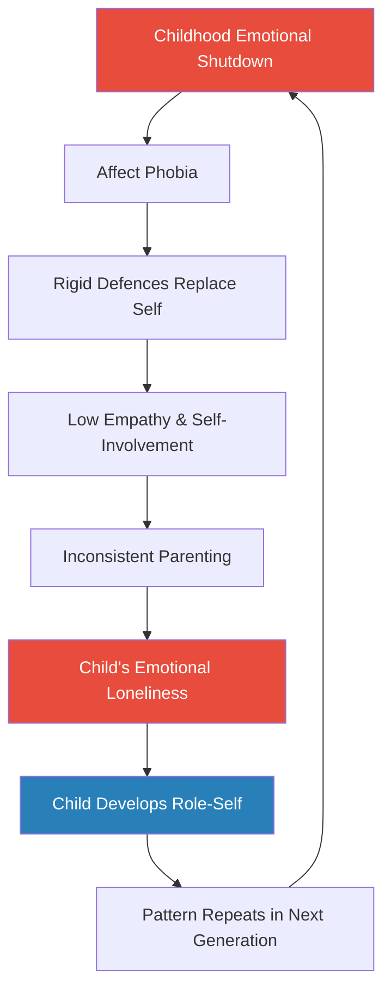
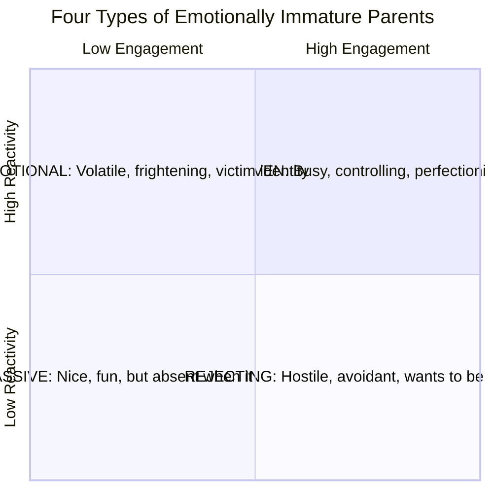
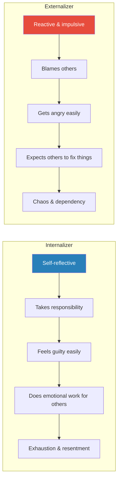
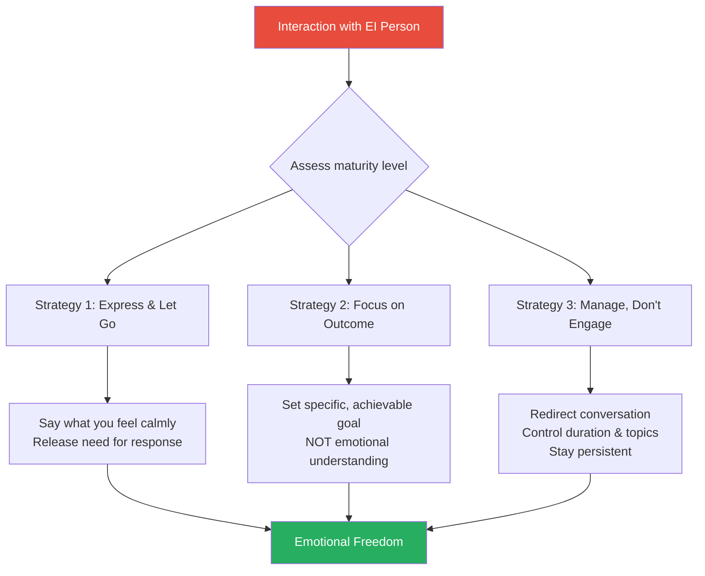
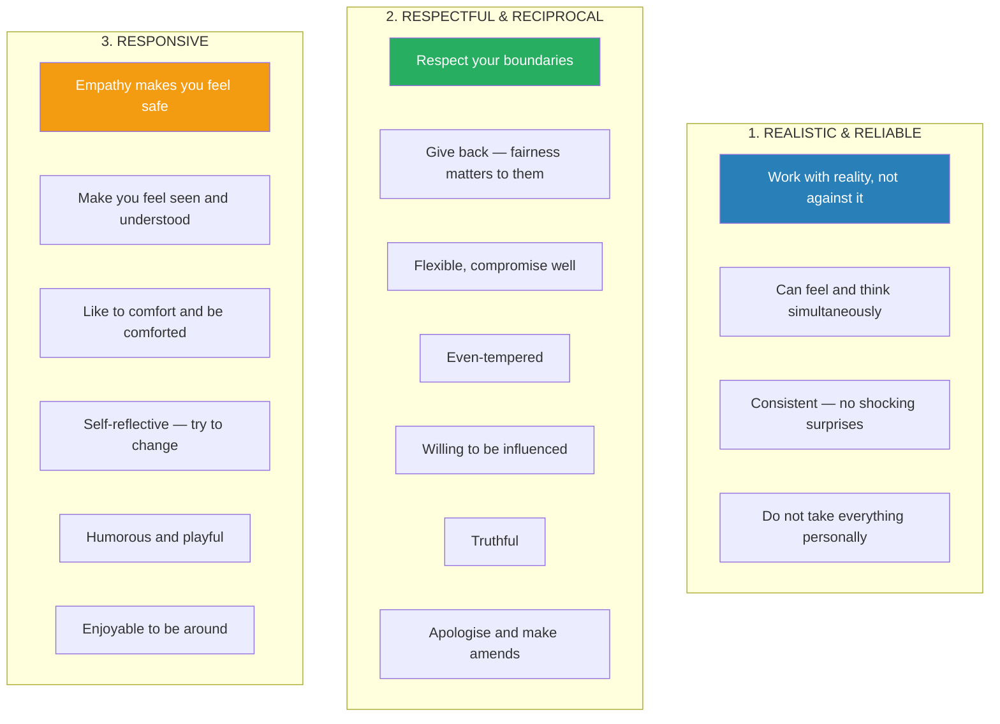

# Adult Children of Emotionally Immature Parents — Lindsay C. Gibson

> Lindsay C. Gibson names the hidden engine behind a lifetime of emotional loneliness: parents who may feed, clothe, and educate their children perfectly — yet remain incapable of true emotional connection.
> She calls these parents *emotionally immature*, and she maps their behaviour with clinical precision across four distinct types: Emotional, Driven, Passive, and Rejecting.
> The children of these parents — especially the sensitive, perceptive ones she calls *internalizers* — grow up feeling unseen, playing exhausting roles, and chasing healing fantasies that never come true.
> Gibson provides a concrete escape route: the *maturity awareness approach*, which replaces desperate hope with clear-eyed observation.
> The book is not about blame. It is about finally understanding why your best efforts at closeness keep failing — and learning to redirect that energy toward people who can actually meet you halfway.
> This is one of the clearest explanations ever written of why good people end up in empty relationships.

---

## About the Author

Dr. Lindsay C. Gibson is a clinical psychologist in private practice in Virginia Beach, Virginia, specialising in individual psychotherapy with adult children of emotionally immature parents. She holds a PsyD and previously served as adjunct assistant professor of graduate psychology at the College of William and Mary and Old Dominion University. She is also the author of *Who You Were Meant to Be* (2000) and writes a monthly well-being column for *Tidewater Women* magazine. The book draws on decades of clinical practice, attachment research (Ainsworth, Bowlby, Bowen), and developmental psychology (Piaget, Dabrowski, Erikson). All case studies are from real clients with identifying details changed. Published by New Harbinger Publications in 2015, the book became a bestselling touchstone for the emotional neglect recovery movement.

---

## The Big Idea

- <b style="color: #2980b9">Emotionally immature parents</b> lack the capacity for genuine emotional intimacy — they may provide excellent physical care while leaving their children fundamentally alone
- The result is <b style="color: #e74c3c">emotional loneliness</b> — a persistent, private emptiness that has nothing to do with being physically alone and everything to do with never being emotionally seen
- Children adapt by developing a <b style="color: #e74c3c">role-self</b> (a false persona designed to secure parental attention) and a <b style="color: #e74c3c">healing fantasy</b> (an unconscious "If only..." story about how love will finally arrive)
- These adaptations trap adults in repetitive patterns: choosing emotionally unavailable partners, over-giving in relationships, and blaming themselves for the resulting emptiness
- <b style="color: #27ae60">Liberation comes not from changing the parent but from understanding emotional immaturity as a real phenomenon</b> — once you see the pattern, it loses its power over you
- The <b style="color: #2980b9">maturity awareness approach</b> offers three practical strategies: express yourself and let go, focus on outcomes not relationships, and manage interactions rather than emotionally engaging
- <b style="color: #27ae60">Your true self has been waiting underneath the role-self all along</b> — reconnecting with it is the path out of emotional loneliness

---

## Key Concepts at a Glance

| Concept | One-line summary |
|---------|-----------------|
| **Emotional Loneliness** | The core wound: feeling unseen despite physical proximity to family |
| **Emotional Immaturity** | A personality pattern of self-involvement, low empathy, and fear of genuine feeling |
| **Four Parent Types** | Emotional (volatile), Driven (perfectionistic), Passive (nice but absent), Rejecting (hostile) |
| **Internalizer** | A child who copes by self-reflecting, taking responsibility, and doing emotional work for others |
| **Externalizer** | A child who copes by blaming externally, acting impulsively, and expecting others to fix things |
| **Role-Self** | A false persona adopted to secure a place in the family system |
| **Healing Fantasy** | An unconscious "If only..." narrative driving adult relationship choices |
| **True Self** | The genuine inner self — source of gut feelings, authentic desires, and real energy |
| **Maturity Awareness Approach** | Observe, express-and-let-go, outcome-focus, manage-don't-engage |
| **Relatedness vs. Relationship** | Staying in neutral contact without expecting emotional reciprocity |
| **Emotional Contagion** | Primitive communication: spreading feelings to others rather than talking about them |
| **Positive Disintegration** | Dabrowski's theory: psychological breakdown as growth signal, not illness |
| **Affect Phobia** | Fear of genuine emotion, leading to rigid defensiveness against intimacy |
| **Emotional Labour** | The unseen effort of attuning to others' needs — what EI parents refuse to do |
| **Detached Observation** | Anthropological stance: narrate what you see to stay in your thinking brain |

---

## 1. The Wound: Emotional Loneliness

*You can live under the same roof as your parents, eat meals together, share holidays — and still be profoundly alone. Emotional loneliness is not about geography; it is about whether anyone truly sees you.*

- <b style="color: #2980b9">Emotional intimacy</b> means having someone you can tell anything to — someone who seeks to *know* you, not judge you
- Emotionally mature parents provide this naturally: they notice moods, welcome feelings, and make children feel it is safe to approach with anything
- <b style="color: #e74c3c">Emotionally immature parents</b> are so self-preoccupied they do not notice their children's inner experiences — they discount feelings, fear intimacy, and become nervous or angry when children get upset
- The child has no concept of "emotional intimacy" — they only have a gut feeling of emptiness, which is how children experience loneliness
- This emptiness follows them into adulthood, haunting even outwardly successful lives

> [!example] David's Floating Ocean
> - David described his childhood loneliness as "floating in the ocean with no one around me"
> - His family lived parallel lives with no points of emotional contact
> - He had no way of knowing most people didn't feel that way — emptiness was just "daily life"
> - The image perfectly captures what emotional loneliness feels like: technically alive, surrounded by space, but completely alone

- <b style="color: #27ae60">Emotional loneliness is not a personal deficiency — it is the predictable result of growing up without sufficient empathy from others</b>
- The pain is actually a healthy signal: it tells you that you are in dire need of emotional contact
- Children cope by putting other people's needs first as the "price of admission" to relationships
- Many emotionally deprived children rush into adulthood — getting jobs, marrying early, joining the service — because childhood offers no belonging

### Why the Past Repeats Itself

- The most primitive parts of the brain equate familiarity with safety (Bowlby 1979)
- Children who deny the painful truth about their parents cannot recognise similarly hurtful people later
- <b style="color: #e74c3c">Denial makes us repeat the same situation because we never see it coming the next time</b>

> [!example] Sophie's Fake Proposal
> - Sophie dated Jerry for five years, wanting marriage and a family
> - One night at a romantic restaurant, Jerry handed her a jewellery box — but inside was only a slip of paper with a question mark and the joke: "Now you can tell your friends I popped 'the question'!"
> - Sophie was devastated; her mother sided with Jerry, calling it funny
> - In therapy, Sophie realised Jerry and her mother shared the same emotional insensitivity — she had re-entered her childhood loneliness without knowing it

- People who function well often feel guilty for being unhappy — they list blessings like an addition problem, as if a positive sum means nothing can be wrong
- <b style="color: #27ae60">Making an emotional connection ought to be the easy part — it should not require constant, unrewarding work</b>
- Emotional connection is a basic human need regardless of gender — men feel it too, though culture teaches them to hide it
- Throughout human evolution, proximity to the group meant survival — your longing for deep connection has prehistoric roots

### Guilt for Being Unhappy

- People who function well often feel guilty for complaining — they list blessings like an addition problem
- They blame themselves for not having the "right" feelings
- <b style="color: #e74c3c">They can't shake the sense of being fundamentally alone despite having everything society says should make them happy</b>
- Some are ready to leave their partner; others are having affairs; others avoid romantic relationships entirely; still others stay for the children and seek therapy for the resentment
- Few walk into therapy with the thought that their lack of satisfying intimacy started in childhood — they are mystified at how they ended up in a life that does not make them happy

> [!example] Jake Performs Happiness
> - Jake had recently married Kayla, a genuinely loving woman — yet he felt deeply down
> - "I should be happy. I'm the luckiest guy in the world. But I feel like I'm *acting*, forcing myself to be more upbeat than I really am."
> - He believed he had to be "super happy" at all times or Kayla would be "devastated and furious"
> - In reality, this fear came from his angry mother, who blew up if people did not perform the role she assigned them
> - When Jake finally opened up, Kayla completely accepted him — he was astounded
> - "I can't believe how much I hated her," he said about his mother — hate is a normal reaction when someone tries to extinguish your emotional life force

### Not Trusting Your Instincts

- EI parents do not validate their child's feelings and instincts — the child learns to give in to what others seem sure about
- As adults they may deny their instincts to the point of acquiescing to relationships they do not want
- <b style="color: #27ae60">If both partners fit each other and are positive and supportive, relationships are primarily pleasurable, not arduous</b>
- "When people say 'You can't have everything,' they're really saying they don't have what they need"

> [!example] Meaghan's Silenced Instincts
> - Meaghan broke up with her boyfriend twice before getting pregnant in her first year of college
> - Her parents adored the boyfriend and pushed her to marry — she gave in
> - Years later with three children in college, she was ready to leave but confused and guilty
> - Her husband and parents countered every emotional complaint with logical arguments about why she was wrong
> - She finally realised: "I want to matter the most to someone. I want someone to want to be with me." Then she looked confused: "Is that too much to ask? I really don't know."
> - Since childhood, Meaghan had been trained to think her natural desire to feel special was selfish

### The Effects of Parental Rejection

- Children whose parents reject them grow up expecting the same from everyone
- They lack confidence that anyone could be interested in them
- They stifle themselves and promote more loneliness by expecting rejection to repeat

> [!example] Natalie's Nightmares Despite Success
> - Natalie, fifty, was an award-winning business consultant with a good marriage, successful children, and close friendships
> - But she had recurring nightmares: desperate situations with no way out, all alone, responsible for other people who gave her no help
> - "There is no comfort to be found. I have no protection and I'm not safe."
> - Despite creating a fulfilling adult life, inside she remained the emotionally lonely child
> - She still cared for her elderly mother, who lived with her family and still complained that Natalie had never loved her enough
> - Not until she was nearly fifty did she begin to understand how her relationship with her mother fuelled those nightmares

---

## 2. Recognising Emotional Immaturity

*Emotional immaturity is not a bad day. It is a personality pattern — automatic, unconscious, and repeated without self-reflection or remorse.*

- <b style="color: #2980b9">Emotional maturity</b> means thinking objectively while sustaining deep emotional connections — functioning independently while having deep attachments (Bowen, Kohut, Erikson, Goleman, Vaillant)
- Emotionally mature people are comfortable with their own feelings, empathic, self-reflective, able to control impulses, and treasure their closest relationships
- <b style="color: #e74c3c">Emotionally immature people</b> share an interconnected set of traits:

| Trait | How It Manifests |
|-------|-----------------|
| **Rigid and single-minded** | Closed minds; one right answer; defensive when challenged |
| **Low stress tolerance** | Reactive, stereotyped responses; deny, distort, or replace reality |
| **Do what feels best** | Decisions based on momentary comfort, not consequences |
| **Subjective, not objective** | How they feel trumps what is actually happening |
| **Little respect for differences** | Annoyed by other viewpoints; comfortable only in role-defined relationships |
| **Egocentric** | Self-preoccupied from insecurity, not innocence; perpetual anxiety about adequacy |
| **Self-referential, not self-reflective** | All roads lead back to them, but without any insight gained |
| **Centre of attention** | Dominate group time and energy; not extroverted — extroverts welcome participation |
| **Promote role reversal** | Expect children to be confidants, admirers, emotional caretakers |
| **Low empathy** | Can read people but do not *resonate* with their feelings — you feel sized up, not felt for |

> [!example] Frieda's Porch Swing
> - Frieda's father Martin beat his children with a belt and demanded unconditional admiration
> - After Frieda moved out, Martin built an enormous porch swing — without asking — and had it delivered to her small deck, taking up all her outdoor space
> - He was proud of himself "like a kid who had just presented his mother with an art project"
> - The swing was a perfect metaphor: Martin took up all the space in the family, physically and emotionally
> - Only after understanding role reversal did Frieda feel free to remove it

### Why So Many Parents Are Emotionally Immature

- Old-school parenting focused on obedience, not emotional security — "spare the rod and spoil the child"
- Many EI parents grew up in homes where they were punished for expressing feelings
- Their personalities are like <b style="color: #2980b9">stunted bonsai trees</b> — trained to grow in unnatural shapes by family pressure
- They developed strong defences that took the place of the self — scar tissue that is enduring once formed
- <b style="color: #e74c3c">Whether they can change depends entirely on their willingness to self-reflect — without self-reflection, there is no impetus for change</b>

### Deeper Traits

- **Inconsistent and contradictory** — personalities formed in isolated clumps, like puzzle pieces that do not fit together
- This creates <b style="color: #2980b9">intermittent reinforcement</b> — the most addictive reward schedule — binding children to their parent through unpredictable moments of connection
- **Fear genuine feelings** — "affect phobia" (McCullough) causes rigid defence against emotional intimacy
- **Focus on physical, not emotional** — excellent during illness, absent during sadness
- **Intense but shallow emotions** — dramatic but not deep, like a stone skipping the surface
- **Cannot hold mixed emotions** — black-and-white thinking rules out ambivalence and nuance

*The radar profile shows the stark gap between mature and immature parents — emotionally immature parents score lowest on self-reflection and emotional depth, the very traits needed to break the cycle.*

*The intergenerational cycle of emotional immaturity: each generation's shutdown creates the next generation's loneliness, which produces the next generation's defences.*

---

## 3. What It Feels Like: The Relationship Experience

*Being raised by an emotionally immature parent feels both lonely and exasperating. You keep turning to them for care because your deepest instincts demand it — and they keep failing to show up.*

*Emotional loneliness dominates the damage landscape — it is the wound from which all other impacts flow, accounting for nearly a third of the total burden on children of emotionally immature parents.*

### Communication Is Impossible

- Communication with EI people is one-sided — they crave exclusive attention and want everyone interested in what *they* find engaging
- If others get attention, they interrupt, fire off zingers, change the subject, or pointedly withdraw
- <b style="color: #e74c3c">Your parent may think you are close — but for you it is not a satisfying relationship</b>

### They Provoke Anger

- Bowlby documented that anger is a normal response to emotional abandonment — it gives energy to protest and change unhealthy situations
- Feeling dismissed or unseen creates an emotional separation — it is as if your parent repeatedly walked out on you
- <b style="color: #27ae60">You were not overreacting — you were having a normal biological response to emotional injury</b>
- When anger is internalized, people criticise and blame themselves unrealistically — sometimes becoming severely depressed or even suicidal

### They Communicate by Emotional Contagion

- EI adults communicate like babies: they cry and fuss until someone figures out what is wrong and fixes it
- When distressed, they upset everyone around them — the child catches the contagion and feels responsible for making the parent feel better
- Nothing gets resolved because the parent is not trying to understand their own feelings

### They Refuse Emotional Work

- <b style="color: #2980b9">Emotional labour</b> (Harriet Fraad) is the expenditure of time, effort, and energy to understand and fulfil emotional needs — making people feel wanted, appreciated, loved, and cared for
- Emotionally mature people do this work automatically because they live in a state of empathy
- EI people take pride in their *lack* of this skill — "I'm just saying what I think" or "I can't change who I am"

### They Demand Mirroring But Won't Give It

- Mature parents spontaneously mirror their children's emotions — looking concerned when the child is sad, enthusiastic when the child is happy
- EI parents reverse this: they expect their *children* to mirror *them*
- Their fragile self-esteem rides on things going their way every time

> [!example] Cynthia's Mother Disowns Her
> - When Cynthia decided to travel as a young adult, her mother Stella exploded: "You're disowned!"
> - Stella cut off all contact for months — not even calling on Cynthia's birthday
> - When Cynthia planned a trip to Canada, Stella cut off her college funds, saying "Life isn't about having fun!"
> - Stella could only feel safe if Cynthia mirrored her own narrow life
> - Cynthia put herself through college and became a flight attendant — but always feared people would punish her for daring to be different

### Roles as Sacred

- EI parents need role compliance — roles simplify life and make decisions clear-cut
- **Role entitlement:** demanding certain treatment simply because of their parental role — Mardi's parents moved nearby and walked into her house without knocking, claiming their right as parents
- **Role coercion:** forcing children into roles through silence, threats, or shaming — Jillian's mother insisted she return to her physically abusive husband because divorce was a sin

### Enmeshment vs. Emotional Intimacy

| Emotional Intimacy | Enmeshment |
|-------------------|------------|
| Two fully articulated selves | Two incomplete selves seeking completion |
| Cherish differences | Demand sameness |
| Invigorating and growth-promoting | Anxiety-driven and restricting |
| Built on mutual acceptance | Built on predictable role-playing |
| Open communication | No true communication |

- EI parents play favourites — the preferred sibling usually has a maturity level similar to the parent's
- <b style="color: #27ae60">Not getting attention can actually pay off long-term</b> — self-sufficient children who are not enmeshed often achieve higher self-development than their parents
- But the pain of being left out is real, especially for sensitive children

### The Time Problem

- EI people have a fragmented sense of time — when emotional, moments exist in an eternal *now*
- They do not use the past for guidance or anticipate the future
- <b style="color: #e74c3c">This explains their inconsistency, their broken promises, and their bafflement when you bring up past behaviour</b> — "Why can't you just forgive and move on?"
- Self-reflection requires a sense of time's continuity — without it, accountability is impossible

---

## 4. The Four Types of Emotionally Immature Parents

*There is basically one way to provide nurturing love, but many ways to frustrate a child's need for it. All four types share the same underlying immaturity — but each has a distinctive style of falling short.*

*All four types share egocentricity, low empathy, and fear of genuine emotion — but they express it through different behavioural signatures.*

### The Emotional Parent

- The most infantile of the four types — gives the impression of needing to be watched over
- Everyone in the family walks on eggshells; their emotional instability is the most predictable thing about them
- At the severe end: psychosis, bipolar, borderline or narcissistic personality disorder, suicide threats
- <b style="color: #e74c3c">Governed by emotion: black-and-white terms, keeping score, holding grudges, controlling with emotional tactics</b>
- Children learn to subjugate themselves to other people's wishes — they become overly attentive to others' moods, often to their own detriment

> [!example] Brittany's Locked Screen Door
> - Despite Brittany being in her forties, her mother Shonda called five times in one day when Brittany was sick
> - Shonda stopped by uninvited; Brittany latched the screen door to keep her out
> - Shonda said: "When you locked me out, I was so angry I wanted to break your door down!"
> - Shonda's primary concern was her own anxiety, not what Brittany needed

### The Driven Parent

- Looks most normal — even appears exceptionally invested in their children
- Their egocentrism hides behind relentless productivity and concern for "what's best" for you
- <b style="color: #e74c3c">They make their children feel constantly evaluated</b> — nothing you do is quite enough
- Their excessive oversight sours children on seeking adult help for anything
- Paradoxically, very involved parents often produce unmotivated or depressive children — they have killed the child's initiative by always pushing harder

> [!tip] The Driven Parent's Hidden Message
> The driven parent's constant interference sends one message: **you are not trusted to manage your own life**. Their "help" is control in disguise, and it teaches children that their own instincts are unreliable.

### The Passive Parent

- Not angry or pushy — more emotionally available, but only up to a point
- Often the favourite parent: playful, warm, fun to be with
- <b style="color: #e74c3c">But they turn a blind eye to abuse, neglect, and harm</b> — they cope by minimising problems and acquiescing to the dominant partner
- Can create emotional incest: using the child as an admiring, attentive companion
- Children wisely know not to expect protection — one mother later described her husband's violent attacks on their children as "Daddy could be tough sometimes"

> [!example] Molly's Father in the Kitchen
> - Molly's mother was physically abusive; her father was the single bright spot in her life
> - Once, while her mother was beating Molly in the den, she heard her father banging pots in the kitchen
> - Molly interpreted this as his way of letting her know he was still there for her
> - She had no expectation that he should step in and stop the abuse
> - On a family trip, when Molly's sister and friends cruelly imitated her stutter, her father laughed it off
> - Emotionally deprived children put a positive spin on their favourite parent's behaviour no matter what

### The Rejecting Parent

- Seems to have a wall around them — happiest when left alone
- Their children get the feeling the parent would be fine if they did not exist
- Least empathic of all four types — uses avoidance of eye contact, blank looks, or hostile stares
- <b style="color: #e74c3c">With a rejecting parent, it is easy to feel apologetic for existing</b>
- Children learn to give up easily rather than keep asking — with devastating effects on their ability to advocate for themselves as adults
- A well-known example: the aloof and scary father — everything revolves around him, and the family instinctively tries not to upset him
- But mothers can be rejecting too

> [!example] Beth's Mother Redirects Her
> - Every time Beth visited, her mother Rosa resisted hugs and immediately criticised Beth's appearance
> - Rosa urged Beth to call a relative as soon as she walked in — as if redirecting her elsewhere
> - If Beth suggested spending time together, Rosa acted irritated and called Beth "too dependent"
> - On the phone, Rosa quickly found excuses to hang up — often handing the phone to Beth's father
> - The rejecting parent's message is unmistakable: your presence is a burden

| Type | Core Fear | Child Learns To... | Adult Pattern |
|------|-----------|-------------------|---------------|
| **Emotional** | Loss of control | Walk on eggshells, soothe parent | Over-attentive to others' moods |
| **Driven** | Not being good enough | Perform, achieve, comply | Perfectionism, fear of initiative |
| **Passive** | Conflict and confrontation | Expect no protection | Make excuses for abandoning behaviour |
| **Rejecting** | Emotional contact itself | Apologise for existing | Give up before asking |

*The heatmap reveals that rejecting parents inflict the deepest emotional loneliness and fear of intimacy, while driven parents produce the highest levels of perfectionism and self-blame — each type leaves a distinct wound signature.*

---

## 5. How Children Adapt: Internalizers and Externalizers

*Children of emotionally immature parents cope in one of two fundamental ways — and understanding which style you adopted is the key to understanding your adult patterns.*

### Healing Fantasies

- Every emotionally deprived child develops a <b style="color: #2980b9">healing fantasy</b> — a hopeful story that begins with "If only..."
- *If only I were selfless enough... If only I found the right partner... If only I became famous...*
- The fantasy gives a child optimism to survive a painful upbringing — but it is a child's solution from a child's mind
- <b style="color: #e74c3c">As adults, we secretly expect our closest relationships to make this fantasy come true</b> — we put people through little tests of love without knowing it
- Successful marital therapy often involves exposing how healing fantasies force partners into impossible roles

### The Role-Self

- When parents do not respond to your true self, you develop a <b style="color: #2980b9">role-self</b> — a persona that gives you a secure place in the family system
- "I'll become so self-sacrificing that others will praise me" or "I'll make them pay attention to me one way or another"
- The role-self steals energy from the true self — playing a role is exhausting because it takes enormous effort to be something you are not
- <b style="color: #27ae60">You cannot forge a deep relationship from the position of a role-self — you have to express enough of your true self to give the other person something real to relate to</b>

### The Two Coping Styles

*Two paths from the same wound: internalizers swallow the pain and work harder; externalizers push the pain outward and demand rescue.*

| Dimension | Internalizer | Externalizer |
|-----------|-------------|--------------|
| **Core belief** | "I can fix this if I try harder" | "Someone else needs to fix this" |
| **Response to problems** | Self-reflection, taking responsibility | Blame, denial, escape |
| **Emotional style** | Hold feelings in; feel deeply | Act feelings out; react quickly |
| **Relationship pattern** | Over-give, then resent | Over-demand, then alienate |
| **Main anxiety** | Guilt, fear of being an impostor | Fear of losing external support |
| **Biggest risk** | Self-neglect, depression | Substance abuse, broken relationships |
| **Psychological interest** | Fascinated by inner world | Little interest in self-examination |

*Internalizers and externalizers are near-perfect mirror images — where one scores high the other scores low, explaining why they so often end up in relationships together, each filling the other's gap.*

- Most readers of this book — and most therapy clients — are <b style="color: #2980b9">internalizers</b>
- Most emotionally immature parents are <b style="color: #e74c3c">externalizers</b>
- Under extreme stress, styles can flip: internalizers may have affairs or abuse substances; externalizers may hit rock bottom and begin self-reflecting
- <b style="color: #27ae60">The ideal is to balance both approaches</b> — internalizers learning to seek external help, externalizers learning to look within

---

## 6. The Internalizer's World

*If you are reading this book, you are almost certainly an internalizer — someone whose entire personality longs for emotional spontaneity and intimacy, and who cannot be satisfied with less.*

### Wired for Sensitivity

- Internalizers may have an exceptionally alert nervous system from birth — research shows differences in attunement visible as early as five months old (Conradt, Measelle, and Ablow 2013)
- Neuroscientist Stephen Porges (2011) demonstrated that mammals evolved a unique coping instinct: they are calmed by engagement with others, reducing stress hormones through proximity, touch, soothing sounds, and eye contact
- <b style="color: #27ae60">Your instinctive desire for emotional engagement is a positive thing — not a sign that you are too needy or dependent</b>
- Only emotionally phobic, emotionally immature people believe that wanting empathy is a sign of weakness

### The Internalizer's Traps

- **Apologetic about needing help** — feel embarrassed and undeserving; some bring their own tissues to therapy because they do not want to "use up" the therapist's
- **Invisible and easy to neglect** — appear to need less attention, making them low-maintenance children easy to overlook; "getting by on vapors"
- **Overly independent** — premature independence feels like a virtue, but it was a necessity, not a choice
- **Do not recognise abuse** — if parents do not label their behaviour as abusive, neither will the child; one man described his father choking him until he wet himself as his father "might have had a temper"
- <b style="color: #e74c3c">Do most of the emotional work in relationships</b> — act as if there is reciprocity when there is not; see people as nicer than they really are

> [!example] Logan: On Fire but Unnoticed
> - Logan, a forty-one-year-old musician, entered therapy with the intensity of a storm
> - Her family emphasised togetherness and loyalty — but no one engaged with her emotionally
> - "I get so tired of their unresponsiveness. I can't get them to listen to me or even see me for who I am."
> - Underneath the anger: "I was raised to be a good little girl, but I didn't do that very well. I could be on fire and they wouldn't notice."
> - Despite professional success, her lack of emotional closeness left her feeling empty inside
> - She tried to compensate by making everyone else smile — convinced she would only be valued for what she could do, not who she was

- <b style="color: #e74c3c">Internalizers attract needy people</b> — they exude kindliness and wisdom that is powerfully magnetic to those who want to lean on someone
- They secretly believe that neglecting themselves proves they are good people — religious and cultural norms reinforce this
- <b style="color: #27ae60">No child can be good enough to evoke love from a highly self-involved parent — unconditional love cannot be bought with conditional behaviour</b>

### The Internalizer's Relationship Pattern

- Internalizers "play both parts" in relationships — they act as if there is reciprocity when there is none
- They thank people for being patient when *they* are the ones being inconvenienced
- They repeatedly reach out to self-centred people with a thoughtfulness they never receive back
- One man believed: "I thought I could somehow be so wonderful that she would feel something for me that doesn't come to her naturally"
- One woman: "My problem is that I always try to be nice and accommodating. If I think about what I want, I worry that others will think I'm uncaring"
- Another realised only after divorce: "I told myself, *We are both trying to make this work*. I thought maybe I wasn't a good enough wife. I figured everyone struggles."
- <b style="color: #e74c3c">Needy externalizers pursue warm internalizers, make them feel special to secure the relationship, then stop reciprocating</b> — the internalizer is surprised and blames themselves

### Getting By on Vapors

- Internalizers have excellent emotional memory — they store up whatever they do get, helping them go a long time between moments of attention
- One client called it "getting by on vapors" — "Social connection is like a trace mineral. You don't need a lot, but you can get sick if you don't have *any*"
- When someone finally shows gratitude, internalizers are nearly bowled over — an almost over-the-top reaction to even the smallest recognition
- This is one of the hallmarks of an internalizer: disproportionate gratitude for normal kindness

### Childhood Neglect Hiding in Plain Sight

- Emotional deprivation is often silent and invisible — children feel the emptiness but do not know what to call it
- Memories often involve feeling alone and unprotected: a four-year-old left alone on a beach for over an hour; a young child staying away from the pool edge because she was sure her mother was not watching
- Self-sufficient internalising children are characterised as "old souls" — their parents count on them to do the right thing
- They willingly oblige, playing a role that is overly self-reliant

> [!example] Sandra's Overnight Bus Ride
> - At eleven, Sandra and her seven-year-old brother were sent to another state for the summer
> - Their mother put them on a bus for a five-hundred-mile overnight journey with a bus change in the middle of the night
> - Sandra felt lost and afraid but knew it was up to her to protect her little brother
> - "My brother was really scared and cried a lot. I was stoic. I knew it was up to me to make the best of it."
> - Situations that might make another child panic send internalizers into an intensely focused state

> [!example] Bethany Sent to Brazil at Ten
> - Bethany was sent to Brazil as a ten-year-old to babysit for her irresponsible older brother's infant son
> - The brother and his wife liked to party while ten-year-old Bethany took care of the baby
> - Her mother had Bethany miss school to keep helping — then eventually retrieved her
> - A classic example of the emotionally immature parent blind to the fact that the capable internalizer is still a child

---

## 7. Breaking Down and Awakening

*Your true self will not stay silent forever. When the role-self becomes unsustainable, symptoms appear — not as illness, but as the body's demand that you start living authentically.*

### The True Self

- The true self is an accurate, self-informing neurological feedback system — the source of gut feelings, intuition, and immediate impressions of others
- When you are in accord with your true self, you see things clearly, feel flow, and become focused on solutions
- <b style="color: #2980b9">It has no interest in your healing fantasy or role-self</b> — it only wants to be genuine with other people and sincere in its own pursuits

### Positive Disintegration

- Developmental psychologist Piaget observed that old mental patterns must break up to accommodate new knowledge
- Polish psychiatrist Kazimierz Dabrowski (1972) theorised that emotional distress is potentially a sign of growth: <b style="color: #2980b9">"positive disintegration"</b>
- People with high developmental potential use periods of distress as opportunities to learn about themselves
- <b style="color: #27ae60">Negative emotions are the driving force behind much psychological development — the discomfort motivates solutions</b>

### Waking Up Through Relationship Breakdowns

- Intimate adult relationships are so emotionally arousing they activate unresolved childhood issues
- We project parental issues onto partners — then become *more* angry because they remind us of the past in addition to whatever is happening in the present

> [!example] Mike's Happy Ruin
> - Mike had hit rock bottom: cutbacks at work, a divorce that left him nearly penniless
> - His life had been entirely about being a success in others' eyes — especially his wife and mother
> - "I didn't make decisions based on how I felt; I made decisions based on what other people wanted. I've been doing this for thirty-five years and I have nothing to show for it."
> - Despite material losses: "But I'm telling you, I'm *happy*."
> - He could finally drop the healing fantasy that he would be loved if he took care of everybody else at his own expense
> - "How to define a successful person? I guess, first of all, you get rid of 'success' — and then you see who you are as a person."

### Working Through Childhood Issues

- Research suggests that what has happened to you matters less than whether you have processed what happened
- Parents who created secure attachment for their children were characterised by willingness to recall and talk about their own childhoods (Main, Kaplan, and Cassidy 1985)
- Even parents who had lived through very difficult experiences raised securely attached children — because they had integrated their past
- <b style="color: #27ae60">An examined, processed past creates a secure present — not a perfect childhood, but a conscious one</b>

### What Waking Up Looks Like

**Waking up to hidden feelings:**
> - Tilde's mother Kajsa had sacrificed everything as a single immigrant mother — the family story demanded total devotion
> - As Tilde neared the end of her studies, Kajsa became increasingly petulant and bitter in phone calls
> - Tilde felt crushing guilt for not making her mother happy
> - When asked how it felt *in her body* to hear Kajsa's voice, Tilde looked stunned: "I don't like her," she whispered
> - This was her emotional truth — at war with her healing fantasy of giving Kajsa enough love to compensate for her disappointing life
> - Tilde's depression lifted as soon as she accepted her genuine feelings

**Waking up to anger:**

- Anger is the emotion EI parents most often punish — because anger is an expression of individuality
- <b style="color: #27ae60">It is often a good sign when overly responsible, anxious, or depressed people begin to feel consciously angry — it means their true self is coming forward</b>
- Jade had tried to heal her family by being extremely loving — "I thought if you were nice to people, at the end of the day things would get fixed"
- After accepting her anger: "Now I think there would be something wrong with me if I *weren't* angry!"

**Waking up to self-care:**

- Lena was driven by an internal voice that said her efforts were never adequate — even pleasurable activities became marathons
- She overdid an exercise class so badly she could not lift her legs the next morning — yet had not noticed she was in pain during the class
- Her childhood healing fantasy: "One day I will try so hard that my mother will be transformed from a taskmaster into an appreciative parent"
- <b style="color: #e74c3c">Cultural maxims like "Always do your best" and "Never give up" are mind poison for overly motivated internalizers</b>

**Waking up from idealising others:**

- Patsy recoiled when told she was the most mature person in her family — "I don't like to think that!"
- Her humility was not virtue — it was denial of a glaring reality
- <b style="color: #27ae60">Once she accepted her own maturity, she stopped attributing positive qualities to people who did not have them</b>

> [!tip] The Research on Processed Pasts
> Main, Kaplan, and Cassidy (1985) found that parents who created secure attachment for their children were characterised by a *willingness to recall and talk about their own childhoods* — even difficult ones. What happened to you matters less than whether you have processed what happened. An examined past creates a secure present.

---

## 8. The Maturity Awareness Approach

*You cannot win your parent over, but you can save yourself. The maturity awareness approach replaces desperate hope with clear-eyed observation — and gives you a practical way to interact without getting destroyed.*

### Drop the Fantasy That Your Parent Will Change

- A common fantasy: "If I learn the right communication skills, I can finally reach them"
- Annie wrote an emotionally articulate letter to her mother Betty after a public humiliation — Betty offered no response at all
- <b style="color: #e74c3c">Emotional closeness demands a level of emotional maturity the parent simply does not have</b>
- Annie needed to find a way forward that did not involve her mother's participation

### Three Key Strategies

*The maturity awareness approach: three paths that all lead to the same destination — your emotional freedom.*

**1. Express and Then Let Go**
- Tell the other person what you want to say in a calm, nonjudgmental way
- Enjoy the act of self-expression — this is "clear, intimate communication"
- <b style="color: #27ae60">Release any need for the other person to hear you or change</b> — the point is to feel good about yourself for speaking your truth

**2. Focus on Outcome, Not Relationship**
- Ask yourself: what specifically am I trying to get from this interaction?
- If your goal involves empathy or a change of heart — stop and choose a different goal
- Examples: "I tell my parents I'm not coming home for Christmas" / "I ask my father to talk nicely to my children"
- <b style="color: #e74c3c">As soon as you focus on the relationship and try to improve it at an emotional level, the interaction will deteriorate</b>

**3. Manage, Not Engage**
- Set a goal of managing the interaction — including its duration and topics
- Be polite but persistent — EI people do not have a good strategy for countering persistence
- Manage your own emotions by silently narrating what you observe

### Relatedness vs. Relationship

- <b style="color: #2980b9">Relatedness</b>: communication without the goal of a satisfying emotional exchange — stay in contact, handle what you need to, respect your own limits
- <b style="color: #2980b9">Relationship</b>: openness and emotional reciprocity — save this for people who can reciprocate
- Trying to have a *relationship* with an EI person will leave you frustrated and invalidated

### Detached Observation

- Settle yourself into an observational, detached frame of mind — as if conducting an anthropological field study
- Mentally describe what the other person is doing in specific words — this redirects your brain from emotional centres to logical ones
- If you start slipping into your healing fantasy, silently repeat: "Detach, detach, detach"
- <b style="color: #27ae60">Your clear mind and observational attitude will keep you strong no matter what the other person does</b>
- If the other person is still getting to you, find an excuse to put distance between you — bathroom break, walk, errands, play with a pet
- On the phone, find a pretext to end the call: "I look forward to talking another time"

### Common Concerns About This Approach

People often resist the maturity awareness approach. Gibson addresses the most common objections:

| Concern | Response |
|---------|----------|
| "This sounds cold and unrewarding" | Only use it when you are getting emotional — if things are going well, just enjoy |
| "I feel guilty keeping mental distance" | Having clear self-awareness is not being disloyal — you are thinking as an individual |
| "My parents are too intense and manipulative" | It is *their* distress, not yours — even a bit of observation lifts you out of the pressure |
| "They paid for my education — I'd be disrespectful" | Physical/financial support is not the same as meeting emotional needs; you can be grateful and still see clearly |
| "How do I stay calm when they guilt-trip me?" | Centre on your breath; feeling guilty is not an emergency; silently narrate what is happening |
| "It all goes out the window when they criticise me" | This is not the Super Bowl — there is no pressure because you are no longer struggling to *gain* anything |
| "I worry about them constantly" | Have you noticed that no matter what you do, they do not stay happy? Their healing story may *require* suffering |

### The Rochelle Shift

- Rochelle's demanding mother expected her to be at her beck and call
- "I used to feel like I couldn't be okay unless my mother changed and acknowledged me"
- After adopting detached observation: "For the first time, I saw her behaviour for what it was. I didn't get angry or disappointed"
- She now calls her mother when she *feels* like it and feels free to say no
- <b style="color: #27ae60">Without the obligation to play the "good daughter," Rochelle is actually more relaxed around her mother</b>

### Keeping a Grip on Your Own Mind

- The ultimate goal: retain your individual point of view and be immune to the other person's emotional contagion
- Focus on your specific desired outcome — this keeps you in your thinking brain
- <b style="color: #2980b9">You are no longer the upset, helpless child devastated by potshots from your parent — you are an observing adult with choices</b>

> [!example] Annie's Managed Soccer Game
> - After months of her mother Betty's silent treatment, Annie tried the maturity awareness approach
> - She invited her parents to a soccer game — about as long as she thought she could stay in control
> - Her desired outcome: a visit with no drama, simply re-establishing contact
> - Annie gave Betty a little hug and offered her a snack — but stayed in neutral observing mode
> - Betty looked emotional but barely spoke; Annie "didn't acknowledge it or feed it"
> - Afterward: "I'm finally figuring out that this is who my mother is — this is her personality. It's not about me."
> - On Betty's birthday, Annie called and left messages but did not invite her over
> - When Betty answered coldly, Annie said: "We'll have to catch up sometime, Mom. Why don't you call me?"
> - Annie was no longer obsessed with her mother's rejection — she had related as a fellow adult, not as a desperate child

> [!warning] Caution About New Openness
> If your parents show uncharacteristic openness after you adopt this approach, be careful. Your inner child will hope they are finally going to change. But if you become more emotionally open, they will likely pull back because you no longer feel *safe* to them. They are available to you in inverse proportion to how much you need them. Only your adult, objective mind feels safe to them.

---

## 9. Living Free of Roles and Fantasies

*Freedom does not come from confrontation — it comes from within. You do not need your parent's participation to reclaim your life.*

### Family Patterns Holding You Back

- <b style="color: #e74c3c">Individuality is seen as a threat</b> to emotionally insecure parents — if you think independently, you might criticise them or leave
- They feel much safer seeing family members as predictable fantasy characters rather than real individuals
- Internalising children learn to suppress any authentic thoughts, feelings, or desires that would disturb their parents' sense of security

**What EI parents teach internalising children to feel ashamed of:**
- Enthusiasm and spontaneity
- Sadness and grief over hurt or loss
- Uninhibited affection
- Saying what they really feel
- Expressing anger when wronged

**What they teach children is acceptable:**
- Obedience and deference toward authority
- Uncertainty and self-doubt
- Guilt over imperfections or being different
- Willingness to listen to the parent's distress endlessly
- Stereotyped gender roles — people-pleasing in girls, toughness in boys

**The four self-defeating lessons:**
1. Give first consideration to what other people want you to do
2. Do not speak up for yourself
3. Do not ask for help
4. Do not want anything for yourself

- Carolyn's realisation: "My family role was a fiction. I've realised I'm not a bit character in someone else's novel — I can step off the page. I no longer want to be in that book."

### Silencing the Internalised Parental Voice

- As children, we absorb parental opinions as an inner voice — "You should...", "You'd better...", or unkind comments about your worth
- <b style="color: #e74c3c">Although this commentary sounds like your own voice, it is an echo of your early caretakers</b>
- The voice operates from the left brain's logic of right and wrong — machinelike equations of perfect or broken, with no compassion
- You can use the maturity awareness approach on your own inner critic — observe it as imported, not part of your true self

> [!example] Jason's Inner Critic
> - Jason, a successful professor and artist, had internalised his arrogant father's voice — it criticised every choice and undermined every success
> - He could never tell if he *really* wanted to do something or just thought he wanted to because the voice said he should
> - Once he recognised the voice as his parents' disembodied disapproval, he stopped believing it
> - He started asking himself: "Are my needs part of this picture? Am I the biggest part of the picture?"
> - He learned to ask what he wanted *first*, making choices on his own behalf and beating the inner voice to the punch

### The Freedoms You Can Claim

**Freedom to be imperfect:**
- You do not need to be "correct" enough to earn approval — your goodness is not determined by accomplishment
- Having a thought or feeling is not initially under your control — nature is not going to be dishonest about how you feel

**Freedom to suspend contact:**
- Just because someone is your biological parent does not mean you must maintain a relationship
- <b style="color: #27ae60">True freedom from unhealthy patterns starts within — you do not need an active relationship to emotionally separate</b>

> [!example] Aisha's Liberation
> - Aisha's mother Ella doted on Aisha's brother but mocked Aisha in front of boyfriends and colleagues
> - Ella feigned innocence when confronted and used Aisha's tears as proof she was "a bad child"
> - Once Aisha broke off contact, her stress levels decreased dramatically — her boyfriend remarked on how much more relaxed she seemed
> - Months later, Ella sent a card — but it was pure self-justification, showing no empathy or accountability
> - Aisha had explained her feelings many times; any mystery existed only in Ella's mind

**Freedom to set limits and choose how much to give:**
- Your goodness is not based on how much you give — it is not selfish to set limits on people who keep taking
- Pay attention to subtle energy drains from other people

> [!example] Brad Evicts Ruth
> - Brad's irascible mother Ruth had moved in during a family crisis — she slammed doors, yelled at children, and swore at the pets
> - Brad asked Ruth to move to a rental townhouse they owned
> - Ruth: "You don't love me!"
> - Brad: "We don't have to have a big scene to have a change of circumstances. We love you, but it's time for you to go. It isn't our job to take care of you."
> - He told himself: "I'm not going there this time" — and kept his focus on the outcome he wanted
> - "Being a member of a family doesn't give anybody free rein to treat people like crap"

**Freedom to have self-compassion:**
- One woman looked back at her childhood self and said: "You brave girl, you're smiling for the school picture, but you had so much to deal with"
- Another woman spoke to an old school photo: the first time she had ever said "poor girl" about herself
- Grief and tears are a normal response to dawning self-compassion — Daniel Siegel (2009): when we feel deep emotion, we are integrating new awareness into consciousness
- <b style="color: #27ae60">Tears are a physical sign of integration — this kind of crying leaves you more settled, not more broken</b>
- Regaining the ability to feel for yourself comes in waves — some can be very intense
- Reach out to a compassionate friend or therapist for support, but do not be afraid of the natural process
- Your body knows how to cry and grieve — if you let feelings arise and keep trying to understand them, you will emerge more integrated

**Freedom from excessive empathy:**

- Internalizers can go overboard feeling empathy for others — sometimes feeling worse about someone's situation than that person does
- Healthy empathy means having compassion without losing awareness of your own limits
- <b style="color: #e74c3c">Being invested in making an EI person feel better is a serious problem because it fuels enmeshment</b> — you are working toward something they do not actually want
- Ask yourself: what evidence do I have that this person wants to feel better? Do they live their life in a way that could produce feeling better?

> [!example] Rebecca's Mother: "Just Keep Coming"
> - Rebecca was invested in making her chronically complaining mother Irene feel better
> - But Irene did not live her life in a way that could produce feeling better — it was not her goal
> - One evening, Irene simply said: "Just keep coming to see me"
> - Rebecca was flabbergasted — after all her efforts, was this all her mother really wanted?
> - She decided to take Irene at her word, reining in her empathy so she would not dread visiting
> - Irene would never be happy — but that did not have to be a problem for either of them

**Freedom to have self-compassion:**

- Knowing your own feelings and having sympathy for yourself are basic building blocks of strong individuality
- Only with self-compassion will you know when to set limits or stop giving excessively

**Freedom to take action on your own behalf:**
- Childhood helplessness can feel traumatic — causing adults to react with sensations of collapse: "There's nothing I can do, and no one will help me"
- <b style="color: #27ae60">Action on your own behalf is the antidote to traumatic feelings of helplessness</b>
- You owe it to yourself to ask for what you need — and keep asking as often as necessary

> [!example] Carissa Rearranges the Deck Chairs
> - At a family gathering, everyone took seats so that Carissa's lecturing father Bob faced the whole group — a perfect setup for captive-audience mode
> - In the past, Carissa would have thought: "Oh, I'm screwed. Now I'm stuck."
> - This time she slid her chair next to her father, breaking the audience formation
> - Conversation flowed around the group instead of being a one-man monologue
> - Using the maturity awareness approach, Carissa had managed the interaction to achieve equal participation

**Freedom to express yourself:**
- Holly's father Mel always interrupted her to talk about courthouse renovations and barber shop news
- One day, Holly said: "Dad! I'm going to talk about *me* some more. I need you to just listen."
- Mel accepted the redirection — he simply had not known when to stop changing the topic
- <b style="color: #27ae60">The point of expressing your feelings is to be true to yourself, not to change your parent</b>

**Freedom to not want anything from your parent:**
- EI parents promote the myth that they are the only source of their children's wellbeing
- Many self-involved parents *like* it when their child is needy — witnessing dependency makes them feel secure and in control
- Ask yourself: do you really need them, or do they need you to need them?
- <b style="color: #2980b9">If it were not for family roles and fantasies, your parents might not even be the kind of people you would seek anything from</b>
- This question applies to any emotionally immature person — spouse, friend, or relative
- You can get swept up believing you are desperate for a relationship with someone even when you do not enjoy the interactions they have to offer

**Freedom to approach old relationships in new ways:**
- Sometimes parents respond to neutrality and honesty by relating more genuinely
- When you seem strong and no longer need their approval, they may relax
- <b style="color: #27ae60">Because they are no longer terrified that your needs will trap them in unbearable intimacy, they may respond with more reasonableness and courtesy</b>
- The catch: this only happens if you have *truly* relinquished the need for a deep relationship — and it may not happen even then
- Your job is to be okay either way
- By giving up your healing fantasy about changing your parents, you let them be who they are — which paradoxically may be the only thing that allows the relationship to improve

---

## 10. Identifying Emotionally Mature People

*Now that you know what emotional immaturity looks like, you can stop settling for people who show you the bare minimum — and start looking for the real thing.*

### Beware the Lure of Old Patterns

- Bowlby: familiarity feels like safety, even when it is not
- Schema therapy (Jeffrey Young): the people we find most charismatic may be subconsciously triggering old family patterns
- <b style="color: #e74c3c">Instant chemistry can be a danger sign — it may mean self-defeating childhood roles are being reactivated beneath the surface</b>
- Many women who ended up in abusive relationships recall that "nice" boys did not appeal to them in high school — was that excitement, or a shiver of childhood anxiety?
- The key is to use your observational abilities to find emotionally rewarding people rather than repeating old patterns
- If someone makes you feel like you have to work hard to earn their attention from the very start, that is not attraction — that is your childhood template activating
- <b style="color: #27ae60">Choose consciously based on maturity traits, not unconsciously based on the familiar ache of emotional unavailability</b>

### The Three Clusters of Emotional Maturity

*Three clusters that build on each other: reliability is the foundation, reciprocity is the infrastructure, responsiveness makes it a home.*

> [!abstract] How to Use the Maturity Checklist
> - **Realistic & reliable** = the house's structure — nothing matters if this is wrong
> - **Respectful & reciprocal** = the plumbing and heating — essential infrastructure
> - **Responsive** = the paint, furnishings, and warmth — what makes it a home
> - Nobody is perfect — look for *enough* of these traits, not a perfect score
> - Also applicable to online dating profiles and messages — notice pacing, reciprocity, curiosity, and respect for boundaries

### Key Contrasts

| Emotionally Mature | Emotionally Immature |
|-------------------|---------------------|
| Acknowledge reality on its own terms | Fight reality; fixate on how things *should* be |
| Think even when upset | Lose all perspective when emotional |
| Interested in your differences | Annoyed by different viewpoints |
| Apologise and genuinely try to change | Apologise to placate, then repeat behaviour |
| Humour that strengthens bonds | Humour at others' expense; sarcasm as defence |
| Compromise feels satisfying to both | "Compromise" = pressure to concede |
| Welcome being influenced | Refuse input; rigid self-assurance |
| Secure sense of self | Threatened by any challenge |

### What Mature Traits Look Like in Practice

**They can feel and think at the same time:**
- An emotionally mature person does not lose the ability to see another perspective just because they are not getting what they want
- This makes them someone you can *reason with* even during conflict

**They do not take everything personally:**
- They can laugh at themselves and see their own foibles
- They can accept a social gaffe as a mistake, not a rejection
- <b style="color: #27ae60">They are realistic enough to not feel unloved just because you made a mistake</b>

**They respect your boundaries:**
- They never assume that if you love them, you want the same things they do
- An important gesture: not telling partners what they should feel or think
- If you were neglected in childhood, you may tolerate unsolicited analysis from others because you are hungry for personal feedback — but this "advice" is motivated by a desire for control, not connection

**They compromise without making you feel sacrificed:**
- Real compromise feels as though your needs were taken into account, even if you did not get everything you wanted
- <b style="color: #2980b9">Compromise can be enjoyable, not painful, with emotionally mature people</b> — they care about how you feel and do not want to leave you unsatisfied
- "Relationships are about compromise, right?" usually means "I feel pressured into doing what the other person wants"

**They apologise and make amends — with heart:**
- Sincere people do not just apologise; they make a clear statement about how they intend to do things differently
- EI apologies feel like evasion — lip service without intent to change

> [!example] Dan Discovers Reciprocity
> - After divorcing a self-absorbed wife, Dan began practising better self-care and became interested in women with greater capacity for reciprocity
> - After paying for an expensive dinner with his new girlfriend, she said: "You gave me a great evening, and I want to do something fun for you"
> - Dan was amazed — and correctly identified her generosity as a sign of emotional maturity
> - This simple gesture was something he had never experienced in his marriage

**They are willing to be influenced:**
- Gottman counts this among his seven principles for a happy relationship
- Emotionally mature people do not feel threatened when others see things differently
- <b style="color: #e74c3c">Whatever the gender, unwillingness to consider someone else's point of view indicates emotional immaturity and a rocky road ahead</b>

### New Relationship Habits for You

- **Ask for help** — remind yourself that most people are glad to help if they can; use clear, intimate communication to explain your feelings and reasons
- **Be yourself** — do not give more energy than you really have; do not volunteer for things you will resent; if someone says something offensive, offer an alternative viewpoint without trying to change their mind
- **Sustain connections** — keep in touch with special people; return calls and messages; think of yourself as a strong person who deserves to give *and* receive
- **Have reasonable expectations** — being perfect is not always necessary; rest when tired; chalk mistakes up to being human; remember that everyone is responsible for expressing their own needs
- **Communicate clearly** — do not expect people to read your mind; caring about you does not mean automatically knowing what you feel; use your pain to identify your underlying need, then ask for it directly
- When your feelings are hurt, ask yourself: did something trigger the past, or was this person genuinely insensitive? If insensitive, ask them to hear you out
- Be thoughtful, and if they are not thoughtful in return, ask for more consideration — then let it go
- When you are tired of interacting, politely say so — "I'm just out of gas at the moment"
- <b style="color: #27ae60">Ask for something as many times as it takes to get a clear answer</b>

---

## The Complete Recovery Path

*From awareness to freedom — the full arc of Gibson's approach, summarised as a sequence of shifts.*

*The journey from emotional loneliness to emotional freedom: each step builds on the last, and there is no shortcut that bypasses understanding.*

### Core Shifts

| From | To |
|------|-----|
| "Something is wrong with me" | "My parent lacked emotional maturity" |
| Seeking emotional intimacy from EI people | Practising relatedness, saving intimacy for mature people |
| Playing a role-self to earn love | Living from the true self |
| Chasing a healing fantasy | Setting specific, achievable outcomes |
| Emotional reactivity | Detached observation |
| Excessive empathy and self-neglect | Self-compassion and energy management |
| Guilt for having needs | Freedom to ask, express, and set limits |
| Familiarity = safety | Evaluating people by maturity, not chemistry |

> [!abstract] The Three Sentences That Changed Everything
> Gibson distils the entire recovery approach into three realisable commitments:
> 1. **Express yourself and let go** — say what you feel, then release the need for response
> 2. **Focus on the outcome, not the relationship** — set specific goals for each interaction
> 3. **Manage, don't engage** — redirect, persist, control duration; do not get pulled into emotional drama

---

## The Verdict

Lindsay C. Gibson has written what may be the most accessible and practically useful book on emotional neglect in print. Where Jonice Webb's [[Running on Empty - Jonice Webb|Running on Empty]] names the wound of Childhood Emotional Neglect, Gibson provides the *why* — a detailed portrait of the parents who create it, the specific mechanisms through which they do damage, and a step-by-step method for disengaging from the pattern. The four parent types framework alone is worth the price of the book: it gives readers a diagnostic lens that immediately makes confusing parental behaviour predictable and comprehensible. Every emotionally neglected adult will recognise at least one of these types — and that recognition is the first step toward freedom.

The internalizer/externalizer distinction is equally powerful. Most self-help books on family-of-origin issues are written for people who are already self-reflective — but Gibson makes this explicit, helping internalizers understand why they keep doing all the emotional work while externalizers keep taking. The healing fantasy concept cuts to the heart of why smart, insightful people end up in the same disappointing relationships over and over: they are trying to make a childhood story come true with people who were never cast for the part.

The maturity awareness approach is the book's practical crown jewel. Unlike many recovery books that end with "set boundaries" as a vague aspiration, Gibson provides a concrete three-step method — express and let go, focus on outcomes, manage don't engage — that can be applied immediately. The case study of Annie managing a soccer game visit with her rejecting mother is one of the most vivid depictions of healthy boundary-setting in any self-help book: not dramatic confrontation, but quiet, strategic neutrality.

If there is a limitation, it is that the book focuses almost exclusively on the internalizer's experience, giving relatively brief treatment to externalizers. Gibson acknowledges this directly, and the sequel *Recovering from Emotionally Immature Parents* (2019) expands the recovery toolkit. The exercises scattered throughout are genuinely useful — particularly the healing fantasy and role-self identification exercise, which can produce breakthrough insights in a single sitting. The writing is clear, warm, and entirely free of jargon, making it accessible to readers who might be intimidated by clinical language.

But for anyone who has ever wondered why their parents could provide everything except the one thing they most needed — genuine emotional presence — this book offers both an explanation and a way forward. It does not promise that your parents will change. It promises something better: that you can stop needing them to.

---

## Related Reading

- [[Running on Empty - Jonice Webb]] — The complementary diagnostic guide: Webb maps the ten adult symptoms of emotional neglect that Gibson's parent types produce
- [[Will the Drama Ever End - Karyl McBride]] — Narcissistic mothers specifically, with a focus on the daughter's recovery journey
- [[Disarming the Narcissist - Wendy Behary]] — Schema therapy approach to dealing with narcissistic people; Gibson's "healing fantasy" parallels Young's early maladaptive schemas
- [[Emotional Blackmail - Susan Forward]] — The manipulation tactics Gibson describes (emotional contagion, role coercion) examined in detail
- [[The Gaslight Effect - Robin Stern]] — How EI parents systematically undermine their children's sense of reality
- [[In Sheep's Clothing - George K. Simon]] — The extreme end of Gibson's externalizer continuum: character-disturbed people who manipulate deliberately
- [[The Sociopath Next Door - Martha Stout]] — The far pole of empathy failure that Gibson describes in milder form
- [[Who's Pulling Your Strings - Harriet B. Braiker]] — Manipulation dynamics in relationships with controlling, emotionally immature people

---

*"I now know exactly who I am. Others aren't going to change, but I can change."*

*— Client of Lindsay C. Gibson*
