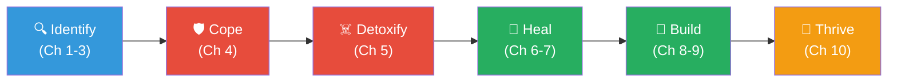
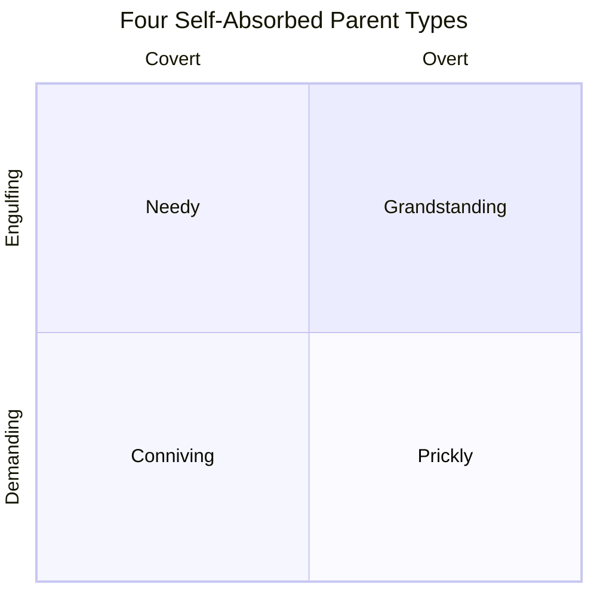
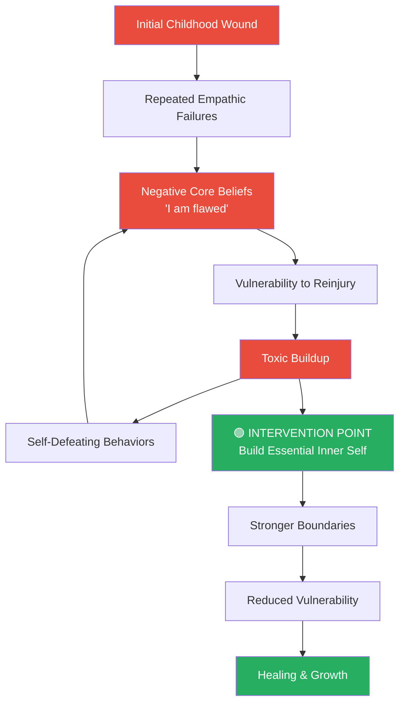
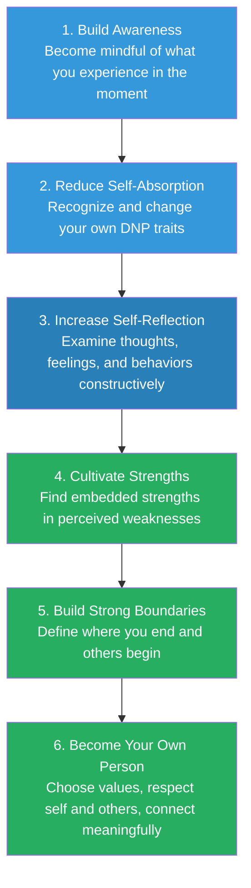
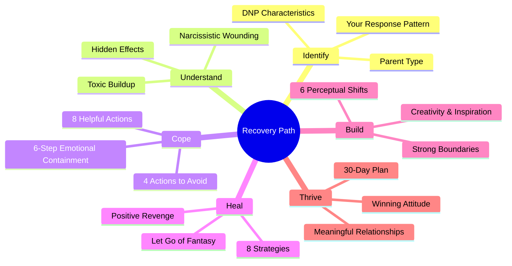

# Children of the Self-Absorbed — Nina W. Brown

> **Your self-absorbed parent will not change. Stop trying to fix them—fix yourself instead.** Nina Brown maps the <b style="color: #2980b9">Destructive Narcissistic Pattern (DNP)</b> across four parent types, shows how childhood wounds still poison your adult self, and provides a structured program for building a stronger inner self. The book's radical move: <b style="color: #27ae60">positive revenge</b>—living well is the ultimate rebuttal. Forgiveness is explicitly optional. The emphasis throughout is on what *you* can control: your boundaries, your self-talk, your reactions, and your growth.

## About the Author

*Nina W. Brown, EdD, LPC, DFAGPA, is a professor and eminent scholar of counseling at Old Dominion University in Norfolk, Virginia. She is past president of the Society of Group Psychology and Group Psychotherapy, and author of twenty-seven books including* Loving the Self-Absorbed *and* Whose Life Is It Anyway? *Brown holds a doctorate from the College of William and Mary and specializes in group psychotherapy and the effects of parental narcissism on adult children. This third edition (2020) builds on two decades of clinical experience with this population.*

## The Big Idea

- Your self-absorbed parent suffers from what Brown calls the <b style="color: #2980b9">Destructive Narcissistic Pattern (DNP)</b>—a collection of narcissistic behaviors that falls short of clinical diagnosis but inflicts real, lasting damage
- The wounds were inflicted before you had words to describe them and continue to shape your self-esteem, relationships, and emotional reactions as an adult
- <b style="color: #e74c3c">The parent will not change</b>—every strategy in the book flows from accepting this truth
- The path to healing is not through changing the parent but through building a stronger, more resilient <b style="color: #27ae60">essential inner self</b>
- <b style="color: #27ae60">Positive revenge</b>—living well, forming meaningful relationships, and finding joy—is the ultimate rebuttal to the self-absorbed parent

## Key Concepts at a Glance

| Concept | Definition |
|---|---|
| <b style="color: #2980b9">Destructive Narcissistic Pattern (DNP)</b> | Collection of 15 self-absorbed behaviors/attitudes that damage children without meeting clinical NPD criteria |
| <b style="color: #2980b9">Essential inner self</b> | The core psychological self that holds your sense of worth, identity, and value |
| <b style="color: #e74c3c">Narcissistic wounding</b> | Injuries to the essential self from messages that you are flawed, unvalued, and unworthy |
| <b style="color: #e74c3c">Toxic buildup</b> | Accumulated negative effects of unhealed wounds that manifest as defense mechanisms, self-defeating behaviors, and relationship problems |
| <b style="color: #e74c3c">Emotional susceptibility</b> | Tendency to "catch" others' feelings, incorporate them, and be unable to release them |
| <b style="color: #e74c3c">Reverse parenting</b> | When the child is made responsible for the parent's well-being instead of the reverse |
| <b style="color: #27ae60">Positive revenge</b> | Living well as the best revenge—thriving in spite of the parent's efforts to control you |
| <b style="color: #27ae60">Reflective responding</b> | 4-step method to acknowledge the parent's feelings without absorbing their projections |
| <b style="color: #27ae60">Perceptual shifts</b> | Six deliberate changes in perspective that move you from wounded child to thriving adult |
| <b style="color: #2980b9">Healthy adult narcissism</b> | Mature, realistic self-love—the developmental goal on the narcissism continuum |

## The Book in 30 Seconds

*See opening blockquote above.*

---

## The Book in 5 Minutes

*Nina Brown wrote this book for the adult who still flinches at their parent's phone calls—and doesn't understand why.*

- The <b style="color: #2980b9">Destructive Narcissistic Pattern (DNP)</b> describes a parent who exhibits many narcissistic traits without necessarily meeting the clinical threshold for Narcissistic Personality Disorder
- Four self-absorbed parent types exist: <b style="color: #e74c3c">Needy</b>, <b style="color: #e74c3c">Prickly</b>, <b style="color: #e74c3c">Conniving</b>, and <b style="color: #e74c3c">Grandstanding</b>—each producing distinct damage patterns in their children
- Children respond through either <b style="color: #2980b9">compliance</b> (trying harder to please) or <b style="color: #2980b9">rebellion</b> (withdrawing and refusing to connect)
- Narcissistic wounds inflicted in infancy and childhood persist into adulthood as toxic buildup—eroding self-esteem, relationships, and self-efficacy
- Eight negative core beliefs (e.g., "I must be perfect," "I require others' approval") keep the wound open; each has a corresponding <b style="color: #27ae60">self-affirmation</b> that begins the healing
- Eight strategies form the recovery backbone: let go of fantasy, use positive self-talk, practice altruism, reach out, find beauty, change pace, practice mindfulness, reduce your own self-absorption
- <b style="color: #27ae60">Positive revenge</b> replaces retaliation fantasies: live well, build meaningful relationships, find joy and purpose—this is the real "getting even"
- Forgiveness is <b style="color: #27ae60">not required</b>—it may come later, but healing comes first
- Six perceptual shifts guide the transformation: build awareness → reduce self-absorption → increase self-reflection → cultivate strengths → build boundaries → become your own person
- The 30-day plan provides daily micro-actions: beauty, organization, creativity, and movement

---

## How This Book Works

*Brown structures the book as a progressive self-therapy manual, moving from diagnosis to understanding to action.*

- **Chapters 1–3** identify the problem: what the DNP looks like, how it wounded you, and how those wounds still bleed
- **Chapter 4** teaches situational survival: how to cope when you're face-to-face with the parent
- **Chapter 5** exposes hidden toxic effects you may not recognize in yourself
- **Chapters 6–7** provide eight healing strategies and address your own self-absorbed behaviors
- **Chapters 8–9** build the ideal self through perceptual shifts, boundary work, creativity, and relationship strengthening
- **Chapter 10** ties it all together with a 30-day plan and the concept of a winning attitude
- Every chapter ends with three creative activities: <b style="color: #2980b9">Writing</b>, <b style="color: #2980b9">Drawing/Collage</b>, and <b style="color: #2980b9">Visualization</b>

### Five Guiding Principles

*Brown builds the entire book on these foundational truths:*

1. You suffered numerous <b style="color: #2980b9">parental empathic failures</b> that affected your psychological growth and that continue to affect you today
2. You felt or feel <b style="color: #e74c3c">responsible for the parent's well-being</b> and have worked hard to achieve this without success or appreciation
3. Your current <b style="color: #e74c3c">self-esteem, self-confidence, and self-efficacy</b> are not at the levels you feel they should be
4. Your efforts to get the parent to see your perspective, approve of you, or show love <b style="color: #e74c3c">have been futile</b>
5. Nothing you did or tried to get the parent to change has been successful—<b style="color: #2980b9">the parent did not and will not change</b>

---

## The Destructive Narcissistic Pattern

*Not every self-absorbed parent is a clinical narcissist—but the damage is real regardless.*

- Brown places narcissism on a <b style="color: #2980b9">continuum</b>: healthy adult narcissism on one end, pathological narcissism on the other, with undeveloped narcissism in between
- The DNP sits in the zone where a parent shows many narcissistic behaviors without meeting the diagnostic threshold for NPD
- This distinction matters because it validates the adult child's experience—the injury doesn't require a clinical diagnosis to be genuine
- Many adults have some developed narcissism and some that is undeveloped—the continuum is not binary
- The self-absorption discussed in this book is where the person exhibits many behaviors of someone with NPD as described in the DSM-5, but does not have the full disorder

> [!example] Betsy's Lunch
> - Betsy wanted to go back to college for English Education to become a teacher
> - Her father insisted she become an accountant, disparaged her previous college major and jobs
> - He told her he would be "very disappointed" if she didn't take his advice, since he was "more knowledgeable and successful"
> - Betsy left feeling defeated and demoralized—unable to tell her father that he always makes everything about himself
> - His wants, needs, and demands were always the focus; her perspective was never considered

### 15 DNP Characteristics

| Characteristic | What It Looks Like |
|---|---|
| <b style="color: #e74c3c">Grandiosity</b> | Unreasonable expectations for success; always knows what's best |
| <b style="color: #e74c3c">Entitlement</b> | Others exist to meet their needs; demands preferential treatment |
| <b style="color: #e74c3c">Lack of empathy</b> | Indifferent to impact of demeaning comments; expects empathy in return |
| <b style="color: #e74c3c">Extensions of self</b> | Doesn't recognize others as separate; gives orders, intrudes, asks invasive questions |
| <b style="color: #e74c3c">Impoverished self</b> | Complains about being deprived; self-deprecating but angered if others agree |
| <b style="color: #e74c3c">Attention seeking</b> | Speaks loudly, enters rooms noisily, dresses to attract notice |
| <b style="color: #e74c3c">Admiration seeking</b> | Boasts, brags, self-promotes; craves external validation |
| <b style="color: #e74c3c">Shallow emotions</b> | Experiences mainly fear and anger; uses feeling words emptily |
| <b style="color: #e74c3c">Envy</b> | Resents others' success; feels others are undeserving |
| <b style="color: #e74c3c">Contempt</b> | Makes negative comments about others' worth and value |
| <b style="color: #e74c3c">Arrogance</b> | Talks down to others; references own superiority |
| <b style="color: #e74c3c">Emptiness</b> | Hops between relationships; craves activity; can't form real connections |
| <b style="color: #e74c3c">Reverse parenting</b> | Child made responsible for parent's well-being |
| <b style="color: #e74c3c">Reflected glory</b> | Demands child excel to enhance parent's image |
| <b style="color: #e74c3c">Exploitation</b> | Takes unfair advantage; manipulates; assumes unearned credit |

*The radar profile reveals how DNP traits cluster at extreme levels across all six dimensions, while healthy adult narcissism stays near the center.*

---

## Four Types of Self-Absorbed Parents

*Your parent's flavor of self-absorption determines the specific damage patterns you carry.*

### The Needy Parent

- Appears caring and concerned to outsiders but demands emotional payment for every parental act
- Clings, overnurtures, overprotects, and makes a public display of personal sacrifices
- Gets anxious when alone, pesters for every thought and feeling, never forgets an offense
- Hypersensitive to perceived criticism but never genuinely empathic

### The Prickly Parent

- Very demanding; expects prompt and accurate compliance with unspoken rules
- Others must "do the right thing" and "do it right" without adequate explanation of what "right" means
- Touchy—senses disapproval and criticism in everything said and done
- Never completely satisfied; very critical; demands perfection

### The Conniving Parent

- Always positioning to win, be superior, and demonstrate others' inferiority
- Willingness to lie, cheat, distort, and mislead to achieve goals
- Adept at reading others' emotional vulnerabilities and exploiting them
- Children learn either constant wariness or become easy targets for manipulation

### The Grandstanding Parent

- "Always on stage," "playing to the crowd," "larger than life"
- Children must assume subordinate supporting roles; child's success is attributed to parent
- Flamboyant, dramatic, constantly boasting, exaggerating accomplishments
- Restless—moves from relationship to relationship, project to project
- Very intrusive and dismissive of others' boundaries

---

## Two Child Responses

*Every child of a self-absorbed parent lands somewhere on the compliance–rebellion spectrum.*

### The Compliant Child (as Adult)

- Tries harder and harder to please, extending this pattern to all relationships
- Anxiously searches for nonverbal signals of distress in others
- Cannot be content with less than perfection; never feels adequate
- Relies mostly on external validation; easily seduced and enmeshed in others' feelings

### The Rebellious Child (as Adult)

- Concluded early that pleasing the parent was impossible
- Projects an attitude of not caring what others think
- Keeps emotional distance; retreats into self-protective stance
- Makes it difficult to trust others—sabotages meaningful relationships

### How Each Response Plays Out by Parent Type

| Parent Type | Compliant Child (Adult) | Rebellious Child (Adult) |
|---|---|---|
| <b style="color: #e74c3c">Needy</b> | Overly sensitive to others' needs; constantly monitors for distress; subordinates own needs; feels guilt when others are disappointed | Keeps others at distance; insensitive to needs; openly disagrees then withdraws; resents attempts at seduction or coercion |
| <b style="color: #e74c3c">Prickly</b> | Perfectionist who feels like an imposter; cringes at criticism; susceptible to bullying; tries to discern expectations and comply | Defiant and combative; overly defensive at perceived criticism; uses attack as first defense; unconcerned with pleasing |
| <b style="color: #e74c3c">Conniving</b> | Presents a false self—overly complimentary and ingratiating but also sneaky; easily seduced or coerced; fearful of rejection | Wary and mistrustful of motives; hard to get to know; fears others are trying to take advantage; constantly on guard |
| <b style="color: #e74c3c">Grandstanding</b> | Submissive, self-effacing, self-deprecating; always on edge anticipating the unexpected; unable to protect boundaries | Engages in risky, self-destructive behavior; uses flattery as tool; appears cooperative but harbors quiet defiance |

*Each parent-child combination produces a distinct damage signature — the heatmap shows why two siblings with the same parent can develop completely different adult patterns.*

> [!tip] Both responses are survival strategies
> Neither compliance nor rebellion is "wrong"—both were the child's best attempt at self-preservation. Understanding which pattern you default to is the first step toward choosing a third option: **healthy self-direction**.

---

## Narcissistic Wounding: The Invisible Injury

*The deepest wounds often happened before you had words to describe them.*

### Emotional Susceptibility: The Open Wound

- <b style="color: #e74c3c">Emotional susceptibility</b> is the tendency to "catch" others' feelings (usually negative), incorporate them into your self, and then be unable to release them
- It results from insufficient development of psychological boundaries during childhood
- Signs you are emotionally susceptible:
  - You constantly monitor others to discern what they're feeling
  - You become upset when others are in distress and can't let go of those feelings
  - You feel you must have others' liking and approval most or all of the time
  - You take responsibility for others' welfare even when they're independent adults
  - You stay constantly on edge or churned up
  - You feel fearful at any signal of conflict, even when you're not involved
  - You feel positive only when those around you feel positive

### Reverse Parenting: The Core Dysfunction

- In healthy families, the parent is responsible for the child's well-being
- In the self-absorbed family, the child is made responsible for the parent's well-being
- This reversal produces adults who:
  - Still exist as extensions of the parent
  - Remain under parental control even as adults
  - Must anticipate parental needs and work to fulfill them
  - Must show empathy to the parent but never receive it in return
  - Must never exercise independence or autonomy
  - Must sacrifice their life and welfare for the parent
- The phrases that signal reverse parenting: "If you loved me, you would...," "I love you when you...," "You make me feel good when you...," "Can't you ever do what I need?"

- <b style="color: #e74c3c">Narcissistic wounds</b> are injuries to the essential inner self—messages that you are fatally flawed, not valued, and have little worth
- Many injuries occurred in the preverbal stage of development and cannot be retrieved as explicit memories
- They persist as unconscious patterns that shape self-perception, relationship choices, and emotional reactivity
- The parent's lack of empathic attunement left deficits in the child's self-esteem that compound over time

### How Wounding Perpetuates

- Initial childhood wound → reinforced by repeated parental failures → internalized as core beliefs → beliefs trigger vulnerability to reinjury → toxic buildup accumulates → self-defeating behaviors emerge → behaviors confirm negative beliefs → cycle continues

---

## Eight Negative Core Beliefs

*These are the thought-viruses your parent planted. Each one keeps you vulnerable.*

| Negative Belief | What It Produces | Self-Affirmation |
|---|---|---|
| "I require others' approval" | Constant people-pleasing; anxiety when approval withheld | <b style="color: #27ae60">"I want approval, but I'll be okay without it"</b> |
| "I must be perfect" | Shame at any imperfection; paralysis | <b style="color: #27ae60">"Being good enough is sufficient"</b> |
| "I must take care of others" | Over-responsibility; guilt when others suffer | <b style="color: #27ae60">"I may help more by showing confidence in them"</b> |
| "Others' needs trump mine" | Self-neglect; resentment | <b style="color: #27ae60">"I deserve preference sometimes"</b> |
| "I am badly flawed" | Despair; hopelessness | <b style="color: #27ae60">"I can do better and I will"</b> |
| "I need someone to care for me" | Destructive relationships; fear of being alone | <b style="color: #27ae60">"I am strong enough to survive on my own"</b> |
| "I can't reveal the real me" | Façade maintenance; exhaustion | <b style="color: #27ae60">"I can let more of my real self be seen"</b> |
| "I'm not as worthwhile as others" | Constant comparison; self-erosion | <b style="color: #27ae60">"I will make the most of who I am"</b> |

> [!tip] The belief causes the wound—not the external event
> If you did not hold the negative belief, the parent's words would not penetrate. Building realistic beliefs is the real armor.

---

## Still Hurting: The Child as an Adult

*You're forty-five, successful, well-liked—and you still can't say no to your mother.*

- The injuries from childhood continue to operate through <b style="color: #e74c3c">unproductive attitudes and behaviors</b> that the adult child may not recognize
- These patterns feel like personality—but they are actually adaptations to the self-absorbed parent

### Ten Unproductive Patterns

- <b style="color: #e74c3c">Personalizing</b> — taking everything as a criticism of your essential self
- <b style="color: #e74c3c">Feeling blamed</b> — assuming responsibility for anything that goes wrong, even when no one is pointing a finger
- <b style="color: #e74c3c">Disappointing others</b> — unrealistic expectations for yourself that were set by parental messages
- <b style="color: #e74c3c">Expecting compliments</b> — interpreting absence of praise as confirmation of your flaws
- <b style="color: #e74c3c">Inability to ignore irritation</b> — holding on to minor annoyances until they become major wounds
- <b style="color: #e74c3c">Catching others' feelings</b> — absorbing others' negative emotions through weak psychological boundaries
- <b style="color: #e74c3c">Feeling flawed</b> — constant awareness of imperfections as a source of shame
- <b style="color: #e74c3c">Needing others to be like you</b> — secretly feeling your way is the right way
- <b style="color: #e74c3c">Relationship difficulties</b> — questioning commitment and meaningfulness in all relationships
- <b style="color: #e74c3c">Being overwhelmed by empathy</b> — trying to care deeply but losing yourself in others' emotions

### Why Others Don't See Your Parent as You Do

- <b style="color: #2980b9">Different experiencing:</b> The parent presents a different face to different people and situations
- <b style="color: #2980b9">Goal focusing:</b> Self-absorbed people's single-minded pursuit can produce external success
- <b style="color: #2980b9">Indifference to others:</b> The parent doesn't care about impact—they'll feign caring when it serves them

> [!example] Gary's Paradox
> - Gary was forty-five, married, productive, well-paid, and liked by everyone
> - Yet he constantly questioned his competency and adequacy
> - He could be easily manipulated and couldn't say no
> - His success was invisible to his wounded inner self—external achievement couldn't heal internal injury

---

## Difficult Situations and How to Cope

*The holiday dinner. The phone call. The aging parent who needs care. These are the battlegrounds.*

### Managing Negative Feelings in the Moment

> [!abstract] The 6-Step Emotional Containment Process
> - **Accept responsibility** for the feeling—no one is "making" you feel this way
> - **Name the feeling** specifically (anger, frustration, fear, guilt, shame)
> - **Identify the self-statement** underneath ("I'm inadequate," "I'm powerless")
> - **Assess validity** — is the self-statement actually true overall?
> - **Substitute** a more positive and realistic self-statement
> - **Use emotional insulation** to block any incoming projections

### Four Actions to Avoid

- <b style="color: #e74c3c">Retaliating</b> — short-term satisfaction erodes your self-esteem and worsens the relationship
- <b style="color: #e74c3c">Empathizing with the parent</b> — opens you to incorporating their negative projections; use sympathy instead
- <b style="color: #e74c3c">Confronting</b> — the parent is not open to your perspective, does not feel a need to change, and may become enraged
- <b style="color: #e74c3c">Self-disclosing</b> — the parent will use intimate information against you; tell them only what you'd tell the world

### Eight Helpful Actions

- <b style="color: #27ae60">Build your inner self</b> — develop empathy, creativity, inspiration, and connections
- <b style="color: #27ae60">Block and control feelings</b> — momentarily remove yourself from the feeling using cognitive strategies
- <b style="color: #27ae60">Manage interactions</b> — ensure most encounters happen in public places with time limits
- <b style="color: #27ae60">Use positive self-statements</b> — counter triggered insecurities with prepared affirmations
- <b style="color: #27ae60">Capitalize on nonverbal signals</b> — avoid sustained eye contact, angle body away, keep objects between you, adopt relaxed posture
- <b style="color: #27ae60">Choose what to feel</b> — you have more control over your emotions than you think
- <b style="color: #27ae60">Interrupt negative thoughts</b> — stop self-criticism and substitute positive thoughts
- <b style="color: #27ae60">Use positive self-talk</b> — remind yourself what is real versus what is fantasy

### Protecting Your Children from the Self-Absorbed Grandparent

- <b style="color: #27ae60">Communicate clear directions</b> about how you want your child treated
- <b style="color: #27ae60">Block demeaning comments</b> directed at or about your child—intervene by changing topics, sending the child on an errand, praising the child
- <b style="color: #27ae60">Minimize forced apologies</b> — insist on them only when absolutely necessary
- <b style="color: #27ae60">Affirm your child frequently</b> in the grandparent's presence
- <b style="color: #27ae60">Minimize babysitting requests</b> — favors create debt
- <b style="color: #27ae60">Block all comparisons</b> immediately
- Be pleasant and cordial when intervening but firm—no one should doubt you are supporting your child

### The Aging and Dependent Self-Absorbed Parent

*One of the most difficult situations: real needs meet entrenched self-absorption.*

- The parent's self-absorption can intensify because of real conditions: failing health, declining finances, loss of independence
- The parent ratchets up complaints, unreasonable demands, blame, and criticism
- Your guilt, self-doubt, anger, and resentment compound the situation
- Key points to remember:
  - The parent does have real problems requiring some assistance
  - The parent is genuinely fearful about the future
  - Loss of independence is devastating for anyone—especially someone whose identity rests on control
  - The parent is not going to become less self-absorbed
  - You have personal limits—recognize them and honor them
  - Avoid letting grandiosity convince you that you must "fix" everything

> [!example] Sylvia's New Year Visit
> - Sylvia, her husband, and children stopped at her parents' home for New Year
> - Her mother's first words: criticizing Sylvia's clothes and calling her hair "a mess"
> - Only after the insult did the mother remember to wish the grandchildren a Happy New Year
> - Sylvia was left angry and frustrated with no prepared response

---

## Hidden Toxic Effects

*The poison you don't know about is the most dangerous kind.*

- Brown introduces a <b style="color: #2980b9">12-item Toxicity Scale</b> measuring stress, irritability, sleep disturbance, balance, focus, enjoyment, intrusive thoughts, organization, body dissatisfaction, relationship quality, meaning, and accomplishment satisfaction
- Scores 51–60 indicate very high toxicity; 41–50 high; 31–40 moderate; 21–30 some; below 20 minimal

### Five Defense Mechanisms

| Defense | How It Works | How It Hurts You |
|---|---|---|
| <b style="color: #e74c3c">Displacement</b> | Attack a safer target when you can't confront the real source | Family members become collateral damage |
| <b style="color: #e74c3c">Repression</b> | Bury a threatening memory so deeply it can't be accessed | The buried event still drives behavior unconsciously |
| <b style="color: #e74c3c">Denial</b> | Refuse to accept an unpleasant truth about yourself | Self-destructive patterns continue unchecked |
| <b style="color: #e74c3c">Withdrawal</b> | Emotionally leave the situation while physically remaining | Others sense your absence; connection breaks down |
| <b style="color: #e74c3c">Projection</b> | Put your unacceptable feelings onto someone else | Distorts reality; erodes trust and relationships |

### Acts Against Self

- <b style="color: #e74c3c">Self-blame</b> — destructive when expectations are unrealistic or responsibility is misunderstood
- <b style="color: #e74c3c">Despair</b> — a deflated spirit from inability to get needs met over time
- <b style="color: #e74c3c">Hopelessness</b> — inability to imagine things can ever improve
- <b style="color: #e74c3c">Helplessness</b> — feeling personally inadequate rather than facing external barriers
- <b style="color: #e74c3c">Devaluing self</b> — failing to appreciate your positive qualities
- <b style="color: #e74c3c">Overvaluing self</b> — inflating characteristics to protect against shame (the flip side)

### Acts Against Others

- <b style="color: #e74c3c">Blaming</b> — offloading responsibility to demonstrate superiority
- <b style="color: #e74c3c">Acting out</b> — defiant, oppositional behavior as displaced resentment
- <b style="color: #e74c3c">Taking advantage</b> — exploiting others to shore up self-perception
- <b style="color: #e74c3c">Unreasonable demands</b> — expecting others to change because you want them to
- <b style="color: #e74c3c">Devaluing remarks</b> — sarcasm, put-downs, jokes at others' expense

> [!example] The Teacher Acting Out
> - An experienced high school teacher took a required university course
> - She chewed bubble gum and blew a bubble in class, then gave the instructor a fake name
> - She never chewed gum and didn't allow it in her own classes
> - Her sister helped her see: it was acting out displaced resentment about loss of control over her time

---

## Eight Strategies to Stop Hurting

*The shift from understanding to action. Brown's eight strategies form the recovery backbone.*

### Strategy 1: Let Go of Fantasy

- Seven common fantasies that keep you stuck:
  1. The parent admits their errors and makes amends
  2. The parent suffers because of what they did
  3. You outperform the parent and rub their nose in it
  4. Everyone sees the parent as you do and rejects them
  5. You are vindicated
  6. You get to do to them what they did to you
  7. The parent changes and has regrets
- These fantasies reinforce negative feelings; the negative feelings reinforce the fantasies
- <b style="color: #27ae60">Interruption self-talk:</b> "It is unrealistic to expect my parent will change," "I cannot change another person," "I have more constructive things to do"

*Brown's eight strategies work as a unified system — letting go of fantasy and mindfulness carry the heaviest therapeutic weight because they address the root cognitive distortions.*

### Strategy 2: Positive Self-Statements

- For every negative self-statement the parent triggers, prepare a positive counter
- "The criticism is correct" → <b style="color: #27ae60">"I have many strengths and talents"</b>
- "I should be perfect" → <b style="color: #27ae60">"I have many strengths, and I am working on what I perceive as flaws"</b>
- "I'm supposed to control everything" → <b style="color: #27ae60">"I am able to handle and resolve most situations"</b>
- "If I were better, I'd have better relationships" → <b style="color: #27ae60">"I'm good enough, and can form meaningful relationships"</b>

### Strategy 3: Altruism

- True altruism is giving freely without expectation of reciprocity, reward, or appreciation
- <b style="color: #e74c3c">Not altruism:</b> reminding others to say "thank you," wanting expressions of appreciation, using gifts to manipulate, becoming angry when a gift isn't appreciated enough
- <b style="color: #27ae60">True altruism:</b> volunteering, mentoring, encouraging, coming to someone's aid unasked
- Research shows beneficial effects primarily for the giver, even when the receiver doesn't know the giver

### Strategy 4: Reaching Out to Others

- Show interest in others; listen more than you talk
- Respect psychological boundaries; don't rush to solve problems
- Find mutual interests; acknowledge and respect differences
- Reaching out does not guarantee you won't be hurt—but a stronger self heals faster

### Strategy 5: Beauty and Wonder

- Beauty is individualistic—commit to seeing something beautiful every day
- Wonder is the childlike quality of noticing something new and becoming curious about it
- Both expand consciousness and counterbalance the negative focus inherited from the self-absorbed parent

### Strategy 6: Change of Pace

- Routine provides comfort, but excessive rigidity limits growth
- An occasional change of pace energizes thoughts and enriches the inner self
- Not major disruption—just doing something different on a trial basis

### Strategy 7: Mindfulness

- Expand awareness while contracting focus: notice more, but zoom in on what matters
- In interactions with the self-absorbed parent, mindfulness lets you see the parent's fear and anxiety without absorbing it
- Words that once wounded can become "harmless ball bearings bouncing around"

### Strategy 8: Reduce Your Own Self-Absorption

- The most uncomfortable strategy: accept that you too have undeveloped narcissism
- Your own self-absorbed behaviors prevent healing, weaken boundaries, and interfere with relationships
- If you cannot see these traits in yourself, that's exactly the point—your parent can't see theirs either

---

## Positive Revenge: Living Well as the Ultimate Rebuttal

*The old saying comes alive: "Living well is the best revenge."*

- <b style="color: #e74c3c">Negative revenge</b> (retaliation, telling off the parent) doesn't make you feel better, often goes unnoticed by the parent, and arouses your own guilt
- <b style="color: #27ae60">Positive revenge</b> is achieving meaningful relationships, enjoying life with purpose, and liking yourself—all in spite of the parent's best efforts to keep you under control

### Six Positive Revenge Strategies

- <b style="color: #27ae60">Repel negativity</b> — use emotional insulation to screen out the parent's negative projections
- <b style="color: #27ae60">Find embedded strengths</b> — every perceived weakness conceals a strength (inability to say no → sensitivity to others' feelings)
- <b style="color: #27ae60">Become good enough</b> — accept that perfection is not required; excellence is an aspiration, not a demand
- <b style="color: #27ae60">Find joy, meaning, and purpose</b> — these are the fundamentals for a rich life that your self-absorbed parent likely lacks
- <b style="color: #27ae60">Make your life count</b> — focus on what genuinely matters: children's welfare, partner's well-being, altruistic actions
- <b style="color: #27ae60">Prioritize your own perceptions</b> — stop trying to meet impossible demands; take charge of who you are

*The sankey diagram traces how childhood wounds flow through toxic buildup into self-defeating patterns — and how Brown's six strategies redirect that energy into positive revenge.*

> [!example] Sara's Turning Point
> - Sara was reflecting on her father's lifelong criticism when she noticed something new
> - She wasn't automatically thinking about how inadequate she felt compared to others
> - She had noted her father's criticisms of potential flaws—but she wasn't obsessing over them anymore
> - The hurt from her father's words was still there, but it had lost its power to define her

---

## Strengthening Your Self: 11 Self-Absorbed Traits to Examine

*The hardest chapter: Brown asks you to look in the mirror.*

- Your own undeveloped narcissism is invisible to you—just as your parent's is invisible to them
- The first step is to accept the hypothesis that you exhibit some self-absorbed behaviors
- The second step is to want to become aware of them so you can change

### Self-Absorbed Traits and How to Reduce Them

| Trait | What to Do |
|---|---|
| <b style="color: #2980b9">Entitlement</b> | Wait your turn; don't give orders; don't expect others to do what you can do yourself |
| <b style="color: #2980b9">Attention seeking</b> | Let attention come to you; make quiet entrances; don't interrupt |
| <b style="color: #2980b9">Admiration seeking</b> | Focus on internal pleasure for accomplishments; stop bragging and fishing for compliments |
| <b style="color: #2980b9">Grandiosity</b> | Recognize personal limitations; learn to say no; reflect on the need to feel superior |
| <b style="color: #2980b9">Impoverished self</b> | Stop complaining; act on what can be changed; let go of what cannot |
| <b style="color: #2980b9">Lack of empathy</b> | Stop talking and listen; focus on the speaker; hear feelings behind words |
| <b style="color: #2980b9">Extensions of self</b> | Respect others' rights and space; make requests instead of demands |
| <b style="color: #2980b9">Shallow emotions</b> | Build a feeling-word vocabulary; name one new feeling each day |
| <b style="color: #2980b9">Unique and special</b> | Appreciate others' contributions; recognize others are also special |
| <b style="color: #2980b9">Exploitation</b> | Become more independent; return favors; don't lie, cheat, or mislead |
| <b style="color: #2980b9">Emptiness</b> | Perform altruistic acts; reflect on your "holes"; connect authentically |

### Self-Absorbed vs. Self-Reflective Thinking

| Self-Absorbed Thought | Self-Reflective Thought |
|---|---|
| "Am I doing it right?" | "I'm doing it okay, but can I improve?" |
| "I'm afraid of saying something wrong" | "I want to respond appropriately and will try to tune in" |
| "I must be perfect" | "I'll do my best, and accept I may not be perfect" |
| "I made a mistake and that's awful" | "I can and will do better" |
| "Everyone must approve of me or I'm doomed" | "I want approval, but not at the expense of my integrity" |

---

## Six Perceptual Shifts: The Transformation Framework

*How you get from wounded child to thriving adult—in six deliberate shifts.*

### Shift 1: Build Awareness

- Nine markers of aware people: appreciation of the present, connection to the universe, ability to see wonder and beauty, listening to body messages, being emotionally present with others, mind-body symmetry, freely chosen values, acceptance of reality, access to feelings
- Awareness is not self-absorption—it is being fully alive in the present moment

### Shift 2: Reduce Self-Absorption

- Common behaviors that signal mild self-absorption:
  - Taking on too many tasks → <b style="color: #2980b9">grandiosity</b>
  - Exaggerating ailments → <b style="color: #2980b9">attention seeking</b>
  - Dismissing others' problems → <b style="color: #2980b9">lack of empathy</b>
  - Considerable self-doubt → <b style="color: #2980b9">impoverished ego</b>
  - Lack of meaning/purpose → <b style="color: #2980b9">emptiness</b>
  - Feeling treated unfairly → <b style="color: #2980b9">envy</b>

### Shift 3: Increase Self-Reflection

- Stay alert to whether your reactions are projection or transference
- Remind yourself of the limits of personal responsibility
- Your feelings are valid but may be influenced by personality, family history, emotional susceptibility, and past experiences

### Shift 4: Cultivate Strengths

- You probably emphasize flaws more than you celebrate strengths
- It is easier to build on strengths than to remediate weaknesses

| Perceived Flaw | Embedded Strength |
|---|---|
| Makes blunt comments | Genuine; leaves little doubt about meaning |
| Stubborn | Has courage of convictions; decisive |
| Dreamy | Imaginative; visualizes possibilities |
| Indecisive | Alert to many options and alternatives |

### Shift 5: Build Strong and Resilient Boundaries

- Boundaries define where you are differentiated from others and protect from external assaults
- Strong boundaries allow you to say no, resist manipulation, and avoid enmeshment
- Short-term nonverbal strategies: orient body away, avoid sustained eye contact, keep barriers between you, change the topic, leave when discomfort begins
- Long-term: understand yourself as separate and distinct from others at a deep psychological level
- Four types of boundary problems:
  - <b style="color: #e74c3c">Rigid</b> — no one can get to you; isolation results
  - <b style="color: #e74c3c">Soft</b> — almost everyone can get to you; constant overwhelm
  - <b style="color: #e74c3c">Spongy</b> — others can unexpectedly get to you; unpredictable vulnerability
  - <b style="color: #27ae60">Resilient</b> — strong enough to protect, flexible enough to allow genuine connection

### The Limits of Personal Responsibility

- If you have not internalized that there are limits to your personal responsibility, you have not fully separated from others
- Test yourself: Do you apologize when someone says you "made" them feel something? Do you violate your standards to please someone? Do you suppress your needs so others won't be burdened?
- Key insight: <b style="color: #27ae60">you do not cause or make someone have a particular feeling</b>—people choose to feel a particular way for reasons that are not under your control
- Something in their environment may trigger their feeling, but it remains their feeling, not your responsibility
- You have a responsibility to be tactful and sensitive—but not to guarantee that others never feel discomfort

### Shift 6: Become Your Own Person

- Eight indices of being your own person:
  1. Choose values, principles, and standards after careful examination
  2. Be respectful of yourself and others
  3. Act in accordance with personal ethics
  4. Recognize that others are unique and entitled to respect
  5. Connect to others in meaningful and satisfying ways
  6. Recognize and reject toxic relationships
  7. Resist being controlled or manipulated
  8. Be creative and ever growing

---

## Reflective Responding: The Alternative to Empathy

*You don't have to feel what your parent feels. You just have to show you heard them.*

- <b style="color: #e74c3c">Empathy with the self-absorbed parent is dangerous</b> — it opens you to catching their projections and making them your own
- <b style="color: #27ae60">Reflective responding</b> is a safer alternative: acknowledge the parent's feelings without absorbing them

> [!abstract] The 4-Step Reflective Response
> - **Identify** the feeling (expressed directly or indirectly)
> - **Verbalize** the feeling without repeating their words ("You seem irritated")
> - **Wait** for confirmation or correction before adding your input
> - **Then** ask a question or give your input

### Sample Exchanges

| Parent Says | Reflective Response |
|---|---|
| "You never seem to get it right" | "You're unhappy with what I did" |
| "Brian is so much more talented than you" | "You really admire Brian" |
| "You look silly doing that" | "You dislike what I'm doing" |
| "Why would you do something dumb like that?" | "You're annoyed that I didn't live up to your expectations" |

- Reflective responses give you time to think instead of immediately triggering negative feelings
- They keep the focus on the parent and protect your inner self
- You neither agree with nor fight the parent's characterization of you

---

## Building Better Relationships

*The self-absorbed parent taught you a broken model of love. Here's the replacement.*

- Your early relationship template was built on reverse parenting, conditional love, and exploitation
- Building meaningful adult relationships requires deliberately replacing these patterns

### Elements of a Meaningful Relationship

- <b style="color: #27ae60">Mutual respect and acceptance</b> — cherishing each other as you are, not as you wish each other to be
- <b style="color: #27ae60">Empathic attunement</b> — sensing the other person's inner experience without losing yourself; must be reciprocal
- <b style="color: #27ae60">Balance of fun and responsibility</b> — both partners carry their share of adult obligations while preserving playfulness
- <b style="color: #27ae60">Well-placed trust</b> — bestowed after reflection, not rushed; built on evidence of care, openness, and commitment
- <b style="color: #27ae60">Openness of emotional expression</b> — willingness to share feelings directly, with awareness of their impact
- <b style="color: #27ae60">Strong psychological boundaries</b> — respected by both parties; no enmeshment, no exploitation

> [!tip] Empathy ≠ Agreement
> Just because your partner understands what you feel does not mean they must agree with your interpretation. Countless conflicts arise from the expectation that empathy equals validation.

### Recognizing and Rejecting Toxic Relationships

- Relationships become toxic over time or when the other person hides their toxicity
- Warning sign: you must give up or compromise important pieces of your inner self to keep the relationship
- The adult child of a self-absorbed parent is especially vulnerable because the broken relationship template feels normal

---

## Forgiveness: Explicitly Optional

*Brown's most liberating position: you do not have to forgive your parent.*

- The question always arises: "Should I forgive?" Brown's answer is an unequivocal <b style="color: #27ae60">no—not until you're ready, and maybe not ever</b>
- People report palpable relief when given permission to stop forcing themselves to forgive
- The parent likely still believes they were right, that they were entitled, and that the child is wrong and shameful for questioning them
- Forgiveness may become possible after sufficient personal work—but it is never a prerequisite for healing

### Nine Indicators of Healing (Interim Steps Before Forgiveness)

1. You accept the parent is unlikely to change, without strongly yearning for change
2. The parent's negative comments don't hurt as much and their impact doesn't last as long
3. You still dread interactions but don't leave them as churned up as before
4. You're aware that reactions to the parent can get displaced onto others—and you consciously prevent it
5. You're better able to be empathic, improving your important relationships
6. You're more centered and grounded—neither compliant nor defiant
7. You realize you have the power to prevent further wounding
8. You derive satisfaction from other relationships and invest energy there
9. You can reach out to others, sense their feelings, and connect deeply without becoming enmeshed

---

## Early Experiences That Still Shape You

*You're not reacting to the present—you're reacting to a past that never stopped.*

### Three Categories of Lingering Influence

| Category | Core Belief | Adult Pattern |
|---|---|---|
| <b style="color: #e74c3c">Helpless and Needy</b> | "I can't survive on my own" | Overly attentive, demanding of others, easily feels isolated |
| <b style="color: #e74c3c">Controlling and Rigid</b> | "I must prove I'm adequate" | Must-win attitude, one-upmanship, defensive posture |
| <b style="color: #e74c3c">Self-Sacrificing and Resentful</b> | "If I take care of them, they'll care about me" | Constant reminders of sacrifice, needs appreciation, feels taken for granted |

### Four Continuing Parental Influences

- <b style="color: #2980b9">Unconscious incorporation of parental expectations</b> — you still perform for an audience that left the room decades ago
- <b style="color: #2980b9">Unfavorable comparisons</b> — early messages about appearance, intelligence, or ability still trigger shame
- <b style="color: #2980b9">Maintaining a façade</b> — the false self that received parental approval became dominant; the real self got buried
- <b style="color: #2980b9">Responsibility for others' well-being</b> — parentification continues as an adult pattern of over-responsibility

### The False Self

- When the infant's true self does not receive acceptance, a false self emerges to gain approval
- The false self becomes so ingrained that the person may not know their real self
- Signs: dismissing wounding as unimportant, making sure no one sees you're hurt, suppressing feelings, pretending to be "above it all"
- Challenge: find your true self and build it

---

## Creativity and Inspiration as Healing Tools

*Creating something—anything—helps heal what words alone cannot.*

- <b style="color: #27ae60">Creativity</b>, as Brown defines it, is not limited to artistic talent: it includes developing new ways to do things, trying new perspectives, learning something new, and streamlining processes
- Creative engagement promotes joy, screens out worries, heals wounds to the essential self, and accesses overlooked aspects of who you are
- <b style="color: #27ae60">Inspiration</b> (or spirituality) is the uplifting realm where you transcend yourself and connect to the universe
- It helps build resilience, reduces isolation, and provides sustenance during adversity
- Paths to inspiration: meditation, religion, creative endeavors, inspirational reading, expressive writing, relationship cultivation

---

## What to Relinquish

*Letting go creates space for what actually matters.*

### Relinquish Fantasies

- Every fantasy about the parent changing drains energy that could fuel your growth
- Interruption phrases: "I'm still expecting the impossible," "Leopards don't change their spots," "I'm adding to my own frustration"
- Distraction techniques: visual (cat videos, sports), auditory (music, laughter), tactile (smooth stone, silk), creative (making a collage), reading, writing

### Relinquish Self-Absorbed Behaviors

- <b style="color: #27ae60">Grandiosity:</b> refrain from taking on too much; have realistic expectations
- <b style="color: #27ae60">Arrogance:</b> cultivate modesty about capabilities
- <b style="color: #27ae60">Contempt:</b> don't dismiss those less talented or resourced
- <b style="color: #27ae60">Impoverished ego:</b> understand not everything is personally directed at you
- <b style="color: #27ae60">Whining:</b> become more independent and self-sufficient
- <b style="color: #27ae60">Attention seeking:</b> let others have the spotlight
- <b style="color: #27ae60">Admiration hunger:</b> do things because you want to, not for recognition
- <b style="color: #27ae60">Entitlement:</b> don't become angry when deference isn't given
- <b style="color: #27ae60">Exploitation:</b> appreciate others as separate and deserving
- <b style="color: #27ae60">Envy:</b> capitalize on your own assets rather than resenting others'
- <b style="color: #27ae60">Lack of empathy:</b> respond to the feeling behind the words, even if you don't feel it yourself

---

## The Winning Attitude

*Winners focus on self-performance, not the opponent.*

- A <b style="color: #27ae60">winning attitude</b> incorporates:
  1. Focus on the task at hand and self-performance, not on barriers or opponents
  2. Ability to visualize success
  3. Always seeking improvement
  4. Use of positive thoughts, encouragers, and affirmations
  5. Not becoming devastated by losses
  6. Confidence in yourself as a growing, developing person
- In interactions with the self-absorbed parent: your primary focus is managing your feelings, not what the parent is doing or saying

---

## The 30-Day Plan

*Small daily actions that accumulate into real change.*

| Week | Goal | Daily Activities |
|---|---|---|
| **Week 1** | <b style="color: #27ae60">Find beauty every day</b> | Locate three things in your favorite color; visualize a happy place and draw it; prepare meals with bright colors and pleasing flavors |
| **Week 2** | <b style="color: #27ae60">Get organized</b> | Discard three things from home or work daily; clean something small each day; declutter a drawer or surface |
| **Week 3** | <b style="color: #27ae60">Create a product</b> | Draw loops and color them in; decorate your name with leaves and flowers; make a collage each day |
| **Week 4** | <b style="color: #27ae60">Move</b> | March in place for one or more minutes; dance with or without music for 3–5 minutes; walk for 10+ minutes |

### Ongoing Activities

- Reflect on where you are and where you want to be
- Give people close to you the gift of attention and admiring comments
- Practice gratitude for what you have
- Let go of envy, jealousy, hatred, and anything toxic
- Examine your "becauses" ("I can't because...") for realism
- Resolve to commit no negative acts (mocking, taunting, manipulating)
- Resolve to commit positive acts (smiling, saying hello, being civil)
- Balance happiness and responsibility, duty and principles, self and others' needs

---

## Increasing Happy Moments

*Few people can be happy all the time—but everyone can collect more happy moments.*

- Happy moments lift spirits, provide hope, and increase physical and psychological well-being
- They are usually brief and transitory—but they can be recalled during down times
- Examples of happy moments:
  - An unexpected recognition of your accomplishment
  - Being present when a family member achieves something important
  - When your solution to a problem works
  - Hearing you got a desired job, raise, or promotion
  - Seeing a creative product of yours on display
  - Finishing a complex, long project
  - Receiving a gift from someone significant
  - Realizing you are getting better, recovering, or growing
  - Feeling at peace with yourself
- No one but you can define your happy moments—these are suggestions to start the collection

---

## Brown's Key Distinctions

*Precise language matters when you're untangling decades of emotional confusion.*

### Empathy vs. Sympathy vs. Emotional Susceptibility

| Concept | Definition | Risk Level |
|---|---|---|
| <b style="color: #27ae60">Empathy</b> | Sensing another's inner experience while maintaining your separateness | Safe with strong boundaries; dangerous without them |
| <b style="color: #2980b9">Sympathy</b> | Making comforting, reassuring comments without feeling the other's feelings | Safe — recommended for interactions with self-absorbed parent |
| <b style="color: #e74c3c">Emotional susceptibility</b> | "Catching" others' feelings, incorporating them, and being unable to release them | Dangerous — this is the open door through which the parent wounds you |

### Self-Absorbed vs. Self-Reflective

- <b style="color: #e74c3c">Self-absorption</b> is an unconscious, excessive focus on the self that disregards others
- <b style="color: #27ae60">Self-reflection</b> is a conscious, constructive examination of the self that enhances relationships
- Both involve thinking about yourself—but one destroys connections while the other deepens them
- The adult child's challenge: shift from the self-absorption they learned from the parent to the self-reflection that leads to healing

### Confrontation vs. Reflective Responding

- <b style="color: #e74c3c">Confrontation</b> with the self-absorbed parent: the parent is not open to your thoughts, does not care about your feelings, does not feel a need to change, and may become enraged. You always leave feeling worse.
- <b style="color: #27ae60">Reflective responding</b>: acknowledges the parent's feelings without agreeing, buys you time to think, keeps the focus on the parent, and protects your inner self

---

## The Three-Activity Method

*Every chapter ends with three creative exercises in different modalities.*

- <b style="color: #2980b9">Writing</b> — lists, descriptions, essays, self-affirmation cards. Engages the cognitive, analytical mind.
- <b style="color: #2980b9">Drawing/Collage</b> — symbols, colors, images from magazines. Accesses pre-verbal and emotional processing.
- <b style="color: #2980b9">Visualization</b> — guided imagery of peaceful scenes, the ideal self, releasing resentments. Engages the body-mind connection.
- This three-modality approach is critical because many narcissistic wounds occurred before language developed—healing cannot rely on words alone
- The activities take 10–15 minutes and require only basic materials (paper, crayons, scissors, magazines)
- Brown recommends returning to the visualization of a "place of peace" whenever distress builds during reading

### Sample Activities by Chapter

| Chapter | Writing | Drawing/Collage | Visualization |
|---|---|---|---|
| 1 | Describe your parent as you see them today | Draw 5–6 symbols of yourself | Visualize a scene of peace and calm |
| 3 | List 10+ personal strengths on an index card | Collage an unproductive attitude you want to change | Hug and soothe your hurt younger self |
| 4 | Create positive self-statement index card from accomplishments | Collage a treasured accomplishment | Accept an award for an achievement |
| 6 | List major time-wasters under your control | Draw your self as a color with variations | Visualize yourself as the person you want to be |
| 8 | Write strengths on colored strips and summarize | Draw the concept of happiness | Allow an image of happiness to emerge |
| 9 | List 5 inspirers that are low/no cost | Draw the feeling of being inspired | Visualize yourself as you wish to be |

---

## Meaning, Purpose, and the Centered Self

*Reducing self-absorption opens space for what actually makes life worth living.*

- When you reduce self-absorbed behaviors and build healthy narcissism, you access deeper dimensions of existence
- <b style="color: #27ae60">Meaning and purpose</b> expand the richness of life, connect you to the wider universe, and help you genuinely enjoy being alive

### What Meaning and Purpose Prevent

- <b style="color: #e74c3c">Isolation and alienation</b> — psychological and emotional distancing; feeling disconnected and alone
- <b style="color: #e74c3c">Despair, helplessness, and hopelessness</b> — even mild versions (discouragement, ineffectuality, bleakness) erode well-being
- <b style="color: #e74c3c">Unrealistic expectations</b> — expecting perfection from yourself and others leads to constant blame and shame
- <b style="color: #e74c3c">Excessive personal responsibility</b> — taking on others' emotional welfare beyond what is reasonable

### Five Reference Points That Prevent Feeling Adrift

1. Meaningful and satisfying relationships
2. Enjoyment, pleasure, and delight
3. A sense of being wanted and needed
4. Seeing that your contributions are appreciated and helpful
5. Feeling competent and effective in many aspects of your life

### When You Are Centered and Grounded

- You don't lose your way and do unconstructive things
- You choose to act in accordance with your values and resist manipulation
- You don't fly apart or melt down during crises
- You maintain your sense of self under trying circumstances
- You tolerate being alone without feeling lonely
- You choose relationships that are mutually beneficial
- You build on strengths and work on what needs changing
- You resist despair, hopelessness, and helplessness

---

## The Faulty Beliefs That Keep You Trapped

*These are the invisible chains your parent forged—and that only you can break.*

- <b style="color: #e74c3c">"I should be perfect and berate myself when I fall short"</b>
- <b style="color: #e74c3c">"I should never make mistakes because mistakes are shameful"</b>
- <b style="color: #e74c3c">"I am responsible for how others feel"</b>
- <b style="color: #e74c3c">"Others must treat me fairly, and it's my fault when they don't"</b>
- <b style="color: #e74c3c">"It's my fault if I am rejected—it means I am fatally flawed"</b>
- <b style="color: #e74c3c">"I'm to blame if things don't go as planned"</b>
- <b style="color: #e74c3c">"If I love someone, they must love me back or I'll be destroyed"</b>
- <b style="color: #e74c3c">"Everyone must like and approve of me for me to feel adequate"</b>

- Each faulty belief has its roots in early parental messages
- Each can be replaced with a freely chosen value that fits who you are now
- The replacement is not denial—it's self-direction

---

## Key Takeaways

*If you remember nothing else from this book, remember these.*

- <b style="color: #e74c3c">Your parent will not change.</b> Every strategy in this book flows from accepting this truth.
- <b style="color: #2980b9">Your wounds are real but invisible.</b> They happened before you had words, and others cannot see them. That doesn't make them less valid.
- <b style="color: #27ae60">You have more power than you think.</b> You can choose what to feel, how to respond, and who to become.
- <b style="color: #27ae60">Good enough IS enough.</b> The demand for perfection was your parent's—not yours to carry.
- <b style="color: #e74c3c">Look in the mirror.</b> You almost certainly have some of your parent's traits. Seeing them is the beginning of freedom.
- <b style="color: #27ae60">Forgiveness is not required.</b> Heal first. Forgiveness may come—or it may not. Either is acceptable.
- <b style="color: #27ae60">Living well is the best revenge.</b> Thriving in spite of your parent is more powerful than any retaliation.

---

## The Verdict

*A practical, structured manual for adults who are still paying the emotional tax of a self-absorbed parent.*

- **Greatest strength:** The book gives explicit permission to stop trying to change the parent and to focus entirely on self-building. The concept of positive revenge is both psychologically sound and emotionally satisfying. Brown's willingness to say forgiveness is not required is genuinely liberating.
- **Greatest weakness:** The book is deliberately repetitive—core concepts like the DNP, emotional susceptibility, and boundary strength are revisited in every chapter. This is therapeutic (reinforcement aids absorption) but can feel circular for readers who want faster progression.
- **Most actionable framework:** The 6-step emotional containment process and the 4-step reflective responding method are immediately usable in any interaction with a difficult person, not just the self-absorbed parent.
- **Unique contribution:** The 4 parent types × 2 child responses matrix provides a diagnostic framework that other narcissism books lack. The nuanced acknowledgment that the adult child likely carries their own self-absorbed traits is honest and rare.
- **Most powerful insight:** You are not reacting to the present—you are reacting to a past that never stopped. Until you understand that your feelings in interactions with the parent are driven by pre-verbal wounds and incorporated messages, you cannot build effective defenses.
- **Creative activities:** The three-modality approach (writing, drawing/collage, visualization) at the end of each chapter provides non-cognitive pathways to healing—particularly important for wounds that occurred before language development.
- **Who needs this most:** Adults who still feel diminished after every visit, phone call, or holiday with a parent—and who have tried everything to change the dynamic without success. Also valuable for therapists working with this population.
- **Who should read this alongside other works:** Those dealing specifically with narcissistic mothers should pair this with [[Will the Drama Ever End - Karyl McBride|McBride]]; those focused on emotional neglect should pair with [[Running on Empty - Jonice Webb|Webb]]; those who need assertiveness skills should pair with [[Not Nice - Aziz Gazipura|Gazipura]].
- **Bottom line:** This is not a book about understanding your parent. It's a book about understanding yourself—and then building the self your parent couldn't give you permission to become.

---

## Related Reading

### Direct Companions
- [[Disarming the Narcissist - Wendy Behary]] — schema therapy approach to dealing with narcissists in your life; focuses on understanding the narcissist's core schemas and using empathic confrontation
- [[Running on Empty - Jonice Webb]] — the parallel concept of Childhood Emotional Neglect; focuses on what was *missing* rather than what was *inflicted*
- [[Will the Drama Ever End - Karyl McBride]] — focuses specifically on narcissistic mothers and the daughter-mother dynamic

### Boundary and Assertiveness
- [[Emotional Blackmail - Susan Forward]] — FOG (Fear, Obligation, Guilt) as manipulation tools; detailed scripts for breaking free
- [[Not Nice - Aziz Gazipura]] — building assertiveness and the ability to say no after a lifetime of people-pleasing
- [[In Sheep's Clothing - George K. Simon]] — recognizing and defending against covert aggression and manipulation

### Deeper Recovery
- [[The Gaslight Effect - Robin Stern]] — understanding reality distortion in narcissistic relationships; the three stages of gaslighting
- [[The Sociopath Next Door - Martha Stout]] — when self-absorption crosses into antisocial territory; understanding the absence of conscience
- [[Who's Pulling Your Strings - Harriet B. Braiker]] — breaking free from manipulation patterns and the "disease to please"

