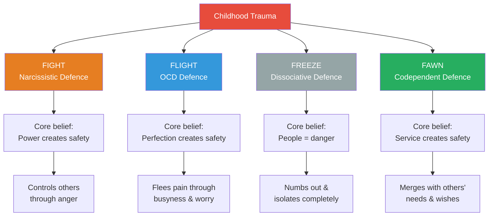
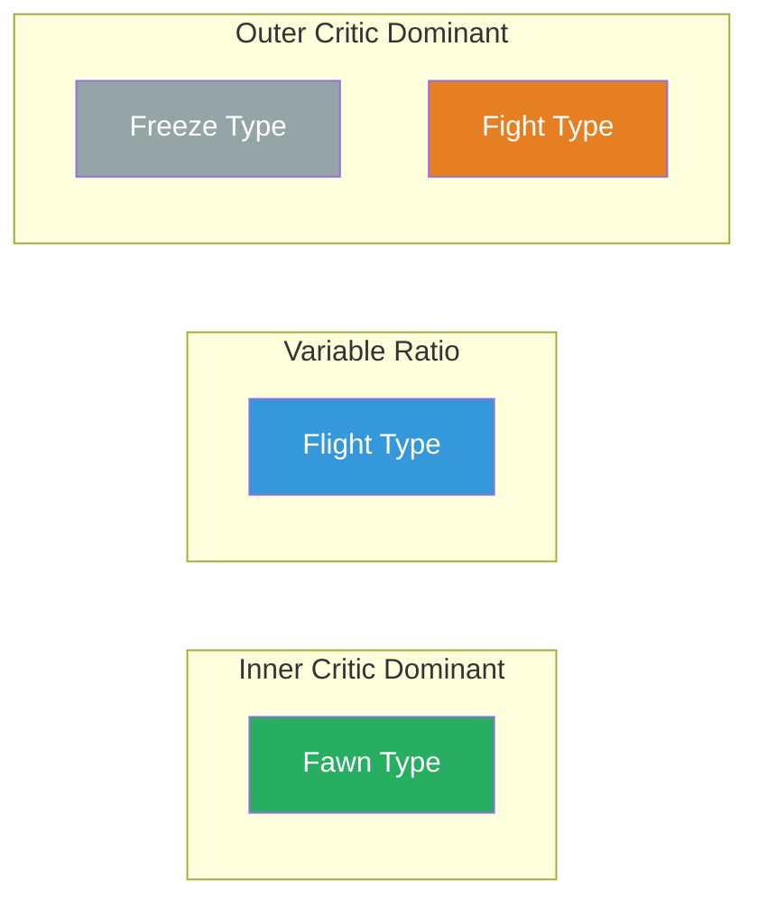
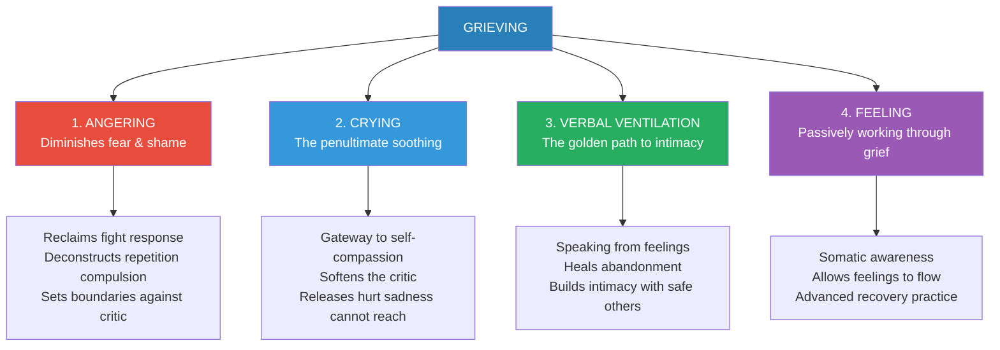
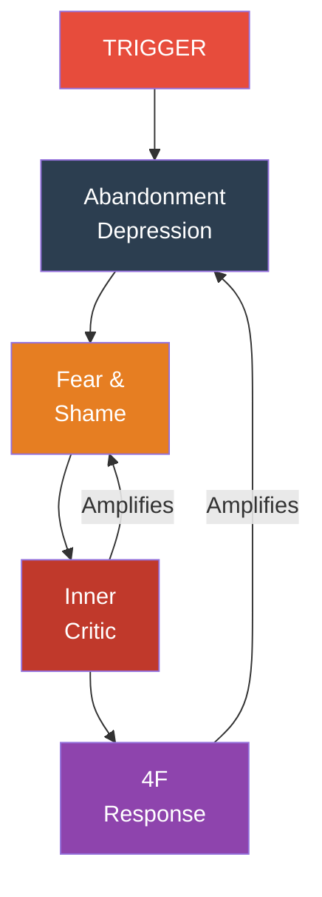
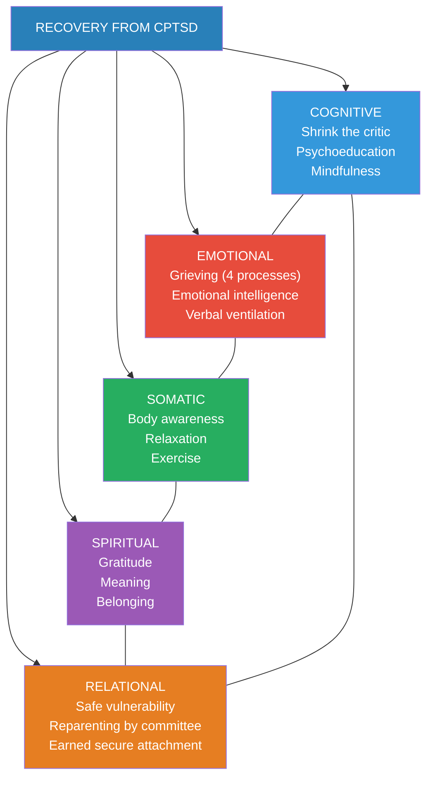

# Complex PTSD — Pete Walker

> *You were not born broken. You were broken by people who were supposed to protect you. And what was broken by neglect can be rebuilt by the kind of fierce, patient love you never received — starting with your own.*

---

## About the Author

*Pete Walker, MA, MFT, is a psychotherapist who has spent over three decades treating Complex PTSD survivors in individual and group settings. He writes from a rare dual perspective — as both a clinician and a lifelong CPTSD survivor. Walker was emotionally, verbally, and physically abused by both parents, and his recovery journey directly informs every page of this work. He is also the author of The Tao of Fully Feeling, a companion volume that elaborates the emotional foundations of trauma recovery. Walker explicitly identifies himself as "not an academic expert" but rather a pragmatic practitioner who describes what he has seen work with his clients, his loved ones, and himself.*

---

## The Big Idea

Complex PTSD is not a character defect — it is a <b style="color: #e74c3c">learned set of survival responses</b> forced onto children by abusive or neglectful families. Unlike standard PTSD (triggered by a single event), CPTSD develops from ongoing childhood trauma and manifests through <b style="color: #2980b9">emotional flashbacks</b> — sudden regressions to the terror, shame, and helplessness of childhood — driven by a <b style="color: #e74c3c">toxic inner critic</b> that is the internalised voice of the abusive parent. Because CPTSD is learned (environmental, not genetic), it can be progressively unlearned through a multimodal recovery process that shrinks the critic, restores grieving capacity, manages flashbacks, and rebuilds safe human connection. Recovery is lifelong, non-linear, and profoundly transformative — <b style="color: #27ae60">"two steps forward, one step back"</b> — but it leads from surviving to genuinely thriving.

---

## Key Concepts at a Glance

| Concept | Definition |
|---------|-----------|
| **Emotional Flashback** | A sudden, often prolonged regression to the overwhelming feeling-states of the abused/abandoned child — fear, shame, rage, grief, depression — without the visual component of standard PTSD |
| **Toxic Shame** | An obliterating sense of being loathsome, ugly, stupid, or fatally flawed — the emotional veneer of a flashback, installed by parental contempt |
| **The 4F Types** | Four trauma-survival defences: Fight (narcissistic), Flight (obsessive-compulsive), Freeze (dissociative), Fawn (codependent) |
| **Inner Critic** | The internalised voice of the abusive parent that generates chronic self-attack through perfectionism and endangerment programmes |
| **Outer Critic** | The counterpart that views everyone else as flawed and dangerous — the enemy of intimacy |
| **Abandonment Mélange** | The roiling morass of shame, fear, and depression that surrounds the abandonment depression |
| **Abandonment Depression** | The deadened feeling of helplessness and hopelessness from childhood — the core pain underlying all flashbacks |
| **Cycle of Reactivity** | Trigger → abandonment depression → fear/shame → inner critic → 4F response → loop |
| **Verbal Ventilation** | Speaking from your feelings in a way that releases and resolves emotional pain — the "golden path to intimacy" |
| **Reparenting** | Addressing unmet childhood needs through self-mothering (compassion), self-fathering (protection), and "reparenting by committee" |
| **Thought-Stopping** | Using willpower and anger to interrupt toxic critic thoughts mid-stream |
| **Thought-Substitution** | Replacing negative critic messages with memorised positive truths about yourself |
| **De-minimisation** | The process of deconstructing the defence of "making light" of childhood trauma |
| **Neuroplasticity** | The brain's capacity to diminish old self-destructive neural pathways and build new, healthier ones through sustained practice |

---

## At a Glance

- **The Problem:** Survivors of ongoing childhood abuse and/or neglect carry an invisible wound — Complex PTSD — that manifests as emotional flashbacks, a savage inner critic, toxic shame, self-abandonment, and crippling social anxiety
- **The Insight:** CPTSD is not a character flaw or genetic destiny; it is a <b style="color: #2980b9">learned set of responses</b> installed by traumatising parents — and what was learned can be unlearned
- **The Method:** A multimodal "keychain" of recovery tools working across five dimensions — cognitive (shrinking the critic), emotional (grieving), somatic (body awareness), spiritual (gratitude, meaning), and relational (safe vulnerability)
- **The Toolkit:** 13 Steps for Managing Flashbacks, 14 Inner Critic attack patterns with counter-responses, 4F typology for self-understanding, four grieving processes, reparenting practices, Human Bill of Rights, conflict resolution tools

---

## The 30-Second Version

You grew up in a family where love was absent or conditional, and your developing brain adapted by building a <b style="color: #e74c3c">vicious inner critic</b> — a voice that attacks you with perfectionism and catastrophising. That critic now triggers <b style="color: #2980b9">emotional flashbacks</b>: sudden, overwhelming regressions to the terror and shame of childhood. To survive, you locked yourself into one of four defence patterns — fighting, fleeing, freezing, or fawning — that once protected you but now imprison you. <b style="color: #27ae60">Recovery means shrinking the critic, learning to grieve, managing flashbacks, and gradually building the safe relationships you never had.</b> It is slow, non-linear, and lifelong — but it works.

---

## The 5-Minute Version

### What Is Complex PTSD?

- CPTSD is a more severe form of PTSD that develops from <b style="color: #e74c3c">ongoing childhood abuse and/or neglect</b>, not a single traumatic event
- It is defined by five features: emotional flashbacks, toxic shame, self-abandonment, a tyrannical inner critic, and social anxiety
- Unlike most psychiatric diagnoses it gets confused with, CPTSD is <b style="color: #27ae60">learned — not inborn or characterological</b>
- Walker argues CPTSD is misdiagnosed as bipolar, borderline, narcissistic, autistic spectrum, ADHD, OCD, and various anxiety/depressive disorders
- The traumatologist John Briere quipped that if CPTSD received its due, the DSM would shrink from dictionary-size to a thin pamphlet

### The Engine: Emotional Flashbacks

- Emotional flashbacks are sudden regressions to the overwhelming feelings of being an abused child — but <b style="color: #2980b9">without the visual component</b> of standard PTSD flashbacks
- They range from subtle to horrific, lasting moments to weeks
- During a flashback you feel small, young, fragile, powerless — overlaid with crushing toxic shame
- The trigger can be as subtle as a tone of voice, a facial expression, or an internal critic thought
- Most survivors do not recognise they are having flashbacks — they just feel terrible and assume something is wrong with them

### The Fuel: Toxic Shame and the Inner Critic

- Toxic shame obliterates self-esteem with the conviction that you are loathsome, ugly, stupid, or fatally flawed
- It is installed by parental contempt — a toxic cocktail of denigration, rage, and disgust
- The inner critic is the internalised voice of the abusive parent, running two programmes:
  - **Perfectionism:** chronic self-attack for not being good enough
  - **Endangerment:** chronic hypervigilance about what could go wrong
- Repeated messages of disdain literally change brain structure, building thick neural pathways of self-hate

### The Defence: The 4F Types

- Traumatised children over-gravitate to one of four survival responses that become rigid adult defences
- **Fight** → narcissistic defence: controls others through anger and intimidation
- **Flight** → obsessive-compulsive defence: flees pain through busyness, perfectionism, and worry
- **Freeze** → dissociative defence: numbs out, isolates, hides from all human contact
- **Fawn** → codependent defence: merges with others' needs, abandons own identity
- Most people are hybrids with a primary and secondary type

### The Cure: Multimodal Recovery

- <b style="color: #27ae60">Shrink the inner critic</b> through anger-based thought-stopping and thought-substitution
- <b style="color: #27ae60">Learn to grieve</b> through four processes: angering, crying, verbal ventilation, and feeling
- <b style="color: #27ae60">Manage flashbacks</b> using the 13-step protocol
- <b style="color: #27ae60">Reparent yourself</b> through self-mothering (compassion) and self-fathering (protection)
- <b style="color: #27ae60">Build safe relationships</b> that provide the connection you missed — "reparenting by committee"
- Recovery progresses on five fronts simultaneously: cognitive, emotional, somatic, spiritual, relational

---

## The Full Summary

### Part I: The Landscape of Complex PTSD

*The wound at the centre of Complex PTSD is not a single terrible event — it is the accumulated weight of a childhood where love was absent, and fear was the only constant.*

#### The Core Wound: Emotional Abandonment

*When a child discovers that no one has their back, the world becomes a terrifying place — and the child begins to build walls that will take decades to dismantle.*

- The origin of CPTSD is most commonly associated with physical and sexual abuse, but Walker argues that <b style="color: #e74c3c">ongoing verbal and emotional abuse alone can cause it</b> — as can emotional neglect by itself when both parents collude
- Contempt is the delivery mechanism of trauma — a toxic cocktail of denigration, rage, and disgust that teaches the child to stop crying, stop asking, stop existing as a person with needs
- Emotional neglect is the core wound because it creates overwhelming emptiness — the child starves for human warmth while standing outside the fenced-off fountain of a parent's interest
- The "Failure to Thrive" research proved that babies literally die without physical touch and nurturing — Walker extends this to a continuum where many CPTSD survivors hover near the death-like end without actually dying

> [!example] The Refugee Families in Calcutta
> - Walker describes travelling through India in his twenties, broke and despairing, arriving in Calcutta during a refugee crisis
> - The next morning he witnessed Bangladeshi refugee families on the streets — children crawling all over their fathers in affectionate play, families sharing tea and laughter despite having lost everything
> - He was flooded with a confusing cocktail of relief, delight, and anxiety — which he later identified as deep envy
> - He had never witnessed or experienced this kind of natural familial love, not in his own home or in any home he had visited
> - This memory became a touchstone for understanding what emotional abandonment had cost him

- Many dysfunctional parents react contemptuously to a baby's call for connection — the child learns that asking for attention brings punishment, and eventually stops asking altogether
- The child's only recourse is hypervigilance — compiling mental lists of possible dangers, rehearsing fearful scenarios, scanning every face for threat
- This becomes the <b style="color: #e74c3c">social anxiety</b> that afflicts most CPTSD survivors — in worst cases, agoraphobia (not fear of open spaces, but fear of encountering people)

#### Emotional Flashbacks: The Invisible Storm

*Most survivors do not know they are having flashbacks. They just feel terrible and conclude that something is fundamentally wrong with them.*

- Emotional flashbacks are the most characteristic feature of CPTSD — sudden, often prolonged regressions to the feeling-states of the abused child
- They differ from standard PTSD flashbacks in having <b style="color: #2980b9">no visual component</b> — there is no cinematic replay of a specific event, only overwhelming waves of emotion
- Flashbacks range from subtle (a vague sense of dread, a drop in self-esteem) to horrific (paralysing terror, suicidal despair)
- They can last moments or persist for weeks — extended flashbacks are what therapists call "regressions"
- During a flashback the survivor feels small, young, fragile, and powerless — and toxic shame convinces them they deserve this suffering

> [!example] Walker's First Identified Flashback
> - Living with his first serious partner, she unexpectedly began yelling at him
> - The yelling felt like "a fierce hot wind" — as if his insides were being blown out like a candle flame
> - He felt completely disoriented, unable to speak, think, or respond — terrified, shaky, and very small
> - It took ten years to identify this as an emotional flashback — a regression to hundreds of times his mother blasted him with homicidal rage into terror, shame, and dissociation

- The concept of emotional flashback brings survivors immense relief — for the first time they can make sense of their troubled lives
- Many report being freed from a shaming list of misdiagnoses (bipolar, borderline, personality disorder) that reinforced their belief in their own defectiveness
- If you are stuck viewing yourself as worthless, defective, or despicable, you are probably in an emotional flashback

#### Toxic Shame: The Veneer of the Flashback

*Toxic shame is the invisible armour of the flashback — it convinces you that you deserve the suffering, that you are the problem, that you have always been the problem.*

- Toxic shame is the emotional veneer that coats every flashback — an overwhelming sense that you are loathsome, ugly, stupid, or fatally flawed
- It is distinct from healthy shame (which signals genuine wrongdoing) — toxic shame is an identity-level conviction of worthlessness
- Toxic shame also isolates — it inhibits the survivor from seeking comfort, reenacting the original childhood abandonment

> [!example] David the Actor
> - David was a handsome, intelligent professional actor who came to therapy after a failed audition
> - He burst out: "I never let on to anyone, but I know I'm really very ugly"
> - Walker was initially shocked that such a handsome person could feel ugly
> - David's childhood involved broad-spectrum abuse — his alcoholic father looked at him with disgust, and his older brother's favourite taunt was "I can't stand the sight of you — you make me want to vomit"
> - Parental contempt had permanently distorted his self-perception

- The <b style="color: #e74c3c">abandonment mélange</b> is the toxic cocktail of shame, fear, and depression that surrounds the abandonment depression — the deadened feeling of helplessness that afflicts traumatised children
- Shame, fear, and depression interact in a self-reinforcing loop that can trap the survivor for hours, days, or weeks

#### Common Misdiagnoses

*If CPTSD were given its due, the DSM would shrink from dictionary-size to a thin pamphlet.*

- CPTSD is routinely misdiagnosed as:

| Misdiagnosis | What It Actually Is |
|-------------|-------------------|
| Bipolar disorder | Pseudo-cyclothymia from cycling flashbacks |
| Borderline personality | Emotional dysregulation from flashback-driven 4F switching |
| Narcissistic personality | Fight-type trauma defence |
| ADHD | Hyperactive flight response to trauma |
| ADD | Dissociative freeze response to trauma |
| OCD | Obsessive-compulsive flight defence |
| Panic disorder | Flashback-triggered sympathetic nervous system activation |
| Social anxiety disorder | Abandonment-driven hypervigilance around people |

- These labels are incomplete and unnecessarily shaming — they describe symptoms while missing the root cause
- Most are treated as innate characterological defects rather than learned adaptations to stress
- Because they are learned, they can be diminished and replaced with healthier responses

*The heatmap explains why Fight types get misdiagnosed as NPD, Flight types as ADHD/OCD, Freeze types as depression/ADD, and Fawn types as borderline or social anxiety.*

---

### Part II: The Four F Types — Your Trauma Defence

*Every child in a dangerous home makes a survival calculation: fight back, run faster, play dead, or make yourself useful. That calculation, repeated thousands of times, becomes a cage.*

- People who received "good enough parenting" arrive in adulthood with flexible access to all four responses — fight, flight, freeze, and fawn — deploying each appropriately
- Traumatised children over-gravitate to one response and develop it into a rigid defensive structure
- This structure helped them survive childhood but leaves them severely limited in adult life
- Understanding your 4F type is essential for targeted recovery work

*Each 4F type overdevelops certain capacities at the expense of others — the radar reveals why Fight types have strong boundaries but poor intimacy, while Fawn types have the reverse pattern.*

#### The Fight Type — The Narcissistic Defence

- Fight types are driven by the unconscious belief that <b style="color: #e74c3c">power and control can create safety</b>, assuage abandonment, and secure love
- Children who are spoiled (given insufficient limits — a uniquely painful form of abandonment) or who are allowed to imitate a bullying parent may develop a habitual fight response
- Many start as older siblings who overpower younger ones just as the parent overpowers them
- They respond to abandonment feelings with anger and use contempt — a blend of rage and disgust — to intimidate others into compliance
- The entitled fight type treats others as extensions of himself, using them as audiences for monologuing or slaves in dominance-submission relationships

> [!tip] The Charming Bully
> The charming bully is a sociopathic variant of the fight type who behaves in a friendly manner some of the time but reserves contempt for scapegoats — weaker people, disenfranchised groups, the "problem" child or spouse. Because he can be charismatic, his favourites slip into denial about his cruelty, making it nearly impossible for his victims to get anyone to validate their abuse.

- **Recovery for fight types** involves seeing how their aggressive behaviour drives away intimacy, learning to redirect rage toward childhood circumstances rather than current partners, and practising the empathy response of the fawn position — genuinely imagining how it feels to be the person they are interacting with

#### The Flight Type — The Obsessive-Compulsive Defence

- Flight types are like machines stuck in the "on" position — obsessively and compulsively driven by the belief that <b style="color: #2980b9">perfection will make them safe and loveable</b>
- They rush to achieve in both thought (obsession) and action (compulsion)
- The flight defence continuum stretches from the driven "A" student to the ADHD dropout running amok
- <b style="color: #2980b9">Left-brain dissociation</b>: using constant thinking to distract from underlying abandonment pain — worrying to stay one level above the pain, hurrying to stay one step ahead of it
- They become what John Bradshaw calls "Human Doings" rather than Human Beings
- Prone to adrenalin addiction, workaholism, and "busyholism"

> [!example] Walker as Flight Type
> - Walker identifies himself as a flight type and describes obsessively worrying through lecture outlines to stay buoyant above performance anxiety
> - In early teaching days, he would pace and frantically search dictionaries for missing words — unconsciously searching for a safe place beyond the gravity of his anxiety
> - He prescribes "mini-chair meditations" — three-minute seated pauses where flight types close their eyes, relax muscles, breathe deeply, and ask: "What is my most important priority right now?"

- **Recovery for flight types** involves renouncing perfectionist demands, moving from being stuck in the head to feeling emotions, learning to grieve childhood losses, and cultivating a "gearbox" that includes neutral — the ability to simply be without doing
- Walker inverts an old cliché: <b style="color: #27ae60">"Don't just do something, stand there."</b>

#### The Freeze Type — The Dissociative Defence

- Freeze types have the deepest unconscious belief that <b style="color: #e74c3c">people and danger are synonymous</b>
- Their starter button is stuck in the "off" position — they hide, isolate, and avoid human contact
- Often the scapegoat or "lost child" forced to develop <b style="color: #2980b9">right-brain dissociation</b> — disconnecting from abandonment pain through prolonged sleep, daydreaming, TV, online browsing, and video games
- Some may be misdiagnosed with ADD, Asperger's, or even schizoid conditions
- The <b style="color: #e74c3c">collapse response</b> is the extreme end of the freeze continuum — an out-of-body experience that is the ultimate dissociation, sometimes visible in prey animals about to be killed
- Some freeze types can access internal opioid release that provides numbed-out contentment — but this eventually fails, morphing into serious depression

> [!example] Phyllis: From Couch Potato to Medical Assistant
> - Phyllis, a self-proclaimed couch potato, began therapy only because her husband threatened to leave
> - She lived on her couch with TV, science fiction, and online browsing; her husband was a workaholic who left her alone
> - Trust-building was painfully slow — she met Walker's attempts to link her suffering to childhood abuse with sarcastic rebuttal
> - Eventually she directed her anger at her bullying family — the father who sexually abused her, the mother who colluded silently
> - The anger morphed into crying, which delivered her first ever experience of self-compassion
> - A breakthrough came when she passed a man who looked exactly like her father outside Walker's office — triggering hyperventilation and a therapeutic flashback that cracked open her denial
> - She eventually went back to school, became a medical assistant, and developed her first real friendship

- **Recovery for freeze types** requires a therapeutic relationship (their isolation prevents finding healing through friendship alone), gradual trust-building, psychoeducation, critic-shrinking, and especially the anger work of grieving plus aerobic exercise — both help resuscitate dormant will and drive

#### The Fawn Type — The Codependent Defence

- Fawn types seek safety by <b style="color: #27ae60">merging with the wishes, needs, and demands of others</b> — acting as if the price of admission to any relationship is forfeiting all their own needs, rights, and boundaries
- The fawn type is usually the child of at least one narcissistic parent who reverses the parent-child relationship — the child becomes the parent's confidant, substitute spouse, coach, or housekeeper
- Of all 4F types, fawn types are the most developmentally arrested in healthy sense of self
- The codependent learns that protesting abuse leads to worse retaliation, so she deletes "no" from her vocabulary and never develops healthy assertiveness

> [!example] Apologising to a Chair
> - Walker describes bumping into a chair one night and reflexively apologising to it
> - This moment of awareness triggered rage — fury that something had happened to him to install a Pavlovian "I'm sorry" response
> - He realised he had been apologising to inanimate objects his whole life — to traffic lights, to changes in weather, and especially for other people's mistakes and bad moods
> - The chair incident catalysed his understanding that the fawn response had been deeply conditioned by parents who punished any resistance

- **Recovery for fawn types** involves recognising repetition compulsion (gravitating to narcissistic partners who exploit them), shrinking the characteristic "listening defence," practising verbal and emotional self-expression, and learning that even the thought of saying "no" triggers an emotional flashback — which is evidence of how dangerous it was to protest anything in their family

#### Hybrid Types and Self-Assessment

- Few people are pure types — most are hybrids with a primary and backup response
- Common hybrids:

| Hybrid | Description | Key Feature |
|--------|-------------|-------------|
| **Fight-Fawn** | The charming bully; narcissism at core; can vacillate between attacking and fawning in a single interaction | May resemble BPD |
| **Flight-Freeze** | The least relational hybrid; obsessive-compulsive + dissociative "two-step" of work-to-exhaustion then collapse into vegging | Common in male survivors; "tech nerd" stereotype |
| **Fight-Freeze** | The passive narcissist; demands things go his way but wants no human interaction; "the autocrat at the breakfast table" | Generally untreatable |
| **Fawn-Fight** | Codependence at core but can vacillate; differs from fight-fawn in having genuine empathy and remorse | Often unfairly labelled borderline |

- Walker recommends self-assessing your hierarchical use of all four responses and where you fall on four continuums:

| Continuum | Healthy End | Unhealthy End |
|-----------|------------|---------------|
| Fight | Assertiveness | Bullying |
| Flight | Efficiency | Driven-ness |
| Freeze | Peacefulness | Catatonia |
| Fawn | Helpfulness | Servitude |

- A key recovery goal is having <b style="color: #27ae60">easy and appropriate access to all four responses</b> rather than being locked into one

---

### Part III: Managing Emotional Flashbacks

*A flashback is not a sign that you are broken — it is a message from your child-self about how much your parents rejected you. Learning to decode that message is the beginning of freedom.*

#### Understanding Triggers

- Flashbacks are triggered by both external stimuli (people, situations, tones of voice) and internal stimuli (critic thoughts, body sensations)
- <b style="color: #e74c3c">"The Look"</b> is one of the most common triggers — any facial expression reminiscent of a parent's contemptuous or disgusted gaze
- Triggers can be absurdly subtle — a current event may have only the vaguest resemblance to a past traumatic situation
- Progressive trigger-recognition is a key recovery skill — learning to identify what sets off your flashbacks so you can prepare or avoid

#### Signs You Are in a Flashback

- Feeling small, young, fragile, powerless, or helpless
- An overwhelming sense of shame, fear, or dread that seems disproportionate to the current situation
- Viewing yourself as worthless, defective, or despicable
- Lost in self-hate and virulent self-criticism
- Wanting to hide, isolate, or disappear
- Radical mood shifts — suddenly feeling depressed, anxious, or enraged without clear cause
- Time distortion — feeling as if the pain will never end (what Walker calls "eternity thinking")

#### The 13 Steps for Managing Flashbacks

> [!abstract] The 13 Steps — Walker's Core Protocol
> 1. **Say:** "I am having a flashback" — naming it begins to disempower it
> 2. **Remind yourself:** "I feel afraid but I am not in danger — I am safe now, here in the present"
> 3. **Own your right to boundaries** — you do not have to allow anyone to mistreat you; you are free to leave or protest
> 4. **Speak reassuringly to the inner child** — let the child know you love them unconditionally and they can come to you for comfort
> 5. **Deconstruct eternity thinking** — in childhood, fear felt endless; remember this flashback will pass as it always has
> 6. **Remind yourself you are in an adult body** — with allies, skills, and resources you never had as a child
> 7. **Ease back into your body:**
>    - Gently ask your body to relax (tightened muscles send false danger signals to the brain)
>    - Breathe deeply and slowly (holding breath signals danger)
>    - Slow down (rushing presses the brain's flight button)
>    - Find a safe place to unwind (blanket, pillow, bed, bath, nap)
>    - Feel the fear in your body without reacting to it — fear is energy, not danger
> 8. **Resist the inner critic** — use thought-stopping to halt exaggerations of danger; use thought-substitution to replace negative thinking with your memorised list of qualities
> 9. **Allow yourself to grieve** — flashbacks are opportunities to release old feelings of fear, hurt, and abandonment; grieving turns tears into self-compassion and anger into self-protection
> 10. **Cultivate safe relationships** — take time alone when needed but do not let shame isolate you; educate intimates about flashbacks
> 11. **Learn to identify your triggers** — avoid unsafe people, places, and activities; practise preventive maintenance when triggers are unavoidable
> 12. **Figure out what you are flashing back to** — flashbacks point to wounds from past abuse and to unmet developmental needs
> 13. **Be patient with slow recovery** — it takes time to de-adrenalise; real recovery is gradual, not an attained "salvation fantasy"

- These steps are not meant to be used rigidly in order — Walker encourages flexible use based on what the flashback requires
- Many survivors keep a printed copy of the 13 Steps in their wallet, on their fridge, or by their bed
- With practice, flashback management becomes increasingly automatic — the survivor catches flashbacks earlier and resolves them faster

#### Flashbacks as the Inner Child's Plea for Help

- When the survivor begins to understand flashbacks as <b style="color: #2980b9">messages from the child-self</b>, each one becomes an opportunity rather than just suffering
- The child is saying: "This is what happened to me. This is how bad it felt. Please help me now."
- Responding with compassion to the flashbacked inner child is one of the most healing acts in recovery
- Over time, the frequency, intensity, and duration of flashbacks all decrease — this is the primary metric of recovery progress

---

### Part IV: The Inner Critic — Enemy Within

*The critic is not your authentic voice. You were not born with it. You were brainwashed into accepting it as your primary identity by parents who viewed you through a lens of contempt.*

#### How the Critic Was Built

- Unrelenting parental criticism, especially when delivered with rage and scorn, <b style="color: #e74c3c">literally changes the structure of the child's brain</b>
- Repeated messages of disdain are internalised and the child begins repeating them to herself — thousands of repetitions build thick neural pathways of self-hate
- Eventually, any inclination toward authentic self-expression activates these networks of self-loathing
- The inner critic expands into a vast complex network that dominates mental activity — generating programmes of self-rejecting perfectionism and obsessive catastrophising about danger
- By the time the critic is fully installed, the child has lost the ability to support herself or take her own side in any way — <b style="color: #e74c3c">full-fledged self-abandonment</b>

#### The 14 Common Inner Critic Attacks

*The critic operates in two modes: perfectionism (shaming you for not being good enough) and endangerment (terrifying you about what could go wrong). Both must be identified and confronted.*

Walker identifies 14 attack patterns divided into two categories:

**Perfectionism Attacks** (fuelled by toxic shame):

| # | Attack | Counter-Response |
|---|--------|-----------------|
| 1 | **Perfectionism** | "Perfection is a self-persecutory myth. I do not have to be perfect to be safe or loved. Every mistake is an opportunity to practice loving myself where I have never been loved." |
| 2 | **All-or-None Thinking** | "I reject extreme descriptions. Statements that I am 'always' or 'never' something are grossly inaccurate." |
| 3 | **Self-Hate / Toxic Shame** | "I commit to myself. I am on my side. I refuse to trash myself. I turn shame back into blame and externalise it to anyone who shames my normal feelings." |
| 4 | **Micromanagement / Obsessing** | "I will not repetitively examine details. I cannot make the future perfectly safe. I accept that my efforts sometimes bring desired results and sometimes they do not." |
| 5 | **Unfair Comparisons** | "I refuse to compare my insides to their outsides. I will not judge myself for not being at peak performance all the time." |
| 6 | **Guilt** | "Feeling guilty does not mean I am guilty. I refuse to make decisions out of guilt. Guilt is sometimes camouflaged fear." |
| 7 | **"Shoulding"** | "I will substitute 'want to' for 'should' and only follow this imperative if it genuinely feels right." |

**Endangerment Attacks** (fuelled by fear):

| # | Attack | Counter-Response |
|---|--------|-----------------|
| 8 | **Over-Productivity / Workaholism** | "I am a human being, not a human doing. I am more productive when I balance work with play and rest." |
| 9 | **Harsh Self-Judgment / Name-Calling** | "I will not let the bullies of my early life win by joining them. I refuse to displace blame that belongs to my original critics onto myself." |
| 10 | **Drasticising / Catastrophising** | "I feel afraid but I am not in danger. No more home-made horror movies. No more turning tiny ailments into tales of dying." |
| 11 | **Negative Focus** | "I will stop dwelling on what might go wrong. Right now, I will notice my accomplishments, talents, and the gifts life offers me." |
| 12 | **Time Urgency** | "I am not in danger. I do not need to rush. I will not hurry unless it is a true emergency." |
| 13 | **Performance Anxiety** | "I will not accept unfair criticism or perfectionist expectations. Even when afraid, I will defend myself." |
| 14 | **Perseverating About Attack** | "Unless there are clear signs of danger, I will stop projecting past bullies onto others. I invoke thoughts of my friends' love and support." |

#### Using Anger to Fight the Critic

- Since traumatising parents cripple the child's fight response, <b style="color: #27ae60">recovering anger is essential</b> to healing
- Walker cannot over-encourage using anger to stop the critic in its tracks — silently saying "No!" or "Stop!" or "Shut up!" to short-circuit toxic thought processes
- You can re-hijack the anger of the critic's attack and forcefully redirect it at the critic instead of yourself
- Angrily saying "No!" sets an internal boundary against anti-self processes — it is "the hammer of self-renovating carpentry"
- Direct anger at anyone who helped install the critic, as well as anyone currently keeping it alive

> [!example] Walker's Son and the Critic's Horror Movies
> - When Walker's son was born, the experience of loving attachment triggered the critic's endangerment programmes into overdrive
> - The critic manufactured dreadful horror movies: accidents, diseases, kidnapping, mental illness, oedipal betrayals
> - It was trying to "protect" Walker from the devastation of losing another love
> - Had Walker not been able to use outrage to disidentify from the critic, his capacity to bond with his son would have been seriously compromised
> - He found a powerful challenge: "I'm not afraid of you anymore, mom and dad. You were the critic. I renounce your toxic messages. Take back your shame and disgust."

- One client discovered her own rallying cry: <b style="color: #27ae60">"You totally ruined my childhood, and I'm not going to let you get away with ruining my life now."</b>
- Successful critic-shrinking requires thousands of angry skirmishes — like building muscle through repetitions
- Progress is often imperceptible at first but accumulates into profound transformation over years

#### The Outer Critic: Enemy of Relationship

- While the inner critic views you as flawed, the <b style="color: #e74c3c">outer critic views everyone else as flawed and dangerous</b>
- It uses the same programmes of perfectionism and endangerment against others
- The outer critic developed as hyperawareness of parents' dangerous behaviour — but now it alienates us from everyone
- Different 4F types gravitate to different critic ratios:

- Passive-aggressiveness is a common expression of the outer critic — silently blaming others, withdrawing in hurt, backhanded compliments, poor listening, withholding appreciation
- A pernicious programme is "being honest to a fault" — in the guise of honesty, the outer critic tears others apart by listing their normal weaknesses

> [!example] Holly and the Food Scissors
> - Holly, an elderly flight-fight type, constantly blamed her husband for misplacing household items
> - One evening she searched furiously for food scissors, growing increasingly angry at her husband
> - She finally found them in a place where she herself had put them
> - This triggered the breakthrough realisation that her outer critic had been projecting blame onto her husband for decades — a flashback pattern from her original family dynamics

- Recovery involves recognising outer critic attacks as flashbacks, redirecting the anger toward its true source (childhood), and practising mindfulness about the difference between legitimate complaints and critic-driven projection

#### Thought-Substitution and Neuroplasticity

- <b style="color: #2980b9">Thought-substitution</b> is replacing the critic's negative messages with positive counter-messages — memorised, repeated, and eventually automated
- Walker sensed his critic had become as tough as a bodybuilder's bicep through myriad repetitions — and guessed that exercising self-protective responses would similarly build thought-correction muscles
- He estimates tens of thousands of positive thought-substitutions have rewarded him with a psyche that is fairly consistently user-friendly
- A single unconfronted toxic thought can rage infectiously out of control — moving quickly into thought-stopping and correction often prevents a headlong tumble into a flashback spiral
- <b style="color: #27ae60">Neuroplasticity</b> is the scientific proof that the brain can grow and change throughout life — old destructive neural pathways can be diminished and new healthier ones built
- Positive visualisation is a powerful adjunct — invoking images of past successes, safe places, loving friends

---

### Part V: Grieving — The Master Key to Recovery

*Grieving is not wallowing. It is the body's natural mechanism for metabolising emotional pain — and traumatised children were robbed of this birthright.*

#### Why Grieving Matters

- Grieving is the <b style="color: #27ae60">key process for reconnecting with repressed emotional intelligence</b>
- Traumatising parents are especially contemptuous toward a child's emotional expression — they systematically destroy the child's ability to process pain
- Recovery depends on restoring this capacity: learning to feel, express, and release the accumulated pain of decades
- Grieving expands insight and understanding — each episode of genuine grief brings deeper comprehension of what happened and compassion for the child who endured it
- Grieving ameliorates flashbacks — it is the most powerful flashback-resolving tool available
- The inner critic is the primary hindrance to grieving — it shames the survivor for feeling pain, calling it weakness, self-pity, or melodrama

#### The Four Processes of Grieving

Walker identifies four distinct grieving processes, each essential and each serving a different function:

**1. Angering: Diminishes Fear and Shame**

- Angering is the first and most essential grieving process for CPTSD survivors — most were stripped of their fight response in childhood
- Natural anger arises when we truly understand how little and defenceless we were when our parents bullied us into hating ourselves
- Anger directed at its true source (the abusive parents) diminishes the fear and shame that power the critic
- Anger helps deconstruct <b style="color: #2980b9">repetition compulsion</b> — the unconscious tendency to recreate abusive dynamics in current relationships
- Safe angering can include: yelling into a pillow, vigorous exercise, journaling rage, angry letters (never sent), or simply allowing internal fury at the injustice of your childhood

**2. Crying: The Penultimate Soothing**

- Crying is the grieving process most people think of first — and one of the most powerful
- Self-compassionate crying shrinks the obsessive perseverations of the critic and ameliorates compulsive rushing
- Crying is the gateway to self-compassion — the experience of feeling sorry for yourself in a healthy, non-self-pitying way
- When anger and crying work in concert, the combined effect is exponentially more healing than either alone — anger provides the fire, tears provide the release

> [!example] Walker's Son and Healthy Grieving
> - Walker describes his six-year-old son's natural grieving after a disappointing ice cream trip where the shop had no chocolate
> - The boy erupted in crying, shouting, and stomping as they climbed the 37 stairs to their home — punctuating tears with angry complaints
> - By the time they reached the top, his face cleared and he eagerly began anticipating the next day's trip
> - Walker marvels at how grieving almost instantly delivered the child from painful loss into eager anticipation — the natural grieving capacity that traumatised children are robbed of

**3. Verbal Ventilation: The Golden Path to Intimacy**

- Verbal ventilation is speaking from your feelings in a way that releases and resolves emotional pain
- It is the <b style="color: #27ae60">penultimate grieving practice</b> — the most transformative when performed with a safe, attuned listener
- A client arrives flashbacked and in pain — he talks, cries, and angers out his pain; through the process his feelings resolve, his critic quietens, and he returns to his adult self
- Verbal ventilation can remediate brain changes caused by CPTSD — it promotes left-brain/right-brain integration
- It not only promotes personal healing but builds intimacy — nothing bonds two people more deeply than one person showing their authentic pain and the other receiving it with compassion
- Left-brain dissociation (the flight type's defence) deadens verbal ventilation — the person talks about feelings without actually feeling them, or intellectualises to stay above the pain
- With enough practice, verbal ventilation can be performed alone — through journaling, talking to a pet, or speaking aloud to an imagined compassionate listener

**4. Feeling: Passively Working Through Grief**

- Feeling is the most subtle and advanced grieving process — it involves consciously reversing the survival mechanism of dissociating from emotional pain
- Rather than actively emoting (angering, crying, verbalising), feeling means simply sitting with and being present to the physical sensations of emotion in the body
- When we become more mindful of subtle feeling-sensations, this passive process often triggers the active processes of grieving them out
- We are typically in advanced recovery when we can let painful feelings arise without automatically dissociating, and when the feelings themselves begin to guide us toward the specific active grieving they need
- Feeling can also heal digestive problems — Walker notes the strong emotional-physical connection in the gut

#### Techniques to Invite Grieving

- Reading or watching something emotionally evocative
- Listening to music that opens the heart
- Looking at childhood photos
- Consciously inviting memories of specific childhood hurts
- Physical movement (walking, swimming, yoga) that loosens body armouring
- Warm baths that soften defences
- Writing letters to your childhood self

---

### Part VI: The Map — Managing the Abandonment Depression

*Underneath every flashback, underneath every critic attack, underneath every 4F defence, lies the same core pain: the deadened feeling of helplessness and hopelessness that comes from having been abandoned as a child.*

#### The Cycle of Reactivity

- CPTSD burdens survivors with a hair-trigger susceptibility to emotional flashbacks
- Flashbacks are not simple events — they involve a layered cascade of defensive reactions that Walker maps as the <b style="color: #2980b9">Cycle of Reactivity</b>:

- Here is how it works: a survivor wakes up feeling depressed — the mild discomfort triggers fear and shame — the fear/shame activates the inner critic — the critic launches self-attacking perfectionism — this intensifies fear and shame — which triggers a 4F response (fight/flight/freeze/fawn) — desperate to escape the death-like feelings, the 4F response creates new problems — which trigger more critic attacks — and the cycle spirals downward
- All the layered reactions are defences against the <b style="color: #e74c3c">abandonment depression</b> — the core pain that the survivor will do almost anything to avoid feeling
- Recovery involves learning to stay present enough to the cycle to begin interrupting it at each layer

*The force diagram maps the full reactivity cycle: a trigger activates the abandonment depression, which spawns shame and fear, which activate the inner critic, which drives a 4F survival response — completing the loop.*

#### Self-Abandonment as Internalised Parental Abandonment

- Because of parental rejection, the mildest hint of depression triggers frantic efforts to escape it
- The survivor has learned to treat her own pain with the same contempt her parents showed — this is <b style="color: #e74c3c">self-abandonment</b>
- Self-abandonment takes many forms: self-medicating, dissociating, driving yourself relentlessly, abandoning your own needs to serve others, attacking yourself for feeling bad
- Recovery means gradually deconstructing the self-abandoning habit of reacting to depression with fear, shame, and self-contempt
- Instead of fleeing from the depression, the survivor learns to gently be present with it — Walker calls this <b style="color: #27ae60">"mindfulness metabolises depression"</b>

#### Somatic Mindfulness

- Somatic mindfulness is the practice of feeling the physical sensations of emotions in the body without reacting to them
- Walker describes his own practice: focusing awareness on the tense sensations of muscles, the constricted breathing, the heaviness in the chest — and gently encouraging each to soften
- In early recovery, somatic awareness often therapeutically triggers painful memories — this is a sign that the body is releasing stored trauma
- Over months and years, focused awareness gradually metabolises fear — what once triggered panic becomes manageable sensation
- Walker's current practice: when feeling depressed or tired, he pauses, breathes deeply (50+ inhalations), feels the swollen sensation of tiredness diffusing through his body, then uses the angering part of grieving to reinforce boundaries against the critic

#### Pseudo-Cyclothymia

- Many flight types and flight subtypes exhibit symptoms that may be misdiagnosed as Cyclothymia (a minor bipolar disorder)
- Their mood cycles are actually flashback-driven: a trigger sends them into abandonment depression, they fight back with frantic activity (the "up" phase), exhaust themselves, crash into depression again (the "down" phase)
- This is not bipolar cycling — it is the <b style="color: #2980b9">Cycle of Reactivity</b> playing out over days or weeks
- Recovery involves recognising these cycles as flashback-driven and applying the 13 Steps and grief work rather than mood-stabilising medication

#### The Swiss Army Knife Approach

- Walker advocates a <b style="color: #27ae60">"Swiss Army knife" approach</b> to flashback management — flexibly deploying different tools depending on what the flashback requires
- Sometimes angering is needed first; sometimes somatic breathing; sometimes verbal ventilation with a trusted person
- No single tool works every time — recovery requires building a full toolkit and learning which tool fits which situation
- With practice, the survivor develops an intuitive sense of what is needed in any given moment

---

### Part VII: What If I Was Never Hit? — Emotional Neglect as the Core Wound

*Growing up emotionally neglected is like nearly dying of thirst outside the fenced-off fountain of a parent's warmth and interest.*

#### The Deepest Layer of the Denial Onion

- Physical and sexual abuse are the most obvious traumas — but Walker argues that <b style="color: #e74c3c">emotional neglect alone can cause CPTSD</b>, and that it is the core wound underlying most cases
- De-minimisation — deconstructing the defence of "making light" of childhood trauma — is like peeling a very slippery and caustic onion
  - Outer layer: physical abuse (blatant, easier to acknowledge)
  - Middle layer: verbal and emotional abuse
  - Core layer: verbal, emotional, and spiritual neglect
- Many survivors never reach the core because they over-assign their suffering to overt abuse
- This is especially painful for survivors who were "only" neglected — they struggle to see neglect as evidence of real harm

#### How Emotional Neglect Destroys a Child

- An absence of parental loving interest creates overwhelming emptiness — life feels harrowingly frightening to the infant left without comfort and care
- Children are helpless for a long time; when they sense no one has their back, they feel scared, miserable, and disheartened
- The constant anxiety that adult survivors live with is this <b style="color: #e74c3c">still-aching fear from having been so frighteningly abandoned</b>
- The child projects hope for acceptance onto self-perfection: "Maybe my parents would love me if I could make myself like those perfect kids on TV"
- Over time the child roots out the "ultimate flaw" — the mortal sin of wanting or asking for the parents' time or energy
- Emotional neglect forces children to abandon themselves — to give up on forming a self — to preserve the illusion of connection with the parent
- This requires forfeiting self-esteem, self-confidence, self-care, self-interest, and self-protection

#### The Neurobiology of the Critic Under Neglect

- Ongoing assault with critical words systematically destroys self-esteem and replaces it with a toxic inner critic
- Words emotionally poisoned with contempt infuse the child with fear and toxic shame
- Unrelenting criticism changes brain structure — repeated messages of disdain construct thick neural pathways of self-hate and self-disgust
- Over time, any inclination toward authentic self-expression activates internal networks of self-loathing

#### The Evolutionary Basis of Attachment Needs

- The human brain evolved during the Hunter-Gatherer era — for a child, safety from predators depended on close proximity to an adult
- Even brief loss of contact could trigger panicky feelings — fear hard-wired as a healthy response to separation from a protective adult
- CPTSD-inducing families loathe angry crying — many find professionals to support leaving babies to "cry it out"
- When children experience long periods of powerlessness to obtain needed connection, they become increasingly anxious, upset, and depressed
- Walker indicts the 20th-century "wisdom" that "Kids need quality time — quantity does not matter" as a form of institutionalised neglect

> [!example] Matt and the Mother's Day Cards
> - Matt, a client who had previously believed his mother was a good mother because she never hit him, arrived in session in a terrible flashback two days before Mother's Day
> - He had spent an hour in a card shop unable to find a single card he could honestly send to his mother
> - Every sentiment described something he had never experienced — not one card matched any memory of anything nice she had said or done
> - He cried and angered about the scornful look and sarcastic tone that characterised every interaction with her
> - As the flashback resolved, his sense of humour returned: "I'm going to start a greeting card line for people with dysfunctional mothers — 'Thanks Mom for never knowing what grade I was in'; 'Thanks Mom for all the memories of you walking away whenever I was hurting'"

#### The Power of Narrative

- Growing evidence shows that recovery is reflected in the narrative a person tells about their life
- The degree of recovery matches the degree to which the survivor's story is complete, coherent, emotionally congruent, and told from a <b style="color: #27ae60">self-sympathetic perspective</b>
- Deep recovery is often reflected in a narrative that highlights the role of emotional neglect
- Understanding how derelict your parents were is a "master key" to recovery — it generates genuine self-compassion for the child you were

---

### Part VIII: Reparenting and Relational Healing

*Recovery is not a solo project. It requires learning that a relationship with a healthy person can be comforting and enriching — a lesson that was never modelled in childhood.*

#### The Reparenting Model

- Reparenting is a key aspect of recovery — primarily a process of addressing the numerous developmental arrests caused by childhood trauma
- It involves a yin/yang dynamic of two complementary practices:

| Dimension | Quality | Function |
|-----------|---------|----------|
| **Self-Mothering** (Yin) | Compassion, kindness, gentleness, warmth | Growing self-compassion; soothing the inner child; providing the nurturing that was absent |
| **Self-Fathering** (Yang) | Protection, limit-setting, assertiveness, direction | Fierce self-protection against the critic and against exploitative others; setting boundaries; providing structure |

- Self-mothering without self-fathering becomes enabling
- Self-fathering without self-mothering becomes harsh and punitive
- Both must develop in tandem for healthy reparenting

#### Reparenting by Committee

- Walker coined the term <b style="color: #2980b9">"reparenting by committee"</b> to describe how recovery draws on multiple sources of support
- No single person can meet all of a survivor's unmet childhood needs — nor should they
- The "committee" may include:
  - A therapist
  - A partner or close friend
  - A support group (online or in person)
  - Authors (through bibliotherapy)
  - Pets
  - The survivor's own developing capacity for self-care
- Walker believes the need for mothering- and fathering-type support from others is a lifelong need — not a sign of weakness

#### Reparenting Affirmations

- Walker provides affirmations that address common developmental arrests:
  - "I am so glad you were born"
  - "You are a good person"
  - "I love who you are and I am doing my best to always be on your side"
  - "You can come to me whenever you are feeling hurt or bad"
  - "You do not have to be perfect to get my love and protection"
  - "All of your feelings are okay with me"
  - "I will always do my best to understand and validate your feelings"
  - "I will protect you to my utmost ability"
  - "I love you no matter what"

#### The Inner Child

- Inner child work involves developing a compassionate relationship with the part of you that still carries the wounds of childhood
- During flashbacks, the inner child is the part that feels small, scared, and helpless
- Responding to that child with warmth rather than the contempt it originally received is profoundly healing
- Walker uses the "Time Machine Rescue Operation" — visualising going back in time to rescue the child-self from a specific painful memory, providing the comfort and protection that no one gave

#### Relational Healing

- CPTSD is fundamentally an <b style="color: #2980b9">attachment disorder</b> — damaged by relationship, it is ultimately healed through relationship
- Real intimacy requires showing up during vulnerability — appearing in your pain to a trusted other rather than hiding or camouflaging
- This is terrifying for survivors because closeness triggers flashbacks to childhood abandonment
- Progress involves gradually building tolerance for vulnerability, starting with a therapist and expanding to select, proven relationships
- <b style="color: #27ae60">Earned secure attachment</b> — the psychological term for achieving secure relational functioning despite an insecure childhood — is possible through sustained relational healing work

#### Finding a Therapist

- Walker recommends looking for a therapist who:
  - Understands CPTSD as distinct from standard PTSD
  - Is warm and empathic without being overly analytical or detached
  - Can serve as a "good enough" attachment figure
  - Uses judicious emotional self-disclosure (sharing their own relevant feelings, not just interpreting yours)
  - Is willing to learn about CPTSD if they do not already know about it
- Not all therapists are equipped for this work — some can inadvertently retraumatise by being too confrontational, too detached, or too focused on cognitive techniques at the expense of emotional processing
- Online and live support groups, co-counselling, and bibliotherapy can supplement or substitute for therapy

#### Conflict Resolution in Relationships

- Walker provides a comprehensive toolkit for resolving conflict lovingly:
  - Normalise the inevitability of conflict
  - The goal is to inform and negotiate, not to punish
  - Say it as it would be easiest for you to hear
  - No name-calling, sarcasm, or character assassination
  - Be dialogical — give short statements, allow reflection
  - Timeouts are essential — either partner can call one (1 minute to 24 hours) with a nominated time to resume
  - Own responsibility for accumulated charge displaced from other hurts
  - Commit to understanding how much of your charge comes from childhood

> [!tip] The 90/10 Rule of Conflict
> Walker observes that the composition of most conflicts between partners is approximately 90% re-experienced pain from the past and 10% actual current pain. The person's fair complaint may be legitimate — but the intensity is flashback-driven. A healing resolution includes apologising for the charge: "I'm sorry for the intensity with which I expressed my disappointment — while I have a fair complaint, the amount of charge came from my childhood, not from you."

#### The Relational Dimension of Therapy

- Walker identifies four pillars of healing therapeutic relationship:
  1. **Empathy** — the therapist's genuine caring resonance with the client's experience
  2. **Authentic vulnerability** — the therapist modelling appropriate emotional disclosure ("realationship" — the word "real" is in the word "relationship")
  3. **Dialogicality** — genuine two-way conversation rather than the therapist as detached expert
  4. **Collaborative rapport repair** — when ruptures occur (and they will), both therapist and client work to repair them — this models the healthy conflict resolution that was absent in the survivor's family

---

### Part IX: Codependency — The Fawn Type in Depth

*The codependent learned as a toddler that the only path to scraps of safety was to become invisible as a person and invaluable as a servant.*

#### The Making of a Codependent

- The fawn type's disenfranchisement begins early — the child learns that protesting abuse leads to worse retaliation
- The toddler wisely gives up on fight, flight, and freeze responses and instead learns to fawn into occasional safety by being perceived as helpful
- The narcissistic parent reverses the parent-child relationship — the child is parentified into confidant, substitute spouse, coach, or housekeeper
- Sean (from Walker's family vignette) honed his compassion into near-clairvoyant anticipation of his mother's needs — sometimes knowing what she wanted before she did
- His mother exploited this gift and primed him for lifetime domestic service — he remained living at home until her death released him at twenty-nine

#### Codependent Subtypes

| Subtype | Description |
|---------|-------------|
| **Fawn-Freeze (Scapegoat)** | Tries to please but freezes when overwhelmed; can become the family dumping ground |
| **Fawn-Flight (Super Nurse)** | Compulsively helps others to avoid own feelings; busy-ness serves both fawn and flight needs |
| **Fawn-Fight (Smother Mother)** | Oscillates between caretaking and controlling; can become aggressive when fawning fails |

- The fawn-fight differs from the fight-fawn in that genuine empathy and remorse are present — they return to kindness when the flashback resolves

#### Recovery from Codependency

- Recognising repetition compulsion — how the fawn type is unconsciously drawn to narcissistic partners who exploit them
- Shrinking the "listening defence" — codependents over-listen to avoid the vulnerability of showing what they think and feel
- Practising assertiveness — the realisation that even the thought of saying "no" triggers an emotional flashback is a powerful motivator
- Facing the fear of self-disclosure — sharing authentic opinions, preferences, and feelings rather than hiding behind helpfulness
- Moving from "Disapproval is devastating" to <b style="color: #27ae60">"Disapproval is okay with me"</b> — the advanced recovery milestone where the codependent can tolerate others' displeasure without collapsing

---

### Part X: Forgiveness — Begin with the Self

*Real forgiveness is a feeling that arises unbidden from the heart — not a cognitive decision imposed by guilt, religion, or therapeutic pressure.*

- Walker was motivated to write about forgiveness because he was appalled at how much pressure his clients received to forgive prematurely — from self-help books, spiritual teachers, therapists, and family members
- <b style="color: #e74c3c">Premature forgiveness</b> is one of the most common ways recovery is derailed:
  - It bypasses the necessary grief work that must come first
  - It prohibits the inner child from seeing that she had the right to protest her parents' abuse
  - It inhibits reconnection with the instinctual self-protective anger that is essential for boundary-setting
  - It is used to avoid the pain of confronting what actually happened
- <b style="color: #27ae60">Real forgiveness</b> is almost always a byproduct of effective grieving work — it cannot be forced, willed, or decided:
  - It is felt palpably in the heart, not reasoned in the head
  - It is ephemeral like all feelings — it comes and goes, not a permanent state
  - It often begins with compassion for the parents' own traumatic childhoods
  - But it is only genuine when grounded in compassion for yourself first — for the child you were
- Unless forgiveness for parents is grounded in self-forgiveness, it short-circuits into a new layer of self-abandonment
- Walker's key formulation: <b style="color: #2980b9">forgiveness is governed by the same principles as all feelings</b> — you cannot force yourself to feel it, you can only create the conditions (through grieving) in which it may naturally arise
- Certain types of abuse are so extreme that forgiveness may never come — and that is acceptable

---

### Part XI: The Progression of Recovery

*Recovery is not a destination — it is a direction. You do not arrive; you increasingly travel with more ease, more joy, and more company.*

#### Signs of Recovery

- Walker lists key indicators that recovery is progressing:
  - Increased mindfulness about flashbacks and critic attacks — catching them earlier
  - Decreased frequency, intensity, and duration of flashbacks
  - Growing ability to manage flashbacks when they occur
  - Increased periods of feeling safe, relaxed, and "at home" in the world
  - Improved self-esteem and self-compassion
  - Greater capacity for intimacy and vulnerability
  - More flexible use of 4F responses
  - Increased emotional range — ability to feel anger, sadness, joy, and fear without being overwhelmed
  - Growing sense of a coherent, self-sympathetic life narrative

#### The Stages of Recovery

- **Early recovery:** Psychoeducation about CPTSD; beginning to identify flashbacks; learning the 13 Steps; starting to recognise the inner critic
- **Middle recovery:** Intensely grieving childhood losses (can last a couple of years); building critic-shrinking skills; developing relational trust; addressing specific 4F patterns
- **Later recovery:** Earned secure attachment; flashbacks become briefer and less intense; authentic joy becomes more frequent; somatic mindfulness deepens; forgiveness may arise naturally
- Progress is never linear — <b style="color: #27ae60">"two steps forward, one step back"</b> — and the step backward often feels like six
- Therapeutic regressions (temporary intensifications of symptoms) are normal and often signal that the psyche is ready to address a deeper layer

#### Silver Linings of Recovery

- Survivors who pursue long-term recovery often achieve <b style="color: #27ae60">greater overall evolution than the average citizen</b>
- Greater emotional intelligence — freed from the pressure to be artificially happy all the time
- A richer internal life from decades of introspective practice
- The freedom to choose your own values rather than unconsciously following familial, religious, or societal conditioning
- Greater capacity for deep intimacy — the most intimate relationships Walker has witnessed are between people who have done extensive recovery work
- A friend once joked: "I've got so much recovery, I'm beyond normal — I'm supernormal. I make the normies look like they're the ones with CPTSD."

#### The Emotional Imperialism of "Don't Worry, Be Happy"

- Walker critiques mainstream culture's pressure to be happy all the time as a form of "emotional imperialism"
- Much of the general populace uses socially acceptable addictions (snacking, spending, online browsing) to pump up their mood
- Recovering survivors learn to reject the shame of not being joyful enough
- Authentic joy becomes more frequent through recovery — but it is not the constant state that advertising promises
- The goal of recovery is not permanent happiness but a <b style="color: #2980b9">full, uninhibited range of emotional experience</b> — including the capacity to feel difficult emotions without being destroyed by them

---

### Part XII: The Toolbox — Walker's Complete Recovery Kit

*Walker provides six concrete toolboxes — not abstract theory but specific, actionable instruments for daily recovery work.*

#### Toolbox 1: Suggested Intentions for Recovery

> [!abstract] Core Recovery Intentions
> - I want to develop a more constantly loving and accepting relationship with myself
> - I want to learn to become the best possible friend to myself
> - I want to attract relationships based on love, respect, fairness, and mutual support
> - I want increasing freedom from toxic shame and unnecessary fear
> - I want to uncover full, uninhibited self-expression
> - I want a balance of work, rest, and play
> - I want a balance of loving interaction and healthy self-sufficiency
> - I want full emotional expression with a balance of laughter and tears
> - I want all this for each and every other being

#### Toolbox 2: The Human Bill of Rights

> [!abstract] Your Rights as a Human Being
> - I have the right to be treated with respect
> - I have the right to say no
> - I have the right to make mistakes
> - I have the right to reject unsolicited advice or feedback
> - I have the right to negotiate for change
> - I have the right to change my mind or my plans
> - I have the right to have my own feelings, beliefs, and opinions
> - I have the right to protest sarcasm, destructive criticism, or unfair treatment
> - I have the right to feel angry and to express it non-abusively
> - I have the right to refuse responsibility for anyone else's problems or bad behaviour
> - I have the right to feel ambivalent and occasionally be inconsistent
> - I have the right to play, waste time, and not always be productive
> - I have the right to occasionally be childlike and immature
> - I have the right to complain about life's unfairness
> - I have the right to seek healthy, mutually supportive relationships
> - I have the right to grow, evolve, and prosper

#### Toolbox 5: Self-Gratitudes 12×12

- A self-esteem building exercise: list 12 entries across 12 categories
- Categories include: Accomplishments, Traits, Good Deeds, Peak Experiences, Life Enjoyments, Intentions, Good Habits, Jobs, Subjects Studied, Obstacles Overcome, Grace Received, Nurturing Memories
- A companion exercise for deconstructing the outer critic: Gratitudes About Others 12×12 — listing positive people across categories like Friends, Inspiring People, School Friends, Teachers, Pets, Kindness of Strangers
- Work on these when you are not in a flashback; ask someone you trust to help

---

### Part XIII: The Complete Recovery Model

*Recovery from CPTSD is like renovating a house that was built on a cracked foundation — you cannot just paint the walls. You must work on every level simultaneously: the foundation (somatic), the structure (cognitive), the plumbing (emotional), the wiring (relational), and the roof (spiritual).*

#### The Five Dimensions of Healing

- No single dimension is sufficient on its own — Walker repeatedly emphasises that CPTSD requires a multimodal approach
- Different survivors will need to emphasise different dimensions depending on their 4F type and specific trauma history
- The five dimensions interact and reinforce each other — progress in one area often catalyses progress in others

*Recovery progresses from cognitive work (shrinking the critic) toward somatic, spiritual, and relational dimensions as the survivor builds capacity for deeper emotional processing.*

#### Cognitive Healing: Shrinking the Critic

- **Psychoeducation** is the foundation — understanding what CPTSD is and how it works immediately reduces shame and confusion
- **Mindfulness** is the observation platform — learning to notice the critic, flashbacks, and 4F reactions as they happen rather than being swept away by them
- **Thought-stopping** is the emergency brake — using anger and willpower to interrupt toxic thoughts mid-stream
- **Thought-substitution** is the new wiring — replacing critic messages with positive truths, memorised and repeated until they become automatic
- **Perspective-substitution** is the broadest cognitive shift — moving from the critic's narrow, negative focus to the balanced, accurate focus of the observing ego

#### Emotional Healing: The Work of Grieving

- Recovering the emotional nature is the single most important dimension for most survivors
- The four grieving processes (angering, crying, verbal ventilation, feeling) must be restored and practised regularly
- Grieving is not a phase that ends — it is a lifelong capacity that deepens with practice
- The inner critic is the primary barrier to grieving — it may need to be shrunk substantially before deep grief work can begin
- Some survivors need years of critic-work before they can access tears or anger

#### Somatic Healing: The Body Remembers

- The body stores trauma even when the mind has no conscious memory of it
- Somatic repair happens automatically as we reduce physiological stress through the cognitive and emotional work
- Additional somatic tools include:
  - Deep breathing exercises
  - Progressive muscle relaxation
  - Gentle movement (walking, swimming, yoga)
  - Aerobic exercise (especially important for freeze types)
  - Body-oriented therapies (EMDR, Somatic Experiencing, massage)
- Walker cautions that somatic techniques alone (like EMDR) are insufficient without the cognitive and emotional work — they can temporarily resolve symptoms without addressing the underlying critic and grief work

#### Spiritual Healing: Belonging and Meaning

- A key aspect of the abandonment depression is the lack of a sense of belonging to the human race
- Recovery gradually restores a felt sense of belonging — first with a therapist or support group, then expanding outward
- Gratitude practice enhances recovery but must never be used to bypass pain — it is an AND, not an INSTEAD OF
- Walker explicitly does not prescribe any particular spiritual framework — spiritual beliefs are a matter of personal and sometimes private concern
- For many survivors, the word "spiritual" simply means a growing sense that life has meaning and that connection with others is possible and safe

#### Relational Healing: The Ultimate Dimension

- Humans are wired for connection — the original wound was relational (abandonment by caretakers), so the deepest healing is also relational
- Recovery progresses from being unable to tolerate any vulnerability → being vulnerable with a therapist → being vulnerable with select friends → being vulnerable with a partner
- Each positive experience of being received in vulnerability rewires the brain's attachment circuitry
- Walker's own progression: from being unable to show pain to anyone → showing it to his therapist → showing it to select proven friends → showing it to his wife → finding the acceptance and support he would not have known to wish for

---

### Part XIV: The Family of Four — A Case Study in 4F Formation

*In the same family, the same parents produced four completely different trauma adaptations — a narcissist, a perfectionist, a lost child, and a codependent. A friend marvelled that it seemed as if each had different parents.*

> [!example] Bob, Carol, Maude, and Sean
> - **Carol (Flight/Scapegoat):** The designated family scapegoat from infancy — parents blamed her for soiling nappies before age one. By three, frequent punishment for making noise had generated an ADHD-like condition. Her backyard was her refuge. A home video showed her at three, smacking herself and calling herself "bad girl" while the family laughed in the background — the moment that cracked Carol's adult denial. School offered reprieve through a kind teacher, but her anxiety morphed into obsessive perfectionism and eventual workaholism.
> - **Bob (Fight/Hero):** The parents' narcissistic favourite — shaped by withdrawal of approval for anything less than perfection. Enlisted to further scapegoat Carol, he eventually outdid his parents in tormenting her. Grew into a full-fledged narcissist and "control-freak" — working on whipping his fourth wife into shape at the time of Carol's therapy.
> - **Maude (Freeze/Lost Child):** Born when parents were worn out from molding Bob and Carol. Left to raise herself — discovered food and daydreaming as sole comforts. Bob may have been molesting her. An aunt gave her a television at age four, and she bonded with it instead of humans. Still living on disability in a cluttered apartment, isolated from the world.
> - **Sean (Fawn/Gifted Child):** Born into the same neglect as Maude but fell into the role of Alice Miller's "gifted child." His inborn compassion became a survival tool — he studied his mother until he could almost clairvoyantly anticipate her needs. She exploited this, priming him for lifetime domestic service. He remained living at home until her death at twenty-nine.

- This vignette demonstrates Walker's central insight: the same trauma environment produces different adaptations depending on birth order, innate temperament, the specific role assigned by the parents, and which 4F response the child gravitates toward
- Sibling rivalry in dysfunctional families is epidemic — parents model contempt and fault-finding, and all children subsist on minimal nurturance with nothing to give each other
- The scapegoat role can fall on any 4F type and can shift between family members over time

---

### Part XV: Bibliotherapy — The Community of Books

*Books can be safe attachment figures. They offer warmth without the danger of rejection. For survivors who are not yet ready to trust a human being, they can be the first step toward relational healing.*

- Walker is a passionate advocate for <b style="color: #27ae60">bibliotherapy</b> — the process of being positively and therapeutically affected by reading
- Books provide a safe, controllable form of relational experience — the reader can approach and retreat at their own pace
- Bibliotherapy is especially helpful for survivors who grew up in dangerous social environments and find group settings threatening
- Walker recommends building a "community of books" — a personal library of authors who feel like allies

#### Walker's Most Recommended Works

| Book | Author | Why It Matters |
|------|--------|----------------|
| *Trauma and Recovery* | Judith Herman | The seminal clinical definition of Complex PTSD |
| *The Drama of the Gifted Child* | Alice Miller | How children adapt to narcissistic parents by abandoning their true selves |
| *Healing the Shame That Binds You* | John Bradshaw | Deep exploration of toxic shame and its roots |
| *A General Theory of Love* | Thomas Lewis et al. | Neuroscience of attachment and the brain's capacity to change through relationship |
| *Getting the Love You Want* | Harville Hendrix | How childhood wounds play out in adult relationships — and how to heal through them |
| *Soul Without Shame* | Byron Brown | Practical guide to disidentifying from the inner critic |
| *The Tao of Fully Feeling* | Pete Walker | Walker's companion volume on the emotional foundations of recovery |
| *Coping with Trauma-Related Dissociation* | Suzette Boon | Worksheets and tools especially recommended for freeze types |
| *Feel the Fear and Do It Anyway* | Susan Jeffers | Building courage to act despite the critic's fearmongering |
| *When I Say No, I Feel Guilty* | Manuel Smith | Assertiveness training for fawn types |

---

### Part XVI: Key Recovery Practices — A Comprehensive Reference

*These are the daily habits and emergency protocols that transform understanding into lived change — the difference between knowing the map and walking the territory.*

#### Daily Practices

- **Morning critic check:** Upon waking, notice whether the critic has already started its commentary. If so, immediately apply thought-stopping and thought-substitution
- **Mini-chair meditations:** Three-minute seated pauses throughout the day — close eyes, relax muscles, breathe deeply, ask "What is my most important priority right now?"
- **Positive noticing before sleep:** List at least ten positive happenings of the day — they do not need to be peak experiences; simple pleasures count (a catchy tune, an engaging colour, a pleasant meal)
- **Somatic check-ins:** Periodically scan the body for tension, constricted breathing, or clenched muscles — gently encourage softening
- **Gratitude practice:** Notice what there is to be grateful for without pressuring yourself to feel grateful — the attitude invites the feeling over time

#### When Flashbacks Hit

- Immediately name it: "I am having a flashback"
- Apply the 13 Steps flexibly — start with whatever feels most accessible
- If the critic is dominant: prioritise thought-stopping and angering at the critic
- If the body is dominant: prioritise deep breathing, muscle relaxation, and grounding
- If grief is dominant: allow tears and anger to flow
- If isolation is dominant: reach out to a safe person if possible
- After the flashback resolves: take time to identify what triggered it and what you flashed back to — this builds your trigger map

#### Long-Term Recovery Architecture

- Build your "reparenting committee" gradually — one trusted person at a time
- Practice vulnerability in increasing doses — start with small disclosures and build
- Maintain a journal for tracking flashbacks, critic attacks, and recovery insights
- Read and re-read recovery literature — repetition deepens understanding
- Consider therapy, support groups, or co-counselling as relational healing opportunities
- Exercise regularly — especially if you are a freeze or fawn type with dormant physicality
- Maintain patience — Walker emphasises that recovery is measured in years and decades, not weeks

---

### Part XXII: Repetition Compulsion — Breaking the Cycle

*The most painful irony of CPTSD: survivors unconsciously recreate the very dynamics that traumatised them, choosing partners and friends who treat them exactly as their parents did.*

#### What Repetition Compulsion Is

- Repetition compulsion (also called reenactment) is the unconscious tendency to recreate abusive dynamics in current relationships
- The survivor gravitates toward people who are just as abusive or neglectful as their parents — and feels strangely "at home" with them
- This is not masochism — it is the psyche's attempt to master an unresolved trauma by re-experiencing it
- The familiar feeling of being mistreated is mistaken for love, because it was the only "love" the child ever knew
- Walker describes his own experience: even after seemingly escaping his family, he remained symbolically enthralled to them by getting ensnared with narcissistic people who replicated his parents' abuse

#### How Each 4F Type Reenacts

| 4F Type | Reenactment Pattern |
|---------|-------------------|
| **Fight** | Recreates the parents' bullying dynamic — becomes the abuser in relationships |
| **Flight** | Chooses partners who fuel their perfectionism — or who they can "fix" through obsessive effort |
| **Freeze** | Gravitates to unavailable or neglectful partners who leave them alone — replicating the original abandonment |
| **Fawn** | Reliably finds narcissistic partners who exploit their caretaking — becoming the codependent servant again |

#### Breaking Repetition Compulsion

- Deconstructing repetition compulsion has both an internal and external dimension:
  - **Internal:** Decrease the habit of repetitively perpetrating your parents' abuse against yourself by shrinking the inner critic
  - **External:** Become more mindful when others reenact your parents' mistreatment — confront them to stop, or remove them from your life
- With enough practice, the survivor can repudiate their parents' legacy: that love means numbly accepting abuse and neglect
- <b style="color: #27ae60">The key breakthrough</b> is when the survivor can recognise a familiar "comfortable" dynamic as a red flag rather than a green light — when what feels like home actually signals danger

---

### Part XXIII: Suicidal Ideation in CPTSD

*Passive suicidal ideation is a common phenomenon in CPTSD — not a sign of imminent danger, but an emblem of how much pain the survivor is in.*

#### Passive vs. Active Suicidality

- Walker distinguishes between two forms:
  - **Passive suicidality:** Wishing you were dead, fantasising about ways to end your life, praying to be delivered from this life — without serious intent to act
  - **Active suicidality:** Actively proceeding toward taking your life — a medical emergency requiring immediate intervention
- Passive suicidality is far more common in CPTSD survivors and is typically a <b style="color: #2980b9">flashback to early childhood</b> when abandonment was so profound that it was natural to wish for death
- When the survivor catches themselves in suicidal reverie, Walker advises seeing it as:
  - An emblem of how much pain they are in
  - A sign of a particularly intense flashback
  - A signal to use the 13 Steps for flashback management
- Skilled therapists learn to discriminate between passive and active suicidality — they do not panic at the former but invite verbal ventilation of the flashback pain underneath it
- If flashback management does not help and suicidality becomes increasingly active, immediate professional help is needed

---

### Part XXIV: Parentdectomy — When No Contact Is Necessary

*There are instances of parental betrayal so extreme that it is not fair or reasonable to expect the survivor to maintain contact.*

#### When Contact Is Toxic

- Walker does not insist that all survivors maintain relationships with their parents — some parents are so unrelentingly toxic that even hearing a few words from them triggers devastating flashbacks
- A <b style="color: #e74c3c">"parentdectomy"</b> — surgically removing the toxic parent from your life — is sometimes the healthiest choice
- This may be temporary (while building recovery skills) or permanent (when the parent shows no capacity for change)
- Walker himself went through periods of no contact with his parents as part of his recovery

#### The Process

- Parentdectomy often requires confronting enormous guilt (installed by the critic) about abandoning your parents
- The survivor must recognise that maintaining contact with an abusive parent is a form of self-abandonment — putting the parent's needs above your own safety
- Support from a therapist or trusted friends is essential during this process
- Some survivors eventually re-establish limited contact from a position of greater strength; others find that permanent separation is necessary for their wellbeing
- Neither choice is wrong — the criterion is what supports the survivor's recovery and safety

---

### Part XXV: Helping Children Manage Emotional Flashbacks

*One of the most powerful motivations for recovery is the desire to break the intergenerational cycle — to give your children what you never received.*

#### Walker's Guidance for Parents

- Recovering parents can help their children develop healthy emotional processing by:
  - Modelling the acceptance of all emotions — "All of your feelings are okay with me"
  - Helping children name their emotional states — "It looks like you are feeling really scared right now"
  - Providing comfort during emotional storms rather than punishing or dismissing them
  - Teaching age-appropriate versions of the 13 Steps
  - Normalising the experience of difficult emotions — "Everyone feels sad sometimes, and it is okay to cry about it"
- Walker's own parenting experience was transformative — watching his son's natural grieving capacity (the chocolate ice cream incident) taught him what healthy emotional processing looks like
- The recovered parent's greatest gift is not perfection but <b style="color: #27ae60">"good enough" parenting</b> — warmth, presence, and willingness to repair ruptures

---

### Part XXVI: The Emotional Imperialism of Positivity Culture

*The pressure to be always up was an enormous shame trigger for decades. Sadly, I increasingly see clients struggling with self-contempt for not being happy enough.*

#### The Cult of Happiness

- Walker critiques the cultural demand for constant positivity as a form of emotional imperialism
- The general populace is increasingly dissociated from full emotional experience by anxiously pumping up their mood
- Socially acceptable addictions (snacking, spending, online browsing, pornography) are widespread attempts to maintain artificial happiness
- Recovering survivors learn to see through this — they reject the shame of not being joyful enough and embrace the full range of human emotional experience
- <b style="color: #2980b9">Authentic joy</b> is much more common in well-parented children — for adults, it is typically intermittent rather than constant
- As emotional intelligence increases, expectations of joy become more reasonable — allowing the survivor to let go of permanent happiness as the unrealistic goal of recovery
- The goal is not to be happy all the time but to have a <b style="color: #27ae60">full, uninhibited range of emotional experience</b> — including the capacity to feel anger, sadness, fear, and grief without being overwhelmed or ashamed

#### The Weaponisation of Mindfulness

- Walker warns that mindfulness-based approaches can be misused with CPTSD survivors
- Simply observing or accepting the critic's attacks without fighting them is often insufficient — and can even reinforce the critic's dominance
- Until the fight response is substantially restored, techniques that encourage accepting the critic are premature
- In later recovery, when the critic has been significantly defanged, mindfulness and acceptance become valuable tools
- The sequence matters: first restore the fight response and use anger to shrink the critic, then develop the gentler mindfulness-based relationship with what remains

---

### Part XXVII: Essential Formulas and Frameworks

*Walker distils decades of clinical wisdom into memorable formulations that survivors can carry with them like talismans against the critic.*

#### "Shame Is Blame Unfairly Turned Against the Self"

- Erik Erikson's emotional mathematics equation is a master key for CPTSD recovery
- Our parents were too big and powerful to blame, so we blamed ourselves instead
- Now that we are free of them, we can cut off the critic's shame supply by <b style="color: #27ae60">redirecting unfair self-blame back to its source</b>
- You can give shame back by allowing yourself to feel angry and disgusted at the image of your parent bullying you
- You can rage at them for overwhelming you with shame when you were too young and small to defend yourself

#### The Healthy Employment of All 4Fs

- People who received good enough parenting arrive in adulthood with flexible, appropriate access to all four responses:
  - **Healthy fight:** Good boundaries, assertiveness, aggressive self-protection when necessary
  - **Healthy flight:** Ability to disengage and retreat when confrontation would worsen danger
  - **Healthy freeze:** Capacity to give up and quit when further resistance is futile; also the first response to danger — becoming still and quiet to assess the situation
  - **Healthy fawn:** Ability to listen, help, and compromise as readily as you assert yourself
- The recovery goal is not to eliminate any response but to have all four available and to deploy them flexibly based on what the situation actually requires
- Two relational continuums measure this balance:
  - **Fight ↔ Fawn:** Healthy relating to others — easy back-and-forth between asserting and listening, helping and being helped, leading and following
  - **Flight ↔ Freeze:** Healthy relating to self — balanced movement between doing and being, persistence and letting go, activation and rest

#### The Concept of "Good Enough"

- Walker borrows the concept of "good enough" from Donald Winnicott's "good enough mother":
  - Good enough parenting is not perfect parenting — it is warm, present, responsive, and willing to repair inevitable ruptures
  - Good enough recovery is not cure — it is progressive improvement with ongoing management
  - Good enough relationships are not conflict-free — they are relationships where both people show up authentically and work through difficulties
  - Good enough self-care is not flawless — it is a general orientation of kindness toward yourself that holds even when you slip
- The concept of "good enough" is a powerful antidote to the critic's perfectionism — it frees the survivor from the impossible standard that was installed by parents who demanded flawlessness

#### The Tao of Self-Relating and Relating to Others

- Walker frames healthy human functioning as a dynamic balance:

| Internal Balance | External Balance |
|-----------------|-----------------|
| Thinking AND feeling | Talking AND listening |
| Doing AND being | Helping AND being helped |
| Persistence AND letting go | Leading AND following |
| Sympathetic activation AND parasympathetic rest | Asserting AND compromising |
| Intense focus AND relaxed reverie | Self-disclosure AND curiosity about the other |

- CPTSD disrupts these balances by locking the survivor into one pole of each continuum
- Recovery restores flexibility — the capacity to move fluidly between poles as circumstances require

---

### Part XXVIII: Sibling Abuse — The Hidden Epidemic

*In families with checked-out parents, siblings can be the chief sources of trauma — but our culture routinely advises parents to let kids "work it out themselves."*

#### How Dysfunctional Families Weaponise Siblings

- Walker identifies an epidemic of sibling abuse in CPTSD-engendering families
- Parents unconsciously practise "divide and conquer" — modelling and encouraging sarcasm and fault-finding among children
- Interactions of cooperation or warmth are routinely ridiculed
- All children subsist on minimal nurturance, leaving nothing to give each other — and competition for the little available creates fierce rivalries
- In some families, siblings traumatise the scapegoat as severely as the parents themselves
- The question Walker poses: "How does a child who has half the strength of his older sibling work it out, and stop him from tormenting her without the aid of a stronger ally?"

#### The Scapegoat Dynamic

- <b style="color: #e74c3c">Scapegoating</b> is the process by which a bully offloads pain, stress, and frustration by attacking a less powerful person
- It brings momentary relief but does not effectively metabolise pain — so it soon resumes
- In dysfunctional families, the scapegoating parent often organises the rest of the family to gang up on the designated scapegoat
- Walker draws on Wilhelm Reich's insight that scapegoating occurs on a continuum from family persecution to the Nazi persecution of Jews
- The scapegoat role does not fall exclusively on one 4F type — it can be bestowed on anyone, shift over time, and each family member may choose a different target
- Being the scapegoated child of a charismatic narcissist is especially isolating because outsiders admire the parent and refuse to believe the abuse is happening

---

### Part XXIX: Recovery Is Progressive — Walker's Final Word

*In conclusion, you progress in recovering from the multidimensional wounding of CPTSD as you develop a more compassionate and clear understanding of how much you were hurt and abandoned; as you learn how to firmly say no to the inner critic's attacks; as you increasingly experience that your emotional pain can be effectively worked through by grieving; as you develop a circle of safe enough relationships for support and connection.*

- Walker closes the book with a message of fierce hope tempered by realism
- Recovery is not a salvation fantasy — it is a gradual, lifelong, two-steps-forward-one-step-back process
- But the arc bends unmistakably toward greater freedom, greater connection, and greater joy
- The survivor who does the work will notice:
  - An increasing kindness toward themselves
  - A pride in their own beautiful uniqueness
  - A fierce allegiance to their own wellbeing
  - A growing sense that they safely belong to the world
  - At least one intimate relationship where they can discover the benefits of safe and multidimensional relating
- Walker's parting wish is both personal and universal — born from decades of his own recovery and from witnessing the same transformation in his clients
- The book ends where it began: with the conviction that <b style="color: #27ae60">what was broken by neglect can be rebuilt by love</b> — starting with your own

---

### Part XVII: Denial and De-Minimisation — The Slippery Onion

*Confronting denial is no small task. Children so need to believe their parents love them that they will deny and minimise away evidence of the most egregious neglect and abuse.*

#### The Layers of the Denial Onion

- De-minimisation is peeling a very slippery and caustic onion — each layer reveals a deeper truth about what happened in childhood
- The process is lifelong and non-linear — revisiting a central issue of your abandonment picture sometimes impacts you even more deeply than it did at first

| Layer | What It Reveals | Typical Realisation |
|-------|----------------|-------------------|
| **Outer Layer** | Physical abuse | "My father hit me — that was wrong" |
| **Second Layer** | Sexual abuse | "What happened to me was not normal or acceptable" |
| **Third Layer** | Verbal abuse | "The constant criticism damaged me more than the hitting" |
| **Fourth Layer** | Emotional abuse | "Contempt and sarcasm were weapons — not just 'tough love'" |
| **Core Layer** | Emotional neglect | "The absence of love was the deepest wound of all" |

- Walker describes his own journey through these layers — his parents' physical abuse was so blatant that he could see his father as a bully by adolescence
- But seeing his idealised mother's abusiveness came much later
- And the deepest realisation — that emotional abandonment hurt more than being hit — came only after decades of recovery work
- One occasion left him reeling: getting hit felt preferable to being abandoned outside his depressed mother's locked bedroom door — he would pound on the door knowing she would explode, because he could not bear the isolation
- <b style="color: #27ae60">Bitter-sweet tears</b> are common in deep de-minimisation work — bitter because the abandonment was worse than previously realised, sweet because they validate the truth and put the blame where it belongs

#### How Minimisation Protects and Imprisons

- Minimisation serves a protective function: if the abuse was not that bad, then you are not that damaged, and you do not need to do the terrifying work of confronting it
- Common minimisation statements the critic generates:
  - "Other people had it way worse"
  - "My parents did their best"
  - "It wasn't that bad — at least I was never hit"
  - "I'm just being dramatic"
  - "Lots of kids go through this — why can't I just get over it?"
- Each of these statements is the critic speaking in the voice of the parents who taught the child that their pain did not matter
- De-minimisation requires repeatedly challenging these statements with the truth: what happened to you was wrong, it caused real damage, and you deserved better

#### De-Minimisation as a Lifetime Practice

- Walker emphasises that de-minimisation never fully completes — there are always deeper layers to discover
- Each layer peeled reveals new understanding and generates new grief
- The process accelerates when the survivor has built enough self-compassion to tolerate what each layer reveals
- Critical mass is often reached through an accumulation of clues — childhood reconstruction that eventually fosters an epiphany that neglect is at the core of present-time suffering

---

### Part XVIII: Medication, Self-Medication, and the Body

*The body keeps the score of every unprocessed emotion, every swallowed scream, every frozen moment of terror. Recovery must eventually address what the body holds.*

#### Walker's Position on Medication

- As a psychotherapist, Walker is not authorised to give pharmaceutical advice, but shares observations from decades of practice:
  - Medication can be a helpful adjunct to recovery — it can reduce overwhelming symptoms enough for the psychological work to proceed
  - Medication alone is insufficient — it masks symptoms without addressing root causes
  - Some survivors need medication to stabilise enough to begin therapy; others are over-medicated and numbed beyond the capacity to do emotional work
  - The decision about medication should be made with a psychiatrist who understands CPTSD
- Walker is especially cautious about anti-anxiety medications (benzodiazepines) because they can create dependency and because anxiety reduction through medication can remove the motivation to develop psychological coping skills

#### Self-Medication and Addiction

- Many substance and process addictions begin as misguided attempts to soothe the pain of CPTSD
- Common self-medication patterns by 4F type:

| 4F Type | Common Self-Medication |
|---------|----------------------|
| **Fight** | Alcohol, stimulants, rage-catharting, controlling others |
| **Flight** | Workaholism, busyholism, stimulants, adrenalin-seeking, exercise addiction |
| **Freeze** | Marijuana, opiates, alcohol, sedatives, TV/internet/gaming, food, sleep |
| **Fawn** | People-pleasing itself, emotional caretaking, food, shopping |

- The emotional hunger that comes from parental abandonment often morphs into an insatiable appetite for substances or addictive processes
- When the survivor has no understanding of trauma or no memory of being traumatised, addictions are understandable attempts to regulate painful flashbacks
- Recovery offers more sophisticated forms of self-soothing — the grieving processes provide what addictions poorly approximate

#### Working with Food Issues

- Walker notes the strong connection between CPTSD and disordered eating
- Emotional hunger — the gnawing emptiness from parental neglect — often manifests as literal hunger
- False hunger can be camouflaged depression: the body translates emotional emptiness into a signal for food
- Survivors who were abused at the dinner table may develop complex relationships with eating — food becomes both a source of comfort and a trigger for flashbacks
- Walker dedicates his book in part to "those who were verbally and emotionally abused at the dinner table"

#### Somatic Healing in Detail

- Good news: some somatic repair happens automatically when physiological stress is reduced through cognitive and emotional work
- The body's sympathetic nervous system (fight-or-flight activation) becomes locked "on" in CPTSD — recovery involves learning to toggle into the parasympathetic (rest-and-digest) system
- Specific somatic practices Walker recommends:
  - **Deep, slow breathing** — perhaps the single most accessible somatic tool; holding the breath signals danger to the brain
  - **Progressive muscle relaxation** — systematically relaxing each major muscle group; tightened muscles send false danger signals
  - **Grounding exercises** — feeling your feet on the floor, the weight of your body in the chair, the texture of objects in your hands
  - **Walking** — simple bilateral movement promotes nervous system regulation
  - **Aerobic exercise** — especially important for freeze types; resuscitates dormant will and drive
  - **Warm baths** — soften physical armouring and invite emotional release
  - **Yoga and stretching** — release stored tension in the body
- Walker views body-oriented therapies (EMDR, Somatic Experiencing, craniosacral therapy) as potentially helpful but cautions that they are not standalone solutions — they work best when integrated with the cognitive, emotional, and relational dimensions

---

### Part XIX: Key Developmental Arrests and Their Remediation

*CPTSD is not just about what happened to you — it is about what did not happen. The nurturing, protection, guidance, and mirroring that healthy children receive was absent, and those missing developmental experiences must now be provided.*

#### The Arrested Capacities

- Walker lists the key developmental arrests that occur in CPTSD — features of healthy human being that may be diminished or absent:

| Arrested Capacity | What It Looks Like | How It Is Remediated |
|-------------------|-------------------|---------------------|
| **Self-acceptance** | Chronic self-rejection; feeling fundamentally defective | Thought-substitution; self-compassion practice; reparenting affirmations |
| **Clear sense of identity** | Not knowing who you are, what you want, or what you value | De-minimisation work; recovering authentic preferences and desires |
| **Self-compassion** | Treating yourself with the same contempt your parents showed | Grieving (especially crying); self-mothering practices |
| **Self-protection** | Inability to set boundaries or say no; tolerating mistreatment | Anger recovery; self-fathering practices; assertiveness training |
| **Capacity for comfort from relationship** | Inability to let others in; pushing away care | Graduated vulnerability with safe others; reparenting by committee |
| **Ability to relax** | Chronic tension, hypervigilance, inability to rest | Somatic practices; parasympathetic activation; mini-meditations |
| **Full self-expression** | Censoring thoughts, feelings, creativity, humour | Verbal ventilation; assertiveness; creative outlets |
| **Willpower and motivation** | Feeling rudderless, unable to follow through | Anger recovery; small achievable goals; celebrating persistence |
| **Peace of mind** | Constant worry, fear, and critic-driven agitation | Critic-shrinking; mindfulness; gratitude practice |
| **Self-care** | Neglecting basic needs (food, sleep, hygiene, health) | Self-mothering; establishing routines; treating yourself as you would treat a beloved child |
| **Self-esteem** | Believing you are worthless or fundamentally flawed | De-minimisation; Self-Gratitudes 12×12; thought-correction |
| **Self-confidence** | Fear of trying, performing, or being seen | Graduated exposure; thought-stopping the critic's performance anxiety; celebrating small wins |

- Recovery is "unwinding the natural potential you were born with out of your unconscious" — your innate potential which may be unrealised because of childhood trauma
- Walker likens this to the novelist David Mitchell's quip that "fire is the sun unwinding itself out of the wood"

#### The Loss of Willpower

- An especially tragic developmental arrest is the loss of willpower and self-motivation
- Many dysfunctional parents react destructively to a child's budding sense of initiative
- The survivor may drift through life rudderless and without a motor — even when he identifies a goal, he struggles to follow through
- Modern psychology shows that <b style="color: #2980b9">persistence</b> is a stronger predictor of success than talent or intelligence
- Recovering willpower often requires first recovering the fight response — anger provides the fuel that willpower needs

---

### Part XX: Perspective and Gratitude — Reclaiming a Balanced View

*Gratitude is a delicate subject because many survivors have been abused by shaming advice to "just be grateful for what you have." But authentic gratitude, freely arising, is one of recovery's sweetest rewards.*

#### The Danger of Weaponised Gratitude

*"Just be grateful for what you have" — five words that have silenced more survivors than any threat.*

- Many survivors reject gratitude entirely because it was used against them — "just be grateful" was a way of silencing their pain
- Some psychologists damagingly tout gratitude as a "fast track" that can bypass traumatic pain — this is shamefully abusive when applied to CPTSD
- <b style="color: #e74c3c">Profound, extended trauma cannot be resolved until it is fully understood and worked through</b> — gratitude is not a shortcut

#### Authentic Gratitude as a Recovery Practice

- Despite its dangers when misused, gratitude is a wonderful natural experience that enhances quality of life
- You can cultivate a perspective that is open to noticing what there is to be grateful about — as long as you do not do it with the intention of creating a permanent feeling of gratitude
- Invoking gratitude is particularly difficult during flashbacks because emotional overwhelm cancels out the ability to feel anything good
- With enough practice of positive-noticing, you can sometimes relax out of a flashback by invoking memories of gratitude
- Walker describes the experience of sweet tears of gratitude that arise unbidden at the end of long flashbacks — triggered by experiences of beauty or connection
- These tears can vacillate between crying and laughing as the survivor resurfaces into authentically being grateful to be alive
- <b style="color: #27ae60">The nightly practice of listing ten positive happenings</b> has helped Walker immeasurably to upgrade the sour perspective inherited from his parents

#### Perspective-Substitution

- The most important thought correction is a shift in overall perspective — from the critic's narrow, negative focus to the balanced, accurate focus of the observing ego
- This is like firing a bad manager who dwells so much on what is wrong that he cannot see anything right
- With practice, the healthy observing ego provides a more balanced and accurate perception of life and other people
- This does not mean ignoring real problems — it means seeing them in proportion, alongside what is also good and working

---

### Part XXI: The Relational Approach to Healing — In the Therapy Room

*The deepest healing happens not through insight alone, but through the lived experience of being received with compassion in your most vulnerable moments.*

#### What Good Therapy Looks Like for CPTSD

*The therapeutic relationship is the laboratory where the survivor learns — perhaps for the first time — that another person's care can be real, consistent, and safe.*

- Walker outlines specific principles for effective CPTSD therapy, drawing on decades of clinical experience:

**1. Empathy as Foundation**
- The therapist's genuine caring resonance with the client's pain is the bedrock of healing
- This is not technique — it is authentic human connection
- Many CPTSD survivors have never experienced being genuinely cared about by an authority figure

**2. Authentic Vulnerability**
- The therapist models appropriate emotional self-disclosure — sharing their own relevant feelings, not just interpreting the client's
- Walker gives examples from his own practice: "I feel moved by your courage in sharing that" or "I really reverberate with your feelings of hopelessness"
- This models the vulnerability that the client needs to learn — showing that feelings are safe to have and share

**3. Dialogicality**
- Genuine two-way conversation rather than the therapist as detached expert
- Meeting the client's healthy narcissistic needs — their need to be seen, heard, and valued as a unique person
- Psychoeducation as part of dialogue — teaching about CPTSD in conversation rather than lecturing

**4. Collaborative Rapport Repair**
- Ruptures in the therapeutic relationship are inevitable — and they are opportunities
- When therapist and client work together to repair disconnections, it models the healthy conflict resolution that was absent in the survivor's family
- This is how <b style="color: #27ae60">earned secure attachment</b> develops — through repeated cycles of rupture and repair

#### One of the Worst Forms of Therapeutic Neglect

- Walker identifies a critical failure: when the therapist does not notice or address the client's dissociation during sessions
- All 4F types use dissociative processes in therapy — the fawn type nods along without feeling; the flight type intellectualises; the freeze type spaces out; the fight type deflects with anger
- A skilled therapist learns to recognise these defences and gently bring the client back into present-moment emotional experience

#### Finding Support Outside Therapy

*Not everyone can access professional help — but the healing properties of safe human connection are available through many channels.*

- Not everyone can access or afford therapy — Walker provides alternatives:
  - **Online support groups** — several websites provide forums for CPTSD survivors
  - **12-Step groups** — ACA (Adult Children of Alcoholics) and CODA (Codependents Anonymous) can provide community
  - **Co-counselling** — a free, reciprocal format where two people take turns listening to each other
  - **Bibliotherapy** — the community of books as described above
  - **Pets** — animal companionship provides genuine relational healing for survivors who are not yet ready to trust humans

---

## The Verdict

| Dimension | Assessment |
|-----------|-----------|
| **Depth** | ★★★★★ — Walker provides a comprehensive, clinically informed yet deeply personal map of CPTSD recovery across every relevant dimension |
| **Practicality** | ★★★★★ — The 13 Steps, 14 Critic Attacks, 4F typology, and six Toolboxes provide immediately usable tools |
| **Accessibility** | ★★★★☆ — Written in plain English with deliberate repetition for reinforcement; occasional clinical terminology |
| **Originality** | ★★★★★ — The 4F typology, emotional flashback concept, and inner/outer critic distinction are Walker's distinctive contributions to trauma literature |
| **Emotional Impact** | ★★★★★ — Walker's dual perspective as survivor and therapist creates an unusually intimate and validating reading experience |

### What Makes This Book Essential

- <b style="color: #2980b9">The 4F typology</b> is the most clinically useful trauma classification system available for self-understanding — it explains why different survivors manifest such different symptoms while sharing the same underlying wound
- <b style="color: #2980b9">The concept of emotional flashback</b> is genuinely revelatory for most readers — finally having a name for the invisible storms that have haunted them brings immediate relief
- <b style="color: #2980b9">The inner critic framework</b> provides a concrete, actionable enemy to fight — rather than the vague "self-esteem issues" of most self-help
- Walker's insistence that <b style="color: #27ae60">anger is medicine</b> — that fighting the critic requires the recovered fight response — is a corrective to many mindfulness-based approaches that counsel passive acceptance of toxic thoughts
- The book's deliberate repetitiveness is a feature, not a bug — trauma survivors need to hear key messages many times before they penetrate the critic's defences

### Where to Use Caution

- Walker writes from a specific therapeutic tradition (psychodynamic/humanistic) and may not resonate with readers who prefer purely cognitive or behavioural approaches
- The book's scope is vast — some readers may feel overwhelmed and benefit from focusing on the chapters most relevant to their 4F type
- Walker's views on medication are cautious — he sees it as sometimes helpful but insufficient without the psychological work; survivors on medication should consult their prescribers
- Some severity levels of CPTSD may require professional support that a book alone cannot provide

### Who Should Read This

- Anyone who suspects their suffering traces back to childhood abuse or neglect
- Anyone who has been diagnosed with anxiety, depression, bipolar disorder, or personality disorders and feels the diagnosis does not capture their full experience
- Therapists who work with trauma survivors — Walker's clinical framework is actionable and field-tested
- Partners and friends of CPTSD survivors who want to understand what their loved one is experiencing
- Parents in recovery who want to break intergenerational trauma patterns
- Anyone who recognises themselves in the 4F types — even if they would not label their childhood as "traumatic"
- Codependents and people-pleasers who want to understand the roots of their patterns
- Anyone who has ever felt that "something is fundamentally wrong with me" without being able to name what it is

### How to Read This Book

- Walker himself recommends browsing the Table of Contents and starting with whatever headings most strike a chord
- If you are in immediate distress, start with Chapter 8 (the 13 Steps for Managing Flashbacks)
- If you want to understand your specific trauma pattern, start with Chapter 6 (the 4F Types)
- If you were never physically abused but suspect something was wrong, start with Chapter 5 (Emotional Neglect)
- If you struggle with self-criticism, start with Chapters 9-10 (Inner and Outer Critic)
- Expect to re-read sections multiple times — Walker designed the book as a textbook for recovery, with themes that deepen in meaning over time
- Keep a journal while reading — the book will trigger flashbacks and insights that are worth capturing
- Share what resonates with a trusted person — this activates the relational dimension of healing

### The Book in One Sentence

You were not born with a broken brain — your parents' abandonment installed a vicious inner critic that triggers emotional flashbacks; you can shrink the critic, learn to grieve, and build the safe relationships that will carry you from surviving to thriving.

---

## Related Reading

### Direct Companions

| Title | Connection |
|-------|-----------|
| [[Running on Empty - Jonice Webb]] | Webb's deep dive into childhood emotional neglect — the core wound Walker identifies as the centre of CPTSD; more focused on identifying and naming the neglect |
| [[Disarming the Narcissist - Wendy Behary]] | Understanding the narcissistic parent or partner through schema therapy — complements Walker's Fight type analysis |
| [[Will the Drama Ever End - Karyl McBride]] | McBride focuses specifically on daughters of narcissistic mothers — overlaps with Walker's fawn/fight family dynamics |

### Broader Trauma and Recovery

| Title | Connection |
|-------|-----------|
| [[Emotional Blackmail - Susan Forward]] | Forward's FOG (Fear, Obligation, Guilt) framework maps directly onto Walker's inner critic programmes |
| [[In Sheep's Clothing - George K. Simon]] | Simon's taxonomy of covert aggression complements Walker's analysis of the charming bully and narcissistic abuse patterns |
| [[The Sociopath Next Door - Martha Stout]] | Stout's work on conscienceless individuals connects to Walker's sociopathic end of the fight-type continuum |
| [[The Gaslight Effect - Robin Stern]] | Gaslighting as a specific mechanism by which parents install the inner critic and destroy the child's trust in their own perceptions |
| [[Who's Pulling Your Strings - Harriet B. Braiker]] | Braiker's manipulation taxonomy helps fawn types identify the control dynamics they are susceptible to |

### Self-Mastery and Boundaries

| Title | Connection |
|-------|-----------|
| [[Not Nice - Aziz Gazipura]] | Gazipura's work on reclaiming assertiveness is essentially a practical manual for fawn type recovery |
| [[Feel the Fear and Do It Anyway - Susan Jeffers]] | Jeffers' framework for acting despite fear complements Walker's emphasis on gradually expanding comfort zones |
| [[Atlas of the Heart - Brene Brown]] | Brown's emotional vocabulary work supports the emotional intelligence dimension of Walker's recovery model |
| [[Emotional Intelligence - Daniel Goleman]] | Goleman's foundational work on emotional intelligence provides the scientific backing for what Walker calls "recovering the emotional nature" |

### For Parents Breaking the Cycle

| Title | Connection |
|-------|-----------|
| [[The Whole-Brain Child - Daniel J. Siegel|The Whole-Brain Child - Daniel J. Siegel & Tina Payne Bryson]] | Siegel's integration framework helps recovering parents provide the brain-building attunement they never received |
| [[Parenting from the Inside Out - Daniel J. Siegel]] | Directly addresses how a parent's unresolved trauma affects their parenting — the intervention point for breaking intergenerational CPTSD |
| [[No Bad Kids - Janet Lansbury]] | Lansbury's respectful parenting approach models the "good enough parenting" Walker identifies as the antidote to CPTSD-engendering families |
| [[How to Talk So Kids Will Listen - Adele Faber & Elaine Mazlish]] | The communication tools that CPTSD parents never learned — building the verbal ventilation capacity in the next generation |

### Recommended Reading Order

If you are new to this territory, Walker's book is best read in the context of a broader recovery library. Here is a suggested progression:

1. **Start here:** *Complex PTSD* (this book) — the comprehensive map of what happened, why it happened, and how to heal
2. **Deepen the neglect understanding:** [[Running on Empty - Jonice Webb]] — focused specifically on identifying and naming childhood emotional neglect
3. **Understand the narcissistic parent:** [[Disarming the Narcissist - Wendy Behary]] or [[Will the Drama Ever End - Karyl McBride]] — schema therapy and daughter-specific perspectives on narcissistic family dynamics
4. **Build assertiveness:** [[Not Nice - Aziz Gazipura]] — a practical manual for reclaiming the fight response, especially for fawn types
5. **Recognise manipulation:** [[In Sheep's Clothing - George K. Simon]] or [[Emotional Blackmail - Susan Forward]] — identifying covert aggression and FOG (Fear, Obligation, Guilt) dynamics
6. **Develop emotional vocabulary:** [[Atlas of the Heart - Brene Brown]] — naming the full spectrum of human emotions supports the emotional intelligence dimension of recovery
7. **Break the cycle with your children:** [[Parenting from the Inside Out - Daniel J. Siegel]] — how your unresolved trauma affects your parenting, and what to do about it

### A Note on Walker's Companion Work

- *The Tao of Fully Feeling* is Walker's first book and a direct companion to *Complex PTSD*
- It elaborates the foundational principles of emotional recovery, particularly the grieving processes
- Walker recommends reading both books together — *Complex PTSD* provides the cognitive map while *The Tao of Fully Feeling* provides the emotional depth
- Several chapters of *Complex PTSD* reference specific chapters of *The Tao of Fully Feeling* for expanded guidance

### Key Quotes Worth Carrying

- "I am not an academic expert on Complex PTSD. What I bring to the table is almost 30 years of treating trauma survivors."
- "What is learned can be unlearned. What was not provided by your parents can now be provided by yourself and others."
- "Shame is blame unfairly turned against the self." — Erik Erikson, as quoted by Walker
- "I am having a flashback." — The single most powerful sentence in the recovery toolkit
- "I feel afraid but I am not in danger."
- "I am a human being, not a human doing."
- "Don't just do something, stand there."
- "Disapproval is okay with me."
- "You totally ruined my childhood, and I'm not going to let you get away with ruining my life now."
- "Reparenting by committee."
- "Two steps forward, one step back."
- "Fire is the sun unwinding itself out of the wood." — David Mitchell, as quoted by Walker

---

> *The survivor who follows the introspective road less travelled becomes increasingly free of compulsive allegiance to unhelpful values that were instilled at an impressionable age. She develops a deeper, more grounded self-respect that is not contingent upon going with the herd. In Joseph Campbell's words, the survivor learns to follow his own bliss.*
