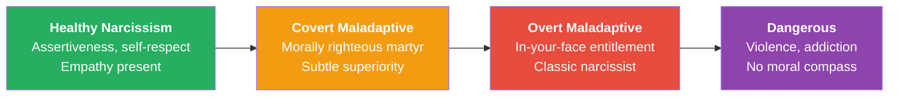
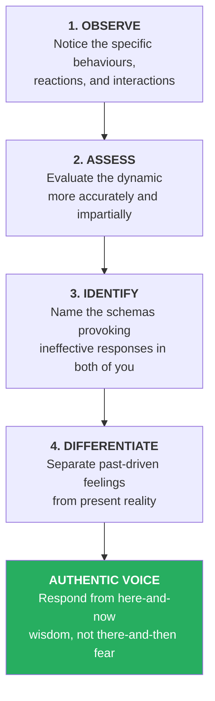
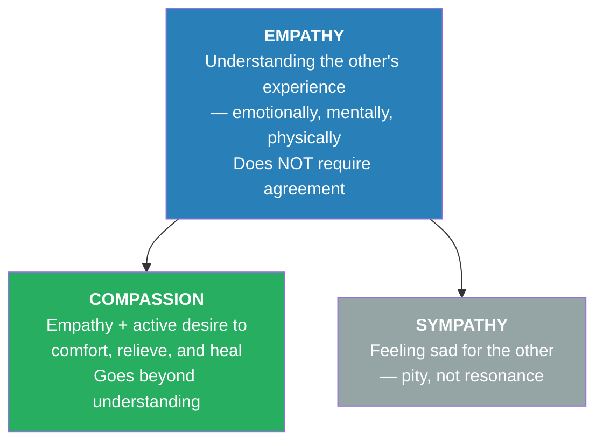
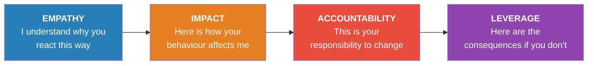
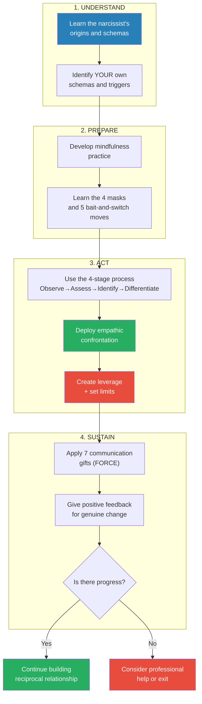

# Disarming the Narcissist — Wendy Behary

> *Most books on narcissism tell you to run. This one teaches you how to stand your ground — with empathy in one hand and a firm boundary in the other.*

---

## About the Author

*Wendy T. Behary, LCSW, is an internationally recognised expert on narcissism who has spent over two decades treating narcissistic clients and their partners. She is the founder and director of the Cognitive Therapy Center of New Jersey, a senior faculty member at the Schema Therapy Institute of New York, and a trained practitioner of interpersonal neurobiology under Daniel J. Siegel. She studied under Aaron T. Beck (founder of cognitive therapy) and Jeffrey Young (founder of schema therapy). Behary's work uniquely integrates schema therapy with brain science to offer a compassionate yet firm approach to surviving narcissistic relationships.*

---

## The Big Idea

The narcissist's abrasive, entitled behaviour is not malice — it is a childhood survival strategy gone rigid. Deep beneath the arrogance lies a <b style="color: #e74c3c">lonely, shame-filled child</b> who never felt unconditionally loved. By understanding your own emotional traps (schemas) and the narcissist's wounded inner child, you can use <b style="color: #2980b9">empathic confrontation</b> — simultaneously extending understanding while holding firm boundaries and creating real consequences — to protect yourself, assert your rights, and potentially influence change.

---

## Key Concepts at a Glance

| Concept | Definition |
|---------|-----------|
| **Schemas** | Deep emotional life themes formed in childhood that operate below awareness and distort present-day reactions |
| **Empathic Confrontation** | Acknowledging the narcissist's pain while firmly holding them accountable for their behaviour |
| **The Four Masks** | Show-Off, Bully, Entitled One, Addictive Self-Soother — the narcissist's protective coping modes |
| **FORCE** | Flexibility, Openness, Receptivity, Competency, Enlightenment — five qualities for effective communication |
| **The Low Road** | Siegel's term for when subcortical threat detection hijacks prefrontal executive function |
| **Leverage** | Meaningful consequences the narcissist values — essential for motivating any change |
| **Limited Reparenting** | Nurturing the wounded inner child within the narcissist through empathy and boundary-setting |
| **Contingent Communication** | Siegel's term for truly attuned listening where response depends on what was actually communicated |

---

## At a Glance

- **The Problem:** You are in a relationship with a narcissist — someone who is self-absorbed, entitled, empathy-deficient, and chronically difficult — and you cannot or do not want to simply leave
- **The Insight:** The narcissist's behaviour is rooted in childhood emotional deprivation and shame, not inherent malice; your own "life traps" (schemas) keep you hooked in the destructive pattern
- **The Method:** <b style="color: #2980b9">Empathic confrontation</b> — understand the wounded child behind the mask, assert your rights without attacking, and create meaningful leverage for change
- **The Toolkit:** Schema identification, mindfulness, communication scripts, the FORCE framework, and seven communication gifts

---

## The 30-Second Version

The narcissist in your life was once a child whose emotional needs went catastrophically unmet. That child built walls of superiority, entitlement, and emotional detachment to survive. Those walls now crush your relationship. <b style="color: #27ae60">You cannot change the narcissist, but you can change the dynamic</b> — by understanding your own triggers, developing mindful awareness, and using empathic confrontation: a strategy that simultaneously acknowledges the narcissist's pain while firmly holding them accountable. This is not about being nice. It is about being strategic, compassionate, and unwilling to sacrifice your own soul.

---

## The 5-Minute Version

### Why Narcissists Are the Way They Are

- The narcissist grew up in a home where love was conditional — based on performance, not personhood
- They learned that needing anyone was weakness, that vulnerability was shameful, and that superiority was the only path to attention
- Deep beneath the arrogance lies a <b style="color: #e74c3c">lonely, shame-filled child</b> who never felt unconditionally loved
- Their masks — the bully, the show-off, the entitled one, the addictive self-soother — are all strategies to avoid feeling that child's pain

*The sankey traces how childhood emotional deprivation and conditional love create specific schemas that crystallize into the four narcissistic masks Behary identifies.*

### Why You Keep Getting Hooked

- You have your own schemas (life traps) from childhood — self-sacrifice, subjugation, abandonment, defectiveness — that the narcissist activates with surgical precision
- These schemas operate below conscious awareness through implicit memory, hijacking your responses before you can think clearly
- The narcissist's charm initially attracted you; their dysfunction now traps you in familiar emotional patterns

### The Way Out

- **Observe** your reactions, **assess** the dynamic, **identify** the schemas at play, and **differentiate** between past-driven feelings and present reality
- Develop <b style="color: #2980b9">mindful awareness</b> — the capacity to notice your triggers in real time and choose a different response
- Use **empathic confrontation**: "I understand why you react this way given your history, but your behaviour toward me is unacceptable and must change"
- Create **leverage** — meaningful consequences the narcissist cares about — because insight alone will not motivate them
- If the narcissist is dangerous (violent, addicted, without moral compass), your priority is safety and exit, not empathy

---

## Part I: Understanding the Narcissist

### What Is a Narcissist?

*The narcissist appeals and appalls in equal measure. One moment he's Sir Lancelot in a beautiful portfolio; the next he's pulling the rug from under you with breathtaking entitlement.*

- Narcissists are consumed by the need to achieve the perfect image — recognition, status, being envied — with little or no capacity to listen, care, or understand others
- This self-absorption leaves them without genuine intimate connection — the very thing every human being craves
- The narcissist travels through life "flaunting an impetuous ego" while unknowingly yearning for "the exceptionally quiet and safe haven found in a heartfelt human embrace"

> [!tip] The Central Paradox
> The narcissist desperately needs connection but considers the very desire for it to be pathetic and weak. So their needs get mischanelled into charm, entitlement, and control.

### The Narcissism Spectrum

> **Interpretation:** Narcissism exists on a spectrum, not as a binary. Healthy narcissism fuels assertiveness and leadership. The overt maladaptive form is the most common and difficult. Dangerous narcissism requires exit strategies, not empathic confrontation.

### Three Origins of Narcissism

| Origin Type | Childhood Experience | Adult Pattern |
|-------------|---------------------|---------------|
| **The Spoiled Child** | No limits, no consequences, taught superiority | Entitled, expects pampering, baffled by rules |
| **The Dependent Child** | Parents did everything for them | Helpless under the bravado, avoids decisions |
| **The Lonely/Deprived Child** | Love conditional on performance; emotional starvation | Most common and complex; drives from shame |

- Most narcissists are a **combination** of these types
- The <b style="color: #e74c3c">spoiled-dependent</b> acts superior but collapses when forced to make real decisions
- The <b style="color: #e74c3c">deprived-dependent</b> fishes for compliments, is hypersensitive, and self-soothes through addiction

> [!example] The Lonely Child's Inner Vow
> - A child raised on conditional love absorbs devastating messages:
> - "I won't need anyone"
> - "Nobody is trustworthy"
> - "I'll take care of myself"
> - "I'll show you"
> - These become the invisible operating system of the adult narcissist

### How the Lonely Child Becomes the Adult Narcissist

*The most common origin story deserves deeper examination:*

- The child was not loved for being the boy or girl they were — they were loved for performing
- They were not guided or encouraged in discovering their true inclinations
- They were not held in the arms of a caregiver who made them feel completely safe and unquestionably wanted
- They were never shown how to put themselves in another person's shoes or how to feel another's inner emotional life — there was no model for empathy in their experience
- Instead, they were dominated by shame and a feeling of defectiveness, both through direct criticism and through the withholding of emotional nurture and physical affection
- They felt something was wrong with them — that they were weak for wanting comfort and attention
- In defence, they gathered every safeguard they could to extinguish the pain

> [!example] Young Louis: The Making of a Narcissist
> - Louis was the eldest of four children, conscripted as his mother's companion during his father's long business trips
> - He was bright and athletic, showered with praise for achievements — but had few limits imposed and was raised to believe he was special
> - His father made it clear: no son of his would dare embarrass him with below-par grades or subpar performance in any public setting
> - Any expression of fear or sadness was branded a sign of weakness
> - Louis endured countless evenings sitting alone at home, studying or practising his clarinet — which he hated — while his parents took the younger children for ice cream
> - Loneliness became a familiar state, whether alone or among others
> - He had few interpersonal skills — unsurprisingly, since his primary models were myopically focused on achievement and self-control
> - Within his family, he had no examples of empathy or emotional connection
> - As a teenager: awkward with girls, masking shame with "Who cares? Nobody's worth my time anyway," distracting himself with academic competition and grandiose fantasies of fame and fortune
> - His schemas — emotional deprivation, defectiveness/shame, mistrust, entitlement, approval-seeking — became the wallpaper of his inner life

### The Four Masks

The narcissist wears protective masks — coping modes that shield the vulnerable child within:

| Mask | What It Looks Like | What It Protects |
|------|-------------------|-----------------|
| **The Show-Off** | Bragging, name-dropping, endless monologues | Deep shame and feelings of defectiveness |
| **The Bully** | Criticism, intimidation, controlling behaviour | Fear of being controlled, used, or humiliated |
| **The Entitled One** | Rule-breaking, demanding special treatment | Terror of being ordinary, which equals being unlovable |
| **The Addictive Self-Soother** | Workaholism, drinking, internet, spending | Intolerable loneliness and emotional emptiness |

*The radar reveals the paradox at the heart of narcissism: the public mask maximizes entitlement and performance while the wounded child beneath maximizes vulnerability — the healthy mode balances both.*

### Male vs. Female Narcissists

- Over 75% of narcissists are male
- **Male narcissists:** aggression, competition, dominance, emotional detachment
- **Female narcissists ("Narcissisters"):** vanity, status through children and household, martyrdom
- The <b style="color: #e74c3c">victim/martyr</b> is a particularly common female narcissist type — she makes everything about her suffering and selfless giving, while crushing anyone who dares disagree
- **Narcissistic mothers** are especially high-stakes: the child learns that making mother happy is their job and that mother's unhappiness is their fault

> [!example] The Narcissistic Mother
> - Deborah sat with her mother at an outdoor concert when her mother demanded: "Switch seats with me, Deborah. The sun is in my eyes."
> - When Deborah didn't immediately comply, her mother fell into a "deathly silence"
> - A small incident — but one in a lifetime of a queen who put her own needs before her child's, every single time

### The Covert Narcissist: A Special Danger

*Covert narcissists are harder to identify because their grandiosity wears humble clothing.*

- The covert narcissist appears as a morally righteous martyr — always pointing out the "right" and "wrong" way to live
- They differentiate themselves from "prejudiced people" and those who are "selfish and lazy"
- Quick to the rescue, they eagerly offer solutions for all your problems — unsolicited
- They speak in "shoulds" and "musts," "always" and "nevers," proclaiming how the world would be better if people just followed the rules (their rules)
- The covert narcissist proudly declares loyalty to truth, offering their "undeniable humility and human imperfection" in an effort to impress you
- Behind the thin veil, they modestly confess their devotion to rigorous self-improvement: "Of course, I could talk about the ten-thousand-dollar donation I made, but I'm not that kind of person"
- <b style="color: #e74c3c">But wait.</b> Like all narcissists, the covert type craves glorified recognition — it's only a matter of time before the deprived child within emerges, hungry to be noticed in a special way
- When the applause for their generosity isn't spectacular enough, or the spotlight fades too quickly, resentment builds until the tightrope of their seemingly composed disposition snaps
- They fall, landing on whoever is in their path — cold eyes, upturned nose, furrowed brow, a sharp diatribe about the ungrateful nature of people

> [!warning] Why Covert Narcissists Are Especially Dangerous to Your Self-Esteem
> Because they disguise their narcissism as virtue, you are more likely to doubt yourself than to question them. When the morally righteous martyr criticises you, it comes wrapped in concern: "I'm only saying this because I care about you." This makes it harder to recognise as narcissistic behaviour and harder to confront without feeling like the ungrateful one.

### Healthy Narcissism

- Healthy narcissism is not an oxymoron — it exists on the human spectrum
- Healthy adult narcissists are: empathic, engaging, leadership-capable, controlled, recognition-seeking (but also generous), determined, confrontational without destroying, and wisely afraid
- Think of leaders who use their drive to make a genuine difference rather than to feed an ego

### The Narcissistic Injury

*Understanding this concept is crucial for navigating everyday interactions.*

- For a narcissist, saying a simple "I'm sorry" feels equivalent to declaring "I am the worst human being in the world"
- Despite all their bravado, narcissists are **easily wounded** by criticism, others' disappointment in them, differing viewpoints, lack of attention or praise, being overlooked, and even their own mistakes
- But you won't necessarily know they're feeling hurt — they are masters of concealment
- Instead of appearing hurt, they will: launch barbed words at you, avoid you, or demand applause for some other aspect of their magnificence
- You may end up surrendering with an "I'm sorry" just to quell their relentless reactions and mend their tattered egos

> [!tip] The Mantras Underneath
> - **His:** "I won't need anyone" — the resounding, self-affirming mantra of the male narcissist
> - **Hers:** "You owe me" — the recurring refrain of the female narcissist
> - These themes are completely outside conscious awareness — an automatic melody playing on repeat thanks to deeply grooved memory circuits

### The Collusion Game

*Narcissists don't operate in a vacuum — they need partners in the dance.*

- The narcissist's partner, assistant, trainer, or friend each bring their own schemas that create the dynamic
- Louis's wife Francine minimises her complaints. His assistant Beth reverences authority figures as her father trained her to. His trainer Bill subjugates his opinions around aggressive men
- What all three share: in Louis's presence, they experience intimidation, resignation, and disillusioned self-doubt
- The narcissist is one half of the equation. Your schemas are the other half. Change either side, and the dance must change

---

## Part II: Understanding Yourself

### Schema Therapy: The 18 Life Traps

*Behary integrates Jeffrey Young's schema therapy — the most powerful framework in the book — to explain why both the narcissist and YOU get trapped in destructive patterns.*

- <b style="color: #2980b9">Schemas</b> are deep emotional themes formed in childhood when core needs go unmet
- They operate through implicit memory — below conscious awareness — and are triggered by present situations that resemble past pain
- When triggered, schemas hijack the brain's executive functions (the "low road" per Siegel), flooding you with emotions that feel current but are actually echoes of the past

The 18 Early Maladaptive Schemas (Jeffrey Young):

| # | Schema | Core Feeling |
|---|--------|-------------|
| 1 | Abandonment/Instability | People I count on will leave me |
| 2 | Mistrust/Abuse | Others will hurt, cheat, or manipulate me |
| 3 | Emotional Deprivation | No one will truly understand or love me |
| 4 | Defectiveness/Shame | I am fundamentally flawed and unlovable |
| 5 | Social Isolation | I don't belong anywhere |
| 6 | Dependence/Incompetence | I can't handle life on my own |
| 7 | Vulnerability to Harm | Catastrophe is imminent |
| 8 | Enmeshment | I can't survive without this person |
| 9 | Failure | I am inadequate compared to everyone |
| 10 | Entitlement/Grandiosity | I am superior; rules don't apply to me |
| 11 | Insufficient Self-Control | I can't tolerate frustration or discomfort |
| 12 | Subjugation | I must surrender control to avoid punishment |
| 13 | Self-Sacrifice | I must put others' needs above my own |
| 14 | Approval-Seeking | My worth depends on others' reactions |
| 15 | Negativity/Pessimism | Things will inevitably go wrong |
| 16 | Emotional Inhibition | I must suppress feelings to avoid rejection |
| 17 | Unrelenting Standards | I must be perfect to avoid criticism |
| 18 | Punitiveness | People (including me) deserve harsh punishment for mistakes |

### Schemas That Hook You to the Narcissist

| Your Schema | How It Hooks You |
|-------------|-----------------|
| Self-Sacrifice | You feel guilty asking for anything; the narcissist makes it harder |
| Subjugation | You bury your opinions when intimidated; the narcissist thrives on this |
| Abandonment | You tolerate torment because you fear being alone |
| Defectiveness | You accept the narcissist's criticism as proof you're flawed |
| Emotional Inhibition | You stay stoically silent while the narcissist erupts |
| Emotional Deprivation | You don't believe anyone will ever meet your needs; the narcissist confirms this |
| Mistrust | The abuse feels like a re-enactment of the past; you know how to endure it |
| Unrelenting Standards | You try harder to be the perfect partner, employee, or sibling |

*The heatmap shows why specific narcissistic tactics devastate some people more than others — your schema profile determines which triggers hit hardest.*

### Schemas the Narcissist Lives By

| Narcissist's Schema | How It Manifests |
|--------------------|-----------------|
| Emotional Deprivation | "No one will ever love me, so I'll never need anyone" |
| Mistrust | "People are nice only because they want something" |
| Defectiveness/Shame | Deep down, feels unlovable — overcompensates through achievement |
| Entitlement/Grandiosity | Feels special, rules don't apply, demands admiration |
| Insufficient Self-Control | Wants what he wants, when he wants it; zero frustration tolerance |
| Approval-Seeking | Constant hunger for recognition, status, attention |

> [!tip] The Schema Dance
> Your schemas and the narcissist's schemas interlock like puzzle pieces. Your self-sacrifice meets their entitlement. Your subjugation meets their control. Your abandonment fear meets their emotional withdrawal. Breaking free requires understanding BOTH sets of schemas.

### The Brain Science: Why Change Is So Hard

*Daniel Siegel's interpersonal neurobiology explains the machinery behind our stuck patterns — and why change, though difficult, is genuinely possible.*

- The brain is a **library of experience** — it constantly scans for the familiar and the predictable
- When schemas are triggered, the subcortical brain (amygdala, limbic system) floods the body with stress hormones, disconnecting the prefrontal cortex — the executive decision-maker
- Siegel calls this the <b style="color: #e74c3c">"low road"</b>: threat perception hijacks rational thought, and you react from implicit memory rather than present reality
- This is why you know intellectually that your response is disproportionate but cannot stop the feeling — the schema operates below the radar of consciousness

> [!abstract] Implicit vs. Explicit Memory
> - **Explicit memory:** You recall it vividly — "I remember when Dad left"
> - **Implicit memory:** You remember without knowing you're remembering — your stomach clenches when someone says they're "going away for a while," but you don't consciously connect it to anything
> - Schemas live primarily in implicit memory — which is why they feel like current truth rather than old wounds

- <b style="color: #27ae60">The good news:</b> the brain is neuroplastic — it can change through new experience, mindful awareness, and "contingent communication" (Siegel's term for truly attuned listening)
- "Feeling felt" — when someone accurately mirrors your inner experience back to you — is among the most powerful healing forces in human relationships

### The Brain as Library

*Siegel's metaphor for how experience shapes our automatic responses:*

- Your brain is a vast library of experience — with folders categorised by life events
- One folder is titled "How I get to work every day"
- Another is titled "How I feel and what I do when I'm with a disagreeable person who needs constant admiration, who makes me feel small, and who has to be right about everything"
- When you encounter Mr Charming in the office on Monday, your expectations and reactions are **predetermined** by the contents of that memory folder
- You can, however, actively engage your brain in searching for a different route

> [!note] The Definition of Insanity
> A client told Behary that in AA meetings there's a saying: "The definition of insanity is doing exactly the same thing over and over and expecting a different result." You are not insane. But sometimes it feels that way when nothing changes despite your best efforts. Harnessing heightened awareness and trying a new approach may feel strange and unnatural — but it is the only way out of the loop.

- The brain seeks the familiar and predictable — this is adaptive when driving your commute, but maladaptive when it keeps you stuck in destructive relational patterns
- When you hit that dreaded "detour sign," you put down the coffee, turn down the radio, and increase your focus — this is the brain being forced to engage deliberately rather than automatically
- The same deliberate engagement is needed when your schemas are activated: **switch from autopilot to intentional navigation**

> [!example] Louis on the Golf Course
> - Louis, a 58-year-old retired executive, plays golf with Jack, a former colleague
> - Terrified of being judged or rejected (defectiveness/shame schema), Louis compensates by bragging endlessly about his status and position
> - Jack is initially amused, then exhausted, then mentally begging for escape: "Who does he think he is? What an egocentric bore"
> - Louis — dominated by his schema — has inspired the very rejection he was trying to avoid
> - The agitations of the schema and the automatic decision to conceal it through showing off simply perpetuate it

### Three Schema Clusters That Trap You

*Behary identifies three common schema combinations in people who stay entangled with narcissists:*

**Cluster 1: Mistrust + Subjugation**
- Your autobiography tells the story of a child who was taken advantage of or mistreated
- Your reflex when facing controlling people is to shut down and comply — it was the only reasonable way to survive as a child
- The narcissist's dominance triggers your old sentinel system, and you lose your voice

**Cluster 2: Defectiveness + Unrelenting Standards**
- You felt unlovable and inadequate as a child, so you worked impossibly hard to earn acceptance
- When the narcissist criticises or withdraws, you double your efforts to be the perfect partner
- You are dancing to a distant drummer inside an orchestra playing outdated songs

**Cluster 3: Abandonment + Emotional Deprivation + Self-Sacrifice**
- You grew up feeling no one was reliably there — alcoholic parent, divorce, loss, depression
- You learned to set aside your own needs and focus on caring for others
- With the narcissist, you walk the narrow, eggshell-lined path, hiding your needs for fear of losing them or igniting their short fuse

> [!example] Francine's Trapped Voice
> - Francine, married to Louis for 32 years, finally confronts him about his critical, self-centred behaviour
> - Flooded by her deprivation and self-sacrifice schemas, she erupts: "You're inhuman; you're the loser!"
> - She storms out, slams the door, cries alone in the bedroom
> - Louis's reaction? A shrug and a smirk: "There she goes again. Hormonal imbalance. She'll get over it"
> - Francine's rage was justified, but her delivery came from the terrified little girl, not the capable adult — and Louis heard none of what she actually needed to communicate

---

## Part III: The Four-Stage Transformation

### Observe → Assess → Identify → Differentiate

*Behary's practical framework for breaking the automatic cycle:*

> **Interpretation:** Each stage builds on the last. You cannot differentiate if you haven't identified the schemas. You cannot identify if you haven't assessed. And you cannot assess without first observing. The endpoint is an authentic voice — neither cowering nor attacking, but firmly present.

### The Narcissist's Five "Bait and Switch" Manoeuvres

| Manoeuvre | What Happens | Your Typical Response |
|-----------|-------------|---------------------|
| **The Disappearing Act** | Promises attention, then becomes unavailable; blames you for being "needy" | Insecurity |
| **The Setup** | Solicits your input with enthusiasm, then annihilates your ideas with humiliation | Intimidation |
| **Dr. Jekyll / Mr. Hyde** | Heroically protective one moment, harshly controlling the next | Resentment |
| **Adding Insult to Injury** | Arrives with roses, making you forgive — then demands all attention again | Provocation |
| **Devil's Advocate** | Invites conversation, then turns it into an unstoppable competitive monologue | Helplessness |

### Fight, Flight, or Freeze — Modified

*Your survival responses need an upgrade, not an elimination:*

| Old Response | Internal Dialogue | Modified Version | New Dialogue |
|-------------|-------------------|-----------------|-------------|
| **Counter-attack** (Fight) | "I'll show you" | Defend without attacking | "I have rights too" |
| **Avoidance** (Flight) | "See ya later" | Time-out, then return | "I need a time-out" |
| **Surrender** (Freeze) | "You're right; it's all my fault" | Shared responsibility | "I may not be perfect, but it's not all my fault" |

> [!abstract] Modified Communication Scripts
> - **For fighters:** "Although it's probably not your intention, I feel devalued by your actions and words. I won't tolerate being treated with such disrespect. You have rights, and so do I."
> - **For fleers:** "I know this issue is very important to you. It's important to me too, but I'm feeling overwhelmed right now. I need some time alone to regroup so our conversation can be productive."
> - **For freezers:** "It seems like you're upset with me, and when I sense that, I tend to give in. That's not my intent. I'm triggered by these exchanges, but I'm working on strengthening my confidence."

### The Sensory Warning System

- When schemas activate, your body sends signals: racing heart, rising skin temperature, stomach knot, throat tightness, trembling lips, mind going blank
- These signals are **data, not destiny** — they tell you a schema has been triggered, not that you're actually in danger
- The key mantra: <b style="color: #2980b9">"That was then and this is now"</b>
- Without conscious attunement, these sensory signals will automatically drive your habitual (and ineffective) response

---

## Part IV: Mindfulness as Foundation

### Why Mindfulness Matters

*Being mindfully present is the bridge between knowing what you should do and actually doing it when the narcissist is in your face.*

- Mindfulness means intentionally directing awareness to your experience — external and internal — in the present moment
- It is the capacity to catch yourself falling into old habits and choose differently
- As Behary's colleague Laura Fortgang describes it: "Being mindful means being aware of everything and certain of nothing"

> [!example] The Cheeseburger Metaphor
> - A client with covert narcissism issues explained his schema-driven need for his popular narcissistic colleague Joe's approval:
> - "Joe is the cheeseburger I really *want*. If he just accepted me into his inner circle, I'd feel truly special"
> - "But what I really *need* is the chicken wrap — because I'm already special, and the way to take good care of myself is to bring healthier people into my life"
> - "My mom didn't know how to take good care of me. I only want Joe to accept me because my schema makes me feel I'm not good enough as I am"
> - "Joe is an elixir for the pain. But the truth is, Joe and I have nothing in common. I don't need props. I need friends."

### The Mindfulness Practice

Behary prescribes a specific twice-daily, five-minute practice:

- **Breath awareness:** Observe the rise and fall of the abdomen, expansion and contraction of the lungs, and the temperature of air entering and leaving
- **Visual scanning:** Label colours, shapes, dimensions, and movement around you
- **Auditory attention:** Notice every sound without judgment — the lawnmower, distant voices, the faint hum of a laptop
- **Olfactory engagement:** Comprehend aromas in the air
- **Taste awareness:** Observe flavours that have taken refuge in your mouth
- **Tactile awareness:** Feel clothing against skin, the surface you sit on, the floor beneath your feet
- **Internal scan:** Scan head to toe for energy, fatigue, tightness, tingling, pain, numbness
- **When schema-thoughts intrude:** Use the four-stage process — observe, assess, identify, differentiate — then return to breath

### The Comfort Zone Trap

*Why we stay stuck even when we know better:*

- Despite the worn soles, bad support, and ugly appearance of our comfortable old shoes, we keep them because they've been personalised by memory
- The same applies to relationships and relational styles — when facing difficulty, you default to what you know
- Only when the "heel comes off" — when the pain becomes too great — do you begin to feel depression, anxiety, and stress sufficient to motivate real change
- From your earliest experiences navigating the continent of your crib, to climbing your mother's lap for comfort, to negotiating the playground for inclusion, you collected thoughts and sensations stored in your memory library for future reference
- We learn quickly what to expect from the world, from others, and from ourselves

> [!example] Beth's Graduation Day
> - Beth, Louis's administrative assistant, grew up as the youngest of five children — the prized possession of her controlling father
> - Her father demanded excellence and punished dissent with his "searing glare, heartbroken displeasure, and irrefutably punishing voice"
> - Beth learned to trade her personal needs for keeping peace in her father's heart — just as her mother had done
> - At her high school graduation, she remembered the proud expression on her immigrant father's face as she walked past in cap and gown
> - She told Behary: "In that moment it felt like it was worth all the loneliness, not having chosen my own clothes, and all the missed parties, dates, and movies — to see the happiness I could bring that man by being what he needed me to be"
> - Her emotional legacy: an inability to have a genuine sense of self, and a chronic tendency to be what others need her to be
> - Even now, encountering Louis at a social event, Beth feels her stomach clench and her throat tighten as she prepares her curtsy to the powerful master

### The "Feeling Felt" Concept

*Daniel Siegel's concept of "feeling felt" is central to understanding both the wound and the cure:*

- When we send a signal, our brains are receptive to others' responses to that signal
- The responses we receive become embedded in neural maps of our core sense of self
- Children come to "feel felt" — they come to sense that their mind exists within their parent's mind
- What a comforting connection: to feel truly "captured," to feel you are accurately and safely held in another person's mind
- The narcissist never had this experience — or had it so inconsistently that they cannot trust it
- Behary asks: "Think about it — who really gets you?"
- In the context of "felt" connections, we have the opportunity to achieve mental and emotional shifts that lead to new interpretations about self-worth and relationships
- <b style="color: #27ae60">This is the healing mechanism</b>: when you feel genuinely understood, the brain forms new pathways that loosen the grip of old schemas

### Carolyn's Breakthrough

> [!example] Carolyn, Damian, and Lucy — Creating Leverage
> - Carolyn married Damian and inherited his 17-year-old narcissistic daughter Lucy — proud daddy's princess with a pedigree and an often sour disposition
> - During visits, Lucy convinced Damian to give her everything: no rules, no consequences, even when she spoke disrespectfully to Carolyn, borrowed clothes without asking, or sabotaged date nights
> - Damian's decree was clear: "My daughter, my rules, period"
> - Carolyn felt powerless — her abandonment and shame schemas kept her trapped
> - Eventually, despite her devastating fear of another failed marriage, she gathered courage to defend her rights: "If things don't change, I'm leaving"
> - After several episodes of Damian's typical "Who cares! Go ahead and leave," he agreed to start therapy
> - The new, assertive approach created the leverage necessary for change — not because Carolyn threatened, but because she meant it
> - Carolyn will ultimately choose whether to remain in this marriage, now that she is no longer at the mercy of her abandonment and shame monsters

### Strategies for the Four Masks

*With your mindful foundation in place, here is how to handle each narcissistic mask:*

**The Show-Off**
- Ignore the grandiose bids for admiration
- Offer modest praise for ordinary, simple gestures instead: "I appreciate that you set up this lunch for us. It's nice to be remembered."
- Avoid words like "wonderful," "amazing," "extraordinary" — these feed the ego; use plain recognition of human decency

**The Bully**
- Look the bully in the eye
- Calmly name the impact: "It's very difficult and frankly unacceptable when you speak to me in that tone, criticising my work because it doesn't match your expectations"
- Acknowledge their frustration without accepting the abuse: "I understand you're disappointed, but you don't need to be mean about it"

**The Entitled One**
- Pull them aside; don't enable the public scene
- State the impact: "This is uncomfortable and embarrassing. I know you're used to taking charge, but it's not fair to ignore my rights and my feelings"
- Propose deferral if they're too upset: "I suggest we postpone our dinner. I'm open to talking about this after you've had a chance to calm down"

**The Addictive Self-Soother**
- Recognise the hiding — this person is in unconscious avoidance
- Name the loss you feel: "I miss you and I'm worried you're pushing harder than necessary"
- Propose professional help: "If we can't find a solution that meets both our needs, I want to seek professional assistance"

> [!warning] The Essential Boundary
> These strategies apply to non-dangerous narcissists. If you face violence, physical intimidation, or threats to your safety, your priority is an exit plan, not empathic engagement. The National Domestic Violence Hotline: 1-800-799-7233.

---

## Part V: When to Leave — Dangerous Narcissism

### Identifying the Dangerous Narcissist

*Not all narcissists are merely annoying. Some are genuinely dangerous — and the distinction matters enormously.*

- Dangerous narcissists <b style="color: #e74c3c">never offer genuine remorse</b> and in some cases show no signs of having a moral compass
- In extreme cases, their rigidity may resemble traits of antisocial personality (sociopathy)
- The vast majority of dangerous narcissists are male

**Threats to financial/legal safety:**
- Excessive gambling, overspending, refusing employment, drunk driving, drug dealing, tax evasion, fraud, theft, viewing child pornography

**Threats to physical/emotional safety:**
- Physical or verbal abuse, threats to harm you/children/self, public humiliation, destroying property, insisting on driving under the influence with family in the car

**Threats to relationship/community stability:**
- Affairs, pornography addiction, pathological lying, neighbourhood conflicts, exposing children to inappropriate material

### The Sexual Malfeasance Pattern

*Behary devotes special attention to sexual transgressions because they are so common and cause such devastating shame:*

- Many narcissists engage secretly in pornography addiction, chat rooms, strip clubs, or prostitution
- When discovered, the typical response escalates through: denial → anger/blame → minimisation → "all men do this"
- The brain can be hijacked by sexual stimulation the same way it responds to addictive substances — the dopamine rush from pornography eventually overshadows the satisfaction of real intimacy
- For the narcissist, these activities require no reciprocity, no emotional vulnerability, and no genuine connection

> [!example] Samantha and Todd — The Dangerous Escalation
> - After 18 years of marriage, Samantha discovers Todd's long-standing pornography and adult chat room habits
> - Todd's response escalates from denial to fury: towering over her, fists clenched, "Trust me, Samantha, you don't want to keep pushing me"
> - When she persists, he attacks: "Maybe if you weren't so boring... maybe if you paid more attention to your fat body..."
> - She tries again. He mocks her tears: "I'm not going to fall for the waterworks, Sam. You're crazy!"
> - He kicks a chair, smashes a coffee cup, storms out
> - In the next room, the children heard everything — huddled together on the floor, crying
> - Eventually, Samantha seeks legal counsel, builds support, and initiates divorce
> - Aftermath: Todd misses custody visits, tells the children to do whatever they want while he stays on his computer; Samantha repairs the damage without speaking ill of him

### Staying or Going: The Decision Framework

- If behaviours are **frequent and widespread**, especially involving escalating threats: <b style="color: #e74c3c">plan an exit</b>
- If behaviours are **occasional and limited**: the relationship may be salvageable with professional help
- Safety is always the first priority — especially with escalating volatility

**For the moderate narcissist who transgresses sexually, rebuilding trust requires three things:**
1. The offended partner must feel genuinely understood
2. The offended partner must discover and express what they need to feel safe again
3. The offended partner must feel safe enough to recognise the narcissist's genuine changes

- All three depend on the narcissist's commitment to change — this is not a burden the betrayed partner carries alone

---

## Part VI: Empathic Confrontation — The Core Strategy

### Empathy vs. Compassion: A Critical Distinction

*This is the intellectual centrepiece of the book. Getting this distinction right changes everything.*

> **Interpretation:** Empathy is the foundation. It means feeling the narcissist's experience resonate within you — without agreeing, tolerating, or excusing. Compassion may develop over time as a desire to help, but empathy alone is sufficient for empathic confrontation.

- <b style="color: #2980b9">Empathy</b> is imagining yourself in the other person's shoes — sensing their feelings, thoughts, and sensations in your own body. It does not mean you approve or accept their behaviour
- <b style="color: #27ae60">Compassion</b> goes further: it is a radiant desire to comfort, console, and relieve suffering. It grows from empathy but includes action
- You need empathy to confront a narcissist effectively. You may or may not develop compassion — and either is fine

> [!tip] Why Empathy Works as a Strategy
> Empathy is the perfect antidote because it lets you understand deeply who the narcissist is and why they behave as they do. This knowledge strengthens you to stand firm, hold them accountable, and not take responsibility for their problems. You can interact without exhausting rage, defensiveness, or submission. You "get" them — and that clarity is power.

### The "Photo Technique"

- Obtain a childhood photograph of the narcissist
- When they are being abrasive, overlay the face of that lonely, unloved child onto the adult in front of you
- Imagine that child's feelings: the shame, the loneliness, the impossible conditions for earning love
- This is not meant to excuse the behaviour — it is meant to anchor your empathy so you can confront without being consumed by your own schema-driven reactions
- Keep a photo of yourself as a child too — your vulnerable inner self also needs your compassion

> [!example] Sue and Don — Empathy in Action
> - Don learns his estranged, demanding father is dying. His reaction: irritation, eye-rolling, emotional stonewalling
> - His wife Sue watches the familiar pattern. She used to feel hurt and angry — but now she understands
> - Sue recalls her own childhood: her drunk father barging into her room at night, screaming; her mother waiting silently for her turn to be berated; her sister's futile comfort: "The sun will rise tomorrow"
> - Though their experiences differ, Sue feels a resonance that lets her see Don's stoic face and understand his desperate need to push away the pain of never being told his father loved him
> - She does not try to comfort him — she knows he would resist. She does not take his coldness personally
> - With empathy, she has spent years helping Don see the origins of his behaviour, disengaging when he was demeaning, and patiently modelling what emotional honesty looks like

### The Empathic Confrontation Formula

The formula combines four elements into a single communication approach:

> **Interpretation:** Each element is necessary. Empathy without accountability enables. Accountability without empathy attacks. And without leverage, the narcissist has no motivation to change.

### Five Empathic Confrontation Scenarios

**Scenario 1: Differentiating Fault and Responsibility**

> [!example] Steven and Sharon — The Late Pickup
> - Steven arrives 20 minutes late at the train station, no apology, immediately attacks: "Don't start with me, Sharon. I had to leave my associates at the country club..."
> - Old Sharon would have sat in nervous, helpless rage
> - New Sharon pauses, breathes, glimpses the lost little boy beneath his scowl, and says:
> - "I understand how important it is for you to protect yourself from embarrassment... I care about all your feelings, including the hassle of dealing with traffic. But it's hard for me to feel any tenderness when you're so critical and hostile. I'd like to feel connected, but for that I need you to communicate with more consideration. And once you've had a chance to calm down, I'd appreciate an apology."
> - Steven deflects: "Don't give me that psych talk about my feelings again"
> - Sharon patiently reassigns responsibility: "I'm not blaming you for things outside your control. However, it IS your responsibility to figure out how to express those feelings without belittling me. That behaviour is harmful to me and to our marriage."
> - Steven goes quiet, then nods slowly: "Yeah, ok." A beginning.

**Scenario 2: Setting Limits**

- Your narcissistic mother-in-law rearranges the baby's nursery furniture while babysitting because it doesn't match her feng shui standards
- You thank her for helping, then firmly: "We'd appreciate it if you didn't try to impose your standards on our home. Please respect our parenting and household decisions, even if you disagree."
- If she ignores you: "I'm not looking to have a debate. I'm respectfully informing you that this matter is not open for negotiation."
- If she escalates to aggression: "This conversation cannot continue if you speak to me that way." Then disengage.

**Scenario 3: Establishing Reciprocity**

- Chris announces dinner at "his" restaurant again. When you suggest trying somewhere new, he frowns and dismisses you
- You visualise his childhood photo, breathe, then: "Chris, I'm happy to consider your wishes and would like you to do the same. This is a two-way street. For this relationship to work, we both need to feel that our feelings, opinions, and desires are heard and considered."

**Scenario 4: Positive Feedback**

- Your narcissistic brother Rick calls — for the first time ever — to politely warn he'll be 20 minutes late and offer to bring something
- You resist old patterns of lavish praise; instead offer simple, human recognition: "I really appreciate the effort you're making to be more considerate. It makes me feel closer to you. Thank you."
- His response: "Yeah, I'm trying. This would have been a real problem for us in the past. Thanks for noticing."

**Scenario 5: Raw Truth with Compassion (The Capstone)**

> [!example] Ed and Karen — Reaching the Little Boy
> - Ed explodes when Karen asks for exercise time: "I'm sick of your selfishness! Why don't you just quit that stupid job?"
> - Old Karen would fight, flee, or freeze
> - New Karen pauses, breathes, connects with the little boy inside Ed who is terrified of loneliness and unworthiness
> - "I don't believe a word of that. Not because I think you're lying, but because I know you. I know how hard it is for you to tell me you miss me. When I'm distracted, you feel like you don't matter. But there's no need to tear me down. You're destroying the chance for us to work things out."
> - Ed, disarmed: "Don't tell me how I feel. I'm angry. That's right, angry."
> - Karen moves closer: "I understand you're angry. But the way you express it only pushes me away. I don't think you really want to push me away. I think you want me to hear you and love you. I'm just asking you to look behind the anger and tell me about the hurt I can feel standing right here beside you."
> - Ed, in a softer, slightly tearful tone: "Listen, Karen, I know it's been a tough week for you. But it's hard for me too. That's all. Sorry. Go do your workout. I'll be fine."
> - She reached him. The little boy emerged from behind the fire-breathing dragon. She offers a shorter workout and extra time together. He accepts.

### Three Tools for Creating Leverage

*Change does not happen without leverage — the narcissist must have something meaningful to lose.*

**1. The Implicit Assumption Rule (Benefit of the Doubt)**

- Begin statements by conveying trust in the narcissist's good intentions
- "I know you probably don't realise how painful those words were..."
- This avoids triggering defensive rage while still holding them accountable
- The narcissist is more likely to listen when they don't feel accused of deliberate malice

**2. The Micro-to-Macro Approach (Dress Rehearsal)**

- Point out empathically that their behaviour with you is a microcosm of how they interact with the wider world
- "I care enough to tell you the truth. Others who don't know you this well may just see you as arrogant and have little desire to be around you"
- This increases leverage because the narcissist cannot hide from your compassionate wisdom AND cannot tolerate the pain of perpetual exclusion

**3. Time-Outs**

- When flooded by emotion, seek temporary distance to recover equilibrium
- During the time-out, use three tools:
  - **Breathe:** The calming breath from mindfulness practice
  - **Schema flash card:** A card carrying the four stages (observe, assess, identify, differentiate) plus a self-soothing step — written out in advance
  - **Healthy distractions:** Read poetry, listen to music, exercise, take a bath, organise, journal

> [!abstract] The Schema Flash Card Template
> 1. **Observe:** "I'm aware that I'm furious with the narcissist"
> 2. **Assess:** "My emotional deprivation and self-sacrifice schemas are being activated because I feel misunderstood and taken for granted"
> 3. **Identify:** "I want to scream and punish him. I also notice cravings for food"
> 4. **Differentiate:** "These are the feelings of the little girl who had to make enormous sacrifices to feel appreciated. But I don't need to prove anything now. I have choices. I am not powerless."
> 5. **Self-soothe:** "Instead of acting on rage or suppressing with food, I could: write in my journal, call a friend, or draft what I want to communicate when we revisit this"

### What to Look for in a Therapist

*If seeking professional help for the narcissist or for the relationship:*

- The therapist must be **empathic AND confrontational** — neither purely validating nor purely challenging
- Too passive → the narcissist dominates the session, performs, and eventually quits
- Too intellectual → reinforces the narcissist's competitive, detached coping mode
- Too intimidated → the narcissist loses all respect and hijacks therapy
- The ideal therapist uses empathic confrontation: "I understand your father gave you the message that you deserved special privileges. But the world doesn't work that way, and he didn't prepare you for real relationships. And I must tell you, the way you're speaking to me right now is deeply off-putting."
- Look for training in cognitive-behavioural therapy and schema therapy specifically

---

## Part VII: The Seven Communication Gifts

### The FORCE Framework

*Behary introduces the FORCE acronym — five qualities of mind that underpin effective communication with anyone, especially a narcissist:*

| Letter | Quality | In Practice |
|--------|---------|-------------|
| **F** | Flexibility | Adjust your approach to fit the situation; discard rigid, inflexible inclinations |
| **O** | Openness | Listen without judgment or preconceived expectations; allow discovery |
| **R** | Receptivity | Use eye contact, facial expression, and body language to signal you are ready to engage |
| **C** | Competency | Be a reliable, empathic listener; model authenticity without seeking recognition |
| **E** | Enlightenment | Be curious; create an atmosphere of mutual understanding through spoken and unspoken language |

> [!tip] The Irony of FORCE
> Effective communication contains all elements of FORCE but cannot be *forced*. It must emerge as naturally as leaves unfold in spring. Being self-possessed does not mean being selfish — it means equalising the ratio of give and take.

*The FORCE framework transforms every dimension of communication — replacing reactive, defensive responses with strategic, empathy-informed engagement.*

### The Seven Gifts

**Gift 1: Generosity — The Art of Mutual Respect**

- Recognise differences without negative labels
- Understanding something does not mean agreeing with it
- Model: "I can understand how strongly you feel about hiring that landscaper. I appreciate the effort you always put into researching options. I'm open to your plan, but I'd like to discuss it further because I have another option to consider. Could we think about this together?"

**Gift 2: Courage — The Art of Self-Disclosure**

- Reveal your full experience without insults — shed the burden of withholding truth
- Disclose to help the narcissist see impact, not to make them feel terrible
- Model: "I know you feel bad when you come home and find me on the phone. I understand, and I'm sorry it makes you feel that way. But when you speak to me like that, it hurts. And when I feel hurt, it's hard to express loving feelings, even though I want to."

**Gift 3: Truth — The Art of Discernment**

- Distinguish between here-and-now reality and schema-driven "there and then" reactions
- Help the narcissist see when their response belongs to the past, not the present
- Model: "I know you're stressed about work. But I'm me — the one who knows you and thinks you're doing a great job. I'm not your father. Those visits to his house probably bring up all kinds of uncomfortable memories. Let's not let that spoil things between us."

**Gift 4: Shared Effort — The Art of Collaboration**

- Invoke the power of "we" — shared responsibility rather than finger-pointing
- Extremely important because narcissists are hypersensitive to feeling controlled or shamed
- Model (calling narcissistic mother): "Mom, look how hard it is for us to ask each other for what we need. It doesn't really matter what we do. I'd just love to spend time with you. If what we do matters to you, we could come up with a plan that suits us both."

**Gift 5: Foresight — The Art of Anticipating Confrontations**

- Use your memory and experience to predict the narcissist's pattern — then prepare your response in advance
- Model (father cancelling lunch for the third time): "Dad, I know this might hurt your feelings. I know how important your work is. But what I really want is to spend time with you, just hanging out with no special reason. I get disappointed when you cancel. I'm not blaming you — I'm simply asking you to think about the impact on me."

**Gift 6: Responsibility — The Art of Apology**

- A genuine apology emphasises compassion for the injured party, not redemption of the transgressor
- Model what you want the narcissist to learn: apologise based on understanding their sensitivities, not wallowing in self-loathing
- Model (to partner with punctuality schemas): "I'm sorry for the carelessness I've been showing lately about being on time. Since I know your history with your unreliable mother, I know how hurtful it is when people don't keep their word — especially me. My actions keep hurting you. I don't want to hurt you."

**Gift 7: Balance — The Art of Reflective Listening**

- Mirror the narcissist's communication and extract hidden feelings
- Listen without judgment, reflect back without evaluation, wait your turn to express your own view
- Model (husband raging about workplace humiliation): "It's clear you're very upset. I know how hard you've worked and how undervalued you've been feeling. It sounds hard not to get support from the team when you feel unjustly represented. I can feel your tension resonating in my own body. Is there anything I can do to help?"
- Then gently: "I heard you say you didn't want me to lecture you. I wonder if you really feel that way, or if it was just something you said because of how upset and embarrassed you were?"

### Matching Impact to Intention: Three General Skills

| Skill | Description |
|-------|-------------|
| **Matching impact with intention** | Choose words and tone so the message received matches the message intended. If you're angry but really want to communicate loneliness, express loneliness |
| **Modelling** | Give the narcissist an example of what you expect in return. Speak calmly and respectfully, and you're more likely to receive the same |
| **Having reasonable expectations** | Know your listener's capabilities and your own energy. Some days are better than others for difficult conversations |

---

## Part VIII: The Therapist's Story

### Behary's Baptism by Fire

> [!example] The Mediation That Changed Everything
> - Behary was 25 years old, a fresh intern at a family mediation organisation, assigned to help divorcing couples resolve custody disputes
> - An attractive 45-year-old attorney arrived before his wife. He stared at Behary — in her navy suit, clipboard, and barely-ripened clinical experience — and asked: "How long exactly is this ridiculous meeting going to last?"
> - Before she could stammer a response: "When will the counsellor be arriving?" She replied: "I am the counsellor." He rolled his eyes and turned to stare out the window
> - His wife arrived — lovely, apologetic. The attorney interrupted the proceedings, screamed at his wife, threw papers on the floor, and stormed out: "Put that in your official record, Miss Counsellor"
> - The wife wept. She told Behary her husband was a well-known litigator, that no counsellor had ever been able to hold him accountable
> - But she also said something striking: she was sad because her husband was "a difficult man and the product of a very painful childhood." She was puzzled how "someone who was once such a sweet and sensitive little boy could have become such an overbearing egomaniac"
> - That encounter planted the seed for Behary's entire career in narcissism

### Wendy vs. Louis: Therapist Models the Method

> [!example] "The Caring Is Free"
> - Louis habitually arrived 5-10 minutes late and demanded extra time at the end of sessions
> - When Behary enforced the time boundary, Louis protested: "What's the problem giving me five extra minutes? This is important! It's a business: time's up, pay up"
> - Behary, managing her own self-sacrifice and subjugation schemas, responded:
> - "Louis, if what you mean is that I couldn't possibly care about you given the time limitations, consider this: you can only pay me for my time and expertise. The caring is free. Even YOU can't make me care about you. And I must tell you that when you speak to me the way you just did, it's hard for me to feel caring toward you. I wonder if it's the same for Francine and your children."
> - Then, with empathy: "I know it's hard for you, since no one ever helped you tolerate feelings of disappointment. You were led to believe you were superior and entitled to special privileges. So it's not your fault, Louis. But to have the kind of relationships you want, you have to work on these beliefs."
> - Louis managed to respond with difficulty but honestly: "Time seems to pass too quickly, and I want to stay longer. I end up feeling rejected or controlled, even though I believe you're trying to help me."
> - A breakthrough — however small — toward genuine vulnerability

---

## The Complete Method: A Visual Summary

### The Architecture Metaphor for Relationships

*Behary offers couples a powerful metaphor for healing after betrayal:*

- Imagine a beautiful architectural structure — what makes it attractive is rarely perfectly laid bricks, one-dimensional colours, or highly polished stones
- Rather, it is the **imperfections**: bruises in the brick, a mixture of colours, weathered stones with rough edges
- The collective and its contrasts are what make the architecture rich and beautiful
- These structures have withstood the test of time, natural forces, and perhaps war — and have also been cared for by people who value them
- A lasting relationship is similarly: robust despite challenges to its foundation, rich in colours that portray both brilliance and sadness, with some imperfections that lend character, and above all, carefully tended by those who want it to endure

### The Impact on Children

*Behary sounds a clear warning about narcissism's generational transmission:*

- Children of narcissists often become either **narcissistic** themselves (mimicking the powerful parent) or **submissive/self-sacrificing** (mimicking the compliant parent)
- Due to their desperate need for safety, children often assume the role of marital referees — this must not be allowed
- The effects of narcissistic rage, entitlement, and dismissiveness on children can be deeply harmful
- <b style="color: #e74c3c">Love and concern for children can be a powerful motivator</b> for both partners to commit to repairing trust and resolving narcissistic damage
- Behary's key advice: protect children from being placed in mediator roles, never speak ill of the narcissistic parent to children, but do not shield children from acknowledging that the parent "has some issues to work on"

### Leverage and Incentive: The Two Engines of Change

*Without leverage, empathic confrontation becomes a conversation the narcissist can walk away from. Without incentive, leverage becomes coercion.*

| Leverage | Incentive |
|----------|-----------|
| A significant potential or actual loss | The possibility of secure, shame-free connections |
| Health crisis or medical condition | A sense of belonging |
| Retirement or job loss | Freedom from the burden of constantly proving self-worth |
| Financial instability | These feel unattainable and even unimaginable to the narcissist |
| Legal challenges | Requires professional help to access |
| The pain of persistent loneliness | Often only felt when other avenues close |

- Behary frequently tells her narcissistic clients: "You're not changing because you're not in enough pain yet, or you don't have anything tangible enough to reach for"
- For Louis, it was Francine's genuine ultimatum — the first time in his adult life he felt enough fear and pain for change to become possible
- <b style="color: #27ae60">The leverage must be real, not theatrical</b> — empty threats teach the narcissist that your words carry no weight
- Create leverage by emphasising how much the relationship means to you AND conveying your genuine fear that it will collapse without collaborative effort
- Do not create leverage by cruelly threatening the narcissist — this only produces ugliness and defensiveness
- The key: be prepared to **follow through** on consequences. A consequence you won't enforce is worse than no consequence at all

> **Interpretation:** The method is sequential but cyclical. You will need to repeat these steps many times. Progress with a narcissist is measured in small shifts, not dramatic transformations. And there is always a point where you must honestly assess whether staying is worth the cost.

---

## Key Takeaways

### The 15 Principles

1. <b style="color: #27ae60">Narcissism originates from unmet childhood needs</b> — not from inherent evil or chosen malice
2. The narcissist's behaviour is not your fault, but <b style="color: #2980b9">your response IS your responsibility</b>
3. Empathy is understanding, not agreeing or tolerating
4. <b style="color: #e74c3c">Leverage is essential</b> — without meaningful consequences, the narcissist has no motivation to change
5. Your own schemas are the hooks that keep you trapped in the destructive dance
6. Mindfulness creates the gap between trigger and response — the space where choice lives
7. "That was then and this is now" — the master mantra for differentiation
8. <b style="color: #2980b9">Confrontation without empathy is attack; empathy without confrontation is enabling</b>
9. The narcissist's inner child is terrified, ashamed, and lonely — see that child behind the mask
10. Schemas operate below conscious awareness through implicit memory
11. The brain can change (neuroplasticity), therefore personality is not destiny
12. <b style="color: #27ae60">Reciprocity is non-negotiable</b> in any healthy relationship
13. Not all narcissists are dangerous, but dangerous ones require exit strategies, not empathy experiments
14. Model what you expect — communication, accountability, vulnerability
15. Change is possible but requires persistent effort, leverage, and often professional help

### What This Book Will NOT Do

- It will not magically transform your narcissist
- It will not make the pain disappear
- It will not work if the narcissist is truly dangerous (violent, addicted without remorse, antisocial traits)
- It will not replace professional therapy for deeply entrenched patterns

### What This Book WILL Do

- Give you a framework to understand both the narcissist and yourself with unprecedented clarity
- Equip you with practical communication scripts you can use immediately
- Free you from the exhausting cycle of rage, submission, and self-blame
- Help you decide — with clear eyes — whether to stay, set limits, or leave
- Restore your sense of self-worth and authentic voice regardless of the narcissist's response

---

## Quick Reference: The Disarming Toolkit

### When the Narcissist Is in Your Face — What to Do RIGHT NOW

| Situation | Internal Action | External Response |
|-----------|----------------|-------------------|
| Being criticised/humiliated | Breathe. Check: is this my schema or real threat? | "I understand you're frustrated, but it's not acceptable to speak to me this way" |
| Being ignored/dismissed | Notice the abandonment schema activating | "When you dismiss me, I feel invisible. I need you to engage with me on this" |
| Facing a monologue | Let go of the need to be heard right now | Set a time: "I'd like to discuss this properly when we can both talk" |
| Being blamed for their problem | Differentiate: "That was then, this is now" | "I'm not the one responsible for your mood. But I care about what you're feeling" |
| Narcissistic rage erupting | Assess safety first. If safe, anchor in present | "We need a time-out. I'll come back when we can both be calmer" |
| Being love-bombed after bad behaviour | Notice the provocation response pattern | Accept graciously but do not pretend the earlier behaviour didn't happen |

### The Empathic Confrontation Cheat Sheet

Every empathic confrontation follows this structure:

1. **Empathise:** "I understand why you feel/react this way..." (connect to their history or vulnerability)
2. **State impact:** "When you do X, I feel Y..." (own your experience)
3. **Set the boundary:** "This is not acceptable / needs to change..." (firm, not aggressive)
4. **Offer the implicit assumption:** "I don't think you intend to hurt me..." (benefit of the doubt)
5. **State leverage (when necessary):** "If this doesn't change, I will need to..." (consequence, not threat)
6. **Invite collaboration:** "Can we work on this together?" (the power of "we")

### The "That Was Then, This Is Now" Protocol

When you feel triggered:
1. **Pause** — do not react immediately
2. **Breathe** — three slow breaths, attending to abdomen, lungs, and air temperature
3. **Scan** — notice where the sensation lives in your body
4. **Name it** — "This is my [schema name] activating"
5. **Differentiate** — "This feeling belongs to my childhood, not to this moment"
6. **Choose** — "I am an adult with choices. I will respond from the here and now"

---

## The Verdict

> *"The self-help journey can be lonely and arduous." — Wendy Behary*

*Disarming the Narcissist* stands apart in the narcissism literature for a single, powerful reason: <b style="color: #2980b9">it refuses to choose between empathy and self-protection</b>. Where most books tell you to flee or to fight, Behary teaches you to understand — and to use that understanding as both shield and bridge.

The schema therapy framework gives this book intellectual depth that most self-help books lack. The integration of interpersonal neurobiology adds scientific credibility. But what truly elevates it is Behary's clinical warmth and her refusal to demonise either party. She is equally compassionate toward the person suffering at the narcissist's hands and toward the lonely, shame-filled child buried within the narcissist.

The practical communication scripts are immediately usable. The five empathic confrontation scenarios and seven communication gifts provide enough variety that readers in virtually any situation — spouse, child of, employee of, friend of a narcissist — can find a template that fits.

<b style="color: #e74c3c">The limitation</b> is real and Behary acknowledges it: empathic confrontation requires sustained effort, emotional resilience, and a narcissist who is at least somewhat reachable. For truly dangerous narcissists, the book is clear that exit is the only sane option. And even for moderate narcissists, the results may be modest — measured in degrees of improvement rather than fundamental transformation.

**Read this if:** You love someone who is narcissistic and you want to understand them deeply while protecting yourself. You are exhausted by the cycle but not ready to leave. You suspect your own childhood patterns are keeping you stuck and want to understand why.

**Skip this if:** You need immediate safety from a violent partner — call the National Domestic Violence Hotline first. Or if you have already decided to leave and need validation, not strategy — in which case [[The Sociopath Next Door - Martha Stout]] or [[Emotional Blackmail - Susan Forward]] may serve you better.

### A Final Word on Hope

*Behary is neither naively optimistic nor bleakly pessimistic. Her position is earned:*

- Not every narcissist is willing to change — but some will, with sufficient influence, incentive, and assistance
- The options for resolving conflict in relationships are finite: end the relationship, maintain the status quo, adopt new dysfunctional patterns, or resolve it in a healthy way
- The last option requires exhaustive commitment — even when both parties are fully engaged
- But the brain is capable of change, and therefore personality is flexible and open to transformation
- Experts propose that a path to change comes from **attuned listening and genuine self-expression** in the context of a mindful, here-and-now state of mind
- Even if the narcissist never fully transforms, YOUR growth — in self-awareness, assertiveness, and emotional freedom — is a transformation worth pursuing
- As Behary writes in her conclusion: "Releasing this healthy, wise, and awakened self within you is perhaps the ultimate achievement"
- The tools in this book work regardless of the narcissist's response — because the primary beneficiary is always you

> [!quote] 
> "We often enjoy the comfort of opinion without the discomfort of thought." — John F. Kennedy (opening the book)

**Pair with:**
- [[In Sheep's Clothing - George K. Simon]] — for tactical understanding of manipulative personalities
- [[Emotional Blackmail - Susan Forward]] — for the FOG (Fear, Obligation, Guilt) dynamics that parallel schema activation
- [[The Gaslight Effect - Robin Stern]] — for recognising reality-distortion tactics
- [[Who's Pulling Your Strings - Harriet B. Braiker]] — for building resistance to manipulation
- [[Atlas of the Heart - Brene Brown]] — for expanding your emotional vocabulary and shame resilience

---

## Related Reading in This Vault

### Awareness & Protection
| Title | Connection |
|-------|-----------|
| [[In Sheep's Clothing - George K. Simon]] | Tactical complement: manipulative personality types and covert aggression |
| [[Emotional Blackmail - Susan Forward]] | FOG dynamics parallel schema activation patterns |
| [[The Sociopath Next Door - Martha Stout]] | Dangerous end of the narcissism spectrum; when empathy must stop |
| [[The Gaslight Effect - Robin Stern]] | Reality distortion tactics that narcissists frequently employ |
| [[Who's Pulling Your Strings - Harriet B. Braiker]] | Building resistance to manipulation complements empathic confrontation |

### Psychology & Decision Making
| Title | Connection |
|-------|-----------|
| [[Emotional Intelligence - Daniel Goleman]] | Cited directly by Behary; empathy framework foundational to the method |
| [[Atlas of the Heart - Brene Brown]] | Emotional vocabulary, vulnerability, and shame resilience |

### Mindset & Self-Mastery
| Title | Connection |
|-------|-----------|
| [[13 Things Mentally Strong People Don't Do - Amy Morin]] | Boundary-setting and self-mastery overlap with schema management |
| [[Feel the Fear and Do It Anyway - Susan Jeffers]] | The courage to act despite schema-driven fear |

### Parenting & Child Development
| Title | Connection |
|-------|-----------|
| [[The Whole-Brain Child - Daniel J. Siegel]] | Siegel's interpersonal neurobiology in parenting context |
| [[Parenting from the Inside Out - Daniel J. Siegel]] | Cited directly; making sense of your own childhood to parent effectively |
| [[No-Drama Discipline - Daniel J. Siegel]] | Empathic limits with children parallel empathic confrontation with narcissists |
