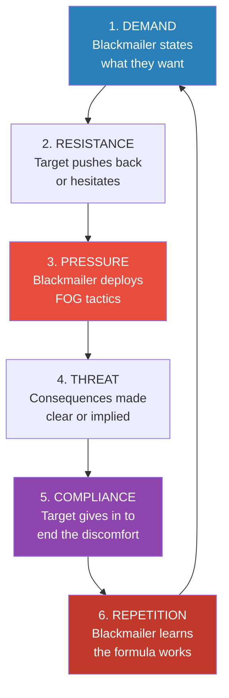
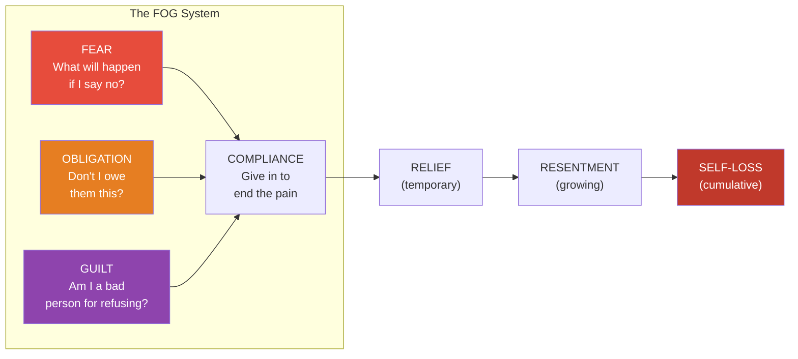
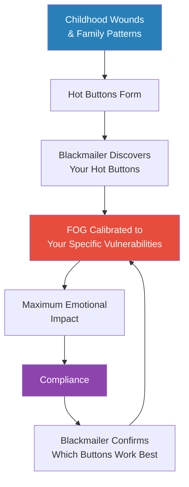
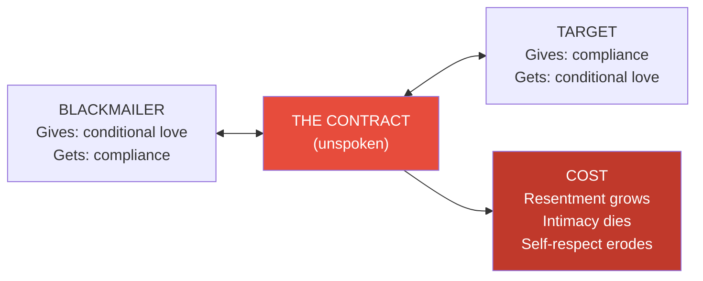
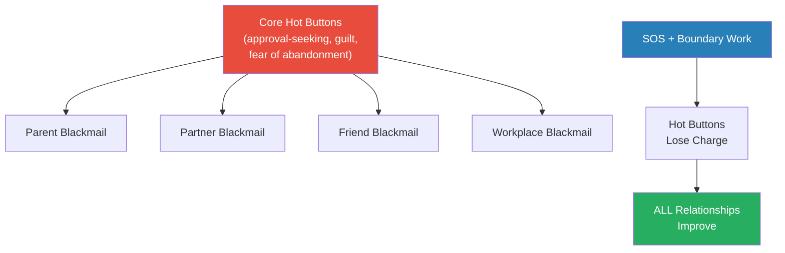
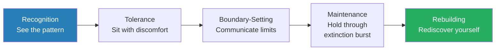

# Emotional Blackmail — Susan Forward

> Susan Forward names what millions of people experience but can't articulate: the feeling of being trapped by someone who uses your love, loyalty, or guilt against you.
> She calls it emotional blackmail, and it follows a predictable pattern — the blackmailer makes a demand, you resist, they apply pressure through fear, obligation, or guilt, you cave, and the cycle repeats.
> Each round trains you to cave faster next time.
> The book maps the entire system: the four types of blackmailers, the FOG they deploy, the six-stage cycle they run, and the specific steps to break free.
> Forward writes with clinical precision and genuine compassion, drawing on decades of therapeutic case studies.
> It is one of the most practical books ever written about manipulation in close relationships.

---

## About the Author

Dr. Susan Forward is a therapist, lecturer, and bestselling author specialising in toxic relationships and emotional abuse. She has maintained a clinical practice in Los Angeles for decades, treating thousands of patients caught in manipulative and abusive dynamics. She is also known for *Toxic Parents* and *Men Who Hate Women and the Women Who Love Them*, both of which became bestsellers. The case studies in *Emotional Blackmail* are drawn directly from her therapeutic work, with names and details changed to protect privacy. Her writing style is direct, empathetic, and unflinching — she names patterns that most people feel but cannot articulate.

---

## The Big Idea

- <b style="color: #2980b9">Emotional blackmail</b> is not a single event — it is a system, a repeating cycle of demand, pressure, and compliance that operates like a well-oiled machine
- The blackmailer's weapon is **FOG**: Fear, Obligation, and Guilt — three emotional states that bypass rational thought and drive you to comply against your own interests
- It works because the target cares about the relationship more than the blackmailer does — <b style="color: #27ae60">the caring itself becomes the leverage</b>
- The people most vulnerable to emotional blackmail are not weak — they are deeply empathetic, loyal, and conflict-averse, and those very qualities get weaponised against them
- <b style="color: #e74c3c">Giving in doesn't save the relationship — it trains the blackmailer to escalate</b>
- Every time you comply under pressure, you teach the blackmailer that the formula works and invite a bigger demand next time
- Breaking free requires tolerating the discomfort of saying no and weathering the storm that follows
- Forward's programme is not about leaving relationships — it is about changing the dynamic within them so that manipulation no longer works

---

## Key Concepts at a Glance

| Concept | One-line summary |
|---------|-----------------|
| **FOG** | Fear, Obligation, and Guilt — the three emotional weapons blackmailers deploy |
| **The Blackmail Cycle** | Demand → Resistance → Pressure → Threat → Compliance → Repetition |
| **Punishers** | Blackmailers who threaten direct consequences if you don't comply |
| **Self-Punishers** | Blackmailers who threaten to harm themselves to control you |
| **Sufferers** | Blackmailers who make you responsible for their misery without explicit threats |
| **Tantalizers** | Blackmailers who dangle rewards that never materialise |
| **The Hot Buttons** | Deep vulnerabilities the blackmailer has learned to press |
| **SOS Method** | Stop, Observe, Strategise — the three-step response to blackmail attempts |
| **No-JADE** | Don't Justify, Argue, Defend, or Explain — it gives them ammunition |
| **Extinction Burst** | The predictable escalation when you first stop complying |
| **The Contract** | The unspoken agreement between blackmailer and target that keeps the cycle running |

*Each blackmailer type wields a distinctive combination of FOG weapons — Punishers rely on direct threats, Self-Punishers weaponize self-harm, Sufferers maximize guilt and obligation, and Tantalizers dangle rewards.*

---

## Part I: Understanding the Blackmail System

### Chapter 1 — What Is Emotional Blackmail?

*Forward defines the term that gives the book its name and distinguishes it from ordinary conflict, showing why this particular pattern is so insidious.*

- <b style="color: #2980b9">Emotional blackmail</b> is a powerful form of manipulation in which someone close to you threatens — directly or indirectly — to punish you if you don't do what they want
- It is not the same as a disagreement, a negotiation, or even a heated argument
- The distinguishing feature is the **threat-compliance loop**: the blackmailer makes it clear that if you don't give in, you will suffer — through their anger, their withdrawal, their tears, or their self-destruction
- Forward is careful to note that emotional blackmail is not limited to romantic relationships:
  - Parents blackmail adult children
  - Adult children blackmail ageing parents
  - Friends blackmail friends
  - Bosses blackmail employees
  - Anyone with emotional leverage can become a blackmailer

> [!tip] Core Insight
> Emotional blackmail is not about what the blackmailer is asking for — it is about HOW they ask. A request becomes blackmail when it comes wrapped in a threat, spoken or unspoken, that says: "If you don't comply, I will make you suffer."

- <b style="color: #27ae60">The key distinction is the presence of a threat tied to your emotional vulnerabilities</b>
- A partner saying "I'd prefer you didn't take that job" is a preference
- A partner saying "If you take that job, I'm leaving" is a demand backed by a threat
- A partner saying "If you really loved me, you wouldn't even consider it" — that is FOG

---

### The Six Stages of the Blackmail Cycle

*Forward maps the entire cycle so you can recognise it in real time — not after you've already given in.*

Every act of emotional blackmail follows the same six-stage pattern, regardless of who is involved or what the demand is about:

Each stage feeds the next, creating a self-reinforcing loop that grows stronger with every cycle.

**Stage 1 — Demand:**
- The blackmailer states what they want — sometimes directly, sometimes wrapped in implication
- The demand itself may seem reasonable on the surface: "I want you to spend the holidays with my family" or "I need you to lend me money"
- <b style="color: #e74c3c">What makes it blackmail is not the content of the demand but the consequences attached to non-compliance</b>

**Stage 2 — Resistance:**
- The target hesitates, pushes back, or says no
- This is the trigger that activates the blackmail machinery
- The blackmailer experiences your resistance as a threat to their sense of control

**Stage 3 — Pressure:**
- The blackmailer begins deploying FOG — Fear, Obligation, or Guilt — to override your resistance
- This is where the manipulation becomes visible, if you know what to look for:
  - Fear: "You'll regret this."
  - Obligation: "After everything I've done for you."
  - Guilt: "I can't believe you'd do this to me."

**Stage 4 — Threat:**
- The pressure crystallises into a threat — explicit or implied
- Punishers state it directly: "If you do that, I'm leaving."
- Sufferers imply it: "I suppose I'll just have to manage somehow."
- The threat is always calibrated to your specific vulnerabilities

**Stage 5 — Compliance:**
- The target gives in — not because they agree, but because the emotional discomfort has become unbearable
- <b style="color: #e74c3c">This is the moment of surrender, and it comes with a brief wave of relief that disguises the long-term damage</b>
- The relief is real but temporary — what follows is resentment, self-blame, and diminished self-respect

**Stage 6 — Repetition:**
- The blackmailer has learned that the formula works
- Next time, they will use the same pattern — often with a bigger demand
- The cycle accelerates: each round, the target caves faster because they've been trained to associate resistance with pain

> [!example] Jim and Helen — The Divorce Threat (Punisher)
> - Jim threatened to leave Helen every time she disagreed with him on a significant decision
> - Over the years, Helen had stopped expressing her own opinions entirely — she edited herself before speaking to avoid triggering the threat
> - She came to therapy unable to identify what she actually wanted, because she had spent so long suppressing her own preferences
> - When Forward asked Helen what she would choose if Jim's reaction didn't matter, Helen couldn't answer — she had lost access to her own desires
> **The lesson:** Compliance doesn't preserve the relationship — it hollows out the person doing the complying.

> [!example] Margaret and Her Mother — "I'll Just Die" (Self-Punisher)
> - Margaret's mother told her that if she moved to another city for a job, "I don't know what I'll do to myself — I might just die"
> - Margaret cancelled her plans, turned down the job, and stayed — consumed by guilt and resentment in equal measure
> - Her mother's health did not improve. Her emotional demands escalated. The next demand was that Margaret stop seeing her boyfriend, who "took too much of her time"
> - Each time Margaret gave in, the demands grew larger because her mother learned that the self-harm threat was an effective lever
> **The lesson:** Giving in to a self-punisher doesn't make them safer — it teaches them that the threat works.

---

## Part I (Continued): The FOG

### Chapter 2 — Fear, Obligation, and Guilt

*Forward dissects the three emotional weapons that make blackmail work, showing how each one targets a different vulnerability.*

<b style="color: #2980b9">FOG</b> is Forward's acronym for the three emotional states that blackmailers exploit. The term is deliberately evocative — when you're in the FOG, you can't see clearly. Your judgment is impaired, your boundaries dissolve, and you make decisions based on emotional pain rather than rational assessment.

| Weapon | How It Works | What It Targets | Example |
|--------|-------------|-----------------|---------|
| **Fear** | Threatening consequences — anger, abandonment, withdrawal, retaliation | Your need for safety and connection | "If you go to that dinner, don't bother coming home" |
| **Obligation** | Invoking history, sacrifice, and debt — weaponising the relationship's past | Your sense of fairness and loyalty | "I sacrificed my career for this family and this is how you repay me?" |
| **Guilt** | Making you feel like a bad person for having boundaries | Your self-image as a caring, decent person | "I guess I'm just not important enough for you to care" |

---

#### Fear — The First Weapon

- Fear is the most primal of the three and the one that works fastest
- The blackmailer doesn't need to threaten violence — emotional threats are just as powerful:
  - Fear of their anger (walking on eggshells)
  - Fear of abandonment ("I'll leave")
  - Fear of withdrawal ("I won't speak to you")
  - Fear of retaliation ("I'll tell everyone what you did")
- <b style="color: #e74c3c">Fear works because the human brain processes emotional threats the same way it processes physical ones</b> — the fight-or-flight response activates, rational thinking shuts down, and survival instincts take over
- When you're afraid of someone's reaction, you are not making a choice — you are reacting to a threat

> [!example] Sarah and Her Boss — The Unspoken Threat
> - Sarah's boss never explicitly threatened her job, but he had a pattern of giving her the cold shoulder for days whenever she pushed back on an unreasonable request
> - The silence was more effective than any shouted threat — Sarah learned to comply preemptively to avoid the freeze-out
> - She described the feeling as "constantly walking through a minefield"
> - When Forward asked what she was actually afraid of, Sarah struggled to name it — it wasn't termination, it was the unbearable tension of his disapproval
> **The lesson:** Fear doesn't require an explicit threat — the anticipation of pain is enough to control behaviour.

---

#### Obligation — The Second Weapon

- Obligation works by turning the relationship's history into a ledger of debts
- The blackmailer frames every sacrifice they've ever made as an investment that you now owe a return on:
  - "I raised you. I fed you. I paid for your education."
  - "I moved to this city for you."
  - "I've been loyal to this friendship for twenty years."
- <b style="color: #2980b9">The obligation trap</b>: the blackmailer reframes normal relationship behaviour (caring, helping, supporting) as transactions that create binding obligations
- <b style="color: #27ae60">Healthy relationships involve mutual generosity — not a running balance sheet</b>
- The key distortion: obligation-based blackmail confuses gratitude with servitude
  - You can be grateful for someone's past generosity and still say no to their current demand
  - Gratitude does not cancel your right to boundaries

> [!example] David and His Father — The Debt That Never Clears
> - David's father reminded him constantly of the sacrifices he had made — working double shifts, paying for college, going without vacations
> - Whenever David made a decision his father disagreed with — choice of career, choice of partner, where to live — the ledger was invoked
> - "After everything I did for you, this is how you treat me"
> - David spent years trying to "repay" the debt through compliance, but the debt never cleared — every new sacrifice was absorbed into the ledger without acknowledgment
> **The lesson:** An obligation that can never be satisfied is not a debt — it is a prison.

---

#### Guilt — The Third Weapon

- Guilt is the most sophisticated weapon because it hijacks your own conscience
- The blackmailer doesn't need to attack you directly — they simply position themselves as the victim of your boundaries:
  - "I guess I'm just not important to you."
  - "If you cared about me, you wouldn't even think about doing that."
  - "You're so selfish."
- <b style="color: #e74c3c">Guilt works because good people want to be good</b> — and the blackmailer exploits that desire by making you feel that having boundaries makes you a bad person
- The guilt trap creates a false equation:
  - My needs = selfish
  - Their needs = reasonable
  - Disagreeing with them = hurting them
  - Hurting them = being a bad person
- Once you accept this equation, you will always lose — because any act of self-preservation becomes evidence of your moral failure

> [!tip] Core Insight
> The guilt weapon works by making YOU feel like the abuser for setting a boundary. The blackmailer flips the script so that your reasonable "no" becomes their injury — and you end up apologising for having needs.

The three weapons of FOG often operate simultaneously, creating a dense emotional fog that makes clear thinking nearly impossible.

---

## Part II: The Four Faces of Blackmail

### Chapter 3 — The Punisher

*Forward profiles the most direct and aggressive type of blackmailer — the one who tells you exactly what they'll do if you don't comply.*

- <b style="color: #2980b9">Punishers</b> are the most overt type of blackmailer
- They make explicit threats:
  - "If you take that job, I'm filing for divorce."
  - "If you don't come to Christmas, you're out of the will."
  - "If you see that friend again, we're done."
- Their primary weapon is **fear** — fear of their anger, fear of their retaliation, fear of abandonment
- Punishers often believe they are simply being honest about their feelings — they don't see their behaviour as manipulation
- There are two subtypes:
  - **Active punishers** — who threaten specific harmful actions (leaving, cutting off money, exposing secrets)
  - **Passive punishers** — who punish through withdrawal (silence, coldness, emotional absence) until you comply

> [!example] Allen and His Wife — The Silent Treatment
> - Allen's wife didn't yell or make dramatic threats — she simply stopped speaking to him whenever he did something she disapproved of
> - The silences could last days, sometimes over a week
> - Allen described the experience as worse than arguing — at least in a fight you know where you stand
> - He began monitoring his own behaviour obsessively, trying to predict what might trigger the next freeze-out
> - His world shrank around her preferences — he stopped seeing friends, stopped pursuing hobbies, stopped making any decision without checking with her first
> **The lesson:** Silent punishment is still punishment — and it can be more controlling than any shouted threat.

- <b style="color: #e74c3c">The core danger of the Punisher</b>: their targets learn to self-censor before the demand is even made
- Over time, you don't wait for the threat — you preemptively comply, editing yourself to avoid triggering their displeasure
- This is how Punisher dynamics create people who no longer know what they want — because they've spent years avoiding what the Punisher doesn't want

---

### Chapter 4 — The Self-Punisher

*The most emotionally loaded type: blackmailers who threaten to harm themselves, weaponising your love and concern against you.*

- <b style="color: #2980b9">Self-Punishers</b> don't threaten you — they threaten themselves
- Their weapons are guilt and terror in equal measure:
  - "If you leave me, I don't know what I'll do."
  - "I can't go on without you."
  - "If you move away, I might as well be dead."
- This is the most difficult type to resist because the stakes feel life-and-death
- Forward is clear: <b style="color: #e74c3c">self-harm threats must always be taken seriously, but taking them seriously does not mean complying with every demand</b>
- The appropriate response to a genuine self-harm threat is to call emergency services — not to cancel your own plans
- Self-Punishers exploit the fact that most people cannot distinguish between genuine crisis and emotional manipulation in the moment

> [!abstract] How to Respond to Self-Harm Threats
> 1. Take every threat seriously — do not dismiss or minimise it
> 2. Do NOT comply with the demand as a way to prevent the threatened action
> 3. Call emergency services or the appropriate crisis line
> 4. Tell the person: "I take what you're saying seriously, which is why I'm calling someone who can help"
> 5. Understand that YOU are not equipped to be someone's sole reason for living — that is a professional's role
> 6. After the crisis is managed, revisit the boundary you were setting before the threat was made

- The Self-Punisher's pattern creates a specific trap: you become their emotional hostage
- Your entire life organises itself around preventing their crisis
- Forward notes that many Self-Punishers never actually intend to follow through — but they have learned that the threat alone is enough to get what they want
- <b style="color: #27ae60">The compassionate truth: keeping someone alive by destroying your own life helps no one</b>

> [!example] Carol and Her Husband Tom — The Emotional Hostage
> - Tom told Carol that he "couldn't survive" without her every time she raised the possibility of a trial separation
> - Carol stayed for years, terrified that leaving would push Tom into a crisis
> - She slept poorly, gained weight, developed anxiety — her own health deteriorated while she tried to manage his emotions
> - When Carol finally contacted a therapist at Forward's recommendation, Tom initially escalated — but within weeks, he began attending therapy himself
> - The relationship eventually ended, but Tom did not collapse — he found resources he never needed to develop while Carol was his emotional safety net
> **The lesson:** When you are someone's entire support system, you are not helping them — you are preventing them from building the resilience they need.

---

### Chapter 5 — The Sufferer

*The passive manipulator who never makes an explicit threat — they simply make you responsible for their unhappiness.*

- <b style="color: #2980b9">Sufferers</b> are the subtlest type of blackmailer — they never say "do this or else"
- Instead, they communicate through sighs, sadness, and martyrdom:
  - "No, no, you go out and have fun. I'll be fine here alone."
  - "I don't want to be a burden. I'll manage somehow."
  - "Don't worry about me. I'm used to being disappointed."
- Their weapon is **guilt** — pure, uncut guilt
- The Sufferer doesn't need to threaten consequences because they ARE the consequence — their visible misery is the punishment for your non-compliance
- Forward notes that Sufferers are often genuinely unhappy people — but they have learned to weaponise their unhappiness rather than address it

| Blackmailer Type | Primary Weapon | How They Communicate | Target's Response |
|-----------------|----------------|---------------------|-------------------|
| **Punisher** | Fear | Direct threats, silence, withdrawal | Preemptive compliance |
| **Self-Punisher** | Guilt + Terror | Threats against themselves | Becoming an emotional hostage |
| **Sufferer** | Guilt | Sighs, martyrdom, visible misery | Chronic caretaking |
| **Tantalizer** | Hope | Promises of rewards | Endless striving |

- The Sufferer's trap: they make you feel responsible for solving problems they refuse to solve themselves
- <b style="color: #e74c3c">You cannot rescue someone who has made their suffering their identity</b>
- The more you try to help, the more they need — because your helping confirms their role as the victim and their hold on your attention

> [!example] Lisa and Her Friend Karen — The Perpetual Victim
> - Karen called Lisa several times a week to share her latest crisis — a rude coworker, a disappointing date, a family argument
> - Whenever Lisa offered solutions, Karen rejected them all, then sighed: "I guess nothing will ever work out for me"
> - If Lisa was unavailable or suggested Karen try therapy, Karen would say: "I guess I'm just not important enough for anyone to care about"
> - Lisa began avoiding Karen's calls, then felt guilty for avoiding them, then answered out of guilt — trapped in a cycle of resentment and obligation
> - The friendship had become entirely one-directional: Karen's needs consumed every interaction
> **The lesson:** A relationship where one person's suffering controls the other person's behaviour is not friendship — it is a hostage situation wrapped in empathy.

---

### Chapter 6 — The Tantalizer

*The blackmailer who uses carrots instead of sticks — promising wonderful things if you comply, but the rewards never arrive.*

- <b style="color: #2980b9">Tantalizers</b> are the most seductive type of blackmailer
- They don't threaten — they promise:
  - "If you move to my city, I'll help you start your business."
  - "Just do this one more thing for me and I'll make it up to you."
  - "Stick with me and you'll get that promotion."
- Their weapon is **hope** — the dangling of a reward that is always just out of reach
- <b style="color: #27ae60">The Tantalizer's genius is that they make you feel like a partner in a transaction rather than a victim of manipulation</b>
- You comply willingly — even eagerly — because you believe the payoff is coming
- It never comes. Or it comes in diminished form, followed immediately by a new demand

> [!example] Patrick and His Boss — The Promotion That Never Came
> - Patrick's boss hinted at a major promotion for over two years, always framing it as contingent on "just one more project"
> - Patrick worked evenings, weekends, and holidays — missing his daughter's recitals and his wife's birthday
> - Each time he completed a project, the goal posts moved: "Great work. Now if you can just handle the Henderson account too..."
> - The promotion went to someone else. When Patrick confronted his boss, the response was: "These things take time. Keep doing what you're doing."
> - Patrick had sacrificed two years of family life chasing a carrot that was never on offer
> **The lesson:** If the reward has been promised but never delivered, it is not a reward — it is a leash.

- Forward notes that Tantalizers often appear in parent-child dynamics too:
  - "If you marry someone I approve of, I'll give you your inheritance."
  - "Get the right degree and I'll finally be proud of you."
- The approval, like the promotion, never arrives — because the Tantalizer's power depends on keeping you in pursuit

> [!tip] Core Insight
> Punishers, Self-Punishers, and Sufferers use negative emotions to control you. Tantalizers are different — they use positive emotions. Hope is the most insidious weapon because the target doesn't feel manipulated. They feel motivated.

*The heatmap reveals why certain blackmailer types are more effective against certain personality profiles — Punishers exploit fear and conflict avoidance, while Sufferers weaponize obligation and guilt.*

---

## Part III: The Blackmail Target

### Chapter 7 — Your Hot Buttons

*Forward shifts focus from the blackmailer to the target, showing how your deepest vulnerabilities become the exact points of leverage.*

- Emotional blackmail requires two people — the one who applies pressure and the one who succumbs to it
- <b style="color: #2980b9">Hot buttons</b> are the specific emotional vulnerabilities that the blackmailer has learned to press
- Everyone has hot buttons — they are the legacy of childhood wounds, family dynamics, and unresolved fears
- Common hot buttons include:
  - **Need for approval** — you need the blackmailer to think well of you
  - **Fear of abandonment** — you'd rather lose yourself than lose the relationship
  - **Excessive responsibility** — you feel responsible for everyone's emotional state
  - **Self-doubt** — when they say you're selfish, you wonder if they're right
  - **Conflict avoidance** — the short-term pain of saying no feels worse than the long-term cost of saying yes
  - **Fear of anger** — other people's anger feels dangerous, even when it poses no real threat

The blackmailer doesn't randomly deploy FOG — they calibrate their attacks to your specific vulnerabilities, learned over years of intimate knowledge.

- <b style="color: #e74c3c">The cruelest aspect of emotional blackmail: the information used against you was shared in trust</b>
- You told them your fears. You shared your insecurities. You let them see your weak spots.
- Now those confidences are weaponised — not in an obvious way, but in the precise targeting of their pressure

---

#### Why Good People Make Good Targets

- Forward emphasises that being a target of emotional blackmail is not a character flaw — it is often a sign of empathy, loyalty, and conscientiousness
- The same traits that make someone a good friend, a reliable partner, and a devoted parent are the traits that make them vulnerable to exploitation:
  - You care about other people's feelings — so guilt works on you
  - You value fairness — so obligation works on you
  - You want to keep the peace — so fear of conflict works on you
- <b style="color: #27ae60">Understanding your hot buttons is not about blaming yourself — it is about knowing your vulnerabilities so they can no longer be exploited</b>

> [!example] Ellen and Her Adult Daughter — The Guilt Expert
> - Ellen's daughter Stephanie had learned exactly which buttons to press: Ellen's fear of being seen as a bad mother
> - Whenever Ellen set a boundary — declining to babysit on short notice, refusing to lend more money — Stephanie invoked the guilt: "Mom, I thought family was supposed to be there for each other"
> - Ellen would cave immediately, then spend hours justifying it to her husband: "She's my daughter. What am I supposed to do?"
> - Forward helped Ellen identify the specific hot button: a childhood memory of her own mother saying "Family comes first, always" — a rule Ellen had never questioned
> - Once Ellen recognised the button, she could feel it being pressed without automatically responding to it
> **The lesson:** You cannot disarm a hot button you haven't identified. Name it, and it loses half its power.

---

### Chapter 8 — The Inner World of the Target

*Forward goes deeper into the psychological architecture that makes certain people especially susceptible to blackmail.*

- Beyond individual hot buttons, Forward identifies a set of <b style="color: #2980b9">core beliefs</b> that make people chronically vulnerable to emotional blackmail:
  - "I should always put others first"
  - "If someone is upset with me, it must be my fault"
  - "A good person doesn't make other people unhappy"
  - "I don't have the right to say no to someone who needs me"
  - "Peace at any price is better than conflict"
- These beliefs feel like moral principles, but Forward argues they are <b style="color: #e74c3c">distortions of genuine virtues</b>:
  - Generosity distorted into self-erasure
  - Empathy distorted into responsibility for other people's emotions
  - Loyalty distorted into servitude
  - Peacemaking distorted into silence

> [!tip] Core Insight
> The beliefs that make you vulnerable to blackmail feel like your best qualities — your empathy, your loyalty, your sense of fairness. The blackmailer doesn't exploit your weaknesses. They exploit your strengths.

- Forward traces these beliefs to childhood experiences:
  - Growing up with an emotionally volatile parent teaches you that other people's moods are your responsibility
  - Growing up with a critical parent teaches you that approval must be earned through compliance
  - Growing up in a family where conflict meant danger teaches you that peace must be preserved at any cost
- <b style="color: #27ae60">The path out begins with separating your genuine values from the distorted beliefs that hijack them</b>
  - You can be generous without being a doormat
  - You can be empathetic without being responsible for everyone's feelings
  - You can value peace without sacrificing your own needs to get it

---

### The Unspoken Contract

- Every blackmail dynamic involves what Forward calls <b style="color: #2980b9">the contract</b> — an unspoken agreement between the blackmailer and the target
- The contract has two clauses:
  - **The blackmailer's clause:** "I will continue to love/approve of/stay with you as long as you do what I want"
  - **The target's clause:** "I will do what you want as long as you continue to love/approve of/stay with me"
- Neither party writes this contract consciously — it develops through repeated cycles of demand and compliance
- <b style="color: #e74c3c">The contract is inherently unstable because it is based on control, not connection</b>
- As long as the contract holds, both parties get something:
  - The blackmailer gets compliance
  - The target gets the illusion of security
- But the cost accumulates silently — in resentment, in self-loss, in the hollowing out of genuine intimacy

The unspoken contract creates the illusion of a functioning relationship while both parties pay an escalating price.

---

## Part IV: Breaking Free

### Chapter 9 — The SOS Method

*Forward introduces her core defence framework — a three-step process for responding to blackmail attempts without giving in or blowing up.*

<b style="color: #2980b9">SOS</b> stands for Stop, Observe, Strategise. It is Forward's primary tool for breaking the blackmail cycle, and it works by inserting a pause between the blackmailer's pressure and your response.

> [!abstract] The SOS Method
> 1. **STOP** — Do not respond immediately. The blackmailer relies on your emotional reaction. Say: "I need to think about that." This is a complete sentence.
> 2. **OBSERVE** — Step back and notice what is happening. Name the FOG: "This is guilt. This is fear. This is obligation." Naming it breaks its grip.
> 3. **STRATEGISE** — Decide in advance what you will and won't do. Write it down. Practice saying it out loud. Prepare for the backlash.

- <b style="color: #27ae60">The critical principle: you are not responsible for the blackmailer's reaction to your boundary</b>
- They will escalate. They will test. They will deploy more FOG. This is predictable and temporary.

*Forward's defence framework is weighted toward observation and strategy — recognizing the pattern and planning your response account for half the work of breaking free.*

---

#### Step 1: Stop

- The most important word in the entire programme is "stop"
- Emotional blackmail works because it triggers an immediate, reflexive response — you feel the FOG and react before you've had time to think
- <b style="color: #27ae60">Breaking the reflex requires buying time</b>
- Forward provides specific scripts:
  - "I need to think about that."
  - "Let me get back to you."
  - "I can't give you an answer right now."
  - "This is too important to decide in the moment."
- The blackmailer will push back on the delay because delay threatens their control:
  - "What's there to think about?"
  - "I need an answer now."
  - "You're stalling."
- <b style="color: #e74c3c">Do not be drawn into justifying why you need time</b> — that is JADE territory, and it gives them fresh material to argue with

---

#### Step 2: Observe

- Once you've created space, use it to observe the dynamics:
  - What is the demand?
  - What FOG is being deployed? Is it fear, obligation, guilt, or a combination?
  - What hot button is being pressed?
  - What is the implied or stated threat?
  - What will happen if you say no? (Not what they say will happen — what will actually happen)
- Forward recommends writing these observations down — putting the dynamic on paper strips it of some of its emotional power
- <b style="color: #2980b9">Naming the manipulation is the single most powerful defence against it</b>
- When you can say to yourself "This is emotional blackmail — they are deploying guilt to get me to cancel my plans" — the FOG begins to lift

---

#### Step 3: Strategise

- With clarity comes the ability to plan a response:
  - What do you actually want to do? (Not what they want, not what you "should" do — what you want)
  - What is the worst realistic outcome of saying no?
  - Can you tolerate that outcome?
  - What words will you use?
- Forward recommends rehearsing your response — literally saying it out loud, in a mirror if necessary
- She also recommends anticipating the blackmailer's counter-moves:
  - If they escalate, you repeat your position
  - If they switch tactics (from guilt to anger, for example), you name the switch
  - If they recruit allies, you hold your ground

> [!example] Rebecca's First "No" — SOS in Action
> - Rebecca's mother-in-law called demanding that Rebecca and her husband cancel their vacation to attend a family reunion
> - In the past, Rebecca would have caved immediately — the guilt of "not being a good family member" was her hot button
> - This time, she used SOS:
>   - **Stop:** "Let me talk to David about it and get back to you"
>   - **Observe:** She identified guilt ("if you really cared about this family") and obligation ("we always do things together") in the mother-in-law's framing
>   - **Strategise:** She decided to attend the reunion for one day instead of cancelling the vacation entirely
> - The mother-in-law was unhappy but eventually accepted the compromise
> - Rebecca reported that the temporary discomfort of saying "not this time" was far less painful than the resentment she usually felt after caving
> **The lesson:** SOS doesn't require a dramatic confrontation — it creates space for a response that respects both the relationship and your own needs.

---

### Chapter 10 — Saying No Without JADE

*Forward introduces one of the most practical tools in the book: the art of declining without giving the blackmailer ammunition.*

- <b style="color: #2980b9">JADE</b> stands for Justify, Argue, Defend, Explain — and Forward says you should do none of them
- Each one gives the blackmailer material to work with:

| JADE Behaviour | Why It Backfires | Example |
|---------------|-----------------|---------|
| **Justify** | Gives them a reason to argue with | "I can't because I have work." → "You can take a day off." |
| **Argue** | Engages with their framework, validates their position | "That's not fair!" → "You think THIS is unfair? Let me tell you about unfair..." |
| **Defend** | Implies you need their approval to make your decision | "I'm not being selfish!" → "If you have to say that, you know you are." |
| **Explain** | Provides ammunition for the next round | "I need time to myself because..." → Every reason becomes something they can counter |

- <b style="color: #27ae60">Instead of JADE: state your position simply and repeat it</b>
- Forward calls this the **broken record technique**:
  - "I've made my decision."
  - "I understand you're upset. My answer is the same."
  - "I hear what you're saying. I'm not going to change my mind."
  - "I know this is hard for you. I've made my choice."
- The power of the broken record is that it gives the blackmailer nothing to work with
- They can't argue with "I've made my decision" — there's no opening, no logic to dismantle, no reason to counter

> [!tip] Core Insight
> Every justification, argument, defence, or explanation you offer is a thread the blackmailer can pull. The fewer threads you offer, the less they have to unravel.

---

### Chapter 11 — Building the Power Statement

*Forward provides a template for the definitive boundary-setting conversation.*

- For situations that require a more substantial response than a simple broken record, Forward recommends creating a <b style="color: #2980b9">power statement</b>
- A power statement has four components:

> [!abstract] The Power Statement Template
> 1. **"I know you're upset"** — acknowledge their feelings without agreeing with their position
> 2. **"I understand that you see it differently"** — validate their perspective without accepting their framing
> 3. **"But I've made my decision and I'm not going to change it"** — state your boundary clearly
> 4. **"I hope we can work through this"** — leave the door open for the relationship without leaving the door open for further negotiation

- The power statement works because it is:
  - Empathetic (it acknowledges their pain)
  - Clear (it leaves no room for ambiguity)
  - Final (it signals that the discussion is closed)
  - Non-combative (it doesn't attack or counter-attack)
- <b style="color: #27ae60">The power statement separates empathy from compliance</b> — you can care about how they feel without doing what they want

---

### Chapter 12 — What to Expect When You Stop Complying

*Forward is honest about the cost of breaking the cycle — it will get worse before it gets better.*

- When you first stop complying, the blackmailer will not gracefully accept your new boundary
- They will escalate — Forward calls this predictable pattern the <b style="color: #2980b9">extinction burst</b>
- The escalation follows a predictable sequence:
  - **Repetition** — they repeat the demand, louder and more insistently
  - **Intensification** — they increase the pressure, deploying more FOG
  - **Style-switching** — if guilt isn't working, they try fear; if fear isn't working, they try obligation
  - **Ally recruitment** — they bring in third parties: "Can you believe what they did to me?"
  - **Testing** — they probe for cracks in your resolve, looking for the moment when your resistance wavers

> [!example] Mark's Extinction Burst — When Mom Escalated
> - Mark told his mother that he would no longer lend her money for non-emergencies
> - Week 1: She cried and said he was abandoning her (guilt)
> - Week 2: She called his siblings and told them Mark was "cutting her off" (ally recruitment)
> - Week 3: She said she "might as well give up on life" (self-punishment threat)
> - Week 4: She showed up at his house unannounced and demanded to know why he was "being cruel" (escalation)
> - Week 5: She called and asked, in a normal tone, if he wanted to come to dinner
> - The escalation followed exactly the pattern Forward had predicted — and it burned itself out in under a month
> **The lesson:** The extinction burst is temporary. The blackmailer is testing whether your boundary is real. If you hold, the storm passes.

- <b style="color: #e74c3c">Some relationships will not survive your boundaries</b>
- Forward is honest about this: if a relationship is built entirely on your compliance, then your non-compliance means the relationship has no foundation
- But Forward reframes this loss: the relationship that collapses when you set a boundary was already gone — what you had was an arrangement, not a connection
- <b style="color: #27ae60">The relationships worth having will adapt. They may be strained. They may require difficult conversations. But genuine relationships can absorb a "no" without disintegrating.</b>

---

## Part V: Deeper Patterns

### The Blackmailer's Inner World

*Forward shifts perspective again, helping you understand what drives the blackmailer — not to excuse them, but to see the full picture.*

- Forward is careful not to demonise blackmailers — she views them as people caught in their own dysfunctional patterns
- Most blackmailers share certain characteristics:
  - **Low frustration tolerance** — they cannot tolerate not getting what they want
  - **Externalisation** — they hold others responsible for their own emotional states
  - **Black-and-white thinking** — you're either with them or against them
  - **Fear of loss** — underneath the controlling behaviour is often a deep terror of abandonment
  - **Limited emotional vocabulary** — they don't know how to express needs without attaching threats
- <b style="color: #2980b9">Understanding the blackmailer's psychology is not about forgiving or excusing — it is about depersonalising</b>
- When you understand that their behaviour is driven by their own pain and limitations, it becomes easier to resist without rage
- The blackmailer's threats feel personal but are actually formulaic — they would use the same pattern with anyone in your position

> [!example] The Punisher Who Was Punished — Understanding Jim
> - When Forward worked with Jim (the husband who threatened divorce during disagreements), she discovered that Jim grew up with a father who used the same tactic
> - Jim's father would threaten to leave the family whenever Jim's mother challenged him — and Jim's mother always backed down
> - Jim had absorbed this as the model for how relationships work: disagreement = threat of abandonment
> - He genuinely did not understand why Helen experienced his behaviour as abusive — from his perspective, he was simply communicating his feelings
> - Understanding this didn't excuse Jim's behaviour, but it explained the machinery behind it
> **The lesson:** Blackmailers are usually running a programme they learned in childhood. They are not evil — they are unskilled at intimacy.

---

### When the Blackmailer Is a Parent

- Forward devotes significant attention to parent-child blackmail because it is both the most common and the most resistant to change
- Parental blackmail carries extra weight because:
  - The obligation feels biological — "they gave me life"
  - Childhood conditioning runs deep — you've been complying since before you could talk
  - Society reinforces the dynamic — "honour thy father and mother" becomes "obey thy father and mother at any cost"
- <b style="color: #e74c3c">Parental blackmail is the original blackmail</b> — it is where most people learn the pattern, both as targets and as future blackmailers
- Forward identifies the most common parental blackmail scripts:
  - "After all I've sacrificed for you"
  - "You'll understand when you have children"
  - "I won't be around forever"
  - "Your [sibling] would never do this to me"
- Breaking free from parental blackmail is the hardest work in the book because it requires renegotiating the most fundamental relationship in your life

> [!tip] Core Insight
> You can love your parents and still set boundaries with them. Boundaries are not abandonment. They are the only thing that makes adult love possible — because love without freedom is not love. It is captivity.

---

### When the Blackmailer Is a Partner

- Romantic partnerships create uniquely fertile ground for emotional blackmail because:
  - The intimacy provides detailed knowledge of hot buttons
  - The fear of abandonment is at its strongest
  - The shared history creates a thick web of obligation
  - Sexual and domestic life create daily opportunities for pressure
- Forward identifies common patterns in partner blackmail:
  - Using sex as a weapon or a reward
  - Threatening to leave during every disagreement
  - Invoking the children: "Think about what this will do to the kids"
  - Financial control: "I pay the bills, so I make the decisions"
- <b style="color: #27ae60">The goal is not to leave the relationship — it is to change the terms of engagement</b>
- Forward recommends couples therapy when both partners are willing — but notes that the blackmailer must acknowledge the pattern before therapy can work

> [!example] Janet and Rob — The Sex Weapon
> - Rob withheld physical affection whenever Janet did something he disapproved of — visiting her sister, spending money on herself, or making plans without consulting him
> - Janet initially thought they were just "going through a rough patch," but Forward helped her see the pattern: warmth was a reward for compliance, coldness was a punishment for independence
> - Rob never said "I'm punishing you" — he said "I'm just not in the mood" — which made it almost impossible for Janet to name what was happening
> - When Janet confronted the pattern, Rob initially denied it, then accused her of "making everything about sex"
> - With therapy, Rob eventually acknowledged that he used withdrawal as a control mechanism — a pattern he had watched his own father use
> **The lesson:** When affection operates on a compliance schedule — present when you obey, absent when you don't — it is not affection. It is a transaction.

---

### When the Blackmailer Is a Friend

*Friendship blackmail is uniquely disorienting because friends are supposed to be chosen relationships — the absence of family obligation makes the manipulation harder to name.*

- Friendship blackmail is often the most confusing form because the target thinks: "I chose this person. If the relationship is bad, I can just leave"
- But friendship blackmailers exploit a different set of vulnerabilities:
  - **Shared history** — "We've been friends for twenty years, and now you're pulling away?"
  - **Social consequences** — "Everyone will think you're a terrible friend"
  - **Emotional investment** — the sunk-cost fallacy applied to relationships
  - **Identity** — "I'm the kind of person who doesn't abandon friends"
- <b style="color: #2980b9">Friendship blackmail</b> often takes the Sufferer form — the friend who makes you responsible for their emotional wellbeing without ever making an explicit demand
- Common patterns:
  - One-directional emotional support — you listen to their problems for hours; they have no time for yours
  - Guilt trips when you're unavailable — "I guess I'll just deal with this alone"
  - Competitive suffering — no matter what you're going through, their situation is worse
  - Loyalty tests — "If you were really my friend, you would..."

> [!example] Beth and Andrea — The Friendship That Drained
> - Andrea called Beth at least three times a week with a crisis: a fight with her boyfriend, trouble at work, a falling out with her mother
> - Beth always listened, always offered advice, always rearranged her schedule when Andrea said she "really needed to talk"
> - But when Beth's father was diagnosed with cancer and she needed support, Andrea was consistently unavailable — "I'm dealing with my own stuff right now"
> - When Beth pulled back from the friendship to focus on her family, Andrea told their mutual friends that Beth had "abandoned" her
> - Beth spent weeks feeling guilty until Forward helped her see the pattern: the friendship had been a one-way emotional service agreement disguised as mutual support
> **The lesson:** A friendship where only one person's needs are treated as urgent is not a friendship — it is an unpaid job.

- <b style="color: #e74c3c">The hardest truth about friendship blackmail: the guilt of ending the friendship is often worse than the damage of staying in it</b>
- Forward recommends testing the friendship with a clear, kind boundary before walking away:
  - "I care about you, but I can't be your only source of support"
  - "I need our friendship to work both ways"
  - If the friend responds with FOG rather than reflection, you have your answer

---

### When the Blackmailer Is in the Workplace

*Forward extends her framework beyond personal relationships to show how emotional blackmail operates in professional settings — where the power imbalance makes resistance even harder.*

- Workplace blackmail is complicated by the fact that the blackmailer often has real structural power over you — the power to fire, demote, or marginalise
- <b style="color: #2980b9">Workplace blackmail</b> takes specific forms:
  - **The Tantalizer boss** — promises promotions, raises, or opportunities in exchange for ever-increasing demands on your time and energy
  - **The Guilt-tripping colleague** — "I can't believe you're leaving at 5 when the rest of us are staying late"
  - **The Punisher manager** — assigns undesirable tasks, excludes from meetings, or gives cold treatment when you don't comply
  - **The Sufferer leader** — "I don't know how I'll manage without you on this project... I guess I'll figure it out somehow"
- The workplace adds unique complications:
  - Financial dependence — you need the job
  - Professional reputation — you worry about being labelled "difficult" or "not a team player"
  - Hierarchical power — the blackmailer may have direct authority over your career
- <b style="color: #27ae60">Forward's advice for workplace blackmail is more cautious than for personal relationships</b> — she acknowledges that you may need to be strategic rather than direct

> [!abstract] Workplace Blackmail — Forward's Guidelines
> 1. Document the pattern — dates, demands, threats (implied or explicit), and your responses
> 2. Build alliances — find trusted colleagues or mentors who can validate your perception
> 3. Use the SOS method — buy time before responding to unreasonable demands
> 4. Set boundaries through actions, not confrontations — "I can do X or Y by Friday, but not both. Which would you prefer?"
> 5. Know your options — having a financial cushion or alternative employment possibilities reduces the blackmailer's leverage
> 6. Escalate appropriately — HR, union, legal counsel when the behaviour crosses into harassment

- Forward notes that workplace blackmail often goes unrecognised because corporate culture normalises many of its components:
  - Working excessive hours is called "dedication"
  - Accepting unreasonable demands is called "being a team player"
  - Compliance under pressure is called "professionalism"
- <b style="color: #e74c3c">When "going above and beyond" is the minimum requirement and anything less triggers punishment — that is not a high-performance culture, it is a blackmail system</b>

---

### The Interconnection of Multiple Blackmailers

- Forward observes that people who are vulnerable to blackmail in one relationship are often vulnerable in many
- This is not coincidence — it reflects consistent hot buttons that multiple blackmailers can exploit:
  - A person who cannot tolerate their mother's guilt will also struggle with a partner's guilt, a friend's guilt, and a boss's guilt
  - The vulnerability is in the target, not in any single relationship
- <b style="color: #27ae60">The good news: because the vulnerability is internal, changing it changes every relationship simultaneously</b>
- When you learn to recognise and resist FOG with one person, the skill transfers:
  - You become less susceptible to guilt in all contexts
  - You become more comfortable with other people's displeasure across the board
  - Your hot buttons lose their charge — not because the buttons disappear, but because you learn to feel the press without automatically responding

Addressing the root vulnerability transforms every relationship dynamic — not just the one that brought you to the book.

*The sankey shows how compliance flows through FOG channels into reinforcement — each cycle teaches the blackmailer that the formula works, producing bigger demands next time.*

---

## Part VI: Reclaiming Your Integrity

### Chapter 13 — The Path to Emotional Freedom

*Forward lays out the long-term recovery process — not just surviving individual blackmail attempts, but fundamentally changing your relationship to manipulation.*

- Breaking free from emotional blackmail is not a one-time event — it is a process of rebuilding your sense of self
- Forward outlines several stages:
  - **Recognition** — learning to see the pattern in real time
  - **Tolerance** — building the ability to sit with the discomfort of saying no
  - **Boundary-setting** — establishing clear limits and communicating them
  - **Maintenance** — holding boundaries through the extinction burst and beyond
  - **Rebuilding** — rediscovering your own wants, needs, and preferences after years of suppressing them

Each stage builds on the last — you cannot maintain a boundary you haven't set, and you cannot set a boundary you haven't recognised as necessary.

- <b style="color: #27ae60">The most profound change is internal</b>: when you stop organising your life around other people's reactions, you begin to discover what you actually want
- Forward notes that many long-term blackmail targets have no idea what they want — they've spent so long managing other people's emotions that their own desires have atrophied
- Recovery means rebuilding your relationship with yourself:
  - What do I want? (Not what do they want, not what should I want)
  - What are my values? (Not what values were imposed on me)
  - What are my boundaries? (Not what boundaries will make other people comfortable)

---

### Rewriting the Internal Script

- Forward identifies several <b style="color: #2980b9">self-defeating beliefs</b> that must be replaced for lasting change:

| Old Belief | New Belief |
|-----------|-----------|
| "I'm responsible for other people's happiness" | "I'm responsible for my own behaviour, not other people's emotions" |
| "Saying no makes me a bad person" | "Saying no when I mean no is an act of integrity" |
| "If they're upset, I must have done something wrong" | "Their upset may be a response to my boundary, not evidence of my wrongdoing" |
| "I should always put others first" | "I can be generous without being a doormat" |
| "Conflict means the relationship is failing" | "Conflict is a normal part of every healthy relationship" |
| "If I stand my ground, they'll leave" | "A relationship that requires my submission is not worth preserving" |

- <b style="color: #e74c3c">These old beliefs feel like wisdom. They feel like maturity. They feel like love. They are none of those things.</b>
- They are the residue of childhood conditioning, reinforced by years of blackmail cycles
- Replacing them is not easy — but it is the only path to genuine relationships rather than hostage negotiations

---

### The Difference Between Compromise and Compliance

- Forward makes a critical distinction that many readers initially struggle with:
  - **Compromise** is when two people negotiate in good faith and both give something up
  - **Compliance** is when one person gives in under pressure to end the discomfort
- <b style="color: #27ae60">The test: did you make the decision freely, or did you make it to escape the FOG?</b>
- Healthy relationships involve constant compromise — but the compromise is mutual, voluntary, and free of threats
- Emotional blackmail eliminates genuine compromise by making one person's needs non-negotiable

> [!abstract] Compromise vs. Compliance — The Quick Test
> 1. Did both people have a genuine choice?
> 2. Was the outcome reached through discussion or through pressure?
> 3. Does the agreement feel fair, or does one person feel they sacrificed more?
> 4. Was there a stated or implied threat if one person didn't agree?
> 5. After the decision, do both people feel respected — or does one feel resentful?
> If the answer to questions 4 or 5 suggests threat or resentment, it was compliance, not compromise.

---

### Protecting Your Children

*Forward addresses the question that keeps many targets trapped: "But what about the kids?"*

- Children who grow up watching emotional blackmail learn two roles:
  - How to blackmail (by watching the blackmailer)
  - How to be blackmailed (by watching the target)
- <b style="color: #e74c3c">Children do not learn relationship skills from what you tell them — they learn from what you show them</b>
- When you comply with blackmail "for the sake of the children," you are teaching them that manipulation works and that submission is normal
- When you set boundaries, you model something far more valuable: that people can disagree, hold their ground, and still love each other
- Forward identifies the specific lessons children absorb from watching blackmail dynamics:
  - **From the blackmailer:** "If I threaten enough, I get what I want"
  - **From the target:** "My needs don't matter. My job is to keep other people happy"
  - **From the cycle:** "Love means giving up what you want to keep the peace"
- These lessons become the child's template for all future relationships — romantic partnerships, friendships, workplace dynamics
- <b style="color: #27ae60">The most protective thing you can do for your children is model healthy boundaries</b> — even when it's uncomfortable, even when it causes short-term conflict

> [!example] The Peterson Family — What the Children Learned
> - The Peterson family came to Forward's practice because their teenage son had begun threatening to run away whenever his parents set rules
> - Forward traced the pattern: the boy's father had used the same tactic with his mother for years — threatening to leave whenever she disagreed
> - The son had simply absorbed and replicated the model he'd grown up watching
> - He wasn't a "difficult teenager" — he was a faithful student of the relationship dynamic his parents had taught him
> - When the parents changed their dynamic — the mother setting boundaries, the father learning to negotiate — the son's behaviour shifted within months
> **The lesson:** Children don't do what you say. They do what you do. If you want them to have healthy relationships, show them one.

---

### Self-Compassion in the Recovery Process

*Forward addresses the guilt that many targets feel when they begin to recognise the pattern — the painful realisation that they have been complicit in their own manipulation.*

- One of the most common reactions when people first learn about emotional blackmail is self-blame:
  - "Why did I let this happen?"
  - "I should have seen it sooner"
  - "I'm such a pushover"
- Forward is emphatic: <b style="color: #e74c3c">self-blame is just another form of the same dynamic you're trying to escape</b>
  - The blackmailer's Judge told you: "You're selfish for having boundaries"
  - Your own Judge now says: "You're stupid for not having boundaries sooner"
  - Both Judges are running the same programme — punishment for being human
- <b style="color: #27ae60">Self-compassion is not self-indulgence — it is the foundation on which every other change is built</b>
- Forward recommends several practices for building self-compassion during recovery:
  - **Acknowledging the context** — you didn't choose to be vulnerable to blackmail; you were shaped by childhood experiences and then exploited by someone who understood your vulnerabilities
  - **Separating past from present** — what you did before you understood the pattern does not define what you will do now
  - **Grieving the lost time** — it is natural to mourn the years spent in compliance; the grief is real and deserves space
  - **Celebrating small wins** — every time you pause instead of reacting, every time you name the FOG, every time you hold a boundary through an extinction burst — that is progress

> [!tip] Core Insight
> You cannot bully yourself into health. The voice that says "you should have known better" is using the same tactic the blackmailer used: guilt to control your behaviour. Recovery begins when you treat yourself with the same compassion you would offer a friend in your situation.

---

### The Long-Term Transformation

*Forward closes with a vision of what life looks like on the other side of emotional blackmail — not just the absence of manipulation, but the presence of genuine freedom.*

- The endgame of Forward's programme is not simply "no more blackmail" — it is a fundamentally different relationship with yourself and others
- People who complete the recovery process describe several changes:
  - **Clarity** — knowing what you want without second-guessing yourself
  - **Energy** — the exhaustion of constant emotional management lifts
  - **Authentic relationships** — connections based on genuine affection rather than fear and obligation
  - **Self-trust** — confidence that you can handle other people's displeasure without collapsing
  - **Reduced anxiety** — when you stop walking on eggshells, the chronic tension in your body begins to release
- Forward notes that some blackmailers also change when the dynamic shifts:
  - Deprived of the compliance loop, some blackmailers are forced to confront their own behaviour
  - A subset will seek help and genuinely change their patterns
  - Others will find a new target — and that is their choice, not your failure
  - A small number will genuinely not understand why you've changed — these are often the ones who blackmail unconsciously, replicating patterns they learned in childhood without awareness
- The recovery timeline varies widely:
  - Some people experience immediate clarity once they learn the FOG model — the naming alone breaks the spell
  - Others require months of practice before the new responses feel natural
  - For people with deeply entrenched patterns — especially those rooted in childhood — therapy alongside self-study produces the fastest results
  - Forward notes that setbacks are normal and expected: you will sometimes revert to old patterns under extreme stress, and that does not erase your progress
- <b style="color: #27ae60">The relationship that emerges when both people are free to say no is infinitely richer than the one maintained by fear</b>
- Forward's final message is one of hope: emotional blackmail is a pattern, not a permanent condition
  - Patterns can be seen
  - Seen patterns can be named
  - Named patterns can be interrupted
  - Interrupted patterns can be replaced
  - And replaced patterns create new relationships — with others and with yourself

> [!example] Ellen's Transformation — Two Years Later
> - Ellen, who had spent decades complying with her daughter Stephanie's guilt-based demands, returned to Forward's practice after two years of boundary work
> - She reported that her relationship with Stephanie had initially deteriorated — weeks of silence, angry calls, the full extinction burst
> - But after several months, Stephanie began calling with a different tone — asking how Ellen was doing, sharing positive news, treating her as a person rather than a resource
> - Ellen said the most surprising change was internal: "I used to feel anxious every time the phone rang. Now I feel like I have a right to my own evening"
> - The relationship was smaller — fewer calls, fewer demands — but it was honest for the first time in years
> **The lesson:** When you stop accepting manipulation, some relationships die. Others are born — sometimes with the same person.

---

## The Verdict

*Emotional Blackmail* is one of those rare self-help books that delivers exactly what it promises: a clear model, a concrete taxonomy, and a practical defence system. Forward writes with clinical precision and genuine compassion — she understands that the people most vulnerable to blackmail are the people who care the most, and she never once suggests that caring less is the solution. Instead, she teaches you to care intelligently — to maintain your empathy while refusing to let it be weaponised.

The book's weakness is structural repetition. The case studies, while illustrative, sometimes follow such similar arcs that they begin to blur — another controlling husband, another guilt-wielding mother, another suffocating friend. A tighter edit would have made the book more powerful. The theoretical framework is also relatively simple: FOG, four types, six stages, SOS. Forward doesn't engage deeply with the psychological research on attachment theory, personality disorders, or trauma responses that would give the model more scientific grounding. This is a clinical practitioner's book, not a researcher's.

Who benefits most? Anyone who recognises themselves in the descriptions of the target — the person who says yes when they mean no, who feels responsible for other people's emotions, who walks on eggshells to avoid someone's reaction. If you've ever hung up the phone thinking "I don't know how they got me to agree to that," this is your book. It is also valuable for therapists, counsellors, and anyone who works with people in manipulative relationship dynamics.

How does it compare? *Emotional Blackmail* occupies a specific niche between [[In Sheep's Clothing - George K. Simon|In Sheep's Clothing]] (which focuses on covert aggression and character-disordered individuals) and [[Crucial Conversations - Kerry Patterson|Crucial Conversations]] (which focuses on healthy communication). Forward's book is less clinical than Simon's and more focused on intimate relationships. Where Simon helps you identify the manipulator, Forward helps you understand why you keep giving in — and that self-awareness is often the missing piece. Paired with [[The Gaslight Effect - Robin Stern|The Gaslight Effect]], which covers a closely related manipulation pattern, the two books provide a comprehensive map of how emotional manipulation works in close relationships. If you read only one book on how good people get trapped by the people they love, this should be it — not because it is the most sophisticated, but because it is the most usable.

---

## Related Reading

- [[In Sheep's Clothing - George K. Simon|In Sheep's Clothing]] — The mechanics of covert aggression underlying emotional blackmail
- [[The Gaslight Effect - Robin Stern|The Gaslight Effect]] — When manipulation makes you question your own reality
- [[Crucial Conversations - Kerry Patterson|Crucial Conversations]] — Healthy communication frameworks as an alternative to the blackmail dynamic
- [[The Sociopath Next Door - Martha Stout|The Sociopath Next Door]] — When the blackmailer has no conscience at all
- [[Never Split the Difference - Chris Voss|Never Split the Difference]] — Negotiation techniques that overlap with boundary-setting under pressure
- [[Nice Girls Don't Get the Corner Office - Lois P. Frankel|Nice Girls Don't Get the Corner Office]] — On the cost of chronic compliance and people-pleasing
