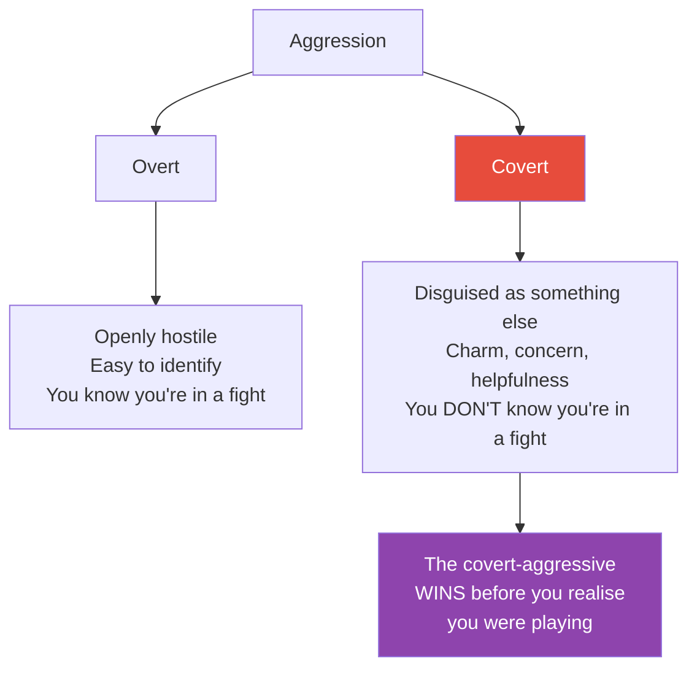
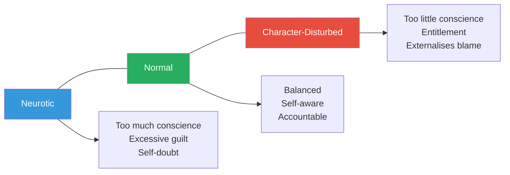
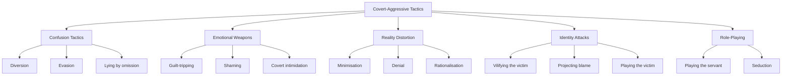
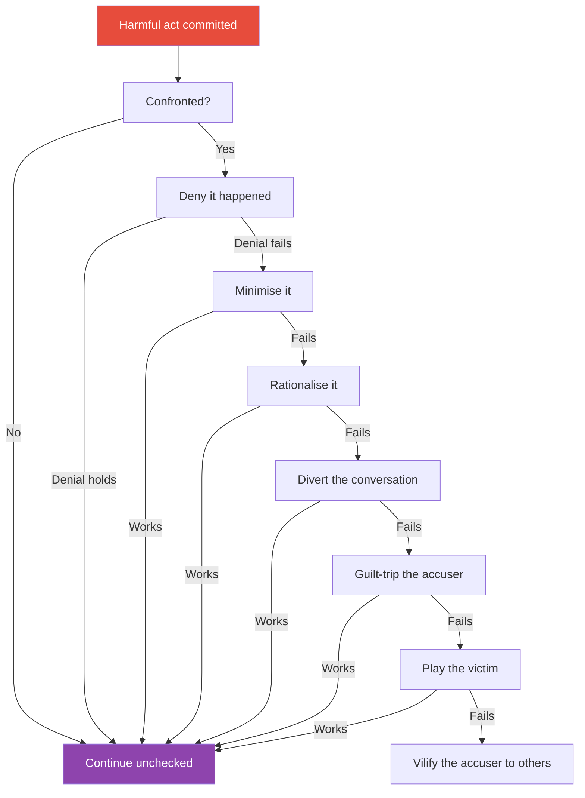
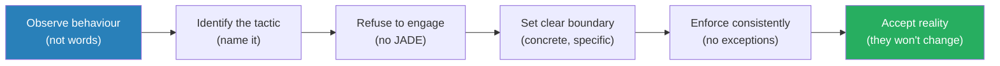

# In Sheep's Clothing — George K. Simon

> George Simon's thesis is unsettling: the most dangerous people in your life don't look dangerous.
> They look reasonable. They look helpful. They look like they care about you.
> But underneath the charm, the concern, and the apparent reasonableness, they are fighting — fighting for dominance, for control, for the upper hand — while hiding the fight itself.
> Simon calls them covert-aggressives, and this book is a field guide to recognising their tactics before you've already lost the battle you didn't know you were in.
> Written by a clinical psychologist who spent decades studying manipulative personalities, the book names thirteen specific tactics these people use, explains why good people keep falling for them, and lays out a defence framework built on one radical principle: stop trusting words and start reading behaviour.

---

## About the Author

Dr. George K. Simon is a clinical psychologist who has spent over twenty-five years studying manipulative personalities and what he calls "character disturbance." He challenges mainstream psychology's dominant assumption — that all problematic behaviour stems from insecurity, anxiety, or unresolved trauma. His core argument is provocatively simple: some people manipulate because it works, not because they're wounded. Simon's first book, *In Sheep's Clothing*, was published in 1996 and became a quiet phenomenon, selling hundreds of thousands of copies through word of mouth among people who finally had language for what they were experiencing. He followed it with *Character Disturbance* (2011), which expanded the theoretical framework. He runs a private practice and lectures on the psychology of manipulation.

---

## The Big Idea

- Most people assume that when someone behaves badly, they must be hurting inside — that aggression comes from insecurity, that manipulation comes from fear, that controlling behaviour comes from anxiety
- <b style="color: #2980b9">Simon rejects this assumption entirely</b> — he argues that a significant number of manipulative people are not acting out of pain but out of a calculated desire to win
- Overt aggression is easy to spot — shouting, threats, physical intimidation — and because it's visible, you can defend against it
- <b style="color: #e74c3c">Covert aggression is hidden under helpfulness, charm, concern, or victimhood</b> — and because it's invisible, you don't even know you're in a fight until you've already lost
- The covert-aggressive personality is not the same as the passive-aggressive personality:
  - Passive-aggressives resist through inaction — foot-dragging, sulking, silent treatment
  - Covert-aggressives actively pursue dominance — they just disguise the pursuit
- Traditional therapy often fails with these individuals because therapists assume the manipulator must be acting out of deep-seated pain; Simon argues they're acting out of a desire to win and a willingness to use whatever tactics achieve that goal
- <b style="color: #27ae60">Your only reliable defence is learning to read behaviour instead of words — and changing your own responses</b>

This diagram captures the fundamental asymmetry that makes covert aggression so dangerous — one party knows they're fighting, the other doesn't.

---

## Key Concepts at a Glance

| Concept | One-line summary |
|---------|-----------------|
| **Covert aggression** | Fighting for dominance while disguising the fight itself |
| **Character disturbance** | Personality issues rooted in attitude, not anxiety or insecurity |
| **The neurotic assumption** | The false belief that everyone who behaves badly must be hurting inside |
| **Tactics taxonomy** | Thirteen specific moves covert-aggressives use to control others |
| **Minimisation** | Shrinking the significance of harmful behaviour: "You're overreacting" |
| **Guilt-tripping** | Making you feel selfish for having reasonable boundaries |
| **Playing the victim** | Framing themselves as the wronged party to neutralise accountability |
| **Vilifying the victim** | Convincing others that YOU are the problem |
| **Playing the servant** | Disguising aggression as helpfulness: "I was only trying to help" |
| **JADE trap** | Getting drawn into Justifying, Arguing, Defending, or Explaining |
| **Vulnerability profile** | Why conscientious, empathetic people are the preferred targets |
| **Action-based judgment** | The defence principle: trust what people do, not what they say |

---

## Part One: How Aggression Gets Disguised

### Chapter 1 — The Aggressive Personalities

*Simon overturns the foundational assumption of modern therapy: that everyone who behaves badly is secretly insecure.*

- Traditional psychology operates on what Simon calls <b style="color: #2980b9">the neurotic assumption</b> — the belief that all problematic behaviour is a defence mechanism against anxiety, insecurity, or unresolved trauma
- This assumption works well for neurotic individuals — people who genuinely are anxious, self-doubting, and acting out of fear
- But it fails catastrophically when applied to aggressive personalities, because:
  - Aggressive people are not defending against anxiety — they are pursuing what they want
  - They are not unconsciously acting out old wounds — they are consciously choosing tactics that work
  - They don't lack insight into their behaviour — they lack the willingness to change it
- <b style="color: #e74c3c">When therapists, partners, or friends apply the neurotic assumption to an aggressive personality, they give the aggressor cover</b> — "He must be acting that way because he was hurt as a child" becomes an excuse that the aggressor is happy to exploit

> [!tip] Core Insight
> The most dangerous misunderstanding in psychology is assuming that everyone who behaves badly is suffering underneath. Some people behave badly because it works — and treating them as wounded only gives them more room to operate.

Simon identifies a spectrum of aggressive personalities:

| Type | Behaviour Pattern | Visibility |
|------|------------------|------------|
| **Unbridled aggressive** | Openly hostile, overtly domineering, doesn't care who sees | Fully visible |
| **Channelled aggressive** | Competitive, driven, uses socially acceptable outlets for aggression | Mostly visible |
| **Covert-aggressive** | Pursues dominance while hiding the pursuit under charm or victimhood | Nearly invisible |

*The radar reveals why covert aggression is so dangerous: it maximizes every dimension of stealth while minimizing the victim's ability to detect the attack.*

- The unbridled aggressive is the easiest to handle — you see the punch coming and can block it
- The channelled aggressive can be difficult but is fundamentally readable — their aggression is directed at clear goals
- <b style="color: #e74c3c">The covert-aggressive is the most dangerous because you don't know you're being attacked</b>

> [!example] The Boardroom vs. the Living Room
> - An unbridled aggressive screams at you in a meeting: "That's the stupidest idea I've ever heard"
> - You feel attacked — but you know you've been attacked, and you can respond
> - A covert-aggressive says in a concerned voice: "I just want to make sure we've really thought this through — I'd hate for you to look bad in front of the team"
> - The words sound caring. The intent is to undermine your authority. But because the attack is wrapped in concern, you feel uneasy without knowing why
> **The lesson:** Overt aggression announces itself. Covert aggression impersonates something else.

---

### Chapter 2 — The Predators Among Us

*Simon explains why some people are fundamentally different from the rest of us — not because they're broken, but because they've chosen a different set of priorities.*

- Most people operate with a basic social contract: cooperate, compromise, play fair, consider others' feelings
- Covert-aggressives have a different operating system entirely:
  - They see social interactions as contests to be won
  - Other people's feelings are tools to be leveraged, not experiences to be respected
  - Rules are obstacles to be navigated around, not principles to be followed
- <b style="color: #2980b9">Simon introduces the concept of character disturbance</b> — a fundamentally different framework from neurosis:
  - Neurotics have too much conscience — they over-monitor themselves, feel guilty easily, and punish themselves excessively
  - Character-disturbed individuals have too little conscience — they under-monitor themselves, feel entitled, and externalise blame
- The covert-aggressive sits at a specific point on this spectrum — enough awareness to know what they're doing, enough social intelligence to hide it, and enough moral flexibility to keep doing it

The neurotic-to-character-disturbed spectrum explains why the covert-aggressive is so hard to understand — neurotic people cannot fathom that someone would deliberately manipulate without feeling guilty about it.

> [!example] Amanda's Confusion
> - Simon describes a client he calls "Amanda" — a conscientious, empathetic woman who couldn't understand why she always felt manipulated by her seemingly loving partner
> - Her partner would say all the right things — "I love you," "I just want what's best for us," "I'm trying so hard"
> - But his actions consistently contradicted his words: he made decisions unilaterally, dismissed her concerns as oversensitivity, and gradually isolated her from friends and family
> - Amanda kept thinking: "He says he loves me, so he must — maybe I'm the problem"
> - She went to therapy, where the therapist (applying the neurotic assumption) suggested her partner was probably insecure and needed more reassurance
> - The more reassurance Amanda gave, the more control her partner took
> - It wasn't until Amanda learned to read behaviour instead of words that the pattern became visible
> **The lesson:** When words and actions conflict, always trust the actions.

---

> [!tip] Core Insight
> A neurotic person asks: "What's wrong with me?" A character-disturbed person asks: "How do I get what I want?" If you're dealing with someone who never questions themselves but constantly manoeuvres around others, you're not looking at insecurity — you're looking at strategy.

---

### Chapter 3 — Covert-Aggression vs. Passive-Aggression

*These two terms are often confused, but they describe fundamentally different personalities — and confusing them is dangerous.*

- <b style="color: #2980b9">Passive-aggression</b> is resistance through inaction:
  - Procrastinating on tasks to punish someone without confrontation
  - Giving the silent treatment
  - "Forgetting" to do things that matter to you
  - Agreeing verbally but sabotaging through non-compliance
  - The passive-aggressive person avoids direct conflict because they are genuinely uncomfortable with confrontation
- <b style="color: #2980b9">Covert-aggression</b> is attack through disguise:
  - Actively pursuing dominance while making it look like something else
  - Using charm, concern, helpfulness, or victimhood as tactical weapons
  - Fully comfortable with conflict — they just hide it because hiding it works better than showing it
  - The covert-aggressive is not avoiding confrontation — they are waging it on their terms

| Dimension | Passive-Aggressive | Covert-Aggressive |
|-----------|-------------------|-------------------|
| **Core motive** | Resistance | Dominance |
| **Method** | Inaction, omission, foot-dragging | Active tactics disguised as benign behaviour |
| **Awareness** | May be partly unconscious | Fully conscious and deliberate |
| **Confrontation comfort** | Avoids it (that's the whole point) | Welcomes it — just disguises it |
| **Response to being caught** | Sulks, withdraws, plays dumb | Counterattacks with charm, denial, or guilt-tripping |
| **Danger level** | Frustrating | Genuinely dangerous |

> [!example] The "Helpful" Colleague
> - A covert-aggressive colleague notices you're presenting to the board next week
> - They offer to "help" you prepare — "I just want to make sure you're set up for success"
> - During the "help" session, they subtly plant doubt: "Are you sure the board will respond well to that framing?" "I've seen people struggle with this kind of presentation before"
> - On the day of the presentation, they mention to a board member: "I helped her prepare — she was really nervous about it"
> - They've now positioned themselves as the competent mentor and you as the struggling junior — all while appearing supportive
> - A passive-aggressive person would have just "forgotten" to send you the data you needed
> **The lesson:** Passive-aggression frustrates you. Covert-aggression diminishes you — and makes you thank them for it.

- <b style="color: #e74c3c">The critical distinction matters for defence</b>:
  - With a passive-aggressive, you address the pattern of inaction directly
  - With a covert-aggressive, you must see through the disguise first — and that requires understanding their tactical playbook

---

## Part Two: The Tactics Playbook

### Chapter 4 — The Manipulation Tactics

*This is the book's core contribution — a taxonomy of the specific moves covert-aggressives deploy, named and explained so you can recognise them in real time.*

Simon identifies thirteen tactics that covert-aggressives use to control others. Each tactic serves a dual purpose: it advances the aggressor's position AND it keeps you off-balance, confused, or doubting yourself.

This diagram groups the thirteen tactics by function — some are designed to confuse you, some to weaponise your emotions, some to distort your perception of reality, and some to attack your identity directly.

---

#### Tactic 1: Minimisation

- <b style="color: #2980b9">Minimisation</b> is the art of shrinking — making harmful behaviour seem trivial, making your reaction seem disproportionate
- Classic phrases: "You're making a big deal out of nothing," "It was just a joke," "You're being too sensitive"
- The mechanism works on two levels simultaneously:
  - It redefines the harmful act as insignificant
  - It redefines your emotional response as irrational
- This is devastatingly effective against conscientious people because they already wonder if they're overreacting
- <b style="color: #e74c3c">Minimisation is not the same as genuine reassurance</b> — genuine reassurance acknowledges your feelings first ("I can see why that bothered you") before offering perspective; minimisation dismisses your feelings entirely

> [!example] "It Was Just a Joke"
> - A husband makes a cutting remark about his wife's intelligence in front of friends
> - She pulls him aside afterward and says she felt humiliated
> - He responds: "Oh come on, it was just a joke. Everyone laughed. You need to lighten up"
> - Now she faces a choice: trust her own experience (I felt humiliated) or accept his reframing (it was nothing, I'm overreacting)
> - If she's conscientious and empathetic, she'll likely back down — "Maybe I am too sensitive"
> - He has now successfully minimised the offence, avoided accountability, and positioned her as the one with the problem
> **The lesson:** When someone tells you your legitimate feelings are an overreaction, they are not helping you gain perspective — they are taking your perspective away.

---

#### Tactic 2: Denial

- Flat, bold, unwavering refusal to acknowledge what happened
- Not "I don't remember" (which allows for uncertainty) but "That never happened" or "I never said that"
- Denial is most powerful when the manipulator delivers it with absolute conviction — because most people assume that someone who sounds that certain must be telling the truth
- <b style="color: #e74c3c">Denial destabilises your grip on reality</b> — if they're so certain it didn't happen, you start wondering if your memory is wrong
- Over time, repeated denial can produce genuine confusion about what actually occurred — this is the mechanism behind gaslighting
- The psychology behind denial's effectiveness:
  - Humans have a built-in deference to confidence — when someone states something with absolute certainty, it creates social pressure to agree
  - Most people are honest about their memories, so they assume others are too
  - The covert-aggressive exploits this: "I am 100% certain that never happened" sounds more convincing than "I'm pretty sure it did happen" — even when the uncertain person is the truthful one

> [!example] The Vanishing Promise
> - A manager promises an employee a promotion during a private conversation
> - Months later, the promotion hasn't materialised; the employee raises it
> - The manager says: "I never promised you anything. I said we'd see how things went. You must have misunderstood"
> - The employee is certain the promise was made — but with no witnesses and no recording, the manager's confident denial creates just enough doubt
> - The employee drops the issue, feeling confused and slightly foolish
> **The lesson:** Denial works best when there are no witnesses. Always document promises with follow-up emails.

---

#### Tactic 3: Rationalisation

- <b style="color: #2980b9">Rationalisation</b> is providing a "reasonable" explanation that makes harmful behaviour sound justified
- Unlike denial (which says "it didn't happen"), rationalisation says "it happened, but here's why it was perfectly acceptable"
- Rationalisation exploits your desire to be fair — you hear the explanation and think: "Well, when they put it that way, maybe it does make sense"
- Common patterns:
  - "I only did it because you..." (shifting cause to the victim)
  - "Anyone in my position would have done the same" (normalising the behaviour)
  - "I was under so much pressure — you have no idea what I've been dealing with" (evoking sympathy to excuse the act)
- <b style="color: #27ae60">The key test: does the explanation actually justify the behaviour, or does it just explain the manipulator's motivation?</b> Understanding WHY someone hurt you doesn't make the hurt acceptable

> [!example] The Rationalising Business Partner
> - Two friends start a business together. One partner discovers the other has been redirecting client payments to a personal account
> - Confronted with bank records, the partner doesn't deny it. Instead: "I was going to tell you. I've been under enormous financial pressure — my wife's medical bills, the kids' school fees. I needed the money short-term and I was going to pay it back before you even noticed"
> - The explanation sounds reasonable. The circumstances sound sympathetic. The partner listening feels a pull toward understanding
> - But the facts remain: money was taken without consent, records were concealed, and the "plan to pay it back" only emerged after discovery
> - The rational explanation did not justify the action — it only explained the motivation while generating sympathy
> **The lesson:** A good reason for doing something wrong does not make it right. Rationalisation invites you to confuse understanding with acceptance.

---

#### Tactic 4: Diversion

- When you're getting close to holding them accountable, the covert-aggressive changes the subject
- Diversion can be subtle (introducing a tangential concern) or dramatic (starting a fight about something unrelated)
- The goal is to derail the original conversation so that the issue you raised never gets resolved
- Common moves:
  - Bringing up something YOU did wrong to shift focus: "Well what about the time you..."
  - Introducing an urgent but unrelated concern: "We can talk about that later — right now we need to deal with..."
  - Asking a provocative question that sends the conversation in a new direction
  - Becoming suddenly emotional about something else to hijack the moment
- <b style="color: #e74c3c">Diversion is most effective in verbal confrontations</b> — in writing, it's easier to notice that the subject has changed

> [!example] The Counter-Attack Diversion
> - A wife asks her husband why he didn't come home until 2 AM without calling
> - Instead of answering, he says: "You know what? I'm tired of being interrogated. What about the time you went out with your friends and didn't tell me? Where was your concern about communication then?"
> - Now the conversation has shifted from his unexplained absence to an incident from three months ago
> - She starts defending herself — "That was completely different, I told you I was going out..." — and his original absence is never discussed
> - If she tries to return to the original topic later, he says: "We already went through this. I'm not having the same argument twice"
> **The lesson:** When someone responds to your question with a counter-accusation, they are not engaging with your concern — they are escaping it.

> [!abstract] Recognising Diversion in Real Time
> 1. You raise a specific issue or concern
> 2. Instead of addressing it, they introduce a different topic
> 3. The conversation shifts to the new topic
> 4. Your original concern is never addressed
> 5. If you try to return to it later, they say "We already talked about this" or "You're beating a dead horse"

---

#### Tactic 5: Lying by Omission

- This is technically not lying — the covert-aggressive tells you something that is true while strategically withholding the information that would change your conclusion
- Simon considers this one of the most sophisticated tactics because it allows the manipulator to say "I never lied to you" with complete honesty
- The mechanism:
  - They share facts that support their preferred narrative
  - They omit facts that would reveal their true intentions
  - You form a conclusion based on incomplete information
  - When the full picture eventually emerges, they defend themselves: "I told you everything you asked about — it's not my fault you didn't ask the right questions"
- <b style="color: #e74c3c">Lying by omission exploits your trust</b> — you assume that someone who volunteers information freely must be telling you the whole story

> [!example] The Half-Truth Job Offer
> - A recruiter tells a candidate: "The salary is above market, the team is great, and the company is growing fast"
> - All of this is technically true
> - What the recruiter omits: the position has a 70% turnover rate, the "great team" has had three managers in two years, and the "fast growth" is funded by debt that's running out
> - The candidate accepts, and within six months the problems become apparent
> - When the candidate confronts the recruiter, the response is: "I told you everything you asked about. You should have done more research"
> - The candidate can't claim they were lied to — because they weren't. They were manipulated through strategic omission
> **The lesson:** The absence of a lie is not the presence of truth. When someone shares information selectively, ask yourself: what am I NOT being told?

---

#### Tactic 6: Covert Intimidation

- Threats that are disguised as observations, concerns, or helpful warnings
- The covert-aggressive never says "I'll ruin you" — they say "I'd hate to see what happens if people found out about..." or "I'm worried about how this might affect your reputation"
- The threat is real but deniable — if confronted, they can say "I wasn't threatening you, I was expressing concern"
- Covert intimidation creates fear without leaving fingerprints:
  - "I just want you to think carefully before you make any decisions" (implied: or else)
  - "People talk, you know" (implied: I'll make sure they do)
  - "I hope this doesn't become a bigger issue" (implied: I can make it one)

> [!example] The Concerned Friend
> - A woman decides to report her supervisor for inappropriate behaviour
> - A colleague pulls her aside: "I totally support you, but I've seen what happens to people who file complaints here. I'd just hate to see your career derailed over something like this"
> - On the surface: concern for a friend
> - Underneath: a clear message that reporting will have consequences
> - The colleague may even be acting on behalf of the supervisor — the threat is outsourced to look like friendly advice
> **The lesson:** When someone frames a threat as concern for your wellbeing, listen to the threat, not the framing.

---

#### Tactic 7: Guilt-Tripping

- <b style="color: #2980b9">Guilt-tripping</b> weaponises the target's conscience — making them feel selfish, ungrateful, or uncaring for having reasonable boundaries
- This tactic works specifically because the target IS a good person — if they didn't care about fairness and other people's feelings, the guilt wouldn't stick
- Common guilt-tripping scripts:
  - "After everything I've done for you, this is how you treat me?"
  - "I guess I'm just not important to you"
  - "Fine, do whatever you want — don't worry about me"
  - "Other people would be grateful to have what you have"
- The mechanism is brilliant in its simplicity:
  - The manipulator identifies something the target values (loyalty, gratitude, fairness)
  - They frame the target's boundary as a violation of that value
  - The target feels guilty for maintaining a boundary that is perfectly reasonable
  - The target backs down to relieve the guilt — and the manipulator gets what they wanted

> [!example] The Self-Sacrificing Parent
> - An adult child decides to spend Christmas with their partner's family this year
> - The parent responds: "I understand. I'll just be here alone. It's fine. I'm used to it"
> - The words say "it's fine" but everything else — the tone, the sigh, the implication of abandonment — says "you're being selfish"
> - The adult child feels a wave of guilt, despite having made a perfectly reasonable decision
> - They either cancel their plans (the manipulator wins) or go but feel terrible the entire time (the manipulator still wins, because the guilt ensures they won't do it again)
> **The lesson:** Guilt-tripping works because it attacks your values, not your weaknesses. The more conscientious you are, the more effective it is.

> [!tip] Core Insight
> Guilt is an appropriate response to having done something wrong. If you feel guilty despite having done nothing wrong, someone is manufacturing that guilt to control your behaviour. Learn to distinguish between genuine conscience and induced obligation.

---

#### Tactic 8: Shaming

- Shaming goes beyond guilt-tripping — it doesn't just say "you did a bad thing," it says "you ARE a bad person"
- Guilt targets behaviour; shame targets identity
- The covert-aggressive uses shaming to put you on the defensive, making you so busy defending your character that you forget what you were confronting them about
- Shaming phrases:
  - "What kind of person does that?"
  - "I can't believe someone like you would..."
  - "Everyone else manages to handle this — what's wrong with you?"
  - "You're just like your mother/father" (when said as an insult)
- <b style="color: #e74c3c">Shaming is most devastating when it targets something you're already insecure about</b> — the covert-aggressive has usually identified these insecurities through earlier observation
- The mechanism of shaming works differently from guilt-tripping:
  - Guilt says: "What you DID was bad" — the behaviour is the problem
  - Shame says: "What you ARE is bad" — your character is the problem
  - Guilt can be productive — it motivates you to correct behaviour
  - Shame is never productive — it paralyses you with self-loathing

> [!example] The Family Dinner Shaming
> - A grown daughter tells her father she's decided not to attend law school — she wants to be a teacher
> - The father doesn't argue the merits. He says: "Your grandfather came to this country with nothing and built a life so his family could have opportunities. And you want to throw that away"
> - He hasn't addressed her career choice — he's attacked her character, framing her as ungrateful and unworthy of her family's sacrifices
> - She leaves the conversation not thinking about what career she wants but about whether she's a bad person
> - The career discussion never happens. The shame replaced it
> **The lesson:** When you leave a conversation questioning your worth as a person rather than discussing the issue at hand, shaming has done its work.

---

#### Tactic 9: Playing the Victim

- <b style="color: #2980b9">Playing the victim role</b> is one of the covert-aggressive's most powerful moves because it reverses the moral dynamic entirely
- The aggressor frames themselves as the wronged party, which:
  - Neutralises your accusation (how can they be the aggressor if they're the one suffering?)
  - Activates your empathy (you feel sorry for them instead of holding them accountable)
  - Makes YOU feel guilty for confronting them
- This tactic is especially effective against empathetic people — when the manipulator tears up or says "I can't believe you think I would do that," empathetic targets feel immediate doubt
- Playing the victim often combines with other tactics:
  - Victim + guilt-trip: "After everything I've been through, now you're attacking me too?"
  - Victim + denial: "I never did that — and the fact that you'd accuse me is really hurtful"
  - Victim + rationalisation: "I only did it because I was so stressed — can't you see I'm struggling?"

> [!example] The Tearful Spouse
> - A wife discovers her husband has been spending large sums of money without telling her
> - She confronts him with bank statements
> - Instead of acknowledging the deception, he becomes emotional: "I can't believe you're going through my accounts. Don't you trust me at all? Do you know how that makes me feel?"
> - Within minutes, the conversation has shifted from his financial deception to her alleged lack of trust
> - She ends up apologising for snooping — and the original issue of hidden spending is never addressed
> **The lesson:** When a confrontation ends with you apologising to the person you confronted, you've been outmanoeuvred by victim-playing.

---

#### Tactic 10: Vilifying the Victim

- If playing the victim makes the aggressor look innocent, vilifying the victim makes the actual victim look guilty
- The covert-aggressive tells others (and sometimes you directly) that YOU are the problem:
  - "She's so controlling"
  - "He's impossible to work with"
  - "I've tried everything — they just won't cooperate"
- This tactic serves multiple purposes:
  - It preemptively discredits anything you might say about them
  - It builds a support network of people who believe the manipulator's version of events
  - It isolates you from potential allies
- <b style="color: #e74c3c">Vilifying the victim is particularly insidious in group settings</b> — by the time you realise what's happening, the narrative is already established and changing it feels like exactly the kind of "difficult behaviour" the manipulator described

> [!example] The Pre-emptive Strike
> - A man decides to leave a manipulative romantic relationship
> - Before he can tell anyone, his partner has already called his family and close friends in tears: "I don't know what's happening. He's changed. He's become cold and distant. I've been trying so hard but he just shuts me out"
> - By the time he announces the separation, his support network already sees him as the villain and her as the victim
> - When he tries to explain the manipulation he experienced, his friends say: "She seemed so devastated. Are you sure you're not being too harsh?"
> - The narrative has been established before he could speak — and challenging it only makes him look like the unreasonable one she described
> **The lesson:** Covert-aggressives often vilify the victim preemptively — establishing the narrative before the victim has a chance to tell their side.

---

#### Tactic 11: Playing the Servant

- "I'm only trying to help" — disguising aggression as selflessness
- The covert-aggressive frames their controlling behaviour as service to others:
  - "I'm doing this for your own good"
  - "Someone has to take charge, or nothing gets done"
  - "I'm the only one who really cares about this project"
- <b style="color: #2980b9">The servant role</b> is a perfect disguise because:
  - In most cultures, selflessness is admired and rewarded
  - Questioning someone who appears to be helping makes YOU look ungrateful
  - The "servant" accumulates control and influence while appearing humble

> [!example] The Indispensable Employee
> - An employee volunteers for every task, stays late, takes on everyone's problems
> - Colleagues see them as a hero — "What would we do without them?"
> - But beneath the selflessness, this person is systematically making themselves the bottleneck:
>   - They insist on being involved in every decision
>   - They undermine colleagues who try to operate independently
>   - They create dependencies so that nothing can happen without their involvement
> - When anyone questions their methods, they respond: "I was just trying to help — if you don't want my help, fine, I'll stop" (a combined servant-play and guilt-trip)
> - The result: they control the team while appearing to serve it
> **The lesson:** True service empowers others. Covert-aggressive "service" creates dependence.

---

#### Tactic 12: Seduction

- Strategic deployment of flattery, charm, and excessive attention
- Not seduction in the romantic sense (though it can be) — Simon means the deliberate use of positive attention to disarm the target's defences
- The seductive covert-aggressive studies what you respond to — praise, recognition, physical attraction, intellectual admiration — and supplies it generously during the grooming phase
- <b style="color: #27ae60">The test for genuine warmth vs. tactical seduction: does the positive attention persist after they've gotten what they want?</b>
- Common patterns:
  - Love-bombing in romantic relationships — overwhelming affection early on
  - Excessive praise followed by gradual criticism (the boiled-frog effect)
  - Flattery that feels slightly too perfect, slightly too targeted
- The seduction cycle typically follows a predictable arc:
  - **Phase 1: Grooming** — intense positive attention, apparent deep understanding, "you're so different from everyone else"
  - **Phase 2: Hooking** — the target becomes emotionally invested, lowers defences, begins to depend on the positive attention
  - **Phase 3: Shifting** — the positive attention becomes intermittent, replaced by small criticisms, requests for compliance, or tests of loyalty
  - **Phase 4: Control** — the target now works to recapture the feeling of Phase 1, which gives the manipulator enormous leverage

> [!example] The Perfect New Friend
> - A woman joins a new social circle and one person immediately gravitates toward her
> - This person is intensely interested in everything she says, remembers every detail, texts constantly, and says: "I feel like I've known you forever"
> - Within weeks, the new friend becomes her primary confidante — she shares personal information, vulnerabilities, insecurities
> - Once the bond is established, the dynamic shifts subtly — the friend starts using the shared information as leverage: "I thought you said you were trying to lose weight?" (said while offering dessert), or "Remember when you told me about your ex? This reminds me of that — are you sure you're not repeating the pattern?"
> - The personal information that felt safe to share during the seduction phase has become ammunition
> **The lesson:** Be cautious with anyone who wants to become your closest friend faster than the relationship naturally warrants. Genuine closeness develops over time, not over a weekend.

---

#### Tactic 13: Projecting Blame

- "You made me do this" — making the victim responsible for the aggressor's behaviour
- Blame projection is the final link in the manipulation chain — it ensures that even when the covert-aggressive's behaviour is exposed, the target carries the burden
- Scripts:
  - "If you hadn't pushed me, I wouldn't have..."
  - "You bring out the worst in me"
  - "I was fine until you..."
  - "This is what happens when you..."
- <b style="color: #e74c3c">Blame projection reverses cause and effect</b> — the aggressor's choice to behave badly is reframed as the victim's fault for provoking it
- This tactic is especially common in abusive relationships, where the abuser convinces the victim that they could prevent the abuse if only they behaved differently

> [!tip] Core Insight
> Every adult is responsible for their own behaviour, regardless of provocation. "You made me do it" is never a valid explanation — it is always a manipulation tactic. Nobody can MAKE you behave any particular way.

---

### How the Tactics Work Together

*In practice, covert-aggressives rarely use just one tactic — they layer and combine them.*

- A typical manipulation sequence might look like:
  1. **Seduction** — build trust and positive feelings over time
  2. **Harmful act** — take an action that serves their interests at your expense
  3. **Denial** — if confronted: "That never happened" / "You're misremembering"
  4. **Minimisation** — if denial fails: "It wasn't a big deal"
  5. **Rationalisation** — if minimisation fails: "I had a good reason"
  6. **Diversion** — if rationalisation fails: "What about the time YOU..."
  7. **Guilt-tripping** — if diversion fails: "I can't believe you'd attack me like this"
  8. **Playing the victim** — if guilt-tripping fails: tearful collapse
  9. **Vilifying the victim** — to others: "Can you believe what they accused me of?"
  10. **Projecting blame** — final fallback: "They brought this on themselves"

Each arrow marked "Works" leads back to the same outcome: the covert-aggressive continues unchecked. The entire tactical cascade is designed to prevent accountability.

*Minimisation, guilt-tripping, and playing the victim are the three most frequently deployed tactics — they require the least effort while producing the maximum confusion in the target.*

---

## Part Three: Why Good People Get Caught

### Chapter 5 — The Vulnerability Profile

*The covert-aggressive doesn't target just anyone — they select for specific personality traits that make manipulation easier.*

- Simon identifies a clear vulnerability profile — a set of traits that, while admirable in normal relationships, become liabilities when exploited by a covert-aggressive
- <b style="color: #27ae60">Understanding your own vulnerability is the first step in defence</b> — you can't fix what you can't see

| Vulnerability Trait | How It's Exploited | The Manipulation That Targets It |
|--------------------|-------------------|--------------------------------|
| **Conscientiousness** | You want to be fair, so you give benefit of the doubt even when it's undeserved | Rationalisation, minimisation |
| **Agreeableness** | You hate conflict, so you back down when they escalate | Covert intimidation, shaming |
| **Empathy** | You feel others' pain, so you believe them when they play the victim | Playing the victim, seduction |
| **Self-doubt** | You question yourself easily, so their denial destabilises your reality | Denial, minimisation, gaslighting |
| **Desire to see the best** | You assume good intentions, so you explain away red flags | Rationalisation, playing the servant |
| **Guilt-proneness** | You feel guilty easily, so guilt-tripping works immediately | Guilt-tripping, blame projection |

- <b style="color: #e74c3c">The covert-aggressive's greatest weapon is your own good nature</b> — the very traits that make you a good person make you a good target
- This creates a painful irony: the qualities that make you trustworthy, kind, and fair are the exact qualities that make you vulnerable to exploitation

*The heatmap shows why conscientious, empathetic people are the preferred targets — their very virtues become attack surfaces for specific manipulation tactics.*

> [!example] The Empathy Trap
> - A woman notices her partner lies about small things — where he went, who he was with, what he spent
> - She confronts him gently. He becomes emotional: "My ex never trusted me either. I grew up with a mother who accused me of everything. I can't handle being suspected again"
> - Her empathy activates immediately — she imagines the pain of being constantly mistrusted
> - She backs off, feeling guilty for hurting someone who's already wounded
> - The lies continue. Each time she starts to question them, his "wounds" from the past shut down the conversation
> - She is not dealing with someone who is traumatised by past mistrust — she is dealing with someone who has learned that displaying vulnerability neutralises accountability
> **The lesson:** Empathy is a gift. But when it's used against you, it becomes a liability. Trust your observations, not their explanations.

---

### Chapter 6 — The Neurotic Trap

*Simon explains why smart, well-meaning people keep falling for the same patterns.*

- Most people are at least somewhat neurotic — meaning they tend to:
  - Over-analyse their own behaviour
  - Assume responsibility for problems that aren't theirs
  - Give others more credit than they deserve
  - Question their own perceptions before questioning others' intentions
- <b style="color: #2980b9">The neurotic trap</b> operates through a specific cognitive sequence:
  1. You observe concerning behaviour
  2. You start to confront it — but then you hesitate
  3. You ask yourself: "Am I being unfair? Am I overreacting? Maybe there's a good explanation"
  4. This internal questioning delays your response
  5. The covert-aggressive uses the delay to deploy tactics (minimisation, rationalisation, guilt-tripping)
  6. By the time the conversation is over, you're questioning your own reality instead of their behaviour
- <b style="color: #e74c3c">The neurotic tendency to self-examine becomes a weapon in the hands of a covert-aggressive</b>
- Normal, healthy self-reflection becomes a trap when the other person is not engaging in any self-reflection at all

> [!example] The Self-Doubting Manager
> - A manager suspects an employee is undermining team morale behind their back
> - Before addressing it, the manager thinks: "Am I being paranoid? Maybe I'm just not connecting well with the team. Maybe the problem is my leadership style"
> - The manager seeks feedback, reads management books, tries harder — while the employee continues to undermine them
> - The employee, when gently questioned, says: "I'm sorry you feel that way. I've been nothing but supportive of you. Maybe the team is just going through a rough patch"
> - The manager accepts this because it aligns with their self-doubt: "Yes, it's probably me"
> - Months later, the damage is extensive — team trust has eroded, morale is low, and the manager has been working on the wrong problem the entire time
> **The lesson:** Self-improvement is admirable. But if you're always examining yourself and never examining the other person's behaviour, you're doing the manipulator's work for them.

> [!abstract] The Neurotic Self-Check
> When you find yourself in a conflict with someone and you're doing ALL the self-examining, ask yourself:
> 1. Am I the only one questioning my behaviour?
> 2. Has the other person expressed genuine accountability at any point?
> 3. Have I given them multiple chances to change — and seen no change?
> 4. Do I consistently feel confused, guilty, or "crazy" after interactions with them?
> 5. If the answers are yes-no-yes-yes, you are likely caught in the neurotic trap.

---

### Chapter 7 — Why Traditional Therapy Fails

*Simon makes a controversial argument: the therapeutic framework itself can become a tool for the covert-aggressive.*

- Most therapists are trained in frameworks designed for neurotic clients — people who are anxious, self-critical, and genuinely trying to change
- These frameworks assume that:
  - Bad behaviour is a symptom of underlying pain
  - If you understand the root cause, the behaviour will change
  - Everyone in therapy is there in good faith
  - Empathy and understanding are always the right approach
- <b style="color: #e74c3c">When these assumptions are applied to covert-aggressives, therapy becomes a weapon:</b>
  - The manipulator learns therapeutic language and uses it to sound insightful without changing
  - They use the therapist's empathy to validate their victim narrative
  - They reframe their manipulation as "coping mechanisms" rooted in childhood trauma
  - They demonstrate enough "insight" in sessions to maintain the illusion of progress
  - Meanwhile, nothing changes in their actual behaviour

> [!example] Therapy as a Manipulation Tool
> - A couple attends couples therapy. The wife says her husband is controlling and dismissive
> - The husband responds with perfect therapeutic language: "I hear your concerns. I know I have abandonment issues from my childhood that make me clingy. I'm working on it"
> - The therapist is impressed — this man has "insight"
> - But between sessions, his behaviour doesn't change. He still monitors her phone, questions her friendships, and makes unilateral decisions
> - When the wife raises this, the husband says: "I'm trying. Change takes time. You need to be patient with me. That's what the therapist said"
> - The therapy sessions become a performance where the husband demonstrates awareness without ever changing behaviour
> **The lesson:** Insight without behaviour change is not progress — it's a performance.

- Simon's advice for therapists and anyone in a relationship with a covert-aggressive:
  - <b style="color: #27ae60">Judge progress by behaviour change, never by verbal insight</b>
  - Set measurable, observable benchmarks: "By next month, I expect to see X behaviour change"
  - Do not accept explanations as substitutes for change
  - If someone can articulate exactly what they're doing wrong but continues doing it, they do not lack understanding — they lack motivation

---

## Part Four: The Defence Framework

### Chapter 8 — Recognising the Signs

*Before you can defend yourself, you need to see what's happening — and the covert-aggressive is designed to be invisible.*

Simon provides a clear diagnostic framework for identifying covert-aggressive behaviour:

> [!abstract] Red Flags Checklist
> You may be dealing with a covert-aggressive if you consistently experience:
> - Feeling confused after conversations with them — you went in clear and came out uncertain
> - Apologising when YOU were the one wronged
> - Their words say one thing but their actions consistently say another
> - Feeling guilty for having reasonable boundaries
> - Others describe them as wonderful, but your experience is different
> - Giving "one more chance" repeatedly, and the pattern never changes
> - Feeling like you're going crazy — your perception of reality doesn't match theirs
> - A persistent gut feeling that something is off, even when you can't articulate what

- <b style="color: #2980b9">Simon emphasises gut instinct</b> as the body's early warning system:
  - Your subconscious processes social cues faster than your conscious mind
  - That uneasy feeling after an interaction is data — not paranoia
  - Covert-aggressives succeed because their targets override their own instincts in favour of the manipulator's explanations
- The most reliable diagnostic tool is the pattern over time:
  - Anyone can have a bad day and use one of these tactics once
  - A covert-aggressive deploys them consistently, across situations, with multiple people
  - <b style="color: #e74c3c">Look for the pattern, not the incident</b>

---

### Chapter 9 — The Defence Principles

*Simon's defence framework is built on one radical idea: stop trying to change THEM and start changing YOUR responses.*

- <b style="color: #27ae60">The foundational principle: judge actions, not words</b>
- This sounds simple. It is extraordinarily difficult in practice because:
  - We are socialised to believe people's words
  - Covert-aggressives are skilled at saying exactly what you want to hear
  - Judging actions requires sustained attention over time, not just reacting to individual moments
  - Your own desire to see the best in people works against you

This defence sequence must be followed in order — you cannot set boundaries effectively if you haven't first identified the tactic, and you cannot enforce boundaries if you haven't accepted that the person will not change voluntarily.

*Simon's framework produces the largest gains in the areas where conscientious people are weakest: trusting actions over words and refusing to justify, argue, defend, or explain.*

---

#### Principle 1: Trust Your Gut

- If something feels wrong, it probably is — even if you can't articulate why
- Your subconscious has detected an inconsistency between what the person says and what they do
- <b style="color: #e74c3c">Stop overriding your instincts with their explanations</b>
- The covert-aggressive counts on you dismissing your own feelings in favour of their narrative
- Practical application:
  - After an interaction that leaves you feeling confused, write down what happened and what was said
  - Review it the next day when the emotional charge has faded
  - The inconsistencies that your gut detected will often become visible in writing

---

#### Principle 2: Stop JADE-ing

- <b style="color: #2980b9">JADE</b> stands for Justify, Argue, Defend, Explain — and it is the trap most targets fall into
- Every time you JADE, you hand the covert-aggressive ammunition:
  - **Justify** — "I had to cancel because..." gives them material for guilt-tripping: "So your friends are more important than me?"
  - **Argue** — engaging in debate gives them material for diversion and counter-accusation
  - **Defend** — explaining yourself puts you in the defendant's chair and them in the judge's
  - **Explain** — providing reasons gives them hooks to rationalise, minimise, or redirect
- <b style="color: #27ae60">The alternative to JADE is to state your position once, clearly, without elaboration</b>:
  - Instead of: "I'm not going to the dinner because I'm exhausted and I've had a long week and I really need some time to myself and I hope you understand..."
  - Say: "I'm not going to the dinner"
  - That's it. No justification. No defence. No explanation to be picked apart

> [!tip] Core Insight
> You do not owe anyone an explanation for your boundaries. The moment you start explaining why you need a boundary, you've opened the door for them to argue with your reasons. State the boundary. Stop talking.

---

#### Principle 3: Name the Tactic

- One of the most powerful things you can do is name the tactic out loud:
  - "That sounds like minimisation — you're telling me my feelings aren't important"
  - "You're changing the subject. I'd like to finish discussing the original issue"
  - "That feels like guilt-tripping. My decision stands"
- <b style="color: #27ae60">Naming the tactic does three things simultaneously:</b>
  - It breaks the tactic's power — manipulation works best in darkness; exposure neutralises it
  - It communicates that you can see what they're doing — which changes the power dynamic
  - It keeps you anchored in reality instead of being pulled into their narrative
- The covert-aggressive's most common response to having their tactic named is to use another tactic — usually denial ("I'm not doing that") or shaming ("I can't believe you'd accuse me of that"). Expect this and don't be thrown by it

---

#### Principle 4: Set Concrete Boundaries

- Not vague preferences but specific, enforceable limits
- <b style="color: #e74c3c">A boundary without a consequence is a suggestion</b>
- The structure of an effective boundary:
  - What you will and won't accept (specific behaviour)
  - What you will do if the boundary is violated (specific consequence)
  - Follow-through without exception

> [!abstract] Boundary Setting Framework
> 1. **Identify the behaviour** — be specific: "When you raise your voice during disagreements..."
> 2. **State the boundary** — "...I will not continue the conversation"
> 3. **Specify the consequence** — "I will leave the room and we can try again when you're calm"
> 4. **Follow through every time** — the covert-aggressive will test the boundary to see if you're serious
> 5. **Do not explain or justify** — "That's my boundary" is a complete sentence

- The covert-aggressive will likely escalate when boundaries are first set — this is a test, not proof that boundaries don't work
- <b style="color: #27ae60">Consistency is everything</b> — if you enforce the boundary nine times and cave on the tenth, they learn that the boundary is negotiable and they just need to push harder

---

#### Principle 5: Accept That They Won't Change

- This is the hardest principle for empathetic people to accept
- Covert-aggressives don't manipulate because they lack insight — they do it because it works
- Insight without motivation to change is meaningless
- <b style="color: #e74c3c">You cannot reform someone who sees nothing wrong with what they're doing</b>
- Your only reliable option is changing YOUR responses:
  - Stop rewarding manipulation with compliance
  - Stop engaging in circular conversations that go nowhere
  - Stop hoping that if you just explain things well enough, they'll understand
  - Accept the relationship as it actually is, not as you wish it were
- This doesn't mean giving up on people indiscriminately — it means being honest about what is and isn't changing over time

> [!example] The Cycle of Hope
> - A woman decides to confront her sister about years of manipulative behaviour
> - The sister responds with apparent emotion: "You're right. I've been terrible. I'm going to change"
> - For two weeks, the sister is kind, attentive, and respectful
> - Slowly, the old patterns return — the guilt-tripping, the minimisation, the victim-playing
> - The woman confronts her again. The sister cries again. Promises again. Two weeks of good behaviour, then regression
> - This cycle repeats for years, with the woman holding onto the "good weeks" as evidence of change
> - Simon's observation: two weeks of changed behaviour is not change — it's a tactical retreat to preserve the relationship until normal operations can resume
> **The lesson:** Short-term behaviour change in response to confrontation is not evidence of genuine change. Sustained behaviour change over months, without requiring repeated confrontations, is.

---

### Chapter 10 — Putting It All Together

*Simon synthesises his defence framework into a practical approach for real-world situations.*

- The complete defence approach is not a single technique but a mindset shift:
  - From: "Why are they doing this? What's wrong with them? How can I help them?"
  - To: "What are they doing? What tactic are they using? What is the appropriate boundary?"
- <b style="color: #2980b9">The shift from "why" to "what"</b> is critical:
  - "Why" keeps you trapped in empathy and analysis — trying to understand their motivations
  - "What" keeps you grounded in observable reality — noting their actual behaviour
  - The covert-aggressive wants you asking "why" because it keeps you in a sympathetic, analytical posture
  - Switching to "what" breaks the spell

```mermaid
flowchart TD
    subgraph OLD ["Old Pattern (Victim Mindset)"]
        A1["Observe harmful behaviour"] --> A2["Ask: WHY are they doing this?"]
        A2 --> A3["Generate sympathetic explanations"]
        A3 --> A4["Give benefit of the doubt"]
        A4 --> A5["Nothing changes"]
        A5 --> A1
    end
    subgraph NEW ["New Pattern (Empowered Mindset)"]
        B1["Observe harmful behaviour"] --> B2["Ask: WHAT are they doing?"]
        B2 --> B3["Name the tactic"]
        B3 --> B4["Set and enforce boundary"]
        B4 --> B5["Evaluate: did behaviour change?"]
        B5 -->|No| B6["Accept reality and adjust"]
        B5 -->|Yes| B7["Genuine progress"]
    end
    style OLD fill:#e74c3c,color:#fff
    style NEW fill:#27ae60,color:#fff
```

The shift from "why" to "what" is the single most important cognitive change Simon recommends.

---

## Part Five: Special Situations

### Covert Aggression in Intimate Relationships

*The home is where covert aggression does its deepest damage — because you can't walk away at the end of the day.*

- Intimate relationships provide the perfect environment for covert aggression:
  - High emotional investment means the target has more to lose
  - Isolation from outside perspective happens naturally (you don't bring friends to every conversation)
  - Love and commitment create a powerful incentive to keep trying
  - The aggressor has unlimited time to study what works against you
- <b style="color: #e74c3c">The most dangerous phase is the early one</b> — when the covert-aggressive is on their best behaviour (seduction phase) and the target is forming emotional attachments based on a false presentation
- Warning signs in romantic relationships:
  - They seem too good to be true early on — overwhelming attention, flattery, apparent devotion
  - They move quickly toward commitment (moving in, marriage, combining finances)
  - They subtly discourage your independent relationships
  - Small controlling behaviours are reframed as care: "I just worry about you"
  - When you raise concerns, you feel worse after the conversation than before
- The progression in intimate relationships follows a recognisable arc:
  - **Stage 1: Idealisation** — the covert-aggressive presents their best self; the target feels uniquely valued and understood
  - **Stage 2: Testing** — small boundary violations begin, disguised as intimacy: checking your phone (because "we shouldn't have secrets"), deciding where you eat (because "I know what you like"), discouraging a friendship (because "they're not good for you")
  - **Stage 3: Normalisation** — the boundary violations become routine; the target adjusts their expectations downward
  - **Stage 4: Entrenchment** — the target's support network has been thinned, their confidence has been eroded, and leaving feels impossible — not because of external barriers but because the covert-aggressive has reshaped the target's sense of what they deserve

> [!example] The Gradually Shrinking World
> - A man meets a woman who seems wonderfully attentive — she remembers everything, plans thoughtful dates, says: "I've never connected with anyone like this"
> - Early on, she mentions she doesn't like one of his friends: "He's a bad influence — you're better than that"
> - He distances from the friend. She fills the gap with more attention
> - She dislikes his Thursday poker night: "I just miss you when you're gone"
> - He drops the game. She seems happier
> - Over two years, his social circle narrows from twenty people to three — all of whom she selected
> - When he considers that something might be wrong, she says: "I'm the one who's always here for you. Who else has stuck around?"
> - She's right — but she's right because she engineered the isolation
> **The lesson:** If your world is getting smaller and one person is at the centre of the reduction, you're not being loved more closely — you're being controlled more completely.

---

### Covert Aggression in the Workplace

*The office provides a different kind of cover — professional norms make it harder to name manipulation for what it is.*

- Workplace covert aggression has unique characteristics:
  - Professional norms provide built-in cover for manipulation
  - "I'm just being thorough" covers micromanagement
  - "I'm playing devil's advocate" covers constant undermining
  - "I'm being direct" covers aggression dressed as honesty
- Common workplace patterns:
  - Taking credit for others' work while appearing collaborative
  - Using "feedback" as a weapon — disguising personal attacks as professional development
  - Building alliances through selective information-sharing
  - Creating urgency to force decisions that serve their interests
  - Using procedural compliance to obstruct others' progress
- <b style="color: #27ae60">The key defence in workplace settings is documentation</b>:
  - Follow up verbal conversations with email summaries: "Per our conversation, we agreed to..."
  - Keep records of commitments, promises, and decisions
  - Note patterns of behaviour over time, not just individual incidents
  - When possible, ensure witnesses are present for important conversations

> [!abstract] Workplace Defence Protocol
> 1. Document everything — follow up verbal conversations in writing
> 2. Maintain your own paper trail of contributions and achievements
> 3. Build broad-based relationships — don't let one person control your narrative
> 4. When a tactic is deployed, address it factually: "The record shows..." or "Per our email on..."
> 5. Escalate through proper channels when documentation supports a pattern of behaviour

---

### Covert Aggression and Children

*Children are the most vulnerable targets — they have no frame of reference and cannot leave.*

- When a covert-aggressive parent manipulates a child, the effects can last a lifetime:
  - Children lack the cognitive development to recognise manipulation
  - They are biologically wired to trust their parents
  - They internalise the guilt, shame, and confusion as normal
  - They often develop the vulnerability profile that makes them targets in adult relationships
- <b style="color: #e74c3c">The greatest damage is to the child's sense of reality</b>:
  - A parent says "I love you" while behaving in ways that are controlling and dismissive
  - The child learns to distrust their own perceptions — "Mom says she loves me, so what I'm feeling must be wrong"
  - This pattern of overriding one's own instincts in favour of someone else's narrative becomes the template for future relationships
- Simon notes that many of his adult clients trace their vulnerability to covert-aggressive dynamics in childhood — they learned early that their feelings were wrong and other people's explanations were right

> [!example] The "Loving" Control
> - A mother insists on choosing her teenage daughter's clothes, friends, and activities — "I just want what's best for you"
> - When the daughter pushes back, the mother says: "Most girls would be grateful to have a mother who cares this much"
> - The daughter learns two things simultaneously: her own preferences don't matter, and objecting to control makes her ungrateful
> - As an adult, she enters relationships where she defers to her partner's preferences automatically — not because she wants to, but because she learned in childhood that resisting control triggers guilt and withdrawal of love
> - She doesn't recognise the pattern as abnormal because it IS her normal — it's the only template she has
> **The lesson:** Covert aggression in childhood doesn't just affect the child — it creates the vulnerability profile that makes them targets for covert-aggressives in adulthood.

- The generational cycle is self-reinforcing:
  - Covert-aggressive parent raises a child who overrides their own instincts
  - That child grows into an adult who attracts and tolerates covert-aggressive partners
  - The adult's children observe the dynamic and absorb it as normal
  - <b style="color: #e74c3c">Breaking the cycle requires conscious recognition of the pattern — which is exactly what this book aims to provide</b>

---

## The Tactics at a Glance — Quick Reference

| Tactic | What It Sounds Like | What It Actually Does |
|--------|--------------------|-----------------------|
| **Minimisation** | "You're overreacting" | Makes your legitimate feelings seem irrational |
| **Denial** | "That never happened" | Destabilises your grip on reality |
| **Rationalisation** | "I had a good reason" | Makes harmful behaviour seem acceptable |
| **Diversion** | "What about the time you..." | Derails accountability conversations |
| **Lying by omission** | (technically true statements) | Controls your conclusions through withheld information |
| **Covert intimidation** | "I'd hate to see what happens if..." | Creates fear without leaving fingerprints |
| **Guilt-tripping** | "After everything I've done for you..." | Weaponises your conscience against you |
| **Shaming** | "What kind of person does that?" | Attacks your identity to put you on the defensive |
| **Playing the victim** | "I can't believe you'd accuse me" | Reverses the moral dynamic entirely |
| **Vilifying the victim** | "She's so difficult" (to others) | Preemptively discredits your perspective |
| **Playing the servant** | "I'm only trying to help" | Disguises control as selflessness |
| **Seduction** | (excessive charm and attention) | Disarms your defences through positive reinforcement |
| **Projecting blame** | "You made me do this" | Transfers responsibility for their choices to you |

---

## The Verdict

*In Sheep's Clothing* is a short, clinical, and deeply practical book. Simon writes without drama — this isn't a sensationalised account of evil manipulators lurking behind every corner. It's a calm, structured explanation of how certain personality types exploit the good faith of others, and what you can do about it. The book's greatest contribution is its specificity: instead of vaguely warning you about "toxic people," Simon names thirteen distinct tactics and explains the psychological mechanism behind each one. Once you learn to see them, you can't unsee them. The vocabulary alone — minimisation, covert intimidation, playing the servant — gives you precision tools for conversations that used to leave you feeling confused and off-balance.

The book's limitations are worth noting. Simon focuses almost entirely on identification and defence — he doesn't go deep into recovery or the emotional aftermath of prolonged manipulation. If you've been in a relationship with a covert-aggressive for years, recognising the tactics is step one, but healing the damage requires tools this book doesn't provide. Simon also paints with a broad brush at times — his categories are clear and useful but real people are messier than taxonomies. Not everyone who minimises once is a covert-aggressive. The book works best as a pattern-recognition guide, not a diagnostic manual for labelling individuals.

The readers who benefit most are those who consistently find themselves in relationships — romantic, professional, familial — where they feel confused, guilty, or crazy without being able to explain why. If you've ever left a conversation thinking "something was wrong there but I can't put my finger on what," this book will put your finger on it with surgical precision. It's also valuable for therapists, counsellors, and anyone in a helping profession who encounters manipulative clients.

In the broader landscape of books on manipulation and self-protection, *In Sheep's Clothing* sits alongside [[Emotional Blackmail - Susan Forward|Emotional Blackmail]] (which focuses on the FOG model of Fear, Obligation, and Guilt) and [[The Sociopath Next Door - Martha Stout|The Sociopath Next Door]] (which addresses the extreme end of the spectrum — people with no conscience at all). Simon's contribution is unique in its emphasis on the covert-aggressive as a distinct personality type — not a sociopath, not a narcissist in the clinical sense, but an everyday manipulator who functions perfectly well in society while systematically exploiting the people closest to them. For workplace-specific applications, pair with [[Snakes in Suits - Babiak & Hare|Snakes in Suits]].

---

## Related Reading

- [[Emotional Blackmail - Susan Forward|Emotional Blackmail]] — The FOG (Fear, Obligation, Guilt) model for understanding how emotional pressure works
- [[The Sociopath Next Door - Martha Stout|The Sociopath Next Door]] — The extreme end of the covert-aggressive spectrum: people with no conscience
- [[Snakes in Suits - Babiak & Hare|Snakes in Suits]] — Covert aggression in the corporate environment
- [[Never Split the Difference - Chris Voss|Never Split the Difference]] — Tactical communication skills useful for maintaining boundaries under pressure
- [[The 48 Laws of Power - Robert Greene|The 48 Laws of Power]] — Understanding power dynamics from the other side — how manipulation operates at a strategic level
- [[The Laws of Human Nature - Robert Greene|The Laws of Human Nature]] — Deep exploration of the character types and personality patterns that drive human behaviour
- [[Words That Change Minds - Shelle Rose Charvet|Words That Change Minds]] — Understanding the language patterns that influence behaviour — useful for recognising verbal manipulation techniques
