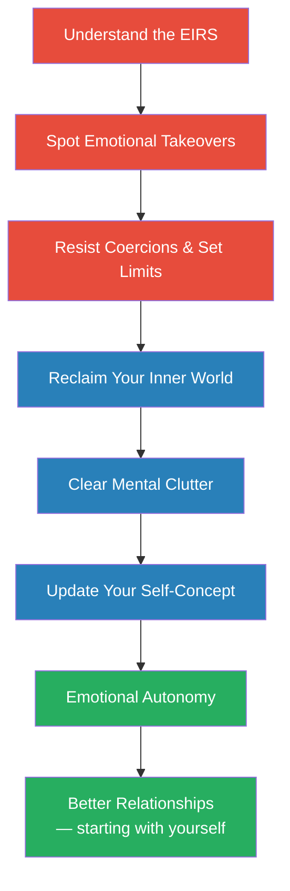
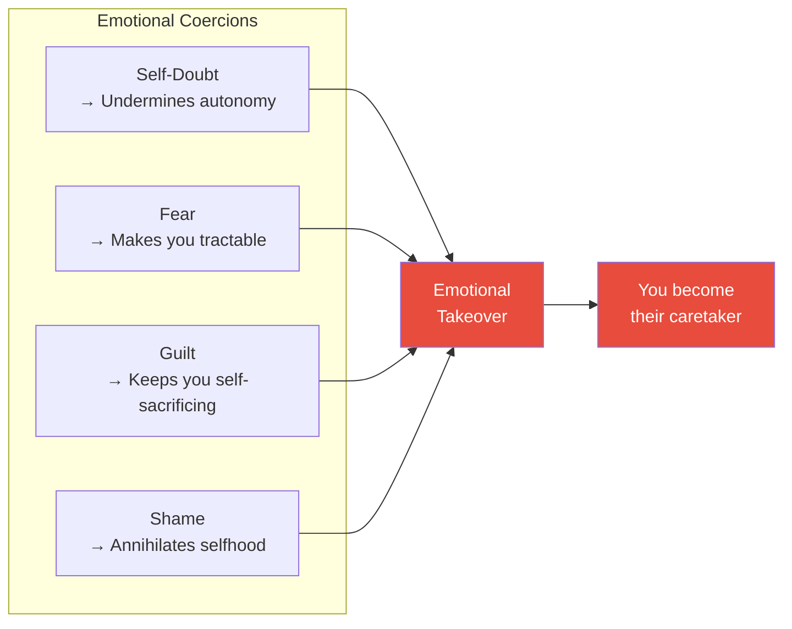
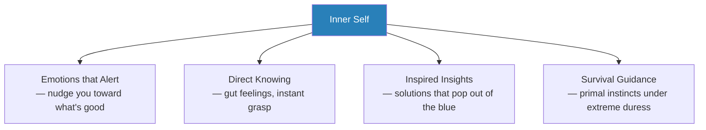
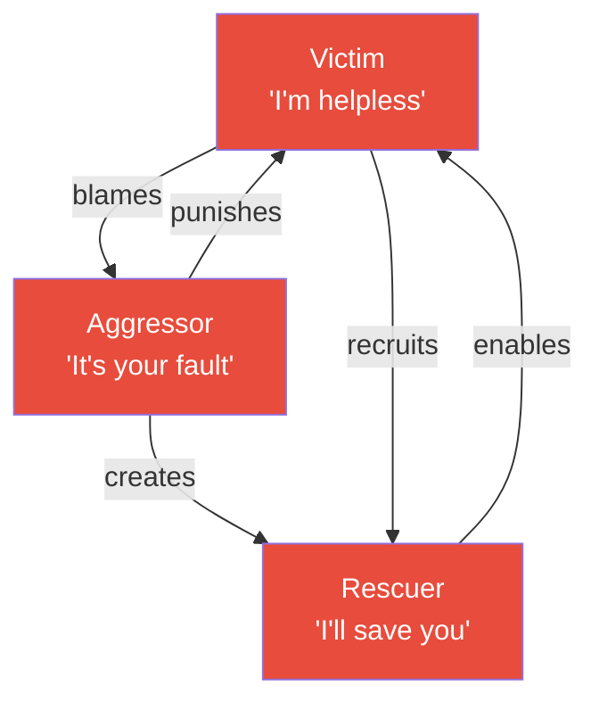
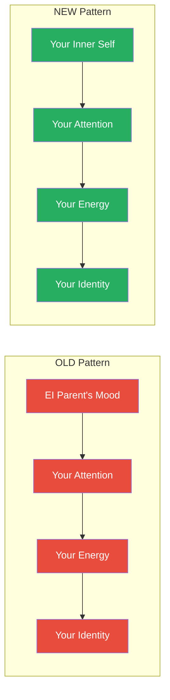
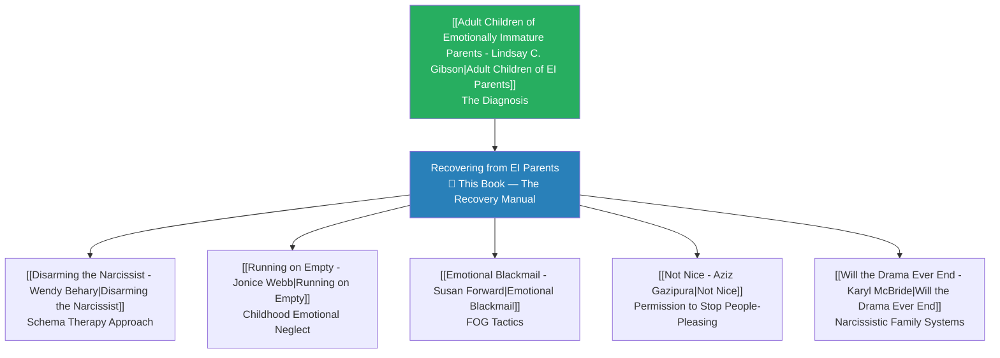

# Recovering From Emotionally Immature Parents — Lindsay C. Gibson

## About the Author

- <b style="color: #2980b9">Lindsay C. Gibson, PsyD</b> is a clinical psychologist in private practice in Virginia Beach, Virginia, specialising in individual psychotherapy with adult children of emotionally immature parents
- She is the author of *Adult Children of Emotionally Immature Parents* (2015) and *Who You Were Meant to Be*
- She writes a monthly column on well-being for *Tidewater Women* magazine and has served as adjunct assistant professor at the College of William and Mary and Old Dominion University
- This book is the practical sequel to her breakthrough first work — moving from diagnosis to recovery

## The Big Idea

- *Your parents may have given you life, but they also gave you an invisible operating system — one that puts their feelings, their stability, and their self-esteem at the centre of your existence.*
- Gibson calls this the <b style="color: #e74c3c">Emotionally Immature Relationship System (EIRS)</b> — an unconscious arrangement where the child becomes responsible for the parent's emotional state
- <b style="color: #27ae60">Recovery isn't about fixing your parents or cutting them off</b> — it's about reclaiming what Gibson calls "emotional autonomy": the freedom to have your own feelings, think your own thoughts, and build your own identity
- The book provides a complete toolkit: understand the system, resist its pull, reclaim your inner world, update your self-concept, and relate to your parents as an equal — one interaction at a time

> **How to reclaim your emotional autonomy from parents who never grew up**

---

## At a Glance

| | |
|---|---|
| **Core Idea** | Emotionally immature parents hijack your inner life through an unconscious relationship system — recovery means reclaiming the right to your own feelings, thoughts, and identity |
| **Key Framework** | Emotionally Immature Relationship System (EIRS) — how EI parents make you responsible for their stability |
| **Structure** | Part I: What You've Been Up Against (Ch 1-6) → Part II: Emotional Autonomy (Ch 7-10) + Epilogue |
| **Sequel To** | [[Adult Children of Emotionally Immature Parents - Lindsay C. Gibson]] |
| **Best For** | Anyone who feels emotionally drained, controlled, or chronically guilty around a parent — or any self-absorbed person |

---

## The 30-Second Version

- <b style="color: #e74c3c">Emotionally immature parents operate through an unconscious system</b> that makes you feel responsible for their happiness, stability, and self-esteem — this is the EIRS
- They control you through four emotional coercions: <b style="color: #e74c3c">self-doubt, fear, guilt, and shame</b>
- Recovery requires <b style="color: #27ae60">emotional autonomy</b> — reclaiming your right to your own feelings, thoughts, and self-concept
- The two thoughts that rebalance any interaction: <b style="color: #2980b9">"I am just as important as they are"</b> and <b style="color: #2980b9">"I have good stuff inside me"</b>
- You don't need your parent to change — <b style="color: #27ae60">you can recover by building a loyal relationship with your own inner self</b>

---

## The 5-Minute Version

### The Problem: The EIRS Trap

- *EI parents aren't just difficult — they run an entire relationship system designed to keep you focused on them.*
- The <b style="color: #e74c3c">Emotionally Immature Relationship System (EIRS)</b> is an unconscious arrangement where the parent's emotional state becomes the center of your attention
- Normal in infancy — babies genuinely need attuned caregivers who respond to their distress
- <b style="color: #e74c3c">Pathological when a grown parent demands it from their child</b> — when the child must soothe the parent, monitor their moods, and keep them stable
- Creates ten signature experiences: emotional loneliness, one-sided interactions, feeling coerced and trapped, always coming second, no emotional vulnerability from them, communication through emotional contagion, no boundaries respected, you doing all the emotional work, losing your mental freedom, and being subjected to killjoy or sadistic behaviour

### The Four EI Parent Types

*Not all emotionally immature parents look the same — but they all share self-preoccupation, low empathy, and resistance to emotional intimacy.*

| Type | Hallmark | Danger |
|------|----------|--------|
| <b style="color: #e74c3c">Emotional</b> | Volatile, reactive, overwhelmed by surprises | Children walk on eggshells |
| <b style="color: #e74c3c">Driven</b> | Super busy, goal-obsessed, runs family like a project | Children feel like tasks, not people |
| <b style="color: #e74c3c">Passive</b> | Nicer parent who lets the other be the bad guy | Children are unprotected when it matters |
| <b style="color: #e74c3c">Rejecting</b> | Avoids interaction, expects family to revolve around them | Children feel invisible |

*Each EI parent type has a distinctive behavioral signature — Emotional parents spike on volatility, Driven parents on control, Passive parents on avoidance, and Rejecting parents on both avoidance and empathy deficit.*

### The Four Weapons: Emotional Coercions

*EI parents control you by making you feel things that are to their advantage — and they are masters at it.*

- <b style="color: #e74c3c">Self-doubt</b> — they withdraw love when you think independently, until you stop trusting yourself
- <b style="color: #e74c3c">Fear</b> — outbursts, meltdowns, threats of abandonment make you tractable
- <b style="color: #e74c3c">Guilt</b> — for not sacrificing enough, for having a better life than theirs
- <b style="color: #e74c3c">Shame</b> — the deepest weapon; makes you feel there's something fundamentally wrong with you, not just that you did something wrong

*The heatmap reveals each parent type's preferred coercion arsenal — Emotional parents weaponize fear, Driven parents deploy self-doubt, Passive parents leverage guilt, and Rejecting parents specialize in shame.*

### The Recovery Path

*The journey moves from understanding to action, from their control to your autonomy.*

### The Ultimate Goal: Emotional Autonomy

*The finish line isn't a fixed relationship with your parent — it's a free relationship with yourself.*

- <b style="color: #27ae60">Emotional autonomy</b> is your freedom and right to have your own feelings, thoughts, and identity
- Not about cutting parents off — it's about being genuinely yourself around them
- Two foundation stones: see yourself as <b style="color: #2980b9">equal in importance</b> and maintain <b style="color: #2980b9">unconditional self-connection</b>
- Focus on one interaction at a time, not fixing the whole relationship
- You can't change them — but you can change how you respond, and that changes everything

*Gibson's six recovery steps form an integrated system — resisting coercions and reclaiming the inner world carry the heaviest weight because they represent the active transition from understanding to autonomy.*

---

## Full Summary

### Part I: What You've Been Up Against

---

### Chapter 1 — Your Emotionally Immature Parent

*If you've ever left a conversation with a parent feeling drained, guilty, and somehow responsible for their mood — you've experienced the EIRS in action.*

#### The Ten Hallmarks of EI Relationships

- <b style="color: #e74c3c">You feel emotionally lonely around them</b> — physically present but emotionally absent; they take care of sick bodies but have no idea what to do with hurt feelings
- <b style="color: #e74c3c">Interactions feel one-sided</b> — they talk over you, change the subject, start talking about themselves; you know far more about their issues than they know about yours
- <b style="color: #e74c3c">You feel coerced and trapped</b> — shame, guilt, and fear enforce compliance; their superficial relating makes conversations boring and stagnant
- <b style="color: #e74c3c">They always come first</b> — your needs are automatically downgraded; they want blind allegiance, not equal partnership
- <b style="color: #e74c3c">They won't be emotionally vulnerable</b> — they show plenty of intense emotion (eruptions, fury, complaining) but resist real intimacy and comfort
- <b style="color: #e74c3c">They communicate through emotional contagion</b> — instead of talking about feelings, they cross your boundaries and make you feel what they feel
- <b style="color: #e74c3c">They don't respect boundaries</b> — they think boundaries mean you don't love them enough
- <b style="color: #e74c3c">You do all the emotional work</b> — empathy, reconciliation, and amends always fall to you
- <b style="color: #e74c3c">You lose your emotional autonomy</b> — they claim the right to judge your feelings as sensible or unwarranted
- <b style="color: #e74c3c">They can be killjoys and even sadistic</b> — deflating achievements, "teasing" that's actually cruelty, enjoying your powerlessness

> [!example] Martin's Moment of Deflation
> - As a teenager, Martin proudly told his father he'd made fifty dollars on his first music gig
> - His father's immediate response was to point out that nobody can support a family on that kind of wage
> - The emotional point — excitement, pride, a first milestone — was completely missed

#### How the EIRS Works

- <b style="color: #2980b9">The EIRS is like a spell</b> — it convinces you that their happiness is your responsibility
- Their distress worms into your mind and takes centre stage — even while doing other things or trying to sleep, you obsess: "What did I do wrong? What can I do to make it better?"
- You lose sight of your own feelings and needs — their pain becomes your pain
- <b style="color: #e74c3c">Problems become the currency</b> that keeps you locked into the EIRS — solving one problem just breeds more because they don't want guidance, they want you

> [!example] Frank's Midnight Calls
> - Frank's divorced father called him in the middle of the night after drinking heavily
> - He frequently locked himself out and demanded Frank come rescue him
> - When hospitalised, he insisted Frank stay because "I don't have anyone else"
> - Frank became so consumed with his father's crises that his own family and work suffered
> - He'd become so identified with his father's troubles that it never occurred to him his father had any responsibility

#### How They Got This Way

- Many EI parents suffered their own deprived childhoods — abuse, emotional neglect, trauma in earlier generations
- They may never have developed a <b style="color: #2980b9">sense of self</b> — the emotional basis for knowing who you are
- Without self-awareness, they can't self-reflect, can't see how they affect others, and can only blame externally
- Unresolved family traumas get passed down and reenacted between parent and child, generation after generation

---

### Chapter 2 — Understanding Emotionally Immature Parents

*Once you understand their personality traits, you stop taking their rejections personally — and you stop being pressured by their emotional needs.*

#### How EI Parents Approach Life

- <b style="color: #e74c3c">Fundamentally fearful and insecure</b> — deep down, they feel unlovable; must control others to feel safer
- <b style="color: #e74c3c">Need to dominate</b> — influence your behaviour by inducing fear, shame, guilt, or self-doubt; feel better once you're the "bad" one
- <b style="color: #e74c3c">Define by roles</b> — roles are central to their security; uncomfortable with equal relationships; disallow individuality that threatens your family role
- <b style="color: #e74c3c">Egocentric, not self-reflective</b> — never wonder if they're causing their own problems; personal growth threatens them; say things without thinking
- <b style="color: #e74c3c">Blame others, excuse themselves</b> — their brittle self-esteem can't handle criticism
- <b style="color: #e74c3c">Impulsive and stress-intolerant</b> — low tolerance for waiting; grab at quick fixes that often make things worse

#### How They Resist Reality

- <b style="color: #2980b9">Affective realism</b> — the way it feels to them is the way it is; feelings literally determine their version of facts
- They deny and dismiss the reality of others' feelings while being thin-skinned about their own
- <b style="color: #e74c3c">They disregard time sequence</b> — they experience events as isolated blips, not cause-and-effect chains; this is why they repeat mistakes, burn bridges, and think lying is reasonable
- Their philosophy: "That was then, this is now" — they don't understand why the past should matter

> [!tip] The Time-Sequence Blind Spot
> This single trait explains many maddening EI behaviours — the inability to connect past actions to present consequences. They can't see why you're still upset about last week. They don't notice they're repeating the same pattern. And they genuinely don't understand why lying catches up with them.

#### How They Think

- Intelligence doesn't extend to the world of feelings — they can be brilliant with spreadsheets but clueless about tact
- <b style="color: #e74c3c">Simplistic, literal, and rigid</b> — black-and-white categories, favourite platitudes delivered with authority
- Their pronouncements sound catchy but have a trite quality — different from mature wisdom that "feeds your mind the longer you think about it"
- Use inappropriate logic to shut down feelings — tell upset children "you should've told him..." or "just stop worrying"

#### The Four Emotional Coercions

- **Self-doubt** — they withdraw emotional connection when you express independent thoughts; you learn that self-doubt brings acceptance while autonomy causes tension
- **Fear** — outbursts, meltdowns, threats; soon you start fearing your own feelings, inhibiting yourself before the parent even reacts
- **Guilt** — two types: guilt for not self-sacrificing (saying no means you don't love them) and <b style="color: #e74c3c">survivor guilt</b> (feeling guilty for having a happier life)
- **Shame** — the deepest: not just "I did something wrong" but "there is something wrong with me"; Jerry Duvinsky calls this a <b style="color: #e74c3c">core shame identity</b>

> [!example] Gina's "Obligation"
> - Gina's elderly parents announced they were moving near her so she could care for them
> - Gina was recovering from breast cancer, a single mother with three teenage boys, already overwhelmed
> - Her parents were financially secure, had two other children nearby, and a supportive community
> - Yet Gina asked: "Don't I have an obligation to my parents?"
> - The answer was a firm no — setting a limit doesn't mean you don't love somebody

#### The Annihilating Sensation of Shame

- Patricia DeYoung describes how devastating it feels when someone refuses to connect at your moment of greatest need
- Children who feel they don't matter experience what feels like <b style="color: #e74c3c">psychological disintegration</b> — described as "sinking into darkness," "circling a black hole," "falling into the abyss"
- This is so agonizing that people banish the memories entirely
- The remedy: recognise shame as just an emotion, not a statement of your worth

---

### Chapter 3 — Longing for a Relationship with Your EI Parent

*You keep trying because they occasionally give you just enough — a fleeting moment of tenderness, a flash of real connection — to keep hope alive.*

#### What You're Longing For

- <b style="color: #2980b9">To be known by them</b> — not just looked at, but truly seen; a parent's inner self attuning to your inner world
- <b style="color: #2980b9">Better communication</b> — you may have learned good skills as an adult, but they only work when the other person participates
- <b style="color: #2980b9">Praise and approval</b> — some adult children chase success their entire lives trying to win it; EI parents may boast about you to friends yet never tell you directly

> [!tip] Why They Brag to Others But Not to You
> Bragging to others lets EI parents claim your accomplishment as social currency while maintaining emotional distance. Looking you in the eye and saying "I'm proud of you" would require uncomfortable emotional intimacy.

#### Five Behaviours That Prevent Connection

| Behaviour | What It Looks Like |
|-----------|-------------------|
| Lack of interest | Light up about their topics, disinterested when you share yours |
| Excessive busyness | Always "finishing up something" — intimacy hides behind things that "just have to get done" |
| Envy and jealousy | Envious parents discount your abilities; jealous parents resent attention you receive |
| Agitation | Pathologically sensitive to criticism, consumed by their own anxieties, no room for peace |
| Inconsistency | An amalgam of reactive moods rather than an integrated personality — personality parts suddenly take over without warning |

> [!example] Brenda's Award Ceremony
> - Brenda became a well-respected medical researcher, invited to speak at a prestigious international conference
> - She thought her father would finally be impressed
> - Instead, he showed little interest — his concerns were always about his political beliefs and the economy
> - When he attended one ceremony, he embarrassed her with gruff, dismissive comments about her work
> - After each phone call home, Brenda was left with the humiliating feeling of begging for his pride

#### Bonding vs. Relationship — A Crucial Distinction

- <b style="color: #2980b9">Bonding</b> = secure belonging through familiarity and physical proximity (tribal, family)
- <b style="color: #2980b9">Relationship</b> = emotional urge to know and be known, empathetic attunement to inner experience
- You can feel deeply bonded to someone who shows zero relational interest in your subjective experience
- Ask yourself: does the person I feel bonded to actually know my inner emotional states?

#### Why You Keep Hoping

- <b style="color: #e74c3c">Intermittent reinforcement</b> — sometimes they do connect; on good days they drop their guard and share tender moments; this keeps hope alive
- You <b style="color: #e74c3c">project your own maturity</b> onto them — assuming they have more emotional capacity than they actually do
- Reality may be <b style="color: #e74c3c">too painful to see</b> — children protect their developing psyches by magnifying the parent's good qualities

#### Healing Fantasies — And Why to Let Them Go

- A <b style="color: #e74c3c">healing fantasy</b> is the secret hope that you can finally change your parent and earn their real love
- These should be questioned because they prolong improbable hope
- Whatever improves in the relationship will likely be caused by a shift in your outlook, not a change in them
- <b style="color: #27ae60">Giving up the fantasy requires grieving</b> — allowing sadness about what you sacrificed to adapt to your EI parent
- When you stop hoping they'll change, you can finally face how hurt, alone, and frightened you felt as a child
- Choose your <b style="color: #27ae60">active self</b> over your <b style="color: #e74c3c">suffering self</b> — the part that stays stuck in chronic unhappiness and passivity

> [!abstract] The Shift
> Lower your expectations for EI parents — simultaneously raise your expectations for other relationships. Many adult children accept meager attention as normal. If you learned that other people were more important than you, challenge that in every new relationship.

---

### Chapter 4 — How to Resist Emotional Takeovers

*Your job is to become so aware of their psychological moves that you no longer get caught in their exploitative relationship system.*

#### The Active Mindset

- The core shift: instead of feeling swept along, affirm <b style="color: #27ae60">"I can do something about what they just did"</b>
- One woman's framing: "I'm not going to be dictated by their urgency. I'm not going to allow them to come into my space and tell me how I have to be"
- Having an active mindset prepares you to think for yourself instead of automatically acquiescing

#### Challenge Their Distorted Assumptions

- <b style="color: #e74c3c">Stop accepting they're the most important one</b> — in many homes, all eyes go to the EI person as soon as they walk in the door; as a child, this seemed like observable fact; as an adult, you know better
- <b style="color: #e74c3c">Question whether it's an emergency</b> — EIPs exaggerate everything; like the boy who cried wolf, you don't know whether to believe them
- <b style="color: #e74c3c">Don't fall for flattery</b> — they offer a spectacular deal: do what they want and you'll be "everything" to them; fine print: you're only as good as the last thing you did

#### Questions to Ask During an Emotional Takeover

- What is the reality (not just what they're telling me)?
- What are verifiable facts?
- What's the seriousness? Is it an emergency? For whom?
- Is their request the best solution?
- Could they solve it themselves once they calm down?
- Should this be my responsibility?

#### Identify Real Obligations vs. Manufactured Ones

- <b style="color: #2980b9">No one but you has the right to define your obligation and duty in a relationship</b>
- The EIP's urgency implies you have no choice — but you always do
- Ask: "What's me, what's them, and what — if anything — is really an obligation?"
- Byron Katie's test: is this "obligation" an absolute, cosmic truth?

#### Step Back from Enabling

- Enabling = rescuing people from repeated consequences of their own actions
- <b style="color: #27ae60">Sometimes if you don't get back to EIPs right away, the problem resolves itself</b>
- You may still be worrying about their crisis only to find they've already moved on, gone to sleep, or found something else

> [!example] Bert and the $10,000 Loan
> - Bert's brother Tom called in a panic asking for $10,000
> - Bert asked Tom to write down the details of the whole situation — a delay tactic to slow things down and give both of them time to think
> - Tom was offended — he just wanted the money
> - Tom's irritation revealed his assumption of entitlement: expecting $10,000 but affronted by a reasonable request to specify the problem in writing

#### Decide Beforehand What You're Willing to Give

- Think in advance: under what circumstances would you intervene, and when not?
- Have detailed, thoughtful limits ready before entering their distortion zone
- An older couple whose addicted son kept asking for loans finally mapped out every dire scenario and drew lines — when he asked to move in, they already had their answer

---

### Chapter 5 — Skills to Manage Interactions

*You don't have to overhaul your personality to handle EI parents — you just need a handful of practical skills fitted to your own comfort zone.*

#### Three Ground Rules

- <b style="color: #27ae60">Take your time</b> — "I need some time to think about that" is the most self-preserving thing you can say; EIPs hate it because it prevents takeover
- <b style="color: #27ae60">Figure out the exact outcome you want</b> — ask: "If I got what I wanted from this interaction, what would that look like?" Set a goal that's within your control
- <b style="color: #27ae60">Don't take immature behaviour seriously — just be persistent</b> — acknowledge their objections vaguely ("Uh-huh"), keep a light tone, and repeat your decision; like a river carves rock

> [!example] Vicki's Thanksgiving
> - Vicki decided to spend Thanksgiving with her husband's family instead of her mother's
> - She gave her mother Maureen time to adjust before declining
> - Maureen predictably acted offended and rejected
> - Vicki kept deflecting with a smile: "You're right, Mom; it certainly will be different. I know you want us there, but this year just won't work out"
> - She repeated this as many times as necessary until her mother brought it up less frequently

#### The Five Skills

**Skill 1: Step Out of Your Rescuer Role**

- Many adult children are "internalizers" — perceptive, sensitive, and let empathy overrule their own preferences
- Over-responsibility is a form of <b style="color: #e74c3c">codependency</b> — feeling lovable only by taking on others' problems
- You end up more consumed with their life than your own

**Skill 2: Be Slippery and Sidestep**

- Sidestepping works better than blunt refusals when EIPs are in coercion mode
- Instead of getting pulled into a struggle: pause, take a breath, say "I don't know" or "I can't really answer that right now"
- A masterful sidestep: <b style="color: #27ae60">sincerely agree with their feelings</b> without changing your mind — "I guess you're pretty upset with me, Mom"
- Think martial arts: turn sideways and let their emotional energy flow past you

**Skill 3: Lead the Interaction**

- EI parents talk about the same few topics in stereotyped, self-focused ways — rarely ask about you
- <b style="color: #27ae60">Steer the conversation</b>: ask questions that alter the path, introduce broader topics, enrich the dialogue
- Come prepared with topics — even use Table Topics cards in your pocket
- When they're holding forth: "Forgive me for interrupting, but I always wanted to ask you..."

**Skill 4: Create Space for Yourself**

- Use fantasy (imagine a glass bell jar around you), compliments (manage their mood), or act fast when you feel drained
- <b style="color: #27ae60">Have a retreat</b> — staying at a hotel instead of the EI parent's home gives you control of your exposure
- Limit your exposure time — decide in advance, then stretch, yawn, and say "I'm fading"
- You can refuse certain topics entirely — Lexi just hung up every time her mother started gossiping about relatives; eventually her mother would catch herself mid-gossip
- <b style="color: #27ae60">Just leave</b> — Sam trained his family to expect he'd come late and leave early; "Well, this has been great, but I gotta get going!"

**Skill 5: Stop Them**

- For disrespectful (not dangerous) behaviour: rehearse your response until it has the speed of an impulse
- Responding immediately breaks up their intent to overpower

> [!example] Lisa's Thanksgiving Boundary
> - Lisa's father slapped the back of her eight-year-old son's head for taking treats without permission
> - Lisa experienced a flashback of her own abuse and shouted: "Dad! I swear, if you ever do that again, you'll never see us again!"
> - With a bullying parent unlikely to escalate, strong immediate reaction was necessary to set the limit

> [!warning] Safety First
> With potentially violent EIPs, firm limit-setting may make things worse. The goal in dangerous situations is to get through safely — de-escalate, call police if needed, and create a comprehensive safety plan from a distance later.

---

### Chapter 6 — EI Parents Are Hostile Toward Your Inner World

*They don't just ignore your feelings and thoughts — they actively mock, invalidate, and attack them. And if they do it long enough, you learn to do it to yourself.*

#### Five Gifts of Your Inner World

- Your inner world isn't a luxury — it provides five things essential to a functional life:

| Gift | What It Gives You |
|------|------------------|
| <b style="color: #2980b9">Inner stability & resilience</b> | Integrated personality that weathers stress |
| <b style="color: #2980b9">Wholeness & self-confidence</b> | Dignity, integrity, trust in your own instincts |
| <b style="color: #2980b9">Capacity for intimacy</b> | Self-awareness enables real emotional connection |
| <b style="color: #2980b9">Ability to self-protect</b> | Gut feelings that detect danger and untrustworthiness |
| <b style="color: #2980b9">Awareness of life's purpose</b> | What's meaningful to you and where you're going |

#### Why EI Parents Attack Your Inner World

- <b style="color: #e74c3c">Your inner world threatens their authority</b> — once you trust your inner experience, you slip the collar of their control
- <b style="color: #e74c3c">Your self-connection reminds them of what they've lost</b> — your hopes and dreams trigger their own disowned inner lives and thwarted ambitions
- They see you as still needing their direction — treating you as their child long into adulthood
- They lack curiosity about your subjective experience — they think of children as empty boxes to fill
- They think staying busy matters more than inner life — reading, daydreaming, or art feels like a waste of time
- They invalidate dreams, fantasy, and aesthetic sense — EI parents are contemptuous of awe and beauty

> [!example] Mallory's Lost Passions
> - As a ten-year-old, Mallory was caught looking at a fan magazine in a drugstore
> - Her father called her mother over in his booming voice: "Look at what she's looking at! Isn't that ridiculous?"
> - From that moment, Mallory kept the part of herself that was interested in things a secret
> - After so many years of feeling ashamed, she genuinely didn't know what she wanted
> - As an adult, she couldn't identify a single passion or hobby — her father had shamed the curiosity right out of her

#### How You Turn Against Your Own Inner World

- <b style="color: #e74c3c">You reject your inner experiences</b> — instead of "I'm having this feeling, I wonder why?" you think "I shouldn't feel this way"
- <b style="color: #e74c3c">You build a facade</b> — managing how others see you rather than expressing yourself honestly; tragically, the better the facade, the more superficial your connections
- <b style="color: #e74c3c">You minimise feelings and shut down</b> — learn that your emotions are always "too much"; chronic depression results from emotional suppression
- <b style="color: #e74c3c">You second-guess creativity</b> — shooting down your own ideas before giving them a chance
- <b style="color: #e74c3c">You stop knowing what makes you happy</b> — become self-conscious about joy itself

> [!example] Mia's Emotional Shutdown
> - When Mia felt sad, her parents said "Don't be upset"
> - When she was excited, they warned "Don't get your hopes up"
> - The overall message: "Don't feel"
> - Mia learned to disconnect from her strongest emotions — positive or negative
> - Result: chronic depression as an adult
> - Recovery meant letting feelings reach full form without killing them off

#### Ten Responses to Defend Your Inner World

- <b style="color: #27ae60">Ignore them</b> — sometimes not responding is the best response
- <b style="color: #27ae60">Suggest other ways to connect</b> — "If you're glad to see me, how about telling me that instead of hitting me on the head?"
- <b style="color: #27ae60">Use questions to block disrespect</b> — "Now, what exactly are you saying?" asked calmly, with genuine curiosity
- <b style="color: #27ae60">Deflect instead of reacting</b> — respond as if they said something positive; keep things light
- <b style="color: #27ae60">Roll past envious putdowns</b> — hold on to your happiness; "Yep, here I am!"
- <b style="color: #27ae60">Defend your right to be sensitive</b> — "Actually, I'm just sensitive enough"
- <b style="color: #27ae60">Claim your right to think things through</b> — to "You think too much": "I'll have to think about that"
- <b style="color: #27ae60">Defend your right to be upset</b> — "I am grateful, but my problem's still there. It helps to talk this over. Is that okay?"
- <b style="color: #27ae60">Defend the legitimacy of your problems</b> — "I appreciate the life I have. However, this is the problem I'm in the middle of right now"
- <b style="color: #27ae60">Validate your right to feel</b> — "I don't see why I can't have all my feelings about this"

---

### Part II: Emotional Autonomy — Reclaiming the Freedom to Be Yourself

---

### Chapter 7 — Nurturing Your Relationship with Yourself

*The most foundational relationship you have isn't with your parent, partner, or child — it's with yourself. And it may be the one you've neglected the most.*

#### What Is the Inner Self?

- The <b style="color: #2980b9">inner self</b> is the internal witness, the nucleus of your being — who you feel yourself to be at the deepest level
- Underneath personality, family role, and social identity
- You can't see or measure it, but you're internally supported by its presence — and you feel empty when disconnected from it
- It communicates through emotions, gut feelings, inspired insights, and survival instincts

#### Four Sources of Inner Self Guidance

#### Five Ways to a Better Relationship with Yourself

**1. Pay Attention to Physical Sensations**

- Your body gives a constant "state of the union" update
- <b style="color: #27ae60">Pleasurable signals</b>: warmth or blooming in the chest, weight lifting from shoulders, sense of lightness and capability
- <b style="color: #e74c3c">Warning signals</b>: clenched stomach, tight neck, aching back, skin-crawling around boundary violators
- <b style="color: #2980b9">Energy shifts</b>: energy rising = enlivening; energy sinking = draining person or situation

**2. Figure Out the Meaning of Your Feelings**

- The most self-alienating thing anyone can say: "There's no reason for what you're feeling"
- Trust that there's always a reason — think about what happened just before the feeling arose
- Rejected feelings don't go away; they go underground into depression, anxiety, or acting out

**3. Refuse to Judge and Criticise Yourself**

- EI parents make you believe criticism is the only path to improvement
- Self-criticism won't improve you any more than attacking a child's self-esteem makes them confident
- Instead of judging: think about what you'd like to change, figure out the steps, seek support

**4. Identify What You Need**

- Early training in self-neglect means recognising basic needs (rest, sleep, recreation) may require conscious effort
- You may also need more social contact than you think — EI parents often emotionally isolate their children

**5. Daydream About Your Life Purpose**

- EIPs are skeptical about searches for meaning, but daydreaming is essential to generating ideas for a more fulfilling life
- Your inner self urges you to imagine yourself in better-fitting circumstances

#### Prioritise Self-Care: Five Practices

- <b style="color: #27ae60">Determine your value</b> — actually decide whether you and your feelings are valuable, rather than letting circumstances dictate
- <b style="color: #27ae60">Value your feelings enough to be self-protective</b> — protective anger (indignation, outrage) is a signal that someone has tried to control you
- <b style="color: #27ae60">Make your inner world matter</b> — "Your inner experiences count. Your inner world is worth defending. Your feelings and thoughts are just as important as theirs"
- <b style="color: #27ae60">Become a good parent to yourself</b> — cherish yourself as a loving parent would; reverse multigenerational traumas of self-neglect
- <b style="color: #27ae60">Find emotional renewal</b> — through mindfulness (present-moment sensory awareness), meditation (direct experience of inner spaciousness), and journaling (refining thoughts and perceptions)

---

### Chapter 8 — The Art of Mental Clearing

*Your mind may not be entirely yours. Some of your most familiar thoughts were planted there by people who needed you to think a certain way.*

#### What Is Mental Clearing?

- <b style="color: #2980b9">Mental clearing</b> is sorting which thoughts are truly yours and which are hand-me-downs from EI parents
- When your mind is your own, you think objectively, reason freely, and can't be seduced by false logic or guilt
- This is the essence of <b style="color: #2980b9">emotional intelligence</b> — thinking clearly while considering your feelings and inner experiences

#### How EI Parents Colonise Your Mind

- They see <b style="color: #e74c3c">free thought as disloyal</b> — your differing opinion means you couldn't possibly love or respect them
- They teach you to monitor your thoughts in their presence — and eventually you hide your true thoughts from yourself
- They try to <b style="color: #e74c3c">tell you what to think</b> — Gibson uses a Venn diagram: the EI parent's opinions overlap and crowd out your own mental space
- The area available for independent thought shrinks to a crescent — and creative problem-solving requires your whole mind

> [!example] John's Thought Police
> - As a child, John's parents had a game where they'd ask his thoughts and then judge them
> - "My thoughts were only acceptable when they reflected my parents' beliefs. Otherwise, they were ridiculed as wrong, weird, or misguided"
> - His mother stopped talking to him when he disagreed — "I was dead to her until I stopped thinking wrong"
> - As an adult, John censored his preferences around his girlfriend without knowing why

#### You Don't Have to Think Nice

- EI parents always turn thinking into a moral issue — your thoughts are "good" when they match theirs
- <b style="color: #27ae60">There are no thought police</b> — you have the absolute right to think anything that occurs to you
- Your original thoughts are a big part of your individuality
- Other people can't read your mind — practise thinking freely in the EI parent's presence
- Thoughts can't hurt anybody — magical thinking (fear that thoughts cause harm) is left over from childhood

> [!example] Shelby's Unsent Letter
> - Shelby wrote a pretend letter to her parents (never sent):
> - "You treat me like I'm stupid, but the fact is you can be so nasty at times, I'm actually unable to think in your presence. I don't feel safe with you"
> - "I have every right to walk away from you because I haven't been treated well"
> - Simply recording her true thoughts brought tremendous relief

#### Inherited Thought-Clutter vs. True Thoughts

- <b style="color: #e74c3c">Mistrust any thought that gives you a sinking feeling</b> — that's likely inherited clutter, not your conscience
- True thoughts have a <b style="color: #27ae60">matter-of-fact, clear quality</b> — they help you solve problems, be creative, protect yourself
- Inherited thoughts feel <b style="color: #e74c3c">tyrannical</b> — their oppressive guilt reveals roots in early emotional coercion
- Whenever you think "I should" or "I have to" — stop and ask where you learned this rule and what your actual options are
- Obsessive worry about others' moods prevents you from focusing on your own feelings and thoughts

#### Self-Talk: Your Primary Recovery Tool

- <b style="color: #27ae60">Self-talk is how you stay in touch with yourself</b> when EIPs try to take over
- It makes self-disconnection impossible — even while looking an EI parent in the face, you can think your thoughts
- It reverses brainwashing by keeping your analytic mind sharp — narrate their behaviour like an anthropologist taking notes

> [!abstract] Self-Talk Scripts for Three Situations
>
> **When blamed for not doing enough:**
> - "I haven't done anything wrong. I can listen, but I won't accept guilt"
> - "It's not my fault she's disappointed. Her expectations were truly out of line"
> - "She expects more than I can give. What she wants would stress and debilitate me"
>
> **When someone loses emotional control:**
> - "It's not my fault he can't manage his emotions"
> - "She's upset, but I'm still okay. The world is still turning"
> - "He's doing his wrath-of-God act, but that doesn't mean he's right"
>
> **When someone tries to dominate your thinking:**
> - "My needs are just as legitimate and important as his. As adults, we're coequals"
> - "These are just her opinions; she doesn't own me"
> - "My worth is not defined by how he feels toward me"

#### Fill the Cleared Space with Positive Experiences

- Think of your mind as a box with limited room — increase pleasant thoughts, and negative patterns get crowded out
- Rick Hanson's research: even a few seconds of deliberately savouring pleasurable experiences can reconfigure your brain's habitual thought patterns
- Diana Fosha's finding: healing emotional transformations happen in uplifted positive states, not when focused on self-criticism
- <b style="color: #27ae60">The quest for positive experience isn't escapism — it's what you need to change for the better</b>

---

### Chapter 9 — Updating Your Self-Concept

*EI parents told you what to be. They never helped you discover who you are. Now you can find out.*

#### Why Your Self-Concept Needs Updating

- Your self-concept was shaped by how people treated you growing up — their behaviour told you a story about who they thought you were
- EI parents give a <b style="color: #e74c3c">typecast self-concept</b> that doesn't really fit — "You're just like your father!" or lumping you into oversimplified categories
- They discourage with negative feedback that makes you feel like less than you are
- As an adult, you can expand your self-concept to include all your potential and complexity

#### Reclaim Your Adult Authority

- Many EI parents never acknowledge their children as full adults — they undermine dignity by making you feel silly for taking yourself seriously

> [!example] Jonelle's Authority Problem
> - Jonelle loved her executive job but couldn't set limits with her chatty assistant Todd
> - She felt sorry for him and kept asking how he was doing — making the problem worse
> - The real issue: she still saw herself as the rescuer child who comforted her unfulfilled mother
> - "I feel bad about being his boss and making so much more money" — straight from her childhood relationship with her mother
> - Once she recognised the outdated self-concept, she claimed her authority and set appropriate limits

#### You Are Not an Imposter

- <b style="color: #e74c3c">Imposter syndrome</b> makes it hard to own accomplishments because they don't feel like they came from you
- The real problem: you haven't consciously updated your self-concept beyond who you were in childhood
- Many adult children downplay success as soon as the spotlight hits — they feel bad for diverting attention from the entitled EI family member

#### Five Steps to Update Your Self-Concept

**1. Establish Your Worth**

- Ask from the heart (not the intellect): Am I good? Am I capable? Am I enough? Am I important? Am I lovable?
- If you answered "no" to any — that's the legacy of childhood shame and guilt, not the truth about you

**2. Identify Your Values and Life Philosophy**

- Articulate what creates a happy, meaningful life — your guiding principles, what you value, what you believe
- This reveals your underlying philosophy and helps you know yourself better

**3. Fill in the Blanks in Your Self-Concept**

- When a parent doesn't recognise your positive qualities, the child doesn't build a self-concept in those areas — a big blank exists where part of the self should be
- Just because your parents never acknowledged a quality doesn't mean it isn't there

> [!example] Francine's Hole
> - Francine could accept praise about her work, but recoiled when complimented on her personal qualities
> - "I don't think of myself as valuable or important. I don't think I matter to people"
> - When asked if she could see herself as lovable: "Nope, it's like I've got a hole there. A complete vacuum"
> - The void came from her cold father who made clear he didn't have time for her
> - Eventually, Francine accepted being lovable as a real aspect of herself — not because her father finally said it, but because she chose to own it

**4. Define Your Own Self-Characteristics**

- EI parents use vague, generic terms — "good," "bad," "stupid," "smart"
- Build a vocabulary for describing yourself: find a list of personality descriptors online, choose the ones that fit, ask friends what words they'd use
- This self-concept vocabulary building can be exciting and lifelong

**5. Find Role Models and Mentors**

- Spend time with people who have qualities you want to cultivate
- Ask admired people three specific questions about their area of strength — many are willing to mentor if you're respectful and specific

#### The Drama Triangle Trap

- EIPs reduce every situation to a story of victims, aggressors, and rescuers
- These roles undermine your self-concept — always the bad guy, the powerless victim, or the heroic rescuer
- <b style="color: #27ae60">The way out</b>: see people as responsible for their own behaviour; refuse the role; determine what's best for you

#### Free Yourself from Toxic Shame

- Shame doesn't feel like an emotion — it feels like <b style="color: #e74c3c">who you are</b>
- The only truth about shame: an EIP made you feel awful at an age when you were psychologically defenceless
- Duvinsky's method: repeatedly explore childhood shame, then relabel it correctly — as a highly unpleasant emotion, not the truth of you
- <b style="color: #27ae60">By facing shame, it becomes just another painful feeling you can easily survive</b>

---

### Chapter 10 — Now You Can Have the Relationship You've Always Wanted

*The relationship you've always wanted isn't one where your parent finally changes — it's one where you can finally be yourself around them.*

#### Focus on One Interaction at a Time

- Trying to fix the whole relationship is overwhelming — <b style="color: #27ae60">just aim for one constructive interaction in the moment</b>
- Go in with a neutral frame of mind, as if you had no history with them — let it be a brand-new day
- Interact as you would with acquaintances at a social event — no expectation that they'll meet deeper emotional needs
- You don't have to love them, and they don't have to love you — you can just get along

> [!example] Reimagining the Dead
> - One woman told Gibson that reimagining calmer, more autonomous responses to her father had given her the best relationship with him in years
> - He had been dead for seven of those years
> - Even with deceased parents, you can mentally redo interactions and change how the past feels

#### Two Thoughts That Rebalance Everything

- When there's conflict or emotional coercion, recall these two foundational attitudes:
  1. <b style="color: #2980b9">"I am just as important as they are"</b> — EIPs assume primacy; their self-assurance comes from egocentricity, not legitimate authority
  2. <b style="color: #2980b9">"I have good stuff inside me"</b> — honour your inner self and stay connected to your immediate experience

- With these two attitudes, you can't be dominated, separated from yourself, or fooled into thinking your experience doesn't matter
- <b style="color: #27ae60">Resist the urge to shrink yourself into a tiny space</b> — it's wrong to take up as little room as possible just so they can expand

#### Stay Present Through Mindfulness

- The only way an EI parent can take over is to get you to <b style="color: #e74c3c">disconnect from your inner life</b>
- Practice intentional self-awareness while in their presence — look them in the eye while deliberately remaining aware of your own thoughts and feelings
- Thich Nhat Hanh's practice: "Breathing in, I am here. Breathing out, I am calm"
- This is an audacious rejection of the old relationship contract — <b style="color: #27ae60">they are no longer the centre of your attention</b>

#### Interrupt Old Patterns with Self-Talk Narration

- When you feel the EIRS pulling you in, narrate what's happening:
  - "Now they're trying to emotionally coerce me and make me feel bad"
  - "Now they're inviting me to spin up into their drama triangle"
  - "Now they're dismissing and disrespecting my inner experience"
  - "Now they're questioning my right to my own feelings and thoughts"
  - "Now they're making me feel guilty so they can seem blameless"

> [!example] Tina's Twig Snap
> - Tina felt a sensation like "a twig snapping" inside her when she reached her breaking point with her mother's victimised complaining
> - From then on, she changed the subject, objected, or left whenever her mother started draining her
> - "Mom, I don't have the skills to help you with that. Let's talk about something else"
> - If her mother persisted: "Can't do it, Mom. It makes me too sad"

#### Become the Relationship Leader

- <b style="color: #27ae60">Relationship leaders model respectful behaviour and teach reciprocity</b>
- They are explicit about how they want to be treated and what feels rewarding
- When a parent gives advice: "That's a good idea, Mom, but it's important to let me think this through for myself"
- When a parent speaks harshly: "I expect you to control yourself. We're two grown adults. How are we going to have a respectful adult relationship with you talking to me like that?"

> [!example] Brie's Two-Way Street
> - Brie was a great cheerleader for her father's weight loss, celebrating every success
> - But when Brie had a fitness goal of her own, her father never asked how it was going
> - She told him that support should be a two-way street — more fun for both of them
> - Her father seemed surprised, as if he'd never thought of that, and promised to show more interest

#### Mature Communication Styles

| Style | What It Does | Key Technique |
|-------|-------------|---------------|
| <b style="color: #27ae60">Clear, intimate communication</b> | States your experience without blaming | Describe their specific behaviour, how it made you feel, ask what they intended |
| <b style="color: #27ae60">Noncomplementary communication</b> | Responds to hostility with empathy | Interpret their aggression as a cry for connection; surprise derails conflict |
| <b style="color: #27ae60">Nondefensive/nonviolent communication</b> | Avoids polarising drama triangle | Recognise their viewpoint makes sense to them; talk about your intentions without challenging their worth |

- Ask for five minutes (time limit is important because emotional intimacy makes them nervous)
- Talk about only one interaction per conversation
- Even if it doesn't fix the issue — <b style="color: #27ae60">the act of speaking up already reversed your childhood role</b>

#### When Differences Cause Conflict

- <b style="color: #27ae60">Set boundaries and say no</b> — "No, I really can't" or "That won't work"; no need for excuses
- <b style="color: #27ae60">Accept only as much as you want</b> — "Your gifts don't feel like gifts. They feel like obligations"
- <b style="color: #27ae60">Don't reward regressive behaviour</b> — when they sulk, empathise but don't rescue: "I can see you're really sad, Mom. When you're ready, I'll be downstairs"

> [!example] Sandy's New Approach to Cora's Tears
> - Sandy's emotional mother Cora would withdraw to her bedroom in tears whenever something displeased her
> - Sandy usually chased after her, asking questions and trying to make her feel better
> - New approach: "I can see you're really sad, Mom. I'm going to let you work it out. When you're ready, I'll be downstairs, and we can go shopping like we planned"
> - Cora came down about fifteen minutes later, and Sandy smiled: "Ready to go shopping?"
> - Sandy gave autonomy to her mother without being cold or critical — just stepped out of the rescuer role

#### Expressing Anger Maturely

- There are times when anger feels necessary — but it can be expressed forcefully without being abusive

> [!example] Bethany and Her Father Levi
> - Bethany's elderly father kept berating nursing home staff; aides threatened to walk off his case
> - She confronted him: "I'm exhausted. You have to think of what all this is doing to me. What are you going to do if I'm dead? Show some gratitude, Dad!"
> - She didn't shame or abuse him — she communicated forcefully what she needed
> - To her amazement, he later apologised
> - They became, for the moment, two adults working something out between them

- Mature anger stays on topic, uses words not violence, and is directed only at the person or problem in question

#### Accepting Your Losses and Going Forward

- <b style="color: #2980b9">Most of us feel a primal attachment to our parents regardless of whether our emotional needs were met</b>
- You can appreciate the bond while protecting your autonomy — just don't give yourself up to keep the relationship
- As you become more aware of your worth, it may pain you to realise how poorly you were treated — but understanding frees you from trying to please or change them

> [!example] Grace's Journey
> - Grace grew up with a dominant, cold mother who was "so committed to judging people that she couldn't love anybody"
> - After therapy, Grace became more socially open and found people much kinder than her mother had been
> - "She had such a lack of empathy; she seemed to have an absence of wanting to be connected to you"
> - Grace didn't grieve her mother — there was too little closeness for that — but she felt compassion for how emotional immaturity had cost her mother everything
> - Grace's nurturing relationship with herself became all that she had never gotten from her mother
> - She found herself not because she finally won her mother's love, but because she had found herself

---

### Epilogue — Bill of Rights for Adult Children of EI Parents

*Ten rights that summarise the entire book — a quick-reference for whenever you face an EI challenge.*

| # | Right | Core Assertion |
|---|-------|---------------|
| 1 | <b style="color: #27ae60">Set Limits</b> | Break off any interaction where you feel pressured; say no without a good reason |
| 2 | <b style="color: #27ae60">Not Be Emotionally Coerced</b> | Not be their rescuer; let them handle their own distress and self-esteem |
| 3 | <b style="color: #27ae60">Emotional Autonomy & Mental Freedom</b> | Any and all feelings; think anything you want; not be mocked for your values |
| 4 | <b style="color: #27ae60">Choose Relationships</b> | Know whether you love them; refuse what they give; end the relationship |
| 5 | <b style="color: #27ae60">Clear Communications</b> | Say anything nonviolently; ask to be listened to; speak your real preferences |
| 6 | <b style="color: #27ae60">Choose What's Best for Me</b> | Leave whenever you want; make decisions without self-doubt |
| 7 | <b style="color: #27ae60">Live Life My Own Way</b> | Act even if they disagree; trust inner experiences; not be rushed |
| 8 | <b style="color: #27ae60">Equal Importance & Respect</b> | Be considered just as important; refuse shame; treated as independent adult |
| 9 | <b style="color: #27ae60">Put Health & Well-Being First</b> | Thrive, not just survive; take time for yourself; decide how much energy to give |
| 10 | <b style="color: #27ae60">Love & Protect Myself</b> | Self-compassion for mistakes; change self-concept when it no longer fits; be me |

---

## Key Concepts at a Glance

| Concept | Definition |
|---------|-----------|
| <b style="color: #2980b9">EIRS</b> | The unconscious system that makes you responsible for the EI parent's stability |
| <b style="color: #2980b9">Emotional Takeover</b> | When their emotional state becomes the centre of your attention |
| <b style="color: #2980b9">Emotional Coercion</b> | Controlling via self-doubt, fear, guilt, or shame |
| <b style="color: #2980b9">Emotional Autonomy</b> | Your freedom to have your own feelings, thoughts, and identity |
| <b style="color: #2980b9">Distortion Field</b> | Exaggerated view that makes their needs seem inherently more important |
| <b style="color: #2980b9">Affective Realism</b> | Perceiving reality as identical to how one feels at the moment |
| <b style="color: #2980b9">Projective Identification</b> | Getting rid of disturbing emotion by arousing it in another person |
| <b style="color: #2980b9">Core Shame Identity</b> | Pervasive sense of unworthiness regardless of actual qualities |
| <b style="color: #2980b9">Healing Fantasy</b> | Secret hope that you can change the EI parent and earn real love |
| <b style="color: #2980b9">Mental Clearing</b> | Sorting your thoughts from inherited thought-clutter |
| <b style="color: #2980b9">Drama Triangle</b> | Victim-Aggressor-Rescuer roles that EIPs cast everyone into |
| <b style="color: #2980b9">Suffering Self</b> | The personality part that adapts to domination through passivity |

---

## The Verdict

> [!success] What Makes This Book Exceptional
> - **Gibson names what nobody else has named.** The EIRS, emotional takeovers, distortion fields — these aren't just clinical concepts, they're the exact vocabulary you've been missing to describe experiences you've had your entire life. Once you can name it, you can deal with it.
> - **It's a manual, not just a diagnosis.** Part I explains what's happening to you. Part II gives you specific tools — self-talk scripts, boundary phrases, mental clearing techniques — that you can use in your next conversation with your parent.
> - **The tone is revolutionary.** Gibson manages to be deeply compassionate toward both the adult child and the EI parent without ever excusing the parent's behaviour. She validates your pain without villainising anyone.
> - **The Bill of Rights alone is worth the read.** Ten rights that distil the entire book into a pocket-sized manifesto for emotional freedom.

> [!danger] What to Watch For
> - **Repetition by design** — concepts are revisited across chapters, which aids absorption but can feel redundant on a straight read-through
> - **Case studies are all therapy clients** — the clinical context may not resonate with everyone
> - **Limited cultural lens** — doesn't deeply address cultures where filial obligation is more strongly embedded
> - **The sequel depends on the prequel** — readers unfamiliar with [[Adult Children of Emotionally Immature Parents - Lindsay C. Gibson]] may want to start there

### Who Should Read This

*This book is for anyone who has ever hung up the phone feeling drained and guilty without understanding why.*

- Anyone who finishes phone calls with a parent feeling drained, guilty, or furious — and isn't sure why
- Adult children who feel responsible for a parent's happiness and can't figure out how to stop
- People who lose themselves in relationships with self-absorbed partners, bosses, or friends (the EIRS dynamics are universal)
- Therapists working with clients from emotionally depriving families
- Anyone who read the first book and wants the "now what do I actually do?" follow-up

### The One Sentence That Changes Everything

*If you take nothing else from this book, take this.*

> "You can't change them, and you can't make them happy. Even if you knock yourself out, the best you will do is briefly lessen their discontent."

---

## Related Reading

| Book | Why Read It Next |
|------|-----------------|
| [[Adult Children of Emotionally Immature Parents - Lindsay C. Gibson]] | The prequel — foundational taxonomy of EI parent types and their effects on children |
| [[Disarming the Narcissist - Wendy Behary]] | Schema therapy approach to similar parent types; deep on empathic confrontation |
| [[Running on Empty - Jonice Webb]] | Childhood Emotional Neglect — a parallel framework focusing on what was absent rather than what was present |
| [[Will the Drama Ever End - Karyl McBride]] | Narcissistic family systems and intergenerational patterns |
| [[Emotional Blackmail - Susan Forward]] | FOG (Fear, Obligation, Guilt) parallels Gibson's four coercions exactly |
| [[The Gaslight Effect - Robin Stern]] | When reality distortion and self-doubt become the defining dynamic |
| [[In Sheep's Clothing - George K. Simon]] | Covert aggression techniques — the "manipulation" Gibson prefers to call emotional coercion |
| [[Who's Pulling Your Strings - Harriet B. Braiker]] | How to break the cycle of manipulation |
| [[Games People Play - Eric Berne]] | Transactional analysis — the theoretical ancestor of Gibson's drama triangle discussion |
| [[Not Nice - Aziz Gazipura]] | For the people-pleaser who recognises themselves in these pages and needs permission to stop |

---

## The Complete Recovery Toolkit

*A practical reference of every tool Gibson provides across the book.*

### Phase 1: Understand What's Happening

| Tool | Purpose | Key Question |
|------|---------|-------------|
| 16-item EI assessment | Confirm you're dealing with EI parent | How many traits match? |
| Four EI parent types | Understand their specific flavour | Emotional, Driven, Passive, or Rejecting? |
| EIRS recognition | See the invisible system at work | Am I feeling responsible for their emotional state? |
| Four coercion awareness | Spot which weapon they're using | Is this self-doubt, fear, guilt, or shame? |
| Bonding vs. relationship | Clarify what you actually have | Does this person know my inner emotional states? |
| Healing fantasy inventory | Identify what keeps you stuck | Am I still hoping they'll change? |

### Phase 2: Resist and Protect

| Tool | Purpose | Sample Phrase |
|------|---------|-------------|
| Active mindset | Shift from passive to empowered | "I can do something about what they just did" |
| Urgency assessment | Separate real from manufactured crisis | "Is this an emergency? For whom?" |
| Obligation audit | Determine if this is truly your responsibility | "What's me, what's them, what's actually an obligation?" |
| Pre-decided limits | Know your boundaries before entering the distortion field | "Under what circumstances would I intervene?" |
| Sidestepping | Flow around pressure without creating friction | "I guess you're pretty upset with me, Mom" |
| Leading interactions | Take control of boring, one-sided conversations | "Forgive me for interrupting, but I always wanted to ask you..." |
| Creating space | Protect your energy during visits | Hotel stays, planned breaks, retreat spaces |
| Time limits | Control exposure duration | "I got about ten minutes. What's up?" |

### Phase 3: Reclaim Your Inner World

| Tool | Purpose | Practice |
|------|---------|---------|
| Physical sensation tracking | Reconnect with body wisdom | Notice warmth (good direction) vs. tension (warning) |
| Feeling investigation | Trust that emotions have meaning | "What happened just before I started feeling this way?" |
| Self-criticism catching | Stop the inherited attack voice | Reframe "What a stupid thing to do!" to "I'll try not to do that again" |
| Mental clearing | Separate your thoughts from inherited clutter | Mistrust any thought that gives you a sinking feeling |
| "I should" audit | Challenge inherited rules | "Where did I learn this? What are my actual options?" |
| Self-talk practice | Stay connected to yourself under pressure | Narrate their behaviour like an anthropologist |
| Unsent letter writing | Discover your true thoughts | Write what you really think (never send) |
| Positive experience amplification | Fill cleared mental space | Savour pleasurable moments for even a few seconds |

### Phase 4: Update and Rebuild

| Tool | Purpose | Exercise |
|------|---------|---------|
| Worth establishment | Decide about your fundamental value | "Am I good? Am I capable? Am I enough?" |
| Self-characteristic vocabulary | Build words for who you are | Find personality descriptor lists; ask friends |
| Blank-filling | Recognise unacknowledged qualities | "Just because my parents never saw it doesn't mean it isn't there" |
| Imposter debunking | Own your accomplishments | Update self-concept beyond childhood identity |
| Drama triangle exit | Refuse assigned roles | "I'm not the victim, aggressor, or rescuer here" |
| Shame relabelling | Defuse core shame identity | "This is just an emotion — it's not a statement of who I am" |
| Relationship contract review | Expose hidden agreements | Rate 16 statements agree/disagree |
| One-interaction focus | Make relating manageable | Treat each meeting as brand new |
| Mindful self-awareness | Stay present around EIPs | "Breathing in, I am here. Breathing out, I am calm" |
| Clear intimate communication | Express yourself without attacking | Describe behaviour → state feelings → ask intent |

*The sankey traces how the EIRS distributes control through four coercion channels, and how Gibson's recovery steps progressively redirect that energy toward emotional autonomy.*

---

## The Core Shift in One Diagram

- In the old pattern, everything flows from the EI parent's emotional state — your attention, energy, and identity are all downstream of their mood
- In the new pattern, everything flows from your inner self — your attention, energy, and identity belong to you
- <b style="color: #27ae60">The shift isn't about cutting them off. It's about putting yourself back at the centre of your own life.</b>

---

## Final Reflection

*Gibson closes with a wish that captures the heart of the entire book:*

- "Your parents gave you life and love, but only of the sort they knew"
- "You can honor them for that but cease to give them unwarranted power over your emotional well-being"
- "Your mission now is for your own growth: to become an individual who is fully engaged with both yourself and other people"
- The relationship you've always wanted isn't one where your parent finally sees you — <b style="color: #27ae60">it's the one where you finally see yourself</b>

---

## How This Book Connects

- Start with the prequel for the foundational understanding of EI parent types
- This book provides the practical "now what?" recovery toolkit
- Branch into the related titles based on whichever aspect resonates most — shame dynamics, boundary-setting, or people-pleasing patterns
