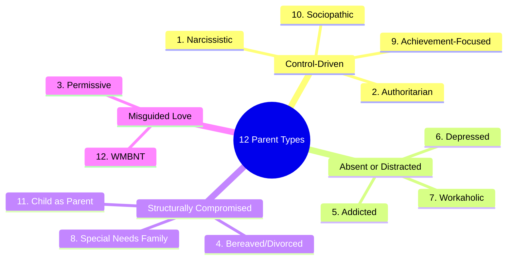
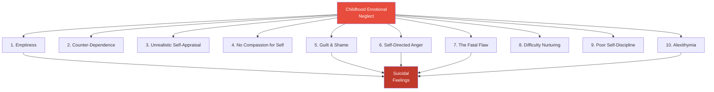
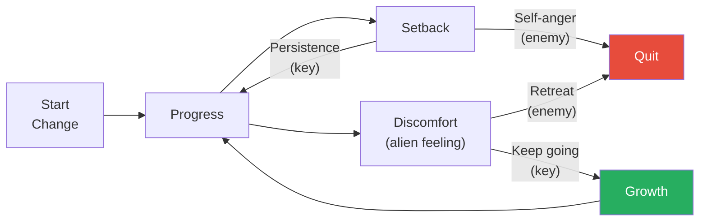
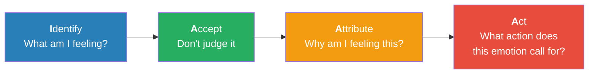
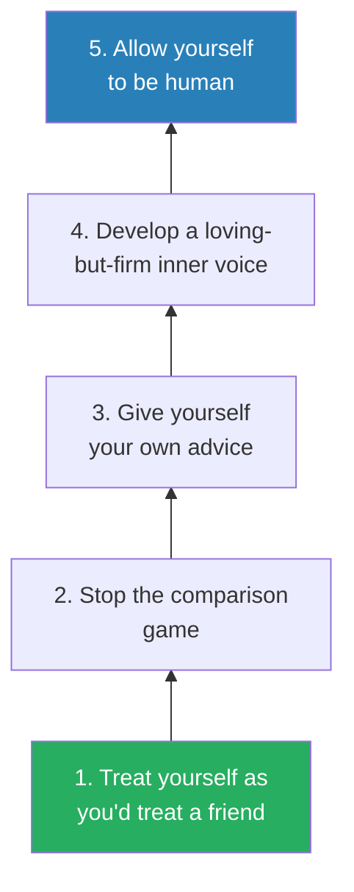
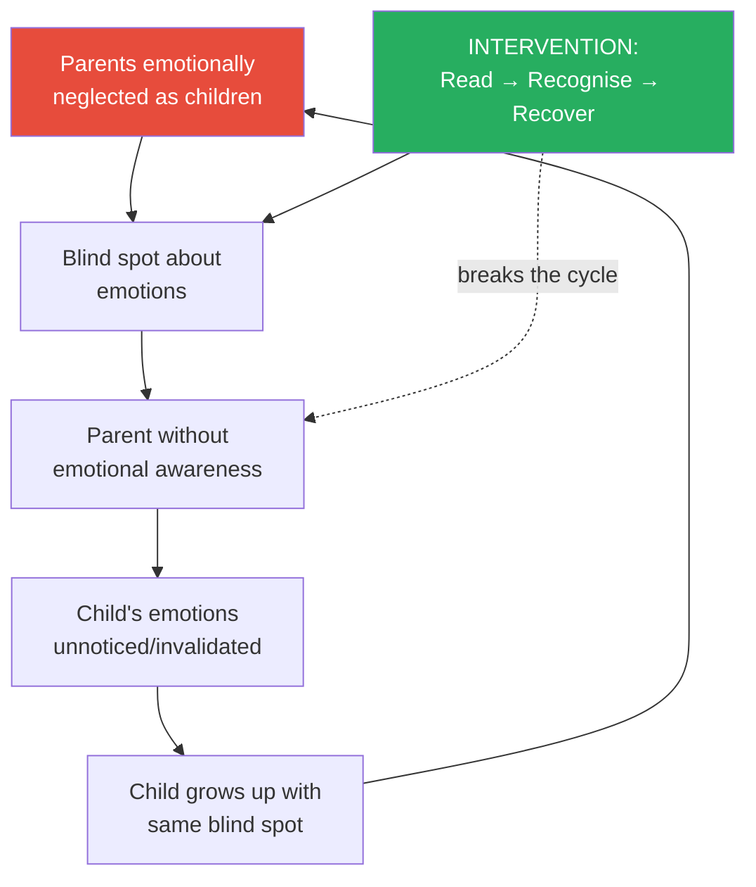

# Running on Empty — Jonice Webb

> Jonice Webb names something millions of people feel but cannot articulate: a persistent emptiness, a sense that something is missing, a disconnection from their own emotional life — with no obvious cause.
> She calls it Childhood Emotional Neglect (CEN), and it is defined not by what happened in your childhood but by what *didn't* happen.
> When parents fail to notice, respond to, or validate a child's emotional needs — even while providing excellent physical care — the child grows up structurally incomplete: unable to recognise feelings, unable to ask for help, unable to explain why life feels hollow.
> The book maps the entire invisible system: the twelve types of parents who produce it, the ten symptoms it leaves in adults, and a concrete recovery programme to fill what was never filled.
> Webb writes with clinical precision and deep compassion, drawing on decades of therapeutic case studies.
> It is one of the most important books ever written about the damage that *nothing* can do.

---

## About the Author

Dr. Jonice Webb is a licensed clinical psychologist who has practised for over twenty years. She identified Childhood Emotional Neglect as a distinct clinical phenomenon after observing a pattern in her patients: intelligent, high-functioning adults who felt empty, disconnected, and self-blaming — with no history of abuse or trauma to explain it. She coined the term CEN and developed both a diagnostic framework and treatment protocol. She is also the author of *Running on Empty No More* (2017), which extends the framework to relationships. Dr. Christine Musello, PsyD, contributed to the initial conceptualisation and several clinical vignettes. The case studies throughout are drawn from real clinical practice, with identifying details changed.

---

## The Big Idea

- <b style="color: #2980b9">Childhood Emotional Neglect</b> is not about what your parents did to you — it is about what they failed to do: notice your feelings, validate your experience, help you understand your own emotional life
- It is <b style="color: #e74c3c">invisible by nature</b> — it hides in the white space of the family picture, in what wasn't said, in what didn't happen, in what you can't remember
- You can have loving parents, a comfortable home, no abuse whatsoever — and still be profoundly emotionally neglected
- CEN produces adults who appear successful on the outside but feel hollow on the inside: empty, disconnected, unable to explain what's wrong, prone to blaming themselves
- <b style="color: #27ae60">The damage is reversible</b> — but only once you can see the invisible thing that was missing and deliberately provide it to yourself as an adult
- CEN is self-propagating: emotionally neglected parents raise emotionally neglected children, who raise emotionally neglected children — because you cannot give what you never received
- The fuel of life is feeling — without it, you are running on empty

---

## Key Concepts at a Glance

| Concept | One-line summary |
|---------|-----------------|
| **Childhood Emotional Neglect (CEN)** | A parent's failure to respond adequately to a child's emotional needs |
| **The Invisible Force** | CEN hides in omission — you can't remember what didn't happen |
| **Good Enough Parent** | Winnicott's concept: the minimum emotional connection a child needs to thrive |
| **12 Parent Types** | Classification of how different parents produce the same neglect |
| **10 Adult Characteristics** | The signature symptoms CEN leaves in grown-ups |
| **The Fatal Flaw** | The secret belief that something is fundamentally wrong with you |
| **Alexithymia** | Inability to identify, understand, or describe one's own emotions |
| **Counter-Dependence** | The compulsive drive to need no one, ever |
| **IAAA Framework** | Identify → Accept → Attribute → Act — the emotion management cycle |
| **Three Things Programme** | Daily practice: do 3 things you don't want to, or stop 3 you shouldn't |
| **Change Sheets** | Structured tracking tools for behaviour change across 8+ areas |
| **WMBNT Parents** | Well-Meaning-but-Neglected-Themselves — the largest and most invisible category |

---

## Part I: Running on Empty — The Invisible Wound

### Chapter 1 — Why Wasn't the Tank Filled?

*Webb establishes what healthy emotional parenting looks like — so you can recognise its absence.*

- The child psychiatrist Donald Winnicott coined the term <b style="color: #2980b9">"Good Enough Mother"</b> to describe the minimum level of parental emotional connection a child needs
- There is a minimal amount of parental empathy, attention, and emotional responsiveness necessary to fuel healthy development — less than that, and the child grows up structurally incomplete
- Three essential emotional parenting skills:
  - The parent **feels an emotional connection** to the child
  - The parent **pays attention** — sees the child as a unique, separate person
  - The parent uses that connection and attention to **respond competently** to the child's emotional needs
- These skills sound simple, but in combination they are extraordinarily powerful: they teach a child to understand and manage their own nature
- When these skills are absent, the child is left to figure out emotions alone — and almost always concludes that the problem is themselves

> [!example] Zeke and the Teacher's Note
> - Eight-year-old Zeke gets in trouble at school for talking back to his teacher and is sent home with a note
> - His emotionally attuned mother asks what happened before reacting — no shaming
> - She names his feeling for him: "Mrs. Rollo didn't understand that you were *embarrassed*"
> - Zeke, hearing the word, is able to express more: "Yeah, she got me so *frustrated*"
> - She gives him a simple rule ("When a teacher asks you to do something, you do it right away"), validates his experience, and holds him accountable
> - In one deceptively simple conversation, she has avoided shame, named emotions, provided a social rule, and created emotional learning Zeke can use for life

- Webb uses Zeke as a recurring character throughout the book — the same incident reimagined through each of the twelve parent types
- This comparison device makes the invisible differences between healthy and neglectful parenting starkly visible

> [!example] Kathleen and the Beach
> - Five-year-old Kathleen is happily building sandcastles with her father — a rare moment of one-on-one play
> - Her mother interrupts: "That's enough sandplay, Kathleen. Your Dad doesn't want to have to play with *you* all day on his day off"
> - Kathleen's father stands and brushes the sand from his knees, as if he too must obey
> - Twenty-five years later in therapy, Kathleen's eyes well up at the image of her father standing — she doesn't know why it makes her so sad
> - What she needed was for either parent to validate that she was worth playing with
> - Neither parent committed a great offence — the neglect was so subtle neither was probably aware anything damaging was happening

> [!tip] Core Insight
> The danger of Emotional Neglect is that perfectly good people, loving their child, doing their best, can pass on invisible, potentially damaging patterns — simply by living out the patterns passed to them in their own childhoods.

- <b style="color: #e74c3c">Two types of empathic failure</b>:
  - **Acute** — failing a child in a critical moment of crisis, causing a wound that may never heal
  - **Chronic** — being tone-deaf to some aspect of a child's needs throughout development
- Every parent fails sometimes — it only becomes CEN when the failures are broad enough or frequent enough to gradually "starve" the child emotionally

---

### Chapter 2 — Twelve Ways to End Up Empty

*Webb catalogues twelve distinct parent types that produce CEN — each illustrated with clinical vignettes and a Zeke variation.*

- Parents may combine traits from multiple types
- The largest category — Well-Meaning-but-Neglected-Themselves — is saved for last because it captures the many loving parents who simply don't know what they never received

- **Interpretation:** CEN is not caused by one type of bad parenting — it emerges from radically different family situations. A narcissistic parent and a permissive parent produce the same emptiness through opposite mechanisms. This is why CEN is so hard to see: the causes look nothing alike, but the result is the same invisible wound.

| # | Parent Type | Core Mechanism | What the Child Learns |
|---|------------|----------------|----------------------|
| 1 | **Narcissistic** | Child is extension of parent's ego | My feelings don't exist; only theirs matter |
| 2 | **Authoritarian** | Obedience equals love | Having needs is selfish and offensive |
| 3 | **Permissive** | Path of least resistance | No one will structure me; I must figure it out alone |
| 4 | **Bereaved/Divorced** | Grief absorbs parenting energy | My feelings are a burden; don't add to the pain |
| 5 | **Addicted** | Two different parents depending on substance | I can never predict which parent I'll get |
| 6 | **Depressed** | Missing in action, low energy | I must be perfectly behaved so I don't make it worse |
| 7 | **Workaholic** | Material success masks emotional absence | Dad's job is more important than my life lessons |
| 8 | **Special Needs Family** | Healthy child expected to be mini-adult | Guilt for having normal feelings and needs |
| 9 | **Achievement/Perfection** | Future > feelings | My emotional self doesn't exist; only results matter |
| 10 | **Sociopathic** | No conscience, control-driven | I can never make sense of why my parent hurts me |
| 11 | **Child as Parent** | Role reversal due to hardship | I don't get to be a child; my needs don't matter |
| 12 | **WMBNT** | Loving but emotionally blind | Emotions are simply not part of life |

*Different parent types produce distinct CEN signatures — narcissistic parents create the deepest emptiness and shame, while authoritarian parents generate the most self-directed anger.*

#### The Control-Driven Parents (Types 1, 2, 9, 10)

*These parents actively impose their own needs onto the child — the child's emotional world is overwritten, not merely ignored.*

- <b style="color: #e74c3c">The Narcissistic Parent</b> sees children as extensions of themselves — when the child fails publicly, the parent feels personally humiliated
- They play favourites: one child is the "anointed one" who reflects well; the rest are disappointments
- The anointed child often discovers in adulthood that their parent's love was conditional all along

> [!example] Beatrice and the Scholarship
> - Bright fourteen-year-old Beatrice wins a full scholarship to a prestigious private school
> - She is miserable all year — she feels like the token outsider among wealthy classmates
> - Her mother is thrilled, socialising with senators and Wall Street parents at school events
> - When Beatrice says she wants to return to public school, her mother explodes: "How could you do this *to me*? You're nothing but a selfish drama queen!"
> - Beatrice returns to public school, earns a full scholarship to Brown — her mother is happy again
> - At no point did anyone ask Beatrice how she felt

- <b style="color: #e74c3c">The Authoritarian Parent</b> equates obedience with love — if the child questions a demand, the parent feels rejected
- These parents raise children who learn that having needs is selfish, and that they themselves don't matter

> [!example] Renee's Father
> - Renee's father would yell for her to come mop the floor — if she finished writing one sentence of homework before jumping up, he interpreted the brief delay as disobedience
> - His yelling was powered by the feeling that his daughter, by not reacting immediately, did not love him
> - Renee grew up blaming herself for having "unacceptable needs" rather than her father for being unreasonable

- <b style="color: #e74c3c">The Sociopathic Parent</b> has no conscience and no empathy — raising a child is entirely about power and control
- The single most reliable indicator: the person hurts you and then proceeds as if nothing happened, expecting you to do the same

> [!example] Wallace's Christmas
> - Wallace's mother gave her other grandchildren expensive iPods — and Wallace's children cheap plastic toy cameras
> - When Wallace confronted her, she attacked: "Is Christmas to you only about how expensive the gifts are? You've never cared about anything but money"
> - At dinner that evening she acted as if nothing had happened — merry Christmas, everything fine
> - She exhibited all sociopathic traits in one incident: underhanded control, vicious attack, acting as if it didn't happen, painting herself as the victim

#### The Absent or Distracted Parents (Types 5, 6, 7)

*These parents are physically present but emotionally missing — the child learns to navigate around an unpredictable or vacant caregiver.*

- What these three types have in common: something else has captured the parent's attention — a substance, an illness, a career — and the child is left to figure out life's emotional terrain alone
- The child often remembers the parent fondly because the *good* version of the parent was genuinely good
- But the inconsistency is what does the damage: you can never predict which parent will show up

- <b style="color: #2980b9">The Addicted Parent</b> is functionally two different people — kind and supportive when sober, mean or inappropriate when using
- Being a good parent most of the time and a horrible parent once in a while creates profoundly insecure adults

> [!example] Richard's Awards Banquet
> - Richard's father came to every single baseball game and even pitched batting practice — a model sports dad
> - At the season awards banquet, after a few beers, his father stood up and bellowed that the other kid didn't deserve MVP: "My son made All-State!"
> - Everyone stared. Richard stumbled outside and threw up
> - By next season, he was partying too much to play baseball
> - The memory he carried wasn't of all the good games — it was the one unpredictable explosion

- <b style="color: #2980b9">The Depressed Parent</b> has low energy and little to give — the child learns that making mistakes will make the parent even sadder
- <b style="color: #2980b9">The Workaholic Parent</b> replaces emotional presence with material provision — the child loses their parent gradually to success, and no one notices because the family keeps getting richer

> [!example] Sam's Invisible Loss
> - Sam's parents met in poverty and worked their way to impressive salaries
> - Between ages 9 and 19, Sam went from having two attentive parents to being raised by a nanny
> - Everyone talked about how lucky Sam was — bigger houses, nicer cars
> - "Everyone knows that if a child's parent dies, the child will suffer. No one thinks about this when a child loses a parent to success"
> - At 19, failing out of college, Sam blamed himself: "My parents have worked so hard to give me every advantage. Here I am throwing it all away"

#### The Structurally Compromised Parents (Types 4, 8, 11)

*Life has delivered a challenge that overwhelms the parent's capacity — the child is collateral damage of circumstances, not malice.*

- These are the parents who deserve to be in a book about neglect *least* — yet here they are, because circumstances have overwhelmed their emotional bandwidth
- The well child in these families is often praised for being "the easy one," "the rock," "such a big help" — and this praise itself becomes a trap, because it tells the child that their job is to have no needs
- Webb emphasises: being in a compromised family is *not* a sentence for CEN — many parents coping with these challenges stay emotionally attuned to all their children; time is less important than emotional quality

> [!example] Sally's Gray World
> - Sally's father died of cancer when she was eight — no one told the children he was going to die
> - Her sister told her "Daddy's gone. They took him away"
> - Her mother's face turned to stone. No one spoke of the father again — as if he had never existed
> - The family sold their house, moved to a small apartment; Sally learned to steer clear of her mother because any need pushed her close to the edge
> - At age 40, Sally told her therapist: "Other people live in a different world from me. They see colours, feel things, love each other. I have none of that. The world is grey. I'm on the outside, looking in"
> - The cause wasn't the death — it was what *didn't happen* before and after: no communication about the illness, no emotional preparation, no space to grieve

- <b style="color: #2980b9">The Special Needs Family</b> parent often recognises the impact on the healthy child — but studies consistently show parents rate the healthy child as "doing okay" while that child rates themselves much more negatively

> [!example] Stuart's Breaking Point
> - Stuart's older brother Larry had a chronic illness; every therapy session with Stuart's parents drifted back to Larry without them realising it
> - Stuart had held in his needs for years — at 15, his facade finally crumbled
> - When he blurted out "Everything is always about Larry — you even left my All-Star game early to pick up his medications!" his parents called him "overly sensitive"
> - The therapist intervened: "Stuart isn't allowed to say how he feels. You're making him feel guilty for having needs"

#### The Largest Category: WMBNT (Type 12)

- <b style="color: #27ae60">Well-Meaning-but-Neglected-Themselves parents</b> love their children genuinely — they just don't know how to give what they never received
- They are emotionally blind, not emotionally cruel
- They live on the surface of life, unaware of the feeling level beneath behaviour
- CEN is self-propagating: these parents pass on the same blind spot they inherited, generation after generation

> [!tip] Core Insight
> One of the most unfortunate aspects of Emotional Neglect is that it is self-propagating. Emotionally neglected children grow up with a blind spot about emotions. When they become parents, they raise their children with the same blind spot. And so on and so on.

*The WMBNT category dominates — most emotionally neglecting parents are not malicious but simply passing on what they never received themselves, making CEN's intergenerational nature its most insidious feature.*

---

## Part II: Out of Fuel — The Adult Symptoms

### Chapter 3 — The Neglected Child, All Grown Up

*Webb identifies ten characteristic patterns in adults who were emotionally neglected — each illustrated with detailed clinical cases.*

- Adults with CEN often seem normal on the surface — they are frequently unaware of the structural flaw in their foundation
- They have no idea their childhood played a role
- Instead, they blame themselves: "Why do other people seem happier? What is missing within me?"
- Think of childhood as the foundation of a house — it may look the same as any other house, but if the foundation is cracked, one strong wind and it comes tumbling down
- These adults are far better at giving than receiving — they guard the secret of their emptiness carefully
- Everyone's experience is different, but certain common themes arise consistently in the adults who grew up this way

- **Interpretation:** These ten symptoms are not independent — they feed each other in reinforcing loops. Alexithymia makes it impossible to identify what's wrong, which feeds the Fatal Flaw belief, which produces shame, which drives self-directed anger, which deepens emptiness. At the extreme, this cascade can produce suicidal feelings — not from dramatic life events, but from the cumulative weight of invisible suffering.

*The radar shows how CEN creates a uniformly elevated symptom profile across all ten dimensions — recovery brings each one down, though emptiness and counter-dependence often prove most stubborn.*

#### 1. Feelings of Emptiness

- A generic feeling of discomfort — a lack of being filled up that comes and goes
- Some experience it physically, as an empty space in belly or chest; others as emotional numbness
- <b style="color: #2980b9">"The fuel of life is feeling"</b> — if we're not filled up in childhood, we must fill ourselves as adults

> [!example] Simon the Skydiver
> - Handsome, fit, successful stock analyst — drove a Porsche, owned a beautiful condo, loved skydiving
> - Couldn't sustain a relationship; moved cities, discarded jobs, condos, and people when they failed to fill his void
> - His parents were wealthy and traveled often, leaving him with a nanny; his disabled sister needed all the parenting energy
> - He spent his teenage years alone in the woods behind his house, smoking joints, delaying his return because there was nothing for him at home
> - In therapy, he slowly learned to turn attention inward and name his feelings — it took two years
> - Three girlfriends later, he found a woman with whom he felt safe enough for true intimacy

#### 2. Counter-Dependence

- The fear of being dependent — going to great lengths to avoid asking for help or appearing needy
- Not the same as healthy independence; it is a *compulsion* to need no one

> [!example] David's Island Fantasy
> - Youngest of seven children, born nine years after the next sibling — his parents were tired of raising children
> - He never showed his report cards (all A's); he handled problems alone; his parents never asked
> - His wife described their 15-year marriage as "empty and meaningless" — David told her he loved her often but never showed emotion
> - He resented his teenage daughter for being important to him — for making him care
> - His constant fantasy was running away to live alone on a deserted tropical island

#### 3. Unrealistic Self-Appraisal

- Not necessarily negative — simply *off*: painted with broad, childlike strokes, devoid of complexity
- Without parental feedback, the child never develops a nuanced sense of their own strengths and weaknesses
- We develop our self-concept by seeing ourselves reflected in our parents' eyes — pride after a recital, constructive criticism after a game
- A realistic self-appraisal is the springboard for life decisions: what to strive for, what skills to develop, what career to choose
- Without it, the adult is directionless — they don't know what they're good at, what they're interested in, or where they fit

> [!example] Josh the Square Peg
> - Josh grew up an only child of a career-focused mother who solved every problem by switching his school rather than helping him work through it
> - She never noticed his love of animals, his facility with the outdoors, or his tendency to isolate
> - He never saw himself reflected in a parent's eyes — so he never developed a realistic self-appraisal
> - With a Master's in English (chosen solely because he liked to read), he ended up driving a construction supply truck
> - He described himself in broad, childlike strokes: "a loner," "a dreamer," "directionless"
> - When he tried teaching and received criticism, he folded immediately — no foundation to withstand feedback

#### 4. No Compassion for Self, Plenty for Others

- Others find them easy to talk to — they appear non-judgmental and accepting
- But they are harshly perfectionistic with themselves — a constant critical inner tape

> [!example] Noelle's Inner Critic
> - Ivy League degrees, fast-track career, recently laid off
> - Constant tape inside her head: "What's wrong with you? You can't even park a car right"
> - As a child of divorce, her mother remarried and launched into her new life — young Noelle was left microwaving frozen chicken sandwiches for breakfast alone
> - She wrapped herself in her intelligence like a cocoon — and had zero tolerance for any error that disrupted her only security

#### 5–6. Guilt, Shame, Self-Directed Anger

- When a child's emotions are treated as a burden, the child grows up feeling that *having feelings* is shameful
- Between a "happy childhood" and inexplicable emotions, the adult concludes something is seriously wrong with them

> [!example] Laura's Silence
> - At 14, Laura's best friend's brother killed himself — she rushed home desperate to talk
> - Her mother gave her a hug and said: "I'm not surprised. I think he was into drugs." End of discussion
> - By graduation, two more acquaintances had committed suicide — Laura handled each loss the same way: attended the funeral, told no one how she felt
> - Her parents would ask "What's wrong with you?" — but it was a rhetorical question
> - At 32: "I had a wonderful, privileged childhood, yet I wish I were dead. I have no excuse"

#### 7. The Fatal Flaw

- A deep-seated, carefully guarded belief that something is fundamentally wrong with you
- Not a real flaw — but a *real feeling*
- Each CEN adult develops their own version: "I'm worthless," "I'm stupid," "I'm unlikeable"
- A therapy group of eight CEN women named this shared feeling themselves: <b style="color: #e74c3c">The Fatal Flaw</b>
- It drives an avoidant style: keep people at a distance, never let anyone get close enough to see the "truth"
- The avoidance creates a self-fulfilling prophecy: by withholding meaningful connection, the person becomes uninteresting to others, which confirms their belief that they are unlikeable

> [!example] Carrie's Self-Fulfilling Prophecy
> - Carrie grew up the youngest of three in a simple, emotionally flat household — no one paid attention to feelings
> - Her mother dressed Carrie and her older sister identically despite a four-year age gap — neither was treated as an individual
> - Her sister resented the forced twinning and despised Carrie — Carrie's child-analysis: "I'm not likeable"
> - When she struggled academically (undiagnosed ADHD and learning disabilities), her mother said "Well, it's OK, all you can do is try your hardest" — Carrie heard: "You're not capable of more"
> - Two assumptions crystallised: she was unlikeable and she was dumb
> - By her mid-thirties, she gave up on every romantic relationship as soon as the man had any issue with her — confirming her Fatal Flaw: "If people get to know me, they won't like me"

#### 8–9. Difficulty Nurturing + Poor Self-Discipline

- A sponge too long away from water will harden — a child too long away from emotional care will wall off
- Like compassion, nurturance is an emotional glue that binds us together — when we receive it from our parents as children, we internalise it and can provide it to others
- Self-discipline is not innate — it is wired through parental structure: chores, homework hour, curfews, consequences
- Each time a parent sets and enforces a rule, that rule becomes part of the child's internal repertoire — the child learns how to force himself to do something tedious
- Without that wiring, the adult struggles to start unpleasant tasks, stop self-indulgent ones, and persevere through boredom
- Many emotionally neglected people call themselves "lazy" or "procrastinators" — they don't realise that the skill they're missing was never installed in the first place

> [!example] William's Freedom Trap
> - William had an MBA and a very high IQ — but a series of unchallenging jobs below his potential
> - He stayed up all night working, then overslept; forgot to eat; couldn't complete tedious tasks
> - His single mother lavished love on him but gave him complete freedom — no chores, no homework enforcement, no structure
> - Teachers cut him slack because he was bright and charming
> - As an adult, William was skilled at "running free" — but when a boss demanded results, he didn't have the neural wiring to make it happen
> - In the absence of a parental voice, he invented his own — and it swung between harsh self-judgment and complete self-indulgence

#### 10. Alexithymia

- The common denominator of CEN — present to some degree in every emotionally neglected adult
- A deficiency in knowledge about, and awareness of, emotion
- Suppressed feelings emerge as irritability, snapping at others, or explosive anger

> [!example] Cal's Locked Box
> - Cal came to therapy planning to kill himself at the end of the Millennium — his only emotion was anger, all day every day
> - He grew up in a family where no one had ever yelled, cried, hugged, kissed, or expressed emotion of any kind
> - He had destroyed every family photo he owned, including childhood pictures of himself — and couldn't explain why
> - In therapy, he slowly learned to identify feelings behind the anger: abandonment when his brothers stopped playing with him, hurt, exclusion
> - He visibly softened. Friends emerged. He stopped drinking and learned to cook
> - Then cancer was found. He was given nine months. His friends took turns sitting with him, visiting him in the hospital, cooking for him
> - He did not die alone, but in the company of friends
> - His primary care doctor and therapist cried on the phone together — they had both grown to love him

> [!tip] Core Insight
> Cal left an invaluable lesson: the scars of Emotional Neglect do not have to be permanent. And it is never too late.

---

### Chapter 4 — The Special Problem of Suicidal Feelings

*Webb addresses the connection between CEN and suicidal ideation — not driven by dramatic events but by the cumulative weight of invisible emptiness.*

- Many suicides seem unattributable to any event or illness — successful people, loving families, no visible crisis
- For a person with CEN, emptiness and numbness are held in secret — like floodwaters gradually eroding bedrock
- <b style="color: #e74c3c">Emptiness or numbness is often worse than pain</b> — many people say they would far prefer feeling *anything* to feeling *nothing*
- The escape fantasy becomes a safety net: "If I ever can't take it anymore, I can end it" — and that fantasy itself becomes a soothing mechanism

> [!example] Robyn's Zero Tolerance Home
> - Third of five children in a loving family — her parents had "Zero Tolerance" for negativity of any kind
> - Any conflict between siblings meant all parties were sent to rooms immediately — it didn't matter who was right
> - The same rule applied to complaining, unhappiness, sadness, or frustration
> - Robyn was a sensitive child from birth — her family nicknamed her "Frequent Crier"
> - She learned to hide every negative emotion from the world and eventually from herself
> - She organised her entire life around suppressing negativity — the effort was enormous
> - Her friends described her as a contradiction: great at listening, but never shared about herself; sometimes disappeared for weeks into "hermit mode"
> - The morning after a fun cookout with friends, a Waltons rerun triggered a childhood memory of being mocked for crying — shame and self-hatred piled onto existing emptiness
> - She impulsively took every pill in her medicine cabinet
> - No one in her life could make sense of it — there had been no signs, no dramatic event
> - The trigger was a TV show. But the real cause was decades of emotional suppression in a household that demanded happiness and punished sadness

- Common factors across CEN-linked suicidal feelings:
  - Emptiness and numbness
  - Suffering in silence
  - Questioning the meaning and value of life
  - An escape fantasy used as self-soothing

> [!warning] A Note on Safety
> If you recognise yourself in these descriptions, please seek professional help. CEN-linked suicidal feelings are treatable. The emptiness can be filled, the numbness reversed, the connection restored. Every case study in this book is evidence of that.

---

## Part III: Filling the Tank — The Recovery Programme

### Chapter 5 — How Change Happens

*Before the practical tools, Webb addresses the three enemies that derail every attempt at change.*

- <b style="color: #e74c3c">False Expectations</b>:
  - Change is not linear — it comes in fits and starts, two steps forward, one step back
  - Setbacks are not failures — they are built into the process
  - Getting off track is normal — the only real failure is giving up entirely
- <b style="color: #e74c3c">Avoidance</b>:
  - The most comfortable response to difficulty is to put it out of your mind
  - Avoidance beckons like an oasis in the desert — but it leaves you parched
  - The only way to deal with it is to face it head on: notice the moment avoidance kicks in, then turn around and challenge it
- <b style="color: #e74c3c">Discomfort</b>:
  - When change starts working, things feel *alien* — the new you is unfamiliar
  - People around you react differently, and suddenly nothing feels safe
  - This is a completely natural response — but it sends you back toward square one if you let it

- **Interpretation:** Change is a loop, not a line. The emotionally neglected person's tendency toward self-blame means every setback gets amplified into "proof I'm broken." Webb's framework reframes setbacks as a *feature* of change, not evidence of failure.

---

### Chapter 6 — Why Feelings Matter and What to Do with Them

*The heart of Webb's recovery programme: a six-skill system for reconnecting with your own emotional life.*

- <b style="color: #2980b9">"Although many of us think of ourselves as thinking creatures that feel, biologically we are feeling creatures that think"</b> — Dr. Jill Bolte Taylor
- Our ability to feel emotion evolved millions of years before our ability to think — emotions are a more basic part of who we are than thoughts
- Emotions are not a nuisance — they are an incredibly useful feedback system designed for survival

| Emotion | Evolutionary Function |
|---------|----------------------|
| Fear | Tells us to escape — self-preservation |
| Anger | Pushes us to fight back — self-protection |
| Love | Drives us to care for spouse, children, others |
| Passion | Drives us to procreate, create, and invent |
| Hurt | Pushes us to correct a situation |
| Sadness | Tells us we are losing something important |
| Compassion | Pushes us to help others |
| Disgust | Tells us to avoid something |
| Curiosity | Drives us to explore and learn |

- Emotions that are pushed underground do not disappear — they become physical symptoms, depression, energy loss, random explosions, anxiety, or shallow relationships

#### The Six Emotion Skills

**Skill 1: Understanding the Purpose and Value of Emotions**
- People who were emotionally neglected were trained to erase, deny, or be ashamed of their built-in feedback system
- Operating without it is like navigating without a compass

**Skill 2: Identifying and Naming Your Feelings**
- The Identifying and Naming Exercise:
  - Close your eyes, picture a blank screen, banish all thoughts
  - Ask: "What am I feeling right now?"
  - Try to identify feeling words — use the Feeling Word List if stuck
  - Then ask: "Why would I be feeling this?"
- Something almost magical happens when you say "I feel sad" or "You hurt me" — you take something from the inside and put it on the outside

**Skill 3: Self-Monitoring (Feelings Sheet)**
- Record feelings three times per day (morning, afternoon, evening) using a weekly tracking sheet
- The goal is to gradually become naturally tuned in to emotions as they occur
- When this awareness starts to happen, you finally have access to the power your emotions bring

**Skill 4: Accepting and Trusting Your Feelings**
- <b style="color: #27ae60">Three essential rules</b>:
  1. **There is no bad emotion** — every human has felt rage, jealousy, hate, even homicidal feelings; it's what you *do* with them that matters
  2. **Feelings always exist for a good reason** — even when they seem irrational, every emotion can be explained if you try hard enough
  3. **Emotions can be managed** — hidden emotions have power over us; acknowledged emotions lose their potency

> [!example] David's Restaurant Disgust
> - David occasionally felt unbearable disgust watching strangers eat in restaurants — he feared he was going crazy
> - Through therapy, they discovered: his limbic system was equating eating (taking in nourishment) with emotional nurturance — something he could never allow himself
> - He was disgusted seeing others let their guard down and enjoy taking in nurturance
> - Once he understood the source and didn't judge himself for it, the feeling lost its potency and eventually disappeared

**Skill 5: Expressing Feelings Effectively**
- Not passively, not aggressively — but assertively and with compassion
- The goal is to harness emotional power without causing harm

**Skill 6: Recognising Emotions in Relationships**
- Learning to read others' feelings and respond to them — the skill your parents never modelled

#### The IAAA Framework

- **Interpretation:** IAAA is the master tool of the entire recovery. It converts raw emotional data into useful information and appropriate action. Each step deliberately counteracts a CEN pattern: Identify (vs alexithymia), Accept (vs shame), Attribute (vs "what's wrong with me?"), Act (vs numbness/paralysis).

*The bar chart shows the enormous gap CEN adults must bridge — starting from near-zero emotional literacy and self-compassion, with the IAAA framework providing the structured path across.*

---

### Chapter 7 — Self-Care: The Four-Part Recovery Programme

*Webb provides the practical toolkit for re-parenting yourself as an adult — structured around four domains that CEN typically damages.*

#### Part 1: Learning to Nurture Yourself

*When you are healthy and strong, you're freed up to give to others in a richer, deeper way. Secure your own oxygen mask first.*

- <b style="color: #27ae60">Step A: Putting Yourself First</b>
  - This is not selfish — emotionally neglected people are at the *farthest possible distance* from becoming selfish
  - When you first start, expect resistance — primarily from the people closest to you, who are accustomed to you always saying yes
  - Four key practices:

| Practice | Why It Matters | CEN Pattern It Breaks |
|----------|---------------|----------------------|
| **Learn to say no** | Free yourself from obligation-driven yes | Counter-dependence / over-giving |
| **Ask for help** | Accept that relying on others is a necessity, not weakness | Counter-dependence |
| **Discover your likes and dislikes** | You can't care for yourself if you don't know yourself | Unrealistic self-appraisal |
| **Prioritise your own enjoyment** | You deserve pleasure as much as anyone | Self-neglect / emptiness |

> [!abstract] The Assertiveness Principle
> Anyone has the right to ask you for anything. You have the equal right to say no, without giving a reason. If everyone operated this way — feeling free to ask and free to decline — boundaries would be clearer and there would be far less unnecessary guilt.

- <b style="color: #27ae60">Step B: Eating</b>
  - Childhood eating patterns are powerful programming — most adults greatly underestimate how much their food relationship was shaped in childhood
  - Webb provides paired questionnaires: adult habits vs childhood experiences — the matches reveal the programming
  - CEN-specific risk: using food to manage emotions (learned from permissive or emotionally absent parents)

- <b style="color: #27ae60">Step C: Exercise</b>
  - Three building blocks: understanding its value, finding enjoyable forms, and having the self-discipline to maintain it
  - CEN often damages all three: parents didn't model it, didn't support the child in finding a sport they loved, didn't structure the discipline to maintain it

- <b style="color: #27ae60">Step D: Rest and Relaxation</b>
  - Emotionally neglected adults tend to either rest too little or rest too much — some swing between extremes
  - An attuned parent notices when a child is tired and makes them rest — the child internalises the ability to read their own fatigue signals
  - Without that learning, the adult can't calibrate their own needs

#### Part 2: Improving Self-Discipline

*The core practice that makes all other changes possible — because self-discipline is not willpower; it is learned neural wiring.*

- Human beings are not born with the ability to regulate themselves — these skills are wired through parental structure
- Every time a parent enforces "homework before play" or "chores before TV," those rules become part of the child's internal repertoire
- In the *absence* of a parental voice, the child invents one — and it is almost always either too harsh or too indulgent (or both, alternating)

> [!abstract] The Three Things Programme
> Every day, do Three Things you don't want to do OR stop yourself from doing Three Things you want to do but shouldn't.
>
> Examples from Webb's patients:
> - **Do:** face-washing, bill-paying, floor-sweeping, exercise, phone-calling, dishwashing, shoe-tying, task-starting
> - **Stop:** not eating the cake, not buying the necklace online, not having the extra drink, not skipping class
>
> It doesn't matter how big or small the Thing is. What matters is the action of overriding your default setting. You are forging new neural pathways — and each override makes the next one easier.

- The programme also addresses the **inner voice**:
  - Too harsh: "You idiot" → feeds self-anger, drains energy
  - Too indulgent: "I'm not going to think about this" → sets you up to repeat the mistake
  - The goal: a **loving-but-firm voice** that holds you accountable without destroying you

> [!example] The Gas Station Voice
> - You forgot to fill up the car and ran out of gas on the freeway
> - **Too harsh:** "What is wrong with you? You're so irresponsible!"
> - **Too indulgent:** "Whatever, it happens"
> - **Loving-but-firm:** "How did this happen? Oh right — I was running late from the DMV, which was out of my control. How can I prevent this? Never plan gas fill-up for lunch — not enough flexibility. From now on, I'll fill up on the drive to work or on the way home"
> - Four steps: (1) Hold accountable without blame, (2) Distinguish your fault from circumstances, (3) Determine what to do differently, (4) Learn and move on

#### Part 3: Self-Soothing

- Self-soothing is learned from parents who accept, tolerate, and appropriately calm their child's emotions
- Children absorb this skill like sponges — and need it their entire lives
- The worst time to figure out what works is when you need it most — build your strategy list in advance
- Webb provides a starter list: bubble baths, music, exercise, spending time with pets, cooking, calling a friend, watching clouds, meditation
- Warning: be careful with alcohol, shopping, and food — in moderation they help; overused, they create new problems

#### Part 4: Self-Compassion

*The capstone of the recovery — learning to turn toward yourself with the same warmth you give to others.*

- Five principles that build a pyramid of self-love:

- **Principle 1: Treat yourself as you'd treat a friend**
  - When a friend makes a mistake, you listen, comfort, help them problem-solve — you don't berate them
  - Apply the same standard to yourself
- **Principle 2: Stop comparing yourself to others**
  - Everyone has problems, insecurities, and flaws — most people are just better at hiding them
- **Principle 3: Give yourself your own advice**
  - You are probably excellent at helping others through difficulties — why not listen to your own counsel?
- **Principle 4: Develop a loving-but-firm inner voice**
  - Replace the harsh/indulgent pendulum with a voice that holds you accountable with care
- **Principle 5: Allow yourself to be human**
  - Making mistakes is a non-negotiable condition of humanity
  - There is not a human being on earth who hasn't had many, many feelings and made many, many mistakes

> [!tip] Core Insight
> As you build up the pyramid of self-love, you'll be climbing it too, until you reach the top and find a level of kindness and calmness within yourself that you never knew existed. When you turn your powerful compassion upon yourself, you'll be living with a new You — loveable, fallible, imperfect, with strengths and weaknesses, wins and losses. A full and connected You.

---

### Chapter 8 — Ending the Cycle: Giving Your Child What You Never Got

*Webb addresses the hardest audience: CEN adults who are now parents, watching themselves pass the invisible wound to their own children.*

- <b style="color: #27ae60">The good news</b>: children are incredibly resilient — as soon as you change what you're giving them, they absorb the change
- Any improvements you make in yourself will trickle down to your children — you do not need to be perfect
- <b style="color: #e74c3c">The parental guilt trap</b>: guilt is not necessary for good parenting, and it actually interferes — it makes you weak as an authority figure, afraid to say no, prone to second-guessing every decision

#### Five Principles for Guilty Parents

1. All good parents are guilty of emotional failures at times — it doesn't make you neglectful
2. Guilt may show you care, but you'll be a better parent without it
3. Hold yourself accountable — but accountability is not the same as kicking yourself
4. You've been parenting with what you knew — you can't offer what you didn't have
5. The fact that you're reading this chapter means you're light-years ahead of your own parents

#### The Core Parenting Insight

- <b style="color: #2980b9">The only way to give your child what you don't have is to provide it to yourself first</b>
- As you fill your own tank, the fuel you pour into your children will become richer
- Every CEN adult characteristic maps to a specific parenting challenge:

| Your CEN Pattern | Risk to Your Child | The Fix |
|-----------------|-------------------|---------|
| Emptiness | Low-octane emotional connection | Fill your own tank through emotion skills |
| Counter-dependence | Teaching fierce independence as only option | Model mutual interdependence |
| Unrealistic self-appraisal | Not noticing child's unique strengths/weaknesses | Pay attention; give specific, honest feedback |
| No self-compassion | Harsh expectations or none at all | Learn compassion for yourself first |
| Self-directed anger | Snapping at children for imperfections | Develop the loving-but-firm voice |
| Guilt/shame | Modelling that feelings are shameful | Accept and validate your own emotions |
| Fatal Flaw | Child absorbs your hidden shame | Share appropriately; be authentic |
| Difficulty nurturing | Emotional distance from your children | Practice receiving and giving care |
| Poor self-discipline | No structure for child to internalise | Build your own structure first |
| Alexithymia | Blind to child's emotional needs | Learn the emotion skills in Chapter 6 |

- The key parenting technique: when your child reacts to your changes, **dive underneath their behaviour** — ask "What is she feeling right now?" and gently reflect it back
- This one practice — naming the child's emotion — is the single most powerful anti-CEN intervention available to any parent

---

## The Intergenerational Cycle

- **Interpretation:** CEN perpetuates itself because the blind spot is invisible — you can't fix what you can't see. The book itself is the intervention: by making the invisible visible, it gives the reader the first tool they never had — awareness. From awareness comes recognition. From recognition comes the motivation to recover. And recovery automatically benefits the next generation.

---

## The Complete Recovery Toolkit

| Tool | Chapter | Purpose | Frequency |
|------|---------|---------|-----------|
| Emotional Neglect Questionnaire | Intro | Self-assessment: does CEN apply to you? | Once |
| 12 Parent Types | Ch 2 | Identify your specific CEN source | Once |
| 10 Adult Characteristics + Signs | Ch 3 | Map your personal symptom profile | Once |
| Feelings Sheet | Ch 6 | Track emotions 3x daily | Daily |
| IAAA Framework | Ch 6 | Process any emotion: Identify, Accept, Attribute, Act | As needed |
| "Saying No" Change Sheet | Ch 7 | Track boundary-setting progress | Daily |
| "Asking for Help" Change Sheet | Ch 7 | Track interdependence progress | Daily |
| "Likes & Dislikes" Sheet | Ch 7 | Build self-knowledge | Ongoing |
| "Prioritising Enjoyment" Sheet | Ch 7 | Track fun-prioritisation | Daily |
| Eating Change Sheet | Ch 7 | Override unhealthy food patterns | Daily |
| Exercise Change Sheet | Ch 7 | Track physical activity | Daily |
| R&R Change Sheet | Ch 7 | Balance rest and activity | Daily |
| Three Things Programme | Ch 7 | Build self-discipline neural wiring | Daily |
| Self-Soothing Strategy List | Ch 7 | Personalised coping techniques | Pre-built |
| 5 Self-Compassion Principles | Ch 7 | Restructure inner voice | Ongoing |
| Parenting Challenge Map | Ch 8 | Link your CEN patterns to parenting risks | Once |

---

## The Verdict

<b style="color: #2980b9">Running on Empty</b> is a landmark book that names something millions of people feel but cannot articulate. Its greatest achievement is not the recovery programme — though that is thorough and practical — but the act of making the invisible visible. Webb's central insight is devastating in its simplicity: <b style="color: #e74c3c">you can have loving parents, a comfortable childhood, no abuse, no trauma — and still be profoundly damaged by what *didn't* happen</b>. The book is strongest in Part I and II, where the twelve parent types and ten adult characteristics function as a diagnostic mirror that lets the reader finally see the shape of their own wound. Part III provides concrete tools, though some readers may find the Change Sheets overly structured — they work best as a buffet, not a checklist. The recurring Zeke device is brilliantly effective: seeing the same incident through twelve different parental lenses makes the invisible differences between healthy and neglectful parenting starkly visible. The book's most powerful moment is Cal's story — a man so emotionally shut down he planned to die, who learned to feel and connect, only to lose his life to cancer — but not before dying surrounded by friends rather than alone. <b style="color: #27ae60">It is never too late</b>.

**Best for:** Adults who feel "something is missing" but can't identify what; parents who want to break the intergenerational cycle; therapists working with patients who seem "stuck" despite no apparent trauma history.

**Pair with:** [[Emotional Blackmail - Susan Forward]] for understanding manipulation dynamics in CEN families; [[The Whole-Brain Child - Daniel Siegel]] for the neuroscience of emotional attunement; [[Parenting from the Inside Out - Daniel Siegel]] for the intergenerational attachment patterns Webb describes.

---

## Related Reading

| Book | Why Read It Next |
|------|-----------------|
| [[Emotional Blackmail - Susan Forward]] | FOG dynamics often operate within CEN families |
| [[The Sociopath Next Door - Martha Stout]] | Webb explicitly references Stout for the sociopathic parent type |
| [[In Sheep's Clothing - George K. Simon]] | Character-disturbed parents overlap with Webb's Type 10 |
| [[The Gaslight Effect - Robin Stern]] | Gaslighting can be a mechanism within emotionally neglectful families |
| [[Who's Pulling Your Strings - Harriet B. Braiker]] | Manipulation patterns that exploit CEN vulnerabilities |
| [[The Whole-Brain Child - Daniel Siegel]] | The neuroscience behind Webb's attachment framework |
| [[Parenting from the Inside Out - Daniel Siegel]] | How your own childhood shapes your parenting — the mechanism behind WMBNT |
| [[No Drama Discipline - Daniel Siegel]] | Emotionally attuned discipline vs the authoritarian approach |
| [[Unconditional Parenting - Alfie Kohn]] | Challenges conditional love that drives Achievement/Perfection parents |
| [[Self-Driven Child - William Stixrud]] | Building autonomy and sense of control — the antidote to learned helplessness from CEN |

---

## Appendix: The Emotional Neglect Self-Assessment

Webb's original 22-item questionnaire, rephrased for reflection. If many of these resonate, CEN may be at work in your life.

| # | Do you... |
|---|-----------|
| 1 | Sometimes feel like you don't belong when with family or friends? |
| 2 | Pride yourself on not relying upon others? |
| 3 | Have difficulty asking for help? |
| 4 | Have friends or family who complain that you are aloof or distant? |
| 5 | Feel you have not met your potential in life? |
| 6 | Often just want to be left alone? |
| 7 | Secretly feel that you may be a fraud? |
| 8 | Tend to feel uncomfortable in social situations? |
| 9 | Often feel disappointed with, or angry at, yourself? |
| 10 | Judge yourself more harshly than you judge others? |
| 11 | Compare yourself to others and often find yourself sadly lacking? |
| 12 | Find it easier to love animals than people? |
| 13 | Often feel irritable or unhappy for no apparent reason? |
| 14 | Have trouble knowing what you're feeling? |
| 15 | Have trouble identifying your strengths and weaknesses? |
| 16 | Sometimes feel like you're on the outside looking in? |
| 17 | Believe you could easily live as a hermit? |
| 18 | Have trouble calming yourself? |
| 19 | Feel something is holding you back from being present in the moment? |
| 20 | At times feel empty inside? |
| 21 | Secretly feel there's something wrong with you? |
| 22 | Struggle with self-discipline? |

---

## Appendix: The 10 Symptom Profiles — Signs and Signals

*Use this reference to identify which CEN patterns apply to you. Each list comes directly from Webb's clinical observations.*

### 1. Emptiness

- At times, you feel physically empty inside
- You are emotionally numb
- You question the meaning or purpose of life
- You have suicidal thoughts that seem to come out of nowhere
- You are a thrill-seeker
- You feel mystifyingly different from other people
- You often feel like you're on the outside looking in

### 2. Counter-Dependence

- You've had feelings of depression but don't know why
- You have inexplicable, longstanding wishes to run away or simply be dead
- You remember your childhood as lonely, even if it was happy
- Others describe you as aloof
- Loved ones complain that you are emotionally distant
- You prefer to do things yourself
- It's very hard to ask for help
- You're not comfortable in close relationships

### 3. Unrealistic Self-Appraisal

- It's hard to identify your talents
- You sense that you may over-emphasise your weaknesses
- It's hard to say what you like and dislike
- You're not sure what your interests are
- You give up quickly when things get challenging
- You chose the wrong career or changed several times
- You often feel like a "square peg in a round hole"
- You're unsure what your parents think (or thought) of you

### 4. No Compassion for Self

- Others often seek you out to talk about their problems
- Others tell you that you're a good listener
- You have very little tolerance for your own mistakes
- There is a critical voice inside your head, pointing out errors and flaws
- You're much harder on yourself than on others
- You often feel angry with yourself

### 5. Guilt and Shame

- You sometimes feel depressed, sad, or angry for no apparent reason
- You sometimes feel emotionally numb
- You have a feeling that something is wrong with you
- You feel somehow different from other people
- You tend to push down feelings or avoid them
- You try to hide your feelings so others won't see them
- You tend to feel inferior to others
- You feel you have no excuse for not being happier in your life

### 6. Self-Directed Anger

- You get angry at yourself easily and often
- You use alcohol or drugs as a release
- You often feel disgusted with yourself
- You have self-destructive episodes or tendencies
- You blame yourself for not being happier and more "normal"

### 7. The Fatal Flaw

- You fear getting close to people
- It's hard to open up to even your best friends
- You tend to expect rejection around every corner
- You avoid initiating friendships
- It can be hard to keep conversations going
- You feel that if people get too close, they won't like what they see

### 8. Difficulty Nurturing

- People sometimes say you come across as distant, or cold
- People sometimes think you're arrogant
- You often think others are too emotional
- Others come to you for practical advice, but not emotional support
- You feel uncomfortable when someone cries in your presence
- You are uncomfortable crying yourself
- You don't like the feeling that someone really needs you
- You don't like feeling needy

### 9. Poor Self-Discipline

- You feel that you are lazy
- You're a procrastinator
- You have great difficulty with deadlines
- You tend to overeat, drink too much, oversleep, or overspend
- You are bored with the tedium of life
- You tend to avoid mundane tasks
- You get angry at yourself for how little you get done
- You're an underachiever
- You're often disorganised, even though you know you can do better

### 10. Alexithymia

- You have a tendency to be irritable
- You are seldom aware of having a feeling
- You are often mystified by others' behaviour
- You are often mystified by your own behaviour
- When you do get angry, it tends to be excessive or explosive
- Sometimes your behaviour seems rash to yourself and others
- You feel fundamentally different from other people
- Something is missing inside of you
- Your friendships lack depth and substance

---

## Appendix: Key Quotes and Principles

> "The fuel of life is feeling. If we're not filled up in childhood, we must fill ourselves as adults. Otherwise, we will find ourselves running on empty."

> "It hides. It dwells in the sins of omission, rather than commission; it's the white space in the family picture rather than the picture itself."

> "What didn't happen has as much or more power over who you have become as an adult than any of those events you do remember."

> "The mass of men lead lives of quiet desperation." — Thoreau, cited by Webb as describing the legions wounded in childhood without being able to recognise, label, or grow beyond it.

> "Although many of us may think of ourselves as thinking creatures that feel, biologically we are feeling creatures that think." — Dr. Jill Bolte Taylor

### The 15 Core Principles of CEN

1. What didn't happen has more power than what did
2. Emotional neglect is invisible — it hides in omission, not commission
3. You can love your child and still emotionally neglect them
4. CEN is self-propagating across generations
5. The fuel of life is feeling — emptiness is worse than pain
6. Emotions evolved before thought — they are more fundamental
7. There is no bad emotion — judge actions, not feelings
8. Every emotion exists for a good reason, even if it seems irrational
9. Hidden feelings gain power; acknowledged feelings lose potency
10. Self-compassion is not selfishness — it's the oxygen mask principle
11. Change comes in fits and starts, not linear progression
12. Self-discipline is wired through practice, not willpower
13. The Fatal Flaw is not real, but the feeling is real
14. Emptiness at its worst drives suicidal ideation
15. It is never too late — CEN scars don't have to be permanent

---

## Appendix: Zeke Through Twelve Lenses

*The single most effective teaching device in the book: the same incident — third-grader Zeke sent home with a note for disrespecting his teacher — reimagined through each parent type.*

| Parent Type | How They Respond | What Zeke Learns |
|-------------|-----------------|-----------------|
| **Healthy** | Asks what happened, names his feelings, gives a rule, holds him accountable | My feelings are valid; I can manage them; there are social expectations |
| **Narcissistic** | "How could you embarrass me? I'm very hurt" | My mother's feelings are the only ones that matter |
| **Authoritarian** | "You don't deserve to go to the football game tomorrow" | I don't matter; all that matters is blind obedience |
| **Permissive** | Throws him a football, offers ice cream | Trouble at school isn't important; nothing is worth learning from |
| **Bereaved/Divorced** | "This is your mother's fault" (bitter father) | My problems are ammunition in someone else's war |
| **Addicted** | Zeke delays going home, times arrival for when mom is absorbed in computer game | How to avoid consequences and manipulate people |
| **Depressed** | Father sighs from the couch: "Don't do it again, okay?" | My behaviour makes Dad worse; I must be perfect |
| **Workaholic** | Father hands note to the nanny to deal with | Dad's job is more important than my life |
| **Special Needs** | Zeke feels guilty for having a normal problem when Dad is sick | Having needs makes me a bad person |
| **Achievement** | "Mrs. Rollo may change her mind about the recommendation letter!" | Only my future matters; my feelings don't exist |
| **Sociopathic** | "Write 'I will never get in trouble' 50 times in cursive — no dinner until you're done" | I am powerless; compliance or suffering are my only options |
| **WMBNT** | Mom asks him to wait for a commercial; finds note next day, dismisses it as teacher overreacting | Feelings and events just don't register; the emotional layer of life doesn't exist |

---

## Appendix: The Achievement-Focused Parent — A Closer Look

*This type deserves special attention because it is extremely common, often well-intentioned, and easily mistaken for good parenting.*

- Not all achievement-focused parents are neglectful — the difference is between **supporting** the child's own goals and **pressuring** the child to achieve the parent's goals
- Three motivations drive AP parents:
  1. Wanting opportunities for children they didn't have
  2. Acting out of their own perfectionism
  3. Trying to live through the child
- The AP parent's responses always seem to have the child's best interests in mind — but they address the parent's needs, not the child's

> [!example] Tim's Invisible Prison
> - Tim was a VP at his company at forty — but felt inadequate because he wasn't CEO yet
> - He came home irritable, snapped at his kids for anything less than perfect behaviour
> - His wife said: "I know he's miserable and I want to help but I can't"
> - In therapy, it emerged: his parents raised him with one goal — to be successful
> - His feelings, needs, and experiences were all filtered through the lens of "what does this mean for your future?"
> - Tim entered adulthood with very little self-knowledge, emotional awareness, or ability to connect — including with his own wife and children
> - He was essentially raising his own children the same way, perpetuating the cycle

- When a child is treated as if her feelings don't matter, a deeply personal part of herself is denied
- The only way to adapt is to participate in the denial — pretend the emotional self doesn't exist
- The result: an adult with an empty space in their sense of self, their self-love, and their ability to connect

---

## Final Reflection

Henry David Thoreau wrote: "The mass of men lead lives of quiet desperation." Webb believes he was referring to the legions of people wounded in childhood without being able to recognise, label, or grow beyond it.

The most insidious thing about CEN is not the damage it does — it is the invisibility of that damage. You cannot grieve what you don't know you lost. You cannot fix what you can't see is broken. You cannot ask for help when you don't have words for what's wrong.

This book gives you the words.

And with the words comes the possibility of healing — for yourself, for your children, and for every generation that follows.

*"The scars of Emotional Neglect do not have to be permanent. And it is never too late." — Jonice Webb*
