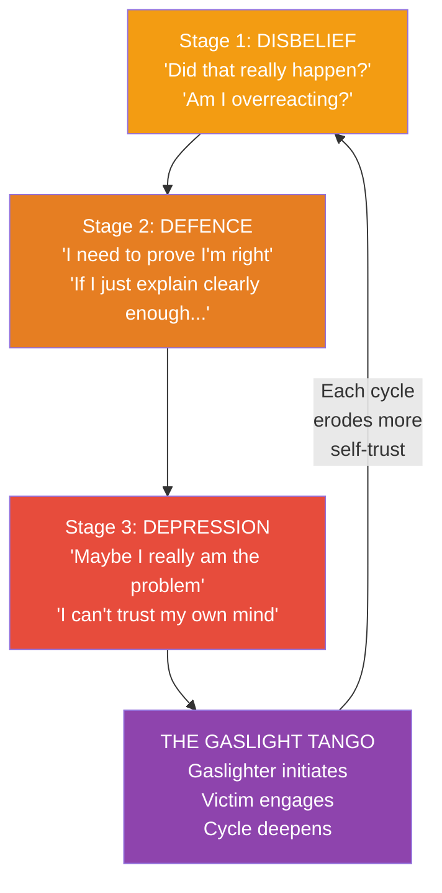
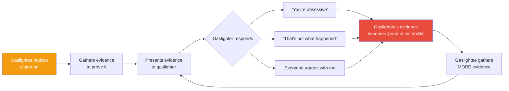
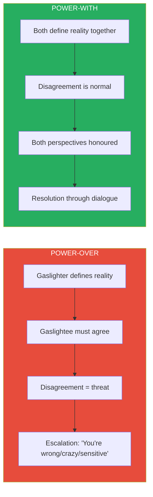
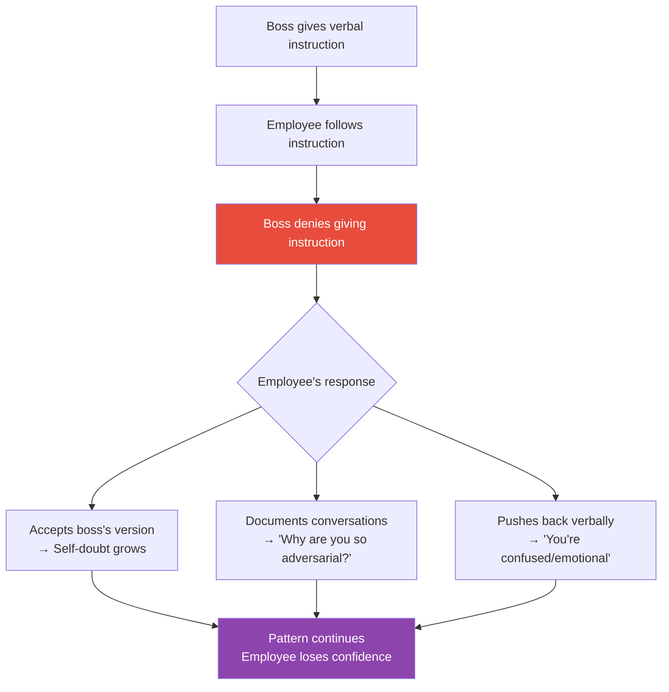
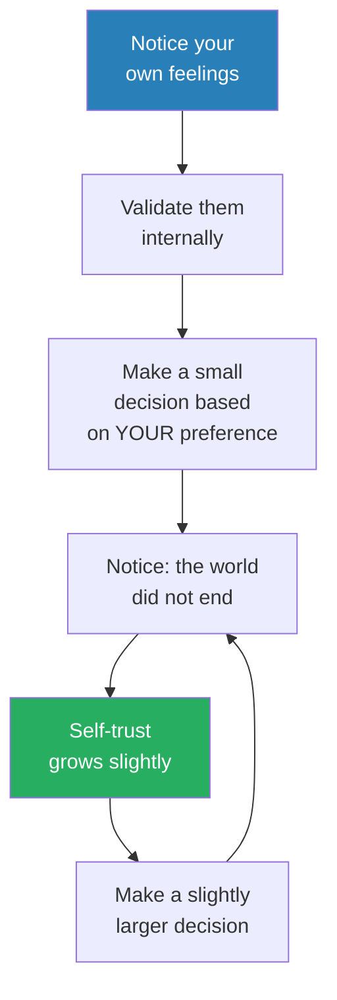
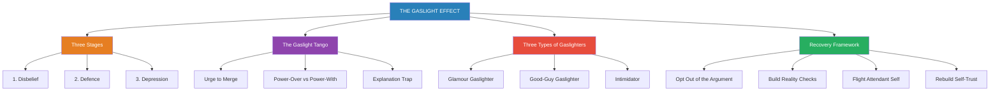

# The Gaslight Effect — Robin Stern

> Robin Stern names something millions of people experience but cannot articulate: the slow, systematic erosion of your trust in your own reality by someone who claims to care about you.
> The gaslighter does not hit you. They do not scream. They say "That never happened." They say "You're too sensitive." They say "Everyone agrees with me."
> And over time, you stop trusting your own memory, your own feelings, your own perceptions — because the alternative is admitting that someone you love is deliberately destabilising you.
> Stern maps the three stages of gaslighting, explains why it takes two to participate in the dynamic, and provides a concrete framework for opting out of the dance.
> This is the book that gave a generation the vocabulary to name what was happening to them — and the roadmap to make it stop.
> If you have ever left a conversation feeling confused, diminished, and unable to explain why — this book will tell you exactly what happened, and exactly how to stop it from happening again.

---

## About the Author

Dr. Robin Stern is a psychoanalyst, educator, and the associate director of the Yale Center for Emotional Intelligence. She coined the term "Gaslight Effect" based on the 1944 film *Gaslight*, in which a husband systematically manipulates his wife into believing she is losing her mind. Her clinical work spans decades and focuses on emotional intelligence, relationships, and the subtle dynamics of emotional manipulation. Stern has treated hundreds of patients caught in gaslighting dynamics — romantic partners, adult children of gaslighting parents, employees under gaslighting bosses — and the case studies in this book are drawn from that clinical experience.

---

## The Big Idea

- <b style="color: #2980b9">Gaslighting</b> is a specific form of emotional manipulation in which one person — the gaslighter — gradually erodes another person's trust in their own perceptions, memory, and sanity
- It is not a single event or a one-time lie — it is a sustained campaign that unfolds in predictable stages, each one deeper and more damaging than the last
- The critical insight Stern offers is the <b style="color: #2980b9">Gaslight Tango</b>: gaslighting is not something one person does to another in isolation — it is a dynamic that requires two participants
  - The gaslighter initiates the distortion
  - The gaslightee keeps the dance going by continuing to seek the gaslighter's approval, trying to win the argument, and needing the gaslighter to validate their reality
- <b style="color: #e74c3c">You cannot win an argument with a gaslighter — winning the argument IS the trap</b>
- Recovery does not begin when the gaslighter admits what they have done — it begins when the victim stops needing them to admit it
- <b style="color: #27ae60">The moment you stop needing the gaslighter to agree with your version of reality, the gaslighting loses its power</b>

---

## Key Concepts at a Glance

| Concept | One-line summary |
|---------|-----------------|
| **The Gaslight Effect** | The slow erosion of self-trust through persistent reality distortion |
| **Stage 1: Disbelief** | Something feels off, but you give the benefit of the doubt |
| **Stage 2: Defence** | You fight back with evidence — and the fighting is the trap |
| **Stage 3: Depression** | You surrender your reality and depend on the gaslighter to define it |
| **The Gaslight Tango** | Gaslighting requires two — the initiator and the participant who keeps engaging |
| **The Explanation Trap** | The compulsion to explain yourself keeps you locked in the dynamic |
| **Flight Attendant Self** | Secure your own emotional oxygen before attending to anyone else |
| **Turning Off the Gas** | The process of opting out of the tango entirely |
| **The Urge to Merge** | The deep need for another person's approval that makes gaslighting possible |
| **Power-Over vs Power-With** | Two models of relationship — domination vs collaboration |
| **Emotional Apocalypse** | The gaslighter's threat (implicit or explicit) that leaving means total ruin |
| **Opt-Out Statements** | Short phrases that end the argument without conceding your reality |

---

The three stages form a downward spiral — each pass through the cycle deepens the victim's dependency on the gaslighter's version of reality and weakens their connection to their own.

---

## The Origin: The 1944 Film *Gaslight*

*Stern opens the book by returning to the film that gave the phenomenon its name — and uses it to establish the core pattern that every gaslighting relationship follows.*

- In the 1944 film, a husband named Gregory manipulates his wife Paula into believing she is going insane
- He dims the gaslights in their home slightly each evening — when Paula notices and mentions it, he insists the light has not changed
- He hides objects and then accuses her of moving them — she cannot find them where they should be and begins to doubt her own memory
- He isolates her from friends and family, telling her she is too fragile to socialise
- Over time, Paula stops trusting her own senses entirely — she depends on Gregory to tell her what is real
- <b style="color: #2980b9">The gaslighting pattern</b> from the film maps directly onto real relationships:
  - Reality distortion (the lights are the same)
  - Memory manipulation (you moved it, not me)
  - Social isolation (you are too fragile)
  - Identity erosion (you are going insane)

> [!example] Gregory and Paula in *Gaslight* (1944)
> - Gregory secretly searches the attic every night, causing the gaslight to dim throughout the house
> - When Paula says "the lights are flickering," Gregory responds flatly: "The lights are fine. You're imagining things."
> - He hides a brooch and then tells her she lost it — when she cannot find it, he says her memory is deteriorating
> - He tells servants not to trust her instructions because she is "unwell"
> - Paula, isolated and confused, begins to believe her husband — she stops going out, stops trusting her own eyes, and defers to Gregory on everything
> **The lesson:** Gaslighting works not through force but through the systematic dismantling of the victim's trust in their own perception.

Stern uses this film as the foundation because it captures the mechanism with perfect clarity: the gaslighter does not overpower the victim — they undermine the victim's relationship with reality itself.

---

## Part I: The Three Stages of Gaslighting

### Stage 1 — Disbelief

*The earliest stage is the hardest to recognise because it feels like a reasonable misunderstanding — and that is exactly what makes it dangerous.*

- Something feels wrong but you cannot quite name it
- The gaslighter says something that contradicts your experience and your first reaction is: "That's strange... but maybe I'm wrong?"
- You still have your bearings — you notice the inconsistency — but you give them the benefit of the doubt
- The internal monologue sounds like:
  - "Did that really happen the way I remember?"
  - "Am I making too big a deal of this?"
  - "He probably didn't mean it that way"
- <b style="color: #27ae60">This is the easiest stage to escape from — if you trust your gut</b>
- Most people do not escape at this stage because they have been socialised to be "fair," to see both sides, and to avoid being "too sensitive"

The gaslighter tests boundaries at this stage. They make small distortions to see how you respond:
- If you push back firmly, they may back down and try again later
- If you express doubt in yourself — "Maybe you're right, I might be misremembering" — they escalate
- <b style="color: #e74c3c">Your self-doubt is the gaslighter's green light</b>

> [!example] Katie and Her Boyfriend's Flirting
> - Katie notices her boyfriend openly flirting with another woman at a party
> - When she brings it up later, he says: "I was just being friendly. You always get jealous over nothing."
> - Katie feels a flash of doubt — was she overreacting? He seemed so calm and confident
> - She drops it. The next time it happens, she hesitates longer before bringing it up
> - By the third time, she does not mention it at all — she has learned that raising it leads nowhere good
> **The lesson:** Stage 1 gaslighting trains you to silence yourself by making you doubt whether your observations are valid.

> [!example] The Forgotten Promise
> - A wife asks her husband to pick up their child from school on Tuesday. He agrees.
> - Tuesday arrives — he does not show up. The school calls her.
> - When she confronts him, he says: "You never asked me to do that. You must be confusing it with something else."
> - She is certain she asked — but he is so calm, so sure, that she begins to wonder
> - She starts writing things down, keeping notes of their conversations — which later becomes evidence of a different kind of problem (see Stage 2)
> **The lesson:** The gaslighter's calm certainty is their most powerful weapon — it makes you distrust your own memory in favour of their confidence.

---

#### How Stage 1 Feels From the Inside

- A vague sense that something is "off" in the relationship — but nothing you can point to concretely
- Occasional confusion: "Wait, did that happen or didn't it?"
- A growing habit of checking with the gaslighter before trusting your own recollection
- Mild anxiety that appears between conversations — a sense of walking on eggshells without knowing why
- <b style="color: #2980b9">The Fog begins</b> — Stern borrows Susan Forward's FOG acronym (Fear, Obligation, Guilt) to describe the emotional atmosphere that gaslighting creates

| Healthy Disagreement | Stage 1 Gaslighting |
|---------------------|-------------------|
| "I see it differently" | "That never happened" |
| "I understand you feel that way" | "You're imagining things" |
| "Let's talk about this" | "There's nothing to talk about" |
| Both parties acknowledge the other's experience | One party denies the other's experience exists |

The critical difference between a normal disagreement and Stage 1 gaslighting is not the content — it is the denial of the other person's reality. In a healthy disagreement, both parties accept that the other person experienced what they experienced. In gaslighting, one party tells the other that their experience did not happen.

> [!tip] The Stage 1 Test
> If you frequently leave conversations feeling confused, unsure of what just happened, or questioning whether your memory is reliable — and this confusion only happens with one specific person — you may be in Stage 1.

---

### Stage 2 — Defence

*This is where most people get stuck, because the very act of fighting back is what keeps them trapped.*

- You have noticed the pattern — the distortions, the denials, the "you're imagining things"
- And you start fighting back
- You gather evidence, build arguments, prepare counterpoints, rehearse conversations in your head
- You think: "If I can just explain clearly enough, they will see that I'm right"
- <b style="color: #e74c3c">This is the trap. The act of defending yourself implicitly accepts that your reality needs the gaslighter's validation.</b>

The deeper you go into Stage 2:
- You become obsessed with proving your version of events
- You keep notes, save texts, take screenshots
- You replay conversations in your mind looking for the exact moment where the gaslighter distorted the truth
- You feel a desperate need to be validated — to hear them say "You're right, that is what happened"
- <b style="color: #2980b9">The Explanation Trap</b> takes hold: the compulsion to explain yourself, to make them understand, to present the evidence so clearly that they have no choice but to agree

But the gaslighter does not play by the rules of evidence:
- You present proof → they say "You're obsessive"
- You keep a journal → they say the journal proves you are paranoid
- You get a friend to corroborate → they say your friend is biased
- You bring up their exact words → they say "I never said that" or "You're twisting what I said"
- <b style="color: #e74c3c">The more evidence you gather, the more they use your evidence-gathering as proof that you are unstable</b>

> [!example] The Journal That Backfired
> - One of Stern's patients began keeping a detailed journal to track her husband's contradictions
> - She recorded dates, times, and the exact words he used — then compared them with what he later claimed he said
> - When she presented the journal during an argument, expecting vindication, her husband's response was devastating
> - "You're keeping a journal about me? That's insane. Normal people don't do that. This is exactly what I've been talking about — you are obsessed."
> - The journal — her evidence — became his ammunition
> - She stopped keeping the journal. She had fewer arguments. But she also had less confidence in her own memory than before she started.
> **The lesson:** In the gaslighting dynamic, the tools of rational argument are turned against you — your evidence becomes their proof of your instability.

> [!example] The Boss Who Gave Contradictory Instructions
> - An employee received clear verbal instructions from her boss on Monday: prioritise Project A
> - By Wednesday, the boss asked why Project B was behind schedule
> - When the employee said "You told me to focus on Project A," the boss said: "I never said that. You must have misunderstood."
> - The employee began sending follow-up emails after every meeting to create a paper trail
> - The boss's response: "Why are you sending these emails? Don't you trust me? This feels adversarial."
> - The employee was now trapped: without documentation, the boss could rewrite history; with documentation, she was "adversarial"
> **The lesson:** Gaslighting at work uses the power differential to make documentation itself seem like insubordination.

---

#### The Emotional Cost of Stage 2

- Chronic exhaustion from the constant mental effort of building your case
- A growing sense of frustration and helplessness — you are right, you know you are right, but you cannot get them to admit it
- Increasing emotional volatility — the gaslighter's calm certainty makes your emotional response look disproportionate
- <b style="color: #2980b9">The Credibility Gap</b>: the gaslighter appears rational and composed while the gaslightee — who is legitimately upset — appears "emotional" and "irrational"
  - This is especially devastating when third parties witness the dynamic
  - Friends, family, and colleagues see a calm person and an upset person — and instinctively side with the calm one
  - The gaslighter uses this: "See? Even your friends think you're overreacting."

This diagram shows the Stage 2 trap: gathering evidence and presenting it to the gaslighter creates a loop that escalates the dynamic rather than resolving it.

> [!tip] The Stage 2 Escape
> The exit from Stage 2 is not better evidence — it is the realisation that you do not need the gaslighter's agreement. Your reality does not require their signature.

---

### Stage 3 — Depression

*This is the gaslighter's endgame: a person who has surrendered their reality and now depends on the gaslighter to tell them what is real.*

- You have stopped fighting. You have started believing them.
- The internal monologue has shifted:
  - "Maybe I really am too sensitive"
  - "Maybe I am imagining things"
  - "Maybe the problem really is me"
  - "I can't trust my own judgment anymore"
- You feel foggy, confused, unable to make basic decisions — because you have lost trust in your own perception
- <b style="color: #e74c3c">This is the gaslighter's goal: a person who has surrendered their reality and now depends on the gaslighter to define it</b>

The psychological symptoms of Stage 3:
- Chronic self-doubt — you second-guess everything from what you want for dinner to whether your memory of yesterday's conversation is accurate
- A sense of being "crazy" that you cannot explain to anyone else
- Withdrawal from friends and family — partly because the gaslighter has isolated you, partly because you are ashamed of how confused you have become
- Loss of identity — you no longer know what you think, what you feel, or what you want
- <b style="color: #2980b9">Learned helplessness</b> — a psychological state in which you have been conditioned to believe that nothing you do will change your situation, so you stop trying
- Depression, anxiety, and sometimes physical symptoms (insomnia, weight changes, chronic fatigue)

> [!example] The Woman Who Could Not Choose a Restaurant
> - One of Stern's patients had been in a gaslighting marriage for eight years
> - When Stern asked her what she wanted for lunch, the patient froze — literally could not answer
> - She said: "I don't know what I want. I haven't known what I wanted in years. I always wait for him to decide."
> - The gaslighting had eroded not just her trust in her perceptions but her entire capacity for independent thought
> - She had outsourced every decision to her husband — not because she was weak, but because years of having her judgments overruled had trained her to believe she was incapable of making good ones
> **The lesson:** Stage 3 gaslighting does not just distort your perception of specific events — it dismantles your ability to function as an independent person.

> [!example] The Friend Who Rewrote History
> - A woman's best friend of twenty years had a pattern of rewriting the history of their conversations
> - If the woman said "You told me you'd be there at 7," the friend would say "I never said that — I said I'd try to come"
> - Over years, the woman stopped trusting her memory of any conversation with this friend
> - Eventually, she stopped trusting her memory in general — the confusion bled into other relationships, her work, and her sense of self
> - When she finally described the dynamic to a therapist, she said: "I feel like I'm losing my mind, but I can't explain why"
> **The lesson:** Gaslighting does not stay contained to the relationship where it originates — the self-doubt it creates spreads into every area of the victim's life.

---

#### The Three Stages Compared

| Dimension | Stage 1: Disbelief | Stage 2: Defence | Stage 3: Depression |
|-----------|-------------------|-----------------|-------------------|
| **Self-trust** | Mostly intact — occasional doubt | Eroding — you need evidence to believe yourself | Gone — you defer to the gaslighter |
| **Emotional state** | Confused, slightly anxious | Frustrated, angry, exhausted | Depressed, numb, helpless |
| **Relationship to gaslighter** | Benefit of the doubt | Adversarial — trying to prove them wrong | Dependent — they define your reality |
| **Internal monologue** | "Maybe I'm overreacting" | "I need to prove I'm right" | "Maybe they're right about me" |
| **Escape difficulty** | Easiest — trust your gut | Moderate — stop arguing | Hardest — rebuild from the ground up |

> [!tip] Where Are You?
> Stern encourages readers to locate themselves on this continuum. The stage determines the strategy: Stage 1 requires awareness and boundary-setting. Stage 2 requires opting out of the argument. Stage 3 requires professional support and a complete reconstruction of self-trust.

*The radar reveals gaslighting's progressive destruction — each stage uniformly erodes self-trust, reality testing, and independence, while recovery restores them to levels often exceeding the pre-gaslighting baseline.*

---

## Part II: The Gaslight Tango

*Stern's most important and most controversial claim: gaslighting is not something one person does to another — it is a dance that requires two participants.*

### Why "It Takes Two" Is Not Victim-Blaming

- This does not mean the victim is to blame
- It does not mean the gaslighter is less culpable
- What it means is that the gaslighting dynamic has a structure — and understanding the structure is the key to breaking free
- The gaslighter initiates the distortion
- But the gaslightee participates by:
  - Continuing to seek the gaslighter's approval
  - Trying to win the argument
  - Needing the gaslighter to validate their version of reality
  - Believing that if they just explain clearly enough, the gaslighter will understand
- <b style="color: #27ae60">The moment you stop needing them to agree with you, the gaslighting loses its power</b>
- You do not need to convince them. You need to trust yourself.

### The Gaslighter's Moves and the Gaslightee's Traps

| The Gaslighter's Move | The Gaslightee's Trap | Why the Trap Works |
|-----------------------|----------------------|-------------------|
| "That never happened" | Searching for proof it did happen | Implicitly accepts that your memory needs external validation |
| "You're too sensitive" | Wondering if you really are too sensitive | Turns your emotional response into the problem instead of their behaviour |
| "Everyone agrees with me" | Polling friends to check if they are right | Outsources your reality to a vote rather than trusting your own experience |
| "You always overreact" | Suppressing your emotions to prove you do not | Teaches you to perform emotional numbness to satisfy the gaslighter |
| "I was just joking" | Doubting whether you misread the situation | Reframes legitimate hurt as humour failure — now you are the problem |
| "You're imagining things" | Questioning your own perception | The foundation of the entire gaslighting dynamic |

*The heatmap shows how gaslighters escalate their tactical arsenal — early stages rely on trivializing and reality distortion, while Stage 3 deploys maximum intensity across all dimensions.*

---

### The Urge to Merge

*Stern identifies the deep psychological need that makes gaslighting possible — and it is not weakness. It is the universal human need for connection.*

- <b style="color: #2980b9">The Urge to Merge</b> is Stern's term for the powerful desire to be emotionally united with another person — to feel understood, validated, and approved of
- This urge is normal and healthy in moderate amounts
- But when the Urge to Merge becomes the dominant force in a relationship, it creates vulnerability:
  - You need the other person to agree with you in order to feel sane
  - You need their approval to feel worthy
  - You will bend your reality to match theirs rather than risk disconnection
- <b style="color: #e74c3c">The gaslighter exploits the Urge to Merge — they know that your need for connection is stronger than your commitment to your own perception</b>

The Urge to Merge explains why smart, capable people get gaslighted:
- It has nothing to do with intelligence or strength
- It has everything to do with the depth of your need for this particular person's approval
- The more you love someone, the more power they have to gaslight you — because the more you need them to agree with your reality

> [!example] Liz and the "Perfect" Relationship
> - Liz was a successful attorney who prided herself on her analytical mind
> - Her partner, Andrew, would make plans and then deny he had made them
> - Liz could have applied her legal training to see the pattern — but her Urge to Merge was stronger
> - She wanted so desperately for the relationship to work that she chose to doubt herself rather than doubt Andrew
> - "I thought, if I'm wrong about this, then we're fine. If he's wrong, then we have a problem. And I didn't want us to have a problem."
> - Her analytical mind — powerful in every other context — was overridden by her emotional need for connection
> **The lesson:** The Urge to Merge is not about intelligence — it is about emotional investment. The more you have invested, the more you are willing to surrender your reality to protect the relationship.

---

### Power-Over vs Power-With

Stern distinguishes between two models of relationship power:

- <b style="color: #2980b9">Power-Over</b>: one person dominates — they set the terms of reality, determine what is true, and expect compliance
  - The gaslighter operates in Power-Over mode by default
  - They must be right. Their version of events must prevail. Any challenge to their authority triggers escalation.
- <b style="color: #2980b9">Power-With</b>: both people share influence — disagreements are negotiated, both perspectives are honoured, and neither person needs to "win"
  - In a Power-With relationship, "I see it differently" is a normal, acceptable statement
  - In a Power-Over relationship, "I see it differently" is an act of rebellion

In a Power-Over dynamic, disagreement itself is treated as an offence. In a Power-With dynamic, disagreement is a natural part of two independent minds sharing a life.

---

### Three Types of Gaslighters

*Not all gaslighters are the same. Stern identifies three distinct types — and the strategy for dealing with each one differs.*

| Type | Motivation | Awareness | Example |
|------|-----------|-----------|---------|
| **The Glamour Gaslighter** | Needs constant admiration; punishes anyone who threatens their self-image | Moderate — knows they are manipulating but justifies it | A partner who reacts with rage when you point out a flaw |
| **The Good-Guy Gaslighter** | Needs to be seen as reasonable and fair; gaslights while appearing sympathetic | Low — genuinely believes they are being reasonable | A boss who says "I hear you" while systematically dismissing everything you say |
| **The Intimidator** | Uses fear, anger, and dominance to control; gaslighting is a tool of power | High — consciously uses confusion as a weapon | A parent who punishes you for things they previously encouraged |

- The <b style="color: #2980b9">Glamour Gaslighter</b> is the most recognisable:
  - Charming, charismatic, and often initially overwhelming in their attention
  - When you challenge them, the charm evaporates — replaced by cold dismissal or explosive anger
  - The gaslighting serves to protect their idealised self-image
  - "How dare you suggest I'm wrong" is their internal logic

- The <b style="color: #2980b9">Good-Guy Gaslighter</b> is the most insidious:
  - They present as empathetic, calm, and reasonable
  - They say things like "I just want what's best for us" while systematically overruling your preferences
  - Because they appear so reasonable, it is extremely difficult to identify the gaslighting — you feel crazy for being upset at someone who seems so nice
  - <b style="color: #e74c3c">The Good-Guy Gaslighter is dangerous precisely because they look like the opposite of an abuser</b>

- The <b style="color: #2980b9">Intimidator</b> is the most overt:
  - Uses volume, anger, and physical presence to enforce their version of reality
  - The gaslighting is backed by the threat of emotional or physical consequences
  - "You know what happens when you argue with me" — the message is clear even when unspoken

> [!example] The Good-Guy Gaslighter at Work
> - A manager named Steven was universally liked — warm, approachable, always smiling
> - His direct report, Maria, consistently left their one-on-ones confused about what had been agreed
> - Steven would say "Absolutely, let's do it your way" — and then do the opposite, claiming Maria had misunderstood
> - When Maria tried to clarify, Steven would say "I think we're just miscommunicating. I'm sorry you feel confused — let's try again."
> - He never raised his voice. He never insulted her. He was always "sorry she felt that way."
> - Maria began to think the problem was her communication skills — not Steven's consistent pattern of denial
> **The lesson:** Good-Guy Gaslighters disarm you with sympathy — "I'm sorry you feel that way" sounds caring but actually dismisses your experience without addressing it.

> [!example] The Glamour Gaslighter's Charm Offensive
> - Rachel's boyfriend swept her off her feet — grand gestures, constant attention, declarations of love within weeks
> - The first time Rachel disagreed with him about something trivial, his warmth vanished instantly
> - "I can't believe you'd say that after everything I've done for you."
> - Rachel, stunned by the shift, immediately apologised — she did not want to lose the warmth
> - She learned: agreement meant love; disagreement meant emotional winter
> - Over time, she stopped disagreeing. Over time, she stopped knowing what she actually thought.
> **The lesson:** The Glamour Gaslighter uses the withdrawal of affection as a punishment — and the promise of its return as a reward. You learn to trade your reality for their warmth.

---

## Part III: Warning Signs You Are Being Gaslighted

*Stern provides a detailed self-assessment that functions as an early-warning system — the sooner you recognise these signs, the easier it is to intervene.*

### The Self-Assessment Checklist

- You constantly second-guess yourself
- You wonder "Am I too sensitive?" multiple times a week
- You feel confused or even "crazy" at work or at home
- You are always apologising — to your partner, your boss, your friends
- You cannot understand why, with so many good things in your life, you are not happier
- You make excuses for your partner's behaviour to friends and family
- You withhold information from friends and family so you do not have to explain things or make excuses
- You know something is wrong but you cannot articulate what it is
- <b style="color: #e74c3c">You start lying to avoid the put-downs and reality distortions</b>
- You feel hopeless and joyless much of the time
- Before seeing your partner (or boss, or friend), you run through a mental script of potential topics to avoid
- You have the sense that you used to be a very different person — more confident, more fun-loving, more relaxed
- You feel as though you cannot do anything right

> [!abstract] The Gaslight Inventory
> Rate each statement 0 (never) to 4 (constantly):
> 1. I second-guess my memory of conversations
> 2. I feel confused about events I witnessed firsthand
> 3. I apologise when I have not done anything wrong
> 4. I feel the need to explain or justify myself to one specific person
> 5. I feel like a different (diminished) person than I was before this relationship
> 6. I avoid topics because I know they will lead to me being told I am wrong
> 7. I check with the other person before trusting my own recollection
> 8. I feel "crazy" or "too sensitive" on a regular basis
>
> **Score 0-8:** Low risk. **9-16:** Moderate — investigate further. **17-32:** High — consider professional support.

---

### Why Smart People Get Gaslighted

- <b style="color: #27ae60">Gaslighting has nothing to do with intelligence and everything to do with emotional investment</b>
- Stern emphasises that her patients include lawyers, doctors, executives, and professors — people with exceptional analytical skills
- The analytical mind is not a defence against gaslighting because:
  - Gaslighting targets the emotional brain, not the rational brain
  - The need for connection overrides the capacity for critical analysis
  - Smart people are often better at rationalising — they can construct elaborate explanations for why the gaslighter's behaviour makes sense
- In fact, intelligence can make gaslighting worse:
  - The victim's ability to rationalise delays their recognition of the pattern
  - They think: "If I were really being manipulated, I'd know. I'm too smart for that."
  - <b style="color: #e74c3c">The belief that you are "too smart to be gaslighted" is itself a vulnerability — it prevents you from recognising what is happening</b>

> [!example] The Attorney Who Could Not See the Pattern
> - A corporate litigator — a woman whose entire profession was built on evaluating evidence and identifying deception — came to Stern after three years of marriage
> - Her husband would make commitments (dinner plans, holiday bookings, financial decisions) and then deny making them
> - She would think: "I cross-examine witnesses for a living. If someone were lying to me, I would know."
> - But at home, her analytical skills were overridden by her emotional investment in the marriage
> - She found herself constructing elaborate theories to explain his contradictions: "He's under stress," "He probably said it differently than I remember," "I must have misheard"
> - Her legal training made her a better rationaliser, not a better detector — she used her intelligence to explain away the manipulation rather than recognise it
> **The lesson:** Intelligence does not protect you from gaslighting — it gives you better tools for justifying the gaslighter's behaviour to yourself.

### The Gaslighter's Toolkit: Common Phrases

Stern catalogues the specific phrases gaslighters use most frequently. Recognising these phrases is one of the fastest ways to identify a gaslighting dynamic:

| Phrase | What It Does | What It Really Means |
|--------|-------------|---------------------|
| "That never happened" | Denies the victim's lived experience | "My version of reality is the only one that counts" |
| "You're remembering it wrong" | Undermines memory trust | "Your memory is unreliable — trust mine instead" |
| "You're too sensitive" | Pathologises the victim's emotional response | "Your feelings are the problem, not my behaviour" |
| "You're crazy" | Attacks the victim's mental stability | "Your perception of reality cannot be trusted" |
| "Everyone agrees with me" | Isolates the victim from social support | "You are alone in your version of events" |
| "I was just joking" | Reframes cruelty as humour | "You are wrong to feel hurt" |
| "You always twist things" | Redirects blame to the victim | "Your interpretation, not my behaviour, is the issue" |
| "If you really loved me, you wouldn't question me" | Weaponises the relationship itself | "Questioning me is a betrayal of our bond" |

- <b style="color: #27ae60">If any of these phrases appear regularly in your interactions with one specific person, pay attention</b>
- No single phrase constitutes gaslighting — it is the pattern over time that matters
- The gaslighter rotates through these phrases to keep the victim off-balance — just when you have a response to one, they switch to another

---

## Part IV: Where Gaslighting Happens

*Gaslighting is not confined to one type of relationship. Stern maps the dynamics across four domains — romance, family, work, and friendship — and shows how the same mechanism adapts to different power structures.*

### Romantic Relationships

*The most common and most devastating context for gaslighting — because the Urge to Merge is strongest where love is deepest.*

- Romantic gaslighting follows a predictable pattern:
  - **Idealisation phase**: the gaslighter is attentive, loving, and affirming — they make you feel special and understood
  - **Testing phase**: small distortions begin — "I never said that," "You're remembering it wrong"
  - **Escalation phase**: the distortions become more frequent and more brazen
  - **Dependency phase**: the victim's self-trust has eroded to the point that they depend on the gaslighter for their sense of reality
- The romantic context makes gaslighting especially powerful because:
  - Intimate partners know your vulnerabilities — they know exactly which buttons to press
  - The promise of love and connection makes you willing to doubt yourself
  - Leaving feels impossible because the gaslighter has become your primary reference point for reality

> [!example] The "You're Too Sensitive" Partner
> - A patient named Sarah told Stern about her partner's response every time she expressed hurt
> - Whether it was a dismissive comment, a broken promise, or a cruel joke, the response was always the same: "You're too sensitive. I can't say anything around you."
> - Over time, Sarah began suppressing her emotional responses — she trained herself not to react
> - But the suppression did not eliminate the feelings — it just drove them underground
> - Sarah developed chronic anxiety and insomnia without understanding why
> - When Stern helped her trace the anxiety back to the suppressed feelings, Sarah realised she had been systematically training herself to ignore her own emotional signals
> **The lesson:** "You're too sensitive" is not feedback — it is a silencing tactic that teaches you to distrust your own emotions.

> [!example] The Partner Who Controlled the Narrative
> - A patient named David described how his wife would tell their mutual friends a version of events that differed dramatically from what he had experienced
> - After an argument, she would call her sister and describe a conversation that David did not recognise — exaggerating his words, omitting her own provocations, and casting herself as the reasonable one
> - When David objected, she said: "That is exactly what happened. You just don't see yourself clearly."
> - David began to doubt his own self-awareness — "Maybe I really do say things I don't realise"
> - He started asking friends whether he was "difficult" — essentially recruiting other people to validate the narrative his wife had constructed
> - The turning point came when a friend said: "David, the person she describes doesn't sound anything like the person I know. Are you sure she's telling it straight?"
> **The lesson:** Gaslighters do not only distort reality to the victim — they distort reality to the audience, creating a social consensus that reinforces the victim's self-doubt.

---

### Parent-Child Gaslighting

*Some people learn the Gaslight Tango before they can walk — and spend the rest of their lives dancing it with everyone. Stern considers parent-child gaslighting the most damaging form because it shapes the child's fundamental relationship with reality.*

- Parents who gaslight their children create a particularly deep wound because:
  - Children are completely dependent on their parents for reality — they have no alternative source
  - A child who is told "that didn't happen" or "you're making things up" has no frame of reference to push back
  - The gaslighting becomes the child's operating system — they grow up believing their perceptions are unreliable
- <b style="color: #2980b9">Children of gaslighting parents</b> often:
  - Become adults who chronically doubt themselves
  - Seek out partners who gaslight them (the dynamic is familiar, even comfortable)
  - Have difficulty identifying their own feelings — they were trained to distrust them
  - Struggle with decisions — they were never allowed to trust their own judgement

> [!example] The Child Who Was "Remembering It Wrong"
> - A patient described growing up with a mother who would punish her — yelling, slamming doors, giving the silent treatment
> - When the child later referenced the incident, the mother would say calmly: "That never happened. You have such an active imagination."
> - The child, desperate for her mother's love, would accept this version — "Maybe I dreamed it. Maybe I'm making it up."
> - As an adult, this patient described a persistent feeling that she could not trust any of her memories — not just about her mother, but about anything
> - She would ask her husband to confirm events they had both witnessed: "Did that really happen? Are you sure?"
> **The lesson:** Childhood gaslighting does not just distort specific memories — it undermines the child's ability to form a reliable relationship with reality itself.

Stern notes a particularly painful pattern among adult children of gaslighting parents:
- They often describe feeling "defective" in a way they cannot explain
- They may be high-functioning — successful careers, stable friendships — but carry a persistent sense that their inner experience is unreliable
- <b style="color: #2980b9">The inner gaslighter</b>: the most lasting effect of parental gaslighting is the internalisation of the gaslighter's voice — the child grows up with an internal critic that says "You're making that up," "That's not how it happened," and "You're overreacting" without any external gaslighter present
- Recovery from childhood gaslighting typically requires longer-term therapeutic work than recovery from adult-onset gaslighting, because the patterns are more deeply embedded
- Stern recommends therapy modalities that focus on reconnecting with bodily sensations and emotions — the body often holds truths that the gaslighted mind has been trained to dismiss

---

### Workplace Gaslighting

*The power differential between boss and employee creates ideal conditions for gaslighting — and the victim cannot simply "leave the dance" without leaving their livelihood.*

- Workplace gaslighting has unique characteristics:
  - The power differential makes it harder to push back — your livelihood depends on this person
  - Professional norms around "not being emotional" play into the gaslighter's hands
  - Documentation attempts can be framed as insubordination or paranoia
  - HR often sides with management
- Common workplace gaslighting tactics:
  - Giving instructions and then denying them
  - Taking credit for the victim's work and then claiming the victim is confused about who did what
  - Publicly praising the victim while privately undermining them
  - Setting impossible deadlines and then saying the victim agreed to them
  - <b style="color: #e74c3c">Reframing the victim's competence as a question: "Are you sure you're up to this?"</b>

Every response the employee can make is absorbed by the gaslighting dynamic — there is no "right move" within the dance. The only solution is to recognise the pattern and address it outside the dyad (HR, a mentor, legal counsel, or exit).

> [!tip] Workplace Gaslighting vs Poor Management
> Not every bad boss is a gaslighter. The distinguishing feature is reality distortion — specifically, the consistent denial that events happened as you experienced them. A boss who is merely disorganised might forget their instructions. A gaslighting boss forgets them and then insists you were the one who got confused.

#### Protecting Yourself at Work

Stern acknowledges that workplace gaslighting is uniquely difficult to escape because your economic survival may depend on the relationship. She offers practical strategies:

- **Document externally**: keep records outside the gaslighter's reach — personal email, a notebook at home, a trusted colleague who can witness conversations
- **Communicate in writing when possible**: follow up verbal conversations with an email summarising what was discussed — "Just to confirm, we agreed to X"
  - If the gaslighter objects to written follow-ups, that objection is itself informative
- **Build alliances carefully**: identify colleagues who have noticed the same patterns — but be cautious about who you trust
- **Know your rights**: understand your organisation's HR policies and what constitutes harassment or a hostile work environment
- <b style="color: #27ae60">The goal is not to "win" against the gaslighter — it is to create enough external reality checks that your self-trust survives the dynamic</b>

> [!example] The Team That Compared Notes
> - Three employees independently noticed that their manager, David, gave different accounts of the same meetings
> - Each one thought they were the problem — "Maybe I wasn't paying attention"
> - When they finally compared notes over lunch, they discovered identical patterns: David would agree to plans in group meetings and then tell individuals that the group had decided something different
> - The employees' confusion evaporated instantly — they were not bad listeners; David was rewriting reality
> - Armed with this knowledge, they began documenting decisions in real time and sending summary emails to the full team
> - David's gaslighting lost its power because there was now a shared, written record that he could not unilaterally revise
> **The lesson:** Gaslighting thrives in isolation. When multiple people compare notes, the distortion becomes visible — and often collapses under its own weight.

---

### Friendship Gaslighting

- Gaslighting between friends often centres on:
  - Rewriting the history of shared experiences
  - Minimising or denying hurtful behaviour ("I was just joking," "You took it the wrong way")
  - Using the group against the individual ("Nobody else had a problem with it")
- Friendship gaslighting is uniquely painful because:
  - Friends are chosen, not assigned — the betrayal feels more personal
  - There is no formal power structure to appeal to
  - The social group often becomes an instrument of the gaslighting ("Everyone thinks you're overreacting")

> [!example] The Best Friend Who Rewrote Every Conversation
> - A patient described a twenty-year friendship with a woman who had a pattern of denying things she had said
> - "I never said that about your husband" (she did). "I never agreed to go to that restaurant" (she did). "I never told you I was unhappy at work" (she told her twice).
> - The patient initially assumed her own memory was failing — she went so far as to see a neurologist
> - The neurologist found nothing wrong. The patient's memory was fine with everyone else in her life.
> - It was only with this one friend that her memory seemed to "fail"
> - When the patient finally began to recognise the pattern, she felt a mix of relief and grief — relief that she was not losing her mind, grief that a twenty-year friendship was built on a dynamic that had been slowly eroding her self-trust
> **The lesson:** Gaslighting in friendship is often the hardest to identify because we do not expect manipulation from the people we choose to keep in our lives.

---

## Part V: Turning Off the Gas

*Stern's recovery framework centres on a single, radical principle: stop dancing. You cannot reform the gaslighter. You can only opt out of the tango.*

### Step 1: Identify the Dynamic

- Name what is happening — not in confrontation with the gaslighter, but in your own mind
- <b style="color: #27ae60">The act of naming the dynamic is the first step out of it</b>
- Use the three-stage model to locate yourself: are you in Disbelief, Defence, or Depression?
- Recognise the Gaslight Tango — see the dance for what it is rather than being lost inside it
- This step often requires an external perspective — a therapist, a trusted friend, a journal — because the gaslighting has compromised your ability to trust your own perception
- Stern emphasises that naming is not the same as confronting:
  - You do not need to tell the gaslighter "You are gaslighting me" — in fact, doing so often backfires ("See? Now you're diagnosing me. You're the one with the problem.")
  - The naming is for YOU — it restores your ability to see the dynamic from outside it
  - Once you can name it, you can begin to see each interaction as a move in the Gaslight Tango rather than a genuine dispute about reality
  - <b style="color: #2980b9">Naming creates distance</b> — and distance is what the gaslighting has systematically destroyed

### Step 2: Opt Out of the Argument

- <b style="color: #e74c3c">Stop trying to win the argument — the argument is the trap, not the topic</b>
- The gaslighter does not engage in arguments to reach the truth — they engage in arguments to maintain control
- Every argument you enter gives them another opportunity to distort your reality
- Opting out does not mean agreeing with them — it means refusing to participate in the contest over whose version of reality is correct

> [!abstract] Opt-Out Statements
> Stern provides specific language for disengaging without conceding:
> - "I see it differently."
> - "I'm not going to debate this."
> - "We remember it differently, and that's okay."
> - "I don't need you to agree with me."
> - "I know what I experienced."
> - "This conversation isn't productive. I'm going to step away."

These statements are complete on their own. They do not require evidence, justification, or follow-up. They end the dance.

The power of these statements lies in what they do NOT do:
- They do not defend your position — because defending implies your position needs defending
- They do not attack the gaslighter — because attacking invites counter-attack and extends the dance
- They do not seek agreement — because seeking agreement is the core vulnerability the gaslighter exploits
- They simply state your reality and close the conversation
- <b style="color: #27ae60">An opt-out statement is not the beginning of a negotiation — it is the end of one</b>

*The two most critical recovery actions — stopping the explanation trap and trusting your own feelings — together account for 40% of the work because they directly break the Gaslight Tango.*

> [!example] The First Time She Opted Out
> - A patient named Jennifer had been arguing with her husband for years about his contradictions
> - In therapy, Stern coached her to try a simple opt-out: "I see it differently. I'm going to go for a walk."
> - The first time Jennifer used it, her husband was stunned — he tried to re-engage ("You can't just walk away"), escalated ("This is so disrespectful"), and then tried tenderness ("Come on, let's talk about this")
> - Jennifer stayed the course. She went for her walk.
> - When she returned, the topic had evaporated. Her husband never brought it up again.
> - Jennifer reported something unexpected: "I felt more like myself in that moment than I have in five years. I didn't win the argument. I did something better — I left the argument."
> **The lesson:** The first opt-out is the hardest. The gaslighter will try every tactic to pull you back into the dance. If you hold firm, the dance has no second partner — and it stops.

---

### Step 3: Escape the Explanation Trap

- <b style="color: #2980b9">The Explanation Trap</b> is the compulsion to explain yourself — to present your case so clearly and thoroughly that the gaslighter has no choice but to agree
- This trap is seductive because it feels rational: "If I just explain it better, they'll understand"
- But the gaslighter does not fail to understand — they refuse to acknowledge
- <b style="color: #e74c3c">You do not owe an explanation to someone who will distort it</b>
- Breaking free from the Explanation Trap means accepting that:
  - Some people will never validate your experience
  - Their refusal does not invalidate it
  - You can know something to be true without anyone else confirming it

> [!example] The Three-Hour Argument
> - A patient described a recurring pattern: she and her partner would argue for three hours about something he had said
> - She would quote his exact words. He would deny saying them. She would describe the context. He would say she was confusing it with something else.
> - After three hours, she would be exhausted and he would be calm — and nothing would be resolved
> - Stern asked her: "What if you stopped after the first five minutes? What if, when he denied saying it, you simply said 'I see it differently' and walked away?"
> - The patient's response was telling: "But then he'd think he was right."
> - Stern's reply: "He already thinks he's right. The three-hour argument does not change that. It only exhausts you."
> **The lesson:** The Explanation Trap is not about reaching understanding — it is about your need for the gaslighter to validate your experience. Let go of that need.

---

### Step 4: Build Your Reality Check

- Gaslighting works by isolating you from alternative sources of reality — the gaslighter becomes your only mirror
- Recovery requires building a network of <b style="color: #2980b9">reality checks</b> — external sources of truth that are not controlled by the gaslighter:
  - **A therapist** who understands gaslighting dynamics
  - **Trusted friends** who can reflect your experience back to you honestly
  - **A journal** where you record events in real time — not to prove things to the gaslighter, but to prove things to yourself
  - **Your own body** — Stern emphasises that physical sensations (tension, nausea, the desire to flee) are valid data about your experience

> [!abstract] Building a Reality-Check Network
> 1. Identify 2-3 people you trust to be honest with you
> 2. Share specific situations with them — not to get validation, but to get a reality check
> 3. Keep a private journal of events — date, time, what was said, how you felt
> 4. Pay attention to your body — tension, stomach knots, the urge to cry are signals, not weaknesses
> 5. Ask yourself regularly: "If a friend told me this was happening to them, what would I say?"

### Step 5: Accept What You Cannot Change

- <b style="color: #27ae60">Your recovery does not depend on the gaslighter's confession</b>
- You may never get them to acknowledge what they have done
- Waiting for their validation keeps you trapped in the tango — because you are still orienting your reality around their response
- Acceptance is not about forgiving the gaslighter — it is about freeing yourself from needing anything from them
- The gaslighter may genuinely believe their version of events — some gaslighters are not consciously manipulative; they have a distorted relationship with truth that serves their psychological needs
- Whether the gaslighting is conscious or unconscious does not change the damage it does — and it does not change the recovery path

---

## Part VI: The Flight Attendant Self

*Stern's metaphor for the foundation of recovery — and it inverts the way most people think about relationships.*

- On an aeroplane, the safety announcement says: "Secure your own oxygen mask before assisting others"
- <b style="color: #2980b9">The Flight Attendant Self</b> is Stern's term for the part of you that prioritises your own psychological well-being before attending to anyone else's needs
- This is not selfishness — it is survival. You cannot help anyone if you are suffocating.
- For gaslighting victims, the Flight Attendant Self has been systematically silenced:
  - You have been trained to attend to the gaslighter's needs first
  - You have been trained to believe your needs are less important, less valid, or evidence of selfishness
  - You have lost the ability to identify what your needs even are

Rebuilding the Flight Attendant Self:
- Start with small acts of self-trust:
  - What do I want for dinner? (Not what does the gaslighter want)
  - How do I feel right now? (Not how should I feel)
  - Am I comfortable in this situation? (Not am I being reasonable)
- <b style="color: #27ae60">Treat your own feelings as valid data — not as evidence that needs external verification</b>
- The goal is not to become suspicious of everyone — it is to stop outsourcing your sense of reality to people who have demonstrated they will distort it

Recovery is not a single dramatic moment — it is a slow, iterative process of making small decisions that rebuild the neural pathways of self-trust.

### Why the Flight Attendant Self Feels "Selfish"

- Gaslighting victims almost universally resist the Flight Attendant Self at first — it feels selfish, wrong, and dangerous
- This resistance is itself a product of the gaslighting: you have been trained to believe that attending to your own needs is a character flaw
- Stern addresses this directly:
  - Prioritising yourself is not abandoning others — it is ensuring you have something to offer them
  - The gaslighter benefits from your self-neglect — a depleted person is easier to control
  - <b style="color: #e74c3c">If prioritising yourself feels wrong, that feeling is evidence of the gaslighting — not evidence that you should stop</b>
- The Flight Attendant Self is not a permanent state of self-absorption — it is a corrective. Once your oxygen mask is secure, you can help others again.

---

## Part VII: Rebuilding Self-Trust

*The deepest damage from gaslighting is not to the relationship — it is to your relationship with yourself. This section maps the repair.*

### The Damage Assessment

- Gaslighting erodes self-trust at every level:
  - **Perceptual trust**: "Did I see what I think I saw?"
  - **Memory trust**: "Did that conversation happen the way I remember?"
  - **Emotional trust**: "Are my feelings legitimate, or am I overreacting?"
  - **Decisional trust**: "Can I trust my own judgment?"
  - **Identity trust**: "Do I even know who I am anymore?"
- <b style="color: #e74c3c">The most insidious damage is to identity trust — the victim no longer knows what they think, feel, or want independently of the gaslighter</b>

### The Recovery Process

Stern outlines recovery as a series of stages — not a linear path but a gradual rebuilding:

1. **Name it**: recognise that gaslighting has occurred and name the specific ways it has affected you
2. **Grieve it**: allow yourself to feel the loss — of time, of self-trust, of the relationship you thought you had
3. **Rebuild from small decisions**: start with low-stakes choices and practice trusting your own preferences
4. **Reconnect with your body**: physical sensations are often the most reliable guide back to self-trust — your body knew the truth even when your mind was confused
5. **Expand your reality-check network**: build relationships where your experience is honoured, not distorted
6. **Set boundaries**: learn to identify and respond to the early signs of the Gaslight Tango — in this relationship or any future one

> [!abstract] The Self-Trust Rebuilding Protocol
> 1. Ask yourself: "What do I want?" three times a day — about anything (food, plans, how to spend an hour)
> 2. Notice your answer without judging it or checking it against what someone else might want
> 3. Act on your preference at least once a day
> 4. Record in your journal: what you chose, how it felt, whether the world ended (it did not)
> 5. Gradually increase the stakes — from restaurant choices to career decisions to relationship boundaries

---

### The Emotional Apocalypse

- One of the biggest barriers to leaving a gaslighting relationship is the <b style="color: #2980b9">Emotional Apocalypse</b> — the victim's belief (often reinforced by the gaslighter) that leaving will result in total catastrophe
- The gaslighter may reinforce this directly: "You'll never find someone else," "You can't survive without me," "Nobody else would put up with you"
- Or indirectly: by making the victim so dependent that the thought of independence feels genuinely impossible
- <b style="color: #27ae60">The Emotional Apocalypse is a prediction, not a fact — and gaslighting victims are notoriously bad at predicting their own resilience</b>
- In Stern's clinical experience, patients who leave gaslighting relationships consistently report that the aftermath was far less catastrophic than they feared — and that the relief of trusting their own mind again outweighed the pain of the loss

> [!example] The Woman Who Stayed for Twenty Years
> - A patient in her fifties had been in a gaslighting marriage since her late twenties
> - She was terrified of leaving — her husband had told her for decades that she was incapable of managing on her own
> - She believed him. She could not imagine paying bills, making decisions, or navigating life without him.
> - When she finally left, with the support of a therapist and two close friends, she described the experience as "waking up from a twenty-year sleep"
> - Within six months, she had rebuilt her finances, reconnected with old friends, and — most importantly — rediscovered her own preferences, opinions, and voice
> **The lesson:** The Emotional Apocalypse is the gaslighter's final manipulation — convincing you that the prison is the only place you can survive.

---

## Part VIII: Gaslighting and Gender

*Stern addresses the gendered dimension of gaslighting without reducing it to a gender issue — it happens to everyone, but cultural conditioning makes certain patterns more likely.*

- Women are disproportionately represented among gaslighting victims, but this is not because women are weaker:
  - Cultural conditioning teaches women to be accommodating, to prioritise relationships, and to question their own assertiveness
  - The phrase "you're too sensitive" carries particular weight in a culture that already pathologises women's emotional expression
  - Women are socialised to maintain connection at almost any cost — which intensifies the Urge to Merge
- Men are gaslighted too — often by partners, parents, or bosses:
  - Male victims face an additional barrier: the cultural expectation that men should not be vulnerable to emotional manipulation
  - "A real man wouldn't let someone do that to him" is itself a form of gaslighting
  - Male victims are less likely to seek help, less likely to be believed, and less likely to name what is happening
- <b style="color: #27ae60">Gaslighting is a human dynamic, not a gendered one — but understanding how gender shapes vulnerability helps us recognise patterns we might otherwise miss</b>

| Gendered Vulnerability | How It Enables Gaslighting |
|-----------------------|--------------------------|
| Women socialised to prioritise relationships | Intensifies the Urge to Merge — willing to sacrifice perception to preserve connection |
| Women's emotions pathologised ("hysterical," "dramatic") | "You're too sensitive" lands harder when culture already questions women's emotional validity |
| Men socialised to suppress vulnerability | Male victims are less likely to recognise or name the dynamic |
| Men expected to be "in control" | Admitting to being gaslighted feels like admitting failure |
| Both genders taught that love requires sacrifice | Gaslighters exploit this — "If you loved me, you wouldn't question me" |

---

## Part IX: Gaslighting and Cultural Context

*Stern briefly addresses how cultural norms can create environments where gaslighting is normalised — or even encouraged.*

- In cultures with strong hierarchical structures:
  - Questioning authority is itself pathologised ("You're being disrespectful")
  - The person with higher status is automatically assumed to have the correct version of reality
  - Gaslighting becomes invisible because it is indistinguishable from "normal" power dynamics
  - The language of respect and deference provides perfect cover for reality distortion
  - A child who says "But that's not what happened" can be silenced with "Don't talk back to your elders" — a cultural norm that functions identically to gaslighting
  - <b style="color: #e74c3c">When deference to authority is absolute, the authority figure's version of reality is unchallengeable by definition</b>
- In families where "keeping up appearances" is valued:
  - Acknowledging that something is wrong is itself the offence
  - "We don't air our dirty laundry" silences victims and protects gaslighters
  - The family system functions as a gaslighting machine — anyone who names the truth is treated as the problem
  - The person who breaks the silence is labelled "the difficult one," "the troublemaker," or "the one who needs attention"
  - This label itself becomes a gaslighting tool — "There she goes again, making drama out of nothing"
- <b style="color: #e74c3c">When an entire system gaslights, the individual victim has no internal or external reality check — everyone around them confirms the distortion</b>

> [!example] The Family That Could Not Say "Abuse"
> - A patient grew up in a household where the father was verbally abusive — screaming, belittling, and humiliating the children regularly
> - When the patient, as a teenager, said "Dad is abusive," her mother responded: "He's not abusive. He's just passionate. He has a temper, but he loves you."
> - Her siblings echoed the mother: "You're being dramatic. That's just how Dad is."
> - The entire family system functioned as a gaslighting machine — the patient's accurate perception of abuse was reframed as oversensitivity by every person she trusted
> - It took twenty years and a therapist to say the words out loud again: "My father was abusive." This time, no one contradicted her.
> **The lesson:** When the system itself gaslights, the victim needs an external reality check — someone outside the system who can confirm that what they see is real.

---

## Part X: Preventing Future Gaslighting

*Stern's final chapters address the question every recovering victim asks: how do I make sure this never happens again?*

### Early Detection: The First-Date Warning Signs

- Stern identifies behaviours in new relationships that may signal a future gaslighter:
  - Extreme charm and intensity in the early stages — "love bombing" that feels overwhelming
  - Subtle put-downs disguised as humour: "You're lucky I like you, because most people wouldn't put up with that"
  - Correcting your recollection of events you both witnessed: "That's not what happened — you must be thinking of something else"
  - Dismissing your feelings about something with "You shouldn't feel that way"
  - <b style="color: #e74c3c">Any early attempt to define your reality — telling you what you think, feel, or should feel — is a red flag worth investigating</b>

### The Boundary Audit

- After recovering from gaslighting, Stern recommends a regular "boundary audit" — a periodic check-in with yourself about the health of your relationships:
  - Am I second-guessing myself more than usual with this person?
  - Do I feel the need to explain or justify myself to them?
  - Am I suppressing my reactions to keep the peace?
  - Do I feel like a different person around them than I do with others?
- <b style="color: #27ae60">These questions are not paranoia — they are maintenance. Just as you get a regular health check, your relational health deserves the same attention.</b>

> [!abstract] The Monthly Boundary Audit
> 1. List the 3-5 most important relationships in your life
> 2. For each one, rate (1-5) how much you trust your own perception during interactions
> 3. For each one, note whether you feel the need to explain or justify yourself
> 4. Any relationship where self-trust drops below 3 or justification rises above 3 deserves closer attention
> 5. Discuss your findings with your therapist or a trusted reality-check partner

---

## The Gaslight Effect in Summary: A Concept Map

This map shows the four pillars of the book: understanding the stages, recognising the dynamic, identifying the gaslighter type, and executing recovery.

*The sankey shows how gaslighting flows through the explanation trap and urge to merge into progressive stage erosion — and how recognition at any stage can redirect the flow toward recovery.*

---

## The Verdict

*The Gaslight Effect* is the definitive book on a form of manipulation that has entered mainstream vocabulary but is still widely misunderstood. "Gaslighting" has become so overused — applied to everything from political spin to minor disagreements — that the original, clinical meaning has been diluted. Stern's book restores precision. Her three-stage model (Disbelief → Defence → Depression) provides a clear diagnostic framework, and her concept of the Gaslight Tango offers something that most books on emotional abuse do not: a mechanism for the victim to act, rather than just understand.

The book's greatest contribution is the Gaslight Tango — the insight that gaslighting is a dynamic, not a unilateral attack, and that the victim's participation (specifically, their need for the gaslighter's validation) is the mechanism that keeps the cycle turning. This is empowering rather than blaming: it means the victim has the power to stop the dynamic by changing their own behaviour, without needing the gaslighter to change first. "I see it differently" as a complete sentence — requiring no evidence, no explanation, no follow-up — is one of the most practically useful tools in any self-help book.

The book's weaknesses are notable. It draws primarily on clinical case studies and personal anecdotes rather than controlled research. The three types of gaslighters (Glamour, Good-Guy, Intimidator) feel more intuitive than empirically grounded. And the "it takes two" framing, while therapeutically useful, risks being misread as victim-blaming by readers who encounter it without the full context of Stern's argument. The book also focuses overwhelmingly on romantic and personal relationships — workplace gaslighting, institutional gaslighting, and digital-age gaslighting receive far less attention than they deserve.

Who benefits most from this book? Anyone who regularly leaves certain relationships feeling confused, diminished, or unsure of their own memory — and who cannot quite explain why. If you have ever thought "Am I crazy, or is something genuinely wrong here?" — this is the book that answers that question. It is also invaluable for therapists, counsellors, and anyone who supports people in potentially abusive dynamics, because Stern provides a clear clinical framework for identifying and intervening in gaslighting at each stage.

How does it compare to related books? For workplace gaslighting and corporate psychopathy, pair this with [[Snakes in Suits - Babiak & Hare|Snakes in Suits]]. For the broader manipulation toolkit — the covert-aggressive tactics that gaslighters use as raw material — pair with [[In Sheep's Clothing - George K. Simon|In Sheep's Clothing]]. For the emotional blackmail tactics (Fear, Obligation, Guilt) that often accompany and reinforce gaslighting, see [[Emotional Blackmail - Susan Forward|Emotional Blackmail]]. Stern's book is narrower in scope than these others — it is about one specific dynamic rather than a catalogue of manipulation types — but its depth on that single dynamic is unmatched.

---

## Related Reading

- [[Emotional Blackmail - Susan Forward|Emotional Blackmail]] — FOG tactics (Fear, Obligation, Guilt) that frequently co-occur with gaslighting
- [[In Sheep's Clothing - George K. Simon|In Sheep's Clothing]] — The covert-aggression playbook that enables gaslighting
- [[The Sociopath Next Door - Martha Stout|The Sociopath Next Door]] — When the gaslighter has no conscience at all
- [[Snakes in Suits - Babiak & Hare|Snakes in Suits]] — Gaslighting and psychopathy in the corporate environment
- [[Never Split the Difference - Chris Voss|Never Split the Difference]] — For contrast: how to navigate high-stakes conversations with integrity rather than manipulation
- [[The Four Agreements - Don Miguel Ruiz|The Four Agreements]] — For rebuilding the internal foundation: "Don't take anything personally" pairs with the recovery framework
