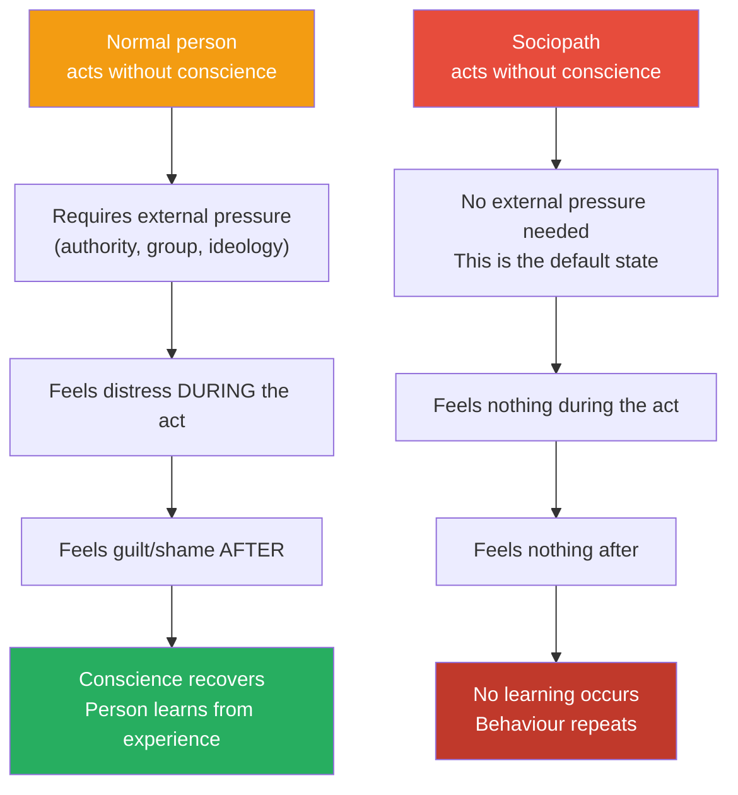
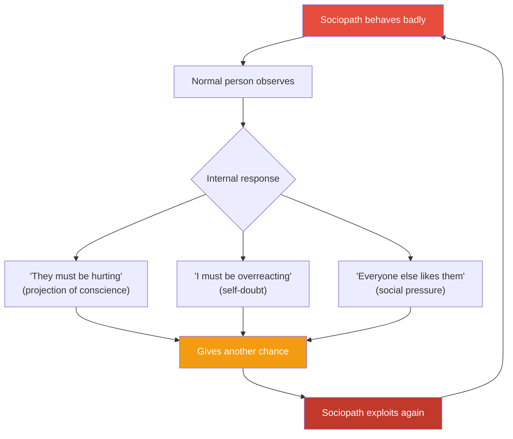
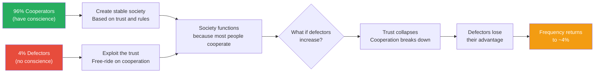
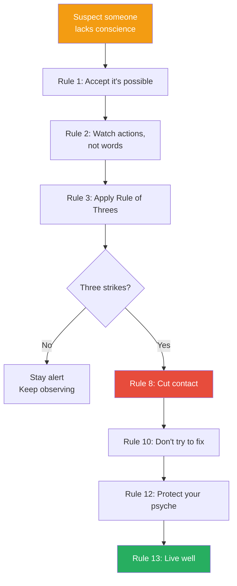
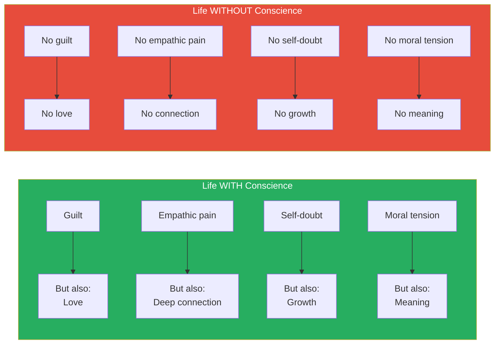
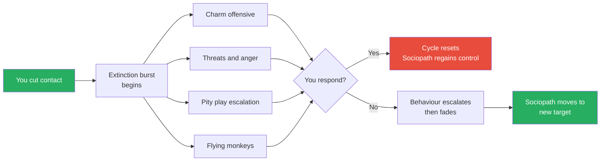

# The Sociopath Next Door — Martha Stout

> Martha Stout's central claim is simple and chilling: 1 in 25 people walking among us has no conscience — no guilt, no remorse, no emotional connection to other human beings.
> These are not the masked villains of crime dramas or horror films. They are your charming coworker, your attentive neighbour, your flattering date, your sympathetic friend.
> They look like everyone else because conscience is invisible — and we are hardwired to assume everyone has one.
> Drawing on 25 years of clinical experience at Harvard Medical School, Stout describes what the world looks like to someone who experiences other people as objects in a game — and why normal people are so catastrophically bad at recognising them.
> This book teaches you to recognise the absence of something you've always taken for granted, and to protect yourself from the 4% of the population who move through life without the internal brake that the rest of us call a soul.

---

## About the Author

Dr. Martha Stout spent 25 years on the clinical faculty at Harvard Medical School, specialising in the treatment of psychological trauma. Through her work with hundreds of trauma survivors, she repeatedly encountered the devastation caused by individuals with antisocial personality disorder — people who seemed to operate by entirely different rules from the rest of humanity. She became convinced that the general public was dangerously uninformed about how common these individuals are and how ordinary they appear. *The Sociopath Next Door* grew directly from her clinical frustration: patients kept arriving with shattered lives, and almost none of them had understood what they were dealing with until far too late. Stout's voice is calm, clinical, and deliberately accessible — she writes like a doctor explaining a diagnosis to a patient who deserves to understand exactly what is happening to them.

---

## The Big Idea

- <b style="color: #2980b9">Approximately 4% of the population — 1 in 25 people — meets the clinical criteria for antisocial personality disorder (ASPD)</b>
- That means in a company of 250 people, roughly 10 have no conscience whatsoever
- They do not lack intelligence, charm, or social skill — they lack the capacity to feel guilt, remorse, shame, or genuine emotional attachment to another human being
- <b style="color: #e74c3c">Most are not violent criminals — the majority are "successfully" integrated into society</b>, leaving a trail of confused, financially ruined, emotionally devastated people behind them
- The most dangerous thing about a sociopath is not what they do — it is that you cannot imagine someone doing what they do without feeling anything
- Your conscience is your greatest vulnerability because it makes you project conscience onto everyone else
- <b style="color: #27ae60">The only reliable protection is recognition followed by complete disengagement</b> — you cannot fix, love, or reform someone who lacks the neurological infrastructure for moral feeling

---

## Key Concepts at a Glance

| Concept | One-line summary |
|---------|-----------------|
| **The 4% statistic** | 1 in 25 people has no conscience — more common than anorexia |
| **Conscience as seventh sense** | An intervening sense of obligation based in emotional attachment |
| **The Ice People** | Sociopaths experience life as a game to win, not a web of relationships |
| **The Pity Play** | The single most reliable sign: consistently playing the victim |
| **The Rule of Threes** | One lie is a mistake; two is serious; three means cut contact permanently |
| **The Boredom Problem** | Without emotional connection, sociopaths are chronically, dangerously bored |
| **Covetous sociopath** | The type that wants what you have — not the thing, but the joy you take in it |
| **The Mask of Sanity** | Sociopaths mimic normal emotional responses without experiencing them |
| **Gaslighting by charm** | Using charisma and flattery to override your perception of reality |
| **13 Rules** | Stout's practical framework for recognising and protecting yourself |

---

## Part I: The Highest Stake — What Conscience Is and Who Lacks It

### Chapter 1: The Seventh Sense

*Stout opens by asking a question most people have never considered: what is conscience, exactly — and what would it feel like to not have one?*

- <b style="color: #2980b9">Conscience is not a thought — it is a feeling</b>
- It is an intervening sense of obligation rooted in our emotional attachment to other beings
- Stout calls it the "seventh sense" — after the traditional five senses and the sixth sense of intuition
- Most people experience conscience as an automatic emotional response:
  - A pang of guilt when you lie
  - A wave of shame when you hurt someone
  - An inability to sleep after doing something you know was wrong
  - A compulsion to apologise, to make amends, to restore fairness
- <b style="color: #27ae60">Conscience is not a set of rules you follow — it is an emotional alarm system that fires whether you want it to or not</b>

Stout asks the reader to imagine waking up one morning with no conscience at all — no guilt, no shame, no emotional connection to any other human being. You would look the same. You would speak the same. But inside, the world would be entirely different.

- Other people would be reduced to objects — useful, entertaining, or irrelevant
- Rules would exist only as obstacles to navigate, not moral boundaries to respect
- The only question in any situation would be: "What can I get away with?"
- <b style="color: #e74c3c">You would not feel evil — you would feel free</b>

> [!tip] Core Insight
> Conscience is not a thought or a decision. It is a feeling — an emotional attachment to other beings that makes you unable to harm them without suffering yourself. Remove that feeling, and the person looks identical on the outside but operates by completely different rules on the inside.

---

### Chapter 2: Ice People — A Conscience-Free World

*What does life actually look like from the inside when you have no conscience? Stout walks us through the subjective experience of sociopathy — and it is nothing like what you imagine.*

- The clinical term is <b style="color: #2980b9">antisocial personality disorder (ASPD)</b>
- The DSM criteria include: repeated lying, manipulation, impulsivity, irritability, reckless disregard for others' safety, consistent irresponsibility, and lack of remorse
- But the clinical checklist misses the experiential reality — what it actually feels like to be one of these people

**The Inner World of a Sociopath:**

- No emotional bonds — relationships are transactions, not connections
- Other people exist as sources of entertainment, resources, or targets
- Social rules are understood intellectually but not felt — a sociopath knows lying is "wrong" the way you know the capital of Mongolia; it is information, not a felt boundary
- <b style="color: #e74c3c">Emotions are shallow and fleeting — anger and frustration exist, but guilt, love, and loyalty do not</b>
- The dominant emotional state is boredom — a grinding, relentless emptiness that drives most of their behaviour

> [!example] Skip — The Charming Businessman
> - Stout introduces "Skip," a composite drawn from multiple clinical cases
> - Skip is intelligent, successful, and extraordinarily charming — people describe him as "magnetic"
> - He ran a profitable business, had a wife and children, and was well-liked in his community
> - Behind the facade, Skip systematically destroyed anyone who trusted him: business partners defrauded, employees manipulated, his wife kept off-balance through cycles of charm and cruelty
> - When confronted, Skip showed no distress — only irritation at being caught
> - He did not experience his behaviour as wrong; he experienced it as winning
> **The lesson:** The most dangerous sociopaths are not the ones in prison. They are the ones in corner offices, living rooms, and neighbourhood barbecues.

---

**Why They Are Not All Criminals:**

- Only a small percentage of sociopaths end up in the criminal justice system
- The majority are too intelligent, too charming, and too strategic to cross legal lines — or they cross them in ways that are difficult to prosecute
- <b style="color: #27ae60">The absence of conscience does not automatically produce violence — it produces a complete freedom from moral constraint</b>
- What each sociopath does with that freedom depends on their intelligence, ambition, and circumstances:
  - Low-intelligence sociopaths may end up as petty criminals
  - High-intelligence sociopaths may become CEOs, politicians, or community leaders
  - Many simply drift through life, parasitically attached to whoever will support them

| Sociopath Type | Behaviour Pattern | Danger Level |
|---------------|-------------------|-------------|
| **Violent/criminal** | Physical harm, overt law-breaking | High but visible |
| **Corporate/ambitious** | Manipulation, fraud, ruthless competition | High and hidden |
| **Parasitic/drifting** | Mooching, emotional manipulation, pity plays | Moderate but draining |
| **Covetous** | Envious destruction — wants to take what you have | High and personal |

The covetous sociopath is one of Stout's most unsettling descriptions — a person who does not merely want your possessions, your job, or your partner, but wants to destroy the joy you take in having them.

*The radar reveals the sociopath's paradox: maximum charm and manipulation skill paired with zero guilt, empathy, and loyalty — the combination that makes them so dangerous and so difficult to detect.*

---

### Chapter 3: When Normal Conscience Sleeps

*Before diving deeper into sociopathy, Stout pauses to examine when normal people act without conscience — and why that is fundamentally different from the permanent absence of conscience in a sociopath.*

- Normal people can temporarily override their conscience under specific conditions:
  - Authority pressure (as demonstrated by Stanley Milgram's obedience experiments)
  - Group conformity (mob behaviour, bystander effect)
  - Dehumanisation of the target ("they're not really people")
  - Ideology (religious, political, or tribal justification)
- <b style="color: #2980b9">The key difference: normal people feel terrible afterward</b>
- Soldiers who kill in war often suffer PTSD — not because killing is traumatic per se, but because their conscience punishes them for it
- Sociopaths never experience this aftermath because there is no conscience to violate

> [!example] The Milgram Experiment (1961)
> - Stanley Milgram at Yale designed an experiment where participants were told to deliver electric shocks to a learner who gave wrong answers
> - The learner was an actor — no real shocks were delivered — but the participants did not know this
> - 65% of participants delivered the maximum 450-volt shock when instructed by an authority figure in a white lab coat
> - Most participants showed extreme distress — sweating, trembling, begging to stop — but continued when told "the experiment requires that you continue"
> - After the experiment, many participants were deeply shaken and guilt-ridden
> **The lesson:** Normal people can be pushed past their conscience by authority — but the conscience fights back. It produces distress during the act and guilt afterward. The sociopath would deliver the shocks without any internal resistance at all.

> [!example] The Stanford Prison Experiment (1971)
> - Philip Zimbardo assigned college students to be "guards" or "prisoners" in a simulated prison
> - Within days, guards became sadistic and prisoners became passive and depressed
> - The situation was so extreme that the experiment was terminated after only six days
> - Zimbardo later reflected on how quickly ordinary people adopted cruel behaviour when given institutional permission
> **The lesson:** Situational forces can temporarily suppress conscience in normal people. But the suppression is temporary and causes lasting psychological damage. For sociopaths, there is nothing to suppress.

This diagram illustrates Stout's fundamental distinction: the difference between a normal person whose conscience is temporarily overridden and a sociopath whose conscience was never there.

---

## Part II: How Sociopaths Operate — Recognising the Pattern

### Chapter 4: The Nicest Person in the Room

*Stout demolishes the myth that sociopaths are cold and obviously sinister — the most dangerous ones are often the most charming people you will ever meet.*

- <b style="color: #e74c3c">Charm is the sociopath's primary weapon, not violence</b>
- Because they are not burdened by genuine emotion, sociopaths can devote all their cognitive resources to reading and manipulating social situations
- They study people the way a chess player studies the board:
  - What does this person want?
  - What are they afraid of?
  - What buttons can I push?
  - What role do I need to play to get what I want?
- The charm is strategic, not spontaneous — it turns on when useful and off when not
- <b style="color: #2980b9">Stout calls this the "Mask of Sanity"</b> — a term borrowed from Hervey Cleckley's landmark 1941 book of the same name

**How the Charm Works:**

- Intense eye contact — sociopaths often lock onto you with an unsettling level of attention
- Flattery that is slightly excessive but hard to resist — "You're the only person who really understands me"
- A manufactured sense of intimacy — sharing "vulnerabilities" early to create a false sense of trust
- Mirroring your values, interests, and personality back at you — you feel an instant connection because you are essentially talking to a reflection of yourself
- <b style="color: #27ae60">The test: genuine charm warms you; sociopathic charm intoxicates you</b>

> [!example] Doreen Littlefield — The Helpful Colleague
> - Stout describes "Doreen," a coworker who was universally regarded as the most helpful person in her office
> - She volunteered for every committee, organised every celebration, and always asked how you were doing
> - Behind the scenes, Doreen was systematically sabotaging colleagues she perceived as threats
> - She would "accidentally" fail to pass along critical messages, spread subtle misinformation, and position herself as the person who cleaned up the mess she had created
> - When a colleague finally confronted her, Doreen wept and said she was being bullied — and the office rallied to her defence
> - The confronting colleague was eventually forced out of the organisation
> **The lesson:** The most effective sociopaths do not terrorise — they help. They position themselves as indispensable, and then use that position to control the information flow and the social dynamics around them.

---

**The Myth vs. The Reality:**

| Myth | Reality |
|------|---------|
| Violent serial killer | Mostly non-violent — they destroy through manipulation, not force |
| Cold, robotic demeanour | Often the most charming person in the room |
| Obviously evil | Frequently described as "wonderful" by people who haven't been targeted yet |
| Rare and extreme | 1 in 25 — more common than anorexia, roughly as common as left-handedness |
| Can be reformed through love | Conscience cannot be taught to someone who lacks the neurological hardware for it |
| Unhappy and tormented | Many sociopaths report feeling superior and liberated |
| Always male | 3:1 male-to-female ratio — but female sociopaths exist and are often harder to detect |

> [!tip] Core Insight
> If your image of a sociopath is a cold-eyed killer, you will never recognise the one sitting across from you at dinner, laughing at your jokes and telling you how special you are. The charm is not a warning sign you are missing — it IS the warning sign.

---

### Chapter 5: Why Conscience Is Partially Blind

*Stout explains the psychological mechanisms that make normal people so bad at recognising sociopaths — and why your greatest virtue is your greatest vulnerability.*

- <b style="color: #2980b9">Stout identifies a fundamental cognitive limitation: people with conscience cannot imagine life without it</b>
- This is not a failure of intelligence — it is a failure of imagination
- Conscience is so deeply woven into the experience of being human that removing it from your mental model of another person feels impossible
- The result: when a sociopath behaves badly, normal people generate explanations that assume conscience exists:
  - "They must be hurting inside"
  - "They didn't mean it — they were having a bad day"
  - "If I just show them enough love, they'll change"
  - "Deep down, they're a good person"
- <b style="color: #e74c3c">Every one of these explanations is wrong — and every one of them extends the sociopath's access to you</b>

**The Empathy Trap:**

- The more compassionate you are, the more vulnerable you are
- Empathetic people are hardwired to understand others' pain — and sociopaths exploit this by performing pain
- When a sociopath says "I'm so sorry, I was abused as a child," the empathetic person's conscience kicks in:
  - You feel obligated to give another chance
  - You feel guilty for suspecting them
  - You feel that cutting them off would be cruel
- <b style="color: #27ae60">This is not kindness — this is your conscience being weaponised against you</b>

> [!example] The Forgiving Wife
> - Stout describes a patient whose husband repeatedly lied, cheated, and manipulated her over a fifteen-year marriage
> - Each time she caught him, he would cry, tell her about his difficult childhood, and promise to change
> - Each time, her conscience told her that abandoning someone in pain would be wrong
> - She gave him chance after chance — dozens of them — and each time the cycle repeated with escalating severity
> - When she finally left, she calculated she had spent fifteen years trying to love conscience into someone who did not have one
> **The lesson:** Giving chances is not always compassionate. When someone has demonstrated through repeated behaviour that they have no conscience, giving another chance is not kindness — it is self-destruction.

---

**Why We Keep Getting Fooled:**

Stout identifies several psychological mechanisms that keep normal people trapped:

- **Confirmation bias** — once you decide someone is "a good person," you filter out evidence to the contrary
- **Cognitive dissonance** — accepting that someone you trusted is a sociopath means accepting that your judgment was wrong, which is psychologically painful
- **Sunk cost fallacy** — "I've invested ten years in this relationship — I can't walk away now"
- **Social pressure** — "Everyone else thinks they're wonderful — I must be the problem"
- **The just-world hypothesis** — "Bad things happen to bad people, and this person seems to have a great life, so they must be a good person"

This cycle — bad behaviour, rationalisation, another chance, exploitation — is the fundamental pattern that Stout sees in her clinical practice, repeated across hundreds of cases.

---

### Chapter 6: How to Recognise Consciencelessness — The Pity Play

*Stout reveals the single most reliable behavioural marker of sociopathy — and it is not aggression, lying, or cruelty. It is something far more disarming.*

- <b style="color: #e74c3c">Consistent appeals to your sympathy are the most common calling card of a sociopath</b>
- This is Stout's most counterintuitive and most important claim
- You expect sociopaths to be threatening — but the most effective strategy is to be pitiful
- A person who repeatedly positions themselves as the victim — despite clear evidence of their own harmful behaviour — is exploiting your conscience directly

**Why the Pity Play Works So Well:**

- Pity disarms suspicion — you cannot be angry at someone while you are feeling sorry for them
- Pity activates your conscience — your internal voice says "a good person would help"
- Pity creates a sense of obligation — you feel you owe them something
- <b style="color: #27ae60">Pity inverts the power dynamic — the person who caused harm becomes the person you feel responsible for protecting</b>

**How to Distinguish Genuine Need from Manipulation:**

| Genuine Vulnerability | Sociopathic Pity Play |
|----------------------|----------------------|
| Person acknowledges their own role in problems | Everything is always someone else's fault |
| Vulnerability is occasional and context-appropriate | Vulnerability is constant and strategic |
| Person is embarrassed or reluctant to ask for help | Person eagerly, even theatrically, displays suffering |
| Behaviour changes after receiving help | Behaviour never changes despite repeated "second chances" |
| Gratitude follows — genuine, proportionate | Entitlement follows — they expected your help |
| Story is consistent and verifiable | Story shifts depending on the audience |

> [!example] The Tearful Neighbour
> - Stout describes a man whose neighbour would frequently knock on his door in emotional distress
> - She was always in crisis — her landlord was unfair, her ex-husband was harassing her, her boss was targeting her, her family had abandoned her
> - Each time, he helped: lending money, making phone calls, writing letters on her behalf
> - Over time, he noticed that the crises never resolved — they only multiplied
> - He also noticed that several other neighbours had quietly distanced themselves from her, and when he asked why, they told similar stories
> - When he finally set a boundary, she told other neighbours that he was cold and heartless — and she was the victim again
> **The lesson:** When someone's life is a continuous sequence of victimhood, and helping them never produces change, you are not witnessing bad luck. You are witnessing a strategy.

> [!tip] Core Insight
> If you want one single question to carry through life as a sociopath detector, it is this: does this person consistently position themselves as the victim despite evidence of their own harmful behaviour? If yes, proceed with extreme caution.

*The pity play is by far the most reliable detection signal — Stout emphasizes that consistent victim-playing in someone who shows no genuine remorse should trigger immediate wariness.*

---

### Chapter 7: The Etiology of Guiltlessness — Nature, Nurture, or Both?

*Where does sociopathy come from? Stout examines the evidence for genetic, neurological, and environmental causes — and concludes that the answer is complicated but weighted heavily toward biology.*

- <b style="color: #2980b9">The current scientific consensus is that sociopathy results from a combination of genetic predisposition and environmental influence</b>, with genetics playing the larger role
- Twin studies show that identical twins are far more concordant for antisocial personality traits than fraternal twins — even when raised apart
- Brain imaging studies reveal differences in the amygdala and prefrontal cortex of people with ASPD:
  - Reduced amygdala activity — the brain region responsible for processing fear and emotional memory
  - Reduced prefrontal cortex connectivity — the region responsible for impulse control and moral reasoning
- <b style="color: #e74c3c">You cannot teach conscience to someone whose brain is not wired for it</b> — this is not a character flaw or a choice, it is a neurological condition

**The Nature Argument:**

- Genetic heritability estimates for antisocial traits range from 40-60%
- The condition appears across all cultures, all socioeconomic classes, and throughout recorded history
- Some researchers have identified specific genes associated with reduced empathy and impulse control
- The consistency across cultures suggests a biological foundation rather than a purely cultural one

**The Nurture Argument:**

- Not everyone with the genetic predisposition develops full-blown sociopathy
- Childhood abuse, neglect, and chaotic home environments increase the probability
- Secure attachment in early childhood may buffer against genetic risk
- <b style="color: #27ae60">However — and this is Stout's critical point — a warm, loving upbringing does not guarantee conscience</b>
- Some sociopaths come from perfectly functional families and had every advantage

**The Interaction:**

- The most likely model is <b style="color: #2980b9">gene-environment interaction</b>
- Genetic predisposition creates the potential; environment influences whether and how severely it manifests
- But once the condition is fully established — typically by early adulthood — it is essentially permanent
- No therapy, no medication, and no amount of love has been shown to create conscience where it does not exist

> [!abstract] The Nature-Nurture Summary
> 1. Genetics loads the gun — 40-60% heritability for antisocial traits
> 2. Environment pulls the trigger — abuse and neglect increase risk
> 3. Secure attachment may provide some protection — but not a guarantee
> 4. Once established, the condition is permanent — no known cure
> 5. This means: do not waste your life trying to fix one

---

## Part III: Living in a World with Sociopaths

### Chapter 8: The Sociopath Next Door — They Are Already in Your Life

*Stout makes the statistical case concrete: you almost certainly know at least one sociopath — and you probably have no idea who it is.*

- With a 4% prevalence rate:
  - In a school of 500 students, roughly 20 are sociopaths
  - In a company of 250 employees, roughly 10 have no conscience
  - In a social circle of 100 people, statistically 4 are operating without moral constraint
  - In your lifetime, you will interact with dozens of sociopaths, most of them never identified
- <b style="color: #e74c3c">The reason you don't notice them is not that they are rare — it is that they are good at hiding</b>
- Their camouflage is your assumption that everyone has a conscience

**Where Sociopaths Cluster:**

- Stout does not claim sociopaths are evenly distributed — certain environments attract and reward them:
  - <b style="color: #2980b9">Positions of power and authority</b> — politics, executive leadership, law enforcement, military command
  - Professions that reward charm and dominance — sales, media, law
  - Environments with weak accountability — small businesses, religious organisations, volunteer groups where oversight is minimal
  - Online spaces — where anonymity removes the already-thin social constraints
- This does not mean all leaders are sociopaths — it means that environments that reward dominance and tolerate exploitation will attract a disproportionate number

> [!example] The Community Pillar
> - Stout describes a patient who was being systematically manipulated by her church leader
> - The leader was universally admired — generous with time, charismatic in sermons, always available for counselling
> - Behind closed doors, he used the intimate knowledge gained in counselling sessions to control and manipulate congregants
> - When the patient tried to warn others, she was seen as attacking a beloved figure — and was ostracised by the community
> - The leader's response was to express deep concern for her mental health — casting himself as the caring shepherd worried about a troubled member
> **The lesson:** Institutions with high trust and low accountability are perfect habitats for sociopaths. The more an organisation relies on the character of its leaders rather than transparent systems, the more vulnerable it is.

---

### Chapter 9: The Origins of Conscience — Why the Other 96% Have It

*Having described what sociopaths lack, Stout examines what the rest of us have — and why conscience evolved in the first place.*

- <b style="color: #2980b9">Conscience evolved as a biological mechanism for social cohesion</b>
- Humans are social animals — our survival depends on cooperation, trust, and mutual obligation
- A group of individuals who all acted purely in self-interest would destroy itself — conscience is the internal regulator that prevents this
- The evolutionary logic:
  - Individuals who cooperated and formed bonds survived better than loners
  - The capacity for guilt, shame, and empathy ensured cooperation even when cheating would be individually profitable
  - Over hundreds of thousands of years, these emotional capacities became hardwired into the human brain
- <b style="color: #27ae60">Conscience is not a luxury or a cultural invention — it is a biological adaptation for survival in social groups</b>

**The Components of Conscience:**

Stout breaks conscience into its constituent parts:

| Component | Function | What It Feels Like |
|-----------|----------|-------------------|
| **Empathy** | Feeling what others feel | You wince when someone else gets hurt |
| **Guilt** | Internal punishment for harming others | The sick feeling after you've done something wrong |
| **Shame** | Social pain from falling below standards | The burn of being seen as a bad person |
| **Attachment** | Emotional bonding with specific individuals | The inability to harm someone you love |
| **Obligation** | Sense of duty to others | Feeling you "should" help even when it costs you |

- In sociopaths, ALL of these components are absent or profoundly diminished
- This is why they cannot be "taught" conscience — it would be like teaching colour to someone born without cone cells

> [!tip] Core Insight
> Conscience is not one thing — it is a suite of emotional capacities that work together. Sociopaths do not simply lack guilt; they lack the entire emotional infrastructure that makes humans social beings. This is why no single intervention can "fix" sociopathy.

---

**Why 4% Lack It:**

- If conscience is so valuable for survival, why does sociopathy persist at 4%?
- Stout discusses several evolutionary explanations:
  - **Frequency-dependent selection** — a small number of cheaters can exploit a cooperative majority, but only as long as they remain a minority
  - If sociopaths became too common, the cooperative system would collapse and they would lose their advantage
  - 4% may represent the "carrying capacity" — the maximum frequency at which defectors can survive without destroying the host population
- <b style="color: #e74c3c">This means sociopathy is not a disease to be cured — it is an evolutionary strategy that persists because it works, at low frequencies, in a population of cooperators</b>

This diagram illustrates the evolutionary equilibrium that Stout describes — sociopathy persists because it is profitable as a minority strategy, but self-limiting because it would destroy its own environment if it became common.

*Stout's most striking comparison: sociopathy at 4% is more common than anorexia or colon cancer — yet most people go through life never learning to recognize it.*

---

### Chapter 10: Why Sociopathy Is More Dangerous in Western Culture

*Stout argues that modern Western culture — with its emphasis on individualism, competition, and charisma — creates an environment where sociopaths thrive with minimal friction.*

- <b style="color: #2980b9">Individualistic cultures reward the very traits that sociopaths naturally possess</b>:
  - Confidence without self-doubt
  - Decisiveness without hesitation
  - Charisma without vulnerability
  - Ambition without guilt
  - Risk-taking without fear
- In collectivist cultures (e.g., Japan, parts of East Asia), the rate of diagnosed ASPD appears lower:
  - Social expectations of obligation, duty, and group harmony create stronger external controls
  - Deviation from social norms is more visible and more costly
  - <b style="color: #e74c3c">This does not mean there are fewer sociopaths in collectivist cultures — it means the culture suppresses the behaviour more effectively</b>

**How the West Rewards Sociopaths:**

- The "winner takes all" mentality provides cover for ruthless behaviour
- Charisma and fearlessness are celebrated in business and politics
- Empathy and conscientiousness are often seen as weaknesses in competitive environments
- The media glorifies rule-breakers and mavericks
- <b style="color: #27ae60">Corporate culture in particular rewards short-term results without auditing the human cost</b>

> [!example] The Celebrated CEO
> - Stout references the cultural archetype of the "tough" CEO who fires ruthlessly, cuts costs without sentiment, and is celebrated by shareholders
> - Many of the traits business magazines admire — "fearless decision-making," "ability to make unpopular choices," "immune to criticism" — are clinical descriptions of consciencelessness
> - Stout is careful to note that not all tough leaders are sociopaths — genuine leadership requires difficult decisions
> - The distinction: a leader with conscience makes hard decisions and feels the weight; a sociopath makes them and feels nothing
> **The lesson:** Culture that celebrates ruthlessness without examining the motivation behind it creates a perfect hiding place for sociopaths.

| Trait | In a Leader with Conscience | In a Sociopath |
|-------|---------------------------|----------------|
| Makes hard decisions | Feels the weight, loses sleep | Feels nothing, sleeps fine |
| Fires underperformers | Does it reluctantly, with compassion | Does it enthusiastically, without thought |
| Takes risks | Calculates cost to others | Calculates cost to self only |
| Projects confidence | Confidence coexists with doubt | Confidence is total — no doubt exists |
| Faces criticism | Reflects, adjusts if warranted | Dismisses, retaliates, or performs concern |

---

### Chapter 11: Groundhog Day — The Boredom Problem

*Stout makes an underappreciated and deeply unsettling point about the inner life of a sociopath: without emotional connections, genuine goals, or moral purpose, they are chronically and dangerously bored.*

- <b style="color: #2980b9">The boredom of a sociopath is not ordinary boredom — it is existential emptiness</b>
- Normal people find meaning in relationships, creative work, spiritual life, and emotional growth
- Sociopaths have access to none of these sources of meaning:
  - Relationships are performances, not connections
  - Work is a game, not a calling
  - Spirituality requires emotional depth they do not have
  - Personal growth requires self-awareness that serves no purpose for them
- What remains is a flat, grey existence punctuated only by the stimulation of winning, dominating, and manipulating

**How Boredom Drives Behaviour:**

- Much of a sociopath's manipulative behaviour is driven not by strategic necessity but by entertainment
- <b style="color: #e74c3c">They play with people the way a cat plays with a mouse — not because they need to, but because the game itself is stimulating</b>
- This explains behaviour that often puzzles normal observers:
  - Why would someone lie when the truth would serve them just as well? Because lying is more interesting
  - Why would someone sabotage a relationship that was going well? Because stability is boring
  - Why would someone provoke a conflict for no apparent reason? Because conflict creates drama, and drama relieves the emptiness
- <b style="color: #27ae60">When a sociopath's behaviour seems pointless or disproportionate, boredom is usually the explanation</b>

> [!example] The Game Player
> - Stout describes a sociopath who would deliberately start arguments between friends — not for any benefit, but for the entertainment of watching the fallout
> - He would tell Person A that Person B had said something insulting, then tell Person B that Person A was talking behind their back
> - He would then position himself as the sympathetic listener for both sides, watching the friendship disintegrate from a front-row seat
> - When asked why, he could not articulate a reason beyond "it was something to do"
> **The lesson:** Not all manipulation has a strategic purpose. Some of it is recreational — and that makes it even harder to predict or defend against.

> [!abstract] Recognising Boredom-Driven Manipulation
> - Look for behaviour that creates chaos without any clear benefit to the person creating it
> - Notice patterns of provocation — if someone seems to enjoy conflict itself, not just winning
> - Watch for escalation after periods of stability — sociopaths often destroy calm situations because calm is boring
> - Ask: "Who benefits from this drama?" If the answer is "no one, but someone seems entertained by it," pay attention

---

## Part IV: Protecting Yourself — The 13 Rules

### Chapter 12: Stout's Defence Framework

*Having spent the first half of the book teaching you what sociopaths are and how they operate, Stout now turns to the practical question: what do you actually do about it?*

<b style="color: #2980b9">The 13 Rules for Dealing with Sociopaths</b> form the book's practical core. Stout presents them not as suggestions but as survival guidelines — the distillation of 25 years of watching people get destroyed by conscienceless individuals and wishing they had known sooner.

---

**Rule 1: Accept that some people have no conscience.**

- This is the foundational rule — all others depend on it
- <b style="color: #e74c3c">Refusing to believe that conscienceless people exist is the single biggest risk factor for being exploited by one</b>
- Most people resist this idea because it is deeply disturbing
- Stout urges: let it be disturbing. The discomfort of accepting the truth is far less painful than the devastation of being blindsided by a sociopath

---

**Rule 2: Judge by actions, not words.**

- In a contest between appealing words and a pattern of behaviour, <b style="color: #27ae60">always trust the pattern</b>
- Sociopaths are masters of language — they say exactly what you want to hear
- Words cost nothing; patterns reveal character
- When someone says "I love you" but consistently treats you with contempt, the contempt is the truth

---

**Rule 3: The Rule of Threes.**

- <b style="color: #2980b9">One lie, one broken promise, one "forgotten" obligation could be a misunderstanding</b>
- Two is very serious
- Three means you are dealing with a pathological liar — cut contact
- Do not wait for four, five, or six — the pattern is already clear at three
- This rule is Stout's single most actionable piece of advice

> [!tip] Core Insight
> The Rule of Threes is one of the most practical pieces of advice in any psychology book. One broken promise is human. Two is a serious warning. Three is a pattern — and patterns don't lie. At three, stop giving chances and start protecting yourself.

---

**Rule 4: Question authority.**

- Sociopaths are drawn to positions of authority because authority provides cover
- <b style="color: #e74c3c">A title, a uniform, or a position of trust does not guarantee conscience</b>
- Question anyone who uses their position to demand compliance rather than earn it
- Authority should be respected when earned and questioned when wielded as a weapon

---

**Rule 5: Suspect flattery.**

- When praise feels excessive, unearned, or designed to make you feel special, it is probably strategic
- Genuine admiration is specific and proportionate; manipulative flattery is lavish and vague
- <b style="color: #27ae60">"You're the only person who understands me" is almost never true — it is almost always a hook</b>

---

**Rule 6: Redefine your concept of respect.**

- Fear is not respect
- If you "respect" someone primarily because you are afraid of them, that is domination, not respect
- Genuine respect is earned through consistent, admirable behaviour over time
- Sociopaths often confuse others' fear with others' respect — and they cultivate fear deliberately

---

**Rule 7: Do not try to outsmart them.**

- <b style="color: #e74c3c">This is their game and they have been playing it their entire life</b>
- You have a conscience, which means you have moral constraints — they do not
- Trying to "beat" a sociopath at manipulation is like trying to out-swim a shark
- The only winning move is not to play

---

**Rule 8: The best defence is to refuse to play.**

- <b style="color: #27ae60">Avoid contact entirely whenever possible</b>
- This is not cowardice — it is the single most effective protective strategy
- Sociopaths need an audience; remove yourself and you remove their power
- No contact means no contact — not reduced contact, not supervised contact, not "just one more conversation"

> [!abstract] The No-Contact Protocol
> 1. Recognise the pattern (Rules 1-3)
> 2. Accept that the person will not change (Rule 10)
> 3. Cut all communication — phone, email, social media, in-person
> 4. Do not explain your reasons — explanations give them material to manipulate
> 5. Expect an extinction burst — escalated behaviour designed to pull you back in
> 6. Hold the line — any response, even a negative one, rewards them
> 7. Build support — tell trusted people what you are doing and why

---

**Rule 9: Question your tendency to pity.**

- Especially when the person asking for pity has harmed you or others
- <b style="color: #2980b9">Pity and conscience are closely linked</b> — sociopaths know this and exploit it
- Ask yourself: "Am I feeling sorry for this person because they are genuinely suffering, or because they are performing suffering to control my behaviour?"
- If you find yourself pitying someone who has repeatedly hurt you, your pity is being weaponised

---

**Rule 10: Do not try to fix them.**

- You cannot install software on hardware that does not support it
- <b style="color: #e74c3c">Conscience is not a skill that can be taught — it is a neurological capacity that is either present or absent</b>
- Therapy does not cure sociopathy — in many cases, it makes sociopaths more effective by giving them better language for manipulation
- The fantasy of "saving" a sociopath is one of the most dangerous and persistent delusions that conscience-bearing people fall into

> [!example] The Therapist's Dilemma
> - Stout describes the clinical reality of treating sociopaths
> - Many therapists report that sociopathic patients use therapy sessions to learn the vocabulary of emotion — not to feel emotions, but to fake them more convincingly
> - A sociopath who has been through therapy can say "I understand that my behaviour caused you pain, and I take responsibility" without meaning a single word
> - Some therapists have reported that their sociopathic patients actually became more dangerous after treatment — because they gained a sophisticated emotional vocabulary without gaining any emotional capacity
> **The lesson:** Do not comfort yourself with the thought that "therapy will help." For sociopaths, therapy is often just another tool for manipulation.

---

**Rule 11: Never agree to help conceal their true character.**

- If a sociopath asks you to keep a secret about their behaviour, <b style="color: #27ae60">you become complicit in their next victim's suffering</b>
- "Don't tell anyone about this" is not a request for privacy — it is a demand for cover
- Your silence protects them and endangers others

---

**Rule 12: Defend your psyche.**

- Refuse to feel responsible for what they do
- Sociopaths are skilled at transferring guilt — making you feel that their behaviour is somehow your fault
- You did not cause their condition, you cannot cure it, and you are not responsible for its consequences
- <b style="color: #e74c3c">Guilt about walking away is your conscience being used against you one last time</b>

---

**Rule 13: Living well is the best revenge.**

- Do not waste your life trying to get justice, expose them, or change someone who cannot change
- <b style="color: #27ae60">The most powerful response to a sociopath is to live a good life without them in it</b>
- Sociopaths want control — your indifference is the one thing they cannot manipulate
- Every moment spent obsessing over a sociopath is a moment stolen from your actual life

---

This flowchart represents Stout's decision tree — the sequence from suspicion to recognition to self-protection.

*The heatmap reveals why empaths struggle most with Stout's advice — accepting the diagnosis and cutting contact are extremely effective but psychologically agonizing for people with high empathy.*

---

## Part V: Deeper Themes — What Sociopathy Tells Us About Human Nature

### Chapter 13: Conscience in Context — What Makes a Good Life?

*Having spent most of the book on the darkness of sociopathy, Stout turns to an unexpected question: what does the existence of conscienceless people teach us about the value of conscience itself?*

- Stout argues that studying sociopaths illuminates what conscience does for the rest of us — not just as a moral brake, but as the foundation of a meaningful life
- <b style="color: #2980b9">Conscience is not just the absence of antisocial behaviour — it is the presence of the capacity for love, meaning, and genuine connection</b>
- Without conscience, life is reduced to a game — and games, no matter how cleverly played, are ultimately empty
- Sociopaths may "win" by conventional measures — money, status, power — but they are incapable of the experiences that make life worth living:
  - The deep comfort of being truly known by another person
  - The satisfaction of doing the right thing when it costs you something
  - The joy of watching someone you love succeed
  - The peace that comes from a clear conscience

**The Paradox of Winning:**

- Sociopaths are often materially successful — they take risks without fear and compete without guilt
- But Stout asks: successful at what?
- <b style="color: #e74c3c">A person who can win any game but feel nothing about the victory is not successful — they are hollow</b>
- The sociopath's life, from the inside, is a sequence of manoeuvres in a game that never ends and never means anything
- <b style="color: #27ae60">Conscience — the thing that holds you back, makes you hesitate, and costs you opportunities — is also the thing that makes your life real</b>

> [!tip] Core Insight
> The existence of sociopaths is, paradoxically, the strongest argument for the value of conscience. They show us what a human life looks like when stripped of guilt, empathy, and attachment — and it looks efficient, dominant, and completely empty.

---

### The Covetous Sociopath

*Stout introduces one of her most disturbing profiles — the sociopath who does not merely want to take from you, but wants to destroy your capacity for joy.*

- Most sociopaths operate on a simple cost-benefit logic — they take what they want and move on
- The <b style="color: #2980b9">covetous sociopath</b> is different — and more dangerous
- This type does not merely want your job, your partner, or your status
- They want to destroy the happiness you derive from having those things
- <b style="color: #e74c3c">The covetous sociopath is driven by envy of your emotional life — the capacity for joy that they lack and can never acquire</b>

**How Coveting Manifests:**

- They do not just compete with you — they target what makes you happiest
- If you love your work, they will undermine your professional reputation
- If you have a close family, they will try to create division within it
- If you have a talent or passion, they will disparage it or claim credit for it
- The goal is not to have what you have — it is to ensure you do not have it either

> [!example] The Envious Friend
> - Stout describes a patient whose closest friend gradually undermined every source of happiness in her life
> - When the patient got a promotion, the friend made subtly disparaging comments about the company
> - When the patient fell in love, the friend sowed doubt about the partner's intentions
> - When the patient was happy, the friend would create a crisis that demanded attention and emotional labour
> - The pattern was invisible until a therapist pointed it out: the "friend" systematically attacked every source of joy, not to gain anything, but to ensure the patient did not have what she herself could never experience
> **The lesson:** The covetous sociopath does not want your success. They want your unhappiness. They cannot experience joy, so they are driven to destroy it in others.

---

### The Question of Shame and Guilt Across Cultures

*Stout examines how different cultures shape the expression — though not the existence — of sociopathy.*

- Western cultures are predominantly <b style="color: #2980b9">guilt-based</b> — moral behaviour is regulated by internal feelings of guilt
- East Asian cultures have traditionally been more <b style="color: #2980b9">shame-based</b> — moral behaviour is regulated by fear of social disapproval
- Stout argues that shame-based cultures provide an additional layer of external control that guilt-based cultures lack:
  - In a guilt-based culture, a sociopath has no internal brake — and the external brakes are weak (individualism, privacy, personal freedom)
  - In a shame-based culture, a sociopath still has no internal brake — but the external brakes are stronger (intense social surveillance, honour systems, family obligation)
- <b style="color: #27ae60">Neither system eliminates sociopathy — but shame-based cultures suppress its expression more effectively</b>
- The implication for Western societies:
  - Individual freedom is important, but it creates space for exploitation
  - Accountability systems, transparency, and institutional oversight partially compensate for what culture does not provide
  - <b style="color: #e74c3c">The more a society values individual autonomy without building accountability structures, the more hospitable it becomes for sociopaths</b>

---

### Conscience and Meaning — Why Having a Conscience Hurts

*Stout addresses the uncomfortable truth that conscience causes suffering — and argues that this suffering is the price of a meaningful life.*

- People with conscience suffer in ways that sociopaths never do:
  - Guilt over mistakes, even minor ones
  - Empathic pain — feeling the suffering of others
  - Moral injury — the trauma of being forced to act against your values
  - The constant tension between self-interest and obligation
- Some people, in moments of extreme pain, have wished they could simply "turn off" their conscience
- Stout's response is unequivocal: <b style="color: #27ae60">the pain that conscience causes is inseparable from the meaning it creates</b>
- Guilt is the price of love — if you could not feel guilty about hurting someone, you could not truly love them
- Empathic pain is the price of connection — if you could not feel others' suffering, you could not feel their joy either
- <b style="color: #2980b9">Conscience is a package deal — you get the pain and the meaning together, or you get neither</b>

This diagram captures Stout's central philosophical argument: conscience is a package deal. The pain and the meaning are two sides of the same coin.

---

## Practical Application — Putting It All Together

### Red Flags Checklist

> [!abstract] Warning Signs — When to Apply the Rule of Threes
> - Consistent pattern of lying — not occasional white lies, but systematic deception
> - Charm that feels slightly overwhelming or "too good to be true"
> - Persistent appeals to your sympathy that contradict their actual behaviour
> - A trail of damaged relationships that are always "someone else's fault"
> - Behaviour that creates chaos without any apparent benefit to anyone
> - Inability to take genuine responsibility — apologies that sound rehearsed and never lead to changed behaviour
> - Flattery that is vague and excessive rather than specific and proportionate
> - Intimidation masked as concern — "I'm only telling you this because I care about you"
> - A pattern of escalation when you set boundaries
> - Others warning you about this person — especially people who have known them longer than you have

---

### What To Do When You Recognise the Pattern

> [!abstract] The Protection Protocol
> 1. **Name it to yourself** — "This person may not have a conscience. That is possible."
> 2. **Stop explaining their behaviour** — no more "they were having a bad day" or "they didn't mean it"
> 3. **Apply the Rule of Threes** — track lies, broken promises, and harmful behaviour; at three, act
> 4. **Cut contact** — no negotiation, no explanation, no "one more chance"
> 5. **Expect the extinction burst** — they will escalate before they accept you are gone
> 6. **Build your support network** — tell trusted friends and family what is happening
> 7. **Refuse guilt** — your conscience will tell you that cutting someone off is cruel; in this case, it is not cruelty, it is survival
> 8. **Seek professional support** — a therapist who understands personality disorders can help you process the experience

---

### Common Mistakes People Make

| Mistake | Why It Fails | What to Do Instead |
|---------|-------------|-------------------|
| Trying to "love them into changing" | Conscience cannot be installed through love | Accept the condition is permanent |
| Confronting them with evidence | They will deny, deflect, or turn it against you | Stop seeking acknowledgment |
| Warning their next target | They will paint you as the crazy ex | Protect yourself first |
| Seeking justice or revenge | They do not feel shame; your efforts amuse them | Invest energy in your own recovery |
| Blaming yourself | "If I had been better, they wouldn't have treated me this way" | Recognise: you were targeted because of your virtues, not your flaws |
| Going back "one more time" | The cycle never ends — it only escalates | Commit to no contact and hold it |

---

### Recovery After a Sociopathic Relationship

*Stout acknowledges that recognising a sociopath is only half the battle — recovering from one is its own journey.*

- Victims of sociopaths often experience:
  - <b style="color: #2980b9">Complex PTSD</b> — chronic exposure to manipulation creates lasting psychological injury
  - Deep shame — "How could I have been so stupid?"
  - Trust damage — difficulty believing anyone is genuine after being systematically deceived
  - Identity confusion — after years of gaslighting, you may not know what you actually think or feel
  - Grief — for the relationship you thought you had, which never existed

**What Helps:**

- Understanding that you were targeted because of your strengths — empathy, loyalty, trust — not your weaknesses
- Working with a therapist who specialises in personality disorder dynamics
- Reading accounts from other survivors — the patterns are remarkably consistent
- <b style="color: #27ae60">Rebuilding trust slowly, starting with yourself</b>
- Accepting that grief for a relationship with a sociopath is grief for a fiction — the person you loved was a performance, not a person

> [!example] The Long Recovery
> - Stout describes a patient who left a ten-year marriage to a sociopath
> - In the first year after leaving, she questioned her own sanity — had it really been that bad? Was she overreacting?
> - Her ex-husband's friends and family thought she was the problem — he was so charming, so successful, so concerned about her "instability"
> - It took two years of therapy before she could trust her own perceptions again
> - Five years later, she described the experience as "waking up from a dream I didn't know I was in"
> **The lesson:** Recovery from a sociopathic relationship is not quick. The damage is to your fundamental trust in your own judgment. Rebuilding that takes time, support, and patience.

---

### The Sociopath's Manipulation Toolkit

*Stout catalogues the specific techniques sociopaths use to control their targets — not as exotic psychological warfare, but as ordinary social behaviours pushed to extremes.*

- <b style="color: #2980b9">Gaslighting</b> — making you doubt your own perception of reality
  - "That never happened"
  - "You're remembering it wrong"
  - "You're being too sensitive"
  - Over time, the target begins to trust the sociopath's version of reality more than their own
- <b style="color: #2980b9">Love bombing</b> — overwhelming attention, praise, and affection early in a relationship
  - Creates a powerful emotional bond before the target has enough data to evaluate character
  - Establishes a "golden period" that the target will spend years trying to recapture
  - The intensity feels like connection — it is actually speed, designed to bypass your judgment
- <b style="color: #2980b9">Intermittent reinforcement</b> — unpredictable cycles of warmth and cruelty
  - The same psychological mechanism that makes slot machines addictive
  - Occasional kindness after prolonged coldness creates more intense bonding than consistent kindness
  - The target becomes hyper-focused on earning the "good" version of the sociopath
  - <b style="color: #e74c3c">This is the mechanism that makes abusive relationships so difficult to leave</b>
- <b style="color: #2980b9">Triangulation</b> — introducing a third person to create jealousy, insecurity, or competition
  - "My ex was so much more understanding than you"
  - "My colleague thinks I'm brilliant — why don't you appreciate me?"
  - Forces the target to compete for the sociopath's approval
- **Projection** — accusing you of the exact behaviour they are guilty of
  - The cheater accuses you of cheating
  - The liar accuses you of dishonesty
  - This keeps you on the defensive and diverts attention from their behaviour

| Technique | What It Sounds Like | What It Does |
|-----------|-------------------|--------------|
| **Gaslighting** | "That didn't happen" | Erodes your trust in your own perception |
| **Love bombing** | "I've never felt this way about anyone" | Creates rapid attachment before judgment catches up |
| **Intermittent reinforcement** | Warmth, then coldness, then warmth | Creates addictive bonding through unpredictability |
| **Triangulation** | "My ex never complained about this" | Creates competition and insecurity |
| **Projection** | "You're the one who's being manipulative" | Deflects blame and keeps you defensive |
| **Pity play** | "You don't understand how hard my life has been" | Activates your conscience against your own interests |

> [!tip] Core Insight
> None of these techniques are unique to sociopaths — anyone can use them occasionally. What distinguishes the sociopath is the combination of all of them, the consistency of their use, and the complete absence of remorse when confronted. The pattern is the signal.

---

### Why Good People Stay Too Long

*Stout addresses one of the most painful questions her patients ask: why did I stay so long?*

- <b style="color: #27ae60">The answer is not stupidity — it is conscience</b>
- Every mechanism that keeps people trapped is a feature of healthy psychology, exploited:
  - **Loyalty** — "I made a commitment and I should honour it"
  - **Empathy** — "They're hurting and they need me"
  - **Optimism** — "Things will get better if I just try harder"
  - **Responsibility** — "Maybe it's partly my fault"
  - **Fear of unfairness** — "What if I'm wrong about them?"
- Sociopaths intuitively understand these mechanisms and pull the corresponding levers
- <b style="color: #e74c3c">The person who stays the longest is usually the person with the strongest conscience — because their own moral standards prevent them from walking away</b>

> [!example] The Loyal Business Partner
> - Stout describes a man who spent twelve years in a business partnership with a sociopath
> - His partner systematically redirected company funds to personal accounts, lied to clients, and blamed failures on other employees
> - The man stayed because he felt responsible — for the employees, for the clients, for the partnership he had built
> - Each time he considered leaving, his partner would say something like "Without you, this whole thing falls apart — those families depend on us"
> - It was not until an accountant discovered the financial fraud that the man finally left
> - In retrospect, he calculated that his loyalty had cost him over a decade of his career and several hundred thousand dollars
> **The lesson:** Loyalty is a virtue — until it is exploited. When your loyalty is being used to keep you in a situation that benefits someone who has no loyalty to you, it has become a trap.

---

### The Extinction Burst

*When you finally cut contact, the sociopath does not simply accept it. Stout warns about what comes next.*

- <b style="color: #2980b9">The extinction burst</b> is a behavioural psychology term for the escalation of behaviour when a previously rewarded action suddenly stops producing results
- When you cut contact with a sociopath, you are removing their supply of control, entertainment, and validation
- Their response is predictable:
  - **Escalated charm** — "I've changed, I see it now, please give me one more chance"
  - **Escalated aggression** — threats, harassment, smear campaigns
  - **Escalated pity** — "I'll fall apart without you, I have no one else"
  - **Flying monkeys** — enlisting mutual friends and family to pressure you back into contact
- <b style="color: #e74c3c">Any response from you — positive or negative — rewards the escalation and resets the cycle</b>
- The only effective response is complete silence
- The extinction burst is temporary — if you hold the line, the sociopath will eventually move on to a new target
- <b style="color: #27ae60">It gets worse before it gets better — but it does get better, and only if you do not break</b>

This diagram maps the extinction burst process — the critical period after no-contact where the sociopath's behaviour peaks before it fades.

---

## The Verdict

*The Sociopath Next Door* is a deeply uncomfortable book, and that is precisely its value. Stout writes with the calm authority of a clinician who has spent decades witnessing the damage done by conscienceless individuals, and her goal is not to terrify but to inform. The 1-in-25 statistic alone recalibrates your expectations in every social environment — it transforms a vague awareness that "bad people exist" into a concrete, statistical reality that demands a response. The book's greatest contribution is not any single piece of advice, but the fundamental shift in worldview it produces: after reading Stout, you stop assuming that everyone shares your basic moral architecture, and that protective scepticism may be the most valuable thing the book installs in you.

The book's limitations are real. It stays largely at the awareness level — telling you how to recognise sociopaths and why to avoid them — but offers less guidance on the mechanics of recovery for people who have already been deeply entangled. The case studies, while vivid and instructive, are composites rather than documented cases, which reduces their evidentiary weight. Stout's clinical authority is genuine, but the book would benefit from more engagement with the neuroscience literature and from more specific guidance on navigating situations where no-contact is not possible (shared custody, workplace dynamics, family members). The treatment of cultural differences, while interesting, is somewhat superficial — a fuller cross-cultural analysis would have strengthened the evolutionary argument considerably.

The ideal reader is someone who suspects — or has recently discovered — that someone in their life operates without conscience. For that person, this book is not merely useful; it is urgent. It provides the vocabulary, the framework, and the permission to stop giving chances and start protecting themselves. It is also valuable as a general education text: even if you are not currently dealing with a sociopath, understanding how they operate makes you less exploitable in every domain of life — business, friendship, romance, and community.

In the landscape of books on dark personality traits, *The Sociopath Next Door* occupies a specific niche: it is the most accessible introduction to the topic for a general audience. [[Snakes in Suits - Babiak & Hare|Snakes in Suits]] provides a more detailed analysis of sociopathy in corporate environments, with the added authority of Robert Hare's psychopathy research. [[In Sheep's Clothing - George K. Simon|In Sheep's Clothing]] goes deeper into the specific manipulation tactics that covertly aggressive people use day to day. [[The Laws of Human Nature - Robert Greene|The Laws of Human Nature]] places sociopathy within a broader framework of character assessment. But for the reader who needs to understand, right now, what they are dealing with and what to do about it — Stout's book remains the essential starting point.

---

## Related Reading

- [[Snakes in Suits - Babiak & Hare|Snakes in Suits]] — Sociopathy in the corporate environment, with Hare's psychopathy research
- [[In Sheep's Clothing - George K. Simon|In Sheep's Clothing]] — The covert-aggression tactics sociopaths use in everyday interactions
- [[Emotional Blackmail - Susan Forward|Emotional Blackmail]] — When manipulation targets your conscience through fear, obligation, and guilt
- [[The Laws of Human Nature - Robert Greene|The Laws of Human Nature]] — Character assessment as a lifelong practice, including how to read people who conceal their true nature
- [[Never Split the Difference - Chris Voss|Never Split the Difference]] — While focused on negotiation, Voss's framework for reading people and detecting deception complements Stout's work
