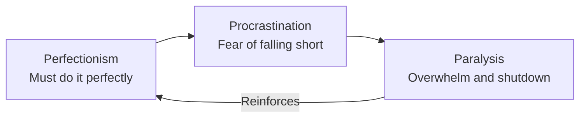
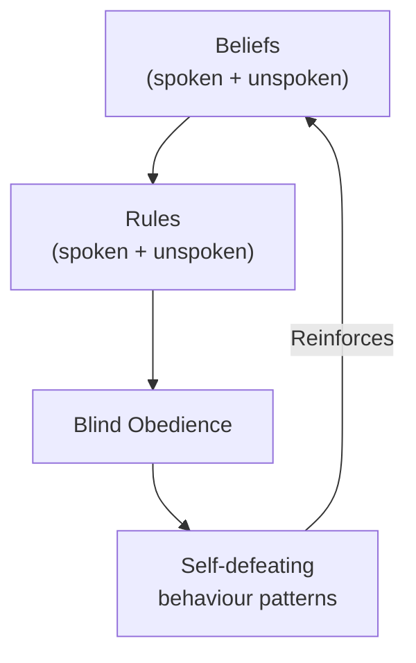
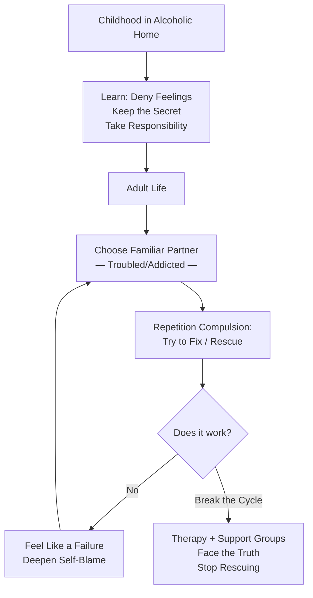
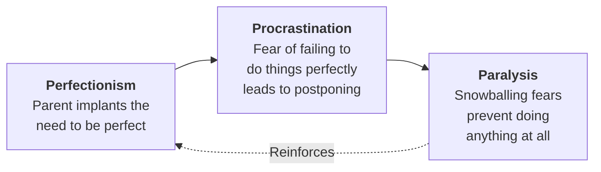
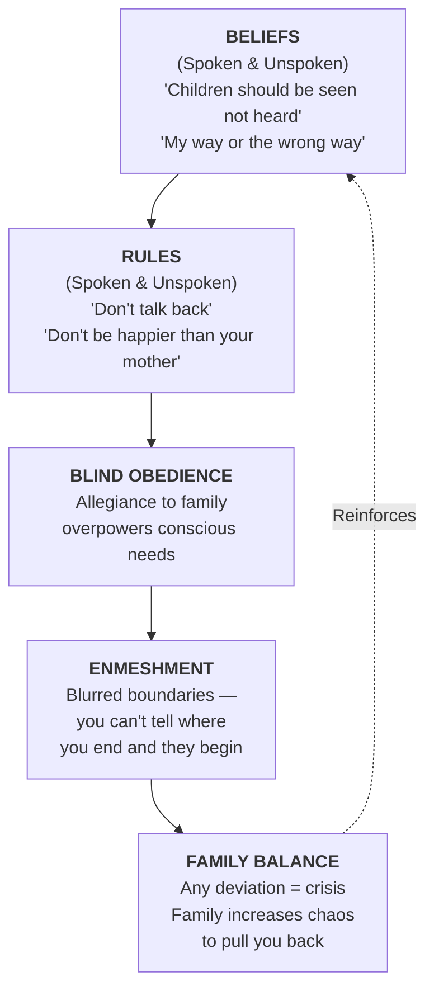
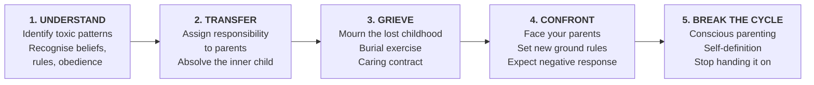
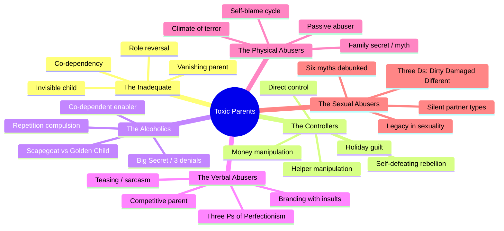

# Toxic Parents — Susan Forward

> *All parents are deficient from time to time. But there are many parents whose negative patterns are consistent and dominant in a child's life. These are the parents who do the harm.*

---

## About the Author

*Susan Forward, Ph.D., is a therapist, lecturer, and bestselling author who spent over eighteen years treating adults damaged by destructive parenting. She pioneered the popular use of the term "toxic" to describe parents who inflict ongoing emotional, verbal, physical, or sexual harm. Forward is also the author of Men Who Hate Women and the Women Who Love Them, Emotional Blackmail, and Obsessive Love. Her work is distinctive for its blend of unflinching directness, genuine warmth, and practical behavioural strategies — she doesn't just explain the wound, she hands you the surgical kit.*

---

## The Big Idea

Parents who consistently undermine, control, neglect, verbally assault, physically batter, or sexually violate their children inflict damage that functions like a <b style="color: #e74c3c">chemical toxin — it spreads throughout the child's being and grows as the child grows</b>. Adult children of these parents carry seeds of fear, obligation, and guilt into every relationship, career, and decision. Recovery does not require forgiving your parents — it requires <b style="color: #2980b9">transferring the blame from yourself to the adults who failed you</b>, grieving the childhood you lost, and <b style="color: #27ae60">confronting your parents to reclaim the power that is rightfully yours</b>.

> [!example] Gordon — The Moment That Sparked the Book
> - Gordon, 38, a successful orthopaedic surgeon, came to Forward when his wife left him over his uncontrollable temper
> - He painted a glowing picture of his "saint" of a father, a distinguished cardiologist
> - When Forward probed deeper, Gordon mentioned being "spanked once in a while" — but something in his voice caught her attention
> - It turned out his father "spanked" him two or three times a week with a belt — on his back, legs, arms, hands, and buttocks — for defiant words, below-par grades, or forgotten chores
> - Forward asked: "If your wife saw a child in her office with those same marks, would she be required by law to report it to the authorities?"
> - Gordon's eyes filled with tears. He whispered: "I'm getting a terrible knot in my stomach"
> - That evening, thinking about the thousands of adults whose lives were controlled by patterns set by emotionally destructive parents, Forward decided to write this book

---

## Key Concepts at a Glance

| Concept | Definition |
|---------|-----------|
| **Toxic Parent** | A parent whose negative patterns are consistent, dominant, and damaging to the child's sense of self-worth |
| **Deification** | The child's survival need to see parents as perfect, accepting blame to maintain the illusion of safety |
| **The Family System** | Interconnecting beliefs, rules, and loyalties that drive behaviour across generations |
| **Blind Obedience** | Unconscious adherence to family rules that persists into adulthood and across continents |
| **Enmeshment** | A blurring of personal boundaries where family members cannot tell where one ends and another begins |
| **The Forgiveness Trap** | Premature forgiveness that undercuts anger, transfers blame back to the victim, and prevents real healing |
| **Self-Definition** | The ability to have your own beliefs, feelings, and behaviours apart from your parents' demands |
| **Confrontation** | Calmly telling parents the truth about the past and laying down new ground rules for the present |
| **The Three P's** | Perfectionism → Procrastination → Paralysis — the cycle that traps children of verbally abusive parents |
| **Repetition Compulsion** | The unconscious drive to re-create familiar painful patterns, hoping to "get it right this time" |

---

## At a Glance

- **The Problem:** Millions of adults carry crippling self-doubt, broken relationships, and emotional dysfunction rooted in how their parents treated them — yet most cannot see the connection
- **The Insight:** Children blame themselves for their parents' abuse because it feels safer than accepting the protector can't be trusted; that self-blame persists into adulthood
- **The Method:** A two-track approach — change current self-defeating behaviour AND disconnect from the traumas of the past through responsibility transfer, grief work, and confrontation
- **The Provocation:** <b style="color: #e74c3c">You don't have to forgive your parents to heal</b> — premature forgiveness is another form of denial

---

## The 30-Second Version

Your parents planted mental and emotional seeds in you. In healthy families, those are seeds of love, respect, and independence. In toxic families, they are seeds of <b style="color: #e74c3c">fear, obligation, and guilt</b>. As you grew, those seeds became invisible weeds that invaded your relationships, your career, and your self-worth. Recovery requires understanding the six types of toxic parents (inadequate, controlling, alcoholic, verbally abusive, physically abusive, sexually abusive), recognising how the family system keeps you trapped through beliefs, rules, and blind obedience, and then doing the hard emotional work: <b style="color: #2980b9">assigning responsibility where it belongs, grieving the childhood you lost, and confronting your parents to reclaim your adult power</b>. You are not responsible for what happened to you as a child. You are responsible for doing something about it now.

---

## The 5-Minute Version

### The Myth of the Perfect Parent

- *Children deify their parents because survival depends on it.* A small child cannot face the terrifying fact that the all-powerful protector is actually the source of pain
- Two doctrines keep the faith alive: <b style="color: #e74c3c">"I am bad and my parents are good"</b> and <b style="color: #e74c3c">"I am weak and my parents are strong"</b>
- These beliefs persist long after physical dependence ends — even after parents die
- Denial (pretending it didn't happen) and rationalisation ("they were only trying to help") are the primary defence mechanisms

### The Six Types of Toxic Parents

- **The Inadequate Parents** — Focus on their own problems, forcing children into role reversal. Children become miniature adults, cooking, cleaning, emotionally caretaking — robbed of childhood
- **The Controllers** — Use guilt, manipulation, money, and threats to direct adult children's lives. Two styles: direct control (ultimatums) and manipulation ("helpers" who create dependency)
- **The Alcoholics** — Maintain the Big Secret through three layers of denial. Children become either scapegoats (blamed for everything) or golden children (driven to impossible perfection)
- **The Verbal Abusers** — Range from "humorous" put-downs to savage insults. "You are" becomes "I am" as children internalise their parents' labels
- **The Physical Abusers** — Create a climate of terror with no safe place to hide. The passive parent who permits abuse shares responsibility
- **The Sexual Abusers** — The ultimate betrayal. Leave a legacy of the Three D's: <b style="color: #e74c3c">Dirty, Damaged, and Different</b>

Each toxic parent type inflicts a distinct damage signature — sexual abusers score highest across all dimensions, while inadequate parents primarily erode identity and relationship capacity through neglect rather than direct assault.

### The Family System

- Beliefs (spoken and unspoken) create rules (spoken and unspoken) enforced by blind obedience
- Toxic families maintain balance through chaos — when someone threatens the system, the family increases dysfunction to pull them back
- Enmeshment means you cannot tell where your parents end and you begin; your decisions are always filtered through "what will they think?"
- Five toxic coping mechanisms: denial, projection, sabotage, triangling, keeping secrets
- The system is not something your parents invented — it is accumulated dysfunction passed down from ancestors like a multi-car pileup on the freeway

### The Recovery Path

- <b style="color: #27ae60">You don't have to forgive to heal.</b> Premature forgiveness undercuts anger and transfers blame back to the victim
- **Self-definition:** Learn nondefensive responses, make position statements, reframe "I can't" as "I haven't yet"
- **Responsibility transfer:** Say aloud "You were not responsible for..." to the child within you, then "My parents were responsible for..."
- **Grief work:** Mourn the fantasy of the good family, the lost childhood, the parents you never had — grief has a beginning, a middle, and an end
- **Confrontation:** Face your parents with the truth — not to punish, but to reclaim your power. Expect a negative response; success is measured by your courage, not theirs
- **Breaking the cycle:** Ask before every parenting decision: "Whose needs am I meeting — my child's or my own?"
- The critical warning: <b style="color: #e74c3c">"What you don't hand back, you pass on"</b> — unresolved trauma becomes intergenerational

---

## Part 1 — Toxic Parents: The Taxonomy

### Forward's Self-Assessment: Taking Your Psychological Pulse

*Before diving into the taxonomy, Forward provides a 24-question checklist spanning three periods of life. Key questions include:*

**Childhood:** Did your parents tell you you were bad or worthless? Did they use physical pain to discipline you? Did they get drunk or use drugs? Were you sexually molested? Were you frightened of your parents a great deal of the time?

**Adult Life:** Do you find yourself in destructive or abusive relationships? Are you afraid that if people knew the real you, they wouldn't like you? Do you feel anxious when successful and frightened someone will discover you're a fraud? Despite your best intentions, do you find yourself behaving "just like your parents"?

**Current Relationship with Parents:** Do your parents still treat you as if you were a child? Are major life decisions based on whether they'd approve? Do they manipulate you with threats, guilt, or money? Do you believe that no matter what you do, it's never good enough?

- If you answered yes to even one-third, there is a great deal in this book for you
- All toxic parents, regardless of the nature of their abuse, basically leave the same scars

### Chapter 1: Godlike Parents — Deification and Denial

- *Every child's first act of faith is believing their parents are perfect.* Without that belief, the child faces the unbearable truth that the people they depend on for survival may actually be dangerous
- This deification persists because challenging it threatens the child's entire psychological foundation
- <b style="color: #2980b9">Denial is the most primitive and powerful psychological defence</b> — it creates a make-believe reality to minimise painful experiences
- The relief denial provides is temporary; the pressure builds until it explodes as an emotional crisis

> [!example] Sandy — The Abortion That Became a Life Sentence
> - Sandy, 28, was seriously depressed and unable to get pregnant
> - At fifteen, she became pregnant at her strict Catholic school; her parents screamed about mortal sin a thousand times
> - She got an abortion only by threatening suicide to get parental consent
> - Her mother told her the infertility was God's punishment: "The Lord works in mysterious ways"
> - Sandy spent half her life trying to make amends for "disgracing" her family — doing anything her parents wanted, which drove her husband to fury
> - Forward told Sandy: "Even the Church lets you atone and get on with your life. If your parents were as good as you say, they would have shown compassion"

- **Rationalisation** is denial's cousin — using "good reasons" to explain away what is painful
- Common rationalisations: "He only hit me to teach me a lesson," "She drank because she was lonely," "I can't blame Dad — Mom wouldn't sleep with him"
- **Displacement** redirects anger from the dangerous source (parents) to safer targets (spouses, children, coworkers, strangers)
- **Death amplifies deification.** The taboo against criticising the dead grants sainthood to even the worst abuser
- Many people are still controlled by their parents after their deaths — the ghosts are not supernatural, but they are very real psychologically
- A parent's demands, expectations, and guilt trips can linger long after that parent has died
- "Don't speak ill of the dead" may be a treasured platitude, but it inhibits the resolution of conflicts with dead parents and protects the grave while leaving the survivors stuck with the emotional remains

> [!example] Valerie — The Father Who Died Mid-Therapy
> - Valerie, late thirties, was a singer whose father called her "my little failure" at dinner
> - She began therapy and started contacting her anger — then her father died suddenly of a stroke
> - At his funeral she heard eulogies about how wonderful he was and felt like "an asshole for blaming him"
> - She wanted to stop talking about the bad stuff, but eventually accepted that his death could not change the reality of how he treated her

> [!tip] The First Step
> Your first step toward controlling your life is to face the truth: your godlike parents actually betrayed you when you were most vulnerable.

### Chapter 2: The Inadequate Parents — Robbers of Childhood

- Children have inalienable rights: to be fed, clothed, sheltered, protected — and also to be nurtured emotionally, to have feelings respected, and to be allowed to be children
- Five fundamental parental responsibilities: provide for physical needs, protect from physical harm, provide love and attention, protect from emotional harm, provide moral guidance
- <b style="color: #e74c3c">Inadequate parents rarely get past the first item</b>
- When parents force adult responsibilities onto children, roles become distorted or reversed — the child becomes both their own parent and a parent to their parent

> [!example] Les — The Eight-Year-Old Father
> - Les, 34, was a workaholic whose marriage collapsed because he could never stop working or express emotion
> - His mother had a breakdown when he was eight. From that day, Les packed lunches, cooked dinner, and got his brothers to school while his mother lay in front of the television
> - His father told him daily: "Take care of your mother. Make sure she eats. Try to get a smile out of her"
> - Les spent his childhood trying to make his mother happy — an impossible task for a child
> - As an adult, his seventy-five-hour work weeks served a dual purpose: avoiding loneliness and proving he was "enough"
> - His parents still called twice a week guilting him into flying home: "You're her whole life"

- **The Invisible Child:** When parents focus on their own survival, the message is loud and clear — "Your feelings are not important. I'm the only one who counts"
- Children deprived of adequate attention begin to feel as if they don't exist
- <b style="color: #2980b9">The co-dependent personality</b> emerges: solving other people's problems becomes the most important thing, no matter the emotional cost

**Forward's Co-Dependency Checklist:**

| Statement | What It Reveals |
|-----------|----------------|
| Solving his problems is the most important thing in my life — no matter the emotional cost to me | Loss of self |
| My good feelings depend on approval from him | External validation |
| I protect him from consequences — lie for him, cover up, never let others criticise | Enabling |
| I try very hard to get him to do things my way | Control disguised as care |
| I don't pay attention to how I feel — only how he feels | Invisibility |
| I will do anything to avoid rejection or making him angry | Fear-based compliance |
| I experience more passion in stormy, dramatic relationships | Addiction to chaos |
| I am a perfectionist and blame myself for everything | Internalised shame |
| The struggle to get him to love me dominates my life | Impossible quest |

> [!example] Melanie — The Dear Abby Letter
> - Melanie, 42, wrote a letter to Dear Abby at age thirteen: "I'm in a crazy family. Can you get me out of here?"
> - Her mother found the letter and never mentioned it — confirming that Melanie's feelings simply didn't matter
> - Her father would retreat to his room and sob; Melanie had to sit with him trying to figure out how to make him happy
> - As an adult, she picked lazy, abusive men and tried to "fix" them — lending money, finding them jobs, moving them into her house
> - She checked "yes" to every item on the co-dependency checklist

- **The Vanishing Parent:** Physical absence after divorce creates devastating deprivation
- Children of divorced parents are especially prone to believing the departure was their fault
- Damage through omission is harder to see than damage through commission — but equally destructive

> [!example] Ken — "This Time It's Gonna Be Different"
> - Ken, 22, was in a hospital group for young-adult substance abusers — intelligent and articulate, but deeply self-deprecating
> - His parents divorced when he was eight; his father promised nothing would change, that he'd still come over and watch TV
> - For a few months he did — then once a month — then once every two months — then practically never
> - A year later, Ken learned his father had married a woman with three kids and moved out of state: "He liked them better, because he sure forgot about me in a hurry"
> - At fifteen, Ken hitchhiked fourteen hours to surprise his father. He expected a big welcome — instead felt like a total stranger while his father fussed over the new children
> - He got loaded that night and kept getting loaded for years
> - In the hospital, he still insisted: "As soon as I get out, I'm gonna try again. This time it's gonna be different — man-to-man"
> - His father's abandonment left a void that Ken tried to fill with drugs — and the fantasy that somehow he could win back a love that had already been given to someone else

- A divorce decree is not a licence for a parent to abandon his or her children
- A parent who vanishes from children's lives reinforces their feelings of invisibility — creating self-esteem damage they drag into adulthood like a ball and chain

### Chapter 3: The Controllers — "It's for Your Own Good"

- Appropriate parental control becomes overcontrol when a mother restrains a child who is perfectly able to cross the street alone
- <b style="color: #e74c3c">What makes controllers insidious is that domination comes disguised as concern</b> — "this is for your own good" really means "I'm doing this because I'm terrified of losing you"
- **Direct control:** intimidation, ultimatums, money — "Do as I say or I'll never speak to you again"
- **Manipulation:** guilt, helpfulness, martyrdom — the "helper" who cleans your apartment uninvited, then cries when you object

> [!example] Eli — The Millionaire Pauper
> - Eli was a millionaire many times over, living in a one-room apartment driving a clunker
> - He circled the block for twenty minutes before an $18 million meeting — to avoid a $5 parking fee
> - His immigrant father's voice still played: "You idiot! You waste money on luxuries"
> - Twelve years after his father's death, Eli couldn't enjoy his success
> - In therapy he finally said: "There is simply nothing in my current reality to justify my being as afraid as I was"

> [!example] Michael — "You're Killing Your Mother"
> - Michael moved to California; his mother saw it as abandonment
> - When his wife got the flu and he couldn't fly home for their anniversary, his mother said: "If you don't come, I'm going to die"
> - He went anyway. Then his father called: "You're killing your mother. She was up all night crying"
> - His parents never mentioned his wife's name — pretending she didn't exist

- **Self-defeating rebellion** is as trapped as capitulation — Jonathan, 55, rejected marriage because his controlling mother wanted it so badly, depriving himself of what he actually desired
- **Control from the grave:** Barbara's parents boycotted her wedding; her mother died and had the family swear not to tell Barbara. When Barbara called her father: "You should be happy now, you've killed your mother"
- **Holiday weaponisation:** Fred won a free ski trip over Christmas. His mother looked devastated, then burned the turkey "for the first time in forty years." Three siblings called to pile on guilt. Fred: "I'll never miss Christmas again"

### Chapter 4: The Alcoholics — The Dinosaur in the Living Room

- *Alcoholism is like a dinosaur in the living room* — impossible to ignore from outside, invisible to those inside
- **The Big Secret** has three elements: the alcoholic's denial, the partner's denial and excuse-making, and the charade of the "normal family"
- The charade forces children to deny their own perceptions — destroying confidence and breeding shame

> [!example] Glenn — Putting Father to Bed Every Night
> - Glenn's earliest memory: father heading straight for the liquor cabinet after work
> - The family dragged him to bed nightly — Glenn removed his shoes and socks
> - "No one in the family ever mentioned what we were doing. I honestly thought it was normal"
> - Glenn left for school an hour early and came home as late as possible — "I don't think my parents noticed I was never around"
> - As an adult, he took his alcoholic father into business — then couldn't fire him

- **The Golden Child:** Steve, a research chemist, achieved Phi Beta Kappa by burying himself in schoolwork — then became paralysed when perfection wasn't possible
- **Repetition compulsion:** adult children of alcoholics frequently marry alcoholics, hoping "this time I'll get it right"
- **Trust destruction:** if you can't trust your father, whom can you trust? Trust is the first casualty

> [!example] Jody — Father's Drinking Buddy at Ten
> - Her father gave her sips of booze at 10; by 11 they shared bottles in the car before joyriding
> - She confused love with abuse — "When he wasn't drinking, he could be cool"
> - Jody left therapy rather than give up her idealised father: "My dad and I really need each other"

- **The co-dependent partner** unconsciously supports the alcoholism — nagging but never taking real action
- Glenn's father finally said "I love you" after decades — but was still drinking. Glenn: "It wasn't enough. It was all talk and no action"
- <b style="color: #27ae60">You can change without changing your parents. Your well-being does not have to depend on them</b>

### Chapter 5: The Verbal Abusers — Bruises on the Inside

- **Two styles:** direct (savage insults) and indirect (teasing, sarcasm, "jokes" hidden behind "She knows I'm only kidding")
- Children take sarcasm at face value — a 6-year-old cannot distinguish a threat from a tease

> [!example] Phil — Death by a Thousand Jokes
> - Phil's father teased him constantly in front of the family; everyone laughed except Phil
> - At 6, his father said: "This boy can't be ours. I'll bet they switched babies in the hospital"
> - Phil genuinely believed he might be returned to the hospital
> - As an adult dentist, he spoke so quietly patients could barely hear him — hypersensitive to any comment

- **Competitive parents** feel threatened by their child's growing competence
  - The unconscious message: <b style="color: #e74c3c">"You cannot be more successful, attractive, or happy than I am. I am your limit"</b>
  - Vicki's mother told her backstage at a recital, in front of the class: "You danced like a hippo"

- **The Three P's of Perfectionism:**

> [!example] Carol — "You Smell Bad"
> - Carol's physician father told her from age 11 that her body smelled disgusting
> - She showered three times daily, used excessive deodorant and perfume — nothing helped
> - Forward identifies this as the father's anxiety about his daughter's sexuality, projected as disgust
> - Carol married three abusive/distant men in succession, each a substitute for her cruel father

- **"I wish you'd never been born"** — Jason, a police officer, kept putting himself in life-threatening situations without backup. Forward recognised it as indirect suicide to fulfil his mother's repeated wish
- **Internalisation:** "You are stupid" becomes "I am stupid" — negative labels move from the parent's mouth into the child's unconscious

### Chapter 6: The Physical Abusers — Bruises on the Outside Too

- Forward's definition: any behaviour inflicting significant physical pain, regardless of whether it leaves marks
- Physical abusers lack impulse control, often come from abusive families, and look to children as surrogate parents

> [!example] Kate — The Banker's Daughters
> - Kate's father was a respected banker and churchgoer
> - He beat Kate and her sister with a belt — on their heads, legs, arms, backs
> - One night he crashed through their locked bedroom door and beat them both
> - Kate: "All my life I've felt I don't deserve to be happy"

- **The passive abuser** — the parent who permits abuse by doing nothing
  - Joe's mother locked herself in the bathroom during beatings
  - Terry's father held him while he sobbed, saying "If you tried harder, things might go better" — blaming the child
  - Doing nothing **is** complicity

> [!example] Joe — Letters Left on the Dresser
> - Joe was beaten regularly; he wrote letters about how he really felt and left them on his dresser
> - "To this day, I don't know if my folks ever read them, and I'm still too terrified to ask"
> - His father mixed abuse with tenderness — once drove 10 hours for a ski trip and said Joe was "really special"
> - This perverse fusion kept Joe searching for the "good father" who sometimes appeared

- **Learning to hate yourself:** battered children accept blame just as verbally abused children do
- When the physical abuse ends, the emotional abuse continues — except now the child has become her own abuser

### Chapter 7: The Sexual Abusers — The Ultimate Betrayal

- Forward's expanded definition: any sexual contact or behaviour by anyone the child perceives as a family member, kept secret
- **Psychological incest** included: spying, seductive comments — no physical contact required

| Myth | Reality |
|------|---------|
| Incest is rare | At least 1 in 10 children molested by family |
| Only in poor families | Cuts across all socioeconomic levels |
| Aggressors are deviants | Can be ministers, doctors, teachers |
| Caused by sexual deprivation | Most aggressors have active sex lives |
| Children seduce adults | 100% the adult's responsibility |
| Children make it up | Freud's error — he decided reports were fantasies |

- **The Three D's — the incest legacy:**
  - <b style="color: #e74c3c">Dirty</b> — feeling contaminated
  - <b style="color: #e74c3c">Damaged</b> — something fundamentally broken
  - <b style="color: #e74c3c">Different</b> — can never be normal

> [!example] Liz and the Minister Stepfather
> - Liz's stepfather was a popular minister with a large congregation
> - She sat in church wanting to scream: "This man is a hypocrite!"
> - When she told her mother at 13: "Why are you telling me this? God will punish you"
> - When she tried to resist, her stepfather choked her until she could barely breathe

- **Three types of mothers in incest families:** those who genuinely don't know, those who wear blinders, and those who are told and do nothing
- Impact on sexuality: revulsion, flashbacks during intimacy, or self-denigrating promiscuity
- The search never ends: many victims remain fused to parents, looking for the magic key to parental love

### Chapter 8: The Family System

- The family is a system — interconnecting people where each affects the others in hidden ways
- **Beliefs** (spoken and unspoken) form the skeleton; **rules** enforce them; **blind obedience** is the muscle

- **Enmeshment** vs individuality: healthy families encourage independence; toxic families promote fusion
- **Family balance:** toxic families fight to maintain equilibrium by *increasing* chaos when threatened
  - When Glenn confronted his father's drinking, the entire family turned on him: "I was like a leper"

- **Toxic coping mechanisms:**
  - **Denial:** "Nothing is wrong" / "It won't happen again"
  - **Projection:** blaming the child for the parent's inadequacies
  - **Sabotage:** undermining improvement to restore familiar roles
  - **Triangling:** enlisting children as allies against the other parent
  - **Secret-keeping:** the bond that keeps the tortured family intact

> [!tip] The System Test
> If telling the truth about your family makes you feel like a traitor, you are living inside a toxic system. Truth should feel like relief, not betrayal.

**Direct Control** operates through ultimatums and intimidation:

> [!example] Michael — The 3,000-Mile Puppet Strings
> - Michael, 36, advertising executive, moved to California and married a woman he loved
> - When his wife got the flu before a trip to Boston for his parents' anniversary, his mother said: "If you don't come, I'm going to die"
> - He caved and flew to Boston alone; his parents pressured him to stay the whole week
> - The next day his father called: "You're killing your mother. She was up all night crying"
> - Whenever his parents called, they never asked about his wife — pretending she didn't exist
> - Michael's "crime" was that he had become independent

- A child's marriage is extremely threatening to controlling parents — they see the spouse as a competitor for devotion
- Some attack the new relationship with criticism and predictions of failure; others refuse to acknowledge the spouse's existence; still others directly persecute the new partner
- For the adult child, every choice becomes all-or-nothing: side with parents or side with spouse, with no middle ground

- **Money as control tool:** Financial support becomes a leash. Generosity one day, humiliation the next — the finish line keeps moving

> [!example] Kim — Daddy's Leash
> - Kim, 41, overweight, divorced with two teenagers, believed she was nothing without a man
> - Her father disapproved of her husband but was secretly pleased he was weak — it gave Dad more power
> - Father offered to support them financially, which gave him "incredible hold" over their lives
> - The price of his generosity: he dictated how they lived — from choosing an apartment to toilet-training the kids
> - Kim's father used money for both reward and punishment, without logic or consistency — alternately generous and stingy
> - He once gave her a new car for Christmas and said: "Don't you wish your husband was rich like me?"
> - Trying to please him was like running a race where he was always moving the finish line

> [!example] Fred — The Christmas Guilt Trip
> - Fred, 27, won a free ski trip to Aspen over the holidays
> - His mother's reaction: lip trembling, eyes glazing, then — "Maybe we just won't have Christmas dinner this year"
> - Fred went, but had a terrible time — spent half the trip on the phone apologising to his mother, brothers, and sister
> - His mother burned the turkey "for the first time in forty years"; his brother delivered the killer line: "How many more Christmases do you think Mom has left?"
> - Fred's mother didn't express her feelings directly — she enlisted the whole family to do it for her

**Manipulation** gets what controllers want without ever asking directly:

- The "helper" creates situations to make themselves needed — cleaning your apartment uninvited, volunteering to drive you to a tournament, rearranging your furniture
- When confronted, the manipulator dissolves into tearful martyrdom: "What's wrong with a mother who helps?"
- <b style="color: #2980b9">Manipulation paints people into a corner</b> — to fight it, they'd have to hurt someone who's "just trying to be nice"

> [!example] Lee — The Mother Who Wouldn't Stop "Helping"
> - Lee, 32, was a successful tennis pro going through deep depressions
> - Her mother brought food over because Lee "didn't eat well enough," came in while Lee was out and cleaned the apartment, rearranged her clothes and furniture
> - When Lee was invited to play a tournament in San Francisco, her mother insisted on driving her — "You can't possibly drive the whole way by yourself"
> - Every time Lee expressed frustration, her mother would cry: "What's wrong with a mother who helps a daughter she loves?"
> - Lee couldn't express her anger because her mother appeared so loving — so the anger turned into depression
> - The depression fed the cycle: "Look how down you look. Let me fix a little lunch, just to cheer you up"
> - Forward identified the hidden message: "As long as my daughter can't take care of herself, she'll need me" — translating to the unspoken rule: "Don't be adequate"

**Negative Comparisons Between Siblings:**

- Many toxic parents compare one sibling unfavorably with another to motivate compliance
- This divide-and-conquer technique creates resentments and jealousies that can last a lifetime
- The target child gets the message: you're not doing enough to earn our love
- Children who are becoming "a little too independent" are especially targeted — the comparison is used to threaten the balance of the family system

**Self-Defeating Rebellion:**

- When toxic parents control us intensely, we either capitulate or rebel — both reactions inhibit psychological separation
- <b style="color: #e74c3c">If we rebel in reaction to our parents, we are being controlled just as surely as if we submit</b>
- Healthy rebellion is an active exercise of free choice; self-defeating rebellion is reactive — the means attempt to justify an unsatisfying end

> [!example] Eli — $18 Million vs a $5 Parking Fee
> - Eli, 60, was a millionaire many times over but lived in a one-room apartment driving an old car
> - He nearly blew an $18 million deal because he circled the block for twenty minutes looking for free street parking
> - His father, a poor immigrant, had drilled terror into him: "Hard times will come. Save every penny. Women will trick you"
> - Twelve years after his father's death, the voice still played on loop whenever Eli tried to enjoy his success
> - He eventually bought a condominium — a huge step — and learned to "turn down the volume" on his father's voice

**Control from the grave** is real — the psychological umbilical cord stretches across continents and out of the grave.

> [!example] Barbara — "You Killed Your Mother"
> - Barbara, 39, a musical prodigy and successful TV composer, was in devastating depression
> - When she planned her wedding, her parents demanded to stay at her house. She offered a hotel instead
> - They said: "Unless we stay with you, we will never speak to you again"
> - For the first time in her life, she stood up to them. They didn't come to the wedding, then told the entire family what a bitch she was
> - Years later, her mother was diagnosed with terminal cancer. She made every family member swear not to tell Barbara when she died
> - Barbara found out five months later from a family friend at a chance encounter
> - She called her father. His first words: "You should be happy now — you've killed your mother"
> - He grieved himself to death three months later
> - Barbara spent years hearing his accusation in her head, nearly suicidal — afraid to kill herself because "I was afraid I might run into my parents again"
> - It took another year of therapy before she could get her dead parents to leave her alone

### Chapter 4: The Alcoholics — The Dinosaur in the Living Room

- *Alcoholism is like a dinosaur in the living room.* To an outsider it's impossible to ignore, but those inside the home pretend it isn't there — the only way they can coexist
- Lies, excuses, and secrets are as common as air in alcoholic homes

**The Big Secret** has three elements:

1. The alcoholic's denial of their alcoholism despite overwhelming evidence
2. The partner's denial — "Mom just drinks to relax," "Dad tripped on the carpet"
3. The charade of the "normal family" presented to the world

- The charade forces children to deny their own feelings and perceptions — making it nearly impossible to develop self-confidence
- <b style="color: #e74c3c">Intense, uncritical loyalty to parents becomes second nature</b> — the family that shares a secret becomes the only source of belonging

> [!example] Glenn — Dragging Dad to Bed
> - Glenn's earliest memory: father heading straight for the liquor cabinet every night after work
> - After dinner, the family had to be silent while Dad "got down to serious drinking"
> - Most nights, Glenn, his sister, and his mother dragged his father to bed — Glenn's job was removing shoes and socks
> - "Nobody ever mentioned what we were doing. Until I got older, I thought dragging Dad to bed was a normal family activity"
> - As an adult, Glenn took his alcoholic father into his business, where the father insulted customers and cost him accounts — but Glenn couldn't fire his own father

**The Scapegoat and The Golden Child:**

- Some children are cast as the family scapegoat — blamed for everything, including the parent's drinking: "You could drive anyone to drink!"
- Others become the golden child — the family hero showered with approval for shouldering enormous responsibility
- Both roles are equally deprived; the golden child drives himself to impossible perfection while the scapegoat internalises worthlessness

**Repetition Compulsion:**

- Adult children of alcoholics frequently marry alcoholics — not because they enjoy chaos, but because <b style="color: #2980b9">the drive to repeat familiar patterns is powerful</b>, even when those patterns are painful
- The unconscious hope: "This time I'll get it right — I'll succeed at rescuing my partner where I failed to rescue my parent"
- At least one in four children of alcoholic parents become alcoholics themselves

**Trust as Casualty:**

- Because their first relationship taught them that love leads to pain, most adult children of alcoholics are terrified of closeness
- Successful relationships require vulnerability, trust, and openness — the very things an alcoholic household destroys
- Many are drawn to emotionally unavailable people, creating an illusion of intimacy without risking true vulnerability

> [!example] Jody — Father's Drinking Buddy at Ten
> - Jody, 26, a recovering alcoholic herself, worked as a substance-abuse counsellor
> - Her father started giving her sips of booze at age ten; by eleven, they'd share a bottle in the car and go for joyrides
> - She knew his driving was dangerous, but "it was something I had with him that nobody else had"
> - As an adult, she dated a violent, abusive man — and confused love with abuse, because that's what her father taught
> - When therapy pushed her toward truth about her father, she left: "I don't want to give up my dad. Why should I trust you more than him?"
> - Her inability to trust was the central casualty of her father's alcoholism

> [!example] Carla — "It's Your Fault I Drink"
> - Carla, 47, had recurring headaches — a common symptom of repressed rage
> - Her mother's behaviour ranged from smotheringly loving to excruciatingly cruel depending on alcohol consumption
> - When seven-year-old Carla brought a friend home and they played dress-up with her mother's things, her drunk mother lurched out screaming: "You brought your friend to spy on me! That's why I have to drink — you could drive anyone to drink!"
> - As an adult, Carla cancelled a long-awaited Mexico vacation because her mother called drunk and depressed
> - She was still trying to earn the approval of a woman who had blamed a seven-year-old for her alcoholism

**The Charade of the Normal Family:**

- When Glenn, at twenty, tried to confront his father about drinking, the family united against him — mother jumped to Dad's defence, father denied everything, sisters tried to keep the peace
- Glenn was treated like a leper for exposing the truth; he didn't mention the drinking again for twenty years
- <b style="color: #e74c3c">The family that shares a dinosaur-sized secret will destroy anyone who threatens to reveal it</b>

- **The Co-Dependent / Enabler:** The nondrinking partner who unconsciously supports the alcoholism — through acceptance, they communicate they will always sweep up the damage
- Glenn's mother's helplessness, combined with distorted loyalty, gave her husband permission to continue his outrageous behaviour

> [!tip] No Fairy Tale Endings
> If you're an adult child of an alcoholic, the key is to remember that YOU can change without changing your parents. Your well-being does NOT have to be dependent on your parents.

### Chapter 5: The Verbal Abusers — The Bruises Are All on the Inside

- *"Sticks and stones may break my bones, but words can never hurt me"* — Forward calls this flatly untrue
- Two styles of verbal abuse: direct attacks (insults, degradation) and indirect attacks (teasing, sarcasm, "humorous" nicknames)
- If the child complains, the abuser says "she knows I'm only kidding" — making the victim a co-conspirator

> [!example] Phil — "They Switched Babies on Us"
> - Phil, 48, a dentist, spoke so quietly Forward could barely hear him — painful shyness that he traced to his father's constant "teasing"
> - At age six, his father would say: "This boy can't be our son. They must have switched babies at the hospital. Why don't we take him back?"
> - When Phil protested, his father said: "Can't you take a joke?"
> - Phil went through life with his nerve ends exposed, expecting to be humiliated — transferring his fear of his father to everyone he met

**The Competitive Parent:**

- Healthy parents feel excitement at their children's growing competence; <b style="color: #e74c3c">competitive parents feel threatened</b>
- Adolescence is especially dangerous — mothers compete with daughters' beauty, fathers with sons' emerging manhood
- The unconscious message: "You cannot be more successful / attractive / happy than I am. I am your limit"

> [!example] Carol — "Your Body Smells"
> - Carol, 52, model-turned-designer, had been divorced three times
> - When she was eleven, her physician father began telling her she smelled bad — "Your breasts smell bad, your back stinks"
> - She showered three times daily, changed clothes constantly, used deodorant obsessively — nothing helped
> - Forward identified this as her father's reaction to his own uncomfortable attraction to his adolescent daughter — he projected his guilt onto her
> - Carol spent her adult life choosing cruel, abusive, or distant men — trying to get the love her father never gave

**The Three P's of Perfectionism:**

- Paul, 33, a lab technician, had a stepfather who inspected his room daily like an army barracks — screaming "disgusting pig" and "fucking little asshole" if a single book was out of place
- Paul buckled in the face of any challenge, gave up on a science career despite a very high IQ, and drifted from job to job
- His stepfather had been the smallest kid in school — Paul became a mirror of the inadequacies his stepfather couldn't face in himself

**"You Are" Becomes "I Am":**

- Children are the most vulnerable to parental labels — if Mother says "you're stupid," then you're stupid; if Father says "you're worthless," then you are
- <b style="color: #2980b9">Internalisation of negative opinions — changing "you are" to "I am" — forms the foundation of low self-esteem</b>
- Jason, 42, a police officer, was consistently putting himself in life-threatening situations without backup — his mother had told him daily she wished he'd never been born; he was unconsciously trying to be a dutiful son by erasing his existence

### Chapter 6: The Physical Abusers — Sometimes the Bruises Are on the Outside, Too

- Forward's definition of physical abuse: <b style="color: #e74c3c">any behaviour that inflicts significant physical pain on a child, regardless of whether it leaves marks</b>
- Physically abusive parents share: appalling lack of impulse control, often come from abusive homes themselves, emotionally still children who look to their own children as surrogate parents
- The abuser becomes enraged when the child can't meet adult needs — at that moment, the true target of rage is the abuser's own parent

> [!example] Kate — The Banker Who Crashed Through Doors
> - Kate, 40, had panic attacks in her car and elevator; her face seemed moulded into a permanent unhappy expression
> - Her father was a well-respected banker — from the outside, a perfect family
> - He would take off his belt and strap Kate and her sister across legs, heads, anywhere he could reach
> - One night when they locked their bedroom door, he crashed through it like a scene from a movie, threw them in a corner, and beat them screaming: "I'll kill you if you ever lock me out again!"
> - All her life Kate felt she didn't deserve to be happy — never married, never had a good relationship, never allowed herself real success

> [!example] Joe — The Letters No One Mentioned
> - Joe, 27, a psychology graduate student, was punched by his father until he was dazed and didn't know what was happening
> - The scariest part was never knowing what would provoke the outbursts
> - In high school, Joe wrote letters about being beaten and left them on his dresser hoping his parents would read them
> - Nobody ever said a word about them
> - He tried a diary too — left it lying around — and to this day doesn't know if anyone read it
> - He was too terrified to ask — because if they had read his pleas and hadn't responded, he'd have to give up the fantasy that someday a miracle might give him the key to their love

**The Passive Abuser:**

- The parent who permits abuse shares responsibility — they become a partner in the violence
- Joe's mother locked herself in the bathroom during beatings; Kate's mother sat downstairs listening to her daughters scream for help and never came
- Many adult children excuse the passive parent as a co-victim — but Forward is unequivocal: <b style="color: #e74c3c">there is NO excuse for a parent to stand by while their children are brutalised</b>

**Breaking a Common Myth:**

- For years it was believed that almost all battered children became battering parents — current studies challenge this
- Many formerly abused children grow into nonabusing adults; some have difficulty with even modest discipline because they recoil from anything resembling their own childhood

**Abuse and Love — The Bewildering Combination:**

- Abused children are often exposed to a bizarre mixture of tenderness and terror
- Joe's father once drove him ten hours to Wyoming for a skiing competition and told him he was "really special" — while Joe was thinking: "If I'm so special, why do I feel so lousy about myself?"
- This mixed signal creates a perverse fusion: the battered child spends his entire childhood searching for the Holy Grail of parental love, and that search continues into adulthood
- <b style="color: #e74c3c">The intermittent reward pattern — cruelty mixed with occasional tenderness — creates the strongest possible emotional bond</b>

**The Emotional Crossroads:**

- Abused children carry a caldron of rage; in adulthood, that anger must find an outlet
- Some turn it outward: Holly, 41, was reported to Social Services for abusing her ten-year-old son. Despite promising herself she'd never raise a hand to her children, she had turned into her own abusive mother. "Sometimes I have to leave the house because I'm afraid of what I'll do"
- Others turn it inward: Kate never stood up for herself, suffered headaches and stomach pain, and let everyone walk over her — perpetuating her victimhood as an adult
- The key realisation: <b style="color: #27ae60">the adult victims of abusive parents CAN overcome their self-loathing, fusion to their parents, unresolved anger, overwhelming fears, and inability to trust</b>

### Chapter 7: The Sexual Abusers — The Ultimate Betrayal

- Forward calls sexual violation of children "a genuinely evil act" — she leaves psychological theories behind on this one
- **Psychological definition of incest** extends far beyond the narrow legal definition (intercourse between blood relations) to include any sexual contact for the aggressor's arousal, including fondling, exposure, masturbation in front of the child, or sexually explicit photography — by anyone the child perceives as family
- **Psychological incest** — invasive acts like spying on a bathing child, or making seductive comments — creates many of the same symptoms even without physical contact

**Six Myths Forward Debunks:**

| Myth | Reality |
|------|---------|
| Incest is rare | At least 1 in 10 children is molested by a trusted family member |
| Only in poor/uneducated families | Cuts across all socioeconomic levels |
| Aggressors are deviants | Often hardworking, churchgoing, seemingly average people |
| It's a reaction to sexual deprivation | Most aggressors have active sex lives — they seek power, not sex |
| Children are seductive and partially responsible | It is always 100% the adult's responsibility |
| Incest stories are fantasies (Freud's legacy) | Freud groundlessly decided his patients' reports couldn't all be true — his error denied validation to millions |

> [!example] Tracy — The Hole in the Wall
> - Tracy, 38, owned a small bookshop — from the outside, a normal family
> - When she was about ten, her insurance-salesman father started pressing his body against hers
> - A year later she caught him watching her undress through a hole he had drilled in her bedroom wall
> - He progressed to grabbing her breasts, offering money to lie on the floor naked, placing her hand on his penis, and fondling her genitals
> - She felt dirty but was afraid to say no — "I didn't want to embarrass him"
> - When she started dating, her father would wait up, interrogate her, and scream "tramp" if he caught her kissing a boy

> [!example] Julie — The Memory That Surfaced
> - Julie, 46, a biochemistry Ph.D., was being treated for sexual abuse by her brother from ages 8 to 15
> - After months of progress in group therapy, a sudden memory emerged: her mother had forced her to perform oral sex
> - Julie panicked and wanted hospitalisation, convinced she was going crazy
> - Forward explained: "Your unconscious had been very protective of you. It allowed this memory to surface because you're now strong enough to cope with it"
> - Mother-daughter incest is rarely discussed but Forward had treated at least a dozen cases

**Coercion Types:**

- Emotional leverage: "If you tell, I'll kill you / hate you / put you up for adoption"
- Psychological manipulation: "This is our special thing — just between us"
- Religious weaponisation: Liz's minister stepfather choked her and screamed that "God didn't want me to make my own decisions"
- Physical violence: many victims are beaten into submission in addition to the sexual violation
- The aggressor and the victim put on good performances to keep the secret inside the house — many victims become skilled child actors, developing a "false self" to present to the outside world

**The Legacy — The Three D's:**

- Every adult incest victim carries: <b style="color: #e74c3c">Dirty, Damaged, and Different</b>
- Victims describe feeling like "the Elephant Man," "a creature from outer space," "lower than the lowest scum on earth"
- Sexual dysfunction is common — sex becomes an indelible reminder of betrayal; many victims experience flashbacks during intimacy
- Some victims use sexuality in self-denigrating ways, believing sex is all they're good for
- Others who are sexually responsive feel intense guilt afterward — needing to punish themselves for "sinful" arousal

**The Silent Partner:**

- Three types of mothers in incest families: those who genuinely don't know, those who wear blinders, and those who are told but do nothing
- The most devastating: mothers who are informed by their children and turn on them

> [!example] Liz — "Why Are You Trying to Ruin My Life?"
> - Liz was thirteen when she finally told her mother that her minister stepfather was sexually assaulting her
> - Her mother collapsed in tears: "Why are you telling me this? I've lived with your stepfather for nine years. He's a minister. Everyone respects us. You must have been dreaming. God will punish you"
> - Liz ended up comforting her mother instead of receiving help
> - When Liz tried to resist her stepfather, he choked her until she could hardly breathe — then told her God wanted him to make decisions for her

- Forward's key observation: <b style="color: #27ae60">incest victims are usually the healthiest members of their families</b> — they bear the symptoms but have the clearest vision of the truth, and they are usually the first to seek help

**Connie and the Never-Ending Search:**

- No matter how painful their lives, many incest victims remain fused to their toxic parents — looking to the source of pain to alleviate it
- This search for the "magic key" to parental love is like emotional quicksand — it bogs the victim down and prevents them from getting on with their life
- Liz summed it up: even knowing her stepfather was a child molester and her mother chose him over her — "it's like I need to have THEM forgive ME"

**Dan — Father-Son Incest and the Credibility Gap:**

- Dan, 45, an aerospace engineer, was sexually abused by his father from age 5 to college
- He knew no one would believe that a prominent businessman was making his six-year-old perform oral sex nightly in the bathroom
- As an adult, he felt like he was "cheating on his mother" every time he tried to be intimate with a woman
- Father-son incest is far more common than people realise — these fathers usually appear heterosexual but are driven by repressed homosexual impulses

### Chapter 8: The Family System — Why Parents Behave This Way

- A family is not just a collection of related people — it is a **system** of interconnecting members, each affecting the others in profound and often hidden ways
- <b style="color: #2980b9">A toxic family system is like a multi-car pileup on the freeway</b> — causing damage generation after generation
- Your parents didn't invent the system; it is the accumulated beliefs, rules, and interactions handed down from ancestors

**Spoken vs Unspoken Beliefs:**

- Spoken beliefs are out in the open — "divorce is wrong," "children should respect their parents no matter what" — at least you can wrestle with them
- <b style="color: #e74c3c">Unspoken beliefs are phantom puppeteers</b> — "women can't survive without men," "don't be more successful than your father," "children should sacrifice themselves for their parents"
- You can't reject a belief you don't even know exists

**Five Toxic Coping Mechanisms:**

| Mechanism | How It Works |
|-----------|-------------|
| **Denial** | "Nothing is wrong" / "It won't happen again" — relabelling a batterer as a "strict disciplinarian" |
| **Projection** | Accusing the child of the parent's own inadequacies, then blaming the child for the resulting toxic behaviour |
| **Sabotage** | When the dysfunctional member starts improving, the family unconsciously undermines progress to restore familiar roles |
| **Triangling** | Enlisting a child as ally against the other parent — "Your mother won't sleep with me" — making the child an emotional dumping ground |
| **Keeping Secrets** | Turning the family into a private club where the secret becomes the glue holding everyone together |

Denial dominates as the most prevalent coping mechanism — it is the psychological bedrock on which all other toxic family defences are built.

- When you look at toxic parents from the perspective of the family system — their beliefs, their rules, and your obedience — a lot of your self-destructive behaviour comes into focus
- Understanding is the beginning of change, but seeing things differently is not enough — <b style="color: #27ae60">true freedom comes only from DOING things differently</b>

---

## Part 2 — Reclaiming Your Life

### Chapter 9: You Don't Have to Forgive

- *This is Forward's most provocative chapter — and the one that changed how a generation thinks about healing.*
- Early in her career, Forward encouraged clients to forgive — but discovered that forgiveness rarely made them feel better; many felt even more inadequate: "Maybe I didn't forgive enough"
- She identified two facets of forgiveness:
  1. **Giving up revenge** — healthy and necessary
  2. **Absolving the guilty party of responsibility** — dangerous if premature

- <b style="color: #e74c3c">Premature forgiveness is another form of denial</b>: "If I forgive you, we can pretend it wasn't so terrible"
- It undercuts your ability to contact pent-up emotions — responsibility goes either outward (onto the people who hurt you) or inward (onto yourself)
- You may forgive your parents but end up hating yourself even more in exchange

> [!example] Stephanie — "God Wants Me to Get Better"
> - Stephanie, 27, a devout born-again Christian, had been raped by her stepfather at 11, then molested by several of her mother's boyfriends
> - She ran away at 16, became a prostitute, was beaten nearly to death by a client
> - Found religion, married, had a son — but remained deeply depressed despite two years of therapy
> - She joined Forward's incest group insisting she had already forgiven everyone
> - Forward told her she might need to "unforgive" for a while — to get in touch with her anger
> - For weeks Stephanie deflected, but gradually expressed outrage on behalf of other group members
> - Finally her own rage erupted — she screamed, cursed, and accused her parents of destroying her childhood
> - Her body visibly relaxed afterward. Forward teased: "What kind of way is that for a nice Christian girl to behave?"
> - Stephanie's reply: "I guess God wants me to get better more than He wants me to forgive"

- <b style="color: #27ae60">Forgiveness is appropriate only when parents earn it</b> — through acknowledging what happened, taking responsibility, and showing willingness to make amends
- If you unilaterally absolve parents who continue to treat you badly, you may seriously impede your emotional work
- The good news: emotional peace comes from releasing yourself from your parents' control — without necessarily having to forgive them

### Chapter 10: "I'm a Grown-up. Why Don't I Feel Like One?"

- Most adults have some ongoing enmeshment with parents — but in toxic families it goes off the scale
- Two types of enmeshment: (1) constantly giving in to placate, (2) constantly fighting to prove independence — both keep parents in control

**Three Checklists for Self-Assessment:**

Forward provides checklists covering beliefs, feelings, and behaviours. Key items:

*Beliefs:*
- It is up to me to make my parents happy
- If I stand up to them, I'll lose them forever
- Their feelings are more important than mine
- If they would only change, I would feel better about myself

*Feelings (four groups — guilt, fear, sadness, anger):*
- I feel guilty when I go against their advice
- I feel scared when they threaten to withdraw love
- I feel sad when they tell me I've ruined their lives
- I feel angry when they try to control me

*Behaviours (compliant and aggressive):*
- I often give in no matter how I feel
- I act as if everything is fine when it isn't
- I constantly argue to show them I'm right
- I blew my stack and cut them out of my life

- The critical insight: <b style="color: #2980b9">compliance and aggression are merely two sides of the same behavioural coin</b> — both indicate enmeshment
- The "piggyback technique": put a "because" after each feeling, followed by a belief: "I feel guilty when I upset them BECAUSE their feelings are more important than mine"

> [!tip] The Beliefs-Feelings-Behaviours Chain
> A belief like "I can't ever win" leads to feelings of helplessness, which drive behaviours like backing down in every disagreement. Change starts with identifying the belief.

### Chapter 11: The Beginnings of Self-Definition

- *Emotional independence doesn't mean cutting yourself off from your parents.* It means being part of the family while remaining a separate individual
- <b style="color: #27ae60">Self-definition</b> = having your own beliefs, feelings, and behaviours apart from your parents' demands
- Even if some of your beliefs are identical to theirs, it is essential that you make your own choices — and feel free to agree or disagree

**Nondefensive Responses:**

- The moment you argue, apologise, explain, or try to get them to change their minds, you hand over your power
- If you ask someone to forgive or understand, you give them the power to withhold it
- <b style="color: #2980b9">When you ask for nothing, you can't be rejected</b>

| Instead of Defending... | Try Responding... |
|------------------------|-------------------|
| "That's not true! I'm always thinking of you!" | "That's interesting." |
| Arguing, explaining, justifying | "I'm sorry you feel that way." |
| Seeking approval or understanding | "Let me think about that." |
| Getting angry and escalating | "You're entitled to your opinion." |
| Apologising and caving in | "I'm sorry you're upset." |

> [!example] Sandy Practices — Mother Demands to Move In
> - Sandy's parents were remodelling and demanded to move in for weeks
> - Her husband was furious — he used the spare room as an office
> - In role-play, Forward showed Sandy nondefensive responses:
>   - Mother: "You're being selfish and ungrateful!"
>   - Forward (as Sandy): "Gee, Mom, it's interesting that you see it that way."
>   - Mother: "I want an answer, young lady!"
>   - Forward (as Sandy): "I know you do, Mom, but I'm going to have to think about it."
> - Sandy discovered that nondefensive responses kept the conflict from escalating AND she didn't have to get backed against the wall

**Position Statements:**

- Define what you think, what's important to you, what you're willing and not willing to do
- Frame opinions as opinions, not challenges: "I don't happen to agree — I think shellfish is bad for you" instead of "You're wrong, shellfish is bad for you"

**Reframing "I Can't":**

- Replace "I can't stand up to my parents" with <b style="color: #27ae60">"I haven't yet stood up to my parents"</b>
- "I haven't yet" implies choice, where "can't" implies finality
- Even choosing to capitulate after considering alternatives is progress — it's a step toward control; knee-jerk reacting is a slide backward into being controlled

**Responding vs Reacting:**

- Reactive = feelings drive you to act impulsively; you need others' approval to feel okay; you perceive minor criticism as personal failure
- Responsive = thinking as well as feeling; you maintain self-worth despite what anyone says; you see new options because perspective isn't buried by emotion
- Forward: "Every time my mother tells me how to live my life, I go crazy" — that's reactive. When you allow emotional reactions to become automatic, you're giving up control

> [!example] Martin — Feeling Two Years Old in His Own Office
> - Martin, 43, was president of a construction supply company — but his retired father visited every week to look through accounts, then followed Martin out of his office screaming about how he was screwing up "his" company
> - In front of his own employees, Martin would stammer, apologise, and feel scared — like a two-year-old
> - The irony: Martin had doubled profits in three years, but his father's disapproval obliterated all evidence of achievement
> - Martin eventually came to realise he had to give up the hope that his father would change — and instead change how he dealt with his father

**The "It's Okay to Be Selfish" Principle:**

- Many people confuse self-definition with selfishness — the word "selfish" pushes all guilt buttons
- Forward tells Sandy: "If you were as good to you as you are to your parents, you probably wouldn't need to be here. You're a very good person — to everybody but you"
- There is nothing wrong with making a compromise for your parents, as long as it is something you've chosen — not something you were guilted into
- <b style="color: #27ae60">Self-definition means maintaining your emotional integrity — being true to yourself</b>

### Chapter 12: Who's Really Responsible?

- *Forward calls this the essential shift* — until you honestly assess who owns the responsibility for your childhood pain, you will shoulder the blame yourself and find ways to punish yourself

**The Responsibility Transfer Exercise:**

- Set aside a quiet time; use a childhood photograph to visualise how small and helpless you were
- Say aloud to that child: "You were not responsible for..."
  - The way they neglected or ignored you
  - The way they made you feel unloved
  - Their cruel teasing, the bad names they called you
  - Their unhappiness, their problems, their drinking
  - Their hitting you, their molesting you
- Then reassign: "My parents were responsible for..."
  - Each item above, now placed squarely on their shoulders

- <b style="color: #e74c3c">Speculating on intent is a waste of time — it's the results that count.</b> Inadequate parents are responsible both for what they did and what they didn't do

> [!example] Les Faces the Truth About His "Sick" Mother
> - Les insisted: "How can you hold someone responsible who is depressed, pathetic, who never had a pleasurable day in her life?"
> - Forward: "That still doesn't make it YOUR responsibility. What about your father? When is it his turn to act like an adult?"
> - Les had never considered that his father was equally culpable — he'd always seen him as "just weak"
> - Forward used an empty chair to speak as Les: "Mom and Dad, I didn't understand why nobody was looking out for me. I spent my life trying to make you happy, and it still isn't enough. Mom, I'm sorry you were sick — but it wasn't my fault!"
> - Les whispered: "Everything you said was true. I've felt all those things. But I could never say them"
> - Forward: "Never is a long, long time. Right now it's only important that you say them to yourself"

> [!example] Joe's Breakthrough — The Imaginary Child
> - Forward asked Joe to visualise a child from the hospital where he volunteered — then imagine that child living through his own childhood
> - Joe began speaking to the imaginary child: "I hear your old man gets drunk and beats you up. I know how scared you must feel. The same thing happened to me. You're a good kid, and nobody has the right to do those things to you"
> - His rage erupted: "Your father's mean. He's sick. He's a coward because he won't face his problems"
> - Forward asked who he was really talking to. Joe shouted: "Myself! Jesus Christ, myself!"
> - Then, facing an empty chair as his father: "You bastard! Must've made you feel like a real big man to beat up on a little kid! I've spent my whole life feeling like a worthless piece of shit. I'm tired of hearing your put-downs. So, fuck you!"

**Five Strategies for Managing Anger:**

1. **Give yourself permission** to be angry without judgement — anger is neither right nor wrong, it just IS
2. **Externalise it** — pound pillows, yell at photographs, have imaginary dialogues in your car
3. **Increase physical activity** — physicalising anger releases tension and boosts endorphins
4. **Don't use anger to reinforce negative self-image** — you are not bad because you're angry
5. **Use anger as energy for self-definition** — turn "I'm angry because my father controlled me" into "I will no longer permit my father to control me"

**Grief and Mourning:**

- Adult children of toxic parents have experienced profound losses: loss of safety, trust, joy, spontaneity, nurturing parents, childhood itself, innocence, love
- <b style="color: #2980b9">Grief has a beginning, a middle, and an end</b> — but if you try to skip it, it will always be with you

> [!example] Carol's Grief — "Why Did He Have to Make Me Suffer?"
> - Carol had become assertive in her personal and professional life — an expert at nondefensive communication
> - But when she contacted her grief, she was astonished at its depth: "When I think about what a good, sweet kid I was and how horribly my dad mistreated me... I still can't believe it. Why did he have to make me suffer so much?"
> - She was crying one minute and outraged the next — shock, rage, disbelief, and sadness tumbling over each other
> - Forward assured her: grief is not endless, but it needs to move through its stages — shortcutting it only delays the pain

**Gender and Grief:**

- Women are culturally permitted to cry, mourn openly, get depressed — but anger is considered "unbecoming"
- Men are permitted anger but shamed for grief — they pay a terrible price in physical and emotional well-being for being a "real man"
- Joe was far more comfortable with rage than with the sad little boy inside — because that little boy made him feel weak and vulnerable
- Both genders need to access BOTH anger and grief to heal — they are tightly intertwined

**The Burial Exercise:**

- Forward places dried flowers to symbolise a grave and asks the client to repeat:
  - "I hereby lay to rest my fantasy of the good family"
  - "I hereby lay to rest my hopes and expectations about my parents"
  - "I hereby lay to rest my fantasy that I could have done something to change them"
  - "I know I will never have the parents I wanted, and I mourn that loss. But I accept it"
- When Joe protested he was wallowing in self-pity, Forward replied: "It's about time you felt sorry for that little boy. Grief is active, not passive. People stuck in self-pity wait for someone else to fix their lives. You're doing the work"

**The Caring Contract:**

- Make a list of ten pleasurable activities per week — bubble baths, movies, softball, novels — and actually DO them, not just think about them
- Be as nice to yourself as you'd be to a friend having a difficult time

### Chapter 13: Confrontation — The Road to Independence

- *Confrontation is the most frightening and the most empowering act you will ever perform*
- The process: calmly tell your parents about negative events from childhood → how those events affected your life → what aspects of the current relationship are harmful → lay out new ground rules

**What Confrontation Is NOT:**

- Retaliation, punishment, putting them down, dumping anger, or getting something positive back

**What Confrontation IS:**

- Facing up to them, overcoming your fear, telling the truth, and determining the relationship going forward
- <b style="color: #27ae60">Success is measured by YOUR courage, not their response</b>
- Expect denial, blame, anger — a rare toxic parent will say "you're right, I was terrible"
- Many people — including some prominent therapists — don't believe in confrontation: "Don't look backward," "It just reopens wounds"
- Forward disagrees absolutely: through the years she has seen confrontations make dramatic, positive changes in thousands of lives
- The mere fact that you're doing it — facing your deepest fears — is enough to begin changing the balance of power

**The Three Stages of Readiness:**

1. "I could never do that"
2. "Maybe someday, but not now"
3. "When can I do it?"

**Four Requirements Before Confronting:**

| Requirement | Why It Matters |
|-------------|---------------|
| Feel strong enough to handle rejection, denial, or anger | You can't confront from a position of desperation |
| Have a sufficient support system | You need people to help through anticipation, the event, and aftermath |
| Have written a letter or rehearsed what to say, including nondefensive responses | Preparation prevents reactiveness |
| No longer feel responsible for the bad things of childhood | You cannot confront parents with a responsibility you don't believe they deserve |

**The Confrontation Letter:**

- Write a separate letter to each parent — your relationship with each is different
- Start with the more toxic parent — those feelings are closer to the surface
- Four components:

| Section | What to Write |
|---------|--------------|
| **1. This is what you did to me** | Specific events from childhood — be concrete, use ages, describe what happened |
| **2. This is how I felt about it then** | The child's feelings — scared, confused, ashamed, invisible, worthless |
| **3. This is how it has affected my life** | The connections to adult struggles — relationships, career, self-worth, anxiety |
| **4. This is what I want from you now** | New ground rules — what behaviours you will and will not accept going forward |

- The letter should be written, revised, and read aloud before sending
- Letters are especially useful when parents are far away, or when the parent is potentially violent
- Even if you never send the letter, the act of writing it has therapeutic power

**Face-to-Face Confrontation:**

- If confronting in person, bring a support person — a therapist, partner, or trusted friend
- Practice nondefensive responses extensively before the meeting
- Have a planned exit strategy if the parent becomes abusive
- Remember: <b style="color: #2980b9">the anticipation is always worse than the confrontation itself</b>

**What to Expect Afterward:**

- Most toxic parents will respond with denial ("that never happened"), blame ("you were a terrible child"), or rage
- Some will play the victim: "After everything I've done for you, how can you say these things?"
- A very few may crack open: acknowledge some truth, show genuine remorse, agree to change
- Regardless of their response, you have accomplished something transformative: you faced your deepest fear and told the truth

> [!example] Glenn's Three Stages
> - Stage 1: "I am NOT going to confront my father. I can find him a less stressful job. I can stop letting him get to me. I can exercise more."
> - Forward: "Anything but the one action that can make a significant difference?"
> - Stage 2 (six weeks later): Glenn admitted confrontation was a possibility... for the future
> - Stage 3 (a few weeks after): "When should I do it?"
> - Glenn was hoping for a magic moment when anxiety would drop — Forward told him anxiety often drops only AFTER the confrontation

**The Critical Warning:**

- <b style="color: #e74c3c">"What you don't hand back, you pass on."</b>
- If you don't deal with your fear, guilt, and anger at your parents, you will take it out on your partner or your children
- The intergenerational cycle continues until someone has the courage to break it
- This is the book's most powerful closing argument: you owe it not only to yourself but to your children and their children to do this work

Forward's four requirements form a progressive readiness matrix — a person must score high across all four dimensions before confrontation becomes therapeutically productive rather than retraumatising.

### Chapters 14–15: Healing and Breaking the Cycle

**For Incest Survivors:**

- Recovery from sexual abuse requires specialised work — Forward recommends professional help as essential (not optional)
- The victim must confront the aggressor and the silent partner separately
- Even if the victim experienced pleasure during the incest, this does not make them responsible — the body's biological response is separate from the moral reality

**Breaking the Cycle — Conscious Parenting:**

- The ultimate goal: stop the intergenerational transmission of toxic behaviour
- Ask yourself before any parental action: "Whose needs am I meeting — my child's or my own?"
- Accept that your children will make mistakes, have their own feelings, and need to become separate people
- Holly — who was abusing her own son — is proof that the cycle CAN be broken: she was a highly motivated client who eventually learned to set limits without violence
- The process is not perfection — you will fall back on old behaviours and patterns of thinking, and you may decide to pack it all in. Don't be discouraged. Expect to be thrown off course

**What "Taking Responsibility" Means as an Adult:**

Forward lists the adult responsibilities explicitly:
- Becoming a separate individual from your parents
- Looking honestly at the relationship with them
- Facing the truth about your childhood
- Having the courage to acknowledge connections between childhood events and adult struggles
- Gaining the courage to express real feelings to your parents
- Confronting and diminishing their power over your life, whether they are alive or dead
- Changing your own behaviour when it is cruel, critical, or manipulative
- Finding appropriate resources to heal the inner child
- Reclaiming your adult power and confidence

These are goals to strive toward — not things to accomplish overnight. Some will be easier than others, but they are all attainable.

Grief work consumes the largest share of recovery effort, reflecting Forward's insistence that mourning the lost childhood cannot be rushed or skipped.

---

## The Taxonomy of Toxic Parents — Complete Map

---

## Forward's Rules for Recovery

1. **You are NOT responsible for what was done to you as a child.** You ARE responsible for taking positive steps now
2. **Don't forgive prematurely.** Forgiveness should be earned — at the conclusion of emotional work, not the beginning
3. **Nondefensive responses drain the heat.** Stop arguing, explaining, apologising — the moment you defend, you hand over power
4. **Make position statements.** Define what you will and will not accept — frame opinions as opinions, not challenges
5. **Reframe "I can't" as "I haven't yet."** This opens the door to future change instead of slamming it shut
6. **Transfer responsibility explicitly.** Say aloud to the child within you what that child needs to hear
7. **Grieve actively.** Grief is not self-pity — self-pity waits for someone else to fix things; grief does the work
8. **Confront when you're ready, not when you're comfortable.** You may never be comfortable; the anticipation is always worse than the act
9. **Expect a negative response.** You're doing this for you, not them — success is measured by courage, not their reaction
10. **What you don't hand back, you pass on.** Break the cycle or your children inherit it

---

## The Verdict

### What Makes This Book Exceptional

- **Forward coined a vocabulary.** Before *Toxic Parents*, there was no popular, accessible term for the phenomenon — she gave millions of people a word for what they'd always felt but couldn't name
- **The case studies are devastating and unforgettable.** Gordon realising his "spankings" were beatings. Melanie's Dear Abby letter that her mother found and never mentioned. Eli jeopardising $18 million to avoid a $5 parking fee. Joe's letters left on the dresser. Each story is a mirror for someone reading this book
- **The forgiveness chapter is revolutionary.** Forward challenged an entire therapeutic and religious establishment by saying what many abuse survivors had secretly felt: forced forgiveness is another form of silencing
- **The recovery framework is structured and actionable.** Not just insight but specific techniques — checklists, nondefensive responses, position statements, confrontation letters, burial exercises
- **Forward doesn't flinch.** She calls sexual abuse evil. She tells clients their parents were cruel. She refuses to be "nonjudgmental" when a child has been brutalised

### Where It Shows Its Age

- Written in 1989 — some language and cultural references feel dated
- The case study approach, while powerful, can feel repetitive in places
- Limited discussion of cultural contexts where filial piety is deeply embedded
- No coverage of CPTSD as a diagnostic framework (Pete Walker's work came later)
- The "types" occasionally oversimplify — many toxic parents are combinations of multiple types

### Who Should Read This

- Anyone who suspects their parents did real damage but can't articulate exactly how
- Adult children who feel inexplicably guilty, inadequate, or controlled despite being "grown up"
- People who keep choosing partners that replicate childhood pain
- Therapists and counsellors working with adult children of dysfunctional families
- Anyone who has been told to "just forgive" and felt worse afterward
- Parents who fear they may be repeating their own parents' patterns

### The Bottom Line

*Toxic Parents* is not gentle. It doesn't pat you on the head and tell you everything will be fine. It tells you the truth: your parents hurt you, it was their fault, and you don't have to forgive them to heal. <b style="color: #27ae60">What you DO have to do is face it, feel it, grieve it, confront it, and then — finally — let it go.</b> Forward's voice is warm but unflinching, clinical but compassionate, and her message resonates thirty-five years after publication because the problem is timeless: every generation of toxic parents creates the next one, unless someone has the courage to break the chain.

> *"The anticipation of confrontation is always worse than confrontation itself."*

---

## Related Reading

| Book | Why Read It Next |
|------|-----------------|
| [[Adult Children of Emotionally Immature Parents - Lindsay C. Gibson]] | The modern companion — focuses specifically on emotional immaturity and detachment strategies |
| [[Recovering From Emotionally Immature Parents - Lindsay C. Gibson]] | Gibson's practical sequel with specific tools for disentangling |
| [[Complex PTSD - Pete Walker]] | The diagnostic framework Forward didn't have — understanding the "4F" trauma responses (fight, flight, freeze, fawn) |
| [[Running on Empty - Jonice Webb]] | Deep dive into childhood emotional neglect — the "invisible" damage Forward describes in Chapter 2 |
| [[Children of the Self-Absorbed - Nina W. Brown]] | When your parent is a narcissist — overlaps with Forward's "controller" and "verbal abuser" types |
| [[Will the Drama Ever End - Karyl McBride]] | Intergenerational narcissistic abuse — the cycle Forward warns about |
| [[Disarming the Narcissist - Wendy Behary]] | Schema therapy approach for surviving narcissistic personalities |
| [[When I Say No I Feel Guilty - Manuel J. Smith]] | The assertiveness toolkit that complements Forward's nondefensive responses |
| [[Not Nice - Aziz Gazipura]] | Breaking the "nice person" conditioning that keeps adult children compliant |
| [[Emotional Intelligence - Daniel Goleman]] | Understanding the emotional literacy that toxic families destroy |
| [[Atlas of the Heart - Brene Brown]] | Mapping the emotional vocabulary Forward's clients struggled to access |
| [[Games People Play - Eric Berne]] | Transactional analysis of the family dynamics Forward describes |

---

*Summary by Reader — March 2026*
