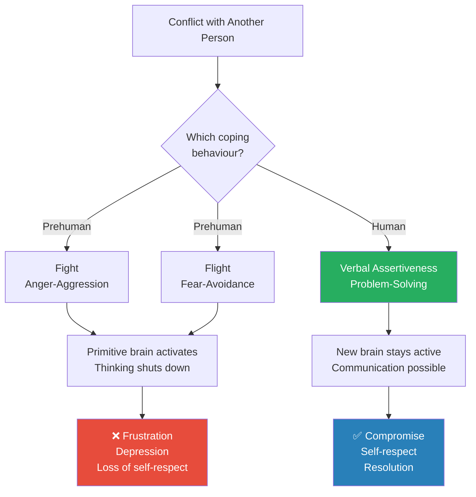
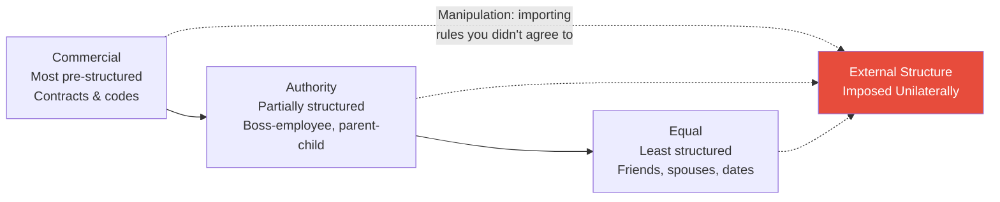
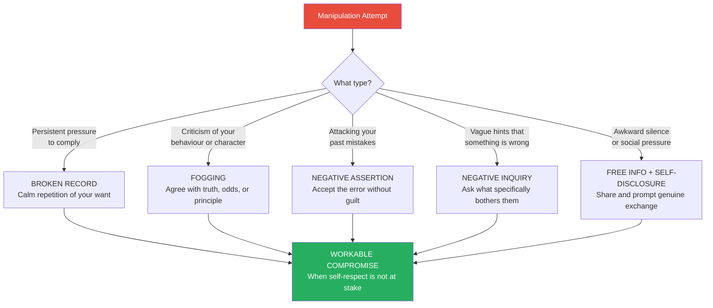
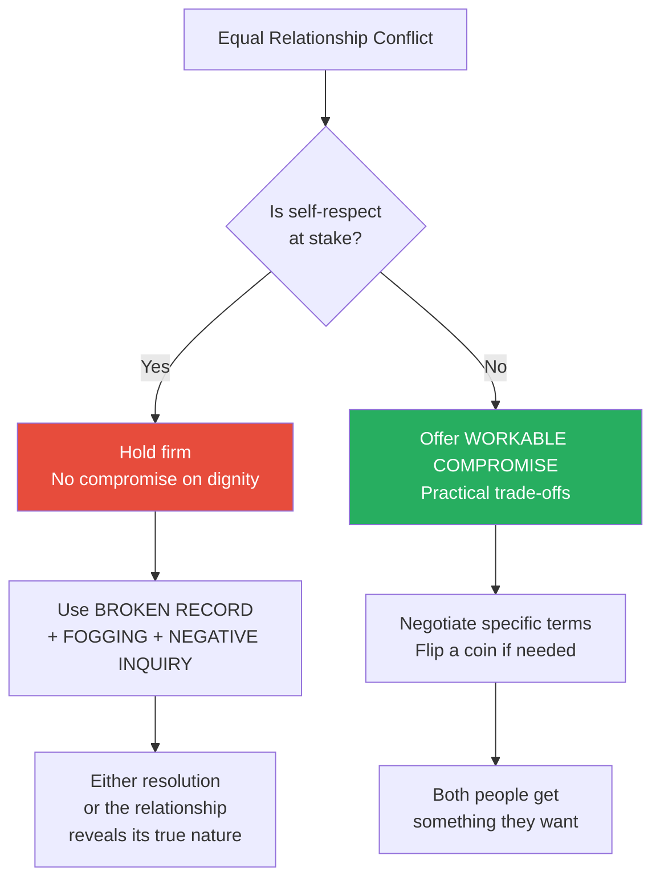
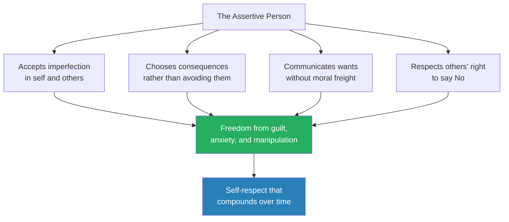
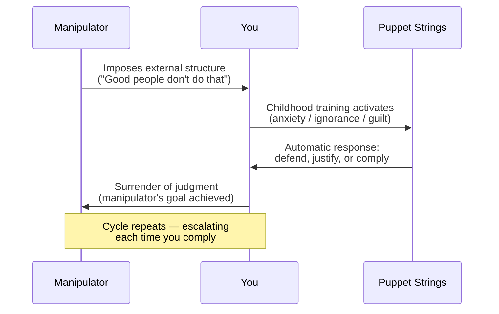
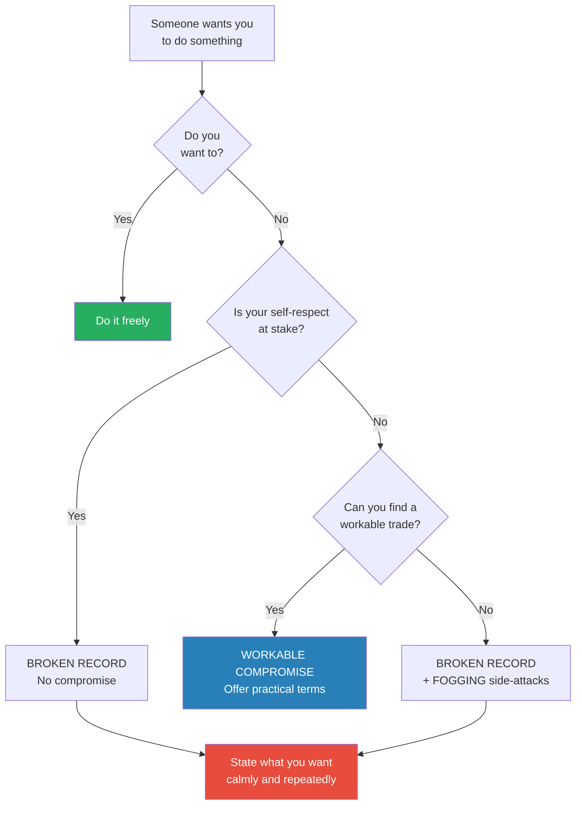

# When I Say No, I Feel Guilty — Manuel J. Smith

> Manuel J. Smith identifies the invisible mechanism that makes most adults unable to say "No" without squirming: childhood conditioning that wires us to feel anxious, ignorant, and guilty whenever we resist another person's wishes.
> He traces this vulnerability to its evolutionary roots — we have three inherited coping behaviours (fight, flight, and verbal problem-solving), but our upbringing suppresses the third and most powerful one.
> Smith then delivers what no assertiveness book before him had: a **complete verbal toolkit** — six named, practised, interlocking skills that any person can learn to enforce their right to be their own judge.
> The book is built on 34 real-world dialogues, from supermarket clerks to used-car dealers to nagging spouses, each showing exactly what to say and why it works.
> This is not a book about being aggressive. It is about rediscovering the natural assertiveness you were born with — and learning to use it without anger, without guilt, and without losing the people you care about.
> Published in 1975, it remains the foundational text of systematic assertive therapy.

---

## About the Author

Dr. Manuel J. Smith was a clinical psychologist at UCLA, the Center for Behavior Therapy in Beverly Hills, and the Veterans Administration Hospital in Sepulveda, California. He developed systematic assertive therapy between 1969 and 1975 — beginning with his work training Peace Corps volunteers in Escondido who could explain agriculture perfectly but crumbled when villagers questioned their motives. Smith observed the same pattern in his clinical patients: people who could not cope with personal criticism became mute, depressed, or passively aggressive. He built his verbal skill system from behaviour therapy principles (Wolpe, Salter, Lazarus), tested it across university clinics, VA hospitals, graduate programs, weekend workshops, probation departments, and prison rehabilitation programs, and published this book in 1975. All 34 dialogues are drawn from real patient and student interactions, edited for confidentiality. The book became one of the bestselling psychology titles of the decade and a foundational text for the assertiveness training movement.

---

## The Big Idea

- <b style="color: #2980b9">You have three inherited coping behaviours</b> — fight, flight, and verbal assertiveness — but childhood conditioning suppresses the third, leaving you with only the two that don't work in modern life
- Parents train children to feel <b style="color: #e74c3c">anxious, ignorant, and guilty</b> as psychological control tools — efficient for managing toddlers, devastating for the adults those toddlers become
- These "emotional puppet strings" don't disappear when you grow up — <b style="color: #e74c3c">they persist and are exploited by every manipulator you encounter</b>: bosses, spouses, salespeople, parents, friends
- Manipulation works by getting you to accept that <b style="color: #e74c3c">some external authority — not you — is the proper judge of your behaviour</b>
- <b style="color: #27ae60">The antidote is a Bill of Assertive Rights</b> — ten statements declaring that you are the ultimate judge of yourself, your emotions, and your actions
- These rights are enforced not by philosophy but by <b style="color: #2980b9">six systematic verbal skills</b> that anyone can practise: Broken Record, Fogging, Negative Assertion, Negative Inquiry, Free Information, and Self-Disclosure
- <b style="color: #27ae60">Assertiveness is not aggression</b> — it is the calm, persistent use of your human verbal problem-solving ability to say what you want without anger, guilt, or manipulation

---

## Key Concepts at a Glance

| Concept | One-line summary |
|---------|-----------------|
| **Three Coping Behaviours** | Fight, flight, and verbal problem-solving — only the third is uniquely human |
| **Emotional Puppet Strings** | Anxiety, ignorance, guilt — childhood conditioning that makes adults manipulable |
| **Bill of Assertive Rights** | Ten rights declaring you are the ultimate judge of your own life |
| **Broken Record** | Calm, persistent repetition of your want until the other person yields or compromises |
| **Fogging** | Agreeing with truth, odds, or principle in criticism to absorb it without fighting back |
| **Negative Assertion** | Accepting your own errors openly — no defence, no guilt, no atonement |
| **Negative Inquiry** | Asking critics to specify exactly what bothers them — kills vague manipulation |
| **Free Information** | Noticing unsolicited clues people give about themselves in conversation |
| **Self-Disclosure** | Voluntarily revealing your feelings, worries, and ignorance to block manipulation |
| **Workable Compromise** | Practical deal-making when self-respect is not at stake |
| **Three Relationship Types** | Commercial (pre-structured), authority (partially), equal (unstructured) |
| **External Structure** | Arbitrary rules someone imposes to control your behaviour without your agreement |
| **Childish Beliefs** | Trained assumptions that make you defer to external judgment over your own |

---

## 1. The Evolutionary Blueprint: Fight, Flight, and Your Missing Third Option

*Every conflict you've ever lost started the same way: someone made you feel anxious, ignorant, or guilty — and you gave up your right to speak.*

- <b style="color: #2980b9">Humans evolved three survival coping behaviours</b>, not two — fight-aggression, fear-flight, and verbal problem-solving
- The first two are ancient, shared with all vertebrates — automatic, powerful, and largely useless in modern civilisation
- The third — verbal assertiveness — is uniquely human, evolved roughly a million years ago as our "new brain" layered over the primitive one
- <b style="color: #e74c3c">When you get angry or afraid, your primitive brain shuts down your problem-solving brain</b> — blood reroutes to skeletal muscles, thinking becomes impaired, "two plus two no longer adds up to four"
- Anger, fear, and depression are survival emotions — they have evolutionary value but actively interfere with verbal coping

- <b style="color: #e74c3c">Depression is the evolutionary leftover of a hibernation mechanism</b> — our ancestors conserved energy during harsh conditions by withdrawing, but in modern life, depression from frustration has no survival benefit
- Most people in therapy arrive with some combination of anger, fear, and depression — all traceable to over-reliance on fight or flight

> [!example] Diane's Passive War
> - Diane, a 29-year-old clerk-typist, waged a covert war on her boss through passive aggression
> - When asked to make office coffee, she made it too weak, too strong, or spilled it
> - When asked to work late, she typed slowly and made errors — but she was the one who stayed late, not her boss
> - She used passive flight with her husband Bob — avoiding his calls for weeks, walking away from her own desk phone
> - Neither passive aggression nor passive flight resolved anything — both compounded her problems

> [!example] Don's Depression Cure
> - Don, a 33-year-old bookkeeper, had chronic depression from a childhood of constant frustration and criticism
> - His parents never praised him and punished mistakes harshly — he never got the bicycle he wanted, wasn't allowed to learn to drive
> - He married a woman like his mother who "always seemed to find something to bitch about"
> - Antidepressant medication had no effect; instead, Smith told Don to do two enjoyable activities per week and finish every task he started, no matter how he felt
> - Don's five-month depression lifted within four weeks

> [!tip] The Three Emotions Rule
> Anger means your body is preparing to fight. Fear means your body is preparing to run. Depression means your body is shutting down to wait out harsh conditions. All three are inherited survival signals — but in modern life, **verbal assertiveness resolves what none of them can**.

---

## 2. How You Were Trained to Be a Puppet

*Your parents didn't mean to break your assertiveness. They just used the same tools their parents used on them — and those tools worked too well.*

- <b style="color: #2980b9">As infants, we are naturally assertive</b> — your first independent act at birth was to protest the treatment you were receiving
- The word that rolled most assertively from your tongue as a toddler was "No!" — you would even give up a favourite treat to say it
- Physical restraints (cribs, playpens) work for babies, but once you could walk and talk, <b style="color: #e74c3c">control shifted from physical to psychological</b>
- Parents accomplish this through three emotional training mechanisms:

| Puppet String | How It's Installed | Adult Effect |
|--------------|-------------------|--------------|
| **Anxiety** | "Bad things happen to naughty children" — vague threats tied to disapproval | You freeze when someone hints at displeasure |
| **Ignorance** | "Why are you always playing in the living room?" — demands for reasons you can't provide | You feel compelled to justify everything you do |
| **Guilt** | "Good children don't do that" — shifting responsibility to external standards of right/wrong | You apologise for having your own wants |

The three puppet strings installed in childhood — anxiety, ignorance, and guilt — each trigger a distinct automatic response that converges on the same outcome: the manipulator's goal is achieved without the victim ever making a conscious choice.

- The key mechanism: <b style="color: #e74c3c">"Good boy / bad boy" language shifts responsibility from the parent's wants to abstract external rules</b>
- When Mom says "Only naughty children don't clean their room," she implies some cosmic authority decided room-cleaning is morally required — not that *she* simply wants the room clean
- The assertive alternative: "I want you to clean your room" — honest, direct, no moral freight

> [!example] The Dog and the Sister
> - A child plays with his dog in the living room; Mom wants to nap
> - Instead of saying "Go play somewhere else, I need to sleep," Mom says: "Why are you *always* playing in the living room?"
> - The child can't answer "why" — he just likes playing with the dog — so he feels ignorant
> - Mom escalates: "Your sister wants to play with you. If you never play with her, she won't like you"
> - Now the child feels ignorant, guilty, AND anxious — triple puppet strings
> - The ironic truth: if Mom just said "Get out of the living room while I'm trying to sleep!" the child would cope better with that honest grouchiness

- <b style="color: #27ae60">Children can handle honest displeasure from parents</b> — what damages them is the implication that their wants are *morally wrong*
- This conditioning doesn't end at home — teachers pick it up, older children enforce it, and eventually you internalise it and manipulate yourself
- By adolescence, you become skilled enough at counter-manipulation to play on *your parents'* guilt — but this just escalates the cycle

---

## 3. The Bill of Assertive Rights: Your Declaration of Independence

*If you exercise your right to be your own judge, no one can manipulate you. If you surrender it, everyone will.*

- <b style="color: #2980b9">Assertive Right I is the foundation</b>: You have the right to judge your own behaviour, thoughts, and emotions, and to take responsibility for their initiation and consequences upon yourself
- All other nine rights are specific applications of this prime right
- In a classroom of 85 people, when Smith asked "How many of you *really believe* this?" — three raised their hands; when he asked "How many *behave as if* you believe it?" — the whole class raised their hands

### The Full Bill of Assertive Rights

| # | Right | The Childish Belief It Counters |
|---|-------|-------------------------------|
| I | You have the right to **judge your own behaviour, thoughts, and emotions** | "You must be judged by rules and authority greater than yourself" |
| II | You have the right to **offer no reasons or excuses** for your behaviour | "You must justify your actions to others" |
| III | You have the right to **judge if you are responsible** for others' problems | "You must sacrifice your values to keep systems from falling apart" |
| IV | You have the right to **change your mind** | "If you change your mind, something is wrong with you" |
| V | You have the right to **make mistakes** and be responsible for them | "Errors are wrong, so you must atone and be controlled" |
| VI | You have the right to **say 'I don't know'** | "You must have answers for all consequences of your actions" |
| VII | You have the right to **be independent of others' goodwill** | "You need people to like you before you can cope with them" |
| VIII | You have the right to **be illogical** in making decisions | "Logic makes better judgments than you can" |
| IX | You have the right to **say 'I don't understand'** | "You must anticipate others' needs without being told" |
| X | You have the right to **say 'I don't care'** about self-improvement | "You must always strive for perfection or you are worthless" |

Right I — being your own judge — is violated most frequently because it is the foundation from which all other rights derive; when you surrender this right, every other right collapses automatically.

- <b style="color: #2980b9">Manipulation is any behaviour that reduces your ability to be your own judge</b> — it works by importing external structure (rules, logic, guilt) you never agreed to
- <b style="color: #e74c3c">The manipulator's tragedy</b>: they don't realise the only justification they need to negotiate a change is *the fact that they want a change* — they don't need rules as manipulative backup
- Smith classifies all relationships into three types, each with different vulnerability to manipulation:

> [!example] The Shoe Return Trap
> - A customer returns shoes she doesn't like; the salesclerk asks "Why don't you like these shoes?"
> - She gives a reason (wrong shade of magenta) — the clerk counters it (matches your toenail polish!)
> - She gives another reason (too loose) — the clerk offers a fix ($3.95 arch pads)
> - She gives another (too tight) — the clerk offers to stretch them
> - Each reason gives the clerk ammunition; the assertive response is simply: "No reason, I just don't like the shoes"

> [!example] Returning Nine Gallons of Paint
> - Smith returned nine unopened gallons of paint to a major department store
> - The clerk asked "Why?" and Smith said "I changed my mind"
> - The clerk could not bring himself to write "changed mind" on the return form — he persisted in asking for a defect, a wrong colour, anything blameable
> - Smith held firm — the clerk had to confer with his supervisor before issuing the refund
> - The clerk could not conceive how a person could simply change his mind and feel comfortable about it

- <b style="color: #27ae60">"Compromises don't have to be fair to be useful. Where did you ever read that life is fair?"</b>
- Moral systems are arbitrary trails through a wilderness — we follow them not because they're objectively "right" but because having *any* trail relieves the terror of being lost
- Legal systems prescribe consequences for behaviour; moral systems manipulate emotions about behaviour — the two are dangerously different
- <b style="color: #27ae60">The assertive person follows their own nose</b>, using whatever information is available, rather than clinging to someone else's arbitrary trail

---

## 4. The Verbal Toolkit: Six Skills That Change Everything

*You don't lose arguments because you're wrong. You lose because you give up after the first "No."*

### Skill 1: BROKEN RECORD — The Power of Persistence

- <b style="color: #2980b9">Core principle: if he's got three "Noes," you only need four</b>
- Speak in a calm, repetitive voice — state what you want, ignore all side issues, repeat until the other person accedes or you reach a workable compromise
- The purpose is not to speak robotically forever — it is to break the habit of letting someone else's words dictate yours
- Most people have only a few "Noes" in their bag before they run out

> [!example] Carlo and the Missing Meat
> - Carlo bought steaks, a roast, and chickens at a supermarket — they were missing when he got home
> - He returned and said "I want my meat" to the checkout clerk, who deflected: "Did you look in your car?" "I don't think I can do anything about it" "You'll have to go to the back"
> - Carlo repeated "I want my meat" through three levels of management — clerk, meat manager, store manager
> - Each level tried guilt ("You're holding up the line"), evasion ("That's not my department"), and delay ("Come back Monday")
> - Carlo's response to every tactic was the same calm statement: "I understand, but I want my meat"
> - Result: the store manager authorised full replacement
> - Carlo's father, watching in amazement: "If that were me, I would have been looking for the meat in my pockets!"

- <b style="color: #e74c3c">The first practice exercise is deliberately robotic</b> — learners say "I understand, but I'm not interested" to a fake door-to-door salesman no matter what he says, even "Won't you even give me a drink of water?"
- This breaks the compulsive habit of answering every question — the belief that "when someone talks to me, I *should* have an answer"

### Skill 2: FOGGING — Becoming the Fog Bank

- <b style="color: #2980b9">A fog bank offers no resistance, has no hard surfaces, and cannot be penetrated</b> — eventually you give up throwing rocks at it
- When criticised, agree with whatever truth exists in the criticism without accepting the implied moral judgment
- Three modes of FOGGING:

| Mode | What You Agree With | Example |
|------|-------------------|---------|
| **Agreeing with Truth** | The factual content of the criticism | "That's true, I was out late again" |
| **Agreeing with the Odds** | The possibility that the criticism could be correct | "You could be right, I might get sick" |
| **Agreeing in Principle** | The general logic of the critic's argument | "You're right, that makes sense" |

- The practice exercise has a "critic" escalating from clothing insults to moral character attacks to accusations of sexual perversion — the learner agrees with everything
- By the end, the learner is grinning while being called hopeless — "What a paradox! Having fun while someone criticises you"
- <b style="color: #27ae60">FOGGING separates truth from moral judgment</b> — you can agree that you tinker with the car a lot without accepting that tinkering is *wrong*

### Skill 3: NEGATIVE ASSERTION — Owning Your Errors

- <b style="color: #2980b9">Accept your mistakes openly, without defence, guilt, or atonement</b>
- "You're right, that was a dumb thing for me to do" — brief, factual, no squirming
- Smith's teaching method: students are instructed never to say "sorry" in class — instead, just state the facts of the error
- Problem: most students report their errors *gleefully* with broad grins — the method works almost too well
- <b style="color: #e74c3c">Errors are not sins requiring atonement</b> — they're just errors: inefficient, wasteful, stupid, in need of revision, but not "wrong"
- When you stop defending your errors, other people have nothing to escalate against

### Skill 4: NEGATIVE INQUIRY — Making Critics Get Specific

- <b style="color: #2980b9">Ask what specifically bothers the critic</b>: "What is it about X that you don't like?"
- Forces vague manipulation into the open — the critic must either specify a real concern or stop criticising
- Especially powerful in close relationships where repetitive criticism has replaced actual communication
- Three effects: (1) desensitises you to criticism so you can listen, (2) extinguishes repetitive nagging, (3) prompts the critic to say what they *actually want*

> [!example] Bobbie and the Neighbour's Wall
> - George, Bobbie's neighbour, wanted to build a privacy wall (so he could sunbathe nude) and wanted Bobbie to pay half
> - Instead of asking directly, he claimed her trees were going to push over their shared fence
> - Bobbie used NEGATIVE INQUIRY: "What is it about the trees that will make it fall over?"
> - George: "It's those branches poking through"
> - Bobbie: "What is it about the branches that will knock it over?"
> - George fell silent, changed the subject to pruning apricot trees, and never brought it up again

> [!example] Getting a Raise with NEGATIVE INQUIRY
> - A worker asks his supervisor why he didn't get a merit raise
> - "What did I do that was unmeritorious?" → "You underestimated costs by $300"
> - "What else am I doing that's just average?" → "You're a bit slow getting work in"
> - "Anything else?" → "Make the small print clearer on your drawings"
> - The employee summarises, commits to improvement, and asks for regular feedback
> - Smith's key insight: "If you are not dealing with manipulation, prompting criticism may eventually result in praise"

### Skill 5 & 6: FREE INFORMATION and SELF-DISCLOSURE — Social Assertiveness

- <b style="color: #2980b9">FREE INFORMATION</b>: the unsolicited clues people give about themselves — interests, worries, lifestyle
- <b style="color: #2980b9">SELF-DISCLOSURE</b>: voluntarily revealing your own feelings, worries, and ignorance
- Together, they prevent the two social killers: awkward silences and interrogation-style conversation
- Self-disclosure of *negative* things (worries, fears, ignorance) is the most potent anti-manipulation skill — "Perhaps so, but that's still the way I feel"
- <b style="color: #27ae60">When you disclose your true self, the other person must respond on the same honest level or not deal with you at all</b>

> [!tip] The "I Want / I Have To / I Should" Test
> Whenever you're confused about whether you're being manipulated or choosing freely, sort your inner voice into three categories: **"I want"** (your genuine desire), **"I have to"** (a real contingency of getting what you want), and **"I should"** (manipulative structure — extend your anti-manipulation antennae and listen carefully).

---

## 5. How the Skills Interlock: A Complete Coping System

*The six skills are not alternatives — they are components of a single verbal machine that handles any manipulation scenario.*

Broken Record dominates commercial encounters where persistence matters most, while Negative Inquiry peaks in intimate relationships where understanding the real grievance is more important than winning the argument.

- In real situations, you use multiple skills in a single conversation — BROKEN RECORD to stay on point, FOGGING to absorb side-attacks, NEGATIVE INQUIRY to clarify vague criticism
- <b style="color: #2980b9">WORKABLE COMPROMISE</b> is the exit strategy: whenever self-respect is not in question, offer a practical deal
- But when the compromise affects your personal sense of self-worth — there can be no compromise

---

## 6. Assertiveness in Commercial Situations: Where Money Is Involved

*The systematic skills interlock best when money — and therefore structured expectations — are on the line.*

- Commercial relationships have the most pre-existing structure, which means manipulation typically takes the form of <b style="color: #e74c3c">importing extra rules you didn't agree to</b>: "That's not our department," "You'll have to talk to the manufacturer," "You're holding up the line"
- The standard evasion tactic is to make *their* problem *your* problem — the store's issue with the manufacturer becomes something you must solve

> [!example] Anne Returns Defective Boots
> - Anne bought knee-high boots that cracked along the seam after two weeks
> - The salesclerk said the store didn't handle returns, only exchanges
> - Anne used BROKEN RECORD: "I understand, but I want a refund for these defective boots"
> - The clerk tried guilt ("All these people are waiting"), authority ("That's store policy"), and delay ("Come back when the manager is here")
> - Anne persisted calmly through each deflection — she eventually got a full cash refund
> - Total time: about fifteen minutes of repeating what she wanted

> [!example] Arnold Gets His Brakes Fixed
> - Arnold paid for a brake job that left his car pulling to the right
> - The garage said the problem was his tires, not the brakes — Arnold would need to buy new tires
> - Arnold used BROKEN RECORD combined with FOGGING: "You may be right about the tires, but the car didn't pull before your brake job and I want it fixed"
> - The mechanic escalated through technical jargon, blame-shifting, and implied ignorance
> - Arnold held: "I don't know much about brakes, but I want it fixed"
> - Result: brakes properly adjusted at no additional charge

> [!example] Jack Gets $1,800 Back from a Used-Car Dealer
> - Jack bought a used car that turned out to have undisclosed mechanical problems
> - The dealer's position: "You bought it as-is, that's the deal"
> - Jack used every skill in the toolkit — BROKEN RECORD ("I want my money back"), FOGGING ("You're right, I should have been more careful"), NEGATIVE ASSERTION ("That was dumb of me to trust your inspection"), and persistence across multiple visits
> - The dealer eventually refunded $1,800 rather than continue dealing with Jack's calm, relentless presence

- <b style="color: #27ae60">The secret weapon in commercial situations is emotional calm</b> — when you're not angry, the other party can't dismiss you as "just blowing off steam"
- Smith's rule: you get no points for form and style — all that counts is getting across the finish line

### The Medical Trap

- Physician-patient relationships combine commercial and authority dynamics — you're paying for a service, but the doctor holds expertise power
- Smith describes patients who fill out extensive financial forms before seeing a doctor, then feel they *owe* the doctor something beyond money
- He refused to give his social security number at an osteopath's office — the nurse said it was "required" with a patronizing look that said he *should* know why
- Smith replied: "I don't understand how my social security number is necessary to treat my elbow"
- He received excellent treatment with the last space on his form empty

---

## 7. Assertiveness with Authority: Bosses, Experts, and Parents

*Authority relationships are half-structured — the boss is your boss on the job, but not on the tennis court. Manipulation happens when authority from one domain bleeds into another.*

- <b style="color: #2980b9">The authority relationship has defined roles</b> (boss-employee, teacher-student, parent-child) but not every interaction is covered by those roles
- Manipulation occurs when someone extends their authority beyond its legitimate scope — your boss during work hours is not your boss after 5:00 PM

> [!example] Mike Stops Being the Elastic
> - Mike's company had a poor overtime coverage system — whenever someone called in sick, Mike was the one pressured to cover
> - His supervisor used guilt: "The team needs you" and authority: "Someone has to do it"
> - Mike used BROKEN RECORD: "I understand the team needs coverage, but I'm not going to work overtime this weekend"
> - He offered WORKABLE COMPROMISE: "I'll cover one extra shift per month, but that's my limit"
> - The supervisor initially bristled, then worked out a fairer rotation — because Mike's calm refusal forced the *system* to change

> [!example] Betty Copes with a Meddling Boss
> - Betty's boss routinely intruded into her personal life — commenting on her dating, her clothes, her weight
> - Betty used FOGGING: "You may be right, I could dress better"
> - Then NEGATIVE INQUIRY: "What is it about my clothes that concerns you in terms of my work?"
> - The boss couldn't connect her personal comments to job performance — the meddling stopped

> [!example] Sandy Renegotiates with Her Parents
> - Sandy was a married adult whose parents still treated her like a teenager — telling her what to cook, how to manage her home, criticising her husband
> - She gradually used FOGGING and NEGATIVE INQUIRY to shift the relationship from authoritarian to equal
> - When her mother said "You shouldn't let your husband go out with his friends so much," Sandy replied: "What is it about him going out that bothers you, Mom?"
> - Her mother had no substantive answer — she was imposing obsolete parental structure on an adult daughter
> - Over months, Sandy's parents adjusted to treating her as an equal — not because she fought them, but because she stopped accepting the old structure

### Parenting Assertively

- <b style="color: #2980b9">The assertive parent says "I want you to…" rather than "Good children do…"</b>
- This teaches the child that Mom's wants matter because they're *hers* — not because of cosmic moral law
- The child can dislike the task and still do it — no guilt required
- A mother who breaks a promise can assertively say: "I know it's dumb of me to make a promise I can't keep, but we're going to put off Disneyland"
- This models that even adults make mistakes — and that imperfection doesn't mean worthlessness
- <b style="color: #27ae60">The assertive parent's children learn that authority is human, temporary, and negotiable</b> — not divine, permanent, and absolute

### The Teen-Ager Challenge

- Smith describes Scotty, a father who prompts his teenage daughter to be responsible for her own behaviour
- Instead of laying down rules and punishments, Scotty uses NEGATIVE INQUIRY: "What do you think would happen if you stayed out that late?"
- The daughter has to think through consequences herself — building internal judgment rather than external compliance
- <b style="color: #e74c3c">The parent who controls through guilt produces an adult who can be controlled by anyone through guilt</b>

---

## 8. Assertiveness Between Equals: Friends, Neighbours, and Dates

*Equal relationships have the least structure — which means the most freedom to negotiate, but also the most room to get hurt.*

- <b style="color: #2980b9">In equal relationships, all structure must be evolved through compromise</b> — there are no pre-set roles, no hierarchy, no contracts
- This makes them the most rewarding relationships and the most vulnerable to manipulation
- The personally insecure person copes by imposing rigid structure: wives "should" not work, husbands "should" handle money, friends "should" always be available

> [!example] Saying No to a Friend's Car Request
> - A friend asks to borrow your car; you don't want to lend it
> - The manipulative cycle: "What kind of friend doesn't lend his car?" → guilt → you hand over the keys → you worry all night
> - The assertive response: "I know it might sound selfish, but I get really anxious when I lend my car out. I'd rather not"
> - SELF-DISCLOSURE of your worry is impossible to counter manipulatively — the friend must either accept your feeling or reveal that their friendship has conditions

> [!example] Paul Stops His Father's Interference
> - Paul's father constantly interfered in his marriage and work — offering unsolicited advice, criticising his wife, second-guessing his career moves
> - Paul used FOGGING: "You may be right, Dad, I could be handling things better"
> - Then BROKEN RECORD: "But I want to work this out myself"
> - He did not attack his father — he simply refused to accept the old authority structure
> - His father eventually stopped interfering — not because he was convinced, but because the interference produced no results

> [!example] The Co-ed Who Learned to Say No
> - Young women in Smith's workshops struggled to say "No" to sexual pressure from dates
> - The standard manipulation: "If you really liked me, you would…" / "Everyone does it" / "What's wrong with you?"
> - Smith taught BROKEN RECORD: "I understand how you feel, but I don't want to"
> - No reasons, no excuses, no debate — just a calm, repeated statement of want
> - The date who respects this is worth seeing again; the date who doesn't has revealed who they are

- <b style="color: #27ae60">"You'll never be loved if you can't risk being disliked"</b> — the most important single line in the book
- People withdraw goodwill as a manipulation tactic only when it produces results — if you don't respond to the withdrawal, it loses its power
- One cannot live in terror of hurting other people's feelings — sometimes one offends, and "that's life in the big city"

---

## 9. Sex and Assertion: The Most Intimate Proving Ground

*The bedroom is where manipulation does its deepest damage — and where assertive communication produces its most powerful healing.*

- <b style="color: #2980b9">Sexual communication is the most private link in the chain of closeness</b> — when it breaks, it doesn't just diminish sex; it poisons every other negotiation between partners
- Smith begins the close-relationship chapter with sex deliberately — not because sex is the most important issue, but because <b style="color: #2980b9">intense interest in a topic naturally suppresses anxiety about it</b>
- If you can assert your wants about something as personal and embarrassing as sex, every other marital conflict becomes easier to tackle
- <b style="color: #e74c3c">Three models of sexual difficulty</b>, each rooted in the fight-flight-verbal triad:

| Model | Root Emotion | Mechanism | Clinical Sign |
|-------|-------------|-----------|---------------|
| **Anxiety Model** | Fear | Conditioned phobic response to sexual stimuli shuts down arousal | Specific dysfunction: premature ejaculation, loss of erection, vaginismus, loss of orgasm |
| **Anger Model** | Suppressed anger | Unexpressed resentment causes passive withdrawal from all intimacy | Gradual decrease in sexual frequency over months/years — no specific dysfunction |
| **Mixed Model** | Fear + Anger | Partner coerced into unwilling sex → anxiety failure → guilt/blame cycle | Both frequency drop AND specific dysfunction appear together |

- <b style="color: #e74c3c">The Anger Model is the assertiveness problem in its purest form</b> — one partner holds unexpressed grudges, withdraws from all intimacy, and the other partner's manipulation goes unchecked
- Smith's colleague Dr. Harold Segal summarised the treatment: "First assertion, then insertion"
- <b style="color: #27ae60">The withdrawing partner is not frigid or impotent — they are angry</b> and have no verbal tools to express that anger constructively
- Treatment requires replacing manipulation with assertive communication AND addressing any conditioned sexual anxiety — doing one without the other guarantees relapse

> [!example] Dana Renegotiates the Terms
> - Dana, a 27-year-old merchandise buyer, slept with John on their first date because she believed that's what single women had to do to keep a man interested
> - She felt rotten afterwards — not from Victorian guilt, but from having surrendered her own wants
> - When she ran into John again, she used BROKEN RECORD: "I'd like to just sit and talk to my friend for a while" — repeated through four of his attempts to join them
> - She offered WORKABLE COMPROMISE: "I'm free Friday night. Why don't we get together then?"
> - On their second date, she told John directly: "I went to bed with you because I thought you wouldn't be interested if I hadn't. And I didn't like what I did"
> - Dana stopped using sex as an "admission ticket" into relationships

> [!example] Sue Demonstrates How to Say "No"
> - At UCLA, Dr. Aaron Hass and Ms. Susan Levine demonstrated to hundreds of co-eds how to assertively refuse sexual pressure
> - The male role escalated through every manipulation: "I thought you liked me," "Do you have a problem with sex?" "There's a name for girls like you"
> - Sue used FOGGING, BROKEN RECORD, and NEGATIVE INQUIRY throughout — agreeing with truth while holding firm
> - When the pressure turned hostile, Sue walked to the door: "It was a mistake to invite you up here. Please leave"
> - Asked why she stood outside the classroom, Sue replied: "Look at the difference in our sizes. Which would stand me a better chance — fight or flight?"

---

## 10. Rebuilding a Marriage Through Negative Inquiry

*The deepest application of assertiveness is not in returning defective shoes — it is in getting the person you love to tell you what's really wrong.*

- <b style="color: #2980b9">NEGATIVE INQUIRY is the master skill for close relationships</b> — it opens channels that years of guilt and defensiveness have sealed shut
- In the book's longest dialogue (#34), a wife named Jill uses NEGATIVE INQUIRY to prompt her husband Jack to say everything he's been swallowing for years
- <b style="color: #27ae60">Smith's point: you don't need to be perfectly assertive — you just need to keep going</b>
- Learners report that "little harm is done if they get angry, say something stupid, get flustered, or make a commitment they don't want to give — nothing is lost but some time"

> [!example] Jack and Jill Rebuild
> - Jill tried to use NEGATIVE INQUIRY on Jack to discuss their deteriorating marriage
> - Jack's first reaction was fury: "You and that goddamned shrink have pissed me off"
> - What poured out: Jack felt responsible for everything — Jill's boredom, her entertainment, even sex felt like an obligation
> - He revealed: "Sometimes I feel like this is not a marriage but another job and I work for you"
> - Jill's breakthrough: she recognised that her crying and running away was manipulation — "Like I'm saying: what a rotten bastard you are for treating poor defenseless me so bad"
> - Jack's response to this honesty: "When you cry like that, I get pissed off at you and then I feel guilty"
> - Jill lost her cool, started crying again — but recovered: "I'm not doing this very well, am I? Don't give up on me"
> - Their compromise: Jack would push back when she got "way out of line"; Jill would develop her own interests; they'd have regular clearing-the-air conversations
> - Jack's final demand: "I want you to cut out some of the things that make me feel like I'm a hired hand just to keep you happy"
> - Jill agreed — but added: "Keep telling me when I do them"
> - Neither was "fixed" — but the communication channel was open for the first time in years

- <b style="color: #e74c3c">The withdrawing partner's silence is not peace — it is a slow poison</b> that kills intimacy in every dimension
- Smith observes that many couples' nocturnal negotiations after satisfying sex resolve more conflicts than all the diplomats in history — "My humble guess is that the results of these nocturnal negotiations far outweigh the gains of all the Metternichs and Kissingers"
- <b style="color: #27ae60">The assertive couple doesn't stop fighting — they stop fighting dirty</b>
- The dialogue's power lies in its imperfection — Jill stumbles, gets angry, cries, recovers, and keeps going; this is what real assertiveness looks like

> [!example] Beth Refuses a Premature Proposal
> - Beth loved Ted but had doubts about marrying him — she sensed his proposal was partly driven by jealousy
> - She used SELF-DISCLOSURE: "I don't know if I want to marry you" and NEGATIVE INQUIRY: "What is it about us dating without marrying that's wrong?"
> - Through patient prompting, Ted revealed his hidden agenda: marriage would give him the "right" to stop her flirting
> - Beth proposed WORKABLE COMPROMISE: living together first
> - After six months, both mutually decided to separate — an amicable ending to what could have been a messy divorce
> - Beth's doubts, listened to rather than suppressed, saved both of them years of misery

---

## 11. The Limits of Assertiveness: When NOT to Assert

*Smith is disarmingly honest about the boundaries of his own system.*

| Situation | Why Not | What Instead |
|-----------|---------|-------------|
| **Mugger with a knife** | Your assertive rights don't overpower a switchblade | Run — fear-flight is the correct response |
| **Angry judge in court** | The judge has real institutional power and 30 days in jail | Comply — this is a power asymmetry you cannot talk past |
| **Genuinely dangerous person** | Physical safety trumps psychological dignity | Remove yourself first, assert later from safety |

- <b style="color: #e74c3c">Assertiveness is not a moral system</b> — Smith calls it "amoral, like driving a car"
- The tire return anecdote: a student tried to return a tire with 24,000 miles — Smith called this "chutzpa," not assertiveness

> [!tip] Smith's Rule for Compromise
> When self-respect is not at stake, offer a workable compromise. But **when the compromise affects your personal sense of self-worth — there can be no compromise**. "Where did you ever read that life is fair?"

---

## 12. The Summary: Assertion vs. Control

*Smith's epilogue asks the question every learner eventually reaches: "Am I asserting myself, or trying to control the other person?"*

- <b style="color: #2980b9">Assertion is not control</b> — control happens when someone gets "inside" the part of you that decides what you want
- The assurance you give by asserting non-defensively: "I will not interfere with your decision-making process, even if I don't like what you decide"
- Smith was asked what would happen if large numbers of people became assertive — his answer: "I don't know"
- He cares about two endpoints: the individual and the species — "Everything in between is arbitrary and negotiable"
- <b style="color: #27ae60">"I am my own judge. You are your own judge. You decide. If you want to."</b>

---

## 13. How the Verbal Skills Mature: From Mechanical to Natural

*The early dialogues are deliberately robotic. The late ones sound like real human beings. That progression is the point.*

| Stage | Behaviour | Sounds Like |
|-------|-----------|-------------|
| **Novice** | Robotic repetition, ignoring all side issues | "I understand, but I want my meat" |
| **Intermediate** | Combining 2-3 skills, still formulaic | "You may be right, but what about X bothers you?" |
| **Advanced** | Skills woven into natural speech, emotion included | "I'm not doing this very well, am I? Don't give up on me" |
| **Mastery** | Assertiveness becomes default coping | Genuine conversation where both parties state wants without guilt |

- <b style="color: #2980b9">The mechanical phase is necessary</b> — it breaks the compulsive habit of answering every question
- <b style="color: #e74c3c">The mistake most people make is expecting to skip to mastery</b> — you must go through the robotic phase to rewire the conditioned guilt response

---

## 14. The Assertive Parent: Breaking the Cycle

*If you parent with guilt, your children will be controllable by anyone who uses guilt.*

- <b style="color: #2980b9">The assertive parent says "I want you to…" instead of "Good children do…"</b>
- This teaches the child that Mom's wishes matter because they're *hers* — not because of cosmic moral law
- The child doesn't have to *like* the task — only do it — and can grumble freely without losing love
- A mother who breaks a promise assertively says: "I know it's dumb of me to make a promise I can't keep, but we're putting off Disneyland" — modelling that adults make mistakes too

> [!example] Scotty and His Teenage Daughter
> - Scotty used NEGATIVE INQUIRY instead of rules and punishments
> - Instead of "You can't stay out past midnight," he asked: "What do you think would happen if you stayed out that late?"
> - The daughter had to think through consequences herself — building internal judgment rather than external compliance
> - When she made mistakes, Scotty asked: "What happened? What would you do differently?"

- <b style="color: #e74c3c">The parent who controls through guilt produces an adult who can be controlled by anyone through guilt</b>
- <b style="color: #27ae60">The assertive parent's children learn that authority is human, temporary, and negotiable</b> — not divine, permanent, and absolute
- This is the generational transmission mechanism: manipulative parenting reproduces manipulable adults, who become manipulative parents — assertive parenting breaks the cycle

---

## 15. Smith's Clinical Origins

*The system was built in clinics, VA hospitals, prison programs, and Peace Corps training centres.*

- Smith developed systematic assertive therapy between 1969 and 1975 across multiple settings — Peace Corps Training Center (Escondido), Center for Behavior Therapy (Beverly Hills), Sepulveda VA Hospital, UCLA Psychology Clinic
- The theoretical foundation: behaviour therapy tradition of Wolpe, Salter, and Lazarus
- All 34 dialogues are drawn from real patient and student interactions
- <b style="color: #2980b9">Smith's honesty about his own failures is essential to the book's tone</b> — he narrates feeling manipulated, struggling with the same coping problems he treated in patients
- Fifty years later, every assertiveness manual still teaches some version of Smith's six skills — most just don't credit him

---

- A husband who insists wives "should not work" is not making a philosophical statement — he is trying to control an unknown he fears he cannot cope with

---

## 16. The Deepest Application: Sex, Marriage, and Intimate Assertion

*The same assertive skills that get your meat back from a supermarket can rebuild a marriage — but the emotional stakes are infinitely higher.*

- <b style="color: #2980b9">Sexual and intimate difficulties are almost always symptoms of non-assertive coping in the wider relationship</b>
- Smith identifies three treatment models for sexual problems:

| Model | Root Cause | Pattern | Treatment Focus |
|-------|-----------|---------|----------------|
| **Anxiety Model** | Fear of failure/judgment | Avoidance of sex, performance anxiety | Desensitisation, gradual re-exposure |
| **Anger Model** | Accumulated resentment from manipulation | Sex used as weapon or withheld as punishment | Assertive communication of underlying conflicts |
| **Mixed Model** | Both anxiety and anger intertwined | Complex dysfunction masking relationship problems | Address both simultaneously through assertive dialogue |

- <b style="color: #e74c3c">Decrease in sexual frequency is usually a sign of general withdrawal</b> — not just from the bedroom but from the entire relationship
- The wife who cannot be sexually aroused by her husband may be unconsciously expressing frustration she cannot voice assertively

> [!example] Jill Rebuilds Her Marriage with NEGATIVE INQUIRY
> - Jill learned assertive skills and decided to use NEGATIVE INQUIRY to ask Jack what she was doing that drove him away
> - Jack initially resisted: "You made me feel like you had all the answers"
> - Jill persisted: "What was I doing that made you feel like I was pulling a fast one?"
> - Jack opened up: her crying and running away made him feel guilty; her vague complaints made him feel like an incompetent child
> - Jill made NEGATIVE ASSERTIONS: "That's a cop-out on my part — I shut you off and make you swallow your anger"
> - Jack revealed deeper issues: feeling responsible for her boredom, her entertainment, her happiness — "Sometimes I feel like this is not a marriage but another job"
> - Jill stumbled during the conversation, lost her cool, started crying — but recovered: "I'm not doing this very well, am I? Don't give up on me"
> - They negotiated concrete changes: she would get her own activities going, he would push back when she got "way out of line"
> - The dialogue demonstrated that **imperfect assertiveness still works** — you don't have to be a verbal karate expert

- <b style="color: #27ae60">The critical lesson: non-defensive communication is the only path to genuine intimacy</b>
- Your sexual wants are asserted the same way as all other wants — BROKEN RECORD, SELF-DISCLOSURE, NEGATIVE INQUIRY
- <b style="color: #e74c3c">The biggest sexual manipulator is the unspoken assumption</b> — expecting your partner to guess your needs is a recipe for frustration

---

## 17. The Limits of Assertiveness: When to Stop

*Being assertive is not the same as being invincible.*

- <b style="color: #2980b9">Legal limits:</b> Don't use BROKEN RECORD on an angry judge — he may reward you with thirty days in jail
- <b style="color: #2980b9">Physical limits:</b> Don't assert yourself to a mugger with a knife — Smith's advice: "Is that all you need? I can loan you twenty dollars!"
- <b style="color: #2980b9">Structural limits:</b> Assertiveness works poorly when trying to renegotiate deals long after the fact
- <b style="color: #e74c3c">Assertive skills are amoral</b> — "like any other skills you learn, after you learn to drive a car, you can use that skill to take children to a Sunday school picnic, or you can use it to drive a getaway car for the Mafia"

> [!example] Jerry's Balance of Assertion and Restraint
> - Jerry, a 17-year-old former drug pusher, was rehabilitated through assertive therapy
> - Before therapy: routinely stopped, frisked, and had his car searched by police
> - After therapy: still stopped occasionally but never frisked or searched — his assertive demeanour changed police perception
> - In court for a traffic ticket, Jerry simply told the judge his side calmly — the judge agreed with him
> - The lesson: assertiveness in legal settings means speaking your piece clearly, not confrontationally

- <b style="color: #27ae60">No set of skills guarantees 100 per cent success</b> — but even when you don't get your material goal, you keep your self-respect

---

## 18. The Philosophy Behind the Practice

*Do you want to assert yourself, or do you want to control other people? The distinction is everything.*

- <b style="color: #2980b9">Assertiveness is not control</b> — you can say what you want, but you cannot make another adult consistently do what you want
- Behaviour compromise between two people is not behaviour control — control happens when someone gets "inside" the part of you where you decide what you want
- <b style="color: #e74c3c">Even therapists don't solve patients' problems</b> — they help patients gain the ability to solve their own
- Smith's evolutionary optimism: "I have implicit faith in our tried and tested genetic heritage for the survival of our species"
- <b style="color: #27ae60">"I am my own judge. You are your own judge. You decide. If you want to."</b>

---

## 19. The Childhood Manipulation Machine: How It Works Step by Step

*Every manipulation in your adult life follows a pattern your parents accidentally taught you before age six.*

- <b style="color: #2980b9">The manipulation cycle has four steps</b>, and it repeats in every relationship until you learn to interrupt it:

- Step 1: The manipulator imposes a rule you didn't agree to
- Step 2: Your childhood conditioning triggers anxiety, ignorance, or guilt
- Step 3: You respond automatically — defending, justifying, or complying
- Step 4: The manipulator gets what they want and learns this works
- <b style="color: #e74c3c">The assertive intervention point is Step 3</b> — use one of the six verbal skills instead of your automatic response
- <b style="color: #27ae60">Once the manipulator's structure is made explicit, it loses its power</b>

### Common Manipulation Phrases and Their Translations

| What They Say | What They Mean | The Puppet String |
|--------------|---------------|------------------|
| "After everything I've done for you…" | "I want you to comply and I'll use obligation as leverage" | Guilt |
| "You always / You never…" | "I want to change your behaviour but won't ask directly" | Guilt + Ignorance |
| "What would people think?" | "I'm anxious about social judgment and want you to share my anxiety" | Anxiety |
| "Don't you care about…?" | "I can't justify my request logically so I'll question your character" | Guilt |
| "If you really loved me…" | "I want something and will stake the relationship on getting it" | Anxiety + Guilt |
| "That's just not how it's done" | "I have arbitrary rules and expect you to follow them" | Ignorance |
| "I'll remember that" | "I'm withdrawing goodwill as a threat" | Anxiety |
| "You should know better" | "I expect you to read my mind" | Ignorance |
| "A reasonable person would…" | "I'm using logic as a weapon to override your judgment" | Ignorance |
| "I'm only trying to help" | "I want to control your decisions under the guise of concern" | Guilt |

Each manipulation phrase connects to one or more puppet strings — "If you really loved me" is particularly insidious because it simultaneously activates both guilt and anxiety, creating a double bind that non-assertive people find almost impossible to resist.

- <b style="color: #27ae60">The assertive response to any of these is the same pattern</b>: acknowledge whatever truth exists, refuse the moral judgment, and state what you want

---

## 20. Putting It All Together: The Assertive Response Playbook

*Here is how to handle the ten most common manipulation scenarios using the complete toolkit.*

### Scenario 1: Someone Asks You to Do Something You Don't Want to Do

- <b style="color: #2980b9">Lead with BROKEN RECORD</b>: "I understand, but I'd rather not"
- If they press for reasons: exercise Right II — "No particular reason, I just don't want to"
- If they use guilt ("After everything I've done…"): FOGGING — "You're right, you have done a lot for me, but I still don't want to"
- If they withdraw goodwill: exercise Right VII — their displeasure doesn't change your decision
- Remember: you don't need a reason. "Because I don't want to" is a complete sentence

### Scenario 2: Someone Criticises You to Control Your Behaviour

- <b style="color: #2980b9">Lead with FOGGING</b>: agree with whatever truth exists
- Follow with NEGATIVE INQUIRY: "What specifically about that bothers you?"
- If the criticism has merit: NEGATIVE ASSERTION — "You're right, that was stupid of me"
- If it doesn't: continue FOGGING until the critic either specifies a real want or gives up
- Key: distinguish the *truth* of the criticism from the *moral judgment* attached to it

### Scenario 3: You Made a Mistake and Someone Is Leveraging It

- <b style="color: #2980b9">Lead with NEGATIVE ASSERTION</b>: own the error fully and without drama
- Refuse to accept that the error obligates you to do something unrelated
- "You're right, I did forget to call. That was thoughtless. But I'm still not going to change our plans for Saturday."
- Never say "sorry" as a submission — if you apologise, do it from strength, not guilt

### Scenario 4: A Salesperson Won't Take No for an Answer

- <b style="color: #2980b9">Pure BROKEN RECORD</b>: "I understand, but I'm not interested" — no matter what they say
- Do not answer questions designed to re-engage you
- Do not give reasons — every reason you give is ammunition for their next argument
- Remember: you have no obligation to explain yourself to someone selling you something

### Scenario 5: Your Boss Asks You to Do Something Outside Your Job Description

- <b style="color: #2980b9">FOGGING + WORKABLE COMPROMISE</b>: "I can see why you'd need someone for that, but I'd prefer to focus on my current workload. Could we find another way to handle this?"
- If they push authority: exercise Right I — you are the judge of your own priorities
- If they threaten consequences: acknowledge the threat and make your own choice
- "I understand that could affect my review, but I still think this is where I should focus"
- Your boss during working hours is not your boss on the tennis court

### Scenario 6: A Family Member Tries to Make You Feel Guilty

- <b style="color: #2980b9">FOGGING + SELF-DISCLOSURE</b>: "You may be right that I don't visit enough. I do feel bad about that. But I'm not going to be able to come this weekend"
- The self-disclosure of your genuine feeling disarms the guilt trip — they can't accuse you of not caring when you've just admitted you feel bad
- Follow with BROKEN RECORD if they persist
- Remember Sandy's example: she renegotiated her entire family dynamic by refusing the old authoritarian structure — one conversation at a time

### Scenario 7: Someone Uses "Logic" to Override Your Feelings

- <b style="color: #2980b9">Exercise Right VIII</b>: you have the right to be illogical in making decisions
- FOGGING: "You're right, it doesn't make logical sense, but that's still what I want to do"
- Remember Smith's lab equipment lesson: "After all the logical steps, you still had to jiggle the wiring to make it work"
- Logic is what other people use to prove you're wrong — it's a manipulation tool, not a truth-finding device

### Scenario 8: Someone Withdraws Affection or Goodwill as Punishment

- <b style="color: #2980b9">Exercise Right VII</b>: you do not need their goodwill to function
- Do not chase, do not apologise for having your own wants
- "I can see you're upset. I'd like to talk about it when you're ready, but I'm not going to change my decision because of how you feel about it right now"
- If the withdrawal produces no results for them, they'll stop using it
- "You'll never be loved if you can't risk being disliked"

### Scenario 9: Someone Hints That Something Is Wrong But Won't Say What

- <b style="color: #2980b9">NEGATIVE INQUIRY</b>: "It seems like something is bothering you. What is it specifically?"
- Exercise Right IX: "I don't understand what you're upset about — can you help me?"
- If they continue hinting: "I'm not able to read your mind. I'd really like to know what's wrong, but you'll need to tell me"
- Silence and hinting are manipulation tactics — they force you to guess and feel responsible for guessing wrong

### Scenario 10: You Need to Assert Yourself in a Close Relationship

- <b style="color: #2980b9">Lead with SELF-DISCLOSURE</b>: share your true feeling, including your nervousness about raising the issue
- Follow with NEGATIVE INQUIRY: invite them to tell you what they don't like about your behaviour too
- Use FOGGING to absorb whatever they say without getting defensive
- Offer WORKABLE COMPROMISE on specifics — but never compromise on your dignity
- <b style="color: #27ae60">Imperfect assertiveness still works</b> — if you stumble, cry, get angry, or say something stupid, you can start again; nothing is lost but time
- The Jack and Jill dialogue proves this: Jill made every mistake in the book — and still rebuilt her marriage

### The Master Decision Tree

---

## 21. Quick-Reference Glossary of Assertive Skills

*Smith provides a complete glossary at the end of the book. Here is every named technique with its definition and typical use case.*

| Skill | Definition | When to Use |
|-------|-----------|-------------|
| **BROKEN RECORD** | Calm, persistent repetition of what you want, ignoring side issues | When someone keeps saying "No" or deflecting your request |
| **FOGGING** | Agreeing with truth, odds, or principle in criticism without accepting moral judgment | When someone criticises you to manipulate your behaviour |
| **NEGATIVE ASSERTION** | Accepting your own errors and negatives without defensiveness or guilt | When you've made a real mistake and someone tries to leverage it |
| **NEGATIVE INQUIRY** | Prompting the critic to be specific about what bothers them | When someone uses vague criticism, hints, or "hurt" silences |
| **FREE INFORMATION** | Recognising unsolicited clues people give about their interests and feelings | In social situations to avoid awkward silences and build rapport |
| **SELF-DISCLOSURE** | Voluntarily revealing your own feelings, worries, ignorance, or preferences | To block manipulation and create honest two-way communication |
| **WORKABLE COMPROMISE** | Offering a practical deal when your self-respect is not at stake | To resolve conflicts efficiently when dignity is not the issue |

### The Three-Category Test for Internal Confusion

- When confused about whether you're being manipulated or choosing freely, sort your internal dialogue:
- **"I want…"** = genuine desire (I want steak three times a week)
- **"I have to…"** = real contingency (I have to earn enough money for that)
- **"I should…"** = manipulative structure, either from others or self-imposed (I *should* be more productive)
- <b style="color: #e74c3c">Whenever you hear "should" — extend your anti-manipulation antennae</b>

---

## 22. The 34 Dialogues: A Field Manual of Human Conflict

*The heart of the book is not theory but practice — 34 real-world dialogues covering nearly every manipulation scenario an adult will face.*

- Each dialogue is drawn from real patient/student interactions, edited for confidentiality
- Smith deliberately includes short dialogues (to show how quickly manipulation can be extinguished) and long ones (to show how persistent you sometimes need to be)
- The dialogues progress from simple commercial situations to complex marital negotiations — matching the reader's growing skill level

### Commercial Dialogues (Ch. 8)

| # | Situation | Skills Demonstrated | Key Takeaway |
|---|-----------|-------------------|--------------|
| 1 | Carlo retrieves lost meat from supermarket | BROKEN RECORD | Three management levels defeated by one calm phrase |
| 8 | Door-to-door magazine salesman | BROKEN RECORD + FOGGING | "I understand, but I'm not interested" — the ultimate refusal |
| 9 | Anne returns defective boots | BROKEN RECORD | Cash refund despite "exchange only" policy |
| 10 | Andy handles angry customer complaint | FOGGING + NEGATIVE INQUIRY | Acknowledging the customer's anger disarms it |
| 11 | Mr. and Mrs. Heath vs. evasive furniture store | BROKEN RECORD + FOGGING | Persistence across multiple visits wins |
| 12 | Dorothy handles the public in civil service | FOGGING + BROKEN RECORD | You can be assertive while serving the public |
| 13 | Arnold gets brakes properly fixed | BROKEN RECORD + FOGGING | "I don't know much about brakes, but I want it fixed" |
| 14 | Jack gets $1,800 refund from used-car dealer | All skills combined | The longest commercial dialogue — full toolkit deployment |
| 15 | Mary and Abel navigate physician-patient dynamics | NEGATIVE INQUIRY + SELF-DISCLOSURE | Even doctors can be assertively questioned |

### Authority Dialogues (Ch. 9)

| # | Situation | Skills Demonstrated | Key Takeaway |
|---|-----------|-------------------|--------------|
| 16 | Mike stops being the overtime "elastic" | BROKEN RECORD + WORKABLE COMPROMISE | Refusing to cover for a broken system forces the system to change |
| 17 | Sam tells employee about workload increase | FOGGING + NEGATIVE INQUIRY | Assertive management is honest management |
| 18 | Betty copes with boss meddling in personal life | FOGGING + NEGATIVE INQUIRY | "What about my clothes concerns you *in terms of my work*?" |
| 19 | Milt and Dee practise for interviews | All skills | You can be assertive in the power-down position |
| 20 | Carl copes with a manipulative movie producer | BROKEN RECORD + FOGGING | Hollywood manipulation meets systematic assertion |
| 21 | Susan handles public speaking criticism | FOGGING + NEGATIVE ASSERTION | Owning your nervousness makes you more confident, not less |
| 22 | Ron handles disruptive report presentation | FOGGING + BROKEN RECORD | Side-tracking comments absorbed; presentation completed |
| 23 | Parents deal with small children's complaints | Assertive "I want" statements | The alternative to "Good children don't do that" |
| 24 | Scotty prompts teen-age daughter | NEGATIVE INQUIRY | "What do *you* think would happen?" builds internal judgment |

### Equal Relationship Dialogues (Ch. 10)

| # | Situation | Skills Demonstrated | Key Takeaway |
|---|-----------|-------------------|--------------|
| 2 | Saying "No" to encyclopedia salesman (practice) | BROKEN RECORD (robotic) | Breaking the habit of answering every question |
| 3 | Pete and Jean's first date | FREE INFORMATION + SELF-DISCLOSURE | Awkward silences vanish when you follow clues |
| 4 | FOGGING practice with escalating criticism | FOGGING (all three modes) | By the end, the learner is grinning while being insulted |
| 5 | NEGATIVE INQUIRY practice exercise | NEGATIVE INQUIRY | The critic runs out of complaints first |
| 6 | Bobbie vs. neighbour George's wall scheme | NEGATIVE INQUIRY | George never brings up the wall again |
| 7 | Getting a raise through prompted criticism | NEGATIVE INQUIRY | "Prompting criticism may eventually result in praise" |
| 25 | Saying "No" when friend wants to borrow car | SELF-DISCLOSURE + BROKEN RECORD | "I get anxious when I lend my car" — impossible to counter |
| 26 | Bobbie vs. neighbour wanting trees removed | NEGATIVE INQUIRY | Neighbour drops the demand when forced to be specific |
| 27 | Alan refuses friend's business loan request | BROKEN RECORD + SELF-DISCLOSURE | Friendship preserved; loan refused |
| 28 | Sandy renegotiates with parents | FOGGING + NEGATIVE INQUIRY | The most important equal relationship dialogue in the book |
| 29 | Paul stops father's interference | FOGGING + BROKEN RECORD | "You may be right, Dad, but I want to work this out myself" |
| 30 | Dana and Beth cope with date pressure | BROKEN RECORD | "I don't want to" — no reasons needed |

### Intimate Relationship Dialogues (Ch. 11)

| # | Situation | Skills Demonstrated | Key Takeaway |
|---|-----------|-------------------|--------------|
| 31 | Spouse proposes changes to routine sex life | NEGATIVE INQUIRY + SELF-DISCLOSURE | Sexual wants asserted the same way as all other wants |
| 32 | Wife tells husband she wants a job | BROKEN RECORD + FOGGING | Her decision is hers; his feelings are acknowledged |
| 33 | Wife asks for more foreplay | SELF-DISCLOSURE + BROKEN RECORD | Direct communication about specific sexual needs |
| 34 | Previously manipulative wife opens communication | NEGATIVE INQUIRY (extended) | The masterpiece dialogue — a marriage rebuilt line by line |

---

## 23. What the Book Gets Wrong (and What Has Aged)

*No 1975 book on human relationships survives fifty years without showing its age — and this one is no exception.*

- <b style="color: #e74c3c">Gender assumptions are dated</b>: examples routinely assume wives manipulate through guilt and emotional withdrawal while husbands manipulate through authority and logic — the reality is far more varied and gender-fluid
- The sexual assertiveness chapter uses clinical terms (frigidity, vaginismus as "sexual malingering") that modern psychology has largely abandoned — these terms carry blame that assertiveness is supposed to dissolve
- <b style="color: #e74c3c">No discussion of trauma, abuse, or PTSD</b> — for someone in an actively abusive relationship, "asserting yourself" may be genuinely dangerous; the book assumes your environment is fundamentally safe
- Cultural variation in assertiveness norms is unaddressed — what reads as healthy assertion in 1970s Los Angeles may register as rude in Tokyo, passive in New York, or aggressive in some family systems
- The 34 dialogues, while powerful as teaching tools, can feel repetitive and mechanical when read cover-to-cover — this is a practice manual, not a page-turner
- No worksheets, self-assessment tools, or structured practice plans — the book relies entirely on the dialogue-modelling approach
- The evolutionary framework (fight-flight-verbal), while compelling, oversimplifies modern neuroscience — the "primitive brain" model is more metaphor than anatomy
- Smith's self-deprecating humour occasionally crosses into insensitivity by modern standards — his anecdotes about "mute neurotics" and "meddling mothers" would be written differently today
- <b style="color: #27ae60">Despite these limitations, the core framework — assertive rights plus verbal skills — remains as sound and practical as the day it was published</b>
- The book's real weakness is not what it says but what it *doesn't*: it provides no guidance for people whose childhood conditioning was so severe it constitutes trauma, requiring therapeutic intervention before assertiveness training can even begin

---

## 24. The Verdict

*The foundational text of assertiveness training — as practical today as the day it was published.*

> [!info] The Bottom Line
> *When I Say No, I Feel Guilty* is the foundational text of assertiveness training — the book that gave ordinary people a **named, practised, interlocking system** for saying what they want without aggression, guilt, or flight. Its power lies not in theory but in the 34 dialogues that show exactly what to say when a salesman pressures you, a boss overreaches, a parent manipulates, or a spouse withdraws. The Bill of Assertive Rights is genuinely liberating, the verbal skills are immediately usable, and the evolutionary framework gives the whole system intellectual weight. The 1975 gender lens is dated, the sexual assertiveness chapter needs a modern update, and readers dealing with abuse need supplementary resources — but the core insight remains: **your childhood training made you manipulable, and a set of verbal skills can make you free.**

### Who Should Read This

- Anyone who says "Yes" when they mean "No" — and hates themselves for it afterward
- People-pleasers who intellectually understand boundaries but cannot enforce them in conversation
- Adults who still feel like anxious children around their parents
- Anyone who avoids returning defective merchandise because confrontation feels too uncomfortable
- Professionals who need to assert themselves with bosses, clients, or supervisors but fear the consequences
- Therapists and counsellors looking for concrete verbal techniques to teach non-assertive clients
- Partners in relationships where one person has gone silent — the NEGATIVE INQUIRY dialogues are a blueprint for reopening communication

### The Single Most Important Idea

- <b style="color: #2980b9">You are the ultimate judge of yourself</b> — and the moment you believe that, truly believe it, no one can manipulate you through guilt, anxiety, or ignorance again
- Everything else in the book — the ten rights, the six skills, the 34 dialogues — is in service of this one insight
- Smith's genius was not in stating this (others had) but in giving people the *tools* to act on it

### Who Should Read Something Else First

- People in actively abusive relationships — see [[Complex PTSD - Pete Walker]] or [[Disarming the Narcissist - Wendy Behary]] before attempting assertion
- Readers who need trauma-informed context — the book assumes a baseline of safety that abuse survivors may not have
- Those who prefer modern language and inclusive examples — [[Not Nice - Aziz Gazipura]] covers similar territory in a contemporary voice

### How to Read It

- **First pass (1 hour):** Read the Big Idea section and the Bill of Assertive Rights table — this gives you the philosophical foundation
- **Second pass (2-3 hours):** Study Chapters 1-3 for the theory — understand how fight/flight/verbal assertiveness work, how childhood conditioning creates puppet strings, and how each Right counters a specific manipulation type
- **Skill acquisition (1 week):** Work through Chapters 4-7 with a practice partner — start with BROKEN RECORD (simplest), move to FOGGING (most powerful), then NEGATIVE INQUIRY (deepest)
- **Reference use (ongoing):** Chapters 8-11 are not meant to be read cover-to-cover — find the dialogue closest to your situation and study it in detail
- **The "I want / I have to / I should" test:** Make this a daily habit — whenever you catch yourself saying "I should," pause and ask who installed that "should"
- **Re-read the Bill of Assertive Rights:** Tape it to your bathroom mirror, keep it in your phone notes, whatever works — return to it whenever your "should" reflex activates
- **Practice FOGGING with a friend:** Take turns criticising each other and FOGGing back — this exercise alone can transform your relationship with criticism
- <b style="color: #27ae60">Remember: imperfect assertiveness is infinitely better than perfect passivity</b>

---

## Related Reading

### Direct Lineage — Books That Build on Smith's Foundation
- [[Not Nice - Aziz Gazipura]] — Modern assertiveness manual that updates Smith's framework with trauma awareness and self-compassion

### The Manipulation Landscape — Understanding What You're Up Against
- [[Influence - Robert Cialdini]] — The six principles of persuasion that manipulators use instinctively
- [[Pre-Suasion - Robert Cialdini]] — How manipulators prime you *before* the ask
- [[The Art of Reading Minds - Henrik Fexeus]] — Body language and non-verbal manipulation cues
- [[Like Switch - Jack Schafer]] — FBI techniques for reading and influencing people
- [[Games People Play - Eric Berne]] — Transactional analysis of the manipulation "games" Smith's skills are designed to counter
- [[The 48 Laws of Power - Robert Greene]] — The power dynamics that create the manipulation Smith teaches you to resist
- [[The Laws of Human Nature - Robert Greene]] — Deep patterns of human behaviour that explain why manipulation works

### Emotional Protection — When Assertiveness Alone Isn't Enough
- [[Disarming the Narcissist - Wendy Behary]] — Schema therapy for dealing with narcissistic manipulation
- [[Adult Children of Emotionally Immature Parents - Lindsay C. Gibson]] — Understanding the parents who installed your puppet strings
- [[Complex PTSD - Pete Walker]] — When childhood conditioning has caused deeper trauma than assertiveness alone can address
- [[Running on Empty - Jonice Webb]] — Emotional neglect as the invisible foundation under manipulation vulnerability
- [[Will the Drama Ever End - Karyl McBride]] — Narcissistic family systems that produce the guilt Smith describes
- [[Recovering From Emotionally Immature Parents - Lindsay C. Gibson]] — Practical strategies for adult children still trapped in old family dynamics
- [[Children of the Self-Absorbed - Nina W. Brown]] — Coping with parents who treat children as extensions of themselves

### The Inner Game — Building the Self-Worth That Makes Assertiveness Natural
- [[The Subtle Art of Not Giving a F-ck - Mark Manson]] — Choosing what to care about — the philosophical complement to Smith's practical skills
- [[The Four Agreements - Don Miguel Ruiz]] — "Don't take anything personally" — the spiritual version of FOGGING
- [[Emotional Intelligence - Daniel Goleman]] — The self-awareness that underlies all assertive behaviour
- [[The Charisma Myth - Olivia Fox Cabane]] — Presence, warmth, and power — the non-verbal dimension Smith touches only briefly
- [[How to Win Friends and Influence People - Dale Carnegie]] — The social skills (FREE INFORMATION + SELF-DISCLOSURE) taken to their full expression

### Decision-Making Under Pressure
- [[Thinking in Bets - Annie Duke]] — Making good decisions when manipulators exploit your fear of being wrong
- [[Crucial Conversations - Kerry Patterson]] — High-stakes dialogue when opinions differ and emotions run strong — the modern descendant of Smith's work
- [[Your Brain at Work - David Rock]] — Neuroscience of why your brain shuts down under social pressure — confirming Smith's "primitive brain" model
- [[Antifragile - Nassim Nicholas Taleb]] — Why systems (and people) that are exposed to stressors grow stronger — the philosophical case for assertive discomfort
- [[Deep Work - Cal Newport]] — Protecting your time and attention requires the same assertive "No" that Smith teaches
- [[Essentialism - Greg McKeown]] — The disciplined pursuit of less — you cannot be an essentialist without the ability to say "No" that Smith provides
