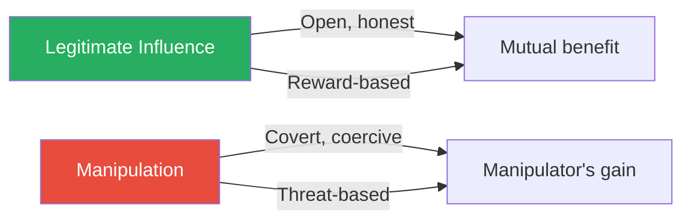
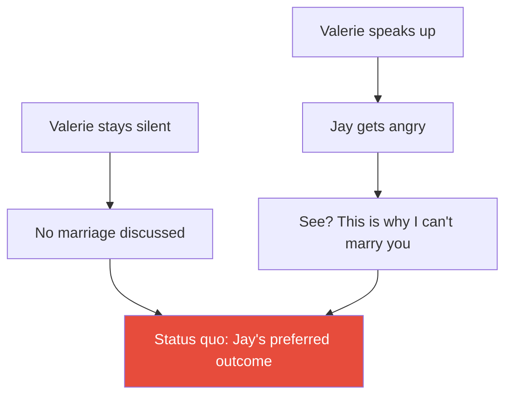
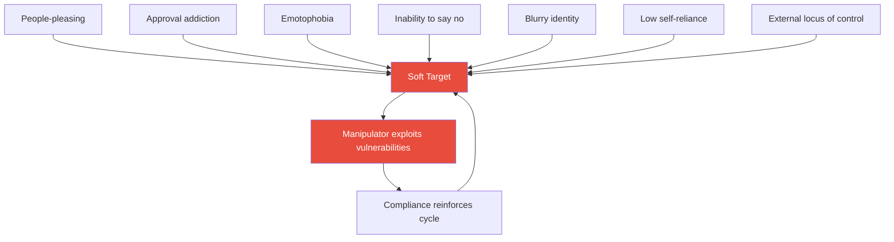
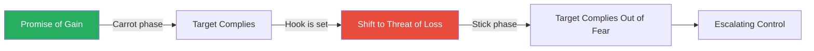
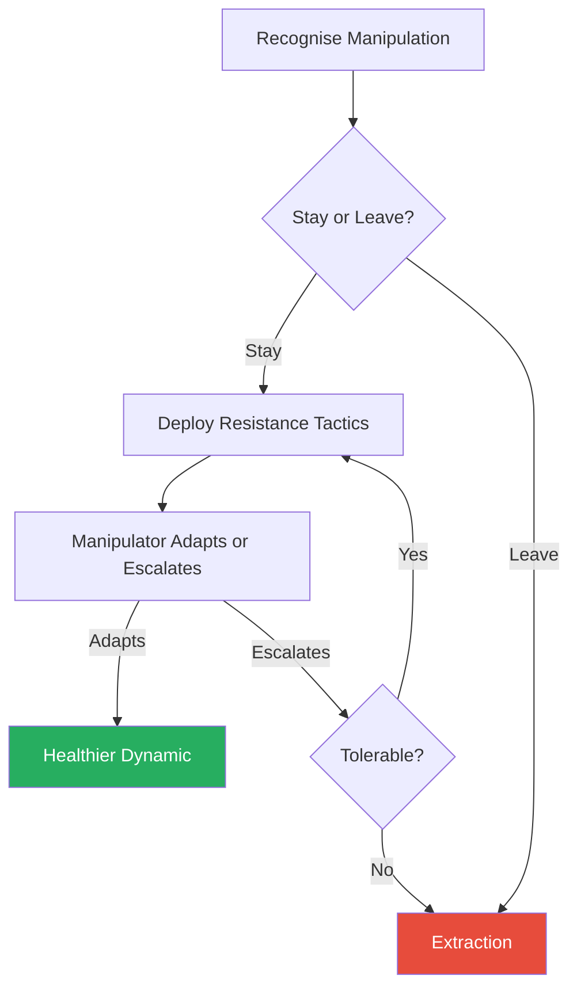

# Who's Pulling Your Strings? — Harriet B. Braiker

> Harriet Braiker, a clinical psychologist with nearly thirty years of practice, argues that manipulation is a two-person system — it only works because the victim unwittingly provides the strings for the manipulator to pull. The book maps the complete anatomy of manipulation: the seven psychological vulnerabilities that make you a soft target, the personality types most likely to exploit you, the reinforcement mechanics that lock you into compliance, and the concrete resistance tactics that break the cycle. Braiker's core insight is deceptively simple — you hold the countercontrol. The manipulator cannot succeed if you stop rewarding their tactics. Written with warmth and clinical precision, the book tracks five running case studies from entrapment to resolution, making the psychology visceral and personal rather than abstract.

---

## About the Author

Dr. Harriet B. Braiker was a clinical psychologist and management consultant based in Los Angeles who spent decades treating patients caught in manipulative relationships. Her earlier books — *The Disease to Please* and *The Type E Woman* — explored how people-pleasing and the drive to "have it all" set people up for exploitation. She drew on her own painful experience with manipulative relationships alongside her clinical work, giving the book a quality of hard-won personal knowledge alongside professional expertise. Braiker died in 2004, the same year this book was published.

---

## The Big Idea

- Manipulation is not something that happens *to* you — it is something you *participate in*
- Every time you comply, capitulate, or cave in to a manipulator's demands, you reinforce the toxic cycle that is corroding your emotional wiring and compromising your self-esteem
- The manipulator grows bolder as the victim grows weaker and more compliant
- <b style="color: #27ae60">You hold the key to making manipulation succeed or fail</b> — by changing your own behaviour, you unilaterally alter the power balance of the relationship
- Braiker identifies three purposes for the book:
  - **Decode** how manipulation works — its motives, mechanics, and methods
  - **Harden** your vulnerabilities so you become a difficult target
  - **Resist** with specific tactics adapted to any manipulative relationship
- The book distinguishes clearly between manipulation and legitimate influence:
  - **Influence** is open, honest, guided by reward, and serves the target's interests
  - **Manipulation** is covert, deceptive, driven by threats and coercion, and serves only the manipulator's purposes
- Braiker's framework is practical, not theoretical — she tracks five real case studies from entrapment through to resolution, showing the principles in action

---

## Key Concepts at a Glance

| Concept | One-line summary |
|---------|-----------------|
| **Countercontrol** | You always hold the power to make manipulation ineffective by refusing to comply |
| **Seven buttons** | People-pleasing, approval addiction, emotophobia, inability to say no, blurry identity, low self-reliance, external locus of control |
| **Control levers** | Manipulators use gain (carrot) and loss (stick) to drive your behaviour |
| **The manipulative shift** | The lever moves from promised gain to threatened loss once you're hooked |
| **Intermittent reinforcement** | Unpredictable rewards create the most addictive and resistant behaviour patterns |
| **Manipulator types** | Machiavellian, narcissistic, borderline, dependent, histrionic, passive-aggressive, antisocial, Type A |
| **The broken record** | Repeat your position calmly no matter how the manipulator escalates |
| **ABCD formula** | Label the manipulation: Antecedent, Belief, Consequence, Dispute |
| **Hardened target** | Replace soft-target thinking with hard-target beliefs to reduce vulnerability permanently |
| **Extraction** | The ultimate resistance — removing yourself from the relationship entirely |

---

## Chapter 1: An Overview of Manipulation

*Braiker frames manipulation as a relationship dynamic — not a one-way assault — and introduces the concept that will anchor the entire book: countercontrol.*

- Manipulation respects no relationship boundaries:
  - It invades marriages, romances, friendships, families, workplaces, and even places of worship
  - No age limitations or gender preferences — men and women of all ages can be both manipulator and manipulated
  - It takes particular hold in relationships where you have the most to gain or lose — your most significant bonds
- <b style="color: #e74c3c">Being manipulated is not just unpleasant — it is literally harmful to your physical health</b>
- The victim typically feels confused, resentful, frustrated, helpless, stuck, angry, guilty, anxious, and depressed

---

### Countercontrol: The Book's Foundation

- Braiker did not write this book to change manipulators' minds — that would be futile
- Instead, she wrote it to make victims aware of their <b style="color: #2980b9">countercontrol</b> — the power they already hold but don't realise they have
- The manipulator wants you to feel powerless, but the truth is the opposite:
  - Manipulation is used because it works
  - As long as you allow a manipulator to exploit you, they will continue
  - If you make manipulation ineffective by changing your behaviour, the manipulator is forced to change tactics or seek an easier target
- <b style="color: #e74c3c">You are not likely to change a manipulator by pointing out that their tactics are unfair</b> — manipulators do not care about your feelings
- You can, however, exercise countercontrol to change the power balance:
  - Stop rewarding manipulative tactics
  - Cease cooperating, complying, pleasing, acquiescing, or apologising
  - Stop responding to intimidation or threats
  - The nature of the relationship shifts unilaterally

> [!tip] Core Insight
> You cannot change a manipulator by appealing to their fairness. You change the dynamic by making their tactics stop working.

---

### Manipulation vs. Influence

- <b style="color: #2980b9">Influence</b> is legitimate, direct, and above-board:
  - Shaped by reward, not coercion
  - Guided by open, honest communication
  - Agenda defined and made public
  - Often serves the target's best interests (parent-child, teacher-student, therapist-patient)
- <b style="color: #2980b9">Manipulation</b> thrives in opposite conditions:
  - Indirect, devious, sometimes deceptive communication
  - Agendas hidden, purposes disguised
  - Threats, intimidation, and coercion preferred
  - Manipulators proceed in covert ways so the true nature is established long before the victim recognises it
- Some manipulators are fully conscious and intentional — they take pride in bending others' wills
- Others operate from less conscious motives — fear, insecurity, emotional drives — and may not fully understand their own manipulative impact
- <b style="color: #27ae60">Whether intentional or not, once rewarded, the cycle of coercion and control is identical</b>

This diagram captures Braiker's foundational distinction — influence operates through openness and mutual benefit, while manipulation operates through concealment and one-sided gain.

---

## Chapter 2: Manipulation in Five Acts

*Braiker introduces five case studies that will recur throughout the book — each one a different face of manipulation, each one disturbingly familiar.*

These five stories are not abstract — they are drawn from Braiker's clinical practice, with real emotional texture. They show manipulation operating across romantic relationships, family bonds, workplace dynamics, teenage social hierarchies, and the fear of commitment.

---

> [!example] Act One: A Tale of Two Cindys (Bob & Cindy)
> - Bob, a successful Beverly Hills physician, falls for Cindy — a confident, independent New York conference coordinator
> - After three months of long-distance romance, Cindy moves to California to live with Bob
> - At first, bliss — Cindy dotes on Bob, cooks, fusses over him
> - Then Bob announces plans to play tennis with friends, and a completely different Cindy emerges
> - She pouts, complains about being "abandoned" after "giving up everything," and demands he cancel
> - Bob capitulates — forfeits lunch with friends, shortens gym workouts, cancels invitations
> - Cindy's tactics escalate: pouting gives way to screaming fits, withholding sex, the silent treatment
> - Bob develops sharp stomach pains whenever he makes plans with friends — his body knows he's trapped
> - He starts buying Cindy expensive gifts to ease his conscience, a behaviour she actively encourages
> **The lesson:** Manipulation often hides behind the mask of dependence — and escalates when the victim rewards early compliance.

---

> [!example] Act Two: Dinner at Mom's (Jim, Sally & Martha)
> - Sally's mother Martha hosts Friday night dinner every week — it's "tradition"
> - When Sally marries Jim, Martha expects both of them every Friday without exception
> - Jim wants to see his own family sometimes; Sally agrees and tells her mother they'll skip one Friday
> - Martha deploys guilt: Sally will "break her father's heart," hurt her sister, and the small family will "feel so lonely"
> - Then the silent treatment — daily calls cease, messages go unreturned, Martha gives curt monosyllabic responses
> - By Friday morning, Sally caves under the guilt and begs Jim to cancel with his parents
> - Jim accedes but grows resentful — his mood at Martha's dinners becomes surly and withdrawn
> - Sally finds herself squeezed from both sides: Martha's guilt and Jim's resentment
> - When Sally gets pregnant, Martha raises her control to a new level
> **The lesson:** Family manipulation often operates through guilt as the primary weapon, with the silent treatment as enforcement.

---

> [!example] Act Three: Location, Location, Location (Francine & Arnie)
> - Francine, a 26-year-old real estate broker, is flattered when Arnie, the firm's top performer, offers a mentorship deal
> - Arnie's pitch: he wants to spend more time with his wife and kids, so Francine does the legwork in exchange for eventually getting "cut in" on all his deals
> - Francine works past midnight and every weekend for six months; Arnie leaves early and never comes in on weekends
> - After six months, Francine asks about the promised formal partnership — Arnie explodes in rage and threatens to cancel everything
> - Each time she raises the subject, he lectures her about "trust" and "loyalty"
> - Then Arnie's wife calls on a Saturday looking for him — Francine discovers he's been lying to his wife about working weekends
> - Through colleagues, Francine learns Arnie is a serial womaniser having affairs with trainees and clients
> - Everyone assumed Francine was romantically involved with Arnie — her reputation was damaged without her knowledge
> - Nine months of exploitation: exhaustion, no social life, no financial reward, a ruined reputation
> **The lesson:** Manipulators use rage to shut down legitimate questions, and "trust" as a weapon to prevent accountability.

---

> [!example] Act Four: Terrible Teens (Cara and the Popular Girls)
> - Cara, 15, moves from New York to California when her film-director father takes a Hollywood job
> - The "cool" crowd at her new school won't accept her — her clothes are "all wrong"
> - Desperate to fit in, Cara changes her entire wardrobe and lets the popular girls know her family has money
> - They let her "buy" her way in — she picks up checks for sodas, ice cream, pizza
> - The girls dangle inclusion at parties as a carrot but never deliver
> - Finally they propose a deal: throw a "super cool" spa party and you're in
> - Cara manipulates her own parents — guilt-trips her father into paying, wears down her mother's objections with three hours of hysterics
> - The spa party costs over $250 per girl for 15 guests — a huge hit
> - Monday morning: the popular girls discard Cara completely — cold shoulder from all party guests
> - They had done this many times before with other "wanna-bes"
> **The lesson:** Manipulators who dangle acceptance as a carrot have no intention of delivering — the promise itself is the mechanism of control.

---

> [!example] Act Five: Double Squeeze (Valerie & Jay)
> - Valerie, 37, has been with Jay for five years — she wants marriage and children, he says he wants them too "with the right woman"
> - After moving in together, the hint of matrimony vanishes
> - Jay's first marriage ended bitterly; he uses this as a shield — he needs "more time," needs to "be sure"
> - When Valerie raises the subject, Jay's jaw tightens, and if she doesn't immediately back down, he explodes in anger
> - After one argument, Jay yells: "This is just what I want to avoid in a marriage — fighting! Until we can get along better, there isn't going to be any wedding!"
> - Valerie is trapped in a classic double squeeze:
>   - If she says nothing, she avoids his anger but never gets married
>   - If she's honest about her feelings, they argue, and he says "See? This is why I can't marry you"
> - Her worst fear: Jay will tire of the conflict and leave altogether
> - Her biological clock ticks while her dreams hang in limbo
> **The lesson:** The double squeeze is one of manipulation's most insidious forms — engineered so that every path leads to the manipulator's preferred outcome.

Both paths lead to Jay's preferred outcome — the status quo. This is the architecture of a double squeeze.

---

## Chapter 3: Are You Vulnerable to Manipulation?

*Braiker presents her vulnerability quiz — 40 statements that reveal whether you're a soft target for manipulators — and introduces the seven areas of vulnerability.*

- Anyone can be manipulated, but some people are walking targets
- They display certain personality traits, behaviours, and ways of thinking that render them extremely vulnerable
- These tendencies form the <b style="color: #2980b9">"buttons"</b> that manipulators push
- Braiker's 40-item quiz measures vulnerability across seven dimensions:
  - Scoring 0-7: relatively hardened target
  - Scoring 8-15: moderate vulnerability in some areas
  - Scoring 16-25: significant vulnerability — you've likely been manipulated already
  - Scoring 26-40: extreme vulnerability — you need this book urgently

> [!tip] Core Insight
> Manipulators don't create your vulnerabilities — they exploit the ones you already have and inadvertently broadcast.

---

## Chapter 4: Your Buttons Are Showing

*Braiker identifies the seven specific psychological vulnerabilities that make you a mark — and explains how manipulators spot and exploit each one.*

### The Seven Buttons of Vulnerability

| Button | Core Pattern | What the Manipulator Sees |
|--------|-------------|--------------------------|
| **People-pleasing** | Compulsive need to make others happy | Someone who will always say yes |
| **Approval addiction** | Self-worth depends on others' validation | Someone who can be controlled through praise or withdrawal |
| **Emotophobia** | Fear of anger, conflict, confrontation | Someone who will cave at the first sign of tension |
| **Inability to say no** | Cannot decline requests or set limits | Someone with no boundaries to push against |
| **Blurry sense of identity** | No clear sense of who they are | Someone who can be shaped to the manipulator's needs |
| **Low self-reliance** | Depends on others for decisions and direction | Someone who will defer to the manipulator's judgment |
| **External locus of control** | Believes outcomes are controlled by outside forces | Someone who feels powerless to resist |

Recovery inverts the vulnerability profile — the soft target's highest-scoring buttons become the hardened target's lowest, while self-reliance and internal locus of control rise dramatically.

---

### Button 1: The Disease to Please

- <b style="color: #2980b9">People-pleasers</b> operate under what Braiker calls <b style="color: #2980b9">The Seven Deadly Shoulds</b>:
  1. I should always try to please other people
  2. I should always try to do what others want, expect, or need from me
  3. I should always be nice
  4. I should never say no
  5. I should never let anyone down
  6. I should always put others first
  7. I should make everyone happy
- These "shoulds" are not merely preferences — they feel like moral imperatives
- People-pleasers believe they earn love through what they *do*, not who they *are*
- To a manipulator, a people-pleaser is a dream target:
  - They will comply with almost any request
  - They will feel guilty for saying no
  - They will work harder to make the manipulator happy the more demanding the manipulator becomes
- <b style="color: #e74c3c">The people-pleaser's niceness becomes the weapon used against them</b>

---

### Button 2: Approval Addiction

- Goes deeper than people-pleasing — this is about identity:
  - Your sense of self-worth comes entirely from others' validation
  - Without external approval, you feel empty, anxious, worthless
- The approval addict is especially vulnerable because:
  - Approval can be given *and taken away* — making it the perfect control lever
  - The manipulator only needs to threaten withdrawal of approval to control behaviour
  - Intermittent approval (sometimes warm, sometimes cold) creates the most addictive pattern

---

### Button 3: Emotophobia — Fear of Negative Emotions

- <b style="color: #2980b9">Emotophobia</b> is Braiker's term for the fear of anger, conflict, and confrontation
- People with this vulnerability will do almost anything to avoid a scene:
  - Capitulate immediately when voices are raised
  - Apologise for things that aren't their fault
  - Suppress their own needs to keep the peace
- For manipulators, this is gold:
  - All they need to do is raise their voice, look angry, or threaten an emotional scene
  - The emotophobic person will cave before the confrontation even begins
  - Bob in the Cindy case study is a textbook example — he developed stomach pains just from *anticipating* Cindy's anger

---

### Button 4: Inability to Say No

- Goes beyond politeness — this is an actual psychological incapacity:
  - The word "no" triggers overwhelming guilt, anxiety, and fear
  - The person genuinely cannot bring themselves to decline
- This creates a pattern where the person is overcommitted, resentful, and exhausted
- Manipulators exploit this by:
  - Making requests that sound reasonable on the surface
  - Escalating demands gradually once early compliance is established
  - Using the person's track record of "yes" against them ("But you always do this for me")

---

### Button 5: Blurry Sense of Identity

- <b style="color: #2980b9">The vanishing self</b> — when you don't have a clear sense of who you are:
  - You define yourself through others' eyes
  - You take on the values, opinions, and preferences of whoever you're with
  - You cannot answer "Who am I?" without reference to your roles or relationships
- This makes you extremely malleable — the manipulator shapes you to fit their needs
- Without a solid identity, you have no internal compass to tell you when something is wrong

---

### Button 6: Low Self-Reliance

- You depend on others for decisions, direction, and emotional regulation:
  - You need input from multiple people before making even simple choices
  - You feel lost without someone to lean on
  - You experience what Braiker calls <b style="color: #2980b9">postdecisional regret</b> (buyer's remorse) — chronic second-guessing
- Manipulators love this because:
  - You'll defer to their judgment on everything
  - You'll be grateful for their "guidance" (which is really control)
  - The more you depend on them, the harder it becomes to leave

---

### Button 7: External Locus of Control

- <b style="color: #2980b9">Locus of control</b> is a psychological concept about where you believe power resides:
  - **Internal locus:** You believe your actions primarily determine your outcomes
  - **External locus:** You believe luck, fate, powerful others, or circumstances determine your outcomes
- People with an external locus of control are sitting ducks for manipulation:
  - They already believe they can't influence what happens to them
  - When a manipulator steps in and takes control, it confirms their worldview
  - They are more likely to develop <b style="color: #2980b9">learned helplessness</b> — the belief that resistance is futile
- Research shows external locus of control correlates with higher rates of depression and poorer physical health

All seven buttons feed into the same outcome — a soft target who reinforces the manipulation cycle through compliance.

---

## Chapter 5: Manipulators' Motives

*Braiker digs into why manipulators manipulate — and reveals that the answer isn't always malice. Some manipulators know exactly what they're doing. Others don't. But the effect on you is identical.*

### The Three Core Needs

- <b style="color: #2980b9">Every manipulator is driven by some combination of three needs</b>:
  1. **Need to advance their own purposes and personal gain** — at your expense if necessary
  2. **Need for power and superiority** — they see the world as winners vs. losers, and they intend to win
  3. **Need to feel in control** — of their own emotions, of other people, of outcomes

- The need for control is especially revealing:
  - Many manipulators are deeply insecure beneath the surface
  - Controlling others is their way of managing their own anxiety
  - When their control is threatened, they escalate — sometimes dramatically

---

### Conscious vs. Unconscious Manipulation

- <b style="color: #2980b9">Ego-congruent manipulators</b> are fully aware of what they're doing:
  - They see manipulation as a skill they're proud of
  - They view relationships as transactions
  - They feel no guilt because their worldview justifies it
- <b style="color: #2980b9">Ego-incongruent manipulators</b> operate from less conscious motives:
  - They may be driven by fear, insecurity, or emotional need
  - They don't fully recognise their own manipulative behaviour
  - When confronted, they are more likely to experience distress
- <b style="color: #27ae60">Whether conscious or unconscious, the impact on the victim is the same</b> — and the cycle continues as long as the victim complies

---

### The Manipulator's Worldview

- Manipulators tend to see the world through a zero-sum lens:
  - Life is a competition — someone wins, someone loses
  - If you're not dominating, you're being dominated
  - Other people are instruments to be used, not equals to be respected
- They frequently lack empathy — not necessarily pathologically, but functionally:
  - They don't spend time considering how their behaviour affects you
  - If they do notice your distress, they may see it as evidence their tactics are working
- <b style="color: #e74c3c">Manipulators often use projection</b> — attributing their own negative motives to you:
  - They accuse you of being selfish when they are the selfish ones
  - They claim you're being manipulative when you're simply setting boundaries
  - This keeps you off-balance and second-guessing yourself

---

### The Prisoner's Dilemma and Manipulation

> [!example] The Prisoner's Dilemma Applied to Relationships
> - Mathematician Albert W. Tucker developed this game in 1950
> - Two prisoners must decide independently whether to confess and implicate the other
> - If neither confesses: both get one year. If both confess: ten years each. If only one confesses: the confessor goes free, the other gets twenty years
> - In relationships, the same logic applies: cooperators (who trust and collaborate) do well together, but a competitor paired with a cooperator will exploit them every time
> - Research shows that when competitors play against each other, both lose badly
> - When cooperators play together, both win
> - The worst outcome: a cooperator paired with a competitor — the cooperator gets exploited
> **The lesson:** Manipulators are competitors in a world where you're trying to cooperate. They will exploit your trust until you change the game.

- Braiker draws a crucial distinction from this framework:
  - In relationships built on mutual cooperation, trust enables mutual benefit
  - In relationships where one party is competing (manipulating), the cooperator's trust becomes a vulnerability
  - <b style="color: #27ae60">You must learn to recognise when you're cooperating with someone who is competing against you</b>

---

## Chapter 6: Who Are the Manipulators in Your Life?

*Braiker profiles nine personality types most likely to manipulate — from the calculating Machiavellian to the seemingly helpless dependent — showing that manipulation doesn't always wear a villain's mask.*

### Recognising a Manipulator

- The first challenge is recognising that manipulation is happening at all:
  - Manipulators disguise their motives behind care, love, generosity, expertise, or authority
  - The disguise often works because the target *wants* to believe the manipulator's stated intentions
- Three rules for dealing with a potential manipulator:
  1. Do not dismiss the possibility that someone is manipulating you
  2. Ask for clarification of the manipulator's motives — watch their reaction carefully
  3. Observe whether their actions match their words over time

---

### The Nine Manipulator Personality Types

| Type | Core Drive | Key Tactics | Telltale Sign |
|------|-----------|------------|---------------|
| **Machiavellian** | Personal gain | Cynical charm, strategic deception | Views people as instruments |
| **Narcissist** | Admiration and entitlement | Demands, grandiosity, lack of empathy | Expects special treatment as a right |
| **Borderline** | Fear of abandonment | Intense emotional swings, threats | Idealises then devalues you |
| **Dependent** | Security and attachment | Clinginess, helplessness, guilt | Makes you responsible for their wellbeing |
| **Histrionic** | Attention and drama | Seductiveness, emotional theatrics | Every interaction is a performance |
| **Passive-aggressive** | Avoiding direct conflict | Sulking, dawdling, "forgetting" | Punishes you without ever saying they're angry |
| **Antisocial** | Dominance without conscience | Lying, intimidation, recklessness | Feels no guilt, takes no responsibility |
| **Type A** | Winning and control | Hostility, impatience, intimidation | Creates urgency and stress contagion |
| **Addictive** | Feeding the addiction | Lying, denial, rationalisation | Everything serves the next fix |

Borderline personalities rely most heavily on intermittent reinforcement and one-trial learning, creating the most addictive and fear-based manipulation patterns — while passive-aggressive types dominate through negative reinforcement (nagging, sulking, silent treatment).

---

### The Machiavellian Personality

- Named after Nicolo Machiavelli, the Italian political philosopher
- Researchers Richard Christie and others developed the <b style="color: #2980b9">Mach-IV scale</b> to measure Machiavellian traits
- <b style="color: #2980b9">"High machs"</b> score high on:
  - Cynical, distrustful view of human nature
  - Willingness to use manipulative tactics
  - Self-serving, pragmatic morality
  - Vanity and self-absorption
- They are shrewd, calculating, and emotionally detached
- They view relationships purely as means to an end
- <b style="color: #e74c3c">High machs are the most dangerous manipulators because their manipulation is deliberate, strategic, and unapologetic</b>

---

### The Narcissistic Personality

- Key traits from the DSM-IV include:
  - Grandiosity — inflated sense of own importance
  - Need for excessive admiration
  - Strong sense of entitlement — expects compliance as a right
  - Exploits others to get what they need
  - Lacks empathy for others' feelings
  - Envious of others' achievements
  - Arrogant and haughty behaviour
- The narcissist's <b style="color: #2980b9">sense of entitlement</b> is the key to understanding their manipulation:
  - They don't negotiate — they expect
  - When you don't comply, they respond with surprise and anger
  - They genuinely believe their needs should come first

---

### The Borderline Personality

- Marked by intense instability in relationships, self-image, and emotions:
  - Frantic efforts to avoid real or imagined abandonment
  - Pattern of idealising then devaluing the same person
  - Intense, unstable relationships
  - Impulsive behaviour, inappropriate anger, chronic feelings of emptiness
- Braiker notes that <b style="color: #2980b9">emotional blackmail</b> (as described by Susan Forward) is a hallmark tactic
- The borderline manipulator may not be consciously manipulative — their emotional intensity drives the behaviour
- But the effect on the target is devastating: walking on eggshells, constant emotional whiplash

---

### The Passive-Aggressive Personality

- This is manipulation through *inaction* rather than action:
  - Sulking, pouting, dawdling, procrastinating
  - "Forgetting" to do things they agreed to
  - Deliberate inefficiency
  - Whining, complaining, and claiming to be victimised
  - Stubbornness disguised as confusion
- <b style="color: #27ae60">Passive-aggressive manipulation is the hardest to confront because the manipulator can always claim they "didn't mean to"</b>
- There's no overt attack to point to — just a pattern of convenient failures

---

## Chapter 7: How Manipulation Works

*Braiker introduces the mechanical framework — manipulation isn't random; it follows predictable patterns of social influence that can be decoded and disrupted.*

- Manipulation is a form of <b style="color: #2980b9">social influence</b> — it operates through the same psychological channels as persuasion, but with hidden agendas and coercive intent
- Every manipulation has three elements:
  1. The manipulator's motives (what they want)
  2. The target's vulnerabilities (what buttons to push)
  3. The mechanism of control (how they make you comply)
- Key distinction between <b style="color: #2980b9">direct control</b> and <b style="color: #2980b9">evocation</b>:
  - **Direct control:** The manipulator explicitly tells you what to do (or else)
  - **Evocation:** The manipulator creates conditions that provoke you into the desired behaviour — you feel like you "chose" to comply
  - Evocation is far more insidious because the target doesn't recognise the manipulation

> [!tip] Core Insight
> The most effective manipulation doesn't feel like manipulation — it feels like your own decision.

---

## Chapter 8: What Are Your Hooks?

*Braiker maps the specific emotional hooks that manipulators use to reel you in — and shows that your fears and needs are the primary bait.*

### The Two Control Levers

- Every manipulation operates through one of two fundamental levers:
  - <b style="color: #2980b9">Gain</b> (the carrot): "If you do what I want, you'll get what you desire"
  - <b style="color: #2980b9">Loss</b> (the stick): "If you don't do what I want, you'll lose what you value"

| Lever | Examples | Emotional Hook |
|-------|---------|----------------|
| **Gain** | Approval, love, money, status, companionship, praise, recognition, commitment | Hope and desire |
| **Loss** | Love withdrawn, approval revoked, money cut off, friendship ended, security threatened, exposure, shame | Fear and anxiety |

- <b style="color: #27ae60">The specific hooks depend on your specific vulnerabilities</b> — a manipulator who knows your buttons knows exactly which levers to pull:
  - If you crave approval → they offer and withhold it strategically
  - If you fear abandonment → they threaten to leave
  - If you need harmony → they threaten emotional scenes
  - If you need financial security → they control the money

---

### Your Personal Hook Inventory

- Braiker provides a systematic way to identify your hooks:
  - What do you most desire from this relationship? (Those are your gain hooks)
  - What do you most fear losing? (Those are your loss hooks)
  - Which emotions does the manipulator most often trigger in you? (Those are the buttons being pushed)
- <b style="color: #e74c3c">The hooks that control you most powerfully are the ones you're least aware of</b>

---

## Chapter 9: The Mechanics of Manipulation

*Braiker reveals the behavioural science behind manipulation — how control is established, maintained, and strengthened through reinforcement, punishment, and the devastating power of intermittent reward.*

### The Architecture of Control

- Every manipulative relationship follows the same basic formula:
  - **When gain is the lever:** "If you do what I want, you will get what you desire"
  - **When loss is the lever:** "If you don't do what I want, you will lose what you value"
- The manipulator doesn't necessarily verbalise these formulas — they're often implicit, felt rather than stated

---

### The Manipulative Shift

- <b style="color: #2980b9">The manipulative shift</b> is the critical transition point:
  - Early in the relationship, the manipulator holds out the promise of gain
  - You comply because you're pursuing something desirable — love, acceptance, advancement, security
  - Once you're hooked, the lever shifts from gain to threat of loss
  - Now you comply not because you want something but because you fear losing what you have
- <b style="color: #e74c3c">Once the shift happens, the manipulation feels coercive and increasingly stressful</b>
- This is exactly what happened to Francine with Arnie — she started working for the promise of financial partnership, then continued working because she feared losing everything she'd invested

The manipulative shift is the moment the carrot is replaced by the stick — and the target barely notices the transition.

---

### Five Methods of Control

#### 1. Positive Reinforcement

- The manipulator rewards desired behaviour:
  - Praise, attention, affection, gifts, money, approval, sex, recognition
- This is the "nice" phase of manipulation — it feels good to the target
- It establishes the pattern: comply = reward
- <b style="color: #e74c3c">The danger of positive reinforcement is that it makes manipulation feel like a healthy relationship</b>

#### 2. Negative Reinforcement

- The manipulator *removes* something unpleasant when you comply:
  - They stop nagging, criticising, sulking, giving the silent treatment, or raging
  - The relief you feel when the pressure stops is the reward
- Common negative reinforcement tactics:
  - Nagging and whining until you give in
  - Crying or emotional displays
  - Sulking and the silent treatment
  - Intimidation and threats
  - Unfavourable comparisons ("Your sister would never treat me this way")
  - Blame and guilt-tripping

#### 3. Intermittent/Partial Reinforcement

> [!example] B. F. Skinner's Pigeons and the Gambling Schedule
> - Psychologist B. F. Skinner placed pigeons in boxes where they could press a lever for food
> - When the food came every time (continuous reinforcement), the pigeons pressed the lever only when hungry
> - When Skinner switched to random delivery — sometimes a press produced food, sometimes it didn't — something remarkable happened
> - The pigeons pressed the lever compulsively, frantically, endlessly
> - This is exactly how slot machines work — the unpredictable reward creates the strongest, most resistant-to-extinction behaviour pattern
> - In manipulative relationships, the same principle applies: the manipulator who is sometimes warm and sometimes cold creates the most powerful addiction
> **The lesson:** Intermittent reinforcement — unpredictable rewards and punishments — creates behaviour patterns that are almost impossible to break.

- <b style="color: #2980b9">Intermittent reinforcement</b> is the most powerful method of control because:
  - The target never knows when the reward is coming, so they keep trying
  - The hope that "this time will be different" sustains the cycle
  - Even after the reinforcement stops entirely, the behaviour persists far longer than continuously reinforced behaviour
  - This is why people stay in bad relationships — they're hooked on the unpredictable positive moments
- <b style="color: #27ae60">If you recognise intermittent reinforcement in your relationship, you are likely dealing with manipulation</b>

#### 4. Punishment

- The manipulator directly imposes negative consequences for non-compliance:
  - Yelling, screaming, physical intimidation
  - Withdrawal of affection, sex, money, access
  - Public humiliation or private cruelty
- Punishment differs from negative reinforcement:
  - Negative reinforcement removes something bad when you comply
  - Punishment adds something bad when you don't comply
- Punishment creates fear and avoidance — the target learns to comply preemptively to avoid the punishment

#### 5. Traumatic One-Trial Learning

> [!example] The Power of a Single Traumatic Event
> - Braiker uses the September 11 attacks as an example of traumatic one-trial learning
> - A single catastrophic event can permanently alter behaviour without any repetition
> - In relationships, a single episode of extreme rage, violence, or emotional devastation can teach the target to never cross that line again
> - The manipulator only needs to "go nuclear" once — the threat of it happening again is enough to control behaviour indefinitely
> - Victims may develop symptoms resembling PTSD: hypervigilance, anxiety, avoidance, emotional numbing
> **The lesson:** A single terrifying episode can create lasting compliance — the manipulator's most efficient tool.

Intermittent reinforcement is the most prevalent and most addictive control method — its unpredictability creates the same compulsive behaviour pattern that makes gambling so powerful.

---

### The Big Lie

- Braiker introduces <b style="color: #2980b9">the Big Lie</b> — a comprehensive, multi-method manipulation:
  - The manipulator constructs an entire false narrative that governs the relationship
  - It combines positive reinforcement, negative reinforcement, intermittent reward, and punishment simultaneously
  - The target doesn't just comply with individual requests — they accept an entirely false version of reality
  - This is the most extreme and damaging form of manipulation

---

## Chapter 10: Are You in a Manipulative Relationship?

*Braiker provides a systematic checklist for recognising when a relationship has crossed from influence into manipulation — because many victims don't realise they're being manipulated until the damage is severe.*

- Braiker offers a detailed questionnaire covering the signs:
  - Do you feel pressured to do things you wouldn't choose freely?
  - Does the other person use emotional displays to control your behaviour?
  - Do you feel confused about the other person's true motives?
  - Have you changed your behaviour significantly to avoid their anger?
  - Do you feel guilty when you try to do something for yourself?
  - Has your self-esteem declined since the relationship began?
- <b style="color: #27ae60">If you answer yes to multiple questions, you are likely in a manipulative relationship</b>
- The diagnostic power of the checklist comes from pattern recognition — isolated incidents can be misunderstandings, but a consistent pattern is manipulation

> [!abstract] Signs You're in a Manipulative Relationship
> 1. You frequently comply with requests you'd rather decline
> 2. You've significantly changed your behaviour to avoid the other person's emotional reactions
> 3. You feel confused about what the other person really wants
> 4. You feel guilty when you try to meet your own needs
> 5. Your self-esteem has declined since the relationship began
> 6. You feel anxious or stressed about the relationship much of the time
> 7. You've become isolated from friends or family
> 8. You feel trapped — unable to stay happily but afraid to leave

---

## Chapter 11: The Impact of Manipulation

*Braiker documents the damage manipulation inflicts — not just emotional distress, but systematic erosion of identity, self-esteem, physical health, and the capacity to trust your own judgment.*

### The Silent Contract

- Every manipulative relationship operates under a <b style="color: #2980b9">silent contract</b>:
  - An unspoken, implicit agreement between manipulator and victim
  - The terms are never openly discussed or negotiated
  - The victim "agrees" to comply in exchange for avoiding punishment or gaining intermittent reward
  - Neither party acknowledges the contract explicitly
- <b style="color: #e74c3c">The silent contract is one of the most insidious aspects of manipulation because it makes the victim feel complicit</b>

---

### The Emotional Toll

- Braiker catalogues the specific emotional "footprints" manipulation leaves:

| Impact | How It Manifests |
|--------|-----------------|
| **Confusion** | Unable to understand the manipulator's true motives; constant second-guessing |
| **Frustration** | Unmet needs, unfulfilled promises, blocked autonomy |
| **Loss of control** | Feeling that the manipulator dictates every aspect of life |
| **Diminished self-esteem** | Progressive loss of confidence, self-respect, and self-reliance |
| **Suppressed anger** | Resentment builds but cannot be expressed safely |
| **Entrapment** | Feeling unable to leave but unable to stay happily |
| **Depression** | Helplessness, hopelessness, loss of pleasure in life |
| **Physical symptoms** | Stress-related illness, sleep problems, stomach pain, headaches |

---

### The Erosion Process

- Manipulation doesn't destroy you all at once — it erodes you gradually:
  - First your autonomy goes — you stop making independent decisions
  - Then your confidence — you doubt your own judgment
  - Then your self-esteem — you feel worthless without the manipulator's approval
  - Then your identity — you lose sight of who you were before the relationship
  - Finally your health — the chronic stress takes a physical toll
- <b style="color: #27ae60">Recognising this erosion process is crucial because each stage makes the next one harder to reverse</b>

> [!tip] Core Insight
> Manipulation doesn't feel like an attack — it feels like a slow fade. You don't notice you've lost yourself until you can barely remember who you were.

---

- Victims often develop what Braiker calls a <b style="color: #2980b9">self-image of victimisation</b>:
  - They begin to see themselves as fundamentally helpless
  - They believe they deserve the treatment they're getting
  - They feel guilty for wanting better
  - Paradoxically, this self-image reinforces the manipulation — they stop trying to resist

---

## Chapter 12: Resistance Tactics

*Braiker delivers the practical toolkit — seven specific resistance tactics that work regardless of who the manipulator is or what type of relationship you're in.*

### The Architecture of Resistance

- Before deploying specific tactics, Braiker establishes the mindset:
  - <b style="color: #27ae60">Change your behaviour first — your thoughts and feelings will follow</b>
  - You don't need to feel confident to act confidently
  - Small changes in behaviour create large changes in the relationship dynamic
  - The manipulator will initially resist and escalate — this is expected and temporary

- Three levels of countercontrol:
  1. **Resistance** — changing your behaviour within the relationship to make manipulation ineffective
  2. **Extraction** — removing yourself from the relationship entirely
  3. **Small-scale efforts** — starting with the least risky situations to build confidence

The resistance flowchart — every interaction with a manipulator eventually leads to either a healthier dynamic or extraction.

The resistance tactics flow from recognition through increasingly assertive responses — playing for time creates space, the broken record establishes position, and setting terms culminates in either healthy compromise or extraction.

---

### Tactic 1: Playing for Time

- <b style="color: #2980b9">Playing for time</b> disrupts the manipulator's urgency:
  - Manipulators create pressure to decide *now* — because time for reflection is the enemy of compliance
  - Your response: "I need to think about it. I'll get back to you."
  - No justification, no explanation, no apology
- Key principles:
  - Never make an important decision under pressure from a manipulator
  - Do not ask for permission to take time — inform them
  - The manipulator will try to make you feel guilty for not answering immediately — expect this
  - Your right to think before deciding is non-negotiable

> [!abstract] Playing for Time — The Formula
> 1. The manipulator makes a request or demand
> 2. You respond: "I need some time to think about this"
> 3. The manipulator pushes back: "Why? What's there to think about?"
> 4. You repeat: "I understand you'd like an answer now, but I need time to think about it"
> 5. Do not justify, argue, defend, or explain (JADE)
> 6. End the conversation: "I'll get back to you when I've had time to think"

---

### Tactic 2: The Broken Record

- <b style="color: #2980b9">The broken record</b> is Braiker's most powerful tactical tool:
  - Choose a simple, clear statement of your position
  - Repeat it — calmly, without variation — no matter how the manipulator escalates
  - Acknowledge the manipulator's emotion ("I understand you're frustrated") then repeat your statement
  - Do not rise to bait, answer provocative questions, or apologise

> [!example] The Broken Record in Action
> - A patient's manipulative friend demands she plan a party
> - Patient: "I need time to think about it. I'll get back to you."
> - Manipulator (exasperated): "I can't wait! I need an answer now!"
> - Patient: "I understand you're anxious, but I need time to think about it."
> - Manipulator (angry, yelling): "You're being completely unreasonable! What's your problem?"
> - Patient (deep breath): "I understand you're frustrated, but I'll have to get back to you about this later."
> - Manipulator (yelling louder): "Are you just going to keep saying the same stupid thing?"
> - Patient: "I understand you're angry, but I do need time to think about this."
> - The manipulator eventually gives up — the broken record won
> **The lesson:** The broken record works because it gives the manipulator nothing to work with — no new material to twist, no emotions to exploit, no argument to win.

- Why the broken record works:
  - It removes the manipulator's tactical options — they can't argue with a repeated statement
  - It prevents emotional escalation — you stay calm while they escalate
  - It demonstrates that you cannot be moved by pressure
  - It builds your own confidence through practice
- <b style="color: #27ae60">Practice the broken record through role-playing before using it in real situations</b>
- The <b style="color: #2980b9">inoculation effect</b>: rehearsing resistance in advance makes you stronger when the real situation arrives

---

### Tactic 3: Desensitising Anxiety, Fear, and Guilt

- Many people can't resist manipulation because their emotional response is too overwhelming:
  - Guilt floods them when they say no
  - Anxiety paralyses them when they contemplate confrontation
  - Fear shuts them down when the manipulator raises their voice
- <b style="color: #2980b9">Desensitisation</b> is borrowed from behavioural therapy:
  - Gradually expose yourself to the feared situation in small, manageable doses
  - Start with the least threatening scenario and work up
  - Each successful exposure reduces the emotional intensity
  - Over time, the emotions lose their power to control your behaviour
- Braiker's process:
  - Create a hierarchy of feared scenarios (least scary to most scary)
  - Practice relaxation techniques
  - Visualise each scenario while maintaining calm
  - Then practice in real life, starting from the bottom of the hierarchy
- <b style="color: #e74c3c">Emotional reasoning is the enemy</b> — just because you feel guilty doesn't mean you've done something wrong; just because you feel afraid doesn't mean the danger is real

---

### Tactic 4: Labelling the Manipulation (The ABCD Formula)

> [!abstract] The ABCD Formula
> 1. **A — Antecedent:** What did the manipulator do or say? (Describe the specific behaviour)
> 2. **B — Belief:** What belief or thought does the manipulation activate in you? (e.g., "I should always put others first")
> 3. **C — Consequence:** What do you feel and do as a result? (e.g., feel guilty, comply)
> 4. **D — Dispute:** Challenge the belief. Is it rational? Is it serving you? Replace it with a healthier thought.

- Naming the manipulation out loud — to yourself or to the manipulator — strips it of its power:
  - "What you're doing right now is trying to make me feel guilty so I'll change my plans"
  - "You're using anger to intimidate me into doing what you want"
  - "You're giving me the silent treatment to punish me for saying no"
- <b style="color: #27ae60">Most manipulators rely on their tactics being invisible — making them visible disrupts the entire system</b>
- When you label the manipulation to the manipulator directly, it puts them on notice that the game has changed

---

### Tactic 5: Disabling the Manipulation

- Go beyond labelling to actively neutralising the mechanism:
  - Refuse to respond to the emotional bait
  - Don't engage with guilt trips, threats, or emotional displays
  - Treat the manipulative behaviour as if it's not happening — respond only to legitimate communication
  - Change the subject or leave the room when manipulation tactics are deployed
- <b style="color: #2980b9">Disabling</b> is about removing the reward — when the tactic produces no result, the manipulator eventually abandons it

---

### Tactic 6: Setting Your Terms

- <b style="color: #2980b9">Personal boundaries</b> are the foundation of resistance:
  - Decide in advance what you will and will not accept
  - Communicate your terms clearly and directly
  - Enforce them consistently — a boundary that isn't enforced isn't a boundary
- Setting terms is not negotiation — it's a unilateral statement:
  - "I am willing to do X but not Y"
  - "I will not continue this conversation if you raise your voice"
  - "If this happens again, I will [specific consequence]"
- <b style="color: #e74c3c">Do not set terms you are not prepared to enforce — empty threats teach the manipulator that your boundaries are negotiable</b>

---

### Tactic 7: Compromise and Negotiation

- Not all manipulative relationships require total resistance — sometimes healthy compromise is possible:
  - Identify what you genuinely need versus what you merely want
  - Look for solutions that meet both parties' core needs
  - Use <b style="color: #2980b9">turn-taking</b> for repeated disputes (e.g., alternate Fridays with each family)
  - Use <b style="color: #2980b9">random choice</b> for deadlocks (flip a coin)
  - Use <b style="color: #2980b9">barter</b> to trade concessions
- The key distinction: compromise is between equals; capitulation is submission to a manipulator
- <b style="color: #27ae60">Genuine compromise requires that both parties give up something — if only you are giving, it's not compromise</b>

---

### Choosing Your Battles

- Not every manipulation is worth fighting:
  - Save your resistance energy for the issues that matter most
  - Some manipulative behaviours are annoying but tolerable
  - Others are fundamental assaults on your autonomy and identity — fight those
- Ask yourself: "If I comply on this issue, what does it cost me?"
  - If the cost is low and the relationship is valuable, compliance may be strategic
  - If the cost is your self-respect, identity, or core values, resistance is essential

---

### Extraction: The Ultimate Resistance

- Sometimes the only solution is to leave:
  - The manipulation is too deeply embedded to change
  - The manipulator will not adapt to your new boundaries
  - The relationship requires your continued victimisation as a condition of existence
- <b style="color: #27ae60">If your unwillingness to be manipulated costs you a relationship, what did you really have in the first place?</b>
- Extraction may involve sadness and painful emotions, but:
  - A relationship that requires you to compromise your self-esteem, freedom, and integrity is not in your self-interest
  - Losing yourself in the fog of manipulation — losing sight of who you are — would be a far worse outcome
  - Remaining a victim is too high a price for the illusion of security

---

## Chapter 13: How to Make Yourself a Hardened Target

*Braiker moves from reactive resistance to proactive transformation — replacing the soft-target thinking that made you vulnerable in the first place with hard-target beliefs that make manipulation ineffective.*

### The Logic of Cognitive Change

- Your thinking, behaviour, and feelings are linked in a delicate balance
- <b style="color: #2980b9">Cognitive dissonance</b> occurs when one part of the system is out of sync with another:
  - You feel uncomfortable when you act one way but think another
  - This discomfort motivates you to realign the parts
- By implementing resistance tactics (changing behaviour), you create dissonance with your old thinking
- This forces your thoughts and feelings to update — to catch up with your new behaviour
- <b style="color: #27ae60">Change your behaviour, and your mind will follow</b>

---

### Soft-Target Thinking vs. Hard-Target Beliefs

Braiker maps the transformation for each of the seven vulnerability areas:

| Soft-Target Thought | Hard-Target Replacement |
|---------------------|------------------------|
| "I should always please others" | "I can choose to be kind without being a doormat" |
| "I need everyone's approval" | "My self-worth comes from within, not from others' validation" |
| "Conflict must be avoided at all costs" | "Healthy conflict is a normal part of relationships" |
| "I can never say no" | "Saying no is a right, not a betrayal" |
| "I don't know who I am without others" | "I have values, preferences, and boundaries that are mine" |
| "I can't make decisions without help" | "I am capable of trusting my own judgment" |
| "Other people control what happens to me" | "I influence my outcomes through my own choices and actions" |

---

### The Journal Method

- Braiker recommends a structured journaling process:
  - Write daily entries about manipulative interactions
  - Identify the soft-target thoughts that drove your behaviour
  - Use the ABCD formula to dispute and replace each thought
  - Track your progress over time
- The journal serves two functions:
  - It makes your thought patterns visible (you can't change what you can't see)
  - It creates a record of growth that reinforces your new identity

---

### Debugging Each Vulnerability

#### Correcting People-Pleasing

- Replace "shoulds" with "choices":
  - Instead of "I should always make others happy," try "I can choose to help when it aligns with my values"
  - The shift from obligation to choice is transformative
- Recognise that <b style="color: #e74c3c">pleasing everyone is impossible — and attempting it guarantees you will please no one, least of all yourself</b>

#### Correcting Approval Addiction

- Build internal sources of self-worth:
  - Identify your values independent of others' opinions
  - Practice self-approval — acknowledge your own achievements
  - Tolerate the discomfort of not being universally liked

#### Correcting Emotophobia

- Reframe conflict as information, not catastrophe:
  - Anger is an emotion, not a weapon (unless you let it be)
  - Conflict reveals differences — differences are normal in healthy relationships
  - <b style="color: #27ae60">The willingness to tolerate short-term discomfort is the price of long-term freedom</b>

#### Correcting Inability to Say No

- Practice saying no in low-stakes situations first
- Use the formula: "No, I can't do that" (no justification needed)
- Remind yourself: every yes to a manipulator is a no to yourself

#### Correcting Blurry Identity

- Answer the <b style="color: #2980b9">"Who am I?" questions</b>:
  - What do I value?
  - What do I believe?
  - What do I enjoy?
  - What are my boundaries?
  - What kind of person do I want to be?
- Answer these independently — not through the lens of any relationship

#### Correcting Low Self-Reliance

- Start making small decisions without consulting others
- Build tolerance for the discomfort of uncertainty
- Trust that you can handle the consequences of your own choices
- Develop the belief that your judgment is as valid as anyone else's

#### Correcting External Locus of Control

- Challenge the belief that outside forces control your life:
  - Keep a log of times your actions directly produced outcomes
  - Notice the connection between your choices and their consequences
  - Replace "things happen to me" with "I make things happen"
- This is the deepest vulnerability to correct because it's a worldview, not just a habit

---

## Chapter 14: Final Curtain on Manipulation in Five Acts

*Braiker returns to the five case studies and shows how each patient broke free — demonstrating that the principles work in practice, not just in theory.*

> [!example] Resolution: Bob and Cindy (A Tale of Two Cindys)
> - Bob learned to separate the Cindy he loved from the manipulation tactics she used
> - He told Cindy he would no longer change his plans because of her emotional outbursts
> - He set clear terms: he would happily spend time with her, but he would also maintain his friendships
> - Cindy escalated dramatically at first — more screaming, more guilt, more withholding
> - Bob held firm using the broken record and desensitisation techniques
> - Eventually, Cindy's tactics stopped producing results, and she began to adapt
> - The relationship stabilised on healthier terms — Cindy made her own friends and developed independent activities
> **The lesson:** When the manipulator's tactics stop working, they adapt — but only if you hold your ground through the initial escalation.

---

> [!example] Resolution: Dinner at Mom's (Jim, Sally & Martha)
> - Sally and Jim used the compromise tactic — they proposed alternating Friday dinners between families
> - Sally deployed the broken record with her mother: "We love you, and we'll be here next Friday, but this Friday we're with Jim's family"
> - Martha deployed guilt and the silent treatment as expected
> - Sally practiced desensitisation to tolerate her mother's displeasure without caving
> - Over time, Martha's tactics lost their power — Sally stopped calling to apologise
> - The compromise became the new normal
> - Martha even began inviting members of Jim's family to her Friday dinners
> **The lesson:** Family manipulators adapt when their primary tactic (guilt) stops producing compliance — but it requires the victim to tolerate significant discomfort first.

---

> [!example] Resolution: Location, Location, Location (Francine & Arnie)
> - Francine realised she had been exploited and that Arnie had no intention of honouring his promises
> - She chose extraction — she ended the partnership entirely
> - She documented the work she had done and approached the firm's management about reassignment
> - Rather than confronting Arnie about his affairs (which would only create drama), she simply withdrew her cooperation
> - Without Francine doing his work, Arnie's performance suffered
> - Francine rebuilt her professional reputation and career independently
> **The lesson:** Some manipulative relationships cannot be reformed — they can only be left. Extraction is not failure; it's freedom.

---

> [!example] Resolution: Terrible Teens (Cara)
> - Cara came to therapy with her mother and realised the "popular" girls were not the kind of friends worth having
> - She reframed her thinking: the shame belonged to the girls who had behaved badly, not to her
> - Her parents acknowledged their error in enabling Cara to try to "buy" friendships
> - Cara shifted focus to academics and discovered volleyball
> - She made genuine friends through her volleyball team
> - "I made lemonade out of lemons," she says. "But I still have to watch out for manipulators."
> **The lesson:** Young people are especially vulnerable during transitions — but recognising manipulation early builds lifelong resistance.

---

> [!example] Resolution: Double Squeeze (Valerie & Jay)
> - After intensive individual therapy, Valerie chose extraction — she moved out
> - She wrote Jay a letter: her decision was final; she would no longer feel guilty about wanting marriage
> - She told him she loved him but that he needed to work out his fears before she met someone else
> - Jay was furious, claiming this "proved" she was wrong for him
> - Valerie held her ground through painful, lonely months
> - Her daily mantra: "If Jay really loves me, he'll want to marry me. Otherwise, I'm not losing anything but heartbreak"
> - Jay proposed on Valerie's next birthday. They married a month later
> **The lesson:** Sometimes extraction is the catalyst that forces the manipulator to confront their own behaviour — but you must be prepared for the possibility that they won't.

---

## Conclusion: The Critical Ingredient

*Braiker closes with the one thing she cannot give you through a book — the courage to act.*

- You now have the tactics, strategies, and mindset to resist manipulation
- You understand the cost of remaining a victim
- But without courage, nothing changes
- <b style="color: #27ae60">Having courage is not the same as being unafraid</b> — it means acting despite fear:
  - Feeling wobbly, anxious, or scared is natural
  - The key is to listen to your strengths, not your fears
  - Let your strengths guide you; do not let your fears determine your fate
- Set your intention to break free:
  - Find your courage
  - Use the skills you've learned
  - Patiently stay the course
  - Change will not happen in a day — but commitment and diligence will produce results

Braiker closes with a quote from the twelfth-century sage Hillel:

> "If I am not for myself, who will be for me? If I am only for myself, what am I? If not now, when?"

---

## Verdict

Braiker's greatest contribution is reframing manipulation as a two-person system rather than a one-way assault. Most books on manipulation focus on identifying the manipulator — their tactics, their personality type, their pathology. Braiker does this too, but her central argument is more powerful: *you* are the one who makes manipulation possible, and *you* are the one who can make it stop. The concept of countercontrol — that the victim always holds the power to make manipulation ineffective — is genuinely empowering without being victim-blaming. She is careful to distinguish between being responsible for the manipulator's behaviour (you're not) and being responsible for your own response to it (you are).

The book's weaknesses are primarily structural. Published in 2004, some of the clinical framing feels dated — particularly the heavy reliance on DSM-IV personality disorder categories, which have since been debated and revised. The self-assessment quizzes, while useful, interrupt the narrative flow and can feel like padding. And while Braiker acknowledges that some manipulation is unconscious, she doesn't explore the grey area deeply enough — the boundary between someone who manipulates from insecurity and someone who manipulates from malice is more blurred than the book suggests. The prose can also be repetitive, circling back to the same points across multiple chapters where a tighter structure would have served better.

The reader who benefits most is someone who suspects they are being manipulated but cannot articulate how or why — someone who feels the "fog" but lacks the framework to see through it. People-pleasers, approval addicts, conflict-avoiders, and anyone with an external locus of control will find themselves uncomfortably recognised in these pages. The book is especially valuable for people in the early stages of awareness — those who sense something is wrong but keep talking themselves out of their own instincts.

Compared to other books in this space, Braiker sits between Susan Forward's [[Emotional Blackmail - Susan Forward|Emotional Blackmail]] (which goes deeper into the FOG tactics of fear, obligation, and guilt) and George K. Simon's [[In Sheep's Clothing - George K. Simon|In Sheep's Clothing]] (which provides a sharper taxonomy of covert-aggressive tactics). Robin Stern's [[The Gaslight Effect - Robin Stern|The Gaslight Effect]] covers the specific pattern of reality-distortion manipulation in greater depth. Martha Stout's [[The Sociopath Next Door - Martha Stout|The Sociopath Next Door]] addresses the extreme end — manipulation without conscience. Braiker's unique value is the victim-side focus: where these other books primarily profile the manipulator, Braiker profiles the *target* and shows how to change from the inside out.

---

## Related Reading

- [[Emotional Blackmail - Susan Forward]] — The FOG framework (Fear, Obligation, Guilt) maps directly to Braiker's control levers and negative reinforcement tactics
- [[In Sheep's Clothing - George K. Simon]] — Simon's covert-aggressive personality taxonomy complements Braiker's nine manipulator types
- [[The Gaslight Effect - Robin Stern]] — Stern focuses specifically on reality-distortion manipulation, a pattern Braiker touches on with the Big Lie
- [[The Sociopath Next Door - Martha Stout]] — The antisocial personality type at its extreme — manipulation without conscience
- [[Snakes in Suits - Babiak & Hare]] — Braiker's manipulator types in the corporate setting, with a focus on psychopathic manipulation at work
- [[Influence - Robert Cialdini]] — The legitimate influence principles that manipulators corrupt for their own purposes
- [[Games People Play - Eric Berne]] — Berne's transactional analysis provides a different lens on the same manipulative dynamics Braiker describes
