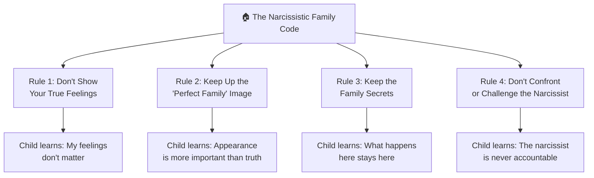
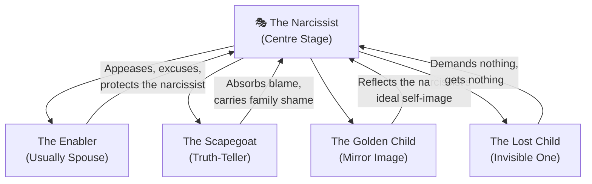
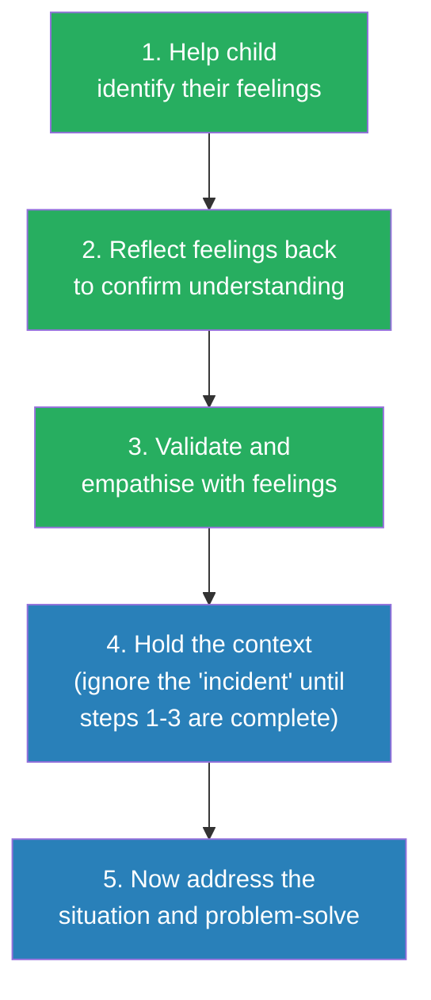
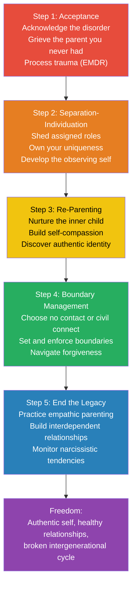

# Will the Drama Ever End? — Karyl McBride

> **One-line summary:** A clinical roadmap for recognising the invisible machinery of the narcissistic family and rebuilding the self it dismantled.

---

## About the Author

Dr. Karyl McBride is a licensed marriage and family therapist with over three decades of clinical experience specialising in narcissistic family dynamics. She is herself a survivor of a narcissistic family — a fact she shares openly as both credential and compass. Her first book, *Will I Ever Be Good Enough? Healing the Daughters of Narcissistic Mothers* (2008), struck a nerve nationally and internationally, producing nineteen foreign translations and thousands of letters from readers. She followed it with *Will I Ever Be Free of You?* (2015) on navigating high-conflict divorce from a narcissist. *Will the Drama Ever End?* (2023) represents the culmination of her work — broadening from maternal narcissism and daughters to the entire narcissistic family system, including fathers, sons, siblings, and spouses, with a structured 5-step recovery model tested on hundreds of clients and workshop participants.

---

## The Big Idea

- Most writing on narcissism focuses on the narcissistic individual — their traits, their tactics, their disorder
- <b style="color: #2980b9">McBride's insight is that narcissism doesn't just damage individuals — it creates an entire family operating system</b> with assigned roles, enforced rules, weaponised communication, and a rigid power hierarchy
- Children raised inside this system sustain four predictable forms of damage: delayed emotional development, impaired trust, suppressed individuation, and damaged self-worth — often manifesting as Complex PTSD
- <b style="color: #e74c3c">The damage is frequently misdiagnosed</b> as depression or anxiety because clinicians treat symptoms without investigating the family system that produced them

Both engulfing and ignoring narcissistic parenting produce devastatingly similar damage profiles — the engulfing style particularly destroys individuation while the ignoring style most severely impairs trust and self-worth.
- Recovery is possible but must follow a strict sequence: accept the truth about your parent's disorder, separate psychologically from the family system, re-parent your inner child, set boundaries with family, and then actively break the intergenerational cycle
- <b style="color: #27ae60">The drama ends when someone in the family decides it does</b> — and that someone is the person reading this book

---

## Key Concepts at a Glance

| Concept | One-line summary |
|---------|-----------------|
| **Engulfing vs. Ignoring** | Two narcissistic parenting styles — smothering control or emotional absence — that produce the same stunted child |
| **The Four Rules** | Every narcissistic family enforces: don't feel, look perfect, keep secrets, don't challenge |
| **Family Roles** | Children are cast as Enabler, Scapegoat, Golden Child, or Lost Child to serve the narcissist's needs |
| **The Emotional Vessel** | Parents are supposed to fill a child's emotional vessel through development; narcissistic parents leave it empty |
| **Complex PTSD** | Prolonged relational trauma produces affect dysregulation, negative self-concept, and relational disturbance beyond standard PTSD |
| **The Domino Effect** | A minor adult trigger collapses a row of unresolved childhood traumas, creating disproportionate emotional responses |
| **The 5-Step Recovery** | Sequential model: Accept → Individuate → Re-Parent → Set Boundaries → End the Legacy |
| **Civil Connect** | McBride's term for low contact — diplomatic, superficial, controlled interactions with no expectation of emotional depth |
| **Empathic Parenting** | 5-step model — identify feelings, reflect back, validate, hold context, then problem-solve — the antidote to narcissistic parenting |
| **Interdependence** | The healthy relationship goal — balanced give-and-take — versus the dependence or codependence learned in narcissistic families |

---

## At a Glance

| Aspect | Detail |
|--------|--------|
| **Core question** | How does a narcissistic parent warp an entire family — and how do adult children heal? |
| **Author lens** | Licensed marriage & family therapist + survivor of narcissistic family |
| **Structure** | Three parts: Understand the System → Recognise the Damage → Work the Recovery |
| **Recovery model** | 5 sequential steps: Accept → Individuate → Re-Parent → Set Boundaries → End the Legacy |
| **Standout feature** | First comprehensive treatment of the *whole family system* around the narcissistic parent |
| **Best for** | Adult children of narcissistic mothers or fathers at any stage of awareness |

---

## The 30-Second Version

- Every narcissistic family runs on the same hidden operating system: <b style="color: #e74c3c">one parent monopolises all emotional power</b> while children are cast in roles — scapegoat, golden child, lost child — that serve the narcissist's needs, not theirs
- The damage is predictable: <b style="color: #e74c3c">delayed emotional development, impaired trust, suppressed individuation, and damaged self-worth</b> that often manifests as Complex PTSD
- Recovery follows a strict sequence: <b style="color: #27ae60">accept the truth, separate psychologically, re-parent your inner child, set boundaries, and break the cycle</b> before it reaches the next generation

---

## The 5-Minute Version

*McBride spent decades as both a therapist and a survivor of narcissistic parenting. Her first book tackled narcissistic mothers and daughters. This one widens the lens to the entire family system — fathers and mothers, sons and daughters, siblings and spouses — and delivers a structured recovery programme tested on hundreds of clients.*

### The System

- <b style="color: #2980b9">Narcissistic parents come in two types</b> — engulfing (smothering control) or ignoring (emotional abandonment) — but both produce the same outcome: a child with no solid sense of self
- The family operates by four unspoken rules: don't show feelings, maintain the perfect image, keep secrets, never challenge the narcissist
- Communication is weaponised through gaslighting, triangulation, and projection
- Children are cast in roles — enabler, scapegoat, golden child, lost child — that can switch at the narcissist's convenience

### The Damage

- Children's "emotional vessels" are left unfilled — they grow in every other way but remain stunted emotionally
- Trust is impaired from infancy; children learn they cannot rely on their own perceptions
- Separation-individuation is blocked — the narcissist needs the child as a psychological extension
- The accumulated trauma produces <b style="color: #e74c3c">Complex PTSD</b>, not just depression or anxiety — and clinicians frequently misdiagnose it

### The Recovery

- <b style="color: #27ae60">Step 1 — Acceptance:</b> Give up the hope that the parent will change; grieve the childhood you deserved
- <b style="color: #27ae60">Step 2 — Separation-Individuation:</b> Detach psychologically; become the audience watching the family drama, not a character in it
- <b style="color: #27ae60">Step 3 — Re-Parenting:</b> Your adult self becomes the nurturing parent your inner child never had
- <b style="color: #27ae60">Step 4 — Boundary Management:</b> Choose no contact or "civil connect"; set boundaries without justifying or defending
- <b style="color: #27ae60">Step 5 — End the Legacy:</b> Learn empathic parenting, build interdependent relationships, monitor your own narcissistic tendencies

---

## Full Summary

### Part One: The Narcissistic Family

---

#### The Hidden Operating System

*Every narcissistic family looks different on the surface, but underneath they all run the same programme. Understanding the system is the first step to escaping it.*

- <b style="color: #2980b9">The central characteristic is inversion</b> — in healthy families, parental needs yield to the child's needs; in narcissistic families, the child exists to serve the parent's emotional requirements
- Narcissistic parents need children to be a reflection of their own worth — the child must present a false front of perfection
- The child is not allowed to fail, be flawed, or outshine the parent in any way
- Narcissism exists on a spectrum — from a few troubling traits to full-blown Narcissistic Personality Disorder — but even mild narcissistic traits in a parent can produce significant damage over time

**Healthy Family vs. Narcissistic Family**

| Dimension | Healthy Family | Narcissistic Family |
|-----------|---------------|-------------------|
| **Power** | Shared between parents; children have voice | Monopolised by the narcissist |
| **Feelings** | Encouraged, validated, discussed | Forbidden, projected, weaponised |
| **Identity** | Child's uniqueness celebrated | Child must mirror the parent |
| **Communication** | Direct, honest, reciprocal | Indirect, manipulative, triangulated |
| **Mistakes** | Learning opportunities | Sources of shame and punishment |
| **Image** | Authenticity valued | Appearance valued over reality |
| **Conflict** | Addressed and resolved | Denied or used for control |
| **Love** | Unconditional — "I love who you are" | Conditional — "I love what you do for me" |

> [!tip] The Core Inversion
> In healthy families, the parent asks "What does my child need?" In narcissistic families, the unspoken question is always "What does my child's behaviour say about *me*?"

- Two parenting styles produce the same devastating result:

| Style | Behaviour | Impact on Child |
|-------|-----------|----------------|
| **Engulfing** | Controls every thought, belief, and decision; smothers with directives | Child cannot develop autonomy or a separate sense of self |
| **Ignoring** | Emotionally absent; child is invisible | Child spends all energy seeking attention; no energy left for self-development |

- Whether engulfed or ignored, the child ends up without a functional identity — they either become what the parent demands or exhaust themselves trying to be noticed

> [!example] Jeanette's Awakening
> - Jeanette, 35, always sensed something was wrong in her family but couldn't name it
> - Her father held all the power, her mother orbited around him, and the children existed to make the parents look good
> - It wasn't until she held her own newborn and felt an overwhelming burst of unconditional love that the truth hit her
> - *No one had ever felt that for me*

---

#### The Hallmarks of the Narcissistic Family

*McBride identifies six hallmarks that appear in every narcissistic household — the fingerprints of a disordered system.*

- **No one is as important as the narcissistic parent** — every morsel of attention is diverted to or siphoned by the narcissist, leaving children chronically feeling "less than" and "unworthy"
- **Image is everything** — how things appear matters more than how things really are; feelings are forbidden; messy emotions are met with shaming

> [!example] Bonnie's Divorce Call
> - Bonnie, 31, called her mother in crisis to share that her marriage was failing
> - She barely got the word "divorce" out before her mother interrupted
> - "This is not acceptable! What will your grandparents think? What will people at our church think?"
> - Bonnie needed emotional support — she received image management

- **Communication is a weapon, not a tool** — triangulation prevents honest dialogue; the narcissist can't afford family members comparing notes
- **Sibling closeness is prohibited** — the narcissist fosters jealousy and competition, not support and bonding
- **Feelings are projected** — the narcissist's unprocessed emotions are dumped onto family members
- **Hierarchy is rigid** — only the narcissist holds power; any challenge to this structure is punished

---

#### Distorted Communication

*In healthy families, communication connects people. In narcissistic families, it confuses, controls, and divides them.*

- <b style="color: #e74c3c">Gaslighting</b> — the narcissist makes you doubt your own reality to maintain control
  - Most common form: when adult children try to address past abuse, the narcissist denies everything
  - Classic deflections: "That never happened," "You're too sensitive," "You're imagining things"
  - McBride generally advises *against* confronting a narcissistic parent — their inability to be accountable almost always retraumatises the adult child

> [!example] Jody's Confrontation
> - Jody, 49, worked hard in therapy and felt ready to confront her mother about childhood abuse
> - Her mother listened for a few seconds, then cut her off: "Get out of my house or I'll call the police"
> - Her final words as Jody left: "I was the best mother you could ever have had"
> - Jody collapsed back into a PTSD response

- <b style="color: #e74c3c">Triangulation</b> — instead of talking directly to each other, messages are relayed through a third person, creating distortion and unreliable narration

> [!example] Stephen's Frightened Childhood
> - Stephen, 36, recalled that no one in his family spoke directly to each other
> - His narcissistic father would vent to the children instead of his wife
> - The worst: his father repeatedly told the children that when they were grown, he would move to another country and find a new wife
> - Stephen and his sister lived in constant anxiety about whether to warn their mother — and what would happen to them

- <b style="color: #e74c3c">Projection</b> — the narcissist's own insecurity, self-loathing, and shame are attributed to family members
  - A narcissistic father who feels like a failure calls his son "worthless"
  - A narcissistic mother who is jealous tells her accomplished daughter "don't be boastful"

---

#### The Four Rules

*Every narcissistic family enforces the same code — sometimes spoken, usually not. The rules preserve the narcissist's control at the cost of everyone else's authenticity.*

**Rule 1 — Don't Show Your True Feelings**

- Applies to *both* positive and negative emotions
- If you're sad or angry — that's too much trouble for the narcissist
- If you're joyful or excited — that's too threatening to the narcissist
- The narcissist is the only person in the family allowed to have and express feelings

> [!example] Amy's Father's Deathbed
> - Amy, 45, described a family where her mother ruled absolutely
> - Her father was dying after major back surgery when doctors asked how he was feeling
> - Before he could answer, his narcissistic wife started answering for him
> - For the first and only time in his life, her father turned and told his wife to shut up
> - "He finally stood up to her, even though it was on his deathbed"

> [!example] Elizabeth's Stolen Graduation
> - Elizabeth, 32, was proud and excited about earning her master's degree in journalism
> - Her parents attended graduation and threw a party — but only invited *their* friends, not hers
> - Before the guests arrived, her mother said: "Don't talk too much about yourself or your degree. It will come across as boastful and it will embarrass *me*"
> - Elizabeth left her own celebration early: "My one day to celebrate my achievement was ruined"

**Rule 2 — Keep Up the "Perfect Family" Image**

- Every family member must demonstrate to outsiders that "everything is fine" at all times
- The appearance of perfection covers the narcissist's deficiencies
- The performance is exhausting and prevents any form of authenticity

**Rule 3 — Keep the Family Secrets**

- Dysfunction is never discussed outside the family
- Children become involuntary secret-keepers — carrying knowledge of abuse, affairs, or financial problems
- The taboo against speaking out extends into adulthood: "You're a bad son/daughter if you talk about your family"

**Rule 4 — Don't Confront or Challenge the Narcissist**

- Accountability is the narcissist's greatest threat
- Any attempt at honest feedback is met with rage, denial, or punishment
- The narcissist's version of reality is the only acceptable version

---

#### Cast of Characters

*The narcissistic family assigns roles the way a director casts a play. Every role serves the narcissist — and none of them serve the child.*

**The Enabler**

- Usually the narcissist's spouse, but a child can fill this role too
- Codependent — takes care of the narcissist and makes excuses for their behaviour
- Two types: those who believe the narcissist's narrative, and those who see through it but believe they can "fix" them through love
- Neither approach works — one can never be loving enough to change narcissistic behaviour

> [!example] Renee's Realisation
> - Renee, 52, sided with her narcissistic husband when he was harsh with their son
> - She believed his refusal to empathise was "toughening up" their child
> - "I had some 'fixer' story in my head that I would be the one who would get through to him by being loving and accepting"
> - It took years for her to accept: "He is not capable of love"

> [!example] Brandon and the Baby
> - Brandon, 42, thought he'd married the woman of his dreams — beautiful, smart, engaging, charming
> - Everything changed when their first child was born and the attention shifted to the baby
> - "It was like she was jealous of her own kid"
> - His wife could not tolerate his affection for their daughter — the more he attended to the baby, the worse the marriage became

**The Scapegoat**

- The sacrificial lamb — absorbs the narcissist's projected insecurity and self-loathing
- Usually the rebel, the truth-teller, the critical thinker — the one who calls "bull" on the narcissist's narrative
- Siblings often join in the scapegoating, pressured by the narcissist
- <b style="color: #27ae60">Paradoxically, the scapegoat is usually the healthiest family member long-term</b> — they call out dysfunction earliest and are most likely to pursue recovery

> [!example] Merrilee and the Candy Wrappers
> - Merrilee, 35, was the family scapegoat while her sister Kat was the golden child
> - On a car ride home from school, Kat secretly ate candy and hid wrappers under the seat
> - When their mother found the wrappers, Kat immediately blamed Merrilee
> - Despite Merrilee's protests, their narcissistic mother believed Kat without question
> - Merrilee had to clean not just the wrappers but scour the entire car interior
> - "Kat and I were never able to be close sisters, even to this day"

**The Golden Child**

- Receives the narcissist's projected ideal self-image — the "perfect" child
- Most enmeshed with the narcissist and has the hardest time individuating
- Being favoured carries its own burden: the golden child must constantly perform perfection
- Often compared to siblings: "Why can't you get good grades like your sister?"
- Usually the last to seek recovery because giving up the favoured position means giving up the only "love" they know

**The Lost Child**

- The invisible one — develops extreme self-sufficiency out of necessity
- Stays under the radar to avoid the narcissist's attention (and wrath)
- In adulthood, tends toward isolation, loneliness, and difficulty asking for help
- Profound sadness: the lost child wonders if their parents simply never wanted them

> [!tip] Roles Shift
> These roles are not permanent. The narcissist can switch a child's role at any time to serve their current needs. Today's golden child can become tomorrow's scapegoat — and the confusion this creates makes it even harder for children to develop a stable identity.

- **Notable absence:** Unlike alcoholic families, narcissistic families don't produce a "mascot" or "clown" child — the narcissist cannot tolerate anyone else getting attention through humour

---

### Part Two: The Impact of Narcissistic Parenting

---

#### The Empty Vessel — Delayed Emotional Development

*Before you can heal, you have to understand exactly what was broken. Part Two maps the four core areas of damage that narcissistic parenting inflicts on developing children.*

- <b style="color: #2980b9">McBride uses the metaphor of an "emotional vessel"</b> inside each person — at every developmental stage from infancy through early adulthood, it is the parent's job to fill this vessel with appropriate emotional nurturing
- Narcissistic parents cannot fill it because they don't understand their own feelings
- The child may be well fed, well clothed, and academically successful — but <b style="color: #e74c3c">a core emptiness persists</b>
- In the narcissistic family, the flow reverses: children use their limited emotional energy trying to fill the *parent's* vessel

- Healthy emotional development requires three skills: **identifying** feelings, **expressing** them properly, and **managing** them well
- Narcissistic parents fail at all three — they don't model emotional literacy, they punish emotional expression, and they project their own unprocessed feelings onto children
- The result: adult children who are outwardly accomplished but unable to name what they feel

> [!example] Elena's Vase
> - When six-year-old Elena reached to touch a beautiful vase at a neighbour's home, her narcissistic mother exploded
> - All the way home, her mother yelled — shaming and ridiculing her, calling her a bad little girl
> - A healthy parent would have validated Elena's curiosity while calmly teaching about boundaries: "Yes, that was a pretty vase. But when we're at someone else's house, we have to ask first"
> - Instead, Elena, now 27, learned to fear her mother's anger and suppress all her own feelings

> [!example] Melissa's Desperate Journal
> - Melissa, 41, was a depressed teenager with a narcissistic father and an enabling mother
> - Feeling hopeless and suicidal, she shared her journal with her mother, hoping for help
> - Her mother told her father, who went into a rage
> - He screamed that she was "selfish and spoiled," that she "didn't appreciate how good she had it"
> - His final words: "You're a mental case and should be locked up somewhere"
> - A cry for help was met with punishment — and Melissa learned never to show vulnerability again

- The long-term pattern: adult children either become **codependent** (obsessively caring for others to feel valued) or **isolated** (avoiding emotional connection entirely)
- Both patterns stem from the same deficit — an emotional vessel that was never filled

> [!tip] The Feeling Void
> Many adult children of narcissists describe a persistent, unnamed emptiness despite outward success. McBride identifies this as the unfilled emotional vessel — not a character flaw, but the predictable result of parents who could not teach what they did not understand.

---

#### Impaired Trust — Learning You Can't Rely on Anyone

*Trust is built in the first months of life. In narcissistic families, it is systematically dismantled.*

- <b style="color: #2980b9">Erik Erikson's first developmental stage</b> — Trust vs. Mistrust — establishes that if a baby cries and a caregiver consistently responds, the child learns the world is safe
- <b style="color: #2980b9">Maslow's Hierarchy</b> places safety and trust at the second tier — a basic need that must be met before any higher development can occur
- Narcissistic parents are unpredictable and inconsistent — sometimes attentive, sometimes absent — leaving the child in chronic confusion

- The damage isn't just to trust in others — it extends to <b style="color: #e74c3c">self-trust</b>
  - If your parent told you your feelings weren't real, you learned not to trust your own perceptions
  - If your parent rewrote history through gaslighting, you learned not to trust your own memory
  - If your parent's love was intermittent, you learned that nothing good can be relied upon

> [!example] "Trying to Grab Smoke"
> - A client described her narcissistic mother's love using this devastating metaphor
> - Her mother would say the right things and act like a good mother when her daughter was in distress
> - But the moment the daughter stopped talking, her mother immediately changed the subject to her own problems
> - The mother could never truly tune in to her daughter's feelings
> - "I worshipped my mom and I know she loved me, but it was like trying to grab smoke — you see it, but you can't get it into your hand"

- **Lacking an emotional safety net:** Children of narcissists live without any assurance that their parent will be there to comfort, support, or love them
- The inconsistency is the cruelest part — some days the parent seems present; other days they're unreachable
- A meme McBride cites captures it well: "Breaking someone's trust is like crumpling up a perfect piece of paper. You can smooth it over, but it's never going to be the same again"

- A particularly insidious pattern: some narcissistic parents bond with babies (soft, cuddly, adoring) but withdraw when the child becomes an independent person who says "no" or has their own personality
  - The child may initially learn to trust — and then have to *unlearn* it
  - This is more damaging than consistent neglect because it creates a template of hope followed by betrayal

| Trust Area | Healthy Family | Narcissistic Family |
|-----------|---------------|-------------------|
| **Trust in parent** | Consistent presence | Unpredictable availability |
| **Trust in self** | Feelings are validated | Feelings are denied or ridiculed |
| **Trust in others** | Relationships are safe | Vulnerability leads to pain |
| **Trust in the world** | Stable foundation | Chronic hypervigilance |

---

#### Suppressed Separation-Individuation

*Growing up means becoming your own person. Narcissistic parents can't allow that — because a separate child is a child they can no longer control.*

- <b style="color: #2980b9">Separation-individuation</b> is the psychological process of developing a sense of self that is distinct from one's parents
- It normally begins in early childhood and completes by the late twenties — but it's never too late
- It is an *internal* process — has nothing to do with geographical distance from the family

- **Murray Bowen's criteria** for healthy individuation:
  1. Becoming less emotionally reactive to family dynamics
  2. Becoming more objective in observing those dynamics
  3. Becoming aware of family myths, distortions, and triangles you were blind to growing up

- McBride's **theater metaphor:** Imagine sitting in the audience watching your family perform on stage — you can see the roles, the rules, the dysfunction from a distance, without being caught up in the drama
- The goal state: <b style="color: #27ae60">"being a part of and apart from at the same time"</b>
  - Picture your family standing in a circle with arms locked around each other's shoulders — enmeshed
  - Now picture everyone dropping their arms to their sides — still in the circle, but each person has an invisible boundary

- **How ignoring narcissism blocks individuation:**
  - The ignored child spends all emotional energy trying to gain attention, love, and approval
  - No energy remains for self-development
  - Even in adulthood, the pattern continues — the parent never calls, never asks how you are

> [!example] Patricia's Phone Calls
> - Patricia, 46, was the ignored child — her parents never called her or asked about her life
> - But if she didn't call *them* often enough, her enabling father would ring and say just one line: "We're still alive over here" — then hang up
> - The message was clear: your only role is to check on *us*
> - Having ignored her as a child, her parents are still telling her that her life doesn't matter

- **How engulfing narcissism blocks individuation:**
  - The engulfed child is told what to think, believe, and be at every turn
  - No encouragement to develop uniqueness — individuality is treated as betrayal

> [!example] Mary's Lifelong Prison
> - Mary, 50: "I had to like what she liked, be involved in activities she liked, wear clothes she liked, even eat what she liked"
> - At fifty, she still reverts to her mother's expectations when around family
> - "I hate that I'm fifty years old and I still care what she thinks of me"

**The Real Cost of Suppressed Individuation**

- Adults who never completed separation-individuation often present with a confusing paradox: they can be fiercely independent in practical life (career, finances, logistics) while remaining emotionally fused with their family of origin
- Common signs of incomplete individuation:
  - Making life decisions based on "What would Mom/Dad think?" rather than "What do I want?"
  - Feeling like a different person around family versus with friends
  - Chronic people-pleasing and difficulty saying no
  - Seeking approval from authority figures as a stand-in for parental validation
  - Anxiety or guilt when you have different opinions from your family
  - Difficulty answering the question "Who am I, really?"

- McBride notes that separation-individuation is a *psychological* process — you can live on another continent and still be emotionally enmeshed with a narcissistic parent
- The process normally begins in early childhood and completes by the late twenties, but <b style="color: #27ae60">it's never too late to begin</b>

| Enmeshed State | Individuated State |
|----------------|-------------------|
| Emotional reactor to family drama | Calm observer of family dynamics |
| Defined by assigned role | Self-defined identity |
| Decisions based on family expectations | Decisions based on personal values |
| Triggered by family interactions | Able to maintain perspective |
| Boundaries feel impossible | Boundaries feel natural |
| "Who does my family want me to be?" | "Who am I?" |

---

#### Damaged Self-Worth and Complex PTSD

*The deepest wound isn't depression or anxiety — it's the belief that you are fundamentally defective. And the trauma doesn't end when you leave home.*

- <b style="color: #2980b9">Self-esteem vs. self-worth</b> — a critical distinction:
  - **Self-esteem** is domain-specific: you may feel good about your career but bad about your body image
  - **Self-worth** is the internal sense that you are a valuable human being who deserves love — regardless of accomplishments or failures
  - Human *being* vs. human *doing*
- Children of narcissists typically have adequate self-esteem in some areas but profoundly damaged self-worth
- They learned they were valued for what they *do* (achievements that reflect well on the narcissist) rather than who they *are*

- <b style="color: #e74c3c">Six internalized negative messages</b> that shout constantly at adult children of narcissists:

| Message | Origin |
|---------|--------|
| "I'm not good enough" | Never able to please the narcissistic parent |
| "I'm not lovable" | Parent couldn't show empathy or unconditional love |
| "I can't trust myself or others" | Feelings consistently denied or ridiculed |
| "I'm invisible" | Ignored or treated as an extension, not a person |
| "I'm empty inside" | Emotional vessel never filled |
| "I'm a fraud" | Forced to perform a false self; authentic self was never validated |

"I'm not good enough" dominates as the most pervasive internalized message because it was reinforced by every interaction where the narcissistic parent's needs took precedence over the child's.

> [!tip] The Misdiagnosis Problem
> Adult children of narcissists are routinely misdiagnosed with depression or anxiety. They may be prescribed medication, but their trauma histories are never explored. McBride hears it constantly: "I've been to therapy a lot, but the fundamental issue was never dealt with."

**PTSD vs. Complex PTSD**

- **PTSD** results from a single or limited-duration traumatic event (combat, accident, assault)
- **Complex PTSD (CPTSD)** — first proposed by Judith Herman in 1992, now included in ICD-11 — results from prolonged, repeated relational trauma
- CPTSD adds three symptom clusters beyond standard PTSD:
  1. **Affect dysregulation** — difficulty managing emotional responses
  2. **Negative self-concept** — persistent feelings of worthlessness, shame, defeat
  3. **Disturbance in relationships** — difficulty sustaining close connections

**The Domino Effect**

- McBride uses a row of dominos to explain CPTSD triggers to clients
- Each domino represents an unresolved childhood trauma
- A new trigger in adulthood pushes the first domino — and the entire row collapses
- This explains why <b style="color: #e74c3c">adult children have seemingly exaggerated reactions to minor events</b>

> [!example] Cory's Boss
> - Cory, 45, had a boss who threw papers on his desk saying "What were you thinking?" and once asked "Are you stupid or what?"
> - A mildly rude workplace incident would ruin Cory's entire week
> - He'd enter "I am worthless" mode — ruminating for days, unable to sleep, venting to his wife
> - The boss's words triggered a domino collapse back to his narcissistic mother's caustic criticism throughout childhood

> [!example] Marjorie and the Stranger
> - Marjorie, 32, met her friend's sister at a coffee shop
> - The sister barely spoke, then left with: "Not sure what my sister sees in you"
> - A rude comment from a stranger lasted *days* — because it echoed years of trying to please her narcissistic mother and never being good enough

> [!example] Eldon's Gas Tank
> - Eldon, 40, ran out of gas on the highway and called his girlfriend for help
> - She couldn't come because she was getting her kids to school — completely understandable
> - Eldon spent *days* apologising to her for being "a burden"
> - The feeling of burdening someone threw him back to childhood — where every need was met with his mother's dismissive annoyance
> - He eventually ended the relationship because his CPTSD triggers were too intense to manage without further treatment

- **Reoccurring dreams** are a CPTSD indicator — the unconscious mind keeps processing unresolved emotional issues during sleep

> [!example] Katie's Wardrobe Dream
> - Katie, 45, had the same dream almost every night for over twenty years
> - She was trying to get dressed and ready to go out, but her clothes didn't fit and everything moved in slow motion
> - A voice in the hall kept saying "Let's go, hurry up, it's time to leave!"
> - In therapy, she realised the voice might be her authentic self telling her "come as you are — you're good enough just the way you are"
> - The dream reflected her parents' lifelong message: never be your authentic self, always smile, always look good

---

### Part Three: Healing and Breaking Free

---

*McBride opens Part Three with five ground rules for recovery — each one designed to counteract a specific lie the narcissistic family installed.*

| Recovery Principle | What It Counteracts |
|-------------------|-------------------|
| Focusing on yourself isn't selfish | The rule that the narcissist's needs always come first |
| Recovery doesn't mean you're a victim | The fear that examining pain = permanent weakness |
| Work the steps in sequence | The impulse to skip ahead and avoid the hard parts |
| Recovery is an inside job | The codependent belief that healing requires the narcissist to change |
| Your family history is not taboo | The rule that you must never speak about what happened |

---

#### Step 1: Acceptance, Grieving, and Processing Trauma

*The hardest step is the first one: accepting that the parent you wanted to love you was incapable of it — and that waiting for them to change is the thing keeping you stuck.*

- <b style="color: #27ae60">Acceptance means acknowledging that your parent has a narcissistic disorder</b> — they were incapable of giving you unconditional love, nurturing, empathy, guidance, or care
- This is not about blame or hatred — it's about understanding the parent's limitations so healing can begin
- Most children of narcissists love their parents; the problem was always the parents' inability to love them back properly

- **Why acceptance is so hard:**
  - Denial is baked into the narcissistic family system
  - The codependent mindset whispers: "Maybe if I try harder, they'll finally love me the right way"
  - Cultural pressure: "They did the best they could" and "Just get over it already"
  - Accepting the truth means giving up the expectation of *ever* getting what you always wanted from them

> [!example] Jerome's Grandchildren
> - Jerome, 35, had three children and struggled with acceptance because he desperately wanted his kids to have loving grandparents
> - Whenever his parents were with his children, they'd be "over the top" momentarily — then just forget about them
> - "Mom and Dad are too into themselves to really pay attention or care"
> - Acceptance took time because he wanted to believe his parents would be different with grandchildren

- McBride's **bicycle metaphor:** A person is given a beautiful bicycle but is literally unable to get on and ride it — something is holding them back. Similarly, a narcissistic parent has a beautiful child but cannot love that child properly. The disorder holds them back. Expecting them to love you is like expecting someone who can't ride to suddenly bicycle across town.

**Grief Work**

- Once acceptance takes hold, grief follows — intense, layered, and necessary
- You grieve the parent you never had, the childhood you deserved, and the family you always wished for
- This grief is different from losing someone who died — it's mourning someone who is alive but emotionally unreachable

- **Types of grief McBride identifies in this stage:**
  - Grief for the unconditional love you never received
  - Grief for the childhood experiences that were stolen or poisoned
  - Grief for the authentic self you were never allowed to be
  - Grief for the sibling relationships that were sabotaged by the family system
  - Grief for the grandparent relationship your children are missing
  - Grief for the years spent in denial, trying to make something work that couldn't

- Many clients experience waves of anger alongside grief — anger at the narcissistic parent, anger at the enabling parent who didn't protect them, and anger at themselves for not seeing the truth sooner
- McBride normalises all of these feelings: they are part of the process, not signs of failure

- **EMDR** (Eye Movement Desensitisation and Reprocessing) is recommended as a treatment modality for processing the trauma
- Journal exercises help identify specific barriers to acceptance: What keeps you from acknowledging the truth? What would you lose by accepting it?

> [!tip] The Empty Well
> McBride's clients often describe going "back to the empty well" — hoping that this time, on this birthday, during this phone call, the parent will finally be different. Acceptance means walking away from the well permanently. Not with hatred — with understanding.

---

#### Step 2: Separation and Individuation

*You were cast in a role you didn't choose, defined by a family that didn't see you. Step Two is about shedding that borrowed identity and discovering who you actually are.*

- The goal: <b style="color: #27ae60">fully separate psychologically from your narcissistic family</b> so you can observe the dysfunction without getting hooked into it
- When you can separate "me" from "them," recovery takes hold
- This is internal work — you don't have to move away or cut contact (yet)

**Letting Go of the Role You Played**

- Identify which role(s) you played — scapegoat, golden child, lost child, enabler
- Understand how the role harmed you and who in the family keeps trying to push you back into it
- Begin to define yourself on your own terms

> [!example] Anthony's Liberation
> - Anthony, 44, was his family's scapegoat — his narcissistic father and enabling mother blamed him for everything
> - Even as an adult, any family problem prompted the immediate question: "What did Anthony do?"
> - "For so many years, I internalised their judgment and believed something really was wrong with me"
> - After recovery: "If anyone tries to lay that 'screwup' role on me, I can actually kind of laugh it off and tell myself, 'There they go again!'"

**Owning Your Uniqueness**

- Identify traits, values, and behaviours that are authentically *yours* versus those inherited from the narcissistic system
- Decide which family values you want to keep and which you want to reject
- This process often means becoming the "black sheep" — and learning to see that label as liberation rather than exile

> [!example] Whitney's Independence
> - Whitney, 29, was her narcissistic father's only child and expected to take over the family business
> - She had no interest in the business and didn't agree with her father's values
> - After graduation, she told her parents she would pursue her own career
> - Both parents "basically turned on me" — she had disgraced them by refusing what they'd always planned
> - "I'm now the black sheep, but I'm learning to respect my decision"

**Developing the Observing Self**

- McBride's theater exercise: visualise your family on stage acting out their dynamics while you sit in the audience
- From the audience, you can see the roles, the rules, the manipulation — without being swept up in the emotional chaos
- The goal is to maintain this perspective whether you are with the family or away from them
- <b style="color: #27ae60">"Being a part of and apart from at the same time"</b>

> [!abstract] The Circle Exercise
> - Visualise your family standing in a circle with arms locked around each other's shoulders — everyone leaning on someone, enmeshed
> - Now imagine everyone bringing their arms down to their sides
> - The family is still in the circle, but each person has an invisible boundary
> - Each person is still a part of the family — but apart from the dysfunction

---

#### Step 3: Re-Parenting the Wounded Child Within

*Your narcissistic parent couldn't nurture you. Your therapist can guide you. But the person who will actually raise the child inside you — with patience, compassion, and unconditional love — is your adult self.*

- Step Three is <b style="color: #27ae60">the transformative journey into self-discovery</b> — strengthening the internal parent, re-parenting the wounded child, then discovering and developing an authentic sense of self
- This step emphasises self-acceptance, self-compassion, and self-love — concepts that may feel alien to children of narcissists
- The adult self becomes the nurturing parent the inner child never had

**Connecting with Your Internal Parent**

- If you have trouble envisioning yourself as a nurturing parent, consider how you feel about children in general:
  - Do you believe children have rights, needs, and dreams?
  - When children are hurting, do you want to help them?
  - Do you naturally want to comfort a child and help them feel safe?
- Most adult children of narcissists answer *yes* — and that capacity for compassion is the foundation for re-parenting themselves

> [!abstract] The Childhood Photo Exercise
> - Find photographs of yourself as a child — especially around ages 5 or 6
> - Study your body language and facial expression: Do you look happy, sad, scared, lonely?
> - Frame the photos in something meaningful to you — a colour you love, a design that reflects your interests
> - Place them where you'll see them often
> - Your adult self will be talking to and writing to this child — having the photo present makes the connection concrete

> [!example] Claudia's Birth Photo
> - Claudia, 55, searched her cedar chest for childhood pictures
> - She found a photograph of her narcissistic mother lying on a hospital bed, propped up and posing like a model
> - On the back, her mother had written: "This is from the day you were born. I know I must have a picture of you as a baby somewhere!"
> - The narcissist's memento of her daughter's birth was a glamour shot of *herself*
> - This photo became a powerful tool for Claudia to empathise with the baby who was invisible from day one

> [!example] Travis and the Family Movies
> - Travis, 45, found old family movies and was struck by what he saw
> - His narcissistic father demanded perfection in the videos; his mother yelled at his father to stop
> - The children looked "stunned and confused and definitely not laughing or playful"
> - "The photo really helped me to have empathy for that little kid, and it made me want to be more kind to myself as an adult"

**Letter Writing Between Selves**

- Write letters from your adult self to your child self — offering the comfort, validation, and encouragement that was never given
- Write letters from your child self to your adult self — expressing the pain, fear, and longing that was never heard
- This back-and-forth creates a dialogue between the part of you that needs healing and the part of you that can provide it

**Self-Acceptance and Self-Compassion**

- The deepest recovery work: learning to value yourself for who you are, not what you do
- Children of narcissists were trained to perform — self-acceptance means dismantling the performance
- <b style="color: #27ae60">Permission to experience joy</b> is a critical part of Step Three
  - McBride personally struggled with this — raised in a family where a child's happiness was a "grave threat" to parental power dynamics
  - Any spontaneous expression of joy was met with comments designed to turn happiness into shame
  - Learning to feel joy without bracing for punishment is one of the most profound shifts in recovery

**Core Values and Authentic Identity**

- Explore your values and beliefs independent of your family's influence
- Identify your passions, talents, and natural gifts — many adult children of narcissists have never been asked what *they* want
- This is the step where clients often say: <b style="color: #27ae60">"I'm finding a me in there!"</b>

---

#### Step 4: Managing Your Narcissistic Parent and the Rest of the Nest

*You've done the internal work. Now comes the external test: deciding what your relationship with your family will actually look like — and enforcing that decision.*

- Step Four is where <b style="color: #27ae60">healthy self-agency takes a big leap forward</b>
- Armed with understanding of your emotional triggers, you can now establish boundaries and make contact decisions
- McBride advises waiting until Step Four to make final contact decisions — the clarity gained from Steps 1-3 often changes the answer

**The Contact Spectrum**

Civil Connect is the most commonly chosen option — most adult children of narcissists prefer maintaining diplomatic, controlled contact over complete cutoff, reflecting the complex attachment bonds that narcissistic families create.

**No Contact**

- Complete cutoff — no interaction of any kind with the narcissistic parent and/or specific family members
- A big decision that usually creates more grieving and sadness, but is sometimes essential for sanity and mental health
- Key advice: keep the notification simple, own it as *your* decision for *your* mental health — no blaming, no justifying, no defending
- Important distinction: <b style="color: #2980b9">engulfing narcissists will escalate</b> (calls, texts, showing up at your door); <b style="color: #2980b9">ignoring narcissists may simply let you go</b>

> [!example] Two Opposite Reactions
> - Stacy, 35, had an ignoring narcissistic mother. When she went no contact, neither parent seemed to notice. "I think my mother preferred having me out of the way"
> - Lloyd, 56, had an engulfing narcissistic father. Going no contact triggered a storm — "He called, emailed, texted, and knocked on my front door multiple times. I felt like I was being stalked"
> - Lloyd's father eventually stopped, but not before blaming Lloyd's wife for everything

**Civil Connect**

- McBride's term for low contact with diplomatic, controlled interactions
- You maintain some family connection, but relinquish all expectations of emotional depth
- Conversations are kept light and polite — no vulnerability shared, no family dysfunction discussed
- <b style="color: #27ae60">You control the interaction:</b> when you want to leave, you leave; when you want to hang up, you hang up; when you don't want to respond, you don't

> [!example] Merrilee's Biweekly Check-In
> - Merrilee, 52, called her parents every two weeks to check in
> - She knew the conversation would be entirely about them — what they had for dinner, what the neighbours were doing
> - They never asked about her or her family — and she had no expectation that they would
> - She tried to tell them a joke each time to keep it light
> - "I learned not to be vulnerable and tell them about me, and of course, they didn't ask anyway"

> [!example] Jerry's Invisible Boundary
> - Jerry, 65, was surprised when his family didn't even notice his shift to civil connect
> - "They were totally comfortable because they were used to being superficial and not deep anyway"

**Setting Boundaries**

- A boundary is a line in the sand: <b style="color: #27ae60">"This is what I will do. This is what I will not do."</b>
- The pattern: state your feelings, don't tell the other person what to do, don't justify or explain or defend

| They Say | You Say |
|----------|---------|
| "Honey, you've put on some weight. Want me to buy you some diet pills?" | "No thank you. I am in charge of my own body and I will decide what I plan to do." |
| "I'm worried about your finances — you're being so irresponsible." | "I am an adult and I make my own decisions about money. Your comments are hurtful to me." |
| "Why aren't you coming to the holiday breakfast? That's rude to all of us." | "I'm busy with work and can't make it this year. I hope you have a good time." |
| "Every time I see your children, they look like little bums." | "These are my children and I will raise them as I see fit. Your comments are hurtful to me." |

- If the boundary isn't respected: **leave the situation** — walk away, hang up, exit without causing a scene
- The hardest part isn't setting boundaries — it's sticking to them when you're harassed, pressured, or made to feel guilty
- Most adult children fear boundaries will cause abandonment — but they already feel emotionally abandoned; boundaries protect against further harm

**Common Boundary-Setting Mistakes**

- **Over-explaining:** The narcissist will use any explanation as ammunition for argument — keep it simple
- **Asking for permission:** Boundaries are statements, not requests
- **Setting boundaries you won't enforce:** An unenforced boundary is worse than none — it teaches the narcissist that your limits are negotiable
- **Expecting the narcissist to understand:** They won't — and that's not the point; the boundary is for *your* protection
- **Feeling guilty afterward:** Guilt is the narcissistic family's control mechanism — feeling it doesn't mean you're wrong
- **Boundary-setting with your partner:** If you're married or partnered, your partner must understand and support your boundaries; an unsupportive partner can undermine the entire recovery

> [!abstract] The Boundary Enforcement Cycle
> 1. State your boundary clearly and calmly
> 2. If it's respected — continue the interaction
> 3. If it's not respected — remove yourself from the situation
> 4. If the pattern repeats — reduce the level of contact
> 5. If it keeps repeating — reassess whether no contact is needed

> [!tip] The Boundary Formula
> State your boundary → If it's not respected → Remove yourself from the situation. No justification. No defence. No negotiation. The boundary is the boundary.

**Forgiveness**

- McBride addresses forgiveness carefully: it is not about condoning the narcissist's behaviour
- Forgiveness is about releasing resentment for *your own* mental health — holding onto anger poisons the person holding it
- Forgiveness does not require reconciliation or restored trust
- Some clients reach forgiveness; others don't — both outcomes are acceptable

---

#### Step 5: Ending the Legacy of Distorted Love

*The final step turns outward: ensuring that the pattern of narcissistic damage stops with you. The cycle ends when you learn to love differently than you were taught.*

- <b style="color: #27ae60">Step Five focuses on cultivating self-awareness</b> so you don't unconsciously repeat unhealthy relationship dynamics
- Three domains: parenting your own children, building healthy romantic relationships, and maintaining genuine friendships
- Plus a critical addition: monitoring your own narcissistic tendencies

**Empathic Parenting — The Antidote**

- The antithesis of narcissism is empathy — so the antidote to narcissistic parenting is <b style="color: #27ae60">empathic parenting</b>
- McBride's 5-step empathic parenting model:

Non-empathic parents skip directly to problem-solving (often through punishment), while fully empathic parents invest heavily in the first three emotional steps before addressing the situation — the order matters as much as the actions themselves.

- The core rule: **validate feelings before problem-solving** — in nearly all situations
- For young children, start with four basic feelings: mad, sad, glad, and scared
- The same framework works for teenagers and for couples — it's a universal protocol

> [!example] Piper's Doll — Two Responses
> - Three-year-old Piper gets upset when her friend Amanda picks up her new doll
> - Piper pushes Amanda, grabs the doll, and starts to cry
> - **Non-empathic response:** Scold Piper for not sharing, make her give the doll back, punish her — Piper will have no idea what's going on and will believe she's a bad girl
> - **Empathic response:** Get down to Piper's eye level, ask what she's feeling, suggest "I bet you're feeling mad that Amanda wants to play with your doll," validate the feeling ("It's hard to share special toys — I used to feel that way too"), *then* discuss sharing and solutions
> - The crucial difference: feelings are addressed *before* behaviour

> [!example] Barry's Bullying — Two Responses
> - Third grader Barry wakes up saying he hates school and has a stomachache — he's being bullied but hasn't told anyone
> - **Non-empathic response:** Lecture about school's importance, check for fever, declare "You're going to school. End of discussion"
> - **Empathic response:** Ask about his feelings, listen when he reveals the bullying, validate his fear ("I understand how you must feel scared"), *then* address the bullying problem together
> - Key insight: the non-empathic parent sees a behaviour problem; the empathic parent sees a child in distress

**Key Parenting Values Beyond Empathy**

- **Value the person, not merely the accomplishments** — "my kid the soccer player" matters less than "my kid who shows kindness to others"
- **Model self-acceptance** — children learn from what they see, not what they're told
- **Teach emotional literacy** — make feelings a normal topic of conversation
- Allow children to fail without shame — mistakes are learning opportunities, not character indictments

**Love Relationships — Breaking the Pattern**

- <b style="color: #e74c3c">Without recovery, adult children of narcissists are unconsciously attracted to narcissistic partners</b> — the familiar dynamic feels like "love" because it's all they know
- The pattern is so common that McBride wrote an entire book on it (*Will I Ever Be Free of You?*)

> [!example] Dan's Neon Sign
> - Dan, 37: "I was unconsciously attracted to the familiar and seemed to pull in narcissists as friends and lovers"
> - "It was like I had a neon sign on my head that said 'I love narcissists!'"
> - After recovery: "Now I see the red flags and run"

- **Interdependence** is the goal — equal give-and-take between partners

| Pattern | Description | Root |
|---------|-------------|------|
| **Dependent** | Leans on partner excessively; the taker | Learned from engulfing parent who controlled everything |
| **Codependent** | Takes care of partner obsessively; the giver | Learned from having to fill the narcissistic parent's needs |
| **Interdependent** | Balanced give-and-take; partners support each other | The healthy goal — requires recovery |

> [!example] Amelia's Codependency
> - Amelia, 60, had a series of failed relationships with the same pattern: she took care of partners who took advantage of her financially
> - She'd become resentful, but her fear of abandonment kept her locked in codependency
> - The root: her narcissistic mother only valued her when she did everything the mother wanted
> - Amelia was trained to be a caregiver at the expense of herself — and kept replaying that dynamic in romance

- **Trust in relationships** — share your trust issues openly with your partner; it's treatable and workable when both people understand the source
- **Emotional intimacy** — requires vulnerability and empathy; use the same empathic framework from parenting in your partnership
- **Essential qualities** — focus on character and values over charm, appearance, or personality sparkle

**Red Flags to Watch For**

- McBride notes that narcissists are often extraordinarily charming in the early stages of a relationship — the same "love bombing" pattern from the family of origin
- Key warning signs:
  - They dominate conversations and show little genuine curiosity about you
  - They dismiss or minimise your feelings ("You're being too sensitive")
  - They need to be the centre of attention in social situations
  - They have difficulty apologising or taking responsibility
  - They react with rage or cold withdrawal to any perceived criticism
  - They quickly move to control decisions — where you go, who you see, how you spend money
  - Your friends and family express concern about the relationship
- The crucial test: <b style="color: #27ae60">Does this person bring out the best and most authentic you?</b> If you feel like you're performing, walking on eggshells, or shrinking — the familiar is not the same as the healthy

**Monitoring Your Own Narcissistic Tendencies**

- <b style="color: #e74c3c">Adult children of narcissists carry a deep-rooted fear of becoming like their parents</b>
- McBride normalises this fear and provides tools for self-monitoring
- Self-awareness is the key: regularly check whether you're projecting, seeking control, struggling with empathy, or prioritising image over authenticity
- An accountability partner can help — someone who will tell you the truth when you're slipping

- **Warning signs to watch in yourself:**
  - Difficulty genuinely celebrating someone else's success
  - Catching yourself making conversations about *you* when someone else is sharing
  - Feeling threatened when a partner or child develops independence
  - Using guilt or emotional withdrawal to get what you want
  - Struggling to apologise sincerely
  - Wanting to control how your family "looks" to outsiders
- The good news: <b style="color: #27ae60">the fact that you're worried about being narcissistic is itself strong evidence that you're not</b> — narcissists lack precisely this kind of self-reflection

**Friendships**

- The same attraction-to-narcissists pattern plays out in friendships
- Recovery may require letting go of narcissistic friends — creating more grief but opening space for genuine reciprocal connections
- Healthy friendships involve: mutual respect, boundary-setting, balanced give-and-take, and the ability to be your authentic self

> [!abstract] The Narcissistic Friendship Checklist
> Ask yourself about each friendship:
> - Does this person listen to me as much as I listen to them?
> - Can I say no without consequences?
> - Do I feel energised or drained after spending time with them?
> - Am I performing a role (caretaker, audience, fixer) or being myself?
> - Does this person celebrate my successes genuinely?
> - Can I be vulnerable without it being used against me later?
> If the answers skew negative, this friendship may be replicating the narcissistic family dynamic.

---

## The Complete Recovery Map

---

## The Verdict

**What this book does exceptionally well:**

- Maps the entire narcissistic family *system* — not just the narcissistic individual — with clinical precision and genuine warmth
- Validates what adult children have always suspected but couldn't name: the roles, the rules, the gaslighting, the emptiness
- The 5-step recovery model is sequential, practical, and tested across hundreds of clients
- Client stories are powerful and specific — every reader will recognise themselves or someone they love
- The CPTSD framework explains the "exaggerated reactions" that adult children have been shamed for their entire lives
- The empathic parenting model is immediately actionable and genuinely breaks the intergenerational cycle

**What it doesn't do:**

- Does not address narcissistic parents who also have addiction issues in depth (acknowledges the "double whammy" but doesn't provide a separate framework)
- Focuses primarily on individual recovery — less guidance for when both partners come from narcissistic families
- The journal exercises are extensive but may feel repetitive if worked through without a therapist
- Limited discussion of cultural contexts where "honouring parents" is a particularly powerful barrier to recovery

---

## Related Reading

- [[In Sheep's Clothing - George K. Simon|In Sheep's Clothing]] — For understanding the *tactics* of covert aggression that narcissists use in daily interactions
- [[Emotional Blackmail - Susan Forward|Emotional Blackmail]] — The FOG (Fear, Obligation, Guilt) framework maps directly to narcissistic family control mechanisms
- [[The Gaslight Effect - Robin Stern|The Gaslight Effect]] — A deeper dive into gaslighting specifically, complementing McBride's Chapter 2
- [[Who's Pulling Your Strings - Harriet B. Braiker|Who's Pulling Your Strings]] — Practical manipulation resistance strategies that parallel the boundary-setting in Step 4
- [[The Sociopath Next Door - Martha Stout|The Sociopath Next Door]] — Where narcissism shades into something darker; similar family system analysis
- [[Parenting from the Inside Out - Daniel J. Siegel|Parenting from the Inside Out]] — Attachment theory and neuroscience behind the empathic parenting model in Step 5
- [[Atlas of the Heart - Brene Brown|Atlas of the Heart]] — Building the emotional vocabulary that narcissistic families suppressed
- [[Games People Play - Eric Berne|Games People Play]] — Transactional analysis framework for understanding narcissistic family communication patterns
- [[The Whole-Brain Child - Daniel J. Siegel|The Whole-Brain Child]] — Empathic parenting techniques aligned with McBride's 5-step empathic model

---

## Where This Fits in Your Reading

*This book fills a specific gap in the Awareness & Protection category. Here's how it relates to the other titles:*

| Book | Focus | Relationship to McBride |
|------|-------|------------------------|
| [[In Sheep's Clothing - George K. Simon]] | Covert aggression tactics | Identifies the *how* of manipulation — McBride identifies the *family system* it creates |
| [[Emotional Blackmail - Susan Forward]] | FOG: Fear, Obligation, Guilt | Covers the *control mechanisms* — McBride covers the *developmental damage* and recovery |
| [[The Gaslight Effect - Robin Stern]] | Gaslighting specifically | Deep-dives one tactic — McBride places it within the broader narcissistic family playbook |
| [[Who's Pulling Your Strings - Harriet B. Braiker]] | Manipulation resistance | Practical defence — McBride provides the *psychological healing* that makes defence sustainable |
| [[The Sociopath Next Door - Martha Stout]] | Antisocial personality | Maps the far end of the spectrum — McBride maps the narcissistic middle ground that affects far more families |

**Reading order suggestion:** Start with McBride to understand the *system* you grew up in, then read Simon or Forward for *tactical* awareness, then Braiker for *practical defence* in current relationships.

---

## Key Quotes

> "Children of narcissistic parents are reacting in a normal way to an abnormal situation."

> "Recovery is an inside job."

> "You can sit back from a distance and simply observe and understand what is going on in your family, without getting caught up in the messy familial web."

> "The scapegoat child is usually the healthiest in the family, because they call out the truth earlier than the others."

> "I worshipped my mom and I know she loved me, but it was like trying to grab smoke — you see it, but you can't get it into your hand."

---

## Who Should Read This

| Reader | Value |
|--------|-------|
| Adult children of narcissistic parents | Essential — the most comprehensive guide to understanding and recovering from what happened to you |
| Partners of adult children of narcissists | High — explains the trust issues, emotional patterns, and triggers your partner carries |
| Therapists and counsellors | High — the CPTSD framework and 5-step model provide a structured treatment approach |
| Parents examining their own behaviour | Valuable — the empathic parenting model and self-monitoring tools offer a concrete alternative |
| Readers of McBride's earlier work | Natural next step — broadens from maternal narcissism/daughters to the whole family system |

---

*McBride wrote this book because her first one wasn't enough — not enough for the men who emailed asking "What about narcissistic fathers?", not enough for the siblings trying to understand why they can't connect, not enough for the grandchildren already showing the same patterns. This book is the complete answer: understand the system, name the damage, and work the recovery — in that order, without shortcuts. The drama can end. But only if someone in the family decides it does.*
