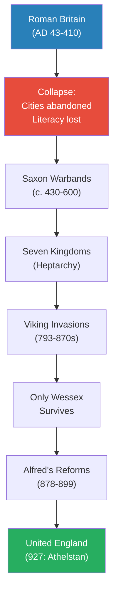
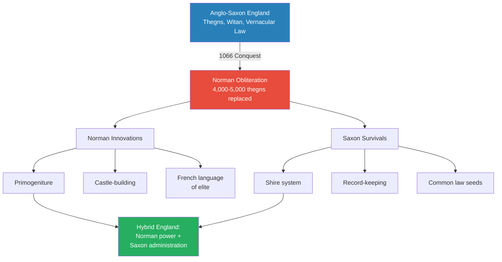
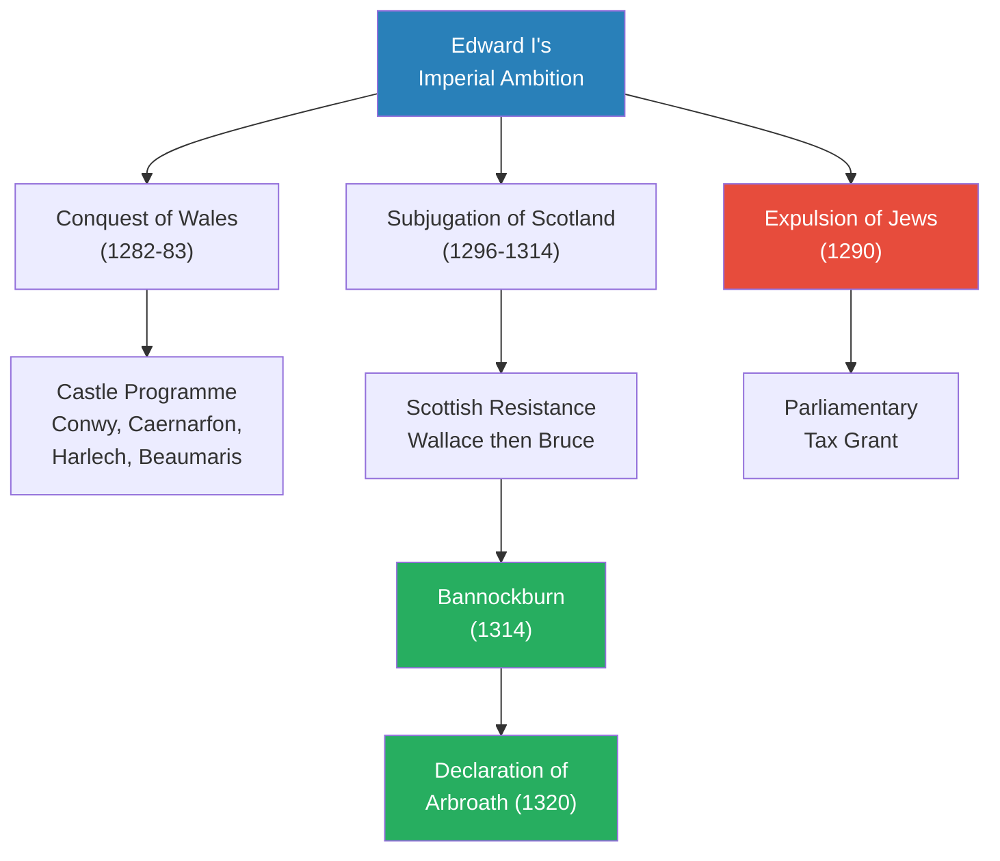
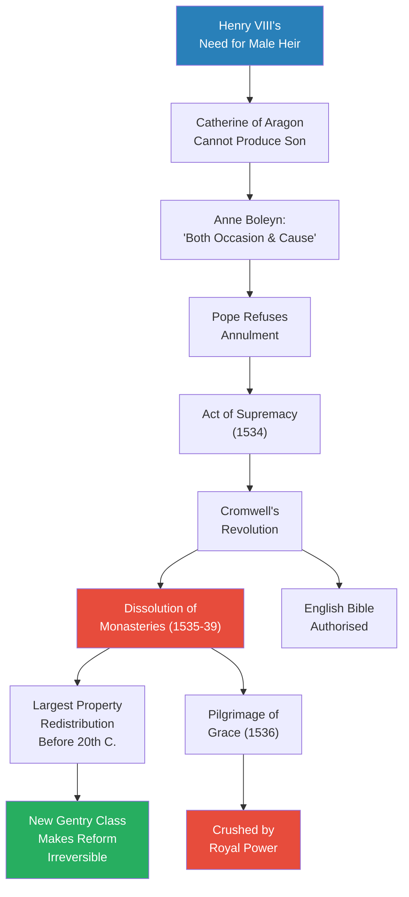
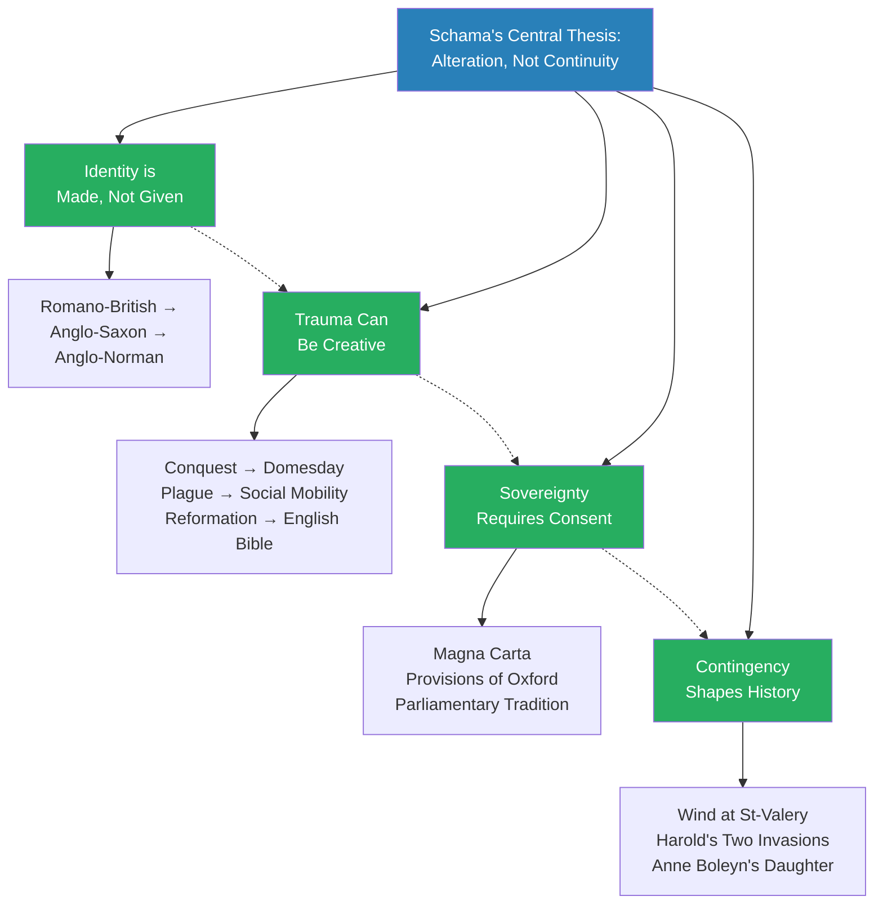

# A History of Britain Vol 1: At the Edge of the World? — Simon Schama

> Simon Schama, a Columbia University professor who had lived outside Britain for twenty years, returned to write the history of his homeland as a story of alteration rather than continuity. Written as a companion to the celebrated BBC television series, this first volume covers the enormous sweep from Neolithic Orkney (c. 3000 BC) through the death of Elizabeth I in 1603 — taking in Roman occupation, Anglo-Saxon kingdoms, the Viking invasions, the Norman Conquest, the Angevin empire, the Black Death, the Reformation, and the rise of Elizabethan England. Schama rejects both the Churchillian triumphalist narrative and the radical counter-narrative of class oppression, arguing instead that British identity has always been fluid, hybrid, and contested. The result is a vivid, opinionated, and deeply personal account that puts the reader inside the heads of Saxon warriors, plague victims, and Tudor queens — history that reads like a novel but argues like an essay.

---

## About the Author

Simon Schama is University Professor of Art History and History at Columbia University in New York. A British Jew who grew up in north London before spending two decades in America, Schama brings both insider knowledge and outsider distance to British history. He made his name with *Citizens* (1989), a revolutionary narrative history of the French Revolution, and *Landscape and Memory* (1995), a sweeping meditation on nature and culture. The BBC television series *A History of Britain* (2000-2002) made him one of the most recognisable historians in the English-speaking world. His approach is unapologetically literary, personal, and selective — he tells stories rather than building comprehensive surveys.

---

## The Big Idea

- Schama's central argument is that <b style="color: #27ae60">British identity is fluid, not fixed — alteration and mutation are the norm, not continuity</b>
- He rejects the "Churchillian epic" — bullishly insular, romantically princely, axiomatically Protestant, Whiggishly parliamentary — but also refuses to replace it with a radical counter-narrative of exploitation and oppression
- Instead, he proposes a history "respectful of contingency, mistrustful of inevitability, indifferent to any predetermined route or destination"
- The United Kingdom itself is "not a truism but a question"

Every chapter in the book demonstrates the same pattern:
- An existing identity is shattered by a traumatic event — invasion, plague, religious revolution
- Out of the wreckage, a new hybrid identity emerges that is neither the old nor the purely imposed new
- Roman-British becomes Anglo-Saxon, Anglo-Saxon becomes Anglo-Norman, Catholic England becomes Protestant England
- At no point is there a fixed, stable "Britishness" that endures unchanged
- <b style="color: #e74c3c">The comfortable myth of an island people marching steadily toward parliamentary democracy and imperial greatness is an invention, not a discovery</b>

Schama also insists on a multi-national perspective:
- The book is about Britain, not just England — Scotland, Wales, and Ireland appear as nations with their own voices, not just provinces of an English story
- The Declaration of Arbroath, the lords of Snowdonia, and the Irish princes all "found their voice" in response to English aggression
- <b style="color: #2980b9">Nativism as a response to empire</b> is one of the book's recurring themes — the more alike Britain's nations became, the more determined they were to remain apart

This perspective aligns with but also challenges [[The English and Their History - Robert Tombs]], which covers the same period but focuses specifically on England and argues for greater institutional continuity. Where Tombs sees a thread stretching from Alfred to the present, Schama sees repeated ruptures and reinventions.

---

## Key Concepts at a Glance

| Concept | One-line summary |
|---------|-----------------|
| **Alteration, not continuity** | British identity is constantly remade through trauma and hybridisation, not preserved |
| **The sovereign as negotiation** | Effective rulers balance royal authority with the "community of the realm" — autocrats fall |
| **The body natural and body politic** | Monarchs are flesh and blood but also institutions — the tension drives the narrative |
| **Nativism as response to empire** | Subject peoples develop stronger identities in reaction to imperial imposition |
| **King Death as liberator** | The Black Death shattered feudalism more completely than any political revolution could |
| **Spectacle is power** | Display was not a distraction from government — it was government |
| **Popular loyalty is conditional** | Rebels professed loyalty to the Crown while attacking its officers |
| **The Reformation from above** | The break with Rome was imposed by Henry VIII, not demanded by the people |
| **Elizabeth's two bodies** | Virginity transformed from a liability into a patriotic cult of national identity |
| **Contingency shapes history** | A different wind, a different birth, a different horse ride — and everything changes |

---

*The span of this single volume — from Neolithic stone villages to the death of Elizabeth I — covers roughly 4,600 years of continuous habitation, a reminder that "British history" is not just the last millennium. The red nodes mark the two great ruptures — the Norman Conquest and the Black Death — that Schama identifies as the most transformative events in this long arc.*

### Schama's Fifteen Key Principles

| # | Principle | Evidence |
|---|-----------|----------|
| 1 | Identity is made, not given | Every invasion — Roman, Saxon, Viking, Norman — created hybrid cultures |
| 2 | Trauma can be creative | Conquest produced Domesday; plague produced social mobility; Reformation produced the English Bible |
| 3 | Sovereignty requires consent | From the witan to Magna Carta to Parliament — autocrats are removed |
| 4 | The Church was the state's co-equal | Becket's martyrdom kept Church courts independent for 350 years |
| 5 | The law outlives the lawgiver | Alfred's codes, Henry II's common law, Magna Carta — all survived their creators |
| 6 | Military success breeds stability | Edward III's victories kept Parliament cooperative; John's failures produced Magna Carta |
| 7 | Empire corrodes the metropole | Angevin overextension destabilised England; Edward I's wars bankrupted the treasury |
| 8 | Women in power provoked anxiety | Eleanor, Mary, Elizabeth — female rule was considered either unnatural or divinely exceptional |
| 9 | Spectacle is power | From Becket's embassy to Elizabeth's progresses — display was government |
| 10 | Popular loyalty is conditional | Rebels loved the king but hated his councillors |
| 11 | Religious change came from the top | The Reformation was imposed by Henry VIII, not demanded by the people |
| 12 | Knowledge is power | Domesday Book, Cromwell's visitations, Walsingham's spies — information was the foundation of state power |
| 13 | Proximity to the throne is lethal | Alfred Atheling, Thomas More, Anne Boleyn, Mary Queen of Scots — a catalogue of death |
| 14 | The "auld alliance" was rational | Scotland turned to France every time England pushed — a paranoid loop lasting centuries |
| 15 | Contingency shapes history | The wind at St-Valery, Anne Boleyn's daughter, Alexander III's horse — accidents determined outcomes |

---

## Preface: History as Alteration

*Schama opens not in the distant past but in the twentieth century, using two defining public ceremonies to frame his entire approach to British history.*

- The coronation of Elizabeth II in 1953 and Winston Churchill's funeral in 1965 both radiated a sense of unbroken continuity — history as endurance, the island story as an uninterrupted march from Magna Carta to Blitz spirit
- <b style="color: #2980b9">The "Churchillian epic"</b> presented British history as bullishly insular, romantically princely, axiomatically Protestant, and Whiggishly parliamentary
- Millions watched these ceremonies and felt they were witnessing the latest chapter in a story that stretched back unbroken to Alfred the Great — perhaps even to the ancient Britons
- The pageantry was comforting precisely because it promised permanence in a world of Cold War uncertainty

But Schama's own family experience complicated this patriotic glow:
- His father explained what "PJ" (Perish Judah) scrawled on a railway wall meant — and the young Simon realised that for his father's generation, Churchill's "island fortress of freedom" was not a hollow platitude but "a necessary article of faith"
- This personal anchoring is deliberate — Schama positions himself as a Jewish Londoner for whom the triumphalist narrative had real emotional power, even as he sets out to dismantle it
- The Churchillian story worked for Schama's father because it promised that Britain was a place where even Jews were safe — a promise that required belief, not just evidence

The manifesto Schama lays down:
- The Churchillian epic "cannot be sustained as the definitive meaning of British history" — but neither can it be "airily dismissed as a deluded anthology of patriotic fairy-tales"
- Arthur Bryant's sentimentalised "Merrie England" is one extreme; a radical rewrite focused on gibbets, rick-burners, and "the propertied despotism of the complacent squirerarchy" is the other
- <b style="color: #27ae60">What is needed is a history of "alteration, mutation and flux" — where national identity is "decidedly shifting and fluid"</b>
- The United Kingdom's unity may be no more coherent than that of a "united states" — and no less worth defending "for precisely its generous heterogeneity"
- Television can inject "fresh energy and drama" into public history — but the book goes substantially further than the screen, offering depth that moving images cannot provide

> [!tip] Core Insight
> Schama's thesis is not that British history lacks continuity — it is that the continuity has been overstated, and the repeated disruptions, hybridisations, and reinventions have been systematically under-told. The real story is alteration. Every chapter that follows will demonstrate an identity being shattered and remade.

Why does this matter now? Because the question of what Britain is — a union of nations or an English empire with Celtic appendages — was as urgent when Schama wrote in 2000 as it had been in any previous century:
- Scottish devolution had just created a parliament in Edinburgh for the first time since 1707
- Welsh devolution created an assembly in Cardiff
- The Northern Ireland peace process was rewriting the relationship between Britain and Ireland
- The question mark in Schama's title — *At the Edge of the World?* — was aimed at the present as much as the past
- If British identity is alteration rather than continuity, then the current alterations (devolution, European integration, multiculturalism) are not threats to the nation but the latest chapter in its oldest story

---

## Chapter 1: At the Edge of the World?

*From stone-age villages with indoor latrines to Alfred's burning of the cakes, Schama argues that Britain was never at the "edge" of the world but was always deeply connected to wider European civilisation — and that identity was remade with every new wave of arrivals.*

### Neolithic Britain: Style Before History

- <b style="color: #2980b9">Skara Brae, Orkney (c. 3000 BC)</b> — a village of fifty to sixty souls with proper homes of 320 square feet each:
  - Central hearths, sleeping areas with fur blankets, stone dressers displaying carved objects
  - The dressers were positioned to face the doorway — visitors would see the household's prized possessions the moment they entered, just as we display photos and ornaments today
  - Possibly even indoor latrines — stone drainage channels suggest the earliest evidence of domestic plumbing in Europe
  - Abandoned around 2500 BC when the climate turned colder and sand buried the settlement
  - Not rediscovered until a storm uncovered it in 1850
- Schama uses Skara Brae to make a point that recurs throughout the book: history is "a dialogue between the alien and the familiar"
  - These people are separated from us by five millennia, yet they cared about home comfort, aesthetics, and impressing their neighbours
  - The assumption that prehistoric Britons were grunting cave-dwellers is shattered by the evidence of their daily lives

- <b style="color: #2980b9">Maes Howe tomb</b>: the thirty-foot passageway was deliberately low, forcing bearers to stoop in an attitude of respect
  - The interior was lit only once a year by the winter solstice — a shaft of light that penetrated the darkness for precisely the right number of minutes
  - Bodies were laid in foetal position as if "waiting to be reborn"
  - The engineering precision required to align the passageway with the solstice is extraordinary — this was not a primitive society but one capable of astronomical calculation
- Iron Age Britain was not a land of savages but a "dynamic, expanding society":
  - Sophisticated metalwork that circulated across trade networks reaching the Continent
  - Hill forts (like Maiden Castle in Dorset) that were engineering marvels of earthwork and timber
  - A warrior culture with chariots, decorated shields, and complex social hierarchies
  - Britain was connected to Europe by trade, migration, and cultural exchange long before Rome arrived

> [!example] Skara Brae: A 5,000-Year-Old Village with Style (c. 3000 BC)
> - Fifty to sixty people lived in stone houses with central hearths, sleeping areas, and stone dressers
> - The dressers displayed carved objects — evidence of aesthetic taste five millennia ago
> - Stone drainage channels suggest indoor latrines — Europe's earliest domestic plumbing
> - The village was abandoned when Orkney's climate deteriorated around 2500 BC
> - Sand buried the settlement so completely that it survived intact until a storm uncovered it in 1850
> - When excavated, the houses still contained stone furniture in situ — as if the inhabitants had just stepped out
> **The lesson:** Schama opens with Skara Brae to demolish the assumption that prehistoric Britain was primitive. These people had "style" — they cared about comfort, display, and beauty. The distance between them and us is smaller than we imagine.

---

### Rome in Britain

- Caesar's two invasions (55-54 BC) were botched spectaculars — propaganda exercises that failed to become conquests:
  - In two successive years, storms destroyed his fleet and the weather turned hostile
  - The British chieftain Cassivelaunus remained "elusively undefeated," using guerrilla tactics that Caesar's legions could not counter
  - Cicero dismissed the expedition with cutting contempt: no gold, no silver, "no booty apart from captives"
  - Caesar claimed victory, but everyone in Rome knew the truth — Britain had defeated him through weather and terrain
- The real conquest came under Claudius in AD 43:
  - 40,000 troops crossed the Channel — the biggest military force Britain had ever seen
  - Claudius himself arrived to lead the final push, bringing elephants for maximum theatrical impact
  - The conquest was not simply military domination but a cultural project — Romanisation transformed the landscape
- <b style="color: #2980b9">Togidubnus</b> of the Regnenses exemplified how local elites were absorbed into Roman identity:
  - He became "Tiberius Claudius Cogidumnus" and built a magnificent palace at Fishbourne with mosaic floors
  - His willingness to become Roman — to adopt Roman names, Roman dress, Roman religion — was the template for collaboration
  - In exchange, he got to keep his power and his lands
- Roman Britain as a hybrid culture: "It was the beginning of authentic urban life in Britain"
  - Cities with forums, baths, amphitheatres, and temples rose across southern England
  - Roads connected them in a network that would not be surpassed until the turnpike era
  - But the hybridisation was never complete — in the countryside, beyond the villa estates, Celtic life continued largely unchanged

> [!example] Boudicca's Revolt (AD 60)
> - Boudicca, queen of the Iceni in East Anglia, was flogged by Roman soldiers and her daughters were raped after the Romans seized Iceni lands
> - Her army destroyed Colchester first, knocking Claudius's head off his bust and throwing it in the river
> - London and St Albans were burned to the ground — a bowl of carbonized dates survives as a relic of the firestorm at Colchester
> - An estimated 70,000-80,000 people were killed in the three cities
> - The Roman governor Paulinus rallied his legions and crushed the revolt in a pitched battle, choosing ground that negated Boudicca's numerical advantage
> - Boudicca died shortly after — whether by poison or illness is unknown
> - She became a national heroine only in the Victorian era, when a statue was erected near the Houses of Parliament
> **The lesson:** Even under Rome's overwhelming power, resistance was possible — but rarely successful. Boudicca's story also illustrates how the English recycled historical figures to serve later purposes — she was irrelevant for 1,800 years before the Victorians claimed her.

---

### The Vindolanda Letters

- <b style="color: #2980b9">Vindolanda tablets</b> — paper-thin wooden postcards from a garrison near Hadrian's Wall — reveal daily life in Roman Britain with astonishing intimacy:
  - A birthday party invitation from Claudia Severa to Sulpicia Lepidina — one of the earliest known examples of a woman's handwriting in Latin
  - Tallies showing 456 of 756 soldiers absent or sick at any given time — a garrison running at barely sixty per cent strength
  - A diet of oysters, roe-deer venison, and pepper — the officers ate well
  - The soldiers' nickname for the natives: "Brittunculi" — wretched little Brits
- The letters humanise the Roman occupation — these were not marble-faced conquerors but gossiping, grumbling, party-going men and women who happened to be stationed at the edge of empire
- Schama uses Vindolanda to argue that the Roman period was not a prelude to "real" British history but a genuine civilisation in its own right — complete with its own snobberies, its own social life, its own casual contempt for the locals
- The tablets also reveal the mundane realities of empire:
  - Supply requests for underpants and socks — the soldiers were cold
  - Complaints about the quality of the beer
  - Reports of desertions and disciplinary problems
  - A military bureaucracy that would be instantly recognisable to anyone who has served in any modern army
- <b style="color: #2980b9">Hadrian's Wall</b> itself was not so much a barrier as a statement:
  - At seventy-three miles long, it was the largest structure in the Roman Empire after the Great Wall of China
  - But it was not designed to stop invasions — it was designed to control movement, monitor trade, and impress both Romans and barbarians with the power of the empire
  - The wall marked the boundary between civilisation and wilderness — at least in Roman imagination
  - North of the wall, the Caledonians remained unconquered — a reminder that even Rome had its limits

### Bath as a Hybrid Site

- <b style="color: #2980b9">Bath</b> was the supreme example of Romano-British fusion:
  - The great thermal springs — the only naturally hot springs in Britain — had been sacred to the Celts long before Rome arrived
  - The Romans did not suppress the local goddess Sulis but combined her with Minerva into <b style="color: #2980b9">Sulis Minerva</b> — a deity that satisfied both Celtic and Roman worshippers
  - Curse tablets were hurled into the sacred waters: "By this Tacita is cursed and declared putrefied like rotting blood"
  - The curses were written in Latin but expressed Celtic beliefs about the power of springs and water spirits
  - The temple precinct attracted pilgrims from across Roman Britain — it was a place where two civilisations met and merged
  - The engineering was extraordinary: a reservoir fed by 1.17 million litres of water per day at a constant 46 degrees Celsius, channelled through lead pipes into a sequence of heated pools
- This hybridisation is Schama's central point about the Roman period: <b style="color: #27ae60">identity was not erased by conquest but layered</b>
  - The Celtic gods survived by acquiring Roman names
  - The local elite survived by acquiring Roman manners
  - The result was neither purely Roman nor purely Celtic but something new — a pattern that would repeat with every subsequent invasion
  - Roman Britain lasted nearly four centuries — longer than the British Empire — yet left surprisingly little cultural legacy compared to Roman Gaul or Roman Spain
  - When the legions departed, the Romanised veneer peeled away with shocking speed
  - Schama draws the contrast sharply: France is Roman to its bones — its language, its law, its urban structure all descend from Rome; England is not

### The Departure of the Legions

- The end of Roman Britain was not a single dramatic event but a long, drawn-out sigh:
  - Troops were progressively withdrawn to defend the Rhine and Danube frontiers
  - In AD 410, the Emperor Honorius told the British cities to "look to their own defences" — the most consequential abandonment letter in European history
  - The Romano-British elite tried to maintain civilisation for a generation — there is evidence of continued coin use, building repair, and trade into the 420s and 430s
  - But without the legions, there was no force to maintain the roads, defend the frontiers, or enforce the tax system that funded urban life
  - One by one, the cities emptied — London, which had been a thriving metropolis of 30,000, shrank to perhaps a few hundred squatters living in the ruins
  - <b style="color: #e74c3c">Within a generation, four centuries of Roman civilisation had effectively vanished</b>
  - This is Schama's most striking illustration of how fragile identity can be — Romanness was not deep enough in Britain to survive without Roman power to sustain it

---

### The Saxon Transformation

- When Rome withdrew around AD 410, Romano-British civilisation collapsed with shocking speed:
  - Latin did not survive as a spoken language — unlike in France, Spain, or Italy, where it evolved into Romance languages
  - Cities were abandoned or shrank to tiny settlements inside crumbling walls
  - Literacy vanished for over a century
  - Christianity retreated to the Celtic fringes — Wales, Ireland, Scotland
- <b style="color: #e74c3c">The collapse was so complete that historians debate what happened to the Romano-British population</b>
  - Did they die? Were they enslaved? Did they simply stop being "Roman" and revert to Celtic ways?
  - The archaeological record shows a dramatic decline in material culture — pottery, metalwork, building all regressed
  - Schama draws the contrast sharply: "France is Roman to its bones; England is not"
- Saxon warbands filled the power vacuum over the next two centuries:
  - Not a mass population replacement but small groups of warriors establishing themselves as local rulers
  - They brought their language (Old English), their social structures (kinship groups, warrior culture), and their pagan religion
  - DNA evidence supports the modern view — the English are genetically more similar to the pre-Roman inhabitants than to modern Germans
  - The Saxons were a ruling elite, not a replacement population
  - This matters enormously for Schama's thesis because it challenges the idea of "Anglo-Saxon England" as a blank slate
  - The population beneath the Saxon lords was largely the same people who had lived there under Rome — they adopted a new language and new rulers, but their genetic inheritance was unchanged
  - Schama draws a parallel to the Norman Conquest: in both cases, a warrior elite imposed itself on an existing population that largely survived and adapted
  - And later, the same pattern repeated with the Vikings — the Danelaw was Danish-ruled, but the farmers were mostly the same people who had been there before
  - The pattern of conquest in Britain was consistent across millennia: small numbers of warriors established themselves as rulers, intermarried with the existing population, and created hybrid cultures
  - This is the mechanism behind Schama's thesis of alteration: each new layer does not replace what came before but mixes with it, producing something genuinely new
  - "British" identity is not one thing but an accumulation of layers — Celtic beneath Saxon beneath Viking beneath Norman, each layer adding to the mixture without fully erasing what came before
  - This layering is still visible today: in place-names (Celtic rivers, Saxon villages, Viking -bys, Norman castles), in law (Anglo-Saxon rights, Norman procedures), in language (Saxon words for the body, French words for the mind), and in the genetic code of the British population itself
  - Schama argues that this layered identity is not a weakness but a strength — it is what makes British culture adaptable, resilient, and open to change
  - The book's central metaphor is geological: identities are deposited in strata, each layer compressed but never completely obliterated by the weight above it
- Christianity was reintroduced from two directions:
  - From Rome: Augustine's mission to Kent in 597, sent by Pope Gregory the Great
  - From the Celtic churches of Ireland and Scotland: Columba and Aidan, who brought a different tradition of monastic Christianity
  - The Synod of Whitby (664) resolved the conflict in favour of Rome — aligning England with mainstream European civilisation
  - The decision at Whitby was about more than the date of Easter; it was about whether England would face Europe or face the Celtic west
  - By choosing Rome, the English committed themselves to being part of the wider European community — a decision with consequences that stretched from Whitby to Brexit
  - Christianity brought not just a religion but an entire administrative infrastructure: literacy, record-keeping, correspondence networks, and a hierarchy that could coordinate action across multiple kingdoms
  - The monasteries became the engines of Anglo-Saxon civilisation: they preserved learning, trained administrators, and produced the texts — Bede's *Ecclesiastical History*, the Anglo-Saxon Chronicle, *Beowulf* — that gave the English a sense of who they were
  - Without the monasteries, there would have been no written English, no legal codes, and no administrative apparatus for Alfred to build upon
  - The irony is bitter: the monasteries that created English civilisation in the seventh century would be destroyed by the English Crown in the sixteenth — Schama traces this arc with the eye of a novelist

The <b style="color: #2980b9">Saxon sparrow speech</b> from Bede captures the psychological appeal of conversion:
- A nobleman compared human life to a sparrow flying through a warm hall in winter — briefly escaping the darkness and cold before vanishing back into the storm
- "It feeleth no smart of the winter storm but after a very short space...it soon passeth again from winter to winter"
- Christianity offered an answer to what came before and after the warm hall — it promised meaning where paganism offered only endurance
- Schama calls this passage one of the most beautiful metaphors in English literature — and notes that Bede was "the first consummate English story-teller"

### The Seven Kingdoms

- Before unification, England was divided into rival kingdoms — the <b style="color: #2980b9">Heptarchy</b>:
  - Northumbria, Mercia, East Anglia, Essex, Kent, Sussex, and Wessex
  - Power shifted between them: Northumbria dominated in the seventh century, Mercia in the eighth, Wessex in the ninth
  - Each had its own royal dynasty, laws, and customs
  - But Bede's concept of a single English people provided the ideological framework for eventual unification
- Anglo-Saxon society was far more sophisticated than the "Dark Ages" label suggests:
  - Complex legal codes written in English (not Latin) — beginning with Aethelberht of Kent's laws (c. 600), the earliest Germanic law code in any language
  - Active trade networks reaching Scandinavia, the Rhineland, and the Mediterranean
  - A tradition of royal councils — the <b style="color: #2980b9">witenagemot</b>, the "meeting of the wise" — that constrained kings:
    - Kings could not make law, levy taxes, or go to war without consulting their great men
    - This was not democracy, but it was limited government — the distant ancestor of Parliament
    - The principle that the king rules with the consent of his leading subjects was established long before Magna Carta
  - The Church played a central role in governance:
    - Bishops and abbots were major landowners and political figures
    - Monasteries kept records, trained administrators, and provided the literate personnel that government required
    - The partnership between Church and Crown gave Anglo-Saxon England an administrative capacity unmatched in Western Europe
- The <b style="color: #2980b9">Sutton Hoo</b> treasure (discovered 1939 in Suffolk) reveals a culture of extraordinary artistic refinement:
  - A ship burial containing a gold helmet, jewellery, weapons, and Byzantine silverware
  - Evidence of long-distance trade and cultural connections across Europe
  - The helmet — reconstructed from hundreds of fragments — is one of the iconic images of early English history
  - Whoever was buried at Sutton Hoo (possibly King Raedwald of East Anglia) commanded resources and artistic patronage rivalling any Continental ruler

> [!example] The Lindisfarne Gospels (c. 700)
> - Created at the monastery of Lindisfarne off the Northumbrian coast, the Gospels are among the finest illuminated manuscripts in existence
> - They combine Celtic, Anglo-Saxon, and Mediterranean artistic traditions in a single book — spiralling Celtic knotwork alongside Roman-style lettering and Byzantine colour schemes
> - A single monk, Eadfrith, is credited with creating the entire manuscript — years of solitary work in a freezing island scriptorium
> - The Gospels are a visual symbol of England's position at the crossroads of European culture — not isolated but connected, absorbing influences from every direction
> **The lesson:** The "Dark Ages" were anything but dark. While the political landscape was fragmented, the cultural achievement was extraordinary — and it was produced by a society that defined itself as Christian and English before any king united the country.

---

### Alfred and the Making of England

*Alfred's transformation from a fugitive hiding in a marsh to the founder of a nation is one of the great stories in English history — and Schama tells it as a story of ideas as much as battles.*

- Viking raids began with the sack of Lindisfarne in 793 — a holy place destroyed by pagans
  - The Anglo-Saxon Chronicle recorded it with horror — a sign of God's displeasure
  - The raids escalated over the next decades from coastal hit-and-run to full-scale invasion
  - By the 870s, Danish armies had conquered Northumbria, East Anglia, and Mercia
  - Only Wessex survived as an independent English kingdom
- The <b style="color: #2980b9">Danelaw</b> — the area of Danish settlement and law — covered roughly the eastern half of England
  - Danish place-names still mark the landscape: any town ending in -by (Whitby, Derby) or -thorpe (Cleethorpes) was a Viking settlement
  - The Vikings were not merely raiders but settlers, farmers, and traders who intermarried with the local population
- <b style="color: #2980b9">Alfred the Great</b> was reduced to hiding in the Athelney marshes — the lowest point for English kingship
  - He famously burned the swineherd's wife's cakes, so preoccupied with his troubles that he forgot to watch them
  - The story is probably apocryphal but captures something real: a king so reduced that he was scolded by a peasant woman

> [!example] Alfred in the Marshes (878)
> - After Danish armies overran nearly all of England, Alfred fled to the wetlands of Athelney in Somerset with a handful of followers
> - He was so reduced that a swineherd's wife scolded him for burning her cakes — not knowing he was the king
> - In the marshes, he had a vision of St Cuthbert promising victory — divine reassurance at the moment of deepest despair
> - Alfred rallied the fyrd (militia) of Wiltshire, Somerset, and Hampshire and marched to Edington
> - He crushed Guthrum's Danish army in a decisive battle and pursued the survivors to their camp
> - Then, in an extraordinary gesture, he stood godfather at the defeated Viking's baptism
> - Guthrum became Athelstan, Christian king of East Anglia, bound to Alfred by spiritual kinship
> - The man who had nearly destroyed England was absorbed into Christian English civilisation
> **The lesson:** The lowest point produced the highest transformation. Alfred used defeat as the catalyst to reinvent English kingship — from warrior chief to Christian lawgiver, from tribal leader to national builder. And he defeated the Vikings not by destroying them but by converting them.

Alfred's rebuilding programme was comprehensive:
- Created the first English navy — ships built to a new design, larger and faster than Danish longships
- Established a network of fortified towns (<b style="color: #2980b9">burhs</b>) across Wessex, ensuring that no point in the kingdom was more than twenty miles from a defensive stronghold
- Codified the first body of English law, drawing on biblical precedent and earlier Saxon codes
- Translated Latin texts into English, insisting that education should be available in the vernacular
  - He personally translated Boethius's *Consolation of Philosophy* and Pope Gregory's *Pastoral Care*
  - Schama credits this as one of the most significant cultural decisions in English history — it meant that England developed a written vernacular tradition centuries before any other European country
  - He also created a system of military obligation — the fyrd was organised so that half the warriors served while the other half tended the harvest, ensuring that England could fight and eat simultaneously
- Schama calls Alfred simultaneously the most Roman and the most English of Saxon kings:
  - Roman in his ambition to create institutions that would outlast his own life — law codes, burghal systems, educational programmes
  - English in his insistence on the vernacular and his respect for the witan (royal council)
  - He understood that a king who could read was a king who could govern — and a people who could read in their own language were a people who could be governed more effectively
  - <b style="color: #27ae60">Alfred transformed kingship from a warrior chieftaincy into an institution of "classical and biblical pretensions"</b>
  - He compared himself to Solomon, to David, to the Christian emperors of Rome — not out of vanity but because these models provided a vocabulary for what he was trying to build
  - The comparison with [[The English and Their History - Robert Tombs]] is instructive: Tombs credits Alfred with creating the template for English governance that survived the Conquest and every subsequent crisis; Schama agrees on Alfred's importance but emphasises that the template was contingent — it could easily have been destroyed

> [!tip] Core Insight
> The Vikings inadvertently created England. Before the Danish invasions, "England" was a collection of rival kingdoms — the Heptarchy of Northumbria, Mercia, East Anglia, Essex, Kent, Sussex, and Wessex. Only the existential threat of total conquest gave Alfred the political justification to build a unified kingdom — and the administrative machinery to hold it together.

Alfred's successors completed the work he began:
- <b style="color: #2980b9">Edward the Elder</b> (899-924) reconquered the Danelaw, building burhs across the Midlands and East Anglia
- His sister <b style="color: #2980b9">Aethelflaed, Lady of the Mercians</b>, was one of the most remarkable military leaders of the period — she built fortified towns and led armies while her brother conquered the east
  - Schama notes that a woman commanding armies in the tenth century was extraordinary — and that Aethelflaed's achievements have been largely forgotten because they do not fit the conventional narrative
- <b style="color: #2980b9">Athelstan</b> (924-939) became the first king of all England, defeating a combined Norse-Scottish army at the Battle of Brunanburh in 937
  - The Anglo-Saxon Chronicle celebrated it as the greatest victory since the Saxons first came to Britain
  - Athelstan's court attracted scholars and artists from across Europe — England was no longer at the edge of the world but at its centre
- Edgar the Peaceful (959-975) presided over a golden age:
  - His coronation at Bath was a deliberate echo of Charlemagne's coronation at Aachen — a statement that the king of England was the equal of any Continental ruler
  - At Chester, the kings of Scotland, Wales, and the Norse of Dublin rowed Edgar along the river Dee — a theatrical demonstration of English overlordship
  - These events embodied "the fusion of Rome and ancient Britain" that Schama traces throughout the chapter

The chapter ends with this carefully constructed English identity — Alfred's creation, refined by his successors — poised on the edge of the most traumatic event in English history. Everything that follows in Chapter 2 will test whether identity can survive conquest.

---

*Each collapse — Roman, Saxon fragmentation, Viking devastation — produced a more unified and administratively sophisticated response, culminating in Athelstan's creation of a single kingdom of England in 927.*

---

## Chapter 2: Conquest

*Schama argues that 1066 was a genuine trauma — not a trivial substitution of lords but "the end of something and the beginning of something else." The entire governing class of Anglo-Saxon England was obliterated and replaced by foreigners. Yet what the Normans destroyed, they also built upon.*

### Cnut's Shrewd Rule

- Before 1066, England had already experienced foreign conquest under <b style="color: #2980b9">Cnut the Dane</b> (1016-1035)
- But Cnut's approach was assimilation rather than obliteration:
  - He kept Anglo-Saxon bishops and administrators in place — recognising that the existing system worked
  - Issued codes of law in the English tradition, adding Danish customs where they did not conflict
  - Even wrote public letters offering a contract: "I will shut down my raiding parties if you submit peacefully to my rule"
  - He made pilgrimages to Rome, donated to English monasteries, and cultivated the Church as a partner in governance
  - Schama presents this as a kind of hostile corporate takeover — the new management kept the existing workforce because they were competent
- Cnut was shrewd enough to "run England the English way" — proving that conquest need not destroy what it conquers
- He ruled England, Denmark, and Norway simultaneously — a North Sea empire that was one of the most powerful political units in eleventh-century Europe:
  - His court at Winchester attracted poets, churchmen, and diplomats from across northern Europe
  - England under Cnut was not a backwater but the wealthiest and best-administered kingdom in the north
- The famous story of Cnut commanding the tide to retreat (and failing) was not, Schama notes, a sign of delusion but a deliberate demonstration:
  - His flattering courtiers told him he was all-powerful — Cnut took them to the seashore to prove they were wrong
  - "Let all the world know that the power of kings is vain and trivial" — it was a lesson in the limits of royal authority
  - Schama sees this as a very English moment: the king who understands that power must be restrained is the king who keeps it

### The Godwines and the Road to 1066

- <b style="color: #2980b9">Earl Godwine</b> rose to become the most powerful man in England after the king — but his rise was stained with blood
- Godwine entertained the Saxon prince Alfred at Guildford, swore fealty, then "handed him over to Harold Harefoot's men, who proceeded to butcher Alfred's entourage, tear out the young man's eyes and mutilate his body"
  - This was a calculating act of allegiance to the winning side — Godwine chose Danish Harefoot over the legitimate Saxon heir
  - The betrayal haunted his family for decades and gave the Normans a propaganda weapon
- Harold Godwinson's oath to William of Normandy was the legal pretext for the invasion:
  - The Bayeux Tapestry shows Harold swearing on what turned out to be a concealed chest of holy relics
  - Schama calls the embroiderers "wonderfully devious" for lining up the departure boat immediately after the oath scene — implying it was extracted under duress
  - Whether Harold swore willingly or under coercion remains one of the great unanswerable questions of English history
  - What matters is that William had a claim he could sell to the pope — and papal blessing turned an invasion into a crusade

---

### The Three Battles of 1066

> [!example] The Three Battles of 1066
> - Harold received news that Harald Hardrada of Norway had invaded the north while William of Normandy was still waiting for a favourable wind in France
> - Harold force-marched his army 190 miles in five days — "conceivable only if at least some of the thegns and weapons were carried on horseback"
> - At Stamford Bridge (25 September), Harold destroyed the Norwegian army in a total victory — Hardrada was killed, and the Viking threat to England ended forever
> - Three days later, the wind changed at St-Valery and William crossed the Channel with perhaps 7,000 men
> - Harold marched his exhausted army south — another 250 miles — to meet the Normans at Senlach Hill near Hastings (14 October)
> - The Saxon shield-wall held for hours against Norman cavalry charges, archers, and infantry assaults
> - A feigned Norman retreat lured some English warriors into breaking formation — the fatal mistake
> - Harold fell — tradition says an arrow in the eye, but Schama notes the Bayeux Tapestry evidence is ambiguous
> - By nightfall, England's entire military leadership lay dead on the hillside
> **The lesson:** Harold lost England not because he was a poor general but because contingency — the timing of two invasions within three weeks — made it impossible to face both at full strength. The wind at St-Valery changed everything: had it blown differently for another week, Harold would have fought fresh at Hastings.

- Schama renders the battle from both Saxon and Norman perspectives:
  - If you were a Saxon huscarl in the shield-wall, you would have seen the Norman cavalry charge uphill, their horses struggling on the slope, and felt the satisfaction of watching them turn back
  - If you were a Norman knight, you would have seen a wall of shields and axes that seemed impenetrable — until the feigned retreat cracked it
  - This immersive technique — putting the reader inside the experience — is Schama at his most distinctive
- <b style="color: #e74c3c">The battle lasted from roughly 9 a.m. to dusk — one of the longest pitched battles of the medieval period</b>
  - The fact that the shield-wall held for so long testifies to the quality of Anglo-Saxon military organisation
  - The Norman victory was narrow, not inevitable

---

### The Harrying of the North

- William's initial coronation at Westminster on Christmas Day 1066 was marred by panic:
  - Norman soldiers outside the abbey mistook the acclamation shouts for a Saxon uprising and set fire to surrounding buildings
  - The congregation stampeded for the doors while William was left virtually alone in the church, trembling as smoke drifted through the nave
  - It was an ominous beginning — a reign born in confusion and fear
- Northern England resisted the Conquest far more fiercely than the south:
  - The north had its own traditions, its own powerful earls, and its own connections to Scandinavia
  - Rebellions in 1068 and 1069 involved alliances between Saxon lords, Danish raiders, and Scottish opportunists
  - William's patience snapped after the rebels seized York and killed his garrison
- In the winter of 1069-70, William ordered the systematic destruction of everything between the Humber and the Tees:
  - <b style="color: #e74c3c">"Thousands of men and boys were gruesomely butchered, their bodies left to rot on the highways"</b>
  - Fields and livestock were destroyed so completely that survivors died of famine and pestilence
  - Orderic Vitalis — himself half-Norman, half-English — records refugees starving on the roads, eating rats and dogs
  - The land remained depopulated for decades — the Domesday Book, compiled seventeen years later, still records vast areas of Yorkshire, Durham, and Lancashire as simply "waste"
  - Some historians have called it genocide; others argue the chroniclers exaggerated — but the Domesday evidence of depopulation is difficult to explain away
  - Schama does not shy from the word "genocide" — he lets the sources speak and the reader judge
  - The Harrying was William's most ruthless act, and even his own supporters were horrified by the scale of destruction
- The entire Anglo-Saxon governing class — some 4,000-5,000 thegns — was obliterated and replaced by perhaps 200 Norman families:
  - By 1086, only two English landowners held estates of any significance
  - The Church was similarly purged — Norman abbots and bishops replaced English ones
  - The language of government became French; the language of the Church became Latin; English survived only as the speech of peasants

### Norman vs. Saxon: A New Social Order

- The difference in landholding philosophy was profound:
  - Saxons divided assets among the extended family — the "big family" shared the wealth
  - Normans kept the estate intact through <b style="color: #2980b9">primogeniture</b> — everything to the eldest son
  - This created a permanent aristocracy with deep territorial roots — younger sons had to make their own way, often through the Church or through conquest abroad
- Norman names were acts of possession: "Roger Beau-mont or Mont-Gomery, because the place was them and they were the place"
  - The Normans defined themselves by their estates in a way the Saxons never had
  - This territorial identity would become the foundation of the English class system
- Castle-building transformed the landscape:
  - The Normans built hundreds of motte-and-bailey castles in the first decade after the Conquest
  - These were not just military installations but statements of permanent dominance — stone towers visible for miles, reminding the population who was in charge
  - The Tower of London, begun by William in 1066, remains the most enduring symbol of Norman power
- The linguistic transformation was equally profound:
  - French became the language of the court, the law, and the aristocracy
  - Latin became the language of the Church and administration
  - English survived only as the speech of the common people — the conquered
  - This produced the peculiar English vocabulary we still use: the animal in the field is an English word (cow, sheep, pig) because the Saxon peasant tended it; the meat on the table is a French word (beef, mutton, pork) because the Norman lord ate it
  - The social hierarchy was encoded in language — and it took three centuries before English re-emerged as the language of government
- <b style="color: #2980b9">Orderic Vitalis</b> — himself half-Norman, half-English — provided the rare voice that criticised the Conquest from the inside:
  - Born to a Norman father and English mother, he understood both worlds
  - His chronicle records the devastation of the north with genuine anguish — this was not detached reporting but the testimony of someone who felt the suffering personally
  - He is the closest thing to an objective witness in a world of partisan chroniclers
  - His perspective — part insider, part outsider — mirrors Schama's own position as a British historian who had lived abroad for twenty years
- The Conquest also transformed the physical landscape of England:
  - The forests were expanded and placed under "forest law" — a separate legal system designed to protect the king's hunting
  - Entire villages were cleared to create the New Forest in Hampshire — William's personal hunting ground
  - The severity of forest law was legendary: killing a deer carried the same punishment as killing a man
  - For ordinary English people, the forests were a daily reminder that the Normans had imposed not just a new ruling class but a new relationship between people and land
  - The resentment this created would echo through the Robin Hood legends — the outlaw in the greenwood, resisting Norman tyranny

---

### The Domesday Book

- In 1086, William ordered the most comprehensive survey of property in European history
- "So very narrowly did he have it investigated that there was no single hide...nor one ox or one cow or one pig left out"
- Schama calls William <b style="color: #27ae60">"the first data-base king"</b> — a ruler who understood that knowledge of what you own is the foundation of power
- The Domesday Book was a hybrid achievement:
  - Norman military force married to Anglo-Saxon administrative genius
  - No other country in Europe had the bureaucratic infrastructure to produce such a document
  - The Anglo-Saxon tradition of shires, hundreds, and meticulous record-keeping made it possible
  - William used Saxon methods to consolidate Norman power — the conquered people's own efficiency was turned against them
- The survey was completed in a single year — an extraordinary administrative feat that no other European government could have matched:
  - Commissioners were sent to every county; evidence was taken under oath from sheriffs, priests, and local jurors
  - The data was cross-checked — a second team followed the first to verify the figures
  - The survey recorded not just who owned what in 1086 but who had owned it in 1066 (before the Conquest) — making it possible to trace exactly who had lost what to whom
  - This retrospective dimension was a deliberate reminder of the Conquest's totality — every Saxon loss was documented
- It became the foundation of English land law for centuries — questions of ownership were settled by reference to "what it says in Domesday"
- The nickname itself — "Domesday" (Doomsday) — reflects how people saw it: the final, irrevocable judgement on who owned what, from which there was no appeal
- Schama notes that information control is a recurring theme in the book: from Domesday to Cromwell's monastic visitations to Walsingham's spy network, <b style="color: #27ae60">the ability to know what you rule is the foundation of ruling it</b>

> [!example] William's Deathbed Confession (1087)
> - Orderic Vitalis records William's dying words: "I have persecuted its native inhabitants beyond all reason...many I have unjustly disinherited"
> - This rare confession from a conqueror acknowledged the scale of devastation his rule had caused
> - But the confession changed nothing — the Norman settlement was permanent
> - After his death, "the inferior attendants laid hands on the arms, linen, plate and royal furniture and hastened away leaving the corpse almost naked on the floor"
> - His body was so bloated from overeating that it would not fit in the stone sarcophagus — and when forced in, it burst, filling the church with a foul stench
> - The service was interrupted by a man claiming the land on which the church stood had been stolen from his father — he demanded compensation before allowing the burial to proceed
> - The most powerful man in Western Europe was abandoned naked by his servants, couldn't fit in his coffin, and was buried on disputed ground after paying compensation to a complainant
> **The lesson:** Power does not outlast the body. William's confession was genuine but futile — the Conquest could not be undone. Schama uses this grotesque scene to underline the gap between the Conquest's grandeur and its human reality. Even in death, the property disputes that defined Norman England pursued the Conqueror.

> [!tip] Core Insight
> The Norman Conquest was the most transformative single event in English history — more disruptive than the Roman invasion, more permanent than the Viking settlements. It rewired language, law, land ownership, and class structure. And yet the partnership between Norman military force and Saxon administrative capacity produced something neither could have built alone: a state more powerful and better documented than any other in medieval Europe.

---

*The Conquest destroyed Anglo-Saxon England's governing class but could not erase its administrative traditions. The resulting hybrid — Norman military muscle grafted onto Saxon bureaucratic sophistication — became the foundation of English governance for centuries.*

---

## Chapter 3: Sovereignty Unbound?

*The Angevin dynasty reinvented government so forcefully that it provoked opposition setting permanent limits on the medieval state. Two events shaped the next four centuries: Becket's martyrdom kept the Church independent of the Crown, and Magna Carta established that the law was not simply the king's will.*

### Geoffrey of Monmouth and the Arthurian Myth

- During the civil war between Stephen and Matilda (1135-1154), <b style="color: #2980b9">Geoffrey of Monmouth</b> wrote his *History of the Kings of Britain* (1136)
- He invented "Brutus" founding "Troia Nova" on the Thames, and elaborated the legend of King Arthur into a full-scale national mythology
- The tale of King Leir was an obvious parallel to the division of the kingdom during the civil war
- Geoffrey was writing for a Norman audience, creating a glorious pre-Saxon past:
  - If Britain had been great before the Saxons, the Normans could claim to be restoring that greatness, not imposing something foreign
  - The Arthurian myth became the foundation of English royal mythology for centuries
  - Edward I displayed "Arthur's crown" when conquering Wales
  - The Tudors claimed Arthurian descent to bolster their shaky legitimacy
- Arthur is almost certainly fictional — there is no contemporary evidence for his existence — but the myth was more powerful than any fact

---

### Henry II: The Restless Engine

- <b style="color: #2980b9">Henry II</b> ruled a cross-Channel realm stretching from Scotland to the Pyrenees — the <b style="color: #2980b9">Angevin Empire</b>
- This was not a unitary state but a "multi-national family firm" held together by the personality of one man
- His marriage to Eleanor of Aquitaine combined the largest territory in medieval Europe:
  - She was thirty, he was eighteen, and "something surprising apparently happened: the parties concerned appeared to desire each other"
  - Eleanor brought Aquitaine — roughly a third of France — as her dowry
  - The marriage created an empire larger than the king of France's own domain
- Henry's restless energy was legendary:
  - His courtier Peter of Blois described the court's frantic attempts to keep up with a king who "took delight in seeing what a fix we were in"
  - He was constantly in motion — crossing the Channel, riding to suppress rebellions, inspecting his domains
  - He governed by personal presence, not by delegation — the entire administrative apparatus depended on the king being physically present
  - His temper was legendary: he would roll on the floor chewing rushes in rage, and his rages could lead to decisions he later regretted
  - Yet he was also a deeply intelligent man who understood that raw power needed legal and institutional frameworks to be sustainable
- His great achievement was the expansion of royal justice and the <b style="color: #2980b9">common law</b>:
  - He extended the reach of the king's courts into areas previously handled by local lords or the Church
  - Travelling justices carried the king's law to every corner of the realm
  - This created a uniform legal system that applied to all free men — the foundation of English common law
  - The principle that justice should be accessible, consistent, and based on precedent was revolutionary
- The <b style="color: #2980b9">common law</b> was Henry's most enduring legacy — more important than any battle or treaty:
  - Unlike Roman law (which was codified from above), common law grew organically from decisions made in actual cases
  - Precedent accumulated over time — each judgement became part of the law itself
  - The system was accessible to ordinary people — you did not need to study Roman jurisprudence to understand your rights
  - Trial by jury replaced trial by ordeal — a transformation from divine judgement to human reason
  - The common law would eventually spread to every country colonised by England — including the United States, Canada, Australia, and India — making it one of the most influential legal traditions in history
  - Schama notes that the system Henry created to extend his own power became, over centuries, the primary mechanism for limiting royal power
  - This irony — that tools of control become instruments of freedom — recurs throughout the book: Domesday strengthened the state but also documented rights; Magna Carta preserved baronial privileges but established universal principles; Parliament was summoned to approve taxes but learned to withhold them
- Eleanor of Aquitaine added a human dimension to the political story:
  - She was the most powerful woman in medieval Europe — first queen of France (married to Louis VII), then queen of England (married to Henry II)
  - She had gone on crusade with Louis VII — an extraordinary adventure for a twelfth-century queen
  - She brought Aquitaine — roughly a third of modern France — as her dowry and bore Henry eight children, five of them sons
  - When the marriage soured, she fomented rebellion among her own sons against their father
  - Henry imprisoned her for sixteen years — but she outlived him, surviving to serve as regent for Richard I and kingmaker for John
  - Schama calls her "the manipulative queen-mother, fomenting war between husband and sons" — a woman who wielded power through the men around her because direct power was denied to her sex
  - Eleanor is one of Schama's recurring examples of how women exercised influence in a system designed to exclude them — through marriage, through motherhood, through sheer force of personality
  - She outlived Henry by fifteen years and died in 1204 at the age of eighty-two — an extraordinary lifespan for the twelfth century
  - Her legacy was both political (she ensured Richard's succession and managed the kingdom during his absence on crusade) and cultural (her court at Poitiers was a centre of troubadour poetry and chivalric culture)
  - Schama notes that Eleanor's story anticipates the problems of Chapter 7 — when Elizabeth I would face the same question: how does a woman exercise power in a system designed for men?

---

### The Becket Catastrophe

- <b style="color: #2980b9">Thomas Becket</b> was Henry's chancellor and closest friend before being appointed Archbishop of Canterbury in 1162
- The appointment was intended to give Henry control of the Church — instead, Becket underwent a dramatic transformation:
  - He abandoned his luxurious lifestyle and became an ascetic — wearing a hair shirt crawling with lice beneath his archbishop's robes
  - He fought Henry on every point of Church independence, especially the issue of whether clergy accused of crimes should be tried in royal courts or Church courts
  - The clash was fundamental: Henry wanted a unified legal system under the Crown; Becket insisted the Church was answerable only to God and the pope

> [!example] Becket's Embassy to France (1158)
> - As chancellor, Becket led an embassy to Paris that was a deliberate spectacle of English wealth and power
> - 250 footmen singing English anthems marched in front of the procession
> - Eight carts of Real English Ale, each pulled by five horses with monkeys in livery on their backs
> - Mastiffs and greyhounds in silk collars padded alongside
> - Twenty-eight packhorses carrying gold and silver plate
> - Becket himself "bringing up the rear with studied casualness" — the star arriving last
> **The lesson:** Spectacle was power. Becket understood before he became archbishop that display was not a distraction from politics — it was politics. The French court was meant to be overwhelmed, and it was.

- Becket fled to France for six years after the Constitutions of Clarendon (1164) threatened Church courts
- He returned in December 1170 after a fragile reconciliation — but immediately excommunicated bishops who had sided with Henry
- Henry's furious outburst — "Will no one rid me of this turbulent priest?" (the exact words vary by source) — sent four knights riding for Canterbury

> [!example] The Murder of Thomas Becket (29 December 1170)
> - Four knights burst into Canterbury Cathedral in the late afternoon
> - They found Becket near the altar and demanded he submit to the king's authority
> - Becket, a fifty-two-year-old cockney, refused to flee — he was "a street-fighter" who yelled "PIMP, PIMP" at fitzUrse when the knight grabbed him
> - The first blow cut through the arm of Edward Grim, a monk shielding Becket, and sliced the top of his head
> - A second blow brought him to his knees, and he murmured: "For the name of Jesus and the protection of the Church I am ready to embrace death"
> - A third warrior "scooped out the brains and spread them about the floor," smearing them with his foot on the stone
> - Under his robes they found a hair shirt with lice "moving busily through the fibres" — the secret asceticism that confirmed his sainthood
> - Within three years, Becket was canonised; within ten, Henry walked barefoot to Canterbury and submitted to flogging by monks
> **The lesson:** Becket's martyrdom achieved what his arguments could not. By dying on the altar, he made the Church's independence a matter of sacred blood, not mere legal argument. Church courts remained independent of the Crown for the next 350 years — until Henry VIII broke the principle that Becket's death had established.

> [!tip] Core Insight
> The Becket affair established a principle that lasted until the Reformation: the Church was the state's co-equal, not its servant. The clergy had their own courts, their own taxes, their own law. Henry VIII's break with Rome in the 1530s was revolutionary precisely because it violated centuries of precedent rooted in Becket's blood on the flagstones of Canterbury.

---

### King John and Magna Carta

- Richard I — the Lionheart — spent barely six months of his ten-year reign in England
  - His cross-Channel warfare drained the treasury — Chateau Gaillard, his "saucy chateau" on the Seine, was the most expensive building project in English history to that date
  - "Were its walls made of butter, they would still stand," Richard boasted — but they didn't, and France recaptured the fortress within five years of his death
- Richard's death at Limoges was darkly comic:
  - Amused by a solitary defender using a frying pan as a shield, the king stopped to applaud and was hit by a crossbow bolt
  - He magnanimously ordered the bowman spared — but after the king died, "he was flayed alive instead"
- <b style="color: #e74c3c">John lost Normandy to Philip Augustus of France</b> — and with it, the Angevin empire his father had built
  - According to the Margam Abbey annalist, John "when drunk after dinner slew [Arthur of Brittany] with his own hand and tying a heavy stone to the body cast it into the Seine"
  - The murder of Arthur — John's nephew and rival claimant — horrified even the brutal standards of the age
  - The French-held barons who had lands on both sides of the Channel were forced to choose — most chose France
  - John was left with England alone, and his desperate attempts to reconquer Normandy required ever-higher taxes
- Baronial rebellion produced <b style="color: #2980b9">Magna Carta at Runnymede (June 1215)</b>:
  - Schama insists it was "not a charter of liberty but a charter of liberties, in the medieval sense of exemptions"
  - Most of its sixty-three clauses dealt with specific feudal grievances — fish weirs in the Thames, the rights of widows, forest law
  - It lasted less than three months before John persuaded the pope to annul it
  - But it established a principle that outlived every attempt to bury it:
  - <b style="color: #27ae60">"The law was not simply the will or the whim of the king but was an independent power in its own right"</b>
  - Schama calls it "not the birth certificate of freedom" but "the death certificate of despotism"
  - The Angevins were "schoolmasters of their own correction" — by pushing royal power so hard, they educated the barons in their own rights

The evolution of Magna Carta after 1215 is as important as the document itself:
- John had it annulled within three months — civil war resumed and John died of dysentery in 1216
- His nine-year-old son Henry III reissued the charter to buy baronial support — and it stuck
- Each subsequent reissue stripped away the specific grievances and left the general principles
- By the fourteenth century, Magna Carta had become a symbol of limited government — the idea that no king was above the law
- Schama notes the irony: <b style="color: #27ae60">a document designed to protect the privileges of a narrow baronial elite was gradually transformed into a universal principle of English liberty</b>
- This is a pattern that recurs throughout the book — institutions created for one purpose are repurposed by later generations to serve very different ends

| Sovereign | Approach to Power | Outcome |
|-----------|------------------|---------|
| **Henry II** | Expanded royal justice through common law | Provoked Becket; ultimately strengthened the state |
| **Richard I** | Military glory abroad | Drained the treasury; left England vulnerable |
| **John** | Heavy taxation, arbitrary rule | Lost Normandy; forced to sign Magna Carta |
| **Henry III** | Foreign favourites, aesthetic obsession | Provoked de Montfort's revolution |

*The Angevin pattern: each king pushed royal power further, and each push provoked a stronger counter-reaction — creating, step by step, the institutional limits on monarchy that became England's most distinctive political tradition.*

---

## Chapter 4: Aliens and Natives

*In the second half of the thirteenth century, the nations of Britain found their voice — in Welsh lords refusing homage to foreigners, in the Declaration of Arbroath, in Irish princes vowing to "shake off the yoke of servitude." The irony is that the English state that provoked these nativist uprisings was itself born from revolutionary reform.*

### The Paradox of the Thirteenth Century

- The thirteenth century was paradoxical: it was simultaneously the age of the greatest English kings (Henry III's aesthetic vision, Edward I's administrative genius) and the age when the limits of royal power were most decisively established
- The word "nativism" — the idea that being born in a place gives you rights that foreigners cannot claim — became politically explosive for the first time
- This was ironic given that the ruling class itself was descended from Norman invaders who had arrived barely two centuries earlier
- But identity is made, not given — and by the 1250s, the descendants of Norman conquerors considered themselves English enough to resent new waves of foreign favourites
- The chapter title — "Aliens and Natives" — captures this tension perfectly: who counts as a native? The answer kept changing

### Henry III and His Obsessions

- Henry III poured his energy and money into two consuming projects:
  - Rebuilding Westminster Abbey as a Gothic shrine to Edward the Confessor — £46,000 over thirty-nine years (an astronomical sum when a skilled worker earned two pence a day)
  - His bedchamber had a mural of the Confessor "so that he could turn to the Confessor for inspiration last thing before closing his eyes at night"
  - Surrounding himself with foreign favourites — Savoyards and Poitevins from his mother's family — who monopolised offices and patronage
- The English baronage, already primed by Magna Carta to resist royal overreach, was doubly outraged:
  - The money was being spent on aesthetics, not governance
  - The offices were going to foreigners, not native-born lords
  - The word <b style="color: #2980b9">"natus est"</b> — where one was born — became politically charged for the first time

### Simon de Montfort's Revolution

- The unlikely champion of English reform was <b style="color: #2980b9">Simon de Montfort</b> — himself a French-born earl, which made his championship of "native" rights deliciously paradoxical
- The <b style="color: #2980b9">Provisions of Oxford (1258)</b> "abolished the absolute monarchy of the Anglo-Norman state":
  - A council of fifteen would oversee the king
  - Parliament would meet three times a year
  - Sheriffs would be locally elected, not royally appointed
  - Schama argues these provisions were more significant than Magna Carta for the development of parliamentary government — because they proposed a mechanism of governance, not just a list of complaints
- Henry rejected the provisions, and civil war followed
- At the Battle of Lewes (1264), de Montfort's soldiers prostrated themselves in the meadows "praying for victory," then rose "absolved by the bishops" and put on "white crosses of crusaders"
  - The religious imagery was deliberate — de Montfort's cause was presented as holy
- His parliament of 1265 included not just barons but elected representatives from towns and shires — the first recognisable precursor of the House of Commons

> [!example] De Montfort's Death at Evesham (4 August 1265)
> - Trapped by Prince Edward's army, de Montfort recognised the quality of the encirclement
> - He said: "God have mercy on our souls for our bodies are theirs"
> - The battle was less a fight than a massacre — de Montfort's outnumbered forces were cut to pieces
> - His hands, feet, and testicles were cut off, "the genitals hung around his nose" — a deliberate desecration
> - Despite the mutilation, de Montfort became a popular saint — miracles were attributed to his remains
> - The garrison of Kenilworth held out for five months in his name, the longest siege in English history
> **The lesson:** De Montfort's death did not kill his revolution. The Provisions of Oxford and the principle of parliamentary representation survived the man who championed them — Edward I himself later adopted much of what de Montfort had fought for. The law outlived the lawgiver.

---

### Edward I's British Empire

- <b style="color: #2980b9">Edward I</b> was simultaneously an Arthurian fantasist and a proto-Roman emperor:
  - He held a Round Table tournament at Nefyn in Wales after his conquest — claiming to be Arthur's heir
  - He built castles modelled on the walls of Constantinople — with Roman eagles on the battlements
  - He saw himself as the rightful overlord of all Britain, with divine and historical authority to impose English rule
- His conquest of Wales followed Llewellyn ap Gruffydd's refusal to submit:
  - Llewellyn's reply to the Archbishop of Canterbury: "Let it be known that since Snowdonia is something that pertains to the principality of Wales...his council does not permit him to renounce that land"
  - After Llewellyn's death in 1282, his severed head was sent to Edward and displayed on the Tower of London, crowned with ivy in mockery of an old Welsh prophecy
  - His brother Daffydd was quadruply punished at Shrewsbury: dragged by horses, hanged alive, bowels burned, body quartered
  - "A brawl broke out between Londoners and Yorkshiremen over which should get the prime body parts. Needless to say, the cockneys got the head"
  - Schama lets the grotesque details speak for themselves — this was not justice but colonial terror, designed to demonstrate that resistance was not merely futile but suicidal
  - The Welsh language was not banned, but Welsh people were excluded from office, from the new borough towns, and from the legal protections that English settlers enjoyed
  - Wales was not absorbed into England — it was subjected to England, a distinction that would matter for centuries
- Edward's <b style="color: #2980b9">castle-building programme</b> was the most ambitious exercise in colonial domination in medieval Europe:
  - The programme consumed a significant fraction of royal revenue for over a decade — rivalling the cost of entire wars
  - Workers were conscripted from all over England and brought to Wales in thousands
  - At Conwy: 1,500 labourers and 500 artisans worked simultaneously during the building season
  - At Caernarfon: towers deliberately copied from Constantinople's Theodosian walls, with Roman eagles on the battlements — a statement that Edward saw himself as a new emperor in the Roman tradition
  - At Harlech: perched on a cliff with a staircase cut into the rock to supply it from the sea — designed to be impregnable even if Wales rose again
  - At Beaumaris: the most perfectly symmetrical concentric castle in Europe — never finished, because Edward ran out of money
  - The castles were not just military installations but colonial infrastructure — English boroughs were planted alongside them, populated by English settlers with exclusive trading rights
  - Welsh people were excluded from the new towns — a system of apartheid enforced by stone walls
  - The castles still stand — Wales's most visited tourist attractions are monuments to its own conquest
  - Schama notes the irony with characteristic sharpness: the structures built to suppress Welsh identity have become symbols of Welsh heritage, marketed to tourists by a Welsh government that Edward I would not have imagined
  - The cost of the castle programme was staggering — roughly £80,000 in total, equivalent to many years of royal income
  - Edward financed the programme partly through the expulsion of the Jews and the parliamentary tax grant that accompanied it
  - The connection between ethnic persecution and imperial architecture is one of the book's darker threads
  - Edward's castles were designed by Master James of St George, a Savoyard engineer who was the greatest military architect of the medieval period
  - The irony of a Frenchman building England's instruments of colonial domination in Wales would not have been lost on Schama — the "aliens and natives" of the chapter title included the conquerors themselves

> [!example] The Expulsion of the Jews (1290)
> - Edward I made England the first country in Christian Europe to expel its entire Jewish population
> - The Jews had been squeezed for decades — taxed to the point of penury, then blamed for the poverty the Crown had caused
> - One ship's captain suggested Jewish passengers stretch their legs on a sandbank at low tide
> - When the tide began to rise, the captain barred them from re-embarking, "told them to beseech their God to part the waters"
> - They drowned — and the captain faced no consequences
> - The expulsion was a calculated political trade — Edward received a massive tax grant from Parliament in exchange for removing the Jews
> **The lesson:** Minorities served as political currency. Edward used anti-Jewish sentiment to finance his Welsh and Scottish wars, setting a precedent that would echo through centuries of European history. The Jews would not return to England for 366 years.

---

### Scotland Finds Its Voice

- Edward's attempt to impose English overlordship on Scotland began with a dynastic accident:
  - Alexander III of Scotland rode off a cliff in a storm in 1286 — leaving a four-year-old Norwegian princess as his heir
  - The princess died on the voyage to Scotland, creating a succession crisis
  - Edward was invited to arbitrate between rival claimants — and used the invitation to claim overlordship
- <b style="color: #2980b9">William Wallace</b> at Stirling Bridge (1297):
  - His famous reply to the English commander: "Tell your commander that we are here not to make peace but to do battle"
  - The English were packed on the narrow bridge when the Scots attacked — a tactical masterpiece that negated English superiority in heavy cavalry
  - The English treasurer Cressingham was killed and "his skin was flayed from the body and turned into a belt for Wallace's broadsword"
  - Wallace was eventually captured, hanged, drawn, and quartered in London — his limbs displayed in four cities
- <b style="color: #2980b9">Bannockburn (1314)</b> was the decisive battle of Scottish independence:
  - Robert the Bruce chose marshy ground that negated English cavalry
  - The battle opened with single combat: Henry de Bohun charged at Bruce with his lance, and Bruce swerved at the last moment and brought his axe down through helmet and skull
  - His pre-battle speech: "For eight years or more I have struggled...I have lost brothers, friends and kinsmen"
  - The English were routed — Edward II barely escaped with his life
- The <b style="color: #27ae60">Declaration of Arbroath (1320)</b> was the most remarkable political document of the medieval period:
  - "As long as but a hundred of us remain alive, never will we, on any condition, be brought under English rule"
  - "It is in truth not for glory nor riches nor honours that we are fighting but for freedom"
  - It contained a revolutionary principle: the nation could depose its own king if he betrayed national interests
  - Sovereignty resided in the nation, not the monarch — a principle that predates any English equivalent by centuries
  - Schama identifies it as the first statement of popular sovereignty in European history
  - The Declaration was addressed to the pope — asking him to recognise Scottish independence and restrain English aggression
  - It worked: the pope instructed Edward II to make peace, and the Treaty of Edinburgh-Northampton (1328) recognised Scottish sovereignty
  - The document's influence extended far beyond Scotland: its language of freedom and national self-determination echoed through the American Revolution and the French Revolution
- The Irish dimension is less well known but equally important:
  - The Irish Remonstrance to the Pope (1317) made similar arguments about English oppression
  - Irish princes vowed to "shake off the yoke of servitude" and invited Edward Bruce (Robert's brother) to be King of Ireland
  - The Bruce invasion failed, but it demonstrated that English imperial ambition had created enemies on every side
  - English control in Ireland retreated to the Pale — a narrow strip around Dublin — and would not extend further for centuries

| Nation | Resistance Event | Key Figure | Outcome |
|--------|-----------------|------------|---------|
| **Wales** | War of 1282-83 | Llewellyn ap Gruffydd | Conquered; castle system imposed |
| **Scotland** | Wars of Independence 1296-1328 | Wallace, then Bruce | Independent; Bannockburn decisive |
| **Ireland** | Remonstrance to the Pope | Irish princes | English control limited to the Pale |

- The paradox that Schama identifies is central to understanding the rest of British history:
  - <b style="color: #27ae60">The more alike Britain's nations became — through shared institutions, trade, language, and culture — the more determined they were to remain apart</b>
  - Scottish resistance to Edward I was strongest in the Lowlands, where English influence was greatest
  - Welsh resistance was fiercest in Snowdonia, the most remote region — but the language of resistance was often borrowed from English political vocabulary
  - Imperial imposition does not homogenise — it creates counter-identities
  - The "auld alliance" between Scotland and France was a rational response: every time England pushed, Scotland turned to France; every time Scotland allied with France, England felt encircled
  - This paranoid loop would drive centuries of warfare — and its echoes persist in the politics of devolution

*The more Edward pushed, the stronger the nativist response became. His imperial ambitions inadvertently forged the national identities they were meant to destroy.*

---

*Edward I's attempt to create the first English empire within the British Isles provoked the very national identities it sought to suppress — Wales was conquered, but Scotland's resistance at Bannockburn and the Declaration of Arbroath defined Scottish nationhood for centuries.*

---

## Chapter 5: King Death

*The Black Death was the great equaliser, destroying the social order of feudalism more completely than any political revolution could have. Out of the devastation came new social mobility, the Peasants' Revolt, the deposition of a king, and the bloody dynastic wars that consumed the fifteenth century.*

### The Plague Arrives

- On 23 June 1348 — the Eve of St John, a fertility festival — "death, not life, was having its way"
- Gascon sailors brought the bacillus <b style="color: #2980b9">Yersinia pestis</b> to Melcombe in Dorset
- Within eighteen months, nearly half the population of Britain was dead
- The scale defied comprehension:
  - Entire villages were emptied — some were never resettled, their outlines still visible as crop marks in fields
  - Monasteries lost two-thirds of their monks
  - Parish records simply stopped — there was no one left to keep them
  - Mass graves have been excavated in London's Spitalfields and East Smithfield, bodies stacked in layers
- The plague was not a single event but returned in waves — 1361, 1369, 1375 — each wave killing those who had survived the last:
  - The second outbreak (1361) was called the "Children's Plague" because it disproportionately killed the young — the generation born after 1348 had no immunity
  - Recurring outbreaks meant that the population did not recover to pre-plague levels until the mid-sixteenth century — two hundred years of demographic depression
  - This sustained labour shortage transformed England's social structure permanently, not just temporarily
  - The population of England fell from roughly 5-6 million before 1348 to perhaps 2.5-3 million by 1400
  - It would not recover to its pre-plague level until the reign of Elizabeth I — over two hundred years later
- Edward III's response to the catastrophe reveals the limits of medieval kingship:
  - He could not fight plague the way he fought the French — there was no army to deploy, no strategy to execute
  - His daughter Joan died of plague in Bordeaux on her way to marry the Infante of Castile — the king wrote with uncharacteristic emotion: "we are human too"
  - He founded the Order of the Garter at Windsor as a chivalric ideal while the plague ravaged the country — retreat into ceremony when reality was unbearable
  - The Garter was modelled on King Arthur's Round Table — fantasy piled on fantasy while the real world collapsed
  - Yet Edward's military victories — Crecy (1346) and Poitiers (1356), where his son the Black Prince captured the king of France — gave the surviving population a sense of national pride that partly compensated for the horror
  - English longbowmen had humiliated the flower of French chivalry — a yeoman with a six-foot bow could bring down a knight who had spent a lifetime training for war
  - This military revolution had social implications: the common archer was suddenly more valuable than the mounted knight, and he knew it
  - <b style="color: #27ae60">The paradox of Edward III's reign: England was simultaneously being devastated by plague and achieving its greatest military triumphs</b>

The plague's literary witnesses give it a human voice that statistics cannot:

> [!example] John Clynn, Franciscan Monk of Kilkenny (1349)
> - Brother Clynn, watching his fellow monks die around him one by one, decided to write a chronicle
> - "Seeing these many ills...waiting among the dead for death to come, I have committed to writing what I have truly heard"
> - His handwriting remains steady throughout — a monk's discipline holding against terror
> - He added: "I leave parchment for continuing it in case anyone should be alive in the future"
> - Then a second hand writes in the margin: "Here, it seems, the author died"
> **The lesson:** Clynn's chronicle is the most haunting document from the medieval plague — a man writing against his own extinction, passing the parchment to whoever might survive to continue the record. The change of handwriting is one of the most chilling moments in English literature.

> [!example] Jeuan Gethin, Welsh Poet (1349)
> - The Welsh poet wrote feverishly as he waited for infection, describing the buboes in vivid imagery
> - "Like the seeds of the black peas, broken fragments of brittle sea coal...a grievous ornament...the peelings of the cockle-weed"
> - He was transforming his own approaching death into poetry — the only weapon available against plague
> - The images are precise, observational, almost clinical — a poet's eye recording what a physician could not cure
> **The lesson:** Even in extremity, the human impulse to bear witness — to make meaning from catastrophe — persisted. Gethin's buboes became metaphors; his death became literature.

---

### King Death as Liberator

- The plague's demographic catastrophe had a paradoxical effect: <b style="color: #27ae60">by killing nearly half the population, it destroyed the feudal contract of submission and protection</b>
- Before the plague:
  - Labour was abundant and land was scarce — serfs were bound to the manor because they had no bargaining power
  - The lord provided protection; the serf provided labour; neither could easily break the contract
  - Social mobility was almost nonexistent — you were born into your station and died in it
  - A serf who fled the manor could be hunted down and returned like a runaway animal
- After the plague:
  - Labour was scarce and land was abundant — survivors could demand wages, move freely, and refuse unfavourable terms
  - Lords competed for workers, offering higher wages, better conditions, even freedom from serfdom
  - The <b style="color: #2980b9">Statute of Labourers (1351)</b> tried to freeze wages at pre-plague levels — but enforcement was impossible
  - You cannot force wages down when every lord within twenty miles is offering more
  - A manorial economy gave way to a cash economy — the first stirrings of a labour market
- Cultural responses to mass death were equally profound:
  - The <b style="color: #2980b9">"transi" tomb</b> appeared — double-decker effigies showing the bishop in his robes above and the decomposing cadaver below
  - Memento mori imagery saturated art and architecture — grinning skulls, dancing skeletons, rotting flesh
  - The Dance of Death showed king and peasant alike being led by grinning skeletons — death as the great leveller
  - Church building boomed — survivors invested their wages in parish churches, creating the magnificent Perpendicular Gothic architecture of the fifteenth century
- The psychological consequences were equally revolutionary:
  - The old certainties of feudal society — that God had placed each person in their station — were shattered
  - If God could kill half the population indiscriminately, what did that say about divine order?
  - The old deference of peasant to lord was undermined: a surviving labourer who could command double wages felt very differently about his social superiors
  - <b style="color: #2980b9">Piers Plowman</b> by William Langland (c. 1370) captured the new mood — a poem in English (not French or Latin) that asked hard questions about who deserved what in a post-plague world
  - The English language itself was rising: once the speech of peasants, it was now the language of poetry, law, and eventually government

> [!example] Matthew Oxe of Staverton: From Serf to Gentleman
> - Before the plague, Matthew Oxe was a serf — legally bound to the land, his name itself ("Oxe") marking him as a beast of burden
> - He disappeared from manorial records — possibly entering the Duke of Norfolk's service, possibly simply walking away
> - Twenty-five years later, he returned with a charter of manumission declaring himself a freeman
> - He changed his name from Oxe to Groom — "a more fitting name for someone who obviously had aspirations to join the riding classes"
> - A man named after an animal became a man named after a profession — from beast of burden to someone who tended horses
> - His transformation was replicated across thousands of English villages
> **The lesson:** The plague created social mobility on a scale that no political reform could have achieved. A serf who renamed himself had grasped the fundamental truth — that identity, like history itself, is made, not given. This is Schama's thesis in miniature.

---

### The Peasants' Revolt (1381)

- <b style="color: #e74c3c">The revolt was led not by peasants but by the village elite</b> — yeomen, reeves, and constables who had risen since the plague and resented attempts to push them back down
- The immediate trigger was a poll tax — flat-rate taxation that hit the poor hardest
  - Tax collectors were killed in Essex when they tried to verify whether young women had paid
  - The revolt spread across south-eastern England in days
- The deeper cause was the clash between the old feudal order and the new cash economy:
  - The lords wanted to reimpose labour services and freeze wages
  - The peasants — or rather, the new rural middle class — wanted the freedom that the plague had given them
- Wat Tyler at Smithfield demanded a new Magna Carta for the common people:
  - End of serfdom throughout England
  - Freedom to buy and sell in every market without restriction
  - A single court of justice for all — no separate law for lords and commoners
  - Confiscation of Church lands and redistribution to the people
- <b style="color: #2980b9">Richard II</b>, aged fourteen, rode directly to the rebels crying "You shall have no captain but me":
  - Schama calls this "the union between patriotism and insubordination" — the rebels loved the king but hated his councillors
  - They distinguished sharply between the sacred person of the sovereign and the corrupt advisors who surrounded him
  - Tyler was cut down at Smithfield by the Lord Mayor of London — struck while reaching for a dagger (or a jug of water, depending on the source)
  - The moment was electrifying: 20,000 rebels watched their leader fall, and for a few seconds everything hung in the balance
  - Richard rode forward alone, crying "You shall have no captain but me" — the fourteen-year-old's nerve saved the dynasty
  - The promises were broken within weeks; the rebel leaders were hunted down and executed
  - But the revolt marked a permanent shift: <b style="color: #27ae60">serfdom was effectively dead in England within a generation, killed not by royal decree but by economic reality</b>
  - No subsequent government seriously attempted to reimpose it — the genie was out of the bottle
  - Schama notes that the Peasants' Revolt was the first mass political movement in English history — and its demands (end of serfdom, freedom of trade, equal justice) would take centuries to achieve but were never entirely forgotten

> [!example] The Burning of the Savoy Palace (13 June 1381)
> - The rebels targeted John of Gaunt's Savoy Palace — the most magnificent private residence in London
> - They burned it systematically, throwing tapestries, jewels, and plate into the Thames
> - One man caught pocketing a silver goblet was thrown into the flames by his comrades — this was justice, not looting
> - The distinction mattered to the rebels: they were destroying the symbols of oppressive lordship, not enriching themselves
> - The message was clear: we are burning your luxury because you built it from our labour
> **The lesson:** The Peasants' Revolt was disciplined, ideological, and purposeful — not a mindless mob. The rebels knew exactly what they were doing and why, which is what made them so frightening to the ruling class.

---

### Richard II: The First Designer King

- Richard was <b style="color: #2980b9">"the first self-conscious designer of a royal identity"</b>:
  - Commissioned the first royal portrait — a life-sized image on his throne, painted by a court artist
  - Sat alone in silence wearing his crown, demanding to be called "majesty" — no English king had required this title before
  - The Wilton Diptych shows him presenting Britannia as a dowry to the Virgin Mary — England itself as a gift from God to the king
  - He invented the handkerchief — an affectation that his barons found insufferable
  - He imported Bohemian artists and French cooks — transforming the English court into a centre of Continental sophistication
  - His taste was exquisite: the Wilton Diptych is one of the supreme masterpieces of medieval art
- His autocracy was built on aesthetics as much as force:
  - He believed the sacred nature of kingship should be visible, tangible, overwhelming
  - He surrounded himself with artists, poets, and architects rather than warriors
  - The court became a theatre of royal divinity — every gesture choreographed, every audience staged
- <b style="color: #e74c3c">His fall came with terrifying speed: from autocracy to abdication in less than two years</b>
  - He banished Henry Bolingbroke (the future Henry IV) and confiscated the vast Lancastrian estates
  - When Bolingbroke landed with a small force in 1399, Richard's support evaporated — the barons he had alienated simply refused to fight
  - Richard was deposed, imprisoned at Pontefract Castle, and probably starved to death
  - His elaborately crafted royal identity proved to be exactly as fragile as it looked
  - <b style="color: #e74c3c">Richard's fall established a dangerous precedent: if a sacred king could be deposed, then no king was safe</b>
  - The Wars of the Roses that followed were, in one sense, a working-out of this precedent — if one usurper could take the throne, why not another?
  - Schama notes that Shakespeare understood this better than any historian: the entire cycle of history plays, from Richard II to Richard III, traces the consequences of that first deposition

### The Wars of the Roses

- Schama treats the Wars of the Roses briefly — acknowledging that the dynastic struggle between Lancaster and York consumed much of the fifteenth century
- He argues that the wars were less catastrophic for ordinary people than the Black Death had been:
  - Battles were fought between small armies of nobles and their retainers — the general population was largely spared
  - Trade continued, towns grew, and the new gentry class prospered regardless of which dynasty held the throne
  - The real casualties were the old feudal aristocracy, who decimated themselves on battlefields like Towton (1461), St Albans (1455, 1461), and Bosworth (1485)
- <b style="color: #e74c3c">The wars represented a failure of the sovereign-as-negotiation principle</b>:
  - Henry VI was too weak and mentally unstable to manage the competing factions
  - The Yorkist claim was legally plausible — the result was a legitimacy crisis that could only be resolved by violence
  - The cycle of usurpation, revenge, and counter-usurpation lasted thirty years
- The real transformation was social, not dynastic:
  - New families were rising through law, trade, and Crown service
  - The wool trade created a mercantile class with wealth rivalling the old aristocracy
  - English towns — particularly London, Bristol, and Norwich — were becoming centres of independent power
  - The Hundred Years War had ended in disaster: England lost everything in France except Calais
  - Military failures abroad discredited the Lancastrian dynasty and created the opening for the Yorkist challenge
  - But for the historian, the dynastic conflict matters less than the social changes happening beneath it — because the social changes were permanent while the Wars of the Roses were resolved
  - The Pastons are Schama's exemplar of this deeper social revolution

> [!example] Richard II at Smithfield (15 June 1381)
> - After Wat Tyler was struck down, 20,000 armed rebels faced the fourteen-year-old king across Smithfield
> - The crowd surged forward — many with bows drawn — and for a moment it seemed the king himself would be torn apart
> - Richard rode forward alone, without guards, and cried: "You shall have no captain but me — I am your king, I am your leader. Follow me"
> - The rebels, conditioned by generations of loyalty to the Crown, obeyed — they followed him out of the city like children following a shepherd
> - Within days the promises of freedom were revoked, and the rebel leaders were hunted down
> - Richard reportedly told a delegation of Essex peasants who came to remind him of his promises: "Rustics you were, and rustics you are still"
> - The promises of freedom and fair treatment were systematically revoked
> **The lesson:** The fourteen-year-old's nerve saved the Plantagenet dynasty — but his contempt for the common people would eventually destroy him. The boy who rode alone to the rebels at Smithfield grew into the autocrat who was deposed at thirty-three. Power and courage without empathy is a recurring formula for royal downfall.

> [!example] The Paston Family: From Peasant to Knight in Three Generations
> - Clement Paston was a "plain husbandman" — a peasant farmer in Norfolk before the Black Death
> - He scraped together enough money to send his son to law school — an investment the plague's labour shortage made possible
> - Within three generations, the Pastons had risen from peasant to knight of the shire
> - Margaret Mautby Paston was driven from Gresham Manor by armed thugs while her husband was away
> - She wrote to him demanding action with the steel of a battlefield commander — managing property, fighting lawsuits, and negotiating marriages
> - The Paston letters (over 1,000 survive) are the most intimate window into fifteenth-century English life
> - Love, money, property disputes, arranged marriages, and the constant fear of losing everything — all captured in the handwriting of people who never imagined their letters would survive
> **The lesson:** The Pastons are Schama's proof that the Black Death created a new kind of England — one where ambition and education could lift a family from serfdom to the gentry within living memory. Social mobility, not dynastic warfare, was the real story of the fifteenth century.

---

## Chapter 6: Burning Convictions

*Schama's most provocative argument: Catholic England was not a decaying institution waiting to be put out of its misery. On the eve of the Reformation, English Catholicism was vibrant, wealthy, and deeply embedded in community life. The break with Rome was driven not by popular demand but by one man's need for a divorce.*

### Catholic England in Its Glory

- <b style="color: #27ae60">The pre-Reformation Church was a "wraparound world" — school and theatre, moral tutor, local government, magic and medicine</b>
- Roger Martyn's account of Long Melford church in Suffolk captures what was about to be destroyed:
  - A roof "painted like the vault of heaven with gold stars"
  - Gilt horsemen, a rood loft that was "a virtual miniature church high in the air"
  - Statues, carvings, relics, all glowing with candlelight reflecting off silver and gold chalices
  - The interior was designed to overwhelm the senses — colour, light, music, incense, the drama of the Mass
- Walsingham in Norfolk attracted pilgrims from across Europe — England's equivalent of Lourdes:
  - The shrine contained a replica of the house in Nazareth where the angel appeared to Mary
  - Pilgrims left offerings of gold and jewels — the shrine was one of the richest in Christendom
  - Henry VIII himself had walked barefoot to Walsingham in 1511 — just twenty-five years before he destroyed it
  - The road to Walsingham was known as the "Milky Way" — so well-travelled that pilgrims had worn it to a white chalk strip visible for miles
  - When the shrine was destroyed in 1538, a statue of the Virgin that had stood there for centuries was carried to London and burned — an act that shocked Catholic Europe
- The parish church was not just a religious building but the community's social centre:
  - It ran schools and provided poor relief
  - It staged plays and festivals — the mystery cycles were popular entertainment as well as religious instruction
  - Guilds maintained chapels and funded community projects
  - The church calendar structured the entire year — holy days were holidays, feast days were feasts
  - Churchwardens managed local affairs with an authority that rivalled the manor court
- <b style="color: #e74c3c">None of this was "decaying" or "corrupt" in any way that demanded revolutionary destruction</b>
  - The Protestant narrative that the medieval Church was rotten and the people were crying out for reform is, in Schama's view, largely a myth
  - The evidence points the other way: church-building was booming, pilgrimages were thriving, parish life was more vibrant than at any point in the medieval period

---

### The Seeds of Change

- <b style="color: #2980b9">William Tyndale's English Bible (1526)</b> was the intellectual precondition for reform:
  - 3,000 copies printed in Worms, Germany, and smuggled into England through a "Lutheran-Lollard underground"
  - Sailors from Hull brought back Bibles "hidden in casks of wax or grain"
  - The Church's monopoly on scripture depended on the Bible being in Latin — once it was in English, any literate person could read it and form their own opinions
  - <b style="color: #2980b9">The printing press</b> was the technological trigger that made the "priesthood of all believers" feasible
  - Before printing, heresy could be contained because heretical texts were expensive and rare
  - After printing, ideas could spread faster than the Church could suppress them
- The Lollard tradition — followers of John Wycliffe who had challenged Church authority since the fourteenth century — provided an existing network for distributing Protestant ideas:
  - The Lollards were never more than a small minority, but they were organised, committed, and accustomed to secrecy
  - They had been driven underground by persecution but maintained reading groups and secret meetings across southern England
  - When Tyndale's Bibles arrived, the Lollard network ensured they reached readers in Kent, Essex, London, and the cloth-making towns of East Anglia
  - The overlap between Lollard strongholds and later Puritan strongholds is striking — the same communities that read Wycliffe's Bible in the 1400s read Tyndale's Bible in the 1520s and would support Parliament in the 1640s
  - This suggests a deeper pattern: certain English communities had a tradition of questioning religious authority that long predated the Reformation
- But Schama is careful not to overstate the Lollard connection:
  - The vast majority of English people were perfectly content with traditional Catholicism
  - The Reformation was not a popular movement that swept away a despised institution
  - It was a revolution imposed from above on a largely unwilling population
  - The distinction matters because it changes how we understand English Protestantism: it was not the natural expression of English character but a political choice that gradually became cultural identity

---

### Henry's Great Matter

- The actual break with Rome was driven by Henry VIII's need for a male heir:
  - Catherine of Aragon had failed to produce a surviving son — she bore six children, but only Mary survived infancy
  - Henry convinced himself that his marriage was cursed because Catherine had been his brother Arthur's widow — Leviticus 20:21 warned that a man who took his brother's wife would remain childless
  - The theological argument was convenient but not purely cynical — Henry genuinely believed God was punishing him
  - The pope had granted a dispensation for the marriage in 1509, so undoing it required arguing that the pope had been wrong — a dangerous line of reasoning that would lead further than anyone initially intended
  - <b style="color: #2980b9">Anne Boleyn</b> was, in Schama's phrase, "both the occasion and cause" of the Reformation — not just a pretext but the driving force

> [!example] Anne Boleyn and the Hunting Metaphor
> - Thomas Wyatt, the poet who had loved Anne before the king noticed her, wrote: "Whoso list to hount, I know where there is an hynde...Noli me tangere for Caesar's I ame"
> - The poem cast Anne as a deer — the property of the king, off-limits to lesser men
> - Henry and Wyatt were playing bowls when Henry displayed Anne's ring: "Mine I believe"
> - Wyatt coolly produced Anne's jewel from his shirt: "If it like Your Majesty give me leave to measure"
> - The exchange was a game of possession disguised as sport — a game where the stakes were a throne and a church
> - Henry's love letters survive: "Having been now one whole year struck with the dart of love, not being assured either of failure or finding place in your heart"
> - Anne's refusal to become his mistress — insisting on marriage or nothing — forced Henry to break with Rome rather than simply take what he wanted
> **The lesson:** The Reformation began not with theology but with desire. Anne's strategic refusal transformed a royal affair into a constitutional revolution — the most consequential case of playing hard-to-get in European history.

> [!example] The Field of the Cloth of Gold (1520)
> - Henry VIII met Francis I of France near Calais in a summit designed to demonstrate English magnificence
> - Francis had a 60-foot pavilion of blue velvet and cloth of gold
> - England responded with a fake castle — a temporary palace designed to look permanent
> - The two kings wrestled, and "the more supple Francis throwing Henry on his back" — a humiliation Henry never forgot
> - The entire event cost more than a year's normal royal income — spectacle as strategic investment
> **The lesson:** The Field of the Cloth of Gold was Renaissance power politics at its most theatrical. Henry's humiliation in the wrestling ring may have contributed to his later obsession with demonstrating English strength — through the Reformation as much as through diplomacy.

---

### Cromwell's Revolution

- <b style="color: #2980b9">Thomas Cromwell</b> executed the break with Rome through a combination of legal innovation and patriotic propaganda:
  - Rome was demonised as "the foreigner" — the word "papist" was invented to make Catholics sound like foreign agents
  - The Act of Supremacy (1534) made Henry "Supreme Head of the Church of England"
  - Cromwell used Parliament as his instrument — giving the break a veneer of popular consent that a royal decree alone could not have provided
  - Henry broke with Rome but remained "a perfectly orthodox Catholic" on all matters of doctrine:
  - He continued to believe in transubstantiation, in confession, in celibacy for priests
  - He burned Protestants for heresy and executed Catholics for treason, sometimes on the same day
  - This theological confusion — Catholic in doctrine, Protestant in governance — left England in a permanent state of religious ambiguity
  - The ambiguity was deliberate: Henry wanted supremacy over the Church, not a new theology
  - He wanted to be pope, not Luther
  - This is why Schama calls the English Reformation unique: it was a revolution in authority, not in belief

> [!example] Anne Boleyn's Fall (May 1536)
> - Cromwell manufactured charges of adultery with five men, including Anne's own brother George
> - The evidence was transparently fabricated — the dates alleged for the affairs often placed Anne in a different location entirely
> - But Henry wanted her gone — she had produced Elizabeth, not the male heir he needed — and Cromwell delivered
> - On the scaffold, Anne said: "I hear the executioner is very good, and I have a little neck"
> - Then she "put her hands around her throat and burst out laughing" — gallows humour at its most literal
> - A French swordsman — not the English axe — performed the execution, a final courtesy from Henry
> - Eleven days later, Henry married Jane Seymour
> **The lesson:** The woman who caused the Reformation was destroyed by the revolution she had enabled. Anne's fall demonstrated that proximity to the throne was the most dangerous position in English life — a theme running from the princes in the Tower to Mary Queen of Scots.

### The Dissolution of the Monasteries

- The <b style="color: #2980b9">dissolution of the monasteries</b> (1535-39) was the largest property redistribution in English history before the twentieth century:
  - Cromwell's visitors covered 121 houses and 1,000 miles in a single swing
  - They were specifically looking for scandal — and found it, or manufactured it
  - At Bury St Edmunds: the abbot was "much delighted in playing cards and dice"
  - Closets disgorged "the coals of St Lawrence was toasted withal; the parings of St Edmund; nails; St Thomas Canterbury's pen knife and boots and divers skulls for the headache"
  - The mockery was deliberate — Cromwell's visitors ridiculed the relics to build a case for closure
- The consequences were enormous and irreversible:
  - Monastery lands — roughly a quarter of all cultivated land in England — were seized by the Crown and sold to the gentry
  - The new owners had a vested interest in the Reformation's permanence — they could never allow a return to Rome because it would mean returning the land
  - This created a self-reinforcing revolution: the more land was sold, the more people had a stake in Protestantism, and the harder it became to reverse the process
  - Schools, hospitals, and poor relief that the monasteries had provided simply vanished overnight
  - Libraries were destroyed — illuminated manuscripts used as wastepaper, gold leaf scraped off, parchment cut up for book bindings
  - Stained glass was smashed, statues beheaded, wall paintings whitewashed — a cultural destruction rivalling the sack of any city
  - The great abbeys of Glastonbury, Fountains, Rievaulx, and Tintern were stripped of lead, timber, and stone — their ruins stand today as monuments to what Cromwell's revolution destroyed
  - <b style="color: #e74c3c">Schama estimates the dissolution as the largest redistribution of property in English history before the twentieth-century welfare state</b> — and unlike the welfare state, it transferred wealth upward, not downward

### The Reign of Edward VI: Radical Protestantism

- Henry VIII died in 1547, leaving the throne to his nine-year-old son Edward VI
- The regency councils that governed in Edward's name — first Somerset, then Northumberland — were far more radical than Henry had ever been:
  - Henry broke with Rome but kept Catholic doctrine; Edward's regents embraced full Protestantism
  - Thomas Cranmer's <b style="color: #2980b9">Book of Common Prayer</b> (1549, revised 1552) replaced the Latin Mass with English services
  - The second Prayer Book was uncompromisingly Protestant — the altar became a communion table, priestly vestments were stripped away, the visual drama of Catholic worship was deliberately destroyed
  - Church interiors were whitewashed, stripped of images, and reduced to bare simplicity
- For ordinary parishioners who had grown up with the colour, music, and spectacle of Long Melford, the transformation was devastating:
  - The church that had been a "wraparound world" of sensory experience became a bare room with a preacher
  - The holy days and festivals that had structured community life were abolished
  - The chantries — endowed chapels where priests said masses for the dead — were dissolved, severing the living from the dead
- Edward died at fifteen in 1553, and the brief attempt to put Lady Jane Grey on the throne collapsed within nine days
- Mary I restored Catholicism with genuine popular support in many areas — but the gentry who had bought monastery lands had no intention of giving them back:
  - Mary burned nearly 300 Protestants as heretics — earning the nickname "Bloody Mary"
  - John Foxe's *Book of Martyrs* (published 1563, after Mary's death) turned these executions into a founding myth of Protestant England
  - The martyrs were presented as ordinary English men and women — weavers, apprentices, housewives — dying for the right to read the Bible in English
  - Foxe's book became the second most widely read book in England after the Bible itself — it shaped English anti-Catholicism for centuries
  - Schama notes that Foxe was a masterful propagandist: his accounts of the burnings were vivid, detailed, and emotionally devastating
  - Whether his accounts were always accurate is a different question — but accuracy was less important than impact
- Mary's marriage to Philip II of Spain deepened English hostility to Catholicism:
  - England was dragged into Spain's war with France and lost Calais — the last English possession on the Continent
  - The loss of Calais humiliated England and confirmed the Protestant narrative that Catholic rule meant foreign domination
- <b style="color: #27ae60">The Reformation's irreversibility was economic, not theological</b> — too many powerful people had too much to lose
- But the emotional irreversibility was provided by the martyrs: after Foxe, Catholicism in England was associated with burning, with Spain, with foreign tyranny
  - The image of ordinary English people being burned alive for reading the Bible in English was seared into the national memory
  - It created an anti-Catholic strain in English culture that persisted for centuries — well into the Victorian era and beyond
- By the time Elizabeth came to the throne in 1558, the question was not whether England would be Protestant but what kind of Protestant it would be
- The religious journey from 1534 to 1558 had been dizzying:
  - Henry broke with Rome but kept Catholic doctrine (1534-47)
  - Edward imposed radical Protestantism (1547-53)
  - Mary restored Catholicism and burned heretics (1553-58)
  - The country had been Catholic, then Catholic-without-pope, then Protestant, then Catholic again — all in twenty-four years
  - <b style="color: #e74c3c">The whiplash of religious change had exhausted the nation</b> — what most people wanted was stability, not another revolution
  - This is the context for Elizabeth's genius: she gave the country a settlement that was Protestant enough to satisfy the powerful Protestant gentry, Catholic enough in its ceremonies to comfort traditionalists, and ambiguous enough to avoid forcing anyone into outright rebellion

---

### The Pilgrimage of Grace

- The dissolution provoked the most serious popular uprising of Henry's reign:
  - 40,000 mustered in the north under the banner of the Five Wounds of Christ
  - <b style="color: #2980b9">Robert Aske</b> led what he called a "Pilgrimage of Grace" — not a rebellion but a loyal petition
  - The rebels demanded the restoration of the monasteries, the removal of Cromwell, and the return of the old religion
  - They professed devotion to Henry while demanding he reverse his revolution — the same pattern of "patriotism and insubordination" seen in the Peasants' Revolt
- Henry tricked Aske with promises of negotiation:
  - Aske was invited to court, given a jacket of crimson satin, and sent home believing his petition would be heard
  - Instead, Henry wrote to Norfolk: "[our] pleasure is that you shall cause such dreadful execution to be done upon a good number of every town village and hamlet"
  - Aske was hanged in chains at York — left to die slowly in public view
- <b style="color: #e74c3c">The Pilgrimage's failure proved that religious change came from the top, not the bottom</b>
  - Catholic England was not dying of its own accord — it was killed by royal power
  - The people did not want the Reformation; they got it anyway
  - The new gentry who bought monastery lands made the revolution irreversible

> [!tip] Core Insight
> Schama's Reformation chapter demolishes the Protestant narrative that Catholic England was corrupt and decaying. Long Melford church was not waiting to be rescued — it was vibrant, wealthy, and beloved. The Reformation was an act of state power, not popular liberation. This is perhaps the most important corrective in the entire book, and it challenges assumptions that have shaped English identity for nearly five centuries.

---

*The chain from Henry's bed to the destruction of a thousand-year-old religious civilisation ran through a single choke-point: the pope's refusal to grant an annulment. Every consequence — the Act of Supremacy, the dissolution, the Pilgrimage of Grace, and the creation of a new gentry class — flowed from that refusal.*

---

## Chapter 7: The Body of the Queen

*Elizabeth I invented a new kind of sovereignty by subjecting her "body natural" to her "body politic." She survived the politics of sex that had killed her mother and nearly destroyed her, transforming the liability of her virginity into a patriotic cult. Her reign saw the invention of something close to English national identity, defined against Catholic Europe.*

### The Education of Elizabeth

- Elizabeth's childhood was a masterclass in survival through the deadliest court in Europe:
  - Her mother Anne Boleyn was executed when she was two years old
  - She was declared illegitimate and removed from the succession
  - She grew up knowing that the king who had her mother beheaded could do the same to her at any moment
  - She received a superb humanist education — fluent in Latin, Greek, French, and Italian
  - Her tutor Roger Ascham called her the brightest student he had ever taught
- <b style="color: #e74c3c">The danger of being a royal woman was made concrete by Thomas Seymour</b>, Catherine Parr's fourth husband:
  - He came into fourteen-year-old Elizabeth's bedchamber "before she were ready" in his nightgown, "bare-legged," slapping her buttocks and trying to kiss her in bed
  - Catherine Parr, rather than protecting Elizabeth, initially participated in the "romps" — holding Elizabeth down while Seymour tickled her
  - Eventually Catherine found them "where they were all alone (he having her in his arms)" and sent Elizabeth away
  - Seymour was later executed for treason — and Elizabeth was interrogated about whether she was pregnant
  - At fourteen, she learned the lesson that would define her reign: sexual attention from powerful men was lethal
  - She would spend the next forty-five years making sure no man ever had power over her body
  - When interrogated by Sir Robert Tyrwhit about her relationship with Seymour, the teenage Elizabeth gave answers so careful and so measured that Tyrwhit wrote in frustration: "she hath a very good wit, and nothing is gotten of her but by great policy"
  - The phrase could serve as Elizabeth's epitaph — nothing was ever gotten of her but by great policy

### Elizabeth's Settlement

- Elizabeth inherited a country torn apart by religious revolution:
  - Her father had broken with Rome; her brother had imposed radical Protestantism; her sister had restored Catholicism and burned 300 heretics
  - The country had lurched from one religious extreme to another three times in twelve years
  - Elizabeth's solution was the <b style="color: #2980b9">Elizabethan Settlement</b> — a Protestant Church with Catholic trappings:
    - The Act of Supremacy (1559) made her Supreme Governor (not Supreme Head — a subtle concession to those who believed a woman could not head the Church)
    - The Act of Uniformity imposed a new Book of Common Prayer that was deliberately ambiguous on key theological points
    - The wording of the communion service could be interpreted as either Catholic (the bread is Christ's body) or Protestant (the bread represents Christ's body) — and this ambiguity was intentional
    - Elizabeth wanted a Church broad enough to accommodate most English people, not a pure Church that excluded half the population
  - The settlement held — imperfectly, with constant pressure from Puritans who wanted more reform and Catholics who wanted none — for the rest of Elizabeth's reign and beyond
  - <b style="color: #27ae60">Elizabeth's genius was the art of ambiguity — she made vagueness a virtue, turning theological muddle into political stability</b>

---

### Surviving Mary's Reign

- When Mary I came to the throne in 1553, Elizabeth was the Protestant heir — and therefore the greatest threat to Mary's Catholic restoration
- Wyatt's Rebellion (1554) nearly cost Elizabeth her life:
  - She was suspected of complicity, though no evidence was found
  - Mary ordered her to the Tower — the prison where their mother had died

> [!example] Elizabeth's "Tide Letter" (1554)
> - When Mary ordered Elizabeth to the Tower by barge, Elizabeth asked for time to write a letter pleading her innocence
> - Her handwriting deteriorates from tight, controlled calligraphy to swooping, panicked letters as her anxiety rises — the physical trace of terror on parchment
> - She drew diagonal lines across the empty space at the bottom of the page to prevent anyone adding compromising text
> - The tide rose so high during her writing that there was no room to pass beneath London Bridge — delaying the journey by a day
> - That delay may have saved her life — it gave enough time for Mary's fury to cool
> - Elizabeth entered the Tower through Traitor's Gate, sat down on the wet stone, and refused to move — declaring to her guards that she was "no traitor"
> **The lesson:** Elizabeth's survival skills — the ability to stall, to calculate, to use every available delay — were forged in genuine terror. The woman who later outmanoeuvred Philip II and the pope learned her craft in the shadow of the executioner's block.

---

### The Politics of the Virgin Queen

- Elizabeth's <b style="color: #2980b9">"two bodies"</b> doctrine was the conceptual framework that made her reign possible:
  - The "body natural" was a woman — weak, mortal, subject to the expectations of marriage and motherhood
  - The "body politic" was the sovereign — eternal, powerful, above sex and death
  - Elizabethan legal theorists argued that the body politic was "utterly void of Infancy and old Age and other natural Defects and Imbecilities"
  - Elizabeth's genius was making the body politic consume the body natural — becoming the sovereign, not just playing the role
- Her virginity — initially a political liability in a world that expected queens to produce heirs — was transformed into a national cult:
  - She was the Virgin Queen, married to England itself
  - Her suitors — the Duke of Anjou, the Archduke Charles, Eric of Sweden, Philip II — were kept dangling for decades
  - Each courtship was a diplomatic weapon: as long as she might marry, every European power had reason to cultivate her friendship
  - The moment she married, the diplomatic leverage would vanish — and so she never did
  - The French courtship with the Duke of Anjou lasted years — Elizabeth called him her "Frog" and may have genuinely considered marrying him
  - The Spanish courtship with Philip II (her dead sister's husband) was briefer but equally calculated
  - Elizabeth used the marriage question the way modern politicians use summits — as a process, not an outcome
- Her 1566 speech to Parliament addressed the marriage question with characteristic force:
  - "Was I not born in the Realm? Were my parents born in any foreign country? Is not my kingdom here?"
  - "I know I have the body of a weak and feeble woman...yet I have as good courage answerable to my place as ever my father had"
  - The reference to her father — Henry VIII — was deliberate and chilling: she was claiming his authority while rejecting his weakness for women
- John Knox's *First Blast of the Trumpet against the Monstrous Regiment of Women* expressed the deep Protestant unease with female rule:
  - Knox argued that female sovereignty was against nature and scripture
  - Elizabeth never forgave him — but she turned his hostility into evidence that she was exceptional, not just among women but among rulers
- <b style="color: #2980b9">Robert Dudley</b> and the Amy Robsart scandal:
  - Dudley was the one man Elizabeth may genuinely have loved — tall, handsome, charismatic
  - His wife Amy was found dead at the bottom of a staircase with a broken neck
  - The cause was probably cancer — Amy had breast cancer and the weakened bones may have broken in a fall
  - But the rumours of murder were immediate and devastating
  - Elizabeth knew the death made marriage to Dudley impossible: "a sovereign loved by her people" could not marry "a suspected accomplice in marital murder"
  - She chose the body politic over the body natural — the Crown over the heart
  - It may have been the most important personal decision in English history — had she married Dudley, or any other suitor, the entire dynamic of the reign would have changed
  - A husband would have demanded power; factions would have formed around him; the careful balance Elizabeth maintained for forty-five years would have been impossible

### The Elizabethan Cultural Achievement

- Elizabeth's reign coincided with — and arguably enabled — an extraordinary flowering of English culture:
  - Shakespeare, Marlowe, Jonson, and Spenser transformed English literature from a provincial tradition into a world literature
  - The English language itself was undergoing rapid expansion — Shakespeare alone coined over 1,700 words still in use today
  - Francis Bacon was laying the foundations of the scientific method
  - English music, under composers like William Byrd and Thomas Tallis, rivalled anything on the Continent
- Schama argues that this cultural explosion was not separate from Elizabeth's politics but enabled by it:
  - The relative stability of the reign — no civil wars, no foreign invasions, no dynastic crises — gave artists the space to create
  - The printing press made English books available to a growing literate public — London had more bookshops per capita than any city except Venice
  - The court itself was a patron of art and literature — writers competed for royal attention and aristocratic sponsorship
  - The playhouses of Bankside — the Globe, the Rose, the Swan — drew audiences of 3,000 at a time, from apprentices to aristocrats
  - The theatre became a shared public space where national identity was debated, celebrated, and questioned
  - Shakespeare's history plays — written in the 1590s — were as much about the present as the past: the question of succession, the nature of kingship, the price of civil war
  - Marlowe's *Tamburlaine* and *Doctor Faustus* explored the seductive dangers of overreaching ambition — themes that resonated in a court where ambition could lead to the scaffold as easily as to preferment
  - The arts were not separate from politics but continuous with them — every play performed at court carried political implications that audience and players understood
  - The patriotic energy generated by the Armada victory gave English culture a confidence it had never possessed
  - <b style="color: #27ae60">For the first time, English writers believed their language and their country were worthy of great art — and they proved it</b>
  - The irony is that this cultural flowering depended on the Reformation Elizabeth had inherited — the break with Rome freed English culture from the constraints of Catholic orthodoxy, while Elizabeth's stability gave it room to breathe
  - Shakespeare's Globe Theatre opened in 1599 — four years before Elizabeth's death. The coincidence is symbolic: the cultural revolution she enabled reached its zenith just as her own life was ending

---

### Mary Queen of Scots: The Mirror Image

- Schama presents Mary and Elizabeth as "the two halves of a single personality" — mirror images who could not coexist:
  - Elizabeth chose the body politic; Mary was consumed by the body natural
  - Elizabeth sublimated desire into statecraft; Mary let desire destroy her kingdom
  - Elizabeth remained virgin; Mary married three times, each marriage worse than the last
  - Elizabeth died in her own bed after forty-five years on the throne; Mary died on the scaffold after nineteen years in prison

> [!example] The Riccio Murder (9 March 1566)
> - David Riccio, Mary's Italian secretary and rumoured lover, was dragged from behind her skirts at supper in Holyrood Palace
> - He was stabbed fifty to sixty times while a pistol was pointed at Mary's pregnant belly — a clear threat to the unborn heir
> - Her husband Darnley — who had organised the murder out of jealousy — stood by and watched
> - Mary's response was ice-cold: she kept calm, waited for Darnley's nerve to break, then flipped him to her side within days
> - Nine days after the murder, she re-entered Edinburgh at the head of 8,000 soldiers
> - Three months later she gave birth to the future James VI — the boy who would eventually unite the crowns of England and Scotland
> **The lesson:** Mary could be as steely as Elizabeth when cornered. But where Elizabeth channelled her steel into long-term policy, Mary channelled hers into immediate passion — and the next passion was the earl of Bothwell, who murdered Darnley and then married her, destroying her reputation forever.

- Darnley's murder at Kirk o' Fields (10 February 1567) was a Gothic horror that Shakespeare could not have improved upon:
  - Mary had visited Darnley at Kirk o' Fields that evening — he was recovering from smallpox (or possibly syphilis) — and left around midnight
  - At two in the morning, an immense explosion rocked Edinburgh — Bothwell had packed the house with gunpowder
  - But Darnley's body was found in a nightshirt in the garden, strangled — not blown up
  - He had apparently been lowered from a window and tried to escape, only to run into the plotters outside
  - The forensic detail is extraordinary: beside his body lay a chair, a quilt, and a dagger — the debris of a panicked escape through a window
  - An anonymous poster appeared on the streets of Edinburgh showing Bothwell as a hare surrounded by swords — the "Edinburgh placard" that named the murderer before any investigation
  - Mary's decision to marry Bothwell three months later was political suicide — it confirmed every suspicion
  - She was forced to abdicate in favour of her infant son James, and fled to England, where Elizabeth imprisoned her for the next nineteen years
  - The imprisonment was Elizabeth's dilemma in miniature: she could not release Mary (who was a Catholic rallying point), she could not execute her without cause (she was an anointed queen), and she could not ignore her (every Catholic plot had Mary at its centre)
  - For nineteen years, Mary was the most dangerous woman in England — and she never left her rooms

---

### Walsingham's Security State

- <b style="color: #2980b9">Francis Walsingham</b> built the first modern intelligence service to protect Elizabeth from Catholic plots:
  - He maintained a network of agents across Europe — in embassies, seminaries, and exile communities
  - He intercepted letters, broke ciphers, and turned double agents
  - The rack was used freely — Walsingham was not squeamish about extracting information through torture
  - His network of informers penetrated the English Catholic exile communities in France, Spain, and the Low Countries
  - Seminary priests trained at Douai and Rheims were tracked from the moment they set foot in England
  - His system of bonds of association created a framework where any attempt on Elizabeth's life would automatically trigger the execution of the person who stood to benefit — i.e., Mary Queen of Scots
- The <b style="color: #2980b9">Babington Plot</b> (1586) was deliberate entrapment:
  - Coded letters between Mary and the conspirators were smuggled in beer-cask bung-holes
  - What the conspirators did not know was that Walsingham's cipher clerks were reading every letter before Mary saw it
  - Walsingham waited until Mary explicitly endorsed the assassination of Elizabeth — then struck
  - <b style="color: #27ae60">Knowledge was power — literally. From Domesday Book to Cromwell's monastic visitations to Walsingham's spy network, information-gathering was the foundation of state power</b>

> [!example] Mary's Execution at Fotheringhay (8 February 1587)
> - Mary entered the great hall dressed in black damask, walking with dignity despite her rheumatism
> - She revealed a blood-red petticoat beneath — the colour of Catholic martyrdom — "the stain of the martyr"
> - She forgave her executioner, laid her head on the block, and prayed in Latin
> - The executioner's first blow cut into the back of her head; her lips continued to move "as if in silent prayer"
> - The second blow nearly severed the neck, but a sinew held — a third cut with a knife was needed
> - When the executioner grasped her auburn hair to display the head, it was a wig — "Mary's skull, covered only with a mat of grey stubble, fell from the hair and rolled across the floor like a bowling ball"
> - Her Skye terrier emerged from beneath the petticoat, gripped the fabric, whimpered, refused food, and died
> - Elizabeth, when told of the execution, wept and claimed she had never intended it — a performance no one believed
> **The lesson:** Even in death, Mary's body defied control. The wig, the rolling skull, the faithful dog — every detail undermined the intended spectacle of state power and turned a political execution into a martyrdom. Mary had lost every political battle but won the propaganda war from the scaffold.

---

### The Armada and National Identity

### The Road to the Armada

- The Spanish Armada did not arise from nowhere — it was the culmination of decades of escalating conflict between Protestant England and Catholic Spain:
  - Elizabeth had been excommunicated by the pope in 1570 — which meant that any Catholic who assassinated her would be doing God's work
  - English privateers — Drake, Hawkins, Raleigh — had been raiding Spanish treasure ships and settlements in the Americas for years
  - Elizabeth's support for the Dutch revolt against Spanish rule was a direct challenge to Philip II's authority
  - The execution of Mary Queen of Scots in 1587 removed the Catholic alternative to Elizabeth — if Philip wanted England back for Catholicism, he would have to conquer it himself
  - Drake's raid on Cadiz in 1587 — "singeing the King of Spain's beard" — delayed the Armada by a year but made it inevitable

### The Armada Campaign

- The <b style="color: #2980b9">Spanish Armada</b> (1588) became the defining moment of Elizabethan national identity:
  - Philip II assembled the greatest naval force since antiquity — 130 ships, 30,000 men — to invade England and restore Catholicism
  - The strategic plan required the Armada to rendezvous with the Duke of Parma's army in the Netherlands and ferry them across the Channel
  - This plan had a fatal weakness: Parma could not embark his troops without the Armada protecting the coast, and the Armada could not protect the coast without a deep-water port to shelter in — and the Dutch held every deep-water port
  - The plan assumed everything would go right — and nothing did
- The English response combined seamanship, technology, and luck:
  - English ships were smaller, faster, and more manoeuvrable — designed for gunnery rather than the boarding tactics Spain preferred
  - The running battle up the Channel lasted a week — the English nipped at the Armada's flanks but could not break its crescent formation
  - Drake's fireships at Calais finally scattered the Spanish formation, forcing the Armada to cut their anchors in panic
  - The Battle of Gravelines (8 August) was the decisive engagement — English gunnery sank or disabled several Spanish ships
  - The weather did the rest — "Protestant winds" drove the shattered Armada north around Scotland and Ireland
  - Storms wrecked dozens of ships on the Irish coast; thousands of Spanish sailors drowned or were killed by the Irish when they staggered ashore
  - More ships were lost to weather than to English guns — but England claimed all the credit
  - Spain lost roughly half its fleet and 15,000 men — a catastrophe that weakened but did not destroy Spanish naval power
  - The war continued for another sixteen years — the Armada was a dramatic moment, not a final victory
  - But the propaganda victory was total: England's survival became a founding myth of Protestant identity, and 1588 entered the national memory alongside 1066 and 1215

> [!example] Godfrey Goodman's Childhood Memory (1588)
> - The young Godfrey Goodman remembered running through London streets with his neighbours to see Elizabeth at Whitehall after the Armada's defeat
> - The queen appeared at a window and spoke: "God bless you all my good people...You may well have a greater prince but you shall never have a more loving prince"
> - The crowd wept — men, women, and children all crying together in the streets
> - Goodman remembered this moment sixty years later as the emotional peak of his entire life — the moment when queen and nation became one
> **The lesson:** Elizabeth's genius for spectacle reached its zenith in 1588. The Armada victory was as much about weather and Spanish logistics as English seamanship — but Elizabeth transformed a messy, lucky military outcome into a national creation myth. If you asked what a queen was for, the answer was for 1588.

- The Tilbury speech (9 August 1588) crystallised everything Elizabeth had built over thirty years:
  - She rode among her troops on a white horse, wearing a steel breastplate over her white gown
  - "I know I have the body of a weak and feeble woman, but I have the heart and stomach of a King and a King of England too"
  - <b style="color: #27ae60">The body natural and the body politic fused in a single sentence — the woman acknowledged, the sovereign asserted, the nation defined</b>
  - It was the most important speech in English history until Churchill's wartime addresses — and it came from a queen who had spent her entire reign being told that a woman could not rule

> [!tip] Core Insight
> Elizabeth's achievement was not military victory — the weather defeated the Armada more than English seamanship. Her achievement was transforming a defensive crisis into a moment of national self-definition. After 1588, England knew what it was: Protestant, maritime, independent, and led by a queen who embodied the nation in her person. This identity would persist, in various forms, for four centuries.

### The Cult of Gloriana and the Fading of Elizabeth

- After 1588, Elizabeth became <b style="color: #2980b9">Gloriana</b> — a quasi-divine figure whose image was managed as carefully as any modern celebrity brand:
  - The "Ditchley Portrait" (c. 1592) shows her standing on a map of England, her feet on Oxfordshire, as if she were the land itself
  - The "Rainbow Portrait" (c. 1600) drapes her in a cloak covered with eyes and ears — Walsingham's surveillance state made literal
  - Portraits were regulated — unflattering images were to be destroyed, and only authorised likenesses could circulate
  - The cult of virginity reached its peak: Elizabeth was compared to the Virgin Mary, to Diana, to Astraea the goddess of justice
  - Edmund Spenser's *The Faerie Queene* (1590) made her the centrepiece of a national mythology
- But the last fifteen years of the reign were difficult:
  - The war with Spain dragged on — there was no peace treaty, and campaigns in the Netherlands and Ireland consumed money and lives
  - Ireland became a quagmire — the Nine Years' War (1594-1603) was the most expensive and demoralising conflict of the reign
  - The Essex rebellion (1601) — her former favourite Robert Devereux marching through London with a handful of followers — was a pathetic failure, but it shocked Elizabeth deeply
  - She signed Essex's death warrant — the last execution she would order — and never recovered her spirits
  - Essex had been her last favourite, the last man to whom she allowed any intimacy, and his betrayal cut deeper than any political crisis
  - Taxation was heavy, harvests were bad, and plague returned to London
  - The queen who had dazzled at Tilbury was now a sixty-seven-year-old woman with blackened teeth and a red wig, clinging to the image of perpetual youth
- Elizabeth died on 24 March 1603, and the Crown passed to James VI of Scotland — the son of Mary Queen of Scots:
  - The woman Elizabeth had executed became the mother of her successor
  - England and Scotland were united under a single monarch for the first time
  - <b style="color: #27ae60">The Tudor era ended not with a triumph but with an irony — the Virgin Queen's legacy was inherited by the son of the woman she had killed</b>
  - The succession was peaceful — no civil war, no contested claim, no bloodshed
  - In one sense, this was Elizabeth's greatest achievement: she managed the transition of power without the violence that had accompanied every major succession crisis since the Wars of the Roses
  - In another sense, it was her greatest failure: by refusing to name an heir or marry, she left the decision to fate and to James's own ambition
  - Schama ends the chapter — and the volume — on this note of ambiguity, which is fitting for a book whose central argument is that certainty in history is an illusion

| Monarch | Core Strategy | Fatal Flaw | Lasting Legacy |
|---------|--------------|------------|----------------|
| **Henry II** | Expanded royal justice | Couldn't control Becket | Common law |
| **John** | Centralised taxation | Arbitrary cruelty | Magna Carta (imposed on him) |
| **Edward I** | Imperial expansion | Overextension | Welsh castles; Scottish resistance |
| **Richard II** | Sacred kingship | Ignored the barons | The deposition precedent |
| **Henry VIII** | Royal supremacy over Church | Dynastic obsession | The Reformation |
| **Elizabeth I** | Virginity as statecraft | No heir | National identity; James VI inherits |

*Schama's gallery of monarchs reveals a recurring pattern: the most consequential legacies were often unintended. Magna Carta was forced on John. The Reformation was a side-effect of Henry's desire for a son. England's national identity was crystallised by an Armada that the weather defeated. This is the "contingency" principle in action — the outcomes that matter most were not planned.*

Elizabeth's death in 1603 closes one chapter and opens another. The crown passed to James VI of Scotland — Mary Queen of Scots' son — uniting the kingdoms under a single monarch for the first time. But Schama does not end on a triumphalist note. The union was personal, not constitutional — England and Scotland remained separate kingdoms with separate parliaments, separate laws, and separate churches. The question of what "Britain" meant — the question Schama posed in his preface — remained unanswered. It would take another century, another revolution, and another act of union before the question was even partially resolved. And even then, as Schama might say, the answer was provisional.

---

## Schama's Key Themes: A Concept Map

*Schama's four master themes are interconnected: identity is remade through trauma, which generates new forms of governance requiring consent, but the outcome of each crisis is never inevitable — contingency shapes everything.*

---

## The Verdict

Schama's *A History of Britain Vol 1* is, above all else, a work of storytelling. No other historian of this period writes with such visual immediacy — the carbonised dates from Boudicca's Colchester, the lice in Becket's hair shirt, Mary Stuart's wig bouncing across the floor. He puts the reader inside the moment with a novelist's eye for detail and a filmmaker's sense of pace. The three great set-pieces — the battles of 1066, the murder of Becket, and the execution of Mary Queen of Scots — are as gripping as anything in historical fiction, yet grounded in primary sources that Schama cites with scholarly care. His immersive present-tense technique works because he has done the archival work to earn it. When he describes a Saxon huscarl watching Norman cavalry charge uphill, or a monk in Kilkenny passing his parchment to a dead man's successor, the reader is there.

The book's greatest intellectual contribution is the thesis of alteration over continuity. By insisting that British identity was remade at every major juncture — Roman to Saxon, Saxon to Norman, Catholic to Protestant — Schama dismantles the comforting myth of an "island people" marching steadily toward parliamentary democracy and global empire. This is not a nihilistic argument: he respects the institutional achievements that emerged from each crisis, particularly Magna Carta, the common law, and Elizabeth's synthesis of royal authority and national identity. But he insists that these achievements were contingent, hard-won, and could easily have gone differently. The wind at St-Valery, the birth of a boy instead of Elizabeth, the arrow at Hastings — any of these accidents would have produced a radically different Britain. History is not fate. The chapter on the Reformation is particularly powerful: Schama's demonstration that Catholic England was vibrant and beloved, not decaying, overturns a Protestant myth that has shaped English identity for nearly five centuries.

The weaknesses are acknowledged by Schama himself: the approach is "unapologetically personal," which means some topics receive lavish attention while others are compressed almost to vanishing. The entire Wars of the Roses — a subject Dan Jones required an entire book for ([[The Wars of the Roses - Dan Jones]]) — receives barely a few pages. Scotland, Wales, and Ireland appear mainly when they intersect with English history, despite the book's declared multi-national ambition. Economic and social history gets less space than high politics and cultural drama — the Peasants' Revolt is vivid, but the everyday workings of the medieval economy are largely absent. Women are prominent when they are queens (Eleanor, Elizabeth, Mary) but invisible when they are not — the lives of ordinary women barely register. For a more balanced and comprehensive treatment of the same period, [[The English and Their History - Robert Tombs]] provides institutional depth where Schama provides narrative flair; [[The Anglo-Saxons - Marc Morris]] and [[The Norman Conquest - Marc Morris]] offer deeper dives into the periods Schama condenses into single chapters; [[Foundation - Peter Ackroyd]] and [[Tudors - Peter Ackroyd]] provide more granular coverage.

This book is best suited to readers who want British history to feel alive — who want to smell the incense at Long Melford, hear the axe at Evesham, and watch Mary Stuart's skull roll across the flagstones of Fotheringhay. Schama does not aim for completeness; he aims for understanding through immersion. For readers seeking an encyclopaedic survey, Tombs or Ackroyd will serve better. But for readers who want to understand why history matters — why these distant events shaped the world we live in — Schama is unmatched. His final argument, that Britishness is "generous heterogeneity" rather than fixed tradition, feels more relevant in the twenty-first century than it did when it was written in 2000. The question mark in the title — *At the Edge of the World?* — is not just about geography. It is about whether Britain's story is one of splendid isolation or messy, productive connection. Schama's answer, delivered across seven chapters and 4,600 years, is unequivocal: connection.

---

### How This Book Compares

| Feature | Schama | Tombs | Morris | Dan Jones | Ackroyd |
|---------|--------|-------|--------|-----------|---------|
| **Approach** | Literary, personal, selective | Comprehensive, analytical | Focused, detailed | Narrative, popular | Atmospheric, episodic |
| **Central thesis** | Alteration and flux | Institutional continuity | Events matter | Dynasty drives history | Place shapes identity |
| **Strength** | Storytelling; vivid scenes | Breadth; comparative perspective | Primary source depth | Accessibility; pace | Sensory immersion |
| **Weakness** | Selective; gaps in coverage | Can be dry | Narrow chronological scope | Sometimes superficial | Impressionistic |
| **Best for** | Readers who want to feel history | Readers who want to understand it | Specialists and enthusiasts | General readers | Lovers of atmosphere |

---

## Related Reading

- [[The English and Their History - Robert Tombs]] — Comprehensive single-volume history of England with greater institutional depth and less literary flair; where Schama argues for alteration, Tombs argues for continuity
- [[The Anglo-Saxons - Marc Morris]] — Detailed treatment of the Anglo-Saxon period that Schama compresses into a single chapter
- [[The Norman Conquest - Marc Morris]] — Deep dive into the events of 1066 and its aftermath; particularly strong on the Harrying of the North
- [[The Plantagenets - Dan Jones]] — Extended treatment of the Angevin dynasty from Henry II to Richard II
- [[The Wars of the Roses - Dan Jones]] — The period Schama explicitly rushes through; essential complement to Chapter 5
- [[Foundation - Peter Ackroyd]] — Alternative approach to the same early medieval period, more comprehensive if less vivid
- [[Tudors - Peter Ackroyd]] — More detailed Tudor coverage than Schama provides in Chapters 6 and 7
- [[Empire - Niall Ferguson]] — The imperial story that this volume only hints at; picks up where Schama's Vol 1 leaves off
- [[Black and British - David Olusoga]] — The diversity dimension that Schama acknowledges but does not develop; essential for understanding Britain's multi-ethnic history
- [[Sapiens - Yuval Noah Harari]] — For the anthropological context of the Neolithic and agricultural transitions Schama opens with
- [[A History of Britain Vol 2 - Simon Schama]] — The sequel covering the British Wars, Glorious Revolution, and the age of empire
- [[A History of Britain Vol 3 - Simon Schama]] — The final volume, from the Victorian era to the twentieth century

---

*This summary covers the first of three volumes. Schama's story continues in Vol 2 (1603-1776) with the Civil Wars, the execution of Charles I, the Glorious Revolution, and the beginnings of empire — carrying the theme of alteration into the modern world. Vol 3 (1776-2000) brings the narrative to Schama's own time, closing the circle with the devolution and identity questions he raised in the Preface.*
