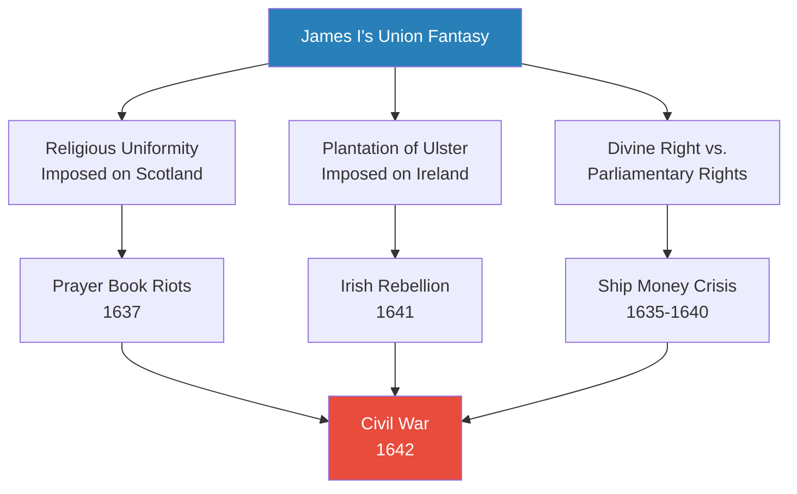
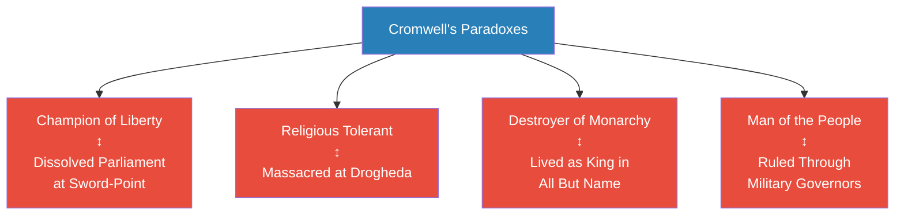
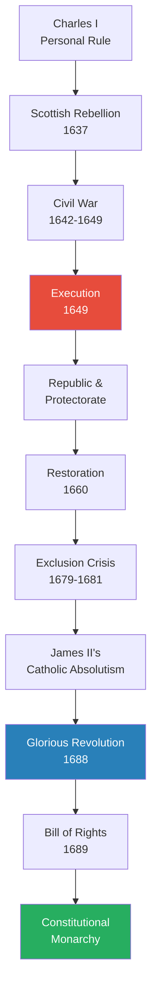
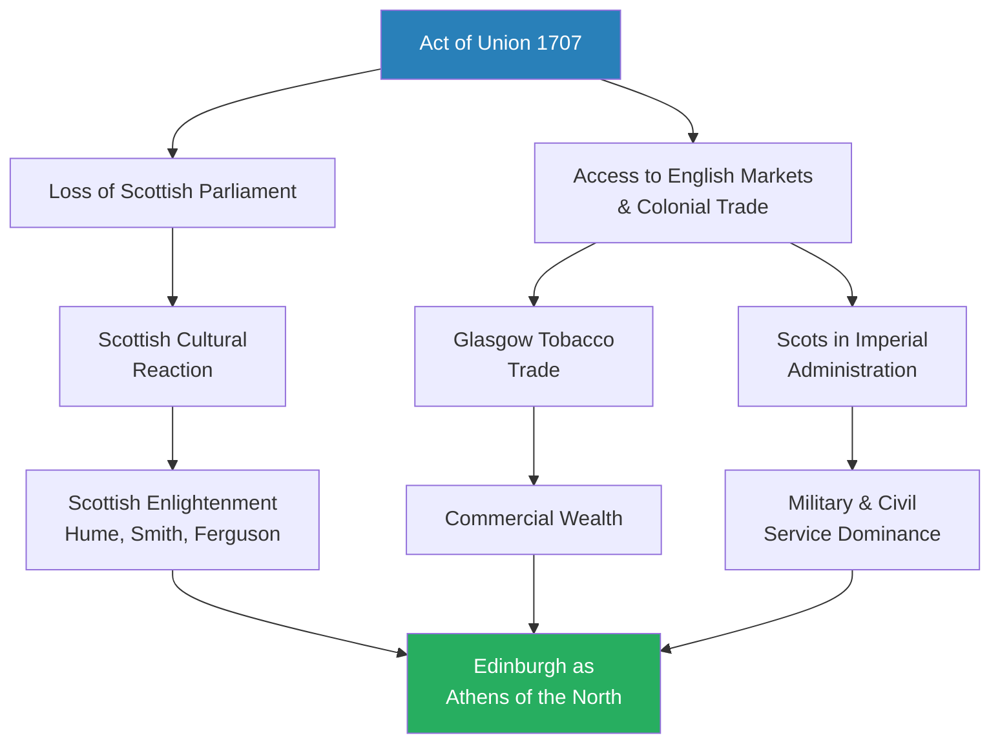
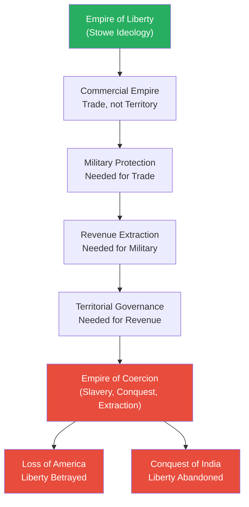
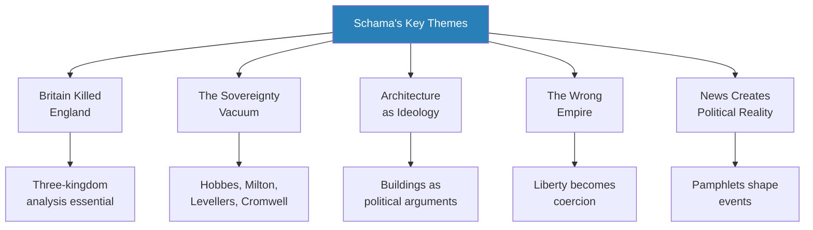

# A History of Britain Vol 2: The British Wars 1603-1776 -- Simon Schama

> Simon Schama's second volume traces the most turbulent 173 years in British history -- from James VI of Scotland's arrival in England in 1603 to the loss of the American colonies and the conquest of India in the 1770s. His central argument is explosive: the English Civil War was not an English event at all. It was caused by Scotland and Ireland, by the compulsive Stuart drive to impose religious and political uniformity across an archipelago that refused to be unified. "Britain killed England." The book follows the arc from James I's fantasy of harmonious union, through the catastrophe of Charles I's execution, Cromwell's paradoxical republic, the Restoration, the Glorious Revolution, and the Act of Union, to the bitter irony of an "empire of liberty" that became an empire of slavery and coercion. Schama writes as a self-declared "born-again Whig," insisting that the civil wars were a genuine battle of principles -- not a bureaucratic muddle -- and that the eventual triumph of parliamentary sovereignty represented "a genuine turning point in the political history of the world."

---

## About the Author

Simon Schama is University Professor of Art History and History at Columbia University in New York. A British Jew who grew up in north London before spending two decades in America, Schama brings both insider affection and outsider distance to British history. He made his name with *Citizens* (1989), a revolutionary narrative history of the French Revolution, and the BBC television series *A History of Britain* (2000-2002) made him one of the most recognisable historians in the English-speaking world. His approach is unapologetically literary, personal, and opinionated -- he tells stories rather than building comprehensive surveys, and he argues in set-pieces rather than footnotes.

---

## The Big Idea

- Schama's overarching argument is that <b style="color: #27ae60">the idea of "Great Britain" -- the compulsive drive to forge a unified realm from the archipelago's diverse kingdoms -- was both the engine and the destroyer of the Stuart monarchy</b>
- James VI/I invented the fantasy of a united Britain; his son Charles I inherited it; and the obsession with imposing religious and political uniformity across Scotland, Ireland, and England guaranteed catastrophe rather than harmony
- "The more strenuously that governments, both royal and republican, laboured to pull the pieces of Britain together, the more abysmally they fell apart"

The civil war was not an English event accidentally complicated by Celtic peripheries:
- <b style="color: #e74c3c">It was caused by Scotland and Ireland</b>
- The Scottish Calvinist rebellion of 1637 triggered the crisis
- The Irish Catholic rebellion of 1641 made it irreversible
- Only Scottish military intervention decided the outcome of the English war
- Schama insists that revisionist historians who portray pre-civil-war England as a docile, consensus-bound polity have been "asking the right questions about the wrong country"

The second half of the book traces how the sovereignty vacuum left by the executed king was eventually filled:
- First by Cromwell's military republic, which reproduced many of the flaws it claimed to have overthrown
- Then by the restored but chastened monarchy of Charles II
- Finally by the revolutionary settlement of 1688, which created a constitutional monarchy constrained by parliamentary sovereignty
- But this settlement itself generated a new problem: a vast military-commercial empire that betrayed its own founding principles of liberty

The book ends with the bitter irony that the "empire of liberty" championed by Pitt and the American colonists dissolved into exactly the kind of coercive imperialism -- in India, in the slave trade, in the subjugation of the Highlands -- that its founders had sworn to reject. The final line warns that Britain would remain "helplessly hooked" on the opiate of global mastery well into the twentieth century.

---

## Key Concepts at a Glance

| Concept | One-line summary |
|---------|-----------------|
| **Britain killed England** | The civil war was caused by multinational dynamics, not English domestic politics alone |
| **The auto-destructive union** | Every attempt to impose uniformity across the archipelago produced fragmentation and war |
| **The sovereignty vacuum** | Charles I's execution created an unprecedented crisis of legitimate authority |
| **Cromwell's paradox** | The destroyer of monarchy who increasingly resembled a king; the tolerant man who massacred |
| **The Whig-Tory role reversal** | After 1688, Whigs ran big government and war; Tories championed overtaxed country gentlemen |
| **Architecture as ideology** | Buildings -- from Rubens' ceiling to Wren's St Paul's to Stowe -- are political arguments in stone |
| **The wrong empire** | The "empire of liberty" became an empire of coercion, slavery, and extraction |
| **News creates political reality** | Pamphlets, newsletters, and propaganda shaped the political universe as much as armies did |
| **Paranoia is revolutionary oxygen** | Conspiracy theories about Catholic plots fuelled revolutionary momentum at every stage |
| **The colonised colonise the empire** | Scotland, forcibly incorporated into Britain, proceeded to dominate its imperial apparatus |

---

*The arc of Schama's narrative in a single line: from the hopeful accession of James VI/I to the loss of the American colonies. The red nodes mark the two great ruptures -- the execution of the king and the loss of empire -- that bookend the story. The green node marks the constitutional settlement of 1688 that Schama, as a "born-again Whig," considers the genuine turning point.*

---

### Schama's Fifteen Key Principles

| # | Principle | Evidence |
|---|-----------|----------|
| 1 | Imposed uniformity breeds resistance | Prayer Book riots 1637; Irish rebellion 1641; American Revolution 1776 |
| 2 | Scapegoating preserves the king | Strafford executed as therapeutic sacrifice; Buckingham as royal shield |
| 3 | News creates political reality | John Pory's newsletters; the Mercurius wars; the Eikon Basilike |
| 4 | Minorities with conviction move history | Puritan gentry network; the Levellers; Fifth Monarchists |
| 5 | Pragmatic laziness outperforms principled energy in kings | James I with capable ministers vs. Charles I's personal rule disasters |
| 6 | The vacuum of sovereignty is the natural condition of man | 1649-1660 Commonwealth; Hobbes's Leviathan |
| 7 | Wars transform the societies that fight them | New Model Army; Putney Debates; the Leveller movement |
| 8 | Revolutions begin sounding conservative | Covenanters defended the "ancient covenant"; Parliament invoked Magna Carta |
| 9 | Paranoia is the oxygen of revolution | Irish rebellion 1641; the Popish Plot 1678; anti-Catholic propaganda |
| 10 | The colonised colonise the empire | Scottish officers, Glasgow tobacco trade, Calcutta administrators |
| 11 | Empire corrupts the metropole | Clive's opium addiction as metaphor; the opium-tea-cotton triangle |
| 12 | Military states need parliaments | Post-1688 budgets; only parliament could authorise war taxes |
| 13 | Architecture is ideology | Rubens' ceiling, Wren's St Paul's, Stowe's temples, Adam's Kedleston |
| 14 | The family is the civil war in miniature | Sir Edmund vs. Ralph Verney; Lady Brilliana Harley's siege |
| 15 | The wrong empire was inevitable | Commerce required military protection, which required revenue, which required governance |

---

## Preface: A Born-Again Whig

*Before the narrative begins, Schama declares his interpretive stance -- and it shapes everything that follows.*

- Schama opens with a direct challenge to the revisionist historians who had dominated seventeenth-century scholarship since the 1970s
- The revisionists -- led by Conrad Russell, John Morrill, and Mark Kishlansky -- argued that the English civil war was not a principled struggle over liberty but an avoidable breakdown caused by misunderstandings, accidents, and the structural problems of governing multiple kingdoms
- Schama agrees with the revisionists that the three-kingdom dimension is crucial -- but rejects their conclusion that the conflict was unprincipled
- His declaration is unambiguous: "if to tell the story again, and yet insist that that much is true, is to reveal oneself as that most hopeless anachronism, a <b style="color: #2980b9">born-again Whig</b>, so be it"
- The civil wars were a genuine battle of beliefs and principles:
  - Parliamentary sovereignty vs. royal absolutism
  - Religious liberty vs. imposed conformity
  - The rule of law vs. the prerogative of kings
- "The eventual, admittedly partial, success of the party of liberty represented a genuine turning point in the political history of the world"
- This is not naive triumphalism -- Schama acknowledges the blood, the hypocrisy, and the imperial crimes that followed
- But he insists that the constitutional settlement matters: the world is different because the English (and Scots, and Irish) had these arguments and reached these conclusions
- The book's energy -- its urgency, its passion, its willingness to take sides -- flows directly from this declaration

---

## Chapter 1: Re-inventing Britain (1603-1637)

*James VI of Scotland rode south to claim his English throne carrying a grandiose vision of "Great Britain" -- a fantasy of harmonious union embodied in new flags, coinage, and allegorical masques. The fantasy was auto-destructive: the more it was imposed, the more it provoked resistance.*

### The King of Four Kingdoms

- <b style="color: #2980b9">James VI/I</b> was the first monarch to rule England, Scotland, Ireland, and Wales simultaneously
- He arrived in London in 1603 carrying what Schama calls a fantasy: the creation of a single, harmonious "Great Britain"
- New flags were designed, new coinage minted, allegorical masques staged -- all celebrating the union of crowns
- James commissioned a new flag combining the crosses of St George and St Andrew -- but neither English nor Scottish sailors would fly it
- He had himself styled "King of Great Britain" in 1604, but Parliament refused to make the title legal
- The project contained a fatal contradiction:
  - England's Parliament refused to ratify a formal union -- they feared being swamped by poor Scots
  - Scotland's Kirk feared Anglican contamination of their Calvinist purity
  - Ireland's Catholics feared Protestant colonisation (and were right to)
  - The more James pushed for uniformity, the more each kingdom clung to its distinctiveness
- Schama's key insight: <b style="color: #27ae60">the "British problem" -- the impossibility of governing three nations with one policy -- was not a side-effect of the civil war; it was the cause</b>
- The revisionist historians who focus exclusively on English domestic tensions have been, in Schama's devastating phrase, "asking the right questions about the wrong country"

> [!tip] Core Insight
> The Stuart obsession with forging "Great Britain" through uniformity produced the very fractures it was meant to heal. Every attempt to pull the archipelago together drove it further apart. This is the master-key to everything that follows: James's fantasy becomes Charles's catastrophe.

---

### John Speed and the Pastoral Illusion

- Schama opens the book with one of his most effective narrative devices
- <b style="color: #2980b9">John Speed</b>, a tailor-turned-cartographer, produced the first popular British atlas -- *The Theatre of the Empire of Great Britaine* -- in 1611
- Speed stitched together pilfered maps from Saxton, Norden, and Mercator into a single coherent vision of Britain as James I wished it to be: unified, prosperous, and at peace
- Speed visited the vale of the Red Horse in Warwickshire and described it as another Eden -- rolling fields, prosperous farms, pastoral perfection stretching to the horizon
- Standing on the ridge of Edge Hill, he saw England as a garden
- The same ridge would become the site of the Battle of Edgehill in October 1642, where 3,000 men died in hand-to-hand combat and the garden was drenched in blood
- Schama uses this as his framing device for the entire book: <b style="color: #e74c3c">pastoral paradise to Golgotha in thirty years</b>
- The transformation is not a metaphor but a literal geographic fact -- the same ground, the same view, transformed by civil war from Eden to charnel house
- It is Schama's way of saying: history is not an abstraction. It happens in real places, to real people, and the distance between peace and catastrophe is shorter than anyone imagines

---

### The Plague and the Pageant

> [!example] Thomas Dekker and the Plague of 1603
> - Thomas Dekker and Ben Jonson were hired to stage the new king's entry pageant into London
> - But plague killed 30,000-40,000 Londoners that summer, forcing postponement
> - Dekker pivoted to writing *The Wonderfull Yeare*, a vivid plague pamphlet that made his name
> - When the pageant finally happened in 1604, Stephen Harrison built 90-foot triumphal arches featuring Britannia herself
> - The juxtaposition captured James's reign perfectly: grandiose ambition colliding with ungovernable reality
> **The lesson:** The Stuart project of "Great Britain" was always a performance -- magnificent, expensive, and disconnected from the plague-ridden, fractious reality on the ground.

---

### The Gunpowder Plot (1605)

- <b style="color: #2980b9">The Gunpowder Plot</b> was the most spectacular act of terrorism in British history before the modern era
- Robert Catesby, Francis Tresham, Guy Fawkes, and about ten other Catholic conspirators planned to blow up Parliament, kill the king, and place Princess Elizabeth on the throne as a puppet Catholic monarch
- Fawkes was found with 36 barrels of gunpowder beneath the House of Lords on 5 November 1605
- The conspirators came to gruesome ends:
  - Catesby was shot dead fleeing to the Midlands
  - Fawkes was hanged, drawn, and quartered -- eviscerated alive
  - The severed heads were mounted on spikes above the gatehouse

> [!example] The Paradox of the Gunpowder Plot
> - The Plot's immediate effect was the opposite of what the conspirators intended
> - Rather than restoring Catholicism, it made James hugely popular as the divinely protected Protestant king
> - 5 November became the Protestant holy day par excellence -- bonfires, effigies, anti-Catholic sermons
> - The Plot confirmed every Protestant paranoia about Catholic conspiracy and papal treachery
> - It justified decades of anti-Catholic legislation that might otherwise have been impossible to pass
> **The lesson:** The Gunpowder Plot was the gift that kept on giving -- for Protestants. Catholic extremism guaranteed Catholic persecution.

---

### The Overbury Murder Scandal (1612-1616)

> [!example] Frances Howard and the Poisoned Enema (1612-1616)
> - The most sensational court scandal of the Jacobean age exposed the corruption at James's inner circle
> - Frances Howard sought to divorce the Earl of Essex on grounds of non-consummation
> - A virginity inspection was ordered -- but Howard reportedly sent a veiled stand-in to be examined, since her own virginity was in considerable doubt
> - She married the king's favourite, Robert Carr (Earl of Somerset), who had risen from page to power through James's bed
> - To clear the way, she arranged the murder of Carr's friend Sir Thomas Overbury, who opposed the match
> - Overbury was lured into the Tower and slowly poisoned -- by poisoned tarts, poisoned jellies, and finally a poisoned enema administered by a crook-backed apothecary
> - The fashion-queen Anne Turner, who had introduced Frances to the poisoner, went to her execution wearing the yellow starched ruff she had made fashionable -- judges ordered that the hangman wear one too
> - Schama notes the case "made the most lurid productions of John Webster seem understated"
> **The lesson:** The Overbury murder exposed a court culture of sexual corruption, poison, and mutual blackmail. The minions were executed; the nobles were merely imprisoned -- the double standard of Stuart justice on full display. It was a preview of the moral rot that would alienate Puritans and eventually help justify revolution.

---

### James I's Governance: The Virtue of Laziness

- Schama offers a provocative reassessment of James I as a ruler:
  - He was physically unglamorous -- shambling, drooling, pawing his favourites in public
  - He was intellectually vain -- writing treatises on divine right, witchcraft, and tobacco
  - But he was <b style="color: #27ae60">strategically lazy in a way that was actually good governance</b>
- James left domestic administration to capable ministers -- Robert Cecil, Francis Bacon, Lionel Cranfield
- He preferred hunting to attending Council meetings
- He avoided foreign wars (unlike his successor)
- He survived the Gunpowder Plot, managed the Hampton Court Conference, and kept the peace for twenty years
- Schama: "benign torpor should perhaps have been on the list of recommended virtues for successful princes"

The contrast with Charles I could not be sharper:
- Charles was diligent, principled, aesthetically refined, and personally courageous
- He was also rigid, secretive, incapable of compromise, and catastrophically bad at reading political situations
- Where James delegated, Charles meddled; where James avoided confrontation, Charles provoked it
- James understood that English monarchs governed through the cooperation of the political elite -- that sovereignty was a negotiation
- Charles believed that divine right was not a theory but a fact, and that any resistance to his will was not just disobedience but sacrilege
- <b style="color: #e74c3c">James's laziness kept the peace; Charles's energy destroyed it</b>
- The lesson Schama draws: <b style="color: #27ae60">"benign torpor should perhaps have been on the list of recommended virtues for successful princes"</b> -- a principle that Charles's heirs would eventually learn, to the enormous benefit of the nation

---

### The Bohemian Crisis and the Spanish Match (1618-1623)

> [!example] The Farcical Spanish Adventure (1623)
> - Frederick, the Elector Palatine (married to James's daughter Elizabeth), accepted the throne of Bohemia in 1618
> - He was crushed at the Battle of the White Mountain in 1620, losing both Bohemia and the Palatinate
> - James's desperate attempt to negotiate Frederick's restoration led to the idea of a Spanish marriage for Prince Charles
> - Charles and the Duke of Buckingham disguised themselves as "Tom and Jack Smith" -- complete with false whiskers -- and rode to Madrid to woo the Infanta
> - They were held as virtual hostages, humiliated with probationary conversion terms, and forced to watch from behind screens
> - The adventure accomplished nothing except to make Buckingham vengeful and Charles bitter
> - They returned to England having achieved the opposite of their mission: war with Spain became inevitable
> **The lesson:** The Spanish match fiasco revealed Charles's fatal combination of romantic stubbornness and political naivety -- traits that would eventually cost him his head.

---

### The Birth of English Public Opinion

- One of the most significant developments of James's reign was the birth of <b style="color: #2980b9">English public opinion</b> as a political force
- <b style="color: #2980b9">John Pory</b> ran a newsletter subscription service, charging gentlemen L20 per year for weekly "separates" -- manuscript news summaries of parliamentary debates, foreign affairs, and court gossip
- These newsletters were hand-copied and circulated among networks of country gentlemen, creating a shared political consciousness across the provinces
- The separation between "news" and "opinion" barely existed -- newsletters shaped events "even while pretending to report them"
- Newsletters, pamphlets, and the growing news business created an informed political public for the first time:
  - The Gunpowder Plot became a national sensation, transforming anti-Catholic feeling from local prejudice to collective identity
  - The Overbury scandal destroyed public confidence in the court's moral authority
  - The Spanish match fiasco made Charles and Buckingham simultaneously popular (for failing) and suspect (for trying)
- By the 1620s, public opinion was a force that monarchs had to manage, not merely ignore
- <b style="color: #27ae60">This was the birth of the political nation beyond the walls of Westminster</b> -- the country gentleman reading his newsletter in the parlour was becoming as politically significant as the MP debating in the chamber
- Schama sees a direct line from Pory's newsletters to Pym's propaganda machine in the 1640s and to the *Mercurius* war of competing newsbooks during the civil war itself
- The *Mercurius* wars of the 1640s -- *Mercurius Aulicus* (royalist) vs. *Mercurius Britannicus* (parliamentary) -- were the first newspaper war in English history
- Each side published weekly newsbooks full of battlefield reports, atrocity stories, and political argument
- By the 1640s, literacy was widespread enough -- perhaps 30% of adult males could read -- to make printed propaganda a decisive weapon
- <b style="color: #2980b9">The civil war was fought as much in print as on the battlefield</b> -- and the side that controlled the narrative often controlled the outcome

---

### Dorchester's Puritan Laboratory

> [!example] The Godly Republic of Dorchester (1613-1640)
> - After a devastating fire in 1613, the Puritan rector John White and his allies transformed the small Dorset town into a laboratory of godly governance
> - Fornication was prosecuted, theatre banned, swearing fined -- Henry Gollop was charged for 40 consecutive curses
> - A "Frenchwoman" without hands who performed tricks with her feet was turned away as ungodly entertainment
> - But the regime was not merely repressive: schools, almshouses, and a municipal brewhouse were established
> - Dorchester became a fount of charity as well as a moral police state
> - The town was a microcosm of the Puritan vision: discipline, education, communal welfare, and relentless moral surveillance
> **The lesson:** Dorchester showed what Puritan governance looked like in practice -- impressive in its social ambition, oppressive in its moral intensity, and a preview of the world Cromwell would try to impose on England.

---

### The Plantation of Ulster

- James I's most consequential and most destructive policy was the <b style="color: #2980b9">Plantation of Ulster</b>
- After the Flight of the Earls in 1607 -- when the great Gaelic lords O'Neill and O'Donnell fled to the Continent -- vast tracts of northern Ireland were confiscated
- The scheme was systematic and deliberate:
  - Scottish and English Protestant settlers were planted on confiscated land
  - London livery companies were assigned entire territories (creating "Londonderry" from "Derry")
  - The native Irish were pushed to marginal lands, stripped of property and status
  - New towns were built on English models with English names, English laws, and English churches
- The Plantation created the sectarian geography that would define Ulster for four centuries:
  - Protestant settlers concentrated in the best land of the eastern lowlands
  - Catholic Irish pushed to the bogs and hills of the west
  - The two communities lived side by side but never together -- divided by religion, language, law, and land ownership
- <b style="color: #e74c3c">The Plantation was a time bomb</b> -- it guaranteed that any future crisis in the Stuart monarchy would have an Irish Catholic dimension of explosive ferocity
- The dispossessed Irish nursed grievances that grew sharper with every generation
- When the explosion came in 1641, it would make the English civil war irreversible -- and the memory of 1641 would poison Anglo-Irish relations for centuries to come

---

### Charles I and the Personal Rule (1629-1637)

> [!example] The 1629 Parliamentary Crisis
> - The final session of Charles's third Parliament dissolved into physical chaos
> - Speaker Finch tried to adjourn the House as Charles had commanded
> - Denzil Holles and Sir Miles Hobart physically held Finch in his chair while Sir John Eliot read resolutions declaring anyone who supported illegal taxation "a capital enemy of the kingdom"
> - Hobart locked the door from the inside; the King's messenger hammered outside
> - Schama calls this shift "from speaking to shoving and shouting" a genuinely ominous collapse of deference
> - Eliot was imprisoned in the Tower and died there in 1632 -- the first parliamentary martyr of the crisis
> **The lesson:** When political argument descends to physical force -- even in Parliament itself -- the system has already broken down. The 1629 crisis was a dress rehearsal for 1642.

- After this crisis, Charles dissolved Parliament and ruled without it for eleven years
- <b style="color: #2980b9">The Personal Rule</b> (1629-1640) was not the era of "halcyon days" that royalist nostalgia later claimed
- On the surface, England appeared peaceful and prosperous -- Van Dyck painted his magnificent equestrian portrait of Charles, Inigo Jones designed masques of exquisite beauty, and the court cultivated an image of serene authority
- Beneath the surface, tensions were accumulating:
  - Charles raised revenue through revived medieval levies and creative interpretation of existing taxes
  - <b style="color: #2980b9">Ship Money</b> -- a legitimate naval tax on coastal counties -- was extended unconstitutionally to the entire kingdom, including inland shires that had never paid it
  - John Hampden's refusal to pay Ship Money became a cause celebre -- he lost his case by a margin of 7 judges to 5, but the narrow margin emboldened resistance
  - The forced loan of 1626-1628 had already provoked fierce opposition: the Earl of Lincoln mobilised 70 gentry resisters and was sent to the Tower
  - In Yorkshire, Sir John Jackson threatened to hang any tenant who paid
- The saltpetre project provided comic relief: Charles seriously demanded that citizens preserve their urine for national defence, to be collected for the production of gunpowder -- an image Schama deploys with wicked timing
- <b style="color: #e74c3c">The Personal Rule was a pressure cooker with the lid screwed down</b> -- the longer it lasted without exploding, the more violent the eventual explosion would be

---

### The Laudian Revolution in the Church

- <b style="color: #2980b9">William Laud</b>, Archbishop of Canterbury, pursued a programme of ceremonial and aesthetic reformation that Puritans regarded as a Catholic abomination
- The Laudian programme touched every parish church in England:
  - Altars were railed off from the congregation and moved to the east end of the church
  - Communion tables -- which Puritans had placed in the centre of the church to emphasise communal worship -- were restored to altar position
  - Bowing at the name of Jesus was enforced
  - Stained glass, vestments, and organ music were encouraged
  - Preaching was curtailed in favour of liturgical ceremony

> [!example] Viscount Scudamore and Abbey Dore (1635)
> - Scudamore, a Herefordshire royalist and devoted Laudian, restored the ruined Cistercian abbey of Abbey Dore
> - He commissioned the carpenter John Abel to carve a spectacular Palladian chancel screen
> - The desecrated altar slab had been used by local farmers to salt meat -- Scudamore's restoration was a deliberate act of sacred reclamation
> - The restored abbey embodied the Laudian vision: beauty in worship, order in ceremony, reverence for sacred space
> - For Puritans, this was not beauty but idolatry -- popery smuggled back in through stained glass and incense
> - To destroy one Laudian altar was to strike a blow against the anti-Christ; to preserve one was to betray the Reformation
> **The lesson:** The Laudian programme was not merely about candles and vestments. It was about the nature of the English Church -- Protestant or Catholic in disguise? -- and therefore about the nation's soul.

- The battle over church ceremony was inseparable from the battle over royal authority:
  - Laud used the Court of Star Chamber and the Court of High Commission to punish Puritan dissenters
  - William Prynne had his ears cropped for writing against the theatre (and by extension against the queen, who acted in court masques)
  - John Bastwick and Henry Burton were pilloried and mutilated for their Puritan tracts
  - These punishments created a generation of Puritan martyrs
- <b style="color: #e74c3c">The fateful decision came in 1634-37: Charles and Laud decided to impose the Laudian Prayer Book on Scotland</b>
- This was the spark that ignited the British wars -- and it demonstrated perfectly Schama's "Britain killed England" thesis
- The crisis did not begin with English parliamentary grievances but with Scottish religious fury
- By the time English parliamentarians mobilised, the Scottish revolution had already begun

---

*Schama's "Britain killed England" thesis in diagram form. The civil war was not caused by English domestic politics alone. Three interlocking crises -- religious imposition on Scotland, colonial plantation in Ireland, and constitutional overreach in England -- all flowed from the Stuart fantasy of a unified Great Britain. Remove any one of them and the war might not have happened.*

---

## Chapter 2: Give Caesar His Due? (1637-1649)

*The British wars began not in England but in Edinburgh, when a footstool flew down the nave of St Giles's Cathedral. From that moment, the chain of events leading to the execution of a king was set in motion -- driven not by English radicalism but by Scottish Calvinism, Irish Catholic fury, and Charles I's catastrophic inability to compromise.*

### The Prayer Book Riots (23 July 1637)

> [!example] The Riot at St Giles's Cathedral (23 July 1637)
> - Foot stools flew down the nave of St Giles's Cathedral in Edinburgh when the dean and bishop attempted to read from the new royally authorised Prayer Book
> - Women wailed "Woe, woe" and hands reached to strip the surplices from the clergy
> - The violence was pre-organised by a network of Calvinist clergy and Edinburgh women -- but its ferocity shocked even the organisers
> - The bishop was chased through the streets; the Provost's guard was overwhelmed
> - Within days, petitions flooded in from across Lowland Scotland
> - Within months, the protest had coalesced into a revolutionary movement that would bring down the Stuart monarchy
> **The lesson:** A Prayer Book imposed from London ignited a revolution in Edinburgh. This was the "British problem" in its purest form: what seemed like a reasonable policy of religious uniformity to Charles and Laud was experienced as an act of cultural aggression by Scotland. The crisis that would end with the king's head on the block began with a footstool in a cathedral.

### The National Covenant (28 February 1638)

- The <b style="color: #2980b9">National Covenant</b> was signed at Greyfriars Church, Edinburgh, in a four-hour ceremony that Schama describes as half religious revival, half political revolution
- <b style="color: #2980b9">Archibald Johnston of Wariston</b>, the dyspeptic, self-mortifying zealot who drafted much of it, called it "the glorious marriage day of the kingdom with God"
- Schama's devastating personal detail: on getting into bed with his teenage wife Jean that night, Johnston immediately assured God (out loud) that he preferred His face to hers -- a man so consumed by divine passion that even his wedding night was a theological event
- The Covenant bound Scotland to resist any innovation in worship not approved by a free General Assembly:
  - This was revolutionary because it subordinated royal authority to religious assembly -- the king could not dictate Scotland's worship
  - But the language was carefully conservative -- it claimed only to defend ancient Scottish liberties against unauthorised innovation
  - The implicit argument was that Charles was the revolutionary, not the Covenanters
- Copies of the Covenant were circulated across Lowland Scotland and signed by thousands -- in some places with blood
- Charles's response was to raise an army and march north -- the <b style="color: #2980b9">Bishops' Wars</b> (1639-1640):
  - The First Bishops' War (1639) ended in humiliation: Charles's untrained English army faced a professional Scottish force and backed down without a fight at the Treaty of Berwick
  - The Second Bishops' War (1640) was worse: the Scots invaded England, occupied Newcastle, and demanded L850 per day to maintain their army -- money Charles could only raise by summoning Parliament
  - <b style="color: #e74c3c">The Scottish crisis forced Charles to summon the Long Parliament in November 1640</b> -- the Parliament that would try and execute him
- <b style="color: #27ae60">"There's nothing so inflammatory as a call for the return of an imagined realm of virtue and justice"</b>

> [!tip] Core Insight
> Revolutions invariably begin sounding conservative. The Covenanters claimed to be defending ancient Scottish liberties, not creating new ones. The Long Parliament would invoke Magna Carta, not proclaim a republic. Revolutionary language is always backward-looking -- until it isn't. This pattern recurs at every stage of the British seventeenth century: revolutionaries disguised as restorationists.

---

### Strafford's Trial and Execution (March-May 1641)

- <b style="color: #2980b9">Thomas Wentworth, Earl of Strafford</b>, was Charles I's most capable and most feared minister
- He had governed Ireland with ruthless efficiency and was recalled to save the king's crumbling position
- His impeachment trial in March 1641 became the first great political drama of the crisis:
  - Strafford conducted his own defence with "compelling logic," systematically demolishing the prosecution's case
  - The charge of treason required proof of intent to subvert the fundamental laws -- Strafford showed he had merely enforced the king's existing prerogatives
  - When impeachment seemed likely to fail, John Pym switched tactics to an <b style="color: #2980b9">act of attainder</b> -- a legislative process requiring only a "presumption of guilt," not proof beyond doubt

> [!example] Strafford's Letter to the King (May 1641)
> - Facing certain death, Strafford wrote to Charles asking him to sign the attainder -- to sacrifice one minister to save the monarchy
> - "To say Sir, that there hath not been strife in me, were to make me less man"
> - The letter is one of the most moving political documents of the period -- a doomed servant releasing his master from loyalty
> - Charles signed "with teary eyes" and never forgave himself
> - He believed his own execution eight years later was God's judgement for this betrayal of a faithful servant
> - 200,000 Londoners turned out to watch Strafford die on Tower Hill
> **The lesson:** Strafford's execution was the first blood of the civil war. Charles's willingness to sacrifice his best minister to save himself demonstrated both the weakness of the king and the ruthlessness of Pym's parliamentary machine.

---

### The Irish Rebellion (October 1641)

- The <b style="color: #2980b9">Irish rebellion of 1641</b> transformed the constitutional crisis into an existential one
- Catholic Irish rose against Protestant settlers in Ulster, killing perhaps 4,000 (wildly exaggerated in English propaganda to 200,000)
- The rebellion was fuelled by decades of dispossession under the Plantation and by terror that the Puritan Parliament in London would impose even harsher anti-Catholic measures
- Atrocity stories -- many genuine, some fabricated, all amplified -- flooded England:
  - Protestants stripped naked and driven into the winter countryside
  - Women and children drowned in rivers
  - Churches burned with congregations inside
- The <b style="color: #2980b9">Grand Remonstrance</b> (November 1641) -- Parliament's complete rewriting of Charles I's reign as a catalogue of tyranny -- was debated in an atmosphere poisoned by Irish terror
  - The vote passed by just 11 votes (159 to 148)
  - When the result was announced, members drew their swords in the chamber
  - This was the moment, Schama argues, when the political nation split irrecoverably

The effect in England was electrifying:
- It confirmed every Protestant nightmare about Catholic conspiracy and massacre
- It created an urgent military question: <b style="color: #e74c3c">who would command the army sent to suppress the rebellion -- the king or Parliament?</b>
- Neither side would trust the other with an army -- and this mutual distrust made civil war inevitable
- If Parliament gave Charles an army to crush Ireland, he might use it to crush Parliament
- If Parliament kept the army for itself, Charles would be defenceless against his own subjects
- Schama's key point: the Irish rebellion was not a side-effect of the English crisis -- it was the catalyst that made the crisis unsolvable
- "Britain killed England" -- the dynamics of three kingdoms, not one, drove the catastrophe

---

### The Five Members (4 January 1642)

> [!example] Charles I's Catastrophic Blunder
> - On 4 January 1642, Charles marched into the House of Commons with armed guards to arrest five leading opponents: Pym, Hampden, Holles, Haselrig, and Strode
> - They had already escaped by boat to the City of London, tipped off by sympathisers
> - Speaker Lenthall delivered the most famous line in parliamentary history: "I have neither eyes to see nor tongue to speak in this place but as the House is pleased to direct me"
> - Charles's humiliating response: "the birds are flown"
> - The attempted arrest destroyed the last possibility of moderate consensus
> - It proved to wavering MPs that the king was willing to use military force against Parliament itself
> - Charles left London six days later -- he would not return until his trial seven years later
> **The lesson:** Charles's attempted arrest of the Five Members was the single most self-destructive political act of his reign. It converted constitutional royalists into reluctant parliamentarians and made armed conflict nearly certain.

---

### Sir Edmund Verney and the Agony of Loyalty

> [!example] Sir Edmund Verney and the Standard (August 1642)
> - Sir Edmund Verney, the Knight Marshal, embodied the personal tragedy of the civil war more perfectly than any other figure
> - He privately disagreed with the king's cause -- he was no High Church Laudian, had Puritan friends, and thought Charles's policies were disastrous
> - But he was bound by thirty years of personal service to the king
> - His words to Edward Hyde capture the anguish of an entire generation:
>   - "I do not like the quarrel, and do heartily wish that the King would yield"
>   - "But for my part ... I have eaten his bread, and served him near thirty years, and will not do so base a thing as to forsake him"
> - Verney raised the royal standard at Nottingham on 22 August 1642 -- in a storm so fierce it blew the standard down that night
> - The symbolism was lost on no one: the king's cause began with a fallen flag
> - Verney was killed at the Battle of Edgehill two months later, holding that same flag
> - His body was never found among the dead -- only, reportedly, his severed hand still clutching a piece of the pole, the king's ring on his finger
> **The lesson:** Verney fought and died for a cause he did not believe in, because personal loyalty trumped political conviction. Thousands of Englishmen faced the same impossible choice in 1642 -- not between right and wrong but between two competing claims on their honour.

The Verney family was itself a civil war in miniature:
- Sir Edmund fought and died for the king
- His son Ralph fought for Parliament -- not out of radical conviction but because he believed the king had broken the constitution
- Father and son loved each other deeply but could not agree on which loyalty took precedence
- Eleanor, Lady Sussex, tried desperately to mediate: "lett me intrete you as a frende that loves you most hartily, not to right passynatly to your father, but ovour com him with kandnes"
- After the war, Ralph's wife Mary was sent back to England from exile to recover the family's sequestered estates:
  - She lobbied tirelessly, navigating committee after committee
  - She succeeded -- but the physical and emotional toll was devastating
  - Their infant son died in her arms during the campaign; their daughter died shortly after
  - Mary herself died of lung disease in France, aged just thirty-four
  - Ralph shipped her coffin back to Buckinghamshire alone and buried her in the family church
- Schama uses the Verneys as a running thread through the book -- <b style="color: #27ae60">the family is the civil war in miniature</b>, a reminder that every political crisis was experienced as a personal catastrophe
- The Verney story makes the abstract concrete: constitutional theory becomes a father and son who cannot speak to each other; parliamentary sovereignty becomes a wife dying of lung disease in a foreign country, far from home, while her husband fights for a cause that killed her children

---

---

### The Battle of Edgehill (23 October 1642)

- The first major engagement of the civil war, on the same Warwickshire ridge that John Speed had described as Eden thirty years earlier
- Schama's framing device comes full circle: the pastoral paradise had become a charnel house

> [!example] The Battle of Edgehill (23 October 1642)
> - **Prince Rupert**, the king's 23-year-old nephew, led a thunderous cavalry charge that swept through the parliamentary right wing
> - But Rupert's horsemen, intoxicated by success, galloped three miles off the field to loot the parliamentary baggage train
> - This left the royalist infantry exposed and unsupported in the centre
> - Sir William Balfour, a Scots Covenanter commanding Parliament's cavalry reserve, rallied and counter-attacked
> - Hand-to-hand pike combat lasted hours in the failing autumn light
> - The nine-year-old Duke of York (the future James II) watched from behind the royalist lines and marvelled his whole life that "neither side giving ground except to exhaustion"
> - Approximately 3,000 dead -- many of them neighbours who had known each other before the war
> - That night, both armies slept within musket-shot of each other, too exhausted to move
> - Local tradition claimed that phantom armies were seen re-fighting the battle in the sky above Edgehill
> **The lesson:** Neither side won Edgehill, which was itself a defeat for the king. Charles needed a single, decisive victory to end the rebellion before it became a war. Parliament only needed to survive. By fighting to a draw, Parliament proved it could not be easily crushed -- and the war that followed would last four years and kill 200,000 people.

- <b style="color: #e74c3c">The indecisive nature of Edgehill set the pattern for the first two years of the war</b>:
  - Regional armies fought inconclusive engagements across the country
  - Neither side could deliver a knockout blow
  - The war settled into a grinding attritional contest that consumed resources, devastated communities, and radicalised both sides
  - It was this stalemate that drove Parliament to seek the Scottish alliance and to create the New Model Army

---

### Waller and Hopton: A Friendship Destroyed

> [!example] The Most Moving Letter of the Civil War (1643)
> - Parliamentary General Sir William Waller and royalist General Sir Ralph Hopton had been close friends and fellow professional soldiers
> - Hopton was himself a Puritan who had voted for Strafford's attainder -- but he chose the king when forced to take sides
> - They found themselves leading opposing armies in the West Country
> - Waller wrote to Hopton before battle: "Certainly my affections to you are so unchangeable, that hostility itself cannot violate my freindshipp to your person"
> - "Wee are both upon the stage, and must act those parts that are assigned us in this Tragedy"
> - They then fought each other at Lansdowne and Roundway Down, killing each other's men
> **The lesson:** The civil war was not fought between strangers. It was fought between neighbours, friends, and family members who had more in common with each other than with the causes they served.

---

### Lady Brilliana Harley's Siege (1643)

> [!example] The Siege of Brampton Bryan Castle (1643)
> - With her husband Sir Robert away at Westminster, **Lady Brilliana Harley** defended Brampton Bryan castle in Herefordshire against 700 royalist troops
> - She held out for six and a half weeks with just 50 musketeers
> - The roof was smashed in by cannon fire; supplies ran low; the walls were breached
> - She was "most upset by the perpetual and noisy enemy cursing" -- the swearing offended her Puritan sensibilities more than the gunfire
> - She survived the siege but died of a lung affliction in October 1643, still replanting her garden
> **The lesson:** Brilliana Harley was one of hundreds of women who ran estates, conducted sieges, and managed logistics while their husbands were away at war. The civil war forced women into roles that peacetime society would never have permitted.

---

### Pym's Parliamentary Machine

- <b style="color: #2980b9">John Pym</b> was the most formidable parliamentary politician of the seventeenth century -- and Schama gives him credit as the man who turned a disorganised opposition into a war-winning machine
- Pym was not a radical in temperament -- he was a Somerset gentleman with a methodical mind, organisational genius, and an instinct for power that Charles I completely lacked
- His genius was organisational:
  - He managed the House of Commons with a whip's precision, ensuring that key votes always went his way through careful preparation and behind-the-scenes negotiation
  - He controlled the printing presses, flooding London with propaganda that framed every event as evidence of royal treachery
  - He built an intelligence network that kept Parliament informed of royalist movements and court intrigues
  - He created the committee system -- standing committees for finance, the army, foreign affairs -- that became the embryo of cabinet government
  - He invented the excise tax (on beer, salt, meat, and cloth) that funded Parliament's war effort -- the first genuinely national tax in English history
- Pym also understood the power of fear better than any politician of his era:
  - Irish atrocity stories were amplified and circulated to maintain anti-Catholic panic
  - Every royal setback was presented as divine judgement; every parliamentary victory as providential
  - The threat of Catholic conspiracy was kept permanently in the public mind
  - <b style="color: #27ae60">Paranoia was not a by-product of Pym's strategy -- it was the strategy</b>
- He died of cancer in December 1643, just weeks after securing the Scottish alliance -- the diplomatic achievement that won the war
- Schama calls him the man who "more than any other, created parliamentary government in England"
- His legacy was institutional: the committee system, the excise, the party organisation, and the principle of parliamentary control of finance all survived long after the crisis that created them

---

### The Solemn League and Covenant (1643)

- When the war turned against Parliament in late 1643, Pym negotiated the <b style="color: #2980b9">Solemn League and Covenant</b> -- a military alliance with Scotland
- The Scots would send an army south in exchange for a promise to reform the English Church along Presbyterian lines
- This was the first genuinely British union since James I's accession -- an alliance of two parliaments against a king
- The Scottish army's intervention tipped the balance decisively

> [!example] The Battle of Marston Moor (2 July 1644)
> - 40,000 men fought the largest battle ever on English soil, on a moor outside York
> - The combined parliamentary-Scottish army faced Prince Rupert's royalists
> - Cromwell was wounded in the neck early in the fighting but refused to leave the field
> - He returned to lead his disciplined Ironsides cavalry in a wheeling manoeuvre that struck the royalist rear
> - 6,000 dead -- the field was covered with bodies for miles
> - The Duke of Newcastle, who had emptied his personal fortune to fund Charles's northern army, surveyed the carnage and decided he "would not remain to hear the laughter of the court"
> - He went into exile on the Continent with just L90 in his pocket
> - York surrendered within weeks; the royalist cause in the north was finished
> **The lesson:** Marston Moor was the battle that proved two things: that the Scots were essential to Parliament's victory, and that Cromwell was the most formidable cavalry commander in England. Both facts would shape everything that followed.

---

### The New Model Army and Naseby (1645)

- The <b style="color: #2980b9">New Model Army</b> was the weapon that won the war -- and one of the most extraordinary institutions in English history
- Created in 1645 under Sir Thomas Fairfax (commander-in-chief) and Oliver Cromwell (cavalry commander), it was:
  - Nationally recruited rather than regionally raised
  - Regularly paid from centralised taxation (a revolutionary innovation)
  - Promoted on merit rather than birth -- officers rose through ability, not aristocratic connections
  - Ideologically motivated -- soldiers genuinely believed they were fighting for God's cause
- But most remarkably, it was a <b style="color: #27ae60">political army</b>:
  - The soldiers read pamphlets, debated theology, and argued about constitutional theory
  - Regiments elected "agitators" (representatives) to negotiate with officers
  - The army developed its own political programme, independent of Parliament
  - This was "absolutely new in England" -- an army that thought for itself

> [!example] The Battle of Naseby (14 June 1645)
> - Cromwell and Fairfax with 14,000 men vs. Charles with 7,000 -- the king was outnumbered nearly two to one
> - Charles tried to charge Cromwell's troopers with his personal Life Guard
> - Horrified aides grabbed his horse's reins and led him away -- a gesture misread by the royalist army as a command for tactical withdrawal
> - 4,500 royalist foot soldiers and 500 officers were captured, along with the complete artillery train, the king's correspondence, and L100,000 in jewels
> - Welsh camp-followers identified as "Irish whores" were butchered or mutilated by parliamentary soldiers
> - The captured correspondence revealed Charles's secret negotiations with Irish Catholics and foreign powers, destroying his credibility
> **The lesson:** Naseby was not merely a military defeat -- it was a political catastrophe. The captured letters proved that Charles had been negotiating with every enemy of his own people while pretending to seek peace.

---

### The King's Captivity and the Road to Regicide (1646-1649)

- After his surrender to the Scots in 1646, Charles spent three years as a prisoner -- and used every moment to negotiate his own restoration
- He played the Scots against Parliament, Parliament against the army, and the army against itself
- The <b style="color: #2980b9">Engagement</b> of December 1647 was his most dangerous gamble: a secret deal with Scottish moderates to invade England and restore him to the throne in exchange for establishing Presbyterianism for three years
- The Second Civil War (1648) resulted -- shorter and bloodier than the first:
  - Scottish invaders were destroyed by Cromwell at Preston
  - Royalist risings in Wales and Kent were crushed
  - The army's patience with the king was exhausted
- <b style="color: #e74c3c">Pride's Purge</b> (6 December 1648): Colonel Thomas Pride stationed soldiers outside the Commons and arrested or excluded 140 moderate MPs
  - The remaining "Rump" of about 200 members was the only Parliament willing to put the king on trial
  - This was a military coup dressed in parliamentary clothing
- Schama is clear-eyed about the constitutional violence involved: the trial that followed had no legal precedent, no popular mandate, and no institutional legitimacy beyond the bayonets that enforced it

### The Trial and Execution of Charles I (January 1649)

- The trial of Charles I was unprecedented -- no English king had ever been tried by his own subjects in a court of law
- Charles refused to acknowledge the court's jurisdiction: "Remember I am your King, your lawful King"
- His legal argument was devastatingly powerful:
  - By what authority did this court sit?
  - Not by Parliament -- the Lords had not consented and most MPs had been excluded by force
  - Not by the people -- who had never been consulted
  - Not by God -- who had appointed kings, not courts
  - Not by precedent -- no such trial had ever occurred
- The prosecution, led by John Cook, argued that the king held his office in trust from the people and could be removed for breach of trust
- John Downes protested that Charles should be heard further; Cromwell snapped "What ails thee?"
- Only 59 of the 135 appointed commissioners signed the death warrant -- the rest stayed away, too frightened or too principled to participate
- Several who did sign later claimed they had been coerced by Cromwell

> [!example] The Execution at the Banqueting House (30 January 1649)
> - Charles walked through the Banqueting House at Whitehall -- past Rubens' ceiling paintings celebrating Stuart power and divine-right monarchy
> - He wore two shirts "lest shivering be mistaken for fear"
> - On the scaffold, he declared: "their Liberty and Freedom consist in having of Government, those Laws, by which their Life and their Goods may be most their own. It is not for having share in Government ... that is nothing pertaining to them"
> - Even in death, Charles rejected the idea that ordinary people had any right to participate in governance
> - Brandon the executioner severed his head with a single blow
> - A groan went through the crowd -- "such a groan as I never heard before, and desire I may never hear again"
> - The Eikon Basilike, Charles's posthumous propaganda masterpiece, ran through 35 editions in 1649 alone
> **The lesson:** Charles I died magnificently -- brave, dignified, and principled. His execution made him a martyr and guaranteed that the republic which killed him would never achieve the legitimacy it craved.

> [!tip] Core Insight
> The execution created what Hobbes called a vacuum of sovereignty -- "a something or a nothing." The next decade would be consumed by the impossible question: if not a king, then what? Army, parliament, saints, the people? Every answer was tried; none was stable.

---

## Chapter 3: Looking for Leviathan (1649-1658)

*The execution of Charles I created an unprecedented vacuum of sovereignty. Five competing visions rushed to fill it: Milton's republican idealism, the Levellers' proto-democracy, the Fifth Monarchists' millenarian theocracy, the Quakers' inner light, and Hobbes's amoral Leviathan. Cromwell stumbled between all of them, never quite becoming the king he increasingly resembled.*

### The Propaganda War: Eikon Basilike vs. Eikonoklastes

- The execution immediately triggered the most important propaganda battle of the century
- The <b style="color: #2980b9">Eikon Basilike</b> ("The Royal Image") appeared within days of the execution, purporting to be Charles I's own meditations and prayers from captivity
- It was almost certainly ghost-written (probably by Dr John Gauden, Bishop of Exeter) but presented as the king's authentic voice
- The effect was explosive:
  - 35 editions published in 1649 alone
  - It transformed Charles from a stubborn autocrat into a Christ-like martyr -- praying, forgiving his enemies, accepting his suffering as God's will
  - The frontispiece showed Charles kneeling, reaching for a crown of thorns while trampling an earthly crown beneath his feet
  - It was the most successful piece of political propaganda in English history
- <b style="color: #e74c3c">The republic that killed the king found itself losing the argument to his ghost</b>
- Milton's counter-blast, *Eikonoklastes*, was commissioned but never achieved comparable emotional power -- you cannot out-argue a martyr

---

### Five Visions for a Headless Nation

- The execution of Charles I created what Schama calls <b style="color: #2980b9">"a something or a nothing"</b> -- a vacuum of sovereignty unprecedented in English history
- Five competing visions rushed to fill it, and the decade that followed was a fierce contest between them:

| Vision | Champion | Core Claim | Outcome |
|--------|----------|-----------|---------|
| **Amoral Leviathan** | Thomas Hobbes | Any sovereign who can protect is legitimate | Shocked everyone; became foundational political theory |
| **Republic of Virtue** | John Milton | The people proved their fitness by executing tyranny | Never achieved; Milton went blind defending it |
| **Leveller Democracy** | John Lilburne | Every man has a natural right to vote | Suppressed by Cromwell at Burford; 300 years too early |
| **Kingdom of Saints** | Fifth Monarchists | Christ's kingdom was imminent; saints must rule | Brief influence; quickly marginalised as lunatic fringe |
| **Inner Light** | George Fox | Authority comes from God within, not from any institution | Persecuted but endured; became the Quaker movement |

---

### Hobbes and the Vacuum

- <b style="color: #2980b9">Thomas Hobbes</b>, living in exile in Paris, wrote *Leviathan* (1651) as his answer to the vacuum of sovereignty
- In a striking parallel, Hobbes was simultaneously debating with French philosophers about whether vacuums could exist in nature -- he was a "plenist," abhorring vacuums in both physics and politics
- His argument was devastatingly simple:
  - Without a sovereign, life is "solitary, poor, nasty, brutish, and short"
  - Any sovereign is better than no sovereign
  - People owe allegiance to whoever can effectively protect them -- even a usurper
- This shocked royalists because it counselled submission to Cromwell
- But it also shocked republicans because it denied any natural rights or liberties -- sovereignty was about power, not virtue
- <b style="color: #27ae60">Hobbes's genius was to see that the vacuum of sovereignty was the fundamental problem</b> -- every other political question was secondary to the question of who holds legitimate authority and why

---

### Milton and the Republic of Virtue

- <b style="color: #2980b9">John Milton</b>, already England's greatest living poet, was mobilised by the new republic to counter the enormous propaganda success of the Eikon Basilike
- His response, *Eikonoklastes* ("The Image-Breaker," 1649), compared Charles to a "Vultur in the Mountains" feeding off the carcasses of the free
- Milton later confessed the tract was a commissioned job he had been told to do -- but he poured his convictions into it nonetheless
- He was simultaneously losing his sight -- by 1652 he was completely blind
- Schama sees Milton's blindness as an emblem of the republic's own condition: seeing the ideal with extraordinary clarity while being unable to see the reality
- Milton's deeper republican vision was genuine and passionately held:
  - He believed the English people had demonstrated their fitness for self-governance by executing a tyrant -- this was not a crime but a moral triumph
  - The republic was a moral achievement, not merely a political arrangement
  - Liberty was the natural condition of humanity; monarchy was the corruption
  - His *Areopagitica* (1644) -- the greatest defence of free speech in the English language -- argued that truth would always defeat falsehood in open contest: "Let her and Falsehood grapple; who ever knew Truth put to the worse in a free and open encounter?"
- But the tension between Milton's idealism and Cromwell's pragmatism would define the republic's short life:
  - Milton wanted a republic of virtue, governed by the wisest and best
  - Cromwell needed a republic that worked, governed by whoever could maintain order
  - When these visions collided, the sword always won
- After the Restoration, Milton was arrested, briefly imprisoned, and stripped of his wealth
- Blind, impoverished, and defeated, he dictated *Paradise Lost* -- transforming his political disappointment into the greatest English poem, a meditation on the loss of liberty and the corruption of power

---

### John Lilburne and the Levellers

- <b style="color: #2980b9">"Freeborn John" Lilburne</b> was the most irrepressible radical of the English revolution
- Flogged through the London streets as a young man for distributing unlicensed pamphlets, he spent most of his adult life in prison or on trial
- He barricaded himself in his cell, stuck his fingers in his ears during proceedings he considered illegitimate, and published furious tracts from every jail he occupied

The <b style="color: #2980b9">Leveller programme</b> was genuinely revolutionary:
- The franchise for all male householders over twenty-one
- Annual parliaments
- Simplified law accessible to ordinary people
- Abolished tithes
- Religious toleration
- Equality before the law regardless of birth or station

> [!example] The Putney Debates (October 1647)
> - The most remarkable political debates in English history took place in Putney Church between army officers and elected soldiers' representatives
> - Colonel Thomas Rainborough spoke the words that echo across centuries: "The poorest he that is in England hath a life to live as the greatest he"
> - Henry Ireton, Cromwell's son-in-law, countered with the sovereignty of property: only those with a "permanent fixed interest" -- landowners -- should vote
> - Cromwell characteristically tried to find middle ground: "A nobleman, a gentleman, a yeoman. That is a good interest of the nation"
> - The debates were suppressed when the army mutinied; Leveller leaders were arrested
> - The Leveller moment passed -- but the words remained
> **The lesson:** The Putney Debates were the birth of modern democratic argument. Rainborough's insistence that the poorest man has as much right to a voice as the richest was three centuries ahead of its time.

The Leveller women were equally formidable:
- Lilburne's wife Elizabeth and <b style="color: #2980b9">Katherine Chidley</b> led mass women's petitions to Parliament -- hundreds of women marching to Westminster with documents demanding justice for their imprisoned husbands
- Parliament's response was contemptuous: "go home and looke after your own businesse, and meddle with your huswifery"
- They did not go home -- they came back, larger in number, more insistent in their demands
- Women's political participation during the civil war and Interregnum was unprecedented:
  - Leveller women petitioned, demonstrated, and distributed pamphlets
  - Quaker women preached publicly -- scandalising even their radical allies
  - Women ran estates, managed armies' logistics, and conducted sieges while men were at war
  - For a brief moment, the rigid hierarchy of patriarchal England was cracked open
- Lilburne himself remained ungovernable to the end:
  - He published *An Impeachment of High Treason against Oliver Cromwell*, accusing the Lord Protector of the very tyranny the revolution had been fought to destroy
  - Tried at the Guildhall, he played brilliantly to the gallery and was acquitted to popular celebration
  - He ended his days as a Quaker -- the revolutionary firebrand finding peace in the quietest of faiths
  - His journey from street-fighting radical to silent worshipper captures the arc of the entire revolutionary generation: from fury to exhaustion to spiritual retreat

---

### Cromwell in Ireland: Drogheda and Wexford (September-October 1649)

- The <b style="color: #2980b9">Drogheda massacre</b> is the most controversial episode of Cromwell's career -- and the event for which Ireland has never forgiven him
- Cromwell landed in Ireland in August 1649 with 12,000 troops and a determination to crush the royalist-Catholic alliance that controlled most of the island
- At Drogheda, the garrison commander Sir Arthur Aston refused to surrender
- Cromwell's own account of what followed is "startlingly unapologetic":
  - "I forbade them to spare any that were in arms in the town"
  - At least 3,000 royalist soldiers were killed, most after they had surrendered or been disarmed
  - At St Peter's Church, pews were burned beneath the steeple to smoke out defenders; men fell to their deaths through burning floors
  - Aston was reportedly beaten to death with his own wooden leg (which soldiers believed contained gold coins)
- At Wexford, a similar massacre followed -- though this time Cromwell claimed it was unauthorized, the result of soldiers running amok after a gate was opened by treachery

Schama's assessment is carefully nuanced:
- He calls Cromwell "a pig-headed, narrow-minded, Protestant bigot and English imperialist"
- But he meticulously separates documented military atrocity from apocryphal civilian massacre stories that grew in the telling over subsequent centuries
- <b style="color: #e74c3c">Drogheda was a war crime by the standards of the time, but it was not a genocide</b>
- The garrison had been offered terms and refused; the killing of soldiers who had rejected quarter was savage but not unprecedented in seventeenth-century warfare (the same rules had applied at European sieges)
- The real crime was not the massacre itself but what followed:
  - <b style="color: #2980b9">William Petty</b>'s systematic cartography of dispossession -- the Down Survey that mapped every confiscated estate
  - The confiscation of Catholic land across most of Ireland
  - The transplantation of entire populations to Connacht -- the barren, rocky western province
  - By 1660, Catholic landownership had fallen from 60% to 20% of Irish soil
  - The Cromwellian settlement was the foundation of the Protestant Ascendancy that would dominate Ireland until the twentieth century

> [!example] William Petty: The Anatomist of Empire (1652-1659)
> - Petty was the prodigy who had resuscitated Ann Greene -- a woman pronounced dead, packed in a coffin, and rescued from dissection
> - He became Physician-General to the army in Ireland and chief cartographer of the Cromwellian settlement
> - His Down Survey mapped every confiscated estate with unprecedented precision
> - Schama calls him "the anatomist of the mutilated body of Ireland"
> - The same scientific mind that saved a woman from the dissecting table was applied to the dissection of an entire nation
> **The lesson:** Petty embodied Cromwell's republic at its most paradoxical -- rational, efficient, modern, and utterly ruthless.

---

### George Fox and the Quakers

- Of all the radical movements spawned by the civil war, the <b style="color: #2980b9">Quakers</b> were the most enduring and the most unsettling
- <b style="color: #2980b9">George Fox</b>, a weaver's son from Leicestershire, walked through a war-torn landscape in his grey leather coat, experiencing what he called "openings" to divine illumination
- Fox's message was revolutionary in its simplicity:
  - God spoke directly to every person through an "inner light" -- no priests, no sacraments, no liturgy needed
  - All hierarchy was rejected: Quakers refused to doff their hats to social superiors, used "thee" and "thou" to everyone regardless of rank, and would not swear oaths
  - Women were spiritual equals -- they could preach, prophesy, and minister alongside men
  - Violence was rejected absolutely -- Quakers would not serve in armies or carry weapons
- He climbed Pendle Hill in 1652 and "beheld, if not the Promised Land, then the green Ribble valley stretching west to the Irish Sea"
- He was punched in York Minster, smacked with a Bible in Tickhill, repeatedly arrested and imprisoned -- but no amount of physical violence could silence him
- The Quakers "refused to doff their hats or to be quiet in church" and were "somehow deeply offensive" to every form of established authority -- Puritan as much as royalist:
  - They interrupted sermons to challenge ministers
  - They walked naked through market towns as "signs" of spiritual truth
  - They refused to swear oaths in court, making them impossible to try under normal legal procedures
  - They addressed judges and magistrates as "thee" and "thou," denying the social hierarchy that formal language enforced
- By the 1650s, there were perhaps 60,000 Quakers in England -- a movement that terrified both the Protectorate and the Restoration government
- They were persecuted brutally under both regimes:
  - Thousands were imprisoned; hundreds died in gaol
  - The Quaker Act of 1662 specifically targeted their refusal to swear oaths
  - Margaret Fell, Fox's future wife, spent years in Lancaster Castle
- Yet they survived, emigrated, and founded Pennsylvania -- the most radical experiment in religious toleration in the Atlantic world
- Schama sees the Quakers as the civil war's most enduring legacy: <b style="color: #27ae60">the principle that conscience is sovereign over all earthly authority</b> -- a principle that neither king nor republic could destroy

> [!example] James Nayler's Blasphemy Trial (1656)
> - Nayler, a prominent Quaker, rode through Bristol imitating Christ; his few disciples cried hosanna
> - He was pilloried for two hours, his forehead branded with a "B" for blasphemer, his tongue bored through with a hot iron
> - He was flogged through London and then flogged again in Bristol
> - Cromwell was disturbed by the punitive overkill -- this was exactly the kind of persecution the revolution was supposed to end
> **The lesson:** The Nayler case exposed the fundamental contradiction of the Puritan republic: it demanded liberty of conscience but could not tolerate what happened when conscience spoke freely.

---

### The Protectorate: A Monarchy in All But Name

- <b style="color: #2980b9">Cromwell's dissolution of the Rump Parliament</b> on 20 April 1653 was the moment he crossed the line from bullying to despotism
- "When he sent the Rump packing, Cromwell liked to think that he was striking a blow at 'ambition and avarice'. But what he really wounded, and fatally, was the Commonwealth itself"
- Schama calls the presence of Cromwell's statue outside the House of Commons "a joke in questionable taste"

Cromwell briefly tried to replace the Rump with a nominated assembly of "godly men" -- the <b style="color: #2980b9">Barebones Parliament</b> (1653):
- Named after one of its members, Praise-God Barebone, a leather-seller from Fleet Street
- The assembly included <b style="color: #2980b9">Fifth Monarchists</b> who believed Christ's Second Coming was imminent and that the saints must prepare by abolishing tithes, simplifying the law, and establishing divine rule
- When the radicals proposed abolishing the Court of Chancery and eliminating tithes, the moderates panicked and voted to dissolve themselves, handing power back to Cromwell
- The experiment lasted five months and demonstrated that godly enthusiasm was not a substitute for political competence

The <b style="color: #2980b9">Protectorate</b> that followed was a quasi-monarchy:
- Cromwell lived in royal palaces, was addressed as "Your Highness," and was offered the crown (he refused)
- The <b style="color: #2980b9">Major-Generals</b> -- military governors assigned to every English region -- attempted to impose Puritan morality by force
  - Christmas was banned (there were riots)
  - Horse-racing, cock-fighting, and theatrical performances were suppressed
  - The experiment lasted less than two years before Cromwell himself abandoned it
- <b style="color: #27ae60">Cromwell's deepest conviction was tolerance -- "a quiet life"</b>
- Schama argues that "the most deeply felt principle of the man who created the matrix of the modern English state was, in its essence, liberal"
- But the paradox was inescapable: the tolerant man ruled by the sword, the champion of liberty dissolved parliaments, the opponent of monarchy wore a crown in all but name

---

### The Readmission of the Jews (1655-1656)

> [!example] Menasseh ben Israel and Cromwell (1655)
> - The Amsterdam rabbi Menasseh ben Israel travelled to London to petition for the formal readmission of Jews to England -- expelled since 1290
> - He was said to have "pressed his hands against Cromwell's body to make sure he was, after all, made of mortal stuff"
> - The Council of State opposed readmission, but Cromwell used personal authority to protect London's existing Jewish community
> - Antonio Rodrigues Robles' 1656 petition -- claiming he was "not a Spaniard but a Jew" -- created the precedent for open Jewish life in England for the first time in 350 years
> **The lesson:** The readmission of the Jews was one of the few genuinely progressive achievements of the Protectorate -- and it was accomplished not by parliamentary vote but by one man's personal authority.

---

### Cromwell's Death and Legacy (3 September 1658)

- Cromwell died on 3 September 1658 -- the anniversary of his great victories at Dunbar and Worcester
- A tornado ripped through England on the day he died -- his enemies said it was the devil collecting his own; his friends said it was God shaking the earth in mourning
- The botched embalming forced a closed coffin; the body decomposed so fast it had to be buried privately weeks before the state funeral
- The effigy was "winched upright" at Somerset House for two months, crown on head, sceptre in hand -- a king in death as in life
- The state funeral was a fiasco:
  - Altercations about protocol delayed proceedings for hours
  - It went dark inside the Abbey because no one had planned for lighting
  - No funeral orations were delivered
  - "Just a few short sharp blasts on the trumpets" -- and it was over
- His son Richard ("Tumbledown Dick") succeeded as Lord Protector but lasted eight months before being ousted by the army
- The Protectorate collapsed into competing military factions
- General Monck marched his army south from Scotland and orchestrated the Restoration of Charles II
- Cromwell's legacy is the book's central paradox:
  - He destroyed the divine right of kings permanently
  - He demonstrated that a Protestant republic could function (however imperfectly)
  - He created the template for the military-fiscal state that would make Britain a world power
  - But he also demonstrated that <b style="color: #e74c3c">liberty imposed by force is a contradiction in terms</b>
  - The republic died because it could never solve the problem of legitimate authority -- it rested on the sword, and the sword alone

*Cromwell's four great contradictions. Schama presents him as genuinely liberal in temperament but authoritarian in practice -- a man whose deepest instinct was tolerance but whose position required coercion. The Protectorate reproduced many of the flaws of the monarchy it replaced.*

---

## Chapter 4: Unfinished Business (1660-1688)

*The Restoration of Charles II in 1660 closed but did not heal the wounds of the civil war. Plague, fire, Dutch humiliation, and recurring religious panic repeatedly shook confidence in the monarchy's capacity to protect the nation. The chapter climaxes with James II's self-destructive Catholic absolutism and the "Glorious Revolution" of 1688 -- which was, in truth, a Dutch invasion.*

### The Restoration: Wounds Closed, Not Healed

- Charles II returned to England in May 1660 to enormous popular acclaim -- Samuel Pepys described the fleet of ships, the cheering crowds, the church bells ringing across the country
- The Restoration settlement tried to pretend the previous twenty years had not happened:
  - The regicides were hunted down and executed -- ten were hanged, drawn, and quartered in public
  - Cromwell's corpse was exhumed from Westminster Abbey, dragged through the streets, and beheaded; his skull was impaled on a pole outside Westminster Hall, where it remained for over twenty years
  - The Church of England was restored with bishops and the Book of Common Prayer
  - The theatre reopened, women appeared on stage for the first time, and the court became a centre of pleasure, mistresses, and wit
  - The <b style="color: #2980b9">Clarendon Code</b> (1661-1665) -- a series of acts excluding Nonconformists from public office, universities, and towns -- attempted to crush the religious diversity that had flourished under the Commonwealth
- But the <b style="color: #e74c3c">"puncture wounds" of the civil war had not healed</b>:
  - The memory of parliamentary sovereignty could not be erased -- everyone alive remembered a world without a king
  - The Nonconformist Protestant sects -- Quakers, Baptists, Independents -- survived underground despite persecution
  - John Bunyan wrote *The Pilgrim's Progress* in Bedford gaol; George Fox continued preaching in defiance of every prohibition
  - The question of whether a Catholic could sit on the throne remained unresolved -- and Charles II's own religious sympathies were suspect (he converted to Catholicism on his deathbed)
  - The fear of arbitrary royal power was now permanently embedded in the political culture
- <b style="color: #27ae60">The Restoration was a restoration of the monarchy, but not of the monarchy's power</b> -- Charles II ruled by charm, evasion, and French subsidies, never by the absolute authority his father had claimed

---

### Plague and Fire (1665-1666)

- The <b style="color: #2980b9">Great Plague of 1665</b> killed approximately 100,000 Londoners
- Samuel Pepys recorded the horror in his diary; John Evelyn described mass graves
- The court fled London, leaving the city to its own devices
- The <b style="color: #2980b9">Great Fire of London</b> (2-5 September 1666) destroyed the old medieval city:
  - 13,200 houses, 87 churches, the Guildhall, and the Royal Exchange burned
  - Lead melted off St Paul's roof and flowed down streets in rivers
  - Booksellers had stored their stock in St Faith's Chapel beneath St Paul's -- the choir crashed through the floor, incinerating the nation's printed heritage
  - Damage was estimated at L10 million

> [!example] Wren's Vision for London (September 1666)
> - Just two days after the rain stopped the fire, Christopher Wren presented Charles II with a plan for a completely rebuilt London
> - An oval piazza would replace the medieval tangle; radiating streets would link a domed basilica to the riverside
> - Roger Pratt was "incensed at the temerity of this unknown" proposing to redesign the capital
> - The merchants wanted to rebuild exactly where things had been -- on their own plots, with their own money
> - Wren's grand plan was doomed by property rights and commercial impatience
> - But over three decades he got to build dozens of churches and the greatest of all British sacred buildings: **St Paul's Cathedral**
> **The lesson:** Wren's rejected masterplan and his realised St Paul's together capture the British genius for compromise: the ideal was impossible, but the pragmatic alternative was magnificent.

---

### Architecture as Ideology

- One of Schama's most distinctive contributions is his treatment of buildings not as decorative background but as <b style="color: #27ae60">political arguments in stone</b>
- Every major building in the book carries an ideological charge
- Wren's 1665 visit to Paris, where he met Bernini and saw his drawings for the Louvre, shaped his conviction that classical domed architecture could be transplanted into Protestant England -- that England could have grandeur without Catholicism

| Building | Date | Ideology | Schama's Reading |
|----------|------|----------|-----------------|
| **Rubens' Banqueting House ceiling** | 1636 | Stuart divine-right monarchy | The ceiling Charles I walked beneath to his execution |
| **Wren's St Paul's** | 1675-1710 | Protestant reason and grandeur | England rivals Rome without submitting to Rome |
| **Thornhill's Greenwich ceiling** | 1707-1726 | Post-1688 constitutional monarchy | "The first great visual manifesto" of the new order |
| **Stowe's temples** | 1730s-1740s | Empire of liberty | The ideological nursery of the British Empire |
| **Adam's Kedleston Hall** | 1759-1765 | Britain as the new Rome | Modelled on the Arch of Constantine |

- The progression tells its own story: from divine-right absolutism (Rubens) to Protestant grandeur (Wren) to constitutional monarchy (Thornhill) to imperial ambition (Stowe and Adam)
- <b style="color: #2980b9">Architecture is the unconscious of politics</b> -- it reveals what a society believes about itself more honestly than any manifesto or speech

---

### The Dutch Raid on the Medway (June 1667)

> [!example] The Dutch Humiliation at Chatham (June 1667)
> - Admiral de Ruyter sailed a Dutch fleet up the Medway, broke the barrier chain that was supposed to protect the English fleet at anchor, and captured or destroyed England's warships
> - The flagship *Royal Charles* -- named after the king himself -- was towed back to the Netherlands as a trophy
> - Pepys recorded the panic in London: "The truth is, I do fear so much that the whole kingdom is undone"
> - The Dutch had penetrated to within thirty miles of London
> - Clarendon's political career was destroyed -- he fled to France
> - The humiliation demonstrated that the Restoration monarchy could not perform the most basic function of government: defending the realm
> **The lesson:** The Medway raid was to the Restoration what the fall of Calais was to Mary I or the loss of Normandy to King John -- a military humiliation that permanently damaged the government's authority. It also demonstrated that the money Parliament had voted for the navy had been squandered or stolen.

---

### The Popish Plot and Political Paranoia (1678)

- The <b style="color: #2980b9">Popish Plot</b> of 1678 demonstrated that anti-Catholic paranoia was still the most powerful political force in England
- Titus Oates, a serial liar and disgraced clergyman, fabricated a conspiracy claiming that Jesuits planned to assassinate Charles II, massacre Protestants, and install the Catholic Duke of York on the throne
- The story was absurd -- but it was believed because it fed into genuine fears:
  - Charles II had signed a secret Treaty of Dover (1670) with Louis XIV, receiving French subsidies in exchange for a promise to convert to Catholicism
  - The Duke of York (the future James II) had already publicly declared himself Catholic
  - Louis XIV's persecution of French Huguenots was a visible warning of what Catholic monarchy meant in practice
- Thirty-five innocent people were executed before the plot was discredited
- Schama's observation: <b style="color: #e74c3c">paranoia is the oxygen of revolution</b> -- conspiracy theories about Catholic plots were the fuel that sustained revolutionary momentum at every stage of the seventeenth century, from the Gunpowder Plot to the Glorious Revolution

---

### The Exclusion Crisis (1679-1681)

- The <b style="color: #2980b9">Exclusion Crisis</b> was the dress rehearsal for 1688 -- and the moment when modern party politics was born
- <b style="color: #2980b9">The Earl of Shaftesbury</b>, the most brilliant and unscrupulous politician of the Restoration, led a campaign to exclude the Catholic James, Duke of York, from the succession
- His weapon was popular mobilisation on a scale not seen since the civil war:
  - Mass petitions, organised demonstrations, and "pope-burning processions" through the streets of London
  - Effigies of the Pope were paraded, the devil appeared riding on the Pope's shoulders, and fireworks illuminated elaborate tableaux of Catholic tyranny
- The Duke of Monmouth -- Charles II's illegitimate but Protestant son -- was promoted as the alternative heir
  - Monmouth undertook royal progresses through the West Country, touching for the King's Evil (a traditional royal healing ritual), deliberately imitating legitimate royalty
- Three successive Parliaments debated exclusion bills; Charles dissolved all three rather than accept them
- The crisis produced the names that defined English politics for the next 150 years:
  - <b style="color: #2980b9">Whigs</b> -- those who wanted to exclude James (named derisively after Scottish Covenanting rebels -- "Whiggamores")
  - <b style="color: #2980b9">Tories</b> -- those who defended hereditary succession (named derisively after Irish Catholic bandits)
  - Both names were originally insults; both were adopted with defiant pride
- Shaftesbury's ultimate failure -- he fled to Amsterdam and died in exile -- and James's accession in 1685 appeared to settle the matter
- It had not: the arguments, the networks, and the party identities forged in the Exclusion Crisis would be mobilised again within three years

---

### James II's Self-Destruction (1685-1688)

- James II was a paradoxical figure, and Schama's portrait is more nuanced than most:
  - He was a <b style="color: #2980b9">divine-right absolutist</b> who genuinely believed in royal prerogative unbound by Parliament
  - But he was also a champion of religious toleration -- his Declaration of Indulgence extended liberty of conscience to Catholics and Protestant Dissenters alike
  - Schama notes pointedly: "While in conventional histories the European 'enlightened despots' ... get credit for imposing toleration on their subjects, the same benefit is not extended to James II"
  - In Ireland, James was "the first English king who actually made a strenuous and politically dangerous effort to reverse the brutal wars of colonization"

But James destroyed himself through a series of escalating provocations that alienated even his natural allies:
- He expelled the fellows of Magdalen College, Oxford -- the most prestigious academic institution in England -- for refusing to accept a Catholic president
  - When the fellows attempted to present their case, James erupted: "Get you gone! Know I am your King. I will be obeyed"
  - The dons of Oxford were not Puritan radicals -- they were High Church Tories who had supported the Stuart cause through thick and thin
  - Alienating them was a political catastrophe
- He packed the army with Catholic officers, in defiance of the Test Act
- He deployed the army on Hounslow Heath in a deliberate display of military intimidation
- He put seven bishops on trial for seditious libel after they petitioned against the Declaration of Indulgence:
  - The bishops' acquittal triggered national celebration -- bonfires, church bells, and organised demonstrations
  - Even the soldiers at Hounslow Heath cheered -- James's own army was turning against him
- The birth of James Francis Edward Stuart in June 1688 was immediately denounced as a fraud -- "the warming-pan baby" -- because it meant a Catholic dynasty, not just a Catholic interlude
- <b style="color: #e74c3c">The critical difference between the Exclusion Crisis and 1688 was Princess Mary</b> -- James's Protestant daughter, married to William of Orange, provided a legitimate alternative that Monmouth never had
- A group of seven prominent politicians (the "Immortal Seven") sent a secret invitation to William of Orange, asking him to invade and save English liberty:
  - The signatories included the Earl of Danby (a former Tory Lord Treasurer), the Bishop of London, and several Whig grandees
  - They promised that the English army would not resist -- a promise that proved accurate
  - The invitation was an act of treason by any definition
  - But it was also an act of constitutional desperation: every legal avenue had been exhausted, every compromise rejected
  - James had left his opponents no option between submission and revolution

---

### The "Glorious Revolution" of 1688

- Schama insists that 1688 was <b style="color: #e74c3c">not a "revolution" but an invasion</b>:
  - 600 vessels carried 15,000 Dutch and German troops across the Channel -- four times the size of the Spanish Armada
  - It was the largest seaborne invasion of England since 1066
  - William of Orange's motives were European, not English -- he needed England as an ally against Louis XIV in the Nine Years' War
  - The "Protestant Wind" that blew William's fleet down the Channel and kept James's navy in port was the same kind of providential weather that had scattered the Armada a century earlier
- James's army melted away:
  - John Churchill (the future Duke of Marlborough) defected to William -- the crucial domestic betrayal
  - James's own daughter Anne abandoned him
  - James fled London, dropping the Great Seal into the Thames in a final act of futile symbolism
- The Battle of the Boyne (1690) was "fought mainly between non-English Europeans -- the French under the Duc de Lauzun and on the other a force of 36,000, two-thirds of whom were Dutch, German and Danes"
- Ireland bore the heaviest cost: the Treaty of Limerick (1691) promised Catholic rights that were immediately broken, and the Penal Laws that followed reduced Irish Catholics to a subject population for a century

Schama's verdict on 1688:
- <b style="color: #27ae60">It was a genuine constitutional revolution regardless of how it happened</b>
- The <b style="color: #2980b9">Bill of Rights</b> (1689) established:
  - Parliamentary sovereignty -- no law could be suspended without Parliament's consent
  - Free elections and free debate within Parliament
  - No standing army in peacetime without parliamentary approval
  - No taxation without parliamentary consent
  - The right to petition the Crown
- The <b style="color: #2980b9">Toleration Act</b> (1689) extended limited religious freedom to Protestant Dissenters (though not to Catholics or Unitarians)
- "Not a simple struggle between the forces of reaction and progress" -- but a turning point nonetheless
- The settlement was a compromise: William got his English army for the European war; Parliament got constitutional guarantees against royal absolutism

> [!tip] Core Insight
> The Glorious Revolution was simultaneously an invasion, a coup, and a genuine constitutional settlement. Its legitimacy rested not on how power was seized but on what was done with it -- the creation of a framework that made arbitrary royal power permanently impossible. Every subsequent British political crisis would be resolved within this framework, not by overthrowing it.

---

*The constitutional journey from absolute monarchy to parliamentary sovereignty. It took fifty years, a civil war, a regicide, a republic, a restoration, and a revolution to establish the principle that the king rules under the law, not above it. The red node marks the violence; the green node marks the resolution.*

---

## Chapter 5: Britannia Incorporated (1689-1745)

*The post-1688 settlement created a paradox: a war-forged, heavily taxed, bureaucratic military state that was simultaneously the freest and most politically combative society in Europe. The Act of Union absorbed Scotland into a commercial empire. The Jacobite risings were the last convulsions of the old honour-culture against the new Britain of cash, commerce, and constitutional monarchy.*

### The Military-Fiscal State

- The revolution settlement created something unprecedented: <b style="color: #2980b9">a military state that needed Parliament</b>
- William III's war against Louis XIV (the Nine Years' War, 1689-1697, and the War of the Spanish Succession, 1701-1714) transformed England from a medium-sized power into a military superpower
- The cost was staggering:
  - By 1710, military spending consumed 10% of national income
  - Britons were taxed twice as heavily per capita as the French
  - The national debt -- a revolutionary invention of the 1690s -- allowed the government to borrow on an unprecedented scale
  - The <b style="color: #2980b9">Bank of England</b> (founded 1694) was created specifically to fund the war
  - The excise tax penetrated into every household, every pint of ale, every yard of cloth
- But unlike virtually every other European state, the more militarised Britain became, the stronger Parliament grew:
  - Only Parliament could authorise the taxes to pay for war
  - Annual supply votes meant annual parliamentary sessions
  - Annual parliamentary sessions meant permanent parliamentary influence
  - The Mutiny Act required annual renewal, keeping the standing army under parliamentary control
- <b style="color: #27ae60">This was the great British paradox: a war machine that made liberty stronger, not weaker</b>
- Schama notes: "virtually everywhere else in Europe, the more militarized the state, the stronger the king. In Britain, uniquely, it was the other way around"
- This insight connects directly to the civil war: the reason Parliament won the war over taxation was that it ultimately controlled taxation -- and the reason Parliament controlled taxation after 1688 was that the military state required continuous parliamentary supply
- The constitutional settlement was forged in war and sustained by war -- peace might have killed it
- It is one of history's great ironies that the freest society in Europe was also the most belligerent -- and that each condition required the other
- The Whig grandees who championed liberty at home had no hesitation about imposing coercion abroad

---

The <b style="color: #2980b9">Whig-Tory role reversal</b> was equally paradoxical:
- Whigs, once the champions of limited monarchy and parliamentary rights, became the party of war, big government, standing armies, and heavy taxation
- Tories, once the champions of unlimited royal prerogative, became the party of overtaxed country gentlemen, peace, and suspicion of government power
- This complete inversion of political identities would have bewildered the men of 1688

The result was "prototypically modern" partisan politics:
- Contested elections in a 250,000-strong electorate (roughly 15% of adult males)
- Voters split right down the middle, choosing by party, not by the local squire's instruction
- Newspapers multiplied: by 1710, London had a dozen competing titles
- Coffee-houses became political clubs -- Whig coffee-houses and Tory coffee-houses, each with their own clientele and their own newssheets
- Street violence was routine during elections -- hired mobs, broken windows, intimidated voters
- Schama sees this as the birth of British political culture: "noisy, combative, partisan, vulgar, and free"

> [!tip] Core Insight
> The post-1688 British state was the most heavily taxed, most militarised, most bureaucratised state in Europe -- and simultaneously the freest. This paradox, incomprehensible to foreign observers, was the foundation of British power for two centuries.

---

### The Act of Union (1707)

- The <b style="color: #2980b9">Act of Union</b> that merged the English and Scottish parliaments in 1707 was not a romantic marriage but a commercial transaction driven by strategic necessity on both sides
- England needed to prevent Scotland from inviting the Stuart pretender back -- the Scottish Parliament's Act of Security (1704) had threatened to choose a different monarch from England's
- Scotland needed access to English colonial markets after the catastrophic failure of the <b style="color: #2980b9">Darien scheme</b> (1698-1700), which had attempted to establish a Scottish colony in Panama and lost perhaps a quarter of Scotland's liquid capital

> [!example] Daniel Defoe: Spy for Union (1706-1707)
> - Daniel Defoe -- ex-bankrupt, novelist, and government spy -- was sent to Scotland disguised as a fish merchant in Glasgow and a wool manufacturer in Aberdeen
> - His mission: to propagandise for union and report on anti-union sentiment
> - Edinburgh erupted in riots: "a Terrible Multitude ... shouting and swearing and Cryeing Out all Scotland would stand together. No Union. No Union. English Dogs"
> - The **"Equivalent"** -- L398,085.10s. -- was paid to Scotland as compensation for the Darien disaster, the ruinous attempt to establish a Scottish colony in Panama
> - Lord Belhaven delivered a Shakespearean lament: "Like Caesar sitting in the midst of our Senate attending the final blow"
> - The Earl of Seafield signed the treaty with devastating brevity: "There's ane end of ane auld sang"
> **The lesson:** The Union was accomplished through a combination of bribery, strategic necessity, and commercial calculation. Scotland sacrificed its Parliament in exchange for access to English markets and imperial opportunity. Whether this was a sell-out or a salvation depends on whom you ask.

---

### The Sacheverell Trial and the War of Parties (1710)

- <b style="color: #2980b9">Dr Henry Sacheverell</b>, an ultra-Tory preacher at St Paul's, delivered a sermon on 5 November 1709 -- the anniversary of the Gunpowder Plot and of William III's landing -- that amounted to a direct attack on the Glorious Revolution
- He denounced the Whigs as enemies of the Church and implied that resistance to a lawful king was always sinful -- thus condemning the very revolution on which the Hanoverian succession rested
- 100,000 copies were printed -- the sermon became a bestseller and a rallying cry for Tory disaffection
- The Whig government impeached him -- and it became a public-relations catastrophe:
  - Pro-Sacheverell mobs burned Dissenter meeting-houses across London
  - Huguenot chapels in Spitalfields were ransacked
  - The riots were the worst London had seen since the Popish Plot
  - Sacheverell was convicted but given a derisory sentence of three years' suspension from preaching -- effectively a victory
  - He went on a triumphant tour of the country, feted as a hero everywhere he stopped
- The trial contributed to the Tory landslide of 1710 and the fall of the Whig ministry
- It demonstrated that <b style="color: #e74c3c">the Glorious Revolution's legitimacy was still contested a generation later</b> -- the settlement of 1688 had not yet become the unchallengeable foundation that it would later seem

---

### The Jacobite Threat: 1715 and 1745

- The <b style="color: #2980b9">Jacobite</b> cause -- the restoration of the Stuart dynasty -- was the ghost that haunted the post-1688 settlement for sixty years
- The **'15 rising** (1715) was poorly led and quickly suppressed, but it demonstrated that significant portions of Scotland and northern England remained loyal to the Stuarts
- The Hanoverian succession of 1714 -- when the German-speaking George I became king because he was the nearest Protestant heir -- struck many as absurd: "a dumpy, uncharismatic German princeling" preferred over the legitimate Stuart line simply because he was Protestant
- George I spoke no English, had limited interest in British domestic affairs, and delegated power to his ministers -- which paradoxically strengthened the cabinet system and accelerated the development of parliamentary government
- Robert Walpole became Britain's first effective Prime Minister (1721-1742), governing through patronage, management, and the systematic corruption that his opponents called "Old Corruption" and his allies called "stability"
- Between 1715 and 1745, Jacobitism survived as a romantic underground:
  - Secret toasts to "the King over the water" (the Stuart pretender in exile)
  - The Jacobite rose, the white cockade, and other covert symbols of loyalty
  - The hope that France would eventually intervene with troops and money
  - In the Highlands, loyalty to the Stuarts was fierce and genuine -- not merely sentimental

### The '45 Rising

> [!example] Bonnie Prince Charlie at Derby (5 December 1745)
> - Charles Edward Stuart's Jacobite army marched from Scotland to Derby -- just 125 miles from London
> - At Exeter House, the fateful council of war debated whether to press on or retreat
> - Charles Edward wanted to continue to London; Lord George Murray insisted on retreat to Scotland
> - Murray won the argument -- the army turned back
> - "Needless to say, they had barely begun their long tramp home when Louis XV ... was finally impressed enough ... to send the long-awaited invasion fleet"
> - The fleet that might have changed everything arrived too late, to the wrong place
> **The lesson:** The '45 was the last moment when the old Stuart honour-culture might have recaptured Britain. Once Murray won the debate at Derby, the ancien regime died -- not on a battlefield but in a committee room.

---

### Culloden and the Destruction of the Highlands (16 April 1746)

- 9,000 Hanoverians vs. 5,000 Jacobites on Drumossie Moor
- The Highlanders charged uphill into a northeaster and into cannon
- Between 1,000 and 1,500 dead on the field, 700 prisoners
- Perhaps 1,000 wounded were methodically slaughtered afterwards
- The "orders to give no quarter" purportedly from the Prince were "a pure invention of Hanoverian propaganda"

> [!example] Simon Fraser, Baron Lovat
> - The ancient clan chief was found hiding in a hollowed-out tree trunk
> - Hogarth drew him en route to trial
> - A woman shouted: "You ugly old dog, don't you think you will have that frightful head cut off?"
> - Lovat replied: "You damned ugly old bitch, I believe I shall"
> - His execution stand collapsed, killing seven spectators
> **The lesson:** Lovat's defiant gallows humour was the epitaph of an entire world -- the Gaelic clan system that had survived since the Middle Ages was about to be systematically destroyed.

The aftermath of Culloden was <b style="color: #e74c3c">cultural genocide</b> -- a systematic attempt to destroy Highland Gaelic civilisation:
- Clan tartans were banned -- wearing Highland dress became a criminal offence
- Bagpipes were prohibited as "instruments of war"
- Gaelic language was suppressed in schools and public life
- Clan chieftains' heritable jurisdictions were abolished -- the legal foundation of the clan system was destroyed at a stroke
- The Highlands were militarised: Fort Augustus, Fort William, and a network of military roads opened the previously impenetrable interior
- General Wade's roads -- built to move armies -- would later carry tourists
- Within a generation, the "wild Highlands" had been tamed into a picturesque landscape for southern visitors
- The irony was bitter: within twenty years, Highland regiments were the backbone of the British Army, fighting with ferocious effectiveness at Quebec, in India, and across the empire
- The same martial culture that Cumberland had tried to destroy was harnessed for imperial purposes -- <b style="color: #27ae60">the Highlands were not tamed; they were redirected</b>

---

### The Scottish Enlightenment

- The destruction of the old Scotland created the conditions for a new one
- <b style="color: #2980b9">The Scottish Enlightenment</b> was one of the most extraordinary intellectual explosions in European history
- Edinburgh -- a city of barely 50,000 -- produced in a single generation:
  - **David Hume** -- who destroyed the philosophical foundations of both religion and empiricism, and who Schama considers the greatest philosopher in the English language
  - **Adam Ferguson** -- who invented sociology, arguing that civilisations progress through stages from barbarism to commerce
  - **Adam Smith** -- whose *Wealth of Nations* (1776) provided the intellectual framework for free-market capitalism
  - **William Robertson** -- whose histories of Scotland and America set new standards for scholarship
  - The *Encyclopedia Britannica* (1768-71), first published in Edinburgh -- the world's first great reference work
- "The first theory of progress was systematically articulated" in Scotland -- the idea that humanity advances through predictable stages was a Scottish invention
- <b style="color: #2980b9">Robert Adam</b> became "Britain's first invincible king of style":
  - Kedleston Hall modelled on the Arch of Constantine
  - Charlotte Square in Edinburgh became the model for neoclassical urban planning
  - Adam's style -- elegant, restrained, classical -- became the visual language of British imperial confidence
- <b style="color: #27ae60">"Instead of being colonized by the British Empire, the Scots colonized it themselves"</b>

The commercial transformation was equally spectacular:
- The Glasgow tobacco trade illustrated Scotland's rapid integration into the imperial economy
- <b style="color: #2980b9">Alexander Speirs</b>, Bowman and Co. sent Clydeside-built ships on sixteen voyages to Virginia
- Scottish agents dealt directly with growers on the ground, cutting out English middlemen who had previously monopolised the trade
- By the 1770s, Glasgow was importing more tobacco than London and Bristol combined
- "Nearly half of those leaving fortunes worth more than L1,000 in Jamaica in the second half of the eighteenth century were Scots"
- The army was transformed: by the time of the American war, one in four British officers was Scottish
- Scottish doctors, engineers, administrators, and merchants staffed the empire from Calcutta to Quebec

> [!tip] Core Insight
> Scotland's transformation from defeated Jacobite nation to engine of empire, Enlightenment, and industrialisation was the most remarkable national reinvention in eighteenth-century Europe. The Union that had been imposed by bribery and strategic necessity produced intellectual and commercial results that neither side had anticipated.

---

*The Union's paradox: Scotland lost its political independence but gained commercial access to an empire it would come to dominate. The intellectual and commercial energy released by the Union produced the Scottish Enlightenment -- one of the greatest intellectual movements in European history.*

---

## Chapter 6: The Wrong Empire (1745-c.1800)

*The British Empire was founded on a contradiction: it proclaimed itself an "empire of liberty" -- in conscious contrast to Roman, French, and Spanish despotism -- but became, in practice, an empire of coercion, slavery, and extraction. This is Schama's most passionate chapter, his interpretive capstone, and the argument that separates him most decisively from imperial apologists like [[Empire - Niall Ferguson|Niall Ferguson]]. He traces the betrayal through three devastating case studies: the slave trade, the loss of America, and the conquest of India.*

### Stowe and the Ideology of Liberty

- The chapter begins at <b style="color: #2980b9">Stowe</b>, Lord Cobham's Buckinghamshire estate, which served as the ideological nursery of the British Empire
- Schama uses Stowe as his key to the entire chapter: the empire began as an idea before it became a reality, and the idea was formed in a garden
- The gardens were a political manifesto in landscape:
  - The <b style="color: #2980b9">Temple of British Worthies</b> featured busts of Hampden, Milton, William III -- the heroes of parliamentary liberty
  - The <b style="color: #2980b9">Temple of Ancient Virtue</b> stood intact and beautiful, celebrating the classical republican tradition
  - The <b style="color: #2980b9">Temple of Modern Virtue</b> was deliberately built as a ruin -- a satirical attack on Walpole's corrupt government, implying that contemporary Britain had fallen from classical standards
  - The <b style="color: #2980b9">Temple of Gothic Liberty</b> bore an inscription thanking the gods "that I am not a Roman" -- asserting that English liberty was superior to Roman imperial grandeur
- The "Patriot Boys" educated at Stowe -- William Pitt the Elder chief among them -- inherited a coherent ideology:
  - British empire must be uniquely free -- an empire of commerce, not conquest
  - It would enrich without oppressing
  - It would spread English freedoms to the grateful world
  - It was the anti-Rome: no legions, no proconsuls, no subject peoples ground under military boots
  - <b style="color: #2980b9">The empire of liberty</b> was a moral project as much as a commercial one
- <b style="color: #e74c3c">It was a beautiful theory that reality would systematically destroy</b>
- The rest of the chapter traces the betrayal: through slavery, through conquest, through extraction, through the loss of America and the subjugation of India

---

### Olaudah Equiano and the Slave Trade

- <b style="color: #2980b9">Olaudah Equiano</b>'s autobiography is Schama's primary vehicle for exposing the reality behind the "empire of liberty"
- Equiano was kidnapped in West Africa at age eleven, separated from his sister (who was never found), and sold through a chain of African and European traders until he was purchased by a Royal Navy captain named Pascal
- He served faithfully in the Seven Years' War, fighting at the siege of Louisbourg:
  - At Louisbourg, he held "the scalp of an Indian king, killed in the engagement: the scalp was taken off by a Highlander"
  - Schama notes the layers of imperial violence compressed into this single image: an African slave holding a Native American scalp taken by a Scottish Highlander in a war between European empires
- Pascal had promised Equiano his freedom for wartime service
- After the war, Pascal reneged -- and resold him to a captain bound for the West Indies
- "Thus, at the moment I expected my toils to end, was I plunged ... into a new slavery"
- Equiano eventually bought his freedom, became literate, and published his autobiography -- *The Interesting Narrative* (1789) -- which became a bestseller and a foundational text of the abolition movement

The scale of the slave trade was staggering:
- British ships carried approximately 3.4 million Africans across the Atlantic between 1660 and 1807
- Liverpool, Bristol, and Glasgow grew rich on the <b style="color: #2980b9">triangular trade</b>: manufactured goods to Africa, enslaved people to the Caribbean and Americas, sugar and tobacco back to Britain
- The plantation economy of the West Indies was the most profitable sector of the entire British Empire
- <b style="color: #e74c3c">The empire of liberty was built on the bodies of enslaved Africans</b> -- and the contradiction was not accidental but structural

> [!tip] Core Insight
> Equiano's story is the counter-narrative to every claim about the "empire of liberty." A man who fought for Britain, served Britain, and was promised British freedom was sold back into slavery the moment his military usefulness ended. The empire of liberty and the empire of slavery were the same empire.

---

### The Fall of Quebec (13 September 1759)

> [!example] Wolfe on the Plains of Abraham (1759)
> - General James Wolfe's campaign to take Quebec seemed impossible -- the city sat atop cliffs that rose vertically from the St Lawrence River
> - Wolfe identified a ravine trail up the cliffs, partly from intelligence provided by the escaped prisoner Robert Stobo
> - In a suicidal night operation, 4,800 troops and two cannon were hauled to the top of the Plains of Abraham
> - Montcalm's French militia advanced toward the immobile British lines
> - Wolfe held fire until the French were 40 yards away
> - "An immense volley of fire, 'like cannon', ... tore huge holes in both the white-coated French regulars and the militia"
> - Wolfe was shot in the wrist, gut, and chest in quick succession
> - He achieved his desired martyrdom -- dying as the French retreated, asking only to be told that the enemy was running
> - Montcalm was also mortally wounded: "So much the better. I shall not live to see the surrender of Quebec"
> **The lesson:** Quebec was the empire of liberty's greatest triumph -- French Catholic absolutism defeated by Protestant British arms. But the methods used (night assault, deception, overwhelming firepower) were not notably more liberal than anything Louis XV's generals employed.

---

### Benjamin Franklin's Transformation

- <b style="color: #2980b9">Benjamin Franklin</b>'s journey from loyal Briton to American revolutionary is Schama's most devastating illustration of the empire's betrayal of its own principles
- In 1759, Franklin was Pennsylvania's commissioner in London, exhilarated by the conquest of Canada:
  - "The foundations of the future grandeur and stability of the British Empire lie in America"
  - He signed his petition to Parliament: "A Briton"
  - He dined with English intellectuals, attended Royal Society meetings, and genuinely considered himself part of the British imperial project
- Just seventeen years later, he signed the Declaration of Independence
- Schama asks: "What happened?"
- The answer: <b style="color: #e74c3c">Britain betrayed the Stowe principle</b>
  - The <b style="color: #2980b9">Stamp Act</b> (1765) imposed direct taxation on the colonies for the first time -- without their consent
  - The <b style="color: #2980b9">Townshend Acts</b> (1767) levied duties on glass, paint, paper, and tea
  - This violated the foundational principle that Britons should not be taxed without representation -- the very principle that had caused the civil war
  - The colonists were not demanding independence -- they were demanding the rights of Englishmen as defined by the Bill of Rights of 1689
  - Jefferson modelled the Declaration of Independence directly on that document
  - <b style="color: #27ae60">The American Revolution was a British civil war fought with British arguments</b>

### Pitt's American Strategy

- Schama gives William Pitt the Elder credit for the only imperial strategy that might have kept America British:
  - Fight an American war the American way -- use colonial militia alongside regulars, not in place of them
  - Reimburse colonial assemblies for military expenses rather than taxing them directly
  - Equalise officer ranks so that colonial officers were not automatically subordinate to British officers of the same grade
  - Treat the colonists as partners, not subjects
- This was the Stowe vision in practice: an empire of consent, not coercion
- After Pitt's fall from power, his successors abandoned every one of these principles
- <b style="color: #e74c3c">The men who lost America had never understood what made the empire work in the first place</b>

---

### The American Revolution as British Civil War

- Schama frames the American Revolution not as a colonial rebellion but as the latest iteration of the British civil war -- a conflict within the British political tradition, fought with British arguments, over British principles
- The colonists did not reject Britishness -- they claimed it more authentically than the government in London:
  - "No taxation without representation" was the cry of the Petition of Right (1628) as much as of the Boston Tea Party (1773)
  - The colonial assemblies modelled themselves on the House of Commons
  - The Declaration of Independence borrowed directly from the Bill of Rights of 1689
- The irony was savage: <b style="color: #e74c3c">the government of George III was doing to the American colonists exactly what Charles I had tried to do to the English Parliament -- taxing without consent, governing without representation, treating subjects as objects of revenue rather than partners in governance</b>
- The men who had made the Glorious Revolution were now betraying it

### Chatham's Last Stand

> [!example] Pitt's Final Speech (April 1778)
> - **William Pitt the Elder (Lord Chatham)**, crippled by gout and racked by what Schama describes as periodic mental collapse, dragged himself to the House of Lords to speak against the American war
> - He was wrapped in flannel, supported by his sons, barely able to stand
> - "We are the aggressors. We have invaded them"
> - He argued that America could still be saved for the empire if Britain returned to the Stowe principle: liberty, commerce, and consent
> - He collapsed during the debate and was carried from the chamber
> - He died on 11 May 1778 without recovering
> **The lesson:** Pitt was the last man who might have saved the empire of liberty. He understood that the empire's strength lay in its principles, not its armies. When he died, the possibility of a different kind of empire died with him.

- Schama delivers a devastating verdict: <b style="color: #e74c3c">"The empire of liberty, the right empire, died with him"</b>
- What followed was the wrong empire -- territorial, coercive, extractive -- which is the subject of the book's final devastating pages

---

### Robert Clive and the Conquest of Bengal

- <b style="color: #2980b9">Robert Clive</b>'s career traced the arc from commercial adventurism to imperial conquest in a single lifetime
- He arrived in India as an East India Company clerk -- a nobody from an undistinguished Shropshire family
- His military talent was discovered almost by accident during the Carnatic Wars
- The decisive moment came in 1757 at the Battle of <b style="color: #2980b9">Plassey</b>, where Clive defeated the Nawab of Bengal with a combination of military force and strategic bribery -- most of the Nawab's generals had been bought before the battle began
- But it was Clive's seizure of the <b style="color: #2980b9">diwani</b> -- the revenue collection rights of Bengal -- in 1765 that transformed the situation irrevocably:
  - The East India Company was converted overnight from a trading corporation into a territorial power ruling millions of people
  - Company servants were now simultaneously merchants and rulers, with obvious conflicts of interest
  - The revenue of Bengal -- one of the richest provinces in the Mughal Empire -- flowed directly into Company coffers
- Clive's famous defence before Parliament captures the audacity and the self-awareness of what had happened:
  - "A great prince was dependent on my pleasure, an opulent city lay at my mercy ... Mr Chairman, at this moment I stand astonished at my own moderation"
- <b style="color: #e74c3c">Clive died of an opium overdose in 1774</b> -- a metaphor Schama deploys with devastating precision: the empire was addictive, and the addiction was fatal
- The famine of 1770 in Bengal, which killed an estimated 10 million people, was directly linked to the Company's extraction of revenue from a province already in crisis
- The Company continued to collect taxes even as people starved -- revenue must flow regardless of human consequences
- This was the empire of liberty in its most nakedly extractive form: a commercial corporation with sovereign power and no accountability to its subjects
- Schama draws an explicit parallel between Clive's opium addiction and Britain's addiction to imperial revenue: both were dependencies that the addict could not acknowledge and would not give up

---

### Warren Hastings: The Orientalist Imperialist

- <b style="color: #2980b9">Warren Hastings</b> was the most complex and sympathetic figure in the early British raj
- As Governor-General (1773-1785), he was the first great patron of Indian scholarship:
  - He commissioned Halhed's Sanskrit law digest, so that Indian subjects could be governed by their own legal traditions
  - He funded Gilchrist's Hindustani dictionary and the first English translation of the Bhagavadgita
  - He learned Bengali and Persian, attended Indian festivals, and genuinely respected Indian civilisation
- Hastings wanted to make the Company Indian -- to govern through Indian institutions, not to replace them
- But his methods were sometimes ruthless: the Rohilla War, the treatment of the Begums of Oudh, and the extraction of revenue from nominally independent states all provided ammunition for his enemies
- He was impeached by Edmund Burke in one of the longest and most dramatic political trials of the eighteenth century (1788-1795)
- Schama's reading is provocative: <b style="color: #27ae60">"Warren Hastings was subconsciously being impeached for losing America"</b>
  - Burke's fury against Hastings was fuelled by guilt and displacement
  - Britain had lost its empire of liberty in America; someone had to be punished for the empire of coercion in India
  - Hastings, who was more sympathetic to Indian culture than any of his successors would be, served as the scapegoat for systemic crimes he had not personally committed
- Hastings was acquitted after seven years of trial -- ruined financially but vindicated legally
- The irony of Hastings' impeachment is one of Schama's bitterest observations: the man who loved India most was punished most severely, while the men who treated India as a cash register -- Clive, the nabobs, the Company shareholders -- escaped with their fortunes intact
- Burke's eloquence achieved justice in principle but injustice in practice

> [!example] Burke's India Speech (December 1783)
> - Edmund Burke delivered one of the most devastating speeches in parliamentary history, indicting the East India Company's governance of Bengal:
> - "Our conquest there, after twenty years, is as crude as it was the first day"
> - "Young men (boys almost) govern there, without society and without sympathy with the natives"
> - "Wave after wave; and there is nothing before the eyes of the natives but an endless, hopeless prospect of new flights of birds of prey and passage"
> - Burke compared the Company's agents to migratory predators -- consuming everything and leaving nothing
> **The lesson:** Burke saw with terrible clarity that the empire of liberty had become an empire of extraction. His speech was both a moral indictment and a prophecy: the pattern of young men arriving to loot and leaving would define British India for the next 150 years.

---

### Cornwallis and the Permanent Settlement (1789)

- <b style="color: #2980b9">Lord Cornwallis</b>, who had surrendered at Yorktown, was sent to India to reform the system that had produced Clive and Hastings
- The irony was exquisite: the man who had lost America was tasked with saving India
- His <b style="color: #2980b9">Permanent Settlement</b> of Bengal (1789) attempted to create an English-style landed gentry from the zemindars -- Mughal tax officials whom Cornwallis mistakenly believed were hereditary aristocrats equivalent to English country squires
- The logic was drawn directly from the Stowe ideology: create a propertied class with a permanent stake in good governance, and stability would follow naturally
- It was the Glorious Revolution applied to India: property creates responsibility; responsibility creates good governance; good governance creates liberty
- The theory was elegant; the reality was catastrophic
- The system produced the opposite of what was intended:
  - Zemindars who could not meet the fixed revenue targets had their lands auctioned
  - Calcutta money-men bought up distressed estates at bargain prices
  - A new class of absentee landlords replaced the old Mughal collectors
  - The peasants who actually worked the land were worse off than before -- they now had two masters instead of one
  - The "permanent" settlement permanently enriched speculators and permanently impoverished cultivators
- Schama's bitter observation: "Was it really only seventy years since the inspirational inscription had been set in Stowe's Temple of Gothic Liberty, thanking the gods for not making the free British Romans?"

---

### Richard Wellesley and the Conquest of Mysore (1799)

> [!example] The Storming of Seringapatam (1799)
> - Richard Wellesley, the Governor-General (and elder brother of the future Duke of Wellington), pursued a policy of "Napoleonic paramountcy" -- unapologetic military supremacy across the subcontinent
> - The storming of Seringapatam in 1799 destroyed the last major independent Indian power in the south
> - Tipu Sultan's body was found beneath a mound of the dead, still clutching his sword
> - The city was looted systematically: jewels, weapons, textiles, manuscripts
> - Wellesley bragged to his wife: "Behold me covered with glory"
> - "India responded to unapologetic supremacy" -- Schama's bleakest assessment of what the empire had become
> **The lesson:** By 1799, the pretence of partnership was over. The empire of liberty had become the empire of conquest, and its servants no longer bothered to disguise the fact.

---

### The Tiger and the Opiate

> [!example] Tipu Sultan's Mechanical Tiger
> - When the British stormed Seringapatam in 1799, they found Tipu Sultan's body beneath a mound of the dead
> - Among the plunder was a remarkable automaton: a life-size mechanical tiger devouring a British soldier
> - When wound up, the tiger's paw moved on the victim's neck while a pipe organ inside produced the plaintive cries of the dying soldier
> - The tiger is now in the Victoria and Albert Museum -- a permanent reminder that the conquered had their own sense of justice
> **The lesson:** Tipu's tiger expressed what no diplomatic language could: the visceral hatred that empire generated in those it subjugated. The British preserved it as a curiosity; it remains as an indictment.

### The Opium Triangle and the Empire's Addiction

- The book ends with Schama's most devastating metaphor
- The <b style="color: #2980b9">opium triangle</b> was the economic engine of the mature British Empire:
  - Indian opium was shipped to China, creating millions of addicts
  - Chinese tea was shipped to Britain, fuelling the Industrial Revolution's workforce
  - British cotton textiles were shipped to India, destroying local manufacturers
  - At every point in the triangle, coercion was required: opium cultivation was imposed on Indian peasants; Chinese resistance to the drug trade would eventually provoke the Opium Wars; Indian weavers were deliberately undermined by tariff policy
- The metaphor of addiction runs through the entire final chapter:
  - Clive died of opium -- the drug that made the empire profitable
  - The Company's servants were addicted to the wealth India generated
  - Britain itself was addicted to the status, power, and revenue that empire provided
- <b style="color: #e74c3c">"Most of those who came later to British India would resist the first craving. But as for the opiate of global mastery, nineteenth- and even twentieth-century Britain would remain helplessly hooked"</b>
- This is the book's final sentence -- and its final judgement
- The empire of liberty had become an addiction from which Britain could not free itself
- The wrong empire was not an accident but a structural inevitability: <b style="color: #27ae60">commerce required military protection, which required revenue, which required governance, which required coercion</b>
- The circle was unbreakable from within

---

*Schama's central argument for the final chapter: the "wrong empire" was not a betrayal by bad individuals but a structural inevitability. Commerce required military protection, which required revenue, which required governance, which required coercion. The empire of liberty consumed itself.*

---

## Schama's Key Themes: A Summary

*The five pillars of Schama's argument. Each theme runs through the entire book, connecting the chapters into a coherent narrative arc from James I's union fantasy to the opium-addicted empire of the late eighteenth century.*

---

## The Verdict

Schama's second volume is the strongest of the three -- and one of the finest single-volume accounts of the British seventeenth century ever written for a general audience. The "Britain killed England" thesis is genuinely illuminating: by insisting that Scotland and Ireland were not peripheral complications but central causes of the English civil war, Schama rescues the story from its Anglocentric rut and makes sense of events that purely English narratives struggle to explain. The Prayer Book riots of 1637, the Irish rebellion of 1641, the Solemn League and Covenant of 1643, and the Drogheda massacre of 1649 -- these are not footnotes to an English story but the main events that drove the catastrophe. The three-kingdom analysis of the 1637-1649 crisis is masterful, and the argument that the revisionist historians were "asking the right questions about the wrong country" is both provocative and persuasive.

The book's greatest strength is its human portraiture. Schama writes character with a novelist's eye: Sir Edmund Verney holding the standard he does not believe in, Brilliana Harley defending her castle against cursing enemies, Cromwell snapping "What ails thee?" during the king's trial, Baron Lovat trading insults with a woman on his way to the scaffold. These are not ornamental anecdotes -- they carry the argument. The civil war's tragedy is experienced through families torn apart, friendships destroyed, and principles tested to destruction. No other historian of this period makes you feel the human cost so viscerally.

The weaknesses are those of the format. As a companion to a television series, the book sometimes privileges bravura set-pieces over sustained analytical argument. Schama writes magnificent scenes -- the execution of Charles I, the Great Fire, Wolfe at Quebec -- but the connections between them can feel cinematic rather than analytical. Economic and social history gets relatively short shrift: the transition to commercial capitalism, the agricultural revolution, enclosures, proto-industrialisation, and the growth of the financial system are mostly background. The treatment of the slave trade is compressed -- Equiano is the only sustained African voice, and the mechanics of the plantation economy receive less attention than Schama's moral outrage about it. Ireland after Cromwell receives less attention than Scotland, and the eighteenth-century Penal Laws are handled in a few paragraphs. The final India section is rushed: Schama covers Clive, Hastings, Cornwallis, and Wellesley in about sixty pages, which is insufficient for the transformation of a subcontinent. Schama's Cromwell is brilliantly drawn but may overplay the tortured-conscience angle at the expense of the calculating politician who systematically outmanoeuvred every rival. And while the "born-again Whig" stance gives the narrative tremendous energy, it occasionally blinds Schama to the genuine insights of the revisionist historians he dismisses -- their point that many people in 1640 did not want a revolution is not disproved by the fact that a revolution happened.

For readers who want a more England-focused and analytically rigorous account, [[The English and Their History - Robert Tombs]] is the obvious companion. Tombs is more sympathetic to the revisionist case that the civil war was "eminently avoidable" and provides the economic and social depth that Schama deliberately omits. Where Schama sees a principled struggle over liberty, Tombs sees a bureaucratic breakdown exacerbated by personality failures and bad luck. Both accounts are valuable; together they provide something close to a complete picture.

[[Empire - Niall Ferguson]] takes the opposite view of empire from Schama's Chapter 6, arguing that the British Empire was, on balance, a force for good -- spreading free trade, the rule of law, and liberal institutions across the globe. Schama would reject this with fury: his "wrong empire" thesis insists that the empire's own founding principles condemned it, and that the violence was not incidental but structural. Ferguson and Schama are arguing about the same facts from irreconcilable moral positions.

For the medieval background to the parliamentary traditions that the Long Parliament claimed to defend, see [[The Plantagenets - Dan Jones]] and [[The Norman Conquest - Marc Morris]]. The "Norman Yoke" mythology -- the idea that the Normans had imposed tyranny on a free Anglo-Saxon people -- was central to Leveller rhetoric and to the wider parliamentary claim that they were restoring ancient liberties rather than inventing new ones. For [[A History of Britain Vol 1 - Simon Schama]], which covers the Reformation, Elizabeth, and the origins of the religious conflicts that explode in Volume 2, see the companion summary in this vault.

---

## Related Reading

- [[A History of Britain Vol 1 - Simon Schama]] -- Volume 1 covers the background from Neolithic Orkney to 1603
- [[The English and Their History - Robert Tombs]] -- The England-focused counterweight, more sympathetic to revisionism and to institutional continuity
- [[The Plantagenets - Dan Jones]] -- The medieval parliamentary traditions invoked by the Long Parliament
- [[The Wars of the Roses - Dan Jones]] -- The dynastic chaos that the Tudors resolved and the Stuarts revived
- [[The Norman Conquest - Marc Morris]] -- The "Norman Yoke" mythology that the Levellers deployed
- [[Empire - Niall Ferguson]] -- The case for empire as net positive, directly opposing Schama's Chapter 6
- [[Revolution - Peter Ackroyd]] -- Ackroyd's volume covers the same period (1688-1815) from a more cultural-social angle
- [[Foundation - Peter Ackroyd]] -- Ackroyd's earlier volume covers the medieval background through the civil war
- [[The Anglo-Saxons - Marc Morris]] -- For the deep background on the "ancient constitution" invoked in parliamentary rhetoric
- [[Tudors - Peter Ackroyd]] -- The Tudor background to the Stuart crises: Reformation, Elizabeth, the origins of Puritanism

---

### Key Quotes

These are Schama's most memorable lines, capturing his voice and his argument:

1. "The more strenuously that governments, both royal and republican, laboured to pull the pieces of Britain together, the more abysmally they fell apart"
2. "If to tell the story again ... is to reveal oneself as that most hopeless anachronism, a born-again Whig, so be it"
3. "Benign torpor should perhaps have been on the list of recommended virtues for successful princes"
4. "There's nothing so inflammatory as a call for the return of an imagined realm of virtue and justice"
5. "The poorest he that is in England hath a life to live as the greatest he" -- Colonel Rainborough at Putney
6. "I do not like the quarrel, and do heartily wish that the King would yield" -- Sir Edmund Verney
7. "There's ane end of ane auld sang" -- The Earl of Seafield, signing the Act of Union
8. "Most of those who came later to British India would resist the first craving. But as for the opiate of global mastery, nineteenth- and even twentieth-century Britain would remain helplessly hooked"
