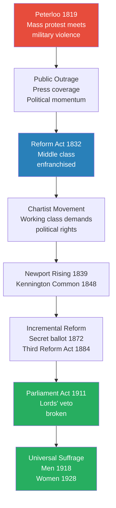
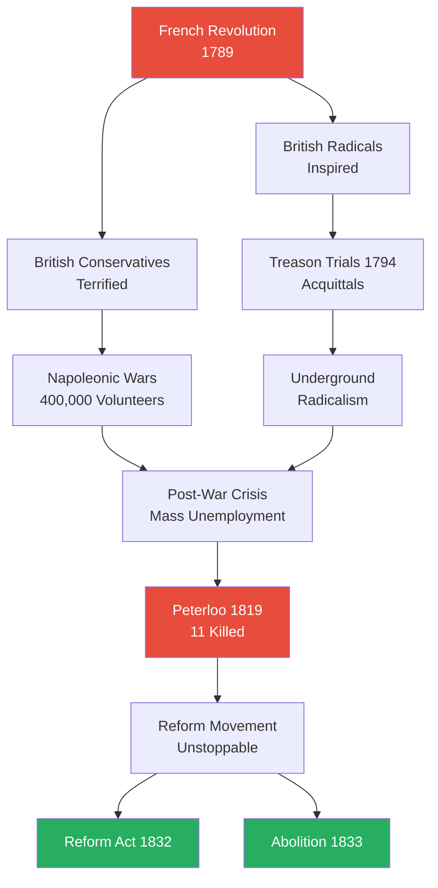
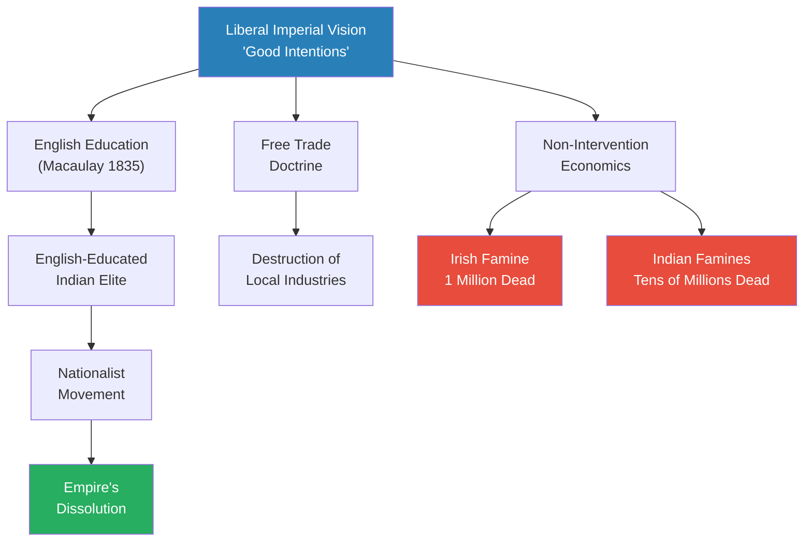
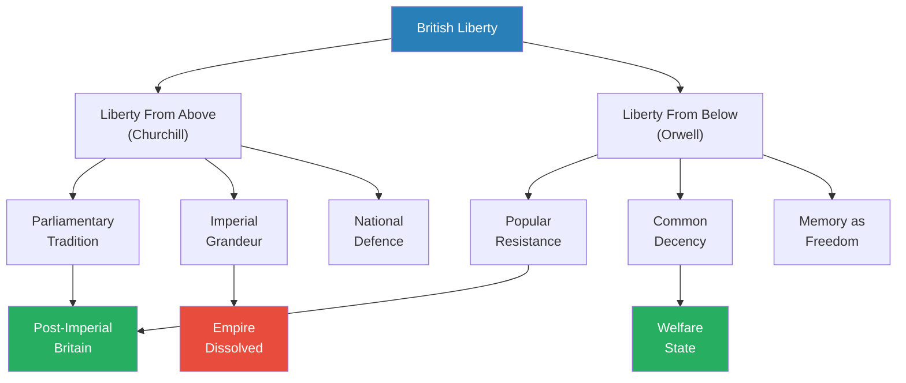
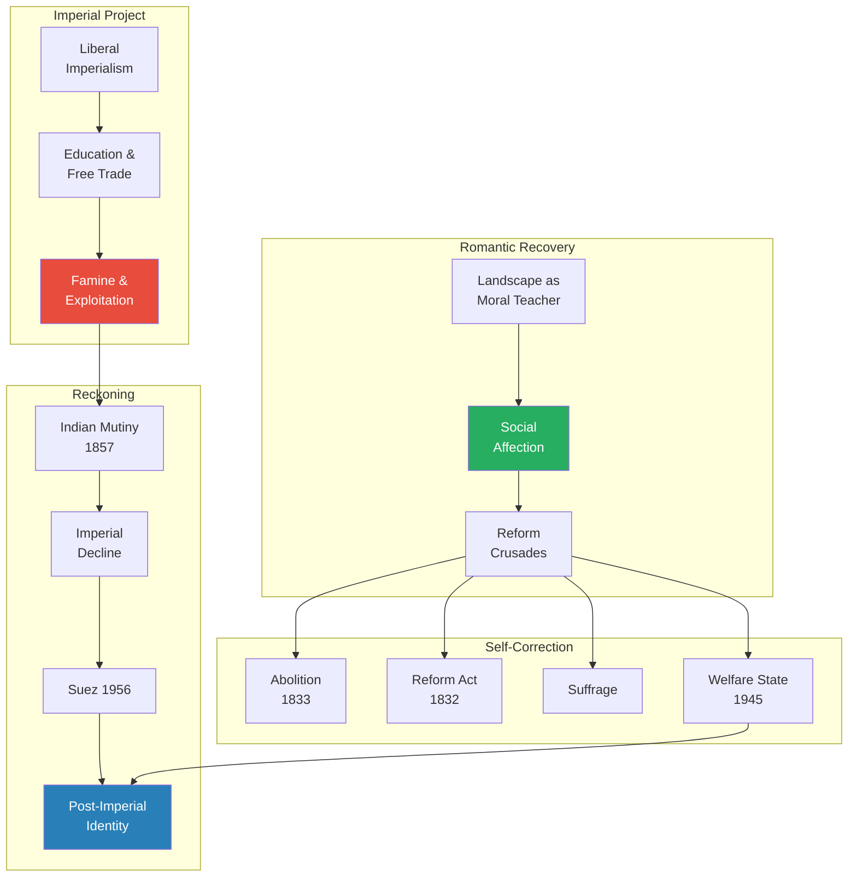
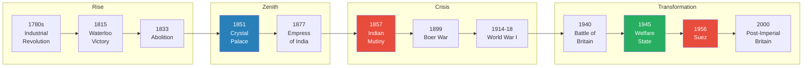

# A History of Britain Vol 3: The Fate of Empire — Simon Schama

> The final volume of Schama's celebrated BBC trilogy picks up where America was lost and carries Britain's story through to the millennium — 224 years in which an island nation built the largest empire in history, pioneered industrial modernity, and then watched both dissolve. Schama's organising argument is that modern Britain has been shaped by an irresolvable tension between two impulses: the Romantic desire to recover an authentic, "natural" Britain rooted in landscape and community, and the relentless drive of industrial empire that destroyed the very communities the Romantics cherished. Yet from within this destruction came a distinctive tradition of self-correction — moral crusades against slavery, for suffrage, for the welfare state — driven by what eighteenth-century writers called "social affection." The book culminates in a double portrait of Churchill and Orwell as complementary embodiments of two visions of British liberty: parliamentary pageant and popular decency. Written with Schama's characteristic literary verve and unapologetic selectivity, this is history as argument, biography as window, and landscape as moral teacher.

---

## About the Author

Simon Schama is University Professor of Art History and History at Columbia University in New York. A British Jew who grew up in north London before spending two decades in America, Schama brings both insider knowledge and outsider distance to British history. He made his name with *Citizens* (1989), a revolutionary narrative history of the French Revolution, and *Landscape and Memory* (1995), a sweeping meditation on nature and culture. The BBC television series *A History of Britain* (2000-2002) made him one of the most recognisable historians in the English-speaking world. His approach is unapologetically literary, personal, and selective — he tells stories rather than building comprehensive surveys.

---

## The Big Idea

- Schama argues that <b style="color: #27ae60">modern Britain has been shaped by a persistent tension between two impulses: the Romantic yearning to recover an authentic "natural" Britain and the transformative engine of industrial empire</b>
- The Romantics — Pennant, Bewick, Wordsworth, Cobbett — urged Britons to "come home," to rediscover their own landscape, their own communities, their own ancient liberties
- But industrial capitalism and imperial expansion were simultaneously destroying the villages, commons, and ways of life that the Romantics celebrated
- This tension was never resolved — the Crystal Palace tried to reconcile nature and industry; the Irish Famine and Indian famines proved they could not be reconciled

The book traces a second, more hopeful thread:
- A tradition of <b style="color: #2980b9">"social affection"</b> — the assumption, expressed in Laurence Sterne's Good Samaritan sermon, that human beings are bound by natural sympathy
- This tradition runs from the anti-slavery movement through Wollstonecraft's feminism, Gaskell's social realism, Gladstone's moral crusades, the suffragettes, Beveridge's welfare state, and Orwell's "common decency"
- It is what makes British history a story of self-correction rather than mere exploitation — the system repeatedly generating its own critics from within
- <b style="color: #e74c3c">But self-correction always came too late, and always at terrible cost</b> — a million dead in Ireland, tens of millions in India, a generation slaughtered on the Western Front

The book's emotional and intellectual climax is a double portrait:
- <b style="color: #2980b9">Churchill represents liberty from above</b> — the parliamentary tradition, the pageant of kings and constitutions, the island fortress of freedom
- <b style="color: #2980b9">Orwell represents liberty from below</b> — popular resistance, common decency, the tradition of dissent that runs from the Levellers to the Blitz
- Both were patriots; both believed in British history; their visions were complementary, not contradictory
- Post-imperial Britain needs both — Churchill's grandeur without its delusions, Orwell's honesty without its despair

---

## Key Concepts at a Glance

| Concept | One-line summary |
|---------|-----------------|
| **Social affection** | A continuous British tradition of moral sympathy crossing class lines, from Sterne to Orwell |
| **Nature-Industry dialectic** | The tension between Romantic attachment to landscape and the transformative power of industrial capitalism |
| **The "coming home" pattern** | From America to the Lake District, from France to patriotic England, from Burma to Wigan — each return forces a reckoning |
| **The empire of good intentions** | Liberal imperialism's sincere but structurally doomed promise that British law and free trade would uplift the colonised |
| **Providence as policy** | The doctrine that famine was God's instrument of improvement — allowing non-intervention to masquerade as cosmic wisdom |
| **The Indian-Irish mirror** | The same officials, the same economic doctrines, the same catastrophic results applied in both countries |
| **The Crystal Palace illusion** | The belief that technology and free trade would harmonise all social contradictions — rich and poor, nature and industry |
| **The angel in the house paradox** | The ideology confining women to domesticity gave them moral authority to challenge the public world |
| **Oil as imperial destiny** | Churchill's 1914 switch from coal to oil created the chain of dependencies that shaped the modern Middle East |
| **The Churchill-Orwell duality** | Two complementary visions of British liberty — parliamentary pageant and popular decency — both needed for the future |
| **Endurance as national virtue** | The capacity to absorb punishment and emerge with social solidarity rather than revolutionary fury |
| **Mongrel glory** | Post-imperial Britain's identity lies not in racial purity but in its roving, unstable, migratory character |

---

*The arc of this volume spans 224 years — from the loss of America to the millennium. The red nodes mark catastrophes (American independence, the Irish Famine), blue marks the Victorian zenith (the Great Exhibition), and green marks the transformation from imperial power to welfare state (the Battle of Britain, the 1945 election).*

---

### Schama's Fifteen Key Principles

| # | Principle | Evidence |
|---|-----------|----------|
| 1 | Landscape is a moral teacher | Pennant, Bewick, Wordsworth — the Romantic discovery that Britain's own unpolished scenery could recover national virtue |
| 2 | Reform comes through moral crusade | Evangelical fervour + mass petition + parliamentary pressure = incremental reform (abolition, suffrage, welfare) |
| 3 | Radicals retreat into comfort | Wordsworth, Coleridge, Southey — the "apostasy of comfort" that Hazlitt never forgave |
| 4 | Technology cannot reconcile social contradictions | The Crystal Palace promised harmony; Manchester's death rate and Ireland's famine disproved it |
| 5 | Domesticity can be subversive | The "angel in the house" ideology gave women the moral platform from which to challenge the public world |
| 6 | Good intentions do not excuse catastrophic results | The liberal imperial project was sincere but structurally doomed — Macaulay's vision, Trevelyan's famine |
| 7 | Providence is a dangerous doctrine | Treating famine as God's instrument of improvement allowed non-intervention to be dressed up as cosmic wisdom |
| 8 | India and Ireland are mirrors | Same officials, same economic orthodoxy, same catastrophic outcomes |
| 9 | Knowledge replaced by ideology in empire | The orientalist soldier-scholars who understood India were displaced by Westernisers who didn't |
| 10 | Military costs are displaced onto the colonised | 35% of Indian revenue spent on army and police; 4% on public works |
| 11 | Genuine liberalism may require state intervention | Gladstone's painful discovery — and the New Liberals' answer: pensions, insurance, labour exchanges |
| 12 | Oil reshapes everything | Churchill's 1914 fuel switch created the chain of Middle Eastern dependencies still active today |
| 13 | Endurance is a national virtue | The Blitz, rationing, austerity — absorbed with solidarity rather than revolutionary fury |
| 14 | Memory is the enemy of tyranny | Orwell's argument: to have a free future requires keeping faith with the past |
| 15 | Britain's glory is mongrel | Post-imperial identity lies in the "roving, unstable, complicated, migratory character" of its history |

---

## Preface: The Cautionary Indefinite Article

*Schama opens by explaining why this is "a" history of Britain rather than "the" history — and why the distinction matters more than modesty.*

- The indefinite article is "truly warranted" — this is a deliberately selective, frankly personal reading of modern British history, not a comprehensive survey
- Schama opts for a smaller number of stories treated in depth rather than giving cursory attention to everything
- <b style="color: #27ae60">His distinctive goal is to unite imperial and domestic history</b> — especially the role of India in Britain's prosperity and the Raj's responsibility for India's and Ireland's suffering
- Most histories of Britain treat the empire as something that happened "out there," separate from the domestic story of reform and industry
- Schama insists the two are inseparable: the wealth that built Manchester came from Indian cotton; the doctrines that produced the Irish Famine were the same ones applied in Indian famines

The framing is literary rather than academic:
- Two epigraphs set the tone — H.G. Wells's *Tono-Bungay* and George Orwell's *England Your England*
- Wells saw an England "passing away" — the old country-house civilisation rotting from within
- Orwell saw an England that "changes beyond recognition yet remains the same" — something enduring beneath the surface mutations
- <b style="color: #2980b9">The tension between Wells's pessimism and Orwell's qualified hope</b> frames the entire book
- The 20th century is treated with "essay-like breadth and looseness" because Schama confesses he struggles to treat any period contemporary with his own life as history

The volume is dedicated to the memory of historian Roy Porter (1946-2002), Schama's friend and fellow chronicler of the Enlightenment.

> [!tip] Core Insight
> This volume's argument is architectural, not just chronological. Schama is not simply telling what happened between 1776 and 2000 — he is tracing how a single tension (the Romantic yearning for authentic community vs. the engine of industrial empire) played out across two centuries, producing both catastrophe and self-correction. Every chapter revisits this dialectic in a new setting.

Schama's method is frankly biographical:
- He tells the story of two centuries through a dozen lives — Pennant, Bewick, Wollstonecraft, Wordsworth, Victoria, Gladstone, Curzon, Churchill, Orwell
- Each life is a window into a larger historical force; each personality illuminates a structural tension
- This means that vast stretches of British history receive no treatment at all — the industrial revolution is approached through its critics, not its engineers; the world wars are backdrops to biographical drama
- Schama is unapologetic about this: he would rather tell one story brilliantly than ten stories adequately
- The cost is comprehensiveness; the gain is intensity
- Readers wanting the full narrative should pair this with [[The English and Their History - Robert Tombs]] for institutional depth and [[A History of Modern Britain - Andrew Marr]] for the post-1945 period

---

## Chapter 1: Forces of Nature — The Road to Revolution

*While Britain was losing one empire (America), it was finding something else: itself. Schama traces the Romantic rediscovery of Britain's own landscape, the cult of sensibility, and the seismic impact of the French Revolution — which divided the nation between those who saw it as liberation and those who saw it as apocalypse.*

### The Domestic Tour as National Recovery

- The loss of the American colonies might have been expected to produce a crisis of national confidence
- Instead, Schama argues, it triggered a profound turning inward — a rediscovery of Britain's own landscape, antiquities, and people
- <b style="color: #2980b9">Thomas Pennant</b>, a Flintshire gentleman-naturalist, toured Wales and the Hebrides in the 1770s documenting "ancient, outlandish, unpolished Britain":
  - He found druids' circles, Viking artefacts, and the formidable 90-year-old Margaret Uch Evans — huntress, fiddler, wrestler, and blacksmith
  - His message to the educated classes was simple: "come home"
  - The British had wandered too much — to Italy, to America, to the Grand Tour — and lost touch with their own landscape
  - The domestic tour became what Schama calls "a tutorial in the recovery of national virtue"

> [!example] Thomas Pennant and the Rediscovery of Britain (1770s)
> - Pennant was a wealthy Flintshire naturalist who spent years touring the remotest parts of Wales and Scotland
> - He documented druids' circles, ancient monuments, and communities living as they had for centuries
> - In one Highland village he encountered Margaret Uch Evans, a 90-year-old woman who could hunt, play the fiddle, wrestle, and work as a blacksmith
> - His books, along with Thomas West's guide to the Lake District, told educated Britons: stop touring Italy and come see your own country
> - The domestic tour became a moral as well as aesthetic experience — to know your own landscape was to know your own national character
> **The lesson:** National identity was being rebuilt from the ground up — through walking, looking, and belonging to a specific landscape rather than an abstract political idea.

- <b style="color: #2980b9">Thomas Bewick</b>, born 1753 in Northumberland, became Britain's greatest naturalist-illustrator — and Schama uses him as the embodiment of the Romantic sensibility at its most authentic:
  - A farmer's son who escaped school by playing truant, drawing on every surface — gravestones, church floors, tavern walls
  - Two formative moments of animal compassion defined his character and, Schama implies, the character of the age

> [!example] Thomas Bewick and the Hare (c. 1760s)
> - The boy Bewick was present when a hare was coursed by dogs and caught
> - He heard it scream "like a child" — a sound that haunted him for the rest of his life
> - The farmer, finding the hare still alive, broke its leg and threw it back to the dogs for further sport
> - "From that day forward, I have ever wished that this poor, persecuted, innocent creature might escape with its life"
> - Later, he knocked a bullfinch from its perch with a stone and watched it look at him "piteously in the face"
> - He never forgot the bird's expression; it became the origin of a lifelong commitment to recording nature with compassion rather than conquest
> **The lesson:** Bewick's compassion for animals anticipated the wider campaign for human compassion — the connection between cruelty to animals and cruelty to people was not accidental, and the Romantic movement made it explicit.

  - His wood-engraved vignettes of British birds smuggled in portraits of rural poverty between pictures of wildlife — a beggar in the margin, a ruined cottage beneath a robin
  - Bewick was not a radical in any political sense — but his art insisted that suffering was visible, that the landscape was not just beautiful but inhabited by people in pain
  - <b style="color: #27ae60">Bewick represented a new kind of patriotism: love of country expressed not through military glory but through attention to the lives of ordinary creatures, human and animal</b>

---

### Rousseau, Sensibility, and the Cult of Nature

- The Romantic rediscovery of Britain was powered by the ideas of Jean-Jacques Rousseau:
  - His arguments that civilisation corrupted natural virtue, that children should be raised in nature, that breast-feeding was a moral duty
  - These ideas spread through educated provincial England with astonishing speed
  - The "Lichfield circle" — Brooke Boothby, Erasmus Darwin, Anna Seward — became a hotbed of Rousseauian sensibility

> [!example] Rousseau's Disastrous English Visit (1766)
> - Invited by the philosopher David Hume, Rousseau arrived in England seasick, cold, and already paranoid
> - Hume had to lock Rousseau's dog Sultan inside the house to get his master out to the theatre
> - Settled in Derbyshire, where locals remembered him as "owd Ross Hall" in his strange Armenian costume, gathering herbs
> - Rousseau became convinced that Hume was conspiring against him, that servants were putting cinders in his food
> - He fled back to France within a year — but his cult of sensibility put down roots in provincial England that lasted generations
> **The lesson:** The prophet of natural feeling was himself a mess of unnatural suspicion — but his ideas took on a life independent of their creator.

- <b style="color: #2980b9">Thomas Day's orphan-wife experiment (1769)</b> was the most bizarre application of Rousseau's theories:
  - A wealthy disciple who hand-picked two orphan girls — Sabrina and Lucretia — to raise as candidates for a perfect wife
  - He poured hot wax on Sabrina's arm and fired guns near her head to test her fortitude against fright and pain
  - The experiment was a spectacular failure; Sabrina was packed off to boarding school
  - Day himself died in 1789 when an unbroken horse he was trying to tame with Rousseauian gentleness threw him on his head
  - <b style="color: #e74c3c">The moral was clear: nature did not always cooperate with theory</b>

---

### The Equation of Walking with Democracy

- Schama traces a remarkable cultural shift: the discovery that walking was a political act
- The German writer Karl Moritz, touring England in 1782, was treated as a vagrant because he travelled on foot — in Hanoverian England, gentlemen rode
  - He was refused lodging at respectable inns; landowners set dogs on him
  - The assumption was simple: a man who walked instead of riding was either a servant or a criminal
- But by the 1790s, walking had become a statement of radical democracy:
  - "Walking" Stewart traversed the known world on foot as a philosophical experiment
  - Wordsworth tramped across the Lake District, France, and Germany, insisting that truth was found in motion and in contact with the earth
  - To walk was to reject the hierarchy of transport — the coach for the rich, the cart for the poor, the foot for the free
  - The connection between physical movement through landscape and moral-political vision became one of the Romantic movement's most enduring legacies
  - Even breast-feeding became politicised through Rousseau's influence — mothers who nursed their own children were making a statement about natural virtue against aristocratic artifice, which delegated nursing to wet-nurses and child-rearing to servants
  - The connection between personal habits and political philosophy — between how you fed your baby and what you believed about society — was one of the Romantic movement's most radical innovations
  - It anticipated the 20th-century feminist insight that "the personal is political" by two hundred years

---

### Social Affection and the Reform Crusades

- The cult of sensibility was not merely aesthetic — it produced concrete reform campaigns:
  - The evangelical revival of the 1770s-80s saw Unitarians like Joseph Priestley and Richard Price reading Jesus as the first social reformer
  - These were not traditional Anglicans but radical dissenters who believed that Christianity's core message was social justice, not personal salvation
  - The anti-slavery campaign gained its iconic image: Josiah Wedgwood's medallion showing a kneeling enslaved man with the motto "Am I not a Man and a Brother?"
  - The <b style="color: #2980b9">Zong scandal</b> (1781) — 133 enslaved Africans thrown overboard for insurance money — galvanised public outrage
    - The ship's owners filed an insurance claim for the "cargo" lost at sea
    - The case was heard as a commercial dispute, not a murder trial — but the public reaction turned it into a moral crisis
    - Granville Sharp used the case to build momentum for the abolitionist cause
  - Oliver Goldsmith's poem *The Deserted Village* (1769) gave voice to the destruction of rural communities by enclosure: "One only master grasps the whole domain"
    - The poem depicted a village destroyed by "engrossment" — the consolidation of small farms into large estates
    - Its emotional power was enormous: educated readers wept over the loss of communities they had never visited

- <b style="color: #27ae60">The assumption that Schama calls "social affection"</b> — from Sterne's sermon that we are naturally bound to "take part in every accident to which man is subject" — became the engine of British reform:
  - It assumed that human beings are connected by natural sympathy — that suffering in one person naturally produces compassion in another
  - It channelled moral outrage through petitions, pamphlets, and parliamentary pressure
  - This pattern — evangelical fervour + mass petition + parliamentary action = incremental reform — would be repeated for the next two centuries
  - The beginning of parliamentary reform agitation also dates from this period — the first calls for widening the franchise, ending rotten boroughs, and making Parliament representative of the actual population
  - <b style="color: #2980b9">The Anti-Corn Law campaign</b> would later refine this into a model for modern pressure-group politics: systematic organisation, public meetings, printed propaganda, and relentless lobbying

---

### The French Revolution Divides Britain

- The fall of the Bastille in 1789 electrified British politics with a force that no foreign event had achieved since the Reformation:
  - Radicals like Tom Paine saw it as the dawn of universal liberty — his *Rights of Man* (1791) sold over a million copies
  - Conservatives like Edmund Burke saw it as the destruction of civilisation — his *Reflections on the Revolution in France* (1790) warned that abstract rights without historical institutions led to chaos and bloodshed
  - <b style="color: #2980b9">The Paine-Burke debate</b> was the foundational division of modern British politics — radical reform vs. organic conservatism
  - Burke argued that the British constitution was a living inheritance, grown over centuries, that could not be replaced by a rational blueprint without disaster
  - Paine countered that every generation had the right to remake its own government — that the dead had no authority over the living
  - Burke predicted the Terror before it happened — that the Revolution's abstract principles would devour their own children
  - Paine's response was that Burke "pitied the plumage but forgot the dying bird" — grieving for the French monarchy while ignoring the suffering of the French people

- The debate split families, friendships, and political alliances:
  - Whig grandees who had toasted the Revolution in 1789 were disowning it by 1793
  - Corresponding Societies sprang up in London, Sheffield, and Edinburgh, exchanging fraternal greetings with the French National Assembly
  - The government panicked — Habeas Corpus was suspended; radical publishers were prosecuted; spies infiltrated working-class clubs
  - <b style="color: #e74c3c">The freedoms that Burke claimed to be defending were the first casualties of the panic he helped to create</b>

| | **Burke** | **Paine** |
|---|-----------|-----------|
| **View of liberty** | Inherited through institutions | Created anew by each generation |
| **View of the past** | Sacred trust to be preserved | Dead hand to be shaken off |
| **Model of change** | Organic, gradual, rooted in custom | Revolutionary, rational, designed |
| **Fear** | That abstract reason destroys living tradition | That tradition justifies oppression |
| **British legacy** | Conservative Party, constitutional monarchy | Radical tradition, democratic reform |

*This table is necessarily simplified — both men were more nuanced than any summary can convey. But the division they articulated remains the fundamental fault line in British politics to this day.*

---

- Mary Wollstonecraft entered the debate with *A Vindication of the Rights of Woman* (1792):
  - She attacked Rousseau's insistence that women should be educated only for domestic roles — turning one of the Revolution's own prophets against its limitations
  - She argued that if reason and liberty were universal rights, they must extend to women — otherwise the revolutionary project was built on a contradiction
  - She was mocked, patronised, and for the most part ignored — Horace Walpole called her "a hyena in petticoats"
  - But she had planted a seed that would germinate across the next century, from the Chartist women to the suffragettes

> [!tip] Core Insight
> The French Revolution forced every thinking Briton to choose: was liberty something inherited (Burke) or something created anew in every generation (Paine)? Schama argues that the genius of British political culture was to absorb both answers — inheriting institutions while continuously reforming them. But the cost of this pragmatism was that reform always came too late for those who suffered while the system deliberated.

---

## Chapter 2: Forces of Nature — The Road Home

*The generation electrified by the French Revolution gradually "came home" — literally and philosophically — as the revolution devoured its own, Napoleon threatened invasion, and nature replaced politics as the source of moral regeneration. But the retreat from radicalism did not eliminate the demand for social justice; it merely channelled it differently.*

### Mary Wollstonecraft's Tragic Arc

- Wollstonecraft's life after the *Vindication* was as dramatic as her prose:
  - She travelled to revolutionary Paris and witnessed Louis XVI's trial
  - She fell in love with the American adventurer Gilbert Imlay, who abandoned her and their daughter Fanny
  - She attempted suicide twice — first by laudanum overdose, then by walking up and down Putney Bridge for half an hour to saturate her dress before jumping into the Thames
  - <b style="color: #e74c3c">She was rescued by boatmen of the Royal Humane Society, who were paid to fish suicides from the river</b>
  - She was taken to the Duke's Head tavern in Fulham to recover
  - Redemption came through marriage to the philosopher William Godwin — a genuine partnership of intellectual equals
  - She died at 38 from septicaemia after giving birth to the daughter who would become Mary Shelley, author of *Frankenstein*

> [!example] Mary Wollstonecraft's Rescue from the Thames (1795)
> - After being abandoned by Imlay, Wollstonecraft walked back and forth on Putney Bridge for thirty minutes to soak her dress
> - She climbed the railing and jumped, intending the waterlogged fabric to drag her under
> - Boatmen from the Royal Humane Society — a charity that paid watermen to patrol for suicides — pulled her out
> - She was carried half-drowned to the Duke's Head tavern in Fulham
> - After recovery, she proposed to Imlay that they all live together as a threesome — he declined
> - Her marriage to Godwin and the birth of their daughter brought genuine happiness, cut short by death at 38
> **The lesson:** Wollstonecraft's life was the embodiment of the tension she diagnosed — a woman of extraordinary intellect and courage, destroyed and redeemed by the same passions she championed.

---

### Wordsworth's Journey From Revolution to Conservatism

- William Wordsworth's personal trajectory mirrored Britain's broader movement from revolutionary enthusiasm to patriotic conservatism — and Schama uses it as a case study in the psychology of disillusionment:
  - In 1790, aged 20, he walked through France on the eve of the Bastille anniversary and was intoxicated by the revolutionary spirit: "Bliss was it in that dawn to be alive"
  - He fell in love with the Frenchwoman Annette Vallon and fathered an illegitimate daughter, Caroline — a fact he concealed for years
  - His friend Beaupuis, a French officer, showed him a "hunger-bitten girl" leading a heifer and said: "Tis against that we are fighting"
  - But as the Revolution descended into the Terror, Wordsworth retreated — first physically to England, then intellectually from radicalism
  - The execution of Louis XVI, the September massacres, the drownings at Nantes — each stage of revolutionary violence pushed Wordsworth further from the cause he had embraced
  - By 1802 he was writing patriotic sonnets; by 1813 he had accepted a government sinecure as stamp distributor for Westmorland
  - By the time of Peterloo, Wordsworth appears to have sided with the magistrates, not the marchers

- The *Lyrical Ballads* (1798), written with Coleridge, was a revolutionary act of a different kind:
  - Plain speech instead of literary polish — the deliberate rejection of Augustan elegance
  - The broken and the poor as subjects worthy of poetry — vagrants, leech-gatherers, abandoned women
  - Nature as physical reality, not political slogan — muddy fields and cold streams, not Arcadian meadows
  - <b style="color: #27ae60">The insight that moral regeneration came from contact with landscape, not from political programmes</b>
  - The *Ballads* were a manifesto: if the Revolution had failed in Paris, another kind of revolution — quieter, deeper, rooted in English soil — might succeed in the Lake District

- Coleridge's three 1798 poems — "Fears in Solitude," "France: An Ode," "Frost at Midnight" — were a manifesto of disillusionment:
  - France had betrayed its own revolution by invading Switzerland — the one country in Europe that already had the freedom France claimed to be spreading
  - England's landscape was the true source of liberty — not an abstraction but a physical, felt reality
  - Patriotism was not conservatism but a deeper radicalism — rooted in place, not in abstraction
  - In "Frost at Midnight," Coleridge imagined his infant son growing up free in nature, escaping the "cloisters dim" of his own childhood — the poem as a revolutionary act of parenting

- William Hazlitt never forgave the apostasy:
  - His savage portrait of the "Modern Tory" (1816) accused Wordsworth and his generation of selling their principles for comfort and respectability
  - Hazlitt had walked to the Quantocks as a young man to hear Coleridge preach — and remembered every word decades later with a bitterness that bordered on personal betrayal
  - <b style="color: #e74c3c">The "apostasy of comfort"</b> — radicals who retreat into conservatism once they achieve material security — became a recurring pattern in British intellectual life
  - Schama does not wholly endorse Hazlitt's verdict: Wordsworth's conservatism was not simply opportunism but a genuine philosophical position — the belief that institutions grow organically and cannot be replaced by abstract designs
  - But the emotional force of Hazlitt's accusation endures — because it asks whether conviction can survive prosperity

---

### The Napoleonic Invasion Scare and National Defence

- The threat of French invasion transformed British politics and culture in ways that lasted long after Waterloo:
  - Napoleon assembled an army of 150,000 at Boulogne, visible from the English coast on clear days — the invasion threat was not hypothetical but immediate
  - 400,000 volunteers by 1804; 800,000 in total national defence out of a population of 15 million — a mobilisation rate that astonished foreign observers
  - This was not conscription but genuine popular mobilisation — farmers, shopkeepers, artisans who drilled in the evenings and prepared to defend their villages
  - Schama uses this as evidence that patriotism ran deep even among those excluded from the political system — men who could not vote were willing to fight
  - The invasion scare also produced the first modern government propaganda effort: broadsheets, cartoons, speeches, all depicting Napoleon as the Antichrist
  - The Battle of Trafalgar (1805) removed the naval threat; Waterloo (1815) ended the military threat; but the patriotic culture forged during the Napoleonic era persisted for generations

- The mythology of <b style="color: #2980b9">Merrie England</b> was born during the Napoleonic wars:
  - Shakespeare revivals (especially *Henry V*), Madame Tussaud's waxworks, historical costume books, illustrated chronicles
  - An imagined medieval past was constructed as the opposite of revolutionary France — organic, hierarchical, but warmly communal
  - Medieval England was all community and faith; revolutionary France was all abstraction and blood
  - This invented tradition would prove extraordinarily durable — it survived the Industrial Revolution, two world wars, and the loss of empire
  - Schama traces a direct line from the Napoleonic Merrie England to the village greens of H.V. Morton's *In Search of England* and the pastoral fantasies of inter-war nostalgia
  - <b style="color: #27ae60">The England that Britons believed they were defending was as much a creation of the 1800s as of the Middle Ages</b>
  - This invented tradition was not simply propaganda — it expressed a genuine yearning for community, for rootedness, for an alternative to the industrial machine
  - But it also concealed uncomfortable truths: the "Merrie England" of popular imagination had never existed; the medieval past was as full of plague, serfdom, and violence as the industrial present was full of poverty, pollution, and exploitation
  - The tension between the real past and the imagined past would become one of the defining features of British culture — and it runs all the way through to the heritage industry, the National Trust, and the period drama of the 21st century

---

### Nelson and the Cult of the Hero

- Horatio Nelson's funeral in January 1806 was on a scale that "completely overshadowed William Pitt's" the following month:
  - His body was preserved in a barrel of brandy (legend says the sailors tapped it for a drink on the voyage home) and borne from Greenwich to St Paul's in black barges "like Arthur to Avalon"
  - The funeral procession up the Thames drew tens of thousands of spectators to the riverbanks
  - Nelson's genius for self-promotion made him the first military man treated as a Romantic genius — not just a commander but a character, with his one arm, his one eye, his passion for Emma Hamilton
  - He had composed his own legend with the care of a novelist: the blind eye to the telescope at Copenhagen, the declaration at Trafalgar ("England expects that every man will do his duty"), the death in the arms of Hardy
  - The cult of Nelson fused patriotism with sensibility — he was proof that feeling and fighting were not contradictory
  - <b style="color: #27ae60">Nelson gave Britain a hero for the age of Romanticism: not a cold professional but a man of passionate feeling who happened to be unbeatable at sea</b>

---

### The Treason Trials and the Limits of Repression

> [!example] Thomas Erskine's Defence of the Radicals (1794)
> - Thomas Hardy, John Thelwall, and Horne Tooke were arrested and charged with "compassing the death of the king" — treason
> - The Attorney-General laboured for nine hours to make the case; a retired Lord Chancellor erupted: "Then there is no treason, by God!"
> - Erskine's defence speech lasted seven hours, at the end of which he collapsed: "I am sinking under fatigue"
> - The jury acquitted Hardy — and applauded
> - Crowds untethered the horses from the acquitted men's carriages and pulled them through the streets in triumph
> - The government's attempt to criminalise political dissent had backfired spectacularly
> **The lesson:** Even in a panic over revolution, a British jury would not convict men for their opinions. The tradition of legal liberty was stronger than the fear of Jacobinism.

---

### Peterloo: The Massacre That Made Reform Inevitable

- The post-Napoleonic period saw Britain in crisis: demobilised soldiers, collapsing wages, the Corn Laws keeping bread prices artificially high
- <b style="color: #2980b9">William Cobbett</b> became the voice of radical journalism:
  - A former government propagandist, he was converted by visiting Horton Heath and seeing its unenclosed common supporting 100 beehives, 60 pigs, 15 cows, 800 poultry — proof that commons were not uneconomic waste
  - He calculated: 1 million paupers in England and Wales, one-eighth of the population
  - His *Weekly Political Register* sold 60,000 copies a week at its height — a readership rivalling modern national newspapers

> [!example] The Peterloo Massacre (16 August 1819)
> - 50,000-60,000 people gathered peacefully in St Peter's Fields, Manchester, beneath banners reading "Universal Suffrage"
> - Some marched in disciplined columns, singing Methodist hymns; many brought children
> - The Manchester and Salford Yeomanry — local businessmen on horseback, many of them drunk — charged in to arrest the speakers
> - A small girl was trampled to death under their horses
> - When the crowd did not disperse, hussars were sent in with unsheathed sabres
> - Eleven killed, 421 seriously wounded, 162 with sabre cuts — at least 100 women and children among the injured
> - The journalist Samuel Bamford described "chopped limbs, and wound-gaping skulls"
> - Lord Sidmouth, the Home Secretary, congratulated the Manchester magistrates on their firmness
> **The lesson:** Peterloo was christened as a bitter mockery of Waterloo — the government that had defeated Napoleon abroad was now sabring its own people at home. The massacre made parliamentary reform inevitable, even if it took another thirteen years.

---

### The Reform Act and the End of Slavery

- The <b style="color: #2980b9">Reform Act of 1832</b> was the culmination of decades of agitation — and it came within a hair's breadth of violent revolution:
  - In the days before the vote, Bristol was burned by a mob; Nottingham Castle was set ablaze; the Duke of Wellington's London house had its windows smashed
  - 140 rotten boroughs lost their parliamentary seats — Old Sarum, with seven voters and no inhabitants, being the most notorious
  - New industrial towns — Manchester, Birmingham, Leeds — were enfranchised for the first time
  - The vote was extended to half a million new voters — roughly doubling the electorate
  - "Old Corruption" — the system of patronage, pocket boroughs, and aristocratic manipulation — was swept away
  - But the working class was still excluded; the franchise was limited to men with property worth 10 pounds a year
  - <b style="color: #e74c3c">The Reform Act satisfied the middle class and excluded the working class</b> — a settlement that guaranteed the next fifty years of agitation
  - The Whig architect of the Act, Lord Grey, admitted candidly that its purpose was to prevent revolution by co-opting the middle class into the existing system

- Slavery was abolished in all British colonies in 1833 — one of the few moments when Schama allows himself unqualified admiration:
  - <b style="color: #27ae60">Schama insists it was "destroyed, overwhelmingly, by the force of moral argument"</b> — not by economic calculation, though some historians argue that slavery was already becoming less profitable
  - The abolition campaign was the proof of concept for the "social affection" tradition: that public conscience, organised and persistent, could compel Parliament to act against powerful economic interests
  - The slave-owners were compensated with 20 million pounds (roughly 40% of the government's annual revenue) — the enslaved received nothing
  - The compensation payments were so large that the British government was still paying off the loan taken to fund them until 2015
  - Schama does not dwell on this irony but it hangs in the air: the price of moral progress was paid by taxpayers, not by those who had profited from slavery
  - Nevertheless, abolition remains, for Schama, one of the few unambiguously heroic episodes in this volume — proof that the tradition of "social affection" could overcome even the most powerful economic interests when moral passion was sustained and organised

*The path from Peterloo to universal suffrage took 109 years. Every step required violence, mass mobilisation, or the credible threat of revolution. Reform in Britain was never given — it was always extracted.*

*The path from revolutionary inspiration to parliamentary reform took forty years and passed through war, repression, and massacre. But the British pattern held: catastrophe eventually produced reform, not revolution.*

---

## Chapter 3: The Queen and the Hive

*The Great Exhibition of 1851 was the high-water mark of Victorian optimism — the belief that industry, nature, and social harmony could all be reconciled under one magnificent glass roof. But the complacency was already being challenged from within, by critics who asked whether the Crystal Palace was a temple to progress or a monument to self-delusion.*

### The Crystal Palace: Victorian Britain's Greatest Day

- <b style="color: #2980b9">The Great Exhibition</b> opened on 1 May 1851 and was, by any measure, the most ambitious public spectacle the world had ever seen:
  - Joseph Paxton's Crystal Palace — a cathedral of glass and iron covering 18 acres of Hyde Park — was built in just 17 weeks
  - Paxton was not an architect but a gardener — head gardener to the Duke of Devonshire at Chatsworth, where he had built an enormous conservatory
  - His design was inspired by the underside of the Victoria Regia waterlily — nature providing the template for the building that celebrated industry
  - Two ancient 90-foot elm trees were preserved inside by bending the transept ribs into a semicircular roof — nature and industry literally coexisting under the same glass
  - The building contained 293,655 panes of glass, 330 standardised iron columns, and 24 miles of guttering
  - Six million visitors came, three-quarters by railway — the largest peaceable gathering in human history to that date
  - Not a single act of vandalism was reported — a fact that astonished and delighted the organisers
  - The Duke of Wellington wanted 15,000 troops stationed nearby; Paxton insisted instead on cheap shilling admission days to let working people attend
  - On the first shilling day, 73,000 visitors packed the building — more than on any other single day
  - "The People have now become the Exhibition" — the crowd itself was the spectacle, classes mingling under one roof as they never did on the street outside

> [!example] Victoria's Rapture at the Crystal Palace (1 May 1851)
> - Queen Victoria's diary entry for opening day overflows with emotion — "the most beautiful and imposing and touching spectacle ever seen"
> - Prince Albert, who had championed the Exhibition against fierce opposition, stood beside her as choirs sang Handel's Hallelujah Chorus
> - The building itself was the star — a structure of glass and iron that seemed to make the outdoors and indoors continuous
> - The Chinese visitors in embroidered silk attracted almost as much attention as the machinery
> - Working-class visitors behaved impeccably, disproving every aristocratic fear about admitting the unwashed
> - Victoria returned repeatedly, recording each visit with the same breathless delight
> **The lesson:** The Great Exhibition was Victorian Britain's attempt to prove that industrial capitalism and social harmony were not contradictory — that the same energy that built factories could build a cathedral of glass. For one shimmering summer, it worked.

- Prince Albert's vision was utopian: war between nations would be replaced by peaceful competition of commerce
  - The Exhibition was explicitly internationalist — every nation was invited to display its products and manufactures
  - Albert believed that free trade and cultural exchange would make war obsolete — the Crystal Palace as a temple to perpetual peace
  - The semantic somersault of "industry" was complete — the word now conveyed the saving, not the expenditure, of physical labour
  - Machines that could do the work of a hundred men were displayed alongside paintings and tapestries — art and engineering sharing the same cathedral
- <b style="color: #e74c3c">But outside the Crystal Palace, the reality was less luminous</b>
  - The same railways that brought six million visitors to the Exhibition carried coal from mines where children worked twelve-hour shifts
  - The same iron that built Paxton's soaring roof was forged in foundries where men died young from lung disease
  - Schama's point is not that the Exhibition was hypocritical but that it was aspirational — a vision of what industrial civilisation could be, even as the reality fell catastrophically short

---

### The Critics: Carlyle, Pugin, and the Gothic Revival

- <b style="color: #2980b9">Thomas Carlyle</b> was the Great Exhibition's most formidable critic:
  - His *Past and Present* (1843) evoked the medieval chronicle of Jocelin of Brakelond at Bury St Edmunds abbey to contrast spiritual community with modern soulless materialism
  - "Nothing is now done directly or by hand; all is by rule and calculated contrivance"
  - Yet the Victorians were not complacent — "the more Carlyle berated them, the more they lapped up the punishment"
  - Carlyle's audience was the very industrialists he attacked — they bought his books in enormous quantities, attended his lectures, and wrestled with his arguments
  - <b style="color: #27ae60">The Victorians' willingness to fund their own most savage critics was, Schama implies, a form of moral seriousness rare in any civilisation</b>

- <b style="color: #2980b9">Augustus Welby Northmore Pugin</b> gave the critique of industrial modernity its most devastating visual form:
  - The son of a French immigrant designer, a prodigy summoned by George IV at 15 to design furniture for Windsor Castle
  - By 20 he was designing sets for the Theatre Royal; by 25 he had published the book that would reshape Victorian taste
  - His *Contrasts* (1836) presented devastating side-by-side illustrations: a medieval town with soaring spires, public gardens, and almshouses next to the same town in the 1830s — smoke-stacks, prisons, and a workhouse shaped like a panopticon
  - The visual argument was unanswerable: medieval Christianity had produced beauty; Protestant industrial capitalism had produced ugliness
  - Converted to Catholicism, convinced that the Protestant Reformation had destroyed beauty along with faith — Pugin was the only major Victorian architect who believed that aesthetic reform required religious conversion
  - His masterpiece, St Giles at Cheadle in Staffordshire, was "a glowing vault of intense, radiant colour" — every surface painted, gilded, or tiled; proof that modern craftsmanship could equal the medieval when guided by medieval principles
  - He also designed the interiors of the new Palace of Westminster (the Houses of Parliament) — the Gothic Revival made official, British democracy housed in a medieval shell
  - The paradox of Pugin's career is that his greatest work served the very institution he most distrusted — a Protestant Parliament decorated by a Catholic convert
  - Died at 40, burnt out by overwork and what appears to have been a mental breakdown — a victim of the very industrial pace he condemned
  - His legacy was enormous: the Gothic Revival shaped Victorian architecture, church-building, and public taste for the rest of the century, and the Palace of Westminster remains the most recognisable image of British democracy in the world

---

### Manchester: The Entrance to Hell

- Sir Charles Napier called Manchester "the entrance to hell realised" — and the statistics justified the poetry:
  - Average life expectancy for mechanics and labourers: 17 years — compared to 38 for professionals in the same city
  - Open sewers running through streets where families of eight lived in single rooms
  - Children crawled under moving machinery to retrieve cotton waste — losing fingers, hands, and lives
  - The air was thick with cotton dust; the water was polluted; the death rate from consumption was the highest in England
  - Friedrich Engels, living in Manchester in 1842-44, documented the conditions in *The Condition of the Working Class in England* — but Schama prefers English witnesses to German revolutionaries

- The <b style="color: #2980b9">New Poor Law of 1834</b> made destitution deliberately punishing:
  - Workhouses separated families — husbands from wives, parents from children
  - Inmates were shorn and uniformed like prisoners
  - Diets were calculated to be less attractive than the worst-paid employment outside — the "less eligibility" principle
  - The logic was utilitarian: make poverty so miserable that people would do anything to escape it
  - <b style="color: #e74c3c">The result was not motivation but despair</b> — the workhouse became the most hated institution in Victorian Britain
  - The Andover workhouse scandal of 1845 revealed that starving inmates were gnawing meat from the bones they had been set to crush for fertiliser — the bodies of paupers being more literally consumed than any Carlylean metaphor could capture
  - Dickens's Oliver Twist (1837) made the workhouse a symbol of institutional cruelty — "Please, sir, I want some more" became the most famous line in Victorian fiction
  - The segregation of the sexes meant that marriages were effectively dissolved by destitution — a husband and wife who entered the workhouse together were separated and might never speak again
  - Children were taken from their parents, put into workhouse schools, and trained for domestic service or factory work
  - The psychological cruelty was as devastating as the physical deprivation: inmates lost their names (addressed by number), their clothes (uniformed in coarse fabric), and their autonomy (every minute regulated by the clock)
  - Schama sees the New Poor Law as the domestic counterpart of the imperial project: the same utilitarian logic, the same belief that suffering was a necessary instrument of improvement, the same catastrophic human cost
  - The workhouse and the famine relief camp were designed by the same intellectual tradition — Benthamite utilitarianism filtered through Malthusian economics — and both operated on the assumption that poverty was a moral failing to be corrected by deliberate misery
  - This domestic cruelty makes nonsense of the claim that the empire's failings were simply a matter of distance and ignorance — the British state was equally willing to impose suffering on its own people, in its own towns, under its own laws
  - The New Poor Law is the bridge between the domestic and imperial stories that Schama is determined to unite: the same ideology produced the workhouse in Andover and the famine in Connemara

---

### Chartism: The People's Challenge

- The <b style="color: #2980b9">Chartist movement</b> represented the most serious working-class challenge to the political order since the English Civil War — and Schama gives it the weight it deserves:
  - The People's Charter, published in 1838, made six demands: universal male suffrage, annual parliaments, secret ballot, equal electoral constituencies, payment of MPs, abolition of property qualifications for MPs
  - Every one of these demands has since been enacted — but it took between 30 years (secret ballot, 1872) and 120 years (equal constituencies, essentially achieved by the 1960s)
  - The movement combined mass petitions (the first, in 1839, carried 1.28 million signatures), torchlight processions, political newspapers, and the ever-present threat of a general strike or armed insurrection
  - Chartism was not a single movement but a coalition: physical-force radicals like Feargus O'Connor coexisted uneasily with moral-force constitutionalists like William Lovett
  - The movement's strength was in the industrial north and in Wales — the very regions that the Reform Act of 1832 had enfranchised economically but excluded politically
  - <b style="color: #27ae60">Chartism proved that the working class could organise, articulate, and sustain a coherent political programme</b> — even if it could not, in the 1840s, force its adoption

> [!example] The Newport Rising (3 November 1839)
> - Thousands of Welsh miners and ironworkers marched on Newport to free Chartist prisoners
> - Soldiers opened fire at the Westgate Hotel
> - Fifteen dead, more than fifty wounded
> - Schama calls it "the largest loss of life inflicted by a British government on its own people at any time in the 19th or 20th century"
> - The leaders were transported to Tasmania — then pardoned and allowed to return
> **The lesson:** Chartism was not a gentle petition movement. It was backed by the credible threat of working-class violence — and the government responded with lethal force.

- The Chartist crisis of 10 April 1848 was the movement's last great gamble:
  - Revolution was sweeping Europe — France, Austria, the German states, Italy — and London expected its own convulsion
  - Feargus O'Connor brought a monster petition with allegedly five million signatures to Kennington Common on a farm wagon pulled by four dray horses
  - Wellington mobilised 85,000 special constables; the Stock Exchange volunteered 300 employees; the Bank of England was sandbagged
  - O'Connor, looking at the logistical odds and the massed constables, chose retreat over confrontation — he crossed the bridge alone in a cab to deliver the petition to Parliament
  - The petition was subsequently dismissed as farcical — many signatures were forged, including "Queen Victoria," "Mr Punch," and "The Duke of Wellington"
  - Subsequent myth treated 1848 as proof that Britain was immune to revolution — a comforting but dangerous illusion
  - But the *London Illustrated News* admonished Parliament not to ridicule a petition signed by even a fraction of the claimed number — the grievances behind it were real, even if the signatures were not
  - Schama is careful not to dismiss 1848 as farce: the retreat from Kennington Common was pragmatic, not cowardly, and the Chartist demands were all eventually met

> [!tip] Core Insight
> Chartism failed in its immediate objectives but succeeded in setting the agenda for the next century of British politics. Every major democratic reform of the Victorian and Edwardian eras — the Second and Third Reform Acts, the secret ballot, payment of MPs, the Parliament Act — was a Chartist demand belatedly fulfilled. The movement's real legacy was not what it achieved in its lifetime but the ideas it planted in the political soil.

> [!example] Elizabeth Gaskell and the Voice of Manchester (1848)
> - Elizabeth Gaskell's novel *Mary Barton* was the first to give polite middle-class readers the authentic voice of working-class Manchester
> - She included dialect songs, factory slang, and the daily texture of industrial poverty
> - Her tragic hero John Barton goes to London with the Chartist petition and is told by a policeman to stop "molesting the ladies and gentlemen"
> - The Manchester cotton barons cold-shouldered Gaskell for her disloyalty to their city's reputation
> - She refused to retreat: "evils once recognized are half way towards their remedy"
> **The lesson:** Gaskell understood that political reform required emotional connection — the middle class had to hear the working class speak in their own words before they would act.

- Gaskell's achievement was to give industrial Manchester a human voice — not statistics but characters, not reports but stories
  - Her later novels — *North and South* (1855) and *Wives and Daughters* (1866) — continued to explore the collision between industrial reality and genteel ignorance
  - She is one of the unsung heroes of Schama's narrative: a woman who used fiction to do what parliamentary speeches could not — make the comfortable feel the suffering of the poor
  - Gaskell's example proved that literature could be a form of political action — and that the novelist, no less than the politician or the campaigner, could reshape public opinion and drive reform
  - The connection between imaginative sympathy and political change — between fiction and "social affection" — is one of Schama's most subtle and important themes

- <b style="color: #2980b9">The Chartist Land Company at Great Dodford</b> showed another face of the movement:
  - O'Connor's scheme to resettle redundant factory workers on smallholdings — a return to the land that echoed Cobbett's vision of rural England
  - Ann Wood, an Edinburgh charlady who had saved 150 pounds, got the pick of the lots and lived to 86
  - The conspicuous presence of women in the settlement was unusual for the era and hinted at the movement's democratic impulse
  - The Great Dodford settlement survives to this day — a living remnant of the Chartist dream of land and independence
  - Schama sees the Land Company as evidence that Chartism was not simply a demand for the vote but a comprehensive vision of social reorganisation — a working-class alternative to the industrial capitalism that had uprooted millions from the countryside
  - The tension between industrial progress and rural nostalgia that runs through the entire book is visible here in miniature: factory workers dreaming of smallholdings, industrial labourers yearning for the pastoral life that enclosure and the machine had destroyed

> [!tip] Core Insight
> The Crystal Palace and the Chartist petition were presented in the same decade. One promised that technology would solve all social problems; the other insisted that only political power could address inequality. Victorian Britain's genius — and its cruelty — was to pursue both simultaneously, building railways and workhouses with equal efficiency.

---

## Chapter 4: Wives, Daughters, Widows

*Victoria's reign was shaped by the paradox of a woman ruling an empire whose ideology confined women to the domestic sphere. Yet from within that ideology emerged the instruments of its own subversion — photography, education, professional ambition, and ultimately political militancy.*

### The Angel in the House and Her Discontents

- Three texts defined the Victorian ideal of womanhood, and all three became extraordinary bestsellers:
  - Coventry Patmore's poem "The Angel in the House" — woman as domestic saint, her very selflessness a form of spiritual perfection
  - John Ruskin's "Of Queen's Gardens" in *Sesame and Lilies* (sold 160,000 copies) — woman as moral guardian of the home, whose virtue was "not for self-development but for self-renunciation"
  - Mrs Beeton's *Book of Household Management* (2 million copies before 1870) — woman as domestic administrator, running the household with the efficiency of a military commander
- <b style="color: #2980b9">The "angel in the house" paradox</b> was this: by granting women supreme moral authority within the domestic sphere, Victorian ideology inadvertently gave them a platform from which to challenge the public world
  - If women were morally superior, why should they be excluded from moral decisions about slavery, poverty, and education?
  - If the home was woman's kingdom, what happened when the home was a slum, a workhouse, or a factory?
  - The ideology of separate spheres was meant to contain women — but it gave them a language of moral authority that could not be contained

- Ruskin himself embodied the paradox with painful clarity:
  - His marriage to Effie Gray was unconsummated — she eventually obtained an annulment on grounds of his "incurable impotency"
  - He became obsessed with the adolescent Rose La Touche, who was barely into her teens when his infatuation began
  - Yet his essay on women's nature was treated as definitive by millions of readers who knew nothing of his private disasters
  - <b style="color: #e74c3c">The Victorian oracle on womanhood had never understood an actual woman</b>
  - Schama's point is not simply biographical irony — it is that the entire Victorian discourse on femininity was conducted by men who had remarkably little experience of women as autonomous beings

- <b style="color: #2980b9">Octavia Hill's Charity Organisation Society</b> showed how the ideology of domesticity could be turned into a tool of social control:
  - Hill bought slum properties and managed them with rigorous moral supervision
  - Tenants had to report their conduct weekly; "persons of drunken, immoral or idle habits" were evicted
  - The assumption was that poverty was a moral failing that could be corrected by female moral influence
  - It was domesticity as discipline — and it foreshadowed the welfare state's own tendency to police the behaviour of those it helped

---

### Victoria and Albert: The Royal Marriage

- The royal marriage was itself a demonstration of the paradox Schama is tracking:
  - Victoria proposed to Albert — protocol required it, since she was the sovereign and he could not presume to propose to the queen
  - Albert was told his function was "decorative, supportive and generative, possibly in that order" — a role he found humiliating
  - He was given no official title, no seat in Parliament, no constitutional role; he was not even granted precedence over the royal dukes
  - Yet Albert created a serious role for himself through sheer competence and intelligence:
    - He described his self-made position: "the natural head of her family, superintendent of the royal household, manager of her private affairs, sole confidential adviser in politics"
    - He championed the Great Exhibition against fierce opposition from conservatives who feared the influx of foreigners and radicals
    - He modernised the royal finances, improved the royal estates, and took a genuine interest in science, industry, and social reform
    - He designed the Swiss Cottage at Osborne House with child-sized furniture so the royal children could learn domestic skills — an exercise in the very Rousseauian principles that had produced Thomas Day's disastrous experiments
  - But the marriage was also a demonstration of the limits of female autonomy — Victoria, the most powerful woman in the world, willingly submitted to Albert's authority in private
  - She bore nine children in seventeen years, hating pregnancy and childbirth ("the shadow-side of marriage"), yet accepting both as duties she could not evade
  - The queen who ruled an empire on which the sun never set confided in her journal that she felt trapped by her own biology — the most powerful woman in the world was also, by her own account, its most celebrated prisoner
  - Schama uses the marriage to illustrate the chapter's larger argument: Victorian gender ideology was not simply imposed on women — it was embraced, resisted, negotiated, and subverted simultaneously, even by the woman who was supposed to embody it

> [!example] Victoria's Wedding Night (10 February 1840)
> - Victoria's diary that night is perhaps the most candid royal document of the century
> - "When day dawned, for we did not sleep much and I beheld that beautiful angelic face by my side, it was more than I can express!"
> - "My dearest Albert put on my stockings for me. I went in and saw him shave; a great delight for me"
> - The intimacy is startling — a reigning queen recording domestic pleasure with unguarded joy
> - But Victoria also confided, more darkly, that "the poor woman is bodily and morally the husband's slave"
> - Even the most powerful woman in the world felt the constraints of her sex
> **The lesson:** Victoria's private writings reveal the contradiction at the heart of her reign — genuine passion and companionship coexisting with a clear-eyed awareness that marriage subordinated women, even queens.

---

### Albert's Death and Victoria's Forty-Year Grief

- Albert died of typhoid on 14 December 1861, misdiagnosed by his incompetent doctor, Dr Clark (the same physician who had bungled the Flora Hastings scandal years earlier):
  - Victoria's grief was extravagant and sustained beyond anything the monarchy had experienced
  - Fresh clothes were laid out daily for the dead prince; hot water and shaving soap prepared each morning as if he might appear
  - His nightshirt was taken to her bed every night, along with a plaster cast of his hand
  - She withdrew from public life for years — refusing to open Parliament, refusing to appear at public ceremonies, refusing to play the visible role that the constitution required
  - She earned the public nickname "the widow of Windsor"
  - A satirical notice was posted on the Buckingham Palace railings: "These commanding premises to be let or sold in consequence of the late occupant's declining business"
  - Republican sentiment grew — for the first and only time in the Victorian era, serious voices questioned whether Britain needed a monarchy at all
  - <b style="color: #e74c3c">Victoria's compulsive mourning became a national problem</b> — a monarchy that refused to be seen lost the capacity to be loved, and love was the only thing that kept it alive

- But the <b style="color: #2980b9">carte-de-visite revolution</b> transformed the relationship between Crown and people even as Victoria withdrew:
  - Hundreds of thousands of royal photographs were circulated on small visiting cards
  - For the first time, the royal family appeared on middle-class drawing-room tables — familiar, domestic, human
  - Photography made the monarchy simultaneously more accessible and more controlled — Victoria could curate her image in ways no previous monarch could
  - The images showed not majesty but domesticity: children, dogs, tartan, the respectability of bourgeois family life
  - This was the invention of the modern royal brand — the family on the throne as a mirror of the family in the parlour
  - <b style="color: #27ae60">The monarchy survived the Victorian era not because of its political power but because of its emotional resonance</b> — the Crown as an emblem of domestic virtue, an institution that derived its authority from being loved rather than feared
  - This is the model that survives to the present day: the British monarchy as a family firm, its power entirely symbolic, its survival dependent on the public's willingness to identify with its domestic dramas
  - Victoria's invention — conscious or not — of the royal family as a public spectacle of domesticity was perhaps the most consequential political innovation of her long reign

---

### Women's Rights: From Petition to Profession

- The women's movement emerged not through a single dramatic campaign but through dozens of specific, concrete battles, each chipping away at a different aspect of women's legal and social subordination:
  - <b style="color: #2980b9">Caroline Norton's</b> campaign for married women's property rights was born from personal catastrophe:
    - She was beaten by her husband, a brutal and incompetent Tory MP
    - He denied her access to their children — and under English law, he was within his rights
    - Married women had no legal existence separate from their husbands — a doctrine known as "coverture"
    - Norton could not own property, sign contracts, keep her own earnings, or retain custody of her children
    - Her campaign led to the Infant Custody Act (1839) and eventually the Married Women's Property Acts (1870, 1882) — but she never recovered her own children
  - <b style="color: #2980b9">Emily Davies</b> founded Girton College, Cambridge, in 1873 — the first residential college for women at either ancient university:
    - Helena Swanwick recalled the ecstasy of arriving: "my own fire, my own desk, my own easy chair" — and her mother's tears at losing her daughter to education
    - The college was deliberately placed two miles from the centre of Cambridge — far enough to preserve decency, close enough to attend lectures
    - Women could study, take exams, and even outperform men — but they were not awarded degrees until 1948
  - Philippa Fawcett, daughter of the suffragist Millicent Fawcett, placed "above the Senior Wrangler" (first place) in the 1890 Cambridge mathematics examinations — but could not receive the degree or the title
  - The triumph and the exclusion happened in the same week — a microcosm of the Victorian woman's position
  - At Oxford, the admission of women to degrees was not achieved until 1920; full equality of treatment came decades later still
  - The pattern was consistent across every profession: women proved their competence, institutions changed their rules to exclude them, women found alternative routes, and the institutions eventually conceded — decades late and with bad grace
  - Schama sees in these individual battles the same dynamic that characterises British reform as a whole: progress achieved not by revolution but by the relentless, exhausting, generation-spanning persistence of those who refused to accept that the existing order was natural or permanent

> [!example] Elizabeth Garrett Anderson's Battle for Medicine (1861)
> - Elizabeth Garrett placed first in her teaching hospital's examinations — then the examiners discovered "E. Garrett" was a woman
> - She dissected body parts in her bedroom at home because hospitals would not give her laboratory access
> - The Society of Apothecaries, after she passed their qualifying examination, retroactively changed the rules to exclude women
> - At Edinburgh, when women students attempted to take the medical exam, a flock of sheep was pushed through the door after them — the message was clear
> - Garrett Anderson eventually qualified and became the first woman to practise medicine in Britain
> **The lesson:** Every professional barrier women broke was followed by the creation of a new one. Progress required not just talent but an almost inhuman persistence.

---

### The Match Girls and Working-Class Feminism

- Darwin's *Descent of Man* (1871) shattered what Schama calls "the great sheltering dome of faith" — the assumption that human beings occupied a special place in creation, designed by God for moral improvement:
  - If humans were just another species of animal, evolved by blind natural selection, then the entire Victorian moral framework was called into question
  - For women, this was paradoxically liberating: if there was no divine plan for womanhood, then women were free to define their own purpose
  - The new gospels became Education and Work — not prayer and patience
- The women's movement was not exclusively middle-class — and Schama is careful to show its working-class dimension:
  - <b style="color: #2980b9">Annie Besant</b> exposed the conditions at Bryant and May's Fairfield Works in her newspaper *The Link*
  - Wages: 4-12 shillings a week
  - "Phossy jaw" from phosphorus fumes — a disfiguring bone disease
  - Girls were bald at 15 from carrying boxes on their heads

> [!example] The Match Girls' Strike (1888)
> - After Besant's expose, 1,400 girls walked out of Bryant and May's factory
> - They told Annie: "You had spoken up. We weren't going back on you"
> - The company was forced to settle — wages were improved, fines reduced
> - The match girls' strike became a landmark in the history of working-class women's activism
> - It proved that female industrial workers could organise and win
> **The lesson:** The suffrage movement is usually remembered for its middle-class leaders. But working-class women — match girls, mill workers, domestic servants — were fighting their own battles with equal courage and rather more immediate stakes.

- Constance Lytton, imprisoned for suffragette activism, carved a "V" for Votes on her breast with a broken hatpin — an act of self-mutilation that dramatised the violence already being done to women's bodies by the state through force-feeding

> [!tip] Core Insight
> Chapter 4 is Schama's demonstration that the "angel in the house" ideology contained the seeds of its own destruction. By declaring women morally superior, Victorian culture gave them a language of moral authority that could not be confined to the domestic sphere. Caroline Norton used it to demand legal rights; Florence Nightingale used it to demand professional authority; Annie Besant used it to demand economic justice; the suffragettes used it to demand political power. The empire's "investments" in female domesticity, like its investments in India, produced a "dividend" that was the opposite of what was intended.

---

## Chapter 5: The Empire of Good Intentions — Investments

*Schama now turns to the imperial half of the story, arguing that the liberal project of "improving" India and Ireland through British law, education, and free trade was sincere but fatally flawed. The same doctrines that built railways also produced the Irish Famine and Indian famines — and the same officials administered both catastrophes.*

### Curzon's Empire and Its Cost

- Schama opens the imperial chapters not with Macaulay's doctrine but with its culmination — George Curzon arriving as Viceroy in 1899, the empire at its most magnificent and most murderous:
  - Curzon stepped off the boat at his "home from home": Government House in Calcutta was modelled on his own family seat, Kedleston Hall in Derbyshire
  - The coincidence was not accidental — it embodied the assumption that India was simply a larger, warmer version of an English country estate, to be managed with the same paternalistic authority
  - He commissioned the Victoria Memorial Monument as a "British Taj Mahal" — a permanent statement of imperial benevolence in white marble
  - But the decade preceding his arrival had seen 19 million excess deaths from famine and disease — numbers that dwarf the death tolls of any European war
  - 6.5 million lives were lost in the 1899-1900 famine alone — a catastrophe barely reported in the British press
  - The memorial's statuary shows grateful natives "being succoured at the breast of the Mother Raj" — a Madonna and child with the Madonna as Britannia
  - <b style="color: #e74c3c">The gap between the monument's imagery and the mortality statistics is the gap between imperial ideology and imperial reality</b>
  - Curzon himself was not a fool or a monster — he genuinely believed that Britain was civilising India, and he worked harder than most viceroys
  - But his frame of reference was entirely British: the buildings he restored, the systems he reformed, the policies he implemented were all designed to make India legible to British eyes, not to serve Indian needs
  - Schama uses Curzon as the emblem of the empire's final phase: sincere, energetic, cultivated, and catastrophically blind to the human cost of what he was doing
  - Curzon genuinely loved India — its architecture, its history, its landscape — but he loved it as a collector loves a museum: beautiful, ancient, and requiring expert stewardship by someone who knew better
  - This is the paradox that runs through the entire imperial story: the more the British admired India's civilisation, the more they believed it needed British management — and the more the management failed, the more they blamed the managed

---

### Macaulay and the Liberal Imperial Vision

- <b style="color: #2980b9">Thomas Babington Macaulay's Minute on Education (1835)</b> defined the liberal imperial project:
  - "A single shelf of a good European library was worth the whole native literature of India and Arabia"
  - The goal: to create "a class of persons Indian in blood and colour but English in taste, opinions, morals and in intellect"
  - Government grants to Islamic Madrassas and Hindu Sanskrit Colleges were abolished
  - English became the language of administration, law, and advancement

- The orientalist H.H. Wilson responded: "Macaulay knew nothing of the people" — Wilson, who had spent decades studying Sanskrit and Persian, understood that Indian civilisation was not a blank page waiting for European inscription but one of the oldest and richest intellectual traditions in the world

- The debate between orientalists and Westernisers was not simply academic:
  - It determined which schools received funding, which languages were taught, which legal systems were enforced
  - The orientalist soldier-scholars who actually understood India were replaced by administrators who spoke no Indian language and had never read an Indian text
  - <b style="color: #e74c3c">"Too much knowledge" of India was thought to "bewitch rational minds"</b> — the assumption that empathy with the subject population was a form of corruption

- Macaulay's vision prevailed — and its consequences were enormous:
  - An English-educated Indian elite was created that could run the administrative machinery — clerks, lawyers, translators, junior officials
  - But this elite was simultaneously taught British ideals of liberty and self-governance — Milton, Locke, Burke, Mill — and would eventually use those ideals against the empire itself
  - The first generation served the Raj; the second questioned it; the third destroyed it
  - <b style="color: #27ae60">The empire educated its own gravediggers</b> — one of Schama's most pointed formulations

- The test case for "civilised values" was the abolition of <b style="color: #2980b9">sati</b> (widow self-immolation) in 1829:
  - The British presented sati abolition as proof of their moral superiority
  - But sati was actually opposed by the Hindu reformer Ram Mohan Roy and was unauthorised by Hindu scriptures
  - The British were claiming credit for a reform that Indian reformers had already initiated — a pattern that would repeat itself throughout the imperial era
  - "Thugophobia" — the hysteria about ritual strangling by gangs of "Thugs" — similarly expanded police power while flattering British self-image as civilisers

---

### The Scottish Soldier-Scholars: Empire's Best and Last

- Before Macaulay's generation arrived, India had been governed by a remarkable cadre of <b style="color: #2980b9">Scottish soldier-scholars</b> — men who were simultaneously administrators, linguists, and genuine students of Indian civilisation:
  - Thomas Munro in Madras, John Malcolm in Central India, Mountstuart Elphinstone in Bombay, James Thomason in the North-West Provinces
  - They were fluent in Indian languages — not just Hindustani for giving orders, but Persian and Sanskrit for reading philosophy and law
  - They socialised with Indian intellectuals, attended Indian festivals, and in some cases married or took Indian partners
  - "What got created was a non-English British Indian government; perhaps the best the British ever made in Asia"
  - They introduced the <b style="color: #2980b9">ryotwari system</b> — direct peasant-to-government tax assessment — to replace the extortionate middlemen (zamindars) of the old Mughal system
  - Their model was paternalistic but genuinely respectful: they believed that India should be governed according to its own traditions, gradually improved from within, not revolutionised from above
  - Schama's admiration for these men is qualified but real — they represent the empire at its least destructive and most self-aware

- But the Westernisers replaced them:
  - A new generation of administrators arrived from Haileybury and the reformed Civil Service, trained in political economy but not in Indian languages or customs
  - "Too much knowledge" of India was thought to "bewitch rational minds" — the assumption was that empathy with the subject population corrupted administrative objectivity
  - The utilitarian framework — "happiness before freedom," "firm but impartial despotism" — replaced the orientalist framework of cultural respect
  - <b style="color: #e74c3c">Knowledge was replaced by ideology — the orientalists who understood India were displaced by reformers who didn't</b>
  - Schama treats this transition as one of the great tragedies of the imperial story: the possibility of a genuinely respectful relationship between Britain and India was foreclosed, not by malice, but by the arrogance of theory
  - The soldier-scholars are the "road not taken" of British imperialism — proof that a different kind of empire was conceivable, if not sustainable
  - Their displacement by the Haileybury men mirrors the displacement of Bewick's compassionate naturalism by the calculating machinery of the New Poor Law — in both cases, humanity was replaced by system, and the system produced catastrophe

---

### The Irish Famine: Providence as Policy

- The Irish Famine of 1845-1850 is Schama's most sustained and devastating argument — a case study in how good intentions, bad economics, and moral blindness could produce mass death:

- <b style="color: #2980b9">Charles Trevelyan</b>, at the Treasury, was the famine's chief administrator and its most articulate ideologue:
  - He called the famine "the judgement of God on an indolent and unself-reliant people"
  - He had been taught by the Reverend Thomas Malthus at the East India Company college at Haileybury — population inevitably outstripped food supply; intervention only delayed the inevitable
  - <b style="color: #e74c3c">Providence was elevated to policy</b> — if God was using the famine to correct Ireland's overpopulation, then interference would be blasphemous as well as economically unsound

- Sir Robert Peel, the Tory Prime Minister, responded pragmatically — he secretly purchased American corn and distributed it through government depots
  - Peel also used the famine as leverage to repeal the Corn Laws (the tariffs that kept bread prices artificially high) — a decision that split his own party and ended his career
  - His corn purchases saved lives in 1846, but when the Whigs under Lord John Russell replaced him, the government stopped direct intervention
  - Russell's government believed, as Trevelyan insisted, that the market must be allowed to correct itself — government relief would create "dependency"
  - <b style="color: #2980b9">Gregory's clause</b> forced peasants to give up holdings larger than a quarter-acre to qualify for workhouse relief
    - This was not an accidental cruelty but a deliberate mechanism designed to consolidate small farms into large estates — "clearing" the land of surplus population
    - Peasants were forced to choose between their land and their lives; many chose death
  - The rock-breaking work gangs on the High Burren: a brass ring was used to judge whether rocks had been smashed small enough to warrant threepence an hour of labour
    - Starving men and women broke rocks all day for wages that could not buy enough food to survive
    - The work was designed to be useless — its purpose was not to build anything but to test whether the applicants for relief were "genuinely" desperate
  - Small girls sold their hair for pennies; mothers carried dead babies wrapped in rags to cliff-edge graves in Connemara
  - While Ireland starved, grain continued to be exported from Irish ports to England — under military escort, to prevent the starving from seizing the food that grew in their own fields
  - <b style="color: #e74c3c">This single fact — that food left Ireland under armed guard while the population died — is, for Schama, the irreducible indictment of British rule in Ireland</b>

> [!example] The Famine Graves of Connemara (c. 1847-48)
> - Fathers carried the bodies of their children to the edge of the Atlantic, where the cliff met the sea
> - They dug little graves and marked them with rough stones cut from the rock face
> - Schama visited these sites: "Circles of 30 and 40 of the wind-scoured, lichen-flecked stones, their jagged grey edges pointing this way and that, stand by the roaring surf"
> - He calls them "the saddest little mausoleum in all Irish history"
> - One million died; one million emigrated — Ireland's population halved and never recovered
> **The lesson:** The famine was not a natural disaster. The blight destroyed the potato crop, but the British government's refusal to intervene — on grounds of economic orthodoxy and providential theology — turned a crop failure into a catastrophe.

- The scale of the catastrophe defies comprehension:
  - Before the famine, Ireland's population was approximately 8.2 million
  - One million died of starvation and disease; one million emigrated in the famine years alone
  - Emigration continued for decades — by 1900, Ireland's population had fallen to 4.4 million and would not reach pre-famine levels for over a century
  - The cultural destruction was equally devastating: the Irish language, already under pressure, retreated to the western seaboard; entire communities vanished; the collective memory of the famine shaped Irish identity for generations
  - The coffin ships that carried emigrants to America and Canada had mortality rates approaching those of slave ships — passengers arrived skeletal, diseased, and traumatised

- John Mitchel's verdict from American exile: "The Almighty indeed sent the potato blight, but the English created the famine"
- <b style="color: #e74c3c">Trevelyan was knighted for his famine relief work</b> — and went on to reform the Civil Service through competitive examination, a career built on catastrophe
- Schama does not accuse the British government of deliberate genocide — but he insists that the distinction between deliberate murder and culpable negligence offers little comfort to the dead
- The famine created a reservoir of Irish rage against British rule that would fuel the Fenian movement, the Easter Rising, the War of Independence, and ultimately the partition of Ireland
  - Irish emigrants carried the memory of the famine to America, Australia, and Canada — and the political organisations they built in exile (Clan na Gael, the Fenian Brotherhood) funded and inspired Irish nationalism for generations
  - The songs, the stories, the place-names of the famine entered Irish collective memory with a force that time did not diminish — the famine was not an event that ended in 1850 but a wound that was still bleeding in 1916, 1969, and beyond
  - The demographic consequences were equally enduring: Ireland's population at independence in 1922 was barely half of what it had been in 1845, and the country remained one of the few in Europe whose population declined throughout the 19th and 20th centuries
- <b style="color: #27ae60">Every subsequent crisis in Anglo-Irish relations — from Parnell to the Troubles — was, in some sense, a continuation of the famine's unresolved trauma</b>
- Schama's treatment of the famine is the moral centre of the entire trilogy: it is where the three volumes' themes converge — the tension between British identity and imperial power, the gap between good intentions and catastrophic results, the tradition of self-correction that always came too late

> [!tip] Core Insight
> The Irish Famine chapters are the moral centre of this book. Schama's argument is not that the British government intended mass death — but that its ideological commitment to non-intervention, free markets, and providential theology made mass death inevitable. The same doctrines would produce the same results in India. Good intentions, when fused with bad theory, are more dangerous than outright malice.

---

### Emily Eden's Journey Through Famine-Stricken India

> [!example] Emily Eden's Progress Through Famine (1837-38)
> - Emily Eden, sister of the Governor-General Lord Auckland, travelled through northern India in a procession of staggering grandeur
> - The party moved in a fleet of golden barges, attended by 850 camels, hundreds of servants in livery, a full military escort
> - They carried fine china, silver cutlery, English furniture, and a piano — civilisation transplanted into the wilderness
> - But Eden could not avoid seeing what lay outside the golden bubble: "Perfect skeletons in many cases, their bones through their skin"
> - She took a starving baby under her wing and tried to nurse it back to health — an act of individual compassion utterly inadequate to the scale of the suffering
> - When her pet flying squirrel died, she became "really upset" — and recorded both griefs in her journal with equal solemnity
> **The lesson:** The juxtaposition is not accidental. Schama uses Eden's journal to show the cognitive dissonance at the heart of imperial life: genuine compassion coexisting with a social system that made compassion structurally ineffective. Eden was not heartless — she was trapped in a system that allowed her to grieve for a squirrel while millions starved within reach of her golden barges.

- Eden's journal is one of Schama's most important primary sources for this chapter:
  - She was intelligent, observant, and unusually honest about what she saw
  - But her position made it impossible for her to act on what she observed — she could rescue one baby but not change the system that was starving millions
  - <b style="color: #e74c3c">The distance between what Emily Eden saw and what the imperial system could acknowledge was the distance in which empires die</b>
  - Eden's journal anticipates the great anti-imperial literature of the 20th century — Orwell's Burmese essays, Forster's *A Passage to India*, Paul Scott's *Raj Quartet* — all of which document the moral corrosion of decent people trapped in an indecent system

---

### The Architecture of Imperial Segregation

- The "bungalow" world of British India was not simply a domestic arrangement but a system of total cognitive and physical separation from the country being governed:
  - Gardens were laid out "as if they were in Hampshire" — English flowers, English lawns, English hedges planted in tropical soil
  - Kitchens were isolated from the main house because of "unavoidable smells" — the food of 300 million people treated as an olfactory offence
  - Social clubs excluded Indians with a directness that would have been unthinkable in the early Company period — the phrase "Dogs and Indians not allowed" may be apocryphal but captured a real attitude
  - The <b style="color: #2980b9">"Great Hedge"</b> — an extraordinary 1,500-mile barrier of thorns — was maintained to prevent Orissa salt competing with imported Cheshire salt
    - This hedge, which required thousands of workers to maintain, existed for no other purpose than to protect a British monopoly against Indian competition
    - It was the physical manifestation of free-trade ideology's hypocrisy: free trade for Britain, forced consumption for India
  - The utilitarian framework underlying imperial rule expressed itself in the chilling formula: "happiness before freedom" or "firm but impartial despotism"
  - The East India Company's college at Haileybury trained administrators in political economy, history, and mathematics — but not in the languages or customs of the people they would govern
  - Haileybury was where Trevelyan learned his economics from Malthus — the classroom that produced the Irish Famine's chief ideologue
  - The segregation extended to the mind as well as the body: British administrators read British newspapers, attended British churches, sent their children to British schools, and governed India as if it were an abstraction rather than a civilisation
  - The hill stations — Simla, Darjeeling, Ooty — were designed to reproduce the English countryside at altitude: cool air, tea gardens, Anglican steeples, and the complete absence of Indians except as servants
  - The gap between the bungalow world and the India that surrounded it was not just physical but cognitive — and it was this cognitive gap that made the famines possible
  - Administrators who lived inside the bungalow world could genuinely believe that India was prospering because the statistics they collected (miles of railway, tons of exported cotton) told a story of progress
  - The statistics they did not collect — death rates, caloric intake, the destruction of local industries — told a very different story

*The liberal imperial project contained the seeds of its own destruction. English education created the very elite that would demand independence. Free trade destroyed local economies. Non-intervention produced mass death. Every "investment" produced a "dividend" — but not the one intended.*

---

## Chapter 6: The Empire of Good Intentions — The Dividend

*The Indian Mutiny of 1857 shattered the illusion of benevolent partnership. The post-Mutiny Raj became overtly authoritarian, economic exploitation intensified, and Gladstone's attempt to create a genuinely moral liberalism — responsive to Irish and Indian suffering — proved the noblest and most tragic of Victorian political crusades.*

### The Indian Mutiny: 1857

- The <b style="color: #2980b9">Indian Mutiny</b> (or First War of Independence, depending on perspective) was the great rupture that divided British India into before and after:
  - The immediate trigger was cartridges greased with beef and pork fat — offensive to both Hindu and Muslim soldiers who had to bite them open before loading
  - But the deeper causes were structural and had been building for decades
  - The <b style="color: #2980b9">Doctrine of Lapse</b> — Dalhousie's policy of annexing Indian states whenever a ruler died without a male heir — had alienated the Indian aristocracy
  - The ancient and universal practice of adoption was simply ignored: when a king adopted an heir (as Indian rulers had done for centuries), the British declared the adoption invalid and seized the kingdom
  - Dalhousie annexed Satara, Jhansi, Nagpur, and Awadh in rapid succession — each annexation creating a new set of dispossessed elites with nothing to lose
  - The abolition of sati, while morally defensible, was experienced as another British assault on Indian customs — especially since it was often cited alongside forced conversion and interference with caste

> [!example] Harriet Tytler's Escape from Delhi (May 1857)
> - Harriet Tytler was eight months pregnant when her maid announced: "Madame, this is a revolution"
> - Her four-year-old asked: "Mama, will these naughty sepoys kill my Papa, and will they kill me too?"
> - She pricked holes in her own feet to let her two-year-old "play nursey" — a distraction from terror
> - She kept two bottles of laudanum to kill her children and herself if capture was imminent
> - Her baby was born in a bullock cart during the retreat — she named him Stanley Delhi-Force
> - The family survived; many of their neighbours did not
> **The lesson:** The Mutiny was experienced by both sides as existential terror. Tytler's account strips away imperial heroics and reveals the human reality: a pregnant woman planning her children's murder to spare them worse.

- The revolt took many forms, and Schama traces each with an attention to individual experience that lifts the events above abstraction:
  - <b style="color: #2980b9">Mangal Pande</b> fired his pot-shot at a British officer at Barrackpore — the first act of open defiance, for which he was hanged
  - At Meerut, 85 sepoys who had refused the greased cartridges were shackled in irons before the entire garrison — a public humiliation that triggered the explosion
  - The siege of Lucknow lasted five months — 1,700 British defenders (including women and children) against 8,000-10,000 sepoys
  - Katherine Bartrum's journey through hostile territory carrying her baby became one of the defining stories of the siege — a narrative of survival against impossible odds
  - Ahmadullah Shah, the "Maulvi with a drum," preached jihad and gave the revolt a religious dimension that terrified the British
  - The date fixed for the uprising fell on the 10th day of Muharram — which in the Western calendar was 11 September, a coincidence Schama notes without labouring
  - The <b style="color: #2980b9">Rani of Jhansi</b> — dismissed by Dalhousie at 18 when he annexed her kingdom under the Doctrine of Lapse — became a formidable guerrilla leader who died fighting on horseback
  - She became a national hero in India and remains one today — proof that the Mutiny was not just a military revolt but a struggle for national dignity

- The Begum of Awadh's 1858 proclamation listed British offences with devastating precision:
  - Defiled food, destroyed temples, compulsory Western doctors, burning of sacred books
  - It was a comprehensive indictment not of cruelty but of cultural destruction — the systematic erasure of Indian civilisation in the name of "improvement"
  - <b style="color: #e74c3c">The Begum's proclamation made clear that the revolt was not about cartridges but about sovereignty — who had the right to govern India and by what authority</b>

---

### The Post-Mutiny Raj: Empire Without Illusions

- After 1857, the pretence of partnership was abandoned — and what replaced it was worse:
  - The East India Company was abolished; India came under direct Crown rule
  - 35% of Indian revenues were spent on army and police; only 4% on public works — education, irrigation, sanitation
  - The administrative class became more distant, more authoritarian, more convinced of racial superiority
  - The casual mixing of British and Indian society that had characterised the early Company period — intermarriage, shared festivals, bilingual households — was replaced by rigid segregation
  - The clubs, the hill stations, the railway first-class carriages — all were marked by the colour line
  - Indians who had been educated in English, trained in British law, and taught British values of liberty were now treated as permanent subordinates — a cognitive dissonance that drove the nationalist movement
  - <b style="color: #e74c3c">The "good intentions" were not abandoned but hardened into a bureaucratic machine that measured its success in miles of railway track while ignoring the millions dying of famine within sight of the stations</b>
  - The railways themselves were designed to serve British commercial interests — cotton to the ports, troops to the frontiers — not Indian needs
  - Schama quotes one administrator's frank admission: the railways were built to move armies and export commodities, not to feed the hungry

---

### Lytton's Durbar and India's Famine

- Schama presents the juxtaposition of Lytton's durbar and the famine as the single most damning image of the entire imperial story:

> [!example] The Imperial Assemblage at Delhi (1 January 1877)
> - Viceroy Lytton staged an enormous durbar to proclaim Victoria as Empress of India
> - He sat 80 feet up on a dais; 68,000 troops paraded below; Indian princes presented tributes in gold and jewels
> - The decorations cost a fortune; the banquets lasted days; the fireworks lit up the Delhi sky
> - That same week, 100,000 people died of starvation in Mysore and Madras
> - The Anti-Charitable Contributions Act was passed to prevent private aid reaching India — Lytton feared that charity would undermine the free market and create "dependency"
> - Temple's relief camps provided 1.2 pounds of rice per day, later reduced to 1 pound with no lentils — a ration that was less than what was given to prisoners in Buchenwald sixty years later
> - One official described a roadworks in the Bombay Deccan as "resembling a battlefield" — emaciated workers dropping dead at their posts
> **The lesson:** The durbar and the famine were not contradictions — they were two faces of the same system. The spectacle of imperial grandeur required the invisibility of imperial victims. The money spent on the durbar would have saved thousands of lives.

- The famine of 1876-78 killed between 5.5 and 10 million people across southern and western India:
  - It was not a local shortage but a systemic crisis — the result of colonial economic policies that had destroyed India's traditional grain reserves and local food distribution systems
  - British-built railways transported grain away from famine areas to export ports, not toward the starving — the infrastructure of modernity serving the interests of commerce, not human survival
  - <b style="color: #e74c3c">Lytton's famine was not the first or the last — it was one of a series of catastrophic famines under British rule that killed tens of millions over the course of the Raj</b>
  - The cumulative death toll from famine under British India exceeds that of any European war before 1914 — a fact that is central to Schama's argument about the "empire of good intentions"

---

### Gladstone vs. Disraeli: Two Visions of Empire

- <b style="color: #2980b9">Benjamin Disraeli</b> represented the imperial vision at its most theatrical:
  - He made Victoria Empress of India, staged Lytton's durbar, and pursued a "forward policy" in Afghanistan and southern Africa
  - For Disraeli, empire was about prestige, spectacle, and the projection of British greatness onto a global stage
  - He cared little for the administrative details of governing 300 million people — the show was the thing

- <b style="color: #2980b9">William Ewart Gladstone</b> represented the most serious attempt to reconcile liberalism with morality — and the most painful discovery that the two might be irreconcilable:
  - His Midlothian campaign of 1879 was "the most American campaign Britain had ever seen" — 85,000 people at 15 venues in two weeks
  - Speaking from train windows and hotel balconies, he denounced Disraeli's imperial extravagance and championed "the sanctity of life in the hill villages of Afghanistan"
  - He insisted that the same moral standards that applied at home must apply abroad — that British power entailed British responsibility
  - His discovery was painful: <b style="color: #27ae60">genuine liberalism might require state intervention to protect the weak, not just free markets</b>
  - But in office, Gladstone found that the machinery of empire resisted moral direction — he inherited commitments in Egypt, Afghanistan, and South Africa that could not be unwound without creating new catastrophes
  - <b style="color: #e74c3c">The tragedy of Gladstonian liberalism was that it demanded consistency in a world that punished it</b>

---

### Ireland: The Unresolvable Crisis

- The Irish question consumed British politics for the rest of the century — Schama calls it the problem that broke Gladstone and would eventually break the Liberal Party itself:
  - <b style="color: #2980b9">Michael Davitt's Land League</b> organised tenant resistance on a massive scale — rent strikes, social ostracism of landlords and their agents, mass meetings
  - Captain Boycott's exemplary ostracism in County Mayo gave the English language a new word — his workers, servants, and suppliers all refused to deal with him simultaneously
  - Charles Stewart Parnell combined parliamentary tactics with extra-parliamentary pressure in a way that no Irish leader had managed before
  - His imprisonment in Kilmainham Gaol made him a martyr; the secret negotiations through Katherine O'Shea (Parnell's mistress) created a back-channel to Gladstone

> [!example] The Phoenix Park Murders (6 May 1882)
> - Lord Frederick Cavendish, Gladstone's newly appointed Chief Secretary for Ireland, was walking through Dublin's Phoenix Park with Thomas Burke, the permanent under-secretary
> - A group calling themselves "The Invincibles" attacked both men with long surgical knives
> - Cavendish was a personal friend of Gladstone — the murder was a direct assault on the politics of conciliation
> - Parnell, horrified, offered to resign his seat in Parliament; Gladstone refused the offer
> - A week after the murders, Gladstone pressed ahead with the Arrears Bill — refusing to let violence dictate policy
> - The murders nearly destroyed the Home Rule cause but ultimately strengthened Gladstone's moral resolve
> **The lesson:** Violence in Ireland always strengthened the extremes on both sides. Those who sought a political solution — Gladstone, Parnell — were perpetually undermined by those who preferred blood.

  - Three Home Rule bills, three failures — the marriage of Irish national and social grievances proved impossible for the Westminster Parliament to dissolve
  - The first bill (1886) split the Liberal Party; the second (1893) was killed by the Lords; the third (1912) was overtaken by the Great War
  - <b style="color: #e74c3c">Ireland demonstrated the limits of British self-correction</b> — the system could reform itself internally but could not voluntarily relinquish power over a subject nation

- <b style="color: #2980b9">Dadabhai Naoroji</b>, author of *Poverty and Un-British Rule in India* (1901), became the first Asian MP (Finsbury Central, 1892) — elected by a margin of three votes:
  - His argument was that British rule systematically drained India's wealth — the "drain theory" that calculated how much capital flowed from India to Britain each year
  - Naoroji estimated the drain at 30-40 million pounds annually — a figure that Indian nationalists would cite for decades
  - Gandhi would later build on Naoroji's economic analysis to construct a moral case for independence
  - Gandhi's own encounter with the empire is briefly treated in this chapter: his politicisation in South Africa, where he was thrown off a first-class train carriage for being Indian; his development of <b style="color: #2980b9">satyagraha</b> (non-violent resistance) as a political weapon; his early visits to London
  - Schama positions Gandhi as the empire's ultimate nemesis — the man who would use the empire's own moral language against it

- George Campbell's insight connected the two empires with devastating clarity: "those Englishmen who know something of India are even now those who understand Ireland best"
- <b style="color: #27ae60">The Indian-Irish mirror is one of Schama's most powerful analytical tools</b>:
  - The same Trevelyan who administered the Irish Famine from the Treasury had been trained at Haileybury for Indian service
  - The same doctrines of non-intervention, free trade, and providential economics were applied in both countries
  - The same results followed: mass death, mass emigration, and a legacy of rage that would outlast the empire itself
  - Even the Boer War (1899-1902), which Schama treats briefly, showed the same pattern: imperial overconfidence, guerrilla resistance, and concentration camps that killed tens of thousands of Boer women and children
  - The Boer War was supposed to be a quick colonial war; it became a three-year quagmire that exposed the British army's incompetence, the empire's moral bankruptcy, and the limits of military power against a determined civilian population
  - Emily Hobhouse's reports on the concentration camps — where Boer families were confined in insanitary compounds with death rates approaching 25% — produced a wave of public revulsion that anticipated the later anti-imperial movements
  - <b style="color: #e74c3c">The Boer War was the dress rehearsal for the 20th century: a colonial war that revealed the gap between imperial rhetoric and imperial reality</b>
  - The recruitment crisis of the Boer War also revealed the physical deterioration of Britain's urban working class — army doctors rejected a shocking percentage of volunteers as physically unfit for service
  - This discovery connected imperial defence to domestic welfare: a nation that could not feed its own children could not defend its empire
  - The Boer War thus provided one of the practical arguments for the New Liberal reforms — pensions, school meals, labour exchanges — that would follow within a decade
  - Schama sees in the Boer War the beginning of the end of the Victorian confidence that had been proclaimed at the Crystal Palace: the empire was not self-sustaining but required constant investment, constant military commitment, and constant self-deception

---

## Chapter 7: The Last of Bladesover?

*H.G. Wells imagined Bladesover House — a vast, parasitic country estate feeding off the nation — as a metaphor for Edwardian Britain. Schama traces the last serious attempt to remake Britain as a progressive society within liberal capitalism: the New Liberalism of Lloyd George and Churchill. But the forces pulling against it — suffragette militancy, Irish deadlock, industrial unrest, German rearmament — proved overwhelming.*

### Wells and the Edwardian Crisis

- <b style="color: #2980b9">H.G. Wells's *Tono-Bungay*</b> provides Schama's framing metaphor for the entire Edwardian age:
  - "Bladesover" — the country-house system — was not dying but metastasising into the suburbs, the empire, the bureaucracy
  - Wells argued that the old aristocratic order had not been replaced by democracy but had been absorbed into a new commercial elite that was equally parasitic and considerably less cultured
  - The question was whether Britain could reform itself before the old order collapsed under its own contradictions
  - Wells's "Domdaniel" — a vast, subterranean estate beneath the respectable surface — captured the sense of a society resting on hidden rot
  - Schama uses Wells because he was both a product of the system and its most penetrating critic — a draper's son who understood the upper classes from below and saw through their pretensions with ruthless clarity
  - The Edwardian era's gilded surface — country-house weekends, the London Season, the naval reviews — concealed profound instabilities: labour unrest, Irish crisis, the women's movement, and the naval arms race with Germany

---

### The New Liberalism: Lloyd George and Churchill

- The <b style="color: #2980b9">New Liberalism</b> represented a philosophical revolution within the Liberal Party — a rejection of the laissez-faire orthodoxy that had dominated British politics since Adam Smith:
  - The classical liberal position held that the state's role was to ensure fair rules and then step back — let the market allocate resources, let individuals rise or fall on their merits
  - The New Liberals — L.T. Hobhouse, J.A. Hobson, and their political champions Lloyd George and Churchill — argued that this was a recipe for mass poverty in an industrial society
  - If a man was born in a slum, denied education, and broken by factory work before he was 30, his "freedom" to compete in the market was a cruel fiction
  - The state must guarantee minimum standards of life — not just referee the market but actively prevent destitution
  - Old-age pensions (1908), labour exchanges, national insurance against sickness and unemployment (1911) — these were the first building blocks of the welfare state
  - Lloyd George and the young Winston Churchill were the driving force — an unlikely partnership between a Welsh solicitor's son and a descendant of the Duke of Marlborough
  - Churchill, who had crossed the floor from the Tory to the Liberal benches in 1904, threw himself into social reform with the same energy he would later bring to war — touring workhouses, visiting slums, reading Charles Booth's poverty surveys
  - His Board of Trade reforms — labour exchanges, minimum wages for sweated industries, regulation of working hours — were genuine achievements that improved millions of lives
  - Schama does not let Churchill's later career obscure the fact that as a young man he was one of the most effective social reformers in British political history
  - The partnership between Lloyd George and Churchill was one of the most productive in modern British politics — a Welsh radical and a ducal aristocrat who found common ground in the conviction that poverty was not inevitable but a political choice

- <b style="color: #2980b9">The People's Budget (1909)</b> was Lloyd George's revolutionary instrument — the most radical fiscal measure since the introduction of income tax:
  - Taxation of land values for the first time — a direct challenge to the aristocracy's ancient privileges
  - Higher income taxes on the wealthy; a new supertax on incomes above 5,000 pounds
  - The revenues would fund old-age pensions (introduced the year before), labour exchanges, and unemployment insurance
  - Lloyd George defended it with theatrical flair: "A fully equipped Duke costs as much to keep up as two dreadnoughts, and they are just as great a terror, and they last longer"
  - The House of Lords rejected the budget — breaking a constitutional convention that the Lords did not interfere with finance
  - This precipitated the greatest constitutional crisis since the Reform Act: two general elections in 1910, the threat that the king would create hundreds of new Liberal peers to swamp the Lords, and ultimately surrender

- The <b style="color: #2980b9">Parliament Act of 1911</b> permanently curbed the Lords' power:
  - The Lords could delay legislation for two years but no longer veto it permanently
  - Money bills could not be delayed at all
  - Aristocratic legislative power — which had shaped British politics since the Middle Ages, survived the Civil War, and outlasted the Reform Act — was finally broken
  - <b style="color: #27ae60">It was the constitutional revolution that made the welfare state possible</b> — without the Parliament Act, the Lords would have blocked every social reform of the twentieth century
  - The Agadir crisis of 1911 and the accelerating Anglo-German naval arms race added urgency to domestic reform — the argument was that a country asking its citizens to fight must also guarantee their welfare

---

### The Suffragettes: From Petition to Warfare

- Women's suffrage moved from polite petition to something resembling guerrilla warfare — and Schama traces the escalation with both sympathy and unease:
  - The peaceful constitutionalist approach had achieved nothing in fifty years of petitioning
  - The <b style="color: #2980b9">Women's Social and Political Union (WSPU)</b>, led by the Pankhursts, adopted a policy of deliberate confrontation
  - The escalation was progressive: interrupting meetings → chaining themselves to railings → window-smashing → arson → bombing
  - <b style="color: #2980b9">Emily Wilding Davison</b> organised arson attacks on Lloyd George's house (despite his being a suffrage sympathiser) and letter-box bombings across London
  - She threw herself under the king's horse at the Epsom Derby in June 1913 and was killed — the newsreel footage remains one of the most shocking images of the Edwardian era
  - "Bloody Friday" (18 November 1910): police beat suffragettes for six hours in Parliament Square while politicians debated inside; women were kicked, groped, and thrown to the ground
  - Imprisoned suffragettes went on hunger strike; the government responded with force-feeding — tubes forced down the throat or up the nose, a procedure that caused bleeding, vomiting, and lasting injury
  - Constance Lytton, an aristocrat who deliberately concealed her identity to be treated like a working-class prisoner, carved "V" for Votes on her breast with a broken hatpin
  - <b style="color: #e74c3c">The Cat and Mouse Act (1913)</b> allowed hunger-striking prisoners to be released when near death, then re-arrested when they recovered — a cycle of cruelty that satisfied neither justice nor mercy
  - The movement's escalation divided opinion — many sympathisers recoiled from arson and bombing — but it made the question of women's suffrage impossible to ignore
  - The movement's internal divisions were also significant:
    - Millicent Fawcett's constitutional National Union of Women's Suffrage Societies (NUWSS) argued for patient lobbying and legal argument
    - The Pankhursts' WSPU argued that patience had achieved nothing in fifty years and that only disruption would force the issue
    - The split between constitutionalists and militants would be echoed in every subsequent social movement — from civil rights to environmentalism
  - The war, when it came, suspended the campaign; women's war work — in munitions factories, on farms, in hospitals, as bus conductors and postal workers — provided the political cover for enfranchisement
  - Women over 30 who met a property qualification won the vote in 1918; full equal suffrage came in 1928
  - <b style="color: #27ae60">The suffrage campaign was the most dramatic demonstration of the book's central theme: moral progress in Britain came not from the generosity of the powerful but from the organised pressure of the excluded</b>

---

### Churchill and the Road to War

- Churchill's early career showed the contradictions of the New Liberalism — and of Churchill himself:
  - He switched from Tory to Liberal in 1904 and championed social reform with genuine passion
  - He argued that "untrodden fields of social betterment" lay before the Liberal government and that conservatism offered nothing but "the satisfaction of privilege"
  - But he also sent police and then troops to striking Welsh miners at Tonypandy (1910) — an act that made him a hate figure in the Welsh valleys for the rest of his life
  - On "Bloody Friday" (18 November 1910), police beat suffragettes for six hours in Parliament Square while Churchill, as Home Secretary, bore political responsibility
  - <b style="color: #e74c3c">The same man who built labour exchanges beat suffragettes and besieged miners</b> — Schama presents this not as hypocrisy but as the authentic complexity of a nature that genuinely cared about social justice but could not tolerate disorder

- As First Lord of the Admiralty, Churchill made the decision that Schama traces as having the longest consequences of any in the book:
  - He switched the Royal Navy from coal to oil
  - This required securing oil supplies — leading to the acquisition of 51% of the Anglo-Persian Oil Company
  - <b style="color: #2980b9">Churchill's oil decision</b> created a chain of dependencies that Schama traces with chilling precision:
    - Britain needed guaranteed oil supplies, which required control of oil-producing territories
    - This led to the British mandate in Palestine, the Iraq mandate, the Jordan mandate
    - The mandates required military garrisons, which required further expenditure, which required further imperial commitment
    - The Suez crisis of 1956 was a direct consequence of the attempt to maintain control over the oil route
    - Islamic fundamentalism, Schama suggests, was in part a response to Western interference in the Middle East — interference that began with Churchill's oil switch
  - "And all the while the coal mines of Britain were relegated to terminal redundancy" — the domestic consequence of an imperial decision, the valleys of Wales sacrificed to the wells of Persia
  - The miners who had powered the Industrial Revolution, who had dug the coal that built the Royal Navy's supremacy, who would fight and die in both world wars — their industry was made obsolete by a stroke of the Admiralty's pen
  - <b style="color: #e74c3c">No single decision in this book has longer consequences than Churchill's switch from coal to oil</b> — Schama implies that its effects are still being felt in the 21st century
  - The decision connects the Edwardian chapter to the 20th-century chapters with the logic of a Greek tragedy: the choice that makes the hero powerful also creates the conditions for his eventual downfall

> [!example] Churchill's Letter to Clementine (28 July 1914)
> - As Europe stumbled toward war, Churchill wrote to his wife with startling candour
> - "Everything tends towards catastrophe & collapse. I am interested, geared-up & happy. Is it not horrible to be built like that?"
> - Then, in the same letter: "The two black swans on St James's Park Lake have a darling cygnet"
> - The juxtaposition captures something essential about Churchill — the appetite for crisis coexisting with a tenderness for beauty
> - Within a week, Britain was at war
> **The lesson:** Churchill's self-awareness was remarkable. He knew his excitement at the prospect of war was morally dubious — and confessed it to the one person whose judgement he trusted. The letter humanises the mythology.

- The Gallipoli disaster (1915) nearly destroyed Churchill's career:
  - His plan to force the Dardanelles and knock Turkey out of the war was strategically sound but tactically catastrophic
  - The landings at Gallipoli cost over 200,000 Allied casualties
  - Churchill was forced to resign from the Admiralty and spent months in the political wilderness
  - He served on the Western Front as a battalion commander — an experience that gave him a soldier's understanding of war that most politicians lacked
  - Schama notes that Gallipoli would have ended most political careers permanently; that Churchill survived and returned is itself evidence of his extraordinary resilience

- The Irish crisis had made war almost welcome:
  - Carson's Ulster Volunteers and Redmond's Nationalists were both armed — Ireland was on the brink of civil war
  - Home Rule was on the statute book but suspended for the duration of the conflict
  - <b style="color: #e74c3c">Britain went to war in August 1914 with an army that might otherwise have been fighting itself</b>
  - The war did not resolve the Irish question — it deferred it, and when it returned (Easter Rising, 1916; War of Independence, 1919-21) it was more violent than anything the pre-war crisis had threatened
  - Schama notes the supreme irony: the war that was supposed to defend the rights of small nations (Belgium) ended by partitioning one of Britain's own (Ireland)

> [!tip] Core Insight
> Chapter 7 is about the last moment when the old order might have reformed itself without catastrophe. The New Liberalism of Lloyd George and Churchill offered a genuine alternative to revolution: pensions, insurance, labour exchanges, the Parliament Act, even votes for women (eventually). But the forces pulling against reform — Irish deadlock, suffragette militancy, industrial unrest, German rearmament — proved overwhelming. The First World War destroyed both the old order and the reforming impulse, leaving Britain to start again from the wreckage.

---

## Chapter 8: Endurance

*The twentieth century is told through two parallel lives: Winston Churchill, champion of parliamentary liberty and imperial grandeur, and George Orwell, champion of common decency and popular resistance. Their visions were not contradictory but complementary — and both, Schama argues, are needed for Britain to face its post-imperial future honestly.*

### Eric Blair Becomes George Orwell

- Eric Arthur Blair's transformation into George Orwell is one of the most deliberate acts of self-reinvention in English literature — and Schama tells it as a conversion story, a secular saint's progress from privilege to solidarity:
  - Blair was an Eton-educated son of the colonial service — his father worked in the Indian opium department; his childhood was spent among the minor gentry of the English south
  - He chose Burma over university and spent five years as an imperial policeman, enforcing laws he did not believe in on people he came to respect
  - The experience left him with an indelible guilt — the knowledge that empire was maintained by violence, and that he had been the instrument of that violence
  - He described watching a prisoner walk around a puddle on his way to the gallows — "I saw the mystery, the unspeakable wrongness, of cutting a life short when it is in full tide"
  - In "Shooting an Elephant" he described killing an elephant he knew should not be killed, because the crowd expected it of him — the imperial policeman as prisoner of imperial expectations
  - These Burmese essays are among the finest things Orwell ever wrote, and Schama reads them as the foundation of everything that followed: the understanding that power corrupts not just the powerful but the systems they serve
  - Returning in 1927, he sold his Eton clothes for a shilling and deliberately entered the underclass
  - He received "a patina of antique filth" and was called "mate" for the first time in his life
  - Two years in doss-houses and spikes; hop-picking with itinerant labourers in Kent; washing dishes in Parisian restaurants
  - *Down and Out in Paris and London* (1933) was published under his new name — Blair had killed himself off and been reborn as Orwell
  - The name change was itself a political act: "George" was the most English of names; "Orwell" was a Suffolk river — together they declared an identity rooted in English landscape and common life
  - Schama sees Orwell's self-reinvention as the final iteration of the "coming home" pattern that runs through the entire book: from America to the Lake District (Wordsworth), from France to patriotic England (Coleridge), from revolutionary Paris to Putney Bridge (Wollstonecraft), from Burma to Wigan (Orwell)
  - Each homecoming involves a painful reckoning with what home has become — and a decision about whether to flee from reality or to face it
  - Wordsworth fled into nature and conservatism; Wollstonecraft fled into the Thames; Cobbett fled into journalism; Orwell fled into solidarity
  - The "coming home" pattern is also a "growing up" pattern: each protagonist discovers that the home they remembered was partly imaginary, that the real home requires courage to confront, and that confronting it is the only way to honour it

> [!example] Orwell's Descent into the Underclass (1927-28)
> - Blair sold his Eton clothes for a shilling and received tramp's rags in exchange
> - "Thanks, mate — No one had called me mate before in my life"
> - He spent his first night in a doss-house reeking of "paregoric and foul linen"
> - The bathroom where "all the indecent secrets of our underwear were exposed"
> - He was not slumming — he was trying to understand what it felt like to be invisible, to have no name and no status
> - The experience produced his first book and his lifelong conviction that decency mattered more than ideology
> **The lesson:** Orwell did not observe poverty from the outside. He submitted himself to it — and emerged with an understanding of class that no amount of reading could have produced.

- *The Road to Wigan Pier* (1936) was Orwell's masterpiece of social reportage — a book that forced middle-class England to confront what lay beneath its comfort:
  - The coal miners crawled through four-foot passages for miles before their shift even began — the journey to the coalface was itself a feat of physical endurance, unpaid
  - At the coalface, men worked on their knees or their bellies, in heat, dust, and darkness, hacking at seams that were sometimes only two feet high
  - Orwell himself fainted at the coalface — and was deeply ashamed of his physical inadequacy compared to the men who did this work every day
  - He described the tripe shops, the slag heaps, the back-to-back houses with no indoor plumbing — a world that most of his readers had never seen and could barely imagine
  - The book's second half, which attacked middle-class socialists for their hypocrisy and squeamishness, infuriated the Left Book Club that had commissioned it — Victor Gollancz added a defensive preface

- He contrasted this reality with <b style="color: #2980b9">H.V. Morton's *In Search of England*</b> (1927) — a sentimental motorcar tour of thatched cottages, village greens, and cathedral closes:
  - Morton showed England through the windscreen; Orwell showed it from the boot
  - Both books were bestsellers; they described the same country as if it were two different planets
  - <b style="color: #2980b9">J.B. Priestley</b> tried to bridge the gap in his *English Journey* (1934), identifying three Englands that coexisted without contact:
    - The clapped-out industrial north of closed mills and silent pit-heads
    - The antique-rural south of country houses and parish churches
    - The electro-modern England of bypasses, cinemas, dance halls, and Woolworths
  - Priestley's three Englands barely knew each other existed — and the government served only the third

| Vision of England | Champion | What it showed | What it hid |
|-------------------|----------|---------------|-------------|
| **Rural idyll** | H.V. Morton | Thatched cottages, village greens, cathedral closes | Industrial poverty, urban squalor |
| **Industrial wasteland** | George Orwell | Coal mines, slag heaps, tripe shops, doss-houses | The prosperity of the south-east |
| **Modern consumer** | J.B. Priestley | Bypasses, cinemas, dance halls, Woolworths | The human cost of "progress" |

*These three Englands coexisted in the 1930s without contact or comprehension. The war would force them together — the evacuations, the shared shelters, the common ration book — creating the conditions for the welfare state.*

---

### The General Strike and the 1930s

- <b style="color: #2980b9">The General Strike (May 1926)</b> was the last attempt by organised labour to challenge the system through mass industrial action:
  - The crisis began in the coal industry — mine owners demanded longer hours and lower wages; the miners refused
  - The TUC called a general strike in sympathy: 1.5 million workers out for nine days — transport, printing, heavy industry, construction
  - Churchill, as Chancellor of the Exchequer, ran the *British Gazette* as government propaganda — his natural instinct for combat found a domestic enemy
  - Food deliveries were escorted by tanks through the streets of London; undergraduates drove buses; the government treated the strike as a constitutional challenge to parliamentary sovereignty
  - The TUC capitulated after nine days, terrified of being accused of revolutionary intent; the miners fought on alone for months — and lost
  - The 1927 Trade Disputes Act made sympathy strikes illegal and hobbled the unions for a generation
  - <b style="color: #e74c3c">The strike's failure convinced a generation that change would have to come through Parliament, not picket lines</b> — a lesson that shaped the Labour Party's strategy for the next two decades
  - Schama connects the General Strike to the later miners' strike of 1984-85 — the same industry, the same confrontation between organised labour and state power, the same defeat
  - In both cases, the miners fought alone after the broader labour movement abandoned them; in both cases, the government treated victory as a political as well as industrial necessity
  - The defeat of the General Strike had a further consequence: it pushed the Labour Party decisively toward parliamentary rather than industrial action
  - The next Labour government, under Ramsay MacDonald in 1929, was committed to working within the system — but it was also unprepared for the crisis that was about to engulf the world economy

- The 1930s depression devastated industrial Britain while leaving the south-east largely untouched — creating what Schama calls "two Britains":
  - Lancashire's cotton mills fell silent; Welsh valleys emptied; the shipyards of Tyneside and Clydeside rusted
  - <b style="color: #2980b9">The Jarrow March (October 1936)</b> — 200 men walked 300 miles from Tyneside to London carrying a petition for work
  - They marched through towns that cheered them and gave them food; they arrived in London to find that the government refused to receive their petition
  - Ellen Wilkinson, Jarrow's MP, walked every step with them — the only woman on the march
  - Meanwhile, in the suburbs of the south-east, new industries (electrical engineering, motor cars, consumer goods) were creating prosperity — Priestley's "third England" of bypasses, Woolworths, and dance halls
  - <b style="color: #e74c3c">Britain in the 1930s was two countries that barely recognised each other</b> — and the government served only one of them

---

### Munich: The Anatomy of Appeasement

- The Munich crisis of September 1938 is one of the most dramatised episodes in British political history — and Schama gives it its full weight:
  - Neville Chamberlain flew three times to Germany to negotiate with Hitler — each time conceding more
  - The first flight was itself unprecedented: no British Prime Minister had ever flown before
  - At Bad Godesberg, Hitler raised his demands after Chamberlain had already conceded the original ones — the pattern of escalation that Churchill would later describe
  - The Czechs were not consulted about the dismemberment of their own country
  - Chamberlain returned waving the Munich agreement from the Downing Street window: "Peace for our time"
  - The public reaction was initially euphoric — but the euphoria quickly curdled as the implications sank in
  - Duff Cooper, the First Lord of the Admiralty, resigned in protest — the only Cabinet minister to do so
  - The Czech government, abandoned by its allies, had no choice but to comply
  - Within six months, Hitler had occupied the rest of Czechoslovakia — proving that Munich had bought not peace but time, and not enough of it

> [!example] Churchill's Munich Speech (5 October 1938)
> - Chamberlain had flown three times to Germany, each time conceding more
> - He returned waving the Munich agreement from the Downing Street window: "Peace for our time"
> - Churchill rose in the Commons to deliver one of the century's greatest parliamentary speeches
> - "One pound was demanded at the pistol's point. When it was given, two pounds were demanded at the pistol's point"
> - He quoted the Anglo-Saxon Chronicle on Ethelred the Unready buying off the Danes — an appeal to the deepest memories of British history
> - His prophecy: "This is only the first sip, the first foretaste of a bitter cup"
> - The House sat in uncomfortable silence; most MPs still supported Chamberlain
> **The lesson:** Churchill's greatness was not that he saw what others could not — many people understood that appeasement was a gamble. His greatness was that he said it when saying it meant political isolation and personal risk.

---

### 1940: The Hinge of History

- Dunkirk and the Battle of Britain are the set pieces of Churchill's mythology, but Schama is careful to insist on the real numbers against the legend:
  - 330,000 soldiers rescued from Dunkirk in 800+ boats — not an orderly evacuation but a desperate scramble, with men wading chest-deep into the sea to reach boats that might or might not come
  - The "little ships" that crossed the Channel were real but also mythologised — most of the evacuation was done by the Royal Navy's destroyers, not by weekend yachtsmen
  - The RAF had 1,032 fighters against the Luftwaffe's 1,011 — not the hopelessly outnumbered "few" of Churchill's rhetoric but a roughly equal contest decided by technology and tactics
  - The radar advantage — Britain's Chain Home stations providing early warning of incoming raids — was at least as important as pilot courage
  - The Luftwaffe's strategic mistake: switching from attacking radar stations and airfields to bombing London gave Fighter Command the breathing space it needed to recover
  - Spitfire Funds collected an average of 1 million pounds a month from the public — towns, villages, and factories competed to "buy" a fighter

- Churchill watched the Blitz from the roof of Number 10 Downing Street — Schama quotes his secretary's account of the Prime Minister standing amid the smoke and flames, utterly transfixed
- Orwell served in the Home Guard, training for street fighting, writing *The Lion and the Unicorn* (1941) — his wartime manifesto arguing that the war could only be won by making it a revolution

- <b style="color: #27ae60">The evacuations of 1939 were the first great exercise in national reacquaintance across classes</b> — and one of the most socially transformative events of the century:
  - 1.5 million urban children were sent to rural homes in the first wave
  - Middle-class families in the Home Counties opened their doors to children from East End slums — and were horrified by what they found
  - Many evacuees arrived with rickets, lice, and no shoes; some had never used a flush toilet; some had never slept in a bed
  - The shock of this revelation — that the richest empire in history contained children living in conditions that would shame a medieval village — helped build the political case for the welfare state
  - <b style="color: #27ae60">The Blitz shelters, the rationing queues, the shared danger — all created a sense of common citizenship that transcended class</b>
  - Schama argues that the welfare state was built not primarily on idealism but on the wartime experience of shared sacrifice — once you had sheltered with your neighbours under bombardment, it was difficult to return to the old hierarchy
  - The war also exposed the physical reality of British poverty in a way that could not be ignored:
    - Army recruits from the slums of Liverpool and Glasgow were malnourished, undersized, and riddled with preventable disease
    - The nation that asked these men to fight discovered that it had failed to feed, house, or educate them
    - The connection between national defence and social welfare — the argument that a country that asked its citizens to fight must also guarantee their health — was made explicit by the Beveridge Report
  - Orwell's *The Lion and the Unicorn* (1941) made the argument in his characteristic style: the war could only be won by a social revolution that gave ordinary people a stake in victory
  - Schama does not claim that the war caused the welfare state — the seeds had been planted by the New Liberals in 1906-11 — but it created the conditions in which those seeds could grow
  - The tradition of "social affection" that Schama has traced from Sterne and Bewick through Wollstonecraft and Gaskell to Gladstone and the suffragettes found its ultimate institutional expression in the NHS, the council house, and the state pension
  - These were not foreign impositions but the culmination of a distinctively British tradition — two centuries of moral argument and political struggle reaching their logical conclusion in universal provision

> [!tip] Core Insight
> The war did not just defeat Hitler — it revealed Britain to itself. The evacuations, the Blitz shelters, the rationing queues — all forced a confrontation with inequality that the pre-war social order had kept hidden. The welfare state was built not just on idealism but on the shared experience of common danger.

---

### The 1945 Election: The Revolution That Wasn't

- The 1945 election is one of the great turning points in British history — the moment when the electorate decided what the war had been fought for:
  - Churchill, the saviour of the nation, was dismissed by the voters he had saved
  - The paradox has puzzled historians ever since — how could the man who had led Britain through its finest hour be defeated within weeks of victory?
  - Schama's answer is that the voters made a clear distinction between the war leader and the peace leader — and chose the peace leader they needed for the world that was coming, not the war leader they had needed for the world that was ending
  - Labour's manifesto, *Let Us Face the Future*, promised a comprehensive welfare state, nationalisation of key industries, and a managed economy — everything the Beveridge Report had outlined
  - Churchill's Conservatives offered gratitude for past sacrifice but no clear vision of the future — the implicit assumption was that winning the war was sufficient and that Britain would return to something like its pre-war condition
  - The electorate disagreed: they had fought for a better future, not a return to the past
  - Servicemen and women voted overwhelmingly for Labour — they had read the Beveridge Report in their barracks and their trenches, and they expected delivery

> [!example] Churchill's "Gestapo" Broadcast and the 1945 Election
> - Churchill opened his election campaign with a catastrophic radio broadcast
> - He compared Labour's welfare plans to "some form of Gestapo" — the secret police of the regime he had just defeated
> - Attlee's devastating reply: "He wanted the electors to understand how great was the difference between Winston Churchill, the great leader in war of a united nation, and Mr Churchill, the party leader"
> - Labour won 393 seats to 213 — a landslide
> - Clementine Churchill said it might be "a blessing in disguise"
> - Winston replied: "If this is a blessing, it is certainly very well disguised"
> **The lesson:** The voters were not ungrateful — they were clear-eyed. Churchill was the war leader they needed in 1940. Attlee was the peace leader they needed in 1945. The British electorate's ability to make this distinction was itself a form of democratic genius.

---

### The Welfare State: Beveridge to Bevan

- <b style="color: #2980b9">The Beveridge Report</b> (1942) sold 635,000 copies — a government white paper that became a national bestseller, queued for at bookshops like a novel:
  - Sir William Beveridge identified five "Giant Evils" standing in the way of social progress: Want, Disease, Ignorance, Squalor, and Idleness
  - His promise: a comprehensive system of social insurance from "cradle to grave" — universal, funded by contributions, providing a minimum standard below which no citizen would fall
  - Soldiers in North Africa, workers in the munitions factories, read it as a promissory note for the post-war world
  - The government tried to suppress its distribution to the troops, fearing it would undermine morale by making soldiers think about peace rather than fighting — the suppression had the opposite effect, making the Report more desirable
  - <b style="color: #27ae60">Beveridge did not invent the welfare state from nothing — he codified and extended the New Liberal reforms of 1906-11</b> (pensions, insurance, labour exchanges) into a universal system

- The welfare state was built with extraordinary speed by Attlee's Labour government:
  - The <b style="color: #2980b9">National Health Service</b>, created by Aneurin Bevan in 1948, provided free healthcare for all — paid for from general taxation, available to everyone regardless of income
  - Bevan, a Welsh miner's son, fought the British Medical Association to a standstill — the doctors warned of socialism; Bevan replied that he had "stuffed their mouths with gold" (generous pay settlements) to win their cooperation
  - Council housing programmes began to clear the worst slums — the Attlee government built more than a million new homes
  - Nationalisation of coal, steel, railways, and utilities brought the commanding heights of the economy under public ownership
  - Secondary education was made universal through the 1944 Education Act (passed by Churchill's wartime coalition but implemented by Labour)
  - <b style="color: #27ae60">For the first time in British history, the state accepted responsibility for the minimum conditions of a decent life</b> — housing, healthcare, education, and income in old age
  - Schama connects this directly to the tradition of "social affection" that runs through the entire book: Beveridge was the heir of the anti-slavery campaigners, the Chartists, the settlement workers, the New Liberals

- But the welfare state was built on imperial foundations that were crumbling:
  - The American loan of $3.5 billion came with strings — Cold War obligations, Middle East military commitments, the maintenance of sterling as a reserve currency
  - Ernest Bevin, the Labour Foreign Secretary, proved as attached to empire as any Tory — he insisted on maintaining Britain's global military presence even when the economy could not support it
  - Britain developed the atomic bomb at enormous cost — a decision driven by the desire to remain a great power rather than by any strategic necessity
  - <b style="color: #2980b9">Suez (1956)</b> was the empire's final humiliation:
    - Anthony Eden, convinced that Egypt's Nasser was "another Mussolini," ordered an invasion in collusion with France and Israel
    - American pressure forced a humiliating withdrawal within days
    - The public revelation that Britain could no longer act independently on the world stage was the death certificate of imperial pretension
    - <b style="color: #e74c3c">Suez demonstrated that the empire was not lost — it was discovered never to have been as secure as the mythology claimed</b>

---

### Thatcher and the Post-Imperial Reckoning

- Margaret Thatcher's revolution dismantled much of the post-war settlement that Beveridge and Bevan had built:
  - Privatisation of nationalised industries — coal, steel, gas, water, electricity, railways sold to private investors
  - Breaking of the unions — the miners' strike of 1984-85 was the General Strike's second act, and ended the same way: defeat for the miners, vindication for the government
  - The Falklands War of 1982 was a last imperial spasm — Schama sees it as proof that the imperial instinct survived long after the empire itself
  - Council houses were sold to tenants at steep discounts — popular with buyers, devastating for the housing stock available to future generations
  - Schama treats Thatcher briefly and somewhat gingerly — this period is too close to be history for him, and he admits that he cannot achieve the distance needed for fair judgement
  - But he implies that Thatcher represented the return of the "Crystal Palace illusion" — the belief that free markets would automatically produce prosperity and social harmony — in a new form
  - <b style="color: #e74c3c">The question Schama leaves open is whether Thatcher's revolution was the final destruction of "social affection" or merely its latest test</b>
  - The answer, he implies, depends on whether the tradition of self-correction still has enough vitality to generate another response — another Beveridge, another Bevan, another generation willing to build institutions rather than merely profit from their destruction
  - The New Labour project of Tony Blair (1997-2007) is barely mentioned — Schama seems uncertain whether it represents a genuine continuation of the welfare tradition or a capitulation to Thatcherite economics in progressive clothing

---

### Orwell's Legacy: Memory as Freedom

- Orwell died on 21 January 1950, in a London hospital, of tuberculosis — the disease of the poor, contracted during his years of deliberate destitution
  - His last published piece was a review of Churchill's *Their Finest Hour*, praising Churchill's "certain largeness and geniality" — a remarkable act of generosity from a socialist reviewing a Tory
  - Schama reads this review as evidence that Orwell, unlike many on the left, never lost sight of what Churchill represented: a genuine tradition of liberty, even if Churchill's version of it excluded most of the world

- *Nineteen Eighty-Four* had been published the year before, and Schama reads it as the book's ultimate statement on memory and freedom:
  - Winston Smith's toast "To the past" is a revolutionary act — in Orwell's dystopia, the regime's greatest weapon is its ability to destroy memory
  - The glass paperweight that Winston buys at the junk shop is "the trigger of memory, the talisman of imaginative freedom" — a fragment of a world before the Party, beautiful and useless
  - When the Thought Police smash the paperweight, they are smashing not just an object but the idea that the past existed independently of power
  - <b style="color: #2980b9">The "Golden Country"</b> — "an old, rabbit-bitten pasture, with a foot-track wandering across it" — is Orwell's vision of the England that endures beneath political systems
    - It is not a grand landscape but a modest, worn, familiar one — the kind of countryside that Bewick drew and Wordsworth walked through
    - Schama connects the Golden Country directly to the Romantic recovery of Chapter 1 — Orwell's pastoral is the same pastoral that Pennant and Bewick discovered, now threatened not by enclosure but by totalitarianism
  - <b style="color: #27ae60">Orwell's ultimate argument: memory is the enemy of tyranny — to have a free future requires keeping faith with the past</b>
  - This is why Schama ends his history of Britain with Orwell rather than with a political event — because Orwell understood that history itself is a political act, and that the freedom to remember is the foundation of all other freedoms
  - The connection to Schama's own project is deliberate: writing a history of Britain is, in Orwell's terms, an act of memory against forgetting, an insistence that the past belongs to the people and not to the powerful
  - Winston Smith's rebellion in *Nineteen Eighty-Four* begins not with a political act but with a historical one — writing a diary, recording what he remembers, refusing to accept the Party's version of the past
  - For Schama, every historian is doing the same thing: resisting the Party's (or the government's, or the establishment's) claim to own the narrative
  - The Golden Country is Schama's England too — the England of Bewick's birds, Wordsworth's lakes, Cobbett's commons, and Orwell's "rabbit-bitten pasture"
  - It is an England that exists not in spite of history's disruptions but because of them — each generation's attachment to landscape is renewed by the threat of its destruction

---

### The Churchill-Orwell Synthesis

- Schama's conclusion brings his two protagonists together in one of the book's most memorable arguments:
  - Churchill represented liberty from above — the parliamentary tradition, the island fortress, the pageant of kings and constitutions stretching from Magna Carta to the Blitz
  - His vision was grand, theatrical, and unapologetically hierarchical — he believed in the British people as led, not self-governing
  - Orwell represented liberty from below — popular resistance, common decency, the England of "old maids bicycling to communion through the morning mist" and workers' football matches on Saturday afternoons
  - His vision was intimate, democratic, and resolutely anti-heroic — he believed in the British people as they actually were, not as Churchill imagined them
  - Both were patriots; both believed in British history as a living force that shaped the present
  - Both were writers of extraordinary power — Churchill's wartime speeches and Orwell's essays are among the finest prose in the English language
  - Neither alone was sufficient: Churchill without Orwell was imperial nostalgia, blind to class and deaf to suffering; Orwell without Churchill was sentimental radicalism, noble but incapable of marshalling a nation in extremity
  - <b style="color: #27ae60">Post-imperial Britain needed both — grandeur without delusion, honesty without despair</b>
  - Schama's synthesis is deliberately uncomfortable: he wants the reader to hold both visions simultaneously, to resist the temptation to choose one over the other
  - The final implication is personal — Schama himself, a Jewish Londoner living in New York, embodies the synthesis: a man who loves Churchill's language and shares Orwell's politics, who feels the pull of patriotism and the obligation of criticism

*Churchill and Orwell are not opponents but complements. Between them they encompass the full range of Britain's self-understanding — the pageant and the protest, the grandeur and the decency. Schama argues that post-imperial Britain needs both traditions, fused together, to face its future honestly.*

---

### Post-Imperial Britain: Mongrel Glory

- Schama ends with the question of what Britain has become — and his answer is deliberately personal, even confessional:
  - West Indian immigration in the 1950s and 1960s transformed urban Britain — the Notting Hill carnival, the steel bands, the patois that seeped into London English
  - The murder of Stephen Lawrence in 1993 and the subsequent inquiry exposed the institutional racism that persisted beneath the multicultural surface
  - Interracial marriage rates in Britain were among the highest in Europe — evidence of a society that was, at the level of private life, more integrated than its politics suggested
  - Britain's identity was never pure — it was always "roving, unstable, complicated, migratory"
   - Schama connects this directly to Vol 1's thesis: every invasion (Roman, Saxon, Viking, Norman) created a new hybrid culture; post-imperial immigration is the latest in a series stretching back millennia
  - The idea that there was once a homogeneous "true Britain" that immigration disrupted is historically illiterate — the Angles mixed with the Saxons, the Saxons with the Vikings, the Vikings with the Normans, the English with the Scots and Irish and Welsh
  - The mixing is the tradition; purity is the illusion
  - The Notting Hill carnival, with its steel bands and calypso, is no more "foreign" to British culture than the Vikings were to Anglo-Saxon England or the Normans were to the Anglo-Saxons — new arrivals who reshaped the culture and were reshaped by it
  - <b style="color: #27ae60">The nation's future lies not in recovering a lost homogeneity but in embracing its mongrel character</b>
  - "Make room for that peculiarity or we should not bother showing up for dinner"
  - As a Jewish Briton living in New York, Schama writes from within this mongrel tradition — his own identity is proof of his argument
  - The volume's final sentences circle back to its opening: Schama began with the loss of America and ends with the discovery that Britain's identity was never fixed
  - The "fate of empire" in the title turns out to be not decline and fall but transformation — the imperial energy channelled first into industry, then into welfare, then into the restless, hybrid culture of modern Britain
  - Whether this transformation has succeeded — whether post-imperial Britain has found a stable identity — Schama leaves deliberately open
  - History, he insists, does not offer conclusions; it offers arguments
  - This is "a" history, not "the" history — and the cautionary indefinite article is the last word as well as the first
  - The volume ends as it began — with an argument about how to read the past and what the past means for the present
  - The tradition of "social affection" endures; the "coming home" pattern continues; the tension between romantic attachment and industrial transformation remains unresolved
  - Schama's final implication is that this irresolution is itself the distinctive feature of British history — not a failure to reach synthesis but a permanent, creative, sometimes agonising tension that has produced both the worst catastrophes and the finest achievements of these island nations

> [!tip] Core Insight
> Schama's trilogy ends where it began — with an argument about British identity as alteration rather than continuity. If Vol 1 demonstrated that identity through invasion, conquest, and plague, and Vol 2 through civil war and revolution, this final volume demonstrates it through the rise and fall of empire and the construction of the welfare state. The pattern is the same: an existing order is shattered; from the wreckage, a new hybrid emerges; and the hybrid, in turn, becomes the new establishment, waiting for the next disruption. Britain's identity is not what it preserves but what it becomes.

---

*Schama's architecture: two parallel streams — Romantic recovery and imperial project — each generating their own crises, converging in the post-imperial present. The "social affection" tradition produces reform; the imperial project produces catastrophe. Both streams flow into the question of what Britain becomes after empire.*

---

*The arc of empire traced in this book: from industrial take-off to global zenith to imperial crisis to post-imperial transformation. Schama argues that the transformation was not decline but metamorphosis — Britain did not simply lose an empire and fail to find a role; it traded one kind of greatness (military and commercial domination) for another (the welfare state, the NHS, the ideal of common citizenship).*

---

## The Verdict

Schama's final volume is the most ambitious and, in places, the most powerful of the trilogy. The Irish Famine and Indian chapters are devastating — Schama's ability to move between the bureaucratic language of Treasury memoranda and the physical reality of cliff-edge graves gives these sections a moral force that few historians achieve. The argument that the "empire of good intentions" was not just hypocritical but structurally doomed — that the very conditions in which "progress" was introduced guaranteed its failure — is the book's most original contribution. It challenges both the nostalgic view of empire as benevolent and the radical view of empire as pure exploitation, insisting instead on a tragedy of sincere ideology producing catastrophic results. The connection between Ireland and India — the same officials, the same doctrines, the same catastrophes — is Schama's most powerful analytical tool, and it forces the reader to see the empire not as a series of isolated episodes but as a system with internal logic and predictable consequences.

The biographical method is both a strength and a limitation. Bewick, Wollstonecraft, Wordsworth, Victoria, Gladstone, Churchill, and Orwell are all brilliantly drawn — Schama has a novelist's gift for capturing a life in a handful of scenes, for finding the single detail (the hare's scream, the nightshirt on the pillow, the patina of antique filth) that makes a historical moment vivid and permanent. The character studies of Trevelyan and Curzon are particularly effective — Schama is good at showing how decent individuals can serve terrible systems without recognising what they are doing, how ideology can blind even intelligent people to the consequences of their policies. But the method means that vast stretches of British history receive no treatment at all. The industrial revolution is approached through its critics (Carlyle, Ruskin, Gaskell) rather than its engineers. The two world wars are present mainly as backdrops to the Churchill-Orwell parallel. Scotland, Wales, and Northern Ireland play supporting roles at best — this is a "British" history that is often, in practice, an English history with imperial extensions. If [[A History of Britain Vol 1 - Simon Schama]] and [[A History of Britain Vol 2 - Simon Schama]] covered 4,600 and 173 years respectively, this volume's 224 years are paradoxically the most thinly spread — because Schama chose depth over breadth, and the depths he chose (however brilliant) inevitably left large territories unvisited.

The Churchill-Orwell parallel that structures the final chapter is the book's emotional climax and, for many readers, its most memorable argument. The insight that parliamentary liberty and popular decency are complementary rather than competing traditions is genuinely useful for understanding modern British politics — it helps explain why Britain has never had a successful revolutionary movement but has also never abandoned the ideal of social justice. But the parallelism sometimes feels too neat — Orwell's socialism and Churchill's imperialism are smoothed into a comfortable synthesis that neither man would have recognised. Orwell despised Churchill's class politics; Churchill would have considered Orwell's socialism dangerous. Schama acknowledges this but doesn't quite resolve it — the synthesis is more aesthetic than intellectual, a literary solution to a political problem. The reader is left feeling inspired but also slightly suspicious.

The post-1945 sections are the book's weakest — Schama admits that he cannot treat his own lifetime as history, and the result is a final thirty pages that read more like a newspaper essay than a historical narrative. Thatcher, the Falklands, the miners' strike, the fall of the Berlin Wall, the Maastricht Treaty, the death of Diana — all receive glancing treatment at best. For this period, readers should turn to [[A History of Modern Britain - Andrew Marr]], which provides the detailed narrative that Schama's essay-like approach cannot supply.

For readers who want the comprehensive narrative that Schama deliberately avoids, [[The English and Their History - Robert Tombs]] provides it — covering the same period in institutional and political depth, with a stronger argument for continuity in English history. [[Empire - Niall Ferguson]] makes a stronger case for the economic benefits of empire — arguing that British rule, for all its flaws, created the institutional framework within which former colonies could eventually prosper. [[Black and British - David Olusoga]] provides the racial dimension that Schama touches only in his final pages, tracing the presence and contribution of Black people in Britain from Roman times to the present. [[The Victorians - A.N. Wilson]] delivers the cultural depth on the Victorian period that Schama's selectivity omits — the scientists, the novelists, the painters, the engineers who actually built the civilisation that Carlyle attacked. But none of these rivals match Schama's literary gifts — his ability to make the reader see a landscape, hear a debate, and feel the moral weight of a historical moment. This is history as literature, and at its best it is magnificent.

---

## Related Reading

**The Schama Trilogy:**
- [[A History of Britain Vol 1 - Simon Schama]] — 3000 BC to 1603: Neolithic Orkney through the death of Elizabeth I
- [[A History of Britain Vol 2 - Simon Schama]] — 1603-1776: The Civil War through the American Revolution

**Complementary Perspectives:**
- [[The English and Their History - Robert Tombs]] — The comprehensive institutional narrative Schama deliberately avoids; argues for greater continuity
- [[Empire - Niall Ferguson]] — A more sympathetic view of empire's economic impact; the case for the defence
- [[Black and British - David Olusoga]] — The racial dimension of British imperial history, from Schama's brief final pages expanded to a full narrative
- [[The Victorians - A.N. Wilson]] — Cultural depth on the Victorian period; the artists, writers, and scientists Schama only mentions
- [[A History of Modern Britain - Andrew Marr]] — Picks up where Schama's 20th century becomes sketchy; 1945-2000 in full

**Thematic Connections:**
- [[Foundation - Peter Ackroyd]] — Another take on Britain's deep origins; more archaeological, less argumentative
- [[Revolution - Peter Ackroyd]] — The 18th century in domestic detail; overlaps with Schama's Chapters 1-2
- [[The Plantagenets - Dan Jones]] — The medieval background to the "Merrie England" mythology that Schama traces
- [[The Anglo-Saxons - Marc Morris]] — The deep origins of the parliamentary tradition that Churchill championed
- [[Tudors - Peter Ackroyd]] — The Reformation that created the Protestant identity Burke defended and Pugin attacked
- [[The Wars of the Roses - Dan Jones]] — The medieval baronial conflicts that lurk behind Schama's account of the Lords vs. Commons crisis
- [[The Norman Conquest - Marc Morris]] — The original "alteration" that created the hybrid Anglo-Norman identity Schama sees as the template for all subsequent British reinventions
- [[The English and Their History - Robert Tombs]] — Tombs's comprehensive survey provides the institutional continuity that Schama deliberately disrupts; together they offer complementary views of the same story
