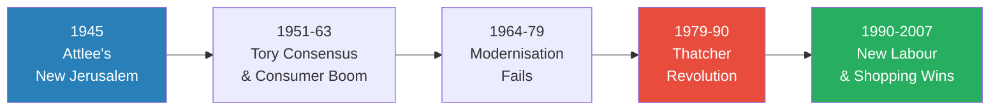
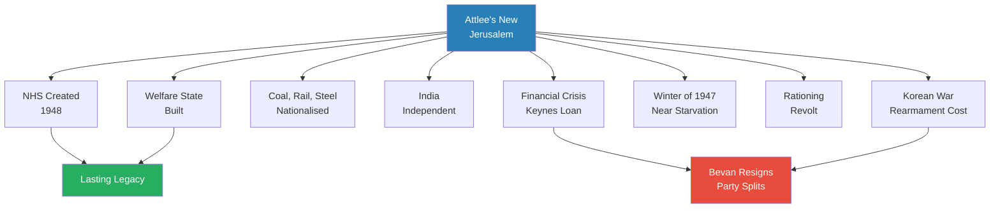
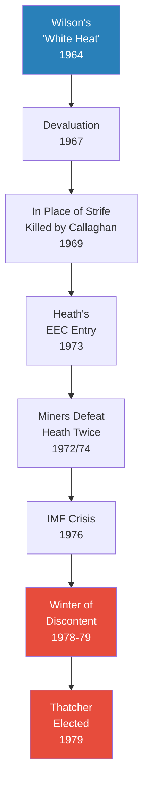
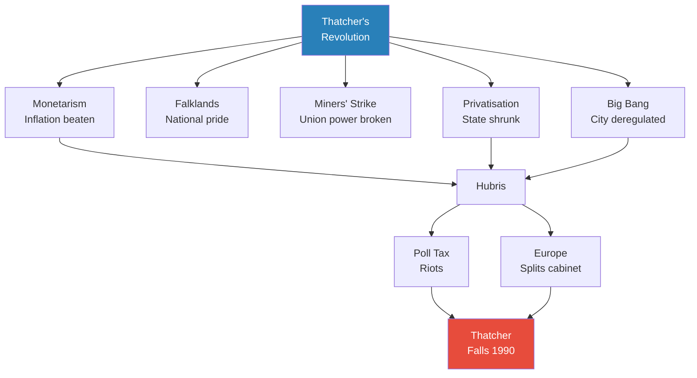
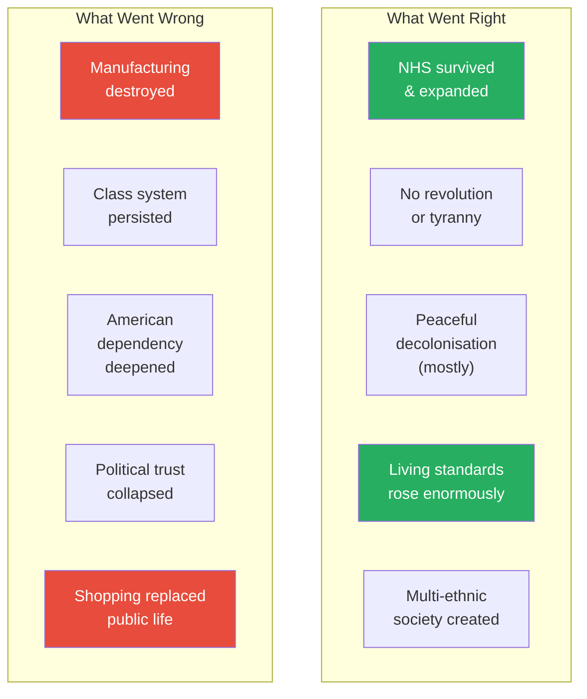
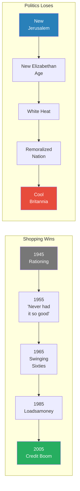
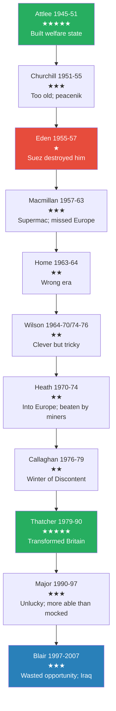

# A History of Modern Britain — Andrew Marr

> Andrew Marr, the BBC's former political editor, tells the story of Britain from 1945 to 2007 as a tragicomedy in which every grand political vision — Attlee's socialist New Jerusalem, Macmillan's New Elizabethan Age, Wilson's white-hot modernisation, Thatcher's remoralized nation of savers, Blair's Cool Britannia — was eventually defeated by the same force: the British people's stubborn preference for shopping over politics. Along the way, the country lost an empire, nearly went bankrupt half a dozen times, built and then dismantled a welfare state, survived the Cold War, endured the Troubles, reinvented its culture several times over, and emerged as a wealthy, multi-ethnic, post-industrial island still unsure of its place in the world. Marr writes with the verve of a born broadcaster and the scepticism of a man who has watched too many prime ministers arrive in hope and leave in disappointment.

---

## About the Author

Andrew Marr (born 1959) is a Scottish journalist, broadcaster and author who served as political editor of the BBC from 2000 to 2005, before presenting the BBC's flagship Sunday morning political show for over a decade. He was previously editor of The Independent newspaper. His career has given him unparalleled access to the politicians he writes about, and his prose carries the rhythms of television — vivid set-pieces, sharp character sketches, confident judgments delivered at pace. *A History of Modern Britain* was published in 2007, accompanied by a major BBC television series, and updated in paperback in 2008 with an introduction covering the credit crunch and Gordon Brown's arrival. Marr has also written histories of Edwardian and Elizabethan Britain, as well as books on politics and journalism.

---

## The Big Idea

- <b style="color: #27ae60">The dominant story of post-war Britain is the victory of consumerism over politics</b>
  - Every decade brought political leaders who believed they could reshape the country according to a vision — socialism, free-market conservatism, technocratic modernisation, the "Third Way"
  - Every decade, the British people turned out to be "stroppier and harder to herd than predicted"
  - The surging consumer economy was "by turns exhilarating, wasteful, liberating and narrowing"
  - Consumerism "shouldered aside other ways of understanding the world — real political visions, organized religion, a pulsing sense of national identity"
- <b style="color: #2980b9">Britain was always a country "on the edge"</b>
  - On the edge of defeat (1940), bankruptcy (1945-47), nuclear annihilation (1950s-80s), at the edge of the American empire, and finally "on the cutting edge of the modern condition"
  - A post-imperial, multi-ethnic, crowded, inventive, and rich island
- Only two administrations genuinely changed the country:
  - <b style="color: #2980b9">Attlee's Labour (1945-51)</b> — created the welfare state, NHS, and nationalized industries
  - <b style="color: #2980b9">Thatcher's Conservatives (1979-90)</b> — reversed much of it through privatization, union defeat, and free markets
  - Everyone else — Churchill's return, Eden, Macmillan, Wilson, Heath, Callaghan, Major, Blair — managed, fudged, or failed
- <b style="color: #e74c3c">The political class consistently failed to tell the British people the truth about their situation</b>
  - From the Keynes loan in 1945 to the dodgy dossier in 2003, deception was the ruling habit
  - Yet despite this, Britain "successfully shifted from being one kind of country to become a wealthier social democracy, and did this without revolution"

---

## Key Concepts at a Glance

| Concept | One-line summary |
|---------|-----------------|
| **The defeat of politics by shopping** | Consumerism overwhelmed every post-war political vision |
| **Always on the edge** | Britain perpetually teetered between catastrophe and reinvention |
| **The two revolutions** | Only Attlee (state-building) and Thatcher (state-shrinking) truly transformed the country |
| **The American dependency** | From the Keynes loan to Iraq, Britain could never act independently of Washington |
| **The clique model** | British power ran through tight networks — schools, clubs, families — until the 1960s broke them open |
| **Stop-go economics** | The endless cycle of expansion, inflation, sterling crisis, and austerity |
| **The permissive society** | Roy Jenkins's 1960s reforms on abortion, homosexuality, divorce, and censorship |
| **The enemy within** | Thatcher's framing of the miners' strike as a war comparable to the Falklands |
| **New Labour as Thatcher's heir** | Blair accepted the Thatcher settlement and built on it, not against it |
| **Mediaocracy** | The replacement of political substance by spin, celebrity, and media management |

---

*The arc of post-war Britain: two genuine revolutions (Attlee and Thatcher, in blue and red) with decades of muddling between and after them. By 2007 consumerism (green) had won.*

---

---

## Prologue: The Decision That Made Modern Britain

*On the afternoon of 28 May 1940, in a small room in the House of Commons, five men decided the fate of the world.*

- Winston Churchill had been Prime Minister for just eighteen days
  - Most of the Establishment considered him "a rather ridiculous, drunken and dodgy man"
  - The King himself had been lukewarm about his appointment
  - Labour regarded him as an enemy of the working class who had ordered troops against strikers
- The question before the war cabinet was simple and devastating: should Britain try to cut a deal with Hitler?
  - Halifax and Chamberlain favoured negotiation through Mussolini
  - The terms discussed: Britain accepts Hitler as overlord of Europe but keeps her fleet and Empire
  - The price for Italian mediation: Gibraltar, Malta, Suez, Kenya, Uganda
- <b style="color: #27ae60">Had the gathering been only Conservatives, Churchill would have been outvoted</b>
  - But Attlee and Greenwood, the two Labour members, were solid for fighting on
  - "By a squeak Churchill had his majority"
- Churchill then summoned the full cabinet and told them he was convinced every man would "rise up and tear me down from my place" if he contemplated surrender
  - Ministers leaped up, shouting approval, thumping the old man on the back

> [!tip] Core Insight
> From that single decision on that single day, everything followed — the war, the end of the British Empire, the rise of America, the shape of the post-war world. Modern Britain begins not with a grand plan but with a desperate vote to keep fighting.

- Marr insists this was not inevitable
  - Washington's London ambassador privately told the Americans that Britain would surrender
  - "It was quite possible and it was seriously discussed"
  - The country that emerged from this decision — with its weaknesses and strengths — is the subject of the book

---

---

## Part I: Hunger and Pride — Britain After the War (1945-1951)

### The Country in 1945: What Did We Look Like?

*If a small platoon of British people from 1945 could be time-travelled sixty years into the future, they would be nudging one another and trying not to laugh.*

- Britain in 1945 was sparser, whiter, and poorer than anything we would recognise:
  - Ten million fewer people than today; 95% born in Britain; the non-white population around 30,000
  - A country of brick terraces, coal fires, outside toilets, and the smell of industrial smoke
  - 60% of the population was traditional working class — factory workers, miners, labourers
  - People were physically different: leaner, with bad teeth, creased clothes, and the smell of unwashed bodies
  - American troops had been warned that English girls "often cannot get the grease off their hands"
  - Cosmetics were hard to get; women used cooking fat, shoe polish, and soot for makeup
  - Men in heavy grey suits with detachable collars; hats almost universal; leisurewear barely existed

- The Empire was still a living reality:
  - 200 colonies, dominions and possessions; 11 million square miles
  - Empire Day celebrated until 1958; school maps splashed with red
  - Middle-class bookshelves "groaned with Kipling, Somerset Maugham, Henty and T.E. Lawrence"
  - One in five emigrants was still heading to Australia, Canada, or New Zealand
  - The Royal Navy, though diminished, was the second largest in the world

- <b style="color: #2980b9">The pre-war travellers had already seen the future</b>:
  - H.V. Morton found "old England" in 1927 — last bowl-turners, flint-chippers, ancient pubs with mahogany-coloured beer
  - J.B. Priestley in 1933 found industrial devastation — slums, blighted shipyards, a quarter of the workforce unemployed
  - He saw Japanese students at Blackburn Technical College carefully learning Lancashire calico manufacturing — "A little later there also disappeared into the blue a good deal of Lancashire's trade with the East"
  - Priestley identified a "third England" — arterial roads, filling stations, chain stores, Woolworths, cinema — "near the country that survives today"
  - George Orwell tramped to Wigan Pier; Scottish poet Edwin Muir found "stunted naked boys bathing in filthy pools"

- The war changed everything — and nothing:
  - Physically: city centres destroyed; women in factories; men of all classes mixed in the forces
  - Politically: democracy fashionable; the state's reputation raised; Priestley called for "the amateurism to stop"
  - But: deference survived; belief in white superiority survived; complacent assumptions about British manufacturing survived
  - "The Parliament of 1945 was the same one elected in 1935, a Commons frozen from another time"

---

### The Democratic Bombshell

*Churchill woke on 26 July 1945 with "a sharp stab of almost physical pain," certain he had lost the election. Almost nobody else thought it possible.*

- The 1945 election was a political earthquake:
  - Conservatives crashed from 585 seats to 213
  - Labour won 393 seats and a majority of 146
  - It was the first time Labour had ever won more votes than the Tories
- The change had been building throughout the war:
  - A "high-minded religious socialism" had become fashionable
  - The wartime Army Bureau of Current Affairs led compulsory political discussions; Tory officers burned 10,000 of the "seditious" pamphlets
  - Common Wealth movement candidates were winning by-elections — one under a banner reading "This is a Fight between Christ and Churchill"
- Churchill ran a disastrous campaign:
  - Warned that Labour would need "some form of political police, a British Gestapo"
  - Offered a vision of "cottage homes" and "modest but solid prosperity" that sounded Edwardian
  - Attlee replied with gentle irony that this merely demonstrated "the gulf between his qualities as a great war leader and those of a mere party leader"

> [!example] Attlee's Dash to the Palace (July 1945)
> - Herbert Morrison warned Attlee he would challenge him for the leadership
> - The plot gathered force in the corridors and urinals of Westminster Central Hall
> - Bevin leaned across to Attlee and growled: "Clem, you go to the Palace straight away"
> - Attlee took tea with his wife, hopped in their little car, and was driven to Buckingham Palace
> - Morrison and the plotters, half a mile away, had underestimated the quiet man
> **The lesson:** In British politics, the person who acts fastest while others are still conspiring tends to win.

---

### Attlee's Remarkable Men

*The people who took charge of Britain in 1945 were as mixed a bag as any democratic government has seen.*

- <b style="color: #2980b9">Clement Attlee</b> — "a modest little man with much to be modest about" (Churchill, though he later denied it):
  - Suburban, terse, addicted to the Times crossword and cricket
  - He wrote a limerick about himself: "Few thought he was even a starter / There were many who thought themselves smarter / But he ended PM / CH and OM / An earl and a knight of the Garter"
  - When a minister was summoned to be sacked and asked what he had done wrong, Attlee pulled out his pipe: "Not up to the job"
  - Interviewed at the start of the 1951 campaign: "Is there anything else you'd like to say?" "No"
  - Yet he held the ring for a cabinet of elephantine egos and became one of the two nation-changing PMs

- <b style="color: #2980b9">Ernest Bevin</b> — "the most influential man British trade unionism has ever produced":
  - Orphaned at eight; Somerset labourer; dockworkers' organiser; creator of the Transport & General Workers' Union
  - "A bad mixer, a good hater, respected by all" — even Stalin whined that "Mr Bevin was no gentleman"
  - As Foreign Secretary he built NATO and faced down Soviet expansion
  - He was a patriot who loved the old Britain of smooth mandarins and Palace receptions as much as anyone
  - He referred to "Old Palmerston" and "Old Salisbury" as if they were slightly senior colleagues he had known personally

- <b style="color: #2980b9">Nye Bevan</b> — the most divisive minister since Charles James Fox:
  - A Welsh miner's son; largely self-taught; one of the few genuine orators worthy of matching Churchill
  - He called Churchill "a man suffering from petrified adolescence"
  - "Beautifully dressed, witty, sibilant, wide-ranging, sarcastic, poetic and at times very alarming indeed"
  - He represented everything the old upper classes most feared after 1945
  - His creation of the NHS was the Attlee government's single greatest domestic achievement

- <b style="color: #2980b9">Herbert Morrison</b> — "a soft-hearted suburban Stalin" (Michael Foot):
  - A Cockney policeman's son; started out weighing tea and sugar in a shop
  - Moderate enough that the young Tory Harold Macmillan suggested he lead a new Centre Party
  - He directed the astonishing torrent of legislation — seventy bills in the first year
  - His grandson Peter Mandelson would inherit his gift for fixing — and his reputation for getting caught

---

### Keynes, the Bomb, and the Price of Victory

*Britain arrived blinking into a new world still cloaked in nineteenth-century imperial grandeur — but she was broke.*

- The cancellation of Lend-Lease by President Truman in August 1945 was "brutal cold turkey"
  - Britain had received over $30 billion of the $50 billion spent under the programme
  - A fifth of the nation's food came from America
  - The shattered economy was exporting only a fifth of pre-war levels
- <b style="color: #e74c3c">Keynes was sent to Washington to beg — and was humiliated</b>
  - He sailed off expecting a free gift of $6 billion
  - He got a 50-year loan of $3.75 billion at 2% interest, with devastating conditions
  - Every time the British turned down an offer, the next one was worse
  - Keynes wrote to his mother: "They mean us no harm but their minds are so small"
  - The effort contributed to his death the following year
  - The loan was not finally repaid until 2006, during Tony Blair's premiership

> [!example] Keynes vs the Americans (Autumn 1945)
> - Keynes, ill with heart trouble, survived on icepacks and sodium amytal capsules through a sweltering Washington autumn
> - Against him were William Clayton, a gangling Texas cotton manufacturer, and Fred Vinson, a former basketball player
> - "The Kentucky lawyer and the Bloomsbury intellectual were like chalk and cheese"
> - Keynes had wit and brains; the Americans held the whip-hand
> - His biographer: "It was a case of brains pitted against power"
> **The lesson:** Cleverness without economic leverage is powerless. Britain's financial dependency on America was set that autumn and would persist for sixty years.

- Meanwhile, Britain was developing its own nuclear bomb in deepest secrecy
  - The breakthrough physics had been done by two refugees at Birmingham University — Frisch and Peierls
  - But Britain lacked the resources to build the weapon, so the knowledge was passed to America
  - After the war, Washington cut Britain off from nuclear secrets with the McMahon Act
  - Ernest Bevin, after being patronised by his American counterpart, told colleagues: "We've got to have this thing over here, whatever it costs. We've got to have the bloody Union Jack on top of it"
  - The decision to build the bomb was kept secret even from Churchill in opposition

---

### The Quiet Murder of the Royal Navy

*The characteristic sounds of the Royal Navy changed. The thunder of guns gave way to a great clanging — a smashing of hammers and hissing of flame — as, one by one, the great ships were destroyed.*

- The post-war destruction of the fleet was astonishing in speed and scale:
  - By 1946, 840 warships had been struck off the Navy List; 727 more under construction were cancelled
  - 10 battleships, 20 cruisers, 37 aircraft carriers, 60 destroyers, 80 corvettes — scrapped
  - Ships whose names read like a history lesson — Nelson, Rodney, Valiant — were broken up
  - New ships ordered to project British power into the sixties — Lion, Malta, New Zealand, Eagle — were cancelled unfinished
  - Ninety warships were towed out to sea and used for target practice
  - Hundreds more were taken to breakers' yards and disassembled into piles of "torn, rust-softened steel"
  - Some were sold to countries that had hardly had navies before; one carrier went to the French, two to the Australians

- Of 880,000 men and women serving in the Royal Navy at war's end, nearly 700,000 had left within two years
  - The admirals fought back, insisting battleships were "vital to sustain the Empire's status as a first-class power"
  - But Attlee was blunt: "Britain is no longer America's rival on the high seas"
  - The Home Fleet was eventually reduced to a single cruiser

- Marr treats this as one of the most symbolically important events of the entire post-war period:
  - "It is as if the nation engaged in a giant act of smashing, the quiet murder of its nautical self, out of sight, out of mind"
  - The Admiralty itself — the most ancient surviving department of state — was eventually swallowed by the Ministry of Defence in 1964
  - "Monarchs and dynasties, statesmen and ministers, came and went, the tides of war and revolution washed over and around, constantly altering but never submerging the Admiralty, and it survived them all, counter, original, spare and strange to the last"
  - The Queen saved a salary by becoming her own Lord Admiral

---

### Indian Independence: The First Great Retreat

*The deep nostalgic vision of Empire was dented in 1947. The King ceased to be Emperor.*

- Gandhi's non-violence had worked brilliantly before the war:
  - By embarrassing the British into negotiation rather than shooting them out
  - During the war, two million Indians fought for Britain — in North Africa, Burma, and against a pro-German regime in Iraq
  - Gandhi was "sentimentally fond of Britain"; Nehru kept a picture of Harrow in his prison cell
  - But patience was running out — a massive wartime protest involved burning police stations, cutting telegraph lines, and blowing up railways

- Attlee passed the job of withdrawal to <b style="color: #2980b9">Lord Mountbatten</b>:
  - A member of the Royal Family — hard for imperialists to attack
  - "Dashing and arrogant," he shared Attlee's determination for a swift deal
  - Nehru formed "a famously close attachment" to Mountbatten's wife Edwina
  - The partition line was drawn by a British lawyer, Sir Cyril Radcliffe, and kept secret until after the handover

- <b style="color: #e74c3c">The consequences were appalling</b>:
  - Mountbatten announced independence ten months earlier than planned — 15 August 1947
  - Churchill was so appalled that Eden had to keep him away from the Commons
  - Enoch Powell "wandered the streets of London all night, squatting in doorways with his head in his hands"
  - By some counts a million people died — Muslims and Hindus caught on the wrong side of the new border
  - 55,000 British civilians returned home
  - Pakistan eventually broke up; today India and Pakistan face each other with nuclear weapons across their Kashmiri frontier

- Labour was less enthusiastic about African decolonization:
  - Herbert Morrison said that giving African colonies freedom would be "like giving a child of ten a latch-key, a bank account and a shotgun"
  - Attlee speculated about creating a British African army on the lines of the lost Indian one
  - In the early fifties the Colonial Office was still growing in numbers, even hoping for a grand new headquarters

> [!tip] Core Insight
> The common claim that Britain managed decolonization better than France (Algeria) or America (Vietnam) is too comfortable. The million Indian dead far outnumber the casualties of Iraq. Had Churchill not stymied independence in the thirties, the slaughter might have been averted — but the story of the Second World War would have been very different too.

---

### Race, Class, and Religion in the Forties

*To be British in the forties was to be profoundly divided from many of your fellow subjects by class — and to be almost universally white.*

- <b style="color: #2980b9">Class</b> was the defining fact of life:
  - 60% of the nation was traditional working class — paid in cash, weekly
  - People barely moved; most would spend all their lives in their home town
  - The sharp sense of distinction came from "where you lived, how you spoke"
  - Working-class sons generally followed their fathers; middle-class children had more variation
  - The war softened distinctions a little — "working-class or lower-middle-class men could find themselves ordering former well-spoken toffs around"
  - But the ruling class was still the ruling class: public school education remained the key to the City, the Civil Service, and the higher echelons of the Army

- <b style="color: #2980b9">Race</b> was barely on the radar:
  - The non-white population was around 30,000
  - The Indian community numbered perhaps 8,000 — "a tenth of them doctors, intriguingly"
  - There were a few thousand West Indians, many of them students
  - Black American troops during the war had been "widely welcomed and lionized" — white GIs who tried to apply the American colour bar were mocked
  - The 1948 British Nationality Act gave 800 million people the right to enter the UK
  - "It was generally assumed that black and Asian subjects would have no means or desire to travel to live in uncomfortable, crowded Britain"

- <b style="color: #2980b9">Religion</b> was nominally powerful but actually declining:
  - People overwhelmingly described themselves as Christian, but communal worship was falling
  - The Church of England lost half a million communicants in the decade from 1935 to 1945
  - T.S. Eliot, C.S. Lewis, and Benjamin Britten sustained an Anglican sensibility in high culture
  - The first mosque had been built in Woking in 1889 but there were very few Muslims
  - "This was a country still obviously Christian, with its spires and towers in every suburb and village"
  - But already, "saucy revelations in the Sunday papers were where most people turned when they thought of immorality, not to sermons"

- <b style="color: #2980b9">Crime</b> was paradoxically low despite the chaos:
  - Britain was "awash with guns, illegally sold by American servicemen for £25 for a handgun"
  - Yet armed crime in London fell from 46 incidents in 1947 to just 4 in 1954
  - Murder fell; overall serious crime fell 5% in the five years after the war
  - "Perhaps the most peaceful single year was 1951"
  - The reasons: National Service kept young men off the streets; few moveable goods to steal; and a genuine post-war yearning for "hearth and home and security"

---

### The Welfare State and the NHS

*If there is one man who deserves a place in the pantheon of reform, it is that cadaverous, white-haired, publicity-mad, kindly and entirely impossible man, William Beveridge.*

- Beveridge's report on welfare (1942) was a publishing sensation:
  - Queues formed in London on publication day
  - 600,000 copies eventually sold
  - Dropped by Lancaster bombers over occupied Europe as propaganda
  - A detailed analysis was found in Hitler's bunker, calling it "superior to the current German social insurance in almost all points"
- <b style="color: #2980b9">Beveridge promised to slay five giants: Want, Disease, Ignorance, Squalor, and Idleness</b>
  - His wife urged him to adopt the language of Cromwell
  - He was addicted to "spin" — dripping advance hints to the press
  - Churchill, initially nervous, eventually declared that "there is no finer investment for any community than putting milk into babies"
- Implementation was astonishingly fast:
  - A new office for 25 million contribution records was built using prisoners of war
  - A propeller factory in Gateshead was taken over for family allowances
  - More than half the transferred staff were still working in typewriters and fountain pens in 400 Blackpool hotels
  - Jim Griffiths got 1,000 local offices open around the country, "refusing to take no for an answer"

---

- <b style="color: #27ae60">The NHS was Nye Bevan's masterpiece — and his toughest fight</b>
  - Pre-war hospitals were a patchwork: voluntary ones surviving on charity, municipal ones growing from workhouses, many squalid
  - Bevan's radical decision: nationalise all hospitals into a single system under the Ministry of Health
  - The doctors' BMA threatened to boycott the whole thing
  - In a poll, for every doctor who said yes, nine said no
  - Bevan wooed the consultants by letting them keep private practice — he later admitted he had "stuffed their mouths with gold"
  - On 5 July 1948, the NHS opened for business
  - Within 15 months: 5.25 million free spectacles, 187 million free prescriptions, 8.5 million dental treatments

> [!tip] Core Insight
> The most important thing the NHS did was to take away fear. Before it, millions at the bottom had suffered untreated hernias, cancers, and toothache rather than face the humiliation of being unable to pay. The queues of impoverished people surging forward for treatment — arriving for the first time not as beggars but as citizens with a sense of right — were among the most moving scenes of the post-war years.

---

### Nationalization: The Dream That Didn't Deliver

*Labour would apply the lessons of the war to the peace. If the government could organize D-Day, it could surely organize the coal industry.*

- Nationalization was Labour's signature promise and its most ambiguous legacy:
  - The Bank of England: "sounds dramatic but had almost no real impact. Exactly the same men stayed in charge"
  - Coal: provided nine-tenths of Britain's energy; miners worked with picks in stifling heat for low wages
    - Manny Shinwell found no blueprint to help him — "All anyone could dredge up was a single Labour pamphlet written in Welsh"
    - Inauguration day: signs went up saying mines were now managed "on behalf of the people"
    - In some cases, "people" was scored out and "miners" written in
    - The first major strikes broke out within months
  - Railways: 20,000 steam locomotives, 4,000 electric trains, 7,000 horses in shunting yards, and battered Victorian carriages
    - Everything was brought under a single British Transport Commission — the "ultimate Fat Controller"
    - Nationalization without investment was no answer to decades of neglect
  - Steel: Labour agonised and nearly bottled it; bright young backbenchers rebelled; the Tories were regaining confidence
    - Cripps told the Commons: "If we cannot get nationalization of steel by legal means, we must resort to violent methods"
    - Within a few years, it was mostly returned to private ownership

- <b style="color: #e74c3c">The core failure: public ownership did not change who managed things or how</b>
  - The boards were staffed by "administrators of their own kidney, sound chaps unlikely to rock boats"
  - Coal was run by a 63-year-old marketing man; an Etonian ran the gas boards; transport was overseen by a man whose "entrepreneurial experience and knowledge of engineering were nil"
  - "The political symbolism of taking over great industries on behalf of the people was striking but talking about change and actually imposing it are very different things"

---

### The Housing Crisis and the Tower Block Revolution

*Half a million homes had been destroyed by German bombs. Another three million were badly damaged. Southampton felt "finished." Clydebank, with 12,000 houses, had just seven left undamaged.*

- The squatters' revolt of 1946 was the most dramatic response:
  - 45,000 people illegally seized empty huts, flats, and army camps across Britain
  - In Kensington, a thousand people converged on a wet Sunday afternoon; Communist organisers had identified and marked up empty properties
  - Police supplied tea and coffee; crowds formed human chains to pass food through windows
  - But the cabinet decided the revolt had to be stopped — Bevan led the response against "organised lawlessness"

- The prefabs were beloved:
  - 156,623 built between 1945 and 1949, often in converted aircraft factories
  - They came with cookers, sinks, fridges, baths, and fitted cupboards — luxuries many working-class families had never known
  - Neil Kinnock lived in one from 1947 to 1961: "Friends and family came to view the wonders. It seemed like living in a spaceship"
  - Some were still occupied sixty years later

- The tower blocks were loathed:
  - From 1958, councils got a subsidy for every storey above five — "a straightforward bribe to build up, not out"
  - Birmingham's Labour boss Harry Watton bought five tower blocks on a boozy day out "just as if he was buying bags of sweets"
  - Glasgow's thirty-one-storey Red Road flats were the tallest in Europe
  - The problems appeared fast: vandalised lifts, condensation, thin walls, asbestos
  - In 1968, part of Ronan Point in east London simply collapsed
  - Eventually they were blown up, sold to housing associations, or left for asylum seekers and the desperate
  - But 440,000 homes were created in tower blocks alone — "the housing shortage was, in general terms, solved by the concrete boom"

> [!example] The Ealing Comedies as Political Allegory
> - In *Passport to Pimlico* (1949), residents discover they legally belong to the Duchy of Burgundy and are free from rationing
> - Immediately they are swamped by spivs — representing "the suppressed greed and wild consumerism that socialists feared was always present under the surface"
> - When the State responds with barbed wire, Londoners throw food over the fence — mimicking the real squatters' revolt of 1946
> - In *Whisky Galore!* (1949), islanders steal whisky from a grounded cargo ship, outwitting the English Home Guard commander
> - The puritanical State is subverted by community spirit
> - In the real story, a lone exciseman's attempt to recover the whisky caused "a poisoned atmosphere between families which lasted for many years"
> - "The fantasy is remembered and the truth forgotten"
> **The lesson:** The tension between Pimlico (returning to fair shares) and Todday (keeping the stolen whisky) was the political tension of the age — wartime controls vs the free market. Eventually, Todday won.

---

### Austerity, Rebellion, and the Festival

*Labour's idea of Britain was a well-disciplined, austere country organized from London by dedicated public servants. Unfortunately, the real country was nothing like this.*

- The winter of 1947 was catastrophic:
  - The worst freeze in 300 years; snowdrifts thirty feet high
  - Coal froze at the pitheads; power stations closed one by one
  - Two million people stopped work
  - "CHRIST ITS BLEEDING COLD" howled the young Kingsley Amis to Philip Larkin from his Oxford rooms
  - The sterling crisis followed; bread was rationed (unnecessary even during the war)
  - This was the moment when the optimism of 1945 "shivered and died among many voters"

- The British rebelled — not violently, but stubbornly:
  - 45,000 people squatted in empty army camps across Britain
  - Communist organisers invaded Kensington properties; police supplied the squatters with tea
  - Women ignored Labour MPs and adopted Dior's New Look — "the sound of a petticoat" meant the war was really over
  - The nation refused to eat snoek (a tropical fish the government bought from South Africa as cheap protein)
  - "Snoek piquante" with spring onions, vinegar and syrup failed to win converts; it was sold off as catfood

*Attlee's government achieved extraordinary things against impossible odds — but the strain of maintaining both a welfare state and a world role tore the party apart.*

### Theatre: From Binkie to the Angry Young Men

*British theatre after the war seemed trapped between magnificent Shakespeare and vapid drawing-room comedies. Then a penniless actor on a Thames houseboat changed everything.*

- The West End was ruled by <b style="color: #2980b9">Binkie Beaumont</b> — "a conventional queenie Tsar" whose company produced an endless run of musical hits and star-driven dramas
  - He worked with Gielgud, produced Oklahoma! and West Side Story, and kept the theatres solvent
  - The dominant tone was gay, witty, patriotic, and firmly middle-class
  - Rattigan invented "Aunt Edna" — the nice maiden lady always inside his head when writing
  - Noel Coward, "the Master," showed that "the British could be light, witty, amoral and yet also patriotic"

- The real revolutionary was <b style="color: #2980b9">Joan Littlewood</b>:
  - A Cockney outsider who lived near the breadline in east London's Theatre Royal
  - Her Theatre Workshop mixed left-wing politics with forgotten Elizabethan classics and new plays
  - She discovered Brendan Behan's "beer-sodden and misspelled manuscripts" and recognized them as genius
  - On one occasion, when Behan was interviewed almost incoherently drunk on BBC Television, Littlewood was "reduced to crouching on the floor, holding onto his legs so he would not fall"
  - She pioneered Oh, What a Lovely War! — but the Arts Council kept her starved of funds

- Then came <b style="color: #27ae60">John Osborne</b>:
  - Living on a houseboat near Hammersmith, boiling nettles from the riverbank for food
  - He wrote Look Back in Anger in nineteen days and sent it to every agent he could find; all refused it
  - George Devine, a fat man sweating in a small boat, rowed out to the houseboat to tell him he loved the play
  - Kenneth Tynan's review in the Observer: "I estimate the audience at roughly 6,733,000, which is the number of people between twenty and thirty"
  - The barmaid at the Royal Court told Osborne's mother: "They don't like this one, do they dear? Not a bit of it"
  - But Laurence Olivier came to see it and asked Osborne to write him a part — "like Lord Mountbatten rolling up and asking for a job as deckhand on a battered Hull trawler"
  - The result was The Entertainer — "the moment when the old theatre world bowed and gave way to a new, rougher Britain"

---

- The Festival of Britain (1951) was Labour's farewell:
  - 8.5 million visitors; the Skylon suspended "like the British economy, without visible means of support"
  - Michael Frayn called it "a rainbow, riding the tail of the storm"
  - "A gay and enjoyable birthday party, but one at which the host presided from his death-bed"

### Korea: The Forgotten War

*Aside from military historians, Korea has become the forgotten war. Yet it was a genuinely dangerous global confrontation in which Britain played an important if subsidiary role.*

- Korea (1950-53) was the first and only time British troops directly fought a major Communist army:
  - Britain and her Commonwealth allies lost more than a thousand dead and nearly three times as many wounded
  - The American commander, General MacArthur, was keen to open full-scale operations against Communist China itself
  - The US military contemplated using atomic bombs to create an irradiated dead zone
  - Attlee flew to Washington to check that Truman was not about to "engulf the world in atomic conflict"

> [!example] The Glorious Glosters at the Imjin River (April 1951)
> - The Gloucestershire Regiment found itself facing the full force of the fifth major Chinese offensive
> - Hugely outnumbered and cut off, Brigadier Tom Brodie called the Americans for help, explaining things were "a bit sticky"
> - Not understanding stiff-upper-lip code for "catastrophic," the American commander told him to sit tight
> - After four desperate days, just 169 of the 850 Glosters survived for roll-call
> - When ammunition ran out, they threw tins of processed cheese at the Chinese, hoping they would be mistaken for grenades
> - When the Chinese buglers signalled another charge, the Glosters' drum-major responded with every call he could remember — including "officers dress for dinner"
> - The Chinese lost 10,000 men in the assault
> **The lesson:** The action checked the advance of the People's Liberation Army at a vital moment. "The most political army in the world encountered the least political — and was savagely mauled."

- The rearmament that followed Korea was devastating for Labour:
  - Spending on defence rose from 7% to 10.5% of national income — crushing for a weak economy
  - Money was diverted from the NHS, provoking Bevan's resignation
  - West Germany was quickly rebuilt because her factories were needed to re-equip Britain
  - "Those same factories would soon be exposing archaic, ill-managed British industry to serious competition"

---

### Jerusalem Falls

*"Like an old, wounded animal, biting at its own injuries" — a journalist's description of Labour in its final months.*

- The party fractured over guns versus butter:
  - Chancellor Hugh Gaitskell proposed charges for dental and eye treatment to fund rearmament
  - Bevan saw this as a betrayal of his NHS; Gaitskell wanted to establish his authority
  - "Neither position looks wise half a century later"
  - When Bevan resigned, a wound opened in the party "which would never fully heal"
- Labour's ministers were literally dying on their feet:
  - Bevin died in April 1951, broken by overwork
  - Cripps suffered devastating spinal pain and died in Switzerland in 1952
  - Attlee was hospitalised with a bleeding ulcer during the Korean crisis
  - Ministers "began to gossip about one another's health rather like old village women"
  - "By modern standards the Labour cabinet was not very old — early sixties or late fifties — but this was a hard-drinking, heavy-smoking and pressured time to be a politician"

- The 1951 election gave the Tories just enough seats to form a government
  - Labour actually won more votes than the Conservatives — 13.3 million
  - Morrison reflected that the British hadn't wanted to kick Labour out, just "to give it a kick in the pants — but I think they've overdone it a bit"

---

---

## Part II: The Land of Lost Content — The Tory Years (1951-1963)

### Churchill, Eden, and the Failure to Choose

*Between the fall of old Clem Attlee and the return of cocky Harold Wilson, Britain went through a time which some believe a golden-tinted era of lost content. To others they were the grey, conformist, "thirteen wasted years" of Tory misrule.*

- Churchill returned to power at seventy-seven, forming "a government of cronies and old muckers"
  - He spent alarming amounts of time playing bezique
  - In 1953 he had a major stroke — kept entirely secret from the public
  - He recovered enough to give a Tory conference speech within months, through sheer willpower
  - His last great crusade was for peace — "the world's leading peacenik" — arguing for a summit with the Russians twenty years before detente happened
  - But he was too old and too slow to push it through against American and cabinet resistance

- <b style="color: #e74c3c">ROBOT — the revolution that almost happened in 1952</b>
  - Chancellor Rab Butler proposed floating the pound, cutting free from Bretton Woods
  - This would have been a Thatcher-scale shock thirty years early
  - It would have ended stop-go economics and forced painful restructuring
  - Churchill wavered; Eden killed it; the consensual path continued
  - "The desperate and risky response of frazzled yet clever men who had run out of both caution and alternative ideas"

- Britain failed to join the nascent European community:
  - In 1950 Morrison was found at the Ivy restaurant and told about Schuman's plan
  - He shook his head: "It's no good. We can't do it. The Durham miners won't wear it"
  - Churchill in power showed no more interest
  - "Washington was pivotal to his world as Paris never could be"

---

### Suez: The Moment of Truth

*The Suez crisis was the moment when Britain discovered she could no longer act as a great power without American permission. It was also the moment when the post-war fantasy of British independence finally died.*

- The background was oil and pride:
  - Egypt's young President Nasser, a charismatic nationalist, nationalised the Suez Canal in July 1956
  - The Canal was the artery through which Middle Eastern oil flowed to Europe
  - Britain had maintained a vast military presence across the region since the war — in Baghdad, Tehran, Cyprus, Malta, Aden
  - Eden was obsessed with Nasser, comparing him to Mussolini and Hitler
  - "He was physically depleted" — suffering from a biliary duct problem made worse by botched surgery
  - Macmillan later said Eden was "like a racehorse trained to win the Derby in 1938 but not let out of the starting stalls until 1955"

- When Nasser nationalised the Canal, Eden was at a dinner party:
  - His guest, the Iraqi regent Nuri El Said, urged him to hit Nasser immediately
  - Nuri would later have his guts ripped out by a Baghdad mob and dragged through the streets — a victim, in part, of Eden's failure
- Eden colluded secretly with France and Israel:
  - Israel would attack Egypt; Britain and France would intervene as "peacekeepers" to separate the combatants and secure the Canal
  - The collusion was hidden from the Americans, the cabinet, and Parliament
  - Eisenhower, facing his own re-election, was furious at not being told
  - Washington ordered a run on the pound; without American support, Britain could not sustain the operation
  - <b style="color: #e74c3c">Britain was forced to withdraw — humiliated before the world</b>
  - Eden, broken in health and reputation, resigned in January 1957
  - British casualties were just twenty-one — but the political damage was immeasurable

- The succession was settled in the old Tory manner:
  - Lord Salisbury asked ministers one by one: "Wab or Hawold?" (he could not pronounce his Rs)
  - They chose Macmillan over Butler

> [!example] The Aftermath of Suez
> - Macmillan, who had been among the most hawkish ministers during the crisis, emerged as PM
> - He later compared himself to a fish that had survived a strong stream: "The fish that swam with the current came out at the top"
> - The Americans were now the undisputed controllers of the Middle East; Britain was their subordinate
> - The lesson was burned into British foreign policy: never again defy Washington
> - When the same lesson was violated over Iraq in 2003, the consequences were equally dire — but this time Britain was following America, not defying it
> **The lesson:** Suez proved that Britain could not act as an independent great power. Every subsequent PM had to decide how much independence from Washington was possible — and most of them discovered the answer was: very little.

> [!example] Rab Butler Learns He Has Lost (January 1957)
> - Edward Heath, the chief whip, went to break the news
> - Butler's face "lit up with its familiar, charming smile"
> - "I'm sorry, Rab," Heath said. "It's Harold"
> - Butler looked "utterly dumbfounded"
> - Macmillan's first act was to take Heath to dinner at the Turf Club
> - A fellow member, reading the newspaper, politely asked whether he had had any good shooting lately
> - Macmillan said no
> - "Oh, by the way — congratulations," drawled the clubman
> **The lesson:** The old Tory elite governed Britain like a private members' club. It would not survive the decade.

---

### The Consumer Boom and the End of Austerity

*Macmillan told the country in 1957 that most people had "never had it so good." He was right — but he also warned that this was "the problem" and nobody remembers that part.*

- The consumer revolution transformed daily life through the 1950s:
  - Television ownership exploded: from 350,000 licences in 1950 to millions by the end of the decade
  - ITV launched in 1955, bringing advertising and a less deferential culture into every living room
  - The car economy took off — roads were almost empty by modern standards, and "motoring" was a pleasure, not an ordeal
  - Hire purchase (buying on credit) spread widely despite moralistic objections
  - Chain stores, supermarkets, and American-style consumerism began displacing the corner shop
- The Suez and post-Suez boom gave the Tories their best years:
  - Macmillan moved smoothly from the wreckage of Eden's career into "Supermac" mode
  - He was a supreme political actor — described as "the last Edwardian" though he was playing a role
  - His cabinet of 1957 contained thirty-five ministers related to him by marriage out of eighty-five
  - He governed through a tight circle of clubs, country houses, and grouse moors
  - In his diaries, even major political decisions read like entries from a gentleman's social calendar

- <b style="color: #2980b9">The nuclear balance of terror</b> was the hidden reality beneath the consumer boom:
  - Britain tested her first atomic bomb in 1952 (HMS Plym vaporised off Australia) and her H-bomb in 1957
  - The V-bomber fleet (Valiants, Victors, Vulcans) was built to carry bombs over Russia
  - When bombers became obsolete, Britain switched to Polaris submarines — bought from America
  - Macmillan agonised about placing them at Holy Loch near Glasgow: "It would surely be a mistake to put down what will become a major nuclear target so near to the third largest city in this country"
  - CND and the Aldermaston marches gave the anti-nuclear movement its most visible expression
  - But polling consistently showed a majority supported the deterrent
  - By the early sixties, Britain was "stoically preparing for her own destruction, burrowing deep and buying the wherewithal for a final act of retaliation"

> [!example] The Homosexual Purge of the 1950s
> - Under Home Secretary Maxwell Fyfe, prosecutions for "gross indecency" rose by 850%
> - Lord Montagu of Beaulieu, a journalist called Peter Wildeblood, and Major Michael Pitt-Rivers were sentenced to prison for "conspiring to induce two RAF men to commit indecent acts"
> - When the three convicted men were led from Winchester Castle, crowds gathered — but the fury was aimed at the prosecution witnesses, not the defendants
> - Women shouted words of encouragement, gave thumbs-up, and clapped
> - Wildeblood openly declared himself homosexual and declined to apologise: "I am no more proud of my condition than I would be of having a glass eye"
> - The Wolfenden Committee recommended legalisation in 1957 — but Parliament refused for another decade
> **The lesson:** The "permissive society" of the sixties did not spring from nowhere. Public sympathy was running ahead of the law throughout the fifties. The Winchester crowds knew the persecution was wrong before the politicians did.

---

### James Bond and the Small Worlds of the Fifties

*How might one sum up the love-hate relationship between the British Establishment and their allies in Washington? Ian Fleming found the perfect metaphor.*

- Bond was a fantasy of British competence in an age of British decline:
  - <b style="color: #2980b9">Casino Royale</b> (1953) presented a cultured, self-assured British agent who takes the risks while the Americans watch half-contemptuously
  - Fleming's Bond lovingly described American food and consumer goods — a "hamburger and chips with Blue Nun" menu that "seemed so mouth-wateringly exotic in 1954"
  - The Americans were friendly and powerful but slightly slow; Bond was brilliant but broke
  - It was an almost pornographic display of longing for the richer consumer culture across the Atlantic

- Fleming himself was a fine example of how tightly connected British society was at the top:
  - An Etonian who had tried Sandhurst, journalism, and the City before wartime Naval Intelligence
  - His wife Ann had been married to Lord Rothermere (owner of the Daily Mail) and had affairs with politicians on both sides
  - One of her lovers was Hugh Gaitskell, the Labour leader — "she painted a vivid portrait of him swimming, then disappearing underwater like an amiable hippo"
  - When the Edens fled to Fleming's Jamaica house after Suez, it was because they moved in exactly the same social circles
  - When Burgess and Maclean defected, the Flemings heard about it while staying with the Edens at Chequers

- <b style="color: #27ae60">Bond's route to a mass audience came through rough trade</b>:
  - Fleming pictured his agent as an Old Etonian
  - A working-class Scottish bodybuilder and former milkman, Sean Connery, was chosen to play him
  - The films were only possible because of American money (United Artists and "Cubby" Broccoli)
  - The producer Harry Salzman's earlier work included John Osborne's Look Back in Anger
  - Bond would pay rather better

---

### Spies, Comedy, and the Death of Deference

*The satire boom, the spy scandals, and the Profumo affair collectively destroyed the authority of the old ruling order.*

- The Cambridge spies (Burgess, Maclean, Philby, Blunt) were products of the class system they betrayed:
  - Sons of a diplomat, a naval officer, a clergyman, and a cabinet minister
  - In Moscow, Burgess played the Eton boating song on his piano
  - His suit still had a badge reading "Messrs Tom Brown of Eton, High Street, Tailors"
  - Between them they passed nuclear secrets to Stalin, caused the deaths of scores of Western agents, and kept Albania under tyranny

- The Goons were "subversive without being party political":
  - Spike Milligan, born in India to an Irish soldier, shaped by army boredom and terror
  - "We were trying to undermine the standing order. We were anti-Commonwealth, anti-Empire, anti-bureaucrat, anti-armed forces"
  - The Duke of Edinburgh and Prince of Wales were enthusiastic fans

- <b style="color: #2980b9">The satire boom</b> was born in public schools:
  - Peter Cook learned mimicry at Radley to deflect bullies — including future England cricket captain Ted Dexter
  - Richard Ingrams developed his humour at Shrewsbury, where new boys were called "douls" (Greek for slave) and cross-country runners were chased by men with whips
  - When the Queen visited Beyond the Fringe, she roared with laughter at Cook's Macmillan
  - When Macmillan himself came, Cook spotted him and ad-libbed: "When I've a spare evening, there's nothing I like better than to wander over to a theatre and sit there listening to a group of sappy, urgent, vibrant young satirists, with a stupid great grin spread all over my silly old face"

---

- The Profumo affair brought the old and new worlds into collision:
  - John Profumo, Secretary of State for War, met Christine Keeler naked in a swimming pool at Cliveden
  - A Russian military attache was also sleeping with Keeler
  - When Mandy Rice-Davies was told that Lord Astor denied having sex with her, she replied: "He would say that, wouldn't he?"
  - The frankness of her assumption that rich men were liars "caught the nation's mood"

> [!tip] Core Insight
> The story of the Tory years is the story of a country still run by cliques and in-groups. Understand the networks — the clubs, the family connections, the public school ties — and you understand the system. But by 1963 this Britain had failed: over Suez, over the economy, over Europe, and in its inability to grasp the new culture growing up around it.

---

---

## Part III: Harold, Ted, and Jim — When the Modern Failed (1964-1979)

### Wilson's Promise and Betrayal

*Harold Wilson arrived promising the "white heat of technological revolution" and left having devalued the pound, alienated the unions, and failed to modernise anything much.*

- Wilson was the first genuinely outsider PM since Lloyd George:
  - A Huddersfield grammar school boy who played his Yorkshire origins for everything they were worth
  - He ran a "court of outsiders" — Marcia Williams, Hungarian economists (known as "Buddha and Pest"), the Gannex raincoat manufacturer Joseph Kagan
  - "Suspicious of the Whitehall Establishment, with some justification, and cut off from both the right-wing Gaitskellites and the old Bevanites, Wilson felt forced to create his own gang"

- The great failure was devaluation:
  - Wilson, Brown, and Callaghan decided against it immediately after the 1964 election — it became "the unmentionable"
  - For three years a "complicated three-way dance" went on, each playing the others off
  - When it finally happened in November 1967, Wilson made "an awesomely bad mistake" by telling the nation that "the pound in your pocket" had not been devalued
  - The suggestion was "instantly understood to be ludicrous. Wilson was also devalued, possibly by more than 14 per cent"

- <b style="color: #27ae60">Roy Jenkins was the real transformer of the 1960s</b>
  - As Home Secretary he drove through the "permissive society" reforms: legalising homosexuality, liberalising abortion and divorce laws, abolishing theatre censorship, ending hanging
  - As Chancellor after devaluation he increased taxes by twice as much as any previous budget, including wartime ones
  - He produced "the only excess of revenue over government spending in the period between Baldwin and Thatcher"

---

### Wilson's Devaluation: The Unmentionable

*Wilson, Brown, and Callaghan decided against devaluation immediately after the 1964 election — and it became "the unmentionable." For three years they danced around the burning building.*

- The devaluation crisis was a three-way psychodrama:
  - George Brown wanted it to revive his growth plans and the DEA
  - Callaghan dithered but wanted any devaluation accompanied by deflation
  - Wilson, against both, played them off against each other
  - He told Barbara Castle that Brown and Callaghan were plotting: "You know what the game is — devalue and get into Europe. We've got to scotch it"
  - But he was also telling pro-Europeans in the press that he intended to lead Britain into Europe himself
  - When civil servants prepared briefing papers on the pros and cons, Wilson ordered them collected and burned

- Events forced the issue:
  - The Six-Day War of June 1967 between Israel and Egypt led to an oil embargo on Britain
  - A huge national dock strike shut Liverpool, Hull, and then London
  - Wilson lashed out at striking seamen as "a tightly knit group of politically motivated men"
  - Meanwhile George Brown was "characteristically threatening to resign and trying to persuade others to support him as leader; and characteristically failing"
  - Roy Jenkins was at the home of Ann Fleming — "Wilson later told Barbara Castle that the plotting was directed by 'Ministers who went a-whoring after society hostesses'"

> [!example] The Night Devaluation Became Inevitable (3 November 1967)
> - Sir Alec Cairncross, the Treasury's senior economic adviser, told Callaghan the dance was over
> - No further foreign borrowing was available
> - Both men knew Callaghan would have to resign as Chancellor
> - His biographer called it "the most shattering moment Callaghan was ever to experience in sixty years of public life"
> - But he took it calmly and set about preparing the cuts
> - Wilson, after one last attempt to borrow, accepted the inevitable
> - In his broadcast he made "an awesomely bad mistake" — telling the nation that "the pound in your pocket" had not been devalued
> - It was "instantly understood to be ludicrous"
> **The lesson:** Wilson's instinct was always to manage perceptions rather than reality. Devaluation was probably the right policy from the start. Three years of resisting it cost the country far more than the act itself.

- Jenkins replaced Callaghan as Chancellor and performed brilliantly:
  - His 1968 budget increased taxes by twice as much as any previous budget — including wartime
  - He achieved "the only excess of revenue over government spending between Baldwin and Thatcher"
  - But it turned out the Inland Revenue had dramatically undercounted British exports
  - Some of the turnaround was luck as well as toughness

---

### The Cultural Revolution and the Permissive Society

*The sixties are usually remembered through pop music and fashion, but the most lasting changes were legal — and they were Roy Jenkins's work.*

- <b style="color: #2980b9">Jenkins's reforms</b> transformed the moral framework of British life:
  - Abortion legalised (1967) — ending the era of dangerous backstreet operations
  - Homosexuality between consenting adults decriminalised (1967) — a decade after Wolfenden recommended it
  - Divorce law reformed (1969) — no longer requiring proof of adultery or cruelty
  - Theatre censorship by the Lord Chamberlain abolished (1968) — ending a system dating back to Walpole
  - The death penalty abolished (1965) — after decades of agonising case-by-case debates
  - Jenkins called his vision "the civilised society" — his critics called it the beginning of the end
- Pop culture was the visible face of the transformation:
  - The Beatles, the Rolling Stones, The Who, and hundreds of others made Britain — briefly — the centre of the global music industry
  - Fashion, film, and photography (David Bailey, Mary Quant, Twiggy) created "Swinging London"
  - But Marr is careful to note that the cultural revolution was overwhelmingly a London and south-east phenomenon
  - For most of Britain — working-class, provincial, still watching black-and-white television — the sixties were less swinging than advertised
  - The pill, available from 1961, was "the most revolutionary technology of the decade" but it took years to become widely used outside the middle classes

- The sixties also brought race to the centre of British politics:
  - Immigration from the Caribbean and South Asia accelerated through the fifties
  - The 1958 Notting Hill riots were the first major outbreaks of racial violence in post-war Britain
  - The 1962 Commonwealth Immigrants Act introduced quotas — the first restriction on the old imperial right of entry
  - Wilson's 1965 Race Relations Act banned the "colour bar" in public places but was widely seen as toothless
  - The combination of immigration controls plus anti-discrimination measures became the template for all subsequent policy

---

### Northern Ireland: Blood and Shame

*The Troubles were the longest and deadliest conflict on British soil since the Civil War, and they began because nobody in London was paying attention.*

- Northern Ireland had been largely ignored by Westminster since partition in 1920:
  - The Protestant Unionist majority ran a discriminatory state — gerrymandered constituencies, biased housing allocation, an overwhelmingly Protestant police force
  - Catholics were effectively second-class citizens in their own province
  - Civil rights marches beginning in 1968 were met with police brutality
- <b style="color: #e74c3c">Bloody Sunday (30 January 1972) was the turning point</b>:
  - British paratroopers shot dead thirteen unarmed civil rights marchers in Derry (a fourteenth died later)
  - The Widgery inquiry exonerated the soldiers — it was universally regarded as a whitewash
  - The Saville inquiry, which took twelve years and cost nearly £200 million, finally concluded in 2010 that the killings were "unjustified and unjustifiable"
  - Bloody Sunday transformed the Troubles from a civil rights protest into an armed insurgency
- The violence escalated through the seventies:
  - The IRA bombing campaign hit the British mainland — Birmingham, Guildford, the Old Bailey
  - Internment without trial; hunger strikes; Bobby Sands's death in 1981
  - The Brighton bombing of 1984 nearly killed the entire cabinet
  - Thatcher was unmoved: "A convicted criminal. He chose to take his own life"
  - Over thirty years, more than 3,500 people died
- The peace process was achingly slow:
  - Major's back-channel talks with the IRA in the early 1990s laid essential groundwork
  - Blair made Northern Ireland his first priority after winning power in 1997
  - Mo Mowlam — "pugnacious, earthy and spectacularly brave" — was the key intermediary
  - The Good Friday Agreement (1998) was Blair's greatest domestic achievement

---

### In Place of Strife: The Reform That Would Have Changed Everything

*Barbara Castle's attempt to reform the trade unions in 1969 was killed by Jim Callaghan — a decision that arguably cost Labour the seventies.*

- Wilson and Castle proposed <b style="color: #2980b9">In Place of Strife</b> — a White Paper giving the government powers to impose strike ballots and cooling-off periods
  - The title was a deliberate echo of Nye Bevan's book *In Place of Fear*
  - Castle, a passionate left-winger, had concluded that wildcat strikes were destroying Labour's economic plans
  - The unions were outraged; the TUC mounted a furious lobbying campaign
- Callaghan, the Home Secretary, led the cabinet revolt:
  - He was positioning himself as the unions' friend and Wilson's eventual successor
  - Fifty-three Labour MPs voted against; the cabinet was split
  - Wilson and Castle were forced to accept a "solemn and binding" TUC pledge to discipline its own members — everyone knew it was worthless
- <b style="color: #e74c3c">The consequences were catastrophic</b>:
  - Without legal reform, union militancy escalated through the seventies
  - Heath tried his own version (the Industrial Relations Act) and was defeated by the miners
  - The problem was left for Thatcher — who solved it with a sledgehammer rather than a scalpel
  - Had Castle's reforms passed, "the whole industrial and political history of the seventies might have been different"

---

### The Breakdown: Heath, Callaghan, and the Crisis of the Seventies

*The seventies were Britain's national nervous breakdown — strikes, inflation, power cuts, the three-day week, and the final humiliation of the IMF.*

- Edward Heath was the anti-Macmillan — grammar school, hardworking, charmless, determined to modernise:
  - "The Yachtsman" — his real passion was sailing and conducting orchestras, not politics
  - He took Britain into the European Economic Community on 1 January 1973 — the most consequential foreign policy decision since 1945
  - But he had no mandate for it, no referendum, and the country remained deeply divided
  - His Industrial Relations Act tried to bring legal order to industrial disputes — the unions simply refused to cooperate

- The miners destroyed Heath twice:
  - In 1972, Arthur Scargill's "flying pickets" shut down the Saltley Gate coke depot in Birmingham — 15,000 pickets overwhelmed the police
  - Heath had to appoint a court of inquiry, which gave the miners everything they wanted
  - In 1974, the miners struck again; Heath declared a three-day working week to conserve energy
  - He called an election on "Who governs Britain?" — the answer was: not Edward Heath
  - Wilson squeaked back into power with no overall majority

- Wilson's second government (1974-76) was a twilight affair:
  - He held an EEC referendum in 1975 — two-thirds voted to stay in
  - He resigned in 1976, leaving colleagues baffled — conspiracy theories persist but he may simply have been exhausted and depressed
  - Callaghan succeeded him

- <b style="color: #e74c3c">The IMF crisis of 1976 was Britain's ultimate humiliation</b>
  - Callaghan had to go cap in hand to Washington for a loan
  - The conditions demanded savage spending cuts
  - At the Labour conference Callaghan told his party the old certainties were dead: "We used to think you could spend your way out of a recession... that option no longer exists"
  - This was heresy — a Labour PM renouncing the economic faith of his party
  - Denis Healey, the Chancellor, later said he had been "scared stiff" during the crisis
  - The left felt betrayed; the right felt vindicated; the country felt ashamed

- The Winter of Discontent (1978-79) finished Labour:
  - Callaghan fatally delayed the election from autumn 1978, when he might have won
  - Lorry drivers, water workers, hospital workers, and grave-diggers all went on strike
  - Bodies went unburied in Liverpool; rubbish piled up in Leicester Square; cancer patients were turned away from hospitals
  - Callaghan returned from a summit in Guadeloupe, tanned and apparently relaxed
  - The Sun headline (inaccurately but devastatingly): "Crisis? What crisis?"
  - A vote of no confidence passed by a single vote — 311 to 310
  - Margaret Thatcher was waiting

> [!example] The Three-Day Week (January 1974)
> - Heath imposed a three-day working week to conserve energy during the miners' overtime ban
> - Television had to shut down at 10.30 p.m.; floodlighting was banned; many shops operated by candlelight
> - Yet most surveys showed that productivity barely fell — workers simply concentrated harder during the days they were allowed to work
> - Some businesses found the shorter week so efficient they considered keeping it
> - The episode inadvertently demonstrated that much British industrial work involved considerable time-wasting
> **The lesson:** The crisis that was supposed to demonstrate that Britain could not function without coal actually suggested that Britain could function with rather less of everything than it thought.

*The fifteen years from Wilson to Callaghan were a cascade of failed modernisation — each crisis feeding the next, each leader inheriting the problems his predecessor could not solve, until the whole system cracked.*

---

### The Plot Against Wilson

*The paranoid atmosphere of the late sixties is hard to credit, but there was a rising conviction among some in business and the media that democracy itself had failed.*

- Cecil King, the megalomaniac proprietor of the Daily Mirror, decided Wilson had to go:
  - He had supported Wilson but was outraged when offered only a life peerage — he wanted an Earldom
  - He told anyone who would listen that Wilson was "a dud, a liar and an incompetent"
  - His theme: "We are coming near to the failure of parliamentary government"

> [!example] The Mountbatten Plot (May 1968)
> - King and his editor Hugh Cudlipp met Lord Mountbatten — war hero, former Chief of Defence Staff, uncle of the Queen's husband
> - King told the Queen's uncle-in-law that "the government would disintegrate, there would be bloodshed in the streets, the armed forces would be involved"
> - He asked Mountbatten to be titular head of a new emergency government
> - Sir Solly Zuckerman, the government's chief scientific adviser, rose, walked to the door, and replied: "This is rank treachery. All this talk of machine guns at street corners is appalling. I am a public servant and will have nothing to do with it. Nor should you, Dickie"
> - Mountbatten agreed and seems to have reported the conversation to the Queen
> - King then unleashed a front-page Daily Mirror attack: "ENOUGH IS ENOUGH"
> - He was himself putsched by his own board shortly afterwards
> **The lesson:** British democracy has survived unscathed through the post-war period, making the notion of a coup seem outlandish. But the transition from Macmillan's old guard to Wilson's outsiders was harder than it now looks.

---

### Enoch Powell and Rivers of Blood

*The speech that changed British immigration politics was carefully timed for maximum television impact.*

- Powell's "Rivers of Blood" speech (Birmingham, April 1968) was no accident:
  - He told a friend: "I'm going to make a speech at the weekend and it's going to go up 'fizz' like a rocket; but whereas all rockets fall to earth, this one is going to stay up"
  - He quoted a constituent: "In fifteen or twenty years the black man will have the whip hand over the white man"
  - He invoked Virgil: "Like the Roman, I seem to see the Tiber foaming with much blood"
- Heath sacked him within hours, calling the speech "racialist in tone"
- A thousand London dockers marched to Westminster in Powell's support the next day
- "There can be no serious doubt that most people in 1968 agreed with him"
- The combination of restrictions on immigration plus measures to integrate those already here "would form the basis for all subsequent policy"

---

---

## Part IV: The British Revolution (1979-1990)

### The Thatcher Context: What She Inherited

*To understand Thatcher, you have to understand what she was reacting against — and it was not just the Winter of Discontent.*

- By 1979, Britain had experienced fifteen years of failed modernisation:
  - Wilson's "white heat of technology" had produced devaluation and union revolt
  - Heath's attempt to impose order had been smashed by the miners
  - Callaghan's pragmatism had ended in the IMF humiliation and uncollected rubbish
  - Britain had gone from the world's second-richest major country (per capita) in the early fifties to something much further down the league table
  - Manufacturing was visibly declining; Japanese and German products were embarrassingly better
  - The public sector unions, bloated by full employment and legal immunities, seemed to control the country

- The intellectual case for change had been building for years:
  - Keith Joseph, Thatcher's intellectual mentor, preached monetarism and free markets
  - Friedrich Hayek's *The Road to Serfdom* and Milton Friedman's ideas provided the theoretical framework
  - The Institute of Economic Affairs had been pushing free-market thinking since the 1950s
  - But the Tory Party establishment regarded all this as dangerously radical — "not quite the thing"
  - Thatcher's election as party leader in 1975 was itself a revolution: she defeated the incumbent, Heath, largely because the men who might have challenged him could not agree among themselves

- The country she took over in May 1979 was demoralised:
  - Inflation was running at 10% and rising; unemployment at 1.3 million and rising
  - The top rate of income tax was 83% (98% on "unearned" investment income)
  - Exchange controls meant you could not take more than £50 out of the country without permission
  - The state owned the coal mines, the railways, the steel works, the telephone system, the gas and electricity industries, the airports, the car factories, and much else
  - Trade union leaders were household names who appeared to wield more power than elected politicians
  - "The sick man of Europe" was not just a cliche — it was a reasonable description

---

### Margaret Thatcher: The Outsider

*Margaret Thatcher was the most divisive, the most transformative, and possibly the most consequential peacetime leader Britain has ever had.*

- She was the ultimate outsider in Tory politics:
  - Grocer's daughter from Grantham; methodist; Oxford chemistry then law
  - "She was not from the shires, did not ride, did not shoot, was not clubbable"
  - Her conviction politics were alien to the Tory tradition of pragmatic management
  - She saw the world in moral absolutes: hard work vs laziness, freedom vs tyranny, right vs wrong

- <b style="color: #2980b9">Monetarism</b> was the weapon and the wound:
  - Geoffrey Howe's 1981 budget raised taxes in the depths of a recession — 364 economists wrote to The Times calling it insane
  - Unemployment tripled to three million; the inner cities burned (Brixton, Toxteth)
  - Manufacturing industry was devastated — "the most dramatic de-industrialization of modern times"
  - Keith Joseph later admitted: "We hadn't appreciated that this would lead to such rapid and large de-manning"
  - Yet inflation fell, and the economy eventually recovered

---

### The Falklands: Saved by War

*One of the many ironies of the Thatcher story is that she was rescued from the political consequences of her monetarism by the blunders of her hated Foreign Office.*

- In April 1982 Argentina invaded the Falkland Islands
  - Thatcher assembled a task-force of 100+ ships and 25,000 men
  - A New York paper headline: "The Empire Strikes Back"
  - The odds were terrible: a few more working fuses on Argentine bombs, another delivery of Exocets, and it could have been catastrophic

> [!example] Admiral Leach Changes History (April 1982)
> - When Defence Secretary Nott told Thatcher the islands had been invaded, she called an emergency meeting
> - The Chief of the Naval Staff, Sir John Leach, was detained by Commons police who did not recognise him in civilian clothes
> - A Tory whip had to rescue him
> - But Leach gave Thatcher what no one else could: clarity and hope
> - He told her he could assemble a task-force ready to sail within forty-eight hours
> - She told him to go ahead
> - "He was her kind of man"
> **The lesson:** At the decisive moments, Thatcher always responded to people who offered action rather than analysis. Leach's naval confidence changed the course of British politics.

- The war cost nearly a thousand lives — one for every two islanders
  - The sinking of the Belgrano (321 dead) was the most controversial episode
  - The Sun: "Gotcha!"
  - Jorge Luis Borges compared it to "two bald men fighting over a comb"
  - But after victory, Thatcher told the nation: "We have ceased to be a nation in retreat"

---

### The Miners' Strike: Settling the Score

*The miners' strike was the longest in British history, one of the most bloody industrial disputes of modern times, and resulted in the virtual end of deep coal-mining in Britain.*

- <b style="color: #e74c3c">This was revenge — and both sides knew it</b>
  - The Tories had been planning since Heath's humiliation: coal stocks piled up at power stations; police retrained with riot gear
  - Scargill was not interested in pay or pit-by-pit economics — he wanted to bring down the government
  - Thatcher spoke of "the enemy within"
- The strike lasted a year (March 1984 to March 1985):
  - No national ballot was held — Scargill's fatal tactical error
  - Mass pickets at Orgreave; mounted police charges; 11,000 arrested over the course of the strike
  - Mining communities were split between strikers and those who kept working
  - The eventual return to work, without a deal, was "the most important domestic defeat of a trade union in living memory"
- The consequences were permanent:
  - Deep coal-mining virtually disappeared from Britain within a decade
  - Trade union membership, already falling, accelerated its decline
  - The political power of organised labour was broken
  - Whole communities were devastated — and remain so

---

### AIDS: The Plague and the Unexpected Response

*The arrival of AIDS came at a particularly cruel time — just when homosexuals felt centuries of repression were finally over.*

- Terry Higgins died in St Thomas's Hospital on 4 July 1982, one of the first British AIDS victims
  - His friends set up the Terrence Higgins Trust in a flat — it is now one of Europe's largest sexual health charities
- The early response was predictably toxic:
  - Tabloids described the "gay plague" that could be caught from lavatory seats, handshakes, or communion wine
  - James Anderton, Manchester's chief constable, talked of homosexuals "swirling about in a human cesspit of their own making"
  - The BBC predicted 70,000 dead within four years (the actual total after twenty-five years was 13,000)
- <b style="color: #27ae60">The turnaround was one of the most effective public health campaigns in modern history</b>
  - Norman Fowler, Thatcher's health secretary — "a more conventional and straight man it would be hard to imagine" — rejected calls for a moralistic abstinence campaign
  - The "Don't Die of Ignorance" campaign went to every household in Britain
  - £73 million was spent; new diagnoses fell dramatically; all sexually transmitted infections declined
  - Fowler said: "The public saw it, they understood it, they remembered the campaign, and most of all it actually did change habits"
  - Britain's figures were better than almost any other country's
- The cultural shift was profound:
  - Princess Diana opened the first AIDS ward and was photographed hugging patients
  - Gay Pride parades went from edgy protests to mainstream events
  - The crisis forced a new frankness about sex that wounded "the grand British tradition of titter and snigger"

---

### Kinnock's Long March

*Neil Kinnock did the hardest job in Labour politics — fighting the hard left — and was rewarded with two election defeats. But without him, New Labour would never have existed.*

- Kinnock inherited a party that had just fought the 1983 election on what Gerald Kaufman called "the longest suicide note in history"
  - Anti-Europe, anti-nuclear, pro-nationalisation-of-everything
  - Michael Foot had campaigned as though television had not been invented
- The miners' strike trapped Kinnock in an impossible position:
  - As a Welsh miner's son, he could not denounce the strikers
  - As a rational politician, he knew Scargill was leading them to destruction
  - "White-faced, week by week, he was taunted by the Tories for his weakness"
  - But he kept Labour and the NUM separate in voters' minds — "ensuring that Scargill's utter defeat was his alone"

> [!example] Kinnock at Bournemouth (October 1985)
> - Liverpool City Council, controlled by the Trotskyist Militant Tendency, had just sent redundancy notices to its 31,000 staff
> - Kinnock struck in the middle of his conference speech
> - "I'll tell you what happens with impossible promises. You start with far-fetched resolutions. They are then pickled into a rigid dogma... and you end in the grotesque chaos of a Labour council — a Labour council — hiring taxis to scuttle round a city handing out redundancy notices to its own workers"
> - Derek Hatton stood up and yelled back; Eric Heffer stomped from the hall
> - But the cheers drowned the boos
> - Kinnock went on: "You can't play politics with people's jobs and with people's services, or with their homes"
> **The lesson:** By standing up to the Trotskyists as Wilson, Callaghan, and Foot had not, Kinnock gave Labour a new start. It was the moment when New Labour became possible.

- Despite this, Kinnock lost twice:
  - In 1987, Labour's brilliant campaign could not overcome CND and voters' memories of the Winter of Discontent
  - In 1992, a premature victory rally at Sheffield ("We're all right!") and the Sun's "Will the last person to leave Britain please turn out the lights" may have cost the final few crucial points
  - Kinnock punched a wall on election night; his police officer offered: "Don't worry, sir, it could have been worse... In the old days, they'd have chopped your head off"

---

### Privatisation, Big Bang, and the Consumer Revolution

*If Attlee's revolution was building the state, Thatcher's was selling it off — and the buyers loved it.*

- <b style="color: #2980b9">Privatisation</b> became Thatcherism's signature policy, though it was barely mentioned in the 1979 manifesto:
  - British Telecom (1984) — share-offer campaign featuring "Sid"; 2 million small shareholders
  - British Gas, British Airways, British Steel, Rolls-Royce, water, electricity — all sold
  - Council house sales under Right to Buy transferred a million homes into private ownership
  - Share ownership trebled in a decade
- <b style="color: #2980b9">Big Bang</b> (October 1986) deregulated the City of London:
  - Old restrictive practices swept away; foreign banks flooded in
  - London became one of the world's great financial centres
  - The seeds of the 2008 crash were sown

- But the boom bred hubris:
  - Nigel Lawson's tax-cutting budgets fuelled a credit-driven consumer frenzy
  - House prices soared; credit was easy; "loadsamoney" became the catchphrase of the era
  - Lawson wanted to join the European Exchange Rate Mechanism; Thatcher refused — "if anyone was to play dominatrix round here, it would be her"
  - The rift would destroy them both

- <b style="color: #e74c3c">The poll tax was the greatest domestic mistake of the Thatcher years</b>
  - The old rates system was unfair — based on property values, not ability to pay
  - Thatcher's replacement was a flat-rate charge on every adult — "community charge"
  - It was tested in Scotland first (causing lasting fury north of the border)
  - The rich paid the same as the poor; a duke paid the same as his gardener
  - Riots erupted in Trafalgar Square in March 1990 — the worst street violence in London for a century
  - Many refused to pay; local authorities could not collect; the system was unworkable
  - "It was an early indication that Thatcher's charge-ahead politics could produce mistakes as well as triumphs"

- Thatcher became an international diva:
  - Her wardrobe was coded by location: "Paris Opera, Washington Pink, Reagan Navy, Kremlin Silver, Peking Black"
  - She negotiated Hong Kong's handover to China; fought against apartheid sanctions at Commonwealth conferences; cultivated Gorbachev
  - The Thatcher-Gorbachev and Thatcher-Reagan relationships were genuinely important to the end of the Cold War
  - France's Mitterrand captured the paradox: "She has the eyes of Caligula but the mouth of Marilyn Monroe"
  - Moscow had identified her early as one of its "most implacable enemies"
  - Reagan called her his closest ally; she called him "Ronnie"
  - To young politicians watching from the wings — people like Tony Blair — lessons about the importance of a close White House relationship were being quietly absorbed

- But domestically, Thatcher could not solve the public services dilemma:
  - In the economy, her principle was clear: set the rules, deliver sound money, stand back
  - In hospitals and schools, there was no equivalent: "Where were the entrepreneurs and risk-takers in public life?"
  - She rejected radical alternatives (private health insurance, school fees) when offered them
  - Instead, a vast top-down system of targets and measurements was imposed — the very centralisation she claimed to oppose
  - Between 1979 and 1994, an astonishing 150 Acts of Parliament removed powers from local authorities
  - £24 billion per year was switched from elected councillors to unelected quangos
  - "There was no public service equivalent of privatisation"
  - This paradox — a freedom-loving leader who centralised power — would be inherited unchanged by Major and Blair

- The fall came quickly:
  - Europe was the deeper cause — Thatcher's increasingly strident hostility to the European project alienated her cabinet
  - She told the Commons "No, no, no!" to further European integration
  - Geoffrey Howe resigned on 1 November 1990 and delivered the most lethal resignation speech in parliamentary history
  - "Like sending your opening batsmen to the crease only to find their bats have been broken by the team captain"
  - Michael Heseltine challenged her; she won the first ballot but not by enough
  - Her cabinet told her, one by one, that she could not win the second round
  - She wept, fought, raged — and went
  - She told the cabinet: "It's a funny old world"
  - Even her enemies admitted it was an extraordinary, almost operatic ending

> [!example] The Brighton Bomb (October 1984)
> - The IRA detonated a bomb in the Grand Hotel during the Conservative conference
> - It was intended to murder the entire cabinet
> - Thatcher was still working on a paper about Liverpool's garden festival at 2.50 a.m. when the blast came
> - The bomb killed five people, badly injured Norman Tebbit, and paralysed his wife
> - Thatcher prayed with her personal assistant, had less than an hour's sleep, rewrote her speech, and told the conference: "The fact that we are gathered here now, shocked but composed and determined, is a sign not only that this attack has failed, but that all attempts to destroy democracy by terrorism will fail"
> - Her cabinet appeared in clothes hastily bought from a nearby Marks & Spencer
> **The lesson:** Whatever else she was, Thatcher was physically and morally courageous. The IRA had tried to kill her and she simply carried on. This was not acting. It was character.

*Thatcher's revolution succeeded on five fronts but bred the hubris that destroyed her. The poll tax and Europe were the proximate causes, but the deeper problem was that conviction politics cannot accommodate doubt.*

---

---

## Part V: Nippy Metro People — Britain from 1990

### The 1992 Election and the Death of Old Labour

*Kinnock's defeat in 1992 was the most personally devastating of any post-war leader's — because he genuinely believed he was going to win.*

- The campaign had gone well:
  - Labour was ahead in the polls; the press was largely hostile but Kinnock deflected it
  - The economy was in recession; the Tories had been in power for thirteen years
  - A Sheffield rally — with laser shows, music, and thousands of cheering supporters — was supposed to be the coup de grâce
  - Kinnock bounded on stage and yelled "We're all right!" three times — footage that the Tories used relentlessly to portray him as a man celebrating before the votes were counted

- <b style="color: #e74c3c">The Sun's election day front page may have been decisive</b>:
  - "If Kinnock wins today will the last person to leave Britain please turn out the lights"
  - After Major won, the paper boasted: "It's the Sun Wot Won It"
  - Whether this was true is debated — but the margin was close enough that any factor might have tipped it
  - Major won 14.1 million votes — more than any PM before or since

- Kinnock resigned immediately:
  - He had transformed Labour from the shambles of 1983 to a credible opposition
  - He had defeated Militant, abandoned unilateral nuclear disarmament, modernised the party's image
  - But he had not gone far enough — or perhaps he had simply been the wrong messenger
  - John Smith succeeded him and began his own cautious reforms
  - When Smith died of a heart attack in May 1994, the path was open for Tony Blair

- The deeper lesson was about the gap between campaigning and policy:
  - Kinnock's 1992 Labour was still committed to tax increases and more government spending
  - The "shadow budget" published before the election scared middle-income voters
  - It would take Blair's explicit promise not to raise income tax rates to close this gap
  - "Looking back at the wreckage, Kinnock and his team won plaudits for the brilliance of their campaign — which only goes to show that the detail of electioneering is perhaps less important than politicians think"

---

### John Major: More Interesting Than He Looks

*Major's government was the unluckiest of the post-war period, destroyed by forces largely beyond its control — and by the relentless mockery of New Labour and the media.*

- Major was the first PM since the war without a university degree:
  - Son of a failed circus performer and garden gnome manufacturer
  - Left school at sixteen; worked as a labourer; drifted into banking and then politics
  - Genuinely classless in a way that made both snobs and egalitarians uncomfortable
- <b style="color: #e74c3c">Black Wednesday (16 September 1992) destroyed Tory economic credibility for a generation</b>
  - Britain crashed out of the European Exchange Rate Mechanism
  - Interest rates raised twice in a single day (from 10% to 12% to 15%)
  - £3.3 billion spent defending the pound — all wasted
  - Paradoxically, the devaluation that followed produced strong growth and falling unemployment
  - But the Tories never recovered their reputation for economic competence
- "Sleaze" became the defining word of the Major years:
  - Cash-for-questions; Hamilton and Al-Fayed; ministers' affairs exposed by tabloids
  - "Back to Basics" was hijacked as a moral crusade, though Major meant it about policy
  - John Major's own affair with Edwina Currie only emerged years later

---

### Europe, Sleaze, and the Tory Implosion

*The European issue that destroyed the Tories was not really about Europe at all — it was about whether the party could ever again agree on what it was for.*

- <b style="color: #2980b9">The Maastricht Treaty</b> became the fault line:
  - Major negotiated opt-outs from the single currency and the social chapter
  - He called it "game, set and match for Britain"
  - But the Eurosceptic wing of his party saw it as the beginning of the end of national sovereignty
  - "Maastricht rebels" — including future leaders Iain Duncan Smith, John Redwood — tormented Major for years
  - In a private moment caught on microphone, Major called three of his Eurosceptic cabinet ministers "bastards"
  - He eventually called a leadership election against himself in 1995, daring his critics to "put up or shut up"
  - He won, but the damage was permanent

- The BSE (mad cow disease) crisis compounded the misery:
  - British beef banned across Europe; millions of cattle slaughtered
  - The beef war became entangled with European politics — Major was accused of putting agricultural interests above public health

- "Sleaze" was weaponised by New Labour:
  - Neil Hamilton was paid by Mohamed Al-Fayed to ask parliamentary questions
  - Jonathan Aitken promised to fight accusations with "the simple sword of truth and the trusty shield of British fair play" — then was convicted of perjury
  - Ministers were caught in embarrassing personal scandals that undermined "Back to Basics"
  - Martin Bell, the BBC war reporter in his white suit, defeated Hamilton in Tatton — Britain's first independent MP in nearly fifty years

> [!example] The Fall of Barings Bank (February 1995)
> - Nick Leeson, a 28-year-old trader in Singapore, destroyed Britain's oldest merchant bank through unauthorised speculation
> - Barings had financed the Louisiana Purchase and the Napoleonic Wars
> - Leeson's losses reached £827 million — more than the entire capital of the bank
> - He fled to Brunei, was extradited, and served six and a half years in prison
> - The collapse symbolised both the thrills and dangers of the deregulated City that Thatcher had created
> **The lesson:** Big Bang made London a global financial centre, but it also created a world in which a single rogue trader could destroy a 233-year-old institution in weeks.

---

### New Labour: The Blair Coup

*Tony Blair seized the Labour Party, took it further to the right than anyone expected, and won the biggest victory in Labour history.*

- Blair's inner circle was tiny and almost devoid of elected politicians:
  - Mandelson (codenamed "Bobby" — for Bobby Kennedy)
  - Alastair Campbell — "ex-alcoholic and all-round alpha male" who behaved towards Blair "with the cheery aggression of a personal trainer working over a nervous young housewife"
  - Philip Gould, the focus-group evangelist
  - Derry Irvine, the intimidating Scottish lawyer
  - Anji Hunter, his hotline to Daily Mail-reading middle England
- <b style="color: #27ae60">Clause Four was abolished — Labour's 1918 commitment to public ownership of the means of production</b>
  - In his next conference speech Blair used the word "new" fifty-nine times, mentioned socialism once, and omitted the working class entirely
- Blair charmed every media proprietor he could find:
  - Flew to Australia to impress Rupert Murdoch
  - Dined privately with Lord Rothermere
  - Put his name to a Sun article promising "to slay the dragon" of European federalism
  - "It was as if, freed by winning the leadership, Blair was rattling the handle of every door in town to see if it opened"

- The 1997 landslide: 419 seats, majority of 179
  - The largest number of seats Labour had ever won
  - But turnout was the lowest since 1935
  - "Blair had incredible, historic luck, and never seemed to realize quite what an opportunity it gave him"

---

### Blair's Domestic Record: Devolution, the Economy, and Public Services

*The most important thing that happened in Blair's first term was something Gordon Brown did on his fifth day in office: he gave control of interest rates to the Bank of England.*

- <b style="color: #27ae60">Brown's economic management was the foundation of everything else</b>:
  - Bank of England independence removed the political temptation to manipulate rates before elections
  - The decision to stick to Conservative spending totals for two years demonstrated fiscal credibility
  - Tax credits and the minimum wage helped the working poor — child poverty fell significantly
  - But Brown also embraced Private Finance Initiatives (PFI), effectively mortgaging the future to build hospitals and schools now
  - The long boom — low inflation, falling unemployment, rising house prices — looked like vindication
  - It was partly luck: cheap Chinese imports, Eastern European labour, and the global credit expansion

- <b style="color: #2980b9">Devolution</b> reshaped the United Kingdom:
  - The Scottish Parliament and Welsh Assembly were established in 1999
  - Scotland got tax-varying powers and control over health, education, and law
  - Wales got a weaker assembly, though its powers grew over time
  - The "West Lothian Question" — why Scottish MPs could vote on English matters but not vice versa — was never resolved
  - Blair treated devolution as a way of killing Scottish nationalism "stone dead" — it did not work
  - The Scottish National Party would eventually use the parliament as a springboard to dominance

- Public services absorbed vast amounts of money with ambiguous results:
  - NHS spending doubled in real terms between 1997 and 2007
  - Waiting times fell but targets created perverse incentives
  - School results improved but critics questioned whether standards had really risen or just grade inflation
  - The universities were transformed by the introduction of tuition fees — breaking a clear election promise
  - Crime fell by most measures, though violent crime and the fear of crime remained high
  - Immigration increased dramatically — net migration ran at 200,000+ per year by the mid-2000s

> [!tip] Core Insight
> Blair's domestic legacy is a paradox. He spent more on public services than any peacetime PM, yet satisfaction with them barely improved. He devolved power to Scotland and Wales, yet centralised control over English councils, schools, and hospitals. He promised to be "whiter than white" yet broke more pledges than any previous Labour leader. The explanation is simple: Team Blair were brilliant at winning elections and mediocre at governing. They could not stop campaigning long enough to think about what they were actually doing.

---

### Diana, Iraq, and the Triumph of Celebrity

*Blair arrived in a country spangled by celebrity culture. He understood its power better than any politician before him — and was eventually consumed by it.*

- The death of Princess Diana (August 1997) was Blair's finest hour as a communicator:
  - Standing outside his constituency church, visibly shaken, he called her "the People's Princess"
  - His approval rating rose to over 90%
  - He and Campbell then rescued the monarchy by persuading the Queen to return to London
  - "Blair regarded himself as the people's Prime Minister... a political miracle-worker with a direct line to the people's instincts"

- <b style="color: #e74c3c">Iraq was the catastrophe that defined and destroyed the Blair premiership</b>
  - After 9/11, Blair became Bush's closest ally — flying to Washington, speaking of standing "shoulder to shoulder"
  - His instinct was that Britain must stay close to America at all costs — the same calculation that had driven British foreign policy since 1945
  - The "dodgy dossier" of September 2002 claimed Iraq could deploy weapons of mass destruction within 45 minutes
  - It was later revealed to have been "sexed up" — intelligence caveats removed, uncertain claims hardened
  - On 15 February 2003, a million people marched through London against the war — the largest demonstration in British history
  - Blair was unmoved: he believed Saddam Hussein was a genuine threat and that waiting for the UN was futile
  - 179 British soldiers died in Iraq; estimates of Iraqi civilian deaths range from 100,000 to far more
  - No weapons of mass destruction were found
  - The Hutton inquiry into the death of the BBC journalist David Kelly — who had been the source for claims about the dossier being "sexed up" — cleared the government and condemned the BBC
  - The BBC's chairman and director-general both resigned; the verdict was widely seen as a whitewash
  - Blair's reputation for honesty — his greatest political asset, the quality that had made him electable — was permanently destroyed
  - To many, Iraq confirmed that the American dependency which had shaped British foreign policy since 1945 had finally led the country into a catastrophic mistake
  - To others, including Blair himself, it was simply the hardest version of a dilemma every post-war PM had faced: how far do you follow Washington?

> [!tip] Core Insight
> What Blair took from celebrity culture was the power of optimism and people's readiness to forgive their favourites — again and again. In celebrity-land, if you had charisma and apologised, you could get away with most things. But the world of politics proved a little tougher. Iraq was the moment when the public stopped forgiving.

---

### The Credit Crunch: Where the Story Ends

*The 2008 paperback introduction is in some ways more perceptive than the main text about where the story was heading.*

- Marr's 2008 update describes the darkening mood:
  - The decade-long Blair-Brown boom had been based on three unsustainable pillars: cheap Chinese imports, high borrowing secured by rising house prices, and cheap Eastern European migrant labour
  - None of these things were "indefinitely sustainable"
  - In the City, "mysterious characters called private equity investors and hedge fund managers" were doing things "very clever and complicated" that few understood
  - Then "sub-prime" — American jargon for bad loans — entered the Queen's English

- <b style="color: #e74c3c">Northern Rock was Britain's canary in the coal mine</b>:
  - In September 2007 an "adventurous building society" from the north-east had to go to the Bank of England for emergency support
  - Huge queues of depositors waited to get their money out — the first bank run in Britain for 140 years
  - It had to be nationalised — "a whiff of the Seventies"
  - The question of who was to blame — the bank's management? American banks? The Bank of England? Gordon Brown's regulatory system? — would define the next decade of politics

- Marr is characteristically balanced in his conclusion:
  - "Britain and America may well be heading towards recession, perhaps some very hard years by modern standards"
  - "But these will feel at worst more like a return to some of the earlier tough times in the seventies, eighties or nineties, than a great change of direction"
  - "It will teach another generation that nothing goes up forever, that there are no final answers in economics"
  - Even the phrase "the triumph of consumerism" was about to face its stiffest challenge

---

### Immigration, Multiculturalism, and National Identity

*Britain's transformation from one of Europe's whitest nations to one of its most diverse happened within a single lifetime — and almost nobody planned it.*

- In 1945, the non-white population of Britain was around 30,000:
  - Jews (300,000+) were the main non-Christian minority
  - The first mosque had been built in Woking, Surrey in 1889 — but there were few Muslims
  - The 1948 British Nationality Act gave 800 million subjects of the King the right to enter the UK
  - It was "uncontroversial at the time for a simple reason — it was generally assumed that black and Asian subjects would have no means or desire to travel"

- The Windrush generation and its successors changed everything:
  - Caribbean migrants arrived from the late 1940s, recruited to fill labour shortages in transport, the NHS, and factories
  - Pakistani and Indian migrants came from the 1960s, particularly from rural areas threatened by dam projects
  - Unlike Caribbean migrants, South Asian communities tended to be more inward-looking, religiously divided from the host culture, and resistant to intermarriage
  - The Kenyan Asian crisis of 1968 — when 185,000 Asians with British passports faced persecution — produced Callaghan's shameful Commonwealth Immigrants Act, which effectively revoked their right of entry

- By the 2000s, net migration was running at 200,000+ per year:
  - England had the highest population density of any major Western country
  - Large parts of the Midlands and West London had "such strong concentrations of incomers that the word ghetto was being used by ministers"
  - White working-class people were quietly moving to Essex, Hertfordshire, coastal Sussex, and Spain
  - Blair tried to define a duty to integrate: "Our tolerance is part of what makes Britain, Britain. So conform to it; or don't come here"
  - But the question of how much integration was compatible with human rights remained unresolved
  - Multi-culturalism as government policy was being questioned from all sides

- <b style="color: #27ae60">The deeper story is one of extraordinary, if imperfect, adaptation</b>:
  - Polling showed only a quarter of Britons said they would prefer to live in white-only areas
  - More than 90% did not think you had to be white to be properly British
  - But the pace of change outstripped the ability of politicians or institutions to manage it
  - Marr sees this as the next great test — alongside climate change — that will require genuine politics, not just spin

---

### Climate Change and the Future

*The threats facing the British are large ones. But Marr insists on hope.*

- Blair unveiled the Stern Report on climate change and described it as "more important than any report to government during the New Labour years"
  - Rising sea levels could alter Britain's coastline — drowning East Anglia, submerging London, forcing the abandonment of coastal towns
  - New wildlife was already appearing — unfamiliar fish offshore, new birds in British gardens
  - Britain was responsible for just 2% of global emissions — even heroic British sacrifice would achieve nothing alone
- Marr argues that without political leadership, the problem is insoluble:
  - "It will require more frankness, less spin, and a more grown-up interest in policy, not scandal"
  - "Without this frankness, without trust on each side, what hope for a sensible settlement between Muslim and Christian, incomer and old timer?"
  - "Without a rebuilding of strong local structures, what hope for better-run schools, councils or hospitals?"
  - "In the course of this history, most political leaders have arrived eager and optimistic, found themselves in trouble of one kind or another, and left disappointed. Such is the nature of political life"
  - "But the rest of us need those optimistic politicians, the next leaders, the ones whom we'll laugh at and abuse. And we need them more than ever now"

---

### The Verdict on Modern Britain

*At the end of this story, the need for true politics seems to have returned.*

- Marr's final assessment is cautiously optimistic:
  - Britain successfully transformed from "an inefficient imperialist manufacturer" to "a wealthier social democracy" without revolution
  - "We grumpy people, perpetually outraged by the stupidity and deceit of our rotten rulers, have (whisper it gently) had rather a good sixty years"
  - Britain suffered a crisis in the seventies — "a national nervous breakdown" — and recovered
  - The longer story is that "Britain successfully shifted from being one kind of country to become a wealthier social democracy"
  - The threats ahead — climate change, militant Islam, the end of the credit boom — require genuine political leadership, not spin
  - "Politics is coming back as a big force in our lives, like it or not"
  - "It will require more frankness, less spin, and a more grown-up interest in policy, not scandal"
  - "In the years since 1945, having escaped nuclear devastation, tyranny and economic collapse, we British have no reason to despair, or emigrate"
  - "In global terms, to be born British remains a wonderful stroke of luck"

- The book's final image is haunting:
  - Marr imagines time-travelling the British of 1945 to the present
  - They would be "nudging one another and trying not to laugh" at our obesity, our waste, our garish shops
  - They would be "shocked by the different colours of skin" and "impressed by the clean hair and new-looking clothes"
  - They would wonder at "our lack of church-going, our flagrant openness about sex, our divorce habit"
  - But "these alien people were us. They are us. The cropped-haired urchins of the forties are our pensioners now"
  - And we could reply to their bewildered question — "Who are these alien people?" — with: "We are you, what you chose to become"

*Marr's ultimate balance sheet: the material gains were real and large, but the political and cultural losses were significant. Britain became richer, freer, and more diverse — but also more unequal, more cynical, and less sure of what it stood for.*

*The two parallel tracks of post-war Britain: material prosperity steadily rising (top), political visions steadily failing (bottom). By 2007 the shopping track had won decisively.*

---

---

## The Prime Ministers — A Reckoning

*Marr is tough on almost all of them, but never cynical. His underlying sympathy for the difficulty of the job keeps the mockery in check.*

*Marr's implicit ranking: Attlee and Thatcher stand alone as transformative leaders (green). Eden is the disaster (red). Blair had the greatest opportunity but squandered it (blue). Everyone else struggled, mostly honourably, with problems too big for them.*

| PM | Years | Marr's Verdict |
|----|-------|----------------|
| **Attlee** | 1945-51 | "One of the two genuinely nation-changing prime ministers of modern British history" |
| **Churchill** | 1951-55 | Too old, but noble in his quest for nuclear peace |
| **Eden** | 1955-57 | Destroyed by Suez and his own health |
| **Macmillan** | 1957-63 | "A magnificent actor"; failed to choose between Europe and America |
| **Wilson** | 1964-70, 74-76 | "At my best in a messy, middle-of-the-road muddle" |
| **Heath** | 1970-74 | Took Britain into Europe but could not govern it |
| **Callaghan** | 1976-79 | Told Labour the old certainties were dead; they killed him anyway |
| **Thatcher** | 1979-90 | The other nation-changing PM; conviction politics incarnate |
| **Major** | 1990-97 | "More interesting than he looks"; the unluckiest PM |
| **Blair** | 1997-2007 | "Incredible, historic luck — and never seemed to realize quite what an opportunity it gave him" |

---

## Connections

**Complements:** [[The English and Their History - Robert Tombs]] (the deep history that Marr's post-1945 story sits within), [[A History of Britain Vol 3 - Simon Schama]] (the eighteenth and nineteenth century origins of modern British politics and empire)

**Contrasts with:** [[The Victorians - A.N. Wilson]] (the industrial, imperial, religious Britain that Marr's story dismantles)

**Themes shared with:** [[The Anglo-Saxons - Marc Morris]] (the perennial question of what it means to be English/British), [[The Norman Conquest - Marc Morris]] (how conquest and crisis reshape national identity)

---

---

## The Verdict

Marr's greatest strength is his ability to weave politics, economics, culture, and daily life into a single compelling narrative. This is not a book of deep economic analysis or archival scholarship — it is a journalist's history, at its best when recreating the feel of a particular moment: the frozen winter of 1947, the hot summer night at Cliveden, Kinnock white-faced at the despatch box during the miners' strike. His character sketches are superb — Attlee's terseness, Bevin's growl, Macmillan's theatrical drawl, Thatcher's steely certainty, Blair's elastic charm. The book reads as if Marr is telling you the story over dinner, and he is very good company.

The weaknesses are those of his method. Scotland, Wales, and Northern Ireland receive less attention than England. Economic mechanisms are sketched rather than explained — we learn that stop-go happened but not quite why it was so hard to escape. The cultural chapters (on theatre, pop music, comedy) are entertaining but sometimes feel like diversions rather than integral parts of the argument. And the Blair years, written while Blair was still in office, lack the retrospective sharpness of the earlier chapters. The 2008 paperback introduction, written after the Northern Rock crisis, is in some ways more perceptive than the main text about where the story was heading.

The reader who benefits most is anyone who wants to understand how post-war Britain became the country it is today — the NHS and the welfare state, the class system and its erosion, the loss of empire and the search for a new role, the cultural revolution of the sixties, the economic crisis of the seventies, and the two great transformations of Attlee and Thatcher. Marr has a particular gift for making the reader feel the contingency of events — how easily things could have gone differently, how often the decisive moment was shaped by personality, luck, or weather rather than by grand historical forces.

The book is structured around five chronological parts, each corresponding to a distinct era of post-war British life, and covering roughly 130 short chapters. The sheer breadth is impressive — Marr moves from the creation of the NHS to the Goon Show, from Korean War battlefields to Dior's New Look, from the Cambridge spies to Butlin's holiday camps. No other single-volume history of post-war Britain covers so much ground with such narrative energy. The trade-off is inevitable: depth is sacrificed for sweep. Individual events that could sustain entire books — Suez, the miners' strike, the Troubles — are dispatched in a few vivid pages. But the panoramic view has its own power: it reveals patterns and connections that more specialised histories miss.

The book's central argument — that shopping defeated politics — is both its greatest strength and its limitation. It is undeniably true that consumerism has been the dominant force in post-war British life, overwhelming every political programme. But Marr sometimes treats this as a discovery rather than an observation. The real question is why British politicians consistently failed to harness the consumer impulse rather than fight it. Attlee's rationing ethic, Wilson's planning obsession, and even Thatcher's moralising about thrift all crashed against the same rock: people wanted more stuff, and they wanted it now. Only when politicians accepted this — as Macmillan's "you've never had it so good" did, and as Blair's accommodation with market capitalism did — could they govern effectively. The tragedy is that each accommodation came at a cost: Macmillan's meant missed opportunities for reform; Blair's meant the hollowing-out of any distinctive Labour vision.

Among books on post-war Britain, this sits alongside Peter Hennessy's *Having It So Good* and *Never Again* (more detailed on policy), Dominic Sandbrook's multi-volume series (more granular on social history), and David Kynaston's *Tales of a New Jerusalem* sequence (more immersive in everyday life). Marr covers more ground than any of them in fewer pages and with more verve, at the cost of less depth. If you only read one book on post-war Britain, this is a strong candidate. If you read several, start here — its panoramic sweep will give you the map on which to locate everyone else's more detailed explorations.
