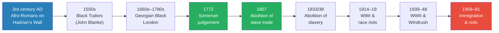
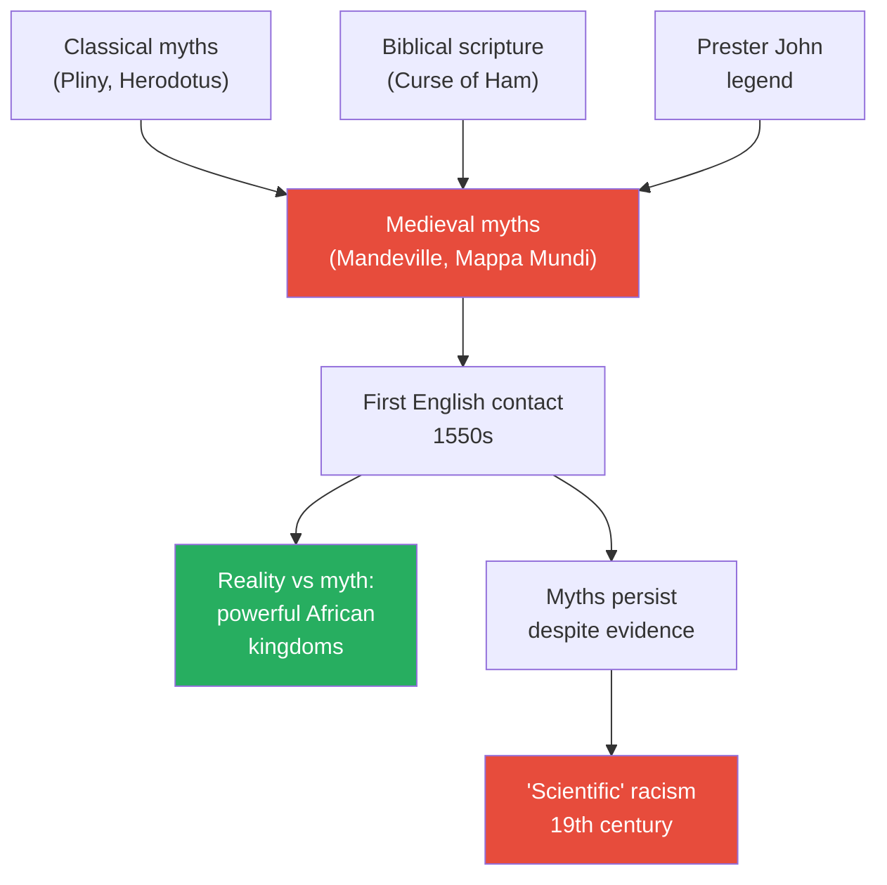
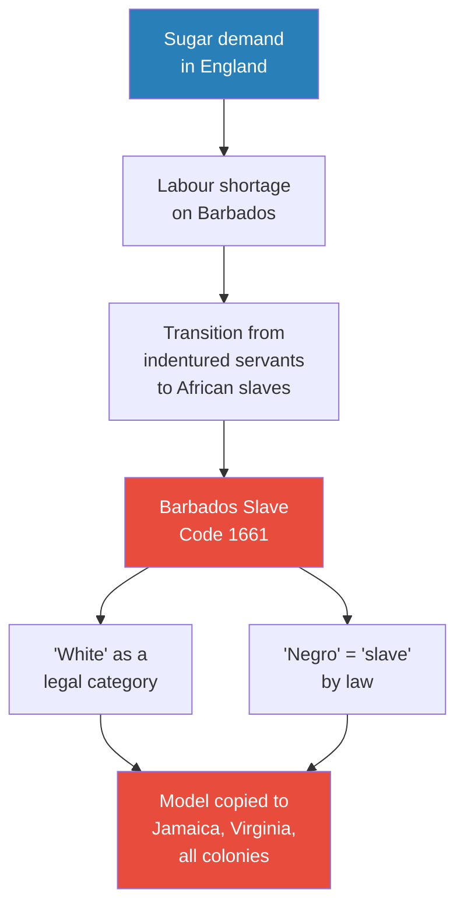
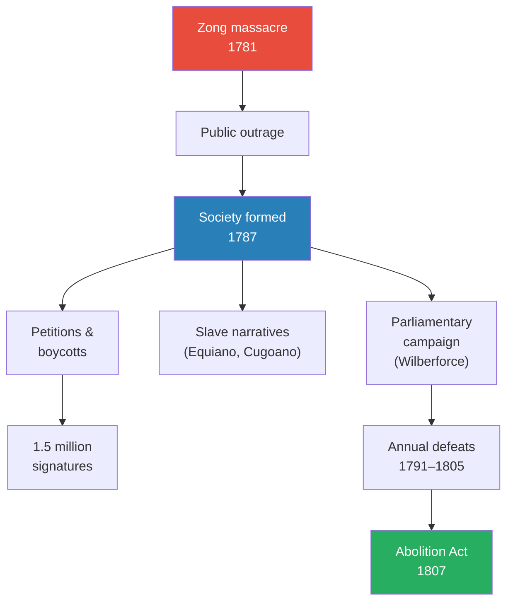
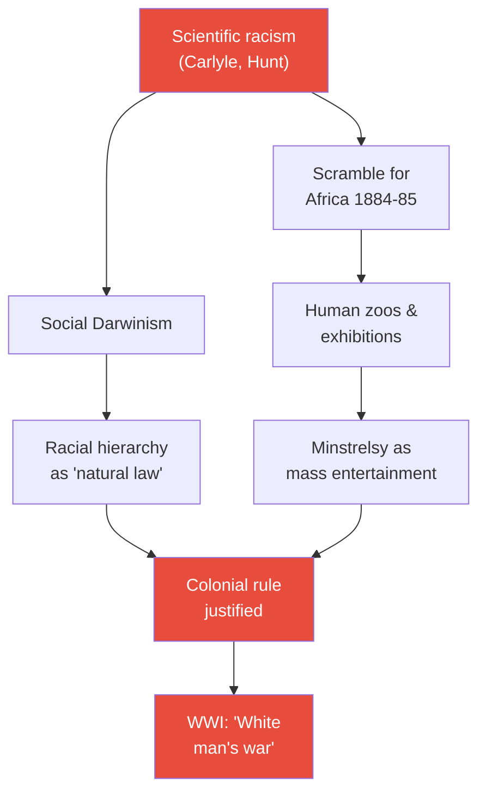
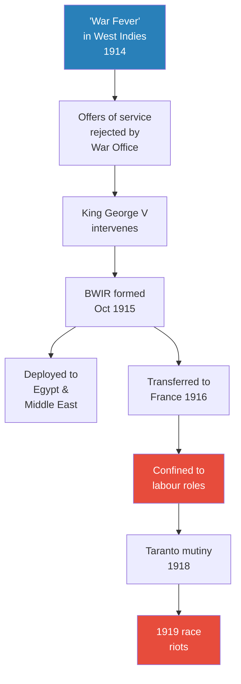
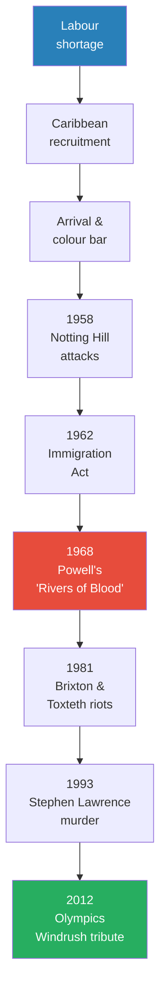

# Black and British — David Olusoga

> David Olusoga, a British-Nigerian historian and broadcaster, traces the presence of Black people in Britain across nearly two thousand years — from Afro-Roman soldiers on Hadrian's Wall to the Windrush generation and beyond. This is not a history of immigration; it is a history of encounter, entanglement, and erasure. Olusoga shows that the wealth of Britain's Georgian cities, the sweetness in its Victorian tea, the labour behind its wartime victories, and the foundations of its moral self-image were all built with the labour, suffering, and participation of Black people whose stories were systematically written out of the national narrative. The result is a book that demolishes the myth that Black British history begins in 1948 and argues, with meticulous evidence and controlled passion, that this history belongs to everyone.

---

## About the Author

David Olusoga grew up on a council estate in north-east England in the 1970s and 1980s, the mixed-race child of a Nigerian father and a white English mother. His childhood was scarred by racial violence — his family was driven from their home by a sustained campaign of nightly attacks, and a swastika was painted on the door with the words "NF Won Here." This experience drew him to history, where he discovered that Black people had been part of the British story for far longer than he had been taught. He studied at the University of Liverpool and became a historian, filmmaker, and presenter. *Black and British* was written alongside a BBC television series of the same name.

---

## The Big Idea

- <b style="color: #27ae60">Black people have been present in Britain for nearly two thousand years</b> — since the Roman Empire stationed North African soldiers on Hadrian's Wall in the third century AD
- The history of Black people in Britain is not a separate, marginal narrative — it is woven into the fabric of the mainstream story of Britain itself:
  - Britain's Georgian wealth was built on the slave trade and sugar
  - Britain's moral identity was forged in the abolition movement
  - Britain's wartime survival depended on Black soldiers and workers
  - Britain's post-war economy was rebuilt by Commonwealth immigrants
- <b style="color: #e74c3c">At every stage, this history was systematically forgotten</b> — each generation of Black Britons discovered that they had to fight to prove they belonged, unaware that people who looked like them had been fighting the same fight for centuries
- Olusoga structures his history as a <b style="color: #2980b9">triangular history</b> — planted in three continents: Britain, Africa, and the Americas. Like the slave trade itself, the story cannot be told from any single vantage point
- The book is not a polemic — it is a meticulous, evidenced account that uses individual lives to illuminate structural forces. But it is written with the controlled anger of a man who experienced racial violence as a child and found solace only in discovering that his family's story was part of a much longer one

---

## Key Concepts at a Glance

| Concept | One-line summary |
|---------|-----------------|
| **The triangular history** | Black British history is rooted in Britain, Africa, and the Americas simultaneously |
| **The forgetting** | At every stage, Black contributions were written out of the national narrative, requiring repeated recovery |
| **The ship, not the whip** | In Britain, slavery was enforced not by plantation violence but by the threat of deportation to the Caribbean |
| **The hypocrisy paradox** | Britain opposed slavery morally while profiting from it; welcomed Black people in wartime, rejected them in peace |
| **Racial categories as invention** | "White" and "negro" were categories created to serve the sugar economy, not descriptions of natural divisions |
| **The Somerset judgement** | Mansfield's 1772 ruling was narrow, but popular (mis)interpretation made it a watershed for Black freedom |
| **Gradualism** | Abolitionists' belief that ending the trade would cause slavery to "wither on the vine" — ultimately proved wrong |
| **The Barbados blueprint** | Barbados created the legal architecture of racial slavery, which was then copied across the British Empire |
| **Scientific racism** | Mid-Victorian theories (polygenism, phrenology) gave old prejudices a pseudo-scientific veneer |
| **The Windrush myth** | The idea that Black British history begins with the 1948 arrival of the Empire Windrush is flatly wrong |

---

*The unbroken presence of Black people in Britain across nearly two millennia — a fact that demolishes the myth that Black British history begins with the Windrush.*

---

---

## Preface: A Personal History of Racial Violence

*Olusoga opens with his own story — a childhood in 1980s north-east England shaped by racial violence, fear, and the discovery that history contained people who looked like him.*

- Olusoga grew up on a council estate during the rise of the National Front:
  - He secretly feared his family might be sent "back" to Nigeria — a country he barely remembered
  - The Conservative Party's 1970s election manifesto pledged voluntary repatriation of immigrants
  - Enoch Powell's "Rivers of Blood" was followed by calls to prevent the Black population from "doubling or trebling"
- The BBC's *Black & White Minstrel Show* was still airing during his childhood:
  - His mother would rush across the living room to change channels before her mixed-race children saw the grotesque caricatures
  - A school Christmas incident with a golliwog doll plunged him into "a day of humiliation and pain"
  - The word "wog" was once scrawled on a note, wrapped around a brick, and thrown through his family's window

> [!example] Driven from Home (1984)
> - Olusoga's family — his mother, two sisters, younger brother, and grandmother — endured weeks of nightly attacks
> - Bricks and rocks were hurled from a cemetery across the street, smashing their windows one by one
> - As replacement glass invited further attacks, the windows were boarded up and the family "disappeared into the gloom"
> - Policemen were stationed behind the front door but failed to catch the assailants
> - The family was eventually evacuated to emergency housing
> - When Olusoga returned months later, a black-gloss swastika had been painted on the white front door with the words "NF Won Here"
> **The lesson:** Racial violence in 1980s Britain was not abstract — it destroyed families and drove people from their homes.

- It was history that saved him:
  - A love of the Second World War — "almost obligatory among boys of that period, whatever their racial background" — led him into the past
  - "I wandered into history looking for excitement. I never expected that there I would encounter black and brown people who were like me and my family"
  - His white mother alerted him to stories of Black participation in British history
  - In 1986 he found Peter Fryer's *Staying Power*, "the first book I ever bought for myself with my own money":
    - Published in 1984 — the same year his family had been besieged in their home
    - "It set the racism that had so deeply affected our lives within a historical context"
    - "It allowed me to understand my own experiences as part of a longer story"
    - Fryer "took his readers back through the centuries and introduced us to an enormous pantheon of black historical characters, about whom we had previously known nothing"
    - <b style="color: #27ae60">"Those black Britons have been with me ever since. I have visited their graves and read their letters and memoirs"</b>
- Olusoga's own book — and the BBC series it accompanies — is a continuation of Fryer's project:
  - But it expands the scope: "Black British history is as global as the empire. Like Britain's triangular slave trade it is a triangular history, firmly planted in Britain, Africa and the Americas"
  - It also challenges what we mean by "black history": not just the history of the Black experience in Britain, but "a history of encounter" between Black and white people
  - "Black British history is everyone's history and is all the stronger for it"
  - The book acknowledges its own limitations — the list of unknowns is long, many significant figures are mute, and the history is disproportionately male because migration and the slave trade favoured men
  - But Olusoga is clear about his purpose: "Britain is a nation capable of confronting all aspects of its past and becoming a better nation for doing so"

---

### The Context: Race in 1970s–80s Britain

- Olusoga places his childhood within a broader political context:
  - The National Front (NF) was at the "zenith of its swaggering confidence" — making enough noise to make forced repatriation seem "vaguely plausible"
  - Reputable, mainstream politicians openly discussed "voluntary assisted repatriation" aimed exclusively at non-white immigrants
  - Enoch Powell had suggested in 1981 that people from the "new Commonwealth" might be "happier outside of the UK"
  - The BBC's *Black & White Minstrel Show* — blackface entertainment on prime-time television — ran until 1978
  - Touring blackface minstrel shows clung on until the mid-1980s, performing in "fading ballrooms on the decaying piers of Britain's seaside towns"
  - Golliwog dolls sat alongside teddy bears in toy shop windows; golliwog images decorated jam jars
  - "Almost every black or mixed-race person of my generation has a story of racial violence to tell"
  - <b style="color: #e74c3c">"This oral history of twentieth-century racial violence has never been collected or collated, but it is there and it is shocking"</b>

---

---

## Introduction: Bunce Island and the Triangular History

*The book opens not in Britain but on a small, tree-covered island in the Sierra Leone River — the ruins of a slave fortress that connects Britain, Africa, and the Americas.*

- <b style="color: #2980b9">Bunce Island</b> was a British slave fortress, one of around forty built along the coast of West Africa:
  - Attacked and destroyed six times (four times by the French, twice by pirates) — the ruins are those of the seventh fortress
  - It operated like a "proto-industrial production line" — captive Africans were bought, sorted, branded, warehoused, and shipped
  - The "production line" moved from east to west:
    - Captives arrived traumatised on the eastern beach — modern psychologists would recognise their condition as PTSD
    - In the Sorting Yard, they were bought and sold alongside ivory and gold
    - Men were separated from women and children; all were marched to holding yards behind walls three metres high
    - The agents lived in a two-storey villa whose windows looked directly into the men's holding yard
  - The women's holding yard contained a small structure that historians believe was the <b style="color: #e74c3c">"rape house"</b>:
    - Built into the wall with a door opening into the women's yard
    - Behind it was an orchard of orange trees where the agents relaxed and drank
  - The fortress also had its own ice store, and in the 1770s the agents played golf on a two-hole course — "the first ever built on the African continent"
  - Between 30,000 and 50,000 Africans took their last step on the continent at Bunce Island's jetty
- After abolition in 1808, the fortress was abandoned and consumed by vegetation:
  - When American archaeologists arrived in the 1970s, they found cannon marked "G R" — George Rex, the cipher of King George III
  - Joseph Opala linked Bunce Island to the Gullah people of South Carolina and Georgia — African American communities who could trace their ancestry back to the fortress
  - Since 1989, Gullah "homecomings" have brought descendants back to Bunce Island — some reported being so overcome they could "see" their ancestors in the holding yards

> [!tip] Core Insight
> Olusoga opens with Bunce Island to establish his central framework: Black British history is a triangular history, rooted in three continents. The ruins in Sierra Leone, the plantations in the Americas, and the stately homes in Britain are all part of the same story. You cannot understand any one corner of this triangle without the other two.

---

---

## Chapter 1: 'Sons of Ham' — Romans, Myths, and First Contact

*The British Isles and Africa first met when Britain was a cold province on the northern fringe of Rome's multi-racial empire. When direct contact ended, myth and scripture filled the void for a thousand years.*

### Africans in Roman Britain

- <b style="color: #2980b9">The Aurelian Moors</b> were a unit of North African soldiers stationed at the fortress of Aballava on Hadrian's Wall, between AD 253 and 258:
  - An altar stone found in Beaumont, Cumbria, in 1934 recorded their presence
  - A Roman register (Notitia Dignitatum) confirmed the posting
- Modern forensic science has transformed our knowledge of Roman-era diversity:
  - <b style="color: #2980b9">Radioisotope analysis</b> — using oxygen and strontium isotopes in bones and teeth — can determine where individuals grew up
  - Applied to ~200 human remains from York, 11–12% proved to be of African descent
  - They came from both rich and poor burial sites — suggesting Black people moved at all levels of society

> [!example] The Ivory Bangle Lady (York, 3rd century AD)
> - Discovered in 1901 in a stone sarcophagus near Sycamore Terrace, York
> - Her grave contained luxury goods: blue glass beads, bronze lockets, a glass perfume bottle — and bracelets of Whitby jet and African ivory
> - In 2009, radioisotope analysis revealed she was likely a mixed-race woman of North African descent
> - She had been 18–23 at death, of high social status in Roman Eboracum
> **The lesson:** Parts of third-century York may have been more racially diverse than the city today.

- The <b style="color: #2980b9">Beachy Head Lady</b> was another remarkable discovery:
  - Her skeleton — almost complete — was found stored in a box labelled "Beachy Head" in an Eastbourne museum
  - In 2012, archaeologists sent the remains for radioisotope analysis:
    - Professor Caroline Wilkinson, a forensic facial reconstruction specialist, could tell "merely by looking at the skull" that it was of a sub-Saharan African
    - Radiocarbon dating placed her around AD 125–245
    - She had spent much of her childhood in southeast England — born there or brought very young
    - Her diet was rich in fish and vegetables; her teeth were in good condition
    - She had not served in a lowly position or lived as a slave — the evidence suggests a comfortable life
  - "The first black Briton known to us — had lived and died in rural East Sussex, by the Channel coast with its white cliffs and green rolling hills"
  - <b style="color: #27ae60">Over a millennium before the British built their empire, a Black woman was living and dying in the English countryside</b>

### The Severing and the Myths

- After the fall of the Western Roman Empire in the fifth century, the pathways that had brought Africans to Britain were wiped away:
  - The extraordinary connectivity of the Roman world was replaced by isolation
  - In the seventh century, the rise of Islam created a further barrier — political, religious, military, and cultural — across North Africa
  - For the next millennium, contact between Africans and Europeans was mediated by Arab traders controlling the Saharan caravan routes
  - Some tiny number of people of African heritage continued to travel to and live in medieval Britain — the archaeological record and a handful of archival sources confirm this — but they were vanishingly rare

- Yet Africa did not vanish from the European mind — it survived as myth:
  - Africa was a land of the Bible — the Nile Valley and Ethiopia remained present through scripture
  - Classical texts (Homer, Herodotus, Ptolemy, Pliny) described Africa and Africans — but mixed accurate observation with fantastical speculation
  - Diodorus Siculus accurately described the people south of the Nile as "black of colour, with flat noses and woolly hair"
  - But Herodotus speculated that somewhere in Africa was "a race of men who had the heads of dogs"
- <b style="color: #2980b9">The Hereford Mappa Mundi</b> (c. 1300) depicted Africa as the realm of monstrous races:
  - The Blemmyes — people with no heads, but faces on their chests
  - The Agriophagi — living under a cyclops king
  - Pliny's catalogue of fantastical African peoples was still being reprinted in the 1550s
- <b style="color: #2980b9">Mandeville's Travels</b> (c. 1356) was one of the most widely translated books of the later Middle Ages:
  - Columbus took a copy on his voyage to find the Indies
  - It mixed genuine travel writing with pure fantasy — Africa had rivers of spiced water, diamonds that grew to enormous sizes, and a fountain of eternal youth
  - The people of Africa supposedly lived in "almost communist equality" because food was limitless and freely available
  - African sexual habits were said to be strange and unnatural; their religions were "false and troubling"
  - The legend of <b style="color: #2980b9">Prester John</b> — a fabulously wealthy Black Christian king somewhere in Africa — raised the tantalising prospect of an alliance against Islam:
    - In 1400, King Henry VI of England wrote Prester John a letter
    - When Portuguese explorers finally reached Ethiopia, the Christian Ethiopians had never heard the name
    - Yet the legend persisted until the seventeenth century — even as real Africans stood before European eyes

- <b style="color: #2980b9">The Hereford Mappa Mundi</b> (c. 1300) was a visual encyclopaedia of these myths:
  - The largest surviving medieval map — not a map in the modern sense but a picture of the world as scripture and legend described it
  - Jerusalem at the centre; Adam and Eve at the top; hell's mouth gaping at the edge
  - Africa was depicted as the realm of monstrous races:
    - The Blemmyes — people with no heads, faces on their chests
    - The Agriophagi — ruled by a cyclops king
    - The Marmini — four-eyed people who could gaze in all directions
  - <b style="color: #e74c3c">These images shaped how Europeans imagined Africa for centuries — the continent was wondrous, dangerous, and utterly alien</b>

### England Reaches Africa

- The Portuguese were the pioneers of European contact with West Africa:
  - Using the <b style="color: #2980b9">caravel</b> — a small, shallow-draughted vessel with lateen sails — they navigated Africa's treacherous coast from the 1410s onwards
  - Progress was painfully slow — each expedition probing a little further, testing whether the winds would carry them home
  - In 1434 they breached Cape Bojador, "the Father of Danger" — disproving the belief that seas to the south were impossible to return from
  - By the 1470s they had reached the Gold Coast and built the fortress of São Jorge da Mina (El Mina)
  - 25,000 ounces of African gold had reached Europe directly from Africa by the end of the 15th century
  - Papal bulls of the 1450s gave Portugal exclusive trading rights along two thousand miles of African coastline
  - The commodities that drew the Portuguese were dyewood, ivory, pepper, and above all gold — "the slave trade did not count for much at this stage"
- England was a latecomer, held back by papal prohibition:
  - In the 1530s, William Hawkins of Tavistock made a one-off voyage to the Guinea coast — but the obstacles were formidable
  - Henry VIII's break with Rome (1534) removed the papal barrier — England was now a heretical state, no longer bound by papal bulls
  - <b style="color: #2980b9">Anthony Anes Pinteado</b>, a Portuguese captain who had fallen out of favour in Lisbon, offered his knowledge to the English — helping stiffen their resolve to break into the African trade
  - Thomas Wyndham's 1553 voyage was the first serious English incursion — he returned with 150 pounds of gold and 80 tons of pepper, but lost two-thirds of his crew to disease
  - John Lok's 1554 expedition returned with 400 pounds of gold, 250 tusks of ivory — and five African men from Shama

> [!example] The Five Men from Shama (1554–1556)
> - John Lok brought five Africans to London to learn English and serve as translators for future expeditions
> - Their African names were not recorded; three adopted the names Anthonie, Binnie, and George
> - They were described as "tall and strong men" who could "well agree with our meates and drinkes"
> - When three were returned to Africa in 1556, "the men of the towne wept for joy when they saw them"
> - Their families received them with "much joy" — the reunion of brothers, wives, and aunts
> **The lesson:** The earliest encounters between England and Africa were not defined by racism but by trade, curiosity, and human connection.

- <b style="color: #e74c3c">The Curse of Ham</b> became the biblical justification for African slavery:
  - The sons of Noah were said to have fathered the three races of mankind — Ham the Africans, Sem the Asians, Japhet the Europeans
  - According to Genesis, Ham had humiliated his father; Noah cursed Ham's son Canaan to be "a servant of servants unto his brethren" for all time
  - Neither race nor skin colour is mentioned in the biblical passage — but at some point the story became racialised
  - George Best wrote that Noah intended "all the children of Ham should be so black and loathsome, that it might remain a spectacle of disobedience to all the world"
  - The idea that blackness was a divine punishment — and that Africans were divinely ordained to serve — was deployed to justify slavery for three centuries
  - <b style="color: #27ae60">Olusoga's point: the "racial" reading of Genesis was not in the text — it was imposed upon it by people who needed a justification for what they were doing</b>

> [!tip] Core Insight
> The idea that Africans were cursed by God to be "servants of servants" was a medieval invention — but it proved devastatingly durable. It gave slave-traders scriptural cover, slave owners a clear conscience, and ordinary people permission not to care. The fact that neither race nor colour appears in the original text made no difference.

### The Balance of Power

- Olusoga emphasises that in the early period of contact, the balance of power between Europeans and West Africans was relatively even:
  - African societies were not primitive — they had centuries of experience trading with the Islamic world
  - The kingdom of Benin refused to let Europeans build trading fortresses on its territory
  - The Oba of Benin spoke Portuguese, having "learned of a child"
  - Dutch trader Pieter de Marees (1602) noted that Africans had "a clear understanding of the value of their commodities" and were quick to spot any attempt to cheat: "When we have brought them things they did not like, they have mocked us in a scandalous way"
  - <b style="color: #27ae60">The myth that Europeans arrived in Africa and immediately dominated is a product of the 19th century — not the 16th</b>

*Medieval myths about Africa survived first contact with reality — and evolved into the "scientific" racism of the 19th century.*

---

---

## Chapter 2: 'Blackamoors' — Black Tudors and the Birth of Slavery

*The five men from Shama were not the only Black people in Tudor England. Hundreds have been found in parish registers, legal records, and royal accounts — a "forgotten" population that was neither enslaved nor entirely free.*

### Black Tudors

- Historians (Imtiaz Habib, Miranda Kaufmann, Onyeka Nubia) have scoured archives and found literally hundreds of "black Tudors":
  - They appear in parish registers, correspondence, and legal records
  - "Three blackamore maids" in the employ of London alderman Paul Banning (1586)
  - "Bastien, a Blackmoore of Mr Willm Hawkins" — buried in Plymouth, 1583 (brother of the slave-trader Sir John Hawkins)
  - Mary, "a negro of John Whites" — baptized in Plymouth, 1594; her father was said to be a Dutchman
  - Most arrived via the Iberian and Mediterranean worlds — some were taken from captured Spanish or Portuguese slave ships
  - Africans may have made up around 20% of Lisbon's population by the late 16th century — a reservoir from which some were brought to Britain
  - Most Black Tudors were domestic servants on the lower rungs of society — but they were not enslaved in the way Caribbean slaves would be
  - Their baptisms and marriages are recorded, suggesting they integrated into their communities
  - There were Africans in the court of James IV of Scotland — including a Black drummer who choreographed Shrove Tuesday celebrations in 1505
  - Elizabeth I employed Africans at court — a "Blackamoore boy" appears in a 1574 warrant ordering a tailor to make him a "garcon coat of white taphata" lined with "gold and silver"

- The attempted deportation of Black Tudors:
  - In 1596, a Privy Council order granted a German merchant, Caspar Van Senden, a licence to round up "blackamoors" and sell them into slavery in Spain and Portugal
  - But the licence required the permission of Black people's masters — who refused to give up their servants for free
  - A second, stronger order in 1601 was never issued as a proclamation and may have been drafted by Van Senden himself
  - The scheme came to nothing — but for decades the documents were cited as evidence of official anti-Black hostility
  - <b style="color: #27ae60">In reality, Olusoga argues, it was a failed profit-making venture by a foreign merchant — not proof of rampant racism in Elizabethan England</b>

> [!example] John Blanke — The Black Trumpeter (1509–1512)
> - Blanke was a royal trumpeter at the court of Henry VIII, probably arriving with Catherine of Aragon's entourage in 1501
> - He appears twice on the Westminster Tournament Roll (1511) — the first image of a Black person in British records
> - He is shown on a grey horse, wearing a turban of brown and yellow, in the same livery as his five fellow trumpeters
> - He petitioned Henry VIII for a pay rise, promising "lifelong service and loyalty"
> - He received a royal wedding gift — a gown of violet cloth, a bonnet, and a hat — for his marriage to an unnamed English woman
> **The lesson:** A Black man could hold a position of relative prestige in Tudor England — and had the confidence to negotiate with the king.

- <b style="color: #2980b9">Jacques Francis</b> (1547) was a 20-year-old salvage diver from Arguin Island, in what is now Mauritania:
  - He was a slave employed by Peter Paulo Corsi, a Venetian salvage expert brought to England by Henry VIII
  - His task: salvaging guns from the wreck of the Mary Rose, the great Tudor flagship that had sunk in the Solent in 1545 — probably after tacking too sharply with her lower gunports open
  - When Corsi was accused of illegally salvaging metals from another wreck, Francis was called to testify in the High Court of Admiralty
  - His testimony was accepted despite being a foreigner, non-Christian, African, and enslaved — at a time when the testimonies of white English bonded serfs (villeins) would not have been admissible
  - The Venetian merchant Anthony de Nicholao Rimero attempted to have Francis's testimony thrown out, arguing that he was "a morisco born where they are not christenyd and slave" and therefore no "Credite nor faithe ought to be geven to his Sayenges"
  - The High Court of Admiralty rejected this — <b style="color: #27ae60">a remarkable acknowledgement of Francis's humanity in a court of law, decades before the slave trade properly began</b>

### Shakespeare and Blackness

- Elizabethan and Stuart attitudes to race were "complex, often contradictory, ever-shifting and developing":
  - While the colour black was laden with negative associations (the devil was depicted as black; "as black as a devil" was a common expression), many Black people in Tudor parish registers were accepted into the Church, married, and had children
  - Slavery in England was illegal — yet English slave-traders operated freely from Andalusia and occasionally from English ports
  - In 1587, a Spanish resident of England complained that a Black man he had purchased as a slave "utterly refuseth to tarry and serve" — English common law offered him "no remedie"
  - <b style="color: #27ae60">This "strange duality" — opposing slavery at home while profiting from it abroad — would remain characteristic of British attitudes for centuries</b>

### Shakespeare and Blackness

- Shakespeare was fascinated by the creative possibilities of the clash between black and white:
  - His audiences had no concept of "race" in the modern sense — the word was used sparingly and its meaning was closer to "pedigree" or "lineage"
  - But they understood the symbolic meanings of colour: blackness meant night, the supernatural, the diabolical; whiteness meant purity, virginity, divinity
  - "Away you Ethiope" (A Midsummer Night's Dream) and "I'll hold my mind were she an Ethiope" (Much Ado About Nothing) both use blackness as an insult
  - But Shakespeare also challenges these assumptions: in Two Gentlemen of Verona, Proteus refers to "the old saying" that "Black men are pearls in beauteous ladies' eyes"
  - <b style="color: #2980b9">Othello</b> is Shakespeare's greatest exploration of race and blackness:
    - A character of staggering depth and complexity — Shakespeare showed "apparent empathy" for him even as he destroys what he loves
    - Othello reflects not just racial attitudes but contemporary debates about Islam and Ottoman power
    - "What is striking about the play is the depth of Shakespeare's apparent empathy for Othello"
  - It is important to remember that Shakespeare's writing career (c. 1589–1613) pre-dated both the start of the English slave trade and English colonies in the Americas
  - The racial ideas that developed during the age of the slave trade had not yet solidified — Shakespeare's audiences were fascinated by blackness, but they did not carry the baggage of later centuries
  - <b style="color: #27ae60">We can be certain that his audiences "did not come to the Globe with anything resembling a modern understanding of the idea of 'race'"</b>

### Sugar and the Barbados Blueprint

- <b style="color: #e74c3c">Sugar was the single factor that tied Britain's fate to Africa</b>:
  - English planters on Barbados discovered that sugar was "inordinately profitable but demanded huge amounts of labour"
  - Initially they used white indentured servants — but these dwindled after the English Civil War
  - By 1680 there were 38,000 slaves on Barbados; by 1700, 50,000
- The <b style="color: #2980b9">Barbados Slave Code</b> (1661) was the legal architecture of racial slavery — and one of the most consequential documents in British history:
  - It combined previously separate laws into a single, comprehensive framework for racial slavery
  - It used "negro" and "slave" interchangeably — to be Black on Barbados was, by definition, to be a slave
  - It denounced Black people as "heathenish brutish and an uncertain dangerous pride of people" whose nature required "punishionary laws"
  - The approved punishments for Black slaves were designed to terrify:
    - Mutilation of the face; slitting of nostrils; branding of cheeks and foreheads
    - Castration for repeated offences
    - Death for petty theft and destruction of property
  - When white men — even the lowliest indentured servants — committed similar crimes, they received far lighter sentences, usually extensions to their terms of service
  - White servants retained the right to trial by jury — specifically denied to "negroes": the code determined that "brutish slaves deserve not for the baseness of the Conditions to be tried by the legall tryall of twelve Men"
  - <b style="color: #27ae60">Most critically, the code invented the categories of "white" and "negro" as legal identities</b>:
    - The planters understood that white racial unity was insurance against slave rebellion
    - They were willing to blur class distinctions — between rich planter and poor Irish servant — in order to bring racial differences into sharper relief
    - "The Atlantic slave trade had taken Africans from numerous and widely differing cultures and ethnic groups and defined them en masse as 'negroes'. Now the pioneers of English plantation slavery ushered all Europeans, irrespective of their ethnic or social backgrounds, into the new category of 'white'"
    - Newly arriving Europeans had to be taught this system — the term "white" had to be explained to those unfamiliar with how the slave society worked
  - The Barbados blueprint was then copied — almost verbatim — to Jamaica (1696), Virginia, and every other British colony
  - It was the foundation upon which the entire system of British racial slavery was built

- The transition from indentured servitude to African slavery was driven by economics, not ideology:
  - Sugar demanded enormous amounts of labour — more than tobacco, and on a semi-industrial timetable
  - Fresh-cut cane had to be rapidly processed through rollers and boiling houses
  - White indentured servants dwindled after the English Civil War
  - In 1637 there were only 200 Africans on Barbados out of a population of 6,000
  - By 1660, the majority of Barbadians were Black Africans
  - By 1680, there were 38,000 slaves; by 1700, 50,000
  - <b style="color: #e74c3c">The sugar economy remade the Caribbean — "transforming previously rather idyllic, heavily forested islands into closely managed, highly artificial landscapes constantly being reshaped and reworked by vast armies of enslaved people"</b>

*Sugar drove the creation of racial slavery — and Barbados provided the legal template that was copied across the entire British Empire.*

---

### John Hawkins and the Triangular Trade

- <b style="color: #2980b9">John Hawkins</b> (1532–1595) was the pioneer of the English slave trade — though Olusoga notes that English merchants operating from Andalusia had traded in slaves as early as the 1480s:
  - In 1562, Hawkins sailed to Sierra Leone and "got into his possession, partly by the sword and partly by other means, 300 Negroes"
  - He attacked Portuguese ships, seized the enslaved Africans on board, and sold them in the Spanish West Indies
  - Queen Elizabeth invested in his second voyage, providing two royal ships — including the 700-ton *Jesus of Lübeck*
  - Hawkins claimed a personal profit of 60% — and was knighted
  - His coat of arms included an image of a female African slave
  - His third voyage ended in disaster — intercepted by the Spanish at San Juan de Ulua, three ships lost, only two made it home
  - <b style="color: #e74c3c">The incipient English slave trade was brought to an "ignominious and ruinous end" — it would be a century before it revived</b>
  - In the interim, the English were "more adept at privateering — licensed and state-sanctioned piracy against the Spanish treasure fleets — than slave-trading"
  - Between 1553 and 1565, nine English expeditions to West Africa involved at least twenty large ships and between 1,000 and 1,500 men
  - But the English remained only minor players in the gold and slave trades of the 16th century
  - It was the sugar revolution of the 17th century — not these early voyages — that would bind Britain irrevocably to Africa
  - But these early expeditions had lasting effects:
    - They demonstrated that African gold was real and accessible — inflaming commercial ambition across England
    - They introduced English merchants and mariners to the coast of West Africa — its geography, its peoples, its trading customs
    - They showed that Africans were sophisticated trading partners who could not be easily cheated or dominated
    - And they brought the first Africans to England since Roman times — creating a trickle that would, within a century, become a flood
    - The five men from Shama, the elephant's head displayed at a London merchant's house, the cargo of gold and ivory — all of these contributed to a fascination with Africa that would grow into obsession, exploitation, and ultimately shame

### The Royal African Company

- The <b style="color: #2980b9">Royal African Company</b> (1672) was given a monopoly on the slave trade by Charles II:
  - Its charter gave it the right to trade in "Negroes, slaves, goods, wares and merchandises" along the entire African coast
  - It was responsible for transporting and enslaving more Africans than any other British company — around 150,000
  - Within a decade of its formation, the English share of the Atlantic trade increased from 33% to 74%
  - The company built the first fortress on Bunce Island in 1670
- When the monopoly was challenged and finally broken in 1712, private traders massively expanded the trade:
  - The "separate traders" argued that the right to enslave Africans was a defining feature of English freedom
  - <b style="color: #e74c3c">Stone-blind to irony, they demanded the slave trade be deregulated — so that the profits of human suffering could be shared more widely</b>
  - After the end of the monopoly, the average number of slaving voyages per year increased from 23 to 77
  - The carrying capacity of the trade expanded by around 60%
  - The era of the "respectable trade" had begun — Bristol, Liverpool, and Glasgow grew fat on the proceeds
  - Also arriving in Britain were the West India planters themselves — "enormously enriched, infamously ostentatious":
    - "The phrase 'as rich as a West Indian' entered common usage"
    - They bought property, invested in land, and married their children into the old aristocracy
    - Their excess became the subject of satire — and envy
  - Another side-effect: hundreds and then thousands of Black people were shipped into Britain:
    - From the 1660s onwards, "the black presence in Britain has been unbroken and continuous"
    - <b style="color: #2980b9">This is the key fact that Olusoga wants to establish: there is no gap, no pause, no period in which Black people disappear from Britain and then return</b>
  - The presence has been continuous since the 1660s — and stretches back, intermittently, to the Roman era
  - The myth that Black British history begins with the Windrush in 1948 is not just wrong but actively harmful:
    - It makes immigration seem like a disruption rather than a continuation
    - It allows people to imagine Britain was once "pure" — a fantasy that feeds xenophobia
    - It erases the contributions of Black Britons across nearly four centuries of continuous presence
  - Olusoga's task across the rest of the book is to fill in this forgotten history — one life, one legal case, one war, one riot at a time

---

---

## Chapter 3: 'For Blacks or Dogs' — Georgian London's Black Population

*Georgian Britain — elegant, corrupt, and brutally hypocritical — was sustained by an Atlantic economy that brought thousands of Black people to its shores as slaves, servants, sailors, and free men.*

### The Black Georgians

- Olusoga draws a vivid parallel between Georgian Britain and the early 21st century:
  - Both were "sustained by illusory, booming, bubble economies, built on the shifting sands of credit and debt"
  - Both were "fascinated by new products, tastes and fashions" — "yesterday's luxuries became firmly established as today's necessities"
  - Both relied on "the unseen labour of foreign peoples, living and labouring in faraway lands"
  - In the 21st century the invisible labourers are factory workers making clothes and phones; in the 18th century they were Africans producing the tobacco Britons smoked and the sugar they consumed
  - "The hypocritical, corrupt, sentimental, acquisitive, nationalistic, xenophobic, debauched, drunken, scandal-obsessed, globally-aware, riot-prone, debt-fuelled, multi-racial Britain of the late eighteenth century is instantly redolent of us"

- The influx of Black people began in the late 17th century and grew throughout the 18th:
  - Returning plantation owners brought enslaved servants from the Caribbean — they had "grown accustomed to being waited on by enslaved servants and felt it natural that they would take their portable property home with them"
  - Slave-ship captains retained the right to bring back "privilege negroes" — a few extra slaves carried as a personal bonus and sold in British ports
  - Free Black sailors awaited new postings in dockside communities, where they "might have the best claim to have organized the first geographic black communities"
  - Some Africans came as students — the chiefs of Sierra Leone sent their sons to Britain for education; around 50 were studying in Liverpool alone in 1789
  - The mixed-race children of West Indian planters were sometimes sent to Britain for education — Nathaniel Wells, son of a St Kitts planter, inherited £200,000, bought a country house near Chepstow, and became High Sheriff of Monmouthshire

- <b style="color: #2980b9">The population size is unknowable</b> — estimates ranged from 3,000 to 40,000:
  - Lord Mansfield accepted ~15,000 during the Somerset case (1772)
  - Edward Long initially estimated 3,000 — then raised it to 15,000 to support his alarmist propaganda about the dangers of racial mixing
  - Most historians accept 10,000–15,000 — but as James Walvin points out, these remain "estimates, perhaps little better than guesses"
  - The majority lived in London, with significant numbers in Bristol and Liverpool
  - Visitors from abroad commented on the numbers of Black people in London — the Russian Tsarina even sent agents to London to purchase "the finest best made black boys" for her court

### Slaves in the Streets: The Reality of Unfreedom

- There is still a misconception that slavery was confined to the Caribbean and North America:
  - But Olusoga shows that enslaved Black people were bought and sold in Britain itself between the 1650s and the close of the 18th century
  - Slaves were sold from pubs and coffee-houses, especially in Liverpool, Bristol, and London
  - They were advertised in newspapers alongside Scottish linen and job listings:
    - "To be sold. A pretty little Negro Boy, about nine Years old, and well limb'd. If not dispos'd of, is to be sent to the West Indies in six days Time" (Daily Advertiser, 1744)
    - "A black boy, twelve years of age, fit to wait on a gentleman" — available from "Dennis's Coffee-house in Finch Lane" (Tatler, 1709)
  - Black people were passed on in wills alongside livestock and real estate:
    - Thomas Papillon of London (1701) left his son an enslaved man "whom I take to be in the nature of my goods and chattels"
    - Beecher Fleming of Bristol (1718) left "my negro boy, named Tallow" to his presumed widow
  - Art dealers carried on a sideline auctioning slaves alongside paintings
  - <b style="color: #e74c3c">The buying and selling of human beings was a feature of British life for 150 years — not just a colonial phenomenon</b>

### The Fashion for Black Pageboys

- Beginning around 1650 and lasting until the end of the 18th century, wealthy families acquired enslaved Black children as fashionable accessories:
  - They appear in portraits by Reynolds, Zoffany, and Stubbs — usually in the margins, alongside dogs, parrots, and monkeys
  - Their function in portraiture was to indicate their owner's wealth, taste, and connection to the global economy
  - They wore liveried coats of red, blue, and gold, with oriental turbans and pearl earrings — an exotic jumble that mixed African, Indian, and Ottoman styles
  - The intensity of blackness was valued — an advertisement from Liverpool in 1756 read: "Wanted immediately a Black Boy. He must be of a deep black complexion"
  - Portrait artists took "dubious pleasure" in contrasting dark skin against white, using the Black pageboy as a visual device to highlight the beauty and purity of the white mistress
  - <b style="color: #e74c3c">Slave collars — brass or copper, riveted or padlocked around the neck — marked them as property</b>:
    - A goldsmith on Duck Lane in Westminster advertised "silver padlocks for Blacks or Dogs"
    - In 1685, a 15-year-old boy named John White had a silver collar bearing the coat of arms of Colonel Kirke — and "upon his throat a great scar"
    - In 1695, a boy escaped with "a collar about his neck" inscribed "The Lady of Bromfield's black, in Lincoln's Inn Fields"
    - These collars were expensive, engraved, and polished — "a repugnant form of jewellery" almost indistinguishable from brass dog collars of the same period
  - Classical names were imposed — Caesar, Scipio, Pompey — an ironic echo of Roman power attached to the powerless
  - When pageboys grew too old for their role as glamorous accessories, they were sent back to the Caribbean:
    - The Duchess of Kingston's pageboy, purchased at five or six, was dispatched to plantation slavery as a teenager
    - The Duchess of Devonshire tried to pass off her unwanted pageboy (11 years old) to her mother: "if you don't like him they say Lady Rockingham wants one"

- The fashion was also adopted by high-class prostitutes — "town misses":
  - An 1680 pamphlet identified the enslaved Black servant as one of the signifiers of the London courtesan: "She hath always two necessary Implements about her, a Blackamoor, and a little dog"
  - Hogarth's *A Harlot's Progress* gave his doomed protagonist an enslaved pageboy — linking the fashion to moral corruption and excess

> [!example] Julius Soubise — Rise and Fall (1764–1798)
> - Born a slave in St Kitts, brought to Britain by a naval captain and given to the Duchess of Queensberry
> - Educated and indulged, he became an excellent equestrian and swordsman
> - He emerged as a Georgian rake — actor, musician, poet, Don Juan, living at the duchess's expense
> - In 1777 he was accused of raping a housemaid; the duchess sent him to India
> - He opened a successful riding school in Calcutta, married, and then died after being thrown from a horse in 1798
> **The lesson:** Even the most spectacularly privileged Black Georgian life was defined by dependence on white patronage and ended in exile.

### The Blurred Line Between Slavery and Service

- The relationship between slavery and service in Britain was far more ambiguous than in the colonies:
  - <b style="color: #27ae60">In Britain, the enforcement of slavery relied on the threat of deportation — "the ship, not the whip"</b>
  - Enslaved people who ran away faced destitution — they had no home parish for Poor Law support, no family networks, and no access to apprenticeships
  - But life in Britain also undermined the assumptions of slavery in ways the Caribbean never did:
    - The sight of poor white people performing menial work challenged the equation of blackness with servitude
    - Black slaves working alongside white servants in Georgian households "inevitably began to question their status"
    - In the West Indies, even the poorest whites refused manual labour — in Britain, white poverty was visible everywhere
  - Magistrate John Fielding complained in 1762 that Black slaves in Britain:
    - "Put themselves on a footing with other servants, become intoxicated with liberty, grow refractory"
    - He warned that free Black people were "corrupting and dissatisfying the mind of every fresh black servant that comes to England"
    - They told new arrivals that being "christened or married... makes them free"
  - The Gentleman's Magazine warned in 1764 that imported Black servants "cease to consider themselves as slaves in this free country, nor will they put up with an inequality of treatment"
  - <b style="color: #2980b9">The borders between slavery and service were undefined by law and unclear to both "owners" and the enslaved</b> — the likelihood is that the relationship varied enormously from family to family and case to case
- Newspaper advertisements reveal the lives of runaways:
  - "Gloucester," 21, of Chippenham — identifiable by his livery and "a long scar down the middle of his Forehead"
  - Rewards of one to five guineas were offered; descriptions listed scars, brands, and slave collars
  - The threat of being sold to West Indian planters "haunted the lives of black people in Britain"

> [!example] The Kidnapping of Mary Hylas (1766)
> - John and Mary Hylas had married with their owners' consent after arriving separately from the Caribbean
> - After eight years of marriage, Mary was kidnapped by her owners (the Newton family), shipped to the West Indies, and sold
> - Only with the help of Granville Sharp was John Hylas able to go to court and successfully demand his wife's return
> **The lesson:** Marriage offered no protection — a Black woman in Britain could be torn from her husband and sold without warning.

### Education as Liberation

- The fashion for Black servants had an unintended consequence — some enslaved people were given educations:
  - Owners found that educated servants were more useful
  - Some owners appear to have educated their Black servants out of genuine affection
  - <b style="color: #27ae60">It was literacy that enabled some Black Georgians to escape slavery, build independent lives, and ultimately fight against the institution that had enslaved them</b>

- <b style="color: #2980b9">George John Scipio Africanus</b> — possibly from Sierra Leone, brought to Wolverhampton around 1776:
  - Educated by the Molineux family, apprenticed in a brass foundry
  - After leaving service, moved to Nottingham, married an English woman (Esther Shaw), and founded "Africanus' Register of Servants" — a Georgian employment agency
  - Had seven children, only one of whom survived to adulthood

- <b style="color: #2980b9">Phillis Wheatley</b> — a servant from the age of eight:
  - Given lessons in English, she mastered the language with astonishing speed, then took up French and Latin
  - Her published collection of neo-classical poetry was ecstatically received in Britain and parts of America
  - She praised the King and British war efforts — Black writers in this period tended to stress loyalty to Britain

### The Most Fortunate

- A handful of Black Georgians — through luck, education, and remarkable talent — achieved extraordinary lives:

> [!example] Ignatius Sancho (1729–1780)
> - Born on a slave ship crossing the Atlantic; his mother died shortly after
> - Brought up in Greenwich by three sisters who had no intention of educating him — they feared books would make him unfit for service
> - He secretly educated himself, with help from the Duke and Duchess of Montagu
> - Entered the Montagu household as a butler; on the duchess's death he received a £70 gift and a £30 annuity
> - Opened a shop in Westminster with his wife Anne; carried on a literary correspondence with Laurence Sterne
> - Had his portrait painted by Joshua Reynolds; was friends with David Garrick
> - Became the first Black man known to vote in Britain
> - His death in 1780 was announced in the Gentleman's Magazine — among "other considerable Persons" — without mentioning his race
> - His posthumous *Letters* sold out their first edition and drew over 1,200 subscribers
> **The lesson:** Sancho's life is a testament to what was possible when talent met opportunity — and a reminder of how rare that combination was for Black people in Georgian Britain.

- <b style="color: #2980b9">Francis Barber</b> — freed slave who became the servant and surrogate son of Samuel Johnson:
  - Brought from Jamaica by Colonel Bathurst in 1752; freed and educated
  - Johnson left him a generous bequest in his will
  - A guest at Johnson's house found "a group of his African countrymen sitting round a fire in a gloomy antiroom"
  - Barber, Jack Beef (servant to a magistrate), and the unnamed Black servant of Joshua Reynolds may all have known each other — a tiny network of Black men employed by the cultural elite of Georgian London

- <b style="color: #2980b9">Olaudah Equiano</b> — purchased his own freedom after two decades at sea, became a leading abolitionist and bestselling author:
  - Born in Nigeria c.1745; captured at 11; sold three times; spent 20 years enslaved on ships
  - After buying his freedom, he settled in London and married Susannah Cullen from Cambridgeshire
  - His *Interesting Narrative* became one of the literary sensations of the late 18th century
  - He used the proceeds of his writing to fund his activism

### Black Social Life in Georgian London

- There is evidence that Black Georgians sought each other out and formed social networks:
  - Black servants organised gatherings in taverns — the Yorkshire Stingo pub in Marylebone served a largely Black clientele
  - In 1764, the London Chronicle reported that "no less than fifty-seven of them, men and women, supped, drank and entertained themselves with dancing and music, consisting of violins, French horns, and other instruments, at a public-house in Fleet-street, till four in the morning. No Whites were allowed to be present, for all the performers were Blacks"
  - John Baker, a magistrate, recorded arriving home to discover his Black servant Jack Beef had "gone out to a ball of the Blacks"
  - A visitor to Samuel Johnson's house found Francis Barber's Black friends "sitting round a fire in a gloomy antiroom"
- But how deep did this "community" go?
  - Reports of Black gatherings alarmed some propagandists — who saw them as evidence of a dangerous, expanding Black population
  - Yet the gatherings may have been occasional and social rather than political
  - <b style="color: #27ae60">The real community may have been the broader network of Black servants, their white spouses, and their mixed-race children — a community that crossed racial lines</b>
  - There was also a sharp class divide within the Black population:
    - Henry Mayhew encountered a Black American beggar in the 1850s who said his brother, in service to a gentleman, was "very proud, and I do not think would speak to me if he saw me"

### The Deadly Game of Hide and Seek

- For escaped slaves, freedom in Britain was precarious:
  - There were no professional slave-hunters in London — but men could be hired to kidnap Black people and bundle them onto ships
  - Seymour Drescher describes a "deadly game of hide and seek" on the streets and docks of London, Bristol, and Liverpool
  - In 1773, a recaptured slave shot himself on a boat on the Thames rather than face deportation — this became the inspiration for the antislavery poem *The Dying Negro*
  - Hannah More described witnessing the kidnap of a Black woman in Bristol: "the poor trembling wretch was dragged out from a hole in the top of a house... and forced on board ship"
  - A Bristol journal reported a Black servant girl of many years' service sold for £80 Jamaica currency — "A bystander who saw her put on board the boat says, her tears flowed down her face like a shower of rain"

### Inter-Racial Marriage and the Black Poor

- Most Black Georgian men who married did so with white women — there were very few Black women in Britain:
  - Historian Felicity Nussbaum estimates the gender balance at 80% male, 20% female
  - Equiano married Susannah Cullen; Gronniosaw married an English woman named Elizabeth; Bill Richmond married a white woman
  - Through marriage, they acquired not just wives but extended families and greater access to British society
- Yet inter-racial marriage did not protect against poverty:
  - <b style="color: #2980b9">James Albert Ukawsaw Gronniosaw</b>, a freed Nigerian slave, left one of the most poignant accounts of Black poverty in Georgian Britain:
    - Swindled out of his savings in Portsmouth; assisted by a preacher in London; married his English wife Elizabeth
    - They moved through London, Colchester, and Kidderminster — enduring desperate poverty
    - His 1772 biography reveals how precarious life was for people of any colour among the Georgian poor
    - Despite their hardship, the couple seem to have encountered little direct racial prejudice
- The propagandist Edward Long raged against inter-racial mixing:
  - He warned of the "contamination" of English blood
  - He demanded "some restraint should be laid on the unnatural increases of blacks imported"
  - <b style="color: #27ae60">But his very need to complain suggests that many white people did not share his views — the relationships he condemned were clearly happening and were apparently unremarkable in many communities</b>

---

---

## Chapter 4: 'Too Pure an Air for Slaves' — The Legal Battle

*The legal status of slaves in Britain was a centuries-long muddle of contradictory precedents. It took one stubborn, music-loving civil servant — Granville Sharp — to force the reluctant courts to act.*

### The Legal Maze

- Two separate legal systems had evolved within the British Empire:
  - In the colonies, laws were drafted specifically to protect the slave system — slaves were unambiguously defined as chattel
  - In England, people lived under the common law, with its mosaic of precedents — and there were no laws recognising slavery
  - The critical question: were colonial slave laws portable? Could a slave from Virginia be held as property in England?
- The answer depended on which case you cited:
  - **1569 Cartwright case:** "England was too pure an Air for Slaves to breathe in" — but its meaning was ambiguous (did it mean no beating, or no slavery?)
  - **1677 Butts v. Penny:** slaves could be regarded as "merchandise" because Black people were "heathens" — but the Attorney-General intervened to prevent a final judgement
  - **1694:** a judge concluded a "Negro boy" could be regarded as merchandise because Black people were heathens — raising the question: if they were baptised, were they free?
  - **1696–1701 Chief Justice Holt:** Black people could not be defined as merchandise; they could be "slavish servants" (like apprentices) but their persons could not be property
  - **1701 Smith v. Brown and Cooper:** Holt was emphatic — "As soon as a negro comes into England, he becomes free"
  - **1729 <b style="color: #2980b9">Yorke–Talbot opinion</b>:** an after-dinner opinion (not a court ruling) delivered to planters at Lincoln's Inn, telling them that slaves remained property in England and that baptism did not confer freedom — became widely treated as definitive law
  - **1750 Galway v. Cadee and 1762 Shanley v. Harvey:** appeared to confirm Holt's earlier judgements that a slave became free on English soil
- <b style="color: #e74c3c">The result was chaos</b> — some slave owners kept their slaves on board ship when in British ports, afraid that setting foot on English soil might trigger a claim of freedom
- The belief that baptism conferred freedom was widespread — runaway slaves in the West Indies sought out clergymen and demanded to be baptised
  - Slave owners burst into churches and dragged enslaved people from the font
  - In 1760, a nine-year-old Black girl being held as a slave by an abusive mistress ran to a church and begged to be baptised — her mistress "violently forced her down the church and dragged her along the streets like a dog"

### Granville Sharp — The Unlikely Campaigner

- One of the "least likely civil rights campaigners in all of history":
  - Grandson of the Archbishop of York; father was Archdeacon of Northumberland
  - Due to a deterioration in family finances, he did not receive the educational advantages of his older brothers
  - He worked in the linen trade and later as a clerk in the Ordnance Office — "somewhat mundane occupations"
  - His real passion was music — the Sharp family were amateur musicians of very high calibre:
    - They gave regular Sunday concerts; David Garrick came to hear them
    - On one occasion they performed for King George III
    - Some years they performed on a barge on the Thames
    - A stunning family portrait was painted by Johann Zoffany around 1790
  - "Thin-faced and punctilious, he was a descendant of Yorkshire Puritans and he looked the part"
  - "This bookish, pious civil servant, who spent his spare time playing the flute, was the man who was to take on the slave owners of the so-called West India Interest"
  - When David Lisle, a tough colonial lawyer, learned who his opponent was, "he might have grown more confident of the chances of regaining his 'property'"

> [!example] Jonathan Strong — The First Case (1765–1773)
> - David Lisle, a Barbados lawyer, savagely beat 16-year-old Jonathan Strong with a pistol until it broke
> - Strong stumbled to the surgery of William Sharp, Granville's brother — "The boy seemed ready to die"
> - The Sharp brothers paid for four and a half months of hospital care and found Strong a job
> - Two years later, Lisle spotted Strong on the street, had him kidnapped and imprisoned, and sold him for £30
> - Strong sent desperate notes from prison; Sharp rushed to the Lord Mayor, who freed him
> - Lisle challenged Sharp to a duel; Sharp refused and spent a year studying the law instead
> - Jonathan Strong died in 1773, aged about 25, never having fully recovered from Lisle's beating
> **The lesson:** The man who launched Britain's greatest civil rights campaign was an amateur musician with no legal training — driven solely by moral outrage.

### The Thomas Lewis Case (1770)

- Before Somerset, Sharp found a case that seemed perfect — the abduction of Thomas Lewis:
  - Robert Stapylton, a retired ship's captain, hired two Thames watermen to kidnap Lewis — a Black man he regarded as his slave
  - They ambushed Lewis on the Chelsea riverbank at night, tied him up, and gagged him with a stick
  - Witnesses from nearby mansions rushed out but were deterred by a fraudulent "warrant"
  - Lewis was bundled onto a ship in the Thames, chained, and scheduled for deportation to Jamaica
  - Mrs Banks — the mother of the botanist Joseph Banks, then with Captain Cook in Australia — heard Lewis's screams and contacted Granville Sharp
  - A writ of habeas corpus was served just in time — Lewis was found "chained to the mainmast, bathed in tears, and casting a last mournful look on the land of freedom"
  - At trial before Lord Mansfield, the defence was simply: "Lewis belonged to him as his slave"
  - But Mansfield refused to rule on the larger question and restricted the jury to the narrow issue of ownership
  - The jury returned: "We don't find he was the defendant's property" — prompting chants of "No Property, No Property" from the galleries
  - <b style="color: #e74c3c">Mansfield had once again avoided making a definitive ruling</b>, saying: "I hope it never will be finally discussed; for I would have all masters think them free, and all negroes think they were not, because then they would both behave better"

### The Somerset Case (1772)

- The case Sharp had been waiting for arrived six months later:
  - James Somerset, a domestic slave from Virginia, had been brought to London by his owner Charles Stewart
  - After two years in London, Somerset was baptized at St Andrew's, Holborn — receiving three white godparents
  - On 26 November 1771, he escaped — but was recaptured near Covent Garden and chained aboard the *Ann and Mary*, bound for Jamaican plantation slavery
  - His godparents secured a writ of habeas corpus; Sharp assembled a formidable legal team
  - <b style="color: #2980b9">The case became a national sensation</b> — six months of hearings, eight separate sessions, constant press coverage, packed courtrooms

- The legal arguments were brilliantly constructed:
  - For Somerset: "no man at this day is, or can be a slave in England" — there were no positive laws sanctioning slavery; only colonial laws recognised it, and those did not apply in England
  - Francis Hargrave, a young barrister working pro bono, gave a barnstorming speech linking Somerset's case to the dangers of "tolerating" slavery in England
  - He quoted the 1569 Cartwright case: "England was too pure an Air for Slaves to breathe in" — and added, "I hope, my Lord, the air does not blow worse since"
  - For Stewart: John Dunning argued (hypocritically — he had defended Thomas Lewis the year before) that freeing slaves would harm British commerce
  - The "cost" of freeing all slaves in Britain was estimated at £800,000

- Lord Mansfield tried desperately to avoid a definitive ruling:
  - He repeatedly asked Stewart to simply free Somerset and end the case
  - He suggested Elizabeth Cade, Somerset's godmother, purchase him and set him free
  - She refused with magnificent principle — "to do so would be an acknowledgement that the Plaintiff had a right to Assault and imprison a poor innocent man in this Kingdom, and that she would never be guilty of setting so bad an Example"
  - Sharp, brilliantly, had Somerset hand-deliver documents to Lord Mansfield himself — forcing the judge to confront the humanity of the man whose fate he was deciding

- On 22 June 1772, with Westminster Hall overflowing and the nation on the brink of a financial crisis (a banking collapse was underway), Mansfield delivered his reluctant judgement:
  - "The state of slavery is of such a nature, that it is incapable of being introduced on any reasons, moral or political, but only by positive law"
  - "It is so odious, that nothing can be suffered to support it, but positive law"
  - <b style="color: #27ae60">"Whatever inconveniences, therefore, may follow from the decision, I cannot say this case is allowed or approved by the law of England; and therefore the black must be discharged"</b>
  - The Black spectators in Westminster Hall "bowed with profound respect to the Judges, and shaking each other by the hand, congratulated themselves upon their recovery of the rights of human nature"

> [!tip] Core Insight
> The Somerset judgement was technically narrow — Mansfield ruled only that a slave owner could not forcibly deport a slave from England. But the popular understanding was far broader: slavery had been declared illegal in England. It was this popular interpretation that mattered. Within days, 200 Black Londoners celebrated with a ball in Westminster. Within weeks, slaves were leaving their masters across the country.

### Dido Belle and the Aftermath

- <b style="color: #2980b9">Dido Elizabeth Belle</b> — Lord Mansfield's own mixed-race grand-niece — was living at Kenwood House while he deliberated:
  - Daughter of his nephew Captain Lindsay and an enslaved African woman named Maria
  - Brought up at Kenwood House alongside Mansfield's orphaned niece Elizabeth Murray
  - Her exact status within the household is unclear — she performed some acts of service but was also treated with evident affection
  - Mansfield later used his legal skills to ensure she was unambiguously recognised as a free person, and left her an annuity in his will
  - The famous Zoffany portrait of Dido and Elizabeth is one of the best-known images of any Black Georgian
  - <b style="color: #27ae60">"It is truly remarkable that the man who was to make a legal determination on the issue of slavery in England had a mixed-race niece, to whom he was evidently devoted"</b>

- The popular response to the Somerset judgement was immediate:
  - Within five days, 200 Black Londoners held a celebration ball in Westminster, toasting Lord Mansfield
  - A subscription was raised to present Somerset with "a handsome Gratuity, for having so nobly stood up in Defence of the natural Rights of the sable Part of the human Creation"
  - Slaves across the country began leaving their masters
  - In Bristol, John Riddell wrote to report that his slave Dublin had left: "He told the servants that he had rec'd a letter from his Uncle Sommerset acquainting him that Lord Mansfield had given them their freedom"
  - In Scotland, Joseph Knight — a Jamaican slave — read of the verdict in the Edinburgh Advertiser and emancipated himself; the Scottish courts eventually confirmed his freedom
- But the judgement did not end slavery in Britain:
  - Advertisements for the sale of slaves continued to appear in British newspapers long after 1772
  - Slaves were still kidnapped and deported
  - The story of the man who shot himself on the Thames in 1773 rather than face transportation occurred *after* the Somerset case
  - <b style="color: #e74c3c">What the judgement removed was the legal tool of forced deportation — "the ship, not the whip" — and without it, slavery in Britain slowly, unevenly, and incompletely dissolved</b>
- The long-term significance of the Somerset case extends far beyond its legal technicalities:
  - It established in the public mind the principle that Britain was a land of freedom — even if the reality fell short
  - It provided a rallying point for the abolition movement that was about to be born
  - It demonstrated that the law could be used — by persistent, courageous individuals — to challenge institutions that seemed immovable
  - And it created the popular belief that underpinned British anti-slavery sentiment for the next century: that "England was too pure an Air for Slaves to breathe in"
  - <b style="color: #27ae60">The popular misinterpretation of the Somerset case was more powerful than the actual ruling — and this, Olusoga suggests, is often how change happens</b>

- Granville Sharp himself was not in court to hear the judgement — he had stayed away to avoid annoying Lord Mansfield, and had his job at the Ordnance Office to attend to:
  - On the evening of 22 June, James Somerset came to Sharp's lodgings to deliver the news personally
  - Sharp's diary entry for that day is characteristically understated: "This day, James Somerset came to tell me that judgement was to-day given in his favour"
  - After this, Somerset disappears from the historical record — his later life is unknown
  - On 17 April 1773, Sharp recorded: "Poor Jonathan Strong, the first Negro whose freedom I had procured in 1767, died this morning." Strong was only about 25 — he never fully recovered from David Lisle's beating eight years earlier

---

---

## Chapter 5: 'Province of Freedom' — Sierra Leone

*The founding of Sierra Leone was Britain's first attempt to create a free Black settlement. It was born of good intentions, nearly destroyed by incompetence, and ultimately built by the resilience of formerly enslaved people from three continents.*

### The Black Poor of London

- By the 1780s, hundreds of destitute Black people were living on London's streets:
  - Former slaves who had been freed (or who believed themselves freed) by the Somerset judgement — but who had no skills, no family networks, no parish support, and no prospects
  - Black soldiers and sailors discharged after the American Revolutionary War — men who had fought for Britain and been promised land and freedom, but had received neither
  - The condition of the Black poor was so conspicuous that it attracted public concern — and public hostility:
    - Newspapers complained about the numbers of destitute Black people in the capital
    - Some writers demanded that they be prevented from breeding and warned of the contamination of English blood
    - Others felt genuine compassion and organised charitable relief
- In 1786, the <b style="color: #2980b9">Committee for the Relief of the Black Poor</b> was formed — and proposed a scheme:
  - Transport London's Black poor to a new settlement on the coast of Sierra Leone
  - Granville Sharp was the driving force — he envisaged an almost utopian society:
    - Self-governance, racial equality, universal education, votes for women householders
    - No slavery of any kind
    - A model community that would prove Black people could govern themselves
  - Sharp contributed his own money and drew up an elaborate constitution
- The <b style="color: #2980b9">Province of Freedom</b> was established in 1787:
  - Around 400 settlers sailed from England — Black men, their white wives, and some white women of dubious character recruited from London's streets
  - The scheme was controversial from the start:
    - Some Black Londoners suspected it was a plot to rid Britain of unwanted Black people
    - Equiano, originally appointed as "Commissary for Stores" on the expedition, was dismissed after complaining about the mismanagement of supplies
  - Within months of arrival, disease, the rainy season, and conflict with the local Temne people had devastated the colony:
    - The settlers had arrived during the worst possible season — the rains made building and farming impossible
    - Tropical diseases swept through the camp
    - The Temne chief King Jimmy, angered by the settlers' encroachment, attacked and burned the settlement in 1789
  - By 1789 only 64 settlers remained; by 1791 the settlement had been destroyed completely
  - The Province of Freedom had failed — but the idea of a free Black settlement on the coast of Africa survived

### The American Connection

- The second wave of settlers came from an unexpected source — the <b style="color: #2980b9">Black loyalists</b> of Nova Scotia:
  - During the American Revolutionary War, the British had offered freedom to slaves who abandoned rebel masters
  - Lord Dunmore's Proclamation (1775) and Sir Henry Clinton's Philipsburg Proclamation (1779) promised land and liberty
  - After the British defeat, around 3,000 Black loyalists were evacuated to Nova Scotia — their names carefully recorded in the <b style="color: #2980b9">Book of Negroes</b>
  - In Canada, they were systematically cheated:
    - Promised land was given to them last, in the smallest plots, on the worst terrain
    - In Birchtown, the largest free Black settlement in North America, the land was so poor it could barely sustain agriculture
    - They were subjected to racial violence — in Shelburne in 1784, white settlers attacked the Black community in a race riot
    - Many remained landless years after their arrival

### The Nova Scotian Settlement

- Thomas Peters, a former slave from North Carolina who had risen to the rank of sergeant during the war, became the champion of the discontented:
  - In 1790, he persuaded 200 families to grant him power of attorney
  - He travelled to London carrying their petition — listing their grievances and demanding the land that had been promised
  - He tracked down his former commander-in-chief, Sir Henry Clinton, who introduced him to parliamentarians and — eventually — to Granville Sharp
  - The idea emerged: the Black loyalists could form the second wave of settlers in Sierra Leone
- Every volunteer was promised 20 acres of land and free transportation:
  - John Clarkson — younger brother of Thomas Clarkson and himself a passionate abolitionist — was appointed to lead the recruitment
  - He and Peters toured Nova Scotia, speaking at meeting houses, churches, and in the homes of poor Black families
  - In three months they convinced 1,196 men, women, and children to emigrate — eight times the number the company had expected
  - That so many were willing to abandon their lives for an uncertain future in Africa reveals how little faith they had in their treatment in Canada

> [!example] Harry Washington — Three Migrations (c.1740–1800)
> - Harry Washington was once the slave of George Washington himself
> - He escaped during the Revolutionary War and was evacuated to Nova Scotia
> - In 1791, he and his wife Jenny abandoned their house and 40 acres in Birchtown to sail for Sierra Leone
> - They carried their portable possessions: an axe, a saw, a pickaxe, three hoes, and two muskets
> - After helping build Freetown, he joined a rebellion against the company's broken promises and was exiled
> - There is no further record of him — his grave lies somewhere beneath modern Freetown
> **The lesson:** A man who crossed the Atlantic three times in search of freedom — and never fully found it.

- <b style="color: #27ae60">Freetown survived where the Province of Freedom had failed</b> — because the Nova Scotians were more numerous, more experienced, and more determined
  - They gathered under a great cotton silk tree for communal meetings — a tree that became the spiritual centre of Freetown and appears on the 10,000 leone banknote
  - But tensions with the Sierra Leone Company were fierce:
    - The company demanded quit-rents on the land settlers had been promised as freehold — a betrayal of the assurances made by Clarkson and Peters
    - Thomas Peters was marginalised despite having instigated the whole project; he died feeling betrayed, just months after arrival
    - In 1800, a group of Black loyalists marched out of Freetown and took up armed positions on a bridge — they were defeated, and several were hanged
    - Harry Washington, George Washington's former slave, was among those exiled after the rebellion
  - They were joined in 1800 by ~500 Maroons from Jamaica — descendants of escaped slaves who had fought two wars against the British
  - The Maroons' whitewashed St John's Church still stands in Freetown today
  - The descendants of all these settlers — Nova Scotians, London Black Poor, Maroons, and later Liberated Africans — together formed the <b style="color: #2980b9">Krio</b> people
  - Olusoga's verdict: "Freetown was never a dumping ground for unwanted black people... these schemes of settlement were relatively well funded and for the most part well meaning — in the mind of Granville Sharp they were intended to be almost utopian"

- The legacy of these early settlements is written into the geography of modern Freetown:
  - Susan's Bay — named for John Clarkson's long-suffering fiancee
  - Falconbridge Point — named for Alexander Falconbridge, the committed abolitionist who drank himself to death in Sierra Leone
  - The streets read like a who's-who of British politicians: Percival Street, Walpole Street, Bathurst Street, Wellington Street, Wilberforce Street
  - The Nova Scotians built themselves homes in a colonial American style — large wooden two-storey houses on stone foundations
  - The last of these old board houses still exist, patched with corrugated iron and coated in bright but blistered paint
  - The cotton silk tree under which the settlers gathered stands at the centre of Freetown, appearing on the 10,000 leone banknote
  - <b style="color: #27ae60">The descendants of these settlers — the Krio people — "are a people whose identities have been profoundly shaped by British slavery and by popular British opposition to slavery"</b>
  - They are "as much a part of what we term 'black British history' as any community in Brixton, Toxteth or St Paul's"

> [!example] John Gordon's Return (c. 1792)
> - John Gordon had been enslaved at Bunce Island, then transported to America
> - After becoming a Methodist preacher in North America, he settled in Freetown
> - There he accidentally encountered the man who had kidnapped and sold him decades earlier
> - Gordon forgave the slave-trader — he had come to regard his own enslavement as part of a divine plan that led to both his conversion and his return to Africa
> - Another settler, Martha Webb, saw her own mother among a group of slaves being led away in chains — and frantically arranged to pay to have her released
> **The lesson:** The personal stories buried beneath Freetown's foundations are as extraordinary as any in British history — and most of them will never be known.

---

---

## Chapter 6: 'The Monster is Dead' — The Abolition Campaign

*How did the English overcome the revulsion that Richard Jobson expressed in 1618 — "we were a people who did not deale in any such commodities" — and then, after becoming the world's dominant slave-traders, rediscover that revulsion 200 years later?*

### The Scale of British Slavery

- Between Jobson's refusal in 1618 and the Abolition Act of 1807, Britain became the dominant slave-trading nation:
  - Half of all Africans shipped across the Atlantic in the 18th century were in British ships
  - An estimated 3.5 million people were transported in ~11,000 separate slaving expeditions
  - Bristol, Liverpool, and Glasgow were transformed into boom towns — "frenetic centres of global commerce, investment, conspicuous consumption and philanthropic endeavour"
  - Edward Long, the pro-slavery propagandist, was not wrong when he catalogued the "amazing variety of trades" that received "their daily support" from the African and West Indian markets — mechanics, artisans, shipbuilders, riggers, sailors, merchants, and investors
- How did the English overcome the revulsion that Richard Jobson had expressed?
  - The answer, Olusoga argues, is simple: they saw the profits being made by the Portuguese, Spanish, and Dutch, and wanted their share
  - Economic considerations overwhelmed moral ones — and the racial theories that emerged provided post-hoc justification
  - Few voices were raised against slavery until the 1770s:
    - The Church of England was largely silent
    - Politicians saw no way out — too many livelihoods, too much political power, too much money was invested
    - "Britain was addicted to slave-produced products and therefore addicted to slavery"

### The Zong Massacre (1781)

> [!example] The Zong — "A Clinical Massacre of Innocents" (1781)
> - In September 1781, the *Zong*, a Liverpool-registered slave ship, sailed from Accra with 442 slaves — around twice the safe capacity
> - The captain, Luke Collingwood, made a series of baffling navigational errors; by December the ship was running out of water and disease had spread
> - To preserve supplies and ensure that some slaves reached market alive, Collingwood ordered the sickest slaves thrown overboard
> - This was done gradually and systematically over three days — 133 men, women, and children were killed
> - It was not a moment of panic but a cold, financial calculation: "If the slaves died a natural death, it would be the loss of the owners of the ship; but if they were thrown alive into the sea, it would be the loss of the underwriters"
> - When the *Zong* arrived in Jamaica three weeks later, there were still 420 gallons of water on board — the massacre had been unnecessary even by its own perverted logic
> - Only 208 of the original 442 were still alive
> **The lesson:** The Zong massacre exposed the central horror of the slave trade: human beings reduced to items on a balance sheet, their lives and deaths calculated in terms of insurance claims.

- The case became public only when the owners filed an insurance claim — £30 for each slave thrown overboard:
  - The underwriters refused to pay; the case went to court
  - Even Lord Mansfield privately admitted it "shocks one very much"
  - <b style="color: #e74c3c">No one was ever charged with murder</b> — the case was heard as an insurance dispute about cargo, not as a criminal matter about human lives
  - Olaudah Equiano spotted the first anonymous reports in the press and alerted Granville Sharp
  - Sharp employed a shorthand writer to transcribe the court proceedings and published them
  - He also sought criminal charges against the crew — but failed, partly because Captain Collingwood had since died
  - <b style="color: #27ae60">The Zong affair was the next milestone in the development of abolitionism — the first time the details of such a massacre had been brought to public attention</b>

### The Movement

- In 1787, twelve men gathered in a London printing shop and formed the <b style="color: #2980b9">Society for Effecting the Abolition of the Slave Trade</b>:
  - Nine Quakers and three Evangelical Anglicans — including Granville Sharp, Thomas Clarkson, and Josiah Wedgwood
  - They pioneered mass petitions, boycotts, public meetings, and propaganda
  - Between 1787 and 1792, 1.5 million people signed petitions against the slave trade — in a population of 12 million

- <b style="color: #2980b9">Thomas Clarkson</b> was the great educator of the movement — and perhaps its most important figure:
  - His conversion began as an academic exercise — he won a Latin essay competition at Cambridge on the subject of slavery
  - But writing the essay transformed him. He later recalled that riding home from Cambridge, overwhelmed by what he had learned, he dismounted and sat down by the roadside, unable to continue
  - He became the movement's organiser, researcher, and public face:
    - He had two models of the slave ship *Brooks* built by a carpenter — the upper deck could be removed to reveal 482 painted figures shackled to the slave decks below
    - He gave one model to Wilberforce, who showed it to MPs in the Commons (it is still in a museum in Hull)
    - Posters of the Brooks slave decks were distributed across the country and reproduced internationally — even this image may have understated reality, as the Brooks once sailed with 609 slaves on board
    - Clarkson acquired the tools of the slave trade — manacles, shackles, thumbscrews, whips — and used them as props at public meetings
    - He toured the country giving speeches that lasted for hours

### The Tools of Persuasion

- The movement's propaganda was brilliant and pioneering:
  - The <b style="color: #2980b9">Wedgwood medallion</b> — designed by Josiah Wedgwood — depicted an enslaved man kneeling in chains, asking: "Am I Not A Man And A Brother?"
    - It was one of the most compelling pieces of political marketing ever devised
    - It emphasised the enslaved person as a fellow human being — but also as helpless, needing rescue
    - This would prove a double-edged sword: it fixed the image of the African as a passive victim, denying agency to the enslaved
  - The <b style="color: #2980b9">sugar boycott</b> was pioneered by women:
    - Abolitionist William Fox's *Address to the People of Great Britain* (1791) argued: "In every pound of sugar used... we may be considered as consuming two ounces of human flesh"
    - 200,000 copies were printed
    - Families were encouraged to use Indian sugar (produced by free labour) or add lemon to their tea
    - The boycott brought anti-slavery politics into the domestic sphere — women who controlled household consumption became the engine of the campaign

- <b style="color: #2980b9">The slave narratives</b> were the movement's most powerful weapons:
  - Ottobah Cugoano's *Thoughts and Sentiments on the Evil of Slavery* (1787):
    - Born on the Gold Coast, kidnapped at 13, enslaved on Grenada's sugar plantations
    - Described slaves having "their teeth pulled out to deter others, and to prevent them from eating any cane in future"
    - Even George III was reportedly given a copy
  - Olaudah Equiano's *Interesting Narrative* (1789):
    - Believed to have been born in Nigeria around 1745; captured at 11; enslaved in Barbados, Virginia, and on ships
    - Purchased his own freedom after 20 years at sea
    - His autobiography ran to nine editions and was translated into German, Russian, and Dutch
    - John Wesley read it on his deathbed; Mary Wollstonecraft reviewed it
  - Together they formed the <b style="color: #2980b9">Sons of Africa</b> — a group of formerly enslaved Black men who wrote letters, gave speeches, and campaigned alongside the white abolitionists
  - Their petition to Granville Sharp, drafted 22 years after he had rescued Jonathan Strong, thanked him for "your long, valuable, and indefatigable labours and benevolence towards using every means to rescue our suffering brethren in slavery"

- The role of <b style="color: #2980b9">women</b> in abolitionism was enormous:
  - Denied the vote and excluded from formal politics, women found in anti-slavery a cause that was deemed "fittingly feminine" — emphasising mercy, compassion, and the preservation of family
  - Women formed their own committees, held events, wrote pamphlets, gathered signatures, and raised money
  - The sugar boycott was driven primarily by women — they controlled domestic consumption
  - Without their involvement, the movement could not have achieved what it did

- <b style="color: #2980b9">Repentant slave-traders</b> were devastatingly effective witnesses:
  - John Newton, a former slave-ship captain, wrote *Thoughts upon the African Slave Trade* and the hymn "Amazing Grace" — "I once was lost, but now am found, Was blind, but now I see"
  - Alexander Falconbridge, a doctor on slave ships for seven years, published a harrowing account of the Middle Passage:
    - "The hardships and inconveniences suffered by the Negroes during the passage are scarcely to be enumerated or conceived"
    - "The confined air, rendered noxious by the effluvia exhaled from their bodies and being repeatedly breathed, soon produces fevers and fluxes which generally carries off great numbers of them"
  - Falconbridge also acted as Thomas Clarkson's bodyguard — the pro-slavery lobby was violent

*The abolition movement was the world's first mass human rights campaign — it took two decades to achieve its goal.*

> [!tip] Core Insight
> The abolitionists focused on the slave trade, not slavery itself — because attacking slavery meant attacking property rights. They believed that ending the trade would cause slavery to "wither on the vine." This proved devastatingly wrong. It took another 26 years to abolish slavery, and the enslaved never received a penny of compensation — that went to the slave owners.

---

- <b style="color: #2980b9">George Hibbert</b> was the forgotten villain — the "anti-Wilberforce":
  - Chairman of the West India merchants; slave owner, plantation owner, MP
  - He lived near Wilberforce, and both worshipped at Holy Trinity Church on Clapham Common
  - He led a decades-long propaganda war defending slavery — but is absent from the church's memorial plaque

### Obstacles: Revolution, War, and Fear

- The French Revolution (1789) transformed the political landscape:
  - The British propertied classes recoiled from all proposals for radical change
  - The defenders of slavery portrayed abolitionism as dangerously revolutionary
  - Tom Paine's *Rights of Man* was banned; war with France consumed national attention

> [!example] The Haitian Revolution (1791–1804)
> - The half-million enslaved people of St Domingue (Haiti) rose up to seize their freedom
> - It was the largest slave rebellion in history — and the only one that succeeded
> - The rebel general Toussaint L'Ouverture defeated both the French garrison and a British invasion force
> - 45,000 British soldiers died in Jamaica — many from tropical disease
> - The sugar industry of St Domingue, which produced 30% of the world's sugar, was utterly destroyed
> - The revolution horrified the British establishment: "It is to be hoped, for heaven's sake, we shall hear no more of abolishing the slave trade," wrote one correspondent
> **The lesson:** The Haitian Revolution proved that enslaved people would fight for their freedom — but it also provided the pro-slavery lobby with its most powerful argument: that abolition would lead to massacre and economic ruin.

### The Road to 1807

- Wilberforce introduced his first abolition bill in 1791 — defeated 163 to 88
- He introduced bills every year from 1794 to 1799 — all defeated
- In 1796, a bill failed by just four votes — after pro-abolition MPs went to the opera
  - Rumours circulated that the performance had been arranged by the pro-slavery lobby
- The <b style="color: #2980b9">Dolben Act</b> of 1788 was the first regulatory measure:
  - Named after Sir William Dolben, who had seen a slave ship being fitted out on the Thames
  - It set limits on how many slaves could be carried — five per three tons of ship
  - Required a doctor on every slave ship and a log of illnesses and deaths
  - A modest step — but it was the first time Parliament had imposed any oversight on the trade
- Meanwhile, <b style="color: #2980b9">George Hibbert</b> fought a relentless rearguard action:
  - Chairman of the West India merchants, slave owner, plantation owner, MP, and propagandist
  - He led the building of the West India Docks in east London — today's Canary Wharf
  - He funded satirical cartoons, pamphlets, and parliamentary lobbying against abolition
  - He worshipped at Holy Trinity, Clapham Common — the same church as Wilberforce
  - His name appears nowhere on the church's memorial plaque; his house has no blue plaque
  - Olusoga calls him "the anti-Wilberforce" — the forgotten villain without whom the story is incomplete
- The <b style="color: #2980b9">Dolben Act</b> of 1788 was the first regulatory measure:
  - Named after Sir William Dolben, who had seen a slave ship being fitted out on the Thames and was horrified
  - He described the conditions as slaves "crammed together like herrings in a barrel"
  - The act set limits on how many slaves could be carried (five per three tons), required a doctor on board, and mandated a log of illnesses and deaths
  - The Sons of Africa wrote to thank Dolben, expressing hope that it was a first step towards "greater mercies"

- Despite everything, the political mood shifted after Trafalgar (1805):
  - Victory over the French strengthened Britain's military and economic position
  - Many pro-slavery MPs had retired or died; the 1806 election brought a younger, more sympathetic Parliament
  - The Prime Minister, Lord Grenville, actively encouraged Wilberforce to introduce a final bill
  - On 25 March 1807, the Abolition Act received Royal Assent from George III
  - Between 1789 and 1807, while the parliamentary battle raged, 767,000 Africans had been transported in British ships
  - <b style="color: #27ae60">The British slave trade — begun in the 1660s under Charles II — was "utterly abolished, prohibited and declared to be unlawful"</b>

- After 1807, British public opinion would not tolerate any revival of the slave trade:
  - When the Congress of Vienna (1814) raised the possibility of restoring the French slave trade, 1.5 million Britons signed a petition against it
  - French negotiators complained of English "fanaticism" on the issue
  - The crusade against the slave trade had become part of British national identity — "the monster is dead" was not just a slogan but a deeply held belief that Britain had cleansed itself of a national sin
- But the abolition movement then went into hibernation for over a decade:
  - The abolitionists had publicly promised the slave owners that ending the trade would not lead to the abolition of slavery itself
  - They were committed to "gradualism" — the belief that the enslaved were unready for freedom
  - Freedom would be delivered "incrementally, in carefully spaced stages with white men judging and assessing the capacities of black people"
  - In the meantime, missionary work and Christian education would supposedly prepare the enslaved
  - <b style="color: #e74c3c">Hundreds of thousands of people remained in chains while the gradualists debated the timeline</b>
- Various theories have been put forward to explain how abolition of slavery itself finally happened in 1833:
  - Eric Williams argued it was because slavery was in economic decline — but modern historians (especially Seymour Drescher) have demolished this:
    - In the 1830s, new estates in Trinidad and Guyana were extraordinarily profitable
    - "In terms of both capital value and of overseas trade, the slave system was expanding, not declining"
  - Slave rebellions played a far larger role than once acknowledged — the 1831–32 Jamaica rebellion (the "Baptist War") shook the colonial establishment
  - The mass petition movement was revived with enormous energy in the 1820s and 1830s
  - Women played a critical and often underappreciated role in the final push — forming their own organisations and running their own campaigns
  - <b style="color: #27ae60">The forces that led to abolition were multiple and interacting — no single explanation suffices</b>

---

---

## Chapters 7–8: Moral Mission and Liberated Africans

*After 1807, Britain reinvented itself as the world's anti-slavery policeman. The moral crusade was real — but so was the £20 million paid in compensation to slave owners, and the continued exploitation of the people it claimed to have saved.*

### The West Africa Squadron

- The <b style="color: #2980b9">West Africa Squadron</b> of the Royal Navy was deployed to patrol for slave ships off the coast of Africa:
  - Over six decades (1808–1867), it freed approximately 150,000 enslaved Africans
  - The freed Africans were brought to Freetown, Sierra Leone, where they formed a new community layered on top of the Nova Scotian and Maroon settlers
  - But the work was dangerous, poorly funded, and often frustratingly ineffective:
    - The Squadron's ships were too few and too slow to cover thousands of miles of coastline
    - Slave-traders adapted — using faster vessels, dumping their human cargo overboard when pursued, and flying the flags of nations that had not abolished the trade
    - Despite the moral rhetoric, the Squadron was sometimes as much about enforcing British naval dominance as about saving lives
- The freed Africans who arrived in Freetown — known as <b style="color: #2980b9">"Liberated Africans"</b> — came from across West Africa:
  - They spoke dozens of languages and came from societies as diverse as the Yoruba kingdoms and the pastoral Fulani
  - In Freetown, they merged with the existing settler population to form the <b style="color: #2980b9">Krio</b> people — a community whose identity was profoundly shaped by both British slavery and British opposition to slavery
  - They built colonial-style wooden homes, maintained English as their common language, and became passionately committed to education, Christianity, and self-improvement

### The Price of Freedom

- Slavery itself was abolished throughout the British Empire in 1833, coming into full effect in 1838:
  - But the path to freedom was humiliatingly slow — former slaves were required to serve an <b style="color: #2980b9">"apprenticeship"</b> period of four to six years, during which they continued to work for their former masters
  - <b style="color: #e74c3c">The slave owners received £20 million in compensation for the loss of their "property" — equivalent to roughly £17 billion today</b>
  - The enslaved received nothing — not a penny, not a plot of land, not an apology
  - The £20 million represented 40% of the government's annual expenditure — the largest bailout in British history until the 2008 financial crisis
  - The compensation debt was not fully repaid by British taxpayers until 2015 — meaning that living Britons contributed to paying off the slave owners
- Olusoga notes the bitter irony: "The men and women who had been the victims of slavery received nothing. The men and women who had profited from it were handsomely compensated"
- The missionary movement that followed abolition was well-meaning but deeply paternalistic:
  - Former slaves were to be "civilized" and Christianized — prepared for a freedom that white administrators would decide when and how to grant
  - William Knibb, the Baptist missionary in Jamaica, had championed the cause of the enslaved:
    - He travelled to Britain in 1832 carrying accounts of the horrific punishments inflicted on slaves, including the whipping of women
    - He was one of the most powerful anti-slavery speakers of his generation
    - He celebrated when the apprenticeship system ended at midnight on 1 August 1838, declaring: "The monster is dead! The negro is free!"
  - Yet the former slaves' freedom was immediately constrained:
    - Vagrancy laws and other measures confined them to the plantations
    - The price of land was exaggerated; extortionate rents were charged
    - Credit systems resembled forms of debt slavery
    - The white elite controlled the legislatures and used their power for their own benefit
  - <b style="color: #27ae60">The abolitionists' faith in "gradualism" — the belief that the enslaved were unready for freedom and needed to be slowly prepared — said much about the racial ideas that prevailed even among the most well-meaning whites</b>
  - It said nothing about the actual capacities of the formerly enslaved, as the dignified petition from St Ann's parish would later demonstrate

---

### The Abolitionists' Blind Spots

- Olusoga is careful to show that opposition to slavery did not mean belief in racial equality:
  - The abolitionists generated an alternative stereotype of the African — "meek victims of white oppression, grateful to their saviours, ready to be improved and transformed"
  - The Wedgwood medallion — "Am I Not A Man And A Brother?" — depicted the enslaved man as kneeling, passive, pleading
  - This reinforced the idea that freedom was something to be *given* to Black people by white people — not something they could seize for themselves
  - When slaves did seize their freedom by force (as in Haiti), many abolitionists were deeply uncomfortable
  - Samuel Johnson was a notable exception — he shocked his fellow diners at Oxford by proposing a toast to "the next insurrection of the Negroes in the West Indies"
  - The historian Catherine Hall has shown that "an anti-slavery position, even one that was passionately held and courageously campaigned for, did not necessarily go hand in hand with a belief in racial equality"
  - <b style="color: #e74c3c">This capacity for opposing slavery while still believing in Black inferiority was perhaps the defining paradox of Victorian Britain's relationship with race</b>
  - It explains how Dickens could weep over the cruelty of slavery while tearing out the portrait of Frederick Douglass from his biography
  - It explains how John Scoble, secretary of the British and Foreign Anti-Slavery Society, could fight passionately for Black freedom while objecting to being painted next to a Black man
  - It explains why the abolition movement, for all its moral courage, consistently portrayed Black people as passive recipients of white mercy rather than active agents of their own liberation
  - <b style="color: #27ae60">Understanding this paradox is essential to understanding modern Britain — because the same combination of genuine moral concern and instinctive racial condescension has shaped British attitudes to race ever since</b>

> [!example] Sara Forbes Bonetta (1843–1880)
> - A Yoruba girl named Aina, captured in a slave raid and held by King Ghezo of Dahomey
> - Rescued by Captain Forbes of the Royal Navy and presented to Queen Victoria, who became her godmother
> - Educated in England, she learned music, spoke English fluently, and moved in high society
> - In 1862 she was married in a grand ceremony at Brighton — an event reported in the national press
> - Her story was used by abolitionists — including William Craft at the Newcastle confrontation — as proof of Black intellectual capacity
> - She died young, at 37, of tuberculosis
> **The lesson:** Britain's self-image as an empire of emancipation was built on individual stories like Sara's — yet the structural legacies of slavery, and the racial theories it had spawned, persisted long after her death.

> [!tip] Core Insight
> The compensation scandal reveals the central contradiction of British abolition. Britain abolished slavery — and then compensated the wrong people. The moral self-congratulation that followed allowed Britain to position itself as a force for good in the world, while the economic structures of racial exploitation remained intact in the Caribbean, in Africa, and eventually in Britain itself.

---

### The Human Zoo Phenomenon

- In the late 19th century, Africans were exhibited to paying audiences at exhibitions and fairs across Europe:
  - The 1899 "Savage South Africa" exhibition at Earl's Court featured 200 Africans in a recreated "native village"
  - Visitors paid to watch them perform dances and daily activities — framed as entertainment and education
  - <b style="color: #e74c3c">These exhibitions presented Africans as curiosities — somewhere between exotic performers and zoo animals</b>
  - They drew enormous crowds and reinforced the racial hierarchies that justified colonial rule
- The tradition of exhibiting Black bodies had deep roots:
  - The "Hottentot Venus" — Sara Baartman, a Khoikhoi woman from South Africa — had been exhibited in London and Paris in the early 1800s
  - After her death her remains were displayed in a museum in Paris until 1974
  - Her skeleton was not repatriated to South Africa until 2002

---

---

## Chapter 9: 'Cotton is King' — Uncle Tom and the American Connection

*Uncle Tom's Cabin was the best-selling book in 19th-century Britain after the Bible. It shaped how an entire generation of Britons imagined slavery, race, and their own moral superiority — while concealing as much as it revealed.*

### Frederick Douglass in Britain

- <b style="color: #2980b9">Frederick Douglass</b>, the escaped slave and America's most famous Black abolitionist, toured Britain in 1845–47:
  - He was treated without racial prejudice — a stark contrast to America
  - He attended theatres, museums, galleries, and even the House of Commons without being ejected
  - "Being in London, I of course felt desirous of seizing upon every opportunity of testing the custom at all such places here, by going and presenting myself for admission as a man"
  - British supporters raised funds to purchase his legal freedom from his former master
  - But his positive reports of British tolerance may have been strategic — abolitionists wanted to contrast enlightened Britain with slaveholding America
  - Harriet Jacobs wrote that being in Britain felt "like a great millstone had been lifted from my breast"
- <b style="color: #2980b9">Henry "Box" Brown</b> — who had mailed himself to freedom in a wooden crate — toured Britain with a panorama of American slavery:
  - He was viciously attacked by the Wolverhampton press as a "bejewelled and oily negro"
  - He sued the editor and won £100 in damages

### Uncle Tom's Mania

- <b style="color: #2980b9">Uncle Tom's Cabin</b> (1852) sold 1.5 million copies in Britain in its first eighteen months:
  - After the Bible, it was the best-selling book of the entire 19th century worldwide
  - Eighteen publishing houses issued forty editions; pirated versions sold for as little as one shilling
  - Its characters — Uncle Tom, Topsy, Simon Legree, Eliza — became as familiar as Dickens's creations
  - It spawned an unprecedented wave of merchandise:
    - Staffordshire pottery figurines, bronze statuettes, playing cards, jigsaws
    - Uncle Tom wallpaper depicting key scenes from the book
    - Board games, dolls, parlour songs, cutlery, and crockery
    - A London bookshop stocked "Uncle Tom's New and Second Hand clothing"
- The emotional impact was volcanic:
  - British readers wept and shuddered at the violent passages
  - Stage adaptations proliferated — eleven British theatres produced Uncle Tom plays by the end of 1852
  - White actors blacked up to play the enslaved characters

> [!example] Uncle Tom in a Welsh Mining Village
> - A stage performance in a north Welsh mining village "played absolute hell with our emotions"
> - "We felt every stroke of the lash of the whip. It cut us to the quick, heart and soul"
> - Mrs Whalley was "loudly sobbing, looking up and calling out, 'Oh, oh' as each lash discordantly cut the air and Tom's poor body"
> - "At one juncture her grief was awful to behold and she was sympathetically escorted out to the back... she was still sobbing and crying and would not be comforted"
> - Some audience members had to be restrained from "rushing on the stage, taking the whip out of the hand of the cruel task master"
> **The lesson:** Uncle Tom's Cabin did something that no abolitionist pamphlet had managed — it made millions of ordinary Britons feel the violence of slavery in their bones.

- Yet the book had deep flaws:
  - Uncle Tom himself — meek, passive, forgiving even his murderer — became the embodiment of a stereotype that African Americans would eventually reject
  - "Uncle Tom" became a pejorative for a Black person unable to stand up for themselves
  - The book reinforced the abolitionist stereotype of Africans as "meek victims of white oppression, grateful to their saviours, ready to be improved and transformed"

### The Lancashire Cotton Famine

- <b style="color: #e74c3c">The Lancashire cotton famine</b> (1861–65) exposed Britain's continued economic dependence on slavery:
  - Lancashire mills relied on American cotton, most of it slave-grown
  - When the Civil War cut supply, around 400,000 workers were thrown into destitution
  - Yet Lancashire workers, despite their suffering, signed pro-Union petitions opposing slavery
  - Abraham Lincoln wrote a famous letter of thanks to the workers of Manchester
  - The famine demonstrated that the consequences of slavery reached deep into the industrial heart of Britain — the workers who spun American cotton were themselves economic victims of the slave system

### Dickens and the Limits of Sympathy

- Charles Dickens was passionately opposed to slavery — but was simultaneously unable to see Black people as equals:
  - He was appalled by slavery when he visited Virginia in 1842 and published vivid denunciations
  - But his description of a Black coachman was filled with racial stereotypes — "rolling his eyes" and "grinning ear to ear"
  - When he sent a copy of Douglass's autobiography to a friend, he tore out Douglass's portrait because it was "hideous"
  - <b style="color: #27ae60">Olusoga's point: many millions of Victorians who passionately opposed slavery saw no contradiction between that opposition and an unshakable belief in Black inferiority</b>

---

---

## Chapter 10: 'Mercy in a Massacre' — Scientific Racism and Morant Bay

*In the mid-19th century, old racial prejudices were given a new pseudo-scientific veneer. When the Morant Bay Rebellion erupted in Jamaica in 1865, the response exposed how deeply those ideas had penetrated British culture.*

### The Rise of Scientific Racism

- In the decades after emancipation, old racial prejudices were repackaged in pseudo-scientific language:
  - <b style="color: #2980b9">Thomas Carlyle</b>'s "Occasional Discourse on the Nigger Question" (1849) was the opening salvo:
    - He argued Black people were naturally suited to servitude — "the Almighty Maker has appointed him to be a Servant"
    - He mocked abolitionists as "Exeter Hall" sentimentalists who were destroying the Caribbean economy by freeing people who would not work
    - John Stuart Mill wrote a scathing riposte; an American commentator said the essay "would do credit to a Mississippi slave driver"
    - By 1853, when he republished it, Carlyle changed the title from "Negro" to "Nigger" — judging that the public mood had hardened enough to tolerate it
  - <b style="color: #2980b9">Social Darwinism</b> — though not advocated by Darwin himself — appeared to offer scientific backing for racial hierarchy:
    - It was suggested that Africans were "natural slaves" — stronger but intellectually inferior
    - Others claimed Black people felt pain less acutely — making them suited to plantation labour
    - Anthony Trollope concluded after visiting the West Indies that Black people were an "inherently servile race": "The negro's idea of emancipation was and is emancipation not from slavery but from work"
    - The supposed "doomed races" (like the Tasmanian aboriginals) were said to have held their lands "in trust" for the white race — and now, having served their purpose, were destined to vanish
    - Africans, who did not "melt away" on contact with Europeans, were supposedly created to serve them
  - <b style="color: #2980b9">Polygenism</b> — the theory that the various human races are separate species — gained adherents:
    - The <b style="color: #2980b9">Anthropological Society of London</b> (1863) was founded by men who embraced this theory
    - Its members included the explorer Richard Burton, the poet Swinburne, and Dr James Hunt
    - Hunt may have been a paid agent of the Confederacy; Henry Hotze, another member, was the editor of the pro-Confederate newspaper *The Index*
    - The society was openly hostile to abolitionism and contemptuous of missionaries
  - The society's inner circle formed the <b style="color: #e74c3c">"Cannibal Club"</b>:
    - An all-male dining club meeting in a private room off Fleet Street
    - Its symbol was a mace carved to resemble the head of an African man gnawing a human thighbone
    - Swinburne composed a "cannibal catechism" lampooning Christian rites
    - The club was obsessed with sex, pornography, and anti-Christian provocation
    - Views too extreme even for the society's public papers were aired in this private circle

> [!example] William Craft vs Dr Hunt — Newcastle, 1863
> - Dr Hunt presented a paper arguing Africans were a separate species, closer to apes than Europeans
> - William Craft, a fugitive slave and celebrated speaker, rose to respond
> - On thick skulls: "The thickness of the skull of the negro had been wisely arranged by Providence to defend the brain from the tropical climate in which he lived. If God had not given them thick skulls, their brains would probably have become very much like those of many scientific gentlemen of the present day"
> - Hunt responded by claiming Craft "was not a pure Negro" — any Black person who showed intelligence must have European blood
> - Craft identified himself as "an Englishman of African parentage, unfortunately born in America"
> **The lesson:** Scientific racism was not dispassionate inquiry — it was a political project designed to justify slavery and empire.

### The Morant Bay Rebellion (1865)

- Jamaica in the 1860s was a society in crisis:
  - 430,000 Black people, 14,000 whites — but the white minority controlled virtually all political power
  - In the 1863 election, only 1,457 people on the entire island met the property qualifications to vote
  - Former slaves were denied access to land, charged extortionate rents, and governed by white-only assemblies
  - The American Civil War had driven up food prices by 60%
  - A three-year drought, floods, smallpox, and cholera had devastated the island
  - Landless people walked 35 miles for a single day's work on a distant plantation

> [!example] The Humble Petition of the Poor People of Jamaica (1865)
> - The poor of St Ann's parish drafted a petition to Queen Victoria requesting access to Crown lands
> - They proposed to "put our hands and heart to work, and cultivate coffee, corn, canes, cotton and tobacco"
> - They offered to repay the cost of the land "by instalments of such produce as we may cultivate"
> - The petition was steeped in the language of self-help and Victorian work ethic: "If our Gracious Sovereign will be pleased to grant our request in a few years time our Sovereign Lady Queen will see the improvement of our Island"
> - Governor Eyre appended a dismissive note and had 50,000 copies of the patronising "Queen's Advice" distributed, telling the poor that "it is from their own industry and prudence... that they must look for an improvement in their condition"
> - The Anti-Slavery Reporter denounced the response as planter propaganda
> **The lesson:** The petition was a sophisticated economic proposal — but those in power could not see past their racial assumptions to recognise it.

- In October 1865, a minor disturbance at Morant Bay escalated:
  - Paul Bogle, a Baptist lay-preacher, led a march on the court house
  - The militia opened fire, killing seven; the crowd attacked and burned the court house, killing eighteen whites
  - The violence spread briefly to surrounding parishes but went no further

- <b style="color: #e74c3c">Governor Eyre declared martial law and unleashed six weeks of disproportionate, systematic violence</b>:
  - 439 Black Jamaicans killed; 600 men and women flogged (some with wire whips)
  - Over 1,000 homes burned — reducing people who had worked themselves out of poverty back to destitution
  - Sick men were dragged from their homes and shot; soldiers fresh from the Indian Mutiny expressed individual sadism
  - George William Gordon, a wealthy mixed-race member of the Assembly and Eyre's political enemy, was arrested in Kingston — 30 miles from the zone of martial law
  - Eyre personally accompanied Gordon by ship to Morant Bay, where he was tried in six hours, denied counsel, and hanged from the central arch of the court house
  - No evidence of an island-wide conspiracy was ever found — Eyre's belief in one was, as Olusoga puts it, "a reflection of his views of black people much more than it was an analysis of the information he was receiving"

- The aftermath split Victorian Britain into two hostile camps:
  - The <b style="color: #2980b9">Jamaica Committee</b> — John Stuart Mill, Charles Darwin, Herbert Spencer, Thomas Huxley — demanded Eyre be prosecuted for murder
  - The <b style="color: #2980b9">Eyre Defence Committee</b> — Thomas Carlyle, Charles Dickens, Alfred Tennyson, John Ruskin, Charles Kingsley — defended him as a hero who had prevented a race war
  - The Times declared that events at Morant Bay proved "it is impossible to eradicate the original savageness of African blood"
  - Eyre was never prosecuted — but was quietly recalled and pensioned off
  - <b style="color: #27ae60">The Eyre controversy was the moment when the fault line in Victorian attitudes to race became impossible to ignore — and the sides people chose revealed what they really believed about Black humanity</b>

---

---

## Chapters 11–12: The Scramble, Minstrelsy, and World War I

*The late 19th century saw the Scramble for Africa, the rise of blackface minstrelsy, and the exhibition of Africans in "human zoos." Then war came — and Black people across the empire answered the call.*

### The Scramble for Africa

- The Berlin Conference (1884–85) carved Africa into European possessions:
  - Justified by the racial theories that had hardened since Morant Bay
  - The conference was attended by representatives of fourteen nations — none of them African
  - Within two decades, virtually the entire continent was under European control
  - Britain's share was enormous — from the Cape to Cairo, from Nigeria to Kenya
  - <b style="color: #e74c3c">The Scramble was driven by economic competition, national prestige, and the pseudo-scientific conviction that Africans were incapable of governing themselves</b>

- Blackface <b style="color: #2980b9">minstrelsy</b> had become a mass entertainment by the 1890s — and proved astonishingly durable:
  - Thomas D. Rice had brought "Jumpin' Jim Crow" to London's Surrey Theatre in the 1830s — creating a craze that lasted for over a century
  - By the 1850s, Henry Mayhew encountered street minstrels in London whose poorly washed faces still showed traces of burnt cork
  - By the end of the century, troupes of white men in blackface performed in theatres, music halls, and on the streets across the country
  - In 1896, the Lumiere Brothers accidentally filmed a group of blackface minstrels performing in Rupert Street, London — one of the earliest moving images of the tradition:
    - Six men in blackface, wearing white trousers and dark jackets, playing banjos and dancing the exaggerated swaying dance that had become standard
    - The audience of men and boys smiled and laughed
    - These performers "presumably spent much of their professional lives taking part in this bizarre, almost ritualized form of racial impersonation, a daily lampooning of a people they did not know and who lived in a country they would never visit"
  - <b style="color: #e74c3c">Minstrelsy survived in Britain until the 1970s</b>:
    - The BBC's *Black & White Minstrel Show* was not cancelled until 1978
    - Touring blackface shows clung on until the mid-1980s — performing in the fading ballrooms of seaside piers
    - The minstrel tradition, Uncle Tom's Cabin adaptations, golliwog dolls, and racial caricatures in advertising formed a continuous current of racial stereotyping that shaped how white Britons imagined Black people for well over a century

- The three kings of Bechuanaland demonstrated that Africans could play the imperial game — and win:

*The progression from pseudo-scientific theory to the denial of Black military service — ideas had consequences.*

- Yet Black British individuals achieved remarkable things against enormous odds:
  - <b style="color: #2980b9">Walter Tull</b> (1888–1918) — grandson of a slave from Barbados:
    - Became the first Black outfield footballer in Britain, playing for Tottenham Hotspur and Northampton Town
    - Endured racist abuse from crowds — a Bristol match in 1909 was particularly notorious
    - Volunteered in 1914; despite military regulations barring "any Negro" from holding a commission, he was promoted to Second Lieutenant
    - He was killed on the Western Front on 25 March 1918, leading an attack near the village of Favreuil
    - His body was never recovered

> [!example] The Three Kings of Bechuanaland (1895)
> - Three African kings — Khama III, Sebele I, and Bathoen I — travelled to London to save their kingdoms from Cecil Rhodes
> - Rhodes wanted to absorb Bechuanaland (modern Botswana) into his British South Africa Company
> - The kings toured Britain, speaking at public meetings to enormous and sympathetic crowds
> - They met the Colonial Secretary Joseph Chamberlain and Queen Victoria
> - Their dignified campaign succeeded — Bechuanaland was saved from Rhodes and became a British protectorate rather than a company possession
> - Botswana's later success as a stable, prosperous democracy owes something to these three kings' journey to London
> **The lesson:** African leaders were not passive objects of colonial policy — they could play the imperial game and win.

### World War I

- <b style="color: #27ae60">The First World War began and ended in Africa</b>:
  - Lance Corporal Alhaji Grunshi of the West African Frontier Force fired the first British shot of the land war — in Togoland, on 12 August 1914
  - The last German forces in Africa did not surrender until 14 November 1918 — three days after the European armistice
  - One million Africans were recruited as carriers in Africa; at least 100,000 died (some estimates suggest double that)
  - 15,000 West Indians served in the <b style="color: #2980b9">British West Indies Regiment (BWIR)</b>
  - Thousands of men from Ghana, Nigeria, Sudan, and East Africa served in the King's African Rifles
- There was fierce debate about whether Black soldiers should fight:
  - The War Office insisted this was to be a "white man's war" — Black men were not to fight and kill white men
  - The concern was not about capability but about prestige: if Black men fought white men, it would undermine the racial hierarchies that held the empire together
  - Andrew Bonar Law, Secretary of State for the Colonies, wrote a secret memorandum arguing that "a large body of trained and disciplined black men would create obvious difficulties" — particularly in South Africa
  - He also claimed that "no South African native could stand a European winter" — a refrain that grew harder to sustain as France's Senegalese Tirailleurs fought and died in the freezing trenches
  - The French had no such qualms — they deployed 92 African battalions on the Western Front by 1918, drawing on the "Force Noir" principle of mass colonial recruitment
  - King George V personally intervened to ensure the BWIR was created in 1915 — the War Office had initially rejected all offers of West Indian service
- The patriotism of the West Indies was enormous and genuine:
  - In Jamaica, public meetings and open-air rallies in support of the war were held across the island
  - A letter in the Jamaica Times read: "As a British subject, I feel called upon to express myself... we as loyal citizens, for the love that we hold for the British flag, should be so patriotically inspired as to stand beside her if need be. We should fight as brave men and die as heroes"
  - Some West Indians sold their belongings to buy tickets to Britain, or stowed away on ships, so desperate were they to enlist
  - The War Office regarded such volunteers as "highly undesirable" and asked the Colonial Office to discourage them
  - Over the course of the war, 12 battalions of the BWIR were raised — 397 officers and 15,204 men
  - The majority (66%) were Jamaicans; of 26,637 who volunteered from Jamaica, 13,940 were rejected on medical grounds — testimony to the poverty that blighted the island
  - Brigadier General Blackden, who had called upon Jamaican men to serve, complained that too many were "an undersized, ragged, bare-footed set of fellows, who came forward probably to get a meal"
  - Yet when the BWIR marched in the Lord Mayor's Show in November 1915, the Daily Chronicle reported that "a very special cheer greeted the appearance" of these "smiling West Indians" whose presence "made one forget that colour had ever been a racial barrier"

- The <b style="color: #2980b9">"Million Black Army" debate</b> of 1916–17:
  - As casualties mounted catastrophically on the Somme (60,000 casualties on the first day alone), some voices demanded that Africans be recruited for the Western Front
  - Major Darnley Stuart-Stephens published "Our Million Black Army" in the English Review:
    - He described Africa as an "almost unlimited reservoir of man-power"
    - In northern Nigeria were "more than seven hundred thousand martial warriors"
    - He advocated "placing at once in the trenches 70,000 big, lusty coal-black devils"
  - Even Winston Churchill supported the proposal in Parliament — but the War Office and the Chief of Staff refused
  - <b style="color: #e74c3c">The result: while France used every available man regardless of colour, Britain preferred to lose more white soldiers rather than arm Black ones</b>
  - This was not a minor policy disagreement — it was a decision that cost lives:
    - By 1918, France's African soldiers had fought at Verdun, the Somme, and across the Western Front — proving their capability beyond doubt
    - Britain, with access to vastly larger African populations, refused to follow suit
    - Only in Africa itself — where Black soldiers fought Black soldiers under white officers — was the taboo relaxed
    - The contradiction was stark: the empire's non-white majority was good enough to carry supplies, dig trenches, and die of disease, but not good enough to carry a rifle in France

*The wartime cycle: enthusiasm, obstruction, exploitation, disillusionment, and violence.*

> [!example] The West Ham Stowaways (1915)
> - Nine men from Trinidad stowed away on the SS Danube and landed in London's East End, intent on enlisting
> - At West Ham Police Court, the magistrate joked, "Do they want to enlist in the Black Guards?" — the court erupted in laughter
> - A detective told the court they "could not enlist there because of their colour"
> - The men refused to go home: "They had come to fight, and they were going to fight"
> - At least three eventually served — Eric Blakely and Arthur Ford received the Mercantile Marine Medal
> **The lesson:** Black men from across the empire were desperate to serve — and were mocked and obstructed at every turn.

- The BWIR in France were largely confined to labour roles:
  - They dug trenches, repaired roads, worked in munitions depots — but were not permitted to fight white men
  - A Trinidadian soldier complained they were "treated neither as Christians nor as British citizens, but as West Indian 'Niggers'"

### The BWIR: Enthusiasm Betrayed

- The experience of the BWIR in France was a bitter education:
  - They arrived expecting to fight — instead they were segregated from white troops and used as labourers
  - They dug trenches, repaired roads, loaded ammunition, worked in the cold and the mud
  - They were subjected to racial taunts from white British soldiers
  - When the war ended, they were stationed at Taranto in Italy — and there, in December 1918, they mutinied:
    - The men of the BWIR refused to work and demanded equal pay and conditions
    - The mutiny was put down but it sent shockwaves through the colonial administration
    - <b style="color: #27ae60">The Taranto mutiny was a pivotal moment — Black soldiers who had been promised equality by the rhetoric of wartime discovered that the empire's racial hierarchies were non-negotiable</b>

### The 1919 Race Riots

- <b style="color: #e74c3c">In the months after the armistice, white mobs attacked Black communities in Liverpool, Cardiff, Glasgow, London, Hull, and other port cities</b>:
  - The violence was triggered by competition for scarce jobs and housing as demobilised soldiers returned — and by white men's fury at inter-racial relationships between Black men and white women
  - The pattern was consistent across cities: white crowds gathered, attacked Black people in the streets, and then assaulted their homes and lodgings

> [!example] The Murder of Charles Wootton — Liverpool, 1919
> - Charles Wootton was a Black sailor who had served in the war
> - He was chased through the streets of Liverpool by a white mob
> - Cornered at the docks, he threw himself into the water
> - The mob pelted him with stones as he struggled to swim
> - He drowned — murdered in the city he had helped defend
> **The lesson:** A man who had served Britain at sea was killed by the countrymen he had served — within months of the armistice.

  - The authorities blamed the victims — not the attackers:
    - "Coloured seamen" were targeted by new legislation, including the 1925 Special Restriction (Coloured Alien Seamen) Order
    - Black British subjects — some born in Britain, some who had served in the war — were reclassified as "aliens" and required to register with the police
    - In Cardiff, the police registered all "coloured" men, regardless of nationality or citizenship
    - <b style="color: #e74c3c">The 1919 riots set a pattern that would recur throughout the 20th century</b>:
    - Black people were the victims of violence — and then blamed for provoking it
    - Calls for immigration controls followed each outbreak of racial violence — punishing the victims rather than the perpetrators
    - The authorities' response was to restrict Black mobility rather than prosecute white violence
    - <b style="color: #27ae60">The cycle — wartime service, post-war exclusion, racial violence, legislative restriction — would repeat itself after the Second World War as well</b>

---

---

## Chapter 13: 'We Prefer their Company' — World War II and the Black GIs

*When tens of thousands of African American soldiers arrived in Britain in 1942, the British public overwhelmingly sided with them against white American racism — creating one of the most remarkable episodes in the history of race in Britain.*

### The Arrival of the Black GIs

- The War Office had not wanted Black troops in Britain:
  - Anthony Eden's private secretary laid out the dilemma: "If we treat them naturally as equals, there will be trouble with the Southern officers. If we treat them differently, there will be trouble with the North Americans"
  - Despite British protests, the Americans insisted that ~10% of their deployed force would be African American — reflecting the proportion in the US population
  - By autumn 1942, ~11,000 Black troops were in Britain, mostly in the South-West and south coast ports
  - In most of these areas, Black people were almost unknown — the GIs were an exciting novelty

- The British public was overwhelmingly and genuinely welcoming:
  - Black GIs were seen as polite, disciplined, less flashy, and less complaining than their white counterparts
  - African Americans, especially those from the rural South, had lived pre-war lives of comparative poverty — their living standards were closer to those of their British hosts than were those of white GIs
  - They were "repeatedly described by British civilians as 'self-controlled', 'reserved' and 'disciplined'"
  - "Everybody here adores the Negro troops, all the girls go to their dances, but nobody likes the white Americans. They swagger about us as if they were the only people fighting this war," wrote a Wiltshire woman in 1943
  - A Bristol pub displayed a sign: "Only blacks served here"
  - When a landlady was confronted by white Americans angry that Black customers were served, she responded: "Their money is as good as yours, and we prefer their company"
  - George Orwell noted in December 1943: "The general consensus of opinion seems to be that the only American soldiers with decent manners are the Negroes"
  - <b style="color: #27ae60">When Black GIs were attacked by white American Military Police in Cosham, near Portsmouth, British civilians surrounded the MPs — "We ain't no slaves, this is England," shouted one Black soldier</b>

- Britain's own small Black population and West Indian servicemen also sided with the Black GIs:
  - The traditional British love of the underdog played a part — many Britons instinctually took the side of the oppressed minority
  - Hugh Dalton, President of the Board of Trade, had predicted this in July 1942: if Black GIs were assaulted on British streets, the British public would take their side

> [!example] The Snack Bar in Oxford (1942)
> - A Black US soldier presented the manager with a letter from his commanding officer: "Pte. — is a soldier in the US Army, and it is necessary that he sometimes has a meal, which he has, on occasion, found it difficult to obtain"
> - The manager wrote to The Times: "I could not help feeling ashamed that in a country where even stray dogs are 'looked after' by special societies, a citizen of the world, who is fighting the world's battle for freedom and equality, should have found it necessary to place himself in this humiliating position"
> **The lesson:** American segregation was so foreign to many Britons that its enforcement on British soil felt like a personal insult.

### Official Cowardice

- The War Cabinet debated what to do on 13 October 1942:
  - It decided Britain would not oppose American segregation — but would not enforce it either
  - It concluded "it was desirable that the people of this country should avoid becoming too friendly with coloured American troops"
  - Major General Dowler's *Notes on Relations with Coloured Troops* characterised Black GIs as having "a simple mental outlook" and recommended that "white women should not associate with coloured men"
  - Churchill, pressed in Parliament by Tom Driberg, responded evasively: "I am hopeful that without any action on my part the points of view of all concerned will be mutually understood and respected"
  - When told a Black Colonial Office official had been barred from his usual lunchtime restaurant, Churchill quipped: "That's all right. If he takes his banjo with him they'll think he's one of the band"

- The propaganda film *Welcome to Britain* (1943), starring Burgess Meredith, attempted to educate white GIs:
  - A scene showed an elderly British lady inviting a Black GI for tea — "If you come to my Birmingham you must come to my home and have a cup of tea with me"
  - Meredith turned to camera: "Now look, men... that might not happen at home, but the point is we're not at home"
  - The film was shown to American soldiers but never released to the British public

- Inter-racial relationships provoked the most violent reactions from white American soldiers:
  - One white GI wrote home: "Every time so far that we have seen a nigger with a white girl we have run him away. I would like to shoot the whole bunch of them"
  - In Bristol, fights and stabbings broke out when white Southerners decided to "stamp out" relationships between Black GIs and local women
  - The vicar's wife in the village of Worle drew up a six-point code instructing women to avoid Black soldiers — if a coloured soldier entered a shop, women should leave; if one sat next to them in the cinema, they should move seats
  - <b style="color: #27ae60">Yet the British public largely refused to comply — many saw the defence of Black GIs against white American racism as a matter of basic decency and national pride</b>

### Inter-Racial Relationships and Violence

- The issue of relationships between Black GIs and white British women provoked the most extreme reactions:
  - Many white GIs from the South simply refused to tolerate any contact between Black soldiers and white women
  - One lieutenant wrote home: "one thing I noticed here which I don't like is the fact that the English don't draw any color line... the English must be pretty ignorant"
  - Another: "Every time so far that we have seen a nigger with a white girl we have run him away"
  - In Bristol, a series of fights and stabbings erupted in December 1942 when white Southerners decided to "stamp out" relationships between Black GIs and local women
  - Black GIs stationed lookouts to warn of approaching white American patrols
  - A journalist reported meeting white Southerners "who seemed rational enough until the Negro problem was mentioned, and who would then show a terrifying lynching spirit, which was about the ugliest thing imaginable"
- General Eisenhower had some sympathy with his white troops:
  - He wrote to Washington that British women did not understand "what she's doing" when walking with a Black soldier
  - He characterised white GIs as "protectors of the weaker sex" who "believe it necessary to intervene to the extent of using force"
- There was some British sympathy too:
  - The novelist Ann Meader was horrified to see mixed-race couples in Weston-super-Mare, writing in her diary that the British women should be "shot"
  - Conservative MP Maurice Petherick complained about "blackamoors" in his constituency and suggested they be transferred to the Italian front where they would be free to "go and fertilize the Italians who are used to it anyhow"
  - <b style="color: #27ae60">But the overwhelming British response was one of solidarity with the Black GIs — a response rooted in a genuine belief that the colour bar was un-British, even if Britain was not free from racism</b>

### The Battle of Bamber Bridge (1943)

- The tensions between Black GIs, white American soldiers, and the British public occasionally erupted into serious violence:
  - At Bamber Bridge near Preston in Lancashire in June 1943, a confrontation between Black GIs and white American Military Police escalated into a gun battle
  - The trigger was a dispute in a pub — white MPs tried to enforce segregation; the British landlady and local civilians sided with the Black soldiers
  - In the ensuing violence, one Black soldier was killed and several others were wounded
  - Local British civilians were so angered by the white MPs' behaviour that some offered to shelter the Black GIs
  - The incident was hushed up by the military authorities — but it demonstrated the depth of feeling on both sides
  - <b style="color: #e74c3c">Bamber Bridge was one of several armed confrontations between Black and white American troops on British soil — a race war being fought inside an allied army during a world war</b>

### West Indian Service

- West Indians also served directly in the British armed forces during WWII:
  - They served in the RAF, the Royal Navy, and in factories across wartime Britain
  - Learie Constantine, the Trinidadian cricketer, worked as a welfare officer for West Indian war workers in Lancashire

> [!example] Learie Constantine at the Imperial Hotel (1943)
> - Constantine, one of the most famous cricketers in the world, booked a room at the Imperial Hotel in London for himself and his family
> - On arrival, the manager told him: "We won't have niggers in this hotel"
> - Constantine was forced to find alternative accommodation
> - He sued the hotel for breach of contract — and won £5 in damages
> - The case, though its damages were small, established an important legal precedent and drew national attention to the colour bar
> **The lesson:** Even the most celebrated, most accomplished Black Britons could be humiliated by everyday racism — but they fought back.

---

---

## Chapter 14: 'Swamped' — Windrush to the Present

*The arrival of the Empire Windrush in 1948 was not the beginning of Black British history — but it was the beginning of mass immigration from the Caribbean, and with it came the colour bar, legislative restriction, Enoch Powell, and a long, painful struggle for acceptance that continues to this day.*

### The Windrush

- On 22 June 1948, the *Empire Windrush* docked at Tilbury with 492 West Indian passengers:
  - They came as British subjects, carrying British passports, under the 1948 British Nationality Act
  - Many were former servicemen who had fought for Britain during WWII
  - They had been invited — London Transport, the NHS, and British Rail all recruited actively in the Caribbean
  - Clement Attlee's government had tried to divert the ship to East Africa — it was allowed to dock only because no legal mechanism existed to stop it
  - The passengers were housed temporarily in an air-raid shelter beneath Clapham Common — the Clapham Deep Shelter, originally built during the Blitz
  - From there they dispersed into a society that was largely unprepared for them
- <b style="color: #27ae60">The Windrush generation came to fill a genuine labour shortage — but they arrived in a country where many people regarded their presence as temporary and unwelcome</b>
- The Windrush was not the beginning — it was the acceleration of an existing pattern:
  - Small numbers of West Indians had been arriving throughout the 1930s and 1940s
  - The 1948 British Nationality Act had confirmed the right of all Commonwealth citizens to enter and reside in Britain
  - But the Act had been designed primarily to maintain ties with the white dominions — the drafters had not anticipated that large numbers of non-white people would use it
  - <b style="color: #e74c3c">The political establishment would spend the next three decades trying to close the door it had opened — without appearing to be racist</b>
- The economic pull was powerful:
  - Post-war Britain was desperately short of labour — bombing, conscription, and emigration had depleted the workforce
  - The Caribbean islands, by contrast, were mired in poverty and unemployment — the same conditions that had fuelled the Morant Bay Rebellion a century earlier
  - For young West Indians, Britain offered jobs, wages, and the promise of belonging to the "mother country" they had been taught to revere
  - What they found on arrival was a country that had a place for their labour but not for their presence

- The experience of arrival was shaped by a fundamental miscommunication:
  - West Indians came expecting to be welcomed as fellow British subjects; many Britons expected them to be grateful and temporary
  - "In the face of such hostility many black British people, and their white and mixed-race family members, slipped into a siege mentality, a state of mind from which it has been difficult to entirely escape"
  - "What drove us deeper into that citadel of self-reliance and watchful mistrust was not just racial prejudice but a wave of racial violence"
  - Olusoga's own preface — with its account of a childhood under siege in the north-east — is the personal coda to this chapter of national history
  - The Windrush generation's children grew up caught between two identities: "British" by birth and education, "other" by colour and assumption
  - It was this generation that would face the National Front, the "Rivers of Blood" speech, and the 1981 riots — and it was from this generation that Olusoga himself emerged

### The Colour Bar

- West Indian immigrants faced systematic, pervasive discrimination:
  - "No coloureds" signs on boarding houses, "No blacks, no dogs, no Irish" on pub doors
  - Landlords who refused to rent; employers who would not hire; unions that would not admit
  - Olusoga describes a society in which it was "possible to be in Britain but much harder to be of Britain"
  - Many non-white people "felt marked out and unwanted whenever they left the confines of family or community"
- The colour bar was pervasive but also contested:
  - Some landlords who had initially refused to rent to Black tenants were persuaded by neighbours or by the tenants' obvious respectability
  - Some employers discovered that Black workers were reliable and skilled, and hired more
  - Inter-racial marriages continued to increase — by the mid-1950s, researcher Michael Banton found that 62% of Britons were "generally comfortable" with the idea of racial mixing
  - But there were areas where Black people could not go, pubs where they were not served, and dances where they were not welcome
  - The experience varied enormously by region — London was generally more tolerant than the industrial Midlands; rural areas often greeted Black newcomers with curiosity rather than hostility

- The 1958 Notting Hill "riots" were in fact <b style="color: #e74c3c">attacks launched by white mobs against Black people and their homes</b>:
  - In Nottingham, trouble began when white drinkers objected to a Black man talking to a white woman in a bar — within hours, a thousand white men were involved in attacks on West Indians
  - A week later, in Notting Hill, 400 mainly young white men carrying improvised weapons attacked Black residents over four nights
  - By the third night, Black residents — some former servicemen — had organised and armed themselves and defended their homes vigorously
  - Some white neighbours helped defend the Black community — resenting the fact that most attackers were outsiders who had come to Notting Hill looking for trouble
  - The police stepped in only when the Black community fought back
  - A Nottingham bus company began offering tours of the affected areas — the Lord Mayor had to appeal for people not to go "for sightseeing purposes"
  - <b style="color: #e74c3c">Within a week, two Nottingham MPs used the violence as a pretext to call for immigration controls — despite the fact that Black people had been the victims, not the perpetrators</b>

*The post-war cycle: invitation, exploitation, rejection, and — slowly, painfully — partial acceptance.*

### The Paradox of the 'Mother Country'

- The West Indians who arrived in the 1940s and 1950s came with a deep attachment to Britain:
  - Many had served in the British armed forces during WWII
  - They had been raised on British history, British literature, and the British Empire — they thought of Britain as the "mother country"
  - They came as British subjects, carrying British passports, with a legal right to live and work in Britain
  - They expected to be welcomed — and were shocked by the hostility they encountered
- Olusoga traces the familiar cycle:
  - Enthusiasm: West Indians volunteered in droves during the war, and arrived in peacetime with skills and ambition
  - Exploitation: they took the jobs that white Britons did not want — night shifts, hospital cleaning, bus driving
  - Exclusion: the colour bar meant they were refused decent housing, denied promotion, and subjected to daily humiliations
  - "In my childhood," Olusoga writes, "the resistance seemed, to me at least, to come from the opposite direction" — it was not Black people who refused to integrate, but white Britain that refused to let them in
- The reaction of the political class was consistently to restrict rather than to welcome:
  - Clement Attlee tried to divert the Windrush to East Africa
  - The 1948 British Nationality Act gave all Commonwealth citizens the right of entry — but successive governments worked to undermine that right
  - A 1961 Gallup poll found that 67% of Britons supported restrictions on Commonwealth immigration — only 21% supported the existing liberal arrangements
  - The stage was set for the legislative tightening that would define the next two decades

### The Legislative Tightening

- The 1962 Commonwealth Immigrants Act was the first legislative restriction on Commonwealth immigration:
  - Commonwealth citizens whose passports were issued by colonial governments (rather than the UK itself) now needed work permits
  - Hugh Gaitskell, the Labour leader, called it "cruel and brutal anti-colour legislation"
  - It was pointed out that white immigrants from Australia, Canada, and New Zealand would be largely unaffected
- In 1964, Peter Griffiths won the Smethwick by-election on the slogan <b style="color: #e74c3c">"If you want a nigger neighbour vote Labour"</b>:
  - He advocated not just immigration controls but the repatriation of those already in Britain
  - Harold Wilson called him "a parliamentary leper" — but the electoral lesson was not lost on either party
  - Richard Crossman, Labour minister, confided in his diary: "We felt we had to out-trump the Tories by doing what they would have done"
- The 1965 Race Relations Act outlawed discrimination on grounds of race — the first such legislation in Britain

### Enoch Powell and 'Rivers of Blood'

- On 20 April 1968, Enoch Powell delivered the most infamous political speech in modern British history:
  - He described British-born children of West Indian origin as "wide-grinning piccaninnies"
  - He spoke of the white Englishman as having "the whip hand" — inverting the symbolism of slavery
  - He warned that "in this country in 15 or 20 years' time the black man will have the whip hand over the white man"
  - He quoted a constituent: "In this country in fifteen or twenty years' time the black man will have the whip hand over the white man"
  - <b style="color: #e74c3c">Powell's target was not just immigrants but their British-born children — "the West Indian or Asian does not, by being born in England, become an Englishman"</b>
- He was sacked from the shadow Cabinet by Edward Heath the next day — a fact too often overlooked
  - But 74% of those polled by Gallup agreed with him
  - 2,000 London dock workers downed tools in his support; Smithfield meat porters submitted a petition with 92 pages of signatures
  - He received 110,000 letters — only 2,300 disapproved
- In the weeks after the speech, there was a wave of attacks on Black people:
  - Homes were targeted; wooden crosses were burnt outside Black people's homes — echoing the KKK
  - Martin Luther King had been murdered in Memphis just days before
- Powell later called for a "Ministry of Repatriation" — but by the mid-1970s, 40% of Britain's Black population was British-born
  - They had no other country. They were not immigrants — yet they were called "second-generation immigrants," a contradiction that persists

### 1978–1981: 'Swamped'

- In 1978, Margaret Thatcher told Granada Television that people were "rather afraid that this country might be rather swamped by people with a different culture":
  - The word "swamped" echoed Powell — and struck home with voters
  - Bernard Levin wrote in The Times: "If you talk and behave as though black men were some kind of virus that must be kept out of the body politic then it is the shabbiest hypocrisy to preach racial harmony at the same time"
- 1981 began with tragedy:
  - Thirteen young Black people died in a fire at a birthday party in New Cross, London
  - The police ruled out arson; the political class was silent; the press was indifferent
  - 20,000 Black Londoners marched from Deptford to central London — the press reported it as a "riot"
- In April, the Metropolitan Police launched <b style="color: #e74c3c">"Operation Swamp 81"</b> in Brixton:
  - The name was chosen with breathtaking insensitivity — after Thatcher's own word
  - 120 plainclothes officers stopped and searched 943 people in two days, arresting 118
  - The Special Patrol Group, a unit with a terrible reputation among Black communities, led the operation
  - The community — already reeling from the New Cross fire, years of harassment, and economic devastation — exploded
- <b style="color: #e74c3c">The 1981 riots</b> spread beyond Brixton to Toxteth (Liverpool), Handsworth (Birmingham), and Moss Side (Manchester):
  - In Liverpool, Chief Constable Kenneth Oxford blamed "half-castes" — describing them as "the product of liaisons between black seamen and white prostitutes"
  - Some families of mixed heritage had been in Liverpool since before the First World War

> [!tip] Core Insight
> The 1981 riots were not random violence. They were the eruption of decades of accumulated grievance — racial violence, discriminatory policing, economic exclusion, and the systematic denial of belonging. The generation that rioted was not the Windrush generation who had come with hope and patience; it was their children, born British, who had been told all their lives that they were not.

### The Long March Towards Recognition

- The 1980s and 1990s saw continued struggles:
  - Unemployment among Black Britons was consistently two to three times the national average
  - Black people were disproportionately targeted by stop-and-search policing
  - The 1993 Race Relations Act strengthened protections — but could not legislate away prejudice
  - The far-right British National Party gained council seats in parts of east London and the Midlands

- The murder of <b style="color: #2980b9">Stephen Lawrence</b> in 1993 became the defining racial incident of the decade:
  - An 18-year-old A-level student, stabbed at a bus stop in Eltham by a group of white youths
  - The police investigation was catastrophically botched — failures of evidence, failures of leadership, failures of will
  - The killers were not convicted for 18 years — when new forensic evidence finally secured convictions in 2012
  - The <b style="color: #2980b9">Macpherson Report</b> (1999) found the Metropolitan Police guilty of "institutional racism":
    - The phrase entered the national vocabulary and transformed public discourse
    - It forced institutions across Britain to examine their own practices
    - It was the most significant official acknowledgement of structural racism in British history
    - The report made 70 recommendations for reform — many were implemented, though critics argue the pace of change has been too slow
    - For many Black Britons, the Lawrence case was a watershed — proof that the system could be held to account, but only after decades of campaigning
    - For Olusoga, the Lawrence case was also personal — Stephen Lawrence was roughly his own age, and the randomness of the attack echoed the threats he had lived with as a child

- Powell's later speeches were even more explicit:
  - He spoke not just of immigrants but of the "immigrant-descended population" — targeting the children
  - He warned that even a complete halt to immigration would not prevent the expansion of the non-white population
  - He called for a "Ministry of Repatriation"
  - By the mid-1970s, 40% of Britain's Black population was British-born — they had no other country, and no other identity
  - Yet even sympathetic commentators defined them as "second-generation immigrants" — a contradiction in terms that reveals how deeply the idea that Blackness and Britishness are incompatible had taken root

- Between 1979 and 1989, unemployment averaged 9.1% nationally — but was far higher among Black Britons:
  - By every social indicator — unemployment, housing, education, criminal convictions — Black people were profoundly disadvantaged
  - They were simultaneously accused of being a burden on public services and denied access to those same services
  - The 1981 riots were the explosion of decades of accumulated grievance

- In 2007, the 200th anniversary of the abolition of the slave trade was marked by national commemorations:
  - There were exhibitions, church services, and parliamentary events
  - But there was also debate about the tone — some felt the emphasis on Wilberforce obscured the contributions of Black abolitionists like Equiano and Cugoano
  - Tony Blair expressed "deep sorrow" for the slave trade but stopped short of a formal apology

- At the 2012 London Olympics opening ceremony, a mock-up of the *Empire Windrush* sailed into the stadium:
  - Designed by Danny Boyle, the ceremony told the story of Britain through its people — including the immigrants who had rebuilt the country after the war
  - <b style="color: #27ae60">It was a symbolic recognition — broadcast to billions around the world — that the story of Black Britain was part of the national story</b>
  - The journey from the NF graffiti on Olusoga's childhood door to the Olympic Stadium had taken thirty years
  - Olusoga's own work — this book and the BBC series it accompanies — is part of the same long project of historical recovery that began with Peter Fryer's *Staying Power* in 1984
  - The modern patterns of racial mixing, Olusoga notes, are "different in scale but are not out of step with our longer history":
    - "The modern black populations are doing what their Elizabethan, Georgian, Victorian and Edwardian predecessors did — amalgamating and integrating"
    - Most of the Black Britons whose stories were recovered by earlier historians married white women — Equiano, Gronniosaw, Aldridge, Blanke, Barber, Africanus
    - "Through intermarriage and racial mixing, millions of white Britons have become part of the black British story"
    - "As the barriers between black and white break down, the divisions between so-called black history and so-called mainstream British history become unstable and unhelpful"
  - The conclusion of the book is also the conclusion of Olusoga's personal journey:
    - From a terrified boy watching bricks hit his boarded-up windows, to a historian whose work has been broadcast to millions
    - From the NF graffiti on his family's front door to the Olympic Stadium where the Windrush sailed in
    - "Like anyone writing on black British history I am indebted to the works, observations, research and insights of others before me"
    - "It is written in the firm belief that Britain is a nation capable of confronting all aspects of its past and becoming a better nation for doing so"

> [!tip] Core Insight
> The pattern Olusoga traces across two millennia is remarkably consistent: Black people arrive in Britain (whether as soldiers, servants, immigrants, or refugees); they contribute to British life; they face hostility and exclusion; their contributions are forgotten; and the next generation has to rediscover the same history all over again. Breaking this cycle of forgetting is the purpose of the book itself.

---

---

## Connections

**Cross-references within the vault:**
- [[Empire - Niall Ferguson]] — Ferguson's celebration of British imperial institutions is the direct counterpart to Olusoga's focus on the human costs. The £20 million compensation to slave owners, the West Africa Squadron, and the Scramble for Africa are key intersection points. Where Ferguson emphasises what the empire built, Olusoga asks who built it and at what price
- [[A History of Britain Vol 3 - Simon Schama]] — Schama covers the abolition movement and the Victorian period; Olusoga deepens the Black perspective
- [[The English and Their History - Robert Tombs]] — Tombs offers the mainstream narrative of English identity; Olusoga challenges its completeness
- [[A History of Modern Britain - Andrew Marr]] — Marr covers post-war immigration; Olusoga provides the centuries of context behind what those immigrants were arriving into
- [[The Victorians - A.N. Wilson]] — Wilson's portrait of Victorian society can be read alongside Olusoga's account of scientific racism, the Eyre controversy, and the Scramble

---

## The Verdict

The greatest contribution of *Black and British* is its sheer chronological range. By tracing Black presence from Roman Britain to the 2012 Olympics, Olusoga makes it impossible to sustain the myth that this is a story that begins with the Windrush. The Ivory Bangle Lady, John Blanke, Ignatius Sancho, James Somerset, and Walter Tull are not footnotes — they are central characters in the story of Britain. The book's insistence that Black British history is "everyone's history" is not a platitude; it is a structural argument, demonstrated through evidence at every turn. The triangular framework — Britain, Africa, the Americas — gives the narrative a geographic breadth that most British histories lack entirely.

The book's weaknesses are mainly those of scope. The post-1945 chapters feel compressed compared to the richness of the Georgian and Victorian sections — a reflection of Olusoga's deeper familiarity and comfort with the archival record of earlier centuries, and of the difficulty of writing contemporary history with the same critical distance. The Caribbean plantation system is deliberately kept brief — Olusoga explains that it has been covered exhaustively by other historians, but this means that the engine room of British slavery is somewhat underlit. Women's stories are acknowledged as under-represented — the history of forced migration and the slave trade is overwhelmingly male, and Olusoga does not fully overcome this structural limitation. The transition between some chapters is abrupt, and certain figures (Equiano, Sharp) appear so frequently that they risk overshadowing the lesser-known people whose stories are equally compelling. Finally, the book's ambition — to cover nearly two millennia in a single volume — means that no period receives the depth that a dedicated study might provide. But this is also its strength: the sweep is the point.

The reader who will benefit most from this book is anyone who has been taught British history as a story of kings, parliaments, and industrial progress — and who has never been told that the sugar in Georgian tea was produced by enslaved Africans, that the wealth of Georgian Liverpool was built on the slave trade, or that Black soldiers fought and died in both world wars only to face race riots when they came home. It is essential reading for anyone who wants to understand modern Britain — why the Windrush generation came, why they were treated as they were, why their children rioted in 1981, and why the tensions that Olusoga describes persist into the present. This is also a book for anyone who has ever said "Black British history" and wondered what that phrase could possibly cover before 1948. The answer, as Olusoga demonstrates across fourteen chapters and nearly two millennia, is: everything.

The book's personal dimension — Olusoga's preface about his childhood — gives it an emotional authority that a more academic work would lack. When he describes the swastika painted on his family's door, or the brick wrapped in a note thrown through the window, the reader understands that this is not abstract history. The patterns he traces across centuries — arrival, contribution, exclusion, forgetting — are not just patterns in the archive. They are patterns that shaped his own life and the lives of millions of Black Britons. That he tells this story with such controlled passion, such meticulous evidence, and such generosity towards both the villains and the heroes is a remarkable achievement.

Compared to the other British history books in this vault, Olusoga occupies a unique position. Where [[Empire - Niall Ferguson]] offers the balance sheet of empire, Olusoga itemises the costs that Ferguson's accounting methods miss. Ferguson sees institutions and economic growth; Olusoga sees the enslaved people who produced the sugar, the soldiers who fought and were rejected, and the children who were sold from pub to pub. The contrast between these two books — written by historians who largely agree on the facts but disagree on what they mean — is perhaps the most illuminating pairing in the British History section. Where [[The English and Their History - Robert Tombs]] defines Englishness through continuity and tradition, Olusoga reveals what that tradition excluded. Where [[A History of Modern Britain - Andrew Marr]] begins in 1945, Olusoga shows that the post-war story is merely the latest chapter in a much longer one — and that the hostility faced by the Windrush generation was not new but the latest iteration of a pattern that had repeated itself for centuries. Together, they give a far more complete picture of Britain than any of them could alone. The challenge that Olusoga issues is not that we should feel guilty about the past, but that we should know it — all of it — and recognise that the Black British story is not a footnote to be appended, but a thread that runs through the centre of the fabric.
