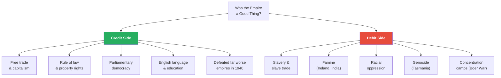
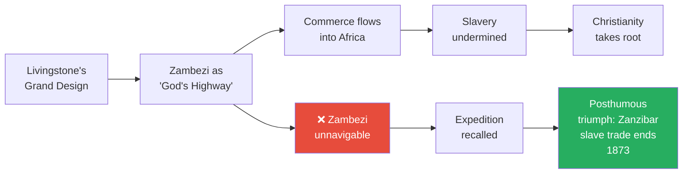
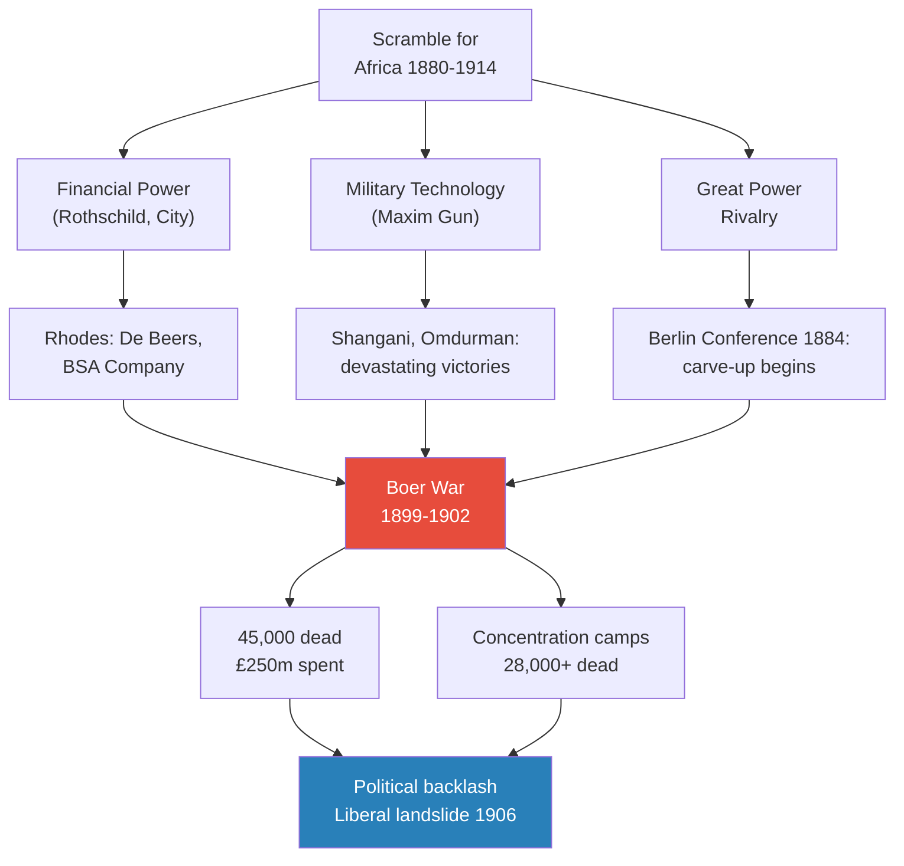
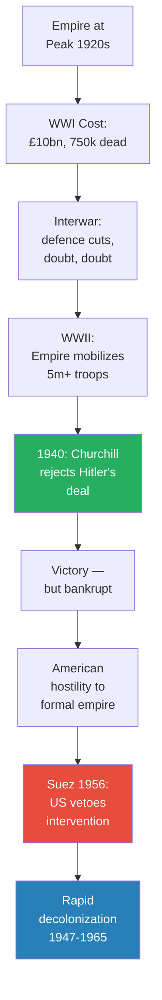
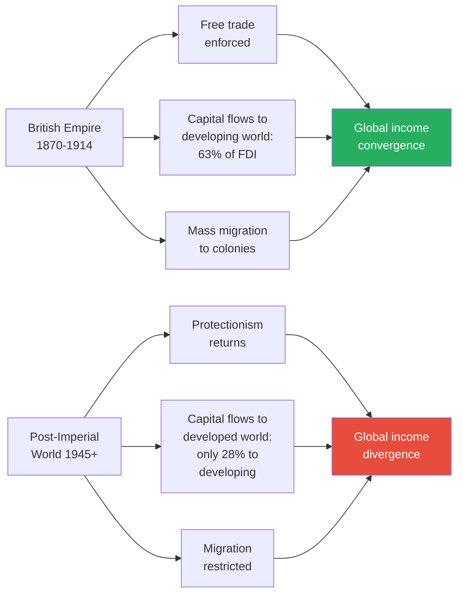
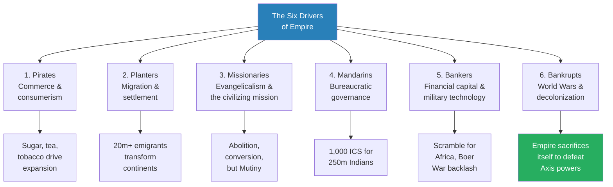

# Empire — Niall Ferguson

> Niall Ferguson, the Scottish-born Oxford historian, takes on one of the most contentious questions in modern history: was the British Empire a good or a bad thing? His answer is provocative and deliberately contrarian. Ferguson argues that the Empire was the principal engine of globalization, spreading free markets, the rule of law, the English language, and parliamentary democracy across a quarter of the world's surface. He does not excuse its crimes -- slavery, famine, massacre, racial oppression -- but insists that the alternatives were worse, and that when the supreme test came in 1940, the Empire made the right choice: to fight and destroy itself rather than coexist with Hitler's evil empire. Told through six thematic chapters -- pirates, planters, missionaries, mandarins, bankers, and bankrupts -- this is the story of how an archipelago of rainy islands came to rule the world, and why that matters for the American superpower that inherited the role.

---

## About the Author

Niall Ferguson is a Scottish historian and public intellectual who has held professorships at Oxford, Harvard, and Stanford. Born in Glasgow in 1964, he grew up immersed in the Empire's legacy -- his childhood in Kenya, his Canadian relatives, his grandfather's wartime service in India. Ferguson made his name with *The Pity of War* (1998) on the First World War, and *Empire* (2003) cemented his reputation as a provocateur willing to challenge the prevailing consensus that colonialism was an unmitigated disaster. He is a prolific writer, broadcaster, and advisor whose work consistently argues that the spread of Western institutions -- particularly British ones -- has been, on balance, beneficial to the world. His critics accuse him of imperial nostalgia; he would say he is merely asking the essential counterfactual question: compared to what?

---

## The Big Idea

- <b style="color: #27ae60">The British Empire was the most powerful vehicle for globalization in human history</b> -- spreading not just goods and capital but institutions, laws, and ideas across a quarter of the earth's surface
- Ferguson's central method is the **counterfactual**: don't ask whether the Empire was perfect, ask what the world would have looked like without it
  - Without British naval power, would free trade have existed?
  - Without British migration, would North America and Australasia have developed as they did?
  - Without the Empire's sacrifice in two World Wars, would parliamentary democracy have survived?
- The Empire disseminated nine things wherever it governed: the English language, English land tenure, Scottish and English banking, the common law, Protestantism, team sports, the limited state, representative assemblies, and -- above all -- <b style="color: #2980b9">the idea of liberty</b>
- That last point is the Empire's great paradox: an empire built on liberty contained the seeds of its own dissolution
  - Whenever the British behaved despotically, there was almost always a liberal critique from within British society
  - Once a colony had absorbed British institutions, it became very hard to deny it the political freedom the British valued for themselves
- <b style="color: #e74c3c">The Empire's crimes were real and serious</b>: the slave trade (3 million Africans shipped on British vessels), the Irish famine, the Indian famines, the extermination of the Tasmanian Aborigines, the Amritsar massacre, the Boer War concentration camps
- But Ferguson insists these must be weighed against the alternatives -- the Belgian Congo, the German genocide of the Hereros, the Japanese Rape of Nanking, the Soviet Gulag
- The book's emotional climax is 1940: Churchill's rejection of Hitler's offer to preserve the Empire in exchange for ceding Europe to Nazism was the Empire's "finest hour" -- and its death warrant

---

## Key Concepts at a Glance

| Concept | One-line summary |
|---------|-----------------|
| **Anglobalization** | The British Empire as the world's first globalizer of markets, law, and institutions |
| **The counterfactual** | Always ask "compared to what?" -- the alternatives to British rule were usually worse |
| **The self-liquidating empire** | The Empire's own rhetoric of liberty created the conditions for its dissolution |
| **Commerce, Civilization, Christianity** | Livingstone's trinity -- the Victorian missionary's three-pronged strategy for Africa |
| **Tory-entalism** | Curzon's project to rule India through decorative maharajas rather than educated Indians |
| **The Maxim gun thesis** | Military technology + financial capital = the Scramble for Africa |
| **The Pyrrhic victory** | Defeating the Axis powers cost Britain the Empire itself |
| **Greater Britain** | Seeley and Chamberlain's vision of an imperial federation of the white colonies |
| **The Durham Report** | The 1839 document that saved the Empire by granting responsible government |
| **Centre vs. periphery** | Liberalism in London vs. racism on the ground -- the Empire's defining tension |

---

## Introduction: The Balance Sheet

*Ferguson opens with his own family's story -- a personal declaration of interest in a debate that has become bitterly political.*

- The British Empire was the biggest ever: roughly a quarter of the world's land surface and population at its peak
- Ferguson frames the book as relevant to the post-9/11 debate about American global power:
  - America is the heir to the Empire -- offspring in the colonial era, successor today
  - The question of whether America should embrace or reject the imperial role cannot be answered without understanding how Britain's empire rose and fell
- He surveys the cases against the Empire, which can be grouped under two headings:
  - The **nationalist/Marxist** case (from the Mughal historian Gholam Hossein Khan to Edward Said): imperialism was economically exploitative; every facet of colonial rule was designed to maximize surplus value from subject peoples
  - The **liberal** case (from Adam Smith onwards): because imperialism distorted market forces, it was not in the long-term interests of the metropolitan economy either
    - One historian in the *Oxford History of the British Empire* speculated that if Britain had shed the Empire in the 1840s, she could have reaped a "decolonization dividend" in the form of a 25% tax cut
    - Richard Cobden insisted that commerce alone was "the grand panacea" -- no fleets or armies were needed
    - "So far as our commerce is concerned, it can neither be sustained nor greatly injured abroad by force or violence"
    - Cobden even said in 1856 that it would "be a happy day when England has not an acre of territory in Continental Asia"
- The common assumption: the benefits of international exchange could have been reaped without empire
- Ferguson's response: <b style="color: #27ae60">"Can you have globalization without gunboats?"</b>
  - In a few rare cases (notably Japan), there was voluntary imitation of Western institutions
  - But "more often than not, European institutions were imposed by main force, often literally at gunpoint"
  - The United States today is debating this same question: "Should the United States seek to shed or to shoulder the imperial load it has inherited?"

> [!tip] Core Insight
> Ferguson's central question is deceptively simple: "Can you have globalization without gunboats?" His answer is no. Free trade, the rule of law, and stable institutions did not arise spontaneously -- they were imposed, often at gunpoint, by the British Empire. The question is whether this was, on balance, worth the cost.

### Ferguson's Personal Imperial History

- Ferguson declares an interest at the outset -- his own family was shaped by the Empire:
  - His paternal grandfather John spent his twenties selling hardware and whisky in Ecuador -- part of Britain's "informal" economic imperium in Latin America
  - His other grandfather Tom Hamilton spent three years as an RAF officer fighting the Japanese in India and Burma -- "his letters home are a wonderfully observant account of the Raj in wartime"
  - His Uncle Ian Ferguson's first job was with a Calcutta managing agency; "he seemed the very essence of the expatriate adventurer: sun-darkened, hard-drinking and fiercely cynical"
  - His father took the family to Kenya in 1966, where Ferguson's earliest memories are of "the sight of the hunting cheetah, the sound of Kikuyu women singing, the smell of the first rains and the taste of ripe mango"
  - His great-aunt Agnes Ferguson emigrated to Saskatchewan in 1911, lured by the offer of 160 acres of free land; her luggage was supposedly on the Titanic
  - "To say that I grew up in the Empire's shadow would be to conjure up too tenebrous an image. To the Scots, the Empire stood for bright sunlight"
- When he opposed the motion "This House Regrets Colonization" at the Oxford Union in 1982, it "prematurely ended my career as a student politician"
  - That was when "the penny dropped: clearly not everyone shared my confidently rosy view"

---

### The Counterfactual Method

- Ferguson's most distinctive move is to imagine a world without the British Empire:
  - "To imagine the world without the Empire would be to expunge from the map the elegant boulevards of Williamsburg; to sweep into the sea the squat battlements of Port Royal; to return to the bush the glorious skyline of Sydney"
  - Without Britain, there would be no Calcutta, no Bombay, no Madras -- "Indians may rename them, but these vast metropoles remain cities founded and built by the British"
  - Would the railways have been invented and exported by another European power? Would the same trade have occurred?
  - Perhaps -- but what about the flows of culture and institutions? "Here the fingerprints of empire seem more readily discernible and less easy to wipe away"
- He tests the counterfactual by visiting the traces of rival empires:
  - "In dilapidated Chinsura, a vision of how all Asia might look if the Dutch Empire had not declined"
  - "In whitewashed Pondicherry, which all India might resemble if the French had won the Seven Years War"
  - "In Kanchanaburi, where the Japanese Empire built its bridge on the River Kwai with British slave labour"
  - "Would New Amsterdam be the New York we know today if the Dutch had not surrendered it to the British in 1664?"

---

- Ferguson lists the Empire's positive legacy:
  - The triumph of capitalism as the optimal economic system
  - The Anglicization of North America and Australasia
  - The internationalization of English
  - The enduring influence of Protestant Christianity
  - The survival of parliamentary institutions, which far worse empires were poised to extinguish in the 1940s

*Ferguson's balance sheet: the Empire's crimes were real, but he argues the positive legacy -- particularly the institutional one -- outweighs them when compared to the alternatives.*

---

---

## The Structure of the Book

Ferguson structures the book as **six thematic chapters**, each covering a distinct mechanism of empire-building and named for the human type that embodied it. Rather than proceeding strictly chronologically, each chapter explores how a particular driver -- commerce, migration, religion, governance, finance, warfare -- shaped the Empire's development over centuries. This thematic approach allows Ferguson to draw connections across time periods and geographies, though it means some events appear in multiple chapters. The six chapters also correspond to six forms of globalization: commodity markets, labour markets, culture, government, capital markets, and warfare.

| Chapter | Human Type | Driver | Key Period |
|---------|-----------|--------|------------|
| 1 | Pirates | Commerce & consumerism | 1600s-1800s |
| 2 | Planters | Migration & settlement | 1600s-1860s |
| 3 | Missionaries | Evangelicalism & the civilizing mission | 1780s-1870s |
| 4 | Mandarins | Bureaucratic governance & technology | 1850s-1910s |
| 5 | Bankers | Financial capital & military technology | 1880s-1914 |
| 6 | Bankrupts | World wars & decolonization | 1914-2003 |

---

## Chapter 1: Why Britain? -- Pirates, Sugar, and the Birth of Empire

*The Empire began not with a grand design but with a maelstrom of seaborne violence and theft -- pirates stealing from the Spanish Empire they could not match.*

### From Piracy to Planting

- In December 1663, a Welshman called <b style="color: #2980b9">Henry Morgan</b> sailed across the Caribbean to raid the Spanish outpost of Gran Grenada
  - The aim was simple: steal gold and movable property
  - The English government not only winked at this; it licensed the pirates as "privateers," taking a share of the proceeds
- England was a latecomer to empire:
  - Spain's American empire had existed for 150 years
  - Portugal controlled Brazil and trading posts from Africa to China
  - The Pope had divided the world between Spain and Portugal in 1493
- The English tried desperately to find their own El Dorado:
  - Frobisher's three voyages (1576-78) yielded one Eskimo
  - Raleigh's search for Guiana's gold ended in failure, execution, and the immortal line: "It was my full intent to go for Gold"
  - Virginia produced neither gold nor silver
- <b style="color: #e74c3c">Unable to find gold, the English simply robbed the Spanish</b> -- Drake, Hawkins, Raleigh, all turned to piracy
- The English sense of empire envy only grew after the Reformation:
  - The Elizabethan scholar Richard Hakluyt argued that England had a religious duty to build a Protestant empire to match the "Popish" empires of Spain and Portugal
  - Hakluyt's cousin first showed him a map of the world: "He pointed with his wand to all the knowen Seas, Gulfs, Bays, Straights ... and their special commodities"
  - Then from the map "he brought me to the Bible" -- the link between geography and God's plan was explicit
- There was a political distinction too:
  - The Spanish empire was autocratic, governed from the centre; with American silver, the King of Spain could aspire to world domination
  - In England, the power of the monarch was always limited by Parliament; the crown was financially dependent on Parliament
  - <b style="color: #27ae60">This weakness concealed a future strength: precisely because political power was spread more widely, so was wealth</b>
  - People with money could be confident it would not be appropriated by an absolute ruler -- a crucial incentive for entrepreneurs
- From such piratical origins arose the system of "privateering" -- privatized naval warfare:
  - Between 1585 and 1604, 100-200 ships a year harassed Spanish vessels; prize money amounted to at least 200,000 pounds a year
  - Andrew Fletcher of Saltoun wrote: "The sea is the only empire which can naturally belong to us"

> [!example] Henry Morgan: From Pirate to Governor (1663-1688)
> - Morgan began as a buccaneer, raiding Spanish towns across the Caribbean
> - His raid on Portobelo (1668) yielded a quarter of a million pieces of eight -- so much that the coins became legal tender in Jamaica
> - But instead of retiring home, Morgan invested in Jamaican real estate -- 836 acres ideal for growing sugar cane
> - Within a few years, the pirate was Vice-Admiral, Judge, Justice of the Peace, and Acting Governor of Jamaica
> - When he died in 1688, ships in Port Royal harbour fired twenty-two gun salutes
> **The lesson:** Morgan's career perfectly illustrates the transition from piracy to political power that created the British Empire.

### The Sugar Rush and Consumer Revolution

- <b style="color: #2980b9">The rise of the British Empire had less to do with the Protestant work ethic than with the British sweet tooth</b>
- Daniel Defoe, author of *Robinson Crusoe*, observed the birth of the world's first mass consumer society:
  - "England consumes within itself more goods of foreign growth ... than any other nation in the world"
  - Sugar, tobacco, tea, coffee, cotton, indigo, rice, rum -- all imported from the colonies
- Annual sugar imports doubled in Defoe's lifetime; sugar was Britain's largest single import from the 1750s to the 1820s
- By the late 18th century, per capita sugar consumption in Britain was ten times that of France (20 lbs per head vs. two)
- Tea, coffee, tobacco -- all had to be imported, and all were addictive:
  - The first English request for tea: 1615, from an East India Company agent in Japan
  - The first advertisement: 1658, claiming tea cured "Headache, Stone, Gravel, Dropsy, Liptitude Distillations, Scurvy, Sleepiness, Loss of Memory"
  - Samuel Pepys drank his first "cup of tee (a China drink)" on 25 September 1660
  - By 1756, even chambermaids were drinking it -- prompting denunciation for losing "their bloom"
  - The English preference for tea over coffee was a product of fiscal policy: heavy import duties restricted coffee consumption
- Tobacco followed the same trajectory:
  - James I found the weed "loathesome to the eye, hateful to the nose, harmful to the brain and dangerous to the lungs"
  - But cultivation in Virginia crashed prices from 4-36 pence per pound in the 1620s to about 1 penny by the 1660s
  - James put aside his scruples and established a royal monopoly -- revenue trumped health concerns
  - By the 1690s, tobacco was consumed by every ploughman, not just gentlemen
- Indian textiles transformed English fashion -- calicoes, chintz, silk:
  - In 1663, Pepys took his wife shopping in Cornhill for "a paynted Indian Callico"
  - When Pepys sat for his portrait, he hired a fashionable Indian silk morning gown
  - In 1664, over 250,000 pieces of calico were imported
  - As Defoe recalled, Indian fabrics "crept into our houses, our closets, our bedchambers; curtains, cushion, chairs, and at last beds themselves were nothing but Callicoes"
- The economics were simple: the English had nothing India wanted, so they paid in bullion earned from trade elsewhere
- <b style="color: #27ae60">Taken together, the new drugs gave English society an almighty hit</b> -- alcohol is a depressant, but glucose, caffeine, and nicotine were the 18th-century equivalent of uppers
  - The Empire, it might be said, was built on a huge sugar, caffeine, and nicotine rush

---

### Naval Technology and English Innovation

- The English overcame real disadvantages to become the world's dominant maritime power:
  - Atlantic wind patterns favoured the Spanish and Portuguese
  - English seamen were initially poor navigators compared to the Portuguese
  - Naval technology lagged behind the Venetians and Iberians
- But by Elizabeth I's reign, the English were catching up:
  - The galleon -- capable of mounting four forward-firing guns -- became the key British vessel
  - English iron cannons were one-fifth the price of imported bronze ones, giving "significantly more bangs per buck"
  - Navigation improved through the adoption of Euclidian geometry and translation of Dutch charts
  - English sailors were also pioneers in improving crew health -- George Wateson's *Cures of the Diseased in Remote Regions* (1598) was the first textbook on the subject
- The British Isles seemed to produce an endless supply of men tough enough to withstand life at sea
  - Christopher Newport of Limehouse: common seaman to wealthy shipowner, lost an arm fighting Spaniards, ransacked Tabasco in Mexico

---

### Going Dutch, Then Beating the French

- The real threat came not from pirates but from European rivals trying the same thing
- The Dutch East India Company (VOC) was the world's first multinational corporation -- far richer and more powerful than the English equivalent
- <b style="color: #2980b9">The Battle of Plassey (1757)</b> was the turning point: Robert Clive's victory in Bengal, won largely through bribery, gave Britain control of India's richest province
- The "nabobs" -- men like Clive, Pitt, Hastings -- brought Indian fortunes home and converted them into stately homes and Parliamentary seats
- The East India Company became less a trading company than a military state, fighting perpetual wars to pay for previous wars
- The "nabobs" were a new social phenomenon: men like Thomas "Diamond" Pitt, who bought the world's largest diamond in India and used the proceeds to purchase the Parliamentary seat of Old Sarum
  - His grandson William Pitt the Younger had the magnificent hypocrisy to complain that "the riches of Asia have been poured in upon us, and brought with them ... Asiatic principles of government"
  - The nabobs sent their gains back to England in the form of diamonds -- altogether around 18 million pounds was drained from India
- The Indian historian Gholam Hossein Khan saw the pattern clearly: the English "join to that custom that other one of theirs ... of scraping together as much money in this country as they can, and carrying it in immense sums to the kingdom of England"

### The Taxman and the Cost of Empire

- <b style="color: #2980b9">Robert Burns</b> -- Scotland's national poet -- became an Excise officer in 1788, "for the glorious cause of LUCRE"
  - His 35 pounds a year connected him to the great chain of imperial finance
  - Britain's wars against France had been funded by borrowing -- the National Debt stood at 244 million pounds when Burns started work
  - Excise duties on spirits, tobacco, beer, candles, soap, and even windows fell on ordinary consumers
  - The costs of empire were met by the impoverished majority; the interest went to roughly 200,000 wealthy bondholders
- Burns himself was one of those tempted by revolution -- he wrote "A Man's a Man for a' that"
  - But after singing a revolutionary anthem in a Dumfries theatre, he had to write an obsequious letter pledging to "seal up his lips"
- In India, the impact of British taxes was even greater:
  - The spiralling cost of the Indian Army was the one item of imperial expenditure British taxpayers never had to pay
  - In Bengal, excessive taxation coincided with a huge famine that killed as many as five million people -- a third of the population
  - As Gholam Hossein Khan put it: "Numerous artificers have no other resource left than that of begging or thieving"

> [!example] Warren Hastings's Trial (1788-1795)
> - Edmund Burke impeached Hastings "in the name of the English nation, whose ancient honour he has sullied"
> - Sheridan called him a man with "nothing great but his crimes"
> - The trial lasted seven exhausting years before acquittal
> - But it transformed British India: the freebooting nabob era was over, replaced by the incorruptible Indian Civil Service
> **The lesson:** The trial put the whole basis of Company rule on trial and forced a transition from plunder to governance.

---

## Chapter 2: White Plague -- Migration, Slavery, and the American Revolution

*Between the early 1600s and the 1950s, more than 20 million people left the British Isles. This mass migration -- the biggest in human history -- turned whole continents white. For most of the emigrants, the New World spelled liberty -- but not all crossed the oceans of their own free will.*

- The British liked to think that liberty made their empire different from the Spanish, Portuguese, and Dutch
  - Edmund Burke: "Without freedom, it would not be the British Empire"
  - But could an empire -- implying British rule over foreign lands -- be based on liberty? Was that not a contradiction in terms?
  - This question sparked the first great war of independence against the Empire
- Since the 1950s, migration has reversed: more than a million people from former colonies have come to Britain
  - "So controversial has this 'reverse colonization' been that successive governments have severely restricted it"
  - "But in the seventeenth and eighteenth centuries it was the British themselves who were the unwanted immigrants"

### The Slave Trade

- Between the early 1600s and the 1950s, <b style="color: #e74c3c">more than 20 million people left the British Isles to begin new lives across the seas</b> -- the biggest mass migration in human history
- But not all migration was voluntary: <b style="color: #e74c3c">more than three million Africans were shipped across the Atlantic on British vessels before 1850</b>
- John Newton -- later author of "Amazing Grace" -- kept meticulous journals of his slaving voyages:
  - He recorded beatings, shacklings, and deaths with clinical detachment
  - According to the Jamaican planter Edward Long, Africans were "devoid of genius, and seem almost incapable of making any progress in civility or science"
  - James Boswell flatly denied that "negroes are oppress'd" since "Africk's sons were always slaves"
- In Jamaica, whites were outnumbered ten to one by enslaved people; in British Guiana, twenty to one
  - The death rate was so appalling that a planter with 100 slaves needed to buy 8-10 a year "to keep up his stock"
  - By 1750, some 800,000 Africans had been shipped to the British Caribbean, but the slave population was still less than 300,000
  - The instruments of torture -- spiked shackles, neck irons with hanging weights -- are stark reminders that Jamaica was the front line of colonialism
  - The Spanish word for a sugar plantation was *ingenio* -- engine; producing sugar was as much industry as agriculture, but with human beings as the raw materials

> [!example] The Maroons of Jamaica (1655-1739)
> - When the English captured Jamaica from Spain in 1655, escaped slaves were already living in mountain hideouts
> - They were known as "Maroons," from the Spanish *cimarron* -- wild or untamed
> - Led by Captain Cudjoe and the matriarchal, magical figure of Queen Nanny, they waged guerrilla warfare against the plantation economy
> - Planters dreaded the sound of the *abeng* (conch shell) that signalled the coming of Maroon raiders
> - George Manning purchased 26 slaves in 1728; by year's end, Maroon raids had reduced the number to four
> - The British called in Miskito Indians from Honduras and troops from Gibraltar -- but the Maroons melted into the hills; the troops from Gibraltar succumbed to disease and drink
> - In 1739, a treaty granted the Maroons autonomy over 1,500 acres; in return, they agreed to return runaway slaves -- for a reward
> - The Maroons themselves eventually became slave owners
> **The lesson:** If the British couldn't beat you, they got you to join them -- an early example of how the Empire so often worked.

### The American Revolution as Civil War

- <b style="color: #27ae60">The great paradox of the American Revolution: the ones who revolted were the best-off of all Britain's colonial subjects</b>
- By the 1770s, New Englanders were about the wealthiest people in the world
  - Per capita income at least equal to Britain's, and more evenly distributed
  - They paid far less tax: 1 shilling per year in Massachusetts vs. 26 shillings in Britain
- The Boston Tea Party was organized not by irate consumers but by wealthy smugglers -- the tax on tea had actually been *cut*
- The real issue was constitutional: the right of Parliament to tax without colonial representation
- This was a civil war:
  - One in five white colonists remained loyal to the Crown
  - Benjamin Franklin's son William stayed loyal; they never spoke again
  - Loyalist forces often fought more tenaciously than British regulars
- Britain lost partly because of French intervention, partly because many at home sympathized with the colonists
  - Edmund Burke: "The use of force alone may subdue for a moment, but it does not remove the necessity of subduing again"
  - The British commander William Howe seemed ambivalent about fighting his own people
  - Sir Guy Carlton, Governor of Quebec, justified lenient treatment of prisoners: "Since we have tried in vain to make them acknowledge us as brothers, let us at least send them away disposed to regard us as first cousins"
- In economic terms, the continental colonies remained far less important than the Caribbean:
  - They were heavily dependent on trade with Britain -- a reasonable assumption that regardless of political arrangements, this would continue
  - With hindsight, losing the United States meant losing a huge slice of the world's economic future -- but at the time, the short-term costs of reimposing authority looked larger than the benefits
  - Samuel Johnson was unusual in his hostility: "I am willing to love all mankind, except an American"
- The Hollywood version is a straightforward fight between heroic Patriots and wicked Redcoats; the reality was far messier:
  - At Christ Church, Philadelphia, only a third of the congregation supported independence
  - Jacob Duche, the Rector, crossed out "George thy Servant our king" in the prayer book and wrote "the rulers of these United States" -- then got cold feet and became a Loyalist
  - Around 100,000 Loyalists left the new United States for Canada, England, or the West Indies

> [!example] Yorktown: The World Turned Upside Down (1781)
> - Washington moved south against Cornwallis on the advice of the French commander Rochambeau
> - The French admiral de Grasse defeated the British fleet and blockaded Chesapeake Bay
> - Cornwallis was trapped between the James and York rivers, outnumbered two to one
> - Alexander Hamilton led the assault on Redoubt 10 with fixed bayonets -- proof the colonists had come a long way since Lexington
> - On 17 October, Cornwallis sent a drummer boy to sound the parley
> - 7,157 British soldiers and sailors surrendered; their band supposedly played "The World Turned Upside Down"
> **The lesson:** At root, the British defeat was a failure of will in London -- Loyalists like David Fanning felt they had been left in the lurch.

- <b style="color: #27ae60">The irony of American independence</b>: having won freedom in the name of liberty, the colonists perpetuated slavery in the southern states
  - Samuel Johnson asked acidly: "How is it that the loudest YELPS for liberty come from the drivers of Negroes?"
  - Within a few decades of losing the American colonies, the British abolished first the slave trade and then slavery itself
  - For African-Americans, American independence postponed emancipation by at least a generation
- Independence was also bad news for Native Americans:
  - The British had signed treaties establishing the Appalachians as the limit of settlement
  - The distant imperial authority in London was more inclined to recognize native rights than the land-hungry colonists on the spot
- The loss of America did not destroy the Empire -- it spurred a new phase of expansion
  - 100,000 Loyalists migrated to Canada, securing it for the Empire
  - On the other side of the world, a whole new continent beckoned

> [!tip] Core Insight
> The American Revolution taught the Empire a lesson it would not forget: if you deny British liberties to people who consider themselves British, they will fight. The Durham Report of 1839, granting responsible government to Canada, was the Empire's belated admission that the American colonists had been right.

### Australia: From Prison to Colony

- Australia was the 18th-century equivalent of Mars -- so barren and remote that its first use was as a dumping ground for criminals
- Between 1787 and 1853, around 148,000 convicts were transported
- <b style="color: #2980b9">Governor Lachlan Macquarie (1809-1821)</b> transformed the penal colony into a colony of redemption:
  - Improved conditions on convict ships (death rate fell from 1 in 31 to 1 in 122)
  - Built Sydney's infrastructure including the Hyde Park Barracks
  - Offered thirty-acre land grants to those who completed their sentences
- Samuel Terry, transported for stealing 400 pairs of stockings, became "the Rothschild of Botany Bay" with 19,000 acres
  - Mary Reibey, transported at thirteen for horse theft, eventually appeared on the Australian twenty-dollar note
  - With only one in fourteen electing to return to Britain, there were already more free people than convicts by 1828
- The penal side of the colony had its horrors:
  - At Port Arthur in Tasmania, the commandant was "effectively given a free hand to take the vengeance of the Law to the utmost limits of human endurance"
  - At Norfolk Island, John Giles Price strapped men to old iron bedsteads after whipping, to ensure their wounds became infected
  - Price merited the death he suffered at the hands of convicts at Williamstown quarry in 1857

---

- <b style="color: #e74c3c">The Tasmanian Aborigines were hunted down and exterminated</b> -- Trucanini, the last of them, died in 1876
  - "An event which truly merits the now overused term 'genocide'"
  - The novelist Anthony Trollope visited Australia two years after Trucanini's death and asked a magistrate what he should do "if stress of circumstances compelled me to shoot a black man in the bush"
  - The magistrate's advice: "No one but a fool would say anything about it"
  - Yet the distant imperial authority in London endeavoured to restrain the colonists: Aboriginal Protectors were appointed in 1838-39
  - After the Myall Creek massacre (1838) -- when twelve cattle-ranchers shot and stabbed 28 unarmed Aborigines -- seven of the perpetrators were hanged
  - <b style="color: #27ae60">The presence of a restraining authority, no matter how distant, distinguished British colonies from independent settler republics</b>
  - There was no such restraining influence when the United States waged war against the American Indians

### The Durham Report: Saving the Empire

- In 1837, French-speaking Quebecois in Lower Canada and pro-American reformers in Upper Canada revolted
  - There was genuine alarm that the United States might annex its northern neighbour
- The Earl of Durham -- "Radical Jack" -- was sent to head off the revolt
  - A "flamboyant despot" who pranced through Quebec on a white charger, dining off gold platters and quaffing vintage champagne
  - But he was no lightweight: he had helped author the 1832 Reform Act
  - His adviser Edward Gibbon Wakefield had written about land reform in Australia while in Newgate prison for abducting an underage heiress
- The <b style="color: #2980b9">Durham Report</b> acknowledged that the American colonists had been right:
  - Colonies should have "a system of responsible government" -- real control over their own destinies
  - By the 1860s, Canada, Australia, and New Zealand all had responsible government
  - Governors became decorative figures; real power lay with elected representatives
- The Report's subtext was one of regret: if only the American colonists had been given responsible government in the 1770s, there might never have been a United States
  - "Millions of British emigrants might have chosen California instead of Canada"
- "Responsible government" was a way of reconciling the practice of empire with the principle of liberty:
  - From now on, whatever the colonists wanted, they pretty much got
  - When the Australians demanded an end to transportation, London gave in; the last convict ship sailed in 1867
  - There would be no Battle of Lexington in Auckland; no George Washington in Canberra; no declaration of independence in Ottawa
  - The American experiment of going it alone had been undeniably successful -- but the other white colonies did not follow suit
  - <b style="color: #27ae60">Perhaps the most surprising thing is that this did not happen</b>

---

## Chapter 3: The Mission -- Evangelicals, Livingstone, and the Indian Mutiny

*The Victorians dreamt not just of ruling the world, but of redeeming it. The aim was no longer to exploit other races but to improve them.*

### From Slavers to Abolitionists

- Something extraordinary happened in the late 18th century: <b style="color: #27ae60">the British flipped from the world's leading enslaver to the world's leading emancipator</b>
  - The moral transformation began in Holy Trinity Church on Clapham Common -- where Zachary Macaulay and his fellow parishioners combined evangelical fervour with hard-nosed political nous
- <b style="color: #2980b9">Zachary Macaulay</b> was one of the first governors of Sierra Leone:
  - Son of the minister at Inverary, father of the greatest Victorian historian
  - Had worked as a sugar plantation manager in Jamaica but was "sickened" by the daily whippings
  - Spent five years in Sierra Leone; crossed the Atlantic on a slave ship to witness the suffering firsthand
  - By the time he returned to England, he was not just an expert on the slave trade -- he was the expert
- Sierra Leone became "The Province of Freedom":
  - Its capital was renamed Freetown
  - Freed slaves walked through a Freedom Arch bearing the inscription "Freed from slavery by British valour and philanthropy"
  - Each was given a quarter acre of land, a cooking pot, a spade -- and their freedom
  - The settlements were like miniature nations: Congolese in Congo Town, Fulani in Wilberforce, Ashanti in Kissy
- The <b style="color: #2980b9">Clapham Sect</b> excelled at mobilizing grassroots activists:
  - Zachary Macaulay, William Wilberforce, Henry Thornton, plus support from diverse quarters: the ex-slaver John Newton, Edmund Burke, Samuel Taylor Coleridge, and Josiah Wedgwood
  - Wedgwood produced thousands of badges depicting a black figure: "Am I not a man and a brother?"
  - 11,000 men in Manchester alone -- two-thirds of the male population -- signed a petition calling for an end to the trade
- In 1807, the slave trade was abolished; convicted slavers faced transportation to Australia
  - By 1814, no fewer than 750,000 names were put to petitions calling for the abolition of slavery itself
  - In 1833, slavery was made illegal throughout British territory; owners were compensated with a government loan
- The Royal Navy was then deployed to *enforce* the ban:
  - A West Africa Squadron patrolled from Freetown; 425 slave ships intercepted by 1840
  - The Spanish and Portuguese were bullied into accepting prohibitions; international courts of arbitration were established
  - Only American-flagged ships defied the British regime
  - The same navy that fought the slave trade was simultaneously forcing Chinese ports open to the Indian opium trade -- one of the "richer ironies of the Victorian value-system"
- Between 1808 and 1830, the total slave population of the British West Indies declined from 800,000 to 650,000
- The campaign for abolition was "one of the first great extra-Parliamentary agitations" and the birth of modern pressure-group politics:
  - Its leadership was remarkably broad: the founders Granville Sharp and Thomas Clarkson were Anglicans, but most close associates were Quakers
  - Support extended to the Younger Pitt, the ex-slaver John Newton, Edmund Burke, Coleridge, and Josiah Wedgwood -- men from all different denominations made common cause
  - The West Indian planters had once been powerful enough to intimidate Edmund Burke; the Liverpool slave traders were formidable
  - But they were swept aside by the Evangelical tide
  - The Liverpool merchants found a substitute in West African palm oil for making soap: "literally and metaphorically, the ill-gotten gains of the slave trade were to be washed away"
- After abolition, the missionary movement aimed to spread not just Christianity but "civilization":
  - The model was the London Missionary Society's Kuruman establishment in Bechuanaland -- nearly 600 miles north-east of Cape Town
  - It looked "like a smart little Scottish village in the heart of Africa, complete with thatched kirk, whitewashed cottages and a red post-box"
  - The Missionary Magazine reported: "The people are now dressed in British manufactures and make a very respectable appearance in the house of God"
  - "In other words, it was not just Christianization that was being attempted here. It was Anglicization"
- The missionary societies were the Victorian aid agencies:
  - Their origins: the Society for the Promotion of the Christian Gospel (1698), the London Missionary Society (1795), the Church Missionary Society (1799)
  - Young men set off to the ends of the earth to spread the Word -- "idealistic, altruistic adventurers, willing to die"
  - William Threlfall, 23, sailed for South Africa in 1824: as he lay on what he feared was his deathbed, he "expressed a wish that he was black, that he might go among the natives without being liable to suspicion of sinister or worldly views"
  - He was hacked to death by bushmen less than a year later
  - Threlfall and thousands like him were "the martyrs of a new evangelical imperialism"
- "It is not easy to explain so profound a change in the ethics of a people" -- it was abolished despite being still profitable

> [!tip] Core Insight
> The abolition of slavery was the Empire's most morally unambiguous achievement -- and Ferguson insists it was not driven by economics. "All the evidence points the other way: in fact, it was abolished despite the fact that it was still profitable." What we need to understand is a collective change of heart -- driven by the Evangelical revival, but spread through an unprecedented campaign of popular mobilization.

### Livingstone: Victorian Superman

- <b style="color: #2980b9">David Livingstone</b> -- born in a Lanarkshire textile mill, self-taught doctor and minister -- became the embodiment of the new missionary imperialism
- His formula: <b style="color: #2980b9">"Commerce, Civilization, Christianity"</b> -- all three inseparable, all flowing together into Africa
- Livingstone's answers to an LMS questionnaire reveal the missionary mindset:
  - The missionary's duties were "to make known the gospel by preaching, exhortation, conversation, instruction of the young, improving the temporal condition of those among whom he labours by introducing the arts and sciences of civilization"
  - He would face "great trials of his faith and patience, from the indifference, distrust and even direct opposition and scorn of those for whose good he is disinterestedly labouring"
  - Livingstone knew the risks: "After the dark, Satanic mills of Lanarkshire, the world held no terrors for him"
- He was both a preacher and a doctor, with an iron constitution that would survive being mauled by a lion and countless attacks of malaria (for which he devised his own "distinctively disagreeable remedy")
- But his missionary career at Kuruman was a failure:
  - Seven years at Kuruman produced one convert, Chief Sechele, who promptly lapsed into polygamy
  - The Makololo tribe's favourite pastime was imitating Livingstone reading psalms, accompanied by "howls of derisive laughter"
  - As the mission's founder Robert Moffat admitted: "No conversions, no enquiring after God ... Indifference and stupidity form the wreath on every brow"
  - Livingstone gradually realized the Africans were interested in him not for his preaching but for his "gun medicine"
  - He concluded that "doing things by the missionary handbook could never break down what he regarded as superstition"
  - He needed to find some better way to open up Africa -- to make it "more receptive to British civilization"
- He reinvented himself as an explorer -- and in 1849 set off across the Kalahari desert to find Lake Ngami
  - His report won the Royal Geographical Society's gold medal
  - He took his wife and three children into the unknown: "Who that believes in Jesus would refuse to make a venture for such a captain?"
  - A second expedition nearly killed them all; he finally sent his family home -- they did not see him for four and a half years
- The expeditions that followed were "almost superhuman":
  - In 1853 he travelled 300 miles along the upper Zambezi, then marched from Botswana to the coast of Portuguese Angola
  - He then retraced his path before embarking on a march to Mozambique -- the first European to traverse Africa from the Atlantic to the Indian Ocean
  - In November 1855 he became the first European to see what is "perhaps the greatest of all the natural wonders of the world" -- Victoria Falls, named "as proof of my loyalty"
  - He wrote of the Falls: "The whole scene was extremely beautiful ... No one can imagine the beauty of the view from anything witnessed in England"
- In May 1856 he returned to England to sell his vision:
  - His book *Missionary Travels and Researches in South Africa* was an immediate bestseller: 28,000 copies in seven months
  - Dickens gave it an ecstatic review: "The effect of it on me has been to lower my opinion of my own character in a most remarkable manner"
  - He was showered with medals, granted a private audience with the Queen
- His grand plan: the Zambezi as "God's highway" to bring commerce into Africa's interior
  - Cotton would be grown on the Batoka Plateau, reducing dependence on cotton from American slave plantations
  - "Commerce, civilization, Christianity" would flow upstream together, undermining the slave trade
  - Free labour would drive out unfree labour
- <b style="color: #e74c3c">But the plan collapsed catastrophically</b>:
  - The Zambezi turned out to be unnavigable -- at Kebrabasa, it plunges over a thirty-foot waterfall through a narrow stone channel
  - The expedition disintegrated: the navigator was forced to resign, the geologist dismissed, the artist sacked
  - His wife Mary died of hepatitis (her constitution weakened by chronic alcoholism)
  - His colleague Kirk was once left behind when Livingstone's boat departed without him: "That will teach you to be twenty minutes late"
  - Kirk concluded sadly that "Dr L. was what is termed 'cracked'"
  - *The Times* led the backlash: "We were promised cotton, sugar and indigo ... we got none. We were promised trade and there is no trade. We were promised converts and not one has been made"
- Yet Livingstone refused to give up:
  - He returned to Africa in 1866, this time focused on stamping out the East African slave trade
  - On 15 July 1871 he witnessed a horrific massacre at Nyangwe -- Arab slave traders shot more than 400 people after an argument over the price of a chicken
  - His grave in Westminster Abbey bears his own words: "May heaven's rich blessing come down on every one who will help to heal this open sore of the world"
  - He died at Ilala on 1 May 1873 -- and just over a month later, the Sultan of Zanzibar signed a treaty abolishing the East African slave trade
  - The old slave market in Zanzibar was sold to the Universities Mission to Central Africa, who erected a cathedral above the old slave cells
  - The altar was built on the exact spot where slaves had once been flogged -- a fitting monument to Livingstone's posthumous success
- Livingstone's larger legacy:
  - Between 1886 and 1895, the number of Protestant missions in Africa trebled
  - By the end of the century, there were 12,000 British missionaries "in the field" representing 360 different societies
  - The town of Livingstone in Zambia now has 150 churches for a population of 90,000
  - Africa is today a more Christian continent than Europe; there are more Anglicans in Nigeria than in England
  - "How did a project that had seemed a total washout in Livingstone's lifetime yield such astonishing long-term results?"
  - Part of the answer: effective quinine-based prophylactics against malaria made being a missionary far less suicidal
  - The other part: the political conquest of Africa that followed provided the framework within which Christianity could spread
  - Commerce, Civilization, and Christianity did arrive in Africa -- but they arrived in conjunction with a fourth "C": Conquest

*Livingstone's plan failed in his lifetime -- the Zambezi was a raging torrent, not a gentle highway. But his posthumous influence was enormous: the Zanzibar slave trade was abolished within weeks of his death.*

### The Indian Mutiny: Blowback from the Civilizing Mission

- Until the early 19th century, the British in India had been largely tolerant of local culture:
  - An overwhelmingly male population of merchants and soldiers had adapted to Indian customs, learned languages, and often took Indian mistresses and wives
  - The East India Company explicitly banned chaplains from preaching to Indians
  - As Thomas Munro, Governor of Madras, put it: "If civilization is ever to become an article of trade between Britain and India, I am convinced that this country will gain by the import cargo"
- But two forces converged to change everything: Evangelicalism and Liberalism
  - The Clapham Sect campaigned to open India to missionaries; 837 petitions and half a million signatures forced the issue
  - In 1813, the new East India Act opened the door to missionaries and provided for a bishop and three archdeacons
  - John Stuart Mill argued that British colonies should enjoy "a better government, more complete security of property, moderate taxes ... the decay of usages or superstitions"
- Three traditional Indian customs aroused particular ire:
  - <b style="color: #2980b9">Sati</b> (widow immolation): between 1813 and 1825, 7,941 women died this way in Bengal alone
    - One widow named Radhabyee fled the burning pyre twice, only to be forced back by three men who flung wood on top of her; when she escaped again into the river, they held her under to drown her
    - Governor-General Bentinck banned sati in 1829 -- an act Ferguson regards as genuinely progressive
  - <b style="color: #2980b9">Thuggee</b>: William Sleeman's campaign captured 3,266 alleged ritual murderers; 1,400 were hanged or transported
    - Modern scholars suggest much of this was a figment of overheated expatriate imagination
    - One accused thug compared murder to big-game hunting: "Are you yourself not a shikari? Do you not enjoy the thrill of stalking?"
  - **Female infanticide**: endemic in parts of north-western India; gradually stamped out through legislation from 1836 onwards
- <b style="color: #e74c3c">The Indian Mutiny of 1857 was the catastrophic blowback from this cultural imperialism</b>
  - The trigger was rumours that new cartridge grease contained cow and pig fat -- defiling both Hindus and Muslims
  - But the deeper cause was a broad conviction that the British intended to Christianize India
  - As one perceptive officer wrote on the eve of the catastrophe: "I can detect the near approach of the storm ... I don't think they know themselves what they will do, except of resistance to invasion of their religion"
  - The mutineers cried: "Brothers, Hindoos and Mussalmans, haste and join us, we are going to a religious war"
  - In Delhi, a proclamation issued in the name of the last Mughal Emperor appealed to zamindars, merchants, artisans, and priests to unite against British rule
  - But a third of officer casualties and 82% of other-rank casualties among the "British" forces that retook Delhi were classified as "native" -- this was not a simple struggle between black and white

> [!example] The Siege of Cawnpore (1857)
> - Mrs Emma Ewart, wife of a British officer, wrote to a friend: "Such nights of anxiety, I would have never believed possible"
> - Six weeks later, she and more than 200 British women and children were dead
> - Some killed during the siege, others hacked to death in the Bibighar after being promised safe passage
> - The British reprisals were savage: prisoners forced to lick victims' blood, blown from cannons, hanged from banyan trees
> - At Cawnpore, one huge banyan tree was festooned with 150 corpses
> **The lesson:** The attempt to modernize and Christianize India had gone disastrously wrong -- so wrong that it ended up barbarizing the British.

- The siege of Lucknow became the Mutiny's most celebrated episode:
  - The Resident, Henry Lawrence, was buried under the epitaph: "Here Lies Henry Lawrence, Who Tried To Do His Duty"
  - Under relentless sniper fire and menaced by mines, those inside held out for nine months
  - Even the senior boys at the nearby La Martiniere School joined the defence, earning a unique military decoration
  - Yet half the 7,000 people who sought refuge were loyal Indian soldiers and camp followers -- the Mutiny was not a simple struggle between black and white

> [!example] Stanley Meets Livingstone (3 November 1871)
> - Henry Morton Stanley -- born John Rowland, illegitimate son of a Welsh housemaid -- was an ambitious American journalist
> - After a ten-month hunt, he found the ailing Livingstone at Ujiji on Lake Tanganyika
> - "I pushed back the crowds, walked down a living avenue of people ... walked deliberately up to him, took off my hat, and said: 'Dr Livingstone, I presume'"
> - It took an American to take British understatement to its historic zenith
> - Stanley was touched and inspired by the meeting -- but his methods would be very different from Livingstone's
> - Where Livingstone believed in the power of the Gospel, Stanley believed in brute force: "Six shots and four deaths were sufficient to quiet the mocking"
> - He went on to work for King Leopold II in the Congo -- the Belgian regime that would become a byword for murder and slave labour
> **The lesson:** The meeting symbolized the transition between two generations: the Evangelical generation that dreamt of transforming Africa through Christianity, and a new, hard-nosed generation with more worldly priorities.

- After the Mutiny, Queen Victoria's proclamation explicitly renounced "the right and the desire to impose Our convictions on any of Our subjects"
- India would henceforth be governed with, not against, the grain of indigenous tradition
- The Evangelicals refused to accept this -- they resolved to send an additional twenty missionaries to India within two years
- But in Africa, Livingstone's call to "do you carry out the work which I have begun" was heard:
  - Between 1886 and 1895, the number of Protestant missions in Africa trebled
  - By the end of the century, 12,000 British missionaries were "in the field" representing 360 different societies
  - Livingstone's posthumous triumph: the Zambian town bearing his name now has 150 churches for a population of 90,000
  - Africa is today a more Christian continent than Europe; there are more Anglicans in Nigeria than in England

---

## Chapter 4: Heaven's Breed -- How a Thousand Men Governed a Subcontinent

*The astounding fact: 900 British civil servants and 70,000 British soldiers managed to govern upwards of 250 million Indians.*

### The Technology of Domination

- At the apex of the Victorian Empire was Queen Victoria herself: industrious, opinionated, spectacularly long-lived
  - Her favourite residence was Osborne House on the Isle of Wight, looking across the Solent to the Portsmouth naval base
  - The Durbar Room -- inspired by Mughal palace interiors, overseen by Rudyard Kipling's father -- offered a backward-looking vision of India, giving no hint of the railways, coal mines, and cotton mills the British were creating
- Three metal networks simultaneously shrank the world and made control of it easier:
  - **Steamships**: reduced the Atlantic crossing from 4-6 weeks to 10 days by the 1880s; Cape Town from 42 to 19 days
  - <b style="color: #2980b9">The telegraph</b>: the first transatlantic cable was completed in 1866 by Brunel's Great Eastern; by 1880, there were 97,568 miles of undersea cable
    - A message could be relayed from Bombay to London at four shillings a word, arriving the next day
    - Victoria's telegraph office at Osborne meant she could read dispatches from India within hours
    - Charles Bright called the telegraph "the world's system of electrical nerves"
  - **Railways**: the first Indian line (Bombay to Thane, 21 miles) opened in 1853; within 50 years, 24,000 miles of track
    - For the first time, long-distance travel became possible for millions of Indians, "joining friends and uniting the anxious"
    - Some predicted the railway would kill traditional religion: "thirty miles an hour is fatal to the slow deities of paganism"
    - The main Lucknow station was built to resemble a Gothic fortress -- its platforms were purpose-built for disembarking reinforcements
    - As one eminent commentator put it, the revolution in global communications achieved "the annihilation of distance" -- but it also made possible long-distance annihilation
- <b style="color: #2980b9">HMS Warrior</b> (1860) -- steam-driven, iron-clad in five inches of armour plate, fitted with breech-loading shell-firing guns -- was the world's most powerful battleship
  - No foreign vessel ever dared exchange fire with her
  - Britain owned roughly a third of the world's merchant tonnage and had around 240 ships in the Royal Navy
  - If the British wished to abolish the slave trade, they sent the navy; if they wanted Brazil to follow suit, they sent a gunboat
  - The same navy forced Chinese ports open to British trade in the Opium Wars of 1841 and 1856

> [!example] The Abyssinia Expedition: A Victorian Surgical Strike (1868)
> - Emperor Theodore of Abyssinia imprisoned a group of British subjects; when the Queen's appeal for release went unanswered, the government decided to "liberate them by force"
> - Lieutenant-General Sir Robert Napier assembled a force from India: 13,000 soldiers, 26,000 camp followers, 13,000 mules, 7,000 camels, 7,000 bullocks, 1,000 donkeys, and 44 elephants
> - He even brought a prefabricated harbour with lighthouses and a railway
> - After a three-month march across 400 miles of mountain and desert, the assault took just two hours: 700 of Theodore's men killed, 1,200 wounded; not a single British soldier died
> - Theodore committed suicide rather than be captured
> - "The hills re-echoed 'God Save the Queen'" -- and Napier went home with the Emperor's necklace and 1,000 ancient manuscripts
> **The lesson:** The archetypal mid-Victorian "butcher and bolt" operation: vast superiority in logistics, firepower, and discipline overthrew an emperor with minimum British casualties.

- The Indian Army was the Empire's strategic reserve: 69,647 British troops and 125,000 native soldiers by 1881
  - In Lord Salisbury's acid description, India was "an English barrack in the Oriental Seas from which we may draw any number of troops without paying for them"
  - During the half century before 1914, Indian troops served in more than a dozen imperial campaigns, from China to Uganda
  - There was even a music-hall parody: "We don't want to fight / But, by Jingo, if we do / We won't go to the front ourselves / We'll send the mild Hindoo"
- The Indian Army's cost was borne by the Indian taxpayer, not the British:
  - A Royal Commission calculated that out of an army of 70,000, 4,830 would die each year and 5,880 would be hospitalized
  - Since it cost 100 pounds to recruit and maintain a soldier in India, Britain was losing over 1 million pounds a year
  - But the alternative -- stationing more troops in Britain -- would have been even more expensive
- The technology of domination included the theodolite as well as the telegraph:
  - The Great Trigonometrical Survey of India (from 1800) created the first definitive Atlas -- knowledge is power
  - George Everest gave his name to the world's highest mountain while pushing the survey into the Himalayas
  - British spies disguised as Buddhist monks ventured beyond Kashmir and the Khyber Pass, measuring distances with worry-beads (one bead per hundred paces) and concealing maps in prayer wheels

### Kipling's India and the View from the Hills

- No one understood Anglo-India better than <b style="color: #2980b9">Rudyard Kipling</b>:
  - Born in Bombay in 1865, spoke Hindustani before English, loathed being sent to school in England
  - As a cub reporter in Lahore he wandered the bazaars: "heat and smells of oil and spices, and puffs of temple incense, and sweat, and darkness, and dirt and lust and cruelty"
  - He even visited opium dens -- "an excellent thing in itself"
- Every year, the entire government of India migrated to <b style="color: #2980b9">Simla</b> -- 7,000 feet up in the Himalayas, 1,000 miles from Calcutta:
  - Founded by a Scotsman, it had a Gothic kirk and a Gaiety Theatre
  - The Viceroy's Lodge became the summer seat of power
  - Kipling was ambivalent: he relished the "champagne air" and "garden-parties, and tennis-parties, and picnics" but wondered if it was wise for rulers to spend half the year "on the wrong side of an irresponsible river"
  - His sympathies were with the men in the plains: "Year by year England sends out fresh drafts for the first fighting-line, which is officially called the Indian Civil Service. These die, or kill themselves by overwork"

### The Indian Civil Service

- The ICS was selected by perhaps the toughest exams in history:
  - History, logic, mental philosophy, law, languages, riding
  - One exam question: "Describe the various circumstances which give birth to the pleasurable sentiment of Power" -- a trick question if ever there was one (presumably any candidate who acknowledged that Power did induce a pleasurable sentiment would be failed)
  - Another: "State the arguments for and against Utility as the basis of morals"
  - The aim was to attract the ultimate academic elite: impartial, incorruptible, omniscient
- Between 1858 and 1947, there were seldom more than 1,000 covenanted civil servants for 400 million Indians
  - As Kipling remarked, this meant "a great Knowability" -- at the end of twenty years, a man "knows, or knows something about, every Englishman in the Empire"
- Evan Machonochie's memoir captures the life:
  - Early mornings on horseback, tent-pegging, garden or camera
  - Afternoons hearing tax appeals in "almost physical pain" -- hot-weather afternoons when "the effort to keep awake amounted almost to physical pain"
  - Seven months without speaking English, "thrown very much on my own resources"
  - But also: the haunting anxiety of plague (Bombay, 1896) and famine (1900) -- "that time marked the end of happy irresponsible days"
- The unspoken truth: everything the ICS did depended on a much larger tier of Indian bureaucracy below them
  - 4,000 Indians in the uncovenanted service by 1868, plus an army of lesser public employees
  - Without this auxiliary force, the "heaven born" would have been impotent
  - Thomas Babington Macaulay had spelled out the strategy in 1835: "We must form a class of persons, Indian in blood and colour, but English in taste, in opinions, in morals, and in intellect"
  - By the 1870s, his vision had been largely realized: 6,000 Indian students in higher education, 200,000 in English-language secondary schools

### The Morant Bay Rebellion and Racial Tensions

- Jamaica showed the tension between liberal ideals and colonial reality:
  - After abolition, ex-slaves had wretchedly small allotments; the plantation economy stagnated
  - In October 1865, Paul Bogle led several hundred people into Morant Bay; 18 people were killed in the ensuing violence
  - Governor Edward Eyre declared martial law: around 200 executed, 200 flogged, 1,000 houses razed
  - <b style="color: #e74c3c">George William Gordon</b> -- landowner, magistrate, member of the Assembly -- was arrested, removed to the martial law zone, and hanged after a hurried trial
- The backlash in Britain was fierce:
  - Darwin and John Stuart Mill campaigned against Eyre; Carlyle, Dickens, and Tennyson defended him
  - Eyre was dismissed but never prosecuted, retiring on a government pension
  - Jamaica's old planter-dominated Assembly was replaced by direct rule from London -- a step taken in a progressive spirit, to protect black Jamaicans

### The Ilbert Bill and the Birth of Indian Nationalism

- In 1883, Viceroy Ripon proposed that Indian magistrates should be allowed to try white defendants in criminal cases -- the bill affected no more than twenty Indian magistrates
- <b style="color: #e74c3c">The reaction was a "White Mutiny"</b>: thousands of Anglo-Indians gathered in Calcutta Town Hall
  - "King" Keswick of Jardine Skinner: "Can the Ethiopian change his skin, or the leopard his spots? ... These men are not fit to rule over us, they cannot judge us, we will not be judged by them!"
  - James Branson: "Truly and verily the jackass kicketh at the lion!"
  - The opposition was driven by naked self-interest: men like Hugh Maxwell of Cawnpore feared that educated Indians might prove them dispensable
- A recurrent theme was the threat posed by Indian magistrates to English women:
  - Anonymous letters demanded: "Are our wives to be torn from our homes on false pretenses, to be tried by men who do not respect women?"
  - Ferguson notes the "odder complexes of the Victorian Empire: its sexual insecurity"
  - It is no coincidence that the plots of Forster's *A Passage to India* and Scott's *The Jewel in the Crown* begin with alleged sexual assault by an Indian man against an English woman
- Ripon gave way -- the bill was emasculated, giving white defendants the right to demand a jury at least half European
- But the damage was done:
  - The "political veil which the Government has always thrown over the delicate relations between the two races" had been "rudely rent in twain"
  - The Indian Mirror: "For the first time in modern history, Hindus, Mohammedans, Sikhs, Rajputs, Bengalis, Madrasis ... have united to join a constitutional combination"
  - Just two years later, the <b style="color: #2980b9">Indian National Congress</b> was founded
  - Among its early members: Janakinath Bose (whose son Subhas Chandra would lead an army against the British in WWII) and Motilal Nehru (whose son Jawaharlal would become India's first Prime Minister)

### Curzon's Tory-entalism

- <b style="color: #2980b9">George Nathaniel Curzon</b> became Viceroy at thirty-nine -- "the dream of my childhood, the fulfilled ambition of my manhood"
- His project: rule India through decorative maharajas and elaborate ceremony, not through the educated Bengali elite
  - He was "the most insufferable man" of his time: born into Derbyshire aristocracy, he rose "like an arrow through Eton, Oxford, the House of Commons and the India Office"
  - As a child, a deranged governess forced him to parade through the village wearing a conical cap reading "liar," "sneak," and "coward"
  - At Oxford, denied a First, he determined to "show them they had made a mistake" and proceeded to win three major prizes and a Fellowship of All Souls
  - Margot Asquith admired his "enamelled self-assurance"; a cartoon titled his Parliamentary appearance "A Divinity addressing Black Beetles"
  - The Viceroyalty was, he avowed, "the dream of my childhood, the fulfilled ambition of my manhood"
- Curzon believed the "princely states" (about a third of India's area) contained India's natural leaders:
  - The Maharaja of Mysore acquired Evan Machonochie as Private Secretary in 1902 -- "His Highness on young shoulders carried a head of extraordinary maturity"
  - Meanwhile Machonochie "got to work, cleared out the slums, straightened and widened the roads, put in a surface drainage system"
  - The playboy Maharaja -- wealthy, Westernized, and politically impotent -- became a familiar figure throughout India
- Curzon's Delhi Durbar of 1903 was the supreme expression of Tory-entalism:
  - A spectacular elephant procession: "all description must fail to give an adequate idea of its character, its brilliancy of colour"
  - From the Begum of Bhopal to the Maharaja of Kapurtala, swaying atop elephants behind the Grand Panjandrum
  - A journalist "carried away the impression of black-bearded Kings ... The sight was not credible of our nineteenth century"
- But this was a facade of power, not the real thing:
  - Curzon snubbed the "Bengali babus" who actually ran the administration
  - His partition of Bengal (1905) unleashed the worst political violence since the Mutiny
  - The terrorists included men like Aurobindo Ghose -- head boy at St Paul's School, King's College Cambridge scholar
- <b style="color: #27ae60">The British had created Indians in their own image. By alienating this Anglicized elite, they had produced a Frankenstein's monster</b>
- New Delhi -- designed by Herbert Baker and Edwin Lutyens -- was the supreme expression of Tory-entalism:
  - The Viceroy's Palace alone covered four and a half acres, staffed by 6,000 servants and 400 gardeners (fifty solely employed to chase birds away)
  - Lutyens confessed that being in India made him feel "very Tory and pre-Tory feudal"
  - Baker's inscription on the Secretariat walls was the most condescending in the history of the Empire: "Liberty does not descend to a people. A people must raise themselves to liberty. It is a blessing that must be earned before it can be enjoyed"
  - The supreme irony: this architectural extravagance was paid for by the Indian taxpayer

### Aurobindo Ghose and the Rise of Terrorism

- Curzon's partition of Bengal (1905) unleashed the worst political violence since the Mutiny:
  - Nationalists organized, for the first time, a boycott of British goods -- invoking the ideal of *swadeshi*, Indian self-sufficiency
  - Rabindranath Tagore endorsed the moderate approach; but some went further
  - On 30 April 1908, two British women were killed by a bomb meant for a District Judge
  - Police raids on five "eminently respectable" Calcutta addresses uncovered bomb-making equipment
  - Twenty-six young men -- not coolies but members of Bengal's Brahmin elite -- were arrested
- The most remarkable defendant was <b style="color: #2980b9">Aurobindo Ghose</b>:
  - Former head boy at St Paul's School in London; scholar at King's College, Cambridge
  - He had beaten one of the magistrates who tried him at Greek in the ICS exam
  - He had failed to secure an ICS place only because he missed the riding test
  - One British lawyer lamented: "Had room been found for him in the Educational Service ... I believe he would have gone far in welding more firmly the links which bind his countrymen to ours"
  - But the trial was revealingly different from Morant Bay: it lasted seven months, and Ghose was acquitted
  - Even the death sentence on the group's ringleader was later commuted
- <b style="color: #27ae60">The British had set out to create Indians in their own image. By alienating this Anglicized elite, they had produced a Frankenstein's monster</b>
  - Ghose personified the nationalism that would soon manifest itself throughout the Empire precisely because he was the product of the ultimate English education
  - In 1911, the decision to partition Bengal was itself revoked -- a show of weakness that did not stop terrorism

---

### The Economics of the Raj

- Was British rule economically beneficial to India? Ferguson presents a mixed picture:
  - The colonial "drain" amounted to little more than 1% of Indian net domestic product per year between 1868 and 1930
  - That was far less than the Dutch drained from Indonesia (7-10%)
  - By the 1880s the British had invested 270 million pounds in India (nearly one-fifth of their total overseas investment); by 1914, 400 million
  - The British increased irrigated land by a factor of eight; created a coal industry producing 16 million tons a year; increased jute spindles tenfold
  - Public health improvements increased Indian life expectancy by eleven years
- But there were serious negatives:
  - Between 1757 and 1947, British per capita GDP grew 347% while Indian grew just 14%
  - Free trade exposed Indian manufacturers to lethal European competition
  - Indian indentured labourers -- nearly 1.6 million between the 1820s and 1920s -- worked in conditions often little better than slavery
  - The famines of 1876-78 and 1899-1900 were exacerbated by British laissez-faire policies
- Ferguson's counterfactual: "Would Indians have been better off under the Mughals? Or under the Dutch -- or the Russians?"
  - The village economy's share of total after-tax income actually rose from 45% to 54% under British rule
  - "There can be little doubt that British rule reduced inequality in India"
  - "China did not prosper under Chinese rulers"
- The reality was that Indian nationalism was fuelled not by the impoverishment of the many but by the rejection of the privileged few:
  - In the age of Macaulay, the British had created an English-speaking elite on whom their system depended
  - These people naturally aspired to share in governance -- just as Macaulay had predicted
  - But in the age of Curzon, they were spurned in favour of decorative maharajas
- The result: by Victoria's twilight years, British rule in India was like one of those palaces Curzon adored
  - "It looked simply splendid on the outside. But downstairs the servants were busy turning the floorboards into firewood"
- The Chaudhuri paradox captures the ambiguity perfectly:
  - The Anglophile writer Nirad C. Chaudhuri dedicated his *Autobiography of an Unknown Indian* to "the memory of the British Empire in India, because all that was good and living within us was made, shaped and quickened by the same British Empire"
  - He was promptly sacked from All India Radio
  - It was "willful overstatement -- but it had a grain of truth, which was of course why it so outraged his nationalist critics"

---

### Tory-entalism Beyond India

- The Tory-ental approach was not confined to India:
  - In Tanganyika, Sir Donald Cameron reinforced the chain "from the peasant up to his Headman, the Headman to the Sub-Chief, the Sub-Chief to the Chief, and the Chief to the District Officer"
  - In West Africa, Lord Kimberley thought it better to "have nothing to do with the 'educated natives' as a body"
  - Lady Hamilton, wife of the Governor of Fiji, regarded Fijian chiefs as her social equals -- unlike her children's English nanny
  - George Lloyd insisted: "All Orientals think extra highly of a Lord"
  - Frederick Lugard invented indirect rule as the antithesis of what had been imposed on the Jamaican planters in 1865
- The hierarchy was codified in the "warrant of precedence" (77 separate ranks in 1881) and the Most Distinguished Order of St Michael and St George:
  - CMG: "Call Me God"
  - KCMG: "Kindly Call Me God"
  - GCMG (for the very top tier): "God Calls Me God"
  - Curzon declared there was "an insatiable appetite among the British-speaking community all the world over for titles and precedence"
- Curzon's own legacy was mixed:
  - He never attained the highest office he desired -- passed over for the Tory leadership because he represented "that section of privileged conservatism which no longer had a place in this democratic age"
  - His effigies -- and those of the Queen-Empress -- were dumped after independence in the back yard of Lucknow Zoo
  - "There can be few more vivid emblems of the transience of imperial achievement than the immense marble Victoria that dominates this shabby little spot"

---

## Chapter 5: Maxim Force -- Finance, Firepower, and the Scramble for Africa

*In the space of just twenty years after 1880, ten thousand African tribal kingdoms were transformed into just forty states, of which thirty-six were under European control.*

### The Scramble for Africa: From Egypt to the Cape

- In the mid-19th century, apart from a few coastal outposts, Africa was the last blank sheet in the imperial atlas
  - Within twenty short years after 1880, ten thousand tribal kingdoms were transformed into just forty states, thirty-six under European control
- The trigger was the occupation of Egypt in 1882:
  - Disraeli had bought the Khedive's shares in the Suez Canal Company for 4 million pounds in 1875 -- financed by a Rothschild cash advance
  - When the Egyptian military under Arabi Pasha threatened a default on the country's external debt, Gladstone -- despite his anti-imperial rhetoric -- ordered an invasion
  - General Wolseley destroyed Arabi's army in just half an hour at Tel-el-Kebir
  - Egypt became a "veiled Protectorate" -- the British reassured other powers their presence was "temporary" no fewer than sixty-six times between 1882 and 1922
- The Berlin Conference (1884-85) -- convened by Bismarck -- established the rules for carving up Africa:
  - Article 34 required any power claiming African territory to notify the others
  - Bismarck's real objective: play Britain and France off against each other
  - The conference paid lip service to "the preservation of the native tribes" and "freedom of conscience" -- but the real purpose was to define "the conditions under which future territorial annexations might be recognized"
  - <b style="color: #e74c3c">Here was a true thieves' compact: a charter for the partition of Africa based on nothing more than "effective occupation"</b>

> [!example] John Kirk and the Betrayal of Zanzibar (1885)
> - Kirk, Livingstone's loyal companion on the Zambezi, had spent years as British Consul in Zanzibar
> - He had persuaded the Sultan to ban the slave trade in exchange for British support in extending his East African domain
> - Then London ordered him to "cooperate with Germany in everything" -- Bismarck wanted Zanzibar's territories for Germany
> - Kirk was astounded: "Why was I not told? I have been left to follow my old and approved line of action"
> - He obeyed, advising the Sultan to "withdraw his opposition" -- but was destroyed by the betrayal
> - In 1890, Germany traded Zanzibar for the island of Heligoland off the North Sea coast -- imperial Monopoly on a global scale
> **The lesson:** Lord Salisbury was bluntly cynical about imperialism: "If our ancestors had cared for the rights of other people, the British Empire would not have been made."

---

### Rhodes, Rothschild, and the Maxim Gun

- <b style="color: #2980b9">Cecil Rhodes</b> -- son of a clergyman, emigrated to South Africa at seventeen because "he could no longer stand cold mutton"
- His near-monopoly over diamond production depended on the Rothschild bank -- the biggest concentration of financial capital in the world:
  - Lord Rothschild was a bigger shareholder in De Beers than Rhodes himself; by 1899 the Rothschilds' stake was twice that of Rhodes
  - Rhodes wrote to Rothschild: "I know with you behind me I can do all I have said"
  - When Rhodes entrusted the execution of his will to Rothschild, he specified the estate should fund an imperialist equivalent of the Jesuit order -- the original intention of the Rhodes Scholarships
  - "Take Constitution Jesuits if obtainable and insert English Empire for Roman Catholic Religion"
- Rhodes's ambition knew no limits: he drew a pencil line on a table-sized map from Cape Town to Cairo -- this would be the ultimate imperial railway
  - "We are the first race in the world, and the more of the world we inhabit, the better it is for the human race"
  - He even talked seriously of "the ultimate recovery of the United States of America as an integral part of the British Empire"
- The <b style="color: #2980b9">Maxim gun</b> was the key technology: 500 rounds per minute, fifty times faster than the fastest rifle
  - Its inventor, Hiram Maxim, had demonstrated it to the Duke of Cambridge, the Prince of Wales, and assorted other dukes
  - When the Maxim Gun Company was established in 1884, Lord Rothschild was on its board
  - In 1888, Rothschild financed the 1.9 million pound merger with the Nordenfelt Guns and Ammunition Company
- The Battle of Shangani River (1893) was the Maxim's first use in combat:
  - 1,500 Matabele warriors wiped out; four of 700 invaders died
  - The Times reported smugly that the Matabele "put our victory down to witchcraft"
  - The conquered territory was renamed Rhodesia
  - The British South Africa Company's Volunteers adopted a Liberal satire as their anthem: "Spread the peaceful gospel -- with a Maxim gun"
- A similar story across West Africa: George Goldie's Royal Niger Company conquered Fulani emirates with just 500 men, defeating armies thirty times as large
  - Goldie prided himself on seeing "that the shareholders were fairly treated" -- a telling indication of priorities
  - Frederick Lugard developed the theory of <b style="color: #2980b9">"indirect rule"</b> -- using African rulers as puppets with minimal British presence
  - The aim: "to maintain traditional rulerships as a fortress of societal security in a changing world"
  - From Cape to Cairo, the carve-up was nearly complete by 1900:
    - British Africa stretched from the Cape Colony through Natal, Bechuanaland (Botswana), Southern Rhodesia (Zimbabwe), Northern Rhodesia (Zambia), Nyasaland (Malawi), and from Egypt through the Sudan, Uganda, and East Africa (Kenya)
    - German East Africa was the only missing link in Rhodes's chain -- and it would be taken as a mandate after WWI
  - The process of colonization had in many cases been privatized: Rhodes's British South Africa Company, Goldie's Royal Niger Company, Lugard's Imperial British East Africa Company
  - These resembled the East India Company in their original design -- shareholders bore the risk, not taxpayers
  - But sooner or later, the politicians stepped in to create formal colonial government
  - Even when British rule became "official" it remained skeletal: Lugard's "dual mandate" meant using existing African rulers as puppets
    - Britain also held the Gambia, Sierra Leone, the Gold Coast (Ghana), and Nigeria in West Africa
    - France controlled the greater part of West Africa and Madagascar; Germany had South-West Africa, Cameroon, Togo, and East Africa; Belgium owned the Congo; Italy had Libya and parts of Somalia; Portugal had Mozambique and Angola; Spain had Rio de Oro
  - Africa was now almost entirely in European hands, and the lion's share belonged to Britain

> [!example] The Battle of Omdurman (1898)
> - Kitchener's 20,000 men faced 52,000 dervishes on the banks of the Nile
> - The dervishes charged with spears, swords, and antiquated muskets
> - The British had Maxim guns, Martini-Henry rifles, heliographs, and gunboats
> - In five hours, at least 10,000 dervishes were killed; 48 British soldiers died
> - Churchill (aged 23, reporting for the Morning Post) was struck by the dervishes' courage but called it "the most signal triumph ever gained by the arms of science over barbarians"
> - Kitchener had the Mahdi's tomb destroyed and carried off his head in a kerosene can
> **The lesson:** Omdurman was the zenith of imperial overkill -- and the German military attache carefully noted the Maxim gun's devastating impact.

### The German Threat and the Road to War

- The Empire's real nemesis was not nationalism but a rival empire across the North Sea:
  - By the early 1900s, the German economy had overtaken the British:
    - In 1870, Britain's GDP was 40% higher than Germany's; by 1913, Germany's was 6% bigger
    - In 1880, Britain had 23% of world manufacturing production; by 1913, Germany had 15% to Britain's 14%
  - Admiral Tirpitz's naval building programme narrowed the ratio of British to German warship tonnage from 7:1 in 1880 to less than 2:1 by 1914
  - The German army dwarfed Britain's: 124 divisions to 10; 4.5 million men mobilizable vs. 733,500
  - Every German infantry regiment was armed with MG08 Maxim guns -- the weapon the British had used to conquer Africa was now pointed at them
- Eyre Crowe's Foreign Office memorandum (1907) laid out the threat starkly:
  - Germany might seek "to diminish the power of any rivals, to enhance her own by extending her dominion, to hinder the cooperation of other states, and ultimately to break up and supplant the British Empire"
- The Conservatives proposed conscription and German-style tariffs; the Liberals rejected both on principle
  - They retained only the naval arms race and the Entente Cordiale with France (1904)
  - But the combination of a military commitment to France without conscription was, as Ferguson puts it, "indefensibly dangerous"
  - Kitchener acidly remarked in 1914: "No one can say my colleagues in the Cabinet are not courageous. They have no Army and they declared war against the mightiest military nation in the world"
- Dystopian fiction proliferated: *The Riddle of the Sands* (1903), *The Invasion of 1910*, *When William Came* (1913)
  - Even the Boys' Own Paper imagined a 1930 England as "a small island off the western coast of Teutonia"
  - There was a whole library of dystopian invasion fiction: *The Riddle of the Sands* (1903), *The Invasion of 1910*, *Spies of the Kaiser* (1909), Saki's *When William Came* (1913)
  - Baden-Powell founded the Boy Scouts in response:
    - "There are always members of Parliament who try to make the Army and Navy smaller, so as to save money. They only want to be popular with the voters"
    - "If they were allowed to have their way in the future, we may as well learn German or Japanese"
  - But as P. G. Wodehouse observed in *The Swoop!*, the Scouts were hardly a match for the Prussian General Staff:
    - A Boy Scout finds the news that Britain has been invaded -- by the Germans, the Russians, the Swiss, the Chinese, Monaco, Morocco, and "the Mad Mullah" -- relegated to a paragraph between the cricket scores and the late racing results
- The leaders of international finance -- the Rothschilds in London, Paris, and Vienna; the Warburgs in Hamburg and Berlin -- insisted the economic future depended on Anglo-German cooperation
  - But the hyphen between "Anglo" and "Saxon" proved wide enough to prevent a stable relationship
  - "Like so many other things after 1900, imperial nemesis turned out to be made in Germany"

---

### Greater Britain: The Empire at Its Zenith

- In 1897, the year of the Diamond Jubilee, the British Empire covered about 25% of the world's land surface and controlled roughly the same proportion of its population -- 444 million people
- Britain was also the world's banker:
  - By 1914, British overseas investment was worth 3.8 billion pounds -- between two-fifths and a half of all foreign-owned assets worldwide
  - More British capital was invested in the Americas than in Britain itself between 1865 and 1914
  - Capital flows averaged 4.5% of GDP, rising above 7% at cyclical peaks
- The gold standard was effectively a sterling standard -- by 1908, only China, Persia, and a few Central American countries were still on silver
- And all this was astonishingly cheap to defend:
  - Total defence budget in 1898: just over 40 million pounds -- a mere 2.5% of net national product
  - 99,000 soldiers in Britain, 75,000 in India, 41,000 elsewhere, plus 100,000 in the Navy
- <b style="color: #2980b9">John Robert Seeley's *Expansion of England* (1883)</b> sold 80,000 copies in two years -- the first bestselling argument for imperial federation:
  - "If the United States and Russia hold together for another half century, they will completely dwarf such old European states as France and Germany"
  - Britain should take advantage of the telegraph and steamship to unite "Greater Britain"
- Alfred Milner -- whose "Kindergarten" of young devotees would come close to realizing Rhodes's dream of an imperial order -- declared:
  - "My patriotism knows no geographical but only racial limits. I am an imperialist and not a Little Englander because I am a British race Patriot"
- The white dominions embraced the ideal of Greater Britain:
  - Canada adopted "Empire Day" on the Queen's birthday in 1901; Australia in 1905; New Zealand and South Africa in 1910
  - But the mother country did not make it official until 1916
  - The dominions were not ready to give up their autonomy: Canada imposed protectionist tariffs from 1879, followed by Australia and New Zealand
  - India's role in a predominantly white Greater Britain was unclear
  - And then there was Ireland -- the first colony, and the last to be granted responsible government
    - Gladstone's two Home Rule bills (1885, 1893) both failed -- Chamberlain and the Unionists insisted Home Rule would "plunge the knife into the heart of the British Empire"
    - In reality, it was the postponement of Home Rule that plunged a knife into the heart of Ireland
- <b style="color: #2980b9">Joseph Chamberlain</b> -- Birmingham screw manufacturer turned Colonial Secretary -- became the Empire's most fervent political champion:
  - "The Foreign Office and the Colonial Office are chiefly engaged in finding new markets and in defending old ones"
  - Championed "Imperial Preference" -- protectionist tariffs to bind the Empire into a customs union
  - But the British electorate rejected protectionism in the 1906 landslide -- cheap bread trumped imperial glory

### Popular Imperialism: From Music Halls to Boy Scouts

- In all, there were seventy-two separate British military campaigns during Victoria's reign -- more than one for every year of the "pax britannica"
  - On average, the British armed forces amounted to 0.8% of the population
  - Servicemen were disproportionately drawn from the Celtic periphery or the urban underclass
  - Yet those who lived far from the imperial front line had an insatiable appetite for tales of derring-do
  - <b style="color: #27ae60">As a source of entertainment -- of sheer psychological gratification -- the Empire's importance can never be exaggerated</b>
- The Empire as entertainment:
  - G. A. Henty's novels (*With Clive In India*, *With Buller in Natal*) sold 25 million copies by the 1950s
  - Music halls coined the word "jingoism" -- from G. W. Hunt's song "By Jingo" during the 1877-78 Eastern Crisis
  - The Northcliffe press (Daily Mail, Daily Mirror) discovered that war sold papers -- "The first answer is war"
  - Pears' Soap advertisements proclaimed their product "a potent factor in brightening the dark corners of the earth"
- Team sports became the glue of Greater Britain:
  - Cricket, rugby, and soccer spread across the Empire
  - The New Zealand All Blacks toured in 1905, beating all home sides except Wales
  - Cricket Test matches between England and Australia became symbolic imperial contests
- <b style="color: #2980b9">Robert Baden-Powell</b> codified the late imperial ethos in the Boy Scout movement:
  - "Country first, self second" -- the precepts of the playing field generalized into a way of life
  - Scouting for Boys (1908) warned against "politicians" who wanted to cut the army and navy: "If they were allowed to have their way, we may as well learn German or Japanese"
- Social Darwinism provided a pseudo-scientific justification for imperial racism:
  - In 1863, Dr James Hunt told the British Association for the Advancement of Science that the "Negro" was a separate species, halfway between the ape and "European man"
  - George Combe's *System of Phrenology* claimed to explain racial differences through skull shape: "The greatest deficiencies [in the African skull] lie in Conscientiousness, Cautiousness, Ideality and Reflection"
  - Francis Galton's *Hereditary Genius* (1869) argued that on a sixteen-point scale, a "Negro" was two grades below an Englishman
  - Karl Pearson, the first Galton Professor of Eugenics at University College London, argued that "national progress depends on racial fitness and the supreme test of this fitness was war"
  - "Needless to say, this made pacifism a particularly wicked creed"
  - <b style="color: #e74c3c">These ideas would have catastrophic consequences in the 20th century</b>
- Ferguson notes a curious feature of the imperial elite: a remarkably high proportion of its exemplars were homosexuals or men with profound difficulties with women:
  - Rhodes, Baden-Powell, and Kitchener all had intense male attachments that were "almost certainly not physically consummated"
  - Kitchener shared with his sister "a love of fine fabrics, flower arrangements and fine porcelain"
  - His nanny spotted it early: "I am afraid Herbert will suffer a great deal from repression"
  - Hector Macdonald, by contrast, was caught in flagrante with four boys in a Ceylonese railway compartment
  - "The Empire offered homosexuals like 'Fighting Mac' boundless erotic opportunities"

---

### The Boer War: The Empire's Vietnam

- The Boers were Africa's only white tribe -- Dutch-descended farmers with Mauser rifles, Krupp artillery, and intimate knowledge of the terrain
- <b style="color: #e74c3c">The Boer War (1899-1902) cost 45,000 men dead and a quarter of a billion pounds</b>
- Chamberlain and Milner provoked the war, believing the Boers could be bullied into surrender:
  - Their demand for Uitlander voting rights -- "Home Rule for the Rand" -- was merely a pretext
  - The real thrust: preventing the Boers from securing a rail link to the sea via Portuguese Delagoa Bay, which would have freed them from dependence on the British railway
  - Chamberlain was confident: he already had offers of military assistance from Victoria, New South Wales, Queensland, Canada, West Africa, and the Malay States
  - The Irish MP John Dillon caustically observed: "The British Empire against 30,000 farmers"
- But the Boers had stocked up: Maxim guns, Krupp artillery, and the latest Mauser rifles accurate over 2,000 yards
  - Their way of life had made them crack shots; they knew the terrain intimately
  - By Christmas 1899 the Boers had struck deep into British territory

> [!example] Spion Kop: When the Turkeys Shot Back (24 January 1900)
> - General Warren ordered a mixed force to scale the hill under cover of night and fog
> - They reached the top and hacked out a perfunctory trench, confident of an easy victory
> - But Warren had misread the terrain: the British position was completely exposed to Boer fire from surrounding hills
> - As the mist cleared, the slaughter began -- this time the British were on the receiving end
> - Churchill, again present as a war correspondent, stared in horror at "the thick and continual stream of wounded"
> - One survivor described seeing comrades incinerated, blown in half, and decapitated; he lost his own left leg
> - "The scenes at Spion Kop were among the strangest and most terrible I have ever witnessed"
> **The lesson:** Greater Britain was being beaten hollow -- by 30,000 Dutch farmers. The contrast with Omdurman just seventeen months earlier could not have been more marked.

- The British resorted to scorched earth and concentration camps:
  - 30,000 Boer farms razed
  - 27,927 Boers (mostly children) died in the camps -- 14.5% of the entire Boer population
  - A further 14,000 black internees died in separate camps
  - At the Bloemfontein Residency, officers danced the Gay Gordons and Strip the Willow until the ballroom floor wore thin
  - The old floorboards were sold to Boer women to make coffins for their children -- at 1s 6d a plank
  - Baden-Powell had the nerve to call the siege of Mafeking "a very enjoyable game" of cricket
  - But the real brunt was borne by Mafeking's black population: Baden-Powell drafted 700, excluded them from protective shelters, and systematically reduced their rations to feed the white minority
  - Black civilian casualties may have been twice the number of white ones
  - As Milner cynically remarked: "You have only to sacrifice 'the nigger' absolutely, and the game is easy"
- The final outcome was anything but unconditional surrender:
  - Under the Treaty of Vereeniging (1902), the Boer republics lost independence but Britain had to pay for reconstruction
  - The treaty left black voting rights to be settled after self-government -- effectively disenfranchising the vast majority for three generations
  - By 1910, the Boers controlled a self-governing Union of South Africa; by 1913, a Native's Land Act confined black land ownership to the least fertile tenth of the country
  - The Boer War was won on the battlefield but lost in the settlement -- the first step towards apartheid

> [!example] Emily Hobhouse and the Concentration Camps (1901)
> - Emily Hobhouse -- one of the 20th century's first anti-war activists -- established a Relief Fund "to feed, clothe, harbour and save women and children -- Boer, English and other"
> - She secured permission from Milner to visit the camps, though Kitchener tried to confine her to Bloemfontein (then home to 1,800 people)
> - She found grossly inadequate accommodation, with soap regarded as "an article of luxury"
> - Despite Kitchener's obstruction, she visited camps at Norvalspont, Aliwal North, Springfontein, Kimberley, Orange River, and Mafeking -- the same story in all of them
> - In October 1901, 3,000 inmates died in a single month -- a mortality rate of over a third
> - The government reluctantly appointed Millicent Fawcett's committee to investigate; Hobhouse was pointedly excluded
> - But the Fawcett Commission produced a "remarkably hard-hitting report" and secured rapid improvements
> - Chamberlain, though refusing to criticize the War Office publicly, was shocked and hastened to transfer the camps to civilian authorities
> - The death rate fell from 34% in October 1901 to 7% in February 1902 and just 2% by May
> - Milner was contrite: the camps were "a bad business, the one thing in which the abuse so freely heaped upon us is not without some foundation"
> **The lesson:** The Boer War was the turning point -- the moment when the costs of imperialism became visible to the British public and shifted politics decisively to the Left.

> [!example] Baden-Powell and the Siege of Mafeking (1899-1900)
> - Mafeking -- a dusty border town with a railway station, a hospital, a library, and a branch of the Standard Bank -- was besieged for 217 days
> - Baden-Powell treated it as a cricket match: "Just now we are having our innings and have so far scored 200 days, not out"
> - He organized real cricket matches every Sunday, followed by dancing; humorous stamps were issued with his head in place of the Queen's
> - His defenders had two muzzle-loading 7-pounders and an ancient cannon that fired balls "exactly like a cricket ball" against Boer Krupp guns and a 94-pounder Long Tom
> - When Mafeking was relieved on 17 May 1900, there was hysterical jubilation ("mafficking") in London streets
> - But the real cost was hidden: nearly half the defending force were killed, wounded, or captured
> - The black population bore the real brunt: Baden-Powell drafted 700, excluded them from shelters, and systematically reduced their rations
> - As Kitchener shrewdly noted, Baden-Powell was "more outside show than sterling worth"
> **The lesson:** Mafeking was a triumph of newsprint, not of strategy. The siege symbolized everything that was exhilarating -- and deceptive -- about popular imperialism.

### The Radical Critique: Who Profits?

- The Boer War triggered a devastating intellectual critique of imperialism:
  - J. A. Hobson's *Imperialism: A Study* (1902): "Every great political act must receive the sanction of this little group of financial kings ... They are harpies who suck their gains from every sudden disturbance of public credit"
  - Henry Labouchere called Rhodes "a mere vulgar promoter masquerading as a patriot, and the figure-head of a gang of astute Hebrew financiers"
  - Ferguson notes the anti-Semitic undertone but acknowledges the core point: "When Brailsford called it 'a perversion of the objects for which the State exists, that the power and prestige, for which all of us pay, should be used to win profits for private adventurers,' he was not entirely wide of the mark"
- The financial connections were real:
  - Disraeli, Randolph Churchill, and the Earl of Rosebery were all socially and financially connected to the Rothschilds
  - Rosebery actually married Lord Rothschild's cousin Hannah
  - Gladstone himself had invested 45,000 pounds in Ottoman Egyptian bonds at a price of just 38 before the British occupation of Egypt; by 1891 they had risen to 97 -- a capital gain of over 130%
  - The British Agent in Egypt for a quarter century after 1883 was a member of the Baring family
- The consequences of the Boer War in Britain were even more profound than in South Africa:
  - Revulsion against the war's conduct decisively shifted British politics to the Left
  - The 1906 Liberal landslide was one of the biggest in history: a majority of 243
  - Chamberlain's "Imperial Preference" tariff scheme was rejected as an attempt to restore the Corn Laws
  - The electorate chose cheap bread plus moral indignation over the people's Empire
  - Chamberlain's vision of imperial federation had dissolved in the face of "the old, insular fundamentals of British domestic politics"
- But the Liberals could not pay voters an anti-imperial peace dividend:
  - A new threat was emerging across the North Sea -- one that even pacifist Liberals could not ignore

---

*The Scramble for Africa was driven by finance, technology, and great-power rivalry -- but it culminated in the Boer War, which shattered imperial confidence.*

---

## Chapter 6: Empire for Sale -- World Wars and the End of Empire

*Within a single lifetime, the Empire -- which had not yet reached its furthest extent when Churchill prophesied at school in 1892 -- unravelled.*

### The First World War as Imperial War

- The Germans first called it "der Weltkrieg" -- the world war; the British preferred "the European War" or "the Great War"
  - But Ferguson argues it was truly a global clash of empires, comparable to the 18th-century wars against France
- The Germans sought to globalize the conflict by sponsoring an Islamic jihad against the British Empire:
  - On 30 July 1914, even before Turkey committed, the Kaiser was planning: "Our consuls in Turkey, in India must fire the whole Mohammedan world to fierce rebellion against this hated, lying, conscienceless nation of shopkeepers"
  - In November 1914, the Turkish Sultan declared holy war on Britain and her allies
  - Given that nearly half the world's 270 million Muslims were under British, French, or Russian rule, this could have been devastating
  - John Buchan's *Greenmantle* -- a thriller about a German plot to trigger Islamic holy war -- was based on real intelligence reports
- <b style="color: #27ae60">The Empire mobilized on an unprecedented scale</b>:
  - The first shots on land by British troops (12 August 1914) were aimed at a German wireless station in Togoland
  - New Zealand sent 100,000 men and women (a tenth of its population)
  - Australia's Labour leader Andrew Fisher pledged "our last man and last shilling in defence of the mother country"
  - Over a million Indians served overseas -- all volunteers; Gandhi himself told his countrymen: "We are, above all, British citizens of the Great British Empire. Fighting as the British are at present in a righteous cause for the good and glory of human dignity and civilisation, our duty is clear"
  - At the outbreak of war, around a third of British forces in France were from India
  - Signaller Kartar Singh wrote to his brother from the Western Front: "The fighting is strange. On the ground, under the ground, in the sky and in the sea. This is rightly called the war of kings"
  - He added: "We shall never get another chance to exalt the name of race, country, ancestors"
  - It was not just public schoolboys who believed "dulce et decorum est pro patria mori"
  - There were three mutinies by Muslim soldiers in Iraq who refused to fight co-religionists (evidence the German holy war strategy had some substance)
  - The men of the British West Indies Regiment resented being used for ammunition carrying: "We are treated neither as Christians nor British Citizens, but as West Indian 'Niggers'"
  - 2 million Africans served as carriers; roughly a fifth died, many from dysentery
  - The Imperial Camel Corps (formed 1916) included Australians, New Zealanders, troops from Hong Kong and Singapore, Rhodesian Mounted Police, a South African mining prospector who had fought against the British in the Boer War, a Canadian fruit grower, and a Queensland pearl fisherman

### Gallipoli: The Diggers' Baptism of Fire

- Churchill, as First Lord of the Admiralty, was looking for an easy way to win a European war through the "soft underbelly" of Turkey
  - The naval attack nearly worked -- twice the Turkish forts were badly damaged -- but careless minesweeping on 18 March sank three ships
  - Kitchener decided the army should take over
  - 129,000 troops landed on the Gallipoli peninsula -- including Australians, New Zealanders, British regulars, Gurkhas, and French colonial troops from Senegal
- At dawn on 25 April 1915, the ANZACs waded ashore at the crescent-shaped beach known thereafter as "Anzac Cove"
  - They were disembarked a mile too far north; the Turks -- including the future president Mustafa Kemal -- were quick to respond
  - 500 ANZACs died on the first day; 2,500 were wounded
  - The terrain was lethal: a natural wall of soft brown stone with only scrub for cover

> [!example] Sam Weingott at Gallipoli (1915)
> - Alex and Sam Weingott -- sons of a Jewish clothes manufacturer who had fled Russian Poland for Australia
> - Both enlisted to fight for the British Empire
> - Alex was killed within a week of landing at Anzac Cove
> - Sam's diary records the daily horror: "Dead bodies outside the trench begin to smell" ... "Men along side of me blown to pieces"
> - On 5 June he was shot in the stomach; he died on a hospital ship within hours
> **The lesson:** The Weingotts -- Jewish refugees from a Russian pogrom, fighting and dying for the British Empire on a Turkish beach -- embody the truly global nature of the imperial war effort.

- Gallipoli ended in total failure: the stalemate was as complete as on the Western Front
  - Churchill pleaded: "Let me stand or fall by the Dardanelles -- but do not take it from my hands"
  - Asquith replied: "You must take it as settled that you are not to remain at the Admiralty"
  - His wife Clementine thought he would "never get over the Dardanelles" -- he seemed for a time he might "die of grief"
  - Over 250,000 Allied casualties; the British Empire had picked on what it thought was a "defunct Oriental despotism," and lost
- The folk memory of Gallipoli is of brave Diggers led to death by incompetent Pom officers -- a caricature with a grain of truth
  - The real point: well-schooled by their German allies, the Turks had been quicker to learn trench warfare
  - Turkish morale was excellent -- a combination of Young Turk nationalism and Islamic fervour

### Lawrence of Arabia and the Middle Eastern Campaign

- T. E. Lawrence -- illegitimate son of an Irish baronet, Oxford historian, archaeologist, masochistic homosexual -- became the liaison officer to the Arab revolt against the Turks:
  - His ambition: "that the Arabs should be our first brown dominion, and not our last brown colony"
  - He argued that the Arabs must feel they were fighting for their own freedom, not for the privilege of British rule
  - The Arabs waged effective guerrilla warfare along the Hejaz railway from Medina to Aqaba
- The capture of Jerusalem (December 1917) was a sublime moment:
  - Allenby entered the Holy City on foot through the Jaffa Gate -- "How could it be otherwise, where One had walked before?"
  - The story in the officers' mess was that the city's surrender was initially accepted by a cockney cook who had got up early to find eggs for breakfast

### The Versailles Settlement

- At the peace conference, "the crudity of conquest" was draped in "the veil of morality":
  - Despite Lawrence's wartime promises to the Arabs, Iraq, Transjordan, and Palestine became British "mandates" (the euphemism for colonies)
  - Former German colonies were distributed: Togoland, Cameroon, and East Africa to Britain; South-West Africa to South Africa; Western Samoa to New Zealand
  - Now even the colonies had colonies
  - The Secretary of State for India commented dryly that he would like to hear arguments against Britain's annexing the whole world
  - The Colonial Secretary Leo Amery laid claim to all of Antarctica
- The Australian Prime Minister William Hughes -- "a bombastic Welshman with all the refinement of the Sydney waterfront" -- insisted Germany pay massive reparations
- By 1920, the map had "yet more red on it" and 1.8 million square miles had been added
  - But the cost of victory was staggering: total British wartime expenditure was just under 10 billion pounds
  - The cost of running Iraq alone in 1921 was 23 million pounds -- more than the entire UK health budget
  - <b style="color: #e74c3c">Before 1914, the benefits of Empire seemed to outweigh the costs. After the war, the costs suddenly, inescapably, outweighed the benefits</b>

### The Interwar Crisis of Confidence

- The war's cost was staggering: three-quarters of a million dead from the British Isles alone
  - The national debt had increased tenfold; paying interest consumed close to half of central government spending
  - The return to gold at the pre-war exchange rate condemned Britain to deflation and unemployment -- nearly 3 million jobless at the nadir in January 1932
- A generation of imperial heroes cracked:
  - Lawrence of Arabia had a breakdown, enlisted under a false name, and was killed in a motorcycle accident
  - George Orwell in Burma: "I was all for the Burmese and all against their oppressors, the British" -- but also: "I did not even know that the British Empire is dying, still less did I know that it is a great deal better than the younger empires that are going to supplant it"
  - Leonard Woolf resigned from the Ceylon civil service, convinced of "the absurdity of a people of one civilization trying to impose its rule upon an entirely different civilization"
  - H. St John Philby defected to serve Ibn Saud; his son Kim became a Soviet spy
  - Francis Younghusband, who had crossed the Gobi Desert and led the first expedition to Lhasa, took to calling himself "Svabhava" and produced a book about life on other planets
- Colonel Blimp -- David Low's cartoon character -- personified everything the interwar generation despised about the Empire
  - "An extreme isolationist, disliking foreigners (which included Jews, Irish, Scots, Welsh, and people from the Colonies)"
- The popular view remained positive, however -- imperial films like *Lives of a Bengal Lancers* (1935) and *The Four Feathers* (1939) were box office hits
- The Wembley Empire Exhibition (1924) attracted 27 million visitors but made a loss of 1.5 million pounds
  - P. G. Wodehouse sent Bertie Wooster there; he quickly retreated to the "rather jolly Planter's Bar in the West Indian section"

### Ireland and Amritsar: The Pattern of Retreat

- <b style="color: #e74c3c">Ireland was the test case</b> -- and the pattern it set would repeat across the Empire:
  - Easter Rising 1916: Patrick Pearse and James Connolly led 1,000 nationalists into the Dublin General Post Office
  - The British executed the leaders; the dying Connolly had to be propped in a chair to be shot
  - The Black and Tans were deployed against the IRA; when they opened fire at Croke Park, revulsion in England equalled that in Ireland
  - By 1921, the will to fight had gone; Ireland was partitioned, the Free State on the road to republic status
- India followed the same pattern:
  - The Rowlatt Acts extended wartime restrictions -- search without warrant, detention without charge, trial without jury
  - Gandhi called for *satyagraha* ("soul force") -- passive resistance
  - The British met soul force with "fist force"

> [!example] The Amritsar Massacre (13 April 1919)
> - 20,000 people thronged the Jallianwalla Bagh in defiance of a ban on gatherings
> - Brigadier-General Dyer took two armoured cars and fifty Gurkha and Baluchi troops to the scene
> - Without warning, he gave the order to open fire
> - The meeting ground was enclosed by walls on all four sides with only one narrow entrance -- the crowd had no chance to disperse
> - In ten minutes: 379 dead, over 1,500 wounded
> - Dyer ordered public floggings; any Indian entering the street where a missionary had been attacked was forced to crawl on his stomach
> - He admitted his intention had been to "strike terror into the whole of the Punjab"
> **The lesson:** Churchill called it "monstrous" and "the most frightful of all spectacles, the strength of civilization without its mercy." Like the Easter Rising, Amritsar created nationalist martyrs on one side and a crisis of confidence on the other.

- The Morning Post collected 26,000 pounds in sympathy for Dyer -- but he was invalided out of the army
- India was Ireland on a vast scale: <b style="color: #27ae60">Amritsar was India's Easter Rising</b>
- Jawaharlal Nehru had visited Dublin and found Sinn Fein "a most interesting movement"
- An Irishwoman, Annie Besant, was elected president of Congress in 1918

### Defence Spending and the Ten-Year Rule

- Defence spending was slashed under the "Ten-year Rule" -- the assumption that no major war would occur for a decade
  - The rule was renewed every year from 1919 to 1932
  - In the ten years to 1932, the defence budget was cut by more than a third -- while Italian and French military spending rose by 60% and 55% respectively
  - Neville Chamberlain: "It was impossible for us to contemplate a simultaneous war against Japan and Germany"
- The technologies of the First World War (tanks, submarines, armed aircraft) went undeveloped:
  - General Egerton argued in 1927 against replacing cavalry horses with armoured vehicles on the ground that "the horse has a humanizing effect on men"
  - The decision to motorize cavalry regiments was not taken until 1937
  - As late as 1939, most British field guns were the 1905 model, with half the range of their German equivalents
  - The British took pride in the "red line" of civilian air services linking Gibraltar to Karachi, but next to nothing was done on air defences

### Hitler's Admiration and the 1940 Decision

- Adolf Hitler repeatedly expressed admiration for British imperialism in *Mein Kampf* and his dinner-table monologues:
  - "The wealth of Great Britain is the result of the capitalist exploitation of 350 million Indian slaves" -- and that was what he admired
  - "What India was for England, the territories of Russia will be for us"
  - His criticism of the British was that they were too self-critical and too lenient towards subject peoples
  - His advice on dealing with Indian nationalism: "Shoot Gandhi, and if that does not suffice, shoot a dozen leading members of Congress, and if that does not suffice, shoot 200"
  - His favourite film was *Lives of the Bengal Lancers*
- On 28 April 1939, Hitler made a speech openly praising the Empire:
  - "No other empire has ever come into being in any other way ... no one would claim that no other colonizing effort has ever been accomplished"
  - But then: "This sincere respect does not mean forgoing the securing of the life of my own people"
  - The meaning was clear: a deal -- Britain keeps the Empire, Germany gets a free hand in Europe
- <b style="color: #e74c3c">This was the most dangerous temptation the Empire ever faced</b>:
  - On 25 May 1940, Halifax approached the Italian ambassador to offer colonial bribes (perhaps Gibraltar, perhaps Malta) in exchange for Mussolini brokering peace
  - Chamberlain privately admitted he would not hesitate to hand over Tanganyika if it would "purchase peace and a lasting settlement"
- Churchill, to his eternal credit, saw through it:
  - On 28 May, addressing the full Cabinet rather than the appeasement-minded War Cabinet: "It was idle to think that, if we tried to make peace now, we should get better terms"
  - "The Germans would demand our Fleet -- that would be called disarmament -- our naval bases, and much else. We should become a slave state"
  - This was right: Hitler privately predicted the Empire's "imminent dissolution" and had plans for an Atlantic fleet and African colonial empire
- Churchill's speech of 4 June 1940 ended with the words that mattered most:
  - "We shall never surrender, and even if, which I do not for a moment believe, this island or a large part of it were subjugated and starving, then our Empire beyond the seas, armed and guarded by the British Fleet, would carry on the struggle, until, in God's good time, the new world, with all its power and might, steps forth to the rescue and liberation of the old"
  - Europe had been lost. But the Empire remained

> [!tip] Core Insight
> Ferguson's argument: the Empire's "finest hour" was also its death sentence. By choosing to fight rather than make peace with Hitler, Churchill ensured the Empire would be destroyed by the cost of victory. "In the end, the British sacrificed her Empire to stop the Germans, Japanese, and Italians from keeping theirs. Did not that sacrifice alone expunge all the Empire's other sins?"

### The Rape of Nanking and Japanese Imperialism

- Ferguson insists the reader understand what the alternative to British rule looked like in Asia:
  - In December 1937, the Japanese army took Nanking: between 260,000 and 300,000 non-combatants were killed
  - Up to 80,000 Chinese women were raped; prisoners were hung by their tongues from meat hooks, fed to dogs, and used in killing competitions
  - "It would be all right if we only raped them," one veteran recalled. "But we always stabbed them and killed them. Because dead bodies don't talk"
- <b style="color: #e74c3c">This was imperialism at its very worst -- but it was Japanese imperialism, not British</b>

### The Fall of Singapore and the Death Railway

- Singapore fell on 15 February 1942: 130,000 imperial troops surrendered to a force half that size
  - "Never in the history of the British Empire had so many given up so much to so few"
  - The naval base had been built as the linchpin of British defences in the Far East -- but by 1941 Churchill was attaching lower priority to it than to defending Britain, aiding the Soviet Union, and holding the Middle East
  - There were just 158 first-line aircraft where 1,000 were needed; three and a half divisions where eight plus armoured regiments would barely have sufficed
  - The Japanese found the "impregnable citadel" was a sitting duck
- The Japanese forced 60,000 British and Australian POWs to build 250 miles of railway through mountainous jungle on the Thai-Burmese border
  - The British had built railways across their Empire with Asian "coolie" labour; now, in one of history's great symbolic reversals, the Japanese forced the British to build one
  - Jack Chalker, a captured art student, secretly sketched the treatment of prisoners at the risk of his own life
  - <b style="color: #e74c3c">Around 9,000 British prisoners did not survive</b> -- roughly a quarter of all those captured

> [!example] Weary Dunlop and Hellfire Pass (1943)
> - Lieutenant-Colonel Edward "Weary" Dunlop -- an Australian surgeon nicknamed partly as a pun (Dunlop-Tyre-Tired-Weary) -- was the POW commanding officer at the Hintok camp
> - As a tall man, he had to stoop when speaking to his much shorter captors, to save their faces and avoid violent responses
> - His diary records systematic brutality: Sergeant Hallam, ill with malaria, was "dragged from the hospital, given an indescribable beating including blows with fists, hammering over the face with wooden clogs, repeatedly throwing over the shoulder heavily on to the ground, kicking in the stomach and scrotum"
> - Hallam died four days later: "slain by those Nipponese sadists more certainly than if they had shot him"
> - At Konyu, prisoners blasted through a massive rock face 73 metres long and 25 metres high in twelve weeks, working in shifts around the clock -- the flickering carbide lamps earned it the name "Hellfire Pass"
> - Dunlop twice faced execution by bayonet on suspicion of concealing a radio; both times reprieved with seconds to spare
> - At Hintok, one in ten Australians and two in three British prisoners died
> **The lesson:** The Death Railway was the Empire's Passion -- its time on the cross. British soldiers were enslaved by Asian masters. But the Japanese also demonstrated, by their own atrocities, just how much worse the alternative to British rule could be.

- The Japanese had a deliberate policy of humiliating white prisoners to undermine their prestige:
  - In 1942, the Commander-in-Chief of the Japanese Army in Korea told the Prime Minister: "It is our purpose by interning American and British prisoners of war in Korea, to make the Koreans realize positively the true might of our Empire"
  - One British prisoner observed bitterly: "It must be rather amusing for a Japanese to see the 'white lords' trudging the road with basket and pole while they roll by on their lorries!"

### The Interwar Economy and the Sterling Bloc

- The war had destroyed the foundations of the pre-1914 global economy:
  - Keynes looked back fondly on the era when "the inhabitant of London could order by telephone, sipping his morning tea in bed, the various products of the whole earth"
  - Now the gold standard juddered and stalled; wartime debts crippled international finance
  - American and French central banks hoarded gold rather than following the "rules of the game"
- Britain suffered but recovered through a redefinition of imperial economics:
  - In 1931, the pound was devalued -- and the dominions gladly followed, creating the sterling bloc
  - "Imperial Preference" tariffs (adopted 1932) boosted trade within the Empire:
    - The share of British exports going to the Empire rose from 44% to 48%
    - The share of imports from the Empire rose from 30% to 39%
  - As the political bonds loosened (Statute of Westminster, 1931), the economic bonds grew tighter
- The Empire Marketing Board drummed home the message relentlessly:
  - Over 200 "Empire Shopping Weeks" in 65 towns in 1930 alone
  - The King's chef devised an "Empire Christmas Pudding" with ingredients from twelve different colonies -- from Australian sultanas to Jamaican rum to a pinch of Indian pudding spice
  - As Orwell said, an Empireless Britain would be "a cold and unimportant little island where we should all have to work very hard and live mainly on herring and potatoes"

---

### The Empire's War Effort

- The Empire's contribution to defeating the Axis was immense:
  - Nearly a million Australians served; over 2.5 million Indians (though only about a tenth abroad)
  - Without Canadian pilots, the Battle of Britain might have been lost; without Canadian sailors, the Battle of the Atlantic surely would have been
  - Even the Irish Free State, which adopted the "shameful policy of neutrality," produced 43,000 volunteers
  - In all, more than five million fighting troops were raised by the Empire -- almost as many as by the UK itself
- Indian soldiers fought loyally despite grumbles about pay (75 rupees a month for a British soldier, 18 for an Indian):
  - "I get inspired by a sense of duty and get excited by the brutal atrocity of the uncivilized Japanese"
  - The Indian Army defeated the Japanese roundly at Imphal (1944) -- the decisive battle of the Burma campaign
- The "Quit India" campaign (1942) was snuffed out within six weeks:
  - Gandhi and the leaders were simply arrested; the press was censored; troops reinforced the police
  - Congress split, with only a tiny minority siding with Bose and the Japanese
  - Sir Stafford Cripps's offer of full dominion status after the war was dismissed by Gandhi as "a post-dated cheque on a crashing bank"

### Decolonization: American-Driven, Not Nationalist-Driven

- Ferguson's most controversial argument: <b style="color: #2980b9">the principal threats to the Empire were not nationalist movements but other empires -- and ultimately, American hostility to formal empire</b>
- Roosevelt was deeply suspicious of Churchill's imperialism:
  - "The colonial system means war ... Exploit the resources of an India, a Burma, a Java; take all the wealth out of those countries, but never put anything back"
  - A stopover in the Gambia confirmed his suspicions: "the most horrible thing I have ever seen in my life ... Those people are treated worse than livestock"
  - He wanted "trusteeships" to replace all European colonies, though Hawaii, Guam, Puerto Rico, and the Virgin Islands were somehow exempt
- The Atlantic Charter (1941) appeared to rule out imperial rule after the war -- Article III affirmed "the rights of all peoples to choose the form of government under which they will live"
- *Life* magazine's editors wrote an open letter "to the People of England": "One thing we are sure we are not fighting for is to hold the British Empire together"
- Lend-Lease ($26 billion to Britain) came with conditions that eroded British power
- The wartime alliance with America was a "suffocating embrace":
  - Lend-Lease was worth $26 billion to Britain -- roughly a tenth of total American wartime output, and double what Britain could borrow from the dominions and colonies
  - One American official summed it up: America was "a coming power," Britain "a going power"
  - Churchill: "I have not become the King's First Minister in order to preside over the liquidation of the British Empire" -- but the Labour Home Secretary Herbert Morrison compared giving independence to some colonies with "giving a child of ten a latch-key, a bank account, and a shot-gun"
- <b style="color: #2980b9">Keynes in Washington</b> was treated as a supplicant:
  - The greatest economist of the century, "in London everyone was in awe of his great brain"
  - But American officials saw him as "one of those fellows that just knows all the answers"
  - He hated their "Cherokee" jargon and the way politicians answered phone calls in meetings
  - America was "trying to pick out the eyes of the British Empire"
  - One colleague: "A visitor from Mars might be pardoned for thinking that we were the representatives of a vanquished people discussing the economic penalties of defeat"
- In November 1942 Churchill thundered: "I have not become the King's First Minister in order to preside over the liquidation of the British Empire"
  - But Britain's bank account made it clear the game was up: overseas creditors were owed more than $40 billion
  - The 1945 Labour government wanted a welfare state -- which could only be afforded by cutting overseas commitments

### India, Palestine, and Suez

- India was partitioned in 1947 with catastrophic haste:
  - The last Viceroy, Lord Mountbatten, brought forward the date from 1948 to August 1947
  - He sided openly with Congress against the Muslim League; Lady Mountbatten was having an affair with Nehru
  - Sir Cyril Radcliffe drew the border in weeks -- "cruelly mocked at the time by W. H. Auden"
  - Between 200,000 and 500,000 died in intercommunal violence; 7 million became refugees
- Palestine was abandoned in 1949, leaving the unresolved Israel-Palestine question
- <b style="color: #e74c3c">The Suez Crisis (1956) was the death blow</b>:
  - Nasser nationalized the Canal -- in which the British government retained the substantial shareholding originally acquired by Disraeli
  - Eden, convinced he was dealing with "the Hitler of the Middle East," launched an Anglo-French invasion
  - The Americans could not have been more explicit about their opposition:
    - Dulles warned: "Unilateral action would tear the free world coalition to pieces"
  - Eisenhower: "How can we possibly support Britain if in doing so we lose the whole Arab world?"
  - The invaders could not prevent the Egyptians from blocking the Canal; then came a run on the pound
  - Harold Macmillan (then Chancellor) faced a choice: devalue or beg for American aid
  - Only after Eden agreed to leave Egypt unconditionally did Eisenhower arrange a billion-dollar IMF rescue
  - "It was at the Bank of England that the Empire was effectively lost"
  - Churchill had said in 1953: "What happens here in Egypt will set the pace for us all over Africa and the Middle East" -- and he was right
- The economics of decline were brutal:
  - In the 1920s, the national debt had increased tenfold; interest consumed close to half of central government spending
  - In 1945, the US loan of $3.75 billion came with conditions: the pound had to be made convertible into the dollar within twelve months -- the resulting run on reserves was the first of many sterling crises
  - Britain's share of world manufacturing exports fell from 25% in 1950 to 9% in 1973
  - By 1973, both Germany and France had larger economies than Britain
  - Between 1947 and 1987, British defence expenditure averaged 5.8% of GDP -- more than double the 2.6% of the 19th century
- The Commonwealth swelled from the original white dominions to 54 members by the late 20th century:
  - It became, as Ferguson puts it, "little more than a subset of the United Nations or the International Olympic Committee"
  - The English language was the one thing it still had in common
- After Suez, the dominoes fell fast:
  - Harold Macmillan's "winds of change" speech (1960) signalled the end
  - But the winds blew from Washington and Moscow, not from Windhoek or Malawi
  - Within three decades, the Empire had been broken up rather than taken over -- going into liquidation rather than acquiring a new owner
  - It had taken three centuries to build and just thirty years to dismantle
  - Leaving only a few scattered islands -- from Ascension to Tristan da Cunha -- as mementoes
  - Hugh Dalton, the Labour Chancellor, had the epitaph: "When you are in a place where you are not wanted, and where you have not got the force to squash those who don't want you, the only thing to do is to come out"
  - Winston Churchill had prophesied at school in 1892 that he would be "very prominent in the defence of London" and would "save London and the Empire from disaster"
  - He did save London; but by the time he died in 1965, the Empire was gone
  - "When faced with the choice between appeasing or fighting the worst empires in all history, the British Empire had done the right thing ... In 1940, under Churchill's inspired, indomitable, incomparable leadership, the Empire had stood alone against the truly evil imperialism of Hitler. Even if it did not last for the thousand years that Churchill hopefully suggested it might, this was indeed the British Empire's 'finest hour'"

*The arc of imperial decline: war costs, American hostility, and the Suez crisis destroyed the Empire in barely a generation.*

---

## Conclusion: The Imperial Legacy

*Ferguson's final argument: the post-imperial age has not been an unqualified success, and the United States has inherited the imperial role whether it admits it or not.*

### The Institutional Case

- <b style="color: #27ae60">The Empire's institutional legacy is the strongest part of Ferguson's argument</b>:
  - A survey of 49 countries found that "common-law countries have the strongest, and French-civil-law countries the weakest, legal protections of investors" -- 18 of the sample countries have common law because of British rule
  - British administration was "remarkably cheap and efficient" and "remarkably non-venal" -- its sins were "generally sins of omission, not commission"
  - David Landes's checklist for ideal growth-promoting government -- secure property rights, rule of law, honest government, moderate taxes -- corresponds closely to what British colonial officials believed they were doing
  - Of 53 former British colonies, 26 were still democracies in 1993 -- a better record than any other colonial power
  - 350 million people speak English as their first language; 450 million as a second

### The Economic Case

- The Empire promoted free trade, free capital movements, and (after abolition) free labour:
  - British military spending before 1914 -- just over 3% of national product -- can be seen as a low insurance premium against international protectionism
  - The economic benefit of enforcing free trade has been estimated at 6.5% of GNP
  - The catastrophic consequences of the global descent into protectionism as British imperial power waned in the 1930s support the argument
- <b style="color: #27ae60">The first age of globalization (1870-1914) delivered convergence in international incomes; the post-imperial age has delivered divergence</b>:
  - In 1913, 63% of foreign direct investment went to developing countries; by 1996, only 28%
  - In 1913, 25% of the world stock of capital was invested in countries with per capita incomes of 20% or less of US GDP; in 1997, only 5%
  - The Empire encouraged investors to put money in developing economies by reducing risk through the imposition of stable governance
- But Ferguson acknowledges limits:
  - Between 1757 and 1947, British per capita GDP increased 347% while Indian grew just 14%
  - Free trade exposed Indian manufacturers to lethal European competition behind which America sheltered its own industries
  - Indian indentured labourers supplied cheap labour across the Empire in conditions often little better than slavery
  - British laissez-faire policies made the Indian famines of 1876-78 and 1899-1900 worse

### The Post-Imperial World

### The Post-Imperial World

- The post-imperial world has seen political fragmentation on an unprecedented scale:
  - From 59 independent countries in 1914 to 192 in 1995
  - The two biggest increases came in the 1960s (Africa: 25 new states in five years) and the 1990s (Eastern Europe, as the Soviet Empire disintegrated)
  - 58 of today's states have populations under 2.5 million -- too small to justify the full paraphernalia of statehood
  - Small countries are often formed from civil war -- the most common form of conflict since 1945 -- and are economically inefficient even in peacetime
- The divergence between rich and poor countries has widened:
  - In 1955, British per capita GDP was 7 times Zambia's; today it is 28 times greater
  - The gap has grown since independence, not during colonial rule
  - "To blame this on the legacy of colonialism is not very persuasive"
- Ferguson draws on research showing that <b style="color: #27ae60">the imposition of British-style institutions has tended to enhance a country's economic prospects</b>:
  - The effect was strongest where indigenous cultures were relatively weak (thin population), allowing British institutions to dominate with little dilution
  - Where the British conquered already sophisticated, urbanized societies (like India), the effects were more commonly negative -- the temptation was plunder rather than institution-building
  - This explains the "great divergence" that reduced India and China from perhaps the world's most advanced economies in the 16th century to relative poverty by the early 20th
  - It also explains why Britain overtook Spain: as a latecomer, she had to settle for "the unpromising wastes of Virginia and New England, rather than the eminently lootable cities of Mexico and Peru"

### Ferguson's Comparison of Empires

- Ferguson insists the British Empire must be judged against its contemporaries:

| Empire | Treatment of Subject Peoples | Key Atrocities |
|--------|------------------------------|----------------|
| **British** | Variable: slavery early, then abolition; rule of law later; genuine liberal critique from within | Irish famine, Indian famines, Amritsar, Boer camps, Tasmanian genocide |
| **Belgian (Congo)** | Slave labour, mass murder for profit | 10 million dead under Leopold II; rubber plantations built on forced labour |
| **German** | Aggressive colonization, annihilation orders | Herero genocide (80,000 to 20,000); Trotha awarded Pour le Merite |
| **Japanese** | Systematic humiliation, mass atrocity | Rape of Nanking (260,000-300,000 dead); Death Railway; POW abuse |
| **Russian/Soviet** | Aggressive russification, mass deportation | Suppression of Polish/Muslim revolts; Gulag; Stalin's purges |
| **French** | Expropriation of native land despite rhetoric of universal citizenship | Congo population loss comparable to Belgium's; Algeria, Indochina |

- <b style="color: #27ae60">Ferguson's conclusion: "no organization in history has done more to promote the free movement of goods, capital, and labour than the British Empire"</b>
  - And no organization has done more to impose Western norms of law, order, and governance around the world
  - This was "Anglobalization" -- the subject of the entire book

*Ferguson's most provocative economic argument: the first age of globalization, underwritten by the Empire, produced convergence; the post-imperial age has produced divergence.*

### The American Heir

- Ferguson's final provocation: the United States is the only power capable of playing the imperial role today
  - American defence spending stands at just 3% of GNP -- comparable to Britain's 19th-century average
  - The American informal empire (multinational corporations, Hollywood, TV evangelists) resembles the early British Empire of trading companies and missionaries
  - A map of US military bases looks remarkably like a map of Royal Navy coaling stations a century ago
- But America differs from Britain in three critical ways:
  - Britain was a net exporter of capital and people; America is a net importer of both
  - Britain had a culture of unabashed imperialism dating to the Elizabethan era; America was born in rebellion against the British Empire
  - The American approach has been to "fire some shells, march in, hold elections and then get the hell out"
- <b style="color: #2980b9">America is "an empire in denial"</b> -- the heir to Britain's global power, but reluctant to accept that an empire comes with it
  - Kipling had urged the Americans to "Take up the White Man's Burden -- / Send forth the best ye breed -- / Go bind your sons in exile / To serve your captives' need"
  - No one would use such "politically incorrect language today" -- but the reality is that the United States has taken up some kind of global burden
  - It considers itself responsible for waging war against terrorism and rogue states, spreading capitalism and democracy overseas
  - And just like the British Empire, "the American Empire unfailingly acts in the name of liberty, even when its own self-interest is manifestly uppermost"
- Sir Richard Turnbull, the penultimate Governor of Aden, told Denis Healey that the Empire would leave behind "only two monuments: the game of Association Football and the expression 'Fuck off'"
- Ferguson disagrees profoundly:
  - "Without the spread of British rule around the world, it is hard to believe that the structures of liberal capitalism would have been so successfully established in so many different economies"
  - "Without the influence of British imperial rule, it is hard to believe that the institutions of parliamentary democracy would have been adopted by the majority of states in the world"
  - India, the world's largest democracy, "owes more than it is fashionable to acknowledge to British rule. Its elite schools, its universities, its civil service, its army, its press and its parliamentary system all still have discernibly British models"
  - And there is the English language itself -- "perhaps the most important single export of the last 300 years. Today 350 million people speak English as their first language and around 450 million have it as a second language. That is roughly one in every seven people on the planet"
- The final lines of the book: "The former American Secretary of State Dean Acheson famously said that Britain had lost an empire but failed to find a role. Perhaps the reality is that the Americans have taken our old role without yet facing the fact that an empire comes with it"

---

## Connections

**Themes in common with other vault summaries:**
- [[The English and Their History - Robert Tombs]] — the domestic political context behind imperial decisions; Tombs provides the parliamentary and constitutional background Ferguson sometimes skips
- [[A History of Britain Vol 3 - Simon Schama]] — Schama is almost certainly the "eminent historian" Ferguson cites critically in the Introduction, who asked "How did an empire of the free become an empire of slaves?"; a more critical view of empire that complements Ferguson's revisionism
- [[Black and British - David Olusoga]] — the essential counterweight; tells the story of empire from the perspective of those enslaved and colonized, providing the voices Ferguson tends to quote only briefly
- [[The Victorians - A.N. Wilson]] — social and cultural context for the missionary generation, the ICS, Kipling, and the popular imperialism Ferguson describes
- [[The Norman Conquest - Marc Morris]] — an earlier conquest that transformed institutions and identity; Morris's account of 1066 shows how completely a foreign elite can reshape a society, anticipating the Indian experience
- [[The Plantagenets - Dan Jones]] — the medieval English state-building that produced the institutions (common law, Parliament) the Empire later exported
- [[A History of Modern Britain - Andrew Marr]] — picks up where Ferguson's story ends, tracing Britain's post-imperial transformation and the search for a new role

**Key cross-cutting themes:**
- The tension between liberty and empire runs from the Magna Carta ([[The Plantagenets - Dan Jones]]) through the American Revolution to Indian independence
- The role of financial power -- from the Rothschilds funding Rhodes to the American loans that kept Britain fighting -- connects to the broader history of capitalism
- The question of race -- from the Norman Conquest's ethnic replacement to the Ilbert Bill to Amritsar -- is a thread through all these histories
- The "self-liquidating" quality of British institutions: the Empire exported parliamentary democracy, the rule of law, and the idea of liberty -- and these eventually demanded the Empire's dissolution

---

*Ferguson organizes the Empire's 400-year history around six thematic drivers -- each chapter named for the human type that embodied it. The book argues that each driver built on the last: commerce created the need for migration, which created the need for a civilizing mission, which required bureaucratic governance, which was funded by financial capitalism, which was ultimately consumed by warfare.*

---

## Key Quotes

Ferguson is a quotable writer, and the book is studded with memorable lines from his sources. Here are some of the most striking:

| Speaker | Quote |
|---------|-------|
| **Ferguson** | "Can you have globalization without gunboats?" |
| **Churchill (1899)** | "What enterprise that an enlightened community may attempt is more noble and more profitable than the reclamation from barbarism of fertile regions?" |
| **Churchill (1940)** | "We shall never surrender" |
| **Livingstone** | "May heaven's rich blessing come down on every one who will help to heal this open sore of the world" |
| **Samuel Johnson** | "How is it that the loudest YELPS for liberty come from the drivers of Negroes?" |
| **Edmund Burke** | "The use of force alone may subdue for a moment, but it does not remove the necessity of subduing again" |
| **Macaulay** | "We must form a class of persons, Indian in blood and colour, but English in taste, in opinions, in morals, and in intellect" |
| **Curzon** | "The dream of my childhood, the fulfilled ambition of my manhood, and my highest conception of duty to the State" |
| **Orwell** | "I did not even know that the British Empire is dying, still less did I know that it is a great deal better than the younger empires that are going to supplant it" |
| **Roosevelt** | "You have four hundred years of acquisitive instinct in your blood" |
| **Keynes's colleague** | "A visitor from Mars might be pardoned for thinking that we were the representatives of a vanquished people discussing the economic penalties of defeat" |
| **Turnbull** | "The Empire would leave behind only two monuments: the game of Association Football and the expression 'Fuck off'" |

---

## The Verdict

Ferguson's *Empire* is a deliberately provocative book that succeeds on its own terms: it forces the reader to think about the British Empire comparatively rather than in isolation. His counterfactual method -- always asking "compared to what?" -- is genuinely illuminating. When he compares British rule in India with the Belgian Congo, or the British retreat from empire with Japanese conduct at Nanking and on the Death Railway, the differences are stark and real. The Empire's institutional legacy -- common law, parliamentary democracy, the English language, relatively incorrupt bureaucracy -- is not nothing, and Ferguson marshals impressive economic data to show that former British colonies have fared better on average than those of other European powers.

The book's greatest weakness is the selectivity of its balance sheet. Ferguson acknowledges the Empire's crimes but treats them as counterweights to be outweighed, rather than as defining features of the system. The Indian famines of the 1870s and 1890s killed millions, and British laissez-faire policies made them worse -- a fact Ferguson mentions in a single sentence. The systematic racism of the later Empire -- from the Ilbert Bill crisis to the Amritsar massacre -- was not an aberration but a structural feature. And the argument that decolonization was driven by American hostility rather than by the agency of colonized peoples undervalues the courage and persistence of nationalists from Gandhi to Nkrumah. Ferguson is right that rival empires were worse; he is less convincing when he implies that the colonized should therefore have been grateful.

The book is most powerful in its treatment of the two World Wars. The chapter on 1940 -- Churchill's rejection of Hitler's offer, the fall of Singapore, the Death Railway -- is genuinely moving, and Ferguson's argument that the Empire destroyed itself to defeat far worse empires is hard to refute. His portrait of the Pyrrhic victory is the book's emotional and intellectual climax. The weakest section is the Conclusion, where the argument lurches into contemporary policy advocacy for American imperialism that has not aged well in the two decades since publication.

The comparison with other empires -- Ferguson's counterfactual trump card -- is both his strongest argument and his most problematic. He is right that the Belgian Congo, the German genocide of the Hereros, and the Japanese Rape of Nanking were incomparably worse than anything the British did in the 20th century. He is right that the Empire's institutional legacy (common law, parliamentary democracy, the English language) has measurably benefited many former colonies. And he is right that the sacrifice of 1940 -- choosing to fight rather than accept Hitler's offer to preserve the Empire -- was genuinely noble. But "better than the Belgian Congo" is a low bar, and the argument risks becoming a sophisticated version of "at least we weren't as bad as them."

Who benefits most from this book? Anyone who wants to think seriously about empire, globalization, and their relationship. Ferguson is at his best when he forces the reader to grapple with uncomfortable questions: would free trade have existed without British gunboats? Would parliamentary democracy have survived without the Empire's sacrifice in two World Wars? Would the world's developing economies have attracted the investment they received in the 19th century without the institutional stability provided by British rule? These are questions that cannot be dismissed, even by those who find his answers too convenient.

*Empire* is best read alongside its critics -- Olusoga's *Black and British*, Tharoor's *Inglorious Empire*, or even Schama's *A History of Britain* -- but it deserves to be read. Ferguson writes with verve, wit, and a storyteller's instinct for the vivid detail (the floorboards-for-coffins story is unforgettable). The book works on three levels simultaneously: as a sweeping narrative history, as an economic argument about globalization, and as a polemic about America's imperial future. Not every reader will be persuaded by all three.

How does this book compare with others on the same topic? For the more critical perspective, Olusoga's *Black and British* tells the story from the enslaved side, Tharoor's *Inglorious Empire* presents the Indian case for the prosecution, and Schama's *A History of Britain* asks the harder questions Ferguson sometimes glosses over. For the broader context, Tombs's *The English and Their History* covers the domestic political side, while Wilson's *The Victorians* illuminates the social world that produced missionaries, ICS officials, and Social Darwinists. Ferguson's book is the case for the defence -- and it is made with formidable skill, even if the jury is unlikely to deliver a unanimous verdict.

But whether or not you accept his thesis, Ferguson makes it impossible to discuss the British Empire in simple terms ever again.

---

## Reading Order and Related Books

For readers building a comprehensive understanding of British imperial history, the following sequence provides multiple perspectives:

| Order | Book | Perspective |
|-------|------|-------------|
| 1 | **Empire -- Niall Ferguson** (this book) | The case for the defence: the Empire as engine of globalization |
| 2 | [[Black and British - David Olusoga]] | The case for the prosecution: slavery, racism, and the view from below |
| 3 | [[A History of Britain Vol 3 - Simon Schama]] | The liberal historian's ambivalent assessment |
| 4 | [[The Victorians - A.N. Wilson]] | The social and cultural world that produced the Empire's agents |
| 5 | [[The English and Their History - Robert Tombs]] | The domestic political context -- what was happening at home while the Empire grew |
| 6 | [[A History of Modern Britain - Andrew Marr]] | What happened after the Empire -- Britain's search for a post-imperial role |

Together, these books provide a 360-degree view of the British imperial experience -- from the perspective of the colonizers, the colonized, the politicians at home, and the inheritors of the post-imperial world.

For the earlier history that produced the institutions the Empire exported, see [[The Norman Conquest - Marc Morris]] (the common law and feudal system), [[The Plantagenets - Dan Jones]] (Parliament and the Magna Carta tradition), and the Ackroyd and Schama volumes for the Tudor, Stuart, and Hanoverian periods that saw the Empire's foundations laid.

Ferguson's own subsequent books -- *Colossus* (2004) on American empire and *Civilization* (2011) on the West's institutional advantages -- extend the arguments made here into the present day.

For the World War dimensions of the imperial story, the vault's World War 1 and World War 2 collections provide the military and political detail that Ferguson covers in compressed form in Chapter 6.

The fall of Singapore, the Gallipoli campaign, and the Indian Army's contribution to both World Wars are covered more fully in dedicated military histories. Ferguson's treatment of these episodes is deliberately compressed -- he is interested in what they meant for the Empire's trajectory, not in the tactical details. But the human stories he tells (the Weingotts at Gallipoli, Weary Dunlop on the Death Railway) rank among the most powerful passages in the book.

As Ferguson himself concludes: "The technology of overseas rule may have changed -- the Dreadnoughts may have given way to F-15s. But like it or not, and deny it who will, empire is as much a reality today as it was throughout the three hundred years when Britain ruled, and made, the modern world."
