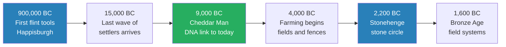
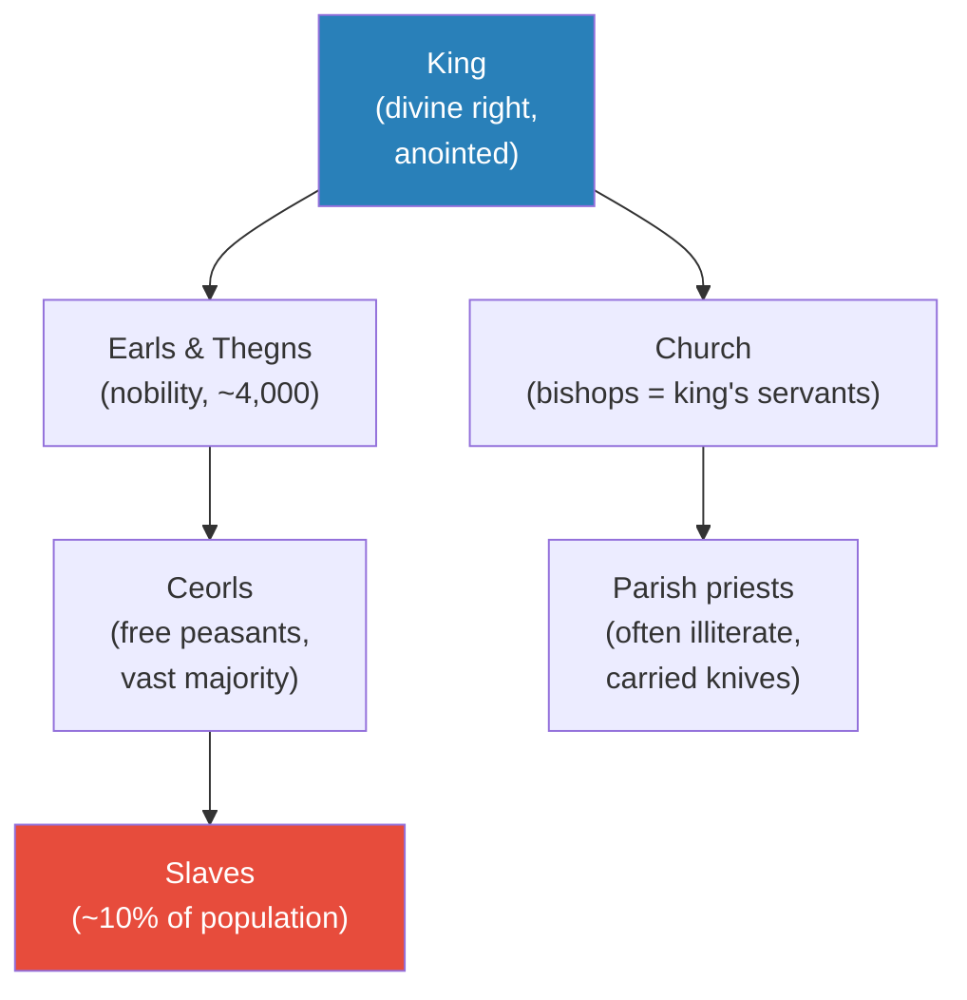
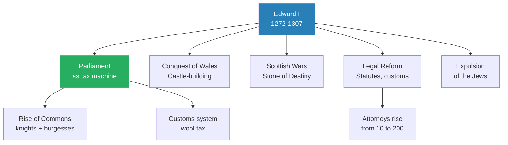
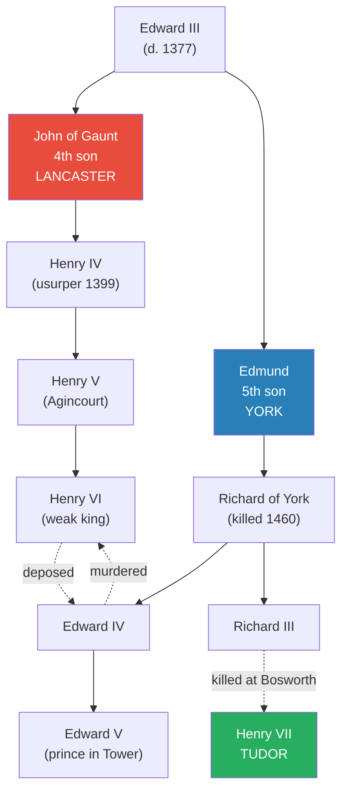
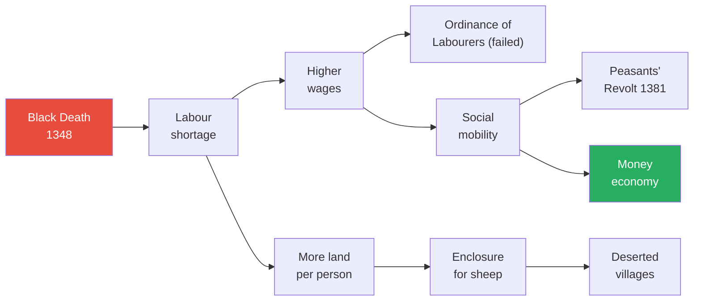
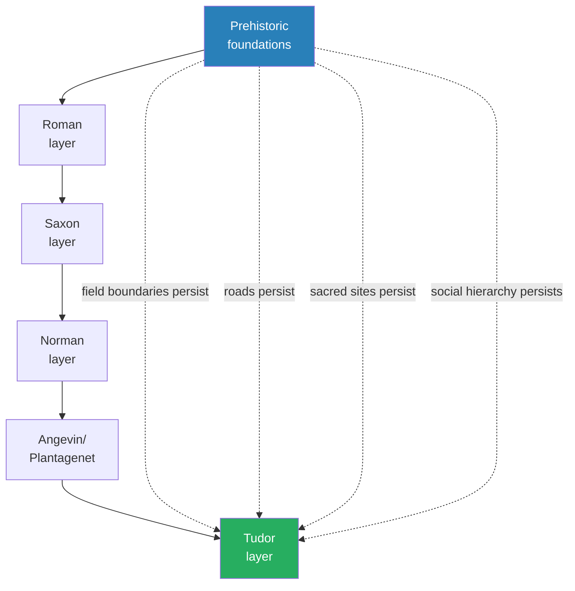

# Foundation — Peter Ackroyd

> Peter Ackroyd, one of England's most celebrated literary writers, tells the story of England from the footprints of Mesolithic children on a beach 7,000 years ago to the suspicious death of Henry VII in 1509. But this is not a conventional chronicle of kings and battles. Ackroyd alternates political narrative with atmospheric chapters on the texture of everyday life — the house, the road, the village, the seasonal year, childhood, death, forests, towns, food, names, customs, and jokes. His central argument is that England's true foundation is not any single event but an almost geological continuity of settlement, custom, and social hierarchy stretching back thousands of years, beneath the surface noise of conquest and civil war. The result is a history that makes you *feel* medieval England — its earthiness, its violence, its piety, its smell — in a way that no other book in the vault achieves.

---

## About the Author

Peter Ackroyd is a London-born novelist, biographer, and historian who has written more than sixty books. He is best known for his biographies of Dickens, Blake, and Thomas More, and for his multi-volume *History of England* series, of which *Foundation* is the first. Ackroyd's distinctive gift is atmospheric writing — he approaches history as a novelist would, immersing the reader in sensory detail and the texture of place. He studied at Cambridge and Yale, and was for many years the chief book reviewer of *The Times*. His philosophy of history, expressed most fully in this book, is deeply conservative: he distrusts the idea of progress and insists that custom, continuity, and the deep persistence of the land itself are the true forces shaping England.

---

## The Big Idea

- <b style="color: #27ae60">England's defining characteristic is deep continuity</b> — not the dramatic events of conquest and civil war, but the persistence of settlement patterns, field boundaries, road networks, and social hierarchies across thousands of years
- The "foundation" of the title is not any single event but the accumulated weight of habitual practice:
  - Field boundaries that persist from the Neolithic
  - Roads that follow prehistoric trackways (many "Roman roads" are far older)
  - Sacred sites reused across millennia (churches built on Bronze Age ritual sites)
  - A centralised polity that predates the Anglo-Saxons by thousands of years
- <b style="color: #2980b9">Custom, not law, is the true constitution of England</b> — the unanswerable complaint of any villager or labourer was "we have never been accustomed to do this!"
- Every supposed innovation was presented as a return to ancient tradition — nothing was good because it was new; it was good because it was old
- <b style="color: #e74c3c">The English are a prehistoric island people, not Anglo-Saxon invaders</b> — genetic evidence shows that the Saxon settlers made up only about 5% of the population
- Ackroyd's philosophy of history: "the writing of history is often another way of defining chaos" — chance, accident, and unintended consequence drive events more than design or progress

---

## Key Concepts at a Glance

| Concept | One-line summary |
|---------|-----------------|
| **Deep continuity** | Settlement patterns, field systems, and social hierarchies persist across millennia |
| **Highland/Lowland divide** | A geological and cultural split established 8,000 years ago that still shapes England |
| **Custom as constitution** | England governed by immemorial habit, not written law |
| **Kingship as embodiment** | The king physically represents the country — his health is the nation's health |
| **The interlude chapters** | Ackroyd's distinctive contribution: atmospheric chapters on everyday life between political narrative |
| **Contingency thesis** | Diarrhoea, storms, stray arrows, and bad timing decide the fate of nations |
| **Accidental institutions** | Common law, parliament, and jury trial were by-products of royal greed, not reform |
| **The Black Death divide** | Feudal England before 1348; wage-labour England after |
| **The prehistoric island people** | English identity precedes and outlasts every wave of invaders |
| **"The law is lost"** | When a king dies, law dies with him — order is always fragile |

---

## Part I: The Prehistoric and Roman Island

### Chapter 1 — Hymns of Stone

*Ackroyd begins not with kings but with footprints — the prints of Mesolithic children on a beach, walking towards us across 7,000 years.*

- Close to Happisburgh in Norfolk, seventy-eight flint artefacts have been found scattered approximately 900,000 years ago — so the long story begins
- At least nine distinct waves of peoples arrived from southern Europe across warm interglacial periods
  - Only the last wave survived — arriving some 15,000 years ago
  - These are the direct ancestors of many still living in England today
- <b style="color: #27ae60">The English were not originally "Anglo-Saxon" or "Celtic" — they were a prehistoric island people</b>

> [!example] Cheddar Man's DNA (1995)
> - Palaeontologists discovered that material from a male body found in Cheddar Gorge caves, interred 9,000 years ago, was a close genetic match with residents still living in the immediate area
> - They all shared a common ancestor in the maternal line
> - The deep continuity of English settlement is written in the blood
> **The lesson:** The roots of the English go far deeper than any invasion or conquest.

- On the sand at Formby Point, there are human footprints continuing for 32 feet — the prints of many children are among them
  - The men were approximately 5 feet 5 inches; the women some 8 inches shorter
  - They were looking for shrimps and razor shells
- These Mesolithic people cleared forests by burning, managed hazel crops for nuts, built platforms and round houses
  - At Star Carr in Yorkshire: twenty-one fragments of deer skull with antlers — shamanistic coverings, "an early form of morris dancing, except that the numinous has now become simply quaint"
- The transition to farming was gradual — no agricultural revolution, just the slow increment of centuries
  - By 3000 BC the countryside was marked in small rectangular fields
  - Where there are fields there will be fences and ditches; there will be stone walls
- <b style="color: #2980b9">The Highland/Lowland divide</b> — already established 8,000 years ago:
  - **Lowland Zone** (midlands, Home Counties, East Anglia): soft limestone, chalk, sandstone — centralized power, mixed farming
  - **Highland Zone** (Pennines, Cumbria, Devon, Cornwall): granite, slate — scattered families, independent, pastoral

---

- **Stonehenge** was the largest and most protracted programme of public works in the history of England
  - Bluestones transported from Preseli Hills in south-west Wales, 200 miles distant
  - Construction entailed millions of hours of labour
  - Evidence of a controlling power that could organise vast numbers — <b style="color: #27ae60">England was under organised administration long before the Romans and the Anglo-Saxons came</b>

> [!example] The King of Stonehenge
> - A man found near Stonehenge with over 100 artefacts — gold hair ornaments, copper knives, boars' tusks
> - Oxygen isotope analysis revealed he grew up in northern Europe
> - What was a foreign king doing on Salisbury Plain? Pilgrimage? Healing? Rulership?
> **The lesson:** Even in the deepest prehistory, England was connected to the wider world.

- Bronze Age field systems — visible from the air — represent a feat of land planning never since rivalled in English history
  - Thousands of square miles laid out, apparently in coordinated acts
  - "In the hour before sunset, when the rays of the sun lie across the English fields, the old patterns of the earth rise up"

*England was densely settled and centrally organised thousands of years before Rome — Stonehenge proves that coordinated power existed from at least the third millennium BC.*

---

### Chapter 2 — The Roman Way

*Roman Britain was prosperous and sophisticated — but its withdrawal was not a catastrophe.*

- Julius Caesar invaded in 55 and 54 BC; the full conquest came under Claudius in AD 43
- The Romans built a network of towns, villas, roads, and administrative centres
  - But they layered upon existing structures — many "Roman roads" follow prehistoric paths
  - Christianity arrived in the second century; by AD 314 three English bishops attended a council in Arles
- <b style="color: #e74c3c">The Roman withdrawal (c. AD 410) was not the catastrophe it has been portrayed as</b>
  - "Dark earth" found in many towns was once thought to prove abandonment — now reinterpreted as the residue of wattle-and-daub dwellings
  - The Roman city of Wroxeter continued as a prosperous community well into the medieval period
  - The lives of farmers and labourers were "changed not at all by the dislocation of leaders"

> [!tip] Core Insight
> The withdrawal of Rome did not destroy English civilisation — it simply changed the surface of administration while the deep structures of settlement, farming, and local governance persisted. This is Ackroyd's central thesis in microcosm: the surface changes; the foundation endures.

---

### Chapter 3 — Climate Change

*Ackroyd pauses the political narrative for the first of his atmospheric interludes — a chapter devoted entirely to English weather.*

- A drop of two degrees in temperature made harvest failure seven times more likely
- The eleventh and twelfth centuries were warmer than those before — the thirteenth and fourteenth centuries brought deterioration
  - The Thames froze in 1309-10
  - The years 1315-16 were marked by endless rain — harvests failed, dead were buried in common graves
- "In the medieval period the weather is the lord of all. Outer weather creates inner weather."
- <b style="color: #2980b9">Ackroyd's argument: it would be possible to write the history of England as the history of the English climate</b>

---

## Part II: Saxon and Viking England

### Chapter 4 — Spear Points

*The "Anglo-Saxon invasion" was not a genocide but a slow infiltration — and it was plague, not military conquest, that enabled it.*

- In c. 430 Vortigern, the overlord, called in Saxon mercenaries to defend against the Picts and Irish
  - The Saxons came in small bands — "they adored Woden, god of war, and Thor, god of thunder. They practised human sacrifice. They drank from the skulls of their enemies"
  - They were given land but eventually demanded more
- The Saxon federates revolted, took over East Anglia and the Thames Valley, and sent for more settlers
- Four predominant tribes arrived: Angles, Saxons, Frisians, Jutes
  - <b style="color: #27ae60">There were no such people as "Anglo-Saxons" until the chroniclers invented them in the sixth century</b>
  - According to the best genetic evidence, the settlers eventually made up 5% of the population
  - "There is no hint of deliberate genocide and replacement of the native population"
- The plague of the 540s was the real catalyst:
  - Bubonic and perhaps pneumonic plague struck the native English harder than the settlers
  - Population may have dropped from 3-4 million to 1 million
  - "Anglo-Saxon civilization was created by a pandemic"

---

- The Germanic settlers respected old boundaries:
  - Same field systems, same territorial divisions, same sacred sites
  - The walh — Germanic for "Celtic/Latin speaker" — also meant serf or slave; hence Wales, Cornwall, Walton, Walthamstow
  - The native population survived; Christianity was not driven out

> [!tip] Core Insight
> The "Anglo-Saxon invasion" was not a break but a layering — new rulers on top of the same people, the same fields, the same roads. The continuity thesis holds even through the most dramatic supposed rupture in English history.

---

### Chapters 5-6 — The Blood Eagle & The Measure of the King

*The Anglo-Saxon kingdoms coalesce; Viking raids transform the political landscape; Alfred creates the idea of England.*

- By AD 600 recognisable kingdoms emerge: East Anglia, Mercia, Northumbria, Wessex
  - "These were societies of rank, based upon a structure of burdens and obligations imposed by the warlords"
  - There were slaves, landless workers, ceorls (free heads of households), and thegns (noblemen)
  - The financial penalties for murder were graded according to the "worth" of the victim
  - "It was a harsh and divisive society, only made possible by the continuous exploitation of the unfree"
- The labourers were slowly reduced in status:
  - For two days each week they performed services for the lord — harvesting, ploughing, shearing, digging ditches
  - "Undoubtedly many of their farms were bought up by the larger landowners"
  - It would be "impossible to convey the sheer complexity of the grades and divisions among the working population"
- Villages replaced hamlets; large fields divided into strips supplanted older rectangular fields
  - The lord had the most land; the rest was assigned by lot
  - "The interest of the community, and of the lord, came before that of the individual"
  - This system of common fields lasted until the Enclosure Acts of the eighteenth century
- Towns bursting into life by the late tenth century:
  - Canterbury houses stood 2 feet apart — "enough room for the rain to drip freely from the eaves"
  - London and York had appreciably large populations; others numbered in hundreds
  - Town inhabitants were deemed to be free — "they had no lord except the king"
- The English parish emerged in this period:
  - The chapel of the thegn became the parish church; the parish system arose from the manors and villages
  - It survived unchanged until the late nineteenth century
  - The parish priests were "often illiterate, and many complaints were made about their drunkenness and violence. They were often married. They might be slaves"
  - "These 'Mass priests' were supposed to catechize children, but in many parishes they were also treated as 'cunning men' who practised rural magic"

---

- Viking raids began in 793 with the sacking of Lindisfarne
  - The great heathen army of 865 conquered most of eastern England
  - Alfred of Wessex survived and counterattacked — building burghs (fortified towns), creating a fleet, issuing law codes
  - He commissioned the Anglo-Saxon Chronicle — "written in English, not Latin, a unique act of nation-building"
  - His grandson Athelstan became the first king who could plausibly claim to rule all of England
- The men of the ninth and tenth centuries:
  - Wore their hair long — pulling it merited a fine; forcible cutting was as criminal as cutting off a nose
  - Arms and faces of both sexes were tattooed; both delighted in perfume
  - "Heavy drinking was commonplace, as it has been in all stages of English history"
  - "50 per cent of the people died before the age of thirty, and 90 per cent before the age of fifty. Death was always close at hand."
- <b style="color: #2980b9">The nature of English kingship</b> — a continuous tradition from prehistoric chieftains through Saxon warlords to medieval sovereigns:
  - The coronation ceremony devised by Archbishop Dunstan for Edgar in 973 was repeated at Elizabeth II's coronation in 1953
  - Kings traced descent from Woden; they possessed magical powers; they cured scrofula by touch
  - The belief that the king's touch could cure scrofula endured until 1712, when Queen Anne touched the three-year-old Samuel Johnson
  - "All the land was his. He owned all highways and bridges, all monasteries and churches, all towns and rivers"
  - "William the Conqueror did not need to create the role of a powerful and centralizing king — he simply had to take up the part"
  - The Angevin kings "chose instinctively to espouse and even to exaggerate the sense of divine kingship"
    - Richard I was the first king to use "we" in royal charters
    - John was the first to call himself king of the land rather than king of the people

> [!abstract] The Continuity of English Kingship
> | Element | Saxon Origin | Medieval Continuation |
> |---------|-------------|---------------------|
> | Coronation oath | Edgar's ceremony (973) | Used at every coronation to Elizabeth II |
> | Divine descent | Traced from Woden | Claimed divine anointing with holy oil |
> | Healing touch | Magical powers assumed | Royal cure for scrofula until 1712 |
> | Crown-wearing | Saxon festal ceremonies | William I adopted three times yearly |
> | The king's peace | Law died with the king | Same principle through the medieval period |
> | Ownership of land | "All the land was his" | Still technically true under the Crown |

*English society was always hierarchical — from Neolithic chieftains through Saxon warlords to medieval kings. The grades and divisions were intricate, but the essential structure of lordship and obligation never changed.*

---

## Part III: The Norman Transformation

### Chapter 7 — The Coming of the Conquerors (980-1066)

*The most famous date in English history — told as the culmination of decades of crisis, culminating in the fatal year.*

- By the late tenth century England was rich and prosperous — "so the men of Denmark still came in search of treasure and of slaves"
- Ethelred II — nicknamed "the Unready" (actually "the ill-advised"):
  - Bought off the Vikings with Danegeld — £22,000 of silver and gold after the defeat at Maldon (991)
  - "The Danes now knew that England was as craven as it was wealthy"
  - In 1002 he ordered a general massacre of the Danes in England — "every parish can kill its own fleas"
  - Married the daughter of the count of Normandy — "by that union, the fate of the English became inseparable from the fate of the Normans"
- King Canute (1016-1035):
  - "The first acts of King Canute were bloody indeed. He slaughtered the leading nobles of England, together with their children"
  - But then became a devout Christian — his encounter with the waves was originally a story of piety: "Let all the world know that the power of kings is empty and worthless"
  - He was lord of Denmark, Norway, and England — "a Scandinavian empire of which England was a part"
  - "He died in the winter of 1035, and it is believed that his bones still lie buried somewhere within Winchester Cathedral"
- Edward the Confessor (1042-1066):
  - Half-English, half-Norman; lived twenty-eight years in Norman exile
  - "His real sympathies lay with the duchy of Normandy"
  - He planted Norman clerics, magnates, and merchants in England — "the invasion of 1066 was the end of a long process"
  - "Of his character and nature, very little is known. He had no grand plan; he worked by hazard and necessity"
  - "Chance, and fortune, were his mentors. In this he was not unlike any other English king. It is perhaps the most important lesson of the nation's history"
- Harold Godwinson was crowned on 6 January 1066 — the first coronation in Westminster Abbey
  - His reign lasted nine months and nine days — one of the shortest in English history
  - William of Normandy claimed Harold had sworn on saints' relics to submit — "since history is written by the victor, that account became generally accepted. It is likely to be completely untrue"
- Harold defeated Harald Hardrada at Stamford Bridge on 25 September — ending the Viking interest in England
  - "A great man," Harold said of Hardrada, "and of stately appearance. But I think his luck has left him"
  - Then marched his exhausted army 250 miles south in days

> [!example] The Battle of Hastings (14 October 1066)
> - The English formed a shield wall on Caldbec Hill; the Normans attacked from below
> - Twice the Normans feigned retreat, luring English pursuers to destruction
> - Harold was killed at dusk by a stray arrow
> - "If Harold had not fallen, his forces might have prevailed. But 'if' is not a word to use in history"
> **The lesson:** Contingency rules: a different arrow, a different wind, and the most famous date in English history would never have happened.

- William did not march straight to London — he took the offensive and began a campaign of terror:
  - He was beaten back at London Bridge; in revenge he burned Southwark to the ground
  - Then he lit a circle of fire around London, "ravaging the countryside all around"
  - He left a trail of destruction through Hampshire, Surrey, and Berkshire
  - "The entries for 'waste lands' in Domesday Book tell the story of his progress"
- The leaders of the English, trapped in London, submitted at Berkhamsted:
  - "The English were accustomed to foreign kings — the transition from Canute and the half-Norman Edward to William was not considered unacceptable"
  - "Surrender was preferable to resistance and further bloodshed"
  - "With the death of Harold, they lacked an effective war leader"
- Crowned on Christmas Day in Westminster Abbey
  - "As duke of Normandy, however, he was still in theory a vassal of the king of France"
  - "This dual status would bear bitter fruit in the years and centuries to come"
  - "From this time forward England would be involved in the affairs of France, and of western Europe, with many bloody battles that did not really come to an end until the defeat of Napoleon in 1815"
- William was a man of formidable power:
  - 5 feet 10 inches, corpulent by middle age, with "a harsh and rough voice"
  - "He had enormous strength and physical stamina"
  - "It was said that he could bend on horseback the bow that other men could not even bend on foot"
  - He was driven by greed and desire for power — "but he had one great gift: the power of command"
  - He "promised innumerable riches from a country as prosperous as it was fruitful"
  - He enlisted the help of a higher power — the pope sent him a ring containing a hair of St Peter
  - He placed his daughter in a nunnery "as Agamemnon sacrificed Iphigenia before sailing to Troy"

---

### Chapter 9 — Devils and Wicked Men (William I and Rufus)

*William imposed Norman rule with systematic brutality — but on foundations already laid.*

- William replaced the entire English ruling class within a generation
  - By 1086 only two of the 180 tenants-in-chief in Domesday Book were English
  - But the administrative system — shires, hundreds, coinage, law — remained intact
  - "The English were accustomed to foreign kings, after all — the transition from Canute and the half-Norman Edward to William was not considered unacceptable"
- <b style="color: #e74c3c">The Harrying of the North (1069-70)</b> — William's scorched-earth devastation of Yorkshire
  - Crops destroyed, livestock slaughtered, villages burned
  - Seventeen years later Domesday Book still recorded vast "waste lands"
  - It was the most methodical act of destruction in English history before the Black Death
- **Domesday Book** (1086) — the most extraordinary administrative document of the medieval world
  - Every estate, every plough, every pig was counted
  - "There was not even one ox or one cow or one pig which escaped notice"
  - It revealed a deeply stratified society: 28% of the population were villeins; 12% were slaves
  - It proved that England was already the most administered country in Europe
- The Norman festal crown-wearing — three times a year (Christmas, Easter, Pentecost) the king sat in silent possession of his majesty
  - These were the same days when pagan kings had performed ritual sacrifice
  - "William's true ancestors are to be found in those who ordered the building of Stonehenge"
- William Rufus (1087-1100) — "a bad man in a bad time"
  - Built Westminster Hall — "this dark and solemn building, of thick walls and huge pillars, was unimaginably large to the people of the time"
  - William said it was "big enough to be one of my bedchambers" — "listen to the indomitable arrogance of the Norman kings"
  - Killed by an arrow in the New Forest — accident or murder remains unknown
  - "A black pillar, known as the Rufus Stone, marks the place where he fell. It still stands."
- Henry I (1100-1135) — "Beauclerc" or "the good scholar"
  - He fathered over twenty bastards; married a descendant of Alfred the Great (sanctifying the Norman dynasty in English eyes)
  - He "could determine, from the track of a stag, how many antlers the creature had"
  - His reign saw the emergence of professional administrators — "new men" raised "from the dust" to serve the Crown
  - <b style="color: #2980b9">The exchequer</b> — with abacus beads for calculation — became prominent; written documentation became essential
  - "So by slow and almost imperceptible means the English 'state' was created. No one was interested in creating a 'state'. No one would have known what it meant."
  - The Cistercian monks came from France — "white monks" who lived far from ordinary habitation, tilling the soil
    - They drained fens, cleared forests, destroyed villages to make way for fields
    - They became the most significant woolgrowers in the country — "despite their profession, they grew rich. That is the story of the Church itself"

---

### Chapter 11 — The Law is Lost (Stephen and Matilda)

*When the king dies, law dies with him — the "Anarchy" proves the fragility of order and the resilience of the country beneath it.*

> [!example] The White Ship Disaster (25 November 1120)
> - Henry I's sixteen-year-old son William Adelin was aboard the White Ship sailing from Normandy
> - Crew and passengers were drunk; the ship crashed into a hidden rock
> - The heir to the throne drowned — "only one person, a butcher from Rouen, survived"
> - Henry's nephew Stephen, count of Blois, had declined to board because of severe diarrhoea
> - He would be crowned king fifteen years later — "an attack of diarrhoea determined the fate of the nation"
> **The lesson:** Statesmen may plot and plan. But chance rules the immediate affairs of humankind.

- Henry I forced the barons to swear allegiance to his daughter Matilda — but no woman had ever ruled England
- Stephen seized the throne; Matilda fought back — sixteen years of intermittent civil war
  - Yet "more abbeys were built and founded than at any other period in English history"
  - The administrative order remained broadly intact
  - "When we describe this period as 'the Anarchy', we underestimate the underlying strength of the country"

---

## Part IV: The Angevin-Plantagenet Kings

### Chapter 13 — The Turbulent Priest (Henry II)

*The most consequential reign in English legal history — and all of it achieved by accident.*

- Henry II was crowned in 1154 at age twenty-one — "the first Angevin king of England"
  - Restless, impatient, always in movement — "he often ate his food standing up, so that he might be more quickly done with it"
  - His jester was known as "Roland the Farter" — "every Christmas he used to leap, whistle and fart before the king"
- Thomas Becket — chancellor turned archbishop, friend turned enemy
  - "Like a later English saint and martyr, Thomas More, he was always on stage"

> [!example] Becket at Northampton (1164)
> - The king summoned Becket to account for every penny he had handled as chancellor
> - Becket rode into the council bearing a large cross in his hands
> - Bishops tried to take the cross: "If the king were to brandish his sword as you now brandish the cross, what hope can there be of making peace?"
> - "I know what I am doing," Becket replied. "I bear it for the protection of the peace of God"
> - He swept out with cries of "Traitor!" following him, and fled the country in disguise
> **The lesson:** The struggle between Church and Crown was a contest of theatre as much as theology.

- Becket's murder (29 December 1170):
  - Four knights left Henry's court in northern France, rode to Canterbury
  - They found Becket conducting business; he greeted them calmly
  - He proceeded into the cathedral for vespers; the monks wished to bar the doors, but "he would not permit it"
  - "He could have escaped at any moment. Dark passages and winding stairs of stone were all around him. But he stayed"
  - The knights burst in; one struck him on the shoulder: "Fly! You are a dead man"
  - They tried to drag him out; he resisted; he was wounded in the head and fell to his knees
  - "Another stroke cut off the upper part of his skull. They butchered him where he lay"
- The aftermath was immediate and extraordinary:
  - Members of his household rushed in, cut off pieces of their clothes, and dipped them in the archbishop's blood
  - "Others brought vessels to capture the blood as it flowed from the prone body"
  - The monks of Canterbury developed a thriving trade in "Becket water" — tin vessels inscribed "All weakness and pain is removed, the healed man eats and drinks, and evil and death pass away"
  - The king of France declared: "The man who commits violence against his mother the Church revolts against humanity"
  - Canterbury became the greatest pilgrimage site in England — Chaucer's Canterbury Tales is devoted to its pilgrims

> [!example] Henry II's Penance at Canterbury (1174)
> - Beset by enemies from Scotland and Flanders, Henry made a formal penance for Becket's death
> - He dismounted a mile from Canterbury and walked barefoot, "badly lacerating his feet"
> - He prostrated himself, weeping, before the shrine
> - The assembled bishops inflicted "correction" on his body with a whip — "they were no doubt gentle with their royal lord"
> - He spent the next day and night in prayer, taking no nourishment
> - He drank some of the water blessed by Becket's blood
> - "The effect was immediate, and almost miraculous. His Scottish enemies were defeated."
> **The lesson:** The power of medieval penance was both political and spiritual — Henry submitted his body to the Church and in return received God's favour in battle.

- Henry's remaining years were consumed by conflict with his sons:
  - "It was a most quarrelsome family from the vicissitudes of which Shakespeare could have profited greatly"
  - The two eldest sons rose in rebellion, aided by their mother Eleanor
  - Young Henry died of dysentery in 1183 — "he would have made a wholly disappointing king"
  - Geoffrey was killed jousting in Paris — "and then there were two"
  - Richard allied with the king of France against his father
  - At their last meeting, Henry whispered: "May the Lord spare me until I have taken vengeance on you"
  - He was dying; he asked for a list of those who had pledged allegiance to Richard — the first name was John's
  - "He turned his face to the wall, and would listen no more"
  - His last words: "Shame, shame on a conquered king"

---

- <b style="color: #27ae60">Henry II's greatest legacy was the creation of common law — achieved entirely by accident</b>:
  - He sent royal justices to the shires to collect fines — this imposed uniform justice across the country
  - National law took precedence over local custom — "when law became uniform, it could indeed eventually become 'common' to all"
  - Twelve local men were assembled to advise on property disputes — the origin of the jury
  - Within fifty years juries were also used in criminal cases — trial by jury replaced trial by battle and ordeal
  - Writs took on a standard form — they cost sixpence
  - "Henry had stumbled upon a system that has endured ever since"
  - Professional lawyers emerged; law schools clustered around Westminster; "that happy vacancy ended forever"
  - By the end of the twelfth century the "learned laws" were being taught at Oxford
  - "It is no accident that 'legal memory' was deemed to have begun at the accession of Richard I in 1189"
- The paradox of medieval law:
  - "The people loved law, just as they disregarded it; they could not get enough of it. It was consoling"
  - Voices in Westminster Hall on a law day:
    - "Furthermore I marvel that you have not come to the point"
    - "The point, sir, is like a quintain. Hard to hit"
    - "Do not argue with me about the statute. I was the one who made it"
    - "A great friend is Aristotle. But a greater friend is truth"
  - "The floor of the hall was covered with rushes containing sweet herbs, to curb the odours"
  - The judges wore scarlet robes and caps of gold silk
  - The sergeants wore gowns with vertical stripes of mulberry and blue, with round caps of white silk

---

### Chapter 15 — The Great Charter (Richard I and John)

*Richard cared nothing for England except as a cash machine; John lost the empire but was forced to sign the most famous document in English history.*

- Richard I (1189-1199) — "he cared only for the success he carved out with his own sword"
  - At his coronation he stripped to the waist for anointing, then pre-empted the archbishop by handing him the crown himself — "a characteristic act of self-sufficiency"
  - He was 6 feet 5 inches tall — "in the twelfth century, that made him a giant"
  - He spent only six months of his ten-year reign in England
  - He said he would sell London itself if he could find a purchaser — "the country was for him only an engine for the making of money"
- The Third Crusade:
  - He captured Cyprus, ordered 3,000 prisoners beheaded at Acre, but failed to take Jerusalem
  - "A Syrian nobleman described the European crusaders as animals possessing the virtues of courage and fighting, but nothing else"
  - On his return, he was captured by the duke of Austria and held for ransom — 150,000 marks
  - The English were taxed 25% on all income to pay — "the country was indeed being fleeced"
  - The king of France sent word to John: "Look to yourself. The devil is loose."

> [!example] Bishop Hugh and the King (c. 1198)
> - Hugh of Lincoln visited Richard at Chateau-Gaillard to plead for the return of confiscated estates
> - The king turned his face away when greeted
> - "Lord king, kiss me," Hugh said. Richard still looked away
> - The bishop took hold of the king's tunic: "You owe me a kiss. I have come a long way to see you"
> - Richard refused: "You deserve no kiss from me"
> - The bishop shook the king's cloak: "I have every right to one. Kiss me."
> - Then Richard, with a smile, concurred
> - He said later: "If the other bishops were like him, no king or ruler would dare raise his hand against them"
> **The lesson:** Even the most formidable kings could be confronted by sheer persistence — if the man had enough courage and standing.

- Richard died from a gangrenous wound fighting in France — "he decreed that his heart should be interred at Rouen and his body at Fontevrault. So much for England."

---

- King John (1199-1216) — "one of the most interesting kings in English history, primarily because of his infamous reputation"
  - He was 12 inches shorter than Richard — "he may have suffered in implicit comparison"
  - He went about armed and with a bodyguard — "a wary and distrustful king"
  - He was not without humour: when he and his horse floundered in a marsh near Alnwick, he ordered every new townsman to walk through that mud on St Mark's Day — "the custom was still being observed in the early nineteenth century"
  - When the pope excommunicated England, "the king ordered that the mistresses of all the priests should be held captive until their lovers ransomed them"
  - He "bathed regularly and often, a practice almost without precedent in the thirteenth century"
  - He loved fine gems and glittered with jewellery — "the body of the king was sacred"
- The murder of Arthur of Brittany (1203):
  - John captured his fifteen-year-old nephew; Arthur demanded England and all his inheritance
  - "The more picturesque accounts suggest that John, in a fit of Plantagenet fury, ran a sword through his nephew's body and dumped him into the Seine"
  - The pope himself said Arthur "could rightly be condemned to die even the most shameful of deaths" — a fifteen-year-old was considered an adult
- The loss of Normandy (1204):
  - John was called "John Softsword" for his supposed inactivity
  - By June 1204 Philip of France had taken Normandy; only the Channel Islands remained
  - <b style="color: #27ae60">The severance after 150 years forced the Anglo-Norman lords to concentrate on England — "they steadily became more English"</b>
  - John began the construction of a proper navy to defend the English shores
- John's restless administration:
  - He travelled 30 miles a day; spent only 24 days in London in 1205
  - He penetrated the far north in bitter winter; fined York and Newcastle for inadequate receptions
  - He was told of Roman treasure at Corbridge — "he ordered his men to dig for it, but nothing was unearthed"
  - He discovered new ways of extracting revenue — in 1207 he levied a thirteenth part on all incomes, "the first move towards general taxation"
- <b style="color: #2980b9">Magna Carta (1215)</b> — extorted by the barons at Runnymede
  - It primarily protected baronial property rights — not a charter of popular liberty
  - But it established the principle that the king was subject to law
  - It became the symbolic guardian of English liberty only by slow degrees over the following centuries
  - It was reissued and invoked again and again — by Edward I's barons, by the Commons against Edward III, by the rebels of 1381

---

### Chapter 17 — A Simple King (Henry III and Simon de Montfort)

*Henry III's weakness provoked the first serious challenge to royal authority — and the first stirrings of representative government.*

- Henry III was crowned at nine years old — "a gold circlet was placed on his head and a mantle of silk upon his shoulders" — ruled for fifty-six years
  - Pious, artistic, devoted to rebuilding Westminster Abbey in the French Gothic style
  - But politically incompetent — he lavished money and offices on foreign relatives, provoking universal resentment
  - The barons declared: "Nolumus leges Angliae mutari" — "we do not wish the laws of England to be changed"
- Simon de Montfort's rebellion (1264-65):
  - De Montfort summoned representatives from the towns and shires to parliament
  - This was not democracy but baronial self-interest — yet it established the precedent of representation
  - De Montfort was defeated and killed at Evesham (1265) — "his hands and feet were cut off, and his testicles hung upon either side of his nose"
  - But the precedent of summoning the commons was not forgotten
- The growth of towns accelerated rapidly in this period:
  - Forty-nine new towns were planted between 1191 and 1230
  - Leeds was created in 1207 when a lord laid thirty building plots beside a river crossing
  - These were profitable investments — "after 900 years they still flourish"
  - London's population reached 80,000; Norwich and Coventry each harboured 20,000
- The guild system matured:
  - Guilds laid down standards of manufacture, refused outsiders, set up rigid apprenticeships
  - They maintained chapels, built bridges and roads
  - They produced the miracle and mystery plays — "the most important aspect of English drama before Shakespeare"
  - <b style="color: #2980b9">This concatenation of religious, social and economic power is thoroughly medieval</b>
- The class system hardened:
  - Free town life versus unfree country life — the essential English divide
  - "If a villein resided in a town for a year and a day, he acquired his freedom"
  - "The myth of the uncultivated rustic as opposed to the urbane townsman can fairly be said to have begun at this time"

---

### Chapter 19 — The Emperor of Britain (Edward I)

*The most formidable medieval king — he built the machinery of the fiscal state and tried to conquer the entire island.*

- Edward I at his coronation dramatically removed the crown: "I will never take up this crown again until I have recovered the lands given away by my father"
  - **Quo warranto** — "by what right do you hold these lands?" — investigated every landowner's claim
  - One old nobleman simply brandished his sword: "Come and fight me for it"
- <b style="color: #2980b9">Edward I can be considered the first king to use parliament in a constructive manner</b>
  - 800 representatives at his first parliament — the largest ever assembled
  - Petitions arose from all over the kingdom; the knights and burgesses began to deliberate together
  - "The wider the net, the larger the catch" — parliament as tax-extraction machine
- The conquest of Wales — the great castles (Conway, Caernarfon, Harlech, Beaumaris) are "tokens of brute power"
  - He reburied "Arthur and Guinevere" to prove they were definitely dead — neutralising the Welsh prophecy of Arthur's return
- Scotland — "the hammer of the Scots":
  - Destroyed Berwick: "thousands of the inhabitants fell like autumn leaves"
  - Took the Stone of Destiny from Scone to Westminster (returned only in 1996)
  - When he handed the seal of Scotland to its new governor: "a man does good business when he rids himself of a turd"
  - William Wallace was captured and taken to Westminster: hanged, disembowelled while still alive, and quartered
  - A plaque still marks the spot — "but all the butchery did not work against a determined people"
  - Robert Bruce was crowned king of Scotland the following year
- The costs of war required unprecedented taxation:
  - Edward took one fifth of the clergy's income; the clerics refused; he outlawed them — "a body which did not support the country did not deserve to be protected by it"
  - The wool tax became known as the "maltote" or "bad tax"
  - A poem from 1300: "Yet cometh budeles with ful muche bost: 'Greythe me selver to the grene wax. Thou art writen yn my writ, that thou wel wost!'"
  - Every fourth penny went to the king; seed-corn had to be sold for taxes; royal officials seized oxen and cattle
- The earl of Norfolk refused to lead the army:
  - "Bigod, you shall go or hang!" — Edward
  - "By God, sir, I shall neither go nor hang" — he did not go
- Edward died in 1307, marching north to fight Scotland one last time, at the age of sixty-eight
  - "We may grow weary of the life and death of kings but in truth, for an historical account of medieval England, there is no other sure or certain touchstone"
  - The population had reached over 6 million — a figure not matched again until the late eighteenth century
  - "The England of Edward I was more populous than that of Elizabeth I or of George II"

*Edward I transformed the machinery of English governance — not by design but by the relentless pursuit of money and war.*

---

### Chapter 20 — The Hammer (Jews in Medieval England)

*A grim interlude on the exploitation and expulsion of England's Jewish community.*

- Jews arrived from Rouen in the late eleventh century — brought by William the Conqueror because they were "good for business"
  - Christians could not lend money at interest; Jews became moneylenders by default
  - They were "the king's chattels" — protected but also taxed a third to a quarter of their total wealth at any time
- <b style="color: #e74c3c">England took the lead in the execration of the Jews</b>
  - The first rumour of "ritual murder" emerged in England in 1144
  - In 1190, 500 Jews took refuge in York Castle; besieged by citizens, the men killed their families then themselves
  - In 1278, 600 Jews imprisoned in the Tower on charges of coin-clipping; 269 hanged
  - In 1290 Edward I expelled all remaining Jews — approximately 2,000 — demanded by parliament as the price of fresh taxation
  - "The expulsion was seen by many chroniclers as one of the most important and enlightened acts of his reign"
  - <b style="color: #e74c3c">"The anti-Semitism of the medieval English people is clear enough. Some have argued that, in subtly modified forms, it has continued to this day"</b>

---

### The Rise of English Identity in the Thirteenth Century

*The loss of Normandy in 1204 was a catastrophe for the king — but a blessing for the nation.*

- The Anglo-Norman lords lost half of their identity when they lost their Norman estates:
  - "Once they had lost their lands in Normandy, they would have to concentrate on those closer to 'home'"
  - "They steadily became more English"
  - The Channel became the border, as it had been in the tenth century
- The thirteenth century saw the growth of English self-awareness:
  - Written records became essential instruments of state — licences, regulations, tax records, archives
  - Letters supplemented writs; diaries of daily expenditure were kept
  - New, faster forms of handwriting developed — monastic calligraphy gave way to "cursive" script (from cursivus, Latin for "flowing")
  - "The world was going faster"
- Towns were growing rapidly and developing unique identities:
  - "Their walls were strengthened and dignified; Hull built the first surrounding wall made entirely out of brick"
  - The system of mayor and aldermen was established in London in 1191
  - "The leaders of the towns began to resent external interference — the aldermen of London were quite capable of defying the royal court"
- The original outline of Stratford-upon-Avon, planned by the bishop of Worcester in 1196, "is still visible in the modern streets"
  - "Houses still stand on the plots where they were sited by the bishop"
  - "A female huckster of the thirteenth century would still be able to navigate the roads of the town"
  - "Even a great city such as London still bears the traces of its origin"
- The growth of guilds transformed urban life:
  - They laid down standards, refused outsiders, set up rigid apprenticeships
  - They met in churchyards or town halls; by the end of the twelfth century many had imposing premises — the guildhall
  - They maintained chapels, built bridges and roads, collected for charity
  - They were responsible for the miracle and mystery plays — "the most important aspect of English drama before Shakespeare"
  - "This concatenation of religious, social and economic power is thoroughly medieval"
- In Norwich 60% of the wealth had devolved into the hands of 6% of the population
  - "These were the men who would serve as jurors and who took up the offices of local administration"
  - But a feeling of common interest was aroused — "in the Commune of London the voices of the citizens could still be heard shouting 'Ya Ya!' or 'Nay Nay!' in their assemblies"

---

## Part V: The Fourteenth-Century Transformation

### Chapter 21 — The Favourites of a King (Edward II)

*A weak king who preferred craftsmen to lords — and paid the ultimate price.*

- Edward II was born at Caernarfon in 1284 — the first heir designated "prince of Wales"
  - He wrote to his cousin offering to send "some misshapen greyhounds of Wales, which can catch a hare well if they find it asleep. And, dear cousin, if you would care for anything else from our land of Wales, we will send you some wild men"
  - He "did not care for the company of lords, but preferred to mingle with harlots, singers and jesters"
  - He was most at ease with "carters and delvers and ditchers, with shipmen and boatmen" — he did not behave like a king
- His attachment to Piers Gaveston scandalised the magnates:
  - Gaveston carried the crown at the coronation; outshone the king in imperial purple and pearls
  - "When Edward preferred the couch of Gaveston to that of his queen, her relatives returned indignant to their homeland"
  - Gaveston invented nicknames: "black dog" for Warwick, "burst belly" for Lincoln
  - He was eventually beheaded by Lancaster — "the love of magnates is as a game of dice, and the desires of the rich like feathers"
- The parliament of 1311 issued twenty-four ordinances binding the king:
  - He was not permitted to make war, leave the kingdom, or control his own treasury without baronial consent
  - Edward chafed, refused, recalled Gaveston — then gathered forces
  - He defeated Lancaster at Boroughbridge (1322) and executed him — "the first time that a sentence of death, on the charge of treason, had ever been directed at a member of the royal family"
  - At Lancaster's tomb, miracles were attested; a man who defecated on the execution spot had "his bowels parted from his body"
- <b style="color: #e74c3c">Bannockburn (1314)</b> — the worst military disaster of any medieval English king
  - Fought in "an evil, deep and wet marsh" unsuited to English cavalry
  - The Scots cried "On them! On them! They fail!" — the English were massacred
  - Edward fled to Berwick; he had lost Scotland; the battle ensured its independence
- **The Great Famine (1315-18)** — the worst period of English social history before the Black Death:
  - Three successive years of harvest failure from prolonged torrential rain
  - Wheat rose from 5 shillings to 40 shillings a quarter; often there was no bread to buy
  - The archbishop of Canterbury ordered barefoot processions and chanting to implore God's mercy
  - "But God was not listening"
  - Cattle and sheep destroyed by murrain; populations attacked by enteric fever
  - At the English garrison in Berwick, cavalrymen boiled dead horses for meat, then left the bones to the infantry
  - "To seek silver for the king, I sold my seed"
  - "Life for the majority of the English people was nasty, brutish and short"
- Criminal gangs flourished during the disorder:
  - "Lionel, king of the rout of raveners" wrote threatening letters from "our castle of the wind in the Greenwood Tower"
  - The five Folville brothers of Leicestershire terrorised their county for years
  - Richard de Folville, a rector, shot arrows from his church at pursuers; the local people dragged him out and beheaded him on the spot

> [!example] Small Incidents of Medieval Disorder
> - Robert Sutton insulted a court clerk by putting his thumb to his nose and exclaiming "Tprhurt! Tprhurt!"
> - John Ashburnham rode up to the sheriff's court, threatened the sheriff who fled, then whistled on his fingers to signal an ambush
> - When a writ was served on Agnes Motte, her neighbours forced the servers to eat it — wax and parchment
> - The rector of Manchester invited a couple and their daughter to dinner; his servants seized the girl, broke two of her ribs, and deposited her in the rector's bed
> **The lesson:** Medieval violence was intimate, personal, and often woven into the fabric of daily life — not confined to battles and sieges.

- Edward was deposed by his wife Isabella and Roger Mortimer (1326-27):
  - Isabella invaded from Hainault with 1,500 men; the king fled to Wales
  - Hugh Despenser the younger was "crowned with a ring of nettles; words of execration were cut into his skin" before being hanged, disembowelled, and beheaded
  - Edward was forced to abdicate at Kenilworth — "wearing a black gown, he was consumed with tears and sighs"
  - He was taken to Berkeley Castle where he was killed in September 1327
  - "Slain with a poker, red-hot, inserted into his fundament" — though this may be a poetical allusion to his supposed sexual preferences

> [!example] The Fieschi Letter — Did Edward II Survive?
> - A letter found in a French archive, from a papal official to Edward III, describes the confession of a hermit who claimed to be "your father"
> - He recounts escaping Berkeley Castle, killing the sleeping porter, taking his keys, and fleeing
> - The two assassins, finding their victim gone, "cut out the heart of the porter and put his corpse into a wooden chest" — pretending the body was the king's
> - The hermit wandered through Ireland, France, and Italy before ending his days in Lombardy
> - "The writer of the letter was a papal official of repute. He would not have written to the king of England on a mere whim"
> **The lesson:** Even the most "certain" events of medieval history dissolve into mystery on closer inspection.

---

### Chapter 23 — The Sense of a Nation (Edward III and the Black Death)

*Edward III built the image of the warrior king — but the Black Death transformed England more profoundly than any battle.*

- Edward III restored martial glory — Crécy (1346), Calais, the Order of the Garter
  - At Crécy, longbows defeated the knights of feudal chivalry
  - The battle was fought on a day of partial eclipse, thunder, and lightning
  - Gunpowder cannon were used for the first time in battle — "causing more panic than death"
  - The English archers were the decisive force — they fired ten volleys per minute
  - "Misericords" or mercy killers — long slender daggers that ripped open the body from the armpit to the heart
  - Among the 30,000 dead was John, the blind king of Bohemia, whose motto Ich dien ("I serve") was adopted by subsequent princes of Wales
- The siege of Calais (1346-47):
  - Edward marched north from Crecy; the townsmen endured nearly a year of famine
  - The French garrison commander wrote: "we can find no more food unless we eat men's flesh"
  - The letter was intercepted by Edward, who read it, "applied his personal seal and sent it on to its destination"
  - In the eleventh month the women, children and old people came out as "useless mouths to be removed"
  - "The English would not allow them to pass through their lines, and they were hounded back to the town ditch where they expired from want"
  - The story of the six burghers coming out with nooses around their necks may be authentic — "it is a type of political theatre at which Edward excelled"
  - Calais would remain in English hands for over two hundred years
- Edward III was compared to the Israelites freed from bondage — "he was free at last from the schemes and wiles of his mother"
  - He was "convivial and engaging" — one of his mottoes woven into his jacket read simply: "It is as it is"
  - Another, worn by courtiers: "Hey, hey, the white swan, by God's soul I am thy man"
  - He spoke English better than his predecessors; he inspired loyalty among the magnates
  - He restored forfeit lands and enlarged the nobility — four household members given earldoms
- Edward III loved ceremony and chivalric spectacle:
  - He instituted the Order of the Garter (1348) — almost all original knights had fought in France
  - He rebuilt Windsor Castle and created a Round Table building larger than the Pantheon of Rome
  - The king and queen, clothed in red gowns, led processions of knights dressed as Arthurian characters
  - Jean Froissart wrote: "The English will never love or honour a king who is not a victor and a lover of war"
- The French war was fought by a new kind of army:
  - Not feudal levies but paid troops and conscripts — "many of them were common thieves or murderers attracted to the prospects of spoil"
  - The Black Prince (Edward of Woodstock) boasted that in seven weeks he had laid waste 500 cities, towns and villages near Bordeaux
  - "The folk memory of English raids lived in the French national consciousness for many hundreds of years"
- <b style="color: #2980b9">The Hundred Years War's real consequences were entirely domestic</b>:
  - Parliament became an independent body because it controlled taxation
  - The Commons emerged as a coherent political assembly — "war, and taxation, had brought them together"
  - National identity strengthened — English replaced French as the language of court and government
  - The first mechanical clock was introduced; the first reference to a harbour crane comes from 1347
- The national identity forged in Edward III's reign was also a literary identity:
  - Chaucer began his career at Edward's court — his first verses in French, then shifting to English
  - "It is a measure of the strength of spoken and written English that Chaucer now celebrated it as worthy of comparison with the classical tongues"
  - "It is already the language of Shakespeare"
  - English merchants took over from Italian and German traders — in Hull, English wool exporters rose from 4% in 1275 to 90% by 1330
- The cost of war provoked parliamentary resistance:
  - "Dame Prudence declared in Chaucer's Tale of Melibee: 'I counsel that ye begin no war in trust of your riches, for they suffice not wars to maintain'"
  - In 1340 the taxpayers revolted: "a king ought not to go forth from his kingdom in manner of war unless the commune agree to it"
  - The Commons distinguished themselves from the Lords; they began to feel their power
  - They offered grants in return for concessions — quid pro quo
  - "Thirty-five years later, they would be strong enough to impeach the king's principal councillors"
- Edward III's decline:
  - The ageing king fell under the influence of his mistress, Alice Perrers
  - His younger son John of Gaunt ran the government — unpopularly
  - The Good Parliament (1376) impeached corrupt courtiers and merchants
  - It proclaimed itself "on behalf of the community of the realm"
  - But it also introduced the poll tax — "feared and hated in equal measure"
  - "The members of the parliament house were concerned only with the interests of their own particular 'community'"
- The Black Prince died during the Good Parliament; Edward III followed in 1377
  - "Alice Perrers took the rings from his fingers as he lay upon his deathbed — but this may be no more than a morality tale"
  - "He had achieved nothing much of his own volition, but during his reign of fifty years England itself had acquired a more coherent national life"

> [!example] The Victory at Sluys (1340) — and How the French King Learned of It
> - The English fleet surprised and destroyed French ships on the Flanders coast
> - No French minister dared tell Philip VI of the defeat
> - It was decided that only the Fool could break the news with impunity
> - The Fool declared that the English were arrant cowards
> - When asked why, he replied: "They, unlike the French, had not leapt into the sea"
> **The lesson:** Even in medieval politics, bad news was the jester's department.

---

- The Battle of Poitiers (1356) — the second great English victory:
  - The Black Prince had 7,000 men against John II's 35,000 — but hedges and vineyards favoured defence
  - "The average length of the bow was 6 feet, and the arrows were 3 feet in length"
  - "The archer drew it to the ear, rather than to the chest, and could send it 250 yards; he fired ten volleys each minute"
  - The French lines broke; the French king and his son were captured
  - "This was a new age of warfare"
  - King John was taken through London streets in triumph — "it was a thoroughly medieval form of captivity"
  - He voluntarily returned to captivity when his son escaped: "He could not endure the dishonour of violating the terms of the agreement"
- But the war's apparent gains were illusory:
  - The French king Charles V retook almost all the ceded territories by stealth — "raid, sortie and ambush"
  - "All of Edward's spoils, acquired at the expense of so much blood and suffering and cost, were one by one stripped from him"
  - "Only Calais and parts of Gascony were left"
  - "This continual see-saw demonstrates the futility of the entire conflict"

---

- <b style="color: #e74c3c">The Black Death (1348-49) — the single most transformative event in English history</b>
  - One-third to one-half of the population died — from approximately 6 million to 3-4 million
  - The population did not recover until the early sixteenth century

> [!example] The Diary of John Clyn
> - A Franciscan friar left an account of the pestilence: "Lest things worthy of remembrance should perish with time... I, seeing these many evils, and the whole world lying in the grasp of the wicked one — myself awaiting death among the dead — have reduced these things to writing"
> - He left parchment for continuing the work "if haply any man may survive, and any of the race of Adam escape this pestilence"
> - He added, some time later, two words: "magna karistia" — great dearth
> - Then another hand followed: "Here it seems that the author died"
> **The lesson:** The plague silenced even its own chroniclers.

- The plague was considered an act of God, punishing sinners:
  - William Langland in Piers Plowman: "prayers have no power to prevent this pestilence"
  - The south-west wind blowing in the evening was "the breath of the devil"
  - "It was said that all those born after the arrival of the pestilence had two fewer teeth than those born before"
  - The plague returned: 1361 ("the mortality of children"), 1369, 1374
  - "The wealthier classes were not so severely affected — they were not forced into close contact with the sick"
- Yet despite the catastrophe, "the society of England held together":
  - Courts of justice closed and parliament delayed — "but no general collapse of order occurred"
  - "The records of Church and state reveal a surprising continuity and coherence of administration"
  - The level of wool exports remained stable
  - This is Ackroyd's continuity thesis in its most dramatic expression: even the worst disaster in English history did not break the deep structures of governance
- The aftermath transformed the social order:
  - Labour shortage doubled the value of surviving workers
  - Wages rose despite legislation forbidding it (Ordinance of Labourers, 1349)
  - Workers could move to better employers; ploughmen became tilers
  - Sumptuary laws tried to restrict what peasants could wear — "the toes of his shoes must not pass the length of two inches"
  - "The feudal England of the twelfth and thirteenth centuries was coming to an end"

- Evidence of the new labour market from court rolls:
  - "Thomas Tygow of Hale is a freelance roofer and he took at Hale from Hugh Skynner a daily wage of fourpence and his dinner, contrary to statute"
  - "William Deye is a freelance ploughman and took 3d and food... and did this for the rest of the week"
  - "John Couper, carpenter, refused to work by the day in order to earn excessive money"
- Wealthier peasants took on more land; they left wills, written in English, to confirm their aspiring position
  - Many larger landlords gave up production and leased their farms — or converted arable to pasture
  - "The rearing of sheep required less investment of labour than the growing of crops"
- Legislation tried to maintain the old order:
  - Women were to dress according to the social position of their fathers or husbands
  - Wives of servants were not allowed to wear veils above 1 shilling in value
  - A worker's gown "must cover his privy members and buttocks"
  - The toes of shoes must not pass two inches in length — targeting the fashion for elongated shoes
  - At dinner the lower classes were to enjoy only two courses
  - "Despite these maladroit exercises in social control, the feudal England of the twelfth and thirteenth centuries was coming to an end"
- The English poet John Gower captured the mood:
  - "The world is changed and overthrown / That it is well-nigh upside down / Compared with days of long ago"

> [!tip] Core Insight
> The Black Death, not any king or parliament, destroyed feudalism. By killing half the population, it made labour scarce, wages high, and serfdom untenable. Every attempt to legislate the old order back into existence failed.

---

### The Medieval Church — Earth and Heaven Inseparable

*The 9,000 parish churches were the centres of all communal activity — places where the sacred and the profane mixed freely.*

- The Church was by far the greatest landowner and largest employer in the country
  - The bishops were effectively the king's clerks — they had their own armies, sometimes led them into battle
  - Many saintly clerics could be found, but "the majority of the clergy had gone the way of the world"
  - The bishops and abbots lived in great state and luxury; monks hunted, hawked, gambled, drank, "and often pursued women where they did not lust after boys"
- The parish priests were the front line:
  - Often unlearned; they may have tilled the land alongside their parishioners
  - "They were in the marketplace and the alehouse more often than they were in the church"
  - The people of Saltash complained their priest was "deaf, a discloser of confessions, because he gets drunk and reveals the confessions of parishioners... he sells the sacramentals... and refused to minister the last rites"
- The parish church was the centre of all communal activity:
  - Royal proclamations issued there; local elections held in the nave; prized possessions stored in chests
  - Disputes settled and negotiations undertaken within walls painted with saints and apostles
  - Sculpted angels and saints looked down from the hammerbeam roof
  - "Assignations, and trysts, were kept by the church porch"
  - Each church had its own brewhouse to make "church ale"
- The Mass was part of village life — conducted behind the rood screen while the people gossipped, yawned, and whispered:
  - Dogs and chickens wandered among them; some played chess or gambled with dice
  - Women brought needlework; arguments erupted; bargains were sealed with handshakes
  - Some attempt at seating in the thirteenth century, but pews were uncommon until the fifteenth
  - Disputes over status were frequent — who should first go forward for communion?
- The church was also a place of magic:
  - Liturgy was deemed a form of magical incantation
  - The eucharist was sometimes preserved to cure ailments or ward off witches
  - The key to the church door was prized as a remedy against mad dogs
  - The ringing of church bells exorcised demons riding in thunder and lightning
- <b style="color: #27ae60">"Thus proceeded the vigorous and ebullient religious life of the fourteenth century, in which earth and heaven were inseparable"</b>

---

### Chapter 24 — The Night Schools (Wycliffe and Lollards)

*The first stirring of English religious dissent — a prelude to the Reformation, 150 years early.*

- John Wycliffe — "the flower of Oxford" — attacked the wealth of the Church, denied transubstantiation, championed a vernacular Bible
  - The Wycliffite Bible was the first English translation of the complete Scriptures
  - His followers, the Lollards, met in "night schools" — "they pretend simplicity in words, affirming themselves to be burning with love of God"

> [!example] William Smith's Bonfire (Leicester)
> - Smith, a Lollard, found a wooden image of St Katherine in his chapel
> - "Let us see if she be a true saint — for, if so, she will bleed; if not she will be good for fire to cook with"
> - He took up the hatchet and chopped her up for fuel
> - The incident was reported; he was ordered to walk barefoot in procession holding an image of St Katherine
> **The lesson:** Lollard iconoclasm was pragmatic as well as theological — and deeply shocking to ordinary people.

- The first victim of the new anti-heresy law was William Sawtré, a London chaplain:
  - He declared that the bread of the Mass remained merely bread
  - On 26 February 1401 he was "stuffed inside a wooden barrel at Smithfield and placed upon the flames"
  - "This is the first time that the stake was appointed as the ultimate penalty for heresy"
- Wycliffe was never charged or tried — "in the 1370s no formal apparatus existed for the suppression of heresy"
  - "Heretics were believed to be strange enthusiasts from overseas. They were not, and never could be, English"
  - He was allowed to retire to the parsonage of Lutterworth where he continued his studies in peace
  - "In the following century, on the orders of the pope, his bones were dug up and burned"
- His followers, the Lollards, developed their own radical theology:
  - "The sacraments were dead signs. There was no purgatory, other than life on this earth"
  - "Bread could not be made holier by being muttered over by priests"
  - "Prayers cannot help the dead any more than a man's breath can cause a great ship to sail"
  - "What is a bishop without wealth? Episcopus Nullatensis: Bishop of Nowhere"
  - "The pope is an old whore, sitting on many waters, with a cup of poison in his hands"
  - One Lollard, William of Wakeham, believed the land was above the sky
  - They flourished in towns and along trading routes — "the faith of the merchant and the artisan"
  - Sir Laurence of St Martin, a Justice of the Peace, spat out the communion host and ate it with oysters, onions, and wine — he was dismissed as sheriff and ordered to do public penance every Friday for life
- The Lollards anticipated many Reformation doctrines:
  - Denial of transubstantiation, rejection of saint worship, detestation of the pope
  - Reliance on a vernacular Bible, emphasis on individual conscience
  - But in the fourteenth century "these attitudes were held only by a small minority"
  - "It needed another set of accidental circumstances, and another cast of characters, before the Christian faith of England could be reformulated"
- In the fourteenth century, the religion of the vast majority remained "utterly orthodox and familiar"
  - "There was no appetite for change, and no sense of an ending"
  - "The Church was part of the texture of life, as enveloping and as inescapable as the weather"
  - England was an island of saints — seventeen Englishmen and Englishwomen of the twelfth century were beatified
- **Perpendicular architecture** — a uniquely English style, born in Gloucester Cathedral, spread across the nation
  - Just as Chaucer abandoned French for English, the great masons renounced the French styles
  - Henry Yevele, the greatest mason of the age, died in the same year as Chaucer — "so there is a correspondence"
  - "Plain and ordered, with soaring shafts of stone — simultaneously one of simplicity and magnificence"
  - It became the pattern for a myriad of parish churches — the dominant style for the rest of the medieval period
  - It was an austere style, "perhaps hastened by the more sombre mood of the country in the years succeeding the Black Death"
  - Carving of too elaborate a nature was no longer fashionable — "the emphasis rested upon total effect rather than on curious detail. There was an instinct for unity"

---

### Chapter 25 — The Commotion (Richard II)

*The most psychologically complex medieval king — combining artistic sensibility with tyranny, piety with paranoia.*

- Richard II was ten years old at coronation; he was "the most beautiful of kings"
  - He loved ceremony, dressing up, and "leaping about"
  - At banquets he would sit in state upon his throne "watching everyone but conversing with nobody"
  - "If his eye fell upon anyone, that person had to bend his knee to the king"

> [!example] The Peasants' Revolt (June 1381)
> - 30,000 rebels marched on London; they burned John of Gaunt's Savoy Palace, killed the archbishop of Canterbury
> - The fourteen-year-old Richard rode out to Mile End to meet them
> - The rebels knelt: "Welcome, King Richard. We wish for no other king but you"
> - After the mayor of London stabbed Wat Tyler at Smithfield, Richard galloped to the front line of archers
> - "What are you doing? Tyler was a traitor. Come with me, and I will be your leader"
> - He literally led them away from the city into a trap of 1,000 armed men
> **The lesson:** Personal courage in a fourteen-year-old saved the throne — but the revolt's real causes (poll tax, labour laws, the futility of war) went unresolved.

- The revolt had deep roots beyond the poll tax:
  - John Ball preached at Blackheath: "Ah, good people, matters will not go well in England until everything is held in common and there are neither villeins nor gentlemen"
  - "These gentlemen dwell in fair houses, and we have the pain and labour, the rain and wind in the fields"
  - The day of the march on London was Corpus Christi — the feast of the body of Christ — so the rebels had "in a sense, pronounced themselves to be holy by marching in a host"
  - "The holy bread is made up of many grains. Christ is the miller."
  - Songs flew out of the rebellion: "Jack Trueman would have you know that falseness and guile have reigned too long... true love, that was good, is fled... the commons is the fairest flower that ever God set on an earthly crown"
- The participants were not the poorest — court records show they were generally village leaders, bailiffs, constables and jurors
  - They protested not just taxes but the corruption of justice by local magnates
  - The ordinances concerning labour after the Black Death "had materially changed the role of law — it was no longer an instrument of communal justice; it had become the machinery of exaction"
- Richard revoked his promises: "You wretches, you seek equality with the lords, but you are unworthy to live. Rustics you are, and rustics you will always be."
- His later tyranny — the arrest of Warwick, Arundel, and Gloucester; the list of fifty unnamed traitors; the trial transcript:

  Lancaster: "Your pardon is revoked, traitor."
  Arundel: "Truly you lie. Never was I a traitor."

- After recovering control in 1389, Richard projected his kingship with unprecedented splendour:
  - Petitions addressed to "your highness and royal majesty" — new terminology
  - His household was three times the size of Henry I's
  - He gathered a bodyguard of 300 Cheshire archers — "sleep securely while we wake, Dick"
  - At banquets he sat immobile on his throne, watching everyone, conversing with nobody
  - "If his eye fell upon anyone, that person had to bend his knee to the king"
  - The Wilton Diptych shows him with three saints and eleven angels — "he compounded his attachment to the memory of Edward the Confessor by impaling his own arms with the dead king's"
- His tyranny escalated in 1397:
  - He arrested Warwick at dinner; seized Arundel; rode to Gloucester's castle at night to arrest him personally
  - Gloucester was suffocated in Calais — "either strangled with a towel or suffocated beneath a featherbed"
  - Parliament was surrounded by archers; the king maintained a list of fifty unnamed traitors — "this was a policy to keep everyone in subjection"
  - "The law of England resided in his own breast"
- The confrontation with Mowbray and Bolingbroke:
  - A duel at Coventry was halted by the king just as the knights charged — both men banished
  - When Bolingbroke's father John of Gaunt died, Richard seized the Lancaster estates — "such an interference in the laws of inheritance was immensely shocking"
  - "Any monarch who unlawfully deprived his subjects of their property was at once considered to be a tyrant"
- <b style="color: #e74c3c">Deposed by Henry Bolingbroke in 1399</b>
  - Richard was cornered at Flint Castle; from the battlements he saw Henry's approaching army: "now I can see the end of my days coming"
  - Henry spoke to him in English rather than French: "Now he represented the nation"
  - "If it pleases you, fair cousin, then it pleases us well"
  - Richard was taken to Pontefract Castle and died — starved, or self-starved, in February 1400
  - His body was displayed at several sites so the people could be assured he was truly dead
  - "In the reign of Richard II, a splendid and dangerous sovereign, the handkerchief was introduced to England"

---

## Part VI: Lancaster and York

### Chapter 27 — The Suffering King (Henry IV)

*A usurper haunted by guilt, rebellion, and disease.*

- Henry IV obtained the throne by violence — "the crown on such a head will not sit easily"
- Friars preached that Richard II still lived; Henry personally interrogated them:
  - Henry: "Tell the truth. If you saw King Richard and me fighting, with whom would you fight?"
  - Friar: "In truth with him. For I am more beholden to him."
  - Henry: "What would you do if you had victory over me?"
  - Friar: "I would make you duke of Lancaster."
- The Percy rebellion (1403) — the battle at Shrewsbury, where Hotspur died and the future Henry V was wounded in the skull
- Henry became afflicted with mysterious illness — probably syphilis contracted on crusade
  - On the day of Archbishop Scrope's execution, he was struck by a force so powerful "it seemed to him that he had felt an actual blow"
  - That night he cried out: "Traitors! Traitors! You have thrown fire over me!"
  - His skin burned; he was rumoured to have leprosy
  - He described himself in his will as "a sinful wretch," "a sinful soul," and "never worthy to be a man"
  - "Henry IV was unique among English kings in having killed one monarch and one archbishop"
- His son, Prince Henry, eventually eclipsed him:
  - The prince administered the kingdom from 1410-1411 and advised his father to abdicate
  - Henry IV struck back: "while breath lasted in him, he would rule"
  - The prince arrived at Westminster with "a huge people" wearing a blue satin costume punctuated by eyelets with needles hanging on silk thread — the significance remains mysterious
  - He produced a dagger: "Father, I desire you in your honour of God to slay me with this dagger. My life is not so desirous to me that I would live one day to your displeasure"
  - The sick king was reduced to tears; father and son were reconciled
  - Six months later Henry IV died in the Jerusalem Chamber of Westminster Abbey — at forty-six
  - He had "instituted a royal dynasty that would endure for three generations"
  - "His body was washed, his brain and bowels removed; he was embalmed in a mixture of myrrh, aloes, laurel flower and saffron"

---

### Chapter 29 — The Warrior (Henry V)

*The perfect medieval king — pious, austere, victorious, and ultimately futile.*

- Henry of Monmouth came to the throne determined to restore "bone governaunce" — good government
  - A French visitor said he "resembled a priest rather than a soldier" — lean, fair, with an oval face and short-cropped brown hair
  - On the night of his father's death he consulted a recluse at Westminster Abbey and confessed all his sins
  - "He was crowned on Passion Sunday, 9 April 1413, a day of hail and snow. The weather was said to presage a reign of cold severity"
  - He abandoned his youthful pursuits overnight — became grave, pious, and chaste
  - "He delighted in songs, metres and musical instruments" — he took organists and singers to war
  - He spoke English naturally — "the first document of royal administration written in English is dated 1410"
  - He was clipped, precise, and commanding — one letter to an ambassador opens simply: "Tiptoft, I charge you by the faith that you owe me..." — "that brief salutation is of the essence"
- His first test was the Lollard conspiracy:
  - His own friend Sir John Oldcastle was accused of harbouring heretics
  - Henry tried to argue with him; Oldcastle refused to recant and was taken to the Tower
  - He escaped and plotted to kill the king — the Lollards were to meet at St Giles's Fields
  - Henry moved with his forces to the fields; as the Lollards marched, they were dispersed and thirty-eight hanged
  - Oldcastle evaded capture for four years; eventually "hanged above a burning fire that consumed the gallows as well as the victim"
  - His last words: he would rise again after three days
  - "In the sixteenth century he became celebrated as a proto-martyr of Protestantism — that is one of the reasons why Shakespeare felt obliged to change his name to Falstaff"
- The invasion of France (1415):
  - He sailed with 8,000 men — archers, men-at-arms, surgeons, gunners, engineers, priests
  - A royal officer's sole job was to hold the king's head in case of seasickness
  - Approximately 15,000 horses were transported
  - "No female followers of the camp were allowed to sail. The punishment for any prostitute found among the soldiers was for all her money to be taken and for one of her arms to be broken"
  - He laid siege to Harfleur — it held out for five weeks; his men suffered dysentery from unripe fruit

> [!example] Agincourt (25 October 1415)
> - 8,000 English against 20,000 French; 6,000 of the English were longbowmen
> - For three hours the armies faced each other without moving
> - Henry took the initiative: "Now is good time, for all England prays for us"
> - His soldiers prostrated themselves, each putting a small piece of earth into his mouth — a reminder of mortality
> - The English archers drove sharp stakes into the mud, then unleashed a storm of arrows
> - The French cavalry were impaled; the infantry floundered in mud
> - Henry ordered prisoners killed — in defiance of chivalry — and the reason remains unknown
> **The lesson:** Agincourt was won by discipline, terrain, and the longbow — but its conquests proved ephemeral.

- The Treaty of Troyes (1420) made Henry heir to the French throne
  - He married Katherine of Valois and entered the Louvre Palace
  - But he died of fever at age thirty-five, leaving an infant son
- The triumphal return to London (23 November 1415):
  - 20,000 citizens met him at Blackheath: "lord of England, flower of the world, soldier of Christ"
  - Two giant figures on London Bridge; choirs of angels; pageant wagons and fanciful castles
  - Henry wore a simple gown of purple — his modesty was the performance
  - He began to wear an arched "imperial crown" — advertising imperial kingship
  - He issued a gold coin, the noble, portraying himself standing on board a warship — "the master of the seas"
- His navy was the first since Alfred's to create a national force at sea:
  - Six great ships, eight barges, ten single-masted balingers
- Henry's second invasion (1417) — a sequence of sieges slowly conquering Normandy:
  - The siege of Rouen lasted six months; the citizens ate dogs, cats, mice, and rats
  - "For thirty pence went a rat"
  - Rouen surrendered; the way to Paris lay open
- The Treaty of Troyes (1420):
  - Charles VI of France (intermittently insane) agreed to disinherit his own son
  - Henry would marry the king's daughter Katherine and become heir to the French throne
  - Henry entered Paris and moved into the Louvre Palace
  - "It was on the face of it a great victory — but subsequent events would prove that the concord was ultimately unstable"
- Henry died of fever during the siege of Meaux in 1422, aged thirty-five
  - His corpse was brought to London and buried in the abbey
  - He left an eight-month-old son as king of both England and France
- The rise of the English language was one unintended consequence:
  - Henry's letters were always written in English
  - The London Guild of Brewers began recording in English from the 1420s: "the greater part of the Lords have begun to make their matters be noted down in our mother tongue"
  - The archbishops spoke routinely of "the Church of England" as an identifiable entity
  - At a Church council in 1414 it was declared that "England is a real nation" — the very fact that it had to be asserted suggests it had not been self-evident before
- <b style="color: #27ae60">Shakespeare's play can be interpreted as an account of a military tyrant who staked all on vainglorious conquest — once his French conquests were dissipated, very little was left to celebrate</b>
- A surviving letter captures the period perfectly: "written at Calais on this side the sea, the first day of June, when every man was gone to his dinner, and the clock smote noon and all our household cried after me and bade me come down. Come down to dinner at once! And what answer I gave them ye know it of old." You can hear the voices.

---

### Chapter 31 — A Simple Man (Henry VI)

*The worst king since Stephen — pious, well-meaning, and catastrophically weak.*

- Crowned as an infant; declared king of France and England at barely ten years old
- Joan of Arc unravelled the English conquests — "the Maiden lets you know that here, in eight days, she has chased the English out"
- Henry was "simple" — "more timorous than a woman, utterly devoid of wit or spirit" (Pope Pius II)
  - He would never conduct business on Sunday; rebuked lords who swore; his strongest language was "Forsooth, forsooth!"
  - A man at Brightling market declared he "would often hold a staff in his hands with a bird on the end, playing therewith as a fool"
- <b style="color: #e74c3c">In 1453 Henry fell into catatonic silence — no awareness of time, no speech, for eighteen months</b>
  - When his infant son was presented to him, "he gave no manner answer... saving only that once he looked on the prince and cast down his eyes again"
- Joan of Arc was captured and burned at the stake in Rouen (1431) — "the French king made no attempt to save her"
- Henry's personal rule was a disaster:
  - He gave away more royal lands than any predecessor; his debts rose and rose
  - "On certain occasions Henry granted the same office twice to different people"
  - He was generous to the point of foolishness: "He was always ready, and even eager, to pardon people; he was following the model of his Saviour"
  - He was too weak to arbitrate between powerful nobles — "this encouraged them to take matters into their own hands"
  - His greatest legacy: Eton College and King's College, Cambridge — "the most enduring manifestations of his reign"
- The loss of France:
  - Normandy was recaptured by Charles VII in just over a year — "never had so great a country been conquered in so short a space of time"
  - "The king's son lost all his father won"
  - Suffolk, the chief minister, was beheaded by sailors on a ship near Dover — "his body dumped on a beach"
- Cade's rebellion (1450):
  - The men of Kent marched on London: "they call us risers and traitors, but we shall be found to be his true liege men"
  - They denounced "evil counsellors" — "his lordship is lost, his merchandise is lost, the sea is lost, France is lost"
  - Jack Cade occupied the Guildhall and executed royal servants at the Cheapside Standard
  - He was eventually killed at Heathfield in Sussex
  - One of his followers declared Henry was "a natural fool and would often hold a staff in his hands with a bird on the end, playing therewith as a fool"
- The collapse of English France, the king's mental breakdown, and the unchecked violence of the magnates opened the path to civil war

> [!example] Stephen Puttock of Sutton (Late 13th Century)
> - A nativus (unfree man) who lived and worked on the prior of Ely's land
> - He paid fines when he married each of his two wives; his sister was taxed when she married
> - He was fined for failing to carry out labour services
> - Yet he had a large holding of his own, served as reeve and ale-taster, was frequently selected as a juryman
> - He was an acquisitive purchaser of land, buying parcels of several acres at a time
> - "He was unfree, but he was prosperous; he was a labourer, but he was also a landowner"
> **The lesson:** The categories of "free" and "unfree" mask the complexity of medieval life — a man could be bound in legal servitude while thriving economically.

- Other court records bring the period alive:
  - "The fowler, Robert, spends a great deal of money but no one knows how he earns it; he wanders abroad at night"
  - John Voxe was fined fourpence for cutting down two ash trees on his land
  - Ranulph the fishmonger goes to the oyster boats to buy up the catch before it reaches market
  - Three men arrested as "common breakers of hedges to the common harm"
  - The butchers of Sprowston bought infirm pigs cheaply, then sold sausages unfit for consumption
  - Walter of Maidstone, a carpenter, assembled a "parliament" of carpenters at Mile End to defy the mayor
  - John and Agnes Page purchased John Pistor's wife in exchange for a pig worth 3 shillings; Pistor wanted her back for 2 shillings but refused to pay; the jury found against him

---

### Chapter 33 — The Divided Realm (Wars of the Roses)

*A family feud among the descendants of Edward III — fought over thirty years, killing some eighty nobles of royal blood.*

- York and Lancaster were two sides of the same ruling family — "blue blood was often bad blood"
  - "It was like a fight breaking out among a small assembly; slowly it spreads. But there is still a vast crowd standing outside the arena, watching silently or going about their familiar business"
- First Battle of St Albans (1455) — York's forces hunted down and killed Somerset and Northumberland in the street
  - "A friend wrote to John Paston: 'as for what rule we shall have, yet I know never'"
  - Henry himself was wounded in the neck, sitting beneath his banner in the market square
- The war seesawed with bewildering reversals:
  - A "love day" at St Paul's Cathedral where sworn enemies literally joined hands — but the love did not last
  - Wakefield (1460): York killed; his head crowned with paper and placed on a gate with a sign: "Let York overlook the town of York"
  - Mortimer's Cross (1461): a parhelion (sun dog) appeared — "two suns were visible in the sky. Two sons were, after all, in conflict"
  - Second St Albans (1461): Henry rescued; he had been placed for safekeeping a mile away, "where it was said that he laughed and sang beneath a tree"
  - Towton (1461): 50,000 soldiers fought in a snowstorm; approximately a quarter perished — "much of the Lancastrian nobility were destroyed"
  - Edward IV crowned; Henry VI fled to Scotland

> [!example] Owen Tudor's Execution (1461)
> - After the battle of Mortimer's Cross, Jasper Tudor escaped but his father Owen was captured
> - At the block he murmured: "the head shall lie on the stock that was wont to lie on the lap of Queen Katherine" — the widow of Henry V whom he had married
> - His head was placed on the market cross; a madwoman combed his hair and washed the blood from his face
> **The lesson:** The Tudors entered English history through blood and romance — and would leave the same way.

- <b style="color: #e74c3c">"By God's blood, your father killed mine, and so will I do to you and to all your kin!" — the cry of a Lancastrian noble on a later battlefield</b>
  - "We might be back in the days of the Anglo-Saxons, as if the years between had been a dream"

*The Wars of the Roses were a Plantagenet family feud — every killing bred another, until the dynasty destroyed itself.*

---

### Chapters 35-37 — Edward IV and the Yorkist Settlement

*The "king of spring" — tall, handsome, debauched, and surprisingly effective.*

- Edward IV was 6 feet 4 inches — "every inch a proper king"
  - The Burgundian ambassador: "I cannot remember ever having seen a finer looking man"
  - But he grew fat and debauched in later years
- Warwick the king-maker's rebellion:
  - Warwick allied with Edward's brother Clarence and briefly restored Henry VI to the throne (1470)
  - Edward fled to Holland, then returned and destroyed Warwick at Barnet and the Lancastrians at Tewkesbury (1471)
  - Henry VI was killed in the Tower — "the great dynastic war entered a new phase"
- Edward's rule was effective but ruthless:
  - "The rich were hanged by their purses and the poor were hanged by their necks"
  - He was the first king to remain solvent for 200 years
  - At Picquigny (1475) he extracted 75,000 crowns plus an annual pension from Louis XI — essentially a bribe to go away
- <b style="color: #e74c3c">The murder of Clarence</b> — Edward's own brother, drowned (allegedly in a butt of malmsey wine) after being convicted of treason in a show trial
  - A soothsayer had prophesied the reign would be followed by one whose name began with "G" — so George, duke of Clarence, was despatched
  - "The name of the younger brother, Gloucester, obviously did not occur to him"
- Edward died at forty — "neither worn out with old age nor yet seized with any known kind of malady"
  - His two sons would become the princes in the Tower

---

### Chapter 39 — The Zealot King (Richard III)

*Not Shakespeare's hunchback villain but a zealot — pious, efficient, and fatally undermined by the murder of the princes.*

- Richard was not a hunchback — "one arm and shoulder were overdeveloped, leading to a slight imbalance, but nothing more"
- He was an excellent administrator — 2,000 official documents passed through his hands in two years
- But the princes in the Tower disappeared — "whether he has been done away with, and by what manner of death, so far I have not at all discovered" (Dominic Mancini)

> [!example] The Strawberries and Hastings (13 June 1483)
> - Gloucester entered the council in good humour: "My lord, you have very good strawberries in your garden in Holborn"
> - He retired for an hour; returned in fury, chewing his lower lip
> - "What do those persons deserve who have compassed my destruction?"
> - He showed his withered arm as proof of witchcraft, then had Hastings bundled out and beheaded on a log of wood
> **The lesson:** The usurpation was accomplished by sudden violence masked as judicial process.

- Richard's piety deepened after the deaths of his wife and son:
  - He owned a copy of the Wycliffite New Testament and Langland's Piers Plowman — both condemned for heresy
  - He composed a private prayer: "free me thy servant King Richard from all the tribulation, grief and anguish in which I am held"
  - He seriously considered marrying Elizabeth of York — his own niece whose brothers he had killed
  - His supporters were horrified: "the people would rise in rebellion and impute to him the death of his queen"
  - "We have the paradox of a man of faith who was also a man of blood. But is it such a paradox? Those of an austere faith may be the most ruthless, especially if they believe they are acting in God's best interests"
- Henry Tudor's invasion (August 1485):
  - Landed at Milford Haven with seven ships and 1,000 men
  - He flew the red dragon of Cadwallader on the white and green colours of the Tudors
  - A bardic song rang in the Welsh valleys: "Jasper will breed for us a dragon — of the fortunate blood of Brutus is he"
  - Richard settled at Nottingham — "he could not of course predict the point of invasion"
  - He issued a proclamation denouncing Henry as a bastard and a minion of the king of France
- <b style="color: #e74c3c">Bosworth Field (22 August 1485)</b>:
  - Richard had 10,000 men; Henry commanded half that number
  - The battle began with gunfire — both sides had artillery including the recently fashioned handguns
  - Richard decided to attack Henry personally — "taking only his most loyal supporters he galloped hard into the mass of men around Henry Tudor"
  - He cried out "Treason! Treason! Treason!"
  - Sir William Stanley entered the battle on Henry's side; Richard was engulfed and killed
  - "His blood ran into a small brook, and it was still reported in the nineteenth century that no local person would drink from it"
  - His prayer book was found in his tent
  - The crown found lying on the field was placed on Henry Tudor's head
  - "He is the only English king, after the time of the Normans, who has never been placed within a royal tomb"
  - "He had ruled for a little over two years, and was still a young man of thirty-two"
  - "The great dynastic war was over. The roses, white and red, were laid in the dust"

---

### Chapter 40 — The King of Suspicions (Henry VII)

*A usurper who built security through money, suspicion, and the careful cultivation of Tudor mythology.*

- Henry VII had spent twenty-two years in exile — "he had little if any acquaintance with England and the English"
  - He was happier speaking French
  - He established a royal bodyguard of 200 yeomen of the guard — the origin of the standing army
- <b style="color: #2980b9">Lambert Simnel</b> — a boy impersonating the earl of Warwick; crowned "Edward VI" in Dublin
  - Henry paraded the real Warwick through London; defeated the pretender at East Stoke
  - Simnel was employed as a turnspit in the royal kitchens, then became the king's falconer
- <b style="color: #2980b9">Perkin Warbeck</b> — claimed to be Richard, duke of York, the younger prince from the Tower
  - Margaret of Burgundy: "I recognized him as easily as if I had last seen him yesterday"
  - Warbeck wandered from France to Burgundy to Scotland to Ireland to Cornwall — failing at every landing
  - Eventually captured and hanged; the real earl of Warwick was beheaded alongside him

- Henry's financial autocracy:
  - "The fork" of Empson and Dudley: if you spent little, you could spare money for the king; if you spent lavishly, you could afford to share
  - The earl of Northumberland fined £5,000; Lord Abergavenny fined £70,000
  - Henry went through account books line by line, initialling every page
  - "When a pet monkey tore up one of these books, the courtiers were almost tickled with sport"
- He died in 1509 — "to general relief if not open rejoicing"
  - "Avarice has fled the country," one noble wrote. "Yet the days of royal avarice were just beginning."
- Henry's personal life and character:
  - He was "slender but well built and strong" with "small and blue" eyes and a cheerful face "especially when speaking"
  - In later years his hair grew white, his teeth were "few and blackened with decay," and his complexion sallow
  - He was deeply suspicious — "he handled every case circumspectly and with convenient diligence for inveigling, and yet not disclose it to the party"
  - He kept notebooks of caustic observations about those around him — "when a pet monkey tore up one of these books, the courtiers were almost tickled with sport"
  - He enjoyed gambling (card games called Torment, Condemnation, and Who Wins Loses) and kept five fools in court at all times
  - He attended Mass daily but also consulted astrologers; he was "as devout as he was superstitious"
- Henry's legacy:
  - He was the first king since Henry V to pass on his throne without dispute
  - He cleared his debts and died solvent — one of few monarchs in English history to do so
  - He promoted English commerce and supported the Bristol merchants who discovered Newfoundland
  - He gave John Cabot a licence for a voyage of discovery — Cabot touched North America in 1497, "while all the time believing he had reached Asia"
  - Three Native Americans were brought to court, "clothed in beasts' skins" — within two years "they were clothed like Englishmen and could not be discerned from Englishmen. As for speech, I heard none of them utter one word"
  - He told the Spanish ambassador his intention was "to keep his subjects poor because riches would only make them haughty"
  - In his will he ordered 2,000 Masses for his soul within one month, at sixpence a Mass
  - He died at Richmond on 21 April 1509 — "to general relief if not open rejoicing"
  - "Avarice has fled the country," one noble wrote. "Yet the days of royal avarice were just beginning."

---

### Medieval Proverbs, Jokes, and the Texture of Speech

*Ackroyd peppers his narrative with the actual language of medieval England — proverbs, riddles, and fragments of speech that make the period vivid and immediate.*

- "As Hendyng says" became a fourteenth-century catchphrase:
  - "Friendless are the dead, quoth Hendyng"
  - "Never tell your foe that your foot aches"
- Riddles from "Puzzled Balthasar":
  - What is the broadest water and least danger to walk over? The dew.
  - What is the cleanest leaf? The holly leaf — "for nobody will wipe his arse with it"
  - How many calves' tails can reach from earth to sky? No more than one, if it is long enough.
- A thousand proverbs:
  - "A ring upon a nun is like a ring in a sow's nose"
  - "Your best friend is still alive. Who is that? You."
  - "The sun is none the worse for shining on a dunghill"
  - "He must needs swim that is borne up to the chin"
  - "An hour's cold will suck out seven years of heat" — "the last sentence is redolent of the entire medieval period"
- The parish church was the centre of all communal life:
  - Royal proclamations issued from the church; local elections held in the nave; prized possessions stored in chests
  - Dogs and chickens wandered among the people during Mass; some played chess or gambled with dice
  - Women brought needlework; arguments erupted; bargains were sealed with handshakes
  - "Thus proceeded the vigorous and ebullient religious life of the fourteenth century, in which earth and heaven were inseparable"
  - Church liturgy was deemed a form of magical incantation; the eucharist was sometimes preserved to cure ailments or ward off witches
  - The key to the church door was prized as a remedy against mad dogs; ringing church bells exorcised demons

---

## The Atmospheric Interludes

*These chapters are Ackroyd's unique contribution — no other book in the vault gives this texture of everyday medieval life. They are interspersed between the political chapters, creating the sensation that you are walking through medieval England, not just reading about its kings.*

### The House (Ch 8)

*From bent saplings to stone halls — the long evolution of the English dwelling.*

- The first English house was made of flexible saplings, bent over and covered with hides — approximately 20 by 16 feet
- Saxon houses were more substantial: post-and-beam halls, often shared with livestock
  - The hall was the centre of life — "the longing for a haven and the safety of the hall against the forces of a wild world"
  - Anglo-Saxon poetry speaks constantly of the warmth and fellowship of the hall versus the cold chaos outside
- Norman conquest brought stone:
  - Castles and manor houses in stone; the lower orders still in timber
  - By the thirteenth century, two-storey houses in towns: shop below, living quarters above
- The English house remained fundamentally simple for centuries:
  - Central hearth (chimneys did not become common until the fourteenth century)
  - People and animals under the same roof — "it is hard to realize the sheer earthiness of life in these centuries"
  - Beds were straw or rushes; the wealthy had feather mattresses

---

### The Road (Ch 10)

*England's road network is older than its written history — we still move in the footsteps of our ancestors.*

- The Icknield Way took the prehistoric traveller from Buckinghamshire to Norfolk
- The Pilgrims Way linked Canterbury and Winchester — a route far older than Christianity
- Ermine Street, Watling Street, the Jurassic Way — all predate the Romans
  - "Many of the roads loosely known as 'Roman roads' are much more ancient"
  - Modern roads follow these prehistoric paths — "we still move in the footsteps of our ancestors"
- Medieval road width: enough for two wagons to pass or sixteen knights to ride abreast (~30 feet)
  - Potholes, ditches, even wells dug into the surface
  - People were urged as a religious duty to fund the mending of "wikked wayes"
- Travellers formed "caravans" for mutual protection — knights and landowners might engage in highway robbery
  - A traveller might stay two nights with a household: "Where are you from? What news? What have you seen?"
  - In a world without communication, the arrival of a stranger was a matter of consequence
- **Pilgrimage** was the largest form of medieval travel:
  - Canterbury (Becket), Walsingham (Our Lady), Durham (St Cuthbert), Glastonbury (the holy thorn)
  - "The noise in the cathedral was deafening" — diseased limbs were measured with thread and wax replicas made

---

### The Names (Ch 12)

*How England changed its name — one person at a time.*

- Before 1066: Leofwine, Aelfwine, Siward, Morcar
- After 1066: Robert, Walter, Henry, William
  - "A feast was held in 1171, celebrated by 110 knights with the name of William; no one with another name was allowed to join them"
  - A boy from Whitby changed his name from Tostig to William because he was being bullied at school
  - Serfs kept their ancient names longer — a record from 1114 lists workers as Soen, Rainald, Ailwin, Lemar, Godwin
- By the early thirteenth century the majority had new names — Thomas, Stephen, Elizabeth, Agnes — taken from Christian saints
- The Normans introduced inherited surnames based on territory
  - Before the fourteenth century, people were tagged: Roger the Cook, Roger of Derby, Roger with the Big Nose, Roger the Effeminate
  - Occupational names survive: Cooks, Barbers, Millers, Smiths, Brewers, Carpenters

---

### The Lost Village (Ch 14)

*Wharram Percy: six thousand years of continuous habitation in one Yorkshire valley.*

- The deserted village lies on the side of a valley by the Yorkshire Wolds — its church in ruins, earthworks marking where houses stood
- There are more than 3,000 deserted villages in England — "mute testimony of a communal past"
- Excavation over fifty years revealed continuous human presence from the Mesolithic:
  - Neolithic axes and flints; an Iron Age burial beside the church; Romano-British farms with trackways
  - Saxon structures from the sixth century; medieval cottages rebuilt and rebuilt
  - "The continuity of human life at Wharram Percy persists for many thousands of years"
- The village was formally laid out in the tenth century but its location was determined by six springs — settlers had been drawn there for millennia
- <b style="color: #27ae60">Wharram Percy is Ackroyd's thesis in physical form: beneath every medieval village may lie a prehistoric settlement, invisible because the ground is still inhabited</b>

---

### Crime and Punishment (Ch 16)

*Medieval justice was brutal, mercenary, and strangely familiar.*

- "One of the paradoxes of medieval society lies in the presence of extreme violence and disorder alongside an appetite for great formality and hierarchy"
  - England was in many respects a lawless society, but it was also a litigious one
  - "The people loved law, just as they disregarded it"
- The manorial courts reveal daily village life:
  - Philip Noseles arrested for eavesdropping on neighbours
  - Matilda taken to court for breaking down hedges
  - Andrew Noteman dragged Roger the thatcher's daughter out of her cottage by her ears
  - Matilda Crane barred from the village for stealing chickens
- The distinction between free men and villeins was the single most important social division:
  - "Earls, barons and free tenants may lawfully sell their serfs like oxen or cows"
  - Unfree men "do not know in the evening what service they will do in the morning"
  - But "you must catch the deer before you can skin it" — the lord had to prove unfreedom

---

### The Seasonal Year (Ch 18)

*The rhythm of medieval life was not the clock but the sun, the soil, and the liturgical calendar.*

- Agricultural life was embedded in the ritual year:
  - "In the churches and cathedrals, the capitals and pillars were decorated with images of the months"
  - Mowers carved for July; pigs for November; a husbandman with sickle for September
  - On rogation days the parishioners would walk the boundaries and bless the fields
- Murrain (infectious animal disease) was treated with prayer:
  - A Mass was sung; sheep gathered and read passages from the gospels; sprinkled with holy water
  - "Nevertheless animal mortality remained very high"
- A tenth-century peasant's day: "First thing in the morning I drive my sheep to pasture and stand over them in heat and cold with dogs lest wolves should devour them, and I lead them back to their sheds and milk them twice a day"
- Farm animals were smaller and weaker than modern ones; soil productivity far inferior
- <b style="color: #e74c3c">"The world was not progressing; it was believed to be in a state of steady deterioration from the age of gold to the age of iron"</b>
- An infinite variety of practice in every region: "The families of each village could have been tending the same parcel of land for many centuries, living in intimate relationship with it. They were part of the soil."

> [!tip] Core Insight
> Medieval life was governed not by innovation but by repetition. The same crops, the same tools, the same prayers, the same festivals — year after year, generation after generation. Custom was not merely respected; it was sacred. This is the world Ackroyd wants the reader to inhabit before returning to the wars of kings.

---

### Birth and Death (Ch 22)

*The medieval body — from the warm, dark room of birth to the cold earth of the churchyard.*

- Over a third of boys and a quarter of girls died at or soon after birth
  - If not baptised, the infant would go to limbo — midwives could perform emergency baptism
  - Babies born dead were named "Vitalis" or "Creature" or "Child of God"
  - Men were not allowed to witness birth; the husband could mimic release by firing an arrow into the air
- Medieval medicine was a mixture of folklore, astrology, and the humoral theory of Galen:
  - Four humours (phlegmatic, choleric, sanguine, melancholy) had to be in balance
  - Doctors tasted blood and inspected urine; twenty types of urine could be diagnosed
  - When the moon was in Aries, it was proper to operate on the head and neck
- Remedies were inventive:
  - Cure for toothache: burn mutton fat under the tooth so the "worms" fall out
  - Cure for tonsillitis: "Take a fat cat, skin it, draw out the guts and take the grease of a hedgehog and the fat of a bear... stuff the cat, roast it whole"
  - Cure for "web in the eye": goose wing marrow mixed with red honeysuckle juice, but the flower had to be plucked "with the saying of nine paternosters, nine aves and a creed"
  - If you combed your hair with an ivory comb, your memory would improve
- "The majority of people never saw a 'leech' in the whole course of their lives; they relied upon the herbs and potions of the local wise woman"
- Only four English kings of the medieval period lived beyond sixty
- Burial: the body was wrapped in a shroud; coffins were not used for the ordinary dead
  - The favoured part of the churchyard was the south (north considered damp and mossy)
  - Churchyards were used for sports, markets, and even as pigsties

---

### Old Habits (Ch 28)

*Custom as the constitution of England — the philosophical heart of the book.*

- <b style="color: #27ae60">"Custom was the great law of life"</b>
  - In the sixth century, Aethelbert of Kent described his laws as those "long accepted and established"
  - The Anglo-Saxon witan was to be made up of the wisest men — those who "knew how all things stood in the land in their forefathers' days"
  - The serf was known as consuetudinarius or custumarius — "a man of custom"
- "Custom was therefore immemorial. In the words of the period it was 'from time out of mind, about which contrary human memory does not exist'"
  - It was expected that the same practice would go on forever until the day of doom
  - Any institutional change had to be explained as a return to some long-lost tradition
  - Any innovation that endured for twenty or thirty years became part of "ancient custom"
  - <b style="color: #e74c3c">"Nothing was good because it was new. It was good because it was old."</b>
- Customs could be inexplicably mysterious:
  - If the king passed Shrivenham Bridge, the owner had to bring two white cocks with the words "these two white capons which you shall have another time but not now"
  - If a whale stranded near Chichester, the bishop got the body except the tongue (which went to the king)
  - At Kidderminster, on the day of the bailiff's election, the town was controlled by the populace for one hour — they threw cabbage stalks at each other then pelted the bailiff with apples

---

### Into the Woods (Ch 26) — Robin Hood

*The English outlaw as folk hero — a tradition older than Sherwood Forest.*

- Robin Hood first mentioned in justice rolls of the late thirteenth century as a generic name for an outlaw
- The idle priest Sloth in Piers Plowman admits he does not know his pater noster but "kan rymes of Robyn Hood"
- The early ballads identify Robin as a sturdy yeoman — his enemies are sheriffs, bishops, and archbishops
  - He does not harm other yeomen or knights — only the secular and clerical nobility
  - "It is the dream of the oppressed"
- The woods and forests themselves are a token of England's ancient life:
  - "Westgraf", mentioned in 703 as part of Shottery in Warwickshire, is now Westgrove Wood
  - Wanelund, a Viking word, has become Wayland Wood in Norfolk
  - Sherwood stretched from Nottingham to central Yorkshire — "the trees are now gnarled and dry"

---

### How Others Saw Us (Ch 30)

*Foreign observers found the English proud, drunk, violent, and oddly compelling.*

- The English were pronounced guilty of the sin of pride:
  - "The English think they are the wisest people in the world" (German knight, 1484)
  - "Whenever they see a handsome stranger, they say that 'he looks like an Englishman'" (Venetian, c. 1500)
- Other nations believed the English had tails — Sicilian Greeks called them "the tailed Englishmen" in 1190
- The French accused them of being drunken and perfidious — la perfide Albion has a long history
- The English admitted many faults: the author of the Life of Edward II described his countrymen as excelling "in pride, in craft and in perjury"
- <b style="color: #e74c3c">"A papal envoy wrote in 1473 that 'in the morning they are as devout as angels, but after dinner they are like devils'"</b>

---

### The World at Play (Ch 34)

*Childhood, education, and the origins of Oxford and Cambridge.*

- Children's toys: miniature jugs, toy birds of lead and tin, rattles, glove puppets, dolls ("poppets"), tops ("scopperils"), hobby-horses
  - Edward I's son received a miniature cart and a model plough
- Childhood was short: a boy was criminally liable from age seven and could make his will at fourteen
- Education:
  - Monastic cloister schools from the seventh century; the school of St Albans (tenth century) still exists
  - Grammar schools from the twelfth century — not just grammar but letter-writing, record-keeping, accounting
  - "Business studies began in the medieval period"
- **Oxford** — by the mid-twelfth century already well known as a seat of learning
  - In 1209 a student killed a woman; the authorities hanged his roommates; all teachers and students left in disgust
  - A substantial number migrated to Cambridge — thus founding the second university
  - Violence was endemic: northern and southern students fought pitched battles; town and gown riots left many dead

> [!example] The St Scholastica's Day Riot, Oxford (1354)
> - A fight at Swyndlestock Tavern led to a pitched battle lasting two days
> - The townspeople advanced behind a black flag, crying "Slay! Slay!" or "Havoc! Havoc!" or "Smite hard, give good knocks!"
> - Many scholars were killed; all fled, leaving the university empty
> **The lesson:** The relationship between a medieval university and its town was closer to gang warfare than civic partnership.

---

### Meet the Family (Ch 32) — The Paston Letters

*The most vivid surviving record of ordinary fifteenth-century English life.*

- The Paston correspondence reveals a world of litigation, violence, gossip, and ambition
- Within three generations: Clement Paston (married to a bondwoman, small farmer) to William Paston (Justice of Common Pleas) to knights of the shire
  - "This was a characteristic feature of English society" — social mobility existed even in the medieval period
- The letters capture real voices:
  - Of a man who could not be trusted: "covered language he had"
  - Warning about a dangerous person: "I pray you beware how you walk if he be there, for he is full cursed-hearted and lumish"
  - A pregnant wife to her husband: "I pray that you will send me dates and cinnamon as hastily as you may... From your groaning wife"
  - "Forgive me, I write to make you laugh"
- Margaret Paston called for handguns, crossbows, and poll-axes to defend her manor — in the same letter she asked for almonds, sugar, and cloth for the children's gowns
  - "The ordinary life of the world continued even in the face of extreme violence"
- Agnes Paston beat her twenty-year-old daughter "once in a week or twice, and sometimes twice in one day, and her head broken in two or three places"
  - She also ordered her son's schoolmaster to "truly belash him" if disobedient — "the sentiment would be expected from a loving mother"

---

### Come to Town (Ch 38)

*Urban life in the fifteenth century — bells, filth, commerce, and the rhythm of the medieval day.*

- Only a fifth of the population lived in approximately 800 towns
  - London alone could be compared with continental cities; York and Norwich were the exceptions (30,000 and 25,000)
  - Most towns contained populations in the hundreds, not thousands
- The most significant buildings were stone — churches, bridges, guildhalls
  - The rest: timber or wattle-and-daub; streets narrow, dirty, malodorous
  - Pigs and chickens roamed everywhere — in Girton, a hen caused a fatal fire by scratching ashes onto a child's straw bed
  - Cattle kept in town gardens; orchards and streams giving brief illusions of countryside
- The day was governed by bells:
  - The Angelus rang at dawn; no traders before six; "foreigners" (outsiders) could bargain from nine or ten
  - The noon bell signalled the "noonschenche" (noon-drink) — builders allowed to sleep for an hour
  - Most shops closed at the dying of the light; curfew bell at nine
  - "The town slept before beginning once more its customary round"
- Town governance:
  - Mayor and councillors from the richest merchant class; they controlled guilds, courts, and markets
  - "Potentes and inferiores — nothing in medieval England existed outside a formal social discipline of high and low"
  - But towns were areas of relative freedom — a villein who resided for a year and a day became free
  - "The air of the town was different"

---

### The Staple of Life (Ch 36) — Wool and Economic Change

*Wool was the engine of the medieval English economy — and the source of its transformation.*

- Wool and cloth accounted for approximately 80% of England's exports
  - English cloths were traded at Novgorod, Venice, Denmark, and the Black Sea
  - The merchant adventurers exported approximately 60,000 rolls of cloth per year by the end of the fifteenth century
- The wool trade engaged a vast chain:
  - Village women combed and spun; weavers wove; fullers dyed; shearmen finished
  - "To this day, an unmarried woman is known as a spinster"
  - The Lord Chancellor sat upon a woolsack until 2005
- Enclosure: more and more land converted from crops to sheep pasture
  - Villages destroyed to make way for sheep-runs
  - "The root of this evil is greed" — John Rous, Warwickshire antiquary
  - In Warwickshire alone, more than a hundred deserted villages
  - The "sturdy beggar" — rootless and landless — first mentioned in the 1470s
- <b style="color: #27ae60">The feudal economy gave way to a money economy</b> — tenants paid rent instead of performing labour; villeins became wage-earning labourers; the class of serf disappeared
- The wool trade touched every level of society:
  - An old rhyme: "Hops and turkies, carps and beer / Came into England all in a year"
  - By the end of the fifteenth century, beer was coming out of England — once imported from Prussia, now exported to Flanders
  - William Cannynges of Bristol possessed ten ships and employed 800 sailors
  - John Cabot sailed from Bristol to the New World in 1497 — "the colonial flag was raised"
- Iron from the Weald and the Forest of Dean was in high demand:
  - In the Forest of Dean alone, seventy-two forges
  - Silver mines in Cornwall, Devon, Dorset, Somerset were expanded
  - "The kingdom is of greater value under the land than it is above"
- The successful small farmer now paid rent as a tenant; the freeholder known as the yeoman grew more prominent
  - The class of villein or serf gave way to the labourer working for a wage
  - Clothing became brighter and more luxurious; life expectancy rose
  - But the "sturdy beggar" — rootless, landless — first appeared in the 1470s
  - "The contrasts of life were more violent, and the insecurity of existence more palpable"
  - "Theirs was a life more intense, more sensitive, more arduous and more irritable than our own"

*The Black Death set in motion a chain of economic and social transformations that took two centuries to complete — from feudal obligation to wage labour, from serfdom to a money economy.*

---

## The Prosperity of Fifteenth-Century England

*Beneath the dynastic bloodshed, the country was growing richer and more sophisticated than ever before.*

- The diminution of population after the Black Death meant more land and more work for fewer people
  - A Venetian diplomat (1497): "the riches of England are greater than those of any other country in Europe"
  - "This is owing in the first place to the great fertility of the soil which is such that, with the exception of wine, they import nothing from abroad for their subsistence"
- The parish churches are the most visible sign of this affluence still observable in the landscape:
  - Parish rivalling parish with the extent of its patronage; screen-work and roof carvings of the finest quality
  - "It was the great age of the church tower, from Fulham in London to Mawgan-in-Pyder at St Mawgan in Cornwall"
- Libraries, schools, almshouses, and hospitals were constructed throughout the realm:
  - The divinity school at Oxford began in 1424 and was roofed in 1466
  - Henry VI's King's College Chapel — foundation stone laid in 1446 — remains one of the finest buildings in Europe
  - "Architecture was in the fullest possible sense the expression of the country, as it clothed itself in vestments of stone"
- Trade and commerce expanded rapidly:
  - When a ship from Dieppe landed at Winchelsea in 1490, its cargo included satin, wine, razors, damask, needles, leopard-skin mantles, five gross of playing cards, and eight gross of plaques of the Lamb of God
  - A trade in monkeys from Venice — "apes and japes and marmosets tailed" — flourished
  - Sir John Fastolf purchased cloth from Zeeland, silver cups from Paris, coats of mail from Milan, treacle pots from Genoa, cloth from Arras, and girdles from Germany
- Iron from the Weald and the Forest of Dean was much in demand:
  - In the Forest of Dean alone there were seventy-two forges
  - All Saints Church, Newland, has a brass of a miner: leather breeches, mine-hod over his shoulder, mattock in hand, candle-holder between his teeth
  - "The kingdom is of greater value under the land than it is above"
- William Cannynges of Bristol possessed ten ships and employed 800 sailors and 100 craftsmen
  - John Cabot sailed from Bristol for the New World in 1497 — the beginning of English exploration
- <b style="color: #27ae60">Most of what is now regarded as "medieval" dates from the fifteenth century — "the churches and libraries, the guildhalls and bridges, are still in use"</b>

---

- The economy was driven by wool and cloth — but the social consequences were severe:
  - Villages moved or destroyed for sheep-runs; the "sturdy beggar" appeared in the 1470s
  - <b style="color: #e74c3c">"The root of this evil is greed"</b> — John Rous of Warwickshire, listing more than a hundred deserted villages in his county alone
  - But many more people prospered: successful small farmers paid rent instead of performing labour; the yeoman class expanded
  - Clothing became brighter and more luxurious; life expectancy rose
  - "The feudal economy had to a large extent been succeeded by a money economy"
- The contrasts of life were more violent than our own:
  - "Unimaginable extremes of poverty beside the perceived affluence of certain county towns"
  - "The fact that the contrasts of life were more violent, and the insecurity of existence more palpable, rendered the people more passionate and more excitable"
  - "Theirs was a life more intense, more sensitive, more arduous and more irritable than our own"

---

## Portents and Prophecy

*The medieval English lived in a world saturated with signs — omens, prophecies, and the uncanny.*

- Before the Wars of the Roses:
  - "A rain of blood fell in different regions, and the holy waters of healing wells overflowed"
  - "A huge cock was observed in the waters off Weymouth, coming out of the sea, having a great crest upon his head and a great red beard and legs half a yard long"
  - "Many people heard a strange voice rising in the air, between Leicester and Banbury, calling out 'Bows! Bows!'"
  - "A woman in Huntingdon felt the embryo in her womb weeping as it were, and uttering a kind of sobbing noise" as if it dreaded being born into a time of calamity
- Before Mortimer's Cross (1461): a parhelion or sun dog — two suns in the sky — foretold the conflict of two sons for the throne
- Richard III's prayer book was found in his tent after Bosworth — "no local person would drink from the brook that ran with his blood"
- Henry VII consulted astrologers and soothsayers; he listened eagerly to prophecies concerning the crown
- These portents were not superstition in the modern sense — they were part of a coherent worldview in which the natural and supernatural were inseparable
  - Church bells exorcised demons; the eucharist could cure ailments; the king's touch healed scrofula
  - "In this age the ground was holy; the stones, and the earth, were sacred"

---

## The Plantagenet Blood Price

*Ackroyd notes the extraordinary toll of violence within the royal family itself — a dynasty drenched in its own blood.*

- King John murdered (or had murdered) his nephew Arthur
- Richard II despatched his uncle Thomas of Gloucester
- Richard II was killed on the orders of his cousin Henry Bolingbroke
- Henry VI was killed in the Tower on the orders of his cousin Edward IV
- Edward IV murdered his brother Clarence
- Edward IV's two sons were murdered by their uncle Richard III
- Richard III was killed at Bosworth by his distant cousin Henry Tudor
- <b style="color: #e74c3c">"It is hard to imagine a family more steeped in slaughter and revenge"</b>
- "It might be thought that some curse had been laid upon the house of the Plantagenets, except that in the world of kings the palm of victory always goes to the most violent and the most ruthless"
- "It could be said that the royal family was the begetter of organized crime"

---

## The Conclusion

*Ackroyd's philosophy of history, distilled in the final chapter.*

- "The writing of history is often another way of defining chaos"
- The great movements of the period — parliament, common law, national identity — "went unnoticed at the time"
  - Parliament emerged from occasional acts of expediency; "the entry of knights and townsmen provoked no interest or surprise"
  - "Everything grows out of the soil of contingent circumstance"
- <b style="color: #27ae60">"From the beginning we find evidence of a deep continuity that is the legacy of an unimaginably distant past"</b>
  - Modern roads follow old paths; parish boundaries follow prehistoric settlement patterns
  - Churches stand on megalithic ritual sites
  - "Our distant ancestors are still around us"
- All monarchs since the Norman Conquest were of foreign origin on the male side
  - "The English were a colonized people"
- The great movements of the period went unnoticed at the time:
  - "The government of king with parliament was not framed after a model"
  - "The entry of knights and townsmen, later to become known as 'the Commons', provoked no interest or surprise"
  - "Error and misjudgment play a large part in what we are pleased to call the 'development' of institutions"
- Forms of continuity that are still visible:
  - "Modern roads follow the line of old paths and trackways"
  - "The boundaries of many contemporary parishes follow previous patterns of settlement, along which ancient burials are still to be found"
  - "Churches and monastic communities were placed close beside the sites of megalithic monuments, as well as sacred springs and early Bronze Age ritual spaces"
  - "The churchyard of the parish church of Rudston, in East Yorkshire, harbours the tallest Neolithic standing stone in England"
  - "The pilgrim routes of medieval Kent trace the same pattern as the prehistoric tracks to holy wells and shrines"
- On the Anglo-Saxon "invasion":
  - "In historical terms there are no 'breaks'"
  - "The Germanic settlers formed groups which honoured the boundaries of the old tribal kingdoms"
  - "The Jutes of Hampshire took over the prehistoric lands of the Belgae; the East Saxons held the ancient territory of the Trinovantes"
  - "They even retained the same capitals"
- "The evidence suggests that the roots of the country go very deep. Even now they have not been severed."
- All monarchs since the Norman Conquest were of foreign origin on the male side:
  - "Normans were succeeded by the Angevins, who were in turn supplanted by the Welsh; the Welsh were followed by the Scots, who were removed by the Hanoverians"
  - <b style="color: #e74c3c">"The English were a colonized people"</b>
- The final words of the book:
  - "History is about longing and belonging. It is about the need for permanence and the perception of continuity."

*Ackroyd's central argument: England is a palimpsest — each era layers upon the last, but the deep foundations persist across millennia.*

---

## Ackroyd's Distinctive Voice

*What makes this book different from every other English history in the vault.*

- Ackroyd writes as a novelist — he approaches history through the senses:
  - "In the hour before sunset, when the rays of the sun lie across the English fields, the old patterns of the earth rise up and the land seems to return to its origins"
  - "We can still see the people walking towards us" — on the prints at Formby Point
  - The rushes on the floor of Westminster Hall "containing sweet herbs, to curb the odours of the people and of the prisoners"
  - "The judges carried with them a ball of linen soaked in aniseed and camomile"
- He ends chapters with unexpected, deflating observations:
  - "In the reign of Richard II, the handkerchief was introduced to England"
  - "It is perhaps better that he drowned in the Channel" — of William Aetheling, who had said he would yoke the English to the plough like oxen
  - "When all was complete the king held an Arthurian tournament at Nefyn" — the bathetic conclusion to Edward I's conquest of Wales
  - "The umbrella was introduced into England. It has outlived cathedrals and palaces"
- His philosophy is deeply conservative:
  - He distrusts "progress" as a concept — "there was no 'progress', no 'evolution' and no 'development'"
  - "The world was in a condition of decline and decay" — and this was not pessimism but the universal assumption of the medieval mind
  - Custom, not reform, drives English life: "Nothing was good because it was new. It was good because it was old."
  - "Below the surface of events lies a deep, and almost geological, calm"
- He refuses to take sides in the moral arguments of history:
  - "In the world of kings the palm of victory always goes to the most violent and the most ruthless"
  - "Henry had no interest in reform, and no scheme for it. He acted out of private and selfish interests only. These are the foundations of the mighty edifice of English law."
  - "The writing of history is often another way of defining chaos"

---

## Connections

**Other British History books in the vault:**
- [[The Anglo-Saxons - Marc Morris]] — far more detailed on the Saxon period; Morris's forensic approach complements Ackroyd's atmospheric one
- [[The Norman Conquest - Marc Morris]] — the definitive account of 1066; Ackroyd's treatment is briefer but places the Conquest in deeper context
- [[The Plantagenets - Dan Jones]] — Jones covers the Angevin-Plantagenet kings in far more dramatic detail
- [[The Wars of the Roses - Dan Jones]] — the dynastic conflict gets a full book from Jones; Ackroyd compresses it into a few chapters
- [[The English and Their History - Robert Tombs]] — Tombs shares the continuity thesis but is more analytical and less atmospheric
- [[A History of Britain Vol 1 - Simon Schama]] — Schama is more dramatic; Ackroyd is more evocative of place and texture

---

## The Verdict

Ackroyd's *Foundation* is the most atmospheric history of medieval England in the vault. Where Morris is forensic and Jones is dramatic, Ackroyd is sensory — he wants you to feel the damp of the wattle-and-daub cottage, smell the rushes on the floor of Westminster Hall, hear the church bells dividing the medieval day. His alternation of political chapters with cultural interludes (the house, the road, the village, birth, death, play, forests, towns) creates a texture of everyday life that no other book provides. The deep continuity thesis — that England's foundation is not any single event but the persistence of custom across millennia — is original and compelling.

The book has real weaknesses. The political and military narrative is thin compared to Morris, Jones, or Schama; anyone wanting a detailed account of the Norman Conquest, the Angevin Empire, or the Wars of the Roses should read the specialists. Source criticism is almost entirely absent — Ackroyd rarely discusses evidence, tells you which chronicler he is relying on, or flags historiographical controversy. The interlude chapters, while the book's unique strength, can disrupt narrative momentum. And some claims (the "5% Saxon" figure, for example) are presented as settled fact when they remain contested.

The ideal reader is someone who has already absorbed the political narrative from Morris, Jones, or Schama and now wants to understand what it felt like to live in medieval England — the weight of custom, the rhythms of the agricultural year, the earthiness and violence of daily life. For that reader, *Foundation* is indispensable. It is also the only book in the vault that traces England's story from the Mesolithic to the Tudors in a single sweep, making it the best starting point for someone who wants the full panorama before diving into the specialists.

How does it compare? Morris's *The Anglo-Saxons* and *The Norman Conquest* are superior as focused, evidence-based histories of their periods. Jones's *The Plantagenets* and *The Wars of the Roses* are more dramatic and better sourced for their eras. Schama's *A History of Britain* is more visually dramatic and rhetorically powerful. Tombs's *The English and Their History* is more analytical and comprehensive. But none of them give you the texture of daily medieval life the way Ackroyd does. None of them show you the footprints on the beach, the rushes on the floor of the hall, the cure involving a roasted cat, the hen that burned down a house, or the customs officer who was forced to eat his own writ.

Ackroyd's concluding observation — "history is about longing and belonging" — captures something essential about his approach. This is not an analytical or argumentative history. It is a love letter to the English landscape and the people who have inhabited it for thousands of years, written by a man who believes that the past is never truly past. "Our distant ancestors are still around us. There is a history of sacred space almost as old as the history of the country itself."
