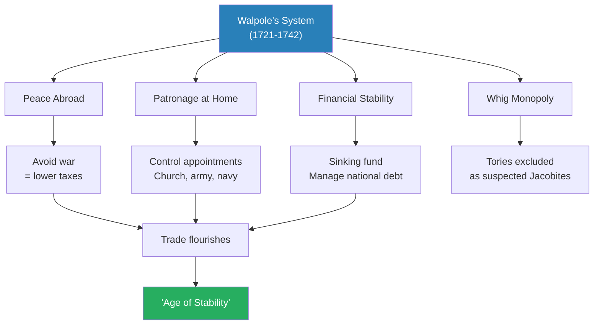
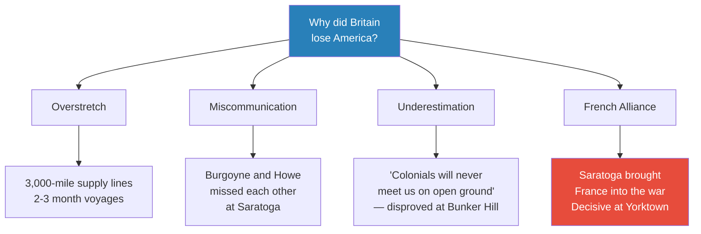
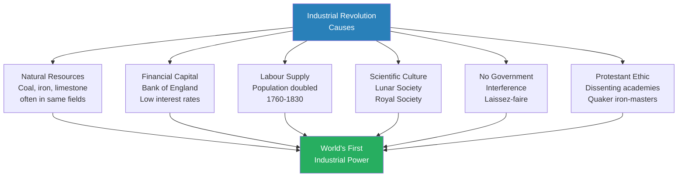
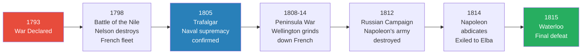

# Revolution — Peter Ackroyd

> Peter Ackroyd tells the story of England's transformation from a second-rank European power to the world's foremost commercial and naval empire across the long eighteenth century (1688-1815). This is not a story of one revolution but of many — the Glorious Revolution that enthroned Parliament, the financial revolution that created the Bank of England and the national debt, the agricultural revolution that remade the countryside, the consumer revolution that filled English homes with Wedgwood china and Indian cotton, and the Industrial Revolution that turned valleys into furnaces and children into factory hands. Woven through all of it is the fifty-eight-year war against France, from William III's landing at Torbay to Wellington's victory at Waterloo, a conflict that created the fiscal-military state, built the Royal Navy, and forged a national identity. Ackroyd, ever the literary Londoner, populates this panorama with Defoe and Swift, Pope and Johnson, Hogarth and Blake, showing that the age of reason was also the age of gin, mob violence, the South Sea Bubble, and the Gordon Riots. The result is a history that reads like a novel — sprawling, digressive, and endlessly entertaining.

---

## About the Author

Peter Ackroyd is one of England's most prolific men of letters, author of acclaimed biographies of Dickens, Blake, Shakespeare and Thomas More as well as the multi-volume History of England of which *Revolution* is the fourth instalment. A Londoner by birth and temperament, Ackroyd brings to historical writing the eye of a novelist and the ear of a literary critic. His method is impressionistic and panoramic — he prefers atmosphere to argument, anecdote to analysis, and the telling quotation to the statistical table. *Revolution* covers the longest span of any volume in the series, and its scope is correspondingly vast: politics, war, commerce, industry, literature, art, religion, crime, and the texture of daily life across 127 years.

---

## The Big Idea

- <b style="color: #27ae60">England's rise to global supremacy was driven by two parallel revolutions — one political, one economic — both fuelled by perpetual war against France</b>
- The political revolution transferred sovereignty from Crown to Parliament, beginning with the Bill of Rights in 1689 and tested by every subsequent crisis — the Jacobite risings, the Wilkes affair, the loss of America, the French Revolution
- The economic revolution transformed England from an agrarian society into the world's first industrial and commercial power, driven by enclosure, the Bank of England, colonial trade, the steam engine, and the factory system
- <b style="color: #e74c3c">The costs were enormous</b> — child labour, urban squalor, the slave trade, the dispossession of the rural poor, and a culture of war that consumed 83% of public revenue
- <b style="color: #2980b9">The "age of reason" was also an age of satire, gin, mob violence, and the Gordon Riots</b> — the polished surface of Georgian civilization concealed depths of suffering
- England avoided revolution not through stability but through pragmatism, religious pluralism, the myth of English liberty, and the conservative instincts of its people

---

## Key Concepts at a Glance

| Concept | One-line summary |
|---------|-----------------|
| **The Glorious Revolution** | Parliamentary sovereignty established by deposing James II and crowning William III on conditions |
| **The fiscal-military state** | War against France drove the creation of the Bank of England, national debt, and massive taxation |
| **The rage of party** | Whig-Tory rivalry dominated politics from 1689 to the 1760s, dividing every institution |
| **The financial revolution** | Bank of England (1694), stock-jobbing, and public credit transformed the economy |
| **Enclosure** | Consolidation of farmland dispossessed the rural poor but increased agricultural productivity |
| **The culture of commerce** | Trade became England's national religion, merchants its high priests |
| **Polite society** | Clubs, coffee-houses, assembly rooms, and spas created a new culture of sociability |
| **The consumer revolution** | Fashion, advertising, and emulation drove an explosion of domestic consumption |
| **The Industrial Revolution** | Steam, iron, cotton, and the factory system — incremental change over a century |
| **Wilkes and Liberty** | John Wilkes's campaigns crystallised the demand for parliamentary reform and press freedom |
| **The loss of America** | Stamp Act to Yorktown — overreach, miscommunication, and the birth of a nation |
| **The Napoleonic Wars** | Twenty-two years of conflict ending at Waterloo, confirming British maritime supremacy |

---

*The long eighteenth century: from the Glorious Revolution to Waterloo, England fought France for fifty-eight of the intervening 127 years.*

---

---

## Part I: The Glorious Revolution and the War Against France (1688-1714)

### The Revolution Settlement

*The divine right of kings ended not with a bang but with a legal fiction — James II had "abdicated" a throne he never left voluntarily.*

- The Convention of 1689 faced a constitutional crisis: James II had fled, William of Orange was in Whitehall, but no one was sure who was the legitimate sovereign
- The Commons declared James had "abdicated" — <b style="color: #2980b9">a term with no basis in law, essentially a legislative fiction</b>
- The <b style="color: #2980b9">Bill of Rights</b> established the new constitutional order:
  - No standing army in peacetime without parliamentary consent
  - No taxes raised without parliamentary agreement
  - Freedom of speech in Parliament guaranteed
  - Parliaments to be held frequently
- William and Mary were proclaimed conjoint sovereigns — but William never formally swore to accept the Bill's provisions
  - He complained that "the worst of all governments was that of a king without treasure and without power"
  - He told the marquis of Halifax he "fancied, he was like a king in a play"
- <b style="color: #27ae60">The "Glorious Revolution" was crafted by an organized elite — aristocracy and gentry — who retained power for the next 200 years</b>

> [!tip] Core Insight
> The Glorious Revolution was neither glorious nor a revolution in any modern sense. It was a palace coup by a propertied elite who eliminated royal absolutism to protect their own estates and privileges. Parliamentary sovereignty was not democracy — it was oligarchy with better paperwork.

---

- William III was personally ill-suited to his new role:
  - Reserved, asthmatic, spoke poor English, preferred Dutch advisers
  - Rumoured to be homosexual — the Princess Palatine asked if his court had become a "chateau de derriere"
  - A sincere Calvinist who believed himself fated to fight Catholic France
  - After landing at Torbay he asked Bishop Burnet: "Well, doctor, what do you think of predestination now?"

---

### William's War Against France

- William's primary reason for invading England was to recruit its wealth for his war against Louis XIV
  - He had fought the French for sixteen years before coming to England
  - Louis XIV wished to create a Bourbon empire; William wished to prevent it
- <b style="color: #2980b9">The Nine Years War (1689-1697)</b> was the opening act of a conflict that would last fifty-eight years
- The Battle of the Boyne (1690) ended Catholic hopes in Ireland:
  - William led from the front despite being grazed by a cannonball the day before
  - James II watched from a distance, then galloped away to France — the Irish called him "Seamus a' chaca" (James the Shit)
  - The subsequent "penal laws" stripped Catholics of property, office, and religious freedom

> [!example] The Battle of the Boyne (1690)
> - William was fired upon by two field guns the day before battle; the second ball grazed his shoulder
> - He bent forward over his horse but steadied himself: "There is no harm done, but the bullet came quite near enough"
> - The watchword for battle was "Westminster"; every English soldier wore a green bough in his hat
> - James watched from a distance; when his forces retreated he galloped to Duncannon and sailed for France
> - He never returned to Ireland — his last, best hope of regaining his throne was gone
> **The lesson:** A king who watches his own battle from a safe distance has already lost it.

---

### The Financial Revolution

*How do you fund a continental war without impoverishing the country? The answer was the national debt.*

- <b style="color: #2980b9">Charles Montagu</b>, a lord of the treasury still in his early thirties, pushed through the Bank of England Act in 1694
  - The Bank would lend money to the government; repayment of annual interest guaranteed by Parliament from duties on beer
  - £1.2 million raised from wealthy subscribers at 8% annual interest — the list filled within ten days
  - The king and queen were among the investors
- This was <b style="color: #27ae60">the beginning of the national debt</b> — and the beginning of the fiscal-military state
  - Parliament was now in supreme command of national funding
  - Within twenty years an annual "budget" would be presented to members
  - France had no such financial scheme — placing it at a disadvantage in funding war
- The City of London became the temple of the new financial order:
  - Exchange Alley, near the Royal Exchange, was the centre of stock-jobbing
  - Jonathan's and Garraway's coffee-houses became de facto stock exchanges
  - A bull was a financial optimist; a bear was the opposite; a lame duck was a bankrupt
- <b style="color: #e74c3c">The moneyed interest vs. the landed interest</b> became the central economic divide of the century:
  - Whigs were associated with the City, finance, and commerce
  - Tories represented the landed classes and viewed stock-jobbing as "financial manipulation"
  - Swift denounced the war as continuing "to enrich usurers and stock-jobbers"

---

### The Death of William III

- William III's horse stumbled on a mole-hill at Hampton Court in February 1702:
  - He fell and broke his collar bone; complications led to his death
  - "For many years afterwards the Jacobites toasted 'the little gentleman dressed in velvet' who had supplied the coup de grace"
- He was not greatly mourned, for he had not been greatly loved:
  - "He had been, for many, the least bad alternative"
  - But his legacy was "far more substantial than might at first appear":
    - He had defied French power and limited its continental ambitions
    - He and his advisers placed England on a "far more advantageous financial footing"
    - "A new dynasty, a new foreign policy and a new economic dispensation, were not negligible achievements"
- The <b style="color: #2980b9">Act of Settlement (1701)</b> had already debarred the Stuart dynasty from the throne:
  - Parliament turned to Germany — Sophia, electress of Hanover, granddaughter of James I
  - Every sovereign must be part of the communion of the Church of England
  - If a king was born beyond English shores, no English force would be obliged to defend his native soil
  - "These were all measures designed to obstruct any pretensions that the house of Hanover might claim"

---

### Queen Anne and Marlborough's Wars

- Anne became queen in 1702 — "not the most prepossessing of monarchs":
  - Thirty-seven years old, twelve miscarriages, five children dead, crippled by gout
  - Sir John Clerk found her "red and spotty," her dress "negligent," her foot "tied up with a poultice"
  - But she declared her "heart to be entirely English" — a hit against the Dutch William
- <b style="color: #2980b9">The War of the Spanish Succession (1701-1714)</b> was the second great round of Anglo-French conflict
  - Triggered by the death of Charles II of Spain — "the Sufferer" — and the French claim to the Spanish throne
  - Marlborough commanded the allied forces

> [!example] Marlborough's March to Blenheim (1704)
> - Marlborough marched 20,000 men across 250 miles of Europe in six weeks, absorbing 20,000 more along his route
> - He moved in conditions of speed and secrecy to conceal his intentions from both the French and his own cautious Dutch allies
> - At Blenheim the French lost 34,000 men; the allies lost 14,000
> - Marlborough wrote to his wife: "within the memory of man there had been no victory so great as this"
> - Bavaria was knocked from the war and Vienna saved
> **The lesson:** Audacity and secrecy in logistics can be as decisive as valour on the battlefield.

- The war dragged on for another nine years after Blenheim:
  - Ramillies (1706) drove the French from the Spanish Netherlands
  - <b style="color: #e74c3c">Malplaquet (1709) was a Pyrrhic victory</b> — 20,000 allied dead, double the enemy's losses
  - The French commander wrote to Louis: "if it please God to give your majesty's enemies another such victory, they are ruined"
- The Peace of Utrecht (1713) confirmed Britain as a world power:
  - Gibraltar and Minorca secured; Newfoundland and Hudson's Bay ceded
  - The asiento granted England the right to ship African slaves to Spanish colonies
  - France was contained but not destroyed

---

### The Age of Party

*The Whigs and Tories divided everything — coffee-houses, hospitals, even the children of Eton College.*

- <b style="color: #2980b9">Whigs</b> supported the war, the Protestant succession, the moneyed interest, and parliamentary supremacy
- <b style="color: #2980b9">Tories</b> defended the Church, the royal prerogative, the landed interest, and often harboured Jacobite sympathies
- The rivalry penetrated every aspect of life:
  - London had Whig and Tory clubs, coffee-houses, taverns, and hospitals
  - "St Thomas's for the former and Bart's for the latter. Who would wish to be treated by a member of the wrong party?"
  - When Swift passed through Leicester in 1707: "there is not a chambermaid, prentice or schoolboy in this whole town but what is warmly engaged on one side or the other"
  - Swift satirised the division in Gulliver's Travels as "Tramecksan" (high heels) and "Slamecksan" (low heels)

---

### Social Hierarchy in the New Order

*The patrician class steered the new state — and would retain power for two centuries.*

- At the apex remained the monarch, now ruling by "the divine right of Providence" — an ambiguous formulation for an ambiguous position
- Below the Crown, approximately 200 aristocrats formed a "small but confident and coherent landed elite":
  - Wealth was essential but blood lineage was equally important
  - "A landed estate, which conferred the right to hunt, was a prerequisite"
  - As late as George III's reign, no individual engaged in trade could become a peer
- The lords controlled the Commons through family connections:
  - "The head of the family would sit in the upper chamber, while his relations and dependants would sit in the lower"
  - Pitt the elder described the Commons as "a parcel of younger brothers"
- Below the aristocracy, roughly 15,000 lower gentry lived off the land without tilling their own soil
- <b style="color: #2980b9">The "middling orders"</b> — tenant farmers, factory-owners, government officers, merchants, clergymen, doctors, lawyers — were the rising class:
  - In the early eighteenth century, one in seven belonged to this "middle state"
  - A hundred years later, the proportion was one in four or five
  - Defoe praised the "middle state" as "the best state in the world, the most suited to human happiness"
- The labouring poor comprised "by far the greatest part of the working population":
  - "Those who served meals, those who drew water, those who hewed wood, those who stitched and those who spun"
  - Approximately one quarter of the population was in a state of abject poverty at any time before the Industrial Revolution
- Below even these were "the miserable, the abject, the worthless":
  - "They live more like rats and weasels and such like noxious vermin, than creatures of human race"

---

### The Press and the Birth of Public Opinion

- The lapsing of press censorship in 1695 was "a momentous change that emancipated English letters for ever from government control"
- Within a fortnight, newspapers proliferated — the first daily, the Daily Courant, appeared in 1702
- Robert Harley ("Robin the Trickster") pioneered political media management:
  - He put Defoe on the payroll as journalist and travelling spy
  - He employed Swift for the educated gentry audience
  - "He had Swift in one pocket and Defoe in the other"
- The Tatler (1709) and the Spectator (1711) created the template for polite journalism:
  - Addison declared his purpose was "to have brought philosophy out of closets and libraries, schools and colleges, to dwell in clubs and assemblies, at tea-tables and in coffee houses"

---

### The Church, Dissent, and Toleration

- Orthodox Anglicanism was "primarily a religion of responsibilities and duties. It was reasonable, and not dogmatic"
  - "Morality, rather than Christ the Saviour, was the guiding presence"
  - Napoleon would later remark: "I don't see in religion the mystery of the incarnation but the mystery of the social order"
  - Hogarth's The Sleeping Congregation showed "a universal dullness covering all"
- The Toleration Act of 1689 granted dissenters freedom of worship:
  - Over 2,500 chapels were licensed within twenty years
  - The Quakers who had once "stripped naked 'for a sign'" now "modestly and devoutly behave themselves"
  - "This is the trajectory of all radical faiths. Its adherents become more complacent and more respectable; in particular they become older"
- The <b style="color: #2980b9">Sacheverell affair (1710)</b> revealed the explosive power of religion in politics:

> [!example] The Trial of Dr Sacheverell (1710)
> - Dr Henry Sacheverell preached a sermon at St Paul's attacking religious toleration and the dissenters
> - "He came into the pulpit like a Sybil to the mouth of her cave... with such an air of fierceness and rage"
> - The Whigs made the fatal mistake of impeaching him for "high crimes and misdemeanours"
> - The London mob sacked dissenting meeting houses; their pews and wainscot were burned at Lincoln's Inn Fields to shouts of "High Church and Sacheverell!"
> - The queen's own carriage was stopped while people cried out "God save your Majesty and the Church!"
> - Sacheverell was convicted but given a negligible sentence — tantamount to acquittal
> - The ensuing election gave the Tories a two-to-one majority
> **The lesson:** Never make a martyr of a popular favourite. The Whigs' overreaction to one sermon cost them power for a generation.

---

### The Act of Union with Scotland (1707)

- William III had wanted union for defensive reasons — he did not want a Jacobite enemy at his back door
- A Tory suggested that union with Scotland was like marrying a vagrant: "whoever married a beggar could only expect a louse for her portion"
- But in 1703 the Scottish parliament passed Acts threatening to choose its own monarch and make its own decisions on war and peace
  - The prospect of "an unfriendly power on the northern border concentrated the minds of the English politicians"
- The negotiations took place at the Cockpit in Whitehall — "liberally larded with cash and promises to sweeten the Scottish lairds"
  - Adam Smith later wrote that the union "raised the value of all highland estates"
  - It established "the largest free trade area in the world"
  - Swift called it "our crazy double-bottomed realm"

---

## Part II: The Hanoverian Settlement and Walpole's England (1714-1760)

### The Hanoverian Succession

- Queen Anne died on 1 August 1714; George I was proclaimed that same day
  - Fifty-seven people had a better hereditary claim — but he was the only Protestant
  - His wife Sophia had refused to marry him, shouting "I will not marry the pig snout"
  - He arrived with ninety staff, two Turkish body servants, and two mistresses — one very thin, one very fat
- George I stripped the Tories of power, treating them all as suspected Jacobites:
  - The great earl of Oxford was sent to the Tower for two years
  - Others fled to France and the embrace of the "Old Pretender"
- <b style="color: #2980b9">"The Fifteen"</b> — the earl of Mar raised the Jacobite banner at Braemar in September 1715
  - The rebellion collapsed; the Old Pretender arrived too late and sailed back to France
  - The Septennial Bill extended Parliament's life from three to seven years — killing Tory chances

---

### The Gambling Mania

- <b style="color: #2980b9">Gambling was the national obsession</b> — from the card tables of palaces to the dice games of taverns:
  - Horace Walpole reported that at Brooks's club "a thousand meadows and cornfields are staked at every throw"
  - Charles James Fox once sat for twenty-two hours playing Hazard
  - "Gentlemen bet on the life expectations of their fathers"
  - Thomas Whaley bet that "he could jump from his drawing room window into the first barouche that passed and kiss the occupant"
  - "When a man fell to the ground in a stupor opposite Brooks's, the members laid bets whether he was alive or dead"
  - "The throwing of dice was not unusual during church services"
- Government lotteries were instituted in 1709 and lasted until 1824:
  - "On 21 January 1710, above a million is already subscribed"
  - Six houses in Limehouse were "disposed of by tickets, and the numbers drawn by two parish boys out of two wheels"
- This "mania for speculation and quick profit" was responsible for the new interest in fire, marine, and life insurance:
  - "Insurances were made out for marriages and births, as well as deaths"
  - "Private gambling therefore became an intrinsic part of the public economy"
  - Pascal and Fermat devised mathematical probability theory from the complex calculations

---

### The South Sea Bubble

*A bubble is blown up in air / In which fine prospects do appear / The Bubble breaks, the prospect's lost / Yet must some Bubble pay the cost.*

- The South Sea Company (1711) was established to manage government war debt — with the promise of profits from trade with the Americas
- By June 1720, £100 of government stock was worth £1,050 of South Sea stock
- Eighty-six different schemes were advertised — for making quicksilver malleable, importing jackasses from Spain, and "a wheel of perpetual motion"

> [!example] The South Sea Bubble (1720)
> - Shares were purchased "ten per cent higher at one end of the alley than at the other"
> - Ministers and MPs were bribed with free distributions of stock
> - When the crash came in September, the stockholders lost everything
> - There were calls for the directors to be "broken on the wheel"
> - One noble peer, Lord Stanhope, died of apoplexy after being charged with corruption
> **The lesson:** When everyone is chasing everyone else for a quick profit, the bubble has already formed — it only needs a pin.

- <b style="color: #2980b9">Robert Walpole</b> emerged as the man who calmed the panic:
  - Persuaded the Bank of England to buy up South Sea holdings
  - Confiscated the directors' ill-gotten gains
  - Earned the nickname "the Screen" for shielding ministers from attack
  - Became first lord of the treasury in 1721 — and dominated politics for twenty-one years

---

### Walpole's England

*"Quieta non movere" — Don't disturb things that are quiet.*

- Walpole was "thick-set, short and plump with a noticeable double chin"
  - He chewed home-grown apples on the front bench and kept his temper
  - He read farm reports before turning to newspapers
  - He said that "when you have the same experience of mankind as myself you will go near to hate the human species"
- <b style="color: #27ae60">His one constant principle was to avoid war</b> — it was wasteful of men and money
- He controlled Parliament through patronage:
  - He supervised appointments of Church, army, and navy
  - "No office was too unimportant, no sinecure too small, to escape his attention"
  - He declined a peerage, knowing his real power lay in command of the Commons
- The Excise Crisis of 1733 was his great miscalculation:
  - His proposal to streamline tobacco duties provoked panic about an "army of excisemen"
  - His effigy was burned in markets; cockades worn with "Liberty, property, and no excise"
  - At supper he told colleagues: "this dance it will no farther go"
- <b style="color: #e74c3c">He was eventually forced into war with Spain in 1739</b> — the "War of Jenkins' Ear":
  - "They now ring the bells," he said. "They will soon wring their hands"

---

*Walpole's system was built on peace, patronage, and financial management — but it collapsed the moment war became unavoidable.*

---

### Robert Harley: Portrait of a Politician

- <b style="color: #2980b9">Robert Harley</b> ("Robin the Trickster") embodied the political animal of the age:
  - He "said nothing simple and nothing true"
  - Alexander Pope remarked that "he always began in the middle" — an allusion to Horace's advice to the epic poet
  - Lord Cowper said: "if any man was ever born under a necessity of being a knave, he was"
  - "He was secretive to the point of being mysterious, dilatory to the point of immobility"
  - He had no principles beyond self-advancement, "although loyalty to the throne may be counted as one of his virtues even if it might be construed as loyalty to his own prospects"
  - He survived an assassination attempt when a French spy stabbed him twice — "an elaborately ornate and padded waistcoat saved him from serious injury"
  - Ennobled as earl of Oxford, then impeached after Marlborough's fall, sent to the Tower for two years
- We may repeat Blake's perception that "nothing new occurs in identical existence; Accident ever varies, Substance can never suffer change nor decay"

---

### The Death of Queen Anne and the Succession Crisis

- The final year of Anne's reign was consumed by anxiety over the succession:
  - The queen secretly favoured her half-brother James Edward Stuart — or so it was assumed
  - Some ministers "faced both ways, sending messages of assurance to the Stuart court while continuing to deal with the house of Hanover"
  - Marlborough, on enforced leave on the continent, was simultaneously preparing forces for the Hanoverians and maintaining contact with the Pretender
  - Richard Steele warned that "nothing but divine providence can prevent a civil war within a few years"
- On her deathbed, the queen appointed the duke of Shrewsbury — who "had never professed himself to be wholly Whig or wholly Tory"
  - "On the following morning she was dead"
  - The doctor recorded that "the immediate occasion of the queen's death proved to be the transition of the gouty humour" from knees and feet to brain
  - "It had flown upwards and taken the sovereign with it"

---

### The Forty-Five

- Bonnie Prince Charlie landed in Scotland in summer 1745, taking advantage of the continental war
- He occupied Edinburgh, won at Prestonpans, and marched as far as Derby — causing panic in London
- <b style="color: #e74c3c">But the Scots did not flock to his banner, and the Tories gave no real support</b>
  - "The Bank of England effectively destroyed the Stuart cause"
- Defeated at Culloden in April 1746; Cumberland's soldiers went through the Highlands in "a systematic campaign of rape, slaughter, theft and execution"
  - Wearing "Highland clothes" was punishable by six months' imprisonment
  - It was "a deliberate policy of cultural genocide"

---

## Part III: Commerce, Culture, and the Condition of England

### The Agricultural Revolution

*"Whoever could make two ears of corn, or two blades of grass to grow upon a spot of ground where only one grew before, would deserve better of mankind than the whole race of politicians put together."*

- The early years of Queen Anne's reign were blessed by bountiful harvests — wheat below 30 shillings a quarter, the "crucial figure that generally provoked distress or riot"
- The "agricultural revolution" was in truth a long age of improvement dating from the mid-seventeenth century:
  - "The forces of conservatism ruled the countryside, with the tillage of land and the raising of animals changing little over many thousands of years"
  - "Until the middle of the seventeenth century, even to attempt an improvement in husbandry was looked upon with an ill eye"
- <b style="color: #2980b9">Enclosure</b> was the key agent of change:
  - Larger estates out of open fields and communal pasture — "a social revolution in the countryside"
  - The distinctive "checker-board" aspect of the English countryside, with hedges or dry-stone walls, dates from the mid-eighteenth century
  - The small farmers and cottagers were "relegated to the status of labourers hired for money"
  - "The peasants and the yeomen, once the staple of the agricultural hierarchy, were diminished and ultimately disappeared"
  - Parliamentary commissioners "tacitly supported the cause of agricultural reform — that was the spirit of the age"
- The results were dramatic:
  - By the mid-eighteenth century, one-third of the population could furnish sustenance for the remaining two-thirds
  - The average weight of a sheep at Smithfield rose from 28 lb to 80 lb in the course of the century
  - The Encyclopaedia Britannica could claim in 1797 that "Britain alone exceeds all modern nations in husbandry"
- Population grew inexorably:
  - From approximately 6 million in 1714 to 9 million by 1800
  - The reasons: decline in mortality, increase in fertility, absence of famine, abundance of food, inclination towards early marriage

---

### From Wood to Coal: The Dawn of Industrial Power

- <b style="color: #27ae60">The transition from wood to coal was the foundation of everything that followed</b>:
  - "Coal was the foundation. Yet first it had to be reached from the bowels of the earth"
  - Miners "knelt, stooped or lay on one side in order to hack the coal from the main seam by means of pick, wedge or hammer"
  - Women and children dragged large baskets from chains fastened to their waists
  - "Miners have always been associated with the dark and with subterranean depths; that is why they have generally been regarded with superstitious awe"
- Thomas Savery patented the first "steam engine" in 1698; Thomas Newcomen refined it by 1712:
  - "The working of a Newcomen engine is a clumsy and apparently very painful process, accompanied by an extraordinary amount of wheezing, sighing, creaking and bumping"
  - But it "for the first time converted thermal energy into kinetic energy. It turned heat into work"
  - "The wheezing and sighing engine changed the world"

---

### The Growth of Trade

*"Be commerce, then, thy sole design; / Keep that, and all the world is thine."*

- <b style="color: #27ae60">Trade became the national religion of the eighteenth century</b>
  - Lord Carteret in the Lords: "Our trade is our chief support, and therefore we must sacrifice every other view to the preservation of our trade"
  - Voltaire noted that in England, the brother of a minister was a merchant in the City
- Defoe's Tour Through the Whole Island of Great Britain (1724-26) celebrated "the most flourishing and opulent country in the world":
  - Of Liverpool: "it was more than double what it was at the second [visit]; and, I am told, that it still visibly increases"
  - Of Norwich: "the inhabitants being all busy at their manufactures"
- The towns were transformed:
  - In 1700, Norwich was the only provincial town with more than 25,000 inhabitants
  - By 1820, fourteen more could be found
  - Liverpool, Birmingham and Manchester had expanded twenty times

---

### Polite Society: Spas, Assembly Rooms, and the Art of Conversation

*Civilization meant civility — order and sociability, all the gestures of recognition and greeting.*

- The provincial towns were transformed by a new culture of sociability:
  - Assembly rooms, walks, pleasure gardens, theatres, and concert venues sprang up everywhere
  - At Bath, Beau Nash presided as master of ceremonies — "complete with slender cane and white beaver hat"
  - "There was no question of anonymity in this world; the whole point was to be recognized as an eminent social being"
  - One rule at Bath prohibited screens in public places "lest they divide the company into secluded sets"
- <b style="color: #2980b9">The "walk"</b> was the provincial equivalent of the London promenade:
  - "A gravelled path, or a promenade, or a tree-lined avenue, where ladies and gentlemen might perambulate without being accosted by the lower sort"
  - These rural walks "were the direct begetters of the shopping parades"
- <b style="color: #2980b9">Conversation</b> was the great medium of sociable life:
  - Johnson said that "none of the desires dictated by vanity is more general, or less blamable, than that of being distinguished for the arts of conversation"
  - "A man was made for conversation" — and the proof was the explosion of clubs
  - London numbered 3,000 clubs; Bristol had approximately 250
  - At the Terrible Club, "members had to cut their beef with a bayonet and drink a concoction of brandy and gunpowder"
  - At the Silent Club "not a word was allowed to be spoken"
  - The Tall Club, the Surly Club, and the Farters' Club "had a similarly specialized membership"
- The earl of Shaftesbury captured the theory: "we polish one another and rub off our corners and rough sides by a sort of amicable collision"

---

### Vauxhall and the Pleasure Gardens

- The pleasure gardens were planned on "an altogether more brilliant and ambitious scale" than earlier tea gardens:
  - Vauxhall Gardens south of the Thames and Ranelagh Gardens in Chelsea attracted thousands
  - "The gardens were lit at night by a thousand lamps, giving the illusion of Scheherazade and the nights of Arabia"
  - Ham sandwiches were so thin "that a competent waiter could cover the 11 acres of Vauxhall with the slices from one ham"
  - "It was said that there were more prostitutes in the gardens than there were waiters"

---

### Consumer Culture and Wedgwood

*"The shops are perfect gilded theatres."*

- <b style="color: #2980b9">The consumer revolution</b> filled English homes with new goods:
  - Tea consumption rose from 20,000 pounds annually in the 1690s to 5 million pounds by 1760
  - The amount of sugar consumed, to sweeten the bitter herb, "increased fifteen times over the century"
  - "Behind the spoon of sugar lay the back-breaking labour of the slave"
  - China-ware was unknown in 1675 but ubiquitous by 1715; cabinet-making became a major trade
  - The number of households possessing cups for hot drinks "rose 55 per cent in the thirty years before 1725"
- Shops became "perfect gilded theatres":
  - Sophie von la Roche noted in 1786 that "behind the great glass windows absolutely everything one can think of is neatly, attractively displayed"
  - She passed "a watch-making, then a silk or fan store, now a silver-smith's, a china or glass shop"
  - "This was the beginning of what has been described as leisure shopping"
- <b style="color: #2980b9">Josiah Wedgwood</b> epitomised the Georgian culture of commerce:
  - Born in 1730 in Burslem, Staffordshire — "the spirit of place animated him soon enough"
  - He focused on "the rising ranks of 'middling people' which class we know are vastly, I had almost said, infinitely superior in numbers to the Great"
  - "Fashion is infinitely superior to merit in many respects"
  - He pioneered catalogues, trademarks, travelling salesmen, and showrooms designed as galleries
  - He had the ambition of being "Vase Maker General to the Universe" — which "in a manner of speaking, he became"
- <b style="color: #2980b9">Emulation</b> was the great engine of consumer society:
  - "The present rage of imitating the manners of high-life hath spread itself so far among the gentlefolks of lower-life"
  - "In England the several ranks of men slide into each other almost imperceptibly, and a spirit of equality runs through every part of their constitution"
  - "A fashionable luxury must spread through it like a contagion"
- Advertisements multiplied:
  - Sixty different advertisements for George Packwood's razor cleaners and shaving paste
  - Dr James Graham advertised his "celestial, or medico, magnetico, musico, electrical bed"
  - Dr Johnson confessed that "the trade of advertising is now so near perfection that it is not easy to propose any improvement"
  - William Blake designed advertisements for Wedgwood crockery — "Eternity is in love with the productions of time"
- <b style="color: #2980b9">Adam Smith's The Wealth of Nations (1776)</b> codified the new economic philosophy:
  - "It is not from the benevolence of the butcher, the brewer, or the baker, that we expect our dinner but from their regard to their own interest"
  - When an individual attends to his own gains he is led "by an invisible hand" to promote the general good
  - It was Smith, not Napoleon, who first described England as "a nation of shopkeepers"
  - "From this sentence sprang an insight that controlled social and economic theory for more than a century"

---

### London: The Dark Underside

*"One is forced to travel, even at noon as if one were going to battle."*

- The smell of London "was noticeable from several miles away" — the stench of horse-dung, perspiration, ordure, and crowded churchyards
- The streets were "thronged with pedestrians but by hackney-chair men and porters, dust-carts and post-chaises, dogs and mud-carts, the boys with trays of meat on their shoulders and the begging soldiers"
  - The noise was "like that of Bedlam; from a distance it resembled a great shout echoing into the firmament"
  - Coaches became stuck in "dead halt or 'lock'" and coachmen "would begin to whip each other's horses and often jump down to engage in a fist-fight"
- The old violent London "never went away and will never go away":
  - Until the later improvements, "the city was the arena for public hangings and floggings"
  - "The mad people of Bedlam were one of the city's sights, as were the gibbets along the Edgware Road"
  - "The mendicants bared their ulcers, while the prostitutes tried to cover their sores"
- Sex was "plentifully available":
  - "From the most expensive harlot with lodgings in Covent Garden to the small boy or girl who was easy prey for a penny"
  - Addison left a tender picture of being accosted by "a slim and pretty girl of about seventeen... her eyes were wan and eager, her dress thin and tawdry"
- Crime flourished in the absence of organised police:
  - "There was no organized police surveillance except the decrepit system of watch and ward"
  - "The streets were dark and treacherous, the tenements grim and the slums dangerous"
  - Horace Walpole: "One is forced to travel, even at noon as if one were going to battle"
- London was tremendously superstitious:
  - "Phantoms and witches and apparitions were reported in the city"
  - "The king himself was said to believe in vampires — although that may have been part of his Germanic legacy"
  - A lady from Godalming, Mary Tofts, began to give birth to rabbits — London's prominent doctors flocked to witness it; "this, too, was all an imposture"
  - On 8 February 1750, an earthquake tremor was felt beneath London; when a second struck on 8 March, it was "considered certain that a third earthquake, even more terrible, would erupt on 8 April"
  - Horace Walpole counted 750 carriages passing Hyde Park Corner into the country; "in the event all was calm. God rested"

---

### The Gin Craze

*"Drunk for a Penny / Dead Drunk for twopence / Clean Straw for Nothing."*

- The gin craze (c.1720-1751) devastated London's poor:
  - 8,659 gin shops in the city; 5.5 million gallons purchased in 1735
  - Children drank until they could not move; men and women died in gutters
  - Judith Defour strangled her two-year-old child, pawned its clothes for a shilling, and spent it on gin
- Hogarth's Gin Lane (1751) was the definitive image:
  - A dazed woman sits upon steps with an infant falling from her useless arms
  - An emaciated ballad-singer lies dying; a man and dog quarrel over a filthy bone
  - "She has the tokens of syphilis upon her legs. She is filthy, and her clothes are in tatters"
- Attempts at prohibition only drove the trade underground:
  - Gin was sold as "Sangree," "Tow Row," "the Makeshift," or "King Theodore of Corsica"
  - An enterprising trader bought the sign of a cat with an open mouth; a lead pipe under its paw dispensed gin to customers who said "Puss, give me twopennyworth"
  - "Crowds soon gathered to see 'the enchanted cat' and the liquor itself came to be known as 'Puss'"
- Informers who reported illegal gin sellers were hounded — "some were beaten to death, while others were ducked in the Thames or the common sewers"
- The craze finally subsided not because of prohibition but because of bad harvests, Methodism, and the new fashion for tea
- London's streets were dark and treacherous:
  - "One is forced to travel, even at noon as if one were going to battle" — Horace Walpole
  - The thieves were divided "even as an army might be, into housebreakers, pickpockets, footpads and highwaymen"

---

## Part IV: The Wars for Empire (1756-1783)

### George II: The German King

- George II was "very short, and relied upon the effect of wigs and high shoes":
  - He had "bright blue eyes and a noble Roman nose" according to flatterers; enemies saw "feebleness of intellect and of character"
  - He was known for kicking his servants and being "brusque or even rude to casual visitors"
  - His conversation with his wife was recorded by Lord Hervey: "he told her she always loved talking of such nonsense and things she knew nothing of"
  - He visited his mistress at seven in the evening; "if he was a little early he paced up and down outside her door with his watch in his hand"
- He loved the regal world of pageantry and spectacle but he loved England's people no more than they loved him:
  - "No English cook could dress a dinner; no English player could act; no English coachman could drive"
  - "The palm in all these activities went to his German compatriots"
- <b style="color: #27ae60">But he was meticulous in his duties</b> — "he read everything that was put before him, and every day was divided into its separate duties"
- He died in October 1760 on the water closet:
  - The valet-de-chambre "heard a noise, louder than royal wind, listened, heard something like a groan, ran in" and found the king on the floor

---

### Adam Smith and the Birth of Free Trade

- <b style="color: #2980b9">Adam Smith's The Wealth of Nations (1776)</b> was "the founding text of the modern economy":
  - Smith was "an unlikely prophet" — kidnapped by tinkers as a child, walked in a "vermicular" (worm-like) manner, once fell into a tannery pit while discoursing on the division of labour
  - He believed trade should be altogether liberated from medieval restrictions: "no control over wages, hours, rates of interest, or prices"
  - "Protection, in all its forms, should come to an end"
  - Richard Price wrote in the same year that "all government becomes tyrannical as far as it is a needless and wanton exercise of power"
  - The concept of <b style="color: #2980b9">laissez-faire</b> became popular in the 1750s
  - William Pitt declared in 1796 that "trade, industry and barter will always find their own level and be impeded by regulations which violate their natural operation"

---

### Walpole's Fall and the War of Jenkins' Ear

- Walpole's great weakness was his aversion to war:
  - "He had an aversion to conflict. It was wasteful of men and money"
  - He managed to stay out of the War of the Polish Succession (1733-38)
  - But Spanish attacks on English vessels could not be ignored
- <b style="color: #2980b9">Captain Robert Jenkins</b> displayed to the Commons a severed ear struck from his head by a Spanish officer seven years earlier:
  - "The ear was too old to be confirmed as his, but it served the purpose of provoking public fury"
  - "It is possible that the captain lost his ear in some other disciplinary proceeding"
  - "The leathery appendage might have been picked up at a London hospital. Who knew, or cared to know, the truth?"
- <b style="color: #2980b9">William Pitt the Elder</b> made his first great speech against the "insecure, unsatisfactory, dishonourable Convention":
  - "Is this any longer a nation?"
  - "It would have taken a political seer of genius to realize that this young man of thirty would determine the nature of English politics for forty years"
- Walpole declared war in October 1739:
  - "They now ring the bells. They will soon wring their hands"
  - Admiral Vernon captured Porto Bello — "Rule Britannia" was first sung at Cliveden
  - But the war blended into the War of the Austrian Succession — "as if by a transformation scene at the ballet"
- The duke of Newcastle succeeded Walpole:
  - "He had woken half an hour late in the morning and spent the rest of the day trying to make up for lost time"
  - His "confused, tangled, unconnected talk, his fulsome flattery, his promises made at the spur of the moment and almost instantly forgotten"
  - "He loved the hustle and agitation of business rather than the formulation of policy"
  - He kissed and embraced everyone in sight at his grand assemblies
- The War of the Austrian Succession ended at Aix-la-Chapelle in 1748:
  - "Not a moment too soon, it could record no single important result"
  - Thomas Carlyle described it as "an unintelligible, huge English-and-Foreign Delirium"

---

### The Seven Years War

*"I am sure I can save the country and nobody else can."*

- <b style="color: #2980b9">William Pitt the Elder</b> became the architect of England's global supremacy:
  - Tall, hawk-eyed, with "a little head, thin face, long aquiline nose, and perfectly erect"
  - Suffered from "gout" (likely bipolar disorder) that periodically incapacitated him — he would "sit in a darkened room in silence and suffering"
  - "He always spoke of great subjects, great empires, great characters, effulgent ideas and classical illustrations"
  - Lord Shelburne described him as "a completely artificial character. He was always acting, always made up, and never natural"
  - Yet he had "a vision of England and of the nation's destiny, bound not by the narrow frontiers of Europe but by a global trading empire"
  - He told the Commons he needed funds "for the total stagnation and extirpation of the French trade upon the seas"
  - His over-arching policy was to "open as many fronts against France as possible"
- His strategy was to open as many fronts against France as possible:
  - Senegal captured for its slave trade; Gorée seized off Dakar
  - Clive won Bengal at Plassey — "a medley of fighting, tricks, chicanery, intrigues, politics and the Lord knows what"
  - Guadeloupe taken for its sugar — for Pitt, more valuable than Canada

> [!example] Wolfe at Quebec (1759)
> - Major-General Wolfe planned to scale the apparently insuperable Heights of Abraham and attack Quebec from the rear
> - The French were caught by surprise; both Wolfe and the French commander Montcalm were killed
> - The French evacuated most of Canada; Montreal surrendered a year later
> - Voltaire derided the entire conflict as a fight over "a few acres of snow"
> **The lesson:** With the threat of the French removed, the American colonists began to resent the presence of English soldiers — "and so from small events great consequences may arise."

- The West Indies were the most profitable possession:
  - Guadeloupe sent 10,000 tons of sugar per year and required 5,000 slaves — "considered to be a fair bargain"
  - In the hundred years after 1680, some 2 million slaves were "forcibly removed from their homes to the work camps of the West Indies"
  - Jamaica was described as "sickly as an hospital, as dangerous as the plague, as hot at hell, and as wicked as the devil"
- Robert Clive took Bengal in "a medley of fighting, tricks, chicanery, intrigues, politics and the Lord knows what":
  - The East India Company soon had "all the trappings of an oriental state, with its own police force and native army"
  - Within three years the French were compelled to leave India
  - "India became the cockpit in which it was shown that trade was war carried on under another name"
- 1759 was hailed as an <b style="color: #27ae60">annus mirabilis</b>:
  - Horace Walpole remarked that "the church bells had been worn thin by ringing in victories"
  - Quiberon Bay destroyed the French navy; there would be no further threat of invasion
  - "Even as the stinking and putrescent slaves were marched onto Jamaican soil, the new year in England was being hailed as an annus mirabilis"
- The Treaty of Paris (1763) confirmed British global supremacy:
  - Minorca, Nova Scotia, Canada, Senegal, St Vincent, Grenada and other territories became British
  - The French ceded supremacy in India
  - Horace Walpole wrote: "You left England a private little island, living upon its means. You would find it the capital of the world"
  - But there was "no planning, no strategy, no coherent policy" for the vast agglomerate of colonies and territories now under English rule
  - "The response was one of caution and indecision"

---

### Methodism and the Evangelical Revival

*"Oh my hearers, the wrath is to come! The wrath is to come!"*

- In 1738, John Wesley walked along Aldersgate Street to attend a Church of England society:
  - A member was reading Martin Luther's Preface to the Epistle of the Romans
  - "About a quarter before nine" Wesley "felt my heart strangely warmed"
  - This was the first stage of what became known as "the awakening"
- George Whitefield preached in the open air to colliers at Kingswood outside Bristol:
  - David Garrick said he would give £1,000 to utter an "Oh!!!!" in the manner of Whitefield
  - "He cried aloud; he stamped on the wooden platform; he wept"
  - Wesley noted that "the people [were] half-strangled and gasping for life"
  - One man hurled himself upon a wall crying: "Oh what shall I do? What shall I do? Oh for one drop of the blood of Christ!"
- <b style="color: #27ae60">Wesley was a man whose optimism was matched only by his energy</b>:
  - "I do not remember to have felt lowness of spirit for one quarter of an hour since I was born"
  - He preached 800 sermons a year and travelled a quarter of a million miles in his lifetime
  - In his eighty-fifth year he preached eighty sermons in eight weeks
  - He established 356 Methodist chapels and organized the faithful into "classes" and "bands"
- The faith spread among the industrial working class:
  - Approximately half the Methodist congregation were women
  - It flourished in mining areas, fishing villages, and manufacturing districts
  - "Where there is little trade, there is seldom much increase in religion"
  - <b style="color: #2980b9">Methodism was described as "the religious arm of the Industrial Revolution"</b>

---

### Wilkes and Liberty

*"I'd rather vote for the devil." — "Naturally, but if your friend is not standing, may I hope for your support?"*

- <b style="color: #2980b9">John Wilkes</b> was a London radical of an old-fashioned sort:
  - The son of a malt distiller from Clerkenwell, cross-eyed, with a gift for scandalous wit
  - In the forty-fifth issue of the North Briton (1763) he effectively accused George III of lying
  - Arrested under a "general warrant" — which a judge declared illegal
  - He was awarded £1,000 in damages against the secretary of state
- "Number 45" became a national craze:
  - At a Wilkes dinner: "forty-five diners at 45 minutes past one drank 45 gills of wine with 45 new laid eggs in them"
  - Five courses with nine dishes each; a sirloin weighing precisely 45 pounds
  - "Wigs of forty-five curls. Forty-five toasts, forty-five pipes of tobacco, forty-five sky-rockets"
- The Middlesex elections became a political comedy:
  - Wilkes was elected, expelled, re-elected, expelled again, re-elected three more times
  - The Commons finally invited one of his opponents to take the seat he had won
- <b style="color: #27ae60">His significance was in crystallising the demand for parliamentary reform and press freedom</b>:
  - "He orchestrated the political sense of the nation by a mixture of mockery, satire and denunciation"
  - His statue now stands at the bottom of Fetter Lane — "the only cross-eyed effigy in London"

---

### The Fiscal-Military State

*"The English are taxed in the morning for the soap that washes their hands, at nine for coffee, the tea and the sugar they use at breakfast..."*

- The long war against France (1689-1815) transformed England into <b style="color: #2980b9">the most egregious fiscal and military country in the world</b>:
  - Between James II and George IV, taxes had multiplied sixteen times
  - In the same period, England declared war on foreign enemies eight separate occasions
  - A substantial 83% of public money was spent for military purposes
  - "The administration had become in effect a war machine directed principally against the Bourbons"
- A foreign observer noted that "the English are taxed in the morning for the soap that washes their hands, at nine for coffee, the tea and the sugar they use at breakfast; at noon for the starch that powders their hair; at dinner for the salt that savours their meat":
  - "The bricks that built their houses, and the coals that kept them warm, the candles and even the windows that gave them light, were also the subject of tax"
- By the 1720s some 12,000 permanent government servants were on the payroll:
  - The number of professional bureaucrats rose throughout the century
  - "The eighteenth century marked the emergence of government as we have come to know it"
- <b style="color: #e74c3c">Ironically, "the people who complained most loudly about taxation, on the grounds of liberty, were in the end the most willing to pay it"</b>:
  - "It was part of a generally equivocal attitude towards authority that encouraged revolts but not revolution"

---

### The Loss of America

- George III came to the throne in 1760 determined to be "a king":
  - "George, be a king!" his mother had repeated to him
  - He believed Pitt had "the blackest of hearts" and wanted to rule without parties
  - He "despised the cynicism and the back-biting, the profiteering and the posturing"
  - He had "a high opinion of the royal prerogative" and would have "gone to the death in defending the Anglican Church"
  - He rose at six, rode before breakfast, dined at four, and "was always a frugal eater and a prudent drinker"
  - He kept a collection of clocks and barometers — "rigour and precision would be the accompaniments of proper service"
  - "He knew all the little things about the Army List and courtly etiquette; he knew what buttons should be worn and on what occasions"
  - He once said: "I know I am doing my duty, and therefore can never wish to retract"
  - "This was the habit of mind that lost America"
- <b style="color: #e74c3c">The Stamp Act of 1765 was perhaps the most disastrous piece of legislation in English history</b>:
  - A tax on official documents, imposed without colonial consent
  - The officer chosen to administer it in Boston was hanged in effigy; his office levelled to the ground
  - Repealed within a year — but the "declaratory Act" asserted Parliament's right to legislate for America "in all cases whatsoever"
- Lord North became first minister in 1770:
  - "His bulging eyes and flabby cheeks gave him the air of a blind trumpeter"
  - When castigated for sleeping on the treasury bench, he opened one eye: "I wish to God I were"
  - He abolished all Townshend taxes except that on tea — a token of American servitude
- The Boston Massacre (5 March 1770) inflamed tensions:
  - A crowd surrounded English soldiers guarding the customs house; the order was given to fire
  - Three died immediately, two later — the troops were forced to withdraw to Fort William
  - "The event became known as 'the Boston Massacre' and inspired much magniloquent rhetoric"
- The Tea Act of 1773 provoked the Boston Tea Party:
  - Bostonians disguised as Mohock Indians gave a "war whoop" then destroyed 342 chests of tea
  - Lord North's "coercive" or "intolerable" Acts closed Boston's port and customs house
  - "Convince your colonies that you are able, and not afraid to control them, and obedience will be the result"

> [!example] The Battle of Bunker Hill (1775)
> - Americans silently took Breed's Hill overlooking Boston on the night of 16 June
> - English troops were ferried across the River Charles; as they climbed the hill, they were met with prolonged and accurate fire
> - Many fled back to their boats; officers rallied them and forced them up again
> - More than 1,000 English soldiers and officers lay dead or wounded; American losses were in the low hundreds
> - "A force of volunteers had overcome a trained and disciplined army"
> - Some now speculated that this battle was "an omen of eventual American triumph"
> **The lesson:** The English had believed that "the colonials would never meet the English army on open ground." Bunker Hill disproved that assumption and foreshadowed the war's outcome.

- Thomas Paine's Common Sense (1776) was "the most influential pamphlet in American history":
  - "How could a tiny island arrogate to itself the control of a great country?"
  - "We have it in our power to begin the world over again"
  - John Adams later wrote that "history is to ascribe the American Revolution to Thomas Paine"
- The Declaration of Independence (4 July 1776) absolved the colonists from fealty to the Crown:
  - "A ringing endorsement of 'life, liberty and the pursuit of happiness'"
  - Burke said he had anticipated that the Americans might disturb authority "but we never dreamt that they could of themselves supply it"

> [!example] Yorktown (1781)
> - Cornwallis was out-marched and out-manoeuvred by Washington until he was isolated at Yorktown, Virginia
> - With a French fleet at his back and 13,000 allied troops surrounding him, Cornwallis surrendered
> - The English troops marched away to the tune of "The World Turned Upside Down"
> - Lord North cried out: "Oh God, it is all over!"
> **The lesson:** The Americans won because the English could not project power 3,000 miles across the Atlantic, could not hold together their European coalition, and fatally underestimated the resolve of a people fighting for independence.

---

*Four interlocking causes of British defeat in America — any one might have been survivable; together they were fatal.*

---

## Part V: The Industrial Revolution

### The Transformation of the Land

*"We did not domesticate wheat. Wheat domesticated us."*

- The agricultural revolution preceded and enabled the industrial one:
  - Enclosure consolidated farmland into larger, more efficient units
  - The distinctive "checker-board" landscape of hedged fields dates from the mid-eighteenth century
  - The small farmers and cottagers were "relegated to the status of labourers hired for money"
  - <b style="color: #e74c3c">The peasants and the yeomen "were diminished and ultimately disappeared"</b>
- Population grew from 6 million in 1714 to 9 million by 1800 — and increasingly moved northward and into towns

---

### Steam, Iron, and Cotton

- <b style="color: #2980b9">The steam engine</b> was the key breakthrough:
  - Thomas Savery patented the first atmospheric pump in 1698
  - Thomas Newcomen improved it by 1712; over 350 installed by end of century
  - James Watt's separate condenser (1769) made the engine truly efficient
  - "For the first time, thermal energy was converted into kinetic energy. It turned heat into work"
- <b style="color: #2980b9">Abraham Darby</b> at Coalbrookdale (1708) became the first to smelt iron with coke:
  - Coke out of coal replaced charcoal out of wood
  - "The making of iron was no longer dependent upon the life and death of organic things"
  - The iron bridge over the Severn was "one of the wonders of the world"
- Cotton became king:
  - Arkwright's water-frame (1769) created the first pure English cotton cloth
  - 3 million pounds of raw cotton imported in 1760; 32.5 million by 1789
  - "An Indian hand-spinner required 50,000 hours to prepare 100 pounds of cotton; Arkwright's machines took 300"

> [!tip] Core Insight
> The Industrial Revolution was not a sudden event but an incremental, evolutionary process spanning a century. Its power lay in the interdependence of innovations — steam engines demanded iron; iron demanded coal; coal demanded steam pumps; cotton demanded machines; machines demanded factories; factories demanded workers; workers demanded housing, food, and transport. Everything worked together, pushing forward the rate of change.

---

### The Slave Trade

*"Freedom! Freedom!" — the cry of slaves thrown overboard*

- The slave trade was the dark underside of commercial supremacy:
  - <b style="color: #2980b9">Triangular trade</b>: slaves purchased on the west coast of Africa with cloth or spirits, transported across the ocean, sold to plantation owners; merchants returned with sugar, rum, and tobacco
  - By 1750, over 270,000 slaves per decade; by 1793 Liverpool handled three-sevenths of all Europe's slave trade
  - "When some of them hit the water they were heard to cry out 'Freedom! Freedom!'"
  - Wilberforce stated that "no more than half of the transported slaves lived to see their destination"
- Jamaica was described as "sickly as an hospital, as dangerous as the plague, as hot at hell, and as wicked as the devil"
- The abolition movement achieved its first victory with Dolben's Act (1788) — one slave per ton of ship
- <b style="color: #27ae60">The slave trade was abolished in 1807</b> by a majority of 283 to 16; slavery itself lasted until 1833

---

### The Transport Revolution

- The old roads were "a national disgrace":
  - In Lewes, a lady went to church in a coach drawn by six oxen
  - Many roads had not been repaired for fourteen centuries since the Romans
  - It took a week to travel from York to London; one Yorkshireman "made his will before venturing on the journey"
- <b style="color: #2980b9">Turnpike trusts</b> gradually improved the roads:
  - By 1779, coaches ran daily between London and Bath in twelve hours — "formerly reckoned three good days' journey"
  - An advertisement promised that "this coach will actually (barring accidents) arrive in four days and a half after leaving Manchester!!"
  - Some passengers grew sick with the speed — it was called "being coached"
- Canals created one great transport system:
  - Between 1755 and 1820, 3,000 miles of canal were constructed
  - The price of coal in Manchester was halved when the Bridgewater Canal connected it to the Worsley mines
  - By the 1790s, London, Birmingham, Bristol, Hull, and Liverpool were all joined together
  - Adam Smith noted that canals "put the remote parts of the country more nearly upon a level with those in the neighbourhood of the town"

---

### The Factory System and Its Human Cost

- The factory represented <b style="color: #e74c3c">coercion and discipline on a scale never before seen</b>:
  - Workers were "hands" or instruments totally at the disposal of the master industrialist
  - At Tyldesley Mill, operatives worked fourteen hours a day; doors were locked during working hours
  - "No workman was allowed to wear a watch on the premises"
- Children were the system's most vulnerable victims:
  - Pin-makers began at age five; "going into their workshop was like entering an infants' school"
  - Pauper children were shipped from London workhouses to Lancashire mills by the wagon-load
  - "One London parish negotiated a bargain with a Lancashire mill-owner that it could send one idiot child with twenty sound children"
  - A slave-owner from the West Indies, hearing the conditions, observed that "we never in the West Indies thought it possible for any human being to be so cruel"

> [!example] The Factory Child
> - Charles Aberdeen, who began work as a boy, told a committee: "I have seen the race become diminutive and small: I have myself had seven children, not one of which survived six weeks"
> - Children were whipped, caned, or hit with clenched fists for working too slowly
> - For serious offences, a child might be suspended in a "cage" from the ceiling
> - One Manchester factory was known as "Hell's Gate"
> **The lesson:** The benefits of industrialism were purchased at a terrible human price — but the system persisted because it was profitable, and because "the usefulness of poverty was widely accepted."

---

*No single cause explains the Industrial Revolution — it was a convergence of natural resources, capital, labour, science, policy, and culture.*

---

## Part VI: Literature, Art, and the Life of the Mind

### The Age of Satire

*"Satire had become the single most important response to public events in an age that eschewed polemic and serious argument."*

- The Scriblerus Club (1714) — Pope, Swift, Gay, Arbuthnot — turned satire into the dominant literary mode:
  - Their targets: pseudo-science, pedantry, coffee-house bores, fashionable quackery
  - From the Club emerged Gulliver's Travels, The Dunciad, and The Beggar's Opera
- <b style="color: #2980b9">The Beggar's Opera (1729)</b> was the theatrical sensation of the century:
  - Ran for sixty-two nights when most plays lasted six or seven
  - Walpole attended the first night and "with characteristic sang-froid applauded the references to himself, even asking for an encore"
  - The actress playing Polly Peachum was "surrounded by admirers wherever she went" — and eventually caught a duke
- Pope, crippled by tuberculosis of the spine, channelled his bitterness into heroic couplets:
  - As a Catholic, he was debarred from university and government employment
  - "He complained about 'this long disease, my life'"

---

### Johnson's Dictionary

- Samuel Johnson's Dictionary (1755) — 40,000 words, 110,000 quotations — was "a distillation of the language which was a history and an encyclopaedia":
  - Johnson defined "pension" as "pay given to a state hireling for treason to his country"
  - He listed 134 uses for "take" in an account covering five pages and 8,000 words
  - Of "tatterdemalion" he merely remarks it is "tatter and I know not what"
- Johnson himself was a walking monument to eighteenth-century eccentricity:
  - He touched every post he passed in the London streets; "if accidentally he missed one, he hastened back to tap it"
  - He would stop in the middle of a thoroughfare and raise his arms above his head
  - He "enjoyed rolling down hills and climbing trees"

---

### Johnson's London

*"When a man is tired of London, he is tired of life."*

- <b style="color: #2980b9">Samuel Johnson</b> was "a great shambling devourer of words, a bibliophile and an antiquarian all at once":
  - He spent his youth in his father's bookshop in Lichfield, was dispatched to Pembroke College, Oxford, then to London "where a world of hackery awaited him"
  - He had obsessive habits — touching every post in the London streets, whirling around before crossing any threshold, rolling down hills and climbing trees
  - "While talking or even musing he commonly held his head to one side, shook it in a tremulous manner, moving his body backwards and forwards"
- The Dictionary (1755) contained 40,000 words and 110,000 quotations:
  - He defined "pension" as "pay given to a state hireling for treason to his country"
  - He listed 134 uses for "take" in an account of five pages and 8,000 words
  - He refused to quote from Hobbes because he believed his works to be wicked
  - Of "tatterdemalion" he merely remarks it is "tatter and I know not what"
  - He once said of a drama that "it has not wit enough to keep it sweet" then corrected himself: "it has not vitality enough to preserve it from putrefaction"
- He believed himself to be in imminent danger of perpetual damnation:
  - He took large quantities of opium and "desired to be confined and whipped"
  - His melancholy madness "smacks of the age of Christopher Smart, William Cowper and George III"
- The Dictionary's style was at once sonorous and peremptory:
  - "He began his quest in the time of Philip Sidney and ended at the Restoration, because the period from the mid-sixteenth to the mid-seventeenth centuries was the one in which 'the wells of English undefiled' were to be found"
  - The purpose was "didactic as well as creative, and was very much in the spirit of the age"

---

### The Theatre in the Eighteenth Century

- Drama was "the form and substance of the age" — everyone from politicians to preachers took their cue from the stage:
  - The two principal licensed theatres were Covent Garden and Drury Lane
  - Gentlemen paid 3 shillings for the pit; the lower sort had the upper gallery; "fruit-sellers and prostitutes wielded their various wares"
  - The audience was "just as much a matter of attention and speculation as the actors"
  - "There were times when the interiors of the theatres were wrecked, even after the manager had come upon the stage and appealed for calm"
- David Garrick revolutionised acting:
  - He played King Lear for thirty-four years, beginning at the Goodman's Field Theatre in Whitechapel at age twenty-five
  - "This was nature rather than art. This was the language of real feeling"
  - He visited Bedlam to study the words and postures of the insane
  - At his farewell performance in 1776, "Sir Joshua Reynolds was prostrate for three days"
- The Licensing Act of 1737 restricted political satire — and had "an immediate effect upon the stage":
  - "There would be no oblique passes at obscenity or blasphemy; there were to be no more political satires"
  - "From the defenestration of the eighteenth-century theatre emerged a moral and sentimental drama"

---

### The Rise of the Novel

- The Licensing Act inadvertently created the English novel:
  - "All the inventiveness and energy, all the wit and drama, were transferred from the stage to the page"
  - Tom Jones (1749), Clarissa (1748), and Peregrine Pickle (1751) — three incomparable novels in four years
  - Fielding described prose fiction as "a new province of writing" where "I am at liberty to make what laws I please"

---

### Hogarth and the Art of London

*"O Hogarth! Had I thy pencil!" — Henry Fielding*

- William Hogarth was "a Londoner by birth, out of Smithfield, and an urban tradesman who started his career as a goldsmith's engraver":
  - His first paintings were of scenes from The Beggar's Opera
  - "He understood the randomness of life from the chance encounter to the unexpected event"
  - "He loved the low life of the streets, and spent much of his life in celebrating it"
- Hogarth was also an astute businessman:
  - He advertised his prints in newspapers and sold directly to purchasers
  - He secured the passage of "Hogarth's Act" to protect the copyright of engravers
  - "Whether in his robust moralism, or in his evocation of urban fever, or in his financial acuteness, he caught the temper of the times"

---

### The British Museum and the Royal Academy

- In January 1759, the year of victories, the British Museum formally opened:
  - It contained a pointed flint hand-axe (evidence of primordial antiquity), the mirror of Doctor Dee, and an ivory figure of a Chinese goddess
  - "What better home might it have than London?"
- The Royal Academy was established in 1768:
  - The first public art exhibition (1760) caused a crush so great that "several windows were broken"
  - It inaugurated "a new relation of art with the public. There was a new market. There was a new commodity"
  - Blake entered the Royal Academy Schools in 1779; Turner in 1789
- Joseph Wright of Derby captured the spirit of scientific inquiry and industrial sublime:
  - An Experiment on a Bird in an Air Pump (1768) showed a travelling experimenter demonstrating for a wealthy family
  - "The magus or scientist stares out of the painting with a wild look... as if to welcome the spectator to a new world"
  - His iron forge paintings celebrated industrial labour as "a spark of the divine"

---

### Pitt the Younger

*"He is not a chip off the old block. He is the old block itself." — Edmund Burke*

- William Pitt became first minister at twenty-four, after the collapse of the Fox-North coalition:
  - He bore a famous name "but in the course of his career he made it more illustrious still"
  - Tall, thin, with "all the hauteur of one who knows his destiny"
  - He entered the Commons "without looking either to the right or to the left"
  - In private, after port, he was "good-natured and even humorous" — once caught playing with children, his face blackened with cork
- His principal purposes were to reform national finances and extend commerce:
  - He did not invent the window tax but made sure it yielded much greater sums
  - He taxed horses, carriages, bricks, hats, perfumes; increased postage costs; invented probate and legacy duties
  - He created a sinking fund from budget surpluses to pay down the national debt
  - "For these measures Pitt relied upon tranquillity at home and abroad"
- He concluded a trade treaty with France in 1786 — "the balance of trade would be inevitably favourable to Britain"
- When approached by the king to become first minister during the Fox-North crisis, he initially refused:
  - "He realized that the new ministry was so unstable, so riven by internal weakness, that it could not hold"
  - The 1784 elections gave him a massive victory — "more than a hundred Whig members lost their seats"
  - "Pitt regained office as first minister, more powerful than any of his predecessors"

---

### The Second British Empire

- The first British Empire — the thirteen American colonies — was gone:
  - "Yet many were glad to be rid of it"
  - The lesson learned: "it was better to trade with the Americans than attempt to rule them"
- <b style="color: #2980b9">The second British Empire</b> was built on trade rather than settlement:
  - Trading posts set up in Borneo, the Philippines, Penang, Malaya, Cape Town, and central Africa
  - The Indian sub-continent beckoned with its riches — the East India Company had "all the trappings of an oriental state, with its own police force and native army"
  - By 1816 Britain possessed forty-three colonies comprising 2 million square miles and 25 million people
- The trial of Warren Hastings (1788-95) was a "momentary spasm of conscience":
  - Burke opened proceedings with a speech lasting four days; several ladies fainted
  - Sheridan spoke until he fell fainting into Burke's arms; the actress Sarah Siddons fainted simultaneously
  - "It was a festival of fainting"
  - Hastings was acquitted after seven years — but the proceedings had forced a reckoning with empire

---

### The Romantic Revolution

- <b style="color: #2980b9">Lyrical Ballads (1798)</b> — Wordsworth and Coleridge — inaugurated the Romantic movement:
  - Subjects chosen "from ordinary life" in "language really used by men"
  - "The Ancient Mariner" opened the collection; "Tintern Abbey" closed it
  - Francis Jeffrey compared the volume with Tom Paine's Rights of Man — both relocated dignity in the commonplace
- The Romantic sensibility was in part a retreat from industrialism:
  - Wordsworth was "astonished by the fact of a 'huge town' emerging 'where not a habitation stood before'"
  - Blake saw "dark Satanic Mills" and condemned "intricate wheels invented, wheel without wheel"

---

## Part VII: The French Revolution and the Napoleonic Wars (1789-1815)

### The Gordon Riots (1780)

*"A dark and diabolical fanaticism which I had supposed to be extinct" — Edward Gibbon*

- Lord George Gordon — "a born incendiary of extreme, and almost insane, views" — led a protest against the Catholic Relief Act:
  - On 2 June, a crowd accompanied his petition to Parliament with "the burning desire to repeal all the late concessions to the Catholics"
  - Only six MPs concurred — setting off a lightning bolt that "came close to blasting London"

> [!example] The Storming of Newgate (1780)
> - Five days after the first protests, a mob surged down Holborn towards the Old Bailey with the sole intent of destroying Newgate Prison
> - The huge gates were attacked with swords, pickaxes and sledge-hammers while the building was enveloped in fire
> - Prisoners shrieked in terror of being burned alive; rebels swarmed over the walls and roof
> - The mob made a path for escaping prisoners shouting "A clear way! A clear way!"
> - On "Black Wednesday" (7 June) the mob threatened to storm the Bank of England, free the lions from the Tower zoo, and release the inmates of Bedlam
> - A watchman went by calling the hour with a lantern in his hand while a huge fire burned in the churchyard of St Andrew's, Holborn
> - Blake was a willing or unwilling participant, describing "Howlings & hissings, shrieks & groans, & voices of despair"
> **The lesson:** The Gordon Riots revealed that savage anger lay just below the surface of Georgian civilization. The attack was not of the poor against Catholics — it was of the poor against the rich.

- The military eventually restored order; many ringleaders were hanged on the spot
- Lord George Gordon was taken into custody and "eventually converted to Judaism"

---

### The Madness of George III

- In the autumn of 1788, "there was something wrong with the king":
  - He became chattering and incoherent; it is now believed he suffered from <b style="color: #2980b9">porphyria</b> — a physical condition affecting the nervous system
  - He seized his eldest son by the throat and threw him against a wall
  - He talked about Handel and tried to sing oratorios "in a voice so dreadfully hoarse that the sound was terrible"
  - He was locked in his room and tied to his bed at night
- The political crisis was acute:
  - If the prince of Wales became regent, he would bring in Fox and the Whigs — Pitt's worst enemies
  - Pitt delayed the Regency Bill as long as possible
  - By the time it was about to pass, the king had recovered
  - The illuminations and bonfires on news of his recovery "stretched from Hampstead to Kensington"
- The king relapsed in 1801 and again in 1810:
  - By 1810 his condition was irreparable — "totally lost as to mind, conversing with imaginary personages"
  - He was "no longer treated as a human being. His body was encased in a machine which left no liberty of motion"
  - He was sometimes "chained to a stake" and "frequently beaten and starved"
  - An engraving of him with long beard and long hair bears "an uncanny resemblance to the images of King Lear"

---

### The Revolution Across the Channel

- On 14 July 1789, the citizens of Paris stormed the Bastille:
  - "The head of its governor was carried in celebration through the streets"
  - "The crowd had triumphed, and the old regime could not survive the combined will of a populace intent upon change"
  - A "declaration of the rights of man" proclaimed that men "are born and remain free and equal in rights"
  - On 5 October, thousands marched on Versailles; the king and royal family were taken to Paris in triumph
  - "The heads of many of the king's supporters, impaled on pikes, decorated the path"
- The news from France electrified England:
  - Fox declared it "the greatest event that ever happened in the world, and the best!"
  - Blake composed "A Song of Liberty": "Empire is no more!"
  - Pitt told Bishop Porteous it was "highly favourable to us and indicates a long peace with France"
  - William Godwin wrote that "from hence we are to date a long series of years, in which France and the whole human race are to enter into possession of their liberties"
  - As Lord Cockburn recalled, "everything, not this thing or that thing, but literally everything, was soaked in this one event"
- <b style="color: #2980b9">Burke's Reflections on the Revolution in France (1790)</b> became the manifesto of conservatism:
  - Nations must trust "the general bank and capital of nations and of ages," not the private reason of any individual
  - "Because half a dozen grasshoppers under a fern make the field ring with their importunate chink, whilst thousands of great cattle chew the cud and are silent, pray do not imagine that those who make the noise are the only inhabitants of the field"
- <b style="color: #2980b9">Paine's Rights of Man (1791)</b> fired the opposing salvo:
  - Burke's appeal to history was "contending for the authority of the dead over the rights and freedom of the living"
  - "He pities the plumage but forgets the dying bird"
  - Between four and five hundred thousand copies circulated

> [!example] Burke vs. Fox: The End of a Friendship (1792)
> - Burke and Fox were debating Canadian constitutional rights when they strayed into French territory
> - "Fly from the French constitution," Burke said
> - Fox whispered: "There is no loss of friends"
> - "Yes," Burke replied, "there is a loss of friends. I have done my duty at the price of my friend. Our friendship is at an end"
> - Fox broke down and wept
> **The lesson:** The French Revolution divided England's political class as deeply as any domestic crisis — turning friends into enemies and principles into battle lines.

---

### The Terror and the Road to War

- The September Massacres (1792) and the Reign of Terror turned many English sympathisers against the revolution:
  - Priests and aristocrats were murdered in their prisons; the guillotine became "the new king"
  - Under Robespierre and Marat, thousands were judicially murdered
  - At Valmy (September 1792) the citizen army repelled the professional armies of Austria and Prussia
  - Goethe, in the Prussian camp, predicted: "from this day forth begins a new era in the history of the world"
- The execution of Louis XVI on 21 January 1793 shocked England:
  - "When his head came off, 80,000 armed men erupted in cheers, and curious bystanders dipped their fingers or handkerchiefs in his blood"
  - "'It is well salted!' one called out"
  - The London theatres were closed; all who could afford black went into mourning
  - Even Fox declared it "a revolting act of cruelty and injustice"
  - "The king's own carriage was surrounded by cries of 'War with France!'"
- On 1 February 1793, the National Convention declared war on England:
  - Pitt entered the conflict with "strictly limited aims" and believed any struggle would be short
  - "He was catastrophically wrong"

---

### The Domestic Response to Revolution

- The revolution divided England into supporters and opponents:
  - The dissenters and reformers largely supported the French cause
  - "Church and King" loyalists rallied against them
- Reform societies proliferated:
  - The Sheffield Society for Constitutional Information (1791) — "a predominant membership of cutlers and metal craftsmen"
  - The London Corresponding Society (1792) — Thomas Hardy, a Piccadilly shoemaker, proposed membership "unlimited" with a subscription of a penny a week
  - Its members were "butchers and bakers, bricklayers and cordwainers" — people who had played no previous part in politics
  - It campaigned for manhood suffrage, annual parliaments, and cheaper legal costs
- The Birmingham riots of 1791 showed the danger:
  - A "Bastille dinner" was held to celebrate the revolution; a hostile crowd ransacked the premises
  - They moved on to the houses of prominent dissenters, notably the library and laboratory of Joseph Priestley
  - Priestley was forced to flee to America; the king observed that "Priestley is the sufferer for the doctrines he and his party have instilled"
- <b style="color: #2980b9">The Treason Trials of 1794</b> tested the limits of repression:
  - Thomas Hardy, John Horne Tooke, and twelve others were arrested for high treason
  - Hardy was acquitted for absence of evidence; Tooke acquitted after eight minutes; Thelwall after five
  - "The government then dropped the other cases, to the joy of the multitude who still filled the London streets"
  - But the threat of prosecution succeeded in dampening the reform movement

---

### The War Against Napoleon

- War was declared in February 1793 and lasted, with brief intervals, until 1815
- Pitt entered the conflict believing it would be short — <b style="color: #e74c3c">he was catastrophically wrong</b>
- The French technique of levee en masse signalled a new form of warfare:
  - They hurled men forward regardless of casualties and lived off the land
  - "The English and their allies seemed close to victory on many occasions but then began a protracted and sometimes wearying retreat"
- <b style="color: #2980b9">Napoleon</b> emerged as the revolution's military genius:
  - At Nice he told his starving troops: "I am about to conduct you into the most fertile plains on earth... Will you fail in courage?"
  - He relied on massive artillery bombardment followed by rapid sorties of cavalry and infantry
  - "He had a master plan in his head for each battle that he conceived in precise detail"
  - He tried to leave nothing to chance but could improvise at dangerous moments
  - "Accident, hazard, chance, call it what you may — a mystery to ordinary minds, becomes a reality to superior men"
  - "He told his soldiers that 'you must speak to the soul'"
  - Hegel, seeing him ride through Jena, observed "the world-soul... astride a horse"
  - His rules were simple: lines of supply must always be clear; always attack; never remain on the defensive; timing is everything
  - But "he ceased to be the leader of the forces of liberty and became another conqueror of independent peoples"
  - By 1815 his visage "had lost all expression and all its forcible character... everything about him seemed to have lost its nature and to be broken up"

---

### The Battle of the Nile and the Continental System

- Nelson chased Napoleon's fleet across the Mediterranean after the French invasion of Egypt (1798):
  - He found the French ships at Aboukir Bay beside Alexandria
  - "Before this time tomorrow, I shall have gained a peerage or Westminster Abbey"
  - The French fleet was overwhelmed — only four ships escaped; 3,500 French sailors taken prisoner
  - Napoleon was stranded in Egypt without fleet, reinforcements, or supplies
  - A British official wrote to his wife: "Mr Pitt is confident that Buonaparte must be destroyed. Oh my Love, what joy!"
- Napoleon's response to British naval supremacy was the <b style="color: #2980b9">Continental System</b>:
  - The Berlin Decrees (1806) declared the British Isles under total blockade
  - No country should trade with Britain; all foreign ports closed to her
  - In practice it had little permanent effect — "Britain was too rich, and too productive, to be permanently cowed"
  - "Even Napoleon's soldiers were clothed with textiles made in northern England"
  - The British retaliated with Orders in Council blocking neutral ships from French ports

---

### Nelson and Trafalgar

- At Trafalgar (21 October 1805), Nelson destroyed the combined French and Spanish fleets:
  - His final signal: "England expects that every man will do his duty"
  - His final order: "Engage more closely!"
  - He was struck by a stray bullet and died three hours later
  - Seventeen enemy vessels captured or destroyed; no British ship lost
  - <b style="color: #27ae60">The victory confirmed British naval supremacy — there was no more talk of French invasion</b>

---

### Napoleon's Russian Disaster

- In the summer of 1812, Napoleon crossed the River Neman with approximately 600,000 men — "the largest army ever assembled":
  - "A man like me troubles himself little about the lives of a million men"
  - At the battle of Borodino the two sides fought to deadlock — the French took the battlefield but the Russian army was not defeated
  - Napoleon entered Moscow to find "scorched earth and forced evacuation"
- The retreat was catastrophic:
  - "The food had all gone. The cold was intense, disease rampant"
  - "The Russian peasantry took their own vengeance, burning or burying them alive, or beating out their brains with hoes and shovels"
  - An army of hundreds of thousands was reduced to less than 30,000
  - "When he returned to Paris, he ordered a round of balls and masquerades but everybody knew that his adventure was coming to an end"

---

### Fox: The Born Oppositionist

*"His conversation is like a brilliant player at billiards: the strokes follow one another, piff! paff!"*

- <b style="color: #2980b9">Charles James Fox</b> was the great Whig opponent of Pitt and the war:
  - "Dark, small, thickset, generally ill-groomed" — his nickname was "the Eyebrow"
  - He was "drunken and profligate, paying as much attention to gambling as to politics"
  - He would come to the chamber from a night of dissipation "and deliver an oration of two hours that enchanted all who heard it"
  - Burke described him as "of the most artless, candid, open and benevolent disposition"
- Fox championed the American and then the French cause throughout:
  - He described George III as "an arbitrary and unfeeling monarch"
  - The Fox-North coalition (1783) astonished everyone — Fox had accused North of "unexampled treachery"
  - The king "had a particular hatred of Fox, whom he despised as a wanton reprobate"
- Fox died in 1806, having realised Napoleon was "as perfidious as any ordinary politician":
  - He noted "the shuffling, insincere way in which they act"
  - There was, according to one observer, "something missing in the world"

---

### Wellington and Waterloo

- The Peninsula War (1808-1814) was Napoleon's "open pit, swallowing up arms and armies":
  - The Spanish people "rose up against the foreign oppressors with guerrilla attacks"
  - Wellington methodically ground down the French over six years with concealed troop deployments — "a long red wall"
  - Napoleon dismissed him as "a sepoy general" — but Wellington brought down the French army
- Nelson and Wellington met once, accidentally, at the Colonial Office:
  - Nelson "entered at once into conversation... all about himself, in a style so vain and silly"
  - When Nelson left to learn who Wellington was, he returned transformed: "he talked like an officer and a statesman"
- <b style="color: #27ae60">Waterloo (18 June 1815) was "the nearest run thing you ever saw in your life"</b>:
  - Napoleon attacked the farmhouse of Hougoumont; cavalry of both sides engaged in charge and counter-charge
  - By evening, Blucher's Prussians arrived and attacked the French flank
  - Napoleon sent forward his Imperial Guard — repulsed with artillery and bayonets
  - The cry went up: "La garde recule. Sauve qui peut"
  - Wellington waved his hat to signal the general advance
  - "It had been the most expensive war in English history, and the most protracted since the Hundred Years War"

> [!example] Pitt's Final Toast (1805)
> - At the Lord Mayor's banquet after Trafalgar, Pitt was toasted as "the saviour of Europe"
> - He replied: "I return you many thanks for the honour you have done me, but Europe is not to be saved by any single man"
> - "England has saved herself by her exertions, and will, as I trust, save Europe by her example"
> - Three months later he was dead — his eyes "almost lifeless," his voice "hollow"
> - On his deathbed he called out: "How I love my country" — or perhaps "How I leave my country"
> **The lesson:** Pitt personified the fiscal-military state he had built — and was consumed by it.

---

*The arc of the Napoleonic Wars: from the declaration of war in 1793 to Waterloo in 1815 — twenty-two years of conflict that confirmed British maritime and commercial supremacy.*

---

### The Home Front: Bread, Riots, and Paine-Burning

*"Bread! Bread!" — the principal cry at St George's Fields*

- The war brought dearth and misery at home:
  - By the end of 1795, prices had risen 30% from 1790
  - The <b style="color: #2980b9">Speenhamland system</b> (1795) — magistrates agreed that if bread rose above a certain price, the poor would receive a parish subsidy
  - It became a national system from Dorset to Yorkshire — "the argument over 'welfare dependency' that continues to this day"
- The reform societies held mass meetings demanding the end of war and a reduction in the price of food:
  - Baskets of biscuits were distributed stamped with "freedom and plenty, or slavery and want"
  - A stone — or bullet — pierced the king's carriage window
  - Pitt introduced the "Two Acts" or "Gagging Acts" curtailing assembly and widening the scope of treason
  - He told Wilberforce: "my head would be off in six months were I to resign"
- "Paine-burning" became a loyalist ritual:
  - Over 400 incidents across the country — effigies of the author consumed in flames
  - At Chelmsford, Paine's effigy was paraded with The Rights of Man in one hand and a pair of stays in the other (he had once been a corset-maker)

---

### Pitt's Final Years and the Peace of Amiens

- Pitt resigned in 1801 over Catholic emancipation:
  - He had promised Irish Catholics that emancipation would follow the Act of Union
  - George III was adamant: "I shall look on every man as my personal enemy who proposes that question to me"
  - Pitt felt obliged to resign; the king's excitement brought on another bout of madness
- Henry Addington, "the Doctor," took over:
  - "Pitt is to Addington what London is to Paddington"
  - He negotiated the Peace of Amiens (1802) — widely seen as purchasing peace at too high a price
  - A London crowd dragged the French envoy's coach through the streets crying "Long live Buonaparte!"
  - The treaty was "widely regarded as a truce"

---

### The Luddites

- In the spring of 1811, framework knitters of Nottinghamshire began breaking frames:
  - Over eleven months, 1,000 frames were destroyed in approximately a hundred incidents
  - "The Luddites attained a military style of operation"
  - When disturbances spread to Yorkshire with arson and attempted assassination, the militia was called out
  - Seventeen operatives were hanged; a mass trial at York sentenced sixty defendants
- Lord Byron, in his maiden speech, declared: "a death-bill must be passed off hand, without a thought of the consequences"
- In May 1812, Spencer Perceval was shot in the lobby of the House of Commons:
  - "A man came running down the street, leaping into the air, waving his hat: 'Perceval is shot, hurrah!'"
  - Lord Liverpool took over and would govern for fifteen years

---

## Part VIII: The Condition of England

### Combinations and the Birth of Trade Unions

- The destruction of custom and the introduction of machinery provoked organised resistance:
  - The Leicester Sisterhood of Female Handspinners was established by 18,500 women in 1788
  - Skilled male workers in the metal trades formed "closed shops" against women, children, and cheap labour
  - In 1726 a parliamentary committee was informed that the serge weavers had "their own club houses where none but weavers are admitted"
- In 1758 a warrant was issued for nineteen senior weavers acting as stewards for a combination of several thousand:
  - They had "insulted and abused several weavers who had refused to join in their schemes and continued to work"
  - This activity "anticipates the machine-breaking of 1802 and the Luddite riots of 1811"
- The Combination Act of 1799 forbade working men from seeking higher wages or shorter hours together:
  - Minimum penalty: three months' imprisonment or two months' hard labour
  - <b style="color: #e74c3c">"Secret" unions sprang up among cotton and wool workers — playing a part in the Luddite protests of the next century</b>
- Employers also combined — the steel manufacturers of Birmingham, nail-smiths of Gloucester, and pin-makers of Nottingham formed "price- and wage-fixing rings"
- Friedrich Engels observed that "the history of the proletariat in England begins with the invention of the steam engine and of machinery for working cotton"
  - But Ackroyd notes that "the British form of industrial protest had none of the proto-socialist shrillness of the agitators in France and Germany"
  - "It was more formal, more measured and more pragmatic; it relied to a certain extent upon humour and sarcasm"

---

### Women in Industry

- Women provided much of the human energy of the Industrial Revolution:
  - They were "considered to be docile, nimble and cheap"
  - Young women comprised the majority of employees in the mills and factories
  - William Hutton noticed women "stripped of their upper garment, and not overcharged with their lower, wielding the hammer with all the grace of their sex"
- They were sought out for "delicate repetitive tasks such as painting on pottery or polishing in the japanning trades"
  - "It was thought that they would not 'combine' in the manner of their male colleagues"
  - This "relatively new workforce could be exploited more easily"
- The factories were also associated with sexual licence:
  - One factory reformer observed: "many of the mills, at least those in which night work is pursued, are little better than brothels"
  - "In a general atmosphere of heat and monotony the results were inevitable"

---

### The Industrialists

- The men who drove industrial change were "at the same time adventurers, entrepreneurs, salesmen, managers and, if possible, inventors":
  - Many were dissenters — "forbidden to hold civil or military posts, their ambitions were concentrated in other areas"
  - The Quaker Darbys of Coalbrookdale "never took out a patent, on the grounds that it would be wrong to deprive the public of such an acquisition"
  - Jedediah Strutt wrote his own epitaph: "without having wit had a good share of plain common sense"
- <b style="color: #2980b9">Josiah Wedgwood</b> was the paradigm:
  - He was "Vase Maker General to the Universe"
  - His factory at Etruria contained "three large blocks running 150 yards alongside the Grand Trunk Canal"
  - He rang the bell for work at 5.45 a.m. and devised "clocking in" — the standard practice of the factory system
  - He would smash inferior items of crockery "with a blow from his wooden limb"
  - His purpose was "to make such machines of the Men as cannot err"
- Samuel Salte told one manufacturer: "you must both have the perseverance of saints and the resolution of martyrs"
- One mechanic, Laurence Earnshaw, devised a cotton-spinning machine — then destroyed it "for fear that it would take bread from the mouths of the poor"

---

### The Mill Towns

*"A town of red brick, or of brick that would have been red if the smoke and ashes had allowed it" — Dickens*

- The industrial towns were anomalies — just planted when conditions were suitable, resembling California gold-rush towns:
  - Bolton in 1753 was "little more than a village with one street of thatched houses"; by 1800 its population was 17,000
  - Manchester had "twelve iron foundries as well as numerous tin-plate workers, braziers and lock-makers"
  - "A foreign contemporary observed that there was no sun in Manchester; only a dense cloud of smoke"
  - Birmingham was "the toy shop of the world" — buckles, trinkets, small arms, locks, buttons
- The dwellings were "largely back-to-backs with one room on each floor":
  - Many residents dwelled in cellars "consisting of two rooms under the ground with a small window in the ceiling"
  - "The new streets were without drains, pavements, or public lighting"
  - A medical report from Manchester: "the cellars are so damp that they are unfit for habitation... Fever is the usual effect"
  - "A lodger fresh from the country often lies down in a bed filled with infection by its last tenant, or from which the corpse of a victim to fever has only been removed a few hours before"
- Robert Southey visited Birmingham in 1807:
  - "A heavy cloud of smoke hung over the city... Everywhere around us the tower of some manufactory was seen at a distance, vomiting up flames and smoke"
  - "Such swarms of children I never beheld in any other place, nor such wretched ones"
- William Hutton, arriving in Birmingham in 1741, noticed a different energy:
  - "They possessed a vivacity I had never beheld. I had been among dreamers, but now I saw men awake"
  - "Their very step along the streets showed alacrity. Every man seemed to know and prosecute his own affairs"

---

### The Drift: England's Industrial Geography

- <b style="color: #2980b9">"The drift"</b> — a gradual movement from rural hinterlands to industrial areas of the north and midlands:
  - Metal industries found their home in the midlands; cotton in Lancashire; woollen in the West Riding
  - Lancashire, the West Riding, Staffordshire and Warwickshire were by 1800 the most populous counties
  - Rural Essex, Suffolk, Kent, and Hampshire became ever more agricultural as industry vanished
- Special trades flourished in separate small areas:
  - Prescot specialised in watch-parts; Chowbent and Leigh made nails; Ashton-in-Makerfield manufactured locks and hinges
  - "Each region and each town was fundamentally different from its neighbours"
  - A banker from Bury St Edmunds, travelling to Lancashire in 1803, "believed that the county was 'like a different country'"
- <b style="color: #e74c3c">England was no longer predominantly an agricultural society — a state in which it had remained for approximately 10,000 years</b>:
  - "The ties of history and tradition had been broken"
  - The powers of patronage began to change as the "middling classes" aspired to political and economic power
  - The labouring masses "soon became a class apart"
  - One employer stated: "there can be no union between employer and employed, because it is in the interest of the employer to get as much work as he can, done for the smallest sum possible"

---

### Why England Avoided Revolution

- Despite riots, Luddite protests, and radical agitation, England never experienced a French-style revolution:
  - <b style="color: #27ae60">Pragmatism</b> — the English were "a practical and pragmatic race" who preferred muddling through to ideological purity
  - <b style="color: #27ae60">Religious pluralism</b> — "if there were but two religions, the people would cut one another's throats; but as there are such a multitude, they all live happy and in peace" (Voltaire)
  - <b style="color: #27ae60">The myth of English liberty</b> — the belief, however inaccurate, that England was already a land of freedom
  - <b style="color: #27ae60">No disaffected aristocracy</b> — unlike France, there was no elite willing to lead a popular rising
  - The war against France made revolutionary sentiment seem unpatriotic — "like sleeping with the enemy"
- Pitt's repression was real but moderate — approximately 200 prosecutions over ten years, many ending in acquittal
  - This "does not sound like a revolutionary situation"

---

### Blake's Lament and the Poetry of Protest

- William Blake saw into the heart of the new dispensation:
  - "All the arts of life they chang'd into the arts of death..."
  - "And in their stead, intricate wheels invented, wheel without wheel"
  - "To perplex youth in their outgoings, & to bind to labours / Of day & night the myriads of Eternity"
  - The Albion Mill, a steam-powered flour factory by Blackfriars Bridge, inspired his condemnation of "these dark Satanic Mills"
  - It burned down in 1786 "in what may have been suspicious circumstances. The millers danced and sang on Blackfriars Bridge"
- Popular ballads captured the anger:
  - Joseph Mather wrote of master cutler Watkinson: "That monster oppression behold how he stalks / Keeps picking the bones of the poor as he walks"
  - An anonymous ballad from Kidderminster: "Hush thee, my babe! thy feeble cry / Tells me that thou ere long wilt die / I'm glad thou hast not liv'd to curse / Our cruel masters. That were worse"
- The Romantic movement was in part a retreat from industrialism:
  - John Martin's industrial landscapes were "filled with fulminating life as if the energies of the earth had finally been manifested in flame, smoke and fiery blaze"
  - His son said that "he could not imagine anything more terrible, even in the regions of everlasting punishment"
  - Philip Loutherbourg's Coalbrookdale by Night (1801) showed "sulphuric flames belching into the night sky only faintly illuminated by a pale moon"

---

### The Standard of Living Debate

- The effects of industrial change were fiercely contested even at the time:
  - Industrial wages were keeping pace with the cost of living; cottons, woollens, and food were more widely distributed
  - <b style="color: #e74c3c">But the average height of the population deteriorated</b> in the second half of the eighteenth century
  - A Manchester labourer had a life expectancy of seventeen years as late as 1842
- Certain improvements were undeniable:
  - Life expectancy rose from twenty-five years in 1726 to forty-one by the 1820s
  - Infant mortality at the British Lying-in Hospital fell from 1 in 15 in the 1750s to 1 in 118 by 1800
  - John Wesley observed the crowds of young children that "seemed to populate the towns and villages"
  - By the early nineteenth century, industrial wages were keeping pace with the cost of living
  - Cottons and woollens, food and drink, "were now more amply distributed"
- <b style="color: #e74c3c">But one statistical measurement stands out: the average height of the population deteriorated</b> in the second half of the eighteenth century and continued to decline through the first half of the next
  - A Manchester labourer had a life expectancy of seventeen years as late as 1842
  - The worst of economic failure must be set against evidence of falling mortality
- Ackroyd refuses to resolve the debate:
  - "It is perhaps impossible to gauge the general effects of industrial change"
  - "It represents a complex of so many particular forces and events that it might best be treated as a natural phenomenon"
  - Thomas Hardy observed that people "now served smoke and fire rather than frost and sun"
  - "England was no longer predominantly an agricultural society — a state in which it had remained for approximately 10,000 years"

---

### The World After Waterloo

- Napoleon was exiled to St Helena, "the volcanic rock in the South Atlantic"
- The Congress of Vienna (September 1814-June 1815) mapped out the nation-states that would survive for a century:
  - <b style="color: #2980b9">Austria, Russia, Prussia, and Great Britain were recognized as the four "great powers" of Europe</b>
  - Castlereagh sought "a just equilibrium" between the parties — and achieved it
  - Nations pledged to maintain general peace and make no attempt to dominate the continent
  - "There was to be no more serious strife on the continent until the time of Crimea in 1853"
- Britain was now the foremost power in terms of territory:
  - Its empire included Canada, New Zealand, South Africa, India, Australia, and the Caribbean
  - "It ruled a large proportion of the earth's surface"
  - Castlereagh wrote that "the principles of freedom are in full operation"
- <b style="color: #e74c3c">But there was no triumphalism</b>:
  - "After the long war, weariness and hardship were as ever part of daily life"
  - "The problems of Ireland, the difficulties of empire itself, the clamour for parliamentary reform, the decay in trade, and the rise in industrial violence, were the shadows that victory cast"
  - "It was not at all clear, in 1815, that such problems could be resolved"

---

## Connections

**Previous in series:** [[Tudors - Peter Ackroyd]] (Vol. II covers the Reformation to the Civil War era)
**Complements:** [[A History of Britain Vol 2 - Simon Schama]] (overlapping period, more dramatic and thesis-driven), [[A History of Britain Vol 3 - Simon Schama]] (Industrial Revolution and empire with more emotional intensity)
**For the political narrative:** [[The English and Their History - Robert Tombs]] (more analytical, better on what made England distinctive)
**For the military history:** The Peninsula War and Napoleonic campaigns deserve fuller treatment than Ackroyd provides — his strength is the social and cultural panorama

---

## The Verdict

*Revolution* is Ackroyd at his most panoramic and discursive — a 127-year sweep that encompasses everything from the Bill of Rights to Waterloo, from the South Sea Bubble to the spinning jenny, from Hogarth's Gin Lane to Wordsworth's Tintern Abbey. Its greatest strength is its refusal to separate politics from culture, commerce from literature, or industry from art. The chapters on gin, consumer culture, the factory system, and the dark underside of Georgian London are as vivid and illuminating as anything in the political narrative. Ackroyd's ear for the telling quotation — Walpole on human nature, Johnson on conversation, Blake on "dark Satanic Mills" — gives the book a texture that drier histories cannot match.

Ackroyd's treatment of the Industrial Revolution is particularly strong. The chapters on the factory system, child labour, the condition of the mill towns, and the emergence of trade unions are among the best in the book — vivid, compassionate, and grounded in the testimony of contemporaries. His observation that "England was no longer predominantly an agricultural society — a state in which it had remained for approximately 10,000 years" captures the magnitude of the transformation in a single sentence. The interweaving of Joseph Wright's paintings with the scientific culture of the Lunar Society, and of Blake's poetry with the reality of the Albion Mill, shows Ackroyd at his most illuminating — using art and literature not as decoration but as evidence for the mood and meaning of an era.

The weaknesses are those of the panoramic method itself. There is no sustained thesis or argument — Ackroyd prefers atmosphere to analysis, and the reader who wants to understand *why* the Industrial Revolution happened in England rather than France will need to look elsewhere. The chronology jumps confusingly within chapters, Ireland and Scotland receive limited attention, and military campaigns are often treated with a brevity that does not match their significance. The book reads more like a series of brilliant essays than a continuous narrative.

The reader who will benefit most from *Revolution* is one who already has a framework for the period and wants to fill it with colour, personality, and the texture of daily life. For someone coming to the long eighteenth century for the first time, it is an intoxicating introduction — but it should be read alongside more analytical works such as [[The English and Their History - Robert Tombs]] or [[A History of Britain Vol 2 - Simon Schama]] for the structural argument that Ackroyd deliberately avoids.

How does it compare to other treatments of the same period? Schama's volumes are more dramatic and thesis-driven, with greater emotional intensity at the key moments; Tombs is more analytical and better at explaining what made England distinctive as a polity. But neither of them captures the texture of daily life — the gin shops and the gambling dens, the assembly rooms and the pleasure gardens, the wheezing Newcomen engines and the enchanted cat dispensing gin — with anything like Ackroyd's vividness. His is not the book to read if you want to understand the causes of the Industrial Revolution or the mechanics of parliamentary sovereignty. It is the book to read if you want to feel what it was like to live in the age of Walpole and Pitt, of Hogarth and Johnson, of Wedgwood and Watt — an age that created the modern world while barely understanding what it was doing. As a literary experience it is unmatched: this is history that reads like the best kind of novel, and the eighteenth century emerges from its pages as vivid, contradictory, and endlessly surprising as the age itself.
