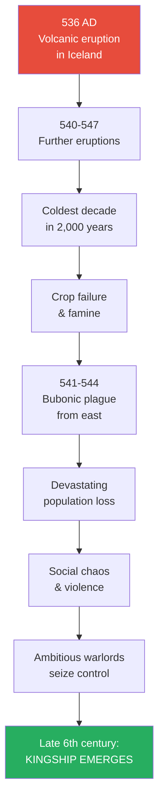
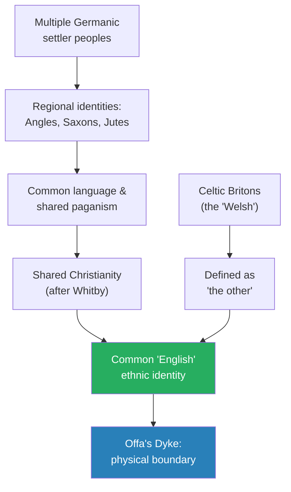
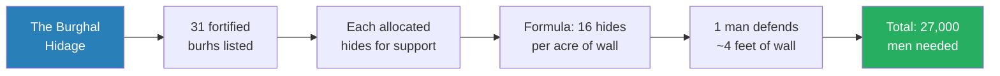
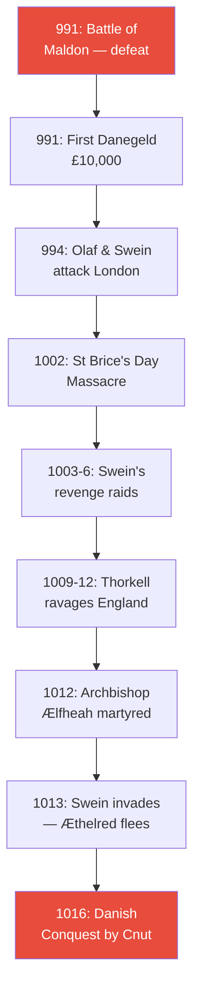
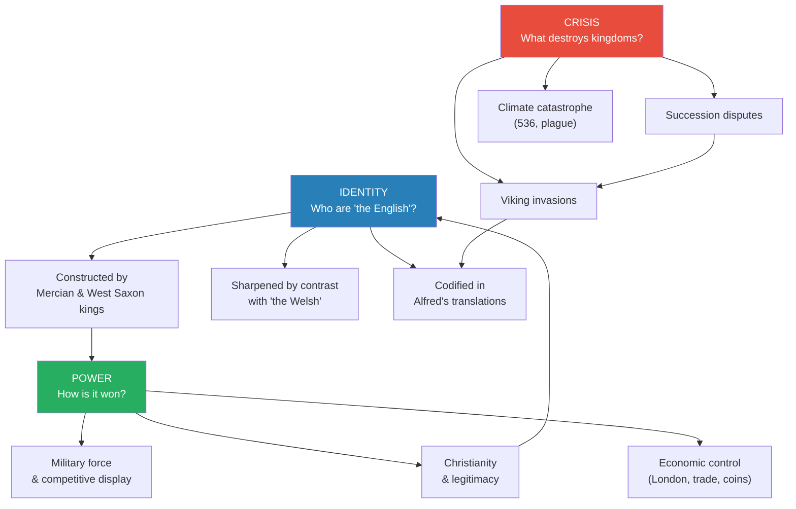

# The Anglo-Saxons — Marc Morris

> Marc Morris, a Fellow of the Royal Historical Society, tracks the emergence of England across more than 600 years, from the collapse of Roman Britain around 400 AD to the Norman Conquest in 1066. Each chapter takes one dominant theme and one biographical figure — from the violent rise of the first warlord-kings through the establishment of Christianity, the viking catastrophe, Alfred's rebuilding, the conquest of the north, and the final twilight of the Godwine dynasty. Morris is scrupulously honest about what we know and what we are guessing, and refuses to idolize the Anglo-Saxons: he shows their artistry and their slavery, their piety and their butchery, insisting that we understand them without needing to admire them. The result is the most readable single-volume history of the period, built on decades of archaeological and textual scholarship, that makes England's founding story feel as vivid and dramatic as anything in the medieval period that followed.

---

## About the Author

Marc Morris studied and taught at the universities of London and Oxford, specializing in the Middle Ages. His other books include a bestselling history of the Norman Conquest and biographies of King John and Edward I. He also presented the BBC television series *Castle*. Morris is a Fellow of the Royal Historical Society. His distinctive approach combines rigorous engagement with the latest scholarship and an ability to make highly technical archaeological and textual debates accessible and entertaining for general readers. He is transparent about the limits of evidence and the debates among specialists, always showing his reasoning without compromising the narrative.

---

## The Big Idea

- Morris's central argument is that <b style="color: #27ae60">the Anglo-Saxon period was not a static "Dark Age" but 600 years of fundamental transformation</b> — the England Harold ruled in 1066 was utterly unlike the pagan warrior societies that buried their king at Sutton Hoo in the 620s
- Every familiar institution of English life — shires, sheriffs, boroughs, parishes, a unified kingdom under a single crown — was an Anglo-Saxon invention
- <b style="color: #2980b9">"Anglo-Saxon" identity itself was a construction</b> — the settlers came from many different Germanic peoples (Saxons, Angles, Jutes, Frisians, Swedes, Franks) and only gradually came to see themselves as "English," sharpened by contrast with the Celtic "other" to the west
- <b style="color: #e74c3c">Generalisations about "the Anglo-Saxons" are redundant</b> — Morris insists that describing "Anglo-Saxon warfare" is as meaningless as generalizing about military tactics between the 14th and 19th centuries
- The book is structured around one character and one theme per chapter, using biography "as a way of framing events in relatable, human terms"
- Morris refuses to romanticize his subjects: "Their society produced works of art that continue to dazzle, and institutions that are still with us today, but it was highly unequal, patriarchal, persecuting and theocratic"

---

## Key Concepts at a Glance

| Concept | One-line summary |
|---------|-----------------|
| **Hoards as barometers** | Buried treasure tells us about fear and social collapse, not just wealth |
| **Elite transfer vs mass migration** | The pendulum of scholarly opinion on how many Saxons actually came to Britain |
| **The 536 catastrophe** | Volcanic eruptions triggered the coldest decade in 2,000 years, reshaping society |
| **Ring-givers and mead-halls** | Early kingship was built on generosity, violence, and competitive display |
| **Celtic vs Roman Christianity** | The Easter dispute was really a power struggle between Irish and papal traditions |
| **Angelcynn** | The deliberate political construction of "English" identity by Mercian and West Saxon kings |
| **The burh system** | Alfred's network of 31 garrisoned fortresses requiring 27,000 men to defend |
| **Monastic reform** | The Benedictine movement reshaped not just churches but villages, parishes, and land tenure |
| **Danegeld** | Paying tribute to the Danes — rational strategy, not cowardice |
| **Succession as fatal weakness** | Almost every crisis in the book stems from disputed claims to the throne |

---

## I. The Ruin of Britain: The Fall of Rome and the Coming of the Saxons (c. 400-550)

*Morris opens not with kings and conquests but with a lost hammer and a field in Suffolk — and uses the greatest Roman treasure ever found in Britain to explain how a sophisticated civilization simply ceased to exist.*

### Roman Britain at Its Height

- Before understanding the collapse, Morris insists we appreciate what was lost:
  - Thirty cities and 70+ towns connected by an infrastructure "so extensive and impressive that it would not be replicated in Britain for more than a thousand years"
  - Roads, bridges, canals — designed for the army but facilitating trade with the rest of the empire
  - London: population ~50,000, walls two miles long enclosing 330 acres, forum the largest north of the Alps
  - The rich lived in villas with "dozens of rooms, frescoed walls, mosaic floors, indoor plumbing and underfloor heating"
  - They "drank imported wine and cooked with imported olive oil, enjoying a level of luxury that any British aristocrat before the eighteenth century would have envied"
- But this wealth rested on exploitation:
  - A cemetery at Poundbury in Dorset contained 1,200 ordinary 4th-century Britons — most bones showed signs of hard labour and malnutrition
  - "For every winner under Roman rule there were a hundred losers" — David Mattingly
- Yet the sophistication was real and widespread:
  - Industrial-scale pottery production — everyone had good-quality plates and bowls
  - Heavy plough that turned the soil, replacing the old kind that merely scratched the surface
  - Population between 2 and 6 million — a density not reached again until the Norman Conquest
  - Widespread literacy — Roman soldiers were once required to be able to read
- <b style="color: #e74c3c">Within a single lifetime, it was all gone</b>
- The Romans assumed their empire was eternal — "and yet, within the space of a single lifetime, it was all gone"
- "The towns and cities crumbled and fell into ruin, the coinage ceased to be minted, and the most basic commodities disappeared, leaving people to scratch and scavenge for a living, or to prey on the more vulnerable"
- Morris's account of the Roman collapse serves a crucial function in the book's argument: the Anglo-Saxons who eventually settled in Britain were not destroying a functioning civilization — they were filling a vacuum that had existed for a generation

> [!warning] A Note on "Dark Ages"
> Morris avoids the term "Dark Ages" entirely. The period after Rome's fall is "dark" only in the sense that we lack written evidence — not because nothing was happening. The archaeological record shows communities adapting, trading, and competing throughout the 5th and 6th centuries. The darkness is in our knowledge, not in their lives.

---

### The Hoxne Hoard and the Collapse

- In November 1992, farmer Peter Whatling lost his hammer in a field near the village of Hoxne in Suffolk
- His friend Eric Lawes, armed with a metal detector, found not the hammer but one of the most spectacular Roman treasure hoards ever unearthed in Britain:
  - 29 pieces of gold jewellery — bracelets, rings, necklaces, a rare body-chain
  - A rich array of silver tableware — bowls, dishes, ornate pepper pots
  - 584 gold and over 14,000 silver coins
  - They also found Mr Whatling's hammer
- The latest coins date to 407-408 AD
- <b style="color: #27ae60">Hoards are "reliable barometers of unrest"</b> — people bury their valuables when they fear those valuables will be taken by force
- 98.5% of the 14,500 silver coins had been "clipped" — silver sheared from their edges, an official attempt to make the existing currency go further
- The owner of the Hoxne Hoard never returned to dig it up

> [!example] Samuel Pepys and the Buried Gold (1667)
> - In 1667 the diarist Samuel Pepys was spooked by a Dutch raid on the Thames
> - He grabbed all the gold coins he had in London and sent his wife to bury them on their country estate in Cambridgeshire
> - Unlike the owner of the Hoxne Hoard, Pepys retrieved his coins once the threat had passed
> **The lesson:** When the state fails to provide security, people will take matters — and their wealth — into their own hands.

### What Went Wrong

- Roman Britain had been immensely prosperous:
  - 30 cities and 70+ towns, connected by roads, bridges, canals
  - London had a population of perhaps 50,000 and a forum larger than any north of the Alps
  - The rich lived in villas with mosaic floors, indoor plumbing, and underfloor heating
  - Industrial-scale pottery production — everyone had good-quality plates and bowls
- But this prosperity rested on the army, and the army was steadily depleted:
  - Troop numbers fell from ~50,000 in the 2nd century to ~17,000 by AD 300
  - The western capital moved from Trier to Milan in 381, severing economic links
  - Usurper Magnus Maximus (383) and then Constantine III (407) both took troops to the Continent
- <b style="color: #e74c3c">After 402, the bulk import of coin to Britain suddenly ceased</b> — nothing is likelier to have created discontent among unpaid soldiers
- In 409, the Britons revolted — "armed themselves, and ran many risks to ensure their own safety"
- The result was catastrophic: "probably the most dramatic period of social and economic collapse in British history"
  - Good quality pottery vanishes, as do everyday items like nails
  - Towns and villas abandoned within a generation
  - London, Lincoln, and York became ghost towns

---

### The Mechanics of Collapse

- The critical trigger was the severing of economic links with the empire:
  - In 381, Emperor Gratian abandoned Trier for Milan — devastating for Gaul and Britain, which exported grain to feed troops on the Rhine
  - In 383, the British army revolted under Magnus Maximus, who invaded Gaul and stripped the province of troops
  - After 402, no new coins arrived in Britain in significant quantities — the mint at Milan moved to Ravenna, and "the bulk import of coin to Britain suddenly ceased"
  - By 406, the army had had enough — three usurpers in rapid succession (Marcus, Gratian, Constantine)
- The revolt of 409 tipped Britain over the precipice:
  - The Britons "armed themselves, and ran many risks to ensure their own safety, and freed their cities from attacking barbarians"
  - They expelled Roman magistrates and established their own government
  - <b style="color: #e74c3c">This sounds heroic, but it was the event that severed Britain permanently from the empire</b>
- The consequences were appalling:
  - Good-quality pottery vanishes from the archaeological record
  - Even everyday items like nails disappear
  - Towns and villas abandoned within a generation
  - "Society had collapsed. It was probably the most dramatic period of social and economic collapse in British history"
  - People must have perished in huge numbers through famine, disease, and violence

> [!abstract] The Evidence for Collapse
> | Indicator | Before 410 | After 410 |
> |-----------|-----------|-----------|
> | **Pottery** | Industrial-scale, wheel-thrown, kiln-fired | Vanishes completely |
> | **Coins** | Mass-produced, regularly imported | Clipped, debased, then absent |
> | **Towns** | 30+ cities with services | Ghost towns with grass in the streets |
> | **Buildings** | Villas with underfloor heating | Reoccupied Iron Age hill forts |
> | **Literacy** | Widespread | Almost nonexistent |

### Saxon Pirates: "The Most Ferocious of All Foes"

- Even before the collapse, Saxon raiders had been attacking Britain's southern and eastern coasts since the mid-3rd century
- A string of massive fortresses was built along the coast — the "forts of the Saxon Shore"
- The Gallo-Roman aristocrat Sidonius Apollinarius described the Saxons:
  - "He comes upon you without warning; when you expect his attack he slips away"
  - "Shipwrecks to him are no terror, but only so much training"
  - Before setting sail for home, "it is their practice to abandon every tenth captive to a watery end" — a religious sacrifice prompted by sincere pagan belief
- <b style="color: #e74c3c">Their paganism made them doubly terrifying to the now-Christian Britons</b>

---

### The Coming of the Saxons

- Gildas's *Ruin of Britain* (early 6th century) is the only near-contemporary source:
  - The Britons, plagued by Picts and Scots, hired Saxon mercenaries who arrived in three ships
  - The Saxons revolted and ravaged the whole country
  - The account is infected by legend (three ships is a common trope) but the core narrative is credible
- <b style="color: #2980b9">The scale of Saxon immigration</b> has been hotly debated:
  - "Elite transfer" model (1960s-2000s): only a few powerful Saxons came, and the Britons adopted their culture
  - Current consensus: the movement was substantial — linguistic evidence is decisive
  - Only ~30 words in Old English were borrowed from Brittonic, implying minimal mixing
  - It did not require many boats to reach large numbers: 100 boats x 10 passengers x 5 trips/year x 50 years = 250,000

> [!tip] Core Insight
> The Saxons found so little of Roman civilization worth preserving — because it had already collapsed — that they had no incentive to adopt British culture. This is why, unlike in Gaul, the newcomers imposed their own language and religion.

### The Migration Debate: How Many Saxons Came?

- Morris devotes substantial attention to this fiercely contested question:
- **The traditional view (pre-1960s):** Mass migration — the Saxons simply replaced the indigenous population
  - Supported by the abundant Saxon material culture and near-total absence of Romano-British finds
  - Gildas portrays the Britons as killed, enslaved, or driven into exile
  - For a long time, scholars pictured the Saxons occupying "a landscape that had already been almost emptied by warfare, famine and social collapse"
- **The revisionist view (1960s-2000s):** "Elite transfer" — only a few powerful Saxons came
  - Doubts about the scale of migrations across the North Sea with rudimentary ships
  - Idea that Britons remained in place and adopted Saxon language, religion, and culture
  - This model confounds traditional archaeology — people buried with Saxon grave goods might be culturally assimilated Britons
- **The current consensus:** The pendulum has swung back — migration was substantial
  - <b style="color: #27ae60">The linguistic argument is decisive</b>: it is inherently unlikely that the majority would end up speaking a Germanic language without a great many immigrants
  - The idea that mass migration was technically impossible has been refuted — ships could carry more people than once assumed
  - Only ~30 words in Old English were borrowed from Brittonic — "such a low figure makes it as good as certain that it was not just Saxon warriors who came to Britain, but whole communities of men, women and children, who did not mix and intermarry with the locals"
  - Morris calculates: 100 boats x 10 passengers x 5 trips/year x 50 years = 250,000 settlers
- But even 250,000 settlers would have been outnumbered by Britons 4:1 (assuming half the late Roman population of 2 million had perished)
  - The explanation for why Saxon culture triumphed: <b style="color: #e74c3c">by the time the Saxons arrived, there was little of Roman civilization left to preserve</b>
  - Towns had already collapsed, industries had already failed
  - "The broken Britain that the Saxons found consequently had no allure, and in British culture they saw nothing they wished to emulate"

> [!abstract] The Evidence for Migration
> | Evidence Type | What It Shows |
> |--------------|--------------|
> | **Language** | Only ~30 Brittonic loan-words in Old English — minimal interaction |
> | **Place names** | -ing and -ingham names cluster where early Saxon settlement is densest |
> | **Cremation** | Introduced from north Germany; not practised by Britons since 3rd century |
> | **Grave goods** | Brooches, clasps, weapons with direct parallels to Saxon homelands |
> | **DNA** | Inconclusive at population level; helpful for individual burials |
> | **Days of the week** | English uses Germanic gods (Tuesday/Tiw, Wednesday/Woden); French uses Roman gods (mardi/Mars) |

### Bede's "Three Tribes" — and Why He Was Only Half Right

- Bede claimed the settlers came from "three very powerful tribes — the Saxons, the Angles and the Jutes"
- He mapped them onto specific kingdoms: Jutes in Kent, Angles in East Anglia/Mercia/Northumbria, Saxons in Wessex/Sussex/Essex
- This was partly correct — archaeological evidence does support some regional patterns
- But Bede was wrong that these tribes migrated as discrete groups:
  - Saxon brooches are found everywhere, not just in "Saxon" areas
  - "Britain was settled not by three separate 'tribes' who carefully maintained their identities during the migration process, but by a steady flow of peoples from all around the coasts of northern Europe and southern Scandinavia"
  - Frisians, Swedes, and Franks were also among their number
  - Bede himself later admitted: "there were very many peoples in Germany from whom the Angles and Saxons derive their origin"

---

### The Battle of Badon Hill and the Question of Arthur

- Gildas describes a significant British fightback led by Ambrosius Aurelianus, culminating in victory at Badon Hill (c. 500 AD)
- The first mention of Arthur that can be reliably dated occurs in the early 9th century — over 300 years later
- Morris is blunt: "Believing in his existence on the strength of the evidence we have is like insisting that a lost thousand-piece jigsaw puzzle must have been a picture of a steam train because one of the three surviving pieces appears to show a puff of smoke"

---

## II. War-Wolves and Ring-Givers: The Emergence of Kings and Kingdoms (c. 550-650)

*Morris uses the poem Beowulf and the treasure of Sutton Hoo to reconstruct a world of violent warlord-kings competing for gold, followers, and glory — and explains why kingship suddenly appeared in the late 6th century.*

### The World of Beowulf

- *Beowulf* is set in Scandinavia but written in Old English, probably in the 8th century
- It brings to life a world of:
  - Kings dwelling in great wooden halls, feasting with followers, listening to poets
  - Restless warrior bands in search of adventure and wandering royal exiles
  - Named swords with mystical protective powers
  - Above all, <b style="color: #2980b9">gold</b> — the universal measure of status and loyalty
- Tolkien, an Oxford professor of Anglo-Saxon, drew heavily on Beowulf for *The Lord of the Rings*:
  - The people of Rohan are essentially Anglo-Saxons
  - Theoden's reception of Gandalf mirrors a scene in Beowulf
  - But Tolkien added Christian virtues (pity, forgiveness) absent from the poem
- <b style="color: #e74c3c">Beowulf's world is profoundly unstable</b> — full of betrayal, vengeance, and violence, with kings and warriors who "know that success will always be fleeting, and that death and destruction is their ultimate fate"

### Beowulf and Tolkien

- Morris explains how the poem *Beowulf* shaped our image of early Anglo-Saxon society — and how Tolkien shaped our image of Beowulf:
  - Tolkien was a professor of Anglo-Saxon at Oxford and made his own translation in the early 1920s
  - The people of Rohan in *The Lord of the Rings* are essentially Anglo-Saxons as Tolkien imagined them
  - The scene where Theoden receives Gandalf, Aragorn, Gimli, and Legolas in his golden hall closely mirrors a scene in Beowulf
  - In *The Hobbit*, Bilbo disturbs Smaug by stealing a golden cup — and the dragon in Beowulf is woken by a thief who does exactly the same
- But Tolkien added Christian virtues — pity, forgiveness, mercy — that are entirely absent from the poem:
  - In Beowulf, when Hrothgar's hall is attacked, the hero says it is better to avenge the dead than indulge in mourning
  - When one brother kills another, their father is sad but recognizes it has been done "in accordance with the law of the blood-feud"
  - When Beowulf fights the monster's mother, what sustains him is not faith but "belief in his own reputation, and a desire to win everlasting fame"
  - <b style="color: #e74c3c">This is a profoundly unstable world, where success is always fleeting and death and destruction the ultimate fate</b>

---

### Why Kingship Appeared

- The earliest Anglo-Saxon settlers (c. 430-570) show no signs of elite status — all settlements are relatively modest
- They set themselves up as free, independent farmers, each holding a *hide* of land
- Then, around 570, several things change at once:
  - A sudden drop in the number of furnished burials — the practice had been deliberately restricted
  - A minority of individuals begin to be buried in extravagantly ostentatious ways under giant mounds
  - Some people begin building on a much grander scale

*The catastrophic mid-6th century — volcanic winter, famine, and plague — created the desperation that allowed ambitious warlords to impose themselves as kings.*

- The word "lord" derives from Old English *hlaford*, meaning "loaf-guardian" or "bread-giver"
- <b style="color: #27ae60">People surrendered their independence because submission to a strong lord was the only way of guaranteeing their sustenance</b>

### The "Heptarchy" Myth

- Henry of Huntingdon (12th century) confidently declared there were originally seven Anglo-Saxon kingdoms
- This is wrong — Bede named around a dozen, and his total was far from comprehensive
- The <b style="color: #2980b9">Tribal Hidage</b>, a late 7th-century document, lists 35 different peoples
- Most kingdoms began as small-scale affairs of only a few hundred hides
- Some grew larger by bullying others into dependence

---

### Sutton Hoo and King Raedwald

> [!example] The Sutton Hoo Ship Burial (c. 625)
> - A few miles from the East Anglian royal residence at Rendlesham, near the River Deben
> - The Wuffings dug a giant trench and dragged in a ship 27 metres long
> - At its centre, in a specially built chamber, they placed their dead king surrounded by all his finery
> - The treasure included: a helmet with a haunting face-mask, a gold belt buckle (the finest surviving example of Style II metalwork), a mail shirt, a sword with a gold pommel, a silver dish from Constantinople, drinking horns, and much more
> - The body had dissolved in the acid soil, but the coins date to the mid-620s
> - Almost certainly the burial of King Raedwald, the most powerful southern king of his day
> **The lesson:** Competitive display was the currency of early kingship — you proved your power by the magnificence of your death.

---

### The Hall at Yeavering

- King Eadwine of Northumbria had a great hall at Yeavering, identified by aerial survey in 1949
- The largest hall was 80 feet long and 40 feet wide, with post-holes sunk over 2 metres deep
- The site included:
  - A pagan temple next to a pit filled with ox skulls
  - A structure shaped like a segment of a Roman amphitheatre, seating several hundred for an audience with the king
  - A giant enclosure for corralling tribute cattle — 94% of all animal bones found were from cows or oxen

> [!tip] Core Insight
> These great halls and ostentatious burials were a brief, almost desperate phenomenon — beginning around 600 and lasting barely half a century. Both were manifestations of the fierce, even desperate competition between newly emerged kings.

### The Ship That Bore a King

- The Sutton Hoo discovery resonates with the opening of *Beowulf* itself:
  - When the dying King Scyld insists on travelling to the next world by being borne across the sea
  - "They stretched out their beloved lord in his boat / laid out by the mast, amidships, / the great ring-giver"
  - Although Beowulf himself was cremated, his remains were interred under a mound "that sailors could see from afar" — just like the mounds at Sutton Hoo
- The burial was not unique at the site:
  - Another mound contained a more conventional chamber burial with a 20-metre ship placed on top
  - It may have been the tomb of Raedwald's son Raegenhere, killed fighting alongside his father at the Battle of the River Idle
  - Ship burials were virtually unknown in Britain but fairly common in Sweden
  - This suggests the Wuffings had ancestral connections to Scandinavia that they were keen to advertise
- The discovery in 1939 came at a pivotal moment:
  - Archaeologists came away "with sweaty palms and in need of a stiff drink"
  - It remains the richest princely burial ever found in Britain
  - Some historians urge caution about identifying the occupant — but Morris argues that "sometimes the most tempting conclusion also happens to be the correct one"

---

### Tribute, Cattle, and the Economics of Early Kingship

- Kings needed enormous quantities of cattle:
  - Tribute was most commonly paid in cows and oxen — they could be driven on the hoof to royal centres
  - November was the prime slaughter month (the Anglo-Saxons called it *Blodmonath* — "blood month")
  - Kings took a hands-on role in the ritual killing — the axe-hammer at Sutton Hoo may have been used for this purpose
- Cattle were vital not just for meat but for leather — "the plastic of the Middle Ages":
  - Shoes, boots, bags, purses, bottles, flasks, equestrian equipment, armour, scabbards, tents
  - There was "virtually nothing that could not be improved with leather and a great many things that simply could not be made without it"
- Kings feasted on an epic scale, not for gluttony but for political necessity:
  - The hall symbolized royal power — in Beowulf, when the monster Grendel attacks Heorot, the king's power is visibly diminished
  - King Ine of Wessex (688-726) specified what every ten hides owed him annually:
    - 10 vats of honey, 300 loaves of bread, 12 "ambers" of Welsh ale, 30 of clear ale, 2 cows, 10 goats, 10 geese, 10 hens, 10 cheeses, butter, 5 salmon, 20 pounds of fodder, and 100 eels
  - <b style="color: #27ae60">This extract gives a vivid picture of the annual burden of kingship on ordinary farmers</b>

---

### The Rise of Penda and the Staffordshire Hoard

- Penda of Mercia was the last great pagan Anglo-Saxon king
- He defeated and dismembered King Oswald of Northumbria at Maserfelth (642)
- He devastated Northumbria three times — once advancing as far as Bamburgh
- In 655, he led an army of 30 leaders against Northumbria, but was killed at the Battle of the Winwaed
- In 2009, a metal-detectorist named Terry Herbert found in Staffordshire over 5 kg of gold items and a third of that in silver — the largest Anglo-Saxon treasure hoard ever discovered
  - It consisted almost entirely of war gear fittings — from nearly 100 swords
  - The style and period (650-675) match Northumbrian metalwork
  - It was found in the heart of Mercia, just miles from Lichfield
  - It could be the peace offering handed to Penda by Oswiu in 655

---

## III. God's Chosen Instrument: St Wilfrid and the Establishment of Christianity (c. 650-710)

*The establishment of Christianity was not a gentle process of preaching and persuasion. Morris uses the extraordinary career of Bishop Wilfrid to show how the new faith was imposed through political power, forced conversion, and the personal ambitions of the most turbulent of priests.*

### The Minster System and Ordinary People's Religion

- When Wilfrid built his magnificent stone churches, they were almost all monastic — accessible only to a small number of worshippers
- Parish churches for ordinary people did not exist until the 10th century
- How did common people learn about Christianity?
  - Perhaps a priest or bishop would come wandering into their settlement once in a while to preach and baptize
  - Wooden crosses were erected as places of veneration and congregation
  - From the late 7th century, carved stone crosses (with designs enhanced by paint) were raised in Mercia and Northumbria
- <b style="color: #e74c3c">The elite were better at telling ordinary people what they were NOT allowed to do</b>:
  - King Eorcenberht of Kent (640-664) was praised for ordering the destruction of idols and commanding people to fast during Lent
  - But most people were "left in the dark about the nature of Christianity"
- A revealing incident from Bede:
  - Monks were using rafts to move wood down the River Tyne when a storm swept them out to sea
  - Other monks were distressed, but peasants who watched simply stood and jeered
  - When rebuked, they replied: "Let the monks drown — they have robbed people of their old ways of worship, and how the new worship is to be conducted, nobody knows"
- Archbishop Theodore's penitentials imposed punishments for pagan practices that were clearly still widespread:
  - Offering sacrifices to devils
  - Burning grain to purify a house with a corpse in it
  - Mothers placing daughters in ovens or on rooftops to cure fevers
- <b style="color: #27ae60">The Christianization of ordinary English people was a process that took centuries, not decades</b>

---

### The Conversion of King Eadwine and the Sparrow in the Hall

- Eadwine of Northumbria, the most powerful Anglo-Saxon king of his day, married a Kentish Christian princess, Æthelburh
- Her priest Paulinus worked to convert the king, encouraged by exhortations from the pope
  - Boniface V sent Æthelburh a silver mirror and a gilded ivory comb, and Eadwine a gold-embroidered robe
  - Gregory the Great had pragmatically allowed that, while devil-worship had to go, converts could keep slaughtering cows for feasts — "so long as they did it in praise of God, let them eat steak"
- The decisive moment came when one of Eadwine's counsellors offered a famous metaphor:
  - Picture yourself feasting in the middle of winter, fire burning on the hearth, all inside warm, while outside storms rage
  - Suddenly a sparrow flies through the building, in one door and out the other
  - "For the few moments that it is inside, the storms and tempest cannot touch it, but after the briefest moment of calm, it vanishes into the wintry world from which it came"
  - The sparrow's flight was like human life — what came before and after was a total mystery
  - Perhaps Christianity could provide surer knowledge
- Eadwine was baptized at Easter 627 in York, in a wooden church specially built for the occasion
- His death at the Battle of Hatfield Chase (633) — killed by the British king Cadwallon — was followed by a catastrophic devastation of Northumbria

---

### Wilfrid: A Biographical Sketch

- Born 634 in Northumbria, amid the chaos of Cadwallon's invasion
- Raised at Lindisfarne, then travelled to Rome as a teenager — awestruck by St Peter's basilica
- Became Rome's most determined champion in Britain, seeking to eradicate Celtic practices
- Held bishoprics in Northumbria, Sussex, and Mercia; offered sees in Lyon, Strasbourg, and Canterbury
- Comported himself like a king — feasting, drinking, surrounded by a household of young warriors
- <b style="color: #e74c3c">His impact was undoubtedly great, but to achieve it he committed many terrible deeds</b>

### The Easter Controversy and the Synod of Whitby (664)

- The disagreement was about when to celebrate Easter — arcane to modern ears, but absolutely crucial to 7th-century Christians
- The Irish tradition (followed at Lindisfarne) allowed Easter and Passover to coincide on a Sunday
- The Roman tradition insisted Easter must always be the Sunday *after* Passover
- King Oswiu of Northumbria followed the Irish reckoning; his wife, from Kent, followed Rome
- In some years, the king would be feasting for Easter while his queen was still fasting for Lent

> [!example] The Synod of Whitby (664)
> - King Oswiu convened a conference at the abbey of Abbess Hild (St Hilda)
> - Bishop Colman defended the Irish case: they were following the tradition of St Columba and St John
> - Wilfrid argued for Rome: the Irish method was used by "a handful of people in a corner of the remotest island"
> - He quoted Christ's words to Peter: "Thou art Peter, and upon this rock I will build my Church"
> - Oswiu asked Colman: is it true Christ said this to Peter? Colman admitted it was
> - The king announced he had best side with Rome, "since Peter is the keeper of the keys to the kingdom of heaven"
> - Colman resigned and left Lindisfarne, taking monks and some of Aidan's bones with him
> **The lesson:** The decision for Rome was less about theology than about politics — Oswiu chose the side with the greater authority.

### The Northumbrian Renaissance

- The conversion of Northumbria triggered a remarkable cultural flowering:
  - Monasteries became centres of learning, art, and book production
  - The monastery of Wearmouth-Jarrow, founded by Biscop Baducing (Benedict Biscop), assembled "perhaps the finest library in Britain"
  - Its books were imported from six trips to Rome
  - The scriptorium produced illustrated manuscripts of extraordinary beauty
  - To produce the three great Bibles completed under Abbot Ceolfrith would have required the skins of over 1,500 calves
- The <b style="color: #2980b9">Lindisfarne Gospels</b>, produced to adorn the tomb of St Cuthbert, are among the most beautiful books ever made
- King Aldfrith of Northumbria was himself a patron of learning — he gave Wearmouth-Jarrow eight hides of land in return for "a codex of the cosmographers of miraculous workmanship"
- The greatest product of this renaissance was <b style="color: #27ae60">the Venerable Bede</b>:
  - Placed in the community at age 7 in 680, he became one of the greatest historians of the Middle Ages
  - His *Ecclesiastical History of the English People* (731) is the single most important work of the Anglo-Saxon period
  - He also wrote *The Reckoning of Time*, establishing methods for calculating Easter that were adopted across Christendom
  - His use of *gens Anglorum* ("the English people") as an inclusive term for all the Germanic-speaking peoples of Britain was a crucial step in the construction of English identity

> [!tip] Core Insight
> The Northumbrian Renaissance shows that the Anglo-Saxons were not merely crude warriors. Within two generations of converting to Christianity, they were producing scholarship and art of a quality that rivalled anything in contemporary Europe.

---

### Archbishop Theodore's Reforms

- When plague killed most of the bishops in 664, Canterbury's archbishopric remained vacant for years
- Pope Vitalian eventually chose Theodore of Tarsus — a 66-year-old Greek, no one's first choice
- Theodore had to wait four months for his eastern tonsure to grow out so he could receive the correct Roman crop
- Despite this unlikely start, Theodore proved brilliantly effective:
  - He was the first archbishop whom the whole Anglo-Saxon Church obeyed
  - He increased the number of bishops from a handful to nearly a dozen
  - He forcibly upgraded equestrian habits — when Bishop Chad refused to ride a horse, Theodore "heaved him into the saddle with his own hands"

### Wilfrid's Turbulent Career

- After Whitby, Wilfrid expected to become bishop of Northumbria — but King Oswiu chose a less divisive candidate
- When the plague of 664 killed the new bishop within months, Wilfrid was sent to Francia for consecration
  - At Compiegne, fourteen bishops assembled; Wilfrid was carried into the church on a golden throne, borne aloft by nine of them
  - He then lingered on the Continent for almost a year, in no hurry to return
- On his return, he found another man, Chad, had been appointed in his place
  - His patron Alchfrith, who had sent him to Francia, had disappeared — perhaps killed in rebellion against his father
  - Wilfrid retired to Ripon, "a bishop without a bishopric"
- When Archbishop Theodore finally arrived in 669, he deposed Chad (on grounds his appointment was uncanonical) and installed Wilfrid
- <b style="color: #2980b9">Wilfrid proceeded to build an ecclesiastical empire</b>:
  - He restored the abandoned church in York — re-leading the roof, glazing the windows, whitewashing the walls
  - He built the magnificent church at Hexham — 7,000 tonnes of recycled Roman stone, described as unrivalled north of the Alps
  - He built the church at Ripon with "columns and complete with side aisles"
  - He accumulated vast estates from grateful kings
- The queen turned King Ecgfrith against him by describing "his possessions, the number of his monasteries, the vastness of his buildings, and his countless followers arrayed like a king's retinue"
- In 678, the king and archbishop deposed Wilfrid and divided his huge diocese into three
- Wilfrid appealed to Rome — beginning a pattern of exile, appeal, and contested return that would repeat for the rest of his life:
  - First exile (678-680): preached in Frisia, then appealed to Rome
  - Returned with papal backing, but King Ecgfrith threw him in prison
  - Second exile (681-686): went to Sussex, converted pagans, blessed Caedwalla's genocide on the Isle of Wight
  - Returned to Northumbria after Ecgfrith's death at Nechtansmere (685)
  - Third exile (c. 691-705): fell out with King Aldfrith over the scope of his authority
  - Final appeal to Rome at age 70, after which a compromise gave him back Hexham and Ripon
- He died in 710, aged 75, distributing his treasure like a warrior king — gold and silver divided into four piles

---

### The Battle of Nechtansmere and Northumbria's Decline (685)

- King Ecgfrith of Northumbria had been expanding aggressively in all directions
  - He sent an army to Ireland — his churchmen urged him not to attack "a harmless race"
  - In spring 685, he went to war against the Picts, again ignoring warnings from Bishop Cuthbert and other clergy
  - The Picts feigned flight and lured Ecgfrith "into narrow passes in the midst of inaccessible mountains"
  - At Nechtansmere, they fell upon the invaders, killing the king and most of his army
- The consequences were devastating:
  - Northumbria had been expanding for over a century — now all its conquered peoples revolted
  - The British rulers to the west recovered independence
  - The Picts and the Irish of Dal Riata drove the Angles back to the Forth
  - The bishop of Abercorn fled south; his diocese collapsed
  - Bede regarded Nechtansmere as a turning point: "the hopes and strength of the kingdom began to ebb and fall away"
- <b style="color: #e74c3c">Northumbria would never again be the dominant power in Britain</b> — that role passed permanently to the kingdoms south of the Humber

---

### Wilfrid's Campaigns of Forced Conversion

- When exiled from Northumbria, Wilfrid allied with Caedwalla, a vicious West Saxon warrior
- In 686, Caedwalla invaded the Isle of Wight intending "to wipe out all the natives with merciless slaughter"
- Wilfrid blessed this genocide on the grounds that the island's inhabitants were pagan
- His reward: 300 of the island's 1,200 hides
- The king of Wight's two young brothers fled but were betrayed, sentenced to die, and allowed only a last-minute baptism
- <b style="color: #27ae60">The conquest of Wight meant all the Anglo-Saxon kingdoms had now accepted Christianity</b> — at a terrible human cost

---

## IV. An English Empire?: King Offa and the Domination of the South (c. 710-796)

*Offa of Mercia was the first Anglo-Saxon ruler to attempt genuine annexation of other kingdoms — and his enormous dyke was as much a statement of emerging English identity as a military barrier.*

### Offa's Dyke

- The longest linear earthwork in Britain — roughly 150 miles, exceeding even Hadrian's Wall
- Average height of about 12 feet (ditch + bank), in places almost four times that
- To build just the 64-mile central section would have required 5,000 men working for 20 weeks
- Its purpose has been debated:
  - Not a military barrier (no evidence of forts, garrisons, or patrol paths along its length)
  - Possibly an obstacle to deter cattle-rustling
  - <b style="color: #2980b9">Most likely an ideological statement</b> — like Charlemagne's earthworks, it was "a highly visible demonstration of a ruler's authority"
  - It emphasized the differences between the English on one side and the Britons on the other

### London: The Golden Goose

- London was the economic engine that powered Mercian dominance:
  - Roman London had been a ghost town after the 5th century — "the work of the giants" (*enta geweorc*)
  - Around 600, a new settlement sprang up half a mile west of the old city on the Strand — <b style="color: #2980b9">Lundenwic</b>
  - From the 670s, international trade exploded: a new silver coinage was introduced, wharves were built, arterial roads laid out
  - At its peak, Lundenwic covered 60 hectares (from modern Trafalgar Square to the Aldwych) with a population of perhaps 7,000
  - Bede described London as "an emporium for many nations, who come to it by land and sea"
- The Mercian king Æthelbald (716-757) gained control of London and its tolls by the 730s
  - Tolls were a straightforward way to cream off profits from trade — easily levied by a few officers at the point of arrival
  - Bishops and minsters went to the trouble of obtaining exemptions, indicating the tolls were substantial
- <b style="color: #27ae60">No other wic matched London's profitability</b>:
  - Wessex had Hamwic (Southampton), East Anglia had Ipswich, Northumbria had Eoforwic (York)
  - But none was as large or as lucrative as London
  - Other Anglo-Saxon kingdoms were merely coastal; Mercia was virtually landlocked — London gave it direct access to the Continent

### Offa as Empire-Builder

- Came to power in 757 through civil war after King Aethelbald was murdered by his own bodyguard
- His predecessors had exercised loose hegemony over other kingdoms; Offa set out to annex them:
  - **Kent** (764): issuing charters in Canterbury, treating Kentish land as his own
  - **Sussex** (771): subdued by force; its kings demoted to ealdormen
  - **East Anglia** (794): its king beheaded on Offa's orders
  - **Wessex**: his daughter married to King Beorhtric; indirect control

### Offa's Coinage Revolution

- The 7th-century economic boom had been fuelled by silver coinage, but by the mid-8th century a European-wide shortage of silver had almost wiped out the money supply
- Kings responded by taking over production and adding their names to coins for the first time
  - Northumbrian kings pioneered this in the 740s; Southumbrian rulers followed in the 760s
- <b style="color: #2980b9">Offa's reform of 785 was transformative</b>:
  - After his takeover of Kent (and its mint at Canterbury), coins suddenly became far more voluminous
  - Some featured his portrait in profile, wearing a diadem like a Roman emperor
  - This became the standard design for English coins until the 13th century
  - He also minted coins with his queen Cynethryth's face — unique in Anglo-Saxon history, unprecedented in Europe outside Byzantium
  - He forbade the circulation of foreign coins: 99% of all pennies in use bore Offa's name
- One of his most curious coins was a gold dinar inscribed in Arabic: "There is no God but Allah alone"
  - It was copied from an Abbasid original, probably for use in diplomatic gift-giving or trade
  - The moneyer added "OFFA REX" in the middle of the Arabic text — either unaware of or indifferent to its meaning

---

### The Birth of "English" Identity

- During the 8th century, the word *Angli* (Angles) increasingly came to describe all Germanic-speaking peoples in Britain
- The word *wealas* (foreigners/strangers) applied to all Britons, and also became a synonym for "slave"
- <b style="color: #e74c3c">Whereas in Francia the hostility between Frank and Gaul disappeared over time, in Britain it grew deeper</b>
  - The language divide (Anglo-Saxons could understand each other but were baffled by British)
  - The religious rift (Easter dating; Bede condemned the Britons who "never preached the faith to the Saxons")

*English identity was constructed by contrast — the Anglo-Saxons defined themselves against the Celtic peoples to their west.*

### Offa and Charlemagne

> [!example] The Letter from Charlemagne (796)
> - Charlemagne addressed Offa as "his dearest brother" — implying they were equals
> - He complained that English cloaks were being cut too short: "I can't cover myself with them when I'm in bed, I can't protect myself against wind and rain when I'm riding"
> - Offa had requested "black stones" — almost certainly columns of black porphyry, the prestigious building material Charlemagne was using at Aachen
> - Offa's coins featured his portrait like a Roman emperor; his queen Cynethryth's coins were unique in Anglo-Saxon history
> - He obtained papal permission to create a new archbishopric at Lichfield, so he could have his son Ecgfrith consecrated without Canterbury's co-operation
> **The lesson:** Offa was consciously imitating Carolingian practices that looked to Roman imperial models.

- Offa died 29 July 796; his son Ecgfrith died just five months later
- All the blood Offa had spilled to secure the succession came to nothing
- Alcuin: "That was not the strengthening of his kingdom, but its ruin"

### Offa's Dynastic Project — and Its Failure

- The crisis that obsessed Offa was succession:
  - His two predecessors (Ceolred and Æthelbald) had been notorious for adultery and never married properly
  - Offa, by contrast, had a single wife (Cynethryth) and several children, but only one son — Ecgfrith
  - He was determined that Ecgfrith should succeed peacefully, without the bloodbaths that typically accompanied Anglo-Saxon successions
- To secure this, Offa borrowed from Charlemagne's playbook:
  - He had Ecgfrith consecrated — anointed with holy oil like a biblical king
  - This was unprecedented in England — it meant that anyone who killed the anointed king would commit sacrilege
  - But he needed an archbishop to perform the ceremony, and Canterbury refused to co-operate
  - So Offa created a new archbishopric at Lichfield, within his own kingdom
  - He also promised the pope 365 gold coins per year — one for every day
  - The papal legates who arrived in 786 read out a decree at Offa's court: "Let no one dare to kill a king, for he is the Lord's anointed"
- The consecration of Ecgfrith worked — when Offa died in July 796, his son succeeded peacefully
- <b style="color: #e74c3c">But Ecgfrith died just five months later, and all of Offa's dynastic engineering came to nothing</b>
- Alcuin commented acidly: the blood Offa had shed to secure his son's throne "was not the strengthening of his kingdom, but its ruin"
- "You are the glory of Britain, the trumpet of proclamation, the sword against foes," Alcuin had written to Offa — but he was flattering a king whose methods "could be vicious"

---

### The Collapse of Mercian Dominance

- After Ecgfrith's death, power passed to Coenwulf, who was probably not genuinely descended from the royal line
- Coenwulf dealt briskly with rebellions in Kent and East Anglia:
  - The Kentish rebel Eadberht Praen was seized and deprived of his hands and eyes
  - He reversed Offa's dismemberment of the Canterbury archbishopric, restoring its primacy
- In Wessex, King Egbert (who had been exiled to Francia by Offa) returned and triggered an anti-Mercian revolution
- After Coenwulf's death in 821, Mercia collapsed:
  - Egbert of Wessex invaded and conquered the kingdom in 829
  - The Chronicle proudly added Egbert to Bede's list of overlords as the eighth *bretwalda*
  - But Egbert's rule of Mercia lasted only a year — the old kingdom reasserted itself
- Henceforth there were four Anglo-Saxon kingdoms: Mercia, Northumbria, East Anglia, and a greatly enlarged Wessex
- <b style="color: #e74c3c">This multi-kingdom world was about to face its greatest test</b>

---

## V. Storm from the North: The Viking Assault on Britain and Francia (c. 793-870)

*Morris explains why the vikings succeeded — not because they were exceptionally fierce, but because Anglo-Saxon and Frankish warfare was fundamentally offensive in nature and utterly unsuited to defending against seaborne raiders.*

### The Sons of Æthelwulf and the Dynastic Crisis of Wessex

- King Æthelwulf of Wessex had five sons — an enviable situation for any dynasty, but one that created its own problems
- In 855, Æthelwulf went on pilgrimage to Rome with his youngest son Alfred (aged about 7)
  - He travelled "in great state" through the lands of Charles the Bald of Francia
  - In Rome, he presented gifts including a gold crown, a gilded candleholder, and an ornamental sword
  - On the way home, at the age of about fifty, he married Charles the Bald's twelve-year-old daughter Judith
  - His eldest son Æthelbald, left as regent in Wessex, refused to give up power
  - "A disgraceful episode, unheard of in all previous ages," said Asser — but Æthelwulf was unable to dislodge his rebellious son
  - The kingdom was divided: Æthelbald kept the old heartlands, Æthelwulf ruled the eastern provinces
- When Æthelwulf died in 858, Æthelbald compounded the scandal by marrying his father's fourteen-year-old widow
  - "Against God's prohibition, and Christian dignity, and also contrary to the practices of pagans"
  - But Æthelbald died in 860 without producing an heir
- Æthelberht reunited the kingdom but died in 865; Æthelred succeeded and died in 871
- <b style="color: #e74c3c">By 871, four of Æthelwulf's five sons lay in the ground, and the terrifying vision of thirty years earlier had come to pass</b>
- "What little hope was left was now vested in Æthelwulf's last surviving son, Alfred"

---

### Why the Vikings Came

- Economic disparity: the wics of Britain and Francia were booming, but little wealth reached Scandinavia
- Possible technological advance: the combination of fast-moving ships with sails enabled direct crossings
- Ideological element: Charlemagne's forced conversion of the Saxons (4,500 beheaded at the Weser) may have provoked pagan retaliation
- <b style="color: #e74c3c">Vikings were no more violent than Anglo-Saxon warriors, but their willingness to desecrate churches made them seem monstrous</b>

### The Attack on Lindisfarne (793)

- On 8 June 793, "heathen men" landed on Lindisfarne, plundered the monastery, and slaughtered many monks
- Alcuin: "Never before has such an atrocity been seen in Britain at the hands of a pagan people"
- This was the earliest datable viking raid on Britain
- It sent shockwaves across Europe

### The Escalation: From Raids to Invasions

- After Lindisfarne, attacks expanded rapidly:
  - 794: Jarrow sacked
  - 795: Iona attacked (and again in 802, 806, and 807 — after the fourth raid, the monks relocated to Kells in Ireland)
  - The 830s saw a dramatic escalation — in Francia, the vikings destroyed Dorestad (834), the greatest Frankish wic, and sailed 240 miles up the Seine to attack Paris (845)
  - In 851, a viking fleet of reportedly 350 ships stormed Canterbury, took London, and defeated the king of Mercia

> [!example] The Vision of the Priest (839)
> - King Egbert of Wessex sent envoys to the Frankish emperor with a terrifying story
> - A priest had dreamed of being led to a church where boys read books written in alternating lines of black ink and blood
> - The bloody lines were the sins of the Christian people; the boys were saints grieving for them
> - The stranger warned: "For three days and three nights a dense fog will descend, and then, all of a sudden, pagan men will lay waste with fire and sword most of the people and land of the Christians"
> - Egbert was so shaken that he planned to abdicate and go on pilgrimage to Rome, but died before he could go
> **The lesson:** The viking raids were not just a military problem — they created a deep psychological and spiritual crisis, as Christians struggled to understand why God was punishing them.

### Why Anglo-Saxon Warfare Failed Against Vikings

- Morris identifies the fundamental problem:
  - Anglo-Saxon warfare was primarily **offensive** — kings raised armies of mounted warriors who carried destruction into enemy territory
  - These warriors went to war because of opportunities for plunder
  - <b style="color: #e74c3c">This type of warfare was utterly unsuited to dealing with vikings</b>
  - Hit-and-run raiders would be long gone before any warriors arrived
  - Larger viking armies would entrench behind ramparts — and siege craft was virtually nonexistent
- The deeper problem was incentives:
  - "It is much more difficult to persuade people to participate in a defensive war than an offensive one, because there are far fewer opportunities for profit"
  - Kings began insisting on wider military service, but with limited success

---

### The Great Heathen Army (865)

- In autumn 865, "a great heathen army" invaded East Anglia
- This was not a raiding party but an army of conquest:
  - They demanded horses from the East Angles — planning to take entire kingdoms
  - Northumbria fell (867): both rival kings killed at York
  - East Anglia fell (869): King Edmund martyred
  - Mercia fell (874): King Burghred fled to Rome, replaced by a viking puppet
- <b style="color: #27ae60">Of the four Anglo-Saxon kingdoms, only Wessex survived</b>

> [!example] The Torksey Camp (872)
> - The viking army camped on an island in the River Trent
> - Excavations revealed a site of 55 hectares — implying several thousand occupants
> - Over 350 coins and 300 gaming pieces were found — not a hoard but accidentally lost items
> - Over a third of coins were Middle Eastern dirhams, showing the extent of their trade networks
> - The excavators concluded that "plunder was being processed on a massive scale"
> **The lesson:** The great heathen army was a professional operation of enormous scale, not a band of pirates.

---

## VI. Resurrection: Alfred the Great and the Forging of Englishness (c. 870-899)

*Morris asks the crucial question — "was Alfred really that great?" — and concludes that while his "greatness" has been overstated by later admirers, his genuine achievements were extraordinary.*

### Alfred: The Man Behind the Legend

- Born c. 848-49, Alfred was the last of Æthelwulf's five sons
- He visited Rome twice as a child — at age 5 and again at age 7 with his father
  - Pope Leo IV invested him with "the sword and robes of a Roman consul"
  - Later in life, Alfred reinterpreted this as a papal anointing for kingship
- Asser, his biographer, claims Alfred "surpassed all his brothers, both in wisdom and in all good habits" — better-looking, better spoken, better at hunting and fighting
  - This is classic royal propaganda, but it reveals the image Alfred wanted to project
- His illnesses were central to his self-image:
  - As a young man he was "unable to abstain from carnal desire" and prayed for a disease to suppress his lusts
  - God obliged with haemorrhoids
  - At age 19, on his wedding night to Ealhswith (a Mercian noblewoman), he was struck by a mysterious new illness
  - It plagued him periodically for the rest of his life — possibly Crohn's disease
  - He interpreted his illness as a burden sent by God to test him

### Alfred's Crisis

- Alfred became king in 871, the fifth of Æthelwulf's sons to rule — at a moment of profound crisis
- In the winter of 870-71, the West Saxons had fought nine major engagements against the vikings
- After the Battle of Wilton, Alfred was forced to buy the Danes off with a massive tribute
- Seven years later, in January 878, the Danes attacked Chippenham on the last day of Christmas
  - "They occupied the land of the West Saxons and settled there"
  - Alfred disappeared into the marshes of Somerset with a small band of followers

> [!example] The Burning of the Cakes
> - The famous story first appears in a Life of St Neot written a century after Alfred's time
> - It was almost certainly invented
> - In the 16th century it was inserted into printed editions of Asser's biography of Alfred, lending it undeserved legitimacy
> - By the time it was identified as a later addition, it was too late — Alfred was forever the king who burned the cakes
> **The lesson:** The most famous Anglo-Saxon story is a fiction — a reminder of how much "common knowledge" about this period is myth.

### The Battle of Edington (878)

- Alfred left Athelney at Whitsun — the timing was deliberately symbolic (Christ's resurrection)
- He rallied the men of Somerset, Wiltshire, and Hampshire at a prearranged meeting point called Egbert's Stone
- They fought the entire viking army at Edington and won decisively
- After a two-week siege at Chippenham, the Danes sought terms

### The Baptism of Guthrum — and the Creation of the Danelaw

- Alfred required the viking leader Guthrum and 30 of his top warriors to be baptized
- Alfred himself raised Guthrum from the font, becoming his godfather
- Guthrum took the baptismal name Æthelstan (the name of Alfred's eldest brother)
- The converts wore white robes and had their heads anointed with holy oil, held in place by white bandages
- They had to remain in Alfred's company for twelve days — during which time they presumably negotiated the partition of Mercia
- Alfred bestowed on them "many excellent treasures"
- <b style="color: #27ae60">This was a strategic masterstroke, not naive idealism</b>:
  - The vikings were not going anywhere — they had settled permanently in Northumbria, East Anglia, and now eastern Mercia
  - By requiring baptism, Alfred was normalizing relations with rulers who would be his permanent neighbours
  - A pagan Guthrum might desecrate churches and break Christian oaths; a baptized Guthrum was bound by Christian rules
  - By recognizing Alfred as godfather, Guthrum acknowledged a degree of subordination
  - By adopting Guthrum as spiritual son, Alfred conferred legitimacy
- The Alfred-Guthrum treaty survives in its original text:
  - It drew a line between their territories: "up the River Lea, then in a straight line to Bedford, then up the Ouse to Watling Street"
  - Alfred retained London — the economic heart of the south
  - The treaty describes Alfred acting in conjunction with "all the counsellors of the English race" — the earliest systematic use of *Angelcynn* as a political term
- This was the acid test of the arrangement: in late 878, a new viking fleet arrived at Fulham and made contact with Guthrum
  - Would Guthrum break faith and join the newcomers against Wessex?
  - He chose to honour his pact with Alfred, withdrew to East Anglia, and settled
  - <b style="color: #27ae60">The baptism had worked — Guthrum maintained peaceful relations until his death in 890</b>

### The Burh System

*Alfred's system of 31 garrisoned fortresses was unprecedented in scale — requiring 27,000 men to defend them.*

- The Burghal Hidage is a genuine working document — its calculations correspond closely to actual surviving wall measurements:
  - Wareham: 1,600 hides allocation implies 2,200 yards of wall; actual surviving circuit = ~2,180 yards
  - Winchester: 2,400 hides implies 3,300 yards; actual Roman walls = 3,318 yards
- <b style="color: #e74c3c">Not all burhs were Alfred's invention</b> — some were Iron Age hill forts, Roman shore forts, or earlier Anglo-Saxon fortifications pressed back into use
- What Alfred's system achieved was not invention but *coordination* — spacing them so no subject was more than 20 miles from safety, and ensuring permanent garrisons

### The Devastation of the Church

- The viking invasions had been catastrophic for learning and religion:
  - Monasteries had been targeted from the very first — they were easy prey, undefended and extremely rich
  - Their ornaments of gold and silver had been seized; monks and nuns sold as slaves or held for ransom
  - Libraries had been burned — books were worthless to pagan raiders

> [!example] The Codex Aureus
> - An exceptionally rich gospel book, probably produced in 8th-century Canterbury
> - It was seized by vikings and held for ransom
> - An ealdorman named Alfred and his wife bought it back with a payment of gold
> - His inscription reads: "We did not want it to remain any longer in heathen hands"
> - The book survives today in the Royal Library of Sweden
> **The lesson:** For every manuscript that was ransomed back, hundreds were destroyed. The intellectual capital of centuries was torched in a single generation.

- Alfred lamented this in a remarkable letter to his bishops:
  - Once, he said, the English had been ruled by wise kings who maintained peace, and the land was full of holy men "so learned that their knowledge was sought by the people of other nations"
  - Now learning had deteriorated so badly that "there were few who could understand divine services, or translate a letter from Latin into English"
  - The king attributed this partly to the viking attacks — "everything was sacked and burned"
  - But he also insisted the rot had set in before the raiders came: even when libraries were full, "there was nobody able to read them"
  - This was the standard Christian explanation: God had sent the vikings as punishment for sins

---

### The Translation Programme

- Alfred recruited scholars from Mercia, Flanders, Francia, and Wales to his court
- He identified books "most necessary for all men to know" and had them translated into English:
  - Gregory the Great's *Pastoral Care* — Alfred proudly claims in the preface to have helped translate it himself
  - Bede's *Ecclesiastical History*
  - Boethius's *Consolation of Philosophy*
  - The first 50 Psalms
- Each bishop received a copy of the *Pastoral Care* with an *aestel* (reading pointer) worth 50 gold mancuses
- The famous <b style="color: #2980b9">Alfred Jewel</b>, inscribed "AELFRED MEC HEHT GEWYRCAN" (Alfred ordered me to be made), may be the decorative handle of one of these pointers
- Whether Alfred personally translated any of these works is debated — but the programme was unquestionably his initiative

> [!tip] Core Insight
> Alfred was not merely trying to rebuild libraries. He was promoting the idea that the people of Wessex and Mercia — Angelcynn, the "English race" — were one people, united by language, faith, and a shared history. The Anglo-Saxon Chronicle, commissioned at his court, was a celebration of this identity.

### Alfred's Restoration of London (886)

- Alfred went to London and, in Asser's words, "restored it splendidly"
- People had been relocating from vulnerable Lundenwic into the walled Roman city for decades
- Alfred's restoration probably involved fixing defences, improving appearance, and laying out streets
- The political purpose was at least as important as the physical:
  - "All the English people [Angelcynn] that were not under the subjection of the Danes submitted to him"
  - He entrusted London to Ealdorman Æthelred of Mercia — acknowledging Mercia's long claim to the city
  - Around the same time, he married his daughter Æthelflæd to Æthelred, binding Mercia to Wessex
- <b style="color: #2980b9">From 882, Asser consistently styles Alfred "king of the Anglo-Saxons" (Angulsaxonum rex)</b> — a new title, deliberately inclusive of both Wessex and Mercia
- The Alfred-Guthrum treaty partitioned Mercia: Alfred retained the west and London, Guthrum took the east
  - The treaty describes Alfred acting in conjunction with "all the counsellors of the English race" — the word *Angelcynn* was being used for overtly political ends

### The Final Viking Campaign (892-896)

- In 892 a crop failure in Francia drove a large Danish army to seek better pickings in Britain
- Two separate fleets landed in Kent: 250 ships at Appledore, 80 at Milton
- Alfred responded with extreme caution — he no longer charged into battle like the young king at Ashdown
  - He positioned his army between the two forces so he could "reach either host"
  - Whenever vikings rode out in small bands to raid, they were "kept at bay by mounted companies from the king's army or from the surrounding burhs"
- His son Edward won a victory at Farnham, pursuing the Danes across the Thames
- Alfred tried to neutralize the northern camp by negotiation, baptizing the sons of their leader Hastein
- The campaign lasted four years but ended in stalemate — the Danes eventually dispersed
- <b style="color: #27ae60">The fact that Wessex survived a four-year campaign by a large army, without a single catastrophic defeat, was testament to the effectiveness of Alfred's defensive system</b>
- Alfred died in October 899 — the Chronicle at this point was apparently up to date, having been compiled in 890 and then continued

### Was Alfred Really That Great?

- The modern cult of Alfred began only in the 18th century:
  - The first use of "Alfred the Great" appears in a 1709 biography — his contemporaries never called him *magnus*
  - "Rule, Britannia!" was composed for a 1740 masque celebrating Alfred's naval victories
  - The Victorians named children after him and erected statues everywhere
- Morris's balanced assessment:
  - Alfred was genuinely innovative in his burh system, his literacy programme, and his construction of "English" identity
  - But he was also building on the work of predecessors — the burhs of Wareham probably predate his reign, and Mercian kings had been demanding fortress-work for decades
  - He deprived churches and individuals of land if he judged they were not contributing enough — the monks of Abingdon remembered him as "a Judas"
  - Asser's biography is court propaganda, written to flatter its subject

---

## VII. Imperial Overstretch?: King Æthelstan and the Conquest of the North (c. 899-939)

*Alfred's grandchildren completed the work he began — reconquering the Danelaw, absorbing Mercia, and forging a kingdom that could genuinely be called "England." But the speed of their expansion invited resistance.*

### Edward the Elder and Æthelflæd, Lady of the Mercians

- Alfred's successor Edward ("the Elder") faced an immediate succession challenge:
  - His cousin Æthelwold, son of Alfred's older brother, broke into a nunnery, seized a woman he wished to marry, and barricaded himself at Wimborne — where his father was buried
  - When Edward arrived with an army, Æthelwold fled to the Danelaw and persuaded the Scandinavians to accept him as their king
  - In 902, Æthelwold led a Danish-English invasion force into Mercia and Wessex
  - He was killed at the Battle of Holme — removing the threat to Edward's legitimacy
- Edward and his sister Æthelflæd then systematically advanced into the Danelaw:
  - Their strategy was methodical: build a burh, garrison it, wait for the locals to submit, build the next one
  - Edward planted burhs at Hertford, Witham, Buckingham, Bedford, and Towcester
  - Æthelflæd built burhs at Stafford, Tamworth, Warwick, and Chester
- <b style="color: #2980b9">Æthelflæd, "Lady of the Mercians"</b>, was one of the most remarkable women of the Anglo-Saxon period:
  - She was married to Ealdorman Æthelred of Mercia but effectively ruled on her own after his health declined
  - Irish annals call her "queen of the Saxons"
  - She fought against Dublin vikings who had settled near Chester
  - She took Derby after a bloody struggle and Leicester without a fight
  - When she died at Tamworth in 918, some Mercians hoped her daughter Ælfwynn would succeed her
  - Edward seized the opportunity: Ælfwynn "was deprived of all authority and taken into Wessex"
  - There was to be no new Lady of the Mercians
- In 917 the dam burst: Danish leaders across the East Midlands rushed to submit
  - The Chronicle lists a cascade of submissions: Cambridge, East Anglia, Essex, Stamford, Nottingham
  - By 920, Edward claimed the submission of the viking kingdom of York, the king of Scots, and the Strathclyde Britons
  - Whether these distant rulers actually submitted is doubtful — but the English had reconquered everything south of the Humber
- Edward died in 924, having "spent his entire adult life at war"

### The Scandinavian Settlement: A New England Within England

- When the great heathen army divided in 874, its members began to settle:
  - In 876, "Halfdan shared out the land of the Northumbrians, and they proceeded to plough and support themselves"
  - In 877, the southern army "shared out some of [Mercia] amongst themselves"
  - In 879-80, Guthrum's men settled East Anglia in the same way
- This was a permanent colonization, not a temporary occupation
- The Danelaw was not a single entity but several distinct zones:
  - Almost half the place names in Yorkshire recorded in Domesday had Scandinavian origins (-by, -thorpe)
  - Thousands of Norse loan-words entered English — including *they*, *their*, and *them*
  - Metal-detectorists have found ~500 unmistakably Scandinavian objects in northern/eastern England
  - Estimated total settlers: 20,000-35,000
- The Danelaw's political structure was fragmented:
  - **East Anglia**: ruled by kings whose names are known only through coins (after Guthrum's death in 890)
  - **The Five Boroughs**: Leicester, Nottingham, Stamford, Lincoln, Derby — a loose coalition of Danish warlords
  - **Kingdom of York**: a Scandinavian kingdom linked by kinship and trade to the viking kingdom of Dublin
  - **North of the Tees**: still held by an English dynasty based at Bamburgh
- The existence of the Danelaw posed a standing existential threat to Alfred's new kingdom:
  - The settled Danes could provide reinforcement and support for any new invasion from overseas
  - In 892, when a large army from Francia invaded Kent, "the Danes who had already settled in Northumbria and East Anglia became their willing allies"
  - This meant that any West Saxon or Mercian king had to keep a permanent eye on his northern and eastern frontiers

### The Battle of Brunanburh (937)

- After Æthelstan's annexation of Northumbria, a coalition formed against him:
  - Olaf Guthfrithsson, the viking king of Dublin
  - Constantine, king of Scots
  - Owen, king of the Strathclyde Britons
- In 937 they invaded England from the north
- Æthelstan and his brother Edmund led their army to meet them at a place called Brunanburh (exact location still debated)
- The English won a crushing victory, celebrated in a famous poem entered into the Anglo-Saxon Chronicle:
  - "Never before in this island has there been a greater slaughter of an army"
  - Five young kings and seven of Olaf's earls were killed
- <b style="color: #27ae60">Brunanburh confirmed Æthelstan's claim to be the ruler of all Britain</b>
- But the speed of his expansion meant that his successors would have to reimpose control in the north again and again

### Æthelstan: First King of England

- Æthelstan was Edward's eldest son, raised in Mercia from childhood
- His accession in 924-25 was deeply contested — the rival faction supported his half-brother Ælfweard
  - Ælfweard died suspiciously just two weeks after his father at Oxford — on the border of Wessex and Mercia
  - Morris notes the "conveniently well-timed" death, adding: "We may reasonably suspect foul play"
  - Even after Ælfweard's death, there may have been a plot to blind Æthelstan in Winchester
  - The long delay — over a year between Edward's death and Æthelstan's coronation — indicates intense behind-the-scenes negotiation
  - He may have agreed never to marry or father children, to protect the rights of his half-brothers
- Æthelstan's coronation at Kingston (925) was the first English coronation to use a crown
  - Previous ceremonies had used a helmet; the crown was borrowed from Continental imperial practice
  - A new order of service stressed he was being blessed as "the ruler of two peoples" (Wessex and Mercia)
- In 926 he proposed a marriage alliance with the viking king of York, Sihtric — giving him a sister
  - But Sihtric died barely a year later
- In 927 Æthelstan seized the opportunity: he marched north with an army, drove out rival viking claimants, and destroyed the stronghold at York
  - At Eamont in Cumbria on 12 July, he compelled the submission of the Scots, Strathclyde Britons, and the English of Bamburgh
- The Anglo-Saxon Chronicle noted that he "brought under his rule all the kings who were in this island"
- He also drove the Cornish from Exeter and ordered the city's fortification with stone walls

### Æthelstan's Titles and Imperial Claims

- The massive expansion of his authority raised the question of what to call him:
  - Before 927: Rex Angul-Saxonum ("king of the Anglo-Saxons") — his grandfather's title
  - After 927: <b style="color: #2980b9">Rex Anglorum</b> ("king of the English") — dropping the compound "Anglo-Saxon"
  - Some charters went even further: "ruler of the whole world of Britain"
  - Coins struck after 927 bore the legend "king of the whole of Britain" (rex totius Britanniae)
  - Later coins depicted him wearing his new crown
- <b style="color: #27ae60">Æthelstan has good claim to be considered the first king of England</b> — although the word "England" had yet to be invented

> [!example] Æthelstan's Gifts to St Cuthbert (934)
> - Visiting Chester-le-Street before a campaign against the Scots, Æthelstan showered the monks with gifts:
>   - Richly embroidered vestments, altar coverings, tapestries
>   - Gold and silver cups, candlesticks, armlets, bells, drinking horns
>   - A cross "finished with gold and ivory"
>   - Three ornate sets of gospels, a missal, and a life of St Cuthbert
> - Scraps of the embroidered items survived inside Cuthbert's coffin at Durham Cathedral
> - One of the books — a copy of Bede's lives of Cuthbert — still exists at Corpus Christi College, Cambridge, with the earliest manuscript image of an English king
> **The lesson:** Æthelstan's generosity was not merely pious — it was a public demonstration of the wealth and authority that backed his claim to rule all of Britain.

---

## VIII. One Nation Under God: St Dunstan and the Pursuit of Uniformity (c. 939-975)

*The monastic reform movement led by Dunstan, Æthelwold, and Oswald reshaped not just the Church but the entire social and economic structure of England.*

### Dunstan: The Reformer

- Born near Glastonbury in the early 10th century, Dunstan was fanatical, visionary, and prone to seeing the Devil
- His biographer, "B", depicts him as combative — he was expelled from his childhood home, from court, and even from the kingdom
- King Edmund appointed him abbot of Glastonbury after the Cheddar Gorge incident

> [!example] Dunstan at Cheddar Gorge (c. 940)
> - King Edmund, who had banished Dunstan, went hunting near Glastonbury
> - Chasing a stag, the king's horse galloped towards the edge of Cheddar Gorge — a 400-foot vertical drop
> - The stag and the dogs plunged to their deaths
> - In his final seconds, Edmund remembered his treatment of Dunstan and vowed to make amends
> - "At these words, the horse stopped on the very brink of the precipice"
> - Edmund rode to Glastonbury, reconciled with Dunstan, and appointed him abbot
> **The lesson:** Whether or not the horse stopped miraculously, the story reflects how monastic supporters could manipulate young kings through a combination of divine narrative and political pressure.

### The Dunstan-Eadwig Coronation Scandal

> [!example] Dunstan Drags Eadwig From the Bedroom (956)
> - On the day of his coronation at Kingston, the teenage King Eadwig disappeared from the banquet
> - Archbishop Oda noticed the king was missing and demanded someone go find him
> - None of the nobles would risk the king's displeasure — they sent Dunstan and the bishop of Lichfield
> - They found Eadwig "disporting himself disgracefully between the two women" — a noblewoman named Æthelgifu and her daughter
> - The crown, "brilliant with wonderful gold and silver, and variously sparkling jewels," had been tossed aside
> - Dunstan scolded the women, pulled the king upright, placed the crown on his head, and frogmarched him back to the feast
> - As a result, Æthelgifu convinced Eadwig to banish Dunstan — the abbot was exiled to Flanders
> **The lesson:** The coronation scandal was really about political factions — the women represented a rival dynasty descended from Æthelwold, the rebellious cousin of Edward the Elder, who had been biding their time for over 50 years.

- Eadwig's reign was disastrous:
  - Dunstan, Bishop Cynesige, the dowager queen Eadgifu, and the powerful Ealdorman Æthelstan Half-King were all driven from court
  - By 957, the kingdom split: the Mercians and Northumbrians chose Eadwig's brother Edgar as their king
  - Eadwig died in 959, aged about 19, and Edgar reunited the kingdom
- <b style="color: #27ae60">Edgar's peaceful reign (959-975) was the high point of Anglo-Saxon civilization</b> — but it lasted only 16 years

---

### The Social Transformation

- The monastic reform was not just about churches — it reshaped the entire landscape:
  - **Village nucleation**: Great lords split up huge estates into compact lordships of 2-3 square miles; farmers were persuaded or compelled to move closer together
  - **Parish churches**: Private churches suddenly appear from the 940s, built by lords next to their residences
  - **Urban development**: Burhs transformed from military fortresses into commercial centres — in Winchester, archaeology shows aristocratic enclosures fragmenting into regular shop plots
  - **Economic growth**: Silver coinage increased massively, possibly from new German mines; the word *rice* shifted meaning from "powerful" to "wealthy"

> [!tip] Core Insight
> The monastic reform movement was the ideological engine of English unification. The Regularis Concordia (970s) imposed uniform religious practices across the whole kingdom — the same prayers, the same calendar, the same rules, from Northumbria to Cornwall. For the first time, all England worshipped on the same schedule.

### The Monk-Bishops Who Built England

- The three great reformers were <b style="color: #2980b9">Dunstan</b> (Canterbury), <b style="color: #2980b9">Æthelwold</b> (Winchester), and <b style="color: #2980b9">Oswald</b> (Worcester/York)
- They far outlasted the kings they served:
  - In the 40 years after Æthelstan's death (939), five consecutive monarchs ruled — none made it past their early thirties, two died as teenagers
  - Dunstan's career coincided with the reigns of eight kings
  - Their longevity gave them an institutional memory and political weight that no individual king could match
- Their characters differed dramatically:
  - Dunstan was visionary, combative, prone to seeing devils, and willing to drag kings out of bedrooms
  - Æthelwold was the most zealous — he expelled the secular clerks from Winchester's Old Minster with his own hands, literally chasing them from the building
  - Oswald was the diplomat — he worked gradually, placing monks alongside secular clerks rather than expelling them immediately
- But they shared a conviction that <b style="color: #27ae60">England could only be saved by the restoration of genuine Benedictine monasticism</b>
- Between them, they refounded or reformed dozens of monasteries: Glastonbury, Abingdon, Ely, Peterborough, Ramsey, Thorney, Crowland, and many more
- They also produced a generation of literate, administratively competent churchmen who staffed the royal government

---

### The Regularis Concordia and National Uniformity

- Around 970, the reformers produced the <b style="color: #2980b9">Regularis Concordia</b> — a document imposing uniform religious practices across the whole kingdom
- It specified exactly how the Benedictine Rule was to be observed in every monastery and nunnery in England
- This was not merely a religious document but a political one:
  - It included prayers for the king and queen in every daily office
  - It effectively made the reformed monasteries an arm of royal government
  - For the first time, all England worshipped on the same schedule, prayed for the same rulers, and followed the same rules
- The principal architects were Dunstan (Canterbury), Æthelwold (Winchester), and Oswald (Worcester/York)
- Dozens of monasteries were re-founded or reformed: Glastonbury, Abingdon, Ely, Peterborough, Ramsey, Thorney, and many more
- The reformers expelled secular clerks (married priests) and replaced them with celibate monks
  - This was deeply unpopular with the families of the displaced clerks — and would trigger a violent backlash after Edgar's death

### Edgar's Reign: The High Point

- King Edgar (959-975) is remembered as England's golden age:
  - The Anglo-Saxon Chronicle celebrates the peace that prevailed "across the gannet's bath"
  - His imperial coronation at Bath (973) was a deliberate ceremony of national power
  - Edgar assembled a fleet at Chester and was reportedly rowed down the River Dee by eight subordinate kings
- <b style="color: #e74c3c">But this golden age stored up trouble</b> — monastic reform created resentments among the nobles who lost land, and Edgar's death left a disputed succession

---

## IX. The Ill-Counselled King: Æthelred the Unready and the Fear of Apocalypse (c. 975-1016)

*Morris presents Æthelred not simply as a fool but as a king who faced genuine structural challenges, operating in a political environment poisoned by the murder of his brother and factional infighting.*

### The Murder of Edward the Martyr (978)

- When Edgar died in 975, there was a fierce succession dispute between his sons Edward and Æthelred
  - Edward was the elder, probably sixteen — the son of Edgar's youthful liaison with a woman named Æthelflæd
  - Æthelred was still a child, perhaps five — but he was the "legitimate" son of Edgar's consecrated queen, Ælfthryth
  - Bishop Æthelwold of Winchester had worked hard to promote Ælfthryth's children: in a charter, her son Edmund was styled "the legitimate son of the king" while Edward was merely "begotten by the same king"
  - Edmund had died in 972, but Æthelred had been born to take his place
- Edward, backed by Archbishop Dunstan, was crowned
- But the "anti-monastic reaction" erupted:
  - In various parts of the country, monasteries came under attack and their monks were driven out
  - Ealdorman Ælfhere of Mercia led mobs against monasteries in the West Midlands
  - Ealdorman Æthelwine of East Anglia raised an army to resist the attacks in his region
  - At a royal assembly, one of Æthelwine's men was heckled — his brother responded by having the heckler killed
  - "Sedition had set province against province, people against people, ealdorman against ealdorman, and king against king"

> [!example] The Murder at Corfe (978)
> - On 18 March 978, King Edward went to visit his half-brother Æthelred, who was staying with his mother Ælfthryth at Corfe in Dorset
> - He went with only a small number of soldiers, arriving in the evening
> - As he approached the royal residence, he was met by a number of magnates
> - Then suddenly he was surrounded by armed men
> - They grabbed hold of the king, pulled him from his horse, and killed him
> - His body was carried to nearby Wareham and buried without ceremony
> - The Anglo-Saxon Chronicle gives no names, but the suspects are obvious: Ealdorman Ælfhere, Queen Ælfthryth, and possibly Bishop Æthelwold — the three people who benefited most
> **The lesson:** The murder of a consecrated king was a profound sacrilege — it poisoned the legitimacy of Æthelred's reign from the very beginning.

- Æthelred was not crowned for over a year after the murder — possibly because the archbishops refused to conduct the ceremony until Edward's body was properly buried
- Eventually, in spring 979, Ælfhere arranged for the body to be exhumed (it was found "miraculously uncorrupted"), washed, dressed in new clothes, and reinterred at Shaftesbury Abbey
- Æthelred was crowned at Kingston on 4 May 979 — required for the first time to swear a threefold oath to protect the Church, punish wickedness, and be just and merciful
- Dunstan reportedly warned the young king: "Since you attained the throne through the death of your brother, hear now the word of God"

### Æthelred's Government: Not All Incompetence

- Morris pushes back against the traditional picture of total incompetence:
  - Æthelred's coinage was among the most sophisticated in Europe — a national currency struck at over 60 mints, with types changed at regular intervals to force people to exchange old coins for new (at a profit to the crown)
  - His law codes were extensive and detailed, drafted by Archbishop Wulfstan
  - The system of shire courts and hundred courts was functioning effectively
  - <b style="color: #2980b9">The ability to raise enormous Danegeld payments — eventually over £100,000 — was itself evidence of a highly efficient administrative machine</b>
  - You cannot tax a country this heavily unless you have the bureaucratic apparatus to assess, collect, and distribute the money
- But the political dynamics were disastrous:
  - Æthelred came to power through murder, surrounded by the faction that committed it
  - As a teenager he tried to shake off his regents and embraced a rival faction
  - He deprived monasteries of lands and sold church appointments to his cronies
  - When the archbishop of Rochester ejected a royal favourite, Æthelred sent an army to ravage the diocese
  - This factional infighting undermined the collective response to the viking threat

### The Return of the Vikings

- From 980, Scandinavian raiders returned to English coasts for the first time in nearly a century
- The Battle of Maldon (991): Ealdorman Byrhtnoth generously allowed the vikings to cross the causeway and form a battle line — he was killed and his army destroyed
  - A famous poem commemorates the loyal retainers who died around their fallen lord
- After Maldon, Æthelred was forced to pay the first Danegeld: 10,000 pounds of silver

### The Battle of Maldon and Its Aftermath

> [!example] The Battle of Maldon (991)
> - A fleet of 93 ships, led by Olaf Tryggvason (later king of Norway), landed at Maldon in Essex
> - They camped on an island in the Blackwater Estuary, connected to the mainland by a tidal causeway
> - Ealdorman Byrhtnoth, an elderly nobleman, confronted them with a local levy
> - The vikings demanded tribute; Byrhtnoth refused — "points of spears will be the tribute we pay"
> - In an act of fatal chivalry, Byrhtnoth allowed the vikings to cross the causeway and form a battle line
> - The English were roundly defeated; Byrhtnoth was cut down, surrounded by his devoted retainers
> - A poem written soon after the event immortalized the loyalty of the retainers who chose to die alongside their lord
> **The lesson:** Maldon shattered English self-confidence. For a century, their identity had been defined by military success against the Danes. The defeat raised the terrible question of why God had abandoned them.

- After Maldon, Æthelred was forced to pay the first Danegeld: 10,000 pounds of silver
- This is often condemned as cowardly, but Morris points out that even Alfred resorted to buying off the Danes at the start of his career
- What followed was a descending spiral: each payment proved that England was rich enough to be worth attacking again

### The St Brice's Day Massacre (1002)

- On 13 November 1002, Æthelred ordered the killing of "all the Danish men who were in England"
- The scope and motivation remain debated — it may have targeted only recent arrivals suspected of plotting against the king
- But in Oxford, the Danes sought refuge in a church, which was burned down around them
- Among those killed may have been Gunhilde, the sister of Swein Forkbeard, king of Denmark
- <b style="color: #e74c3c">Swein used this as a pretext for years of devastating revenge raids</b>

### Wulfstan's Sermon of the Wolf

- Archbishop Wulfstan of York delivered his famous *Sermo Lupi ad Anglos* ("Sermon of the Wolf to the English") around 1014
- It is one of the most apocalyptic documents in English history:
  - He catalogued the sins of the English — murder, perjury, treachery, sexual immorality, the selling of slaves overseas
  - He drew an explicit parallel with Gildas's *Ruin of Britain*: just as God had sent the Saxons to punish the sinful Britons, now He was sending the Danes to punish the sinful English
  - He described a world of total moral collapse: "many are forsworn and greatly perjured, and pledges are broken over and over"
- The sermon captures the genuine terror of a society that believed the millennium was bringing divine judgement

### The Name "Unready" and the Reassessment of Æthelred

- <b style="color: #2980b9">The nickname "Unready" (unræd)</b> does not mean unprepared — it means "ill-counselled" or "lacking good counsel"
- It is a pun on his name: Æthelred means "noble counsel," so Æthelred Unræd = "noble counsel, no counsel"
- Morris presents a more balanced picture than tradition allows:
  - Æthelred faced genuine structural challenges — a political environment poisoned by his brother's murder
  - He came to power as a child, controlled by regents he later tried to shake off
  - The Anglo-Saxon Chronicle was written after the reign's disastrous conclusion and is "shot through with hindsight"
  - Its author "frequently attributes English military failures to the treachery or cowardice of individual commanders, when the reality may have been more complicated"
- But there is no denying that his reign was catastrophic:
  - He ruled for 38 years — one of the longest reigns in Anglo-Saxon history
  - During that time, England went from being the most prosperous and well-governed kingdom in northern Europe to a conquered country ruled by a Danish king

### England in Æthelred's Day: A Country Coming Into Focus

- Æthelred's reign is exceptionally well-documented — more sources survive than for any previous king except Alfred
- The word "England" (*Engla-Lande*) appears for the first time, coined by Ælfric of Eynsham
- England was prosperous and sophisticated:
  - Urban development was accelerating — burhs had transformed from fortresses into commercial centres
  - In Winchester, a written survey mentions Tanner Street, Shieldmaker Street, and Fleshmonger Street
  - Private churches were springing up across the countryside, laying the foundations of the parish system
  - Village nucleation was reshaping the landscape — lords were splitting huge estates into compact 2-3 square mile units
  - The word *rice* shifted meaning from "powerful" to "wealthy" — to be powerful was to be rich
- But inequality was growing:
  - Slaves may have accounted for 30% of the population
  - *Geburs* (proto-serfs) were a growing class whose freedom was being steadily eroded
  - Ælfric of Eynsham gives the first description of an English slave's life: "Oh, oh, the work is hard, yes, the work is hard, because I am not free"
  - <b style="color: #e74c3c">Serfdom and "feudal" obligations existed well before the Norman Conquest — they were not imports from France</b>

### The Millennium and the Fear of Apocalypse

- The approach of the year 1000 generated intense anxiety among Christians
- Archbishop Wulfstan believed the Antichrist was close at hand
- The viking raids were interpreted as divine punishment for sin — just as Gildas had interpreted the Saxon invasions 500 years earlier
- This apocalyptic framework was not merely passive pessimism:
  - It shaped royal policy — kings were expected to repent, reform, and atone
  - Æthelred issued law codes emphasizing moral reform and proper Christian behaviour
  - Massive amounts of silver were paid to the Church as well as to the Danes
- The combination of external military threat and internal spiritual crisis created a unique atmosphere of terror

### The Danish Conquest (1013-1016)

- In 1013, Swein Forkbeard invaded with an overwhelming force
  - Northumbria and the Five Boroughs submitted immediately
  - Wessex followed — Æthelred fled to Normandy with his wife Emma and their children
- Swein died in February 1014; Æthelred was recalled from exile on condition that he "rule them better than he did before"
- Edmund Ironside, Æthelred's son by his first wife, fought a desperate campaign against Cnut, Swein's son
- After five major battles in 1016, Edmund agreed to divide the kingdom — then died in November, leaving Cnut as sole ruler of all England

### The Escalating Crisis

*The vicious cycle of viking raids, tribute payments, and political dysfunction that led to the Danish Conquest.*

- Archbishop Wulfstan's *Sermon of the Wolf to the English* (1014) is one of the most apocalyptic documents in English literature:
  - He catalogued the sins of the English: "murderers and killers of kinsmen, those who hate the church and priest-killers, violators of holy orders and adulterers"
  - He compared their suffering to the punishments God had sent the Britons before the Anglo-Saxon conquest — a terrifying parallel
- <b style="color: #27ae60">The word "England" (*Engla-Lande*) appears for the first time during Æthelred's reign</b>, coined by Ælfric of Eynsham

---

## X. Twilight: The Rise of the House of Godwine (c. 1016-1066)

*The final chapter covers the Danish Conquest, Cnut's rule, and the rise of the Godwine family — the English dynasty that would provide the last Anglo-Saxon king.*

### Cnut: Viking King as Christian Ruler

- Cnut was probably about twenty when he conquered England in 1016
- His conquest was savage:
  - Before his accession in 1014, he ordered the mutilation of English hostages handed over to his father — cutting off their hands, ears, and noses
  - At the Battle of Assandun, "all the nobility of England was there destroyed"
  - After his coronation, he executed Eadric the Grabber, the sons of several ealdormen, and the last surviving son of Æthelred's first marriage
  - He sent Edmund Ironside's infant sons to Sweden with instructions to have them quietly eliminated
- Yet he simultaneously sought reconciliation:
  - Married Æthelred's widow, Queen Emma — though he already had a wife (Ælfgifu of Northampton) whom he never formally put aside
  - Built a church at Assandun on the site of his greatest battle
  - Arranged the solemn translation of the martyred Archbishop Ælfheah to Canterbury
  - Went on pilgrimage to Rome — "We were amazed at your knowledge, as well as your faith," said the bishop of Chartres
  - Divided England into four great earldoms: Northumbria, East Anglia, Mercia, and Wessex (which he kept for himself)
- But beneath the pious propaganda, <b style="color: #e74c3c">skaldic poetry recited at Cnut's court glorified the slaughter of the English</b>: "You smote the race of Edgar in that raid... the deep dyke flowed over the bodies of the Northumbrians"
- The famous story of Cnut commanding the waves is a much later legend (first recorded by Henry of Huntingdon in the 12th century) — but it captures something true about the tension between the king's genuine power and its ultimate limits

### Godwine's Rise

- An Englishman who enthusiastically supported the Danish Conquest
- Married Gytha, Cnut's sister-in-law — his children received Danish names, including Harold
- Became earl of Wessex (c. 1020) and effectively England's most powerful nobleman
- His wife was allegedly involved in the export of English slaves — young girls "whose beauty and youth would enhance their price"

> [!example] The Blinding of Alfred (1036)
> - After Cnut's death, his two wives' sons competed for the throne
> - Queen Emma, desperate, invited her sons by Æthelred to return from Normandy
> - Alfred landed at Dover and was intercepted by Earl Godwine
> - Godwine welcomed him, swore allegiance, and escorted him to Guildford for a lavish feast
> - During the night, Godwine's men attacked — some of Alfred's followers were killed, some mutilated, others sold into slavery
> - Alfred was blinded on a ship to Ely and died shortly after
> - It was the worst atrocity in England since the Danish Conquest
> **The lesson:** Godwine's career shows how quickly English identity could be subordinated to political survival — he destroyed Æthelred's son to preserve his alliance with Cnut's dynasty.

### The Culture Clash Under Cnut

- Beneath the surface of Cnut's reign, deep tensions festered between English and Danish cultures
- Skaldic poetry recited at court glorified the slaughter of the English and mocked their military reputation
- Some English nobles adopted Danish fashions — horse trappings, hairstyles
- An anonymous letter-writer scolded his brother for wearing his hair "in a Scandinavian manner, shaved up the back but with a long fringe"
  - "In loving the practices of heathen men, you despise your race and your ancestors"
- <b style="color: #e74c3c">The slave trade flourished</b>:
  - Bristol's fortunes were founded on exporting English slaves to Scandinavia
  - According to William of Malmesbury, Godwine's wife Gytha "was said to buy parties of slaves in England and ship them back to Denmark"
  - She allegedly specialized in young girls "whose beauty and youth would enhance their price"
  - Archbishop Wulfstan condemned the practice: men would "club together to buy a woman for their pleasure, and then sell her out of the land, into the power of strangers"

### Queen Emma: England's Most Durable Political Survivor

- Emma of Normandy is one of the most remarkable figures in the entire Anglo-Saxon period:
  - She married two kings of England (Æthelred, then Cnut) and was mother to two more (Harthacnut and Edward the Confessor)
  - She survived the Danish Conquest, the death of both husbands, exile to Flanders, and the murder of one of her sons
  - She commissioned the *Encomium Emmae Reginae* ("In Praise of Queen Emma") — a tract of breathtaking political spin
    - It claimed Cnut had promised that only Emma's children would succeed him
    - It slandered Cnut's first wife Ælfgifu as the mother of a servant's child
    - It compared the ruling trio of Emma, Harthacnut, and Edward to the Holy Trinity
  - William of Malmesbury dismissed the Encomium as "an arrant fiction"
- Emma's ruthlessness was most evident after Cnut's death:
  - When Harthacnut failed to appear from Denmark, she invited her sons by Æthelred — Edward and Alfred — to return from Normandy
  - Alfred was betrayed by Godwine, blinded, and left to die at Ely
  - Emma seems to have been willing to sacrifice one son to advance the claims of another

---

### The Succession Crisis After Cnut (1035-42)

- Cnut died in November 1035, leaving two sons by two wives
- The witena-gemot at Oxford split between them:
  - Godwine and Wessex supported Harthacnut (son of Emma)
  - Earl Leofric and the north supported Harold (son of Ælfgifu)
- The compromise: Harold would act as regent while Harthacnut was awaited from Denmark
- Harthacnut never came — Harold was eventually "everywhere chosen as king" in 1037
- Emma was "driven from the country without mercy, to face the raging winter"
- Harold died in 1040; Harthacnut finally crossed to England, but proved a disastrous king:
  - He demanded extortionate taxes to pay 62 ships' worth of crews
  - When the citizens of Worcester killed his tax collectors, he ordered the city harried for four days
- Harthacnut suddenly collapsed and died at a wedding feast in 1042 — "standing at his drink"
  - Whether something was slipped into his drinking horn is unrecorded but widely suspected

### Edward the Confessor and the Godwine Crisis

- Edward the Confessor returned from Norman exile to become king (1042)
  - He had lived in Normandy for 25 years — the longest royal exile in English history
  - Before being allowed to proceed, he was made to swear before a large assembly of thegns that he would uphold "the laws of Cnut"
  - This was essentially a demand for better governance — reminiscent of the deal offered to his father Æthelred in 1014
  - <b style="color: #2980b9">It demonstrates the collective bargaining power of England's thegnly class</b> — they could impose conditions even on a king
  - He owed his throne to Godwine — but never forgot that Godwine had murdered his brother Alfred
- Edward clashed repeatedly with the Godwine family:
  - In 1051, the king expelled Godwine and his sons, who fled to Flanders and Ireland
  - But in 1052, the Godwines returned with a fleet and forced Edward to restore them
  - The confrontation revealed that the king lacked the military power to impose his will without the magnates' co-operation
- The Godwine family accumulated enormous power:
  - Harold became earl of Wessex after his father's death in 1053
  - His brothers held earldoms across England at various points
  - By the early 1060s, the Godwines controlled more territory than any other family
- Edward the Confessor built Westminster Abbey — transforming the site into the political heart of the kingdom
  - He was too ill to attend the consecration on 28 December 1065
  - He died on 5 January 1066
- Harold was crowned the same day — the haste suggesting he feared rival claims
- Three claimants competed for the throne:
  - **Harold Godwineson**: chosen by the English magnates, crowned in Westminster
  - **Duke William of Normandy**: claimed Edward had promised him the crown; that Harold had sworn to support his claim
  - **Harald Hardrada of Norway**: claimed the throne through an agreement with Harthacnut

### The Three-Way Contest of 1066

- Harald Hardrada invaded Yorkshire in September with a huge fleet, allied with Harold's estranged brother Tostig
- Harold Godwineson marched north and destroyed the Norwegian army at Stamford Bridge on 25 September
  - Hardrada and Tostig were both killed
  - Harold's army then made the extraordinary forced march of 250 miles south in under two weeks
- William had landed at Pevensey on 28 September, while Harold was fighting in Yorkshire
- The two armies met on a ridge six miles north-west of Hastings on Saturday 14 October
  - The battle lasted from around 9 AM until sunset — one of the longest recorded medieval battles
  - It was only as the sun was setting that Harold was killed and the English army broke
- The Bayeux Tapestry shows Harold gripping an arrow in his eye — though this may not reflect the actual manner of his death
  - William of Poitiers says Harold was hacked to death by Norman knights, his body "mutilated almost beyond recognition"
- The morning after: "Far and wide, the earth was covered with the flower of the English nobility and youth, drenched in blood"
- <b style="color: #27ae60">The Anglo-Saxon era was over. But the England it had built would survive the cataclysm</b>

---

## The Anglo-Saxon Legacy: What Survived and What Was Destroyed

### The Norman Destruction

- The Norman Conquest was devastating to the Anglo-Saxon ruling class:
  - Of the ~1,000 individuals who held land directly from the king in 1086, only 13 were English
  - The Harrying of the North (1069-70): all the land beyond the Humber was laid waste; 100,000+ died from famine
- But many Anglo-Saxon foundations survived:
  - Canterbury is still the seat of the English Church because of King Æthelberht's welcome to Augustine
  - Westminster is the political heart because Edward the Confessor built a palace there
  - The shires are essentially unchanged after 1,000 years
  - Most English villages are first mentioned in Domesday but bear names that indicate much earlier origins

### What the Normans Preserved

- Not every Norman innovation was oppressive:
  - They banned the export of slaves from Bristol and emancipated those they found in Wales
  - Domesday suggests the unfree population fell by a quarter during William's reign; by the mid-12th century, slavery had virtually disappeared
  - "In this respect, the English found foreigners treated them better than they had treated themselves"
  - The Normans ended the culture of political killing — bloody purges like those under Æthelred and Cnut were not repeated until the 14th century
- Churches were destroyed to be rebuilt, not abandoned:
  - Massive new Romanesque structures replaced the ancient minsters
  - Famous monasteries including Whitby and Wearmouth-Jarrow were refounded
- The Norman attitude to written culture was crucial:
  - Old English charters and chronicles were not indiscriminately destroyed — the conquerors were conscientious Christians who preserved libraries
  - Beowulf, Bede, the Anglo-Saxon Chronicle, the lives of Wilfrid, Dunstan, and Æthelwold all survived
  - The Vikings had obliterated the written history of Northumbria and East Anglia; the Normans conserved what they found
- The Domesday Survey preserved more information about Anglo-Saxon England than any other document:
  - Nearly 2 million words — the most comprehensive survey of any human society before the 19th century
  - It could not have been carried out without the administrative machinery created by 10th-century English kings

### What Endures

- Canterbury is still the seat of the English Church — because of Æthelberht's welcome to Augustine 1,400 years ago
- Westminster is the political heart — because Edward the Confessor built a palace when he rebuilt its abbey
- The shires of England are essentially unchanged after 1,000 years
- Most English villages are first mentioned in Domesday but bear names indicating much earlier origins
  - Woodnesborough in Kent preserves the memory of the pagan god Woden
- Morris's myths exploded:
  - The claim that the Anglo-Saxons invented representative government ignores that other European rulers held similar assemblies
  - The belief they were uniquely freedom-loving requires forgetting that the Franks literally called themselves "the free people"
  - Their laws were mostly replaced by Norman ones in the 12th century
  - The notion that they considered themselves uniquely favoured by God has been discredited — no surviving document makes that claim

> [!tip] Core Insight
> Roman Britannia lasted barely 400 years. England — with its shires, parishes, boroughs, and unified crown — is still a work in progress after more than a thousand.

---

## How the Book's Key Themes Connect

*Three themes drive the entire narrative: the construction of English identity, the mechanics of power, and the recurring crises that periodically threaten to destroy everything.*

---

## The Anglo-Saxon Timeline

```mermaid
flowchart LR
    A["c.400<br/>Roman collapse"] --> B["c.550<br/>Kingdoms emerge"]
    B --> C["c.650<br/>Christianity<br/>established"]
    C --> D["c.750<br/>Mercian<br/>dominance"]
    D --> E["c.870<br/>Viking<br/>catastrophe"]
    E --> F["c.900<br/>Alfred's<br/>rebuilding"]
    F --> G["c.930<br/>English<br/>unification"]
    G --> H["c.975<br/>Monastic<br/>reform"]
    H --> I["c.1016<br/>Danish<br/>Conquest"]
    I --> J["1066<br/>Norman<br/>Conquest"]
    style A fill:#e74c3c,color:#fff
    style E fill:#e74c3c,color:#fff
    style I fill:#e74c3c,color:#fff
    style J fill:#e74c3c,color:#fff
    style G fill:#27ae60,color:#fff
```

*Six hundred years of English history — from catastrophe through construction through catastrophe again, each time rebuilding on what came before.*

---

## The Anglo-Saxon Chronicle: England's First National History

- The Chronicle was compiled at Alfred's court around 890, drawing on earlier annals, king-lists, and possibly oral traditions
- It covers the history of Wessex and its neighbours from the earliest times
- For the 5th-6th centuries, its entries are "clearly legendary" — founding fathers arrive in three ships, in alliterative pairs (Hengist and Horsa, Cerdic and Cynric)
- Some personal names were invented from place names (not vice versa): the Chronicle insists Portsmouth was named after a warrior called "Port" — but *Portus* was a Roman name
- For the 9th century and later, it becomes increasingly reliable, with entries apparently added year by year
- After Alfred's initial compilation (which seems to have ended in 890), the Chronicle was continued in multiple versions at different monasteries
- It is the foundation of all later histories of Anglo-Saxon England — but it was never a neutral record:
  - It was compiled to celebrate the house of Wessex and justify Alfred's rule
  - The account of Æthelred's reign was written after the Danish Conquest and is saturated with hindsight
  - Defeats are attributed to treachery or cowardice rather than structural problems
  - <b style="color: #e74c3c">It is as much a political document as a historical one</b>

---

## Morris on Sources: What We Know and What We're Guessing

- Morris is unusually transparent about the quality of evidence for different periods:

| Period | Quality of Sources | What We Have |
|--------|-------------------|--------------|
| **400-600** | Almost nothing | Archaeology, Gildas (problematic), a few foreign references |
| **600-731** | Good for Northumbria | Bede's *Ecclesiastical History*, plus hagiographies and some charters |
| **731-800** | Patchy | A few letters (Boniface, Alcuin), thin annals, charters, coins |
| **800-890** | Improving | Anglo-Saxon Chronicle (but compiled retrospectively), Asser's Life of Alfred |
| **890-1000** | Variable | Chronicle continues, charter evidence increases, saints' lives |
| **1000-1066** | Rich | Chronicle, charters, law codes, Encomium, foreign sources |

- Key sources Morris relies on and their limitations:
  - **Gildas** (early 6th C): "an extremely problematic text" — written to condemn, not to inform; no dates, some howling errors (places Hadrian's Wall 300 years too late)
  - **Bede** (731): "the single most important and influential work of the whole Anglo-Saxon period" — but ends in 731 and is biased toward Northumbria
  - **Anglo-Saxon Chronicle**: originally compiled at Alfred's court in the 890s — the entries for earlier centuries are "clearly legendary" (three ships, alliterative founding fathers)
  - **Asser's Life of Alfred**: our best source for a king's personality, but a court biography intended to flatter; the sole medieval manuscript was destroyed by fire in 1731
  - The forgery argument (that Asser's Life was a 10th-century fake) "was always regarded by most scholars as flawed, and most would now accept that it has been settled decisively in Asser's favour"
- Morris's method is to state which arguments he finds "most plausible" and to show his reasoning — "because the story ought to seem remarkable"
- His final metaphor: "Like an old reciter of tales, called on by the king to relate the events of earlier times, I hope my audience will be entertained"

---

## The Women of Anglo-Saxon England

*Morris addresses the near-invisibility of women in the sources directly in his introduction — "Sadly, none of the chapters is focused on a woman, because there is simply not enough evidence to sustain such an extended treatment." But women appear throughout the book as decisive political actors.*

- <b style="color: #2980b9">Æthelflæd, Lady of the Mercians (d. 918)</b>:
  - Alfred's daughter, married to Ealdorman Æthelred
  - She effectively ruled Mercia for years while her husband's health declined
  - She fought the Dublin vikings, built burhs across the Midlands, and took Leicester and Derby
  - Irish annals call her "queen of the Saxons"
  - Her achievement was erased: when she died, her brother Edward seized Mercia and deported her daughter
- <b style="color: #2980b9">Eadgifu, queen-mother (fl. 920s-960s)</b>:
  - Edward the Elder's third wife; mother of Edmund and Eadred
  - She disappeared from court when her stepson Æthelstan took power in 924, but returned triumphantly when her son Edmund succeeded in 939
  - She was the power behind the throne for two reigns, promoting Dunstan and the monastic reform movement
  - Driven from court again by Eadwig in 955 (deprived of all her estates), she survived to be restored under Edgar
- <b style="color: #2980b9">Ælfthryth (fl. 960s-1000s)</b>:
  - Edgar's consecrated queen — possibly the first ever to be anointed
  - A close ally of Bishop Æthelwold, who promoted her children as the "legitimate" heirs
  - Almost certainly involved in the murder of her stepson Edward the Martyr in 978
  - Ruled as regent for the young Æthelred after the murder
- <b style="color: #2980b9">Emma of Normandy (d. 1052)</b>:
  - Married two kings (Æthelred, Cnut), mother of two more (Harthacnut, Edward the Confessor)
  - Commissioned the Encomium Emmae Reginae — a masterpiece of political propaganda
  - Invited her son Alfred back from exile, knowing Godwine would betray him
  - Survived everything — conquest, exile, the deaths of both husbands and three sons
- Morris notes the widespread assumption that Anglo-Saxon England was "a golden age for women" — but calls this "a selective reading of very limited and debatable evidence"
  - The idea rests partly on Tacitus's description of German women (1st century AD) — but Tacitus was praising "barbarians" to criticize Romans, not recording facts
  - "The reality, unfortunately, seems to be that the status of women in first-century Germany and Anglo-Saxon England was no better than it was in later centuries"
  - Women could not bear arms (and thus could not be fully "free"), could be sold, and were subject to their husbands' authority
  - Yet within these constraints, some women — particularly widows — exercised enormous power

---

## Verdict

Morris has written what is almost certainly the best single-volume history of the Anglo-Saxon period available to a general reader. His greatest achievement is making a notoriously difficult period — fragmented evidence, unfamiliar names, enormous chronological span — not merely comprehensible but genuinely gripping. The decision to anchor each chapter in a biographical figure gives the reader emotional traction on what might otherwise feel like a parade of obscure kings and unlocatable battles.

The book's most important intellectual contribution is its honest treatment of evidence. Morris never pretends to know more than the sources allow. When the archaeology contradicts the written record, he says so. When scholarly opinion has swung back and forth, he tracks the pendulum. This transparency is rare in popular history and makes the book far more trustworthy than many of its competitors. His willingness to say "we simply don't know" — about Arthur, about the scale of migration, about the causes of specific events — is refreshing and builds confidence in the things he does claim to know.

The main weakness is structural. The one-character-per-chapter approach occasionally sidelines important developments that do not fit neatly into the biographical frame. Northumbria after Bede gets very thin treatment — the Kingdom of York, the English rulers at Bamburgh, and the complicated interplay between Scandinavian and English lordship in the north are all given short shrift. The later chapters (Æthelred, the Godwines) feel somewhat rushed compared to the meticulous early chapters, perhaps because Morris is aware that this ground is better covered in his own *Norman Conquest* book. The reliance on the Anglo-Saxon Chronicle for the 10th and 11th centuries, a source written with heavy retrospective bias, is insufficiently interrogated — Morris notes that it was compiled after the disasters of Æthelred's reign, but does not always follow through the implications of this for individual entries.

A second weakness is that, for all his transparency about evidence, Morris sometimes smooths over genuine ambiguity in the service of narrative momentum. His treatment of the Sutton Hoo burial as "almost certainly" Raedwald is reasonable, but the evidence is circumstantial. Similarly, his reconstruction of the motives behind Offa's Dyke as primarily ideological is persuasive but remains speculative. The reader should be aware that other historians — some of them quite eminent — would draw different conclusions from the same evidence.

The book's relationship to other works covering the same period is worth noting. Robert Tombs's *The English and Their History* covers the Anglo-Saxon centuries in four chapters where Morris uses ten — Tombs provides the political and institutional skeleton, Morris adds the archaeological flesh and the human stories. Simon Schama's *A History of Britain* covers the same ground with more literary panache but considerably less scholarly rigour, and Schama explicitly writes about "Britain" (including Scotland and Wales) where Morris focuses tightly on the English. Peter Ackroyd's *Foundation* will eventually cover the same period from yet another angle, emphasizing landscape and long-term cultural patterns over political narrative.

The reader who benefits most is the one who wants to understand the foundations of England — how a collection of warring pagan tribes became a single Christian kingdom with sophisticated government, a literate culture, and an identity strong enough to survive the cataclysms of 1016 and 1066. For anyone reading British history chronologically, this is the essential starting point after (or alongside) Tombs's overview.

Morris's concluding observation is characteristically measured: the Anglo-Saxons "need to be understood, but they do not need to be idolized." Their society produced Beowulf, the Lindisfarne Gospels, and the foundations of parliamentary governance. It also produced a slave trade, routine political murder, and the forced conversion of entire peoples. Both are part of the story, and both must be acknowledged. The greatness of Morris's book is that it holds both truths simultaneously, and trusts the reader to form their own judgement.

---

## Related Reading

### The Backbone
- [[The English and Their History - Robert Tombs]] — Tombs covers the entire Anglo-Saxon period in four chapters where Morris uses ten. Tombs provides the political and institutional skeleton; Morris adds the archaeological flesh and the human stories. Read Tombs first for the overview, then Morris for the depth. Where they overlap, Tombs is more interested in institutional continuity (how Anglo-Saxon structures persisted after 1066), while Morris is more interested in what made the period distinctive on its own terms.

### Companion Volumes
- [[A History of Britain Vol 1 - Simon Schama]] — Schama's first three chapters cover the Anglo-Saxon period with more literary flair but less archaeological rigor. Schama writes about "Britain" (including Scotland, Wales, and Ireland); Morris focuses tightly on the English. Read Schama for the sweep and the prose; read Morris for the evidence and the nuance.
- [[The Norman Conquest - Marc Morris]] — Morris's own sequel, and the natural next step after this book. The Anglo-Saxon world built across these ten chapters is the world that William of Normandy destroyed. Reading the two books back-to-back makes the tragedy of 1066 palpable in a way that neither book achieves alone.
- [[Foundation - Peter Ackroyd]] — Ackroyd covers prehistory to 1485, overlapping substantially with Morris's period but from a very different angle. Where Morris works from charters, coins, and excavated sites, Ackroyd emphasizes landscape, weather, and the deep rhythms of English life. The two accounts complement rather than compete.

### Broader Context
- [[Sapiens - Yuval Noah Harari]] — For the broader context of the agricultural revolution and early settlement patterns that preceded the Roman and Anglo-Saxon periods
- [[The Plantagenets - Dan Jones]] — For what came after the Norman Conquest: the dynasty that inherited and transformed the England the Anglo-Saxons built
- [[The Wars of the Roses - Dan Jones]] — The medieval civil wars that eventually destroyed the Plantagenet dynasty — echoing the succession crises that plagued every generation of Anglo-Saxon kings
