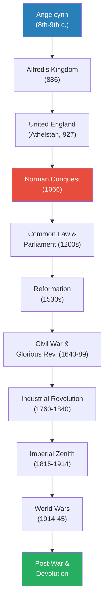
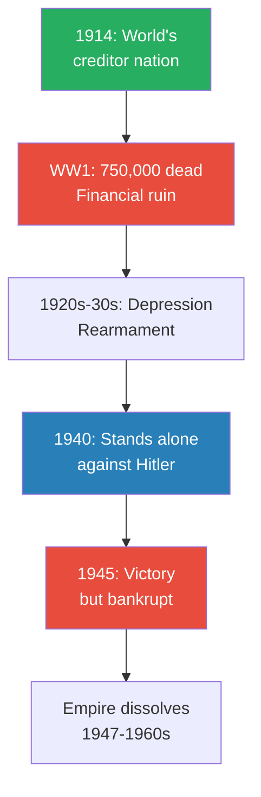
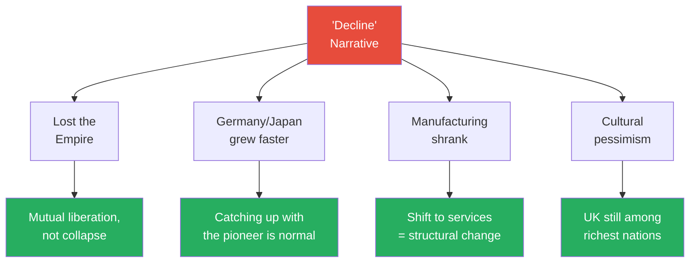

# The English and Their History — Robert Tombs

> Robert Tombs, a Cambridge professor of French history, wrote the first full-length single-volume history of England (not Britain) in decades. His central argument is that England is one of the oldest nation-states on earth, that its identity stretches back to the eighth century, and that the fashionable narrative of post-war "decline" is largely an illusion. The book tracks two histories simultaneously: what actually happened to the English, and what the English believed happened — because collective memory shaped politics as powerfully as events did. Covering everything from prehistoric cave-dwellers to the 2014 Scottish independence referendum, it is a sweeping, opinionated, and deeply engaging account of how a small, damp island became one of the most influential civilisations in history.

---

## About the Author

Robert Tombs is Professor of French History at St John's College, Cambridge. He is an Englishman who spent most of his career studying France, which gives him an outsider's comparative perspective on his own country. His expertise means he constantly measures English developments against Continental experience — asking not just "what happened?" but "why was England different?" The book was written during the 2014 Scottish independence referendum debate, and Tombs's engagement with questions of English identity is clearly shaped by that moment.

---

## The Big Idea

- Tombs advances a triple thesis that challenges how most people think about English history
- First, <b style="color: #27ae60">England is one of the world's oldest nation-states</b> — the concept of "Englishkind" (Angelcynn) emerged in the eighth and ninth centuries, making England a pioneer of the nation-state form long before France, Germany, or Italy existed as unified entities
- Second, history and memory are inseparable — what happened to the English and what they believed happened are equally important, because collective memory created the framework within which political action made sense
- Third, <b style="color: #e74c3c">the "decline" narrative that has dominated post-war British thinking is largely an illusion</b> — other countries catching up with the pioneer is normal growth, not evidence that the pioneer is falling behind

The book identifies geography as the master key to English distinctiveness:
- The English Channel is narrow enough for constant contact with the Continent but wide enough to deter mass invasion
- This combination — <b style="color: #2980b9">the sea as both highway and moat</b> — explains why England was never successfully conquered after 1066, why it developed powerful central institutions, and why it became a global trading and imperial power
- No other major nation enjoys this precise balance of connection and protection

Tombs structures his argument around four <b style="color: #2980b9">memory themes</b> that form an arc through the centuries:
- The aftermath of the Norman Conquest and the creation of the English class system
- The "Whig history" of progressive liberty — Magna Carta, Parliament, the Glorious Revolution
- The contested memory of empire — triumph or exploitation?
- The recent narrative of decline — real or imagined?

Each memory theme is not simply a historical episode but a story that the English told themselves about who they were — and these stories shaped political action as powerfully as any law or battle.

---

## Key Concepts at a Glance

| Concept | One-line summary |
|---------|-----------------|
| **Angelcynn** | The idea of "Englishkind" — a shared identity predating political unity by centuries |
| **The sea as highway and moat** | Island geography explains both England's security from invasion and its global reach |
| **Institutional continuity** | England has never been conquered since 1066, so its institutions evolved rather than being replaced |
| **Parliament born from taxation** | Representative government emerged because kings needed consent to raise money |
| **The Norman Conquest** | The most transformative single event — rewired language, law, land, and class |
| **Common Law** | A system of law built from precedent, not imposed from above — accessible to ordinary people |
| **Magna Carta as living myth** | The 1215 charter mattered less for what it said than for what later generations read into it |
| **The Reformation as personal obsession** | Henry VIII broke with Rome for a male heir, not Protestant conviction |
| **English compromise** | Every constitutional crisis was resolved by negotiation, not winner-take-all revolution |
| **Bottom-up industrialisation** | The Industrial Revolution was unplanned — individual enterprise within a favourable framework |
| **Whig history** | The narrative that English history is a story of progressive liberty |
| **Declinism** | The corrosive illusion that post-war Britain has been in terminal decline |
| **England is not Britain** | England has a distinct history not subsumed into "British" or "imperial" history |

---

*The unbroken institutional thread from Alfred to the present is Tombs's central claim — no other major European nation can trace its political institutions back this far without a revolutionary rupture.*

---

## Prelude: The Dreamtime

*Before there were "English," there were 800,000 years of habitation, Roman conquest, Saxon invasion, and the myth of King Arthur — a prologue that set the stage for everything that followed.*

- Britain has been intermittently inhabited for roughly 800,000 years — one of the earliest sites of human presence in northern Europe
- The English Channel formed approximately 6,000 years ago, cutting Britain off from the Continent and creating the geographic condition that would define English history
- <b style="color: #2980b9">The Channel</b> is the single most important geographical fact in English history:
  - Narrow enough (21 miles at the Strait of Dover) for constant trade, migration, and cultural exchange
  - Wide enough to make large-scale military invasion enormously difficult
  - This combination explains why England was invaded repeatedly by small warrior bands who became overlords — but never by mass population replacements
- Before the Channel formed, Britain was simply the northwest corner of Continental Europe
- After it formed, every new arrival — Celts, Romans, Saxons, Vikings, Normans — had to cross water, which limited the scale of each incursion

### Roman Britain

- The Roman conquest began in AD 43 under Emperor Claudius
- Roman Britain lasted nearly four centuries — longer than the British Empire — yet left surprisingly little cultural legacy:
  - Roads, cities, baths, and Hadrian's Wall were impressive feats of engineering
  - But when Rome withdrew around AD 409, Romano-British civilisation collapsed within a generation
  - Latin did not survive as a spoken language — unlike in France, Spain, or Italy
  - Christianity retreated to the Celtic fringes (Wales, Ireland, Scotland)
  - Tombs draws the contrast sharply: France is Roman to its bones; England is not
- The collapse was so complete that historians debate what happened to the Romano-British population:
  - Cities were abandoned or shrank to tiny settlements
  - Literacy vanished for over a century
  - The Roman withdrawal created a power vacuum that Saxon warbands filled over the next two centuries
- The Saxon invasions (c.430-600) are among the most debated events in English history:
  - Traditional narrative: hordes of Germanic warriors conquered and displaced the Romano-British population
  - Modern view: smaller groups of warriors established themselves as local rulers, intermarrying with and absorbing the existing population
  - DNA evidence supports the modern view — the English are genetically more similar to the pre-Roman inhabitants than to modern Germans
  - The Saxons brought their language (Old English), their social structures (kinship groups, warrior culture), and their pagan religion
  - Christianity was reintroduced from two directions: from Rome (Augustine's mission to Kent in 597) and from the Celtic churches of Ireland and Scotland (Columba, Aidan)
  - The Synod of Whitby (664) resolved the conflict between Roman and Celtic Christianity in favour of Rome — aligning England with the mainstream of European civilisation

> [!example] Boudicca's Revolt (AD 60-61)
> - Boudicca, queen of the Iceni tribe in East Anglia, led a massive uprising against Roman rule
> - The Romans had flogged her and assaulted her daughters after seizing Iceni lands
> - Her forces destroyed Colchester, London, and St Albans, killing an estimated 70,000-80,000 people
> - The Roman governor Paulinus rallied his legions and crushed the revolt in a pitched battle
> - Boudicca died shortly after — whether by poison or illness is unknown
> - She became a national heroine only in the Victorian era, when a statue was erected near the Houses of Parliament
> **The lesson:** Even under Rome's overwhelming power, resistance was possible — but rarely successful. Boudicca's story also illustrates how the English recycled historical figures to serve later purposes.

---

### The Arthur Myth

- King Arthur is almost certainly fictional — there is no contemporary evidence for his existence
- The legend was invented by Geoffrey of Monmouth around 1136 in his wildly popular *Historia Regum Britanniae*
- Geoffrey was writing for a Norman audience, creating a glorious pre-Saxon past to legitimise the new ruling class
- The Arthur myth became the foundation of English and later British royal mythology for centuries:
  - Edward I had "Arthur's crown" placed on the altar at Westminster during his conquest of Wales
  - The Tudor dynasty claimed descent from Arthur to bolster their legitimacy
  - The Round Table in Winchester Castle was repainted in Henry VIII's reign with Tudor imagery
- <b style="color: #27ae60">Invasions were always by relatively small warrior bands who became overlords, not mass population replacements</b>:
  - The genetic population of England remained largely the same through successive conquests
  - Modern DNA evidence confirms this — the English are overwhelmingly descended from the pre-Roman inhabitants, with thin overlays of each successive invading group
  - This matters because it challenges the idea of "Anglo-Saxon England" as a blank slate — the Saxons were a ruling elite, not a replacement population

---

## Part One: The Birth of a Nation (c.600-1066)

*The English existed as an idea before they existed as a kingdom — and a Wessex king hiding in a marsh invented the political community that became one of the world's oldest nations.*

### The Idea Before the Kingdom

- The concept of "the English" as a single people preceded any unified English kingdom by at least a century
- Pope Gregory the Great, seeing fair-haired slave boys in a Roman market around AD 580, reportedly declared them "not Angles but Angels" — one of history's most consequential puns, because it led Gregory to send missionaries to convert the English
- <b style="color: #2980b9">Bede's *Ecclesiastical History of the English People*</b> (AD 731) was the foundational text of English identity:
  - Bede defined English identity as religious — the *gens Anglorum*, one people in God's eyes
  - He wrote from Jarrow in Northumbria, far from political power, yet his concept of a single English people shaped everything that followed
  - The identity began as a Church concept — the organisation that transcended petty kingdoms created the idea of a unified people before any king ruled them all
  - This is the crucial mechanism: <b style="color: #27ae60">religion, not politics, created the English</b>
- Christianity brought back literacy after the Roman collapse:
  - Created Old English as a literary language — the first European vernacular to be written extensively
  - Produced *Beowulf*, the earliest masterpiece of English literature
  - Monasteries became centres of learning, art, and political influence
  - The Lindisfarne Gospels (c.700) combined Celtic, Anglo-Saxon, and Mediterranean artistic traditions — a visual symbol of England's position at the crossroads of European culture

> [!tip] Core Insight
> The nation preceded the state. The idea of "the English" existed for over a century before any king united them politically — making England one of the rare cases where identity came first and political organisation followed. Most modern nations work the other way: the state creates the national identity.

### The Seven Kingdoms

- Before unification, England was divided into rival kingdoms — the <b style="color: #2980b9">Heptarchy</b>:
  - Northumbria, Mercia, East Anglia, Essex, Kent, Sussex, and Wessex
  - Power shifted between them: Northumbria dominated in the seventh century, Mercia in the eighth, Wessex in the ninth
  - Each had its own royal dynasty, laws, and customs
  - But Bede's concept of a single English people provided the ideological framework for eventual unification
- Anglo-Saxon society was more sophisticated than the "Dark Ages" label suggests:
  - Complex legal codes written in English (not Latin) — beginning with Aethelberht of Kent's laws (c.600), the earliest Germanic law code
  - Elaborate metalwork — the Sutton Hoo treasures (discovered 1939 in Suffolk) reveal a culture of extraordinary artistic refinement:
    - A ship burial containing gold helmet, jewellery, weapons, and Byzantine silverware
    - Evidence of long-distance trade and cultural connections across Europe
  - Active trade networks reaching Scandinavia, the Rhineland, and the Mediterranean
  - A tradition of royal councils (*witenagemot* — "meeting of the wise") that constrained kings:
    - Kings could not make law, levy taxes, or go to war without consulting their great men
    - This was not democracy, but it was limited government — the distant ancestor of Parliament
    - The principle that the king rules with the consent of his leading subjects was established long before Magna Carta
  - The Church played a central role in governance:
    - Bishops and abbots were major landowners and political figures
    - Monasteries kept records, trained administrators, and provided the literate personnel that government required
    - The partnership between Church and Crown gave Anglo-Saxon England an administrative capacity unmatched in Western Europe

---

### The Viking Crucible

- Viking raids began in 793 with the sack of Lindisfarne — one of the most shocking events in early English history:
  - The Anglo-Saxon Chronicle recorded it with horror: a holy place destroyed by pagans
  - The raids escalated over the next decades from coastal hit-and-run to full-scale invasion
- By the 870s, Danish armies had conquered Northumbria, East Anglia, and Mercia:
  - Only Wessex survived as an independent English kingdom
  - The <b style="color: #2980b9">Danelaw</b> — the area of Danish settlement and law — covered roughly the eastern half of England
  - Danish place-names still mark the landscape: any town ending in -by (Whitby, Derby) or -thorpe (Cleethorpes) was a Viking settlement
- The Viking invasions paradoxically strengthened English identity:
  - The Danes were pagans (initially), so the struggle became framed as Christian English against heathen invaders
  - The need for collective defence forced cooperation between the surviving English kingdoms
  - The idea of a single English people — Bede's creation — became politically urgent

### Alfred the Great

- Alfred of Wessex (r. 871-899) is the pivotal figure in English national history
- He is the only English monarch called "the Great" — and Tombs argues the title is deserved
- In 878, the Danish king Guthrum launched a surprise winter attack that nearly destroyed Wessex entirely

> [!example] Alfred in the Marshes (878)
> - Alfred was forced to flee into the Somerset marshes around Athelney with a handful of followers
> - The king of all surviving English territory was reduced to hiding in a swamp
> - Legend says he took refuge with a peasant family who did not recognise him, and was scolded for burning their bread while preoccupied with planning his comeback
> - From this desperate hiding place, he summoned his supporters to a meeting point at "Ecgberht's Stone east of Selwood"
> - The men of Somerset and Wiltshire rallied to him — a remarkable act of loyalty to a king who seemed finished
> - At the Battle of Edington (878), Alfred decisively defeated Guthrum's army
> - The peace terms required Guthrum to accept Christian baptism — Alfred stood as his godfather
> **The lesson:** England's founding myth is not one of unbroken triumph but of survival against the odds — a king who lost everything and rebuilt from nothing. This pattern — crisis, survival, renewal — would repeat throughout English history.

- After Edington, Alfred transformed England:
  - Seized London in 886, establishing himself as ruler of all English people not under Danish rule
  - Created a network of fortified towns (<b style="color: #2980b9">burhs</b>) that provided permanent defence against Viking raids — roughly 30 fortified settlements, spaced so that no part of Wessex was more than 20 miles from refuge
  - Reformed the army: divided it into two halves that served in rotation, so fields were always tended
  - Commissioned the translation of key Latin texts into English — wanting his people to be literate in their own language
  - Began the <b style="color: #2980b9">Anglo-Saxon Chronicle</b>, the first continuous history written in English — a propaganda tool as much as a record, but still revolutionary
- <b style="color: #27ae60">Alfred invented the English as a political community, not just a religious one</b>:
  - Before Alfred, "English" was an ethnic and religious identity
  - After Alfred, it was also a political identity — loyalty to a single English kingdom
  - He used the word *Angelcynn* (Englishkind) to describe all English-speaking people, regardless of which kingdom they originally belonged to

### From Alfred to 1066

- Alfred's successors completed the unification of England:
  - His son Edward the Elder and daughter Aethelflaed, "Lady of the Mercians," systematically reconquered the Danelaw
  - His grandson <b style="color: #2980b9">Athelstan</b> conquered the last Viking territories in 927, becoming the first king of all England
  - Edgar "the Peaceful" (r. 959-975) presided over a golden age of English culture and administration
- The English kingdom developed institutions of remarkable sophistication:
  - Shires and hundreds as units of local government
  - A coinage system controlled from the centre — no other European kingdom managed this
  - Effective taxation: the *geld* (land tax) was collected systematically across the entire kingdom
  - A literate, bureaucratic administration that had no Continental equivalent

| Feature | England (pre-1066) | Continental Kingdoms |
|---------|-------------------|---------------------|
| Written law codes | From 7th century | Scattered, inconsistent |
| National coinage | Centrally controlled | Regional, fragmented |
| Taxation | Systematic, nationwide | Feudal, local |
| Literacy | Old English as written language | Latin only |
| Administration | Shires, hundreds, courts | Feudal fragmentation |

*England before the Norman Conquest was not a primitive backwater — it was arguably the most sophisticated kingdom in Western Europe.*

---

- Renewed Danish invasion under Cnut (r. 1016-1035) absorbed England into a Scandinavian empire
- But Cnut ruled through English institutions, not against them:
  - Kept the shire system, the courts, the taxation machinery
  - Married the English queen Emma of Normandy
  - Styled himself as an English king, not a foreign conqueror
  - The administrative machinery was too useful to discard
- The English kingdom survived the Scandinavian conquest with its institutions intact — a pattern that would repeat under the Normans

### 1066: The Last Successful Invasion

- Harold Godwinson, the last Anglo-Saxon king, faced two invasions in September 1066:
  - He defeated the Norwegian king Harald Hardrada at Stamford Bridge in Yorkshire on 25 September
  - Then force-marched his exhausted army 250 miles south to face William of Normandy at Hastings
- The Battle of Hastings (14 October 1066) was close:
  - Harold's shield-wall held for most of the day
  - The Norman cavalry could not break through
  - The battle turned when sections of the English line broke formation to pursue what they thought was a Norman retreat
  - Harold was killed (the arrow-in-the-eye story comes from the Bayeux Tapestry, but may be misinterpreted), and his army collapsed
- <b style="color: #e74c3c">This was the last successful invasion of England — and the most transformative event in English history</b>
- The fact that England has not been conquered since 1066 is the single most important structural fact about its history:
  - It explains institutional continuity — there was never a revolutionary rupture that wiped the slate clean
  - It explains gradual evolution — English institutions adapted rather than being replaced
  - It explains the English temperament of compromise — a society that has never been conquered has never needed to rebuild from scratch

---

## Part Two: The Conqueror's Kingdom and Medieval England (1066-1485)

*The Normans rewired England's language, law, land ownership, and class structure — yet the conquered English institutions proved so useful that the conquerors kept them, creating a hybrid civilisation of extraordinary resilience.*

### The Norman Revolution

*A small warrior elite conquered a sophisticated kingdom and transformed it utterly — yet the conquered society's institutions were so effective that the conquerors adopted them, creating a hybrid more powerful than either parent culture.*

- The Norman Conquest was not merely a change of dynasty — it was a complete replacement of the ruling class:
  - Within 20 years, virtually every English landowner had been dispossessed
  - The new French-speaking aristocracy controlled all the great estates, bishoprics, and abbeys
  - English became the language of peasants; French the language of power; Latin the language of the Church
  - <b style="color: #e74c3c">This linguistic division encoded social hierarchy into the language itself</b>:
    - We eat "beef" (French *boeuf*) but tend "cows" (English)
    - We eat "pork" (French *porc*) but raise "pigs" (English)
    - We eat "mutton" (French *mouton*) but herd "sheep" (English)
    - The animals have English names (the peasants who raised them); the meat has French names (the aristocrats who ate them)
- Yet English administrative institutions survived because they were useful to the conquerors:
  - William needed the shire system, the courts, the taxation machinery to govern a country he had conquered with perhaps 8,000-10,000 men ruling over 2 million English
  - The conquerors were too few to replace the entire administrative structure — they needed it to collect taxes and enforce order
  - This created a paradox: the most traumatic event in English history also demonstrated the resilience of English institutions

> [!example] The Domesday Book (1086)
> - William ordered a comprehensive survey of all land and wealth in England
> - Commissioners travelled to every shire, recording who owned what, how much it was worth, and what taxes were owed
> - Nothing comparable existed anywhere else in Europe — not even the Byzantine Empire attempted anything similar
> - The survey was so thorough that the English called it "Domesday" (Day of Judgement) because, like God's final reckoning, there was no appeal against it
> - It used existing English administrative structures — the shire courts and hundred courts — to gather the data
> - It remains usable as a historical source nearly a thousand years later
> **The lesson:** The Normans combined their military ruthlessness with England's existing administrative sophistication — the result was the most documented and effectively governed kingdom in medieval Europe.

> [!tip] Core Insight
> The Norman Conquest created the fundamental English class system that persisted for centuries — a French-speaking aristocracy ruling over English-speaking commoners. The linguistic divide mapped directly onto social hierarchy, and traces of it survive in the English language today.

---

### The Invention of Common Law

- <b style="color: #2980b9">The Common Law</b> developed from the twelfth century onward, primarily under Henry II (r. 1154-1189):
  - Henry's legal reforms created a system of royal courts that gradually extended their jurisdiction over the entire kingdom
  - Cases were decided by juries of local men who knew the facts — not by professional judges imposing Roman law from above
  - Precedent accumulated into a body of law that applied across the entire kingdom
  - This was radically different from Continental systems:
    - On the Continent, Roman law was rediscovered in the twelfth century and imposed top-down by rulers
    - In England, law grew bottom-up from the decisions of thousands of local juries
- Why this matters for Tombs's argument:
  - The Common Law gave ordinary English people legal rights enforceable in royal courts
  - It created a shared legal culture that bound the kingdom together
  - It was cheap and relatively accessible — even peasants could bring cases
  - <b style="color: #27ae60">Ordinary people had rights and asserted them, through courts and custom</b>
- By 1300, the Common Law extended to every village:
  - Peasant society was surprisingly litigious and rights-conscious
  - Even villeins (unfree peasants) could access royal courts in certain circumstances
  - Court records reveal ordinary English people arguing about land boundaries, debts, assault, and inheritance with sophisticated legal knowledge

> [!example] Henry II and the Murder of Thomas Becket (1170)
> - Henry II appointed his friend and chancellor Thomas Becket as Archbishop of Canterbury, expecting a compliant churchman
> - But Becket transformed overnight from a worldly courtier into a zealous defender of Church independence
> - He clashed with Henry over whether clergy accused of crimes should be tried in royal or Church courts
> - In a fury, Henry reportedly cried out words that were interpreted as a wish for Becket's death — "Will no one rid me of this turbulent priest?" (or words to that effect)
> - Four knights travelled to Canterbury Cathedral and murdered Becket at the altar on 29 December 1170
> - The murder shocked all of Europe; Becket was canonised within three years
> - Henry was forced to do public penance — walking barefoot to Canterbury and being flogged by monks
> - Yet Henry's legal reforms survived and expanded — the Common Law continued to grow despite the crisis
> **The lesson:** The Common Law's development was not smooth or uncontested. The struggle between royal justice and Church privilege was bitter and sometimes violent — but the long-term trajectory favoured the extension of royal courts over all of England.

- The Common Law had consequences that reached far beyond England:
  - It was exported to every part of the English-speaking world — the United States, Canada, Australia, India, and dozens of other countries use legal systems descended from Henry II's reforms
  - Its emphasis on precedent, juries, and individual rights shaped the political cultures of all these nations
  - Tombs's implicit argument: England's legal innovation was its single greatest gift to the world

---

### Magna Carta

- <b style="color: #2980b9">Magna Carta</b> (1215) is the most famous document in English constitutional history — and the most misunderstood:
  - It was not a charter of liberty for the people — it was a negotiation between King John and his rebellious barons
  - The barons were angry about John's crushing taxation and arbitrary justice — he had lost Normandy to France and needed money to win it back
  - Most of its 63 clauses dealt with feudal technicalities that have no modern relevance
  - But it established a principle of enduring importance: <b style="color: #27ae60">the king is bound by law</b>
  - Clause 39 — no free man shall be imprisoned or dispossessed "except by the lawful judgement of his equals or by the law of the land" — became the seed of habeas corpus and due process
- Magna Carta's real power was in its afterlife — what later generations read into it:
  - It was reissued repeatedly throughout the thirteenth century, becoming a touchstone of English political culture
  - Seventeenth-century opponents of the Stuarts cited it as proof that English kings had always been subject to law
  - The American colonists cited it in their revolution
  - It appears in the DNA of the US Constitution and the Universal Declaration of Human Rights
  - Tombs's point: the myth of Magna Carta mattered more than the reality — and this is how English political memory works

---

### Parliament's Origins

- <b style="color: #2980b9">Parliament</b> emerged in the thirteenth century — not as a democratic institution, but as a mechanism for raising taxes:
  - English kings could not raise revenue independently the way Continental monarchs could
  - Continental kings had large crown lands, feudal dues, and the ability to tax through direct coercion
  - English kings were unusually dependent on parliamentary taxation — they had to ask
  - Barons and later commons demanded concessions in return for granting money
  - This transactional relationship is the foundation of English representative government
- <b style="color: #27ae60">Every major constitutional crisis in English history — Magna Carta, the Civil War, the Glorious Revolution — was triggered by disputes over money</b>
- The development was gradual:
  - Under Henry III and Edward I, Parliament evolved from an occasional great council into a regular institution
  - The Commons (representatives of shires and boroughs) gained the exclusive right to grant taxes
  - By the fourteenth century, no tax could be raised without parliamentary consent — a restriction that applied nowhere else in Europe with such force

*The engine of English constitutional development was not philosophy but finance — kings trading liberties for revenue in an escalating cycle that gradually shifted power from Crown to Parliament.*

---

### Medieval Society at Its Peak

*By 1300, England was a prosperous, densely populated, and surprisingly sophisticated society — then the Black Death destroyed it, and the survivors built something new from the ruins.*

- England around 1300:
  - Population of approximately 6 million (a level not reached again until the sixteenth century)
  - Over 800 towns connected by a dense road network
  - Wool was the great export — English wool clothed much of Europe
  - The Church owned roughly half of all land and employed some 50,000 male clergy
  - Great cathedrals in the "Decorated" Gothic style were architectural masterpieces that took generations to build
  - Open-field agriculture at its peak — communal farming methods that fed the population effectively if unspectacularly

- English peers had no special legal status, unlike Continental nobility:
  - A French duke was legally a different species from a French peasant
  - An English earl was subject to the same Common Law as a yeoman farmer
  - This seemingly small distinction had enormous long-term consequences:
    - It prevented the development of a rigid legal caste system
    - It meant that the English aristocracy could not simply ignore the law
    - It created a culture where even the powerful were expected to work within the system
- Social structure was hierarchical but permeable:
  - Lords, knights, esquires, yeomen, villeins — a ladder with many rungs
  - Movement between levels was possible, especially through the Church (which recruited talented men regardless of birth)
  - This relative fluidity distinguished England from the Continent, where social boundaries were far more rigid

---

### The Black Death and Its Aftermath

*The greatest catastrophe in English history killed half the population — and paradoxically improved life for the survivors.*

- The <b style="color: #e74c3c">Black Death</b> arrived in England in June 1348 via a ship from Gascony and killed 40-50% of the population within two years
- It was the greatest demographic catastrophe in English history — far more destructive than either World War:
  - Entire villages were wiped out
  - The clergy, who tended the sick, died at even higher rates than the general population
  - Labour became desperately scarce
- But its long-term effects were paradoxically beneficial for survivors:
  - With fewer workers, wages rose dramatically — labourers could demand higher pay
  - With fewer mouths, more land was available per person — diet improved
  - Living standards for ordinary people increased significantly over the following century
  - Serfdom, already weakening, became economically unviable:
    - Landlords who tried to enforce feudal labour obligations found their workers simply leaving for better terms elsewhere
    - The Statute of Labourers (1351), which tried to freeze wages at pre-plague levels, was widely ignored and unenforceable
    - Peasants who had been tied to the land for generations could now negotiate, move, and demand better conditions
  - The survivors were, in material terms, substantially better off than their grandparents
  - The Black Death also transformed culture and religion:
    - The Church, which had failed to explain or prevent the catastrophe, lost authority
    - Mystical and personal forms of religion grew — people sought direct relationship with God rather than institutional mediation
    - The <b style="color: #2980b9">Lollard movement</b>, founded by John Wycliffe in the 1370s, anticipated the Reformation by over a century:
      - Wycliffe argued that the Bible should be available in English, that the Church was too wealthy, and that clergy should live simply
      - Lollards were suppressed but never entirely eliminated — they survived underground for 150 years
      - When the Reformation came, Lollard communities in the Midlands and south-east were among the first to embrace Protestantism
    - Art and literature took on darker themes: the "Danse Macabre" (Dance of Death) appeared in church murals, and Langland's *Piers Plowman* attacked clerical corruption
  - Tombs sees the Black Death as a hinge point: the old medieval order began to crack, and the forces that would eventually produce the Reformation and the modern world were set in motion

> [!example] The Peasants' Revolt (1381)
> - A poll tax of one shilling per head — a flat tax that fell hardest on the poor — provoked fury across southern England
> - Wat Tyler led a march on London from Kent, gathering thousands of supporters along the way
> - The rebels were not illiterate rabble — they carried lists of specific enemies they wanted killed and articulated coherent political demands:
>   - End serfdom
>   - Abolish the poll tax
>   - Punish corrupt officials
>   - Redistribute Church wealth
> - The fourteen-year-old Richard II rode out to meet the rebels at Smithfield
> - During negotiations, Tyler was killed in a scuffle with the Lord Mayor of London
> - Richard rode directly toward the leaderless crowd, crying "I am your captain, follow me!" — and dispersed them
> - Aftermath: all promises were broken, leaders were hunted down and executed
> - But serfdom gradually disappeared anyway over the following decades — economics accomplished what rebellion could not
> **The lesson:** The political awareness and collective action of ordinary English people was remarkable for the fourteenth century. The Peasants' Revolt failed in its immediate aims but demonstrated a pattern that would recur throughout English history: protest, suppression, and then gradual concession of the original demands.

---

### The Hundred Years' War and the Wars of the Roses

- The <b style="color: #2980b9">Hundred Years' War</b> with France (1337-1453) defined English identity for a century:
  - Began as a dynastic claim — English kings claimed the French throne through maternal descent
  - Produced England's greatest medieval military triumphs:
    - Crecy (1346): Edward III's longbowmen destroyed the cream of French chivalry
    - Agincourt (1415): Henry V's outnumbered, mud-soaked army defeated a vastly superior French force — entering English myth as the supreme moment of medieval glory
  - The English longbow was the decisive weapon:
    - Cheap, deadly, and requiring years of training
    - English archers were drawn from the yeoman class — ordinary men, not aristocratic knights
    - This gave England a military edge that depended on its social structure, not just its technology
  - Joan of Arc turned the tide from 1429 — a teenage peasant girl who claimed divine guidance and shattered English confidence in Normandy
  - By 1453, England had lost everything in France except Calais — ending centuries of Anglo-French entanglement
  - The loss forced England to become, for the first time, a purely insular kingdom rather than a cross-Channel empire

> [!example] Agincourt (25 October 1415)
> - Henry V landed in Normandy with about 9,000 men, besieged and captured Harfleur, then marched toward Calais
> - Disease and desertion reduced his army to perhaps 6,000 — exhausted, hungry, and far from home
> - A French army of 12,000-36,000 (estimates vary enormously) blocked his path near the village of Agincourt
> - The battlefield was a narrow strip between two woods, negating the French advantage in numbers
> - Rain had turned the ploughed fields to deep mud — the heavily armoured French knights could barely move
> - English longbowmen poured arrows into the struggling French ranks at devastating range
> - The French vanguard was slaughtered; the rest fled or surrendered
> - English casualties were perhaps 100-400; French losses were 6,000-10,000, including many of the highest nobility
> - The victory entered English mythology as the triumph of the common bowman over aristocratic chivalry
> **The lesson:** Agincourt became England's supreme military legend — Shakespeare immortalised it — but it also illustrates a deeper pattern: English military success often depended on disciplined common soldiers rather than aristocratic cavalry, reflecting a society with broader participation than Continental rivals.

- The <b style="color: #2980b9">Wars of the Roses</b> (1455-1485):
  - A dynastic civil war between the houses of York (white rose) and Lancaster (red rose)
  - Not a war of the people — it was fought by rival aristocratic factions commanding small professional armies, numbering in the thousands rather than tens of thousands
  - Most of the country, most of the time, was unaffected — farmers farmed, merchants traded, courts sat
  - But the battles were brutal when they occurred:
    - Towton (1461), fought in a Yorkshire snowstorm, may have seen 28,000 dead — the bloodiest battle ever fought on English soil
    - The losing side was shown little mercy — captured nobles were executed, estates confiscated
  - The key figures read like a Shakespeare cast list:
    - Henry VI: a pious, mentally unstable Lancastrian king unable to control his own government
    - Edward IV: a talented Yorkist warrior-king who seized the throne by force
    - Richard III: Edward's brother, who probably murdered Edward's sons (the "Princes in the Tower") to seize power — Shakespeare's greatest villain, though the historical reality is debated
    - Henry Tudor: a Welsh-born exile with a tenuous claim to the throne who defeated Richard at Bosworth (1485) and founded the Tudor dynasty

> [!example] The Battle of Bosworth (22 August 1485)
> - Richard III's army outnumbered Henry Tudor's by roughly two to one
> - The outcome depended on the Stanley family, who commanded a large force and had not committed to either side
> - Richard, seeing Henry with only a small bodyguard, charged directly at him — a bold, almost medieval attempt to end the battle by killing the rival claimant in single combat
> - The Stanleys intervened at the decisive moment — on Henry's side
> - Richard was killed fighting, the last English king to die in battle
> - According to tradition, his crown was found under a hawthorn bush and placed on Henry's head on the battlefield
> - Henry married Elizabeth of York, uniting the two roses, and founded the Tudor dynasty that would rule for over a century
> **The lesson:** Bosworth was a reminder that English history could still be decided by the sword. But the administrative state that Henry VII inherited was intact and functioning — whoever won the battle won a working kingdom.

  - <b style="color: #27ae60">Even during civil war, English institutions — Parliament, the courts, the shire system — continued to function</b>:
    - This is Tombs's key point: political violence at the top did not destroy the administrative machinery below
    - Whoever won the throne inherited a working state — unlike in many other countries where civil war meant institutional collapse
    - The wool trade continued, the courts dispensed justice, taxes were collected — regardless of which dynasty held the crown

---

## Part Three: The Great Divide — Reformation and Revolution (c.1500-1700)

*Henry VIII's desperate need for a male heir triggered the greatest revolution in English history, and the religious divide it created took 150 years and a civil war to resolve.*

### The Reformation

*One king's personal obsession opened a door that could never be closed — and the consequences reshaped England more profoundly than any event since the Norman Conquest.*

- <b style="color: #27ae60">The English Reformation was driven by Henry VIII's desire for a male heir, not by Protestant theology</b>
- Henry remained doctrinally conservative throughout his life:
  - He burned Lutherans for heresy even while defying the Pope
  - He wanted papal authority removed but Catholic doctrine preserved
  - His famous title "Defender of the Faith" was awarded by the Pope for writing a treatise against Luther
- The trigger was his marriage to Catherine of Aragon:
  - Catherine, his brother Arthur's widow, produced only one surviving child — a daughter, Mary
  - Henry became convinced God was punishing him for marrying his brother's wife (citing Leviticus)
  - He needed a papal annulment, but the Pope was effectively controlled by Catherine's nephew, Emperor Charles V
  - When Rome refused after years of diplomatic manoeuvring, Henry broke with the papacy entirely
  - The <b style="color: #2980b9">Act of Supremacy</b> (1534) declared the king "Supreme Head of the Church of England"

> [!example] Henry VIII and His Six Wives
> - Catherine of Aragon: divorced after 24 years because she could not produce a male heir — the event that triggered the Reformation
> - Anne Boleyn: beheaded in 1536 on trumped-up charges of adultery and treason — probably because court gossip about flirtations and jokes about Henry's sexual inadequacy reached the king's ears
> - Jane Seymour: produced the longed-for heir (Edward VI) and died of puerperal fever twelve days later — the wife Henry apparently mourned most
> - Anne of Cleves: the marriage was unconsummated ("the Flanders mare"), annulled after six months — she wisely accepted generous compensation and outlived Henry by a decade
> - Catherine Howard: actually committed adultery (unlike Anne Boleyn) and was executed in 1542 — she was probably only nineteen
> - Catherine Parr: survived, largely because Henry died first in January 1547
> **The lesson:** The personal obsessions of one man — his need for a son, his volatile temperament, his capacity for self-deception — reshaped the religious and political landscape of an entire nation. No other Reformation in Europe was so thoroughly personal in its origins.

---

### The Dissolution of the Monasteries

- <b style="color: #e74c3c">The dissolution of the monasteries (1536-1541) was the largest transfer of land since the Norman Conquest</b>:
  - Approximately 800 religious houses were dissolved
  - Their vast lands — roughly a quarter of all cultivated land in England — were seized by the Crown and sold to the gentry
  - This created a new class of Protestant landowners with a direct financial interest in preventing any return to Catholicism — they would lose their estates
  - The cultural destruction was incalculable:
    - Monastic libraries containing irreplaceable manuscripts were burned or scattered
    - Stained glass windows, carved screens, statues, and wall paintings were smashed by iconoclasts
    - Centuries of accumulated learning in medicine, agriculture, law, and theology were lost
    - Buildings that had been architectural masterpieces were stripped of their lead roofs (for profit) and left to decay as romantic ruins — many of the picturesque abbey ruins that dot the English countryside are the direct result of Henry's destruction
  - Monasteries had been centres of charity, education, and healthcare:
    - They ran hospitals, almshouses, and schools
    - They provided hospitality to travellers (there were no hotels)
    - They maintained the best agricultural land in the country
    - Their loss left holes in social provision that took centuries to fill — the post-Reformation poor relief system was partly an attempt to replace what the monasteries had provided

- The <b style="color: #2980b9">Pilgrimage of Grace</b> (1536):
  - The largest popular uprising of the sixteenth century — 30,000-40,000 people in northern England rose against the dissolution
  - The rebels were conservative Catholics defending their monasteries, their communities, and their way of life
  - Henry promised to address their grievances, then broke his promises and executed the leaders
  - <b style="color: #e74c3c">Henry's vindictiveness toward the Pilgrimage's leaders was characteristic</b> — he was capable of extraordinary cruelty toward anyone who challenged his will

- **Thomas Cromwell**, Henry's chief minister:
  - A self-made man of extraordinary ability — son of a brewer and blacksmith, rose to become the most powerful minister in England
  - Managed the dissolution with ruthless efficiency and reorganised royal administration
  - Created a bureaucratic state: the Privy Council, the Court of Augmentations, reformed exchequer procedures
  - Eventually fell from favour (partly over the Anne of Cleves marriage) and was executed in 1540 — the fate of those who served the Tudors too well

> [!example] Thomas More in the Tower (1534-35)
> - Sir Thomas More, Lord Chancellor and one of Europe's greatest intellectuals, refused to swear the oath accepting Henry's supremacy over the Church
> - He offered silence rather than outright refusal, hoping the law would protect him — he said nothing against the king, but his silence spoke volumes
> - The Solicitor-General Richard Rich was sent to entrap him in private conversation
> - More was convicted on Rich's testimony — which More vehemently denied — and beheaded in July 1535
> - On the scaffold, he declared himself "the King's good servant, but God's first"
> - He was canonised by the Catholic Church in 1935
> **The lesson:** The collision between individual conscience and royal power lies at the heart of the Reformation. More's stand became one of the defining moments of English moral history — the man who chose death over complicity.

> [!tip] Core Insight
> Once papal authority was rejected, the door could never be closed. Henry wanted a Catholic Church without a Pope, but the breach he created allowed genuine Protestants — people he would have happily burned — to push through reforms he never intended. The Reformation escaped its creator.

---

### Edward, Mary, and Elizabeth

- **Edward VI** (r. 1547-1553): a genuinely Protestant revolution under Archbishop Cranmer:
  - The <b style="color: #2980b9">Book of Common Prayer</b> (1549, revised 1552) — Cranmer's masterpiece
  - Its language shaped English prose as profoundly as Shakespeare:
    - Marriage vows ("to have and to hold, from this day forward"), funeral rites, and prayers that are still in use
  - Protestant doctrine formally adopted: communion replaced the Mass, images removed from churches
  - Edward died at fifteen, before his revolution could be consolidated

- **Mary I** (r. 1553-1558): attempted Catholic restoration:
  - Burned approximately 300 Protestants, including Archbishop Cranmer himself
  - Created the "Bloody Mary" legacy that poisoned English attitudes toward Catholicism for centuries
  - <b style="color: #e74c3c">The burnings were a catastrophic miscalculation</b>:
    - They created Protestant martyrs whose stories were collected in Foxe's *Book of Martyrs* — one of the most widely read books in England for the next two centuries
    - They permanently associated Catholicism with persecution in English popular memory
    - Mary died without an heir, ensuring her restoration died with her

- **Elizabeth I** (r. 1558-1603): the Elizabethan Settlement:
  - A religious compromise: broadly Protestant in doctrine, but retaining Catholic ceremonial elements
  - Elizabeth's genius was studied ambiguity — she refused to "make windows into men's souls"
  - The settlement held for over a century, though it satisfied neither convinced Protestants (Puritans) nor convinced Catholics
  - The *via media* (middle way) became a defining feature of English religious and political culture
  - Elizabeth's reign also saw the flowering of English literature and expansion:
    - Shakespeare, Marlowe, Spenser, Sidney — a literary golden age that gave English its supreme literary works
    - Sir Francis Drake circumnavigated the globe (1577-1580) and helped defeat the Spanish Armada (1588)
    - The Armada's defeat was England's greatest naval victory before Trafalgar — and was attributed to Protestant divine intervention, cementing the link between English identity and Protestantism
    - The first English colonies were established: Roanoke (failed, 1585) and later Jamestown (1607, under James I)
    - English piracy ("privateering") against Spanish treasure ships was effectively state-sponsored — Drake and Raleigh were both pirates and national heroes

> [!example] The Spanish Armada (1588)
> - Philip II of Spain launched 130 ships carrying 30,000 men to invade England, depose Elizabeth, and restore Catholicism
> - The Armada sailed up the English Channel in a vast crescent formation
> - English ships under Drake and Lord Howard were smaller and faster — they harassed the Armada with long-range gunnery but could not break its formation
> - At Calais, the English sent fireships (burning hulks) into the anchored fleet, causing panic and scattering the Spanish ships
> - A combination of English attacks and terrible storms destroyed much of the Armada as it tried to return to Spain via Scotland and Ireland
> - Perhaps 15,000 Spanish sailors and soldiers died — many from shipwreck on the Irish coast
> - Elizabeth addressed her troops at Tilbury with one of history's great speeches, declaring she had "the heart and stomach of a king"
> - The victory confirmed England as a Protestant power and launched its self-image as a maritime nation protected by Providence
> **The lesson:** The Armada's defeat was both a military event and a founding myth — it convinced the English that they were chosen by God and protected by the sea. This belief, whether justified or not, shaped English confidence for centuries.

| Monarch | Religion | Key Act | Legacy |
|---------|----------|---------|--------|
| Henry VIII | Catholic doctrine, no Pope | Act of Supremacy (1534) | Created the breach |
| Edward VI | Protestant | Book of Common Prayer (1549) | Reformed the doctrine |
| Mary I | Catholic | Heresy burnings (1555-58) | Poisoned Catholic reputation |
| Elizabeth I | Protestant compromise | Elizabethan Settlement (1559) | Created lasting framework |

*The Reformation took four monarchs and thirty years to settle — and even then, the settlement was unstable enough to produce a civil war a century later.*

---

> [!example] William Tyndale and the English Bible (1525-1536)
> - Tyndale was the first scholar to translate the New Testament directly from Greek into English (published 1525, in exile in Germany)
> - His prose was revolutionary — simple, rhythmic, and powerfully direct
> - Phrases we still use daily originated with Tyndale: "let there be light," "the salt of the earth," "the spirit is willing but the flesh is weak," "eat, drink, and be merry"
> - The Church hierarchy saw vernacular Bibles as a mortal threat — if ordinary people could read scripture, they might form their own opinions
> - Tyndale was hunted across Europe by agents of Henry VIII and the English Church
> - He was betrayed, arrested in Antwerp, and burned at the stake in October 1536 — before Henry's break with Rome had made his work legal
> - His reported declaration — that he would cause a ploughboy to know more of scripture than a bishop — captured the democratising impulse of the Reformation
> - The King James Bible (1611), perhaps the most influential book in the English language, drew roughly 80% of its text from Tyndale's translation
> **The lesson:** Tyndale gave the English people their Bible in their own language — and in doing so, shaped the English language itself. He died for it, but his words outlasted his persecutors by five centuries.

---

### The English Revolution

*The seventeenth century's great crisis — whether power rested with the king or with Parliament — was resolved not once but twice: first by civil war and then by a bloodless revolution that became the model for constitutional government worldwide.*

- The Stuart era began when James VI of Scotland inherited the English throne as James I in 1603:
  - James believed in the divine right of kings — the doctrine that monarchs are God's representatives on earth, accountable to no one
  - This clashed with Parliament's growing sense of its own importance and its insistence that taxation required consent
  - James managed the tension through a combination of intellect, cunning, and occasional concession
- His son Charles I pushed the conflict to breaking point:
  - Tried to rule without Parliament for eleven years (the "Personal Rule," 1629-1640)
  - Imposed unpopular religious policies that looked dangerously Catholic to Puritans:
    - Archbishop Laud's "high church" ceremonialism — altars, candles, vestments — alarmed Protestants who saw it as a return to Rome
  - When he needed money for a war against Scotland, Charles was forced to recall Parliament in 1640
  - <b style="color: #e74c3c">The fundamental issue was always money</b> — the king could not fight wars without parliamentary taxation, and Parliament would not grant money without concessions

### The Civil War

- The <b style="color: #2980b9">English Civil War</b> (1642-1651) was, Tombs argues, the last of Europe's great wars of religion:
  - Royalists (Cavaliers) vs. Parliamentarians (Roundheads)
  - Parliamentarians were strongest in the south and east — the wealthier, more urban, and more Protestant regions
  - Royalists drew strength from the north, the west, and the more traditional, Catholic-leaning areas
  - But the divide was never clean — families were split, neighbours fought on different sides
  - Roughly 190,000 people died in England during the wars — a higher proportion of the population than in the First World War

- **Oliver Cromwell** emerged as the decisive military leader:
  - A minor East Anglian gentleman with no military training who became one of the most effective soldiers in English history
  - Created the <b style="color: #2980b9">New Model Army</b> — the first truly professional English army, promoted on merit rather than birth
  - Defeated the Royalists decisively at Marston Moor (1644) and Naseby (1645)
  - Charles I was tried and executed in January 1649 — an act that shocked Europe and had no precedent in English law

> [!example] The Execution of Charles I (30 January 1649)
> - Charles was tried by a specially constituted court — an unprecedented act with no legal basis
> - He refused to recognise the court's authority, arguing that no earthly power could try an anointed king
> - He was convicted and sentenced to death
> - On the scaffold outside the Banqueting House in Whitehall, Charles wore two shirts so that he would not shiver in the January cold — he did not want the crowd to think he was trembling from fear
> - His final word on the scaffold was "Remember" — addressed to the Bishop of London
> - The executioner's axe fell with a single blow
> - Tombs notes the deep ambivalence: many who had fought against Charles were horrified by his execution
> **The lesson:** The execution of the king was both revolutionary and traumatic — it asserted that no one was above the law, but it also created a martyrdom that haunted the English conscience and contributed to the eventual restoration of the monarchy.

- Cromwell ruled as Lord Protector (1653-1658):
  - Effective militarily — defeated Scotland, fought a successful naval war against the Dutch, seized Jamaica from Spain
  - But politically unable to find a stable constitutional settlement:
    - Dismissed Parliament when it disagreed with him — ironic for a man who had fought a war to defend parliamentary rights
    - Divided England into military districts governed by Major-Generals — a form of military dictatorship that proved deeply unpopular
    - Was offered the crown and refused it — but accepted the title Lord Protector, which was monarchy in all but name
  - Imposed Puritan morality on a population that largely did not want it:
    - Theatres closed, Christmas celebrations banned, alehouses shut down, dancing suppressed
    - This cultural authoritarianism alienated many who had supported Parliament in the war
  - His conquest of Ireland was the most controversial act of his career:
    - The massacres at Drogheda and Wexford (1649) killed thousands, including civilians
    - Catholic landowners were dispossessed on a massive scale — Irish land was given to English Protestant settlers
    - Cromwell remains the most hated figure in Irish history — "the curse of Cromwell" is still a phrase in Irish English
    - <b style="color: #e74c3c">Ireland was the great exception to English compromise</b> — where the English tradition of negotiation consistently failed, with devastating consequences that lasted centuries
  - After his death in September 1658, the republic collapsed within two years:
    - His son Richard ("Tumbledown Dick") lacked both ability and authority
    - The generals quarrelled among themselves
    - General George Monck marched from Scotland to London and engineered the restoration of Charles II

### The Restoration and Glorious Revolution

- **Charles II** returned in 1660 amid popular rejoicing:
  - But the old absolute monarchy did not return with him
  - Parliament retained the powers it had won during the Civil War
  - The Restoration was a compromise, not a counter-revolution
  - Charles was intelligent enough to understand the limits of his power — mostly

- **James II** (r. 1685-1688) was a Catholic who tried to restore Catholic influence:
  - He appointed Catholics to key positions in the army, universities, and government
  - Suspended laws against Catholic worship through royal prerogative
  - Maintained a standing army — which alarmed Parliament, remembering Cromwell
  - When his wife produced a male heir in June 1688, ensuring a Catholic succession, Parliament acted

- The <b style="color: #2980b9">Glorious Revolution</b> (1688):
  - Parliament invited the Dutch Protestant William of Orange (married to James's Protestant daughter Mary) to invade
  - James lost his nerve and fled — William entered London without a battle
  - The <b style="color: #2980b9">Bill of Rights</b> (1689) confirmed Parliament's supremacy:
    - No taxation without parliamentary consent
    - No standing army without parliamentary approval
    - Free elections and regular parliaments
    - Freedom of speech in parliamentary debate
    - Limited religious toleration (for Protestants, not Catholics)
  - <b style="color: #27ae60">This was the settlement that endured — the constitutional monarchy that still exists today</b>
  - It was explicitly designed to be a non-revolution: not the creation of something new, but the restoration of something old — the ancient English liberties that the Stuarts had violated

- The consequences of the Glorious Revolution extended far beyond England:
  - The <b style="color: #2980b9">Toleration Act</b> (1689) granted freedom of worship to Protestant dissenters (though not to Catholics)
  - The Act of Settlement (1701) established that only Protestants could inherit the throne — it remains law today
  - The Bank of England was founded in 1694 to manage government debt — creating the financial infrastructure that would fund Britain's wars and empire
  - The revolution made England safe for capitalism: secure property rights, predictable taxation, an independent judiciary, and contract law all flourished under the new settlement
  - Locke's *Two Treatises of Government*, published in 1689, provided the intellectual justification after the fact — and became the most influential political text of the next century
  - The combination of constitutional monarchy, parliamentary supremacy, religious toleration, and financial innovation gave England a decisive advantage over absolutist France in the century of warfare that followed

> [!tip] Core Insight
> English political culture values compromise over purity. Even the Civil War — the most violent constitutional crisis in English history — ended with a restoration that preserved parliamentary gains. The Glorious Revolution was deliberately designed to avoid another civil war by changing the monarch without overthrowing the system. This pattern — crisis, negotiation, compromise, new settlement — is the defining rhythm of English political history.

---

## Part Four: Making a New World (c.1660-1815)

*The English Enlightenment, the birth of party politics, the rise and fall of the Atlantic empire, the Industrial Revolution, and the existential struggle against Napoleon — in 150 years, England remade itself and the world.*

### The English Enlightenment

*While the French Enlightenment dreamed of perfecting humanity through reason alone, the English Enlightenment trusted observation, experiment, and caution — a difference that would define the two nations for centuries.*

- The English Enlightenment was empirical, not dogmatic:
  - **Francis Bacon** (1561-1626): father of the scientific method — insisted that knowledge comes from observation and experiment, not from deduction from first principles
  - **Isaac Newton** (1642-1727): the greatest scientist of his age
  - **John Locke** (1632-1704): the philosopher who provided the intellectual foundations for liberal democracy
- The distinction between English and French approaches mattered enormously:
  - French thinkers like Descartes started from abstract principles and reasoned downward
  - English thinkers started from observed facts and reasoned upward
  - This empirical temperament — sceptical of grand theory, trusting of practical experience — shaped English science, philosophy, law, and politics

> [!example] Newton: Genius and Eccentric
> - Isaac Newton was an introverted farmer's son from Lincolnshire who became the most influential scientist in history
> - His curiosity was ferocious — he once experimented with optics by pushing a metal bodkin into his own eye socket to observe how pressure affected his vision
> - The *Principia Mathematica* (1687) unified terrestrial and celestial mechanics in a single mathematical framework — proving that the same laws governed falling apples and orbiting planets
> - But Newton also devoted years to alchemy, biblical chronology, and calculating that the Apocalypse might come around the year 2000
> - He was the first mathematician to be knighted — a gesture that, in Tombs's observation, impressed Europeans with the unique prestige science held in England
> - He served as Master of the Royal Mint, pursuing counterfeiters with the same intensity he brought to mathematics
> **The lesson:** The English Enlightenment was not a movement of cold rationalists but of practical, often eccentric individuals who believed that patient observation was worth more than grand theory.

- <b style="color: #27ae60">Locke's political philosophy provided the intellectual DNA of liberal democracy</b>:
  - *Two Treatises of Government*: argued that government derives its legitimacy from the consent of the governed
  - People have natural rights to life, liberty, and property
  - When government violates these rights, the people have the right to resist — even to overthrow the government
  - His *Essay Concerning Human Understanding* argued that the mind at birth is a blank slate (*tabula rasa*) — all knowledge comes from experience
  - These ideas were directly cited by the American revolutionaries — Jefferson's Declaration of Independence is essentially Locke in compressed form
  - The French Enlightenment drew on Locke too, but combined his ideas with Continental rationalism to produce a more radical, abstract, and ultimately more dangerous political philosophy
- The contrast between English and French Enlightenment had lasting consequences:
  - The English tradition produced gradual reform, empirical science, and constitutional government
  - The French tradition produced revolutionary idealism, centralized planning, and periodic upheaval
  - Tombs sees this as no accident — it reflects deeper differences in political culture rooted in centuries of institutional development

*The English Enlightenment trusted experience and observation; the French Enlightenment trusted reason and theory. This philosophical divide produced radically different political outcomes — and Tombs argues that the English approach was more durable.*

---

### Party Politics, Press, and Coffee Houses

- The Whig and Tory parties emerged in the late seventeenth century — the first modern party system:
  - <b style="color: #2980b9">Whigs</b>: broadly in favour of parliamentary supremacy, Protestant succession, religious toleration, and commercial interests
  - <b style="color: #2980b9">Tories</b>: broadly in favour of royal prerogative, the Church of England, landed interests, and tradition
  - The labels originated as insults — "Whig" from Scottish cattle-thieves, "Tory" from Irish bandits
- **Robert Walpole** became the first de facto Prime Minister (1721-1742):
  - Not a title that existed officially — Walpole was First Lord of the Treasury who effectively ran the government through his control of Parliament
  - His success rested on managing Parliament through patronage, not on royal favour
  - The principle was established: government required parliamentary support, not just royal appointment
  - Walpole's motto was peace and low taxes — under his leadership, England prospered through deliberate avoidance of foreign adventures

- England became Europe's most open society in the eighteenth century:
  - Press freedom expanded significantly — newspapers, pamphlets, and satirical prints flourished
  - Coffee-house culture created spaces for political debate across (some) class lines
  - Public opinion became a force that politicians could not ignore
  - The novel emerged as a literary form: Defoe, Richardson, Fielding invented a genre
- Yet this was also a society of stark inequality:
  - Patronage and corruption were endemic in politics — "rotten boroughs" gave landlords control of parliamentary seats
  - Criminal punishments were brutal — over 200 offences carried the death penalty
  - The gap between the political elite and the labouring poor was enormous
  - Gin consumption reached epidemic proportions in London in the 1730s-40s — Hogarth's prints captured the devastation

---

### The Atlantic Empire

*England's overseas expansion created the Atlantic empire — built on trade, slavery, and settlement — that made it a global power and entangled it in contradictions that have never been fully resolved.*

- The American colonies were founded by a mixture of religious dissenters (New England) and profit-seekers (Virginia):
  - The Pilgrim Fathers who sailed on the Mayflower in 1620 were English separatists seeking religious freedom
  - Virginia was a commercial venture — Jamestown (1607) was founded to make money, not to worship God
  - The colonies developed their own political cultures, rooted in English traditions of self-government
  - Colonial assemblies modelled themselves on the English Parliament — and eventually used parliamentary arguments to resist the Crown

- The slave trade was central to the British economy:
  - British ships carried an estimated 3.4 million Africans into slavery across the Atlantic
  - Sugar plantations in the Caribbean generated enormous wealth for English merchants and landowners
  - <b style="color: #e74c3c">Slavery was the dark foundation of eighteenth-century British prosperity</b>
  - Liverpool, Bristol, and Glasgow grew wealthy on the trade — grand Georgian townhouses were built with slave money
  - The profits flowed into every part of the economy: banking, insurance, manufacturing, and land
  - Abolition came in stages:
    - The abolitionist movement, led by William Wilberforce and Thomas Clarkson, was one of the first mass political campaigns in history — petitions, boycotts, and public meetings mobilised hundreds of thousands
    - The slave trade was banned in 1807 after decades of campaigning
    - Slavery itself was abolished in the empire in 1833 — slave owners were compensated with the equivalent of roughly 40% of government annual revenue; the enslaved received nothing
    - Britain then used the Royal Navy to suppress the slave trade globally — an act of both genuine moral conviction and imperial self-interest

- The **Seven Years' War** (1756-1763) transformed Britain into a global power:
  - Victory over France in North America (conquest of Quebec), India (Clive's victories), and the Caribbean
  - William Pitt the Elder orchestrated the strategy — using the Royal Navy to win a global war while subsidising Prussia to fight France on the Continent
  - Britain emerged as the dominant power in the Atlantic world
  - But the cost of the war created the tax disputes that led to American independence

> [!example] The Loss of America (1775-1783)
> - The American colonies revolted not against tyranny but against what they saw as a violation of traditional English rights
> - "No taxation without representation" was an English constitutional principle — the colonists were invoking Magna Carta and the Bill of Rights
> - The Declaration of Independence drew directly on Locke's philosophy — life, liberty, and the pursuit of happiness
> - British military performance was hampered by the 3,000-mile supply line across the Atlantic and by French intervention on the American side
> - The surrender at Yorktown (1781) ended effective British resistance
> - The loss was psychologically devastating — America was the most successful British colony, populated by people who considered themselves English
> - But economically, the impact was surprisingly modest: trade with the new United States actually increased after independence, freed from mercantilist restrictions
> - Tombs notes the supreme irony: the American Revolution was the most successful assertion of English political principles in history — just not one that served England's interests
> **The lesson:** The loss of America demonstrated a pattern that would recur: English political ideas proved more powerful and more exportable than English political control.

---

### The First Industrial Nation

*The most transformative economic event in human history began in England — not because anyone planned it, but because a unique combination of conditions made bottom-up innovation possible.*

- The <b style="color: #2980b9">Industrial Revolution</b> began in England in the mid-eighteenth century — but why England and not France, China, or the Netherlands?
- Tombs identifies a combination of preconditions, no single one of which was sufficient alone:
  - **Cheap energy**: England had abundant, easily accessible coal — the most important single factor
    - Coal deposits in the Midlands, the North, South Wales, and Scotland were close to rivers and ports
    - Coal was dramatically cheaper than wood, which was becoming scarce across Europe
  - **Skilled labour**: a population with high levels of practical technical knowledge
    - Centuries of metalworking, textile production, and engineering had created a workforce capable of building and operating machines
  - **Capital markets**: a sophisticated financial system that could fund risky ventures
    - The Bank of England (founded 1694), stock markets, and provincial banks provided capital to entrepreneurs
  - **Legal protections**: secure property rights and patent law that rewarded innovation
    - Inventors could profit from their inventions — a powerful incentive
  - **Consumer demand**: a prosperous population that wanted manufactured goods
    - England's relatively high wages created a market for cheap manufactured products

- <b style="color: #27ae60">The Industrial Revolution was not planned or directed by the state</b>:
  - Unlike later industrialisations in Germany, Japan, Russia, or China, which were all state-directed
  - It emerged from individual enterprise within a favourable institutional framework
  - The government did not pick winners, subsidise industries, or direct investment
  - This makes the English model historically unique — and unrepeatable
  - Tombs stresses this because it connects to his broader argument about English institutions: the state created the conditions for innovation (secure property, accessible courts, stable currency) but did not direct it

> [!tip] Core Insight
> The Industrial Revolution was bottom-up innovation on a massive scale. England did not industrialise because its government decided to — it industrialised because thousands of individual entrepreneurs, inventors, and workers operated within a system that rewarded initiative and protected property. This is the English model in miniature: strong institutions creating a framework within which individuals are free to act.

- The consequences were staggering but gradual:
  - Population exploded: from roughly 5.5 million in 1700 to 16.8 million in 1851
  - Urbanisation transformed the landscape: Manchester grew from a small town to a city of 300,000 in a single lifetime
  - New classes emerged: an industrial bourgeoisie and a factory-working proletariat
  - Living conditions in the new industrial cities were initially appalling:
    - Overcrowding, contaminated water, open sewers, epidemic disease (cholera, typhus)
    - Life expectancy in Manchester in the 1840s was roughly 25 years — lower than it had been in medieval England
    - Friedrich Engels documented the conditions in *The Condition of the Working Class in England* (1845) — describing streets where raw sewage flowed in open gutters
  - But the transformation took decades, not years — for most people, change was generational, not sudden
  - And eventually, real wages rose significantly:
    - By 1850, the average English worker was substantially better off than their grandparents
    - By 1900, the improvement was dramatic — real wages roughly doubled between 1850 and 1900
    - The material benefits of industrialisation were real, even if they took decades to reach ordinary workers
  - Tombs rejects the purely dark narrative of industrialisation:
    - Pre-industrial rural life was not idyllic — it was often brutal, insecure, and hungry
    - The factories were terrible, but the alternatives (agricultural labour, domestic service) were often worse
    - England's industrialisation, for all its horrors, created the wealth that eventually funded public health, education, and social reform

---

### The Napoleonic Wars

*The struggle against revolutionary and Napoleonic France was the first modern total war — and Britain emerged from it as the unchallenged global power, but at a cost that shaped the next century.*

- The **French Revolution** (1789) terrified the English establishment and split English opinion:
  - Initially, many educated English people welcomed the revolution — seeing it as France catching up with England's own Glorious Revolution of 1688
  - But the Terror (1793-94) — mass executions, the guillotine, revolutionary tribunals — horrified even sympathisers
  - The debate between Edmund Burke and Tom Paine defined the terms of political argument for the next two centuries:
    - **Burke's** *Reflections on the Revolution in France* (1790) became the foundational text of modern conservatism:
      - Societies are fragile organisms, not machines that can be redesigned from scratch
      - Institutions embody the accumulated wisdom of generations — destroying them invites catastrophe
      - Liberty must grow gradually within a framework of law and custom, not be imposed by revolutionary decree
      - Burke's key insight: "A state without the means of some change is without the means of its conservation"
    - **Paine's** *Rights of Man* (1791) defended the revolution and attacked inherited privilege:
      - Every generation has the right to choose its own government
      - Hereditary monarchy and aristocracy are absurd — no one is born with the right to rule
      - The poor have a right to public provision (pensions, education, child benefit — remarkably modern proposals)
      - It sold over a million copies, making it the best-selling political pamphlet in English history
      - Paine was charged with sedition and fled to France, where he nearly lost his head during the Terror
  - The government cracked down on radical dissent: suspending habeas corpus, banning political meetings, prosecuting publishers and booksellers
  - The Burke-Paine debate was never resolved — it merely recurs in different forms in every generation, because both men identified real truths about how societies work

- The **Napoleonic Wars** (1793-1815) were an existential struggle:
  - Britain fought almost continuously for 22 years against the most powerful military force in Europe
  - The Royal Navy was Britain's decisive advantage — Napoleon could conquer all of Continental Europe but could not cross the Channel
  - The pattern Tombs identifies: the sea as moat, once again, saving England from invasion

> [!example] Nelson at Trafalgar (1805) and Wellington at Waterloo (1815)
> - Admiral Horatio Nelson destroyed the combined French and Spanish fleets at the Battle of Trafalgar off the coast of Spain, ensuring British naval supremacy for the next century
> - Nelson was killed during the battle by a French sniper — his death at the moment of his greatest victory made him the supreme English military hero
> - Ten years later, the Duke of Wellington defeated Napoleon decisively at Waterloo in Belgium, ending over twenty years of nearly continuous warfare
> - Wellington's victory was a close-run thing — he later said it was "the nearest-run thing you ever saw in your life"
> - These two victories — one at sea, one on land — established Britain as the unchallenged global power
> - The cost was enormous: national debt reached 250% of GDP, higher than at any point until the Second World War
> **The lesson:** Britain's victories were real but costly. The post-war generation inherited both unprecedented global dominance and crushing debt — a combination that would shape politics for decades.

---

## Part Five: The English Century (c.1815-1918)

*The century between Waterloo and the Somme saw England at its most confident and most contradictory — the workshop of the world, the world's largest empire, and a society grappling with poverty, reform, and the question of what kind of nation it wanted to be.*

### Dickensian England

*The post-Waterloo decades were not a triumphal march but a period of intense social crisis, political agitation, and reform — Dickens captured the era because he lived inside its contradictions.*

- Post-Waterloo England faced severe economic dislocation:
  - Demobilised soldiers flooded the labour market — hundreds of thousands of men returned to an economy that had no use for them
  - The <b style="color: #2980b9">Corn Laws</b> kept bread prices artificially high, protecting landed interests at the expense of the urban poor
  - Industrial workers faced appalling conditions in factories and mines

> [!example] The Peterloo Massacre (1819)
> - A crowd of over 60,000 gathered peacefully at St. Peter's Fields in Manchester to hear the political speaker Henry "Orator" Hunt
> - They were demanding parliamentary reform — Manchester, with its vast population and enormous economic importance, had no representation in Parliament
> - Local magistrates panicked and ordered the yeomanry cavalry to charge the crowd
> - Eleven people were killed and over 400 injured, including women and children
> - The event was sarcastically named "Peterloo" — mocking the heroism of Waterloo four years earlier
> - It was notorious in English memory precisely because of its rarity — state violence against peaceful protest was exceptional in England, not routine
> - Peterloo became a rallying cry for parliamentary reform for the next decade
> **The lesson:** Peterloo revealed both the violence of the early nineteenth century and the English political tradition that made such violence shocking rather than normal. In France or Russia, cavalry charges against crowds were unremarkable; in England, a single incident became a national scandal.

---

- The **Reform Act of 1832** widened the parliamentary franchise — but modestly:
  - Eliminated the most corrupt "rotten boroughs" (constituencies with almost no voters that were effectively controlled by individual landowners)
  - Extended the vote to prosperous middle-class men — property owners and substantial tenants
  - Still excluded the vast majority of the population: women, the working class, the poor
  - But it established the principle that the franchise could be expanded — a precedent that reformers exploited over the next century

- The **Chartist movement** of the 1830s-40s demanded universal male suffrage:
  - The People's Charter had six demands: votes for all men, secret ballots, annual parliaments, equal constituencies, payment for MPs, no property qualification
  - Chartist petitions gathered millions of signatures
  - The movement was suppressed, its leaders imprisoned
  - But all six demands were eventually enacted — though it took nearly a century
  - <b style="color: #27ae60">Reform in England was incremental, not revolutionary</b> — each change was modest, but cumulatively they transformed the political system

- The **Poor Law Amendment Act of 1834** created the workhouse system:
  - Based on the principle of "less eligibility" — conditions in the workhouse had to be worse than the worst conditions outside, to deter the "undeserving poor"
  - Families were separated, diets were minimal, work was grinding
  - This was Dickens's great target — *Oliver Twist* was a direct attack on the workhouse system
  - The workhouses survived until 1930, a grim monument to Victorian attitudes toward poverty

---

### Victorian England

*The Victorian era was not the stiff, repressed society of caricature — it was a period of explosive energy, radical social change, and a deliberate effort to tame a turbulent, frightening new world.*

- **Victorian values** — respectability, religiosity, self-improvement — were not inherited traditions but conscious responses to the chaos of industrialisation:
  - The Victorians were trying to create order in a society that had been transformed beyond recognition within living memory
  - Church attendance, temperance societies, public schools, and charitable organisations were all part of this civilising project
  - <b style="color: #2980b9">Victorian morality</b> was a conscious effort to tame a society that its own inhabitants found alarming
  - Self-help literature flourished — Samuel Smiles's *Self-Help* (1859) sold over 250,000 copies

- The **Great Exhibition of 1851** was the supreme expression of Victorian confidence:
  - Held in the Crystal Palace in Hyde Park — a revolutionary iron-and-glass structure covering 19 acres
  - Showcased British industrial achievement to the world
  - Visited by six million people (roughly a third of the country's population)
  - Made a profit, which funded the Victoria and Albert Museum, the Science Museum, and the Natural History Museum
  - Symbolised the moment when England felt itself the workshop of the world — and wanted everyone to know it

- Dickens was the era's most powerful voice — and Tombs treats him as almost a historical source:
  - His novels were not just entertainment but social commentary that shaped public opinion
  - *Oliver Twist* attacked the workhouse system; *Bleak House* attacked the legal system; *Hard Times* attacked utilitarian industrialism
  - He reached an audience of millions through serialised publication
  - His characters — Scrooge, Fagin, Miss Havisham, Mr Micawber — entered the language as types
  - Tombs notes that Dickens shaped how the Victorians saw themselves — and how we see them

> [!example] Dickens and the Workhouse
> - Charles Dickens's father was imprisoned for debt in the Marshalsea prison when Charles was twelve years old
> - The boy was sent to work in a boot-blacking factory — pasting labels on bottles of shoe polish
> - The shame and fear of this experience never left him — it drove his lifelong crusade against poverty and institutional cruelty
> - When he wrote *Oliver Twist* (1837-39), the scenes in the workhouse were drawn from real observation and deep personal terror
> - The novel's impact was immediate — it turned public opinion against the harshness of the New Poor Law
> - Dickens did not single-handedly reform the system, but he made it impossible for comfortable Victorians to ignore what was happening in their name
> **The lesson:** Victorian England's great strength was its capacity for self-criticism. Dickens was a product of the system who used his genius to attack it — and the system was open enough to allow, even celebrate, his attacks.

---

- Victorian social reform was extensive but incremental:
  - Education: elementary schools made compulsory by 1880, new universities opened in industrial cities
  - Public health: clean water systems, sewage infrastructure, housing regulation
  - Women's rights advanced gradually: the Married Women's Property Acts (1870, 1882), access to university education, the suffragette movement
  - The franchise expanded in 1867 and 1884, eventually reaching most adult men

| Reform | Year | What It Changed |
|--------|------|----------------|
| Factory Act | 1833 | Limited child labour in textile mills |
| Poor Law Amendment | 1834 | Created workhouses — Dickens's great target |
| Reform Act | 1867 | Doubled the electorate — urban working-class men |
| Education Act | 1870 | Created publicly funded elementary schools |
| Public Health Act | 1875 | Comprehensive sanitation and housing regulation |
| Reform Act | 1884 | Extended vote to rural workers |
| Local Government Act | 1888 | Created elected county councils |

*The Victorian reform pattern was distinctively English: each measure was modest, heavily debated, and imperfect — but cumulatively they transformed a turbulent industrial society into a functioning democracy.*

---

### Imperial England

*At its height, the British Empire covered a quarter of the earth's surface — but Tombs argues that the reality of imperial power was always more limited, more precarious, and more contradictory than the maps suggested.*

- The Empire at its peak:
  - Covered approximately 14 million square miles and governed 450 million people
  - Relied on "soft power" as much as military force — trade, missionaries, engineers, and administrators
  - The Indian Empire alone was governed by fewer than 1,000 British civil servants — an extraordinary ratio of rulers to ruled
  - The Royal Navy policed the seas and enforced the *Pax Britannica* — a period of relative global peace that benefited British trade

- Tombs's key argument: <b style="color: #27ae60">Victorian hegemony was always limited</b>
  - Britain was, in Tombs's assessment, "a third-rate power with a great empire" — its population and industrial base were dwarfed by the United States and increasingly challenged by Germany
  - The Royal Navy could control the seas, but the British Army was small by European standards
  - Imperial control depended on collaboration with local elites, not on brute force — when that collaboration broke down, as in the Indian Mutiny of 1857, the result was crisis and atrocity on both sides
  - The empire was always more fragile than it appeared

- The **Scramble for Africa** in the 1880s-90s:
  - Driven by rivalry with France and Germany as much as by economic interest
  - Created borders that divided ethnic groups and united rivals — a legacy that still destabilises Africa
  - The Boer War (1899-1902) in South Africa exposed the limits of British military power and the moral contradictions of empire:
    - Two small Boer republics — the Transvaal and the Orange Free State — defied the British Empire
    - Britain expected a quick victory; instead, it took three years, 450,000 troops, and over 20,000 British dead
    - The Boers used guerrilla tactics that the British Army was not prepared for — small, mobile commandos that struck and disappeared
    - In response, Lord Kitchener adopted scorched-earth tactics: burning farms, destroying crops, and interning Boer civilians in concentration camps
    - Conditions in the camps were appalling — over 26,000 Boer civilians died, the majority of them children
    - Emily Hobhouse, a British campaigner, exposed the conditions and caused a national scandal
    - The Liberal opposition denounced the camps; the government was forced to improve conditions
    - <b style="color: #e74c3c">The Boer War was a warning that the empire was overextended</b> — and that the moral costs of maintaining it were becoming impossible to ignore

- Growing tensions with **Germany** from 1900:
  - The naval arms race: Germany's decision to build a High Seas Fleet was a direct challenge to British supremacy
    - For Britain, naval supremacy was not a luxury but an existential necessity — an island nation that depended on seaborne trade could not tolerate a rival fleet in the North Sea
    - The "two-power standard" (the Royal Navy must be larger than the next two navies combined) had been British policy for decades
    - Germany's naval building programme forced Britain into an expensive arms race that drained the treasury
  - The alliance system hardened: Britain, France, and Russia vs. Germany, Austria-Hungary, and the Ottoman Empire
  - Britain's entry into the war in 1914 was triggered by Germany's invasion of Belgium:
    - Britain was treaty-bound to defend Belgian neutrality (the 1839 Treaty of London)
    - But the deeper cause was the balance of power — Britain could not allow any single power to dominate the Continent, as Spain had threatened in the sixteenth century, France in the seventeenth and eighteenth, and Germany now threatened in the twentieth
    - The pattern Tombs traces: England's security always depended on preventing any power from controlling the opposite shore of the Channel
  - By August 1914, the great powers had locked themselves into a system where a local crisis (the assassination of Archduke Franz Ferdinand in Sarajevo) triggered a continental war — and ultimately a global one

---

## Part Six: The New Dark Age (1914-1945)

*Thirty years of violence shattered the old world — but Tombs challenges the received narrative of futility and decline, arguing that the English fought for real reasons and achieved real things, even at catastrophic cost.*

### The First World War

*The conventional narrative — brave soldiers betrayed by incompetent generals in a meaningless war — is, Tombs argues, a myth that does injustice to the people who fought it.*

- England entered the war as the world's creditor nation and left as a debtor
- 750,000 British lives were lost — an entire generation scarred
- The human cost was concentrated in the trenches of the Western Front:
  - Conditions were appalling: mud, gas, machine guns, barbed wire
  - The Battle of the Somme (1916): 20,000 British dead on the first day alone — the worst day in the history of the British Army

> [!example] The First Day of the Somme (1 July 1916)
> - The British Army launched its largest-ever offensive on a 15-mile front in Picardy, France
> - Seven days of preliminary bombardment were supposed to destroy the German defences — they did not
> - German soldiers sheltered in deep concrete dugouts and emerged unscathed when the barrage lifted
> - British infantry advanced in straight lines at walking pace across no-man's land, carrying 60-pound packs
> - German machine guns mowed them down in rows — many battalions lost half their strength within minutes
> - The "Pals Battalions" — volunteer units recruited from single towns or workplaces — suffered particularly:
>   - The Accrington Pals lost 585 men out of 720 in twenty minutes
>   - The Leeds Pals were virtually annihilated
>   - Entire communities lost their young men in a single morning
> - Total British casualties on 1 July: 57,470, of whom 19,240 were killed
> - The battle continued for five months, gaining a few miles at the cost of over 400,000 British casualties
> **The lesson:** The Somme became the defining trauma of the war — and the source of the "futility" narrative. But Tombs notes that the British Army learned from the disaster: by 1918, it had developed combined-arms tactics (tanks, aircraft, artillery coordination) that made it the most effective fighting force on the Western Front.

- Tombs challenges the dominant memory of the war:
  - The "lions led by donkeys" myth — that brave soldiers were sent to their deaths by stupid generals — is more complex than popular memory allows
  - Generals like Haig faced genuinely impossible tactical problems: how to break through entrenched positions defended by machine guns and artillery
  - The British Army learned and adapted — its performance in 1918 was vastly superior to 1916
  - The soldiers themselves, Tombs argues, mostly saw the war as a struggle for freedom against German militarism, not as futile slaughter
  - "Were they deluded, or are we uncomprehending?" — this is Tombs's pointed question to modern readers who dismiss the war as meaningless

> [!tip] Core Insight
> The way we remember the First World War — as futile slaughter by incompetent generals — is itself a historical creation, shaped by the war poets (Owen, Sassoon) and later by the 1960s anti-war movement. The soldiers who fought it mostly saw it differently. Tombs does not argue the war was glorious — he argues that the retrospective narrative of pure futility is too simple and does injustice to those who fought.

---

### The Twenty-Year Truce

- The interwar period (1918-1939) was dominated by economic crisis and the shadow of another war:
  - The General Strike of 1926: a nine-day national stoppage in support of the miners:
    - The TUC called out workers in transport, printing, iron and steel, gas, and electricity
    - The government used volunteers (many from the middle and upper classes) to keep essential services running — university students drove buses, civil servants unloaded ships
    - The strike collapsed after nine days — the TUC backed down without achieving its aims
    - It revealed deep class tensions but also, characteristically, ended in compromise rather than revolution
    - No one was killed — a remarkable contrast with equivalent events in France, Germany, or the United States
  - The Great Depression hit Britain hard, but less catastrophically than the United States or Germany:
    - Unemployment concentrated in the old industrial regions (north, Wales, Scotland) while the south and Midlands prospered
    - The social divide between "two Englands" — prosperous south, depressed north — became a defining feature of the period
  - The rise of fascism in Europe: Mussolini in Italy (1922), Hitler in Germany (1933), Franco in Spain (1936)

- **Appeasement** — the policy of accommodating Hitler's demands — is remembered as cowardice or naivety:
  - Tombs offers a more nuanced view: <b style="color: #27ae60">Neville Chamberlain was not naive — he was buying time while Britain rearmed</b>
  - Britain's military had been run down in the 1920s and early 1930s; by 1938, it was not ready for war
  - The Munich Agreement (1938) — trading Czechoslovak territory for peace — was a calculated gamble: trade space for time to build Spitfires and radar
  - The Spitfires and radar that won the Battle of Britain in 1940 were ordered in 1935-38 — they would not have been ready without the time appeasement bought
  - Whether the gamble ultimately paid off is debatable — but dismissing Chamberlain as a fool oversimplifies a genuine strategic dilemma

---

### The Second World War

*Britain's "finest hour" was real — but Tombs argues that the real achievement was not individual heroism but the institutional resilience of a democratic society under extreme pressure.*

- After the fall of France in June 1940, Britain stood alone against Nazi Germany:
  - **Dunkirk** (May-June 1940): the evacuation of 338,000 Allied troops from the beaches — a military disaster transformed into a national myth of resilience
  - The **Battle of Britain** (July-October 1940): RAF Fighter Command defeated the Luftwaffe's attempt to win air superiority — the first time a Nazi offensive had been stopped
  - The **Blitz** (September 1940 - May 1941): sustained bombing of British cities killed over 40,000 civilians

> [!example] The Finest Hour (1940)
> - After Dunkirk, Churchill gave his famous speeches rallying the nation — "their finest hour," "we shall fight on the beaches," "never was so much owed by so many to so few"
> - The reality on the ground was more complex than the myth suggests:
>   - Many people were genuinely terrified, not stoically cheerful
>   - Looting occurred during bombing raids; some people panicked
>   - Morale varied enormously by region, class, and circumstance
>   - The East End of London, which bore the worst of the bombing, felt abandoned by the wealthier West End
> - But the institutional framework held: Parliament continued to sit, elections (postponed but not cancelled) remained the principle of legitimacy, civil liberties were restricted but not abolished, the BBC continued to broadcast independently
> - Tombs argues that this institutional resilience — not individual heroism, though there was plenty of that too — was the real achievement
> **The lesson:** Democracy proved more resilient under pressure than authoritarianism. Britain's institutions bent but did not break, while Germany's centralised command structure became increasingly dysfunctional as the war progressed.

- The war had many dimensions beyond the home front:
  - The Battle of the Atlantic (1939-1943): German U-boats nearly starved Britain into submission
    - At its worst, in March 1943, U-boats were sinking ships faster than they could be built
    - Victory in the Atlantic — through code-breaking at Bletchley Park, improved tactics, and new technology — was as important as any battle on land
  - North Africa (1940-1943): the desert war against Rommel, culminating in Montgomery's victory at El Alamein (October 1942) — Churchill later said it marked the point where "the end of the beginning" arrived
  - D-Day (6 June 1944): the largest amphibious invasion in history, planned primarily by British and American staff
  - The strategic bombing campaign against Germany: morally controversial (the firebombing of Dresden, the mass killing of civilians) but strategically significant in destroying German industrial capacity
  - The contribution of the empire: Indian, Canadian, Australian, and African troops fought in every theatre

- Britain won both world wars but lost its empire and wealth:
  - By 1945, Britain was "shabby and tired" — cities bombed, infrastructure degraded, treasury emptied
  - National debt stood at 250% of GDP — again
  - Britain had sold overseas assets worth roughly a quarter of its national wealth to pay for the war
  - The Lend-Lease programme from the United States had kept Britain fighting — but it came with strings attached, including the dismantling of imperial trade preferences
  - But Britain was unoccupied and undefeated — one of only a handful of European nations that could say this
  - France, the Netherlands, Belgium, Norway, Denmark, Poland, Czechoslovakia, Yugoslavia, Greece — all had been occupied. Germany, Italy, and Japan were devastated. Only Britain and the Soviet Union among the major European powers had survived intact — and Britain's survival was democratic, not totalitarian
  - The cost of victory: dependence on American financial support, the beginning of the end of empire, and a population exhausted by six years of total war but also radicalised — determined that the sacrifices should produce a better society

*In thirty years, Britain went from the world's greatest power to a bankrupt nation dependent on American loans — yet it emerged with its democratic institutions intact and its self-respect unbroken.*

---

## Part Seven: An Age of Decline? (1945-c.2014)

*The most controversial section of the book — Tombs systematically demolishes the idea that post-war Britain has been in decline, arguing that "declinism" has been a corrosive national neurosis that distorted politics and damaged cultural confidence.*

### The Post-War Settlement

*The Labour government of 1945-51 created the welfare state that defined modern Britain — a revolution as profound as any in English history, achieved through the ballot box rather than the barricade.*

- The 1945 general election produced a Labour landslide — Churchill, the war hero, was voted out of office:
  - The electorate wanted a new society, not a return to the 1930s
  - The message was not ingratitude but aspiration: the soldiers had fought for a better future, and they expected it
  - Clement Attlee's government implemented the most ambitious programme of social reform in English history

- The <b style="color: #2980b9">Welfare State</b>:
  - The **National Health Service** (NHS), launched in 1948 — free healthcare for all at the point of use, funded by taxation
    - Aneurin Bevan, the Health Minister, overcame fierce opposition from the medical profession by "stuffing their mouths with gold" — generous terms for consultants
    - The NHS became arguably the most popular institution in Britain — more beloved than the monarchy
  - National Insurance providing unemployment benefit, pensions, and sickness pay
  - Nationalisation of major industries: coal, steel, railways, utilities, the Bank of England
  - Council housing: a massive programme of public housebuilding
  - Attlee and his Foreign Secretary Ernest Bevin were, in Tombs's description, "models of late-Victorian probity" — men of duty and self-discipline, not ideologues

> [!example] The Creation of the NHS (1948)
> - Aneurin "Nye" Bevan, a former Welsh miner turned politician, was appointed Health Minister in 1945 with a mandate to create a universal healthcare system
> - The medical establishment — particularly consultants and GPs — fiercely opposed the plan, fearing loss of independence and income
> - Bevan negotiated with extraordinary skill: he allowed consultants to maintain private practices alongside NHS work and gave them generous salaries
> - He later admitted he had overcome their resistance by "stuffing their mouths with gold"
> - The NHS launched on 5 July 1948 — offering free healthcare to every person in Britain
> - Demand was overwhelming: in the first year, 5 million pairs of spectacles were dispensed, 8.5 million dental patients were treated
> - The backlog revealed how much medical need had gone unmet when people could not afford to see a doctor
> - The NHS became arguably the most beloved institution in Britain — consistently ranking higher than the monarchy in public affection
> **The lesson:** The NHS was both a practical achievement and a moral statement — that healthcare should depend on need, not ability to pay. It embodied the post-war consensus that ordinary people deserved a share of the nation's wealth.

- The post-war settlement also included:
  - The 1944 Education Act: free secondary education for all children, with grammar schools selecting the academically talented
  - Town planning and new towns: systematic rebuilding of bombed cities and construction of new communities (Stevenage, Harlow, Milton Keynes)
  - Full employment as an explicit government objective — for the first time, the state accepted responsibility for the economy

---

- Decolonisation began immediately:
  - Indian independence in 1947 — the "jewel in the crown" departed
  - African colonies followed through the 1950s and 1960s — Ghana (1957), Nigeria (1960), Kenya (1963)
  - The process was sometimes orderly, sometimes chaotic, and occasionally violent (Malaya, Kenya, Cyprus)
  - But compared with France's agonising wars in Vietnam and Algeria, British decolonisation was relatively peaceful
  - Tombs argues this was not weakness but pragmatism — the English talent for compromise applied to imperial withdrawal

---

### Cultural Revolution

*The 1960s transformed English society more dramatically than any decade since the Reformation — the old deference crumbled, and a new individualism took its place.*

- The social changes of the 1960s-70s were comprehensive:
  - **Immigration** from the Caribbean and South Asia transformed English cities:
    - The *Empire Windrush* docked at Tilbury in June 1948 carrying 492 passengers from Jamaica — the symbolic beginning of mass Commonwealth immigration
    - These immigrants were British subjects exercising their legal right to live and work in Britain
    - They filled critical labour shortages in transport (London buses and Underground), healthcare (the NHS), and manufacturing
    - They faced widespread discrimination: "No Irish, No Blacks, No Dogs" signs in boarding house windows; the "colour bar" in pubs and dance halls; systematic discrimination in employment and housing
    - Race relations became a fraught political issue:
      - Enoch Powell's "Rivers of Blood" speech (April 1968) predicted racial conflict and called for an end to immigration — it was condemned by the political establishment but cheered by many working-class voters
      - The Notting Hill riots (1958) and Brixton riots (1981) were violent expressions of racial tension
    - Race Relations Acts (1965, 1968, 1976) attempted to combat discrimination — imperfectly but genuinely
    - Tombs notes the long-term outcome: by the twenty-first century, multicultural England was a fact, not a debate — London became the most diverse city in the world
  - **Women's liberation** challenged centuries of patriarchal assumptions:
    - Equal Pay Act (1970), Sex Discrimination Act (1975)
    - But progress was slow — the gender pay gap persisted for decades
  - The **sexual revolution**, the pill, and the legalisation of homosexuality (1967) overturned Victorian moral codes
  - <b style="color: #2980b9">Pop culture</b> — the Beatles, the Rolling Stones, Carnaby Street — made England the centre of global youth culture
  - <b style="color: #27ae60">English soft power reached its peak in the 1960s</b> — not through military force but through music, fashion, film, and style

- The decline of deference:
  - The old class hierarchies weakened — though they did not disappear
  - Satire flourished: *Private Eye* (1961), *That Was the Week That Was* (BBC, 1962-63), Monty Python (1969)
  - The assumption that the upper classes knew best was openly mocked for the first time
  - Grammar schools and new universities opened education to talent regardless of class background
  - But Tombs notes the paradox: social mobility increased in the 1950s-60s and then stalled — the revolution was incomplete

---

### Storm and Stress: The 1970s and Thatcher

*The 1970s were the decade when "decline" seemed most real — strikes, stagflation, power cuts, and the humiliation of the IMF bailout. Margaret Thatcher's revolution was the response.*

- The economic crises of the 1970s made "decline" seem like an established fact:
  - Inflation reached 25% in 1975 — prices doubling every three years
  - Unemployment rose above one million for the first time since the 1930s
  - The oil shock of 1973 doubled energy prices overnight, devastating an economy dependent on imported energy
  - Industrial unrest paralysed the country:
    - The miners' strike of 1974 brought down Edward Heath's Conservative government — the miners had effectively vetoed a democratically elected Prime Minister
    - The "Three-Day Week" (January-March 1974): businesses were limited to three days of electricity per week to conserve dwindling coal stocks
    - Factories operated by candlelight; television stopped broadcasting at 10.30pm
  - The "Winter of Discontent" (1978-79) became the symbol of the era:
    - Strikes by refuse collectors left rubbish piling up in the streets and in public squares
    - Gravediggers in Liverpool went on strike — the dead could not be buried
    - Hospital workers walked out — only emergency cases were treated
    - Rats appeared in Leicester Square, feeding on uncollected rubbish
  - Britain requested an emergency loan from the International Monetary Fund in 1976:
    - The IMF imposed conditions: spending cuts, monetary discipline
    - For a former great power, this was a humiliation that seemed to confirm every declinist narrative
    - The Chancellor Denis Healey later said that the crisis was partly manufactured — the Treasury's figures were wrong — but the damage to national confidence was done

- <b style="color: #2980b9">Margaret Thatcher</b> (Prime Minister 1979-1990):
  - The most transformative peacetime leader since Gladstone — possibly since Cromwell
  - Her revolution was comprehensive:
    - Privatised nationalised industries — gas, telecoms, water, electricity, British Airways
    - Broke trade union power through legislation and confrontation
    - Deregulated financial markets — the "Big Bang" of 1986 transformed the City of London
    - Sold council houses to their tenants — creating a property-owning democracy (or destroying social housing, depending on your view)
  - Deeply polarising: worshipped by supporters as a national saviour, despised by opponents as a destroyer of communities

> [!example] The Miners' Strike (1984-85)
> - Arthur Scargill's National Union of Mineworkers struck against pit closures
> - The strike lasted a full year and became the most bitter industrial dispute since the General Strike of 1926
> - Thatcher had prepared carefully: coal stocks were built up, contingency plans were in place, police were deployed in force
> - Mining communities in Yorkshire, Wales, and Scotland endured a year of poverty, police confrontation, and social division
> - The miners were defeated — their union broken, their communities devastated
> - Within a decade, the British coal industry had effectively ceased to exist
> - Whether this was liberation or destruction depends entirely on your perspective — and on where you lived
> **The lesson:** Thatcher did not simply manage the economy — she deliberately destroyed one version of England (industrial, unionised, collective) and replaced it with another (service-oriented, individualist, market-driven). The transformation was real, the cost was real, and the debate has never been settled.

- The **Falklands War** (1982):
  - Argentina invaded the Falkland Islands, a British territory in the South Atlantic with a population of 1,800
  - Thatcher sent a naval task force 8,000 miles to recapture them — a military achievement that seemed almost anachronistic in the age of détente
  - Victory restored national confidence after the humiliations of the 1970s
  - 255 British and 649 Argentine lives lost
  - The Falklands victory cemented Thatcher's dominance — she won the 1983 election in a landslide

---

### New Labour and the Modern Era

*Tony Blair's New Labour promised to heal the divisions of the Thatcher era — but created new ones, from Iraq to immigration to the financial crisis.*

- **Tony Blair** (Prime Minister 1997-2007):
  - Won three successive elections — the most electorally successful Labour leader ever
  - Accepted the core Thatcherite economic settlement while investing heavily in public services — more money for schools and hospitals without reversing privatisation
  - Devolution: created a Scottish Parliament and Welsh Assembly in 1999
    - This began the process that would leave England as the only part of the UK without its own legislature
    - <b style="color: #e74c3c">The asymmetry was unstable</b>: Scottish MPs could vote on English matters, but English MPs had no say on devolved Scottish matters (the "West Lothian Question")
  - The Iraq War (2003) destroyed Blair's reputation:
    - The failure to find weapons of mass destruction
    - The chaos that followed the invasion
    - The perception that Blair had followed George W. Bush into an unjust war damaged trust in government for a generation

- The **2008 financial crisis**:
  - Britain was hit harder than most major economies — its economy had become heavily dependent on financial services
  - The Labour government under Gordon Brown bailed out the banks at enormous public cost
  - Austerity followed under the coalition government from 2010 — cuts to public services that undid much of Labour's investment

- **Euroscepticism** as a distinctly English phenomenon:
  - Scotland, Wales, and Northern Ireland were generally more pro-European
  - English identity — the feeling of being ruled by Brussels as once by Rome — drove growing hostility to the EU
  - The Scottish independence referendum of 2014 (the book's closing event) forced the question: what is England, and what does it want?
  - Tombs, writing in 2014, could not have known that the EU referendum was only two years away — but the forces he identified were already clearly in motion

- The 2014 Scottish independence referendum (which concluded with 55% voting to remain in the UK) forced fundamental questions:
  - What would a United Kingdom without Scotland look like?
  - What are England's interests as distinct from Britain's?
  - Who speaks for England — and through what institutions?
  - These questions remain unanswered, and Tombs sees them as the defining political challenge of the coming decades
- Tombs's final observation: England's history has been shaped by its ability to adapt without revolution
  - But adaptation requires a functioning political community — and England currently lacks the institutions to express its distinct political will
  - The paradox: the oldest nation in Europe may need to create new institutions for the first time in centuries

> [!tip] Core Insight
> Since devolution, England is the largest European nation without its own political institutions. Scotland has a Parliament, Wales has an Assembly, Northern Ireland has Stormont — but England has nothing. Tombs sees this as the great unresolved question of modern English politics: the oldest nation in Europe has become, paradoxically, the one without a state.

---

## The Decline That Wasn't

*Tombs's most distinctive and provocative argument: the narrative of post-war British decline is largely an illusion — other countries catching up with the pioneer is normal growth, not evidence that the pioneer is falling.*

- The "decline" narrative has dominated British thinking since at least the 1960s:
  - Germany and Japan grew faster — therefore Britain must be declining
  - The empire was lost — therefore Britain must be in retreat
  - Industrial output fell as a share of GDP — therefore Britain must be deindustrialising
  - <b style="color: #e74c3c">Tombs argues that every one of these claims is either misleading or wrong</b>

- The evidence against decline:
  - In 2008, Britain had the second-highest per capita income among large nations, behind only the United States
  - British military spending remained among the highest in the world — only the US and (sometimes) France spent more among Western nations
  - The "loss" of empire was mutual liberation — Britain shed expensive commitments while gaining trading partners
  - The shift from manufacturing to services was not decline but structural evolution — the same process that occurred in every advanced economy
  - Other countries catching up was inevitable — a country that industrialised first will naturally see others close the gap over time
  - <b style="color: #27ae60">Convergence is not decline</b> — it is the normal pattern of economic development

*Tombs's anti-declinist argument: every pillar of the "decline" narrative collapses under scrutiny. Britain is not declining — it is being compared to an imperial peak that was historically abnormal and unsustainable.*

- <b style="color: #27ae60">"Declinism" has been a corrosive national neurosis</b>:
  - It distorted politics: governments lurched between radical remedies (nationalisation, then privatisation, then austerity) because they accepted the premise that something was fundamentally wrong
  - It damaged cultural confidence: the English lost faith in their own institutions and achievements
  - It created a self-fulfilling prophecy: if everyone believes the country is declining, they act accordingly — emigrating, underinvesting, denigrating national achievements
  - The most damaging thing about "decline" is not whether it is true (Tombs says it largely isn't) but the effect the belief has on behaviour
  - Both the decision to join the European Economic Community (1973) and the growing desire to leave it were driven partly by declinist anxiety — the first as a remedy, the second as a rejection of the remedy

---

## How Memory Shaped History

*One of Tombs's most original arguments is that collective memory — what the English believed about their past — shaped their political behaviour as powerfully as the actual events. Each generation reinvented the past to serve the present.*

- Tombs tracks four great memory themes across the centuries:

### The Norman Yoke

- After the Conquest, a narrative emerged that the Normans had destroyed Anglo-Saxon freedom:
  - The "Norman Yoke" theory claimed that before 1066, the English had lived under free institutions — Common Law, representative assemblies, equal rights
  - The Normans imposed feudalism, serfdom, and aristocratic tyranny
  - This narrative was largely mythical — Anglo-Saxon society had its own hierarchies and oppressions
  - But the belief in lost Anglo-Saxon liberties became a powerful political tool:
    - Levellers and radicals during the Civil War cited it to justify their demands
    - Chartists in the 1830s-40s invoked it
    - It became part of English political DNA: the idea that freedom is not something to be created but something to be restored

### Whig History

- From the seventeenth century, a narrative emerged that English history was the story of progressive liberty:
  - Magna Carta → Parliament → the Glorious Revolution → the Reform Acts → democracy
  - Each step was seen as the unfolding of a natural English tendency toward freedom
  - This <b style="color: #2980b9">Whig interpretation of history</b> was enormously influential:
    - It provided the intellectual framework for the American and French revolutions
    - It shaped how the English saw themselves — as a naturally free people
    - It justified the empire: if English institutions were the highest form of governance, spreading them to the world was a moral duty
  - Tombs does not dismiss Whig history entirely — there is genuine truth in it — but he shows how selective it is:
    - It ignores the violence, coercion, and exclusion that accompanied every advance
    - It treats progress as inevitable rather than contingent

### The Empire Memory

- How the English remembered their empire shifted dramatically across the twentieth century:
  - Before 1945: the empire was a source of pride — a civilising mission, a global community
  - After 1945: increasingly seen as exploitation, racism, and violence
  - Neither memory is entirely wrong — the empire was both things simultaneously
  - Tombs argues that the shift in memory distorted politics: guilt about empire fed into the declinist narrative and made the English reluctant to assert their own identity

### The Finest Hour

- The memory of 1940 — standing alone against Hitler — became the defining national myth of the twentieth century:
  - It was used to justify everything from NHS creation to Euroscepticism
  - "Standing alone" became a metaphor for English independence and resilience
  - But the myth simplified a complex reality: Britain did not stand entirely alone (it had the empire, and the US provided Lend-Lease), and the home front was more fractured than the myth suggests
  - Tombs's point: the myth was powerful precisely because it was partly true — and its power shaped politics for decades

> [!tip] Core Insight
> Memory is not a passive record — it is an active political force. Each generation of English people selected, simplified, and reinterpreted the past to justify present action. Understanding this is essential to understanding English history, because what the English believed about their past shaped their future as much as what actually happened.

---

## Tombs's Five Key Themes

*In his conclusion, Tombs synthesises the entire book into five themes that capture England's distinctive trajectory.*

### 1. Connections and Disconnections

- England has never been isolated — it has always been attached to wider political, trade, and cultural networks
- From the Scandinavian empire of Cnut to the French kingdom of the Normans to the British union to the European Community — the English have always been entangled with the wider world
- The Channel connects as much as it separates
- English history cannot be understood in isolation — but it can be distinguished from British, imperial, or European history

### 2. Continuities and Discontinuities

- <b style="color: #27ae60">Institutional survival since 1066 is the key distinguishing feature of English history</b>
- Parliament, Common Law, the monarchy, the counties — all predate the Renaissance
- No other major European nation can claim this kind of institutional continuity:
  - France had its revolution; Germany and Italy were unified only in the 1860s-70s; Spain had its civil war; Russia had its revolution
  - England alone has evolved its institutions continuously from the medieval period to the present
- The continuity is not unbroken — civil war, reformation, revolution all created ruptures — but the institutions survived each crisis in adapted form

### 3. Power and Participation

- English political culture developed unusually broad participation from very early:
  - Jury service from the twelfth century, parish government, the militia, parliamentary elections
  - Even before universal suffrage, more English people were involved in governance than in any comparable European society
  - This broad participation explains both England's stability and its conservatism — people with a stake in the system are reluctant to overthrow it
  - It also explains the distinctive English pattern of incremental reform: people who participate in the system prefer to improve it from within rather than destroy it

### 4. Decline Is an Illusion

- Britain remains among the richest, most militarily capable, and most culturally influential nations on earth
- The belief in decline has been more damaging than any actual decline
- The comparison should be with other nations, not with an unsustainable imperial peak
- Tombs marshals specific evidence:
  - Per capita income: in 2008, Britain had the second-highest per capita income among large nations (behind only the US)
  - Military capability: Britain spent more on defence than any European country; its armed forces were among the most professional in the world
  - Cultural influence: English was the world's dominant language; British universities ranked among the best; the BBC was the world's most trusted broadcaster; British music, literature, and television were consumed globally
  - Scientific achievement: Britain produced more Nobel Prize winners per capita than any other large nation
  - The question is not "has Britain declined?" but "declined compared to what?" — compared to 1900, when it ruled a quarter of the world, yes. But that comparison is unfair, because the Victorian position was historically anomalous and unsustainable

### 5. England Without a State

- Since devolution, England is the largest European nation without its own political institutions
- The "English question" — how England governs itself within the UK — remains unresolved
- English identity, always the foundation of British identity, is now increasingly distinct from it
- This is the great unresolved question of contemporary English politics — and it was unresolved when Tombs wrote in 2014, and remains so

### What Holds It Together

- Tombs identifies several features that explain England's remarkable cohesion across a thousand years:
  - **Geography**: the Channel protects; the compact island allows effective central government
  - **Language**: English became a unifying force after the Normans, a literary language after Chaucer, a global language after Shakespeare
  - **Law**: the Common Law created a shared legal culture that gave ordinary people a stake in the system
  - **Institutions**: Parliament, the courts, the counties, the Church — all provided frameworks for collective action and dispute resolution
  - **Compromise**: the English preference for negotiation over revolution meant that crises were resolved without destroying the institutional framework
  - **Memory**: the stories the English told themselves about their past — Magna Carta, the Glorious Revolution, the "finest hour" — created a shared identity that transcended class, region, and even religion
- None of these factors alone is sufficient — it is their combination, reinforcing each other across centuries, that explains England's distinctive trajectory
- And none of them was inevitable: at multiple points — 1066, 1381, 1485, 1642, 1688, 1940 — the story could have gone differently
- Tombs's implicit message: what the English have built is unusual, valuable, and more fragile than they think
- The book ends not with triumphalism but with a quiet challenge: the English have been remarkably good at adapting their institutions over centuries — but adaptation requires self-awareness, and self-awareness requires understanding your own history
- That, ultimately, is why Tombs wrote the book: not to celebrate or condemn, but to understand — and to give the English the knowledge they need to navigate whatever comes next

---

## The Verdict

The book's greatest contribution is its insistence that England — not Britain — deserves its own history, and that this history is one of the longest and most consequential of any nation on earth. Tombs's dual-track approach, following both events and their memories, is genuinely illuminating. He shows that what the English believed about their past — the Magna Carta myth, the Whig narrative of progressive liberty, the "finest hour" — shaped their political behaviour as powerfully as what actually happened. This is a sophisticated historiographical argument delivered in accessible, engaging prose, and it fundamentally changes how you think about English identity.

The book's weaknesses are real but do not undermine its value. Tombs writes from a broadly conservative perspective — sympathetic to institutions, sceptical of revolution, and relatively uncritical of empire. His anti-declinist thesis, while compelling in its broad strokes, sometimes tips into complacency: there are genuine problems with British governance, inequality, regional disparity, and infrastructure that he downplays. The post-1945 chapters are inevitably more compressed than the earlier periods, and the book's treatment of Ireland is notably thin given Ireland's centrality to British history. His argument that England is fundamentally distinct from Britain can feel strained when applied to the post-1707 period, when English and British histories were practically inseparable.

The ideal reader is someone who wants to understand England as a whole — not just the Tudor drama or the Victorian empire, but the entire sweep from Bede to Blair. If you are going to read only one book on English history, this is the one. It provides the chronological skeleton that every subsequent book in the British History section will flesh out. It is also the best antidote to the lazy assumption that British history is a story of decline from imperial greatness — Tombs forces you to question that assumption and examine the evidence. The book rewards rereading: themes that seem abstract in the early chapters (the sea as moat, institutional continuity, memory shaping politics) become concrete and powerful as you see them play out across a thousand years.

Compared to the other books in this section, Tombs is the generalist who covers everything — where [[The Anglo-Saxons - Marc Morris]] goes deeper on pre-1066 England, [[The Plantagenets - Dan Jones]] gives the medieval period its full drama, [[Empire - Niall Ferguson]] makes the imperial case more forcefully, and [[A History of Modern Britain - Andrew Marr]] covers the post-war era in more detail. What Tombs uniquely provides is the thread that connects them all — the argument that English history is a single story, not a series of disconnected episodes, and that the thread running through it is institutional continuity and the evolving relationship between state and people.

---

## Related Reading

- [[The Anglo-Saxons - Marc Morris]] — Deep detail on pre-1066 England that Tombs covers in a single chapter
- [[The Norman Conquest - Marc Morris]] — The event Tombs calls the most important in English history, given full treatment
- [[The Plantagenets - Dan Jones]] — The dynasty that created Parliament and Common Law
- [[The Wars of the Roses - Dan Jones]] — The civil war that ended the medieval period
- [[Foundation - Peter Ackroyd]] — Ackroyd's take on the same early period, with different emphasis
- [[Tudors - Peter Ackroyd]] — The Reformation in full detail
- [[Revolution - Peter Ackroyd]] — The 1688-1815 period expanded
- [[A History of Britain Vol 1 - Simon Schama]] — Schama's sweep of early British history with different narrative flair
- [[A History of Britain Vol 2 - Simon Schama]] — Civil War and Glorious Revolution from Schama's perspective
- [[A History of Britain Vol 3 - Simon Schama]] — The modern period, including the empire's end
- [[Empire - Niall Ferguson]] — The imperial case made more forcefully — read alongside [[Black and British - David Olusoga]] for the counter-argument
- [[The Victorians - A.N. Wilson]] — The era that Tombs covers in two chapters, given full treatment
- [[A History of Modern Britain - Andrew Marr]] — The post-war period that Tombs argues has been misunderstood
- [[The Changing World Order - Ray Dalio]] — Dalio's rise-and-fall framework maps onto Tombs's story, but Tombs pushes back hard against the "decline" framing
- [[Sapiens - Yuval Noah Harari]] — Broader context for the agricultural revolution and early settlement
- [[The Dictator's Handbook - Bruce Bueno de Mesquita]] — Selectorate theory explains why English kings needed Parliament
- [[Strategy A History - Lawrence Freedman]] — Freedman's account of strategy connects with Tombs on military history, especially the World Wars
- [[The Prince - Niccolo Machiavelli]] — Machiavelli's advice on statecraft applies directly to the English monarchs Tombs describes — Henry VIII and Elizabeth I were consummate Machiavellians
