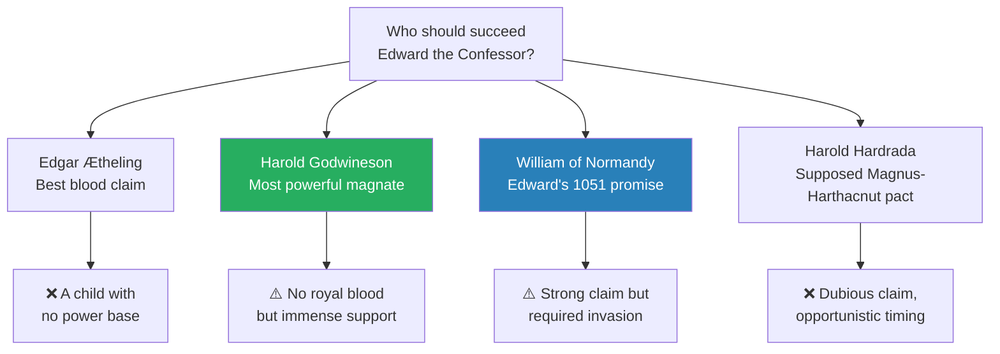
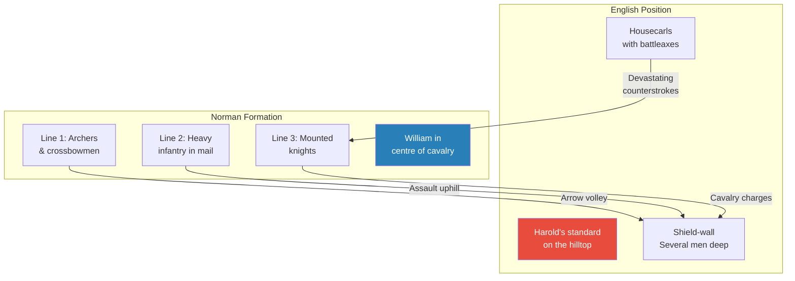
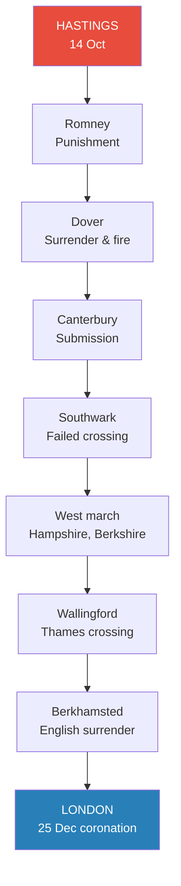
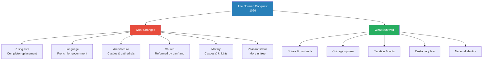

# The Norman Conquest — Marc Morris

> Marc Morris, a specialist in medieval English history, tells the story of 1066 and its aftermath not as a simple tale of Norman triumph but as a tangled drama of competing claims, broken oaths, lucky winds, and brutal opportunism. The book covers the half-century from Edward the Confessor's improbable accession to William the Conqueror's ignominious death, weaving together Norman and English sources that flatly contradict each other at every turn. Morris refuses to take sides — the English are not "us" and the Normans are not "them" — and insists throughout on the contingency of events: a different wind, a different horse, a different deathbed whisper, and the most famous date in English history would never have happened. The result is the single most important event in English history told with narrative flair, intellectual honesty, and a dry wit that makes the eleventh century feel close enough to touch.

---

## About the Author

Marc Morris is a British historian specialising in the Middle Ages. He studied and taught at the universities of London and Oxford before becoming a full-time writer and broadcaster. His previous book on Edward I (*A Great and Terrible King*) established his reputation for turning medieval kingship into gripping narrative, and *The Norman Conquest* cemented it. He later wrote *The Anglo-Saxons* (2021), effectively a prequel covering the six centuries before 1066. Morris combines rigorous source criticism with accessible storytelling — he introduces each chronicle and charter as the narrative demands, explaining its biases without losing momentum.

---

## The Big Idea

- <b style="color: #27ae60">The Norman Conquest was the single most important event in English history</b> — not because it introduced feudalism or the class system (these are later myths), but because it fundamentally altered what it meant to be English
- The Conquest brought a new ruling elite, a new language of government, new forms of architecture and fortification, new military techniques, and new attitudes toward warfare, religion, law, and the status of the peasantry — all within a single generation
- But Morris also demolishes the sentimental Victorian myth that pre-Conquest England was a golden age of liberty:
  - Anglo-Saxon England had slavery — more than 10% of the population
  - It had political murder, binge drinking, and a ruling class that was itself the product of violent conquest
  - Women had a bad time both before and after 1066
- <b style="color: #e74c3c">Nothing about the Conquest was inevitable</b> — weather, timing, personality, and sheer luck shaped every outcome
- The story is told through competing, irreconcilable sources — Norman and English chronicles that contradict each other at every major turning point
  - Morris uses this contradiction as a narrative engine, presenting each crisis from both sides and letting the reader weigh the evidence
  - <b style="color: #2980b9">The "justified narrative" method</b> — introducing and evaluating sources as the story progresses rather than discussing them all in an appendix

---

## Key Concepts at a Glance

| Concept | One-line summary |
|---------|-----------------|
| **The contingency thesis** | Nothing was inevitable — wind, timing, and personality decided everything |
| **The three-factor succession** | English kingship required blood, designation by predecessor, and election by magnates |
| **The justified narrative** | Source criticism woven into the story, not relegated to appendices |
| **The chevauchée** | Deliberate devastation of countryside to terrorize populations into submission |
| **Castle-and-knight feudalism** | Private fortifications and mounted warriors as instruments of social control — new to England |
| **The colonial replacement** | Complete ethnic replacement of the English ruling class within one generation |
| **The Harrying of the North** | William's scorched-earth campaign in Yorkshire (1069-70) — possibly 100,000 dead |
| **The Domesday survey** | Unprecedented administrative audit of every estate in England — the Conquest's bureaucratic legacy |
| **Religious legitimacy** | The papal banner, Lanfranc's reforms, and the Penitential Ordinance as moral instruments |
| **The Norman Yoke myth** | The idea that pre-Conquest England was a golden age of liberty is a seventeenth-century invention |
| **Source bias as evidence** | What chroniclers deny most vehemently is usually what happened |
| **The Englishry presentment** | If a body was found, the community had to prove it was English — or pay a fine for a "murdered Norman" |
| **The green tree prophecy** | Edward's deathbed vision of England's suffering — and an impossible condition for its end |

---

## The Sources — A Historian's Toolkit

*Morris opens the book by introducing the Bayeux Tapestry — and by explaining why every source for the Conquest is unreliable.*

- Morris opens with a vivid introduction to the Tapestry and its world — not just as a historical source but as a window onto eleventh-century life:
  - It contains the earliest images of Romanesque churches, earth-and-timber castles, and — "quite incidentally, in one of its border scenes" — the first portrayal in European art of a plough being drawn by a horse
  - It shows over 200 horses, 41 ships, and hundreds of men in mail shirts with kite-shaped shields and pointed helmets with flat nasals
  - The English are visibly different: longer hair, longer moustaches, fighting on foot with fearsome long-handled axes rather than on horseback
  - The Tapestry "is not a tapestry at all" — it is technically an embroidery, 50cm wide and nearly 70m long
  - It survived the French Revolution by the narrowest margin — nearly cut up to cover military wagons
  - It was taken to Paris by Napoleon, stored on a giant spindle where visitors could unroll it (and "occasionally cut bits off"), and was seized by the Nazis in World War II — narrowly escaping shipment to Berlin

- The <b style="color: #2980b9">Bayeux Tapestry</b> is the most famous source but also one of the most treacherous:
  - Not actually a tapestry — it's an embroidery, 50cm wide and nearly 70m long
  - Made within a decade of 1066, probably in Canterbury, almost certainly for Bishop Odo of Bayeux
  - It survived the French Revolution by a hair's breadth — nearly cut up to cover military wagons
  - Its great strength is visual immediacy — the earliest depictions of Romanesque churches, motte-and-bailey castles, and a horse-drawn plough
  - Its great weakness: deliberate ambiguity at every crucial moment — it shows events but doesn't explain them
- The <b style="color: #2980b9">Anglo-Saxon Chronicle</b> — the backbone of English evidence:
  - Exists in multiple versions (C, D, E) compiled at different monasteries, often with conflicting sympathies
  - Invaluable but sometimes infuriatingly terse — the entry for 1084 reads, in full: "In this year passed away Wulfwold, abbot of Chertsey, on 19 April"
- <b style="color: #2980b9">William of Poitiers</b> — the closest Norman source to William personally:
  - A former knight turned chaplain, he heard William's confessions
  - Brilliantly detailed but "cloying" in his obsequiousness — everything William does is wise, just, and merciful
  - His manuscript breaks off mid-sentence in 1067 — the end is lost
- Morris's introduction also addresses the myth-making that has surrounded the Conquest for centuries:
  - There is "still a widespread assumption" that the Normans are "them" and the English are "us"
  - The Normans supposedly introduced feudalism and the class system; pre-Conquest England is imagined as freer and more liberal
  - <b style="color: #e74c3c">"Almost all of this is myth"</b> — it arose not from contemporary evidence but from opinions passed on the Conquest in later centuries
  - The seventeenth-century Parliamentarians found in Anglo-Saxon England a golden age of English liberties destroyed by the Norman Crown
  - Edward Augustus Freeman in the nineteenth century championed this view — "he despised everything French and Norman"
  - Morris's stance: "Whoever these people were, they are not 'us.' They are our forebears from 1,000 years ago — as are the Normans. It is high time that we stopped taking sides"
  - His method: a "justified narrative" — "Rather than discuss all the source material separately at the end of the book, I have introduced each source as the story progresses"
  - The approach is designed neither to baffle the uninitiated nor to offend "female readers or members of the lower clergy" — a dry allusion to his Victorian predecessor Freeman

- Morris compares the evidence for William the Conqueror with that for Edward I (his previous book's subject):
  - Edward I's itinerary fills three large volumes; William's fills three pages
  - "Most of the time, we simply have no idea where William was"
  - Government archive from the Conqueror's reign is nonexistent — we rely entirely on documents kept by monasteries
  - And even those documents are rarely dated precisely — "often not dated at all"
  - This is why the Domesday Book's survival is so important — it is the only government document from the entire reign
  - Morris warns the reader from the start: "any attempt to discuss their personalities would be idle speculation"
  - And he quotes the exasperated Freeman, who, after completing his massive six-volume history, received an inquiry from a painter wanting to know what the weather had been like on the day of Hastings: "What odd things people do ask! As if I should not have put it into my story if I had known"

---

---

## Part I: The Road to 1066

### Chapter 1 — The Man Who Would Be King

*Edward the Confessor's claim to the English throne was dynastically perfect but statistically absurd — six half-brothers stood ahead of him, and the Vikings had conquered his country.*

- Morris begins the story not in 1066 but in the early eleventh century — the background is essential because the Conquest was the culmination of half a century of political crisis, not a bolt from the blue

- England at the start of the eleventh century was "a country both old and new":
  - Old: roots stretching back to the Anglo-Saxon migrations of the fifth century
  - New: the kings of Wessex — Alfred the Great and his descendants — had forged a unified state in the tenth century
  - They created shires, fortified towns (burhs), a single silver coinage, and a common law
  - Alfred commissioned the Anglo-Saxon Chronicle — written in English, not Latin, a unique act of nation-building
- Edward was born c. 1002-1005 into this kingdom, a direct descendant of Alfred the Great
  - Six older half-brothers from his father Aethelred's first marriage stood between him and the crown
  - His father — <b style="color: #2980b9">Aethelred "the Unready"</b> (actually "the ill-counselled" — a pun on his name, which meant "noble counsel") — was spectacularly incompetent:
    - He paid massive tributes (Danegeld) to persuade the Vikings to go away — which only encouraged them to return
    - He trusted advisers who led him astray — "he blamed the mistakes of his youth on the greed of men"
    - His henchman Eadric "the Grabber" had rivals dispossessed, mutilated, and murdered
    - When Aethelred finally tried to build a fleet in 1008, arguments between factions meant twenty ships deserted and attacked the others
    - The Anglo-Saxon Chronicle's verdict: "All these disasters befell us through bad counsel"
  - His mother, Emma, was a Norman princess — sister of Duke Richard II — married to Aethelred as a diplomatic move to stop Vikings sheltering in Normandy
    - The marriage failed in its purpose and failed as a personal relationship
    - Emma and Aethelred travelled separately to Normandy when they fled in 1013
    - Emma would later become one of the most remarkable political operators of the medieval period:
    - Queen to two kings (Aethelred and Cnut), mother to two more (Harthacnut and Edward the Confessor)
    - She abandoned her children from her first marriage to secure her position with Cnut
    - She commissioned the Encomium Emmae Reginae — a propaganda tract so mendacious that even its hired author seemed to find some claims hard to swallow
    - She was accused of plotting to replace Edward with Magnus of Norway in 1043 — Edward responded by racing to Winchester with three earls and confiscating all her property
    - She was "a serial hatcher of plots" who survived every reversal of fortune until her death in 1052
    - Morris treats her as a fascinating but deeply unreliable witness: everything she wrote was designed to justify her own actions and conceal her betrayals

> [!example] The Collapse of Aethelred's England (1009-1013)
> - Vikings ravaged England on a near-annual basis from 991 onwards
> - In 1011 they besieged Canterbury and carried off the archbishop
> - When he refused to be ransomed, they killed him — drunkenly pelting him with ox bones
> - In 1013 Swein Forkbeard, king of Denmark, conquered England outright
> - Aethelred fled to Normandy with his young sons Edward and Alfred
> **The lesson:** A kingdom's military strength means nothing if its leadership is riven by feuds and betrayal.

- Aethelred briefly returned from exile in 1014 after Swein Forkbeard's sudden death:
  - The English magnates invited him back — but on conditions: "no lord was dearer to them than their rightful lord, if only he would govern his kingdom more justly than he had done in the past"
  - This was perhaps the earliest example of a conditional contract between an English king and his subjects
  - Aethelred promised to be "a gracious lord" and to "remedy each one of the things which they all abhorred"
  - He immediately broke his promises — more killings at court, more factional violence
  - His eldest surviving son Edmund Ironside rebelled against him
  - When the Vikings returned under Cnut in 1015, England was in total disarray — Aethelred was ill, his heir was in rebellion
  - Aethelred died in April 1016; Edmund fought heroically but was betrayed by Eadric the Grabber at the decisive Battle of Assandun
  - Edmund died shortly after; Cnut became king; the surviving members of the royal family fled to Normandy

- <b style="color: #2980b9">Normandy</b> — an unlikely refuge from Vikings, since it had begun life as a Viking colony:
  - Norsemen had settled there in the early tenth century and rapidly adopted French language, Christianity, and French titles
  - Their leader Rollo had a Viking name; his grandson was called Richard — a French name
  - By the time Edward arrived, Normandy was thoroughly Francophone and Christian
- Edward spent 25 years in Norman exile — from childhood to middle age:
  - The Norman dukes took him in and "generously nurtured" him, but there is no evidence they gave him any lands or actively promoted his cause
  - His uncle Duke Robert attempted an invasion on Edward's behalf in 1033:
    - A fleet was assembled at Fécamp; Edward appeared in charters styling himself "king"
    - A storm scattered the ships at Jersey — "the duke was in despair and overwhelmed by bitter frustration"
    - Robert redeployed the fleet for an attack on Brittany instead
  - Then in 1035, Robert announced he was going on pilgrimage to Jerusalem — "guilty conscience, said some, for the death of his brother"
  - He reached Jerusalem, wept at Christ's tomb for a week, showered it with costly gifts — then fell ill on the return journey and died at Nicaea on 2 July 1035
  - He left behind only one son — a seven-year-old bastard called William
  - Edward "must have abandoned all hope"
  - But then, a few weeks later, fresh news arrived from England: Cnut was dead and the succession to the English throne was undecided
  - "Perhaps God had plans for Edward after all"

> [!tip] Core Insight
> Edward's survival through twenty-five years of exile, while every other claimant to the English throne was killed or deposed, is one of the great improbabilities of medieval history. Morris calls it "the one aspect of his career that is indubitably miraculous." The lesson is both simple and profound: in the eleventh century, survival was the paramount political skill, and the man who outlived his rivals — however powerless, however far from home — could inherit a kingdom.

---

### Chapter 2 — A Wave of Danes

*Cnut's conquest transformed the English aristocracy — the old guard was wiped out and replaced by new men who owed everything to Danish patronage.*

- <b style="color: #2980b9">English society in the eleventh century</b> was highly stratified — approximately two million people divided into rigid categories:
  - **Slaves (10%+):** Bought, sold, branded, castrated, even killed. Male slaves were agricultural labourers; female slaves were often purchased for sexual purposes
    - Bishop Wulfstan's famous sermon described how Englishmen "club together to buy a woman between them as a joint purchase, and practise foul sin with that one woman, one after another, just like dogs"
    - The Vikings drove the slave trade — seizing young men and women from English coasts and selling them in Scandinavia or the Middle East
    - A tenth-century text captures the condition: "I go out at daybreak, goading the oxen to the field … Oh! Oh! The work is hard. Yes, the work is hard, because I am not free"
  - **Ceorls (the vast majority):** Free peasants who worked their own land. An anonymous tract explained that a ceorl could become a thegn if he acquired five hides of land (~600 acres) and a suitable residence — but "even if he prospers so that he possesses a helmet and a coat of mail and gold-plated sword, if he has not the land, he is still a ceorl"
  - **Thegns (~4,000-5,000):** The nobility, distinguished by land ownership and service to the king. "King's thegns" needed 40+ hides of land — there were only about 90 such men in all England
  - **Ealdormen:** The regional governors — commanding entire provinces (East Anglia, Northumbria, Mercia) in the king's name, presiding over courts and leading armies
  - The Danish invasions had devastated the upper ranks — virtually all the ealdormen were killed in battle or purged by Cnut
- Cnut's reign (1016-1035) was far more successful than his invasion suggested:
  - He had been "very young" at the time of his conquest — probably still a teenager
  - Despite his Viking ancestry, he was a devout Christian — his famous encounter with the waves was originally a story of piety: "Let all the world know that the power of kings is empty and worthless"
  - He went on pilgrimage to Rome in 1027, gave extravagant gifts to churches across Europe
  - He wrote to his subjects: "I have vowed to God to govern my kingdom with equity and piety" — and largely kept his word
  - He maintained England's administrative system (shires, coinage, law) virtually unchanged — "even the few novelties once ascribed to Cnut are now reckoned not to have been novel at all"
  - His "housecarls" — once thought to be a new Danish institution — were simply the same household warriors maintained by his English predecessors
  - The only real difference: Æthelred had maintained 16 mercenary ships; Cnut continued the practice

- The human cost of the Danish conquest was enormous:
  - Bishop Wulfstan of Worcester delivered a famous sermon lambasting the English for their sins during the crisis:
    - Some slaves had run away to become Vikings — "and who can blame them?" Morris wonders
    - Thegns had been forced to watch while Vikings gang-raped their wives and daughters
    - "Often two or three seamen drive the droves of Christian men from sea to sea, out through this people, huddled together, as a public shame to us all"
  - The old aristocracy was virtually annihilated — four ealdormen killed in battle in 1016, almost all the rest purged in Cnut's first year
  - The charter witness-lists show almost no continuity between Cnut's thegns and those of his predecessors — "two and a half decades of fighting had all but wiped out the highest echelons of the English nobility"

- Cnut replaced them with new men:
  - Scandinavians at first, then Englishmen of obscure origins who had proved loyal
  - <b style="color: #27ae60">The greatest beneficiary was Godwine</b> — an Englishman of obscure origins who became earl of all Wessex and Cnut's most trusted adviser
    - His father Wulfnoth had been a Sussex thegn who commandeered part of the royal fleet and terrorized England's south coast — a pirate, essentially
    - Yet Godwine rose higher than any Englishman before him — "judged by the king himself the most cautious in counsel and the most active in war"
    - He accompanied Cnut to Denmark and proved his worth there as well
    - He married Cnut's sister-in-law, Gytha — cementing his position within the royal family
    - By the early 1020s he controlled the whole of southern England, including the entirety of Wessex
  - Leofric of Mercia — from an existing aristocratic family, the only ealdorman to survive Cnut's purge (albeit in reduced circumstances)
    - By the late 1020s he had risen to second behind Godwine in the king's counsels
    - His wife Godgifu is better known to posterity as Lady Godiva — though the famous naked ride through Coventry was a later legend
  - Siward of Northumbria — a Dane of unknown parentage, nicknamed "the Strong"
    - He ended the ancient house of Bamburgh by arranging the murder of its last earl in 1041
    - He would later invade Scotland and depose Macbeth — earning fame as "Old Siward" in Shakespeare's play
  - By the end of Cnut's reign, these three earls dominated all of England
  - Unlike the old ealdormen, they were not related by blood or marriage — they were rivals, not partners
  - <b style="color: #27ae60">This was Cnut's most significant legacy: he replaced a coherent, interrelated aristocratic class with a set of competing new men whose rivalries would dominate English politics for the next four decades</b>
  - The parallels with what would happen after 1066 are striking: Cnut conquered England and replaced its ruling class, just as William would; the difference was that Cnut's replacements were gradually absorbed into English society, while William's remained a distinct French-speaking elite for generations

> [!example] Cnut at the Seashore
> - The famous story of Cnut ordering the waves to retreat is almost universally misunderstood
> - As originally told, it was not about stupidity but piety
> - Cnut sat on the shore and commanded the tide — knowing it would not obey — precisely to demonstrate that royal power has limits
> - "Let all the world know that the power of kings is empty and worthless, and there is no king worthy of the name save Him by whose will heaven, earth and sea obey eternal laws"
> - The story was first told in the twelfth century by Henry of Huntingdon — it may not have happened, but it captured something true about Cnut's self-presentation
> - He was a Viking who had conquered by bloodshed and ruled by Christian piety — the combination worked because it gave his subjects two reasons to obey: fear of his sword and respect for his faith
> **The lesson:** The most effective rulers understand the limits of their own power and make a performance of acknowledging them. Cnut's genius was to turn humility into an instrument of authority.

> [!example] The Murder of Alfred Aetheling (1036)
> - After Cnut's death, a succession crisis erupted between his sons by two different women
> - Edward's mother Emma, desperate, invited her Norman sons to return
> - Alfred crossed the Channel and was met by Earl Godwine, who took him under his protection
> - That night at Guildford, Alfred's men were seized: "some sold for money, some cruelly murdered; some put in chains, some blinded; some mutilated, and some scalped"
> - Alfred was chained, taken to Ely, blinded, and left to die in the care of monks
> - Godwine was responsible — one version of the Chronicle directly accuses him
> **The lesson:** Godwine's treacherous murder of Edward's brother would poison English politics for the next thirty years.

- The succession crisis after Cnut's death (1035) was extraordinarily bitter:
  - Cnut had fathered sons by two women — Ælfgifu of Northampton and Queen Emma
  - Ælfgifu's sons (Harold Harefoot and Swein) were technically illegitimate by Church standards, but secular society considered them perfectly valid heirs
  - <b style="color: #2980b9">The Oxford meeting</b> of 1035 split along regional lines: Mercia wanted Harold, Wessex wanted Harthacnut
  - Godwine initially backed Harthacnut but switched to Harold when Harthacnut failed to appear from Denmark
  - The murder of Alfred was Godwine's price of admission to Harold's camp
- Emma, exiled to Bruges, commissioned the <b style="color: #2980b9">Encomium Emmae Reginae</b> — a propaganda tract:
  - It claimed Harold Harefoot was a changeling, not really Cnut's son
  - It insisted Emma's marriage to Cnut had been consensual — a deliberate lie
  - It tried to blame the murder of Alfred on Harold rather than Godwine
  - Morris: "Emma's own testimony is riddled with half-truths and outright lies"
  - The Encomium is a masterclass in how powerful people rewrite history — and in how historians detect the rewrites

- Harold Harefoot died in 1040; Harthacnut succeeded but proved disastrous:
  - He had arrived in England with 62 ships full of mercenaries who needed paying
  - His tax demand was four times the normal rate — "a severe tax which was borne with difficulty"
  - He exhumed Harold's body from Westminster and "flung it into a fen"
  - When the people of Worcester killed his tax collectors, he ordered the city sacked — four days of looting and burning
  - In 1042, at a wedding feast, Harthacnut was "standing with the bride and a group of other men when he suddenly crashed to the ground in a wretched fall while drinking"
  - He never spoke again — and Edward the Confessor became king

> [!example] The Extraordinary Survival of Edward the Confessor
> - Born c. 1002-1005 — sixth in line, behind six half-brothers
> - All six half-brothers died — by violence, disease, or Cnut's purges
> - His own brother Alfred was murdered; Edward himself was nearly caught
> - He spent 25 years in exile in Normandy — from age 8 to his late 30s
> - He survived two failed attempts to reclaim the throne (1033 and 1036)
> - Every rival claimant — Swein, Harold Harefoot, Harthacnut, Magnus of Norway — died before he did
> - He finally became king at age ~37, "against all odds"
> **The lesson:** Edward owed his crown not to skill or force but to sheer longevity — he outlived every rival. In the eleventh century, staying alive was the most important political skill of all.

---

### Chapter 3 — The Bastard

*William survived a terrifying minority through luck and ruthlessness — his victory at Val-ès-Dunes established his authority but Normandy's transformation ran much deeper.*

- William was born c. 1027-28 to Duke Robert and Herleva, a girl from Falaise:
  - Later chroniclers romanticised the relationship; the truth was "probably more prosaic" — her father was an undertaker
  - Contemporaries called William "the Bastard" — a label he was taunted with throughout his youth
- When Duke Robert died on pilgrimage in 1035, seven-year-old William was left in mortal danger:
  - His guardians were murdered one by one — Count Alan, Count Gilbert, his tutor Turold
  - His steward Osbern had his throat cut "while he slept at the castle of Le Vaudreuil in the same chamber as the duke himself"

> [!example] William's Midnight Ride from Valognes (c. 1046)
> - A rebellion aimed to kill and replace the young duke
> - William was woken at night and warned his life was in danger
> - He leapt on his horse and rode through the darkness — over sixty miles — fording rivers, avoiding towns
> - Near Bayeux he met a loyal lord whose sons helped him reach Falaise
> - There, realising he was powerless, he fled Normandy entirely and begged the king of France for help
> **The lesson:** William survived because he combined physical courage with the humility to ask for help when outmatched.

- Morris uses William's minority to explain the broader transformation of French society — the birth of what we loosely call <b style="color: #2980b9">"feudalism"</b>:
  - The word is problematic — it's a sixteenth-century legal coinage, not a medieval term — but useful shorthand for a society dominated by castles and knights
  - After Charlemagne's empire collapsed, power devolved to whoever could build a fortification and recruit armed men
  - <b style="color: #2980b9">Castles</b> were a genuinely new phenomenon — no precedent in Roman or early medieval society:
    - The great stone towers of Fulk Nerra, count of Anjou, were among the earliest
    - But most castles were cheap: a mound of earth (motte), a wooden palisade, a timber tower — buildable in weeks
    - They allowed men of modest means to dominate a locality, imposing new tolls, taxes, and restrictions on movement
  - <b style="color: #2980b9">Knights</b> were equally new and equally crude:
    - Lords recruited mounted warriors from all social levels — including the landless and even the unfree
    - <b style="color: #e74c3c">Early knights were not noble — they were often peasants given swords and horses, whose job was to terrorize the lower orders into accepting "bad customs" — new taxes and restrictions on freedom</b>
    - The chivalric code of honour came much later — in the eleventh century, knights were enforcers, not gentlemen
  - Normandy was exceptional: the dukes had preserved Carolingian public authority — castles were few and ducal-controlled
  - William's minority shattered this: "Lots of Normans, forgetful of their loyalties, built earthworks in many places"
  - The Peace of God and Truce of God movements — attempts by the Church to restrain violence — were unnecessary in Normandy before 1035, because the duke's own peace was strong enough
    - In 1023, when a council met to discuss introducing the Peace of God into northern France, it was agreed that Normandy did not need it — "the duke's own peace was enough"
  - After the minority, William had to introduce the Truce of God at Val-ès-Dunes — an admission that ducal authority had temporarily failed
  - The word <b style="color: #2980b9">"feudal"</b> itself is problematic — Morris explains:
    - It derives from the medieval Latin feodum (fief) — a parcel of land given to a knight in exchange for military service
    - The abstraction "feudalism" was not coined until the nineteenth century
    - Both terms have been used so loosely and variously by historians "as to be all but meaningless"
    - Nevertheless, there are good reasons for using the terms to describe a society "everywhere affected, if not yet entirely dominated, by the arrival of knights and castles"
    - The key insight: feudalism was not a coherent system designed from above — it was a messy, improvised set of relationships that evolved from the bottom up as men sought to impose order through force
- In 1047, with French help, William won the battle of <b style="color: #2980b9">Val-ès-Dunes</b>:
  - The rebels had marched east and gathered about nine miles south-east of Caen — wide-open country, "without great hills or valleys"
  - The duke and the king of France emerged from the rising sun to meet their enemies
  - William of Poitiers, naturally, attributed the victory to the duke's personal prowess: "Rushing in, he spread such terror by his slaughter that his adversaries lost heart"
  - Wace, writing later, believed the result was determined by the defection of a leading rebel, Ralph Taisson, on the eve of battle
  - Whatever the cause, the rebels broke and fled — "those fugitives that were not cut down by their pursuers drowned as they tried to re-cross the Orne"
  - The mills downriver "came to a standstill, so great was the number of bodies"
  - William of Jumièges: "Happy battle, that in one day ruined so many castles of criminals and houses of evildoers"
  - The victory allowed William to proclaim the Truce of God in Normandy — ducal authority was restored
  - <b style="color: #27ae60">Val-ès-Dunes was the foundation of everything that followed — a nineteen-year-old bastard duke had vindicated his right to rule, and from this point on, his authority only grew</b>

*William's path from orphaned child duke to master of Normandy took twelve years of assassinations, rebellion, and one decisive battle.*

---

### Chapter 4 — Best Laid Plans

*1051 was the pivotal year: Edward exiled Godwine, promised the throne to William, and then watched it all unravel.*

- Morris's fourth chapter — "Best Laid Plans" — is the hinge of the pre-Conquest narrative, covering the pivotal crisis of 1051 that made the Conquest possible

- Edward's reign began well but he was politically weak:
  - He had spent 25 years in exile — he had almost no friends or allies in England
  - Godwine, by contrast, had "scores of followers in almost every shire in southern England, all ready to do his bidding"
  - Edward married Godwine's daughter Edith in January 1045 — a political necessity, not a love match
    - The Life of King Edward, commissioned by Edith herself, describes her as "inferior to none, superior to all"
    - She was educated at Wilton nunnery — fluent in four languages, famous for her poems and needlework
    - But the match never produced children
    - <b style="color: #27ae60">The marriage was probably never consummated — Edith's own testimony claims Edward "preserved with holy chastity the dignity of his consecration"</b>
    - This claim deserves to be taken seriously — had it been false, the Life would have been "a laughing stock"
    - The reasonable conclusion: Edward agreed to marry Edith for political survival and resisted "her extensively chronicled charms"
  - During the 1040s, tension mounted between Edward and Godwine:
    - They co-operated initially — the archbishop of Canterbury in 1044 was replaced "by permission of the king and Earl Godwine"
    - But they clashed over foreign policy — Godwine wanted to help his nephew Swein Estrithson of Denmark; Edward refused
    - Godwine's eldest son Swein caused scandal by abducting an abbess, then compounded his crime by murdering his cousin Beorn
    - Swein was declared a "nithing" (a man without honour) — yet within months Godwine secured his pardon
    - <b style="color: #e74c3c">The Godwines could literally get away with murder — and Edward was powerless to stop them</b>

> [!tip] Core Insight
> Edward's fundamental weakness was that he needed Godwine more than Godwine needed him. The earl had made the king, and the king never forgot — or forgave — what the earl had done to his brother Alfred.

- Edward's piety and building of Westminster Abbey:
  - The Life of King Edward portrays a devout king who lived "like an angel," performed miraculous cures, and spent his days in hunting and prayer
  - Whether Edward was genuinely saintly or merely politically neutered is debated — but his construction of Westminster Abbey is beyond dispute
  - The new church was the largest in the British Isles and the third largest in Europe — built in the Romanesque style, with strong similarities to Jumièges
  - Edward established a palace alongside the abbey — creating the royal complex that still houses Parliament today
  - He intended Westminster as a deliberate break from Winchester, the Anglo-Danish capital where Cnut and Emma were buried
  - <b style="color: #27ae60">Edward was canonised in 1161 — the only English king to become a saint, though Morris suggests his sanctity owed more to political convenience than personal holiness</b>

- The crisis of 1051 erupted over multiple grievances:
  - Edward appointed his Norman friend Robert of Jumièges as archbishop of Canterbury — against Godwine's wishes
    - Robert was "the most powerful confidential adviser of the king" — he had crossed from Normandy with Edward in 1041
    - Even the pro-Godwine Life of King Edward admits that in the dispute over Church lands, "right was on the bishop's side"
    - Robert accused Godwine of planning to attack the king "just as he had once attacked his brother" — a direct reference to Alfred's murder
  - Eustace of Boulogne got into a fatal brawl at Dover; Edward ordered Godwine to punish the town; Godwine refused
    - "It was abhorrent to him to injure the people of his own province"
    - This was the breaking point — both sides raised armies
  - Civil war was narrowly averted — both sides assembled armies near Gloucester:
    - "Almost all the noblest in England were present in those two companies"
    - Cooler heads prevailed — "they were convinced they would be leaving the country open to the invasion of her enemies"
    - A trial was set for London in two weeks
    - During that fortnight, Godwine's support melted away — his army "decreased in number more and more as time went on"
    - At the trial, the full extent of Edward's hatred was revealed: the earl was told he could have peace "when he gave him back his brother alive"
  - Godwine fled to Flanders; his sons Harold and Leofwine fled to Ireland
  - Edward banished his wife Edith — not to her childhood home at Wilton (as she later claimed) but to the nunnery at Wherwell, where one of Edward's half-sisters was abbess
  - There was apparently a plan to divorce her — though Edith insists Edward himself suspended the proceedings
- <b style="color: #2980b9">Edward's promise to William</b> — the most contested fact in the story:
  - No English source written at the time admits it happened — it occurs only in Norman sources written or revised after the Conquest
  - This has led some historians to dismiss it as a post-hoc invention
  - But Morris argues it probably happened, based on several pieces of evidence:
    - The D Chronicle records William visiting England after Godwine's exile and being "received as a vassal" (underfeng)
    - The promise was reportedly carried to William by Robert of Jumièges on his way to Rome — and English sources confirm Robert did leave for Rome at exactly this time
    - The Norman marriage to Matilda of Flanders had alarmed Edward — he needed to bind William to England
    - The timing makes sense: with Godwine gone, Edward was free to make the offer; with the Norman-Flemish alliance threatening, he had strong motivation
  - What Edward wanted in return: homage — William would swear to serve him faithfully and acknowledge him as lord
  - What Edward probably did not anticipate: that the promise would be used to justify an invasion fifteen years later
- But in 1052, Godwine returned by force:
  - He raised a fleet in Flanders, sailed along the south coast recruiting supporters
  - Harold and Leofwine brought ships from Ireland
  - London's citizens fell in with Godwine; Edward's Norman friends fled
  - Robert of Jumièges escaped in a barely seaworthy boat, leaving behind his pallium
  - <b style="color: #e74c3c">Edward's fatal error: he had abolished the geld and disbanded the mercenary fleet in 1051 — when Godwine returned, there was no professional navy to stop him</b>

> [!example] Godwine's Triumphant Return (September 1052)
> - Godwine raised a fleet in Flanders and sailed along the south coast, raiding and recruiting
> - His sons Harold and Leofwine brought ships from Ireland
> - The king's improvised navy, raised by traditional levy, proved useless — after a long wait at Sandwich, "the fleet did not move, and they all went home"
> - Godwine entered the Thames with an "overwhelming host" — "The sea was covered with ships; the sky glittered with the press of weapons"
> - On Monday 14 September, the Godwines stationed themselves at Southwark, facing the king's forces across the river
> - At low tide, Godwine stopped. All day the tide rose in his favour. When it peaked, his fleet swung across and encircled the royal ships
> - Edward's Norman friends fled: Robert of Jumièges forced his way out through London's east gate and escaped in a boat barely seaworthy enough to cross the Channel
> - The next morning, Godwine ostentatiously begged forgiveness — and everything was reversed
> - "It was now abundantly clear that there was not going to be a Norman succession"
> **The lesson:** A kingdom without a professional fleet is defenceless against a determined sea-borne attacker. Edward learned this in 1052; Harold would learn it again in 1066.

---

### Chapter 5 — Holy Warriors

*The 1050s made William formidable — militarily and morally.*

- William fought two existential invasions by France and Anjou:
  - The crisis of 1053-54 tested William to the limit:
    - His half-uncle, the count of Arques, seized the mightiest castle in Normandy and allied with the king of France
    - Henry I assembled a coalition army and invaded Normandy with a two-pronged attack
    - The invaders' strategy was standard medieval warfare: "To sow fear in its homes by frequent and lengthy visits, to devastate its vineyards, fields and villages"
    - William responded with equally standard counter-tactics: he shadowed the king's army, staying close to prevent it from spreading out to forage, gradually weakening it
  - At <b style="color: #2980b9">Mortemer (1054)</b> the Normans surprised a French army engaged in "arson and the shameful sport of women" — they attacked at dawn and fought until noon
    - Many French knights were killed or captured, including the king's brother Odo
    - A herald climbed a nearby tree and shouted the details of the victory into the darkness of the French camp
    - "Stunned by the unexpected news, the king put aside all thought of delay and roused his men to flight before dawn"
  - At <b style="color: #2980b9">Varaville (1057)</b> the lesson was repeated with even greater force:
    - Henry and Geoffrey of Anjou invaded again, burning their way deep into Normandy — "as far as the seashore"
    - William caught them mid-crossing at a tidal river mouth
    - The tide rose while the army was divided — the rearguard was trapped
    - William fell on the stranded troops "cutting them down under the eyes of the king and the count who could only watch, powerless, from the opposite bank"
    - "Fearful and distressed at the death of his men, the king left the bounds of Normandy with all possible speed"
  - The king of France never invaded Normandy again — in fact, both he and Geoffrey Martel died in 1060, removing William's greatest enemies
  - <b style="color: #27ae60">By 1060, William was the most formidable ruler in northern France — militarily unbeaten, allied with the papacy, married into Flanders, and the recognised heir to the English throne</b>

- William's conquest of Maine (1062-63) demonstrated the methods he would later use in England:
  - He claimed the county through a questionable agreement with its rightful heir — the same type of claim he made for England
  - When the pro-Angevin faction in Le Mans resisted, William launched "a relentless campaign of harrying on the countryside"
  - William of Poitiers describes the strategy with chilling frankness: "To sow fear in its homes by frequent and lengthy visits, to devastate its vineyards, fields and villages"
  - The defenders appealed to the count of Anjou for help — he failed to appear
  - Le Mans eventually opened its gates; the local lord who had sheltered there died suspiciously soon after — "fuelling the rumour that they had been poisoned on the duke's orders"
  - The last holdout, the castle of Mayenne, surrendered only after the Normans set it on fire
  - <b style="color: #e74c3c">The Maine campaign was a dress rehearsal for England: the same combination of dubious legal claims, devastating chevauchée, calculated brutality, and the systematic isolation of defenders from their potential allies</b>
  - Morris draws explicit parallels between Maine and England throughout the book — the methods William used to conquer Le Mans were exactly the methods he used to terrorise London into submission

- William's Caen — the new capital:
  - The duke transformed the insignificant town of Caen into Normandy's second city
  - He built a massive castle on a rocky outcrop (the outline can still be traced today)
  - He and Matilda founded two abbeys — his for monks (St Stephen's/St-Étienne), hers for nuns (Holy Trinity) — as penance for their forbidden marriage
  - St Stephen's was a masterpiece of Romanesque architecture — innovative, sophisticated, and a model for everything that followed
  - Lanfranc was persuaded (by "a kind of pious violence") to become its first abbot
  - The two Caen abbeys survive today — Holy Trinity houses Matilda's tomb, St Stephen's houses William's
  - These buildings were statements of power as much as piety — they announced that Normandy had arrived as a major cultural force
  - The fact that William founded them as penance for his forbidden marriage is itself significant: even at the height of his power, the Conqueror felt the need for religious absolution — a pattern that would recur throughout his career

> [!example] The Maiming at Alençon (c. 1051)
> - Defenders of a fortress mocked William by beating animal skins and shouting "pelterer" — a jibe about his mother's family
> - William stormed the fort and had thirty-two defenders maimed — their hands and feet cut off — "under the eyes of all the inhabitants"
> - The town immediately surrendered; so did the garrison at nearby Domfront
> - William of Poitiers' comment: the duke inspired "even great love and terror everywhere"
> **The lesson:** William understood that a single act of calculated brutality could substitute for weeks of siege warfare.

- Meanwhile, a monastic revolution was transforming Normandy:
  - <b style="color: #2980b9">Lanfranc</b>, an Italian scholar of international distinction, had entered the humble monastery of Bec and turned it into Europe's most celebrated centre of learning
  - He became William's chief spiritual adviser — "He venerated him as a father, revered him as a master"
  - The Norman aristocracy founded dozens of new monasteries in the new Romanesque style
  - William cultivated papal support through Lanfranc — this would prove decisive in 1066

---

### Chapter 5 continued — Normandy's Church and Architecture

- The Norman monastic revival transformed the duchy's cultural landscape:
  - Only four monasteries had existed at the turn of the millennium; by 1066, dozens had been founded
  - The aristocracy competed to establish new houses — "Each of the magnates strove to build churches in their land at their own expense"
  - Monasteries served multiple purposes: spiritual insurance (monks praying for the founder's soul in perpetuity), status advertisement, and military organisation (abbeys could organise service from surrounding lands)
- <b style="color: #2980b9">Romanesque architecture</b> arrived in Normandy in the 1020s-1040s:
  - Previously, church walls had been flat and undecorated — the new style added three-dimensional depth with shafts, arches, niches, and galleries
  - The abbey church at Jumièges (rebuilt from 1040) was one of the earliest and finest examples
  - William's own foundation at Caen — St Stephen's (St-Étienne) — was even more sophisticated, becoming a model for future English cathedrals
  - This was the architectural style the Normans would impose on England after the Conquest — Durham Cathedral, Norwich Cathedral, and the White Tower of London are its direct descendants

- The papacy's transformation from irrelevance to reforming powerhouse:
  - In 1048, Emperor Henry III appointed Leo IX as pope — a firebrand reformer
  - Leo demanded clerical celibacy and condemned simony (the buying and selling of Church offices)
  - At the Council of Rheims (1049), he tested bishops from across France against his new standards
  - Several Norman bishops were found wanting — but Lanfranc convinced Leo that great things were afoot in Normandy
  - <b style="color: #27ae60">William's alliance with the reform papacy gave him a moral authority that would prove decisive in 1066</b> — the pope would send a banner blessing his invasion

---

### Chapter 6 — The Godwinesons

*After Godwine's death in 1053, his sons created a one-party state that controlled everything except Mercia.*

- Morris devotes his longest chapter to the Godwine family's transformation of English politics between 1053 and 1065 — the period that set the stage for 1066:
  - Edward the Confessor's piety — or powerlessness — manifested in his massive building project at Westminster Abbey
  - The Life of King Edward, commissioned by Queen Edith, served double duty: justifying the Godwine monopoly and presenting Edward's childlessness as voluntary chastity rather than political failure
  - Meanwhile, Archbishop Stigand of Canterbury embodied everything wrong with the English Church:
    - He held Canterbury and Winchester simultaneously (pluralism)
    - He bought and sold Church offices (simony)
    - He never went to Rome for his pallium — using the one left behind by the exiled Robert of Jumièges
    - Five successive popes refused to recognise him — yet he was unremovable because of Godwine protection
    - <b style="color: #e74c3c">Stigand's corruption gave William one of his strongest arguments for invasion — England's Church needed reform that only foreign intervention could deliver</b>

- Godwine died dramatically at Easter dinner in Winchester:
  - He "suddenly collapsed, bereft of speech and deprived of all his strength" — probably a stroke
  - William of Malmesbury's version: the earl choked after declaring "May God not permit me to swallow if I have done anything to endanger Alfred"
- Harold succeeded as earl of Wessex and proved even more formidable than his father:
  - "A true friend of his race and country … he wielded his father's powers even more actively"
  - By the early 1060s, four Godwine brothers held four earldoms — Harold (Wessex), Tostig (Northumbria), Gyrth (East Anglia), Leofwine (south-west Midlands)
  - Their only rival, Ælfgar of Mercia, was twice exiled and twice restored — each time with Welsh military support
  - <b style="color: #27ae60">After Ælfgar's death c. 1062, the Godwine monopoly was complete</b> — England was effectively a one-party state
  - Harold's alliance system was vast: "a following measured in thousands, with scores of thegns commended to serve him in almost every shire"

- The conquest of Wales (1063) demonstrated Harold and Tostig's military capability:
  - Harold launched a surprise winter attack on Gruffudd ap Llywelyn's court at Rhuddlan — the Welsh king escaped by ship
  - The following spring, Harold attacked by sea from the south while Tostig invaded by land from the east
  - The campaign was devastatingly effective — Gruffudd was killed by his own men
  - "His head was sent to Harold, who in turn sent it on to Edward the Confessor"
  - Stones inscribed HIC FUIT VICTOR HAROLDUS ("Here Harold was the victor") were raised across Wales — still visible over a century later
  - The contrast with the politically impotent Edward was stark: "Whereas the Confessor is all but absent from the historical record during the last decade of his reign, the eldest son of Godwine stands out as both conqueror and kingmaker"

- The succession problem remained unsolved:
  - In 1054, Bishop Ealdred was sent to bring Edward the Exile — great-nephew of the Confessor — from Hungary
  - The first mission failed; a second attempt succeeded in 1057
  - But Edward the Exile died immediately upon reaching England — he never even met the Confessor
  - "We do not know," says the D Chronicle, "for what reason it was brought about that he was not allowed to visit his kinsman King Edward"
  - Conspiracy theories abound (Harold murdered him; William's agents murdered him; the Confessor refused to meet him) — Morris dismisses them all as speculation
  - His young son Edgar Ætheling was recognised as the heir apparent but was still a child — "cannot have been more than five years old in 1057"
  - By the end of the 1050s, some people in England "evidently considered that the problem of the succession had finally been solved" — but Edgar's youth made this dangerously optimistic

*Four candidates, no clear winner — the succession was decided not by law but by force.*

---

### Chapter 7 — Hostages to Fortune

*Harold's trip to Normandy gave William a moral and legal weapon — but why did the earl go?*

- Harold's trip to Normandy — probably in the summer of 1064, possibly 1065 — is one of the most celebrated and controversial episodes in the story:
  - It is the subject of the entire opening section of the Bayeux Tapestry
  - It is described in detail by both Norman chroniclers (William of Poitiers, William of Jumièges)
  - Yet it goes completely unmentioned in contemporary English sources — the Anglo-Saxon Chronicle has no entries for 1064 at all
  - This silence is itself significant: the English clearly found the episode too embarrassing to discuss

- Morris carefully weighs the competing explanations:
  - **Norman version** (William of Poitiers): Edward sent Harold to confirm William's succession
  - **English version** (Eadmer of Canterbury): Harold went on his own initiative to free two hostages — his brother Wulfnoth and nephew Hakon
- Morris concludes that the English version is far more credible:
  - By 1064, Harold and his brothers ruled England — Edward was powerless to command anything
  - It "stretches credibility beyond its elastic limit" to believe the aged king could order the earl to undermine his own interests
  - Harold must have anticipated discussing the succession, but felt confident he could "trick or pay off" the duke

> [!example] Harold's Oath on the Relics (c. 1064)
> - Harold was blown off course and captured by the count of Ponthieu
> - William demanded his release and treated him as an honoured guest
> - At a specially convened council, Harold swore an oath on holy relics to uphold William's claim
> - Eadmer's version: Harold "could not see any way of escape without agreeing to all that William wished"
> - The Bayeux Tapestry shows the oath-swearing but — characteristically — doesn't explain the context
> **The lesson:** A promise extracted under duress is legally binding but morally contested — and William knew the difference.

- The Tapestry's final scene of this episode is telling:
  - Harold returns to Edward with his head bowed, arms outstretched — a posture of supplication
  - Edward raises a finger as if to admonish
  - In Eadmer's account, Edward says: "Did I not tell you that I knew William, and that your going might bring untold calamity upon this kingdom?"

---

### The Problem of William's Claim to England

*Morris carefully evaluates what we actually know vs. what Norman propaganda later claimed.*

- The Norman case for the succession rested on four pillars:
  1. Edward the Confessor promised the throne to William in 1051
  2. Harold swore an oath on holy relics to uphold William's claim
  3. Harold's accession was a usurpation — breaking both the promise and the oath
  4. The pope agreed that William's cause was just

- Morris's assessment of each pillar:
  - **Edward's promise:** Probably happened — the D Chronicle's evidence of William visiting England and being "received as vassal" is strong. But Edward was in no position to deliver on this promise once the Godwines returned in 1052
  - **Harold's oath:** Almost certainly happened — all sources agree on the basic fact. But the terms are disputed, and it was probably sworn under duress
  - **Harold's usurpation:** A matter of perspective. Harold was elected by the English magnates, which was how English kings were made. William saw this as a violation of a prior commitment
  - **Papal support:** Real and significant, but the pope was judging a legal case presented by one side only — Harold never got to make his counter-argument
- <b style="color: #e74c3c">The fundamental problem: English and Norman law defined legitimacy differently</b>
  - In England, the key was election by magnates — no prior promise could override the will of the assembled great men
  - On the Continent, sworn oaths and prior designations had binding force regardless of later elections
  - Both sides were "right" by their own legal traditions — and both were prepared to let God decide through battle

> [!example] The Tapestry's Careful Ambiguity
> - At the opening, Edward speaks to Harold — but the Tapestry doesn't say what about
>   - Norman viewers would assume the king was ordering Harold to confirm William's succession
>   - English viewers could imagine Harold was explaining his plan to free the hostages
> - Harold swears his oath on relics — the Tapestry shows this clearly
>   - But it doesn't tell us what he swore, or whether he did so willingly
> - Harold returns to Edward — his head is bowed, his arms outstretched in what looks like supplication
>   - Edward raises a finger as if admonishing him
>   - Norman viewers would see this as Edward learning that his wishes had been fulfilled
>   - English viewers would see a man reporting his forced capitulation to a king who warned him not to go
> - At every crucial moment, the Tapestry shows what happened but not why — it is "carefully ambiguous"
> - This may be deliberate: the Tapestry was made by English embroiderers for a Norman patron, and its designers may have been trying to avoid taking sides
> **The lesson:** The Bayeux Tapestry is not a straightforward piece of Norman propaganda — it is a complex, diplomatic work of art that tells different stories to different audiences.

---

### Chapter 8 — Northern Uproar

*Tostig's tyranny in Northumbria shattered the Godwine family and forced Harold into a hasty, dubious coronation.*

- Morris devotes a full chapter to Northumbria — essential background for understanding why 1066 was a crisis on two fronts:
  - Northumbria was culturally alien to the south — it had been extensively colonised by Vikings in the ninth century
  - Yorkshire still used Scandinavian counting, Scandinavian place names (-by, -gate, -thorpe), and a language barely intelligible to southerners
  - North of the Tees was a virtual no-man's land — no royal estates, no mints, no shires
  - The journey from London to York took a fortnight overland; travel by ship was quicker and safer
  - For most southerners, Northumbria was "a faraway country, where they did things differently"
  - The appointment of Tostig — a southerner — to govern this region was provocative from the start

- Tostig's rule in Northumbria was a disaster:
  - He was a southerner governing a region with deep Scandinavian cultural roots
  - He raised taxes above traditional levels, punished lawbreakers with excessive brutality, and confiscated property
  - He treacherously murdered political rivals at a peace conference in York
  - His sister Queen Edith arranged the assassination of Gospatric, head of the house of Bamburgh, at Christmas 1064 — "on the fourth night of Christmas"
  - He also failed to defend Northumbria from Scottish raids — Malcolm ravaged the earldom while Tostig was on pilgrimage to Rome, sacking even the holy island of Lindisfarne
  - Cumbria was lost to Scotland during Tostig's absence — and he accepted this as a fait accompli
  - The Life of King Edward, supposedly his champion, admits "Not a few charged that glorious earl with being too cruel" and notes he was "occasionally a little too enthusiastic in attacking evil"
  - Even Tostig's supporters could not hide the scale of his incompetence and brutality

> [!example] The Northumbrian Rebellion (October 1065)
> - On 3 October, 200 armed thegns seized York and killed Tostig's retainers
> - They elected Morcar, son of the Godwines' rival Ælfgar, as their new earl
> - His brother Eadwine assembled the men of Mercia — everyone who had suffered from Godwine domination united against them
> - Harold was sent to negotiate but refused to fight the rebels on his brother's behalf
> - Tostig accused Harold of masterminding the revolt — Harold swore his innocence
> - Tostig was exiled to Flanders; Harold married Eadwine and Morcar's sister Ealdgyth
> **The lesson:** Harold sacrificed his brother to buy the support of Mercia and Northumbria — the alliance he needed for the throne.

- Edward the Confessor's last months were consumed by rage and grief:
  - He had ordered the rebels crushed — but no army appeared
  - Harold refused to fight his brother's war
  - "He protested to God with deep sorrow that he was deprived of the due obedience of his men"
  - The king fell sick from mental anguish — "and his sickness grew worse from day to day"
  - The dedication of his magnificent new Westminster Abbey was arranged for Christmas — the building work was almost complete, only the porch unfinished
  - On Christmas Day, Edward sat at table but had no appetite
  - On 28 December, the day of the dedication, he was too ill to attend — Edith acted as his proxy
  - He lingered for eight more days, drifting in and out of consciousness

- Edward the Confessor died on 5 January 1066:
  - His deathbed bequest was maddeningly ambiguous — he "commended" the kingdom to Harold's "protection"
  - This could mean successor or regent — our best source (the Life of King Edward) is deliberately vague
  - Harold was crowned the very next day — the same day as Edward's funeral
  - <b style="color: #e74c3c">No previous king had shown such desperate haste — it was the most obviously suspect act in the drama</b>
  - Edward the Confessor had waited ten months between his election and his coronation
  - The haste suggests Harold knew his claim was fragile and needed the instant legitimacy of God's anointing
  - The Bayeux Tapestry shows him flanked by Archbishop Stigand — almost certainly Norman propaganda, since John of Worcester insists the ceremony was performed by the more respectable Archbishop Ealdred of York
  - The day after Edward's funeral, the day of the coronation, was 6 January — Epiphany — the feast of the Magi. A symbolically loaded date: the day kings come to worship. Whether Harold chose it deliberately or was simply in a hurry, the coincidence was noted

---

## Part II: The Year of Three Battles

*The entire year of 1066, from Edward's death to William's coronation, compressed into twelve months of extraordinary drama.*

### Chapter 9 — The Gathering Storm

*Harold's claim was thin; William's preparations were massive; and a comet blazed across the sky.*

- Morris devotes his most analytically rigorous chapter to the question of Harold's legitimacy — effectively putting the new king on trial:

- Harold's accession rested on three pillars, all shaky:
  - **Blood:** He was related to Edward only through his sister's marriage — the weakest possible claim
  - **Designation:** The deathbed bequest was ambiguous at best; some sources describe it as "entrustment," not designation
  - **Election:** He had the support of key magnates, but obtained through a backroom deal with Eadwine and Morcar
- Morris reconstructs the probable sequence of the last weeks of 1065:
  - The king is clearly dying; Harold determines he will succeed him
  - He strikes a deal with Eadwine and Morcar — marriage to their sister Ealdgyth in exchange for their support
  - Edgar Ætheling, the legitimate heir, is set aside — a thirteen-year-old with no power base
  - Edward dies behind closed doors, surrounded by a handful of intimates including Harold himself
  - Afterwards, it is "given out" that Edward nominated Harold as his successor
  - Before anyone can object, Harold is crowned — the same day as the funeral
  - William of Malmesbury, writing later, says Harold "seized the throne, having first exacted an oath of loyalty from the chief nobles"
  - Baldwin, abbot of Bury St Edmunds and former physician to Edward, called the coronation "sacrilegious" — and he had been present at the deathbed

- William's response was systematic:
  - He dispatched an embassy to the pope, making the case for his claim — Edward's promise, Harold's perjury, the corruption of the English Church
  - Pope Alexander II sent back a consecrated banner — God was officially on William's side
  - He summoned his magnates and negotiated military commitments — the <b style="color: #2980b9">Ship List</b> records each baron's pledge
  - There was resistance: "Sire, we fear the sea" — many Normans pointed to English naval superiority and questioned whether they were even obligated to serve overseas
  - The Normans had a point: England's naval capacity dwarfed Normandy's
    - Edward's reign had been dominated by fleets — defensive forces against Vikings, blockades of Flanders, the Godwines' seaborne comeback
    - Harold's victory in Wales relied partly on naval power
    - Normandy, by contrast, was a land power — its wars were fought across borders, not across seas
  - William won the argument through a combination of appeals to justice, the papal banner, promises of land, and (according to the late but plausible writer Wace) a trick by fitz Osbern in the negotiations
  - He promised them "a share of the spoils" and reminded them that Harold could offer nothing in victory
  - The inducement was massive: English estates far richer than anything in Normandy
  - Individual negotiations followed — the pledges were written down in the <b style="color: #2980b9">Ship List</b>, creating the first formal record of Norman military obligations

> [!tip] Core Insight
> By choosing to invade, William was submitting his cause — along with his reputation, his life, and the lives of thousands of Normans — to the judgement of God. This was not just rhetoric. He genuinely believed that God would decide who was right.

- The <b style="color: #2980b9">Ship List</b> — a unique surviving document:
  - A short paragraph of Latin listing fourteen names and the number of ships each baron pledged
  - William fitz Osbern and Roger of Montgomery: 60 ships each
  - Bishop Odo: 100 ships; Robert of Mortain: 120 ships
  - These were minimum requirements — the total fleet was far larger
  - The Bayeux Tapestry shows the frenzied shipbuilding: men felling trees, shaping planks, and hammering together vessels
  - The Ship List represents a key moment in the development of feudalism — the first time Norman military obligations were formally written down
  - William sweetened the deal: those who served would receive English lands in proportion to their contribution

- In late April, <b style="color: #2980b9">Halley's Comet</b> appeared:
  - "A portent such as men had never seen before" — visible every night for a week
  - "Many people said that it portended a change in some kingdom"
  - The Bayeux Tapestry shows anxious English pointing at the comet while a ghostly fleet appears in the border beneath — a visual prophecy of what was to come
  - The comet would not be identified as a regular visitor until 1705, when Edmond Halley calculated its 76-year cycle
  - For the people of 1066, it was unprecedented and terrifying: a sign written in fire across the heavens
  - Harold spent the entire summer on the south coast with his army, watching for the Norman invasion
  - By 8 September, the provisions had run out and Harold was forced to disband his forces
  - <b style="color: #e74c3c">At almost exactly that moment, Hardrada and Tostig were landing in Yorkshire — the invasion from the direction nobody had expected</b>

---

### Chapter 10 — The Thunderbolt

*Harold Hardrada — "the thunderbolt of the North" — invaded from a direction nobody expected.*

- Morris uses this chapter to demolish the popular assumption that a Scandinavian invasion of England had been long anticipated:
  - Prior to 1066, there is virtually no evidence Hardrada planned to invade England
  - Edward the Confessor had disbanded his fleet in the 1050s — hardly the action of a king expecting a Norwegian assault
  - The Godwines showed no concern about Scandinavian attack — they focused on Wales and Scotland
  - The Anglo-Saxon Chronicle mentions Hardrada only once before 1066 — when he sent ambassadors to make peace

- Hardrada's invasion was <b style="color: #e74c3c">not long-planned but opportunistic</b>:
  - Prior to 1066, there is almost no evidence he intended to invade England
  - He had been preoccupied for twenty years with his struggle against Denmark
  - The catalyst was Tostig, who visited Norway and talked Hardrada into it
  - Hardrada had built a career on opportunism and violence — a half-brother of King Olaf, he had fled Norway as a teenager, served in the Byzantine emperor's guard at Constantinople, and returned to Scandinavia with a fortune and an unmatched reputation for ruthlessness
  - He was called "the thunderbolt of the North" by Adam of Bremen and "the strongest living man under the sun" by William of Poitiers
  - Yet all our detailed sources for his career are Norse sagas written 150+ years later — especially Snorri Sturluson's King Harold's Saga, composed in the 1220s
  - Morris treats these with extreme caution: "The broad thrust of his story may well be true, but on points of detail it has to be regarded as very suspect"
  - In Snorri's saga, Tostig flatters: "Everyone knows that there has never been a warrior in Scandinavia to compare with you"
- The invasion caught Harold completely off guard:
  - He had spent the entire summer watching the south coast for William
  - On 8 September he dismissed his army — "the provisions had run out"
  - The Norwegian fleet arrived almost immediately afterwards
  - At <b style="color: #2980b9">Fulford</b> (20 September), Eadwine and Morcar tried to stop Hardrada south of York:
    - The details are sketchy — even the location was not recorded until the twelfth century
    - Snorri's account is "so demonstrably inaccurate as to be virtually worthless" but includes the colourful detail that Hardrada advanced behind his banner "Land-waster," which supposedly guaranteed victory to its bearer
    - The English were defeated: "A great number of the English were slain or drowned or driven in flight"
    - Both earls survived but their army was shattered
  - York surrendered — and not reluctantly:
    - The citizens exchanged hostages with the Norwegians — 150 townspeople for 150 Norwegians
    - Discussions were held about a permanent alliance: the people of York agreed to "march south with him to conquer the country"
    - The Anglo-Danish aristocracy of Yorkshire wore their loyalty to the south lightly — faced with a choice between a Scandinavian king and a recently crowned earl of Wessex, they chose the former
    - <b style="color: #e74c3c">York's collaboration with the invaders shows how fragile Harold's kingdom really was — parts of England preferred Viking rule to Godwine rule</b>

> [!example] The Battle of Stamford Bridge (25 September 1066)
> - Harold marched 200 miles from London to Yorkshire in about a week
> - He caught Hardrada and Tostig completely by surprise at Stamford Bridge
> - The Norwegians had left their mail shirts behind because the weather was warm
> - A single Viking warrior held the bridge against the entire English army until he was speared from below through a gap in the planking
> - Once the English crossed, the slaughter was devastating
> - Both Hardrada and Tostig were killed
> - Of the 200+ ships that brought the Norwegian army, only 24 were needed to carry the survivors home
> **The lesson:** Speed, surprise, and aggression won the battle — but left Harold exhausted, 270 miles from the real threat.

- Two days after the battle, the wind changed direction

> [!tip] Core Insight
> Stamford Bridge was one of the most decisive battlefield victories in English history. Harold proved himself a commander of exceptional speed and aggression. But the victory left him 270 miles from the real threat, with an exhausted army and no time to recover. The same qualities that won him the north — speed, impatience, willingness to gamble — would undo him in the south.

---

### Chapter 11 — Invasion

*William's crossing was delayed by weather, not strategy — and the Battle of Hastings was decided by terrain, adaptation, and endurance.*

- William's fleet was stuck for weeks:
  - The <b style="color: #2980b9">Carmen de Hastingae Proelio</b> — an early, independent source — confirms the adverse weather: "For a long time tempest and continuous rain prevented your fleet from sailing"
  - Around 12-13 September, William tried to sail anyway and was driven off course to St Valéry — "a dangerous rock-bound coast"
  - He lost ships and men; soldiers began to desert
  - At St Valéry, he had the relics of the local saint paraded before the army
  - Finally, around 27 September, the wind changed

> [!example] The Night Crossing (27-28 September 1066)
> - The fleet departed at sunset — 700+ ships with lanterns blazing
> - William's flagship the Mora, a gift from Matilda, had a gilded figure of a child pointing toward England
> - During the night, the Mora raced ahead and at dawn found itself alone on the open sea
> - William calmly sat down to breakfast — "as if he were in his hall at home" — washed down with spiced wine
> - By the time he finished, the lookout spotted the forest of sails catching up
> - They landed at Pevensey around 9 a.m. — the horses were unloaded and Norman knights raced to seize Hastings
> **The lesson:** William's calm under pressure — real or performed — set the tone for everything that followed.

- William landed on 28 September — just three days after Stamford Bridge, 270 miles away:
  - He had no idea which Harold he would have to fight
  - News of Stamford Bridge reached him within days — via Robert fitz Wimarc, a Norman who served in the English court
  - The message was not encouraging: Harold had destroyed two armies and was heading south
  - William was advised to stay behind his fortifications — he refused
  - Messages were exchanged: William offered Harold the earldom of Wessex if he resigned the kingship; Harold offered to let William return to Normandy unmolested. Neither accepted

- The Normans immediately began building castles at Pevensey and Hastings — and deliberately devastating the countryside:
  - This was not foraging — it was a provocation designed to force Harold into a premature battle
  - The Tapestry shows two soldiers torching a house from which a woman and child flee
  - The burning was in Harold's own territory — terrorizing the king's own tenants

---

#### The Battle of Hastings (14 October 1066)

*The most famous battle in English history lasted all day, and its outcome was uncertain until the final hours.*

- Harold's decision to rush south was a gamble:
  - Several sources say he left London "before all his host came up" — John of Worcester says "half his host"
  - Orderic Vitalis recounts a dramatic family council: his mother Gytha begged him not to fight again; his brother Gyrth offered to lead the army instead
  - Harold refused and "flew into a violent rage" — the same impulsive aggression that had won at Stamford Bridge
  - His strategy was the same as at Stamford Bridge: march fast, surprise the enemy, attack before they're ready
  - But William had better intelligence — his scouts detected Harold's approach

- Harold rushed south from Yorkshire, arriving near Hastings around 13 October:
  - He planned a surprise attack on the Norman camp — the same tactic that had won at Stamford Bridge
  - But William's scouts discovered Harold's approach just in time
  - On the morning of 14 October, the duke marched out to confront the English — turning the tables
  - "William came upon him unexpectedly, before his army was set in order" — the D Chronicle

*The English held the high ground in a shield-wall; the Normans had to attack uphill with three successive waves.*

- William's army was arranged in three lines:
  - **First:** Archers and crossbowmen — light troops to soften the English line
  - **Second:** Heavy infantry in mail — armed with swords, to assault the wall at close quarters
  - **Third:** Mounted knights — the decisive arm, riding in squadrons with William in the centre
  - The duke reportedly put on his hauberk backwards in his haste — "and had to laugh off what others took to be a bad omen"
  - He also hung around his neck the relics on which Harold had sworn his oath
  - His pre-battle speech reminded the Normans that retreat was impossible: they were surrounded by hostile territory with only the sea at their backs
  - He played down the English reputation: "Never were they famed for the glory of their feats of arms" — unfair, but precisely what you say to an army about to attack uphill

- The two armies were probably roughly equal in size:
  - Norman sources claim Harold had a huge army; English sources say he went in "before all his host came up"
  - Both sides had obvious reasons to exaggerate or minimise
  - Wace, writing a century later, concluded both armies were "much the same size" — Morris agrees this is the most reasonable assessment
  - If each army had around 7,000-8,000 men, the total engaged would have been around 15,000 — large by medieval standards but far smaller than the legendary numbers sometimes cited

- **The terrain:** The English seized a hilltop (where Battle Abbey now stands) and formed a shield-wall — "rooted to the ground"
  - The slope was steep and the ground rough — cavalry charges were almost impossible
  - The Normans had to ride up to hurl javelins or hack with swords, exposing themselves to devastating counterstrokes from English battleaxes
- **The critical deficiency:** Harold appears to have had almost no archers:
  - The Tapestry shows only a single English bowman vs. two dozen Norman archers
  - His rush south from Stamford Bridge left no time to assemble them
- **The turning point:** A feigned (or real) flight:
  - The Carmen says it began as a planned retreat to lure the English off the hilltop
  - William of Poitiers says it began as a genuine rout, stopped only by William's personal heroism
  - The duke rode toward the fleeing Normans, removed his helmet to show his face: "Look at me! I am alive!"
  - English who had broken ranks to pursue were surrounded and killed
  - This tactic — repeated multiple times — gradually thinned the shield-wall
  - A Norman knight named Taillefer reportedly rode ahead of the army, juggling his sword in the air, then killed an Englishman who charged at him — hacking off the man's head and holding it aloft
  - The fighting lasted all day — from around 9 a.m. to dusk — an extraordinarily long battle by medieval standards
  - The Norman heavy infantry "got into difficulty" at close quarters: "The English resisted bravely … They threw javelins and missiles of various kinds, murderous axes and stones tied to sticks"
  - The great battleaxes of the English housecarls could cut through a horse and rider in a single blow — the Tapestry shows these terrifying weapons in action
  - At one point, a rumour spread that William had been killed — "almost the whole of the duke's battle line gave way"
  - William removed his helmet to show his face: "Look at me! I am alive, and with God's help I will conquer!"
- **Harold's death:** The most famous moment remains mysterious:
  - The Tapestry shows a figure being struck by an arrow in the eye — but scholars debate whether this is Harold
  - The Carmen describes four knights, including William himself, hacking the king to pieces
  - William of Poitiers is curiously silent on the manner of death — he merely says Harold "fell in the first shock of battle," which the Carmen directly contradicts
  - What all sources agree: Harold was dead by nightfall, his body so mutilated it could only be identified by "certain marks" — according to Waltham tradition, by his former partner Edith Swan-Neck, "who had been admitted to a greater intimacy of his person"
  - The night after the battle was almost as terrible as the day:
    - English fugitives fled "some on horses they had seized, some on foot"
    - The Normans pursued them, "slashing at their backs, galloping over their bodies"
    - Many Normans died too — rushing into an unseen ditch in the darkness: "High grass concealed an ancient rampart, and as the Normans rode up against it, they fell, one on top of the other, thus crushing each other to death"
    - This pit was afterwards known locally as the Malfosse
  - More than half a century later, Orderic Vitalis wrote that travellers could still recognise the battlefield "on account of the great mountain of dead men's bones"

> [!tip] Core Insight
> Hastings was not won by superior Norman tactics or English incompetence. It was an extremely close fight — all day, from dawn to dusk — decided by the English inability to resist repeated provocations to break their shield-wall, and by Harold's critical shortage of archers.

---

#### The Sources on Hastings

- Morris navigates three major sources that contradict each other at key points:
  - **The Carmen de Hastingae Proelio** — earliest, written by Bishop Guy of Amiens (not a Norman), probably before 1068
  - **William of Poitiers' Gesta Guillelmi** — most detailed, written by a former knight who became William's chaplain
  - **The Bayeux Tapestry** — visual, non-verbal, carefully ambiguous, probably made within a decade of the battle
- The Carmen describes the feigned flight as a deliberate tactic; Poitiers insists it was a genuine rout stopped only by William's heroism
  - Poitiers can be seen responding to (and sometimes correcting) the Carmen — he had clearly read it
  - The Tapestry shows the chaotic fighting but gives no commentary on tactics or intentions
- On Harold's death:
  - The popular tradition of the arrow in the eye comes from the Tapestry — but scholars debate which figure is Harold
  - The Carmen describes four knights (including William) hacking the king to pieces — a detail Poitiers conspicuously omits
  - Morris concludes we cannot know for certain how Harold died

> [!abstract] Why Harold Lost — Morris's Assessment
> | Factor | Impact | Evidence |
> |--------|--------|---------|
> | **No archers** | Critical | Only one English bowman shown on Tapestry vs. dozens of Norman archers |
> | **Caught off-guard** | Significant | D Chronicle: "William came upon him unexpectedly, before his army was set in order" |
> | **Exhaustion** | Significant | 200-mile march from Yorkshire in days; no time to rest or regroup |
> | **Terrain disadvantage for attack** | Mitigated | English held the high ground — but this meant they couldn't pursue |
> | **Shield-wall discipline broke** | Decisive | English repeatedly lured off the hill by feigned/real flights |
> | **Harold killed** | Terminal | Once the king fell, the army disintegrated |

---

## Part III: Conquest and Colonisation

### Chapter 12 — The Spoils of Victory

*Winning the battle did not give William England — he had to terrorize his way to the crown.*

- The aftermath of Hastings was horrific:
  - "Far and wide the earth was covered with the flower of the English nobility and youth, drenched in blood"
  - The Normans stripped the dead of their mail shirts and valuables even before the battle ended
  - Harold's body was so mutilated it could not be identified by his face — only by "certain marks" on his body
  - His mother Gytha offered Harold's weight in gold for the return of his corpse — William refused
  - The Carmen says Harold was buried under a mocking inscription on a cliff top — "so he could in this way still guard the seashore"
  - The later Waltham Abbey tradition that Harold was given a Christian burial probably reflects a later transfer of remains
  - William waited at Hastings for two weeks for a surrender that never came

- In London, the English rallied around Edgar Ætheling:
  - "As indeed was his right by birth" — the Anglo-Saxon Chronicle
  - Eadwine and Morcar pledged support; Archbishop Ealdred led the resistance
  - But no one was prepared to risk a second major battle
- William began his march by heading east along the coast:
  - At Romney, he "inflicted such punishment as he thought fit" on the inhabitants for killing Normans who had landed by mistake
  - At Dover, a "great multitude" surrendered after losing heart — the Normans burned the town anyway (Poitiers insists this was accidental)
  - At Dover, dysentery broke out — soldiers had resorted to drinking water and eating raw meat, suggesting supplies had run out
  - Canterbury submitted voluntarily — "fearful of total ruin"
  - Winchester, held by Edward's widow Edith, negotiated terms — a profession of fealty and a promise of rent

- William's march on London was a calculated terror campaign:
  - He harried through Hampshire, Berkshire, Oxfordshire, Hertfordshire
  - "Laid waste Sussex, Kent, Hampshire, Middlesex and Hertfordshire" — John of Worcester
  - The Norman advance encircled London like a noose
  - A Norman advance party tried to cross London Bridge — the defenders sortied out to meet them but were beaten back
  - The Normans burned all the houses on the south bank in retaliation
  - Unable to cross the Thames at London, William marched west — a vast loop through Hampshire, Berkshire, and Hertfordshire
  - William of Poitiers: the duke proceeded "wherever he wished" — a telling silence that conceals the systematic destruction
  - John of Worcester fills in what Poitiers omits: "They laid waste Sussex, Kent, Hampshire, Middlesex and Hertfordshire, and did not cease from burning townships and slaying men"
  - At <b style="color: #2980b9">Wallingford</b>, the Normans crossed the Thames — Archbishop Stigand came to submit and renounce Edgar
  - At <b style="color: #2980b9">Berkhamsted</b>, the noose closed — the Norman army had encircled London from the south, west, and north
  - Eadwine and Morcar deserted, returning north with their army — later cast as arch-traitors, though they may simply have been trying to preserve their earldoms
  - "Always when some initiative should have been shown, there was delay from day to day, until matters went from bad to worse"

*William's march from Hastings to London was not direct — it was a 200-mile loop of calculated devastation designed to encircle and terrify the capital into submission.*

> [!example] The Christmas Coronation Fiasco (25 December 1066)
> - Edgar and the remaining English magnates surrendered at Berkhamsted: "They gave hostages, and swore oaths to him, and he promised them that he would be a gracious lord"
> - The coronation took place in Westminster Abbey on Christmas Day
> - Archbishop Ealdred asked in English if the people accepted William; a Norman bishop asked the same in French
> - Everyone shouted assent — but the armed guards outside thought the noise was an English ambush
> - They set fire to the surrounding houses
> - The congregation fled in panic — some to fight the flames, others to loot
> - Only the bishops and a few monks remained to complete the ceremony
> - "Even the Conqueror himself was trembling from head to foot"
> **The lesson:** The coronation captured the entire Conquest in miniature — military power imposed through fear, legitimised by the Church, and constantly at risk of degenerating into chaos.

- The coronation was supposed to mark a new beginning — instead it captured the Conquest's essential character:
  - Military power imposed through fear
  - Religious legitimacy provided by the Church
  - Administrative continuity maintained through English institutions
  - Violence always lurking just beneath the surface
  - Archbishop Ealdred performed the ceremony using the traditional English rite — swearing the new king to govern justly
  - The D Chronicle records the oath: William promised to "defend the Church and its rulers; to govern the whole people justly; and to establish and maintain the law, totally forbidding rapine and unjust judgements"
  - William also sent a writ to the citizens of London promising that their laws would be maintained "as they had been in the time of King Edward"
  - These promises sounded good — but they were contradicted almost immediately

- William's promises of good governance were immediately contradicted by reality:
  - "He imposed a very heavy tax on the country" — the Anglo-Saxon Chronicle
  - Englishmen had to "redeem their lands" — buying back their own estates from the Conqueror
  - When William returned to Normandy in March 1067, he took Edgar, Stigand, Eadwine, and Morcar as hostages — "almost as hostages," his chronicler insisted
  - The homecoming was triumphant: "wherever William went, people from remote parts crowded to see him"
  - Churches across Normandy were showered with precious objects stolen from English churches
  - The pope received "more gold and silver coins than could be credibly told, as well as ornaments that even Byzantium would have considered precious"
  - Harold's own banner — embroidered in gold with the image of an armed man — was sent to Alexander as a trophy
  - At Easter, William held a great feast at Fécamp: French nobles gazed in awe at the king's entourage, "decked out in their clothes encrusted with gold"
  - The English hostages were paraded as well — "their handsome, long-haired English guests"
  - The contrast between the celebration in Normandy and the suffering in England could not have been starker
  - William of Poitiers describes the summer of 1067 in France as a time of festivity:
    - New churches were consecrated at St-Pierre-sur-Dives (1 May) and Jumièges (1 July)
    - The king visited Caen and showered St Stephen's with gifts "so precious that they deserve to be remembered until the end of time"
    - "A light of unaccustomed serenity seemed suddenly to have dawned upon the province"
  - Meanwhile in England, as the Anglo-Saxon Chronicle records, "they built castles far and wide throughout the land, oppressing the unhappy people, and things went ever from bad to worse. When God wills may the end be good!"
  - The phrase "When God wills may the end be good" is one of the most poignant sentences in the entire Chronicle — the voice of an Englishman who has lost all hope of earthly deliverance

---

### Chapters 13-14 — Insurrection and Aftershocks

*English resistance was persistent, widespread, and brutally crushed.*

- William left England under the regency of Odo of Bayeux and William fitz Osbern:
  - Orderic Vitalis (himself half-English) replaced Poitiers' account of just governance with his own blistering denunciation
  - Poitiers: "They burned with a common desire to keep the Christian people in peace"
  - Orderic: "The English were groaning under the Norman yoke … Bishop Odo and William fitz Osbern were so swollen with pride that they would not deign to hear the reasonable plea of the English"

> [!abstract] Castle-Building as Colonial Infrastructure
> - Castles were a new phenomenon in England — the Anglo-Saxons had communal fortifications (burhs) but not private strongholds
> - The Normans built castles at Pevensey, Hastings, Dover, London, Winchester, Canterbury, Wallingford, Berkhamsted — within months
> - "The fortifications that the Normans called castles were scarcely known in the English provinces" — Orderic Vitalis
> - They served as bases for soldiers who rode out daily to cow the countryside — "plunder and rape" protected by force
> - The Anglo-Saxon Chronicle: "They built castles far and wide throughout the land, oppressing the unhappy people"

> [!example] Orderic Vitalis vs. William of Poitiers — Two Views of Norman Rule
> - Poitiers: "Odo and fitz Osbern burned with a common desire to keep the Christian people in peace"
> - Orderic: "The English were groaning under the Norman yoke … Bishop Odo and William fitz Osbern were so swollen with pride that they would not deign to hear the reasonable plea of the English"
> - Orderic was himself half-English (born in Shropshire to a Norman father and English mother)
> - He had access to Poitiers' manuscript and systematically replaced every pro-Norman passage with its English counterpart
> - When Poitiers describes Harold as "a man soiled with lasciviousness, a cruel murderer," Orderic rewrites him as "a brave and valiant man, strong and handsome, pleasant in speech"
> **The lesson:** The same events, described by two chroniclers from the same monastery tradition, produce irreconcilable accounts. This is the fundamental challenge of writing Conquest history.

- The English fought back repeatedly:
  - **Exeter (1068):** Harold's mother Gytha led a conspiracy from the south-west, coordinating with Harold's sons who had fled to Ireland:

> [!example] The Siege of Exeter (January-February 1068)
> - Gytha had been plotting since shortly after Hastings — she had tried to ransom Harold's body and failed
> - She evidently intended to restage the Godwine comeback of 1052: a mercenary fleet from Ireland, a fifth column in England, perhaps Danish support
> - Exeter sent messages to other cities urging them to join the rebellion — William intercepted them
> - The citizens initially sent a delegation to negotiate — they promised to open their gates and handed over hostages
> - But on returning to the city, the hardliners overruled the moderates: "they continued their hostile preparations"
> - William ordered one of the hostages blinded in full view of the walls — this merely strengthened the defenders' resolve
> - According to William of Malmesbury, one defender staged a counter-demonstration by "dropping his trousers and farting loudly in the king's general direction"
> - The siege lasted eighteen days; the Anglo-Saxon Chronicle says William lost "a large part of his army"
> - Eventually the citizens surrendered — possibly because Gytha and her faction deserted, fleeing by ship to Flat Holm island in the Bristol Channel
> - The D Chronicle says the citizens surrendered "because the thegns had betrayed them" — the pro-Godwine faction had abandoned them
> **The lesson:** The Exeter conspiracy showed that English resistance was not over — and that William had to treat every city as a potential enemy.
  - **The sons of Harold** raided from Ireland in 1068 and 1069 — landing in the south-west with mercenary fleets:
    - Harold's sons by Edith Swan-Neck (at least three boys) had fled to Dublin after their father's death
    - They launched raids into Devon and Somerset but were defeated by local Norman garrisons
    - Their grandmother Gytha eventually fled to the Continent — ending the Godwine family's involvement in English politics
    - The failure of these raids showed that Ireland, unlike Flanders in 1052, could not serve as a springboard for reconquest
  - **The Great Northern Rebellion (1069):** The most serious challenge to William's rule:
    - Edgar Ætheling escaped from the Norman court and fled to Scotland, where King Malcolm welcomed him
    - A Danish fleet of 240 ships arrived in the Humber — the old Anglo-Danish connection revived
    - Yorkshire rose in revolt; the Norman castles in York were overrun and their garrisons massacred — 3,000 Normans reportedly killed
    - William was forced to march north repeatedly, buying off the Danes with tribute and terrorizing the English
    - The rebellion connected all the strands of resistance: the old royal line (Edgar), Scandinavian invasion, northern separatism, and widespread popular anger at Norman oppression
    - For the first time, William appeared genuinely vulnerable — if the Danes had committed fully, and the rebellion had spread south, the Conquest might have been reversed
    - William responded with his most devastating campaign — not just the Harrying of the North but also the payment of a massive tribute to buy off the Danes
    - The combination of bribery and scorched earth broke the rebellion — but at a terrible cost to William's reputation and to the people of northern England

> [!example] The Great Northern Rebellion (1069) — The Crisis of the Conquest
> - In the summer of 1069, Edgar Ætheling arrived in Yorkshire with Scottish backing
> - In September, a Danish fleet of 240 ships appeared in the Humber — the largest Scandinavian force to visit England since Cnut's conquest
> - The rebels attacked the two Norman castles in York simultaneously
> - During the fighting, the Normans set fire to houses near the castles — the fire spread and destroyed the entire city, including the cathedral
> - 3,000 Normans were reportedly killed — the worst single loss since Hastings
> - The people of Yorkshire rushed to join the rebellion: "All the men of the shire came to meet the Danes," says the Chronicle
> - William marched north repeatedly but the Danes kept retreating into the marshes
> - Finally, he paid the Danes to withdraw — a huge tribute that bought their departure
> - Then, free to focus on the English, he unleashed the Harrying
> **The lesson:** William won not by defeating the rebellion in battle but by buying off one enemy and annihilating the population that supported the other. It was the most brutal — and effective — counter-insurgency campaign in medieval English history.

- <b style="color: #e74c3c">The Harrying of the North (winter 1069-70)</b> was William's most terrible response:
  - He systematically devastated Yorkshire — burning crops, slaughtering livestock, destroying tools and seed grain
  - The aim was to make the region incapable of supporting any future rebellion
  - Orderic Vitalis: "I have been free to extol William ... but I dare not commend him for an act which levelled both the bad and the good in one common ruin"
  - Simeon of Durham recorded that corpses lay rotting in the streets and on the roads, and that some people resorted to cannibalism
  - The Domesday Book, compiled 16 years later, still recorded vast areas of Yorkshire as "waste"
  - [INFERENCE] Modern estimates suggest perhaps 100,000 people died

*Five years of sustained rebellion — not sporadic grumbling but coordinated resistance — before the English were finally crushed.*

- **The Harrying in detail:**
  - William's army fanned out across Yorkshire through the winter of 1069-70
  - They burned crops, killed livestock, destroyed ploughs and seed grain — removing any possibility of farming
  - "He ordered that all crops and herds, chattels and food of every kind should be brought together and burned to ashes" — Orderic Vitalis
  - The Domesday Book, compiled sixteen years later, still records vast tracts of Yorkshire as "waste"
  - Simeon of Durham: corpses rotted in streets; survivors fled to the mountains; some resorted to eating human flesh
  - <b style="color: #e74c3c">Even Orderic, who generally admired William, called it an act for which "I cannot commend him"</b>
  - [INFERENCE] The death toll may have reached 100,000 — some historians consider it an act of genocide

- **The Penitential Ordinance:**
  - After the Conquest, Norman bishops imposed penances on their warriors
  - Anyone who killed a man at Hastings: one year's penance per kill
  - Anyone who wounded a man and didn't know whether he died: forty days per man struck
  - Archers who couldn't count their kills: three Lents of penance
  - Alternative: endow or build a church — which is why William founded Battle Abbey on the site of the battle
  - Penances were extended to cover post-Hastings killings, but with an exception: fighting rebels after the coronation still counted as war, not murder
  - This document reveals both the scale of killing and the conquerors' awareness that they needed moral absolution

- **The plundering of English monasteries (Lent 1070):**
  - Many rich Englishmen had hidden their wealth in monasteries — assuming sacred spaces would be inviolate
  - William ordered all monasteries searched and their treasures seized for the royal treasury
  - "A wealth of gold and silver, vestments, books, and vessels of diverse types … were indiscriminately taken away"
  - This loot was used to pay mercenaries when they were dismissed at Salisbury
  - The English Church, already devastated by the loss of its Anglo-Saxon leaders, was now stripped of its material wealth

> [!example] Hereward the Wake at Ely (1071)
> - The last significant English resistance was based on the Isle of Ely — a marshy, near-impregnable position in the Cambridgeshire fens
> - Hereward, a local thegn, led the defence alongside Morcar (who had fled from the Norman court)
> - William tried to build a causeway through the marshes, but his men kept falling in — the causeway was too narrow and the fens too treacherous
> - According to later legend (which Morris treats cautiously), the Normans employed a witch on a wooden tower to curse the English, but the tower was set ablaze
> - Eventually, the monks of Ely, terrified of Norman retribution, showed William a secret path through the marshes
> - Morcar was captured and imprisoned for life; Hereward escaped and passed into legend
> - Eadwine of Mercia was killed while fleeing north — betrayed by his own men
> **The lesson:** The fall of Ely ended the last organised English resistance. From 1071 onwards, there were no rebellions of any consequence.

---

### The Consolidation (Chapters 15-19)

*The military conquest was complete by 1071, but William spent the rest of his reign defending it from all directions.*

- **The colonial replacement:**
  - By 1086, only two of England's fifteen bishops were English
  - No English abbots remained
  - The entire English aristocracy had been replaced by Frenchmen — a complete ethnic replacement within a single generation
  - "In the twenty-one years of William's reign, the native ruling class was destroyed" — not because every individual was killed, but because their lands were systematically confiscated and redistributed
  - The replacement happened in waves: first the Godwine lands after Hastings; then the rebels' lands after each failed rising; finally the Mercian lands after Eadwine and Morcar's fall
  - By the time of Domesday, <b style="color: #e74c3c">only 8% of the land in England was held by English tenants-in-chief</b>

- **Orderic Vitalis — the crucial witness:**
  - Born in Shropshire in 1075 to a Norman priest and an English mother
  - Sent to Normandy aged ten — "an ignorant stranger of another race"
  - He wrote his Ecclesiastical History using William of Poitiers' manuscript as a base, but systematically replaced pro-Norman passages with pro-English alternatives
  - His dual identity makes him uniquely valuable — he understood both the Norman sense of triumph and the English sense of loss
  - On the Harrying of the North: "I have been free to extol William … but I dare not commend him for an act which levelled both the bad and the good in one common ruin"
  - On the state of William's army during the winter campaign: "They pushed on through trackless wastes, over rough ground … frequently compelled to go on foot … all were obliged to feed on horses which had perished in the bogs"
  - The non-Norman elements of the army nearly mutinied: "The men of Anjou, Brittany and Maine complained loudly that they were grievously burdened with intolerable duties"
  - William's response: he "promised that the victors should enjoy rest when their great labours were over, assuring them that they could not hope to win rewards without toil"

- **The plundering of English monasteries (Lent 1070):**
  - Many rich Englishmen had hidden their wealth in monasteries — assuming sacred spaces would be inviolate
  - William ordered all monasteries searched and their treasures seized for the royal treasury
  - Not just secular stashes: "A wealth of gold and silver, vestments, books, and vessels of diverse types … were indiscriminately taken away" from the monks' own possessions
  - The idea was William fitz Osbern's — the proceeds were used to pay mercenaries at Salisbury

- **The Penitential Ordinance — the conscience of the Conquest:**
  - Issued by the bishops of Normandy, probably confirmed by the papal legates in 1070
  - Anyone who killed a man at Hastings: one year's penance per kill
  - Anyone who wounded someone and didn't know if they died: 40 days per man struck
  - Archers who couldn't count their kills: three Lents of penance
  - Alternative: build or endow a church — which is why William founded Battle Abbey
  - The Ordinance also covered the post-Hastings period, treating killings after the coronation as regular homicides unless the victims were rebels
  - <b style="color: #27ae60">This remarkable document reveals both the scale of violence and the conquerors' genuine anxiety about their souls</b>

- **The invasion of Scotland (1072):**
  - Malcolm of Scotland had been sheltering Edgar Ætheling and harrying northern England
  - William launched a massive combined land-and-sea invasion — only the second English king (after Athelstan in 934) to venture so far north
  - Malcolm submitted at Abernethy, swore vassalage, and gave hostages — including his eldest son Duncan
  - Edgar fled to Flanders; the Scottish threat was temporarily neutralised

- **The Church revolution:**
  - Lanfranc became archbishop of Canterbury in 1070 and transformed the English Church
  - Stigand was finally deposed — the corrupt pluralist who had symbolised English ecclesiastical decay
  - Ecclesiastical courts were separated from secular ones — a reform with enormous long-term consequences
  - New cathedrals were built in the Romanesque style — Durham, Norwich, Winchester — dwarfing their Anglo-Saxon predecessors
  - English was expelled from formal church business; Latin and French replaced it
  - Anglo-Saxon saints were investigated and many were quietly dropped from the calendar — their cults considered insufficiently documented
  - The Norman bishops systematically moved their episcopal seats from small Anglo-Saxon towns to larger centres: Sherborne to Salisbury, Selsey to Chichester, Lichfield to Chester

- **The Revolt of the Earls (1075):**
  - Three earls — Ralph of Norfolk, Roger of Hereford, and Waltheof of Northumbria — conspired against William while he was in Normandy
  - The plot was hatched at a wedding feast (a recurring motif in eleventh-century politics)
  - Lanfranc, governing in William's absence, acted swiftly — the revolt was crushed before it could gather momentum
  - Ralph fled to Brittany; Roger was imprisoned
  - <b style="color: #e74c3c">Waltheof, the last English earl, was executed at Winchester on 31 May 1076</b> — the first political execution since the Conquest
  - His death shocked contemporaries because he had voluntarily confessed and had arguably been entrapped
  - The son of the mighty Earl Siward, Waltheof had been one of the few English nobles to retain high office under Norman rule
  - He had married William's niece Judith — yet even this royal connection could not save him
  - Orderic Vitalis saw William's subsequent military setbacks as divine punishment for Waltheof's death
  - <b style="color: #27ae60">Waltheof became a martyr figure for the English — miracles were reported at his tomb, and his cult persisted for centuries</b>
  - His execution marked the definitive end of English participation in the ruling class — after 1076, every earl in England was a Norman

- **Family troubles:**
  - William's eldest son, Robert Curthose, rebelled against his father in the late 1070s
  - At the siege of Gerberoy (1079), Robert actually fought William in person, wounding him in the hand
  - William's horse was shot from under him; he escaped only because Robert recognised his voice
  - Queen Matilda was discovered secretly sending money to Robert — "feeling a mother's affection for her son"
  - Reconciliation came only in 1080, after intense lobbying by queen, bishops, and "all these great persons"
  - William also suffered his first military setback at the siege of Dol in Brittany (1076):
    - The king of France came to the defenders' aid and forced a humiliating retreat
    - "King William went away, and lost both men and horses and incalculable treasure" — the Anglo-Saxon Chronicle
    - Orderic Vitalis interpreted this as divine punishment for the execution of Waltheof
  - Matilda died on 2 November 1083; William was reportedly devastated
  - Their marriage had been one of the great partnerships of the medieval period — she had governed Normandy in his absence, funded the invasion fleet, and supported their sons
  - Morris notes that her death seems to have aged William considerably — by 1086 he was extremely fat and increasingly erratic

- **Odo of Bayeux's fall (1082):**
  - William's half-brother had been governing England as regent — tyrannically, by all accounts
  - He was arrested in 1082 — the reasons are debated (plotting for the papacy? planning a usurpation? simple tyranny?)
  - William reportedly arrested him personally, insisting that he was detaining a rebellious earl, not a bishop — thereby avoiding a clash with the Church
  - This was a legal nicety of the first importance: no king could arrest a bishop without papal permission, but an earl was fair game
  - Odo remained in prison until William's death in 1087 — a measure of how seriously the king took the threat
  - On his deathbed, William's companions begged him to release Odo; the king refused, predicting (correctly) that the bishop would cause nothing but trouble
  - When William died, Odo was indeed released — and immediately launched a rebellion against the new king, William Rufus

- **The Domesday survey (1086):**
  - Ordered at the Christmas 1085 council at Gloucester, prompted by a crisis — a threatened Danish invasion and the need to pay mercenaries
  - Commissioners were sent to every shire to record who held what land, how much it was worth, how many ploughs, livestock, and people it supported
  - The methodology was remarkable: commissioners arrived in each shire and summoned juries of local men — both English and French — to give evidence under oath
  - Each estate was recorded three times over: who held it in King Edward's day, who held it when King William gave it, and who holds it now — along with its value at each date
  - The Anglo-Saxon Chronicle: "So very narrowly did he have it investigated, that there was no single hide nor indeed one ox nor one cow nor one pig that was left out"
  - <b style="color: #27ae60">It was an unprecedented administrative achievement — nothing like it existed anywhere else in Europe</b>
  - Paradoxically, it was only possible because of England's pre-existing administrative sophistication — the shires, hundreds, and record-keeping systems the Normans inherited
  - The survey revealed the full extent of the colonial replacement: a new French-speaking aristocracy sitting atop an unchanged English administrative machinery
  - On 1 August 1086, at the <b style="color: #2980b9">Oath of Salisbury</b>, William required all the major landholders in England to swear loyalty directly to him — bypassing the feudal chain of command
  - This was a revolutionary act: it established the principle that all men owed primary allegiance to the king, not to their immediate lord
  - The combination of Domesday and the Oath created something unprecedented in medieval Europe: a king who knew exactly what every person in his kingdom owned, and who had extracted a personal oath of loyalty from every major landholder
  - <b style="color: #27ae60">This was the foundation of the English state as a uniquely powerful institution — the merger of Anglo-Saxon administrative genius with Norman military discipline</b>

> [!example] The Domesday Inquest — How It Worked
> - Royal commissioners were sent to each circuit (England was divided into seven or eight circuits)
> - In each shire, juries of local men — both English and French — gave evidence under oath
> - They answered a standard set of questions: Who holds this manor? How many hides? How many ploughs? How many villagers, cottagers, slaves? What woodland, meadow, pasture? What mills and fishponds? What is it worth now? What was it worth in King Edward's day?
> - The answers were cross-checked against an independent return from each manor
> - The process was so thorough that the Chronicle says: "Not one ox nor one cow nor one pig was left out"
> - The English called it "Domesday" — the Day of Judgement — because, like God's final accounting, there was no appeal against its verdict
> - Nothing comparable would be attempted in Europe until the French Revolution
> **The lesson:** The Domesday survey was possible only because England already had the most sophisticated administrative system in Europe. The Normans conquered a kingdom that kept better records than they did — and had the good sense to use those records rather than destroy them.

> [!example] William's Death at Mantes and Caen (1087)
> - In the summer of 1087, William attacked the French town of Mantes in retaliation for border raids
> - As his horse stumbled among the burning ruins, the pommel of his saddle was driven into his abdomen
> - He was carried to Rouen, where he lingered for five weeks in agony
> - On his deathbed, he reportedly confessed: "I was bred to arms from my childhood, and am stained with the rivers of blood I have shed"
> - He divided his inheritance: Normandy to Robert Curthose, England to his second son William Rufus, money to his youngest son Henry
> - When he died on 9 September, his followers stripped the corpse and fled — "the wealthier among them mounted their horses and rode off to protect their property"
> - The body was abandoned; eventually lesser men arranged transport to Caen
> - At the funeral in St Stephen's Abbey, a local man disrupted proceedings — claiming the land on which the church stood had been stolen from his father by the duke
> - William had to be compensated on the spot before the burial could continue
> - The stone sarcophagus was too small for the king's corpulent body
> - When the attendants tried to force it in, the body burst — "an intolerable stench" filled the church
> - The congregation rushed for the doors; the remaining clergy hurried through the rest of the service
> **The lesson:** The most powerful man in Europe died abandoned by his followers, his body desecrated by incompetence. The man who had conquered a kingdom could not even be buried with dignity.

- The Anglo-Saxon Chronicle delivered a balanced final verdict:
  - "He was a man of great wisdom and power … stern beyond measure to those who opposed his will"
  - It praised his justice: "Good order he kept in the land, so that a man who was himself of any account could travel over his kingdom unmolested"
  - It listed his achievements: the cathedrals, the monasteries, the peace he imposed
  - But it also listed the costs: "He caused castles to be built and poor men to be oppressed … He took from his subjects many marks of gold, and hundreds of pounds of silver … The rich complained and the poor murmured, but he was too relentless to care though all might hate him"
  - And it ended with a meditation on mortality: "Alas! That any man should be so proud, so raise himself up, and account himself above all other men! May almighty God show mercy to his soul"

---

### The Anglo-Saxon Chronicle's Verdict on William

> [!abstract] The Balance Sheet
> | Achievements | Costs |
> |-------------|-------|
> | Imposed peace and justice | Castles oppressed the poor |
> | Built magnificent cathedrals | Devastated Yorkshire and other regions |
> | Maintained good order | Imposed crushing taxation |
> | Strengthened the Church | Replaced the entire English ruling class |
> | Created Domesday Book | Plundered monasteries |
> | Ended slavery | Reduced free peasants to villeinage |
>
> The Chronicle's verdict is remarkable for its evenhandedness — written by an Englishman under Norman rule, it neither condemns nor absolves, but weighs the account with scrupulous fairness.

---

### Chapter 20 — The Green Tree

*What the Conquest changed — and what it didn't. Morris's final chapter addresses the question that has dominated English historical debate for centuries: was the Conquest a catastrophe, a liberation, or simply a change of management?*

- Edward the Confessor, on his deathbed, reportedly described a prophetic dream:
  - Two monks told him that God had cursed England — "devils shall come through all this land with fire and sword"
  - When would the punishment end? When "a green tree, cut down in the middle of its trunk … shall be joined again to its trunk, by itself and without the hand of man"
  - In other words: never — at least not in any foreseeable human timeline
  - The prophecy captured the despair of English monks writing in the aftermath of the Conquest

- Morris dismantles the myth of the "Norman Yoke":
  - The idea that pre-Conquest England was a golden age of liberty is an invention of seventeenth-century Parliamentarians
  - They were looking for historical ammunition against the Stuart monarchy and found it in an idealized Anglo-Saxon past
  - Edward Augustus Freeman (writing in the 1860s-1870s) championed this view — he "despised everything French and Norman and considered all things German and Anglo-Saxon to be pure and virtuous"
  - <b style="color: #e74c3c">Morris: "Whoever these people were, they are not 'us.' They are our forebears from 1,000 years ago — as are the Normans"</b>

- <b style="color: #27ae60">What changed fundamentally:</b>
  - **The ruling class:** Complete replacement — by 1086 only two English bishops and no English earls remained
    - This was not just a transfer of land — it was the destruction of an entire culture of governance
    - The old English earls had roots stretching back generations; the new Norman lords were adventurers rewarded for military service
    - The Domesday Book captured this transformation with merciless precision — each estate's English holder crossed out and replaced by a French name
  - **Language:** French became the language of government, law, and elite culture; English survived as the language of the common people
    - For two centuries, the ruling class spoke French and the peasantry spoke English
    - The eventual fusion produced modern English — the richest vocabulary of any language, with Germanic roots for everyday words (house, cow, sheep) and Romance roots for elite concepts (mansion, beef, mutton)
    - <b style="color: #2980b9">The "Englishry" presentment</b> was introduced: if a body was found, the local community had to prove the victim was English — if they couldn't, it was assumed to be a murdered Norman, and the community was fined. This tells us everything about the relationship between conquerors and conquered
  - **Architecture:** Romanesque castles and cathedrals — Durham, the Tower of London, Norwich — visually stamped Norman dominance on the landscape
    - The White Tower of London, begun c. 1078, was the most imposing secular building in England — deliberately designed to awe and intimidate
    - Durham Cathedral (begun 1093) pioneered the ribbed vault — a structural innovation that would lead to Gothic architecture
    - Almost every Anglo-Saxon church in England was demolished and rebuilt in the new style within a generation
  - **Military culture:** Castles, mounted knights, and feudal military service — all imported from Normandy
    - By 1100, some 500 castles had been built across England — approximately one for every eight miles
    - The Anglo-Saxon shield-wall, which had served for centuries, was replaced by cavalry-based warfare
    - Military service became tied to landholding through formal quotas — the feudal system in its classic form
  - **The Church:** Reorganised under Lanfranc; monasteries reformed; ecclesiastical courts separated from secular
    - Lanfranc established Canterbury's primacy over York — a dispute that would rumble for centuries
    - Church courts gained jurisdiction over moral offences, marriage, and wills — creating a parallel legal system
  - **Peasant status:** The distinction between free and unfree became sharper; many formerly free ceorls were reclassified as "villein" — unfree — in the Domesday Book
    - The Norman commissioners, working with imported legal categories, lumped diverse Anglo-Saxon statuses into a blunt free/unfree binary
    - <b style="color: #e74c3c">Some historians argue this was the Conquest's most lasting and damaging legacy — the creation of a permanent underclass that would persist until the Black Death</b>
  - **Slavery:** Ironically, one positive change — the Normans gradually abolished the slave trade that had been endemic in Anglo-Saxon England
    - Lanfranc's council of 1102 explicitly banned the sale of men "like brute animals"
    - By the mid-twelfth century, slavery had effectively disappeared from England
    - Morris notes the bitter irony: the Normans freed England's slaves while simultaneously reducing many free peasants to unfreedom

> [!example] The Transformation of the English Landscape
> - Before 1066, England's churches were small, dark, and modest — built of wood or rubble
> - Within a generation, the Normans replaced virtually every major church with massive Romanesque structures
> - **The White Tower of London** (begun c. 1078): 90 feet tall, with walls 15 feet thick at the base — the most imposing secular building in England, deliberately designed to terrify London's citizens
> - **Durham Cathedral** (begun 1093): pioneered the ribbed vault, a structural innovation that would lead to Gothic architecture — still standing, still awe-inspiring
> - **Norwich Cathedral**, **Winchester Cathedral**, **Canterbury Cathedral** — all rebuilt on a scale that dwarfed their predecessors
> - By 1100, approximately 500 castles had been built across England — roughly one for every eight miles
> - The landscape was physically remade: forests cleared for timber, villages demolished to make way for castles and cathedrals, entire towns relocated
> - Morris: the Normans "imposed their dominion on the landscape itself" — every hilltop motte and every soaring nave was a statement of permanent power
> **The lesson:** Architecture was not incidental to the Conquest — it was one of its primary instruments. The Normans built to last, and their buildings still dominate the English landscape a millennium later.

- <b style="color: #2980b9">What survived:</b>
  - **Shires and hundreds** — the administrative geography created by Alfred's heirs
  - **The coinage system** — England's sophisticated, royally controlled silver coinage was far superior to anything in Normandy
  - **Taxation** — the geld and the writ system continued
  - **Law** — while enforcement changed, the substance of English customary law largely persisted
  - **National identity** — the English did not become Norman; they absorbed the Normans, and eventually the two cultures fused
    - The Anglo-Saxon Chronicle's famous verdict on William is a masterpiece of balance: "He was a man of great wisdom and power, surpassing in honour and strength all those who had gone before him, and stern beyond measure to those who opposed his will"
    - It lists his achievements alongside his cruelties — the great cathedrals alongside the ravaged countryside
    - Within a century of the Conquest, the descendants of Norman and English had intermarried to such an extent that the distinction was meaningless
    - The myth of the "Norman Yoke" — the idea that the Conquest introduced tyranny into a free England — was invented by seventeenth-century Parliamentarians, not by the conquered English themselves

- The linguistic legacy is perhaps the most visible long-term effect:
  - For two centuries after the Conquest, England was trilingual: French for the ruling class, English for the common people, Latin for the Church
  - The result was a hybrid language with a doubled vocabulary:
    - Anglo-Saxon words for everyday things: house, cow, sheep, begin, hearty, freedom
    - French words for elite concepts: mansion, beef, mutton, commence, cordial, liberty
    - The distinction between the living animal (English: cow, sheep, pig) and the cooked meat (French: beef, mutton, pork) reflects who raised the animals and who ate them
  - English eventually absorbed French and re-emerged as the dominant language — but it was a fundamentally different language from Old English
  - <b style="color: #2980b9">Modern English has the largest vocabulary of any language in the world — a direct consequence of the fusion of Germanic and Romance traditions forced by the Conquest</b>
  - The legal vocabulary is almost entirely French: court, judge, jury, plaintiff, defendant, verdict, sentence, prison, parole
  - The military vocabulary is French: army, battle, siege, castle, tower, garrison
  - The language of government is French: parliament, chancellor, exchequer, sovereign, reign, realm
  - The language of food, fashion, and culture is French: cuisine, fashion, art, music, poetry, romance
  - But the language of home, family, work, and nature is English: house, mother, father, child, field, tree, rain, earth
  - This dual vocabulary gives English its characteristic richness — and its characteristic difficulty for learners

- The impact on the visual landscape was equally dramatic:
  - Almost every Anglo-Saxon church was demolished and rebuilt in the Romanesque style within a generation
  - The new cathedrals were designed to overwhelm: Durham Cathedral's nave is 200 feet long and its vault rises to 72 feet
  - The White Tower of London, with walls 15 feet thick at the base, was the most imposing secular building in England
  - By 1100, some 500 castles dotted the countryside — mounds of earth topped with wooden towers, encircled by ditches and palisades
  - The effect was to transform England's visual character from a land of low wooden buildings and modest stone churches to a land dominated by massive stone fortifications and soaring Romanesque naves
  - <b style="color: #27ae60">Every Norman castle and cathedral was simultaneously a practical military installation, a demonstration of superior technology, and a statement of permanent cultural dominance</b>
  - The architectural legacy is still visible: the Tower of London, Durham Cathedral, Norwich Cathedral, the ruins of dozens of Norman castles — these are the Conquest's most enduring monuments

- The impact on law and governance:
  - William preserved the English legal system in broad terms but imposed Norman modifications:
    - **Trial by combat** — a Norman import, allowing disputes to be settled by fighting (unknown in Anglo-Saxon law)
    - **Forest law** — William declared vast tracts of England as royal forest, subject to special (and extremely harsh) laws
    - The Anglo-Saxon Chronicle: "He set up great protection for deer, and legislated to that intent, that whosoever should slay a hart or a hind should be blinded"
    - "The rich complained and the poor murmured, but he was too relentless to care though all might hate him"
  - The separation of ecclesiastical and secular courts was Lanfranc's most lasting contribution:
    - Before the Conquest, bishops and earls sat together in the shire courts
    - After the Conquest, Church courts gained jurisdiction over marriage, morals, wills, and the conduct of clergy
    - This dual court system would persist in England for centuries and has parallels in the distinction between common law and equity
  - The writ — the king's written command — was preserved and strengthened:
    - Anglo-Saxon kings had used writs extensively; the Normans continued the practice
    - William issued writs in English for the first few years of his reign — a pragmatic concession to the fact that his officials needed to communicate with an English-speaking population
    - Gradually, Latin replaced English as the language of administration
  - The <b style="color: #2980b9">"Englishry" presentment</b> — mentioned earlier — is one of the most revealing legal innovations:
    - If a body was found, the local community (the "hundred") had to prove the victim was English
    - If they could not prove it, it was presumed to be a murdered Norman, and the hundred was collectively fined (the "murdrum" fine)
    - The assumption was telling: Norman lives were valuable; English lives were not worth investigating
    - The system persisted for well over a century — not until 1267 was it finally abolished
    - By then, the distinction between Norman and English had become meaningless through intermarriage — but the law's survival showed how long the colonial mentality endured

- **The impact on the peasantry — the Conquest's least visible but most enduring change:**
  - Before 1066, Anglo-Saxon society had a complex spectrum of statuses between free and unfree
  - Some peasants were fully free landowners; others owed various services to lords; others were semi-free; others were slaves
  - The Norman Domesday commissioners, working with imported Continental categories, collapsed this spectrum into a blunt binary: free or unfree
  - Many peasants who had been technically free — ceorls who worked their own land — were reclassified as "villeins" (from the Latin villanus, a person tied to a villa or estate)
  - <b style="color: #e74c3c">This reclassification locked hundreds of thousands of people into a lower legal status that would persist for centuries</b>
  - The irony: the Normans' main contribution to the lives of ordinary people was to make them less free — while simultaneously abolishing outright slavery
  - The net effect was to flatten the extremes of Anglo-Saxon society: slaves gained their freedom, but free peasants lost theirs
  - This new unfreedom would endure until the Black Death of 1348-49 destroyed the feudal labour market — almost three centuries after the Conquest imposed it
  - Morris argues this is "arguably the Conquest's most lasting and damaging legacy" — more enduring than the change of language, more pervasive than the castles, more consequential than the replacement of the aristocracy
  - For the vast majority of English people, the Conquest was not about kings and earls fighting over a crown
  - It was about a foreign army arriving in their village, building a castle on the hill above them, and telling them they were no longer free
  - The new lords did not speak their language, did not follow their customs, and did not answer to their complaints
  - This was not political change — it was colonial occupation, and it was experienced as such by millions of ordinary English people
  - The remarkable thing is how quickly the resentment faded:
    - Within a century, Norman and English families had intermarried so extensively that the distinction was meaningless
    - By the late twelfth century, the English had largely overcome their bitterness about the Conquest
    - The notion of enduring Norman tyranny was invented by later propagandists, not experienced by the conquered generation
    - <b style="color: #27ae60">England absorbed the Normans, as it had absorbed the Vikings, the Danes, and (before them) the Romans — not by defeating them but by outlasting them</b>

---

- Morris's final assessment of the Conquest's significance:
  - The Victorian debate (was the Conquest good or bad for England?) is the wrong question
  - The right question: what changed and what survived?
  - England's administrative infrastructure — the shires, the coinage, the tax system, the writs — survived virtually intact because they were too useful to destroy
  - England's ruling class, language, architecture, military culture, and religious practice were all transformed
  - The paradox: the Conquest worked because the kingdom it conquered was so well-organised that the conquerors could run it without understanding it
  - "The Conquest matters, in short, because it altered what it meant to be English"
  - And yet — as Morris acknowledges in his final pages — the English eventually had the last laugh
  - Within two centuries, French had died out as the language of government and English had re-emerged — but an English so transformed by its encounter with French that it was virtually a new language
  - The Norman ruling class was absorbed into the English population, not the reverse
  - The administrative structures the Normans inherited from the Anglo-Saxons proved more durable than anything the Normans brought with them
  - England today is not a Norman country that absorbed English elements — it is an English country that absorbed Norman elements
  - The green tree of Edward's prophecy did, in a sense, rejoin its trunk — but the tree that grew from the junction was something entirely new
  - This is perhaps the most profound insight of Morris's final chapter: the Conquest was not a permanent rupture but a violent hybridisation
  - Out of the collision between Anglo-Saxon England and Norman France emerged something that was neither — a new civilisation that would eventually conquer a quarter of the globe
  - <b style="color: #27ae60">The language we speak, the laws we follow, the castles and cathedrals that dot our landscape, the very idea of England as a nation — all bear the imprint of that collision</b>
  - Understanding the Conquest is not antiquarian curiosity — it is understanding the foundations on which modern Britain was built

> [!tip] Core Insight
> The Norman Conquest succeeded because it combined military ruthlessness with administrative pragmatism. The Normans replaced the people at the top of English society while preserving the institutions at the bottom. They conquered a kingdom that was better organised than their own duchy — and had the intelligence to keep its systems running rather than replace them with inferior Norman alternatives. The result was the most powerful state in medieval Europe: a French-speaking military aristocracy operating through an English-built administrative machine.

*The Conquest transformed the ruling elite and the cultural superstructure while preserving the administrative infrastructure underneath.*

---

---

## Morris on the Nature of Historical Evidence

Throughout the book, Morris returns to a set of principles about how to read medieval sources:

- **What chroniclers deny most vehemently is usually what happened** — Emma's Encomium insists she never invited Edward and Alfred back to England; this insistence is "almost as good as having a statement from an independent witness" that she did
- **When a source breaks into silence, something important is being hidden** — the Anglo-Saxon Chronicle has no entries for 1064 (the year of Harold's trip to Normandy) and goes blank for several years in the late 1050s when the Godwines were most powerful
- **Look for the tell-tale phrase** — Poitiers says the duke proceeded "wherever he wished" when he wants to skip over the destruction around London; the D Chronicle says "we do not know" when it suspects foul play but can't prove it
- **Bias is not the same as falsehood** — every source has an agenda, but this doesn't mean everything they say is wrong; it means you have to read them against each other and against the wider context
- **The absence of evidence is not evidence of absence** — but it is worth noting, especially when a source goes silent precisely where we would expect it to speak

> [!abstract] Morris's Key Sources — A Quick Guide
> | Source | Date | Bias | Strengths | Weaknesses |
> |--------|------|------|-----------|------------|
> | **Bayeux Tapestry** | c.1070s | Norman/ambiguous | Visual detail, early date | Deliberately ambiguous at key moments |
> | **Anglo-Saxon Chronicle** | Contemporary | English | Multiple versions offer different perspectives | Sometimes infuriatingly brief |
> | **William of Poitiers** | c.1070s | Strongly pro-Norman | Uniquely detailed, military expertise | "Cloying obsequiousness," manuscript lost after 1067 |
> | **William of Jumièges** | c.1050s/post-1066 | Pro-Norman | Early, mostly reliable | Revised after Conquest, unclear which parts |
> | **Carmen de Hastingae Proelio** | Before 1068 | Pro-Norman/detached | Earliest detailed account of Hastings | A poem — potential for artistic licence |
> | **Life of King Edward** | c.1065-70 | Pro-Godwine/Edith | Intimate deathbed details | Completed after Conquest, affected by hindsight |
> | **Orderic Vitalis** | c.1110-40 | Mixed Anglo-Norman | Half-English perspective, rich detail | Writing 50+ years after events |
> | **Eadmer of Canterbury** | c.1100s | English | Convincing details about Harold's trip | Writing a generation later |

---

## The Verdict

Morris has written the definitive narrative history of the Norman Conquest for a general audience — and it is hard to imagine it being bettered. His greatest achievement is the integration of source criticism into the story itself — the reader learns to think like a historian while being swept along by the drama. Every time a chronicler makes a claim, Morris pauses to ask: who is this person? What are their biases? Do other sources confirm or contradict them? This makes the book not just a history of 1066 but a masterclass in how to think about evidence.

The pre-Conquest chapters (1-9) are the strongest. Morris builds the political complexity of Anglo-Saxon England with the patience of a novelist constructing a world — every character introduced, every alliance explained, every grievance planted so that when the crisis of 1066 arrives, the reader understands why nobody's claim was uncontested. The Battle of Hastings chapter is superb — forensically detailed without losing momentum, honest about what we don't know while making the most of what we do. The post-Conquest chapters are necessarily less dramatic — the narrative shifts from one climactic story to a series of rebellions and their repression — but Morris sustains interest through the quality of his prose and his willingness to let the English sources speak alongside the Norman ones.

The book's main weakness is its relative neglect of non-elite perspectives. We learn a great deal about kings, earls, and bishops, but far less about the ordinary people whose lives were most affected by the Conquest. Morris addresses this in the final chapter but it feels compressed — the transformation of peasant status, the suppression of English culture, and the hybridisation of the two languages each deserve more space. Women, too, are largely marginal — Emma, Edith, Gytha, and Matilda make brief appearances but are never fully developed as characters, which is admittedly a function of the sources rather than the author's indifference.

Where the book especially excels is in Morris's treatment of the succession question. He demonstrates that every claim to the English throne in 1066 was flawed: Edgar had the blood but not the power; Harold had the power but not the blood; William had a promise but no election; Hardrada had a dubious pact and a Viking reputation. By establishing the weakness of every claim, Morris shows why the Conquest became a military contest rather than a political transition — and why the result, however decisive on the battlefield, never felt fully legitimate to the English. The lingering sense of illegitimacy — the feeling that England had been taken by force rather than right — shaped English political culture for centuries.

For anyone seeking to understand why England is the way it is — why the language is a hybrid of Germanic and Romance, why the landscape is studded with Norman castles and cathedrals, why the legal system distinguishes between common law and equity — this is the book. The Conquest was not the inevitable triumph of a superior civilization over a backward one. It was a catastrophe born of a disputed succession, a broken oath, a favourable wind, and a battle that could easily have gone the other way. Morris tells that story with the rigour it demands and the narrative power it deserves.

---

## Related Reading

- [[The English and Their History - Robert Tombs]] — covers the same period with greater emphasis on institutional continuity
- [[A History of Britain Vol 1 - Simon Schama]] — treats the Conquest as one of several identity-shattering ruptures in British history
- [[The Anglo-Saxons - Marc Morris]] — Morris's own prequel covering the six centuries before 1066
- [[The Plantagenets - Dan Jones]] — picks up the story of medieval England after the Norman period
- [[Foundation - Peter Ackroyd]] — covers the same period as part of a broader sweep from prehistory to 1485

---

## Key Quotes

These are some of the most memorable lines from the book, all under 15 words:

- "Whoever these people were, they are not 'us'" — Morris on taking sides
- "Perhaps God had plans for Edward after all" — on Edward's survival
- "Look at me! I am alive!" — William rallying his troops at Hastings
- "When God wills may the end be good" — the Anglo-Saxon Chronicle on Norman rule
- "We do not know for what reason" — the D Chronicle's ominous coyness
- "What odd things people do ask!" — Freeman on impossible questions
- "He was too relentless to care though all might hate him" — the Chronicle on William
- "Things went ever from bad to worse" — the Chronicle's refrain
- "Stern beyond measure to those who opposed his will" — the Chronicle's verdict
- "The power of kings is empty and worthless" — Cnut at the seashore
- "I dare not commend him for an act" — Orderic on the Harrying
- "A man soiled with lasciviousness" vs. "brave and valiant" — Poitiers vs. Orderic on Harold

---

## A Note on Morris's Method

Morris's greatest gift is his ability to hold competing versions of the same event in his mind and present them side by side without losing narrative momentum. At every major turning point — Edward's deathbed, Harold's trip to Normandy, the Battle of Hastings, William's coronation — he gives us the Norman version, the English version, and what the Bayeux Tapestry shows, then explains why all three are unreliable and what we can reasonably conclude. This is history as detection: every source is a suspect, every silence is evidence, and the truth — where it can be found at all — lies in the gaps between contradictory accounts. The reader finishes the book not only knowing what happened (or what probably happened) but understanding why certainty is impossible, and why the attempt to reach it is worthwhile nonetheless.

Morris is also exceptionally good at conveying the emotional texture of the period. When he describes Edward the Confessor's rage at his powerlessness, or Gytha's grief at losing four sons in a single year, or the Anglo-Saxon Chronicle's despairing refrain "and things went ever from bad to worse," we feel the human cost of the political drama. This is history written with compassion as well as rigour — and the combination is more powerful for being so rare.

The book also succeeds as a character study — or rather, as a study of the limits of character study at a distance of a millennium. Morris gives us enough of William, Harold, Edward, and Godwine to understand their motivations and their mistakes, while always reminding us that we are seeing them through the distorting lens of partisan chroniclers. His refusal to speculate beyond the evidence is admirable: when a character's personality is not recoverable from the sources, he says so rather than inventing one. This intellectual discipline is rare in popular history and gives the book an authority that more colourful treatments lack.

A final strength worth noting: Morris's prose. Medieval history can be dry, and the post-Conquest chapters — covering a succession of rebellions, each more devastating than the last — could easily become repetitive. Morris keeps the narrative alive through well-chosen quotations, wry asides, and an unfailing instinct for the telling detail. When he describes the Normans at Dover eating raw meat and drinking contaminated water because their supplies had run out, or William putting his hauberk on backwards in the pre-dawn rush to arm, or the congregation fleeing Westminster Abbey as the coronation descends into chaos, we are there — uncomfortable, anxious, bewildered, just as the participants must have been.

Several contemporary reviewers observed that *The Norman Conquest* reads like a thriller. It does — but a thriller in which the reader already knows the ending and still can't put the book down. That is the mark of a historian who has fully mastered both his sources and his craft.

One final observation: *The Norman Conquest* is a book about the fragility of political order. Every kingdom in the story — Anglo-Saxon England, Cnut's North Sea empire, William's Normandy, Harold's short-lived England — appears powerful and permanent until the moment it isn't. Aethelred's England, which had been one of the best-governed kingdoms in Europe, collapsed in a decade of bad leadership. Cnut's empire, which stretched from Scandinavia to the English Channel, died with its founder. Harold's England, which had just won one of the great battlefield victories in European history, was destroyed three weeks later by a different invader from a different direction. Even William's Conquest, which seems in retrospect like the irresistible march of history, nearly failed at every stage — because of weather, because of Viking invasion, because of English resistance, because of William's own family turning against him.

The lesson Morris draws from all this is not that power is illusory, but that it is contingent — always dependent on circumstances that no ruler can fully control. The Conquest happened not because it was destined to happen, but because a very specific set of accidents, decisions, and weather patterns aligned in a way that nobody could have predicted and nobody could have prevented. This is what makes it the single most important event in English history — and also one of the most humbling.
