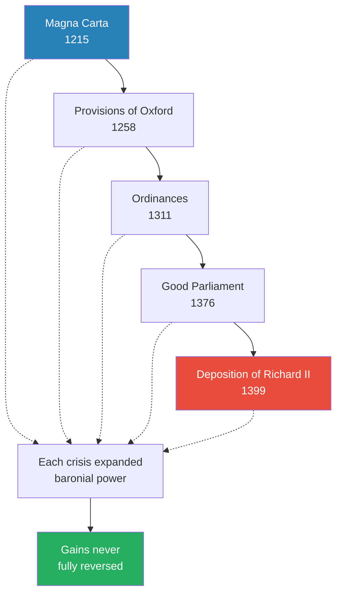
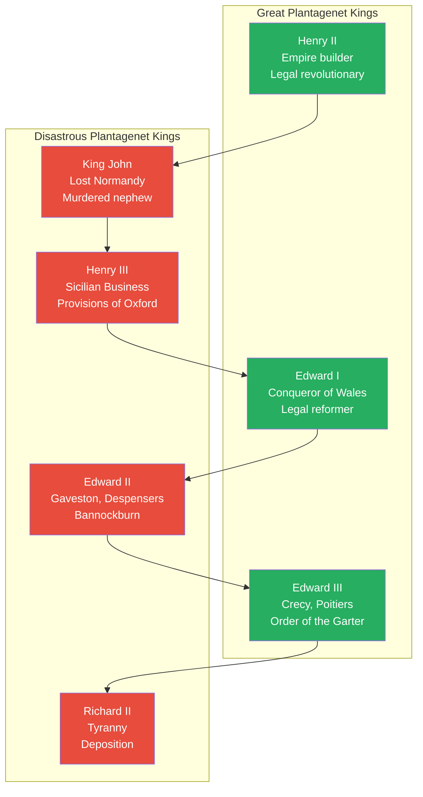
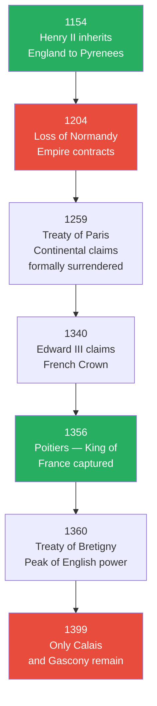
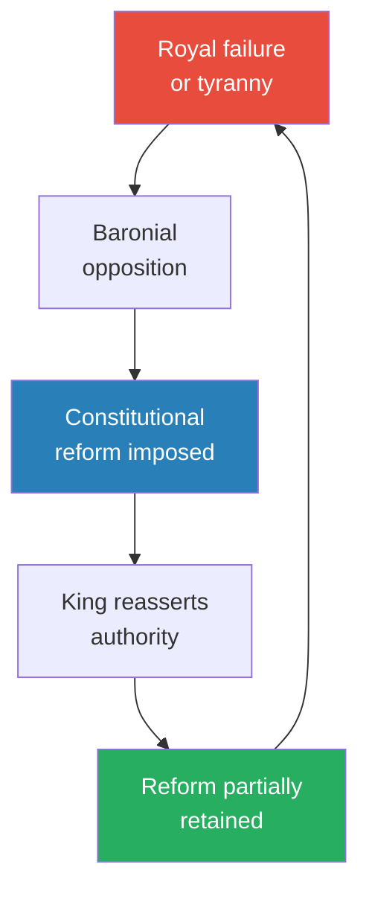
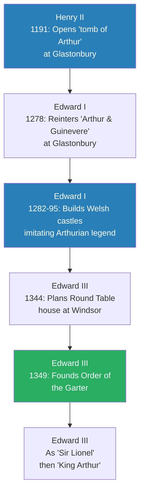

# The Plantagenets — Dan Jones

> Dan Jones tells the story of England's longest-reigning dynasty — eight generations of warrior kings who ruled from 1154 to 1399 and effectively invented England as a political, legal, and cultural entity. From the wreck of the White Ship, which killed Henry I's heir and plunged England into civil war, through the building and collapse of a vast Continental empire, the forging of Magna Carta, the conquest of Wales, the Hundred Years War with France, and the Peasants' Revolt, Jones tracks a dynasty whose fate was always shaped by the tension between the awesome power of the Crown and the political community's insistence on good governance. Bold narrative history anchored on the personalities of monarchs, the book covers 245 years in which every great Plantagenet king — Henry II, Edward I, Edward III — was matched by a disastrous one — John, Henry III, Edward II, Richard II — and shows how the dynasty's self-destruction in 1399 opened wounds that bled through the Wars of the Roses and into the Tudor period.

---

## About the Author

Dan Jones is a British historian and bestselling author specialising in the Middle Ages. He studied at Cambridge and became a protege of David Starkey before establishing himself as one of England's foremost popular historians. His books include *The Wars of the Roses* (the direct sequel to this volume), *Magna Carta*, *Summer of Blood*, *The Templars*, *Crusaders*, and *Powers and Thrones*. Jones is also a television presenter, having written and hosted the Netflix series *Secrets of Great British Castles*. He combines rigorous chronicle sources — quoting William of Malmesbury, Matthew Paris, Froissart, and dozens of others — with fast-paced, character-driven storytelling that makes medieval England feel close enough to touch.

---

## The Big Idea

- <b style="color: #27ae60">The Plantagenets were the most consequential dynasty in English history</b> — during their 245-year rule they founded the basic elements of what we know as England:
  - The realm's borders were established, along with its relationships with Scotland, Wales, France, and Ireland
  - Principles of law and institutions of government that have endured to the present were created — some deliberately, others under duress
  - The English tongue rose from a coarse local dialect to become the language of parliamentary debate and poetic composition
  - Great castles, palaces, and cathedrals were raised, and a rich mythology of national history was constructed

- Jones structures the book around a recurring medieval metaphor: <b style="color: #2980b9">Fortune's Wheel</b>
  - Every Plantagenet king rises to greatness before the wheel turns and brings him low
  - The dynasty oscillates between martial glory and catastrophic misrule
  - <b style="color: #e74c3c">Personal character determines dynastic fate</b> — Henry II's energy, John's paranoia, Edward II's weakness, Edward III's charisma each shaped centuries of history

- The overarching narrative follows a dynastic arc:
  - The building of a vast Continental empire under Henry II
  - Its loss under John and the painful forging of a distinctly English kingdom through constitutional crisis
  - The conquest of Wales, the failed conquest of Scotland, and the launch of the Hundred Years War
  - The final oscillation between Edward III's glory and Richard II's tyranny, ending in deposition in 1399

- <b style="color: #27ae60">Every constitutional advance was driven by royal failure, not baronial ambition</b> — Magna Carta, the Provisions of Oxford, the Ordinances, and the 1399 deposition were all reactive to specific royal abuses

- The book traces how the office of kingship was transformed over these 245 years:
  - Under the Normans, the king was simply the most powerful man, with prerogatives of legal judgment, feudal tribute, and warfare
  - By 1400, the king was an officeholder whose awesome rights were matched by awesome responsibilities, bound by a complex constitutional contract with the various estates of the realm
  - Parliaments reserved the right to grant taxes and expected grievances to be heard in exchange
  - Government could be scrutinised, inadequate ministers impeached, and ultimately a king might be removed from office

---

## Key Concepts at a Glance

| Concept | One-line summary |
|---------|-----------------|
| **Fortune's Wheel** | The medieval metaphor Jones uses as a structural device — every king rises before the wheel turns |
| **The Angevin Empire** | Henry II's patchwork of territories from Scotland to the Pyrenees, conceived as a federation not a unitary state |
| **The constitutional ratchet** | Each crisis expanded baronial/parliamentary power, and these gains were never fully reversed |
| **Good lordship** | The principle that a king's primary duty is to protect his subjects' property and provide accessible justice |
| **Magna Carta** | A failed peace treaty in 1215 that became the rallying cry for limiting royal power for centuries |
| **The Provisions of Oxford** | The 1258 baronial reform that imposed committee government on Henry III |
| **Arthurian mythology as statecraft** | From Henry II's Glastonbury fraud to Edward I's castles to Edward III's Order of the Garter |
| **The favorite problem** | Kings who elevated unworthy companions — Becket, Gaveston, the Despensers, de Vere — invariably provoked crisis |
| **The Hundred Years War** | Edward III's claim to the French throne launched a generational conflict that redefined English identity |
| **The Order of the Garter** | Edward III's chivalric brotherhood that bonded England's aristocracy in the common purpose of war |
| **The Peasants' Revolt** | The 1381 rising — England's first great popular rebellion, born from the Black Death's economic upheaval |
| **The deposition precedent** | Edward II's removal in 1327 and Richard II's in 1399 established that kings could be held accountable |

---

## Plantagenet Dynasty Timeline

*The dynasty spans 245 years from crisis to crisis — born in the shipwreck of 1120, crowned in 1154, and destroyed by deposition in 1399.*

---

## Part I: Age of Shipwreck (1120-1154)

*A drunken boat ride kills an heir, plunges England into two decades of civil war, and creates the conditions for a ginger-haired teenager from Anjou to claim the throne.*

### The White Ship Disaster

- On the night of 25 November 1120, the <b style="color: #2980b9">White Ship</b> left Barfleur carrying nearly two hundred young members of England's and Normandy's elite families
- The prince aboard was <b style="color: #2980b9">William the Aetheling</b>, the only legitimate son of Henry I and heir to the throne:
  - Seventeen years old, recently married to the daughter of the count of Anjou
  - Had just received homage as duke of Normandy — his future seemed assured
- The ship belonged to Thomas Fitzstephen, whose grandfather had contributed a longship to William the Conqueror's invasion fleet
  - Henry I entrusted the passage with a solemn warning: "I entrust to you my sons William and Richard, whom I love as my own life"
- The crew and passengers were drunk; they waved away priests who came to bless the vessel with holy water
- The captain boasted they could overtake the king's ship despite a late start — with fifty oarsmen pulling and the square sail billowing, they would reach England before the king

> [!example] The Wreck of the White Ship (25 November 1120)
> - Within minutes of leaving harbour, the ship struck a sharp rocky outcrop at the mouth of Barfleur
> - The collision punched a fatal hole in the wooden prow; freezing water poured in
> - William was loaded into a lifeboat and began rowing to safety
> - He heard his half-sister Matilda screaming in the water and ordered his boat to turn back
> - Other drowning passengers swamped the lifeboat, capsizing it — William drowned
> - Only one man survived: a butcher from Rouen who had boarded the ship to collect debts, wrapped himself in ram skins for warmth, and clung to wrecked timber through the night
> - A boy was sent to tell Henry I; the king "fell to the ground, overcome with anguish" and according to chroniclers, never smiled again
> **The lesson:** A single drunken decision destroyed the succession plan that Henry I had spent decades building.

- <b style="color: #e74c3c">William's death was a political catastrophe</b> — through his marriage, Normandy was at peace with Anjou; through his homage to Louis VI, the realm was at peace with France
- Stephen of Blois survived because he had left the ship with a stomach upset — his survival would shape the next three decades of English history

---

### The Anarchy

- Henry I tried desperately to produce another male heir, marrying the teenage Adeliza of Louvain — but despite twenty-two bastard children, he could not impregnate his new wife
- His only option was to designate his daughter <b style="color: #2980b9">Empress Matilda</b> as heir:
  - She had been Holy Roman Empress, married to Henry V
  - Henry I extracted oaths of allegiance from his barons three times — in 1126, 1131, and 1133
  - But female rule had virtually no precedent in the twelfth century
- Henry married Matilda to fifteen-year-old <b style="color: #2980b9">Geoffrey Plantagenet</b> of Anjou in 1128:
  - Tall, bumptious, with ginger hair and a flair for showmanship
  - He wore a sprig of yellow broom blossom (*Planta genista*) in his hair — giving the dynasty its name
  - Their son Henry was born at Le Mans on 5 March 1133

- When Henry I died in December 1135, Stephen of Blois pounced:
  - Crossed to England, seized the treasury at Winchester, and had himself crowned within weeks
  - The barons abandoned their oaths to Matilda — the prospect of female rule was unappealing
  - Stephen was charming and courteous but lacked Henry I's ruthlessness

- The result was nineteen years of civil war known as <b style="color: #e74c3c">the Anarchy</b> — "It was as if Christ and his saints were asleep":
  - England was split between two courts, two governments, two systems of justice
  - Flemish mercenaries garrisoned castles; crops were burned; the countryside smoldered with low-level warfare
  - Local lords built unlicensed castles (known as "adulterine castles") and terrorised the countryside — the central authority that Henry I had maintained collapsed
  - The chronicler described horrors: men hung by their thumbs, smoke fires lit under them, knotted ropes tightened around their heads
  - Matilda invaded England in 1139, landing at Arundel — Stephen gallantly allowed her safe passage to Bristol, a chivalrous decision he would regret
  - Matilda briefly captured Stephen at the Battle of Lincoln in 1141, but alienated her allies through arrogance:
    - She demanded money from the Londoners, who were already suffering from civil war — they expelled her from the city
    - She refused to show the diplomatic flexibility that Henry I had mastered
  - Stephen was exchanged for the captured earl of Gloucester; the war ground on inconclusively

> [!example] Matilda's Escape from Oxford (Christmas 1142)
> - Besieged in Oxford Castle with hope draining away
> - One snowy night she wrapped herself in a white cloak as camouflage
> - She slipped past the guards through a postern door and walked eight miles to Abingdon across frozen fields
> - Her white cloak made her invisible against the snow — no search party found her
> - She reached safety and the fight for the kingdom lived on
> **The lesson:** Resourcefulness and physical courage could succeed where military force had failed.

---

### Henry FitzEmpress Claims the Crown

*Out of the Anarchy's chaos emerged one of medieval history's most remarkable characters — a ginger-haired teenager from Anjou who would win England not through military genius but through the sheer force of his personality and the promise of good government.*

- Young Henry made his first visit to England aged nine, then attempted a farcical solo invasion at thirteen:
  - He hired mercenaries he could not pay — they stood around uselessly while Henry had no money for supplies
  - In a gesture of extraordinary impudence, the penniless teenager wrote to Stephen asking for money to go home
  - Stephen paid off his soldiers — a strangely generous act toward the boy who wanted his crown, perhaps revealing Stephen's own weariness with the civil war

- At nineteen, he married <b style="color: #2980b9">Eleanor of Aquitaine</b>, transforming the political map of France:
  - She was twenty-eight, recently divorced from Louis VII of France after fifteen years of marriage
  - She brought Aquitaine — more than a quarter of France's territory — to the match, transforming Henry from a powerful duke into the greatest lord in France
  - On the ride from Paris to Poitiers after her annulment, she evaded two would-be kidnappers:
    - Theobald of Blois tried to intercept her near the Loire
    - Geoffrey Plantagenet — Henry's own younger brother — also attempted to capture her
    - Eleanor outmanoeuvred both, arriving safely at Poitiers
  - She sent for young Henry, and they married in secret at Poitiers in May 1152 — just eight weeks after her annulment, before Louis VII even knew what was happening
  - Louis had committed "an inexcusable blunder" in letting her fall into Plantagenet hands — the marriage doubled Henry's territory overnight
  - Eleanor was ten years older than Henry, already a queen, already a crusader, already the most famous woman in Europe — she would prove to be the most formidable woman in the entire Plantagenet story

- Henry invaded England in January 1153, but his genius lay not in generalship but in <b style="color: #27ae60">good lordship</b>:
  - He sent his mercenaries home when barons complained
  - Instead of ravaging lands, he held court and issued charters guaranteeing property rights
  - He presented himself as a credible alternative king — men came to him in peace
  - At the siege of Malmesbury, foul weather scattered the defenders while Henry's men stood their ground
- Stephen's son Eustace died suddenly in August 1153 at Bury St Edmunds — under mysterious circumstances that contemporaries attributed to divine judgment
  - With Eustace dead, Stephen lost his reason for fighting — he had been battling to secure the throne for his son, not for himself
  - Stephen's other son William was offered compensation but not the Crown
- The <b style="color: #2980b9">Treaty of Winchester</b> (November 1153) peacefully transferred the Crown:
  - Stephen formally adopted Henry as his son and heir
  - Stephen would reign for his lifetime; Henry would succeed him
  - The deal was modelled on the compromise that had ended the civil war between Stephen and the Emperor in Germany decades earlier
  - It was a triumph of diplomacy over war — and it established Henry's reputation for pragmatic statecraft before he even wore the crown
  - Stephen died within a year, in October 1154, and Henry succeeded him without opposition
  - The transition was the smoothest in English history since the Conquest — proof that the political community valued stability above all else
  - Henry arrived in England and was crowned at Westminster on 19 December 1154 — he was twenty-one years old, already duke of Normandy, count of Anjou, and duke of Aquitaine through his wife
  - He controlled more of France than the French king himself — and he had won England without fighting a major battle
  - The Plantagenet dynasty had begun:
    - Born not in glory but in the wreckage of the Anarchy
    - Secured not by military conquest but by the promise of good governance
    - Named after a sprig of yellow broom blossom worn by a ginger-haired teenager from Anjou
  - Jones frames this as the dynasty's founding paradox: the Plantagenets came to power by promising to end the chaos that followed when kings failed — and yet their own dynasty would repeatedly produce kings who failed just as spectacularly as Stephen
  - It would be the promise of good governance — kept by some kings, broken by others — that determined the dynasty's fate for the next 245 years
  - Every time a Plantagenet king honoured the promise (Henry II, Edward I, Edward III), the dynasty flourished
  - Every time a king broke it (John, Henry III, Edward II, Richard II), the political community rose up to enforce it
  - The constitutional ratchet that Jones traces through the book — Magna Carta, the Provisions of Oxford, the Ordinances, the Good Parliament, the depositions — was nothing more than the political community's repeated insistence that the original promise be kept

> [!tip] Core Insight
> Henry FitzEmpress won the Crown in 1153 not by winning battles but by offering justice, stability, and good lordship — proving that a king's primary duty is to protect his subjects' property and provide order.

---

## Part II: Age of Empire (1154-1204)

*Henry II builds the most sophisticated government in Europe, quarrels fatally with his best friend, survives a rebellion by his own family, and bequeaths an empire that his sons will tear apart.*

### Henry II: The Empire Builder

*Henry II was the most capable administrator to sit on the English throne since the Conqueror — and perhaps the most energetic human being in twelfth-century Europe. He inherited chaos and created order; he inherited a broken island kingdom and built a Continental empire.*

- Crowned at Westminster on 19 December 1154, aged twenty-one, Henry was the first ruler crowned "king of England" rather than "king of the English" — a subtle but important distinction signalling that the realm itself, not just its people, was his
- Gerald of Wales described him as: red-haired, grey-eyed, barrel-chested, with bowed legs from constant riding, a "harsh, cracked voice," and energy that wore the whole court out by "continual standing"
  - He was restless, always on the move, driving his courtiers to exhaustion — Walter Map, a courtier, wrote that serving Henry was like living in a whirlwind
  - He had an explosive temper — the famous <b style="color: #2980b9">Plantagenet rage</b> that his descendants would inherit for eight generations
  - He was well-read, intellectually curious, and fluent in Latin and French (though he never learned English — the language of the court was still French under all the early Plantagenets)
  - His court attracted some of the finest minds of the twelfth century: the satirist Walter Map, the scholar John of Salisbury, and Peter of Blois
  - Jones emphasises that Henry was the most complete king of the twelfth century — combining physical energy, intellectual capacity, legal innovation, and diplomatic skill in a way no contemporary monarch could match
  - His only rivals in Europe were the Emperor Frederick Barbarossa and Philip Augustus of France — and Henry outmanoeuvred both of them for most of his reign
  - The tragedy is that Henry's personal qualities — his energy, his intelligence, his capacity for hard work — could not solve the fundamental problem of Plantagenet politics: how to manage a vast federation of territories that was held together by nothing stronger than the king's own willpower
  - When that willpower failed — as it did when his family turned against him — the federation began to fragment
  - His sons would prove that the empire could not survive the transition from one energetic king to the next — it required a Henry II in every generation, and the dynasty could not guarantee that

- <b style="color: #27ae60">Henry's legal revolution was his greatest achievement</b>:
  - Created a penetrative system of royal justice reaching into every corner of England
  - Sent royal judges on circuit throughout the shires — the foundation of the English common law
  - Reformed the exchequer to account twice yearly
  - Established the principle that the king's law should be accessible to all subjects, not just barons
  - Built a bureaucratic machine that was the most sophisticated in Europe since Rome
  - The Assize of Clarendon (1166) created the jury system — groups of twelve men sworn to report suspected criminals to royal judges
  - The Assize of Northampton (1176) extended these reforms and established a system of itinerant justices that is recognisably the ancestor of the modern circuit court
  - The Inquest of Sheriffs (1170) investigated and purged corrupt local officials — demonstrating that royal government would be held to account
  - He reformed the coinage, standardised weights and measures, and built roads
  - His chancellor, Thomas Becket (before their quarrel), was the most efficient administrator in Europe — the chancery produced a flood of writs, charters, and administrative documents

- Henry's methods were practical and ruthless:
  - He demolished the "adulterine castles" that had sprung up during the Anarchy — hundreds of unlicensed fortifications that symbolised baronial lawlessness
  - He demanded that all disputes over land be settled in royal courts, not baronial ones — centralising justice and generating revenue simultaneously
  - He conducted a systematic survey of royal rights and revenues, the first since Domesday Book
  - He used scutage (a tax paid in lieu of military service) to fund professional armies rather than relying on feudal levies — a financial innovation that his successors would exploit
  - He established the principle that the king's peace extended throughout the realm — that crime was not merely a wrong against the victim but against the king's authority
  - This was revolutionary: it meant that royal justice could reach into every village, every dispute, every relationship — creating a demand for royal courts that generated both income and loyalty

> [!abstract] Henry II's Legal Legacy
> | Reform | Date | What It Did | Why It Mattered |
> |--------|------|-------------|-----------------|
> | Assize of Clarendon | 1166 | Created the jury system | Replaced ordeal and combat with rational investigation |
> | Assize of Northampton | 1176 | Extended circuit courts | Royal justice reached every shire |
> | Inquest of Sheriffs | 1170 | Purged corrupt officials | Demonstrated Crown accountability |
> | Grand Assize | c.1179 | Offered jury trial as alternative to combat | Made justice accessible to non-warriors |
> | Scutage reform | Ongoing | Tax in lieu of military service | Funded professional armies; loosened feudal bonds |

- His territories stretched from Scotland to the Pyrenees — the <b style="color: #2980b9">Angevin Empire</b> (or *l'espace Plantagenet*):
  - England, Normandy, Anjou, Touraine, Maine, Aquitaine, Brittany (through vassalage), and lordship over Ireland, Scotland, and Wales
  - This was conceived as a federation, not a unitary state — each territory retained its own laws, customs, and governance
  - Henry planned the succession as a partition: England and Normandy for his eldest surviving son Henry ("the Young King"), Aquitaine for Richard, Brittany for Geoffrey, Ireland for John
  - He never imagined a centralised state — the territories were held together by his personal energy and nothing else

- Henry's management style was extraordinary:
  - He was constantly on the move — he could ride from one end of his dominions to the other in days that astounded contemporaries
  - He transacted business on horseback, in chapel, at meals — courtiers had to keep up or be left behind
  - He spoke multiple languages and was learned enough to enjoy theological debate
  - His court attracted scholars, lawyers, and administrators from across Europe
  - Walter Map, a courtier, wrote that serving Henry was like living in a whirlwind — "we wandered three or four years in a pathless wilderness"

- The coronation of the Young Henry in 1170 was a catastrophic miscalculation:
  - Henry had his eldest son crowned co-king at Westminster — a French custom meant to secure the succession
  - But the Young Henry had the title of king without any actual power, land, or revenue
  - He was handsome, charming, and generous — but these qualities made him dangerous, not useful, because they attracted followers to a pretender with no resources
  - His resentment at being a king in name only became the seedbed of the Great Revolt

---

### The Murder of Thomas Becket

*Henry's greatest political crisis began with the worst personnel decision of his reign — promoting his drinking companion to the most powerful religious office in England.*

- Henry promoted his friend and chancellor Thomas Becket to Archbishop of Canterbury in 1162:
  - Becket had been a brilliant chancellor — efficient, loyal, and willing to do the king's bidding in all things
  - Henry expected him to be an equally compliant archbishop, rubber-stamping royal authority over the Church
  - Instead, Becket transformed completely into a zealous defender of Church independence
  - He adopted extreme asceticism — wearing a hair shirt, pulling out his own teeth, eating meagre food
  - He devoted himself to the Church's cause with the same single-mindedness he had brought to the chancery
  - Henry felt personally betrayed — he had elevated a friend and created an implacable enemy
  - Jones suggests that Becket's conversion was genuine rather than calculated: he took the spiritual obligations of his new office as seriously as he had taken the administrative duties of the old
  - But the practical effect was catastrophic: the two most powerful men in England were locked in a struggle that neither could win without destroying the other

- The <b style="color: #2980b9">Constitutions of Clarendon</b> (1164) attempted to codify royal authority over the Church:
  - Criminous clerks (churchmen accused of crimes) to be tried in royal courts
  - Limits on appeals to the papacy above the king's authority
  - Becket was browbeaten into accepting, then immediately recanted — mortifying the king

- Becket fled to exile in France, where he sat at Pontigny Abbey for years:
  - He pulled out his own teeth through extreme asceticism
  - He wrote furious letters excommunicating his enemies
  - At a peace conference at Montmirail in 1169, he appeared to accept reconciliation — then at the last moment added the phrase "saving God's honor" to his agreement
  - The phrase torpedoed any hope of peace: it gave Becket an unlimited escape clause from any concession, because he could always argue that "God's honour" required him to break the deal
  - Henry was beside himself with rage — years of negotiation undermined by three words
  - The exile lasted six years and consumed enormous diplomatic energy — popes, kings, and bishops were drawn into a quarrel that began as a dispute about criminal jurisdiction
  - Becket eventually returned to England in late 1170, but immediately began excommunicating bishops who had cooperated with the king — making reconciliation impossible
  - Henry's patience, never his strongest quality, was at breaking point

> [!example] The Murder in Canterbury Cathedral (29 December 1170)
> - Henry, at his Christmas court in Normandy, uttered his infamous outburst: "What miserable drones and traitors have I nurtured and promoted in my household who let their lord be treated with such shameful contempt by a lowborn clerk!"
> - Four knights — Reginald FitzUrse, Hugh de Morville, William de Tracy, and Richard le Breton — rode to Canterbury
> - They smashed through a side door with an ax and tried to arrest Becket
> - He resisted; the knights hacked the top of his head off
> - They mashed his brains across the flagstones with their boots
> - The murder outraged all of Christendom — Pope Alexander refused to speak to an Englishman for a week
> **The lesson:** A few words spoken in anger could destroy a reputation built over decades of careful statecraft.

- The aftermath transformed the political landscape:
  - Becket was proclaimed a martyr and canonised within three years — his tomb at Canterbury became the most popular pilgrimage site in England
  - Henry was forced to accept the Compromise of Avranches (1172), restoring many of the Church's privileges
  - The principle of benefit of clergy — that churchmen could only be judged by Church courts — survived for centuries
  - Henry's Irish expedition of 1171 was partly a convenient escape from papal wrath — he landed with a vast army and received the submission of Irish kings, establishing an English lordship that would last eight hundred years
  - <b style="color: #e74c3c">The murder haunted the dynasty</b> — it was invoked for centuries whenever the Crown and Church clashed
  - The four knights received surprisingly light penance — they were sent on crusade and died in relative obscurity
  - Becket's shrine at Canterbury became one of the richest pilgrimage sites in Europe:
    - It accumulated gold, jewels, and offerings that financed Canterbury Cathedral's magnificent rebuilding
    - Pilgrims came from across Europe — creating the traffic that Chaucer would immortalise in *The Canterbury Tales* two centuries later
    - The shrine was not destroyed until Henry VIII's Reformation in 1538 — 368 years after the murder
  - The Becket crisis established a principle that would recur throughout the Plantagenet story: the king's power, however great, could not extend beyond the Church without provoking catastrophic resistance
  - Jones notes the irony: Henry had promoted Becket precisely because he wanted a compliant archbishop, but the very qualities that made Becket a good chancellor — stubbornness, single-mindedness, absolute commitment — made him an implacable enemy when turned against the king

---

### The Great Revolt and Eleanor's Imprisonment

*In 1173, Henry faced the greatest crisis of his reign — his own family united against him, and the rebellion nearly destroyed everything he had built.*

- In 1173, Henry's wife and three eldest sons rose in arms against him:
  - The Young Henry, crowned as co-king in 1170, resented having the title without any actual power
  - Richard, duke of Aquitaine, was encouraged by his mother to rebel
  - Geoffrey, duke of Brittany, joined for the opportunity to expand his lands
  - <b style="color: #e74c3c">The rebellion united virtually every enemy Henry had across Europe</b> — Louis VII of France, the king of Scotland, counts of Flanders and Boulogne

- <b style="color: #2980b9">Eleanor of Aquitaine</b> was the driving force behind the rebellion:
  - She had grown increasingly alienated from Henry, who had taken a mistress, Rosamund Clifford ("Fair Rosamund") — the most famous beauty of her age
  - Eleanor was not merely jealous — she was a political actor whose Aquitanian territories gave her independent power and an alternative court
  - She actively encouraged her sons to rebel, providing resources and diplomatic contacts through her network in southern France
  - She was captured trying to ride from Poitiers to Paris disguised as a man — intercepted by Henry's agents on the road
  - Her capture was a turning point: without Eleanor coordinating the rebellion, the young princes lacked strategic direction
  - She was imprisoned for the next fifteen years — held at various English castles, brought out occasionally for Christmas courts but never allowed real freedom
  - Her imprisonment was a political statement: Henry could not execute or exile the duchess of Aquitaine, but he could neutralise her
  - She was not released until Henry's death in 1189, when she emerged at sixty-seven to become the most powerful woman in Europe
  - During Richard's reign, she managed the kingdom while he was on crusade, organised the ransom when he was imprisoned, and prevented John from seizing the throne
  - She personally rode across England and the Continent in her seventies, conducting diplomacy and asserting Plantagenet interests
  - She died at Fontevraud Abbey in 1204, aged eighty-two — she had outlived all but two of her ten children
  - Jones portrays Eleanor as the most extraordinary woman of the entire Plantagenet story — more politically capable than most of the kings she served alongside

- Henry survived the Great Revolt through military genius, tireless energy, and the political incompetence of his enemies:

> [!example] Henry's Miraculous Survival (1173-1174)
> - Henry crossed Normandy from Rouen to Dol in two days, covering distances that staggered contemporaries
> - When sailors expressed fear at rough seas during the crossing to England, Henry declared that if God wished him to be restored to his kingdom, He would deliver them safely
> - He did public penance at Becket's tomb — submitted to being flogged by eighty monks
> - That same night, news arrived that William the Lion of Scotland had been captured at Alnwick — ending the northern threat
> - Henry was back in Barfleur within a month, and Louis VII sued for peace
> **The lesson:** Henry's combination of physical endurance, political cunning, and willingness to humiliate himself saved his empire — but the family fracture never healed.

- Henry's succession planning revealed his fatal weakness — <b style="color: #e74c3c">the Plantagenet family consumed itself</b>:
  - England and Normandy for the Young Henry, Aquitaine for Richard, Brittany for Geoffrey, nothing for John — hence "Lackland"
  - The Young Henry died in 1183 during yet another rebellion against his father, after sacking the shrine of the local saint at Rocamadour to pay his mercenaries — on his deathbed he begged for a hair shirt and asked to be laid on a bed of ashes
  - Geoffrey died in a tournament accident in Paris in 1186, leaving a posthumous son, Arthur of Brittany, whose claim to the throne would later prove fatal
  - Richard allied with Philip II against his own father in 1189, forcing the humiliated Henry to accept his terms
  - By the end, Henry's only faithful son was John — the least capable of them all
  - In the final campaign, Richard allied with Philip II of France and humiliated his father at a conference at Azay-le-Rideau:
    - Henry was forced to give Richard the kiss of peace — and as he did so, Henry reportedly whispered: "God grant I may not die until I have my revenge on you"
    - But Henry was finished — he retreated to Chinon, where his remaining supporters deserted him
    - When he saw a list of the barons who had betrayed him, his son John's name was at the top — the final blow
  - Henry died at Chinon on 6 July 1189, betrayed by his last remaining sons
  - His servants reportedly stripped the body of its valuables before rigor mortis had even set in
  - When Richard came to view his father's corpse, blood flowed from Henry's nose — a medieval sign that the dead man's murderer was present
  - Richard was reportedly shaken by the sight — though not enough to feel genuine remorse
  - The greatest Plantagenet king died a broken man at fifty-six, worn out by three decades of restless government and a family that consumed itself
  - But the institutions Henry had built — the common law, the exchequer, the circuit courts, the bureaucratic machinery of royal government — survived every one of his successors
  - Jones argues that Henry II's legal revolution was the single most important domestic achievement of any Plantagenet king — more important than Edward I's statutes, more important than Edward III's military victories, more important than the constitutional settlements forced on weaker kings
  - The common law that Henry created would eventually spread to every corner of the English-speaking world — from the United States to India to Australia — making it arguably the most influential legal innovation in human history

> [!tip] Core Insight
> Henry II's reign establishes the central paradox of the Plantagenet dynasty: the greatest kings built institutions that were designed to serve them — but those institutions eventually grew strong enough to restrain them. Henry's common law courts, designed to extend royal power, became the foundation for the principle that the king himself was subject to the law. The creator of the system planted the seeds of its own constitutional evolution.

---

### Richard the Lionheart

*Richard I's reign was a decade of crusading, captivity, and war — a king who spent barely six months of his ten-year reign in England, yet became its most legendary warrior.*

- Richard I's reign (1189-1199) was defined by the Third Crusade, captivity, and war against Philip II of France
- <b style="color: #2980b9">The greatest warrior king of his age</b>, but reckless with the succession and with finances:
  - Spent approximately fourteen thousand pounds in a single year on crusading preparations — 14,000 cured pig carcasses, 60,000 horseshoes, thousands of cheeses and beans, thousands upon thousands of arrows
  - Joked he would sell London if he could find a buyer
  - Exploited every conceivable source of royal revenue to fund the crusade

- Richard's crusade was the defining enterprise of his reign:
  - He conquered Cyprus in a lightning campaign, overthrowing the despotic Isaac Comnenus — Cyprus became a Crusader state for centuries
  - Married Berengaria of Navarre in a Byzantine chapel in Limassol — the only English king married in the eastern Mediterranean
  - At the siege of Acre, he arrived on a litter (suffering from fever) and his presence alone reinvigorated the siege
  - After months of negotiation with Saladin stalled, he ordered the massacre of 2,600 Muslim prisoners in full view of Saladin's army — a ruthless act that shocked even medieval sensibilities
  - He marched south along the coast toward Jerusalem, winning a major engagement at Arsuf where his disciplined advance held against repeated Muslim cavalry charges
  - He came within sight of Jerusalem twice but decided he could not take and hold the city — a painful strategic calculation that showed Richard was a better strategist than his reputation for reckless courage might suggest
  - Saladin himself reportedly said that if he were to lose the Holy Land, he would rather lose it to Richard than to any other prince in Christendom
  - The Third Crusade failed to recover Jerusalem but preserved the Crusader coastal strip and secured access for Christian pilgrims
  - It also created the legend of the Lionheart — a military reputation that protected England for years after his death and made Richard the most famous monarch in medieval Europe
  - Jones notes that Richard's crusade was simultaneously a financial disaster (it cost England more than any previous royal enterprise) and a propaganda triumph (it gave the Plantagenets a moral authority that no amount of money could buy)

> [!example] Richard at Jaffa (31 July 1192)
> - Muslim forces had retaken Jaffa; the garrison was on the verge of surrender
> - Richard sailed from Acre against the wind in desperation, arriving at the harbour with a small fleet
> - A red awning covered the royal boat from which the redheaded king waded ashore, his red banner waving
> - Against absurd odds, Richard's men cleared the city with crossbow fire, driving the Muslim forces inland
> - Days later, when the enemy returned, Richard repulsed them again with a hedgehog formation of knights
> - It was the final military engagement of the Third Crusade — and it cemented the legend of the Lionheart
> **The lesson:** Richard's personal courage and willingness to fight at the front created a military reputation that protected England for years after his death.

- Captured near Vienna on his way home, Richard was imprisoned for over a year:
  - He had been travelling in disguise, but was recognised — Duke Leopold of Austria seized him, then handed him to Emperor Henry VI
  - The ransom demanded was 150,000 marks — an astronomical sum, equivalent to several years' royal revenue
  - He composed the melancholy song "Ja nus hons pris" in captivity — "No prisoner can tell his story well unless he tells it painfully"
  - Eleanor of Aquitaine, now released from her own imprisonment at sixty-seven, personally organised the raising of the ransom
  - A brutal 25% tax on income and movables was levied across England — churches were stripped of their plate; the Cistercian monks gave their entire wool clip
  - The ransom bankrupted many noble families but demonstrated the depth of loyalty Richard's crusading legend commanded
  - Philip II wrote urgently to John: "Look to yourself; the devil is loose" — a testament to the fear Richard's reputation still inspired
  - On his return, Richard held a crown-wearing ceremony at Winchester to reassert his majesty

> [!example] Richard's Death at Chalus-Chabrol (26 March 1199)
> - Richard was besieging a minor castle in the Limousin, walking the ramparts at dusk to inspect the defences
> - A lone defender appeared on the battlements — Peter Basilius, carrying a crossbow in one hand and a frying pan from the castle kitchen as a makeshift shield
> - Richard paused to applaud the man's courage before ducking — the delay was fatal
> - A single crossbow bolt struck Richard in the shoulder; he walked silently back to his tent with the shaft protruding
> - The wound turned gangrenous; sickness spread through his upper body
> - Richard died eleven days later — he had been a king and a soldier to the last
> **The lesson:** The greatest warrior of his age was killed not by a worthy adversary but by a lone defender with a cooking implement — Fortune's Wheel had turned.

- Richard built <b style="color: #2980b9">Chateau Gaillard</b> — his masterwork fortress in the Vexin — and was winning the war against Philip when he died:
  - He called it his "saucy castle" and was so proud of it he declared he could hold it "if its walls were made of butter"
  - The fortress dominated the Seine valley, blocking Philip's advance into Normandy
  - At the Battle of Gisors (1198), Richard routed Philip's army so thoroughly that the French king was pulled from a river ford and nearly drowned
  - Richard's military genius was matched only by his fiscal recklessness — he taxed England relentlessly to fund the war
  - His death at Chalus was the ultimate irony: the greatest warrior of his age killed by a nobody defending a castle that contained, according to some accounts, nothing more valuable than a Roman treasure hoard
  - Richard's death left no heir: he had no legitimate children, and his marriage to Berengaria of Navarre had been distant at best — they spent very little time together
  - The succession passed to John, but Arthur of Brittany (the son of Richard's dead brother Geoffrey) had an arguably better claim
  - This contested succession was the time bomb that would explode within four years — and ultimately destroy the Plantagenet Continental empire
  - The succession crisis after Richard's death was the first of several that would plague the dynasty:
    - After Richard came the contest between John and Arthur
    - After Edward I came the disaster of Edward II
    - After Edward III came the minority of Richard II
    - After Richard II came the usurpation of Henry IV
  - Every Plantagenet succession was potentially dangerous — the dynasty survived not because the transitions were smooth but because the institutional machinery was strong enough to absorb the shocks
  - The one transition the dynasty could not absorb was Richard II's deposition — because that transition broke the principle of hereditary succession that had held the dynasty together for eight generations
  - Once the principle was broken, any nobleman with a trace of Plantagenet blood could claim the throne — and in the fifteenth century, they did, in the catastrophic Wars of the Roses
  - Jones's narrative ends in 1399, but his epilogue makes clear that the Plantagenet story does not end with Richard's death — it continues through Lancaster and York, through Henry VII's usurpation, through the Tudors, through the Civil War, and through the Glorious Revolution
  - Every constitutional crisis in English history from the fifteenth century onward can be traced back to the principles established under Plantagenet rule: that the king is subject to the law, that taxation requires consent, that ministers can be held accountable, and that a king who violates these principles can be removed
  - The Plantagenets invented England — and the consequences of that invention are still unfolding
  - The common law that Henry II created in the 1160s remains the foundation of legal systems in over thirty countries
  - The principle that taxation requires consent, forced from John in 1215 and reaffirmed by Edward I in 1297, remains the foundation of parliamentary government
  - The principle that even kings are subject to the law, demonstrated by the depositions of 1327 and 1399, remains the foundation of constitutional monarchy
  - And the English language, promoted from a peasant dialect to the language of parliament and literature during the Plantagenet centuries, went on to become the global lingua franca
  - None of these outcomes were planned — all of them were the product of the extraordinary, turbulent, violent, brilliant 245 years of Plantagenet rule that Jones chronicles with such vivid narrative power
  - The dynasty that began with a drunken boat ride and ended with a melancholy dinner in the Tower left behind a legacy that shaped the modern world — and Jones tells that story with the pace, colour, and human drama that it deserves
  - Gerald of Wales, who served Henry II and warned of Fortune's variable favour, would have recognised every twist and turn of the story that followed — because the Plantagenet wheel, once set in motion, never stopped turning until the last king sat alone in the Tower, recounting the sad stories of his fallen predecessors, and discovered that he had become one of them

> [!abstract] Richard I: A Balance Sheet
> | Achievement | Cost |
> |------------|------|
> | Crusading legend that protected England for decades | Brutal taxation; 25% ransom tax |
> | Chateau Gaillard — finest fortress in Europe | Spent only 6 months of 10-year reign in England |
> | Defeated Philip II repeatedly in France | Left no heir — succession crisis guaranteed |
> | Created the mythology of the warrior king | The mythology died with him; John could not sustain it |

---

### King John: The Loss of Empire

*John inherited the greatest empire in Western Christendom and destroyed it within five years through cruelty, paranoia, and catastrophic misjudgment.*

- <b style="color: #e74c3c">John inherited the empire but lacked the character to hold it</b>
- Hubert Walter, the justiciar, warned William Marshal at John's coronation: "You will never come to regret anything you did as much as what you're doing now"
- Jones draws on chronicle evidence to paint a comprehensive portrait of John's character failings:
  - He sniggered at others' distress and had a cruel, vindictive temperament
  - He was personally brave in spurts but lacked the sustained energy and strategic vision of his father and brother
  - He was mean-spirited, suspicious, and prone to sudden violence — contemporaries noted his habit of laughing at inappropriate moments
  - He seduced and married twelve-year-old <b style="color: #2980b9">Isabella of Angouleme</b>, who had been betrothed to Hugh de Lusignan:
    - The insult turned the powerful Lusignan family into permanent enemies
    - Hugh appealed to Philip Augustus, John's overlord for his French lands — giving Philip legal grounds to intervene
    - John's contemporaries were shocked not by the girl's age but by the political stupidity of stealing another lord's betrothed
  - The Treaty of Le Goulet (1200) gave him the mocking nickname "Softsword" because he surrendered Norman territory without a fight
  - Jones notes that John was not without ability — he was intelligent, capable of administrative innovation, and could be militarily effective in short bursts — but these qualities were overwhelmed by his paranoia, cruelty, and inability to maintain trust

- John's early reign showed flashes of military capability:
  - At Mirebeau in August 1202, he rode eighty miles in forty-eight hours to relieve the siege — one of the most remarkable forced marches in medieval history:
    - His mother Eleanor was besieged in the castle by the rebel barons who supported Arthur of Brittany
    - John arrived at dawn and caught the rebels completely by surprise
    - Geoffrey de Lusignan was captured at breakfast, still eating — two hundred rebels were taken prisoner
    - It was a brilliant military operation that briefly made John look like a worthy successor to Richard
  - But he immediately squandered the advantage by mistreating his prisoners:
    - He crammed them into carts and dungeons in appalling conditions
    - Several starved to death; others were ransomed at extortionate rates
    - The cruelty alienated the very Norman and Poitevin barons whose loyalty he desperately needed
    - Jones notes this as John's recurring pattern: tactical brilliance followed by strategic stupidity
  - The contrast with Richard is pointed: Richard would have followed up Mirebeau by consolidating alliances and projecting magnanimity; John followed it up by alienating everyone through cruelty and incompetence

> [!example] The Murder of Arthur of Brittany (Maundy Thursday, 1203)
> - Arthur was John's sixteen-year-old nephew and rival claimant to the Plantagenet territories
> - John had him imprisoned at Falaise in ghastly conditions, with attempts made to blind and castrate him
> - On Maundy Thursday, drunk and furious, John entered Arthur's cell
> - He killed the young man with his own hands, tied a stone to the body, and threw it in the Seine
> - A fisherman later retrieved it; nuns gave Arthur a secret Christian burial
> - Matilda de Briouze later confronted royal messengers with the truth: John had "basely murdered his nephew"
> **The lesson:** John's personal cruelty destroyed the moral credibility of his kingship — no one trusted him afterward, and the Continental barons had their justification for abandoning him.

- John's loss of Normandy in 1204 was <b style="color: #e74c3c">the great turning point in Plantagenet history</b>:
  - Chateau Gaillard — Richard's masterwork — fell after a brutal siege; a French soldier allegedly climbed through the latrine chute to open a gate
  - John spent weeks riding aimlessly around Normandy, unable to summon the will or the resources to fight
  - His barons refused to follow him — the murder of Arthur had destroyed their trust
  - City after city opened its gates to Philip Augustus; the duchy crumbled in months
  - As John sailed from Barfleur on his final departure, he passed the rock that had killed William the Aetheling in 1120 — Jones notes the bitter symmetry
  - The window of Plantagenet mastery over France was closing — and it would reshape the dynasty's identity forever
  - Norman barons who held lands on both sides of the Channel were forced to choose between English and French allegiance — most chose France
  - The loss was not just territorial but psychological: the Plantagenets had defined themselves as a Continental dynasty; now they were trapped on an island
  - Jones calls this "the empire-to-kingdom transition" — the most important structural change in the Plantagenet story

- The financial consequences were devastating:
  - John lost the customs revenues of Normandy, the wine revenues of Anjou, and the strategic depth that Continental territories provided
  - He was forced to rely entirely on English revenue — which meant taxing his English barons more heavily than any previous king
  - This created a vicious cycle: the more he taxed, the more he alienated his barons; the more alienated they became, the more he relied on force; the more he relied on force, the more he taxed to pay for mercenaries

> [!tip] Core Insight
> The loss of Normandy in 1204 was the most consequential event in Plantagenet history. It forced the dynasty to become English kings rather than Continental lords, and from that transformation emerged the distinctive institutions — Magna Carta, parliament, the common law — that define England to this day. Paradoxically, John's catastrophic failure made England more English.

---

## The Constitutional Ratchet

*Each constitutional crisis expanded the political community's power over the Crown — and these gains, once established, were never fully reversed.*

---

## Constitutional Milestones

| Year | Document/Event | Trigger | Key Principle Established |
|------|---------------|---------|--------------------------|
| 1215 | Magna Carta | John's tyranny, Bouvines defeat | No taxation without consent; king subject to law |
| 1258 | Provisions of Oxford | Henry III's favoritism, Sicilian Business | Baronial council to supervise king; parliament meets thrice yearly |
| 1266 | Dictum of Kenilworth | Barons' War aftermath | Conciliation over punishment: "not disinheritance, but redemption" |
| 1267 | Statute of Marlborough | Post-civil-war settlement | Permanent statutory reform — baronial grievances written into law |
| 1297 | Confirmation of Charters | Edward I's overtaxation for Scottish wars | Parliamentary consent required for taxation |
| 1311 | Ordinances | Edward II's favorites, misrule | Lords Ordainer to control royal household and appointments |
| 1327 | Deposition of Edward II | Total royal failure, Despenser tyranny | Precedent that kings can be removed for incapacity |
| 1376 | Good Parliament | Alice Perrers, corrupt ministers | Impeachment — parliament can formally accuse and remove ministers |
| 1399 | Deposition of Richard II | Tyranny, seizure of Lancaster estates | Final proof that the Crown was an office, not a personal possession |

---

## Part III: Age of Opposition (1204-1263)

*Trapped in England, John becomes a domestic tyrant; his cruelty provokes Magna Carta; his weak son Henry III stumbles from crisis to crisis until the barons seize control of government.*

### John as Domestic Tyrant

- Marooned in England after losing Normandy, John exploited his kingdom with unprecedented ferocity:
  - In 1207, he levied a <b style="color: #2980b9">thirteenth</b> — a tax of one shilling in every mark on all movable goods — raising the astonishing sum of £57,425 (more than two years' revenue)
  - This became the model for all regular medieval and Tudor taxation
  - He extracted Jewish teeth daily until ransoms were paid — a Bristol Jew had a tooth pulled each day for a week until he produced the sum demanded
  - He exploited feudal incidents — wardship, marriage, inheritance taxes — with a systematic cruelty that no previous king had matched
  - Heirs were forced to pay enormous sums to inherit their fathers' lands; widows were compelled to pay to avoid forced remarriage; wardships were sold to the highest bidder
  - The result was a system of legalised extortion that alienated even the most loyal barons

- He faced down the pope during a five-year <b style="color: #2980b9">Interdict</b> (1208-1214):
  - Church bells were silenced across England; the dead went unburied in churchyards
  - John profited enormously by confiscating Church property
  - He ransomed priests' mistresses — forcing them to pay to recover the women they were not supposed to have
  - He was eventually excommunicated, but used the situation to enrich himself further
  - When he finally submitted to the pope in 1213, he did so as a vassal — surrendering England and Ireland to the papacy and receiving them back as a papal fief
  - This was a calculated political move: papal protection would shield him from baronial revolt — but it also humiliated the realm by making the king of England a tenant of Rome

- John's relationship with the Jews illustrates his exploitative approach to vulnerable groups:
  - He used England's Jewish community as a cash machine — they were technically royal property, and he could tax them at will
  - When they could not pay, he turned to physical violence: the famous story of the Bristol Jew who had a tooth pulled each day until he produced the sum demanded
  - He alternately protected and persecuted the Jews according to his immediate financial needs — a pattern his descendants would continue until Edward I's expulsion

- The <b style="color: #e74c3c">Briouze affair</b> revealed John's true nature — the most notorious example of his cruelty:
  - William de Briouze was one of England's greatest barons and John's close ally — crucially, he had been present at Rouen and knew the truth about Arthur's murder
  - When royal messengers came to collect Briouze's sons as hostages (a routine feudal demand), his wife Matilda shouted that she would not surrender her children to a man who had "basely murdered his nephew" Arthur
  - The outburst said aloud what everyone suspected but no one dared confirm
  - John pursued the Briouze family with relentless fury — they fled to Ireland, were hunted through the countryside
  - William de Briouze escaped to France and died in exile
  - <b style="color: #e74c3c">Matilda and her eldest son were starved to death in a dungeon</b> — when the cell was opened, the son's body reportedly showed teeth marks on his cheeks
  - The affair demonstrated that John was not merely a bad king but a dangerous one — anyone who knew his secrets was in mortal peril
  - The Briouze affair became a rallying cry for the barons who would force Magna Carta on John seven years later — Matilda's fate demonstrated what happened to those who displeased the king
  - Jones uses the Briouze affair to illustrate one of his central arguments: that Plantagenet kings who violated their subjects' property and liberty invariably paid for it with rebellion and constitutional reform

---

### Magna Carta

*The story of Magna Carta is not a story of liberty — it is a story of desperation, a failed peace treaty between a tyrant king and his rebellious barons that accidentally became the foundation of English constitutional law.*

- John's grand Continental strategy was ambitious but ultimately doomed:
  - He spent years building a coalition to recover Normandy — the Emperor Otto IV, the counts of Flanders and Boulogne, and his own half-brother the Earl of Salisbury
  - The plan was a pincer movement: John would attack from the south through Poitou while the coalition invaded from the north through Flanders
  - John's southern campaign went well — he recaptured territory in Poitou and approached the Loire
  - But everything depended on the northern coalition defeating Philip Augustus

- The <b style="color: #2980b9">Battle of Bouvines</b> (27 July 1214) destroyed John's strategy in a single afternoon:
  - Philip Augustus crushed the coalition army — the Emperor Otto fled the field, the count of Flanders was captured
  - The Earl of Salisbury was taken prisoner
  - John was not present at the battle, but it was his strategy that had failed
  - With his military prestige shattered and his treasury empty, John had no leverage against his restive barons
  - Bouvines was the battle that made Magna Carta inevitable

- The barons revolted, seizing London, and forced John to meet them at Runnymede in June 1215:
  - <b style="color: #2980b9">Magna Carta</b> was sealed on 15 June 1215 — sixty-three clauses addressing specific grievances
  - The most famous clauses established principles that would outlast the specific quarrel:
    - Clause 12: No taxation without the consent of the common council of the realm
    - Clause 39: No free man shall be imprisoned or deprived of his rights except by the lawful judgment of his peers or by the law of the land
    - Clause 40: To no one will we sell, deny, or delay right or justice
  - But Magna Carta was intended as a peace treaty, not a constitutional manifesto — and as a peace treaty it failed immediately
  - John had no intention of honouring it — he appealed to Pope Innocent III, who annulled it within months
  - Civil war erupted; the barons invited Prince Louis of France to take the throne; French troops occupied London and much of eastern England

> [!tip] Core Insight
> Magna Carta was not conceived as a charter of liberty — it was a failed peace treaty between a tyrant king and his rebellious barons. Its genius was that it expressed principles of governance that could be invoked against every future king who overstepped his bounds.

- John died at Newark on 19 October 1216:
  - He was suffering from dysentery, worsened — according to some chroniclers — by gorging on peaches and cider, or perhaps on a surfeit of lampreys
  - Days before his death, he had lost the crown jewels — and possibly his entire baggage train — crossing the Wash:
    - The tidal waters of the Wash rose faster than expected, swallowing wagons, horses, treasure, and men
    - The loss included the regalia of England, relics, jewels, and a vast quantity of plate and coin
    - Whether John witnessed the disaster or only learned of it later is debated, but the symbolic resonance was devastating — the king who had lost Normandy had now lost the crown jewels
  - He died at Newark Castle on 19 October 1216, aged forty-nine — abandoned by most of his barons
  - He left his nine-year-old son Henry III to inherit a kingdom half-occupied by French troops, with a rebel army controlling London and Prince Louis of France installed as an alternative king
  - It was the lowest point of the dynasty — the realm was in chaos, the treasury was empty, and the new king was a nine-year-old child
  - And yet, improbably, the Plantagenets survived — because the institutions that Henry II had built and his successors had (sometimes reluctantly) strengthened were now strong enough to sustain the Crown through even the most catastrophic royal failure
  - The minority government under William Marshal and then Hubert de Burgh proved that England could be governed without a functioning king — a constitutional principle that would be tested repeatedly in the fifteenth century

> [!example] William Marshal Saves the Dynasty (1216-1217)
> - <b style="color: #27ae60">William Marshal</b>, the most celebrated knight in Europe, was seventy years old and regent for the boy king
> - He reissued Magna Carta in Henry III's name — stripping it of its most objectionable clauses but preserving its principles — and used it as a rallying point for royalist support
> - At the Battle of Lincoln (May 1217), Marshal personally led the charge through the streets of the city
> - The French and rebel forces were routed; the capture of the French commander effectively ended the invasion
> - A naval victory off Sandwich destroyed French reinforcements; Prince Louis negotiated his withdrawal
> - Marshal died in 1219, having saved the Plantagenet dynasty and set the pattern for minority government
> **The lesson:** The dynasty survived not because of its kings but because of its institutions and its most loyal servants — the Crown was bigger than any individual who wore it.

---

### Henry III: Holy King, Hapless Ruler

*Henry III reigned for fifty-six years — the longest Plantagenet reign — but his combination of artistic sensibility, religious obsession, and political incompetence made him perhaps the most frustrating king in English history.*

- Henry III (r. 1216-1272) grew up under the regency of William Marshal and then Hubert de Burgh:
  - He declared his personal rule in 1227, aged twenty — and the problems began almost immediately
  - He was the first Plantagenet who had never known the Continental empire at first hand — his world was England
  - He was deeply pious, art-loving, and devoted above all to Edward the Confessor — he named his eldest son Edward in the Confessor's honour

- As a patron of the arts, Henry was brilliant — as a king, he was disastrous:
  - He rebuilt <b style="color: #2980b9">Westminster Abbey</b> in the French Gothic style at a cost of forty-five thousand pounds — a century-long project that produced one of medieval England's greatest architectural achievements
  - He lavished money on the palace of Westminster, the Tower of London, and royal residences throughout England
  - He commissioned paintings, sculptures, and jewelled reliquaries — his court was the most aesthetically sophisticated in Europe
  - But he was weak, easily dominated by favourites, and had no feel for the hard politics of taxation, warfare, and baronial management
  - The writer Matthew Paris, a monk of St Albans and the most important English chronicler of the thirteenth century, provides the main source for Henry's reign — and his portrait is devastating

- His failures accumulated disastrously:
  - He alienated barons through lavish favouritism toward two groups of foreign relatives:
    - His <b style="color: #e74c3c">Lusignan half-brothers</b> — the children of his mother Isabella of Angouleme's second marriage — arrived from Poitou and were showered with English lands, offices, and heiresses
    - His Savoyard relatives, connected through his wife Eleanor of Provence — her uncle Peter of Savoy received the honour of Richmond, one of England's richest estates
    - English barons who had served the Crown for generations watched as foreigners with no connection to the realm received the rewards they expected
  - In 1247, he staged an elaborate ceremony of the Holy Blood at Westminster — parading a vial of supposedly Christ's blood through the streets while weeping with devotion
    - He walked barefoot, carrying the crystal vial above his head, from St Paul's to Westminster
    - The ceremony was meant to rival Louis IX's acquisition of the Crown of Thorns for the Sainte-Chapelle in Paris — but where Louis's devotion was respected, Henry's struck many as excessive
  - He committed to the insane <b style="color: #2980b9">Sicilian Business</b> — pledging to conquer Sicily for his twelve-year-old son Edmund at a cost of 135,541 marks he could not pay
  - He presented young Edmund to stunned magnates dressed in Apulian costume as "king of Sicily"
  - Richard of Cornwall had refused the same offer, saying: "You might as well say, 'I will give you the moon; climb up and take it'" — a devastating comment on his brother's delusion
  - The cost of the Sicilian venture was more than double the entire annual revenue of the Crown — and Henry had no means of paying it
  - The pope threatened to excommunicate Henry if he defaulted — creating a financial and spiritual crisis simultaneously
  - It was this absurd commitment, more than any single grievance, that united the barons against Henry
  - The Treaty of Paris (1259) saw Henry perform humiliating homage to Louis IX in an orchard — formally surrendering the Plantagenet claims to Normandy, Anjou, Maine, Touraine, and Poitou

> [!example] The Armed Barons Enter Henry's Hall (30 April 1258)
> - A body of nobles approached the king's hall at Westminster in full armor, swords laid at the door
> - Led by Simon de Montfort, Peter of Savoy, and the earls of Gloucester and Norfolk
> - Henry asked: "Am I, wretched fellow, your humble captive?"
> - Norfolk replied: "No — but let the wretched Poitevins flee from your face and ours as from the face of a lion"
> - Henry was forced to swear on the Gospels to accept baronial reform
> **The lesson:** A king who could not discipline his own favorites would have discipline imposed on him by his barons.

- The <b style="color: #2980b9">Provisions of Oxford</b> (1258) imposed baronial government — a constitutional revolution:
  - A council of fifteen to guide the king's daily decisions
  - Parliament to meet three times a year
  - Royal ministers — chancellor, treasurer, justiciar — to be appointed by parliament, not the king
  - <b style="color: #27ae60">Proclamations sent in English, French, and Latin</b> — the first time English had been used in official government documents since the Norman Conquest
  - Sheriffs to be appointed annually from local men, not outsiders imposed by the Crown
  - The Provisions went further than Magna Carta in restricting royal authority — they imposed day-to-day oversight of royal government
  - Where Magna Carta had set limits on what the king could do, the Provisions dictated how he should do it — a fundamental shift from negative to positive constitutional constraints
  - The Provisions were revolutionary in their ambition: they attempted to create a permanent system of baronial supervision rather than a one-off remedy for specific grievances
  - Henry initially accepted them — he had no choice — but almost immediately began seeking papal dispensation to renounce them

- The <b style="color: #2980b9">Treaty of Paris</b> (1259) compounded Henry's humiliation:
  - Henry formally surrendered all Plantagenet claims to Normandy, Anjou, Maine, Touraine, and Poitou
  - In exchange he retained Gascony — but as a fief held from the French king
  - He performed humiliating homage to Louis IX in a Parisian orchard
  - The treaty closed the door on the Continental empire that Henry II had built a century earlier
  - Some barons wept; others raged — but the practical reality was that England could not recover these territories
  - The treaty was a humiliation but also a pragmatic recognition that the Plantagenet Continental empire was dead
  - Jones notes the irony: it took the weakest Plantagenet king to accept what the stronger ones could not — that England's future lay as an island kingdom, not a Continental empire
  - The treaty did, however, confirm English sovereignty over Gascony — the wine-rich duchy in southwestern France that would become the flashpoint for the Hundred Years War eighty years later
  - Gascony was England's last major Continental possession, and its wine trade was the basis of a significant portion of English royal revenue
  - The ambiguous feudal relationship — Henry held Gascony from the French king, making him both a sovereign and a vassal — was exactly the kind of constitutional absurdity that medieval politics produced and could never resolve
  - The Hundred Years War, when it came, would be triggered by precisely this ambiguity: an English king who was simultaneously the French king's vassal and his rival

---

### The Barons' War and Evesham

*The conflict between Henry III and Simon de Montfort produced the bloodiest internal conflict since the Anarchy — and from it emerged the young prince Edward, who would become the greatest Plantagenet king since his great-grandfather.*

- <b style="color: #2980b9">Simon de Montfort</b> became the dominant voice in English politics — brilliant, abrasive, and increasingly autocratic:
  - A French-born earl of Leicester who had married Henry's sister Eleanor — a match that initially delighted the king but turned sour as de Montfort's ambitions grew
  - He was a man of genuine principle mixed with enormous personal ambition — contemporaries debated whether he was a champion of reform or a would-be dictator
  - His confrontation with Henry was personal as well as political — at one heated exchange, he told the king: "Have you never confessed?" — implying that Henry's broken promises to the barons were sins requiring repentance
  - He claimed to represent the community of the realm, but his rule grew increasingly dictatorial — he appointed his own family to key positions, alienated moderate barons, and showed the same high-handedness he condemned in Henry

- At the <b style="color: #2980b9">Battle of Lewes</b> (14 May 1264), de Montfort defeated the royal army in one of the most dramatic battles in English history:
  - The armies met on the Sussex Downs outside Lewes; de Montfort's forces came down from the high ground
  - Young Lord Edward, just twenty-four, led a devastating cavalry charge against the Londoners on de Montfort's left wing
    - The London militia broke and ran; Edward pursued them for miles across the countryside, cutting them down
    - Jones calls this the defining mistake of Edward's early career: he was brilliant in the charge but lacked the discipline to return to the battlefield
  - While Edward was away pursuing a routed enemy, de Montfort overwhelmed the rest of the royal army
  - Richard of Cornwall, king of the Romans and one of the richest men in Europe, hid in a windmill:
    - The rebels surrounded it, singing mockingly: "Come out, come out, you bad miller"
    - Richard was captured — his humiliation was a propaganda gift for de Montfort
  - Henry III himself was captured — de Montfort was master of England
  - Edward would learn from his mistake at Lewes: at Evesham a year later, he kept his army disciplined and his strategy focused
  - The transformation from Lewes to Evesham — from reckless cavalry charge to brilliant strategic trap — marks the moment Edward became a great commander
  - Jones presents this as the defining lesson of Edward's early career: brilliance without discipline is useless; discipline without brilliance is merely competent; the combination of both makes a king

- De Montfort summoned a revolutionary parliament in January 1265:
  - For the first time, representatives of towns and boroughs were summoned alongside barons and churchmen
  - This was a precedent that would later evolve into the House of Commons

- But Edward escaped captivity with a brilliant ruse in May 1265:
  - He persuaded his guards to let him test horses to find the fastest
  - He galloped through each one at full speed, exhausting all but the last — a tall grey that he had been watching
  - When he mounted the fresh horse, he spurred away at top speed, shouting: "Lordings I bid you good day!"
  - His guards gave chase but their horses were exhausted — Edward had played them perfectly
  - He rode straight to the marcher lords — particularly Roger Mortimer of Wigmore — who rallied to his cause
  - The escape was a turning point: within weeks Edward had assembled an army and was ready to strike

> [!example] The Battle of Evesham (4 August 1265)
> - Edward first surprised and defeated de Montfort's son at Kenilworth, capturing his banners
> - Edward's army marched under those stolen banners toward Evesham
> - De Montfort was trapped in a loop of the river Avon with the thunderclouds breaking above him
> - Seeing Edward's disciplined advance under the stolen flags, de Montfort declared: "They have not learned that from themselves, but were taught it by me"
> - A twelve-man hit squad stalked the battlefield with orders to kill de Montfort specifically
> - Roger Mortimer thrust a lance through the earl's neck
> - De Montfort's head was severed, his testicles cut off and hung from his nose, and the head sent as a trophy to Mortimer's wife
> **The lesson:** The Barons' War demonstrated that constitutional reformers could win battles but not sustainably rule without the Crown — and that the young Edward was the most talented military mind of his generation.

> [!example] Edward's Single Combat with Adam Gurdon (1266)
> - While mopping up the Disinherited rebels after Evesham, Edward encountered Adam Gurdon, a famous outlaw knight, in a forest clearing
> - Rather than send men to arrest him, Edward challenged Gurdon to single combat
> - The two fought until Gurdon was defeated — Edward was so impressed by his courage that he pardoned him on the spot
> - Gurdon became a loyal royal servant for the rest of his life
> **The lesson:** Edward understood that demonstrating personal courage and offering mercy could win loyalty more effectively than punishment.

- De Montfort's revolutionary parliament of January 1265 was a landmark:
  - For the first time, representatives of towns and boroughs were summoned alongside barons and churchmen
  - Two knights from every shire and two burgesses from every borough — the blueprint for the later House of Commons
  - Though summoned by a rebel government, the precedent survived — future parliaments would include these representatives

- The aftermath established important precedents:
  - The <b style="color: #2980b9">Dictum of Kenilworth</b> (1266): "the course to be followed is not disinheritance, but redemption" — rebels could buy back their lands at set multiples of their annual value
  - The <b style="color: #2980b9">Statute of Marlborough</b> (1267) turned baronial grievances into permanent statutory reform — incorporating the principles of the Provisions of Oxford into lasting law
  - These conciliatory measures prevented the kind of festering resentment that had prolonged the Anarchy
  - A spy named Margoth — described as a female transvestite — had been caught gathering intelligence at Kenilworth during the siege, a reminder that espionage was as much a part of medieval warfare as cavalry charges

- The Barons' War killed more nobles than any English conflict since the Anarchy:
  - De Montfort's mutilation at Evesham was not an isolated incident — captured rebels were executed, exiled, or financially ruined
  - But Edward's willingness to offer redemption rather than extermination showed a maturity beyond his years
  - He had learned the lesson that would define his kingship: strength tempered by a shrewd sense of when to compromise

---

## Part IV: Age of Arthur (1263-1307)

*Edward I conquers Wales, attempts to conquer Scotland, builds the greatest castles Britain has ever seen, reforms English law, expels the Jews, and overreaches until his own barons rebel — the most ambitious Plantagenet king since Henry II.*

### Edward I: The Hammer

- Edward was physically extraordinary — six feet two inches tall (nicknamed "Longshanks"), broad-chested, with a Plantagenet temper in its most potent form:
  - It was said he once frightened a man to death in a fit of rage
  - Known as "the Leopard" — fierce but changeable
  - He had survived an Assassin's knife at Acre during the Ninth Crusade (1271-72):
    - A Muslim assassin crept into his chamber and stabbed him with a poisoned blade
    - Legend said Eleanor sucked the poison from the wound — almost certainly untrue, but the story reflected the deep affection between husband and wife
    - The wound took months to heal and may have contributed to his restless, combative temperament in later life
  - Edward's crusade was the last serious English crusading venture — after him, the ideal survived in rhetoric and taxation but not in practice
  - He returned to England in 1274 after a leisurely progress through France and Italy:
    - He took his time despite the fact he had been king since his father's death in 1272
    - His confidence that England would run itself in his absence showed how strong the Plantagenet administrative machine had become
    - He arrived to find a kingdom in reasonable order, thanks to the efficient regency government and the administrative machinery that decades of Plantagenet rule had created
  - His confidence was justified: the English state could now function without a resident king — a testament to the depth of the institutions Henry II had founded and his successors had, however imperfectly, maintained

- Edward's first task was to restore royal authority after the disorder of his father's final years:
    - He launched the Hundred Rolls inquiry (1274-75) — a massive investigation into royal rights that had lapsed during Henry III's weakness
    - The inquiry revealed widespread corruption and encroachment on royal authority
    - It provided the justification for the flood of statute law that followed — Edward could present his legal revolution not as an assertion of power but as a response to documented abuses
    - The inquiry also gathered detailed information about landholding, rights, and revenues across England — giving the Crown unprecedented knowledge of its own kingdom
    - This data-driven approach to government was characteristic of Edward: where Henry II had governed by personal energy, Edward governed by systematic investigation and legislation

- <b style="color: #27ae60">Edward's legal revolution was the most sweeping since Henry II's day</b> — a systematic programme that touched every aspect of English life:
  - The Statute of Westminster I (1275) — reformed criminal law and local government
  - The Statute of Gloucester (1278) — required all landholders to prove their rights
  - The Statute of Mortmain (1279) — prevented land transfers to the Church without royal licence
  - The Statute of Westminster II (1285) — reformed property law and created the entail
  - The Statute of Winchester (1285) — demanded communities take collective responsibility for flushing out felons; required every man between fifteen and sixty to keep arms according to his wealth
  - Highways were cleared two hundred feet on each side to prevent ambushes — a practical measure that also improved travel and commerce
  - Together these statutes touched virtually every aspect of English life — from the inheritance of property to the policing of highways to the conduct of trade
  - The sheer volume of legislation was unprecedented — more statute law was produced in Edward's reign than in all previous reigns combined
  - Jones calls it "the most sweeping legal reform since Henry II's day" — but where Henry's reforms were organic and pragmatic, Edward's were systematic and deliberate

- Edward's approach to governance was fundamentally different from his father's:
  - Where Henry III had been passive, pious, and easily led, Edward was commanding, energetic, and methodical
  - He conducted extensive inquiries into royal rights that had lapsed — the *quo warranto* proceedings demanded that every landholder prove by what authority they held their privileges
  - The earl of Warenne famously brandished a rusty sword before the commissioners, declaring: "My ancestors came with William the Bastard and conquered their lands with the sword, and by the sword I will defend them"
  - Edward backed down from the most extreme positions — but the message was clear: royal authority would be asserted systematically

- He reformed local government:
  - Royal judges toured on regular circuits, hearing cases and enforcing standards
  - The *quo warranto* proceedings demanded that every landholder prove by what authority they held their privileges — the earl of Warenne famously brandished a rusty sword, declaring: "My ancestors came with William the Bastard and conquered their lands with the sword, and by the sword I will defend them"
  - Edward backed down from the most extreme positions, but the message was clear: royal authority would be asserted systematically
  - The Statute of Mortmain (1279) checked the Church's accumulation of land — preventing lords from transferring property to monasteries to avoid feudal obligations
  - The Statute of Acton Burnell (1283) reformed debt collection for merchants — making England a more attractive place for foreign bankers and traders
  - These were not glamorous measures, but they built the administrative state that made England governable — and they generated revenue that funded Edward's military ambitions

- Edward's personality was formidable:
  - He had a legendary temper — on one occasion he was said to have frightened the dean of St Paul's to death
  - He was physically imposing at six feet two — towering over his contemporaries in an age when the average man stood five feet seven
  - His long legs gave him his nickname "Longshanks" and made him an exceptional horseman
  - He had a speech impediment — a slight lisp — but this did nothing to diminish his authority; his temper was so ferocious that even seasoned warriors hesitated to cross him
  - He had a drooping eyelid on his left side, like his father — a family trait that chroniclers noted as a sign of the Plantagenet bloodline
  - He loved hunting, hawking, and chess — and he played to win in all three
  - His relationship with his first wife Eleanor of Castile was one of the great royal love stories of the Middle Ages:
    - They were rarely apart — she accompanied him on crusade to the Holy Land, to Gascony, and on campaign in Wales
    - She bore him sixteen children over thirty-six years of marriage
    - Her death in 1290 prompted the most famous public display of grief in medieval English history — the Eleanor crosses
  - After Eleanor's death, Edward married Margaret of France in 1299 — a diplomatic match that was far less passionate but politically useful
  - Jones portrays Edward as the most complete king since Henry II: combining legal brilliance, military ambition, physical courage, and a shrewd understanding of political symbolism — but also a king whose ambitions consistently outran his resources

---

### The Conquest of Wales

*Edward I's conquest of Wales was the most ambitious military and architectural project in Britain since the Romans — and he justified every stone with the mythology of King Arthur.*

- Edward used <b style="color: #2980b9">Arthurian mythology as statecraft</b> — a deliberate, calculated programme of mythological appropriation:
  - At Glastonbury in 1278, he and Queen Eleanor opened the supposed tomb of Arthur and Guinevere in a grand ceremony before assembled nobles
  - They reinterred the bones in marble chests before the high altar, asserting that Arthur was dead, his kingdom had passed, and the Plantagenets were his lawful heirs
  - The Welsh held prophecies that Arthur would return to lead them against the English — Edward's Glastonbury ceremony was designed to destroy that hope
  - His Welsh castles were designed not just as military outposts but as mythological statements — architecture as propaganda
  - He even obtained what he claimed was Arthur's crown — a circlet that became part of the English regalia
  - In 1301, Edward presented his sixteen-year-old son at the parliament of Lincoln as "Prince of Wales" — a title borne by the heir to the English throne ever since
  - The appropriation of Welsh mythology, Welsh titles, and Welsh territory was total — Edward sought not just to conquer Wales but to absorb it into the Plantagenet story

- The first Welsh war (1277) demonstrated Edward's methodical approach:
  - 15,000 men, with engineers cutting 200-foot-wide roads through the forests of Snowdonia
  - Llywelyn ap Gruffudd was forced to submit but retained his title as Prince of Wales
  - The campaign was a demonstration of logistical power: Edward organised supply chains, hired labourers to cut roads, and used naval power to cut off Anglesey (the breadbasket of Gwynedd)
  - Cost: a modest £23,000 — a relative bargain that made the second war seem all the more expensive

- The second Welsh war (1282-83) was total conquest:
  - Triggered by Llywelyn's brother Dafydd's revolt
  - Llywelyn was killed at Irfon Bridge in December 1282; his head was sent to London and displayed on a spike at the Tower, crowned with ivy to mock the Welsh prophecy that a Welshman would wear the English crown
  - <b style="color: #e74c3c">Dafydd was hanged, disemboweled alive, and quartered</b> — the first major execution of a prince in English history
  - The punishment was specifically designed to set a precedent: hanging for murder, drawing for sacrilege, quartering for plotting against the king, and beheading for treason — all four elements of the sentence for high treason that would be used for centuries
  - Llywelyn's head was displayed on a spike at the Tower of London, crowned with ivy — a cruel mockery of the Welsh prophecy that a Welshman would wear the English crown
  - Cost: £150,000 — six times the first war, and more than the entire annual revenue of the Crown

- <b style="color: #2980b9">Master James of St George</b>, the greatest castle builder of his age, constructed a ring of fortresses:
  - Conwy, Caernarfon, Harlech, and Beaumaris — concentric castles with arrow slits, twin-towered gatehouses, and devilish defences
  - Caernarfon was built with multicoloured masonry deliberately imitating the walls of Constantinople — linking the Plantagenets to the Roman emperors
  - On 25 April 1284, Queen Eleanor gave birth to a son at the castle being built at Caernarfon — Edward of Caernarfon, a flag of conquest and propaganda
  - The Statute of Wales (1284) imposed English law and administration on the conquered principality
  - New English-style towns (bastides) were founded alongside the castles — Conwy, Caernarfon, Beaumaris — populated by English settlers, with Welsh residents excluded from the walls
  - The total cost of the castle-building programme exceeded £80,000 — more than the entire annual revenue of the English Crown

> [!example] The Birth of Edward of Caernarfon (25 April 1284)
> - Queen Eleanor gave birth to a son in the half-finished castle at Caernarfon
> - The timing was either fortunate coincidence or Edward's calculated propaganda — he had moved Eleanor to Wales specifically
> - The baby was named Edward and became the first English Prince of Wales — though the legend that Edward promised the Welsh "a prince who could speak no English" is a later invention
> - Caernarfon itself was built with multicoloured masonry and polygonal towers deliberately imitating the walls of Constantinople — associating the Plantagenets with the Roman emperors
> - The castle's Eagle Tower featured stone eagles — another imperial reference
> **The lesson:** Edward understood that architecture was propaganda — his castles did not merely defend territory, they reimagined it.

> [!tip] Core Insight
> Edward I understood that conquest required more than military victory — it required the rewriting of national mythology. By claiming Arthur's legacy and building castles that embodied imperial ambition, he sought to make Welsh resistance not just futile but unimaginable.

---

### The Expulsion of the Jews

- <b style="color: #e74c3c">The Edict of Expulsion (18 July 1290)</b> commanded England's approximately two thousand Jews to leave the realm by November 1 on pain of death:
  - A deal struck with parliament — the landowners wanted the Jews gone, and Edward needed political capital
  - In exchange, parliament granted a fifteenth on all movable goods — yielding an astonishing £116,000, the biggest tax levied on England in the entire Middle Ages
  - "The people groaned inconsolably," wrote the Osney chronicler — the Christian population paid for the Jews' departure through the nose
  - The Jews groaned louder as they dispersed throughout Europe — but no one was listening
  - Edward had been willing to use and discard the Jewish community throughout his reign:
    - He taxed them collectively six thousand marks for his crusading fund
    - Between 1272 and 1278, his exchequer attempted to raise over twenty thousand pounds from them
    - He had already expelled all the Jews of Gascony in 1287 — England was simply the final step
  - Jews would not legally return to England until Cromwell's time, more than 350 years later
  - Jones treats the expulsion as a political transaction, not a religious crusade: Edward needed parliament's cooperation and was willing to sacrifice a vulnerable minority to get it
  - The expulsion was the culmination of nearly a century of increasing hostility — from Henry III's exploitation to the blood libel accusations to the coin-clipping trials of 1278-79 that had already decimated the Jewish community
  - For all the pain inflicted, the financial benefit was short-term: the £116,000 tax was quickly spent, and England lost a valuable source of credit and commercial expertise
  - The episode illustrates one of Jones's recurring themes: Plantagenet kings would sacrifice almost anything — minorities, principles, allies — for short-term political advantage
  - The expulsion also demonstrates the limits of medieval royal power: Edward could command the Jews to leave, but he could not control how his Christian subjects treated them on the way out — the Thames drowning was just one of many atrocities

---

> [!example] Murder on the Thames (October 1290)
> - One Christian boat captain lured Jewish passengers aboard his ship on the Thames estuary
> - At low tide, he encouraged them to stretch their legs on a sandbank
> - When the tide began to rise, the captain sailed away, leaving them to drown
> - He called out to them to pray to Moses for deliverance as the waters closed over their heads
> **The lesson:** The expulsion unleashed popular hatred that the Crown neither intended nor bothered to restrain — a grim demonstration that medieval kings would sacrifice minorities for political advantage.

- Edward had been willing to use and discard Jews throughout his reign:
  - He taxed them collectively six thousand marks for his crusading fund
  - Between 1272 and 1278, his exchequer attempted to raise over twenty thousand pounds from them
  - He expelled the Jews of Gascony in 1287 — England was simply the final step
  - Jews would not legally return to England until Cromwell's time, more than 350 years later

---

### The Scottish Wars and the Constitutional Crisis

*Edward's conquest of Scotland was the project that consumed his final decade, broke his finances, and provoked a constitutional crisis that rivalled Magna Carta.*

- The death of the <b style="color: #2980b9">Maid of Norway</b> (September 1290) triggered a succession crisis:
  - Six-year-old Margaret, granddaughter of Alexander III, died at Orkney on her voyage from Norway to Scotland
  - Scotland was truly kingless — thirteen claimants came forward
  - Edward was asked to adjudicate the <b style="color: #2980b9">Great Cause</b>, the complex legal case to choose a new Scottish king

- Edward oversaw the election of John Balliol as king — but as a vassal, not an equal:
  - He humiliated Balliol by summoning him to appear before English parliament to answer Scottish lawsuits
  - Balliol eventually revolted, allied with France — Edward crushed the rebellion and stripped him of his kingship
  - The Stone of Scone was taken to Westminster — the ancient coronation stone of Scottish kings, a potent symbol of subjugation

- The death of Eleanor of Castile (28 November 1290) produced one of the most public displays of mourning in medieval history:
  - Eleanor died at Harby in Nottinghamshire; the couple had been married thirty-six years
  - Edward ordered twelve stone crosses erected at every stage of her funeral procession from Lincoln to Westminster
  - The <b style="color: #2980b9">Eleanor crosses</b> were modelled on the Montjoie crosses of Louis IX of France
  - Edward lavishly sponsored masses for Eleanor's soul — six months later, the archbishop of York boasted that forty-seven thousand masses had been sung
  - Only three of the original twelve crosses survive — at Geddington, Hardingstone, and Waltham; the famous cross at Charing Cross is a Victorian reconstruction
  - Edward wrote the following year of a wife "we cannot cease to love" — a rare expression of personal emotion from this formidable king
  - Eleanor's death also removed a moderating influence on his increasingly aggressive policies toward Scotland and his own barons

- Edward treated Balliol as a puppet — summoning him to appear before English parliament, hearing Scottish lawsuits in English courts:
  - The humiliations drove Balliol to revolt, allying with France in what became known as the "Auld Alliance"
  - Edward crushed the rebellion at Dunbar in 1296, stripped Balliol of his kingship (literally tearing the royal insignia from his coat — hence "Toom Tabard," the empty coat)
  - He took the Stone of Scone to Westminster — the ancient coronation stone of Scottish kings — and had it fitted beneath the English coronation chair, where it remained until 1996

- William Wallace led a spectacular Scottish uprising in 1297, culminating in the stunning Scottish victory at Stirling Bridge:
  - Wallace was not a nobleman but a landless knight — his emergence demonstrated that resistance to Edward came from all levels of Scottish society
  - Edward defeated Wallace at Falkirk (1298) using the combination of archers and cavalry that would later win Crecy
  - Wallace eluded capture for seven years, finally betrayed in 1305
  - His execution was appalling even by medieval standards: hanged, drawn, quartered, and his head placed on London Bridge — his limbs were sent to Newcastle, Berwick, Stirling, and Perth as a warning
  - But Robert Bruce emerged as a new leader, and Scotland remained unconquered — Edward's greatest failure

- <b style="color: #e74c3c">The constitutional crisis of 1297</b> was the most serious challenge to Edward's authority:
  - Edward needed money for three simultaneous wars: Gascony, Flanders, and Scotland
  - He demanded military service in Gascony from barons who argued their feudal obligation was only to serve within England
  - He levied taxes without proper parliamentary consent, seized wool exports, and demanded forced loans
  - The earls of Hereford and Norfolk led the resistance — they presented a list of grievances echoing the language of Magna Carta
  - Roger Bigod, earl of Norfolk and marshal of England, confronted the king directly — refusing to serve in Gascony while Edward went to Flanders
  - Edward was forced to accept the <b style="color: #2980b9">Confirmation of Charters</b> (Confirmatio Cartarum, 1297) — reaffirming that no taxation could be levied without "the common assent of all the realm"
  - This was a constitutional crisis rivalling Magna Carta itself — proof that even the greatest Plantagenet kings could overreach
  - The crisis demonstrated Jones's central argument: <b style="color: #27ae60">constitutional reform was driven by royal failure, not baronial ambition</b> — the barons reacted to specific abuses rather than pursuing abstract principles
  - Edward eventually circumvented some of the restrictions through clever legal manoeuvring, but the fundamental principle — that taxation required parliamentary consent — had been established and could not be fully withdrawn
  - The crisis of 1297 is often overshadowed by Magna Carta in popular memory, but Jones argues it was equally important:
    - Magna Carta established the principle that the king was subject to the law
    - The Confirmation of Charters established the principle that the king could not tax without consent
    - Together they formed the twin pillars of English constitutional government
  - The 1297 crisis also forced Edward to work with parliament in a more structured way, leading to the development of what later historians would call the "Model Parliament" — assemblies that included representatives of the shires and boroughs alongside the barons and bishops
  - By the end of Edward's reign, parliament was no longer an occasional expedient but a regular institution — the king needed it to fund his wars, and parliament needed the king to address its grievances

- Edward died at Burgh-by-Sands on 7 July 1307, as servants tried to lift him for a meal:
  - He was sixty-eight years old and had been planning yet another campaign against Scotland
  - Legend claims he ordered his bones to be carried at the head of future armies against Scotland — his son ignored the instruction
  - His tomb at Westminster bore the inscription "Edwardus Primus Scottorum Malleus" — Edward I, Hammer of the Scots
  - But Scotland remained unconquered — and would remain so, defying every subsequent English attempt at subjugation
  - Edward I left his son an inheritance that was magnificent in its institutions but poisoned by unfinished wars, crushing debts, and expectations no ordinary man could meet
  - Jones notes the final irony: Edward's greatest failure — the unconquered Scotland — would be resolved not by English military force but by the extinction of the English royal line in 1603, when James VI of Scotland inherited the English throne
  - Edward had wanted to make Scotland submit to England by conquest; in the end, it was Scotland that absorbed England — through the very mechanism of dynastic succession that the Plantagenets themselves had used to build their empire

> [!abstract] Edward I: The Ambitious King's Balance Sheet
> | Achievement | Cost |
> |------------|------|
> | Most sweeping legal reform since Henry II | Overextended the exchequer |
> | Conquered Wales; built the greatest castles in Britain | £150,000 for the second Welsh war alone |
> | Asserted English supremacy over Scotland | Scotland unconquered at his death; legacy of hatred |
> | Expelled the Jews for political capital | Destroyed a community; short-term financial gain only |
> | Confirmation of Charters (1297) | Forced to accept limits on his own taxation powers |

---

## Great Kings vs. Disastrous Kings

*Jones shows that the dynasty's fate was always shaped by individual character — every great king was followed by a disastrous one, and the wheel of Fortune turned relentlessly.*

---

## Part V: Age of Violence (1307-1330)

*Edward II's obsession with favourites provokes civil war, deposition, and murder — more nobles die violent deaths under him than in the five preceding reigns combined.*

### Edward II and Piers Gaveston

*Edward II was strong, athletic, and in many ways physically suited to kingship — but he understood nothing about the political obligations of the Crown, and his obsessive attachment to Piers Gaveston destroyed him from the first day of his reign.*

- <b style="color: #e74c3c">Edward II was the worst of the Plantagenets</b> — he understood nothing about kingship
- His father Edward I had seen the danger early:
  - When Edward tried to grant Gaveston the county of Ponthieu, his father erupted: "You bastard son of a bitch! You want to give lands away? You, who never gained any? As the Lord lives, were it not for fear of breaking up the kingdom, you should never enjoy your inheritance!"
  - Edward I physically tore out his son's hair in fury over the relationship
  - Gaveston was exiled — but the moment Edward I died, his son's first act was to recall Gaveston and grant him the earldom of Cornwall

- His obsession with <b style="color: #2980b9">Piers Gaveston</b> was immediately and deliberately provocative:
  - At his own coronation (February 1308), Gaveston wore royal purple and carried the crown of Edward the Confessor — the most sacred roles that should have gone to the highest English nobles
  - The coronation banquet was so badly managed that food arrived late and poorly prepared — the French guests, including Queen Isabella's relatives, were appalled
  - Gaveston sat beside the king at the feast, closer than the queen — Isabella's father Philip IV was furious
  - He gave offensive nicknames to the earls: the earl of Warwick was "the black dog of Arden," the earl of Lincoln was "burst belly," the earl of Gloucester was "the Jew," the earl of Pembroke was "Joseph the Jew"
  - Gaveston was a talented knight who could beat the English earls at tournaments, making the insults sting even more — he humiliated them on the field and mocked them at the table
  - The relationship between Edward and Gaveston has been debated for centuries — contemporaries implied it was sexual, but Jones is careful to note that the truth is unknowable; what is clear is that it was obsessive and politically catastrophic
  - Edward called Gaveston "my brother" and lavished on him the earldom of Cornwall, lands worth £4,000 a year, and marriage to his own niece Margaret de Clare

- The <b style="color: #2980b9">Ordinances of 1311</b> attempted to impose systematic reform on the king:
  - A committee of twenty-one Lords Ordainer — including Lancaster, Warwick, Hereford, and Arundel — was appointed to regulate the king's household, finances, and appointments
  - The Ordinances ran to forty-one clauses — they demanded Gaveston's permanent exile, control over royal appointments, and parliamentary consent for war
  - They were more detailed and intrusive than the Provisions of Oxford — going beyond baronial oversight to dictate the composition of the royal household itself
  - Edward swore to accept them — then immediately began plotting to circumvent them
  - Gaveston returned from exile yet again, provoking the final crisis
  - The political community was now split into irreconcilable factions: those who demanded the Ordinances be enforced, those who supported the king, and moderates like the earl of Pembroke who tried to mediate

> [!example] The Murder of Gaveston at Blacklow Hill (19 June 1312)
> - Gaveston was lured from Scarborough Castle with a promise of safe conduct by the earl of Pembroke
> - While Pembroke was away, the earl of Warwick seized Gaveston from his guards
> - He was taken to Blacklow Hill and shown to the earl of Lancaster as proof of his capture
> - Two Welshmen dealt the blows: one ran him through the body, the other hacked off his head
> - Dominican friars sewed the head back on and kept the body embalmed in cloth of gold for two and a half years
> - Edward was devastated — he never forgave Lancaster, and a blood feud boiled between them for a decade
> **The lesson:** Gaveston's death did not solve the crisis — it opened Pandora's box. Violence had become a political tool, and for the next twenty years more nobles would die violently than in the five preceding reigns combined.

---

### Bannockburn and the Despensers

*After Gaveston's death, Edward had the chance to reform. Instead, he blundered into Scotland's greatest military victory, then found even worse favourites than Gaveston.*

- <b style="color: #e74c3c">Bannockburn (23-24 June 1314)</b> was the greatest English military disaster of the Middle Ages:

> [!example] The Battle of Bannockburn (23-24 June 1314)
> - Edward marched a formidable army of perhaps 15,000 men north from Berwick — the wagon train stretched twenty miles
> - Robert Bruce camped a smaller army of 500 cavalry and 6,000 infantry in the New Park, with boggy ground and hidden potholes
> - On the first day, Henry de Bohun challenged Bruce to single combat — Bruce split his skull with a single blow of his battle-axe
> - The twenty-three-year-old earl of Gloucester then argued with Hereford over who should lead the vanguard
> - On the second morning, Gloucester charged recklessly to prove his honour — surrounded by Scottish spearmen, he was killed in the crush
> - Edward's cavalry was run through on Scottish spears arranged in hedgehog schiltroms
> - Edward fought bravely as he retreated, smashing at attackers with his mace, but had to be physically dragged from the field by the earl of Pembroke and Sir Giles d'Argentein
> - Sir Giles, "the third-greatest knight in Christendom," left the king and hurtled back into battle to die honourably
> - At least two hundred knights were killed; the Bannock Burn and the river Forth groaned with dead Englishmen
> **The lesson:** Bannockburn was not just a military disaster — it proved that Edward could not perform the most basic duty of a medieval king: leading men to victory.

  - Edward's privy seal was captured in battle; the earl of Hereford was taken prisoner along with numerous high-ranking knights
  - Edward evacuated by sea from Dunbar with five hundred men, leaving behind thousands of doomed soldiers
  - The Bannock Burn, the river Forth, and the boggy ground all around groaned with dead and dying Englishmen — gold plate, costly garments, military equipment, all abandoned
  - Jones quotes the *Life of Edward II*: "so many fine noblemen, so much military equipment, costly garments, and gold plate — all lost in one harsh day, one fleeting hour"
  - Edward's authority never recovered — he had failed the most basic test of medieval kingship
  - Lancaster, Warwick, and Arundel, who had gambled on Edward's incompetence by refusing to serve, were now ascendant
  - The barons who had boycotted the campaign were vindicated — they could now demand that the Ordinances be enforced
  - Scotland would not be threatened by English invasion for another eighteen years — Robert Bruce was free to consolidate his kingdom and even open a military front in Ireland
  - Bannockburn is the only battle in the book where Edward's incompetence is entirely personal — unlike John's loss of Normandy (which was partly structural) or Henry III's defeats (which were partly the result of a weak hand), Bannockburn was a battle that a competent king could and should have won

- Edward replaced Gaveston with an even worse set of favorites — <b style="color: #2980b9">Hugh Despenser the Younger</b> and his father:
  - They grabbed Welsh estates, controlled access to the king, and imprisoned anyone who crossed them
  - No one could speak to Edward without Despenser listening in and replying on his behalf
  - England effectively had "three kings at once"
  - "The king's harshness has indeed increased so much that no one dares to cross the king's will"

- Between Gaveston's death and the rise of the Despensers, Edward had a brief moment of normalcy:
  - In the summer of 1313, he and Isabella visited Paris for a spectacular festival — six celebratory banquets, Edward contributing 100 oxen, 200 pigs, 380 rams, and 80 barrels of wine
  - Isabella gave birth to the future Edward III at Windsor on 13 November 1312 — the boy's existence gave a measure of stability
  - But the peace was fragile — the Ordinances remained unenforced, and Despenser was positioning himself as the new favourite

- The marcher lords revolted in 1321; Thomas of Lancaster was captured at Boroughbridge in 1322:
  - Lancaster had led opposition to the king for a decade, but his own rule was feeble and indecisive
  - He was beheaded with two or three blows of the axe — the greatest nobleman executed since the Norman Conquest
  - Twenty more men were killed; gibbets held bloated corpses for over two years
  - Edward became a full-blown tyrant: "the king's harshness has indeed increased so much that no one dares to cross the king's will"
  - The cycle of violence had escalated beyond any possibility of reconciliation — every future crisis would be resolved by blood

- The Despensers' greed was systematic and devastating:
  - They built a vast landed empire in Wales and the English Midlands, seizing estates through intimidation and legal manipulation
  - They controlled all access to the king — no one could speak to Edward without Despenser listening and responding on his behalf
  - England effectively had "three kings at once" — constitutionally absurd and politically intolerable
  - They terrorised opponents: the elder Despenser intimidated judges, the younger used his position to have rivals imprisoned without trial
  - Their behaviour echoed Gaveston's but was far more dangerous — where Gaveston had been an irritant, the Despensers were a systematic threat to every baron's property and liberty
  - Jones emphasises that the Despensers' tyranny, not just Edward's weakness, drove the final crisis:
    - Isabella had been publicly humiliated — her household was disbanded, her lands confiscated, her French estates seized
    - She wrote: "Someone has come between my husband and myself trying to break this union" — the someone was Despenser
    - Jones notes that Isabella's transformation from loyal queen to revolutionary was driven by the Despensers' deliberate campaign to isolate her from the king
    - She was sent to France on a diplomatic mission in 1325 — and simply refused to return
    - The invasion was as much an anti-Despenser revolution as an anti-Edward one

> [!tip] Core Insight
> The distinction between Edward II's person and the office of the Crown — first articulated in the coronation articles of 1308 — became the most important constitutional idea of the age. If the king failed the office, the office could be separated from the man. This distinction would be invoked again in 1399 and would eventually underpin the modern constitutional principle that the Crown is an institution, not a personal possession.

---

### Queen Isabella's Invasion and Edward's Fall

*The final act of Edward II's reign reads like a thriller — an escape from the Tower, a queen's revenge, a lover's ambition, and a king's destruction.*

- <b style="color: #2980b9">Roger Mortimer</b> escaped the Tower of London on 1 August 1323:
  - A sleeping draft was slipped into the guards' drinks on the feast of St Peter ad Vincula
  - Mortimer and his accomplice climbed to the roof, unfurled a rope ladder down the wall
  - They slid down to the Thames, rowed across, and escaped on horseback to the south coast
  - Within days Mortimer was in France

- Queen Isabella refused to return from a diplomatic visit to France: "someone has come between my husband and myself trying to break this union"
  - She allied with Mortimer — they became lovers, a relationship that shocked contemporaries
  - Isabella was still legally married to the king, and Mortimer was an escaped felon — their alliance combined personal desire with political calculation
  - She raised an invasion force of just 700 Hainault mercenaries — a tiny army, betting that Edward's regime was so unpopular that it would collapse on contact
  - She betrothed her son Edward (the future Edward III) to Philippa of Hainault to seal the alliance
  - The bishop of Hereford preached that Edward and Despenser were sodomites and tyrants — the propaganda machine was as important as the army

- She landed in Suffolk in September 1326 with just 700 Hainault mercenaries, and Edward's regime collapsed instantly:
  - Not a single magnate came to the king's defence — the Despensers had made enemies of every faction
  - London rose in revolt; the bishop of Exeter was lynched by a mob in the streets
  - The elder Despenser was hanged at Bristol — tried by a court deliberately modelled on the one that had convicted Lancaster
  - Edward and the younger Despenser fled into Wales, where Edward had cash and castles
  - But the king panicked — instead of holding Caerphilly Castle (which was stoutly defended and well stocked), he fled with Despenser into the mountains
  - They were captured cowering in a wood near Neath, hunted down by Henry of Lancaster and a group of barons seeking personal revenge

> [!example] The Horrific Execution of Hugh Despenser the Younger (24 November 1326)
> - Despenser arrived in Hereford to the sound of drums and trumpets, mounted on a broken horse
> - He wore a crown of nettles to symbolise his crime of usurping royal power, his arms reversed on his tunic
> - Biblical slogans were scrawled on his skin: "Why do you glory in malice, you who are mighty in iniquity?"
> - He had tried to starve himself to death for a week — but was allowed no such easy fate
> - He was roped to four horses and dragged through the streets to the castle walls
> - Hoisted onto a specially made fifty-foot gallows visible to the entire town
> - He was castrated, disemboweled (his entrails and heart thrown into a fire below), and finally beheaded
> - The crowd whooped with joy as his head was cut off to be sent to London
> **The lesson:** The violence that Edward and the Despensers had unleashed was returned to them with compound interest.

- Edward was deposed in January 1327 in an unprecedented constitutional process:
  - Parliament assembled at Westminster — the bishops led the justification for removal
  - The bishop of Hereford preached on Proverbs 11:14: "Where there is no governor the people shall fall"
  - The bishop of Winchester used the phrase *Caput meum doleo* (My head hurts) to argue that an evil head spreads evil through the body
  - The archbishop of Canterbury used *Vox populi, vox dei* — "The voice of the people is the voice of God"
  - A delegation of twenty-four was sent to Kenilworth to persuade Edward to abdicate
  - He was told that if he refused, his entire bloodline — not merely his own person — would be removed from kingship
  - Tearful and broken, held upright by Lancaster and the bishop of Winchester, he surrendered the Crown to his fourteen-year-old son
  - Sir William Trussel formally withdrew homage on behalf of the entire kingdom
  - On 24 January 1327, London woke to proclamations that Edward had "of his own good will" resigned — but nothing about the process was willing

- Edward was almost certainly murdered at Berkeley Castle:
  - The deposed king remained a focus for plots — as long as he lived, he was dangerous
  - He was moved from Kenilworth to Berkeley, a grimmer and more remote prison
  - By September 1327, he was dead — the chronicler Geoffrey Baker later claimed he was killed with a red-hot poker, though this may be anti-Edward propaganda
  - The most likely truth is that he was simply killed on Mortimer's orders — the new regime could not tolerate his continued existence, just as Henry IV could not tolerate Richard II's
  - Edward II was buried at Gloucester Abbey, not Westminster — his shameful reign denied him a place in the Plantagenet mausoleum
  - His tomb at Gloucester, ironically, became a pilgrimage site — the miracles attributed to it may reflect sympathy for a tragic figure rather than a saintly one

- Jones draws an important conclusion from Edward II's reign:
  - More nobles died violently under Edward II than in the five preceding reigns combined — Gaveston, Lancaster, the Despensers, Arundel, Boroughbridge, and dozens of lesser lords
  - Violence had become a political tool for the first time since the Anarchy — and once that box was opened, it could not be closed
  - The distinction between the king's person and the office of the Crown, first articulated in the coronation articles of 1308, became the most important constitutional idea of the age
  - If the king failed the office, the office could be separated from the man — the deposition proved this principle
  - Edward II's failure also created a dynastic time bomb: his grandson Edward III would eventually have too many sons, and the competing claims of Lancaster, York, and Mortimer would produce the Wars of the Roses

> [!abstract] The Deposition of Edward II: Constitutional Precedent
> | Element | 1327 Precedent | Later Application |
> |---------|---------------|-------------------|
> | Articles of accusation | Specific charges read in parliament | Used again in 1399 (33 articles against Richard II) |
> | Parliamentary assent | Lords and Commons agreed to removal | Became the standard process |
> | Abdication under duress | Edward "voluntarily" resigned | Richard II similarly "chose" to resign |
> | Replacement by heir | Son became Edward III | Bolingbroke claimed by blood right in 1399 |
> | Fate of deposed king | Almost certainly murdered | Richard II starved at Pontefract |
> | Legal fiction | Claimed king resigned willingly | Same fiction used in 1399 |

---

## Part VI: Age of Glory (1330-1360)

*Edward III overthrows his mother's lover, bonds England's nobility through tournaments and shared glory, and launches the Hundred Years War with victories at Sluys, Crecy, and Poitiers — the highest point of the Plantagenet story.*

### Edward III's Coup and Character

*At seventeen, Edward III showed that the Plantagenet gift for decisive violence had passed to a new generation — and he would wield it more brilliantly than anyone since Henry II.*

- Isabella and Mortimer had quickly become as grasping as the Despensers:
  - Isabella accumulated landed income of twenty thousand marks, making her wealthier than any other magnate
  - Mortimer accumulated titles, land, and power — effectively ruling through the queen

> [!example] The Nottingham Coup (October 1330)
> - Edward III, now seventeen, conspired with William Montagu and sixteen armed men
> - They crept through a secret tunnel into the queen's apartments at Nottingham Castle
> - Isabella was in conference with Mortimer when the plotters burst in
> - They killed the household steward Turpington and cut down two guards at the doorway
> - Mortimer was dragged out; Isabella wailed into the darkness: "Fair son, fair son, have pity on the gentle Mortimer!"
> - Edward ignored her pleas — Mortimer was tried, accused of Edward II's murder, and hanged at Tyburn
> **The lesson:** Edward III had learned from his father's mistakes — a king who cannot control those around him will be controlled by them. He would never make that error.

- Mortimer was hanged at Tyburn — he was not allowed to speak in his own defence, a form of revenge for Lancaster's similarly silenced trial in 1322
- Isabella was treated with restraint — stripped of her excess lands but allowed to live in comfortable retirement until her death in 1358
- The young Edward's first military venture was a humiliating failure:
  - A campaign against Scotland in the summer of 1327 ended with the English unable to catch Scottish raiders who outmanoeuvred them
  - Edward reportedly wept with frustration — the English could not pin down Sir James Douglas's raiding forces
  - But the experience hardened him — he studied why the campaign had failed and resolved never again to tolerate defeat or incompetent planning
  - He soon demonstrated this resolve at the Battle of Halidon Hill (1333), where he crushed the Scots using the dismounted men-at-arms and archer combination that would later win Crecy
  - Halidon Hill was the laboratory for the tactics that would transform European warfare — Edward had learned from the Scots at Bannockburn that infantry with a positional advantage could destroy cavalry, and he adapted this lesson for English use
  - The victory restored English prestige in Scotland and gave Edward the confidence to turn his attention to France

- The Nottingham coup established Edward's pattern of rule:
  - William Montagu, who had led the assault, was rewarded with the earldom of Salisbury
  - Edward's model — building a circle of trusted companions and rewarding them generously for shared enterprise — was set from this first dramatic act
  - The contrast with his father's destructive favouritism could not have been sharper:
    - Edward II elevated men who alienated everyone — Gaveston, the Despensers — and made enemies of every faction
    - Edward III elevated men who united the aristocracy around the Crown — Montagu, Lancaster, the new earls — and made partners of every faction
    - This difference in approach — inclusion versus exclusion, shared glory versus hoarded power — was the fundamental difference between a successful and a failed Plantagenet king
    - Every successful Plantagenet understood that the nobility had to be bonded to the Crown through shared enterprise; every failed Plantagenet tried to rule through a narrow faction of favourites

---

- <b style="color: #27ae60">Edward III was perhaps the greatest Plantagenet</b> — and certainly the most complete:
  - Athletic, charismatic, with a genius for bonding his nobility through tournaments and shared enterprise
  - He had inherited his grandfather Edward I's physical presence and military aptitude, combined with his mother Isabella's political cunning
  - His personal badge was the sunburst — golden sunshine exploding from behind a cloud — and his arms included the motto "It is as it is"
  - He liked to fight incognito at tournaments, disguised as an ordinary knight calling himself Sir Lionel — a deliberate echo of the Arthurian legend
  - His wife Philippa of Hainault provided the warmth and stability that his parents' generation had catastrophically lacked:
    - She was a steadying presence at court — beloved by the people and respected by the nobility
    - She gave Edward thirteen children, including the Black Prince, John of Gaunt, and five other sons who survived infancy
    - The sheer number of his sons — five surviving to adulthood — would later prove a dynastic time bomb
  - The competing claims of Lancaster (descended from John of Gaunt), York (descended from Edmund of Langley), and March (descended from Lionel of Antwerp through the female line) produced the Wars of the Roses
  - It was one of history's great ironies that the dynasty's greatest king planted the seeds of its eventual destruction by having too many healthy sons
  - Henry II had suffered from too few obedient sons; Edward III suffered from too many ambitious ones — the Plantagenet curse was that the dynasty's vitality was always also its vulnerability
  - He created six new earls in a single ceremony in 1337, telling parliament that "the realm has long suffered a serious decline in names, honours and ranks of dignity":
    - This was a deliberate reversal of his father's policy of concentrating power in a few favourites
    - By distributing titles widely, Edward ensured that every major magnate family had a stake in the new regime
    - The creation of new earls also diluted the power of the older families who had dominated politics under Edward II
  - His personal badge was the sunburst — golden sunshine exploding from behind a cloud — and his arms included the motto "It is as it is"
  - He liked to fight incognito at tournaments, disguised as an ordinary knight calling himself Sir Lionel
  - His wife Philippa of Hainault was a steady, stabilising presence — beloved by the people, and mother to thirteen children including the Black Prince, John of Gaunt, and five other sons who survived infancy
  - Edward understood instinctively what his father had never grasped: that kingship was a performance, and the audience was the nobility whose loyalty had to be constantly earned and rewarded

- Edward's domestic policy was as astute as his foreign:
  - He restored royal finances by working with parliament rather than against it
  - He cultivated the wool merchants and Italian bankers who funded his wars
  - He reformed the coinage and stabilised the currency — essential for funding the war
  - He cultivated the wool merchants and Italian bankers (the Bardi and Peruzzi families) who financed his campaigns — though he eventually defaulted on his debts, bankrupting both firms
  - He established the <b style="color: #2980b9">Justices of the Peace</b> system that would govern English local government for centuries — a network of local landowners who enforced the law, collected taxes, and regulated wages on the Crown's behalf
  - He rebuilt Windsor Castle at enormous expense — over £50,000 — transforming it from a fortress into a palace fit for Arthur
  - In 1344, he had begun building a Round Table house at Windsor — a stone structure 200 feet in diameter, inspired by the Arthurian legend; when war drained the funds, the ambition was redirected into the Order of the Garter
  - He even ordered a search for the body of Joseph of Arimathea — Arthur's supposed ancestor — as part of his campaign to claim the Arthurian inheritance
  - His court attracted artists, craftsmen, and intellectuals from across Europe:
    - Jean Froissart, the great French chronicler who would become the primary source for the Hundred Years War, spent years at Edward's court
    - Geoffrey Chaucer began his career as a page in the household of Edward's son Lionel
    - The court patronised goldsmiths, masons, painters, and musicians at a level that rivalled the French court
  - Edward understood instinctively what his father had never grasped: that kingship was a performance, and the audience was the nobility whose loyalty had to be constantly earned and rewarded
  - His motto might have been: make war profitable and honourable, and the nobility will follow you anywhere; make peace dull and unrewarding, and they will turn on you
  - Jones presents Edward III as the answer to the question the book keeps asking: what makes a good Plantagenet king?
    - Personal courage (demonstrated at Winchelsea, Calais, and Crecy)
    - Military competence (the tactical innovations that won every major battle)
    - Political generosity (the creation of new earls, the Order of the Garter)
    - Respect for the constitutional settlement (working with parliament rather than against it)
    - The cultivation of shared purpose (the Hundred Years War as a national enterprise rather than a royal prerogative)
  - Richard II would lack every one of these qualities — and pay the ultimate price

---

### The Hundred Years War: Sluys and Crecy

*Edward's claim to the French throne was legally thin but politically brilliant — it gave England a cause that united Crown and nobility in shared purpose for the first time since Henry II. The wars that followed would define English identity for a century.*

- The background to the Hundred Years War was decades of deteriorating Anglo-French relations:
  - The French had been gradually encroaching on English-held Gascony
  - Philip VI of France declared Gascony forfeit in 1337, provoking Edward to retaliate
  - Edward's advisers identified the Flemish wool towns as natural allies — Flanders depended on English wool, and France was trying to absorb them
  - The Flemish towns, led by Jacob van Artevelde of Ghent, invited Edward to claim the French throne — giving him a pretext for war and a coalition

- Edward claimed the French throne in January 1340 at Ghent, quartering the English leopards with the French fleurs-de-lis:
  - His claim came through his mother Isabella, daughter of Philip IV — when the Capetian male line died out in 1328, the French had chosen Philip VI (a Valois cousin) over the young Edward
  - French law (the Salic law) excluded inheritance through the female line — but Edward pressed the claim as both a legal argument and a negotiating lever
  - He set out to fight despite his ministers' warnings, telling those who objected: "Those who are afraid can stay at home"
  - The claim to the French throne would not be formally renounced by English monarchs until 1802 — nearly five centuries later
  - Jones emphasises that the claim was always more useful as a negotiating lever than as a genuine ambition: Edward wanted sovereignty over Aquitaine and the other former Plantagenet territories, and the claim to the Crown was the tool by which he could demand them

- The English military advantage rested on three innovations that Jones explains clearly:
  - The <b style="color: #2980b9">longbow</b>: an English and Welsh weapon that could fire five or six arrows per minute at ranges of 200 yards — far outperforming the French crossbow
  - <b style="color: #2980b9">Dismounted men-at-arms</b>: English knights fought on foot in a defensive position, unlike the French who charged on horseback — making them harder to break
  - <b style="color: #2980b9">Mounted archers</b>: combining cavalry mobility with the killing power of the bow, allowing English forces to deploy rapidly and set up defensive positions before the enemy could react
  - Together, these tactical innovations made English armies virtually unbeatable in pitched battle for the next seventy years — from Halidon Hill (1333) to Agincourt (1415)
  - The French could only counter them by refusing to fight in open battle — the strategy of avoiding pitched engagements that Charles V (the "Wise") eventually adopted from the 1360s
  - Jones notes that England's military edge was not just tactical but social: the longbow required years of practice, and English law required every able-bodied man to practise archery regularly — creating a pool of trained archers that no other European kingdom could match

- <b style="color: #2980b9">The Battle of Sluys</b> (24 June 1340):
  - The French chained their 213 ships together in three lines across the mouth of the river Zwin — sacrificing all mobility
  - Edward attacked with 120-160 ships, with the sun and wind behind him
  - The French found it impossible to evade a head-on assault — the ships behind the front line were barred from fighting
  - Between 16,000 and 18,000 French were killed — "if fish could speak, they would speak French"
  - Both French commanders died; one, Nicolas Behuchet, was hanged from his own mast
  - It was said that no one dared tell Philip VI of the defeat — until his court jester said: "The English are cowards — they did not dare to jump into the sea as our brave Frenchmen did"
  - Sluys established English naval supremacy in the Channel — a vital precondition for the land invasions to come

---

- <b style="color: #2980b9">The Battle of Crecy</b> (26 August 1346) was the battle that transformed European warfare:
  - Edward's army of perhaps 12,500 faced approximately 25,000 French
  - The English were positioned on high ground; Genoese crossbowmen attacked first but were cut to pieces by English longbowmen
  - English longbows were devastatingly effective — fired at five or six arrows per minute, they fell from the sky "like a blizzard"
  - <b style="color: #27ae60">Cannon were used on a European battlefield for the first time</b> — more for psychological shock than killing power
  - The sixteen-year-old Black Prince earned his spurs, fighting in the vanguard
  - When told his son needed help, Edward reportedly asked: "Is my son dead or felled?" — and let the boy win his own glory
  - The <b style="color: #2980b9">mounted archer</b> was England's secret weapon — combining the mobility of cavalry with the killing power of the longbow
  - The French lost approximately 1,500 knights and perhaps 10,000 infantry — the flower of French chivalry was cut down in a single evening
  - The blind king of Bohemia, John of Luxembourg, insisted on being led into battle tied to his companions' horses — he was found dead the next morning, his body surrounded by his household knights

- After Crecy, Edward besieged Calais for eleven months:
  - The famous story of the Burghers of Calais — six leading citizens offered themselves for execution to save the town — was immortalised by Rodin's sculpture centuries later
  - Queen Philippa supposedly begged for their lives, and Edward relented — an act of mercy that enhanced his reputation
  - Calais became England's gateway to the Continent — it would remain English until 1558, more than two centuries, the last remnant of the Plantagenet Continental empire
  - The siege of Calais demonstrated both Edward's ruthlessness and Philippa's mercy — the combination of hard power and soft power that defined his reign

- After Crecy, Edward pursued a policy of devastating raids (*chevauchees*) designed to destroy French agriculture and morale:
  - English armies marched through the French countryside burning crops, demolishing towns, and slaughtering livestock
  - The strategy was economically rational: the plunder enriched English soldiers and the destruction weakened France's ability to fund its own army
  - But it also created a legacy of hatred that would sustain the Hundred Years War for generations
  - The French response under Charles V (from the 1360s) was to avoid pitched battles and use guerrilla tactics — a strategy that would eventually erode English gains

> [!example] The Defence of Calais (January 1350)
> - On Christmas Eve 1349, Edward received news that Calais was about to be betrayed to the French
> - With no time to raise an army, he sailed secretly with his eldest son and a small company
> - By New Year's Day, his crack force was hidden inside the town
> - When a treacherous Italian mercenary raised the French flag as a signal for French knights to storm in, Edward was waiting
> - The king fought incognito under the arms of Sir Walter Manny, passing himself off as an ordinary knight
> - Fierce hand-to-hand combat erupted in the streets; within hours Calais was saved
> **The lesson:** Edward's willingness to fight personally alongside his men — and his flair for dramatic surprise — made him irresistible to the warrior aristocracy he needed to keep loyal.

---

### The Order of the Garter and the Black Death

*In the midst of England's greatest plague, Edward III created the institution that would define English chivalry for centuries — a masterstroke of propaganda from a supremely assured king.*

- On St. George's Day, 23 April 1349, Edward hosted a tournament at Windsor:
  - The Black Death was ravaging England, but the king would not be distracted
  - Twenty-five knights were invited — largely veterans of the French wars, including the Black Prince and the earls of Lancaster and Warwick
  - The tournament marked the formal institution of the <b style="color: #2980b9">Order of the Garter</b>

- The tournament featured an extraordinary romantic subplot:
  - Joan of Kent, a radiant twenty-year-old granddaughter of Edward I, was married to two men simultaneously — the earl of Salisbury and Sir Thomas Holland
  - She had secretly married Holland at age twelve; she was then given in an arranged marriage to Salisbury while Holland was fighting on the Continent
  - Both men were jousting on opposite teams — with Joan watching from the stands
  - The case was heading to the pope for settlement; it was eventually decided for Holland in November 1349

- The famous story — that the Countess of Salisbury dropped her garter at a dance and Edward picked it up, saying "Honi soit qui mal y pense" (Evil to him who thinks evil of it) — is almost certainly apocryphal:
  - It probably muddles a reference to Joan of Kent's scandalous situation with court gossip about romantic licentiousness
  - The garter was more likely inspired by Henry of Grosmont, earl of Lancaster, who had sported garters as a dandyish young knight — then a knightly accoutrement, only later a female garment
  - Edward himself had worn pearl-encrusted garters to tournaments in the 1330s
  - The emblem may have served two purposes: an allusion to their youthful knightly prowess and an in-joke about their wild younger days

- <b style="color: #27ae60">The Order's genius was its purpose</b>:
  - Every previous Plantagenet king since John had faced resistance from nobles who chafed at the duty to serve abroad
  - Edward made foreign service a badge of honour, not a tiresome feudal obligation
  - The Order bound the king and his sons to the men they would lead into battle for decades
  - The chapel of St George at Windsor became its spiritual home — built at a cost rivalling Edward I's greatest Welsh castles
  - Edward gave it the Cross of Gneth, a fragment of the True Cross taken from Llywelyn the Last during the conquest of Wales — linking military glory, religious devotion, and national identity in a single gesture
  - The founding members formed a sacred bond: new members could not be added until an existing member had died
  - Great soldiers like Sir Thomas Dagworth and Sir Walter Manny were not among the original twenty-six — they were in France when the founding tournament was held and had to wait for vacancies
  - The Order was deliberately exclusive — aspiring to membership became a goal that bound the aristocracy to the Crown

- The Order of the Garter followed a European trend — Alfonso XI of Castile had founded the Order of the Band in 1330, and similar societies proliferated in the 1350s and 1360s:
  - But Edward's was the most successful and enduring — it survives to this day as England's most prestigious honour
  - The chronicler Henry Knighton thought it crass and insensitive to hold tournaments while the Black Death ravaged England
  - But for Edward, the Order had a purpose beyond enjoyment: it made foreign service a badge of honour, transforming a feudal obligation into a chivalric aspiration
  - Jones calls it "visionary propaganda from a superbly assured king"

---

- <b style="color: #2980b9">The Black Death</b> struck England in 1348-49 — the most devastating catastrophe in the country's history:
  - It killed perhaps a third to half of England's population — entire villages were wiped out
  - The resulting labour shortage threatened to transform the economic order: peasants demanded higher wages and refused to work for pre-plague rates
  - Serfdom, already weakening, became practically unenforceable — labourers simply left for better-paying work elsewhere
  - Edward's parliament responded with the <b style="color: #2980b9">Statute of Labourers</b> (1351), attempting to freeze wages at pre-plague levels:
    - "Saddlers, skinners, cordwainers, tailors, smiths, carpenters, masons, tilers, shipwrights, carters and all other artisans and labourers shall not take for their labor more than what was customarily paid in the twentieth year" (i.e. 1347, before the plague)
    - "If any man take more, he shall be committed to the nearest jail"
  - Enforcement fell to local landowners sitting as justices of the peace — the same class the law was designed to protect
  - This created a simmering class resentment between the shire elites and the lower orders that would explode in the Peasants' Revolt thirty years later
  - The plague returned in waves throughout the 1350s, 1360s, and 1370s — each wave deepening the labour shortage and the social tensions

---

- <b style="color: #2980b9">The Battle of Poitiers</b> (19 September 1356) was the crowning achievement of Plantagenet arms:
  - The Black Prince led a raiding *chevauchee* deep into France, burning and plundering
  - Outnumbered by John II's army, he fought a defensive battle near Poitiers
  - The English archers once again devastated the French cavalry — then the Black Prince led a mounted charge that shattered the French centre
  - John II fought on foot with a battle-axe, surrounded by his bodyguard, until he was overwhelmed
  - The king of France was captured — an astonishing prize, brought to England as a prisoner and paraded through London
  - The Treaty of Bretigny (1360) awarded England sovereignty over a vast swathe of southwest France — Aquitaine, Poitou, Ponthieu, Calais — in exchange for Edward renouncing his claim to the French throne
  - By 1360, Plantagenet kingship had reached its apotheosis — the king of France was a prisoner in London, Scotland was subdued, and the Order of the Garter had bonded England's aristocracy in common purpose

> [!example] The Battle of Winchelsea / Les Espagnols sur Mer (29 August 1350)
> - Edward received intelligence that Castilian trading galleys were attacking English ships in the Channel
> - He assembled a fleet of fifty cogs and sailed to meet more than twenty larger Castilian galleys off Winchelsea
> - His own ship was fatally damaged in a collision — the king escaped drowning only by fighting his way aboard the enemy vessel
> - The Black Prince's ship was equally damaged; he was rescued by Lancaster's arriving just in time
> - One enterprising royal servant crept aboard a galley that was towing away an English ship, cut the halyard, and collapsed the sail
> - Hundreds of Castilian sailors were hurled into the sea — the battle became known as "the Spaniards in the sea"
> **The lesson:** Edward and his sons fought with reckless courage at sea as on land — their willingness to risk their own lives created the mystique that held the aristocracy together.

  - The English won, establishing naval hegemony in the Channel for years to come
  - Edward celebrated by giving thanks at Becket's shrine at Canterbury, then went north to hunt
  - By 1352, Edward effectively controlled Aquitaine, Brittany, and the area around Calais
  - In Scotland, the absence of David II (held prisoner since the Battle of Neville's Cross in 1346) allowed English lords to extend their reach into the Lowlands
  - England's prosperity was bound tightly to its fortunes in war — the king reminded friends and rivals of the new military order by flying the arms of St George everywhere
  - He added St George to the great seal of England alongside the Virgin Mary
  - In 1348, Edward felt sufficiently secure to reject an approach from the German electors to become Holy Roman Emperor — he had no need of foreign titles

> [!tip] Core Insight
> Edward III's genius was understanding that kingship was a sacred bond between king and realm. He bonded his nobles through tournaments, shared glory, and the Order of the Garter — creating a culture of common purpose that no previous Plantagenet had achieved. His motto might have been: make war profitable and honourable, and the nobility will follow you anywhere.

---

## The Plantagenet Empire: Rise and Fall

*The Plantagenet territorial story follows a dramatic arc: from Continental empire to English kingdom to renewed Continental ambition to final contraction — each phase reshaping the dynasty's identity.*

---

## Part VII: Age of Revolution (1360-1399)

*After 1360 Edward III's reign decays; the Black Death transforms society; the Peasants' Revolt erupts; Richard II descends into tyranny; and Henry Bolingbroke ends the dynasty.*

### The Decline of Edward III

*After 1360, the greatest Plantagenet reign fell apart with shocking speed — proving that even the most successful king could not defeat Fortune's Wheel.*

- After 1360, Edward III's reign crumbled:
  - The Black Prince fell ill in Spain during a campaign to restore Pedro the Cruel to the throne of Castile — he contracted a disease (probably dysentery) that left him an invalid
  - Edward's beloved queen Philippa died in 1369 — a steadying influence was lost
  - His mistress <b style="color: #e74c3c">Alice Perrers</b> dominated the aging king — she sat beside him at banquets, influenced patronage, and allegedly wore the late queen's jewels
  - The war in France turned decisively against England: Charles V's new strategy of avoiding pitched battles and using guerrilla tactics recaptured most of the territories won at Bretigny
  - By the 1380s, only Calais and a thin coastal strip of Gascony remained in English hands
  - The Channel was plagued by French and Castilian ships; London's citizens considered building a giant chain across the Thames to prevent raiding

- Edward's sons divided into competing factions — Jones calls this "The Family Business":
  - <b style="color: #2980b9">John of Gaunt</b> duke of Lancaster was the most powerful subject in England — wealthier than most Continental dukes, with an income of over £12,000 a year
    - He pursued his own claim to the throne of Castile through his wife Constance — a private dynastic ambition that drew him away from English politics
    - He was deeply unpopular with the common people — during the Peasants' Revolt his Savoy Palace was specifically targeted
    - His relationship with his mistress Katherine Swynford (sister-in-law of Geoffrey Chaucer) produced the Beaufort line — later legitimised, and the foundation of the Tudor dynasty's claim
  - Thomas of Woodstock duke of Gloucester was aggressive, ambitious, and resentful of being the youngest royal uncle
  - Edmund Langley duke of York was passive and politically insignificant — he would later prove unable to resist Bolingbroke's invasion
  - The "family business" of managing these competing princely interests consumed the aging king's remaining energy
  - The divisions between Gaunt's Lancastrian interest, Gloucester's aggressive faction, and the court party around the young Richard would shape English politics for the next quarter century

- The <b style="color: #2980b9">Good Parliament</b> (April-July 1376) pioneered two revolutionary mechanisms:
  - <b style="color: #2980b9">Impeachment</b> — the first time parliament had formally accused and removed royal ministers
  - <b style="color: #2980b9">Peter de la Mare</b>, acting as speaker of the Commons (the first man to hold that role), led the attack against Alice Perrers and corrupt ministers
  - Alice Perrers was removed from the king's side; Lord Latimer and Richard Lyons were dismissed
  - It was the first parliament in which the Commons took the political initiative rather than the Lords — a revolutionary shift in the balance of power
  - The Commons explicitly invoked the precedent of the Provisions of Oxford — the constitutional ratchet clicking forward again
  - The Good Parliament was eventually undone by John of Gaunt, who reversed many of its measures in a subsequent parliament:
    - Alice Perrers was restored to favour
    - Peter de la Mare was imprisoned
    - The impeached ministers were reinstated
    - Gaunt packed the next parliament with his own supporters — the "Bad Parliament" of 1377
  - But the precedent of impeachment survived — once the mechanism existed, it could not be un-invented
  - Peter de la Mare was later vindicated and released — his courage in confronting the Crown established the tradition that the speaker speaks for the Commons against the government
  - Jones notes that the Good Parliament marks the moment when the House of Commons became a genuine political force — no longer merely a body that rubber-stamped the king's tax demands but an institution capable of holding royal ministers to account
  - The constitutional ratchet had clicked forward again: impeachment, the speakership, and the principle of ministerial accountability were all established in a single parliament

- The Black Prince died on 8 June 1376, leaving his ten-year-old son Richard as heir:
  - He had been the most celebrated warrior of his generation:
    - His victories at Crecy (1346) and Poitiers (1356) had made him the most famous soldier in Europe
    - His illness — contracted during a campaign in Spain in the late 1360s — left him an invalid for the last decade of his life
    - His death removed the only man who might have held the post-Edward III settlement together
    - Had the Black Prince lived, he would have inherited the throne as a mature, battle-tested warrior king — the dynasty's story might have ended very differently
  - His funeral procession through Canterbury was one of the great public spectacles of the age

- Edward III died on 21 June 1377 — alone and abandoned:
  - Alice Perrers allegedly stripped the rings from his fingers as he lay dying
  - The contrast with the glories of Crecy and Poitiers could not have been starker
  - John of Gaunt was left as the dominant figure in English politics — powerful, experienced, but deeply unpopular
  - The contrast between the beginning and end of Edward's reign is the book's most powerful illustration of Fortune's Wheel:
    - The seventeen-year-old who stormed Nottingham Castle and the senile old man stripped of his rings by his mistress were the same person
    - The king who had united England's aristocracy through the Order of the Garter died alone while his sons squabbled over the succession
    - Jones makes clear that Edward's decline was not simply personal — it was structural: the Hundred Years War had created obligations that England could not sustain, and the Black Death had transformed the economy in ways that no amount of royal will could reverse
    - The Statute of Labourers, the shift to justices of the peace, the rise of the wool merchants as a political class — all of these were consequences of the plague that reshaped the world Edward had conquered

> [!abstract] The Plantagenet Succession Problem
> | Generation | King | How He Lost Power | Core Failure |
> |-----------|------|-------------------|-------------|
> | 1st | Henry II | Sons' rebellion; died betrayed | Could not manage his own family |
> | 2nd | Richard I | Random death at a minor siege | No heir; reckless with succession |
> | 3rd | John | Barons' revolt; died of dysentery | Cruelty and broken trust |
> | 4th | Henry III | Barons seized government | Weakness and favoritism |
> | 5th | Edward I | Died of old age (best case) | Overreached in Scotland |
> | 6th | Edward II | Deposed and murdered | Favorites; military incompetence |
> | 7th | Edward III | Senility and decline | Could not control his own mortality |
> | 8th | Richard II | Deposed and starved | Tyranny; seized Lancaster estates |

---

### Richard II: Bravery to Tyranny

*Richard II's story is the most psychologically complex in the book — a boy king who showed astonishing courage at fourteen, then spent two decades slowly destroying everything his grandfather had built.*

- Richard inherited the throne at age ten in 1377, surrounded by powerful uncles who competed for influence:
  - John of Gaunt duke of Lancaster was the most powerful man in England — and deeply unpopular with the commons, who blamed him for the failing war
  - Thomas of Woodstock duke of Gloucester was aggressive, ambitious, and determined to direct policy
  - Edmund Langley duke of York was passive and politically irrelevant
  - The young king was managed by continual councils that attempted to govern without giving any one faction too much power
  - Richard's coronation procession through London was a magnificent spectacle — fountains ran with wine, a mechanical angel lowered a golden crown onto the boy's head, and the crowds cheered
  - But the boy was so exhausted by the long ceremony that he had to be carried from Westminster Abbey — a reminder of how young and fragile the new king was
  - He lost a shoe during the coronation and it was never recovered — some took this as a bad omen
  - From the start, the question was whether Richard would grow into the role of king or whether the competing pressures of his powerful uncles and his own temperament would destroy him — the answer, tragically, was both

- He showed remarkable bravery aged fourteen during the <b style="color: #2980b9">Peasants' Revolt</b> of 1381 — England's first great popular rebellion:
  - The revolt was triggered by the third poll tax in four years — a flat tax that fell most heavily on the poorest
  - The deeper causes were decades of resentment: the Statute of Labourers, the loss of the French war, and the perception that a corrupt government was enriching itself while ordinary people suffered
  - Tens of thousands of rebels from Kent and Essex stormed London
  - They murdered Archbishop Sudbury (Lord Chancellor) — dragging him from the Tower and beheading him on Tower Hill, taking eight blows to sever his head
  - They burned John of Gaunt's magnificent Savoy Palace to the ground — but reportedly refused to steal from it, claiming they were "seekers of truth and justice, not thieves"
  - The Temple (lawyers' headquarters) was ransacked and piles of legal records burned in the streets
  - Prisons were sprung open; notorious criminals were hunted down and beheaded by kangaroo courts
  - Pillaged wine barrels were rolled into the streets and broken open — a day of targeted rioting ended in debauchery and drunkenness
  - The rebels' demands were surprisingly sophisticated:
    - The abolition of serfdom: "there should be no more bondmen in England"
    - The end of all lordship except the king's own
    - The confiscation of Church property
    - A return to the policing system under Edward I rather than the new system of JPs
    - Only one bishop in all of England
  - Jones calls these demands "a manifesto so revolutionary that it verged on madness" — but notes that they reflected real grievances about the Statute of Labourers, the poll tax, and the corruption of local government
  - The revolt demonstrated that the Plantagenet system of governance had created something unprecedented: a political class that extended far beyond the aristocracy, all the way down to the "better class of peasants" who felt they had a stake in how England was governed
  - Jones treats the Peasants' Revolt relatively briefly — for a fuller account, he directs readers to his earlier book *Summer of Blood* — but he gives it enough attention to show its place in the Plantagenet story
  - The revolt was suppressed within weeks, but its consequences lasted for decades:
    - The poll tax was never levied again
    - Serfdom continued to erode, accelerated by the labour shortage
    - The shire gentry who enforced the labour laws became the targets of popular resentment — a class tension that would shape English politics into the Tudor period
    - The young Richard's performance at Smithfield gave him a confidence in his own royal authority that would ultimately prove fatal: if he could face down a mob of sixty thousand rebels at fourteen, he could surely face down a handful of uppity earls

> [!example] Richard II Confronts Wat Tyler at Smithfield (15 June 1381)
> - The fourteen-year-old king rode out to meet the rebel leader at Smithfield
> - Tyler shook Richard roughly by the hand and told him to "be of good comfort and joyful, for within the next fortnight you shall have 40,000 more of the commons"
> - Tyler demanded the abolition of serfdom, the end of all lordship except the king's, and the confiscation of Church property — a manifesto "so revolutionary that it verged on madness"
> - Richard agreed to everything, attempting to appease Tyler as he had done at Mile End the day before
> - When Tyler demanded a flagon of water and spat at the king's feet, Mayor Walworth drew a dagger and thrust it into Tyler's side
> - As Tyler fell mortally wounded, the rebel army began to bend their bows
> - Richard spurred his horse directly toward the armed mob, calling: "I am your captain, follow me!"
> - Overwhelmed by his majesty, the rebels bowed — and the city militia surrounded them
> **The lesson:** Richard showed he could perform the role of king brilliantly — it was a moment "worthy of Edward III, the Black Prince, or any of his most illustrious forebears."

- But Richard's subsequent behaviour revealed the tyrannical instincts that would destroy him:
  - He reneged on every promise to the rebels: "Villeins you are, and villeins you will remain; in permanent bondage, not as it was before, but incomparably harsher"
  - He played a prominent role in the bloody judicial retribution that followed — harsh, merciless, and decisive
  - The bravery was real — but so was the cruelty, and the two together prefigured the strange pattern of his reign

- Richard married Anne of Bohemia in January 1382:
  - She was "a little scrap of humanity" according to the Westminster chronicler
  - Richard was blond, radiantly boyish, with slightly protruding eyes and a long, mournful face characteristic of the later Plantagenets
  - He did not grow a beard and had a shy, stammering manner — but violent tantrums when he felt his dignity was threatened
  - Despite their fragile appearances, they formed a genuinely loving marriage
  - Anne's death in 1394 devastated Richard — he ordered Sheen Palace, where she died, to be demolished, and struck the earl of Arundel across the face with a rod at her funeral for arriving late
  - Richard then married the six-year-old Isabella of France in 1396 — a diplomatic marriage meant to secure peace, but it also meant he would have no children for years
  - The marriage to a child meant the succession remained unsecured — a dangerous situation for a king with so many powerful cousins

- Richard's reign falls into three distinct phases that Jones tracks carefully:
  - **1377-1389: Minority and crisis** — the Peasants' Revolt, the rise of favourites, the Lords Appellant
  - **1389-1397: Apparent moderation** — competent governance, artistic patronage, diplomatic achievement
  - **1397-1399: Tyranny** — revenge on the Appellants, the seizure of Lancaster, deposition
  - The middle phase deceived many contemporaries into thinking Richard had reformed
  - The third phase proved that the moderation had been a mask for patient, calculated revenge — Richard had waited a full decade for the right moment to strike
  - Jones draws the parallel with John: both kings were capable of patient calculation, but both were ultimately undone by their inability to know when to stop
  - The difference was that John's downfall was gradual and cumulative, while Richard's was sudden and total — he went from the zenith of power to complete ruin in less than three months

---

### Richard's Court and the Lords Appellant

- Richard cultivated the most extravagant court England had ever seen:
  - Beautiful private bathrooms, ballrooms, and sophisticated kitchens at Eltham, King's Langley, and Sheen
  - The royal kitchens served the very latest in rich, delicate, heavily spiced food — Richard's court effectively invented English haute cuisine
  - Men wore tight hose and codpieces with jewelled, high-collared robes and expensive doublets
  - Women wore fitted gowns, exquisite jewellery, and shoes so long and pointed they had to be supported by garters joining them to the knees
  - He did not share his grandfather's enthusiasm for tournaments or direct participation in warfare — his would be a visual, aesthetic kingship, in which public manifestations of divinely anointed authority came to the fore
  - He was described as blond, radiantly boyish, with slightly protruding eyes and the long, mournful face characteristic of the later Plantagenets
  - He had a shy, stammering manner of speaking — but violent tantrums when he felt his dignity was under threat
  - He did not grow a beard — unlike the martial Plantagenets before him, his was an aesthetic rather than a warrior's appearance
  - His court is credited with developing the use of the handkerchief — a sign of the extraordinary refinement Richard demanded
  - He patronised Chaucer, encouraged a flourishing literary culture, and commissioned some of the finest art of the medieval period
  - He had himself portrayed in the <b style="color: #2980b9">Wilton Diptych</b> — one of the most beautiful paintings of the Middle Ages, showing Richard presented to the Virgin Mary by English saints
  - He commissioned the magnificent hammer-beam roof of Westminster Hall by the architect Henry Yevele — a masterpiece of medieval engineering that still stands today
  - He ran up debts with the same alacrity as Edward III at the height of his martial glory — but without the military victories to justify them
  - The contrast between Richard's aesthetic brilliance and his political failure is one of the book's most compelling tensions:
    - He understood the magnificence of kingship but not its obligations
    - He could commission the Wilton Diptych but could not manage his uncles
    - He could design the hammer-beam roof of Westminster Hall but could not hold the political community together
    - Jones presents Richard as a king who might have been a great patron of the arts in a different century — but in the fourteenth century, a king who could not lead men in war and could not protect his subjects' property was a king who would lose his throne
    - The tragedy of Richard II is that he had gifts that his predecessors lacked — aesthetic sensibility, cultural ambition, a vision of sacral kingship — but these gifts were useless without the political skills that even the mediocre Henry III had partially possessed

- He surrounded himself with court favourites who reminded observers uncomfortably of Gaveston and the Despensers:
  - <b style="color: #2980b9">Robert de Vere</b>, the young earl of Oxford, was only five years older than Richard — their closeness aroused the same suspicions that had accompanied Gaveston
  - Thomas Walsingham accused de Vere of using black magic to manipulate the king and implied a homosexual relationship — the parallel to Edward II was deliberate
  - Michael de la Pole, chancellor — a capable administrator but resented because his father had been a mere wool merchant
  - Simon Burley, Richard's old tutor from the Black Prince's household — loyal but tarred by association
  - John Beauchamp, James Berners, John Salisbury — a younger crowd of chamber knights who displaced the older, more experienced servants
  - The young king treated his uncles and senior magnates with disdain bordering on hostility — grants to favourites cut across established lords' local power

- Richard's temperament was volatile and increasingly concerning:
  - When the earl of Arundel criticised his rule in the Salisbury parliament of 1384, Richard turned white and told him: "You lie through your teeth! You can go to the Devil!"
  - On another occasion, he drew his sword and tried to attack Archbishop Courtenay of Canterbury — only restrained by his uncle Thomas of Woodstock
  - Meanwhile, the war with France was going disastrously — only Calais remained; the English navy rotted in port; wool revenues hit rock bottom
  - London's citizens considered building a giant chain across the Thames to prevent French raiding parties
  - Bishop Despenser of Norwich (grandson of Edward II's favourite) launched a disastrous "crusade" to Flanders in 1383 that achieved nothing but waste
  - John of Gaunt pursued his own Iberian ambitions, spending years in Castile trying to claim the throne — draining resources that could have been used in France
  - The collapse of England's Continental position meant that Richard faced a fundamental question: was the Hundred Years War worth continuing?
  - He eventually chose peace — negotiating a long truce with France and marrying the French king's daughter Isabella
  - But the peace policy alienated the war party, led by his uncle Gloucester, who saw the French war as England's national purpose and the source of aristocratic honour and profit
  - Richard's peace policy was rational but politically dangerous — it removed the common cause that had united Crown and nobility under Edward III
  - Jones argues that the Hundred Years War was not just a foreign conflict but a domestic bonding mechanism: it gave the aristocracy shared purpose, shared profit, and shared glory
  - Without the war, the aristocracy had no reason to support heavy taxation, no outlet for martial energy, and no common enterprise to bind them to the Crown
  - Richard's failure to find a substitute for the war's unifying function left him vulnerable — when he turned to tyranny as a substitute for shared purpose, the aristocracy had no reason to tolerate him

- The <b style="color: #2980b9">Lords Appellant</b> (1387-88) challenged him:
  - Five lords — the duke of Gloucester, the earls of Arundel and Warwick, and the younger lords Derby (Henry Bolingbroke) and Nottingham — "appealed" Richard's favourites of treason
  - De Vere attempted to break through to the king with an armed force but was defeated at the Battle of Radcot Bridge (December 1387) and fled the country — escaping down the Thames in the fog
  - The <b style="color: #2980b9">Merciless Parliament</b> of 1388 purged Richard's court savagely:
    - Simon Burley, the king's beloved old tutor, was beheaded despite Queen Anne's tearful pleas on her knees
    - Several other chamber knights were executed
    - Michael de la Pole had already fled to France, where he died in exile
  - There was reportedly a moment when the Appellants considered deposing Richard entirely — but they judged he was young enough to reform
  - Richard never forgot and never forgave — he waited a full decade, nursing his hatred with extraordinary patience
  - Jones notes that the Merciless Parliament bears comparison with de Montfort's parliament of 1265: both were attempts by a faction of the aristocracy to impose its will on a resistant Crown, and both ultimately failed because the faction overreached
  - But where de Montfort was killed at Evesham, the Appellants were allowed to live — a mercy that Richard would make them regret

- The years 1389-1397 are sometimes called Richard's "period of moderation":
  - He ruled competently, if not brilliantly — managing parliament, conducting foreign policy, patronising the arts
  - He commissioned the Wilton Diptych — one of the most beautiful paintings of the Middle Ages, showing Richard presented to the Virgin Mary by English saints
  - He commissioned the magnificent hammer-beam roof of Westminster Hall by the architect Henry Yevele — still standing today
  - He promoted Chaucer and a flourishing literary culture at court
  - But beneath the surface, he was preparing his revenge

---

### Richard's Revenge and Self-Destruction

*Richard waited a decade for his revenge — and when it came, it was so savage and so overreaching that it destroyed him.*

- In 1397, Richard struck against the Appellants with calculated and devastating fury:
  - He invited the duke of Gloucester to a dinner at Pleshey in July 1397 — then arrested him at the meal
  - Gloucester was shipped to Calais, where he was almost certainly murdered — probably smothered with a mattress or strangled on Mowbray's orders
  - The earl of Arundel was tried before a packed parliament and beheaded — he placed his head on the block willingly, saying: "Make haste! Do not keep me waiting"
  - The earl of Warwick broke down in tears and threw himself on the king's mercy — he was imprisoned for life on the Isle of Man
  - Richard packed parliament with his armed retainers from Cheshire — 300 archers surrounded the proceedings, bows strung, arrows nocked
  - The Cheshire archers became his personal bodyguard — unprecedented in English history; they wore his white hart badge and terrorised anyone who displeased the king
  - He forced parliament to delegate its authority to a committee of eighteen — which he controlled absolutely
  - The revenge was ten years in the making and executed with cold precision — but its very thoroughness proved that Richard had learned nothing about the limits of royal power
  - Every previous Plantagenet who had attacked his barons' property and liberty had been punished for it — John, Henry III, Edward II
  - Richard believed his divine right placed him above the constitutional settlements his predecessors had been forced to accept — he was wrong

- His "reinvention of kingship" reached alarming heights of paranoia and magnificence:
  - He demanded that courtiers address him as "your Majesty" and "your High Highness" — new formulations that emphasised divine right
  - He sat enthroned for hours in silence, staring — anyone whose eyes met his was required to kneel
  - He had the willow and the white hart as his emblems, stamped on livery badges worn by his Cheshire archers
  - He forced lords to seal blank charters — effectively signing their own potential death warrants, to be filled in at the king's pleasure
  - He packed the 1397 parliament at Shrewsbury with his Cheshire retainers, who surrounded the proceedings with bows drawn
  - He had parliament delegate its authority to a committee of eighteen — which he controlled
  - He forced the realm to pay for a standing army of Cheshire archers — something no English king had ever maintained
  - He developed an elaborate theory of divine right that anticipated the Stuart kings by two centuries: the king was God's anointed, answerable to no earthly authority
  - He even had himself painted in the Wilton Diptych being presented to the Virgin Mary — an extraordinary assertion of sacral kingship
  - He imposed "love days" on his court — forced gatherings where nobles had to swear loyalty and reconciliation under the king's watchful eye
  - He kept a record of everyone who had ever opposed him — the blank charters ensured that the threat of retrospective punishment hung over every lord
  - Jones draws the comparison with modern surveillance states: Richard's system of control depended on fear, information, and the permanent threat of arbitrary punishment
  - The fundamental problem was that Richard confused magnificence with authority: he believed that if he looked sufficiently magnificent and acted sufficiently imperious, he would be obeyed without question — but magnificence without justice is merely tyranny

- <b style="color: #e74c3c">Richard's seizure of Lancaster's inheritance was the final act of self-destruction</b>:
  - When John of Gaunt died in February 1399, Richard seized the vast Lancaster estates — the richest in England after the Crown itself
  - He extended Bolingbroke's exile from ten years to life — breaking his own sworn promise
  - It proved that no baron's property was safe — the oldest principle of Plantagenet governance had been violated
  - If the duke of Lancaster's inheritance could be confiscated, anyone's could be next
  - Jones emphasises that this was the precise transgression that had destroyed every failed Plantagenet king:
    - John had confiscated the Briouze lands and lost his barons' trust
    - Henry III had given away English estates to foreign favourites and provoked the Provisions of Oxford
    - Edward II had let the Despensers steal others' property and was deposed for it
    - In every case, the violation of property rights was the trigger for constitutional crisis
  - <b style="color: #e74c3c">A king who could not be trusted with others' property would lose his throne</b> — the oldest lesson of the dynasty, and the one Richard never learned
  - Richard then departed for Ireland in May 1399, leaving England undefended — the final strategic blunder
  - He took his best troops with him, leaving the duke of York (the most passive of his uncles) as regent — a man who would prove incapable of resisting Bolingbroke's advance
  - Jones draws the parallel with John's departure from Normandy in 1204: both kings left their realms exposed at the precise moment when their enemies were preparing to strike
  - The irony is devastating: Richard had spent two years building up an apparatus of tyrannical control — Cheshire archers, blank charters, packed parliaments — and then simply walked away from it
  - The speed of Richard's collapse — from the mightiest king in Plantagenet history to a prisoner in the Tower within three months — is the most dramatic illustration of Fortune's Wheel in the entire book
  - Jones suggests that Richard's collapse was so rapid because his power had always been illusory: it rested on fear rather than loyalty, and the moment the fear was removed (by his absence in Ireland), the loyalty evaporated instantly
  - Not a single lord fought for Richard — the same aristocracy that had trembled before his Cheshire archers rushed to join Bolingbroke the moment an alternative presented itself

> [!example] Bolingbroke's Return (July 1399)
> - Henry Bolingbroke landed at Ravenspur in Yorkshire with a tiny force — perhaps a hundred men
> - He claimed he had come only to recover his inheritance, not to take the Crown
> - Support for Richard evaporated with astonishing speed — nobles flocked to Bolingbroke
> - Richard was in Ireland when Bolingbroke landed; by the time he returned to Wales, his cause was lost
> - He was captured at Flint Castle after being lured out by a false promise of negotiation
> - Richard surrendered, saying: "Fair cousin, since it pleases you, it pleases us well"
> - He was given a poor horse to ride and taken to Chester under armed guard
> **The lesson:** The speed of Richard's collapse proved that kingship without trust was kingship without substance — in the end, not a single lord would fight for him.

> [!example] Richard's Melancholy Dinner in the Tower (21 September 1399)
> - Stripped of his crown, his kingdom, and his dignity, Richard was a prisoner in the Tower
> - His greyhound had abandoned him; his young queen Isabella was in Bolingbroke's hands
> - As he sat at dinner with visitors, he "began to discourse dolefully"
> - "My God, this is a strange and fickle land," he said, "which has destroyed and ruined so many kings, so many rulers"
> - He began enumerating sad stories of previous English kings undone by their people — Edward the Confessor, King John, Henry III, Edward II
> - Adam of Usk, who witnessed the scene, departed "much moved at heart, reflecting on the glories of his former state and on the fickle fortune of the world"
> **The lesson:** Richard, who had revelled in the tales of his ancestors' deeds, now found history repeating itself — with himself as the victim. Fortune's Wheel had completed its final revolution.

- The deposition was formally enacted on 30 September 1399:
  - An empty throne draped with gold cloth stood at Westminster Hall — Richard remained in the Tower
  - Thirty-three articles of deposition were read out — a litany of failings from start to finish
  - The charges included: tyranny, extortion, falsification of parliamentary records, denial of justice, misuse of taxation, breaches of the Magna Carta, and a devastating general clause: "the king was so variable and dissimulating in his words and writings, especially to popes and rulers outside the realm, that no one could trust him"
  - The Traison et Mort chronicle records a fierce argument between Richard and Bolingbroke before the "parliament":
    - Richard demanded to see his wife; Bolingbroke refused to do anything without parliamentary process
    - Richard "was so enraged that he could scarcely speak, and paced twenty-three steps down the room without uttering a word"
    - He then burst out: "You have acknowledged me your king these twenty-two years, how dare you use me so cruelly? I say that you behave to me like false men, and like false traitors to their lord; and this I will prove, and fight four of the best of you, and this is my pledge"
    - He threw down his bonnet — but it made no difference
  - Bolingbroke crossed himself, claimed the realm in English, and was led by the archbishops of Canterbury and York to the golden throne
  - The hall of Westminster roared with the acclaim of lords and commons — the noise "swirled around the decorative white harts that skirted the walls, and rebounded off the statues of the thirteen kings who had ruled England between Edward the Confessor and Richard II"

> [!tip] Core Insight
> Richard's deposition completed the constitutional revolution that had begun with Magna Carta in 1215. The thirty-three articles of deposition read at Westminster proved that the Crown was an office, not a personal possession — and a king who abused every principle of governance would forfeit everything.

- Richard was sent to Pontefract Castle:
  - An Epiphany plot in January 1400 tried to free him — the conspirators planned to storm Windsor Castle on Twelfth Night and kidnap Henry IV and his son Prince Harry
  - The plot was betrayed — the rebels were hunted down and killed by angry townsmen across England
  - John Holland was beheaded at Pleshey — on the exact spot where Richard had arrested Gloucester in 1397
  - Richard almost certainly died of deliberate starvation by February 1400 — though some sources claim he was killed with an axe by "Sir Piers Exton"
  - His emaciated body was transported from Pontefract to London with the face visible to prove he was dead
  - He lay in St Paul's Cathedral for two days before burial at King's Langley — the resting place of Piers Gaveston
  - It was not until Henry V's accession in 1413 that Richard's body was moved to Westminster Abbey, to lie beside Anne of Bohemia in the tomb he had commissioned

- <b style="color: #e74c3c">After eight generations and 245 years of rule, the unbroken succession of the Plantagenets had ended</b>:
  - Henry IV's accession threw the monarchy back to an earlier age — not since Henry II had the succession combined blood right with election and power grab
  - The unanswered questions raised by the usurpation would bleed through the fifteenth century
  - The Wars of the Roses began as political wars but became wars of Plantagenet succession, settled only by Henry VII — who was barely a Plantagenet at all
  - No royal dynasty would ever again hand down the Crown with such security for as many generations
  - Jones ends the book with a powerful image from the Epilogue: the new king Henry IV was anointed with the vial of holy oil supposedly given to Archbishop Becket by the Virgin Mary — the same oil that had come into the possession of Henry of Grosmont, Edward III's war captain
  - At the coronation feast, a knight named Sir Thomas Dymock rode into Westminster Hall and announced that if anyone disputed Henry's right to be king, "he was ready to prove the contrary with his body, then and there" — no one rose to the challenge
  - But the challenge would come, and when it did, the Plantagenet bloodline would tear itself apart in the Wars of the Roses
  - Adam of Usk, who had watched Richard recount the sad stories of deposed kings, now addressed the fallen king in his chronicle: "Cast down by the wheel of fortune, to fall miserably in the hands of Duke Henry, amid the silent curses of your people"
  - Gerald of Wales, writing at the very beginning of the Plantagenet story, had warned that "Fortune's favour is variable and her wheel is ever turning" — two hundred and forty-five years later, the wheel had made its final turn

---

## The Cycle of Royal Failure

*Jones shows this cycle repeating across every generation — each crisis advanced the constitutional settlement without ever fully resolving the tension between royal power and baronial rights.*

---

## Plantagenet Kings Compared

| King | Reign | Greatest Achievement | Fatal Flaw | Constitutional Legacy |
|------|-------|---------------------|------------|----------------------|
| **Henry II** | 1154-1189 | Legal revolution; built the empire | Becket crisis; family rebellion | Assize of Clarendon; jury system |
| **Richard I** | 1189-1199 | Crusading legend; Chateau Gaillard | Reckless with finances and succession | None — too absent to matter |
| **John** | 1199-1216 | Thirteenth tax (fiscal innovation) | Cruelty; loss of Normandy | Magna Carta (forced from him) |
| **Henry III** | 1216-1272 | Westminster Abbey; survived longest reign | Favoritism; Sicilian Business | Provisions of Oxford; first English proclamations |
| **Edward I** | 1272-1307 | Legal reform; conquest of Wales | Overreach in Scotland; expulsion of Jews | Confirmation of Charters; Model Parliament |
| **Edward II** | 1307-1327 | None | Everything — Gaveston, Despensers, Bannockburn | Deposition precedent |
| **Edward III** | 1327-1377 | Crecy; Poitiers; Order of the Garter | Senility; Alice Perrers; overextension | Good Parliament; impeachment |
| **Richard II** | 1377-1399 | Peasants' Revolt bravery (age 14) | Tyranny; seizure of Lancaster estates | Second deposition — ended the dynasty |

---

## The Arthurian Thread

*Every ambitious Plantagenet king weaponised the Arthurian legend — from claiming Arthur's bones to building castles that embodied Camelot to creating a knightly brotherhood modelled on the Round Table.*

---

## The Plantagenet Legacy

*Jones's Epilogue is a substantive synthesis — not just a wrap-up but an argument about why 245 years of Plantagenet rule matter for everything that came after.*

- <b style="color: #27ae60">The office of kingship was utterly transformed</b>:
  - By 1400 the king was not just the most powerful man in the land but an officeholder whose awesome rights were matched by awesome responsibilities
  - The Crown was now distinct from the king — the machinery of royal rule was more separate from the person of the king than at any time before
  - Parliaments, including elected representatives of county society, reserved the right to grant taxes and expected grievances to be heard in return
  - Government could be scrutinised, ministers impeached, and a king removed from office
  - Even the most capable Plantagenet kings — Edward I, Edward III — experienced uncomfortable constitutional crises

- <b style="color: #27ae60">The political community had expanded enormously</b>:
  - Under Norman rule, the political community comprised a handful of great bishops and barons
  - By 1400, even the better class of peasants felt they had a stake in government — the rebels of 1381 articulated grievances in surprisingly sophisticated terms
  - The principles of Magna Carta, pinned to virtually every church door in the realm during the thirteenth century, had permeated the consciousness of all classes
  - When Jack Cade's rebels rose against Henry VI in 1450, they demonstrated that English lower orders had a more keenly developed political sense than at any previous time

- <b style="color: #27ae60">The symbolism of kingship evolved</b>:
  - Two national saints emerged: St Edward the Confessor (the pious, anointed king) and St George (the warrior with God on his side)
  - Edward the Confessor's tomb at Westminster became the hub of the Plantagenet mausoleum — but access was not automatic (Edward II was buried at Gloucester as punishment for his shameful reign)
  - St George became emblematic of English military glory — "Cry 'God for Harry, England and St George,'" Shakespeare wrote, immortalising the cult Edward III had given form
  - The Order of the Garter survived as England's most exclusive honour

- The Plantagenets gave England its distinctive legal system — perhaps the most important part of their legacy:
  - The common law — judge-made law based on precedent rather than written code — was a Plantagenet creation, beginning with Henry II's itinerant justices
  - Trial by jury, established by the Assize of Clarendon (1166), replaced the older systems of ordeal and combat
  - The circuit judges, the exchequer, the chancery, the system of writs — all were built or systematised under Plantagenet rule
  - The statute law that Henry II and Edward I pioneered became the basis for parliamentary legislation — England's law was no longer purely customary but increasingly written and systematic
  - The principle that the king was subject to the law — first articulated under duress at Runnymede in 1215 — became the foundation of English constitutional thought
  - By 1400, England had a more sophisticated and deeply rooted legal system than any comparable European kingdom
  - This system survived every dynastic crisis that followed — the Wars of the Roses, the Reformation, the Civil War — because it was no longer dependent on any particular king
  - Jones's epilogue makes the crucial point that by the end of the Plantagenet period, government in the localities was carried out by a combination of trained professionals at Westminster and laymen in the shires:
    - Judges and lawyers, clerks and accountants, sheriffs, bailiffs, coroners, and escheators were drawn from the middling ranks
    - Their birth might now lead them to expect a professional career as much as a military one
    - The political community had expanded so far that even peasants felt they had a stake in governance
  - This was the Plantagenets' most enduring achievement: not the castles or the conquests but the quiet, unglamorous machinery of government that made England uniquely governable among medieval kingdoms
  - The French kingdom, for all its wealth and cultural brilliance, lacked this depth of institutional structure — which is why it collapsed into civil war during the Hundred Years War while England's government continued to function even under incompetent kings
  - The German Empire, with its elective monarchy and fragmented authority, could not match England's administrative reach
  - Only the papacy rivalled the English Crown in the sophistication of its bureaucracy — and the papacy was a spiritual rather than a territorial power
  - Jones's epilogue argues persuasively that the Plantagenet period was the crucible in which English exceptionalism — the idea that England's institutions of law, parliament, and governance set it apart from the rest of Europe — was forged
  - Whether that exceptionalism is real or merely mythological, the Plantagenets created the institutions and the mythology that would sustain it for centuries
  - The principles of Magna Carta, the Provisions of Oxford, the Confirmation of Charters, the Good Parliament, and the depositions of Edward II and Richard II — all Plantagenet creations — formed the constitutional tradition that would later produce parliamentary sovereignty, the Bill of Rights, and eventually parliamentary democracy
  - The Plantagenets did not intend to create these things — they were forced into them by crisis, failure, and the relentless insistence of the political community that the king's power must have limits
  - But the unintended creation of English constitutional government is perhaps the most consequential accident in the history of Western civilisation:
    - No Plantagenet king set out to create parliamentary democracy — they would have been horrified by the idea
    - But by repeatedly failing to govern within the unwritten rules of good kingship, they forced the political community to write those rules down
    - Each time the rules were written down — in Magna Carta, in the Provisions of Oxford, in the Ordinances, in the articles of deposition — they became harder to erase
    - Each time a new crisis arose, the community reached for the precedent established in the last one
    - This is Jones's "constitutional ratchet" — the mechanism by which royal failure, generation after generation, produced the institutions of representative government
    - The Plantagenets did not invent England deliberately — they stumbled into it, crisis by crisis, failure by failure, one angry baron and one desperate charter at a time
    - And that may be why the English constitution proved so durable: it was not designed by theorists but forged in the fires of practical politics, tested by centuries of use, and strengthened every time a king tried to break it

- They also left a profound cultural legacy:
  - <b style="color: #2980b9">Westminster Abbey</b>, rebuilt by Henry III in the French Gothic style, became the coronation church and royal mausoleum — every monarch since has been crowned there
  - Edward I's Welsh castles — Conwy, Caernarfon, Harlech, Beaumaris — remain the finest medieval military architecture in Europe, now UNESCO World Heritage Sites
  - The <b style="color: #2980b9">English language</b> underwent its most important transformation during the Plantagenet period:
    - At the start of the dynasty, English was a peasant dialect; French was the language of the court and law
    - The loss of Normandy (1204) began the process of Anglicisation, as the Anglo-Norman aristocracy lost its French identity
    - The Provisions of Oxford (1258) were the first government documents issued in English since the Norman Conquest
    - By Edward III's reign, English was used in parliament — the Statute of Pleading (1362) required that court proceedings be conducted in English rather than French
    - Geoffrey Chaucer, writing under Richard II's patronage, produced the Canterbury Tales — the first great literary masterpiece in the English language
    - By 1400, English had replaced French as the language of the ruling class — a transformation that would have been unimaginable under Henry II
  - The Plantagenet mythology — Arthur, the Garter, the warrior king, the white hart, the sunburst — shaped English national identity for centuries
  - Two national saints emerged: St Edward the Confessor (the pious king) and St George (the warrior) — between them they represented the two faces of English kingship that the Plantagenets had cultivated
  - Shakespeare's history plays, written two centuries after the dynasty ended, drew their material almost entirely from the Plantagenet story:
    - Richard II, Henry IV (Parts 1 and 2), Henry V, Henry VI (Parts 1, 2, and 3), and Richard III all dramatise the consequences of Richard II's deposition
    - Shakespeare's portrayal of Richard II — poetic, self-dramatising, fatally detached from political reality — draws directly on the chronicle sources that Jones uses
    - The famous line from Richard II — "For God's sake, let us sit upon the ground / And tell sad stories of the death of kings" — echoes Adam of Usk's account of Richard's melancholy dinner in the Tower
    - The dynasty's hold on the English imagination endured precisely because its story contained every element of great drama: ambition, betrayal, love, war, martyrdom, and the inexorable turning of Fortune's Wheel
  - Jones's own book is itself proof of the Plantagenet story's enduring power — more than six centuries after Richard's deposition, a popular history of the dynasty became a bestseller, because the human themes of power, character, and the consequences of misrule are as compelling now as they were in 1399

- But the dynasty's most important legacy was the principle embedded in every crisis from 1215 to 1399:
  - <b style="color: #27ae60">The king must govern within his own law and with the advice of the worthiest men in his kingdom</b>
  - This principle had been at the core of every moment of constitutional crisis
  - It was the principle that Henry Bolingbroke invoked when he seized the throne — and it was the principle that would eventually produce parliamentary democracy
  - Adam of Usk, watching Richard's fall, marvelled at the speed with which Fortune's Wheel had turned: "Cast down by the wheel of fortune, to fall miserably in the hands of Duke Henry, amid the silent curses of your people"
  - Richard's deposition was the dynasty's final testament — proof that even 245 years of unbroken succession could be ended by a king who forgot that kingship was a duty, not a privilege

---

## Connections

**Builds on:** [[The Norman Conquest - Marc Morris]] (the Anglo-Norman world the Plantagenets inherited), [[The Anglo-Saxons - Marc Morris]] (the pre-Conquest English kingdom)

**Leads to:** [[The Wars of the Roses - Dan Jones]] (Jones's direct sequel, covering the Plantagenet cadet branches from 1399-1485)

**Related:** [[The English and Their History - Robert Tombs]] (provides the broader social and economic context Jones's narrative omits), [[A History of Britain Vol 1 - Simon Schama]] (covers similar ground with more emphasis on cultural and intellectual history), [[Foundation - Peter Ackroyd]] (Ackroyd's first volume covers the same period with a more thematic approach — useful counterpoint on everyday life)

**Key themes shared with other vault summaries:**
- The tension between royal prerogative and the rule of law — a theme that continues into [[A History of Modern Britain - Andrew Marr]]
- The role of personality in determining political outcomes — Jones shares Greene's view ([[The 48 Laws of Power - Robert Greene]]) that individual character shapes systems, but adds the crucial insight that institutions eventually constrain even the most powerful individuals
- The evolution of parliament from a baronial council to a representative assembly — a process that begins here and continues through the Tudor, Stuart, and Hanoverian periods

---

## The Verdict

Jones's greatest achievement is maintaining narrative momentum across 245 years without losing the reader. He handles the transitions between reigns with structural clarity, dividing the book into seven "Ages" that give the sprawling story thematic coherence beyond mere chronology. The use of primary sources — chronicles quoted directly and at length — brings scenes alive in a way that few popular histories manage. When four knights smash through the side door of Canterbury Cathedral, or when de Montfort watches Edward's army approach under stolen banners at Evesham, or when the fourteen-year-old Richard rides toward Wat Tyler's mob, you feel the proximity of the moment. This is narrative history at its most vivid and engaging.

The book's structure — seven "Ages" corresponding to the dynasty's shifts between glory and crisis — gives the reader a framework for understanding why 245 years of history cohere as a single story rather than merely "one damn thing after another." Jones is explicit about this: the Plantagenet story is not just a chronicle of events but a narrative about the evolution of English governance, driven by the tension between royal ambition and constitutional constraint.

The constitutional argument running beneath the dramatic surface is genuinely substantive. Jones tracks how the office of kingship was transformed over these 245 years — from a Norman-style personal rule to a sophisticated system in which parliaments granted taxes, ministers could be impeached, and kings could be deposed. The succession of crises — Magna Carta, the Provisions of Oxford, the Ordinances, the Good Parliament, the 1399 deposition — form a ratchet that only ever tightened. By 1400, the political community of England was broader, more engaged, and more sophisticated than any in Europe. Even the Peasants' Revolt, which Jones presents vividly but briefly, demonstrated that ordinary English subjects had a more keenly developed sense of their place in the polity than at any previous time.

The weaknesses are those of the genre. Jones tells the story almost exclusively from the perspective of kings and the highest aristocracy — ordinary people appear mainly as victims or extras. The Great Famine of 1315-1322, which killed perhaps 10-15% of England's population, receives barely a mention despite occurring during Edward II's reign. Economic and social forces are sketched rather than explored: the wool trade, the rise of the merchant class, urbanisation, and the transformation of the English peasantry all receive less attention than they deserve. Wales, Scotland, and Ireland are treated as objects of English ambition rather than as polities with their own stories, institutions, and motivations — Llywelyn, Bruce, and the Irish kings are walk-on parts in an English drama rather than protagonists of their own narratives.

The final section (Part VII) feels compressed relative to the earlier parts — Edward III's decline and Richard II's full reign receive less space than their importance warrants. Richard's "period of moderation" (1389-1397) is particularly underexplored, despite being the key to understanding his subsequent tyranny. Jones tends to accept chronicle characterisations of kings somewhat uncritically — John as villain, Richard I as hero — though he gestures at complexity. The economic dimension of the Hundred Years War — the wool trade, the tax burden, the financial innovations that made Continental warfare possible, the role of Italian bankers — is underexplored. And the religious dimension — the Church as a political institution, the impact of the Western Schism, the rise of Lollard dissent under Richard II — receives only passing treatment.

The reader who benefits most from this book is the generalist who wants a commanding overview of England's most important medieval dynasty — told with pace, colour, and enough constitutional detail to understand why Magna Carta, the Provisions of Oxford, and the development of parliament matter. It serves as the essential narrative backbone to which more specialised studies can be attached. For anyone who has read [[The Norman Conquest - Marc Morris]] and wants to know what happened next, this is the natural continuation.

Compared with Robert Tombs's more analytical approach in [[The English and Their History - Robert Tombs]], Jones trades depth of social analysis for sheer narrative power. Where Tombs explains the economic and demographic forces that shaped medieval England — the wool trade, the Great Famine, urbanisation, the transformation of the peasantry — Jones keeps his camera trained on the kings and their immediate circles. The two books are complementary rather than competitive: Tombs provides the context, Jones provides the drama. Read together, they give the most complete picture of medieval England available to the general reader.

Compared with Simon Schama's more lyrical treatment in [[A History of Britain Vol 1 - Simon Schama]], Jones offers a tighter focus on political and military events with less attention to cultural and intellectual history. Schama is better on the world of ideas — the development of English law as a philosophical tradition, the impact of the Black Death on art and literature, the cultural meaning of Chaucer and Langland. Jones is better on the mechanics of power — who controlled what, who fought whom, and why constitutional settlements mattered for future generations. Schama writes for readers who want to understand the spirit of an age; Jones writes for readers who want to understand how that age actually worked.

Compared with Marc Morris's more focused studies ([[The Norman Conquest - Marc Morris]], [[The Anglo-Saxons - Marc Morris]]), Jones covers far more ground but with less granular detail on any single reign. Morris can spend an entire chapter on a single battle or a single political crisis; Jones must cover 245 years in 500 pages. The trade-off is breadth for depth — but Jones's structural clarity (the seven "Ages") and his consistent focus on the tension between Crown and community give the book a coherence that a more detailed treatment might lack.

What Jones does better than any of these authors is make you care about the personalities at the centre of the story. These kings and queens feel like real people with real flaws, not museum exhibits or entries in a genealogical table. Henry II's manic energy, John's sneering cruelty, Edward I's cold ambition, Edward II's bewildered weakness, Edward III's golden charisma, Richard II's paranoid grandiosity — each is drawn with enough nuance and enough vivid detail to feel like someone you might recognise. For a dynasty that ruled England for nearly two and a half centuries and effectively invented it as a nation, that is no small achievement.

The book's final image — Adam of Usk departing Richard's melancholy dinner in the Tower, "much moved at heart, reflecting on the glories of his former state and on the fickle fortune of the world" — could serve as an epitaph for the entire dynasty. Gerald of Wales, writing at the beginning of the Plantagenet story, had warned that "Fortune's favour is variable and her wheel is ever turning." Two hundred and forty-five years later, the wheel had completed its final revolution.
