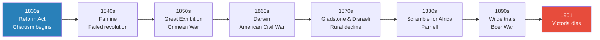
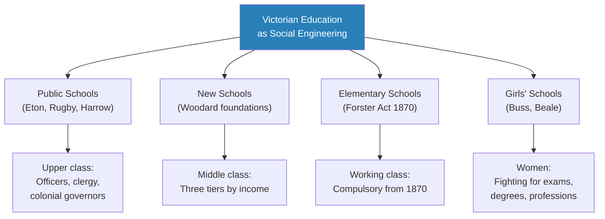
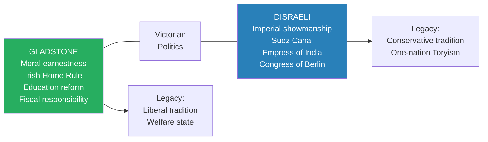
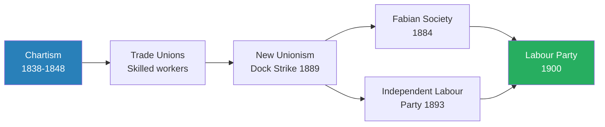
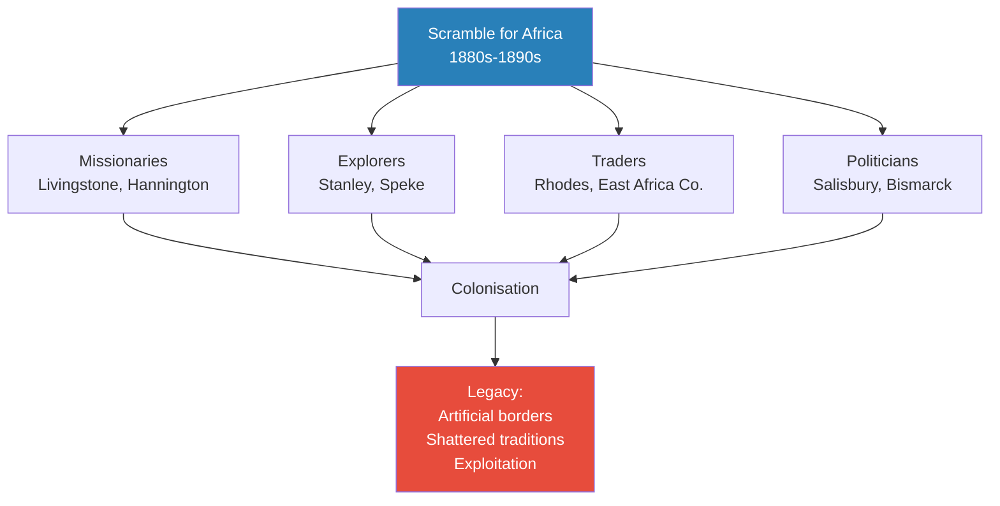
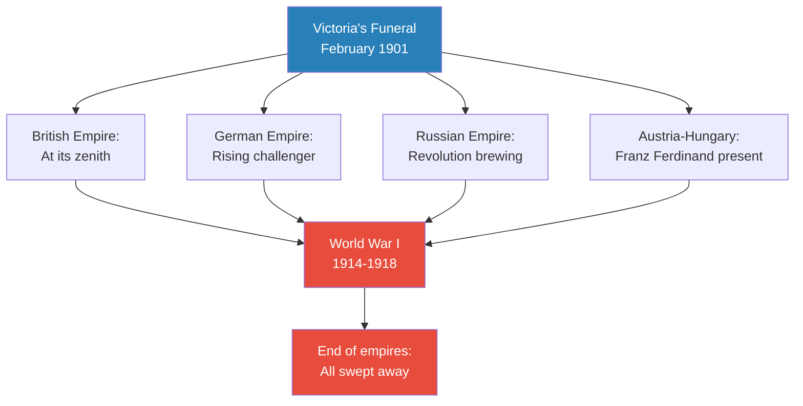
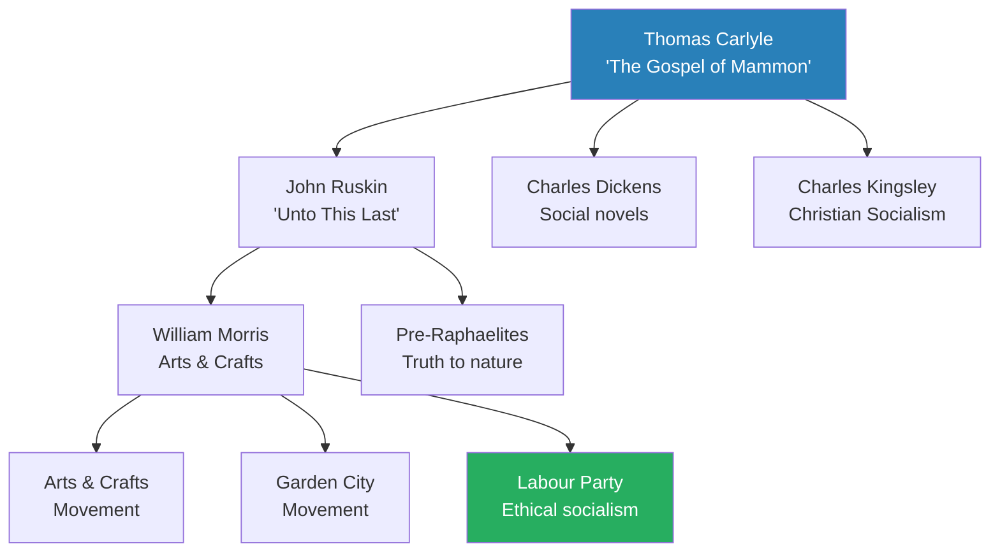
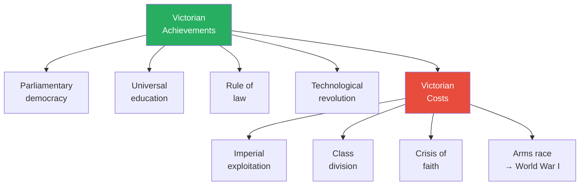

# The Victorians — A.N. Wilson

> A.N. Wilson, novelist, biographer, and one of England's most distinctive literary voices, offers not a political history of Queen Victoria's reign but a "portrait of an age" — a sweeping, opinionated, often angry account of the most radical transformation the world had ever seen. Between the burning of Parliament in 1834 and the Queen's funeral procession through the Solent in 1901, the Victorians invented the modern world: railways and factories, parliaments and public schools, global empire and global warfare, Darwin and doubt. Wilson weaves together politics, religion, art, literature, science, and the condition of the poor into a single tapestry, arguing that the Victorian legacy is double-edged — they built everything we still live in, and bequeathed us every problem we still face. The crisis of religious faith, the paradox of imperial power, the crushing of human beings by industrial capitalism, the slow painful birth of democracy: Wilson insists that none of these stories is finished. The Victorians are still with us.

---

## About the Author

A.N. Wilson was born in 1950 and educated at Rugby School and New College, Oxford — institutions whose Victorian origins he examines in the book itself. A Fellow of the Royal Society of Literature, he has published biographies of Tolstoy, C.S. Lewis, Hilaire Belloc, and Sir Walter Scott, as well as controversial studies of Jesus and St Paul. His novel sequence *The Lampitt Chronicles* explores the fading world of English country houses. Wilson brings a novelist's eye for character and a theologian's sensitivity to questions of faith, and *The Victorians* (2002) is widely regarded as the most culturally rich single-volume history of the era — less systematic than G.M. Young's classic *Portrait of an Age*, but more vivid, more personal, and far more willing to take sides.

---

## The Big Idea

- <b style="color: #27ae60">The Victorians created the modern world — and every unresolved problem within it</b>
- Before them, industrialisation was confined to a few British towns; after them, the whole world was covered with railways and factories
- Before them, democracy was the dream of a few theorists; after them, it became the inevitable political goal of all Europeans
- Before them, East was East and West was West; after them, a global empire had remade the map of Africa, Asia, and Australasia
- But Wilson refuses to tell this as a story of progress:
  - The same era that built the Crystal Palace starved a million Irish to death
  - The same civilisation that produced Tennyson and Darwin also produced the Maxim gun and the concentration camp
  - The same culture that championed individual liberty crushed individuality in its boarding schools, factories, and workhouses
- <b style="color: #e74c3c">The Victorian era felt like peace for Britain — but for the planet it was a time of almost perpetual minor warfare</b>
- Three great threads run through the book:
  - **The crisis of faith** — the slow, agonised collapse of Christianity under pressure from science, philosophy, and biblical criticism
  - **The triumph and tragedy of capitalism** — industrialisation produced staggering wealth and appalling suffering simultaneously
  - **The paradox of empire** — Britain's global dominance was built on technology and moral self-confidence, but also on racial arrogance and military violence
- Wilson's ultimate argument: the contradictions of the Victorian age are not historical curiosities — they are the contradictions we still live with

---

## Key Concepts at a Glance

| Concept | One-line summary |
|---------|-----------------|
| **The crisis of faith** | Geology, Darwin, and biblical criticism slowly destroyed the religious certainty on which Victorian morality was built |
| **The failed revolution** | Britain avoided 1848-style upheaval because its middle class was proportionately larger and more conservative than any on the continent |
| **Benthamite control** | The utilitarian drive to organise, measure, and control human life — expressed in workhouses, schools, police, and the census |
| **The Carlyle-Ruskin-Morris tradition** | A counter-current of dissent opposing industrial capitalism from the standpoint of craftsmanship, beauty, and community |
| **Technology as engine of empire** | The telegraph, railway, steamship, and Maxim gun drove imperial expansion more than political will |
| **The school as social engineering** | Public schools created and reinforced the class hierarchy while appearing to expand opportunity |
| **The Irish question** | The unresolved tension between British rule and Irish self-determination — the thread that runs through the entire era |
| **The double standard** | The gap between Victorian public morality and private behaviour — visible in sex, religion, and imperial policy alike |
| **New Unionism** | The dock strike of 1889 and the birth of organised labour as a political force |
| **The Scramble for Africa** | The sudden carving-up of the continent by European powers in the 1880s–90s, driven by technology, nationalism, and greed |
| **Broad Church** | The theological position that Christianity's essence lies in character not doctrine — an attempt to survive the crisis of faith |
| **Appearance and Reality** | The Idealist philosophical tradition (Bradley, Green) that challenged materialism — mirrored in Wilde's paradoxes |

---

*The Victorian era spans seven decades of accelerating change — from the first Reform Act to the Boer War, each decade more technologically powerful and morally conflicted than the last.*

---

---

## Part I: Early Victorian (1830s–1848)

### The World the Victorians Inherited

*Wilson opens with a masterful image: the burning of the old Parliament building in 1834, Turner painting the conflagration from a boat on the Thames, Carlyle watching from the embankment. The old world is on fire. What will replace it?*

- Britain in the 1830s was a country of roughly 25 million people undergoing the most radical transformation in human history
- <b style="color: #2980b9">The Industrial Revolution</b> had concentrated wealth in a few manufacturing towns — but also concentrated misery:
  - Children as young as six worked in factories and mines
  - Urban squalor bred cholera, typhus, and tuberculosis
  - The gap between rich and poor was widening at a pace that alarmed observers across the political spectrum
- Thomas Carlyle, the great prophet of the age, saw it all with terrible clarity:
  - He denounced laissez-faire economics as "the Gospel of Mammon"
  - He warned that a society built on cash payment alone would eventually destroy itself
  - His influence on Ruskin, Dickens, and the Christian Socialists was immense
  - Wilson considers Carlyle and Ruskin more important than any politician of the era — their tradition of moral dissent was the most honourable response to capitalism's devastation

- The condition of the poor defied easy description:
  - Charles Shaw's childhood memoir records a life in the Staffordshire potteries that reads like a Victorian Dickens novel made real — children working from dawn in temperatures that blistered their skin
  - The workhouses — redesigned by the New Poor Law of 1834 to be as unpleasant as possible — were Bentham's creation: institutions designed to make poverty so miserable that no one would choose it
  - Cholera swept through the slums with devastating regularity — the 1832 epidemic killed 32,000; the 1849 epidemic killed 62,000
  - The police force — itself a recent invention, created by Peel in 1829 — existed as much to control the poor as to prevent crime
  - Wilson draws on Henry Mayhew's extraordinary *London Labour and the London Poor* (1851) to show the sheer variety of urban misery: crossing-sweepers, mudlarks, rat-catchers, sewer-hunters, pure-finders (who collected dog excrement for the tanning industry)

> [!example] Palmerston and the Factory Children
> - Lord Shaftesbury, the great reformer, tried to enlist the foreign secretary Lord Palmerston in the cause of factory reform
> - He organised a visit to Palmerston's palatial house by a delegation of trade union leaders
> - Palmerston asked cheerfully whether conditions in factories had not improved
> - The union leaders pushed together two heavy armchairs and asked the Foreign Secretary to trundle them around his drawing room
> - He was out of breath after two circuits
> - The children in British factories, he was told, push machinery of comparable weight for the equivalent of thirty miles each day
> **The lesson:** The gap between the comfort of the governing class and the misery of the working class was not abstract — it could be measured in armchairs.

- The young Queen Victoria ascended the throne in 1837, aged eighteen:
  - Her mentor Lord Melbourne was a charming, cynical Whig aristocrat who taught her politics but not urgency
  - Her marriage to Prince Albert in 1840 brought a Germanic seriousness to the court — Albert was a moderniser who believed in science, industry, and education
  - But the monarchy was increasingly a symbol rather than a power — real authority lay with Parliament and the expanding civil service

> [!tip] Core Insight
> Wilson's opening argument is that the Victorians are "still with us" — not as ghosts but as the creators of the world we inhabit. The railways, the factories, the parliamentary system, the problems of empire and class: all are Victorian inventions that we have inherited but not resolved.

---

### Chartism and the Condition of the Poor

*The Chartist movement — demanding universal male suffrage, secret ballots, and annual parliaments — was the closest Britain came to revolution. Wilson tells its story with sympathy for the radicals and contempt for the complacency of their opponents.*

- <b style="color: #2980b9">The People's Charter</b> (1838) had six demands, all of which eventually became law — but not in the Chartists' lifetimes:
  - Universal male suffrage
  - Secret ballot
  - Annual parliaments
  - Payment of MPs
  - Equal electoral districts
  - Abolition of property qualifications for MPs
- The Chartists were driven by genuine desperation:
  - Factory children pushed machinery equivalent to walking thirty miles a day
  - The New Poor Law of 1834 — Bentham's creation — deliberately made workhouse conditions worse than the worst factory job, to discourage the poor from seeking relief
  - Cholera epidemics swept through overcrowded cities with terrifying regularity

- The movement split between "moral force" Chartists (led by William Lovett) who believed in peaceful persuasion, and "physical force" Chartists who flirted with revolution
- <b style="color: #e74c3c">The Chartist riots at Newport in 1839</b> terrified the ruling class — Macaulay saw the spectre of civil war between the propertied and unpropertied

> [!example] The Great Chartist Demonstration (10 April 1848)
> - Revolutions had swept Europe — France, Austria, Germany, Italy
> - The Chartists planned to march on Parliament with a petition bearing millions of signatures
> - The government mobilised 7,122 soldiers, 4,000 police, and an astonishing 85,000 special constables
> - The royal family was sent to the Isle of Wight; the British Museum was barricaded; the Bank of England was parapeted with sandbags
> - Only 20,000 demonstrators appeared on Kennington Common — policed by a force five times their number
> - It was the first significant historical event to be photographed — the daguerreotypes show "a scene of drizzly pathos"
> - Of the petition's signatures, two-thirds were said to be fraudulent
> **The lesson:** Britain avoided revolution not because conditions were acceptable, but because the petit-bourgeoisie was proportionately larger than in any other European country — and overwhelmingly supported the status quo.

---

### The Irish Famine

*Wilson is at his most morally passionate on the subject of Ireland. The famine, he argues, was not a natural disaster but a political choice — laissez-faire economics applied to a humanitarian catastrophe.*

- The potato blight struck in 1845 and returned repeatedly through 1852
- Over a million people died; another million emigrated — the population of Ireland dropped by a quarter
- <b style="color: #e74c3c">The British government's response was shaped by laissez-faire ideology</b>:
  - Charles Trevelyan, the Treasury official responsible for famine relief, believed that the famine was "the judgement of God on an indolent and self-indulgent people"
  - Relief was deliberately kept inadequate to avoid "demoralising" the Irish
  - Ireland continued to export food throughout the famine — grain, cattle, butter — while its people starved
- J.S. Mill proposed drastic reforms of Irish land tenure and the establishment of independent peasant properties, but was ignored
- The famine created a legacy of bitterness that would shape Irish politics for the next century and a half
- Wilson draws a direct line from the famine to Parnell, to the Easter Rising, to the Troubles
- J.S. Mill, writing during the famine, proposed drastic reforms of Irish land tenure — the establishment of independent peasant properties, answerable to no landlords, on reclaimed waste land
- He urged that the famine had come about not merely because of the failure of potato crops but because the landlord system reduced the Irish to the condition of paupers
- "What a pity he was not made the viceroy!" Wilson comments — a rare direct expression of frustration

> [!abstract] The Scale of the Irish Famine
> | Measure | Before the Famine | After the Famine |
> |---------|-------------------|------------------|
> | Population | 8.2 million (1841) | 6.6 million (1851) |
> | Deaths from starvation/disease | — | Over 1 million |
> | Emigration (1845-1855) | — | Over 1.5 million |
> | Language | Irish spoken by majority | Irish in steep decline |
> | Land ownership | 80% tenant farmers | Consolidation of estates |
> | Political legacy | O'Connell's constitutional nationalism | Bitter anti-British sentiment |

---

### Peel and the Politics of Reform

*The Age of Peel was the age of pragmatic conservatism — and Wilson gives Peel credit for creating the template that kept Britain from revolution.*

- <b style="color: #2980b9">Sir Robert Peel</b> was the architect of modern conservatism:
  - He reintroduced income tax (1842) to fund the abolition of tariffs
  - He repealed the Corn Laws in 1846 — sacrificing his own party to feed the nation
  - The repeal split the Tory party for a generation, but it established the principle of free trade that would dominate British economic policy for the rest of the century
- Peel's pragmatism was characteristic of the Victorian governing class:
  - They reformed just enough to prevent revolution — never more, never less
  - The New Poor Law, the Factory Acts, the repeal of the Corn Laws were all calculated to defuse social tension without fundamentally altering the distribution of power
  - Wilson sees this as both admirable and cynical — "the slow, creakingly slow, improvement of working conditions could be seen, by optimists, to have begun"
- The railway boom of the 1840s transformed the physical landscape:
  - Over 1,000 miles of new railway were promoted in 1836-37 alone
  - The railways broke down local isolation, created a national market, and made possible the mass movements of people and goods on which industrialisation depended
  - They also destroyed the old coaching towns and inns — a foretaste of how technology would reshape society faster than society could adapt
  - The "railway mania" of the mid-1840s was the first great speculative bubble — fortunes were made and lost
  - By 1850 there were over 6,000 miles of track; by 1870, over 15,000
  - Isambard Kingdom Brunel's Great Western Railway — linking London to Bristol, then to Exeter, Plymouth, and Cornwall — was one of the engineering marvels of the age

> [!abstract] The Victorian Transformation in Numbers
> | Measure | 1837 (Accession) | 1901 (Death) |
> |---------|-----------------|--------------|
> | Population of Britain | 25 million | 41 million |
> | Railway miles | 500 | 18,680 |
> | Literacy rate | ~60% | ~97% |
> | Electorate | 813,000 | 6.7 million |
> | British Empire (area) | 2 million sq miles | 11 million sq miles |
> | Average life expectancy | ~40 years | ~50 years |
> | Telegrams sent per year | 0 | 90 million |

---

### The Crisis of Faith Begins

*Wilson treats the slow collapse of Victorian Christianity as the defining spiritual drama of the age — not a sideshow but the central event from which all else follows.*

- <b style="color: #2980b9">The Oxford Movement</b> (1833–1845) attempted to revive the Catholic traditions of the Church of England:
  - Led by John Henry Newman, Edward Pusey, and John Keble
  - Newman's eventual conversion to Roman Catholicism in 1845 was a seismic shock
  - But the Movement distracted the Church from the far more serious threat: science
- <b style="color: #2980b9">Vestiges of the Natural History of Creation</b> (1844), published anonymously, presented a materialistic account of cosmic and biological development that made many question the existence of a Creator
- Charles Lyell's *Principles of Geology* had already shown that the earth was far older than the Bible suggested
- Tennyson's *In Memoriam* (1850) became the great poem of Victorian doubt — wrestling with the death of his friend Arthur Hallam and the terrifying implications of a godless universe:
  - "Nature, red in tooth and claw" — the phrase that haunted a generation

*Five converging forces — geological, biological, biblical, philosophical, and cultural — combined to undermine the religious certainty on which Victorian society was officially built.*

---

### John Stuart Mill and the Philosophical Foundation

*Wilson gives Mill a chapter of his own — and for good reason. Mill's influence on Victorian political thought was as pervasive as Darwin's on Victorian science.*

- <b style="color: #2980b9">John Stuart Mill</b> (1806–1873) was the pre-eminent British philosopher of the nineteenth century:
  - His father James Mill had given him the most famous education in history — Greek at three, Latin at eight, logic at twelve
  - At twenty, he suffered a nervous breakdown and discovered, through Wordsworth's poetry, that he was capable of feeling
  - He worked at the East India Company from age seventeen to fifty-two, doing his day's work in three hours and writing philosophy the rest
- *A System of Logic* (1843) attacked the "intuitionist" school that claimed some truths were self-evident:
  - Mill saw that this philosophy justified reaction in politics and superstition in religion
  - His defence of empiricism and free inquiry was a direct challenge to the Oxford and Cambridge establishment
- *On Liberty* (1859) argued that individual freedom was essential to social progress:
  - The only justification for restricting freedom was to prevent harm to others
  - <b style="color: #27ae60">Mill's great insight: there is no logical connection between free-market liberty and individual liberty</b>
- Under the influence of Harriet Taylor (whom he eventually married), Mill became a feminist and a qualified socialist
- Wilson suggests that Britain's avoidance of revolution owed something to Mill's philosophy — the patient, gradualist belief that "the general tendency is one of improvement"

---

---

## Part II: The Eighteen-Fifties

### The Great Exhibition

*The Crystal Palace — a cathedral of glass and iron designed by a gardener — was the supreme symbol of Victorian confidence. Wilson describes it with admiration but also with irony.*

- <b style="color: #2980b9">The Great Exhibition of 1851</b> was Prince Albert's brainchild:
  - 100,000 exhibits from around the world, seen by 6 million visitors
  - It was propaganda for free trade and industrial capitalism — "the world's first shopping mall," as Wilson dryly notes
- Joseph Paxton's Crystal Palace was a revolutionary building:
  - Paxton was a gardener who had designed greenhouses for the Duke of Devonshire
  - His design for the Crystal Palace was inspired by the structure of a giant lily-pad — the Victoria Regia
  - It was 1,848 feet long — the largest enclosed space in the world
  - Built of prefabricated iron and glass, it could be assembled and disassembled like a kit
- The Exhibition was a triumph, but Wilson sees the darker side:
  - The exhibits celebrated machines that were destroying the livelihoods of craftsmen
  - The wealth on display was built on the labour of factory workers, many of them children
  - The colonies were represented as sources of raw material, not as civilisations in their own right
  - Marx, who was living in poverty in Soho while the Exhibition glittered in Hyde Park, saw it as a temple to the commodity fetish

> [!example] Paxton's Crystal Palace
> - Joseph Paxton was the Duke of Devonshire's head gardener at Chatsworth
> - He had built a revolutionary greenhouse — the Great Stove — using prefabricated iron and glass
> - His inspiration for the Crystal Palace came from the Victoria Regia lily-pad — its ribbed underside suggested a structural principle that could support enormous spans of glass
> - He sketched the design on a blotting pad at a railway meeting
> - The building was 1,848 feet long — the largest enclosed space in the world — and was assembled from prefabricated parts in just nine months
> - When a committee of architects had failed to produce a suitable design, Paxton — a gardener with no formal training — stepped in and created the most revolutionary building of the century
> **The lesson:** The Crystal Palace was the perfect Victorian symbol: innovation driven by practical experience rather than theory, combining engineering genius with commercial ambition, and conceived by a self-made man rather than an establishment figure.

- The contrast between the Exhibition and the world outside its glass walls was stark:
  - In the same year, Henry Mayhew published *London Labour and the London Poor*, documenting the lives of street-sellers, beggars, prostitutes, and crossing-sweepers
  - The Great Exhibition attracted 6 million visitors; Mayhew's investigations revealed that the city those visitors returned to was a place of unimaginable squalor for millions of its inhabitants
  - Wilson sees this juxtaposition as the defining image of the 1850s: triumphant capitalism and desperate poverty, side by side

> [!tip] Core Insight
> The Great Exhibition embodied the Victorian paradox: a civilisation that could build the most beautiful structure in the world from glass and iron, yet could not feed its Irish subjects or prevent its children from working fourteen-hour days in factories.

---

### Mesmerism, Phrenology, and the Boundaries of Science

*Wilson devotes a fascinatingly digressive chapter to the Victorian obsession with pseudo-science — mesmerism, phrenology, and spiritualism — which he sees not as mere curiosities but as symptoms of a civilisation struggling to understand itself.*

- <b style="color: #2980b9">Phrenology</b> — the belief that personality could be read from the bumps of the skull — was taken seriously by eminent scientists:
  - Cranial measurements were used to "prove" the racial inferiority of non-Europeans
  - "The phrenological obsession with skulls was to be inherited by anthropologists of later generations" — feeding directly into the racial theories that justified imperial conquest
- <b style="color: #2980b9">Mesmerism</b> — a form of hypnotic healing — attracted both genuine scientists and outright charlatans:
  - Professor Elliotson at University College Hospital performed mesmeric operations — including a leg amputation at the thigh without anaesthesia, the patient feeling no pain
  - The medical establishment hounded him out — he resigned his chair and retired embittered
  - But mesmerism raised profound questions about the nature of consciousness and the relationship between mind and body
- Wilson sees these pseudo-sciences as part of the larger Victorian drama:
  - They represented the attempt to find naturalistic explanations for phenomena that had previously been attributed to God
  - The Reverend Chauncy Hare Townshend wrote that mesmerism had brought "the miraculous to the test of experience" — and that it explained "the apparently supernatural"
  - <b style="color: #27ae60">"Every fact is a theory if we did but know it" — Townshend had grasped the crucial insight that observation is never neutral</b>
- The fascination with the occult would persist throughout the century — from mesmerism through spiritualism to the Society for Psychical Research

---

### Marx, Ruskin, and the Pre-Raphaelites

*Wilson devotes one of his finest chapters to three forms of dissent from industrial capitalism: Marx's revolutionary theory, Ruskin's aesthetic and social criticism, and the Pre-Raphaelite Brotherhood's rebellion against academic painting.*

- **Karl Marx** was in the British Museum, writing *Das Kapital*:
  - He saw the same horrors as Carlyle and Ruskin but proposed a radically different solution — revolution
  - Wilson notes the irony: Marx, the great theorist of the working class, never set foot in a factory
- **John Ruskin** began as an art critic (defending Turner against the Academy) but evolved into the most influential social critic of the age:
  - He saw that aesthetic theory cannot be detached from social theory
  - The ugliness of Victorian design was a symptom of the moral ugliness of capitalism
  - <b style="color: #27ae60">"There is not a single object in all that room — common, modern, vulgar — but it becomes tragical, if rightly read"</b> — Ruskin on Hunt's *The Awakening Conscience*
  - His influence on William Morris, the Arts and Crafts movement, and eventually the Labour Party was immense

- **The Pre-Raphaelite Brotherhood** — Hunt, Millais, Rossetti — were young painters who rejected the academic painting rules of the Royal Academy:
  - They painted with crystalline detail, vivid colour, and emotional intensity
  - Their subjects were often "fallen women," religious doubt, and the collision between beauty and commerce
  - The women who modelled for them — Elizabeth Siddal, Fanny Cornforth, Annie Miller — became the most recognisable faces of the nineteenth century
  - Wilson gives these women their full due:
    - **Elizabeth Siddal** — a milliner's assistant from Southwark who posed as Ophelia in a bath for Millais (her father "taking strong exception, since she might have died of hypothermia"). She had translucent skin, freckles, and abundant red hair. She married Rossetti but died of a drug overdose; he painted her from memory as *Beata Beatrix*
    - **Fanny Cornforth** — a prostitute who flicked a nutshell at Rossetti in a bar and became his housekeeper and muse for years. "Vulgar, pouting, sensual and strong"
    - **Annie Miller** — a teenage barmaid found by Hunt swabbing beer and spit off the pub floor, barefoot, with red-gold hair in "flaming ropes." She became Hunt's fiancee, Rossetti's mistress, and one of the most successful models of the day
  - Wilson sees in these women's stories a larger truth: "In an age where everything was up for sale, the exporters and importers did not stop at hair itself" — great quantities of hair were imported from Europe, and hair thieves would set upon young women to shear them

> [!example] The Hair Harvest
> - Hair was so valuable a commodity that an annual "harvest" took place in Italian villages
> - 200,000 lb of hair were sold annually in the Paris markets at 10s. to 12s. per ounce
> - "We saw several girls," noted one observer, "sheared, one after the other like sheep, and as many more standing ready for the shears"
> - Hair thieves who set upon young women "always kept on the safe side of the law, apart from the robbery of the hair"
> **The lesson:** Even the most intimate aspects of Victorian life — a woman's hair — were subject to the commodifying logic of capitalism.

> [!example] Ruskin, Effie, and Millais at Glenfinlas (1853)
> - Ruskin invited the young painter Millais to Scotland to paint his portrait by a waterfall
> - During a wet summer, Millais and Ruskin's wife Effie fell in love
> - Millais discovered that Ruskin had never consummated the marriage — "he had imagined women were quite different to what he saw I was"
> - Effie's family intervened; the marriage was annulled; Effie married Millais and bore him eight children
> - Ruskin remained one of the great men of the century, but the scandal haunted him
> **The lesson:** The private agonies of even the most public Victorians reveal the gulf between the era's moral ideals and its human realities.

---

### The Crimean War

*Wilson treats the Crimean War as a paradigm of Victorian imperial folly — a war fought for obscure religious reasons, managed with aristocratic incompetence, and remembered chiefly for its unintended consequences.*

- The war began as a dispute over Christian holy sites in Jerusalem:
  - Napoleon III demanded the keys to the church at Bethlehem for French clergy
  - The Tsar demanded a protectorate over all Christians in the Ottoman Empire
  - Britain convinced itself that Russian expansion threatened the route to India
- <b style="color: #e74c3c">The war was a catastrophe of mismanagement</b>:
  - The army was led by aristocratic officers, "most of them buffoons"
  - The common soldiers were working-class men driven to the army by poverty
  - Florence Nightingale's reforms of military nursing were born from the horror of what she found at Scutari
- Wilson recounts one of the war's most extraordinary moments — the post-battle dinner:
  - Having reduced Balaclava to rubble with great loss of life, the British invited the Russian commanders to dinner
  - M. Soyer, the French chef, prepared a twenty-four-person luncheon: filets de turbot, cotelettes de mouton, poulets demi-rotis, plum-pudding a la Exeter
  - "At ten to the minute, the Russians arrived. After the introduction, the guests sat down, and every jaw was soon doing its best; for in less than twenty minutes there were only the names of the various dishes to be seen"
  - The Russian general, who had only one arm, "ate as much as two men with the use of both"
  - Wilson uses this scene to capture the surreal quality of Victorian warfare: the carnage and the ceremony, the killing and the courtesy, existing in the same paragraph

- Wilson is most interested in the war's unintended consequences:
  - It was the first war covered by journalists (W.H. Russell of *The Times*) and photographers (Roger Fenton)
  - It led to fiscal reforms that created the modern taxation system
  - And its most lasting legacy: a Scotsman called Robert Peacock Gloag saw Turks smoking cigarettes in the Crimea and brought the habit back to Britain, founding an industry that would addict the working class for the next 150 years

---

### The Crimean War's Strangest Legacy: The Cigarette

*One of Wilson's most distinctive passages traces an unlikely consequence of the war — the introduction of cigarettes to Britain — and uses it to illuminate the way technology and addiction reshaped Victorian life.*

- A Scotsman called Robert Peacock Gloag saw Turks and Russians smoking cigarettes in the Crimea:
  - He brought the habit back to London, founding a cottage industry in Peckham
  - His first cigarettes were cylinders of straw-coloured paper with strong Latakia tobacco
  - By 1860, a Greek captain in the Russian army had set up a shop in Leicester Square selling Turkish cigarettes
  - Gloag's "Don Alfonso" sold in bundles of 25 for 1 shilling
- In 1883, the Bristol firm W.D. & H.O. Wills pioneered the Bonsack cigarette-making machine:
  - It manufactured approximately 200 cigarettes per minute
  - A price war in the 1880s produced "penny cigarettes"
  - Wild Woodbine appeared in 1888 — destined to be the cigarette of the trenches a quarter-century later
  - Wills's profits rocketed from £6.5 million in 1884 to nearly £127 million in 1891
- Wilson notes that the health dangers were recognised from the beginning:
  - An army surgeon attributed the decline of the Ottoman Empire to the Turkish fondness for cigarettes
  - An American contemporary noted that "the slave of tobacco is seldom found reclaimable"
  - But social attitudes changed to accommodate the addiction — smoking was first allowed in railway carriages in 1860; in London clubs not until the 1880s
- <b style="color: #27ae60">Wilson's characteristically wry conclusion: "When the Turkish, Russian and British empires are now as obsolete as the Bonapartist dynasty, the British working class, 146 years after the treaty of Paris, are still addicts of what Gloag brought home"</b>
- The cigarette story illustrates a larger Victorian theme: technology creates its own demand, and once a new product or habit is introduced, it becomes self-sustaining regardless of its consequences

---

### Florence Nightingale and the Birth of Modern Nursing

*From the disaster of the Crimean War, Wilson extracts a story of transformation — the creation of professional nursing out of chaos and death.*

- Florence Nightingale arrived at Scutari in November 1854 with thirty-eight nurses:
  - She found a hospital that was itself a death trap — the drains were blocked, the water supply contaminated, the wards infested with rats and fleas
  - More soldiers died of disease than of wounds — and Nightingale's insistence on sanitation and hygiene gradually reversed the mortality rate
  - Her use of statistics to demonstrate the connection between sanitation and survival was revolutionary — she was, in Wilson's phrase, one of the first data-driven reformers
- But Wilson insists on a less familiar name: <b style="color: #2980b9">Mary Seacole</b>, a Jamaican-born nurse who funded her own journey to the Crimea:
  - She set up the "British Hotel" near the front lines, providing food, medicine, and comfort to soldiers
  - She was refused a place on Nightingale's expedition — probably because of her race
  - Her memoir, *Wonderful Adventures of Mrs Seacole in Many Lands* (1857), is one of the great autobiographies of the century
- Nightingale founded her school of nursing in 1857 — providing a template for women's professional independence:
  - If women could nurse soldiers, they could do other professional work
  - The connection between nursing reform and the women's movement was direct

---

### War Photography and the Rise of Journalism

*Wilson traces two unintended consequences of the Crimean War — the birth of war photography and the rise of war journalism — that would transform how societies experienced conflict.*

- <b style="color: #2980b9">Roger Fenton</b> photographed the Crimean War using wet-plate collodion technology:
  - Exposure took between three and twenty seconds — action shots were impossible
  - His photographs show soldiers frozen in stillness, "staring at us just as much as we stare at them"
  - The technology required a specially covered van as a darkroom; in the Crimean heat, the plates dried almost instantly
- **W.H. Russell** of *The Times* was the first modern war correspondent:
  - His dispatches from the front revealed the incompetence of the high command and the suffering of the common soldier
  - They caused a political earthquake at home — contributing to the fall of Aberdeen's government
- Wilson sees these innovations as double-edged:
  - Photography and journalism made the reality of war visible to the public for the first time
  - But they also made war a spectator sport — "an armchair war, fought, as far as the English bourgeoisie was concerned, by classes as remote from their own lives as the Sultan"
  - <b style="color: #27ae60">The tension between war as reality and war as entertainment would intensify through the rest of the century — and beyond</b>

---

### India 1857–9: The Mutiny

*Wilson's chapter on the Indian Mutiny is one of his most powerful — he presents it not as a military rebellion but as a revolt against the Modern.*

- The immediate cause was the greased cartridges of the new Enfield rifle:
  - Sepoys had to bite off the cartridge end before loading
  - Rumours spread that the grease was made from beef fat (offensive to Hindus) and pork fat (offensive to Muslims)
  - The rumours were partly true — forbidden fats had indeed been used in some cases
- But the deeper causes were the systematic humiliation of Indian tradition:
  - Lord Dalhousie's "modernising" reforms had confiscated Indian property, ignored caste distinctions, and imposed Western education
  - Evangelical missionaries openly denigrated Hinduism — Wilberforce said he put the conversion of India "before Abolition"
  - The sepoys' revolt was "very much a revolt against the Modern"

> [!example] The Meerut Mutiny (9–10 May 1857)
> - Eighty-five sepoy troops were publicly stripped of their uniforms and manacled for refusing to use the new cartridges
> - A native officer warned Lieutenant Gough that mutiny would break out the next day
> - Gough reported this to Colonel Carmichael Smyth, who reproved him for "listening to such idle words"
> - The mutiny erupted the following evening — fires, looting, fifty Europeans killed
> - The sepoys released their manacled comrades from prison and rode towards Delhi
> **The lesson:** Wilson draws a devastating parallel — the sepoys had more in common with English hand-loom weavers displaced by machines, with Irish peasants starved by laissez-faire, and with Chartists petitioning for a share of the freedoms the March of the Modern had taken away.

- <b style="color: #e74c3c">The British reprisals were horrifying</b>:
  - Mutineers were blown from cannon — tied to the mouths of guns and blasted apart
  - Suspects were hanged without trial; entire villages were burned
  - The violence of the suppression was far worse than anything the mutineers had done
  - Wilson does not flinch from these details — they are essential to understanding the moral cost of empire
  - The British convinced themselves that the Mutiny justified permanent military dominance: the ratio of European to Indian soldiers was raised to about half by the mid-1860s
- But Wilson also sees something deeper in the Mutiny:
  - The sepoys who refused to bite the greased cartridges were defending their religion against a modernising project that despised it
  - The British under Dalhousie had taken over Indian property, ignored caste distinctions, and imposed Western education and Christian missionaries
  - Wilberforce had said he put the conversion of India "before Abolition" — the moral crusade against slavery and the moral crusade to Christianise India were two faces of the same imperial arrogance
  - <b style="color: #27ae60">Wilson's most striking comparison: the sepoys had more in common with English hand-loom weavers, with Irish peasants starved by laissez-faire, and with Chartists petitioning for freedom, than they did with the stereotypical "native rebel"</b>
  - All were victims of the March of the Modern — the unstoppable force of capitalism, technology, and Benthamite control that defined the Victorian age

---

### Prince Albert's Death and the Weight of Grief

*Wilson marks Albert's death in 1861 as a turning point — not just for the Queen but for the tone of the entire era.*

- Prince Albert died on 14 December 1861, probably of typhoid fever, aged forty-two
- Victoria was devastated:
  - She wore black for the remaining forty years of her life
  - She withdrew from public life, earning the nickname "the Widow of Windsor"
  - She irrationally blamed their son Bertie — Albert had travelled to Cambridge to rebuke the young prince for an affair with an actress just before falling ill
- Albert's death coincided with the publication of Darwin's *On the Origin of Species* (1859) — the two events together created a mood of loss and doubt that pervaded the 1860s:
  - If God's design was an illusion, what consolation was there for bereavement?
  - <b style="color: #e74c3c">Lord Shaftesbury watched Lord Melbourne die "without giving any sign" — "It was not the death of a heathen; he would have had an image or a ceremony. It was the death of an animal"</b>
  - The fear that humanity was no more than an animal haunted the rest of the century
- Tennyson, the Poet Laureate, became the voice of this grief — his *In Memoriam* had already wrestled with the implications of a universe "red in tooth and claw"
- Wilson sees the Queen's grief as paradigmatic: an entire civilisation mourning not just a man but a certainty — the certainty that the universe was designed, that suffering had meaning, that death was not the end

- The 1860s saw the death of several great Victorians — each marking the passing of a generation:
  - **Lord Palmerston** died in 1865 — the last prime minister born in the eighteenth century, the embodiment of aristocratic confidence
  - **Abraham Lincoln** was assassinated in 1865 — the American Civil War, which had divided British opinion (Gladstone supported the Confederacy, the working class largely supported the Union), was over
  - **Charles Dickens** died in 1870 — the man who had done more than anyone to make the Victorians see the poor as human beings
  - **John Stuart Mill** died in 1873 — the philosopher who had tried to give Victorian society both liberty and security
- Wilson uses these deaths to mark a transition: the Early Victorians — the generation that had known the world before railways, before Darwin, before the Crystal Palace — were gone. What replaced them was a harder, more cynical, more imperial civilisation

- Wilson also marks 1867 — the year of the Second Reform Act — as a watershed:
  - Disraeli's Reform Act nearly doubled the electorate, giving the vote to most urban working men
  - Lord Derby, the prime minister, called it "a leap in the dark"
  - Robert Lowe, the Liberal opponent of reform, warned: "We must now educate our masters" — hence the Education Act of 1870
  - Wilson sees 1867 as the moment when Britain committed itself to democracy — reluctantly, nervously, and with no idea where it would lead
  - The Representation of the People Act of 1884 would extend the vote further; but women would wait until 1918
  - <b style="color: #27ae60">Democracy, like industrialisation and empire, was a Victorian invention that its creators could not entirely control</b>

> [!example] Dickens's Final Reading (March 1870)
> - Charles Dickens gave his last public reading at St James's Hall, London, on 15 March 1870
> - He was visibly ill — his left foot dragged, and he had trouble speaking certain words
> - He read the death of Little Nell and the trial from *Pickwick Papers*
> - When he finished, the audience rose in a standing ovation
> - He died three months later, on 9 June 1870, of a stroke — aged fifty-eight
> - He was buried in Westminster Abbey, against his own wishes for a quiet funeral
> **The lesson:** Wilson uses Dickens's death to mark the passing of the early Victorian generation — the men and women who had grown up before the railway, before Darwin, before the Crystal Palace.

---

---

## Part III: The Eighteen-Sixties

### Race, Empire, and Governor Eyre

*The 1860s saw British attitudes to race coarsen dramatically. Wilson traces this through the American Civil War, the Governor Eyre controversy, and the emergence of "scientific" racism.*

- The <b style="color: #2980b9">Governor Eyre controversy</b> (1865) split Victorian intellectual life down the middle:
  - After a rebellion in Jamaica, Governor Eyre declared martial law and authorised mass floggings, burnings, and hangings — over 400 killed
  - George William Gordon, a mixed-race politician, was hanged after a sham court martial
  - Carlyle, Tennyson, Dickens, and Kingsley defended Eyre
  - Mill, Huxley, Darwin, and Spencer condemned him
- Wilson sees this as a turning point: "The nation which at the beginning of the century had prided itself on the moral beauty of the anti-slavery cause had the greatest sympathy with a man who had flogged, tortured, burned and hanged the descendants of slaves"
- The controversy divided the intellectual elite with extraordinary sharpness:
  - On Eyre's side: Carlyle ("the English nation never loved anarchy"), Tennyson, Ruskin, Dickens, Kingsley
  - Against Eyre: Mill, Huxley, Darwin, Spencer, and the Jamaica Committee
  - For Carlyle, the issue was order vs chaos; for Mill, the rule of law
  - "Who are to be our masters: the Queen's Judges and a jury of our countrymen, or three military officers administering no law at all?"
  - The magistrates rejected the murder charges; Parliament voted Eyre a pension
- Tennyson to Gladstone: "We are too tender to our savages ... niggers are tigers, niggers are tigers"
- <b style="color: #e74c3c">The coarsening of racial attitudes in the 1860s paved the way for the Scramble for Africa</b>

---

### The World of School

*Wilson's chapter on Victorian education is one of his longest and most penetrating — he sees the boarding school as a microcosm of everything the Victorians did: social engineering disguised as moral improvement.*

- <b style="color: #2980b9">Thomas Arnold of Rugby</b> (headmaster 1828–1842) is generally credited with inventing the public-school ethos:
  - His aim: "to form Christian men" — combining classical education with muscular piety
  - His real achievement: creating a system by which the bourgeoisie could acquire the attitudes and speech patterns of the aristocracy
  - Arnold closed the free lower school at Rugby so that the poor could not attend — education became a tool of class separation

- *Tom Brown's Schooldays* (1857) by Thomas Hughes was the archetypal school story:
  - Sold 28,000 copies in five years — a sensation
  - Its message: individuality must be crushed into team spirit
  - "It's more than a game. It's an institution," Tom says of cricket — equating sport with habeas corpus and trial by jury

- The hidden world of the public schools was far darker than the novels suggested:
  - Sexual abuse was endemic — every pretty boy was given a girl's name
  - Flogging was ubiquitous and, for some, sexually charged
  - Swinburne's overwhelming obsession with flagellation appears to be a compulsive repetition of the Eton floggings of his boyhood

> [!example] Vaughan's Secret at Harrow
> - Charles John Vaughan, headmaster of Harrow, was one of the most revered teachers in England
> - He increased the school's numbers from 60 to over 200 and was offered the bishopric of Rochester
> - Then he suddenly resigned, refused the bishopric, and spent the rest of his career in obscure parishes
> - He left "a strict injunction that no life of him should be published"
> - The truth: in 1851, a boy named Alfred Pretor had confided to John Addington Symonds that he was having an affair with the headmaster
> - Symonds eventually told his father, a doctor, who forced Vaughan to resign under threat of exposure
> - The secret was kept for over a century — "a good example of the brilliance with which the Victorian public-school classes could close ranks"
> **The lesson:** The boarding school's culture of secrecy, hierarchy, and institutional loyalty produced both the Empire's administrators and its most painful hypocrisies.

- The hidden world of the public schools was far darker than the novels suggested — and Wilson devotes some of his most penetrating pages to the sexual and emotional atmosphere:
  - Dean Farrar's *Eric, or, Little by Little* — "the kind of book Dr Arnold might have written had he taken to drink" — is an extended allegory about masturbation
  - The unnamed sin that destroys Eric begins with "filthy talk in dormitory No. 7" and ends with death
  - Farrar's sermon on Kibroth-Hathaavah (the burial ground of those who have lusted) makes the meaning unmistakably clear: "Many and many a young Englishman has perished there!"
  - Meanwhile, the school where Farrar was actually teaching — Harrow — was "a hotbed of homosexual bullying, where every pretty boy was given a girl's name"
  - The school story was "one of the most distinctive of Victorian contributions to literature" — there are no school stories before the nineteenth century
  - Wilson sees the boarding school as "a paradigm of the inner life, the waking nightmare that we will be snatched from the emotional comforts of home and thrust into the hardship of a single-sex institutionalized existence"
  - Tom Brown's Schooldays sold 28,000 copies by 1862; Eric sold comparably well — the appetite for these stories was insatiable

- The <b style="color: #2980b9">Clarendon Commission</b> (1861-1864) investigated the public schools:
  - 130 witnesses were interviewed over three years
  - The central question was whether science should be taught — but the real question was class
  - The headmaster of Shrewsbury declared that natural sciences "do not furnish a basis for education"
  - The Earl of Ellenborough warned that science examinations could lead to tradesmen's sons succeeding against "the sons of army widows who had learned truth and honour at home"
  - The Public Schools Act of 1868 took over any remaining endowments for poor pupils and gave them to the rich schools
  - In Sutton Coldfield, £15,000 was plundered from the old charitable foundation to provide a "high school for well-to-do children"
  - <b style="color: #e74c3c">Wilson's verdict: "the schools had begun the process of social segregation on which Victorian England very largely depended"</b>

- Canon Nathaniel Woodard (1811-1891) made the class hierarchy explicit:
  - He founded sixteen schools, divided into three classes by parental income
  - First-class schools (like Lancing) for gentlemen; second-class for "respectable tradefolk"; third-class for publicans and gin-palace keepers
  - "Such is the eagerness of the socially mobile that the publicans were only too happy to send their sons to the third-class Woodard schools, knowing that within three generations they could even have escaped the Woodard group altogether"

- **Women's education** was fought for against fierce resistance:
  - Frances Mary Buss opened the North London Collegiate School in 1850
  - Dorothea Beale became principal of Cheltenham Ladies' College in 1858
  - The Cambridge Syndicate initially refused to let girls sit examinations
  - When Charlotte Scott came eighth in the mathematics tripos at Girton, she was denied the title "eighth wrangler" because she was female — feminists in the Senate House chanted "Scott of Girton! Scott of Girton!"

*The Victorians invented education as we know it — formalised, institutionalised, compulsory — but they designed it to reinforce the class system, not to dissolve it.*

---

### Charles Kingsley: The Complete Victorian

*Wilson gives Kingsley a chapter to himself because he embodies so many Victorian contradictions in one person — parson, novelist, naturalist, Christian socialist, sexual eccentric, supporter of Governor Eyre, friend of Darwin.*

- Kingsley was rector of Eversley in Hampshire for thirty years:
  - He hid clay pipes in bushes around the parish in case the need to smoke overcame him while visiting parishioners
  - He was "a keen sportsman, naturalist, countryman" — his funeral was attended by the Bramshill Hunt, complete with horses and hounds
- *The Water-Babies* (1863) was dashed off in an hour and helped abolish child chimney-sweeping within a year of publication
- <b style="color: #27ae60">His response to Darwin was characteristic: "If Darwin speaks the truth, he is orthodox"</b> — because "God's orthodoxy is truth"

- But Kingsley's most extraordinary aspect was his marriage:
  - His wife Fanny wrote before their wedding: "After tea we will go up to rest! We will undress and bathe and then you will come to my room ... Oh! What solemn bliss!"
  - Their shared eroticism drew on Catholic imagery — the marriage bed was "our altar ... there you should be the victim I the priest"
  - Kingsley's erotic drawings, only published in the late twentieth century, depict naked figures roped to crosses
  - This is not hypocrisy — Wilson argues it reveals how deeply intertwined Victorian religiosity and sexuality were

- The Kingsley-Newman controversy arose from Kingsley's casual accusation that "truth for its own sake had never been a virtue with the Roman clergy"
  - Newman responded with the *Apologia Pro Vita Sua* — one of the great autobiographies in English
  - Wilson's sympathies are with Kingsley's straightforwardness rather than Newman's serpentine evasions
  - But Wilson also recognises the gulf of temperament: "In him and all that school, there is an element of foppery — even in dress and manner; a fastidious, maundering, die-away effeminacy, which is mistaken for purity and refinement; and I confess myself unable to cope with it" — Kingsley on Newman
  - The controversy illuminated a deep fault line in Victorian religion: between those who valued sincerity above all (Kingsley) and those who valued subtlety (Newman)
  - Wilson provocatively suggests that Newman's intellectual brilliance was inseparable from his evasiveness — that the same mind that produced the *Apologia* also produced arguments for the flight of the Holy House from Nazareth to Loreto

- Behind the Kingsley-Newman spat lay the deeper Victorian anxiety about Catholicism:
  - Protestant propaganda depicted convents as sites of sexual perversion: "Take that thing off," said the Mother Superior. "I cannot, Reverend Mother, it's too tight"
  - The belief that Catholicism went "naturally and hand in hand with sexual perversion" was widespread
  - And there was the additional fear that convents were after the family's money: "no Sister leaving the Sisterhood shall have any right to any portion of the money or property which she has given to it"
  - Wilson sees anti-Catholic prejudice as one of the few things that united Victorians across class lines — Evangelicals, Broad Church, and secularists could all agree that "Romanism" was dangerous
- But the deepest irony was that Kingsley's own sexuality — with its crucifixes, its naked flagellation, its erotic drawings of saints — was far closer to the Catholic tradition he denounced than to the muscular Protestantism he professed
- The Victorian relationship with Catholicism was a mirror of its relationship with sex: publicly horrified, privately fascinated, and incapable of honest self-examination

---

### The Newman-Kingsley Legacy

- Wilson makes the provocative argument that Manning was a greater man than Newman:
  - Newman wrote beautifully and thought subtly — but he retreated into the Oratory at Birmingham and spent decades in what Wilson considers an intellectual dead end
  - Manning was Archbishop of Westminster, mediator of the dock strike, champion of the poor, and the most effective social reformer in the Catholic hierarchy
  - "It seems incomprehensible to me that Cardinal Newman is generally esteemed more highly today than Cardinal Manning"
  - The preference for Newman over Manning, Wilson implies, reflects the Victorian tendency to value eloquence over action — to admire the man who wrote *The Dream of Gerontius* rather than the man who fed the dockers
  - Newman's return to Oxford in old age produced one of Wilson's finest vignettes: the frail cardinal in his scarlet robes, walking into the Oriel Common Room after forty years' absence, and bursting into tears. The old provost, Phelps, "stalked forward and vigorously shook him by the hand with the words, 'Well done, Newman, well done!'"

---

---

## Part IV: The Eighteen-Seventies

### Gladstone's First Premiership: The Age of Reform

*Wilson traces Gladstone's first government (1868-1874) as the great era of Liberal reform — an attempt to remake Britain's institutions for a democratic age.*

- <b style="color: #2980b9">William Ewart Gladstone</b> — the greatest Liberal statesman of the century:
  - A product of Eton and Christ Church, he was obsessed by his old school to his dying day
  - His first premiership (1868-1874) was a whirlwind of reform:
    - Irish Church disestablishment (1869) — removing the Protestant Church's privileged status in a Catholic country
    - The Education Act of 1870 (Forster's Act) — creating a national system of elementary schools
    - Army reform — abolishing the purchase of commissions, opening the officer class to talent rather than wealth
    - Civil service reform — examinations replaced patronage
  - He walked the streets of London at night to "rescue" prostitutes, a practice that unsurprisingly attracted suspicion
  - His diaries record these encounters in agonised detail, often followed by self-flagellation
  - His conversion to Irish Home Rule in the 1880s would split the Liberal Party

- The <b style="color: #2980b9">Education Act of 1870</b> was perhaps the most consequential reform:
  - For the first time, every child in England and Wales was entitled to an elementary education
  - Wilson sees it as the culmination of the Benthamite project — "Having exercised their sway over the poor, the criminals, the agricultural and industrial classes, the controllers had turned to the last potential anarchists: the children"

- <b style="color: #2980b9">Benjamin Disraeli</b> — Gladstone's antithesis in every respect:
  - A Jewish-born novelist who remade himself as a Tory aristocrat
  - His famous quip on evolution: he was "on the side of the angels" rather than the apes
  - Where Gladstone was morally earnest, Disraeli was theatrically cynical
  - Where Gladstone reformed institutions, Disraeli dazzled the public with imperial spectacle
  - Wilson treats Disraeli with more scepticism than admiration — the imperial posturing disguised a lack of domestic reform
  - But he acknowledges Disraeli's political genius: he understood, as Gladstone never quite did, that democracy was a matter of sentiment as much as policy
  - The rivalry between the two men defined Victorian politics for a generation:
    - Gladstone saw politics as a moral crusade; Disraeli saw it as a performance
    - Gladstone believed in progress through reform; Disraeli believed in the mystique of tradition
    - Their personal antipathy was legendary — Disraeli called Gladstone "a sophistical rhetorician, inebriated with the exuberance of his own verbosity"
    - Victoria loathed Gladstone ("He speaks to me as if I was a public meeting") and adored Disraeli ("Everyone likes flattery; and when you come to royalty you should lay it on with a trowel")

*The Gladstone-Disraeli rivalry defined the terms of British politics for a century — moral reform vs national prestige, progress vs tradition, the taxpayer vs the empire.*

---

### Dostoyevsky, Wagner, and the Irrational

*Wilson devotes a remarkable chapter to three cultural phenomena of the 1870s that anticipated the catastrophes of the twentieth century.*

- **Fyodor Dostoyevsky's** *The Devils* (1872) was, in Wilson's reading, "a prophetic work":
  - It depicts a group of nihilistic revolutionaries who destroy a provincial Russian town — not from conviction but from a compulsive need for destruction
  - Wilson sees in Dostoyevsky a prophecy of the terrorism, totalitarianism, and irrational violence of the twentieth century
  - The Russian novelist understood something that the rational, utilitarian English could not: that human beings are capable of choosing evil for its own sake
  - <b style="color: #e74c3c">"Much of the technological advance of the 1880s could be seen as a blind march to murder, arson, mayhem"</b> — Wilson quotes Dostoyevsky as the counter-voice to Victorian optimism

- **Richard Wagner** represented the cult of the irrational in music:
  - His operas — vast, mythological, overwhelming — were the antithesis of Gilbert and Sullivan's gentle satire
  - Wagner's vision of the *Gotterdammerung* — the twilight of the gods — was a musical prophecy of the destruction that awaited European civilisation
  - Wilson notes that the same culture that produced Pinafore was heading for the most devastating war in history

- The contrast between English and Continental culture was stark:
  - England had Gilbert and Sullivan — amusing, conservative, reassuring
  - Germany had Wagner — apocalyptic, irrational, intoxicating
  - Russia had Dostoyevsky — prophetic, nihilistic, terrifying
  - <b style="color: #27ae60">Wilson suggests that English culture's failure to take the irrational seriously — its preference for wit over depth — was both its charm and its blind spot</b>

---

### Darwin and the Side of the Angels

*Wilson weaves Darwin into the narrative of the entire era rather than confining him to a single chapter — but the 1870s saw the most intense phase of the conflict between evolution and faith.*

- <b style="color: #27ae60">Darwin's *On the Origin of Species* (1859) was the most revolutionary book of the century</b>:
  - It destroyed the argument from design — the idea that the complexity of nature proved the existence of a Designer
  - It implied that humanity was not a special creation but the product of the same blind process that created every other species
  - For Christians like Lord Shaftesbury, removing the truth of Christianity destroyed "the very reason for believing in virtue itself"
- Darwin himself agonised over the implications of his theory:
  - He delayed publication for twenty years, partly from fear of the social consequences
  - He knew that if doubt "spread to the working classes," the social glue of deference would dissolve
- The famous confrontation between Bishop Wilberforce and Thomas Huxley at the Oxford Museum in 1860 — Wilberforce asking whether Huxley was descended from an ape on his grandfather's or grandmother's side — became a founding myth of the science-vs-religion narrative
  - Wilson is characteristically nuanced: the real story is more complicated, and the Broad Church tradition (Stanley, Maurice, Kingsley) tried to accommodate both
- The theological implications went far beyond biology:
  - If natural selection was the mechanism of creation, then suffering and death were not punishments for sin but the raw material of progress
  - The fittest survived — but what about the unfit? The poor, the sick, the disabled?
  - Social Darwinism — the application of evolutionary theory to human society — would provide a pseudo-scientific justification for every form of inequality
  - Herbert Spencer, not Darwin, coined the phrase "survival of the fittest" — and used it to argue against welfare for the poor
  - Wilson sees this as one of the most dangerous legacies of the century: the corruption of a scientific theory into an ideology of indifference

### Disraeli and the Imperial Imagination

*Wilson portrays Disraeli as the showman of empire — a man who understood the theatrical power of imperialism better than its costs.*

- Disraeli's second premiership (1874–1880) was defined by imperial spectacle:
  - He purchased the Suez Canal shares from the bankrupt Khedive of Egypt for £4 million — a masterstroke that gave Britain control of the route to India
  - He made Victoria "Empress of India" in 1876 — the Queen was delighted; Gladstone was disgusted
  - At the Congress of Berlin (1878), he faced down Bismarck and the Tsar over the "Eastern Question" — the future of the crumbling Ottoman Empire
- But Wilson is sceptical of the Disraelian myth:
  - The purchase of the Suez Canal shares was a gamble with public money, not a strategic masterpiece
  - The title "Empress of India" was empty symbolism — it changed nothing on the ground
  - The Congress of Berlin stored up problems that would explode in 1914
- <b style="color: #e74c3c">The Zulu War of 1879</b> revealed the limits of imperial power:
  - At Isandlwana, a Zulu army annihilated a British force of 1,300 — one of the worst defeats in British colonial history
  - The defence of Rorke's Drift — eleven Victoria Crosses in a single night — became a legend of imperial heroism
  - But Wilson notes the disproportion: the British came to South Africa with rifles and cannon; the Zulus fought with assegais and cowhide shields
  - The subsequent destruction of the Zulu kingdom was not a victory of civilisation over savagery but of technology over courage

> [!example] Disraeli at the Congress of Berlin (1878)
> - The Eastern Question — what to do about the declining Ottoman Empire — had dominated European diplomacy for decades
> - Russia had defeated Turkey in 1877 and imposed the Treaty of San Stefano, creating a large pro-Russian Bulgaria
> - Disraeli saw this as a threat to British interests and demanded a European congress
> - At Berlin, the seventy-three-year-old prime minister (in failing health, barely able to climb stairs) faced Bismarck and the Russian chancellor Gorchakov
> - He secured Cyprus for Britain, reduced Bulgaria to a manageable size, and returned home to announce "Peace with Honour"
> - Gladstone denounced the whole affair as moral bankruptcy — particularly the British silence on Ottoman atrocities against Bulgarian Christians
> **The lesson:** Wilson sees Disraeli's triumph as hollow — the "peace with honour" stored up every problem that would lead to the First World War.

---

### The Decline of Rural England

*One of Wilson's most personal chapters imagines himself as a Victorian country parson — and then shows the economic catastrophe that was destroying the world that parson inhabited.*

- The abolition of the Corn Laws in 1846 had been supposed to bring prosperity through free trade
- Instead, by the 1870s, cheap American grain was flooding British markets:
  - Wheat fell from 56s. 9d. per quarter in 1877 to 46s. 5d. in 1878
  - By the 1880s, Britain imported 65% of its wheat
  - Nearly a million workers left the land — by emigration or by moving to industrial towns
- Natural disasters compounded the economic crisis:
  - Cattle plague in 1865–6 and 1877
  - Liver-rot killed 4 million sheep in the early 1880s
  - Floods devastated arable farmers from 1878 to 1882
- <b style="color: #e74c3c">Half the entire country was owned by 4,217 persons in 1873</b>
- The agricultural poor lived at levels of subsistence barely imaginable:
  - Child labourers as young as six earned 1s. per week
  - Highland crofters survived on as little as £8 a year
  - When the Earl of Yarborough died in 1875, his stock of cigars was sold for £850 — more than eighteen years' income for his agricultural labourers
  - Women in the agricultural gangs were forced to drug their babies with opium and leave them in hedgerows while they worked
  - The Gangs Act of 1869 set a minimum age of eight — but small farmers continued to employ children as young as six

- **Thomas Hardy** (1840-1928) became the literary voice of rural decline:
  - Born the son of a Dorset stonemason, he understood the agricultural world from the inside
  - His novels — *Far from the Madding Crowd* (1874), *The Return of the Native* (1878), *Tess of the d'Urbervilles* (1891) — depicted a rural England being destroyed by capitalism, technology, and social change
  - Wilson sees Hardy as the dark twin of Kilvert: where Kilvert saw beauty, Hardy saw tragedy
  - Hardy's characters are caught between the old world and the new — Tess Durbeyfield is destroyed not by fate but by the collision between ancient rural life and modern morality
  - <b style="color: #27ae60">Hardy, like Dostoyevsky, was a prophet: his vision of a godless universe where suffering has no meaning anticipated the twentieth century's darkest insights</b>

- **William Barnes** (1801-1886), the Dorset dialect poet, represented what was being lost:
  - He wrote in a vanishing language — the old Dorset speech that was being displaced by standard English
  - His poems are elegies for a world of intimate local knowledge: the names of fields, the customs of seasons, the sound of a particular river
  - Wilson sees Barnes as a monument to the Victorian tragedy: the destruction of local cultures by the homogenising force of industrialisation and mass education

> [!example] Kilvert on Poverty (January 1872)
> - Walking through the lanes near Clyro, Kilvert met a boy named George Wells
> - The boy was "going to beg a bit of bread from a woman who lived at the corner of the Common"
> - He did not know the woman's name, "but she knew his mother and often gave him a bit of bread when he was hungry"
> - His mother was a cripple, sold cabbage nets, and "had nothing to give him for dinner"
> - Then "a very different figure and face came tripping down the lane" — Carrie Britton, "in her bright curls and rosy face with a blue cloak, coming from the town with a loaf of bread from the baker's for her grandmother"
> **The lesson:** Kilvert captures in a single diary entry the two faces of rural England — beauty and hunger, innocence and desperation, side by side on the same lane.

> [!example] The Reverend Francis Kilvert's Diary (1870s)
> - Kilvert was curate of Clyro in Radnorshire, then vicar of Bredwardine in Herefordshire
> - His diary captures the beauty and poverty of rural England before cars and macadamed roads
> - "Up early, breakfast at 7 ... a lovely May morning, and the beauty of the river and green meadows, the woods, hills and blossoming orchards were indescribable"
> - But alongside the beauty: a boy named George Wells begging bread from a stranger because his crippled mother "had nothing to give him for dinner"
> - Kilvert married in 1879 and died five weeks later — aged thirty-eight
> **The lesson:** The Victorian countryside was simultaneously the most beautiful and the most economically devastated landscape in Europe.

### Wonderland: Lewis Carroll and the Victorian Child

*Wilson devotes a chapter to Lewis Carroll that is really about the Victorian relationship with childhood — a relationship that was both tenderly protective and disturbingly obsessive.*

- Charles Lutwidge Dodgson (Lewis Carroll) was a mathematics lecturer at Christ Church, Oxford:
  - His friendship with Alice Liddell, the dean's daughter, produced *Alice's Adventures in Wonderland* (1865) and *Through the Looking-Glass* (1871)
  - The books were revolutionary — they abandoned the moralising tone of previous children's literature
  - Wilson reads Alice as a satire on Victorian institutions: the Mad Hatter's tea party is Oxford high table; the Queen of Hearts is arbitrary authority; the Caucus-race is politics
- But Dodgson's interest in young girls — he photographed hundreds of them, sometimes nude — raises questions that Wilson handles with characteristically nuanced honesty:
  - There is no evidence of sexual abuse
  - But the intensity of his attachment to pre-pubescent girls, and his loss of interest when they reached adolescence, belongs to a Victorian pattern of idealising childhood innocence
  - Photography was a new medium, and its capacity to freeze and possess an image of beauty was deeply attractive to men like Dodgson and Ruskin

- The Victorian cult of childhood was inseparable from the Victorian fear of adulthood:
  - In an age of doubt, the innocence of children represented a lost paradise
  - Kingsley's *The Water-Babies*, MacDonald's *At the Back of the North Wind*, and Carroll's *Alice* all imagine childhood as a state of grace from which growing up is a form of fall
  - <b style="color: #27ae60">Wilson sees this as profoundly connected to the crisis of faith: "If God could no longer guarantee innocence, perhaps children could"</b>

> [!example] The Death of Alice's Wonderland
> - The original Alice — Alice Pleasance Liddell — grew up, married, and became Mrs Reginald Hargreaves
> - Dodgson, who had photographed and adored her as a child, lost interest as she entered adolescence
> - The break between Dodgson and the Liddell family was sudden and never explained
> - In old age, Alice Hargreaves sold the original manuscript of *Alice's Adventures Under Ground* at Sotheby's for £15,400
> - She visited New York in 1932, an eighty-year-old woman in a world that still wanted to see her as a seven-year-old child
> **The lesson:** The Victorian idealisation of childhood innocence was a form of possession — and like all possession, it carried the seeds of loss.

---

### Goblin Market and the Women's Movement

*Wilson traces the women's movement of the 1860s through literature, law, and the campaign for the vote — with Christina Rossetti's extraordinary poem as his touchstone.*

- Christina Rossetti's *Goblin Market* (1862) is one of the strangest poems of the century:
  - Two sisters are tempted by goblin merchants to eat enchanted fruit
  - One sister succumbs and nearly dies; the other saves her through self-sacrifice
  - Wilson reads it as an allegory of sexual temptation — and of sisterly solidarity against a predatory world
- The practical struggle for women's rights gathered momentum in the 1860s:
  - The <b style="color: #2980b9">Contagious Diseases Acts</b> (1864, 1866, 1869) allowed police in garrison towns to forcibly examine any woman suspected of being a prostitute
  - Josephine Butler led a fierce campaign against the Acts — arguing that they punished women for men's behaviour
  - The Acts were finally repealed in 1886
- Mill's *The Subjection of Women* (1869) provided the philosophical foundation:
  - He argued that the subordination of women was "a single relic of an old world of thought and practice"
  - His case rested on the same empiricist principles as his political philosophy: restrictions on women were unjustified unless proven necessary by evidence
- But progress was agonisingly slow:
  - Women could not vote, could not attend university, could not enter most professions
  - Married women could not own property until the Married Women's Property Acts of 1870 and 1882
  - When Charlotte Scott came eighth in the Cambridge mathematics tripos at Girton in 1880, she was denied the title "eighth wrangler" because she was female
  - Feminists in the Senate House chanted "Scott of Girton! Scott of Girton!" — "It is hard to recall these things without being moved," Wilson writes
  - Wilson notes that Gilbert and Sullivan's *Princess Ida* (1884) mocked women's higher education — "the progress of feminism was held back by decades simply because so many people could dismiss it as a joke"
  - The London Medical School for Women opened in 1875 against fierce opposition; Royal Holloway College was founded in 1879; Newnham College became part of Cambridge in 1871
  - But women were not granted degrees at Cambridge until 1948 — over half a century after the Victorians first opened the door

> [!tip] Core Insight
> Wilson sees the women's movement as the most consequential social revolution of the Victorian era — more important in the long run than Chartism or the extension of the franchise to men. Florence Nightingale, Frances Buss, Dorothea Beale, and Josephine Butler did more to change the structure of British society than any politician. But the revolution was painfully incomplete: the vote would not come until 1918, and full legal equality not until the late twentieth century.

---

### Gilbert and Sullivan: England Laughing at Itself

*Wilson's chapter on Gilbert and Sullivan is a brilliant essay on how humour can defuse dissent — and why that is both England's greatest strength and its most dangerous weakness.*

- The Savoy Operas (1875–1896) were the most popular entertainment in England:
  - *H.M.S. Pinafore* mocked the Admiralty — Sir Joseph Porter KCB, who "stuck close to his desk and never went to sea"
  - *Iolanthe* mocked the House of Lords
  - *The Mikado* mocked everything
- <b style="color: #27ae60">But Wilson argues that Gilbert and Sullivan's satire was inherently conservative</b>:
  - "Anyone who has been 'brought up' on Gilbert and Sullivan expects England to be absurd, corrupt and badly organised — but instead of this making us wish to reform the system, it induces affection for the most moribund and unjustifiable abuses"
  - *Princess Ida* mocked women's education — and the progress of feminism was "held back by decades simply because so many people could dismiss it as a joke"
- The operas are "effectively the only memorable music produced by the English in the 1870s and 1880s" — a culture that produced Pinafore rather than Wagner was not asking itself serious questions about the desirability of playing world-dominator

---

---

## Part V: The Eighteen-Eighties

### The Plight of the Poor

*The 1880s were a decade of jarring contrasts — imperial pageantry and urban squalor existing side by side. Wilson devotes several chapters to the condition of the poor.*

- <b style="color: #2980b9">Charles Booth's</b> monumental survey of London (begun 1886) was one of the great empirical achievements of the century:
  - He personally visited every street in London and classified its inhabitants by income
  - He revealed that nearly a third of Londoners — over a million people — lived in poverty
  - His colour-coded maps of London, street by street, showed the geography of deprivation with devastating clarity
  - The survey demolished the comfortable myth that poverty was caused by individual laziness or moral failure
- Andrew Mearns's pamphlet *The Bitter Cry of Outcast London* (1883) shocked the middle classes with descriptions of housing conditions:
  - Families of eight living in single rooms
  - Sewage running through cellars
  - Children sleeping on piles of rags
  - "Courts reeking with poisonous and malodorous gases arising from accumulations of sewage and refuse scattered in all directions"
  - The East End was, for many middle-class readers, as foreign and terrifying as Africa

- The <b style="color: #2980b9">Bradlaugh affair</b> revealed the religious tensions of the decade:
  - Charles Bradlaugh, an avowed atheist, was elected MP for Northampton in 1880
  - He asked to affirm rather than swear the oath on the Bible
  - Parliament refused; Bradlaugh offered to swear the oath; Parliament still refused
  - He was physically ejected from the House — by ten policemen
  - He was re-elected four times by his constituents before Parliament finally allowed him to take his seat in 1886
  - His ally Annie Besant — who had been prosecuted for distributing birth-control literature — would go on to become a Theosophist, a champion of Indian independence, and the president of the Indian National Congress
  - Wilson sees Bradlaugh and Besant as symptoms of the decade's restless energy: old certainties were collapsing, and nobody knew what would replace them
- <b style="color: #2980b9">Cardinal Manning</b>, the Roman Catholic Archbishop of Westminster, was one of the most effective advocates for the poor:
  - He mediated the great dock strike of 1889, persuading the dock companies to concede the dockers' demand for sixpence an hour
  - Wilson admires Manning above Newman: "it seems incomprehensible to me that Cardinal Newman is generally esteemed more highly today than Cardinal Manning"
  - Manning's social activism laid the groundwork for Catholic social teaching

> [!tip] Core Insight
> The dock strike of 1889 was a turning point: the birth of New Unionism — organising unskilled workers, not just skilled craftsmen. Combined with the rise of the Fabian Society and the emerging Labour movement, it marked the beginning of the end of unrestrained laissez-faire capitalism.

---

### The Fourth Estate: Journalism, Gordon, and Stead

*The 1880s saw the rise of the popular press as a political force — and Wilson traces its consequences through two extraordinary stories.*

- <b style="color: #2980b9">W.T. Stead</b>, editor of the *Pall Mall Gazette*, was the inventor of modern investigative journalism:
  - His campaign "The Truth About the Navy" (1884) forced the government into massive naval rearmament
  - His expose "The Maiden Tribute of Modern Babylon" (1885) revealed the trade in child prostitution — Stead personally purchased a thirteen-year-old girl for £5 to prove it could be done
  - He went to prison for three months — but the Criminal Law Amendment Act, raising the age of consent from thirteen to sixteen, was passed as a direct result
  - Wilson admires Stead's courage but notes the dangers of journalism that creates events rather than reporting them

- **General Gordon at Khartoum** (1885) was the great media event of the decade:
  - Charles George Gordon — "Chinese Gordon" — was sent to evacuate Egyptian forces from Sudan
  - Instead, he stayed in Khartoum, defying the Mahdi's forces, and became a national hero
  - Gladstone delayed sending a relief expedition — it arrived two days after Gordon was killed
  - Wilson sees Gordon as a symptom of imperial messianism: "all but alone in Khartoum with his Bible and his self-belief"
  - The public outrage at Gladstone's delay — "GOM" (Grand Old Man) was reversed to "MOG" (Murderer of Gordon) — demonstrated the power of popular sentiment in an age of mass-circulation newspapers

> [!example] Stead and the Maiden Tribute (1885)
> - Stead published a series of articles describing how London's children were sold into prostitution
> - To prove his point, he arranged the "purchase" of Eliza Armstrong, aged thirteen, from her own mother for £5
> - The articles caused a sensation — public meetings, petitions, demonstrations
> - Parliament rushed through the Criminal Law Amendment Act, raising the age of consent
> - But Stead was prosecuted for his methods and imprisoned for three months
> - He remained unrepentant
> **The lesson:** The paradox of Victorian reformism — genuine moral outrage channelled through methods that were themselves morally questionable. Stead would later die on the Titanic in 1912 — another Victorian who perished in the wreck of a technology he had believed in.

- **General Gordon at Khartoum** (1885) was the great media event of the decade:
  - Charles George Gordon — "Chinese Gordon" — was sent to evacuate Egyptian forces from Sudan against the Mahdi's forces
  - Instead of evacuating, he stayed — defying orders, defying common sense, sustained by his Bible and his conviction of divine mission
  - Gladstone delayed sending a relief expedition; when it finally arrived on 28 January 1885, Khartoum had fallen two days earlier and Gordon was dead
  - The public outrage was volcanic: "GOM" (Grand Old Man) was reversed to "MOG" (Murderer of Gordon)
  - Wilson sees Gordon as the embodiment of a dangerous Victorian type: the imperial messianic figure, convinced that God had appointed him to save the heathen
  - His death became an icon of empire — George William Joy's painting *General Gordon's Last Stand* showed him facing the Mahdist warriors with calm dignity, his revolver holstered
  - The reality was almost certainly messier — but the image was what mattered
  - <b style="color: #27ae60">The Gordon myth revealed something important about late-Victorian Britain: it wanted its imperial heroes to be saints as well as soldiers, and it was prepared to blame its own government when the saints died</b>

---

### The Dock Strike and New Unionism

*Wilson treats the dock strike of 1889 as one of the turning points of the century — the moment when the organised working class became a political force.*

- The London dockworkers earned 5d. an hour — when there was work:
  - Casual labour meant that men turned up at the dock gates each morning and were selected at random
  - The humiliation of the "call-on" — hundreds of men scrambling for a few hours' work — was captured by Ben Tillett as "the degradation of the scramble"
  - The strikers demanded the "docker's tanner" — 6d. an hour
- <b style="color: #2980b9">Cardinal Manning</b> mediated between the dock companies and the strikers:
  - He walked among the strikers, earning their trust
  - He persuaded the employers to concede the sixpence
  - Wilson sees this as Manning's finest hour — "the most effective advocate for the poor" in Victorian England
- The dock strike was the birth of <b style="color: #2980b9">New Unionism</b>:
  - Previous trade unions had organised skilled craftsmen; the dock strike proved that unskilled workers could organise too
  - It laid the groundwork for the Labour Party
  - Combined with the Fabian Society (founded 1884) and the emergence of Keir Hardie, it marked the beginning of the end of unrestrained laissez-faire capitalism

*The journey from Chartism to the Labour Party took sixty years — Wilson traces the thread from the failed petition of 1848 to the birth of organised working-class politics at the end of the century.*

---

### Sherlock Holmes and the Scarlet Thread of Murder

*Wilson's chapter on the Jack the Ripper murders and the creation of Sherlock Holmes is one of his most brilliant — he argues that Holmes was the greatest Victorian of the later part of the Queen's reign.*

- The Whitechapel murders of 1888 — five women with their throats slit over ten weeks — revealed the underside of imperial London:
  - All the victims were prostitutes; all were married; between them they had twenty-one children
  - The police were helpless — and it was left to the Queen to state "the most obvious fact of all": the courts must be lit and the detectives improved
- Wilson dismisses the endless conspiracy theories about Jack the Ripper: "the gleeful way in which the murders are still made a subject of entertainment tells us more about the psychology of those who write or buy the books than about the nineteenth century"

- **Sherlock Holmes** first appeared in *A Study in Scarlet* (1887):
  - Wilson sees Holmes as "archetypically of his time" — a man who marries intellectual skill with commonplace observation, just as the great scientists turned cleverness into technological miracles
  - Holmes's deductive method presupposes the Idealist belief in "internal relations" — the conviction that everything is connected, that a single clue reveals an entire world
  - His cocaine addiction is the flipside of his genius: "I cannot live without brainwork. What else is there to live for?"
  - <b style="color: #27ae60">"It seems entirely apt that by far the greatest Victorian of the later part of the Queen's reign should be a character in fiction"</b> — the man who could solve everything that real institutions could not

---

### Music Hall: Marie Lloyd and Dan Leno

*Wilson gives the music hall its due as an art form — and as a mirror of working-class life.*

- <b style="color: #2980b9">Marie Lloyd</b> (1870–1922) was "the greatest Music Hall artist of her time in England" (T.S. Eliot):
  - Her songs were about bankruptcy, drunkenness, eviction — "humour based on staring into the abyss"
  - "My old man said follow the van" is about being thrown out of your home; "Outside the Cromwell Arms" is about being a ruin
  - She could "bomb" in the provinces — to the people of Sheffield she yelled, "You don't like me, well I don't like you"
  - Her life was as rough as her songs: alcoholic, beaten by her third husband, arrested at New York harbour

- **Dan Leno** (1860–1904) was the complementary genius:
  - "The funniest man on earth" — his mad song about a wasp in love with a hard-boiled egg has "something almost Blakean"
  - He went mad while playing Mother Goose
  - Marie Lloyd said of him: "Ever seen his eyes? The saddest eyes in the whole world. That's why we all laughed at Danny. Because if we hadn't laughed, we should have cried ourselves sick"

- Wilson sees music hall as the authentic cultural expression of the working class:
  - For the middle class, attending the halls was "tasting a bit of rough — the secular equivalent of those who came out in their cabs to savour the exotic delights of ritualist worship in the 'slum' churches"
  - The halls produced no plays of literary merit — but they produced performers of first-rate quality
  - T.S. Eliot's tribute to Marie Lloyd in 1922 was itself a significant cultural statement: the most cerebral poet of the modernist movement acknowledging that a buck-toothed music-hall singer was the greatest artist of her time

- The Whitechapel district where the Ripper murders took place was itself a microcosm of the Victorian world:
  - Since the recent influx of thousands of Russian and Polish Jews, English was not spoken in many streets
  - In Limehouse and West India Dock Road, Chinese and Lascars could be seen in abundance
  - The White Swan pub — "Paddy's Goose" — was described as "perhaps the most frightful hell-hole in London" where "scores of women of all countries and shades of colour can be found dancing with Danes, Americans, Swedes, Spaniards, Russians, Negroes, Chinese, Malays, Italians and Portuguese in one hell-medley of abomination"
  - This was the London that Sherlock Holmes navigated with such aplomb — the fogbound, multicultural, violent, exhilarating city that was the capital of the world's largest empire

---

### Parnell and the Irish Question

*Wilson tells the story of Parnell with the narrative skill of a novelist — it is one of the book's most gripping sequences.*

- <b style="color: #2980b9">Charles Stewart Parnell</b> was the most compelling Irish politician of the century:
  - A Protestant landlord who became the champion of Catholic tenant farmers
  - His political genius lay in uniting the Irish Parliamentary Party into a disciplined block that held the balance of power at Westminster
  - He converted Gladstone to Home Rule — the most dramatic realignment in Victorian politics

- Salisbury's government tried to destroy Parnell through forgery:
  - *The Times* published letters purporting to show that Parnell condoned the Phoenix Park murders
  - A Special Parliamentary Commission proved them to be the work of a forger named Richard Pigott — who fled to Madrid and committed suicide
  - Parnell was vindicated; the entire Opposition rose to cheer him

- But his triumph was short-lived:
  - Captain O'Shea filed for divorce, citing Parnell as co-respondent
  - Parnell and Kitty O'Shea had been lovers for years — O'Shea knew and was complicit
  - Three of O'Shea's children were Parnell's

> [!example] The Fall of Parnell (November 1890)
> - After the divorce verdict, the Irish MPs met in Committee Room 15 to decide Parnell's fate
> - After an agonising week, forty-five members withdrew, leaving Parnell with only twenty-eight followers
> - "The old Irish party no longer exists"
> - Gladstone, eighty years old and recovering from a cold, received the news: "Are they mad, then? Are they clean demented?"
> - Then Gladstone and his friend Morley sat down to lunch and discussed Homer's Odyssey, Joseph de Maistre, and the Greek word *pothos* — "such a tender word, and it is untranslatable"
> **The lesson:** Wilson captures in this extraordinary scene the way Victorian statesmen could hold catastrophe and classical scholarship in the same hand — the Irish question and the Odyssey discussed at the same table.

---

### The Jubilee and the Queen's Later Years

*Wilson's chapter on the Golden Jubilee of 1887 is both a celebration and a satire — the pageant of empire displayed for the public, and the increasingly eccentric private life of the Queen.*

- The Golden Jubilee procession was a display of imperial power:
  - Indian cavalry in brilliant uniforms; Indian princes in diamond-encrusted turbans
  - The Maharao of Cutch, the Maharaja Holkar of Indore, Queen Kapiolani of Hawaii — all processing through London streets
  - The visiting European royalties — "the men whiskery and uniformed, the women for the most part plain and long-suffering" — were outshone by the colonial grandees
  - The Queen herself wore a black satin dress and a bonnet trimmed with white lace — mourning still, after twenty-six years

- Victoria's relationship with <b style="color: #2980b9">Abdul Karim (the Munshi)</b> scandalised the court:
  - Abdul Karim was an Indian servant who arrived for the Jubilee and became the Queen's personal attendant
  - She elevated him to the status of "Indian Secretary" and showered him with favours
  - The Household was horrified — Lord Salisbury's government investigated the Munshi's background
  - Wilson treats the Queen's attachment with sympathy: in her loneliness, she found companionship with a man who was outside the stifling world of the court
  - But the racial dimension was unmissable: "the attitudes displayed at this time by the British towards the subject peoples of the Empire showed that there had been a perceptible change"

---

### The Scramble for Africa

*Wilson refuses to reduce the imperial story to simple villainy — but he does not flinch from the violence.*

- <b style="color: #2980b9">The Scramble for Africa</b> was "the Victorian equivalent of the penetration of outer space":
  - Driven by technology (steamships, telegraphs, Maxim guns), nationalism, commercial greed, and genuine missionary impulse — all entangled
  - Salisbury said that when he left the Foreign Office in 1880, "nobody thought about Africa"; when he returned five years later, "the nations of Europe were almost quarrelling with each other as to the various portions of Africa which they could obtain"
  - By 1890, the entire continent had been carved up among European powers

- Wilson tells the story through individuals:
  - **Bishop Hannington** — martyred in Uganda in 1885, his pocket diary recording Psalm XXX and the howl of a hyena
  - **Frederick Lugard** — colonial administrator who believed in "dual control" using traditional native institutions, and who ended his career believing African self-government was "not only inevitable but desirable"
  - **Cecil Rhodes** — who dreamed of British territory from the Cape to Cairo

*Wilson insists that the Scramble was not a plot but something that happened because of the nature of the times — technology, nationalism, and greed combined with genuine (if patronising) humanitarian impulse.*

---

### Kipling's India

*Wilson's chapter on Kipling is one of the book's best — he argues that Kipling's imagination saw something to which his political brain was blind: the absolute inevitability that the Raj would end.*

- <b style="color: #2980b9">Rudyard Kipling</b> (1865–1936) was "the bard of the technological revolution":
  - His poem "McAndrew's Hymn" puts theology into the mouth of a ship's engineer: "From coupler-flange to spindle-guide I see Thy hand, O God"
  - He was also the first writer to admit the sexual appeal of imperial expansion — the "Burma girl" by the "old Moulmein Pagoda"
- Kipling's early stories in *Plain Tales from the Hills* opened up the silliness and triviality of English society in India — casual adulteries, incompetent officers, and "the continual allure, imaginative and sexual, of India itself"
- Edmund Gosse praised him as "the master of a new kind of terrible and enchanting peep-show, and we crowd around him begging for 'just one more look'"
- His story "Beyond the Pale" — about an Englishman who falls in love with a fifteen-year-old Indian widow, whose hands are cut off when the affair is discovered — is one of the darkest things he ever wrote
- *Kim* (1901) is his masterpiece:
  - <b style="color: #27ae60">The most memorable characters are all Indians — Hindu, Muslim, Sikh — and India itself comes alive "larger and stronger than any temporary political system"</b>
  - Wilson reads Kim as an unconscious prophecy of the Raj's end: "Kipling's imagination has seen something to which his developed political brain is blind"
  - The Tibetan lama's spiritual quest and Kim's training as a spy for "The Great Game" represent two incompatible visions of India — and the lama's is clearly the more real

- The question of Indian self-government was already visible:
  - Between 1857 and 1887, some 60,000 Indians entered universities — a professional class was being created
  - The Indian National Congress was founded in 1885
  - Lord Curzon, the greatest viceroy, sensed on arriving in 1899 that "The English are getting lethargic and they think only of home. Their hearts are not in this country"
  - Curzon was one of the few viceroys with a genuine love of Indian culture — he preserved and restored monuments, attempted to return Bodh Gaya to the Buddhists, and defined his role as "guardian of India's past"
  - But even Curzon could not resist the patronising tone: "A race like our own, who are ourselves foreigners, are in a sense better fitted to guard the relics of different ages"
  - <b style="color: #e74c3c">The massacre at Amritsar in 1919 — General Dyer ordering troops to fire on unarmed protesters, killing 379 — sealed the Raj's fate thirty years before independence</b>

- Technology was the vital factor in the imperial story:
  - Shallow-draft steamers, the telegraph, the railway, the Maxim gun — these made conquest possible
  - Jules Verne's fictional Phileas Fogg went around the world in 80 days; in 1889-90, the American journalist Nellie Bly did it in 72
  - Joseph Swan demonstrated the electric light bulb in 1878; the House of Commons was lit by electricity in 1881
  - Alexander Graham Bell pioneered the telephone; the first London exchange opened in 1879
  - Daimler and Benz developed the internal combustion engine in the 1880s
  - Alfred Nobel invented blasting gelatine in 1879 — "the human race now possessed the capacity to obliterate itself altogether"
  - "It is useless to rail against capitalism. Capitalism did not create our world; the machine did"
  - Wilson argues that the arms race was driven by technology, not by political will:
    - "Since no weapon or ship in the history of warfare has been invented without being used, these belligerent developments could only lead to the inevitable Gotterdammerung of war"
    - HMS Devastation, built in 1873, was "a floating armoured castle, invulnerable to any foreign guns" — "the name alone sends a chill into the spine"
    - W.T. Stead's scaremongering articles about the navy in 1884 forced the government to spend £5.5 million on new ships
    - By the 1890s, the navy was an industry in itself — and the arms race with Germany was well under way
    - Wilson sees in this the same logic that drove the Scramble for Africa: once a technology exists, it creates its own demand, and the societies that possess it feel compelled to use it
  - The Victorian technological revolution was both humanity's greatest achievement and its most dangerous gift:
    - The same telegraph that unified the Empire enabled the coordination of unprecedented military force
    - The same railways that brought cheap food to the cities also transported troops to distant battlefields
    - The same engineering that built the Crystal Palace also built the Dreadnought
    - <b style="color: #e74c3c">The machine, as Wilson insists, had created its own world — and that world was heading towards a catastrophe that no amount of Gladstonian earnestness or Disraelian showmanship could prevent</b>

> [!abstract] The Technological Revolution of the 1880s
> | Innovation | Date | Inventor | Impact |
> |-----------|------|----------|--------|
> | Electric light bulb | 1878 | Joseph Swan | Transformed urban life; ended dependence on gas |
> | Telephone exchange | 1879 | Alexander Graham Bell | Instantaneous communication; shrank distances |
> | Bonsack cigarette machine | 1883 | James Bonsack | Mass production of addictive commodity |
> | Internal combustion engine | 1885 | Daimler/Benz | Would eventually displace the horse and the railway |
> | Blasting gelatine | 1879 | Alfred Nobel | Massive increase in destructive power |
> | Wireless telegraphy | 1890s | Hertz/Lodge/Marconi | Communication without wires; precursor to radio |
> | Skyscraper (steel-frame) | 1883 | W.L.B. Jenney | Transformed urban architecture |

---

---

## Part VI: The Eighteen-Nineties

### The Victorian Way of Death

*Wilson opens the final decade with death — the elaborate mourning rituals, the spiritualist craze, and the slow extinction of the aristocratic order.*

- Victorian mourning was an industry:
  - Widows were expected to wear full black for two years, then half-mourning for a further year
  - Funeral directors, crape manufacturers, and professional mourners all prospered
  - The Queen herself wore black for forty years after Albert's death
- Spiritualism — the attempt to communicate with the dead through mediums and seances — attracted serious intellectuals:
  - The Society for Psychical Research was founded in 1882
  - Its members included distinguished scientists, philosophers, and politicians
  - Arthur Balfour — future prime minister, philosopher, and aristocratic intellectual — attended seances at which the spirit of Mary Catherine Lyttelton reportedly communicated with him
  - Mary had died on Palm Sunday 1875 at the age of twenty-four; Balfour spent Palm Sunday for the next fifty-five years with the friends they had shared
  - The "Spirit-speeches" — transcribed while the medium was in a trance — are kept at the Society for Psychical Research: "Tell him he gives me joy," Mary was still saying to Balfour in 1929
  - Wilson sees spiritualism not as mere superstition but as a rational response to grief in an age when conventional religion could no longer promise eternal life
  - If Darwin had destroyed the argument for a designed universe, perhaps the spirits could prove that consciousness survived death

> [!tip] Core Insight
> The Victorian fascination with death — elaborate mourning rituals, spiritualism, the cult of memorialisation — was not morbidity. It was the desperate response of a civilisation that had lost its religious certainty but could not bear to accept that death was the end. The same culture that built the Crystal Palace also built the most elaborate funerary monuments in European history.

---

### The Architecture of the Archbishop's Death

*Wilson's account of Archbishop Benson's death captures the texture of late-Victorian life with extraordinary economy.*

- Edward White Benson, Archbishop of Canterbury, and his wife Mary went to stay with the Gladstones at Hawarden in autumn 1896
- During the confession at Morning Prayer in the parish church, Benson's breathing became stertorous and irregular
- He was unconscious by the time they reached the Lord's Prayer
- They carried him back to the house and laid him on a sofa in Gladstone's library — "where Gladstone had spent so many hours, reading Homer, Dante and theology"
- Archbishop Benson was dead; they dressed him in his robes — "looking kingly and strong"
- Wilson uses this scene to capture the interweaving of religion, literature, and politics that characterised the Victorian governing class:
  - The Archbishop dies during Morning Prayer
  - He dies in the library of the greatest statesman of the age
  - The books that surround his corpse — Homer, Dante, theology — are the intellectual furniture of a civilisation
  - Everything about the scene speaks of order, continuity, and faith — but the faith was dying even as the Archbishop breathed his last

---

### Appearance and Reality: The Intellectual Life of the 1890s

*The title of Wilson's chapter is taken from F.H. Bradley's great work of Idealist philosophy — and the chapter ranges from philosophy through aestheticism to the Souls and Oscar Wilde.*

- **Walter Pater** was the godfather of the Nineties:
  - His *Studies in the History of the Renaissance* taught a generation that religion was purely aesthetic and aestheticism was religion
  - Wilde called it "My golden book ... the very flower of decadence"
- **Aubrey Beardsley** (1872–1898) was the decade's greatest visual genius:
  - Dying of consumption at twenty-five, he produced illustrations that anticipated every movement of twentieth-century modern art
  - His deathbed plea to his publisher — "I implore you to destroy all copies of Lysistrata and bad drawings" — was fortunately ignored
- **Arthur Balfour** and <b style="color: #2980b9">the Souls</b> — a circle of aristocratic intellectuals who "deplored the philistinism of their kind":
  - They gathered at country houses like Clouds (built by Philip Webb for Wilfrid Scawen Blunt at a cost of £80,000), Stanway in Gloucestershire, and Taplow Court near Maidenhead
  - "Even breakfasts at Taplow were more lively than champagne dinners elsewhere"
  - Members included Violet, Duchess of Rutland (who described herself in *Who's Who* as "artist"), the dashing Harry Cust, and George Nathaniel Curzon — future viceroy of India
  - Wilfrid Scawen Blunt, the oldest member, was "a man of enormous accomplishments and a scurrilous pen" — a keen Arabist who also espoused Irish nationalism and was briefly imprisoned
  - When the Crabbet Club was staying at Clouds, all twenty guests at once, Blunt's wife (Byron's granddaughter) asked guests to share three to a room
  - Balfour's *Foundations of Belief* attempted to refute scientific materialism — "Man will go down into the pit, and all his thoughts will perish" was the vision he was arguing against
  - But Balfour's position was fragile: he tried to defend God and the established order using the language of philosophical doubt, and the result was more eloquent as elegy than as argument
  - Wilson, quoting Yeats, argues that this civilised world of "levelled lawns and gravelled ways" was something irrevocably good, destroyed by the coming century:
    - "O what if levelled lawns and gravelled ways / Where slippered Contemplation finds his ease / And Childhood a delight for every sense / But take our greatness with our violence?"
  - John Singer Sargent captured the essence of the Souls in his portrait *The Wyndham Sisters* (1900) — "a world of immense privilege and lightheartedness, but one of dazzling talent too"

---

### The Wilde Trials

*Wilson tells Wilde's story with a combination of admiration for his courage and exasperation at his recklessness.*

- The backdrop: Lord Queensberry, a "choleric nobleman with only a slender hold on sanity," had already pursued his elder son Drumlanrig's supposed lover Lord Rosebery (then prime minister) to Homburg, threatening to horsewhip him
  - Drumlanrig died in a suspicious "shooting accident" in 1894
  - Queensberry then turned his fury on his younger son Bosie's relationship with Wilde
- The sequence of catastrophes:
  - Queensberry left his visiting card at Wilde's club: "To Oscar Wilde posing as a Somdomite" (sic)
  - Wilde made the "incomprehensible mistake" of suing for libel
  - Carson's devastating cross-examination destroyed the case — "Did you ever kiss him?" "Oh, dear no! He was a peculiarly plain boy"
  - Wilde was then arrested, tried, and sentenced to two years' hard labour

- <b style="color: #27ae60">Wilson's judgement is characteristically double-edged</b>:
  - "While the Victorians made the crude moral mistake of treating Wilde like a criminal, our generation has made the almost more mysterious mistake of seeing him as part martyr for sexual liberation, part great thinker"
  - Wilde's real crime in Victorian eyes was not homosexuality but "appalling frankness" — the refusal to observe the necessary hypocrisy on which society depended
  - "Without a measure of hypocrisy, a blurring of the edges between Appearance and Reality, societies cannot function"

- The Cleveland Street scandal of 1889 provides the context:
  - A police raid on a homosexual brothel implicated the Earl of Euston and Lord Arthur Somerset, an equerry to the Prince of Wales's eldest son
  - Lord Salisbury personally tipped off the court so that Lord Arthur could flee the country
  - He admitted to Parliament that he had met Sir Dighton Probyn "for a casual interview for which I was in no way prepared" — and sat down to cheers from his fellow peers
  - <b style="color: #e74c3c">The message was clear: there was one law for the aristocracy and another for everyone else</b>
  - Wilde, who was neither aristocratic nor discreet, was given no such escape

- A.E. Housman's unpublished poem on the trial captures the injustice perfectly:
  - "Oh who is that young sinner with the handcuffs on his wrists? ... They're taking him to prison for the colour of his hair"

- The aftermath was devastating:
  - Homosexuals across Britain fled abroad after the trials
  - The Criminal Law Amendment Act of 1885 — which had been passed to protect children from prostitution — was now being used to criminalise adult sexuality
  - Wilde served two years of hard labour at Reading Gaol, emerging broken in health and spirit
  - He died in Paris in 1900, aged forty-six
  - His last recorded words, on his deathbed in a dingy Parisian hotel room: "Either that wallpaper goes, or I do"

---

### The Decline of the Aristocracy

*Wilson traces how the Victorian era slowly eroded the power of the landed aristocracy — not through revolution but through the quiet triumph of money over birth.*

- The great landed estates were under economic pressure from the 1870s onwards:
  - American grain and Australian wool undercut English agriculture
  - Land values fell; rents declined; many estates became unprofitable
  - The plutocracy — men who made fortunes in industry, finance, and commerce — began to displace the old aristocracy
- William Morris and the <b style="color: #2980b9">utopian socialist tradition</b> offered an alternative vision:
  - Morris's *News from Nowhere* (1890) imagined England returned to a pre-industrial paradise of craftsmanship and equality
  - His company, Morris & Co., produced beautiful handcrafted furniture, textiles, and wallpaper as a protest against factory ugliness
  - But the paradox was inescapable: only the rich could afford Morris's products
  - Wilson quotes the famous joke: "I spend my life ministering to the swinish luxury of the rich"
- The political consequences were slow but profound:
  - The Third Reform Act (1884) extended the vote to most adult men
  - The redistribution of seats broke the stranglehold of rural landowners
  - By the 1890s, the House of Lords was an increasingly resented anachronism — its veto power would become a constitutional crisis in the next decade

---

### The Boer War

*Wilson treats the Boer War as the moral crisis of empire — the moment when the contradictions of the Victorian imperial project became impossible to ignore.*

- The war (1899–1902) was fought to maintain British supremacy in southern Africa:
  - Cecil Rhodes's ambitions and the discovery of gold in the Transvaal made conflict likely
  - The Jameson Raid of 1895–96 — a botched coup attempt — revealed the recklessness of the imperial lobby
  - The Boers were Dutch-speaking farmers who wanted independence — their cause attracted sympathy across Europe
- The early months of the war were humiliating for Britain:
  - "Black Week" in December 1899 saw three major defeats — Stormberg, Magersfontein, Colenby
  - The world's most powerful empire was being beaten by farmers with rifles
  - Wilson sees this as the military equivalent of the Crimean War: aristocratic incompetence confronted by reality
- <b style="color: #e74c3c">British concentration camps</b> — in which Boer women and children were interned — killed thousands:
  - Emily Hobhouse exposed the conditions: overcrowding, disease, starvation
  - Over 26,000 Boer civilians died in the camps — mostly children
  - The camps remain one of the darkest episodes in British imperial history
  - They foreshadowed the horrors of the twentieth century
- The war divided Britain more deeply than any conflict since the American Civil War:
  - "Pro-Boers" like David Lloyd George were shouted down as traitors — he was nearly lynched at a rally in Birmingham
  - Kipling supported the war but was troubled by its methods — "We have had no end of a lesson: it will do us no end of good"
  - The Liberal Party split between imperialists (Rosebery, Asquith) and anti-imperialists (Campbell-Bannerman, Lloyd George)
  - The Fabians split too — Shaw and the Webbs supported the war on grounds of "administrative efficiency"
  - Wilson sees the Boer War as the beginning of the end of empire — the moment when the cost of global dominion became visible even to those who had supported it

- The intellectual response was fierce:
  - J.A. Hobson's *Imperialism* (1902) argued that empire served the interests of financiers, not the nation — it would influence Lenin's theory of imperialism
  - G.K. Chesterton denounced the war as a conflict fought for gold on behalf of plutocrats
  - Even Kipling, the bard of empire, was troubled: "We have had no end of a lesson: it will do us no end of good"
  - <b style="color: #27ae60">Wilson sees the Boer War as the moment when the Victorian confidence in empire began to crack — the gap between the rhetoric of civilisation and the reality of concentration camps was too wide to bridge</b>

- The war also exposed the physical condition of the working class:
  - Army recruitment revealed that a shocking proportion of volunteers were too undernourished, too short, or too diseased to serve
  - In Manchester, 8,000 out of 11,000 volunteers were rejected as physically unfit
  - This discovery horrified the ruling class — not primarily from humanitarian concern but from fear that Britain could not field an army to defend its empire
  - The result would be the welfare reforms of the Liberal government after 1906: school meals, old-age pensions, National Insurance
  - <b style="color: #27ae60">The Boer War, in this sense, was the midwife of the welfare state — the Empire's military needs finally forced the governing class to take the health of the working class seriously</b>
  - Wilson sees this as a characteristically Victorian irony: it took a war fought for gold in southern Africa to persuade Parliament to feed the children of the urban poor

> [!example] The Jameson Raid (December 1895)
> - Leander Starr Jameson, a friend of Cecil Rhodes, led 500 men in an armed incursion into the Boer republic of the Transvaal
> - The plan was to trigger an uprising of British settlers — the "Uitlanders" — against Boer rule
> - No uprising occurred; Jameson's force was surrounded and captured within days
> - Rhodes was forced to resign as prime minister of the Cape Colony
> - The Kaiser sent a congratulatory telegram to the Boer president — provoking outrage in Britain
> - The Raid poisoned relations between Britain and the Boers and made war almost inevitable
> **The lesson:** The Jameson Raid revealed the recklessness of the imperial lobby — men who were willing to start a war for gold and diamonds while clothing their ambitions in the language of civilisation.

---

### Vale: The Death of Victoria

*Wilson ends his book with the Queen's death and funeral — a scene of extraordinary symbolic power.*

- Victoria died at Osborne House on the Isle of Wight on 22 January 1901
- Her coffin was loaded with mementoes: photographs, rings, a plaster cast of Albert's hand, a lock of John Brown's hair
- Her coffin was loaded with mementoes — photographs, rings, a plaster cast of Albert's hand
- Over the doors of the Frogmore Mausoleum she had inscribed: "Vale desideratissime" — Farewell, most beloved
- The gun carriage was drawn from Osborne House down York Avenue, East Cowes — the occupants of these villas, "whose grandparents would not have had the vote, possessed not merely a share in parliamentary democracy but, in all probability, a savings account and a bicycle"
- The funeral procession sailed through the Solent between an eight-mile-long avenue of warships:
  - British battleships named for victories — Trafalgar, Nile, Majestic, Camperdown, Benbow
  - French, Portuguese, Japanese warships alongside
  - And among them, four huge German ironclads "vastly overshadowing the others in strength and size"
  - The gun carriage was followed by King Edward VII, Kaiser Wilhelm II, and Archduke Franz Ferdinand of Austria — the man whose assassination would trigger the Great War
  - Almost all the monarchs in the procession presided over countries where the poor were more miserable than in Victorian England, where political dissent was denied, and where social change had been slower
  - Most of them would be toppled during or after the First World War — "by republican movements which were even less humanitarian, and even less efficient"
  - "Oh! Dearest George," wrote the Queen's cousin, Princess Augusta of Strelitz, "what a calamity! ... anxiety terrible as to what poor England will have to go through now! God have mercy on us all"
  - Wilson's final observation: terrible decades lay ahead, "but even so, one notices that through all these years of horror, the refugees were streaming towards London from Russia, Germany, Africa and Asia and not in the opposite direction"

> [!tip] Core Insight
> Wilson's final image is deliberately ominous: the warships of rival empires lined up in the Solent, thirteen years before they would be at war. The Victorian era ended not with resolution but with foreboding — the world the Victorians created was heading for catastrophe, and almost all the uniformed royals in the funeral procession would be swept away by it. But the institutions the Victorians built — parliamentary democracy, the rule of law, universal education — would survive where others fell.

*Almost every empire represented at Victoria's funeral was destroyed within two decades. The German ironclads "overshadowing" the British fleet were a prophecy that nobody present chose to read.*

---

---

## The Victorian Legacy: Themes Across the Era

### The Crisis of Faith

- Wilson returns to this theme in every decade:
  - 1840s: Vestiges, Tennyson's *In Memoriam*
  - 1850s: George Eliot translating Strauss and Feuerbach; "atheism was the religion of the suburbs"
  - 1860s: Darwin's *Origin of Species*; the Kingsley-Newman controversy
  - 1870s: the Wilberforce-Huxley debate; Hardy's tragic vision
  - 1880s: Bradlaugh's atheism; Annie Besant; Theosophy
  - 1890s: Pater's aestheticism; Balfour's *Foundations of Belief*
- <b style="color: #27ae60">The crisis was not merely intellectual but social</b>: if Christianity was false, what was the basis for morality, for social order, for the rights of the poor?
- The Broad Church tradition — Stanley, Maurice, Kingsley — tried to save Christianity by redefining it as character rather than doctrine
- "An edgy Christianity would try to discard two such obviously deep Christians as MacDonald and Maurice" — the heresy-hunts were "a sure sign of uncertainty within the fold"
- Wilson traces the consequences decade by decade:
  - In the 1850s, George Eliot translated Strauss's *Life of Jesus* and Feuerbach's *Essence of Christianity* — both saw religion as a purely human construct
  - Lord Shaftesbury called the mildly heterodox *Ecce Homo* "the most pestilential book ever vomited from the jaws of hell"
  - By the 1890s, Pater and the Aesthetes had replaced religion with art, and Balfour was trying to argue philosophically that the universe was not as meaningless as Darwin suggested
  - Throughout, the working classes were indifferent: as Dr Pusey said, in "the alleys of London the Gospel is as unknown as in Tibet"
- The crisis of faith was not an abstract philosophical problem — it had practical consequences:
  - If there was no God, on what basis did the rich have an obligation to the poor?
  - If there was no afterlife, what consolation could be offered to the bereaved?
  - If there was no divine plan, was the suffering of the industrial revolution merely senseless?
  - <b style="color: #e74c3c">The great Victorian answer — that progress itself was a form of secular salvation — was itself a faith, and one that the twentieth century would test to destruction</b>

- The <b style="color: #2980b9">Broad Church</b> tradition offered one response:
  - Arthur Penrhyn Stanley, Dean of Westminster, insisted that "the essence of Christianity lay not in doctrine, but in a Christian character"
  - F.D. Maurice founded the Working Men's College and the Christian Socialist movement
  - Their position was intellectually vulnerable — critics from both sides attacked it as neither fish nor fowl
  - But Wilson sees it as characteristically English: "the ability to live with contrarieties which are not necessarily contradictions was one of the foremost strengths of Victorian England"
  - The Broad Church tradition, though now almost extinct, provided the intellectual atmosphere in which parliamentary democracy, religious tolerance, and social reform could coexist

### Technology and Empire

- Wilson argues that imperial expansion was driven by technology more than by political will:
  - The telegraph allowed London to control events in India and Africa in real time
  - The railway and steamship made it possible to move troops and goods across vast distances
  - The Maxim gun made it possible for a handful of Europeans to defeat armies of thousands
- <b style="color: #e74c3c">"Since no weapon or ship in the history of warfare has been invented without being used, these belligerent developments could only lead to the inevitable Gotterdammerung of war"</b>

### The Carlyle-Ruskin-Morris Tradition

- Wilson traces a counter-tradition running through the entire era — thinkers who opposed industrial capitalism not from a Marxist but from an aesthetic and moral position:
  - **Thomas Carlyle** (1795–1881): the prophetic voice, denouncing the "Gospel of Mammon" and the cash-nexus that reduced human relations to commercial transactions
  - **John Ruskin** (1819–1900): began as an art critic, evolved into the most influential social thinker of the age. His insight that aesthetic ugliness was a symptom of moral ugliness transformed the terms of debate
  - **William Morris** (1834–1896): turned Ruskin's ideas into practice — founding a company that produced beautiful handcrafted objects as a protest against factory production
  - All three despised the Liberal economic orthodoxy of Cobden and Bright
  - All three were accused of nostalgia — wanting to return to a pre-industrial past
  - But Wilson argues that their tradition was more radical than Marx's: "They were standing for what Marx called the *Idiotismus* of the rural — not idiocy but independence"
- This tradition fed directly into the Arts and Crafts movement, the Garden City movement, and eventually the Labour Party
- <b style="color: #27ae60">Wilson sees it as the most honourable intellectual tradition of the century — and the one most relevant to the twenty-first century's own struggle with technology, consumerism, and the destruction of community</b>

*The Carlyle-Ruskin-Morris tradition was the most important intellectual counter-current of the Victorian era — opposing capitalism not from Marxism but from an insistence on beauty, craftsmanship, and human dignity.*

---

### The Victorian Double Standard

- Wilson is fascinated by the gap between Victorian public morality and private behaviour:
  - **Sex:** A culture that publicly venerated chastity also sustained an enormous prostitution industry — Henry Mayhew estimated 80,000 prostitutes in London alone
  - **Religion:** A culture that officially required church attendance was privately riddled with doubt — "atheism was becoming the religion of the suburbs"
  - **Empire:** A culture that prided itself on the anti-slavery cause also defended Governor Eyre's massacres and built concentration camps in South Africa
  - **Class:** A culture that celebrated self-help and meritocracy had rigged the education system to ensure that the poor stayed poor
- Wilson does not treat this as simple hypocrisy:
  - <b style="color: #27ae60">"Without a measure of hypocrisy, a blurring of the edges between Appearance and Reality, societies cannot function"</b>
  - The Victorians' ability to hold contradictions together — faith and doubt, liberty and control, benevolence and cruelty — was both their greatest weakness and their greatest strength
  - Wilde's real crime was not homosexuality but "appalling frankness" — refusing to maintain the necessary fictions

### The Irish Thread

- Ireland runs through the book like a wound that will not heal:
  - The famine of the 1840s; Parnell and Home Rule in the 1880s; the fall of Parnell in 1890
  - Wilson draws a direct line from Victorian failures in Ireland to the Troubles of the twentieth century
  - "Had Gladstone and Parnell succeeded in persuading the electorate to allow Irish Home Rule before the scandal of Parnell's divorce case, British history would have been very different"
- The Irish story reveals the limits of British liberalism:
  - Gladstone's conversion to Home Rule was genuinely courageous — it split his party
  - But even Gladstone could not overcome the entrenched resistance of the Unionists, the House of Lords, and the Tory press
  - Salisbury's cynical assessment was chillingly accurate: "Is it not just conceivable that there is no remedy that we can apply to the Irish hatred for ourselves?"
- Wilson refuses to take sides in the Irish question but his sympathy is clear:
  - The famine was a political catastrophe, not a natural disaster
  - The destruction of Parnell was a tragedy for Ireland and for British democracy
  - The legacy of imperial coercion in Ireland haunted Britain well into the twenty-first century
  - Wilson's telling of the Parnell story — the parliamentary genius, the forged letters, the divorce that destroyed everything — has the quality of Greek tragedy: a great man brought down not by his enemies but by the moral puritanism of his allies

### Wilson's Personal Voice

- One of the book's most distinctive features is Wilson's willingness to insert himself into the narrative:
  - His fantasy of being a Victorian country parson is both charming and revealing — he would choose "to have been born in the 1830s, the son of a parson with the genetic inheritance of strong teeth"
  - He would "avoid a public-school education through being 'delicate', and arrive at Balliol with a good knowledge of Greek to be taught by Benjamin Jowett"
  - His wife would be "cleverer than I" and would "read French, German and Italian with our innumerable children"
  - The children would be "keen cyclists, antiquarians, butterfly-collectors and botanists all, like their father, all good at Latin and all admirers of William Morris and George Bernard Shaw"
  - This is not mere whimsy — it reveals Wilson's deepest conviction about the Victorian era: that at its best, it offered a quality of life — intellectual, spiritual, communal — that the modern world has lost
  - But he immediately undercuts the fantasy with the reality of rural poverty, child labour, and agricultural collapse
- Wilson's approach is explicitly that of "an amateur researcher" — not an academic historian:
  - He acknowledges that the book "has swollen to proportions which appal its author"
  - He admits that some subjects (the Crimean War) receive more space than others (the railways) not because they are more important but because they make better stories
  - This honesty is part of the book's charm — and part of its limitation
  - But it also reflects a deeper truth about the period: the Victorian era was too vast, too contradictory, and too alive to be captured in any single narrative
  - Wilson's book does not try to explain the Victorians — it tries to introduce us to them
  - And the people he introduces us to — Turner on the Thames, Carlyle on the embankment, Mill eating his boiled egg, Kilvert walking through the Radnorshire lanes, Marie Lloyd yelling at the audience in Sheffield, the eighty-five manacled sepoys at Meerut, the Chartists on Kennington Common in the drizzle, Ruskin unable to consummate his marriage, Parnell in Committee Room 15, Wilde in the dock, the Queen's coffin loaded with mementoes sailing through the Solent — are as vivid and as troubling as the day they lived

---

### The Victorian Achievement

- Wilson's final judgement is characteristically double-edged:
  - The Victorians created institutions — parliamentary democracy, universal education, the welfare state in embryo, the rule of law — that survived two world wars and the collapse of every other European empire
  - "Even so, one notices that through all these years of horror, the refugees were streaming towards London from Russia, Germany, Africa and Asia and not in the opposite direction"
  - The "comparative stability, comparative strength, and comparative benignity" of England in the half-century after Victoria's death owed much to Victorian foundations
- But the costs were real:
  - <b style="color: #e74c3c">The colonial problems of Africa and Asia, the class system, the destruction of rural communities, the spiritual vacuum left by the collapse of faith — all are Victorian legacies that the twenty-first century has not resolved</b>
  - The warships in the Solent at Victoria's funeral were a prophecy of catastrophe — and the catastrophe duly came

*Wilson insists that the achievements and the costs cannot be separated — they are two faces of the same coin, and the coin is still in circulation.*

---

---

## Connections

**Related books in vault:**
- [[The English and Their History - Robert Tombs]] — provides the systematic political narrative that Wilson deliberately avoids; essential companion for constitutional and parliamentary detail. Where Wilson gives you Kingsley's marriage and Kilvert's diary, Tombs gives you the franchise extensions and the fiscal reforms.
- [[A History of Britain Vol 3 - Simon Schama]] — covers overlapping ground with more visual drama but less cultural depth; Schama is stronger on the eighteenth-century background and on the physical texture of war. His treatment of the Industrial Revolution complements Wilson's.
- [[Empire - Niall Ferguson]] — the fullest account of the British Empire's rise and fall; provides the global context for Wilson's episodic treatment of India and Africa. Ferguson is more sympathetic to the imperial project than Wilson; reading both gives a rounded view.
- [[Revolution - Peter Ackroyd]] — Ackroyd's volume on 1688-1815 provides the immediate pre-Victorian background; his account of industrialisation and the Hanoverian monarchy sets the stage for Wilson's narrative.
- [[A History of Modern Britain - Andrew Marr]] — picks up where Wilson leaves off; Marr's account of twentieth-century Britain shows the consequences of the Victorian legacy — the welfare state, the loss of empire, the persistence of class.
- [[The Plantagenets - Dan Jones]] and [[The Wars of the Roses - Dan Jones]] — for readers who want to understand the medieval roots of the institutions the Victorians reformed (Parliament, the monarchy, the Church of England, the public schools).
- [[Black and British - David Olusoga]] — provides the perspective on race and empire that Wilson touches on but does not fully develop; essential for understanding the human cost of the Scramble for Africa and the legacy of slavery.

---

## The Verdict

Wilson's *The Victorians* is the most culturally rich single-volume history of the era. No other book weaves Tennyson, Darwin, Ruskin, Kingsley, Kipling, Hardy, Parnell, and Wilde into the political and social narrative with such fluency and passion. Wilson writes as a man of letters rather than a professional historian, and this is both the book's great strength and its limitation: the set-piece chapters on individuals are brilliant — fully realised portraits that illuminate the age through personality and anecdote — but readers wanting a systematic account of parliamentary reform, the franchise extensions, or industrial economics will need to look elsewhere.

The book is openly polemical, and Wilson's sympathies are clear: he admires Carlyle, Ruskin, and the tradition of dissent against industrial capitalism; he is angry about Ireland, the famine, and the condition of the poor; he is fascinated and troubled by the crisis of faith; and he is scathing about the complacency of empire. Some readers will find his digressions — on mesmerism, on Gilbert and Sullivan, on the history of the cigarette — self-indulgent. Others will find them the best parts of the book. Wilson's willingness to follow his curiosity wherever it leads produces a portrait of the age that is messy, contradictory, and alive — much like the age itself.

The book's deepest argument is that the Victorian legacy is not safely in the past. The problems they created — class division, imperial exploitation, the tension between technology and humanity, the search for meaning in a godless universe — are our problems. The Victorians are still with us, Wilson insists, not as ghosts but as the architects of the world we inhabit and the authors of the questions we have not yet answered. As the funeral procession sails through the Solent between the warships of rival empires, we know what the mourners did not: that the civilisation they had built was heading for the most destructive century in human history. Wilson's achievement is to make us see that journey coming — and to understand why it was, in some terrible sense, inevitable.

Who benefits most from this book? Anyone who wants to understand the Victorian era through its culture rather than its politics — through Tennyson rather than Hansard, through Ruskin rather than budgets, through the Pre-Raphaelites rather than Reform Acts. It is a book for readers who enjoy brilliant writing, strong opinions, and the company of a guide who is as likely to take you into the bedroom of Charles Kingsley as into the Cabinet room of Lord Salisbury. Readers who want systematic coverage of parliamentary reform, the franchise extensions, or industrial economics should start with [[The English and Their History - Robert Tombs]]; those who want the imperial story in full should read [[Empire - Niall Ferguson]]. But for the texture of Victorian life — the way it felt to live through the most radical transformation the world had ever seen — Wilson is unsurpassed.

The book's final paragraph is, in its quiet way, one of the most powerful endings in British historical writing. The royal yacht sails through the Solent, between the warships of rival empires, and Wilson lists the ships' names — Trafalgar, Nile, Benbow — and then the German ironclads, "vastly overshadowing the others in strength and size." The funeral of the little old woman who had reigned for sixty-four years was also the funeral of the peace that her reign had precariously maintained. Within thirteen years, the warships would be firing at each other. Within forty, most of the monarchies represented in the procession would be gone. The Victorian age ended not with a period but with an ellipsis — and the sentence it began has still not been completed.
