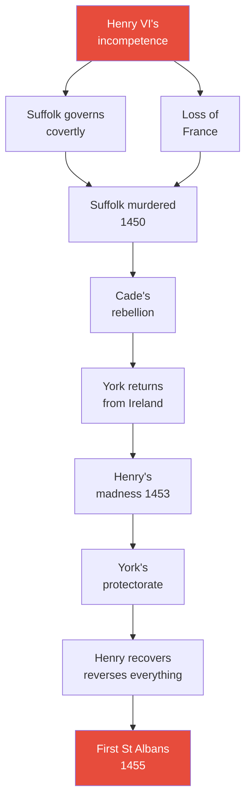
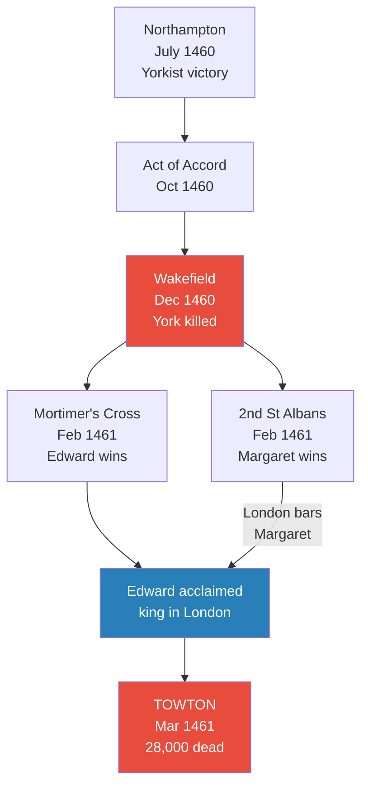
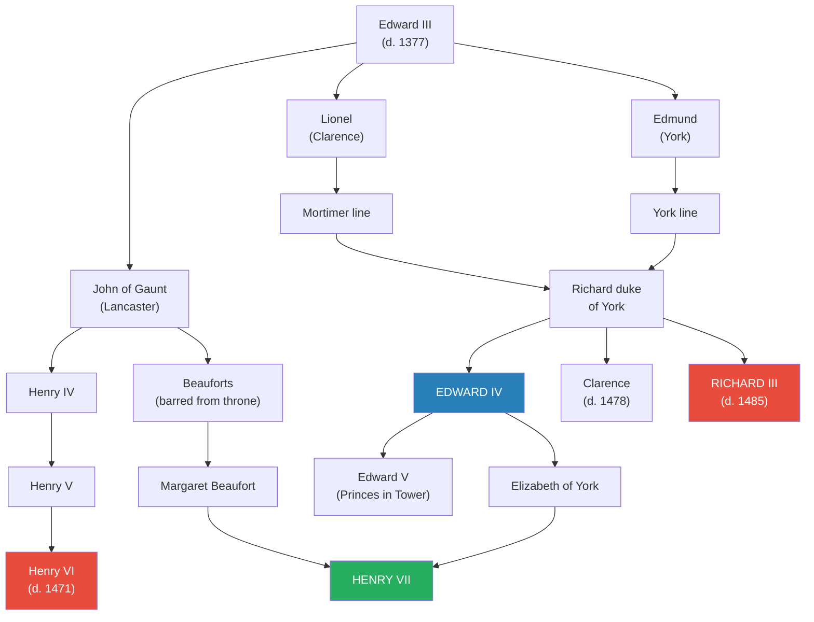
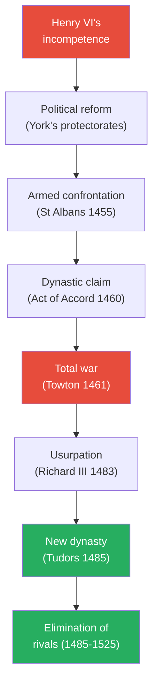
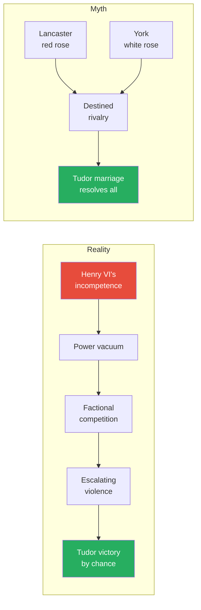
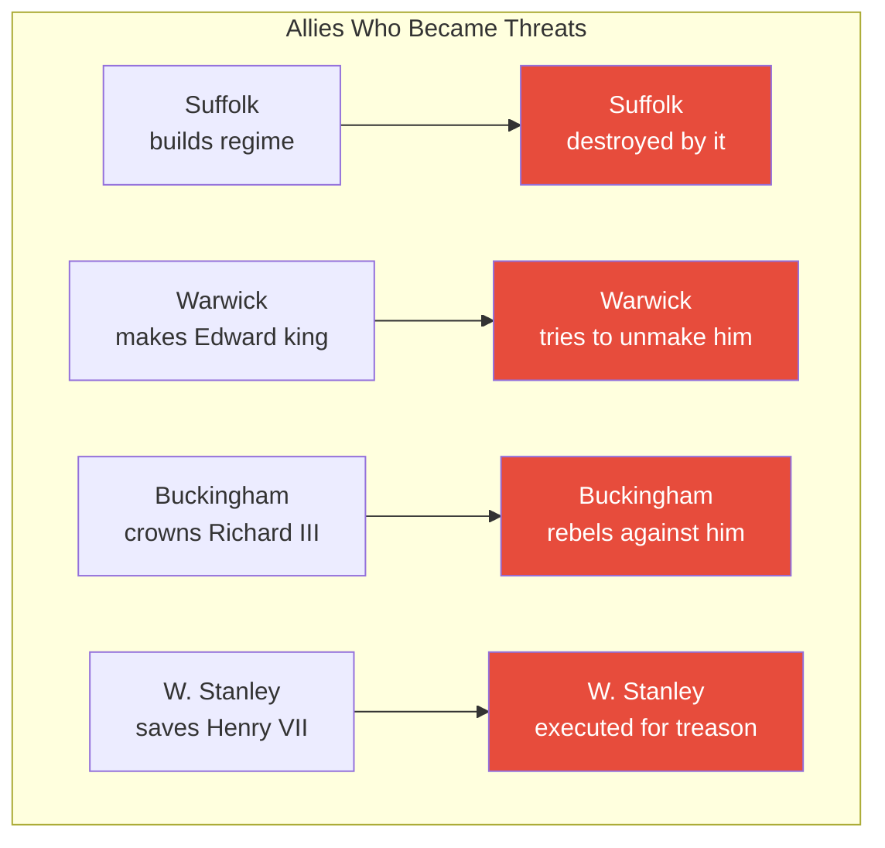

# The Wars of the Roses — Dan Jones

> Dan Jones, the bestselling historian of the Plantagenet dynasty, tells the story of its violent destruction across a century of civil war, usurpation, and dynastic murder. The book covers 1420 to 1525 — from Henry V's triumph at Troyes to the death of the last Yorkist pretender at Pavia — arguing that the wars were caused not by a predestined clash between the houses of Lancaster and York, but by the catastrophic incompetence of one king, Henry VI, whose passive vacancy created a vacuum that nobody could fill without resort to violence. Jones dismantles the Tudor myth of red rose versus white rose, showing that the symbolism was largely retrospective propaganda manufactured by Henry VII to legitimise his threadbare claim to the crown. The result is a superbly paced, character-driven narrative that makes one of the most confusing periods in English history genuinely comprehensible — and reveals the Tudor victory as the most improbable outcome imaginable.

---

## About the Author

Dan Jones is a British historian and broadcaster specialising in medieval England. He studied at Cambridge and has written several bestselling works of popular history, including *The Plantagenets* (2012), which told the story of the dynasty's rise and to which this book serves as a companion volume chronicling its destruction. Jones writes in vivid, energetic prose, bringing historical figures to life through physical descriptions and psychological portraits drawn from primary sources — ambassadors' dispatches, parliamentary rolls, chronicle accounts, and personal letters. He is a confident, opinionated narrator who keeps the story in the foreground while weaving in interpretive analysis.

---

## The Big Idea

- <b style="color: #27ae60">The "wars of the roses" were not a dynastic struggle between two rival houses destined to be resolved by the unifying Tudor marriage</b> — that narrative was deliberately manufactured by the Tudors, particularly Henry VII, to legitimise their otherwise threadbare claim to the throne
- The real cause of the wars was the catastrophic collapse of royal authority under <b style="color: #e74c3c">Henry VI, whose passive, vacant, and utterly incompetent kingship created a vacuum that nobody could fill without resorting to violence</b>:
  - England's political system depended absolutely on a competent king to dispense justice and lead wars
  - The system could survive a royal minority — it had done so during the 1420s with remarkable sophistication
  - What it could not survive was an adult king who simply refused to perform his role
  - Every subsequent crisis — York's protectorates, the battles, the depositions, the usurpations — flowed from this original failure
- The Tudor victory was <b style="color: #2980b9">the most improbable outcome imaginable</b>:
  - The family emerged from the secret marriage of a widowed French queen and her Welsh servant
  - They possessed virtually no legitimate claim to the crown
  - They only reached the throne because Richard III's usurpation broke every rule of political propriety and opened the field to anyone with a scrap of royal blood and a foreign army
  - They then secured their position by continuing the slaughter until there were almost no rival claimants left alive
- Jones traces an <b style="color: #2980b9">escalation ladder</b> that runs through the entire period: political reform gives way to armed confrontation, which escalates to dynastic claim, then total war, then usurpation, and finally the establishment of a new dynasty
  - Each battle creates new <b style="color: #e74c3c">blood debts</b> that drive the next round of violence — Clifford kills Rutland because "your father slew mine"

---

## Key Concepts at a Glance

| Concept | One-line summary |
|---------|-----------------|
| **The body politic** | Medieval governance depends absolutely on a sane, competent king — when the head fails, everything fails |
| **The vacuum theory** | Henry VI's passivity does not prevent conflict but creates it — magnates are forced into factional competition to fill the void |
| **The escalation ladder** | Reform → armed confrontation → dynastic claim → total war → usurpation → new dynasty |
| **Blood debt** | Each battle creates new vendettas that drive the next round of violence across generations |
| **The Tudor rose myth** | The red-and-white-rose symbolism was largely retrospective propaganda to justify the Tudor seizure of power |
| **The Troyes precedent** | The Act of Accord of 1460 mirrors the Treaty of Troyes of 1420 — the sitting king keeps the crown for life but is succeeded by a rival's heir |
| **The propaganda machine** | Every regime — Lancastrian, Yorkist, Tudor — invests in genealogical propaganda and public spectacle; the Tudors simply did it better |
| **Attainder** | The legal weapon of total political destruction — stripping victims of all lands, titles, and dignities |
| **The Readeption** | Henry VI's brief, puppet-like restoration to the throne in 1470-71, proving the crown was now a prize to be seized by force |
| **Bastard feudalism** | The system of retaining and rewarding followers that magnified both loyalty and faction — not the cause of the wars, but the mechanism through which they were fought |

---

### Jones's Five Key Principles

Jones identifies five recurring principles that operate throughout the wars:

1. **Incompetent kingship is more destructive than tyrannical kingship**
   - Tyrants (Edward II, Richard II) were deposed and replaced — the system had a mechanism for that
   - But Henry VI's passive ineptitude created a crisis that lasted decades because the system had no mechanism for removing a king who was merely useless
   - "It was much harder to justify killing a man who had done nothing evil or tyrannical"

2. **The closest ally is the greatest danger**
   - Suffolk was destroyed by the system he had held together
   - Warwick made Edward IV king, then tried to unmake him
   - Buckingham put Richard III on the throne, then rebelled against him
   - In every case, the man who helped create a regime became its most dangerous enemy

3. **Women exercised power through existing structures, not against them**
   - Margaret of Anjou ruled through her son's authority and household government
   - Margaret Beaufort operated through her son, her marriages, and the law
   - Elizabeth Woodville exercised influence through her family's offices and marriages
   - None attempted to create a new model of power — they all worked within the system
  - This pragmatism was both their strength and their limitation: they achieved extraordinary influence without ever threatening the fundamental structure of male rule
  - Jones notes that in a system designed exclusively for male authority, the most effective women were those who understood the system's rules and used them — not those who tried to change them

4. **Legitimacy is manufactured, not inherent**
   - Henry V manufactured his French claim through conquest and a treaty
   - Henry VII manufactured his English claim through battle, marriage, propaganda, and the systematic elimination of alternatives
   - Every regime invested heavily in genealogical propaganda — the Tudors simply did it better
  - Jones traces this theme from Bedford's genealogical posters in France through York's claim in the Painted Chamber to Henry VII's red roses and Elizabeth I's mechanical rosebush — the technology of propaganda changed but the principle remained constant

5. **Every settlement generates new grievances**
   - St Albans creates the blood feuds that produce Wakefield
   - Towton creates the exiles who produce the Readeption
   - Bosworth creates the pretenders who haunt Henry VII for decades
   - The cycle only breaks when there are too few alternative claimants left alive
  - This is perhaps the wars' most disturbing lesson: the violence did not stop because anyone chose peace — it stopped because there was almost no one left to kill

---

### The Key Players

| Character | Role | Defining trait | Fate |
|-----------|------|---------------|------|
| **Henry VI** | Lancastrian king | Passive, pious, vacant — "a kingly nothing" | Murdered in the Tower (1471) |
| **Margaret of Anjou** | Henry's queen | "More wittier than the king" — ruthless, formidable | Captured; died in French obscurity |
| **Richard of York** | Would-be reformer, then claimant | Ambitious, self-important, ultimately reckless | Killed at Wakefield; paper crown (1460) |
| **Edward IV** | Yorkist king | Charismatic, capable, "licentious in the extreme" | Died of debauchery, aged 40 (1483) |
| **Warwick** | The "Kingmaker" | Brilliant, grandiose, ultimately faithless | Killed at Barnet (1471) |
| **Richard III** | Usurper king | Loyal lieutenant turned ruthless usurper | Killed at Bosworth (1485) |
| **Henry VII** | Tudor founder | Shrewd, paranoid, a political unknown | Died in bed, aged 52 (1509) |
| **Margaret Beaufort** | Henry VII's mother | "Small of stature, shrewd and tough" | Died days after grandson's coronation |
| **Elizabeth Woodville** | Edward IV's queen | Beautiful, ambitious, controversial | Died in quiet retirement (1492) |
| **Suffolk** | Henry VI's chief minister | Diligent pragmatist, ultimately scapegoated | Murdered at sea (1450) |

---

*The arc of the wars runs from Henry V's zenith at Troyes through eighty years of crisis to the death of the last Yorkist pretender at Pavia — far longer than the conventional 1455-1485 dating suggests.*

---

## Introduction: The Tudor Myth

*Jones opens the book not with a battle but with a butchery — the botched execution of Margaret Pole in 1541, the last Plantagenet, linking the first victims of the wars to their last.*

- Margaret Pole, countess of Salisbury, was sixty-seven years old when she was led to a "pathetically small chopping block" at the Tower of London on 27 May 1541:
  - Her father was George duke of Clarence; her mother was Isabel Neville, co-heir to one of the greatest earldoms in the land
  - She had been imprisoned by her cousin Henry VIII for "detestable and abominable treasons" — her real crimes were being related to the king and opposing his religious reforms
  - She was attended by a "wretched and blundering youth" who botched the execution, slamming the axe into her shoulders and head repeatedly
  - "Rather than cutting cleanly through Margaret's neck in one stroke, he literally hacked the old woman's upper body to pieces"
  - "When her poor, mangled body finally dropped to the ground, there remained barely a single drop of Plantagenet royal blood in England"
  - Her son Reginald Pole, now a cardinal, wrote bitterly comparing Henry VIII to Herod, Nero, and Caligula: "Their cruelty is far surpassed by the iniquity of this man"
  - Jones uses Margaret Pole's death to frame the entire book: she was a living link between the first victims of the wars and their last
  - Her father Clarence was drowned in malmsey; her grandfather York wore a paper crown; her uncle Richard III died at Bosworth; her cousin Warwick was beheaded in the Tower
  - The whole history of the Pole family "was one of brutal destruction undertaken by three different kings — and in this the Poles were far from exceptional"
- Jones then dismantles the <b style="color: #2980b9">Tudor rose myth</b>:
  - The white rose was a genuine Yorkist badge — Edward IV was called "the Rose of Rouen"
  - But the red rose was "far less common until it was adopted and promoted vigorously by Henry Tudor in the 1480s"
  - Henry VII had his scribes plaster documents with red roses — "even going so far as to modify books owned by earlier kings"
  - The Tudor rose — red and white combined — told a story of "politics as romance"
  - The idea was "irresistible" to writers from Hall and Holinshed to Shakespeare — but "was it really true? The answer, alas, is no"
- The real story, Jones argues, is far more complex and interesting:
  - A polity "battered on every side by catastrophe and hobbled by inept leadership"
  - A realm that "descended into civil war despite the efforts of its most powerful subjects to avert disaster"
  - An unprecedented number of usurpations, murders, betrayals, and plots
  - And a new dynasty whose claim to the throne "was somewhere between highly tenuous and non-existent"

---

## Part I: Beginnings (1420-1437)

*Jones opens the narrative not in the 1450s when violence erupted, but in 1420, when England was the most powerful nation in western Europe — because the tragedy only makes sense if you understand the height from which the realm fell.*

### The Zenith of English Power

*Jones begins at the high-water mark of English power because the tragedy of the wars only makes sense if you understand what was lost. Henry V was not merely a good king — he was the most complete expression of medieval kingship England had ever produced.*

- <b style="color: #2980b9">Henry V</b> was the finest warrior among European rulers — battle-hardened, charismatic, ruthlessly competent:
  - He had settled an anxious realm after his father Henry IV's troubled usurpation
  - Henry IV had deposed Richard II and subsequently had him murdered — triggering a crisis of legitimacy, financial problems, a Welsh insurgency under Owain Glyndwr, and northern rebellions
  - The young Henry V reunited England "under an undisputed leader" — he was "king by right, rather than conquest"
  - He exhumed Richard II's body and reburied him in the tomb he had commissioned at Westminster — a gesture of reconciliation that healed the wound of his father's usurpation
  - He hunted out Lollard heretics with vigour, pleasing the Church; he re-established royal law in the shires, pleasing the commons
  - His personal household expenses were markedly frugal despite taxing the realm relentlessly for war
  - He had created "a tight-knit military fraternity" of loyal nobles and experienced captains
  - He was, in short, everything that his son would not be — and the contrast between father and son is the engine that drives Jones's entire narrative
  - Jones opens the book at the moment of Henry V's greatest triumph precisely to establish this contrast: the higher the starting point, the more devastating the fall
- Henry V's military genius was demonstrated at <b style="color: #2980b9">Agincourt</b> on 25 October 1415:
  - The two armies met on a ploughed field, the mud thickened by heavy rain
  - Despite the French army being perhaps six times his size, superior tactics and outstanding generalship gave the English the advantage
  - Henry relied heavily on longbows, protecting his archers with sharpened stakes driven into the ground
  - "Firing volley after volley through the air towards the French" — numerical advantage meant nothing when the sky rained arrows
  - More than 10,000 Frenchmen were killed for the loss of perhaps 150 English
  - Henry ordered thousands of prisoners killed after the battle — an "unchivalrous and ruthless command" but one that prevented any regrouping
  - Wild parties broke out in England; girls and boys dressed as angels sang "Hail flower of England, knight of Christendom"
- He then systematically conquered Normandy from 1417:
  - Caen was brutally sacked; Rouen was starved inhumanly into submission — refugees cast out of the city were refused passage through the English lines and left to die in no-man's-land
  - By 1418, the first English king effectively in command of Normandy since King John lost it to Philip II in 1204
- The England Henry V had created was "more politically united under Henry's leadership than perhaps at any time in its history":
  - He was personally charismatic, liked and trusted by his leading nobles
  - He had three loyal and able brothers: Thomas duke of Clarence, John duke of Bedford, and Humphrey duke of Gloucester
  - He pleased his subjects with a tough but impartial drive to re-establish royal law — criminals were often drafted into military service, "where their violent instincts could be safely satisfied pillaging among the villages of France"
  - His personal household expenses were markedly frugal, his exchequer competently run
  - The contemporary poet wrote: "May gracious God now save our king / His people and his well-willing"
- His marriage to Catherine de Valois at Troyes in 1420 represented the peak of Plantagenet ambition:
  - The Treaty of Troyes redirected the French succession, disinheriting the dauphin Charles in favour of Henry and his future children
  - Henry became "King of England, Heir and Regent of the Realm of France, and Lord of Ireland"
  - The chronicler Enguerrand de Monstrelet wrote that Henry appeared "as if he were at that moment king of all the world"
- The treaty was made possible by the catastrophic madness of <b style="color: #e74c3c">Charles VI of France</b>:
  - He suffered his first psychotic episode in 1392, while leading an army near Le Mans on a hot day — dehydrated, highly stressed, and frightened by a madman who shouted that he faced treachery on the road ahead
  - He attacked his companions with a sword, killing five of them in an hour-long rampage; it took six weeks to recover
  - From that point his life was "dogged by psychotic episodes" — he forgot his own name, refused to bathe, treated the queen with suspicion and hostility
  - He "trembled and screamed that he felt as though a thousand sharp iron spikes were piercing his flesh"
  - He would run wildly about the Hotel St Pol until he collapsed from exhaustion — servants walled up most of the palace doors to stop him escaping
  - On at least one occasion when servants broke in to wash him "they found him mangy with the pox and covered in his own faeces"
  - Physicians blamed an excess of black bile — but his mother Jeanne de Bourbon had also suffered a complete nervous breakdown
  - His incapacity created a power vacuum that split France between Burgundians and Armagnacs
  - The assassination of John the Fearless at Montereau in 1419 drove Burgundy into England's arms:
    - At a crisis meeting on a bridge, an Armagnac loyalist "smashed his face and head with an axe"
    - Queen Isabeau and the Burgundians now viewed any other end to the war as preferable to making peace with the Armagnacs
    - They offered Henry the greatest gift in their possession: the French crown
  - Many years later the duke's skull was kept as a curiosity by Carthusian monks at Dijon; the prior showed it to the visiting King Francis I, explaining that it was "through the hole in his cranium that the English had entered France"
  - Jones presents the assassination at Montereau as the pivotal event that enabled the Treaty of Troyes — without the murder of John the Fearless, there would have been no dual monarchy, no English claim to France, and no starting point for the wars

> [!example] Henry V's Wedding at Troyes (1420)
> - Catherine de Valois was eighteen, with delicate features and a slight bend to her neck
> - Henry was thirty-three, with scars from a battlefield arrow wound lodged in his cheek at sixteen
> - He gave a generous cash gift of two hundred nobles to the church; French protocol was followed — the archbishop blessed the royal bed and gave them soup and wine
> - After the ceremony, Henry told his knights there would be no jousting — they were leaving the next day to besiege Sens
> - "We may all tilt and joust and prove our daring and worth, for there is no finer act of courage in the world than to punish evildoers so that poor people can live"
> - Catherine spent the winter watching her husband's men move from town to town, laying sieges and starving or slaughtering their enemies
> **The lesson:** Henry V understood that real war was infinitely more valuable than the mock-battle of the tournament — and he expected his men to share that understanding.

---

### The Longest Minority

*Henry V's sudden death leaves a nine-month-old baby as king of two realms — and England's political community responds with an experiment in collective government that is one of the most impressive achievements of medieval politics.*

- Henry V died of dysentery at Vincennes on 31 August 1422, aged thirty-five:
  - He had contracted the "bloody flux" during the squalor of the siege of Meaux — a disease "very often fatal, and Henry knew it"
  - He was cogent enough to make a detailed will, splitting control of his infant son's person from control of government
  - He nominated Thomas Beaufort, duke of Exeter to care for the infant's person, and Humphrey duke of Gloucester to control government
  - This was "almost exactly the same arrangement" that Edward IV would try to make on his deathbed sixty years later — and both would fail
  - He died between two and three o'clock in the morning — "with the same bewildering swiftness that had characterised his life's every action"
  - The chronicler wrote: "It is not recorded that any king of England ever accomplished so much in so short a time"
- His son, Henry VI, was nine months old — the youngest person ever to become king of England
- Precedent was not promising: Henry III had been dominated by overbearing ministers; Edward III's minority had been controlled by his mother and her feckless lover Mortimer; Richard II's government had nearly been brought down by the Peasants' Revolt
- The political community responded with an <b style="color: #27ae60">astonishingly sophisticated conciliar protectorate</b> — the first such experiment in English history:
  - Humphrey duke of Gloucester was given the title "Protector and Defender" — but deliberately denied regency powers
  - Neither he "nor anyone else was going to be a lieutenant, tutor, governor or regent"
  - A council of seventeen was appointed with fixed rules, recorded minutes, and a quorum of four
  - The council limited itself to essential functions, sold offices only for the Crown's benefit, and kept secret control of royal finances
  - It was "as close to a disinterested political body as could be conceived"
  - Government was carried out under the fiction that the baby king was a fully functioning ruler:
    - Official letters were written as if dictated by a toddler: "We were in perfect health" — signed when the king was seventeen months old
    - The baby's tiny fingers passed over the seal's purse in a ceremony at Windsor — "pure theatre, but the fabric of English government was materially sustained"
    - At his first parliament in November 1423, the toddler threw a royal tantrum at Staines — "he cried and shremed and would not be carried further"
    - At age six, he was described in parliament as having "grown in years, in stature and also in conceit and knowledge"
  - The system worked because men of exceptional ability were willing to subordinate their personal ambitions to the common good:
    - Humphrey of Gloucester was denied the regency he wanted and accepted the lesser title of Protector
    - Cardinal Beaufort, despite enormous wealth and ambition, worked within the council system rather than against it
    - Bedford managed France with a combination of military skill, diplomatic subtlety, and personal authority that no other man alive could have matched
  - But the system depended on one crucial assumption: that the minority would end — that the boy would grow into a man capable of ruling
  - If that assumption proved false, the entire structure would collapse

> [!example] The Gloucester-Beaufort Stand-off on London Bridge (1425)
> - A feud between Gloucester and his uncle Cardinal Beaufort — the two most powerful men in the minority government — nearly erupted into civil war
> - On the night of 29 October, Beaufort garrisoned Southwark with archers, men-at-arms, and armed followers
> - Gloucester closed the city gates on the north side of London Bridge
> - "All the shops in London were shut in one hour"
> - The archbishop of Canterbury and Pedro, prince of Portugal rode eight times between the camps negotiating a truce
> - Beaufort wrote desperately to Bedford in France: "Hasten you hither, for if ye tarry, we shall put this land in adventure with a field. Such a brother ye have here. God make him a good man"
> - Bedford returned from France and spent a year restoring calm
> **The lesson:** The conciliar system held because men like Bedford were willing to play the role of surrogate king. But it could not hold forever — someone would have to rule, and that someone was supposed to be Henry VI.

- <b style="color: #2980b9">John duke of Bedford</b> governed France as regent — the indispensable link between Henry V's conquests and the present:
  - Tall, strong-limbed, and physically imposing, with a large, beak-like nose — deeply pious and committed to fair governance
  - He "represented the person of the King of France and England" and lived up to the image his position demanded
  - Won a magnificent victory at Verneuil in 1424 against a French-Scottish army twice his size
  - Maintained the Burgundian alliance through his marriage to Anne of Burgundy
  - Established a stunning court at his numerous houses in Paris and Rouen — groaning with vast collections of art, books, treasure, and tapestries
  - He strove to govern Normandy through native institutions, employing Normans in positions of power
  - Ran a propaganda campaign of mass-produced genealogical posters plastered across France:
    - Family trees showed Henry VI's descent from St Louis through both the English and French royal lines
    - A beautifully illustrated genealogy traced the line from Louis IX at the top through both houses to Henry VI at the bottom — "sitting regally upon a throne, with angels swooping down to place two crowns upon his head"
    - Bedford's clerk Lawrence Calot composed a poem praising Henry as "born to be king of worthie reamys two"
    - A canon from Reims was forced to seek a pardon for vandalising one of these posters at Notre-Dame — and made to pay for two new copies
  - Yet a Norman resistance movement festered: gangs of brigands roamed free, combining criminality with patriotic resentment
    - One band led by Jean de Halle kidnapped monks, tortured women, and swore an oath to "do everything in their power to damage and injure the English"
- Henry VI's double coronation was magnificent spectacle masking hollowness:
  - His English coronation at Westminster in November 1429 (aged seven):
    - The earl of Warwick carried Henry into the church, then led him up a great scaffold to his seat in the centre
    - The boy gazed "sadly and wisely" at the congregation while the archbishop told them he had come "asking the crown of this realm by right and descent of heritage"
    - The congregation roared, throwing their hands in the air and crying "ye, ye"
    - He was anointed with oil said to have been given by the Virgin Mary to St Thomas Becket — holy oil poured from a golden eagle-shaped ampulla onto his breast, back, head, shoulders, elbows, and palms
    - A hair shirt was worn beneath his crown; white wine was later used to wash the holy oil from his head (Henry IV had developed head lice after his own coronation)
    - The feast featured edible fritters decorated with fleurs-de-lis and a subtlety showing Henry carried by St Edward and St Louis
  - His French coronation at Notre-Dame in December 1431 was rushed and disappointing:
    - Cardinal Beaufort performed it rather than a native French bishop, which peeved the Parisians
    - Due to the crush of people, pickpocketing was rife
    - The food "was shocking" — cooked too far in advance and "not even considered suitable to be sent as leftovers to the city's paupers"
    - Henry left Paris without carrying out any of the usual royal bequests — releasing prisoners, cutting taxes, offering legal reforms
    - His grandmother Isabeau of Bavaria was present: "When she saw the young king Henry, her daughter's son, near her, he at once took off his hood and greeted her, and she immediately bowed very humbly towards him and then turned away in tears"
  - Henry returned to London and "was greeted with a now familiar scene" of pageantry and spectacle
  - But Jones notes that "the sheer volume of public display announcing the child's all-conquering status" was also "visually dazzling, technically impressive and very expensive"
  - "The louder the English shouted about Henry's hereditary right to rule over France, the more obvious was their basic insecurity"
  - As long as the dauphin lived as a crowned and anointed rival, "English propaganda was just that: parchments and pageantry inflicted on an increasingly uneasy populace"

---

### Joan of Arc: The Propaganda Catalyst

*Jones presents Joan not as the military saviour of France but as something more dangerous: a propaganda weapon whose psychological impact outweighed her battlefield achievements. She shattered the myth of English invincibility at the precise moment when myth was all that sustained it.*

- The siege of Orleans had bogged down after <b style="color: #2980b9">Salisbury</b>'s death in October 1428:
  - He was surveying the town's defences when a cannonball hit nearby and shards of flying masonry tore off half the flesh from his face — a mortal injury from which he took a full agonising week to die
  - He was replaced by Suffolk, "a valiant and experienced soldier, but not of the same stature as the man he replaced"
  - The English could not surround the entire city; a long, tedious stalemate ground on through winter
- <b style="color: #e74c3c">Joan of Arc</b> then shattered the English position:
  - A seventeen-year-old illiterate peasant girl who had travelled from Domremy in male disguise, claiming divine voices guided her since age thirteen
  - At Chinon and Poitiers she was repeatedly interrogated by the dauphin's clerics — puzzled by this "curious, intrepid and determined countryside maid"
  - They decided "there was little to be lost by testing her out"
  - She arrived at Orleans on a white horse, in male armour, with priests by her side and an ancient sword rumoured to be Charles Martel's
  - When the English first heard about her, they scoffed — a woman in male armour was "nothing short of abominable"
  - They dismissed her as "an Armagnac whore"
  - But she punched a hole in the English siege lines with "almost astonishing ease" — finding the besieging forces' lines weak and undersupplied
  - She rode around the centre of fighting with her white standard fluttering as blood sprayed up around her
  - When an arrow sliced through her shoulder, she "staggered on, almost oblivious to her wound, spurring the Frenchmen forward"
  - "At night, bells of celebration clanged and jangled from the churches of Orleans"
  - Within three days Orleans was fully relieved; the English retreated, abandoning their cannon
  - At the battle of Patay, the confused English army was annihilated — more than two thousand killed and every captain save Fastolf captured
  - On 17 July the dauphin was crowned Charles VII at Reims, with Joan standing by the altar
  - "All the genealogical propaganda in the world could not obscure the fact that France now had a ceremonially anointed king — and that he was not called Henry"
- Joan was captured in 1430, sold to the English, tried as a heretic in deeply partisan proceedings:
  - She was burned at Rouen on 31 May 1431 — "her ashes were scooped up and thrown in the Seine"
  - Jones treats her less as a military genius and more as a <b style="color: #2980b9">propaganda catalyst</b> — her real impact was psychological, shattering the myth of English invincibility
  - "The political confidence and propaganda value she offered the dauphin proved to be worth more to the French cause than any number of dynastic handbills"
  - Jones draws a parallel between Joan's propaganda impact and the genealogical campaigns Bedford had been running: in both cases, the real battlefield was not territory but belief
  - The English could occupy Normandy, garrison Paris, and plaster churches with family trees — but if the French believed they had a divinely anointed king of their own, none of it mattered
  - Joan made them believe
- Two severe blows struck in 1435:
  - The congress of Arras ended the vital Burgundian alliance — England's whole diplomatic position, carefully constructed over twenty years, was swept away
  - John duke of Bedford died at forty-six, "broken by the strain" — robbing England of its surrogate king, the only man who could mediate between Beaufort and Gloucester

> [!tip] Core Insight
> The conciliar government of the 1420s proved that England's political system could survive a royal minority through collective action. The crisis that followed was not caused by a child king, but by an adult king who was worse than a child — because unlike a minor, he could not be governed by a council and could not be removed.

---

### Owen Tudor: The Improbable Seed

*Jones devotes an entire chapter to the secret marriage of a French queen and a Welsh nobody — because this improbable union would, against all expectation, produce the dynasty that ruled England for over a century.*

- Catherine de Valois's life in England after Henry V's death was "not quite what she expected":
  - A twenty-year-old widow, she was defined principally by her motherhood
  - Her income — drawn from generous dower lands including Welsh castles at Flint, Rhuddlan, and Beaumaris — contributed to the king's household at seven pounds a day
  - From 1430, her household separated formally from her son's — "she travelled on her own itinerary and joined the royal court only on ceremonial occasions"
  - She was "unable fully to curb her carnal passions" — or so sneered one English chronicler
- In the mid-1420s, rumours linked her to Edmund Beaufort, nephew of Cardinal Beaufort:
  - At the 1426 parliament, a petition asked for "permission for king's widows to marry at their will"
  - The response was a statute forbidding queens from remarrying without royal licence — the cost would be financial ruin: "He who acts to the contrary will forfeit for his whole life all his lands and tenements"
- Catherine defied parliament by secretly marrying <b style="color: #2980b9">Owen Tudor</b> — a Welsh nobody:
  - His family had been disgraced after joining Owain Glyndwr's revolt against Henry IV
  - Penal laws forbade Welshmen from owning property, holding office, or wearing armour on highways
  - Mischievous stories claimed they fell in love because she caught sight of his naked body while he swam, or that he got drunk at a dance and fell into her lap
  - Catherine likely chose him precisely because he was a political nonentity — too insignificant to trigger the devastating penalties of the 1427 statute
  - "The most likely explanation is that Catherine, chafing against the ban on her remarrying, decided to take a husband who was a political nonentity"
  - Jones presents Owen Tudor as an accidental founder of a dynasty — a man whose chief qualification for immortality was that he was too insignificant to be noticed
  - The improbability of the Tudor origin story is one of the book's central themes: the most powerful dynasty in English history was born from a secret marriage between a dowager queen and a Welsh servant
- They had at least four children: Edmund, Jasper, Owen (who became a monk at Westminster), and a daughter
- Catherine fell ill in 1436 and died on 3 January 1437, aged thirty-five:
  - She was buried in Westminster Abbey with her coffin topped by "a delicate wooden effigy painted as if it were alive"
  - Owen immediately understood that her death "placed him in immediate personal danger"

> [!example] Owen Tudor's Flight and Capture (1437-1439)
> - As soon as Catherine was buried, the council — driven by Gloucester — went after Owen
> - He fled towards Wales, carrying "a hotchpotch of treasure and trinkets": gold cups, silver salt cellars, and basins decorated with roses
> - Messengers caught up with him in Warwickshire; he protested that the safe-conduct "sufficed him not for his surety"
> - Brought to Westminster, he threw himself on sanctuary at the abbey, "eschewing to come out thereof"
> - Eventually persuaded to emerge, he affirmed his innocence — and was released to Wales
> - Promptly rearrested on arrival, his valuables were seized and he was thrown into Newgate prison
> - In January 1438, his chaplain helped him organise a violent breakout — his jailer was "hurt foule"
> - Recaptured within days, he was eventually transferred to Windsor Castle and pardoned in July 1439
> - The Welsh bard Robin Ddu lamented: "His only fault was to have won the affection of a princess of France"
> **The lesson:** Owen Tudor's adventure planted the seed of an improbable dynasty. His sons Edmund and Jasper were placed at Barking Abbey under the care of Katherine de la Pole — sister of the man who was becoming the most powerful figure in English government.

- <b style="color: #2980b9">Barking Abbey</b> was a wonderful place for Edmund and Jasper to grow up:
  - One of the wealthiest and most prestigious nunneries in England
  - Latin, French, and English were all used; the library held volumes by Aristotle, Aesop, Virgil, and Cicero
  - It even contained a copy of Geoffrey Chaucer's Canterbury Tales — the boys received an education as good as any nobleman's son
  - The boys' upkeep cost the abbey the enormous sum of thirteen shillings and fourpence a week
  - Katherine de la Pole was the sister of William de la Pole, earl of Suffolk — the man around whom "almost every important political decision of the following decade was to turn"
  - It would be more than a decade before their closeness in blood to the king was formally recognised
  - Jones observes that the Tudor boys' upbringing — combining excellent education with political obscurity — produced exactly the combination of qualities that would later serve the dynasty: literacy, piety, patience, and an instinctive understanding that power is best exercised from behind the scenes

---

## Part II: What Is a King? (1437-1455)

*Jones poses the central question of the entire book: what happens when a political system that depends absolutely on a competent king produces a king who is anything but?*

### The Emerging Disaster of Henry VI

*Jones argues that Henry VI's character was not simply unfortunate but structurally fatal. The English political system was designed to be driven by a strong royal will — and it had produced a king with no will at all.*

- Henry VI was brought into his first council meeting on 1 October 1435, aged fourteen, and orders began to be made under his authority rather than by the council alone
- But as Henry grew to adulthood, his personality became apparent — and it was <b style="color: #e74c3c">disastrously unsuited to kingship</b>:
  - He was pious, passive, suggestible, squeamish about violence, and incapable of leadership
  - His confessor John Blacman described him wearing "round-toed shoes and boots like a farmer's"
  - He was mortified by nudity — when "a certain great lord brought before him a dance or show of young ladies with bared bosoms," the king "very angrily averted his eyes, turned his back on them and went out to his chamber"
  - He cursed no worse than "forsothe and forsothe" and told off those who used bad language
  - He spoke simply, in short sentences, and preferred studying scripture to government business
  - Council minutes record repeated warnings: "Remember to speak unto the King to beware how that he granteth pardons" — he was signing off requests that cost the Crown thousands of marks
  - He threw his energy into founding Eton College and King's College Cambridge, annotating architectural plans with his own hand, while showing virtually no interest in warfare
  - At no point after his French coronation was any serious effort made to take him to France at the head of an army — or to Scotland, or to Ireland
  - Foreign observers found him dignified — a contemporary portrait shows "smooth, plump cheeks and a weak chin, wearing a look of faint surprise" — but behind the facade was emptiness
  - Henry had virtually no close male relatives to help him govern — all three of his uncles (Bedford, Clarence, Gloucester) had died by 1447
  - He had more private resources than any of his ancestors in living memory — the duchy of Lancaster, the principality of Wales, the duchy of Cornwall all held in his own right — and yet he was broke
  - This was not merely about debt but about perception: "Debt was generally tolerated in times of military success and convincing royal leadership; at times of distress and disorder, it became a serious political problem"
- The <b style="color: #2980b9">body politic</b> metaphor explained the problem clearly: "When the head is infirm, the body is infirm. Where a virtuous king does not rule, the people are unsound and lack good morals"
- Jones explains the constitutional mechanics of the crisis:
  - England's government was institutionally sophisticated — parliament, chancery, exchequer — but it was "not a machine that could operate of its own accord"
  - "The magic ingredient that made royal government work was the absolute freedom of the royal will"
  - A confident king like Henry V could use his will to settle disputes, correct abuses, and give direction
  - A wavering king like Henry VI left every dispute unresolved, every abuse uncorrected
  - The result was not merely bad government but a power vacuum — and "into this vacuum stepped" whatever man was bold enough to fill it
  - The two basic functions of medieval kingship were upholding justice and fighting wars — "there was no sense in the 1440s that Henry VI was capable of doing either"
  - Jones's <b style="color: #2980b9">vacuum theory</b> is the book's most important analytical contribution:
    - Previous historians had blamed the wars on "overmighty nobles" or "bastard feudalism gone awry"
    - Jones argues the opposite: the nobles were not too powerful but too rudderless — they were forced into factional competition precisely because the king refused to arbitrate
    - It was not that magnates had too much power but that the king exercised too little
    - The vacuum at the top did not prevent conflict — it created it, by removing the one person who could resolve disputes before they escalated
    - Every noble faction believed it was acting in the realm's best interest — but without a functioning king to judge between them, good intentions led to bloodshed
  - This is what makes the wars so tragic in Jones's telling: they were not caused by evil men seeking power for its own sake, but by a system that could not function without the one ingredient it lacked — a competent head of state

---

### Suffolk: The Man Behind the Throne

*As Henry VI proves himself incapable of ruling, another man quietly fills the vacuum — governing England through stealth, household influence, and the king's complaisance.*

- <b style="color: #2980b9">William de la Pole, earl of Suffolk</b> filled the vacuum by governing covertly through his position as steward of the royal household:
  - His father died of dysentery at Harfleur; his elder brother was killed at Agincourt — he became earl unexpectedly at nineteen
  - He was captured at Jargeau in 1429 when Joan of Arc's army overran his position — he managed to knight his captor before surrendering, to avoid the "utter chivalric humiliation" of yielding to a commoner
  - Back in England, he built power through "boldness, good fortune, excellent connections and old-fashioned stealth"
  - He married Alice Chaucer, the stunningly beautiful and extremely rich widow, connecting him to both the Beauforts and Catherine de Valois
  - A pragmatist who straddled the Beaufort-Gloucester factional divide — "rare was the man who could straddle the split"
  - As steward, he had "regular, informal and largely unchecked personal contact with the king at all hours of the day"
  - Margaret Paston wrote that without Suffolk's blessing, "ye can never live in peace"
  - His method of ruling quietly in the name of a wavering king was "playing with fire"
  - Jones explains the mechanics of Suffolk's covert rule:
    - As steward, he controlled who had access to the king and what petitions reached his attention
    - He could direct policy by simply controlling the flow of information — the king would sign whatever was put before him
    - But this meant that every decision bore Suffolk's invisible fingerprints — and when those decisions went wrong, he had no one to share the blame
    - "Since the 1430s, Suffolk had played a vital role in English government ... in general he had done so with the approval of those who understood just how disastrously ineffective the king was"
    - But when the nobility withdrew from court and council, "Suffolk's method of rule — directing government minutely but disguising his hand — was brutally exposed"
- Meanwhile, <b style="color: #2980b9">Richard duke of York</b> was the richest layman in England:
  - Royal blood from both parents — descended from Edward III's second son (Lionel, through the Mortimers) and fourth son (Edmund, through the Yorks)
  - He held the duchy of York and the earldoms of March, Cambridge, and Ulster
  - His lands stretched from Yorkshire to Somerset; his castles included magnificent Fotheringhay
  - In 1436 he was appointed lieutenant of France — described as "a great prince of our blood and line"
  - But at this stage, Jones is emphatic: York harboured no designs on the crown — his family history "amply demonstrated that the exercise of naked ambition was a certain way to lose one's head"
  - Jones's characterisation of York is sympathetic but not uncritical:
    - He was genuinely committed to good governance and had a legitimate grievance about Somerset's mismanagement of France
    - But he was also proud, self-important, and convinced of his own indispensability
    - His armed marches on London in 1450 and 1452 — while framed as petitions for reform — alarmed the political community because they looked like precursors to a coup
    - The distinction between wanting to be the most powerful man in England and wanting to be king was smaller than York himself believed
  - Jones traces York's transformation from reformer to claimant as a gradual process, not a sudden decision:
    - In 1450 he wanted good government; in 1452 he wanted Somerset removed; in 1454 he wanted the protectorate
    - Only in 1460, after every other approach had failed and his enemies had tried to destroy him, did he finally claim the crown
    - The escalation was driven not by ambition but by desperation — each failed attempt at reform pushed him closer to the only remaining option

---

### Margaret of Anjou and the Loss of France

*The marriage that was supposed to bring peace instead brings catastrophe — and introduces the woman who will become the most formidable political operator of the entire wars.*

- Suffolk's masterstroke-turned-disaster was the marriage of Henry to <b style="color: #2980b9">Margaret of Anjou</b> in 1445:
  - She was fifteen, daughter of Duke Rene of Anjou — a man who held splendid titles (king of Sicily and Jerusalem) but was "a penniless and serially unlucky soldier"
  - She came with a pitiful dowry — a measly twenty thousand francs and the hollow promise of the crown of Majorca
  - But marrying the French king's niece seemed to serve two greater purposes: a military truce and a chance to rebuild the dwindling royal family
  - Suffolk married her by proxy at Tours in May 1444 — "the common people made joy and mirth, and song all with high voyce Nowell! Nowell! and peace, peace, peace be to us!"
  - London greeted her with eight lavish pageants comparing her to Noah's dove and the Virgin St Margaret — the city was decked out in blue and red
  - Margaret was described as attractive, intelligent, and strong-willed — qualities that in a king would have been praised but in a queen would eventually be treated as threats
  - Jones notes the irony: the realm desperately needed forceful leadership, and Margaret was the only person in the royal household capable of providing it — but her sex meant she could only exercise it indirectly
  - She came from a family of capable women — her mother and grandmother had both governed territories in Anjou while Duke Rene was imprisoned
  - She would prove to be the most formidable military and political leader on the Lancastrian side — more effective than any of the dukes, earls, or captains who nominally outranked her
  - But the political system had no formal mechanism for a queen to exercise power, so she had to work through her son's name, through household government, and through sheer personal force of will

> [!example] Eleanor Cobham's Fall (1441)
> - Gloucester's second wife, Eleanor, began consulting astrologers to predict the date of Henry VI's death
> - Her diviners predicted the king would die in the summer of 1441 — rumours of his death swirled around the capital
> - Eleanor was arrested, tried, and "damned for a witch and an heretic"
> - She was sentenced to walk barefoot, carrying a candle, through the streets of London on three occasions
> - She was forcibly divorced from Gloucester and imprisoned for life — serving at ever more remote castles in Kent, Cheshire, the Isle of Man, and finally Beaumaris
> - Gloucester's credibility was destroyed; he never recovered politically
> **The lesson:** Eleanor's fall was the first step in stripping Gloucester of his influence — clearing the path for Suffolk and the Beauforts to dominate government without opposition.

- The secret price of the marriage was <b style="color: #e74c3c">the cession of Maine</b> to Margaret's father:
  - In December 1445, Henry personally wrote to Charles VII promising to surrender Maine — "favouring also our most dear and well-beloved companion the queen, who has requested us to do this many times"
  - This was catastrophic — surrendering hard-won territory for mere promises, giving France a military route into Normandy
  - English soldiers in Maine dragged their feet at every order to cooperate; the territory was not physically surrendered until 1448
  - Chroniclers wrote that Henry's wedding was "a dear marriage for the realm of England"
  - The cession of Maine was the first domino: it gave France a military route into Normandy, undermined the morale of English garrisons, and proved to both sides that England's will to fight was weakening
  - It was also a gift of territory that Henry had no right to give — Maine had been won by English soldiers and paid for by English taxpayers
  - When the commons eventually learned the truth, their fury was directed not at the king (who was still theoretically above criticism) but at the minister who had engineered the marriage
  - Jones draws a direct line from the cession of Maine to the collapse of Normandy to Suffolk's murder to Cade's rebellion to York's intervention to the civil war
  - Each step followed logically from the last — but the original cause was always the same: a king too weak to make decisions, and a minister who made them for him
- The destruction of Humphrey duke of Gloucester at Bury St Edmunds in 1447 removed the last check on Suffolk:
  - Gloucester arrived at the parliament with a retinue of armed Welshmen, clearly suspicious of what awaited him
  - He was prevented from seeing the king and sent to his lodgings via a street called "the Dead Lane" — "a prophetic path to tread"
  - He was arrested on charges of treason, and five days later was dead — "murdered between two feather-beds" or dead of a stroke
  - His household servants were tried for plotting to kill the king — then pardoned on the gallows, suggesting "the charges were either invented or exaggerated for effect"
  - A legend of "good duke Humphrey" arose: "In life Gloucester had been quarrelsome, factious, somewhat conceited, impossibly aggressive" — but in death, he became the champion of all who opposed Suffolk's disastrous policies
  - Jones notes the irony: Gloucester had been the most difficult man in English politics for twenty years, but his removal left Suffolk and the Beauforts completely unchecked
  - Without a rival voice in government, every mistake would now be attributed directly to Suffolk — and the mistakes were about to become catastrophic

> [!tip] Core Insight
> Suffolk's method of governing — ruling quietly through the royal household in the name of an incompetent king — was the best anyone could do with the materials available. But it was "playing with fire": when it went wrong, there was no one else to share the blame, and the man who had held the system together became its most visible target.

---

### Growing Disaffection and the Collapse of France

*While Suffolk governs covertly, the country simmers with discontent — and then the catastrophic loss of Normandy shatters what remains of public confidence.*

- Through the 1440s, England was full of muttering and grumbling:
  - In 1444, Thomas Kerver, a Berkshire bailiff, was sentenced to hanging, drawing, and quartering for asking whether the country "was ruled by a king or a boy"
  - He was dragged through Reading, hauled behind a horse to the gallows — then reprieved at the last second by a secret council order
  - "The full weight of the law had been used against a fairly innocuous malefactor" — the regime was lashing out from insecurity
  - In 1448, a Canterbury man complained that the queen "was none able to be Queen of England" because "she beareth no child"
  - Two Sussex farmers were indicted for saying the king "would hold a staff with a bird on the end, playing with it like a clown"
  - Songs lamented the poverty of the Crown; the commons complained of "murders, manslaughters, robberies" that were "daily increasing and multiplying"
- Disorder was growing across England:
  - A private war between the Bonville and Courtenay families in the west country — directly caused by Henry VI granting the same office to two men simultaneously
  - Feuds escalated into murder, home invasion, private armies, and sieges on property
  - In the north, rival magnates held "near-autonomous regional power"
- The collapse of English France was swift and devastating:
  - The attack on Fougeres in March 1449 — planned by Suffolk — backfired spectacularly when the duke of Brittany appealed to Charles VII
  - Charles declared war on 31 July 1449 and launched a full invasion of Normandy
  - Rouen fell on 29 October; Somerset "shamefully and unchivalrously" saved his own skin by fleeing under a French safe-conduct, agreeing to a monstrous ransom of fifty thousand ecus
  - The council scrambled two thousand additional troops, funded by the treasurer Lord Saye pawning the crown jewels — "too little, too late"
  - The English were annihilated at Formigny in April 1450 amid the boom of cannon fire — their control of Normandy was "nothing short of a catastrophe"
  - Refugees from Normandy filled Cheapside, women trudging with children strapped to their bodies, soldiers wheeling their lives on carts — "piteous to see"
- The Crown was indebted to the staggering sum of <b style="color: #e74c3c">372,000 pounds against annual income of just 5,000</b>:
  - The royal household alone cost 24,000 a year — more than four times total royal income
  - "So poor a king was never seen," went the subversive popular song
- Suffolk's destruction came in stages:
  - First, the bishop of Chichester, Adam Moleyns — closely allied to Suffolk and key to the marriage negotiations — was murdered in Portsmouth on 9 January 1450 by soldiers waiting to embark for France
  - As he died, Moleyns reportedly cursed Suffolk as the author of all England's misfortune — "the rumour spread far and wide"
  - On 22 January, when parliament reconvened, Suffolk tried to pre-empt the attack:
    - He stood in the Painted Chamber at Westminster, richly decorated with murals of the Old Testament
    - He denounced "the odious and horrible language that runneth through your land"
    - He passionately defended his family's sacrifices: his father dead at Harfleur, his eldest brother killed at Agincourt, three more brothers dead in foreign service
    - He had borne arms for thirty-four winters and been a knight of the Garter for thirty years
  - On 7 February he was formally impeached of "high, great, heinous and horrible treasons"
  - Henry VI personally intervened to save Suffolk's life — banishing him for five years rather than condemning him to death
  - The nobility who had once supported Suffolk had quietly withdrawn — "they had abandoned the government, leaving Suffolk and his diminishing group of allies looking increasingly like a domestic clique"

> [!example] Suffolk's Murder at Sea (1450)
> - Banished by the king for five years, Suffolk sailed from Ipswich on 30 April 1450
> - His ships were intercepted by a vessel called the Nicholas of the Tower
> - The master greeted him: "Welcome Traitor"
> - Suffolk made a dignified speech defending his family's sacrifices for the Crown across three generations — his father dead of dysentery at Harfleur, his elder brother killed at Agincourt
> - After twenty-four hours aboard, he was put in a small boat with a chaplain and a chopping block
> - A sailor named Richard Lenard "took a rusty sword, and smote off his head within half a dozen strokes"
> - His body was dumped on Dover beach, his head standing next to it on a pole
> **The lesson:** Suffolk had ruled England for over a decade through stealth and the king's complaisance. When the nobility abandoned him, his covert method of government was brutally exposed — and the mob took its revenge.

---

### Jack Cade's Rebellion

*The eruption of popular violence demonstrates that the crisis has spread beyond the political elite. Cade's rebellion is not a peasant jacquerie but a sophisticated movement with genuine political demands — and its success reveals the complete absence of royal authority.*

- <b style="color: #2980b9">Jack Cade's rebellion</b> erupted in Kent in June 1450 — and occupied London:
  - Cade called himself "John Mortimer" — implying a connection to York's family, though none existed
  - The county had been put into a state of military readiness against a feared French invasion — men were armed, organised, angry, and frightened
  - Then a panicked rumour spread that the king intended to hold Kent communally responsible for Suffolk's murder — "the whole county was going to be razed and turned into royal forest"
  - Cade's manifesto was a sophisticated political document, not mere rabble-rousing:
    - Condemned the king's minions for enriching themselves at public expense
    - Complained that "Lords of his royal blood have been put from his daily presence"
    - Demanded inquiry into the loss of France and an end to purveyance
    - Called for free elections of MPs and an end to bribery in the distribution of offices
  - His lieutenants included Robert Poynings, the son of a peer — this was a movement of considerable social status
  - He even beheaded one of his own captains on Blackheath for indiscipline — attempting to lead with military order
  - The rebels first assembled on Blackheath on 11 June — the same camping-ground as the Peasants' Revolt of 1381
  - Sir Humphrey Stafford led a force of four hundred men into Kent to chastise them — the rebels ambushed and slaughtered his force near Tonbridge; both Staffords were killed
  - Henry's own troops threatened to defect; calls went up from the Crown's forces for the trial of the king's ministers

> [!example] The Horrors of Cade's London (July 1450)
> - Cade fought his way across London Bridge, cutting the ropes of the drawbridge to keep it open
> - Lord Saye, the royal treasurer, was dragged from the Tower to a mock trial at the Guildhall
> - He was beheaded on Cheapside; his body was roped to Cade's horse and paraded through the city
> - His head was stuck on a spear and made to "kiss" the similarly impaled head of his son-in-law William Crowmer
> - An all-night battle raged on London Bridge from 10 p.m. until dawn — fighting by torchlight, hundreds of men on the narrow causeway
> - Cade set fire to the wooden drawbridge in desperation, sending men tumbling into the Thames
> - The battle commander Matthew Gough was killed in the fighting
> **The lesson:** Cade's rebellion revealed that the entire south-east of England had turned against the government. Henry VI had fled to Kenilworth, hiding behind moat and stone walls — the king's cowardice only reinforced the perception that the realm had no leader.

---

### York's Failed Bid for Reform

*York returns from Ireland not as a rebel but as a reformer — but his every attempt to impose order is frustrated by Somerset and the court faction. Jones is careful to distinguish between York's political ambitions (genuine reform) and his later dynastic ambitions (the crown itself).*

- <b style="color: #2980b9">Richard duke of York</b> returned from Ireland in September 1450:
  - His ships were turned away at Beaumaris — the council feared he came "with many thousands" to seize the crown
  - He entered London riding "in red velvet, on a black horse" with three to five thousand armed men
  - He presented himself as a reformer, offering "to execute your commandments" — but was politely rebuffed
  - Henry told him he intended to establish a council "in the which we have appointed you to be one" — not the answer York wanted
- York's fundamental problem was <b style="color: #2980b9">Edmund Beaufort, duke of Somerset</b>:
  - Somerset had come back from his catastrophic tenure in Normandy not to be censured but to be appointed to the very position York envisaged for himself
  - He was the queen's man — close to Margaret through her connection to Catherine de Valois
  - Unlike York, he had no extensive estates to manage and could devote full attention to government
- At Dartford in March 1452, York's armed march on London collapsed:
  - The king appeared with a united show of noble support — sixteen lords, including three dukes
  - York submitted when his peers refused to back him, probably tricked by false promises
  - He was humiliated at St Paul's, forced to swear on the gospels and the altar cross that he would "never hereafter take upon me to gather any routs"
  - For the second time, York's efforts to impose himself had come to nothing
  - He spent the rest of the year "on his estates, brooding"
  - Jones is emphatic that York's position was not yet dynastic — he wanted reform, not revolution
  - But the system had now demonstrated twice that armed confrontation could not compel the king to act
  - York was trapped: too powerful to be ignored, too dangerous to be accommodated, too principled (or too proud) to abandon his cause
  - Only one thing could change the equation — and it came in August 1453

> [!abstract] The Succession Crisis of the 1440s-50s
> At least four families could claim descent from Edward III:
>
> | Family | Line of descent | Key figure | Status |
> |--------|----------------|------------|--------|
> | **York** | Edward III's 2nd and 4th sons | Richard duke of York | Richest layman in England |
> | **Beaufort** | John of Gaunt's 3rd wife | Edmund duke of Somerset | Legally barred from the throne |
> | **Holland** | Henry IV's sister | Henry duke of Exeter | Violent and feckless |
> | **Stafford** | Edward III's youngest son | Humphrey duke of Buckingham | Diligent loyalist |
>
> Around the time of the king's marriage, all four were elevated — creating a loose hierarchy. But as long as Henry remained childless, the question of succession was a ticking bomb.

> [!tip] Core Insight
> York's initial interventions were motivated by genuine (if self-important) desire to reform government, not by dynastic ambition. Jones is emphatic: at this stage, York's "desire to force his claim to the crown, either immediately or in the near future, was precisely nil." The transformation from reformer to claimant was driven by the relentless failure of every other approach.

---

### The King's Madness and the First Battle

*The tipping point of the entire narrative arrives in the summer of 1453, when Henry VI's mind collapses at the precise moment England loses its last foothold in France. Jones presents the coincidence as almost too perfect: the king who had embodied England's weakness now literally embodied it, sinking into a catatonic stupor from which he would emerge only to wreck every arrangement made in his absence.*

- In the spring of 1453, there had been rare good news:
  - Queen Margaret was finally pregnant after eight years of childless marriage
  - Cecily Neville wrote that the unborn child was "the most precious, most joyful, and most comfortable earthly treasure"
  - Talbot had recaptured Bordeaux; parliament voted generous taxes
  - Edmund and Jasper Tudor were elevated to the peerage and declared legitimate half-brothers of the king
- Then catastrophe struck in quick succession:
  - On 17 July 1453, Talbot was annihilated at <b style="color: #e74c3c">Castillon</b> — the final, unequivocal defeat in the Hundred Years War
  - The "English Achilles" died charging headlong into a hail of artillery fire
  - Within three months Bordeaux was lost forever
- In August, Henry VI suffered a sudden catatonic breakdown at Clarendon:
  - "Suddenly was taken and smitten with a frenzy and his wit and reason withdrawn"
  - He could not speak, eat, recognise anyone, or control his limbs for over fifteen months
  - He was "completely helpless, removed both from his wits and the world to the point of total vacuity"
  - "No physician could stir him. No medicine could stimulate him"
  - His grandfather Charles VI had suffered screaming, violent episodes — Henry's madness was simply mute vacancy: "a kingly nothing"
  - Jones notes the irony: Charles VI's madness had created the power vacuum in France that enabled Henry V's conquests; now Henry VI's madness was creating the power vacuum in England that would destroy everything his father had won
  - The body politic metaphor had never been more apt: the head of state was literally insensible
  - Prince Edward was born on 13 October 1453 while his father was catatonic; when Margaret brought the baby to Windsor, "all their labour was in vain" — Henry "looked on the Prince and cast down his eyes again without any more"
  - The king did not recognise his own son — the heir to the throne was a stranger to the man who had fathered him
- <b style="color: #2980b9">Queen Margaret</b> made her own bid for power in January 1454:
  - She published "a bill of five articles" demanding "the whole rule of this land"
  - She wanted the right to appoint all officers of state, sheriffs, and bishops
  - It was bold but not unprecedented — Eleanor of Aquitaine had wielded similar powers; Margaret had seen her mother and grandmother govern in Anjou while Duke Rene was in prison
  - The lords rejected her bid — they had no desire to "experiment with a new model of female rule"
  - This rejection would prove fateful — Margaret's energy and ambition, denied a legitimate channel, would find expression through civil war
- York's first protectorate (March 1454) was competent and even-handed:
  - He appointed Richard Neville, earl of Salisbury as chancellor — linking his cause to the powerful Neville family
  - He imprisoned his own son-in-law, the violent Henry Holland duke of Exeter, for disobeying royal authority
  - He went personally to the north to arbitrate between the feuding Nevilles and Percys
  - He distributed grants on non-partisan lines — even the queen, Buckingham, and the Tudor brothers received offices
  - But he could not resolve the core problem: Somerset remained imprisoned in the Tower, receiving intelligence through "spies going in every Lord's house of this land: some gone as friars, some as shipmen"
  - York's protectorate demonstrated something important: competent government was possible, even without a functioning king
  - But it also demonstrated the system's fatal weakness: the moment the king recovered, every arrangement made in his absence would be swept away
  - York was building on sand — and he knew it
- Henry recovered on Christmas Day 1454 — and immediately reversed everything York had done:
  - He "asked what the prince's name was, and the Queen told him Edward; and then he held up his hands and thanked God thereof"
  - He had no memory of anything said or done during his stupor
  - His ministers found he could speak "as well as he ever did" — they "wept for joy"
  - But the political consequences were devastating: Somerset was released, York stripped of the protectorate, the Nevilles forced from their positions
  - York concluded that with Somerset beside the king, he would "forever be treated as an enemy of the crown"
  - <b style="color: #e74c3c">Peace was no longer an option</b> — York began to raise an army
  - Jones identifies this moment as the point of no return: every previous confrontation had ended in submission or compromise
  - But Henry's recovery and the immediate restoration of Somerset proved that no political arrangement could survive the king's incompetence
  - The system that depended on the royal will had produced a king without a will — and every attempt to work around that fact had failed
  - Violence was now the only language the political system had left
  - Jones traces the <b style="color: #2980b9">blood debt</b> cycle from this moment:
    - St Albans kills Somerset, Clifford, and Northumberland — three pivotal lords
    - Their sons inherit their fathers' lands, their fathers' titles, and their fathers' grievances
    - At Wakefield in 1460, young Clifford kills York's son Rutland with the words "your father slew mine"
    - At Towton in 1461, Edward IV orders that no lords should be taken alive — the age of chivalrous ransom is over
    - Each cycle of killing creates the next generation of enemies
  - Jones traces this pattern across seven decades:
    - St Albans (1455) kills three lords whose sons fight at Wakefield (1460)
    - Wakefield kills York and Rutland, whose sons win at Towton (1461) and Tewkesbury (1471)
    - Tewkesbury creates the exiles who fuel the Readeption, which in turn produces the Tudor exile
    - Bosworth (1485) creates the pretenders (Simnel, Warbeck, de la Pole) who haunt Henry VII for decades
  - The pattern only breaks when there are too few claimants left alive to sustain it
  - By 1525, with the death of Richard de la Pole at Pavia, the blood debt cycle had finally exhausted itself — not because anyone chose forgiveness, but because almost all the debtors were dead

> [!example] The First Battle of St Albans (1455)
> - York and the Nevilles brought three thousand men; the king's party had two thousand
> - Warwick's men smashed through the back gardens of houses, pouring into St Peter's Street shouting "Warwick! Warwick! Warwick!"
> - The king was hit by a stray arrow in the neck — "Forsothe and forsothe, ye do foully to smite a king anointed so"
> - He was hustled into a tanner's cottage to hide
> - Somerset was dragged from a tavern under the sign of the Castle and hacked to death
> - Fewer than sixty died — but three of them were pivotal lords: Somerset, Clifford, and Northumberland
> **The lesson:** St Albans was not really a battle but a targeted assassination of political enemies. The blood debts it created — Clifford for Clifford, Percy for Percy, Somerset for Somerset — would drive all subsequent violence.

---

*Every crisis in the chain flows from Henry VI's original failure. Suffolk's covert rule, the loss of France, the rebellions, York's interventions — all are consequences of the vacuum at the top.*

---

## Part III: The Hollow Crown (1455-1471)

*The central section of the book charts the escalation from political reform to total war — and the destruction of the Lancastrian line. What begins as a limited political confrontation between magnates escalates inexorably into dynastic war, continental exile, and the annihilation of an entire royal house.*

### Margaret's Counter-Attack and York's Fatal Claim

*After St Albans, the political dynamics of England shift fundamentally. The king remains passive; his queen becomes the driving force of Lancastrian survival; and York, frustrated in every attempt at reform, finally reaches for the crown itself.*

- After St Albans, <b style="color: #2980b9">Queen Margaret</b> stepped into the power vacuum with formidable skill:
  - She ruled from Coventry through her son's authority, building a territorial and political base in the midlands
  - She entered Coventry to pageants hailing her as "princess most excellent"
  - "More wittier than the king" — she was the most formidable opponent York had ever faced
  - She exercised power through existing structures — through her son's name, through the mechanisms of household government, through relentless personal energy
  - Jones describes her as the most dynamic political figure of the period between St Albans and Tewkesbury:
    - She raised armies, negotiated alliances, directed strategy, and inspired loyalty among men who would not normally have followed a woman
    - She forged an alliance with Scotland, securing the northern border and gaining a base from which to launch counter-attacks
    - She personally commanded the political direction of the Lancastrian cause for fifteen years — longer than any of the kings who wore the crown during the same period
- The <b style="color: #2980b9">Love Day</b> of March 1458 was a farcical attempt at reconciliation:
  - Enemies walked arm in arm through London to St Paul's — Margaret with York, Somerset's heir with Salisbury
  - It was pure theatre: "the outward show of peace concealed nothing but mutual hatred and suspicion"
  - The blood feuds of St Albans continued to fester beneath the surface
- Margaret built a territorial and political machine in the midlands:
  - She moved the court to Coventry, away from London's pro-Yorkist sympathies
  - She controlled the distribution of offices and patronage through her son's authority
  - She created a network of loyal lords around her — the heirs of the men killed at St Albans, burning for revenge
  - Jones observes that she worked "through existing structures, not against them" — the mechanisms of household government, not some new model of female rule
- At <b style="color: #e74c3c">Blore Heath</b> in September 1459, Lord Audley's Lancastrian cavalry were destroyed by Salisbury's men using stakes and arrows
- At Ludford Bridge, York's army collapsed when Andrew Trollope, the experienced Calais captain, defected to the queen's side:
  - York and his sons fled — York to Ireland, the Nevilles to Calais
  - Cecily Neville was left walking through the ransacked streets of Ludlow with her young sons George and Richard
  - The "Parliament of Devils" at Coventry attainted York and all his supporters — attempting their "utter legal and financial ruin"
  - Owen Tudor was given a pension from confiscated Yorkist lands; Jasper Tudor was given control of York's lordship of Denbigh
- Warwick used Calais as a piratical base, launching raids on the Kent coast:
  - He kidnapped Lord Rivers and his son Anthony Woodville from Sandwich and dragged them to Calais — subjecting them to humiliating lectures about their humble origins
  - He sailed the entire coast of England and Wales to hold a conference with York in Waterford, Ireland — a remarkable feat of seamanship and nerve
  - On 26 June 1460, Warwick, March, and Salisbury landed at Sandwich with two thousand men
  - Within two weeks they were in London — their progress so swift that the queen's government could barely react
  - The Yorkist earls were greeted in London as liberators — their reputation for vigour and competence contrasted sharply with the regime they were displacing
- At the <b style="color: #2980b9">battle of Northampton</b> on 10 July 1460, the Yorkists shattered the royal army in half an hour:
  - The Lancastrians had fortified a camp outside the town with ditches and artillery positions
  - Fought in pouring rain that ruined the royal guns
  - Lord Grey of Ruthin defected to the Yorkist side, causing total confusion
  - Warwick ordered that "no man should lay hand upon the king nor on the common people, but only on the lords" — hit squads moved around the battlefield cutting down captains
  - Buckingham, Beaumont, Shrewsbury, and Lord Egremont were all hunted out and killed
  - Henry VI was captured again — "as helpless in the field as he had been in 1455"
  - The king's repeated captures and rescues — at St Albans, at Northampton, in the north — underscored the fundamental absurdity of the situation: the head of state was a prize to be seized, not a leader to be followed
  - Henry's physical helplessness in battle was the most damning indictment of his kingship — in a culture that valued military leadership above all else, a king who had to be protected like a child was no king at all
  - Jones uses the Northampton episode to illustrate a broader point: the Act of Accord that followed was not just a political compromise but an admission that the existing king had failed
  - By agreeing to pass the crown to York's line after his death, the lords were conceding what everyone already knew: Henry VI was king in name only, and the realm needed a real ruler
- York's fateful decision came in October 1460: he returned from Ireland and <b style="color: #e74c3c">claimed the crown itself</b>:
  - He arrived dressed in white and blue livery embroidered with fetterlocks — the symbol of Plantagenet pedigree
  - His wife Cecily met him at Abingdon enthroned on a "chair covered with blue velvet" drawn by four pairs of coursers
  - He stormed into the Painted Chamber at Westminster with his sword borne upright before him
  - Standing before the assembled lords, "he gave them knowledge that he purposed not to lay down his sword but to challenge his right"
  - There was a stunned silence — even Warwick was shocked; York had not discussed this with his allies
  - The lords "fell mute at the Duke of York's words" — this was a different kind of claim than any they had been prepared for
  - He presented a genealogical roll tracing his descent from Edward III through the Mortimer and York lines
  - His argument was technically powerful: his descent from Edward III's second son (Lionel of Clarence, through the Mortimer line) was genealogically senior to Henry VI's descent from John of Gaunt, the third son
  - But genealogical seniority had never been the basis of English kingship — the Lancastrian claim rested on possession, anointing, and sixty years of continuous rule
  - While the commons debated in the abbey refectory, "suddenly fell down the crown which hung in the midst of the said house — which was taken for a token that the reign of King Henry was ended"
  - The <b style="color: #2980b9">Act of Accord</b> compromised: Henry would keep the crown for life, but York and his sons would succeed him, disinheriting Prince Edward
  - It was a settlement that mirrored the Treaty of Troyes of 1420 — the sitting king keeps the crown for life but is succeeded by a rival's heir
  - Just as Troyes had disinherited the dauphin Charles in favour of Henry V's line, the Act of Accord disinherited Prince Edward in favour of York's line
  - But Margaret refused to accept the disinheritance of her son — she retreated to Scotland and raised a formidable army from the north of England
  - The settlement was, as Jones argues, doomed from the moment it was signed: it required a queen to accept the destruction of her son's inheritance, and Margaret of Anjou was the last woman in England to accept anything of the sort

> [!example] The Battle of Wakefield and the Paper Crown (1460)
> - York was trapped in Sandal Castle with thin supplies and enemies on all sides
> - He rode out on 30 December, possibly tricked by Andrew Trollope's ruse
> - Soldiers bore down from four sides — he was "environed on every side like a fish in a net"
> - His seventeen-year-old son Rutland fled for Wakefield Bridge; Lord Clifford caught him and said, "Your father slew mine," then stabbed him through the heart
> - York was captured, a paper crown jammed on his head, and beheaded
> - The heads of York, Rutland, and Salisbury were displayed on York's Micklegate
> **The lesson:** Each act of violence generated the next. Clifford killed Rutland to avenge his father's death at St Albans. The paper crown was mockery — but it would be answered with real crowns and real bloodshed.

---

*The winter of 1460-61 produced six pivotal events in barely four months — from York's fatal claim to Edward's coronation, with three battles, an assassination, and the bloodiest day in English military history.*

### Towton: The Bloodiest Battle on English Soil

*The winter of 1460-61 produced the most concentrated burst of violence in the entire wars — three battles in five weeks, culminating in the largest and bloodiest engagement ever fought on English soil.*

- York's eighteen-year-old son Edward seized the initiative after his father's death:
  - At Mortimer's Cross on 2 February 1461, he routed the Tudor-Wiltshire army
  - On the morning of the battle, the winter sky showed a blinding parhelion — three suns rising together, which then merged into one
  - Edward read this as a divine portent and adopted the "sun in splendour" as his badge
  - Jasper Tudor and the earl of Wiltshire escaped; Owen Tudor, now about sixty, was captured

> [!example] Owen Tudor's Execution at Hereford (1461)
> - Owen Tudor was brought to the marketplace at Hereford, where a chopping block had been erected
> - He expected leniency — "extraordinarily naive" given the butchery at Wakefield six weeks earlier
> - "Any remaining confidence drained from him when he saw the axe and the block"
> - His red velvet doublet was stripped from him and his collar rudely torn away
> - His last words reportedly recalled his wife: "That head shall lie on the stock that was wont to lie on Queen Catherine's lap"
> - "Then he put his heart and mind wholly unto God, and full meekly took his death"
> - His severed head was set on the market cross; some time later, a woman — possibly his mistress — was seen "washing the blood from the mangled head, combing its hair and setting more than one hundred candles around it"
> - The crowd assumed she was insane
> **The lesson:** Owen Tudor died as he had lived — caught between royal dignity and obscure origins. The woman who combed his hair and lit candles was performing a ritual of love and mourning for a man the English political class had always considered beneath their notice.

- At the second battle of St Albans (17 February 1461), Queen Margaret's northerners routed Warwick's army:
  - Henry VI sat laughing and singing under a tree while the battle raged about him
  - The queen allowed her eight-year-old son Prince Edward to pronounce death sentences on captured lords
  - But London refused to admit Margaret's army — citizens feared the northerners would "rob and despoil" the city
  - This fateful decision — London choosing the defeated Yorkists over the victorious queen — proved fatal to the Lancastrian cause
- Edward was acclaimed as <b style="color: #2980b9">King Edward IV</b> on 4 March 1461 — but he had to win his crown on the battlefield
- The preparation for battle was staggering:
  - Equipping a man-at-arms required several pairs of hands — satin-lined doublets slashed for ventilation, mail gussets sewn with crossbow-string, heat-strengthened metal plates, rondel daggers, forty-inch broadswords, six-foot poleaxes that could "crush armour and break the flesh and bone beneath"
  - Orders had been given that "lords should be killed and not captured" — the age of chivalrous ransom was over
  - The Yorkists marched with 48,000 men; the Lancastrians may have had as many as 60,000
- The first engagement was at <b style="color: #e74c3c">Ferrybridge</b> on 28 March:
  - Lord Clifford killed Lord Fitzwalter defending a bridge crossing
  - Fauconberg ambushed Clifford's retreating men at dusk near Dintingdale
  - Clifford removed his metal neck-guard to drink a glass of wine — an arrow hurtled through his throat, killing him instantly
- <b style="color: #e74c3c">The battle of Towton</b> on Palm Sunday 1461 was fought in a blizzard:
  - The Yorkshire countryside was frozen over; snow and sleet were falling, "increasingly heavy as the early morning unfolded"
  - Men would have "stamped and trembled with the cold, awaiting a signal that battle was ready to begin"
  - Edward IV was in the field, but Margaret and Henry VI were lingering at York, waiting anxiously for word
  - Snow blew straight into Lancastrian faces as Yorkist archers had the wind at their backs
  - Somerset gave the order to advance rather than watch his men shot to death
  - The fighting raged for hours — "the whitened, undulating landscape was rent with the judder of pole-axe and sword blade into armour and flesh, the screams of wounded horses and dying men"
  - The battle lines pivoted through forty-five degrees as the Lancastrians were driven into the flooded meadow of Cock Beck
  - Men drowned by the dozen until "the beck was so dammed with corpses that their colleagues could scramble to safety over what became known as the Bridge of Bodies"
  - Bishop Neville estimated 28,000 dead — "the bloodiest battle ever fought on English soil"
  - Bishop Neville wrote: "Alas! We are a race deserving of pity even from the French"
- The rout was devastating:
  - The earl of Wiltshire, "perhaps the greatest coward of his generation," had previously run from the first St Albans and Mortimer's Cross — he brought his tally to three desertions but was captured at Newcastle and beheaded
  - Andrew Trollope and the earl of Northumberland were cut down on the field
  - Somerset and Exeter ran for their lives and escaped; the earl of Devon was too badly injured to get beyond York, where he was caught and executed
  - On Edward's orders, no mercy was shown in victory
- The archaeological evidence of Towton was horrifying:
  - Skulls found centuries later showed faces split down the bone, heads cut in half, holes punched straight through foreheads
  - One skull — known as <b style="color: #2980b9">"Towton 25"</b> — showed more than twenty wounds to the head: the signs of "frenzied slaughter by men whipped into a state of barbaric bloodlust"
  - Some victims were mutilated: noses and ears ripped off, fingers snipped from hands to remove rings
  - Bishop Neville wrote to the bishop of Teramo: "Alas! We are a race deserving of pity even from the French"
  - It seemed to many that "all the fates that had befallen the French a generation previously, when Armagnacs fought Burgundians," had now been visited on the English

> [!tip] Core Insight
> Towton was not merely a battle but a watershed. Edward IV could now claim kingship not only by blood but by God's verdict on the battlefield. Yet Margaret, Henry VI, and Prince Edward escaped to Scotland — meaning two kings were at large. The realm was truly split.

- The aftermath of Towton was as significant as the battle itself:
  - Edward spent a month in the north mopping up resistance before returning to London for his coronation on 28 June 1461
  - He would now claim "not only to be king by right of blood, but to have had his claim vindicated in blood on the battlefield"
  - An act of his first parliament rehearsed the legal arguments against Henry VI's kingship and declared Edward's rightful claim
  - "By that time parliament was merely putting the legal stamp on what was already a political fact"
  - Margaret and Henry fled to Scotland, then France — living in impoverished exile for the next decade
  - The Milanese ambassador reported the situation with weary pragmatism: "Peace reigns. The Duke of York has the government, and the people are very pleased at this"
  - Jasper Tudor, stripped of his earldom of Pembroke by attainder, served as a go-between, travelling between France and Scotland
  - A small group of diehards — Somerset, Exeter, Sir John Fortescue — remained with the queen in exile
  - But they were "very much a rump court: militarily ruined, financially constrained and exhausted"
  - Edward IV had achieved what seemed impossible: a decisive military victory that created a new dynasty
  - Whether that dynasty could survive its own internal tensions was another question entirely
  - The wars had now cost England its French empire, thousands of its best soldiers, and many of its greatest noblemen
  - The generation that fought at Towton would carry its scars — "a race deserving of pity even from the French"
  - But the worst was not yet over: two more usurpations, two more kings killed, and the establishment of an entirely new dynasty still lay ahead
  - Jones notes that the real cost of Towton was not just the 28,000 dead on the battlefield but the destruction of the old political culture:
    - Before 1461, English politics had operated within a framework of shared assumptions — disputes were settled by negotiation, parliament, and at worst limited violence
    - After Towton, the framework was shattered — the crown was now a prize to be seized by anyone with sufficient force
    - This transformation — from political competition within rules to warfare without them — was the wars' most lasting damage to English governance
    - It would take the Tudors seventy years to rebuild the framework that Henry VI had destroyed
  - Jones traces a long arc from Henry V's personal monarchy (strong king = strong realm) through Henry VI's vacancy (weak king = chaos) to Henry VII's administrative state (legal control replaces personal authority)
  - The wars thus mark a transition in English political history: from a system that depended on the personality of the king to one that depended on the machinery of government
  - The Tudors learned from the Plantagenets' mistakes — they built a state that could survive even a child king (Edward VI) or a contested succession (the Nine Days' Queen) without descending into civil war
  - This was the wars' most important legacy: not the Tudor dynasty itself, but the lesson that personal monarchy without institutional safeguards was a catastrophe waiting to happen
  - Jones does not make this point explicitly — his book is narrative history, not political theory — but the implication runs through every chapter
  - The fifteenth century proved that a system which depended entirely on the character of one individual was inherently unstable
  - The Tudors' solution was not to change the system but to ensure that the individual at its head was always strong enough to hold it together
  - When that too failed — as it would under the Stuarts — the English would finally be forced to confront the structural problem that Henry VI's vacancy had first revealed

> [!abstract] The Three Usurpations Compared
> Jones draws implicit parallels between the three seizures of the crown during the wars:
>
> | Usurpation | Method | Basis of claim | Outcome |
> |-----------|--------|---------------|---------|
> | **York's claim (1460)** | Parliamentary petition + genealogical argument | Blood descent from Edward III's 2nd son | Compromise (Act of Accord) then York killed at Wakefield |
> | **Edward IV (1461)** | Military conquest + popular acclaim | Father's blood claim + battlefield victory | Successful — two reigns totalling 22 years |
> | **Richard III (1483)** | Coup + fabricated pretext (pre-contract) | Destroyed rivals' legitimacy rather than asserting his own | Failed — killed at Bosworth after 2 years |
>
> Each usurpation rested on a different combination of blood, law, and force. Only Edward IV's proved durable — because he combined all three.

---

### Edward IV: The Man and the King

*Jones turns from the carnage of Towton to the character of the man who now wore the crown — and finds someone far more complex than a warrior. Edward was charismatic, capable, and magnanimous, but his weakness for women would plant the seeds of the next crisis.*

- <b style="color: #2980b9">Edward IV</b> was the most naturally gifted politician to wear the English crown since Henry V:
  - More than six feet tall, handsome, with narrow eyes and pursed lips above a prominent chin
  - "So genial in his greeting, that if he saw a newcomer bewildered at his appearance and royal magnificence, he would give him courage to speak by laying a kindly hand upon his shoulder"
  - A sharp memory — the Crowland Chronicle marvelled that he could recall the business of "almost all men, scattered over the counties of the kingdom, just as if daily they were in his sight"
  - He had an instinct for conciliation that bordered on recklessness — he tried to rehabilitate even Henry Beaufort, duke of Somerset, who "lodged with the king in his own bed many nights" and was restored to his estates and honours
  - But Somerset betrayed this extraordinary mercy, returning to rebellion and fighting against Edward at Hexham in 1464 — he was captured and beheaded
  - Edward spent three years grinding down the northern Lancastrian castles — Alnwick, Bamburgh, Norham — "reduced with great ordinance and guns"
  - Bamburgh was battered with cannon until the walls cracked — the first English castle to be reduced by gunfire alone
  - Margaret and Henry wandered as fugitives — at one point Margaret and Prince Edward were robbed by their own attendants in a forest; at another, she escaped capture by confiding in a brigand who took pity on them
  - Henry VI was finally captured in July 1465, "his legs bound to the stirrup," and imprisoned in the Tower — given wine from Edward's cellars and occasionally a new velvet gown
  - The former king spent six years in the Tower — not executed (that would be politically dangerous) but not freed (that would be militarily dangerous)
  - His mere existence remained a threat: as long as Henry VI lived, any discontented nobleman could raise a rebellion in his name
  - This was the logical conclusion of Jones's vacuum theory: Henry VI was dangerous not because of what he did but because of what he was — a living alternative around which opposition could crystallise
- But he had one fatal weakness: <b style="color: #e74c3c">he was "licentious in the extreme,"</b> pursuing women "with no discrimination"
- In 1464, he secretly married <b style="color: #2980b9">Elizabeth Woodville</b> — a Lancastrian widow with two children:
  - Fair-skinned with dark eyes and auburn hair, a "fashionably high forehead" — "certainly still beautiful" at twenty-six
  - Her father, Richard Woodville, Lord Rivers, had married Jacquetta of Luxembourg — the widow of the mighty duke of Bedford
  - The Woodvilles had been loyal Lancastrians: Elizabeth's husband Sir John Grey was killed at the second battle of St Albans
  - At Calais in 1460, Warwick and the young Edward had "reheted" Rivers for his humble upbringing, "calling him knave's son"
  - The wedding was "in a secret place" on May Day 1464, kept hidden for nearly five months
  - A story went about that Edward had promised to marry Elizabeth as the most direct means to get her into bed, and that she had "attempted to defend her honour by threatening Edward with a dagger"
  - The first English subject to marry a king since the Norman Conquest — since Edward the Confessor's marriage to Edith of Wessex in 1045
- Jones argues the marriage was more calculated than it appeared:
  - Edward was trying to reach out to defeated Lancastrians — Elizabeth's family were precisely that
  - A domestic marriage avoided committing his foreign policy and upsetting his Burgundian allies
  - It demonstrated independence from Warwick — the perception that Edward was Warwick's "puppet king" needed to be broken
  - "To fly in the face of his ally made the point that in marriage as in all other things it was the king's ultimate prerogative"
  - Jones argues that the Woodville marriage was Edward's most consequential decision — it broke the pattern of foreign marriages that had characterised English kingship for centuries
  - It also demonstrated a fundamental truth about Edward's character: he was willing to gamble his political position for personal desire
  - This was the quality that made him a brilliant battlefield commander — and a dangerously impulsive politician
  - The Woodville marriage also illustrated the paradox of personal monarchy: the same system that gave a strong king unlimited power to reward his allies also gave a lovesick king unlimited power to reward his mistress's family
  - Henry VI's weakness had created the crisis; Edward IV's strength now created the fault line that would eventually destroy his dynasty
- But the Woodville marriages created a vast new royal affinity and a dangerous fault line:
  - Five of the queen's sisters were married within two years to heirs of major noble families
  - Elizabeth's coronation in May 1465 was deliberately youthful — the queen's youngest sister Catherine, aged about seven, and her ten-year-old betrothed Henry Stafford, duke of Buckingham, "were carried on the shoulders of squires"
  - Warwick grew increasingly alienated as the Woodvilles displaced Neville influence across the country
  - European ambassadors joked that England had "but two rulers, M. de Warwick and another whose name I have forgotten" — this tickled Warwick's vanity but revealed the dangerously public nature of his rivalry with the Woodvilles

> [!abstract] The Women Who Shaped the Wars
> Jones's narrative is distinguished by the prominence of women who exercised power through — never against — existing political structures:
>
> | Woman | Method of influence | Key contribution |
> |-------|-------------------|-----------------|
> | **Catherine de Valois** | Marriage + secret remarriage | Planted the Tudor dynasty by marrying Owen Tudor |
> | **Margaret of Anjou** | Son's authority + household government | Led the Lancastrian war effort for fifteen years |
> | **Elizabeth Woodville** | Family marriages + patronage | Created a vast new royal affinity that reshaped politics |
> | **Margaret Beaufort** | Strategic marriages + legal skill + patience | Built the conspiracy that brought her son to the throne |
> | **Margaret of Burgundy** | Diplomatic recognition + financial support | Sustained Yorkist pretenders for twenty years |
>
> None of these women attempted to create a new model of power — they all worked within the system. But within those constraints, they shaped events as decisively as any king.

---

### Warwick's Rebellion and the Readeption

*The Kingmaker, having created Edward IV, now tries to unmake him — demonstrating Jones's principle that the closest ally is the greatest danger. The result is the most extraordinary series of reversals in the entire wars.*

- The growing rift between Edward and Warwick had multiple dimensions:
  - Warwick had been humiliated by the Woodville marriage while negotiating a French match
  - The Woodville marriages to other noble families displaced Neville influence across the country
  - Edward's foreign policy tilted towards Burgundy, not France — the opposite of what Warwick wanted
  - The root of the conflict was power: Warwick had "invested enormous prestige in his role as kingmaker" and could not accept being displaced by upstart Woodvilles
- Warwick allied with Edward's faithless brother <b style="color: #e74c3c">George duke of Clarence</b> and rebelled in 1469:
  - Clarence married Warwick's daughter Isabel Neville without Edward's permission
  - At the battle of Edgecote, the queen's father Earl Rivers and her brother Sir John Woodville were captured and beheaded
  - Warwick briefly imprisoned Edward IV himself at Middleham Castle
  - But he found it impossible to govern through a captive king:
    - London erupted into robbery, rioting, and violence
    - Noble quarrels spilled into private wars across the country
    - Even in Yorkshire, Warwick could not keep order
  - Edward was freed by the middle of October; Warwick and Clarence eventually fled to France
- The second rebellion at Losecote Field in 1470 was equally farcical:
  - Rebels ran at the king shouting "A Clarence! A Warwick!" while wearing Clarence's livery
  - They threw their clothes away as they fled — hence "Losecote Field"
  - Warwick and Clarence were denied entry even to Calais and ended up in Normandy
- The extraordinary <b style="color: #2980b9">Warwick-Margaret alliance</b> of 1470 was brokered by Louis XI:
  - The two greatest enemies of the entire wars met at Angers on 22 June
  - Warwick would restore Henry VI to the throne; Prince Edward would marry Anne Neville
  - Edward IV was forced into exile in Burgundy — leaving so hastily he did not even collect his pregnant wife
  - He had barely any money: according to Commines, "he did not have a single penny to his name and scarcely knew from one day to the next where he was going to sleep"
  - He paid his passage across the Channel by giving the ship's master a fur-lined robe
  - Queen Elizabeth took sanctuary at Westminster, where she gave birth to a son, yet another Prince Edward, on 2 November 1470
  - Elizabeth had "endured right great trouble, sorrow and heaviness, which she sustained with all manner of patience that belonged to any creature"
  - She had lost her father and brother to Warwick's rebellion, been abandoned by her husband, and given birth in sanctuary — yet she maintained her composure
  - The queen's experience illustrated one of the war's recurring themes: women bore the consequences of men's political decisions while being denied any formal role in making them
- The <b style="color: #2980b9">Readeption of Henry VI</b> proved the crown was now a prize to be seized by anyone:
  - Henry was brought out of the Tower on 6 October 1470
  - He was "not worshipfully arrayed as should seem such a prince" — wearing a dreary blue gown
  - His pious dress suited Maundy Thursday's solemnity, but it looked like poverty — "it looked to one London chronicler as if he had no more to change with"
  - The strapping, energetic Edward entered the city to "the universal acclamation of the citizens" — the contrast between the two kings could not have been more stark
  - The pale, vacant, shabbily dressed Henry stood as a living symbol of everything that had gone wrong; the tall, charismatic, magnificently dressed Edward embodied everything England wanted its king to be
  - An attempt to rally Londoners by parading him through the streets was met with ridicule: "more like a play than the showing of a prince"
  - The crowd accompanying the king was small; the symbol of defiance — a pole with two foxes' tails tied to it — "appeared lame and unkingly"
  - The fundamental problem was insoluble: how could Lancastrian loyalists be rewarded when Warwick and Clarence — the men who restored Henry — were themselves the chief beneficiaries of the Yorkist victory?
  - The Readeption was Jones's most powerful illustration of the <b style="color: #2980b9">vacuum theory</b>: even when Henry VI was nominally restored, his personal vacancy meant that government was impossible
  - The crown had become a prize to be seized by anyone with sufficient force — and it would change hands twice more before the year was out

---

### Edward IV's Triumph: Barnet and Tewkesbury

*The campaign of spring 1471 is the most dramatic military sequence in the entire book — an exile returns with twelve hundred men and within six weeks destroys every rival.*

- Edward returned from exile on 11 March 1471, landing at Ravenspur with only twelve hundred men:
  - The same spot where Henry Bolingbroke had landed in 1399 — an auspicious coincidence
  - He initially claimed he wanted only his duchy — wearing the prince of Wales's ostrich feather badge, not the crown — "and professed to all who would listen that he was returning as a loyal subject"
  - This was enough to gain him entry to York, Tadcaster, Wakefield, Doncaster, Nottingham, and Leicester — "at every stop he was joined by supporters; a few at first but gradually more"
  - He advanced on Coventry, where Warwick was holed up and "barred the gates and refused to come out"
  - Clarence, lobbied by two of his sisters, lost his nerve and met Edward near Banbury — he threw himself at Edward's feet and Edward "lifted him up and kissed him many times"
  - The London mayor had taken to his bed with stress and would not be dragged out of it — but in his absence the council resolved not to resist Edward
  - The merchants who had loaned Edward money "obliged all the tradesmen who were his creditors to appear for him"
  - According to the gossipy Philippe de Commines, "the ladies of quality and rich citizens' wives, with whom Edward had formerly intrigued, forced their husbands to declare themselves on his side"
  - Edward went first to St Paul's to give thanks, then to the bishop of London's palace to take possession of Henry VI, then to Westminster to be reunited with Queen Elizabeth and his newborn son — "to the King's greatest joy, a fair son, a prince"
- At <b style="color: #e74c3c">Barnet</b> on Easter Sunday, 14 April, the two armies fought in thick fog:
  - The night before, Warwick's cannon fired badly in the darkness — shot sailed safely over the heads of Edward's men
  - Dawn broke at four o'clock; a great mist hung over the ground, "clouding the short distance between the two armies"
  - The two sides were misaligned — Gloucester's men heavily outnumbered Exeter's at the eastern end, while Hastings was overwhelmed by Oxford on the west
  - Edward had brought Henry VI with him — a hostage whose physical presence rendered Warwick's claim to act as "lieutenant of England" manifestly false
  - Edward fought in the centre — "manly, vigorously and valiantly assailed" his enemies, his vision obscured so badly that "he, like the rest of his men, could see but a little from him"
  - Nevertheless, he "with great violence, beat and bore down afore him all that stood in his way ... first on that one hand, and then on that other hand"
  - Oxford's men routed Hastings's division and chased them towards London — spreading false news that Edward was captured and killed
  - But when Oxford returned to the battlefield, he attacked Montague's men by mistake — in the fog, they confused the Oxford star badge with Edward's sun badge
  - The cry of "Treason!" collapsed the Lancastrian-Neville line
  - Warwick's brother Montague had harangued him into fighting on foot and sending his horses away — it proved fatal
  - Warwick fled on foot, was caught in a small wood at a fork in the road, and killed before he could be brought to Edward
  - Their naked bodies were displayed at St Paul's — "lying therein naked, except for a cloth tied around the private parts of either, so that everyone in London and others might see them"
  - "All men say that there was never in a hundred years a fiercer battle in England than this"
  - Edward lost Lord Cromwell, Lord Saye, and Sir William Blount; his brother Gloucester and brother-in-law Lord Scales were both seriously injured
  - Those who staggered back to London "were seen arriving with their horses lame and faces bandaged, some having had their noses cut off in the fighting"
- Queen Margaret and Prince Edward had landed at Weymouth on Easter Sunday — the same day as Barnet:
  - Margaret "immediately began raising troops, sending requests to supporters"
  - She sent word to Louis XI claiming Warwick was not dead but merely wounded and "withdrawn to a secret place" — pure fiction, but characteristic of her indomitable spirit
  - Her army grew with men from Devon and Cornwall, but they were "a dangerous, undisciplined army that terrorised the towns they visited"
  - She pressed northwards, hoping to reach Wales and link up with Jasper Tudor
- At <b style="color: #e74c3c">Tewkesbury</b> on 4 May, Margaret's last army was annihilated:
  - The Lancastrian army had struggled through inhospitable country on the eastern bank of the Severn — "a foul country, all in lanes and stony ways, betwixt woods and without any good refreshing"
  - Both armies raced for the crossing at Tewkesbury — Edward had flogged his army thirty-one miles in twelve hours to catch them
  - His men had "not so much as drink for their horses, save in one little brook" — "an astonishing piece of leadership"
  - The Lancastrians were "so extremely fatigued with the labour of marching and thirst that they could proceed no further"
  - The ground was uneven and pitted with "deep dykes, hedges, trees and bushes — a right evil place to approach"
  - Edward began with a "right-a-sharp shower" of arrows and gunshot
  - Somerset was forced to charge downhill into Edward's centre — the king "full manly, set forth even upon them"
  - Richard of Gloucester commanded the vanguard with increasing brilliance
  - Prince Edward was killed — ending the direct Lancastrian line
  - Somerset and other lords were dragged from the abbey and executed — a violation of sanctuary that shocked contemporaries
  - Queen Margaret was captured — "her indomitable spirit finally broken"
  - She was eventually ransomed by Louis XI for fifty thousand crowns and died in obscurity in France in 1482
  - The Milanese ambassador lamented: "I wish the country and the people were plunged deep in the sea, because of their lack of stability, for I feel like one going to the torture when I write about them, and no one ever hears twice alike about English affairs"

> [!example] Henry VI's Murder in the Tower (1471)
> - After Tewkesbury, Edward returned to London and went straight to the Tower
> - He had brought Henry VI with him on the march to Barnet — a strategic hostage
> - The dim, shabby Henry greeted Edward with an embrace: "My cousin of York, you are very welcome. I know in your hands my life will not be in danger"
> - Within days, Henry was dead — "stikked with a dagger," almost certainly on Edward's orders, probably by Richard of Gloucester
> - The official story was death "of pure displeasure and melancholy"
> - The Milanese ambassador wrote: "I wish the country and the people were plunged deep in the sea, because of their lack of stability, for I feel like one going to the torture when I write about them"
> **The lesson:** The direct Lancastrian line was extinguished in a single month — Prince Edward at Tewkesbury, Henry VI in the Tower. Edward, who had shown extraordinary mercy throughout his reign, had reached the point where only total elimination of his rivals could secure the throne.

---

*The competing lines of descent from Edward III — Lancaster, York, Beaufort — and how they converged in the improbable figure of Henry VII, who married Edward IV's daughter Elizabeth to create the Tudor dynasty.*

---

## Part IV: The Rise of the Tudors (1471-1525)

*The final section asks the book's most provocative question: how on earth, from the apparent security of Edward IV's restored kingdom, did the Tudors end up as kings and queens of England?*

### Edward IV's Splendid Second Reign

*With every rival dead, exiled, or imprisoned, Edward IV finally has the security to rule as he always could. His second reign is a masterclass in personal monarchy — but the seeds of the next crisis are already planted.*

- Edward IV's second reign (1471-1483) was effective, splendid, and increasingly secure:
  - He produced the <b style="color: #2980b9">Black Book</b> — a detailed manual for the royal household, setting out "every tiny detail of propriety and protocol":
    - The number of loaves, candles, and faggots of firewood due to a visiting baron
    - The precise means by which the king's tablecloth should be folded
    - A court "singularly, dazzlingly English, harking back to the glorious days of Edward III"
  - He rebuilt Windsor's St George's Chapel into "a soaring masterpiece of gothic architecture" — spending 6,572 pounds in five years
  - He also rebuilt Nottingham, Westminster, Greenwich, Eltham, and the family seat at Fotheringhay
  - He delegated power through family:
    - <b style="color: #2980b9">Richard duke of Gloucester</b> in the north — "still only twenty-two, beginning to suffer noticeably from scoliosis" but universally acclaimed as the most senior military man under the king
    - Clarence in the midlands — unreliable but generously endowed
    - Rivers and the queen's council governing Wales from Ludlow
    - Lord Hastings as chamberlain — his closest friend and "gatekeeper to the king's presence and will"
  - He appointed household men as local justices and sheriffs, creating "the fingers of direct royal power" reaching deeper into the shires than at any time in living memory
  - He passed an act of resumption in 1473, reclaiming alienated Crown lands while granting exemptions as cheap patronage
  - He directed much revenue through his chamber rather than the exchequer — demanding personal oversight of detail, ending the chronic insolvency that had plagued Henry VI
  - He invaded France in 1475 with the largest army since Henry V — but settled for a lavish pension from Louis XI at Picquiny without fighting
  - Louis reportedly mocked the English for their willingness to be bought off — but Edward had obtained a generous annual payment without spilling a drop of blood
  - "All his fatness and loose living notwithstanding, Edward IV had been the most capable politician and most talented soldier to wear the English crown since Henry V"

---

### The Tudor Exiles in Brittany

*The Tudors spend fourteen years in Breton exile — moved from castle to castle as diplomatic pawns, always one betrayal away from extradition to England and almost certain death. Their survival is one of the most improbable stories in the entire wars.*

- The story of the Tudor exiles is one of the most remarkable subplots of the entire wars:
  - Jasper and Henry Tudor had fled Wales in September 1471 — besieged at Pembroke, escaping to Tenby, then sailing into storms
  - They washed up at Le Conquet in western Brittany — "their crossing was rough and troubled by storms, but the wind was kind"
  - Duke Francis II of Brittany treated them "very handsomely for prisoners"
  - They were moved from castle to castle as diplomatic pawns:
    - The Chateau de l'Hermine at Vannes — Francis's ducal seat with tennis courts and its own mint
    - The Chateau de Suscinio — "a stunning moated hideaway on a peninsula between the ocean and the bay of Morbihan"
    - The Tour d'Elven — a maximum-security octagonal tower where the seventeen-year-old Henry was imprisoned "in luxury on the sixth floor of seven"
  - Edward IV and Louis XI both competed for custody of the Tudors — each seeing them as a useful diplomatic stick
  - In 1476, Edward nearly extracted Henry — English ships waited in port at St Malo
  - But Henry "through agony of mind fell by the way into a fever" — whether feigned, real, or psychosomatic, it saved his life
  - He took sanctuary in a church; Duke Francis had a change of heart and recalled him
  - Henry was described as "the only imp now left of Henry VI's blood"
- Meanwhile, <b style="color: #2980b9">Margaret Beaufort</b> was working patiently from inside England:
  - After her second husband Henry Stafford died of wounds from Barnet, she immediately negotiated a third marriage to Thomas, Lord Stanley
  - Stanley was steward of the royal household — the most prestigious post, with regular access to the king
  - Margaret gradually worked her way into the Yorkist court:
    - She attended Queen Elizabeth and her daughters at the reburial of Richard duke of York at Fotheringhay in 1476
    - She carried the baby Bridget to the font at her christening in 1480
    - She negotiated with Edward IV about Henry Tudor's potential return — discussions included a possible marriage to a royal princess
  - She was described as "small of stature, shrewd and tough, highly literate, a canny businesswoman"
  - Henry VI himself, meeting the young Henry Tudor at Westminster during the Readeption, reportedly said: "This, truly, this is he unto whom both we and our adversaries must yield and give over the dominion"
  - Margaret would later assign great meaning to these words
  - Her patient, methodical approach to politics could not have been more different from the violent, impulsive men who dominated the wars
  - She never raised an army, never fought a battle, never led a rebellion — yet she achieved what York, Warwick, and Buckingham all failed to do: she put her son on the throne
  - Jones presents her as the most effective political operator of the entire period — precisely because she understood that in a world of violent men, patience was the ultimate weapon

> [!tip] Core Insight
> The contrast between Margaret Beaufort's patience and Richard III's ruthlessness encapsulates Jones's argument about power in the fifteenth century. Richard seized the crown through speed and violence — and held it for barely two years. Margaret worked for decades through marriages, alliances, and legal arrangements — and her son's dynasty lasted 118 years. The most durable power was built slowly, not seized quickly.

---

### The Fall of Clarence

*The king's own brother becomes the next victim of the wars' recurring logic: each act of violence generates the next. Clarence's descent into paranoia and judicial murder pushes Edward IV to an act of fratricide.*

- George duke of Clarence descended into paranoid vindictiveness after his wife Isabel's death in December 1476:
  - He blamed a servant named Ankarette Twynho for poisoning his wife
  - He publicly defended executed traitors, reading their declarations of innocence before the council

> [!example] The Murder of Ankarette Twynho (1477)
> - When Clarence's wife Isabel died, he blamed her waiting-woman Ankarette Twynho
> - Eighty armed men seized her from her home in Somerset and raced her across the country to Warwick
> - At six o'clock the next morning she was dragged to the Guildhall, where Clarence sat in personal judgement
> - She was accused of killing Isabel with "a venomous drink of ale mixed with poison" — supposedly administered two months before the duchess actually died
> - Within three hours she had been tried, convicted, and hanged
> - Several jurors later approached her family with "great remorse in their conscience, knowing they had given an untrue verdict" and "piteously asked forgiveness"
> **The lesson:** Clarence's judicial murder of an innocent woman was the final provocation. Edward IV personally prosecuted his brother before parliament — "not a single person uttered a word against the duke, except the king" — and Clarence was executed in the Tower, supposedly drowned in a butt of malmsey wine.

- Edward personally prosecuted his brother before parliament in January 1478:
  - "Not a single person uttered a word against the duke, except the king"
  - Clarence was convicted of treason and executed in the Tower on 18 February
  - A long tradition holds he was <b style="color: #e74c3c">drowned in a butt of malmsey wine</b>
  - Margaret Pole, Clarence's daughter, was said always to wear a tiny wine keg on her bracelet in memory of her father
  - Clarence's fall demonstrated that even royal blood could not protect against the king's wrath — a lesson that Edward's own sons would learn from a different uncle

---

### Richard III's Usurpation

*The most compressed and shocking sequence in the entire book — a loyal lieutenant transforms into a ruthless usurper in barely three months. Jones presents the usurpation as a masterclass in ruthless speed: Richard moves so quickly that his opponents never have time to organise resistance until it is too late.*

- Edward IV died unexpectedly on 9 April 1483, aged forty:
  - He had become "barrel-chested, fat and louche" — the Italian Dominic Mancini wrote that "it was his habit to take an emetic for the delight of gorging his stomach once more"
  - His most famous mistress was Elizabeth Shore, "a fast-tongued mercer's daughter" whom he shared with Lord Hastings
  - He may have died of a stroke, a heart attack, or chronic kidney disease — Commines thought an apoplexy
  - "All his fatness and loose living notwithstanding, Edward IV had been the most capable politician and most talented soldier to wear the English crown since Henry V"
- On his deathbed, Edward tried to reconcile the factions around his son:
  - He brought Lord Hastings and Thomas Grey, marquess of Dorset to his bedside and commanded them to make peace — the two were territorial rivals in the midlands and, according to Mancini, rivals for "mistresses whom they had abducted or attempted to entice from one another"
  - He apparently nominated Gloucester as protector — splitting control of the king's person (Rivers) from control of government (Gloucester)
  - But the Woodville faction voted Gloucester down — Dorset gloated: "We are so important, that even without the king's uncle we can make and enforce these decisions"
  - The king's broad, bare-chested body was placed on display for twelve hours, then lay in state for eight days before burial at Windsor
  - When the body was placed in the ground, his chief officers broke their ceremonial staffs and threw them on the coffin; the heralds gave a great cry of "Le roy est vive!"
- Gloucester staged a <b style="color: #e74c3c">lightning coup</b>:
  - He intercepted Edward V at Stony Stratford on 30 April, after sharing a convivial dinner with Rivers and Grey the night before — "received with an especially cheerful and joyous countenance"
  - They rose with the light; the four great men rode together towards the king
  - Then the two dukes suddenly drew up, told Rivers and Grey they were under arrest, and "commanded them to be led as prisoners to the north of England"
  - Gloucester, Buckingham, and their armed men galloped to the startled twelve-year-old king
  - They arrested his chamberlain Sir Thomas Vaughan, dismissed almost all the royal attendants with threats to kill anyone who disobeyed
  - The twelve-year-old Edward V challenged his uncle: "He merely had those ministers whom his father had given him ... he had seen nothing evil in them"
  - Buckingham snapped back that "it was not the business of women but of men to govern kingdoms"
  - Edward "realised that the dukes were demanding rather than supplicating" — his last day of real freedom had come
- The coup accelerated into usurpation:
  - Edward V was lodged in the Tower on 8 May; Gloucester was appointed protector on the same day
  - The horrified queen fled to sanctuary at Westminster with her daughters and younger son — "in like condition as she had done before the field of Barnet"
  - Gloucester moved into Crosby Place on Bishopsgate — "one of the most stunning and modern mansions in the whole of the city"
  - He ordered anti-Woodville propaganda: wagons piled high with weapons he claimed the queen's family had intended to use against him
  - On 13 June, Gloucester sprang a trap on Lord Hastings at a Tower council meeting

> [!example] The Execution of Hastings (13 June 1483)
> - Hastings, the most loyal of Edward IV's servants, attended a routine council meeting at the Tower at ten o'clock
> - He, the archbishop of York, and the bishop of Ely had walked into a trap
> - Gloucester suddenly cried out that an ambush had been prepared against him
> - Soldiers burst in with Buckingham and "cut down Hastings on the false pretext of treason"
> - The archbishop and bishop were arrested; their lives were spared only "out of respect for religion and holy orders"
> - It was over in minutes — the man who had been closest to Edward IV was dead
> - "Whom will insane lust for power spare, if it dares violate the ties of king and friendship?"
> - Hastings had enabled the coup against the Woodvilles — and was rewarded with death when he began to question where it was leading
> **The lesson:** Richard's usurpation required the elimination of everyone loyal to the old king's memory. Even the man who had helped him seize power was expendable.

- The slide to usurpation continued with breathtaking speed:
  - Richard attempted to secure a legal judgement to have Rivers, Grey, and Vaughan condemned for treason — but the council refused, pointing out they had not actually committed any treasonable acts
  - He grew increasingly paranoid — on 10 and 11 June, letters were sent to Yorkshire requesting urgent military support, warning that the Woodvilles "have intended and daily do intend to murder and utterly destroy us"
  - He summoned northern troops to march on London "in fearful and unheard of numbers"
  - On 16 June, the archbishop of Canterbury was sent to cajole the nine-year-old Richard duke of York out of sanctuary — on the understanding he was "absolutely required" for the coronation
  - On 22 June, Dr Ralph Shaa preached at St Paul's Cross that Edward IV's marriage was invalid — the princes were bastards
  - The argument: Edward had been contracted to marry Lady Eleanor Butler before his marriage to Elizabeth Woodville, rendering the Woodville marriage bigamous
  - On 25 June, Buckingham appeared at the Guildhall to proclaim Richard as "the only survivor of royal stock ... legally entitled to the crown"
  - As Buckingham spoke in London, far away at Pontefract Castle, Rivers, Grey, and Vaughan were subjected to a cursory trial before the earl of Northumberland — "the blood of all three was soon congealing on the ground"
  - On 26 June, Richard took the crown as <b style="color: #e74c3c">Richard III</b> — "seditious and disgraceful," judged the Crowland continuator
  - "A sense of helplessness descended on a capital that had witnessed more upheaval, regime change and reversal of fortune in the previous thirty years than in all the three hundred that preceded them"
  - Thousands of northern troops continued to march on London — "swords, bows and polished breastplates clattering as they approached"
  - "Tongues wagged in the streets of London, and gossips noted that a popular prophecy — to the effect that three kings would hold the crown in three months — had come true"
  - Richard was crowned on 6 July — seated on a chair with cushions of cloth of gold, his knees protected by crimson damask and velvet, his ears ringing with the rich sound of trumpets and minstrels brought from as far away as Rome
  - He dined on forty-six different dishes including roast crane, peacock, oranges, and quinces
  - He then had his brother's mistress Elizabeth Shore clapped in stocks for public penance — "and thus he taught others to exercise just and good which he would not do himself"

---

### The Princes in the Tower and the Opening for Tudor

*The most haunting mystery of the entire wars — two boys vanish, and an entire dynasty's legitimacy crumbles. Jones treats the disappearance not as a whodunit but as the political event that destroyed Richard III's reign and created the Tudor dynasty.*

- The fate of Edward V and his brother Richard is the most chilling episode in the entire book:
  - After Hastings's murder, all the regular servants who had attended Edward V were removed — they were paid their last wage on 9 July
  - The boys were seen less and less frequently in the Tower grounds — observed "behind bars and windows"
  - They may have been spotted "playing and shooting in the garden of the Tower" as late as 29 September 1483
  - But "day by day they began to be seen more rarely ... till at length they ceased to appear altogether"
  - Edward V was twelve and well educated — he "presumably knew enough either of English history or of human nature — or both — to anticipate his fate"
  - "The physician Argentine, the last of his attendants whose services the king enjoyed," reported that the young king was seeking "remission of his sins by daily confession" because "he believed that death was facing him"
  - Mancini wrote of Edward V: "He had such dignity in his whole person, and in his face such charm"
  - "I have seen many men burst into tears and lamentations when mention was made of him after his removal from men's sight"
  - They disappeared entirely by the autumn of 1483 — and were never seen again
  - We still do not know for certain how the boys died — rumours held they had been smothered with a feather-bed, drowned in malmsey, or poisoned
  - Bones and teeth discovered beneath the chapel stairs in the White Tower may be theirs — but they have not been tested adequately
  - Jones presents the near-universal consensus that Richard III was responsible, though the exact circumstances remain unknown
  - Philippe de Commines heard the deed was orchestrated by Buckingham, though Jones considers this unlikely
  - Sir James Tyrell later "confessed" to the murders under Henry VII's pressure — but the confession was extracted under circumstances designed to serve Tudor interests
  - A plot had been uncovered earlier to set buildings in London alight and break the boys from the Tower during the chaos — Richard responded by ordering the plotters executed and soldiers to surround Westminster Abbey
  - "It is extremely likely that at this point he also gave the instructions that led to the death of the Princes"
- <b style="color: #e74c3c">The disappearance of the princes fatally undermined Richard III's legitimacy</b>:
  - Richard was in many ways an effective administrator:
    - He went on a northern progress from Windsor and Reading to Oxford, Gloucester, then up to York
    - He pointedly avoided Wales, the west country, and areas associated with the Woodvilles — entrusting the south to Buckingham and East Anglia to Lord Howard, newly promoted to duke of Norfolk
    - He distributed thirteen thousand boar badges — a visual pun on Eboracum (the Roman name for York), making a "very particular statement: he was a king of the north"
    - He founded the Council of the North and passed progressive legislation
    - He showered grants on the towns he visited, generously refused customary gifts of money, and settled old debts including a large sum for Clarence's tomb at Tewkesbury Abbey
    - "He gave the most gorgeous and sumptuous feasts and banquets, for the purpose of gaining the affections of the people"
    - The historian John Rous described him as "by true matrimony without discontinuance or any defiling of the law by heir male lineally descending from King Henry II" — flattery over accuracy, but testament to Richard's open-handed energy
  - But he was not physically imposing — only thirty years old, he had "fully developed the crooked spine that must have caused him extreme physical discomfort" and walked with one shoulder raised higher than the other
  - He had nervous tics: he ground his teeth and was "wont to be ever with his right hand pulling out of the sheath to the midst, and putting in again, the dagger which he did always wear"
  - Nevertheless, not even his detractors could deny he had "a sharp wit, provident and subtle" and possessed "courage ... high and fierce"
  - He was, above all, "a man much to be feared for circumspection and celerity"
  - Richard also travelled with a massive retinue on his northern progress — including numerous bishops, earls, barons, a Spanish diplomatic embassy, his wife, his son Edward of Middleham, and his captive nephew Edward earl of Warwick
  - Jones presents Richard as a genuine paradox: an effective administrator and legislator who passed progressive laws and genuinely cared about justice
  - But he had fatally undermined his own legitimacy through murder — and in a system where legitimacy was everything, no amount of good governance could compensate
  - Richard had argued that Edward IV's rule was ruined because he "delighted in adulation and flattery" and followed "the counsel of insolent, vicious people"
  - His own appeal to the country was "much the same as his father's had been in 1460: he claimed to stand for prudence, justice, princely courage and excellent virtue"
  - But the gap between Richard's rhetoric and his actions — the execution of Hastings, the disappearance of the princes — was too wide for the political nation to ignore
  - Jones argues that this was the fundamental difference between Richard's usurpation and Edward IV's:
    - Edward had seized the crown through military victory and popular acclaim, then governed with broad consent
    - Richard had seized the crown through legal manipulation and murder, then tried to govern as if nothing had happened
    - Edward's usurpation worked because it was open and decisive; Richard's failed because it was secretive and shameful
    - "In setting out his stall as a northern king, Richard dangerously underestimated the power of the south"
  - Jones draws a parallel between Richard III and his father, Richard of York:
    - Both men seized control of England through a coup and then tried to govern as if the old order had simply continued
    - Both discovered that "seizing control of England by means of a coup was in a sense the easy part; building a long and stable royal government on the back of a factional power-grab was a rather more difficult task"
    - York died at Wakefield because he overestimated his support; Richard III died at Bosworth for the same reason
    - The lesson Jones draws is that military skill and administrative competence are not enough — a king must also possess legitimacy, and legitimacy cannot be manufactured by a man who acquired the crown through murder
  - And the presumed murder of two children — his own nephews — was an act that "broke every rule of political propriety"
  - It opened the field to anyone with even a scrap of royal blood and a foreign army
- Buckingham's rebellion in October 1483 demonstrated how quickly Richard's support was crumbling:
  - Buckingham — the man who had orchestrated the usurpation — turned against the king he had helped to create
  - The rebellion was coordinated with Henry Tudor, who assembled a fleet in Brittany
  - But storms scattered Henry's ships and Buckingham's army was dispersed by floods on the river Severn
  - Henry "smelled a trap" when his ships approached Poole and sailed away — "prudent caution that would serve him well"
  - Buckingham was captured and beheaded at Salisbury on 2 November
  - Jones's recurring principle — the closest ally is the greatest danger — operated yet again
- Richard's own son Edward of Middleham died in April 1484, leaving him without an heir:
  - He was only nine years old — the prince of Wales and earl of Chester
  - Richard and Anne Neville were devastated — "a devastating personal and political blow"
  - Without a son, the succession was suddenly in question again — the very instability Richard had created by destroying the Woodville line now threatened his own
  - Jones presents Richard's situation after his son's death as an almost exact mirror of Henry VI's predicament in the 1450s: a king without a clear heir, surrounded by rival claimants, unable to command the confidence of his peers
  - The difference was that Henry VI's crisis was caused by incompetence and Richard III's by crime — but the structural problem was identical
- <b style="color: #2980b9">Margaret Beaufort</b> served as the essential connector between Tudor, Beaufort, and Woodville networks:
  - She had married into the Stanley family — Thomas, Lord Stanley was steward of the royal household
  - She used her connections to build the conspiracy that would bring her son to the throne
  - She was the link between the exiled Tudors, the disaffected Woodvilles, and the wavering Stanleys
- Henry Tudor's claim to the crown was "essentially non-existent in blood terms":
  - His descent from John of Gaunt was through the Beaufort line — legally barred from the throne by Henry IV's act explicitly excluding them from the succession
  - His Welsh Tudor ancestry was respectable but utterly obscure — his grandfather Owen had been a servant
  - His only connection to the crown on his father's side was through Edmund Tudor, a half-brother of the king who was himself the son of a Welsh nobody
  - What created his candidacy was not blood but circumstance: <b style="color: #27ae60">Richard III's extreme illegitimacy made anyone with even a distant royal connection a plausible alternative</b>
  - Jones observes that in a functioning political system, Henry Tudor's candidacy would have been laughable — it was a measure of how badly the system had broken down that it now seemed plausible
  - The progression from York's impeccable claim (1460) to Edward IV's strong claim (1461) to Richard III's fabricated claim (1483) to Henry Tudor's non-existent claim (1485) tracks the steady degradation of legitimacy across the wars
  - Each usurpation lowered the bar for the next one — until finally a man with virtually no right to the crown could win it by defeating a man who had won it through murder
  - Jones's <b style="color: #2980b9">escalation ladder</b> reaches its logical endpoint here: the system has degraded so far that legitimacy is no longer about blood or law but simply about who can hold the field
  - Henry Tudor's victory at Bosworth was not a restoration of order but the final proof that order had completely collapsed
  - The Tudors would have to rebuild it from scratch — and they would do so not through military force but through propaganda, administration, and the systematic elimination of every alternative
- Henry fled from Brittany to France disguised as a groom when Duke Francis's treasurer tried to sell him to Richard III:
  - He reached the French border with only hours to spare — his pursuers "arrived at the frontier just too late"
  - In France, he was welcomed by Charles VIII's regent, who saw him as a useful weapon against England
  - He was given money, ships, and soldiers — the French calculated that a weak English king consumed by domestic enemies would be less dangerous than a strong one
  - Henry's fourteen years in exile had made him cautious, calculating, and patient — qualities that would serve him far better as king than the impulsive courage that characterised York, Edward IV, or Richard III
  - He had learned, in Breton castles and French courts, that survival depended not on boldness but on timing — and he would bring that lesson to the throne
  - Henry's candidacy was the ultimate demonstration of Jones's thesis about manufactured legitimacy:
    - His blood claim was essentially non-existent — descent from John of Gaunt through the Beaufort line, which was legally barred from the throne
    - His Tudor ancestry was respectable but utterly obscure — Welsh gentry at best
    - What created his candidacy was not pedigree but circumstance: Richard III's crimes had opened the field to anyone with a scrap of royal blood and a foreign army
    - Henry Tudor possessed both — just barely

---

### The Tudor Invasion and the March Through Wales

*The most improbable candidate for kingship in English history — a man with virtually no blood claim, barely any acquaintance with England, and a ragtag army of foreigners — stakes everything on a single roll of the dice.*

- Henry Tudor sailed from the mouth of the Seine on 1 August 1485 with around two thousand men:
  - A motley army of Frenchmen, Welshmen, English exiles, and a smattering of Scots
  - They carried banners of the cross of St George, the Dun Cow of the Beauforts, and the red dragon of Cadwaladr — connecting Henry to ancient British kings as well as to Henry VI
  - "Of all the men and women who had fought for the English crown during the struggles of the century, perhaps none was less familiar to the majority of that crown's subjects"
  - He had a thin face, high cheekbones, a long thin nose, and round, hooded eyes — "having barely lived in England, he preferred to speak French"
  - He had spent virtually his entire life in exile — from the age of fourteen to twenty-eight he had known nothing but Breton castles and French courts
  - He had never commanded an army, never governed a territory, never negotiated a treaty on his own behalf
  - Everything about his candidacy was a gamble — on the Stanleys' loyalty, on Richard's unpopularity, on the willingness of Welshmen and Frenchmen to fight for an obscure cause
  - Jones notes that of all the men and women who fought for the English crown during the wars, "perhaps none was less familiar to the majority of that crown's subjects"
  - The contrast with every previous claimant could not have been starker: York was the richest man in England; Edward IV was a military prodigy; Richard III had been the realm's most trusted administrator
  - Henry Tudor was a stranger — and that, paradoxically, was his greatest asset, because it meant he had no enemies
  - He promised different things to different groups: the Welsh received appeals to national sentiment and the legacy of Cadwaladr; the disaffected Yorkists received the promise of marriage to Edward IV's daughter; the French received the prospect of a weak English king too busy with domestic problems to threaten them
  - It was a brilliantly calculated campaign of promises — most of which he would actually keep
  - His ability to make different promises to different audiences without contradicting himself was a skill he may have learned from watching the diplomatic games played over his custody in Brittany and France
- He landed at Mill Bay near Milford Haven on 7 August — kissing the ground and reciting Psalm 43: "Judge me, O Lord"
- His march through Wales was cautious and slow:
  - He went north from Haverfordwest to Cardigan, then along the coast to Aberystwyth — the safest route, avoiding hostile south Wales
  - Through Machynlleth — Owain Glyndwr's old capital — then east over the mountains into England
  - His letters to Welsh gentry described Richard as "that odious tyrant Richard late duke of Gloucester, usurper of our said right"
  - He promised the Welsh restoration of their ancient liberties — a shrewd appeal to national sentiment

> [!example] The Bailiff of Shrewsbury (August 1485)
> - When Henry arrived at Shrewsbury, the bailiff Thomas Mitton lowered the portcullis against him
> - Mitton swore an oath that the rebels would have to walk over his belly — his dead body — before passing through the town
> - After a short impasse, word arrived from the Stanleys that Henry should be afforded passage
> - To protect both his oath and his honour, Mitton lay on the ground and allowed Henry to step over his "very much living belly" as he passed
> **The lesson:** The combination of loyalty to one's oath and pragmatic accommodation with the winning side was the quintessential English survival strategy — the Stanleys had perfected it, and even a provincial bailiff understood the game.

- The Stanleys remained the key to everything:
  - Lord Stanley had three thousand men in the field but refused to formally join Henry
  - Richard III held Stanley's son George, Lord Strange as a hostage — security for the family's loyalty
  - Sir William Stanley had been declared a traitor as a warning — but kept his forces ready
  - The rebel army grew to about five thousand as gentleman supporters trickled in
  - By 21 August, Henry was at Atherstone — barely a mile from Richard III's army at Leicester
  - The two sides were rushing towards a confrontation that would decide the fate of the English crown — as it had been decided at Towton, at Barnet, at Tewkesbury
  - But this time the outcome would depend not on the clash of two great armies but on the decision of a single family standing aside, waiting to see which way the wind blew

---

### Bosworth: War or Life

*The climactic battle of the entire book — decided not by grand strategy but by a reckless cavalry charge and a last-moment betrayal.*

- Richard III woke early on 22 August from a fitful sleep, plagued by "a terrible dream" of "horrible images of evil spirits":
  - He could not find breakfast in his camp or a chaplain to celebrate mass
  - He declared "it was his intention, if he should prove the conqueror, to crush all the supporters of the opposite faction"
  - He told his companions he would "make end either of war or life" — a declaration of total commitment
  - He decided to ride into battle wearing his royal crown — everything he was would be visibly at stake
  - Jones contrasts this with Henry VI's passive presence at St Albans and Northampton, sitting under trees or wandering through camps
  - Whatever else could be said about Richard III, he would die as a king should — in the saddle, facing his enemy
- The royal army was arrayed on Ambion Hill — perhaps fifteen thousand men stretched across the fields:
  - The duke of Norfolk's tent was reportedly graffitied overnight: "Jack of Norfolk be not too bold / For Dicken thy master is bought and sold"
  - Richard sent word that Lord Strange should be beheaded to punish the Stanleys for their refusal to commit — but in the chaos of battle, the order was never carried out
- The battle began at dawn:
  - Oxford used the marshiest part of the field as natural defence, ordering his men to fight in tight clusters "no more than ten foot from the standards"
  - The two vanguards crashed into each other — helmets pulled down, fighting hand to hand
  - Cannon, serpentine guns, and arquebuses filled the air with smoke and noise
- Then Richard spotted his opportunity — and made the decision that would determine everything:
  - Henry Tudor and his small personal guard were bunched in a vulnerable group behind the lines
  - Richard "inflamed with ire, struck his horse with the spurs" and charged around the side of the vanguard directly at Henry
  - He killed Henry's standard bearer Sir William Brandon and hurled the standard to the ground
  - Henry's soldiers "were now almost out of hope of victory"
- But at the critical moment, <b style="color: #27ae60">Sir William Stanley committed his reserves</b>:
  - Three thousand fresh men poured onto the field
  - Richard's charge was overwhelmed
  - He may have lost or removed his helmet — it cost him his life
  - He was struck by several glancing blows to the skull, then a heavy blade pierced his head right through
  - Finally a halberd "cleaved a huge wound at the base of his skull"
  - "King Richard alone was killed fighting manfully in the thickest press of his enemies"
  - It was the most dramatic royal death in English history since Harold at Hastings in 1066
  - Jones draws the contrast with Henry VI, who sat laughing under a tree during battle — Richard died in the saddle, charging at his enemy, crown on his head
  - Whatever his crimes, his courage in the final moments was undeniable — a Plantagenet death to match any in the dynasty's history

> [!example] The Death and Humiliation of Richard III (1485)
> - Richard's body was stripped of armour and slung over a horse
> - A dagger was stabbed so hard through his naked buttocks that it damaged the bone of his pelvis
> - His slashed, bloodied body was taken to Leicester and thrown into a shallow grave at the Greyfriars
> - One chronicler wrote: "A king of England slain in a pitched battle in his own kingdom has never been heard of since the time of King Harold"
> - Lord Stanley found Richard's battered crown "among the spoil in the field" and placed it on Henry Tudor's head
> - Henry's soldiers bellowed "God save King Henry!" at the tops of their voices
> **The lesson:** Bosworth was decided not by military superiority but by nerve and pragmatism. Richard's reckless charge was the act of a cornered man; Stanley's last-moment intervention was the act of the ultimate political survivor. The most dramatic royal death in English history since 1066 opened the way for the most improbable dynasty in English history.

---

*Jones's escalation ladder: each step was driven by the failure of the previous one. York tried reform, then confrontation, then dynastic claim. Edward IV tried total war and won. Richard III tried usurpation and lost. The Tudors tried everything — and then eliminated all alternatives.*

---

### Henry VII: Inventing a Dynasty

*Having won the crown by the thinnest of margins, Henry VII now faces the most daunting task of all: creating the illusion that his dynasty is legitimate, permanent, and divinely ordained. He does it through pageantry, paranoia, and the systematic elimination of alternatives.*

- Henry VII's first act as king revealed his political instincts:
  - He dated his reign from 21 August — the day before the battle — making those who fought for Richard retroactive traitors
  - This was a legal masterstroke: it allowed him to attaint Richard's supporters and confiscate their estates, enriching the Crown at a stroke
  - It also served as a chilling warning: in any future conflict, fighting for the wrong side would be treason from the moment battle was joined
  - The move revealed something essential about Henry VII's character: where Edward IV had relied on personal charisma and military prowess, Henry relied on legal and administrative manipulation
  - He was not a warrior-king in the mould of Henry V or Edward IV — he was a lawyer-king, a bureaucrat-king, a king who governed through documents rather than deeds of arms
  - This made him less impressive to contemporaries but ultimately more effective: the Tudor state that he built would prove far more durable than any Yorkist achievement
- His coronation on 30 October 1485 was a deliberately spectacular affair:
  - More than 1,500 pounds was spent — yards of velvet, satin, and silk in royal purple, crimson, and black
  - 105 silver and gilt portcullises — the Beaufort family symbol — were distributed to favoured guests
  - The greatest sums were spent on red roses detailed with gold — a badge "never before so consciously or prominently adopted"
  - John de Vere, earl of Oxford, placed the crown on Henry's head; Margaret Beaufort "wept marvellously"
- He married Elizabeth of York on 18 January 1486, creating the <b style="color: #2980b9">Tudor rose</b>:
  - White superimposed upon red — "an instant analysis both of the cause of the wars and of their solution"
  - Henry ensured he was crowned king in his own right before marrying Elizabeth — he could not afford to be seen as ruling by right of his wife
  - At York, a mechanical pageant displayed a giant red rose merging with a white rose, then a crown descending from a cloud
  - The poet Bernard Andre wrote: "It was decreed by harmonious consent that one house would be made from two families that had once striven in mortal hatred"
  - Prince Arthur was born at Winchester in September 1486 — the former capital chosen for its Arthurian associations
- <b style="color: #2980b9">Margaret Beaufort</b> was treated as a demi-queen:
  - Given the title countess of Richmond and declared femme sole — total legal independence
  - Allowed to dress in the manner of a consort and sign herself "Margaret R"
  - Her manor of Collyweston was palatially refurbished as a base for the crown in the east midlands
  - Henry consulted her on virtually everything — from foreign policy to legal affairs and internal security
- But the dynasty's security was far from assured — <b style="color: #e74c3c">pretenders haunted Henry VII for decades</b>

> [!example] Lambert Simnel and the Battle of Stoke (1487)
> - A ten-year-old boy was passed off as Edward earl of Warwick — Clarence's imprisoned son
> - He was crowned "Edward VI" in Dublin with a gold circlet taken from a statue of the Virgin Mary
> - John de la Pole, earl of Lincoln — Edward IV's nephew — led the rebel army, supported by Irish troops and German mercenaries
> - At the battle of Stoke on 16 June 1487, four thousand rebels were killed in the "Red Gutter"
> - Lincoln was slain; Simnel was captured and — in a masterstroke of contemptuous mercy — put to work in the royal kitchens
> **The lesson:** Stoke was the last pitched battle for the English crown. But the ease with which a false claimant could attract support demonstrated that Henry VII's position remained precarious.

- <b style="color: #2980b9">Perkin Warbeck</b> posed as Richard duke of York for years — one of the most extraordinary impostures in European history:
  - A young man of obscure Flemish origins who claimed to be the younger prince from the Tower
  - Embraced by Margaret of Burgundy, the relentless Yorkist doyenne, as her "nephew" — Margaret was the most vehement foreign opponent of the Tudor regime until her death in 1503
  - Recognised by the Holy Roman Emperor Maximilian, who gave him financial support
  - Married to Lady Catherine Gordon, a Scottish noblewoman — James IV of Scotland used him as a weapon against Henry VII
  - He launched an invasion from Scotland in 1496 and raised a rebellion in Cornwall in 1497
  - Finally captured, forced to confess publicly, and hanged at Tyburn in November 1499
  - His execution was timed to coincide with that of Edward earl of Warwick — clearing the decks for Prince Arthur's marriage to Katherine of Aragon
  - The Warbeck imposture had lasted nearly a decade — demonstrating the extraordinary persistence of Yorkist sentiment and the fragility of Tudor legitimacy
  - Jones observes that Warbeck's career would have been impossible without the active support of foreign powers who saw him as a useful weapon against Henry VII
  - <b style="color: #2980b9">Margaret of Burgundy</b>, the relentless Yorkist doyenne, was the most persistent foreign opponent of the Tudor regime:
    - She was Edward IV's sister and had married Charles the Bold of Burgundy in 1468
    - She supported Simnel, then embraced Warbeck as her "nephew"
    - She supplied money, men, and diplomatic recognition to every serious challenge to Henry VII
    - She did not die until 1503 — at which point she had been opposing Tudor rule for eighteen years
- Sir William Stanley — the very man whose last-minute charge had saved Henry at Bosworth — was executed in 1495:
  - He had reportedly said that if Warbeck really was the son of Edward IV, he would not fight against him
  - His execution demonstrated that <b style="color: #e74c3c">even the greatest service to the Tudor regime could not protect against the king's suspicion</b>
  - Jones's recurring principle — the closest ally is the greatest danger — reached its most extreme expression
- Edward earl of Warwick, Clarence's son, was executed in 1499 — unable to "tell a chicken from a goose" after years of imprisonment in the Tower:
  - He had been a prisoner since childhood — first under Richard III, then under Henry VII
  - His execution was widely understood as the price of dynastic security — clearing the way for Prince Arthur's marriage to Katherine of Aragon
  - Spanish ambassadors had reportedly insisted that the match could not proceed while a genuine Yorkist claimant still lived
  - Warwick's execution was one of the most chilling acts of the entire wars:
    - He had done nothing wrong — his only crime was existing
    - He had been a prisoner since childhood, probably since the age of eight
    - He was reported to be so institutionalised that he could not function in the world beyond his cell
    - His death was an act of pure political calculation: the alliance with Spain was worth more than the life of an innocent man
  - Jones observes that Henry VII's treatment of Warwick was not fundamentally different from Richard III's treatment of the princes — both sacrificed children on the altar of dynastic security
  - The difference was that Henry did it legally, through trial and execution, while Richard did it secretly, through murder
  - Whether the distinction made any moral difference was a question Jones leaves to the reader
  - The parallel between the princes in the Tower and Warwick in the Tower is one of the book's most devastating: two sets of innocent boys, both destroyed for reasons of state, by two kings who claimed to be restoring order to a broken realm

> [!abstract] Henry VII's Methods of Control
> Henry VII employed a comprehensive arsenal of tools to maintain his dynasty:
>
> | Tool | Purpose | Effect |
> |------|---------|--------|
> | **Spies and informants** | Monitor Yorkist sympathisers across Europe | Created a climate of surveillance and fear |
> | **Bonds and recognisances** | Force wealthy subjects to guarantee loyalty with ruinous financial penalties | Enriched the Crown but bred resentment |
> | **Diplomatic pressure** | Squeeze foreign courts into denying support to pretenders | Isolated the de la Poles but required constant attention |
> | **Attainder** | Strip rebels of all property and rights | Effective but created new grievances |
> | **Selective mercy** | Spare low-ranking rebels; crush high-ranking threats | Demonstrated royal power while reducing opposition |
> | **Dynastic marriages** | Tie foreign powers to Tudor interests | Arthur to Katherine of Aragon; Margaret to James IV of Scotland |
> | **The Tudor rose** | Manufacture a visual narrative of unity and resolution | The most successful piece of political propaganda in English history |

---

### Building the Tudor Dynasty

*While pretenders threaten from abroad, Henry VII constructs an elaborate domestic programme of dynastic theatre — every royal birth, every tournament, every pageant designed to project permanence and divine favour.*

- Henry VII approached the construction of his dynasty with meticulous care:
  - Queen Elizabeth gave birth to Prince Arthur at Winchester in September 1486 — the former capital chosen for its Arthurian associations
  - The boy was quickly loaded with titles: duke of Cornwall, prince of Wales, earl of Chester, knight of the Bath, knight of the Garter
  - A prince's council was established at Ludlow — modelled exactly on Edward V's — with Jasper Tudor as its effective head
  - Princess Margaret was born in 1489; Prince Henry in 1491; Princess Mary in 1496
  - Prince Henry was made duke of York on All Hallows' Day 1494 — a three-day tournament with glittering prizes, feasts, dances, and virtually the entire political community in attendance
  - "The story of Henry VII's reign, played out in a series of pageants and state occasions, was a simple one: through his family he was healing the kingdom"
  - Every royal birth, every christening, every tournament was a piece of dynastic theatre — demonstrating that the Tudor line was prolific, healthy, and blessed by God
  - The contrast with Henry VI — childless for eight years, mad, vacant — and with Richard III — whose only son died in childhood — could not have been more pointed
  - Henry VII understood instinctively that the greatest threat to his dynasty was not military but psychological: people had to believe the Tudors were permanent
  - Every pageant, every genealogical poster, every mechanical rosebush was designed to create that belief
  - He was, in his way, continuing Bedford's propaganda campaign of the 1420s — but applying it to his own legitimacy rather than Henry VI's
- Henry's financial management was a marked improvement on his predecessors:
  - He directed much revenue collection through his chamber rather than the exchequer — demanding personal oversight of detail
  - He avoided the chronic insolvency that had plagued Henry VI
  - He extracted a lavish pension from Louis XI of France after sailing a large army to the continent in 1492
  - But he was not a naturally warm or charismatic ruler — he lacked "the easy bonhomie that had characterised the rule of Edward IV"

---

### The Long Tail of Dynastic Insecurity

*Jones's most provocative argument about the Tudor period: the dynasty's security was not established by the marriage of Henry VII and Elizabeth of York in 1486, but by four decades of systematic elimination of every alternative. The "resolution" of the wars was not romance but ruthlessness.*

- The apparent triumph of the Tudor marriage masked ongoing fragility:
  - Prince Arthur married Katherine of Aragon at St Paul's Cathedral on 14 November 1501 — the high point of Henry VII's reign
  - But Arthur died at Ludlow on 2 April 1502, aged fifteen, from a wasting disease
  - Queen Elizabeth attempted to comfort her husband by suggesting they were young enough to have more children — but she died in childbirth on 11 February 1503, her thirty-seventh birthday
  - Henry VII was devastated: "His sorrow was deep, almost tangible"
  - Elizabeth had tried to comfort him, reminding him they were young enough for more children — but she herself died giving birth to a daughter, Katherine, who also perished
  - All his hopes now rested on the ten-year-old Prince Henry
  - The succession was now terrifyingly narrow — a single boy standing between the Tudor dynasty and extinction
- Henry VII's character transformed in his final years:
  - His trusted servants died one by one: Jasper Tudor (1495), Cardinal Morton (1500), Sir Reginald Bray (1503), Lord Stanley (1504)
  - He began to employ <b style="color: #e74c3c">an extensive system of bonds and recognisances</b> — forcing wealthy individuals to agree to pay exorbitant sums at the king's displeasure
  - Sir Richard Empson and Edmund Dudley became the instruments of this policy, "whose names were synonymous with the perversions to normal governance"
  - They ran what amounted to a protection racket: nobles and gentlemen across England were forced to sign bonds guaranteeing their loyalty — with ruinous financial penalties for any perceived disloyalty
  - The sums were staggering: one nobleman was bound for 10,000 marks; another for 5,000 pounds — enough to ruin even a wealthy family
  - "He governed by fear, fortunate that the best alternative candidates for kingship were either dead, exiled or locked away in his prisons"
  - The irony was exquisite: the man who had fought for the throne under the banner of justice and liberation had become a more effective tyrant than any of the kings he had replaced
  - Henry VII had transformed from the vigorous young king who won Bosworth into something closer to a tyrant — paranoid, extortionate, isolated
  - Jones observes the irony: the same man who had overthrown Richard III for his tyranny was now governing by methods that Richard himself might have envied
  - But there was a crucial difference: Henry VII's methods were legal, if oppressive — bonds and recognisances, attainders and fines, spies and informers
  - Richard III had resorted to murder; Henry VII resorted to financial intimidation
  - Both were forms of tyranny, but only one could be sustained indefinitely — and it was Henry's
  - The Tudor method of control — legal, administrative, financial — proved more durable than the Yorkist method of military force and personal charisma
  - This was perhaps the wars' most important lesson: governance by law, however oppressive, was more stable than governance by personality, however brilliant
- The <b style="color: #2980b9">de la Pole family</b> — descendants of Edward IV's sister — posed the final Yorkist threat:
  - Edmund de la Pole, earl of Suffolk, fled England in 1501 and claimed the crown from exile
  - Henry VII's response was ferocious: William de la Pole was thrown in the Tower indefinitely; dozens of associates were executed
  - Edmund was eventually reduced to "wandering the Low Countries with an increasingly tiny group of aides, living on debt, dressed in rags and pawning his possessions for food"
  - In January 1506, fate intervened: Philip of Burgundy was blown into port at Weymouth by "one of the fiercest storms ever known"
  - In London, the weathercock was blown from St Paul's — it "crashed into a tavern called the Black Eagle"
  - Philip was given a splendid welcome — but he was effectively Henry's prisoner
  - The price of release: a trade deal favouring English merchants and the return of Edmund de la Pole
  - "Despite Henry's promises that he would pardon the fugitive, Suffolk was thrown into the Tower. The White Rose would never see the outside world again"
  - Henry VIII had Edmund executed on 4 May 1513 — "it was feared that when the king was out of the country, the people might snatch Edmund forcibly from the Tower"
- Richard de la Pole, Edmund's brother, proved even more tenacious:
  - He made a successful career as a military captain, under the protection of the king of Hungary
  - From 1513 he claimed the title of duke of Suffolk and the nickname "White Rose"
  - In 1514, Louis XII recognised him as rightful king of England and equipped him with twelve thousand men — larger than Henry VII's force at Bosworth
  - Henry VIII resorted to his father's tactics: hiring assassins, commissioning spies, applying diplomatic pressure
  - Rumours of White Rose invasions circulated in 1516, 1521, 1522, 1523, and 1524 — none materialised, but they kept Henry's ministers perpetually anxious
  - The persistence of the de la Pole threat for forty years after Bosworth is Jones's most compelling evidence that the Tudor marriage did not "resolve" the wars
  - What resolved them was the systematic elimination of every alternative — by execution, assassination, diplomatic pressure, and the simple passage of time

> [!example] The Death of the Last White Rose at Pavia (1525)
> - Richard de la Pole commanded French infantry at the battle of Pavia on 24 February 1525
> - He fought alongside Francois de Lorraine and a crack unit of landsknechts called the Black Band
> - The French army was routed by a brilliantly organised Spanish imperial assault; Francis I was captured
> - Richard de la Pole — the last surviving grandson of Richard duke of York — was killed on the field
> - Henry VIII received the news in bed: "God have mercy on his soul! All the enemies of England are gone"
> - Then, pointing to the messenger: "Give him more wine!"
> **The lesson:** The Tudor dynasty's security was not fully established until 1525 — forty years after Bosworth. The persistence of Yorkist pretenders demonstrates that the wars were not "resolved" by the Tudor marriage but by the systematic elimination of every alternative.

> [!tip] Core Insight
> The Tudor dynasty's security was not fully established until 1525 — forty years after Bosworth. The persistence of Yorkist pretenders, from Simnel to Warbeck to the de la Poles, demonstrates that the wars of the roses were not "resolved" by the Tudor marriage. They were resolved by the systematic elimination of every alternative claimant to the crown.

---

## The Tudor Myth: Epilogue

*Jones closes by showing how the Tudors manufactured the very story by which most people still understand the fifteenth century — and how that story endured for centuries.*

### Henry VIII and the End of Plantagenet Blood

*The final chapter of the wars is written not at Bosworth but across the next four decades, as first Henry VII and then Henry VIII systematically eliminate every family with even a distant claim to the crown.*

- Henry VIII succeeded his father on 21 April 1509, aged seventeen:
  - "Well educated, charming and charismatic" — possessed of the fair colouring and radiant good looks of his grandfather Edward IV
  - "Our king is not after gold, or gems or precious metals, but virtue, glory and immortality," wrote Lord Mountjoy to Erasmus
  - He modelled himself on Henry V, immediately planning wars in France
  - The court poet John Skelton wrote that he was "the Rose both White and Red" — "the living manifestation of the Tudors' self-made myth"
  - The Tudor rose adorned buildings, decorated palaces, was painted in choirbooks and manuscripts — even doodled on the king's private prayer roll
- His accession solved two problems at once:
  - The problem of personal authority — here was a king who combined "the swagger and grit of Edward IV with the appetite for Renaissance princeliness"
  - The problem of legitimacy — he had inherited the crown by right of birth, not conquest
  - "The basic symbols and images of Tudor kingship presented Henry VIII as the embodiment of red rose and white rose reunited"
  - His accession was greeted with an outpouring of genuine relief and enthusiasm
  - Lord Mountjoy wrote to Erasmus: "Our king is not after gold, or gems or precious metals, but virtue, glory and immortality" — a startling contrast to his father's grasping final years
  - Henry immediately executed Empson and Dudley — the instruments of his father's extortion — sending a clear signal that the new reign would be different
  - He modelled himself consciously on Henry V, immediately planning wars in France
  - "The basic symbols and images of Tudor kingship presented Henry VIII as the embodiment of red rose and white rose reunited"
  - The Tudor rose adorned buildings, decorated palaces, was painted in choirbooks and manuscripts — even doodled on the king's private prayer roll
  - Jones notes that Henry VIII's accession solved both the problem of personal authority (here was a king who could actually rule) and the problem of legitimacy (he had inherited the crown by birth, not conquest)
  - For the first time since 1422, England had a king who combined unquestioned right to rule with genuine physical and political charisma
  - The young Henry VIII embodied everything the English political system had been crying out for during sixty years of crisis: a king who was strong, confident, legitimate, and eager to lead
  - Whether he would prove worthy of those expectations was another story entirely — one involving six wives, a religious revolution, and the execution of yet another generation of Plantagenet descendants
- But dynastic threats persisted even under this golden king:
  - Edmund de la Pole was executed in 1513; the duke of Buckingham was beheaded after a show trial in 1521
  - The persecution of the Pole family was Henry's final reckoning with the old dynasty:
    - Henry Pole, Lord Montague was executed in January 1539
    - Cardinal Reginald Pole was pursued across Europe
    - <b style="color: #e74c3c">Margaret Pole, countess of Salisbury</b>, was butchered at the Tower on 27 May 1541
    - An inexperienced executioner "literally hacked the old woman's upper body to pieces"
    - She was sixty-seven — the daughter of George duke of Clarence
    - "When her poor, mangled body finally dropped to the ground, there remained barely a single drop of Plantagenet royal blood in England"
  - Her son Reginald wrote bitterly: "How many men, in the name of God immortal, have you killed?"
  - The answer was simple: "Enough. The politics that stirred men's hearts had shifted decisively from dynasty to faith"

---

### The Persistence of the Rose Myth

*The Tudors did not merely win the wars — they wrote the history. The myth they created was so compelling that it endured for five centuries and still shapes how most people understand the fifteenth century.*

- The Tudor version of history was disseminated through every available medium:
  - Buildings, stained-glass windows, illuminated manuscripts — all blazed with red and white petals
  - Henry VII had books owned by earlier kings modified to include roses of his favoured hue
  - Edward Hall's chronicle (1550) carried the definitive title: "The Union of the Two Noble and Illustre Famelies of Lancastre & Yorke"
  - Its frontispiece showed a rosebush with rival Plantagenets on either side, Henry VIII enthroned magnificently at the top
- Edward Hall's chronicle, published in 1550, set the template that would endure for centuries:
  - Its full title told the whole story: "The Union of the Two Noble and Illustre Famelies of Lancastre & Yorke"
  - Its frontispiece showed a rosebush with rival Plantagenets on either side, Henry VIII enthroned magnificently at the top
  - Hall presented the wars as a divinely ordained drama: God had punished England for the original sin of Henry IV's usurpation, and redeemed it through the Tudor marriage
  - This providential interpretation was taken up by Holinshed and became the standard reading of the fifteenth century
- Shakespeare's history plays, written in the 1590s, made the myth immortal:
  - The famous "rose garden" scene in Henry VI Part I is pure invention — nobles pluck red or white roses
  - "Let him that is a true-born gentleman ... pluck a white rose with me" — "Let him that is no coward ... pluck a red rose"
  - It never happened, but it captured the simplified version of history the Tudors had promoted for a century
- Elizabeth I's coronation pageant in 1559 still featured a mechanical rosebush:
  - A giant stage showed Henry VII in a red rose and Elizabeth of York in a white rose, merging into Henry VIII
  - Above them all sat Elizabeth I herself — "the uniting of the two houses of Lancaster and York"
  - Seventy-four years after Bosworth, the myth was completely entrenched
  - Jones observes that "several generations of modern historians have put forward sophisticated explanations" for the wars — "drawing on research into late medieval law, economics, culture and political thought"
  - But "the simple Lancaster/York narrative is still the one that prevails when the fifteenth century becomes the subject of screen drama, popular fiction and discussion in the press"
  - The Tudors' propaganda triumph was so complete that it has outlived not only the dynasty but the political system that created it
  - Jones's book is itself an attempt to break through the myth — to replace the simple narrative of warring roses with something more complex, more truthful, and ultimately more interesting
  - The real story of the fifteenth century is not a fairy tale of love and war but a case study in political failure: what happens when a system designed around a strong king produces a weak one, and no one can agree on what to do about it
- Jones's verdict: <b style="color: #27ae60">"Victory to the Tudors, then: the very notion of 'the wars of the roses' continues to reflect that dynasty's innate genius for self-mythologising. They were masters of the art."</b>

---

### What Really Caused the Wars

*In his concluding pages, Jones strips away the accumulated mythology and returns to his central thesis — one of the most powerful arguments in modern popular history.*

- Jones returns to his central argument:
  - The wars were not caused by "overmighty nobles" or "bastard feudalism gone awry"
  - They were not a predestined clash between two rival houses
  - They were "the disastrous result of a near-total collapse in royal authority under the kingship of Henry VI"
  - The realm "descended into civil war despite the efforts of its most powerful subjects to avert disaster"
- The resolution came not from the Tudor marriage but from the restoration of determined, legitimate kingship:
  - Henry VIII was "a majestic, assertive, warlike prince" whose right to rule was stronger than any predecessor since 1422
  - The problem of the wars was not fundamentally about blood or dynasty — it was about competence
  - "This vacillating king, peaceful and pious, had unleashed a half-century of political trauma"
  - The trauma ended only when a king arrived who combined unquestioned legitimacy with genuine personal authority
  - Jones's argument comes full circle: the story began with the most competent king in English history (Henry V), collapsed under the least competent (Henry VI), and was resolved only when a new model of strong kingship emerged in Henry VIII
  - The lesson is not that one dynasty deserved to rule and another did not — it is that <b style="color: #27ae60">medieval governance was only as strong as the individual who wore the crown</b>
  - "This vacillating king, peaceful and pious, had unleashed a half-century of political trauma" — and all the battles, all the usurpations, all the murders were attempts to solve a problem that only competent kingship could address

| Dynasty destroyed | How | When |
|-------------------|-----|------|
| **Lancaster** (direct line) | Prince Edward killed at Tewkesbury; Henry VI murdered in Tower | 1471 |
| **York** (direct line) | Princes murdered in Tower; Richard III killed at Bosworth | 1483-1485 |
| **Beaufort** | Last male Somerset killed at Tewkesbury; Margaret Beaufort died 1509 | 1471-1509 |
| **Holland** | Duke of Exeter found dead, possibly drowned | 1475 |
| **De la Pole** | Edmund executed; Richard killed at Pavia; William died in Tower | 1513-1530s |
| **Stafford** | Buckingham executed after show trial | 1521 |
| **Neville** | Destroyed by Warwick's rebellion; power absorbed by Crown | 1471 |
| **Pole** | Montague executed; Margaret butchered at Tower | 1539-1541 |

*By the time the last pseudo-royal families were gone, the old politics of dynasty had been replaced by the new politics of faith. After Henry VIII's death, "the great arguments of his children's reigns were not Lancaster versus York but evangelism versus papism, reform versus the old ways, and ultimately, Protestant versus Catholic."*

---

*The gap between what actually happened (a catastrophe born of royal incompetence, with escalating violence and an improbable Tudor victory) and the myth the Tudors created (a destined rivalry between two houses, resolved by a unifying marriage).*

---

*Jones's recurring principle: the closest ally is the greatest danger. In every case, the man who helped create a regime became its most dangerous enemy.*

---

## Connections

**Builds on:** [[The Plantagenets - Dan Jones]] (the prequel covering the dynasty's rise), [[The Norman Conquest - Marc Morris]] (how conquest creates legitimacy problems that echo through centuries)
**Leads to:** [[The English and Their History - Robert Tombs]] (broader social and economic context Jones largely omits), [[A History of Britain Vol 1 - Simon Schama]] (Schama's Chapter 5 covers the same period in compressed, thematic form)
**Related:** [[The Anglo-Saxons - Marc Morris]] (early medieval kingship and the body-politic ideas Jones invokes), [[Foundation - Peter Ackroyd]] (overlapping period from a more cultural angle)

---

## The Verdict

Jones has written the definitive popular history of the Wars of the Roses — a narrative so propulsive and well-structured that it makes a notoriously confusing period genuinely comprehensible. His central argument is powerful and convincing: the wars were not a predestined dynastic clash but a catastrophe born of one man's incompetence, amplified by a political system that had no mechanism for removing a king who was merely useless. By opening in 1420 at the zenith of English power and closing in 1525 with the death of the last Yorkist pretender, Jones gives the reader an arc that is both longer and more satisfying than the conventional 1455-1485 dating. The Tudor myth — red rose versus white rose, resolved by the unifying marriage — is dismantled with quiet authority, and replaced by something far more interesting: a story of contingency, personality, and escalation.

The book's weaknesses mirror its strengths. Jones writes almost entirely about politics, warfare, and personality — economic and social history is thin, Wales and Scotland appear mainly as peripheral settings, and the lives of ordinary people are visible only when they erupt in rebellion. The pre-1450 chapters (Part I) are necessarily compressed, covering Henry V's reign, the entire minority, and the French wars in relatively few pages — readers wanting a fuller picture of the minority government or the loss of France should consult specialist studies. The later pretender chapters (Simnel, Warbeck, de la Pole) lack the vivid intensity of the central battle narrative, partly because the sources are thinner and partly because the drama of uncertain succession is less cinematically appealing than the drama of actual battle. Jones occasionally psychologises his subjects beyond what the evidence can support — Henry VI's possible chastity, for instance, rests on the single testimony of his hagiographic confessor, and some of the psychological portraits of Richard III draw heavily on writers who had obvious reasons to defame him.

The reader who will benefit most from this book is anyone who has been confused or intimidated by the fifteenth century — the tangled genealogies, the seemingly random battles, the bewildering name repetitions (five Edwards, four Henrys, three Richards, two Edmunds, and more Elizabeths than anyone can count). Jones cuts through all of this with a strong interpretive framework and an exceptional eye for the telling detail: Owen Tudor not believing he would die until his collar was ripped away, the madwoman combing his severed hair, the crown that literally fell from the ceiling of Westminster Abbey, the dagger stabbed through Richard III's dead buttocks. These are the moments that make history feel close enough to touch. The book's greatest achievement is making a hundred years of dynastic confusion not merely comprehensible but genuinely gripping.

As a companion to [[The Plantagenets - Dan Jones]], this book completes one of the great arcs of English history: the rise and fall of a dynasty across three centuries. Jones tells the story of establishment in the first book and destruction in the second, and the two together form as compelling a narrative of political power as anything in the modern historian's repertoire. Where other historians of the period get lost in genealogical complexity or academic debate, Jones keeps his eye on the essential drama: the catastrophic consequences of putting the wrong person on the most powerful throne in western Europe. His central insight — that incompetence is more destructive than tyranny — has implications far beyond medieval England.

The book's final image — Elizabeth I sitting atop a mechanical rosebush at her coronation in 1559, the living embodiment of the Tudor myth — captures everything that makes this story both remarkable and unsettling. The wars were resolved not by justice or truth but by propaganda and elimination. The Tudors won because they wrote the history. Jones, five centuries later, has written it back — and in doing so has given us a story that is more complex, more tragic, and ultimately more human than any rose-tinted myth could ever be.
