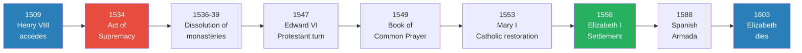
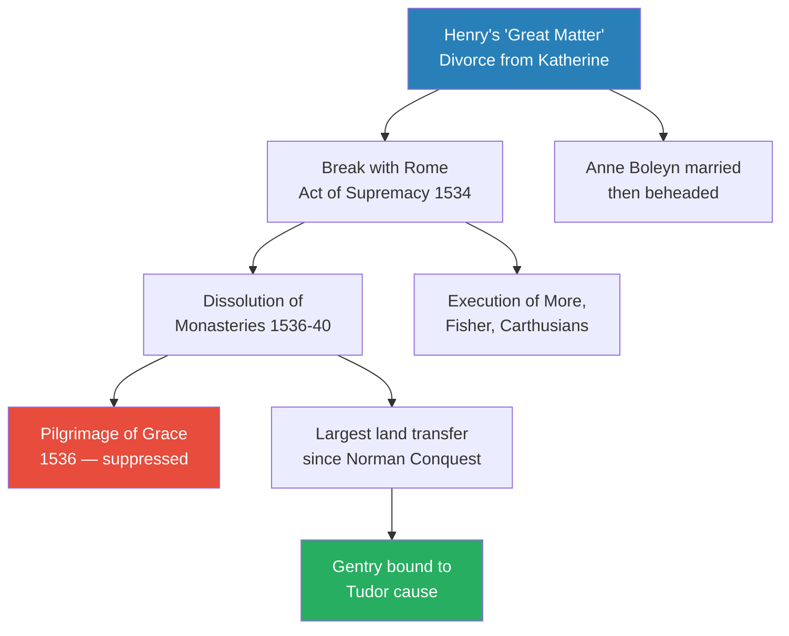
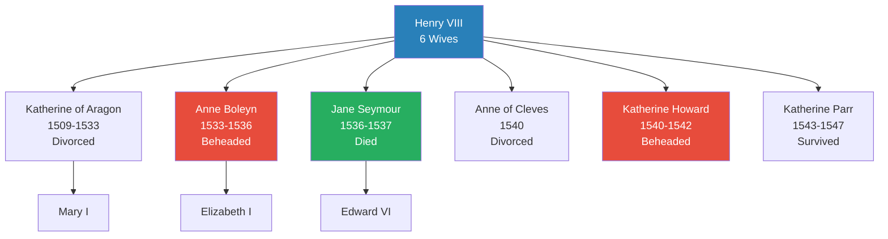
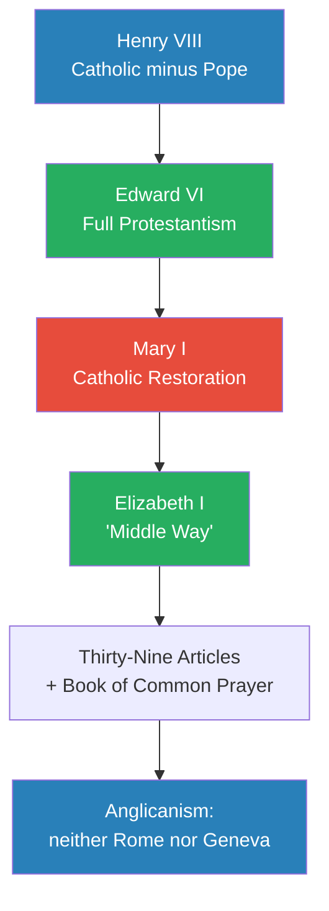
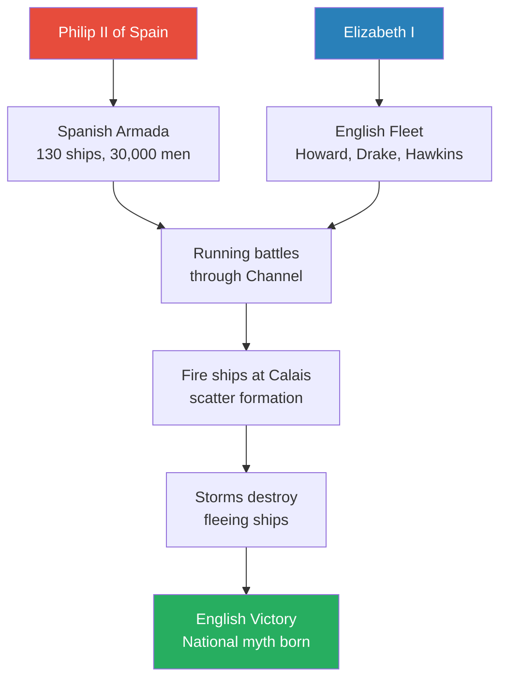

# Tudors — Peter Ackroyd

> Peter Ackroyd tells the story of the Tudor dynasty not as a march of progress but as an improvised drama in which a king's lust for a male heir triggered the most sweeping transformation in English history. Beginning with Henry VIII's golden accession in 1509 and ending with Elizabeth I's death in 1603, the book tracks a century in which the English broke from Rome, dissolved the monasteries, lurched between Protestantism and Catholicism with each new monarch, defeated the Spanish Armada, and laid the foundations for a national Church that satisfied nobody completely but endured for centuries. Ackroyd writes with a novelist's eye for scene and dialogue, juxtaposing the intrigues of the court with the alehouses and churchyards of ordinary England. His central argument is that the English Reformation was a political accident — not a popular movement — and that England became Protestant less through conviction than through obedience, habit, and the slow erosion of memory.

---

## About the Author

Peter Ackroyd is one of England's most prolific writers, the author of more than sixty books spanning biography, fiction, poetry, and history. Born in London in 1949, he studied at Cambridge and Yale before becoming literary editor of The Spectator. His biographies of Dickens, Blake, Shakespeare, and Thomas More established his reputation for immersive, atmospheric storytelling grounded in meticulous research. *Tudors* is the second volume in his six-volume *History of England* series, following *Foundation* (which covers prehistory through the death of Henry VII). Ackroyd writes history the way he writes novels — with sensory detail, reconstructed dialogue, and a feel for the texture of daily life that makes the sixteenth century visceral and close.

---

## The Big Idea

- <b style="color: #27ae60">The English Reformation was a political accident, not a popular revolution</b> — it was driven by one king's need for a male heir and his discovery that he could make himself richer and more powerful by replacing the pope
- No English Luther or Calvin ignited the change from below; the entire process was managed from the throne, step by improvised step, with parliament used to rubber-stamp each new measure
- The people acquiesced out of obedience and fear rather than conviction:
  - <b style="color: #e74c3c">Between 1534 and 1540, over 300 people were executed for treason</b> — speaking against the king's marriage or his religious supremacy was enough to die for
  - The French observer's remark was often quoted: if Henry declared Mahomet to be God, the English would accept it
- Each monarch swung the pendulum in a different direction:
  - Henry VIII broke with Rome but kept the Mass
  - Edward VI imposed full Protestantism in six years
  - Mary I restored Catholicism and burned 284 heretics
  - Elizabeth I settled on a deliberate "middle way" that satisfied neither Catholics nor Puritans
- <b style="color: #2980b9">The Elizabethan settlement</b> — what Burghley called a "midge-madge" of contradictory elements — became the foundation of the Church of England that endures to this day
- The cultural consequences ran deeper than the theological ones:
  - The English Bible transformed the language and inspired Shakespeare, Milton, and Bunyan
  - The death of religious drama gave rise to the secular London playhouse
  - The dissolution of communal rituals and parish festivals created a more individualistic society
  - The modern concept of "the state" emerged towards the end of Elizabeth's reign

---

## Key Concepts at a Glance

| Concept | One-line summary |
|---------|-----------------|
| **The "great matter"** | Henry's divorce from Katherine of Aragon — the trigger for the entire Reformation |
| **Royal supremacy** | The king replaced the pope as head of the English Church |
| **Act of Supremacy (1534)** | Parliament declared Henry "the only supreme head on earth of the Church of England" |
| **Dissolution of the monasteries** | The largest land transfer since the Norman Conquest — bound the gentry to the Tudor cause |
| **Praemunire** | The legal weapon: placing the pope's interests above the king's was a crime |
| **The middle way** | Henry's attempt to be Catholic without the pope; Elizabeth refined this into Anglicanism |
| **Book of Common Prayer** | Cranmer's liturgy (1549, revised 1552) — still the foundation of English worship |
| **The Thirty-Nine Articles** | The doctrinal statement of the Church of England, compiled under Elizabeth in 1563 |
| **Obedience as default** | The English instinct to submit to authority, compounded by fear of treason charges |
| **Reformation by forgetting** | England became Protestant less through zeal than through the slow erosion of Catholic memory |

---

*The Tudor century in nine turning points — from Henry's accession to Elizabeth's death, each event pushing England further from Rome and closer to the modern state.*

---

---

## Part I: Henry VIII — The Golden King and the Great Matter (1509–1530)

*A young king of surpassing energy and vanity discovers that his marriage is cursed, his cardinal is failing him, and his only hope for an heir requires him to defy the pope. In the process he sets in motion a revolution that will transform every aspect of English life — religion, law, land ownership, language, and the very idea of what it means to be English.*

### The Young King and Wolsey's Ascendancy

- Henry VIII came to the throne at seventeen in 1509, succeeding his miserly father:
  - The contrast was deliberate and dramatic — where Henry VII had hoarded gold, his son would spend it on glory
  - The new court was a whirl of jousting, hunting, masques, and music; the young king composed songs and played the lute
  - He was "one of the most remarkable men who ever sat upon a throne" — combining physical prowess, genuine scholarship, and a ferocious will
  - He was tall, athletic, scholarly, and musical — "the handsomest potentate I ever set eyes on," the Venetian ambassador wrote
  - He loved jousting, hunting, dancing, and theology in roughly equal measure
  - His court was devoted to spectacle and magnificence — a deliberate contrast with Henry VII's parsimony
- <b style="color: #2980b9">Cardinal Thomas Wolsey</b> rose to dominate the government:
  - Lord chancellor, papal legate, and archbishop of York — he embodied both Church and State
  - "His Majesty will do so and so" gradually became "We shall do so and so" until it finally became "I will do so and so"
  - He was without doubt the richest man in England — richer even than the king
  - He called only one parliament in fourteen years of power
  - He launched visitations of monasteries, imposed new taxes on the clergy, and effectively ran the English Church without papal interference
  - <b style="color: #27ae60">Wolsey taught Henry that it was possible to administer the Church without Rome</b> — a lesson the king would later use to devastating effect

### War, Diplomacy, and the Field of Cloth of Gold

- Wolsey engineered the Treaty of London (1518) — a pact of universal peace among the Christian princes:
  - It was really an instrument of English prestige; the pope was named only as an "associate"
  - Henry professed to be content: "We want all potentates to content themselves with their own territories, and we are satisfied with this island of ours"
- The <b style="color: #2980b9">Field of Cloth of Gold (1520)</b> was the most spectacular diplomatic event of the century:
  - Henry and Francis I met in the Vale of Ardres near Calais with a combined retinue of thousands
  - Pavilions and palaces, towers and gateways, artificial lakes and fountains that gushed beer and wine
  - Henry wore "fine gold in bullion"; Francis was "too dazzling to be looked upon"
  - The celebrations lasted seventeen days — described as the eighth wonder of the world
  - Yet secret dealings went on behind the arras; Henry met Charles V both before and after, plotting against France
- The country's economy was already straining:
  - The wool trade through Antwerp was England's commercial lifeline — "if Englishmen's fathers were hanged at the gates of Antwerp, their children would creep between their legs to come into the town"
  - Wolsey's "amicable grant" (a forced loan) provoked near-rebellion: 4,000 men took up arms in Suffolk; the tax commissioners were beaten off in Kent
  - In Cambridge and Lincolnshire the people were "looking out for a stir"
  - When the duke of Norfolk asked to see the "captain" of the rebels, he was told: "His name is Poverty; for he and his cousin Necessity have brought us to this doing"
  - <b style="color: #e74c3c">Henry learned the limits of regal power — but it was Wolsey who bore the public blame</b>

> [!example] The London Night Watch (1520)
> - Even as sovereigns slept in pavilions of gold at the Field of Cloth of Gold, the London watch was searching for "suspected persons"
> - A tailor and two servants were found playing cards until four in the morning
> - In Southwark they found many "masterless men" living in ragged tenements
> - An "old drab and a young wench" were found lying on a dirty sheet in a cellar
> - Carters slept against tavern walls; mowers and haymakers dwelt peaceably in suburban inns
> - Men and women went about their business, legal or otherwise. And so the summer passed.
> **The lesson:** Ackroyd's genius is this juxtaposition — the pageantry of kings and the squalor of streets, happening simultaneously.

---

### Enclosure and Social Change

- The English countryside was being transformed by enclosure — the concentration of common land into private hands:
  - Thomas More's Utopia attacked it: the sheep were now eating the people rather than the reverse
  - One shepherd took the place of a score of agricultural workers
  - A bishop wrote to Wolsey that "your heart would mourn to see the towns, villages, hamlets, manor places in ruin and decay"
  - The simple houses of the tenantry, once abandoned, dissolved by wind and rain — leaving only hillocks of earth where they had stood
  - Custom was being replaced by law and contract; communal effort was supplanted by competition
  - <b style="color: #27ae60">The movement of agriculture could be compared with the movement of religion</b> — in both cases, the communal world was giving way to the individual
- Ackroyd draws a geographic correlation between religion and economics:
  - The common fields of Northumberland harboured attachment to the old religion
  - The commercial corn-growing villages of East Anglia were committed to reform
  - Religious radicalism prospered in the east; orthodoxy held in the north and west

---

### The Seeds of Reform

- At Cambridge, scholars met at the White Horse tavern to debate Luther's ideas:
  - The tavern was nicknamed "Germany" and its regulars were called "Germans"
  - Among them were Thomas Cranmer, William Tyndale, Nicholas Ridley, and Matthew Parker
  - Two became archbishops, seven became bishops, and eight became martyrs burned at the stake
  - This was an exhilarating and also a dangerous time — the pulpit of St Edward's church became the platform for new truths
  - Thomas Bilney declared on reading Erasmus: "at last I heard of Jesus" — he was later burned at the stake
- The published work of <b style="color: #2980b9">Desiderius Erasmus</b> had already brought a purer spirit to theology:
  - His Greek and Latin translation of the New Testament seemed to supersede the old Vulgate that had been in use for a thousand years
  - He believed that inward faith was more important than external worship
  - "If you approach the Scriptures in all humility, you will perceive that you have been breathed upon by the Holy Will"
  - He attacked the excessive devotion to relics, the too frequent resort to pilgrimages, and the degeneration of the monastic orders
  - He was never a heretic — but he was "as much a dissolvent of conventional piety as Luther or Wycliffe"
- <b style="color: #2980b9">William Tyndale</b> translated the New Testament into English from the Greek — a sensation and a revelation:
  - He had found no employment in London and travelled to Germany in search of a more tolerant atmosphere
  - In Wittenberg he translated the Greek into "plain and dignified English, in a language that the ploughman as well as the scholar could understand"
  - "Congregation" replaced "church"; "senior" replaced "priest" — the vocabulary of priestly power was silently excised
  - The book was published in Worms and secretly distributed in England — copies selling for 3s 2d
  - The bishop of London described it as "pestiferous and pernicious poison" and had it solemnly burned in St Paul's Churchyard
  - He bought and burned the entire Antwerp edition, only to discover he had put money in the printers' pockets and stimulated a new edition
  - The English Bible would prove more transformative than any Act of Parliament
  - Little groups in Coleman Street, Hosier Lane, and Honey Lane eagerly took up the translation
  - In the parish church of Rickmansworth, certain people flung the statues and the rood screen upon a fire — a portent of later iconoclasm

### The Woes of Marriage

- Henry's marriage to Katherine of Aragon had produced only one surviving child — a daughter, Mary:
  - The queen had endured multiple pregnancies — stillbirths, miscarriages, infant deaths — but only Mary survived
  - She was approaching forty; "all her early grace had faded," and the young king of France described her as "ugly and deformed"
  - Henry had already fathered an illegitimate son, Henry FitzRoy, with his mistress Bessie Blount — proof that he could sire male children
- He became convinced that Leviticus forbade marriage to a brother's widow, and that God was punishing him with the absence of a male heir:
  - He had quoted Leviticus in his own treatise against Luther — "I will even appoint over you terror, consumption, and the burning ague"
  - The conscience of the king became the engine of revolution: "conscience" appears in many of his letters "as a way of justifying himself to heaven"
  - He declared that conscience "is the highest and supreme court for judgement or justice"
- In matters of succession Henry could be savage:
  - The duke of Buckingham, who stood next in line to the throne, was beheaded in 1521 after consulting a monk who prophesied that Henry would have no male issue
  - Buckingham had bought inordinate amounts of cloth of gold — and one servant alleged he had planned to come into the royal presence "having upon him secretly a knife"
- His infatuation with <b style="color: #2980b9">Anne Boleyn</b> added personal urgency to a dynastic crisis:
  - She had caught the eye of the king around 1523; Wolsey had previously broken up her attachment to Henry Percy
  - She was expelled from court — and "she smoked" with rage, according to Wolsey's usher Cavendish
  - He wrote her love letters in French, the language of courtly romance — an eighteenth-century historian described them as "very ill writ, the hand is scarce legible and the French seems faulty"
  - She retreated to Hever Castle and refused to come to court
  - She was pert, vivacious, quick-witted — and determined not to become merely a royal mistress
  - She sent him a diamond decorated with a lady tossed on the waves — a steadfast heart amid turbulence
  - Henry named a new royal ship the Anne Boleyn in 1526 and commissioned brooches depicting Venus, a heart, and a crown

> [!example] Katherine's Defiant Speech at Blackfriars (1529)
> - The legatine court convened at Blackfriars to judge the king's marriage
> - Katherine rose without replying to her summons, crossed the chamber, and knelt at Henry's feet
> - "I am a poor woman, and a stranger in your dominions," she told him so all could hear
> - She pleaded her virginity when she had met him and the fact she had borne him several children
> - She asked to be excused until she could hear from Spain — then rose, curtsied to the king, and walked out
> - The cardinals called after her but she made no answer
> **The lesson:** Dignity and self-possession, in the face of intolerable pressure, were Katherine's most powerful weapons — and they won her the sympathy of the nation.

- Wolsey's failure to deliver a favourable verdict was the decisive moment in his career:
  - The pope recalled the case to Rome; Henry was furious
  - Anne Boleyn told the king that Wolsey secretly supported Katherine
  - "There is never a nobleman within this realm," she said, "that if he had done but half so much as he has done, but he were well worthy to lose his head"

> [!example] Wolsey's Death at Leicester Abbey (1530)
> - Arrested on treason charges, Wolsey was taken south at a slow pace
> - His once sturdy constitution was fatally undermined; dysentery attacked him on the journey
> - When the keeper of the Tower arrived to escort him, Wolsey clapped his hand on his thigh and gave a great sigh
> - "Father Abbot," he said on reaching Leicester, "I am come hither to leave my bones among you"
> - Of the king he said: "He is a prince of royal courage, and has a princely heart; and rather than he will miss or want part of his appetite he will hazard the loss of one half of his kingdom"
> - He died at the stroke of eight in the evening
> **The lesson:** Wolsey's fall was intimately associated with the demise of the independent Church in England.

---

## Part II: Henry VIII — Breaking with Rome (1530–1540)

*In ten extraordinary years, England severs itself from a thousand years of papal authority, destroys the monasteries, and creates a national Church under a king who considers himself an orthodox Catholic. This is the heart of Ackroyd's book — the decade that changed everything. Henry proceeded step by step, testing the ground with each move, never revealing his full intentions. By the time anyone understood what had happened, it was too late to reverse.*

### Thomas Cromwell and the Machinery of Power

- <b style="color: #2980b9">Thomas Cromwell</b> had been in the service of Wolsey and wept at his master's fall — with a book of prayers to the Virgin in his hand:
  - Yet he inveigled himself into the king's good grace and rose with extraordinary speed
  - He became successively: royal councillor, master of the king's jewels, chancellor of the exchequer for life, master of the rolls, secretary of state, and vicegerent in spiritual matters
  - His career has been compared to that of a grand vizier in an eastern despotism
  - Yet he never repudiated his old patron — when granted his own coat-of-arms he adopted Wolsey's device of the Cornish chough
- Cromwell created an effective system of control that foreshadowed the modern surveillance state:
  - "The king's pleasure and commandment is that, all excuses and delays set apart, you shall incontinently upon the sight hereof repair unto me" — one of many unwelcome invitations
  - "I hear it is your pleasure that I should go into the country to hearken if there be any ill-disposed people in those parts" — a lord wrote to Cromwell
  - "Tale-tellers" and "counterfeiters of news" were to be apprehended
  - There was no notion of privacy in the sixteenth-century world: men shared beds, princes dined in public, individuals were under endless scrutiny from neighbours
  - From every schoolroom and pulpit the virtue of obedience was emphasized — it was God's law, against which there could be no appeal
- The Act of Succession was nailed to the door of every parish church in the country:
  - The clergy were ordered to preach against the pope; they were forbidden to mention purgatory
  - Henry demanded total obedience by methods no king before him had presumed to use
  - One villager complained that if three or four people were seen walking together "the constable come to them and will know what communication they have"
  - A fragment of a conversation survives: "Be content, for if you report me I will say that I never said it"
  - Erasmus wrote that "friends who used to write and send me presents now send neither letters nor gifts" through fear
  - <b style="color: #e74c3c">The people of England now acted "as if a scorpion lay sleeping under every stone"</b>

---

### The Submission of the Clergy

- The clergy's independence was systematically destroyed:
  - In February 1531 Henry sent five articles to convocation, the first demanding recognition of him as "sole protector and supreme head of the English church and clergy"
  - He also proposed the theory that it was he who truly had the "cura animarum" — the cure of souls — traditionally the office of an ordained priest
  - No king had ever proposed such sweeping powers
  - The clergy debated for weeks, torn between duty to the pope and loyalty to the king
  - A compromise was reached: Henry would be supreme head "quantum per Christi legem licet" — "so far as the law of Christ allows"
  - This phrase could mean anything — but in practice nobody would defy the king
- The "Submission of the Clergy" (1532) was even more decisive:
  - No new canons could be proposed without royal licence
  - All existing ecclesiastical laws were to be reviewed by a panel of ecclesiastics and parliamentarians
  - The Spanish ambassador wrote that "churchmen will now be of less account than shoemakers, who at least have the power of assembling and making their own statutes"
  - Lord Acton would later describe this as "the advent of a new polity" — the independent nation state could not have emerged without this radical separation from Rome
- Thomas More resigned as chancellor the day after the Submission:
  - "If a lion knew his own strength," he had once said of the king, "hard were it for any man to rule him"

---

### The Act of Supremacy

- Henry's scholars discovered ancient precedents for royal supremacy over the Church:
  - In the Leges Anglorum they found that a second-century king, Lucius I, had been told by the pope himself that "you are vicar of God in your realm"
  - Henry annotated the research at forty-six separate points
  - After reading Tyndale's The Obedience of a Christian Man, he declared: "This is the book for me and all kings to read"
  - When Anne Boleyn's father went as envoy to the pope, he refused to kiss the papal foot even when it was graciously extended
- The formal break came through a series of parliamentary Acts:
  - The Act in Restraint of Appeals (1533) declared that "this realm of England is an empire" governed by one supreme head — it was the most important statute of the sixteenth century
  - The Act of Succession (1534) settled the inheritance on Anne Boleyn's children and imposed an oath on every person of full age
  - The Treasons Act (1534) made it a capital offence to call the king a heretic or schismatic
  - The <b style="color: #2980b9">Supremacy Act (1534)</b> declared Henry "the only supreme head on earth of the Church of England, called Anglicana Ecclesia"
  - He could reform all errors and correct all heresies — lacking only potestas ordinis (the power to administer sacraments)
  - The pope was "abolished, eradicated and exploded out of this land," in the words of John Foxe
- Henry married Anne Boleyn secretly in January 1533; Cranmer declared the marriage lawful in May:
  - Anne was crowned in a grand procession from the Tower to Westminster — golden canopy stringed with silver bells
  - But the monogram "HA" was interpreted by some as a ribald "Ha! Ha!"
  - The Venetian envoy witnessed "the utmost order and tranquillity" — which might be better interpreted as silent hostility
  - Anne herself counted only ten people who shouted the customary "God save your Grace"
  - Her garments were "covered with tongues pierced with nails, to show the treatment which those who spoke against her might expect"

> [!tip] Core Insight
> The break with Rome was achieved not through one dramatic gesture but through a patient accumulation of parliamentary statutes — each one small enough to be accepted, but together amounting to the most sweeping constitutional revolution in English history. Henry used parliament as a shield: if the people objected, it was parliament that had decreed it, not the king alone.

> [!tip] Core Insight
> Henry never intended to create a Protestant nation. He wanted a Catholic Church without the pope — and the wealth of the monasteries for himself. Everything that followed was improvised.

### The Oath and the Terror

- The Act of Succession (1534) was enforced by an oath — every person of full age was sworn to defend its provisions:
  - The whole of London swore; in Yorkshire the people were "most willing to take the oath"
  - The sheriff of Norwich reported that "never were people more willing or diligent"
  - In the village of Little Waldingfield in Suffolk, ninety-eight signed with their name and thirty-five with a mark
  - A popular phrase of the time was that "these be no causes to die for"
- Yet genuine fear pervaded the realm:
  - One villager complained that "the constable come to them and will know what communication they have, or else they shall be stocked"
  - A conversation fragment survives in a court document: "Be content, for if you report me I will say that I never said it"
  - Erasmus wrote that "friends who used to write and send me presents now send neither letters nor gifts, nor receive any from any one, and this through fear"
  - <b style="color: #e74c3c">The people "acted as if a scorpion lay sleeping under every stone"</b>
  - Between 1534 and 1540 over 300 executions were ordered for treason
  - A large number of people fled the realm; those who remained learned the art of silence
  - It was said that if three or four people were seen talking together the constable would demand to know their business
  - The fear was compounded by the surveillance system Cromwell had created — an effective if informal network of informants and "tale-tellers"
  - No priest or friar between sixteen and sixty was permitted to carry any weapon save a meat knife
  - Cromwell himself took up the investigation of the accused: his letters summoned men to appear "incontinently upon the sight hereof"
- The Treasons Act made it a capital offence to speak against the king, his marriage, or his supremacy:
  - It was treason to call the king a heretic, a schismatic, or a tyrant
  - The word "conscience" was now Henry's weapon — he declared that obedience to the sovereign was obedience to God

### The Killing Time

- Those who refused the oath of supremacy were destroyed:
  - The Carthusian monks were the first clergy executed — the first time in English history that clergy suffered in their ecclesiastical dress:
  - Their prior, John Haughton, was partially hanged before his heart was ripped out and rubbed in his face
  - His bowels were pulled from his stomach while he still lived and burned before him
  - He was beheaded and his body cut into quarters
  - "The king himself would have liked to see the butchery," it was reported
  - The citizens of London were horrified; it was observed that since the day of their death it had never ceased to rain
  - The corn harvest yielded only a third of the usual crop — all conceived to be a sign of divine displeasure
- <b style="color: #e74c3c">John Fisher</b>, bishop of Rochester, was put on trial for saying "the king our sovereign lord is not supreme head in earth of the Church of England":
  - The pope had made him a cardinal — Henry promised that "his head would be off before the hat was on" (the hat got as far as Calais)
  - So emaciated he had to be carried in a chair to the scaffold; observers were astonished at the blood from his skeletal body
  - "I beseech Almighty God of His infinite goodness to save the king and this realm"
- <b style="color: #e74c3c">Thomas More</b> was the most famous victim:
  - Cromwell bullied him in the Tower, insinuating that More's obstinacy had helped bring the Carthusians to destruction
  - "I do nobody harm," More replied. "I say none harm, I think none harm, but wish everybody good. And if this be not enough to keep a man alive, in good faith I long not to live"
  - At the scaffold he jested with the executioner: "My neck is very short; take heed, therefore, thou strike not awry for saving of thine honesty"
  - Katherine of Aragon, witnessing these destructions, wrote to the pope: "If a remedy be not applied shortly, there will be no end to ruined souls and martyred saints"

### Anne Boleyn: Rise and Fall

- Anne gave birth to a daughter, Elizabeth, in September 1533 — not the son Henry craved
- In January 1536, on the day of Katherine of Aragon's burial, Anne miscarried a male child
- Within four months she was arrested, tried, and beheaded on charges of adultery with five men, including her own brother

> [!example] "A Little Neck" — Anne Boleyn's Execution (1536)
> - The lieutenant of the Tower told her the execution would be "no pain, it was so subtle"
> - "I have heard say that the executioner is very good," she replied, "and I have a little neck"
> - She put her hands about her neck and laughed
> - On the scaffold she glanced continually behind her, as if she might be taken unawares
> - She was the first queen of England ever to be beheaded
> - When the executioner held up the head, its eyes and lips moved
> - Her body was thrown into a common chest of elm, made to hold arrows
> **The lesson:** Whether guilty or innocent, Anne's fate demonstrated that proximity to Henry's power was the most dangerous place in England.

### The Dissolution of the Monasteries

- <b style="color: #2980b9">Thomas Cromwell</b> orchestrated the dissolution as vicegerent in spiritual matters:
  - Visitors interrogated monks with eighty-six questions about their conduct:
    - "Whether the divine service was kept up, day and night, in the right hours?"
    - "Whether they kept company with women, within or without the monastery?"
    - "Whether they had any boys lying by them?"
    - "Whether any of the brethren were incorrigible?"
  - The results were predictable: the abbot of Fountains kept six whores; the prior of Crutched Friars was found in bed with a woman at eleven on a Friday morning
  - The abbot of West Langdon was "the drunkenest knave living"
  - Richard Leyton, one of the visitors, described breaking down an abbot's door with a poleaxe: "I go about the house with that poleaxe in my hand, for this abbot is a dangerous desperate knave, and a hardy"
  - When sins are actively looked for, they can always be found
  - If there was no evidence of wrongdoing, the visitors concluded the monks were engaged in a conspiracy of silence
- First the smaller houses fell (1536), then the greater ones (1537–40):
  - An Act for the Dissolution of Monasteries declared all religious houses with income under £200 should be "suppressed"
  - The king told parliament: "I hear that my bill will not pass, but I will have it pass, or I will have some of your heads"
  - Some monks resisted — at Hexham in Northumberland the monks appeared on the roof with swords, bows, and arrows: "We be twenty brethren in this house, and we shall die all before you shall have the house"
  - At the priory of St Nicholas in Exeter, a crowd of angry women attacked the workmen pulling down the rood loft, "hurled stones at him, insomuch that for his safety he was driven to take to the tower for refuge"
  - The abbots of Glastonbury, Colchester, and Reading were all hanged for resisting
  - The abbot of Glastonbury was dragged through the streets, hanged on Glastonbury Tor, his head placed on the abbey gate and his quarters distributed through Somerset
- <b style="color: #27ae60">This was the largest transfer of land ownership since the Norman Conquest</b>:
  - The monks controlled roughly one sixth of English territory
  - The spoils went to courtiers, gentry, and merchants — binding them to the Tudor cause and the Reformation
  - Cromwell and Norfolk shared the Cluniac priories at Lewes and Castle Acre between them
  - The duke of Northumberland secured eighteen monastic properties; the duke of Suffolk became master of thirty
  - Sir Richard Grenville wrote to Cromwell: "If I have not some piece of this suppressed land I should stand out of the case of few men of worship of this realm" — he was simply following everyone else
- The physical destruction was systematic:
  - At the priory of Lewes: "We had to pull the whole down to the ground" — seventeen workmen brought from London with furnaces to melt the lead stripped from the roof
  - The pages of monastic libraries — once one of the glories of England — were used to scour candlesticks, clean shoes, or "fast nailed up upon posts in all common houses of easement" (latrines)
  - Parlours were hung with altar-cloths; baptismal fonts became basins for salting fish
  - A Lancashire gentleman "made a parlour of the chancel, a hall of the church and a kitchen of the steeple"
  - The steeple of Austin Friars was used to store coal; the Minories became an armoury; the Crutched Friars became a glass factory
  - Monasteries were converted into stables, cook-houses, taverns, and clothing factories
- Yet some provision was made for the monks:
  - Small pensions were offered; "Thank God," said the former abbot of Beaulieu, "I am rid of my lewd monks"
  - The former abbot of Sawtry revealed: "I was never out of debt when I was abbot"
  - Certain abbots became diocesan bishops and were more prosperous than ever
  - The abbot of Athelney was offered 100 marks; he threw up his hands: "I will fast three days on bread and water than take so little"
  - One monk tried to sell his cell door for two shillings — "it had cost more than five shillings"
  - <b style="color: #e74c3c">Within three years the life of ten centuries was utterly destroyed</b>
- The nunneries suffered especially:
  - Some 140 nunneries housed about 1,600 women, mostly Benedictines
  - It was much harder for a nun than a monk to make her way in the secular world
  - The nuns of Langley were "all desirous to continue in religion"; the prioress "is of great age and impotent" while "one other is in regard a fool" — yet they were not spared
  - The nunneries had offered education for daughters of the gentry — surgery, needlework, confectionery, writing, and drawing
  - The great ages of female spirituality, evinced by women like Dame Julian of Norwich, now came to an end

> [!example] The Young Man at Roche Abbey
> - A young man asked a workman destroying Roche Abbey whether he thought well of the monks
> - "Yes," the man replied, "for I saw no cause to the contrary"
> - "Then how comes it that you are so ready to destroy what you thought so well of?"
> - "Might I not as well as others have some profit from the spoil? For I saw all would away, and therefore I did as others did"
> **The lesson:** There speaks the representative voice of the Englishman at a time of reformation — pragmatic, acquisitive, and resigned.

### The Burning of a Friar

- The persecution of Catholics and Protestants continued in parallel:
  - <b style="color: #e74c3c">John Forrest</b>, an Observant friar who denied the royal supremacy, was burned at Smithfield in 1538
  - A cradle of chains was placed above a pile of wood; upon the pyre was placed the desecrated image of a Welsh military saint, Darvel Gadarn
  - Hugh Latimer preached for three hours from a pulpit placed next to the scaffold
  - When he exhorted Forrest to repent, the friar replied: "If an angel should come down from heaven and show me any other thing than that I had believed all my lifetime, I would not believe him"
  - Cromwell pointed to Forrest and told the bishop: "I think you strive in vain with this stubborn one. It would be better to burn him"
  - He was hoisted into the air in the cradle of chains; in his mortal agony he clutched at a ladder to swing himself out of the blaze, but did not succeed
  - He took two hours to die

> [!example] The Heresy Trial of John Lambert (1538)
> - Henry himself presided, dressed entirely in white silk as a token of purity
> - "Ho, good fellow, what is your name?" the king began
> - Lambert had used an alias to avoid detection; Henry stopped him: "I would not trust you, having two names, although you were my brother"
> - "Tell me plainly whether you say it is the body of Christ"
> - "It is not his body. I deny it"
> - After five hours: "Will you live or die? You have yet a free choice"
> - "I commit my soul to God and my body to the king's mercy"
> - "That being the case, you must die. I will not be a patron to heretics"
> - Six days later Lambert was burned at Smithfield. "None but Christ!" he called out. "None but Christ!"
> **The lesson:** Henry was willing to burn both papists and Protestants. His "middle way" was enforced with fire — the only thing that mattered was obedience to the king.

---

### The Destruction of the Pole Family

- When Cardinal Reginald Pole was sent from Rome as a papal legate, Henry surrounded him with spies and assassins:
  - He offered 100,000 pieces of gold for the man who brought Pole to England dead or alive
  - When Pole could not be reached, the king proceeded against his family
  - Geoffrey Pole, the cardinal's brother, was interrogated and broke under pressure — revealing everything he knew
  - Lord Montague (another brother) was arrested; he had said the king "will one day die suddenly — his leg will kill him — and then we shall have jolly stirring"
  - The marquis of Exeter was also taken
  - <b style="color: #e74c3c">Margaret Pole, the cardinal's mother — descended from the Plantagenets — was executed at the age of sixty-seven</b>
  - She told the executioner she would not lay her head on the block, saying she had received no trial
  - When forcibly held down, the inexperienced executioner "hacked away at her head and neck for several minutes"
  - Cardinal Pole declared: "I am now the son of a martyr. We have now one more patron in heaven"

---

### The Pilgrimage of Grace

- The dissolution provoked the most dangerous rebellion of Henry's reign:
  - Robert Aske led 20,000 men behind the banner of the Five Wounds of Christ
  - They demanded the restoration of the monasteries, the "old faith," and the removal of Cromwell
  - The city of York opened its gates; monks were escorted back to their houses by torchlight
- Henry's response was a masterclass in duplicity:
  - Norfolk negotiated a truce with promises that were never meant to be kept
  - Henry invited Aske to court, embraced him, gave him a jacket of crimson satin
  - Then had him arrested, tried, and hanged at York
  - <b style="color: #e74c3c">He ordered Norfolk to "cause such dreadful execution to be done upon a good number of the inhabitants of every town, village and hamlet … as they may be a fearful spectacle to all others"</b>
  - Rebels were hanged in their home villages, from the trees in their own gardens
  - Others were hanged in chains; the uncle might agree to a sentence of death upon a nephew and then see his head impaled upon a stake
  - The brutality and subsequent terror worked — there were no more complaints about the suppression of the monasteries
  - Lord Darcy, who had surrendered Pontefract Castle, was beheaded on Tower Hill
  - He had said when he first heard of the Lincolnshire rebellion: "God speed them well. I would they had done this three years past"
- The Pilgrimage revealed a strong current of popular protest:
  - The majority wished to maintain their parish churches and opposed any innovation
  - They argued that the "care of souls" should be returned to the pope
  - They denounced Luther and all whom they called heretics
  - Yet Henry had faced them down by duplicity and cunning — he had broken every promise made on his behalf
  - Cranmer wrote that the enemies of reform "now look humbled to the ground and oppose us less"
  - Henry could now move forward with impunity

> [!example] Henry Embraces and Betrays Robert Aske (1536-37)
> - After the Pilgrimage was suspended by truce, the king sent a private invitation to Aske
> - "Be you welcome, my good Aske; it is my wish that here, before my council, you ask what you desire and I will grant it"
> - "Sir, your majesty allows yourself to be governed by a tyrant named Cromwell"
> - Henry gave the rebel a jacket of crimson satin and asked him to prepare a history of the previous months
> - Aske left the court believing the king sympathized with his cause
> - But Henry had no intention of halting the dissolution or holding a parliament in York
> - When further disturbances broke out, he asked Aske to help suppress them — testing his loyalty
> - Then had him arrested, tried, and hanged at York
> **The lesson:** Henry's capacity for face-to-face duplicity was extraordinary. He could embrace a man, dress him in silk, and then order his execution without a tremor of conscience.

---

### The Lincolnshire Rising — Prelude to the Pilgrimage

- The first revolt erupted in October 1536 at the market town of Louth in Lincolnshire:
  - A procession had gathered behind three silver crosses when a singing-man, Thomas Foster, cried out: "Masters, step forth and let us follow the crosses this day: God knows whether ever we shall follow them again"
  - The fear was of confiscation — that evening armed villagers guarded their parish church
  - Bands of armed men under "Captain Cobbler" rode through the county to impede the royal commissioners
  - Common bells rang to raise the people
  - The chancellor of Lincoln was pulled from his horse and murdered by a mob — priests calling out "Kill him! Kill him!"
  - Beacons were lit along the south shore of the Humber; the people of Yorkshire saw the fires and understood
  - An army of 10,000, then 20,000, advanced upon Lincoln
- Henry responded with characteristic fury:
  - "How presumptuous then are you, the rude commons of one shire, and that one of the most brute and beastly of the whole realm, to find fault with your Prince?"
  - The rebellion lasted a fortnight; only a few leaders were hanged
  - But the signal had been sent — and Yorkshire answered

*Henry's need for a divorce triggered a chain reaction that no one planned — each step making the next one inevitable.*

---

### The Destruction of the Shrines

- The most spectacular act of destruction targeted the shrine of <b style="color: #2980b9">St Thomas Becket at Canterbury</b> — probably the richest in the world:
  - Erasmus had described how "every part glistened, shone and sparkled with rare and very large jewels, some of them exceeding the size of a goose's egg"
  - The treasure was dismantled and packed into wooden chests, transported to London in twenty-six ox-wagons
  - One great ruby donated by Louis VII of France was fashioned into a ring that Henry wore on his thumb
  - Becket was tried in absentia, attainted of treason, and his bones were disinterred and burned — the ashes discharged from a cannon
- Other relics were exposed as frauds:
  - The "rood of grace" at Boxley Abbey had springs that moved the eyes and head of Jesus — the mechanism was exposed and the image thrown to the London crowd
  - The blood of Hailes, believed to be Christ's blood, was revealed to be honey and saffron
  - The bishop of Salisbury urged the destruction of "stinking boots, mucky combs, ragged rochets, rotten girdles, pyled purses, great bullocks' horns, locks of hair, and filthy rags"
- The desecration encouraged ridicule of all old certainties:
  - It was said that "if our lady were here on earth, I would no more fear to meddle with her than with a common whore"
  - Some townspeople of Rye declared that "the mass was of a juggler's making and a juggling cast it was"

---

### The English Bible

- <b style="color: #27ae60">Thomas Cromwell decreed that every church must possess and display an English Bible</b> — chained in an open place where anyone could consult it:
  - The edition used was Miles Coverdale's, essentially a reworking of Tyndale's original
  - Thus the man whose translation had been burned by royal decree eleven years before became the unheralded scribe of the new English faith
  - Coverdale introduced such phrases as "loving kindness" and "tender mercy" into the language
  - It was said that the voice of God was English
  - The historian William Strype wrote that "everybody that could bought the book, or busily read it, or got others to read it to them"
  - It was read aloud in St Paul's Cathedral to crowds who had gathered to listen
- Cromwell also ordered the clergy to keep a register of "every wedding, christening and burying":
  - The parish register has been kept ever since — one of the most notable innovations of the reformed faith
- The English Bible transformed the culture:
  - It identified the English Bible with the movement of religious change, associating what would become Protestantism with English identity
  - It introduced a biblical culture of the word, replacing the predominantly visual culture of the medieval world
  - The career of Oliver Cromwell — a distant relation of Thomas Cromwell — cannot be understood without the English Scriptures

---

### Henry's "Middle Way" and the Act of Six Articles

- Henry remained an orthodox Catholic in all respects except papal supremacy:
  - He attended several Masses each day; he fingered a personal rosary throughout his life
  - He never proclaimed himself a Lutheran; he still believed in the ritual of "creeping to the cross"
  - The Bishops' Book (1537) tried to chart a middle course between Catholic and reformed positions
  - Henry personally amended Cranmer's draft — where Cranmer wrote about justification by faith, Henry added the words "as long as I persevere in His precepts and laws"
- German Lutherans who came to London to negotiate found the king immovable:
  - They were lodged in poor accommodation plagued by "multitudes of rats running in their chambers day and night"
  - One of them fell seriously ill; they stayed for five months and achieved nothing
  - The Lutheran reformer Melanchthon privately deplored "the maintenance of popish superstition"

### The Fall of Cromwell and Henry's Later Wives

- <b style="color: #2980b9">The Act of Six Articles (1539)</b> marked a conservative turn — transubstantiation upheld, clerical celibacy enforced:
  - Known as "the whip with six strings" or "the bloody act"
  - Cranmer was forced to send his wife and children into exile
  - The French ambassador wrote that "the people show great joy at the king's declaration touching the sacrament"
- There was a significant epilogue to the Act of Six Articles — one of Ackroyd's finest set pieces:

> [!example] Cranmer's Notebook and the Bear (1539)
> - Cranmer, wrestling with his conscience, made scholarly notes on the mistakes in the Six Articles
> - His secretary, Ralph Morice, took a wherry from Lambeth to deliver the notebook to the king
> - On the south side of the river a bear-baiting was being held; the bear broke loose and plunged into the Thames
> - All the passengers leaped into the water; the bear clambered into the boat
> - Morice lost his nerve, jumped overboard, and saw the book floating on the water
> - He called to the bear-ward to retrieve it — but the man handed it to a priest
> - The priest saw immediately that these were notes against the Six Articles and accused Morice of treason
> - Morice foolishly confessed that the notes were written by the archbishop himself; the priest refused to return them
> - In a panic Morice called on Thomas Cromwell, who summoned the priest the next morning and "took the book out of his hands, and threatened him severely for his presumption"
> **The lesson:** The story captures the terror, the absurdity, and the byzantine court politics of Henrician England in a single episode — a bear, a priest, a notebook, and the fate of an archbishop.

- Cromwell arranged the disastrous marriage to Anne of Cleves:
  - Henry rode incognito to Rochester to see his bride secretly before the official meeting
  - He did not like what he saw — comparing her to "a Flanders mare"
  - He berated the earl of Southampton for praising her beauty; the earl replied matters had gone too far to reverse
  - "Is there none other remedy," Henry asked Cromwell, "but that I must needs, against my will, put my neck in the yoke?"
  - There was no remedy — he could not renounce her at the cost of alienating the German princes
  - "I am not well handled," he told Cromwell — a warning that the minister chose to ignore
  - The marriage was annulled after six months; Anne was given a generous pension and settled in England for seventeen years
  - But the failure of the match was the beginning of Cromwell's end — Henry never forgave the minister who had shackled him to an unwanted wife
  - The French king, Francis I, had always detested Cromwell as a heretic; the duke of Norfolk suggested to Henry that an agreement with France might be reached if Cromwell were removed
  - Henry was happy to portray himself as a religious conservative — and Cromwell as the covert Lutheran who had misled his master
  - The charges were largely untrue — but truth was never the point

> [!example] Cromwell's Arrest (1540)
> - On 10 June Cromwell took his place in the Lords as usual; at three he proceeded to his chair at the council table
> - Norfolk shouted: "Cromwell! Do not sit there! That is no place for you! Traitors do not sit among gentlemen"
> - "I am not a traitor," Cromwell replied
> - The captain of the guard arrested him; in fury Cromwell threw his cap on the stone floor
> - "This, then, is the reward for all my services"
> - He was executed by two "ragged and butcherly" executioners who spent nearly half an hour chopping at his neck
> **The lesson:** The architect of the Reformation was destroyed by the very instrument — the bill of attainder — that he himself had invented.

- <b style="color: #2980b9">Katherine Howard</b>, Norfolk's pretty niece, became the fifth wife — young, vivacious, and fatally indiscreet:
  - She was perhaps sixteen, perhaps twenty-two — her date of birth is not known
  - It was one of her family's mottoes that marriage must provide more than "four bare legs in a bed"
  - Even as the royal progress went northward, she began a liaison with Thomas Culpeper — arranging secret meetings through back doors and back stairs
  - Cranmer was approached by an informant who knew about Katherine's earlier indiscretions
  - The archbishop left a sealed letter for the king during a service in the royal chapel — Henry had just given public thanks for "a wife so entirely conformable to my inclinations"
  - When the truth emerged Henry raged so violently "it was feared he would go mad" — called for his sword, then broke down and wept
  - Norfolk, her uncle, declared she "had prostituted herself to seven or eight persons" and "ought to be burned"
  - Culpeper and Dereham were executed; Katherine was beheaded in February 1542
  - She had rehearsed her death — asking for the block to be brought to her cell so she could learn to place her neck on it gracefully
  - On the day of her execution the king held a great banquet with twenty-six ladies at his table
  - Yet in private he was cast down — in the margin of Proverbs he marked: "For the lips of a harlot are a dropping honeycomb"
- <b style="color: #2980b9">Katherine Parr</b>, the sixth wife, was learned and pious — twice widowed, in love with Thomas Seymour, but commanded by the king:
  - "A fine burden Madam Katharine has taken on herself!" Anne of Cleves remarked
  - Katherine was genuinely interested in religious reform; she wrote two devotional manuals
  - "Every day in the afternoon for the space of one hour," one of her chaplains made collation to her and her ladies
  - Among these ladies were a number of tacit Lutherans — creating a circle of female piety at the heart of the court
  - The young damsels "have continually in their hands either psalms, homilies, or other devout meditations"
  - She helped guide the studies of all three royal children — Edward called her "his most dear mother"

*Divorced, beheaded, died, divorced, beheaded, survived — the six wives as milestones in England's transformation.*

---

| Wife | Married | Fate | Significance |
|------|---------|------|-------------|
| **Katherine of Aragon** | 1509 | Divorced 1533 | The "great matter" triggered the break with Rome |
| **Anne Boleyn** | 1533 | Beheaded 1536 | Her coronation and fall accelerated the Reformation |
| **Jane Seymour** | 1536 | Died 1537 | Gave Henry his son Edward — the only wife he truly mourned |
| **Anne of Cleves** | 1540 | Divorced 1540 | The "Flanders mare" marriage destroyed Cromwell |
| **Katherine Howard** | 1540 | Beheaded 1542 | Her adultery plunged Henry into rage and depression |
| **Katherine Parr** | 1543 | Survived | Scholarly and pious — nearly destroyed by heresy charges but outlived the king |

---

### Henry's Wars: Scotland and France

- Henry's last years were consumed by war — partly for glory, partly from strategic necessity:
  - The king of Scotland, James V, had allied with France and refused to meet Henry at York
  - When a Scottish raiding party seized one of Henry's representatives, war became inevitable
- <b style="color: #2980b9">The Battle of Solway Moss (1542)</b> was a Scottish catastrophe:
  - A Scottish army of 15,000 men advanced into Cumberland
  - They were met not by an English army but by local farmers who took up arms and mounted their horses
  - When unexpected horsemen appeared on the horizon, the Scots panicked — believing the duke of Norfolk had come with his forces
  - Norfolk was nowhere near; the Scots fled towards the border and floundered in the Solway Moss, a quagmire where they were surrounded and killed
  - James V, on hearing the news, "became disconsolate and pined to death"
  - His wife had just given birth to a daughter, Mary: "The devil go with it. It came from a lass and it will end with a lass"
  - He died ten days later — the infant Mary became queen of Scots
- The invasion of France in 1544 was the largest English expedition ever:
  - 48,000 men crossed the Channel; 6,500 horses dragged the guns and ammunition carts
  - Henry himself rode out from Calais with "a great musket with a long iron barrel" across his saddle
  - He besieged and took Boulogne — "they fought hand to hand, much manfuller than either Burgundians or Flemings would have done"
  - But his ally Charles V made a separate peace with France, leaving Henry as the sole belligerent
  - Boulogne was won at a cost of approximately £2 million — equivalent to ten years of normal spending
  - The bulk of crown lands from the dissolution had to be sold to pay for it
  - <b style="color: #e74c3c">This financial ruin led directly to the frailty of royal finances that contributed to the Civil War a century later</b>
  - Stephen Gardiner was moved to write that "the worst peace is better than the best war"
- The threat of French invasion in 1545 was real but came to nothing:
  - The French gathered a great fleet including galleys brought overland from the Mediterranean
  - Inclement winds and disease forced them back
  - In the only naval engagement, the Mary Rose managed to sink itself in Portsmouth harbour — becoming a symbol of the futility of the entire campaign
- Henry was in his element at war — energetic, busy, and happy:
  - A commander reported that he was "merry and in as good health as I have seen his grace at any time this seven year"
  - He was in pursuit of glory — "which was really the only reason for warfare"
  - But the costs were devastating: the coinage was debased, introducing alloy into gold and silver coins
  - Prices rose at approximately 10 per cent per year; the economy took twenty years to recover

---

### Anne Askew and the Persecution of Heresy

- Even in his last years Henry burned both Catholic and Protestant heretics — maintaining his "middle way" by fire:
  - <b style="color: #2980b9">Anne Askew</b>, a woman with friends at the queen's court, was arrested for denying transubstantiation
  - Asked whether a mouse eating a consecrated host received God, she made no answer but merely smiled
  - Asked about the Eucharist, she replied: "She would not sing the lord's song in a strange land"
  - When Stephen Gardiner charged her with speaking in parables, she borrowed words from Christ: "If I tell you the truth, you will not believe me"
  - In the Tower she was put on the rack — the lord chancellor and Master Rich "took pains to rack me with their own hands, till I was nigh dead"
  - She never named her allies at court — she was the bravest of the Henrician martyrs
  - At Smithfield she was tied to the stake because she was too broken by the rack to stand
  - Rain and thunder marked the burning; a spectator called out "A vengeance on you all that thus doth burn Christ's member"
  - A Catholic carter struck the man down — the divisions of faith among the people were clear enough
- Katherine Parr was nearly caught in the same net:
  - Gardiner whispered to the king that the queen's opinions were "heretical" and that "he would easily perceive how perilous a matter it is to cherish a serpent within his own bosom"
  - Articles of accusation were drawn up against her — but they were dropped on the floor and recovered by a "godly person" who warned the queen
  - Katherine saved herself by telling Henry her religious discussions were merely intended to "afford him diversion over this painful time of your infirmity"
  - "And is it even so, sweetheart!" the king replied, his vanity appeased
  - When the lord chancellor came with forty soldiers to arrest her, Henry interposed and shouted: "Knave! Arrant knave! Beast! And fool!"

---

### The Last Days of the King

- Henry spent his final years in his privy chamber, surrounded by tapestries and musical instruments:
  - He was obese and had to be transported in "trams" — an early form of wheelchair
  - He could not climb stairs without being "raised up or let down by an engine" — some form of pulley
  - He wore spectacles, known as "gazings," clipped to his nose
  - Large sums were spent on rhubarb, a remedy for a choleric disposition
  - The royal accounts show he was in constant pain from ulcerated legs
- He excluded Stephen Gardiner from court and had Norfolk and Surrey imprisoned:
  - Surrey had quartered the royal arms with his own — a grave offence
  - In the king's own hand on the charges: "HOW THIS MAN'S INTENT IS TO BE JUDGED"
  - The succession of Edward had to be protected at all costs
  - Norfolk escaped execution only because the king died first

### Henry's Death

- Henry died at two in the morning of 28 January 1547, after thirty-seven years and nine months on the throne
- Sir Anthony Denny, the chief gentleman of the bedchamber, was the one who told him he was dying:
  - He approached his master and whispered that "in man's judgement, you are not like to live"
  - Henry was advised to call for Cranmer but replied he would "take a little sleep" first
  - When the archbishop arrived he was too late — the king was speechless
  - He died a Catholic — his will invoked the Virgin Mary and ordered daily Masses for his soul
- The will was never signed by Henry himself — it was stamped with a "dry stamp" or facsimile on the day before his death:
  - This delay may have allowed creative editing by those who controlled access to the dying king
  - A clause on "unfulfilled gifts" distributed lands and honours to the "new men" — a suspiciously convenient provision
  - Edward Seymour and William Paget had been scheming even as "the breath was out of the body of the king that dead is"
  - Paget's letter to Seymour was sent between three and four in the morning, marked "haste, post haste, haste with all diligence for thy life, for thy life"
- The question of Henry's private religion remains debated:
  - He was said to have entertained the idea of substituting the Mass with a communion service — but this cannot be confirmed
  - His will's invocation of "the glorious and blessed virgin our Lady Saint Mary" and its request for daily Masses suggest he died an orthodox Catholic
  - As for the religion of the country: "It is perhaps best seen as a confused and confusing process of acquiescence in the king's wishes"

---

## Part III: Edward VI — The Protestant Revolution (1547–1553)

*A boy-king of nine becomes the instrument of the most radical religious transformation England has ever seen — imposed from above on a largely unwilling population. In six years, everything that Henry left standing was torn down. The Mass was abolished, the altars were broken, the organs were silenced, and the churches of England were whitewashed from floor to ceiling. It was the most thoroughgoing revolution in English history — and most of the country hated it.*

- Edward VI was hailed as the new Josiah — the biblical boy-king who tore down graven images:
  - At his coronation a solemn little boy processed down the aisle of Westminster Abbey
  - "Yea, yea, yea," the congregation called out, "King Edward! King Edward! King Edward!"
  - On the previous day he had stopped to watch a tightrope dancer during his procession through London
  - He was nine years old — but he had already been raised "among the women" and educated in the humanist tradition of Erasmus
- <b style="color: #2980b9">Protector Somerset</b> (Edward Seymour) dominated the first years:
  - He was the king's uncle — Jane Seymour's elder brother — and a proven military commander
  - A soldier by instinct, he governed by proclamation rather than consultation — issuing seventy-seven in under three years
  - He acquired a reputation for arrogance: "Of late your Grace is grown into great choleric fashions, whensoever you are contraried"
  - His religious policy was genuinely tolerant: <b style="color: #27ae60">not one person was executed for religious opinions during his protectorate — unique in sixteenth-century England</b>
  - But he was avaricious — he pulled down churches and bishops' palaces to build Somerset House at the top of the Strand
  - The French ambassador noted he worked on the building even on Ascension Day — John Stow wrote that "men's hearts hardened against him"
  - His invasion of Scotland at Pinkie Cleugh (1547) was a great victory — 10,000 Scots killed — but the costs of occupation were ruinous
  - The French sent troops to Scotland in response; the betrothal of the young Mary, Queen of Scots, to the French dauphin was the ultimate humiliation

### The Coming of Calvinism

- The reign of Edward saw the first significant influence of <b style="color: #2980b9">Jean Calvin</b> on English religion:
  - Calvin created a system of theology at once authoritarian and impersonal — a new city of God
  - At the heart of Calvinism was the doctrine of predestination: God had already decreed who would be saved and who damned
  - This was not a counsel of despair but a source of energy: what joy to know that you are saved!
  - It lent status to those who might otherwise feel deprived — it was the power behind Oliver Cromwell's sense of "providence"
  - Some seventy European divines — preachers, scholars, humanists — made their way to England under Somerset and Northumberland
  - Protestant refugees from the persecution of Charles V were welcomed: Flemish settlers were granted Austin Friars in London; Walloon weavers were established at Glastonbury
  - For a time it seemed that young Edward might become the head of a great movement of European Protestantism
- The more radical English spirits emerged from the shadows:
  - Thomas Underhill proclaimed himself a "hoote gospeller" in Stratford-on-the-Bow
  - Hugh Latimer, released from prison, denounced idle prelates as "couched in courts, ruffling in their rents, pampering of their paunches"
  - The royal council had to command that serving men and apprentices should no longer "revile, toss, or take the caps and tippets" of priests in the street
  - Catholic monks migrated to France and Italy — one woodcut showed the exodus with the legend "Ship over your trinkets and be packing you Papistes"
  - One priest threw himself from the steeple of St Magnus the Martyr into the Thames

### The Protector and His Brother

- Somerset's relations with his real brother, Thomas Seymour, were tense and dangerous:
  - Thomas Seymour married the royal widow Katherine Parr with indecent haste — Elizabeth and Mary were outraged at "the ashes, or rather the scarcely cold body of the king our father so shamefully dishonoured"
  - Seymour appeared in young Elizabeth's bedchamber in his nightgown, engaging in "playful romps" — smacking her on the back or buttocks
  - Katherine Parr reportedly found them in each other's arms; Elizabeth left the household
  - After Katherine's death in childbirth, Seymour continued his designs on the princess, asking a household servant "whether her great buttocks were grown any less or no"
  - He attempted to kidnap the young king and was shot at by Edward's dog outside the royal bedchamber
  - He was arrested, tried for treason, and beheaded — his own brother signing the death warrant
  - Edward himself was coldly pragmatic: "It were better for him to die before"
- <b style="color: #e74c3c">The episode taught Elizabeth lessons she would never forget about the dangers of intimacy, the fickleness of court favour, and the absolute necessity of discretion</b>

---

### The Stripping of the Altars

- The churches were systematically purged in the spring and summer of 1547:
  - A set of injunctions ordered every picture removed from the walls, every image of saint or apostle put away
  - Rosaries were no longer to be used; "the lighting of candles, kissing, kneeling, decking of images" denounced as superstitious
  - Stained-glass windows smashed in the more radical London parishes; organs silenced; polyphonal music forbidden
  - In Much Wenlock, Shropshire, the bones of a local saint were thrown onto a bonfire
  - In Norwich "divers curates and other idle persons" visited churches searching for idolatrous images
  - In Durham the royal commissioners jumped up and down on the monstrance paraded at Corpus Christi
  - The great rood of St Paul's Cathedral was taken down in the course of one night; the charnel house was turned into dwelling houses and shops
  - The old seasonal festivals were abolished: Corpus Christi processions, May games, Hocktide "bindings," Robin Hood festivities — all denounced as relics of popery
  - There were to be no more "boy bishops" (children parodying clerics), no churches decorated with flowers, no religious guilds
  - The interiors were whitewashed with lime and chalk; the crucifix was supplanted by the royal arms; written commandments took the place of frescoes
  - They had been "scoured of such gay gazing sights"
  - The conservative faithful compared them to barns rather than chapels
  - <b style="color: #e74c3c">"Once renowned throughout Christendom as merry England, it must be called sad and sorrowful England"</b>
- <b style="color: #2980b9">The Book of Common Prayer (1549)</b> — largely Cranmer's work — replaced the Latin Mass with an English service:
  - It was authorized by the Act of Uniformity — one of the most important and permanent Acts of Parliament
  - Eight out of eighteen bishops present voted against it — but it passed
  - Cranmer insisted that "our faith is not to believe Him to be in the bread and wine, but that He is in heaven"
  - What had been a "holy sacrifice" was now a "memorial" — "having in remembrance His blessed passion, mighty resurrection and glorious ascension"
  - All the arcane rites of the Mass were removed — no more "shifting of the book from one place to another; laying down and licking of the chalice; holding up his fingers; breathing upon the bread or chalice; secret whisperings and sudden turnings of the body"
  - The host and chalice were not to be elevated; the adoration of the sacrament was curtailed as idolatry
  - The minister no longer turned his back on the congregation but stood at the north side of the communion table facing the people
  - Rich vestments were forbidden; only a plain white surplice was permitted
  - The traditional calendar of saints' days was omitted as superstition
  - The old marriage vow — "bonner and buxom in bed and in board" — became "to love and to cherish, for better, for worse, for richer for poorer, in sickness and in health"
  - Most importantly, the sacred service would now be performed in English rather than in Latin
  - One layman complained that English could not "comprehend the mystery of the Mass" — it was better in a language the congregation did not understand, "filled with magic, like the ritual pronunciation of a spell"
  - The old service had been chanted and memorized for ten centuries — now, in one Act, it was all swept away
  - <b style="color: #27ae60">The Book of Common Prayer, in revised form, is still in use</b> — Cranmer's graceful cadences did much to ease the introduction of the new faith
- The transition was not smooth:
  - Fights broke out in churches between conservative and reformed factions
  - One church favoured the rite of Rome while another practised that of Geneva
  - Neighbouring churches might worship according to the rules of Zurich or Wittenberg
  - At a school in Bodmin the boys set up rival factions of "the old religion" and "the new religion" and fought elaborate battles
  - When they managed to blow up a calf with gunpowder, the master intervened with a whip
  - A boy of thirteen was whipped naked at St Mary Woolnoth for throwing his cap at the Blessed Sacrament during Mass
  - All preaching was prohibited except by those specially licensed — to silence "rash, contentious, hot and undiscreet" men

### The Prayer Book Rebellion

- <b style="color: #e74c3c">The people of Devon and Cornwall rose in revolt</b> against the new prayer book:
  - At Sampford Courtenay in Devon, parishioners confronted their priest on the day after the new service was introduced
  - They told him they would have nothing but "the old and ancient religion"
  - The priest put on his traditional vestments and said the Latin Mass with all the now-forbidden rites
  - The news spread through Devon and Cornwall — bells were rung to announce the good news
  - The rebels demanded that "the holy decrees of our forefathers be observed, kept and performed"
  - They denounced the Book of Common Prayer as "a Christmas play" — because the separate grouping of men and women at communion resembled the opening movement of a festive dance
- A reformer had told a continental colleague that "a great part of the country is popish":
  - Martin Bucer wrote from England that "things are for the most part carried on by means of ordinances, which the majority obey very grudgingly"
  - Another reformer admitted that "of those devoted to the service of religion only a small number have as yet addicted themselves entirely to the kingdom of Christ"
- The rebellion was marked by extreme violence on both sides:
  - A local gentleman who tried to quell the uprising was hacked to death on the steps of the parish church — his body was buried north-to-south as a heretic
  - Walter Raleigh (father of the famous mariner) was beaten for threatening an old woman with her rosary beads
  - Two thousand rebels marched in procession toward Exeter, guided by priests — the sacred pyx holding the Blessed Sacrament at their head
  - They besieged Exeter; one defender said "he would eat one arm and fight with the other before he would agree to a surrender"

> [!example] The Barns of Crediton (1549)
> - Loyalist troops retook Crediton by burning all the barns in which the rebels had hidden
> - "The barns of Crediton!" became a popular war cry
> - At Clyst St Mary, Lord Russell launched an attack on 2,000 rebels — 1,000 died in the action
> - 900 prisoners were massacred on Clyst Heath — "all their throats were slit within ten minutes"
> - The village was put to the torch; many villagers were murdered
> - Somerset was forced to use German and Italian mercenaries — the first time an English ruler used foreign troops against his own people
> - A "mass priest" was hanged from the steeple of St Thomas's church, wearing his vestments, draped with the bell, beads, and holy-water-bucket of the old faith
> - The mayor of Bodmin was invited to dinner, then shown the gallows: "Think you, think you it is strong enough?"
> **The lesson:** The Prayer Book Rebellion proved that the Reformation could not be imposed without bloodshed — the common people were far more attached to the old ways than their rulers imagined.

### Kett's Rebellion and the Social Crisis

- Even as the west rose over religion, the east rose over economics:
  - In Norfolk, Robert Kett led 16,000 men to camp on Mousehold Heath outside Norwich
  - They demanded the end of enclosures, the reform of rents, and the removal of incompetent clergy
  - They held an alternative court under the "Oak of Reformation," where they dispensed justice
  - The rebellion was suppressed by a royal army under the earl of Warwick (the future Northumberland) — 3,000 rebels were killed at the battle of Dussindale
  - Kett was hanged from the walls of Norwich Castle
- <b style="color: #27ae60">Ackroyd connects the religious and social upheavals as two faces of the same crisis</b>:
  - The dissolution of communal farming paralleled the dissolution of communal worship
  - The new religion and the new economics both favoured the individual over the community
  - Hugh Latimer thundered from the pulpit against "you landlords, you rent-raisers, I may say you step-lords"
  - The coinage had been debased: "We now have a pretty little shilling," Latimer said, "the last day, I had put it away almost for a groat"
  - Prices rose by 46 per cent between 1540 and 1547, and another 11 per cent by 1549

> [!tip] Core Insight
> The social rebellions of 1549 — in the west for religion and in the east for economic justice — demonstrated that the English people were not the passive subjects their rulers imagined. Somerset fell because he could not satisfy both the people and the gentry simultaneously.

---

### The Fall of Somerset and Rise of Northumberland

- Somerset was overthrown by <b style="color: #2980b9">John Dudley, duke of Northumberland</b> — a master of the sea turned political operator
- Under Northumberland the reformation became more radical:
  - The second Book of Common Prayer (1552) went further — no Mass, no vestments, no prayers for the dead
  - Church plate and valuables were confiscated wholesale
  - <b style="color: #27ae60">Most of the defining elements of Protestant creed and practice were formulated during Edward's reign</b> — Elizabeth merely tinkered with them

### The Second Book of Common Prayer and the Furthest Point of Reform

- The second Book of Common Prayer (1552) pushed the reformation to its limit:
  - The Virgin Mary and the saints were not to be invoked
  - The Mass was replaced entirely by "the Lord's Supper"
  - Vestments were reduced to the simplest white surplice
  - Any prayer without Scriptural warrant was abandoned
  - Prayers for the dead were removed from the funeral service — the dead were sealed off from the living
  - In a more general sense, "the past no longer had any claim upon the present" — a condition with enormous consequences for English life
- Church plate and valuables were confiscated wholesale:
  - Chalices, candlesticks, monstrances, pyxes, cruets — all swept away
  - Chasubles, copes, carpets, tapestries, cushions — all removed
  - Cloth of gold and silver, anything wrought in iron or embossed in copper — confiscated
  - This was the furthest point reached by the English Reformation
- Cranmer's Forty-Two Articles (never ratified) became the model for the Thirty-Nine Articles under Elizabeth:
  - Justification by faith alone and "predestination unto life" were affirmed
  - Transubstantiation was denounced as "repugnant to the plain words of Scripture"
  - The rites of the Mass were described as "fables and dangerous deceits"
- <b style="color: #27ae60">William Cecil, just thirty years old, was already at the centre of power</b>:
  - He wrote a state paper admitting that in the event of war with Spain, "the majority of our people will be with our adversaries"
  - Most of the peers, bishops, judges, lawyers, priests, and justices of the peace would follow the pope rather than the king
  - The reformation had been imposed, but it had not been accepted

---

### Mary vs. Edward on the Mass

- The most dramatic confrontation of Edward's reign was with his own sister:
  - Mary refused to give up the Mass; she attended four Masses a week while Edward was pushing reform
  - When summoned to London, she rode with fifty knights wearing velvet coats and chains of gold — each of her eighty retainers displaying a rosary
  - Edward told her he "could not bear" her attendance at Mass
  - "My soul is God's," she replied. "I will not change my faith nor dissemble my opinions with contrary doings"
  - "I do not constrain your faith," the young king answered. "You cannot rule as a king. You must obey as a subject"
  - "Riper age and experience will teach Your Majesty much more yet"
  - "You also may have somewhat to learn. None are too old for that"
  - Charles V, the Holy Roman Emperor, threatened war if Edward did not allow his sister to hear Mass
  - The council backed down — Mary was the one person in England who could openly defy the Protestant settlement

---

### Somerset's Execution

- Somerset had been overthrown but was not yet destroyed:
  - On his return to the council he began a whispering campaign against Northumberland
  - He was accused of spreading sedition — stating that "the covetousness of the gentlemen had given the people reason to rise"
  - He was tried and condemned; the charge of attempted assassination was likely fabricated by Northumberland himself

> [!example] Somerset's Execution on Tower Hill (1552)
> - Great crowds attended; Somerset addressed them: "Masters and good fellows..."
> - As he spoke, a noise erupted — "as of gunpowder set on fire" — and a sound of galloping horses
> - Panic seized the crowd: "Jesus save us!" they cried, "This way they come! Away, away!"
> - There were no horses and no gunpowder — a lone rider approaching the scaffold had caused mass hysteria
> - The people cried "Pardon! Pardon! God save the king!"
> - Somerset calmed them: "There is no such thing, good people. It is the ordinance of God thus for to die"
> - After his death many rushed to dip their handkerchiefs in his blood
> **The lesson:** The paranoia of the crowd — expecting violence at every moment — tells us everything about the atmosphere of Edward's reign.

---

### Edward's Death and the Nine-Day Queen

- Edward contracted a pulmonary infection in early 1553 and slowly wasted away:
  - "He is suffering from a suppurating tumour on the lung"; his sputum was "black, fetid and full of carbon"
  - "He does not sleep except when stuffed with drugs which doctors call opiates"
  - He was in his sixteenth year — a dangerous age for Tudor males (Arthur had died at fifteen, Richmond at seventeen)
- He and Northumberland devised a plan to place Lady Jane Grey on the throne, bypassing Mary and Elizabeth

> [!example] Lady Jane Grey's Execution (1554)
> - Jane Grey was led to the scaffold calmly praying and reciting the Miserere psalm
> - She tied a handkerchief about her eyes, then began feeling for the block
> - "What shall I do? Where is it?" she asked in distress
> - A bystander guided her to it and she laid down her head
> - "I pray you, dispatch me quickly"
> **The lesson:** Jane Grey was seventeen — a pawn of dynastic ambition who paid with her life for the ambitions of others.

---

## Part IV: Mary I — The Catholic Restoration (1553–1558)

*A devout queen attempts to turn back the clock on twenty years of religious change — and discovers that you cannot undo a revolution by burning its supporters. Mary's five-year reign is the shortest in this book but its consequences were among the most lasting: she created a Protestant mythology of martyrdom that would shape English identity for centuries, married a foreign king who dragged England into a war it could not afford, and lost Calais — the last English possession in France.*

- Mary's accession was a popular triumph — the people overwhelmingly chose her over Lady Jane Grey:
  - Northumberland's scheme collapsed within days; the privy council switched allegiance to Mary
  - Jane Grey, the "nine-day queen," was left abandoned in the Tower
  - Mary entered London to scenes of extraordinary joy: 10,000 people greeted her at the city gates, throwing their caps in the air
  - Church bells rang, bonfires blazed, tables were set in the streets with food and drink
  - One chronicle recorded that "money was thrown out of windows for joy. The bonfires were without number"
  - It was a rejection of Northumberland and the "new men" — but also an expression of affection for Henry's eldest daughter
  - Many hoped she would restore the old faith without the severity that followed
  - The French ambassador wrote that the people's devotion to Mary was "a thing to marvel at"
  - Her first act was to order the release of Stephen Gardiner and the duke of Norfolk from the Tower
  - She declared that she would not "compel or constrain other men's consciences" — a promise she soon broke
- She was determined to restore the old faith:
  - Mass was celebrated throughout the kingdom; palms returned on Palm Sunday; "creeping to the cross" was renewed on Good Friday
  - Quotations from Scripture that had replaced images were whitewashed away; altars were rebuilt, vestments restored
  - At St Paul's Cathedral the choir went up to the steeple to sing the anthems, reviving a custom long in disuse
  - Married priests were deprived of their livings — the vicar of Whenby processed before his congregation in surplice and candle, begging pardon for having married
  - Some 800 reformers fled to Protestant cities on the continent — Frankfurt, Zurich, Strasburg, Geneva
  - These exiles would return under Elizabeth with hardened convictions and a burning desire for thorough reform
- <b style="color: #2980b9">Cardinal Reginald Pole</b> returned as papal legate after twenty-two years of exile:
  - His barge passed under London Bridge with a great silver cross upon its bow
  - When he reached the queen, she threw herself upon his breast: "Your coming causes me as much joy as the possession of my kingdom"
  - He replied with the words of Gabriel to the Virgin: "Ave Maria, gratia plena" — and the queen felt her baby leap in her womb
  - On 30 November, St Andrew's Day, Pole absolved the entire realm from heresy and schism
  - The queen sobbed; many in Westminster Hall wept; some threw themselves into each other's arms
  - Yet the revived Catholicism was incomplete — saints' shrines were not restored, purgatory was barely mentioned, and Mary herself remained supreme head of the Church

### The Marriage to Philip of Spain

- Mary's marriage to Philip of Spain was deeply unpopular — the English feared absorption into the Habsburg empire:
  - Sir Thomas Wyatt led a rebellion from Kent that reached the very gates of London
  - Mary refused to flee and told her court she would fight: "If some would not fight for her, she would go out and fight for herself"
  - The Spanish ambassador urged her to stay: "If you go, your flight will be known, the city will rise, and Elizabeth be proclaimed queen"
  - Wyatt's men penetrated as far as Ludgate before being stopped; "Lost! Lost! All is lost!" was the cry at Whitehall
  - Yet Mary held her nerve, and Wyatt surrendered sitting on a bench outside Bell Yard
- Philip landed at Southampton in July 1554 — drawing his sword as he stepped ashore, which was not a good omen:
  - He was greeted by thunderous rain; many of his entourage caught colds
  - At his first meeting with Mary, "each of them merrily smiling on other" — but she ate on gold plates while he deserved only silver
  - His courtiers described the English as "white, pink and quarrelsome"
  - Fights erupted in the halls of Whitehall; in one battle 500 Englishmen were involved — six dead, three dozen badly wounded
  - The Spanish in turn treated the English with disdain — the duchess of Alva and the queen spent so long offering each other the higher seat that both ended up on the floor
- Elizabeth was imprisoned in the Tower during Wyatt's rebellion:
  - She begged time to write to Mary, declaring she was "as true a subject, being prisoner, as ever landed at these stairs"
  - She sat down on a stone in the rain; the lieutenant told her she was sitting "unwholesomely"
  - "It is better sitting here than in a worse place," she replied, "for God knoweth, I know not whither you will bring me"
  - She is reputed to have scratched on a window pane: "Much suspected by me, / Nothing proved can be. / Quod Elizabeth the prisoner"

### The Burnings

- <b style="color: #e74c3c">284 Protestants were burned at the stake during Mary's reign</b> — earning her the name "Bloody Mary":
  - The first was John Rogers, burned at Smithfield in February 1555 — he was the editor of the English Bible
  - The victims included bishops, scholars, priests, artisans, and women
  - Mary sent out a proclamation forbidding anyone to approach, touch, comfort, or speak to a heretic on the path to the stake — the penalty for doing so was death
  - The burnings created martyrs whose stories were immortalized in Foxe's Book of Martyrs — a book that sat alongside the Bible in English churches for generations
  - The social range of the victims was remarkable: from Archbishop Cranmer to a blind girl named Joan Waste who had saved her pennies to buy a New Testament and had it read to her daily
- The impact was counterproductive:
  - Each burning added to the roster of Protestant heroes; sympathy for the victims grew
  - The burning of Latimer and Ridley at Oxford was the single most famous execution of the reign
  - After Calais, it was said that only a third of the previous number went to Mass
  - The religious exiles vented their anger from the continent, calling Mary "Jezebel"
  - The most famous were Latimer and Ridley, burned together at Oxford in October 1555

> [!example] Latimer and Ridley at the Stake (1555)
> - As the fire was lit, Latimer called out to Ridley: "Be of good comfort, Master Ridley, and play the man! We shall this day light such a candle, by God's grace, in England as I trust shall never be put out"
> - Latimer seemed to embrace the fire and "after that he had stroked his face with his hands, and as it were bathed them a little in the fire, he soon died"
> - Ridley was less fortunate — the fire stalled and proceeded only slowly
> - "I cannot burn! I cannot burn!" he cried. "Lord have mercy upon me! Let the fire come unto me!"
> **The lesson:** The burnings created Protestant martyrs whose stories, preserved in Foxe's Book of Martyrs, would shape English identity for centuries.

### Cranmer's Recantation — and Its Reversal

> [!example] Cranmer at the Stake (1556)
> - Under pressure, Cranmer had signed six recantations accepting Catholic doctrine
> - On his last morning he was brought to St Mary's Church to repeat his submission publicly
> - Instead he recanted his recantations: "And as for the pope, I refuse him, as Christ's enemy, and Antichrist, with all his false doctrine"
> - Hustled to the stake, he thrust his right hand into the flames saying "my unworthy right hand" — for having written the recantations
> - He died praying "Lord Jesus receive my spirit"
> **The lesson:** Cranmer's final act of defiance — composed, deliberate, and theatrical — was more damaging to the Catholic cause than all of Mary's burnings combined.

### War, Calais, and the Death of Mary

- Mary's marriage to Philip dragged England into a continental war it could not afford:
  - Philip returned to England in 1557 seeking English troops for his war against France
  - The council was opposed — the country was impoverished and the people were not involved in Habsburg interests
  - But Mary was determined: "It was her duty to obey her husband in the prosecution of war against a country which was already menacing the whole world"
  - She summoned councillors individually and threatened them with deprivation or death if they did not consent
  - 7,000 men were sent across the Channel
- <b style="color: #e74c3c">In January 1558, Calais fell</b> — the last English possession in France, held for 211 years:
  - A French army under the duke of Guise besieged the town
  - The governor sent a desperate message: he was "clean cut off from all relief and aid"
  - Mary had countermanded a relief force two days earlier, acting on bad intelligence
  - The 5,000 inhabitants were shipped back to England
  - "When I am dead and opened," Mary told a servant, "you shall find Calais lying in my heart"
  - It was widely considered a calamity — but the historian Thomas Fuller later wrote that "it was a beggarly town which cost England ten times yearly more than it was worth"
  - Its loss ultimately turned English attention westward — toward the New World
- Mary's last months were consumed by illness, depression, and delusion:
  - She convinced herself she was pregnant — but it was a symptom of the disease killing her
  - By the beginning of May it was clear there was no child: "The last hope had gone"
  - An epidemic disease — "the new ague," a virulent influenza — swept the country
  - It was the worst mortality year of the century; Mary's reign ended amid death on every side
  - Philip was told that after Calais only a third of the previous number went to Mass
  - She was said to be in "profound depression" — "her malady is evidently incurable"
  - She died at six o'clock on the morning of 17 November 1558 during the celebration of Mass
  - Cardinal Pole died twelve hours later — "the last day of Marian England"
  - When the news reached Elizabeth she sank to her knees: "O domino factum est istud, et est mirabile in oculis nostris" — "It is the work of the Lord, and it is marvellous in our eyes"

---

### Mary's Legacy

- Mary's reign lasted only five years but left deep marks:
  - The burning of 284 Protestants created a mythology of martyrdom that shaped English identity for centuries
  - Foxe's Book of Martyrs became the most widely read book in England after the Bible — it sat alongside it in churches across the country
  - The Spanish marriage convinced the English that foreign alliances were dangerous — Elizabeth would learn this lesson
  - The loss of Calais, though ultimately a blessing, symbolized the failure of Mary's policies
  - The Catholic restoration proved that you cannot undo a revolution by burning its supporters
  - <b style="color: #27ae60">The greatest irony: by persecuting Protestants so fiercely, Mary made Protestantism more popular than it had ever been</b>

---

## Part V: Elizabeth I — The Virgin Queen (1558–1603)

*A queen who never married, never named an heir, and never made a decision she could avoid — yet who presided over forty-five years of relative stability, defeated the greatest naval power on earth, and gave her name to an age. Ackroyd presents Elizabeth as the most intelligent and calculating of all the Tudors — a woman formed by danger and adversity who understood that the greatest strength of a monarch is the ability to wait.*

### Elizabeth's Arrival and Coronation

- Elizabeth began her progress to London in the last week of November 1558:
  - A procession of bishops met her at Highgate and knelt in homage
  - She gave each one her hand to kiss — except Bishop Bonner, "Bloody Bonner," whose reputation had preceded him
  - She spent five days at the Charterhouse before taking formal possession of the Tower
  - As she entered the Tower she declared: "Some have fallen from princes of this land to be prisoners in this place. I am raised from being prisoner in this place to be prince of this land"
  - She went immediately to the apartment in which she had been confined and fell to her knees in prayer
- The coronation procession (14 January 1559) was a triumph of political theatre:
  - She was carried in an open litter covered with gold brocade, wearing a rich robe of cloth of gold lined with ermine
  - She waved at spectators, called out greetings, and raised her hands in surprise and delight
  - She listened with great seriousness as a child prattled a short speech — "with a perpetual attentiveness in her face"
  - She accepted rosemary branches from poor women with grace
  - Passing through Cheapside she smiled broadly: "I have just overheard one say in the crowd — I remember old King Harry the eighth"
  - When an English Bible was lowered into her chariot on a silken string she kissed it and clasped it to her chest
  - At the allegory of Time and Truth she cried "Time! And time has brought me here!"
  - At Temple Bar she called out: "Be ye well assured, I will stand your good queen"
- There was a problem with the coronation itself:
  - The archbishop of Canterbury was dead; the archbishop of York refused to crown her as supreme head of the Church
  - All the surviving Catholic bishops followed his example
  - The bishop of Carlisle was eventually persuaded — on the understanding that she would take the ancient oath of her Catholic predecessors

---

### The Religious Settlement

- Elizabeth's coronation procession was a masterclass in political theatre:
  - She accepted an English Bible, kissed it, and clasped it to her chest
  - When Time and Truth were displayed as an allegory she cried "Time! And time has brought me here!"
- <b style="color: #2980b9">The Elizabethan settlement</b> was a deliberate compromise:
  - The Thirty-Nine Articles (1563) established doctrine: no Mass, no transubstantiation, no papal authority
  - The Act of Uniformity enforced the Book of Common Prayer
  - But the queen retained bishops, vestments, and ceremony — to the fury of Puritans
  - She hated religious debate and told the Commons to avoid "long speeches"
- <b style="color: #27ae60">Elizabeth's religion was political, not theological</b> — she wanted a unified nation, not a pure Church:
  - "I will have here but one mistress and no master!"
  - She opened a window to watch a comet and called out "Jacta est alea" — "The dice are thrown"
  - When a Puritan prayed in public that she would allow further change in the Church, she told him: "I come not now to chide" — but her mind was closed
  - She was content with what Burghley called a "midge-madge" — a muddle that held the nation together
- The settlement was attacked from both sides but survived:
  - Catholic recusants were fined for non-attendance at church and eventually forbidden from travelling more than 5 miles from home
  - Puritans were frustrated by the retention of bishops, vestments, and ceremony — but could not override the queen's will
  - Foreign Protestants were appalled: the Calvinist reformer Melanchthon called the English Church "confusissime compositi" — most confusedly composed
  - Yet this very confusion was its strength — it was flexible enough to accommodate a wide range of belief
  - <b style="color: #27ae60">Richard Hooker would later provide the intellectual foundation: the English Church need not follow Scripture alone, nor copy Geneva — it could make its own laws through reason, tradition, and the Christian prince</b>

*The religious pendulum swung with each monarch — Henry, Edward, Mary, Elizabeth — before finally settling in a position that satisfied nobody completely but endured for centuries.*

### The Marriage Question

- Parliament and council begged her to marry for decades — she never did:
  - "I am already married to England," she told them, displaying her coronation ring
  - The list of suitors stretched across Europe: the archduke Charles of Austria, the duke of Anjou, his brother the duke of Alencon (disfigured by pockmarks), Erik of Sweden, Philip II of Spain himself
  - She used marriage negotiations as instruments of diplomacy — every suitor was a potential alliance, every refusal a diplomatic weapon
  - The negotiations could go on for years, warming and cooling according to the temperature of European affairs
  - She ordered her ambassadors to "delay and defer decisions" and told them not to be "over-anxious as desiring so precise an answer"
  - In circumlocution and prevarication, Elizabeth was pre-eminent
  - When the archbishop complained about her "bitterness" toward matrimony, she declared: "I will have here but one mistress and no master!"
  - When an ambassador called marriage a "desirable evil" she laughed: "Desirable?" She would rather be a beggar-woman and single than a queen and married
  - In her speech to parliament she promised she would marry — "and I will never break the word of a prince said in a public place, for my honour's sake" — but honour, as she knew, was elastic
- The most theatrical episode involved the duke of Anjou in the early 1580s:
  - He was twenty years her junior, Catholic, and desperate for power
  - Elizabeth kissed him on the lips in public and promised to marry him — but many believed she was acting a part
  - At their final parting in Canterbury, tears were plentiful — but she reportedly danced for joy in her private chamber
  - "I am an old woman," she told her courtiers, "to whom paternosters will suffice in place of nuptials"
  - Philip of Spain, reading the dispatches, wrote "Ojo" in the margin — "Pay attention"
- <b style="color: #2980b9">Robert Dudley, earl of Leicester</b>, was her great favourite and the man closest to her heart:
  - Handsome, ambitious, and a childhood friend — they may have first met at the age of seven or eight
  - They may subsequently have encountered each other in the Tower, where both were incarcerated under Mary
  - "I only show him favour because of his goodness to me when I was in trouble during the reign of my sister"
  - His wife Amy Robsart died in suspicious circumstances — falling down stairs — destroying any prospect of marriage
  - Cecil drew up a memorandum comparing Dudley with the archduke Charles of Austria:
    - In wealth: Charles had "three thousand ducats by the year"; Dudley had "all of the queen, and in debt"
    - In friendship: Charles had the emperor and the king of Spain; Dudley had "none but such as shall have of the queen"
    - In reputation: Charles was "honoured of all men"; Dudley was "hated of many. His wife's death"
  - "What the queen will determine to do," Cecil concluded, "God only knows"
  - The queen was rarely, if ever, alone — surrounded by the ladies of her bedchamber even as she slept
  - "My life is in the open and I have so many witnesses," she said, "I cannot understand how so bad a judgement can have been formed of me"
  - When she nearly died of smallpox in 1562 she asked the council to make Dudley protector of the realm — but swore that "nothing unseemly" had ever passed between them
  - In later years she suffered an ulcer on her shin — the same affliction as her father — but she kept the court dancing until the last

> [!tip] Core Insight
> Elizabeth's refusal to marry was not indecision but strategy. Unmarried, she was both king and queen — the moment she married, she would become subordinate to a husband. Every suitor was a diplomatic weapon she could deploy without ever surrendering her independence.

### Mary, Queen of Scots

- Mary Stuart was Elizabeth's Catholic cousin, her most dangerous rival, and eventually her prisoner for nineteen years
- The drama unfolded in stages:
  - Mary's disastrous marriage to Lord Darnley — handsome, arrogant, and unstable:
    - Elizabeth had described him as "long and graceful"; Mary fell in love at first sight
    - Within months the marriage had collapsed — Darnley demanded the crown matrimonial and sulked when refused
  - The murder of David Rizzio in Mary's presence (1566) — Darnley led conspirators up a private staircase into the queen's chamber:
    - Rizzio cried out "Justice! Justice! Save me, my lady!" and tried to cling to Mary's skirts
    - He was dragged to an adjoining room and dispatched with fifty-six dagger wounds
    - Mary was six months pregnant
  - Darnley's assassination at Kirk o' Field (1567) — the house was blown up with gunpowder:
    - Darnley's body was found 40 yards away beneath a tree, with "no sign of fire on them"
    - A chair, a rope, and his furred cloak lay nearby — the mystery of his last moments persists
    - Placards accused the earl of Bothwell within hours
  - Mary's marriage to Bothwell, the probable murderer — within three months of Darnley's death:
    - Bothwell abducted her on the road from Linlithgow and took her to Dunbar, where she was "ravished"
    - She remained in his castle for twelve days and made no serious effort to escape
    - On the gates of Holyrood a placard was nailed: "Only harlots marry in May"
    - William Cecil wrote that Scotland was "in a quagmire; nobody seemeth to stand still"
  - Civil war erupted: the Scottish earls marched under a banner showing Darnley dead beneath the tree, with the infant prince kneeling beside him
  - Mary was taken prisoner at Carberry Hill; soldiers cried "Burn the whore!" as she was led through Edinburgh
  - She was imprisoned on an island in Loch Leven before escaping and fleeing to England in 1568
  - Elizabeth was horrified at Mary's treatment but even more dismayed at the precedent: it was against all laws of heaven and earth to imprison a sovereign queen
  - Nineteen years of captivity under the earl of Shrewsbury — during which she plotted endlessly for her freedom:
  - She was moved from castle to castle — Tutbury, Wingfield, Sheffield, Chartley
  - She maintained secret correspondence with Spain, France, and the pope
  - She was watched constantly; any traveller near her prisons was questioned
  - Whenever she rode out she was accompanied by an armed guard
  - She told English commissioners: "I am as much an absolute prince as her Majesty. I am not, and have never been, her inferior. I have been a queen from my cradle. Mercy is for subjects. I am not a subject"
  - Elizabeth told Mary she could not trust her: "You have caused a rebellion in my realm, and you have aimed at my own life"

> [!example] Elizabeth's Letter After Darnley's Murder (1567)
> - "Madame, my ears have been so deafened and my understanding so grieved and my heart so affrighted to hear the dreadful news of the abominable murder of your mad husband and my killed cousin..."
> - She urged Mary to take action against the murderer, even "him whom you have nearest to you if the thing touches him"
> - Mary was so angered she refused to reply
> **The lesson:** Elizabeth's letter combined genuine horror with cold political calculation — she was already laying the groundwork for Mary's future isolation.

- The web of conspiracy tightened over two decades:
  - The Ridolfi plot (1571) — a banker from Florence proposed a Spanish invasion to set Mary free; the duke of Norfolk was executed for his part in it
  - The Throckmorton plot (1583) — a young Catholic was tortured into revealing plans for a French invasion; his confession implicated Mary
  - The Babington plot (1586) finally sealed Mary's fate — Walsingham intercepted coded letters proving her involvement in a conspiracy to assassinate Elizabeth
  - The code was hidden in beer barrels smuggled into Mary's prison; Walsingham's agent had been decrypting every message
- <b style="color: #e74c3c">Mary was tried at Fotheringhay Castle</b> and condemned by a commission of peers:
  - Elizabeth agonized for months over signing the death warrant — twice she signed it, twice she revoked it
  - Eventually she signed a third time, and her secretary sent it to Fotheringhay without waiting for her to change her mind
  - Mary was beheaded in February 1587 — she wore a red dress beneath her outer garments, the colour of Catholic martyrdom
  - When the executioner lifted her head, her auburn wig fell off, revealing close-cropped grey hair; her lips moved for fifteen minutes
  - Elizabeth professed to be horrified that the warrant had been executed without her final consent — she banished her secretary and had him tried for treason
  - The fiction preserved her reputation: she had never truly wanted her cousin dead

> [!example] Mary Stuart's Final Speech (1587)
> - At the scaffold Mary addressed the assembled witnesses: "I am settled in the ancient Catholic Roman religion, and mind to spend my blood in defence of it"
> - She forgave her executioners — "I hope you shall make an end of all my troubles"
> - She laid her head on the block; the first stroke missed her neck and struck the back of her head
> - The second blow severed her head — but the lips continued to move
> - Her little dog, hidden beneath her skirts, refused to leave her body
> **The lesson:** Mary's death was a propaganda disaster for Elizabeth — the Catholic world gained a martyr, and the execution freed Philip of Spain to launch the Armada without the complication of a Catholic claimant.

### The Northern Rebellion and Catholic Threat

- The <b style="color: #2980b9">Rising of the North (1569)</b> was the last feudal rebellion in English history:
  - The earls of Northumberland and Westmorland rode through Ripon in the traditional armour of the Crusaders, wearing a red cross
  - They processed behind the banner of the Five Wounds — the same symbol the Pilgrims of Grace had carried against Henry VIII thirty-three years earlier
  - Many of the northern rebels were the sons of those who had participated in the earlier movement
  - At Durham Cathedral they pulled down the communion table, ripped up the English Bible and the Book of Common Prayer, and demanded the Latin Mass
  - A proclamation addressed "the old, Catholic religion" — the queen's evil councillors had attempted to destroy "the true and Catholic religion towards God"
- Elizabeth said at the beginning that "the earls were old in blood, but poor in force" — and she was right:
  - They expected popular support, but none was evident
  - Many of the great northern lords refused to join — the earl of Cumberland could not be moved
  - The rebels lingered at Tadcaster for three days, then retreated
  - Their armies demoralized and broke up; the earls fled to Scotland
  - <b style="color: #e74c3c">Approximately 900 were executed — the single most fatal act of reprisal in Tudor history</b>
  - Scarcely a local town or village did not boast a gibbet; 300 died in Durham alone
  - Elizabeth made it clear that "you may not execute any that hath freeholds or noted wealthy" — she wanted their money, not their lives
- This was the end of the old feudal order in the north:
  - The great lords — the Percys and the Nevilles — who had once been de facto rulers of their territories, had failed
  - Many Catholics of the region had no wish to challenge the political order
  - The old faith was now permanently associated with treason and force
  - It was described as "a cold pie for the papists"
- Pope Pius V excommunicated Elizabeth in 1570 — declaring her "the servant of iniquity" and a legitimate target for assassination:
  - A copy of the papal bull was nailed to the gates of the bishop of London's palace
  - John Felton, who did the nailing, was put on the rack and then suffered a traitor's death
  - Yet as he mounted the scaffold he drew out a diamond ring and sent it to Elizabeth as a last gift
  - The bull made every English Catholic a potential traitor in the eyes of the law
  - It was the last time a pope would try to depose a reigning monarch
  - <b style="color: #27ae60">Elizabeth's accession day — 17 November — now became an annual Protestant festival</b>, with bonfires, bells, and beer in every parish
  - It was named "the queen's holy day" — a Protestant equivalent to the medieval saints' days, conflating Elizabeth with the Virgin Mary

### The Spanish Armada

- Philip II had been provoked for years — Drake's raids on Spanish treasure ships, English support for Dutch rebels, the execution of Mary Stuart:
  - Philip had offered 100,000 ducats to anyone who would assassinate Elizabeth
  - The Spanish ambassador, Mendoza, found the queen "timid and pusillanimous" in private but defiant in public
  - When she asked him what Philip's fleet was for, he quoted Scripture: "No man knows except he to whom the Father has revealed it"
- Philip launched the Armada in 1588 — 130 ships carrying 30,000 men:
  - The plan was to rendezvous with the duke of Parma's army in the Netherlands, then invade England
  - The English fleet under Lord Howard, Drake, and Hawkins harassed the Armada through the Channel in running battles
  - The decisive blow came at Calais: the English sent fire ships into the anchored Spanish fleet, scattering their formation
  - The Armada fled northward around Scotland; storms completed the destruction on the coasts of Scotland and Ireland
  - Only half the ships and a third of the men returned to Spain
- The aftermath was triumphant for English mythology but less conclusive in reality:
  - Elizabeth rode among her troops at Tilbury but the Armada had already been scattered
  - Philip rebuilt his fleet and attempted further invasions; the naval war continued for another fifteen years
  - England's own counter-expedition against Lisbon in 1589 was a failure — 6,000 men perished
  - Drake remained in disgrace for years; privateering became a business rather than a strategy
- Yet the myth endured — and Ackroyd presents it as one of the defining moments in the formation of English national identity
- The Armada's defeat was commemorated annually as a Protestant holy day — proof that God had chosen England
- Medal struck after the victory bore the inscription "Afflavit Deus et dissipati sunt" — "God blew, and they were scattered"
- Elizabeth herself described it more practically: she had spent £160,000 on the campaign — "a notable charge"
- The real lesson of the Armada was strategic: England could not be invaded as long as it controlled the Channel
  - This insight would shape English defence policy for the next four centuries
  - It was the moment when England became, definitively, a maritime nation

> [!example] Elizabeth at Tilbury (1588)
> - Elizabeth rode among her troops at Tilbury dressed in a silver breastplate
> - "I know I have the body but of a weak and feeble woman, but I have the heart and stomach of a king, and of a king of England too"
> - She told them she was willing to "live and die amongst you all, to lay down for my God, and for my kingdom, and my people, my honour and my blood, even in the dust"
> **The lesson:** The Tilbury speech was Elizabeth's finest hour — the moment when the Virgin Queen became a national myth.

*The Armada's defeat was more the work of weather and fire ships than of English seamanship — but it became the founding myth of English naval power.*

### Elizabethan Culture: Music, Dance, and the Progress

- Elizabeth loved music, dancing, and spectacle — her court was a theatre of power:
  - She danced the galliard — five steps, a leap into the air, feet beaten together on landing
  - In La Volta her partner twirled her in the air, her feet swinging out
  - She insisted the dances become more intricate and challenging; older councillors could not keep up
  - At Kenilworth Castle, all the clocks were stopped while the queen was in residence — no one was to be aware of time passing
  - She loved bear-baitings, where twelve or thirteen bears would be set upon by dogs
  - She drank wine mixed in equal parts with water
  - She "touched" for the king's evil (scrofula), laying her hands on the throats of the afflicted
- The summer progresses were instruments of political display:
  - The queen travelled with thousands of horsemen through the shires, compelling the gentry to host her at ruinous expense
  - Hercules greeted her at the gates; nymphs walked on water; gods and goddesses offered gifts from Grecian pillars
  - These were allegorical performances — every entertainment carried a political message
- Everybody sang in the streets or at work: "the mason at his wall, the shipboy at his oar, and the tiler on the housetop"
  - A lute was placed in many barber shops for customers to while away the time
  - Elizabeth kept twelve trumpets, two kettledrums, fifes, cornets, and side drums for dinner entertainment
- The Tudor family were all musical:
  - Henry VIII composed songs and played the lute
  - Mary gambled at cards, loved finery, and kept her own group of minstrels — and her own "fool," a lady called Jane with a shaven head
  - Edward had a study with mathematical instruments, a chess set, and an hourglass; he kept his mother's papers in a room beside his bedchamber
  - Elizabeth mastered six languages and at the age of eleven presented her stepmother with a translation of a French poem covering twenty-seven pages

---

### The Character of the English People

- Ackroyd draws a vivid portrait of Tudor England through foreign eyes:
  - The women were deemed beautiful; the men were handsome and of ruddy complexion
  - The language was considered uncouth — what could you expect from barbarians at the extremity of the world?
  - Englishmen swore with a vehemence that shocked foreigners; even children swore great oaths
  - All the people drank too much, favouring "double beer" as strong as whisky, leaving them "stark staring mad like March Hares"
  - Every meal ended with a belching contest
  - The Spanish noblemen with Philip were astonished by the variety of food: "These English have their houses made of sticks and dirt, but they fare commonly so well as the king"
  - They feasted on great shins of beef, mutton, veal, lamb, pork, brawn, bacon, fruit pies, and fowls of every sort
  - The poorer sort ate "white meats" — butter, cheese, beans, peas, onions, and garlic
- The English were "quick to take offence" and "fit for nothing except eating and drinking":
  - Their dances were "all strutting or trotting about"
  - They were all thieves
  - Every man went armed
  - The Spanish courtiers moved among the locals "as if they were animals, trying not to notice them"

---

### The Puritan Challenge

- The Elizabethan settlement was attacked from both sides — Catholics and Puritans:
  - The Puritans wanted to strip the Church of all remaining Catholic elements — vestments, bishops, ceremonies
  - An Admonition to the Parliament (1572) declared the Book of Common Prayer to be "an unperfect book, culled and picked out of the popish dung-hill, the Mass-book of all abominations"
  - Its authors wanted an "equality" of ministers rather than bishops — the germ of Presbyterianism
- <b style="color: #2980b9">Archbishop Whitgift</b> was appointed in 1583 to impose discipline:
  - He promulgated six articles to which all clergy must assent; 200 ministers were suspended or forced to resign
  - He impugned a Kentish delegation of ministers as "boys, babes, princocks, unlearned sots"
  - When Henry Barrow of the Brownist sect appeared before the High Commission, he called Whitgift "a monster, a miserable compound... even that second beast spoken of in the Revelation"
  - Elizabeth called Whitgift "my little black husband" and supported his crackdown
- The "classis" movement emerged in the 1580s — ministers meeting secretly in conferences:
  - The parish church at Dedham in Essex became the model: twenty ministers gathered monthly, consulting Cambridge brethren
  - "Let's go to Dedham," the people of Ipswich said, "to get a little fire!"
  - These early assemblies helped shape the Presbyterian movement that would bear fruit in the Civil War
- Yet Elizabeth would tolerate no deviation from her settlement:
  - She told one Puritan scholar: "I come not now to chide" — but her mind on further reform was closed
  - She told the Commons their liberty of speech extended no further than "ay" or "no"
  - She governed without parliament for years at a time — in thirty years she summoned it only seven times

---

### Walsingham, Burghley, and the Art of Government

- Elizabeth was served by some of the most gifted ministers in English history:
  - <b style="color: #2980b9">William Cecil, Lord Burghley</b> — her "Spirit" — served as secretary of state and then lord treasurer for forty years
  - <b style="color: #2980b9">Sir Francis Walsingham</b> — her "Moor" — was the first great English spymaster, hearing "at his house in Seething Lane what was whispered in the ear at Rome"
  - <b style="color: #2980b9">Robert Dudley, earl of Leicester</b> — her "Eyes" — the favourite she may have loved but never married
  - Sir Christopher Hatton — her "Lids" or "Mutton" — who danced his way into the lord chancellorship
- Elizabeth's method of government was intensely personal:
  - She preferred to see councillors individually or in twos and threes, not in large groups
  - She often listened more attentively to foreign ambassadors than to her own men
  - She delayed decisions until delay was no longer possible — procrastination was her policy
  - "I am your anointed queen," she told parliament. "I will never be constrained to do anything"
  - She was never defeated in a battle of wits with the Commons

> [!example] Elizabeth Rebukes Her Council (1566)
> - Parliament demanded she marry or name a successor
> - She summoned a delegation and told them she was determined not to discuss the matter
> - When they pressed her, she vented her fury first on Norfolk, then on Leicester
> - Leicester swore he was ready to die at her feet
> - "What has that to do with the matter?" she replied
> - Of the Commons she was disdainful: she asked the Spanish ambassador what those "devils" wanted
> - "I am your anointed queen. I will never be constrained to do anything. I thank God I am endued with such qualities that if I were turned out of the realm in my petticoats I were able to live in any place in Christendom"
> **The lesson:** Elizabeth used anger as a political weapon — but always knew when to retreat. She promised to marry without ever setting a date.

---

### Law, Poverty, and the Emerging State

- Elizabeth's parliaments passed social legislation of lasting significance:
  - The <b style="color: #2980b9">Statute of Artificers (1563)</b> introduced a minimum wage assessed by justices of the peace:
    - Workmen were to be hired on yearly contracts
    - Apprentices served for seven years
    - All able-bodied men could be compelled to work in the fields at harvest
    - This statute remained in force for 250 years, until 1813
  - Poor Law legislation placed the burden of relief on the parish:
    - Each parish must support "the impotent, aged and needy" from communal funds
    - Justices of the peace nominated "overseers" of the poor
    - The first workhouse was established at Bridewell in 1553; Exeter followed in 1579
    - The hospitals of St Thomas, St Bartholomew, Christ's Hospital, and Bedlam took over from medieval religious institutions
  - Vagrancy laws were severe:
    - Ordinary vagrants were whipped and imprisoned until a master could be found
    - The dangerous were banished; if they returned, they faced the gallows or the galleys
    - The "sturdy beggars" were an old order with their own language: "The cull has rum rigging, let's ding him, and mill him, and pike" meant "the man has good clothes, let us rob him and run"
    - The masterless man was seen as a sign of a dissolving social order — "fear of disorder was very strong"
- <b style="color: #27ae60">The Reformation created a wider space in which lay authorities could regulate the nation</b>:
  - The term "state" emerged with its modern connotations towards the end of Elizabeth's reign
  - Where once monks had taken responsibility for the poor, parish officers now did so
  - The law of God was giving way to the statutes of parliament
  - When the House of Commons took over the former royal chapel of St Stephen's in 1549, it was the mark of a larger transition
- The Poor Law framework became one of the principal reasons for the absence of social revolution in England:
  - It represented a bedrock of stability
  - It remained in place until the new Poor Law of 1834

---

### The Later Years: Essex and Decline

- The 1590s were the bleakest years of the reign:
  - Four successive bad harvests from 1594 caused the worst living conditions of the Elizabethan era
  - The price of flour tripled; real wages plunged lower than at any time since 1260
  - The records of Newcastle noted the burial at municipal expense of twenty-five "poor folks who died for want in the streets"
  - In the summer of 1595 Sir Thomas Wilford was appointed provost-marshal of London with orders to seize riotous people and execute them under martial law
  - An Essex labourer declared: "I will be one of them that shall rise and gather a company of eight or nine score and will go to fetch it out"
  - A Kentish man hoped "to see such a war in this realm to afflict the rich men of this country to requite their hardness of heart towards the poor"
- <b style="color: #2980b9">The earl of Essex</b> — handsome, impulsive, and reckless — became the queen's last great favourite:
  - He was brilliant but unstable, driven by a craving for martial glory
  - His rivalry with Robert Cecil (Burghley's son) divided the court into hostile factions
  - Essex represented noble and martial valour; Cecil was a career courtier — "Sir Robert Cecil goeth and cometh with his hands full of papers and head full of matter"
  - Essex's campaign in Ireland was a disaster — he made an unauthorized truce with the rebel Tyrone
  - Returning to England against orders, he burst into the queen's bedchamber at Nonsuch before she had put on her wig
  - He attempted a rebellion in London in 1601 — riding through the streets calling for support that never came
  - He was tried and beheaded — the last great nobleman to die on Tower Hill in Elizabeth's reign
  - On the day of Essex's execution, Elizabeth played the virginals in her privy chamber — whether from defiance or grief, nobody could tell
  - She later said of him: "He had a great wit and great boldness. I was fain to call my wits together and use authority to suppress his boldness"
  - The Essex rebellion was the last attempted aristocratic coup in English history until the Civil War

> [!example] The Monopolies Debate (1601)
> - In Elizabeth's last parliament, the Commons erupted over monopolies — patents granting individuals the right to control trade in specific goods
> - "I cannot utter with my tongue or conceive with my heart the great grievances that the town and country suffereth by some of these monopolies"
> - One member began listing the protected articles — currants, vinegar, lead, pilchards, cloth, ashes
> - "Is bread not there?" someone called out
> - "No, if order be not taken for these, bread will be there before the next parliament"
> - Elizabeth summoned the Speaker and promised to reform the system — defusing the crisis with characteristic timing
> **The lesson:** Even in her last years, Elizabeth could read a political situation and retreat before disaster struck. She never lost a parliamentary battle.

- In her final speech to parliament — the "Golden Speech" of November 1601 — she told the Commons:
  - "I never was any greedy, scraping grasper, nor a strait fast-holding prince, nor yet a waster; my heart was never set on worldly goods, but only for my subjects' good"
  - "It is my desire to live nor reign no longer than my life and reign shall be for your good"
- Elizabeth's last years were marked by increasing isolation and melancholy:
  - Her long-serving courtiers died around her — Burghley, Knollys, Walsingham, Hunsdon
  - She told the earl of Nottingham: "I am tied with a chain of iron about my neck. I am tied, I am tied, and the case is altered with me"
  - She told Lady Scroope she had seen a vision of "her own body, exceedingly lean and fearful in a light of fire"
  - In April 1602, at the age of sixty-eight, she still took part in the galliard — that energetic leaping dance
  - "I think not to die so soon, and am not as old as they think," she told the French ambassador
  - When a relative suggested she should no longer ride between Hampton Court and Nonsuch, she dismissed him and refused to speak to him for two days
  - Her eyesight was weakening; she forgot names though she could still remember faces
  - After riding, her legs were often "benumbed" — she sometimes needed help to mount or climb stairs
  - She had reached the "feared climacteric" of sixty-three; a bishop preached on old age before her, quoting Scripture about "grinders that cease because they are few"
  - She rebuked him: "He should have kept his arithmetic to himself. The greatest clerks are not the wisest men"
  - She refused court painters to use shade in portraits: "shade was an accident and not naturally existent in the face"
  - The privy council forbade unauthorized portraits; any showing her as old were "cast into ovens"
  - <b style="color: #27ae60">The queen's image was as carefully managed as any modern politician's — a formalized mask of eternal youth</b>

### Elizabeth's Death

- In March 1603, at the age of sixty-nine, Elizabeth fell into a final decline:
  - For four days she sat on cushions in her privy chamber, gazing at the floor, rarely speaking
  - "I meditate," she said when asked what occupied her
  - Robert Cecil remonstrated: "Madam, madam, to content the people you must go to bed"
  - <b style="color: #27ae60">"Little man, little man, the word must is not to be used to princes"</b> — her last great utterance
  - On the third day she put her finger in her mouth and rarely removed it
  - She lost the power of speech; the councillors asked if she accepted James VI of Scotland as her successor; she made a gesture towards her head
  - The archbishop of Canterbury was summoned to pray at her deathbed; whenever he mentioned the joys of heaven she clasped his hand
  - She died in the early hours of 24 March 1603
- Sir Robert Carey took horse immediately and galloped north:
  - He reached Edinburgh in three days, breaking the news to James VI that he was now king of England
  - Thomas Dekker wrote: "Upon Thursday it was treason to cry God save king James of England and upon Friday high treason not to cry so"
  - The bells rang out and bonfires blazed; the long rule of the Tudors had come to an end
  - Her coronation ring, deeply sunk into the flesh of her finger, had to be sawn off

> [!example] Henry VIII's Funeral (1547)
> - The king's body was encased in lead; the coffin required sixteen men to carry it
> - A procession of 1,000 accompanied the funeral march from Westminster to Windsor, stretching for 4 miles
> - A nine-storey hearse topped by a wax effigy in cloth of crimson velvet was displayed to spectators
> - When the procession stopped overnight at Syon, the coffin came apart — and a dog was seen licking the spilled blood
> - A friar had prophesied fifteen years before: "The dogs would lick up your blood — yes yours!"
> **The lesson:** The macabre detail is vintage Ackroyd — connecting prophecy and reality, the sacred and the grotesque, in a single image.

---

## The Reformation — Ackroyd's Final Verdict

*In a concluding chapter — the most reflective and analytical passage of the book — Ackroyd steps back from narrative to assess what the Tudor century meant for England. This is where his central argument is stated most clearly.*

### The Political Nature of the Reformation

- <b style="color: #27ae60">The Reformation was entirely under the direction of the king</b> — no popular movement, no English Luther:
  - Those who supported the king's cause were in large part "of a practical persuasion — they wanted the lands and revenues of the Church for themselves"
  - They were lawyers, courtiers, and members of parliament who voted in accordance with the king's will
  - Only for a few scholars and divines was the theology of the Reformation important
  - Archbishop Cranmer was "a man of piety rather than of principle" — an ecclesiastical lawyer who saw his way forward through compromise
- The people acquiesced through obedience, habit, and the slow erosion of memory:
  - "Time and forgetfulness, aided by apathy and indifference, slowly weakened the influence of the old religion beyond repair"
  - By 1600 England was no longer Catholic — but it was not exactly Protestant either
  - "We may only say, perhaps, that England was no longer Catholic. The passage of time had accomplished what the will of men could not work"

---

### The Cultural Consequences

- <b style="color: #27ae60">The effects of the Reformation ran deeper than theology</b>:
  - The English Bible inspired Shakespeare, Milton, Bunyan, and Blake
  - The death of religious drama — the mystery plays and pageants that had held England for centuries — led directly to the rise of the secular London playhouse
  - The demise of the mystery plays is one of the great efflorescences of the English drama in the sixteenth and seventeenth centuries
  - The dissolution of communal rituals and parish festivals created a more individualistic society
  - Private prayer replaced public ritual; manuals of personal devotion proliferated
  - Justification by faith alone — a wholly private doctrine — became the animating spirit of the new religion
  - The modern concept of "the state" emerged towards the end of Elizabeth's reign
  - The Protestant calendar was devoted to the celebration of a new national culture — the queen's birthday, the defeat of the Armada
- <b style="color: #2980b9">The separation from Rome encouraged the belief that England was an "elect" nation</b>:
  - Bishop Gardiner declared that "in England all are agreed that those whom England has borne and bred shall have nothing whatever to do with Rome"
  - Hugh Latimer apostrophized the nation: "Oh England! England!" — and wrote that "verily God hath showed himself God of England, or rather the English God"
  - This belief in divine providence led to submission and obedience to secular authorities
- <b style="color: #e74c3c">The commercial spirit claimed its victims</b>:
  - Common fields became private property; Rogationtide processions that had defined parish boundaries were abolished
  - The number of alehouses doubled in fifty years as guilds and church festivals disappeared
  - The holy wells and springs of the landscape were largely forgotten; land became a commodity rather than a communal possession
  - William Cobbett would later write that "the wretchedness of the landless labourer was the work of Reformation"
  - When Christopher Saxton produced his maps in the 1570s, the old shrines and paths of pilgrimage were omitted — the maps were designed for the new landowners

---

### Richard Hooker and the Foundation of Anglicanism

- <b style="color: #2980b9">Richard Hooker's Of the Laws of Ecclesiastical Polity (1594)</b> provided the intellectual foundation for the Church of England:
  - He declared that much religious controversy was over things of no account
  - He rebuked the Puritans for their excessive reliance on Scripture — the Bible was a standard for doctrine but not a rule for discipline
  - The English Church, like other forms of human society, may make its own laws as long as they are not contrary to Scripture
  - As for Calvinist Geneva: "Our persuasion is, that no age ever had knowledge of it but only ours; that they which defend it devised it"
  - He stated that Church and State make up the Commonwealth, and both must be ruled by the Christian prince
  - Thomas Fuller described him: "Mr Hooker's voice was low, stature little, gesture none at all; standing stone-still in the pulpit"
  - <b style="color: #27ae60">Anglicanism did not truly exist as a coherent theological position before Hooker</b>

> [!tip] Core Insight
> England became Protestant not through zeal but through forgetting. Each generation knew a little less of the old religion than the last. By the time anyone noticed, the transformation was irreversible. The Reformation's deepest legacy was not a change in what people believed but a change in how they lived — more individually, more commercially, and with a growing sense that England was a chosen nation set apart from the continent.

---

## Connections

**Builds on:** [[Foundation - Peter Ackroyd]] (the medieval roots of English kingship), [[The Wars of the Roses - Dan Jones]] (the dynastic insecurity that made Henry's quest for a male heir so desperate)

**Leads to:** [[A History of Britain Vol 2 - Simon Schama]] (the Civil War that grew from the religious divisions Henry created), [[The English and Their History - Robert Tombs]] (the long-term consequences of the Reformation for English national identity), [[Revolution - Peter Ackroyd]] (the third volume in Ackroyd's series, covering the aftermath of the Tudor settlement through the Glorious Revolution and beyond)

**Related in vault:** [[A History of Britain Vol 1 - Simon Schama]] (covers the same period with more analytical depth but less narrative colour), [[The Norman Conquest - Marc Morris]] (another great rupture in English history — the last time a single event transformed the entire ruling class)

---

## The Verdict

Ackroyd's greatest achievement in *Tudors* is making the sixteenth century feel lived-in rather than studied. His prose has the texture of a novel: Wolsey clapping his hand on his thigh; Anne Boleyn laughing about her little neck; Cranmer's secretary leaping from a boat to escape a bear. He preserves the exact words of ambassadors, queens, and condemned men from the primary sources, weaving them into the narrative so naturally that the reader forgets they are reading a work of scholarship. The Tudor court comes alive as a place of whispers, devices, and mortal danger where a wrong word could cost a life.

The book's weakness is analytical. Ackroyd rarely pauses to weigh competing historical interpretations or to explain why scholars disagree. He presents the events as if their meaning were self-evident, which sometimes leaves the reader wanting a guide through the thicket of religious controversy. The Elizabeth section — covering forty-five years in fifteen chapters — is somewhat episodic, and the queen's inner life remains opaque despite Ackroyd's best efforts. Wales and Ireland are largely absent from the story.

The reader who benefits most is the one who wants to understand the Tudor century through its personalities and dramas rather than its constitutional mechanics. If you want to feel what it was like to live through the Reformation — the fear, the confusion, the constant reversals of policy — Ackroyd is the writer to read. If you want a rigorous analysis of why the Reformation happened and what it meant, you will need to supplement him with more analytical historians.

Where does the book sit? It is less rigorous than Diarmaid MacCulloch's *Thomas Cranmer* or Eamon Duffy's *The Stripping of the Altars*, but far more readable than either. It is less argumentative than Simon Schama's treatment in *A History of Britain* but tells the human stories more vividly. Ackroyd's concluding essay — arguing that England became Protestant through forgetting rather than through faith — is the book's most original contribution, and the idea that lingers longest after the final page.

The book works best when read in sequence with the rest of Ackroyd's *History of England* series. *Foundation* provides the medieval background that makes the Pilgrimage of Grace intelligible; *Revolution* picks up the story where Elizabeth leaves it, tracing the consequences of the religious settlement through the Civil War, the Restoration, and the Glorious Revolution. Read together, the three volumes tell a continuous story of a small, rainy archipelago slowly finding its way toward the modern world — step by improvised step, with no one quite knowing where the path would lead.

---

*Summary completed: 2026-04-01. This summary covers all 41 chapters of Peter Ackroyd's Tudors.*
