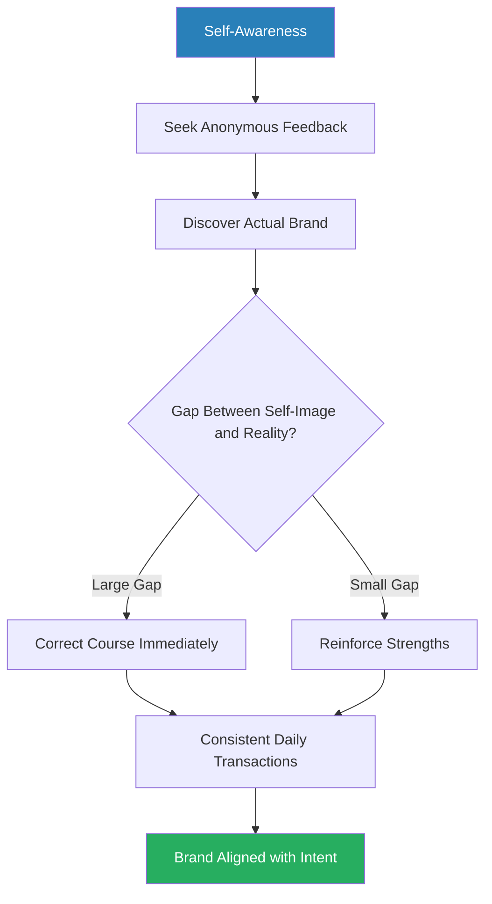
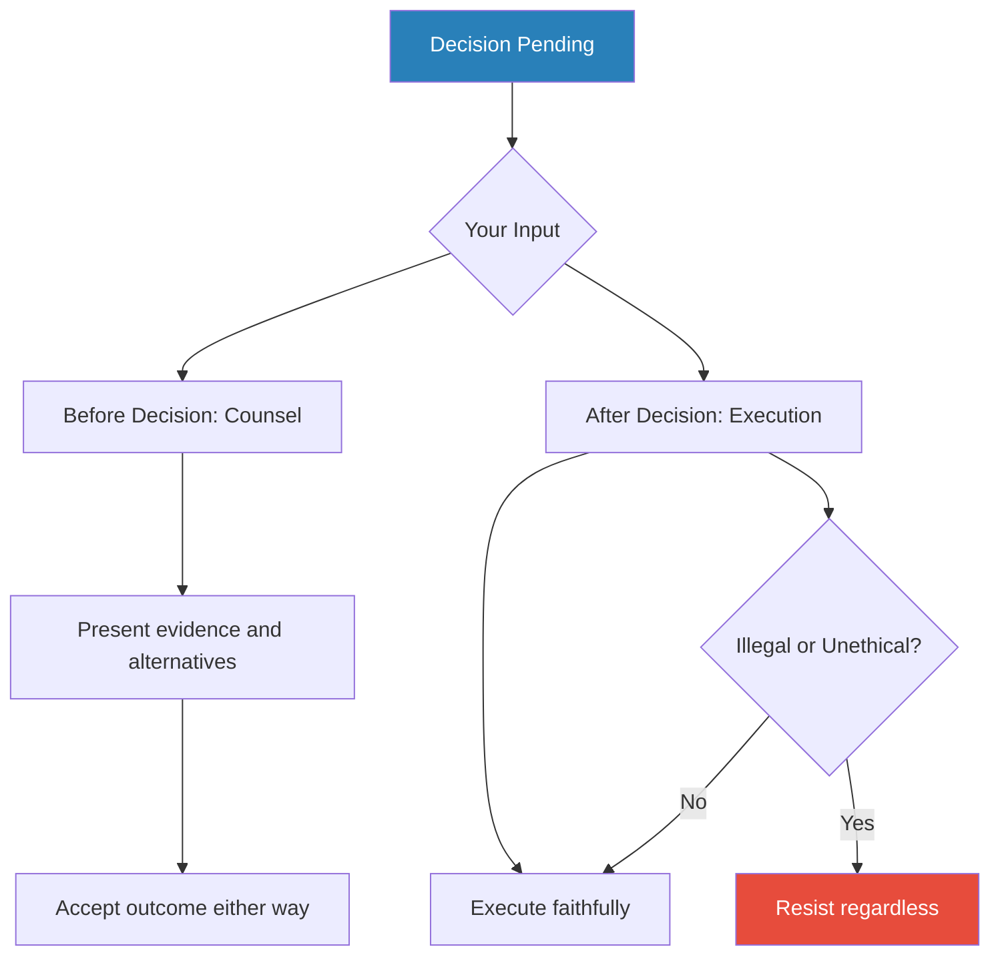
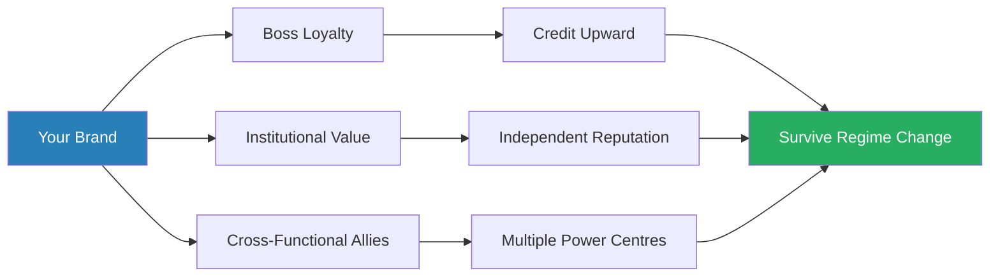
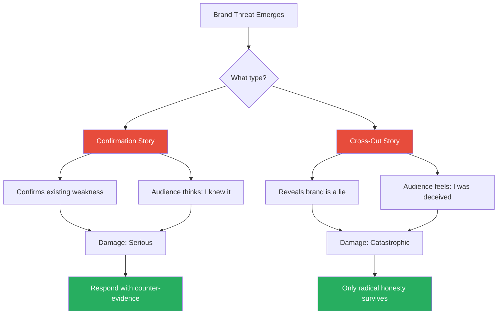
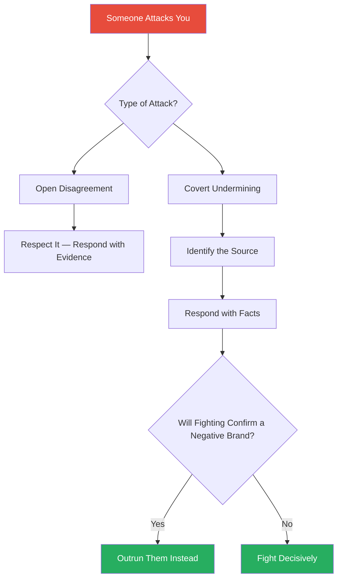
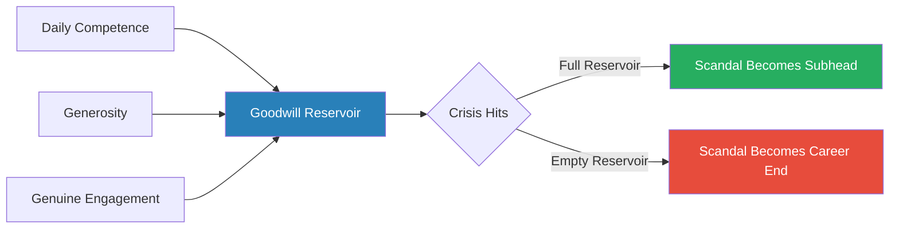
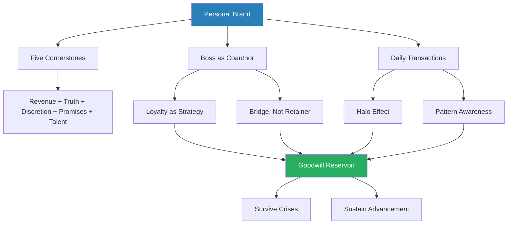

# Career Warfare — David D'Alessandro

> David D'Alessandro's *Career Warfare* argues that organisations are not rational meritocracies but "vertical villages" — small towns full of gossip, intrigue, and anecdote, where your fate is decided in the five or six brief moments across a 40-year career when someone powerful thinks of your name and whatever leaps to mind determines your future. Hard work is necessary but insufficient. What separates those who rise from those who stagnate is the **personal brand** they build through thousands of daily transactions — how they treat the receptionist, handle a crisis, navigate a meeting, and manage the narrative others tell about them. Written from the vantage point of a Fortune 500 CEO who clawed his way up from nothing, the book is part operator's manual, part cautionary tale, and entirely unsentimental about how advancement actually works.

---

## About the Author

David D'Alessandro served as CEO of John Hancock Financial Services from 2000 until its $11 billion acquisition by Manulife Financial in 2004. He did not inherit the position or arrive through an Ivy League pedigree. He started as a junior copywriter at Hancock's advertising agency, crossed over to the client side, and spent three decades climbing from the lowest rungs to the corner office. Before Hancock, he worked in politics and public relations — a background that gave him an unusually sharp instinct for managing perception, framing narratives, and reading the motives behind what people say (and what they do not say). *Career Warfare* (co-written with Michele Owens) distils everything he learned along the way about the mechanics of reputation, power, and self-promotion inside large institutions.

---

## The Big Idea

*D'Alessandro strips away the comforting myth that good work speaks for itself and reveals the real currency of advancement: the personal brand that other people carry around in their heads.*

- D'Alessandro's central argument is that your <b style="color: #2980b9">personal brand</b> — the consensus opinion that other people hold about who you are — is the single most important asset in your professional life
- It is not built by dramatic moments or impressive credentials
- It is built **brick by brick**, through hundreds of daily transactions that observers read as evidence of your character
- Your brand exists whether you manage it or not — the only question is whether you are shaping it deliberately or letting others shape it for you

---

- The uncomfortable truth at the heart of the book is the <b style="color: #2980b9">fundamental attribution error</b> applied to professional life:
  - Social psychologists have shown that while you explain your own behaviour through context and intention — "I snapped because I was exhausted and the meeting ran over" — everyone around you explains it through your character: "He snaps because he is impatient and rude"
  - You know that your bad day was an aberration
  - They assume it is a pattern
  - And once the label sticks, it becomes the brand
  - The attribution error is not a bug in human cognition that can be corrected — it is the default operating system of every person you will ever work with

> [!tip] Core Insight
> Every interaction you have — with an assistant, a peer at the coffee machine, a senior executive in a lift — is a brand transaction, whether you intended it or not. You are always on stage. There is no intermission, no backstage, and no off-the-record.

- The person who answers a rude email courteously is building brand capital
- The person who is dismissive to a junior colleague in passing is spending it
- <b style="color: #27ae60">Managing your brand is not vanity — it is survival</b>
- People who assume their work speaks for itself are not being virtuous — they are simply leaving the narrative about their work in someone else's hands
- And those hands may not be friendly
- The question is never "Should I manage my brand?" — the question is "Who is managing it right now, and is it me?"

---

## Key Concepts at a Glance

| Concept | One-line summary |
|---------|-----------------|
| **The Vertical Village** | Organisations run on gossip and snap impressions, not performance reviews |
| **The Fundamental Attribution Error** | Every action is read as evidence of character, not circumstances |
| **The Five Brand Cornerstones** | Revenue, honesty, discretion, keeping promises, attracting talent |
| **The Three Corporate Personalities** | Sycophants (~70%), contrarians (~10%), balanced players (~20%) |
| **The Boss Taxonomy** | Six boss types, each with different implications for your development |
| **Bold Promises and the Halo Effect** | Promise what peers think is impossible, then deliver — the glow colours everything |
| **The Three Meeting Types** | Staff (show-and-tell), creative (get-something-done), combat (money on the line) |
| **Social Events as Brand Minefields** | Company parties feel like timeouts; they are brand auditions under adverse conditions |
| **Confirmation / Cross-Cut Stories** | Two narrative types that destroy brands: confirming suspicion or exposing hypocrisy |
| **The Goodwill Reservoir** | Capital accumulated through competence and generosity, drawn upon in crises |
| **The Bubble** | Success creates deference that distorts judgment and eventually causes collapse |
| **The One-Explanation Rule** | When bad news hits, explain once with honesty, then move forward |

This table captures the book's architecture at a glance — each concept builds on the ones before it, moving from awareness through strategy to long-term sustainability.

---

## Rule 1: Try to Look Beyond Your Own Navel

*D'Alessandro opens with what he considers the foundational error of professional life: most people never stop to consider how they actually appear to others.*

- Most people are so absorbed in their own perspective — their own talents, grievances, and self-image — that they never step outside it
- <b style="color: #e74c3c">The gap between how you see yourself and how others see you is where careers die</b>
- This is not a trivial gap — it is often enormous, and almost nobody volunteers to tell you how big it is
- D'Alessandro considers self-awareness the precondition for everything else in the book — without it, you cannot build a brand because you do not know what brand you currently have

### The Vertical Village

- The modern corporation is not the rational hierarchy depicted in org charts
- It is a **small town** — a <b style="color: #2980b9">vertical village</b> where everyone trades in gossip, reputation, and anecdote
- Just as in a small town, your reputation is not determined by what you think of yourself
- It is determined by what people say about you when you are not in the room
- The village has its gossips, its gatekeepers, its feuds, and its long memories
- Information travels laterally and diagonally, not just up and down the hierarchy

---

- Promotions are not decided by careful analysis of performance data
- They are decided in brief, casual <b style="color: #2980b9">Rorschach-test moments</b>:
  - Someone mentions your name at a leadership meeting
  - The listeners have perhaps five seconds to form an impression
  - Whatever image leaps to mind — "brilliant but abrasive," "solid performer," "the one who fixed the Eastern account," "didn't she lose that client last year?" — is more consequential than any performance appraisal you will ever receive
- D'Alessandro estimates that there are only five or six such moments across an entire career
- They are worth more than a decade of annual reviews
- The terrifying part is that you will almost never know when these moments happen — you are not in the room

> [!tip] Core Insight
> If you are not managing the impressions you leave in hundreds of small daily interactions, you are leaving the most important factor in your advancement entirely to chance.

---

### Becoming Uniquely Useful

- The first practical problem for anyone early in their career is simple: you are invisible
- "You are barely real to the people above you," D'Alessandro writes
- Senior executives are surrounded by competent people doing their jobs adequately
- Adequacy does not register — it is background noise
- You have to find a way to become <b style="color: #27ae60">uniquely useful</b> — to provide something that nobody else in the organisation provides
- This does not require genius — it requires observation and initiative

> [!example] D'Alessandro's Early Career at John Hancock
> - As a junior employee at John Hancock's advertising agency, he was one of many young people in a room full of older, more experienced professionals
> - He could not compete on experience or connections
> - He noticed that nobody in the room was generating fresh creative ideas — the senior people were philosophers and strategists, not idea machines
> - So he became the **idea guy**, flooding the room with concepts while others debated theory
> - He also noticed that nobody bothered to monitor the Teletype machine that fed breaking news into the office
> - He made it his job, arriving early to scan the wires, becoming the person who always knew what was happening before anyone else did
> - It was humble work, but it gave him information that others lacked — and information is currency
> **The lesson:** Unique usefulness does not require brilliance — it requires noticing what nobody else is doing and doing it first.

> [!example] Richard Branson's Audacious Interview (1960s)
> - At seventeen, Branson secured an interview with the actress Vanessa Redgrave for his student magazine
> - He had no credentials, no audience, and no reason to expect success
> - The audacity of the attempt — and the fact that he pulled it off — created a brand impression that followed him for the rest of his career
> - The interview itself was not particularly important
> - The fact that he got it was — it signalled a willingness to aim beyond what was reasonable
> **The lesson:** Bold promises that you actually deliver on create an outsized glow that colours how people perceive everything else you do.

- The <b style="color: #2980b9">halo effect</b> is the mechanism at work here:
  - Small acts of unique usefulness — getting impossible restaurant reservations, knowing the one piece of information nobody else has, being the person who can fix the thing nobody else can fix — create an outsized glow
  - Once you are branded as "the person who can get things done," people start seeing capability in everything you touch
  - This applies even in areas where you are no more competent than anyone else
  - The halo effect is a cognitive bias, but unlike most biases, you can deliberately trigger it by choosing where to concentrate your early efforts
  - One remarkable act, delivered visibly, generates more brand capital than a year of quiet competence

---

### The Five Brand Cornerstones

- D'Alessandro identifies five non-negotiable qualities that any serious professional brand must rest upon
- These are not optional extras or nice-to-haves — they are the foundation
- Everything else — charisma, connections, timing — is built on top of them
- Lose any one of them and the entire structure becomes unstable

| Cornerstone | What it means | Why it matters |
|-------------|--------------|----------------|
| **Revenue generation** | "Bringing home the bear" — delivering measurable results | No amount of charm compensates for inability to generate value |
| **Telling the truth** | Saying what you actually think when it matters | If people suspect flattery over candour, credibility is gone |
| **Discretion** | Knowing what to share, with whom, and when | One indiscretion can destroy a lucrative partnership overnight |
| **Keeping promises** | Delivering what you said you would | Bold promisers who deliver build brands exponentially faster |
| **Attracting talent** | Making people want to work for you | If nobody wants to join your team, the ceiling on your influence is low |

Each cornerstone reinforces the others — discretion protects truth-telling, revenue generation validates bold promises, and attracting talent multiplies everything.

A single weak cornerstone — particularly discretion or revenue generation — can undermine an otherwise strong brand, explaining why one indiscretion destroyed a $7 million consulting relationship.

- D'Alessandro is especially emphatic about <b style="color: #27ae60">revenue generation</b> as the first cornerstone:
  - It does not matter how likeable, how strategic, or how well-connected you are
  - If you cannot point to measurable value you have created, your brand sits on sand
  - "Bringing home the bear" is his metaphor — bring tangible results, and many other sins are forgiven
  - Fail to bring results, and no other virtue compensates

---

> [!example] The Consulting Firm's Fatal Slide Deck
> - A consulting firm had a $7 million per year relationship with John Hancock
> - A single presenter put indiscreet slides into a deck — slides that openly discussed how to exploit Hancock's executives
> - The presentation was supposed to be internal; it was not
> - One act of indiscretion destroyed the entire partnership — $7 million annihilated by a few careless slides
> **The lesson:** Never write or say anything you would not want subpoenaed or published.

> [!example] Cerner Corporation's CEO Email (2001)
> - The CEO of Cerner Corporation sent a furious email to managers berating employees for being lazy and leaving the parking lot empty at 5pm
> - The email threatened termination for underperformance in language so hostile it read like a parody of bad management
> - The email was leaked to the public
> - Cerner's stock dropped 22% in three days — hundreds of millions in shareholder value destroyed by one angry message
> **The lesson:** Digital communication is never private — every email is one forward away from catastrophe.

---

### Self-Awareness as the Starting Point

> [!example] D'Alessandro's Devastating Feedback
> - Early in his career at Hancock, D'Alessandro asked for anonymous feedback from his direct reports
> - He expected to hear that he was tough but fair — a demanding boss who pushed people to do their best work
> - What he actually heard was devastating: his team saw him as someone who did not listen, who discounted others' ideas, and who had already made up his mind before any discussion began
> - The gap between his self-image and his brand was enormous
> - He would never have discovered it without asking — nobody had volunteered this information
> - He describes the experience as one of the most important inflection points in his career
> **The lesson:** The unexamined reputation is not worth having.

- <b style="color: #27ae60">The discipline of periodically checking what others actually think of you — not what you hope they think — is the precondition for all brand-building</b>
- Without it, you are steering blind
- D'Alessandro recommends seeking anonymous feedback regularly, particularly after transitions into new roles
- The information is rarely comfortable, but it is always valuable
- The people who never ask are not protected from bad impressions — they simply never get the chance to correct them

Self-awareness is the starting point, not the destination — the real work begins when you discover the gap and commit to closing it through consistent behaviour.

---

## Rule 2: Like It or Not, Your Boss Is the Coauthor of Your Brand

*D'Alessandro treats this as arguably the most important chapter in the book — your boss is not just someone you report to, but the primary narrator of your professional story.*

- Your boss is the <b style="color: #2980b9">primary narrator</b> of your professional story to the people who will decide your future
- The same achievement can be spun in completely different directions depending on the story your boss tells:
  - "It was her idea, she executed it brilliantly, and I got out of her way" — one version
  - "Well, we all worked on it together, and frankly I had to clean up a few messes she made along the way" — another version
  - Both describe the same event; both are technically accurate
  - But they produce completely different brand impressions in the minds of listeners you may never interact with directly
- Your boss speaks about you in rooms you will never enter, to audiences you will never meet
- <b style="color: #e74c3c">The narrative they choose to tell is largely outside your control — unless you manage the relationship deliberately</b>

> [!example] Doug's Fatal Mistake
> - "Doug" was a talented executive who made the mistake of badmouthing his boss to colleagues
> - He assumed his audience was sympathetic — they were not
> - The boss discovered the betrayal through the village's gossip network
> - Doug was drop-kicked into obscurity — reassigned to irrelevant projects, passed over for promotions
> - Doug was excellent at his job — it did not matter
> **The lesson:** "Within the world of people who can advance your career, your image is almost entirely in your boss's hands."

---

### The Boss Taxonomy

*D'Alessandro classifies bosses into six types, and his advice differs sharply depending on which type you face.*

| Boss Type | Characteristics | Opportunity | Danger |
|-----------|----------------|-------------|--------|
| **Little League Parent** | Warm, nurturing, protective | Ideal for early career — guidance and room for mistakes | Their protection becomes a cage; they never see you as a peer |
| **Mentor** | Strategic, demanding, door-opening | The single most valuable professional relationship | Not friendship — when interests diverge, the relationship ends |
| **Wastrel** | Disorganised, erratic, dysfunctional | Forced to step up; gain a decade of experience in a year | If their dysfunction goes public, everyone in their orbit is tainted |
| **Pariah** | Brilliant but politically radioactive | A masterclass in capability and craft | They are doomed — if you do not build outside alliances, you go down too |
| **One-Way User** | Takes your ideas, gives no credit | None | No future — leave as soon as possible |
| **Wimp / Know-It-All** | Paralysed by indecision or insists on doing everything | None | You are reduced to a spectator — no learning, no brand-building |

The first four types each offer something worth extracting. The last two are dead ends — D'Alessandro's advice for both is the same: leave.

The Mentor relationship towers over all other boss types in career development value — it is the single most valuable professional relationship, but D'Alessandro warns it must be understood as a strategic alliance, not a friendship.

---

- <b style="color: #27ae60">The Mentor relationship is the single most valuable professional relationship you can have</b>, but it must be understood correctly:
  - It is not familial — it is military
  - The Mentor expects competence, discretion, and loyalty
  - In return, they open doors, advocate for you in rooms you cannot enter, and push you forward when you are ready
  - It is a strategic alliance where both parties benefit
  - When the Mentor's interests and yours diverge, the relationship ends — and that is as it should be
  - D'Alessandro warns against confusing a Mentor with a friend — the Mentor is investing in you because you serve their purposes, and you are serving them because they advance yours
  - This is not cynicism; it is clarity about what the relationship actually is

- The <b style="color: #2980b9">Wastrel</b> is an underrated learning opportunity:
  - Working for a disorganised, erratic boss forces you to develop skills you would never develop under a competent leader
  - You learn to anticipate problems, fill leadership vacuums, and manage up
  - But the danger is real — if the Wastrel's dysfunction becomes public, everyone associated with them is contaminated
  - The key is to extract the learning while building independent alliances that survive the Wastrel's inevitable downfall

> [!example] The Pariah's Team Gets Pitched into the Well
> - A hated executive vice president was finally ousted from the organisation
> - His entire team was "pitched into the village well" — careers destroyed by association
> - The only team members who survived were those who had maintained independent relationships with other power centres in the organisation
> - They had built brands that were separable from their boss's brand
> **The lesson:** Never let your professional survival depend on a single person, no matter how capable they are.

---

### The Three Corporate Personalities

*D'Alessandro divides all employees into three types based on how they relate to authority — and only one group rises.*

| Type | Proportion | Behaviour | Fatal Flaw |
|------|-----------|-----------|------------|
| **Sycophants** | ~70% | Agree with the boss for safety; treat every suggestion as a mandate | Cowardice — they overreact to everything, making the boss's job harder |
| **Contrarians** | ~10% | Disagree with everything from bitterness or resentment | Advice too coloured by personal grievance to be useful |
| **Balanced players** | ~20% | Tell the truth with courage and timing; disagree before decisions, execute after | None — this is the only group that gives advice worth trusting |

Only 20% of employees operate as balanced players — the group that tells the truth with courage and timing — yet this is the only group that decision-makers trust with nuanced information and consider for advancement.

- The <b style="color: #2980b9">sycophant</b> problem is not just moral — it is practical:
  - When a boss floats a tentative idea, sycophants immediately treat it as a directive
  - They rush to implement before the boss has even finished thinking
  - This makes the boss's job harder, not easier — now every stray thought triggers a cascade of activity
  - Bosses learn quickly that sycophants cannot be trusted with nuanced information because they will overreact to everything

- The <b style="color: #2980b9">contrarian</b> problem is different but equally fatal:
  - Their opposition is not principled — it is personal
  - They disagree because they are bitter, resentful, or because they believe (often correctly) that they are smarter than the boss
  - But intelligence without timing and tact is worthless in an organisational context

> [!example] The Contrarian Who Called Himself Smarter
> - A contrarian, after being told a decision had been made, responded by saying he was smarter than D'Alessandro
> - "Intelligence without power is just advice," D'Alessandro replied
> - The man never rose further — not because he was wrong, but because he had demonstrated that he could not be trusted to execute decisions he disagreed with
> **The lesson:** Being right without authority or timing is worthless.

- The critical distinction is <b style="color: #27ae60">timing</b>:
  - Input **before** the decision is valuable counsel
  - Input **after** the decision is insubordination
  - The balanced player understands the difference instinctively
  - They argue passionately in the deliberation phase, then execute loyally once the decision is made
- D'Alessandro adds one exception: if the decision is illegal or unethical, the balanced player resists regardless of timing
- <b style="color: #e74c3c">But that is the only exception</b>

The balanced player's power comes from this discipline — disagree courageously before the decision, then execute loyally after it.

---

## Rule 3: Put Your Boss's Face on Things

*D'Alessandro extends the logic of Rule 2 into practical territory: if your boss is the coauthor of your brand, then managing that relationship is the most important relationship management you will ever do.*

### Loyalty as Strategy

- <b style="color: #27ae60">The most effective form of self-promotion is not self-promotion at all — it is making your boss look good</b>
- When you make your boss successful, your boss has a reason to make you successful
- When you make your boss look bad — even unintentionally — your boss has a reason to bury you
- D'Alessandro's logic here is brutally pragmatic:
  - Your boss controls the narrative about you to the people who matter most
  - Give them a reason to tell a positive story, and they will
  - Give them a reason to tell a negative one, and they will do that instead
  - Most people understand this intellectually but violate it emotionally — they vent, they gossip, they let frustration leak out in small ways that accumulate

> [!example] The Executive Who Badmouthed His Old Boss
> - An executive, after being transferred from a division he loved, told his new boss he was "glad to be rid of" the old one
> - He assumed this would bond him with his new boss — a shared eye-roll at the old boss's expense
> - The new boss repeated this to the old boss within 48 hours
> - The executive spent two years in professional purgatory as punishment — sidelined, overlooked, and frozen out of meaningful work
> **The lesson:** Loyalty to your boss must be genuine enough to survive scrutiny, because it will be tested.

> [!tip] Core Insight
> Loyalty must be genuine enough to withstand being repeated — because everything you say about your boss will eventually reach them.

---

### Giving Credit Upward

- D'Alessandro argues that giving credit to your boss is not servility — it is strategy:
  - When you publicly credit your boss for supporting your success, you create a narrative where your boss is a talent developer
  - Your boss has an incentive to continue developing you because your success validates their leadership
  - This creates a virtuous cycle: your boss advocates for you, you succeed, you credit your boss, your boss advocates harder
- <b style="color: #e74c3c">The opposite cycle is equally powerful and far more common</b>:
  - You take sole credit for a success
  - Your boss feels diminished or threatened
  - Your boss begins subtly undermining your next effort
  - You notice the undermining and become resentful
  - The relationship deteriorates into mutual sabotage

---

### Building Alliances Beyond the Boss

- D'Alessandro is equally insistent that you should not become so identified with your boss that your brand lives and dies with theirs
- <b style="color: #e74c3c">The most common mistake ambitious people make is pledging total allegiance to one powerful figure and riding their coat-tails</b>
- This works beautifully — until it does not

> [!example] The Citicorp Succession Purge
> - When Sandy Weill consolidated power at Citigroup, his first act was to purge the loyalists of the previous regime
> - The people who had bet everything on the old king found themselves exiled overnight
> - The people who had maintained independent reputations — who were seen as loyal to the institution rather than to any individual — survived
> - The purge was swift and merciless — decades of career-building undone in weeks
> **The lesson:** Kings die, and the new king's first act is to execute the old king's retainers.

> [!example] Stanley O'Neal's Purge at Merrill Lynch
> - When O'Neal replaced David Komansky as CEO of Merrill Lynch, he systematically removed anyone perceived as a Komansky loyalist
> - It did not matter how competent they were or how much they had contributed
> - Institutional loyalty survived; personal loyalty did not
> - The people who had been seen as "Komansky's people" were finished regardless of their track record
> **The lesson:** Be seen as useful to the institution, not just to one person.

- D'Alessandro's advice is to be a <b style="color: #2980b9">bridge</b>, not a retainer:
  - Be loyal to your boss
  - Execute faithfully
  - Give credit upward
  - But simultaneously maintain relationships with other power centres in the organisation
  - Be seen as useful to the institution, not just to one person
  - Serve on cross-functional projects that give you visibility outside your division
  - Build genuine relationships with peers in other departments
- "The greatest respect goes to those who are both loyal to the regime and independent powers in their own right"

The bridge strategy ensures your brand survives leadership transitions — you are valued for what you bring, not just who you serve.

---

## Rule 4: Everybody Wants Your Pork Chop

*D'Alessandro's colourful title captures a simple truth: success attracts competition, jealousy, and sabotage — and the higher you climb, the more creative the attacks become.*

### The Confirmation and Cross-Cut Stories

- This chapter introduces one of the book's sharpest frameworks: the two types of narratives that destroy brands
- Understanding these two story types is essential because they require entirely different defensive strategies

- A <b style="color: #2980b9">confirmation story</b> confirms what people already suspected about your weakness:
  - It does not create a new impression — it confirms an existing one
  - This is why confirmation stories are so devastating: they feel like vindication to everyone who already doubted you
  - The audience does not think "that is a one-off mistake" — they think "I knew it"
  - Every latent doubt they held is now validated by a concrete example

> [!example] Richard Nixon and Watergate
> - Nixon's political enemies had always called him "Tricky Dick"
> - The label stuck because there was just enough evidence to make it plausible, even before Watergate
> - When Watergate broke, it did not create a new impression — it confirmed an existing one
> - The brand was already damaged; the scandal merely proved that the damage was real
> - The public reaction was not surprise but satisfaction — they had always suspected it
> **The lesson:** Confirmation stories are devastating because they feel like vindication to everyone who already doubted you.

---

- A <b style="color: #2980b9">cross-cut story</b> reveals that your brand is fundamentally a lie:
  - The televangelist caught in a motel with a prostitute is the classic case
  - The brand was piety and moral authority; the reality was the opposite
  - Cross-cut stories are even more destructive because they do not just confirm suspicion — they expose hypocrisy
  - The audience feels not just disappointed but deceived
  - The emotional response to hypocrisy is stronger than the response to mere failure — people can forgive incompetence far more easily than they can forgive deception

- <b style="color: #e74c3c">Know your brand's vulnerable spots and never pour gasoline on them</b>:
  - If you are known as "the numbers person," a careless error in a spreadsheet is a confirmation story
  - If you are known as "the ethics guy," a single act of corner-cutting is a cross-cut story
  - Both are survivable if handled well
  - Both are catastrophic if you pretend they did not happen
  - The key is knowing which type of vulnerability your particular brand carries and guarding it accordingly

> [!tip] Core Insight
> Your brand's greatest strength is also its greatest vulnerability. The more specific your reputation, the more specific the threat — one contradicting data point can unravel years of brand-building.

The two story types require different responses — confirmation stories can be fought with evidence, but cross-cut stories demand immediate honesty and contrition.

---

### Making the Right Enemies

- D'Alessandro's position on enemies is more nuanced than most leadership books
- <b style="color: #e74c3c">Trying to build a brand by never offending anyone turns you into beige wallpaper — inoffensive and completely forgettable</b>
- A small dose of visible toughness is not just acceptable — it is necessary
- People who stand for nothing are remembered by no one

- The distinction that matters is between **open disagreement** and **covert undermining**:
  - Open disagreement deserves respect — you can disagree with a colleague's strategy in a meeting, present your alternative with evidence, lose the argument, and still come away with your brand enhanced
  - The audience sees someone with conviction and courage
  - Covert undermining — gossiping, sabotaging, leaking information — is a different matter entirely and deserves a decisive response

> [!example] D'Alessandro Defeats a Gossip Campaign
> - During a promotion process, anonymous rumours circulated that D'Alessandro was unfair and abusive
> - Rather than complaining about the injustice, he produced statistics and evidence proving the allegations were false
> - He responded with facts and composure, not with outrage
> - The promotion went through — and the campaign's failure actually strengthened his brand
> **The lesson:** Respond to covert attacks with evidence, never with complaints about unfairness.

- He quotes Ed Koch, the former Mayor of New York: "Outrun the bastards"
- <b style="color: #27ae60">The best response to most enemies is not to fight them but to succeed so visibly that their attacks become irrelevant</b>
- Let incompetent rivals self-destruct — they usually will, given enough time
- Do not develop a reputation for attacking peers — it is expensive and rarely necessary
- But when someone undermines you behind the scenes, identify the source and respond with facts
- Never respond with complaints about unfairness — nobody wants to hear it, and it makes you look weak

---

## Rule 5: It's Always Show Time

*D'Alessandro considers this the most practically important chapter in the book — he walks through a single day's worth of brand-affecting interactions, demonstrating that reputation is built and destroyed in hallways, lifts, and parking lots.*

### Every Interaction Is a Brand Transaction

- <b style="color: #27ae60">There is no such thing as an interaction that "does not count"</b>
- The way you greet the security guard at 7am is a brand transaction
- The way you handle an interruption during a meeting is a brand transaction
- The way you respond to a boring email from a junior colleague is a brand transaction
- The way you behave in a lift with people you do not know is a brand transaction

- D'Alessandro walks through examples:
  - The executive who is rude to the restaurant staff during a business dinner has told everyone at the table something about their character — and it will be remembered long after the dinner is forgotten
  - The manager who takes a phone call during a direct report's presentation has told the room that the direct report does not matter
  - The leader who remembers the name of a colleague's child has deposited a small but real amount of brand capital
  - The person who holds the door, says thank you to the caterer, or sends a brief congratulatory note after someone's success is making micro-deposits that compound over years
- None of these interactions feel important in the moment
- All of them compound

---

### The Three Meeting Types

- D'Alessandro identifies three distinct types of meetings, each with different brand rules:

| Meeting Type | Purpose | Brand Strategy |
|-------------|---------|---------------|
| **Staff meetings** | Show-and-tell — updates, status reports | Be concise; nobody is listening to long monologues. Demonstrate competence quickly |
| **Creative meetings** | Get something done — solve problems, generate ideas | Contribute actively; the person who stays silent is the person nobody remembers |
| **Combat meetings** | Money on the line — negotiations, budget fights, strategy disputes | Prepare obsessively; everything you say is being evaluated at the highest stakes |

Combat meetings and social events carry the highest brand stakes — combat meetings offer the greatest deposit potential while social events carry the highest damage risk, explaining why D'Alessandro warns that "there is no timeout for your brand."

- <b style="color: #e74c3c">The most common mistake in meetings is treating all three types the same way</b>:
  - The person who gives a detailed presentation in a creative meeting bores everyone
  - The person who brainstorms casually in a combat meeting looks unprepared
  - Reading the room — understanding which type of meeting you are in — is a brand skill that most people never develop

---

### The Daily Audit

> [!abstract] The Daily Audit
> 1. At the end of each day, mentally review your interactions
> 2. Ask whether each one enhanced or diminished your brand
> 3. Did you lose your temper? Brand cost
> 4. Did you thank the IT person who fixed your laptop? Brand deposit
> 5. Did you gossip about a colleague's mistake at lunch? Brand withdrawal
> 6. Identify patterns — most brand damage is not a single catastrophic error but accumulated carelessness

- The point is not to become obsessively self-conscious but to develop <b style="color: #2980b9">pattern awareness</b>
- Most brand damage is not caused by a single catastrophic error
- It is caused by a pattern of small, careless behaviours that accumulate over months and years until they become the defining impression
- <b style="color: #e74c3c">By the time you realise the damage, it is usually too late to repair</b>
- The daily audit catches negative patterns before they calcify into permanent brand characteristics

> [!tip] Core Insight
> Brand-building is not about big moments. It is about the accumulated weight of a thousand small moments, each one tilting the interpretation of the next.

---

### The Halo Effect in Practice

- The daily-transaction model explains why the <b style="color: #2980b9">halo effect</b> is so powerful:
  - When you have built a strong brand through consistent small interactions, people start interpreting ambiguous situations in your favour
  - The executive with a strong brand who is late to a meeting gets the benefit of the doubt — "she must be dealing with something important"
  - The executive with a weak brand who is late to the same meeting gets a different interpretation: "she doesn't respect our time"
  - Same behaviour, different brand, different conclusion
- This is why D'Alessandro insists that brand-building is about the accumulated weight of a thousand small moments, each one tilting the interpretation of the next
- The halo effect is not fair — it is not supposed to be — but it is real, and the only way to earn it is through relentless consistency in small things

---

## Rule 6: Learn Which Fork to Use

*D'Alessandro turns to the territory where professional life and social life intersect — and where, he argues, more brands are destroyed than in any boardroom.*

### Social Events as Professional Minefields

- Company events that look like recreation — holiday parties, off-site retreats, client dinners, golf outings — are among the most dangerous occasions for a personal brand
- The reason is simple: people treat them as timeouts from professional life
- <b style="color: #e74c3c">They are not — "There is no timeout for your brand"</b>

- Why social events are so dangerous:
  - Alcohol lowers inhibitions and loosens tongues
  - Informality encourages oversharing — stories about personal problems, opinions about colleagues, complaints about the boss
  - Relaxation creates the illusion that the usual rules do not apply
  - The social setting feels different from a conference room, so people behave as though different rules are in effect
  - And then, the next morning, everyone remembers everything — and they remember it in the harshest possible light

> [!example] The Barclays Bankers' $62,000 Dinner
> - Barclays investment bankers were fired after running up a $62,000 dinner bill at a restaurant
> - The dinner included extravagant wines and was intended as a celebration of a successful deal
> - The bankers thought they were celebrating — they were actually creating a symbol
> - The dinner became a symbol of excess that the bank could not tolerate publicly
> **The lesson:** Celebrations that become symbols of excess destroy careers overnight.

> [!example] The Off-Site Amorous Encounter
> - Two colleagues' careers were destroyed after an amorous encounter at an off-site was captured on video
> - They thought they were enjoying a private moment during what felt like a social event
> - There is no private moment at a corporate event — the walls have eyes and the cameras have memory
> **The lesson:** Assume everything at a corporate event is observed and recorded.

> [!example] The Shrimp-Stuffing Incident
> - Subordinates at one of D'Alessandro's company events were caught stuffing shrimp into their bags from the buffet
> - The monetary value of the shrimp was trivial
> - Not one of them was ever promoted
> - The shrimp-stuffing became the defining anecdote of their brands — an image of pettiness and poor judgment that no subsequent achievement could erase
> - Years later, when their names came up in discussions, the first thing anyone remembered was the shrimp
> **The lesson:** One moment of pettiness can become the only story anyone ever tells about you.

---

### D'Alessandro's Rules for Social Events

> [!abstract] Social Event Survival Rules
> 1. Do not drink at office parties — if you must drink, one glass, held for the entire evening
> 2. Spend no more than five minutes with your boss at a cocktail party — any longer and you look like a sycophant
> 3. Treat every off-site as a professionally consequential event
> 4. Assume that everything you say and do will be reported — because it will
> 5. Never forget: social events are brand auditions conducted under adverse conditions
> 6. Circulate widely — talk to people from other departments you rarely interact with
> 7. Leave early rather than late — nothing good happens after the third hour

> [!tip] Core Insight
> The observations people make in unguarded social moments carry disproportionate weight precisely because they feel more authentic than anything that happens in a conference room.

- <b style="color: #27ae60">Social events are brand auditions conducted under adverse conditions</b>:
  - Your guard is down
  - Your colleagues' guards are down
  - The observations people make in these unguarded moments carry disproportionate weight
  - They feel more authentic than anything that happens in a conference room
  - A single evening of carelessness can overwrite months of professional competence

---

## Rule 7: Don't Let a Good Story Go to Waste — Unless It's About You

*D'Alessandro addresses a paradox: organisations run on stories and gossip, yet the most dangerous thing you can do is become the subject of an interesting story.*

### The Power of Narrative

- The vertical village communicates through stories, not through data:
  - Nobody remembers that you exceeded your targets by 14%
  - Everyone remembers the time you told off the client, or saved the deal at the last minute, or got drunk at the conference
  - The data lives in spreadsheets that nobody reads; the stories live in conversations that everybody has
- Stories are how reputation is transmitted
- They are memorable, portable, and nearly impossible to correct once they begin circulating
- A single vivid story can define you more completely than a decade of steady performance

- <b style="color: #27ae60">Your brand is ultimately a collection of stories that other people tell about you</b>:
  - You cannot control every story
  - But you can influence which stories get told by being conscious of which moments are likely to become narratives
  - The executive who handles a crisis with calm competence has created a story that will be told in her favour for years
  - The executive who panics, blames others, or hides has created a different story
  - Both stories will circulate — only one will help

> [!tip] Core Insight
> You cannot control every story told about you, but you can be conscious of which moments are likely to become narratives — and act accordingly.

---

### Creating Positive Narratives

- D'Alessandro argues that you should actively create moments that generate positive stories:
  - Volunteer for the visible crisis — the one everyone is watching
  - Handle it with composure and competence
  - The story of your success will circulate far more widely than any performance review
- <b style="color: #2980b9">Narrative moments</b> are not random — they are predictable:
  - Any crisis is a narrative moment
  - Any public presentation is a narrative moment
  - Any conflict resolution is a narrative moment
  - The question is whether you recognise these moments in real time and act with brand awareness

---

### Discretion Revisited

- D'Alessandro returns to the theme of discretion with additional force:
  - Gossip is currency in the vertical village, and the temptation to spend it is enormous
  - Sharing a juicy piece of information about a colleague feels powerful in the moment — you are the insider, the person who knows things
  - But the long-term cost is devastating

- <b style="color: #e74c3c">People who gossip are never trusted with real information</b>:
  - They are never brought into the inner circle
  - They are never given the kind of confidential, sensitive work that leads to senior positions
  - Because everyone knows that anything they share will eventually be shared with someone else
  - The gossip earns a momentary thrill of social currency and pays for it with permanent exclusion from the circles where real power operates

- D'Alessandro is ruthless on this point: the momentary pleasure of gossip or venting is never, ever worth the permanent cost to your brand
- He tells of his own early mistake — telling a new boss that he was "glad to be rid of" his previous boss — and the two years of professional punishment that followed
- Two years of exile for one careless sentence

---

## Rule 8: Try Not to Be Swallowed by the Bubble

*D'Alessandro warns about what happens after success — and writes from personal experience of the very trap he describes.*

### The Mechanics of the Bubble

- Success creates a <b style="color: #2980b9">bubble</b> of deference and privilege that gradually distorts your judgment
- The process is insidious because it feels like reward rather than danger
- Nobody tells you that you are entering the bubble — they are too busy inflating it

- When you are promoted, people start treating you differently:
  - They laugh at your jokes more readily — even the bad ones
  - They agree with your ideas more quickly — even the questionable ones
  - They stop telling you when you are wrong — because the cost of telling the truth has risen
  - The restaurants get nicer, the cars get bigger, the invitations become more exclusive
  - <b style="color: #e74c3c">Slowly, imperceptibly, you start to believe that you deserve all of it</b> — that the deference reflects your actual worth rather than your position
  - The bubble is self-reinforcing: the more deference you receive, the more you expect, and the more you punish anyone who punctures it

> [!example] Jack Welch's Post-Retirement Reckoning
> - Jack Welch, the legendary CEO of General Electric, upon retirement discovered that his compensation package included details that looked excessive when made public — private jet access, a luxury apartment on Central Park West, courtside tickets to the Knicks
> - Welch had not thought twice about these perks while in power
> - Inside the bubble, they seemed normal — everyone around him had similar arrangements
> - Outside it, they looked outrageous — symbols of corporate excess disconnected from reality
> - He voluntarily gave most of them back, but the damage to his brand was done
> **The lesson:** What feels normal inside the bubble looks outrageous from the outside.

> [!example] The *About Schmidt* Warning
> - In the film, Jack Nicholson plays a man who retires after a 40-year career and realises, at his retirement party, that nobody can think of anything meaningful to say about him
> - His career produced competence but no impact, no memorable contribution, no legacy
> - He had spent decades inside a different kind of bubble — the bubble of comfortable routine
> **The lesson:** There is a different kind of bubble — the bubble of comfortable mediocrity, where you mistake longevity for achievement.

> [!tip] Core Insight
> The bubble does not feel like a trap. It feels like a reward. That is precisely what makes it so dangerous.

---

### The Six Rules for Avoiding the Bubble

> [!abstract] Six Disciplines for Staying Grounded
> 1. **Be sceptical of your own genius** — the fact that you were right last time does not mean you are right this time; agreement may reflect fear, not correctness
> 2. **Surround yourself with sceptical people** — if everyone tells you what you want to hear, you are inside the bubble
> 3. **Keep friends who remind you of your humanity** — old friends, family, people who knew you before you were important; do not cut them off as you rise
> 4. **Have sympathy for those affected by your decisions** — leaders perceived as callous eventually lose the loyalty of the people they still employ
> 5. **Develop interests beyond work** — when the job ends (and it always ends), executives whose entire identity is their job have nothing; "Develop interests beyond golf"
> 6. **Never forget who pays your salary** — customers, shareholders, the market; the bubble makes it easy to believe the organisation exists to serve you rather than the other way around

- <b style="color: #27ae60">The most valuable advisor is the one who says "I think you're wrong, and here's why"</b>
- Maintaining genuine empathy for the people your decisions affect is not just morally right — it is strategically important
- The leader who loses touch with the human consequences of their decisions eventually loses the loyalty of the people who implement them
- D'Alessandro acknowledges that he was not immune to the bubble himself — he describes catching himself enjoying perks that he would have found absurd as a junior employee

---

## Rule 9: Grow Some Antlers — and Use Them Carefully

*D'Alessandro circles back to the question of conflict, expanding the enemy framework from Rule 4 with more practical detail about when to fight and when to walk away.*

### When to Fight

- <b style="color: #27ae60">Fight treachery without mercy</b>
- If someone is undermining you behind the scenes — spreading rumours, taking credit for your work, sabotaging your projects — identify the source and respond decisively
- Do not agonise about whether to fight — fight
- But fight with facts, not with emotion
- The response must be proportionate, evidence-based, and delivered calmly
- Emotional responses confirm weakness; factual responses demonstrate strength

> [!example] The Gossip Campaign Against D'Alessandro's Promotion
> - Anonymous allegations circulated that D'Alessandro was unfair and discriminatory
> - Rather than retreating to the bunker or complaining to his superiors about the injustice, he compiled statistics and evidence that demonstrated the allegations were false
> - He presented the facts calmly, without anger or self-pity
> - The promotion went through; the gossip campaign collapsed under the weight of evidence
> - The calm, evidence-based response itself became a positive brand story
> **The lesson:** Respond to covert attacks with calm evidence, not emotional outrage.

> [!example] D'Alessandro's Campaign Against Cardinal Bernard Law
> - During the Catholic Church's sexual abuse scandal, D'Alessandro — a prominent Catholic layperson — publicly campaigned for the resignation of Cardinal Bernard Law
> - This was not a professional fight but a personal one — he believed the institution he loved was being destroyed by its leaders' cowardice
> - The campaign cost him personally: death threats, social ostracism, bitter criticism from fellow Catholics
> - But he considered it worth the price because self-respect is part of any good brand
> - "You have to decide who you are"
> **The lesson:** Some fights are worth the cost because they define who you are.

---

### When Not to Fight

- <b style="color: #e74c3c">Do not develop a reputation as someone who attacks peers</b>
- Most incompetent rivals will self-destruct without your help
- Intervening only makes you look petty and aggressive
- Patience is cheaper than warfare and usually more effective

- D'Alessandro warns against fighting when the fight will confirm a negative brand impression:
  - If people already suspect you are aggressive, a public confrontation — even a justified one — becomes a confirmation story
  - The audience does not see a person defending themselves
  - They see the aggressive person being aggressive again
  - The context is invisible; the pattern is all that registers
  - <b style="color: #2980b9">Brand-awareness in conflict</b> means understanding that the same fight, fought by two different people with two different brands, produces completely different outcomes

> [!tip] Core Insight
> Fight treachery, but pick your fights with the same care you would pick your investments. Every fight has a cost — make sure the return justifies it.

The decision tree for conflict is simple: fight covert treachery with evidence, but never fight in a way that confirms the worst things people already believe about you.

---

## Rule 10: Everybody Starts Out in Life as a Backslapper — When Bad News Hits, Deal with It Yourself

*D'Alessandro's final chapter addresses what happens when things go wrong — and his central message is that the cover-up is almost always worse than the crime.*

### The Bunker vs. Forthrightness

- When faced with bad news, most people retreat to what D'Alessandro calls <b style="color: #2980b9">the bunker</b>:
  - They stop communicating
  - They hide behind lawyers and public relations consultants
  - They refuse to answer questions
  - They issue vague, carefully worded statements that say nothing
  - In doing so, they transform the story from "they made a mistake" into "they are hiding something"
- <b style="color: #e74c3c">The bunker does not contain the damage — it amplifies it</b>
- Every hour of silence feeds the narrative that there is something worse to hide
- The audience's imagination is always more damaging than the truth

> [!example] Gary Condit's Bunker Disaster
> - Gary Condit, the U.S. congressman embroiled in the Chandra Levy disappearance scandal, retreated to the bunker immediately
> - He refused to answer questions, hid behind legal counsel, and issued carefully worded non-statements
> - He eventually gave a television interview so evasive that it destroyed whatever remained of his credibility
> - Whether Condit was guilty or innocent became almost irrelevant
> - His bunker behaviour made him look guilty, and in the court of public opinion, that was enough
> **The lesson:** Hiding makes you look guilty regardless of the facts.

> [!example] Barney Frank's Radical Honesty
> - Barney Frank, the congressman who survived a sex scandal, did the opposite of everything Condit did
> - He told the truth — plainly, directly, and with self-deprecating humour
> - He did not hide, did not blame others, did not hire a crisis communications firm
> - He simply explained what had happened and accepted responsibility
> - His brand survived; his career continued for decades afterward
> **The lesson:** Forthrightness and self-deprecation can survive what evasion cannot.

> [!example] Carly Fiorina's Composure Under Fire
> - During the contentious HP-Compaq merger, Fiorina faced a proxy fight led by Walter Hewlett that questioned her competence and judgment
> - Rather than retreating, she went on the offensive — not with attacks on Hewlett, but with calm, evidence-based arguments for the merger
> - Her composure under fire transformed her brand from "all spin" to "genuine conviction"
> - She won the proxy fight — and the way she won it mattered as much as the victory itself
> **The lesson:** Calm under pressure rewrites your brand faster than any PR strategy.

> [!tip] Core Insight
> The cover-up is almost always worse than the crime. One clear, forthright explanation — and then move forward.

---

### The One-Explanation Rule

> [!abstract] The One-Explanation Rule
> 1. Explain yourself **once**, decisively and honestly
> 2. Cover: here is what happened, here is why, here is what I am doing about it
> 3. Do not repeat, do not elaborate, do not keep apologising
> 4. Then move forward — refuse to re-litigate

- <b style="color: #e74c3c">Never lie</b> — once caught in a lie, even the most outrageous accusation becomes believable
  - The lie does not just damage your brand on the specific issue
  - It retroactively damages everything you have ever said
  - People begin revisiting past statements and wondering which of those were lies too
  - A single lie creates a lens through which all future communication is viewed with suspicion

- <b style="color: #e74c3c">Never blame others</b> — blaming employees, the media, or a conspiracy makes you look both guilty and weak
  - If a subordinate made the mistake, take responsibility anyway — that is what leaders do
  - The audience knows you did not personally cause the error
  - They are watching to see whether you have the character to own it
  - Blaming others is a cross-cut story for anyone who has built a brand on leadership

---

### Goodwill as Insurance

- This chapter dovetails with D'Alessandro's concept of the <b style="color: #2980b9">goodwill reservoir</b> — a theme that runs through the entire book but receives its most complete treatment here
- Goodwill is accumulated through years of competence, generosity, and genuine engagement with people
- It is a reservoir you fill in good times and draw from in bad times
- The reservoir cannot be filled quickly — it requires sustained deposits over years and decades
- And it cannot be faked — goodwill built on calculation rather than genuine engagement is brittle and collapses under pressure

> [!example] Sandy Weill's Decades of Goodwill
> - Over decades, Weill, the former CEO of Citigroup, built an enormous reservoir of goodwill — through strong financial results, extensive philanthropy, and carefully cultivated press relationships
> - When the Citigroup regulatory scandal broke, Weill had decades of goodwill to draw upon
> - Negative stories became subheads rather than headlines
> - The scandal was serious but survivable, in part because Weill had banked so much reputational capital
> - Journalists who might have been more aggressive softened their coverage because of longstanding relationships
> **The lesson:** Goodwill accumulated over decades can absorb shocks that would destroy a thinner brand.

> [!example] Al "Chainsaw" Dunlap's Empty Reservoir
> - Al Dunlap made his reputation by firing thousands of people at every company he ran
> - He wore the "Chainsaw" nickname as a badge of honour
> - He built no goodwill, cultivated no relationships, made no deposits into the reservoir
> - When his accounting fraud at Sunbeam was exposed, there was nobody willing to defend him
> - "There was a parade in celebration" of his downfall, D'Alessandro writes
> - Every person Dunlap had ever mistreated now had permission to pile on
> **The lesson:** No goodwill, no cushion — when you fall, nobody catches you.

---

> [!example] George Steinbrenner's Long Rehabilitation
> - For years, Steinbrenner, owner of the New York Yankees, was seen as an impossible tyrant — firing managers, berating employees, generating constant controversy
> - He was banned from baseball for a time due to his behaviour
> - Over time, through winning championships and generous charitable giving, he rebuilt his brand from "tyrant" to "lovable curmudgeon"
> - It took decades of sustained, visible goodwill-building to accomplish this transformation
> **The lesson:** Goodwill, once built, is remarkably durable — but rebuilding from zero takes years.

> [!example] Bill Gates's Brand Transformation
> - In the late 1990s, Gates was the face of monopolistic corporate power — subject of antitrust litigation, widely disliked, and portrayed as ruthless
> - His pivot to philanthropy through the Gates Foundation did not just rehabilitate his brand — it transformed it entirely
> - The man who was once the symbol of predatory capitalism became the symbol of enlightened giving
> - The transformation was possible only because the scale of the giving was so enormous that it overwhelmed the previous narrative
> **The lesson:** Goodwill, accumulated at sufficient scale, can rewrite your entire story.

The goodwill reservoir is the single best insurance policy against reputational catastrophe — but it must be filled long before you need it.

---

## Key Quotes

- "You are barely real to the people above you." — on the need to become uniquely useful
- "Intelligence without power is just advice." — on the limits of being right without authority
- "Outrun the bastards." — Ed Koch, on dealing with enemies
- "There is no timeout for your brand." — on social events as professional minefields
- "The unexamined reputation is not worth having." — on self-awareness as the foundation of brand-building
- "Bringing home the bear." — on revenue generation as the first brand cornerstone
- "You have to decide who you are." — on the necessity of taking stands that define your character
- "Within the world of people who can advance your career, your image is almost entirely in your boss's hands." — on the boss as brand coauthor

---

This diagram maps the book's core architecture: everything flows from the personal brand through daily transactions and strategic relationships into the goodwill reservoir that sustains you through the inevitable crises.

---

## The Verdict

D'Alessandro's greatest contribution is making visible what most professionals leave invisible: the mechanics of how reputation is actually formed inside organisations. The vertical village metaphor is powerful precisely because it is accurate — anyone who has spent time in a large company will recognise the gossip networks, the snap judgments, and the disproportionate weight of casual impressions over formal evaluations. The boss taxonomy is immediately recognisable and practically useful, giving readers a vocabulary for relationships they have experienced but never categorised. The "always show time" philosophy — the idea that every interaction is a brand transaction — is the book's most durably useful idea, because it shifts attention from the dramatic to the quotidian, where most brand-building and brand-destruction actually happens.

The book's weaknesses are real and worth acknowledging. Survivorship bias is pervasive: D'Alessandro wrote this as the CEO of a Fortune 500 company, and his anecdotes always resolve with him on top. We never hear from the people who followed identical advice and still lost. The book presents correlation — D'Alessandro did X and succeeded — as causation: X causes success. His advice on boss management, while strategically sound, is transactional to the point of cynicism, reducing every relationship to a calculated exchange and undervaluing the genuine human connections that sometimes accelerate advancement in ways that pure calculation cannot produce. The three corporate personalities framework, while intuitively appealing, oversimplifies — real people shift between sycophancy, contrarianism, and balance depending on context, stakes, and their relationship with the particular boss in question.

The book also shows its age. Written in 2004, it assumes a stable, decades-long career inside one or two large organisations. It says nothing about building reputation through external platforms — public writing, speaking, open-source contributions, industry networks, or social media. In a world where professional identity increasingly extends beyond the walls of any single employer, D'Alessandro's exclusively internal focus feels incomplete. The vertical village is still real, but it is no longer the only village that matters. The confirmation and cross-cut story framework, however, is timeless — these dynamics operate in any human community, digital or physical, and understanding them remains one of the most practically useful lenses for managing reputation in any context.

That said, for anyone navigating the internal politics of a large organisation — where promotions are decided in rooms you are not in, by people who know you only through the stories others tell — *Career Warfare* remains one of the most honest and operationally useful guides available. It does not pretend that meritocracy works. It does not offer comforting platitudes about doing good work and trusting the system. It tells you, plainly and without sentiment, how the game is actually played — and then gives you specific, concrete advice for playing it well. D'Alessandro's willingness to share his own mistakes — the devastating feedback, the careless comment about a former boss, the brush with the bubble — gives the book a credibility that most leadership guides, written from a position of untouchable authority, conspicuously lack.

---

## Related Reading

- [[The 48 Laws of Power - Robert Greene|The 48 Laws of Power]] — Greene's encyclopaedic treatment of power dynamics, with Law 5 (guard your reputation) and Law 25 (re-create yourself) as direct complements
- [[Power - Jeffrey Pfeffer|Power]] — Jeffrey Pfeffer's research-grounded argument that political skill, not just performance, determines who gets ahead
- [[The First 90 Days - Michael D. Watkins|The First 90 Days]] — Michael Watkins on building credibility rapidly in a new role, where brand formation is compressed into weeks
- [[So Good They Can't Ignore You - Cal Newport|So Good They Can't Ignore You]] — Cal Newport's counterargument that rare, valuable skills, not brand management, are the foundation of career capital
- [[The Charisma Myth - Olivia Fox Cabane|The Charisma Myth]] — Cabane's framework for presence and warmth as tools that amplify the daily brand transactions D'Alessandro describes
- [[Influence - Robert Cialdini|Influence]] — Cialdini's principles of social proof and authority illuminate why the halo effect and vertical village dynamics work the way they do
