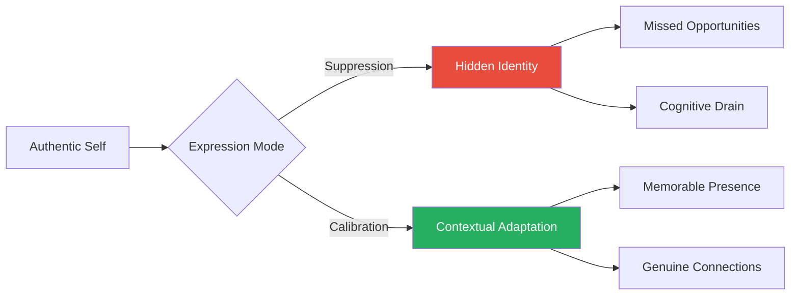
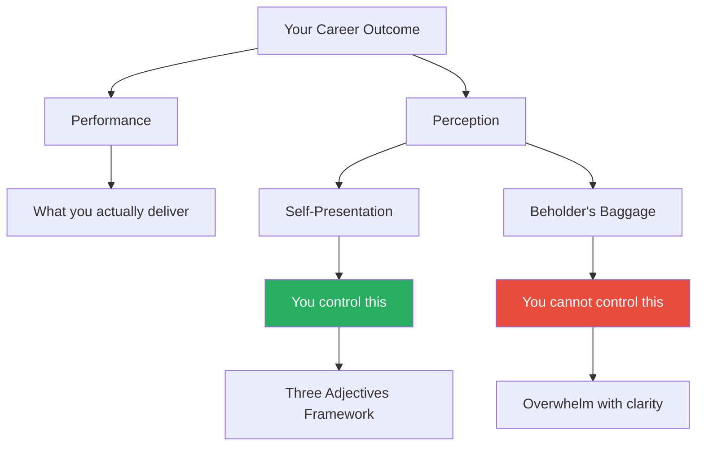
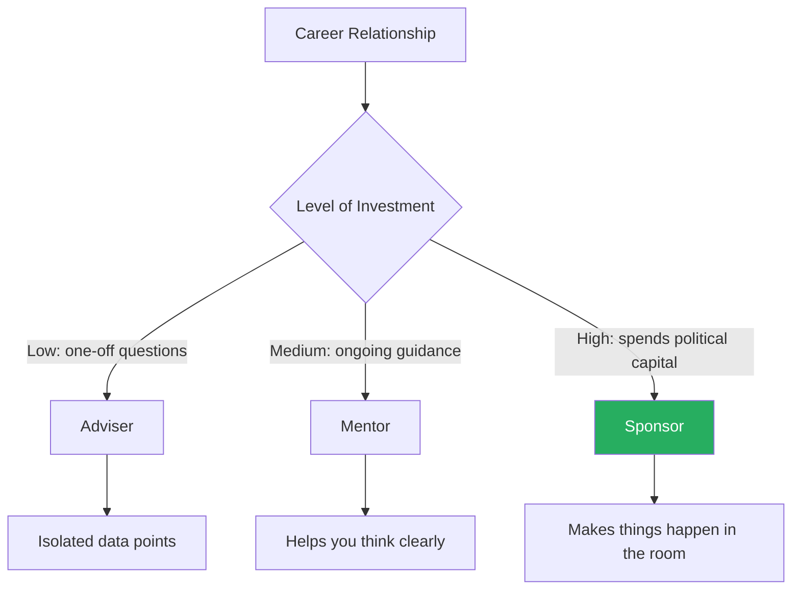
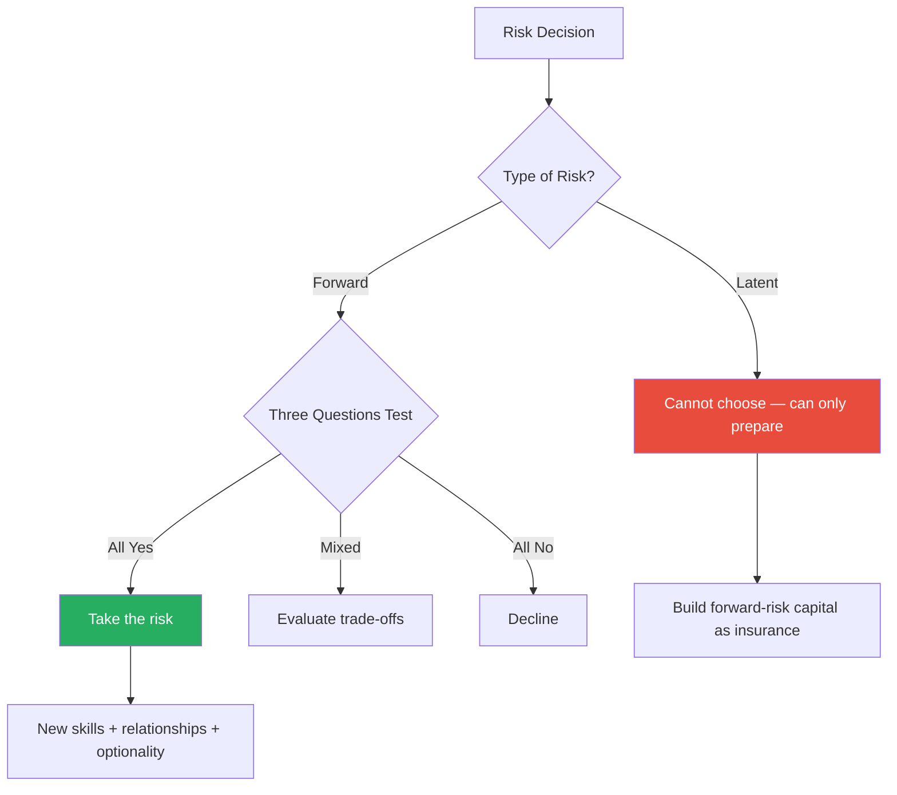
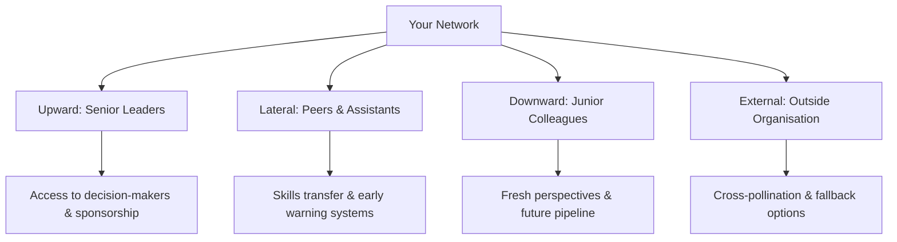
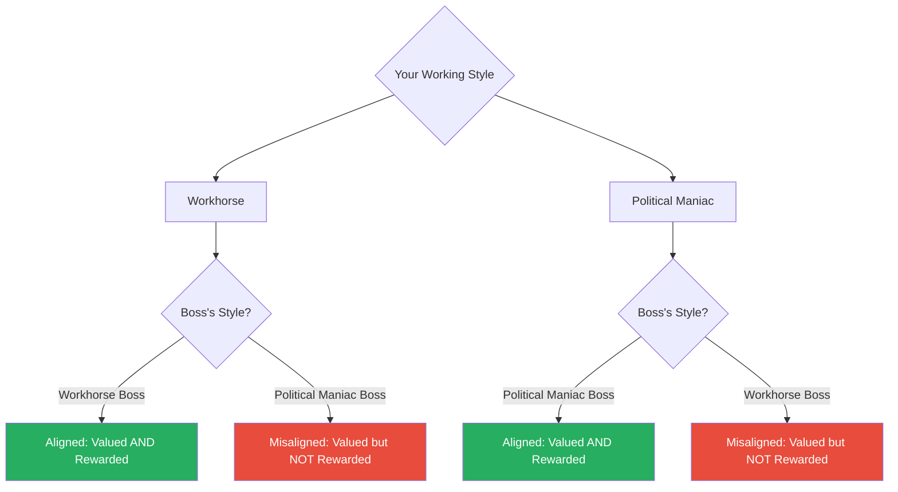

# Expect to Win — Carla A. Harris

> Carla Harris spent over twenty years at Morgan Stanley and distilled everything she learned about corporate advancement into eleven "pearls" — hard-won principles about how careers actually work.
> Her thesis is blunt: hard work is necessary but not sufficient.
> The complete success equation is **performance + political alignment + risk taking**.
> Organisations are not meritocracies.
> Promotions are decided in rooms you are not in, by people reacting to perceptions you may not have shaped, on the advocacy of sponsors you may not have recruited.
> Harris lays out the mechanics of each element — how to manage perception deliberately, how to distinguish a sponsor from a mentor, how to use your voice to set expectations, and how to take the kind of risks that leave you better off regardless of outcome.
> It is a practitioner's manual written by someone who lived every lesson she teaches.

---

## About the Author

Carla A. Harris rose to Managing Director in equity capital markets at Morgan Stanley, one of Wall Street's most competitive and politically ruthless firms. An African American woman in an environment where she was often the only person in the room who looked like her, Harris's perspective was forged by navigating institutions where the informal mentoring and sponsorship flows that benefit people who resemble the incumbents simply did not reach her. She could not rely on the organic network of privilege that white male colleagues inherited by default — so she had to reverse-engineer the system, identify its hidden mechanics, and build her own infrastructure of relationships, perception management, and advocacy. She is also a gospel singer who has performed at Carnegie Hall — a detail that matters strategically, not just personally, because her singing became a relationship-building asset that opened doors her credentials alone could not.

---

## The Big Idea

*Harris argues that corporate environments reward those who are excellent and who ensure the right people see that excellence — and she provides a precise formula for how that works.*

- <b style="color: #27ae60">Merit is table stakes</b> — the differentiators are perception management, sponsorship, voice, and calculated risk-taking
- Harris structures these ideas around what she calls the <b style="color: #2980b9">Success Equation</b>:

**Performance + Political Alignment + Risk Taking = Career Advancement**

The typical high performer invests almost exclusively in performance while neglecting the five other dimensions that actually determine advancement — Harris's model demands balanced investment across all six.

- **Performance** gets you in the conversation
- **Political alignment** determines whether people want to advocate for you
- **Risk-taking** separates those who advance from those who plateau

---

- This is not a cynical framework — Harris is not saying performance does not matter
- She is saying it is <b style="color: #e74c3c">not enough on its own</b>
- The deepest injustice of corporate life is that many people do excellent work and still stall:
  - Not because they lack talent
  - But because they fail to manage the subjective elements that determine who gets ahead
- Those subjective elements — who speaks for you behind closed doors, how senior people describe you when you leave the room, whether you have articulated your own expectations — are not accidents of fortune
  - They are manageable
  - They are engineerable
  - But only if you accept that they exist and commit to working on them as deliberately as you work on your deliverables

> [!tip] Core Insight
> Passivity is the most dangerous career strategy of all. Silence is never interpreted as competence. Strong work is never assumed to speak for itself. The people who advance are the ones who actively shape how they are perceived, recruit advocates, and tell the organisation what they expect.

---

## Key Concepts at a Glance

| Concept | One-line summary |
|---------|-----------------|
| **The Success Equation** | Performance alone is insufficient; political alignment and risk-taking complete the formula |
| **The 90-Day Impression Window** | The first three months set a perception trajectory that is extremely difficult to reverse |
| **The Perception Equation** | Perception = Self-Presentation + Baggage of the Beholder; you can only control the first half |
| **The Three Adjectives Framework** | Choose three words you want people to use about you when you are not in the room, then behave consistently until they stick |
| **Sponsor vs Mentor vs Adviser** | Sponsors spend political capital on your behalf; mentors give advice; advisers answer discrete questions |
| **The 50/50 Rule** | Before you speak, there is a coin flip on whether people assume you are competent; your voice shifts the odds |
| **Forward Risk vs Latent Risk** | Forward risks (chosen) always leave you better off; latent risks (environmental) can only be compensated for by accumulating forward-risk capital |
| **The Corporate Ecosystem Model** | Bosses evaluate through the lens of their own type; misalignment means you are valued but never adequately compensated |
| **Manage Your Mistakes** | Own the error immediately, state the lesson, enlist support, then stop discussing it |
| **The Personal Board of Directors** | Curate a group of advisers, mentors, and sponsors who collectively cover guidance, development, and advocacy |
| **The Four-Quadrant Network** | Build relationships upward, laterally, downward, and externally for complete coverage |
| **Integration Over Balance** | Merge outside passions into your professional identity rather than treating them as competing demands |

---

## Pearl 1: Authenticity — Your Competitive Advantage

*Harris opens with what sounds like soft motivational advice but is, in her telling, a hard strategic principle: your authentic self is your primary competitive differentiator, and suppressing it costs you more than it protects you.*

- Your authentic self — the combination of skills, personality, values, interests, and communication style that got you hired — is your primary competitive differentiator
- <b style="color: #e74c3c">Suppressing it does not protect you</b> — it consumes mental energy that should be directed at performance and relationships
- It robs you of exactly the qualities that make you memorable

The mechanism is straightforward: <b style="color: #2980b9">authenticity produces confidence; confidence produces trust; trust produces relationships</b>.

- When you are being yourself, you operate from a place of comfort and clarity
  - You connect with people genuinely
  - You project ease
  - You are interesting
- When you are suppressing your personality to fit a mould you were not built for, you project something else entirely:
  - Tentativeness and discomfort
  - A sense that something is being held back
  - People can feel it, even when they cannot name it
- The cognitive load of maintaining a performance drains the very resources you need for actual performance

---

> [!example] Marissa's Hidden Advantage (Morgan Stanley era)
> - "Marissa," a Latina colleague at a major financial services firm, made a deliberate decision to suppress her cultural identity at work
> - She never mentioned her background, never spoke Spanish in the office, and never volunteered her deep knowledge of Latin American business culture
> - She wanted to be seen as a "regular" professional, not boxed into an ethnic category
> - Then a Latin America assignment opened up — a high-profile role requiring exactly the cultural fluency and language skills Marissa had spent years hiding
> - Leadership did not even consider her — they had no idea she spoke fluent Spanish or understood the culture
> - Someone else got the assignment, and Marissa was left wondering what might have been
> **The lesson:** By hiding a genuine part of who she was, she removed a competitive advantage from her own portfolio — and the organisation made a worse decision because it did not know what it was leaving on the table.

> [!example] Harris's Gospel Singing as Strategic Asset
> - When Harris first joined Morgan Stanley, she kept her music life separate from her finance life
> - Over time, she began inviting colleagues — including senior leaders — to her concerts
> - Senior Managing Directors who might never have noticed a junior associate in equity capital markets began attending her performances
> - They formed personal connections with her and remembered her name in ways that transcended the usual hierarchical distance
> - These were not networking events disguised as concerts — Harris genuinely loved singing and performed at a high level
> - The strategic effect was real: she became a known quantity to people several levels above her
> - When her name came up in promotion discussions, senior leaders who had seen her perform had a personal connection that transcended the impersonal evaluation of spreadsheets and deal tombstones
> **The lesson:** No amount of careful corporate positioning could have replicated what that authenticity created. The singing did not replace performance — it amplified it by making her memorable and human.

### The Limits of Authenticity

- Harris is careful to draw a boundary — <b style="color: #27ae60">authenticity must operate within organisational cultural norms</b>
- It is not a licence for recklessness, for ignoring dress codes, for saying whatever comes to mind in meetings
- The point is to bring your full self — strengths, interests, communication style, outside passions — into your professional life
- The distinction is between **suppression** and **calibration**:
  - **Suppression** hides who you are
  - **Calibration** adjusts how you express who you are based on context
- Harris advocates calibration, not suppression

The distinction between suppression and calibration is the bridge between being yourself and being effective — suppression removes your differentiator, while calibration deploys it with awareness of context.

---

## Pearl 2: Build Your Own Career Agenda

*Harris argues that most people allow their careers to happen to them rather than making them happen — and introduces a personal definition of success that protects against both emotional reactivity and corporate passivity.*

- Most professionals react to assignments, respond to feedback, chase whatever promotion cycle comes next, and measure themselves against whatever their peers seem to be doing
- This is how intelligent, talented people end up fifteen years into a career feeling vaguely dissatisfied without being able to articulate why
- The alternative is to create and maintain a <b style="color: #2980b9">career agenda</b> — a personal definition of success with goals, timelines, and criteria that exists independently of any employer, any boss, or any peer group
- The agenda answers three questions:
  - Where do I want to be in five years?
  - What skills, relationships, and experiences do I need to get there?
  - Is my current environment giving me those things, or do I need to change something?

---

### The Emotional Anchor Function

- The most important function of the career agenda is not goal-setting — it is <b style="color: #27ae60">emotional regulation</b>
- Without an agenda, emotions drive decisions:
  - When you are passed over for a promotion, you react with anger or despair rather than asking analytically: "Does this derail my plan, or just delay it?"
  - When a peer gets promoted before you, envy clouds your judgement rather than prompting a useful assessment: "Is the gap real or perceived, and does it matter for my trajectory?"
  - When an attractive opportunity appears, you chase it reflexively rather than evaluating it against your actual goals

> [!example] Harris Passed Over at Morgan Stanley (early career)
> - Harris was passed over for promotion early in her career at Morgan Stanley — it stung
> - She returned to her personal agenda and asked the analytical question: "Can I still achieve my goals by staying?"
> - The answer was yes — the timeline was delayed, not destroyed
> - She stayed, was promoted the following year, and continued on her trajectory
> - Meanwhile, several colleagues who were passed over at the same time left Morgan Stanley in frustration
> - Some ended up at firms that were a poor fit; others found the new firm had the same politics they had fled from
> - The emotional decision — "I'm not appreciated here, so I'll go somewhere I will be" — did not produce better outcomes because it was driven by hurt feelings rather than strategic analysis
> **The lesson:** The career agenda transforms emotional reactions into analytical questions, preventing costly decisions driven by wounded pride.

---

### The Peer Comparison Trap

- Harris identifies <b style="color: #e74c3c">peer comparison as one of the most destructive forces in corporate life</b>
- When a colleague at your level gets promoted before you, the natural reaction is to measure yourself against them: What do they have that I do not?
- This is almost always the wrong question
- The right question is: "Am I still on track against my own agenda?"
  - If the answer is yes, someone else's promotion is irrelevant — it is a data point about the organisation, not a verdict on your worth
  - If the answer is no, the peer's promotion is not the problem — the problem is that something in your plan or your environment needs to change
- Harris does not dismiss the pain of being passed over — she acknowledges it as legitimate
- But she insists the pain must be metabolised through the agenda, not through comparison:
  - Comparison produces either complacency ("I'm doing fine relative to my peers") or despair ("I'll never catch up")
  - Neither is useful

### The Agenda Defines Goals, Not Employers

- A critical distinction: the career agenda defines **what you want to achieve**, not **where you want to achieve it**
- If the environment becomes genuinely toxic, if the structural barriers are real and immovable, if the organisation has shown you through its actions that it does not intend to fulfil your goals — the agenda should say "leave"
- <b style="color: #27ae60">Loyalty to an employer is not the same as loyalty to your own ambition</b>
- The agenda protects against both:
  - **Premature departure** — emotional reaction to a temporary setback
  - **Excessive loyalty** — refusing to leave an environment that has already refused you

> [!example] The Colleague Who Stayed Too Long (Wall Street)
> - Harris describes a colleague who had been at the same firm for over a decade, repeatedly passed over for Managing Director
> - Each year, the colleague received excellent performance reviews but was told "not yet" when promotion time came
> - The colleague stayed out of loyalty and a belief that persistence would eventually be rewarded
> - After twelve years, the colleague finally left — and was promoted to Managing Director at the new firm within eighteen months
> - The original firm had never intended to promote this person — the signals were clear, but loyalty had blinded the colleague to what the organisation was communicating through its actions
> **The lesson:** The career agenda should have triggered a departure years earlier. Loyalty without reciprocity is not strategy — it is denial.

---

## Pearl 3: The 90-Day Rule

*Harris reveals that you have approximately ninety days in any new role to establish the perception of your value — miss the window and you spend the next two years trying to undo what the first three months created.*

- You have approximately <b style="color: #2980b9">90 days</b> in any new role to establish the perception of your value, your fit, and your trajectory within the organisation
- Miss the window and you spend the next two years trying to undo what the first three months created
- Organisations — whether they articulate it or not — are assessing three things about every new person:

| Assessment | Question | Controllability |
|-----------|----------|----------------|
| **Can do** | Do you have the skills to execute the job? | Demonstrable through output |
| **Will do** | Are you motivated, energetic, and committed? | Demonstrable through behaviour |
| **Fit** | Do you belong here culturally, socially, relationally? | Most subjective, hardest to measure, most decisive |

- Of these three, <b style="color: #e74c3c">fit is the most subjective, the hardest to measure, and by far the most decisive</b>
- You can teach skills and incentivise motivation — but if people conclude you "don't fit," no amount of competence rescues the trajectory

---

### The Halo Effect and the Average Label

- The first 90 days create one of two outcomes:

**The positive outcome — the <b style="color: #2980b9">halo effect</b>:**
- You are perceived as competent, committed, and belonging
- Once the halo sets in, everything you do is interpreted through that lens:
  - A mistake is an anomaly
  - A success confirms what everyone already believed
  - You get the benefit of the doubt
  - You get offered stretch assignments
  - You get invited into rooms

**The negative outcome — the <b style="color: #e74c3c">"average" label</b>:**
- You are perceived as adequate but unremarkable
- Once this sets in, every assignment becomes a proving exercise:
  - A success is expected — after all, you should be proving yourself
  - A mistake confirms the suspicion that you are not quite up to standard
  - You are never offered the benefit of the doubt because the doubt was there from the beginning

- The asymmetry is profound — creating a positive first impression is dramatically easier than reversing a negative one
- Harris argues that the cost of changing a bad first impression is **five to ten times higher** than the cost of creating a good one — and some first impressions are simply never reversed

---

### The 90-Day Playbook

> [!abstract] Harris's Three Priorities for the First 90 Days
> 1. **Master the basic skills of the job** — do not try to innovate or challenge the status quo in the first month. Learn what the role actually requires. Execute the basics flawlessly. Demonstrate you can do what you were hired to do before showing what else you might be capable of
> 2. **Learn the unspoken rules** — every organisation has two sets of rules: the official ones in the employee handbook, and the real ones that determine who gets ahead. Who holds real power? Who can you trust? What is actually rewarded, as opposed to what the company says it rewards?
> 3. **Build key relationships** — identify the people who will determine your perception (your boss, your boss's peers, the gatekeepers, the informal influencers) and invest in those connections early. Do not wait for relationships to develop organically

- On <b style="color: #27ae60">day 91</b>, shift your focus from learning to articulating
- Start telling people what you have accomplished
- The 90-day investment is wasted if you build competence but never make it visible

### The Proactive Feedback Loop

- Harris introduces a related principle: <b style="color: #e74c3c">do not wait for the annual review to discover how you are perceived</b>
- At the 90-day mark, schedule conversations with four to six people — including people who are not your fans — and ask forward-looking questions
- The script matters:
  - **Do not ask:** "How am I doing?" — this projects insecurity and invites criticism without direction
  - **Instead ask:** "How can I add more value to the team?" — this frames the conversation around contribution, signals ambition, and gives people a constructive question to answer
- Harris recommends including at least one non-fan in the feedback group:
  - Critics provide the most useful information because they are the ones whose perception you most need to shift
  - Your fans will tell you what you want to hear
  - Your critics will tell you what you need to know

The 90-day progression moves from quiet competence-building to deliberate visibility — the timing matters because speaking too early undermines credibility, while speaking too late wastes the impression window.

> [!example] The New VP Who Skipped the Window (Morgan Stanley)
> - A newly hired Vice President at Morgan Stanley arrived with impressive credentials and immediately began pushing for changes in how the team operated
> - Within the first two weeks, he was challenging established processes, suggesting new systems, and openly questioning senior colleagues' decisions
> - His ideas were often good — but the team had not yet decided whether he belonged
> - By month three, the perception was set: smart but arrogant, technically capable but culturally tone-deaf
> - He spent the next two years trying to shake a reputation that the first two weeks had cemented
> - A peer who started the same week took a different approach — she spent the first three months learning, asking questions, and building relationships before gradually introducing improvements
> - She was promoted a year before the VP who had arrived with objectively stronger credentials
> **The lesson:** The 90-day window is about earning the right to be heard. Skip the earning phase, and even good ideas land badly.

---

## Pearl 4: Perception Is the Copilot to Reality

*This is the chapter Harris herself considers the most important in the book — her central claim is stark: how people perceive you directly determines how they treat you, and reality is largely irrelevant if the perception is wrong.*

- <b style="color: #27ae60">How people perceive you directly determines how they treat you</b> — and reality is largely irrelevant if the perception is wrong
- People do not act on truth — they act on belief:
  - If they believe you are competent, they treat you as competent — they offer opportunities, extend trust, forgive mistakes
  - If they believe you are mediocre, they treat you as mediocre — regardless of your actual output
- The performance might be identical in both cases — the outcomes will not be

### The Perception Equation

- Harris formalises this as the <b style="color: #2980b9">Perception Equation</b>:

**Perception = Self-Presentation + Baggage of the Beholder**

- **Self-presentation** is what you put out:
  - Your behaviour, speech, dress, body language
  - The language you use to describe your work
  - This is what you control
- **Baggage of the beholder** is what other people bring to the interaction:
  - Their biases, their prior experiences with people who look like you
  - People who hold similar roles or remind them of someone else
  - This is what you do not control
- Because you can only control self-presentation, that is where all your energy should go
- <b style="color: #27ae60">You cannot eliminate others' biases, but you can overwhelm them</b> with a presentation so clear, so consistent, and so compelling that the bias has nothing to attach to

---

> [!example] The "Tough" Perception Shift (Morgan Stanley)
> - A senior Managing Director at Morgan Stanley told Harris she was "not tough enough" for a particular high-profile role
> - Harris knew she was tough — she had been doing tough deals, having tough conversations, and navigating tough client situations for years
> - But the perception said otherwise, and no amount of internal protest was going to change it
> - Rather than arguing — which would have confirmed she was emotional rather than tough — Harris adopted a surgical approach
> - For three months, she deliberately seeded the word "tough" into every interaction with that Managing Director
> - She described her deals as "tough negotiations," her client calls as "tough conversations," market conditions as requiring "tough decisions"
> - She never said "I am tough" — she simply ensured the word surrounded every piece of work she presented
> - Within a quarter, the MD was using the word "tough" to describe Harris to others
> **The lesson:** The perception shifted not because the underlying reality changed — Harris had always been tough — but because she changed the language environment around the decision-maker.

### The Three Adjectives Framework

- The "tough" story illustrates Harris's broader framework: <b style="color: #2980b9">choose three words you want people to use when describing you when you are not in the room, then walk, talk, and behave consistently with those adjectives until they internalise them</b>
- The three adjectives must satisfy two conditions:
  - They must be **authentic** — you must actually be the things you claim to be, because a false persona is exhausting to maintain and brittle under pressure
  - They must be **valued by the organisation** — there is no point in being perceived as "creative" in an organisation that rewards "reliable"
- Once chosen, the adjectives become a filter for behaviour:
  - Before every meeting, every email, every presentation, the question is: "Does what I am about to do reinforce my three adjectives?"
  - Over time, the repetition does its work
  - People begin using those exact words — or close synonyms — when they talk about you in rooms you are not in

> [!abstract] Implementing the Three Adjectives
> 1. **Audit:** What three words does the organisation currently use to describe you? Ask trusted colleagues
> 2. **Choose:** Select three words that are authentic to you AND valued by the organisation
> 3. **Embed:** Use those words to describe your own work in conversations, emails, and presentations
> 4. **Reinforce:** Ensure your behaviour — dress, communication style, how you handle pressure — consistently embodies those adjectives
> 5. **Verify:** After three to six months, ask again what words people associate with you. If they match, the framework is working

---

> [!example] The Associate Who Dressed for the Job (Morgan Stanley)
> - A junior associate had been at the firm for several years but was consistently passed over for promotion to Vice President
> - Her work was strong and her analytics were sharp
> - But she dressed like an associate — casual, slightly rumpled, the uniform of someone who spent long nights at a desk rather than meeting clients
> - A mentor told her bluntly: "You look like an associate. If you want to be treated like a VP, you need to look like one."
> - She changed her wardrobe, started dressing and carrying herself like someone a level above her current title
> - Within six months the perception shifted — people began including her in client meetings, giving her more visible assignments, and eventually promoting her
> **The lesson:** Perception operates through every channel of self-presentation, not just words. If your visual presentation contradicts your desired perception, the visual usually wins.

### The Uncomfortable Truth

- Harris is clear-eyed about the relationship between perception and substance:
  - <b style="color: #e74c3c">Perception management without substance underneath will eventually collapse</b> — you cannot fake competence forever
  - The market, or the client, or the crisis, will eventually test what is beneath the surface
- But the reverse is equally true — and more commonly overlooked:
  - <b style="color: #e74c3c">Substance without perception management is invisible</b>
  - The work does not speak for itself — it never has
  - The people who believe their output is self-evidently excellent are the people who watch less talented colleagues get promoted while they stand by in bewilderment

> "Perception is the copilot to reality."

The Perception Equation shows that career outcomes depend on two inputs — only one of which you control. The strategic response is to invest all energy in the controllable half while accepting you cannot eliminate the uncontrollable half.

---

## Pearl 5: Mentors, Sponsors, and Advisers

*Harris draws a distinction so simple it fits in a sentence and so important it restructures how you think about every senior relationship in your professional life — and it has entered the vocabulary of corporate development programmes worldwide.*

- This is the book's most powerful and most frequently cited chapter
- The distinction Harris draws here is the chapter with the highest ratio of practical utility to page count

### The Taxonomy

| Role | Definition | What They Do | Limitation |
|------|-----------|--------------|------------|
| **Adviser** | Answers discrete career questions | Gives isolated, non-contextual guidance | No ongoing relationship; no skin in the game |
| **Mentor** | Gives tailored developmental advice; knows your full context | Provides personalised counsel across your career arc | Helps you *think* but cannot *make things happen* |
| **Sponsor** | Uses political and social capital on your behalf | Carries your paper into the room; argues your case behind closed doors | Requires a seat at the decision table AND willingness to spend capital |

Sponsors deliver dramatically more career impact than mentors despite offering less guidance — because sponsorship operates in the rooms where decisions are made, not in the conversations where advice is given.

- An <b style="color: #2980b9">adviser</b> is someone you consult on a specific question:
  - They may be senior, they may be wise, but they do not know your full situation
  - They have no stake in your outcome
  - A mentor at a networking event who tells you to "follow your passion" is an adviser — useful for isolated data points, but not for strategic guidance

- A <b style="color: #2980b9">mentor</b> is deeper:
  - A mentor knows "the good, the bad, and the ugly" of your career
  - They understand your strengths and weaknesses, your aspirations and constraints
  - They give advice that is tailored to your specific situation
  - A good mentor is invaluable for thinking clearly
  - But a mentor, no matter how wise, **cannot make things happen in rooms they do not have access to**

- A <b style="color: #2980b9">sponsor</b> is different in kind, not just in degree:
  - A sponsor is someone with a seat at the decision-making table — the promotion committee, the assignment panel, the compensation review
  - They are willing to spend their own political and social capital arguing your case when you are not in the room

> "Who is carrying your paper into the room?"

- <b style="color: #27ae60">This is Harris's most important question</b>
- If you cannot answer it, nothing else matters — not your performance, not your perception, not your voice
- All major decisions about your career are made behind closed doors
- The people in that room are speaking on behalf of their candidates
- If no one is passionately arguing for you, you will lose every marginal decision

---

The critical insight is that sponsor relationships are different in kind from mentor relationships — the gap between "gives great advice" and "argues for your promotion behind closed doors" is the gap between career stagnation and advancement.

---

> [!example] Harris's Managing Director Sponsorship Crisis (Morgan Stanley)
> - Harris nearly missed her own Managing Director promotion at Morgan Stanley
> - She had the performance, the perception, and the relationships
> - But when the promotion committee convened, she did not have an identified sponsor — someone who had explicitly committed to carrying her candidacy into the room and fighting for it
> - When she realised this, she did something most professionals find terrifying: she directly asked a senior Managing Director to sponsor her
> - She did not hint and did not wait for it to happen organically
> - She stated the case: "You are in the room where this decision is made. You know my track record. Here is the evidence that makes sponsoring me a good investment of your capital. Will you be my sponsor?"
> - He agreed — she was promoted
> **The lesson:** Sponsorship is not something that happens to you. It is something you recruit, deliberately and explicitly.

### The "No" Is Still Valuable

- Harris addresses the obvious fear: what if they say no?
- Even a "no" is strategically valuable:
  - You learn something important about how the organisation sees you — maybe the perception is weaker than you thought
  - Or you learn about the potential sponsor's own political position — maybe they lack the capital or the willingness
  - Either way, you now have information you did not have before, and you can act on it
- <b style="color: #e74c3c">What you cannot do is sit in ignorance, hoping that someone will spontaneously decide to champion your cause</b>
- That kind of passivity is how talented people spend entire careers waiting for recognition that never comes

---

### The Personal Board of Directors

- Harris extends the individual mentor/sponsor/adviser concept into a broader framework: the <b style="color: #2980b9">personal board of directors</b>
- Just as a company has a board with diverse expertise, a professional should curate a group who collectively cover the full range of guidance, development, and advocacy
- The board should include:
  - Someone who knows your industry deeply
  - Someone who knows your organisation's politics
  - Someone outside your field entirely (for perspective)
  - At least one person who will tell you what you do not want to hear
  - At least one sponsor with a seat at the decision table
- The board does not need to know each other — it is not a formal structure
- It is a mental model for ensuring that your advisory network has no critical gaps

> [!example] The Board That Saved a Career Pivot (Harris anecdote)
> - Harris describes a colleague who was considering leaving Wall Street for a nonprofit leadership role
> - The colleague's mentor — a longtime Wall Street executive — strongly advised against it, citing the compensation loss and career risk
> - But the colleague's personal board included someone from the nonprofit world, who provided a completely different perspective: the skills she had built on Wall Street were rare in the nonprofit sector and would make her immediately valuable
> - A third board member — an executive coach with no stake in either outcome — helped her evaluate the move against her career agenda, not against anyone else's expectations
> - The colleague made the move and thrived — the board's diversity of perspective was what allowed a clear decision
> **The lesson:** A board composed entirely of people who share your industry and worldview will reinforce your biases rather than illuminating your blind spots.

### The Hard Truth About Friendly Senior People

- Harris delivers what may be the chapter's most uncomfortable truth: <b style="color: #e74c3c">do not confuse a friendly senior person with a sponsor</b>
- Many professionals believe they have sponsors because a senior leader is pleasant to them, takes their calls, gives them advice, and seems generally supportive
- But pleasantness is not sponsorship
- A sponsor must meet two criteria, both non-negotiable:
  - They must have a **seat at the table** — access to the rooms where decisions about your career are made
  - They must be **willing to spend capital** — ready to argue for you, potentially at the cost of other candidates they could be supporting
- If they lack either criterion, they are an adviser — pleasant but insufficient
- The failure to distinguish between the two is, in Harris's experience, one of the most common reasons talented people stall

---

## Pearl 6: The Power of Voice

*Harris identifies voice as one of the most underused career assets and one of the most consequential — and introduces a framework that explains why silence is never interpreted as brilliance.*

- Harris's argument rests on a simple, memorable framework: the <b style="color: #2980b9">50/50 Rule</b>
- When people meet you for the first time, before you speak, there is a 50% chance they assume you are smart and a 50% chance they assume you are not
- The coin is in the air — your voice is what determines which side it lands on

> "Frequently wrong, but never in doubt."

- This Wall Street maxim, taught to Harris by a senior colleague, captures the principle:
  - Confidence in delivery is evaluated as a proxy for competence
  - People who speak with certainty are assumed to know what they are talking about
  - People who hedge, qualify, and trail off are assumed to be uncertain of their own expertise
- This may be unfair — genuine humility and careful qualification are intellectual virtues
- But Harris is not describing a fair world — she is describing how perception actually works in competitive organisations

---

### The Three Functions of Voice

**1. <b style="color: #2980b9">Voice creates perception</b>:**
- People form judgements based on what you say and how you say it
- If you speak with authority, clarity, and conviction, you are perceived as authoritative, clear, and convicted
- If you speak tentatively, people perceive you as tentative — and tentative does not get promoted

**2. <b style="color: #2980b9">Voice creates expectation</b>:**
- When you articulate what you intend to deliver, people hold you to it — and notice when you do
- By telling the organisation "I will deliver X by date Y," you create a metric against which you can succeed publicly
- People who never articulate expectations deprive themselves of the chance to exceed them

**3. <b style="color: #2980b9">Voice articulates your goals</b>:**
- If you do not tell the organisation what you expect — a promotion, a title, a scope expansion — they have no obligation to deliver it
- The organisation is not sitting around wondering what you want
- It is attending to the people who have told it what they want

---

> [!example] The Promotion Harris Lost to Silence (Morgan Stanley)
> - Harris was passed over for a promotion at Morgan Stanley despite believing she had earned it through her performance
> - Confused and frustrated, she went to her boss and asked what had happened
> - His response was devastating in its simplicity: every one of her peers had been in his office for months, explicitly lobbying their cases for promotion
> - They had told him what they expected, reminded him of their accomplishments, and made the case for their advancement in direct, unmistakable terms
> - Harris was the only one who stayed silent — she had assumed her work would speak for itself
> - The marginal decision — and most promotion decisions are marginal, because the candidates at the top are usually closely matched — went to those who asked
> **The lesson:** The work was the same regardless of whether she spoke up. The outcome was entirely determined by whether she did.

> "If you do not ask, you will not receive."

- This story is Harris's foundational argument against career passivity
- <b style="color: #27ae60">Silence will never be interpreted as brilliance</b> — the work does not speak for itself

---

### Speaking with Confidence When Uncertain

- Harris addresses a practical challenge: what do you do when you are asked a question and you genuinely do not know the answer?
- Many professionals default to honesty: "I don't know" or "I'm not sure"
- Harris argues that while this is intellectually honest, it is <b style="color: #e74c3c">strategically disastrous</b>:
  - The moment you say "I don't know" in a high-stakes setting, the room's confidence in you drops
  - It may not recover, because people remember the uncertainty longer than they remember the correction that follows
- Harris observed senior colleagues at Morgan Stanley giving answers that were not entirely right but delivering them with complete confidence:
  - The room accepted the answer
  - When corrections came later, they were treated as refinements, not evidence of incompetence

> [!abstract] Harris's Confidence Script
> 1. Give a confident answer based on your best judgement: "In my judgement, the answer is X"
> 2. Preserve integrity by committing to verify: "but let me verify and follow up"
> 3. Follow up with the accurate answer promptly
>
> This is not dishonesty — it is delivery discipline.

### The Strategic Use of Voice

- Harris adds a nuance that prevents the voice principle from becoming a licence for constant self-promotion
- Voice must be exercised strategically — <b style="color: #27ae60">targeted communication at key decision points</b>, not a running commentary on your own excellence
- The moments that matter:
  - Promotion conversations
  - Performance reviews
  - Introductions to senior leaders
  - The first 90 days in a new role
  - After delivering a significant result
- Outside these moments, let the work accumulate
- The point is not to talk all the time — the point is to talk at the moments when it counts, and to never, ever stay silent at those moments

> [!example] The Analyst Who Asked for the Order (Morgan Stanley)
> - A junior analyst at Morgan Stanley had delivered an exceptional year — outperforming peers on every objective metric
> - She assumed the bonus pool and year-end review would reflect her contribution
> - They did not — her bonus was in line with her peers, not above them
> - When she asked her manager why, he said he had not realised she expected more — she had never communicated it
> - Her peers, meanwhile, had been flagging their results throughout the year: "I want you to know that the Smith deal closed above target" and "I expect my contribution to be reflected at year-end"
> - The analyst learned that voice is not just about promotion conversations — it is about establishing a running record of your value that decision-makers can reference when it matters
> **The lesson:** Expectation without articulation is just hope. The organisation rewards what it hears about, not what it silently observes.

---

## Pearl 7: Taking Risks

*Harris distinguishes between two fundamentally different categories of risk — and the distinction changes how you think about every career decision.*

### Latent Risk vs Forward Risk

- <b style="color: #2980b9">Latent risk</b> is the risk that exists in your environment regardless of your actions:
  - Markets crash
  - Companies restructure
  - Sponsors leave
  - New leadership arrives with different priorities
  - Technologies become obsolete
  - None of these are things you choose — they happen to you
  - You cannot prevent them, only prepare for them

- <b style="color: #2980b9">Forward risk</b> is the risk you choose to take:
  - A new assignment, a lateral move, a stretch project
  - An unfamiliar market, a role that takes you off the revenue-generating floor
  - These are deliberate bets

> "A forward risk always leaves you better off."

- Harris's central claim about forward risks is bold — <b style="color: #27ae60">even if the specific outcome fails, you still gain something</b>:
  - New skills
  - New relationships
  - A stronger understanding of your own capabilities and limits
  - A story to tell
  - An expanded network
- The forward risk creates optionality that did not exist before, regardless of whether the specific bet pays off
- <b style="color: #e74c3c">The only truly dangerous posture is inaction</b>
- Standing still in a dynamic environment is not safe — it is a slow, invisible form of decline
- The latent risks you cannot see are compensated for only by the forward risks you choose to take

---

> [!example] Harris's COO Gamble (Morgan Stanley)
> - Harris was offered the role of Chief Operating Officer for her division at Morgan Stanley — a position that would take her off the revenue-generating floor and into operations
> - Her peers thought she was insane — the revenue floor was where the money, visibility, and promotions came from
> - Moving to operations was, in conventional wisdom, career suicide
> - Harris took the role anyway — what her peers did not see was that the COO role gave her direct, daily access to the man who would become the next president of Morgan Stanley
> - She worked alongside him every day, built a deep personal relationship, and demonstrated her capabilities in a context where few competitors were vying for attention
> - When the future president ascended, Harris had a relationship that no amount of strong deal performance on the floor could have produced
> **The lesson:** The forward risk created a connection that transformed her career trajectory — the conventional wisdom about what was "safe" was wrong.

### The Three Test-the-Waters Questions

> [!abstract] Evaluating Any Forward Risk
> 1. **Will it give me new skills?**
> 2. **Will it expose me to new relationships?**
> 3. **Will it create new branches on my decision tree?**
>
> If all three answers are yes, the risk meets the forward-risk threshold. Even if the specific outcome disappoints, the skills, relationships, and optionality make you better off than standing still.

---

### The Risk Spectrum

- Harris also categorises risks by the clarity of their information:

| Risk Type | What You Know | Best For |
|-----------|--------------|----------|
| **Calculated risk** | Clear pros and cons; you can model the likely outcome | Corporate moves with known trade-offs |
| **Studied risk** | You understand the action, but consequences are unclear | Career pivots with domain knowledge |
| **Step-out-on-faith risk** | You know the destination but have no clear path | Entrepreneurial moves or existential career changes |

- In corporate environments, Harris advises maximising **calculated risks** — the ones where you can model the trade-offs and the downside is survivable
- Studied risks are appropriate for career pivots where you have domain knowledge but not specific outcome knowledge
- Step-out-on-faith risks require a financial and emotional cushion that most people do not have in mid-career

> [!example] Hannah the Lawyer's Calculated Leap
> - "Hannah," a successful lawyer, was offered the position of general counsel at a client company
> - The move meant leaving partnership — a prestigious and lucrative position — for a corporate role with a different kind of power and compensation structure
> - Hannah applied the three test-the-waters questions:
>   - New skills? Yes — she would learn corporate governance from the inside rather than advising on it from the outside
>   - New relationships? Yes — she would move from the legal advisory world into the C-suite
>   - New branches on her decision tree? Yes — the general counsel role opened paths to board positions, CEO advisory roles, and industry leadership that partnership did not
> - All three questions answered yes — she took the risk
> **The lesson:** Even if the specific role had not worked out, the skills, relationships, and options she gained would have left her better positioned than before.

The risk framework reveals that inaction is itself a form of risk — latent risks accumulate whether you act or not, and only forward risks create the capital to absorb them.

Calculated risks score highest on survivable downside, making them the safest bet for mid-career professionals — while step-out-on-faith risks offer maximum optionality but require financial and emotional reserves most people lack.

---

## Pearl 8: Networking as Power Infrastructure

*Harris rejects the popular image of networking as cocktail-party small talk and reframes it as the plumbing through which opportunities, information, and advocacy flow.*

- Harris rejects the popular image of networking — the forced conversation, the exchange of business cards that go straight into a drawer, the LinkedIn connection that never becomes a real relationship
- In her framework, networking is <b style="color: #2980b9">power infrastructure</b>
- Your network is the mechanism through which opportunities, information, and advocacy flow
- It is not optional, it is not soft — it is the plumbing of your career

### The Four-Quadrant Network

The executive assistant node connects directly to the CEO — Harris emphasizes that assistants are among the most undervalued network nodes, controlling access to the very senior leaders whose sponsorship determines your advancement.

Harris identifies four types of network relationships, each serving a distinct function.

**<b style="color: #2980b9">Upward (senior)</b>** — relationships with people above you in the hierarchy:
- Provide access to decision-makers, sponsorship opportunities, and institutional knowledge
- The most strategically valuable but also the hardest to build
- Senior people are time-poor and have little natural incentive to invest in you unless you make the relationship worth their while

**<b style="color: #2980b9">Lateral (peers and assistants)</b>** — relationships with people at your level or in adjacent functions:
- Provide skills transfer, information flow, and early warning systems
- Harris makes a crucial point most networking advice misses: <b style="color: #27ae60">executive assistants are among the most undervalued network nodes in any organisation</b>
  - Assistants control access to senior people, manage calendars, and possess institutional knowledge that no org chart reveals
  - They know who is up, who is down, whose meetings get cancelled and whose get prioritised
  - A good relationship with a key assistant is worth more than a dozen superficial connections with peers

---

**<b style="color: #2980b9">Downward (junior)</b>** — relationships with people below you in the hierarchy:
- Provide fresh perspectives, future talent pipeline, and — over the long term — a network that grows as junior people rise
- The associate you mentor today may be the Managing Director who sponsors you in fifteen years
- <b style="color: #e74c3c">Harris warns against ignoring people below you because they "cannot help you right now"</b>
- Power is dynamic, and the people who treat junior colleagues well accumulate an invisible reservoir of goodwill that pays compound interest over a career

**<b style="color: #2980b9">External (outside the organisation)</b>** — relationships beyond your company:
- Industry contacts, community connections, former colleagues, people from entirely different fields
- These provide:
  - Cross-pollination — ideas from other domains
  - Inspiration and reality checks — is your organisation normal?
  - Fallback options — if you need to leave, who do you know?

### The Reciprocity Principle

- Harris emphasises that <b style="color: #e74c3c">a network built on extraction collapses</b>
- If every interaction is you asking for something — a favour, an introduction, information — people learn to avoid you
- The strongest networks are those where you give before you ask
- This does not mean performative generosity — it means genuinely looking for ways to be useful:
  - Making introductions
  - Sharing information
  - Providing help without keeping a ledger or expecting immediate return
- Over time, the goodwill accumulates, and when you do need something, the network responds because there is a reservoir of reciprocity to draw from

---

### Authenticity in Networking

- Harris connects this chapter back to Pearl 1
- <b style="color: #e74c3c">Networking without authenticity reads as transactional</b> and destroys the very trust it is supposed to build
- People can sense when they are being "networked at" rather than connected with
- The conversation that begins with "What do you do?" and immediately pivots to "How can you help me?" is a networking failure, no matter how smoothly it is executed
- <b style="color: #27ae60">The most effective networking does not feel like networking at all</b>
- It feels like genuine human connection — shared interests, mutual respect, curiosity about the other person
- The strategic value emerges naturally from relationships that are authentic, not from relationships that are performed

> [!example] The Executive Assistant Network (Wall Street lore)
> - Harris describes a colleague who routinely bypassed the formal meeting-request process by cultivating strong relationships with executive assistants across the firm
> - When the colleague needed time with a senior leader, she did not send a cold calendar request — she called the assistant, with whom she had a genuine, warm relationship built over years of small courtesies
> - The assistant would find time on the calendar that was technically full
> - Meanwhile, colleagues who treated assistants as invisible barriers to the people they actually wanted to reach found their requests perpetually delayed
> - The colleague's access to senior leaders — and therefore her ability to build sponsor relationships — was directly proportional to the quality of her assistant relationships
> **The lesson:** The most powerful nodes in a network are not always the most obvious ones. Ignoring the people who control access is a strategic error disguised as a status judgement.

---

## Pearl 9: Finding Balance Through Integration

*Harris rejects the conventional "work-life balance" framing and introduces a more sustainable alternative: integration, where your outside interests strengthen your professional identity rather than competing with it.*

- Harris rejects the idea that work and life are two sides of a scale where the goal is to keep them level
- In her experience, this framing creates an impossible standard and a permanent sense of failure:
  - If you are working hard, you feel guilty about your personal life
  - If you are investing in your personal life, you feel anxious about your career
  - The scale is always tilted
- Her alternative is <b style="color: #2980b9">integration</b> — building your outside interests, passions, and community service into your professional identity rather than treating them as separate domains that compete for your time

> [!example] The Gospel Career as Integration Case Study
> - Harris's gospel singing was never a distraction from her career — it was a relationship-building engine
> - Senior leaders who attended her concerts formed personal bonds that transcended the usual hierarchical distance
> - Clients who learned she sang at Carnegie Hall saw her as a full human being, not just a financial services functionary
> - The singing gave Harris a memorable identity in an environment where most people blurred together
> - In a firm full of intelligent, ambitious, analytically sharp people doing similar work, her music made her stand out
> - It became a conversation opener, a relationship deepener, and a brand differentiator
> **The lesson:** The most powerful form of work-life integration comes from something you would do whether it had any career benefit or not — but it turns out it does.

---

### What Fills Your Tank

- Harris encourages identifying <b style="color: #27ae60">what fills your tank</b> — the activities, communities, and passions that restore your energy — and deliberately protecting time for them
- This is not soft self-care advice dressed up in corporate language — it is a **performance argument**:
  - **Burnout** produces bad decisions
  - **Chronic exhaustion** damages relationships — you become irritable, short-tempered, and unable to bring genuine warmth to the very interactions that sustain your network
  - **Fatigue** weakens your advocacy — a tired person does not project confidence, does not exercise voice, does not take forward risks
  - **Prolonged stress** without recovery erodes the resilience you need when genuine crises arrive

### The Integration Test

- Harris offers a practical test for whether your outside interests are integrated or merely adjacent:
  - Do the people you work with know about your outside passions?
  - Have those passions ever opened a conversation, deepened a relationship, or created a connection that would not have existed otherwise?
  - Do your outside activities restore your energy for professional challenges, or do they merely consume time you feel guilty about?
- If the answers are yes, yes, and restore — your life is integrated
- If the answers are no, no, and guilty — you are living in the balance paradigm, and it is costing you

---

- The integrated life is not the balanced life
- It is the life where your interests, your passions, and your professional identity reinforce each other rather than competing for scarce time and attention
- Integration means asking: "How can what I love outside of work strengthen what I do inside of work?" — and finding answers that are genuine, not cynical or forced

> [!tip] Core Insight
> Integration is not about turning hobbies into networking opportunities. It is about being a complete person at work — and letting that completeness become a competitive advantage.

---

## Pearl 10: The Expect-to-Win Mindset

*The book's title chapter argues that approaching your career with an expectation of success is not naive optimism — it is a deliberate strategic posture that changes your behaviour, your body language, and the opportunities you attract.*

- Harris distinguishes between two versions of herself:
  - **"18-year-old Carla"** always expected to win — she walked into every situation with the assumption that she belonged and would succeed, and she did
  - **"30-something Carla"** started doubting — the cumulative weight of being an outsider on Wall Street eroded the expectant mindset
    - The microaggressions, the passed-over promotions, the constant need to prove herself
    - She began approaching situations with uncertainty rather than confidence
    - Her career stalled
- When Harris consciously reconnected with the expectant mindset — when she decided to <b style="color: #27ae60">expect to win again, deliberately and as a strategic choice</b> — her career recovered
- The external circumstances had not changed
- The organisation had not suddenly become more enlightened
- What changed was how she showed up, and how people responded to the way she showed up

---

### The Mechanism: Expectations Shape Behaviour

> [!tip] Core Insight
> The expectation becomes self-fulfilling not through magic but through the cascade of small behavioural changes it produces. Confidence attracts opportunity; tentativeness repels it.

- Harris's argument is not mystical — it is behavioural
- <b style="color: #e74c3c">Mediocre expectations produce mediocre results</b> because they change how you present yourself:
  - When you expect to succeed:
    - You walk into rooms with confidence
    - You speak with authority
    - You volunteer for stretch assignments
    - You project the kind of ease that makes people trust you
  - When you doubt:
    - You hold back in meetings
    - You hedge your answers
    - You avoid risks
    - You signal uncertainty that others pick up on and respond to
- Over months and years, the accumulated effect of those small behavioural differences compounds into vastly different career trajectories

> [!example] The Two Presentations (Harris anecdote)
> - Harris contrasts two presentations she gave at Morgan Stanley — one during her confident period, one during her doubting period
> - The content was comparable in quality
> - In the first, she walked in expecting to impress — she made eye contact, spoke with conviction, handled questions with ease, and left the room knowing she had commanded attention
> - In the second, she walked in hoping not to embarrass herself — she read from her notes more, hedged her conclusions, and answered questions with excessive qualification
> - The first presentation led to a high-profile assignment; the second led to polite applause and no follow-up
> - Same person, similar content, radically different outcomes — the variable was expectation
> **The lesson:** Expectation is not about what you know or what you deliver. It is about the energy you bring into the room, and people respond to that energy before they process your content.

### The Necessary Caveats

- Harris is careful to distinguish the expect-to-win mindset from delusional thinking:
  - The winner's mentality must be combined with strategy, skills, and relationships
  - Expecting to win does not substitute for preparation
  - It does not excuse poor performance
  - It does not mean ignoring feedback or refusing to learn from failure
  - It is one ingredient in the success equation, not the whole recipe
- <b style="color: #e74c3c">Chronic overconfidence without self-awareness leads to blind spots</b> just as dangerous as chronic self-doubt
- The distinction is between:
  - **Confidence in your trajectory** — "I belong here; I will succeed over time"
  - **Arrogance about your current performance** — "I am already perfect and need no development"
- Harris advocates the first and warns against the second

---

## Pearl 11: Faith as Stabilising Force

*Harris's final chapter addresses the role of spirituality in navigating the pressures of a high-stakes career — the book's most personal and least universally applicable chapter.*

- Harris's faith — specifically, her Christian faith — provided a foundation of resilience during the setbacks, disappointments, and chronic pressure of being a Black woman on Wall Street
- She does not prescribe her specific faith tradition
- She acknowledges that different people find their grounding in different sources
- But she is unapologetic about naming faith as the thing that kept her steady when the politics were ugly, the passes-over were painful, and the daily grind of proving herself felt endless

### The Transferable Principle

- For readers who share Harris's faith tradition, this chapter offers a framework for grounding ambition in something larger than organisational politics:
  - The idea that your worth is not determined by your title, your compensation, or the opinions of people who may be wrong about you
- For readers without a faith tradition, the transferable insight is that <b style="color: #27ae60">some source of stability beyond your career is essential</b>:
  - When your identity is entirely defined by your professional role, every setback becomes an existential crisis
  - A promotion denied is not just a disappointment — it is an attack on who you are
  - A restructuring is not just a business event — it is a threat to your sense of self
- Whether that stability comes from faith, philosophy, family, community, creative expression, or some other source, the principle is the same:
  - You need something that holds steady when the professional world shakes

### The Resilience Architecture

- Harris's broader point is architectural — you need to build a life that can absorb professional shocks without collapsing:
  - **Faith** (or its secular equivalents) provides identity stability — you are not just your job title
  - **Community** outside work provides emotional support that does not depend on organisational outcomes
  - **Creative expression** provides an outlet that is entirely within your control when the professional world is not
  - **Physical health** provides the energy and resilience that high-pressure environments demand
- Harris's singing, her faith community, and her personal relationships gave her a foundation that made her career resilient without making it everything
- The person who brings their whole self to work — but whose self is larger than the work — is the person who can weather the inevitable storms without breaking

---

## The Corporate Ecosystem Model

*Threaded through several chapters, Harris's model of how organisations actually evaluate and reward people explains a pattern that frustrates many talented professionals: the experience of being valued but not rewarded.*

- Harris identifies two personality types in corporate environments:

| Type | Focus | Definition of Success | Values Most In Others |
|------|-------|----------------------|----------------------|
| **Political maniac** | Relationship-driven | Influence and connection | Networking and alliance-building |
| **Workhorse** | Output-driven | Quality and quantity of production | Delivering results and demonstrating competence |

- Neither type is inherently superior — both are necessary
- But Harris's insight is that <b style="color: #27ae60">bosses evaluate through the lens of their own type</b>:
  - A political maniac boss sees relationship skills as the highest form of value — and will maximally reward a direct report who mirrors that orientation
  - A workhorse boss sees output and reliability as the highest form of value — and will maximally reward a direct report who mirrors that

The model explains why some people work extraordinarily hard and receive positive feedback but never advance as fast as colleagues whose output seems objectively weaker — the colleague may simply be better aligned with the boss's type.

- When you are **aligned** — a workhorse reporting to a workhorse, or a political maniac reporting to a political maniac — you are both valued and rewarded
  - Your boss sees you doing what they consider most important and promotes you accordingly
- When you are **misaligned** — you are valued but not rewarded
  - Your boss appreciates your contribution but does not elevate it to the level of their own working style
  - You are useful but not, in their eyes, promotion-ready — because you are not doing what they would do

### Diagnosing and Responding to Misalignment

- Harris's practical advice: before accepting a role or a reporting line, assess whether your dominant working style matches your prospective boss's style
- <b style="color: #e74c3c">If it does not, expect to be valued but underpaid</b> — and either engineer a change or accept the trade-off with open eyes
- The options when misaligned:
  - **Adapt:** Learn to demonstrate the qualities your boss values most, without abandoning your natural style
  - **Compensate:** Find a sponsor whose style matches yours and who can advocate for you on terms that differ from your boss's lens
  - **Move:** Request a transfer to a manager whose style matches yours
  - **Leave:** If the organisation's leadership is dominated by the opposite type, you may be structurally disadvantaged regardless of individual manager alignment

> [!example] The Workhorse Under a Political Maniac (Harris anecdote)
> - Harris describes a colleague who was the hardest worker on the floor — consistently the last person at the desk, always over-prepared, always over-delivered
> - His boss was a classic political maniac — valued relationships, lunches, conference appearances, and the ability to work a room
> - The colleague received consistently positive performance reviews — "great work, keep it up" — but was never promoted
> - His peers who spent less time at their desks but more time in the boss's orbit were advancing faster
> - The colleague interpreted this as unfairness — and in a narrow sense, it was
> - But the structural explanation was simpler: his boss valued relationship skills above output, and the colleague was investing in the wrong currency
> - When he eventually moved to a workhorse boss, he was promoted within a year
> **The lesson:** Being valued is not the same as being rewarded. The currency of reward is defined by the boss, not by the employee.

---

## Managing Mistakes

*Harris weaves a principle about mistake management through the career agenda chapter that is important enough to surface separately — the way you handle failure matters infinitely more than the failure itself.*

- When you make a mistake — and you will, because everyone does — the way you handle it matters infinitely more than the mistake itself

### The Script

> [!abstract] Harris's Mistake Recovery Framework
> 1. **Own the mistake immediately** — do not deflect, do not blame circumstances, do not minimise. Say: "This happened, and I was responsible."
> 2. **State the lesson** — articulate what you learned from the error. This demonstrates that the mistake was educational, not characteristic. Say: "What I learned from this is X."
> 3. **Enlist your boss** — ask for support going forward. Say: "I am moving forward. Do I have your support?"
> 4. **Stop discussing it** — once you have owned it, learned from it, and enlisted support, never bring it up again. Every additional mention of the mistake reactivates the negative narrative.

> [!example] Sherry's Trading Error (Morgan Stanley)
> - Sherry, a colleague of Harris, made a significant trading error — a naked short that exposed the firm to unexpected risk
> - It was a genuine, costly mistake
> - Sherry did not panic, did not hide, and did not spend weeks agonising publicly about what had happened
> - She took her boss aside, owned the mistake directly, stated what she had learned, and asked for his support going forward
> - Her boss appreciated the maturity of the response and never mentioned the mistake again
> - He eventually became one of her strongest advocates
> **The lesson:** Colleagues who handled similar mistakes by dwelling on them, apologising repeatedly, or becoming visibly shaken created a narrative of fragility that followed them long after the mistake itself was forgotten.

- <b style="color: #27ae60">Organisations expect mistakes from developing professionals</b>
- What they are evaluating is not whether you are perfect — no one is — but how quickly you recover and what you learn
- The professional who owns a mistake, learns from it, and moves forward with confidence demonstrates exactly the resilience that senior leaders value

### The Two Anti-Patterns

- Harris identifies two common mistakes in handling mistakes — both equally damaging:
  - **Over-apologising:** Repeating the apology in multiple conversations, referencing the mistake weeks later, asking for reassurance that you have been forgiven
    - This signals insecurity and keeps the mistake alive in the organisation's memory
    - Every mention is a fresh reminder of the error
  - **Deflecting:** Blaming circumstances, pointing to other people's contributions, offering elaborate justifications
    - This signals a lack of accountability and destroys trust
    - Even if the circumstances genuinely contributed, the deflection is what people remember
- <b style="color: #e74c3c">Both anti-patterns extend the lifespan of the mistake</b> far beyond what the mistake itself would have created
- The clean approach — own, learn, enlist, stop — extinguishes the narrative as quickly as possible

---

## Key Quotes

- "Perception is the copilot to reality."
- "Who is carrying your paper into the room?"
- "Frequently wrong, but never in doubt."
- "If you do not ask, you will not receive."
- "A forward risk always leaves you better off."
- "You cannot let other people define your success."
- "Silence will never be interpreted as brilliance."
- "You are your own best advocate."

---

## The Verdict

*Expect to Win* is a practitioner's manual written by someone who lived every lesson she teaches. It is not theory. It is not aspiration. It is distilled experience — twenty years of navigating one of the most competitive institutions in global finance, as a person who could not rely on any of the informal advantages that make corporate life easier for those who resemble the incumbents.

The book's greatest contribution is the **sponsor/mentor/adviser taxonomy**. This distinction, once understood, reframes how you think about every senior relationship in your professional life. The question "Do I have a mentor?" becomes the far more urgent question "Do I have a sponsor — someone with a seat at the table who will spend capital on my behalf?" The Three Adjectives Framework and the 90-Day Rule are immediately actionable tools that require no special access or circumstance — you can begin applying them tomorrow. And the insistence that silence is never strategic, that the work does not speak for itself, that passivity is the most dangerous career posture — this is a corrective that most ambitious professionals need to hear, especially those who have been socialised to believe that merit alone is sufficient.

The book's limitations are real. It is shaped by Wall Street — a specific, high-competition, high-reward environment where the rules of engagement are unusually explicit and the consequences of failure are unusually visible. Some of Harris's advice — particularly the voice and self-advocacy principles — needs adaptation for cultures and industries where directness is punished rather than rewarded. There is a survivorship bias in Harris's perspective: her framework worked brilliantly for someone with her talent, drive, and opportunities, but she underestimates environments where structural barriers are severe enough that no amount of perception management, sponsorship recruitment, or voice exercise can overcome them. The networking chapter, while structurally sound with its four-quadrant model, is the book's weakest — it lacks the specificity and tactical depth that the perception and sponsorship chapters deliver.

The faith chapter is genuine and clearly important to Harris, but it weakens the book's universality. For readers with a faith tradition, it offers a meaningful integration of spirituality and ambition. For readers without one, it reads as personal testimony rather than actionable framework, and the energy would have been better spent deepening the networking or risk-taking chapters. Despite these limitations, the core message stands: career advancement requires active management of perception, deliberate recruitment of sponsors, strategic use of voice, and calculated risk-taking. This is as close to a universal career truth as any single book delivers. Harris did not invent these ideas — elements appear in every serious treatment of corporate navigation — but she synthesised them into a coherent, personally tested system that is more actionable than most. For anyone in a large organisation who has ever wondered why their hard work is not translating into advancement, this book provides the answer and the playbook.

---

## Related Reading

- [[The 48 Laws of Power - Robert Greene|The 48 Laws of Power]] — the master text on power dynamics; where Harris tells you to manage perception, Greene tells you how perception operates in courts and hierarchies
- [[Strategize to Win - Carla A. Harris|Strategize to Win]] — Harris's 2014 sequel, expanding the success equation into performance currency, relationship currency, and strategic currency
- [[Never Split the Difference - Chris Voss|Never Split the Difference]] — Chris Voss's negotiation manual; pairs with Harris's "ask for the order" principle with specific tactical scripts
- [[Fierce Conversations - Susan Scott|Fierce Conversations]] — Susan Scott on having the conversations that matter; the operational companion to Harris's "exercise your voice"
- [[Influence - Robert Cialdini|Influence]] — the psychology behind why Harris's perception and voice principles work
- [[Executive Presence - Sylvia Ann Hewlett|Executive Presence]] — Hewlett's research-based framework on presence; complements Harris's Three Adjectives with systematic data on what senior leaders actually evaluate
- [[Stealing the Corner Office - Brendan Reid|Stealing the Corner Office]] — Reid's contrarian take on the same terrain; where Harris is earnest, Reid is ruthlessly tactical
