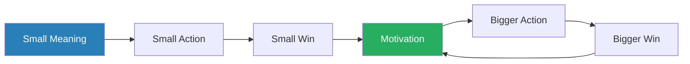
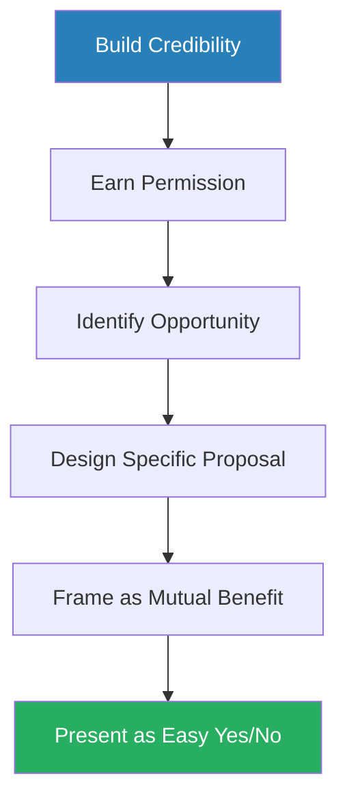
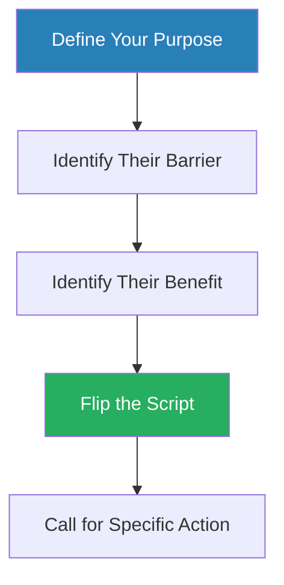
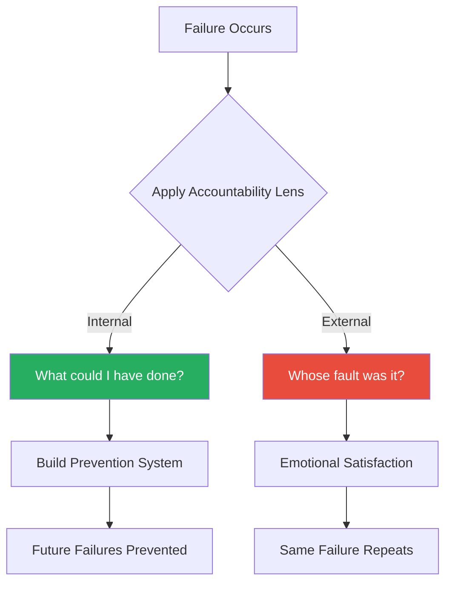
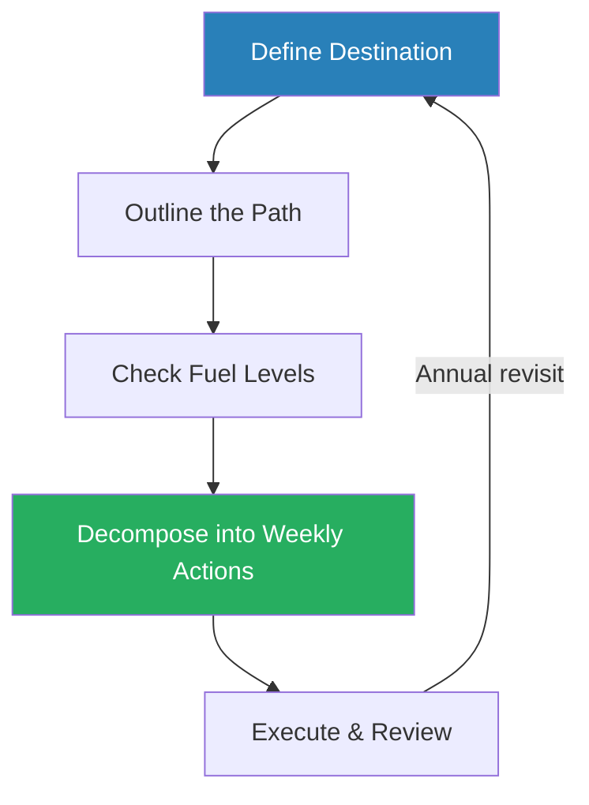
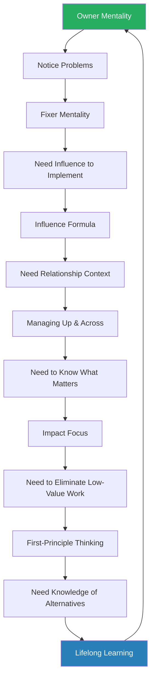

# Invaluable — Maya Grossman

> Maya Grossman's *Invaluable* argues that career advancement is not driven by hard skills or tenure but by 10 transferable soft skills that compound over time. Drawing on her own trajectory — entry-level coordinator at a Tel Aviv travel agency to VP of Marketing at a Silicon Valley startup, passing through Microsoft, Google, and SodaStream along the way — she lays out a sequential skill-building system that covers mindset, learning, impact, initiative, influence, relationships, accountability, planning, and evidence. The book is strongest as a tactical toolbox — particularly its influence formula and evidence-tracking habit — and weakest as a strategic worldview, since it assumes a meritocratic environment that many large organisations simply are not. Think of it as a comprehensive checklist for the skills that make professionals stand out, with the honest caveat that being noticed and being promoted are governed by different forces. The reader who benefits most is one who treats this as a skills manual rather than a complete theory of how organisations actually work.

---

## About the Author

Maya Grossman built her career across six industries and multiple continents, accumulating ten promotions in roughly fifteen years. She started as an entry-level coordinator at a small travel agency in Tel Aviv, moved into public relations at Blonde 2.0, then transitioned to Microsoft Israel, Google, SodaStream, and eventually a series of Silicon Valley startups where she reached VP of Marketing. That breadth of experience — startup chaos, big tech bureaucracy, consumer brands, agency life — gives her a pattern-matching ability across very different organisational cultures, and the 10 skills she identifies are the common threads she observed across all of them. She now runs a career coaching practice and speaks widely about the skills she believes drove her advancement, positioning herself as proof that the system works if you work it correctly. Her writing style is conversational and direct, heavy on personal anecdote and light on academic research — which is both the book's accessibility strength and its evidentiary weakness.

---

## The Big Idea

- Grossman's central argument is that <b style="color: #27ae60">soft skills compound</b>
- The 10 skills she identifies are not a checklist to complete one by one and then forget
- They form a system of reinforcing habits where each skill amplifies the others:
  - Owner mentality feeds into lifelong learning
  - Lifelong learning feeds into impact focus
  - Impact focus feeds into opportunity creation
  - Opportunity creation feeds into problem-fixing
  - Problem-fixing feeds into influence
  - Influence feeds into relationship management
  - Relationship management feeds into accountability
  - Accountability feeds into career planning
  - Career planning feeds into evidence tracking
  - Evidence tracking circles back to reinforce the owner mentality
- The book's structure mirrors this sequential logic, with each chapter building on the foundation laid by the previous one

---

- The uncomfortable truth she forces you to confront is that most professionals optimise for **busyness**, not impact:
  - They do more work instead of better work
  - They wait for opportunities instead of creating them
  - They hope their managers notice their contributions instead of systematically documenting and presenting them
- Grossman watched this pattern repeat across every organisation she worked in — at the travel agency, at Microsoft, at Google
- The people who broke out of it were not necessarily smarter or more talented
- They were the ones who had internalised a different set of operating habits

> [!tip] Core Insight
> Elimination of low-impact work is higher leverage than optimisation of high-impact work. The bottom 20% of your task list is probably producing zero measurable outcomes, and nobody will notice when it disappears.

- What matters is what you do with the time you reclaim
- This is not a productivity hack — it is a fundamental reorientation of how you think about your job
- Most people define their value by how much they do
- <b style="color: #27ae60">Grossman argues you should define your value by what changes because of what you do</b>

---

- The final piece of Grossman's thesis is that these skills are **transferable**:
  - They do not depend on your industry, your function, or your level
  - The same principles that helped her get promoted from coordinator to supervisor at a travel agency helped her navigate the politics of Google and land a VP role at a startup
  - The skills transcend context because they are fundamentally about how you think, not what you know
- This transferability claim is both the book's most empowering promise and its most debatable assertion:
  - It holds well in environments that reward initiative, creativity, and visible contribution
  - It holds less well in environments governed by seniority, political alliances, and structural gatekeeping
  - Grossman's career moved through organisations that tend to reward entrepreneurial behaviour — startups, tech companies, agencies — which may skew her perception of universal applicability

The 10 skills form a reinforcing loop — each one feeds the next, and evidence tracking circles back to sharpen the owner mentality that starts the cycle.

---

## Key Concepts at a Glance

| Concept | One-line summary |
|---------|-----------------|
| **Owner Mentality** | Think beyond your job description and care about business outcomes, not just role outputs |
| **The Circle of Passion** | A positive feedback loop where small deliberate actions generate engagement and motivation |
| **Long-Term Greedy** | Prioritise the option that produces greatest long-term value, even at short-term cost |
| **The 5-Circles Growth Machine** | Automate learning across five channels so development becomes a default behaviour |
| **First-Principle Thinking / 5 Whys** | Ask *why* a process exists five times to kill zombie tasks before they consume effort |
| **The Urgency-Impact Matrix** | A two-by-two grid for ruthlessly prioritising work and protecting high-impact time |
| **Opportunity-Digging** | Proactively identify, create, and pursue growth opportunities rather than waiting |
| **The Fixer Mentality** | Identify and solve problems before they are assigned — run towards ambiguity |
| **The Influence Formula** | A five-step narrative structure for persuading without authority |
| **Managing Up** | Understand your manager's goals, anticipate needs, and make them look good |
| **Managing Across** | Frame cross-functional work around shared interests, not one-sided requests |
| **Extreme Accountability** | Believe everything that happens to you is your responsibility to maximise agency |
| **The Career Roadmap** | Decompose aspirational goals into executable weekly tasks through four stages |
| **Success Tracking** | Maintain a running evidence portfolio updated every two weeks with metrics and references |

The gap between typical and invaluable professionals is largest in career planning and success tracking — the two skills most professionals neglect entirely because they feel like overhead rather than work.

---

## Chapter 1: Owner Mentality — Think Like a Business Owner

*The most foundational skill in Grossman's system is about expanding your lens from "my tasks" to "company success" — and why that single shift changes everything about how you are perceived.*

- <b style="color: #2980b9">Owner mentality</b> is the habit of thinking beyond your job description and caring about business outcomes rather than just role outputs
- An employee with an owner mentality does not wait for instructions:
  - They see a problem and fix it
  - They understand how the company makes money
  - They treat the company's resources as if they were spending their own money
- Grossman draws a sharp line between this and simple "hard work":
  - Working long hours on assigned tasks is effort
  - Noticing that the assigned task is solving the wrong problem and raising that concern is owner mentality
  - The distinction is not about volume of work but about the altitude of your thinking

---

- The mechanism behind this is straightforward:
  - When you expand your lens from "my tasks" to "company success," you notice problems and opportunities invisible to role-focused employees
  - This creates what Grossman calls a competitive advantage that pure hard work within defined boundaries cannot generate
  - Organisations reward the perception of commitment and scope-awareness because these signal readiness for broader responsibility
- <b style="color: #27ae60">The employee who consistently demonstrates that they see the bigger picture is the employee who gets pulled into rooms they were not originally invited to</b> — and those rooms are where decisions get made and promotions originate
- The psychology behind this is rooted in signalling theory:
  - You cannot directly demonstrate that you are "ready" for a bigger role
  - But you can behave in ways that make it obvious — and owner mentality is the most legible signal of all
  - A manager watching an employee think about business outcomes rather than task completion naturally starts to imagine that person in a larger role

> [!tip] Core Insight
> Owner mentality is not about working longer hours or sacrificing personal boundaries. It is about applying a different filter to every situation: "If I were the CEO, would I want my employee to do this? What would I want them to do instead?"

- This question, asked habitually, reorients your entire approach to work

---

> [!example] Grossman's Travel Agency Flower Delivery
> - At her very first job — a travel agency in Tel Aviv — Grossman made a mistake that could have cost the company a major client
> - Rather than hiding the error or passing it off, she took personal responsibility
> - She drove to the client's home, delivered flowers, and apologised in person
> - The client was so impressed by the gesture that they not only stayed but became one of the agency's most loyal accounts
> - Grossman did not do this because her job description said "deliver flowers to angry clients"
> **The lesson:** She was thinking about the business outcome — client retention — not just her role output.

> [!example] Initiative at Blonde 2.0
> - At her PR agency role, Grossman noticed operational inefficiencies costing the company time and money
> - These were not her problems to solve — she was a junior account executive
> - But she proposed improvements anyway, framing them as cost savings for the agency
> - That initiative, more than any specific PR campaign she ran, was what got her promoted from junior to supervisor
> - Her managers saw someone who cared about the business, not just someone who completed assignments
> **The lesson:** Proposing improvements beyond your scope signals leadership potential more than flawless execution within it.

> [!example] The Nursery Shop Manager
> - A friend of Grossman's worked at a nursery (a garden centre, not a childcare facility)
> - She treated a minimum-wage retail job with full owner mentality — reorganising displays, suggesting pricing strategies, and proactively solving customer complaints
> - Within months, she was managing the shop
> **The lesson:** Owner mentality is not about your level or your industry — it is a transferable operating principle that works whether you are selling plants or shipping software.

---

- Owner mentality does have limits:
  - <b style="color: #e74c3c">In rigid hierarchies with strong territory guarding, going beyond your scope can be perceived as overstepping rather than contributing</b>
  - Not every organisation rewards initiative — some actively punish it
  - The skill requires reading the environment correctly:
    - In a growth-stage company, owner behaviour is gold
    - In a bureaucratic organisation with strong silos, the same behaviour needs to be channelled carefully through the right relationships and the right framing
- There is also a burnout risk Grossman does not fully address:
  - Treating every company problem as your own can lead to unsustainable emotional investment
  - Owner mentality without boundaries becomes martyrdom
  - The healthy version is selective ownership — choosing which business problems to invest in based on your strategic position and capacity

---

## Chapter 2: Lifelong Learning — The 5-Circles Growth Machine

*Grossman goes beyond the generic advice to "keep learning" by providing a specific system for making professional development automatic — removing willpower from the equation entirely.*

- The problem with professional development is that most people treat it as an event — a conference, a course, a certification — rather than as a continuous background process
- When learning depends on willpower, it gets crowded out by urgent work
- <b style="color: #27ae60">The solution is to build a system where learning is pushed to you rather than pulled by you</b>
- Grossman distinguishes between two failure modes:
  - **Under-learning** — the professional who stopped developing after their last formal education and coasts on existing knowledge
  - **Unfocused learning** — the professional who consumes enormous amounts of content without direction, accumulating knowledge that never converts to capability

---

> [!abstract] The 5-Circles Growth Machine
> 1. **Google Alerts** — Set up alerts for your industry, competitors, and emerging trends. Industry news arrives in your inbox without you searching for it.
> 2. **Curated newsletters and publications** — Subscribe to 3-5 high-quality publications in your domain. Read during commute or lunch.
> 3. **A committed reading list** — Maintain a rolling list of books relevant to your professional growth. One book per month minimum.
> 4. **Following and engaging influencers** — Identify 5-10 thought leaders and actively follow, comment on, and engage with their content. Dual benefit: learning and network-building.
> 5. **Professional communities** — Join at least one community (professional association, Slack group, alumni network, meetup) where peers stretch your thinking.

- The key insight is that the system converts learning from a choice into a <b style="color: #2980b9">default behaviour</b>:
  - You do not have to decide to learn each day
  - The information arrives, the community engages you, the book sits on your nightstand
- Grossman built this system early in her career and credits it with giving her the cross-industry knowledge that made her valuable at each successive company
- The system's elegance is in its redundancy:
  - If you skip reading for a week, the newsletters still arrive
  - If you miss a community event, the Google Alerts still inform you
  - No single circle failing can collapse the whole system

---

- She connects this to a framework she calls <b style="color: #2980b9">the Circle of Passion at Work</b> — a positive feedback loop:
  - Find a small piece of meaning in your work
  - Take a small action based on that meaning
  - Generate a small win
  - Experience the dopamine hit of progress
  - Take a bigger action
  - Repeat
- The point is that <b style="color: #27ae60">passion does not precede engagement — engagement precedes passion</b>
- You do not need to love your job to find motivation
- You need to take one deliberate action, notice the result, and let the momentum build
- This directly contradicts the "follow your passion" advice that dominates popular career literature:
  - Grossman argues that passion is the output of a process, not the input
  - Waiting to feel passionate before you invest energy is the same as waiting for motivation before you go to the gym — it inverts the causal chain

The Circle of Passion creates a self-sustaining loop — once you take that first deliberate action, progress generates the motivation that most people wait to feel before starting.

---

> [!example] Grossman's Microsoft Transition
> - Grossman did not arrive at Microsoft passionate about enterprise technology
> - She arrived curious, set up her 5-Circles system for the enterprise tech space
> - Within months she was more knowledgeable about the market than colleagues who had been there for years
> - That knowledge made her more effective, which made her more engaged, which made her more visible — the passion loop in action
> **The lesson:** Passion is manufactured through systematic action, not discovered through luck.

> [!example] The Stagnant Colleague
> - Grossman describes a colleague at one of her companies who had been in the same role for years
> - The colleague was competent but had stopped growing — relying entirely on skills acquired at the start of the role
> - When the industry shifted, the colleague lacked the current knowledge to adapt and was eventually restructured out
> - Meanwhile, colleagues who had maintained learning systems pivoted seamlessly because they had been tracking industry changes in real time
> **The lesson:** Learning is not optional insurance — it is the difference between riding a shift and being caught beneath it.

- The limit of this approach is that <b style="color: #e74c3c">learning without application is consumption, not development</b>
- Grossman acknowledges this and ties it directly to the next chapter's theme: turning knowledge into impact
- The 5-Circles system is necessary but not sufficient — you need the input pipeline, but you also need the output filter that converts learning into work that matters

---

## Chapter 3: Impact Focus — The Heart of the Book

*This is the densest and most important chapter in the book — where Grossman transitions from mindset (Chapters 1-2) to method, introducing a four-part system for ensuring your work drives outcomes, not outputs.*

### Long-Term Greedy

*Every professional faces the same daily choice: optimise for comfort now, or invest for compounding returns later. Grossman names that choice and gives you a framework for making it consistently.*

- <b style="color: #2980b9">Long-term greedy</b> is Grossman's term for a decision-making filter: in every choice, prioritise the option that produces the greatest long-term value, even when it requires short-term pain
- Short-term optimisation produces what Grossman calls **local maxima**:
  - You feel productive
  - You hit your quarterly targets
  - But you plateau because you never invest in anything that compounds
- Long-term greedy thinking means consistently choosing future gains over present comfort:
  - Delegating complex work to develop your team (painful now, powerful later)
  - Investing time in skills that will not pay off for a year
  - Accepting stretch assignments that feel uncomfortable
- The mental model is borrowed from finance — <b style="color: #27ae60">compound interest rewards patience, and the same logic applies to skill development</b>:
  - A 1% daily improvement in a skill seems invisible
  - Over a year, it compounds to a 37x improvement
  - The person who invested patiently is now operating at a fundamentally different level than the person who optimised for immediate comfort

---

> [!example] Delegation at Blonde 2.0
> - As a newly promoted supervisor, Grossman faced a classic delegation challenge
> - Coaching team members through complex client work was slower and produced lower initial quality than doing it herself
> - Every instinct said to just do it — she could have the deck done in an hour instead of spending three hours coaching someone through it
> - But she forced herself to delegate anyway
> - The short-term cost was time and some quality dips
> - The long-term return was a team that could operate independently, which freed her for managerial work, which qualified her for her next promotion
> **The lesson:** If she had kept doing the work herself, she would have been the best account executive at the agency — but never a manager.

> [!example] Microsoft Startup Mentoring
> - Grossman volunteered as a mentor for a startup programme that Microsoft ran, which was not part of her job description
> - Short-term, this was a net negative — less time for her actual role
> - Long-term, it gave her startup experience that she listed on her resume, and it was a significant factor in landing her next role
> - She could not have predicted the specific payoff at the time, but she recognised the learning was directionally correct
> **The lesson:** Long-term greedy decisions often look irrational in the moment but create options you cannot see yet.

---

- <b style="color: #e74c3c">The limits of long-term greedy thinking are important</b>:
  - It only works when you have enough short-term runway — if your job is at risk, if you are behind on critical deliverables, if your manager is unhappy, then investing in the long term becomes a luxury you cannot afford
  - There is a second danger: chronic investment without ever claiming returns
    - If you are always delegating, always learning, always building for the future but never harvesting the results, you become invisible
  - The long-term greedy approach must be punctuated by moments of claiming credit and making your investments visible
- Grossman does not fully address the tension between patience and urgency:
  - In fast-moving industries, the "long term" might be 12 months, not 5 years
  - The right time horizon depends heavily on industry speed, company stage, and personal runway

---

### First-Principle Thinking and the 5 Whys

*Before optimising any process, Grossman says, ask why it exists five times in succession — and discover that most organisational work persists by inertia alone.*

- <b style="color: #2980b9">The 5 Whys technique</b>, borrowed from manufacturing quality management, is a fast way to identify work that should not exist at all
- Most organisational work persists because "we have always done it this way"
- The 5 Whys kills zombie tasks before you waste months on them
- The technique is deceptively simple:
  - Take any task or process
  - Ask "why do we do this?" and answer honestly
  - Ask "why?" about the answer
  - Repeat until you reach the root cause or discover there is no root cause — just inertia

> [!example] Grossman's SharePoint Disaster at Microsoft
> - She spent two months painstakingly organising a SharePoint library — categorising documents, creating folder structures, building a taxonomy
> - She was proud of the work
> - Then she checked the analytics and discovered that almost nobody was using the library — zero impact, two months gone
> - The 5 Whys would have killed the project on day one:
>   - *Why are we organising this library?* Because people need to find documents
>   - *Why can't they find documents?* Because nobody knows the library exists
>   - *Why doesn't anyone know?* Because nobody uses it
>   - *Why doesn't anyone use it?* Because they get documents directly from colleagues
>   - *Why do they do that?* Because it is faster and more reliable
> - The answer was not a better-organised library — the library was solving a problem that did not exist
> **The lesson:** Everyone has a SharePoint library — a project they invested in heavily that, on honest examination, produced nothing of value. The 5 Whys catches those projects before they consume months.

---

### Sunk Cost Avoidance

*The project you should kill is often the one you have spent the most time on — precisely because the time invested creates irrational attachment.*

> [!abstract] Three Checks Against Sunk Cost Bias
> 1. **Build checks and balances into every project** — Pre-commit to review points where you honestly assess whether the project should continue
> 2. **Actively consider alternatives at each checkpoint** — Do not just ask "should we keep going?" Ask "if we were starting from scratch today, would we start this project?"
> 3. **Let go of emotional attachment to work you have already invested in** — The project you should kill is often the one you have spent the most time on

- This is standard behavioural economics (Grossman explicitly references the **sunk cost fallacy**), but she grounds it in workplace reality rather than academic theory
- The emotional pull of sunk costs is particularly strong in professional settings because killing a project feels like admitting failure
- <b style="color: #27ae60">Grossman argues the opposite: killing a doomed project early is a sign of strategic maturity, not failure</b>
- The real failure is pouring resources into something that everyone privately knows is not working, because nobody has the courage to say stop
- She ties this to a broader organisational pattern:
  - Most companies have multiple zombie projects consuming resources
  - Nobody kills them because killing a project requires someone to take responsibility for the sunk cost
  - The person willing to say "this is not working, let us redirect these resources" is demonstrating exactly the owner mentality from Chapter 1

---

### The Urgency-Impact Matrix

*The most important quadrant in this familiar framework is not the one you think — it is the one that never has deadlines.*

- <b style="color: #2980b9">The Urgency-Impact Matrix</b> is a simple two-by-two grid: urgency on one axis, impact on the other
- This is not original to Grossman — it echoes Eisenhower's famous priority matrix — but she applies it with useful specificity

| Quadrant | Action | Examples |
|----------|--------|---------|
| High-impact, high-urgency | Do this first | Work that matters and has a deadline |
| High-impact, low-urgency | Schedule deliberately | Learning, relationships, team development, career planning |
| Low-impact, high-urgency | Question aggressively | Urgency often manufactured by others' priorities or organisational habit — delegate, simplify, or refuse |
| Low-impact, low-urgency | Eliminate entirely | Nobody will notice it is gone |

Most professionals spend 70% of their time on low-impact work (urgent or not) — the single highest-leverage change is protecting time for the high-impact, low-urgency quadrant where long-term greedy investments live.

> [!tip] Core Insight
> The most important quadrant is high-impact, low-urgency. This is where long-term greedy investments live — and because these activities never have deadlines, they are always the first sacrificed when urgent-but-unimportant tasks pile up. Protecting this quadrant is the single most important time management discipline.

- The practical difficulty is that <b style="color: #e74c3c">urgent tasks feel important precisely because they are urgent</b>:
  - The human brain conflates urgency with importance
  - An email marked "urgent" from a colleague triggers immediate action even when the underlying task is trivial
  - Breaking this conflation requires deliberate, repeated practice
- Grossman's advice is to audit your calendar weekly:
  - How much time went to each quadrant?
  - If high-impact, low-urgency got less than 20% of your time, something is wrong
  - The audit itself is a high-impact, low-urgency activity — which illustrates the problem perfectly

---

## Chapter 4: Opportunity-Digging — Create, Don't Wait

*Your manager is not spending their evenings planning your career. Grossman's fourth skill is about taking that responsibility back and manufacturing opportunities rather than waiting for them to appear.*

- <b style="color: #2980b9">Opportunity-digging</b> is the habit of proactively identifying, creating, and pursuing growth opportunities rather than waiting for them to be offered
- Grossman's core argument is blunt:
  - Managers have their own goals, their own pressures, and their own careers to worry about
  - The information asymmetry works both ways — you know your gaps and aspirations better than anyone
  - <b style="color: #e74c3c">Waiting for your manager to notice that you are ready for more responsibility is waiting for something that may never happen</b>

---

- The mechanism is about <b style="color: #27ae60">reducing decision cost</b>:
  - When you walk into your manager's office and say "I want to grow," you are creating work for them — they have to figure out what that means, where the opportunity might be, and how to make it happen
  - When you walk in and say "I have identified that I need experience in X, I have designed a specific initiative that would give me that experience, and here is how it benefits the team," you are presenting a decision that requires only a yes or no
  - Most managers will say yes to a well-constructed proposal because saying no requires more effort than saying yes
- This connects directly to the influence formula from Chapter 6:
  - The framing matters as much as the request
  - "I want to grow" is self-interested
  - "Here is an initiative that would benefit the team and also develop my capability in X" is mutually beneficial
  - The second version is dramatically more likely to get approved

---

> [!example] Microsoft Startup Incubator (Opportunity-Digging)
> - At Microsoft, Grossman volunteered as a mentor for a startup incubator programme
> - This was not in her job description, not part of her performance objectives, and took time away from her core work
> - But she had identified that she needed startup experience for the career path she wanted (eventually becoming CMO of a startup)
> - Microsoft was not going to create that experience for her — so she created it herself
> - The mentorship programme gave her startup exposure without requiring her to leave the safety of a Microsoft salary
> **The lesson:** You can manufacture the experience you need without waiting for someone to offer it.

> [!example] The Head of Support Who Created Her Own Management Role
> - A colleague — a Head of Support — wanted to move into management but had no direct reports
> - Rather than waiting for a management position to open, she proposed creating an intern position that she would manage
> - She wrote the job description, pitched it to her manager, and handled the hiring process
> - She got her management experience by manufacturing the opportunity
> **The lesson:** If the role you need does not exist, create it.

> [!example] Five Speaking Slots in One Year
> - At the travel agency, Grossman wanted speaking engagement experience
> - She identified five industry conferences, wrote proposals for each, and submitted them without being asked
> - She secured five speaking slots in one year — not because anyone offered them, but because she went and got them
> - The decomposition was key: the goal ("become a conference speaker") felt abstract and impossible; the action ("submit a proposal to this specific conference by this specific date") felt concrete and achievable
> **The lesson:** Decompose ambitious goals into specific, dated actions and the impossible becomes merely effortful.

---

- The limit of opportunity-digging is that it requires some degree of existing credibility:
  - If you are brand new and have not yet proven your competence, proposing ambitious new initiatives can come across as presumptuous rather than proactive
  - You need a foundation of delivered results before the "create your own opportunity" strategy becomes effective
- Grossman acknowledges this but argues that the foundation does not need to be large — even a few months of solid execution is enough to earn the credibility to start creating
- There is also a sequencing insight embedded here:
  - Chapters 1-3 (owner mentality, learning, impact focus) build the credibility foundation
  - Chapters 4-5 (opportunity-digging, fixer mentality) leverage that foundation
  - Attempting Chapter 4 without Chapters 1-3 is premature and often counterproductive

Opportunity-digging follows a clear sequence: credibility first, then permission, then a well-framed proposal that makes approval the path of least resistance.

---

## Chapter 5: Be a Fixer — Run Towards Problems

*Grossman distinguishes between two types of problem-solving — and argues that the kind nobody assigns is far more valuable than the kind everybody expects.*

- <b style="color: #2980b9">The fixer mentality</b> is the habit of identifying and solving problems that have not been assigned to you
- Grossman distinguishes between two types of problem-solving:
  - **Solving assigned problems** demonstrates competence — you are given a task, you complete it, you prove you can do the work
  - **Identifying unassigned problems** demonstrates something more valuable: strategic thinking
- The employee who notices a problem that nobody has raised, diagnoses it, and proposes a solution is showing that they see the bigger picture
- <b style="color: #27ae60">That bigger-picture thinking is the distinguishing factor between someone who is good at their job and someone who is ready for a bigger job</b>

---

- The practical entry point is a question she borrowed from a mentor: **"What keeps you up at night?"**
  - Ask your manager this question
  - Ask your peers
  - Ask the people one level above you
- The answers reveal the real problems — not the problems on the project plan, but the problems eating away at people with no clear owner and no clear solution
- Those unowned problems are the highest-value territory in any organisation because solving them builds trust, visibility, and reputation simultaneously
- Grossman adds a critical nuance about problem selection:
  - Not every unowned problem is worth solving
  - The best fixer problems are those that sit at the intersection of high organisational value and your own skill development
  - Solving a problem that matters to the business but also stretches your capabilities is a double win

> [!tip] Core Insight
> The problems that nobody owns are the highest-value territory in any organisation. Solving them builds trust, visibility, and reputation simultaneously — precisely because nobody else stepped up.

---

> [!example] Google Collaboration Fix
> - Grossman was working as a consultant with a Google team that had significant remote collaboration challenges
> - These challenges were outside her consulting scope — she was brought in for marketing work, not organisational design
> - But she identified the communication problem, proposed a solution involving structured check-ins and shared documentation standards, and was given authority to implement it
> - The problem had been irritating the team for months, but nobody had stepped up to own it because it was not formally anyone's job
> - Grossman stepped up precisely because it was not anyone's job
> **The lesson:** The most valuable problems are the ones sitting in the gap between job descriptions.

> [!example] Restructuring the Manager's Speaking Schedule
> - At the travel agency, Grossman asked her manager what was causing the most stress
> - The answer was the gruelling schedule of speaking engagements — travelling around the country for conferences was consuming the manager's time and energy
> - Grossman restructured the speaking schedule, consolidating trips and identifying closer venues, reducing the manager's travel burden significantly
> - This was far outside her job description as a coordinator, but the impact on her manager's quality of life was immediate and visceral
> **The lesson:** It earned her a level of trust that years of competent coordination might never have achieved.

> [!example] Data-Driven Decision-Making at Colu
> - At Colu, Grossman noticed that the product team was making decisions based on assumptions rather than data
> - She built a lightweight data collection system and presented findings that contradicted several product assumptions
> - The data did not prove her team's priorities were right — it proved that nobody's priorities were right because nobody had been looking at the numbers
> - This made her valuable not because she won an argument but because she introduced a new way of making decisions
> **The lesson:** Sometimes the biggest fix is not solving a specific problem but changing how the organisation makes decisions altogether.

---

- <b style="color: #e74c3c">The fixer mentality has a clear limitation: in organisations with strong silos, fixing problems outside your scope can be perceived as overstepping</b>:
  - Not every organisation welcomes the person who shows up uninvited with a solution to "your" problem
  - The fix must be offered, not imposed
  - It must be framed as help, not criticism
  - Presenting a solution to someone who sees the problem as their territory requires significantly more political skill than Grossman acknowledges
- The fixer mentality also requires knowing when to stop:
  - Some problems are unowned for good reasons — they are intractable, politically charged, or genuinely outside anyone's control
  - Running towards every problem indiscriminately burns political capital and personal energy
  - The skilled fixer chooses battles carefully

---

## Chapter 6: The Influence Formula — The Book's Best Framework

*This chapter contains the single most valuable standalone framework in the book: a repeatable five-step process for persuading without authority that works precisely because it starts from the other person's interests.*

> [!abstract] The Influence Formula — Five Steps
> 1. **Define the purpose** — What do you actually want? Be specific. "I want support" is vague. "I want this person to approve a $50K budget for a pilot programme by Friday" is specific.
> 2. **Identify the counterpart's barrier** — Why might they resist? What are they afraid of? What have they said no to before?
> 3. **Identify their benefit** — What do they care about? What are their goals, their pressures, their metrics?
> 4. **Flip the script** — Reframe your request so that acting on your goal serves their self-interest. You are not asking them to do you a favour. You are showing them how saying yes helps them.
> 5. **Call for specific action** — Ask for something concrete. Not "think about it" but "approve this by Friday."

The Flip — reframing your request so it serves the other person's interest — deserves 40% of your preparation effort because it is the creative differentiator that separates persuasion from begging.

- The creative differentiator is step four: <b style="color: #2980b9">the flip</b>
- The reason most influence attempts fail, Grossman argues, is that people lead with their own goal:
  - "I need you to approve this budget because my team needs resources"
  - That sentence contains one person's interest — yours
- The flip restructures the sentence so it contains the other person's interest:
  - "This pilot will generate the case study your VP asked for at the quarterly review"
  - Same request, completely different framing

---

- The underlying psychology:
  - People are not motivated by your goals — they are motivated by their own goals
  - <b style="color: #27ae60">When you construct a narrative in which your goal and their goal turn out to be the same thing, resistance drops because there is nothing to resist</b>
  - You are not asking them to sacrifice anything
  - You are showing them an opportunity they had not seen
- This aligns with foundational influence research:
  - Cialdini's principle of reciprocity works because people want to maintain balanced relationships
  - The flip creates the perception of mutual benefit, which eliminates the feeling of one-sided sacrifice
  - It also connects to Grossman's managing-across framework — the same principle applied horizontally

The Influence Formula flows from self-knowledge through empathy to reframing — with the "flip" at its creative centre, where your goal becomes indistinguishable from theirs.

---

> [!example] The Google Lunch Story — Content Distribution Reframed
> - A team member on Grossman's marketing team at Google hated doing content distribution work
> - Distribution felt like grunt work — unglamorous, repetitive, beneath her creative ambitions
> - She wanted to write creative briefs and design campaigns, not push content through channels
> - Instead of arguing that distribution was important (a logical argument the team member had already rejected), Grossman asked her what she wanted to become
> - The answer: Creative Director
> - Grossman connected distribution to that dream: "The Creative Directors who get hired are the ones who can prove their creative work actually reached an audience. Distribution is how you build that proof."
> - The team member's entire attitude shifted — she became the most enthusiastic distributor on the team
> **The lesson:** The work did not change. The narrative around it changed. That was enough.

> [!example] Colu Product Team — Data Infrastructure as Insurance
> - At Colu, Grossman needed the product team to invest in data collection infrastructure
> - The product team resisted because they viewed data collection as a marketing problem, not a product problem
> - Instead of arguing for data infrastructure on its own merits, Grossman demonstrated the cost of wrong assumptions
> - She showed that three recent product decisions had been based on assumptions that turned out wrong — costing significant development time
> - The flip: data infrastructure was not a marketing request — it was insurance against wasting the product team's own engineering resources on features nobody wanted
> - The product team funded it because they were motivated by their own interest (not wasting their own time), not by Grossman's interest (better marketing data)
> **The lesson:** Reframe every request so the other party sees it solving their problem, not yours.

> [!example] The Flight Attendant's Seat Change
> - A flight attendant needed a passenger to move seats
> - Instead of saying "I need you to move" (the attendant's goal), she said "There is a seat with extra legroom in the back that just opened up" (the passenger's benefit)
> - Same outcome, completely different experience for the person being asked
> **The lesson:** Even small requests benefit from the flip — lead with the other person's gain, not your need.

---

- <b style="color: #e74c3c">The formula has a clear limitation: it requires genuine understanding of what the counterpart values</b>:
  - Surface-level attempts at flipping the script without real knowledge of the person feel manipulative and transparent
  - If you try to flip based on assumptions rather than genuine understanding, you risk alienating the very person you are trying to influence
  - In high-power-distance relationships where you have no relationship data — pitching to a senior executive you have never met — evidence and third-party credibility become more important than narrative
- The formula works best when you have enough relationship context to make the flip genuine rather than performative
- There is also a sophistication threshold:
  - Junior professionals often attempt the flip clumsily because they do not yet understand what senior stakeholders actually care about
  - The formula improves dramatically with experience because experience gives you better models of what different people value

---

## Chapter 7: Managing Up and Across — The Relationship Chapter

### Managing Up

*Most employees approach their manager relationship backwards — waiting for direction instead of providing it, bringing problems instead of solutions, reacting to needs instead of anticipating them.*

- Grossman argues that <b style="color: #27ae60">the most important relationship at work is with your manager</b>
- Her framework for managing up is straightforward: **understand their goals, anticipate their needs, be their eyes and ears, and make them look good**
- This is not sycophancy — it is strategic alignment:
  - Your manager's success is the platform from which your own advancement launches
  - When your manager looks good, they have political capital to spend on your behalf
  - When they look bad, they are too busy surviving to think about your career
- The relationship is asymmetric in a specific way:
  - Your manager controls your performance rating, your visibility, and your access to opportunities
  - Managing that relationship proactively is not optional — it is survival

> [!abstract] First 30 Days Under a New Manager
> 1. Set up a proactive progress review before they ask for one — signals initiative and gives early insight into priorities
> 2. Create templates and structures that save them time — standardised reports, meeting agendas, decision logs
> 3. Present solutions alongside problems — never walk in with a problem unless you have at least one proposed solution
> 4. Volunteer information they need before they ask for it — if something affects their work, tell them before they discover it
> 5. Align your visible work to their success metrics — understand what they are measured on, and connect your contributions to those metrics

---

> [!example] The Microsoft Quarterly Report Template
> - Grossman set up a quarterly report template for her manager that consolidated programme metrics, team updates, and strategic highlights into a format he could present upward without modification
> - This simple act accomplished three things simultaneously:
>   - It saved her manager time (making his life easier)
>   - It gave Grossman visibility into strategic priorities (knowledge is power)
>   - It positioned her as the person who understood the bigger picture (reputation building)
> - Her manager eventually told colleagues "she is my manager" — a joke, but one that captured the dynamic perfectly
> **The lesson:** The person who structures the manager's information flow wields more influence than the person who simply executes instructions.

> [!example] Proactive Check-In at Microsoft
> - Grossman did not wait for her manager to schedule a check-in at Microsoft
> - She proposed one in her first week, complete with an agenda she had drafted and a set of questions about his priorities for the quarter
> - This caught her manager off guard — he was not used to new hires managing him
> - But it immediately established a collaborative rather than directive relationship
> **The lesson:** Taking the initiative to structure the relationship from day one signals partnership, not subordination.

---

- Managing up does have limits:
  - It works with managers who value initiative and partnership
  - <b style="color: #e74c3c">With controlling managers — those who experience initiative as a threat to their authority — proactive behaviour can trigger micromanagement rather than trust</b>
  - Managing up can shade into sycophancy if it prioritises the manager's comfort over honest feedback
  - The relationship must include difficult conversations, not just anticipation of needs
  - A manager who only hears what they want to hear is not being managed up — they are being enabled

| Manager Type | Managing-Up Approach | Risk |
|-------------|---------------------|------|
| Collaborative | Full proactive partnership | Low — they welcome it |
| Directive | Propose, then defer to their decision | Medium — requires reading their cues |
| Controlling | Demonstrate competence quietly, build trust slowly | High — initiative may threaten them |
| Absent | Fill the vacuum but document everything | Medium — you may overstep without cover |

Proactive tactics work beautifully with collaborative and absent managers but backfire with controlling managers — reading your manager's type correctly before deploying these tactics is as important as the tactics themselves.

The right approach to managing up depends entirely on the manager's style — one size does not fit all.

---

### Managing Across

*Cross-functional collaboration is where many technically excellent professionals fail — and the fix is the same principle as the influence formula, applied horizontally.*

- <b style="color: #2980b9">Cross-functional collaboration</b> fails when framed as "I need you to help me with my project" — a request that offers nothing in return
- Effective cross-functional work requires finding the shared interest first, then building on it

> [!example]- Grossman's Colu Disaster and Recovery
> - At Colu, Grossman was new, ambitious, and convinced that her marketing data should drive product decisions
> - She stormed into a meeting with the Head of Design, asserted her authority, and essentially said "my data shows your approach is wrong"
> - The relationship was destroyed in a single meeting
> - The Head of Design stopped responding to her messages, excluded her from decisions, and actively worked around her
> - The recovery took weeks of deliberate work:
>   - Grossman requested an honest one-on-one where she acknowledged her mistake
>   - They established shared ground rules for future collaboration
>   - Most importantly, Grossman demonstrated value by sharing analytics data that proved her marketing work was driving the design team's metrics too
> - Once the designer saw that collaboration served his interests (better design metrics), not just hers (better marketing data), the relationship shifted from adversarial to genuinely productive
> **The lesson:** If you lead with your agenda, you get resistance. If you lead with curiosity about the other person's world, you get collaboration.

- The principle Grossman extracts: spend the first month in any new cross-functional relationship in <b style="color: #2980b9">agenda-free conversations</b>:
  - Learn what the other person cares about
  - Understand their pressures, their metrics, their frustrations
  - Only after you genuinely understand their world should you start proposing joint initiatives

---

- The limit is time:
  - In fast-moving environments where you need results immediately, the relationship-first approach can feel impossibly slow
  - Sometimes you do need to escalate, pull rank, or use organisational authority to get things done
- Grossman acknowledges this but argues that relationship investments are like long-term greedy decisions — the upfront cost feels painful but the compounding returns are worth it
- She draws an important distinction between urgent collaboration and ongoing partnerships:
  - For one-off requests, the influence formula is sufficient
  - For ongoing cross-functional partnerships, the investment in understanding the other person's world pays dividends across dozens of future interactions

---

## Chapter 8: Extreme Accountability — The Most Provocative Chapter

*Grossman's most provocative principle asks you to adopt a belief you know is factually incomplete — and argues that the incompleteness is precisely what makes it useful.*

- <b style="color: #2980b9">Extreme accountability</b>: adopt the belief that everything that happens to you is your responsibility
- Not because it literally is — obviously external factors, other people's decisions, and systemic forces affect your life — but because <b style="color: #27ae60">this belief gives you maximum agency</b>

---

- The mechanism is rooted in the psychology of **locus of control**:

| Locus of Control | Belief | Emotional Effect | Practical Effect |
|-----------------|--------|-----------------|-----------------|
| **External** | Blaming others, luck, circumstances | Feels emotionally satisfying, preserves self-image | Removes your power to change the situation |
| **Internal** | Asking "what could I have done differently?" | Uncomfortable, forces self-confrontation | Produces actionable learning from every failure |

- Extreme accountability is the radical extension of internal locus of control:
  - Even when others clearly contributed to the failure, asking "what could I have done to prevent this?" produces more useful insight than cataloguing their mistakes
- The mechanism works because it converts every failure into a data point:
  - External blame ends the learning process — "it was their fault" is a dead end
  - Internal analysis extends the learning process — "what system could I build to prevent this regardless of what others do?" is generative
  - Over time, the person practising extreme accountability accumulates a much richer repertoire of failure-prevention strategies

---

> [!example] The Colu Launch Disaster
> - Grossman had prepared a marketing campaign to coincide with a product release at Colu
> - The product team changed the release schedule but failed to notify her
> - She launched the campaign on the original date, promoting a product that was not yet available — embarrassing and damaging
> - On paper, the fault was clearly the product team's — they changed the schedule and did not tell her
> - But Grossman forced herself through the extreme accountability lens: "What could I have done?"
>   - She could have built a verification step into her launch process — a final check 48 hours before launch
>   - She could have maintained closer communication with the product team
>   - She could have built redundancy into the campaign so it would still work if the product was delayed
> - By owning the failure, she built a process — a pre-launch verification checklist — that prevented the same mistake from ever happening again
> **The lesson:** If she had blame-shifted (emotionally satisfying, factually justified), she would have felt vindicated but learned nothing. The process improvement came from ownership, not from blame.

> [!example] Israeli Military Training — Unit Accountability
> - During military training in the Israeli Defence Forces, Grossman's entire barracks was punished for one person's mistake
> - The lesson: accountability extends beyond your own scope
> - If a teammate is failing and it affects the unit, your accountability includes noticing the problem, offering help, and escalating if needed
> **The lesson:** "That was not my job" is never an acceptable answer when the team fails.

---

> [!tip] Core Insight
> Extreme accountability is a private thinking tool, not a public performance. Publicly accepting blame for things that are genuinely someone else's fault does not make you noble — it makes you a target.

- Grossman draws a critical nuance that elevates this chapter above simple motivational advice:
  - The accountability should be **internal** ("what can I learn from this?")
  - The **external** framing should be factual and solution-oriented ("here is what happened, here is the process we are building to prevent it")
  - People will happily let you absorb blame that belongs to them

---

- <b style="color: #e74c3c">Taken too literally, extreme accountability has a second danger: it can become self-flagellation</b>:
  - If you blame yourself for every setback regardless of context, you create a toxic internal narrative
  - It can enable others to avoid their own responsibility — if you are always the one owning the problem, your colleagues learn they never need to
  - When the barrier is genuinely structural — biased processes, absent leadership, systemic dysfunction — the accountable response is not self-blame but structural change
  - Sometimes the most accountable thing you can do is not "what could I have done better within this system?" but "this system needs to change"

Extreme accountability produces a virtuous cycle: internal analysis leads to system-building, which prevents future failures — while external blame produces emotional satisfaction but no learning.

---

## Chapter 9: The Career Roadmap — Planning as Decomposition

*Career planning fails not at the goal-setting stage but at the decomposition stage — the gap between "I want to be a VP" and "this week I will prepare a one-page portfolio" is where most people stall.*

- <b style="color: #2980b9">The career roadmap</b> is Grossman's system for bridging the gap between aspiration and execution
- It has four stages, each building on the last

### Stage 1: Define the Destination

- Grossman offers two exercises for clarifying what you actually want:
  - <b style="color: #2980b9">Perfect Day visualisation</b>: describe in detail what your ideal workday looks like in 5-7 years
    - Where are you? What are you doing? Who are you working with? What does your calendar look like?
    - The point is not accuracy — you cannot predict the future — but clarity
    - When you know what your ideal day feels like, you can evaluate opportunities against it: "Does this move get me closer to that day or further away?"
  - <b style="color: #2980b9">Mind map</b>: start with "my dream career" in the centre and branch out into every dimension — role, industry, location, compensation, team size, type of work, impact
    - The mind map often reveals desires the person had not consciously articulated
    - Someone who thinks they want to be a CMO might discover that what they actually want is creative autonomy with a small team — which might be a Creative Director role, not a CMO role at all

---

### Stage 2: Outline the Path

- Grossman's method for path-mapping is pragmatic: study the career trajectories of people who already have your target role
- LinkedIn is the primary research tool:
  - Find 10-20 people with the title you want
  - Study their career paths backwards
  - What roles did they hold before? What industries did they come from? What skills do they list? What certifications do they have?
- The research reveals patterns:
  - Certain roles appear as common stepping stones
  - Certain skills appear as non-negotiable prerequisites
  - Certain companies or industries appear as preferred proving grounds
- These patterns become your path template — not a rigid prescription, but a probability map showing the most common routes to your destination

> [!example] Grossman's LinkedIn Research (2013)
> - In 2013, Grossman visualised becoming CMO of a Silicon Valley startup
> - Her LinkedIn research revealed that the most common paths to CMO ran through Demand Generation and Product Marketing — not through PR or content marketing, which was her background
> - This insight changed her career decisions
> - She deliberately pursued roles that would give her demand gen and product marketing experience, even when those roles were lateral moves or felt like steps backward
> - Without the path research, she would have continued climbing the PR ladder — a ladder that leaned against the wrong wall
> **The lesson:** Research where you want to go before optimising your current direction — you might be climbing the wrong ladder entirely.

---

### Stage 3: Check Fuel Levels

- This is <b style="color: #2980b9">gap analysis</b>: compare your current skills, experience, and credentials to the requirements of your target role
- Grossman recommends pulling 5-10 job descriptions for your target role, identifying common requirements, and honestly assessing which you meet and which you do not
- The gap analysis should cover:
  - **Hard skills** — technical capabilities, certifications
  - **Soft skills** — leadership, communication, influence
  - **Experience** — team size managed, budget owned, cross-functional scope
  - **Credentials** — degrees, certifications, notable employers
- The gaps become your development roadmap
- Grossman emphasises honesty at this stage:
  - Most people overestimate their competence in areas they have not been tested
  - The gap analysis is only useful if it is brutally honest
  - External feedback — from managers, mentors, or peers — is essential for calibrating self-assessment

---

### Stage 4: Put the Pedal to the Metal

- This is the <b style="color: #27ae60">decomposition step — and it is where the system either works or falls apart</b>
- Each gap identified in Stage 3 must be broken down into **bite-sized weekly actions**:
  - "I need leadership experience" is too vague to act on
  - "This week, I will ask my manager if I can lead the next team meeting and prepare a structured agenda" is executable
- The decomposition follows a consistent pattern:
  - Annual goal (the gap to close)
  - Quarterly milestone (measurable progress toward closing the gap)
  - Monthly project (a specific initiative that creates the milestone)
  - Weekly action (the smallest executable unit of work)

The career roadmap is cyclical — annual revisits ensure that the destination evolves as you learn and grow, preventing rigid adherence to a plan that no longer fits.

---

- Grossman used this decomposition method to secure five speaking engagements in one year:
  - The goal ("become a conference speaker") felt intimidating and abstract
  - The decomposed version was a series of specific actions: research five relevant conferences, draft a talk proposal, submit by a specific deadline, prepare slides, rehearse
  - Each action was small enough to complete in a single work session
- The seven-year payoff is the strongest evidence in the chapter:
  - Her 2013 Perfect Day visualisation described a specific life — CMO of a startup, living in the Bay Area, leading a creative team
  - By 2020, she was living a close approximation of that vision
  - She attributes this not to luck but to the roadmap: the destination was clear, the path was researched, the gaps were identified, and the weekly actions were executed

---

- The limitation Grossman acknowledges is that career paths are nonlinear:
  - The roadmap must be revisited regularly — she recommends annually — because goals evolve as you learn and grow
  - The person you are at 25 wants different things than the person you are at 35
  - Rigidly following a plan you made years ago can be as damaging as having no plan at all
  - <b style="color: #27ae60">The roadmap is a compass, not a train track — it shows direction, but it should accommodate detours</b>
- A second limitation she does not fully explore is that the method assumes stable industries:
  - In rapidly disrupting fields, the roles that exist today may not exist in five years
  - The Perfect Day visualisation may describe a world that no longer exists by the time you arrive
  - The roadmap must be paired with the lifelong learning system from Chapter 2 to stay current

---

## Chapter 10: Success Tracking — The Evidence Habit

*The final skill solves a problem every professional has experienced: the moment you need to prove your worth, your memory fails you — and vague generalities are never persuasive.*

- <b style="color: #2980b9">Success tracking</b> is the discipline of maintaining a running record of your achievements, updated every two weeks, with specific metrics and references
- The argument for systematic tracking is rooted in a simple observation about human memory:
  - It is unreliable, and it is biased toward the recent
  - Grossman spent an entire week trying to reconstruct her career achievements for a LinkedIn profile update
  - She knew she had done impressive work at Microsoft and Google, but the specifics — the numbers, the dates, the names of the projects — had faded
  - She ended up with vague generalities ("led marketing campaigns") instead of concrete evidence ("increased qualified leads by 47% through a targeted ABM campaign targeting Fortune 500 accounts in Q3 2017")

---

> [!abstract] The Success Tracker — Four Columns
> 1. **Responsibilities** — What you are accountable for
> 2. **Goals/KPIs** — What success looks like, quantified
> 3. **Achievements** — What you actually delivered, with dates and metrics
> 4. **References** — Links to reports, dashboards, emails that prove it

- The discipline is lightweight — 30 to 60 minutes every two weeks — but the <b style="color: #27ae60">asymmetric advantage it creates is significant</b>:
  - When a performance review arrives, the person with a tracking habit has six months of concrete, metric-backed evidence at their fingertips
  - The person relying on memory has vague recollections and impressive-sounding generalities that lack the specificity to be persuasive

---

- Grossman modelled her tracker on the **Google resume format**, which emphasises accomplishments over responsibilities:
  - "Managed a team of 5" is a responsibility
  - "Led a team of 5 that delivered a $2M pipeline in 6 months, exceeding target by 30%" is an accomplishment
  - Your tracker should read like a portfolio of impact, not like a job description

> [!tip] Core Insight
> The critical distinction is between tracking outputs and tracking outcomes. "I ran 12 workshops" tells you what you did. "Workshop NPS scores improved from 3.2 to 4.7 and 40% of attendees adopted the new framework within 30 days" tells you what impact your work created. If your tracker reads like a to-do list, you are reinforcing an outputs mindset.

| Tracking Type | Example | What It Shows |
|--------------|---------|---------------|
| **Output** (avoid) | "Ran 12 workshops" | What you did — activity without impact |
| **Responsibility** (avoid) | "Managed a team of 5" | Your scope — not your contribution |
| **Outcome** (target) | "Workshop NPS improved 3.2 → 4.7; 40% adoption within 30 days" | What changed because of your work |

---

- Grossman also makes a practical point about timing:
  - Metrics are easiest to capture when they are fresh
  - The click-through rate on a campaign you ran last week is easy to pull up
  - The click-through rate on a campaign you ran nine months ago may require archaeological excavation through archived dashboards and old email threads — if the data still exists at all
  - <b style="color: #27ae60">Bi-weekly tracking captures evidence at peak freshness</b>

---

- The tracker serves multiple purposes beyond performance reviews:
  - **Resume updates** — when you need to update your resume, the tracker provides a ready-made list of accomplishments with metrics
  - **Promotion cases** — when arguing for a promotion, concrete evidence is dramatically more persuasive than general claims
  - **Salary negotiations** — specific impact data gives you leverage that "I work hard" never provides
  - **Interview preparation** — the tracker becomes a library of stories you can draw on for behavioural interview questions
- <b style="color: #e74c3c">The limitation is discipline</b>:
  - Any tracking system only works if you actually maintain it
  - Grossman's recommended cadence (every two weeks, 30-60 minutes) is designed to be sustainable, but even lightweight systems get abandoned when work is stressful and time feels scarce
  - Her advice: put it on your calendar as a recurring event and treat it as non-negotiable
  - The 30 minutes you invest today saves 30 hours of reconstruction when you need the evidence

---

## Chapter 11: The Compound Effect — Putting It All Together

*The final chapter reveals that the 10 skills are not a list to work through sequentially — they are a compounding system where each skill amplifies every other skill, producing results that feel disproportionate to any individual investment.*

- Grossman's final argument is that the 10 skills form a <b style="color: #2980b9">compounding system</b> where each skill amplifies every other skill:
  - Owner mentality makes you notice problems (fixer mentality)
  - The fixer mentality requires influence to get solutions implemented (influence formula)
  - Influence requires understanding what your manager and peers care about (managing up and across)
  - Managing up requires knowing what outcomes matter (impact focus)
  - Impact focus requires eliminating low-value work (first-principle thinking)
  - First-principle thinking requires knowledge of what the alternatives are (lifelong learning)
  - Lifelong learning feeds back into owner mentality by expanding your understanding of the business

---

- The **compounding metaphor** is central to the book's thesis:
  - Financial compound interest produces exponential growth because returns generate further returns
  - Skill compounding works the same way: each skill you develop makes the other skills more effective, creating accelerating returns over time
- Grossman draws an important distinction between **linear** and **exponential** skill development:
  - Linear: learning one skill, mastering it, then moving to the next — produces steady but modest growth
  - Exponential: developing multiple skills simultaneously so they reinforce each other — produces accelerating growth because the intersections between skills create new capabilities
  - A person who can both identify problems (fixer mentality) and persuade others to fund solutions (influence formula) is not twice as valuable as someone with only one skill — they are ten times as valuable because neither skill reaches its potential without the other

Each skill creates the conditions for the next skill to be effective — the system only reaches full power when all ten are active simultaneously.

---

> [!example] The Nursery Friend — Compound Effect in Action
> - Grossman returns to the story of the friend working a minimum-wage retail job at a garden centre with no obvious career prospects
> - She applied multiple skills simultaneously:
>   - Owner mentality — reorganising displays without being asked
>   - Lifelong learning — studying horticulture on her own time
>   - Impact focus — tracking which displays drove the most sales
>   - Opportunity-digging — proposing a loyalty programme
>   - Problem-fixing — addressing customer complaints proactively
>   - Managing up — anticipating the owner's needs
> - Within months, she was managing the shop
> - Within a couple of years, she was running a small chain
> **The lesson:** The skills compounded — each one made the others more powerful, creating a trajectory that no single skill could have produced alone.

> [!example] Grossman's Own 15-Year Trajectory
> - Ten promotions in fifteen years, across six industries and three countries
> - No single skill drove that trajectory
> - The owner mentality she developed at the travel agency compounded with the learning system she built at Microsoft
> - That compounded with the influence skills she honed at Google
> - That compounded with the accountability she practised at Colu
> - That compounded with the career planning she refined over decades
> **The lesson:** The compound effect is not dramatic in any single year, but across a career, it produces results that feel disproportionate to any individual investment.

---

- <b style="color: #e74c3c">The important caveat: compounding takes years, not months</b>:
  - Expecting rapid results from adopting all 10 skills simultaneously is unrealistic
  - Grossman is honest about this — she presents a 15-year career arc, not a 90-day transformation
  - The skills need to be practised consistently over time before the compounding effect becomes visible
  - Patience is part of the system
- There is also a sequencing insight for the reader:
  - You cannot develop all 10 skills at once — that is paralysis
  - Grossman recommends starting with owner mentality and lifelong learning (Chapters 1-2) as the foundation
  - Then layering in impact focus and opportunity-digging (Chapters 3-4) as you build credibility
  - The later skills (influence, managing relationships, extreme accountability) build on the foundation of the earlier ones

---

## Key Quotes

- "Am I settling for a short-term solution because it's easier?"
- "If I were the CEO, would I want my employee to do this?"
- "What keeps you up at night?"
- "The more you give, the more you get back."
- "What got you here won't get you there."
- "Your career is your responsibility — not your manager's."
- "Track outcomes, not outputs."
- "Elimination of low-impact work is higher leverage than optimisation of high-impact work."

---

## The Verdict

*Invaluable*'s greatest contribution is concrete and deployable. The <b style="color: #2980b9">influence formula</b> gives you a repeatable, five-step structure for persuasion that works precisely because it starts from the other person's interests rather than your own. The <b style="color: #2980b9">evidence-tracking habit</b> solves the perennial problem of forgotten achievements with a lightweight system that actually sticks. The <b style="color: #2980b9">managing-up framework</b> provides specific first-30-days actions that build trust with a new manager. And the <b style="color: #2980b9">long-term greedy</b> concept is a genuinely useful mental model for resisting the pull of short-term comfort — a simple question ("Am I optimising for now or for later?") that clarifies an enormous number of professional decisions. These are tools you can use the week you read the book, and they work.

The book's greatest weakness is its worldview. Grossman assumes a fundamentally meritocratic environment where the right skills produce the right outcomes. There is no meaningful discussion of organisational politics, power structures, structural barriers, or the uncomfortable reality that being invaluable and being promoted are governed by different forces. The entire book rests on one person's career story, with no empirical evidence or research beyond a passing reference to Carol Dweck's growth mindset. Survivorship bias is significant: Grossman succeeded, attributes her success to these 10 skills, and presents them as causal without controlling for industry conditions, timing, privilege, or luck. The reader who mistakes this for a complete theory of how organisations work will be disappointed when the skills alone do not produce the results the book promises.

The reader who benefits most from *Invaluable* is a mid-career professional in a relatively meritocratic environment — tech, marketing, startups, or any organisation where individual initiative is visible and rewarded. Someone in the first five years of their career will find the owner mentality and learning system chapters particularly valuable. Someone preparing for a leap to senior leadership will find the influence formula and evidence-tracking chapters immediately useful. The book is less valuable for professionals in highly political, hierarchical, or seniority-driven organisations where advancement depends less on demonstrated skill and more on coalition-building, sponsorship, and structural positioning.

Compared to other books in the professional development space, *Invaluable* sits squarely in the practical-tactical camp alongside books like *The First 90 Days* and *So Good They Can't Ignore You*, rather than in the strategic-political camp of Pfeffer's *Power* or Greene's *48 Laws of Power*. Its nearest comparison might be Cal Newport's work — both authors argue that building rare and valuable skills creates career opportunities — but where Newport focuses on deep skill development, Grossman focuses on the soft-skill operating system that makes hard skills visible and valued. The ideal reading strategy is to treat *Invaluable* as the skills layer and pair it with a book that understands power to get the complete picture.

---

## Related Reading

- [[Power - Jeffrey Pfeffer|Power]] — Jeffrey Pfeffer's unflinching look at what actually drives career advancement in organisations, filling the political gap this book ignores
- [[So Good They Can't Ignore You - Cal Newport|So Good They Can't Ignore You]] — Cal Newport's argument for building rare and valuable skills as career capital, a complementary perspective on skill mastery
- [[The First 90 Days - Michael D. Watkins|The First 90 Days]] — Michael Watkins' framework for transitions, which extends Grossman's managing-up principles into a systematic onboarding strategy
- [[The 48 Laws of Power - Robert Greene|The 48 Laws of Power]] — the strategic layer this book lacks, providing the power-dynamics lens that turns Grossman's skills into genuine leverage
- [[Deep Work - Cal Newport|Deep Work]] — Newport's focus system complements Grossman's impact-focus chapter by showing how to protect high-value concentration time
- [[Influence - Robert Cialdini|Influence]] — the research foundation behind Grossman's influence formula, with six principles of persuasion backed by decades of empirical evidence
