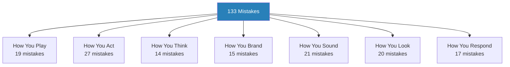
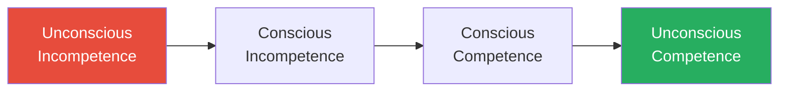
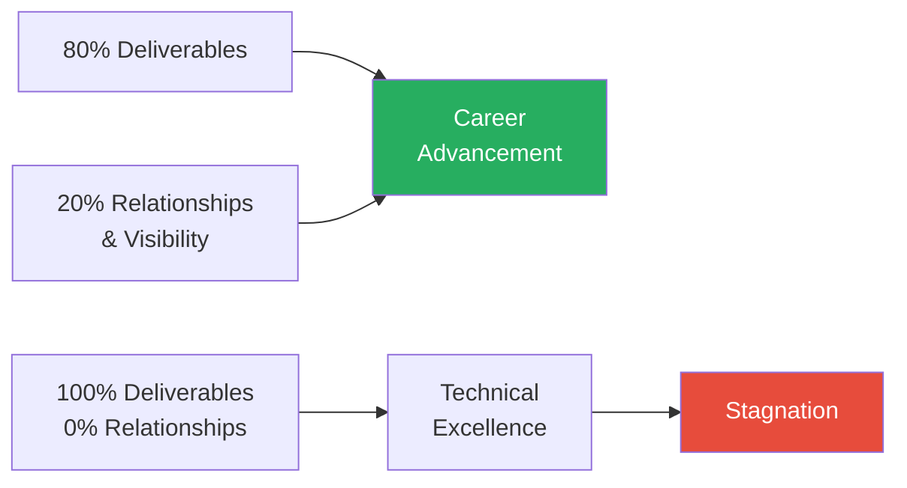
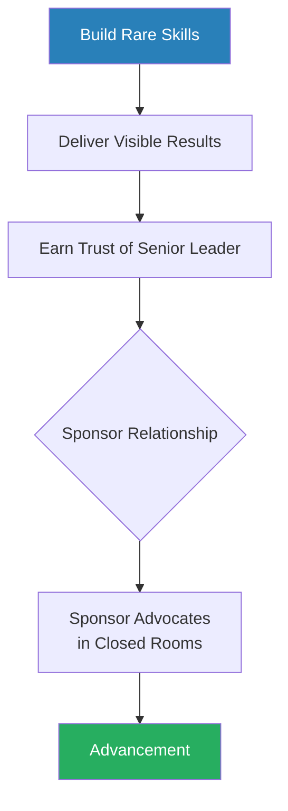
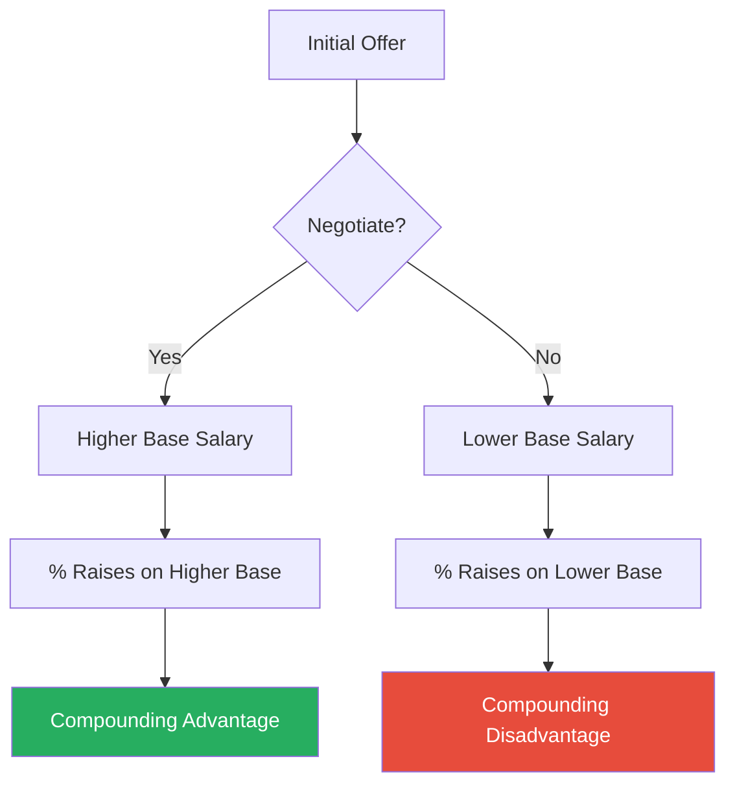
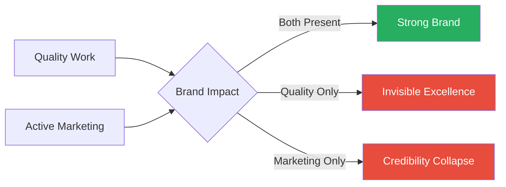
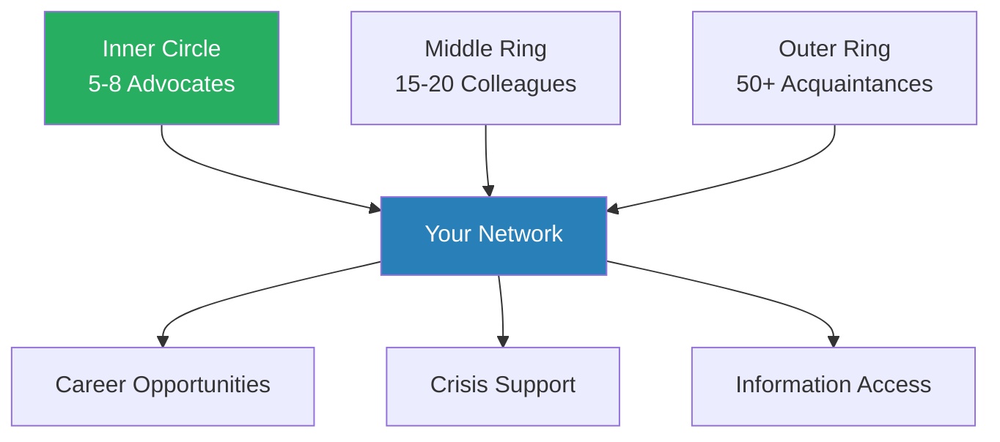
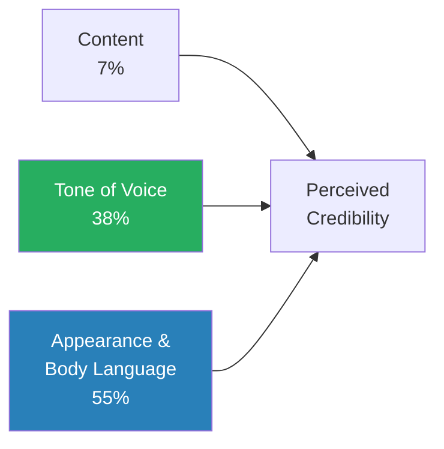
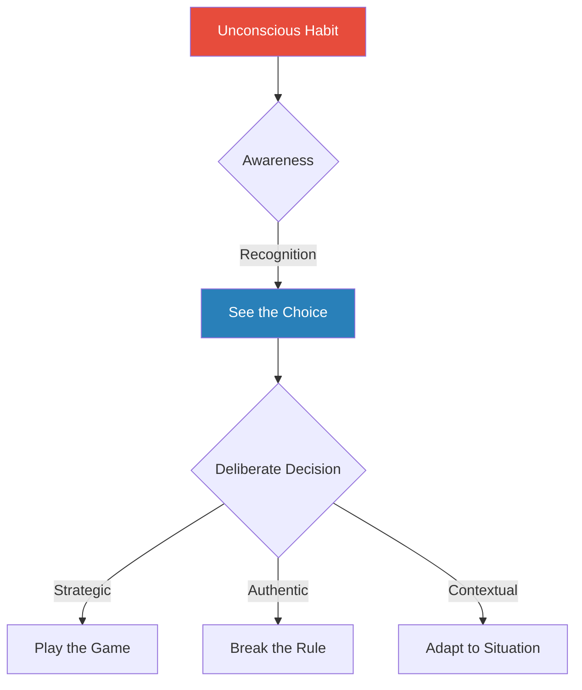
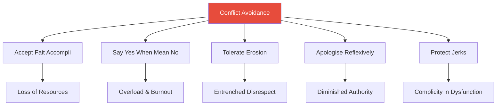

# Nice Girls Don't Get the Corner Office — Lois P. Frankel

> Lois Frankel's thesis is blunt: socialisation teaches people to play small, and playing small is a career-killing habit. She catalogues 133 unconscious behaviours — from over-apologising to volunteering for low-visibility work — that undermine professional advancement regardless of competence. The book is framed around women's workplace experience, but the underlying dynamics apply to anyone conditioned toward deference, modesty, or the belief that results speak for themselves. Frankel's model of the world is that the workplace is a game with unwritten rules, and those who refuse to learn the rules do not win on merit — they simply lose by default. The book's real value is diagnostic: reading through the list of mistakes forces an honest confrontation with which patterns you are unconsciously enacting, and Frankel provides actionable coaching tips for each one.

---

## About the Author

Lois P. Frankel holds a PhD in counselling psychology and has spent over twenty-five years coaching executives, managers, and high-potential professionals at Fortune 500 companies. She is the president of Corporate Coaching International, a Pasadena-based firm specialising in leadership development, team building, and executive coaching. Her coaching practice gave her a front-row seat to the behavioural patterns that separate people who advance from people who stagnate despite doing excellent work — and the 133 mistakes in this book are drawn directly from thousands of hours observing, diagnosing, and correcting those patterns in real professionals. The original edition was published in 2004 and became a bestseller; a revised 10th anniversary edition followed in 2014 with updated advice on social media, personal branding, and the evolving dynamics of the modern workplace. Frankel's background in psychology gives her a distinctive lens: she sees self-sabotaging workplace behaviours not as character flaws but as conditioned responses — learned in childhood, reinforced through socialisation, and entirely correctable once they are made conscious.

---

## The Big Idea

- Frankel's central argument is that <b style="color: #27ae60">competence is table stakes</b> — necessary for entry, but never sufficient for advancement
- The workplace is a game, and games have rules that extend far beyond doing good work
- Those rules include self-promotion, political fluency, negotiation, relationship management, and strategic communication
- People who were raised to be polite, agreeable, and hardworking often lack these skills — not because they cannot learn them, but because they were never taught that the skills matter
- The result is a population of talented, diligent professionals who do everything right except the things that actually determine whether they advance

---

- The book identifies 133 specific behavioural mistakes grouped into seven categories:
  - How you play the game
  - How you act
  - How you think
  - How you brand and market yourself
  - How you sound
  - How you look
  - How you respond
- Each mistake comes with a concrete coaching tip for correction
- The cumulative effect is less a self-help book and more a diagnostic manual — a mirror held up to the reader's professional habits, revealing the gap between how they behave and how they need to behave to get what they want
- The discomfort of recognition is the point: Frankel expects readers to wince at several entries, and the wince is the first step toward change

---

- The uncomfortable truth at the book's core: <b style="color: #27ae60">the people who get promoted are not always the people who work hardest — they are the people who ensure the right people see their work, who build the right relationships, who negotiate for what they want, and who understand that perception is not a distortion of reality but a component of it</b>
- This is not a cynical observation — it is a structural one
- Organisations are run by human beings with limited attention, imperfect information, and social biases
- The professional who understands this and acts accordingly is not gaming the system — they are operating within the system as it actually exists rather than as they wish it existed

---

## Key Concepts at a Glance

| Concept | One-line summary |
|---------|-----------------|
| **The Workplace-as-Game Model** | Business has rules, boundaries, strategies, winners, and losers; treating it as a pure meritocracy is the foundational mistake |
| **The Unconscious Competence Ladder** | Four-stage behavioural change model: unconscious incompetence → conscious incompetence → conscious competence → unconscious competence |
| **The 7-38-55 Credibility Rule** | Only 7% of credibility comes from content; 38% from tone; 55% from appearance and body language |
| **Employee vs Partner Mindset** | Employees do the job and wait; partners expand boundaries, create value, and shape direction |
| **The Quid Pro Quo Model** | Workplace relationships run on implicit exchange; every favour is a chip deposited into a relational account |
| **The Elevator Speech** | A concise, rehearsed statement of who you are, what you do, and what impact you create |
| **The DESCript Model** | Structured feedback: Describe behaviour, Explain impact, Specify change, state Consequences |
| **The Fait Accompli** | A manufactured "final" decision that is almost always still negotiable before implementation |
| **The Miracle Trap** | Consistently exceeding impossible expectations raises the baseline, creating unsustainable demand |
| **Personal Branding** | The deliberate construction of a professional identity that communicates a promise of performance |
| **The Headline Model** | Lead with the bottom line, support with data — reverse the impulse to build up before stating a position |
| **Tolerance of Erosion** | Small, unchallenged acts of disrespect compound into entrenched patterns of devaluation |
| **The Modesty Penalty** | Minimising your achievements teaches others to see your work as easy or unimpressive |
| **Organisational Housework** | Invisible maintenance tasks that earn gratitude but never promotions |

The heaviest concentration of mistakes falls in "How You Act" and "How You Play the Game" — the categories that govern visibility, political fluency, and strategic positioning rather than technical competence.

---

## Quick Lookup Table — All 133 Mistakes by Category

*This table maps every mistake to its category. Key mistakes that receive extended treatment in the summary are marked with a star.*

### Category 1: How You Play the Game (Mistakes 1–19)

| # | Mistake | Core Pattern |
|---|---------|-------------|
| 1 | Pretending it isn't a game ★ | Treating the workplace as a meritocracy |
| 2 | Playing the game safely and within bounds ★ | Staying in the safe centre of the field |
| 3 | Working hard ★ | Substituting effort for strategy |
| 4 | Doing the work of others | Rescuing colleagues at your own expense |
| 5 | Working without a plan | No strategic career roadmap |
| 6 | Being the last to speak ★ | Waiting too long in meetings |
| 7 | Ignoring the quid pro quo ★ | Failing to build relational capital |
| 8 | Skipping meetings | Missing visibility opportunities |
| 9 | Putting work ahead of your career | Confusing busyness with advancement |
| 10 | Being a bully-Loss ★ | Acting tough but being subservient |
| 11 | Being too feminine / too masculine | Failing to calibrate to context |
| 12 | Telling the whole truth and nothing but | Over-sharing without strategic filter |
| 13 | Failing to think politically | Avoiding office politics entirely |
| 14 | Being naïve ★ | Taking people at face value |
| 15 | Not having a mentor or sponsor ★ | Missing advocacy in closed rooms |
| 16 | Failing to be a team player strategically | Over-collaborating without recognition |
| 17 | Putting all your eggs in one basket | Depending on a single relationship |
| 18 | Failure to capitalize on relationships | Having connections but never leveraging them |
| 19 | Not understanding corporate culture ★ | Failing to map the local rules |

### Category 2: How You Act (Mistakes 20–46)

| # | Mistake | Core Pattern |
|---|---------|-------------|
| 20 | Polishing pennies ★ | Perfecting low-value tasks |
| 21 | Being the conscience of the company | Martyring yourself for moral standards |
| 22 | Protecting jerks | Covering for toxic colleagues |
| 23 | Multi-tasking | Dividing attention instead of focusing |
| 24 | Doing the job of your direct reports ★ | Failing to delegate |
| 25 | Being afraid to let others fail | Rescuing instead of developing |
| 26 | Volunteering for low-visibility assignments ★ | Taking on organisational housework |
| 27 | Viewing men as the enemy | Creating unnecessary adversaries |
| 28 | Putting out everyone else's fires ★ | Compulsive rescuing at your own cost |
| 29 | Accepting the fait accompli ★ | Taking "final" decisions at face value |
| 30 | Accommodating the needs of others at your expense | Over-adjusting to everyone else's schedule |
| 31 | Denying your financial savvy | Avoiding financial conversations |
| 32 | Flirting | Using charm instead of competence |
| 33 | Acquiescing to authority blindly | Deferring without critical thought |
| 34 | Acting like a doormat | Failing to enforce personal boundaries |
| 35 | Working too hard / performing miracles ★ | Setting unsustainable baselines |
| 36 | Being the office social coordinator ★ | Becoming the party planner |
| 37 | Giving away your ideas | Sharing ideas without ownership |
| 38 | Working without boundaries | Failing to set limits on time and energy |
| 39 | Suffering in silence | Not speaking up about problems |
| 40 | Allowing others to waste your time | Tolerating time-wasters |
| 41 | Not knowing your priorities | Treating all requests as equally important |
| 42 | Making miracles and settling for less | Doing extraordinary work for ordinary recognition |
| 43 | Being too detail-oriented | Losing the strategic view in minutiae |
| 44 | Needing to be liked | Prioritising approval over effectiveness |
| 45 | Failing to envision your success | Not having a clear picture of your career goal |
| 46 | Striving for perfection ★ | Sacrificing speed and impact for flawlessness |

### Category 3: How You Think (Mistakes 47–60)

| # | Mistake | Core Pattern |
|---|---------|-------------|
| 47 | Making decisions based on feelings, not facts | Emotional reasoning over evidence |
| 48 | Seeing only one option ★ | Binary thinking instead of generating alternatives |
| 49 | Not negotiating ★ | Accepting offers without pushing back |
| 50 | Not asking for what you want | Hoping others will guess your needs |
| 51 | Giving in too easily | Abandoning positions at first resistance |
| 52 | Being patient ★ | Passive patience vs strategic patience |
| 53 | Accepting the fait accompli (thinking) ★ | Treating manufactured decisions as final |
| 54 | Accepting others' perceptions of you | Letting others define your identity |
| 55 | Not wanting the limelight | Avoiding visibility opportunities |
| 56 | Over-thinking / analysis paralysis ★ | Perfecting instead of shipping |
| 57 | Not taking risks | Playing too safe to be noticed |
| 58 | Believing others know more than you | Defaulting to others' judgement |
| 59 | Thinking like an employee, not a partner ★ | Reactive instead of proactive orientation |
| 60 | Ignoring the relationship between financial savvy and credibility | Not speaking the language of money |

### Category 4: How You Brand and Market Yourself (Mistakes 61–75)

| # | Mistake | Core Pattern |
|---|---------|-------------|
| 61 | Failing to define your brand ★ | No clear professional identity |
| 62 | Minimising your contributions ★ | Deflecting credit and recognition |
| 63 | Not having an elevator speech ★ | Fumbling introductions |
| 64 | Being modest ★ | Treating humility as a virtue in professional settings |
| 65 | Staying in a job too long | Stagnating past the learning curve |
| 66 | Refusing to use power tools | Avoiding technology and platforms that amplify reach |
| 67 | Ignoring feedback | Not integrating external assessments |
| 68 | Being invisible ★ | Doing great work that nobody sees |
| 69 | Not taking credit for your accomplishments ★ | Giving away your wins |
| 70 | Being too humble | Self-deprecation as a default |
| 71 | Failing to network ★ | Not building relationships beyond your immediate team |
| 72 | Refusing to do self-promotion ★ | Conflating self-promotion with arrogance |
| 73 | Not leveraging your LinkedIn profile | Neglecting your digital brand |
| 74 | Being satisfied where you are | Comfort masking stagnation |
| 75 | Hiding behind others | Using the team as a shield from visibility |

### Category 5: How You Sound (Mistakes 76–96)

| # | Mistake | Core Pattern |
|---|---------|-------------|
| 76 | Couching statements as questions ★ | "Don't you think?" instead of "I recommend" |
| 77 | Using preambles ★ | Burying the point under disclaimers |
| 78 | Explaining ad nauseam | Over-explaining instead of stating |
| 79 | Asking permission | Seeking approval for actions within your authority |
| 80 | Apologising ★ | Reflexive "sorry" for non-offences |
| 81 | Using minimising words | "Just," "only," "sort of" — verbal self-shrinking |
| 82 | Using qualifiers ★ | "I think," "maybe," "kind of" as verbal tics |
| 83 | Not being direct ★ | Meandering to the point instead of leading with it |
| 84 | Using the wrong words | Word choices that weaken your message |
| 85 | Using up-speak ★ | Raising pitch at end of statements |
| 86 | Using verbal shortcuts | Slang and filler that reduce authority |
| 87 | Sandwich-style feedback | Burying criticism between compliments |
| 88 | Speaking softly | Volume too low for authority |
| 89 | Speaking at a higher pitch than your natural voice | Artificially raised pitch under stress |
| 90 | Trailing off at the end of sentences | Fading out instead of finishing strong |
| 91 | Laughing nervously | Using laughter to deflect discomfort |
| 92 | Using tag questions | "That's a good idea, isn't it?" — undermining your own statement |
| 93 | Not pausing | Rushing through without giving words weight |
| 94 | Using filler words | "Um," "like," "you know" — undercutting credibility |
| 95 | Failing to warm up your voice | Speaking without vocal preparation |
| 96 | Speaking too fast | Speed that signals nervousness rather than confidence |

### Category 6: How You Look (Mistakes 97–116)

| # | Mistake | Core Pattern |
|---|---------|-------------|
| 97 | Taking up too little space ★ | Physical smallness that signals submission |
| 98 | Using inappropriate facial expressions ★ | Smiling through serious content |
| 99 | Tilting your head ★ | Deference posture in authority contexts |
| 100 | Wearing inappropriate clothing ★ | Visual mismatch with the environment |
| 101 | Applying make-up in public | Grooming that signals informality |
| 102 | Wearing your reading glasses on top of your head | Casualness that undermines gravitas |
| 103 | Sitting in the back of the room | Physical retreat from influence |
| 104 | Grooming in public | Personal maintenance in professional spaces |
| 105 | Sitting on your hands | Physically constraining your own gestures |
| 106 | Wearing clothes that are too tight or too loose | Fit that distracts from substance |
| 107 | Accessorising too much | Visual noise that pulls focus |
| 108 | Failing to maintain good posture ★ | Slouching or hunching that signals low energy |
| 109 | Dressing below your position | Underdressing relative to your role level |
| 110 | Not being well groomed | Appearance gaps that create friction |
| 111 | Nodding excessively ★ | Constant agreement signals no independent judgement |
| 112 | Wearing your emotions on your sleeve | Leaking feelings through expression |
| 113 | Fidgeting | Nervous movement that distracts |
| 114 | Lacking a signature look | No visual consistency in your professional identity |
| 115 | Failing to make eye contact ★ | Avoiding the direct gaze that conveys authority |
| 116 | Decorating your office like a living room | Environmental cues that signal domesticity |

### Category 7: How You Respond (Mistakes 117–133)

| # | Mistake | Core Pattern |
|---|---------|-------------|
| 117 | Internalising messages | Absorbing criticism without filtering |
| 118 | Believing others know more ★ | Defaulting to external authority |
| 119 | Taking notes for others | Volunteering for the scribe role |
| 120 | Tolerating inappropriate behaviour ★ | Allowing erosion of respect |
| 121 | Exhibiting too much patience | Waiting when pushing back is warranted |
| 122 | Accepting dead-end assignments | Saying yes to work that leads nowhere |
| 123 | Putting the needs of others before your own | Self-sacrifice as a reflex |
| 124 | Denying your power | Refusing to exercise legitimate authority |
| 125 | Allowing yourself to be the scapegoat | Taking blame that belongs to the system |
| 126 | Accepting the office mom role ★ | Becoming the emotional caretaker |
| 127 | Being everyone's cheerleader | Supporting others at the expense of your own visibility |
| 128 | Failing to say no ★ | Chronic yes-saying that destroys priorities |
| 129 | Not fighting back when attacked | Letting aggression go unchallenged |
| 130 | Crying at work | Emotional display that shifts attention from substance |
| 131 | Being a pushover | Compliance as a default setting |
| 132 | Not giving feedback ★ | Avoiding difficult conversations |
| 133 | Taking yourself out of the game | Self-eliminating from opportunities |

---

The seven categories form a complete diagnostic covering every dimension of professional behaviour — from internal mindset to external presentation to interpersonal response patterns.

"How You Play the Game" becomes increasingly critical at senior levels — early career tolerates political naivety, but at director level and above, failing to understand the game is the single most career-limiting category.

---

## The Socialisation Thesis

*Before exploring the 133 mistakes, Frankel makes a foundational argument about where these behaviours come from — and her answer reaches back to childhood.*

- Frankel's core thesis is that self-sabotaging workplace behaviours are not random personality quirks — they are the predictable products of <b style="color: #2980b9">socialisation</b>
- From early childhood, many people are taught a specific set of values:
  - Be polite
  - Do not boast
  - Share credit generously
  - Put others' needs before your own
  - Wait your turn
  - Do not make a fuss
  - Hard work will be noticed and rewarded
- These values are excellent for producing pleasant, cooperative human beings
- <b style="color: #e74c3c">They are disastrous for producing professionals who advance in competitive organisations</b>
- Frankel draws on her clinical psychology background to explain the mechanism:
  - Between ages five and twelve, children absorb behavioural norms from parents, teachers, peers, and media
  - These norms become internalised — they do not feel like rules, they feel like identity
  - By adulthood, the person who was taught to be modest does not choose modesty — they experience it as "who I am"
  - This is what makes the behaviours so resistant to change: they feel authentic, even when they are damaging
- The socialisation thesis reframes the entire book:
  - The 133 mistakes are not evidence of weakness
  - They are evidence of strong, successful conditioning that no longer serves the environment
  - A person who is modest, hardworking, and self-effacing has learned their lessons well — the problem is that the lessons were designed for a different classroom

---

- Frankel notes that the socialisation patterns differ across cultures, generations, and family structures, but the workplace impact is remarkably consistent:
  - The person who was taught to defer to authority struggles to advocate for themselves with a boss
  - The person who was taught that boasting is rude struggles to self-promote
  - The person who was taught that conflict is always bad struggles to push back on a fait accompli
  - The person who was taught that hard work is its own reward struggles to understand why the networker got promoted over the workhorse
- The first step in correcting any behaviour is recognising that it is a behaviour — not a personality trait, not an identity, but a learned response that can be unlearned

> [!tip] Core Insight
> The 133 mistakes are not evidence of weakness — they are evidence of strong, successful conditioning applied in the wrong environment. The socialisation that produced them was effective; the workplace simply requires different rules.

---

### The Childhood Origins of Workplace Habits

- Frankel traces several of the 133 mistakes back to specific childhood messages:
  - "Don't be bossy" → Difficulty exercising authority (Mistake 124)
  - "Share with others" → Giving away credit and ideas (Mistake 37, 69)
  - "Don't show off" → Inability to self-promote (Mistake 72)
  - "If you can't say something nice, don't say anything at all" → Failure to give honest feedback (Mistake 132)
  - "Good things come to those who wait" → Passive patience (Mistake 52)
  - "Don't make waves" → Tolerance of erosion (Mistake 120)
- She is careful to note that these messages are not wrong in their original context
- They were designed to produce harmonious social behaviour in children
- <b style="color: #e74c3c">The problem arises when childhood rules are unconsciously applied in adult professional environments where the stakes and dynamics are fundamentally different</b>
- A child who "doesn't make waves" is praised by teachers
- An adult who "doesn't make waves" is overlooked by promotion committees

| Childhood Message | Workplace Consequence | The Correction |
|------------------|----------------------|---------------|
| "Don't be bossy" | Cannot exercise legitimate authority | Learn that directing others is leadership, not domination |
| "Share with others" | Gives away credit and ideas | Share selectively and ensure attribution |
| "Don't show off" | Cannot self-promote | Treat visibility as a professional skill, not vanity |
| "Be nice to everyone" | Cannot give honest feedback | Deliver direct, constructive feedback using DESCript |
| "Wait your turn" | Passive patience, missed opportunities | Set deadlines for promises and follow up |
| "Don't make waves" | Tolerates erosion and unfair treatment | Address boundary violations early and calmly |

---

## Chapter 1: Getting Started — The Unconscious Competence Model

*Before diving into the 133 mistakes, Frankel lays the conceptual foundation for how behavioural change works — and why the discomfort of self-recognition is the necessary first step.*

- She introduces the <b style="color: #2980b9">Unconscious Competence Model</b>, a four-stage framework borrowed from psychology that describes how people move from ignorance to mastery of any behaviour
- The model originated in the 1970s at Gordon Training International and has been widely applied in fields from clinical psychology to organisational development
- Frankel uses it here to set expectations: the reader will not read this book and instantly change — they will first feel uncomfortable, and the discomfort is a sign that the process is working

**Stage 1 — Unconscious incompetence:**
- You are making the mistake and you do not know it
- This is where most readers begin with most of the 133 behaviours
- You have been over-apologising, volunteering for invisible work, or hedging your language your entire career, and it has never occurred to you that these habits are costing you anything
- Frankel observes that this stage is comfortable precisely because ignorance protects you from self-criticism

**Stage 2 — Conscious incompetence:**
- You now recognise the behaviour, but you cannot yet correct it consistently
- This is the most uncomfortable stage — you catch yourself mid-sentence adding an unnecessary "sorry" or volunteering for a thankless task
- <b style="color: #e74c3c">Many people quit here because the discomfort of awareness feels worse than the ignorance that preceded it</b>
- Frankel warns that this is the critical juncture — the temptation to retreat into denial is strongest just when awareness is most valuable

**Stage 3 — Conscious competence:**
- You can perform the corrected behaviour, but it requires deliberate effort
- You pause before speaking and consciously eliminate the qualifier
- You draft the email, delete the preamble, and send it
- It works, but it does not feel natural yet
- This stage requires patience — the new behaviour feels performative, but Frankel insists that what feels inauthentic at first becomes authentic through repetition

**Stage 4 — Unconscious competence:**
- The corrected behaviour is now automatic — you no longer need to think about it
- The declarative communication style, the refusal to apologise unnecessarily, the habit of self-promotion — these have become your default operating mode
- Frankel's coaching experience suggests this transition typically takes three to six months of consistent practice for any single behaviour

The four stages move from ignorance (you do not know you are making the mistake) through painful awareness and effortful correction, until the new behaviour becomes automatic.

---

> [!example] Bonnie the Purchasing Manager — Passed Over Three Times
> - Bonnie was a purchasing manager at a chemical company who came to coaching after being passed over for promotion three times
> - She was technically excellent, universally liked, and worked longer hours than anyone on her team
> - When Frankel observed her in meetings, the problem was immediately visible: Bonnie spoke in questions rather than statements, apologised before making suggestions, and deflected credit to her team whenever her contributions were acknowledged
> - She was a textbook case of unconscious incompetence — she had no idea these habits were undermining her
> - Over six months of coaching, Bonnie moved through the stages: first the painful recognition, then the effortful correction, and finally the natural confidence that came from speaking as though she believed what she was saying
> - She was promoted within a year
> **The lesson:** Self-sabotaging behaviours are not personality traits — they are learned habits, and learned habits can be unlearned.

> [!tip] Core Insight
> The 133 mistakes are not personality flaws — they are conditioned responses. Nobody is expected to fix all 133. The goal is to identify the handful that are most damaging and work through the stages of competence for each.

- Frankel recommends a targeted approach:
  - Read through all 133 mistakes and flag the ones that produce a physical reaction — a wince, a flush of embarrassment, a defensive "but that's just who I am"
  - Those reactions are diagnostic — they identify the behaviours that are most deeply ingrained and therefore most likely to be causing damage
  - Select three to five for immediate work
  - Master those before moving to the next set
  - Trying to change everything at once guarantees changing nothing

---

## Chapter 2: How You Play the Game (Mistakes 1–19)

*This is the book's foundational chapter, containing Frankel's most important conceptual claim: the workplace operates as a game, and people who pretend otherwise lose.*

### Mistake 1: Pretending It Isn't a Game

- <b style="color: #27ae60">Every organisation has unspoken expectations about how to communicate, how to position yourself, and how to navigate hierarchy</b>
- Those who learn these unwritten rules advance; those who ignore them are advanced past
- The game has different playing fields for different organisations, different managers, and different cultures
- What works at a startup will not work at a defence contractor
- What impressed your last boss may irritate your next one
- The first task is to <b style="color: #2980b9">map the local rules</b> — observe who is winning and identify what they do differently from those who are stuck

> [!example] Barbara's Banking Playbook Fails at Chemicals
> - Barbara, a banking executive, transferred to a specialty chemicals company
> - She had been successful in banking by being aggressive, direct, and transactional — the rules of the banking game
> - In her new environment, the culture valued consensus-building, relationship cultivation, and a less confrontational style
> - Barbara applied her old playbook and was isolated within months
> - She had not failed at the work — she had failed at the game
> - The rules had changed and she had not noticed, because she had never learned to see the rules as rules
> **The lesson:** Every environment has its own game — and the rules are never posted on the wall.

> [!example] Monica the Analyst — Three Months of Observing
> - Monica joined a highly political consulting firm and spent her first three months doing nothing but observing
> - She watched who spoke first in meetings, how decisions were really made, who had informal influence despite modest titles, and what kinds of initiatives got funded
> - By the time she started contributing, she understood the playing field
> - Her contributions landed with precision because they were calibrated to the culture, not to her assumptions about what should work
> **The lesson:** Map the terrain before you make your move.

> "Business is a game, and you can learn to play it to win."

- The game metaphor also explains why some people feel that advancement is mysterious or arbitrary
- It is not arbitrary — it just follows rules that were never explicitly stated
- The person who complains "I do everything right and I still don't get promoted" is usually doing everything right within the rules of one game while the organisation is playing a different one

---

### Mistake 2: Playing the Game Safely and Within Bounds

- <b style="color: #27ae60">Points are won at the edges of the field, not in the safe centre</b>
- Staying within the narrowest possible interpretation of your role is a guaranteed path to irrelevance
- People who play it safe — who do exactly what is asked and nothing more — are never seen as leadership material
- Leadership, by definition, requires initiative, risk, and the willingness to operate beyond your formal mandate
- Frankel draws an analogy to sports: the players who stay safely in the middle of the field rarely score — the goals come from the edges, where the risk of going out of bounds is highest

> [!example] Daniel the Invisible Middle Manager
> - Daniel was a reliable middle manager at a manufacturing company
> - He was never late, never dropped a deliverable, and never caused a problem — he was also never promoted
> - When Frankel asked his manager about him, the response was revealing: "Daniel is great — I never have to worry about him"
> - That was exactly the problem — Daniel had made himself so invisible through reliability that nobody thought about him at all
> - He was furniture — functional, dependable, and entirely forgettable
> - The people who got promoted were the ones who proposed new initiatives, challenged assumptions, and occasionally failed publicly — because those behaviours registered as leadership
> **The lesson:** Reliability without visibility makes you essential but unpromotable.

- Frankel identifies three ways to play at the edges:
  - **Propose something nobody asked for** — an initiative, a process improvement, a new approach to an old problem
  - **Volunteer for high-risk, high-visibility projects** — where failure is possible but success will be noticed
  - **Offer a dissenting opinion when everyone else agrees** — the courage to disagree signals independent thinking, which is a prerequisite for leadership

> [!example] Simone Takes the Risky Client
> - Simone volunteered to manage a client account that two other managers had declined — the client was notoriously difficult, and the previous account manager had resigned in frustration
> - The safe play was to avoid the assignment entirely
> - Simone saw it differently: a difficult client that nobody wanted to manage was also a client that nobody would compete for credit on
> - She restructured the relationship, set new boundaries, and within six months the account was profitable again
> - The VP who had been watching the situation closely put Simone on the fast track — not because the client was important, but because her willingness to take a risk when others retreated was exactly the quality leadership requires
> **The lesson:** The assignments everyone avoids are often the ones that produce the most visibility — precisely because nobody else wants the credit competition.

---

### Mistake 3: Working Hard

> "Nobody ever got promoted purely because they worked hard."

- This is Frankel's most direct assault on the meritocratic myth, and she returns to it throughout the book
- <b style="color: #e74c3c">Hard work is the baseline expectation — exceeding it produces more work, not more recognition</b>

The mechanism is straightforward:

- While one person is heads-down executing, someone else is building relationships with the people who make promotion decisions
- The person who decides your next role knows the colleague who had coffee with them far better than the person who stayed late to finish a report
- Decision-makers are human beings with limited information, and they promote people they know, trust, and feel comfortable with
- You can only become known through interaction, not through output alone
- Frankel cites research showing that the single strongest predictor of promotion is not performance rating but relationship proximity to decision-makers

> [!example] Pamela vs Greg — Star Performer Loses to Networker
> - Pamela, a star performer at a technology company, worked twelve-hour days and consistently produced the best results on her team
> - When a leadership position opened, Pamela assumed she would be the obvious choice
> - Instead, the role went to a colleague named Greg, whose output was competent but unremarkable
> - Greg had spent years cultivating relationships with senior leaders — attending social events, volunteering for cross-functional projects, and making himself visible in ways that Pamela considered a waste of time
> - Greg was not more talented than Pamela — he was more known
> **The lesson:** Quality work alone is never sufficient. Relationship-building is a professional discipline, not a frivolous distraction.

- The corrective is to treat relationship-building as an investment of time that produces returns
- Frankel recommends that professionals spend a deliberate portion of each day on relationship cultivation:
  - Lunches and coffees
  - Hallway conversations
  - Social interactions that build the kind of familiarity that influences decisions
- The ratio she suggests: no more than 80% of your time on deliverables, with at least 20% allocated to visibility and relationship cultivation
- This feels uncomfortable to achievers who equate busyness with productivity — but the 20% invested in relationships often has a higher return on career advancement than the last 20% spent on output refinement

Frankel's 80/20 allocation model shows that career advancement requires deliberate investment in relationships and visibility — pure output, no matter how exceptional, leads to technical excellence but promotional stagnation.

---

### Mistake 7: Ignoring the Quid Pro Quo — Office Politics Is Not Optional

- <b style="color: #e74c3c">Avoiding office politics does not protect you — it excludes you from the system through which decisions are actually made</b>
- Frankel rejects the common view that avoiding politics is a sign of integrity
- <b style="color: #2980b9">Politics is the business of relationships and exchange</b>

She uses the analogy of Abraham Lincoln and the Thirteenth Amendment:

- Lincoln cut deals, traded favours, and engaged in ruthless political manoeuvring to abolish slavery
- He promised patronage appointments to wavering congressmen
- He timed the vote to coincide with military victories that made opposition politically costly
- The cause justified the means — and the means were unambiguously political
- Frankel's point is not that workplace politics is noble, but that it is the mechanism through which things get done

The <b style="color: #2980b9">quid pro quo model</b> works as follows:

- Every workplace favour earns a chip
- Every time you help a colleague, cover someone's work, or share information, you are depositing into an account
- The skill is having more chips than you need and knowing when to cash them
- People who give freely without any awareness of reciprocity are exploited
- People who only take are shunned
- The political operator understands the implicit exchange and manages it deliberately

> [!example] Elaine the Nonprofit Director — "Above Politics"
> - Elaine, a nonprofit director, prided herself on being "above politics"
> - She refused to attend social events, declined to join cross-departmental committees, and focused exclusively on delivering results within her own department
> - When budget cuts came, Elaine's department was slashed disproportionately
> - Not because her work was less valuable, but because she had no allies to defend her in the rooms where allocation decisions were made
> - She had no chips to cash because she had never invested in the relational economy
> **The lesson:** Political disengagement is not principled — it is unilateral disarmament.

> [!example] Roberta's Strategic Generosity
> - Roberta made a deliberate practice of helping colleagues in other departments, offering her team's expertise for cross-functional projects, and attending every social event she could
> - When Roberta's team needed budget for a critical project, she had allies in every department who owed her favours and were willing to advocate on her behalf
> - The project was funded in a single meeting
> - Roberta's political engagement was not manipulative — it was strategic generosity that created a network of mutual obligation
> **The lesson:** Building relational capital is not manipulation — it is the mechanism through which organisations fund, protect, and promote.

> [!tip] Core Insight
> The workplace runs on implicit exchange. Every favour deposits a chip; political fluency means accumulating chips deliberately and knowing when to spend them.

---

### Mistake 14: Being Naïve

- Taking what people say at face value without examining their motives is a behaviour Frankel identifies as charming in junior professionals and devastating in senior ones
- In the early stages of a career, naivety invites mentorship — senior colleagues find it endearing and want to help
- But at senior levels, <b style="color: #e74c3c">naivety destroys credibility</b>
- If you are a director who cannot read a room, who takes promises at face value, and who fails to see when you are being managed or manipulated, you are not seen as trusting — you are seen as incompetent

> [!example] Lisa and Adam — Undermined from Within
> - Lisa, a talented manager, hired a new team member named Adam who came with strong political connections to senior leadership
> - Adam began undermining Lisa almost immediately — taking credit for her work, contradicting her in meetings, and building a narrative with his sponsors that Lisa was underperforming
> - Lisa noticed the signs but took Adam's reassurances at face value: "He said he was just trying to help"
> - By the time Lisa recognised the pattern, Adam had successfully positioned himself as her replacement
> - The damage was not that Adam was politically skilled — it was that Lisa refused to see what was in front of her
> **The lesson:** When someone's words consistently fail to match their actions, believe the actions.

- The mechanism Frankel identifies is a socialisation pattern:
  - Many people are trained to give others the benefit of the doubt, to assume good intentions, and to avoid questioning motives
  - This training is useful in personal relationships where trust is the goal
  - In professional environments where resources are scarce and ambitions compete, it is a vulnerability
- The corrective is not paranoia — it is <b style="color: #27ae60">healthy scepticism</b>
  - Watch what people do, not just what they say
  - Pay attention to patterns over time, not single incidents
  - Ask yourself: "Does this person's behaviour consistently serve their interests at my expense?"

---

### Mistake 15: Not Having a Mentor or Sponsor

- Frankel makes a distinction that many professionals miss: <b style="color: #2980b9">mentors offer advice; sponsors offer advocacy</b>
- A mentor is someone you talk to
- A sponsor is someone who talks about you to decision-makers when you are not in the room

She cites Harvard Business Review research (Ibarra, Carter & Silva, 2010):

- Professionals are systematically "overmentored and undersponsored"
- Many people have advisors who help them think through problems
- Far fewer have advocates who actively spend political capital on their behalf

The distinction matters because:

- <b style="color: #e74c3c">Promotion decisions happen in closed rooms</b>
- If nobody with influence is saying your name in those rooms, your candidacy does not exist — regardless of your qualifications
- A mentor can help you think about what you want
- A sponsor can help you get it

> [!example] Sandra's Three Mentors vs One Sponsor
> - Sandra, a marketing executive, had three mentors — all generous with their time, all offering excellent advice
> - Sandra felt supported and well-guided
> - But when a VP position opened, none of Sandra's mentors advocated for her — they were advisors, not advocates
> - The position went to a colleague who had a single sponsor — a senior executive who went to the selection committee and said, "This is the person for this role"
> - That one act of sponsorship was worth more than three years of mentoring
> **The lesson:** Sponsorship cannot be demanded, but it can be cultivated — be visibly competent, be reliable, and make your sponsor look good.

| Mentors | Sponsors |
|---------|----------|
| Offer advice and guidance | Offer advocacy and political capital |
| Help you think through problems | Put your name forward in closed rooms |
| Available on request | Invest their reputation on your behalf |
| No risk to themselves | Risk their credibility if you fail |
| Multiple are useful | One powerful sponsor outweighs many mentors |

Sponsorship requires a different question: not "will someone mentor me?" but "am I someone worth sponsoring?"

Sponsorship is earned through a chain of visible competence and trust-building — it cannot be requested directly, but the conditions for it can be deliberately created.

---

### Mistake 10: Being Tough but Subservient

- Frankel identifies a paradoxical pattern she calls the <b style="color: #2980b9">bully-loss</b> — professionals who act tough with subordinates or peers but become immediately deferential in the presence of authority
- The behaviour is easily spotted:
  - Aggressive and demanding downward
  - Compliant and agreeable upward
  - This inconsistency destroys credibility in both directions
- Subordinates lose respect because the toughness feels performative
- Superiors lose respect because the sudden compliance feels like weakness wearing a mask
- The corrective is consistency — calibrate your communication style to the situation, not to the power level of the person in the room

> [!example] Vanessa's Two Faces
> - Vanessa ran her team with an iron fist — sharp deadlines, blunt feedback, no tolerance for missed targets
> - But in meetings with the VP, Vanessa transformed: she agreed with everything, volunteered for every request, and never pushed back
> - Her team noticed the inconsistency immediately — if Vanessa could not stand up to the VP, her authority over them felt hollow
> - The VP noticed too: a manager who is tough downward but submissive upward is not a leader, she is a foreman
> - Frankel's coaching helped Vanessa develop a consistent tone — firm but respectful in all directions, calibrated to the situation rather than the seniority of the audience
> **The lesson:** Inconsistency of tone across power levels signals that your authority is borrowed, not owned.

---

### Mistake 19: Not Understanding Corporate Culture

- Frankel considers this mistake foundational because every other mistake operates within a cultural context
- <b style="color: #2980b9">Corporate culture</b> is the set of unwritten norms that govern how things actually get done — as opposed to how the employee handbook says they get done
- Every organisation has a visible culture (mission statements, values posters, onboarding materials) and an invisible culture (who really makes decisions, what behaviours are actually rewarded, which rules are enforced and which are ignored)
- The professional who reads only the visible culture will be constantly surprised by outcomes that contradict it
- The corrective is deliberate cultural observation:
  - Who gets promoted? What behaviours do they share?
  - Who gets sidelined? What behaviours do they share?
  - How are decisions really made — in meetings, in hallways, in emails, or in private conversations?
  - What is the tolerance for risk? For dissent? For self-promotion?
  - Does the culture reward individual heroes or collaborative teams?
- Frankel recommends spending the first three months in any new organisation doing nothing but observing — filing the answers to these questions before making any strategic moves

---

### Mistake 12: Telling the Whole Truth and Nothing But

- Frankel observes that many professionals equate honesty with completeness — they believe that withholding any information is fundamentally dishonest
- <b style="color: #e74c3c">But in organisational life, sharing everything you know without a strategic filter is not integrity — it is naivety</b>
- Every piece of information you share can be used, misused, or weaponised
- The corrective is not dishonesty — it is <b style="color: #27ae60">strategic disclosure</b>
  - Share what is necessary
  - Share what serves the situation
  - Reserve information that could be used against you or others without good cause
  - Ask: "Does sharing this serve my goals, the organisation's goals, or just my need to be transparent?"

> [!example] Katherine's Over-Disclosure in a Performance Review
> - Katherine, during her annual review, volunteered that she had been struggling with a particular project and had considered asking to be reassigned
> - She intended this as honesty — demonstrating self-awareness and a willingness to grow
> - Her manager heard something different: Katherine lacks confidence and may not be ready for more responsibility
> - The information was accurate, but sharing it in that context was strategically damaging
> - A more calibrated response would have been: "I found that project challenging and developed some new approaches as a result"
> **The lesson:** Honesty and completeness are not the same thing — strategic disclosure is not deception.

---

## Chapter 3: How You Act (Mistakes 20–46)

*This chapter moves from the conceptual to the behavioural — the unconscious patterns of action that communicate subservience, over-compliance, and a willingness to be exploited.*

### Mistake 24: Doing the Work of Your Direct Reports

- Frankel draws a distinction that sounds semantic but is organisationally profound: <b style="color: #27ae60">promotions reward people who get work done, not people who do the work</b>
- There are two orientations:
  - **Achievers** derive satisfaction from personal output
  - **Leaders** derive satisfaction from orchestrating outcomes through others
- At junior and mid-levels, being an achiever is sufficient and even desirable
- At senior levels, it becomes a trap
- The transition from contributor to manager is not a promotion in the traditional sense — it is a job change that requires abandoning the identity that earned the promotion in the first place

> [!example] Kristen the Manager Who Could Not Stop Doing Her Old Job
> - Kristen, a newly promoted manager, arrived early on her first day, made copies for the team meeting, fetched coffee for her new direct reports, and spent the afternoon completing a report that belonged to a junior team member
> - Within weeks, her team had learned that Kristen would pick up any slack — and they let her
> - She was working fourteen-hour days while her team left at five
> - Worse, her own manager began to question whether Kristen was ready for leadership: "If she's still doing the work herself, she's not managing"
> **The lesson:** Delegation is not laziness — it is the core competency of leadership.

- The pattern is rooted in the discomfort of delegation:
  - People promoted for individual output often feel guilty about assigning work to others
  - It feels like laziness, or like asking people to do things they "should" be doing themselves
  - But the transition from contributor to manager requires a fundamental identity shift
  - From "I am valuable because of what I produce" to "I am valuable because of what my team produces"
  - Frankel notes that this identity shift is the hardest part of any new manager's first year — and the failure to make it is the most common reason newly promoted managers struggle

> [!example] Robert's Immediate Delegation
> - Robert, upon receiving his promotion, immediately delegated every operational task he had previously owned
> - He spent his first month meeting individually with each team member to understand their strengths, then restructured assignments to align with capabilities
> - Within a quarter, the team's output had increased while Robert's personal workload had decreased
> - His manager saw this as a sign of leadership readiness and began grooming Robert for the next level
> **The lesson:** The leader's job is not to produce — it is to orchestrate.

---

### Mistake 35: The Miracle Trap

> "Being told to wait is a deflection, not career advice."

- Consistently exceeding impossible expectations does not earn recognition — it raises the baseline
- Frankel calls this <b style="color: #2980b9">the miracle trap</b>: year one's extraordinary effort becomes year two's minimum requirement
- Meanwhile, the energy spent performing miracles is not available for relationship-building, strategic thinking, or visibility
- You become trapped in a cycle where you must keep performing at an unsustainable level just to be perceived as adequate

> [!example] Anita's Unsustainable First Year
> - Anita was hired into a demanding role and, eager to prove herself, delivered results that far exceeded expectations in her first year
> - She worked weekends, stayed late, and produced work that her manager openly described as "miraculous"
> - In her second year, Anita tried to maintain a more sustainable pace
> - She was still performing at a level that would have been considered excellent by any objective standard — but relative to her first-year baseline, she appeared to be declining
> - Her manager expressed concern about her "trajectory"
> - Anita had set the anchor too high, and everything that followed was measured against an unsustainable peak
> **The lesson:** The first impression of your capability becomes the ruler against which all subsequent performance is measured.

- The mechanism is <b style="color: #2980b9">psychological anchoring</b>:
  - Human perception is relative, not absolute
  - If your baseline is miracles, anything short of a miracle registers as underperformance
  - This is why expectation management is not about lowering your standards — it is about ensuring your standards are visible and sustainable

> [!abstract] The Options Response (Replacing Silent Compliance)
> 1. Receive an impossible request
> 2. Identify the real trade-offs (scope, timeline, quality, resources)
> 3. Present two or three options: "I can deliver X in this timeline, or Y if we extend by two days. Which do you prefer?"
> 4. Let the requester own the decision
> 5. Prevent the establishment of an unsustainable baseline

- Options signal competence and control
- <b style="color: #e74c3c">Silent compliance signals exploitability</b>

> [!example] David the Project Manager Learns to Present Options
> - David burned out in his second year after absorbing unlimited pressure without complaint
> - He started responding to every unreasonable request with a calm presentation of two or three options, each with clear trade-offs
> - His managers initially found this annoying — they were used to David simply making things happen
> - But over time, they came to respect it — David was seen as someone who understood complexity and managed resources wisely
> - He was promoted within eighteen months
> **The lesson:** Managing expectations is not underperformance — it is a leadership skill.

> [!tip] Core Insight
> The miracle trap turns your best year into your worst enemy. Options replace silent compliance, signal competence, and prevent unsustainable baselines.

---

### Mistake 59: The Employee vs Partner Divide

- Frankel draws a sharp line between <b style="color: #2980b9">employee thinking</b> and <b style="color: #2980b9">partner thinking</b>
- The distinction maps onto the divide between people who stagnate at mid-level and people who advance into leadership

| Employee Thinking | Partner Thinking |
|-------------------|-----------------|
| Collects paychecks | Gains transferable skills |
| Waits for assignments | Seeks opportunities and makes proposals |
| Follows instructions | Questions whether the instructions serve the goal |
| Protects their territory | Expands the pie |
| Does the job | Asks "what else does this connect to?" |
| Measures success by tasks completed | Measures success by outcomes created |
| Thinks about today's deliverable | Thinks about next year's strategy |

- Doing your job well is employee thinking
- Proposing initiatives nobody requested is partner thinking
- <b style="color: #27ae60">Organisations reward people who expand the pie, not those who efficiently consume their assigned slice</b>

> [!example] Diane the Financial Analyst — Thinking Like a Partner
> - Diane, a financial analyst, completed a routine quarterly report and noticed a pattern in the data suggesting the company was losing money on a particular product line
> - An employee would have noted the anomaly and moved on
> - Diane, thinking like a partner, put together a brief analysis of the issue and emailed it to her VP with a proposed solution
> - The VP was impressed — not because the analysis was brilliant, but because Diane had taken initiative beyond her job description
> - She was invited to present her findings to the leadership team, and the resulting visibility accelerated her next promotion
> **The lesson:** The act of proposing signals leadership potential in a way that flawless execution of assigned tasks never can.

- The shift is from reactive to proactive, from task-focused to outcome-focused
- The partner mindset requires comfort with ambiguity and a willingness to be wrong
- Not every proposal will be accepted, and not every initiative will succeed
- But the act of proposing registers as leadership in a way that silent execution does not

The employee mindset scores lowest on self-promotion and negotiation — the two behaviours most directly linked to compensation and advancement — while the partner mindset treats both as non-negotiable professional skills.

---

### Mistake 26: Volunteering for Low-Visibility Work

- A related behavioural pattern Frankel identifies is the tendency to volunteer for work that is operationally necessary but strategically invisible:
  - Organising team events
  - Taking meeting notes
  - Cleaning up shared documents
  - Managing logistics for offsite meetings
  - Onboarding new hires when nobody else will
- This work needs to be done, and the person who does it is often genuinely appreciated in the moment
- <b style="color: #e74c3c">But it is never the basis for a promotion — nobody was ever elevated to a leadership position because they organised great birthday parties</b>
- Frankel calls this <b style="color: #2980b9">organisational housework</b> — organisational maintenance that is essential but invisible to the people who make advancement decisions

> [!example] Peggy the Social Coordinator
> - Peggy had become the unofficial social coordinator for her department
> - She organised every team lunch, every holiday celebration, and every going-away party
> - Her colleagues loved her for it
> - But when Peggy asked her manager why she had not been considered for a leadership role, the answer was telling: "I think of you more as a team-builder than a strategic thinker"
> - Peggy's visibility was high — but it was the wrong kind of visibility
> - She was known for warmth and hospitality, not for strategic contribution
> **The lesson:** Before volunteering, ask: does this build the kind of visibility that advances me, or does it just get done?

- The corrective is not to refuse all invisible work — someone needs to do it
- The corrective is to audit your volunteering pattern:
  - Are you consistently taking on the tasks that others avoid because the tasks are thankless?
  - Are you doing this out of genuine generosity, or out of a socialised need to be helpful?
  - What would happen if you redirected that time toward high-visibility projects?

---

### Mistake 20: Polishing Pennies

- <b style="color: #2980b9">Polishing pennies</b> is Frankel's term for investing disproportionate effort in low-value tasks
- The polisher spends three hours formatting a slide deck that nobody will see twice, or rewrites a routine email fifteen times before sending it
- The behaviour comes from the same root as perfectionism: the belief that everything must be flawless to be acceptable
- But in professional environments, the cost-benefit of effort is highly uneven:
  - Some tasks are high-leverage — a presentation to the board, a client proposal, a strategic recommendation
  - Other tasks are low-leverage — a weekly status update, a routine filing, an internal calendar invitation
- <b style="color: #e74c3c">Polishing pennies means applying board-presentation effort to status-update tasks</b>
- The time spent perfecting low-value work is time not spent on high-value work

> [!example] Marta's Perfectly Formatted Reports Nobody Read
> - Marta, an operations analyst, spent hours every week formatting her internal status reports with colour-coded headers, custom charts, and footnoted sources
> - The reports were beautiful — and nobody read them past the first paragraph
> - Meanwhile, a high-visibility strategic project sat on her desk untouched because she "didn't have time"
> - Marta was polishing pennies while dollars sat on the table
> **The lesson:** Match effort to impact — not every task deserves your best work.

---

### Mistake 28: Putting Out Everyone Else's Fires — Rescuing Others

- Frankel identifies a related pattern: the compulsive rescue — stepping in to save struggling colleagues, fix broken processes, or cover for absent team members, even when doing so comes at a direct cost to your own deliverables
- The rescuer is valued in the moment but penalised over time:
  - Their own deadlines slip because they are busy saving others
  - They are seen as team players but not as leaders
  - The people they rescue learn to depend on them, creating a cycle of increasing demand

> [!example] Jennifer's Rescue Habit
> - Jennifer, a senior analyst, spent so much time helping junior colleagues debug their work that she consistently missed her own deadlines
> - Her manager appreciated her generosity but also noticed that Jennifer's own output was unreliable
> - The irony was brutal: the people Jennifer rescued were praised for their results, while Jennifer was criticised for her tardiness
> - The help she gave was invisible to anyone except the recipient — and the recipients rarely acknowledged it publicly
> **The lesson:** Helping others is noble, but not at the cost of your own visibility and reliability.

- The corrective is not to refuse all help — but to set boundaries:
  - Help when it does not compromise your own deliverables
  - Make the help visible by copying your manager or mentioning it in your status update
  - Teach rather than do — show the colleague how to solve the problem so they do not need you next time
  - Redirect to the colleague's own manager when the request is really about resource allocation, not your personal generosity

---

### Mistake 38: Working Without Boundaries

- Frankel describes professionals who have no clear separation between work time and personal time, between their responsibilities and others' responsibilities, between requests they should accept and requests they should decline
- The symptom is a calendar that belongs to everyone except the person whose name is on it
- <b style="color: #2980b9">Boundaries</b> are not barriers to collaboration — they are the foundation of sustainable productivity
- Without boundaries:
  - You cannot protect the time needed for high-priority work
  - You cannot prevent others from consuming your bandwidth
  - You cannot maintain the energy needed for strategic thinking
- The corrective is explicit boundary-setting:
  - Block time on your calendar for focused work — and treat those blocks as non-negotiable
  - Establish a default response for unplanned requests: "Let me check my priorities and get back to you"
  - Communicate boundaries proactively: "I'm available for meetings between 10 and 3; mornings and late afternoons are reserved for deep work"

> [!example] Christine's Calendar Intervention
> - Christine, a marketing director, discovered that 85% of her weekly calendar was consumed by meetings scheduled by other people
> - She had no time for the strategic work that her role required — the work that would make her visible to leadership
> - Frankel coached Christine to block two-hour "strategy" windows on her calendar every morning and decline all meeting invitations during those windows
> - The first week was uncomfortable — colleagues pushed back, assuming the blocks were soft
> - By the third week, the boundary was established, and Christine's strategic output increased visibly
> - Her manager noticed: "I don't know what changed, but your work has a different quality this quarter"
> - What changed was not ability — it was the protection of time and attention for work that mattered
> **The lesson:** A calendar without boundaries is a calendar controlled by everyone else's priorities.

---

### Mistake 46: Striving for Perfection

- Perfectionism and polishing pennies are related but distinct
- Polishing pennies is about misallocating effort to low-value tasks
- <b style="color: #2980b9">Perfectionism</b> is about refusing to ship anything until it is flawless — even high-value work
- Frankel links perfectionism to a deeper fear: the belief that mistakes are catastrophic and that anything less than perfect will be judged harshly
- In reality:
  - Most organisations reward speed and iteration over perfection
  - The person who ships something 80% complete and iterates is perceived as more agile and leadership-ready than the person who ships something 100% complete but late
  - Perfectionism is often anxiety wearing the mask of professionalism

> [!example] Angela's Pitch Deck That Was Never Ready
> - Angela was asked to prepare a pitch for a potential client
> - She reworked the deck seven times over three weeks, adjusting fonts, rewriting copy, and questioning every data point
> - By the time she felt it was "ready," the client had already chosen a competitor whose pitch was less polished but arrived two weeks earlier
> - Angela's work was objectively better — and objectively useless
> **The lesson:** Perfection that arrives late is indistinguishable from failure.

---

### Mistake 44: Needing to Be Liked

- Frankel identifies the <b style="color: #2980b9">need to be liked</b> as one of the most pervasive and damaging patterns in the book
- It drives a cascade of other mistakes:
  - Over-volunteering (because saying no might upset someone)
  - Avoiding difficult feedback (because honesty might damage the relationship)
  - Chronic accommodation (because pushing back might create friction)
  - Self-minimising (because standing out might provoke envy)
- <b style="color: #e74c3c">The need to be liked and the need to be effective are often in direct conflict</b>
- Every hard decision a leader makes will disappoint someone
- Every boundary you set will frustrate someone who benefited from your lack of boundaries
- The corrective is not to become unlikeable — it is to separate your self-worth from universal approval
- Frankel cites a coaching observation: the most effective leaders she works with are respected, not universally liked — and they are comfortable with the difference

---

### Mistake 22: Protecting Jerks

- A specific variant of the rescue pattern: covering for toxic colleagues because confronting them feels too uncomfortable
- The protector absorbs the damage — extra work, emotional stress, disrupted team dynamics — rather than exposing the source
- This behaviour is driven by the same avoidance of conflict that drives many of the other mistakes
- <b style="color: #e74c3c">Protecting a toxic colleague does not make the problem go away — it makes you complicit in it</b>
- The corrective is to document patterns, raise concerns with management, and refuse to absorb costs that belong to the person creating them

> [!example] Susan Covers for Mark — And Pays the Price
> - Susan's colleague Mark regularly missed deadlines, but Susan always stepped in to complete his deliverables rather than let the team miss its targets
> - Susan told herself she was being a team player
> - In reality, she was insulating Mark from the consequences of his underperformance
> - When layoffs came, Mark's output looked acceptable (because Susan had been covering for him) while Susan's own projects showed delays (because her time was going to Mark's work)
> - Susan was laid off; Mark was retained
> - The person absorbing the cost of bad behaviour is often the first person penalised when resources contract
> **The lesson:** Protecting toxic colleagues does not make you a team player — it makes you a shield they hide behind while you absorb the hits.

---

### Mistake 25: Being Afraid to Let Others Fail

- Related to the rescue habit, Frankel identifies a pattern among managers and senior professionals of preventing their colleagues or reports from experiencing the consequences of their own mistakes
- The motivation is usually well-intentioned: "I can see this is going to go wrong, and I can prevent it"
- But <b style="color: #e74c3c">preventing failure also prevents learning</b>
- The colleague who is rescued from their mistake never feels the consequence — and therefore never changes the behaviour
- The corrective is to intervene only when the failure would cause genuine organisational harm
- For routine failures that affect only the individual's own deliverables, let the natural consequences teach the lesson

---

### Mistake 30: Accommodating Others at Your Own Expense

- Frankel describes professionals who reflexively adjust their schedules, priorities, and preferences to fit everyone else's needs
- They reschedule their own meetings to accommodate a colleague's request
- They take the less desirable office, the less convenient travel itinerary, the less interesting project assignment — because someone else wanted the better option and they did not want to make a fuss
- The individual incidents feel trivial, but the pattern communicates a clear message: <b style="color: #e74c3c">your needs rank below everyone else's</b>
- Over time, this becomes self-fulfilling — others learn to assume your flexibility and stop asking whether the accommodation is convenient

> [!example] Linda's Perpetual Accommodation
> - Linda rescheduled her own one-on-one with her manager four times in a single month to accommodate colleagues who asked for her time
> - Her manager began to wonder whether Linda considered their meetings important
> - The colleagues who asked Linda to reschedule never reciprocated — they assumed Linda's flexibility was unlimited because she had never set a boundary
> - When Frankel coached Linda to respond with "I have a commitment at that time — can we find an alternative?" the requests decreased by 80%
> - The colleagues had not been inconsiderate — they had simply been responding to the signals Linda was sending
> **The lesson:** People treat your time the way you teach them to treat it.

---

### Mistake 37: Giving Away Your Ideas

- Frankel describes a specific pattern where professionals share their ideas in informal conversations — hallway chats, pre-meeting banter, casual emails — and then watch as someone else presents the same idea in a formal setting and receives credit for it
- The mechanism:
  - You mention an idea casually to a colleague over coffee
  - The colleague brings it up in the next team meeting, framing it as their own
  - You sit silently, telling yourself "at least the idea got heard"
  - But the idea did not just get heard — it got attributed to someone else
- <b style="color: #e74c3c">Ideas shared without attribution become the property of whoever presents them publicly</b>
- The corrective:
  - When you have an idea worth sharing, share it in a formal channel — an email, a meeting, a written proposal — where authorship is documented
  - If someone does present your idea, reclaim ownership calmly: "I'm glad that idea resonated — as I mentioned to [colleague] last week, I think we could also consider..."
  - The claim does not need to be aggressive — it just needs to establish the provenance

---

### Mistake 39: Suffering in Silence

- Frankel observes that many professionals tolerate unsatisfactory conditions — unclear role expectations, insufficient resources, unfair workload distribution — without saying anything
- They reason that complaining is unprofessional, or that the conditions will improve on their own, or that their suffering demonstrates toughness
- <b style="color: #e74c3c">But suffering in silence does not demonstrate toughness — it demonstrates tolerance of conditions that others would refuse to accept</b>
- The corrective is to raise concerns early and constructively, using DESCript or a similar framework
- Frankel notes the asymmetry: by the time the silent sufferer finally speaks up, they are usually so frustrated that the complaint comes out as an emotional outburst rather than a professional observation
- Addressing issues early, when frustration is low, allows for calm, solution-oriented conversations

---

### Mistake 43: Being Too Detail-Oriented

- Frankel draws a distinction between necessary detail orientation (quality control, compliance, technical accuracy) and excessive detail orientation (losing the strategic picture in pursuit of operational perfection)
- The person who is too detail-oriented:
  - Spends hours perfecting a cell in a spreadsheet that nobody will examine closely
  - Cannot give a two-minute summary because they feel compelled to include every data point
  - Is uncomfortable with estimates, approximations, or rough answers
  - Delays decisions because they need "one more data point"
- <b style="color: #e74c3c">At senior levels, detail orientation becomes a liability</b> — leaders are expected to operate at the level of direction and judgement, not at the level of execution and verification
- The corrective is to match your level of detail to your audience:
  - Board presentation: three bullet points and a recommendation
  - Manager update: one page with key metrics and exceptions
  - Peer collaboration: the full detail, shared selectively
  - Frankel recommends asking yourself before any communication: "Does my audience need this level of detail, or am I providing it because it makes me feel thorough?"

---

### Mistake 45: Failing to Envision Your Success

- Frankel observes that many professionals have no clear picture of where they want to be in five years
- Without a destination, every decision is reactive — you take what is offered rather than pursuing what you want
- <b style="color: #27ae60">Vision is the strategic equivalent of a compass</b>: it does not tell you which steps to take, but it tells you which direction to walk
- The corrective is a simple exercise:
  - Write down your ideal professional situation in five years — role, responsibilities, compensation, environment, lifestyle
  - Now work backward: what must be true in three years to reach that five-year picture? In one year? In six months?
  - Every decision you make today can be evaluated against this picture: "Does this move me toward my five-year vision, or away from it?"
- Frankel notes that the vision does not need to be precise — it needs to be directional
- "I want to be a VP" is enough to guide decisions differently from "I want to keep doing what I'm doing"

---

## Chapter 4: How You Think (Mistakes 47–60)

*This chapter addresses the internal mental models that shape behaviour — the beliefs, assumptions, and thought patterns that keep people playing smaller than their capabilities warrant.*

### Mistake 49: The Failure to Negotiate

- Frankel devotes significant attention to the failure to negotiate
- People who do not negotiate for themselves consistently receive less — less pay, fewer opportunities, and lower recognition — regardless of actual performance

She cites research by Dr. Lisa Barron at UC Irvine:

- MBA graduates who negotiated their starting salaries received significantly more than those who accepted the initial offer
- The gap was not about merit — it was about asking
- The same credential, the same school, the same job — and yet the outcomes diverged based on a single behavioural choice

<b style="color: #2980b9">Three psychological barriers</b> prevent self-negotiation:

- **Feeling unentitled** — the belief that you must prove yourself before you have earned the right to ask
  - This creates a perpetual deferral: you will ask after the next project, after the next review, after the next year
  - The right moment never arrives because the standard for "enough proof" keeps moving
- **Anchoring to the offer** — equating your worth with what you are offered rather than what you can justify
  - When an organisation offers you a salary, it is not telling you what you are worth — it is telling you the minimum it thinks you will accept
  - The offer is a starting position, not a verdict
- **The prove-first trap** — wanting to demonstrate value before making requests, which means you never ask
  - This is particularly insidious because it feels responsible: "Let me show what I can do first"
  - But by the time you have shown what you can do, the terms have been set, and changing them requires a much harder conversation

> [!example] Rachel and Theresa — The Compounding Cost of Not Negotiating
> - Rachel and Theresa were hired into the same role at the same company on the same day
> - Rachel negotiated her starting salary; Theresa did not
> - The gap was modest at first — a few thousand dollars
> - But over five years, with percentage-based raises applied to a higher base, Rachel's total compensation exceeded Theresa's by a substantial margin
> - The cost of Theresa's failure to negotiate in that single conversation compounded over her entire career
> **The lesson:** A single negotiation conversation at the start can compound across an entire career.

The compounding effect of a single negotiation decision means that the cost of not asking grows every year — percentage-based raises amplify the original gap.

> [!tip] Core Insight
> Every offer is a starting point, not a verdict. Define what you want before the conversation begins, and frame requests in terms of organisational benefit rather than personal desire.

- The corrective is to treat every offer as a starting point, not a final answer
- Define what you want before the conversation begins
- Frame requests in terms of organisational benefit rather than personal desire
- Practise — Frankel recommends rehearsing negotiation conversations with a trusted colleague until the language feels natural
- <b style="color: #27ae60">The single greatest predictor of whether someone will negotiate is whether they feel comfortable doing so</b>

---

### Mistake 52: Passive Patience vs Strategic Patience

- Frankel distinguishes between two kinds of patience:
  - **Strategic patience** — you deliberately wait because the timing is not right
  - **Passive patience** — you wait because you have been told to and lack the agency to push back

> "Being told to wait is a deflection, not career advice."

- When someone in authority tells you to be patient, it may be genuine counsel — or it may be a technique for managing your expectations downward
- The person who tells you "your time will come" faces no cost for that promise:
  - If they leave the organisation, their successor has no knowledge of the commitment
  - If priorities change, the promise evaporates
- <b style="color: #e74c3c">Verbal commitments without timelines, written documentation, or structural mechanisms are not commitments — they are intentions, and intentions decay</b>

> [!example] Kyoko's Evaporating Promise
> - Kyoko, a high-performing professional, was told by her manager that a promotion was coming and she just needed to "be patient"
> - Kyoko waited — six months later, her manager transferred to another division
> - The new manager knew nothing about the promotion promise and had her own priorities for the team
> - Kyoko started over — years of patience rendered worthless by a single personnel change
> **The lesson:** A promise without a date is not a promise — it is a wish.

- She contrasts this with a colleague of Kyoko's who responded to the same "be patient" counsel with: "I appreciate that. Can we agree on a specific date to revisit this conversation?"
- That single question transformed a vague intention into a concrete commitment
- When the review date arrived, the conversation happened — not because the manager was eager to have it, but because a date had been set and avoiding it would have been conspicuous

The corrective:

- Wait if waiting is strategic, but pin down the timeline
- Get the commitment in writing if possible
- Make clear that your patience is a choice, not a default

| Passive Patience | Strategic Patience |
|-----------------|-------------------|
| Waits because told to | Waits because the timing is wrong |
| No timeline attached | Specific review date established |
| Relies on verbal promises | Documents commitments in writing |
| Hopes for the best | Creates accountability mechanisms |
| Feels powerless | Feels deliberate |

---

### Mistake 53: The Fait Accompli

- One of Frankel's most practical insights concerns the <b style="color: #2980b9">fait accompli</b> — the manufactured irreversible decision
- When told "it's too late" or "that's just how it is" or "we've already decided," most people comply
- The technique is powerful because it exploits two psychological tendencies:
  - The desire to avoid conflict
  - The assumption that authority figures are telling the truth about constraints
- <b style="color: #27ae60">But most organisational decisions are reversible before implementation</b>
  - Budget allocations that "have been finalised" can be revised
  - Office assignments that "are set" can be changed
  - Role definitions that "have been approved" can be renegotiated
- The fait accompli works only if the target accepts the frame

> [!example] The Office That Was Not Actually Reassigned
> - A client was told that her office was being reassigned to a more senior colleague and that the decision was final
> - Rather than accepting, she asked a simple question: "Has the move happened yet?"
> - The answer was no — it was scheduled for the following week
> - She responded with a calm, reasoned case for why she should keep her office, citing her client-facing role and the impression that the space made on visitors
> - The decision was reversed — the "final" decision had never been final; it had been presented that way to avoid the effort of a conversation
> **The lesson:** "Final" decisions are often just decisions nobody has challenged yet.

> [!abstract] The Broken Record Technique
> 1. Identify the fait accompli — a decision presented as irreversible
> 2. Ask whether implementation has actually occurred
> 3. Restate your position calmly and clearly
> 4. If dismissed, restate in slightly different words
> 5. Maintain emotional composure throughout — agitation gives them a reason to dismiss you
> 6. Continue until genuine dialogue opens

- The key is emotional composure
- If you become agitated or confrontational, you give the other party a reason to dismiss you
- If you remain calm and simply keep restating your position, the pressure shifts to them to justify their decision

> [!example] Thomas Restores His Department's Headcount
> - Thomas, a manager, was told that his department's headcount had been reduced by two positions as part of a "final" reorganisation
> - Thomas did not accept the frame — he requested a meeting with the VP who had made the decision
> - He presented data on his department's workload and the revenue impact of the reduction, and calmly repeated his case across three meetings over two weeks
> - The positions were restored
> - Thomas's colleagues, who had accepted similar reductions without challenge, did not get their positions back
> - The difference was not bargaining power — it was willingness to push back
> **The lesson:** The fait accompli works only on those who accept the frame without challenge.

---

### Mistake 56: Over-Thinking and Under-Acting

- Frankel identifies a thinking pattern she calls <b style="color: #2980b9">analysis paralysis</b> — the tendency to over-research, over-prepare, and over-deliberate before acting
- The impulse comes from a desire to be thorough and to avoid mistakes
- But in fast-moving organisations, the cost of delay often exceeds the cost of imperfection
- <b style="color: #e74c3c">The person who delivers a good-enough answer today is more valuable than the person who delivers a perfect answer next week</b>

> [!example] Cathy's Perfect Presentation That Arrived Too Late
> - Cathy spent three weeks preparing a market analysis, polishing every slide, checking every number, and rehearsing every word
> - By the time she was ready to present, the leadership team had already made the decision based on a colleague's rougher but timelier analysis
> - Cathy's work was objectively superior — but it was irrelevant because the window for influence had closed
> **The lesson:** In most organisations, speed-to-insight matters more than precision-of-insight.

- The corrective is the <b style="color: #27ae60">80% rule</b>: if a deliverable is 80% ready, ship it
  - The last 20% of polish rarely changes the outcome
  - But the timeliness of delivery often does
  - Frankel notes that perfectionism is often anxiety wearing the mask of professionalism

---

### Mistake 48: Seeing Only One Option

- Frankel describes professionals who approach problems in binary terms: "Either I accept this or I quit"
- <b style="color: #2980b9">Binary thinking</b> eliminates the entire middle ground where most solutions live
- The antidote is to force yourself to generate at least three options before making any decision:
  - Option A: the obvious choice
  - Option B: the opposite of A
  - Option C: the creative alternative that borrows from both
- Frankel observes that the best option is almost always C — the one that does not occur to you until you force yourself past the binary

> [!example] Priya's Third Option
> - Priya was offered a lateral move to a department she was not interested in — her manager framed it as "take it or stay where you are"
> - Priya initially saw only two options: accept the transfer or decline and look ungrateful
> - When coached to generate a third option, Priya proposed a hybrid: she would take the transfer but negotiate a six-month timeline to return to her original department if the fit was not right
> - Her manager, who had expected a simple yes or no, was impressed by the creative solution — it signalled exactly the kind of strategic thinking that leadership requires
> **The lesson:** Binary framing limits your options — force yourself to generate at least three before deciding.

---

### Mistake 50: Not Asking for What You Want

- Related to but distinct from the failure to negotiate, Frankel identifies a broader pattern: the refusal to articulate what you want in any context
- Many professionals operate on the assumption that their needs should be obvious to others — that a good manager will notice their desire for promotion, a supportive colleague will recognise their overload, a fair organisation will reward their contribution without being prompted
- <b style="color: #e74c3c">This assumption is almost always wrong</b>
- Decision-makers are overwhelmed with their own priorities and limited in their attention
- The professional who states what they want — clearly, directly, and without apology — is not being demanding; they are making the decision-maker's job easier
- The corrective is deceptively simple: before any important conversation, know what you want and say it

---

### Mistake 57: Not Taking Risks

- Frankel observes that many professionals avoid risk not because they cannot assess it but because they have been trained to fear failure
- The <b style="color: #2980b9">risk-aversion trap</b> works as follows:
  - You avoid a high-visibility project because you might fail
  - Someone else takes it, succeeds (or even fails interestingly), and gets noticed
  - You remain safely invisible
  - The pattern compounds: every avoided risk is a missed opportunity for visibility
- Frankel notes an asymmetry in how organisations evaluate risk-taking:
  - A person who takes a risk and fails is usually given credit for courage and initiative
  - A person who takes no risks is never penalised directly — but they are never noticed either
  - Over time, the risk-taker accumulates a portfolio of attempts (some successful, some not) that signals leadership
  - The risk-avoider accumulates nothing

> [!example] Claudia Doesn't Apply — And Watches Someone Else Get the Job
> - A director-level role opened in Claudia's division — she had the qualifications, the track record, and the internal support to be a strong candidate
> - But Claudia talked herself out of applying: "I've only been at this level for two years," "There must be stronger candidates," "I'll apply next time when I have more experience"
> - The role went to a colleague with comparable (not superior) qualifications who simply applied
> - A year later, another role opened — and Claudia was not considered because the hiring committee assumed her lack of interest in the first role indicated a lack of ambition
> - One avoided risk created a lasting perception
> **The lesson:** The cost of not taking the risk is invisible but real — and it compounds.

---

### Mistake 54: Accepting Others' Perceptions of You

- Frankel observes that many professionals allow others to define their professional identity
- A manager says "you're great at operations" and the professional accepts that label, even if they aspire to strategy
- A colleague says "you're not really a public speaker" and the professional stops volunteering for presentations
- <b style="color: #e74c3c">Other people's perceptions of you are based on their limited experience — they are data, not destiny</b>
- The corrective is to actively manage your professional identity:
  - If you are labelled as "operational" but want to be seen as "strategic," seek out strategic work that contradicts the label
  - If you are told you are not a public speaker, practise and volunteer until you are
  - Do not argue with the perception — replace it with evidence

---

### Mistake 60: Ignoring the Relationship Between Financial Savvy and Credibility

- Frankel identifies a pattern where professionals avoid financial conversations — budgets, revenue, cost-benefit analysis, ROI — because they see themselves as "not a numbers person"
- <b style="color: #2980b9">Financial literacy</b> is not optional for anyone who wants to advance past mid-level:
  - Every significant organisational decision is ultimately a financial decision
  - Leaders who cannot speak the language of money are excluded from the conversations where strategy is set
  - The professional who presents a proposal in terms of "impact" and "value" without attaching numbers is asking the audience to do the translation themselves — and busy audiences rarely bother
- The corrective is to learn enough financial language to frame your work in financial terms:
  - What does your project cost?
  - What revenue or savings does it produce?
  - What is the ROI?
  - How does it compare to alternative uses of the same resources?

---

## Chapter 5: How You Brand and Market Yourself (Mistakes 61–75)

*This chapter is about the gap between performance and perception — and why closing that gap requires deliberate, uncomfortable effort.*

### Mistake 62: Minimising Your Contributions — Waiting to Be Noticed

- Frankel identifies <b style="color: #e74c3c">waiting to be noticed</b> as one of the most damaging professional habits
- Decision-makers have limited attention
- They notice the people who tell them about their achievements, not the people who silently produce results
- Modesty is not interpreted as humility — it is interpreted as absence of impact

> [!example] Helena's Costly Deflection
> - Helena delivered a project under impossible conditions — tight timeline, insufficient resources, multiple stakeholder conflicts
> - The result was excellent, and when her VP congratulated her, Helena responded: "It was really nothing"
> - That single deflection cost her the leverage to request additional resources for the next phase
> - The VP, who had been ready to ask what Helena needed, took her at her word — if it was nothing, she did not need anything
> **The lesson:** When you minimise your achievements, people do not think "how humble" — they think "it must not have been that hard."

- The mechanism is what Frankel calls the <b style="color: #2980b9">modesty penalty</b>:
  - When you minimise your achievements, people do not think "how humble" — they think "it must not have been that hard"
  - Your own words become the frame through which your work is evaluated
  - If you describe a difficult project as "no big deal," you have taught others to see it that way

> [!example] Renee's Strategic Acceptance of Recognition
> - When congratulated on a similar achievement, Renee responded: "Thank you — I'm really proud of what the team accomplished under those conditions. We had to get creative with the timeline, and I think the result shows what we can do when we're given the right support"
> - This response accomplished three things simultaneously:
>   - It accepted the recognition
>   - It highlighted the difficulty of the work
>   - It planted a seed for future resource requests
> - Same achievement, radically different framing, radically different outcome
> **The lesson:** Accepting recognition gracefully is not arrogance — it is professional competence.

---

### Mistake 61: Failing to Define Your Personal Brand

> "A personal brand is a promise of performance."

- Frankel argues that a <b style="color: #2980b9">personal brand</b> is not a luxury or an exercise in vanity — it is the mechanism through which professionals communicate their value in environments where attention is scarce
- A brand requires two things:
  - **Consistent quality** — the substance behind the promise
  - **Active marketing** — the communication of that substance
- Quality without marketing is like a good product without advertising — it exists, but nobody knows about it
- Marketing without quality is worse — it creates a promise you cannot keep, and the resulting credibility damage is severe

A personal brand requires both consistent quality and active marketing — either component alone leads to invisibility or credibility collapse.

- The test Frankel proposes is deceptively simple: complete the sentence <b style="color: #27ae60">"There goes a person who ___"</b>
- If you cannot finish that sentence with something specific and compelling, neither can anyone who might advocate for you
- When a promotion committee meets, your name will be accompanied by a one-sentence description in someone's head
- Is that sentence "the person who does reliable work" or "the person who built the AI capability and can turn ambiguity into structure"?
- The difference between those two descriptions is not a difference in work — it is a difference in branding

> [!example] The Client Who Could Not Articulate Her Value
> - A client was excellent at her job but could not articulate what made her distinctive
> - When Frankel asked her what she was best known for, she paused for thirty seconds and then said: "I guess I'm good at a lot of things"
> - That is not a brand — that is a blur
> - Frankel worked with her to identify the single thread that ran through her best work: she was the person who could take a chaotic, undefined situation and turn it into a structured plan with clear deliverables
> - Once she could articulate that — and once she began leading with it in conversations — her visibility shifted dramatically
> **The lesson:** If you cannot describe your distinctive value in one sentence, nobody else can either.

> [!tip] Core Insight
> A personal brand is a promise of performance. Without active management, your brand is defined by your weakest signals rather than your strongest work.

---

### Mistake 63: Not Having an Elevator Speech

- The <b style="color: #2980b9">elevator speech</b> is Frankel's term for the prepared, rehearsed, concise description of who you are and what you do, ready for deployment at any moment
- The name comes from the scenario: you step into an elevator with a senior executive who asks, "What do you do?" — you have thirty seconds before the doors open
- Most people fumble this moment — they default to their job title, their department, or a vague description of their responsibilities
- None of these communicate impact

> [!abstract] Frankel's Elevator Speech Formula
> 1. State your title or role
> 2. Describe the impact you create (not just the activities you perform)
> 3. Add the distinguishing factor that makes you memorable

Example: "I lead the product development team — we're the group that brought X to market last year, which generated Y revenue. My focus is on turning complex technical capabilities into products that customers actually want to buy."

Compare with: "I'm in product development." Same person, same role, completely different impression.

> [!example] Two Introductions at a Networking Event
> - At a networking event, two attendees introduced themselves to the same senior executive
> - The first said: "I'm in IT"
> - The second said: "I run the systems that keep our customer data secure — we process about two million transactions a day, and my job is making sure none of them go wrong"
> - The senior executive spent twenty minutes talking to the second person and forgot the first within moments
> - The difference was not seniority, or even substance — it was preparation
> **The lesson:** Impact-oriented introductions create conversations; title-only introductions end them.

---

### Mistake 72: Self-Promotion Without Arrogance

- Many people conflate self-promotion with arrogance — Frankel argues the two are entirely different
- Arrogance is claiming credit you do not deserve
- Self-promotion is ensuring that credit you do deserve is visible to the people who need to see it
- The distinction matters because the fear of seeming arrogant causes many talented people to remain silent about their achievements

> "If you don't toot your own horn, don't complain that there's no music."

- Frankel offers a framework for self-promotion that avoids arrogance:
  - **Share outcomes, not effort** — "the project generated X revenue" rather than "I worked eighty hours last week"
  - **Include the team** — "my team delivered" signals leadership; "I delivered" signals ego
  - **Connect to organisational goals** — "this supports our strategy of..." frames your achievement in terms of what the audience cares about, not what you care about
  - **Use forwarding** — share positive feedback from clients or stakeholders with your manager; let someone else's words do the promotion

| Self-Promotion | Arrogance |
|---------------|-----------|
| Shares outcomes and impact | Claims credit for others' work |
| Includes the team | Centres yourself at the expense of others |
| Connects to organisational goals | Serves only personal ego |
| Uses evidence and specifics | Makes unsupported claims |
| Accepts recognition gracefully | Demands recognition aggressively |

> [!example] Kevin's Forwarding Strategy
> - Kevin was uncomfortable with direct self-promotion — the idea of telling his manager about his achievements felt boastful
> - Frankel coached him on the "forwarding" technique: when a client or stakeholder sent Kevin a complimentary email, he forwarded it to his manager with a brief note: "Thought you'd want to see this feedback on the Henderson project"
> - Kevin was not boasting — he was sharing evidence of impact
> - Over six months, his manager accumulated a file of positive feedback that Kevin had never explicitly asked for — and when promotion time came, the evidence was already assembled
> - The forwarding technique works because it uses someone else's words to do the promotion, which feels natural rather than self-serving
> **The lesson:** Let other people's praise speak for you — forwarding positive feedback is self-promotion without the discomfort.

---

### Mistake 66: Refusing to Use Power Tools

- Frankel updated this mistake significantly in the 2014 edition to address the digital dimension of professional branding
- <b style="color: #2980b9">Power tools</b> are any platforms or technologies that amplify your professional reach:
  - LinkedIn profiles that showcase your expertise
  - Industry publications or blogs where you share insights
  - Conference speaking opportunities
  - Professional association leadership roles
  - Internal company newsletters or knowledge bases
- Many professionals avoid these tools because they feel like extra work or because the idea of putting themselves "out there" feels uncomfortable
- <b style="color: #e74c3c">But in an era where decision-makers Google candidates before interviewing them, your digital absence is not humility — it is invisibility</b>
- The corrective is to treat your digital presence as an extension of your personal brand:
  - Maintain an updated LinkedIn profile with achievements, not just job titles
  - Share your professional perspective on industry developments
  - Accept speaking invitations even when they feel premature — the preparation will accelerate your expertise, and the visibility will accelerate your career

---

### Mistake 71: Failing to Network

- Frankel distinguishes between <b style="color: #2980b9">transactional networking</b> (collecting business cards at events) and <b style="color: #2980b9">relational networking</b> (building genuine professional relationships over time)
- Most people who say "I hate networking" are thinking of the transactional kind — and they are right to dislike it, because it rarely works
- Effective networking is:
  - **Consistent** — not something you do when you need something, but something you maintain continuously
  - **Generous** — offering value before asking for it
  - **Strategic** — focused on relationships that are mutually beneficial, not just convenient
  - **Cross-functional** — extending beyond your immediate team and department
- Frankel recommends maintaining a network map: a visual representation of your professional relationships, categorised by strength and strategic value
  - Inner circle: 5-8 people you speak to regularly and who would advocate for you
  - Middle ring: 15-20 people who know your work and would respond to a request
  - Outer ring: 50+ acquaintances you can reconnect with when needed
- The diagnostic question: if you lost your job tomorrow, how many people would you call within the first hour who would actively help? If the answer is fewer than five, your network is underdeveloped

> [!example] Joanne's Two-Coffee-a-Week Rule
> - Joanne, a mid-level manager, was technically strong but had almost no professional network outside her immediate team
> - She committed to a simple rule: two coffees per week with people she did not work with directly — colleagues in other departments, former classmates, professionals she met at conferences
> - Each conversation was informal and genuinely curious — not transactional
> - After one year, Joanne had a network of over 100 professional relationships spanning five industries
> - When her company restructured and her role was eliminated, Joanne had interviews at three companies within a week — all through network connections
> - Her technical skills got her the interviews; her network got her the opportunities to interview
> **The lesson:** Networks are built before you need them — two coffees a week compounds into career insurance.

Frankel's network model recommends three tiers of professional relationships — a small inner circle of advocates, a middle ring of engaged colleagues, and a broad outer ring of acquaintances who can be reactivated when needed.

---

### Mistake 65: Staying in a Job Too Long

- Frankel identifies a pattern where professionals remain in a role long past the point of diminishing returns
- The <b style="color: #2980b9">learning curve plateau</b> typically occurs 18-36 months into a role:
  - In the first year, you are learning rapidly — new skills, new relationships, new challenges
  - In the second year, you are consolidating — applying what you have learned and producing results
  - By the third year, the role has become routine — you are executing on autopilot rather than growing
- Staying beyond the plateau is comfortable but strategically costly:
  - Your skills stop developing
  - Your visibility stops growing (because you are no longer doing anything new)
  - Worse, decision-makers begin to associate you with the current role permanently — "she's the [title] person" becomes your identity rather than your current assignment
- The corrective is to monitor your own learning curve and begin positioning for the next move when the plateau arrives — not when frustration forces you to look
- Frankel recommends a quarterly self-assessment:
  - What new skill have I developed this quarter?
  - What new relationship have I built?
  - What new challenge has stretched me?
  - If the answer to all three is "nothing," you have passed the plateau and need to begin planning your next move

> [!example] Richard's Comfortable Stagnation
> - Richard had been in the same role for seven years
> - He was excellent at it — so excellent that his manager relied on him completely and never considered him for anything else
> - Richard told himself he was "being valued" — in reality, he had become organisationally irreplaceable in a role that was itself replaceable
> - When the company restructured, Richard's entire function was outsourced
> - He had seven years of deep expertise in one narrow area and no lateral skills, no network outside his department, and no recent track record of growth
> - Had he moved after three years, he would have had broader experience and a wider safety net
> **The lesson:** Comfort in a role is often stagnation in disguise — monitor your learning curve and move when the plateau arrives.

---

### Mistake 68: Being Invisible

- Related to but distinct from failing to network, Frankel identifies a broader pattern of professional invisibility
- Some professionals actively avoid situations where they might be noticed:
  - They decline speaking opportunities
  - They sit in the back of conference rooms
  - They skip social events
  - They respond to emails but never initiate conversations
- The motivation is usually comfort — visibility feels risky, and invisibility feels safe
- <b style="color: #e74c3c">But invisibility is not safety — it is irrelevance</b>
- In organisations where advancement depends on being known, being unknown is the most dangerous position of all

> [!example] Deborah's Strategic Visibility Campaign
> - Deborah, a talented but invisible engineer, decided to spend one year deliberately increasing her visibility
> - She volunteered to present her team's work at the quarterly all-hands meeting
> - She introduced herself to three new colleagues per week in departments she had never interacted with
> - She started writing short summaries of her team's key wins and forwarding them to her skip-level manager
> - Within twelve months, Deborah's name was mentioned in two promotion discussions she knew nothing about — because she was now known by people who made those decisions
> **The lesson:** Visibility is not vanity — it is the prerequisite for advocacy.

---

## Chapter 6: How You Sound (Mistakes 76–96)

*Frankel argues that communication style is not a surface-level concern — it is the primary vehicle through which credibility is constructed or destroyed.*

### The 7-38-55 Rule

- Drawing on Albert Mehrabian's research, Frankel presents the <b style="color: #2980b9">7-38-55 rule</b>:
  - **7%** of perceived credibility comes from the content of what you say
  - **38%** from your tone of voice
  - **55%** from your appearance and body language
- This does not mean content is irrelevant — without substance, no amount of delivery can sustain credibility over time
- But it does mean that <b style="color: #27ae60">how you deliver a message matters far more than most people realise</b>
- A brilliant idea delivered hesitantly, with downcast eyes and a tentative voice, will be perceived as less credible than a mediocre idea delivered with confidence, eye contact, and vocal authority

Mehrabian's research suggests that over 90% of perceived credibility comes from delivery rather than content — making how you say something far more important than what you say.

A staggering 93% of perceived credibility comes from how you look and sound rather than what you say — which explains why technically brilliant professionals who neglect presentation consistently lose to less competent competitors who present well.

The practical implications are immediate:

- If you want to be taken seriously, attend to delivery as carefully as you attend to content
- Prepare not just what you will say but how you will say it
- Practise the tone, the pace, the volume, and the posture
- Record yourself and listen — the gap between how you think you sound and how you actually sound is usually significant

---

### Mistakes 77, 82, 76, 80: Preambles, Qualifiers, Questions-as-Statements, and Apologising

*Common credibility killers come in four flavours — and most people use all of them without realising it.*

| Credibility Killer | Example | What It Communicates | Corrective |
|-------------------|---------|---------------------|-----------|
| **Preambles** | "I was just thinking, and I know this might not be the right time, but maybe..." | This person is not confident | Delete everything before the point |
| **Qualifiers** | "Sort of," "kind of," "maybe," "I guess" | Uncertainty (regardless of intent) | Record yourself and count them |
| **Questions-as-statements** | "Don't you think we should reconsider?" | Surrendered ownership | "I think we should reconsider, and here's why" |
| **Apologetic framing** | "Sorry, but I think we have a problem" | Your contribution is a burden | "We have a problem I'd like to address" |

- <b style="color: #e74c3c">Preambles</b> bury the point — by the time the speaker reaches the actual idea, the audience has already formed a judgement: this person is not confident in what they are about to say
  - Frankel's corrective: delete everything before the point
  - "I recommend we look at the data from a different angle" — same idea, radically different perception

---

- <b style="color: #e74c3c">Qualifiers</b> signal ambivalence — "sort of," "kind of," "maybe," "I guess," "I think" (when used reflexively)
  - These words are verbal tics that rarely reflect actual uncertainty
  - But they communicate uncertainty regardless of intent
  - Frankel recommends recording yourself in a meeting and counting the qualifiers — most people are shocked at the frequency

---

- **Questions-as-statements** surrender ownership of your ideas
  - "Don't you think we should reconsider the timeline?" gives the listener permission to say "no" without engaging
  - The declarative alternative preserves ownership: "I think we should reconsider the timeline, and here's why"

---

- **Apologetic framing** signals that raising an issue is an imposition rather than a contribution
  - "Sorry, but I think we have a problem" — why are you apologising for identifying a problem?
  - Corrective: "We have a problem with the timeline that I'd like to address"

> [!example] Andrea's Thirty-Second Preamble
> - Andrea was presenting a budget proposal to her leadership team
> - She opened with: "I know you're all really busy, and I'm sure there are more important things to discuss, and I'm not entirely sure this is the right time, but I was wondering if maybe we could look at an alternative approach to the Q3 budget..."
> - By the time she reached her actual proposal, three people in the room had checked their phones
> - A colleague presenting the same proposal opened with: "I recommend we restructure the Q3 budget. Here's the data."
> - The committee adopted the colleague's version — not because it was better, but because it sounded like it came from someone who believed in it
> **The lesson:** Delete everything before the point — confidence is communicated before the content even arrives.

---

### Mistake 80: Reflexive Apologising

- Frankel singles out apologising as particularly damaging because of its frequency
- Many professionals say "sorry" dozens of times per day in contexts that require no apology:
  - "Sorry, can I ask a question?"
  - "Sorry to bother you, but..."
  - "Sorry, I think we have a problem"
  - "Sorry, could you repeat that?"
- None of these situations involve an offence that requires an apology
- <b style="color: #e74c3c">The reflexive "sorry" communicates that your existence, your needs, and your contributions are an imposition on others</b>
- The corrective is to reserve apologies for actual mistakes — moments where you have genuinely caused harm or inconvenience — and replace reflexive apologies with neutral alternatives:
  - "Sorry, can I ask a question?" becomes "I have a question"
  - "Sorry to bother you" becomes "Do you have a moment?"
  - "Sorry, I think we have a problem" becomes "We have a problem that needs attention"

| Reflexive Apology | Neutral Alternative | Signal Sent by Correction |
|------------------|--------------------|-----------------------------|
| "Sorry, can I ask a question?" | "I have a question" | Your questions are legitimate |
| "Sorry to bother you" | "Do you have a moment?" | Your time is as valuable as theirs |
| "Sorry, I disagree" | "I see it differently" | Disagreement is professional, not personal |
| "Sorry for the late reply" | "Thank you for your patience" | Gratitude instead of guilt |
| "Sorry, but I think..." | "I think..." | Your thoughts need no permission |

> [!example] Maria's Sorry Count
> - Frankel asked a client named Maria to count how many times she apologised in a single workday
> - Maria estimated five or six
> - The actual count was thirty-seven
> - Maria apologised for asking questions in meetings, for sending emails, for requesting information she needed to do her job, and even for entering rooms where she had every right to be
> - When Frankel pointed this out, Maria was stunned — she had no idea the habit was so pervasive
> - Over three months, Maria systematically replaced her reflexive apologies with neutral alternatives
> - The shift in how colleagues treated her was immediate and dramatic — they began taking her contributions more seriously, not because the substance changed, but because the framing did
> **The lesson:** Count your apologies for one day — the number will probably shock you, and the correction will change how others perceive your authority.

---

### Mistake 78: Explaining Ad Nauseam

- A distinct but related credibility killer: the tendency to over-explain
- Frankel observes that many professionals, when asked a simple question, deliver a ten-minute answer that covers the background, the methodology, the exceptions, the historical context, and finally the answer
- The motivation is thoroughness — the desire to be complete and accurate
- <b style="color: #e74c3c">But the effect is the opposite of what is intended</b>:
  - The audience loses the thread before reaching the answer
  - The speaker appears unsure of their own conclusions (if you were confident, why do you need so much supporting evidence?)
  - The time invested communicates that the speaker does not know how to prioritise information
- The corrective is to answer the question first, then add context only if asked:
  - "The project will be ready by Friday" (answer)
  - If the listener wants more: "We resolved the vendor issue last Tuesday, and the remaining testing is on track" (context)
  - The answer should be a sentence; the context should be available but not mandatory

---

### Mistake 83: The Headline Communication Model

- Frankel's recommended corrective for all of these patterns is the <b style="color: #2980b9">headline model</b>: lead with the bottom line, then support with two or three data points

> [!abstract] The Headline Model
> 1. Lead with the bottom line — state your position or recommendation first
> 2. Support with two or three data points
> 3. Format: "I propose we do X. Here is why: first, A; second, B; third, C."

This structure accomplishes several things simultaneously:

- Communicates confidence — you lead with a clear position
- Demonstrates analytical thinking — you have reasons, not just feelings
- Respects the audience's time — they know the point before the explanation begins
- Makes you quotable — your contribution will be remembered as a clear position rather than a meandering exploration

> [!example] Two Proposals to the Same Executive Committee
> - The first colleague spent four minutes building up to her recommendation, starting with background context, moving through the analysis, and arriving at her proposal at the end
> - The second colleague opened with "I recommend Option B, and I'll explain why in two minutes" and then delivered a crisp, structured argument
> - The committee adopted Option B
> - When Frankel later asked the CEO why, he said: "She seemed to know what she thought"
> - The first colleague knew what she thought too — but her communication style obscured it
> **The lesson:** Leading with the headline signals clarity of thought, even when the substance is identical.

> [!tip] Core Insight
> Lead with the bottom line. The audience should know your position before they hear your reasoning — not after.

---

### The DESCript Model

- For situations that require giving feedback or raising difficult issues, Frankel introduces the <b style="color: #2980b9">DESCript</b> framework

> [!abstract] The DESCript Framework
> 1. **D — Describe** the specific behaviour you observed, without interpretation or judgement: "In yesterday's meeting, you interrupted me three times while I was presenting"
> 2. **E — Explain** the impact of that behaviour: "When that happens, it disrupts my train of thought and makes it harder for me to communicate my ideas clearly"
> 3. **S — Specify** the change you want to see: "I'd like you to hold your questions until I've finished my section of the presentation"
> 4. **C — Consequences** — state the positive outcome if the change happens and the negative if it does not: "If we can do that, I think our presentations will be much more effective. If it continues, I'll need to raise it with our manager"

- The power of DESCript is its specificity
- Each component anchors the conversation in observable facts rather than feelings or interpretations:
  - "You're disrespectful" is an interpretation — it invites defensiveness
  - "You interrupted me three times in a single meeting" is a fact — it invites problem-solving
- The model works because it separates behaviour from identity — it addresses what someone did, not who they are
- This makes the feedback easier to hear and more likely to produce change

---

### Mistake 85: Upspeak and Vocal Authority

- Frankel addresses a subtler communication issue: <b style="color: #2980b9">upspeak</b>, the habit of raising vocal pitch at the end of declarative sentences so that statements sound like questions
- The effect is to make every assertion feel tentative, as though the speaker is seeking permission or validation
- "We should launch in Q3?" versus "We should launch in Q3." — the content is identical, but the first communicates uncertainty while the second communicates conviction
- The corrective is conscious downward inflection at the end of statements
  - This requires practice — most people with upspeak patterns are unaware of them until they hear a recording of themselves
  - Frankel recommends practising in low-stakes environments (conversations with friends) before deploying in high-stakes settings (presentations to leadership)

> [!example] The Board Presentation That Sounded Like a Question
> - A senior manager was presenting quarterly results to the board of directors
> - Every slide was accompanied by upspeak: "Revenue grew by twelve percent?" "We see this trend continuing?" "Our recommendation is to expand into the Asian market?"
> - The content was strong — the data supported every recommendation
> - But the board chair later told the CEO: "I'm not sure she believes her own numbers"
> - The senior manager absolutely believed her numbers — her vocal pattern simply communicated the opposite
> - After three sessions of vocal coaching focused on downward inflection, the same manager presented the next quarter's results with authority — and the board approved her expansion proposal without modification
> **The lesson:** Upspeak turns declarative statements into requests for permission — and boards do not promote people who sound like they are asking for approval.

---

### Mistake 87: Sandwich-Style Feedback

- Frankel takes aim at a popular management technique: the "feedback sandwich" — positive comment, criticism, positive comment
- While this approach feels kind, Frankel argues it has two serious problems:
  - **The criticism gets buried** — the recipient hears the positive bookends and dismisses or minimises the middle
  - **The technique is transparent** — experienced professionals recognise the structure instantly, which means every compliment from a sandwich-feedback user feels like a preamble to criticism, even when it is genuine
- <b style="color: #e74c3c">The feedback sandwich trains people to distrust your compliments</b>
- Frankel's alternative is direct feedback using DESCript — no padding, no preamble, just the specific behaviour, its impact, the change needed, and the consequences
- Directness feels uncomfortable at first, but it builds more trust over time than a technique that everyone can see through

---

### Mistake 92: Using Tag Questions

- A specific variant of questions-as-statements that Frankel singles out for its subtlety and frequency
- <b style="color: #2980b9">Tag questions</b> are mini-questions appended to the end of declarative statements:
  - "That's a good approach, isn't it?"
  - "We should move forward on this, don't you think?"
  - "The data supports this conclusion, right?"
- Each tag transforms a confident statement into a request for validation
- The speaker has already formed their opinion — the tag is not seeking information, it is seeking permission to hold that opinion
- <b style="color: #e74c3c">The audience hears the tag and registers uncertainty rather than confidence</b>
- The corrective is to end statements with a period — let the silence after a declarative sentence do the work that the tag question was trying to do

---

### Mistake 81: Using Minimising Words

- Distinct from qualifiers, <b style="color: #2980b9">minimising words</b> shrink the significance of your ideas before anyone else has the chance to evaluate them
- The most common offenders:
  - **"Just"** — "I just wanted to suggest..." (implies your suggestion is trivial)
  - **"Only"** — "I only have one thought..." (pre-emptively diminishes the thought)
  - **"A little"** — "I have a little concern..." (implies the concern is not worth the group's time)
  - **"Actually"** — "I actually think..." (implies surprise that you have a thought at all)
- Frankel recommends a week-long experiment: eliminate "just" from all emails and spoken communication, then observe how the communication changes
- Most people report that removing minimising words makes them sound more authoritative without changing the substance at all

---

### Mistakes 88–96: Voice as an Instrument

- Frankel devotes the final section of this chapter to the physical properties of vocal delivery:
  - **Speaking too softly** (Mistake 88) — communicates deference; the corrective is to project to the back of the room, not to the person sitting next to you
  - **Speaking at an unnaturally high pitch** (Mistake 89) — stress elevates pitch; the corrective is conscious breath control before speaking
  - **Trailing off at the end of sentences** (Mistake 90) — communicates loss of conviction; the corrective is to hit the period mark with the same energy as the opening word
  - **Nervous laughter** (Mistake 91) — fills silence with a sound that undercuts seriousness; the corrective is to sit in the silence instead of filling it
  - **Filler words** (Mistake 94) — "um," "like," "you know" — the corrective is to replace them with silence, which audiences interpret as thoughtfulness
  - **Speaking too fast** (Mistake 96) — speed signals nervousness; the corrective is deliberate pacing, especially at the beginning of a presentation

| Vocal Pattern | Signal Sent | Corrective |
|--------------|-------------|-----------|
| Too soft | Deference | Project to the back of the room |
| Too high | Stress, lack of authority | Breath control before speaking |
| Trailing off | Loss of conviction | End with the same energy as you started |
| Nervous laughter | Discomfort, lack of seriousness | Sit in the silence |
| Filler words | Disorganised thinking | Replace with deliberate pauses |
| Too fast | Nervousness | Pace yourself, especially at the start |

---

## Chapter 7: How You Look (Mistakes 97–116)

*This is the shortest but most controversial chapter — Frankel acknowledges the tension upfront: appearance should not matter as much as it does, but pretending it does not matter is a form of self-sabotage.*

### Presence and Physical Credibility

- The 55% figure from Mehrabian's research means that more than half of your perceived credibility comes from visual signals:
  - Posture and eye contact
  - Gestures and facial expressions
  - Grooming and clothing
- This is not a judgement about what should be true — it is an observation about what is true

> [!example] Janet the Brilliant Engineer in Casual Clothes
> - Janet, a brilliant engineer, consistently wore casual clothing to client meetings at a firm where the norm was business formal
> - Janet believed her technical expertise should speak for itself — and it did, among her peers who knew her work
> - But clients who met her for the first time formed an immediate impression based on the visual mismatch between her appearance and the expectations of the environment
> - She was perceived as less senior than colleagues who were less technically capable but more visually aligned with the context
> **The lesson:** Visual presentation that creates friction means your substance has to overcome an extra barrier before it can land.

- The corrective is not about fashion or conformity for its own sake
- It is about <b style="color: #27ae60">strategic alignment</b> — ensuring that your visual presentation does not create friction that your substance then has to overcome
- Frankel's rule of thumb: dress one level above your current role — it communicates that you belong at the next level before anyone has formally put you there

> [!example] The Marketing Director's C-Suite Presentation
> - A marketing director was preparing for a presentation to the C-suite
> - Frankel coached her not just on content and delivery but on physical presentation:
>   - Posture that conveyed authority rather than deference
>   - Eye contact that was direct but not aggressive
>   - A speaking position that claimed the room rather than retreating to the corner
> - The presentation was successful, and the client later said the physical preparation was as important as the content preparation
> - Not because the executives were superficial, but because the body language gave her content permission to land
> **The lesson:** Physical presence is not superficial — it is the medium through which your content is received.

---

### Mistakes 97–116: Body Language and Spatial Presence

- Frankel identifies several body language patterns that undermine authority

| Pattern | What It Communicates | Corrective |
|---------|---------------------|-----------|
| **Taking up too little space** (97) | "I am trying to be small" | Spread materials, use armrests, adopt open posture |
| **Inappropriate facial expressions** (98) | Conflicting signal, confusion | Match facial expression to the message |
| **Tilting the head** (99) | Deference or uncertainty (in authority contexts) | Neutral, level head position for declarative statements |
| **Inappropriate clothing** (100) | Visual mismatch with the environment | Dress one level above your current role |
| **Sitting in the back** (103) | Physical retreat from influence | Sit at or near the table, facing decision-makers |
| **Failing to maintain posture** (108) | Low energy, disengagement | Sit or stand straight, shoulders back |
| **Excessive nodding** (111) | Constant agreement, no independent judgement | Nod deliberately and sparingly, not reflexively |
| **Failing to make eye contact** (115) | Avoiding authority, lack of confidence | Direct gaze for 3-5 seconds at a time |

- <b style="color: #e74c3c">Taking up too little space</b> — sitting with arms close to the body, legs crossed tightly, materials pulled in — communicates "I am trying to be small"
  - The corrective: claim appropriate space, use the armrests, adopt an open posture that communicates comfort and ownership
- **Tilting the head** communicates curiosity and attentiveness — warm in social situations, but reads as deference or uncertainty when you are trying to project authority
- **Excessive nodding** — when overdone, it communicates constant agreement, undermining the perception of independent judgement
- **Smiling when delivering serious content** — a mismatch between expression and message confuses the audience

---

### Mistake 103: Sitting in the Back of the Room

- Frankel observes that where you sit in a meeting room communicates as much as what you say in the meeting
- <b style="color: #2980b9">Spatial positioning</b> is a form of non-verbal communication:
  - Sitting at the table signals belonging and authority
  - Sitting against the wall signals observer status
  - Sitting in the back signals deliberate invisibility
- The corrective: arrive early enough to choose a seat at the table, preferably where you can make eye contact with the decision-maker
- If the table is full, stand rather than retreat to the wall — standing signals more presence than sitting at the periphery

> [!example] The Two Analysts in the Same Meeting
> - Two analysts attended the same weekly leadership meeting
> - The first, Sarah, arrived early and sat at the conference table, directly across from the VP
> - The second, Tanya, arrived on time and, finding the table full, took a chair against the wall
> - Sarah was asked her opinion three times during the meeting — her physical proximity to the conversation naturally drew questions
> - Tanya was not addressed once — not out of deliberate exclusion, but because she was physically outside the conversation circle
> - Over six months of weekly meetings, Sarah's face and voice became familiar to every leader in the room; Tanya remained a background figure
> - Same qualifications, same meeting, radically different outcomes based entirely on where they chose to sit
> **The lesson:** Arrive early enough to claim a seat at the table — physical proximity is a prerequisite for conversational inclusion.

---

### Mistake 109: Dressing Below Your Position

- Frankel extends the clothing discussion beyond environmental alignment to <b style="color: #2980b9">aspirational positioning</b>
- Her rule: <b style="color: #27ae60">dress for the role you want, not the role you have</b>
- This is not about vanity — it is about priming
- When decision-makers see you dressed like a director, their unconscious mind begins to associate you with that level before any formal promotion occurs
- When they see you dressed like an intern, the association works in the opposite direction
- The mechanism is the same cognitive anchoring that drives first impressions — visual signals set expectations that subsequent information either confirms or must overcome

---

### Mistake 114: Lacking a Signature Look

- Frankel introduces the concept of visual consistency in professional identity
- A <b style="color: #2980b9">signature look</b> is not a uniform — it is a recognisable visual thread that makes you memorable:
  - A distinctive colour palette
  - A consistent accessory (a particular style of watch, a signature scarf)
  - A grooming style that is deliberately maintained rather than incidental
- The purpose is the same as personal branding: in a sea of professionals who look interchangeable, the one with a distinctive visual identity is remembered
- Frankel is careful to note that the signature must be professional and appropriate — distinctiveness for its own sake can backfire

---

### Mistake 116: Decorating Your Office Like a Living Room

- Frankel addresses the physical environment as an extension of personal brand
- An office filled with personal photographs, plants, motivational quotes, and comfort items communicates warmth — but in certain contexts, it can also communicate domesticity rather than professionalism
- The corrective is not to sterilise your space but to curate it:
  - Display items that reinforce your professional identity (awards, books, project artefacts)
  - Include personal items selectively — enough to signal you are human, not so many that your office feels like a living room
  - Consider what a senior executive visiting for the first time would conclude about your priorities from looking at your space

> [!tip] Core Insight
> More than half of your perceived credibility comes from visual signals. Attend to your physical presence as carefully as you attend to your words.

---

## Chapter 8: How You Respond (Mistakes 117–133)

*The final chapter deals with how professionals respond to the situations, requests, and provocations that arise in daily work life — and how habitual response patterns reinforce or undermine professional standing.*

### Mistake 6: Being the Last to Speak — Meetings as Marketing

> "Points are won at the edges of the field."

- Frankel argues that meetings are where reputations are built and brands are marketed
- <b style="color: #e74c3c">Skipping meetings or staying silent in them is a strategic error</b>
- She makes the provocative observation that meetings are called "meetings" not "workings" for a reason — they are opportunities to see and be seen, build relationships, and showcase expertise

Frankel describes a pattern she observed across twenty years of facilitating workshops:

- In nearly every mixed group, the first person to speak is a man
- Those who speak within the first few minutes of a meeting are consistently rated as more credible and more leadership-ready by observers, regardless of the substance of their contributions
- The <b style="color: #2980b9">primacy effect</b> — the tendency for first impressions to anchor subsequent perception — means that early contributors shape how the meeting unfolds and are remembered more vividly than latecomers

> [!example] Wei and Charlotte — Timing Trumps Quality
> - Wei and Charlotte were peers at a consulting firm with identical qualifications and similar performance ratings
> - Wei spoke within the first five minutes of every meeting, even if only to ask a clarifying question or to summarise what had been discussed
> - Charlotte waited until she had a fully formed thought, which often meant she spoke last or not at all
> - After a year, Wei was consistently rated as "high-potential" by leadership, while Charlotte was described as "quiet" and "needs to step up"
> - The irony: when Charlotte did speak, her contributions were often more insightful than Wei's
> - But perception was formed by frequency and timing, not by quality alone
> **The lesson:** In every meeting, speak within the first ten minutes — the contribution does not need to be brilliant, it needs to exist.

> [!abstract] Meeting Preparation Protocol
> 1. Before every meeting, prepare at least one contribution — a question, a data point, a summary of a key issue
> 2. Deliver it within the first ten minutes
> 3. The contribution does not need to be brilliant — it needs to exist
> 4. Frequency and timing shape perception more than quality alone

---

### Mistake 120: Tolerating Inappropriate Behaviour

- Frankel identifies a pattern she calls <b style="color: #2980b9">tolerance of erosion</b> — the gradual acceptance of behaviours that, individually, seem too small to challenge but cumulatively create a dynamic of disrespect
- The colleague who consistently interrupts you
- The manager who takes credit for your ideas
- The peer who schedules over your meetings
- The team member who ignores your emails
- Each incident, taken alone, feels too minor to address: "It's not worth making a fuss"
- But the cumulative effect is that <b style="color: #e74c3c">others learn they can treat you this way without consequence — and the dynamic becomes self-reinforcing</b>

> [!example] Margaret and Paul — Months of Tolerated Interruptions
> - Margaret, a director, had a colleague named Paul who routinely interrupted her in meetings
> - Margaret tolerated it for months, reasoning that confrontation would be more disruptive than the interruptions
> - By the time she finally addressed it, the pattern was entrenched
> - Paul was genuinely surprised that Margaret objected, because she had never objected before
> - The longer you tolerate erosion, the harder it is to reverse, because the eroding party has come to see their behaviour as normal
> **The lesson:** Address erosion early, when it is still easy to frame as a minor adjustment rather than a confrontation.

- Frankel's corrective is to address erosion early, using the DESCript model:
  - "In yesterday's meeting, you interrupted me twice" [Describe]
  - "When that happens, it makes it harder for me to finish my point" [Explain]
  - "I'd appreciate it if you could hold your thoughts until I'm done" [Specify]
  - "I think that will make our meetings more productive for everyone" [Consequence]

> [!tip] Core Insight
> You teach people how to treat you. The longer you tolerate erosion, the harder it becomes to reverse — address it early, when correction is still a minor adjustment.

---

### Mistake 126: Accepting the Office Mom Role

- Frankel describes a pattern where professionals become the emotional caretaker of their team or department:
  - They remember everyone's birthday
  - They check in when someone seems upset
  - They mediate disputes between colleagues
  - They bring food to team meetings
  - They listen patiently when a colleague needs to vent
- These are genuinely kind behaviours, and Frankel does not suggest they are wrong
- <b style="color: #e74c3c">But when they become your primary identity, they replace your professional identity</b>
- The "office mom" is loved but not promoted — because the association with nurturing and care is difficult to reconcile with the association with authority and strategic thinking

> [!example] Gloria's Warmth Became Her Ceiling
> - Gloria, a talented operations director, was the emotional centre of her department
> - She knew everyone's spouse's name, remembered every anniversary, and was the first person anyone turned to in a personal crisis
> - When a VP position opened, Gloria's manager told her candidly: "You're not really seen as a strategic leader — people see you more as the heart of the team"
> - Gloria's warmth was genuine and valuable, but it had become her only visible dimension
> - She had not balanced it with displays of strategic thinking, tough decision-making, or visible business impact
> **The lesson:** Warmth is an asset, but only when balanced with visible strategic contribution — if nurturing is all people see, it becomes a ceiling.

---

### Mistake 128: Saying Yes When You Mean No

- A recurring theme throughout the book reaches its most explicit treatment here: the inability to say no
- Frankel identifies three reasons people default to yes:
  - **Fear of conflict** — saying no might upset someone
  - **Need to be liked** — saying no might make people see you as unhelpful
  - **Inability to prioritise** — without clear priorities, every request feels equally valid
- <b style="color: #e74c3c">The cost of chronic yes-saying is twofold: you become overloaded, and others learn that your boundaries do not exist</b>

> [!example] Victoria's Overloaded Calendar
> - Victoria, a department head, said yes to every committee invitation, every cross-functional project, and every request for her time
> - Her calendar was triple-booked most days
> - She was stretched so thin that nothing received her best work
> - Worse, her inability to say no was interpreted not as generosity but as a lack of strategic focus — her manager wondered why she could not prioritise
> **The lesson:** Saying yes to everything is the same as saying nothing matters most.

- The corrective Frankel proposes is a simple framework:
  - Before saying yes, ask: "Does this advance my goals, my team's goals, or the organisation's goals?"
  - If the answer is no, the default response should be: "I appreciate the invitation, but I'm not able to take that on right now"
  - No explanation required — the act of declining is sufficient
  - The discomfort of saying no is temporary; the cost of saying yes when you should not have is ongoing

---

### Mistake 132: Not Giving Feedback

- The inverse of tolerating inappropriate behaviour is the failure to give feedback even when it is warranted and constructive
- Many professionals avoid giving feedback because:
  - They fear the recipient's reaction
  - They worry about damaging the relationship
  - They assume someone else will address it
  - They are not sure how to deliver it constructively
- <b style="color: #e74c3c">But withholding feedback is not kindness — it is a form of neglect</b>
- The colleague who is making a mistake deserves to know about it while there is still time to correct it
- Frankel recommends using the DESCript framework to structure feedback conversations — it transforms what feels like a confrontation into a productive dialogue

> [!example] Nathan Withholds Feedback — And Watches a Colleague Fail
> - Nathan noticed that a colleague, James, was consistently alienating clients with an overly aggressive communication style
> - Nathan considered saying something but decided it was not his place
> - Six months later, James lost the firm's largest account because of his communication style
> - James was blindsided — nobody had ever told him there was a problem
> - Nathan felt guilty: he had seen the train coming and said nothing
> - Had he used DESCript — "I've noticed clients seem tense after your calls [Describe], which might be affecting retention [Explain]" — James would have had the chance to adjust before the damage was done
> **The lesson:** Feedback withheld is a consequence delayed, not a consequence avoided.

---

### Mistake 122: Accepting Dead-End Assignments

- Frankel describes a pattern where professionals accept assignments that have no path to visibility, advancement, or skill development
- These are not the same as low-visibility work (Mistake 26) — they are specifically assignments that consume time while offering nothing in return:
  - Administrative clean-up projects with no stakeholder
  - Maintenance roles on products or systems being phased out
  - "Research" projects that have no decision-maker waiting for the results
- The person who accepts these assignments is often told they are "building a foundation" or "paying dues"
- <b style="color: #e74c3c">But the foundation never gets built on — the dues never stop being collected</b>
- The corrective is to evaluate every assignment through a simple filter:
  - Does this develop a skill I need?
  - Does this create visibility with people who influence my advancement?
  - Does this lead somewhere, or does it loop back to itself?
  - If the answer to all three is no, the assignment is a trap — and the professional response is to decline or negotiate a better alternative

---

### Mistake 124: Denying Your Power

- Frankel observes that many professionals underestimate or actively deny the power they already have
- A manager who says "I'm just a middle manager" is denying the real authority she has over her team's direction, priorities, and work experience
- A subject-matter expert who says "I just know a lot about databases" is denying the leverage that comes from holding knowledge others need
- <b style="color: #27ae60">Power exists in many forms — positional authority is only one of them</b>
- Frankel identifies several forms of power that professionals routinely deny:
  - **Expert power** — you know something others need
  - **Relational power** — you have connections others lack
  - **Informational power** — you have access to data others cannot get
  - **Referent power** — people like and respect you, which gives your endorsement weight
- Denying your power does not make you humble — it makes you unable to use the resources you already have

---

### Mistake 125: Allowing Yourself to Be the Scapegoat

- Frankel describes professionals who absorb blame for systemic failures because it is easier than pointing to the real cause
- The project fails because of insufficient resources, and the project manager says "I should have managed it better"
- The client relationship deteriorates because of a product flaw, and the account manager says "I should have communicated more effectively"
- <b style="color: #e74c3c">Taking responsibility for things that are not your fault is not integrity — it is self-harm dressed as accountability</b>
- The corrective is to distinguish between your accountability (what you actually control) and systemic accountability (what the organisation, the process, or others control)
- When you are blamed for a systemic failure, the professional response is: "Let me walk you through what happened and identify where the process broke down" — not "I'm sorry, it was my fault"

---

### Mistake 119: Taking Notes for Others

- A specific instance of low-visibility volunteering that Frankel singles out for its frequency and invisibility
- In many meetings, someone volunteers (or is volunteered) to take notes
- The note-taker becomes the scribe — a support function, not a participant
- While others contribute ideas and make decisions, the note-taker documents
- <b style="color: #e74c3c">The role is essential but strategically devastating for the person who fills it repeatedly</b>
- Frankel recommends rotating the responsibility explicitly: "I took notes last time — whose turn is it this week?"
- If rotation is not established, suggest using shared documents or recording the meeting instead

---

### Mistake 117: Internalising Messages

- Frankel observes that many professionals absorb feedback without filtering — they accept every criticism as accurate and every characterisation as defining
- A manager says "you need to be more strategic" and the recipient immediately concludes "I am not strategic"
- <b style="color: #27ae60">The productive response is to evaluate, not absorb</b>:
  - Is this feedback accurate? (Sometimes it is not — feedback reflects the giver's perspective, which may be limited)
  - Is this feedback actionable? (Vague feedback like "be more strategic" is not actionable until it is made specific)
  - Is this feedback consistent with other data I have about myself? (One person's opinion is data, not a verdict)
- The corrective is to treat feedback as information to be processed, not as truth to be swallowed

---

### Mistake 127: Being Everyone's Cheerleader

- Frankel describes professionals who spend disproportionate energy celebrating, supporting, and promoting the achievements of others — while investing none of that energy in their own visibility
- The cheerleader is always the first to congratulate a colleague's promotion, always the one forwarding someone else's article, always the one nominating others for awards
- This generosity is admirable — but when it is not reciprocated and not balanced with self-promotion, it creates a pattern where <b style="color: #e74c3c">everyone else's achievements are amplified through your efforts while yours remain invisible</b>
- The corrective is not to stop celebrating others — it is to apply the same energy to your own accomplishments
- For every time you forward a colleague's article, forward one of your own
- For every nomination you submit for someone else, ensure your own achievements are documented and visible

---

### Mistake 131: Being a Pushover

- Frankel distinguishes between accommodation (a single instance of flexibility) and being a pushover (a persistent pattern of compliance regardless of cost)
- The pushover says yes to every request, absorbs every criticism, accepts every decision, and never pushes back
- The pattern is self-reinforcing:
  - The pushover's compliance becomes the expectation
  - When they finally push back (inevitably, because the costs have accumulated beyond tolerance), the reaction from others is surprise and even resentment — "Why are you suddenly making a fuss?"
  - <b style="color: #e74c3c">The pushover's first act of boundary-setting feels to others like aggression, precisely because it contradicts the established pattern</b>
- The corrective is to set boundaries early and consistently, so that pushback is seen as normal rather than exceptional
- Frankel observes that the professionals who are most respected are not those who never yield — they are those who yield consciously and selectively, so that when they do push back, it carries weight

---

### Mistake 133: Taking Yourself Out of the Game

- Frankel ends the 133 mistakes with what she considers the most important one: self-elimination
- This takes many forms:
  - Not applying for a role because you do not meet every listed qualification
  - Not raising your hand for a project because you are not sure you can deliver
  - Not speaking up in a meeting because your idea is "not fully formed"
  - Not negotiating because "they probably can't offer more"
- <b style="color: #e74c3c">In every case, you have made the decision for the other party — and you have always decided against yourself</b>
- The corrective is to let others make the decision
  - Apply for the role — let them decide if you are qualified
  - Volunteer for the project — let the outcome speak for itself
  - Share the idea — let the room evaluate it
  - Ask for more — let them say no

> [!example] Rosa Almost Didn't Apply
> - Rosa saw a job listing for a director-level position that matched her skills perfectly — except that it listed "10+ years of experience" and she had eight
> - She almost did not apply, assuming the requirement was absolute
> - A colleague convinced her to submit her application
> - She got the job — the hiring manager later told her that the "10+ years" was aspirational, not a hard requirement, and that several other qualified candidates had not applied
> - Rosa would have eliminated herself from a position she was qualified for because she treated a guideline as a gate
> **The lesson:** Never do the other party's rejecting for them — let them say no.

---

### Mistake 129: Not Fighting Back When Attacked

- Frankel addresses the situation where a professional is publicly criticised, undermined, or contradicted — and does nothing
- The motivation for silence is usually a combination of shock, the desire to avoid escalation, and the belief that the audience will see the unfairness without intervention
- <b style="color: #e74c3c">But audiences rarely intervene on behalf of the silent</b> — they interpret silence as acceptance or agreement
- The corrective is not to counter-attack but to respond with calm authority:
  - "I appreciate the feedback, and I'd like to share a different perspective on this"
  - "I think we may be working from different data — let me walk through what I'm seeing"
  - "I want to make sure the full picture is on the table before we draw conclusions"
- The response does not need to be aggressive — it needs to exist
- Silence in the face of a public attack is interpreted as either agreement or weakness, neither of which serves the professional

---

### Mistake 130: Crying at Work

- Frankel addresses this sensitive topic with characteristic directness
- She does not argue that emotions are inappropriate — she argues that crying in professional settings shifts the conversation from the issue to the emotion
- When someone cries during a performance review, budget discussion, or conflict resolution, the other party's attention moves from the problem to the emotional display
- <b style="color: #e74c3c">The result is that the problem is either dropped (because addressing it feels cruel) or the crier is labelled as "too emotional" for high-stakes situations</b>
- Frankel's corrective is not emotional suppression — it is emotional preparation:
  - Anticipate situations that are likely to trigger strong emotions
  - Prepare your talking points in advance so you are anchored to content, not feeling
  - If you feel tears coming, request a brief break: "I'd like to take five minutes to gather my thoughts"
  - The pause is professional and protects you from an emotional display that could be used against you

---

### Responding to Feedback

- Frankel observes that many professionals respond to critical feedback with one of two unproductive patterns:
  - **Defensiveness** — explaining, justifying, or counter-attacking, which prevents the feedback from landing
  - **Over-acceptance** — immediately agreeing with everything, including inaccurate criticism, which signals a lack of confidence in one's own judgement
- Neither serves the professional well
- <b style="color: #27ae60">The productive response to feedback is acknowledgement without capitulation</b>:
  - "Thank you — I'd like to think about that" buys time without either rejecting or accepting
  - It signals that you take the feedback seriously without surrendering your perspective
  - After reflection, you can decide which elements to act on and which to discard

| Response Pattern | What It Communicates | Better Alternative |
|-----------------|---------------------|-------------------|
| Defensiveness | "I can't handle criticism" | "Thank you — I'd like to think about that" |
| Over-acceptance | "I have no confidence in my own judgement" | "That's helpful perspective — let me reflect on what to do with it" |
| Counter-attack | "I'm more interested in winning than learning" | "I see it differently — can we look at the data together?" |
| Silence | "I'm either agreeing or too shaken to respond" | "I appreciate the feedback. I'd like to respond after I've processed it" |

---

### Internalising the Rules vs Challenging Them

- Frankel ends the book with what she considers the most important point: the difference between understanding the rules and blindly obeying them
- The purpose of learning the 133 mistakes is not to create a new set of rigid behavioural prescriptions
- It is to expand the range of choices available to you:
  - Once you understand why you over-apologise, you can choose when to apologise (sometimes it is appropriate) and when not to (usually)
  - Once you understand why you volunteer for low-visibility work, you can choose when to do it (to help a colleague in crisis) and when not to (as a reflexive habit)
- The goal is <b style="color: #27ae60">conscious choice</b>
- Every behaviour in the book represents a moment of choice that you are currently making unconsciously
- Making it conscious does not mean always choosing the "strategic" option — it means knowing that you have options and selecting deliberately rather than reflexively

The endgame is not rigid compliance with a new set of rules — it is the expansion of your range of choices from one reflexive response to multiple deliberate options.

- Frankel acknowledges that some of the rules are unfair
- The point is not that unfair rules should be accepted — it is that they must be understood before they can be effectively challenged
- You cannot change a game whose rules you do not know
- The most effective reformers are always those who understand the system deeply enough to know where to push

---

## Cross-Cutting Themes — How the 133 Mistakes Interconnect

*The 133 mistakes are presented as a linear catalogue, but several deep patterns run through all seven categories simultaneously.*

### Theme 1: The Visibility Gap

- The single most pervasive theme across all categories is the gap between performance and perception
- Mistakes 3, 26, 36, 62, 64, 68, 69, 72, and 103 all describe different manifestations of the same underlying problem: doing excellent work that nobody sees
- The game chapter warns against working hard without strategy; the act chapter warns against volunteering for invisible tasks; the branding chapter warns against waiting to be noticed; the appearance chapter warns against sitting in the back of the room
- <b style="color: #27ae60">Visibility is not a single behaviour — it is an operating system that must be applied across every dimension of professional life</b>

---

### Theme 2: The Conflict Avoidance Cascade

- Mistakes 14, 29, 34, 44, 51, 80, 120, 128, 129, and 131 all trace back to the same root: the desire to avoid interpersonal discomfort
- The person who accepts the fait accompli (29) is avoiding the discomfort of pushing back
- The person who says yes when they mean no (128) is avoiding the discomfort of disappointing someone
- The person who tolerates erosion (120) is avoiding the discomfort of confrontation
- The person who apologises reflexively (80) is pre-emptively absorbing discomfort that has not even occurred
- Frankel's point is that <b style="color: #e74c3c">the discomfort of addressing conflict is almost always less than the long-term cost of avoiding it</b>

The conflict avoidance cascade shows how a single psychological root — the desire to avoid interpersonal discomfort — produces a wide range of self-sabotaging behaviours across multiple categories.

---

### Theme 3: The Identity Trap

- Mistakes 24, 35, 44, 46, 59, and 126 all involve a mismatch between the professional's identity and the demands of their role
- Kristen (24) identifies as a doer, not a manager
- Anita (35) identifies as the person who performs miracles
- Gloria (126) identifies as the emotional centre of the team
- In each case, the identity that served them well at one level becomes a trap at the next
- <b style="color: #27ae60">Career advancement requires periodic identity renovation — letting go of who you were to become who you need to be</b>

---

### Theme 4: The Socialisation Paradox

- The deepest theme in the book: the qualities that make you well-socialised are often the same qualities that make you professionally self-sabotaging
- Modesty, deference, accommodation, politeness, hard work, and the desire to be liked are all socially valued traits
- They are also, in professional contexts, the raw material from which glass ceilings are constructed
- Frankel does not argue that these traits are bad — she argues that they must be deployed consciously rather than reflexively
- The well-socialised professional has a full toolkit of behaviours; the self-sabotaging professional has a toolkit with only one setting

---

### Frankel's Diagnostic Framework — Finding Your Own Patterns

- Frankel does not expect any reader to identify with all 133 mistakes
- She recommends a systematic self-diagnostic:
  - Read through all 133 and mark the ones that produce an emotional reaction — discomfort, defensiveness, or recognition
  - Group your marked mistakes by category — which chapters dominate?
  - The categories where you have the most marks indicate your primary vulnerability pattern

> [!abstract] The Self-Diagnostic Protocol
> 1. Read through all 133 mistakes in a single sitting
> 2. Mark every mistake that produces a physical or emotional reaction (wince, flush, defensiveness)
> 3. Count your marks by category — which chapter has the most?
> 4. Select your top 3-5 most damaging mistakes (highest impact, most frequent occurrence)
> 5. For each selected mistake, identify one specific context where you will practise the corrective behaviour this week
> 6. Track progress monthly — conscious competence takes 3-6 months per behaviour

| Dominant Category | What It Suggests | Where to Start |
|------------------|-----------------|---------------|
| How You Play the Game | You may be operating outside the real rules of your organisation | Observe who gets promoted and identify what they do differently |
| How You Act | You may be doing work that keeps you busy but invisible | Audit your volunteering patterns and delegation habits |
| How You Think | You may be held back by internal beliefs about what you deserve | Start with negotiation — one small ask per week |
| How You Brand | You may have excellent substance but no marketing | Develop your elevator speech and personal brand statement |
| How You Sound | You may be undermining your credibility through communication habits | Record yourself in a meeting and count preambles, qualifiers, and apologies |
| How You Look | You may be creating visual friction that forces your substance to work harder | Dress one level above your current role for one month |
| How You Respond | You may be absorbing costs that belong to others | Address one instance of erosion this week using DESCript |

---

### The Compounding Effect

- Frankel emphasises that the 133 mistakes do not operate in isolation — they compound
- The person who over-apologises (80) is also likely to use qualifiers (82), which is likely to correlate with minimising contributions (62), which is likely to correlate with not negotiating (49)
- The result is not one habit holding you back but a constellation of reinforcing behaviours that create a self-consistent pattern of professional diminishment
- <b style="color: #27ae60">The good news is that the compound effect works in reverse</b>: fixing one behaviour often loosens the others
  - When you stop apologising reflexively, you naturally begin to speak with more authority
  - When you speak with more authority, you naturally begin to self-promote more comfortably
  - When you self-promote, you naturally become more visible
  - Visibility breeds confidence, which makes the next correction easier
- Frankel calls this the <b style="color: #2980b9">positive spiral</b> — and she has observed it consistently across thousands of coaching engagements

The positive spiral demonstrates how correcting one behaviour creates momentum for the next — each improvement makes the subsequent correction feel more natural and less forced.

---

## Key Quotes

> "Business is a game, and you can learn to play it to win."

> "Nobody ever got promoted purely because they worked hard."

> "A personal brand is a promise of performance."

> "Being told to wait is a deflection, not career advice."

> "Points are won at the edges of the field."

> "Meetings are called meetings, not workings, for a reason."

> "If you don't toot your own horn, don't complain that there's no music."

> "You teach people how to treat you."

---

## The Verdict

*Nice Girls Don't Get the Corner Office* is a practical diagnostic manual disguised as a self-help book. Its greatest contribution is the sheer comprehensiveness of its 133-mistake taxonomy — reading through the list forces an honest reckoning with unconscious habits of deference, over-work, and under-promotion that most professionals do not even recognise as habits. The workplace-as-game framing is honest and useful: it strips away the comforting fiction that organisations are meritocracies and replaces it with a clear-eyed view of how advancement actually works. The insistence that competence alone never produces advancement is a truth many high-performers resist hearing, which is precisely why it needs to be said.

The book's weaknesses are real but bounded. The breadth of 133 mistakes means few get truly deep treatment — some are dispatched in a page or two, with a coaching tip that feels more like a fortune cookie than a framework. The evidence base is primarily anecdotal rather than research-driven; Frankel draws on her coaching cases more than on academic studies, which gives the book a practitioner's authority but limits its empirical weight. Some advice is dated — specific references to 2014-era social media platforms and workplace norms feel out of step with the current landscape. And the Mehrabian 7-38-55 rule, which Frankel cites prominently, has been widely criticised by communication researchers as over-simplified and context-dependent (Mehrabian himself has stated it applies only to the communication of feelings and liking, not to all communication).

The biggest structural gap is that the book focuses almost entirely on individual behavioural change without adequately addressing the systemic and organisational barriers that no amount of self-improvement can overcome. There are environments where the game is rigged — where advancement is determined by factors that individual behaviour cannot influence, no matter how polished. Frankel acknowledges this in passing but does not dwell on it, which leaves the reader with the impression that fixing their behaviour is always sufficient. Sometimes the most important diagnosis is not "I need to change my habits" but "I need to change my environment."

Still, for anyone who suspects that their professional habits might be holding them back — that they work too hard, promote themselves too little, avoid negotiation out of discomfort, and treat politics as beneath them — this book is a sharp, comprehensive, and genuinely useful mirror. The reader who emerges without having recognised at least a dozen of their own patterns was not reading honestly.

The ultimate test of the book's value is practical: if you can read through all seven chapters and honestly say "none of this applies to me," you either have extraordinary self-awareness already — or you are still at Stage 1 of the Unconscious Competence Model, where the inability to see the problem is the problem itself. For most professionals, the discomfort of recognition is where the value begins.

---

## Related Reading

- [[The 48 Laws of Power - Robert Greene|The 48 Laws of Power]] — the definitive tactical guide to power dynamics; covers many of the same themes (visibility, reputation, political fluency) through a historical and philosophical lens
- [[Power - Jeffrey Pfeffer|Power: Why Some People Have It and Others Don't]] — Jeffrey Pfeffer's research-backed argument that power accrues to those who actively seek it, not to those who deserve it; provides the empirical evidence that Frankel's anecdotal observations lack
- [[So Good They Can't Ignore You - Cal Newport|So Good They Can't Ignore You]] — Cal Newport's counterpoint: build rare and valuable skills first, then leverage them; a productive tension with Frankel's visibility-first emphasis
- [[Secrets to Winning at Office Politics - Marie G. McIntyre|Office Politics]] — Marie McIntyre's field guide to navigating organisational power; complements Frankel's quid-pro-quo model with deeper psychological profiling
- [[The First 90 Days - Michael D. Watkins|The First 90 Days]] — Michael Watkins's framework for transitions; directly relevant to Frankel's principle of mapping the local rules when entering a new environment
- [[Executive Presence - Sylvia Ann Hewlett|Executive Presence]] — Sylvia Ann Hewlett's research on the qualities that signal leadership readiness; provides a deeper framework for the appearance and communication dimensions that Frankel touches on
- [[Stealing the Corner Office - Brendan Reid|Stealing the Corner Office]] — Brendan Reid's complementary argument that the "right" behaviours for advancement are counterintuitive; shares Frankel's thesis that competence without strategy produces stagnation
- [[What Got You Here Won't Get You There - Marshall Goldsmith|What Got You Here Won't Get You There]] — Marshall Goldsmith's catalogue of behavioural habits that successful people must unlearn; the leadership-level counterpart to Frankel's mid-career diagnostic
