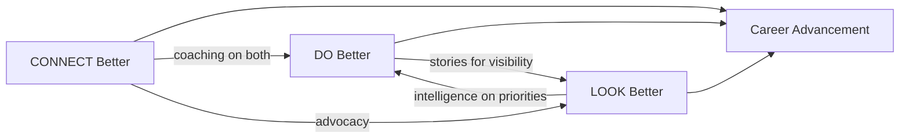
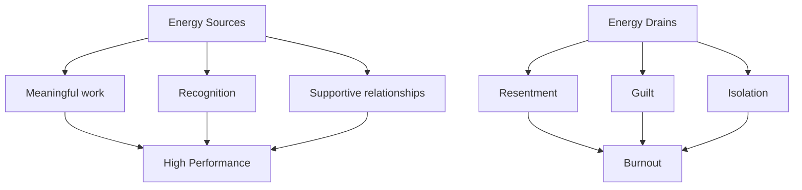
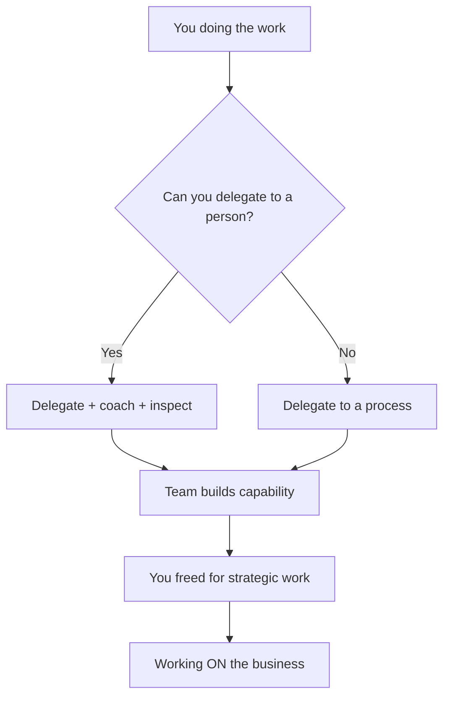
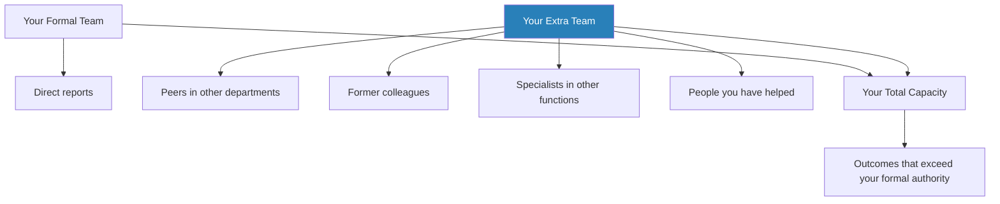
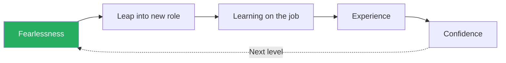
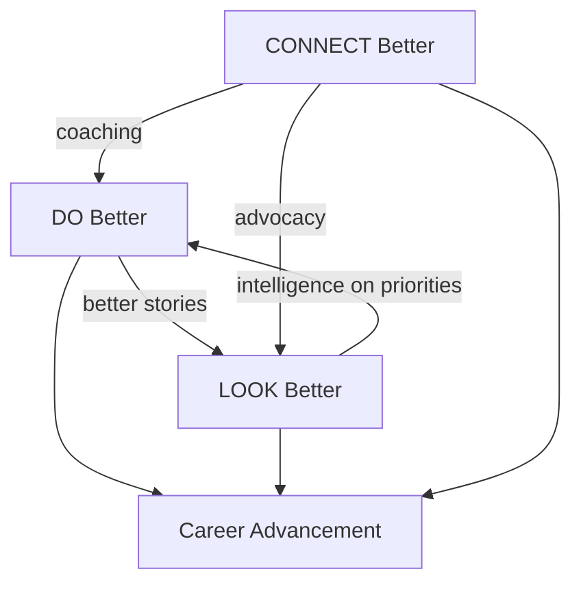

# Rise — Patty Azzarello

> Patty Azzarello's *Rise* is a blunt corrective to the belief that hard work speaks for itself. Her thesis: the most talented people stall because they burn all their energy on execution and neglect visibility and relationships. Advancing requires deliberate, simultaneous progress across three dimensions — delivering exceptional results on the *right* things (DO Better), building credibility with the people who matter (LOOK Better), and assembling a network of mentors and allies (CONNECT Better). Drawing on her own trajectory from engineer to CEO by 38, Azzarello provides a practical, sometimes uncomfortable framework for the reality that merit alone is never sufficient. The book is at its best when it names the traps that hardworking people fall into — the workhorse who gets exploited, the expert who cannot communicate value, the lone wolf who has no champions in the rooms where decisions are made.

---

## About the Author

Patty Azzarello rose through Hewlett-Packard to become the youngest General Manager in the company at 33. She ran a $1 billion software business at 35 and was a CEO at 38. Her career trajectory was not smooth or linear — she took roles she felt unqualified for, navigated hostile political environments, managed teams in areas where she had no technical expertise, and learned many of the book's principles through painful failure before codifying them. Her perspective is shaped by large-company corporate politics, product and marketing leadership, and the particular dynamics of Silicon Valley tech advancement from the 1990s through the 2010s. After her corporate career, she became a leadership consultant and executive coach, working with Fortune 500 leaders on the same problems she once navigated herself.

---

## The Big Idea

*Azzarello reveals that career advancement is not a reward for working harder — it is the result of investing in three interdependent pillars that most hardworking people neglect.*

- Azzarello's central argument is that career advancement is a <b style="color: #2980b9">three-legged stool</b>
- Most people obsess over one leg — execution — and wonder why they topple over

The three legs are:

- <b style="color: #2980b9">DO Better</b> — work on the right things at the right level
- <b style="color: #2980b9">LOOK Better</b> — build credibility and visibility with stakeholders
- <b style="color: #2980b9">CONNECT Better</b> — build mentors, allies, and access to decision-makers
- Neglect any one and your career stalls, no matter how strong the other two are

---

- <b style="color: #27ae60">Working harder on execution is often the wrong response to a stalled career</b>
- If nobody who matters sees your work, if no one is championing you in rooms you are not in, and if you have no relationships with the people who decide promotions — then more hours at your desk will only dig the hole deeper

The model also explains why certain people who seem less talented keep getting ahead:

- It is not that they are gaming the system — or rather, it is not *only* that
- They are investing in all three legs while their more diligent colleagues are pouring everything into one
- The brilliant engineer who never talks to senior leadership, the tireless project manager who has no mentor, the subject-matter expert who cannot translate their work into business language — all have the same problem
- <b style="color: #e74c3c">They are doing a third of the job and wondering why they get a third of the reward</b>

The shift Azzarello demands is from personal output to **outcomes created through leadership, strategic focus, and network leverage**. This is not a book about working less — it is a book about working on the right things and ensuring the right people know about it.

The three pillars are mutually reinforcing — better execution feeds visibility, better relationships feed strategic focus, and mentoring amplifies both.

---

## Key Concepts at a Glance

| Concept | One-line summary |
|---------|-----------------|
| **The DO-LOOK-CONNECT Model** | Three interdependent pillars that must advance simultaneously or produce specific failure modes |
| **Ruthless Priorities** | Select 1-3 "Can't Fail" outcomes and tolerate risk on everything else |
| **The Workhorse Trap** | Being known for tireless output makes you valuable as a workhorse, not promotable as a leader |
| **The Level Dilemma** | Each promotion changes what "good performance" means — old habits become new failures |
| **Inside Voice vs Outside Voice** | Translate your work into the vocabulary your audience already cares about |
| **The List** | An informal shortlist exists before applications open — if you are not on it, qualifications are irrelevant |
| **The Experience Paradox** | You cannot get the job without experience, but you can get experience without the job |
| **Credibility as Infrastructure** | High credibility removes friction, low credibility creates it, and neither is accidental |
| **Personal Brand** | Define what you want to be known for and practise those behaviours consistently |
| **Energy Management** | More energy multiplies time — a rested leader working 40 strategic hours outperforms an exhausted one working 70 |
| **The Extra Team** | People who do not report to you but contribute to your outcomes |
| **Fearlessness Over Confidence** | The cycle breaks only through willingness to act before you feel ready |

The workhorse profile reveals catastrophic underinvestment in LOOK and CONNECT pillars — particularly visibility, stakeholder management, and getting on the list — which explains why the hardest-working professionals are often the least promoted.

---

## Part I: DO Better — Ruthless Priorities and the Right Level of Work

*The first pillar is not about working harder — it is about discovering that most hardworking professionals are drowning in undifferentiated effort and mistaking busyness for impact.*

- Azzarello argues that most professionals treat everything on their plate as equally important
- They say yes to every request and mistake busyness for impact
- The DO Better section is a sustained argument for <b style="color: #27ae60">strategic ruthlessness about where you invest your time</b>

### Chapter 1: Rise Above the Work

*Azzarello opens with the personal failure that crystallised her entire thesis — and the three devastating words that changed her career.*

> [!example] Azzarello's Wake-Up Call — "Nobody Knows You"
> - Early in her career, Azzarello took on the turnaround of a struggling R&D organisation
> - She worked punishing hours, rebuilt processes, improved delivery, and by any objective measure rescued the division
> - At the end of the year, she received no raise, no bonus, and no recognition
> - Her mentor's feedback was three devastating words: **"Nobody knows you."**
> - She had done everything right inside the building and nothing right outside it
> - The people who made compensation and promotion decisions had no idea who she was or what she had accomplished
> **The lesson:** Delivering work is not the same as adding value — the organisation ignores what it cannot see.

The principle that emerges from this story runs through the entire book:

- <b style="color: #27ae60">Delivering work is not the same as adding value</b>
- Managers are paid for the quality of outcomes they create, not the hours they invest
- A twenty-minute walk that produces a strategic insight can add more value than a twelve-hour day of email triage
- But most people never take the walk, because the email feels urgent and the walk feels indulgent

---

Azzarello makes a crucial distinction between working *in* the business and working *on* the business:

- **Working in the business** means doing tasks — writing reports, attending meetings, responding to requests, handling escalations
- **Working on the business** means stepping back to ask: What are the three things that will matter most six months from now? Am I spending my time on those things, or am I spending it on everything else?

The difference is altitude:

- Working *in* is ground-level — reactive, tactical, task-driven
- Working *on* is aerial — proactive, strategic, outcome-driven
- Most people spend ninety percent of their time at ground level and wonder why they never see the full picture
- <b style="color: #e74c3c">Busyness is the enemy of strategic thinking</b> — when every hour is consumed by requests, there is no capacity left to think about what actually matters

> [!tip] Core Insight
> You must accept that some things will not get done, some people will be disappointed, and some balls will drop. The alternative — doing everything at a mediocre level — is worse, because mediocre performance across the board produces neither forgiveness nor standout results.

---

### Chapter 2: Ruthless Priorities — Choose the Can't Fails

*Azzarello introduces her most actionable framework — the idea that remarkable success on a critical few items generates forgiveness for gaps on the rest.*

- She introduces the concept of <b style="color: #2980b9">"Can't Fail" outcomes</b> — the 1-3 things with the biggest business impact that you must deliver at an exceptional level
- Everything else gets managed for acceptable risk, not excellence
- The psychology behind this is counterintuitive:
  - Most people resist prioritisation because they fear being blamed for what they drop
  - But remarkable success on the critical few generates **forgiveness** for gaps on the rest
  - <b style="color: #e74c3c">Mediocre performance across everything generates neither forgiveness nor praise</b>
- **"Being forgiven requires actually succeeding,"** she writes

The logic chain is tight:

- If you try to do ten things well, you will do ten things at seventy percent
- If you try to do three things brilliantly and manage seven things at fifty percent, you will be remembered for the three brilliant outcomes
- The seventy-percent-across-the-board professional is forgettable
- The three-brilliant-outcomes professional is promotable
- The key is that the brilliant outcomes must be the *right* ones — the ones the organisation cares about most

> [!example] The COO's Single Bet
> - A COO inherited a sprawling agenda of infrastructure, technology, and operational projects
> - Rather than spreading resources thinly, he identified one critical initiative — rolling out a new point-of-sale system that would open an entirely new revenue channel
> - He delayed infrastructure improvements and deferred technology upgrades
> - He concentrated his entire team on the single project that would transform the business
> - The point-of-sale system launched on time and exceeded revenue projections
> - The delayed projects were eventually completed with no lasting damage
> - The COO was promoted
> **The lesson:** Had he tried to do everything simultaneously, nothing would have been remarkable and nothing would have failed spectacularly — the worst possible outcome for a career.

---

> [!example] The CEO Who Froze Feature Development
> - A software company was haemorrhaging customers due to quality problems while also trying to add new features to attract new customers
> - The CEO made the ruthless call to freeze all new feature development and redirect every engineer to quality and stability
> - The product team was furious — they saw their roadmap gutted
> - But the existing customer base stabilised, churn stopped, and the company survived
> **The lesson:** Trying to do both — new features and quality improvement — with limited resources would have achieved neither.

Azzarello introduces the <b style="color: #2980b9">21-times rule</b> to support ruthless priorities:

- A message must be repeated roughly twenty-one times before it truly lands with an organisation
- Once you have chosen your Can't Fail outcomes, you must overcommunicate them — in meetings, in emails, in one-on-ones, in town halls
- This creates what she calls **social norms** around your priorities:
  - The organisation learns that requesting your time for non-priority work will be declined
  - It stops asking
- The 21-times rule also applies to team alignment:
  - Your team needs to hear the priorities repeated until they can recite them back to you
  - If your team cannot articulate the Can't Fail outcomes without your help, you have not communicated them enough

> [!abstract] How to Identify Your Can't Fails
> 1. List all current work
> 2. Ask "How bad is it if we fail?" for each item
> 3. Let the answer reveal the true Can't Fails
> 4. Ratify them with your boss — not as a unilateral declaration, but as a negotiated agreement
> 5. Without your boss's buy-in, ruthless prioritisation looks like insubordination

---

The interplay between priorities and boss management is critical:

- You cannot simply decide to drop things — you need explicit agreement from your boss about what will be deprioritised
- This conversation is itself a strategic act:
  - It signals that you are thinking at the right level
  - It forces your boss to articulate what they truly care about
  - It creates a shared understanding that protects you when someone complains about the work you dropped
- <b style="color: #27ae60">The negotiated priority list is your shield</b> — when someone comes to you with urgent-but-unimportant work, you can point to the agreement and say, "That is not in our Can't Fail list"

---

### Chapter 3: Energy Management

*Azzarello interrupts the execution discussion with a chapter that seems misplaced — until you realise it is the foundation for everything else.*

- Her argument: <b style="color: #27ae60">energy is your most finite resource</b>, more so than time
- You can always find more hours (skip lunch, work weekends, wake up earlier)
- You cannot find more energy
- A burned-out person working seventy hours produces less value than a well-rested person working forty, because:
  - The quality of thought degrades
  - The quality of decisions degrades
  - The quality of relationships degrades

Azzarello has an unusual vantage point here:

- She has a health condition that limited her working hours for much of her career
- Rather than seeing this as a handicap, she frames it as a competitive advantage
- Because she could not outwork her peers, she was forced to outthink them
- She had to be ruthless about which meetings to attend, which problems to solve personally, and which hours to protect for strategic thinking
- The result: she consistently outperformed people who worked longer hours, because her hours were better

---

She introduces the concept of <b style="color: #2980b9">prime time</b> — the window during the day when you think most clearly:

- For most people, this is the first two to three hours of the morning
- <b style="color: #e74c3c">Never spend prime time on email, low-value meetings, or administrative work</b>
- Protect it for strategic thinking, difficult problems, and creative work
- Move email and meetings to your low-energy hours

The broader principle extends beyond daily scheduling:

- Energy is affected by the type of work you do, not just the hours
- Work that aligns with your strengths and feels meaningful *generates* energy
- Work that feels pointless, bureaucratic, or misaligned with your values *drains* energy
- The DO-LOOK-CONNECT model is itself an energy argument:
  - People stuck in DO-only mode are often exhausted precisely because they are doing the wrong work with no recognition and no support

> [!example] The Director Who Gained a Day Per Week
> - A director Azzarello coached was working twelve-hour days but feeling increasingly ineffective
> - When they audited his calendar, they found his mornings — his clearest thinking time — were consumed by standing meetings and inbox triage
> - By the time he got to strategic work, it was 3pm and his brain was spent
> - They restructured his calendar to protect mornings for deep work and batched meetings into the afternoon
> - Within a month, he reported feeling like he had gained an extra day per week
> **The lesson:** His hours did not change — the alignment of energy to task changed.

> [!tip] Core Insight
> Energy is not just about sleep and exercise. Resentment drains energy. Workhorse mode drains energy. Doing work you know is low-value drains energy. Doing meaningful work, feeling visible, and having supportive relationships all *build* energy.

---

Azzarello also addresses the emotional dimension of energy:

- **Resentment** is a major energy drain — feeling unrecognised, undervalued, or exploited creates a chronic low-grade anger that saps motivation
- **Guilt** about not doing everything drains energy — the workhorse mentality produces guilt about every ball dropped, which paradoxically makes the remaining work harder
- **Isolation** drains energy — working alone without mentors, allies, or supporters creates a feeling of being trapped
- The fix for all three is the same: invest in the LOOK and CONNECT pillars that most people neglect
- <b style="color: #27ae60">When you feel visible, supported, and valued, the same workload feels lighter</b>

Energy is not just physical — resentment, guilt, and isolation drain it as effectively as sleep deprivation, while recognition, meaning, and connection restore it.

---

### Chapters 4-5: The Workhorse Trap

*This is Azzarello's sharpest diagnostic — the explanation for why the most diligent people are often the least promoted.*

The <b style="color: #2980b9">workhorse trap</b> works like this:

- You are smart, diligent, and responsive
- People learn that if they give you a problem, you will solve it
- So they give you more problems — you solve those too
- Your reputation becomes "the person who gets things done"
- This sounds like a compliment — <b style="color: #e74c3c">it is a cage</b>

The mechanism:

- The organisation has no incentive to promote its best workhorse
- Doing so would remove its most productive execution resource
- The workhorse is someone whose value can be replaced by a **"black box"** — the organisation cares about the throughput, not the person
- If a machine could do your job as well as you do it, your value is in the function, not in your leadership
- Leaders are promoted because they demonstrate they can build systems, develop people, and think strategically
- Workhorses are kept because they are useful exactly where they are

> [!example] The Supply Chain Manager Who Was the System
> - A supply chain manager was brilliant at crisis resolution
> - Every time inventory went wrong, every time a supplier failed, every time a shipment was delayed — he fixed it
> - He worked nights and weekends and was the first call for every emergency
> - He was also passed over for promotion three times
> - The reason: his value was entirely personal — he *was* the system
> - If promoted and moved to a different role, the supply chain would collapse
> - The organisation could not afford to promote him
> **The lesson:** Making yourself indispensable at your current level is the surest way to stay there.

---

The escape came when he shifted his approach:

- Instead of personally resolving the next crisis, he built a <b style="color: #2980b9">prioritisation framework</b>
- The system categorised inventory issues by severity and routed them to the appropriate team member with clear escalation criteria
- He trained his team to use it and stopped being the first call
- Within six months, the supply chain ran more smoothly than it ever had under his personal heroics
- He was promoted within the year — not because he had become less useful, but because he had demonstrated a fundamentally different kind of value:
  - The ability to **build capability** rather than provide it personally

> [!example] The Marketing Analyst Trapped by Excellence
> - A marketing director was an exceptional analyst who could dissect any campaign and produce reports that were the envy of the department
> - Senior leadership loved her analysis but never considered her for VP roles
> - When she asked why, the answer was revealing: "We need you doing what you are doing"
> - Her analytical excellence had made her indispensable *at her current level*
> - The skills that made her valuable — personal analytical throughput — were individual contributor skills, not leadership skills
> - She was the best player on the field, but nobody saw her as a coach
> **The lesson:** Excellence at the wrong level of work is a trap, not an asset.

<b style="color: #27ae60">Azzarello's prescription is not to work less, but to shift what you work on:</b>

- Stop solving problems — start building systems that solve problems
- Stop doing the work — start building the team that does the work
- Stop being the expert — start developing experts
- The transition is painful because it feels like you are abandoning the thing you are best at
- You are — that is the point

---

The workhorse trap has a psychological dimension that makes it especially sticky:

- Workhorses often *enjoy* being the hero — there is a dopamine hit in being the one who saves the day
- The constant stream of problems to solve provides a sense of purpose and competence
- Stepping back from that role feels like losing your identity, not gaining a promotion
- Azzarello acknowledges this openly — the transition is not just strategic, it is emotional
- You have to grieve the loss of your old role before you can fully inhabit the new one
- <b style="color: #e74c3c">The comfort of being essential at the wrong level is the enemy of growth</b>

---

### Chapter 6: The Level Dilemma — What "Good" Means Changes

*Each time you step up, the definition of excellence changes completely — and most people fail transitions because they keep performing at the old level's definition of good.*

Azzarello maps three levels:

| Level | Valued for | Core activity |
|-------|-----------|--------------|
| **Individual contributor** | Expertise and personal output | Doing the work |
| **Manager** | Team outcomes and delegation | Getting work done through others |
| **Executive** | Strategy, network leverage, capability-building | Building the machines that get work done through others |

The shift from personal output (IC level) to network leverage (executive level) is the most difficult transition in any career — it requires abandoning the very behaviours that earned the promotion.

The transition from each level to the next requires *abandoning* the behaviours that made you successful at the previous level:

- The brilliant engineer who becomes a manager and still writes all the code is not demonstrating dedication — they are failing to do the new job
- The exceptional manager who becomes a VP and still runs every team meeting is not showing leadership — they are competing with their own subordinates

This is counterintuitive because the behaviours you are abandoning are the very ones that earned you the promotion:

- You were promoted *because* you were the best coder, the best analyst, the best deal-closer
- The promotion rewards those skills — and then immediately makes them irrelevant
- <b style="color: #27ae60">The qualities that got you promoted are not the qualities that will make you successful at the next level</b>
- This is the cruelest irony of career advancement

> [!example] Natalie the Proposal Reviewer
> - Natalie, a regional sales director, personally reviewed every proposal her team submitted
> - She was meticulous, experienced, and had excellent instincts about what clients wanted
> - Her reviews improved every proposal — but she was working at the wrong level
> - By spending her time on proposal review, she failed to do the things only she could do: building key account relationships, developing her team's capability, and thinking about regional strategy
> - Her team was not growing because they never had to — Natalie caught every mistake before it reached the client
> - She was the best individual contributor on her team — and the worst leader
> **The lesson:** If you cling to the detail, you compete with your own subordinates and signal that you are not ready for a bigger role.

> [!tip] Core Insight
> Your value shifts from what you personally produce to what you **cause to happen** through others. Ask regularly: "Am I working ON the business or IN the business?" If the answer is mostly "in," you are at the wrong altitude.

---

### Chapter 7: Delegation as Value Creation

*Azzarello reframes delegation from a task-offloading mechanism into the primary engine for escaping both the workhorse trap and the level dilemma.*

- <b style="color: #27ae60">Delegation is not about offloading tasks you do not want to do</b>
- It is about building capability in your team so the highest-value work gets done at the right levels
- If you have ten people on your team, developing each of them to work at your level creates ten times more value than adding yourself as an eleventh worker at their level

The mathematics of delegation:

- One person working at full capacity produces X value
- Ten people working at eighty percent capacity each produce 8X value
- The leader who does all the work themselves caps the team at 1X
- The leader who delegates effectively and accepts eighty percent quality multiplies the team's output by a factor of eight
- <b style="color: #e74c3c">Perfectionism at the individual level destroys value at the team level</b>

> [!example] Azzarello's Accidental Leadership Lesson
> - Early in her career, Azzarello was given responsibility for an R&D organisation that worked on technology she did not understand
> - She could not do the team's work even if she wanted to — she lacked the technical knowledge
> - She was forced to lead at the right level: setting direction, removing obstacles, coaching people through problems, and trusting the team to deliver
> - Her team told her she was the best manager they had ever had
> - Not because she was the smartest person in the room — she was not — but because she gave them room to grow, held them accountable for outcomes, and focused her energy on clearing their path
> **The lesson:** Not being able to do the work yourself can be a competitive advantage — it forces you to lead rather than contribute.

---

> [!abstract] Azzarello's Eight Keys to Effective Delegation
> 1. **Resist the temptation to do it yourself** — accept that 80% quality from a team member is better than 100% from you, because it frees you for higher-value work
> 2. **No guilt about giving people work** — delegation is development, not exploitation
> 3. **Do not cover for poor work** — address it directly; covering teaches nothing and enables mediocrity
> 4. **Do not kill planned hires by absorbing their work yourself** — if you keep doing their work, the organisation concludes you do not need the hire
> 5. **Keep outcome ownership** — delegate the task, not the accountability
> 6. **Let the delegate define their own measures and milestones** — people are more committed to plans they create
> 7. **Inspect and measure regularly** — delegation is not abandonment; check in, review, course-correct
> 8. **Always be teaching** — explain why the work matters, share context, debrief afterward

New managers face the highest barriers to delegation — particularly fear of quality loss and identity attachment to the work they used to do personally — which is exactly why the transition from IC to manager is where most workhorse traps are set.

The critical distinction she draws:

- <b style="color: #e74c3c">Delegation is not the same as abandonment</b>
- Handing off a task and hoping for the best is as damaging as micromanagement
- Effective delegation requires clear outcomes, regular inspection, and ongoing coaching
- The midpoint between micromanagement and abandonment is where leadership lives

She also introduces the idea of <b style="color: #2980b9">delegating to a process</b> when you cannot delegate to a person:

- If no one on your team can handle a particular task, you can still systematise it
- Create a checklist, a decision tree, a template — so that the task no longer requires your personal judgment every time
- The process becomes the delegate
- This is especially powerful for recurring decisions:
  - If you make the same type of judgment call repeatedly, codify the criteria
  - The next person facing that decision can use the criteria instead of seeking you out
  - You are freed from the decision without the decision quality degrading

Delegation — whether to a person or a process — is the mechanism that shifts you from working in the business to working on it.

---

## Part II: LOOK Better — Credibility, Visibility, and Personal Brand

*The second pillar addresses the painful gap between doing good work and being known for doing good work — and why bridging it is not vanity but survival.*

- <b style="color: #27ae60">Good work does not stand on its own</b>
- If the people who make decisions do not know your name, your results are invisible
- Invisible results, no matter how impressive, produce exactly zero career advancement
- This section is where Azzarello's advice is most uncomfortable for people who believe self-promotion is distasteful
- She does not deny that it can be
- <b style="color: #e74c3c">Doing great work in silence and hoping someone notices is not modesty — it is career negligence</b>

The distinction she makes is between self-promotion and value communication:

- **Self-promotion** is talking about yourself — "Look at what I did"
- **Value communication** is talking about outcomes — "Here is what this means for the business"
- The first is annoying; the second is essential
- People who avoid all communication about their work because they fear seeming self-promotional are making a category error
- They are conflating two very different activities

### Chapter 8: "Do What You Love" Is Bad Advice

*Azzarello opens the LOOK Better section with a provocative contrarian argument that challenges the popular wisdom about following your passion.*

- She challenges the belief that you should follow your passion and the career will follow
- Her counterargument: passion without strategic positioning produces a starving artist, not a successful professional
- The people who advance are not necessarily doing what they love — they are doing what the organisation values, and they are doing it visibly
- Love your work if you can, but do not use "doing what you love" as an excuse to avoid the uncomfortable work of visibility and positioning

The nuance she introduces:

- There is a distinction between *loving the work* and *loving the outcomes*
- You may not love the process of stakeholder management, but you can love the outcome of having influence and resources
- <b style="color: #27ae60">Effective professionals learn to love the game, not just the craft</b> — and part of the game is making sure the right people see you playing it well
- The craft is what you do at your desk; the game is what you do with the people around you
- Both are necessary, and neither is sufficient alone

---

### Chapter 9: Credibility as Infrastructure

*Azzarello redefines credibility from a soft concept into a concrete organisational asset as tangible as budget or headcount.*

- <b style="color: #2980b9">Credibility</b> is not a soft concept in Azzarello's framework — it is a concrete organisational asset
- She introduces a powerful inverse formulation: **"Credibility is inversely proportional to obstacles"**

| Credibility level | What happens | Effect on career |
|-------------------|-------------|-----------------|
| **High** | Fewer questions, faster approvals, better resources, benefit of the doubt | Results come easier, which builds more credibility |
| **Low** | Endless defence, blocked budgets, invisible contributions | Results come harder, which further erodes credibility |

High credibility creates a self-reinforcing flywheel — faster approvals lead to faster results, which build more credibility, while low credibility traps professionals in a vicious cycle where every initiative requires exhausting justification.

The mechanism is self-reinforcing:

- High credibility reduces friction → easier to deliver results → builds more credibility
- Low credibility increases friction → harder to deliver results → further erodes credibility
- <b style="color: #e74c3c">The rich get richer and the poor get poorer — not because of talent differences, but because of credibility differences</b>

This self-reinforcing nature makes credibility especially dangerous when it turns negative:

- Once you have lost credibility with a key stakeholder, every subsequent interaction starts from a deficit
- You spend more energy defending and explaining than creating value
- The extra energy spent on defence leaves less for results, which further erodes credibility
- Breaking a negative credibility spiral often requires a dramatic intervention — a visible win, a new role, or a complete reset of the relationship

> [!example] The VP Who Couldn't Get Budget
> - A VP of engineering had built an exceptional product but could never get budget for the initiatives he proposed
> - Every budget cycle, he presented detailed technical proposals that demonstrated the value of his projects
> - Every cycle, his proposals were deprioritised in favour of proposals from other VPs
> - The problem was not his proposals — the executives who controlled the budget did not know him, did not understand what his team did, and had no reason to trust his judgment
> - He had credibility with his team but not with the people who mattered
> - The fix was not a better proposal — it was a six-month credibility campaign
> - He met with each budget decision-maker individually, learned what they cared about, translated his team's work into their vocabulary, and demonstrated relevance to their priorities
> - When the next budget cycle came, his proposals sailed through
> **The lesson:** The proposals had not changed — the people reviewing them now trusted the person behind them.

> [!tip] Core Insight
> Credibility is built by being relevant to business outcomes, not by educating people about your function. **"If you need to educate them, you are not relevant."**

---

### Chapter 10: Inside Voice vs Outside Voice

*One of the book's most immediately useful concepts — the revelation that your team's internal language is invisible and irrelevant to everyone outside it.*

- Your <b style="color: #2980b9">"inside voice"</b> is the language you use with your team — functional jargon, internal metrics, technical vocabulary
  - It is precise, efficient, and completely incomprehensible to anyone outside your function
- Your <b style="color: #2980b9">"outside voice"</b> is business outcomes language — the vocabulary that stakeholders, executives, and clients already use and care about
- <b style="color: #27ae60">Always translate your work into the vocabulary of the person you are talking to</b>
- If you need to educate someone about what you do, you are by definition not relevant to them
- Relevance is a gift; education is a tax

The inside/outside voice distinction maps to a deeper truth about communication:

- Most people communicate based on what *they* know, not what the *audience* cares about
- They describe their work in the terms they use daily, because those terms are the most precise
- Precision is not the goal of stakeholder communication — resonance is
- A less precise statement in the audience's language is infinitely more effective than a precisely accurate statement in your own

> [!example] The Marketing VP Speaking the Wrong Language
> - A marketing VP consistently struggled to get budget approval
> - His presentations were excellent by marketing standards — detailed campaign analytics, click-through rates, engagement metrics, conversion funnels
> - But the CFO who controlled the budget did not care about click-through rates
> - The CFO cared about revenue growth, customer acquisition cost, and margin
> - The marketing VP was speaking his inside voice to an audience that only heard outside voice
> - When he learned to translate — "Our Q3 campaign reduced customer acquisition cost by 14% and contributed $2.3 million in incremental revenue" instead of "Our click-through rate improved 23%" — the budget conversations transformed
> **The lesson:** The same results, described in the audience's language, suddenly became compelling.

---

The practical method Azzarello recommends is what she calls <b style="color: #2980b9">"replaying the tape"</b>:

- Interview your stakeholders about their business
- Listen for the specific words they use to describe their priorities, challenges, and goals
- Then use those **exact words** when you present your work to them
- The stakeholder hears their own language coming back to them and immediately registers you as relevant, aligned, and worth supporting

She extends this to written communication:

- Emails to senior executives should never require the reader to translate
- If a sentence contains jargon specific to your function, rewrite it
- If a metric is meaningful only within your team, either translate it to a business metric or leave it out
- The test is simple: <b style="color: #e74c3c">would a senior executive in a different function understand every word? If not, you are speaking inside voice</b>

> [!example] The IT Director Who Learned to Speak Finance
> - An IT director had been trying for months to get approval for a major infrastructure upgrade
> - His proposals were filled with technical specifications — server capacity, network throughput, latency improvements
> - The CFO kept asking, "But what does this mean for the business?"
> - After learning the outside voice principle, the IT director reframed his proposal entirely
> - Instead of "reduce server latency by 40%," he wrote "reduce checkout abandonment by 12%, recovering approximately $800K in annual revenue"
> - The CFO approved the budget in the same meeting
> **The lesson:** The technology had not changed — the language had.

---

### Chapter 11: Personal Brand — Consistency Over Brilliance

*Azzarello argues that people form a specific impression of you whether you manage it or not — and that taking deliberate control of that process is not vanity but strategy.*

Her method:

- Define <b style="color: #2980b9">3-5 attributes</b> you want to be known for
- Identify the **"brandable behaviours"** that convey each attribute
- Practise those behaviours consistently in every interaction

> [!example] The Leader Who Engineered "Clever"
> - A leader Azzarello coached chose "clever" as one of his brand attributes
> - Rather than trying to seem clever through intellectual showmanship, he identified specific brandable behaviours:
>   - Asking the unexpected question in meetings
>   - Finding the non-obvious connection between two problems
>   - Offering reframes that shifted how people thought about challenges
> - He practised these behaviours deliberately until they became habitual
> - Over time, people started describing him as "the clever one"
> **The lesson:** He never announced it — he built the pattern through consistent behaviour.

**"Brand equals consistent behaviours over time."** People grant your brand based on their experience of you, not what you claim about yourself.

- <b style="color: #27ae60">Consistency builds trust, and inconsistency destroys it faster than bad behaviour does</b>
- It is better to be consistently mediocre than inconsistently excellent
- Inconsistency creates anxiety and unpredictability in the people around you
- When people cannot predict how you will show up — brilliant one day, distracted the next — they stop trusting you, even when your best days are extraordinary
- Predictability is a form of respect for the people you work with

---

Azzarello makes an important distinction between brand and reputation:

- **Reputation** is what people say about you based on past performance
- **Brand** is the deliberate, forward-looking pattern you are building
- You cannot control your reputation — it is already formed by past actions
- You *can* control your brand — it is shaped by the behaviours you choose going forward
- The gap between your current reputation and your desired brand is your development agenda

> [!abstract] Brand Development Process
> 1. Gather feedback from 5-15 people on what they see as "always true" about you
> 2. Look for patterns — these patterns are your brand, whether you chose them or not
> 3. Identify the gap between your current brand and your desired brand
> 4. Define the attributes you want and the behaviours that would convey them
> 5. Begin practising — brand-building is measured in months, not days

---

### Chapter 12: Stakeholder Management — Be Visible, Not Annoying

*Azzarello reveals that promotions happen in rooms you are not in — and if the people in that room do not know your name, your boss cannot sell you for the role.*

- Promotions happen in rooms you are not in
- If the people in that room do not know your name, your boss cannot sell you for the role
- Decision-makers default to candidates they know, even if unknown candidates are more talented
- <b style="color: #27ae60">This is not corruption — it is human cognition; people trust what is familiar</b>

Azzarello recommends creating a <b style="color: #2980b9">stakeholder communication plan</b>:

- A deliberate map of who matters, what they care about, and how often you should be in front of them
- This includes your boss, your boss's peers, your boss's boss, key clients, and **"influencers"** — people who may not have formal decision-making authority but whose opinions carry weight

The stakeholder map should categorise people by their relationship to your career:

| Category | Who they are | Frequency of contact |
|----------|-------------|---------------------|
| **Decision-makers** | People who directly decide promotions, budgets, and roles | Monthly minimum |
| **Influencers** | People whose opinions decision-makers trust | Quarterly |
| **Peers** | People at your level who can become advocates or blockers | Ongoing |
| **Team** | Your direct reports and their teams | Daily/weekly |

> [!example] Azzarello's Visibility Transformation
> - After the "nobody knows you" wake-up call, Azzarello created a list of thirty executives she needed to know
> - For each, she identified what they cared about, what she could offer them, and a plan for getting in front of them
> - Over six months, she systematically built relationships with every person on that list
> - The result was not just visibility — it was a network of people who understood her value and could advocate for her when opportunities arose
> **The lesson:** Visibility is not a side effect of good work — it is a deliberate campaign.

---

One specific technique she introduces is the <b style="color: #2980b9">"7-minute meeting"</b>:

- Instead of requesting an hour with a senior executive — which will never get scheduled — ask for seven minutes
- The brevity is disarming and the time commitment trivial
- A sharp seven-minute conversation, where you come prepared with a specific question or insight relevant to their priorities, creates more impact than a diluted hour ever could

Why it works:

- It inverts the usual dynamic
- Most people who request executive time want something *from* the executive: a decision, a resource, an approval
- The 7-minute meeting offers something *to* the executive: a relevant insight, a connection to something they care about, or a question that demonstrates you are thinking at their level
- When you offer value in a compact format, executives remember you — and they start saying yes when you ask for time

<b style="color: #e74c3c">The most common mistake in stakeholder management is communicating without relevance</b>:

- An irrelevant touchpoint is worse than silence, because it teaches the stakeholder to tune you out
- Every interaction must answer the stakeholder's implicit question: "Why should I care about this?"
- If you cannot answer that question, do not have the meeting

---

## Part III: CONNECT Better — Mentors, the Extra Team, and Getting on the List

*The third pillar addresses the network of relationships that makes advancement structurally possible — and demolishes the lone-wolf myth.*

- <b style="color: #27ae60">The most successful people get the most help</b>, and asking for help is an asset, not a liability
- The lone-wolf myth — the idea that truly talented people succeed on their own — is not just wrong, it is actively harmful

### Chapter 13: The Power of Getting Help

*Azzarello dismantles the self-reliance myth and reveals that reluctance to ask for help is one of the most common career-limiting behaviours among talented professionals.*

The resistance comes from multiple sources — Azzarello addresses each one:

- **Appearing weak:** in practice, people who ask for help are perceived as *confident*, not weak — the request signals you know what you do not know and are secure enough to admit it
- **Figuring things out yourself:** you can, but it takes five times longer and produces worse results than learning from someone who has already solved the problem
- **Self-sufficiency:** admirable as a value, counterproductive as a career strategy
- **Indebtedness:** the best mentoring relationships are reciprocal, and most senior people *want* to help — it satisfies their desire to teach and builds their own network

The deeper insight is about leverage:

- A person working alone has only their own knowledge, experience, and perspective
- A person who asks for help gains access to other people's knowledge, experience, and perspective
- The difference in quality of output is not marginal — it is multiplicative
- <b style="color: #27ae60">The most successful people are not the most talented — they are the most helped</b>

> [!example] How Azzarello Became the Best Deal-Maker
> - Azzarello became known as the best deal-maker in her company
> - Not because she was naturally gifted at deal-making, but because she sought help from the corporate development team
> - They had expertise she lacked: financial modelling, legal structuring, precedent analysis
> - By recruiting them as informal advisors and bringing them into her deals, she delivered better outcomes than anyone else
> - The credit went to her, but the capability came from the network
> **The lesson:** Leadership is building a coalition of capability that exceeds what any individual can produce.

---

### Chapters 14-15: Mentors, Advisors, and the Extra Team

*Azzarello distinguishes between three types of career supporters, each serving a fundamentally different function.*

| Type | Function | Commitment level | What they provide |
|------|---------|-----------------|-------------------|
| **Formal mentor** | Career advocate who actively champions you | High — spends political capital | Recommends you for roles, introduces you to decision-makers, vouches for you in rooms you are not in |
| **Informal mentor** | Someone you learn from without formal arrangement | Low — may not even know they are mentoring you | Patterns to observe, occasional questions, absorbed wisdom |
| **Business advisor** | Subject-matter expert consulted on specific problems | Medium — discrete, task-based | Deep expertise in a specific domain (finance, technology, legal) |

Each type serves a different purpose and requires a different approach:

- **Formal mentors** require a deliberate ask — you must explicitly request the relationship and be specific about what you need
- **Informal mentors** require observation and occasional questions — the relationship is implicit, and the learning happens through watching
- **Business advisors** require a clear exchange — you bring them a specific problem, they bring specific expertise, and the relationship is bounded by the problem

> [!abstract] Azzarello's Recruitment Formula
> - **10 informal mentors per year** — observe, ask occasional questions, absorb patterns
> - **1 formal career advocate every 1-3 years** — someone willing to spend political capital on your behalf
> - **3 regular business advisors** — experts you call for specific domain challenges
> - **Approach with flattery and brevity:** "I admire how you handle X — would you be willing to spend 20 minutes helping me think through Y?"

This formula works because it is:

- **Specific** — people know exactly what you are asking
- **Complimentary** — people enjoy being recognised for their strengths
- **Low-commitment** — twenty minutes is not threatening

---

The <b style="color: #2980b9">"extra team"</b> is a concept distinct from mentoring:

- It refers to people who do not report to you but contribute to your outcomes
- They expand your capacity beyond your formal resources
- The extra team might include:
  - Peers in other departments who share information
  - Former colleagues who provide external perspectives
  - People you have helped who now feel motivated to reciprocate
  - Specialists in other functions whose expertise complements yours

Your total capacity is the sum of your formal team and your extra team — the extra team often provides the resources, perspectives, and access that your formal authority cannot.

> [!example] The Product Manager's Informal Alliance
> - A product manager was struggling to get engineering support for her projects
> - The engineering team reported to a different VP and had their own priorities
> - Rather than escalating through the hierarchy — which would have created political friction — she built an extra team
> - She identified two sympathetic engineers and helped them with their own projects, giving them visibility they needed
> - In return, they became informal allies who prioritised her requests
> - She never had formal authority over them — she had something better: reciprocal relationships built on mutual benefit
> **The lesson:** Your formal authority rarely matches your actual need for resources — building an extra team closes that gap.

> [!tip] Core Insight
> The extra team concept acknowledges a reality of modern organisations: the people you need to get things done rarely report to you. Building an extra team is how you close the gap between formal authority and actual need.

---

### Chapter 16: The Networking Paradox — Build by Giving

*Azzarello introduces a counterintuitive principle — that the way to build a powerful network is not to ask for things, but to give them.*

- She introduces the <b style="color: #2980b9">networking paradox</b>: the way to build a powerful network is not to ask for things, but to give them
- Help people with their problems, make introductions, share information
- <b style="color: #27ae60">Be useful before you need to be useful</b>
- The network you build through generosity is the network that responds when you need help — because people feel genuine motivation to reciprocate, not obligation

She contrasts this with <b style="color: #e74c3c">extractive networking</b>:

- The approach of collecting business cards, requesting informational interviews, and asking for favours before establishing a relationship
- Extractive networking feels efficient but produces brittle connections
- People helped through extractive networking feel used and avoid future contact
- People helped through generous networking feel grateful and seek future contact

| Approach | Method | Feeling it creates | Result |
|----------|--------|-------------------|--------|
| **Generous** | Help first, ask later | Gratitude, reciprocity | Deep, durable connections |
| **Extractive** | Ask first, promise later | Obligation, resentment | Brittle, transactional connections |

Her practical advice:

- Whenever you meet someone new, ask "How can I help this person?" before "How can this person help me?"
- When you hear about someone's challenge, send them an article, make an introduction, or share a resource — with no expectation of return
- Over time, these deposits create a network that is eager to help you, not because they owe you, but because they like you

---

### Chapters 17-18: Fearlessness, the Experience Paradox, and Getting on the List

*Azzarello makes a distinction that reframes how most people think about readiness — and reveals why less talented people who are willing to leap keep getting the roles.*

- <b style="color: #2980b9">Confidence</b> comes from experience — you feel confident when you have done something before and know you can do it again
- <b style="color: #2980b9">Fearlessness</b> is the willingness to act before you feel ready — to step into a role you are not sure you can handle
- The problem: you cannot build the experience that creates confidence without first taking the leap that requires fearlessness
- Confidence and experience are locked in a circular dependency
- <b style="color: #27ae60">The only way to break the circle is to leap first and learn second</b>

The cycle of growth — fearlessness breaks the circular dependency between confidence and experience, creating a virtuous loop at each new level.

> [!example] Azzarello's Career of Premature Leaps
> - Every major role Azzarello took felt premature
> - She became a General Manager at 33 and felt she had no idea how to run a general management function
> - She ran a $1 billion business at 35 and felt she lacked the financial sophistication the role demanded
> - She became a CEO at 38 and felt she was faking it
> - Each time, she learned fast enough to succeed — but the learning happened *inside* the role, not before it
> - Her mentor told her: **"Everyone who is a CEO has been a CEO for the first time"**
> **The lesson:** The feeling of unreadiness is universal, permanent, and not a reason to stop.

---

- Less talented people who are willing to leap ahead get the roles, while more talented people who wait for readiness watch from below
- The gap between the leap and the learning is where growth happens
- Azzarello's advice is not to be reckless — it is to recognise that the feeling of unreadiness is universal and not a disqualifier

The <b style="color: #2980b9">Experience Paradox</b> follows directly:

- You cannot get the job without the experience, but you *can* get the experience without the job
- Azzarello's method:
  - Find people currently in the role you want
  - Learn what they do
  - Offer to take on work they are not getting done — every busy leader has projects they cannot get to
  - Practise making decisions at their level before you are formally there
  - When the opportunity appears, you have real experience to point to — not hypothetical readiness

> [!example] The Volunteer Who Became a Nonprofit President
> - A woman wanted to become a nonprofit president but lacked second-level management experience — she had only managed individual contributors, never managed other managers
> - Rather than waiting for that experience to appear in her current job, she volunteered to lead a community organisation where she would manage other volunteer leaders
> - It was unpaid, part-time, and unglamorous — but it was exactly the experience she needed
> - When she interviewed for the nonprofit president role, she had genuine stories about managing managers, not hypothetical claims
> - She got the job
> **The lesson:** You can manufacture the experience gap by seeking opportunities outside your formal role.

---

### Chapters 19-20: Getting on "the List"

*This may be the most strategically important concept in the entire book — the cold-eyed revelation that an informal shortlist exists before applications open, and if you are not on it, your qualifications are irrelevant.*

- For any desirable role, there is an informal shortlist of candidates that the decision-maker will consider
- This list is not generated by HR systems, applications, or performance reviews
- It is generated by <b style="color: #2980b9">relationships with the decision-maker's inner circle</b>

The mechanism:

- When a role opens, the decision-maker does not post a job ad and wait for applications
- They turn to their trusted advisors — direct reports, peers, mentors, and confidants — and ask: "Who should we consider?"
- The names those advisors produce become <b style="color: #2980b9">the list</b>
- <b style="color: #e74c3c">If you are not on it, your qualifications are irrelevant — you are filtered out before evaluation begins</b>
- The filter is not malicious — it is cognitive
- Decision-makers operate under time pressure and trust constraints
- They default to known quantities because evaluating unknown quantities is expensive and risky

This connects directly back to the LOOK Better pillar:

- If you have done the stakeholder management work, you are already known to the people who generate the list
- If you have not, no amount of qualification will compensate for being unknown
- The list is the mechanism through which visibility converts to opportunity

> [!example] How Azzarello Got Her Career-Making Role
> - Azzarello would never have been considered for running a $1 billion software business based on her resume alone
> - Her background was atypical for the role, and the hiring manager did not know her
> - But a mentor who *was* in the hiring manager's inner circle put her name forward
> - Once she was on the list, she competed and won on merit
> - But she could not have competed without the initial nomination
> **The lesson:** The list was the gate, and the mentor was the key.

> [!example] The Qualified Director Who Never Got an Interview
> - A highly qualified director applied for a VP position through the formal process
> - He had excellent credentials, strong performance reviews, and a clear track record
> - He did not get an interview
> - When he investigated, he learned that the decision-maker had already identified three candidates through her network before the formal posting went live
> - The posting was a formality — the list was already set
> - His application arrived after the decision had effectively been made
> **The lesson:** Formal application processes often ratify decisions that have already been made informally.

---

> [!abstract] How to Get on the List
> 1. Identify who the decision-maker listens to — their inner circle
> 2. Develop a relationship with at least one person in that inner circle — long before the role opens
> 3. Make your aspirations explicitly known — people cannot nominate you for a role if they do not know you want it
> 4. Ensure the inner circle member associates you with the role — through relevant conversations, demonstrated capability, and sustained visibility

- This is not last-minute lobbying — it is long-term relationship investment
- By the time the role opens, the nomination should be almost automatic
- <b style="color: #27ae60">Your name should be the first one that comes to mind, not one that requires persuasion</b>

---

## Part IV: Putting It All Together

### Chapter 21: The Action Plan

*Azzarello closes with a practical integration chapter — acknowledging that three simultaneous workstreams on top of an already demanding job can feel overwhelming, and offering a phased way in.*

> [!abstract] Phased Implementation Plan
> 1. **Week 1:** Audit your current state across all three pillars — where are you strong, where are you weak, which pillar is most neglected?
> 2. **Month 1:** Choose one action from each pillar — one Ruthless Priority to define, one stakeholder relationship to build, one mentor to recruit
> 3. **Quarter 1:** Build the habits — the 21-times rule for communicating priorities, regular touchpoints with your stakeholder map, monthly mentoring conversations

The key insight of the closing chapter:

- The three pillars are not independent workstreams — they are <b style="color: #27ae60">mutually reinforcing</b>
- Better execution on the right priorities gives you better stories for stakeholder conversations (DO feeds LOOK)
- Better stakeholder relationships give you intelligence about what the organisation values, which helps you choose better priorities (LOOK feeds DO)
- Better mentoring relationships give you coaching on both execution and visibility (CONNECT feeds DO and LOOK)

The three pillars form a reinforcing loop — progress on any one accelerates progress on the other two.

- <b style="color: #e74c3c">Do not add the three pillars on top of your current workload</b>
- The whole point of Ruthless Priorities is that you must drop things to create space
- If you do not make room by eliminating low-value work, you will never have the energy or time for the LOOK and CONNECT work that your career requires

---

Azzarello acknowledges the implementation challenge honestly:

- Most people who read the book will agree with the framework and then do nothing
- The reason is not lack of motivation — it is that the DO-only habits are deeply ingrained
- The workhorse identity is comfortable, even when it is limiting
- Changing requires tolerating the discomfort of doing less execution work, which initially feels like failing
- The turning point comes when you see the first results from the LOOK and CONNECT investments:
  - The first stakeholder who mentions your name in a meeting you were not in
  - The first mentor who gives you intelligence you would never have discovered alone
  - The first time your Can't Fail outcome succeeds spectacularly while the things you dropped turned out not to matter
- These early wins create the motivation to continue

---

## Key Quotes

- "Nobody knows you." — the three words that explained why Azzarello got zero raise despite turning around an entire R&D organisation
- "Credibility is inversely proportional to obstacles."
- "If you need to educate them, you are not relevant."
- "Being forgiven requires actually succeeding."
- "Everyone who is a CEO has been a CEO for the first time."
- "Your value shifts from what you personally produce to what you cause to happen through others."
- "Brand equals consistent behaviours over time."
- "The most successful people get the most help."

---

## The Verdict

*Rise* is the book you need when you are delivering strong results and feeling invisible, overlooked, or stuck. Its greatest contribution is the <b style="color: #2980b9">DO-LOOK-CONNECT diagnostic</b> — a simple model that reveals which leg of the stool is missing. Most stalled careers can be traced to one neglected pillar, and Azzarello names the traps with uncomfortable precision. The **inside voice vs outside voice** concept is immediately actionable for anyone who struggles to communicate their value to non-technical stakeholders. The **"Getting on the List"** framework is a cold-eyed corrective to anyone who believes that applications and interviews are how people get promoted. These are not abstract ideas — they are diagnostic tools that produce specific, concrete changes in behaviour.

The book's weaknesses are context and depth. Azzarello's career was in Silicon Valley tech during the 1990s-2000s boom — a world of high talent mobility, rapid company growth, and constant role creation. In more rigid organisations with fixed band structures, budget committees, and slower promotion cycles, some of the advice ("just renegotiate your job") underplays how much organisational inertia constrains individual agency. Her advice on toxic bosses is also thin — she counsels "just leave," without addressing the more common situation of a boss who is not toxic but merely unhelpful or politically weak. The "Do What You Love Is Bad Advice" chapter raises a valid contrarian point but then overcorrects, dismissing the genuine strategic advantage that intrinsic motivation provides in competitive environments. And her networking advice, while sound in principle, shows its age — the examples feel pre-2020, and the book would benefit from a stronger emphasis on digital visibility and thought leadership.

Who benefits most: mid-career professionals in large organisations who have strong execution records and weak visibility. If you are the person who always delivers but never gets promoted, *Rise* will show you exactly what you are missing — and more importantly, it will make you uncomfortable enough to change. The book is less useful for people already in executive roles (the advice is pitched at the climb, not the summit) or for people in small organisations where the political dynamics are simpler.

How it compares: *Rise* occupies a practical middle ground between the philosophical depth of Robert Greene and the tactical specificity of career manuals like Carla Harris's *Expect to Win*. Greene tells you that the world runs on power and perception; Azzarello tells you what to do about it on Monday morning. Harris provides sharper tools for the specific challenge of perception management and sponsorship; Azzarello provides a broader diagnostic model that includes execution and energy management alongside visibility. Marshall Goldsmith's *What Got You Here Won't Get You There* tackles the same Level Dilemma transition problem but from a behavioural coaching angle rather than a strategic positioning angle. Read Azzarello for the diagnosis, Harris for the sponsor playbook, and Goldsmith for the behavioural change work.

---

## Related Reading

- [[The 48 Laws of Power - Robert Greene|The 48 Laws of Power]] — the power dynamics lens that Azzarello acknowledges but never fully engages with; Greene's Laws 1, 5, 6, and 30 are the invisible scaffolding beneath LOOK Better
- [[Expect to Win - Carla A. Harris|Expect to Win]] — Harris provides sharper, more specific tools for the perception management and sponsorship challenges that Azzarello identifies but does not develop with the same depth
- [[goldsmith_what-got-you-here|What Got You Here Won't Get You There]] — Goldsmith tackles the same transition problem as the Level Dilemma from a behavioural coaching angle
- [[covey_7-habits|The 7 Habits of Highly Effective People]] — Covey's "begin with the end in mind" and "seek first to understand" complement Azzarello's Ruthless Priorities and Outside Voice concepts
- [[Stealing the Corner Office - Brendan Reid|Stealing the Corner Office]] — Reid provides a more ruthless, politically explicit version of the same argument about perception over merit
- [[cialdini_influence|Influence]] — the psychology of persuasion underlying Azzarello's credibility and stakeholder management frameworks
- [[Fierce Conversations - Susan Scott|Fierce Conversations]] — the communication depth that Azzarello's Outside Voice principle demands in high-stakes stakeholder relationships
