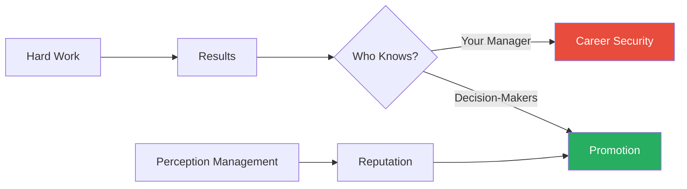
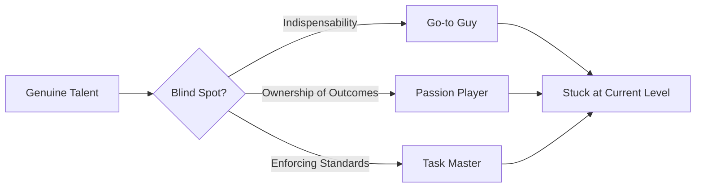
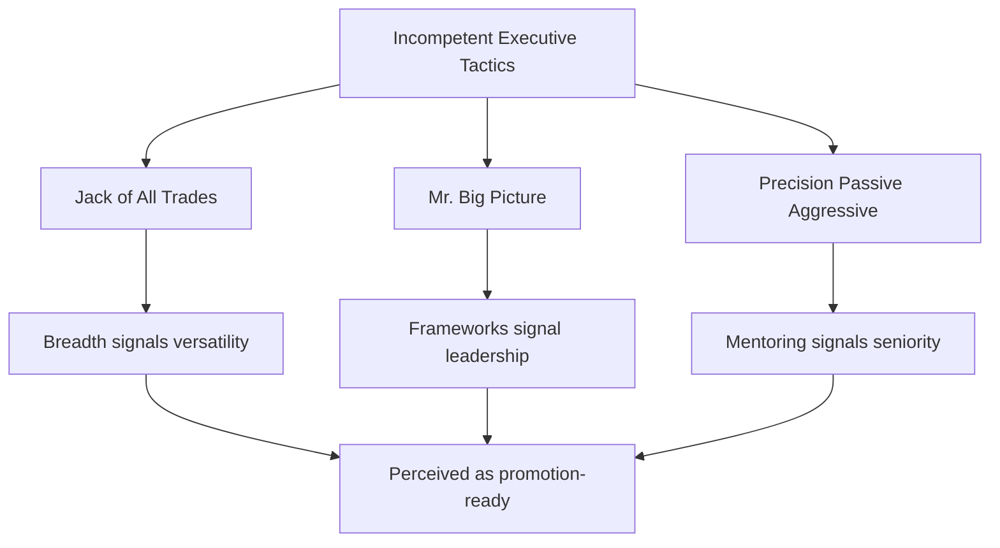
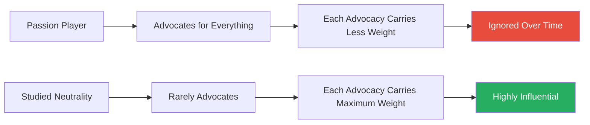
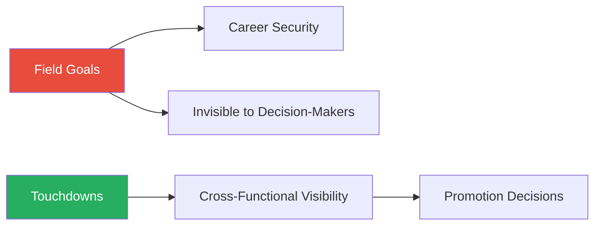
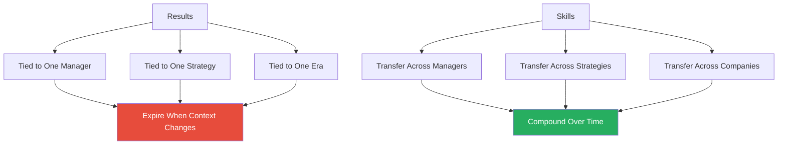

# Stealing the Corner Office — Brendan Reid

> Brendan Reid's blunt thesis is that corporations are not meritocracies and never have been. The people who reach the top are not the smartest, hardest-working, or most results-driven — they are the ones who understand how promotion decisions actually get made and position themselves accordingly. Reid identifies a pattern he calls the "Incompetent Executive" — people with less talent but better political instincts who consistently leapfrog their more capable peers. His argument: stop resenting these people and start reverse-engineering their playbook. Combine their tactics with genuine competence and you become unstoppable. The book is built around paired stories — one talented person who stalls, one politically savvy person who advances — illustrating how perception, influence management, and strategic self-promotion matter more than raw performance in determining who gets ahead.

---

## About the Author

Brendan Reid is a career marketing executive who spent over twenty years climbing through mid-to-large technology and media companies. He rose from entry-level marketing roles to senior leadership positions, and along the way he watched a pattern repeat itself with disturbing consistency: talented colleagues who deserved advancement got passed over while less capable operators climbed steadily upward. Rather than resigning himself to bitterness, Reid studied what the successful climbers were doing differently. He tracked their behaviours, dissected their tactics, and reverse-engineered their playbooks. The result is a practitioner's field guide — not an academic treatise, but a set of observations from someone who spent decades inside the corporate machine and decided to write down what he saw. Reid does not cite organisational behaviour research or draw on psychology literature. His evidence is entirely experiential and anecdotal, built from composite characters and paired stories that isolate the variable he cares about: tactics.

---

## The Big Idea

*Reid dismantles the comforting fiction that hard work gets rewarded and reveals the two-dimensional game that actually determines who advances.*

- Reid's central argument rests on a distinction most professionals never make: <b style="color: #27ae60">your company's objectives and your personal advancement are fundamentally different things</b>
- Shareholder value, quarterly revenue targets, customer satisfaction scores — these are what the organisation measures
- Your promotion, your compensation, your scope of influence — these are what matter to you
- The two are not the same, and confusing them is the source of most professional frustration

---

- Most talented people make what Reid calls the <b style="color: #2980b9">meritocracy fallacy</b> — the assumption that excellence in execution will be noticed, remembered, and rewarded
- They believe in a straightforward transaction: work hard, deliver results, get promoted
- This belief is wrong, and Reid argues it is provably wrong:
  - The people who decide promotions are typically two or more levels above you
  - They never see your daily work
  - They never read your reports
  - They make decisions based on <b style="color: #27ae60">perception</b> — how you are talked about in rooms you are not in, what image comes to mind when your name is mentioned, and whether anyone with influence is willing to champion your case

"Your company's success is not your success," Reid writes.

- The book's uncomfortable core is that results have a short shelf life, but reputation compounds:
  - Your manager changes and your stellar track record under the old regime is forgotten
  - The company pivots strategy and the results you delivered under the old strategy become irrelevant
  - But the perception that you are a big-picture thinker, a calm hand in a crisis, a person who lifts others up — that perception travels with you across managers, departments, and even companies

Most professionals pour all their energy into the top path (work to results) and ignore the bottom path (perception to reputation). The second path is what actually determines who advances.

> [!tip] Core Insight
> Stop investing 100% of your energy in execution. Reid prescribes 60-70% execution (enough to remain credible) with 30-40% invested in skill expansion, influence management, and strategic self-promotion. The game has two dimensions — performance and perception — and most talented people are playing only one of them.

Reid's most counterintuitive prescription is that 30-40% of professional energy should flow to non-execution activities — a radical departure from the meritocracy assumption that 100% execution produces 100% advancement.

---

## Key Concepts at a Glance

| Concept | One-line summary |
|---------|-----------------|
| **The Imperfect Corporation Model** | Corporations run on human self-preservation, not logic or fairness |
| **The Career Scorecard** | Your company's scorecard and your personal scorecard are different documents |
| **Three Smart-but-Stuck Archetypes** | The Go-to Guy, the Passion Player, and the Task Master — talented people who unknowingly sabotage their own advancement |
| **Three Incompetent Executive Tactics** | The Jack of All Trades, Mr. Big Picture, and the Precision Passive Aggressive deploy tactics that work regardless of competence |
| **Three Lost Souls** | The Social Chair, the Gossip Girl/Guy, and the No-Change Agent have no idea the game is even being played |
| **The Touchdown vs Field Goal Model** | Big visible wins advance your position; reliable daily execution only prevents firing |
| **The Three-Phase Project Promotion Model** | Promote your projects before, during, and after execution |
| **The Influencer Plan** | A systematic seven-criterion framework for cultivating relationships with decision-makers |
| **Skills Over Results** | Results expire when context changes; skills transfer across companies, managers, and eras |
| **The Change Playbook** | Organisational disruption resets the political landscape — adapt fastest to win |
| **Separate from the Herd** | Your peers are your competition; network vertically with decision-makers, not horizontally |
| **The Promotion Plan** | Never wait for promotion to be offered; identify targets, map influencers, declare intentions |

---

## The Imperfect Corporation

*Reid opens by demolishing the myth that corporations are rational machines and reveals the single force that truly drives every hiring and promotion decision.*

- Reid's model of how organisations actually work rests on a single premise: <b style="color: #27ae60">every person in a corporation is primarily motivated by self-preservation</b>
- This is not a cynical observation — Reid argues it is simply descriptive
- When a hiring manager evaluates candidates, they are not asking "who is the best person for this role?"
- They are asking "who is the safest choice for me?"
- The safest choice is the one who will not embarrass them, not outshine them, not create political complications
- This is why hiring decisions are driven by "fit," consensus, and experience-as-safety-net — all of which systematically favour familiar, non-threatening candidates over exceptional ones

> [!example] The VP of Marketing Hire
> - A technology company needed a VP of Marketing
> - The most qualified candidate — a woman who had built a marketing department from scratch at a competitor and tripled their market share — was passed over
> - The person hired was an internal candidate who had never run a marketing team but was well-liked by the CEO
> - The hiring committee's reasoning: the internal candidate "understood the culture"
> - What they actually meant was that the internal candidate was predictable and unthreatening
> **The lesson:** Hiring decisions are filtered through self-preservation, not objective merit.

- The same self-preservation logic governs promotions
- Reid identifies three drivers of typical corporate promotion decisions:

| Promotion Pattern | What It Sounds Like | What It Actually Means |
|-------------------|---------------------|----------------------|
| **Promote from within** | Reward loyalty and internal knowledge | Favour people already visible to senior leaders, not the most capable |
| **Hit the ground running** | Minimise ramp-up time | Exclude high-potential talent in favour of safe, lateral hires |
| **Top contributor to manager** | Reward your best performer | Promote someone whose deep expertise is precisely the opposite of what management requires |

- <b style="color: #e74c3c">The "top contributor to manager" pattern is one of the most reliably destructive in corporate life</b> — the skills that make someone an outstanding individual contributor (deep expertise, task focus, personal accountability) are precisely the opposite of the skills that make someone an effective manager (delegation, political navigation, people development)

---

- The implication of all three patterns is stark:
  - If you are building a professional strategy that assumes merit is noticed and rewarded, you are building on sand
  - Build instead on the assumption that <b style="color: #27ae60">perception is rewarded</b> — and design every move accordingly
- Reid extends the self-preservation model deeper:
  - Hiring committees do not assess candidates objectively — they assess risk to themselves
  - A manager who hires a weak performer looks like a bad judge of talent
  - But a manager who hires a consensus candidate and the hire fails can say "everyone agreed" — the blame is diffused
  - <b style="color: #e74c3c">This is why consensus hiring produces mediocre results</b> — the process is optimised for risk-avoidance, not talent identification
  - The candidate who is "nobody's first choice but everyone's second" wins the job because they threaten nobody

"The corporation is not broken," Reid writes. "It was never designed to reward merit in the first place."

---

## The Career Scorecard

*Reid introduces the conceptual foundation for every tactic in the book: the jarring gap between what the company measures and what you should measure.*

- Before diving into tactics, Reid introduces a framing device he calls the <b style="color: #2980b9">Career Scorecard</b> — a deliberate separation between what the company measures and what you should measure
- The company measures revenue, customer satisfaction, project delivery, cost reduction
  - These are the organisation's success metrics
  - You may contribute to them, and you should — doing so is the minimum requirement for continued employment
  - But contributing to the company scorecard does not automatically advance your personal scorecard
- Your personal scorecard measures something entirely different: <b style="color: #27ae60">the perception of your value held by the people who decide promotions</b>
  - Are you seen as someone who could fill a bigger role?
  - Do the right people know what you have accomplished?
  - Is there someone with influence willing to advocate for you?
  - Are you associated with visible, important projects?

> [!example] Brian vs Sandra — The Invisible Top Performer
> - Brian, a senior analyst, delivered three consecutive years of outstanding work
> - His models were the most accurate in the department; his reports were cited by executives
> - By every objective measure, he was the top performer
> - When a management position opened, Brian was passed over for Sandra, whose analytical work was notably weaker
> - Sandra's advantage: she had spent two years serving on cross-functional committees, volunteering for high-visibility projects, and building relationships with directors in other departments
> - When the promotion committee convened, three directors spoke up for Sandra
> - Nobody mentioned Brian — nobody even knew who Brian was
> **The lesson:** Top performance is invisible if the people who decide promotions have never seen you do it.

- The Career Scorecard concept reveals a painful asymmetry:
  - The company scorecard is transparent — you can read the targets, measure against them, and know where you stand
  - The personal scorecard is opaque — you rarely know how decision-makers perceive you, what they think of when your name comes up, or whether anyone would champion your promotion
  - This opacity is what makes the influencer plan (introduced later) so critical — it is the mechanism for making the invisible scorecard visible

> [!tip] Core Insight
> Until you accept that the company's success metrics and your personal advancement metrics are different instruments, you will keep over-investing in execution and under-investing in perception.

---

## The Three Smart-but-Stuck Archetypes

*Reid's most diagnostic framework reveals why the most talented people in an organisation are often the ones who stall — not because of what they lack, but because of a specific blind spot they cannot see.*

- These are not incompetent people — they are often the most capable people in their organisations
- Their problem is not talent
- It is a specific blind spot that prevents their talent from translating into advancement

Each archetype represents a different way that genuine competence becomes a trap — talent channelled through the wrong behaviour produces stagnation rather than advancement.

The incompetent executive's profile is nearly the inverse of the smart-but-stuck archetypes — low on technical skill but dominant on every dimension that actually determines promotion decisions.

---

### The Go-to Guy

*The person everyone relies on discovers that being irreplaceable at your current level is the surest way to stay there permanently.*

- Everyone knows one — the person who is always available, always reliable, always first to volunteer and last to leave
- The Go-to Guy is technically excellent and personally dependable
- Managers love having a Go-to Guy because they make the manager's life easier
- The Go-to Guy's problem is <b style="color: #e74c3c">indispensability at the current level</b>:
  - By becoming the person everyone relies on for their current function, they bind themselves so tightly to one boss and one set of responsibilities that nobody can imagine them anywhere else
  - Their reliability becomes a cage
  - The organisation cannot afford to promote them because nobody else can do what they do
- The mechanism is psychological — decision-makers think in images:
  - When they hear the Go-to Guy's name, the image that appears is of someone deeply embedded in their current role
  - The image of someone running a bigger operation, leading a different team, or thinking strategically simply does not form
  - <b style="color: #e74c3c">You cannot be promoted into a role if nobody can picture you in it</b>

> [!example] Marcus — Competence as Prison
> - Marcus, a brilliant operations manager at a logistics company, had built all the department's reporting systems himself
> - He knew every vendor, every route, every contingency plan
> - When his VP was asked about promoting Marcus, the VP's response was revealing: "I can't lose him from this role. He's the only one who knows how things work"
> - The more irreplaceable Marcus made himself in operations, the less anyone could picture him in strategy, product, or general management
> **The lesson:** Making yourself indispensable in your current role makes it impossible to leave it.

> [!example] Elaine — The Deliberate Escape
> - Marcus's peer Elaine was less technically skilled but more politically astute
> - She had been deliberately training others to do her work
> - She volunteered for a task force on customer experience, built relationships in marketing, and made herself visible to the COO
> - When the promotion came, it went to Elaine — not because she was better at operations, but because the organisation could imagine her in a bigger role
> **The lesson:** Promotability requires that people can picture you somewhere else, not that you are essential where you are.

"The more indispensable you make yourself in your current role, the harder it becomes to leave it."

- The Go-to Guy's trap is subtle because it feels like success:
  - Every time the boss calls with a crisis, every time colleagues seek your expertise, it feels like validation
  - But validation and advancement are not the same thing
  - The Go-to Guy is valued — just not valued enough to promote
- Reid's antidote to the Go-to Guy trap is deliberate:
  - Train your replacement — make your current role survivable without you
  - Broaden your exposure — work on projects outside your core function
  - Build relationships with decision-makers who do not see you only as the person who keeps the department running

---

### The Passion Player

*The smartest person in the room learns that being right about everything except how to be right is a fatal combination.*

- The Passion Player is the ideas person — intellectually brilliant, emotionally invested in strategy, driven by deep conviction
- They care about getting the right answer, and they are often the smartest person in the room
- The Passion Player's problem is <b style="color: #e74c3c">ownership of outcomes</b>:
  - When you passionately advocate for an idea, you own it completely
  - If the idea succeeds, you get credit — but also resentment from the people whose competing ideas you defeated
  - If the idea fails, you own the failure entirely
  - Even during the debate, your passion creates enemies: the people whose proposals you argued against, whose strategies you challenged, whose intelligence you implicitly questioned

> [!example] Victor — Right About Everything Except Politics
> - Victor, a brilliant marketing executive at a software company, had a genuinely superior pricing strategy
> - His analysis was rigorous, his data compelling, and his recommendation would have increased margins by 15%
> - He presented it with conviction, argued against alternatives with detailed rebuttals, and made it clear he believed any other course of action would be foolish
> - Victor was fired within six months
> - Not because his strategy was wrong — it was actually implemented after his departure and worked exactly as he predicted
> - He was fired because the process of advocating for it had created a long list of enemies:
>   - The VP of Sales felt humiliated after Victor publicly dismantled his counter-proposal
>   - The CFO felt undermined when Victor questioned his revenue projections in front of the board
>   - The CEO felt pressured rather than advised
> **The lesson:** Being right about the substance while being wrong about the process is still career suicide.

> [!example] Otto — The Framework Facilitator
> - Otto worked at the same company as Victor and knew nothing about pricing
> - His analytical skills were mediocre
> - When asked to lead a pricing review, he built a decision framework: defined the constraints, presented three genuine alternatives (including Victor's approach), created scoring criteria, and facilitated the group to evaluate each option
> - The group chose a strategy — Otto was promoted
> **The lesson:** The person who structures the decision is credited with leadership, regardless of who had the best idea.

- The contrast between Victor and Otto is the sharpest illustration of Reid's thesis:
  - Victor had the superior idea — demonstrably, provably superior
  - Otto had the superior method — a process that created allies instead of enemies
  - In a system where advancement depends on broad support, Otto's mediocre idea delivered through an inclusive process beats Victor's brilliant idea delivered through an adversarial one

---

### The Task Master

*The person who insists on excellence discovers that in a culture built on consensus, demanding accountability is treated as deviance.*

- The Task Master is the accountability enforcer — high standards, low tolerance for mediocrity, relentless drive to make teams deliver
- Task Masters are often the most respected people on their teams — feared, perhaps, but respected
- The Task Master's problem is <b style="color: #e74c3c">making people uncomfortable in a culture that rewards comfort</b>:
  - Most corporate cultures are built on consensus, not excellence
  - Mediocrity is not just tolerated — it is the norm, and the norm is enforced by social pressure
  - When a Task Master holds peers accountable, the people held accountable do not thank them for improving their work — they resent being made to feel inadequate

> [!example] Dottie — Punished for Being Right
> - Dottie, a programme manager at a manufacturing company, was the person who kept projects on track
> - When a vendor missed a deadline, Dottie flagged it; when a colleague submitted substandard work, she sent it back with detailed feedback; when a cross-functional team failed to deliver, she escalated to the steering committee
> - She was right every single time — not once did she flag something that was not genuinely a problem
> - Dottie was put on a performance improvement plan for "creating conflict"
> - The HR investigation found that seven colleagues had complained about her — not about her being wrong, but about her making them feel uncomfortable
> - In a culture where mediocrity was the baseline, Dottie's insistence on excellence was treated as deviance
> **The lesson:** Being right about the problem does not protect you when the culture values comfort over quality.

> [!example] Harry — Same Fix, Different Image
> - Harry, an engineering manager at the same company, saw the same quality problems Dottie saw
> - Instead of flagging failures, he quietly offered to help struggling teams
> - He spent evenings reviewing other teams' designs, suggesting improvements, and sharing templates
> - He never escalated and never called anyone out — he just helped
> - Harry was promoted to Director of Engineering
> - His boss had noticed the pattern — not the quality problems Harry had fixed, but the image of leadership Harry had built through visible mentorship
> **The lesson:** Accountability looks like conflict; helping looks like leadership. The image could not be more different.

> [!tip] Core Insight
> The substance was identical — Dottie and Harry both identified the same problems and got them fixed. But accountability creates adversaries while help creates advocates. When the outcome is the same either way, choose the method that builds your reputation.

---

## The Incompetent Executive Playbook

*Reid's most provocative move: profiling the people who get promoted despite lacking obvious talent, and revealing why their tactics work regardless of the competence behind them.*

- Reid argues that these people — the ones talented professionals love to complain about — are not getting promoted by accident
- They are deploying a set of tactics that exploit how organisations actually work
- The tactics are effective regardless of the underlying competence of the person using them
- <b style="color: #27ae60">Strip the incompetence away, combine these tactics with genuine talent, and you have an unfair advantage</b>

Each tactic works by creating a perception of leadership potential that is independent of actual expertise — the image matters more than the substance behind it.

---

### The Jack of All Trades

*The person with shallow knowledge across every domain turns out to be the most adaptable player on the board — precisely because they have nothing invested in the status quo.*

- The Jack of All Trades has shallow knowledge across many domains but deep expertise in none
- They are never the technical expert, never the subject matter authority, never the person you go to for a definitive answer
- But they are always conversant — they can talk intelligently about marketing, finance, operations, technology, and strategy at a level that sounds impressive to anyone who does not know the domain well

The <b style="color: #2980b9">Jack of All Trades</b> thrives for two reasons:

- **Breadth makes decision-makers imagine them in bigger roles**
  - When a VP is looking for someone to lead a cross-functional initiative, they do not want a deep specialist
  - They want someone who can navigate multiple domains
  - The Jack of All Trades appears to be exactly that person, even if their navigation is surface-level
- **They have no deep investment in the status quo**
  - When the organisation restructures, acquires a competitor, or pivots strategy, specialists are threatened
  - Their deep expertise in the old way of doing things becomes a liability
  - The Jack of All Trades has nothing to lose — they are the first to volunteer for new projects, the first to learn new buzzwords, the first to align with the new power structure

> [!example] Carl — The Acquisition Survivor
> - A technology company was acquired by a larger competitor, bringing in new leadership, processes, and strategic priorities
> - Most of the acquired company's managers spent months fighting the changes, defending their old approaches, and mourning the culture they had lost
> - One manager — a classic Jack of All Trades named Carl — spent the first week learning the acquiring company's terminology, attending their town halls, and volunteering for integration projects
> - Within six months, Carl was promoted to a global role
> - His former colleagues, many of whom were far more technically capable, were laid off
> **The lesson:** Breadth provides career insurance. Depth is a leveraged bet on the current environment staying the same.

- Reid draws an important distinction: he is not advocating for incompetence
- He is observing that the tactic of deliberate breadth — learning enough about many domains to be conversant — creates a specific perception
- That perception — versatility, adaptability, cross-functional thinking — happens to be exactly what decision-makers look for when filling leadership roles
- <b style="color: #27ae60">The lesson for talented people is not to abandon depth, but to layer breadth on top of it</b>

---

### Mr. Big Picture

*Perhaps Reid's most fascinating archetype — a tactic so elegant in its simplicity that it requires zero expertise in the subject matter to execute flawlessly.*

- <b style="color: #2980b9">Mr. Big Picture</b> cultivates an image of calm, objective, strategic thinking:
  - He does not push ideas or advocate for positions
  - He presents options and frameworks
  - He asks probing questions
  - He facilitates rather than decides
- Because of this, <b style="color: #27ae60">he is never wrong</b>:
  - When a decision succeeds, Mr. Big Picture led the process that produced it
  - When a decision fails, everyone who participated shares the blame — because they all evaluated the options and chose together
  - Mr. Big Picture's positioning is a perpetual win-win

- The genius of the tactic is that the <b style="color: #2980b9">decision framework</b> itself signals leadership:
  - In most corporate environments, the person who structures the conversation is perceived as the most senior thinker in the room
  - Structuring a decision requires what appears to be a higher-order cognitive skill — the ability to step back from the details and see the bigger picture
  - Whether Mr. Big Picture actually has this skill or is simply avoiding commitment is, from the perspective of career advancement, irrelevant

> [!example] Keith vs Patricia — Framework Beats Expertise
> - Patricia, the head of market research at a consumer goods company, had spent three months studying the target market
> - She presented a detailed, passionate recommendation backed by proprietary data
> - Keith, a general manager with no market research experience, presented a decision framework: three possible market entry strategies, each scored against four constraints (cost, speed, risk, alignment with brand)
> - The group worked through Keith's framework, debated the scores, and arrived at a decision
> - Patricia's recommendation was actually incorporated into the final strategy — Keith's framework led the group to essentially the same conclusion
> - But Keith was credited with leading the strategic process, while Patricia was seen as a subject matter contributor
> - Keith was promoted to SVP; Patricia was not
> **The lesson:** Present options. Let the room decide. You led the process regardless of what they choose.

"Present options. Let the room decide. You led the process regardless of what they choose."

- The deeper mechanism is psychological:
  - When someone presents a single recommendation, the room's natural response is evaluation: is this person right or wrong?
  - When someone presents a framework with multiple options, the room's natural response is participation: which of these options do I prefer?
  - The first dynamic creates judges; the second creates collaborators
  - <b style="color: #27ae60">The person who created the framework is, by default, the leader of the collaboration</b>

---

### The Precision Passive Aggressive

*Reid's most uncomfortable archetype: manipulation through the performance of generosity, where helping colleagues is not about their development but about the signal it sends to leadership.*

- The <b style="color: #2980b9">Precision Passive Aggressive</b> builds an image of mentorship and superiority
- They identify colleagues who are struggling — with a project, a presentation, a deliverable — and offer to help
- The help is genuine enough — they review the work, suggest improvements, share their expertise
- But the purpose of the help is not the colleague's development
- The purpose is the <b style="color: #27ae60">signal it sends to leadership</b>:
  - When a senior leader sees the Precision Passive Aggressive coaching a peer, they see leadership potential
  - They see someone operating at a higher level than their title suggests
  - They see a mentor, a developer of talent, a person ready for greater responsibility
- The struggling colleague, meanwhile, never realises they have been used as a prop:
  - They are grateful for the help
  - They may even become an advocate, telling others how generous and skilled this person is
  - The tactic is self-reinforcing

> [!example] Vanessa — Mentorship as Performance
> - Vanessa, a marketing director, made a practice of offering to review junior colleagues' presentations before major meetings
> - Her feedback was good — genuinely useful, technically sound
> - But she always delivered it in contexts where senior leaders could observe the dynamic:
>   - She would stop by a colleague's desk when the VP was nearby
>   - She would send review comments via email and cc the department head "for visibility"
>   - She would mention in leadership meetings that she had "been working with [junior colleague] on their approach to the Q3 campaign"
> - Within two years, Vanessa was promoted to VP
> - Her actual marketing results were middling — but the perception of her as a leader and developer of talent was unassailable
> **The lesson:** Organisations measure the appearance of developing others, not whether it is actually effective. The Precision Passive Aggressive performs these appearances masterfully.

- The tactic works because it exploits a gap in how organisations evaluate leadership:
  - Leadership is defined partly by the ability to develop others
  - But organisations almost never measure whether someone is actually developing others effectively
  - They measure the *appearance* of development — coaching conversations, mentoring relationships, feedback sessions
- Reid is careful to note: <b style="color: #27ae60">the lesson is not to be insincere — it is to ensure that genuine helping is visible</b>
  - If you are already coaching colleagues, mentoring juniors, or reviewing others' work, make sure the right people see it
  - Help that is invisible to decision-makers has no career value, however genuine it may be

---

## The Lost Souls

*Reid briefly profiles three types who have no chance of advancement — not because they lack talent, but because they are playing an entirely different game or no game at all.*

| Type | Behaviour | Why It Fails |
|------|-----------|-------------|
| **The Social Chair** | Organises team events, plans birthday celebrations, builds reputation as the team's social glue | Liked by everyone, respected by no one — social capital and professional capital are different currencies |
| **The Gossip Girl/Guy** | Information broker — always in the know, always sharing intelligence | Information flows both ways; being identified as a gossip is one of the fastest ways to be excluded from any conversation that matters |
| **The No-Change Agent** | Actively resists any alteration to the status quo; invokes "how we've always done it" | In any environment experiencing change — virtually every modern organisation — they are the first casualties |

- <b style="color: #e74c3c">These archetypes serve as cautionary tales</b> — each represents a way of spending professional energy that produces zero advancement return
- The Social Chair confuses being liked with being valued
  - Being liked produces social comfort
  - Being valued produces advocacy — and only advocacy creates promotion momentum
- The Gossip trades short-term social currency for long-term exclusion
  - The moment you are identified as someone who shares information indiscriminately, you are excluded from every conversation where the real decisions are made
  - You become a security risk, not a trusted advisor
- The No-Change Agent bets their entire career on stability in an unstable world
  - In an era of constant restructuring, digital transformation, and strategic pivots, resisting change is a fast track to irrelevance
  - The organisation does not need people who remember how things were done — it needs people who can figure out how things should be done next

---

## Be a Big Picture Thinker

*Reid's first full tactical chapter expands the Mr. Big Picture archetype into a prescriptive method — showing how to project leadership by structuring decisions rather than winning arguments.*

- The principle is counterintuitive for talented people who are used to being the smartest person in the room
- Being right feels like it should be an asset — it is not, or rather, it is an asset only when packaged correctly
- <b style="color: #e74c3c">The problem with being visibly right is that it creates losers</b>:
  - The people whose ideas you outperformed, whose strategies you challenged, whose proposals you dismantled
  - Those losers do not forget
  - They may not retaliate immediately, but they will not advocate for your promotion
  - In organisations where advancement requires broad support, a single vocal detractor can stall your progression indefinitely

> [!abstract] The Decision Framework — Five Components
> 1. **Context** — two to three sentences describing the situation and why a decision is needed
> 2. **Constraints** — three to five requirements any acceptable solution must satisfy
> 3. **Alternatives** — two to three genuine options, each presented fairly
> 4. **Scoring** — evaluate each alternative against each constraint
> 5. **Recommendation** — the group's decision, arrived at through the scoring process

- The critical word is "genuine" — the alternatives must be real
- If you present a straw man alongside your preferred option, the group will detect it and you will lose credibility
- The power of the decision framework is precisely that it is honest — it structures the conversation around real trade-offs and lets the group navigate them together

> [!example] James vs the Framework Executive — The Cloud Computing Debate
> - A technology company was debating whether to enter the cloud computing market
> - The CTO, a deeply technical executive named James, presented a detailed technical analysis concluding that the company's infrastructure was not ready for cloud services
> - His analysis was meticulous and his conclusion was correct — the board ignored him
> - James had presented his analysis as a verdict, not a discussion; the board felt lectured, not consulted
> - Several members who had been enthusiastic about cloud services felt that James was dismissing their strategic instincts
> - A second executive — less technically skilled but more politically astute — later presented the same data in a different format
> - She framed it as a decision: "We can enter cloud services now with these risks, enter in 18 months after these investments, or partner with an existing provider. Here are the trade-offs."
> - The board engaged enthusiastically and reached a conclusion essentially identical to what James had recommended
> - The second executive was credited with leading the strategic conversation; James was not mentioned
> **The lesson:** The same data produces opposite career outcomes depending on whether it is presented as a verdict or a framework.

"Objectivity is a reputation, not a behaviour."

- The deeper insight is that <b style="color: #27ae60">objectivity compounds</b>:
  - Once you are known as the person who presents balanced analysis — who can be trusted to lay out options fairly rather than pushing an agenda — everything you say carries more weight
  - The rare moments when you *do* advocate for a specific position become enormously powerful
  - They are read as the considered judgement of an impartial mind, not the hobby-horse of someone who always has an angle

> [!tip] Core Insight
> The person who structures the conversation is perceived as the most senior thinker in the room — regardless of whether they understand the content. Objectivity is not a single act but a cumulative image that compounds over time.

---

## Help, Don't Hold Accountable

*Reid delivers his most uncomfortable prescription for high-performers: stop enforcing standards on peers, because the person who demands accountability pays a price the person who offers help never does.*

- The instinct to enforce standards is rational — if a colleague's sloppy work is delaying your project, it seems reasonable to flag the problem and insist on better performance
- <b style="color: #e74c3c">The consequences of following this instinct are reliably catastrophic</b>
- When you hold a peer accountable, their <b style="color: #2980b9">self-preservation instinct</b> activates:
  - They do not hear "your work needs to be better"
  - They hear "you are inadequate and I am threatening your position"
  - Their response is not gratitude or improvement — it is defence
  - They push back, deflect, and critically, they remember
- You become an adversary, not a colleague
- In organisations where mediocrity is the unspoken standard, the person demanding excellence is the deviant — they are the one creating "conflict," the one making people "uncomfortable"

| Approach | Perception by Colleague | Perception by Leadership | Career Outcome |
|----------|------------------------|-------------------------|----------------|
| **Accountability** | Threat, adversary | "Creates conflict" | Stalled or punished |
| **Helping** | Grateful, ally | "Develops others" | Promoted |

The table reveals the fundamental asymmetry: accountability and helping often fix the same problem, but the perception they generate could not be more different.

---

- Reid expands on the Dottie and Harry story with additional context:
  - Dottie had documented every instance where she flagged a legitimate problem
  - She had emails, meeting minutes, and project records proving she was right every single time
  - When HR put her on a performance improvement plan, she presented this evidence
  - HR was unmoved — being right was not the issue; making people feel bad was the issue
  - The complaints from seven colleagues outweighed any amount of evidence about project quality

- Harry's approach was not merely softer — it was structurally different:
  - By offering help rather than demanding accountability, Harry accomplished three things simultaneously:
    - He fixed the same quality problems Dottie was trying to fix
    - He created allies rather than enemies — colleagues he helped were grateful, not defensive
    - <b style="color: #27ae60">The visibility of helping created an image of leadership in the minds of the people who decided promotions</b>

> [!example] Rajesh vs Lena — Escalation vs Investment
> - In a financial services company, two vice presidents faced the same problem: a shared services team consistently delivered late and inaccurate data
> - VP One — a former consultant named Rajesh — sent a series of escalating emails to the shared services director, culminating in a formal complaint to the COO
> - The data quality improved, but Rajesh was passed over for promotion because the COO viewed him as "combative"
> - VP Two — a quieter executive named Lena — offered to embed one of her analysts in the shared services team for two weeks to help them redesign their reporting process
> - The data quality improved just as much as it had under Rajesh's pressure campaign
> - Lena was perceived as a leader who invested in other teams' development and was promoted to Senior VP the following year
> **The lesson:** When the outcome is identical, the method that builds your reputation rather than damaging it is objectively the better choice.

- <b style="color: #e74c3c">Important caveat</b>: with direct reports — people who report to you formally — accountability is expected and appropriate
- The principle applies specifically to peers and cross-functional colleagues, where you have no formal authority and where holding someone accountable is read as aggression rather than management

---

## Project Objectivity, Not Passion

*Reid deepens the case against emotional investment in ideas, showing why passion is not merely a tactical mistake but a structural career liability that compounds with every debate.*

- When you are passionate about a strategy, your psychological investment is visible:
  - Your voice changes, your body language changes
  - Your willingness to hear counterarguments diminishes
  - Others in the room read these signals with perfect accuracy
  - They interpret your passion as bias, as ego, as inflexibility
- When the strategy is inevitably debated, your passion transforms what should be a professional disagreement into a personal attack
- You are no longer arguing about options — you are defending your identity

> [!example] Claire — Removed from Her Own Strategy
> - Claire, a product manager, had developed a brilliant go-to-market strategy for a new SaaS product
> - Her strategy was analytically rigorous, customer-validated, and financially sound
> - She presented it with visible enthusiasm, answered challenges with detailed rebuttals, and made it clear she believed deeply in the approach
> - The strategy was approved — but Claire was removed from its execution
> - Her manager explained that "the team needs someone who can pivot if the market shifts," implying that Claire was too invested in one approach to adapt
> - The strategy Claire designed was implemented almost exactly as she had proposed it, but she received no credit
> **The lesson:** Visible passion signals inflexibility, and inflexibility disqualifies you from leading the very thing you created.

> [!example] Philip — Strong Views, Neutral Presentation
> - Philip, a sales director, had strong views about the company's pricing strategy
> - When asked to lead a pricing review, he presented three options — including his preferred approach — with equal analytical rigour
> - He let the leadership team debate
> - When they chose his preferred option, it was perceived as the group's decision, not Philip's advocacy
> - When the strategy succeeded, Philip was credited with "leadership" rather than "passion"
> **The lesson:** Frame your preferred outcome as one of several genuine options and let the group arrive at it themselves.

"Passion is a career liability. Objectivity is a career asset."

- The mechanism is rooted in how organisations process risk:
  - Passionate advocates are unpredictable — they might resist pivots, fight feedback, or create political friction
  - Objective facilitators are predictable — they will adapt to whatever the group decides, making them politically safe
  - <b style="color: #27ae60">In risk-averse corporate environments, the politically safe choice wins the promotion almost every time</b>

---

- Reid introduces an additional concept: <b style="color: #2980b9">studied neutrality</b> as a long-term reputation strategy
  - Objectivity is not a single act but a cumulative image
  - Every time you present balanced analysis, you deposit credibility into a kind of reputational bank account
  - Over months and years, this account grows until you are known as the person who can be trusted to give unbiased analysis
  - At that point, the rare moments when you do take a strong position become enormously influential — because everyone knows this is not your default mode
- This is the opposite of the Passion Player's dynamic:
  - The Passion Player advocates for everything, so their advocacy carries no special weight
  - The objective thinker advocates for almost nothing, so when they do, the room listens

The Passion Player's advocacy inflates like a currency — the more they advocate, the less each instance is worth. Studied neutrality creates scarcity, and scarcity creates value.

---

## Embrace Ambiguity and Change

*Most people experience organisational change as a threat. Reid reveals why it is the single greatest opportunity most professionals will ever encounter.*

- In stable environments, political capital accumulates over years:
  - Who knows whom, who owes whom, who is protected by whom, who has which senior leader's ear
  - These networks are the real infrastructure of corporate power, and they take years to build
- When change hits — a new CEO, an acquisition, a major restructuring — <b style="color: #27ae60">all of this accumulated capital is wiped</b>:
  - The old networks are dismantled
  - The old alliances are broken
  - The old power structure is replaced
- This is catastrophic for the people who had invested heavily in the old regime
- It is a golden opportunity for everyone else:
  - The competitive landscape is briefly equalised
  - The people who adapt fastest to the new power structure get disproportionate rewards because competition is at its absolute weakest
  - Everyone else is either grieving the loss of the old world, fighting the new one, or paralysed by uncertainty

> [!example]- Nancy and Carl — The DataStream Acquisition
> - Both were senior managers at DataStream, a technology company acquired by a larger competitor called LaserNet
> - Nancy was a highly talented executive who had built deep relationships with DataStream's leadership
> - When LaserNet's management team arrived with new processes, new org charts, and new strategic priorities, Nancy spent months fighting the changes:
>   - She argued that DataStream's approaches were superior
>   - She complained to colleagues about the acquiring company's culture
>   - She sent memos to the new leadership documenting everything that was better about the old way
> - Nancy was fired within a year
> - Carl, equally talented, took a radically different approach — within days of the acquisition announcement, he wrote a personal action plan:
>   - Be helpful — volunteer for integration projects, offer to bridge the two cultures
>   - Be friendly — build relationships with the acquiring company's managers, learn their names
>   - Be positive — never criticise the new structure, even when it is objectively worse
>   - Be patient — recognise that change takes time and early resistance will be remembered
>   - Be visible — attend the new town halls, join the new committees, show up where the new power structure gathers
> - Carl was promoted to Global Account Director within six months
> - His LaserNet superiors described him as "one of the few DataStream people who really got it"
> **The lesson:** Change resets the playing field. The people who align with new power fastest win disproportionate rewards.

"Change is where careers are made. While everyone else mourns the old world, build your position in the new one."

> [!abstract] The Change Playbook — When Disruption Hits
> 1. **Reassess the influencer map** — who has power now? The answer may be entirely different from yesterday
> 2. **Identify transition projects** — what needs to be done as part of the change? Volunteer for these immediately, before others recover from the shock
> 3. **Plan specific actions to align with the new power structure** — meetings to request, committees to join, relationships to build

- <b style="color: #e74c3c">One important exception</b>: if the change is genuinely destructive to your position — your role is being eliminated, the new structure has no place for your skills — then the correct response is to execute an exit strategy, not to embrace a sinking ship
- But in most cases, change creates more opportunity than it destroys, and the people who recognise this earliest benefit the most

> [!tip] Core Insight
> Organisational disruption is not a crisis — it is a window. Political capital is wiped clean and rebuilt from scratch. The professionals who adapt fastest to the new power structure collect disproportionate rewards while their competitors are still grieving.

---

## Find Big Problems to Solve

*Reid introduces a framework that explains why the most reliable workers get passed over while inconsistent risk-takers get promoted — and why the asymmetry between small wins and big wins should reshape how you invest your time.*

- Reid introduces the <b style="color: #2980b9">Touchdown vs Field Goal Model</b> as a framework for deciding where to invest your finite professional energy

**Field goals** are small, consistent wins:
- Delivering reports on time, hitting daily targets, being reliable in your core responsibilities
- Answering emails promptly, attending meetings prepared
- These are the professional equivalent of showing up and doing your job
- Field goals produce career security — they keep you employed, satisfy your manager, prevent complaints
- <b style="color: #e74c3c">But they do not get you promoted</b>
- The reason is visibility: field goals are invisible outside your immediate team
  - Your manager sees them; your direct colleagues see them; nobody else does
  - The people who decide promotions are two or more levels above you, and they have never seen you deliver a report on time

---

**Touchdowns** are big, visible projects:
- Cross-functional initiatives, crisis resolutions, new product launches, major client wins, strategic pivots
- These projects create recognition outside your immediate team
- That cross-functional recognition is where promotion decisions are actually made

The asymmetry between field goals and touchdowns is crucial:
- <b style="color: #e74c3c">One mistake cancels five field goals</b> — if you deliver perfectly for five months and then miss one deadline, the deadline is what people remember
- Reliability is a treadmill — it produces no forward motion, and any stumble sends you backwards
- But <b style="color: #27ae60">one touchdown cancels many mistakes</b> — if you are associated with a major successful initiative, the visibility of the big win overwhelms the memory of small stumbles
- Senior leaders remember the person who led the customer migration, not the person who filed accurate expense reports

> [!example] Randy vs Harvey — Consistency vs Visibility
> - Both were sales managers at the same company
> - Randy was the model of consistency — his quarterly numbers were solid (never spectacular, never terrible), his reports were always on time, and his team was well-managed
> - Randy was passed over for promotion twice; when he asked why, his VP said: "I can't point to anything you've done that stands out"
> - The only thing the VP could remember about Randy was a single mistake — the "Jacobson deal," a client negotiation that had gone sideways two years earlier
> - Years of reliable work had been erased by one memorable failure
> - Harvey, by contrast, was inconsistent on daily metrics — his quarterly reports were sometimes late and his team had personnel issues
> - But Harvey had volunteered for the company's "Next Gen Product Committee," a high-visibility cross-functional initiative chaired by the General Manager
> - Harvey's contribution to the committee was not exceptional, but his participation gave him regular face time with the GM
> - The GM came to see Harvey as a strategic thinker — Harvey was promoted to Regional Director
> **The lesson:** Consistent reliability is invisible to decision-makers. One high-visibility project creates more career momentum than years of dependable execution.

Field goals keep you employed; touchdowns get you promoted. The asymmetry between the two should fundamentally reshape how you prioritise your time.

Transformational projects and crisis resolutions score dramatically higher on visibility and memory persistence — decision-makers remember the person who led the turnaround years after they have forgotten who filed accurate expense reports.

- Reid identifies two types of touchdown opportunities:

| Type | Risk Level | Reward | Reid's Advice |
|------|-----------|--------|---------------|
| **Transformational projects** | Higher | Permanent elevation if successful | Participate but be cautious about leading unless confident in the outcome |
| **Crisis resolutions** | Lower | Solid — hero narrative with low expectations | Actively seek out projects in trouble and offer to help |

- Crisis resolutions carry a particular advantage: fixing someone else's mess is rarely punished and always noticed
- The worst case is that the project continues to fail and you are seen as someone who tried
- The best case is that you become the turnaround story
- Reid notes that the <b style="color: #27ae60">willingness to volunteer for troubled projects is itself a signal</b> — it communicates confidence, initiative, and resilience to decision-makers, even before you deliver any results

---

## Promote Your Projects

*Reid delivers the book's single most important argument: project success is 40% quality of work and 60% internal promotion — and brilliant work that nobody knows about might as well not exist.*

- The claim is deliberately provocative — Reid is not saying that work quality does not matter, he is saying it matters less than most talented professionals believe
- The reason: people do not evaluate your work objectively
  - They evaluate it through the lens of their own priorities, their own political position, and their own self-interest
  - If you have not pre-aligned key stakeholders to understand how your project serves *their* interests, they will default to indifference or criticism
  - <b style="color: #e74c3c">Neither helps you</b>

Reid prescribes a <b style="color: #2980b9">three-phase promotion model</b>:

### Phase 1 — Concept (Before)

- Before starting any significant project, identify three to five influencers — people with decision-making power or opinion-shaping influence
- Meet with each individually and explain what you are planning, framed entirely in terms of **their** priorities, not yours
- This serves two functions:
  - It creates psychological investment — people who feel consulted feel ownership; when your project succeeds, they share the credit, and people who share credit do not sabotage
  - It surfaces potential objections before they become political problems
- Reid calls the most important pre-launch activity the <b style="color: #2980b9">critic walkthrough</b>:
  - Identify the person most likely to oppose your project
  - Give them a personal preview and ask for their input
  - Incorporate their feedback visibly
  - A person who was consulted and whose feedback was incorporated cannot credibly claim to have been blindsided

### Phase 2 — Alignment (During)

- Keep your influencers updated as the project progresses
- Frame updates in terms of the constraints and objectives *they* care about:
  - If the CFO cares about cost, lead with budget status
  - If the VP of Sales cares about revenue impact, lead with commercial implications
  - Same project, different framing, depending on the audience
- If the project hits obstacles, communicate early:
  - <b style="color: #e74c3c">Surprises destroy trust</b>
  - An influencer who learns about a problem from you retains confidence in your transparency
  - An influencer who learns about a problem from someone else loses confidence in your judgement

### Phase 3 — Results (After)

- Report results objectively — both positive and negative
- Do not oversell success; do not hide shortcomings
- Give credit generously to collaborators, especially those you identified as potential critics in Phase 1
- The goal is not to brag — it is to ensure that the narrative of what was achieved reaches the people who decide promotions
- <b style="color: #e74c3c">If you completed a successful project but the decision-makers do not know about it, it might as well not have happened</b>

---

> [!example] Evan — Brilliant Work, Zero Buy-In
> - Evan, a product manager at a technology company, was assigned a major product integration project
> - His technical design was elegant, his execution was flawless, and the final product was genuinely superior
> - He told no one about any of this until the project was complete
> - When he presented the results, several senior stakeholders raised objections — not about the quality of the work, but about the process:
>   - "Why weren't we consulted?"
>   - "This affects my team and I wasn't informed"
>   - "I have concerns about the approach that should have been raised earlier"
> - The project was delayed for months while Evan addressed stakeholder objections that could have been resolved in Phase 1
> - Evan was not promoted
> **The lesson:** Brilliant work without stakeholder alignment creates resistance, not recognition.

> [!example] Peter — Mediocre Work, Full Alignment
> - Peter was assigned a similar project at the same company
> - His technical skills were mediocre — his work was competent but unremarkable
> - But before starting, he met with every stakeholder who might be affected
> - He asked for their input, incorporated their feedback, and kept them updated throughout
> - When the project was complete, he shared the results in a presentation that credited every stakeholder for their "invaluable contributions"
> - The project was approved without objection — Peter was promoted to Senior Director
> **The lesson:** Good work does not speak for itself. It speaks through the people who feel invested in its success.

"Good work does not speak for itself. It speaks through the people who feel invested in its success."

> [!tip] Core Insight
> Project success is 40% quality of work and 60% internal promotion. Pre-align stakeholders before you begin, keep them informed during, and share credit after. The narrative matters more than the deliverable.

---

## Separate Yourself from the Herd

*Reid delivers a principle that sounds cold but is essential: your peers are your competition, not your support group, and the people who decide your future are always above you, never beside you.*

- In most corporate environments, people at the same level naturally form social bonds — they eat lunch together, complain together, share frustrations, and develop a sense of solidarity
- This solidarity feels good
- <b style="color: #e74c3c">It is also, from the perspective of advancement, actively harmful</b>
- The problem is differentiation:
  - When a promotion slot opens, the decision-maker needs to choose one person from a pool of candidates
  - If those candidates are socially interchangeable — if they eat together, think together, and present a united front — the decision-maker cannot differentiate among them
  - They are a herd, not a set of individuals

> [!example] Gary vs Jill — Horizontal vs Vertical Networking
> - Gary and Jill were both marketing managers at a consumer goods company
> - Gary was the more talented of the two — his campaigns were more creative, his analytics sharper, his client relationships stronger
> - Gary was deeply embedded in the social fabric of his peer group — lunch with the team every day, after-work drinks, first to organise solidarity when anyone was frustrated with management
> - Jill was quieter — she did not avoid her peers, but she did not socialise with them as her primary activity
> - Instead, Jill had been building a relationship with Jiro, the VP two levels above them
> - She found reasons to present at leadership meetings, volunteered for cross-functional projects, and sought Jiro's mentorship
> - When the Senior Director position opened, Jiro championed Jill; nobody championed Gary
> - Not because Gary was disliked, but because nobody at the decision-making level knew him well enough to advocate for him
> **The lesson:** Horizontal networking with peers feels comfortable but produces no advocacy. Vertical networking with decision-makers is what creates champions.

- The distinction Reid draws is between <b style="color: #2980b9">horizontal networking</b> (building relationships with peers) and <b style="color: #2980b9">vertical networking</b> (building relationships with people who control your advancement)
- Both have value, but most professionals over-invest in horizontal networking because it is comfortable and under-invest in vertical networking because it feels transactional
- Reid is not saying to ignore your peers — that would create a different set of problems
- He is saying to be deliberate about where you invest the majority of your relationship-building energy

---

> [!example] Larry and Wilson — Investing in a Bad Boss
> - Larry was a mid-level manager whose boss, Wilson, was widely regarded as incompetent
> - Larry's peers spent considerable energy complaining about Wilson — his poor decisions, his management style, his lack of vision
> - The complaints were legitimate — Wilson was genuinely a mediocre manager
> - But Larry made a calculated decision to invest in Wilson rather than complain about him:
>   - He offered Wilson help with projects
>   - He provided Wilson with analysis that made Wilson look good in leadership meetings
>   - He became Wilson's most trusted advisor
> - When Wilson was eventually promoted (despite his mediocrity — proving Reid's broader thesis), Wilson brought Larry with him
> - Larry was promoted to lead the corporate strategy team; his peers, who had spent years complaining about Wilson, were left behind
> **The lesson:** Your manager, however flawed, is the gatekeeper to your next role. Complaining about them is cathartic; investing in them is strategic.

"Never gossip. Never gripe. Your peers are the last people who can help your career, and the first people who can damage it."

- Reid extends this into a broader observation about <b style="color: #2980b9">information discipline</b>:
  - What you say to peers will eventually reach leadership — assume everything you share is public
  - Complaining about a manager to a peer feels private; it never is
  - Sharing frustrations about the company creates a perception of negativity — and negativity is career poison
  - The safest assumption: anything you say at work will be heard by the person you least want to hear it

---

## Skills Over Results

*Reid's final major tactical chapter argues that the conventional wisdom has the emphasis backwards — results are perishable, but skills are permanent, and the professionals who broaden fastest are the ones who survive strategic pivots.*

- **Results** are what most professionals focus on — hit the targets, deliver the projects, meet the quotas
- Results feel concrete, measurable, and fair: if I delivered 120% of target, I deserve advancement
- Reid argues that results have a <b style="color: #e74c3c">short shelf life</b>:
  - They are tied to a specific manager, a specific context, and a specific time period
  - When the manager changes, your results under the old manager are forgotten
  - When the company pivots strategy, the results you delivered under the old strategy become irrelevant
  - When the market shifts, the metrics you excelled at may cease to exist

---

- <b style="color: #2980b9">Skills</b>, by contrast, transfer:
  - A skill set travels across companies, managers, teams, and strategic eras
  - A broad skill set — someone who can do marketing AND finance AND operations — makes decision-makers imagine that person in a wider range of roles
  - <b style="color: #27ae60">The ability to be imagined in bigger roles is the prerequisite for being promoted into them</b>

> [!example] Polly vs Jack — Depth vs Breadth When Strategy Shifts
> - Both were digital marketing managers at an e-commerce company
> - Polly was a traffic specialist — the best in the industry at SEO and paid search campaigns
> - For two consecutive years, she delivered outstanding traffic growth, exceeding targets by significant margins
> - Then the company's strategy shifted: the new CEO decided to move from traffic-driven growth toward direct e-commerce sales
> - The skills the company now valued were conversion optimisation, user experience design, and e-commerce platform management — Polly had none of these skills
> - Her traffic expertise, which had been her greatest asset, was suddenly irrelevant — she was let go
> - Jack, working in the same department, had weaker quarterly numbers than Polly
> - But Jack had been investing time in learning adjacent skills: online courses in social media marketing, conferences on analytics and data science, a volunteer role on a small e-commerce pilot project
> - When the strategy shifted, Jack was the only person who could bridge the old world (traffic) and the new world (e-commerce)
> - He was promoted to run the entire department
> **The lesson:** The skills you are building today are more important than the results you delivered yesterday.

"The skills you are building today are more important than the results you delivered yesterday."

- Reid's tactical prescription:
  - Dedicate 20-30% of your professional time to learning adjacent skills
  - This is not idle professional development — it is a deliberate investment in career insurance
  - Critically, <b style="color: #27ae60">tell your influencers what you are learning</b>
  - The perception that you are broadening is almost as valuable as the broadening itself
  - When a decision-maker thinks about who could fill a bigger role, they think about the people they perceive as versatile — and perception is shaped by what people tell them, not by what people privately study

> [!example] Drew vs Sam — When Expertise Becomes Obsolete
> - Drew, a technology executive, had spent a decade becoming the world's foremost expert on a specific type of database technology
> - When cloud computing made that technology obsolete, Drew's entire career capital evaporated overnight
> - Sam, who had always been less technically deep but broader in scope — learning cloud architecture, data science, and machine learning alongside traditional database work — was hired to lead the company's cloud migration
> - Sam's daily performance had never matched Drew's, but Sam's skill portfolio was future-proof and Drew's was not
> **The lesson:** Deep expertise is a leveraged bet on the current environment. Breadth is a hedge against an unpredictable future.

Results are perishable assets tied to a specific moment; skills are permanent capital that compounds across your entire career.

---

## Build an Influencer Plan

*Reid's capstone chapter synthesises every tactic into a single actionable system — a structured method for identifying, scoring, and cultivating relationships with the people who actually control promotion decisions.*

- The starting premise: <b style="color: #27ae60">promotions are decided by people, not processes</b>
- Performance reviews, competency frameworks, and career development plans are the theatre of corporate advancement — they create the appearance of systematic, objective evaluation
- In reality, the decision about whether you get promoted is made by a small number of people in a room, and it is driven by how those people perceive you
- If you do not know who those people are, what they care about, and how they currently perceive you, you have no control over the most consequential decision in your professional life

---

Reid prescribes a structured approach:
- First, identify every person who can meaningfully influence your advancement — positively or negatively
- This includes your manager, your manager's manager, peers who sit on promotion committees, executives who control budgets, and anyone whose opinion the decision-makers trust
- Then score each influencer on the <b style="color: #2980b9">seven criteria</b>:

| Criterion | What It Measures |
|-----------|-----------------|
| **Seniority** | How far above you are they? Higher = more influence on promotion decisions |
| **Risk** | Could this person block or derail your advancement? |
| **Power** | Do they have structural authority over hiring, promotion, or budget? |
| **Exposure** | How much visibility do you currently have with them? |
| **Fear** | Could this person become an adversary if neglected? |
| **Validation** | Does this person's endorsement carry weight with other influencers? |
| **Future** | Will this person's influence grow or shrink over time? |

The network reveals that multiple paths lead to the boss's boss — the person who ultimately decides your promotion — and the potential blocker has a direct connection that must be neutralized through the critic walkthrough technique Reid prescribes.

> [!abstract] Building Your Influencer Plan
> 1. List every person who can influence your advancement — positively or negatively
> 2. Score each person on the seven criteria (1-5 per criterion)
> 3. Total the scores and prioritise the top five influencers
> 4. Build a calendar of regular touchpoints — quarterly with senior influencers, monthly with closer ones
> 5. For each influencer, understand their priorities so you can frame your work in terms that matter to them

- This is not manipulation — it is translation
- You are doing the same work regardless
- But how you describe that work should vary depending on who you are talking to

> [!example] Christina — From Passed Over to Unanimous Promotion
> - Christina, a marketing director, had been passed over for promotion twice
> - She built a formal influencer plan: identified eight people who would influence her next promotion decision, scored each on the seven criteria, and built a relationship calendar
> - Over six months, she made a point of meeting with each person regularly, understanding their priorities, and framing her team's work in terms that resonated with each individual
> - When the next promotion cycle came, Christina was promoted unanimously
> - The committee chair told her: "Everyone in the room already knew your work. There was nothing to debate"
> - Christina had not changed her performance — she had changed her visibility
> **The lesson:** Systematic relationship investment with the right people transforms invisible performance into undeniable presence.

- The deeper principle is that networking is not socialising:
  - Networking is not attending cocktail parties, collecting business cards, or making small talk at conferences
  - Networking is <b style="color: #27ae60">intelligence gathering and relationship investment</b>
  - Every touchpoint with an influencer should have a purpose: learning what they care about, demonstrating alignment with their priorities, or building the perception that you operate at a higher level than your current title suggests
- Reid explicitly warns against <b style="color: #e74c3c">empty networking</b> — building relationships with people who cannot influence your advancement
  - This feels harsh, but it is a question of time allocation
  - Every hour spent building a relationship with someone who has no influence on your promotion is an hour not spent building a relationship with someone who does

---

## Build a Promotion Plan

*Reid's final prescriptive framework extends the Influencer Plan into explicit promotion targeting — because the people who wait for promotion to be offered are the people who get passed over.*

- The principle is simple: <b style="color: #27ae60">never wait for a promotion to be offered</b>
- The people who wait are the people who get passed over
- In most organisations, promotions are not offered to the best performer — they are offered to the person who has made it impossible to deny

> [!abstract] The Four-Step Promotion Plan
> 1. **Identify targets** — name one to three specific roles or title levels you want to reach within a defined timeframe ("I want to be VP of Marketing within 18 months" is actionable; "I want to advance my career" is not)
> 2. **Map the influencers** — for each target, who decides? Who influences the decision-makers? Who could block you?
> 3. **Declare your intentions** — tell the relevant influencers what you are aiming for, not as a demand but as a question: "I am working toward [target]. What do I need to demonstrate to get there?"
> 4. **Close the gap systematically** — take the feedback and build a plan to address every gap; report back regularly on your progress

- Step 3 is the step most people skip, and it is the most important:
  - It forces the influencer to articulate the gap between where you are and where you want to be, giving you a concrete development roadmap
  - It creates accountability on their side — once they know what you want, they are implicitly committed to either helping you get there or explaining why you cannot
  - <b style="color: #27ae60">It signals ambition — and ambition, when expressed as a question rather than a demand, is universally read as a positive trait</b>

> [!example] Daniel — "I Didn't Know You Wanted It"
> - Daniel, a sales manager, had been at the same level for four years
> - His performance was strong and his manager gave him positive reviews, but no promotion materialised
> - Daniel scheduled a meeting with his VP and said: "I want to be a Director within the next year. What would I need to demonstrate?"
> - The VP's response surprised him: "I didn't know you wanted to be a Director. I assumed you were happy where you are"
> - The VP then outlined three specific areas where Daniel needed to grow
> - Daniel built a plan to address all three — within eight months, he was promoted
> **The lesson:** Decision-makers are busy managing their own careers. In the absence of an explicit signal, they assume you are content. Content people do not get promoted.

"Never wait for a promotion to be offered. The people who wait are the people who get passed over."

- The VP's response — "I didn't know you wanted it" — is, Reid argues, the most common reason talented people stall:
  - Decision-makers are busy — they are managing dozens of people, navigating their own political landscapes, and dealing with their own career pressures
  - They do not spend time thinking about your career unless you force them to
  - In the absence of an explicit signal, they assume you are content
  - And content people do not get promoted — because there is always someone else who has made their ambition visible

The promotion plan converts vague ambition into a structured campaign — each step builds on the previous one, and declaring your intentions is the catalyst that turns passive hope into active progress.

---

## The Verdict

*Stealing the Corner Office* is a practitioner's field guide, not an academic treatise. Its evidence is entirely anecdotal — composite characters, paired stories, and pattern recognition from one man's career in mid-tier technology and media companies. There are zero citations to organisational behaviour research, no controlled studies, no data sets. Reid acknowledges the Asch conformity experiments and Maslow's hierarchy in passing, but these are decoration, not foundation. The book is built on one person's observations, and it makes no apology for this.

These are genuine limitations. Survivorship bias is the most obvious: Reid examines people who succeeded using these tactics and people who failed using conventional approaches, but he never examines people who tried these tactics and failed, or people who succeeded through conventional merit alone. Both groups certainly exist, and their absence from the book makes it impossible to assess how reliable Reid's prescriptions actually are. The lack of industry segmentation is another weakness. Reid treats all corporations as functionally identical political organisms, but a tech startup, a financial services firm, a consulting practice, and a government agency have fundamentally different political dynamics. What works at a mid-tier media company may not transfer.

But the core diagnosis is sound. Corporations are political organisms, not meritocracies. Perception drives promotion more than performance does. The people who manage their image, cultivate relationships with decision-makers, and promote their work systematically will outperform equally talented people who assume good work speaks for itself. This is not a controversial claim to anyone who has spent time in a large organisation. Reid's contribution is not the insight — which is widely shared — but the specificity of the tactical response. Where other books offer vague advice to "network more" or "be strategic," Reid provides concrete, immediately usable frameworks: the seven-criterion influencer scoring model, the three-phase project promotion cycle, the touchdown vs field goal prioritisation model, the change playbook, the decision-framework tactic. These are tools you can use on Monday morning. That practicality is the book's greatest strength.

Its greatest weakness is the systematic undervaluation of genuine competence. Reid's argument sometimes tips from "results alone are not sufficient" into "results do not matter," and this is dangerously misleading. Results are the ammunition your advocates use when championing your promotion. Without a track record of delivery, no amount of political positioning can sustain advancement over the long term. The best reading of this book is not "stop delivering" but "stop *only* delivering." Combine genuine competence with Reid's tactical playbook and you have something neither quality alone produces. Who benefits most? Mid-career professionals in large, established organisations who have been doing excellent work for years and cannot understand why they are not advancing. If you have ever thought "I do great work — why don't people notice?" — this book was written for you. It will not teach you anything about how to do your job better. It will teach you why doing your job well was never going to be enough.

---

## Related Reading

- [[The 48 Laws of Power - Robert Greene|The 48 Laws of Power]] — the philosophical foundation for everything Reid describes tactically; Greene's power dynamics explain *why* Reid's tactics work
- [[How to Win Friends and Influence People - Dale Carnegie|How to Win Friends and Influence People]] — Carnegie's relationship-building principles underpin Reid's advice on helping rather than holding accountable
- [[Influence - Robert Cialdini|Influence]] — the psychology of persuasion underlying why perception-management works on decision-makers
- [[7 Rules of Power - Jeffrey Pfeffer|Power: Why Some People Have It and Others Don't]] — the academic version of Reid's argument, with research backing the same conclusions
- [[The Charisma Myth - Olivia Fox Cabane|The Charisma Myth]] — the mechanics of presence and impression management that Reid's advice implicitly requires
- [[Games People Play - Eric Berne|Games People Play]] — the transactional dynamics beneath the surface of every corporate interaction Reid describes
