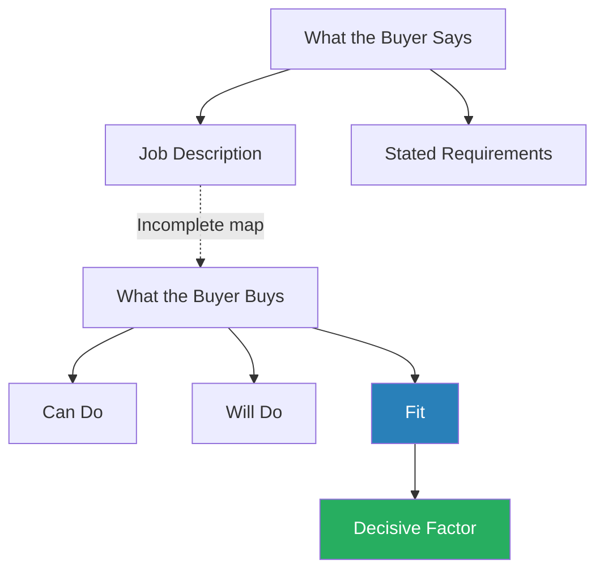
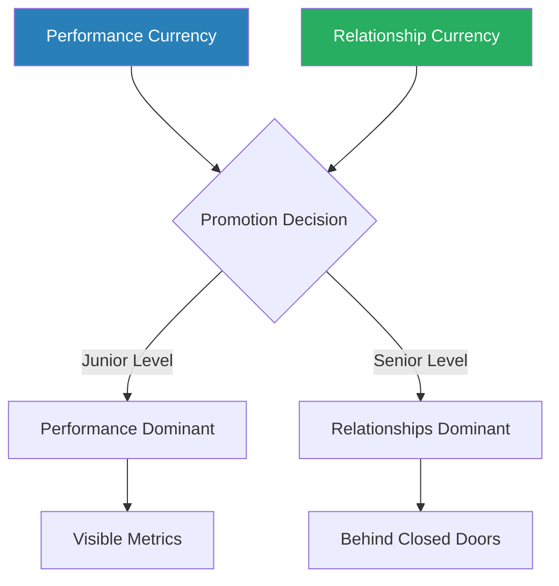
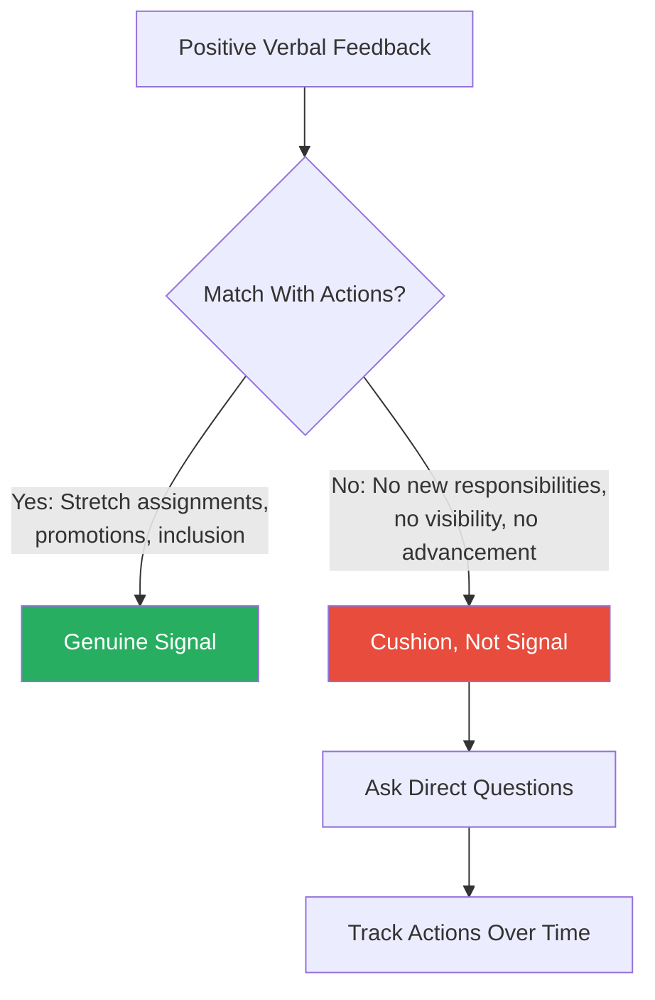
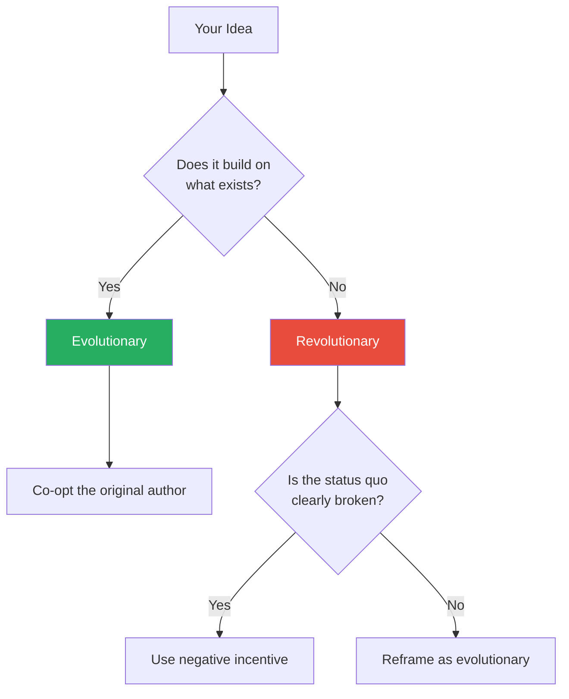
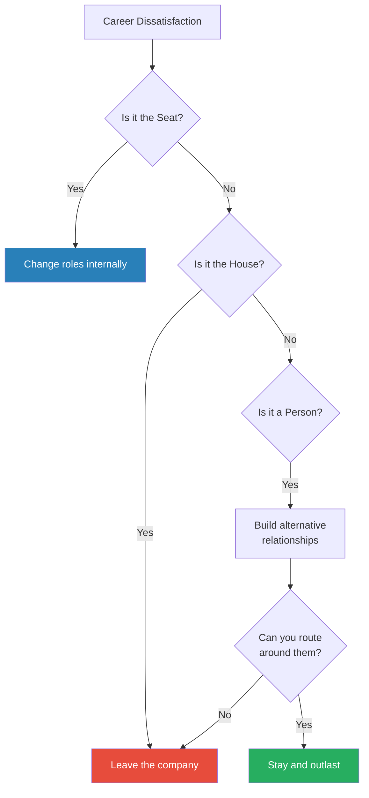
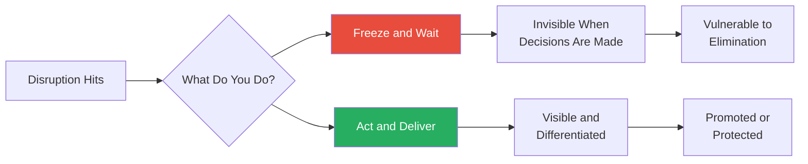

# Strategize to Win — Carla A. Harris

> Carla Harris spent over thirty years climbing the ranks at Morgan Stanley, eventually becoming Vice Chairman, Managing Director, and Senior Client Advisor. Along the way she led landmark transactions across technology, media, and telecom, was named multiple times to *Fortune*'s "Most Powerful Women in Business" list, and became one of the most sought-after speakers on leadership and professional strategy. *Strategize to Win* distils that experience into a field manual for navigating large organisations. Its central argument is deceptively simple: doing excellent work is necessary but never sufficient. Organisations make their most consequential decisions about people — who gets promoted, who gets the stretch assignment, who gets protected in a downturn — based on subjective judgment, and subjective judgment is shaped far more by relationships than by performance metrics. The book provides a practical operating system for three career phases: starting out, stepping up, and starting over. It is not a theory book. It is a playbook for people who want clear moves.

---

## About the Author

Carla A. Harris is Vice Chairman, Managing Director, and Senior Client Advisor at Morgan Stanley, where she has spent more than three decades. She has led landmark transactions worth billions across technology, media, and telecom sectors. *Fortune* has named her to its "Most Powerful Women in Business" list multiple times, and she has served on numerous corporate and non-profit boards. She is also a certified gospel recording artist — a fact that reflects her conviction that professional identity should not be one-dimensional. Her perspective is shaped by a specific and revealing vantage point: navigating the highest levels of Wall Street as a Black woman in a predominantly white, male industry. That experience gives her a sharp, unsentimental eye for the gap between how organisations say they work and how they actually work.

---

## The Big Idea

- Harris's central thesis rests on a distinction that most professionals grasp too late
- There are two forms of capital in any organisation: what you deliver and who trusts you
- She calls these <b style="color: #2980b9">performance currency</b> and <b style="color: #2980b9">relationship currency</b>, and the entire book is built around the argument that most people overinvest in the first and catastrophically neglect the second

- At junior levels, performance is relatively easy to measure:
  - You can compare the analyst who builds a better model to the one who does not
  - You can count the deals closed, the reports delivered, the bugs fixed
- But as you rise, the competitive field narrows:
  - Everyone competing for the same senior role already has strong performance — they would not be in the running otherwise
  - The differentiator becomes something harder to quantify: who has relationships with the people making the decision?
  - Who has been seen operating under pressure?
  - Who would the decision-maker trust with a difficult client, a failing project, a politically sensitive initiative?

- <b style="color: #27ae60">Harris is not arguing that performance does not matter — she is arguing that performance alone creates a ceiling</b>
- The people who break through that ceiling are the ones who invested in relationships at the same time they were building their track record — not as an afterthought, not as a reward for good work, but as a parallel, ongoing discipline

---

- The book is structured around three career phases:
  - **Starting Out** covers how to choose and land a role, how to interview, and how to position yourself for entry
  - **Stepping Up** covers how to build both currencies, how to read the unspoken signals that reveal your real standing, and how to manage your professional profile
  - **Starting Over** covers how to navigate career transitions, manage disruption, and reposition after setbacks
- The thread connecting all three phases is that your career is a strategic project — not something that happens to you, but something you actively design

The three career phases are not sequential stages you graduate through — they are recurring cycles, and the two currencies must be invested in continuously across all of them.

At junior levels, performance currency dominates your investment portfolio. As you step up and especially when starting over, relationship currency, visibility, and sponsor dependence all surge — reflecting Harris's core thesis that what advances you early is not what advances you later.

---

## Key Concepts at a Glance

| Concept | One-line summary |
|---------|-----------------|
| **Performance Currency** | Capital earned by delivering excellent work — necessary but insufficient at senior levels |
| **Relationship Currency** | Capital earned through deliberate investment in people — the dominant factor in advancement decisions |
| **The Sponsor** | Someone who spends their own political capital advocating for you behind closed doors |
| **Career Modules** | Plan your career as six to eight blocks of roughly five years, potentially across multiple companies |
| **Signal Reading** | Interpret what organisations communicate through behaviour, not words |
| **Compensation Anchoring** | Your starting salary creates a gravitational pull on every future offer |
| **The Seat / The House / The Person** | Diagnose dissatisfaction by separating the role, the company, and the individual |
| **Frequency of Touch** | Build relationships through repeated, deliberate, positive interactions over time |
| **Can Do / Will Do / Fit** | The three dimensions every hiring decision evaluates |
| **Evolutionary vs Revolutionary Ideas** | Frame proposals based on whether they extend what exists or require behaviour change |
| **The Five Professional Profiles** | Five workplace archetypes that shape how others perceive your readiness for leadership |
| **Imbalance of Trade** | Invest first in relationships, creating a surplus of goodwill the other person will want to balance |
| **The Risk Premium** | Changing companies costs accumulated currency — price that into every offer |
| **The Trust Factor** | Reliability, consistency, and vulnerability compound into the highest form of relationship capital |

---

## Part I: Starting Out

### Chapter 1: The Content-Jobs-Skills Triad

*Harris cuts through the fog of career planning with a deceptively simple framework that reverses the order most people use — starting with what energises you, not what title sounds impressive.*

- Most people know they want a "better job" but cannot articulate what that means
- They chase titles, prestige, and compensation without asking what activities actually energise them
- The result: roles that look impressive on paper but leave them miserable in practice
- <b style="color: #e74c3c">Miserable people do not build the kind of performance currency that compounds over time</b>
- Harris observed this pattern repeatedly on Wall Street — talented people entering high-prestige roles, burning out within two years, and losing both time and the currency they might have built in a role that actually suited them

---

> [!abstract] The Content-Jobs-Skills Framework
> 1. **Content Page** — list everything you genuinely enjoy doing (not job titles, not industries — actual activities that make you lose track of time)
> 2. **Jobs Page** — identify which roles contain that content (most people start here, which Harris argues is the fundamental mistake)
> 3. **Skills/Experience/Education Page** — map what credentials people in those roles actually have (not what job descriptions say, but what real incumbents brought to the table)

- <b style="color: #2980b9">The Content Page</b> forces honesty about what you actually want to spend your days doing:
  - Do you like analysing data? Persuading people? Building things?
  - Solving complex problems under time pressure?
  - Writing? Teaching? Managing teams?
  - The key discipline is radical specificity — not "I like business" but "I like taking ambiguous financial data and turning it into a narrative that changes someone's decision"
- <b style="color: #2980b9">The Jobs Page</b> follows content, not the reverse:
  - Starting with jobs instead of content means fitting yourself into someone else's definition of a role
  - Starting from content means building outward from your own preferences
  - Harris points out that several seemingly different job titles may contain the same content — and that you would never discover this if you fixated on one title
- <b style="color: #2980b9">The Skills Page</b> reveals gaps — and gaps can be closed:
  - Job descriptions are aspirational wish lists
  - The real question is what successful incumbents actually have
  - Gaps can be closed through deliberate acquisition of experience, not just formal education
  - Harris recommends talking to three to five people currently in your target role and asking what they actually do all day — the answers almost always differ from the job posting

> [!example] The Aspiring VC Who Had It Backwards
> - A young professional Harris mentored had been applying to venture capital firms for months with no success
> - He was increasingly frustrated by the lack of response
> - When Harris walked him through the three worksheets, the Content Page revealed that what he actually enjoyed — evaluating business models, meeting entrepreneurs — existed in several roles beyond VC
> - The Skills Page revealed that successful VC associates typically had either operating experience in startups or deep expertise in a specific industry — he had neither
> - The exercise did not kill his ambition but redirected it: he took a role at a startup to build operating experience
> - His explicit intention was to use that as a launching pad into VC two years later
> **The lesson:** Content first, then jobs, then skills. Most people reverse the order and wonder why they feel stuck.

---

- Harris also introduces the <b style="color: #2980b9">career module concept</b> in this chapter:
  - Rather than thinking of a career as a single linear path, think of it as six to eight blocks of roughly five years each
  - Each module should deliberately build a specific capability or credential
  - Some modules will be at the same company; others will require moving
  - The module framework prevents the common trap of staying in one role for eight years because the work is comfortable, only to discover that the market has moved and your skills have not
  - <b style="color: #27ae60">Each five-year module should have a clear objective — what will you have learned, built, or earned by the end of it?</b>

> [!example] The Banking Analyst Who Planned in Modules
> - A junior analyst at a major bank mapped her first three modules before accepting her first role
> - Module 1 (years 1-5): investment banking — learn financial modelling, deal execution, and how capital markets work
> - Module 2 (years 6-10): private equity — apply the analytical skills from banking to evaluating and managing companies directly
> - Module 3 (years 11-15): operating role at a portfolio company — translate financial skills into operational leadership
> - Each module built on the previous one, and each was chosen for its content alignment with her interests, not its prestige
> - By year twelve, she was a COO at a mid-market company, a role she never would have reached by staying in banking
> **The lesson:** Planning in modules turns a career from something that happens to you into something you design.

> [!tip] Core Insight
> The power of the framework lies in the sequence. Content first. Then jobs. Then skills. Reversing the order is the single most common career-planning mistake.

This flow illustrates how content interests and skills feed into successive career modules, with early modules generating primarily performance currency and later modules increasingly producing relationship currency — the shift Harris considers essential for sustained advancement.

---

### Chapter 2: Know What the Buyer Is Buying

*Harris reveals why the most qualified candidate often loses the job — and why a woman who managed a McDonald's landed a role on Wall Street.*

- Harris addresses a problem she has seen derail thousands of interviews: people pitch what they want to say rather than what the buyer wants to hear
- <b style="color: #27ae60">Every hiring decision evaluates three things</b>:
  - **Can Do** — intelligence, credentials, technical capability
  - **Will Do** — motivation, tenacity, self-starting capacity
  - **Fit** — cultural alignment, personality compatibility
- Of these three, <b style="color: #2980b9">Fit</b> is the most subjective and often the most decisive:
  - Two candidates may be equally qualified on Can Do and equally motivated on Will Do
  - The one who feels like a better cultural fit will get the offer
  - Fit is assessed in the first ninety seconds of an interview — often before a single substantive question has been asked

---

- Job descriptions are incomplete maps of what the employer actually values:
  - The stated requirements list hard skills and qualifications
  - The unstated requirements — the ones that actually determine the outcome — are about trust, ambiguity tolerance, and whether the candidate will make the hiring manager's life easier or harder
- Harris breaks down the mechanics of what interviewers actually evaluate:
  - **Can Do** is the easiest to assess and the least differentiating — most shortlisted candidates meet the technical threshold
  - **Will Do** is assessed through stories, not claims — "tell me about a time when" questions are designed to reveal motivation patterns, not check boxes
  - **Fit** is the invisible filter — it operates through body language, energy, humour, and whether the interviewer can picture working with you at midnight on a difficult project

> [!example] Harris's McDonald's Gambit at Morgan Stanley
> - Harris arrived at Morgan Stanley with only one line of professional experience: managing a McDonald's restaurant
> - On paper, this was disqualifying for an investment banking role
> - But Harris understood what the firm was really buying — not finance expertise (they could teach that)
> - They were buying commercial orientation: had the candidate ever been responsible for a P&L?
> - They were buying peer respect: could the candidate lead a team who did not report to them?
> - They were buying self-motivation: could the candidate produce under pressure without supervision?
> - She reframed her McDonald's experience around these underlying criteria — running a real business with real revenue, managing staff with no obligation to respect her authority, solving problems at two in the morning alone
> **The lesson:** The buyer was buying capability, not credentials — once she understood that, the McDonald's experience became an asset rather than a liability.

> "Figure out what the buyer is buying, then sell that."

---

- <b style="color: #27ae60">This principle extends beyond interviews to every professional interaction</b>:
  - When pitching an idea to a sceptical executive: "What does this person actually care about?"
  - When negotiating compensation: "What does the employer value enough to pay for?"
  - When seeking a sponsor: "What does this senior leader need from someone at my level?"
- The discipline of understanding the buyer's real criteria — as opposed to their stated criteria — is one of the most transferable skills in the book

The gap between what the buyer says they want and what they actually evaluate is where most candidates lose. Fit — the most subjective and least discussed dimension — is usually the deciding factor.

> [!example] The Overqualified Candidate Who Lost on Fit
> - A senior professional applied for a leadership role at a financial services firm
> - His credentials were impeccable — Ivy League degrees, fifteen years of relevant experience, outstanding references
> - He was the strongest candidate on Can Do by a wide margin
> - During the interview, he was formal, precise, and correct — but cold
> - The hiring manager later told Harris: "I couldn't picture working with him on a Saturday"
> - The role went to a candidate with less experience but stronger interpersonal warmth
> - The overqualified candidate never understood why he lost — he assumed credentials would carry the day
> **The lesson:** Can Do gets you into the final round. Fit determines who wins it. You can be the most qualified person in the room and still lose if the buyer cannot picture working alongside you.

> [!tip] Core Insight
> Job descriptions tell you what the company thinks it wants. The buyer's actual decision is driven by unstated criteria — cultural fit, trust, and whether you will make their life easier.

---

### Chapter 3: The Entry Point Problem

*Where you enter an organisation largely determines where you end up — a sobering truth about precedent, compensation gravity, and the invisible constraints most professionals never see until it is too late.*

- <b style="color: #e74c3c">Where you enter an organisation largely determines where you end up</b>
- Organisations operate on precedent:
  - If no one has ever moved from your department to the role you want, the company cannot "see" you in that role — regardless of your capability
  - The path from accounting to strategic finance may look obvious on paper, but if no one has ever made that transition at your firm, you are trying to create a path, not walk one
  - Creating a new path requires a senior leader willing to spend significant political capital on your behalf
  - It is not impossible, but it should never be assumed
- Harris is blunt about the mechanism:
  - Decision-makers think in patterns — they promote people who look like previous successful promotions
  - If every person who has ever moved from department A to department B had a specific profile, that profile becomes the template
  - If your profile does not match the template, you are fighting cognitive inertia as well as organizational structure

> [!example] Ted's Two Lost Years in Accounting
> - Ted, an MBA graduate, entered a financial services firm in the accounting department
> - His plan was to transfer into strategic finance after proving himself
> - He was excellent in accounting — fast, accurate, well-liked
> - When he applied for the strategic finance role two years later, he was not even considered
> - The reason was not performance — the reason was that no one in the firm's history had ever moved from accounting to strategic finance
> - The hiring managers could not picture an accounting person in that role
> - Ted eventually left the firm and entered strategic finance at a competitor — but he lost two years and had to start his relationship currency from zero
> **The lesson:** Capability is irrelevant when the precedent does not exist. Choose your entry point as carefully as you choose the company.

---

- <b style="color: #2980b9">Compensation anchoring</b> compounds the entry point problem:
  - Your starting salary creates a gravitational field that is extraordinarily difficult to escape
  - Companies budget at market rate but offer below it when they can
  - Annual raise percentages are capped by policy — typically three to five per cent
  - Even stellar performance cannot close a gap that opened on day one
  - The problem compounds: prospective employers use your current salary as an anchor for their offer, propagating the deficit through every subsequent role

> [!example] Linda's Twelve-Year Salary Trap
> - Linda spent twelve years at her company delivering excellent work
> - When she finally explored external opportunities, she discovered her salary was roughly fifty per cent below market rate
> - The damage went deeper than lost income — when a prospective employer saw her current compensation, they questioned her competence
> - The reasoning was circular but powerful: if she were truly exceptional, surely she would be paid more?
> - Her low salary had become a signal — and not the signal she intended
> **The lesson:** A starting deficit compounds silently. By the time you discover it, it has become a signal that undermines the very performance currency you spent years building.

> "Every job you take is a five-year bet."

---

> [!abstract] Compensation Defence Protocol
> 1. Research market rate before accepting any offer
> 2. Negotiate in terms of the role's value rather than your current salary
> 3. If you accept below market for strategic reasons — to enter a new industry, to gain specific experience — insist on a written review date
> 4. Attach specific milestones that will trigger a compensation adjustment
> 5. Never allow a starting deficit to compound unchallenged

- Harris is particularly pointed about how compensation anchoring interacts with gender and race:
  - Studies consistently show that women and minorities are offered lower starting salaries than their peers for identical roles
  - Because the deficit compounds through every subsequent offer, the gap widens over a career
  - <b style="color: #e74c3c">A single bad negotiation at age twenty-five can cost hundreds of thousands over a thirty-year career</b>
  - Harris does not offer a systemic solution — she offers an individual one: negotiate harder, earlier, and with more information than your counterpart expects

> [!tip] Core Insight
> Your starting salary is not a starting point — it is a gravitational anchor that pulls on every future offer. Negotiate as if your entire career trajectory depends on it, because it does.

---

## Part II: Stepping Up

### Chapter 4: Performance Currency — Putting Points on the Board

*Harris defines the first of her two currencies with surgical precision — and reveals why the professionals who deliver the most do not always advance the furthest.*

- <b style="color: #2980b9">Performance currency</b> is defined by a formula: intellect + experience + strong execution, multiplied by consistent repetition over time
- It is the capital you earn by delivering excellent work product — the deal closed, the project shipped, the analysis that changed the decision
- <b style="color: #27ae60">You cannot advance without it — performance currency is the price of admission</b>
- But Harris is equally emphatic about its limitations:
  - Performance currency has diminishing returns
  - At senior levels, everyone competing for the same role already delivers strong results
  - Performance currency gets you into the conversation; it does not win the conversation
- The mechanism behind diminishing returns:
  - At junior levels, the range of performance quality is wide — some people are clearly better than others
  - As you advance, the floor rises — the weakest people at each level have already been filtered out
  - By the time you are competing for a senior role, you are competing against people who are all excellent
  - In a field of equally excellent performers, performance itself ceases to be the differentiator

---

- The chapter's most practical contribution is the principle of <b style="color: #2980b9">defining success before you execute</b>

> [!example] Harris's Pyrrhic Victory — The Meeting That Earned Zero Currency
> - Early in her career, Harris was assigned to arrange a meeting with a major potential client — a meeting that had never happened before in the firm's history
> - She pulled it off — the client agreed to meet
> - Harris walked into her boss's office expecting congratulations
> - Instead, her boss shrugged — the client had not bought anything
> - In her boss's mind, the meeting was not the success; the sale was
> - The problem: Harris and her boss had never agreed on what "success" looked like
> - She had assumed arranging an unprecedented meeting was a significant win; he had assumed the only metric that mattered was revenue
> - Both interpretations were reasonable — but because they had never been aligned, Harris earned zero performance currency for an objectively impressive accomplishment
> **The lesson:** If you and your boss have different definitions of success, you can deliver brilliantly and earn nothing.

> [!abstract] Defining Success Before Execution
> 1. Before starting any assignment, negotiate success criteria with your manager
> 2. Separate controllable milestones ("I arranged the meeting, prepared the pitch, delivered the presentation") from uncontrollable outcomes ("the client bought the product")
> 3. Define success in terms of what you can control
> 4. Create discrete, defensible units of performance currency that cannot be dismissed because external variables went the wrong way

---

- <b style="color: #2980b9">The principle of early wins</b> — when entering any new environment, perceptions form fast:
  - If you are seen struggling early on, the organisation decides you are a poor fit before you have had a chance to prove otherwise
  - The halo effect works in reverse: early negative impressions disproportionately weight all subsequent evaluations
- Harris's tactical advice is concrete:
  - If asked for a deliverable by 2:00 PM, deliver by 11:00 AM
  - If asked for a summary of one company, deliver a comparative analysis of two
  - Identify the easiest wins in the first twenty-four to forty-eight hours and execute them immediately
  - <b style="color: #27ae60">The goal is not to show off — the goal is to create an early positive anchor that buys tolerance for the inevitable mistakes</b>

> [!example] The New Hire Who Won the First Day
> - A new hire at an investment bank was given a routine research assignment on his first day
> - Most new hires would have produced a competent summary by the deadline
> - This hire produced the summary by lunch, then added a comparative analysis of two competitors and a one-page strategic implications memo
> - His manager mentioned it at the next team meeting
> - Within a week, senior people were requesting him for projects
> - The extra three hours of work on day one created a reputation that took months for his peers to match
> **The lesson:** Early positive impressions become the lens through which all subsequent performance is evaluated. A strong first week buys forgiveness for a weak third month.

> "Under-promise and over-deliver. Score your points early."

---

- Harris also addresses the <b style="color: #2980b9">visibility problem</b> with performance currency:
  - Doing excellent work that nobody sees earns you nothing
  - Performance currency requires an audience — someone with decision-making authority must observe or hear about your contribution
  - This is not about self-promotion in the shallow sense — it is about ensuring that the work you do reaches the people who make advancement decisions
  - Many professionals, particularly those from cultures that discourage self-promotion, do excellent work in isolation and wonder why they are never recognised
  - <b style="color: #e74c3c">The tree that falls in the forest makes no sound if no decision-maker is listening</b>

> [!example] The Silent Performer Who Got Passed Over
> - A mid-level professional at a consulting firm consistently produced the strongest analyses on her team
> - Her peers relied on her work; her direct manager knew she was excellent
> - But her direct manager had limited influence on promotion decisions — those were made by a committee of partners who had never worked with her directly
> - When promotion time came, the committee discussed candidates they knew personally
> - Her name came up only briefly — her manager advocated for her, but without the weight of personal experience, the committee moved on
> - A less talented peer who had worked directly with two of the committee members was promoted instead
> **The lesson:** Performance currency that no decision-maker witnesses is invisible currency. Ensure your work reaches the people who make the decisions.

> [!tip] Core Insight
> Performance currency is cognitive anchoring applied to professional reputation. The first impression is not just a first impression — it is the frame that shapes every evaluation that follows.

---

### Chapter 5: Relationship Currency — The Other Half of the Equation

*If Chapter 4 establishes the floor, Chapter 5 establishes the ceiling — and reveals why the professionals who invest in people from day one consistently outrun those who wait until their performance is "beyond reproach."*

- <b style="color: #2980b9">Relationship currency</b> is the strength and leverage of your professional relationships:
  - It determines who gets promoted when multiple candidates have comparable performance
  - It gets your name mentioned in rooms you are not in
  - It makes the difference between being a strong contributor and being someone the organisation invests in, protects, and advances

- <b style="color: #e74c3c">The compounding gap</b> — Harris observes a pattern repeated across thirty years:
  - Many professionals — and women in particular — want their performance to be beyond reproach before they invest in relationships
  - They treat relationship-building as something you earn the right to do after proving yourself
  - Meanwhile, others begin building relationships from day one, in parallel with performance
  - By the time both groups have equivalent performance currency, the relationship-builders have years of accumulated trust, familiarity, and social capital
  - At promotion time, when decisions are subjective and multiple candidates are qualified, the relationship gap is decisive

---

- <b style="color: #2980b9">Frequency of touch</b> — the mechanism Harris identifies for building relationship currency:
  - Relationships do not happen organically — they are built through scheduled, intentional contact
  - Coffee meetings, shared commutes, brief check-ins that serve no immediate purpose beyond maintaining the connection
  - Each positive interaction deposits a small amount into the relationship account
  - Over months and years, these deposits compound into trust
  - Harris recommends a concrete cadence: monthly contact with important relationships, quarterly contact with the broader network
  - The contact does not need to be substantive — a forwarded article, a quick congratulations on a win, a two-minute hallway conversation
  - <b style="color: #27ae60">The goal is presence, not depth — you are staying on the person's mental map</b>

> [!example] Harris and the Hostile Trader — A Campaign of Coffee
> - A trader on Morgan Stanley's trading floor initially refused to work with Harris
> - He was dismissive, unresponsive, and actively avoided her
> - Rather than accepting the situation or escalating it, Harris began a campaign of frequency of touch
> - Every morning, she brought him coffee — not every week, every day
> - She did not ask for anything, did not pitch ideas — just brought coffee, exchanged a few words, and left
> - After several weeks, the trader began acknowledging her
> - After a few months, he was actively helping her with trades
> - When she needed emergency assistance on a critical deal — the kind of help that required someone to stay late and absorb personal inconvenience — he was the first to volunteer
> **The lesson:** The daily coffee was not manipulation. It was investment. Each interaction was small, but the cumulative effect was a relationship with genuine trust on both sides.

---

- <b style="color: #2980b9">The imbalance of trade</b> — a related concept for building new relationships:
  - When building a new relationship, invest first
  - Create value for the other person before you ask for anything
  - Over time, the relationship accumulates a surplus — an imbalance — that the other person will instinctively want to balance
- The mechanism is reciprocity:
  - People track social debts intuitively, even unconsciously
  - If you consistently help someone — sharing insights, making introductions, solving their problems — they feel an obligation to reciprocate
  - <b style="color: #e74c3c">But it only works if the investment is authentic — transparently transactional behaviour destroys trust faster than no investment at all</b>
- Harris distinguishes between two types of relationship-building:
  - **Transactional** — I help you so that you will help me (visible, calculated, often counterproductive)
  - **Investive** — I help you because building genuine connections is how I operate (invisible, authentic, and it compounds)
  - The paradox is that the investive approach, which appears less strategic, produces far superior strategic results

> "Performance currency gets you in the door; relationship currency gets you to the top."

---

- Harris also addresses the <b style="color: #2980b9">trust factor</b> in this chapter:
  - Trust is the ultimate form of relationship currency — earned slowly and lost quickly
  - The professionals who advance fastest are not necessarily the most talented — they are the ones who have built the deepest reservoirs of trust with decision-makers
  - Trust is built through three channels:
    - **Reliability** — doing what you say you will do, consistently, without exception
    - **Consistency** — behaving the same way regardless of audience — the same person in front of the CEO as in front of the intern
    - **Vulnerability** — being willing to admit mistakes and ask for help — counter-intuitively, this builds trust faster than projecting invulnerability

- The asymmetry warning:
  - Performance currency is visible — it shows up in deliverables, metrics, and reviews
  - Relationship currency is invisible — it operates behind closed doors, in hallway conversations, in split-second judgments
  - <b style="color: #e74c3c">Because it is invisible, it is easy to neglect — and because it compounds slowly, the cost of neglect is not apparent until it is too late</b>
  - Typically at the moment you are passed over for a promotion you believed you had earned on performance alone

At junior levels, performance currency dominates advancement decisions. At senior levels, where everyone already delivers strong results, relationship currency becomes the decisive factor — and it operates invisibly.

Harris's central argument visualised: at senior levels, performance accounts for only about a fifth of what drives promotion decisions. Relationship currency, sponsor advocacy, and visibility collectively dwarf raw output — explaining why high performers who neglect relationships plateau.

> [!tip] Core Insight
> Performance currency and relationship currency must be built in parallel from day one. Waiting until your performance is "beyond reproach" before investing in relationships creates a compounding gap that may never close.

---

### Chapter 6: Sponsors, Supporters, and the Four Players

*Harris delivers one of the book's sharpest contributions: a taxonomy of the people who affect your trajectory, and a clear-eyed analysis of which ones actually matter — and which ones are silently costing you years.*

- Harris identifies <b style="color: #2980b9">four types of players</b> in every organisation:

| Player Type | Role | Value | Risk |
|------------|------|-------|------|
| **The Sponsor** | Carries your name into rooms you are not in; spends their own credibility advocating for you | Highest — the most important person in your professional life | If they leave or lose power, you lose your voice in decision rooms |
| **The Supporter** | Backs you informally and publicly; says nice things, recommends you for projects | Moderate — well-intentioned but insufficient alone | Mistaking a supporter for a sponsor wastes years |
| **The SNEP** | Reflexive sceptic who defaults to "no" on every proposal | Low — not malicious but draining | Fighting them wastes energy; route around them |
| **The Saboteur** | Actively works against you — through subtle undermining, not overt attacks | Negative — rare but real | Confrontation usually backfires; neutralise through relationships |

Harris warns that most professionals have a dangerously inaccurate map of which players occupy which roles in their career. They assume supporters are sponsors, overlook SNEPs until damage is done, and fail to identify saboteurs until the pattern is unmistakable.

The sponsor's outsized block reflects Harris's insistence that this is the most important person in your professional life — their impact dwarfs the other three combined. Notice the saboteur's small but real footprint: rare, but capable of disproportionate damage when undetected.

---

- <b style="color: #27ae60">The Sponsor is the most important person in your professional life</b>:
  - A sponsor is not merely supportive — they are invested
  - When a promotion decision is being made behind closed doors, the sponsor says: "I have worked with this person, I trust their judgment, and I am willing to stake my reputation on their readiness"
  - The cost to the sponsor is real: if the person they championed fails, the sponsor's judgment is questioned
  - That is what makes sponsorship valuable — it is expensive social capital, spent deliberately
  - Harris uses a vivid metaphor: the sponsor "carries your paper into the room" — your resume, your track record, your case for advancement
  - Without a sponsor, your paper sits on a desk that no one opens

> "Your sponsor carries your paper into the room."

- Harris is adamant: <b style="color: #27ae60">you need two to three sponsors at any given time</b>
  - Relying on a single sponsor is dangerous because sponsors change roles, leave companies, fall out of favour, or simply move on
  - If your sole sponsor departs and you have no replacement, you are suddenly invisible in the rooms where decisions are made
  - The diversification principle applies to sponsors just as it applies to investment portfolios

> [!example] Kelly's Supporter Who Couldn't Deliver
> - Kelly was a high-performing professional whose boss was enthusiastic about her work but lacked political capital within the organisation
> - Kelly's boss praised her constantly, advocated for her loudly, and submitted her name for every promotion cycle
> - But the boss had no real influence with the senior committee that made promotion decisions
> - Kelly watched peers with weaker performance records get promoted — because those peers had sponsors who sat on the committee, or who had the ear of people who did
> - Kelly's boss was a supporter, not a sponsor
> **The lesson:** The distinction between supporter and sponsor cost Kelly years. A supporter without power is like a reference letter without a signature — well-intentioned but insufficient.

---

- **The "Say No to Everything" Person (SNEP)**:
  - Not malicious — simply defaults to no
  - Every proposal, every new initiative, every change is met with reasons it will not work
  - <b style="color: #e74c3c">Do not fight them — they are not worth the energy</b>
  - The correct strategy is to route around them — build consensus with others first, then present the SNEP with a fait accompli
  - Harris notes that SNEPs are often intelligent and experienced — their reflexive scepticism may even contain useful information
  - The problem is not their judgment but their temperament: they cannot distinguish between genuine risk and habitual resistance

- **The Saboteur**:
  - Rare but real — they may feel threatened by your success, bear a grudge, or simply be someone who tears others down to elevate themselves
  - Identify saboteurs early
  - The counter-strategy is not confrontation but relationships: build strong connections with people above and around the saboteur so that their opposition is neutralised by the weight of support from other quarters

> [!example] Neutralising a Saboteur Without a Single Confrontation
> - A mid-level executive discovered that a peer was systematically undermining him in meetings with senior leadership
> - The attacks were not overt — subtle questioning of his judgment, quiet suggestions that his projects were behind schedule
> - The executive's first instinct was to confront the saboteur directly
> - Harris advised against it — instead, the executive invested heavily in relationships with the senior leaders the saboteur was trying to influence
> - He made sure they heard directly from him, not through the saboteur's filter
> - Within six months, the saboteur's influence had evaporated — not because he had been defeated, but because his audience had been co-opted
> **The lesson:** You do not defeat a saboteur by confronting them. You defeat them by making their audience your allies.

---

- The **sponsor vs mentor** distinction is worth lingering on because most professionals confuse them:
  - Mentors are plentiful and cheap — anyone can give advice
  - Sponsors are rare and expensive — they put their own reputation on the line
  - The question is not "who is advising me?" but "who is spending capital on me when I am not in the room?"
  - <b style="color: #e74c3c">If you cannot answer the second question, you have a mentorship problem disguised as a sponsorship problem</b>

| Dimension | Mentor | Sponsor |
|-----------|--------|---------|
| **Cost to them** | Low (time, advice) | High (reputation, political capital) |
| **What they do** | Tell you what to think about | Advocate for you to decision-makers |
| **Where they operate** | In conversations with you | In rooms without you |
| **How many you need** | Many (diverse perspectives) | Two to three (with real power) |
| **How to find them** | Ask | Earn (through demonstrated value) |

This comparison matters because the strategies for cultivating mentors and sponsors are fundamentally different. You can ask someone to be your mentor. You cannot ask someone to be your sponsor — you earn sponsorship by demonstrating that championing you will reflect well on their judgment.

> [!tip] Core Insight
> The question that determines your trajectory is not "who is advising me?" but "who is spending their own capital on me in rooms I am not in?" If you cannot name two to three such people, you have a sponsorship gap.

---

### Chapter 7: Reading the Signals

*Harris argues that the most consequential career information is never stated explicitly — it is signalled through patterns of inclusion, exclusion, and the yawning gap between what is said and what is done.*

- Organisations communicate their most important career information <b style="color: #2980b9">non-verbally</b>:
  - Corporate cultures are allergic to direct negative feedback
  - Legal liability, HR protocols, and cultural norms all conspire to ensure that the most consequential information about your standing is never stated explicitly
  - Instead, it is signalled through patterns: who gets the stretch assignments, who is invited to present, who is mentioned for promotion — and, crucially, who is not

> "What is not said tells you more than what is said."

- <b style="color: #27ae60">The gap between what is said and what is done is the single most important career diagnostic</b>:
  - If your manager says "you are doing a great job" but you are not being promoted, given new responsibilities, or included in strategic conversations — the words are noise
  - The actions are the signal
- Harris identifies several specific signals to watch for:
  - **Inclusion signals** — being invited to meetings outside your formal scope, being asked for your opinion on strategic questions, being introduced to senior visitors
  - **Exclusion signals** — being left off invitations you previously received, being passed over for stretch assignments, hearing about decisions after they have been made
  - **Transition signals** — your manager suggesting lateral moves, being asked to train your replacement, being moved to a "special projects" role with vague scope

---

> [!example] Michael's Positive Feedback That Meant Nothing
> - Michael was a mid-level professional who received consistently positive feedback from his manager
> - "Great work." "Keep it up." "You are a valuable member of this team."
> - But Michael noticed something troubling: his peers were being given stretch assignments — high-visibility projects that put them in front of senior leadership
> - Michael was not
> - He asked his manager about it and received reassurance: "Your time will come"
> - It did not — when the next promotion cycle arrived, Michael was passed over
> - His peers — the ones who had received the stretch assignments — were promoted
> - The positive verbal feedback had been a cushion, not a signal
> **The lesson:** The real signal was the absence of stretch assignments. Positive words without corresponding actions are insulation, not information.

> [!example] Cole's Lifeline Disguised as Career Advice
> - Cole's boss kept suggesting he consider a lateral move to a different department
> - The suggestions were casual, almost offhand: "Have you thought about the marketing team? They could use someone with your skills"
> - Cole dismissed the suggestions — he liked his current role
> - What Cole did not know, and what his boss was not allowed to say directly, was that his department was being eliminated
> - The lateral move suggestion was not career advice — it was a lifeline thrown in the only language the corporate culture permitted
> - By the time Cole understood the signal, the department had been dissolved and the marketing role had been filled
> **The lesson:** Repeated suggestions to move are rarely casual. They are often the most direct warning the corporate environment permits.

---

> [!example] Harris's "Verbose" Blind Spot
> - Early in her career, Harris was never invited to present to senior clients, even though her work was consistently strong
> - She assumed the invitations would come with seniority — they did not
> - When she finally asked her boss directly why she was never included, the answer was uncomfortable: her boss thought she was "verbose" — that she talked too much in presentations
> - This was actionable feedback that had been available for years but was never communicated directly
> - The signal — the absence of presentation invitations — had been there all along
> **The lesson:** She had simply failed to read it. When you detect a gap between verbal feedback and actual behaviour, ask direct, clarifying questions.

The diagnostic is simple: track what the organisation does, not what it says. When the two diverge, the actions carry the truth.

- The practical discipline Harris teaches:
  - Track actions, not words — who is being given what? Who is being included? Who is being asked to present, to travel, to meet clients?
  - When you detect a gap between verbal feedback and actual behaviour, ask direct, clarifying questions
  - <b style="color: #e74c3c">Do not accept vague reassurances</b> — press for specifics: "What would need to change for me to be considered for X?"
  - The answer — or the evasion of the answer — is itself a signal
  - Harris recommends keeping a written record of commitments your manager makes — not as ammunition, but as a diagnostic tool
  - If the same commitment appears three times without action, it is not a commitment — it is a deflection

> [!tip] Core Insight
> If your manager says you are doing great but you are not being promoted, included, or given stretch assignments, the words are noise. The actions are the signal. Track behaviour, not rhetoric.

---

### Chapter 8: Communication and Professional Profile

*Harris reveals that advancement is not determined by what you deliver, but by what people think of you when you are not in the room — and introduces five archetypes that explain why equally talented professionals have wildly different trajectories.*

- Harris introduces the <b style="color: #2980b9">Five Professional Profiles</b> — a taxonomy of workplace archetypes that shape how others evaluate your readiness for advancement:

| Profile | Characteristics | How They Are Perceived | Advancement Potential |
|---------|----------------|----------------------|---------------------|
| **The Good Soldier** | Follows orders, executes reliably, rarely challenges authority | Valued implementer, not a decision-maker | Low — trusted with tasks, not strategy |
| **The Yes Man** | Agrees with everything, never dissents | Comfortable but not trusted for independent judgment | Low — opinion indistinguishable from whoever spoke last |
| **The Arguer** | Always plays devil's advocate, forces rigour into sloppy thinking | Intellectually stimulating but exhausting | Moderate — contribution is real but cost is judged too high |
| **The Safe Pair of Hands** | Executes meticulously but never innovates | Trusted with routine, not with ambiguity | Moderate — reliable but not called for creative problem-solving |
| **The Chief** | Strong vision, comfortable with risk, challenges authority with judgment | Put in charge of things that are broken, new, or important | Highest — consistently associated with senior advancement |

- <b style="color: #27ae60">Only The Chief is consistently associated with leadership advancement</b>
- But the profile must be managed:
  - A Chief who challenges authority without tact becomes an Arguer
  - A Chief who takes risk without delivering results becomes reckless
  - The skill is in calibrating — showing enough independent judgment to be seen as a leader, but not so much that you are seen as unmanageable

---

- Harris unpacks why each non-Chief profile fails at senior levels:
  - **The Good Soldier** is rewarded at junior levels where obedience is valued — but senior roles require independent judgment, and Good Soldiers have never demonstrated it
  - **The Yes Man** is comfortable to have around — but when a real decision needs to be made, no one trusts the Yes Man's opinion because they have never offered a genuine one
  - **The Arguer** creates real value by challenging weak thinking — but the cost in social friction is judged too high; decision-makers do not want to fight through resistance every time they propose something
  - **The Safe Pair of Hands** is the most frustrating archetype because they are genuinely excellent at execution — but leadership requires navigating ambiguity, not just executing with precision

> [!example] The Good Soldier Who Hit a Ceiling
> - A senior associate at a law firm had done everything asked of her for nine years — perfectly
> - Every assignment completed on time, every client satisfied, every partner who worked with her gave positive feedback
> - When she was passed over for partner, the feedback was: "We do not know what she thinks"
> - In nine years of flawless execution, she had never expressed a strategic opinion, challenged a partner's reasoning, or proposed an alternative approach
> - She had demonstrated that she could execute someone else's vision — but not that she could create her own
> - The partners could not picture her leading a practice group because she had never shown them what leadership from her would look like
> **The lesson:** The Good Soldier earns gratitude but not advancement. Leadership requires demonstrating judgment, not just obedience.

---

- Harris also addresses <b style="color: #2980b9">communication across generations</b>:
  - Different generational cohorts have different expectations about formality, directness, and the role of hierarchy
  - What reads as respectful deference to a Boomer executive may read as passivity to a Gen X manager
  - What reads as refreshing directness to a Millennial peer may read as insubordination to a senior partner
  - The discipline is reading your audience and calibrating accordingly — the same message, delivered differently, can produce opposite reactions
- Harris provides a specific calibration framework:
  - **Observe before you communicate** — watch how successful people at your target level communicate in your specific organisation
  - **Mirror the energy** — match formality, directness, and pace to your audience
  - **Separate the message from the medium** — the same critical feedback can be delivered in a way that builds trust or destroys it

> [!tip] Core Insight
> Your professional profile is not what you do — it is how you are perceived when you are not in the room. Only The Chief archetype is consistently associated with senior advancement, but it requires calibration: enough independent judgment to be seen as a leader, not so much that you are seen as unmanageable.

---

### Chapter 9: Evolutionary vs Revolutionary Ideas

*Harris provides a tactical framework for pitching change — and reveals why the same idea, framed differently, can be embraced or destroyed before it is even heard.*

- When attempting to influence your environment, Harris advises categorising your idea before pitching it:

- <b style="color: #2980b9">Evolutionary ideas</b> build on something that already exists:
  - They are extensions, improvements, enhancements
  - Easier to sell because they do not require anyone to change their fundamental behaviour
  - Strategy: co-opt the original author — position your contribution as a natural extension of their work
  - This gives the original author a stake in your idea's success and removes the threat that you are trying to replace what they built

> [!example] The "Phase 2 Enhancement" That Disarmed a Senior Partner
> - A junior analyst wanted to improve the firm's client reporting process
> - The existing process was inefficient but had been designed by a senior partner who was protective of his systems
> - Rather than proposing a replacement — which would have been received as an attack — the analyst framed his improvement as a "Phase 2 enhancement" of the senior partner's original design
> - He credited the partner's framework as the foundation
> - The partner, feeling validated rather than threatened, championed the improvement himself
> **The lesson:** Evolutionary framing turns potential opponents into champions. Credit the foundation, then build on it.

---

- <b style="color: #2980b9">Revolutionary ideas</b> require a change in behaviour:
  - They do not build on what exists — they replace it
  - Harder to sell because they implicitly criticise the status quo, and the status quo has defenders
  - They require either a **positive incentive** (a clear reward for adoption that outweighs the discomfort of change) or a **negative incentive** (a clear cost for non-adoption that makes the status quo untenable)

- <b style="color: #27ae60">The same idea can be framed as either evolutionary or revolutionary depending on presentation</b>:
  - A new data analytics platform pitched as "a replacement for our current system" = revolutionary (threatening)
  - The same platform pitched as "an upgrade that builds on what we have learned from the current system" = evolutionary (inviting)
  - The content may be identical — the framing determines the reception

> [!example] The Technology Overhaul That Succeeded by Looking Incremental
> - A technology director at a financial services firm needed to replace the entire trading platform — a genuinely revolutionary change
> - Previous attempts to propose the replacement had been killed by senior traders who were comfortable with the existing system
> - The director reframed the project as a series of "enhancements" — each one small enough to be non-threatening
> - Enhancement 1 added a new data feed to the existing platform
> - Enhancement 2 modernised the interface while keeping the workflow identical
> - Enhancement 3 moved the back end to new infrastructure while preserving the front end
> - By the time Enhancement 5 was complete, every component of the original system had been replaced — but no single step had felt revolutionary
> **The lesson:** Revolutionary change, delivered as a series of evolutionary steps, avoids triggering the defenders of the status quo.

---

- Harris advises defaulting to evolutionary framing whenever possible:
  - Revolutionary framing should be reserved for situations where the status quo is so clearly broken that everyone already agrees it needs to change
  - <b style="color: #e74c3c">Even then, giving the defenders of the old system a role in building the new one reduces resistance dramatically</b>

Before pitching any idea, categorise it. Default to evolutionary framing — it co-opts defenders rather than creating them.

> [!tip] Core Insight
> Default to evolutionary framing whenever possible. Revolutionary ideas create defenders of the status quo. Evolutionary ideas turn those same people into champions of your proposal.

---

## Part III: Starting Over

### Chapter 10: The Seat, the House, or the Person

*When professionals feel stuck, Harris argues that the first step is diagnosis, not action — and most people conflate three distinct problems whose solutions are entirely different.*

- Most people conflate three distinct problems, and the solution for each is different:

- <b style="color: #2980b9">The Seat</b> is your specific role:
  - If the problem is the seat, you dislike the actual work you are doing
  - The content does not match your interests, the scope is too narrow or too broad, the responsibilities do not play to your strengths
  - The solution is to change roles — but not necessarily companies
  - Internal mobility may solve a seat problem without the cost of losing your accumulated currency

- <b style="color: #2980b9">The House</b> is the company or organisation:
  - If the problem is the house, the issue is cultural, structural, or strategic
  - The company's values do not align with yours, the industry is declining, the leadership is dysfunctional
  - The solution is to leave — but to leave for the right reason, not because of a problem that will follow you

- <b style="color: #2980b9">The Person</b> is a specific individual making your professional life difficult:

> "If neither the seat nor the house is the problem, it's the person."

- <b style="color: #e74c3c">You should almost never leave a company because of one person</b>:
  - People change roles, get promoted, transfer, or leave
  - The person who is blocking you today may be gone in six months
  - If you like the seat and the house, leaving surrenders all your accumulated performance and relationship currency — years of investment — because of one individual

---

- The correct response to a person-problem:
  - Invest in your boss's boss
  - Build connections in adjacent departments
  - Create multiple pathways to visibility and advancement so that no single person has veto power over your trajectory
  - <b style="color: #27ae60">Every person can be navigated, routed around, or outlasted — as long as you have not abandoned the organisation out of frustration</b>

> [!example] The Manager Who Stole Credit — And How She Outlasted Him
> - A woman was ready to resign because her manager consistently took credit for her work
> - The manager would present her analyses to senior leadership as his own, volunteer her for projects and then present the results himself, and systematically keep her away from direct interaction with decision-makers
> - Harris's advice was not to confront the manager — that would have created a war she could not win
> - Instead, she was advised to build direct relationships with the senior leaders herself
> - She began attending industry events where the senior leaders were present
> - She volunteered for cross-functional task forces that gave her visibility outside her manager's control
> - Within a year, the senior leaders knew her name, knew her work, and knew her capabilities — independently of her manager's representations
> - When the manager eventually left the firm, she was the natural choice for his replacement
> **The lesson:** You do not defeat a credit-stealing manager by confrontation. You defeat them by making yourself visible through channels they do not control.

---

- The diagnostic sequence matters:
  - Harris insists on diagnosing in order: seat first, then house, then person
  - If the seat is the problem, changing companies solves nothing — you will land in the same type of role at a new firm
  - If the house is the problem, no amount of internal manoeuvring will fix a cultural or structural issue
  - If the person is the problem, leaving is the most expensive solution — and usually unnecessary

> [!example] The VP Who Confused the Seat for the House
> - A vice president at a technology company was convinced the company was the problem — the culture felt stifling, innovation seemed impossible, and she dreaded Monday mornings
> - She was preparing to resign when Harris asked her to separate the three variables
> - The house was actually strong — the company was growing, the leadership was competent, and the mission aligned with her values
> - The person was not a problem — her manager was supportive and fair
> - The seat was the problem — she was in operations, and everything she loved (strategy, client interaction, creative problem-solving) had been stripped from the role during a restructuring
> - She moved to a strategy role within the same company, kept her accumulated currency, and within six months was thriving
> **The lesson:** The most expensive career decisions are driven by misdiagnosis. Separate the variables before you act.

- The only exception Harris acknowledges:
  - When the blocking person has absolute control over your career and no counter-balance exists
  - In a very small organisation, or under a manager who reports directly to the CEO with no peers and no oversight, the "work around" strategy may genuinely be impossible
  - In those cases, leaving is rational — but it should be a last resort, not a first instinct

Diagnose before you act. The seat, the house, and the person each require different solutions — and conflating them leads to decisions you cannot undo.

> [!tip] Core Insight
> Never leave a company because of one person unless that person has absolute, unchecked control over your career. People leave. Your accumulated currency does not follow you.

---

### Chapter 11: Compensation and the Risk Premium

*Harris returns to compensation in the context of career transitions, arguing that a lateral salary move to a new company is not lateral at all — it is a step backward, because the intangible capital you surrender has real value.*

- When changing organisations, you are always taking on risk:
  - You are entering a new culture where you have no track record
  - You have zero performance currency — everything you built at your previous company stays there
  - You have zero relationship currency — every connection, every champion, every person who knows your work must be rebuilt from scratch
  - You are, in economic terms, starting over

- <b style="color: #27ae60">This risk has a cost, and it should be priced into any offer</b>:
  - Moving laterally in compensation while changing companies is not a lateral move — it is a step backward
  - The intangible capital you are surrendering has real value

> "Never move for the same salary."

---

- Harris advises quantifying the risk explicitly:
  - **What you are giving up:** known culture, established relationships, a track record that has been observed and validated, a reputation that precedes you into every meeting
  - **What you are gaining:** an unknown culture, an unproven team, a manager you have never worked with, a set of expectations you may or may not be able to meet
  - The gap between what you are giving up and what you are gaining is the <b style="color: #2980b9">risk premium</b>, and it should be reflected in compensation

> [!abstract] The Risk Premium Calculation
> 1. Quantify your accumulated currency at your current company — how long did it take to build, and what is it worth in terms of access, trust, and protection?
> 2. Estimate the rebuilding time at the new company — typically eighteen to twenty-four months to reach equivalent standing
> 3. Calculate the financial value of the gap — during the rebuilding period, you are more vulnerable to restructuring, less likely to receive top-tier assignments, and less visible to decision-makers
> 4. Add a premium to the offer that compensates for this vulnerability period
> 5. If the new company will not pay the premium, that tells you something about how they value you

---

- The one exception — the industry switch:
  - When entering a new field where you have no relevant experience, both you and the employer are sharing the risk
  - The employer is gambling that your transferable skills will translate
  - You are gambling that the new industry will suit you
  - Lateral or even slightly reduced compensation can be rational — but it should be explicitly time-bounded
  - Harris advises negotiating a written review date, typically six months, with specific milestones that will trigger a compensation adjustment if met
  - <b style="color: #e74c3c">Without a written review date, the "temporary" discount becomes permanent</b>

> [!example] The Consultant Who Negotiated a Reset Clause
> - A management consultant was transitioning to an operating role at a technology company
> - The company offered lateral compensation, arguing that she had no industry experience
> - She accepted the logic but negotiated a clause: if she met three specific performance milestones within six months, her compensation would be adjusted to the seventy-fifth percentile of market rate
> - She met all three milestones within four months
> - The company honoured the clause — and privately, the hiring manager told Harris that the negotiation itself had increased his confidence in the candidate
> - She had demonstrated exactly the kind of commercial judgment they were hiring for
> **The lesson:** Accepting a strategic discount is rational. Accepting a permanent discount is careless. Build reset mechanisms into every concession.

> [!tip] Core Insight
> A lateral salary move to a new company is not lateral — you are surrendering years of accumulated performance and relationship currency. Price that risk into every offer.

---

### Chapter 12: Managing Through Change and Disruption

*Careers do not unfold in straight lines. Harris closes the book with the argument that disruption is not the exception but the norm — and the professionals who thrive are the ones who treat chaos as an opening, not a threat.*

- Industries contract, companies merge, managers change, projects get cancelled
- The professionals who sustain long careers are not the ones who avoid disruption — disruption is unavoidable — but the ones who manage through it effectively
- Harris observed this pattern acutely during the 2008 financial crisis:
  - Entire teams were eliminated overnight
  - The professionals who survived were not necessarily the most talented — they were the ones with the deepest relationship currency and the broadest sponsor networks
  - When decisions about who stays and who goes are made in forty-eight hours, the people making those decisions rely on trust and familiarity, not performance reviews

Harris offers several principles for navigating career disruption:

- **Maintain your performance currency during transitions**:
  - When an organisation is in flux — during a merger, a restructuring, a leadership change — many professionals freeze
  - They stop producing and wait for clarity
  - <b style="color: #e74c3c">This is exactly wrong</b> — disruption is when visibility is highest and competition is lowest
  - While everyone else is waiting, the professional who continues to deliver creates a stark contrast that decision-makers notice

---

- **Protect your sponsors during disruption**:
  - In a merger, your sponsor may lose power
  - In a restructuring, your sponsor may be eliminated
  - When your sponsor's position changes, your position changes — whether you realise it or not
  - <b style="color: #27ae60">Maintain awareness of your sponsor's standing and begin cultivating replacement sponsors before you need them, not after</b>

- **Use disruption as an opportunity to reset**:
  - A new leader, a new structure, a new strategy — these are all openings
  - The precedents that constrained you may no longer apply
  - The people who blocked you may no longer be in position
  - Disruption dissolves the gravitational pull of the status quo, and for a brief window, mobility increases
  - The professionals who recognise this window and move through it gain ground
  - The ones who wait for the dust to settle find that by the time it does, new precedents have hardened and new constraints have formed

> [!example] The Mid-Level Manager Who Thrived in a Merger
> - A division was merged into a larger business unit during a corporate restructuring
> - Most of the division's employees spent months worrying about whether their jobs were safe
> - One mid-level manager took a different approach: she identified the incoming leadership team, researched their priorities, and began producing work that directly addressed those priorities — before anyone asked her to
> - When the merger was complete and the new leaders were deciding who to keep, who to promote, and who to let go, she was the person who had already demonstrated alignment with their vision
> - She was promoted; several of her peers, who had been waiting anxiously for instructions, were let go
> **The lesson:** Disruption is when visibility is highest and competition is lowest. The professionals who act while others freeze are the ones who emerge stronger.

---

- **Build a disruption-ready network**:
  - Harris argues that your external network is your insurance policy against internal disruption
  - If your entire professional network is inside one company, a restructuring can eliminate your entire support system overnight
  - Maintain relationships outside your company — in your industry, in adjacent industries, in your alumni networks
  - These external relationships have zero value during normal times and enormous value during disruption
  - <b style="color: #27ae60">The time to build your external network is when you do not need it</b>

> [!example] The Executive Whose External Network Saved His Career
> - A senior executive at a media company was let go during an industry contraction
> - Unlike many of his peers, he had maintained active relationships with people across the industry — not for transactional reasons, but through genuine frequency of touch over many years
> - Within two weeks of his departure, he had received three offers — all from people he had helped, mentored, or simply stayed in contact with during the preceding decade
> - His peers, who had invested exclusively in internal relationships, took six to twelve months to find comparable roles
> **The lesson:** Internal relationships build your career inside one company. External relationships insure your career across all companies. You need both.

The professionals who treat disruption as a window — not a wall — are the ones who emerge from it in a stronger position than they entered.

> [!tip] Core Insight
> Disruption dissolves the status quo. For a brief window, precedents loosen and mobility increases. The professionals who move through that window gain ground. The ones who wait find new constraints hardened around them.

---

## Key Quotes

- "Performance currency gets you in the door; relationship currency gets you to the top."
- "Your sponsor carries your paper into the room."
- "If neither the seat nor the house is the problem, it's the person."
- "What is not said tells you more than what is said."
- "Every job you take is a five-year bet."
- "Under-promise and over-deliver. Score your points early."
- "Figure out what the buyer is buying, then sell that."
- "Never move for the same salary."

---

## The Verdict

*Strategize to Win* is a clear, practical operating system for navigating large corporate organisations. Its greatest contribution is the <b style="color: #2980b9">two-currency model</b>, which reframes the relationship between performance and advancement in a way that is immediately actionable. The insight that performance currency is necessary but has diminishing returns — and that relationship currency becomes the dominant factor precisely when the stakes are highest — is one of those ideas that seems obvious in retrospect but that most professionals internalise too late. The <b style="color: #2980b9">signal-reading framework</b> is equally valuable: the discipline of tracking what organisations do rather than what they say is a skill that, once developed, changes how you interpret every meeting, every review, and every casual conversation with your manager. The <b style="color: #2980b9">compensation anchoring</b> principle alone could save a professional tens of thousands of pounds over a career.

The book's weakness is intellectual depth. Harris provides no citations to research, studies, or data beyond her own extensive but anecdotal experience. The illustrative stories may be composites; they are certainly not documented case studies. The five-year module model is asserted as fact without empirical backing — why five years and not three or seven? The advice assumes a fundamentally functional corporate environment where strategic manoeuvring will be rewarded. It does not meaningfully address what to do when the system itself is broken — when sponsors do not exist, when the culture is actively hostile, when the entire concept of "relationship currency" is undermined by structural dysfunction. Harris acknowledges systemic barriers — particularly around gender and race — but her solutions remain stubbornly individual. The gap between "here is a systemic problem" and "here is what you, personally, can do about it" is never fully bridged.

The reader who will benefit most from this book is the mid-career professional in a large organisation who has been relying on performance alone and wondering why advancement has stalled. If you have ever thought "my work should speak for itself" and been frustrated that it did not, this book will explain why — and give you a concrete alternative. It is less useful for people in small companies, startups, or non-corporate environments where the dynamics Harris describes may not apply. It is also less useful for people who are already sophisticated about organisational politics; for them, the two-currency model will feel familiar even if the terminology is new.

Compared to other books in this space, *Strategize to Win* occupies a practical middle ground. It is less theatrical and less historically grounded than Robert Greene's work on power dynamics, but more actionable for day-to-day corporate life. It is less research-heavy than Herminia Ibarra's *Act Like a Leader*, but more prescriptive — Harris tells you what to do, not just what to think about. It pairs well with [[Never Split the Difference - Chris Voss|Never Split the Difference]] for the negotiation chapters and with [[Influence - Robert Cialdini|Influence]] for the psychological mechanisms (reciprocity, anchoring, social proof) that underpin Harris's relationship model. Read it as a field manual, not a theory book. The operating system is sound even if the theoretical foundations are thin.

---

## Related Reading

- [[The 48 Laws of Power - Robert Greene|The 48 Laws of Power]] — the power dynamics that Harris acknowledges but never confronts directly; Greene provides the missing political layer
- [[Never Split the Difference - Chris Voss|Never Split the Difference]] — tactical negotiation techniques that complement Harris's compensation anchoring principle
- [[Influence - Robert Cialdini|Influence]] — the psychology behind reciprocity, anchoring, and social proof that underpins Harris's relationship-currency model
- [[Expect to Win - Carla A. Harris|Expect to Win]] — Harris's first book, covering the earlier phase of her career with more personal narrative and foundational principles
- [[Corporate Confidential - Cynthia Shapiro|Corporate Confidential]] — the unwritten rules that Harris signals obliquely; Shapiro names them explicitly
- [[Power - Jeffrey Pfeffer|Power]] — the academic framework for the organisational dynamics Harris navigates intuitively
- [[Stealing the Corner Office - Brendan Reid|Stealing the Corner Office]] — a more aggressive, less diplomatic take on the same territory Harris covers
