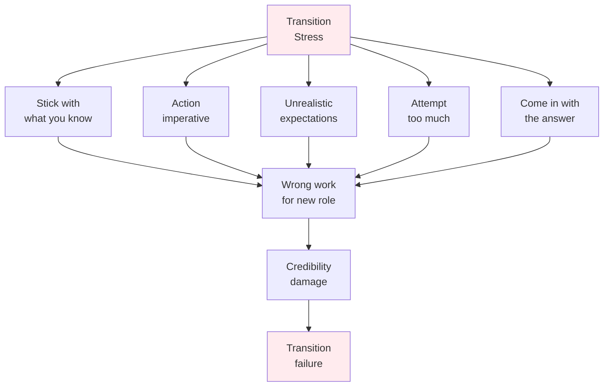
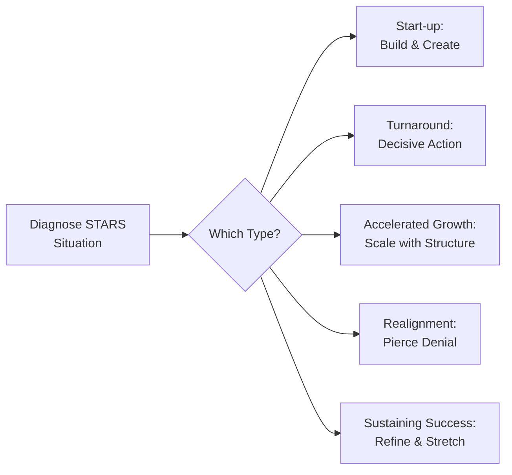
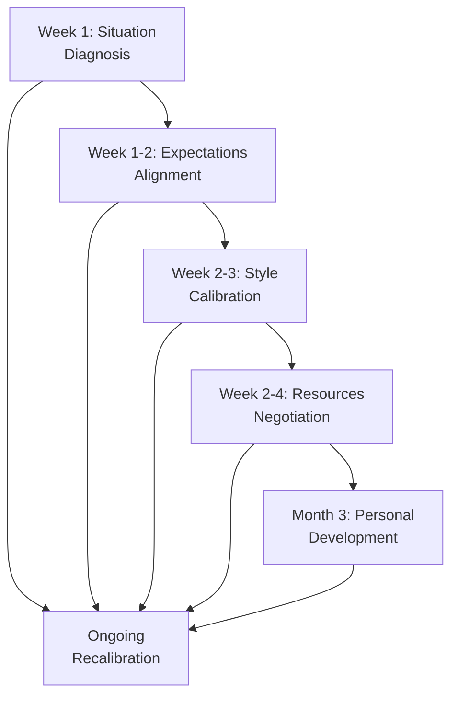
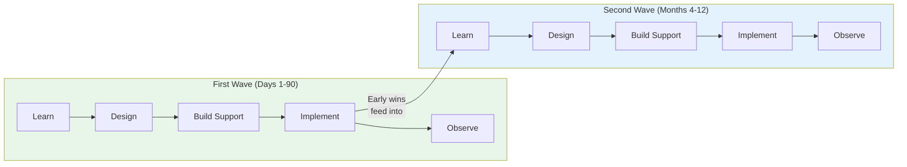
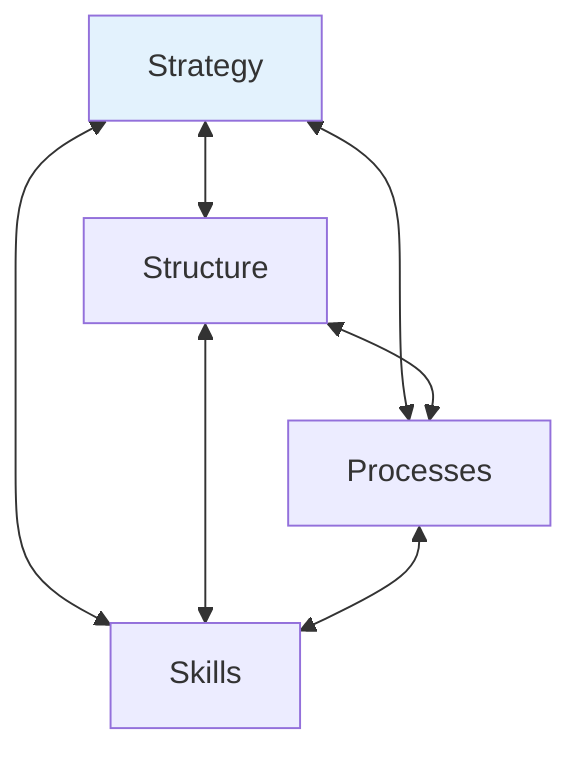
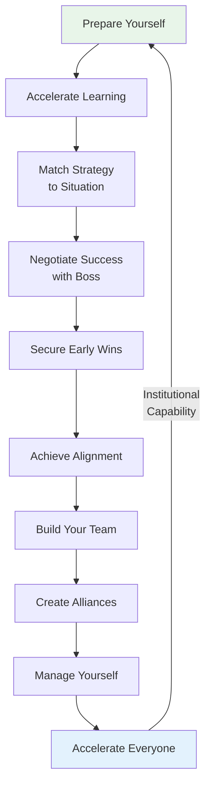

# The First 90 Days — Michael D. Watkins

> Michael Watkins' premise is that leadership transitions are the most consequential and under-managed moments in any career.
> The first 90 days in a new role set your trajectory — credibility, relationships, momentum, and long-term effectiveness all crystallise in this window.
> His system of ten interlocking challenges provides a repeatable framework for reaching what he calls the **break-even point** — the moment you shift from net consumer to net creator of value — up to 40% faster than leaders who wing it.
> The book is structured as a manual: each chapter covers one challenge, provides diagnostic tools, illustrates the principle with case studies, and closes with a self-assessment checklist.
> It is the standard reference for anyone stepping into a new role, and the rare business book whose frameworks genuinely hold up under pressure.
> Watkins draws on a decade of consulting with Fortune 500 companies and coaching hundreds of VP- and Director-level leaders through role changes, making this less a theoretical argument and more a practitioner's field guide.

---

## About the Author

Michael D. Watkins is a professor at IMD Business School in Lausanne, Switzerland, and was previously on the faculty at Harvard Business School and the Kennedy School of Government. He co-founded Genesis Advisers, a consultancy specialising in leadership transitions, and has coached hundreds of senior leaders through role changes at organisations including Johnson & Johnson, FedEx, and the United Nations. His academic background is in negotiation and organisational behaviour, but the book reads more like a senior consultant's accumulated wisdom than an academic treatise. The 2013 updated edition expanded the original 2003 text with new research on onboarding from outside organisations, managing transitions in matrix structures, and accelerating transitions at an enterprise level. His perspective is pragmatic and consultant-flavoured — light on academic theory, heavy on actionable frameworks and diagnostic tools that leaders can apply immediately.

---

## The Big Idea

- Every role transition creates a period of maximum vulnerability and maximum opportunity
- New leaders are net consumers of organisational value from the moment they arrive — asking questions, absorbing resources, learning the landscape, drawing on other people's time and attention
- The <b style="color: #2980b9">break-even point</b> is when that equation flips and you begin contributing more than you consume

- CEOs estimate this takes roughly 6.2 months for a typical midlevel leader
- Watkins argues the right system can compress that window significantly — his research with Genesis Advisers clients suggests up to 40% faster, though this figure comes from self-reported data and should be treated as indicative rather than scientific

- The book's core argument is that transition success is not about individual heroics or innate talent
- It is about systematically diagnosing the situation, building the right relationships, and creating momentum through disciplined early action
- Ten challenges, addressed in parallel rather than sequentially, form the architecture of an effective transition
- <b style="color: #e74c3c">Miss any one and the others are weakened</b> — a misdiagnosed situation leads to wrong early wins, wrong early wins damage credibility, damaged credibility makes alliance-building impossible, and so on in a cascading failure

- <b style="color: #27ae60">The best use of the first 90 days is not to prove yourself — it is to build the infrastructure that makes proving yourself inevitable</b>
  - Relationships, credibility, shared expectations, a written plan — these are the foundation
  - The leader who sprints to show immediate impact often creates the wrong kind of attention
  - The leader who builds the right foundation earns compound returns

The structured approach reaches the break-even point (where you shift from consuming value to creating it) around month 3 — roughly 40% faster than an unstructured transition, which may not reach break-even until month 5 or later. This gap compounds: every month spent below zero is a month of organisational drag.

---

## Key Concepts at a Glance

| Concept | One-line summary |
|---------|-----------------|
| **Break-Even Point** | The moment you shift from consuming value to creating it — your singular transition metric |
| **STARS Model** | Five business situations (Start-up, Turnaround, Accelerated Growth, Realignment, Sustaining Success), each demanding a different approach |
| **Five Conversations** | A structured framework for building the boss relationship around situation, expectations, resources, style, and development |
| **Waves of Change** | Leaders implement change in distinct waves — first for credibility, second for deeper structural reform |
| **FOGLAMP** | A project planning checklist for early wins: Focus, Oversight, Goals, Leadership, Abilities, Means, Process |
| **Transition Traps** | Five common failure modes: sticking with what you know, the action imperative, unrealistic expectations, attempting too much, coming in with "the answer" |
| **Influence Landscape** | Mapping supporters, opponents, and persuadables to identify winning and blocking alliances |
| **90-Day Plan** | A written, boss-endorsed contract divided into three 30-day blocks with review meetings at each milestone |
| **Advice-and-Counsel Network** | Three types of advisers: technical advisers, cultural interpreters, and political counsellors |
| **Organisational Architecture** | Four elements — strategy, structure, processes, skills — that must be aligned for performance |

---

## The Five Transition Traps

*Before diving into the ten chapters, Watkins identifies the failure modes that most commonly derail transitions — background forces that cut across all ten challenges and pull leaders off course.*

**1. Sticking with what you know:**
- The skills that earned you your last success become a security blanket
- A marketing expert promoted to general management keeps micromanaging marketing campaigns because that is where they feel competent
- A process specialist hired into a creative role keeps imposing process because structure feels productive
- <b style="color: #e74c3c">You feel busy and effective — you are doing good work — but it is the wrong work for your new role</b>
- The psychological mechanism is powerful: competence produces dopamine, and the unfamiliar work of your new role produces anxiety
- You gravitate toward what makes you feel capable, not toward what the role actually demands

**2. The action imperative:**
- The pressure to "do something" in the first days is overwhelming
- It almost always comes from inside — the anxious need to justify your appointment — not from genuine external urgency
- Acting before understanding creates a vicious cycle:
  - Uninformed decisions damage credibility
  - Damaged credibility makes people less willing to share information
  - Less information leads to more uninformed decisions
- The action imperative is especially dangerous for leaders who were promoted because of their bias toward action — the very quality that earned the role becomes a trap in the transition period

**3. Setting unrealistic expectations:**
- The hiring or promotion process is full of optimism and flattery
- You arrive believing you have more latitude, more resources, and more time than you actually do
- When reality bites, you have already committed to targets that cannot be met
- This trap is bidirectional — your new boss may also have unrealistic expectations of how quickly you can deliver, and failing to negotiate those expectations early means being judged against an impossible standard

**4. Attempting too much:**
- Launching multiple initiatives simultaneously fragments your attention, confuses the organisation about your priorities, and ensures that no single initiative gets the energy it needs to succeed
- <b style="color: #e74c3c">Five mediocre results are worse than one visible win</b>
- The temptation is understandable: there are many problems, you see them all, and your instinct is to fix everything at once
- But organisational attention is a finite resource — when you launch five initiatives, people must divide their attention across all five, and none gets the focus needed to succeed

**5. Coming in with "the answer":**
- You solved this problem at your last company, so you impose that solution on your new one
- This is the fastest way to trigger organisational resistance, because it signals that you do not respect the new environment's complexity or its people's expertise
- Even if your solution is correct, the process of importing it without local consultation creates enemies who will work to ensure it fails

---

- Watkins treats these traps not as personality flaws but as predictable cognitive patterns that even the most talented leaders fall into under the stress of transition
- <b style="color: #27ae60">The antidote is awareness and discipline, not talent</b>
- Knowing these traps exist does not make you immune — but it makes you alert to the warning signs

All five traps stem from the same root — the stress and anxiety of transition — and all five converge on the same outcome: credibility damage that compounds into failure.

---

## Chapter 1: Prepare Yourself

*The most important transition work begins before you start the new role — and the skills that earned you your current position may be liabilities in the next one.*

- Success reinforces specific behaviours, creating what Watkins calls a <b style="color: #2980b9">"strong arm"</b>
- A brilliant engineer promoted to engineering manager keeps solving technical problems instead of building team capability
- A skilled negotiator promoted to lead a division keeps negotiating deals instead of developing strategy
- The strong arm feels natural — it is the domain where you feel most competent and where your efforts produce the most immediate results
- <b style="color: #e74c3c">What feels productive is not always what is needed</b>

- The mechanism is straightforward:
  - You were promoted because you excelled at a specific set of tasks
  - Those tasks are now either someone else's job or a small fraction of your new responsibilities
  - But your identity is still wrapped up in being great at those tasks
  - The gap between what you are good at and what your role demands is the transition gap — and your strong arm keeps pulling you back to close it in the wrong direction

> [!example] Julia Gould's Promotion Trap
> - Julia Gould was a star marketing performer — one of the best individual contributors her company had ever seen
> - Her reward was promotion to a cross-functional leadership role overseeing marketing, sales, and product development
> - Within six months, she was failing
> - She spent her time reviewing marketing campaigns, offering detailed feedback on copy and positioning — jumping into the work she knew best
> - Meanwhile, sales performance was declining and the product team felt ignored
> - Julia was not lazy or incompetent — she was trapped by her own success
> - The skills that had made her exceptional as a marketer made her average as a cross-functional leader
> - Her direct reports in marketing loved the attention; everyone else felt abandoned
> **The lesson:** The strong arm that earned you the promotion can strangle you in the new role.

---

### Promotion vs. Onboarding: Two Different Transitions

*Watkins distinguishes between being promoted within your organisation and joining a new one entirely — they share the same ten challenges but differ in critical ways.*

- An internal promotion keeps your relationships and cultural knowledge intact but demands a shift in perspective
  - You already know the people, the politics, and the processes
  - But you must now relate to those people differently — former peers become direct reports, former equals become subordinates
  - <b style="color: #e74c3c">The hardest part of an internal promotion is renegotiating relationships that were built on equality</b>
- An external hire demands rebuilding everything from scratch — relationships, cultural knowledge, credibility, networks
  - But you arrive without the baggage of existing relationships and can be seen with fresh eyes
  - The challenge is proving yourself to people who have no reason to trust you yet

---

### The Four Pillars of Effective Onboarding

*For leaders joining a new organisation rather than being promoted internally, the challenge is amplified across four dimensions.*

- <b style="color: #2980b9">Business orientation</b> — understanding the market, products, strategy, competitive landscape, and financial realities
  - This is the content knowledge: what does this organisation actually do, and how does it make money?
  - Even experienced leaders underestimate how long this takes in a genuinely unfamiliar industry
- <b style="color: #2980b9">Stakeholder connection</b> — mapping key relationships early
  - Who are the decision-makers, the influencers, the gatekeepers?
  - An internal promotion gives you a head start on relationships; an external hire starts from zero
  - The first thirty days should be spent in a systematic campaign of one-on-one meetings
- <b style="color: #2980b9">Expectations alignment</b> — establishing what success looks like in the eyes of the people who matter
  - This is harder than it sounds, because expectations are often unstated, contradictory, or evolving
  - What your hiring manager told you during the interview may not match what your new boss actually expects
- <b style="color: #2980b9">Cultural adaptation</b> — understanding how things actually get done
  - Every organisation has three layers of culture:
    - The visible layer (office layout, dress code, meeting rituals)
    - The espoused values (what they say they believe)
    - The fundamental assumptions (what they actually believe about power, conflict, decision-making, and competition)
  - The deepest layer is invisible and takes months to decode
  - <b style="color: #27ae60">Leaders who skip cultural adaptation and jump straight to action are the ones most likely to be rejected by the organisational immune system</b>

---

### The Organ Transplant Metaphor

- Watkins uses a vivid analogy: joining a new organisation is like an organ transplant
- You are the new organ, and the organisational immune system may reject you
- Outsiders overestimate their latitude for change because the recruitment process — like a romance — presents the best version of reality

"Recruiting is like romance; employment is like marriage."

- <b style="color: #e74c3c">The gap between what you were told during hiring and what you experience on the ground can be enormous</b>
- The outsider who assumes continuity between the two will make avoidable mistakes in the first weeks
- The immune response is not malicious — it is the organisation's natural resistance to foreign bodies that do not yet belong

> [!example] David Jones at Energix
> - David Jones was hired as a senior leader at Energix, a large energy company, with an explicit mandate to transform operations
> - He had been enormously successful at Dura Corporation, known for its rigorous process discipline
> - Jones arrived at Energix and immediately began importing Dura's methods — restructuring workflows, imposing metrics, challenging established practices
> - Within months, he was in serious trouble
> - Energix had a deeply consensus-oriented culture — decisions were made through extended consultation, relationships mattered as much as results, and people expected to be brought along rather than told
> - Jones' decisive, top-down approach — celebrated at Dura — was experienced as arrogant and dismissive at Energix
> - His competence was never in question; his failure was cultural
> - Colleagues who might have been allies became opponents because they felt disrespected by his process
> **The lesson:** The failure to adapt to the new environment's culture is the most common cause of derailment in transitions.

> [!tip] Core Insight
> Diagnose the culture before importing your old playbook. The organ transplant metaphor is not decorative — the organisational immune system will reject you if you do not adapt.

---

## Chapter 2: Accelerate Your Learning

*The most dangerous impulse in a transition is the compulsion to act before you understand — yet reframing learning as active, high-value work is the key to moving faster in the long run.*

- The pressure to demonstrate impact immediately is intense
- It comes from inside — the anxious need to prove you deserve the role — more than from any real external demand
- <b style="color: #27ae60">The leader who resists this pressure and learns first makes better decisions, builds more credibility, and ultimately moves faster than the leader who acts on incomplete information</b>
- Learning is not the opposite of action — it is the highest-leverage form of action in the early weeks

### The Learning Agenda

- Watkins prescribes a structured <b style="color: #2980b9">learning agenda</b> built around three temporal lenses:

**Past:**
- How did the current situation develop?
- What decisions brought the organisation to where it is today?
- Who were the key players, and what were their motivations?
- Understanding the history prevents you from proposing changes that were tried and failed, or from inadvertently repeating the mistakes of your predecessor
- History also reveals patterns — organisations have habits, and those habits predict how they will respond to your initiatives

**Present:**
- What is working and what is not?
- Where are the bottlenecks, the frustrated teams, the overperforming units?
- What does the organisation look like from the front line, not just from the leadership team?
- The gap between senior leadership's view and the front line's reality is often enormous — bridging that gap is one of the highest-value things a new leader can do

**Future:**
- Where are the opportunities and threats?
- What changes in the market, the technology, or the competitive landscape will affect this organisation in the next 12-24 months?
- What strategic choices are coming, and who is positioning to influence them?

---

### Sources of Insight

- Watkins argues that the best learning comes from diverse sources, not just your direct reports or your boss
- He recommends structured conversations with:
  - **Direct reports** — who understand operational reality but may filter information to manage your impressions
  - **Peers** — who see you as a colleague, not a boss, and can be more candid
  - **External stakeholders** — customers, partners, suppliers — who see the organisation from outside
  - **Frontline employees** — who see realities that senior leaders miss entirely
  - **Your predecessor's network** — people who worked closely with the last person in your role and can tell you what worked and what failed
- <b style="color: #27ae60">The critical skill is asking the same question to multiple people and triangulating their answers</b>
  - Where their stories converge, you are learning facts
  - Where they diverge, you are learning about politics
  - Both types of learning are valuable — facts tell you what to do, politics tell you how to do it

---

### Structured Learning Methods

- Watkins recommends several specific techniques for accelerating learning:
  - **Plant walk-throughs** — visiting the actual places where work gets done, whether that is a factory floor, a call centre, or a development lab
  - **Customer listening** — sitting in on customer calls, reading complaint data, visiting key accounts
  - **Historical analysis** — reading the last three years of board presentations, performance reviews, and strategic plans to understand what was promised versus what was delivered
  - **Shadow sessions** — spending a day following a frontline employee through their work to understand the reality of execution
- These methods share a common principle: <b style="color: #2980b9">go to where the information lives</b>, rather than waiting for it to be filtered up to you through multiple layers of management

> [!example] Chris Hadley's Premature Action at Phoenix
> - Chris Hadley was a manufacturing leader who moved from Dura Corporation to Phoenix, a smaller manufacturer
> - He arrived with enormous confidence in his toolkit — the Dura methods had worked brilliantly, and he expected they would work at Phoenix too
> - Within his first weeks, he was already pushing changes: new metrics, new processes, new ways of tracking performance
> - The shop floor reacted with hostility — Phoenix had a collaborative, team-oriented culture where people expected to be consulted, not directed
> - Hadley's rapid-fire changes made people feel disrespected and unheard
> - His own boss eventually pulled him aside: "You've got to stop doing and start listening"
> - Because his early actions damaged his credibility, the organisation became less willing to share information with him — making it even harder to learn what he needed to know
> - The vicious cycle was complete: less information led to worse decisions, which further damaged credibility
> **The lesson:** Premature action creates a vicious cycle — credibility damage leads to information restriction, which leads to worse decisions.

---

### Learning as Value Creation

- Watkins makes a subtle but important argument: <b style="color: #27ae60">asking good questions is itself a form of value creation</b>
- When a new leader sits with a frontline team and asks, "What is the biggest obstacle you face in doing your job well?" — they are not just gathering information
- They are signalling that they care, that they are curious, that they will not assume they already know everything
- This signal has real effects:
  - People who feel heard become more engaged
  - Teams that see a leader learning before acting develop trust
  - Information flows more freely to leaders who demonstrate they value it

"Displaying a genuine desire to learn translates into credibility."

- The leader who listens first earns the right to speak later
- The leader who speaks first must earn the right to be listened to — and that is much harder

> [!tip] Core Insight
> Learning is not passive waiting — it is the highest-value work you can do in the first weeks. Every good question builds credibility while gathering intelligence.

---

## Chapter 3: Match Strategy to Situation — The STARS Model

*Not all transitions are alike — a leader stepping into a failing operation faces fundamentally different challenges than one inheriting a high-performing team, and applying the wrong playbook is a recipe for failure.*

- Watkins' most important diagnostic framework — the <b style="color: #2980b9">STARS model</b> — provides a taxonomy for understanding the business situation you are entering
- The name is an acronym: Start-up, Turnaround, Accelerated growth, Realignment, Sustaining success
- Each situation demands different skills, different pacing, different early wins, and different relationships with the team

### The Five STARS Situations

| Situation | Core Challenge | Emotional Register | Early Win Focus |
|-----------|---------------|-------------------|-----------------|
| **Start-up** | Build from nothing | Excitement mixed with exhaustion | Demonstrate the concept works |
| **Turnaround** | Save a failing operation | Crisis and urgency | Stop the bleeding (triage) |
| **Accelerated Growth** | Scale what works | Tension between preservation and transformation | Show structure enables speed |
| **Realignment** | Redirect a drifting organisation | Denial and resistance | Build shared awareness of the problem |
| **Sustaining Success** | Maintain momentum | Gratitude mixed with pressure | Incremental improvements that respect existing culture |

Each STARS situation demands a radically different skill profile. Turnarounds reward decisive speed; realignments demand patience and political skill. A leader who thrives in one may fail in another — not from lack of talent, but from applying the wrong strengths.

---

**Start-up:**
- Building something from nothing — no existing team, no established process, no track record
- The leader must assemble resources, recruit people, define the vision, and begin executing simultaneously
- Demands creative energy, tolerance for ambiguity, comfort with resource scarcity, and the ability to build a plane while flying it
- <b style="color: #e74c3c">The danger is spreading too thin</b> — trying to build everything at once and finishing nothing
- A working prototype matters more than a perfect plan
- The emotional experience is a roller coaster — exhilarating highs when things click, crushing lows when resources dry up or key hires fall through

**Turnaround:**
- The patient is on the operating table and the vital signs are declining
- Demands decisive, top-down action — cutting costs, making hard personnel calls, stabilising the operation before trying to improve it
- Speed is more important than consensus
- People in turnaround situations often know things are broken and are waiting for someone to make the hard calls they cannot make themselves
- <b style="color: #27ae60">There is usually a brief honeymoon period where the new leader is given extraordinary latitude — use it</b>
- The danger is hesitation: the turnaround leader who spends too long diagnosing before acting may find there is nothing left to save
- Turnarounds are psychologically draining — you are the person making painful decisions about people's jobs and livelihoods, and the emotional toll is real

---

**Accelerated Growth:**
- Something is working, and now it needs to grow
- The challenge is putting structure around what works — processes, systems, management layers, talent pipelines — without killing the entrepreneurial energy that created the success in the first place
- The founder's instincts got the venture to this point, but instincts do not scale
- The people who built the original success may resist the very changes needed to grow it
- The leader must honour what came before while building what comes next
- <b style="color: #e74c3c">The biggest risk is alienating the original team</b> — the people who built the thing from scratch often feel that systematisation is a betrayal of the spirit that made it work

**Realignment:**
- <b style="color: #2980b9">The hardest of the five situations</b>, because people do not believe there is a problem
- The organisation is not failing — it is succeeding, or at least getting by — but it is headed in the wrong direction
- Denial is the defining characteristic
- The leader must pierce that denial without creating panic, building the case for change through evidence, persuasion, and patience
- <b style="color: #e74c3c">The danger is being seduced by the apparent stability</b> — the absence of crisis makes urgency hard to manufacture
- Unlike turnarounds, there is no honeymoon period — nobody gives you extraordinary latitude because nobody agrees there is a problem

**Sustaining Success:**
- Deceptively challenging — the risk is complacency
- The sustaining-success leader must create stretch goals that prevent stagnation, develop talent for the next generation, and keep refining what works rather than chasing novelty for its own sake
- The danger is either making unnecessary changes (proving you are "doing something") or making no changes (and presiding over a slow decline)
- <b style="color: #27ae60">The best sustaining-success leaders find the balance between honouring what works and challenging the team to improve</b>

---

### STARS Portfolios

- Most leaders do not inherit a single STARS situation — they inherit a <b style="color: #2980b9">STARS portfolio</b>, a mix of types across different parts of their role
  - One team might be a turnaround while another is sustaining success
  - One project might be a start-up while the broader organisation is in realignment
- The portfolio concept is what makes the STARS model genuinely useful rather than merely descriptive
- It forces leaders to resist the temptation to apply one approach everywhere
- <b style="color: #e74c3c">The same leader can succeed brilliantly in one STARS situation and fail in another</b>, because the required skills are genuinely different
  - A leader who thrives in turnarounds — decisive, top-down, action-oriented — may destroy a realignment by moving too fast and triggering resistance
  - A leader who excels at sustaining success — patient, incremental, relationship-focused — may be too slow for a turnaround
- Before choosing any strategy, the first question must be: "What kind of situation am I actually in?"

The heatmap reveals that no single STARS situation is uniformly easy or hard — each has its own pressure points. Start-ups demand intense team building and learning speed; realignments require cultural adaptation and alliance building; turnarounds compress personnel decisions into days. Leaders who diagnose their situation accurately can focus energy where it matters most.

> [!example] The Mismatched Turnaround Leader
> - Watkins describes a leader who had built a brilliant track record turning around struggling operations
> - He was decisive, fast-moving, and comfortable making hard calls — exactly what turnarounds demand
> - He was then assigned to a unit that senior leadership described as "needing transformation"
> - But the unit was not a turnaround — it was a realignment
> - The operation was profitable and the team was competent; the problem was strategic drift that would cause problems in two to three years
> - The leader applied his turnaround playbook — making rapid changes, replacing people, restructuring teams
> - The team, which saw no crisis, experienced this as arbitrary and destructive
> - Within a year, the best performers had left, morale was shattered, and performance had actually declined
> **The lesson:** Diagnosing the STARS situation correctly is the single most important early decision — the wrong playbook applied to the wrong situation causes more damage than doing nothing.

The STARS model prevents one-size-fits-all leadership — the right approach depends entirely on the situation you inherit, and most leaders inherit a portfolio mixing several types.

> [!tip] Core Insight
> Before choosing any strategy, diagnose the STARS situation. A turnaround playbook applied to a realignment — or vice versa — causes more damage than no plan at all.

---

## Chapter 4: Negotiate Success — The Five Conversations

*The relationship with your new boss is the single highest-leverage variable in any transition — and it is built not through a single discussion but through an architecture of ongoing calibration.*

- <b style="color: #27ae60">Boss-management is not a single conversation or a general attitude — it is an architecture of ongoing calibration</b>, structured around five intertwined conversation threads
- This chapter is the most immediately actionable in the book — the five conversations can be initiated on day one

### The Five Conversations in Detail

**1. The Situational Diagnosis Conversation:**
- The goal is to establish a shared understanding of the challenges and opportunities
- This is where the STARS model becomes a communication tool, not just a diagnostic one
- <b style="color: #e74c3c">If you and your boss disagree on whether this is a turnaround or a realignment, every subsequent conversation will be at cross-purposes</b>
  - You will be moving fast while your boss expects patience, or vice versa
- Should happen in the first week — it sets the frame through which your boss will evaluate everything you do
- The conversation is not about being right — it is about creating shared language for the situation

**2. The Expectations Conversation:**
- What does success look like — and, just as important, what does it not?
- "If you do not explicitly negotiate expectations, they will be set for you — often unrealistically."
- Expectations formed during the recruitment or promotion process are frequently inflated, vague, or contradictory
- The expectations conversation forces specificity:
  - What are the three most important outcomes in the next 90 days?
  - What would make you say, at day 90, "this is going well"?
  - What would make you say, "this is going badly"?
- <b style="color: #27ae60">Underpromise and overdeliver</b> — ambiguity about goals always resolves against the subordinate, not the boss
- Watkins notes that many leaders skip this conversation because they assume they already know what is expected — and they are almost always wrong about at least one important dimension

---

**3. The Resources Conversation:**
- What do you need to succeed, and what can the boss actually provide?
- Resources include budget, personnel, political support, air cover from interference, and time
- <b style="color: #2980b9">The window for negotiating resources is narrow</b> — you have the most leverage early, when the goodwill of being new is still fresh
- Once you are established, requests for additional resources are judged against your track record rather than your potential
- Be specific about what you need — vague requests produce vague responses

**4. The Style Conversation:**
- How does the boss prefer to communicate?
- How much detail do they want? Do they prefer email summaries or verbal updates?
- Do they want to be consulted before decisions or merely informed after?
- Which decisions do they consider theirs, and which do they consider yours?
- A mismatch in communication style can poison an otherwise strong substantive relationship:
  - A boss who wants daily updates will experience weekly summaries as being kept in the dark
  - A boss who wants high-level briefs will experience detailed reports as a sign of insecurity or poor prioritisation
  - Neither is right or wrong — but the mismatch creates friction that erodes trust
- <b style="color: #e74c3c">Style mismatches are invisible until they cause damage</b> — by then, the boss has already formed a negative impression that is hard to reverse

**5. The Personal Development Conversation:**
- This one comes later — around the 90-day mark
- It is about growth: what skills are you building, what feedback does the boss have, what does your development trajectory look like?
- Introducing this conversation too early can feel presumptuous
- But never introducing it means you miss the opportunity to learn how your boss perceives your strengths and weaknesses

---

### Sequencing the Conversations

- These are not five separate meetings scheduled in sequence — they are five threads of an ongoing dialogue
- Situation and expectations come first because they set the frame
- Style comes next because it shapes all future communication
- Resources are negotiated early while you have leverage
- Personal development enters later when you have enough shared experience to make feedback meaningful
- <b style="color: #27ae60">Most boss-relationship failures stem not from personal conflict but from unspoken misalignment</b>
  - Different assumptions about priorities
  - Different definitions of success
  - Different communication preferences
- The five conversations surface these differences early, when they are cheap to fix, rather than late, when they have calcified into distrust

The five conversations are not sequential checkboxes — they are threads of a continuous dialogue, revisited and refined as the relationship develops.

The five conversations are not isolated meetings — they form an interconnected web where each reinforces the others. Situation diagnosis shapes expectations; expectations inform resource requests; style calibration determines how all other conversations land. Together, they converge on the two outcomes that matter most: boss trust and shared alignment.

---

### The 90-Day Plan as Contract

- Watkins advocates creating a written <b style="color: #2980b9">90-day plan</b> divided into three 30-day blocks, with review meetings at each milestone
- The plan is not a personal to-do list — it is a shared agreement about how you will spend your time, what you will and will not do, and how success will be measured

> [!abstract] The 90-Day Plan Structure
> 1. **Days 1-30:** Focus on learning and building credibility
> 2. **Days 31-60:** Focus on delivering early wins
> 3. **Days 61-90:** Focus on launching deeper initiatives
> 4. Review meeting at each 30-day milestone
> 5. Written document endorsed by your boss — commits you to deliverables and your boss to support

- The written plan creates accountability in both directions
- Without it, expectations drift — your boss fills the vacuum with their own assumptions, which may not match yours
- Some bosses resist written plans because they reduce flexibility
- Watkins argues that even bullet points shared via email create more alignment than nothing
- <b style="color: #27ae60">The act of writing forces specificity — you cannot write down a vague expectation without realising it is vague</b>

"Take 100% responsibility for making the relationship work."

---

### Managing Multiple Bosses

- In matrix organisations, you may report to two or more bosses with different priorities and different styles
- Watkins advises running parallel five-conversation processes with each boss and actively managing the tensions between them
- <b style="color: #e74c3c">The leader who lets conflicting boss expectations go unaddressed will be judged against both sets of standards simultaneously — a losing position</b>
- The practical approach:
  - Identify where the two bosses' expectations overlap — this is your safe zone
  - Identify where they conflict — this is where you need explicit negotiation
  - Bring the conflict to the surface rather than trying to satisfy both sets of expectations silently

> [!tip] Core Insight
> The five conversations transform the most important relationship in any new role from an anxious guessing game into a structured, ongoing calibration process. Most failures stem from unspoken misalignment, not personal conflict.

---

## Chapter 5: Secure Early Wins

*Early wins are the currency of transition credibility — but not all wins are created equal, and the pursuit of easy victories can undermine long-term effectiveness.*

### The Low-Hanging Fruit Trap

- The most tempting early wins are the easiest ones — fixing an obvious problem, resolving a long-standing annoyance, delivering a quick visible result
- These feel satisfying and earn praise
- <b style="color: #e74c3c">But if they do not advance your real agenda, they are a distraction dressed as progress</b>
- <b style="color: #27ae60">Early wins must do double duty: build short-term momentum AND lay the foundation for long-term strategic objectives</b>
- If you spend your credibility on disconnected quick fixes, you will have no credibility left when the harder structural changes need to happen
- The question to ask about every potential early win: "Does this advance my strategic goals, or just make me look busy?"

---

### The Waves of Change Model

- Watkins introduces a model based on research by John Gabarro (1987) showing that successful leaders implement change in distinct <b style="color: #2980b9">waves</b>, not as a continuous stream

**The first wave** (roughly the first 90 days):
- About credibility and momentum
- Learning the landscape, making quick improvements, delivering visible results that signal competence and good judgement
- The first wave teaches you about the organisation while teaching the organisation about you
- First-wave changes should be relatively low-risk — improvements that most people agree are needed

**The second wave** (months 4-12):
- About deeper structural changes — strategy, processes, team composition, organisational design
- These changes take longer, face more resistance, and require more political capital
- The credibility earned in the first wave is the currency that funds the second wave

**Each wave has five phases:**
- Learning → designing the changes → building support → implementing → observing results
- The waves overlap — you are already learning about second-wave opportunities while executing first-wave wins

- <b style="color: #e74c3c">The critical connection is between waves</b> — if your early wins do not set up your deeper changes, you get a burst of energy that fades to nothing
- Watkins uses a vivid image: "a rocket with only a first stage" — the rocket launches impressively but crashes back to earth because there is no second stage to carry it forward

Early wins in Wave 1 must be deliberately chosen to create the credibility and momentum needed for the deeper structural changes in Wave 2.

---

> [!example] Elena Lee's Deliberate Early Wins
> - Elena Lee took over a customer service operation that was underperforming
> - She needed to transform the service culture — a deep, second-wave objective that would take months
> - Rather than jumping straight to culture change, she chose her first-wave wins deliberately
> - Her early wins included introducing new performance metrics and making visible improvements to how frontline staff were treated by management
> - These were not random quick fixes — they were carefully chosen to build credibility while laying the groundwork for the broader cultural transformation
> - The metrics gave her data to drive second-wave conversations
> - The improved management practices gave her credibility as someone who cared about the staff, not just the numbers
> - By the time she launched the deeper changes, the organisation was already moving in the direction she wanted
> **The lesson:** Choose early wins that simultaneously build credibility and set up your deeper strategic objectives.

---

### Building Personal Credibility

- In the first few weeks, you cannot yet measure your impact on performance — the numbers have not moved, the projects have not delivered, the strategy has not been tested
- But people are already forming opinions about you — and those opinions crystallise remarkably fast
- Watkins identifies <b style="color: #2980b9">six balanced pairs</b> that signal credibility — each quality, taken to an extreme, becomes a liability:

| Quality | Balance Point | The Extreme |
|---------|--------------|-------------|
| **Demanding** | but satisfiable | Impossible standards destroy morale |
| **Accessible** | but not too familiar | Over-familiarity erodes authority |
| **Decisive** | but judicious | Reckless speed damages trust |
| **Focused** | but flexible | Rigidity blinds you to change |
| **Active** | without causing commotion | Chaos-creating energy destabilises |
| **Tough calls** | but humane | Cruelty breeds resentment |

- <b style="color: #27ae60">People form opinions based on tiny amounts of data in the first days</b>
- Those opinions harden rapidly through confirmation bias — once someone decides you are competent, they interpret your subsequent actions as confirming that view; once they decide you are uncertain, they see uncertainty everywhere
- Your early actions get transformed into stories that circulate through the organisation
- Those stories define you — choose your early actions deliberately, because you are writing the narrative by which you will be judged

---

### FOGLAMP: Structuring Early Wins

*For leaders who want a concrete tool for planning early win initiatives, Watkins provides a simple but effective pre-launch checklist.*

> [!abstract] The FOGLAMP Checklist
> - **F — Focus:** What is the specific problem or opportunity? Not "improve culture" — a focused early win targets a specific, observable problem with a measurable solution
> - **O — Oversight:** Who is responsible, and who provides governance? Who has authority to make decisions? Who reviews progress?
> - **G — Goals:** What does success look like? Define this before starting — if you cannot articulate what "done" looks like, you are not ready to begin
> - **L — Leadership:** Who leads execution? If delegating, what authority does the leader have, and what requires escalation?
> - **A — Abilities:** Do the people assigned have the skills to execute? If not, what training, coaching, or additional personnel is required?
> - **M — Means:** What resources are required — budget, technology, time, political support? Discover shortfalls before you launch, not after you have committed publicly
> - **P — Process:** What is the timeline, the milestones, and the communication plan? A clear process prevents the initiative from consuming more time and attention than it warrants

- <b style="color: #2980b9">FOGLAMP</b> is not a heavyweight project management framework — it is a pre-launch checklist
- Seven questions that take thirty minutes to answer and can save weeks of wasted effort
- The discipline of answering these questions before launching reveals whether an initiative is ready — and, just as valuably, whether it is worth doing at all

> [!tip] Core Insight
> Every early win should serve two masters: building short-term credibility AND laying foundations for deeper second-wave changes. A disconnected quick fix is a distraction dressed as progress.

---

## Chapter 6: Achieve Alignment

*Leaders often inherit organisations where the components are pulling in different directions — and misalignment is the silent killer of organisational performance.*

- A brilliant strategy executed through the wrong structure fails
- The right people working with broken processes produce mediocre results
- Watkins devotes this chapter to diagnosing and correcting <b style="color: #2980b9">misalignment</b>
- The core argument: most organisational performance problems are not caused by incompetent people or bad strategies — they are caused by the friction between elements that are individually sound but collectively misaligned

### The Organisational Architecture Framework

- Watkins uses a four-element model to describe any organisation's architecture:

| Element | What It Covers | Diagnostic Question |
|---------|---------------|-------------------|
| **Strategy** | Markets, value proposition, how you win | Is the strategy clear and shared? |
| **Structure** | Units, reporting lines, spans of control | Does the structure serve the strategy? |
| **Processes** | Decision-making, measurement, talent development, knowledge management | Do processes enable or block execution? |
| **Skills** | Technical skills, leadership capabilities, institutional knowledge, adaptability | Do the people have what the strategy demands? |

- The diagnostic question is: where are these four elements pulling in different directions?
  - A company pursuing an innovation strategy through a bureaucratic structure creates friction
  - A team with brilliant technical skills but no process for translating expertise into decisions wastes its talent
  - An organisation with excellent processes but the wrong skills in key positions executes efficiently in the wrong direction

All four elements must be aligned — a change in any one creates pressure on the other three, and misalignment between any pair produces friction that degrades performance.

---

### Common Misalignment Patterns

- Watkins identifies several recurring patterns:
  - **Strategy-structure mismatch** — pursuing a customer-centric strategy through a product-organised structure, so no one owns the customer relationship end-to-end
  - **Strategy-skills gap** — committing to a digital transformation without investing in digital talent
  - **Structure-process conflict** — a matrix structure without clear decision-making processes, creating confusion about who has authority
  - **Process-skills mismatch** — sophisticated performance management processes applied to teams that lack the skills to meet the standards
- Each pattern produces a different kind of organisational frustration
- <b style="color: #27ae60">The leader's job is not to fix everything at once but to identify the most damaging misalignment and address it first</b>

---

### SWOT to TOWS

- Watkins adapts the classic <b style="color: #2980b9">SWOT analysis</b> (Strengths, Weaknesses, Opportunities, Threats) into a more useful diagnostic by reversing the order
- Start with the external factors — **Threats** and **Opportunities** — and use them to pressure-test the internal factors — **Weaknesses** and **Strengths**
- The traditional SWOT tends to produce lists that sit on slides and influence nothing
- The <b style="color: #2980b9">TOWS</b> approach creates action:
  - Which of our strengths are we leveraging against which opportunities?
  - Which weaknesses are most exposed by which threats?
- The cross-analysis produces specific strategic implications rather than general observations

---

### Alignment Is Not a One-Time Activity

- One of Watkins' subtler points: <b style="color: #27ae60">alignment is not something you achieve and then preserve</b>
- As the business evolves — new competitors, new technologies, growth, contraction — the architecture must be revisited
- The leader who achieved perfect alignment in year one may be presiding over misalignment by year three if they do not continue to diagnose and adjust
- This chapter is less story-driven than the others, operating more as a diagnostic toolkit
- For leaders who inherit obviously misaligned organisations, it provides the framework to describe the problem precisely rather than waving at vague feelings of dysfunction
- The precision matters — "our structure does not support our strategy" is an actionable diagnosis; "things feel broken" is not

> [!tip] Core Insight
> Misalignment between strategy, structure, processes, and skills is the silent killer. Diagnose where these four elements are pulling in different directions before trying to fix anything.

---

## Chapter 7: Build Your Team

*Personnel decisions are among the most consequential in the first 90 days — and they are the decisions for which you will be most remembered.*

- Building the right team is not about hiring the best individuals — it is about assembling the right combination of skills, attitudes, and relationships for the specific situation you face
- The STARS situation matters here too — a turnaround team needs different qualities than a sustaining-success team

### The Six Evaluation Criteria

- Watkins provides a structured framework for assessing inherited team members:

| Criterion | What to Assess | Why It Matters |
|-----------|---------------|---------------|
| **Competence** | Technical skills and knowledge | Most visible, easiest to assess, but not sufficient alone |
| **Judgement** | Sound calls when unsupervised | Poor judgement requires constant oversight, draining your capacity |
| **Energy** | Self-motivation and drive | Contagious in both directions — high-energy lifts, low-energy drags |
| **Focus** | Prioritising the right things | Hard work on the wrong priorities is worse than less work on the right ones |
| **Relationships** | Working well with others | Interpersonal skills matter more in leadership than in individual contributor roles |
| **Trust** | Reliability, honesty, organisational interest | A brilliant person who cannot be trusted is dangerous |

---

### The Threshold Issue

- Watkins introduces the concept of a <b style="color: #2980b9">threshold issue</b> — the one criterion that, if unmet, makes everything else irrelevant
- For most leaders, this is trust
- <b style="color: #e74c3c">A team member who scores high on competence, judgement, energy, focus, and relationships but who cannot be trusted is dangerous</b>
- Every leader must identify their own threshold issue and apply it ruthlessly
- The threshold is binary — either it is met or it is not — and no amount of excellence on other dimensions compensates for a threshold failure

> [!example] Liam Geffen's Inherited Biases
> - Liam Geffen inherited a team from a predecessor who had played favourites
> - Performance reviews were distorted — some team members had inflated ratings because they were personally close to the old boss, while others were underrated despite strong performance
> - Geffen could not trust the existing assessments
> - He applied systematic evaluation criteria and discovered the actual talent landscape was very different from what the reviews suggested
> - A team member everyone assumed was a star was actually coasting on political connections
> - A quiet contributor who had been overlooked turned out to be one of the most capable people on the team
> - By applying consistent criteria rather than inheriting his predecessor's judgements, Geffen was able to build a genuinely meritocratic team
> **The lesson:** Without a systematic approach, you inherit your predecessor's biases along with their team.

---

### The Timing of Personnel Decisions

- Watkins counsels patience on personnel decisions — but not too much patience
- The first 30 days should be spent assessing, not deciding
- <b style="color: #e74c3c">Making personnel changes too quickly signals that you have already made up your mind before learning</b>
- Making them too slowly signals that you lack the courage to make hard calls
- The sweet spot is typically between days 30 and 60 — you have had enough time to observe, gather multiple data points, and form informed judgements
- Watkins notes that new leaders almost always wish they had moved faster on people decisions they eventually made — the person they should have replaced at day 45 usually gets replaced at day 120, after considerable damage

---

### Decision-Making Processes

- Watkins distinguishes between two fundamental approaches to team decision-making:

**<b style="color: #2980b9">Consult-and-decide</b>:**
- The leader gathers input from the team but makes the final call
- Faster and establishes clear authority
- Best suited for:
  - Divisive decisions where the team will never reach consensus
  - Teams you are still evaluating and do not yet trust
  - Situations where you need to establish authority quickly (such as being promoted ahead of peers)

**<b style="color: #2980b9">Build-consensus</b>:**
- The leader facilitates a process where the team reaches agreement collectively
- Slower but creates stronger buy-in and more energetic implementation
- Best suited for:
  - Decisions where you need enthusiastic execution that you cannot directly monitor
  - Mature teams with strong judgement

- <b style="color: #e74c3c">The choice between these approaches is not a personality preference — it is a situational decision</b>
- A leader who always consults-and-decides will struggle with implementation
- A leader who always builds consensus will struggle with speed and decisiveness
- The STARS situation should guide the choice: turnarounds favour consult-and-decide; sustaining success favours consensus

---

### The Push-Pull Spectrum

- Watkins also distinguishes between **push** and **pull** motivational approaches:
  - **Push tools** — incentives, consequences, monitoring — create compliance
  - **Pull tools** — vision, purpose, modelling — create commitment
- Effective team-building requires both, calibrated to the individual and the situation
- A new leader who relies exclusively on push creates a team that performs when watched and coasts when unsupervised
- A new leader who relies exclusively on pull may inspire loyalty but lack the accountability mechanisms to deliver results

"Your early personnel calls will be the decisions you are most judged by."

> [!tip] Core Insight
> Assess inherited teams systematically using clear criteria — and identify your threshold issue (usually trust) that makes everything else irrelevant if unmet.

---

## Chapter 8: Create Alliances

*Positional authority is never enough — the most brilliant strategy will fail if the people who need to implement it, or who can block it, do not support it.*

### The Influence Landscape

- The first step is mapping who influences whom — Watkins calls this the <b style="color: #2980b9">influence landscape</b>

"Formal structure rarely matches the actual decision-making structure."

- The org chart tells you who reports to whom
- It does not tell you:
  - Who the boss actually listens to
  - Who controls information flows
  - Who has political capital
  - Who can kill an initiative through passive resistance
  - Who has informal authority based on expertise, relationships, or tenure
- <b style="color: #27ae60">Real influence flows through networks of deference, trust, and reciprocity that are invisible unless you deliberately map them</b>

---

### Supporters, Opponents, and Persuadables

- Watkins categorises stakeholders into three groups:

**Supporters:**
- People who are already on your side
- <b style="color: #e74c3c">Do not take them for granted</b> — solidify their support by keeping them informed, acknowledging their contributions, and showing them how your agenda serves their interests
- A neglected supporter can become a passive opponent
- Supporters need to feel that their support is valued and reciprocated

**Opponents:**
- People who actively resist your agenda
- Understand their objections before trying to overcome them
- Some opponents have legitimate concerns that, if addressed, could convert them into supporters
- Others have personal or political reasons that no amount of logic will overcome — know the difference
- <b style="color: #e74c3c">Do not waste energy trying to convert entrenched opponents</b> — contain them and build your alliance around them

**Persuadables:**
- People who have not yet committed
- <b style="color: #27ae60">This is where you should focus most of your energy</b>
- Persuadables are the swing voters of organisational politics
- Their support tips the balance; their opposition makes your agenda much harder
- Understanding what each persuadable cares about — and showing how your agenda serves those interests — is the work of alliance-building

---

> [!example] Alexia Belenko's Failed Presentation
> - Alexia Belenko was a new leader who wanted to consolidate two customer support operations
> - She had a strong business case — the merger would save money, improve service quality, and eliminate redundancy
> - She prepared a detailed presentation and delivered it to a room of more than thirty stakeholders
> - She failed
> - The problem was not her analysis — it was her process
> - She had not mapped the influence landscape — she did not know who the key decision-influencers were, who had concerns needing private discussion, or who might feel threatened
> - By presenting to everyone at once, she could not tailor her message to different audiences
> - The opponents in the room spoke first, framed the discussion around risk and disruption, and the persuadables followed their lead
> **The lesson:** Large group presentations are the worst possible venue for making a controversial case. Meet key people individually, in a carefully sequenced order, long before any group meeting.

> [!example] The Tim Marshall Sequencing Lesson
> - Watkins notes that Alexia should have started with Tim Marshall, a VP who was already supportive of consolidation
> - By meeting Tim first, she could have solidified his support, learned about unanticipated objections, and enlisted him as an ally in subsequent conversations
> - Getting Tim's explicit endorsement would have made recruiting the next supporter easier — each ally provides social proof that attracts the next one
> - A proposal supported by one respected person looks like an idea
> - The same proposal supported by three respected people looks like an inevitability
> **The lesson:** Approach the right people in the right order — momentum is self-reinforcing.

---

### Five Influence Strategies

> [!abstract] Five Techniques for Building Alliances
> 1. **Consultation** — Involve people in the process. Participation builds ownership — a person who helped shape a proposal is psychologically invested in its success
> 2. **Framing** — Control how the issue is perceived. The same proposal can be framed as "a cost-saving efficiency measure" or "eliminating 200 jobs" — the frame shapes the emotional response
> 3. **Incrementalism** — People will move step-by-step where they would never leap. Ask people to agree on the problem before asking them to agree on the solution
> 4. **Sequencing** — Approach the right people in the right order. Getting one respected ally makes recruiting the next one easier
> 5. **Action-forcing events** — Deadlines, public commitments, and structural changes that make inaction impossible. People who would indefinitely postpone a difficult decision will act when a deadline removes that option

---

### Winning and Blocking Alliances

- A <b style="color: #2980b9">winning alliance</b> is the set of people whose collective support is sufficient to approve your agenda
  - You do not need everyone — you need the right combination of authority, influence, and credibility
- A <b style="color: #2980b9">blocking alliance</b> is the set of people who can collectively say no
  - Even a single well-positioned opponent can sometimes constitute a blocking alliance if they control a critical resource or have the ear of the decision-maker
- <b style="color: #27ae60">The strategic question: what is the minimum winning alliance, and who in it is the hardest to recruit?</b>
- That person — the most reluctant member of your minimum winning alliance — is where you should focus your persuasion effort
- The blocking alliance concept is equally important: before launching any initiative, ask yourself who has both the motivation and the position to kill it

> [!tip] Core Insight
> Map the influence landscape before making your case. Sequence conversations individually with key stakeholders — large group presentations are the worst venue for controversial proposals.

---

## Chapter 9: Manage Yourself

*Transitions are among the most stressful periods in professional life — and the personal toll can destroy even the most capable leader if left unmanaged.*

### The Stress Curve

- Watkins describes a relationship between stress and performance that follows an inverted U
- Moderate stress enhances performance — it sharpens focus, increases energy, and creates urgency
- Beyond a threshold, performance collapses:
  - Decisions become worse
  - Relationships deteriorate
  - Physical and mental health suffer
  - Sleep deprivation compounds every other problem
- <b style="color: #27ae60">The first 90 days are a sprint that must be run like a marathon</b> — if you burn out at day 45, the remaining 45 days will be spent recovering rather than building
- The stress curve is not theoretical — Watkins has seen talented leaders fail not because the challenges were too hard but because they did not manage their own energy and resilience

---

> [!example] Stephen Erikson's Burnout
> - Stephen Erikson was a leader who moved to a new city for a role
> - He threw himself into the work completely — spending long hours in the office, travelling extensively, and neglecting his personal life
> - He did not build a support network in his new city
> - He stopped exercising, slept poorly, and isolated himself from friends and family
> - Within months, his work performance was declining — not because the work was too hard, but because he had nothing outside of work to sustain him
> - His marriage was under strain and his health was deteriorating
> - The very dedication that he believed was helping his transition was destroying it
> - When his boss flagged declining performance, Erikson was shocked — he had confused long hours with effectiveness
> **The lesson:** You cannot manage a transition effectively if you cannot manage yourself.

---

### Three Pillars of Self-Management

**1. Personal disciplines:**
- Maintain routines that preserve energy and clarity — exercise, sleep, nutrition, boundaries between work and rest
- <b style="color: #e74c3c">These are not luxuries — they are performance tools</b>
- The leader who sacrifices sleep to send one more email is making a trade that destroys more value than it creates
- Transitions demand sustained cognitive performance over weeks — the compound interest of good sleep and exercise is enormous

**2. Support systems:**
- Do not isolate — maintain connections with family, friends, and peers outside the organisation
- The transition consumes you if you let it — it becomes your entire world, and you lose the perspective that comes from having a life outside of work
- Watkins specifically addresses leaders who relocate: the loss of established social networks makes transition stress worse, and deliberate effort to build new connections is essential

**3. <b style="color: #2980b9">Advice-and-counsel network</b>:**
- Build a network with three types of advisers:
  - **Technical advisers** — domain experts who fill your knowledge gaps; they tell you what you do not know about the business, the technology, or the market
  - **Cultural interpreters** — people who explain how the organisation really works; they translate the unwritten rules about who really makes decisions, what behaviours are rewarded, and what the organisation's actual values are
  - **Political counsellors** — people who help you navigate power dynamics; they tell you who has influence, who has grudges, who is rising, who is falling, and what moves are being made behind the scenes

- The mix of internal and external advisers must be balanced:
  - Insiders know the culture but may have their own agendas — they may steer you toward conclusions that serve their interests
  - Outsiders offer perspective and dispassion but lack the contextual knowledge to give situationally accurate advice
  - The ideal is to have both and to triangulate between them

---

### The Emotional Terrain of Transitions

- Watkins acknowledges — more briefly than the topic deserves — that transitions carry an emotional weight beyond simple stress:
  - **Identity disruption** — you are no longer the expert; you are the novice, and that shift in self-perception is disorienting
  - **Loss of network** — the relationships that made you effective in your previous role no longer surround you
  - **Imposter syndrome** — the gap between your expertise in the old role and your ignorance in the new one can feel like evidence of inadequacy
  - **Decision fatigue** — every day presents dozens of choices about how to spend your time, who to meet, what to prioritise — and each choice carries stakes
- <b style="color: #27ae60">Naming these experiences reduces their power</b> — the leader who understands that imposter syndrome is a normal transition phenomenon is less likely to be derailed by it

> [!tip] Core Insight
> Build three types of advisers — technical, cultural, and political — and balance insiders with outsiders. The transition will consume you if you let it become your entire world.

---

## Chapter 10: Accelerate Everyone

*The final chapter shifts perspective from the individual leader to the organisation — arguing that transition acceleration should not be a personal skill but an institutional capability.*

### The Organisational Cost of Failed Transitions

- The cost of a failed leadership transition is enormous — far larger than most organisations recognise
- **Direct costs:** recruitment expenses, severance, and productivity lost during the search for a replacement
- **Indirect costs** (even greater): damaged relationships, demoralised teams, delayed initiatives, lost institutional knowledge, and ripple effects on every person affected by the failed leader's tenure
- <b style="color: #e74c3c">Watkins cites research suggesting a failed senior hire can cost the organisation 10-20 times the person's annual salary</b> when all direct and indirect costs are accounted for
- The ripple effects extend beyond the departing leader — team members who invested in the relationship feel betrayed, initiatives that were launched under the failed leader's direction are abandoned, and the next leader inherits a team that is already cynical about leadership transitions

---

### Transition as Institutional Competency

- Organisations that build structured transition support — formal onboarding programmes, transition coaching, 90-day planning processes, peer networks for new leaders — see measurable returns in speed-to-productivity and retention
- The investment is not charity toward new hires; it is organisational self-interest

Watkins describes the characteristics of organisations that do this well:

- <b style="color: #2980b9">Common framework and language</b> — when everyone understands the STARS model, the five conversations, and the concept of the break-even point, transitions become easier to discuss, support, and evaluate
  - A shared vocabulary eliminates the ambiguity that makes transitions unnecessarily difficult
  - When a hiring manager can say "this is a realignment" and everyone understands what that means, the conversation starts at a much higher level
- <b style="color: #2980b9">Transition support systems</b> — structured onboarding, assigned mentors, 90-day planning workshops, and check-in processes at 30/60/90 days
  - These systems catch problems early — before they calcify into failure
  - The 30-day check-in is especially critical — it is the earliest point at which misalignment can be detected and corrected
- <b style="color: #2980b9">Cultural expectation of transition investment</b> — in the best organisations, spending time helping a new colleague get up to speed is not seen as a burden but as a core responsibility
  - The norm is that helping transitions succeed is part of everyone's job, not just HR's
  - This cultural expectation is self-reinforcing — people who were helped during their own transitions are more likely to help others

---

### For the Individual Leader

- The chapter is aimed primarily at HR leaders and senior executives responsible for organisational design
- But for the individual leader, the takeaway is practical: <b style="color: #27ae60">if your organisation does not provide structured transition support, you must create it yourself</b>
- The ten-challenge framework in this book is your substitute for what the organisation should have built
- You may not have a transition coach or a formal 90-day process — but you can:
  - Build your own learning agenda
  - Initiate your own five conversations
  - Draft your own 90-day plan
  - Map your own influence landscape
  - Build your own advice-and-counsel network
- The absence of institutional support does not excuse a failed transition — it simply means the burden falls entirely on you
- Watkins also encourages leaders who have successfully navigated their own transitions to help others — becoming a cultural interpreter or political counsellor for the next person who arrives

The ten challenges form a reinforcing cycle — miss any one and the others are weakened, but address them systematically and each strengthens the rest.

---

## The Verdict

*The First 90 Days* is the standard operating manual for leadership transitions and one of the most practically useful business books in print. Its greatest contribution is providing a comprehensive, repeatable system that transforms transitions from an anxiety-ridden trial-by-fire into a manageable, structured process. Three frameworks stand out as genuinely original: the <b style="color: #2980b9">STARS model</b> (which prevents one-size-fits-all thinking and is immediately applicable to any leadership situation), the <b style="color: #2980b9">five conversations</b> (which gives structure to the most important relationship in any new role), and the concept of the <b style="color: #2980b9">break-even point</b> (which reframes transition management from "survive the first months" to "create measurable value as fast as possible").

The book's weakness is that it operates in a slightly idealised world. Bosses in Watkins' framework are rational and engaged — willing to sit down for structured conversations about expectations and style. Organisations are knowable through observation and thoughtful questioning. Good process produces good outcomes. There is almost nothing on power asymmetry, on the experience of being different from the organisational majority, or on the emotional toll of transitions beyond the brief Chapter 9 treatment. The case studies — Julia, David, Chris, Elena, Liam, Alexia, Stephen — are illustrative composites from Watkins' consulting practice, not empirical evidence, and the quantitative claims about acceleration are self-reported by Genesis Advisers' own clients.

Despite these limitations, the book rewards any reader who is stepping into a new role — whether a first-time manager inheriting their first team, a seasoned director changing companies, or an executive moving into a new division. The framework is robust enough to apply across levels and contexts. The diagnostic tools at the end of each chapter (self-assessment checklists that force honest evaluation) make it a reference you return to at each transition, not a book you read once. Watkins writes clearly, structures logically, and prioritises actionable advice over theoretical elegance.

The book is best paired with a more politically sophisticated framework — one that accounts for the power dynamics, hidden agendas, and identity politics that Watkins largely sidesteps. His world is one where competent execution and relationship-building produce success. The real world often requires those AND an understanding of who benefits from your failure, who is positioning against you, and what the rules are that nobody will tell you aloud. The First 90 Days gives you the structure. Something else must give you the cunning.

---

## Related Reading

- [[The 48 Laws of Power - Robert Greene|The 48 Laws of Power]] — Greene's tactical lens on power dynamics is the natural complement to Watkins' structured transition frameworks; transitions are where power is most in flux
- [[Influence - Robert Cialdini|Influence]] — Cialdini's persuasion principles enrich Watkins' alliance-building and sequencing techniques
- [[The Effective Executive - Peter Drucker|The Effective Executive]] — Drucker's focus on contribution and effectiveness pairs with Watkins' break-even point concept
- [[How to Win Friends and Influence People - Dale Carnegie|How to Win Friends and Influence People]] — Carnegie's relationship-building wisdom applies directly to the stakeholder mapping and alliance chapters
- [[The Culture Code - Daniel Coyle|The Culture Code]] — for understanding how groups build trust and belonging — the cultural adaptation dimension that Watkins touches but does not develop
- [[Crucial Conversations - Kerry Patterson|Crucial Conversations]] — practical communication tools for the high-stakes conversations that define transitions
