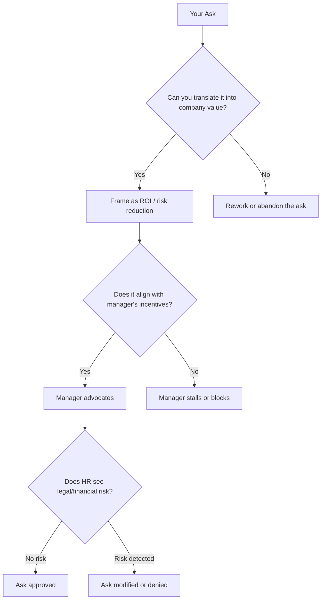
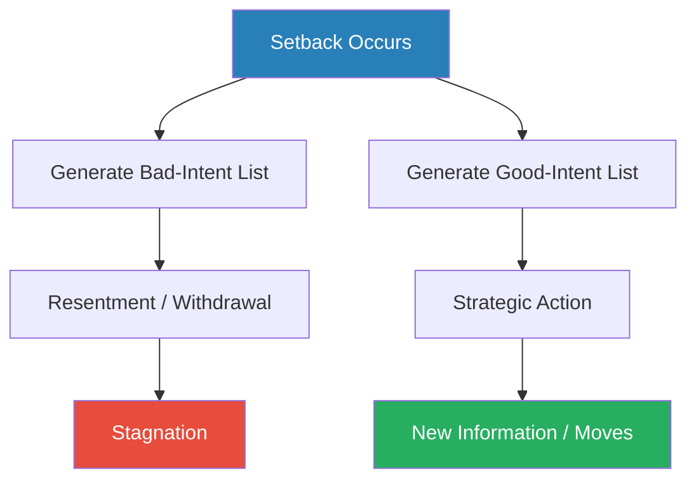
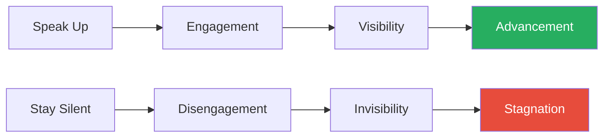
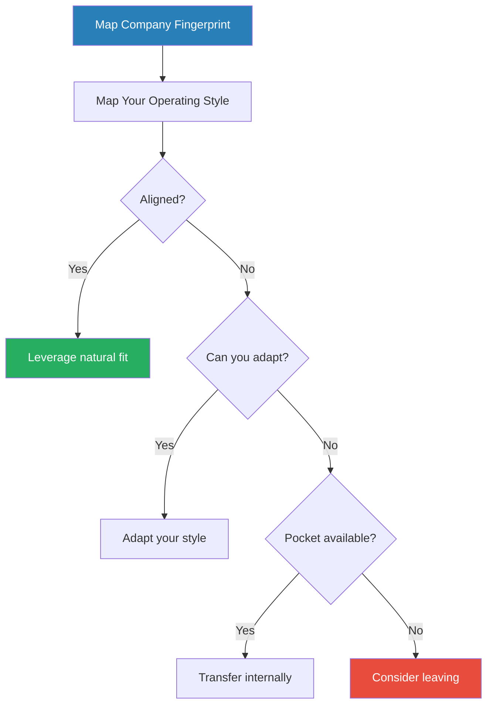
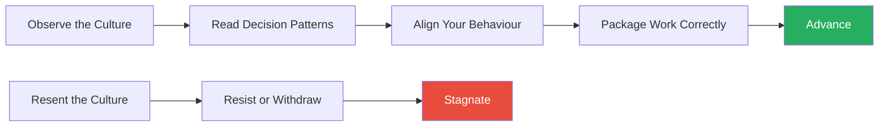

# The Unspoken Truths for Career Success — Tessa White

> Tessa White spent two decades as a Senior Vice President of HR, sitting on the other side of the table for thousands of hiring decisions, promotion cycles, terminations, and salary negotiations. From that vantage point she watched the same pattern repeat across industries: talented people doing excellent work, waiting patiently for recognition, and getting passed over by colleagues who understood how the system actually operates. Her thesis is blunt — the workplace runs on invisible rules that nobody teaches you, and these rules have nothing to do with merit, loyalty, or fairness. White identifies seven "lies" that employees believe about performance, power, promotability, pay, leverage, loyalty, and politics, then replaces each with a reframe grounded in how companies actually make decisions. The result is a practitioner's field manual for navigating corporate life as it is, not as you wish it were.

---

## About the Author

Tessa White is a career strategist and former Senior Vice President of HR who oversaw thousands of hiring decisions, terminations, raise negotiations, and promotion cycles across multiple industries over a twenty-year career. She built her advisory practice, The Job Doctor, on pattern recognition from the inside — watching what actually determined who advanced and who stagnated, and noticing how consistently the gap between what employees believed about their standing and what the organisation actually thought led to disappointment and disillusionment. Her perspective is unusual because she was the person managers pitched promotions to, the person who approved or denied raises, the person who sat in the room when executives decided who was "top talent" and who was "steady." She has seen the machinery from the inside, and the book is her attempt to describe that machinery to the people being processed by it.

## The Big Idea

- <b style="color: #27ae60">The corporate world operates on a set of unspoken rules that most employees never learn</b>
- **Companies are not families** — they are profit-maximising entities that invest in people the way they invest in any other asset: based on expected return
- **Managers are not mentors by default** — they are budget-constrained agents who will champion your cause only when it serves their own interests and when they can defend the ask to their own bosses
- <b style="color: #e74c3c">HR is not your advocate</b> — it is a risk-minimisation function whose institutional purpose is to protect the company from legal, financial, and reputational exposure

White's argument is not cynical so much as diagnostic.

- Once you stop expecting the system to reward hard work and loyalty on their own terms, you can start speaking the language the system actually responds to: results, data, risk mitigation, and business-case framing
- The people who advance fastest are not the hardest workers — they are the ones who see and close the gaps between where the company is and where it wants to be, and who make sure the right people know about it

---

- The book is structured around seven "lies" — beliefs that most employees hold as self-evident truths but that, according to White, function as invisible ceilings on advancement
- Each lie gets its own section: the belief itself, why it feels true, why it is wrong, and the reframe that produces better results
- Alongside these reframes, White introduces a set of practical frameworks — for communication, negotiation, political navigation, and career stage management — that give the reader concrete tools rather than abstract advice

## Key Concepts at a Glance

| Concept | One-line summary |
|---------|-----------------|
| **The Company Alignment Model** | Four structural truths that predict ninety percent of corporate behaviour |
| **The Reframe Model** | Generate two interpretations of any setback to produce agency instead of resentment |
| **The GAP Communication Model** | Four-step framework for resolving conflict without burning bridges |
| **The Five Stages of Career Growth** | Doer, Achiever, Collaborator, Builder, Expander — each requiring fundamentally different skills |
| **Playing in the Gap** | Find and close the distance between what a company says it wants and what it actually is |
| **The Leverage Taxonomy** | Seven forms of negotiating power, each situational and requiring fresh assessment |
| **The Five Principles of Company Politics** | Map an organisation's political fingerprint to understand what the culture actually rewards |
| **If-Then Proposals** | Convert a rejected ask into a conditional experiment that removes risk for the company |
| **The Choices Discussion** | Manage overwork by presenting your manager with a prioritised list and asking them to decide |
| **The Feedback Four-Pack** | Seek perception feedback from four different sources to close the gap between self-image and reality |
| **The 10 Percent Miracle** | Reclaim forty-eight minutes daily for high-impact gap work |
| **Halfway Conversations** | Decode the coded language managers use to signal serious concerns without saying them plainly |

---

## Part One: The Company Is Not What You Think It Is

### Chapter 1: The Seven Lies

*White opens by naming the beliefs she watched sabotage talented people throughout her HR career — not obscure misconceptions, but the default assumptions most professionals carry into the workplace without question.*

The seven lies are:

1. Hard work and results will be noticed and rewarded
2. Your manager's job is to develop and promote you
3. The company values loyalty and will reciprocate it
4. HR is there to help you
5. Your pay is determined by your performance
6. Politics is something you should avoid
7. The job description tells you what the job is

- <b style="color: #e74c3c">These beliefs are not entirely false — they are incomplete in ways that are catastrophic to act on</b>
- Hard work does matter — but it is necessary, not sufficient
- Managers do sometimes develop their people — but only when it serves their own targets
- Loyalty is valued — right up until the moment a restructuring makes your role redundant
- Each lie operates as an invisible ceiling: you cannot push past a barrier you do not know exists

Where do these lies come from?

- **Parents and schools** — institutions that reward effort, obedience, and patience
  - "Work hard, keep your head down, and good things will happen" is advice that works in a classroom but fails in a boardroom
  - Schools reward compliance; companies reward impact
- **Early career conditioning** — first managers who may have been genuinely supportive, creating the false impression that all managers operate this way
- **Corporate messaging** — mission statements, values walls, and all-hands meetings that describe the company as a meritocracy where talent naturally rises
  - This messaging is not deliberately deceptive — it describes the aspiration, not the operating reality

> [!tip] Core Insight
> The workplace runs on invisible rules absorbed from parents, schools, and early managers. White positions herself not as a motivational speaker but as someone describing the rules of a game that most players do not even know they are playing.

---

### Chapter 2: The Company Alignment Model

*This is White's foundational framework — the lens through which she reads every corporate decision, resting on four structural truths that form a prediction engine for any workplace situation.*

<b style="color: #2980b9">Truth 1: Companies exist to make profit.</b>

- Every decision — hiring, promotion, restructuring, recognition — is filtered through the question: "Does this contribute to the bottom line?"
- This is not malice — it is the operating logic of an entity that exists to generate returns for shareholders
- Understanding this transforms frustration into prediction: if you know the company optimises for profit, you can predict which asks will succeed and which will fail before you make them
- Even non-profit organisations and government entities have a version of this: they optimise for mission delivery within budget constraints
- The practical implication: every proposal you make should lead with financial impact, cost avoidance, or strategic value — not with what you want or need

<b style="color: #2980b9">Truth 2: Companies only spend money when it comes back.</b>

- Investment in people is not altruism
- Training, raises, promotions, and perks are allocated based on expected return
- White watched companies cut development budgets during downturns but maintain them for "high-potential" employees — the investment continued only where the return was clearest
- This truth explains why performance alone does not guarantee a raise:
  - A raise is an investment
  - The company will make that investment only if it believes the return (retention of a valuable person, increased output, reduced recruitment cost) exceeds the cost

> [!example] The Two Pitches for the Same Programme
> - A mid-level manager pitched a professional development programme to his VP
> - The pitch focused entirely on how much the team wanted it and how it would improve morale
> - It was rejected instantly
> - A colleague pitched an identical programme the following quarter, framed around projected revenue impact and reduced turnover costs
> - It was approved within a week
> - The programme was the same — the framing was different
> - The second framing spoke the company's language
> **The lesson:** Translate every ask from "what I want" into "what the company gets."

<b style="color: #2980b9">Truth 3: Managers are aligned to budget and results.</b>

- Your manager's primary incentive is to deliver on their own targets within their budget
- They will advocate for you when your advancement serves that goal — when losing you would hurt their numbers, when promoting you makes their team look good, when your raise can be justified to their own boss
- They will not advocate when it does not
- This is not personal — it is structural
  - A manager who loves you as a person but whose bonus is tied to headcount costs will not fight for your raise if it hurts their own numbers
  - A manager who barely knows you will fight for your promotion if losing you to another team would derail a critical project

> [!example] The Supportive Manager Who Did Nothing
> - A client had an excellent relationship with her manager — regular praise, strong reviews, genuine personal warmth
> - When the client asked for a promotion, the manager was supportive in conversation but did nothing for six months
> - The reason, which the client only discovered later: the manager's own bonus was tied to keeping headcount costs flat
> - Promoting the client would have increased the team's salary line and reduced the manager's bonus
> - The manager was not evil — he was aligned to his own incentives, exactly as the model predicts
> **The lesson:** A manager's verbal support means nothing until it converts into visible action.

> [!example] The Manager Who Fought Hard — For Her Own Reasons
> - A different client was surprised when her manager aggressively fought for a twenty-percent raise and a title change
> - The client had not even asked — the manager initiated it
> - The reason: the manager had just learned that a competitor was recruiting her best people
> - Losing the client would have cost the manager a critical Q4 deliverable that her own promotion depended on
> - The manager's advocacy was genuine — but it was triggered by the manager's self-interest, not by the client's merit alone
> **The lesson:** Manager advocacy is not charity. It activates when your advancement aligns with their incentives.

---

<b style="color: #2980b9">Truth 4: HR minimises risk.</b>

- HR's institutional function is to protect the company from legal, financial, and reputational risk
- It is not a neutral counsellor, not a therapist, not an employee advocate
- When HR investigates a complaint, it is assessing the company's exposure, not adjudicating fairness
- White describes this without apology — she was an HR executive and she is describing how the function actually operates, not how employees imagine it operates

> [!example] White's Own HR Investigation
> - An employee came to White in confidence to report that his manager was creating a hostile work environment
> - White investigated — not to help the employee, but to assess the company's legal exposure
> - The investigation concluded that the manager's behaviour, while unpleasant, did not constitute a legal liability
> - The employee was counselled on "communication strategies" — the manager received no consequences
> - White is candid: she was doing her job correctly by HR's institutional standards, and those standards are designed to protect the entity that pays HR's salary
> **The lesson:** HR works for the company, not for you. Never confuse its function with advocacy.

<b style="color: #27ae60">Together, these four truths form a prediction engine</b> — before making any ask (raise, promotion, transfer, flexibility), translate it from "what I want" into "what the company gets." If you cannot make the translation, the ask will almost certainly fail.

The Company Alignment Model shows that every corporate decision passes through three filters — profit contribution, manager incentive alignment, and HR risk assessment — and failing at any stage kills the ask.

This sankey diagram illustrates White's core insight: of all employee requests that enter the corporate pipeline, only a fraction survive all three filters — profit contribution, manager incentive alignment, and HR risk assessment — which is why framing every ask in the company's language is essential.

---

## Part Two: Performance and Perception

### Chapter 3: The Reframe Model

*When setbacks hit — a missed promotion, negative feedback, an unexpected restructuring — most people default to the worst interpretation. White's Reframe Model offers a cognitive tool that produces strategic action instead of paralysis.*

<b style="color: #2980b9">The Reframe Model</b> asks you to pause and generate two lists:

- **The bad-intent list** — everything that could explain the setback as unfairness, conspiracy, or malice
- **The good-intent list** — everything that could explain it as miscommunication, competing priorities, budget constraints, or incomplete information

The mechanism behind the model:

- Human beings default to threat detection — we are wired to assume the worst because our ancestors who assumed a rustling bush was a predator survived more often than those who assumed it was the wind
- This survival instinct is maladaptive in the workplace: the "threat" interpretation produces defensive behaviours (withdrawal, aggression, passive resistance) that make the situation worse
- <b style="color: #27ae60">The good-intent list forces you to generate alternative hypotheses, which produces moves instead of paralysis</b>
- Even if the bad-intent interpretation is true, the actions it generates (resentment, withdrawal, angry job-hunting) are almost always worse than the actions generated by the good-intent interpretation

> [!example] Marcus the Software Engineer
> - Marcus was passed over for a team lead role
> - His bad-intent list: the hiring manager already had someone in mind; the interview process was a formality; his manager did not advocate because she wanted to keep him doing technical work
> - His good-intent list: the other candidate had more people-management experience; the hiring manager may not have known about Marcus's mentoring work; Marcus may not have communicated his interest clearly enough
> - The bad-intent list produced resentment and a plan to start job-hunting
> - The good-intent list produced action: scheduling a conversation with the hiring manager, making his leadership interest visible, volunteering for a cross-functional project
> **The lesson:** The good-intent list produces moves. The bad-intent list produces paralysis.

> [!example] The Project Manager Who Got Reassigned
> - A project manager was removed from a high-profile account and assigned to a smaller one without explanation
> - Her bad-intent list: the VP lost confidence in her; she was being sidelined before termination; someone else was being groomed for her role
> - Her good-intent list: the smaller account might have a specific problem the VP trusted her to fix; the reassignment might be temporary; the VP might not realise how the move appeared
> - She used the good-intent list to open a GAP conversation with the VP
> - The truth: the smaller account was on the verge of being lost, and the VP had moved his strongest relationship manager there as a rescue mission — a compliment, not a demotion
> - If she had acted on the bad-intent list, she would have started job-hunting and missed what turned out to be a career-defining save
> **The lesson:** The interpretation you choose determines the actions you take. Choose the one that gives you the most options.

- She applies Stephen Covey's circle of influence model: focus on what you can control, not on what you cannot
  - You cannot control whether the system is rigged
  - You can control whether you seek feedback, build visibility, and communicate your ambitions clearly
- The reframe is not about being naive — it is about being strategic about where you spend your emotional and professional energy
- <b style="color: #e74c3c">The bad-intent list is seductive because it feels true and requires no action</b> — it gives you permission to be a victim, which is comfortable but career-ending

> [!tip] Core Insight
> Generate two interpretations of every setback. Act on the one that gives you more moves, regardless of which one feels more true.

The Reframe Model is a decision-forcing function: by requiring you to generate two interpretations before acting, it prevents the automatic threat response from dictating your behaviour.

---

### Chapter 4: The Perception Gap

*White's most uncomfortable argument: every piece of feedback you receive is a watered-down version of how you are actually perceived — and the gap between the two can be career-ending.*

The mechanism:

- Human beings are conflict-averse
- Managers, who are human beings, soften negative feedback, delay difficult conversations, and package criticism in so much positive framing that the criticism itself becomes invisible
- <b style="color: #e74c3c">By the time a manager has decided someone needs to be fired, the employee has typically received only vague coded hints</b> — comments like "maybe consider being more collaborative" that the employee heard as minor suggestions when the manager meant them as final warnings
- The perception gap is not a flaw in any individual manager — it is a structural feature of human communication under power asymmetry
  - The person with power softens the message because delivering harsh truth is uncomfortable
  - The person without power hears what they want to hear because the alternative is too threatening
  - Both sides contribute to the gap, and neither side corrects it

> [!example]- White's Own Near-Termination
> - Early in her career, White was a rising star — high performer, strong reviews, fast promotions
> - She moved to a new company and continued operating the way she always had: methodical, thorough, detail-oriented
> - She received consistently positive feedback
> - Six months in, she was called into a meeting and told she was on the verge of being terminated
> - She was stunned — nothing in the feedback had suggested she was in danger
> - The problem was pace: her new company operated at a speed that rewarded quick decisions and rapid iteration
> - Her methodical approach, celebrated at her previous company, read as slow, bureaucratic, and out of touch
> - Her managers had tried to signal this — "we move fast here," "don't overthink it" — but these signals were too soft for her to decode as existential warnings
> **The lesson:** You cannot trust passive feedback to tell you how you are actually perceived. You need to actively seek it.

> [!example] The Reliable Engineer's Surprise PIP
> - A software engineer had received "meets expectations" reviews for three consecutive years
> - He interpreted this as solid performance — he was meeting the bar
> - In year four, he was placed on a Performance Improvement Plan
> - He was blindsided — how could "meets expectations" lead to a PIP?
> - The answer: "meets expectations" at his company was code for "not growing"
> - The company's actual standard was continuous improvement; "meets expectations" meant you were treading water while others were swimming forward
> - His managers had never said this explicitly — the coding was so embedded in the culture that they assumed he understood it
> **The lesson:** Decoded language varies by company. The same words can mean radically different things in different organisational contexts.

"Your perception gap is wider than you think," White writes.

---

<b style="color: #2980b9">The Feedback Four-Pack</b> — seek perception feedback from four people who see your work from different angles:

| Source | Why this person | What they reveal |
|--------|----------------|-----------------|
| Your direct manager | The obvious source | Most likely to soften, but sets the baseline |
| A peer who likes you | Gives the honest positive signal | What you are doing right that you may undervalue |
| A neutral peer | Tells you things the friendly peer will not | Blind spots and rough edges |
| A cross-department manager | Sees you without your team's contextual norms | How you are perceived outside your bubble |

The questions White recommends are deliberately hard to deflect: "What is the one thing I could do differently that would make the biggest impact?" and "If you had to describe my reputation in two words, what would they be?"

- Why four sources instead of one:
  - Any single source has blind spots and biases
  - Your manager may soften; your friendly peer may omit uncomfortable truths; the neutral peer may not see enough of your work
  - <b style="color: #27ae60">The pattern across all four sources is your true perception</b> — if three of four mention the same issue, that is signal, not noise
- The cross-department manager is the most underused source:
  - They see you without the protective framing of your team
  - They experience you the way clients, partners, and senior leaders do
  - Their feedback is often the most surprising and the most actionable

---

<b style="color: #2980b9">Halfway conversations</b> — the epidemic of workplace interactions where something important is almost said but never quite lands:

- The manager who says "keep up the good work" when they mean "you need to change direction"
- The colleague who says "interesting approach" when they mean "this will never work"
- The executive who says "we should discuss this further" when they mean "no"
- The performance review that says "consider being more strategic" when it means "you are not being considered for promotion"
- <b style="color: #27ae60">Learning to decode these halfway conversations is a survival skill that no one teaches explicitly but that everyone who advances eventually learns</b>

White's advice for decoding halfway conversations:

- When you receive vague feedback, ask for specifics: "Can you give me an example of what you mean?"
- When you hear "interesting," ask: "What concerns do you have about the approach?"
- When you hear "we should discuss further," ask: "What would need to change for this to move forward?"
- <b style="color: #e74c3c">The single most dangerous halfway conversation is the positive one</b> — when a manager praises you effusively but never mentions you in promotion discussions, the praise is a substitute for advocacy, not a precursor to it

---

## Part Three: The Real Rules of Advancement

### Chapter 5: Playing in the Gap

*Every company has a distance between its vision — what it says it wants to be — and its reality — what it actually is today. White argues that career acceleration comes from identifying and closing these gaps, not from executing a job description with increasing efficiency.*

"If you follow the job description perfectly, you will miss the real job," White writes.

- <b style="color: #27ae60">Job descriptions are generic documents, often outdated, written for recruitment compliance rather than as performance guides</b>
- They describe the minimum requirements for a role, not the activities that create outsized value
- The gap between what the JD says and what actually needs doing is where advancement lives
- White draws a critical distinction:
  - **Job description work** keeps you employed — it is the baseline
  - **Gap work** gets you promoted — it is the differentiator
  - The people who get stuck are the ones who perfect their job description and wonder why they are not advancing

> [!example] The Recruiter Who Fixed Retention
> - A recruiter's job description said: source candidates, screen resumes, schedule interviews
> - She did all of this competently
> - But she noticed new hires were leaving at high rates within their first year
> - Exit interviews consistently mentioned a disconnect between what was promised in the interview and what the role actually involved
> - Instead of just flagging this to her manager, she redesigned the interview process to include a "realistic job preview" — a structured walkthrough of what the first six months would actually look like
> - First-year turnover dropped by thirty percent
> - She was promoted twice in eighteen months
> **The lesson:** She did not get promoted for doing her job. She got promoted for seeing a gap the company cared about and closing it without being asked.

> [!example] Josh the Junior Developer
> - Josh noticed his company's engineering team was struggling to hire because their job postings read like technical specifications
> - He had a side interest in marketing, so he rewrote several postings to emphasise the problems the team was solving and the technologies they were building with
> - Applications tripled
> - Josh was not asked to do this — his job description said nothing about recruitment marketing
> - But he saw a gap and closed it, and the result was visible to senior leadership
> **The lesson:** The most promotable work is often work nobody asked you to do.

> [!example] Sarshar the Compensation Analyst
> - Sarshar noticed that the company's pay structure was creating perverse incentives — people were optimising for metrics that earned bonuses but did not actually serve customers well
> - Instead of just reporting this in a meeting, she built a prototype of a gamified compensation model that aligned individual incentives with customer outcomes
> - The prototype caught the attention of a VP who had been trying to solve this problem for a year
> - Sarshar was pulled into the VP's team and given a mandate to implement it company-wide
> **The lesson:** Prototypes beat presentations. Show the solution, do not just describe the problem.

---

> [!abstract] The GAP Framework for Identifying the Right Gaps
> 1. **G — Good-to-Great potential:** Is this a real problem the company cares about, or a minor irritation? A gap worth closing must connect to something the leadership is already worried about
> 2. **A — Access:** Do you have the proximity, skills, and authority to address it? A gap you can see but cannot reach is not actionable
> 3. **P — Plan:** Can you articulate the first three steps? If you cannot describe a concrete starting point, you do not yet understand the gap well enough to close it

- Start with <b style="color: #27ae60">winnable gaps</b> — small, visible problems you can solve quickly without additional resources
- Build a track record of gap-closing
- Then escalate to larger, cross-functional gaps that carry more visibility and strategic weight
- The sequence matters: if you try to close a large, strategic gap before you have credibility from closing smaller ones, you will be seen as overreaching

How to identify gaps:

- Listen to what leaders complain about repeatedly in town halls, all-hands, and strategy meetings
- Watch where processes break down and create frustration for multiple teams
- Notice what customers or clients complain about that nobody is addressing
- Pay attention to what the company says in its annual report or strategy documents versus what it actually does day to day
- <b style="color: #e74c3c">The trap is solving gaps that nobody cares about</b> — optimising a process that nobody uses, or fixing a problem that leadership does not consider a priority

---

### Chapter 6: Why Hard Work Is Not Enough

*White extends the gap-playing concept into a broader argument about how companies actually assess talent — and why the hardest worker on the team is rarely the one who gets accelerated.*

<b style="color: #2980b9">Steady employees vs. top talent</b> — not a value judgement, but a description of how succession planning committees actually categorise people:

| Category | What they do | How leadership talks about them | What they get |
|----------|-------------|-------------------------------|--------------|
| Steady employees | Deliver consistent, reliable work within defined scope | "Sarah is solid. She delivers. Keep her happy with a standard increase." | Standard increases, stability |
| Top talent | Identify and solve problems that move the organisation forward | "We need to invest in Michael. Get him a mentor. What would it take to keep him?" | Mentorship, development, acceleration |

- Both are valuable — only one gets accelerated
- The difference is not hours worked or even quality of output on assigned tasks
- <b style="color: #27ae60">It is whether the person's work addresses something the leadership team cares about and whether leadership can see it</b>

White describes the mechanics of succession planning meetings from the inside:

- Leaders gather quarterly or annually to categorise their teams
- Each person is placed on a grid — typically a 9-box model crossing performance with potential
- **Performance** is measured against assigned objectives
- **Potential** is measured against a murkier set of criteria: strategic thinking, cross-functional influence, leadership presence, and — critically — gap-closing behaviour
- A person who scores "high performance, low potential" is a steady employee: keep them, pay them fairly, but do not invest disproportionately
- A person who scores "high performance, high potential" is top talent: invest, develop, accelerate

> [!example] Two Analysts, Two Outcomes
> - Analyst One worked sixty-hour weeks, produced flawless reports, and was considered the most reliable person on the team
> - Analyst Two worked forty hours, produced good-but-not-extraordinary reports, but spent a chunk of her time investigating why the reports were not being used by the decision-makers they were intended for
> - She discovered the format did not match how executives consumed information, redesigned the reporting template, and presented the new version directly to the executive team
> - At the next succession planning meeting:
>   - Analyst One was categorised as "steady — standard increase"
>   - Analyst Two was categorised as "high potential — accelerate"
> - Analyst One had worked harder — Analyst Two had worked on the right thing
> **The lesson:** The company does not owe you advancement because you are exhausted. It invests in people who demonstrably move the needle.

The visibility component is just as important as the work itself:

- Gap work that nobody knows about does not get you promoted — it gets you exploited
- White recommends making your gap work visible through:
  - Sharing results in team meetings and cross-functional forums
  - Copying relevant stakeholders on updates
  - Framing your work in terms the organisation rewards: revenue impact, cost reduction, risk mitigation
- <b style="color: #e74c3c">This is not self-promotion for its own sake — it is ensuring that the people who make promotion decisions have the information they need to advocate for you</b>

> [!tip] Core Insight
> "The company is not good or bad — it is a profit-making entity." It defines "moving the needle" in terms of its own priorities, not yours. Work on the right thing, not on everything.

---

## Part Four: Navigating Difficult Conversations

### Chapter 7: The GAP Communication Model

*White's framework for navigating difficult workplace conversations without resorting to either avoidance or scorched-earth candour — the tool she reports clients use most and get the most immediate results from.*

> [!abstract] The GAP Communication Model — Four Steps
> 1. **Describe the Gap** — State what you expected versus what you observed. Facts only, no judgement, no emotional language. "I understood we had agreed to X. What happened was Y." The gap description must be specific enough that both parties can agree on what occurred, even if they disagree about why.
> 2. **Identify the Consequences** — Explain the impact on you, the team, the project, the relationship. Keep it grounded in observable consequences: "This means the deliverable is delayed by two weeks" is stronger than "This made me feel disrespected."
> 3. **The Handoff** — Three phrases that transform accusation into conversation: "Is that what you intended?" / "Do you see it differently?" / "Is there something I'm missing?"
> 4. **Problem-Solving** — Collaborative resolution, only after the other party has responded. If you jump to solutions before they explain, you are issuing an ultimatum with extra steps.

The Handoff (Step 3) is what distinguishes this model from ordinary confrontation:

- The phrases assume good intent, which prevents the other person from becoming defensive
- They invite explanation rather than demanding justification
- They make it possible for someone to save face while correcting course — because you have explicitly left room for the possibility that you might be wrong
- Psychologically, the Handoff works because it gives the other person an exit:
  - If they acted badly, they can reframe their behaviour as a misunderstanding and correct course without admitting wrongdoing
  - If they acted for reasons you did not know about, the Handoff surfaces that information
  - Either way, the conversation moves toward resolution rather than escalation

---

> [!example] Elena and the Stolen Presentation
> - Elena, a project manager, discovered that a peer from another department had presented her team's Q2 findings directly to their shared VP
> - Her instinct was to confront the peer aggressively — "You stole my team's presentation"
> - Instead, she used the GAP model:
>   - **Gap:** "My understanding was that our team would present the Q2 findings. I learned that you presented them in last week's leadership meeting."
>   - **Consequences:** "The team is demoralised because they feel their work was taken without credit, and I am concerned it sets a precedent."
>   - **Handoff:** "Is there something I am missing about why it happened that way?"
> - The peer's response surprised her: the VP had asked for the data on short notice for a board meeting, and the peer happened to be in the office
> - He had not intended to take credit — he had been firefighting
> - The resolution: a standing agreement that any cross-functional presentation would include both team leads' names regardless of who delivered it
> **The lesson:** Without the GAP model, Elena would have either said nothing and seethed, or attacked and created an enemy. The model produced a solved problem and an intact relationship.

> [!example] The Sales Director's Missing Meetings
> - A sales director's boss had a pattern of assigning high-profile client meetings to other team members without explanation
> - He used the GAP model:
>   - **Gap:** "I expected to lead the Hendricks account presentation; I learned Tyler was assigned"
>   - **Consequences:** "I am finding it difficult to build executive relationships when I am not in the room"
>   - **Handoff:** "Am I missing something about why these assignments are changing?"
> - The boss admitted she had been routing meetings to Tyler because a senior client had once complained about the sales director's presentation style — feedback she had never passed on directly
> - This was a textbook perception gap: a single client complaint was reshaping his entire workload, and he had no idea
> **The lesson:** The GAP conversation surfaces hidden information. Without it, problems compound invisibly.

> [!example] The Manager Who Kept Cancelling One-on-Ones
> - A mid-level employee's manager had cancelled their one-on-one meeting five times in six weeks
> - The employee was anxious: was the manager avoiding her? Was a layoff coming?
> - She used the GAP model:
>   - **Gap:** "Our one-on-ones have been cancelled five out of the last six weeks"
>   - **Consequences:** "I have decisions backing up that need your input, and I am unsure of my standing"
>   - **Handoff:** "Is there something going on that I should know about?"
> - The manager was embarrassed — the cancellations were not intentional; she was overwhelmed with a cross-functional initiative and had been triaging her calendar by cutting recurring meetings
> - The resolution: they moved to a shorter biweekly format that the manager could protect
> **The lesson:** The GAP conversation reveals that most slights are accidental — the product of competing priorities, not deliberate neglect.

The GAP model's deepest contribution is what it prevents: <b style="color: #e74c3c">halfway conversations</b> (where you hint at the problem but never state it) and <b style="color: #e74c3c">scorched-earth conversations</b> (where you say everything and destroy the relationship). Both are epidemic in organisations, and both leave the underlying problem unsolved.

---

## Part Five: The Stages of Growth

### Chapter 8: Stage 1 — The Doer

*At entry level, your job is consistency — but the fatal flaw White sees most often is not laziness. It is the eagerness to impress that produces the opposite of the intended perception.*

- Your job at Stage 1: follow instructions, ask questions, deliver reliable output, build foundational skills
- <b style="color: #27ae60">The way to appear competent is not to do everything without question, but to ask the right questions and deliver consistent quality on a manageable workload</b>
- The fatal flaw is twofold:
  - Failing to ask questions — which leads to errors from ignorance
  - Failing to set boundaries — which leads to burnout from eagerness to please
- <b style="color: #2980b9">The Doer's paradox:</b> the harder you try to impress by saying yes to everything, the faster you become known as the person who overcommits and underdelivers

> [!example] David the Eager New Hire
> - David was so eager to impress that he said yes to every request, worked through weekends, and never asked clarifying questions because he did not want to look incompetent
> - Within four months, he had made several significant errors — errors that would have been avoided by a single clarifying question
> - He was so exhausted that his quality of work had visibly declined
> - His manager's assessment: "David is willing but unreliable"
> - The irony was brutal: his attempt to appear maximally competent had produced the opposite perception
> **The lesson:** Build a reputation for reliability rather than heroism. Consistent quality beats unsustainable intensity.

What Stage 1 success actually looks like:

- Deliver what you promise, on time, every time
- Ask clarifying questions before starting work, not after making mistakes
- Say "I can take that on, but it means X will be delayed — which is the priority?" instead of "yes" to everything
- Build relationships with peers who can teach you the unwritten rules
- <b style="color: #e74c3c">Do not attempt gap work at Stage 1</b> — you do not yet have the credibility or context to identify real gaps versus imaginary ones

---

### Chapter 9: Stage 2 — The Achiever

*At the supervisor level, the job shifts from following instructions to producing independent results — and the fatal flaw is waiting for permission.*

- The key skills are critical thinking, prioritisation, and experimentation
- <b style="color: #27ae60">The Stage 2 transition is about moving from execution to judgement</b>
- You must start making calls — deciding what to prioritise, experimenting with new approaches, and accepting that some experiments will fail
- <b style="color: #e74c3c">The occasional visible failure from initiative is far less damaging than the consistent invisibility of waiting for instruction</b>

> [!example] Priya the Marketing Coordinator
> - Priya was technically excellent — she could execute any campaign she was briefed on
> - But she never initiated anything without explicit direction
> - Her manager valued reliability but kept promoting people around Priya
> - When Priya finally asked why, the manager said: "You do great work when I tell you what to do. But I need someone who can figure out what to do without me."
> **The lesson:** "Money goes to those who ask, not those who wait" — and the same applies to opportunity.

> [!example] The Warehouse Supervisor Who Saw the Pattern
> - A warehouse supervisor noticed that order errors spiked every Monday because weekend shift workers followed a different checklist than weekday staff
> - Without asking permission, he unified the checklists, ran a two-week pilot, and presented the results to his manager: error rates dropped forty percent
> - He was promoted to operations lead within six months
> - His predecessor had seen the same problem but waited for someone else to fix it
> **The lesson:** Stage 2 is where initiative separates the promotable from the competent.

> [!tip] Core Insight
> At each career stage, the skills that earned your last promotion will never earn your next one. The transition demands fundamentally different capabilities.

---

### Chapter 10: Stage 3 — The Collaborator

*At mid-level, the job shifts again to cross-functional partnership — you cannot advance by being excellent only within your own function, no matter how technically brilliant you are.*

- The key skills are working with data across teams, resolving conflict productively, and building influence beyond your direct reports
- <b style="color: #e74c3c">The fatal flaw is silo mentality</b> — defining your world by the borders of your own department
- Stage 3 is where the GAP Communication Model becomes essential — you are now navigating relationships with people who do not report to you, who have their own priorities, and who will not follow your instructions simply because you ask

> [!example] The Brilliant Finance Manager
> - A finance manager was brilliant within her team but treated every request from other departments as an interruption
> - She was technically the best financial analyst in the building
> - When a VP role opened, it went to a less technically skilled colleague who had built relationships across sales, marketing, and operations
> - The finance manager was confused
> - White's explanation: at Stage 3, the job is not to be the best analyst — it is to be the person who can use analytical skills in service of cross-functional problems
> - The colleague who got the promotion was not a better analyst — she was a better collaborator, and at Stage 3, collaboration is the job
> **The lesson:** Technical excellence within a silo becomes a ceiling, not a ladder.

---

- <b style="color: #2980b9">This stage is where conflict resolution becomes non-negotiable</b>
- White cites a Microsoft study of 6,000 employees:
  - 84% of employees who actively engaged in workplace communication — including difficult conversations — were recognised for their work
  - Only 25% of passive communicators were recognised
  - Employees who spoke up on fifteen or more topics were 92% more likely to stay and 95% more likely to report feeling excited about their work
- The causal chain: voice leads to engagement, engagement leads to visibility, visibility leads to advancement
- <b style="color: #e74c3c">Silence does not just cost you recognition — it costs you the internal engagement that makes work feel meaningful</b>, which makes you more likely to leave, which makes you even less visible — a downward spiral

The data is clear: voice and visibility are causally linked to advancement, and silence creates a self-reinforcing downward spiral.

---

### Chapter 11: Stage 4 — The Builder

*At the director and VP level, the job shifts fundamentally to strategy and buy-in — you are no longer doing the work, you are creating the conditions for others to do it.*

- You are building compelling proposals, fighting for resources against competing priorities, and constructing things that did not exist before
- <b style="color: #e74c3c">The fatal flaw at Stage 4 is staying in the weeds</b> — if you are still managing day-to-day operations at this level, you are doing the wrong job
- The Stage 4 skill set:
  - Building business cases that win budget allocation against competing proposals
  - Selling ideas upward, laterally, and downward simultaneously
  - Tolerating the uncertainty of strategic work where outcomes are measured in quarters, not weeks
  - Letting go of the operational control that defined your identity in Stages 1-3

> [!example] The Hands-On VP of Engineering
> - A newly promoted VP of engineering continued to attend every sprint review, review every pull request, and personally debug production issues
> - His team loved his hands-on approach
> - His peers and boss were bewildered
> - Within a year, he had missed three strategic planning cycles because he was "too busy" — busy doing work that should have been delegated two levels down
> - He was moved to an individual contributor role
> **The lesson:** The skills that made you a great Stage 3 collaborator will destroy you at Stage 4 if you cannot let go of operational detail.

The second fatal flaw White identifies at Stage 4 is unexpected: <b style="color: #2980b9">being easily offended</b>.

- At this level, your proposals will be challenged, your budgets will be cut, and your ideas will be rejected — not because you are wrong, but because you are competing for finite resources against other leaders who are also not wrong
- The ability to absorb rejection, recalibrate, and come back with a stronger case is a defining skill
- Some of the most brilliant Stage 3 performers flamed out at Stage 4 because they took strategic disagreement as personal rejection
- <b style="color: #27ae60">At Stage 4, "no" is not a verdict — it is information about what the organisation currently values and what your proposal is missing</b>

---

### Chapter 12: Stage 5 — The Expander

*At the SVP and C-suite level, the job shifts to vision and expansion — you are no longer building within the organisation but expanding the organisation's capacity and positioning it within its broader ecosystem.*

- The key skills are listening to external signals (market shifts, customer behaviour, regulatory changes), leading humanely at scale, and growing the organisation
- <b style="color: #e74c3c">The fatal flaw is inward focus</b> — spending too much time on internal operations and not enough on the external environment that determines the organisation's future
- Stage 5 leaders who fail are typically Stage 4 builders who never stopped building internally:
  - They optimise existing systems instead of scanning for disruption
  - They focus on quarterly results instead of three-year positioning
  - They manage their direct reports instead of shaping the organisation's relationship with its market

White spends less time on Stage 5, acknowledging that most readers will not be operating at this level. But she makes one point that applies to everyone: <b style="color: #27ae60">each stage requires fundamentally different skills, and the skills that got you promoted will not get you promoted again.</b>

The critical insight across all five stages: **the Stage 3-to-4 transition is where most careers stall.**

- The shift from doing excellent collaborative work to securing resources and building strategy is not incremental
- It is a fundamentally different job that requires a fundamentally different mindset
- Many people who were outstanding collaborators become mediocre builders — not because they lost ability, but because they continued applying Stage 3 skills to a Stage 4 job

| Stage | Core Job | Key Skill | Fatal Flaw |
|-------|----------|-----------|------------|
| **1. Doer** | Execute reliably | Consistency, questions | Overcommitting, not asking |
| **2. Achiever** | Produce results independently | Judgement, initiative | Waiting for permission |
| **3. Collaborator** | Partner across functions | Influence, conflict resolution | Silo mentality |
| **4. Builder** | Create strategy, secure resources | Business cases, resilience | Staying in the weeds |
| **5. Expander** | Position the organisation externally | External scanning, vision | Inward focus |

The five stages show that career growth is not a single continuous climb but a series of identity shifts — each requiring you to abandon the skills and habits that previously defined your success.

Each career stage demands a fundamentally different skills profile — consistency dominates for the Doer, initiative for the Achiever, collaboration for the Collaborator, strategy for the Builder, and vision for the Expander — and clinging to the skills of a previous stage is the primary cause of career stalls.

---

## Part Six: Pay, Leverage, and Negotiation

### Chapter 12: The Pay Lies

*White's chapter on compensation is built around a single, data-supported argument: the biggest pay increases come outside the annual review cycle, and they go to people who ask for them.*

- <b style="color: #2980b9">Annual review budgets are pre-allocated</b>
  - The company determines a percentage pool — typically two to four percent of total payroll — and distributes it across the team according to a forced distribution
  - Even if you are the best performer, your raise is constrained by the size of the pool and the number of people sharing it
  - Roughly eighty percent of annual-cycle increases fall below five percent
  - The math is immovable: if the pool is three percent and your team has ten people, the maximum any single person can receive is capped by the need to distribute something to everyone
- <b style="color: #2980b9">Out-of-cycle increases</b> are different
  - They require a specific business justification — a retention risk, a competing offer, a change in scope
  - They bypass the pre-allocated budget because they are treated as individual business decisions rather than batch distributions
  - Roughly eighty percent of out-of-cycle increases exceed five percent
  - They are funded from discretionary budgets, not from the annual raise pool

> [!tip] Core Insight
> If you want a meaningful pay increase, the annual review is the worst time to pursue it. The best time is when you have leverage — demonstrable results, a competing offer, a change in responsibilities, or a combination of several.

- <b style="color: #27ae60">Seventy percent of managers expect candidates to negotiate salary and benefits</b>
- The system is designed with the assumption that people will push — most people do not
- The ones who do are rewarded not because they are greedy, but because they are playing the game as it was designed to be played
- White draws a distinction between negotiation and entitlement:
  - Negotiation is backed by data, leverage, and a business case
  - Entitlement is backed by tenure, effort, and a sense of fairness
  - The first succeeds; the second fails — and the difference has nothing to do with who deserves the raise more

> [!example] The Senior Consultant Who Never Asked
> - A senior consultant had been underpaid for years relative to her peers
> - She had strong results but had never asked for a raise outside the annual cycle
> - When she finally built a case — documenting her contributions, benchmarking her compensation against market data, identifying budget savings she had created that exceeded her salary — she received a twenty-two percent increase in a single conversation
> - The money had been available the entire time
> - No one had offered it because she had never asked
> **The lesson:** "Money goes to those who ask, not those who wait."

> [!example] The Account Executive Who Timed It Wrong
> - An account executive asked for a raise during the annual review cycle
> - His manager sympathised but could only offer three percent — the budget was already allocated
> - Three months later, the same account executive closed the company's largest deal in two years
> - He went back and asked for an out-of-cycle adjustment, framed around the deal's revenue impact
> - He received a twelve percent increase and a bonus
> - The annual cycle gave him three percent; timing his ask to coincide with leverage gave him twelve
> **The lesson:** When you ask matters as much as what you ask for.

The contrast is stark: annual-cycle raises are constrained by pre-allocated budget pools and rarely exceed 5%, while out-of-cycle increases — triggered by leverage, competing offers, or scope changes — routinely reach 7-15%, making the timing and framing of your ask far more important than the ask itself.

---

### Chapter 13: The Leverage Taxonomy

*White identifies seven forms of leverage that determine negotiating power — and argues that the strongest position comes from stacking multiple levers simultaneously.*

| Lever | What it is | When it is strongest |
|-------|-----------|---------------------|
| **1. Demonstrable Results** | Documented track record of measurable impact | Always — table stakes for any negotiation |
| **2. Competitive Job Offer** | External market validation | When you are genuinely willing to leave |
| **3. Specialised Knowledge** | Hard-to-replace expertise | When losing you means losing institutional memory or client relationships |
| **4. Compelling Value Proposition** | Packaging yourself as the solution to an urgent problem | When the company faces a specific, named challenge |
| **5. Scarcity of Resources** | Talent shortage in your area | Environmental — you cannot create it, but you can position in areas where it exists |
| **6. Urgency** | Time-sensitive pressures that make delay costly | Temporary spikes during deadlines, mergers, contract commitments |
| **7. Risk** | The cost to the company if you leave | When key-person dependency, regulatory exposure, or client relationships are at stake |

- <b style="color: #e74c3c">Leverage is situational</b> — having been a top performer last year does not automatically give you leverage today if the company is restructuring your function
- Each negotiation requires a fresh assessment: which levers are active right now, and which are dormant?
- <b style="color: #27ae60">The strongest negotiating position combines multiple forms of leverage simultaneously</b>
  - Results alone are insufficient — the company knows you will probably stay
  - A competing offer alone is a bluff if you do not have results to back it up
  - The art is in stacking levers

> [!example]- The Data Scientist Who Stacked Levers
> - A data scientist wanted a promotion and a significant raise
> - She began by documenting her results (lever 1)
> - She got a competing offer (lever 2) — not as a bluff, but as genuine market research
> - She identified that her company was entering a new market that required exactly her expertise (levers 4 and 5)
> - She knew a key product launch depended on her work being completed by a specific date (lever 6)
> - She presented all of this in a single conversation
> - She got the promotion and a raise that exceeded her ask
> - No single lever would have produced that outcome — the stack did
> **The lesson:** Individual levers can be dismissed. A stack of four or five levers creates a position that is very difficult to refuse.

White adds a caution about competing offers:

This heatmap reveals that leverage is not static — demonstrable results become table stakes by mid-career, while risk-based and value-proposition leverage only become powerful at senior levels where key-person dependency and strategic positioning create genuine switching costs for the company.

- <b style="color: #e74c3c">Never use a competing offer as a bluff</b> — if the company calls it, you must be willing to leave
- Bluffing with an offer you do not intend to accept destroys trust permanently
- Even if the bluff works in the short term, your manager will view you as a flight risk and may begin planning your replacement
- The best competing offers are genuine: you have explored the market, found something attractive, and are sincerely weighing your options

---

### Chapter 14: If-Then Proposals

*When a direct ask gets rejected, White recommends converting it to a conditional experiment — a structure that removes risk for the company and aligns with how organisations naturally prefer to invest.*

<b style="color: #2980b9">The structure: "If I achieve X within this timeframe, then can we agree to Y?"</b>

- Companies love experiments with exit clauses
- They prefer paying after results are demonstrated rather than before
- The if-then structure removes the risk of a permanent commitment — the company pays only if you deliver
- This works because it matches the company's natural alignment: results first, investment second
- It also works psychologically: saying "no" to a conditional experiment feels unreasonable in a way that saying "no" to a direct request does not

> [!example] The Marketing Director's Remote Work Bid
> - A marketing director asked for a remote work arrangement and was told no
> - She reframed: "If my team's output metrics remain at or above current levels for ninety days of remote work, can we agree to make it permanent?"
> - The company said yes
> - The metrics held — the arrangement became permanent
> **The lesson:** Convert a "no" into a trial period. Companies that refuse permanent changes will often accept temporary experiments.

> [!example] The Consultant Who Funded Her Own Raise
> - A consultant asked for a raise and was told the budget was exhausted
> - She reframed: "If I can identify budget savings in our procurement process that exceed the cost of my raise, can we revisit?"
> - She found the savings within two months and received the raise — funded, in effect, by her own work
> **The lesson:** If-then proposals work best when you can tie your reward directly to value you create.

- The technique is most effective for raises, role expansions, and flexibility arrangements
- <b style="color: #e74c3c">It is less effective for structural changes</b> like new headcount or reporting line changes that require upfront investment regardless of outcome
- The key design principles for if-then proposals:
  - The "if" must be measurable — both parties must agree on what success looks like
  - The timeframe must be short enough to maintain urgency but long enough to demonstrate results
  - The "then" must be specific — "revisit my compensation" is too vague; "adjust my base salary to $X" is concrete

---

## Part Seven: Boundaries and Burnout

### Chapter 15: The Loyalty Trap

*White's chapter on loyalty contains her most personal writing — a cautionary tale about what happens when you give a company more than it can structurally reciprocate.*

- White describes her own experience of misplaced corporate loyalty — working sixty-plus-hour weeks, sacrificing personal time, volunteering for every project, believing the company would eventually recognise and reward her dedication
- Instead, she watched a colleague who worked fewer hours but prioritised more ruthlessly get promoted ahead of her
  - The colleague was not a better performer in any absolute sense
  - She was better at directing her energy toward visible, high-impact work and declining everything else
  - White was working harder — her colleague was working smarter
  - The company could not tell the difference — or rather, it could, and it preferred the colleague's approach

> [!tip] Core Insight
> "Never be more loyal to a company than it can be to you." No one asked White to work sixty-hour weeks. She volunteered. The company accepted the gift of her extra labour the same way it would accept any free resource — happily and without reciprocation.

The lesson is structural, not emotional:

- Companies optimise for output per unit of investment
- <b style="color: #27ae60">If you deliver the same results in forty hours that someone else delivers in sixty, you are the more efficient asset</b>
- Working longer hours does not make you more valuable — it makes you more expensive per unit of output
- If you are willing to work sixty hours for the same pay, the company has no incentive to change the arrangement
- The loyalty trap is self-reinforcing:
  - You work extra hours expecting recognition
  - The company accepts the extra work as your new baseline
  - Your "normal" becomes sixty hours, so sixty hours earns no special recognition
  - You escalate to seventy hours, which becomes the new baseline
  - The cycle continues until burnout

---

<b style="color: #2980b9">The 10 Percent Miracle</b> — reclaiming ten percent of your working day (roughly forty-eight minutes):

- Cut unnecessary meetings — audit every recurring meeting and ask: "Does my attendance change the outcome?"
- Batch email into two daily sessions — reactive email checking fragments attention
- Redirect the recovered time toward high-impact gap work
- The premise: most knowledge workers spend a significant portion of their day on low-value activities that exist out of habit rather than necessity
- Even a modest reallocation produces visible results
- The math: forty-eight minutes per day is four hours per week, sixteen hours per month — a full two working days dedicated to gap work that nobody else is doing

White connects this to the steady-vs-top-talent distinction: the forty-eight minutes you reclaim from low-value work is often the difference between executing your job description and closing a gap that leadership cares about. <b style="color: #27ae60">The 10 Percent Miracle is not about working more — it is about redirecting time you are already spending.</b>

---

### Chapter 16: The Choices Discussion

*When workload exceeds capacity, most people either push through and burn out, or complain and look incompetent. White offers a third path that reframes the problem as a strategic tradeoff.*

> [!abstract] The Choices Discussion — How to Manage Overwork
> 1. Present your manager with a **prioritised list** of everything on your plate, ranked by impact
> 2. Say: "I can deliver the top N excellently. Which of the remaining items would you like to deprioritise?"
> 3. Use the framing: "If we say 'yes' to everything, we will risk not excelling on the most visible projects."
> 4. If the manager says "do it all," you have documented the conversation — when something slips, you flagged the risk and the manager chose to accept it

Why this works:

- <b style="color: #27ae60">It shifts the burden</b> — instead of "I cannot do it all" (which sounds like failure), you are saying "here is the tradeoff — you choose"
- The manager now owns the prioritisation decision
- The framing presents the choice not as your limitation but as the team's opportunity cost
- It implies that excellence is possible — if the manager is willing to make the tradeoff
- Even when the manager says "do it all," you have created a paper trail:
  - You flagged the risk
  - The manager chose to accept it
  - When something slips, the conversation becomes "I raised this concern on [date]" rather than "I failed to deliver"

> [!example] The Operations Manager's Six Projects
> - An operations manager was carrying six projects simultaneously, four of which were visible to senior leadership
> - Instead of quietly trying to do all six and doing all of them poorly, she presented her VP with the list, ranked by strategic importance
> - She said: "I can guarantee quality on the top four. Which of the bottom two should we delay, reassign, or descope?"
> - The VP was surprised — he had not realised how much was on her plate
> - He reassigned one project and delayed the other
> - She delivered the top four with distinction and was promoted at the end of the year
> - If she had tried to do all six, she would have delivered six mediocre results and been seen as overwhelmed
> - By forcing the choice, she delivered four excellent results and was seen as someone with strategic judgement
> **The lesson:** Four excellent results beat six mediocre ones. Force the tradeoff rather than silently absorbing it.

---

## Part Eight: Politics and Culture

### Chapter 17: The Five Principles of Company Politics

*White argues that every organisation has a political fingerprint — a characteristic pattern across five dimensions that determines what behaviours are rewarded and punished. Misreading it is more dangerous than any skill deficit.*

<b style="color: #2980b9">The Five Dimensions of a Political Fingerprint:</b>

| Dimension | One end | Other end | Misalignment risk |
|-----------|---------|-----------|-------------------|
| **Speed** | Methodical | Fast | White's own near-termination came from this single mismatch |
| **Line of Sight** | Long-term strategic | Short-term tactical | A visionary proposal is irrelevant in a quarterly-results culture |
| **Autonomy** | Independent decisions | Governance by committee | Acting solo in a committee culture is career suicide |
| **Innovation** | Embrace disruption | Prefer tradition | The innovator at a traditional company is seen as reckless |
| **Risk** | High tolerance | Zero tolerance | A bold move in a zero-tolerance culture is grounds for termination |

"Misreading politics causes more career failures than lack of skill," White writes.

- <b style="color: #e74c3c">The same behaviour that makes you a star at one company can get you fired at another</b>
- White returns to her own story: at her previous company, her methodical approach was celebrated; at the new company, the same approach was nearly grounds for termination
- Nothing about her skills, knowledge, or work ethic had changed — the political fingerprint had changed
- This is why job transitions are so dangerous: people carry their operating style from one culture to another without recalibrating

How to read a political fingerprint:

- **Watch what gets rewarded** — not what the values wall says, but what actually earns praise, promotions, and resources in practice
- **Watch what gets punished** — who gets sidelined, and what did they do? The punishment pattern reveals the culture's real boundaries
- **Ask "how do things get done here?"** — listen to the stories people tell about successful projects; the process they describe is the political fingerprint in action
- **Look at meeting culture** — are decisions made before meetings (by powerful individuals) or during meetings (by group consensus)? This single observation tells you whether the culture is autonomous or committee-driven

---

The practical response to misalignment:

- **Map your company's fingerprint** across all five dimensions
- **Map your own default operating style**
- **Identify where you are misaligned**
- Three options where there is a mismatch:
  - Adapt your style (hardest but most rewarding)
  - Find a pocket within the company that matches your style (possible in large organisations)
  - Leave for a company whose politics match yours (the nuclear option that is sometimes the right one)

<b style="color: #27ae60">Political fingerprints are not uniform within organisations</b> — a global bank might be methodical and risk-averse in its compliance function but fast-moving and risk-tolerant in its fintech innovation lab. The fingerprint of your specific team, function, and leader matters more than the company's official culture statement.

Political alignment is not about personality — it is about reading the environment correctly and choosing whether to adapt, relocate, or exit.

---

### Chapter 18: Why Resenting Politics Is Career Suicide

*White's final chapter on politics makes an argument that many professionals resist: politics is not the enemy of good work — it is the context in which good work either succeeds or fails.*

<b style="color: #2980b9">Politics vs. pathology</b> — a critical distinction:

- **Politics** — the observable culture of how decisions get made and how work gets across the finish line
- **Pathology** — favouritism, discrimination, nepotism, and retaliation
- Politics is gravity — you can resent it, but it will affect you regardless
- <b style="color: #e74c3c">Pathology is a broken system that may require departure rather than adaptation</b>

White is careful to draw the line:

- Not every frustrating workplace dynamic is pathology — most of it is politics
- A manager who promotes someone with better visibility over someone with better output is not engaging in pathology — they are operating within a system that rewards visibility
- A manager who promotes their unqualified friend over a qualified candidate is engaging in pathology
- The distinction matters because politics can be navigated; pathology often cannot
- <b style="color: #27ae60">Misdiagnosing politics as pathology leads to resentment and withdrawal when adaptation would have worked</b>
- Misdiagnosing pathology as politics leads to self-blame and futile adaptation when departure is the right move

The people who advance are not the ones who "play politics" in the popular, manipulative sense:

- They are the ones who *read* politics accurately and align their behaviour accordingly
- They understand whether their company rewards speed or thoroughness, autonomy or consensus, innovation or tradition
- They package their work in the format the culture rewards
- They present ideas through the channels the culture recognises
- They build relationships with the people the culture empowers
- <b style="color: #27ae60">None of this requires dishonesty or manipulation — it requires observation, adaptation, and the willingness to accept that your preferred way of working may not be the way your current organisation rewards</b>

The difference between political awareness and political manipulation is the difference between reading a map and rigging the terrain — the first is a survival skill, the second is pathology.

---

## Key Quotes

"The company is not good or bad — it is a profit-making entity."
— Tessa White

"If you follow the job description perfectly, you will miss the real job."
— Tessa White

"Money goes to those who ask, not those who wait."
— Tessa White

"Your perception gap is wider than you think."
— Tessa White

"Misreading politics causes more failures than lack of skill."
— Tessa White

"Never be more loyal to a company than it can be to you."
— Tessa White

"If we say 'yes' to everything, we will risk not excelling on the most visible projects."
— Tessa White

---

## The Verdict

*The Unspoken Truths for Career Success* is a solid practitioner's field manual built on pattern recognition from thousands of real HR cases. Its greatest contributions are the **Leverage Taxonomy**, the **GAP Communication Model**, and the **Five Stages of Career Growth** — frameworks that are immediately applicable and grounded in observable corporate mechanics rather than theory. White writes with the authority of someone who has sat on the other side of every promotion decision, every raise negotiation, and every termination conversation. This gives her advice an empirical weight that many career books, written by coaches and consultants who have never held organisational power themselves, lack entirely. The Company Alignment Model alone is worth the price of the book for anyone who has ever felt confused about why their hard work was not being recognised — it provides a structural explanation that replaces frustration with prediction.

The book's primary weakness is its over-indexing on **individual agency**. White's model assumes that better communication, smarter framing, and more leverage can always improve your position. This is often true — but it underestimates situations where structural power, organisational dysfunction, or managerial pathology are the binding constraints. Sometimes the system is not a puzzle to be solved by better moves; sometimes the system is broken and the right move is to leave. Her insistence that "the company is not good or bad" is useful as a cognitive reframe for reducing resentment, but it risks normalising management failures (non-advocacy, feedback avoidance, favouritism) as neutral features of a rational system. When a manager systematically avoids promoting capable people because they feel threatened by ambition, that is not alignment — it is dysfunction, and no amount of reframing will fix it.

The reader who benefits most from this book is the mid-career professional who suspects the rules are different from what they were taught — someone who has been doing good work, receiving positive feedback, and wondering why advancement has not followed. White gives that reader a diagnostic framework: the rules are indeed different, here is what they actually are, and here are the specific tools for navigating them. For early-career readers, the Five Stages model alone provides a map that most people discover only through painful trial and error. For senior leaders, the political fingerprint model offers a vocabulary for understanding why the same person can thrive in one culture and fail in another.

Compared to other books on corporate navigation — Donald Asher's *Who Gets Promoted*, Carla Harris's *Strategize to Win*, Brendan Reid's *Stealing the Corner Office* — White's advantage is her inside-the-machine perspective and her willingness to describe the machinery without romanticising it. Her disadvantage is that she remains, ultimately, an HR professional writing from within the system, and there are moments where her advice amounts to "be a better player in the existing game" when the reader might be better served by the observation that the game itself is rigged. The leverage taxonomy and the GAP communication model hold up regardless of this limitation — they are tools that work whether you believe the system is fair or not.

---

## Related Reading

- [[Stealing the Corner Office - Brendan Reid|Stealing the Corner Office]] — covers similar terrain with more emphasis on political manoeuvring and less on communication frameworks
- [[Who Gets Promoted, Who Doesn't, and Why - Donald Asher|Who Gets Promoted, Who Doesn't, and Why]] — another insider perspective on the invisible criteria behind promotion decisions
- [[Strategize to Win - Carla A. Harris|Strategize to Win]] — Carla Harris on the champion-sponsor dynamic that White's leverage model complements
- [[Never Split the Difference - Chris Voss|Never Split the Difference]] — Chris Voss's negotiation tactics pair well with White's leverage taxonomy
- [[The First 90 Days - Michael D. Watkins|The First 90 Days]] — Michael Watkins on transitions, which maps to White's stage-transition framework
- [[Crucial Conversations - Kerry Patterson|Crucial Conversations]] — Patterson's dialogue framework is a natural companion to White's GAP Communication Model
- [[The 48 Laws of Power - Robert Greene|The 48 Laws of Power]] — Greene's power dynamics provide the strategic context that White's tactical tools operate within
