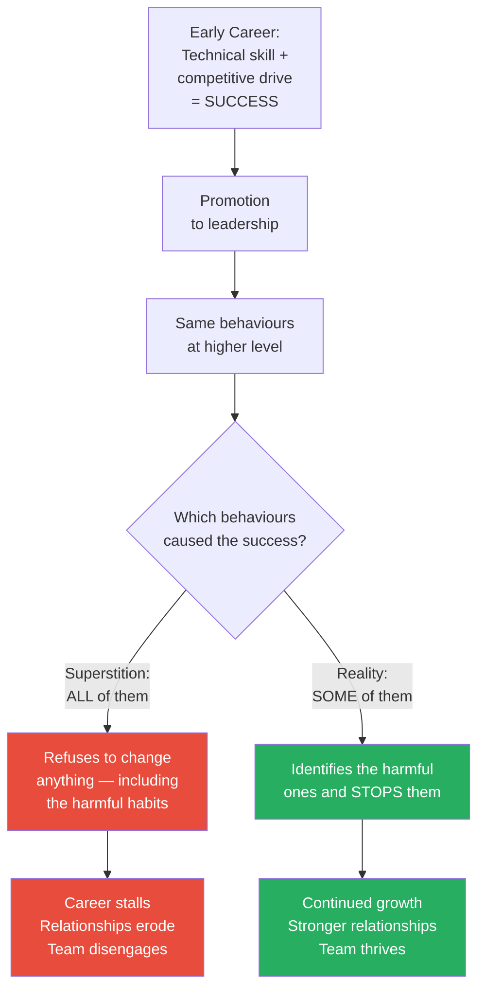
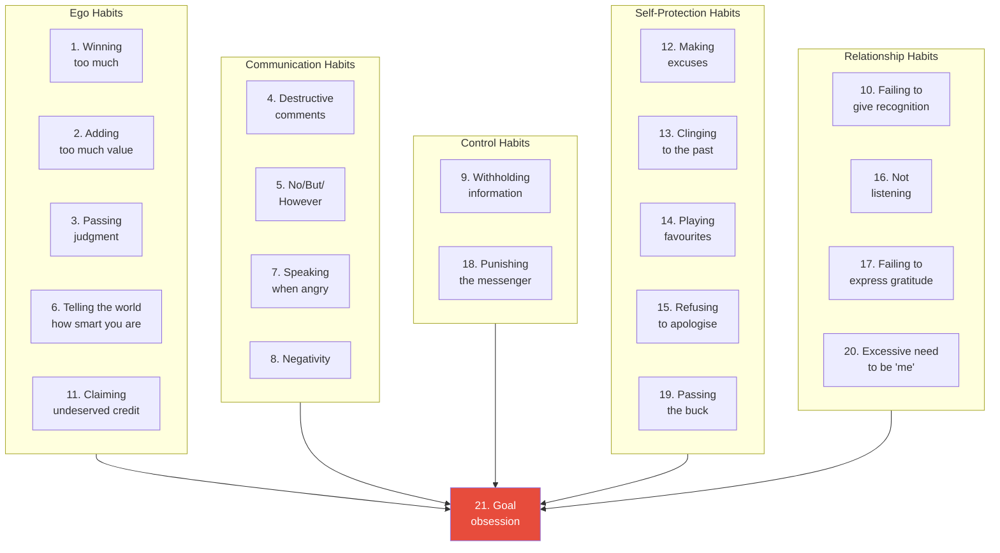
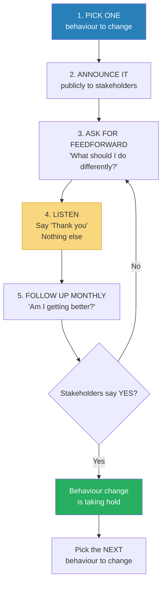
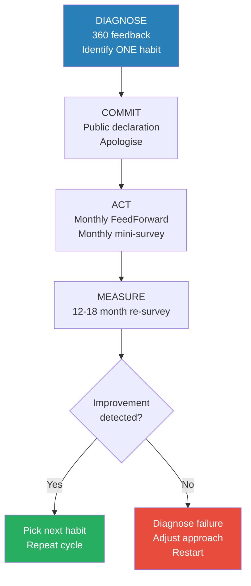
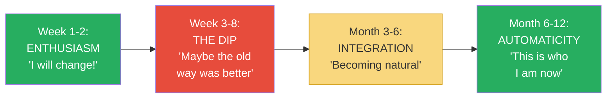
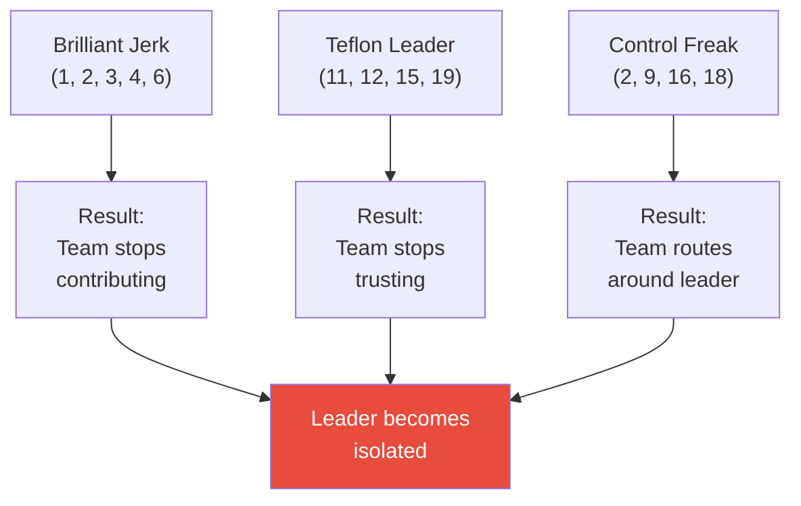
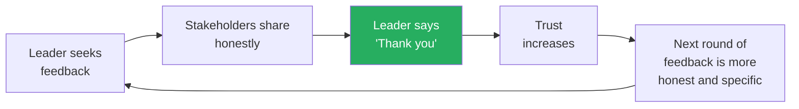

# What Got You Here Won't Get You There — Marshall Goldsmith

> Marshall Goldsmith's thesis is counterintuitive and uncomfortable: the habits that made you successful are not the same habits that will make you MORE successful — and some of them are actively holding you back.
> As the world's #1-ranked executive coach, who has worked with 150+ CEOs, Goldsmith has observed a consistent pattern: the very behaviours that drove early career success (competitiveness, assertion, confidence, decisiveness) become liabilities at senior levels where influence, collaboration, and emotional intelligence matter more.
> The book identifies twenty specific workplace habits that successful people cling to despite evidence they're destructive — plus a devastating twenty-first habit — and proposes a deceptively simple fix: stop doing them.
> This is not a book about learning new skills. It is a book about stopping old behaviours that are undermining the skills you already have.
> The hardest thing for a successful person to hear is that their success happened DESPITE certain habits, not BECAUSE of them.
> It is the essential anti-self-help book: instead of adding new behaviours, subtract the ones that are hurting you.

---

## About the Author

Marshall Goldsmith is the world's #1-ranked executive coach, according to multiple independent rankings including the American Management Association, Harvard Business Review, and Fast Company. He has personally coached over 150 CEOs and their management teams at organisations including Ford, GlaxoSmithKline, the World Bank, the U.S. Army, and dozens of Fortune 500 companies. He holds a PhD in organisational behaviour from UCLA and has written or edited over 35 books on leadership and management.

His coaching process is distinctive: he measures success not through self-assessment but through <b style="color: #2980b9">stakeholder-centred coaching</b> — the people around the leader rate whether the leader has improved. If stakeholders don't report improvement, Goldsmith doesn't get paid. This "pay for results" model has forced him to identify, with empirical precision, which behaviours actually matter and which are just noise. The twenty-one habits in this book are the distilled product of that process.

---

## The Big Idea

- <b style="color: #2980b9">Success creates bad habits, not just good ones</b>
- The competitive drive that got you promoted to VP is the same drive that makes you need to "win" every argument at the leadership table
- The confidence that made you a star individual contributor is the same confidence that makes you dismiss input from your team
- The decisiveness that made you a great analyst is the same decisiveness that makes you judge every idea before it's fully formed

---

- <b style="color: #e74c3c">At senior levels, interpersonal behaviour matters more than technical skill</b>
- You weren't promoted to the C-suite because you know more about accounting or engineering than anyone else — you were promoted because someone believed you could lead people
- But the skills that made you technically excellent (precision, competitiveness, being right, individual achievement) are often the exact skills that make you a poor leader (rigidity, needing to win, being unable to listen, not sharing credit)
- <b style="color: #27ae60">The fix is not to DO more but to STOP doing things that are hurting you</b>

---

- Goldsmith's deeper insight: successful people suffer from <b style="color: #2980b9">success superstition</b>
- They believe: "I behave this way, AND I am successful. Therefore, I am successful BECAUSE I behave this way."
- <b style="color: #e74c3c">But correlation is not causation</b>
- Many of their behaviours have nothing to do with their success — and some actively hinder it
- The truth is often: "I am successful DESPITE certain behaviours, not BECAUSE of them"
- But because the behaviours and the success co-occurred, the successful person refuses to change anything in the formula — including the harmful parts

This diagram captures the central fork in Goldsmith's argument: the moment where a successful person either clings to every old habit or discerns which ones to keep and which to discard.

The green segments represent factors that genuinely drove early success; the red segments represent interpersonal behaviours that successful people falsely attribute to their success — the core of Goldsmith's "success superstition" where leaders cling to destructive habits because they co-occurred with achievement.

---

## Key Concepts at a Glance

| Concept | One-line summary |
|---------|-----------------|
| **The Twenty Habits** | Twenty specific interpersonal behaviours that successful people must stop to continue advancing |
| **Success Superstition** | The false belief that all your behaviours contribute to your success, when some actually hinder it |
| **Adding Too Much Value** | The most insidious habit — improving others' ideas by 5% while reducing their commitment by 50% |
| **The Ego Cluster** | Habits 1-6 and 11 — driven by the need to be the smartest, most important person in the room |
| **The Communication Cluster** | Habits 4-5, 7-8 — ways of speaking that shut people down before they can contribute |
| **The Self-Protection Cluster** | Habits 12-15, 19 — excuses, past-clinging, favouritism, and refusal to apologise |
| **The Relationship Cluster** | Habits 10, 16-18, 20 — listening failures, ingratitude, and using identity as a shield |
| **Goal Obsession** | The twenty-first habit — pursuing an objective so single-mindedly that you destroy everything else |
| **FeedForward** | Future-focused alternative to feedback — "What should I do differently?" instead of "Here's what you did wrong" |
| **Stakeholder-Centred Coaching** | Measuring improvement through the perceptions of the people around you, not self-assessment |
| **The Apology** | A genuine, unqualified apology with no "but" — one of the most powerful tools in leadership |
| **The Follow-Up** | Monthly check-ins asking stakeholders "Am I getting better?" — the engine of sustained change |

---

## Quick Lookup Table

| # | Habit | Thematic Group | Core Pattern |
|---|-------|---------------|-------------|
| 1 | Winning too much | Ego | Competing when it doesn't matter |
| 2 | Adding too much value | Ego | Hijacking others' ideas |
| 3 | Passing judgment | Ego | Rating everything others say |
| 4 | Making destructive comments | Communication | Sarcasm and put-downs |
| 5 | Starting with No/But/However | Communication | Negating before contributing |
| 6 | Telling the world how smart you are | Ego | Needing to be the expert |
| 7 | Speaking when angry | Communication | Emotional reactivity |
| 8 | Negativity | Communication | Reflexive opposition |
| 9 | Withholding information | Control | Hoarding knowledge as power |
| 10 | Failing to give recognition | Relationship | Not acknowledging contributions |
| 11 | Claiming undeserved credit | Ego | Taking what belongs to others |
| 12 | Making excuses | Self-Protection | Avoiding responsibility |
| 13 | Clinging to the past | Self-Protection | Refusing to adapt |
| 14 | Playing favourites | Self-Protection | Rewarding sycophancy over performance |
| 15 | Refusing to express regret | Self-Protection | Ego too fragile for apology |
| 16 | Not listening | Relationship | Treating dialogue as monologue |
| 17 | Failing to express gratitude | Relationship | Taking people for granted |
| 18 | Punishing the messenger | Control | Attacking bearers of bad news |
| 19 | Passing the buck | Self-Protection | Blaming others for failures |
| 20 | Excessive need to be "me" | Identity | Using personality as a shield |
| 21 | Goal obsession | Drive | Winning the goal, losing everything else |

All five habit clusters feed into Habit 21 — goal obsession — because any of the twenty habits can become turbocharged when attached to a goal pursued with tunnel vision.

The radar reveals that while ego habits are the most frequent and hardest to change, relationship habits have the highest combined impact on team performance and visibility — meaning they offer the greatest return on behavioural investment for leaders willing to address them.

---

## The Twenty-One Habits — In Full Detail

### Thematic Group 1: The Ego Habits (1, 2, 3, 6, 11)

*The ego habits share a common root: the need to be the smartest, most important, most correct person in the room. They are the hardest to fix because the person committing them usually sees them as strengths — "I'm competitive," "I'm helpful," "I have high standards," "I'm knowledgeable," "I deserve recognition." Goldsmith's challenge: you're right about the skill, but wrong about the expression. You can be all of those things without the destructive behaviours that accompany them.*

- The ego cluster is Goldsmith's largest because ego is the primary engine of both success AND failure at senior levels
- Early career: ego drives you to work harder, learn faster, outperform peers. It is fuel.
- Senior career: ego drives you to dominate conversations, hoard credit, and resist feedback. It is poison.
- <b style="color: #2980b9">The transition from ego-as-fuel to ego-as-poison happens gradually</b> — there's no single moment where the switch flips
- Which is precisely why most leaders don't notice it — the behaviour that's hurting them today is the same behaviour that helped them yesterday
- The difference isn't the behaviour — it's the context. What works when you're an individual contributor destroys when you're a leader of people.

---

### Habit 1: Winning Too Much

*The master habit from which most of the others flow — the competitive instinct that served you well in school, in sales, in your first management role, and now poisons every conversation you enter.*

- <b style="color: #e74c3c">The need to win at all costs and in all situations — when it matters, when it doesn't, and when it's totally beside the point</b>
- This is the habit Goldsmith considers the foundation of all the others
- Successful people are competitive by nature — that's part of what made them successful
- But at leadership levels, the need to win every argument, every discussion, every trivial point alienates the very people you need as allies
- The competitive drive doesn't distinguish between high-stakes strategic debates and low-stakes conversations about where to hold the offsite
- <b style="color: #2980b9">Goldsmith calls this the "master habit"</b> because it underlies so many of the others — adding value (Habit 2), passing judgment (Habit 3), claiming credit (Habit 11), and refusing to listen (Habit 16) are all expressions of the need to win

**Why successful people fall into it:**

- Competition produced rewards throughout their entire career — grades, promotions, deals, recognition
- The dopamine hit of "winning" a point in a meeting feels identical to the dopamine hit of winning a client or closing a deal
- <b style="color: #e74c3c">They can't distinguish between winning that matters and winning that costs more than it's worth</b>
- The habit is reinforced because nobody pushes back — when you're the CEO, people let you win
- The absence of resistance is mistaken for agreement
- The leader thinks: "Everyone agrees with me" when the reality is: "Everyone has stopped trying"

**The mechanics of competitive decay:**

- Each "win" in a meeting costs a unit of engagement from the losing party
- The person who was overruled remembers the conversation — the person who won forgets it within minutes
- Over time, the accumulation of small wins produces a devastating outcome: a team that presents only safe, pre-approved ideas
- The leader ends up winning every argument in a room where nobody is trying anymore
- <b style="color: #2980b9">This is the paradox of competitive leadership: you can win so completely that there's nothing left worth winning</b>

**How to break it:**

- Before arguing any point, ask three questions:
  - Does it matter? Is the outcome meaningfully different if they do it their way versus mine?
  - Will winning this argument cost me more in relationship damage than the argument is worth?
  - Am I arguing because the point is important, or because I need to be right?
- <b style="color: #27ae60">If the answer to the third question is "because I need to be right" — stop. Walk away. Let them have it.</b>
- The energy you save can be redirected to the two or three battles that actually matter

**The cost-benefit calculation most leaders never do:**

- Goldsmith suggests a simple exercise: at the end of each day, count the number of arguments you entered
- For each one, ask: "Was the outcome better because I argued?" and "Did it cost me anything in trust, engagement, or goodwill?"
- Most leaders discover they argue 10-15 times per day and that fewer than 2-3 of those arguments were worth the cost
- The remaining 10+ arguments cost them something — even when they were right — without producing proportional value

> [!example] The Dinner Debate
> - A CEO's wife told Goldsmith that her husband was so competitive he had to win every argument at the dinner table
> - They couldn't discuss what movie to see, what restaurant to visit, or what colour to paint the bedroom without it becoming a contest
> - He treated every conversation like a negotiation he had to win
> - When Goldsmith asked the CEO about this, his response was telling: "But I'm usually RIGHT!"
> - Goldsmith's reply: "Is being right about the paint colour worth the damage to your marriage?"
> - The CEO went silent — he had never considered that being right could have a cost
> **The lesson:** Being right has costs, and if you're not accounting for them, winning is actually losing.

> [!example] The Pharmaceutical CEO's Gladiatorial Meetings
> - Goldsmith coached the CEO of a major pharmaceutical company who was universally acknowledged as brilliant — and universally feared
> - His direct reports described meetings as "gladiatorial combat"
> - If you disagreed with him, he would argue until you either conceded or exhausted yourself
> - He won every argument — and also won something else: a team that had stopped disagreeing with him entirely
> - His CFO told Goldsmith: "We just nod now. It's easier. We figure out what he wants to hear and say it. Real discussion died about two years ago."
> - The CEO was winning every battle and losing the war — he had the most compliant team in the industry, which also made it the least innovative
> - The intervention: Goldsmith had the CEO literally count on paper how many times per meeting he argued a point past the point of utility
> - The CEO was stunned to discover he averaged 12 unnecessary "wins" per one-hour meeting
> - Each win took 3-5 minutes and cost one unit of team engagement
> - Over 6 months, the CEO reduced his unnecessary arguments from 12 per meeting to 2-3
> - Team engagement scores improved by 35%, and the quality of strategic decisions improved dramatically because people were finally telling him what they really thought
> **The lesson:** You can win every argument and still lose the war — because a team that stops challenging you stops thinking.

> [!example] The Traffic Light Test
> - Goldsmith uses a simple analogy he calls the "traffic light test" to help leaders calibrate
> - He asks: "You're driving home with your spouse. They say 'I think we should turn left here.' You know the right-turn route is 30 seconds faster. Do you argue?"
> - Most CEOs he asks admit they would argue — and some confess they would argue even if the left-turn route were equally fast
> - The stakes: 30 seconds. The cost: a tense car ride and a spouse who feels overruled on something trivial
> - Goldsmith: "If you can't let someone else choose the route home, how are you going to let someone else choose a business strategy?"
> - The test reveals that the competitive habit operates on autopilot — it doesn't scale to the importance of the decision
> **The lesson:** If you can't lose a trivial argument gracefully, you can't win the ones that matter — because people have stopped fighting you.

> [!tip] Goldsmith's "Winning" Heuristic
> Before arguing any point, ask: "Is winning this argument worth the cost of diminishing the other person?" If the point is trivial, let them have it. Save your competitive energy for the moments that genuinely matter.

---

### Habit 2: Adding Too Much Value

*The most insidious of all twenty-one habits — because it looks like helpfulness on the surface while being corrosive underneath. This is the habit Goldsmith says he sees most often in the leaders he coaches.*

- <b style="color: #e74c3c">The overwhelming desire to add your two cents to every discussion</b>
- A direct report comes to you with an idea. You say: "That's a great idea. And you know what else you could do? You could also add X and Y, and that would make it even better."
- You've just improved the idea by maybe 5%
- But you've reduced the person's <b style="color: #2980b9">ownership</b> of it by 50%
- <b style="color: #e74c3c">Because it's no longer THEIR idea. It's YOUR idea with their name on it.</b>
- People execute their own ideas with passion. They execute other people's ideas with compliance.
- The 5% improvement in quality is not worth the 50% reduction in commitment
- Goldsmith considers this the most common habit among senior leaders — because it combines genuine expertise (you CAN improve the idea) with a natural desire to help (you WANT to improve the idea) in a way that feels virtuous while being destructive

**Why successful people fall into it:**

- Adding value feels GOOD — you're being helpful, sharing your expertise, mentoring
- Years of experience mean you genuinely CAN improve most ideas that come your way
- The habit was rewarded earlier in your career when your role was to be the expert who improved things
- <b style="color: #2980b9">The trap: at senior levels, your role is no longer to improve ideas — it's to develop people who improve ideas on their own</b>
- Every time you "help" by adding your stamp, you undermine the very development you're supposed to be fostering

**The ownership equation:**

- Goldsmith introduces a formula he uses in coaching sessions:
  - Quality of idea x Commitment to execute = Total value delivered
  - A 10/10 idea with 5/10 commitment delivers 50 units of value
  - A 7/10 idea with 10/10 commitment delivers 70 units of value
- <b style="color: #27ae60">The less-perfect idea executed with passion beats the perfect idea executed with compliance every time</b>
- This is counterintuitive for people who built careers on quality and precision — letting a "good enough" idea go forward feels like lowering standards
- But the standard isn't the idea — the standard is the outcome. And outcomes depend on execution. And execution depends on ownership.

**How to break it:**

- Before adding value, ask: "Is my suggestion worth the decline in this person's ownership and enthusiasm?"
- <b style="color: #27ae60">If not — and it usually isn't — just say "Great idea" and move on</b>
- Reserve your input for cases where the idea has a genuine flaw that would cause real damage — not for cases where you'd simply do it slightly differently
- The discipline of restraint is harder than the discipline of contributing — because contributing feels productive while restraint feels passive

**When adding value IS appropriate:**

- Goldsmith doesn't say you should never contribute — he says you should be conscious about when you do
- Add value when: the idea has a genuine flaw that would cause measurable harm
- Add value when: you've been specifically asked for input
- Add value when: the stakes are high enough that 5% improvement in quality outweighs the loss of ownership
- Do NOT add value when: you'd just do it slightly differently but their way would work fine
- Do NOT add value when: you're adding your stamp to feel useful or relevant
- Do NOT add value when: the person needs to learn from their own experience

> [!example] The CEO Whose Team Stopped Trying
> - Goldsmith coached a CEO who was brilliant at improving every idea his team brought him
> - He could take any proposal and make it 5-10% better with a few tweaks
> - After months of coaching, the CEO admitted: "My team has stopped bringing me ideas. They know I'll change them, so why bother?"
> - The CEO's 5% improvement per idea had produced a 100% reduction in initiative from his team
> - The team wasn't lazy or unimaginative — they had simply learned that bringing ideas to this CEO was a losing proposition
> - Every idea they brought would be reshaped until it was barely recognisable as theirs
> - The irony: the CEO complained constantly about his team's "lack of initiative" without seeing that he was the cause
> **The lesson:** When you improve everyone's ideas, you eventually run out of ideas to improve — because people stop sharing them.

> [!example] The Before and After of Adding Value
> - **Before:** A direct report says "I'm thinking we should restructure the quarterly report to lead with the key metrics"
> - The leader responds: "Great idea! And you should also add a comparison to last quarter, and maybe include a forecast section, and definitely restructure the executive summary too"
> - Result: the direct report now has the leader's report to write, not theirs — they execute with minimal enthusiasm
> - **After coaching:** The same direct report brings the same idea
> - The leader responds: "Great idea. Go ahead."
> - Result: the direct report owns the project completely, executes with passion and pride
> - The report might be 5% less "perfect" — but it gets done with 50% more energy and commitment
> - And over time, the direct report's reports get better and better — because they're learning from their own experience, not from the leader's annotations
> **The lesson:** A slightly imperfect idea owned by its creator will outperform a perfect idea owned by no one.

> [!example] The Bake Sale Analogy
> - Goldsmith uses a memorable analogy to explain this habit to executives
> - Imagine your child bakes cookies for a school bake sale. They're not perfect — lopsided, slightly overbaked
> - You say: "Those are great! But let me just fix the frosting, and maybe we should add sprinkles, and actually let me re-do this batch with the right temperature..."
> - Your child's reaction: deflation. It was THEIR project. Now it's yours.
> - Even if the cookies end up better, the child's enthusiasm is gone — and they won't volunteer for the bake sale next year
> - Goldsmith: "You just did to your child what you do to your team every day. And you wonder why nobody volunteers anymore."
> **The lesson:** The impulse to improve is the enemy of the impulse to try — and in the long run, effort matters more than perfection.

> [!tip] The Value-Add Test
> Before improving someone's idea, ask yourself one question: "Is this improvement worth the decline in their ownership?" The answer is almost always no. The rare exceptions are when the idea has a genuine flaw that would cause real damage — not when you'd simply do it differently.

---

### Habit 3: Passing Judgment

*More insidious than Habits 1 or 2 because it can look POSITIVE — even compliments become weapons when they position you as the permanent evaluator of everyone else's worth.*

- <b style="color: #2980b9">The need to rate others and impose your standards on them</b>
- This includes positive judgments: "That's a GREAT idea!" still positions you as the judge
- When you evaluate everything someone says — even favourably — you create a power dynamic where they need your approval before they feel confident
- They start performing for your rating rather than thinking independently
- Over time, your team stops thinking independently — they produce ideas for YOUR rating rather than for the work itself
- <b style="color: #e74c3c">They become approval-seekers rather than problem-solvers</b>
- The judgments don't even have to be verbal — a raised eyebrow, a half-nod, a skeptical "hmm" can all function as ratings that shape the other person's behaviour

**Why successful people fall into it:**

- Being the evaluator is a position of power — the person who rates is higher-status than the person being rated
- It feels natural for a leader to assess quality — that's what leaders do, right?
- <b style="color: #2980b9">The problem is the frequency, not the act</b> — occasional evaluation is necessary; constant evaluation is suffocating
- Leaders who rate everything create teams that can't function without approval
- The team's internal compass breaks — they stop asking "Is this good?" and start asking "Will the boss like this?"

**The invisible micromanagement:**

- Passing judgment is a form of micromanagement that doesn't look like micromanagement
- The leader isn't telling people WHAT to do — they're telling people what they THINK of what they've done
- But the effect is the same: the team optimises for the leader's preferences rather than for the work itself
- A team that constantly seeks approval is slower, less creative, and more anxious than a team that trusts its own judgment
- <b style="color: #e74c3c">Every time you rate someone's idea, you've inserted yourself between the person and the work</b>
- The rating becomes the goal — the work becomes the means to get the rating

**How to break it:**

- <b style="color: #27ae60">Respond with curiosity instead of judgment: "Tell me more about that" instead of "That's great!"</b>
- "What led you to that approach?" engages their reasoning without positioning you as judge
- "Walk me through your thinking" invites depth instead of seeking a rating
- Reserve your evaluative comments for formal reviews and high-stakes decisions — not for every passing conversation
- The shift is from judge to coach — coaches ask questions; judges issue verdicts

> [!example] The Rating Trap
> - A director of product had a habit of responding to every idea with a rating: "That's good," "That's brilliant," "That's OK, but not great," "That's not your best work"
> - She meant it as feedback. Her team experienced it as a continuous exam.
> - After coaching, she noticed that her team had stopped taking risks
> - Every idea they brought was safe, conservative, pre-approved by their own internal "will she rate this highly?" filter
> - The creative, risky ideas — the ones that would have driven innovation — were self-censored before they ever reached her
> - When she switched to curiosity-based responses ("Tell me more," "What made you think of that?"), the team began bringing bolder ideas within weeks
> - She had to resist the urge to rate those bolder ideas too — even positively
> **The lesson:** When you rate everything, people optimise for your rating — not for the work itself. The judge kills the jury's independence.

> [!example] The "Thumbs Up" CFO
> - A CFO had a habit of giving a literal thumbs up or thumbs down during presentations — a physical rating gesture
> - Presenters learned to watch his hand, not his face — they would adjust their presentation in real time based on which way his thumb went
> - One VP described it: "I stopped presenting what I believed and started presenting what would get the thumbs up. I became a performer, not an analyst."
> - When Goldsmith had the CFO put his hands in his pockets during presentations for one month, the quality of the presentations actually improved
> - Without the real-time rating, presenters committed to their own analysis rather than adapting to the audience of one
> **The lesson:** The most powerful thing a leader can sometimes do is remove their evaluation — so people can evaluate themselves.

---

### Habit 6: Telling the World How Smart You Are

*The need to demonstrate your intelligence in every interaction — correcting people, citing credentials, one-upping stories, making sure everyone knows YOU knew this first.*

- <b style="color: #e74c3c">This habit is the verbal equivalent of wearing a name tag that says "I'm the smartest person here"</b>
- It manifests in multiple ways:
  - Correcting minor errors in other people's statements ("Actually, it was Q3, not Q4...")
  - Citing your own credentials during discussions ("In my twenty years of experience...")
  - One-upping stories ("You think that's impressive? Let me tell you about the time I...")
  - Interrupting to show you already know what someone is about to say
  - Finishing other people's sentences to demonstrate you're ahead of them
- The underlying drive: the need to be the smartest person in the room, validated repeatedly

**Why successful people fall into it:**

- They often ARE smart — genuinely, measurably smart
- Intelligence was rewarded throughout school and early career
- <b style="color: #2980b9">The mistake is confusing being smart with NEEDING everyone to know you're smart</b>
- At senior levels, everyone in the room is smart — constantly proving it signals insecurity, not competence
- The person who has to announce their intelligence is the person whose intelligence is least evident from their behaviour

**The three forms of intellectual display:**

- **Correcting:** Fixing minor factual errors that don't change the substance of the discussion — purely to demonstrate superior knowledge
- **Credentialing:** Citing your experience, degrees, or track record as evidence that your opinion should carry more weight
- **One-upping:** Responding to someone's story or achievement with a bigger story or achievement of your own
- All three do the same thing: they shift the conversation from the topic to YOU
- And all three produce the same result: the other person stops sharing — because sharing with someone who corrects, credentials, and one-ups is exhausting

**How to break it:**

- Let your work speak for itself
- When you feel the urge to correct a trivial error, ask: "Does this correction serve the conversation or my ego?"
- <b style="color: #27ae60">Replace "I already know that" with genuine curiosity about the other person's perspective on it</b>
- The most powerful signal of intelligence is asking great questions — not having all the answers
- Nobody leaves a conversation thinking "that person was really smart" because they corrected a date — they leave thinking it because the person asked a question that changed how they thought

> [!example] The Credential-Citing VP
> - A VP of engineering began every discussion with some variation of "In my twenty years of building distributed systems..."
> - His team began calling him "Twenty Years" behind his back
> - New hires were warned: "Don't challenge him — he'll remind you how long he's been doing this"
> - The effect was a team that deferred to his experience instead of bringing fresh perspectives
> - When a junior engineer proposed a novel architecture that would have saved the company months, she was talked out of it by the VP's appeal to experience
> - "I've been doing this for twenty years. Trust me, that approach doesn't scale."
> - The architecture was later implemented by a competitor — and it scaled perfectly
> **The lesson:** When you use your credentials as a weapon, you silence the people who might have the best ideas — because they're too intimidated to share them.

> [!example] The "I Already Knew That" Partner
> - A senior partner at a consulting firm had a habit of responding to every piece of information with "I know" or "I was already thinking that"
> - Whether it was a market insight, a client observation, or a competitor analysis — he had to have known it first
> - His associates gradually stopped bringing him information — not because it wasn't useful, but because the response was always the same: "I already knew that"
> - When a junior associate discovered a critical flaw in a client's supply chain — information that could have saved the engagement — she hesitated to bring it forward
> - Her reasoning: "He'll just say he already knew. And if he already knew, why didn't he act on it? So either he's lying about knowing, or he knew and didn't care. Either way, bringing it up doesn't help me."
> - The flaw went unreported for two months and nearly cost the firm the client
> **The lesson:** "I already knew that" is the most expensive sentence a leader can say — because it guarantees you'll never hear the thing you don't already know.

**The "smart person" paradox:**

- Goldsmith observes that the smartest people are often the worst offenders of Habit 6 — precisely because they ARE smart
- Their intelligence is genuine, which makes the display feel honest rather than arrogant
- But there's a difference between BEING intelligent and NEEDING to be perceived as intelligent
- <b style="color: #27ae60">The truly confident leader doesn't need to announce their intelligence</b> — it's evident in their questions, their decisions, and their results
- The insecure leader needs external validation of their intelligence — which paradoxically signals insecurity, not intelligence
- Goldsmith's test for Habit 6: "If you stopped correcting, credentialing, and one-upping for one month, would your team think you'd become less intelligent? Or would they think you'd become more mature?"
- The answer is always the latter — because the team already knows you're smart. What they want to see is wisdom, not brilliance.

---

### Habit 11: Claiming Credit You Don't Deserve

*The most efficient way to demoralise a high-performing team — taking credit for work you didn't do, sometimes without even realising it.*

- <b style="color: #e74c3c">The most efficient way to demoralise a high-performing team is to take credit for their work</b>
- It doesn't even have to be intentional or explicit
- When the CEO presents the quarterly results and says "I'm pleased to report that we exceeded targets" instead of "The team exceeded targets, and I want to specifically acknowledge [name] for [contribution]," the team hears: "She thinks SHE did this."
- Over time, the best performers leave — they know who did the work, and they know their leader doesn't acknowledge it
- The performers who stay learn to stop performing above baseline — why put in discretionary effort when someone else will get the credit?

**Why successful people fall into it:**

- <b style="color: #2980b9">Self-serving attribution bias</b> — humans naturally attribute success to themselves and failure to external factors
- When things go well, the leader thinks: "My strategy, my leadership, my team selection"
- When things go poorly, the leader thinks: "The market, the competition, the team's execution"
- This bias operates unconsciously — most credit-takers genuinely believe they deserve the credit
- The leader's perspective: "I created the conditions for this success." The team's perspective: "We did the work while they sat in meetings."

**The credit economy:**

- Goldsmith treats credit as a currency — it can be given, taken, or shared
- <b style="color: #27ae60">Leaders who give credit generously build reserves of goodwill and loyalty that compound over time</b>
- Leaders who take credit deplete those reserves until there's nothing left
- The paradox: the leader who gives away all the credit ends up with more influence and loyalty than the leader who hoards it
- Giving credit costs nothing. Taking credit costs everything.

**How to break it:**

- <b style="color: #27ae60">Over-attribute credit to others, because your default attribution is biased toward yourself</b>
- When in doubt about who deserves credit, give it to the other person — you're probably wrong about how much you contributed
- Name people specifically: "This was Sarah's idea" not "We came up with this"
- In presentations, systematically attribute every result to the person or team that produced it
- Goldsmith's rule: if you can name the person who did the work, always name them

> [!example] The Presentation Theft
> - A senior director spent three weeks helping a junior manager prepare a client presentation
> - On the day, the junior manager delivered it brilliantly
> - When the CEO congratulated the director afterward, the director said: "Thank you — I spent a lot of time on that one"
> - The junior manager, standing nearby, heard everything
> - She never brought another presentation to the director for help again
> - The correct response: "Thank you — that was all [junior manager's name]. She did outstanding work."
> - Even if the director DID spend three weeks on it — because the moment of delivery belonged to the person who delivered it
> **The lesson:** Taking credit costs nothing in the moment and everything in trust. Giving credit costs nothing ever and builds everything.

> [!example] The "We" That Means "I"
> - Goldsmith noticed that many leaders use "we" as a credit-taking device disguised as humility
> - "We developed a new strategy" when the VP of strategy developed it alone
> - "We closed the biggest deal in company history" when a single sales rep closed it
> - The word "we" sounds humble — but when the leader is the one saying it, the audience attributes the accomplishment to the leader
> - Goldsmith's fix: "She developed the strategy" or "James closed the deal" — specific attribution, not collective vagueness
> - The irony: leaders who name names end up getting MORE credit from above, because their boards and bosses think: "This person has built a great team." Giving credit downward generates credit upward.
> **The lesson:** "We" is humility when a team member says it. "We" is appropriation when the leader says it.

---

### Thematic Group 2: The Communication Habits (4, 5, 7, 8)

*These four habits are about HOW you speak, not WHAT you say. You can be right about everything and still alienate everyone — because the medium destroys the message. The communication habits are the most visible to others and the least visible to the person committing them.*

- The communication habits are unique because they're observable in real time — anyone in the room can see them happening
- Unlike ego habits (which the leader may not even recognise as ego), communication habits leave visible evidence: the stunned face after a cutting remark, the silence after a "no, but..."
- <b style="color: #2980b9">Goldsmith considers these the easiest habits to diagnose but among the hardest to change</b>
- They're easy to diagnose because other people can point to specific words and moments
- They're hard to change because they're deeply encoded in speech patterns — you don't think before saying "but," you just say it
- The intervention for all four is the same: create a gap between stimulus and response. The gap gives you a chance to choose differently.

---

### Habit 4: Making Destructive Comments

*Sarcasm, cutting remarks, needless put-downs — the verbal shrapnel that smart people scatter without noticing the wounds left behind.*

- <b style="color: #e74c3c">The comment that makes everyone laugh except the person it targets</b>
- Successful people often have sharp minds and quick wit — which means they CAN make devastating comments
- The question is whether they SHOULD
- Goldsmith distinguishes between two types:
  - **The public barb** — a witty put-down delivered in front of others ("Well, THAT was certainly an interesting approach...")
  - **The private dig** — a comment made one-on-one that implies the person is inadequate ("Are you sure you're ready for this?")
- Both create the same damage: the recipient remembers the comment long after the speaker has forgotten it
- <b style="color: #2980b9">There's an asymmetry of memory: the person who delivers the comment forgets it within hours. The person who receives it remembers it for years.</b>

**Why successful people fall into it:**

- Quick wit was rewarded socially — being funny, clever, the person with the sharp observation
- The speaker experiences a momentary thrill of cleverness; the target experiences a lasting wound
- Witnesses recalibrate: "If they'd say that about her, what do they say about me?"
- <b style="color: #e74c3c">Each laugh costs one unit of trust</b> — and trust is the foundation of influence
- The habit persists because the damage is invisible to the speaker — they see the laughter, not the wound

**The ripple effect:**

- Destructive comments don't just damage the target — they damage every relationship in the room
- Every witness processes the same thought: "I could be next"
- The room's risk tolerance drops immediately — people become more guarded, more careful, less honest
- <b style="color: #2980b9">One cutting remark can change the entire culture of a meeting</b> from open to defensive
- The speaker gets a laugh. The room gets quieter. And the speaker never connects the two.

**How to break it:**

- Goldsmith's test: "Will this comment advance the conversation, or just make me feel clever?"
- A stricter test: "Would I say this if it would appear as a headline in tomorrow's newspaper?"
- <b style="color: #27ae60">Before you speak, ask: is it true? Is it necessary? Is it kind? If it fails any of these tests, don't say it.</b>
- The moment of wit you sacrifice is not worth the trust you destroy

> [!example] The "Cute Analysis" Comment
> - A senior VP, in a quarterly review, responded to a junior analyst's presentation with: "Well, that was... cute"
> - The room laughed. The VP felt clever. The comment took two seconds.
> - The analyst was devastated — she had spent two weeks on the analysis
> - Three years later, when Goldsmith interviewed her as part of a 360 process, she cited that comment as the moment she stopped trusting the VP
> - The VP had absolutely no memory of saying it
> - When Goldsmith told him about it, the VP was genuinely shocked: "I was just being funny. I didn't mean anything by it."
> - Goldsmith: "You didn't mean anything by it. She means something by it every day."
> **The lesson:** Leaders forget their destructive comments. Recipients carry them forever.

> [!example] The "Joke" That Destroyed a Partnership
> - A managing partner at a law firm had a habit of making pointed jokes at the expense of junior partners during partner meetings
> - "Well, at least someone's billable hours are keeping the lights on — oh wait, not yours, Tom"
> - Tom laughed along because that's what you do when the managing partner makes a joke at your expense
> - But Tom also spent three months negotiating his departure to a rival firm
> - When he left — taking two major clients with him — the managing partner was stunned
> - In his exit interview, Tom said one sentence: "I got tired of being the punchline."
> - The managing partner's jokes had cost the firm approximately $4 million in annual revenue
> **The lesson:** The target of your joke is always keeping score — even when they're laughing.

> [!example] The Sarcasm Audit
> - Goldsmith conducted what he calls a "sarcasm audit" on a division president known for his biting humour
> - Over two weeks, Goldsmith's team recorded every sarcastic or cutting remark the president made — in meetings, hallways, and even the cafeteria
> - The count: 34 cutting remarks in 10 working days
> - Goldsmith then interviewed 12 people who had been targets of those remarks
> - 11 of the 12 remembered the specific comment, the date, and the context — some from months earlier
> - The president remembered exactly zero of the 34 comments
> - Goldsmith showed the president the list. The president was horrified: "I thought I was just being funny. I had no idea I was doing this THIRTY-FOUR TIMES in two weeks."
> - The asymmetry was total: the speaker experienced 34 moments of wit. The targets experienced 34 wounds.
> - After reviewing the data, the president implemented a simple rule: "Before saying anything clever, ask: would I say this to my most important client?" If not, don't say it to your team either
> **The lesson:** If you audit your cutting remarks, you'll discover two things: you make far more of them than you think, and every one of them is remembered by someone.

---

### Habit 5: Starting with "No," "But," or "However"

*The ubiquitous qualifiers that unconsciously tell people: "You're wrong and I'm about to explain why" — so automatic that most people don't even know they do it.*

- <b style="color: #e74c3c">These three words erase everything that came before them</b>
- "That's a good point, BUT..." — everything before "but" is negated
- "I agree with most of what you said, HOWEVER..." — the listener hears only the disagreement
- "NO, what I think is..." — the bluntest form: a direct negation before you even state your position
- <b style="color: #2980b9">Most people don't realise they do this</b> — Goldsmith recommends recording yourself in meetings for a week and counting the instances
- The brain processes "but" as a deletion command — everything before it is psychologically erased
- The speaker thinks they're building on the other person's point. The listener hears only contradiction.

**Why successful people fall into it:**

- Their role has often been to improve, critique, and refine — all of which start naturally with qualifiers
- "But" and "however" feel nuanced and diplomatic — you're acknowledging the other person's point before making your own
- <b style="color: #e74c3c">The reality: the other person doesn't hear the acknowledgment. They hear the negation.</b>
- It becomes so habitual that the speaker uses "but" even when they agree — creating a tone of opposition in conversations where none exists

**The linguistic mechanics:**

- "But" functions as a verbal eraser — psychologically, it deletes the clause that preceded it
- "That's a great idea, BUT..." — the listener's brain discards "great idea" and prepares for criticism
- "And" functions as a verbal connector — it preserves the previous clause while adding to it
- "That's a great idea, AND..." — the listener's brain retains "great idea" and opens to the addition
- The semantic difference is small. The emotional difference is enormous.

**How to break it:**

- Replace "No, but, however" with "And"
- "That's a good point, AND here's another way to think about it" — builds on the contribution rather than negating it
- <b style="color: #27ae60">The "and" discipline: for one week, consciously replace every "but" and "however" with "and"</b>
- You'll slip constantly. By the end of the week, conversations will flow more smoothly and people will open up more — because they're no longer bracing for the "but" that signals dismissal

> [!example] The "But" Epidemic
> - Goldsmith tracked a senior VP's use of "but" and "however" for one week
> - The count: 47 uses of "but" and 23 uses of "however" in five days of meetings — an average of 14 per day
> - Each one negated or qualified whatever the other person had just said
> - After seeing the data, the VP was shocked: "I had no idea. I thought I was agreeing with people."
> - Goldsmith's analysis: "You WERE agreeing — for the first half of each sentence. Then you erased your agreement with 'but' and replaced it with your own view."
> - The VP committed to the "and" discipline for 30 days
> - By day 10, his direct reports noticed the change without being told
> - One said: "Something's different. I feel like he actually hears me now."
> - Another: "Meetings feel less like debates and more like conversations."
> - After 30 days, the VP observed: "I haven't changed my opinions on anything. I'm still just as opinionated. But people seem to actually CONSIDER my opinions now instead of getting defensive. Because I'm not negating theirs first."
> **The lesson:** Replacing one word — "but" with "and" — changed how an entire team experienced their leader.

---

### Habit 7: Speaking When Angry

*The habit that produces the most immediate and most visible damage — because words spoken in anger cannot be unsaid, and the consequences arrive faster than regret.*

- <b style="color: #e74c3c">Speaking when angry</b> is the habit with the shortest fuse and the longest fallout
- It includes:
  - Sending the furious email at 10pm
  - Making the cutting remark in the meeting when someone challenges you
  - Raising your voice in front of the team
  - Firing off the text message that you'd never send with a cool head
  - The explosive reaction when a project goes wrong
- Anger feels powerful — until you see the damage
- <b style="color: #2980b9">The fundamental problem: anger hijacks your executive function</b>
- Your prefrontal cortex — the part that plans, evaluates consequences, and exercises restraint — goes offline
- What remains is the limbic system: react, attack, defend
- Words spoken from the limbic system rarely serve the speaker's long-term interests

**Why successful people fall into it:**

- Anger feels righteous — "I SHOULD be angry about this. This is unacceptable."
- In some cultures and industries, displays of anger are interpreted as passion or intensity
- Early in their career, angry outbursts may have produced compliance — people did what they wanted to avoid the explosion
- <b style="color: #e74c3c">They mistake compliance for agreement and fear for respect</b>
- The leader thinks: "When I show anger, things get done." The reality: "When I show anger, people avoid me — and route around me to get things done without triggering another explosion."

**The permanence problem:**

- Goldsmith emphasises that angry words have a unique quality: they cannot be unsaid
- You can apologise, explain, contextualise — but the words are permanent
- <b style="color: #2980b9">Every person who witnessed the outburst now has a data point about your character</b>
- They may forgive, but they will not forget
- And they will adjust their behaviour accordingly — sharing less, risking less, trusting less

**How to break it:**

- <b style="color: #27ae60">The 24-hour rule: never respond to anything when angry. Write it if you must — then save as a draft and wait 24 hours.</b>
- If you still want to send it the next day, you probably still shouldn't
- For in-person situations: take a breath, say "I need to think about this," and leave the room if necessary
- The goal is not to suppress anger but to separate the FEELING of anger from the ACTION of responding

> [!example] The Career-Ending Email
> - A VP of marketing received a critical email from a colleague and fired back a scathing reply — CC'd to the entire leadership team
> - The reply was witty, devastating, and addressed every point with surgical precision
> - It was also career suicide
> - Within 48 hours, the CEO called the VP in and said: "The email was brilliant. It was also the last thing you'll write as a VP at this company."
> - The VP didn't lose his job because he was wrong — in fact, he was right about most of the substantive points
> - He lost his job because the email revealed something about his character that no amount of being right could compensate for
> - Everyone who read it learned the same thing: this person cannot be trusted with power when provoked
> **The lesson:** Being right in the wrong way is the same as being wrong. The message may be correct, but the medium destroys the messenger.

> [!example] The Meeting Room Meltdown
> - A COO discovered during a quarterly review that a product launch had been delayed by three weeks without her being told
> - She erupted in the meeting room — voice raised, finger pointed, questions fired like artillery
> - "Why wasn't I informed? Who authorised this delay? This is completely unacceptable!"
> - Every point she made was legitimate. The delay SHOULD have been communicated. Someone HAD dropped the ball.
> - But the room went silent — not attentive silent, but terrified silent
> - The VP of Product, who had made the delay decision for a legitimate quality concern, later told Goldsmith: "She was right about everything. But after that meeting, I will never voluntarily tell her bad news again. I'll wait until she discovers it herself."
> - The COO had won the argument and lost the information pipeline
> - After coaching, she developed a personal protocol: when she felt anger rising in a meeting, she would say "I want to discuss this. Let's take 15 minutes and reconvene."
> - The 15-minute break allowed her prefrontal cortex to re-engage — and her responses, while still direct, became constructive rather than destructive
> **The lesson:** Anger doesn't make you wrong. But it makes you unsafe — and people don't bring information to unsafe leaders.

> [!abstract] The 24-Hour Email Protocol
> 1. Receive the provocative email
> 2. Write your devastating reply — get it all out of your system
> 3. Save it as a draft — do NOT send
> 4. Close the email. Go to bed. Do something else.
> 5. Re-read the next morning with fresh eyes
> 6. Ask: "Was I right? Probably. Would sending this help me? Almost certainly not."
> 7. Write a calm, measured response that addresses the substance without the venom
> 8. Send to the other person only — no CC circus

---

### Habit 8: Negativity

*"Let me tell you why that won't work" — the phrase that kills more good ideas than any other, disguised as realism, risk management, or playing devil's advocate.*

- <b style="color: #e74c3c">Reflexive negativity masquerades as "being realistic" or "playing devil's advocate" or "risk management"</b>
- But there is a critical difference between genuine risk assessment and habitual opposition:
  - **Genuine risk assessment:** "I like this idea. Here are two risks I'd want us to mitigate before proceeding."
  - **Habitual opposition:** "That'll never work because [reason 1], [reason 2], and [reason 3]."
- The first preserves the idea while addressing risks — the second kills it before risks can even be assessed
- <b style="color: #2980b9">Over time, habitual negativity trains the team to stop proposing anything that might be challenged</b>
- Which means they stop proposing anything innovative, because innovation is inherently challengeable
- The negative person thinks they're protecting the organisation from bad ideas. They're actually starving it of all ideas.

**Why successful people fall into it:**

- Risk awareness was valuable earlier — spotting problems before they materialised was a legitimate skill
- <b style="color: #e74c3c">The skill calcified into a reflex</b> — now every idea triggers the "find the flaw" response
- Saying "no" feels intellectually rigorous. Saying "yes" feels naive.
- There's an asymmetry of consequences: if you say "yes" and it fails, you're blamed. If you say "no" and it would have succeeded, nobody knows what was lost.
- So "no" is the safe bet — safe for the individual, catastrophic for the organisation

**The innovation tax:**

- Every reflexive "no" imposes what Goldsmith calls an "innovation tax" on the organisation
- Each killed idea has a probability of being good — and the killer never finds out what was lost
- Over a year, a leader who kills 50 ideas may have unknowingly killed 5 genuinely great ones
- The organisation never knows, because the ideas were never tested
- <b style="color: #27ae60">The cost of saying "no" is invisible. The cost of saying "yes" is visible. This asymmetry is what makes negativity so persistent and so destructive.</b>

**How to break it:**

- For 30 days, every time you feel the urge to say "no" or "that won't work," replace it with <b style="color: #27ae60">"Yes, and..."</b>
- Not "Yes, but..." (which is just "no" with a preamble)
- "Yes, AND here's how we might address the risk I see"
- "Yes, AND what if we tested this on a small scale first?"
- "Yes, AND have we considered what happens if [scenario]?"

> [!example] Dr. No Becomes Dr. Yes-And
> - Goldsmith coached a CFO who was known as "Dr. No" — every proposal met with a list of reasons it couldn't be done
> - She genuinely believed she was protecting the company; her team believed she was killing it
> - The intervention: for 30 days, replace every "no" with "Yes, and..."
> - After 30 days, her team brought her three times as many proposals as before — because they knew proposals would be engaged with, not killed
> - More proposals meant more ideas evaluated, which meant better decisions, which meant better outcomes
> - The CFO's "no" hadn't been protecting the company — it had been starving it of options
> - She later admitted: "I thought I was the guardian. I was actually the gatekeeper — and I'd locked the gate."
> **The lesson:** The person who says "no" to everything doesn't reduce risk — they reduce opportunity.

> [!example] The Innovation Graveyard
> - Goldsmith worked with a technology company that was struggling with innovation — competitors were shipping new features faster and more creatively
> - The diagnosis revealed that the VP of Product was a classic Habit 8 practitioner
> - Her team had what they called the "innovation graveyard" — a shared document where they listed every idea that had been killed in her meetings
> - The graveyard contained 47 ideas killed over two years
> - Goldsmith had an independent panel review the 47 ideas — they estimated that 8-10 of them would have been commercially successful
> - The VP had protected the company from 37 bad ideas (legitimate risk management) while also killing 10 good ones (innovation destruction)
> - The cost of the 10 killed good ideas was estimated at $15-20 million in unrealised revenue
> - After coaching, the VP adopted a "test before kill" policy: instead of killing ideas outright, she asked "What would a small-scale test look like?"
> - Within a year, three of the previously killed ideas were resurrected, tested, and became the company's fastest-growing product lines
> **The lesson:** "No" doesn't just kill bad ideas — it kills all ideas, including the ones that would have transformed your business. You just never get to find out which ones.

---

### Thematic Group 3: The Control Habits (9, 18)

*These habits are about power expressed through information control. The leader who hoards information and punishes those who bring bad news creates an information vacuum around themselves — they're the last to know what's really happening, which makes them the worst-positioned person to lead.*

- The control habits are the most structurally dangerous because they don't just damage relationships — they damage the organisation's ability to make good decisions
- <b style="color: #2980b9">Good decisions require good information. The control habits systematically degrade information quality.</b>
- A leader who hoards information (Habit 9) ensures their team operates with incomplete data
- A leader who punishes messengers (Habit 18) ensures that the data they DO receive is filtered for comfort rather than accuracy
- The combination creates a leader who is simultaneously the most powerful person in the room and the least informed
- <b style="color: #e74c3c">This is the most dangerous position in any organisation: power without information</b>

---

### Habit 9: Withholding Information

*Information is power — and some leaders accumulate it compulsively, sharing only what people "need to know," which conveniently is always just enough to keep the leader indispensable.*

- <b style="color: #e74c3c">Withholding information is not just about control — it's about FEAR</b>
- Fear of being replaceable
- Fear of losing status
- Fear of others succeeding without you
- The paradox: <b style="color: #2980b9">leaders who hoard information become bottlenecks that the organisation eventually routes around</b>
- If you're the only person who knows how the system works, you're not powerful — you're a single point of failure
- Organisations eventually eliminate single points of failure — either by working around them or by removing them
- <b style="color: #27ae60">The truly powerful move is to share information freely</b> — because the person who shares becomes the hub, the connector, the person everyone comes to
- That's structural power, not hoarded power

**Why successful people fall into it:**

- Knowledge asymmetry was a genuine source of power earlier — knowing things others didn't made you valuable as an individual contributor
- <b style="color: #e74c3c">At senior levels, your value comes from SHARING knowledge, not HOARDING it</b>
- The transition from "knowledge as personal asset" to "knowledge as organisational resource" is one of the hardest shifts in leadership
- Some leaders genuinely don't realise they're withholding — they think they're being appropriately discreet or managing information flow
- Others know exactly what they're doing — they just can't stop, because the alternative (being replaceable) feels terrifying

**The three forms of withholding:**

- **Deliberate hoarding:** Consciously keeping information to maintain a power advantage
- **Passive withholding:** Not sharing information because "nobody asked" — even when it would help the team
- **Selective sharing:** Sharing partial information that makes you look good while omitting information that would empower others
- All three produce the same result: a team operating with incomplete information, making suboptimal decisions, and developing a growing distrust of the leader's motives

**How to break it:**

- Ask yourself regularly:
  - What information do I have that my team could use?
  - Am I sharing it proactively, or only when asked?
  - Am I holding any information because sharing it would make me less "needed"?
  - <b style="color: #27ae60">If I disappeared tomorrow, would my team have everything they need to continue?</b>
- If the answer to the last question is "no," you're not protecting the organisation — you're making it fragile

> [!example] The Information Bottleneck
> - A division head kept all client relationship details in his personal notebook — never in the CRM system
> - His rationale: "These relationships are delicate. I need to manage them personally."
> - The real motivation: as long as he was the only person who knew the clients, he was untouchable
> - When he took a two-week holiday, three client issues went unresolved because nobody had the context
> - One client left entirely, citing "lack of responsiveness"
> - The information he'd hoarded to protect his position had instead destroyed the value he was trying to protect
> - After coaching, he spent a month documenting every client relationship in the CRM — and discovered that his team managed them better than he had, because they weren't trying to hoard
> **The lesson:** Hoarding information doesn't make you indispensable — it makes the organisation fragile around you. And fragile systems eventually break.

> [!example] The VP Who Made Herself Redundant — and Got Promoted
> - Goldsmith tells this story as the counterexample to information hoarding
> - A VP of Customer Success deliberately documented every process, every client relationship, and every institutional knowledge she held
> - She created training materials, cross-trained team members, and built systems that could function without her
> - Her peers thought she was crazy: "You're making yourself replaceable!"
> - Her response: "I'm making myself promotable. You can't be promoted out of a role nobody else can fill."
> - When a senior VP position opened up, she was the only candidate who could take it — because she was the only VP whose team could function without them
> - Every other VP was too embedded in their team's operations to be moved
> - The information hoarders were trapped by their own hoarding — too "essential" in their current role to be promoted out of it
> **The lesson:** Information hoarding doesn't protect your position — it imprisons you in it. The person who shares freely is the person who can move up.

---

### Habit 18: Punishing the Messenger

*Attacking the person who brings bad news — guaranteeing that bad news stops reaching you until it's too late to do anything about it.*

- <b style="color: #e74c3c">The instinct to shoot the messenger is ancient, and it is catastrophically destructive in organisations</b>
- When you react negatively to bad news — visible frustration, blame, sharp questions about "how did you let this happen?" — you teach the messenger one thing: don't bring bad news
- The next time something goes wrong, they'll wait. They'll hope it resolves itself. They'll cover it up if they can.
- By the time the bad news reaches you — because eventually it always does — it's far worse than it would have been if you'd heard it early
- <b style="color: #2980b9">The messenger becomes conflated with the message</b> — the person who tells you about the problem feels like the person who caused the problem

**Why successful people fall into it:**

- Bad news threatens the narrative of success — "everything is going well because I'm leading it"
- The leader's emotional reaction (frustration, anger, blame) is genuine — they DO feel threatened by bad news
- But the reaction, however genuine, kills the information pipeline
- The leader creates a paradox: they demand to be informed while punishing the people who inform them
- Eventually, only good news reaches the top — and the leader mistakes information asymmetry for actual performance

**The cascading information blackout:**

- The first time a leader reacts badly to bad news, one person learns not to share
- That person tells colleagues: "Don't tell the boss about X — they'll shoot the messenger"
- Now an entire team has learned the rule
- The team's managers learn it from observing the team
- <b style="color: #e74c3c">Within a year, the leader has created a systematic information blackout around themselves — and they have no idea</b>
- They think everything is fine. Everything is not fine. They're just the last person to find out.

**How to break it:**

- <b style="color: #27ae60">Thank the messenger first — always, without exception</b>
- "Thank you for telling me. I'm glad I know." Then investigate the message.
- Separate the person who delivers the news from the news itself
- Create explicit channels for bad news and reward people who use them
- The goal: make bringing bad news a REWARDED behaviour, not a punished one

> [!example] The NASA Parallel
> - Goldsmith draws a direct parallel to the culture that produced the Challenger and Columbia shuttle disasters
> - Junior engineers saw the problems — foam strikes, O-ring failures — but the organisational culture punished dissent
> - The people who raised concerns were sidelined, ignored, or overruled
> - The bad news didn't disappear because it was suppressed — it accumulated until it became catastrophic
> - In corporate settings, the stakes are rarely lives — but the mechanism is identical: suppress bad news and it compounds silently until it explodes
> - A product defect unreported for six months becomes a product recall. A client dissatisfaction unreported for a quarter becomes a lost contract.
> **The lesson:** The most dangerous thing in any organisation is a leader who can't hear bad news — because bad news doesn't stop happening just because you stop hearing about it.

> [!example] The Quarterly Surprise
> - A CEO had a habit of grilling people who brought bad news: "How did you let this happen? Why didn't you catch this earlier? Who else knows about this?"
> - The questions were legitimate. The tone was prosecutorial.
> - The effect: by Q3, nobody brought problems to the CEO until they were unavoidable
> - The Q4 board meeting revealed three major issues that had been festering for months
> - The board asked the CEO: "How did you not know about these?"
> - The CEO's answer was honest: "Nobody told me."
> - What he didn't say: "Because I'd trained them not to."
> **The lesson:** A leader who prosecutes the messenger eventually runs out of messengers — and then runs out of time.

---

### Thematic Group 4: The Self-Protection Habits (12, 13, 14, 15, 19)

*These habits share a root in ego protection — they are all ways of avoiding responsibility, maintaining a comfortable self-image, or insulating yourself from the discomfort of being wrong. They are the habits of a person whose ego is too fragile to absorb criticism, acknowledge error, or tolerate the vulnerability of genuine accountability.*

- The self-protection habits are distinguished from the ego habits by their orientation: ego habits are about asserting superiority; self-protection habits are about avoiding vulnerability
- <b style="color: #2980b9">The ego habits say: "I am better than you." The self-protection habits say: "It's not my fault."</b>
- Both are destructive, but self-protection habits are more corrosive to trust specifically
- A leader who's arrogant (ego) can still be trusted if they take responsibility when things go wrong
- A leader who deflects blame (self-protection) cannot be trusted regardless of their other qualities
- <b style="color: #e74c3c">Trust requires vulnerability. Self-protection habits are the systematic elimination of vulnerability.</b>
- The tragic irony: the self-protection habits are designed to preserve the leader's position, but they actually accelerate the leader's decline — because a team that doesn't trust its leader eventually finds a new one

---

### Habit 12: Making Excuses

*The "but" that follows "sorry" — turning every apology into a justification and every failure into somebody else's fault.*

- "I'm sorry I was late, BUT traffic was terrible."
- <b style="color: #e74c3c">Everything before the "but" is erased by the "but"</b>
- What the other person hears is not the apology but the justification — and the justification says: "It wasn't my fault"
- Goldsmith distinguishes between <b style="color: #2980b9">explanations</b> (neutral, informational: "I took a different route because of construction") and <b style="color: #e74c3c">excuses</b> (self-serving, responsibility-avoiding: "It wasn't my fault because...")
- The test: does the explanation serve the listener (helps them understand the situation) or the speaker (protects their ego)?
- If an apology needs a "but," it's not an apology — it's an excuse with a preamble

**Why successful people fall into it:**

- Taking full responsibility feels dangerous — it exposes you to judgment
- Excuses provide emotional armour: "I didn't fail; circumstances failed me"
- <b style="color: #2980b9">Success culture often punishes failure</b>, which makes excuses a rational self-defence mechanism
- The habit becomes automatic — every mistake comes pre-packaged with a justification
- Over time, the excuse-maker stops seeing the excuses as excuses — they genuinely believe they're providing context

**How to break it:**

- <b style="color: #27ae60">Replace "I'm sorry, but..." with "I'm sorry. Here's what I'll do differently."</b>
- The accountability version includes three components: acknowledge, explain without "but" (if explanation serves the listener), and commit to change

| Statement | Type | Impact |
|-----------|------|--------|
| "I'm sorry I missed the deadline." | Apology | Trust maintained |
| "I'm sorry I missed the deadline, but the client changed specs." | Excuse | Trust eroded — you're not actually taking responsibility |
| "I missed the deadline. The client changed specs, which cost us two days. Here's how I'll prevent this next time." | Accountability | Trust strengthened — acknowledge, explain, commit |

> [!example] The Excuse Machine
> - Goldsmith coached an executive who had a perfect record of never being responsible for anything that went wrong
> - When a product launch failed: "Marketing didn't support it properly"
> - When a client left: "They were always going to leave — the relationship was damaged before I got here"
> - When a team member resigned: "She wasn't a good fit anyway"
> - Every failure had an external cause. Every success was his doing.
> - His team had a name for this pattern: "the Teflon effect" — nothing stuck to him
> - The problem: nobody trusted him, because everyone could see the excuses were self-serving
> - The intervention was simple: for 30 days, no explanations after any apology. Just "I'm sorry. Here's what I'll do differently."
> - After 30 days, his direct reports said something remarkable: "He's more trustworthy now than he's ever been — not because he stopped failing, but because he started owning it."
> **The lesson:** A leader who takes responsibility — even when it's not entirely their fault — earns more trust than one who deflects — even when the deflection is technically accurate.

> [!example] The Weather Excuse
> - Goldsmith tells a story about an executive who was late to a crucial board meeting
> - His excuse: "Traffic was terrible because of the rain"
> - The board chair's response: "Did it rain on your house only, or did everyone else somehow drive through the same rain and arrive on time?"
> - The executive went silent — he had never considered that his excuse was an explanation of physics, not an acceptance of responsibility
> - The real issue: he hadn't left early enough because he didn't prioritise the meeting enough to build in a buffer
> - "Traffic" wasn't the cause. His planning was the cause. The traffic was a predictable variable that a responsible person accounts for.
> - Goldsmith uses this story to illustrate the difference: "I was late because of traffic" is an excuse. "I was late because I didn't leave early enough to account for traffic" is accountability.
> **The lesson:** An excuse explains the mechanics of the failure. Accountability explains your role in it. The first protects your ego. The second builds your credibility.

---

### Habit 13: Clinging to the Past

*"That's how we've always done it" — the corporate equivalent of "because I said so," usually deployed by people who built the thing being questioned.*

- <b style="color: #e74c3c">"That's how we've always done it"</b> is the phrase that kills adaptation
- Goldsmith sees this habit most often in leaders who were deeply involved in building the systems now being questioned
- The system they built WAS excellent — five years ago. But the world has changed, and their emotional attachment to the old system prevents them from seeing the new reality clearly.
- <b style="color: #2980b9">The attachment is not to the system but to the identity: "I built this. If we change it, what does that say about me?"</b>
- Changing the system feels like invalidating their past contribution — an existential threat to their professional legacy

**Why successful people fall into it:**

- They have a personal stake in the current system — they created it, championed it, defended it
- <b style="color: #e74c3c">The sunk cost fallacy</b> — they've invested so much in the current approach that abandoning it feels wasteful
- Past success becomes evidence that the current approach should continue, even when the environment has changed
- The emotional calculation: "If we change this, it means I was wrong" — even though the truth is "you were right then, but circumstances have changed"

**The legacy trap:**

- The most dangerous version of this habit is the "legacy builder" — the leader who sees the current system as their professional monument
- They defend the system not because it's optimal but because it represents their life's work
- <b style="color: #27ae60">Goldsmith reframes this: "Your legacy isn't the system you built. Your legacy is the ABILITY to build great systems. If you can build one, you can build a better one."</b>
- The reframe separates the person's value from any single output — which frees them to let the output evolve

**How to break it:**

- <b style="color: #27ae60">Goldsmith's reframe: "The fact that you built something excellent is why we trust you to build the NEXT excellent thing. Changing the system doesn't invalidate your past contribution — it honours it by building on it."</b>
- Ask: "If we were starting from scratch today, would we build this the same way?" If not, the past is an anchor, not a foundation.

> [!example] The Process That Outlived Its Purpose
> - A manufacturing director had designed the company's quality control process a decade earlier — and it had been excellent for its time
> - As the company grew from 50 to 500 employees, the process became a bottleneck — every product change required his personal sign-off
> - When his team proposed a decentralised model, he blocked it: "This process has kept our defect rate below 1% for ten years. Why would we change it?"
> - The answer: because the process that kept defects at 1% was also keeping product velocity at half the industry standard
> - After coaching, he led the redesign himself — and the new process achieved even lower defect rates with three times the throughput
> - He later admitted: "I wasn't protecting the process. I was protecting my legacy. Once I let go of that, I could see that the best legacy was building something even better."
> **The lesson:** The best thing you can do with something you built is build something better.

> [!example] The "My Baby" Syndrome
> - A CTO had written the company's original codebase — every function, every module, every architecture decision
> - As the company grew and hired better engineers, they proposed modernising the codebase with contemporary tools and patterns
> - The CTO blocked every proposal: "This codebase has served us for eight years. It doesn't need fixing."
> - The truth: the codebase was functional but increasingly costly to maintain — technical debt was accumulating, and new features took three times longer than competitors
> - When three senior engineers resigned citing "inability to use modern practices," the board intervened
> - The CTO was given a choice: lead the modernisation or step aside
> - He chose to lead it — and later said: "I thought they were attacking my baby. They were actually trying to help it grow up."
> **The lesson:** The system you built is not your identity — your ability to build great systems is. If you can build one, you can build a better one.

---

### Habit 14: Playing Favourites

*Rewarding people who flatter you over people who perform — creating a culture where the path to advancement runs through agreement, not excellence.*

- Leaders disproportionately reward people who:
  - Agree with them (confirmation bias)
  - Flatter them (reciprocity)
  - Are similar to them (in-group preference)
  - Make them feel good (emotional reward)
- <b style="color: #e74c3c">None of these criteria correlate with performance</b>
- The result: the leader is surrounded by agreeable sycophants while the independently-minded high performers are marginalised or gone
- This is one of the most structurally damaging habits because it doesn't just affect one relationship — <b style="color: #2980b9">it corrupts the entire team's incentive structure</b>
- If the path to promotion is agreeing with the boss, rational people will agree with the boss. Original thinking will be punished.

**Why successful people fall into it:**

- The bias is unconscious — they genuinely believe they're rewarding merit
- <b style="color: #2980b9">People who agree with you feel like they "get it" — people who challenge you feel like they "don't get it"</b>
- But the person who challenges you is often providing the most value — they're adding a perspective you don't have
- The person who agrees with you is adding nothing — they're just confirming what you already think
- The emotional reward of being surrounded by agreeable people is immediate; the strategic cost of losing dissenters is delayed

**The selection spiral:**

- Goldsmith describes a spiral that accelerates over time:
  - Year 1: The leader slightly favours agreeable people over disagreeable ones
  - Year 2: The disagreeable people (who are often the most talented) notice and leave or disengage
  - Year 3: The remaining team is more agreeable but less capable
  - Year 4: The leader hires replacements who are — unconsciously — selected for agreeableness
  - Year 5: The leader is surrounded by people who mirror their own views, creating a leadership echo chamber
- <b style="color: #e74c3c">By year 5, the leader has built a team that confirms every bias, supports every bad decision, and challenges nothing</b>

**How to break it:**

- <b style="color: #27ae60">Goldsmith's test: "Am I promoting this person because they're the best performer, or because they make me feel good?"</b>
- Actively seek out and reward dissenting voices — the person who tells you what you don't want to hear is providing the most valuable information
- Evaluate on performance data, not on how comfortable you feel around someone

> [!example] The Sycophant Spiral
> - A division head consistently promoted the people who agreed with her and sidelined the ones who pushed back
> - Over three years, the composition of her leadership team shifted dramatically — all the original thinkers had left or been sidelined
> - Her remaining team was pleasant, agreeable, and utterly incapable of challenging a bad idea
> - When she proposed a major strategic pivot that was deeply flawed, nobody said a word
> - The people who would have said something were gone
> - The pivot failed spectacularly — and the post-mortem revealed that multiple people had seen the problems but lacked the standing or the courage to raise them
> **The lesson:** When you select for agreement, you eliminate the people who would save you from your worst ideas.

> [!example] The Dissenter Who Got Away
> - A VP of Engineering at a healthcare company regularly clashed with the CEO over product strategy
> - The CEO found her "difficult" and "confrontational" — she challenged his ideas publicly, citing data
> - When her performance review came, the CEO rated her "meets expectations" despite her team delivering the best results in the company
> - The VP left for a competitor within three months
> - At the competitor, she built a product that took 15% market share from her former company
> - The CEO's post-mortem: "She was the only person who told me when I was wrong. Now nobody does. And I'm making the same mistakes she used to catch."
> - He had punished the person who provided the most value because she didn't provide the most comfort
> **The lesson:** The person who makes you uncomfortable might be the most valuable person on your team — because comfort and value are different things.

---

### Habit 15: Refusing to Express Regret

*"I don't apologise" is often presented as a sign of strength. It is actually a sign of fragility — an ego so brittle it cannot absorb the weight of being wrong.*

- <b style="color: #2980b9">The leader who never apologises creates a culture where mistakes are hidden rather than surfaced</b>
- If the boss can't admit error, neither can anyone else — the cost of being wrong is too high
- <b style="color: #e74c3c">In a no-apology culture, errors compound silently until they become catastrophic</b>
- In a culture where apology is modelled by the leader, errors are caught early, corrected quickly, and used as learning opportunities
- <b style="color: #27ae60">The leader's apology is not a sign of weakness — it is a grant of permission for the entire organisation to be honest about mistakes</b>
- Research shows the opposite of what most leaders assume: leaders who apologise are rated as MORE competent and MORE trustworthy, not less
- An apology signals self-awareness, emotional maturity, and confidence — it takes a secure person to say "I was wrong." An insecure person cannot afford to.

**Why successful people fall into it:**

- Apologising feels like admitting weakness (threatening to the ego)
- It feels like losing status (someone who was wrong is lower than someone who was right)
- It feels like opening yourself to exploitation ("If I admit fault, they'll use it against me")
- <b style="color: #e74c3c">All three fears are overblown</b> — the evidence runs in the exact opposite direction

**The apology deficit:**

- Goldsmith calculates what he calls the "apology deficit" for leaders he coaches
- He asks: "When was the last time you apologised?" and "When was the last time you were wrong?"
- The gap between these two answers is the apology deficit
- For most senior leaders, the deficit is measured in years — they've been wrong dozens of times but apologised once or never
- <b style="color: #2980b9">Each unapologised wrong accumulates as a unit of resentment in the people affected</b>
- Over years, the accumulated resentment becomes an invisible weight on every relationship

**How to break it:**

- Goldsmith's rules for effective apology:
  - NOT: "I'm sorry, BUT..." (excuse follows)
  - NOT: "I'm sorry IF I offended anyone" (conditional, non-committal)
  - NOT: "I'm sorry you feel that way" (blames the other person's reaction)
  - <b style="color: #27ae60">YES: "I'm sorry. I was wrong. I'll do better." Full stop.</b>
- This takes approximately five seconds and costs nothing — but most leaders would rather undergo root canal surgery than deliver it

> [!example] The CEO's First Apology in 30 Years
> - Goldsmith describes a CEO who, in 30 years of leadership, had never apologised for anything
> - In the first coaching session, Goldsmith asked: "When was the last time you said 'I was wrong'?"
> - The CEO thought for a long time. "I can't remember."
> - Goldsmith: "When was the last time you WERE wrong?"
> - The CEO: "This morning."
> - Goldsmith: "Then you have a 30-year apology debt. Let's start paying it down."
> - The CEO's first public apology — at an all-hands meeting, for a strategic decision that had cost the company a year of misdirected effort — was met with stunned silence, then applause
> - Three team members approached him afterward: "I've been wanting to tell you about a problem in my area, but I was afraid to admit I'd made a mistake. After today, I feel like I can."
> - One apology unlocked a year's worth of hidden problems
> **The lesson:** The cost of one apology is 30 seconds of vulnerability. The return is organisational honesty.

---

### Habit 19: Passing the Buck

*Blaming others for your failures — the mirror image of Habit 11 (claiming credit you don't deserve). Together they form a toxic pair: take credit for success, assign blame for failure.*

- <b style="color: #e74c3c">Passing the buck erodes trust faster than almost any other habit</b>
- Everyone in the room usually knows who is actually responsible
- When a leader blames someone else, the team doesn't think "Oh, it WAS that person's fault" — they think "This leader doesn't take responsibility"
- Over time, the pattern destroys credibility entirely
- Habits 11 and 19 together are especially devastating: a leader who takes credit for successes and deflects blame for failures creates a team that feels exploited and resentful

**Why successful people fall into it:**

- Taking responsibility for failure feels career-threatening
- <b style="color: #2980b9">In many organisational cultures, failure IS punished</b> — so deflecting blame is a rational survival strategy
- The problem: it's a short-term survival strategy that destroys long-term trust
- The leader who always has someone else to blame eventually runs out of people willing to work with them
- Because everyone knows: if something goes wrong, they'll be the scapegoat

**The blame pattern visible to everyone:**

- Goldsmith notes that buck-passing is one of the habits most visible to the team and least visible to the leader
- The leader thinks they're providing accurate post-mortems: "Marketing underperformed," "Engineering missed the deadline," "Sales didn't execute"
- The team hears a pattern: successes are "mine," failures are "theirs"
- <b style="color: #e74c3c">After enough repetitions, the team develops a reflex: when things go wrong, they start building their own defences before the blame arrives</b>
- Energy that should go into fixing the problem goes into deflecting blame
- The organisation becomes a blame economy rather than a performance economy

**How to break it:**

- <b style="color: #27ae60">Replace "It was their responsibility" with "That was my responsibility. Here's what I'll do differently."</b>
- Even when the failure genuinely involved others, the leader's role is to own the outcome
- "I failed to set clear expectations" is more useful than "They didn't deliver"
- "I should have checked in earlier" is more useful than "They should have flagged it sooner"

> [!example] The Buck-Passing CEO
> - A startup CEO had a pattern of blaming his direct reports in board meetings when targets were missed
> - "Sales underperformed because the VP of Sales didn't execute the strategy I laid out"
> - "Product was late because the engineering team didn't prioritise properly"
> - The board initially accepted these explanations — but over time, they noticed a pattern
> - One board member finally asked: "If every failure is someone else's fault, why do you keep hiring people who fail?"
> - The CEO had no answer — because the real answer was that the failures were systemic, not individual
> - His refusal to own the outcomes prevented systemic fixes — because you can't fix what you won't claim
> **The lesson:** A leader who blames everyone else isn't protecting themselves — they're advertising their own ineffectiveness. And everyone can see it.

> [!example] The Contrasting Leaders
> - Goldsmith observed two leaders in the same company respond to the same crisis — a product recall
> - **Leader A** (VP of Manufacturing): "The quality team failed to catch the defect. Their testing protocols were inadequate."
> - **Leader B** (VP of Engineering): "This happened on my watch. I should have built better checkpoints into the design review process. Here's my plan to prevent it."
> - Both leaders were partially responsible. Neither was solely at fault.
> - The difference: Leader A's team felt betrayed and became defensive. Leader B's team felt supported and became problem-solving.
> - Six months later, Leader B's team had the best quality metrics in the company. Leader A's team had the highest turnover.
> - The board noticed both outcomes — and drew the obvious conclusion about which leader was more effective
> **The lesson:** Taking responsibility doesn't just build trust — it builds team performance. Deflecting responsibility doesn't just erode trust — it erodes results.

---

### Thematic Group 5: The Relationship Habits (10, 16, 17, 20)

*These habits damage the fundamental human connections that leadership depends on. You can be technically brilliant, strategically sound, and analytically rigorous — but if you can't recognise people, listen to them, thank them, or evolve how you interact with them, your brilliance is trapped inside a person nobody wants to work with.*

- The relationship habits are the "softest" of the five clusters — and therefore the ones most often dismissed by hard-driving leaders
- "I don't have time for thank-you notes. I have a business to run."
- <b style="color: #2980b9">Goldsmith's rebuttal: recognising, listening, and thanking ARE running the business</b>
- Leadership is not a solo activity — it is fundamentally relational
- Every strategic decision depends on people to execute it. Every innovation depends on people to generate it. Every problem depends on people to surface it.
- <b style="color: #27ae60">If people don't feel recognised, heard, and valued, they will stop executing, innovating, and surfacing problems</b>
- The relationship habits are not "soft skills" — they are the infrastructure on which all "hard" outcomes depend
- Goldsmith's data supports this: among the twenty habits, the relationship cluster has the strongest statistical correlation with team engagement, retention, and performance

---

### Habit 10: Failing to Give Proper Recognition

*Not acknowledging others' contributions — not out of malice, but out of simple failure to notice. The silence that reads as disapproval.*

- <b style="color: #e74c3c">Silence is not neutral. Silence reads as disapproval.</b>
- When you say nothing about someone's good work, they don't conclude "he's satisfied" — they conclude "he doesn't notice or doesn't care"
- The habit is rarely intentional — the leader simply doesn't think about recognition as part of their role
- In their mind, doing good work is the expectation. Why would you praise someone for meeting expectations?
- But the absence of praise is not neutral — it's an active signal that the work doesn't matter, or that the person doing it doesn't matter

**Why successful people fall into it:**

- They were often driven by internal motivation — they didn't need external praise to do their best work
- <b style="color: #2980b9">They project this onto others</b> — assuming everyone is equally self-motivated
- Recognition feels unnecessary or even patronising: "I'm not going to hand out participation trophies"
- The irony: they themselves respond powerfully to recognition (a board compliment, a peer's acknowledgment, an industry award) — they just don't provide it to others
- There's also a scarcity mindset: "If I praise everyone, it becomes meaningless." But the opposite is true — specific, sincere praise never becomes meaningless.

**The recognition gap:**

- Goldsmith describes a consistent pattern in his coaching: leaders underestimate how much recognition their teams need
- The leader's self-assessment: "I recognise people when they do exceptional work"
- The team's experience: "The last time anyone acknowledged my work was six months ago"
- The gap exists because the leader's threshold for "recognition-worthy" is far higher than the team's need for acknowledgment
- <b style="color: #27ae60">The solution isn't to lower your standards for what deserves recognition — it's to recognise the effort and progress that leads to those standards being met</b>

**How to break it:**

- One sincere, specific piece of recognition per day
- Not "good job" (too generic) but "The way you structured the client presentation yesterday — the opening story about the supply chain disruption — that was exactly right"
- <b style="color: #27ae60">Specific, timely, sincere, and frequent — that's the recognition formula</b>
- The specificity matters because it proves you actually noticed the work, rather than offering a generic courtesy

> [!example] The COO Who Couldn't Say "Well Done"
> - A COO at a technology company was technically exceptional and strategically brilliant
> - His team was highly productive but had the worst retention rate in the company
> - When Goldsmith investigated, the reason was simple: the COO never acknowledged anyone's contributions
> - Not out of malice — he simply didn't notice. In his mind, good work was the baseline.
> - His team's perspective: "I've been here three years and I honestly don't know if he thinks I'm doing a good job or not. He's never said."
> - The intervention was the simplest of all: one sincere, specific piece of recognition per day
> - The COO reported that giving recognition was initially "excruciating" — "It felt like handing out participation trophies"
> - But within 6 months, team retention improved by 40%
> - The COO came to see recognition as "the highest-leverage activity in my day — two minutes of effort that produces months of engagement"
> **The lesson:** Two seconds of specific acknowledgment can be worth more than a year of silence.

> [!abstract] The Recognition Formula
> 1. **Specific** — not "good job" but "the way you handled [specific thing]"
> 2. **Timely** — within 24 hours of the behaviour, not at the annual review
> 3. **Sincere** — only recognise what genuinely deserves it (insincere praise is worse than no praise)
> 4. **Public when appropriate** — recognition in front of peers amplifies its impact
> 5. **Frequent** — one piece of genuine recognition per day changes your leadership reputation within weeks

---

### Habit 16: Not Listening

*The habit most closely correlated with overall leadership failure — because if you can't hear what people are telling you, no other skill matters.*

- Goldsmith considers <b style="color: #e74c3c">not listening</b> to be the single most damaging interpersonal habit a leader can have
- He defines it precisely — not listening isn't about hearing impairment. It manifests as:
  - Finishing others' sentences
  - Checking phone or email while someone is talking
  - Composing your response while the other person is still speaking
  - Changing the subject to something you find more interesting
  - One-upping: "That reminds me of an even bigger deal I closed..."
  - Starting to speak the instant the other person pauses for breath
  - Multitasking visibly during conversations
- <b style="color: #2980b9">The fundamental attribution error of bad listeners: they think they're being efficient. The other person thinks they're being disrespected.</b>

**Why successful people fall into it:**

- Their time feels more valuable than other people's time — so listening feels like an inefficient use of it
- They usually CAN anticipate where the other person is going — which makes them impatient
- <b style="color: #e74c3c">They confuse comprehension with listening</b> — "I understood your point before you finished making it" is not the same as "I heard you"
- Listening requires subordinating your own agenda temporarily — which feels like surrendering control
- The leader thinks: "I'm saving time by jumping ahead." The other person thinks: "They don't care what I have to say."

**The difference between comprehension and listening:**

- Comprehension is cognitive — you understand the content of what's being said
- Listening is relational — the other person FEELS heard
- You can comprehend without listening — understanding someone's point while making them feel ignored
- <b style="color: #27ae60">In leadership, the relational dimension matters more than the cognitive one</b>
- People don't follow leaders who understand them. They follow leaders who HEAR them.
- The distinction seems trivial. It is not. It is the difference between a team that complies and a team that commits.

**How to break it:**

- <b style="color: #27ae60">Goldsmith's listening protocol:</b>
  1. Before responding, count to three silently — this prevents the "jump in the instant they pause" reflex
  2. Before stating your view, summarise theirs: "So what I'm hearing is..." — proves you were listening AND gives them a chance to correct misunderstanding
  3. Before adding your perspective, ask a question: "Can you tell me more about [the part that interests you most]?"
  4. When you do respond, begin with what you AGREE with, not what you disagree with

> [!example] The "I'm Listening" Delusion
> - Goldsmith asked a CEO if he was a good listener. "Absolutely," the CEO said. "I pride myself on it."
> - Goldsmith then asked the CEO's direct reports the same question
> - Their average rating of his listening skill: 2.3 out of 10
> - The gap between self-assessment and stakeholder assessment was the largest Goldsmith had ever measured
> - When he showed the CEO the data, the CEO's first response was: "They're wrong."
> - His second response (after reflection): "Oh God. I really don't listen, do I?"
> - His third response (after coaching): "Listening is the hardest thing I've ever learned. Harder than any business skill. Because it requires me to shut up — and shutting up has never been my strength."
> - After 6 months of the listening protocol, his direct reports' rating improved from 2.3 to 7.8
> **The lesson:** The worst listeners think they're the best — because nobody has ever told them otherwise (or if they did, the leader wasn't listening).

> [!example] The BlackBerry Executive
> - In the early 2000s, Goldsmith coached an executive who was glued to his BlackBerry during every conversation
> - He would nod and say "uh-huh" while scrolling through emails — technically present, functionally absent
> - His direct reports described talking to him as "talking to a mannequin that occasionally nods"
> - The intervention: the BlackBerry goes in a drawer during all one-on-one conversations. No exceptions.
> - The executive protested: "What if there's an emergency?"
> - Goldsmith: "In the history of corporate emergencies, how many required your immediate response during a 30-minute conversation?"
> - The executive admitted: zero
> - After removing the device, his direct reports reported within weeks that "it feels like talking to a different person"
> - One said: "For the first time in three years, I feel like he actually cares about what I'm saying"
> **The lesson:** The device in your hand sends a louder message than the words from your mouth — and the message is: "You're less important than whatever's on this screen."

---

### Habit 17: Failing to Express Gratitude

*The cheapest habit to fix and the most expensive to maintain — because saying "thank you" costs nothing and not saying it costs everything.*

- <b style="color: #e74c3c">Failing to express gratitude</b> is the mirror image of Habit 10 (failing to give recognition), but broader
- Recognition is about acknowledging specific work. Gratitude is about acknowledging the person.
- "Thank you for the report" is recognition. "Thank you for always being the person I can rely on" is gratitude.
- Goldsmith cites research showing that <b style="color: #2980b9">the #1 reason people leave jobs is not pay but feeling undervalued</b>
- A study of 200,000 employees found that "my manager regularly acknowledges my contributions" was the single strongest predictor of engagement and retention
- The absence of gratitude is not neutral — it's an active signal that the person's effort is taken for granted

**Why successful people fall into it:**

- They're busy. They're focused on the next problem, not on the people who solved the last one.
- Gratitude feels soft — and successful people often prize toughness
- <b style="color: #e74c3c">They assume people know they're valued</b> — "I gave them a good performance review. Isn't that enough?"
- It's not enough. People need to hear it regularly, in specific terms, from the person whose opinion matters most to them.
- There's also a false scarcity concern: "If I thank everyone, it becomes meaningless." Wrong — specific, sincere gratitude never becomes meaningless.

**The gratitude asymmetry:**

- Leaders underestimate the impact of their gratitude because they underestimate their own importance to their team members
- When the CEO says "thank you" to a VP, it carries enormous weight — because the CEO's opinion matters enormously to the VP
- When the CEO says nothing, the silence also carries weight — in the opposite direction
- <b style="color: #27ae60">The higher your position, the more powerful your gratitude — and the more damaging your silence</b>
- This asymmetry means that leaders have a disproportionate impact with very small gestures

**How to break it:**

- <b style="color: #27ae60">"Thank you for [specific thing]" — three times daily</b>
- Not "thanks for everything" (generic) but "Thank you for staying late to fix the reporting error. The client presentation would have been a disaster without you."
- Written thank-you notes have disproportionate impact because they're so rare — a handwritten note takes 60 seconds and is remembered for years

> [!example] The Two-Word Turnaround
> - Goldsmith coached a division head at a financial services firm whose team engagement scores were the lowest in the company
> - After 360 feedback, the #1 complaint was: "He never says thank you"
> - The intervention: say "thank you" to at least three people per day, for specific things they did
> - Not "thanks for everything" (generic) but "Thank you for staying late to fix the reporting error. The client presentation would have been a disaster without you."
> - After 6 months: engagement scores improved from the bottom quartile to the top quartile
> - Two words, three times a day, complete transformation in how his team experienced him as a leader
> **The lesson:** Gratitude is the highest-ROI leadership behaviour — it costs nothing and returns everything.

> [!example] The Handwritten Note
> - Goldsmith recommends handwritten thank-you notes as a high-impact practice — specifically because they're so rare in the digital age
> - A VP of Operations started writing one handwritten note per week to someone in his organisation who had done something noteworthy
> - Each note took approximately 90 seconds to write
> - After six months, something unexpected happened: the notes were showing up pinned to cubicle walls, taped to monitors, and framed on desks
> - People were keeping them — because in many cases, it was the only tangible evidence they'd ever received that a senior leader noticed their work
> - One employee told him: "I've been here twelve years. Your note is the first time anyone above my manager has acknowledged anything I did."
> - The VP's 90 seconds of effort had produced a permanent artifact of recognition — something that no email, Slack message, or verbal "thanks" could match
> **The lesson:** In a world drowning in digital communication, a handwritten note is a physical proof that someone stopped what they were doing and thought about you. That has extraordinary power.

---

### Habit 20: An Excessive Need to Be "Me"

*The meta-habit that enables all the others — using your identity as an excuse for bad behaviour, turning "that's just who I am" into the ultimate get-out-of-jail card.*

- Goldsmith considers Habit 20 the <b style="color: #e74c3c">meta-habit that enables all the others</b>
- When confronted about any of the first nineteen habits, the response is often: "That's just who I am. I can't change that. That's my personality."
- <b style="color: #2980b9">Goldsmith's devastating counter: "How do you know? Have you tried?"</b>
- The "that's just me" defence treats personality as fixed and immutable — a set of traits carved in stone
- <b style="color: #27ae60">Goldsmith treats personality as a set of habits — and habits, by definition, can be changed</b>
- "Being direct" is not a personality trait — it's a behavioural choice. You can choose to be direct AND kind. You can choose to be honest AND tactful.
- <b style="color: #e74c3c">"That's just who I am" is not self-knowledge. It's self-indulgence.</b>
- It's the ultimate conversation-stopper because it reframes a behavioural choice as an identity trait — and nobody can argue against someone's identity

**Why successful people fall into it:**

- Identity feels sacred — changing a behaviour feels like changing who you ARE
- Their "flaws" are often entangled with their strengths: "I'm blunt, but that's because I value honesty"
- <b style="color: #2980b9">The false dichotomy</b>: they believe the only options are "be blunt" or "be dishonest" — they can't see that "be honest and tactful" is also available
- Changing feels like capitulating — surrendering a part of themselves to please others
- There's also a laziness component: "That's just who I am" requires zero effort. Actually changing requires sustained work.

**The identity-behaviour confusion:**

- Goldsmith makes a sharp distinction that is central to his coaching approach:
  - **Identity:** "I am a direct communicator" — a claim about who you fundamentally ARE
  - **Behaviour:** "I often communicate bluntly, which sometimes hurts people" — an observation about what you DO
- The first cannot be acted on. The second can.
- <b style="color: #27ae60">When you reframe a behaviour as an identity, you make it immune to change</b>
- When you reframe an identity as a behaviour, you make change possible
- The reframing itself is the breakthrough — everything else follows from it

**How to break it:**

- Separate the behaviour from the identity
- "I'm a direct communicator" is an identity claim. "I often communicate in ways that feel direct to me but feel hurtful to others" is a behavioural observation.
- <b style="color: #27ae60">Behavioural observations can be acted on. Identity claims cannot.</b>
- Ask: "Is this behaviour serving me, or is it just familiar?" — familiar and useful are not the same thing

> [!example] The "I'm Just Being Honest" Executive
> - Goldsmith coached a COO who was known for brutal honesty — telling subordinates exactly what he thought of their work, without filter or tact
> - When confronted, he said: "I'm just being honest. People need to hear the truth."
> - Goldsmith asked: "Is it possible to be honest AND diplomatic?"
> - The COO: "Sure, but that's not ME."
> - Goldsmith: "So you're choosing to be hurtful when you could choose not to be — and calling it authenticity?"
> - The COO went quiet for a long time
> - After coaching, he learned to deliver the same honest feedback in a way that people could hear — leading with what they did well, being specific about what needed to change, framing it as development rather than criticism
> - His feedback was just as honest — but no longer destructive
> - His team's engagement scores improved by 40% in six months
> - He later admitted: "I wasn't being authentic. I was being lazy. Being honest AND kind takes more effort. But the results are incomparably better."
> **The lesson:** "That's just who I am" is not an explanation — it's an excuse. The moment you can see it that way, change becomes possible.

> [!example] The "I'm Not a Hugger" SVP
> - An SVP of customer success described herself as "not a people person" — she was analytical, data-driven, uncomfortable with emotional interactions
> - She used this self-description to justify never celebrating team achievements, never having informal conversations, never expressing warmth
> - When Goldsmith asked her to identify what specifically she meant by "not a people person," she listed behaviours: not saying thank you, not asking about people's weekends, not acknowledging effort
> - Goldsmith: "Those aren't personality traits. Those are habits. You can do every one of those things without changing who you are. You're not becoming a different person. You're adding two sentences to your day."
> - She tried it — and discovered that "not a people person" was a story she'd told herself so long that she'd stopped questioning it
> - Within three months, her team described her as "surprisingly warm" — surprising because the warmth had always been there, hidden behind a narrative she'd never examined
> **The lesson:** The stories we tell about ourselves become prisons — until we notice they're just stories.

| "That's Just Who I Am" Claim | Goldsmith's Reframe |
|------------------------------|-------------------|
| "I'm not a morning person" | "You choose not to invest energy in the morning" |
| "I'm not a people person" | "You choose not to invest in interpersonal skills" |
| "I'm just very direct" | "You choose to prioritise bluntness over tact" |
| "I'm a perfectionist" | "You choose to over-invest in quality at the expense of speed and ownership" |
| "I'm not good at politics" | "You choose not to learn how organisational influence works" |
| "I don't do small talk" | "You choose not to invest in the relationship-building that precedes trust" |

- <b style="color: #27ae60">Every "I'm not" or "I can't" can be reframed as "I choose not to" or "I haven't learned to"</b>
- The reframe doesn't change the behaviour — but it removes the identity barrier that prevents change
- Once it's a choice, you can choose differently. As long as it's "who you are," you can't.

---

### The Twenty-First Habit: Goal Obsession

*The twenty-first habit that Goldsmith considers the most dangerous of all — because it weaponises the very quality that success books celebrate: relentless focus.*

- Goldsmith adds a <b style="color: #e74c3c">twenty-first habit</b> that he considers more dangerous than any of the previous twenty
- <b style="color: #2980b9">Goal obsession</b> is pursuing an objective so single-mindedly that you destroy relationships, health, ethics, or other important things in the process
- It is the shadow side of the "relentless focus" that every success book celebrates
- "I will hit my quarterly numbers" becomes "I will hit my quarterly numbers even if it means burning out my team, cutting corners on quality, and neglecting my family"
- The goal itself may be perfectly valid — the problem is the unwillingness to consider its costs
- Every one of the previous twenty habits can become turbocharged when attached to a goal pursued with tunnel vision

**Why successful people fall into it:**

- Goal-setting is universally praised — every management book, every motivational speaker, every leadership programme teaches it
- <b style="color: #e74c3c">What they don't teach is when to STOP pursuing a goal</b>
- Successful people have been rewarded for persistence their entire lives — "never give up" is hardwired
- The idea that giving up on a goal could be the RIGHT move feels like heresy
- <b style="color: #2980b9">But goals are tools, not identities</b> — when the cost of achieving a goal exceeds its value, the rational move is to abandon or adjust it
- The goal-obsessed person can't see this — the goal has become the identity

**The tunnel vision mechanism:**

- Goal obsession narrows the field of vision — the goal becomes the only thing visible
- Relationships, health, ethics, wellbeing — all become invisible because they're not "the goal"
- <b style="color: #e74c3c">The twenty other habits intensify under goal obsession:</b>
  - Winning too much (Habit 1) because the goal demands winning
  - Adding too much value (Habit 2) because the goal demands perfection
  - Not listening (Habit 16) because listening feels like a distraction from the goal
  - Punishing the messenger (Habit 18) because bad news threatens the goal
- Goal obsession is the amplifier that makes every other habit worse

**How to break it:**

- Before pursuing any goal with intensity, ask:
  1. Is achieving this goal worth the cost I'm paying to achieve it?
  2. Am I sacrificing something more important (relationships, health, integrity) to reach something less important (a number, a title, a deadline)?
  3. If I achieve this goal but lose [X] in the process, will I consider it a success?
- <b style="color: #27ae60">If the answers trouble you, the goal isn't the problem — the obsession is.</b>

> [!example] The VP Who Hit Every Target and Lost Everything
> - A VP of sales hit her quarterly targets for 12 consecutive quarters — an extraordinary achievement
> - She was celebrated, promoted, held up as an example to the entire organisation
> - What nobody saw: she worked 80-hour weeks, her marriage collapsed, she hadn't taken a holiday in three years, and her team's turnover was 40% annually
> - She was burning through people to hit numbers — and the organisation rewarded the numbers without examining the cost
> - When Goldsmith asked her: "You've hit every target. Do you feel successful?" she burst into tears
> - "I feel successful at work and like a failure at everything else. And the work success doesn't even feel real anymore — I know it's built on a foundation that's crumbling."
> - The intervention wasn't about working less — it was about asking: "Is this specific target worth this specific cost?"
> - She ultimately restructured her approach: slightly lower targets, sustainable pace, retained team members, rebuilt personal life
> - Her annual numbers were 5% lower. Her life was immeasurably better.
> **The lesson:** A goal achieved at the expense of everything else isn't an achievement — it's a transaction you may not have wanted to make if you'd stopped to think about the price.

> [!example] The Product Launch That Destroyed a Team
> - A VP of Product was tasked with launching a new product line in six months — an aggressive but achievable timeline
> - As the deadline approached, he became goal-obsessed: 14-hour days, weekend work mandated, holidays cancelled
> - When a senior engineer warned that the quality wasn't ready, the VP dismissed it: "We ship on time. Period."
> - They shipped on time. The product had critical bugs. Customer complaints flooded in. The engineering team that built it quit — three out of five left within two months.
> - The VP hit his goal — and it cost the company more than missing the goal would have
> - In the post-mortem, the VP admitted: "I was so focused on the date that I forgot the date was supposed to serve the product, not the other way around."
> **The lesson:** The goal is a tool. When the tool starts destroying the thing it was meant to build, it's time to put it down.

> [!abstract] The Goal Obsession Diagnostic
> Ask yourself these five questions about any goal you're pursuing intensely:
> 1. **The cost question:** What am I sacrificing to achieve this? (List everything: health, relationships, ethics, other goals)
> 2. **The worth-it question:** If someone told me I could achieve this goal but it would cost me [those things], would I still say yes?
> 3. **The sunk cost question:** Am I still pursuing this because it's the right goal, or because I've invested too much to quit?
> 4. **The means question:** Am I comfortable with HOW I'm achieving this? Would I be proud if my methods were public?
> 5. **The aftermath question:** When I achieve this goal, will I look back at the process with pride or with regret?
> If the answers to questions 2-5 make you uncomfortable, the goal itself isn't the problem — the obsession is.

---

## The Solution: FeedForward + Follow-Up

*Goldsmith's process for changing the twenty-one habits is deceptively simple — but he has used it with over 150 CEOs with measurable, stakeholder-verified results. The simplicity is the point: complex change programmes fail because of their complexity. This one succeeds because of its simplicity.*

### Why Traditional Feedback Fails

- Traditional feedback is backward-looking: "Here's what you did wrong in the last quarter"
- It triggers defensiveness: the recipient immediately starts explaining, justifying, or counter-arguing
- It is often delivered badly: vague, delayed, or weaponised as criticism rather than development
- And it is almost never followed up — the conversation happens once and is forgotten
- <b style="color: #e74c3c">The result: traditional feedback changes almost nobody</b>
- Goldsmith estimates that fewer than 10% of feedback conversations produce lasting behavioural change
- The problem isn't the information — it's the delivery mechanism and the absence of follow-through

**Why feedback triggers defensiveness:**

- Feedback is about the past — and we can't change the past
- When someone tells you what you did wrong last quarter, your immediate instinct is to explain WHY you did it
- The explanation feels like self-defence. It looks like resistance to change.
- <b style="color: #2980b9">FeedForward sidesteps this entirely by being about the future</b>
- "What could I do differently going forward?" doesn't trigger defensiveness because there's nothing to defend
- There's no past failure being discussed — only future possibilities

**The five failures of traditional feedback:**

1. **Too late** — delivered months after the behaviour, when the context is forgotten
2. **Too vague** — "You need to communicate better" gives no actionable information
3. **Too personal** — sounds like a character judgment rather than a behaviour observation
4. **Too infrequent** — happens once a year in a performance review, then nothing for 11 months
5. **Too one-directional** — delivered top-down, with no mechanism for the recipient to ask for specifics or help
- FeedForward addresses all five: it's immediate (asked monthly), specific (one behaviour), behavioural (not personal), frequent (monthly cycle), and collaborative (the recipient initiates it)

---

### The FeedForward Process

> [!abstract] The FeedForward Protocol
> 1. **Pick ONE behaviour** — not three, not five, ONE. Ask your direct reports, peers, and boss: "What is the ONE thing I could do differently that would make the biggest difference?" The answer they give is your target.
> 2. **Announce it publicly** — tell everyone: "I'm working on being a better listener. I'd appreciate it if you let me know when I interrupt you." This creates accountability AND gives permission for real-time feedback.
> 3. **Ask for FeedForward** — "What's one thing I could do in our next meeting to listen more effectively?" Future-focused, non-threatening, specific. People love giving FeedForward because it doesn't require them to criticise your past.
> 4. **Listen without defending** — receive the suggestion, say "Thank you," and nothing else. No explaining. No justifying. No "But the reason I do that is..." Just: "Thank you."
> 5. **Follow up monthly** — ask stakeholders: "Am I getting better?" Without follow-up, the initial energy fades and the old habit returns. With follow-up, the change becomes visible, measurable, and sustained.

The monthly follow-up is the engine that sustains change through the inevitable "dip" period — when motivation fades but the habit hasn't yet solidified.

---

### Why "Thank You" Is the Hardest Part

- Goldsmith spends considerable time on why <b style="color: #2980b9">simply saying "Thank you" in response to feedback is so difficult for successful people</b>
- When someone gives you feedback or FeedForward, you want to:
  - Explain why you do the thing ("The reason I interrupt is because meetings run long and I need to keep us on track")
  - Justify the behaviour ("I'm direct because people need to hear the truth")
  - Disagree with the assessment ("I don't think I do that")
  - Turn it around ("Well, you do the same thing!")
- <b style="color: #e74c3c">Every one of these responses kills the feedback loop</b>
- The person who gave you feedback learns: "When I give this person honest input, I get an argument. I won't do that again."
- <b style="color: #27ae60">"Thank you" is the ONLY response that keeps the feedback loop open</b>
- It doesn't mean you agree. It doesn't mean you'll do exactly what they said. It means: "I hear you. I value your perspective. I will consider it."
- That's enough. And for most successful people, it's the hardest two words they'll ever say.

---

### The Stakeholder Check: External Measurement

- Goldsmith's most radical idea: <b style="color: #2980b9">your self-assessment of improvement is worthless</b>
- People consistently overestimate their own improvement — we FEEL like we've changed more than we actually have
- The only valid measurement is: <b style="color: #27ae60">do the people around you perceive improvement?</b>
- If your direct reports, peers, and boss all say you've improved, you've improved — regardless of how you FEEL
- If they say you haven't improved, you haven't — regardless of how hard you've been trying
- <b style="color: #2980b9">Your self-perception is not reality. Other people's experience of you IS reality — at least for the purposes of leadership effectiveness.</b>

**The uncomfortable implication:**

- This challenges a deeply held belief: that we are the best judges of our own behaviour
- Goldsmith says no. You are the WORST judge of your own behaviour.
- You can't see your own facial expressions. You can't hear your own tone. You can't feel the impact of your words on others.
- <b style="color: #e74c3c">The only people who can assess your interpersonal effectiveness are the people on the other end of your interactions</b>
- This is why Goldsmith's pay-for-results model works: it aligns the coaching with the only measurement that matters — whether the people around you perceive change

> [!example] The "I've Changed" Delusion
> - A senior director went through six months of intensive coaching for Habit 7 (speaking when angry)
> - After six months, she felt transformed: "I'm a completely different person. I haven't lost my temper once."
> - Goldsmith ran the stakeholder check. The results were sobering.
> - Her team's assessment: she had improved slightly but still had angry outbursts approximately twice a month
> - The disconnect: she was comparing herself to her old self (daily outbursts) and seeing massive improvement
> - Her team was comparing her to a normal standard (zero outbursts expected) and seeing slow progress
> - <b style="color: #2980b9">Both perspectives were accurate — but only the team's perspective mattered for practical purposes</b>
> - Going from daily explosions to twice monthly IS enormous progress — but from the team's perspective, they're still walking on eggshells
> - The coaching continued for another six months, targeting the remaining outbursts — with the stakeholder check providing the compass
> **The lesson:** Self-assessment measures progress against your own baseline. Stakeholder assessment measures progress against the standard that matters. They are almost never the same.

---

## Deep Dive: Why Successful People Resist Change

### The Four Beliefs That Keep You Stuck

*Goldsmith identifies four beliefs that make successful people almost uniquely resistant to behavioural change — beliefs that are technically true but dangerously incomplete.*

| Belief | What It Sounds Like | Why It's Dangerous |
|--------|-------------------|-------------------|
| **"I have succeeded"** | "Look at my track record — I must be doing something right" | Past success becomes evidence that NO change is needed |
| **"I can succeed"** | "I've overcome challenges before, I can handle this" | Overconfidence in ability to handle anything WITHOUT changing |
| **"I will succeed"** | "Things will work out — they always do" | Optimistic bias that removes urgency to act |
| **"I choose to succeed"** | "I do this because I WANT to, not because I have to" | Frames the current behaviour as a deliberate choice, making change feel like surrendering autonomy |

- <b style="color: #2980b9">These beliefs are not wrong — they're incomplete</b>
- Yes, you've succeeded. But that doesn't mean every behaviour contributed to that success.
- Yes, you can succeed. But that doesn't mean you'll succeed without adjusting.
- Yes, you will succeed. But not if the people around you stop supporting you because of behaviours you refuse to change.
- Yes, you choose to succeed. But choice implies you could also choose differently — which is exactly what Goldsmith is asking you to do.

> [!tip] The Paradox of Success
> The same qualities that made you successful (drive, confidence, optimism, sense of control) are the exact qualities that make you resistant to the feedback you need to continue succeeding. Success makes you believe you don't need to change. But success at the NEXT level requires exactly the changes you're resisting. This is the book's central paradox — and why coaching successful people is harder than coaching struggling ones.

---

### The Environment Problem

- Goldsmith introduces the concept of <b style="color: #2980b9">environmental triggers</b> — external stimuli that activate habitual responses
- You may be a patient listener at home but an impatient interrupter at work — because the work environment triggers different habits
- You may be generous with credit when you're relaxed but hoard credit when you're under pressure
- <b style="color: #27ae60">The behaviour is not fixed inside you — it's triggered by the situation</b>
- This is important because it means you don't need to change who you ARE — you need to change how you RESPOND to specific triggers
- The trigger is inevitable. Your response to it is a choice.

**Common triggers Goldsmith identifies:**

| Trigger | Common Habitual Response | Alternative Response |
|---------|------------------------|---------------------|
| Someone speaks slowly | Interrupt or finish their sentence (Habit 16) | Take notes, stay patient |
| A direct report brings a flawed idea | Add value, improve it (Habit 2) | Ask "What do you think is the biggest risk?" |
| Someone challenges you publicly | Win the argument (Habit 1) | "That's an interesting perspective. Tell me more." |
| Bad news arrives | Shoot the messenger (Habit 18) | "Thank you for telling me. What do we know?" |
| You receive critical feedback | Explain, justify, defend (Habit 12) | "Thank you." Full stop. |
| Someone gets praised for shared work | Claim credit (Habit 11) | Let it go — or name the team |
| A decision goes wrong | Blame others (Habit 19) | "That was my call. Here's what I'll do differently." |

> [!abstract] The Trigger Map
> 1. Which habit am I trying to change? (e.g., interrupting)
> 2. When does it happen most? (e.g., in large meetings with many voices)
> 3. What specifically triggers it? (e.g., when someone speaks slowly or repeats themselves)
> 4. What could I do instead when I notice the trigger? (e.g., take a breath, write down my response instead of speaking it, wait for a 3-second pause)
> 5. Track for one week: how often did the trigger appear? How often did you choose the new response?

---

## Deep Dive: The Art of Apologising

*One of the book's most underrated sections — Goldsmith devotes significant attention to the power and technique of the apology, treating it as a leadership skill rather than a personal weakness.*

### Why Successful People Can't Apologise

- Apologising feels like:
  - Admitting weakness (threatening to the ego)
  - Losing status (someone who was wrong is lower than someone who was right)
  - Opening yourself to exploitation ("If I admit fault, they'll use it against me")
- <b style="color: #e74c3c">All three of these fears are overblown</b>
- Research shows the opposite: leaders who apologise are rated as MORE competent and MORE trustworthy, not less
- An apology doesn't signal weakness — it signals <b style="color: #27ae60">self-awareness, emotional maturity, and confidence</b>
- It takes a secure person to say "I was wrong." An insecure person cannot afford to.

> [!abstract] The Apology Protocol
> 1. **Say "I'm sorry"** — and mean it
> 2. **Don't add "but"** — "I'm sorry, but..." is not an apology; it's an excuse with a preamble
> 3. **Don't add "if"** — "I'm sorry if you were offended" is not an apology; it's blame-shifting
> 4. **Don't explain** — "I'm sorry, the reason I did that was..." turns the apology into a justification
> 5. **State what you'll do differently** — "I'm sorry. I was wrong to interrupt you. I'm going to work on listening more."
> 6. **Do it quickly** — the longer you wait, the less impact and the more resentment accumulates

> [!example] The Five-Second Apology That Changed a Career
> - Goldsmith coached a VP who had a terrible relationship with her direct reports — they described her as "brilliant but toxic"
> - The first thing Goldsmith had her do was apologise to each direct report individually — a simple, unqualified apology for specific past behaviours
> - One direct report later described the experience: "She sat down, looked me in the eye, and said 'I'm sorry I embarrassed you in front of the team last month. I was wrong. I'm going to work on how I give feedback.' It took about five seconds."
> - "I've worked for her for three years, and in that five seconds, something completely changed."
> - The apology didn't erase three years of bad behaviour — but it opened a door that had been sealed shut
> - Over the next six months, the VP followed through — and the same direct reports who had described her as "toxic" began describing her as "transformed"
> **The lesson:** Five seconds of genuine apology can undo years of accumulated resentment — not by erasing the past, but by opening a door to a different future.

### The Compound Interest of Apology

- Goldsmith makes an economic argument for apology that resonates with analytically-minded leaders:
- Every unapologised mistake creates a unit of <b style="color: #2980b9">relationship debt</b> — resentment that accumulates in the other person
- Like financial debt, relationship debt compounds over time — each new mistake is experienced not in isolation but on top of all the unpaid debts before it
- A leader with a 30-year apology deficit isn't carrying 30 individual resentments — they're carrying 30 compounded resentments, each one amplified by all the others
- <b style="color: #27ae60">One genuine apology begins to pay down the debt</b> — and each subsequent apology is easier because the precedent has been set
- The first apology is the hardest because it breaks a pattern. The tenth is easy because a new pattern has been established.

| Scenario | Without Apology | With Apology |
|----------|----------------|--------------|
| You snap at a direct report | They carry resentment silently, share less, trust less | Trust is repaired within hours, relationship stays intact |
| You make a bad strategic call | Team questions your judgment privately, morale dips | Team respects your self-awareness, morale recovers |
| You publicly embarrass someone | They disengage, may begin job searching | They feel seen and valued, loyalty deepens |
| You miss a commitment | Team adjusts expectations downward ("this is who they are") | Team sees accountability, maintains high expectations |

- The asymmetry is clear: the cost of apology is a few seconds of discomfort. The cost of not apologising is months or years of accumulated resentment that degrades every interaction.

---

## Deep Dive: Goldsmith's Full Coaching Process

*For those who want to apply Goldsmith's process to themselves or others, here is the full methodology broken into four phases.*

### Phase 1: Diagnosis (Weeks 1-2)

1. <b style="color: #2980b9">360-degree feedback collection</b>
   - Collect anonymous feedback from direct reports, peers, and supervisor(s)
   - Use a structured instrument: "What should this person START doing? STOP doing? CONTINUE doing?"
   - The feedback is confidential and anonymous — people are more honest when they can't be identified

2. <b style="color: #2980b9">Pattern identification</b>
   - Review all feedback for patterns — which behaviours appear repeatedly across multiple sources?
   - A behaviour mentioned by one person may be an outlier. A behaviour mentioned by five people is a pattern.
   - Select the ONE behaviour that appears most frequently AND has the most impact on stakeholders

### Phase 2: Commitment (Week 3)

3. <b style="color: #2980b9">Public declaration</b>
   - The leader tells their stakeholders: "Based on the feedback, I'm going to work on [specific behaviour]. I'd appreciate your help by [specific request]."
   - This creates accountability AND gives stakeholders permission to give ongoing feedback

4. <b style="color: #2980b9">The apology</b>
   - The leader apologises to stakeholders for past instances of the behaviour
   - Unqualified. No "but." No "because."

### Phase 3: Action (Months 1-12)

5. <b style="color: #2980b9">FeedForward collection</b>
   - Monthly, the leader asks each stakeholder: "What is one thing I could do differently to be better at [the target behaviour]?"
   - Listens. Says "Thank you." Implements.

6. <b style="color: #2980b9">Mini-survey follow-up</b>
   - Monthly, the leader asks: "Compared to last month, how am I doing on [the target behaviour]? Better, the same, or worse?"
   - This provides a real-time progress signal

### Phase 4: Measurement (Months 12-18)

7. <b style="color: #2980b9">Re-survey</b>
   - Repeat the 360-degree feedback after 12-18 months
   - Compare with the baseline
   - If stakeholders report improvement, the coaching succeeded
   - If not, diagnose what went wrong and restart

The four-phase cycle is designed to be repeated — each time targeting the next-most-important habit, building on the credibility and momentum established by the previous cycle.

> [!tip] The DIY Version
> You don't need a $100,000 executive coach to use this process. Ask 5 people you trust: "What's the one thing I could change that would have the biggest impact?" Pick the behaviour that comes up most often. Tell those 5 people what you're working on. Ask them monthly: "Am I getting better?" Say "Thank you" to their feedback. Nothing else. After 6 months, ask: "How am I doing overall compared to when I started?" This costs nothing and produces results comparable to professional coaching — because the mechanism is the same: external accountability plus regular follow-up.

---

## Deep Dive: The Emotional Landscape of Change

### Why Change Feels Like Loss

- Goldsmith understands something that many coaching books miss: <b style="color: #e74c3c">changing a behaviour feels like losing a part of yourself</b>
- The leader who stops winning arguments feels like they've lost their competitive edge
- The leader who stops adding value feels like they've become less useful
- The leader who starts listening feels like they've surrendered control
- <b style="color: #2980b9">These feelings are real but misleading</b> — the behaviour was never the source of your value. The skills BENEATH the behaviour were. And those skills don't disappear when you change how you express them.
- You can be competitive without needing to WIN every argument
- You can be valuable without needing to ADD VALUE to every idea
- You can be decisive without needing to DECIDE everything yourself
- <b style="color: #27ae60">The skill stays. The destructive expression of it goes. What replaces it is MORE effective, not less.</b>

---

### The Dip

- Goldsmith warns that behavioural change follows a predictable pattern:
  1. **Enthusiasm** (weeks 1-2): "This is great! I'm going to change everything!"
  2. **The dip** (weeks 3-8): "This is hard. I'm not seeing results. Maybe the old way was better."
  3. **Integration** (months 3-6): "It's becoming more natural. I can feel the difference."
  4. **Automaticity** (months 6-12): "This is who I am now."

The dip is the predictable danger zone where 80% of change attempts die — the monthly follow-up is specifically designed to carry you through it with external accountability.

- <b style="color: #e74c3c">The dip is where 80% of change attempts die</b>
- The monthly follow-up is specifically designed to get you through the dip — external accountability when internal motivation has faded
- <b style="color: #27ae60">If you survive the dip, integration follows naturally. And once you're in integration, you start getting positive feedback from stakeholders — which provides the fuel to reach automaticity.</b>

**Why the dip is so dangerous for successful people:**

- During the dip, the new behaviour feels unnatural, slow, and awkward
- The old behaviour felt smooth, fast, and effective — even if it was destructive
- <b style="color: #2980b9">The successful person interprets the awkwardness as evidence that the change is wrong</b>
- "This doesn't feel like me" becomes "This ISN'T me" becomes "I should go back to what works"
- But the awkwardness is not evidence that the change is wrong — it's evidence that the change is NEW
- Every new skill feels awkward initially. The dip is the price of admission to a new capability.

---

### Goldsmith's Personal Confession

- Goldsmith is refreshingly honest about his own struggles with the twenty habits
- He admits that he still catches himself adding value, needing to win, and passing judgment — after decades of teaching others not to
- <b style="color: #2980b9">"I am not a reformed person preaching to sinners. I am a fellow sinner who has learned a few things about managing his sins."</b>
- He cites his own daily questions practice as evidence that the work is never "done" — it's a lifelong practice of awareness and adjustment
- This honesty is the book's greatest strength: Goldsmith doesn't claim to have a cure. He offers a management protocol for a chronic condition.

### When Coaching Fails

*Goldsmith is honest about the fact that not every coaching engagement succeeds — and the reasons for failure are as instructive as the reasons for success.*

- Goldsmith identifies the conditions under which coaching is unlikely to work:
  - **The leader doesn't believe there's a problem** — the 360 feedback is dismissed as inaccurate, biased, or politically motivated
  - **The leader isn't willing to do the work** — they want to change the perception without changing the behaviour
  - **The organisational culture punishes the new behaviour** — the leader changes but gets penalised for it
  - **The change target is wrong** — they're working on the wrong habit, usually because the 360 feedback was poorly analysed

- <b style="color: #e74c3c">The most common failure mode: the leader agrees intellectually but never commits behaviourally</b>
- They nod along with the feedback, acknowledge the problem, and then return to their office and do exactly what they've always done
- This is different from resistance — it's agreement without action
- Goldsmith calls this "the head-heart gap" — the head understands the need for change but the heart hasn't accepted it
- Closing the gap requires an emotional breakthrough, not more data — usually a moment where the leader viscerally feels the impact of their behaviour on someone they care about

> [!example] The Coaching That Failed
> - Goldsmith describes one of his rare failures: a CEO who completed the entire 18-month coaching programme and showed zero improvement on stakeholder surveys
> - The CEO had done everything "right" — collected feedback, announced his goal, asked for FeedForward monthly
> - But his team reported no change: "He does all the steps but nothing has actually changed. He asks for FeedForward and then ignores it. He says 'Thank you' but his tone says 'I don't care.'"
> - Goldsmith's diagnosis: the CEO was performing the mechanics of change without actually changing
> - He was going through the motions because the board required coaching, not because he wanted to improve
> - <b style="color: #e74c3c">Without genuine internal motivation, the process becomes theatre</b>
> - Goldsmith refunded his fee — the only valid measurement had spoken
> **The lesson:** You cannot coach someone who doesn't want to change. And wanting to change is not the same as wanting to be seen as someone who is changing.

---

## The Organisational Ecosystem

### Why Individual Coaching Isn't Enough

*Goldsmith acknowledges a limitation of his own approach — even the best individual change can be crushed by an unreceptive organisational environment.*

- <b style="color: #e74c3c">Even if one leader changes, the organisational ecosystem may resist the change</b>
- If a leader stops adding value (Habit 2), but the culture REWARDS leaders who add value — the organisation will punish the reformed behaviour
- If a leader starts listening (Habit 16), but the culture REWARDS speed and decisiveness over deliberation — the leader will be perceived as "going soft"
- <b style="color: #2980b9">Individual behaviour change must be supported by the organisational context</b>
- This is why Goldsmith insists on the leader's boss being involved in the coaching process — the boss needs to recognise and reward the new behaviour, or it will extinguish

> [!example] The Extinction Trap
> - A VP worked hard for six months to stop interrupting — his team noticed and appreciated it
> - But his boss — who didn't know about the coaching — perceived him as "less decisive" and "less engaged in meetings"
> - At the annual review, the boss rated him lower on "leadership presence"
> - The VP concluded: "The old way was better. At least the boss valued it."
> - The new behaviour extinguished. The old habit returned.
> - This is why Goldsmith tells the boss FIRST what the coaching target is, and asks the boss to REWARD improvement specifically
> **The lesson:** Without the boss's support, individual coaching is swimming against the current. The reformed behaviour needs to be rewarded, not punished.

---

### The Cascade Effect

- When one senior leader successfully changes a habit, it creates a <b style="color: #2980b9">cascade effect</b> through the organisation
- Direct reports observe the leader being more collaborative, more open, more willing to listen
- They begin to emulate these behaviours — partly because they see them modelled, partly because the leader's changed behaviour creates space for them to change too
- <b style="color: #27ae60">A CEO who stops adding value gives permission to every VP to stop adding value. A VP who starts listening gives permission to every director to start listening.</b>

> [!example] The Cascade at a Tech Company
> - Goldsmith coached the CEO of a mid-size technology company on Habit 1 (winning too much) and Habit 2 (adding too much value)
> - After 12 months, the CEO's direct reports rated him significantly improved on both
> - But something unexpected also happened: the direct reports' OWN teams reported that their bosses had improved on the same behaviours — even though the direct reports had not been coached
> - When the CEO stopped needing to win every argument, his VPs stopped needing to win every argument with their directors
> - The directors stopped needing to win with their managers
> - The whole culture shifted — starting from one person's willingness to change
> **The lesson:** Culture change doesn't require changing everyone — it requires changing one person at the top who gives permission for everyone else to follow.

---

### The Peer Effect

- Goldsmith notes a subtler version of the cascade: the <b style="color: #2980b9">peer effect</b>
- When one VP in a leadership team undergoes coaching and improves, the other VPs notice
- Some are inspired: "If she can change, maybe I can too"
- Some are threatened: "If she's improving and I'm not, I'll look bad by comparison"
- Both reactions produce the same result: increased motivation to examine their own behaviour
- <b style="color: #27ae60">The peer effect means that coaching one person can indirectly improve five or six others</b>
- This is why Goldsmith recommends that when organisations invest in coaching, they start with the most visible leader — the one whose change will create the maximum cascade and peer effect

### The Structural Support System

- For behavioural change to stick, Goldsmith argues that certain structural supports must be in place:
  - **The boss must know** about the coaching target and must reward improvement
  - **HR must track** the stakeholder surveys and follow-up data
  - **The team must be told** what the leader is working on — transparency creates accountability
  - **The culture must permit** the new behaviour — if the culture punishes listening as "indecisiveness," the listener will revert

- Without these supports, even the most motivated leader will struggle — because they're swimming against the organisational current
- <b style="color: #e74c3c">Individual change in a hostile system is possible but fragile. Individual change in a supportive system is durable.</b>

### The Organisational Readiness Checklist

Before investing in individual coaching, Goldsmith recommends assessing organisational readiness:

> [!abstract] Organisational Readiness for Behavioural Coaching
> 1. **Boss support:** Does the leader's boss understand and endorse the coaching target?
> 2. **Cultural alignment:** Does the organisation's culture reward the new behaviour, or punish it?
> 3. **Peer context:** Will the leader's peers support the change, or undermine it?
> 4. **HR partnership:** Is HR prepared to track stakeholder data and support the follow-up process?
> 5. **Time investment:** Is the organisation willing to give the coaching 12-18 months, or do they expect overnight transformation?
> 6. **Genuine motivation:** Does the leader genuinely want to change, or is the coaching being imposed as a corrective measure?

- If the answer to question 6 is "imposed," Goldsmith recommends against coaching — the success rate drops dramatically when the leader is a reluctant participant
- <b style="color: #27ae60">The best coaching outcomes occur when the leader volunteers for the process after seeing their 360 feedback</b>
- The worst outcomes occur when coaching is presented as a punishment: "Fix these behaviours or face consequences"
- Voluntary coaching has an 80%+ success rate in Goldsmith's data. Imposed coaching has less than 30%.

---

## Goldsmith on Specific Professions

### For Lawyers

- Lawyers are trained to argue, cross-examine, and find flaws — all of which are Habits 1, 3, 4, and 5
- <b style="color: #e74c3c">These skills are essential in the courtroom but catastrophic in the conference room</b>
- A partner who cross-examines associates during a planning meeting doesn't get collaboration — they get compliance and resentment
- <b style="color: #27ae60">Goldsmith's recommendation: develop two distinct communication modes — "advocate mode" for courtroom/negotiation and "coaching mode" for team leadership</b>
- Before every internal interaction, consciously ask: "Am I here to WIN or am I here to HELP?"
- The challenge for lawyers is that their entire professional identity is built around winning arguments — the courtroom is zero-sum, and the habits of zero-sum thinking bleed into every interaction
- Goldsmith notes that law firm managing partners are among the most difficult clients he coaches — because they can out-argue any suggestion he makes, even when they know he's right

---

### For Doctors

- Doctors face similar challenges: trained to diagnose (judge) and prescribe (tell), not to listen and collaborate
- <b style="color: #2980b9">The medical hierarchy reinforces Habits 1, 3, 6, and 16</b> — the attending physician is expected to be the smartest person in the room
- But modern medicine increasingly depends on team-based care — and teams don't function well when one member cannot be questioned
- <b style="color: #e74c3c">The most common cause of medical errors is not incompetence but failure of communication</b> — specifically, junior team members who see a problem but are afraid to challenge the senior physician
- Goldsmith draws a direct connection: the same habit that makes a CEO's team stop challenging bad strategy (Habit 1) makes a surgical team stop challenging bad judgments — with far more immediate consequences

---

### For Finance Professionals

- CFOs and finance leaders are especially prone to Habits 3, 5, and 8 — passing judgment, starting with "no," and reflexive negativity
- Their role requires critical analysis, risk assessment, and healthy skepticism — all legitimate skills
- <b style="color: #e74c3c">The danger: when "healthy skepticism" becomes "habitual opposition"</b>
- A CFO who kills every initiative because they can always find a reason to say no eventually creates an organisation that stops trying
- Goldsmith's recommendation: separate the analytical function (find the risks) from the communication function (how you present them)
- "Here are the risks I see, and here's how we might mitigate them" is a different message from "This won't work" — even if the analysis behind both is identical

---

### For Entrepreneurs

- Founders face a unique version of the twenty habits problem: <b style="color: #2980b9">the skills that built the company from scratch are exactly the skills that prevent it from scaling</b>
- A founder who cannot delegate (Habit 2 + Habit 9) will never build a company larger than their personal bandwidth
- A founder who cannot listen (Habit 16) will never hire people smarter than themselves
- <b style="color: #27ae60">The transition from founder to CEO requires you to STOP doing most of what made you a successful founder</b>
- The founder's version of success superstition is especially potent: "I built this company from nothing. My judgment is what got us here."
- That may be true. But the judgment that builds a company from 0 to 50 people is not the same judgment that scales it from 50 to 500.

| Stage | What the Founder Must DO | What the Founder Must STOP |
|-------|-------------------------|--------------------------|
| 0-10 employees | Make every decision | N/A — hands-on is correct at this stage |
| 10-50 employees | Hire people who can make decisions | Making every decision themselves (Habits 1, 2) |
| 50-200 employees | Build systems that enable good decisions | Inserting themselves into decisions they've delegated (Habits 2, 9) |
| 200+ employees | Set direction and culture | Believing their judgment is better than their team's (Habits 1, 6, 20) |

- Each stage requires the founder to STOP doing what made them successful at the previous stage
- This is Goldsmith's thesis in miniature: success at one level creates habits that become liabilities at the next

> [!example] The Founder Who Couldn't Let Go
> - A tech founder built a company from zero to 50 employees through sheer force of will — he made every product decision, reviewed every line of code, managed every client relationship
> - At 50 employees, the company stalled — he couldn't scale because everything went through him
> - Goldsmith's diagnosis: Habits 1, 2, 9, and 20 — he needed to WIN every decision, ADD VALUE to every product, CONTROL all information, and justified it with "that's just who I am as a founder"
> - The intervention: delegate one decision per week to a direct report — completely. No review. No "adding value." No taking it back.
> - The founder described the first month as "agonising" — by month three, the team was making better decisions than he had been, because they had more domain-specific information
> - By month six, the company broke through the 50-employee ceiling and was growing again
> - "I didn't get better at leading by learning new things," the founder said. "I got better by STOPPING the things I was doing that prevented my team from leading themselves."
> **The lesson:** The hardest transition for a founder is from "I built this" to "I hired the people who build this."

---

### For People Managers at Every Level

- Goldsmith emphasises that the twenty habits are not just a C-suite problem — they appear at every management level
- A first-time manager who adds too much value (Habit 2) is just as destructive to their three direct reports as a CEO who does it to their ten VPs
- <b style="color: #2980b9">In fact, the habits may be MORE damaging at lower levels</b> because the people affected have fewer options for escape
- A VP who works for a difficult CEO can leave for another company. An individual contributor who works for a difficult first-time manager may not have the same mobility.
- Goldsmith recommends the FeedForward process for managers at all levels — with one modification:
  - At the CEO level, the coach drives the process
  - At lower levels, the manager drives it themselves — making it a self-coaching discipline

> [!abstract] The Self-Coaching Protocol for Non-Executives
> 1. Ask 3-5 trusted colleagues: "What's one thing I could change that would make the biggest difference?"
> 2. Pick the behaviour mentioned most frequently
> 3. Tell those 3-5 people: "I'm working on [behaviour]. Can I check in with you monthly?"
> 4. Monthly, ask: "Am I getting better at [behaviour]?" Listen. Say "Thank you."
> 5. After 6 months, ask: "Overall, how am I doing compared to when I started?"
> 6. If improved, pick the next behaviour. If not, diagnose what went wrong.

---

## Goldsmith's Daily Questions

*A practice Goldsmith developed to maintain behavioural change — six questions scored daily that create a continuous feedback loop with yourself.*

| # | Daily Question | What It Measures |
|---|---------------|-----------------|
| 1 | Did I do my best to set clear goals today? | Focus and direction |
| 2 | Did I do my best to make progress toward my goals? | Action and execution |
| 3 | Did I do my best to find meaning in what I did? | Purpose and engagement |
| 4 | Did I do my best to be happy today? | Emotional wellbeing |
| 5 | Did I do my best to build positive relationships? | Interpersonal effectiveness |
| 6 | Did I do my best to be fully engaged? | Presence and attention |

- The key phrase is <b style="color: #2980b9">"Did I do my BEST to..."</b> — not "Did I succeed at..."
- This frames the question in terms of effort and intention, which are within your control, rather than outcomes, which are not
- <b style="color: #27ae60">Goldsmith scores himself on these six questions every day, and has his coach hold him accountable</b>
- The practice takes 2 minutes per day and creates a powerful feedback loop: areas where you consistently score low become obvious targets for the FeedForward process
- Goldsmith has been doing this daily for over 20 years — he says it's the single most important habit in his life, more important than any coaching technique he teaches

**The "active" framing:**

- Goldsmith is emphatic about the phrasing: "Did I do my best to..." not "Was I..."
- "Was I happy today?" invites external attribution: "No, because traffic was bad and my boss was annoying"
- "Did I do my best to BE happy today?" forces internal responsibility: "Did I TRY? Or did I let circumstances dictate my state?"
- <b style="color: #27ae60">The active framing transforms every question from a judgment about outcomes into a question about effort</b>
- And effort is always within your control — even when outcomes are not

**How the daily questions connect to the twenty habits:**

- Each daily question functions as an early warning system for specific habits:
  - Low scores on "build positive relationships" often correlate with Habits 4, 10, 16, and 17
  - Low scores on "be fully engaged" correlate with Habits 16 (not listening) and 20 (identity as excuse)
  - Low scores on "find meaning" correlate with Habit 21 (goal obsession — pursuing goals that no longer feel meaningful)
- <b style="color: #2980b9">The daily questions create a personal dashboard</b> — persistent low scores in any area signal a habit that needs attention
- Over weeks and months, patterns emerge that might not be visible on any single day
- Goldsmith recommends tracking scores in a simple spreadsheet and reviewing weekly for trends

> [!example] The CEO Who Scored Himself for a Year
> - A CEO Goldsmith coached committed to daily scoring for a full year — 365 days, no exceptions
> - After 90 days, a pattern emerged: his "build positive relationships" score dropped to 2-3 every time he was under deadline pressure
> - Under pressure, he reverted to Habits 1, 2, and 7 — winning, adding value, and speaking when angry
> - The daily scores made the pattern visible before his team had to tell him about it
> - He started treating low "relationship" scores as a trigger: "If my score drops below 5, I know I'm reverting. Time to slow down and check in."
> - By year's end, his average relationship score had risen from 4.2 to 7.8 — and his team confirmed the change
> **The lesson:** What gets measured gets managed — and the daily questions make invisible habits visible before they do damage.

---

## Deep Dive: How the Habits Interconnect

*Goldsmith emphasises that the twenty-one habits rarely appear in isolation. Most leaders he coaches exhibit clusters of 3-5 related habits that reinforce each other. Understanding these interconnections is essential for effective diagnosis.*

### The "Brilliant Jerk" Cluster (Habits 1, 2, 3, 4, 6)

- The most common cluster Goldsmith encounters in tech and finance
- The leader is genuinely brilliant — and uses that brilliance as both a tool and a weapon
- They win every argument (1), improve every idea (2), judge every contribution (3), make cutting comments (4), and remind everyone how smart they are (6)
- <b style="color: #2980b9">The cluster is self-reinforcing</b>: the leader's brilliance is real, which makes every habit feel justified
- "I'm not being arrogant — I really AM smarter than they are about this"
- The fix requires treating the cluster as a system, not targeting individual habits
- Goldsmith typically starts with Habit 2 (adding value) because it's the most visible and the most amenable to the "just stop" intervention

---

### The "Teflon Leader" Cluster (Habits 11, 12, 15, 19)

- Takes credit for success, makes excuses for failure, refuses to apologise, and passes blame
- This cluster is about protecting a perfect self-image at all costs
- <b style="color: #e74c3c">The organisational effect: a culture where nobody takes responsibility for anything</b>
- If the leader won't own their mistakes, why should anyone else?
- Goldsmith's entry point is usually Habit 15 (refusing to apologise) — because one genuine apology can crack the entire self-protection system
- Once the leader discovers that apologising doesn't destroy them, the other protective habits become easier to release

---

### The "Control Freak" Cluster (Habits 2, 9, 16, 18)

- Adds value to everything (2), hoards information (9), doesn't listen (16), and punishes bad news (18)
- This cluster creates a leader who is simultaneously everywhere and nowhere — they control every decision but lack the information to make good ones
- The team learns to route around the leader: make decisions without telling them, share information horizontally instead of vertically, and filter bad news before it reaches the top
- <b style="color: #27ae60">Goldsmith's paradox: the more control the leader exerts, the less control they actually have</b>
- The fix is counterintuitive: give up control to gain influence. Share information to become the hub. Listen to become informed. Welcome bad news to prevent disasters.

All three common clusters lead to the same endpoint: an isolated leader whose team has found ways to function despite them rather than because of them.

---

### The Habit Interaction Matrix

- Goldsmith warns that habits don't just cluster — they also amplify each other when triggered simultaneously
- <b style="color: #2980b9">A single stressful event can activate 3-4 habits at once</b>, creating a cascading failure that does far more damage than any single habit alone

> [!example] The Perfect Storm
> - A VP received critical feedback (trigger) during a quarterly review meeting
> - Habit 1 activated: he argued against the feedback (winning too much)
> - Habit 4 activated: he made a sarcastic comment about the presenter's analysis (destructive comments)
> - Habit 7 activated: his voice rose as the argument escalated (speaking when angry)
> - Habit 19 activated: he blamed the marketing team for the poor numbers (passing the buck)
> - In three minutes, he had committed four habits simultaneously — each one reinforcing the others
> - The room experienced not a single bad behaviour but a cluster that painted a comprehensive picture: this person is defensive, hostile, and incapable of self-reflection
> - When Goldsmith debriefed with the VP, the VP remembered the meeting as "a productive debate." His team remembered it as "the day he lost the room."
> - The intervention focused on the trigger, not the individual habits: "When you receive critical feedback in public, what is your first instinct? Now, what would a more useful first response be?"
> - The VP adopted a single response for all public criticism: "Thank you for raising that. I'd like to review the data and come back with my perspective by end of day."
> - One replacement response addressed four habits simultaneously — because they shared a single trigger
> **The lesson:** When habits cluster around a trigger, you don't need to fix each habit separately — you need to fix your response to the trigger. One new response can neutralise multiple old habits.

The heatmap demonstrates Goldsmith's central thesis in data form: habits like adding too much value and refusing to apologise become exponentially more destructive as leadership level increases, because the blast radius of each behaviour expands with the scope of the leader's influence.

---

## The Comparison Table: What Got You Here vs What Gets You There

| Dimension | What Got You Here | What Gets You There |
|-----------|------------------|-------------------|
| **Primary skill** | Technical expertise | Interpersonal effectiveness |
| **Source of power** | Being right | Building relationships |
| **Communication style** | Tell, assert, correct | Ask, listen, acknowledge |
| **Response to ideas** | Improve them (add value) | Support them (build ownership) |
| **Response to mistakes** | Defend, justify, explain | Apologise, learn, adjust |
| **Measure of success** | Individual achievement | Team performance |
| **Identity source** | "I'm the smartest person in the room" | "I'm someone who helps others succeed" |
| **Feedback response** | "Let me explain why I do that" | "Thank you" |
| **Self-perception** | Fixed ("That's just who I am") | Growable ("That's a habit I can change") |
| **Relationship to ego** | Ego as fuel | Ego as obstacle |

---

## The Master Reference: All Twenty-One Habits

| # | Habit | Category | Fix |
|---|-------|----------|-----|
| 1 | Winning too much | Ego | Ask: "Is winning this worth the damage?" |
| 2 | Adding too much value | Ego | Just say "Great idea" and stop |
| 3 | Passing judgment | Ego | Respond with curiosity, not evaluation |
| 4 | Making destructive comments | Communication | "Would I say this if it were a headline?" |
| 5 | Starting with No/But/However | Communication | Replace with "And" |
| 6 | Telling people how smart you are | Ego | Let your work speak; stop citing credentials |
| 7 | Speaking when angry | Communication | 24-hour rule on all angry communications |
| 8 | Negativity | Communication | "Yes, and..." instead of "That won't work" |
| 9 | Withholding information | Control | Share proactively; hoarding is fragility |
| 10 | Failing to give recognition | Relationship | One specific, sincere recognition per day |
| 11 | Claiming undeserved credit | Ego | Name the people who did the work |
| 12 | Making excuses | Self-Protection | "I was wrong" without "but" |
| 13 | Clinging to the past | Self-Protection | "What would we do starting from scratch?" |
| 14 | Playing favourites | Self-Protection | Evaluate on performance, not agreement |
| 15 | Refusing to apologise | Self-Protection | Unqualified apology: "I was wrong. I'll do better." |
| 16 | Not listening | Relationship | Count to 3. Summarise. Then respond. |
| 17 | Failing to express gratitude | Relationship | "Thank you for [specific thing]" — 3 times daily |
| 18 | Punishing the messenger | Control | Thank the messenger. Investigate the message. |
| 19 | Passing the buck | Self-Protection | "That was my responsibility." |
| 20 | Excessive need to be "me" | Identity | "That's a habit, not my identity." |
| 21 | Goal obsession | Drive | "Is this goal worth everything I'm sacrificing?" |

The treemap provides a visual taxonomy of all twenty-one habits — the size of each rectangle reflects its relative severity in Goldsmith's coaching experience, with Adding Too Much Value, Not Listening, and Goal Obsession emerging as the three most damaging habits across all leadership levels.

---

## The Goldsmith Toolkit: Quick Reference

### The Decision Filters

Before any interaction, run through:

| Filter | Question | If Yes |
|--------|----------|--------|
| **Win filter** | "Am I arguing to WIN, not to reach the best outcome?" | Let them have it |
| **Value filter** | "Am I about to 'improve' their idea when 'good enough' is good enough?" | Just say "Great idea" |
| **Judge filter** | "Am I about to rate what they said?" | Ask a question instead |
| **Destruct filter** | "Am I about to say something clever but cutting?" | Swallow it |
| **But filter** | "Am I about to start with 'no,' 'but,' or 'however'?" | Replace with "and" |
| **Credit filter** | "Am I about to take credit that belongs to someone else?" | Name them specifically |
| **Anger filter** | "Am I about to respond while angry?" | 24-hour rule |
| **Listen filter** | "Am I thinking about my response instead of hearing theirs?" | Count to 3. Summarise. Then respond. |

---

## Cross-References With Other Books

*How Goldsmith's ideas connect to and contrast with other frameworks in this vault.*

- The relationship between <b style="color: #2980b9">ego as obstacle</b> appears in multiple books but nowhere as specifically catalogued as here
- In [[Thinking in Bets - Annie Duke|Thinking in Bets]], Annie Duke describes poker champion Phil Ivey spending his victory dinner analysing his mistakes rather than celebrating
- Goldsmith would recognise Ivey as someone who has mastered the mindset shift: <b style="color: #27ae60">getting positive self-image from accuracy and learning, not from credit and ego</b>
- <b style="color: #2980b9">Both Duke and Goldsmith are teaching the same lesson: your ego is the enemy of your improvement</b>
- The connection to [[The Culture Code - Daniel Coyle|The Culture Code]] is particularly strong — Coyle's emphasis on vulnerability and psychological safety is the group-level version of what Goldsmith asks individuals to do
- When Goldsmith asks a CEO to apologise publicly, he's asking them to do exactly what Coyle identifies as the foundation of high-performing cultures: model vulnerability
- [[Fierce Conversations - Susan Scott|Fierce Conversations]] by Susan Scott covers the communication dimension from the other side — Scott teaches HOW to have the conversations that Goldsmith's twenty habits prevent
- [[Never Split the Difference - Chris Voss|Never Split the Difference]] offers tactical listening skills that directly address Habit 16 — Voss's "tactical empathy" is the positive expression of the listening skill Goldsmith identifies as absent
- [[Power - Jeffrey Pfeffer|Power]] by Jeffrey Pfeffer presents a fundamentally different view — Pfeffer would argue that some of Goldsmith's "bad habits" (particularly self-promotion and claiming credit) are necessary for career advancement. The two books are best read as complementary rather than contradictory: Pfeffer describes how power works; Goldsmith describes how leadership works. They are not always the same thing.
- [[Essentialism - Greg McKeown|Essentialism]] shares Goldsmith's subtraction philosophy — McKeown's "less but better" maps directly to Goldsmith's "stop doing, don't start doing." Both authors believe that adding more is the amateur's approach; discerning what to eliminate is the professional's discipline.
- [[Antifragile - Nassim Nicholas Taleb|Antifragile]] connects through the concept of via negativa — Taleb's principle that improvement comes more reliably from removing harmful things than from adding beneficial things. Goldsmith's entire coaching method IS via negativa applied to leadership behaviour.

---

## Goldsmith vs Other Leadership Books

| Dimension | Goldsmith | Carnegie | Pfeffer | Drucker |
|-----------|-----------|---------|---------|---------|
| **Core message** | Stop bad habits | Build good relationships | Acquire power | Focus on contribution |
| **Method** | Subtraction (stop doing) | Addition (start doing) | Strategic action | Prioritisation |
| **View of ego** | Enemy of leadership | To be managed through genuine interest | Asset to be deployed | Irrelevant to effectiveness |
| **View of feedback** | Future-focused (FeedForward) | Indirect (praise + gentle correction) | Irrelevant (results matter) | Contribution-focused |
| **Measurement** | Stakeholder perception | Relationship quality | Power outcomes | Organisational results |
| **Tone** | Coaching (warm + direct) | Optimistic (sincerely appreciate) | Unsentimental (power is amoral) | Analytical (what produces results?) |
| **Biggest risk** | Excessive self-flagellation | Conflict avoidance | Amorality | Emotional disconnection |
| **Best for** | Senior leaders who are technically excellent but interpersonally struggling | Anyone in any role | Ambitious political navigators | Knowledge workers seeking effectiveness |

---

## Goldsmith's Rules for Receiving Feedback

*Beyond the FeedForward process, Goldsmith devotes significant attention to HOW successful people should receive feedback of any kind — because most of them are terrible at it.*

### The Five Defensive Reactions

- When confronted with feedback about their behaviour, successful people deploy five defensive reactions — almost always unconsciously:

| Defence | What It Sounds Like | What It Really Means |
|---------|-------------------|---------------------|
| **Denial** | "I don't do that" | "I can't see my own behaviour" |
| **Rationalisation** | "I do that because..." | "I've got a good reason for a bad behaviour" |
| **Counter-attack** | "Well, you do it too!" | "I'm uncomfortable so I'll make you uncomfortable" |
| **Minimisation** | "It's not that bad" | "I can see it but I don't want to change it" |
| **Deflection** | "That's not the real issue" | "I'll redirect to something I'm more comfortable discussing" |

- <b style="color: #e74c3c">All five reactions have the same effect: they close the feedback loop</b>
- The person giving feedback learns that honest input produces an argument, and they adjust accordingly — by giving less honest input
- <b style="color: #27ae60">Goldsmith's replacement for all five: "Thank you for telling me. I'll think about that."</b>
- This response is neither agreement nor disagreement — it's an acknowledgment that the feedback was received
- It preserves the relationship AND keeps the feedback loop open for next time
- The discipline required to say only "Thank you" when every instinct screams "But let me explain!" is, according to Goldsmith, the single hardest skill he teaches

> [!example] The Feedback Black Hole
> - Goldsmith describes a VP who had received the same feedback for three consecutive years: "You don't listen well in meetings"
> - Each time, his response followed the same pattern:
>   - Year 1: "I don't think that's accurate" (denial)
>   - Year 2: "I listen — I just process quickly and move to action" (rationalisation)
>   - Year 3: "My direct reports are oversensitive" (deflection)
> - By year 4, nobody gave him the feedback anymore — not because he'd improved, but because giving him feedback felt pointless
> - He had become what Goldsmith calls a "feedback black hole" — information goes in, nothing comes out
> - The breakthrough came when Goldsmith asked: "The same feedback has come from different people in different contexts for three years. What's more likely: that everyone is wrong, or that you have a blind spot?"
> - The VP went quiet. Then: "When you put it that way... probably the blind spot."
> - That admission — the first crack in three years of defence — was the beginning of genuine change
> **The lesson:** When the same feedback comes from multiple sources over multiple years, it's not a perception problem — it's a reality you haven't accepted yet.

---

### The Feedback Diary

- Goldsmith recommends keeping a simple feedback diary — every piece of feedback received, written down within 24 hours
- Not to evaluate the feedback (that comes later) but to capture it before the defensive reactions erase it
- Most people hear feedback, react defensively in the moment, and then selectively forget the parts that were most uncomfortable
- The diary prevents this selective forgetting
- <b style="color: #2980b9">After 30 days, patterns emerge</b> — if five different people in five different contexts have mentioned the same behaviour, it's not a misperception. It's a signal.
- The diary also reveals your defensive patterns — you'll notice that you use the same defence (denial, rationalisation, etc.) repeatedly
- Once you see the pattern, you can interrupt it

---

### What to Do With Feedback You Disagree With

- Goldsmith addresses the common concern: "What if the feedback is wrong?"
- His answer: it doesn't matter whether the feedback is factually accurate. What matters is that someone experienced your behaviour that way.
- <b style="color: #2980b9">Perception IS reality when it comes to interpersonal behaviour</b>
- If someone tells you that you're a bad listener, and you believe you're a good listener, one of you is wrong — and the odds are it's you
- Because you can't observe your own listening from the outside. They can.
- Even if the feedback is exaggerated, it contains a kernel of truth worth examining
- <b style="color: #27ae60">Goldsmith's rule: treat every piece of feedback as data, not as a verdict. You don't have to agree with it. You DO have to consider it.</b>

### The Feedback Paradox for Successful People

- Goldsmith identifies a paradox specific to successful people and feedback:
- <b style="color: #e74c3c">The more successful you are, the less feedback you receive — and the more you need it</b>
- Junior employees get constant feedback: from managers, peers, performance reviews, 360 instruments
- Senior leaders get almost none: nobody tells the CEO what they really think
- The people who need feedback most (senior leaders, whose behaviour affects the most people) receive feedback least (because nobody is brave enough or positioned well enough to give it)
- This creates an information vacuum at the top — the leader operates blind, believing everything is fine because nobody is saying otherwise
- <b style="color: #27ae60">Goldsmith's FeedForward process is designed specifically to solve this paradox</b>
- It makes feedback-seeking a leadership practice — the leader actively solicits input rather than passively waiting for it
- And by saying only "Thank you" to the input received, the leader signals that feedback is safe — which increases the quantity and quality of future feedback
- The virtuous cycle: seeking feedback produces better information, which produces better behaviour, which produces more trust, which produces more honest feedback

This virtuous cycle is the engine of Goldsmith's entire methodology — and it starts with the leader's willingness to ask.

---

## The Verdict

*What Got You Here Won't Get You There* is the most practical executive coaching book available — and its power comes from a single, counterintuitive insight that most leadership books miss entirely.

Most books tell you to learn new skills, adopt new frameworks, develop new competencies. Goldsmith says the opposite: <b style="color: #2980b9">you probably already have the skills you need. The problem is the behaviours that are UNDERMINING those skills.</b> The fix is not addition but subtraction — not doing more but stopping what's hurting you. This makes the book uniquely actionable. You don't need to learn anything new. You need to stop doing something old. And the something is usually a behaviour you're proud of — which is precisely why it's so hard to stop.

The twenty-one habits are immediately recognisable — you will identify at least three in yourself within the first chapter. The FeedForward process is a genuinely better alternative to traditional feedback: future-focused rather than backward-looking, specific rather than vague, and measured through stakeholder perception rather than self-assessment. And the monthly follow-up mechanism ("Am I getting better?") is the engine that turns insight into sustained behavioural change. Goldsmith's insistence on external measurement — the people around you determine whether you've improved, not your self-assessment — is a radical and powerful idea that distinguishes his approach from nearly every other personal development methodology.

The book's weaknesses are real but contained. The twenty-one habits overlap significantly — Habits 1, 2, 6, 11, and 20 are all variations of ego, and some chapters feel like variations on a theme rather than distinct concepts. Goldsmith's relentlessly upbeat coaching tone can feel formulaic after a while, and the stories, while illustrative, follow a predictable arc (successful person has flaw, Goldsmith points it out, person changes, stakeholders confirm improvement). The book also says little about structural or systemic causes of bad behaviour — it treats leadership failure as an individual problem solvable by individual change, which underestimates the role of incentive structures, cultural norms, and power dynamics in shaping behaviour.

But the core message — that your greatest professional liability is probably a behaviour you're proud of, and that the fix is to stop it rather than add something new — is one of the most important and most counterintuitive ideas in the leadership literature. It pairs powerfully with [[The Effective Executive - Peter Drucker|Drucker's]] emphasis on contribution, [[How to Win Friends and Influence People - Dale Carnegie|Carnegie's]] warmth principles, and [[The Culture Code - Daniel Coyle|Coyle's]] vulnerability framework. For anyone who has ever been told "You're great at your job but hard to work with," this is the essential diagnostic manual.

One final observation worth making: Goldsmith's approach is fundamentally humanistic. He believes people CAN change — not because they're broken, but because their habits are. He treats every leader with genuine respect for their achievements while being unflinching about their blind spots. He doesn't moralize or shame. He simply asks: "Is this behaviour producing the results you want?" And when the answer is no — as it almost always is — he offers a path to change that is simple, measurable, and grounded in the only evidence that matters: whether the people around you experience the change. That combination of warmth and rigour, of compassion and accountability, is what makes Goldsmith's approach work when so many other coaching methodologies fail. The twenty-one habits are memorable. The FeedForward process is practical. But the real gift of this book is the belief — demonstrated through decades of evidence — that even the most successful, most stubborn, most ego-driven leader can become someone their team genuinely wants to follow.

---

## Related Reading

- [[The Effective Executive - Peter Drucker|The Effective Executive]] — Drucker's "what can I contribute?" is the positive frame for Goldsmith's "what should I stop doing?"
- [[7 Rules of Power - Jeffrey Pfeffer|7 Rules of Power]] — A contrasting view: Pfeffer argues that some of Goldsmith's "bad habits" (like self-promotion) are actually necessary for power
- [[Crucial Conversations - Kerry Patterson|Crucial Conversations]] — The communication skills needed to implement Goldsmith's FeedForward process effectively
- [[The Culture Code - Daniel Coyle|The Culture Code]] — Vulnerability and psychological safety as the group-level equivalent of Goldsmith's individual coaching
- [[Emotional Intelligence - Daniel Goleman|Emotional Intelligence]] — The EQ competencies that Goldsmith's twenty habits systematically undermine
- [[How to Win Friends and Influence People - Dale Carnegie|How to Win Friends]] — Carnegie's warmth and appreciation principles as the antidote to most of the twenty habits
- [[Thinking in Bets - Annie Duke|Thinking in Bets]] — Phil Ivey's victory-dinner-analysis as the mindset Goldsmith's clients need to develop
- [[Influence - Robert Cialdini|Influence]] — The liking and reciprocity principles that explain WHY stopping the twenty habits improves your influence
- [[What Every Body Is Saying - Joe Navarro|What Every Body Is Saying]] — The nonverbal signals that tell you when you're committing one of the twenty habits
- [[Deep Work - Cal Newport|Deep Work]] — Newport's focus discipline is the positive side of what Goldsmith warns against in Habit 21: focused pursuit of meaningful work without the obsessive tunnel vision that destroys everything around it
- [[Snakes in Suits - Babiak & Hare|Snakes in Suits]] — A darker perspective: some of the twenty habits (claiming credit, withholding information, playing favourites) appear in Babiak and Hare's profile of corporate psychopaths — the difference is that Goldsmith's subjects do these things unconsciously and can change, while the subjects of Snakes in Suits do them deliberately and cannot
- [[The First 90 Days - Michael D. Watkins|The First 90 Days]] — Watkins's transition framework addresses the same core insight from a different angle: what worked in your last role won't work in your new role, and the behaviours you carry forward uncritically become liabilities
- [[Rise - Patty Azzarello|Rise]] — Azzarello's framework for executive advancement shares Goldsmith's emphasis on the interpersonal dimension: technical excellence is table stakes, and advancement depends on how you're perceived by the people around you
