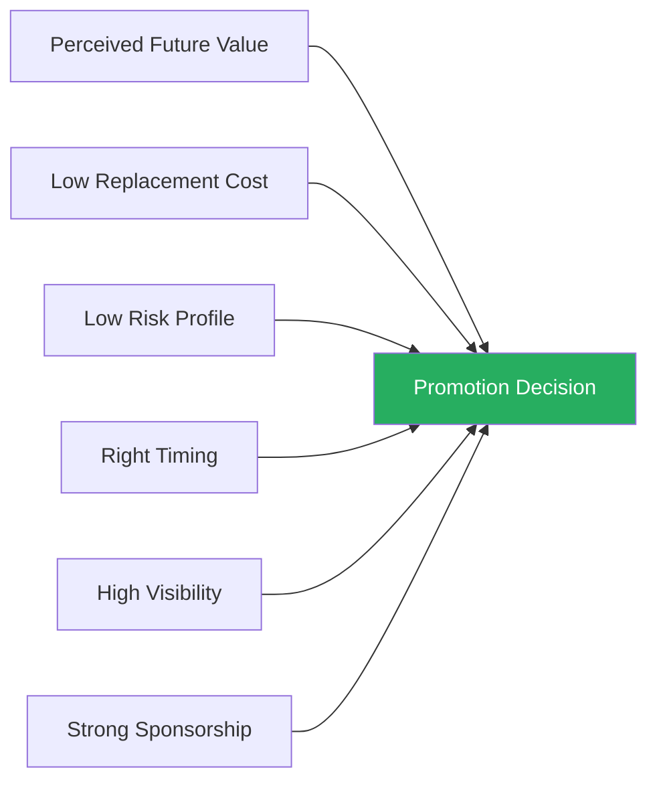
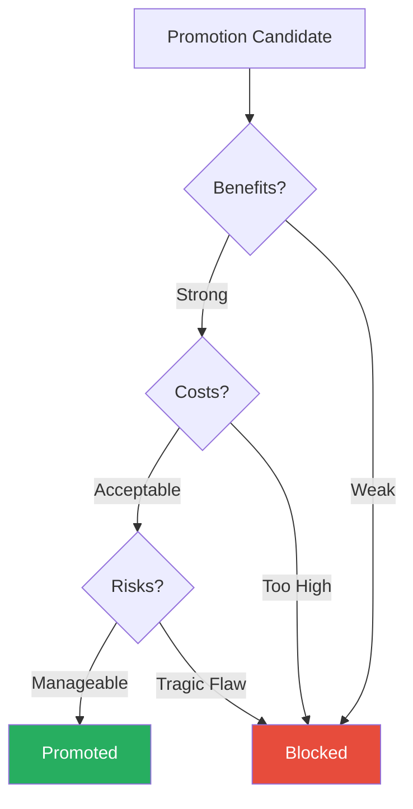
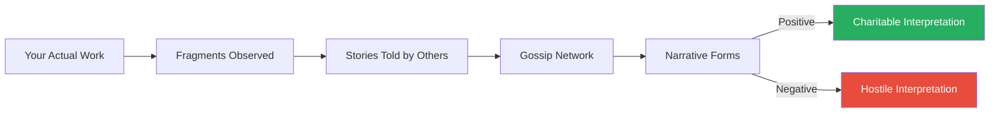
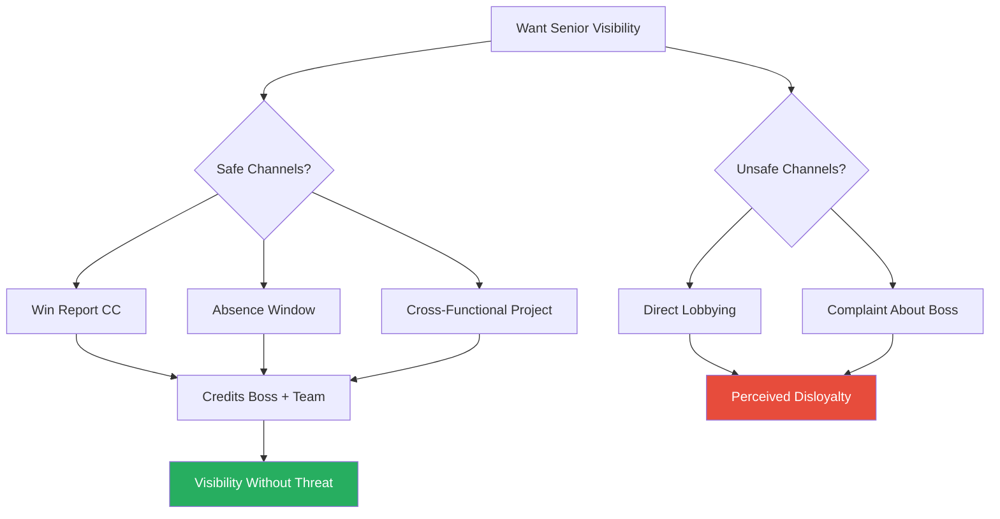
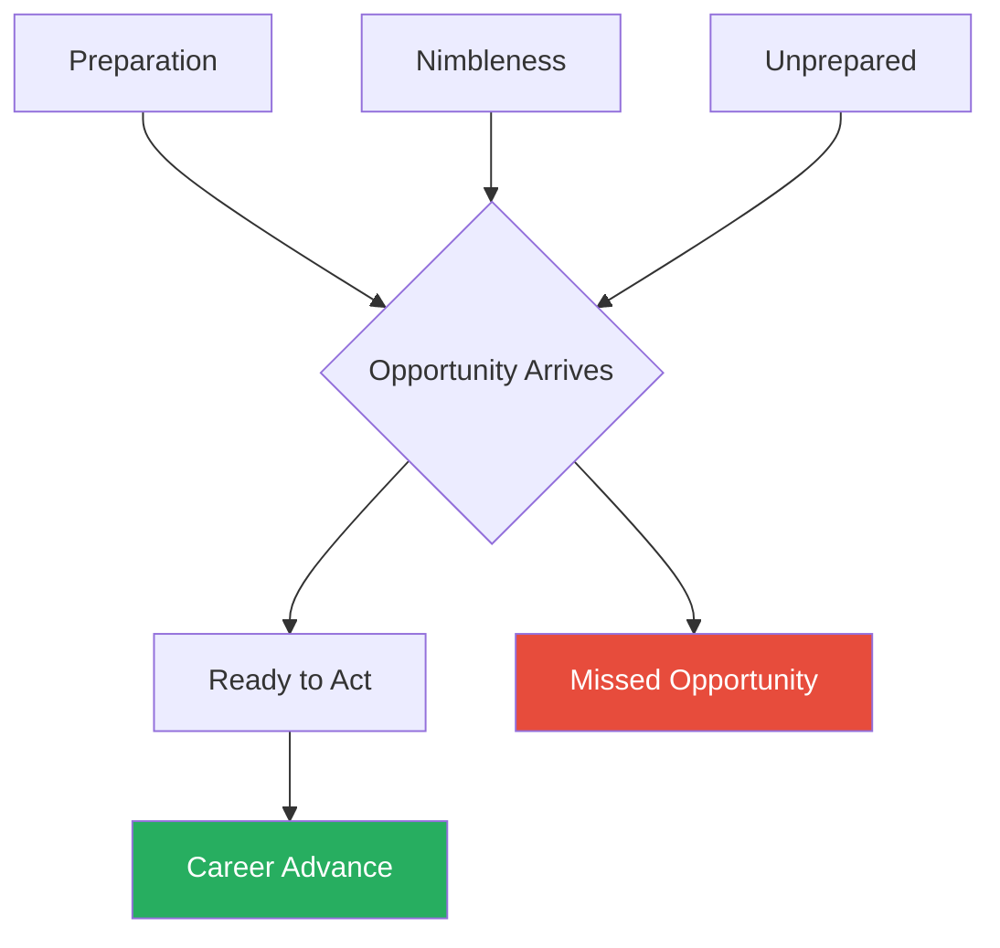
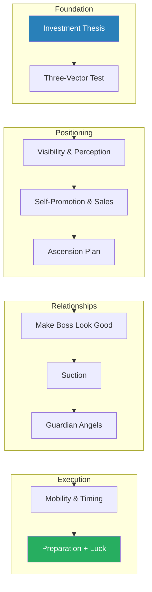

# Who Gets Promoted, Who Doesn't, and Why — Donald Asher

> Donald Asher dismantles the comforting myth that hard work and talent are sufficient to earn a promotion.
> Drawing on more than twenty years of coaching fast-track executives across American corporations, he argues that promotions are not rewards for past performance but investments in anticipated future value.
> The organisation does not ask "who earned this?" — it asks "who will deliver the best return at the lowest cost and risk?"
> Most people's beliefs about why promotions happen are simply wrong: they overweight merit and underweight positioning, visibility, timing, and sponsorship.
> Asher maps the actual machinery of advancement — a cost-benefit-risk calculus, a replacement cost trap, a perception game, and a network of guardian angels who speak for you in rooms you will never enter.
> The result is a practical, occasionally uncomfortable field guide to the politics of getting ahead, written by someone who has watched thousands of careers accelerate and stall.

---

## About the Author

Donald Asher built his career as an executive coach and career strategist, spending more than two decades advising ambitious professionals on how to navigate corporate hierarchies. He holds a Master's degree in Human Resources and Organisational Development, and his perspective is shaped by direct coaching relationships with fast-track careerists across industries ranging from law and finance to technology and healthcare. His earlier books, including *Asher's Bible of Executive Resumes* and *How to Get Any Job*, established him as a practical, no-nonsense voice in the career advice space. This is not an academic book and it does not pretend to be — it is accumulated pattern recognition from the front lines of corporate advancement, organised into ten thematic chapters with extensive case studies drawn from real coaching engagements. Asher writes with a cheerful bluntness that occasionally crosses into cynicism, but the underlying message is optimistic: promotion is not random, it is systematic, and the system can be learned.

---

## The Big Idea

- Promotions are <b style="color: #27ae60">investments, not rewards</b> — this single reframe is the engine of the entire book
- The decision-maker sitting across the table is not asking "Who has earned this?" but "Who will deliver the best future return from this point forward?"
- Your track record is merely evidence — one input among several — for a forward-looking bet
- The organisation is not a justice system distributing earned rewards — it is an economic actor optimising expected returns on its most expensive resource: people

This means:
- Building a case for promotion based entirely on past achievements is structurally incomplete
- Being excellent at your current job can actually trap you in it, because replacing you is too expensive or too risky
- The invisible work of positioning — managing perception, cultivating sponsors, reducing the friction of your departure from your current role — matters as much as the work itself

Asher's implicit formula is: <b style="color: #2980b9">Promotion = f(perceived future value, replacement cost, risk profile, timing, visibility, sponsorship)</b>
- The person who gets promoted is not the best performer but the one who optimises across all six variables simultaneously
- Most people focus obsessively on just one — demonstrating their capability — while ignoring the five other variables that govern the decision
- The book is structured to address each variable in turn, building from the analytical framework (how decisions actually get made) through the tactical toolkit (what you can do about it)

All six variables must align favourably — excelling on one while neglecting the others is the most common reason qualified people are passed over.

Most high performers over-index on future value while neglecting the five structural variables — replacement cost, risk, timing, visibility, and sponsorship — that govern the actual promotion decision.

---

## Key Concepts at a Glance

| Concept | One-line summary |
|---------|-----------------|
| **The Three-Vector Test** | Every promotion is filtered through benefits, costs, and risks — fail any one and you are blocked |
| **The Future-Value Frame** | Past performance is evidence, not entitlement — pitch what you will deliver, not what you have done |
| **The Replacement Cost Trap** | The more indispensable you are in your current role, the harder it is to be promoted out of it |
| **The Perception-Reality Equation** | Reputation is not a byproduct of good work — it is a product that must be actively managed |
| **All Business Is Sales** | Selling your ideas and yourself is the core executive skill, requiring multiple channels and framings |
| **The Ascension Plan** | A written, deliberate plan for advancement with targets, timelines, and an escape clause |
| **Suction** | The upward pull created when a high performer above you rises rapidly, leaving a vacuum |
| **Guardian Angels** | Sponsors positioned levels above you who advocate for you in rooms you never enter |
| **The Stock Holding Rule** | Would you take this job today at this price? If no, start looking — past investment is sunk cost |
| **Be Well Liked, Not Loved** | Being deeply loved makes your departure a tragedy; being well liked makes it a graduation |

Asher's framework gives disproportionate weight to the investment thesis, guardian angel networks, and boss management — areas most professionals systematically underinvest in compared to raw performance and learning.

---

## Chapter 1: Timing — The Investment Thesis

*Asher opens by demolishing the belief that promotions reward hard work, replacing it with an investment framework that changes everything about how you should position yourself.*

- Asher begins by asking why so many obviously qualified people get passed over
- The answer: most people fundamentally misunderstand what a promotion is
  - They treat it as a reward — a recognition of past contributions, a certificate of merit
  - But the organisation treats it as a forward-looking investment, subject to the same cost-benefit-risk analysis that governs any capital allocation decision
- "Promotions are not rewards for past performance," Asher writes — "they are investments in anticipated future performance"

This distinction is not semantic — it changes what you need to do to get promoted:
- If promotions were rewards, the strategy would be simple: work harder, produce more, wait your turn
- If promotions are investments, the strategy is entirely different:
  - Demonstrate future value
  - Reduce the cost and risk of selecting you
  - Time your case to the organisation's decision-making rhythm

> [!tip] Core Insight
> The organisation is not asking "who earned this?" — it is asking "who will deliver the best return at the lowest cost and risk?" Every action you take should answer that question.

---

### The Three-Vector Test

*Asher introduces his most powerful analytical framework — the triple filter that every promotion decision passes through, where failure on any single vector blocks advancement.*

- <b style="color: #2980b9">The Three-Vector Test</b> runs every promotion decision through three simultaneous filters — the candidate must pass all three

**Vector 1: Benefits**
- What future value does this person offer in the new role?
- This is where most candidates spend all their energy — listing accomplishments, citing metrics, demonstrating capability
- It is necessary but nowhere near sufficient
- The organisation takes this as a baseline: yes, you are capable — now what?

**Vector 2: Costs**
- What does it cost the organisation to promote this person?
- <b style="color: #e74c3c">This is the vector that most people never consider</b>
- Promoting an internal candidate creates two staffing changes simultaneously:
  - Filling the new role
  - Filling the vacancy left behind
- Hiring someone from outside involves only one change
- If the internal candidate is difficult to replace — rare skills, deep institutional knowledge, personal stamp on every process — the cost of promoting them may exceed the cost of hiring from the street

**Vector 3: Risks**
- What is the worst-case scenario if this promotion goes wrong?
- Managers are loss-averse creatures
- The downside of a bad promotion decision — team disruption, morale damage, public failure, the humiliation of reversing the decision — weighs more heavily than the upside
- A single <b style="color: #e74c3c">"tragic flaw"</b> can override all benefits:
  - A temper, inconsistency, a reputation for playing politics
  - A drinking problem, or even just a vague sense that this person is "not ready"

A candidate must clear all three filters sequentially — strength on benefits cannot compensate for failure on costs or risks.

---

> [!example] Buddy the Salesman — Killed by the Risk Vector
> - Buddy was the top-producing pharmaceutical salesman in his region year after year
> - He had every metric on his side — highest revenue, biggest accounts, best client relationships
> - He was passed over for sales manager three times
> - The reason: Buddy was a prima donna
>   - Ignored paperwork
>   - Arrived late to meetings
>   - Treated administrative staff dismissively
> - His managers loved his numbers but dreaded putting him in charge of other people
> - The risk vector — "what happens when Buddy manages a team?" — killed his candidacy every time
> **The lesson:** A brilliant benefit vector means nothing if the risk vector screams danger.

> [!example] Madison the Attorney — The Tragic Flaw
> - Madison was a rising star at a mid-size law firm
> - She billed more hours than anyone in her cohort, won consistently in court, and had clients asking for her by name
> - When a junior partnership opened, she was the obvious choice — she did not get it
> - The reason, whispered among the senior partners: Madison had a drinking problem
> - No one had ever seen it affect her work — but they had seen it at firm events
> - The risk of elevating someone with that vulnerability to a position representing the firm publicly was more than the partnership committee could stomach
> **The lesson:** The tragic flaw does not have to be work-related — it just has to be visible enough to create anxiety about worst-case scenarios.

---

### Anticipation — The Ultimate Positioning Move

*The most powerful position is not applying for a role — it is being the obvious answer to a problem before anyone else identifies it.*

- <b style="color: #27ae60">Being first means you define the frame</b> — by the time a role is formally posted, the competition has been alerted and HR has defined requirements that may not favour you
- Asher argues that the professionals who advance fastest are not reacting to posted openings but anticipating organisational needs
- They scan the landscape for:
  - Frustrations that senior leaders have expressed but no one has addressed
  - Initiatives that will require new leadership once they reach critical mass
  - Departures, retirements, and restructurings that will create vacuums
- By the time the role is formally announced, the anticipator has already been solving the problem — the promotion is a formality

> [!example] Mary C. and the Power of Anticipation
> - Mary C. was a mid-level administrator at a university
> - She noticed the university president was growing frustrated with a particular bureaucratic inefficiency — a problem that had annoyed people for years without anyone taking ownership
> - Instead of waiting for a task force, Mary researched solutions on her own time, built a proposal, and got on the president's calendar
> - She did not ask for a promotion — she offered herself as the solution to a problem she had identified before anyone else
> - Six months later, she was promoted to assistant dean — leapfrogging several more senior candidates who had been "waiting their turn"
> **The lesson:** The people who advance most effectively anticipate organisational needs and position themselves as the answer before the role is even posted.

---

### The Replacement Cost Trap

*Being indispensable sounds like a career asset — Asher explains why it is often a career prison.*

- <b style="color: #2980b9">The Replacement Cost Trap</b> is the dark side of excellence
- When you become the only person who can do what you do:
  - Your boss cannot afford to lose you
  - Your boss's boss cannot afford the disruption of extracting you
  - HR sees the cost of replacing you as a reason not to promote you
- The irony is devastating: the harder you work to make yourself valuable in your current role, the more expensive you become to move
- Asher's solution is counterintuitive — <b style="color: #27ae60">train your replacement before you need one</b>:
  - Document your processes so others can take them over
  - Cross-train a colleague to cover your critical functions
  - Make your departure smooth, not catastrophic
- When the cost of replacing you drops, the cost vector clears, and the promotion path opens

> [!example] Mateo the Irreplaceable — The Replacement Cost Trap
> - Mateo was a technical specialist covering three different functions at a mid-size company
> - Everyone agreed Mateo was brilliant — everyone agreed he deserved a promotion
> - But every time a senior role opened, the same objection surfaced: who would do Mateo's current work?
> - He had made himself so deeply embedded — his knowledge was in no one else's head, his fingerprints on every process — that extracting him was perceived as more disruptive than hiring someone from outside for the new position
> - Mateo's excellence had become his prison
> **The lesson:** Being too valuable where you are makes it too expensive to move you — indispensability is a trap, not a credential.

> [!example] The Database Administrator Who Stayed Forever
> - A database administrator at a financial services firm had built every critical reporting system the company used
> - She was the only person who understood the legacy architecture, the only one who could fix production issues at 2 a.m.
> - Over seven years, she watched three colleagues promoted to IT management while she remained in her role
> - Each time, the justification was the same: "We can't afford to lose her in that seat right now"
> - She had never documented her systems, never cross-trained anyone, never made it easy for the organisation to imagine life without her in that specific chair
> - By the time she realised the trap, she had to spend eighteen months training a replacement before the organisation would even consider her for advancement
> **The lesson:** If no one else can do your job, you will never leave your job.

---

## Chapter 2: Visibility — Perception Is the Only Reality That Matters

*Asher tackles the uncomfortable truth that being good is not enough — you must also be seen being good, because confident people are rated as more skilled than knowledgeable ones.*

- He opens with a research finding that sets the tone: <b style="color: #27ae60">"Confident people are rated as more skilled than knowledgeable people"</b>
- In a study of accountants:
  - Those who presented their analyses with confidence were rated as more competent
  - Those who presented with caveats and qualifications were rated lower — even when the cautious analysts were objectively more knowledgeable
- The implication is unsettling but undeniable: <b style="color: #2980b9">perception governs promotion decisions far more than reality does</b>

> [!tip] Core Insight
> "The performer perceived to be the best gets promoted — not necessarily the actual best." Reputation is not a natural byproduct of good work; it is a product that must be actively managed.

---

### How Reputation Actually Forms

- No manager observes all of your work directly
- Your reputation is assembled from fragments:
  - Visible moments in meetings
  - Hallway conversations
  - The stories other people tell about you
  - The general narrative circulating through gossip channels
- If the narrative is positive, your work gets interpreted charitably:
  - Mistakes become honest errors
  - Delays become careful deliberation
- If the narrative is negative, even genuine achievements are viewed with suspicion:
  - Success becomes luck
  - Initiative becomes overreach
- <b style="color: #e74c3c">Reputation is not something you can afford to leave to chance</b>

The gap between what you actually do and what people believe you do is filled entirely by narrative — and you either shape that narrative or someone else does.

---

### The Confidence-Competence Illusion

- Asher identifies a persistent cognitive bias in how decision-makers evaluate candidates:
  - People who present with certainty are assumed to know more than people who present with nuance
  - The person who says "I am confident this will work" is rated higher than the person who says "This should work, though there are risks we should monitor"
  - The second person may be more competent — they understand the complexity — but they appear less decisive
- This creates a structural advantage for confident communicators:
  - They are perceived as leadership material because leaders are expected to project certainty
  - Cautious, analytical types are perceived as good subordinates — reliable, but not ready to lead
- <b style="color: #e74c3c">The competence-confidence gap is one of the most common reasons technically excellent people are passed over</b>
- Asher's advice is not to fake confidence but to develop genuine confidence through preparation:
  - Know your material so well that you can speak without hedging
  - Practise articulating your positions until the caveats are internalised, not vocalised
  - Reserve qualifications for the appropriate audience — your boss in a private meeting, not a room full of senior leaders

---

> [!example] The Hotel Department Head — Mastering Gossip Dynamics
> - A department head at a major hotel chain understood gossip dynamics instinctively
> - She made a practice of sharing her team's wins with housekeeping supervisors, front desk managers, and other department heads — people outside her reporting line but active in the gossip network
> - When good things happened in her department, the whole building knew
> - When problems arose, she addressed them quietly before they could enter the gossip stream
> - General management consistently viewed her department as the best-run in the property
> - When a regional manager role opened, she was the consensus choice
> **The lesson:** Managing the gossip channel proactively — seeding wins and containing problems — shapes your reputation far more than any performance review.

> [!example] The PR Account Executive — The Power of Being Well Liked
> - A PR account executive was not the most technically gifted person in the firm
> - What she had was an unerring instinct for making people feel valued and respected — clients, colleagues, and especially her boss
> - Her boss deferred to her judgment on key accounts and openly acknowledged she would not stay in her current role for long
> - This combination — genuine warmth, professional respect, and the implicit understanding she was destined for bigger things — meant her name surfaced naturally when opportunities arose
> - No one had to campaign for her — the gossip channel did the work
> **The lesson:** Being well liked creates organic advocacy — people promote your name without being asked.

---

### The Brag Sheet

- Asher advocates maintaining a running <b style="color: #2980b9">"brag sheet"</b> — a private document recording accomplishments, metrics, positive feedback, and wins as they happen
- The problem it solves:
  - Most people cannot accurately recall their achievements from six months ago
  - When review time comes, they scramble to remember, producing a thin, unimpressive self-assessment
  - Memory is biased toward recency — the last two months overshadow the preceding ten
- The brag sheet creates a contemporaneous record and serves a deeper purpose:
  - It trains you to notice and value your own contributions
  - This builds the genuine confidence that feeds into the perception cycle
  - You cannot project confidence if you do not believe in your own track record

> [!abstract] How to Deploy the Brag Sheet
> 1. Record accomplishments, metrics, and positive feedback within 24 hours of occurrence
> 2. Use it to provide talking points to your boss before a review
> 3. Populate your self-assessment in performance systems with specific data
> 4. Selectively share wins with senior leaders in a way that feels informative rather than boastful
> 5. Frame wins by crediting the team and the boss while positioning yourself as the narrator — the person who understands what happened and why it mattered

- <b style="color: #27ae60">The best brag reports credit the team and the boss while positioning you as the narrator</b> — the person who understands what happened and why it mattered
- The brag sheet is not for reading aloud in meetings — it is source material for strategic communication

---

### The "Be Well Liked, Not Loved" Principle

- Asher draws a surprising distinction between being loved and being well liked:
  - Being deeply loved by your team makes your departure a tragedy
  - Being well liked makes your departure a graduation — people are happy for you, not devastated
- The loved person triggers the replacement cost trap emotionally:
  - Team members protest: "We cannot lose her"
  - Bosses hesitate: "The team will fall apart without her"
- The well-liked person triggers something different:
  - Team members say: "She deserves this"
  - Bosses think: "The team will be fine — she has trained them well"
- <b style="color: #27ae60">The ideal is warm professional respect, not deep personal attachment</b>
- This is not about being cold or distant — it is about ensuring your relationships empower your advancement rather than anchoring you

---

## Chapter 3: Lifelong Learning — Acquire the Skills Before the Role Exists

*Asher argues that the most promotable people have already prepared for the next role before it opens — and that deepening expertise in your current role can actually be a trap.*

- Asher distinguishes between two types of professionals:
  - Those who acquire skills to do their current job better — they become more valuable where they are (which can trap them)
  - Those who acquire skills for the job they want next — they become ready for advancement, reducing the risk vector

| Strategy | Focus | Effect on Current Role | Effect on Promotion |
|----------|-------|----------------------|-------------------|
| Deepen current skills | Present job | More valuable, harder to replace | Trapped by replacement cost |
| Acquire next-role skills | Future job | Slightly less specialised | Reduces risk vector, signals readiness |

<b style="color: #27ae60">Skill acquisition must be forward-looking</b> — if you want a management role, develop management skills before the role exists.

> [!tip] Core Insight
> When a new role opens, the decision-maker's risk assessment includes "can this person do the job?" If you have already demonstrated relevant skills — even informally — you reduce the risk of promoting you. If you have to learn everything from scratch, you are a higher-risk bet.

---

### The Autodidact Advantage

- The most successful leaders tend to be voracious learners — not necessarily through formal education, but through:
  - Self-directed study
  - Cross-functional projects
  - Deliberate skill acquisition
- They read about industries adjacent to their own
- They volunteer for projects outside their comfort zone
- They seek assignments that stretch their capabilities, even when less glamorous than what they could be doing within their established domain
- Asher observes a pattern among the fastest risers he coached:
  - They spent roughly 20% of their development energy on their current role
  - And 80% on the skills their target role would require
  - This ratio inverts the instinct of most professionals, who spend 95% improving where they already are

---

### Credentials and Formal Education

- Asher addresses the question of whether formal credentials — MBAs, certifications, advanced degrees — accelerate promotion
- His answer is nuanced:
  - Credentials open doors in some organisations and mean nothing in others
  - The value depends on the industry, the company culture, and what the credential signals
- In credential-heavy industries (consulting, finance, law), the right degree is table stakes — without it, you are not even considered
- In credential-light industries (technology, media, entrepreneurship), demonstrated capability matters more than parchment
- <b style="color: #2980b9">The signalling function</b> of a credential is often more important than the knowledge it represents:
  - An MBA from a top school signals ambition, analytical capability, and a certain type of peer network
  - A professional certification signals commitment to a discipline and willingness to invest in yourself
- Asher's advice: get the credential if it is required by your target role or industry, but never mistake the credential for the skill

---

> [!example] The Physician Who Learned Management
> - A physician realised early that her ambition was not to be the best clinician in the hospital but to run the hospital
> - While colleagues focused exclusively on clinical excellence, she:
>   - Enrolled in an evening MBA programme
>   - Volunteered for hospital committees
>   - Sought out administrative assignments
> - When the chief medical officer position opened, she was the only physician who could credibly claim both clinical expertise and management capability
> - Her peers had better publication records and more prestigious clinical reputations
> - She had the skills the role actually required
> **The lesson:** Preparing for the role you want — not the role you have — is what separates the promoted from the passed over.

> [!example] The Technology Manager Who Didn't
> - A technology manager was technically brilliant but had never developed:
>   - Presentation skills
>   - Financial literacy
>   - The ability to communicate with non-technical executives
> - When a VP of Technology role opened, the interview panel was not asking about coding architectures
> - They were asking about budget management, vendor negotiations, and board-level communication
> - He was blindsided — he had spent years becoming the best engineer in the building, and the building was now asking for something he had never practised
> **The lesson:** Waiting until the role opens to start learning is always too late.

> [!example] The Accountant Who Joined the Board
> - An accountant at a mid-size firm noticed that the partners who made it to the executive committee were not the best technicians
> - They were the ones who understood business development, client management, and strategic planning
> - She began attending industry conferences not as a technical attendee but as a networker
> - She volunteered to lead the firm's pro bono programme — a role that required client-facing skills, budgeting, and managing volunteers
> - None of this was in her job description, but all of it was in the job description of the role she wanted
> - When a partner slot opened, she was the only candidate who had practised running something
> **The lesson:** The skills that get you promoted are rarely the skills that make you excellent at your current job.

---

## Chapter 4: All Business Is Sales

*Asher advances a claim that makes many professionals uncomfortable: every executive skill is ultimately a sales skill, and the distinction between "technical professional" and "salesperson" is a false one.*

- "If you are not selling your company, you are selling yourself," he writes — "if you are not selling yourself, you are selling your ideas"
- <b style="color: #27ae60">Anyone who needs others to adopt their ideas, approve their proposals, or select them for advancement is selling</b>
- The distinction between "technical professional" and "salesperson" is, in Asher's view, a false one
- Most professionals resist this idea because they associate selling with manipulation, exaggeration, or inauthenticity
- But Asher redefines selling as something simpler: communicating value in terms the buyer cares about

> [!tip] Core Insight
> Presenting your case through a single channel is far less effective than presenting it through multiple channels. Each channel reinforces the others, creating the impression that "everyone" knows this person is ready.

---

### The Multi-Channel Principle

- Asher draws on advertising research:
  - Exposure to a message through multiple media — print, radio, television, personal recommendation — dramatically increases conversion rates
  - The same number of exposures through a single medium is far less effective
- Applied to internal career positioning:
  - A single conversation with your boss is one channel
  - A <b style="color: #2980b9">multi-channel approach</b> includes:
    - A written proposal
    - A conversation with your boss
    - A mention by a senior colleague
    - A visible project deliverable
    - A word from a client
  - Each channel reinforces the others
- The multi-channel effect creates a perception of consensus:
  - When the decision-maker hears your name from multiple sources, they assume "everyone" knows you are ready
  - This social proof effect is far more persuasive than any single argument, no matter how well crafted

---

### Reframing for Different Audiences

- Asher extends the sales analogy to audience segmentation:
  - The same candidacy should be framed differently for different stakeholders
  - Your boss cares about team stability and personal credit
  - HR cares about compliance, process, and risk mitigation
  - Senior leadership cares about strategic impact and organisational capability
- <b style="color: #27ae60">The underlying qualifications are identical — the framing changes to match each audience's priorities</b>
- This is not manipulation — it is communication competence
- The professional who presents the same pitch to every audience is not being "authentic" — they are being lazy

---

> [!example] Carlton and the Horse Breeder — Selling the Buyer's Frame
> - Carlton, a horse breeder, was trying to sell a stallion to a wealthy buyer
> - His first pitch was technical: bloodlines, racing records, genetic potential — the buyer was unimpressed
> - His second attempt was entirely different:
>   - He had done homework on the buyer — her interests, her existing horses, her competitive aspirations
>   - He framed the stallion not as a product but as the missing piece in her breeding programme
>   - He spoke her language, addressed her specific concerns, connected the sale to her personal vision
> - She bought the horse
> **The lesson:** Sales is fundamentally about understanding the buyer's frame, not asserting the seller's. When pitching for a promotion, the question is not "why do I deserve this?" but "why does this serve your interests?"

> [!example] The Louisiana Politician — Same Product, Different Framings
> - A Louisiana politician won a difficult election by presenting the same policy platform in radically different framings to different audiences:
>   - To business owners: economic growth
>   - To community groups: neighbourhood safety
>   - To educators: school funding
> - The underlying proposals were identical — but the framing changed to match each audience's priorities
> **The lesson:** The case for your advancement should be framed differently for your boss (team stability), HR (compliance and process), and senior leadership (strategic impact). Same person, same qualifications, different framings.

> [!example] The Engineer Who Spoke Two Languages
> - A software engineer wanted to move into product management
> - When she pitched the idea to her engineering manager, she framed it as: "I can bridge the communication gap between engineering and product — the team will ship faster with fewer misunderstandings"
> - When she pitched the same move to the VP of Product, she framed it as: "I bring technical credibility that the product team currently lacks — engineers will trust my specifications because I have built systems myself"
> - Both framings were true — but each spoke to what that specific decision-maker cared about most
> **The lesson:** The same career move can serve multiple stakeholders' interests — your job is to articulate the version that matters to each one.

---

## Chapter 5: The Ascension Plan — Strategy, Not Hope

*Asher argues that leaving your career advancement to chance is as foolish as leaving your financial future to chance, and introduces a structured, documented plan for getting promoted.*

- <b style="color: #e74c3c">Leaving career advancement to chance is as foolish as leaving finances to chance</b>
- Most professionals have detailed financial plans but no career plan
- Asher advocates creating a deliberate, documented plan — the <b style="color: #2980b9">Ascension Plan</b>

> [!abstract] The Six Components of an Ascension Plan
> 1. **Target roles** — specific positions you are aiming for, with realistic pathways (not "VP someday" but "VP of Product within three years, via Director of Product Marketing when Sarah retires")
> 2. **Skill acquisition plan** — the capabilities your target role requires that you do not yet have
> 3. **Self-promotion plan** — a deliberate strategy for ensuring the right people know you exist, know your capabilities, and think of you when opportunities arise
> 4. **Replacement plan** — identifying and developing someone who can take over your current responsibilities, directly addressing the cost vector
> 5. **Event triggers** — specific milestones or deadlines that determine your next move ("If I receive the promotion by September, I stay. If not, I activate my external search")
> 6. **Emergency escape clause** — the hard limit: if none of the triggers fire and advancement remains blocked, you leave

> [!tip] Core Insight
> Without event triggers and an escape clause, an ascension plan becomes a wish list. The escape clause is not a bluff — it is a genuine commitment to yourself that prevents permanent stagnation.

---

### The Escape Clause — Why It Matters

- The escape clause serves multiple functions:
  - It prevents sunk-cost thinking — "I have been here eight years, I cannot leave now"
  - It forces honesty — if you set a trigger and it does not fire, you must confront the reality that this organisation is not going to promote you
  - It creates genuine leverage — a professional with real alternatives negotiates differently from one who is trapped
- <b style="color: #27ae60">The escape clause transforms you from a supplicant to a negotiator</b>
- Without it, you are asking for a promotion — with it, you are evaluating whether to stay

---

> [!example] The EVP Who Never Stopped Searching
> - An EVP of Global Staffing at a major bank ran a low-level job search more or less constantly — not because she intended to leave
> - Being on the market gave her three things:
>   - Genuine confidence in conversations with senior leadership (she knew she had options)
>   - Current information about her market value (she could negotiate from data, not hope)
>   - Periodic offers she could use as leverage during retention conversations
> - Her internal resume was always updated, her network always warm
> - She spoke truth to power in ways that her peers found terrifying — and got away with it because everyone sensed she did not need the job badly enough to be controlled by fear
> **The lesson:** The escape clause is not a threat — it is a source of authenticity and leverage.

> [!example] Austin R. and the Bad Review — The 48-Hour Counterattack
> - Austin R., a mid-level manager, received a devastating performance review he believed was unfair and politically motivated
> - Instead of accepting it passively or fighting through HR channels (which Asher describes as almost always futile), Austin counterattacked within 48 hours:
>   - Wrote a detailed rebuttal
>   - Provided documentation for every contested point
>   - Requested a meeting with the reviewer and the reviewer's boss
> - The result was not a reversal — that almost never happens — but a supplementary file alongside the original review
> - When the next promotion cycle came, decision-makers had both the original review and Austin's rebuttal
> **The lesson:** A documented counterattack prevents a single bad review from becoming the defining narrative of your career.

---

### Get Promises in Writing

- <b style="color: #e74c3c">"If they refuse to put it in writing, the promise was never real"</b>
- Verbal promises from bosses and HR officers are unreliable
- Asher tells multiple stories of professionals promised promotions, raises, or role changes, only to see those promises evaporate when:
  - The promising party was transferred
  - They left the organisation
  - They simply forgot
  - Budgets changed or reorganisations intervened
- The antidote is simple but socially awkward: request a written memo for your personnel file
- Frame it not as distrust but as documentation: "I want to make sure we are both aligned on the plan and that there is a record if either of us moves on"
- <b style="color: #27ae60">The professionals who consistently advance are not more trusting — they are more systematic about converting trust into documentation</b>

> [!example] The Marketing Director and the Vanishing Promotion
> - A marketing director was promised a VP title by her CEO during a one-on-one conversation
> - The CEO said it would happen "in the next cycle" and she should "sit tight"
> - She did not ask for written confirmation — it seemed unnecessary given the personal relationship
> - Six months later, the CEO was replaced in a board action
> - The new CEO had no knowledge of the promise, no documentation existed, and the marketing director was back at square one
> - She had lost six months of positioning time that she could have spent on her external search
> **The lesson:** Verbal promises have a shelf life equal to the tenure of the person making them. Without documentation, the promise dies when they leave.

---

## Chapter 6: Make Your Boss Look Good

*Asher reveals that your reputation and your boss's reputation are structurally intertwined — and that managing this relationship is the single most underappreciated dynamic in career advancement.*

- Your boss controls your reputation in two ways:
  - **Informally:** hallway conversations and gossip — what they say about you to their peers and their own boss shapes the narrative about you far more than anything you say about yourself
  - **Formally:** reviews, nominations, and project assignments — your boss decides what opportunities you see and how your work is characterised in the official record
- <b style="color: #27ae60">Your fates are linked whether you like it or not</b>:
  - If your boss is wounded politically — embroiled in controversy, losing influence, associated with a failed initiative — you are wounded by association
  - If your boss is promoted, a vacuum opens behind them and opportunities flow to their team
- This is not about servility — it is about understanding a structural dependency

> [!tip] Core Insight
> Your boss is not just your manager — they are your primary reputation channel. Make them look good and the credit finds its way back to you. Let them be blindsided and you become the person who should have warned them.

---

### The Practical Implications

> [!abstract] Three Rules for Managing Upward
> 1. **Filter information upward** — never let your boss be surprised by bad news. Surprises travel faster through gossip channels than reporting lines, and a blindsided boss looks incompetent — and blames the person who should have warned them
> 2. **Credit the team and the boss publicly** — when good things happen, let your boss take credit in public. Your role is to be the person who makes good things happen, not the person who claims them. The boss who is praised for a win will remember who actually delivered it
> 3. **Handle problems quietly** — fix problems before they enter the gossip stream. The ideal is that your boss never deals with your problems directly — they simply notice that problems in your area resolve themselves

---

### Gossip Is Radioactive

- Asher calls negative gossip about your boss <b style="color: #e74c3c">"radioactive"</b> — once you are associated with criticism of your boss, the contamination spreads
- Even if the criticism is accurate, even if others share your views privately, being identified as the person who badmouths the boss marks you as disloyal
- <b style="color: #e74c3c">Disloyalty is punished faster and more severely than incompetence</b>
- The reason is structural:
  - Incompetence can be managed, trained, or worked around
  - Disloyalty threatens the entire trust architecture of the organisation
  - A manager who cannot trust their reports is a manager who cannot function
- Asher is clear: private disagreement, delivered respectfully and one-on-one, is appropriate and even valued
- Public criticism, even among peers, is career poison

> [!example] The Sales Team Leader — Radioactive Gossip
> - A sales team leader criticised his boss's decision-making at a team dinner
> - Everyone at the table agreed with him
> - Within two weeks, one of the people at the table had repeated the criticism to the boss's peer
> - Within a month, the sales team leader was being managed out
> **The lesson:** Disagreement should happen privately, face to face, and never in a forum where it can be repeated.

---

### When to Walk Away

- Asher is equally clear about the limit of boss-management
- When a boss is genuinely destructive — actively sabotaging your career, blocking all advancement, or creating a hostile environment — the correct response is not to fight from below
- The structural disadvantage is too severe:
  - Your boss has positional power, information access, and political capital that you lack
  - HR, despite its stated mission, will almost always side with management in ambiguous cases
  - The emotional cost of fighting a toxic boss from below is disproportionate to the likely reward

> [!example] Rob M. — The Cost of Ignoring Politics
> - Rob M., an executive, ignored a rival's political machinations because he believed his work would speak for itself
> - It did not
> - The rival undermined Rob's reputation systematically, and by the time Rob realised what was happening, the damage was done
> - He lost his position
> **The lesson:** Fighting a hostile boss from a subordinate position is a structurally disadvantaged play — you lack positional power, information access, and political capital. Strategic retreat is not defeat; it is repositioning.

---

### Going Over Your Boss's Head

- Going over your boss's head is almost always dangerous, but there are safe techniques:
  - **The win report cc:** the safest first contact with senior leaders is to cc them on a win report that credits your boss and the team — this creates visibility upward without threatening your boss
  - **The absence window:** if your boss is away on travel or leave, making legitimate contact with senior leaders during their absence is another low-risk technique
  - **The cross-functional project:** volunteering for a project sponsored by a senior leader gives you legitimate exposure without circumventing your boss
- <b style="color: #e74c3c">Any hint that you are lobbying for yourself behind your boss's back will be interpreted as disloyalty</b> — even if the senior leader is sympathetic
- The contact must always be about the work, not about your career

The key distinction is whether the contact serves the work or serves your career — the former is legitimate, the latter is dangerous.

---

## Chapter 7: Suction — Ride the Superstar

*Asher introduces one of his most vivid concepts — the career-accelerating pull created when a high performer above you rises quickly, leaving a vacuum that pulls their associates upward in their wake.*

- <b style="color: #2980b9">Suction</b> is the upward pull created when a high performer above you rises quickly through the organisation

### How Suction Works

- When someone ascends, they leave a vacuum behind them:
  - Their old role needs filling
  - Their projects need continuing
  - Their network of contacts becomes accessible to whoever steps into the gap
- Standing close to a rising star means you get pulled upward in their wake
- The mechanism operates on multiple levels:
  - **Direct:** the rising star may pull trusted associates into new positions as they accumulate hiring authority
  - **Indirect:** their departure creates openings filled by the people closest to the vacancy
  - **Reputational:** association with a high performer enhances your own perceived capability — if someone impressive trusts and relies on you, decision-makers reason you must be impressive too

> [!tip] Core Insight
> Suction is not passive — you earn the pull by being genuinely useful, delivering results that reflect well on the rising star, and being someone they trust enough to bring into their next venture.

---

> [!example] The Healthcare Lawyers — Team Suction Across Three Firms
> - A group of healthcare lawyers moved firms as a team — not once, but three times over a decade
> - The group's leader was a charismatic rainmaker who attracted clients and attention wherever she went
> - When she moved to a new firm, she brought her team; when she moved again, they followed
> - Each move came with title bumps and compensation increases for everyone in the group
> - The junior members were not superstars in their own right — they were associated with a superstar
> - The arrangement was mutually beneficial: the rainmaker needed a trusted team to service clients, and the team needed her gravity to pull them upward
> **The lesson:** Suction can lift an entire team — proximity to a rising star is one of the most reliable accelerants in career advancement.

> [!example] Timothy the Lobbyist — A Career Built on Being Useful
> - Timothy L.'s entire career was built on suction
> - Every significant career move came through a friend or former colleague who had risen to influence and pulled Timothy along
> - He was not a political strategist of the first rank
> - What he was, consistently, was useful to people who were rising:
>   - He anticipated their needs
>   - He delivered on his commitments
>   - He never created drama
> - In return, they brought him with them as they climbed
> **The lesson:** You earn suction by being genuinely useful — by making the superstar's life easier and delivering results that reflect well on them.

---

### Superstars vs. Gunslingers

*Asher draws a critical distinction between two types of fast-rising colleagues — and warns that the wrong choice can destroy your career.*

| Type | Trajectory | Risk | Tell |
|------|-----------|------|------|
| **Superstars** | Rise steadily, build durable organisations | Moderate — sustainable upward pull | Builds things that last |
| **Gunslingers** | Generate excitement and rapid early success | High — can only fail once, take everyone down | Creates spectacles that burn out |

Superstars build sustainable trajectories with high team impact and low risk, while gunslingers burn through political capital rapidly and drag associates down when they inevitably crash.

- <b style="color: #e74c3c">The problem: gunslingers often look like superstars in the early stages</b>
- The tell is sustainability — does this person build things that last, or do they create spectacles that burn out?
- Gunslingers share several characteristics:
  - They generate enormous enthusiasm quickly
  - They make big promises and deliver short-term results
  - They burn through political capital, goodwill, and team energy
  - When they crash — and they always crash — everyone in their orbit goes down with them
- Even genuine superstar suction is temporary:
  - If the superstar stalls, loses political support, or leaves the organisation, the suction disappears
  - You must have your own trajectory established by the time their ride ends
- <b style="color: #27ae60">Being permanently dependent on someone else's gravity is a form of career fragility</b>

---

## Chapter 8: Guardian Angels — The People Who Speak for You in Rooms You Cannot Enter

*Asher reveals that the decisions about who gets promoted happen in rooms you are not invited to — and the only way to influence those decisions is to have allies present who will say your name.*

- <b style="color: #2980b9">Guardian angels</b> are people positioned two or three levels above you who provide information, protection, and advocacy
- The decisions about who gets promoted do not happen in your presence:
  - They happen in rooms you are not invited to
  - In conversations you will never hear
  - Among people who may never have worked with you directly
- <b style="color: #27ae60">The only way to influence those decisions is to have allies in the room</b>

### What Guardian Angels Provide

Guardian angels deliver four specific things:

| Function | How It Works |
|----------|-------------|
| **Early warning** | They hear about restructurings, new roles, and political shifts before the news reaches your level — giving you a positioning advantage |
| **Protection** | When someone questions your judgment in a meeting you are not attending, they provide a counterpoint that rebalances the narrative |
| **Name mention** | A casual mention — "What about her? She did excellent work last quarter" — accumulated over time, creates a cumulative impression that you are someone to watch |
| **Honest advice** | They can see political currents, budgetary constraints, and unspoken preferences from a strategic vantage point you cannot access |

Guardian angels bridge the gap between your daily work and the decision rooms you never enter — they provide early warnings, protection from hostile narratives, casual name mentions, and honest strategic advice from a vantage point you cannot access directly.

> [!tip] Core Insight
> The most powerful form of advocacy is not a formal recommendation — it is a casual mention of your name when opportunities are discussed. These mentions, accumulated over time, create the impression among senior leaders that you are someone to watch.

---

> [!example] The Chief Engineer — Surviving Three Rounds of Layoffs
> - A chief engineer at a manufacturing company survived three rounds of layoffs over a decade
> - He was not the most technically skilled engineer — but he had a personal relationship with the company president built over years of informal interactions
> - Every time the layoff list was prepared, the president intervened — not by vetoing the list, but by asking questions:
>   - "Are we sure we want to lose him?"
>   - "What does he bring that we would miss?"
> - The questions were enough to shift the calculus
> - The engineer had built this relationship through years of being genuinely helpful:
>   - Volunteering for cross-departmental projects the president cared about
>   - Providing technical opinions in plain language when asked
>   - Never using the relationship to ask for personal favours
> **The lesson:** A guardian angel relationship is an investment that compounds silently over years and pays off catastrophically during crises.

> [!example] The EVP of Global Staffing (Revisited) — A Network Built Before It Was Needed
> - The same EVP who ran a constant job search also maintained a network of guardian angels across the banking industry
> - She invested systematically in relationships at every level — not just upward, but laterally and downward
> - When she needed intelligence about a strategic initiative at a competitor bank, she had contacts who would share it
> - When she needed a reference for a retention negotiation, she had senior figures who would provide it
> - Her network was not transactional — it was a web of genuine professional friendships built over decades of being useful, interesting, and reliable
> **The lesson:** Build relationships before you need them — by the time a crisis hits, the social capital must already be deposited.

---

### Don't Call It Mentoring

- <b style="color: #e74c3c">Never use the word "mentor"</b> when cultivating guardian angel relationships
- Senior people are fatigued by formal mentoring requests — assigned too many protégés by well-meaning HR departments, the word triggers an immediate sense of obligation
- Instead, build the relationship naturally:
  - **Be useful** — offer to help with something the senior person cares about
  - **Be interesting** — bring a perspective or piece of information they do not already have
  - **Be present** — show up at the events, meetings, and forums where senior people congregate
- Let the mentorship emerge organically from a relationship that is already functioning
- "Make friends before you need them," Asher writes
- <b style="color: #27ae60">The time to build your network of guardian angels is two years before you are desperate for a promotion</b>

### How to Lose a Guardian Angel

- Asher warns that guardian angel relationships are fragile and easily destroyed:
  - **Asking for too much too soon** — treating a new relationship as a favour bank before trust has been established
  - **Being a liability** — if the guardian angel's advocacy for you reflects badly on their judgment, they will quietly withdraw
  - **Ignoring reciprocity** — even though the relationship is asymmetric in seniority, it must be symmetric in value; you offer usefulness, information, or loyalty in exchange for advocacy
  - **Going dark** — relationships require maintenance; if you only surface when you need something, the guardian angel will notice
- <b style="color: #e74c3c">The fastest way to lose a guardian angel is to make them regret their investment in you</b>

---

## Chapter 9: Move — Mobility as Career Strategy

*Asher's most US-centric chapter nonetheless contains durable principles about timing departures, leveraging external offers, and treating your job like a stock you can sell.*

### The Two-Turndown Rule

- Asher claims large organisations track how many times an employee turns down a relocation or lateral assignment
- <b style="color: #2980b9">Two turndowns</b> signals to the organisation that you are not mobile — and being seen as immobile removes you from consideration for roles requiring flexibility
- The specific "rule" is debatable and reflects a corporate culture that valued geographic mobility more than the modern landscape does
- But the underlying principle is sound: <b style="color: #e74c3c">employers value flexibility, and being seen as rigid limits your options</b>

---

### Wring Every Promotion from an Employer Before Leaving

- Before leaving an employer, extract every available promotion:
  - Each title bump, scope expansion, and documented accomplishment increases your market value externally
- Timing matters:
  - **Leaving too early** — before maximising what the current employer can offer — means starting negotiations at a lower baseline
  - **Leaving too late** — after stagnation and plateaued growth — means the external market sees you as someone who was stuck
- <b style="color: #27ae60">The art is in timing the departure to maximise the story your resume tells</b>
- Asher recommends a simple test:
  - If you are still receiving title bumps, scope expansions, and meaningful new challenges, stay
  - If the last meaningful advancement was more than eighteen months ago and no concrete plan exists for the next one, start looking

---

### The Stock Holding Rule

- <b style="color: #2980b9">The Stock Holding Rule</b> is one of Asher's most cleanly articulated principles:
  - Treat your job like a stock holding
  - "Would you take this job today at this price?" Asher asks
- If the answer is **yes** — knowing everything you know now about the role, the boss, the culture, and the trajectory, you would still accept the offer:
  - Stay and stop resenting past disappointments
  - Past investment is a sunk cost
- If the answer is **no** — you would not take this job today knowing what you know:
  - Start looking immediately
  - The fact that you have been there five years, built relationships, and have institutional knowledge does not change the forward-looking calculus
  - The only question is: from this point forward, is the best use of your professional life?

> [!tip] Core Insight
> Past investment is a sunk cost. The only question that matters is whether you would take this job today at today's price, knowing everything you know now.

---

### Leverage and the External Offer

- Asher addresses the delicate art of using external offers for internal leverage
- The rules are strict:
  - The offer must be genuine — a fabricated offer is career suicide if discovered
  - You must be genuinely willing to accept it — a bluff that gets called destroys your credibility permanently
  - Present it not as a threat but as a dilemma: "I have been offered this opportunity and I am genuinely torn — I would prefer to stay, but I need to understand what my path looks like here"
- <b style="color: #e74c3c">Never use an external offer more than once with the same employer</b> — the second time, they will let you go

> [!example] The Software Scientist and the Written Offer
> - A software scientist obtained a written job offer from a competitor with absolutely no intention of accepting it
> - His sole purpose was to trigger a retention conversation with his current employer
> - When he presented the offer, his employer responded with a counteroffer:
>   - A title bump
>   - A salary adjustment
>   - A clearer path to advancement
> - These concessions would never have been offered without the credible external threat
> - The offer was real, the other job a genuine option — he would have accepted it if the retention conversation had failed
> **The lesson:** Leverage in any negotiation comes from having genuine alternatives. Without alternatives, you are a price-taker. With alternatives, you are a price-maker.

---

## Chapter 10: Prepared + Lucky — Fortune Favours the Ready

*The final chapter makes an important point about the relationship between preparation and opportunity — what most people call "luck" is actually the intersection of readiness and circumstance.*

### Luck Is Not Random

- What most people call "luck" in career advancement is actually the intersection of preparation and opportunity
- The opportunity may be unpredictable — a reorganisation, a departure, a sudden crisis
- But the ability to capitalise on it is not:
  - The professionals who consistently "get lucky" have done the preparation work described in the preceding nine chapters:
    - Visible track records
    - Cultivated sponsors
    - Developed new skills
    - Maintained escape clauses
    - Positioned themselves near rising stars
- <b style="color: #27ae60">When the opportunity arrives — as it eventually always does — they are ready</b>
- Their less-prepared peers, facing the same opportunity, cannot respond fast enough

---

### The Nimbleness Principle

- Asher argues for maintaining <b style="color: #2980b9">nimbleness</b> — the ability to pivot quickly when circumstances change
- This means:
  - Not over-committing to a single path
  - Keeping skills current across multiple domains
  - Maintaining relationships with people in different parts of the organisation (and outside it)
- Nimbleness is the opposite of the "feathered nest" that traps people in their current roles:
  - The nimble professional has documented their work so others can take it over
  - Has skills that transfer across contexts
  - Has relationships that survive organisational restructurings
- The nimble professional treats every role as temporary — not in a cynical way, but in a realistic one:
  - Organisations restructure
  - Bosses leave
  - Industries shift
  - The only constant is your ability to adapt

The prepared and nimble professional capitalises on the same opportunities that their less-prepared peers cannot respond to in time.

---

### Don't Be Afraid to Fail

- The most successful professionals Asher coached shared one trait: they were not paralysed by the fear of failure
- They took calculated risks, accepted that some bets would not pay off, and treated setbacks as information rather than catastrophe
- <b style="color: #e74c3c">The fear of failure is the most common career-limiting factor Asher has observed</b>
  - It prevents people from applying for stretch roles
  - From volunteering for risky projects
  - From having the difficult conversations that advancement requires
- The antidote is not recklessness but <b style="color: #27ae60">calibrated courage</b> — understanding that the cost of a failed attempt is almost always lower than the cost of never trying
- Asher identifies the asymmetry of career risk:
  - The downside of applying for a role and not getting it is mild embarrassment
  - The downside of never applying is years of stagnation
  - The expected value of action almost always exceeds the expected value of inaction
  - Yet most professionals default to inaction because the embarrassment is immediate and vivid while the stagnation is gradual and invisible

---

### The Career as Portfolio

- Asher closes by encouraging readers to think of their career not as a single trajectory but as a <b style="color: #2980b9">portfolio of bets</b>:
  - Some bets will pay off — the right boss, the right timing, the right organisation
  - Some will not — the reorganisation that eliminates your role, the boss who leaves before delivering on their promise
  - The key is to have enough bets active that any single failure does not end your advancement
- This means:
  - Maintaining multiple relationships, not depending on one guardian angel
  - Developing skills across multiple domains, not just one speciality
  - Keeping an external network warm, not just an internal one
  - Having an ascension plan with multiple pathways, not just one route

---

## Key Quotes

- "Promotions are not rewards for past performance — they are investments in anticipated future performance."
- "The performer perceived to be the best gets promoted."
- "Make friends before you need them."
- "It is always better to look for a job while employed."
- "If you are not selling your company, you are selling yourself."
- "Confident people are rated as more skilled than knowledgeable people."
- "If they refuse to put it in writing, the promise was never real."
- "Would you take this job today at this price?"

---

Asher's ten chapters build from analytical framework (understanding the promotion machine) through positioning tools (visibility, sales, planning) to relationship dynamics (bosses, superstars, sponsors) and finally to execution (timing your moves and staying ready).

---

## The Verdict

Asher's greatest contribution is the <b style="color: #2980b9">three-vector test</b> — the insight that promotion decisions are governed simultaneously by benefits, costs, and risks, and that failing on any single vector blocks advancement regardless of the other two. This framework explains a phenomenon that frustrates nearly every ambitious professional: why obviously qualified people get passed over. It is not that decision-makers are blind to talent. It is that talent is necessary but not sufficient, and the cost and risk dimensions — which most candidates never consider, let alone address — carry equal weight in the calculus. The reframe from "rewards" to "investments" is the single most important idea in the book, and once you see it, you cannot unsee it. Every interaction with the promotion machinery looks different through this lens.

The case studies are the book's second great strength. Asher draws from a genuinely diverse set of industries and career stages, and the stories of Buddy the prima donna salesman, Madison the brilliant but risky attorney, and Mary C. the proactive administrator are vivid enough to stick in memory and specific enough to be instructive. The concepts of suction, guardian angels, and the replacement cost trap go beyond generic "network more" advice and offer genuinely actionable frameworks for understanding how careers actually work inside organisations. The chapter on making your boss look good, while it will strike some readers as servile, captures a structural reality that idealists ignore at their peril.

The book's weaknesses are equally real. It is overwhelmingly **US-centric**, assuming American corporate norms like frequent geographic relocation, at-will employment, and aggressive individual negotiation. Professionals in European, Asian, or other labour markets will find some advice inapplicable and some framing culturally alien. The treatment of organisational politics is **shallow** — Asher writes as though cultivating sponsors and managing your boss are straightforward relationship tasks, without grappling with adversarial dynamics, closed trust networks, or genuinely hostile power structures. The evidence base is **anecdotal**, not systematic: we hear from people who succeeded, never from a control group of people who followed the same advice and failed. And the 2007 publication date shows in the emphasis on physical mobility and geographic relocation, which have been substantially reshaped by the remote and hybrid work revolution.

Despite these limitations, the core frameworks hold up remarkably well. This is a book that rewards the reader who can extract the structural principles from the American packaging and apply them to their own context. The three-vector test, the replacement cost trap, the future-value reframe, and the guardian angel concept are tools that any professional can deploy immediately. Asher is not a deep thinker — he is a sharp observer and a practical coach, and his best ideas have the quality of things that seem obvious only after someone has pointed them out. For readers who have been working hard and wondering why the promotions keep going to someone else, this book provides not comfort but clarity — and clarity, in the end, is more useful.

**Rating: 7/10**

---

## Related Reading

- [[The 48 Laws of Power - Robert Greene|The 48 Laws of Power]] — the definitive guide to power dynamics that Asher's book acknowledges but never deeply engages with
- [[Stealing the Corner Office - Brendan Reid|Stealing the Corner Office]] — a complementary take on the same territory, with sharper tactical advice on internal positioning
- [[Influence - Robert Cialdini|Influence]] — the science behind why Asher's "all business is sales" chapter works
- [[Never Split the Difference - Chris Voss|Never Split the Difference]] — tactical negotiation skills for the moments when the promotion conversation actually happens
- [[Fierce Conversations - Susan Scott|Fierce Conversations]] — how to have the direct, honest conversations that Asher's framework requires but never teaches you how to execute
- [[Power - Jeffrey Pfeffer|Power]] — a more rigorous academic treatment of the same organisational dynamics Asher describes from a coaching perspective
- [[Career Warfare - David D'Alessandro|Career Warfare]] — another practitioner's view of corporate advancement, with more emphasis on reputation management
- [[Rise - Patty Azzarello|Rise]] — a complementary framework for career advancement that adds structure where Asher offers intuition
