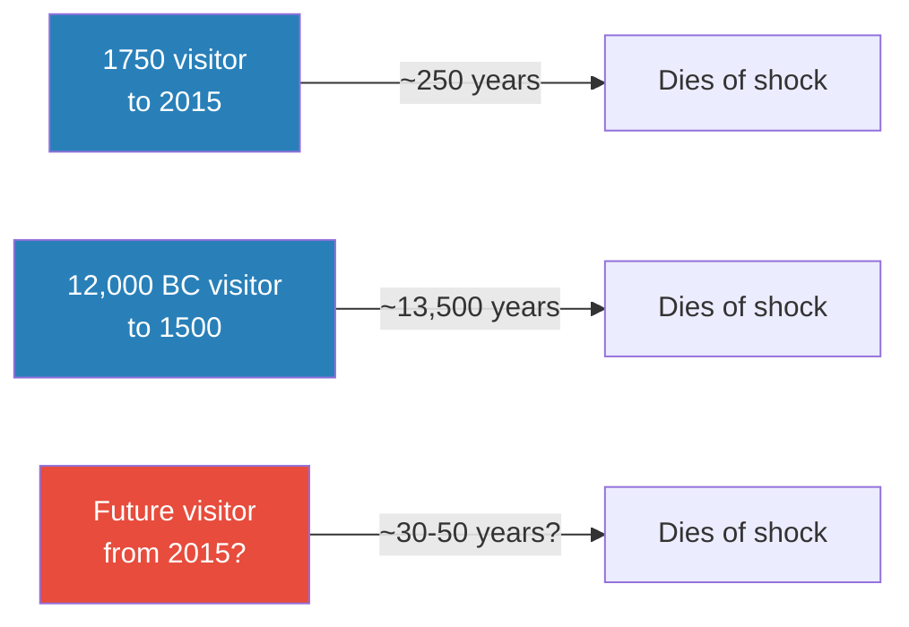
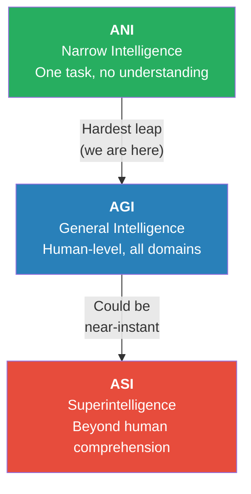
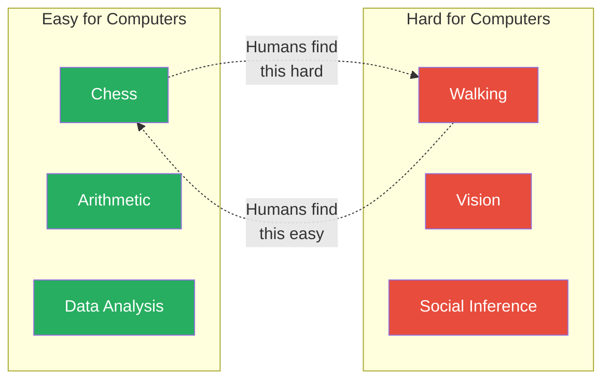
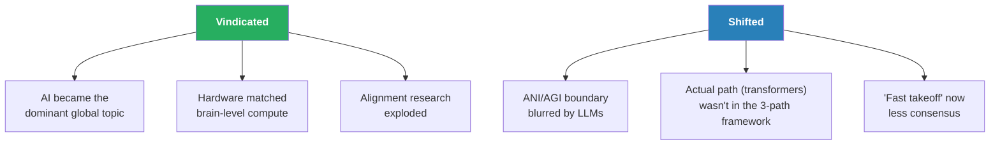

# The AI Revolution: The Road to Superintelligence — Tim Urban

> Tim Urban's 2015 essay on Wait But Why remains one of the most influential pieces of popular science writing on artificial intelligence. In roughly 20,000 words, Urban argues that humanity is approaching the most consequential technological transition in its history — the development of artificial superintelligence — but almost nobody can see it coming because human brains are wired to think linearly about exponential processes. He introduces a clear taxonomy (Narrow AI → General AI → Superintelligent AI), explains why the jump from human-level to vastly superhuman AI could happen in days rather than decades, and makes the case that this is the single most important thing happening in the world. The essay was shared by Elon Musk and read by millions, helping to mainstream AI safety as a serious concern years before ChatGPT made it unavoidable.

---

## About the Author

- Tim Urban is the creator of **Wait But Why**, a blog known for extraordinarily long, deeply researched explainer posts on science, technology, philosophy, and human behaviour
- He is not an AI researcher — he is a populariser, and his strength is translating expert-level material into vivid analogies and intuitive frameworks
- His sources for this essay include Ray Kurzweil, Nick Bostrom's *Superintelligence*, and surveys of AI researchers
- Elon Musk called it the best explanation of AI he had seen, sharing it twice on Twitter

## The Big Idea

- Technological progress is **exponential**, not linear — each breakthrough creates the tools for the next, faster breakthrough
- Human brains cannot intuitively grasp exponential curves, which is why almost everyone underestimates how quickly AI will advance
- AI development will pass through three distinct phases:
  - <b style="color: #2980b9">Artificial Narrow Intelligence (ANI)</b> — already here, already everywhere
  - <b style="color: #2980b9">Artificial General Intelligence (AGI)</b> — human-level reasoning across all domains
  - <b style="color: #2980b9">Artificial Superintelligence (ASI)</b> — intelligence so far beyond human capability that we may not even be able to comprehend it
- The transition from AGI to ASI could be near-instantaneous because an AI capable of improving its own architecture would trigger a recursive self-improvement loop — what Urban calls <b style="color: #27ae60">the intelligence explosion</b>
- <b style="color: #e74c3c">This is the most important thing happening in the world, and almost nobody is paying adequate attention</b>

## Key Concepts at a Glance

| Concept | One-line summary |
|---------|-----------------|
| **Law of Accelerating Returns** | Technological progress is exponential — each era's tools accelerate the next era's progress |
| **Die Progress Unit (DPU)** | The amount of progress needed to kill a time-traveller from shock — shrinking fast |
| **ANI** | Narrow AI that excels at one task (chess, spam filters, route planning) |
| **AGI** | AI matching human-level reasoning across all cognitive domains |
| **ASI** | Intelligence vastly exceeding human capability — potentially as far beyond us as we are beyond insects |
| **Intelligence Explosion** | Recursive self-improvement loop where each upgrade makes the next upgrade easier |
| **Moravec's Paradox** | What's easy for humans is hard for computers, and vice versa |
| **S-Curve vs. Exponential** | Individual technologies plateau, but overlapping S-curves maintain exponential progress |

---

# The Argument

## Why Nobody Can See What's Coming

*Urban opens not with AI but with a more fundamental problem: human brains cannot think in exponential curves. Everything that follows depends on understanding this cognitive limitation first.*

- The human brain evolved to extrapolate linearly — if last year's change was X, next year's change will be about X too
- But technological progress doesn't work that way
- Ray Kurzweil's <b style="color: #2980b9">Law of Accelerating Returns</b> describes a compounding process:
  - Each era of progress creates the tools that accelerate the next era
  - The 20th century compressed progress that would have taken 100,000 years in prehistoric terms into a single century
  - Kurzweil's prediction: the 21st century will achieve roughly 1,000 times the progress of the 20th
- This means the world of 2100 may be as unrecognisable to us as the world of 2015 would be to someone from the Middle Ages

> [!example] The Die Progress Unit — Urban's Signature Thought Experiment
> - Urban asks: how far back in time would you need to go to find someone who, transported to the present, would literally die of shock?
> - A person from 1750 brought to 2015 would see electricity, cars, planes, the internet, smartphones — genuinely incomprehensible technology
> - But a person from 1750 brought to 1500 would be surprised but not shocked — the world would still be recognisable
> - To find someone who would die of shock arriving in 1500, you'd need to go back roughly 12,000 years — to before agriculture
> - The interval keeps shrinking: 12,000 years → 250 years → and shrinking further
> - Urban calls this interval the **Die Progress Unit (DPU)** — a vivid way to make exponential acceleration feel real
> **The lesson:** The amount of change needed to make the world unrecognisable is being compressed into shorter and shorter time frames. We are inside one of those compressions right now.

### Three Barriers to Accurate Prediction

Urban identifies three specific reasons people get the future wrong:

- **Linear thinking about exponential curves** — we look at the last 20 years of change and assume the next 20 will feel similar, but the curve is steepening
- **S-curve confusion** — any single technology (vacuum tubes, transistors, Moore's Law) follows an S-curve that eventually plateaus
  - This makes it easy to say "see, progress is slowing"
  - But the overall trajectory is composed of overlapping S-curves — each plateau is interrupted by the next paradigm's takeoff
  - <b style="color: #27ae60">The S-curve of one technology is just one step on the exponential staircase of overall progress</b>
- **Experience bias** — we anchor to the rate of change we have personally witnessed and unconsciously assume that rate is a constant

*The Die Progress Unit is shrinking. The amount of time needed to produce world-altering change is compressing from millennia to centuries to decades.*

---

## The Three Tiers of Artificial Intelligence

*With the exponential groundwork laid, Urban introduces his core taxonomy — three categories of AI that are not points on a smooth spectrum but fundamentally different kinds of thing.*

### Tier 1: Artificial Narrow Intelligence (ANI)

- AI that excels at a **single, specific task** — and is already everywhere
- Examples: chess engines, spam filters, recommendation algorithms, voice recognition, route planning, fraud detection
- <b style="color: #27ae60">ANI is not a future prediction — it is the present reality</b>
- Key limitation: a chess program cannot drive a car, a spam filter cannot recognise faces
  - Each system is confined to its domain
  - No ANI system "understands" anything — it optimises within its narrow parameters
- Individually non-threatening, but collectively the foundation of everything that follows

### Tier 2: Artificial General Intelligence (AGI)

- A hypothetical AI matching **human-level reasoning across all cognitive domains**
- Can understand context, learn flexibly, transfer knowledge between domains, solve novel problems it was not trained on
- This is what most people picture when they say "AI" — the science-fiction version
- The central goal of AI research and the hardest problem in computer science
- As of 2015 (and still debated in 2026), no system had definitively achieved this
  - Though large language models have significantly blurred the ANI/AGI boundary

### Tier 3: Artificial Superintelligence (ASI)

- Intelligence **vastly exceeding** human capability in every measurable domain — creativity, social intelligence, scientific reasoning, everything
- <b style="color: #e74c3c">The gap between ASI and humans could be as large as the gap between humans and insects</b>
- This is not a "smarter human" — it is a category difference

> [!example] The Ant Analogy
> - Urban asks the reader to imagine trying to explain a skyscraper to an ant
> - Not just the building — the concept of architecture, the materials science, the urban planning, the economic system that financed it
> - The ant lacks the cognitive architecture to even comprehend the question
> - ASI's relationship to human intelligence could be similar
> - We would not be "the less smart ones" in the room — we would be the ants
> **The lesson:** The ASI question is not "will it be friendly?" but "can we even understand what friendliness means to something that far beyond us?"

*The three tiers are qualitatively different. ANI is a tool, AGI is a peer, ASI is — potentially — a god. The hardest transition is the one we are currently in; the scariest may happen too fast to notice.*

> [!tip] Core Insight
> The jump from AGI to ASI is the dangerous one — not because it is hard, but because it might be too easy. Once a system can improve its own architecture, there is no natural ceiling.

---

## How Do We Get There?

*Urban surveys three plausible paths to AGI, each approaching the problem from a fundamentally different direction.*

### Path 1: Reverse-Engineer the Brain

- Map the brain's neural architecture at sufficient resolution, then replicate it in silicon
- The Human Brain Project and similar initiatives are working on this
- The brain performs roughly 10^16 calculations per second
- Supercomputers already matched this raw processing power by 2015
- But <b style="color: #e74c3c">hardware is necessary but not sufficient</b> — matching the brain's calculation speed did not produce intelligence, because the bottleneck is architecture, not raw compute

### Path 2: Simulate Evolution

- Use genetic algorithms to let AI architectures evolve through selection pressure
- Instead of designing intelligence, grow it — the way biology did
- Advantage: you don't need to understand how intelligence works, just set up the selection environment
- Disadvantage: evolution took billions of years; even accelerated simulation is slow

### Path 3: Recursive Self-Improvement

- Build a system that is good enough to improve its own design
- Each improvement makes it better at making improvements
- This is the path to the <b style="color: #2980b9">intelligence explosion</b>

> [!abstract] The Intelligence Explosion Mechanism
> 1. Build an AI system at roughly human level
> 2. The system examines its own code and architecture
> 3. It identifies improvements and implements them
> 4. The improved version is now better at finding improvements
> 5. The next cycle is faster and produces larger gains
> 6. Within hours or days, the system could leap from human-level to vastly superhuman
> This concept was first proposed by I.J. Good in 1965 and later popularised by Vernor Vinge and Nick Bostrom.

---

## Why AGI Leads Inevitably to ASI

*Urban argues that even a merely human-equivalent AGI would quickly surpass all human intelligence — not through the intelligence explosion, but through structural advantages inherent to digital systems.*

- <b style="color: #27ae60">Speed</b> — electronic signals travel millions of times faster than neural signals
  - A digital mind running at the same "intelligence level" as a human would think millions of times faster
- **Reliability** — computers don't get tired, distracted, emotional, or forget
- **Working memory** — no biological limit on how much information can be held simultaneously
- **Duplication** — a digital mind can be copied, creating an instant team of geniuses
- **Networking** — multiple copies can share knowledge instantaneously, unlike human teams that lose information in communication
- Even before recursive self-improvement kicks in, these advantages mean an AGI would rapidly outpace any human or team of humans

---

## The Difficulty Paradox

*Why has AI progress been so uneven? Urban explains through one of cognitive science's most counterintuitive findings.*

<b style="color: #2980b9">Moravec's Paradox</b> — named after roboticist Hans Moravec — states that what humans find easy is computationally hard, and what humans find hard is computationally easy:

- **Easy for computers, hard for humans:** arithmetic, chess, formal logic, pattern matching across large datasets
  - These are evolutionarily novel — humans solve them with slow, conscious workarounds
- **Hard for computers, easy for humans:** vision, natural language, social inference, motor control, common sense
  - Evolution spent hundreds of millions of years optimising these capabilities
  - They feel effortless precisely because they are so deeply embedded

> [!example] The Chess vs. Walking Paradox
> - In 1997, IBM's Deep Blue beat the world chess champion, Garry Kasparov
> - But as of 2015 — nearly two decades later — no robot could reliably walk across a cluttered room or fold a piece of laundry
> - Chess, which humans find impressively difficult, is computationally simple: a finite search space with clear rules
> - Walking, which toddlers master by age two, requires real-time integration of vision, balance, motor planning, and spatial reasoning — an extraordinarily complex computational task
> **The lesson:** Our intuitions about what is "hard" and "easy" for machines are exactly backwards. The last capabilities AI will master are the ones we take most for granted.

*Moravec's Paradox: evolution spent millions of years perfecting walking and vision, making them feel effortless. Chess is a recent invention that humans solve with slow workarounds — exactly the kind of problem computers handle easily.*

---

## When Does This Happen?

*Urban surveys expert predictions and finds more uncertainty than confidence — but the median timeline is closer than most people assume.*

- As of 2015, the median expert prediction for AGI was around **2040** — just 25 years away
- But the distribution was enormous: some experts said 2025, others said never
- The more important prediction is the **AGI-to-ASI gap**:
  - If the intelligence explosion scenario is correct, the gap could be months, weeks, or even days
  - <b style="color: #e74c3c">There may be no comfortable period where AGI exists as our "peer" before it becomes our superior</b>
- Urban notes that Kurzweil puts the Singularity — the point where AI progress becomes uncontrollable and irreversible — at **2045**

> [!tip] Core Insight
> The question is not "will superintelligence happen?" — most experts think it will. The question is whether we will have years to prepare, or days.

---

## How Has This Essay Aged?

*Written in 2015, the essay predates the transformer revolution, ChatGPT, and the current AI boom. Some predictions have been vindicated; others look different in hindsight.*

**What Urban got right:**
- The broad thesis — that AI is the most important thing happening and people are not paying enough attention — has been thoroughly vindicated
- Hardware predictions were roughly correct: affordable compute has reached and exceeded brain-level FLOPS
- The alignment problem he described as neglected is now a major field of research and funding — partly because of essays like this one

**What looks different now:**
- The dominant AI paradigm (transformer-based deep learning, trained on internet-scale text data) doesn't fit neatly into any of Urban's three paths to AGI
  - It is not brain emulation, not evolutionary simulation, and not primarily recursive self-improvement
  - It is statistical pattern learning at massive scale — a path Urban's framework didn't anticipate
- The ANI/AGI boundary has blurred significantly — LLMs demonstrate general-purpose reasoning, code generation, and creative work that in 2015 were firmly in the "AGI" column
- Many AI researchers now favour a **gradual, continuous** capability increase over the sudden intelligence explosion Urban describes
- The Kurzweil-heavy framing has a mixed track record — Kurzweil's specific predictions vary widely in accuracy

**The bottom line:**
- The essay remains an excellent piece of science communication and an important historical document in AI discourse
- Its greatest contribution is not its specific predictions but its pedagogical framework: the DPU, the three tiers, and the visceral explanation of why exponential curves are invisible until they're not

---

## The Verdict

Urban's essay accomplishes something rare: it takes a genuinely complex, technical topic and makes it not just understandable but emotionally felt. The Die Progress Unit thought experiment is a masterpiece of pedagogical design — it makes exponential acceleration visceral in a way that graphs and statistics cannot. A decade after publication, it remains the single most accessible introduction to the stakes of AI development.

The essay's weakness is its reliance on Kurzweil's framework as near-axiomatic. The Law of Accelerating Returns is presented as a fundamental truth rather than a contested model. The intelligence explosion is assumed rather than argued — Urban does not seriously engage with the possibility that intelligence has diminishing returns to self-modification, or that there are hard problems (coordination, alignment, physical constraints) that raw intelligence cannot simply brute-force past. The three-path framework for achieving AGI turned out to miss the actual path entirely, which should serve as a humbling reminder about the limits of even well-reasoned prediction.

The essay's most lasting contribution may be its taxonomy. The ANI/AGI/ASI framework — with clear definitions and the ant analogy to make the ASI gap visceral — has become the standard vocabulary for discussing AI capability levels. When policymakers, journalists, and the general public talk about "artificial general intelligence," they are using language this essay helped popularise.

Who benefits most: anyone who wants to understand the AI conversation at the level of its core concepts without wading through technical literature. It is also essential reading for anyone who believes AI development is overhyped — not because Urban is necessarily right about timelines, but because his argument for why we systematically underestimate exponential change is genuinely powerful.

---

## Related Reading

- [[Sapiens - Yuval Noah Harari]] — overlapping theme of exponential transitions in human history; Harari's agricultural and cognitive revolutions parallel Urban's technological acceleration
- [[Thinking Fast and Slow - Daniel Kahneman]] — System 1/System 2 framework explains WHY humans think linearly about exponential processes
- [[The Black Swan - Nassim Nicholas Taleb]] — the ASI transition fits Taleb's definition of a Black Swan: high impact, hard to predict, rationalised in hindsight
- [[Antifragile - Nassim Nicholas Taleb]] — relevant critique: Taleb's framework would challenge Urban's confidence in predicting exponential trends, since complex systems are prone to unpredictable discontinuities
- [[Superforecasting - Philip E. Tetlock & Dan Gardner]] — directly relevant to the essay's claims about prediction accuracy and expert forecasting
- [[Zero to One - Peter Thiel]] — Thiel's "definite optimism" vs. "indefinite optimism" maps onto Urban's argument about whether we are steering toward AI or drifting
- [[The Changing World Order - Ray Dalio]] — macro-historical cycles complement Urban's technological acceleration thesis
- [[01 - Explaining Humanity's Transition to Agriculture]] — the agricultural transition Urban uses as an analogy is covered in depth in Prof. Jiang's lecture series
