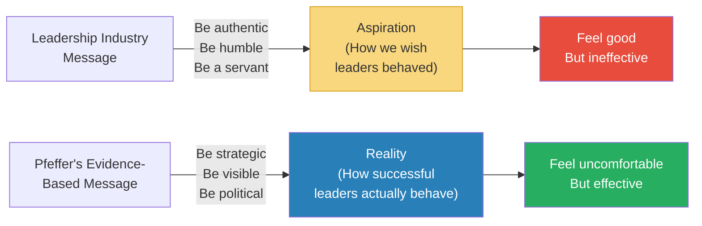
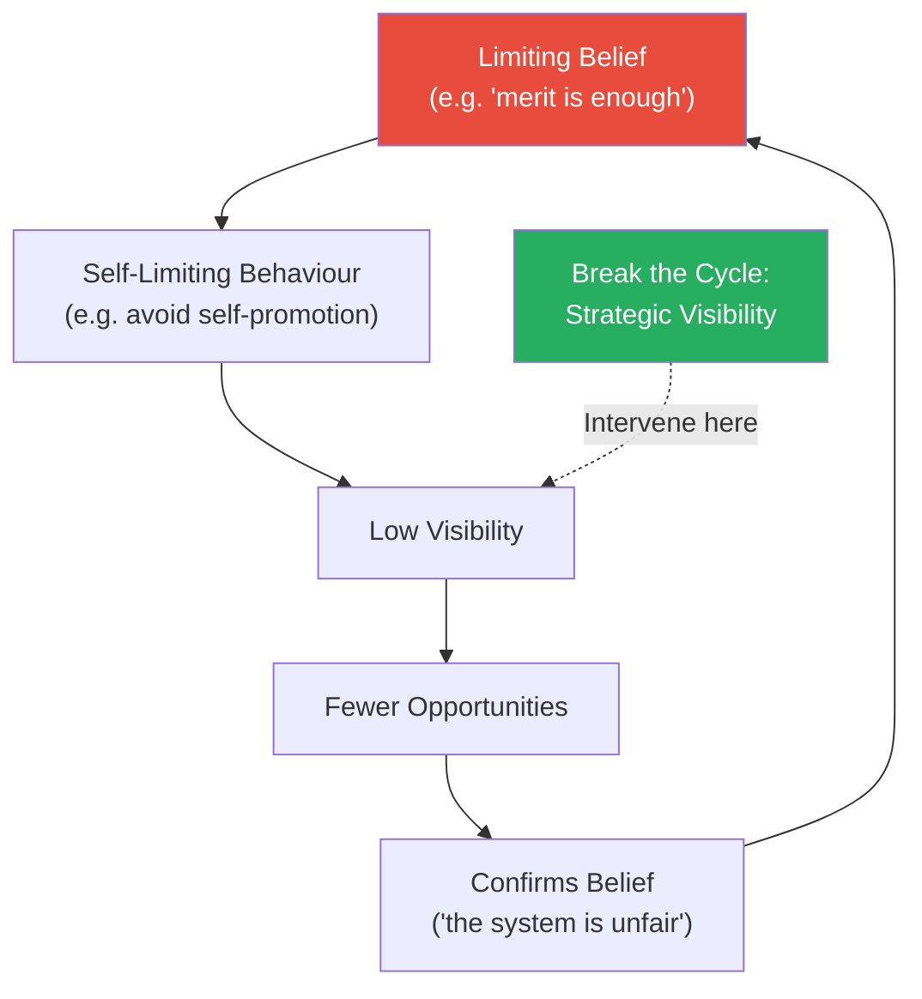
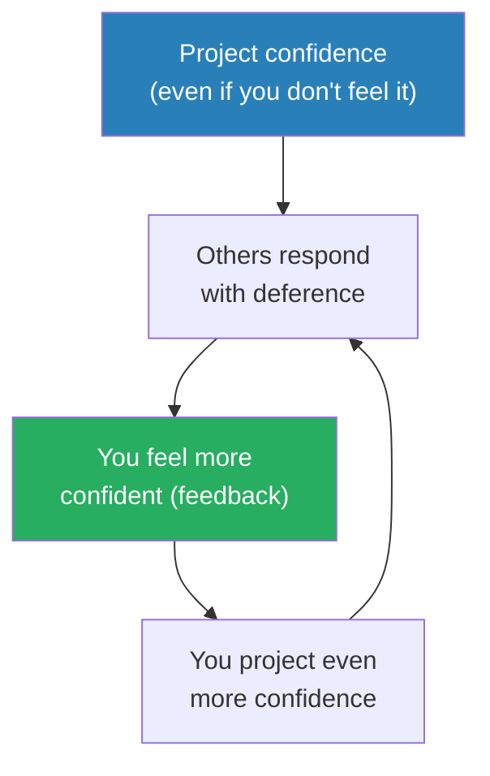
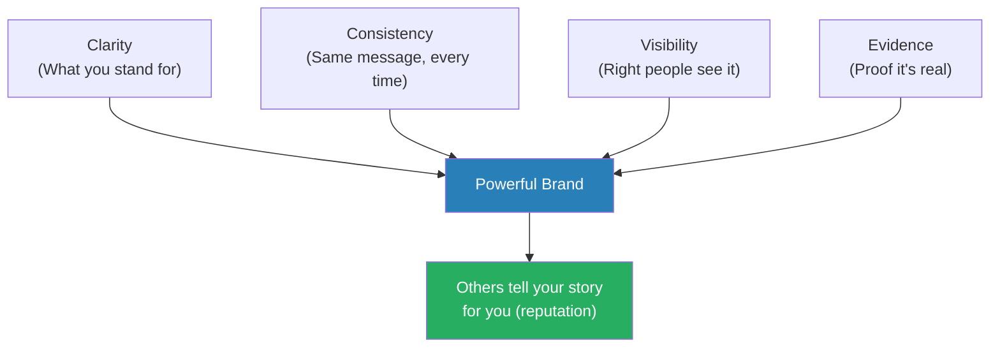
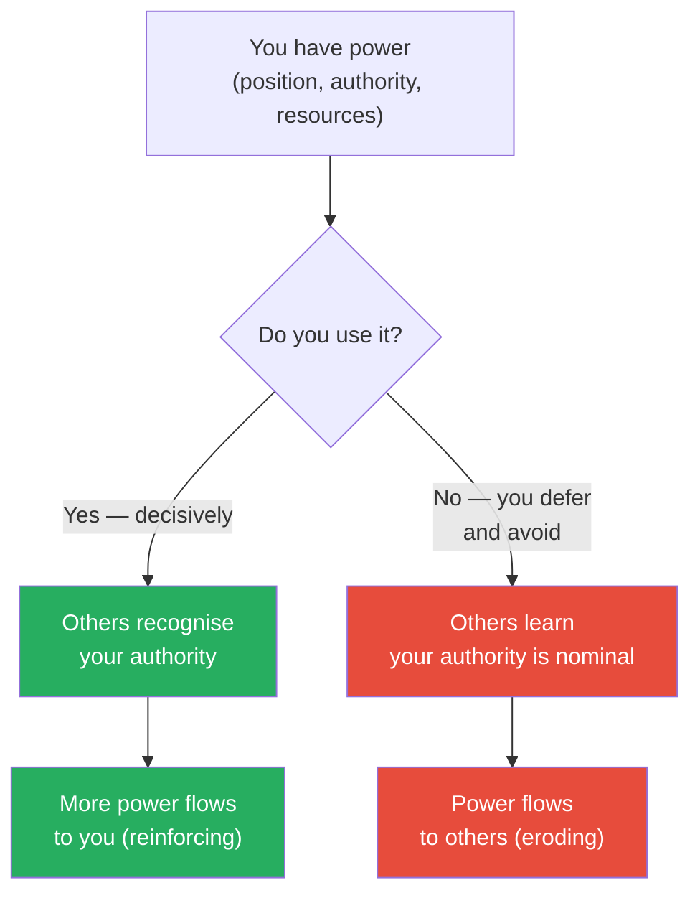
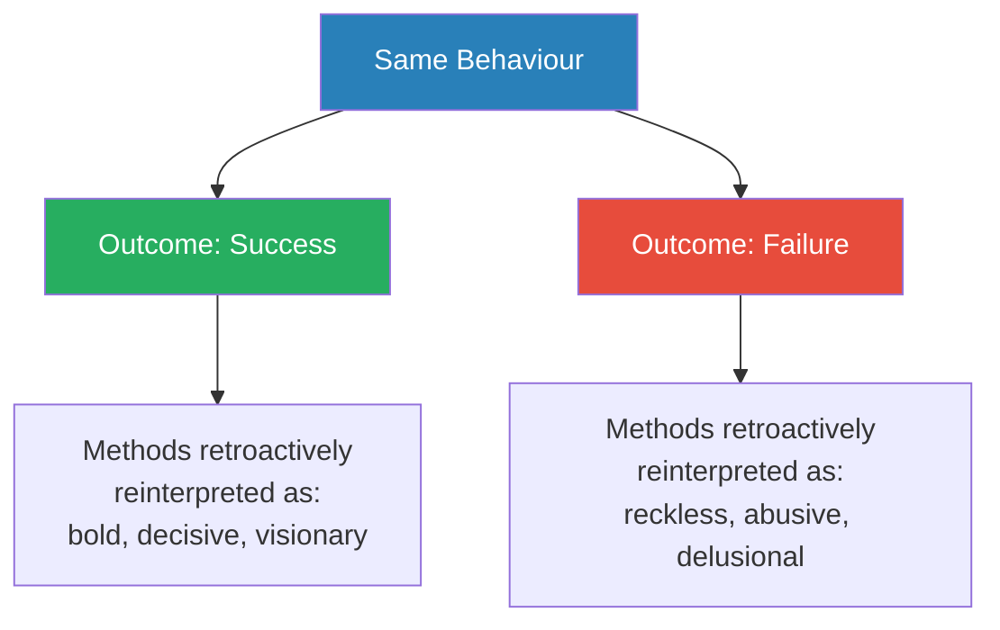
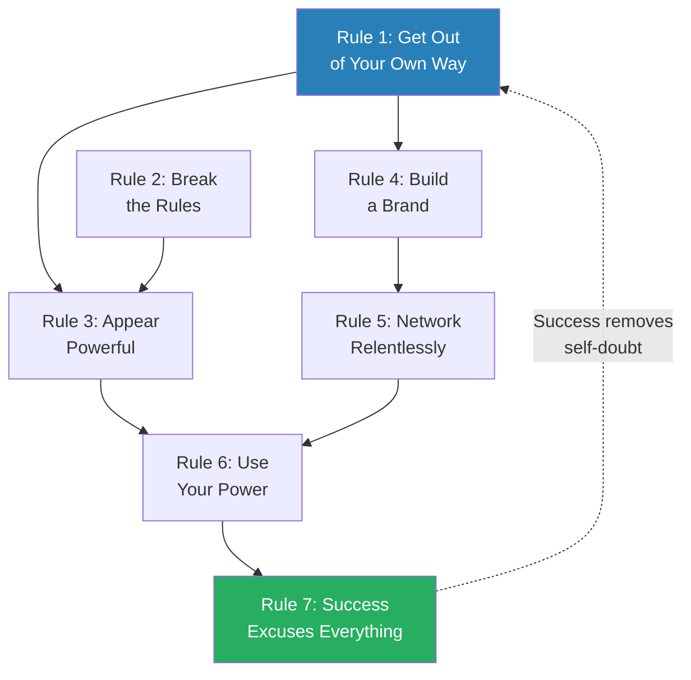

# 7 Rules of Power — Jeffrey Pfeffer

> Jeffrey Pfeffer's most direct book strips the subject of organisational power down to seven blunt, empirically-grounded rules — and in doing so, demolishes most of what the "leadership industry" has told you about how to succeed. His argument: the books, TED talks, and management seminars that preach authenticity, servant leadership, and leading with humility describe how people WISH leaders behaved, not how successful leaders ACTUALLY behave. The evidence says something different — and uncomfortable. This is the final instalment of Pfeffer's power trilogy (after *Power* and *Managing with Power*), and it is the most compressed and actionable of the three. Where *Power* was the diagnosis (performance is weakly correlated with career outcomes), *7 Rules of Power* is the prescription (here are the seven things you actually need to do). It is not a comfortable book. It is not a book that tells you what you want to hear. But it is a book that tells you what the evidence shows — and for anyone navigating organisations, that makes it indispensable.

---

## About the Author

Jeffrey Pfeffer is the Thomas D. Dee II Professor of Organizational Behavior at the Stanford Graduate School of Business, where he has taught since 1979. He has authored or co-authored fifteen books on organisational power, evidence-based management, and what he calls the "knowing-doing gap." His career has been spent in the empirical trenches of why talented people get stuck while less capable but more politically astute colleagues advance past them. *Power* (2010) established the diagnosis; *Managing with Power* (1992) explored the organisational mechanics; *7 Rules of Power* (2022) delivers the individual prescription. His distinctive approach: he does not tell you what SHOULD work based on theory — he tells you what DOES work based on decades of research and observation.

---

## The Big Idea

- <b style="color: #2980b9">Power is a learnable skill</b> — not a personality trait, not a birthright, not something that comes automatically from doing good work
- The "leadership industry" — the books, speakers, coaches, and MBA programmes that dominate management thinking — sells an idealised vision of leadership that has almost no relationship to how power actually works
- <b style="color: #e74c3c">The evidence consistently shows that the behaviours that PRODUCE power are different from the behaviours that leadership books RECOMMEND</b>
- Leadership books say: be authentic, be humble, be a servant leader, lead with values
- The evidence says: be strategic, be visible, be confident (even when you're not), build networks aggressively, and use your power or lose it
- <b style="color: #27ae60">Pfeffer's seven rules are what the evidence says actually works</b>
- Pfeffer is not saying morality doesn't matter — he is saying that morality without power is impotence, and that the people who refuse to learn the rules of power are not virtuous but naive
- The book rests on a simple premise: you cannot change the system from outside the system, and you cannot get inside the system without understanding how power works

---

- Pfeffer's critique of the leadership industry is scathing:
  - Despite the billions spent on leadership development, workplaces are as bad as ever
  - Employee engagement is stagnant
  - Trust in leaders is declining
  - The industry has not produced better leaders — it has produced better-sounding leaders who perform the rituals of good leadership without actually practising it
- The reason: the industry teaches people what they WANT to hear (be authentic, be humble, be kind) rather than what they NEED to hear (be strategic, be political, be visible)
- <b style="color: #2980b9">Pfeffer's promise: he will tell you what the evidence shows, not what you want to hear — you can decide what to do with it</b>

The gap between aspiration and reality is where most people's power failures live — they follow the aspirational advice and wonder why they aren't advancing.

---

## Key Concepts at a Glance

| Concept | One-line summary |
|---------|-----------------|
| **Rule 1: Get Out of Your Own Way** | Your biggest barrier is your own discomfort with power and belief that merit alone is enough |
| **Rule 2: Break the Rules** | Rules protect incumbents; strategic rule-breaking creates advantage for challengers |
| **Rule 3: Appear Powerful** | Confidence, body language, and narrative create real power through self-fulfilling prophecy |
| **Rule 4: Build a Powerful Brand** | If you don't control your narrative, others will write a less flattering one for you |
| **Rule 5: Network Relentlessly** | Weak ties and structural holes matter more than close friendships for advancement |
| **Rule 6: Use Your Power** | Power unused atrophies — exercise it decisively or watch it flow to others |
| **Rule 7: Success Excuses Everything** | The same behaviour is judged as genius or folly depending entirely on the outcome |
| **Leadership Industry Critique** | The $50B leadership development industry teaches aspiration, not reality |
| **Performance-Power Disconnect** | Hard work is necessary but nowhere near sufficient for advancement |

The radar reveals that networking (Rule 5) compounds most powerfully over time but offers the lowest immediate payoff, while Rule 7 carries the highest social risk — explaining why most people default to the safer, lower-impact rules.

---

## Introduction: Why the Leadership Industry Has Failed

*Pfeffer opens by dismantling the comfortable fiction that doing good work and being a good person will get you ahead — and explains why the entire leadership industry is selling you aspirational fantasy.*

- The leadership development industry is worth over $50 billion annually
- It produces thousands of books, seminars, TED talks, and executive coaching programmes every year
- And yet, by every measurable outcome, it has failed:
  - Gallup engagement surveys show employee engagement has barely moved in two decades
  - Trust in leaders — political, corporate, institutional — is declining across the developed world
  - Workplace toxicity, bullying, and burnout are not decreasing
- <b style="color: #e74c3c">If the industry's advice worked, the world should be getting better led. It is not.</b>

Pfeffer diagnoses the root cause in three parts:

- **The industry confuses aspiration with description** — it tells you how leaders SHOULD behave (humbly, authentically, with servant hearts), not how successful leaders ACTUALLY behave
- **The industry has no accountability** — a leader attends a two-day seminar, feels inspired, returns to work, changes nothing, and attends another seminar next year
- **The industry is financially incentivised to make people feel good** — corporate L&D departments buy programmes that their participants enjoy, not programmes that produce measurable behaviour change

> [!example] The Level 5 Leadership Myth
> - Jim Collins's *Good to Great* research claimed the most successful companies were led by "Level 5 leaders" — humble, self-effacing executives who deflected credit and accepted blame
> - The concept became enormously influential — it told leaders exactly what they wanted to hear: be modest and success will follow
> - Pfeffer's counter-evidence is devastating: the same era produced wildly successful leaders who were anything but humble
>   - Jack Welch at GE: famously combative, self-promoting, ruthless with underperformers
>   - Steve Jobs at Apple: legendary for cruelty, micromanagement, and taking credit for others' work
>   - Larry Ellison at Oracle: flamboyant, aggressive, publicly combative with competitors
> - Collins found humble leaders among the successful and concluded humility caused success
> - He ignored the many successful leaders who were not humble, and the many humble leaders who were not successful
> **The lesson:** Survivorship bias and confirmation bias produced a feel-good finding that the entire leadership industry adopted without scrutiny.

> [!tip] Core Insight
> The leadership industry tells you what sells. Pfeffer tells you what works. The two are often disturbingly different.

---

- <b style="color: #2980b9">The Performance-Power Disconnect</b> is the foundational concept from Pfeffer's earlier work that this book builds on:
  - Performance and career outcomes are only weakly correlated
  - Studies consistently show that factors like visibility, political skill, networking, and self-promotion predict advancement more strongly than job performance alone
  - This is not cynicism — it is empirical observation repeated across dozens of studies and decades of data
- Most people respond to this evidence with anger or denial: "That's not fair" or "That shouldn't be true"
- Pfeffer's response: "I'm not saying it's fair. I'm saying it's true. And understanding what's true is more useful than wishing it were different."

### The Evidence Pfeffer Draws On

- Pfeffer builds his case on several bodies of research:
  - **Gerald Ferris's political skill research** — decades of studies showing that individuals with high "political skill" (the ability to read situations, influence others, and navigate organisational dynamics) advance faster and further than those with higher technical competence but lower political skill
  - **Cameron Anderson's confidence research** — studies at UC Berkeley showing that overconfident people are consistently rated as more competent by peers, even when their actual performance is no better than average
  - **Frank Flynn's self-promotion research** — experiments demonstrating that people who talk about their accomplishments are perceived as more competent than equally accomplished people who don't
  - **Adam Grant's analysis of givers and takers** — while Grant shows that generous people can succeed, Pfeffer notes that Grant's data also shows many generous people get exploited; the key variable is not generosity vs selfishness but strategic awareness
- <b style="color: #27ae60">Taken together, this research paints a consistent picture: the behaviours that produce power (confidence, visibility, networking, self-promotion) are not the same as the behaviours that produce competence (skill development, deep work, technical mastery)</b>
- You need BOTH — but most people invest almost exclusively in the second set and wonder why the first set of outcomes (advancement, influence, authority) doesn't follow

---

## Rule 1: Get Out of Your Own Way

*The single biggest barrier to acquiring power is not external — it is the set of beliefs inside your own head that tells you seeking power is wrong, unnecessary, or beneath you.*

- Most people sabotage their own power-building with <b style="color: #e74c3c">false beliefs</b> absorbed from culture, education, and the leadership industry:
  - "My work should speak for itself" — it won't; what is unseen counts for nothing (see [[Power - Jeffrey Pfeffer|Power]])
  - "Self-promotion is distasteful" — distasteful to whom? Not to the people who get promoted
  - "I don't want to play politics" — politics is the allocation of resources and influence; if you don't play, you don't eat
  - "Power corrupts" — some people are corrupted by power, others use it to do extraordinary good; the tool is neutral
  - "If I just work hard enough, I'll be recognised" — the just-world fallacy; hard work is necessary but nowhere near sufficient
- <b style="color: #27ae60">The first step to power is accepting that it is necessary, learnable, and morally neutral</b>

### The Psychology of Self-Sabotage

- Pfeffer identifies several psychological mechanisms that keep people stuck:
  - <b style="color: #2980b9">The just-world hypothesis</b> — the deep human need to believe the world is fair, that good work is rewarded and bad work is punished
    - This belief is comforting but empirically false in most organisations
    - It leads people to wait passively for recognition instead of actively seeking it
  - <b style="color: #2980b9">Identity-protective cognition</b> — people who have built their self-image around being "above politics" or "too principled to self-promote" resist changing those behaviours because it would mean admitting their principles were counterproductive
    - It feels better to be right about the system being unfair than to be effective within it
  - <b style="color: #2980b9">Loss aversion applied to social standing</b> — asking for what you want (a promotion, a raise, a visible assignment) risks rejection, and most people weight the pain of potential rejection more heavily than the gain of potential success
    - So they don't ask — and the people who DO ask get the opportunities instead

> [!example] The PhD Who Couldn't Self-Promote
> - Pfeffer describes a Stanford PhD student — brilliant, published, respected by peers — who consistently lost out on opportunities to less-qualified candidates
> - The reason: she never told anyone about her work; she believed the work should speak for itself
> - When Pfeffer suggested she send her papers to key people in the field with a brief personal note, she was appalled: "That would be self-promotion!"
> - Pfeffer's response: "What do you think the people who are getting the jobs do?"
> - She eventually tried it and within six months had three job offers
> - Nothing about her work changed; everything about her visibility changed
> **The lesson:** Talent without visibility is talent wasted.

---

> [!example] The Executive Who Played by the Rules
> - Pfeffer describes a mid-level executive at a technology company who followed every piece of conventional leadership advice
> - He was collaborative, humble, let his team take the credit, avoided politics, and waited for his turn
> - Over five years, he watched three promotions go to colleagues who were less technically skilled but more politically savvy
> - Each of those colleagues had done one or more of the following: volunteered for high-visibility projects, built relationships with senior leadership, promoted their team's results aggressively, and asked directly for the promotion
> - The executive had done none of those things because he believed they were "playing politics"
> - When he finally left the company in frustration, his manager's parting words were: "We always thought you were happy where you were — you never said otherwise"
> **The lesson:** Silence is not humility. In organisational life, silence is interpreted as contentment.

---

### How to Get Out of Your Own Way

- Pfeffer prescribes a deliberate process of cognitive restructuring:
  - **Identify the limiting belief** — which of the five common beliefs above is holding you back?
  - **Test it against evidence** — look at the people who have been promoted in your organisation; did they follow the belief, or did they violate it?
  - **Reframe the behaviour** — self-promotion is not bragging, it is ensuring that decision-makers have accurate information about your contributions
  - **Start small** — you don't need to become a different person overnight; start with one act of strategic visibility per week
- <b style="color: #27ae60">Pfeffer's key insight: many people would rather be RIGHT about the unfairness of the system than be EFFECTIVE within it — being right feels good, but being effective produces results</b>

The self-sabotage cycle is self-reinforcing — each time you avoid self-promotion and don't get recognised, it confirms your belief that the system is unfair, which makes you avoid self-promotion even more.

---

## Rule 2: Break the Rules

*Rules constrain those who follow them and protect those who made them — Pfeffer argues that strategic rule-breaking is not reckless but essential.*

- <b style="color: #2980b9">Rules exist to maintain the current power structure</b> — and the current power structure benefits the people who wrote the rules
- Following all the rules perfectly is a strategy for staying exactly where you are
- <b style="color: #e74c3c">Strategic rule-breaking creates advantage precisely because most people won't do it</b>
- This is NOT about being unethical or dishonest — it is about recognising which rules are genuine constraints (laws, safety regulations, ethical boundaries) and which are merely social conventions that limit your options

### The Taxonomy of Rules

- Pfeffer distinguishes between three types of rules:
  - **Legal and ethical rules** — do not break these; the consequences are severe and the moral cost is real
  - **Organisational rules** — formal policies that may or may not serve their stated purpose; some are outdated, some protect incumbents, some exist because no one has bothered to change them
  - **Social conventions** — unwritten norms about how to behave ("wait your turn," "don't go over your boss's head," "be modest about your achievements") that constrain your options without any formal authority behind them
- <b style="color: #27ae60">The most powerful rule-breaking targets the third category: social conventions that limit your options without serving any legitimate purpose</b>

The treemap reveals that social conventions (green) — the rules most people follow unquestioningly — are precisely the category Pfeffer targets for strategic breaking, while legal/ethical rules (red) remain inviolable boundaries.

> [!example] The Rules That Hold You Back
> - Pfeffer catalogues common "rules" that successful people routinely break:
> - "Wait your turn" — the most successful leaders CREATE their turn by volunteering for visible assignments; waiting is what incumbents want you to do
> - "Don't go over your boss's head" — sometimes the boss IS the problem, and the solution is their boss; going around a blocker is not disloyalty, it is problem-solving
> - "Stay in your lane" — the most promotable people work across boundaries, not within them; staying in your lane is how you stay in your current role forever
> - "Be modest about your achievements" — in organisations where visibility drives advancement, modesty is self-inflicted invisibility
> - "Pay your dues" — "dues" is what incumbents tell newcomers to slow them down and protect their own position
> **The lesson:** Examine every "rule" you follow and ask: who benefits from me following this rule? If the answer is "everyone except me," it may be time to break it.

---

### The Mechanics of Strategic Rule-Breaking

- Breaking rules effectively requires three things:
  1. <b style="color: #2980b9">Calculation</b> — assess the likely consequences before acting; what is the worst case? Can you survive it?
  2. <b style="color: #2980b9">Timing</b> — break rules when the potential gain is high and when you have enough social capital to absorb any backlash
  3. <b style="color: #2980b9">Framing</b> — present the rule-break not as defiance but as initiative, innovation, or problem-solving
- The key is strategic discretion: know which rules to break, when, and how to manage the consequences
- <b style="color: #e74c3c">The people who follow every rule are predictable, the people who are predictable are controllable, and the people who are controllable are not powerful</b>

> [!example] The Intern Who Skipped the Queue
> - Pfeffer describes a summer intern at a consulting firm who was told, like all interns, to "observe and learn" for the first two weeks
> - Instead, she identified a data problem in a client presentation that the senior team had missed, built a corrected analysis overnight, and presented it to the partner leading the engagement
> - She broke every intern "rule" — she didn't wait, she didn't stay in her lane, she didn't defer to seniors
> - The partner was impressed; the senior associates were annoyed
> - She received a full-time offer before any other intern in her cohort
> - Pfeffer's analysis: the intern calculated correctly that the upside of demonstrating value outweighed the downside of annoying a few senior associates
> **The lesson:** The "rules" for newcomers exist to keep newcomers in their place. Breaking them strategically signals that you are not content to stay in that place.

> [!abstract] Strategic Rule-Breaking Framework
> 1. Identify the rule you're following that limits your advancement
> 2. Ask: is this a legal/ethical rule or a social convention?
> 3. If social convention: who benefits from you following it?
> 4. Calculate the downside of breaking it — what's the worst realistic outcome?
> 5. Calculate the upside — what opportunity does breaking it create?
> 6. If upside exceeds downside: break it, but frame it as initiative, not defiance
> 7. Build social capital first — rule-breaking is safer when people already respect you

### The Spectrum of Rule-Breaking

- Pfeffer is careful to note that rule-breaking exists on a spectrum:

| Level | Example | Risk | Reward |
|-------|---------|------|--------|
| **Minor** | Speaking up in a meeting where juniors are expected to be silent | Very low — worst case, a mild rebuke | Moderate — visibility, impression of confidence |
| **Moderate** | Volunteering for a project above your level without being invited | Low — worst case, you're turned down | High — access to senior leaders and visible work |
| **Significant** | Going around a blocking manager to their superior with a proposal | Moderate — political fallout if mishandled | Very high — direct access to power, bypass of a bottleneck |
| **Major** | Publicly challenging a senior leader's strategy with a better alternative | High — career risk if you're wrong or if you alienate the wrong person | Transformative — establishes you as a strategic thinker and future leader |

- <b style="color: #27ae60">Most people never get past the "minor" level because they overestimate the risk and underestimate the reward</b>
- Pfeffer's observation: the people who advance fastest are willing to operate at the "moderate" and "significant" levels regularly — not recklessly, but with calculation
- The key is building enough social capital and credibility that rule-breaking is interpreted as initiative rather than insubordination

> [!example] The Manager Who Went Around Her Boss
> - Pfeffer describes a product manager whose director consistently blocked her proposals for a new product line
> - The director's reasoning was risk-averse: "We don't have the resources" and "The timing isn't right" — phrases that had been used to block innovation for years
> - Rather than accept the block, the product manager prepared a detailed business case and presented it directly to the VP of the division during a strategy offsite
> - The VP was intrigued and approved a small pilot
> - The director was furious — but the pilot succeeded, validating the product manager's judgment
> - Within 18 months, she was promoted to a role reporting directly to the VP, and the director's influence had diminished
> - Had the pilot failed, the story would have ended very differently — this is where Rule 7 (Success Excuses Everything) intersects with Rule 2
> **The lesson:** Going around a blocker is high-risk but high-reward. The key is to be right — and to have the evidence to prove it.

---

## Rule 3: Appear Powerful

*People grant power to those who LOOK and SOUND powerful — even before those people have demonstrated competence — and this perception quickly becomes reality.*

- <b style="color: #2980b9">Power is granted based on perception, not just performance</b>
- Research in social psychology consistently shows that confidence, strong body language, decisive speech, and willingness to take up space all produce real power through a self-fulfilling prophecy
- The mechanism: you project confidence → others treat you as confident → you feel more confident → you project more confidence

This is not a theory — it is a documented psychological phenomenon: the self-reinforcing cycle of perceived power producing actual power.

---

### The Science Behind Appearing Powerful

- <b style="color: #2980b9">Enclothed cognition</b> — research by Hajo Adam and Adam Galinsky showed that wearing clothes associated with authority (a doctor's coat, a business suit) actually changes cognitive performance
  - Participants wearing a lab coat described as a "doctor's coat" performed better on attention tasks than those wearing the identical coat described as a "painter's coat"
  - The implication: how you dress doesn't just change how others see you — it changes how you think and perform
- <b style="color: #2980b9">Power posing and expansive body language</b> — while the hormonal claims of Amy Cuddy's original power-posing research have been contested, the behavioural findings remain robust
  - People who adopt expansive postures (taking up space, open limbs, upright stance) are consistently rated as more confident, competent, and leader-like by observers
  - More importantly, people who adopt these postures report feeling more confident themselves
- <b style="color: #2980b9">Vocal characteristics of perceived power</b> — studies show that lower pitch, moderate pace, fewer filler words ("um," "uh," "like"), and comfort with silence are all associated with perceived authority
  - People who speak with rising intonation (turning statements into questions) are rated as less competent, even when the content is identical

> [!tip] Core Insight
> Acting powerful and being powerful are not sequential — they are simultaneous. The performance creates the reality.

---

### The Components of Appearing Powerful

| Component | What It Looks Like | What It Signals |
|-----------|-------------------|----------------|
| **Voice** | Low pitch, moderate pace, no filler words, comfortable with silence | Confidence, authority, thoughtfulness |
| **Body** | Upright posture, still (not fidgeting), takes up space, direct eye contact | Stability, dominance, comfort with power |
| **Language** | Declarative statements, no hedging, no apologising, uses "I" and "we" assertively | Certainty, leadership, decisiveness |
| **Presence** | First to speak, last to leave, remembers names, maintains eye contact | Status, investment, importance |
| **Narrative** | Has a clear, compelling story about themselves, their team, and their vision | Direction, purpose, charisma |
| **Dress** | Appropriate to context but always polished; slightly above the room's standard | Seriousness, attention to detail, ambition |

---

> [!example] Low-Power vs High-Power Presentation
> - Pfeffer describes two versions of the same person entering the same meeting:
> - **Low-power version:** Enters the room quietly, sits in the back corner, waits to be called on, speaks with rising intonation ("I was thinking maybe we could possibly consider...?"), avoids eye contact, fidgets with papers
>   - What the room perceives: low status, low confidence, not a leader
> - **High-power version:** Enters the room at a measured pace, chooses a seat with visibility, makes eye contact with the decision-maker, uses a firm voice ("Based on the data, I recommend we move forward with Option B"), pauses, holds eye contact
>   - What the room perceives: high status, high confidence, leadership material
> - Nothing about the person's competence changed between the two scenarios
> - Everything about their visibility and perceived power changed
> **The lesson:** Competence without presence is invisible competence.

---

> [!example] The CEO Who Studied Reagan
> - Pfeffer describes a CEO he coached who struggled with executive presence despite being the smartest person in most rooms
> - Pfeffer suggested she study Ronald Reagan's communication style — not his politics, but his physical performance of authority
> - Reagan's techniques: slow, deliberate movement; long pauses before answering; relaxed posture that communicated ease with power; eye contact that held slightly longer than comfortable; a low, measured voice that never rose in pitch even under attack
> - The CEO practised these techniques in front of a mirror and with a speaking coach over several months
> - Her board evaluations improved dramatically — not because she became smarter or more strategic, but because she began presenting her intelligence in a way that others could perceive and respect
> **The lesson:** Presence is a skill, not a trait. It can be studied, practised, and mastered like any other skill.

- <b style="color: #27ae60">Pfeffer connects this to a broader principle: in a world of incomplete information, people use signals to infer substance</b>
  - If you signal confidence, people infer competence
  - If you signal hesitation, people infer uncertainty
  - The signal is not a lie — it is a communication strategy
  - This connects to Goyder's work on gravitas (see [[Gravitas - Caroline Goyder|Gravitas]]): the physical expression of authority creates the internal experience of authority, which creates the external perception of authority

### The Language of Power

- Pfeffer pays particular attention to linguistic patterns that distinguish high-power and low-power communicators:
  - **Low-power language markers:**
    - Hedging: "I think maybe we could possibly consider..."
    - Disclaimers: "I'm not an expert, but..."
    - Tag questions: "That makes sense, right?"
    - Excessive qualifiers: "sort of," "kind of," "a little bit"
    - Apologising unnecessarily: "Sorry, but I just wanted to say..."
  - **High-power language markers:**
    - Declarative statements: "Based on the data, I recommend Option B"
    - Ownership: "I believe," "My recommendation is," "The evidence shows"
    - Comfort with silence: pausing after making a point rather than filling the space
    - Precision: specific numbers, names, dates instead of vague generalities
    - Direct disagreement: "I see it differently" rather than "Well, I don't know, but maybe..."
- <b style="color: #e74c3c">Pfeffer notes that many people — particularly women and people from non-dominant cultural backgrounds — have been socialised to use low-power language as a form of politeness</b>
- The problem: what feels polite to the speaker sounds weak to the audience
- <b style="color: #27ae60">The fix is not to become rude but to become precise — replacing hedges with data, replacing apologies with assertions, and replacing qualifiers with specifics</b>

> [!abstract] Power Language Substitutions
> - "I think maybe..." → "The data suggests..."
> - "Sorry, but..." → "I want to add..."
> - "Does that make sense?" → *[Pause. Hold eye contact.]*
> - "I'm not an expert, but..." → "From my perspective..."
> - "We could sort of try..." → "I recommend we test..."
> - "I just wanted to mention..." → "There's an important point here..."

---

## Rule 4: Build a Powerful Brand

*If you don't tell people who you are and what you've done, nobody will know — and in the absence of your narrative, they will create their own, usually less flattering version.*

- Your "brand" in organisational life is simply: <b style="color: #27ae60">the story that comes to mind when people hear your name</b>
- If you haven't actively shaped that story, it defaults to whatever fragments of information people have picked up — which may be incomplete, inaccurate, or unflattering
- <b style="color: #e74c3c">The alternative to self-branding is not humility — it is invisibility</b>

### The Four Pillars of a Powerful Brand

- Building a brand requires four elements working together:
  1. <b style="color: #2980b9">Clarity</b> — know what you want to be known for; pick 1-2 qualities, not ten
     - A brand that tries to be everything communicates nothing
     - The best brands are specific: "the person who fixes broken teams," "the data person who makes numbers tell stories," "the one who can close any deal"
  2. <b style="color: #2980b9">Consistency</b> — reinforce the same narrative across all interactions
     - Every meeting, every email, every presentation should subtly reinforce your brand
     - Consistency over time is what turns a claim into a reputation
  3. <b style="color: #2980b9">Visibility</b> — ensure the right people encounter your brand regularly
     - Being excellent in a room where no decision-makers are present is being excellent in private
     - Seek out visible projects, speaking opportunities, cross-functional work, and any platform where your target audience can observe you
  4. <b style="color: #2980b9">Evidence</b> — back the brand with concrete examples and outcomes
     - A brand without evidence is a claim; a brand with evidence is a reputation
     - Collect and deploy your "greatest hits" — specific, measurable results that demonstrate your brand in action

When all four pillars are working, your brand eventually becomes self-sustaining — other people tell your story for you, which is the most powerful form of branding.

---

> [!example] The Tech Founder Who Refused to Brand
> - Pfeffer describes a Silicon Valley founder who built a technically superior product but refused to engage in "personal branding"
> - He considered self-promotion beneath him: "The product should speak for itself"
> - A competitor with an inferior product but a carefully cultivated personal brand — regular blog posts, conference appearances, media interviews, a polished LinkedIn presence — attracted more funding, more press, and more customers
> - The founder eventually lost the market to the competitor
> - The competitor's product was not better — the competitor was VISIBLE and the founder was invisible
> **The lesson:** In a world where attention is the scarcest resource, being invisible is not humility. It is a competitive disadvantage.

---

> [!example] The Consultant Who Branded Herself as "The Fixer"
> - Pfeffer describes a management consultant who deliberately cultivated a brand as the person you call when a project is in crisis
> - She did three things consistently over five years:
>   - Volunteered for troubled projects that others avoided
>   - Documented every turnaround with specific metrics (reduced timeline by 40%, brought budget back on track, resolved team conflict)
>   - Made sure senior partners heard about the results through brief, factual update emails
> - Within those five years, partners began specifically requesting her for difficult engagements
> - She didn't have the best technical skills in the firm — but she had the clearest, most differentiated brand
> - When she was promoted to partner, no one was surprised — her brand had made the promotion feel inevitable
> **The lesson:** A clear, evidence-backed brand makes advancement feel like a natural conclusion rather than a contested decision.

> [!tip] Core Insight
> Pfeffer notes that self-branding is where most people's discomfort with power is strongest — "it feels like bragging." His response: the alternative to branding yourself is not being modest. It is being invisible.

---

### The Brand Gap

- Pfeffer suggests a diagnostic exercise:
  - Complete this sentence: "When people think of me, I want them to think of someone who _____"
  - Now ask three trusted colleagues: "When you think of me professionally, what's the first word that comes to mind?"
  - If their answers match your brand statement — your brand is working
  - If their answers don't match — there is a gap between how you see yourself and how others see you
  - <b style="color: #e74c3c">That gap is costing you opportunities you don't even know about</b>

### The Social Media Dimension of Branding

- Pfeffer notes that social media has made personal branding simultaneously easier and more urgent:
  - **Easier** because platforms like LinkedIn, Twitter, and personal blogs give everyone a broadcasting channel — you no longer need gatekeepers to get your message out
  - **More urgent** because your competitors ARE using these platforms, and if you are not, you are ceding the information environment to them
- The principles of brand-building are the same online as offline:
  - Clarity: what is your consistent theme?
  - Evidence: do you share concrete examples and results?
  - Frequency: are you visible often enough that people remember you?
- <b style="color: #27ae60">Pfeffer is not suggesting you become a social media influencer — he is suggesting you ensure that when someone Googles your name or looks at your LinkedIn, they find a story that YOU wrote, not a blank page that invites others to fill in</b>

> [!example] The Two LinkedIn Profiles
> - Pfeffer contrasts two professionals with similar qualifications applying for the same role
> - Candidate A had a bare-bones LinkedIn profile: job titles, dates, and a generic headline ("Marketing Professional")
> - Candidate B had a curated profile: a specific headline ("Growth Marketing Leader — Scaled 3 startups from $0 to $10M ARR"), detailed accomplishments with metrics, articles she had published, and recommendations from recognisable names
> - The hiring manager found both profiles during the search
> - Candidate A's profile communicated nothing; Candidate B's profile communicated a clear, evidence-backed brand
> - Candidate B got the interview before Candidate A was even considered
> **The lesson:** Your online presence is your brand's front door. A blank front door tells visitors there is nothing inside worth seeing.

---

## Rule 5: Network Relentlessly

*Your network determines your opportunities, your information flow, and your influence — and the most valuable connections are not your closest friends but your most distant acquaintances.*

- <b style="color: #2980b9">Your network is the infrastructure of your power</b>
- Most people network reactively — they reach out when they need something
- <b style="color: #e74c3c">By then it's too late — networking when desperate is networking badly</b>
- <b style="color: #27ae60">The most effective networkers build relationships BEFORE they need them</b> — investing consistently in their network when there's no immediate payoff

### Why Weak Ties Beat Strong Ties

- Mark Granovetter's famous research: <b style="color: #2980b9">weak ties (acquaintances, not close friends) are more valuable for career advancement than strong ties</b>
- The mechanism is information asymmetry:
  - Your close friends have the same information and connections you do — they move in the same circles, read the same things, know the same people
  - Your acquaintances move in DIFFERENT circles — they bring you information, opportunities, and connections that you would never encounter through your close network
  - The most powerful position in a network is not being at the centre of one group but being the <b style="color: #2980b9">bridge between two disconnected groups</b>
- Ron Burt's <b style="color: #2980b9">structural holes theory</b> formalises this: the people who bridge gaps between disconnected networks capture disproportionate value
  - They see opportunities that neither group sees alone
  - They can translate ideas from one domain to another
  - They become indispensable because they are the only conduit between groups that need each other

> [!example] The Bridge Builder Who Got Promoted
> - Pfeffer describes an executive who was promoted over more technically qualified colleagues because she was the only person in the organisation who had relationships in BOTH the engineering division and the sales division
> - The two divisions had historically communicated poorly — engineering built what they thought was elegant, sales promised what they thought customers wanted, and the two rarely aligned
> - When a product launch required coordination between both, she was the natural choice to lead it
> - Not because she was the best engineer or the best salesperson — but because she was the only person both groups trusted
> - She had built a bridge between two disconnected networks — and that bridge became a highway for her advancement
> **The lesson:** The most promotable position is not being the best at one thing — it is being the only person who connects two things that need connecting.

---

> [!example] The Professor Who Networked Strategically
> - Pfeffer describes an academic colleague who was less published than many peers but vastly more influential
> - The difference: every conference, every visiting lecture, every social event, the colleague made a point of meeting people outside his immediate field
> - He maintained these relationships with occasional emails — sharing an article, congratulating a promotion, making an introduction
> - When committee appointments, editorial board positions, and speaking invitations came up, his name appeared on every list — not because he was the most distinguished scholar, but because he was known across more networks than anyone else
> - His publication count was average; his influence was extraordinary
> **The lesson:** Breadth of network often matters more than depth of expertise for influence and advancement.

---

### Pfeffer's Networking Principles

| Principle | Why It Matters |
|-----------|---------------|
| **Start before you need it** | Build relationships when you have nothing to ask for — just curiosity and generosity |
| **Be useful first** | Ask "How can I help you?" before "Can you help me?" — reciprocity creates obligation (see [[Influence - Robert Cialdini\|Influence]]) |
| **Maintain weak ties** | A quick message, a shared article, a brief check-in — low effort, high compound returns |
| **Network across, not just up** | Peers and people in other departments are as valuable as people above you |
| **Show up** | Attend events, conferences, dinners, and gatherings — visibility creates opportunity |
| **Follow up** | The meeting is the beginning, not the end — following up is where relationships are actually built |
| **Be the connector** | Introduce people who should know each other — this makes you the hub of your network |

> [!abstract] The Weekly Networking Habit
> 1. Identify one person per week outside your immediate circle worth connecting with
> 2. Reach out with something useful — an article, a congratulations, an introduction
> 3. Ask nothing in return
> 4. Log the interaction (a simple spreadsheet or CRM works)
> 5. Reconnect with one dormant tie per week — someone you haven't spoken to in 6+ months
> 6. Attend one event per month where you will meet people you don't already know

---

### The Networking Paradox

- Pfeffer acknowledges that many people find networking distasteful — it feels transactional, manipulative, or "sleazy"
- Research by Tiziana Casciaro supports this: people who network for purely instrumental reasons actually feel morally contaminated afterward
- <b style="color: #27ae60">Pfeffer's resolution: network out of genuine curiosity about other people's work and lives, and the instrumental benefits will follow naturally</b>
- The most effective networkers are not calculating manipulators — they are genuinely interested in people, AND they understand the structural importance of maintaining broad connections
- The two are not contradictory: you can genuinely like people AND understand that knowing many people is professionally valuable

### The Compound Interest of Networking

- Pfeffer draws an analogy between networking and compound interest:
  - A single networking interaction is nearly worthless — one coffee meeting with a stranger produces little immediate value
  - But networking compounds: each relationship opens doors to other relationships, and over years, the network becomes exponentially more valuable than the sum of its individual connections
  - <b style="color: #27ae60">The people who start networking early and consistently have an enormous structural advantage over those who start late</b>
  - This is why Pfeffer insists on "relentlessly" — not because each individual effort matters enormously, but because the cumulative effect of consistent effort over years is transformative
- The practical implication: if you are early in your career, the single highest-ROI investment you can make is building a broad network NOW
  - Not because you need it now — but because by the time you need it, it will be too late to build
  - This echoes the old proverb: "The best time to plant a tree was twenty years ago. The second best time is now."

> [!example] The Retired Executive's Network
> - Pfeffer describes a retired executive who, decades after leaving active management, was still one of the most sought-after advisors in her industry
> - The reason: she had spent forty years maintaining a network that spanned six countries, four industries, and three generations of leaders
> - She was not the most brilliant strategist or the most experienced operator — but she KNEW everyone
> - When a board needed a CEO recommendation, when a startup needed an introduction to a customer, when a government agency needed an industry perspective — her phone rang
> - Her power had outlasted her formal position by decades because her network was her power, and networks don't retire when you do
> **The lesson:** Formal authority expires when you leave the role. Network power endures as long as you maintain it.

---

## Rule 6: Use Your Power

*Power is not a trophy to be displayed — it is a muscle that atrophies without exercise. Those who wield it gain more; those who hesitate lose it.*

- <b style="color: #e74c3c">Power unused atrophies</b> — this is Pfeffer's most counterintuitive claim for people raised to believe that restraint is a virtue
- When you have the authority to make a decision and you defer, delegate, or avoid it, people learn that your authority is nominal, not real
- When you use your authority decisively, people learn that your position carries actual power — and they behave accordingly
- <b style="color: #2980b9">Power follows power</b> — the more you exercise it, the more of it flows to you; the less you exercise it, the more it flows to whoever IS exercising it

### The Use-It-or-Lose-It Dynamic

This diagram captures the fundamental bifurcation — power exercised begets more power, while power deferred erodes into irrelevance.

---

> [!example] The Executive Who Wouldn't Decide
> - Pfeffer describes an executive with formal authority over a large budget and team who consistently deferred decisions to committees, working groups, and consensus processes
> - His stated reason: he wanted to be "collaborative" and "inclusive"
> - Over two years, his team learned that his authority was ceremonial — decisions didn't actually flow through him
> - When a rival executive started making decisions that affected his domain, he had no power to push back — because he had never established that his authority was real
> - His authority existed on the org chart but not in practice
> - Pfeffer's blunt assessment: "He had power. He chose not to use it. So it ceased to be power."
> **The lesson:** Formal authority is a starting position, not a permanent condition. If you don't exercise it, it evaporates.

---

> [!example] The Department Head Who Took Charge
> - Pfeffer contrasts this with a department head at a university who, on her first day, made three visible decisions:
>   - Reallocated office space that had been contentious for years
>   - Set clear deadlines for a curriculum review that had been stalled
>   - Cancelled a committee that everyone agreed was pointless but no one had been willing to dissolve
> - Each decision was relatively small — but each sent a signal: this person USES their authority
> - Within months, faculty members were coming to her with problems they had previously routed around the department head's office entirely
> - She had established herself as someone whose authority was real, not decorative
> **The lesson:** Early, visible use of authority creates a reputation that compounds over time.

---

### Using Power Wisely vs Not Using It At All

- <b style="color: #27ae60">Using power doesn't mean being tyrannical</b>
  - It means making decisions that are yours to make
  - It means holding people accountable to commitments
  - It means allocating resources strategically rather than distributing them equally to avoid conflict
  - It means not shrinking from difficult conversations when the situation demands them
- The key distinction Pfeffer draws:
  - Using power WISELY (for the benefit of the team and the mission) — this is leadership
  - Using power SELFISHLY (for personal aggrandisement at others' expense) — this is tyranny
  - NOT using power at all (deferring, avoiding, delegating everything) — this is abdication
- <b style="color: #e74c3c">Pfeffer insists that abdication is worse than tyranny in most organisations</b> — a tyrant at least creates clarity about who is in charge, while an abdicator creates a power vacuum that invites chaos and political infighting

> [!tip] Core Insight
> The most common power failure is not the abuse of power but the failure to use it. Most people err on the side of too little authority, not too much.

---

### The First 90 Days of Power

- Pfeffer emphasises that the TIMING of power usage matters enormously:
  - The first weeks and months in a new role are when power is most fragile — and when establishing it matters most
  - If you establish early that you use your authority, people calibrate to that expectation permanently
  - If you establish early that you defer and avoid, recalibrating later is extremely difficult — people have already learned to route around you
- This connects to Watkins's argument in [[The First 90 Days - Michael D. Watkins|The First 90 Days]]: the transition period is when reputations are formed, and those reputations become self-reinforcing
- <b style="color: #27ae60">Pfeffer's practical advice: in any new role, find 2-3 decisions in the first month that are unambiguously yours to make, and make them visibly and decisively</b>
  - They don't need to be big decisions — they need to be VISIBLE decisions
  - The signal matters more than the substance: this person USES their authority
  - Once that signal is established, it creates a positive feedback loop that builds on itself

### Power and Resource Allocation

- One of the most common arenas for using (or failing to use) power is resource allocation:
  - Budgets, headcount, project assignments, meeting agendas — these are all power decisions
  - Many leaders distribute resources "fairly" (equally) to avoid conflict
  - <b style="color: #e74c3c">Equal distribution is not leadership — it is abdication disguised as fairness</b>
  - Strategic allocation — putting more resources behind the highest-priority initiatives and less behind lower-priority ones — is an act of power that signals what matters
- Pfeffer observes that the leaders who allocate strategically (and can explain their reasoning) are seen as decisive, even when their decisions are unpopular
- The leaders who distribute equally to avoid hard choices are seen as weak — even though their stated intention was fairness

---

## Rule 7: Success Excuses (Almost) Everything

*Pfeffer's most provocative rule — and the one that makes most readers uncomfortable — argues that the world judges your methods through the lens of your outcomes, not the other way around.*

- <b style="color: #e74c3c">Winners write history. Losers are written about.</b>
- The same behaviour is judged completely differently based on the outcome:
  - Steve Jobs was abusive, demanding, and dishonest → celebrated as a visionary genius
  - A less successful CEO exhibiting the same behaviours → condemned as a tyrant
  - Jeff Bezos pushed employees to exhaustion → lauded for "raising the bar"
  - A failing company doing the same → accused of running a sweatshop
- <b style="color: #2980b9">This is not a moral judgment — it is an empirical observation about how the world actually works</b>

### The Halo Effect of Success

- Pfeffer calls this the <b style="color: #2980b9">halo effect of success</b>: when you succeed, every behaviour is retroactively interpreted as having contributed to that success
- When you fail, every behaviour is retroactively interpreted as having caused the failure
- This is closely related to "resulting" in poker (see [[Thinking in Bets - Annie Duke|Thinking in Bets]]) — judging the quality of a decision by its outcome rather than by the quality of the decision-making process

> [!example] The Two Faces of Steve Jobs
> - When Apple was successful, Jobs's management style was described as: visionary, demanding, holding people to impossibly high standards, refusing to accept mediocrity
> - When Apple was struggling (during his NeXT years), the same management style was described as: abusive, micromanaging, impossible to work with, driving away talent
> - The behaviour was identical — the narrative changed entirely based on the outcome
> - Pfeffer uses this as the clearest illustration of Rule 7: the world does not judge your methods objectively; it judges them through the lens of your results
> **The lesson:** The same behaviour that makes you a genius when you succeed makes you a villain when you fail.

---

> [!example] The Turnaround CEO
> - Pfeffer describes a CEO who was brought in to turn around a struggling division of a large company
> - She made brutal cuts: reduced headcount by 30%, eliminated three product lines, cancelled a beloved annual retreat, and imposed strict performance metrics
> - Had the turnaround failed, she would have been remembered as the executive who destroyed a once-proud division
> - The turnaround succeeded — revenue doubled within two years
> - She was celebrated as decisive, courageous, and willing to "make the tough calls"
> - The employees who were laid off did not feel celebrated — but the narrative was written by the winners
> **The lesson:** Success retroactively justifies the methods used to achieve it. This is neither fair nor unfair — it simply IS.

---

### The Moral Complexity of Rule 7

- Pfeffer is careful to distinguish between what IS and what SHOULD BE:
  - <b style="color: #e74c3c">He is NOT saying "be unethical because you'll get away with it if you win"</b>
  - He IS saying: understand that the world judges you on outcomes more than on methods — so focus at least as much energy on WINNING as on being virtuous about HOW you win
- The ideal: win AND be ethical
- But if you have to choose between being ethical and losing (which makes you irrelevant) vs being strategically aggressive and winning (which gives you the platform to do good) — Pfeffer argues the second choice often serves the world better, not just you
- This is Pfeffer at his most philosophically provocative, and many readers push back hard against it
- His defence: "I am describing reality, not endorsing it. If you want to change the system, you need to be inside the system. And you cannot get inside the system by losing."

This diagram illustrates the core asymmetry: identical behaviour, evaluated entirely through the lens of outcome.

---

### The Practical Implication of Rule 7

- If the world judges outcomes more than process, the practical implication is uncomfortable but clear:
  - <b style="color: #27ae60">Invest disproportionately in winning</b> — not just in being right, being ethical, or being thorough, but in actually achieving the result
  - This means taking calculated risks that might look reckless if they fail but visionary if they succeed
  - This means choosing battles you can win, not just battles that are morally satisfying to fight
  - This means sometimes accepting a less-than-perfect process if it significantly increases the probability of a good outcome
- Pfeffer connects this to the concept of <b style="color: #2980b9">survivorship bias in leadership narratives</b>:
  - We study successful people and attribute their success to their methods
  - We don't study the people who used identical methods and failed
  - The result: we dramatically overestimate the role of specific methods and dramatically underestimate the role of context, timing, and luck
  - Rule 7 is the antidote to this error: it reminds you that methods are judged BY outcomes, not independently of them

> [!example] The Entrepreneur Who Bet Everything
> - Pfeffer describes an entrepreneur who invested her life savings and took on significant personal debt to fund her company during a cash crisis
> - If the company had failed, she would be a cautionary tale about recklessness and poor risk management
> - The company survived and eventually sold for a significant multiple
> - She became a keynote speaker at entrepreneurship conferences, telling the story of her "courage" and "conviction"
> - The same decision, described as either courageous or reckless — depending entirely on the outcome that followed it
> **The lesson:** The line between courage and recklessness is drawn by the result, not by the decision-maker.

---

## The Leadership Industry Critique — Expanded

*Pfeffer's critique of the leadership industry is perhaps the book's most distinctive intellectual contribution — a systematic demolition of the feel-good industry that teaches people how leaders SHOULD behave rather than how they DO behave.*

### Why Leadership Books Don't Work

- The leadership development industry is worth over $50 billion annually
- Pfeffer argues it has <b style="color: #e74c3c">no measurable impact on leadership quality</b>
- Why? He identifies six structural failures:

| Problem | Pfeffer's Diagnosis |
|---------|-------------------|
| **Teaches aspiration, not reality** | Leaders learn what they SHOULD do, not what ACTUALLY works |
| **No accountability** | Leaders attend a workshop, feel inspired, change nothing, and attend the next workshop |
| **Selection bias** | The leaders held up as exemplars are cherry-picked success stories, not representative samples |
| **Ignores context** | What works in one organisation, industry, or culture may be irrelevant in another |
| **Confuses correlation with causation** | "This CEO was humble AND successful" does not mean humility causes success |
| **Financially incentivised to feel good** | The industry's customers (corporate L&D departments) buy programmes that make leaders FEEL good, not programmes that produce measurable behaviour change |

The bar chart starkly illustrates Pfeffer's core critique: the leadership industry invests enormously in activity (red bars) while producing near-zero measurable improvement in the outcomes that matter — engagement, trust, and actual behaviour change (green bars barely register).

---

### The Authenticity Problem

- <b style="color: #2980b9">The authenticity movement</b> in leadership is Pfeffer's primary target
- The movement says: be your authentic self, bring your whole self to work, lead with vulnerability
- Pfeffer's response is characteristically blunt:
  - "Authentic" leaders who are authentically incompetent are still incompetent
  - "Authentic" leaders who are authentically timid are still timid
  - The advice to "be authentic" assumes your authentic self is a good leader — what if it's not?
- <b style="color: #27ae60">What people call "authenticity" is often just a refusal to adapt — and adaptation is the most fundamental leadership skill</b>
- The most effective leaders are not "authentic" in the pop-psychology sense — they are skilled performers who adjust their presentation to the audience, the context, and the desired outcome
- This does not make them fake — it makes them socially intelligent

> [!example] The "Authentic" Leader Who Failed
> - Pfeffer describes a newly promoted VP who had been told by his coach to "lead authentically"
> - His authentic style was introverted, analytical, and conflict-averse
> - In his new role, he needed to inspire a demoralised team, confront underperformers, and present confidently to the board
> - He tried to do all of this "authentically" — meaning he was quiet, analytical, and conflict-averse in situations that demanded the opposite
> - Within a year, his team was more demoralised, the underperformers were still underperforming, and the board had lost confidence in him
> - His coach's advice to "be authentic" had been a prescription for failure in a role that demanded a different performance
> **The lesson:** Authenticity is not a leadership strategy. Effectiveness is a leadership strategy that sometimes requires being something other than your default self.

---

## The Seven Rules — Master Comparison Table

| Rule | The Comfortable Version | The Evidence-Based Version |
|------|------------------------|---------------------------|
| **1. Get Out of Your Own Way** | "Be yourself and things will work out" | "Your beliefs about merit and fairness are holding you back" |
| **2. Break the Rules** | "Follow the rules and you'll be rewarded" | "Rules protect incumbents; strategic rule-breaking creates opportunity" |
| **3. Appear Powerful** | "Don't fake it — be authentic" | "Acting powerful and being powerful are simultaneous, not sequential" |
| **4. Build a Powerful Brand** | "Let your work speak for itself" | "What is unseen counts for nothing — control your narrative" |
| **5. Network Relentlessly** | "Networking is sleazy" | "Your network is your net worth — weak ties matter most" |
| **6. Use Your Power** | "Be collaborative and consensus-driven" | "Power unused atrophies — make the decisions that are yours to make" |
| **7. Success Excuses Everything** | "The process matters more than the outcome" | "The world judges outcomes, not process — so WIN" |

---

## Deep Dive: Real-World Case Studies

### Case Study: Lyndon B. Johnson — The Master of All Seven Rules

*Pfeffer considers LBJ the most instructive case study in political power of the 20th century — a man who embodied every rule before they were articulated.*

- Johnson embodied each of the seven rules:
  1. <b style="color: #2980b9">Got out of his own way</b>: came from poverty in rural Texas with no elite connections — but never let that define his ceiling
  2. <b style="color: #2980b9">Broke the rules</b>: as a junior senator, he bypassed seniority norms to accumulate power that senior senators didn't have
  3. <b style="color: #2980b9">Appeared powerful</b>: the famous "Johnson Treatment" — physically looming over people, using his 6'4" frame to intimidate
  4. <b style="color: #2980b9">Built a powerful brand</b>: positioned himself as the man who could get things done — "the Master of the Senate"
  5. <b style="color: #2980b9">Networked relentlessly</b>: knew every senator personally, their vulnerabilities, their needs, their family situations
  6. <b style="color: #2980b9">Used his power</b>: as Senate Majority Leader and later President, he was legendary for calling in favours, twisting arms, and making deals
  7. <b style="color: #2980b9">Success excused his methods</b>: his aggressive, manipulative style was forgiven because he passed the Civil Rights Act, the Voting Rights Act, Medicare, Medicaid, and the Great Society programmes

> [!example] The Johnson Treatment
> - The "Johnson Treatment" was LBJ's signature influence technique
> - He would get physically close to his target — much closer than social norms allow — and lean in with his full 6'4" frame
> - One hand on your shoulder, the other gesturing emphatically, his face inches from yours
> - He spoke in a rapid, intense stream of logic, flattery, threats, and emotional appeals — all customised to the target's specific vulnerabilities
> - One senator described it: "He came at you like a tidal wave. By the time it was over, you'd agreed to things you'd sworn you'd never agree to."
> - Johnson understood something that most people don't: influence is physical, not just logical
> - The body communicates power as much as the words do (see [[What Every Body Is Saying - Joe Navarro|Navarro]] and [[Gravitas - Caroline Goyder|Gravitas]])
> **The lesson:** Power is performed with the whole body, not just the mind. Johnson combined physical dominance with encyclopaedic knowledge of his targets to create irresistible persuasion.

---

### Case Study: The Gender Dimension — Women and the Double Bind

*Pfeffer confronts directly the fact that the rules of power were not designed with women in mind — and argues this makes them MORE important for women to understand, not less.*

- <b style="color: #e74c3c">Women face particular challenges with the power rules</b> because the social penalties for women who seek power are often greater than for men who do the same
- Pfeffer acknowledges this openly and cites Alice Eagly's research on the double bind:
  - If women behave assertively (as the power rules recommend), they are penalised for violating gender norms — labelled "cold," "aggressive," or "bossy"
  - If women behave warmly and collaboratively (as gender norms demand), they are perceived as lacking leadership ability — labelled "soft" or "not tough enough"
- <b style="color: #27ae60">There is no perfect solution — but understanding the bind is the first step to navigating it</b>

Pfeffer's specific advice for navigating the double bind:

- Use Rule 3 (Appear Powerful) through gender-neutral dimensions: voice, clarity, stillness, preparation (see [[Gravitas - Caroline Goyder|Gravitas]])
- Use Rule 5 (Network) to build alliances with powerful advocates who will champion your advancement
- Use Rule 4 (Build a Brand) by emphasising results and expertise — "Look at what WE achieved" rather than "Look at what I did"
- Be strategic about which rules to break (Rule 2) — break norms only where the expected payoff exceeds the social cost
- <b style="color: #2980b9">Pfeffer argues that women who deploy the rules with awareness of the double bind can find paths that minimise the penalty while maximising the power gain</b>

---

## Pfeffer vs Other Power Frameworks

### Pfeffer vs Robert Greene

| Dimension | Pfeffer | Robert Greene |
|-----------|---------|--------------|
| **Approach** | Empirical (research-based) | Historical (story-based) |
| **Tone** | Academic, unsentimental | Literary, seductive |
| **Ethics** | "Power is morally neutral — use it well" | "Power is an amoral game — learn the rules or be destroyed" |
| **Audience** | Business professionals, academics | General readers, strategists |
| **Primary source** | Peer-reviewed organisational behaviour research | 3,000 years of history (Machiavelli, Sun Tzu, Louis XIV) |
| **Style** | Direct, data-driven, no narrative arc | Storytelling, metaphor, historical drama |

- Both agree on fundamentals: the world is not meritocratic, visibility matters more than talent, those who refuse to play the power game are victims not virtuous
- Where they diverge: Pfeffer is prescriptive ("do these seven things"), Greene is descriptive ("here are 48 patterns observed across history")

---

### Pfeffer vs Dale Carnegie

| Dimension | Pfeffer | Dale Carnegie |
|-----------|---------|--------------|
| **Core method** | Strategic assertion | Genuine warmth and interest |
| **View of people** | People respond to power signals | People respond to being valued |
| **On self-promotion** | Essential — what is unseen counts for nothing | Counterproductive — let others talk about you |
| **On humility** | A luxury for those who already have power | The foundation of all influence |
| **On conflict** | Sometimes necessary — avoiding it costs more | Always avoidable — you can never win an argument |

- <b style="color: #27ae60">The most effective leaders combine Pfeffer's strategic awareness with Carnegie's genuine warmth</b> — they understand the power game AND they make people feel valued within it
- Pfeffer would say Carnegie is naive; Carnegie would say Pfeffer is cynical; the truth lies somewhere between them

---

### Pfeffer vs Marshall Goldsmith

| Dimension | Pfeffer | Marshall Goldsmith |
|-----------|---------|-------------------|
| **On self-promotion** | Do MORE of it | Do LESS of it (Habit #6: telling the world how smart you are) |
| **On adding value** | Assert your perspective | STOP adding value to others' ideas (Habit #2) |
| **On winning** | Win strategically | STOP needing to win every argument (Habit #1) |
| **On ego** | Ego as necessary fuel | Ego as the primary obstacle |

- Both are right, depending on career stage:
  - Early career → Pfeffer (you need visibility and assertion to get noticed)
  - Senior career → Goldsmith (you need restraint and humility to lead effectively)
  - The transition between the two is the hardest moment in a leader's development

---

## Connecting the Rules: How They Work Together

*The seven rules are not independent prescriptions — they form an integrated system where each rule reinforces the others.*

This shows the internal logic of the system: Rule 1 (removing internal barriers) enables Rules 3 and 4 (external presentation), which feed into Rules 5 and 6 (action), which produce Rule 7 (outcomes that reinforce the entire cycle).

- **Rule 1 unlocks everything** — until you stop sabotaging yourself, none of the other rules can operate
- **Rules 2-5 are the building phase** — they create the conditions for power (visibility, brand, network, boundary-pushing)
- **Rule 6 is the activation phase** — this is where potential power becomes actual power through decisive action
- **Rule 7 is the reinforcement phase** — success creates a halo that makes all previous rule-following easier and more effective
- The system is self-reinforcing: success builds confidence (feeding Rule 1), which enables more assertive behaviour (Rules 2-6), which produces more success (Rule 7)

The force diagram reveals that the seven rules do not operate in isolation — they are connected through mediating forces (confidence, visibility, social capital, authority) that form a self-reinforcing ecosystem where progress on any rule strengthens the others.

### The Sequencing Problem

- A common mistake Pfeffer observes: people try to implement the rules out of order
  - They try Rule 6 (Use Your Power) before doing Rule 1 (Get Out of Your Own Way) — they attempt to be authoritative while still carrying deep discomfort with authority, and the result is awkward and unconvincing
  - They try Rule 4 (Build a Brand) before doing Rule 5 (Network) — they craft a perfect narrative but have no audience for it
  - They try Rule 2 (Break the Rules) before doing Rule 3 (Appear Powerful) — they challenge norms without the credibility to survive the backlash
- <b style="color: #27ae60">The rules have a natural order: internal work first (Rules 1-2), then external presentation (Rules 3-4), then structural building (Rule 5), then active deployment (Rule 6), then outcome orientation (Rule 7)</b>
- You can work on multiple rules simultaneously, but skipping the foundational rules undermines everything built on top of them

---

## The Costs of Power — What Pfeffer Underweights

*Every honest treatment of power must acknowledge what it costs — and while Pfeffer is honest about many things, he is less forthcoming about the personal toll of relentless power-seeking.*

- Pfeffer acknowledges the costs of power in passing, but the book's critics — and some of his own students — point out that he does not dwell on them sufficiently:
  - **Relationship costs** — people who network strategically, self-promote aggressively, and use their power decisively sometimes alienate those closest to them; the "strategic" lens can corrode genuine intimacy
  - **Authenticity costs** — constantly performing confidence you don't feel, projecting a brand that may not reflect your full self, and breaking social norms all create psychological tension between who you are and who you perform being
  - **Ethical costs** — the line between "strategic" and "manipulative" is blurry, and people who optimise for outcomes (Rule 7) sometimes find they have compromised values they once considered non-negotiable
  - **Health costs** — Pfeffer's own earlier book, *Dying for a Paycheck*, documents the health consequences of toxic workplaces; the irony of prescribing power-seeking behaviours that can create those same toxic environments is not lost on critics
- <b style="color: #2980b9">Pfeffer's response to these criticisms is characteristically unsentimental</b>: "The costs of NOT having power — being passed over, being ignored, being unable to influence decisions that affect your life — are also severe. I simply ask you to make an informed choice rather than a naive one."
- The most balanced reading of Pfeffer: <b style="color: #27ae60">learn the rules so you can deploy them consciously and selectively, not so you can become a power-obsessed machine</b>
  - You don't have to use every rule at maximum intensity all the time
  - You DO need to understand all of them so you can recognise when they are being used on you, and so you can deploy them when the stakes justify the cost

> [!example] The Student Who Lost Her Principles
> - Pfeffer describes a former student who took his advice to heart with excessive zeal
> - She became relentlessly strategic: networking with calculation, self-promoting aggressively, using power without hesitation, breaking social norms regularly
> - She advanced rapidly — two promotions in three years
> - But she also burned through friendships, alienated her family, and described feeling "hollow" despite her professional success
> - She returned to Pfeffer and told him his advice had "worked" but had made her miserable
> - Pfeffer's response was characteristically honest: "The rules tell you what works. They don't tell you how much to use them. That judgment is yours."
> - She recalibrated — kept the strategic awareness but dialled back the intensity — and found a balance that worked for both her ambition and her wellbeing
> **The lesson:** The seven rules are tools, not a lifestyle. Using them wisely means knowing when to deploy them AND when to set them aside.

---

## Pfeffer's Implicit Message: Power in Service of Purpose

*Buried beneath the provocative rhetoric is a message that Pfeffer believes deeply but states less often: power is most valuable when it serves something larger than yourself.*

- Throughout the book, Pfeffer's examples of ADMIRABLE power-holders — as opposed to merely successful ones — share a common trait: they used power to accomplish something meaningful
  - LBJ used his power to pass civil rights legislation that changed millions of lives
  - Certain executives used their power to protect their teams from toxic corporate decisions
  - Certain academics used their influence to reshape how we understand organisations, health, and human behaviour
- <b style="color: #27ae60">The implicit message: learn the rules not so you can accumulate power for its own sake, but so you can accumulate enough power to do something that matters</b>
- This is the most generous reading of Pfeffer — and, based on his four decades of teaching, likely the most accurate one
- He teaches the mechanics of power precisely BECAUSE he believes that good people who refuse to learn those mechanics end up powerless — leaving power in the hands of those who care less about using it well

---

## The Verdict

*7 Rules of Power* is the most uncomfortable leadership book you will ever read — and one of the most important. Pfeffer's contribution is not any single rule but the meta-argument that the leadership industry has created a fantasy of how leadership works that is contradicted by the evidence. Humble leaders sometimes succeed. So do arrogant ones. Authentic leaders sometimes thrive. So do strategic performers. The ONLY consistent predictor of power is the willingness to pursue it — and the seven rules describe HOW that pursuit works in practice.

The book's greatest strength is its empirical rigour. Pfeffer doesn't make arguments from personal philosophy — he makes them from research. When he says self-promotion works, he cites the studies. When he says humility doesn't predict success, he shows the data. This grounding in evidence gives the book a credibility that purely philosophical treatments of power lack. It also makes the arguments harder to dismiss — you may not like what the data shows, but you cannot deny that the data exists.

The book's greatest weakness is its tone, which occasionally crosses from unsentimental to cynical. Pfeffer sometimes seems to celebrate power-seeking rather than merely describe it — a distinction he would argue is irrelevant but that many readers feel viscerally. The book also underweights the costs of power-seeking: the toll on relationships, mental health, and personal integrity that relentless strategic manoeuvring can exact. Pfeffer acknowledges these costs in passing but does not dwell on them, which gives the book an incomplete picture of the full power equation. The gender analysis, while refreshingly honest, could go deeper — acknowledging the double bind is useful, but concrete strategies for navigating it in specific contexts would be more so.

For anyone who has ever wondered why less talented people get promoted ahead of them — or why the leadership advice they follow never seems to produce results — this book provides both the explanation and the remedy. It pairs naturally with [[Power - Jeffrey Pfeffer|Power]] (the detailed diagnosis) and [[The 48 Laws of Power - Robert Greene|The 48 Laws of Power]] (the historical perspective). Readers who find Pfeffer too cynical should read [[How to Win Friends and Influence People - Dale Carnegie|How to Win Friends]] as a counterbalance — and recognise that the most effective leaders draw from both wells, not just one. This is not the book you want to read. It is the book you need to read.

---

## Related Reading

- [[Power - Jeffrey Pfeffer|Power]] — The detailed companion. Read this first for the full diagnosis of the performance-power disconnect.
- [[Managing with Power - Jeffrey Pfeffer|Managing with Power]] — The organisational-level application: how power operates within and between departments.
- [[The 48 Laws of Power - Robert Greene|The 48 Laws of Power]] — Greene's historical approach to the same themes. More entertaining, less empirical.
- [[The Culture Code - Daniel Coyle|The Culture Code]] — The optimistic counterpoint: culture as cooperation, not competition. Read alongside Pfeffer for a complete picture.
- [[Influence - Robert Cialdini|Influence]] — The psychological mechanisms behind Pfeffer's rules (especially liking, authority, and reciprocity in networking).
- [[What Got You Here Won't Get You There - Marshall Goldsmith|What Got You Here]] — Goldsmith's approach overlaps (stop self-sabotaging) but diverges (Goldsmith says stop being aggressive; Pfeffer says be MORE strategically aggressive).
- [[Gravitas - Caroline Goyder|Gravitas]] — The physical techniques behind Rule 3 (Appear Powerful).
- [[How to Win Friends and Influence People - Dale Carnegie|How to Win Friends]] — Carnegie's warmth and appreciation as the ethical backbone for Pfeffer's networking.
- [[Thinking in Bets - Annie Duke|Thinking in Bets]] — Duke's "resulting" explains Rule 7 (Success Excuses Everything).
- [[Never Split the Difference - Chris Voss|Never Split the Difference]] — Tactical negotiation complements Pfeffer's strategic power-building.
