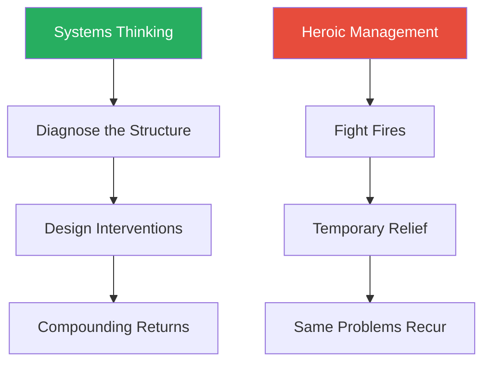
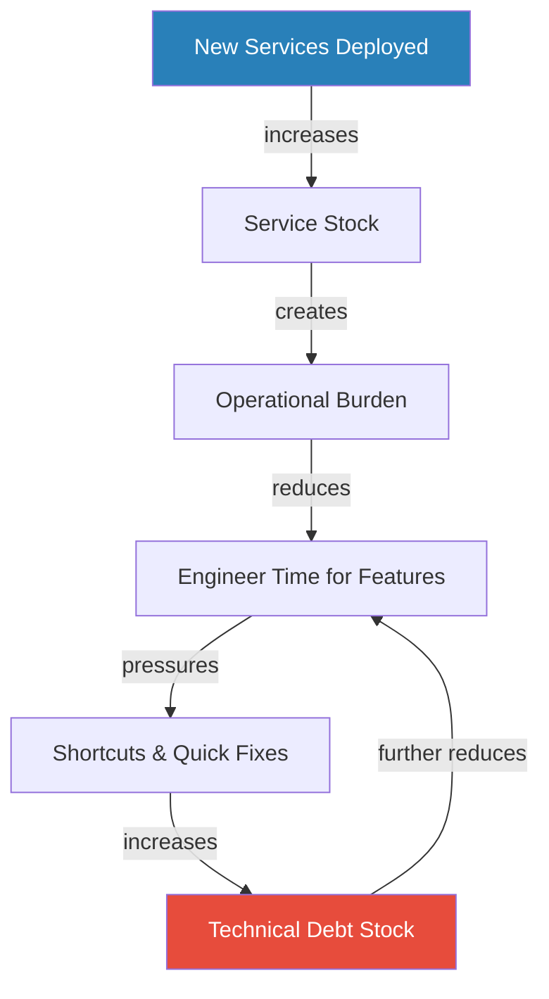
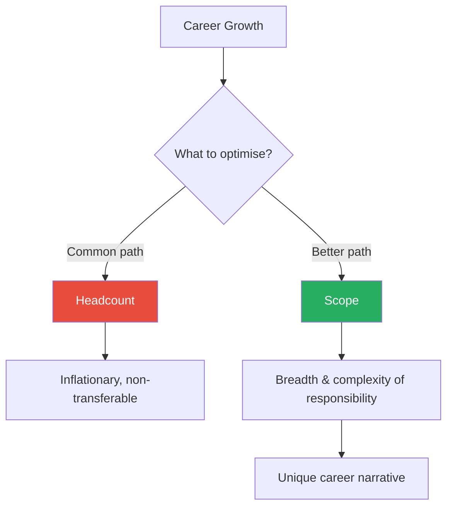
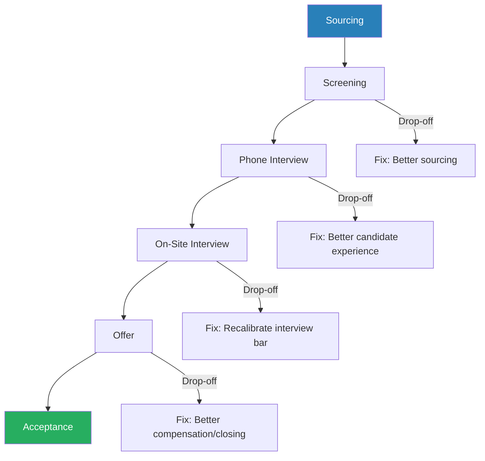

# An Elegant Puzzle: Systems of Engineering Management — Will Larson

> Will Larson's *An Elegant Puzzle* is a practitioner's field guide to running engineering organisations, built on a single conviction: management is not a personality contest but a systems design problem. Drawing on his experience scaling teams at Uber, Stripe, and Digg, Larson treats every recurring headache — team sizing, technical debt, hiring pipelines, organisational change — as a system of stocks and flows that can be modelled, diagnosed, and tuned. The book is structured as a toolkit rather than a narrative: frameworks for team health, strategy documents, migrations, metrics-driven change, and career growth, each presented with enough rigour to use on Monday morning. It is the rare management book that respects the reader's intelligence, refuses to reduce leadership to platitudes, and provides genuinely actionable mental models for anyone responsible for building and sustaining engineering teams.

---

## About the Author

Will Larson is an engineering leader who has held senior roles at Yahoo!, Digg, Uber, and Stripe. His career has spanned the full spectrum of organisational scale, from early-stage startups collapsing under their own ambition to hypergrowth companies doubling their engineering headcount every six months. At Digg, he watched a company shrink from hundreds of engineers to a skeleton crew, learning what happens when organisational systems fail catastrophically. At Uber, he lived through the chaos of engineering headcount doubling repeatedly in a matter of years, watching every process, tool, and organisational structure buckle under the pressure of growth. At Stripe, he found a company that took infrastructure and developer experience seriously, and began codifying the patterns he had seen work and fail across his career. Larson also writes the widely read blog *Irrational Exuberance*, where many of the book's ideas were first developed and stress-tested against reader feedback.

---

## The Big Idea

- Larson's central argument is that the highest-leverage tool available to any manager is <b style="color: #27ae60">organisational design</b> — not charisma, not heroic intervention, not motivational speeches
- Teams progress through predictable states
- Organisations obey sizing constraints
- Technical debt accumulates according to the same dynamics as financial debt
- If you understand the system, you can design interventions that compound over time rather than decaying

The uncomfortable corollary is that most management problems are not people problems — they are <b style="color: #e74c3c">design failures</b>:
- A team that is "falling behind" does not need a pep talk; it needs more people
- A process that breaks every six months is not broken — it was simply built for a scale it has now outgrown
- The manager who diagnoses the system correctly and applies the structural fix will outperform the manager who relies on intuition and good intentions, every time

---

This is a genuinely different worldview from most management literature:
- Where Patrick Lencioni emphasises trust and vulnerability, where Kim Scott emphasises radical candour, and where Ben Horowitz emphasises the CEO's lonely burden of hard decisions, Larson insists that <b style="color: #27ae60">feelings are downstream of systems</b>
- Fix the system and the feelings often fix themselves
- A team with adequate staffing, clear priorities, and protected time to repay debt will develop trust and candour organically
- A team without those structural foundations will develop resentment and burnout no matter how emotionally intelligent its manager

Larson borrows heavily from two intellectual traditions:
- From Donella Meadows' *[[Thinking in Systems - Donella H. Meadows|Thinking in Systems]]*, he takes the <b style="color: #2980b9">stocks and flows</b> model — the idea that surface events are symptoms of deeper accumulations and rates of change
- From Richard Rumelt's *Good Strategy/Bad Strategy*, he takes the discipline of <b style="color: #2980b9">strategy as diagnosis plus policies plus actions</b> — the insistence that real strategy requires uncomfortable trade-offs rather than wish-lists dressed in strategic language
- He translates both into the specific vocabulary of engineering organisations, producing a book that feels more like an engineering manual for organisations than a traditional management text

The core contrast of the book: systems-oriented managers build compounding advantages while heroic managers cycle endlessly through the same crises.

---

## Key Concepts at a Glance

| Concept | One-line summary |
|---------|-----------------|
| **The Four States of a Team** | Every team is falling behind, treading water, repaying debt, or innovating — each state has exactly one correct systemic fix |
| **Stocks and Flows** | Model any management problem as accumulations that change through rates, then find the true constraint |
| **Consolidate Investment** | Concentrate scarce resources on moving one team fully through its state transition rather than spreading thinly |
| **Systems Survive One Order of Magnitude** | Every process, tool, and structure works for roughly ten times growth before breaking |
| **Strategy = Diagnosis + Policies + Actions** | A real strategy must be uncomfortable; if it does not annoy someone, it is a wishlist |
| **Vision as Alignment at Scale** | Visions describe a future where current trade-offs no longer exist, enabling decentralised decisions |
| **Controls and Degrees of Alignment** | Explicit mechanisms for staying aligned, from "I'll do it" to "Let me know" |
| **Model, Document, Share** | Lead change without authority by demonstrating, documenting, and letting adoption happen organically |
| **Metrics-Driven Change** | Seven-step process for driving change through data rather than mandate |
| **Migrations as the Only Scalable Fix** | De-risk with a pilot, enable with tooling, finish the long tail yourself |
| **Close Out, Solve, or Delegate** | Every problem gets one of three treatments, no exceptions |
| **Career Narratives** | Pursue a unique story of capability, not the next rung on a crowded ladder |
| **Scope over Team Size** | The real measure of growth is the breadth and complexity of what you own, not headcount |
| **Work the Policy, Not the Exceptions** | Granting exceptions undermines fairness; collect them as test cases and batch-update the policy |
| **Killing Hero Culture** | Hero programmers are symptoms of broken systems, not signs of healthy talent |

The treemap reveals that Larson's toolkit is weighted toward structural and systems-level interventions (Organisations + Tools) rather than interpersonal approaches — reflecting his conviction that feelings are downstream of systems.

---

## Organisations

*Larson begins with the structural dynamics that determine whether people succeed or fail — arguing that before you can manage people, you must understand the system they operate within.*

### The Four States of a Team

*This is the book's signature framework, and the one most likely to change how a reader thinks about team management.*

- Larson argues that every team exists in one of four states, and the single most important diagnostic question a manager can ask is: "Which state is this team in?"
- <b style="color: #27ae60">Each state has one and only one systemic fix</b> — applying the wrong fix wastes resources and demoralises the team
- The framework is deceptively simple, but its power lies in the constraints it imposes — it tells you not just what to do, but what NOT to do at each stage

| State | Symptoms | Fix |
|-------|----------|-----|
| **Falling Behind** | Cannot keep up, backlog growing, morale low | Add people |
| **Treading Water** | Handles urgent work, no bandwidth for improvement | Consolidate effort, limit WIP |
| **Repaying Debt** | Capacity to address accumulated debt | Add time, shield from stakeholders |
| **Innovating** | Slack exists, creative high-value output | Maintain slack, ensure visibility |

The radar shows that "Falling Behind" and "Innovating" are mirror images — high debt and retention risk versus high morale and innovation — confirming that each state demands its own specific structural intervention rather than a one-size-fits-all management approach.

The four states form a progression that teams move through when the correct intervention is applied at each stage.

Each team progresses from left to right only when the correct structural intervention is applied — skipping steps or applying the wrong fix sends the team backward.

---

**Falling Behind** is the first state:
- The team cannot keep up with incoming work
- Morale is low, the backlog is growing, and every week feels like treading quicksand
- The fix is to **add people**
- <b style="color: #e74c3c">No amount of process improvement, motivational speeches, or prioritisation exercises helps a team that simply does not have the capacity to do the work</b>
- A team that is falling behind and does not get headcount will continue falling behind until people burn out and leave, at which point the team falls behind even faster
- This is a death spiral, and the only intervention that breaks it is capacity
- Managers often resist this diagnosis because requesting headcount feels like admitting failure — but the failure is in the system design, not the team's effort

> [!example] Uber's Hypergrowth Capacity Crisis
> - A product team responsible for a critical feature suddenly had its scope triple as user growth exploded
> - Hiring lagged months behind the new demand
> - The team heroically tried to keep up, working nights and weekends
> - The manager responded with better sprint planning and tighter prioritisation — none of which addressed the fundamental problem that five engineers cannot do the work of fifteen
> - Teams that escaped did so because their managers successfully argued for headcount
> - Teams that did not escape slowly disintegrated
> **The lesson:** When a team is falling behind, the only fix is capacity — everything else is distraction.

**Treading Water** is the second state:
- The team can handle critical work but has no bandwidth for improvement
- They ship what is urgent, but nothing gets better
- The fix is to **consolidate effort** and limit work in progress
- Larson uses the analogy of a swimmer who can keep their head above water but cannot make progress toward shore — they need to stop flailing and focus their strokes in one direction
- The temptation is to add more work-in-progress, reasoning that the team "can handle it" because nothing is explicitly failing
- But the cost is invisible: every quarter of treading water is a quarter of debt accumulating

> [!example] Stripe's Platform Team Paralysis
> - A platform team responsible for developer tooling was simultaneously supporting three product launches, maintaining an ageing internal system, and migrating to a new infrastructure provider
> - No single project got enough attention to complete
> - The team was technically staffed adequately but stuck because of competing priorities
> - The intervention was not more people — it was a deliberate decision to finish one thing at a time
> - The team pushed back on two of the three product launches, completed the migration, and then turned to the product work with full capacity
> **The lesson:** Treading water is a focus problem, not a capacity problem.

---

**Repaying Debt** is the third state:
- The team has enough capacity to begin addressing accumulated technical or process debt
- The fix is to **add time** and protect the team from stakeholder impatience
- Debt repayment is invisible work — customers do not see it, product managers cannot point to it in a roadmap, and executives tend to view it with suspicion
- The manager's job here is to shield the team, buying them the time to do unglamorous but essential work
- Larson emphasises that this shielding function is one of the most important — and most undervalued — things a manager does
- Without it, teams oscillate between treading water and repaying debt, never fully completing the debt work before being pulled back to urgent feature requests

> [!example] Infrastructure Debt Repayment at Uber
> - Infrastructure teams attempted to repay years of accumulated technical debt while product teams pressured them for new features
> - The managers who succeeded learned to communicate debt repayment in business terms — "if we do not address this now, the system will fail at 2x our current scale, and that is six months away"
> - The managers who failed caved to stakeholder pressure and returned to treading water, never finishing the debt work
> - The successful managers built dashboards showing the reliability risks of unaddressed debt, giving executives concrete numbers rather than abstract warnings
> **The lesson:** Framing debt repayment in business outcomes is the key to buying the time to complete it.

**Innovating** is the fourth state:
- The team has slack and is producing creative, high-value work
- The fix is to **maintain slack** and ensure the team's work is valued and visible
- The greatest danger here is not external but internal: other managers, seeing a team with apparent slack, will lobby to reallocate that capacity to their own struggling teams
- If they succeed, the innovating team drops back to repaying debt or treading water, and the organisation loses its only engine of forward motion
- Larson notes that very few teams across an entire organisation reach this state at any given time — perhaps ten to twenty per cent — and protecting those teams is disproportionately important

> [!example] Digg's Destroyed Innovation Engine
> - A team had reached the innovating state and was producing genuinely novel work on content recommendation algorithms
> - Leadership, facing pressure elsewhere, pulled two engineers from the team to staff a lagging project
> - The recommendation team dropped from innovating to treading water almost overnight
> - The engineers who remained, seeing their creative work abandoned, lost motivation
> - Within three months, two more left the company
> - The team was never reconstituted
> **The lesson:** The innovating state is fragile, and its value is invisible until it is destroyed.

> [!tip] Core Insight
> The manager's job is diagnosis, not motivation. Each team state has one and only one systemic fix — applying the wrong fix wastes resources and demoralises the team.

---

### Consolidate Investment, Don't Peanut Butter

*When resources are scarce, the temptation is to spread them evenly — Larson shows why concentrated investment produces compounding returns while thin spreading produces nothing.*

- When resources are scarce — and Larson argues they are always scarce — the temptation is to spread them evenly across all teams
- A little hiring here, a little process improvement there
- Larson calls this <b style="color: #e74c3c">"peanut buttering"</b> and considers it one of the most common and destructive management mistakes
- It feels fair because every team gets something
- But fairness in resource allocation and effectiveness in resource allocation are often at odds

The alternative is <b style="color: #27ae60">concentrated investment</b>:
- Focus all available resources on moving one team fully through its state transition before moving to the next
- A team moved from "falling behind" to "treading water" produces compounding returns
- Five teams each moved twenty per cent of the way produce nothing

The mechanism is straightforward:
- Value comes from finished work, not work in progress
- A team that has moved fully through a state transition can now contribute to the broader organisation — by absorbing scope from struggling teams, by mentoring, by producing tools that others can use
- A team still stuck mid-transition consumes resources without producing returns
- This is the same principle that makes limiting work-in-progress effective at the individual level, applied at the organisational level

> [!example] Uber's Hiring Rotation
> - Rather than giving every team one new hire per quarter, Larson gave one team three hires in a single quarter
> - He let them gel, then moved the hiring focus to the next team
> - Teams that received concentrated investment reached operational stability faster
> - Their stability freed resources for other teams
> - Teams that received "peanut buttered" hiring remained chronically understaffed
> **The lesson:** Concentrated investment compounds; thin spreading wastes.

---

### Team Sizing

*Larson offers specific heuristics for team sizing — not as rules but as constraints learned from repeated observation across multiple organisations.*

- <b style="color: #2980b9">Six to eight engineers</b> per manager is the sweet spot for hands-on management
  - The manager has enough time for meaningful one-on-ones, coaching, and technical engagement
  - The team is large enough to have redundancy and diverse perspectives
- **Eight to twelve** is manageable for experienced managers with senior, autonomous teams that require less direction
  - Works best when the team has strong tech leads who absorb some of the day-to-day coordination
- <b style="color: #e74c3c">Fewer than four</b> creates fragility
  - The loss of one person destabilises the team
  - Two-person teams are especially dangerous because a single departure eliminates fifty per cent of the team's capacity and all of its redundancy
  - Larson has seen two-person teams fail catastrophically at every company he has worked at

> [!example] Digg's Infrastructure Fragility
> - A critical infrastructure team was allowed to shrink to three engineers through attrition
> - When one went on paternity leave, the remaining two were unable to maintain the system, let alone improve it
> - An incident during this period took the site down for several hours
> - The post-mortem focused on technical root causes, but the real root cause was structural — a team too small to absorb a single absence
> **The lesson:** The team size made the system structurally fragile — a design failure, not a people failure.

Larson also addresses the question of **managers of managers**:
- A manager of managers should typically oversee four to six teams
- Fewer than four creates a layer of management that adds coordination cost without sufficient scope to justify it
- More than six makes it impossible to maintain meaningful relationships with the team leads
- The ideal is enough teams to see patterns across them, but few enough to invest in each one individually

The doughnut shows that Larson's sweet spot of 6-8 engineers (green) represents the ideal that only about 45% of teams achieve — while a combined 15% sit in the fragile zone below 4, where a single departure can cascade into structural failure.

---

### Protecting Gelled Teams

*When priorities change, leadership faces a choice: move people to the work, or move work to the people — Larson is emphatic that the second option is almost always better.*

- A <b style="color: #2980b9">gelled team</b> is one whose members have built trust, shared context, and efficient working patterns
- It takes months to create and produces compound returns
- Disassembling it destroys value that cannot be quickly rebuilt
- When you break up a gelled team and redistribute its members, you do not get the benefit of their expertise — you get the cost of their ramp-up time in a new context, plus the loss of the working relationships that made them effective

Why gelled teams are so valuable:
- Communication overhead drops dramatically — team members develop shared shorthand, anticipate each other's questions, and resolve ambiguity informally
- Code review quality improves because reviewers understand the codebase and the author's intent
- Estimation accuracy improves because the team has calibrated against its own velocity
- Psychological safety develops, allowing people to take risks, admit mistakes, and challenge each other constructively

If people must move, Larson recommends fixed-term <b style="color: #2980b9">rotations</b>:
- Temporary assignments where the engineer retains identity in their home team
- The engineer returns after the rotation ends
- This preserves the team's gel while allowing the organisation to respond to shifting priorities
- Rotations also serve a developmental purpose — exposing engineers to different parts of the system and different working styles

> [!example] Uber's Constant Team Reshuffling
> - Rapid priority changes led to frequent team reshuffling
> - Engineers were moved from team to team every few months, never staying long enough to build deep context
> - Every team felt like a new team, perpetually in the "forming" stage
> - Managers who pushed back on reshuffling and insisted on scope transfers instead — even when it was politically harder — consistently ran higher-performing teams
> **The lesson:** Move work to the people, not people to the work.

---

### Systems Survive One Order of Magnitude

*One of the book's most underappreciated insights: every organisational system has a built-in expiry tied to the scale it was designed for.*

- Every process, tool, and organisational structure works for roughly <b style="color: #2980b9">ten times growth</b> before breaking
- The code review process that works for ten engineers does not work for a hundred
- The deployment pipeline that handles ten deploys per day collapses at a hundred
- The meeting structure that coordinates three teams cannot coordinate thirty
- This is not a failure of the system — it is a natural consequence of the fact that systems are designed for a specific scale, and that scale has a ceiling

> [!example] Uber's Recurring System Failures
> - Engineering grew from roughly two hundred to over two thousand in a few years
> - Every six months, something that had worked perfectly suddenly stopped working
> - The on-call rotation, the release process, the cross-team communication channels — all were designed for one scale and broke at the next
> - The teams that adapted fastest were the ones whose managers expected the breakdowns and had already begun designing replacements
> **The lesson:** Expect to rebuild systems roughly twice every three years in a fast-growing environment — this is normal, not failure.

The implication for managers:
- <b style="color: #27ae60">Expect rebuilding — do not be surprised by it</b>
- The mistake is not that the system broke; the mistake is being surprised that it broke, or clinging to a system that has outgrown its design
- Every system comes with an invisible expiry date stamped at roughly 10x its design scale
- Larson recommends that managers periodically ask: "What scale was this system designed for, and how close are we to that ceiling?"
- When you are within 2x of the ceiling, begin designing the replacement — do not wait for the failure

---

### Succession Planning

*Larson reframes succession planning from a bureaucratic exercise into a diagnostic tool that reveals implicit value and bus-factor risk.*

- The process is simple:
  - Document everything you do
  - Test the list with close colleagues who can catch what you missed
  - Identify the gaps between what you do and what someone else could do
  - Systematically close those gaps by training, documenting, or delegating

The value of this exercise is not primarily in preparing for your departure — it is in <b style="color: #27ae60">revealing the implicit value you add</b>:
- Leaders fill hundreds of small gaps every day: the email they forward to the right person, the context they provide in a meeting, the conflict they defuse before it escalates
- Most of this work is invisible
- Succession planning makes it visible
- Once visible, it can be valued, distributed, and systematised

It also reveals <b style="color: #e74c3c">bus-factor risk</b>:
- The things that would break if you disappeared tomorrow
- Larson's experience at Digg, where key people left and systems failed because knowledge had never been documented or distributed, taught him that succession planning is not a luxury for stable organisations — it is a survival mechanism for fragile ones
- The exercise is most valuable precisely when you have no plans to leave — it reveals single points of failure while you still have time to address them

---

### Reorganisations

*Larson treats reorgs as a tool — powerful but overused, with costs that leaders chronically underestimate.*

- A reorg is appropriate when the current structure makes the right work impossible to do
- <b style="color: #e74c3c">It is not appropriate when the problem is leadership, execution, or culture</b> — reorgs cannot fix these, and the disruption costs are real
- Every reorg involves a period of reduced productivity as teams reform, relationships rebuild, and people adjust to new reporting lines, new peers, and new expectations

Larson's reorg checklist:
- Is the problem structural, or is it a people or process problem wearing a structural disguise?
- Have you exhausted less disruptive alternatives — scope transfers, rotations, new communication channels?
- Can you articulate the specific outcomes the reorg will produce?
- Do you have a plan for the transition period, including how to maintain productivity during the disruption?

> [!example] Unnecessary Reorg at Uber
> - A director reorganised three teams because cross-team collaboration was poor
> - The real problem was not structure but a lack of shared goals and regular communication
> - After the reorg, the same people who had struggled to collaborate were now on the same team — and still struggled, because the underlying issue was unclear ownership and conflicting incentives
> - A lighter intervention — shared OKRs and a weekly cross-team sync — would have addressed the problem without the disruption
> **The lesson:** A reorg is a structural fix; applying it to a coordination problem creates disruption without solving the root cause.

---

## Tools

*The Tools chapter is the book's longest and densest section, covering the mental models and practical instruments that Larson considers essential for engineering management.*

The force diagram reveals that Stocks & Flows sits at the centre of Larson's intellectual system — it connects to team diagnosis, metrics, and strategy, making it the foundational mental model from which all other tools derive their analytical power.

### Systems Thinking: Stocks and Flows

*Larson argues that Donella Meadows' stocks and flows model is the single most useful analytical tool for any manager — and shows how to apply it to hiring, velocity, and incidents.*

- A <b style="color: #2980b9">stock</b> is any accumulation — the number of open bugs, the size of a hiring pipeline, the amount of technical debt, the count of deployed services
- A <b style="color: #2980b9">flow</b> is the rate at which a stock changes — bugs filed per week, candidates entering the funnel, debt accruing per sprint, services deployed per quarter
- An <b style="color: #2980b9">information link</b> shows how the level of one stock influences the rate of a flow elsewhere — for example, how the stock of open bugs influences the flow of engineer time away from feature work and toward bug fixes

The power of this model:
- It forces you to look past surface-level events to the underlying dynamics
- "We had three incidents this week" is an event
- "Our incident stock is growing because our flow of new services exceeds our flow of operational investment" is a systems diagnosis
- The event-level response is to fix the three incidents
- The systems-level response is to adjust the flows — either slow the rate of new service deployment or increase the rate of operational investment

"Events are where most managers focus; systems are where the leverage is."

This diagram shows the reinforcing loop Larson describes: shortcuts create debt, debt slows future work, and the slowdown creates pressure for more shortcuts — the only escape is to temporarily accept reduced output while the debt stock is drawn down.

---

**Applied to hiring pipelines:**
- A company can have a strong recruiting flow (many candidates entering the funnel) but still fail to hire because its interview-to-offer flow or its offer-to-acceptance flow is too low
- The naive response is to tell recruiters to find more candidates
- The systems response is to identify which flow is actually constrained — perhaps the interview process is too slow, or the offer package is uncompetitive — and fix that specific bottleneck
- Larson saw this repeatedly at Uber, where the instinctive response to hiring shortfalls was always "more sourcing" when the actual bottleneck was interview scheduling capacity

**Applied to developer velocity:**
- The stock of technical debt accumulates through a flow of shortcuts and quick fixes
- It drains velocity through an information link: as the debt stock rises, the time spent working around it rises too, reducing the flow of useful output
- This creates a reinforcing loop that can only be broken by temporarily accepting reduced output while the debt stock is drawn down

**Applied to incidents:**
- The stock of production incidents is fed by a flow of new complexity (new services, new features, new integrations)
- It is drained by a flow of operational investment (monitoring, testing, documentation, runbooks)
- When the inflow exceeds the outflow, the incident stock grows and on-call becomes unsustainable
- The fix is not to hire more on-call engineers — it is to adjust the balance between the two flows

> [!tip] Core Insight
> Stop reacting to events and start adjusting flows. The surface problem is almost never the real problem — trace the stocks and flows to find the true constraint.

---

### Strategy

*Adapted from Richard Rumelt's work, Larson defines strategy as three components that must be uncomfortable to be real.*

> [!abstract] Larson's Strategy Framework
> 1. **Diagnosis** — an honest theory of the challenge, including uncomfortable truths about people, constraints, and organisational dynamics
> 2. **Policies** — guiding principles that make trade-offs explicit; a policy that does not exclude something is not a policy — it is a wish
> 3. **Actions** — specific steps that derive from applying policies to the diagnosis

"A strategy must be uncomfortable — it must annoy someone."

- Most strategies are wish-lists
- You can identify a fake strategy by checking whether anyone disagrees with it
- <b style="color: #e74c3c">"We will hire great people and build great products" is not a strategy</b> — nobody is arguing for the opposite
- A real strategy says something like: "We will prioritise platform reliability over new features for the next two quarters, even though product teams will be frustrated and some roadmap commitments will slip"
- That annoys the product teams — that is a strategy

The hardest part is the <b style="color: #2980b9">diagnosis</b>:
- Writing an honest diagnosis requires naming the actual constraints
- These often include politically uncomfortable truths — that a key system is unmaintainable, that a team lead is underperforming, that the organisation has made commitments it cannot keep
- Strategies built on euphemistic diagnoses produce euphemistic actions
- If the diagnosis avoids naming the problem, the policies and actions will avoid solving it

> [!example] Larson's Experience at Yahoo!
> - At Yahoo!, Larson observed strategies built on euphemistic diagnoses that avoided naming politically uncomfortable truths
> - The resulting policies and actions were equally euphemistic — they avoided solving the real problems
> - Teams wrote strategy documents that read like wish lists: "improve reliability, increase velocity, enhance developer experience"
> - Nobody disagreed with these goals, which is precisely why they failed as strategy — they provided no guidance on what to sacrifice
> **The lesson:** If the diagnosis avoids naming the problem, everything downstream will avoid solving it.

> [!example] Stripe's Rigorous Diagnosis Process
> - At Stripe, the diagnosis phase consumed more time than the policy and action phases combined
> - The leadership team argued for days about whether the diagnosis was honest enough, whether it named the real constraints, and whether the framing was accurate
> - This felt inefficient in the moment but produced strategies that actually worked
> - The actions were grounded in reality rather than in comfortable fictions
> **The lesson:** Time invested in an honest diagnosis pays compound returns in the quality of the strategy.

---

### Vision

*A vision is distinct from a strategy — where strategy addresses the current challenge, vision describes a future state where current trade-offs no longer exist.*

- A good vision enables <b style="color: #27ae60">decentralised decision-making</b>: anyone in the organisation should be able to read it and know what to do when facing an ambiguous choice, without escalating to leadership
- The difference between strategy and vision is temporal: strategy is about the next six to twelve months; vision is about the next two to five years
- Strategy requires trade-offs; vision describes a world where those trade-offs have been resolved

Larson's vision template includes:
- A vision statement
- A value proposition
- Required capabilities
- Constraints that will be solved
- Constraints that will remain
- Reference materials
- A narrative — Larson argues that a vision needs to tell a story about the future, not just list desired outcomes, because stories are what people remember and act on

The test of a good vision is <b style="color: #2980b9">autonomy</b>:
- If engineers who have read the vision make the same decisions that leadership would have made, the vision is working
- If they still need to escalate every ambiguous choice, the vision is either too vague, too aspirational, or too disconnected from operational reality

> [!example] Two Visions at Uber
> - One vision was a bullet-pointed list of desired outcomes — "best-in-class reliability, fastest deployment times, happiest engineers" — that told teams nothing about how to make trade-offs
> - When a team had to choose between reliability and deployment speed, both goals pointed in different directions, and the vision offered no resolution
> - The other was a narrative that described how the infrastructure would work in two years, what trade-offs had been resolved, and what constraints remained
> - Teams that read the narrative vision could reason about unfamiliar problems by asking "does this move us toward the described future?" — a question with a clear answer because the future was described concretely
> **The lesson:** A vision must resolve trade-offs, not just list aspirations.

---

### Metrics-Driven Change

*Larson outlines a seven-step process for driving change through data rather than authority — letting the data do the asking so the manager does not have to.*

> [!abstract] The Seven Steps of Metrics-Driven Change
> 1. **Explore** — identify a meaningful metric that captures the behaviour you want to change
> 2. **Dive** — understand what drives the metric; what are its component parts and influences?
> 3. **Attribute** — break the metric down by team, system, or individual; make ownership visible
> 4. **Contextualise** — benchmark against peers, historical performance, or industry standards
> 5. **Nudge** — share the attributed, contextualised data with teams; do not tell them to change
> 6. **Baseline** — set a target that is ambitious but achievable
> 7. **Review** — track progress, adjust the target, refine the metric, celebrate improvement

"The data does the asking."

- The key insight is that teams which can see their position relative to peers tend to <b style="color: #27ae60">self-correct without being told to</b>
- People want to be responsible
- Providing them with context and benchmarks activates intrinsic motivation far more effectively than mandates or directives
- The approach respects autonomy while creating accountability — a rare combination

The seven steps move from understanding to action — each step builds on the previous, and skipping steps undermines the process.

> [!example] Stripe's Infrastructure Cost Dashboard
> - Rather than telling teams to reduce their cloud spending — which would have been perceived as an authoritarian mandate — Larson built a dashboard showing each team's spending per engineer, benchmarked against the organisational average
> - No team was told to change anything
> - Within weeks, teams significantly above the average started investigating their own spending
> - Within a quarter, the organisational average had dropped by fifteen per cent — with no directive, no mandate, and no political cost
> **The lesson:** Transparency plus autonomy produces self-correction without the political cost of mandates.

> [!example] Uber's On-Call Burden Dashboard
> - A dashboard showing which teams had the most frequent pages, benchmarked against peers, triggered teams to investigate their own reliability issues
> - The teams with the worst numbers were embarrassed, but the embarrassment was created by data transparency, not by a manager pointing a finger
> - Teams that had previously resisted investing in reliability began filing their own operational improvement tickets
> **The lesson:** Data-driven visibility lets peer pressure do the work that directives cannot.

The limitation, which Larson acknowledges:
- This approach requires teams to have autonomy
- If a team can see that its metric is poor but lacks the authority to reprioritise its work, the data creates frustration rather than action
- <b style="color: #e74c3c">Metrics-driven change works in organisations that combine transparency with empowerment</b>
- In organisations that combine transparency with rigidity, it merely makes dysfunction more visible
- The precondition for the whole approach is that teams have the latitude to act on what the data tells them

---

### Migrations: The Only Scalable Fix for Technical Debt

*Larson is emphatic that individual heroics cannot address systemic technical debt — the only mechanism that scales is a planned migration executed in three phases.*

"Migrations are the only scalable fix for technical debt."

- The logic is simple: if you have a hundred services on an old system, you cannot fix the old system in place — you must move them to a new system
- Any approach that requires each team to independently fix their own piece will produce ninety per cent adoption and permanent fragmentation
- Only a centrally planned, centrally executed migration can achieve one hundred per cent adoption

> [!abstract] The Three-Phase Migration Playbook
> 1. **De-risk** — run a pilot with a friendly team to validate the approach and uncover hidden costs; choose a team that is enthusiastic, technically capable, and forgiving of rough edges
> 2. **Enable** — build self-service tooling so most teams can migrate themselves with minimal assistance; make the right path the easy path
> 3. **Finish** — the migration team does the long-tail work themselves, because the final ten per cent of adoption will never happen voluntarily

The migration follows a predictable adoption curve where each phase requires increasing effort per team but decreasing volume — the last ten per cent is the hardest and most important.

The hardest part is finishing:
- Getting from ninety per cent to one hundred per cent adoption requires the migration team to go team by team and do the remaining work on their behalf
- The teams that have not migrated at this stage are usually the ones with the least capacity, the most complex edge cases, or the weakest motivation
- They will never voluntarily prioritise migration work over their own roadmap
- <b style="color: #e74c3c">The migration team must absorb that work or accept permanent fragmentation</b>
- Leadership pressure to declare victory at ninety per cent and move on is intense — and must be resisted

> [!example] Uber's Service Provisioning Migration
> - The first eighty per cent of teams migrated within two months, using the self-service tooling Larson's team had built
> - The next ten per cent required hands-on support — their services had unusual configurations that the tooling did not handle
> - The final ten per cent required his team to essentially do the migration for them, service by service, over a period of months
> - Leadership wanted to declare victory at ninety per cent and move on
> - Larson argued that ninety per cent was the most dangerous point — the organisation would now have two systems to maintain indefinitely, with the old system supported by the teams least capable of maintaining it
> - He won the argument, the migration was completed, and the old system was fully decommissioned
> **The lesson:** Most migrations fail not because the approach was wrong but because the organisation declares victory at ninety per cent.

> [!tip] Core Insight
> Ninety per cent migration completion is the most dangerous point — it creates permanent architectural fragmentation. Finish the last ten per cent yourself.

---

### Controls and Degrees of Alignment

*As managers grow in scope, they need explicit controls — mechanisms for staying aligned with the people and systems they are responsible for, calibrated by trust and context.*

- Larson defines a spectrum of <b style="color: #2980b9">alignment intensity</b> that managers should consciously choose for each area they oversee

| Degree | Meaning | When to use |
|--------|---------|-------------|
| **I'll do it** | You handle it directly | New, high-stakes, or when you are the most qualified |
| **Preview** | They draft, you approve before action | Early in a relationship, or high-risk decisions |
| **Review** | They act, you review after | Established trust, moderate-risk domains |
| **Notes** | They share notes for your awareness | Strong trust, routine operations |
| **No surprises** | They handle it, you just don't want to be blindsided | High trust, stable teams |
| **Let me know** | Fully delegated, check in only if needed | Expert reports, mature processes |

The diagnostic question: for each person or area you manage, which degree of alignment are you currently operating at, and is that the right one?
- If you cannot imagine moving anything below "preview," you may be micromanaging
- If everything is at "let me know" and things are breaking, you may have over-delegated
- The right degree changes over time — as trust builds, it should shift toward delegation; during crises or transitions, it should shift back toward tighter control

> [!example] Larson's Own Transition at Uber
> - At Digg, managing a single team, everything was at "I'll do it" or "preview"
> - At Uber, managing an organisation of several teams, he initially attempted to maintain the same level of control
> - The result was predictable: he became a bottleneck, his direct reports felt untrusted, and he was exhausted
> - He deliberately recalibrated, pushing most items to "review" or "notes" and reserving "preview" only for the highest-stakes decisions
> - The shift felt uncomfortable at first — like letting go of quality — but the teams performed better with more autonomy
> **The lesson:** The degree of control that works for one team becomes a bottleneck at organisational scale.

The framework also works in reverse:
- When a new manager joins, start with a higher degree of control and explicitly negotiate downward as trust is established
- This is more honest than pretending to delegate from day one and then intervening when things go wrong

---

### Model, Document, Share

*Larson's approach to leading change without authority — a three-step pattern for driving adoption through demonstration rather than mandate.*

- <b style="color: #2980b9">Model</b> — do the thing yourself first, proving that it works and building credibility
- <b style="color: #2980b9">Document</b> — write down what you did, why it worked, and how others can replicate it
- <b style="color: #2980b9">Share</b> — make the documentation available and let people adopt it voluntarily

This approach works because it respects autonomy:
- Nobody is being told what to do
- The change agent is demonstrating value, not demanding compliance
- Adoption happens because people see the benefit, not because they were ordered to adopt
- It is slower than mandates but produces more durable change, because people who adopt voluntarily are more likely to sustain the practice

> [!example] Larson's On-Call Runbook at Stripe
> - He noticed that on-call handoffs were inconsistent — some teams had detailed runbooks, others had nothing
> - Rather than mandating a standard runbook format, he created one for his own team, documented the template, and shared it in the engineering wiki
> - Within six months, most teams had adopted the format — not because they were told to, but because they saw it working
> - The teams that adopted it had fewer escalations and shorter incident resolution times
> **The lesson:** Demonstration is more persuasive than mandate.

---

### Presenting to Senior Leadership

*Larson's advice on presenting to executives is blunt: start with the conclusion, because executives skim until bored, then stop.*

"Executives skim until bored, then stop."

> [!abstract] Executive Presentation Structure
> 1. **Why it matters** — the headline, in one sentence
> 2. **Historical context** — two to four sentences establishing the narrative
> 3. **The explicit ask** — what you want from this audience
> 4. **Data-driven diagnosis** — the evidence supporting your position
> 5. **Decision-making principles** — how you recommend the audience think about the trade-offs

The structure is deliberately inverted from academic writing:
- Academic writing builds from evidence to conclusion
- Executive communication leads with the conclusion and provides evidence for those who want to dig in
- This is not dumbing things down — it is respecting the executive's time and attention pattern

> [!example] Larson's Failed Presentation at Yahoo!
> - He prepared an academic-style presentation that built up methodically from data to analysis to conclusion
> - By the time he reached his conclusion, the executives had stopped listening
> - They had been skimming for the point, failed to find it in the first few slides, and mentally checked out
> - The presentation failed not because the analysis was wrong but because it was structured for an audience that reads from beginning to end — and executives do not
> **The lesson:** Structure presentations for how executives actually consume information, not for how you wish they did.

> [!example] Larson's Reversed Approach at Stripe
> - He opened every presentation with the conclusion and the ask, then provided supporting material for those who wanted to drill in
> - Senior leaders could engage immediately with the decision rather than waiting for a build-up
> - Those who wanted more depth could dig into the data; those persuaded by the headline could move on
> **The lesson:** Lead with the decision; let the audience choose their depth.

The corollary is that executives engage through what Larson calls <b style="color: #2980b9">"debug piercing"</b>:
- They hear the headline, then drill into whatever seems most suspicious or important
- If the presenter has anticipated this and structured the supporting material to answer likely questions, the presentation feels effortless
- If the supporting material follows a different logic than what the executive is looking for, the presentation feels evasive, even when it is not
- The best presenters prepare not just the deck, but a mental map of the five or six questions executives are most likely to ask

---

## Approaches

*This chapter deals with the philosophical underpinnings of management decisions — the principles that guide how you handle the hundreds of small choices that collectively define your effectiveness.*

### Work the Policy, Not the Exceptions

*Larson shows why granting exceptions to policies creates a cascading failure that eventually destroys the policy itself.*

- Good policy constrains behaviour toward goals
- Exceptions undermine that constraint
- Every time a manager grants an exception, they create <b style="color: #e74c3c">exception debt</b>
- Other teams see the exception, feel it is unfair, and either demand their own exceptions or lose faith in the policy
- The exception does not just apply to one team — it rewrites the implicit rules for everyone

Larson's alternative is to treat exceptions as <b style="color: #2980b9">test cases</b>:
- When someone requests an exception, the appropriate response is not to grant or deny it immediately but to document it
- Collect exceptions over time, then periodically batch-update the policy to handle the cases that recur
- If a particular exception keeps being requested, the policy is wrong and should be changed
- If the exception is a one-off, the policy should stand

This approach has two virtues:
- **Fairness** — everyone operates under the same rules, and the rules evolve to accommodate legitimate needs
- **Manager efficiency** — making exception decisions one by one is exhausting and creates political exposure; updating the policy in a batch creates a systemic improvement that benefits everyone

> [!example] Stripe's Eroded Code Freeze
> - A team had a policy about code freeze periods before major releases
> - When a product team requested an exemption to ship a critical feature during a freeze, the infrastructure lead initially resisted but eventually relented
> - Within a week, two more teams requested the same exemption, citing the precedent
> - By the next release cycle, the freeze was functionally meaningless
> - The original exception had not just allowed one team to ship — it had destroyed the policy
> - The team rebuilt the freeze policy with explicit criteria for exemptions, built into the policy itself rather than granted ad hoc
> **The lesson:** One exception creates a precedent; two create an expectation; three destroy the policy.

> [!tip] Core Insight
> Collect exceptions as test cases and batch-update the policy periodically. If a particular exception keeps being requested, the policy is wrong — change the policy, not the exception.

---

### Saying No

*Larson treats saying no as a core management skill — showing that the manager who says yes to everything is not helpful but incoherent.*

- Every yes is an implicit no to something else, because resources are finite
- The manager who agrees to every request is not helping the organisation — they are overloading their team, diluting focus, and ensuring that nothing gets done well
- The cost of a yes is always paid, whether or not the manager acknowledges it — it is paid in delayed projects, in stretched engineers, in quality that slips

Larson's preferred technique is to <b style="color: #27ae60">rephrase the no as a trade-off</b>:
- "We can do X, but it means delaying Y. Which do you prefer?"
- This turns a confrontational moment into a prioritisation conversation
- It forces the requester to own the consequences of their request
- The truly helpful manager is the one who protects the team's capacity by saying no to low-priority work so that high-priority work can be done excellently
- The technique also builds trust over time — stakeholders learn that when this manager says yes, it means yes with full commitment, not yes with fingers crossed

---

### Close Out, Solve, or Delegate

*Every problem that crosses a manager's desk must receive one of three treatments — no exceptions, no deferrals, no half-measures.*

| Treatment | When to use |
|-----------|------------|
| **Close it out** | Small, one-off problems that do not justify systemic attention — handle immediately and permanently |
| **Solve the category** | Recurring issues that consume disproportionate time — address the root cause so the type of problem does not recur |
| **Delegate it** | When someone else has the right skills and context — not abdication but recognition that you are not the best person for every problem |

<b style="color: #e74c3c">You are not allowed to handle problems any other way:</b>
- Worrying about a problem without acting on it is not one of the three options
- Deferring it indefinitely is not one of the three options
- Partially addressing it and hoping it goes away is not one of the three options
- The constraint is what makes the framework useful — it forces decisions where inaction is the default

> [!example] Larson's Mental Load at Uber
> - At Uber, the volume of management problems scaled with the organisation
> - Larson found himself carrying a mental list of dozens of unresolved issues, worrying about them without making progress on any
> - The three-treatment model forced a decision: each issue was either handled now, solved systemically, or assigned to someone else
> - The mental load dropped immediately — not because the problems went away, but because each one had a clear owner and a clear path
> **The lesson:** Unresolved problems are not being managed — they are being carried. Force a decision.

---

### Ways Managers Get Stuck

*Larson identifies several failure modes he has seen managers fall into repeatedly across organisations.*

| Failure Mode | Behaviour | Consequence |
|-------------|-----------|-------------|
| **Only maintaining** | Handles daily flow competently but never initiates improvement | Team runs smoothly but never gets better; gradually falls behind as the organisation evolves |
| **Optimising locally** | Makes own team efficient while ignoring impact on adjacent teams | Information hoarding, cross-team friction, organisational fragmentation |
| **Chasing silver bullets** | Constantly seeks one transformative change instead of steady incremental work | Lots of excitement, very little sustained progress; team suffers from initiative fatigue |
| **Solving for narrative** | Makes decisions based on how they look in a promotion packet | Invisible to the manager themselves; genuinely dangerous because it feels like good decision-making |

These failure modes are especially treacherous because a manager stuck in one of them often looks busy and committed from the outside — it is only the pattern of outcomes that reveals the problem.

- The "only maintaining" manager is the hardest to identify because nothing is visibly broken
- The "optimising locally" manager may receive praise from their own team while causing damage elsewhere
- The "chasing silver bullets" manager generates energy and enthusiasm that can mask the absence of progress
- The "solving for narrative" manager is the most dangerous because the misalignment between their incentives and the organisation's needs is invisible — even to them

---

### Growth Plates

*Larson uses the metaphor of growth plates in bones to describe the parts of an organisation that need to flex during scaling.*

- Not everything should change simultaneously
- Identify the <b style="color: #2980b9">growth plates</b> — the systems, processes, and structures that are most stressed by current growth — and focus change efforts there
- The rest of the organisation should be kept stable
- Change is expensive, and changing everything at once creates chaos
- The manager's job is to identify which plates are actively limiting growth and apply targeted interventions, while leaving the rest alone
- This connects directly to the "systems survive one order of magnitude" principle — growth plates are the systems approaching their 10x ceiling

---

### Partnering with Your Manager

*Larson's advice on the manager-report relationship is reciprocal — just as you manage your team, your manager manages you, and the relationship works best when both sides invest in it.*

The key practice is to <b style="color: #27ae60">make your manager's job easy</b>:
- Provide the information they need before they ask for it
- Frame problems with recommended solutions rather than open-ended complaints
- Understand what your manager is being measured on so that your work aligns with their incentives
- When you bring a problem, bring at least one proposed solution — this transforms the conversation from "help me" to "here is what I think, do you agree?"

"Make your manager's life easier, and they will make your life easier."

> [!example] Two Managers at Stripe
> - One manager came to their one-on-one with a list of problems and asked the VP to solve them
> - The other came with a list of problems, a recommended solution for each, and a question: "Does this approach work, or should I adjust?"
> - The second manager consistently received more autonomy, more resources, and more support
> - Not because the VP played favourites, but because the second manager made the relationship productive rather than burdensome
> - The first manager's problems were real, but the VP's time was finite, and the first manager consumed it without adding value
> **The lesson:** Bring solutions, not just problems — it transforms the dynamic from burden to partnership.

---

### Finding Scope

*Larson argues that most managers measure career progress by headcount — but the better metric is scope, the breadth and complexity of what you are responsible for.*

"Scope, not team size, is the measure of growth."

- Headcount is inflationary (companies hire, so everyone's number goes up)
- It does not translate across companies
- It does not reflect the complexity or impact of the work
- A manager who owns a single team of eight is doing fundamentally different work than a manager who coordinates a cross-cutting initiative that touches fifty teams — even if the latter has zero direct reports

> [!example] Larson's Own Career Arc
> - He became a Director at Digg not by growing a team but by being the last person standing — the company shrank, his title went up, but his actual scope did not change
> - The title was hollow because it was not backed by scope
> - Later, at Uber, he took on scope that far exceeded his title — coordinating infrastructure work across multiple teams without managing any of them
> - The scope itself taught him the skills that the title alone could not
> **The lesson:** Titles without scope are hollow; scope without titles is where real growth happens.

The better measure of career growth is scope — the breadth and complexity of what you own — not the number of people who report to you.

---

## Culture

*Larson devotes less space to culture than to systems, but his observations are sharp and grounded in specific failures he witnessed.*

### Inclusion Through Opportunity and Membership

*Larson defines an inclusive organisation as one that provides both opportunity and membership — and argues that both require structured process, not good intentions.*

- <b style="color: #2980b9">Opportunity</b> means access to professional growth and challenging work
- <b style="color: #2980b9">Membership</b> means the ability to participate as yourself, without assimilating into a dominant culture
- These are distinct dimensions — a company can provide opportunity without membership (you can advance, but only by fitting in) or membership without opportunity (you are welcomed, but never given stretch assignments)

The key insight is that both require <b style="color: #27ae60">structured process</b>, not good intentions:
- Without structure, opportunity flows through existing networks — people assign challenging work to those they already know and trust, which replicates existing demographics
- Without structure, membership depends on cultural fit — a concept that often means "people like the people who are already here"
- Good intentions without structure produce the same outcomes as no intentions at all

For opportunity, Larson recommends **open application processes**:
- Rather than tapping someone on the shoulder for a leadership opportunity, post the opportunity publicly and let anyone apply
- This surfaces talent that would otherwise remain invisible
- It ensures access to growth is not gatekept by personal relationships

> [!example] Stripe's Open Project Lead Applications
> - Project lead assignments were opened to applications rather than hand-picked
> - People who would never have been considered — engineers from underrepresented groups, newer team members, people on less visible teams — applied and were selected
> - Several turned out to be exceptional in the role
> - The hand-picking approach would have missed them entirely
> **The lesson:** Structured opportunity creates access; informal networks replicate demographics.

For membership, Larson recommends:
- Employee resource groups
- Recurring social events that do not centre on alcohol or activities that exclude certain groups
- Visible signals that diverse identities are valued
- These are not substitutes for structural change, but they create the conditions under which structural change is possible

---

### First-Team Mindset

*Larson borrows the first-team concept from Patrick Lencioni and applies it to engineering management — arguing that your primary identity as a manager should be with your peers, not with the team you manage.*

- Most managers feel loyalty to their team first and see their peers as competitors for resources
- Larson argues that this loyalty, while emotionally understandable, produces <b style="color: #e74c3c">local optimisation at the expense of the broader organisation</b>

When a group of peer managers treats each other as their <b style="color: #2980b9">first team</b>:
- They can make trade-offs that benefit the organisation as a whole — moving scope between teams, sharing headcount, coordinating on strategy
- The learning rate is higher: instead of learning only from the challenges your own team faces, you learn from all the challenges across the peer group
- Cross-team initiatives become easier because the managers involved trust each other
- Resource allocation conversations become collaborative rather than adversarial

The failure mode:
- In organisations that reward zero-sum competition between managers, first-team behaviour is a vulnerability
- A manager who shares resources with peers while peers hoard resources will be slowly stripped of capacity
- Larson acknowledges this but argues that first-team behaviour, when reciprocated, produces outcomes that competitive behaviour cannot match
- The first-team mindset requires mutual trust — it cannot be adopted unilaterally in a hostile environment

---

### Killing Hero Culture

*Larson shows how hero programmers are created by managerial desperation — and how the celebration of heroes perpetuates the broken systems that created them.*

- <b style="color: #e74c3c">Hero programmers</b> are a symptom of broken systems, not a sign of healthy talent
- They are created by managerial desperation: when a project is failing, leadership singles out one person to save it, that person works unsustainable hours, and the underlying system failure is never addressed

"Heroes are created by broken systems."

The consequences compound in multiple directions:
- The hero alienates colleagues who feel their contributions are invisible
- The hero burns out, because heroic effort is by definition unsustainable
- The project remains structurally fragile because the systemic problem was never fixed — it was merely overwhelmed by individual effort
- Other engineers learn that the path to recognition is heroic effort, not sustainable excellence — creating a culture that rewards crisis over prevention

> [!example]- Uber's Infrastructure Migration Hero
> - A critical infrastructure migration was falling behind schedule
> - Leadership identified one senior engineer as the hero and gave them free rein to drive the migration to completion
> - The engineer worked eighty-hour weeks for two months
> - The migration was completed on time and leadership celebrated the hero
> - Six months later, the engineer left the company, burned out
> - The two engineers who had been on the team but eclipsed by the hero also left, feeling their contributions had been erased
> - The system that had produced the migration delay — inadequate staffing, unclear ownership, competing priorities — remained unchanged
> - The next migration faced exactly the same problems
> **The lesson:** Celebrating the hero perpetuates the system that created the need for heroics.

The fix is not to punish heroics but to <b style="color: #27ae60">reset the system</b>:
- Adjust goals to match actual capacity
- Admit that the timeline was unrealistic
- Staff the work appropriately
- Short-term heroics can bridge genuine emergencies — a production outage, a security breach, a regulatory deadline
- But when heroics become the operating model, the organisation is consuming its people to avoid confronting its design failures

> [!tip] Core Insight
> When heroics become the operating model, the organisation is consuming its people to avoid confronting its design failures. Fix the system, not the symptom.

---

### Company Freedoms

*Larson argues that companies can be evaluated by the freedoms they grant employees — and that there is no universal right answer, only honest and dishonest choices.*

- Companies offer different <b style="color: #2980b9">freedoms</b>: freedom to choose tools, freedom to set schedules, freedom to define processes, freedom to choose projects
- The more freedoms granted, the more attractive the company is to autonomous, high-performing individuals — but the harder it is to coordinate at scale
- The fewer freedoms, the easier coordination becomes, but the more talented people chafe and eventually leave
- There is no universal right answer
- <b style="color: #e74c3c">Problems arise when companies claim to offer freedom but implicitly constrain it</b>, or when they constrain freedom without acknowledging the cost
- A company that says "use any tool you want" but then penalises engineers who choose non-standard tools is being dishonest about its freedoms

---

## Careers

*The final substantive chapter addresses how engineering managers should think about career development — both their own and their team's.*

### Career Narratives

*Larson observes that when he asks people what they want from their career, eleven out of twelve say "get promoted" — and shows why crafting a unique narrative is a better strategy.*

- This creates a constrained pool of opportunity where everyone is competing for the same few slots, using the same criteria, following the same path
- The promotion ladder has a fixed number of rungs and an ever-growing crowd pushing toward them

The alternative is to craft a <b style="color: #2980b9">career narrative</b>:
- A personalised story of capability growth that is uniquely yours
- Rather than competing for the next rung on a crowded ladder, identify the gaps between where you are and where you want to be
- Fill those gaps deliberately using your current role

The power of a narrative is that it is <b style="color: #27ae60">non-competitive</b>:
- A promotion ladder has one slot and ten candidates
- A career narrative has an audience of one
- A narrative that reads "I became the person who could take a zero-to-one infrastructure project from concept to production across multiple business units" is not competing with anyone — it is a unique story that only you can tell
- It also makes you more portable — a narrative transfers across companies; a position on a specific company's ladder does not

Larson is careful to note:
- The narrative does not replace the ladder
- Titles and compensation still matter
- But the narrative enriches the ladder by providing a richer, more defensible answer to "why should you get this role?" than "I have been here for X years and it is my turn"

---

### Hiring

*Larson treats hiring as a systems problem — the hiring funnel is a set of stocks and flows, and the diagnostic is to identify where candidates are dropping out.*

- Candidates enter at the top and flow through screening, phone interviews, on-site interviews, and offers
- They exit either as hires or rejections at each stage
- The hiring funnel is a stock-and-flow system, and the diagnostic approach is identical to any other stock-and-flow analysis

The key diagnostic is to identify <b style="color: #2980b9">where candidates are dropping out</b>:
- **Top of funnel** (not enough candidates) — the fix is sourcing: referral programmes, job postings, recruiter outreach, employer branding
- **Middle of funnel** (candidates failing interviews) — the fix might be recalibrating the interview bar, improving the candidate experience, or restructuring interviews to test relevant skills
- **Bottom of funnel** (offers being rejected) — the fix is compensation, employer branding, or closing technique

<b style="color: #e74c3c">Pouring more candidates into a broken funnel does not produce more hires</b> — it produces more wasted effort and more rejected candidates who now have a negative impression of the company.

The hiring funnel as a stock-and-flow system — the diagnostic is to find where the constraint actually lives, not to assume it is always at the top.

> [!example] Uber's Interview Redesign
> - Larson participated in redesigning the engineering interview process to focus on specific technical and collaborative skills rather than abstract puzzle-solving
> - The old interview process tested for general intelligence using algorithm puzzles that had little relationship to the actual work
> - The result of the redesign was a more diverse candidate pool, a higher offer acceptance rate, and new hires who ramped up faster
> - They had been evaluated on relevant capabilities rather than general intelligence or cultural fit
> **The lesson:** Interviews should test for the actual skills the role requires, not for proxies.

---

### Performance Management

*Larson treats performance management as fundamentally a design problem — not "how do I evaluate people?" but "how do I build a system that gives people clear expectations, frequent feedback, and visible growth paths?"*

- Most performance problems are actually <b style="color: #2980b9">expectation-setting problems</b>
- An engineer who is "underperforming" may simply not know what excellent performance looks like, because nobody has defined it clearly
- The manager's first job is to make expectations explicit
- The second job is to provide feedback frequently enough that course corrections are small and manageable
- <b style="color: #e74c3c">Annual reviews are too infrequent</b> — by the time the review happens, the problem has been festering for months and the feedback feels like an ambush

For engineers who are genuinely struggling, Larson recommends a structured approach:
- Explicit documentation of the gap between current performance and expectations
- A time-bound improvement plan with specific milestones
- Frequent check-ins to track progress
- The tone should be supportive, not punitive — the goal is to help the person succeed, not to build a case for termination
- But some improvement plans end in the person leaving, and that is sometimes the right outcome for both the individual and the organisation

Larson also addresses the challenge of **managing high performers**:
- High performers need different things than struggling performers — they need scope, challenge, and visibility, not more structure
- The common mistake is to treat all reports the same way, which under-serves both struggling and excelling engineers
- High performers who do not receive adequate scope and recognition will leave — they have options

---

## Key Quotes

- "Organisational design is the most impactful tool in a manager's toolkit."
- "A strategy must be uncomfortable — it must annoy someone."
- "Events are where most managers focus; systems are where the leverage is."
- "Migrations are the only scalable fix for technical debt."
- "Scope, not team size, is the measure of growth."
- "The data does the asking."
- "Make your manager's life easier, and they will make your life easier."
- "Heroes are created by broken systems."

---

## The Verdict

*An Elegant Puzzle* is one of the best books on engineering management written in the last decade, and its greatest contribution is intellectual seriousness. Larson does not pretend management is simpler than it is, nor does he hide behind motivational generalities. The frameworks — the four states model, stocks and flows, strategy as diagnosis, the migration playbook, the controls spectrum, metrics-driven change — are genuinely useful and immediately applicable. They provide a vocabulary for diagnosing problems that most managers sense intuitively but cannot articulate, and a set of tools for addressing those problems structurally rather than heroically. The book treats managers as engineers of organisations, and the result is a text that feels more like a well-documented API than a leadership memoir.

The book's most significant limitation is its context. Nearly all examples come from Silicon Valley hypergrowth companies — Uber, Stripe, Digg — and Larson's advice assumes a degree of managerial control over hiring, team composition, and organisational design that does not exist in many large enterprises, regulated industries, or matrix organisations. The team sizing heuristics assume co-located product engineering teams with dedicated managers. The migration playbook assumes you can assign a dedicated team to do long-tail work. The metrics-driven change framework assumes teams have the autonomy to reprioritise based on data. In organisations where headcount approvals take months, where team composition is decided by committees, and where priorities are set by distant stakeholders, the advice must be heavily adapted.

The other blind spot is politics. Larson acknowledges that organisational politics exist — briefly, in the reorg chapter — but offers no framework for navigating them. The book assumes a broadly meritocratic world where good systems produce good outcomes. This is true as far as it goes, but it is incomplete. In many organisations, the biggest constraint is not system design but the political dynamics that determine whether your systems get adopted, funded, and championed. A beautifully designed process that the wrong executive blocks is just a document. A mediocre process that the right executive sponsors ships and scales. Larson has no vocabulary for this dimension of management, and the reader must look elsewhere — to books on organisational politics, influence, and power — for the human dynamics that his systems-first approach sets aside.

Despite these limitations, the book's core thesis is sound and important: the manager who designs systems will outperform the manager who fights fires, not in one dramatic moment but in the compounding returns of sustained, structural improvement. It is essential reading for anyone building or leading engineering teams, and it is a particularly strong complement to books that address the interpersonal and political dimensions that Larson largely ignores. Read alongside Lencioni on trust, Scott on feedback, and Greene on power, *An Elegant Puzzle* provides the structural thinking that those books lack — and together, they offer something close to a complete picture of what it takes to lead engineering organisations well.

---

## Related Reading

- [[Thinking in Systems - Donella H. Meadows|Thinking in Systems]] — Donella Meadows' foundational text on systems thinking, which Larson draws on heavily
- [[The Effective Executive - Peter Drucker|The Effective Executive]] — Drucker's classic on what makes managers productive, complementing Larson's structural focus with individual effectiveness
- [[The Lean Startup - Eric Ries|The Lean Startup]] — Eric Ries on iterative development and validated learning, a related systems-thinking approach to building organisations
- [[The Phoenix Project - Gene Kim|The Phoenix Project]] — the fictional companion to many of Larson's ideas about flow, bottlenecks, and systems thinking in technology organisations
- [[The 48 Laws of Power - Robert Greene|The 48 Laws of Power]] — the political lens that Larson's systems-first approach conspicuously lacks
- [[The Culture Code - Daniel Coyle|The Culture Code]] — Daniel Coyle on the interpersonal dynamics that create team cohesion, complementing Larson's structural view
