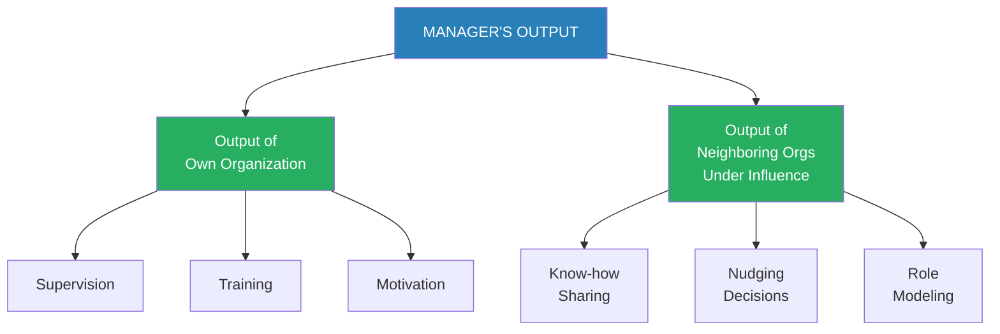
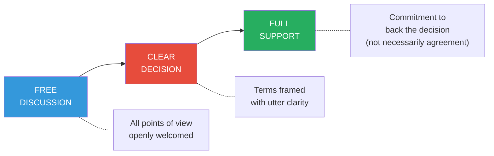
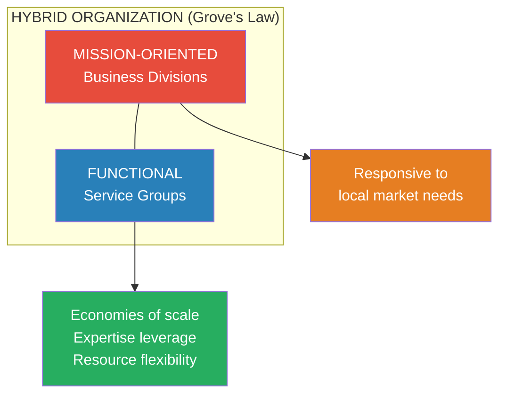
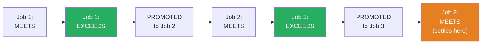
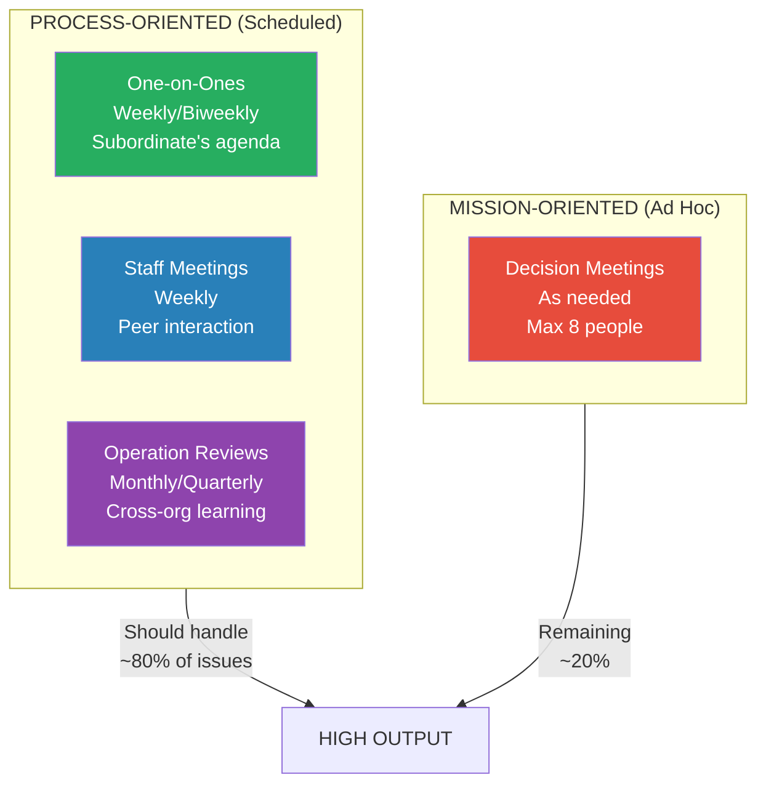

# High Output Management — Andrew S. Grove

> Andrew S. Grove emigrated from Hungary to the United States in 1956 with no English and almost no money. He enrolled at City College of New York, earned a PhD from UC Berkeley, helped found Intel in 1968, and built it into the world's largest semiconductor manufacturer. In 1997, *Time* named him Man of the Year. He taught at Stanford's Graduate School of Business for twenty-four years. When Grove sat down to write *High Output Management* in 1983, he was not composing theory from an ivory tower — he was codifying twenty years of hard-won lessons from the factory floor, the conference room, and the personnel file. **The result is the most practical management book ever written.** Where other books traffic in abstraction, Grove gives you equations, checklists, and breakfast metaphors. His central insight is breathtakingly simple: <b style="color: #2980b9">a manager's output is the output of his organization, and everything a manager does should be measured by how much it increases that output</b>. From this single premise, he derives a complete operating system for management — production principles, leverage calculations, meeting architectures, decision-making protocols, organizational design, motivation theory, performance reviews, and training methods. Ben Horowitz called it "a true masterpiece" and the book that taught Silicon Valley how to manage. Thirty years after publication, it remains the standard against which all management writing is measured.

---

## About the Author

- *Andrew S. Grove (1936-2016)* was born Andras Istvan Grof in Budapest, Hungary, where he survived the Nazi occupation as a Jewish child in hiding and later escaped the Soviet invasion of 1956
- He arrived in New York at age twenty, speaking no English, enrolled at City College, and graduated first in his class in chemical engineering
- He earned his PhD from UC Berkeley, then joined Fairchild Semiconductor, where he wrote an important textbook on semiconductor physics — in English, his third language
- He was employee number three at Intel, participating in its founding in 1968, and rose to become president (1979), CEO (1987), and chairman
- Under his leadership, Intel executed one of the most dramatic pivots in business history — abandoning the memory chip business it had pioneered to focus on microprocessors
- **He was named *Time* magazine's Man of the Year in 1997** for his role in the semiconductor revolution
- He taught strategic management at Stanford's Graduate School of Business for twenty-four years alongside running Intel
- He was diagnosed with prostate cancer in 1995, and characteristically applied engineering methodology to his treatment decisions, writing about the experience to help others
- He died on March 21, 2016, at age seventy-nine

---

## The Big Idea

- <b style="color: #2980b9">A manager's output = the output of his organization + the output of the neighboring organizations under his influence</b>
- This is the foundational equation of the entire book — everything else derives from it
- A manager does not produce output through his own individual work — he produces it through his team
- Just as a coach does not score touchdowns, a manager does not write code, close deals, or assemble products — he creates the conditions for others to do these things at the highest possible level
- <b style="color: #e74c3c">The most common managerial failure is confusing activity with output</b> — being busy is not the same as being productive
- Grove's radical proposition: apply the principles of **manufacturing** — the most output-oriented of all endeavors — to every kind of managerial work
- If you can run a breakfast factory efficiently, you can run a software team, a law firm, a school, or a hospital
- The three pillars of the book:
  - **Production principles** — see all work as a production process with inputs, outputs, limiting steps, and quality controls
  - **Managerial leverage** — measure the impact of each activity by how much output it generates per unit of managerial time
  - **Peak performance** — elicit the personal best from every team member through motivation and training

> [!tip] The Equation That Changes Everything
> Once you accept that your output equals your team's output, every decision you make shifts. You stop asking "What should I work on?" and start asking "What can I do that will most increase the output of the people around me?"




The treemap reveals the three-pillar architecture of Grove's system: Production Principles provide the conceptual foundation, Managerial Leverage dictates how to allocate time, and Peak Performance addresses the human side — with TRM and Training carrying the heaviest weight.

---

## Key Concepts at a Glance

| Concept | One-line summary |
|---------|-----------------|
| **The Breakfast Factory** | Every job is a production process with inputs, a limiting step, and outputs |
| **Managerial Leverage** | Output = sum of (Leverage x Activity) — choose high-leverage activities |
| **The Black Box** | Cut windows into your operation using indicators to predict future output |
| **Pair Indicators** | Every metric needs a counter-metric to prevent overcorrection |
| **One-on-Ones** | The subordinate's meeting — minimum one hour, agenda set by him |
| **Process vs. Mission Meetings** | Scheduled information exchange vs. ad hoc decision-making |
| **Free Discussion to Full Support** | The ideal decision-making model: debate freely, decide clearly, support fully |
| **Peer-Plus-One** | Peers going in circles need a senior person to break the deadlock |
| **MBO** | Where am I going? (Objective) How will I pace myself? (Key Results) |
| **Hybrid Organization** | All large orgs blend mission-oriented and functional structures |
| **Dual Reporting** | Report to both a mission boss and a functional boss |
| **CUA Factor** | Complexity, Uncertainty, Ambiguity — determines which mode of control works |
| **Maslow at Work** | Self-actualization is the only source of unlimited motivation |
| **Task-Relevant Maturity** | The single variable that determines the right management style |
| **Performance Appraisal** | The highest-leverage feedback: Level, Listen, Leave yourself out |
| **Training Is the Boss's Job** | Only two ways to improve output: motivation and training |


The radar shows that while meetings consume the most managerial time, leverage and decision-making deliver disproportionately higher output — and training, despite receiving the least time investment, ranks among the highest-impact activities.

---

## Part I — The Breakfast Factory: Everything Is Production

### The Basics of Production (Chapter 1)

- *Grove opens with a deceptively simple question*: how do you serve a breakfast of a three-minute soft-boiled egg, buttered toast, and coffee — all fresh, hot, and arriving simultaneously?
- <b style="color: #2980b9">The answer reveals the fundamental principles that govern all production</b>, whether you are making breakfasts, training salespeople, developing compilers, or processing convicted criminals
- **The limiting step** determines the overall shape of your operation — the component that takes the longest or is most critical
  - For breakfast: the egg takes three minutes, so you plan everything around it
  - For college recruiting: the expensive plant visit is the limiting step, so you screen heavily with phone interviews beforehand
  - For criminal justice: obtaining a conviction costs over $1 million — not building the $80,000 jail cell
- **Time offsets** stagger each step so everything converges at the right moment — work backward from delivery time
- **Three fundamental production operations** appear in every workflow:
  - **Process** — physically or chemically changes material (boiling an egg, converting data into strategies)
  - **Assembly** — combines components into a new entity (egg + toast + coffee = breakfast)
  - **Test** — examines the characteristics of components or the whole (visual check that toast is brown)

> [!example] The Criminal Justice System as a Factory
> - A crime is reported to police; most cases end quickly for lack of evidence
> - For cases that proceed: investigation, arrest, indictment, trial, sentencing, appeals
> - At each stage, most cases drop out — only a tiny fraction reach jail
> - Compiling the total cost and assigning it only to those who end up incarcerated: each conviction costs well over $1 million
> - Society then refuses to build $80,000 jail cells, wasting the $1M+ investment in obtaining the conviction
> - The wrong step — jail cell availability — limits the overall process

- <b style="color: #27ae60">A common rule: detect and fix any problem at the lowest-value stage possible</b>
  - Reject the rotten egg at delivery, not after the customer finds it
  - Decide you don't want a college candidate at the campus interview, not during the expensive plant visit
  - Find a software bug in the unit test, not in the system test of the final product
- **Continuous operations** gain efficiency and predictability but sacrifice flexibility — the continuous egg-boiler produces perfect three-minute eggs but cannot easily make four-minute ones
- **In-process inspection** (thermometer in the water) is preferable to **functional testing** (cracking open an egg) because it doesn't destroy product
- **Raw material inventory** should cover your consumption rate for the time it takes to replace — balance carrying cost against the opportunity at risk of shutting down

### Managing the Breakfast Factory (Chapter 2)

- *As the breakfast factory scales up*, you need **indicators** — measurements focused on specific operational goals
- Five indicators to check every morning:
  - **Sales forecast** — how many breakfasts should you plan to deliver?
  - **Raw material inventory** — do you have enough eggs, bread, and coffee?
  - **Equipment condition** — anything broken yesterday?
  - **Manpower** — anyone out sick?
  - **Quality** — customer complaint log from the cashier
- <b style="color: #e74c3c">Indicators direct your attention like riding a bicycle — you steer where you look</b>
- **Pair indicators** to prevent overcorrection:
  - Inventory levels paired with incidence of shortages
  - Completion dates paired with capability/quality
  - Quantity of output paired with quality of output
- A genuinely effective indicator measures **output**, not **activity** — orders received (output), not calls made (activity)

| Administrative Function | Output Indicator |
|------------------------|------------------|
| Accounts payable | Vouchers processed |
| Custodial | Square feet cleaned |
| Customer service | Sales orders entered |
| Data entry | Transactions processed |
| Employment | People hired (by type) |
| Inventory control | Items managed |

- **The Black Box Model** — input and labor flow into a box, output flows out
  - Cut **windows** into the box to see inside and predict future output
  - **Leading indicators** — show you in advance what the future might look like (machine downtime records, customer satisfaction index)
  - **Linearity indicator** — plots actual progress against ideal straight-line progress; flashes early warning when you'll miss your target
  - **Trend indicators** — output measured against time and against a standard; forces you to extrapolate from the past
  - **Stagger chart** — forecasts the same output over several months, updated monthly; shows how your outlook varies from one month to the next

> [!tip] The Stagger Chart
> Grove calls this "the best means of getting a feel for future business trends." Each month you forecast the next several months. Comparing successive forecasts reveals whether your outlook is improving or deteriorating — far more useful than any single forecast.

```mermaid
flowchart LR
    subgraph BLACK BOX
        direction TB
        W1["Window 1:<br>Leading Indicators"]
        W2["Window 2:<br>Linearity"]
        W3["Window 3:<br>Trend + Stagger"]
    end
    I["INPUT<br>(Raw Materials)"] --> BLACK BOX
    L["LABOR<br>(Employees + Manager)"] --> BLACK BOX
    BLACK BOX --> O["OUTPUT<br>(Product/Service)"]
    style I fill:#3498db,color:#fff
    style L fill:#e67e22,color:#fff
    style O fill:#27ae60,color:#fff
```

- **Build to order** vs. **build to forecast**:
  - Most companies must build to forecast because customers demand timely response even when manufacturing throughput times are long
  - The manufacturing flow and the sales flow must converge at the shipping dock — if they don't match, you have either unfulfilled orders or unsold inventory
  - **Slack** (especially inventory at the lowest-value stage) cushions the inevitable mismatch
- **Quality Assurance** — three types of inspection:
  - **Incoming/receiving inspection** — check raw materials at delivery
  - **In-process inspection** — check at intervening points within production
  - **Final/outgoing inspection** — check when ready to ship
  - <b style="color: #27ae60">Never let substandard material proceed when its defects could cause a complete reliability failure</b> — you can compromise on cost but never on reliability
- **Gate-like inspection** holds all material until tests pass; **monitoring** samples material and tracks failure rates without slowing the flow
- **Variable inspection** — check more often when problems appear, less often when quality is stable; reduces cost and interference
- **Productivity** = output divided by labor required
  - Increase by working **faster** (more activities per hour)
  - Or increase by working **smarter** — change the nature of the work to get more output per activity (higher **leverage**)
- **Work simplification**: create a flow chart of every step, count them, target 30-50% reduction, question why each step exists — many are there by tradition or formal procedure with no practical necessity

---

## Part II — Management Is a Team Game: Leverage, Meetings, Decisions, Planning

### Managerial Leverage (Chapter 3)

- *Grove asks a group of middle managers*: "What is your output?" They answer with activities — judgments, direction, allocation, training, courses taught. <b style="color: #e74c3c">These are activities, not output</b>
- A manager's output is not what he does but what his organization achieves:
  - If she runs a wafer fabrication plant: completed, high-quality silicon wafers
  - If he supervises a design group: completed designs that work correctly
  - If she is a high school principal: trained and educated students
  - If he is a surgeon: a fully recovered, healed patient
- **Know-how managers** — specialists who influence neighboring organizations through expertise even without formal authority — are also middle managers and their output matters equally

> [!example] A Day from Grove's Life
> - 8:00 AM: A manager submits his resignation — Grove listens (information-gathering), encourages him to talk to other managers about a career change (nudge), decides to pursue it himself (decision-making)
> - 8:30 AM: Reads mail, scribbles encouragement, disapproval, exhortations (nudges), denies a project request (decision)
> - 9:00 AM-12:00 PM: Executive Staff Meeting — reviews order rates (information), sets planning priorities (decision), reviews marketing program and manufacturing cycle time (information)
> - 12:00 PM: Lunch with training group who complain about foreign support (information-gathering)
> - 1:00 PM: Product quality meeting (information-gathering), decision to resume shipment
> - 2:00-4:00 PM: Lectures at employee orientation (information-giving, role modeling)
> - 4:00-6:15 PM: Phone calls, meetings with assistant, reading mail (information, nudging, decisions)
> - **25+ separate activities. Two-thirds of day in meetings. His wife notes it looks like one of her own days.**

- **Five types of managerial activity**: information-gathering, information-giving, decision-making, nudging, and role-modeling
- **Information-gathering** is the basis of all other managerial work — Grove spends most of his day doing it
  - Verbal sources are most valuable but least reliable (like headlines)
  - Written reports are archives and safety nets — but <b style="color: #2980b9">"Writing the report is important; reading it often is not"</b>
  - The discipline of writing forces precision; the formal process enforces rigor
  - Plant visits are underutilized but highly efficient — a two-minute exchange on a walkthrough replaces a thirty-minute office meeting
- **Nudging** — influencing direction without issuing commands; for every unambiguous decision, you probably nudge things a dozen times
- **Role modeling** — "Values and behavioral norms are not transmitted by talk or memo, but conveyed very effectively by doing and doing visibly"
- <b style="color: #2980b9">The most important resource you allocate is your own time</b> — it is the one absolutely finite resource

#### The Leverage Equation

- **Managerial Output = L1 x A1 + L2 x A2 + ...**
  - Each activity (A) has a leverage factor (L) — how much output it generates
  - Three ways to increase output: speed up activity rate, increase leverage per activity, shift mix toward higher-leverage activities
- **High-leverage activities** occur in three ways:
  - When **many people** are affected by one manager's work
  - When a **brief, well-focused action** affects another person's behavior over a **long time**
  - When a **unique piece of knowledge** is supplied to a group that needs it
- **Timing matters enormously** — work done in advance of a planning meeting has great leverage; scrambling to help a manager define guidelines afterward has much less
- <b style="color: #e74c3c">Negative leverage is just as real</b>:
  - **Arriving unprepared** to a key meeting wastes everyone's time and deprives them of the opportunity to use that time elsewhere
  - **Waffling** on decisions — no green light is a red light; work stops for the whole organization
  - **Depression spreading** — a manager who becomes demoralized infects his entire team; the impact is both pervasive and elusive
  - **Meddling** — using superior knowledge to take over instead of letting the subordinate work through problems himself; trains subordinates to show less initiative


The horizontal bar chart starkly illustrates Grove's central insight: training ten people yields the highest positive leverage (a 1% improvement across 20,000 work-hours), while waffling and depression-spreading create the deepest negative leverage because they paralyze entire organizations.

#### Delegation as Leverage

- Delegation is essential but <b style="color: #e74c3c">delegation without follow-through is abdication</b>
- You can never wash your hands of a delegated task — you are still responsible
- **Monitor at the lowest-added-value stage** — review rough drafts, not polished final versions
- **Variable monitoring frequency** — more frequent for new tasks, less for experienced subordinates; based on task-relevant maturity, not general ability
- Delegate activities you know best (easier to monitor), even though emotional instinct says the opposite
- Monitoring decisions: don't review the decision itself but the **thinking process** behind it — ask specific questions during review meetings

#### Built-In Leverage and Calendar Management

- Optimal subordinate count: **6 to 8** (about a half day per week per subordinate)
  - Three or four = too few (underutilized manager)
  - Ten = too many (overloaded manager)
- Your **calendar is a production planning tool**, not a passive repository of requests:
  - Identify limiting steps (immovable commitments) and schedule other work around them
  - **Batch** similar tasks to reuse mental set-up time
  - **Say "no" early** — rejecting work at a low-value stage saves more than aborting it later
  - Allow **slack** — an optimum loading, not maximum; one unexpected call shouldn't ruin the day
  - Carry a **raw-material inventory of projects** — discretionary work for free time, preventing meddling
- **Interruptions** are the plague of managerial work:
  - Prepare **standard responses** for recurring problems
  - **Batch** subordinate questions into one-on-ones and staff meetings
  - Post office hours: "I am doing individual work. Please don't interrupt unless it really can't wait until 2:00"
  - <b style="color: #27ae60">Impose a pattern on irregularity — make the irregular regular</b>

### Meetings — The Medium of Managerial Work (Chapter 4)

- *Meetings have a bad name* — Peter Drucker said spending more than 25% of time in meetings signals malorganization; William Whyte called them "non-contributory labor"
- <b style="color: #2980b9">Grove reframes: a meeting is nothing less than the medium through which managerial work is performed</b>
- The question is not whether to have meetings, but how to make them efficient
- Two basic types correspond to two basic managerial roles:

#### Process-Oriented Meetings (Scheduled, Regular)

- **One-on-Ones** — the principal way the supervisor-subordinate relationship is maintained
  - **It is the subordinate's meeting** — he sets the agenda and tone
  - The subordinate should prepare an outline, forcing him to think through issues in advance
  - Minimum **one hour** — anything less keeps the subordinate from raising thorny issues
  - Hold it **in or near the subordinate's work area** if possible — the supervisor learns from observing the environment
  - Cover: performance indicators (especially trouble signals), events since last meeting, hiring/people/organizational problems, and **potential problems** — even gut feelings that something is wrong
  - Supervisor's role: facilitate expression, learn, coach — <b style="color: #27ae60">"Ask one more question!"</b> (Grove's Principle of Didactic Management)
  - Both take notes — writing down a suggestion implies a commitment, like a handshake
  - Use a **hold file** for non-urgent items — batching reduces ad hoc interruptions
  - Schedule on a **rolling basis** — set the next one as the current one ends
  - **Leverage**: 90 minutes of your time enhances 80+ hours of your subordinate's work over two weeks
  - Grove also recommends **family one-on-ones** with his teenage daughters — "the conversation is very different in tone and kind"

- **Staff Meetings** — supervisor and all subordinates together; opportunity for peer interaction
  - Mostly controlled with an issued agenda, plus an **open session** for anything anyone wants to raise
  - Supervisor is **moderator and facilitator**, not lecturer — pontificating is the surest way to undermine free discussion
  - If two people start a conversation that only affects them, break it off and move to something inclusive
  - The staff meeting is "like the dinner-table conversation of a family" — people know each other well

- **Operation Reviews** — formal presentations for people who don't normally interact
  - Managers describe their work to senior managers and peers from other parts of the company
  - **Organizing manager**: helps presenters decide content, handles logistics, keeps time
  - **Reviewing manager** (senior supervisor): asks questions, provokes participation, never previews material so he can react spontaneously
  - **Presenters**: use visual aids (4 minutes per visual), watch the audience like a hawk for comprehension
  - **Audience**: pay attention, ask questions, correct factual errors — "you are being paid to attend; it is not a siesta"

#### Mission-Oriented Meetings (Ad Hoc, Decision-Producing)

- Called to produce a specific output, usually a decision
- The **chairman** (often the person with the most at stake) bears responsibility for success or failure
  - Must have clear understanding of the objective — "if you don't know what you want, you won't get it"
  - Before calling: Is a meeting necessary? Desirable? Justifiable? If not all yes, don't call it
  - **Cost calculation**: 10 managers x 2 hours x $100/hour = $2,000 — yet managers commit this without approval
  - Maximum **8 people** for decision-making — "decision-making is not a spectator sport"
  - Maintain discipline — confronting latecomers is required, not optional
  - Send minutes quickly with specific actions, owners, and deadlines — high-leverage follow-up
- If all goes well, process meetings handle 80% of issues; the remaining 20% require mission meetings
- <b style="color: #e74c3c">The real sign of malorganization: more than 25% of time in ad hoc mission-oriented meetings</b>


Grove's ideal meeting mix allocates roughly 80% of meeting time to process-oriented formats (one-on-ones, staff, and operation reviews) and only 20% to ad hoc mission meetings — when mission meetings exceed 25%, it signals organizational dysfunction.

### Decisions, Decisions (Chapter 5)

- *In know-how businesses*, there is a rapid divergence between **position power** (organizational authority) and **knowledge power** (technical expertise)
- As a manager rises, his position power grows but his technical knowledge fades — "at Intel, we managers get a little more obsolete every day"
- The middle manager is the crucial link who meshes the two types of power

#### The Ideal Decision-Making Model



- **Free discussion**: all points of view openly welcomed and debated — the greater the disagreement, the more important the word "free"
- **Clear decision**: framed with utter clarity — the greater the controversy, the more important the word "clear"
- **Full support**: every participant commits to back the decision — not necessarily agreement, but commitment
- <b style="color: #2980b9">An organization does not live by its members agreeing at all times. It lives by people committing to support decisions.</b>
- Decisions should be made at the **lowest competent level** — closest to the situation, mixing technical knowledge with judgment from experience

> [!example] The Auto Executive Who Was Fired for Independent Thinking
> - "In the meeting in which I was informed that I was released, I was told: 'Bill, in general, people who do well in this company wait until they hear their superiors express their view and then contribute something in support of that view.'"
> - Grove calls this "a terrible way to manage" — it produces bad decisions because knowledgeable people withhold opinions

- **Peer-Group Syndrome**: when organizational equals meet without a clear leader, they circle endlessly, each afraid to take a position until a consensus emerges
  - At Intel's first management training, peers went in circles for 15 minutes without noticing; the chairman (sent out) came back, slapped the table: "What's going on here?"
  - The **peer-plus-one** approach: a more senior person breaks the deadlock — not as the most knowledgeable, but as a "godfather" giving the group confidence to decide
- **Two fears that paralyze**: fear of sounding dumb (keeps senior people from asking questions) and fear of being overruled (keeps junior people from advocating positions)
- **Six questions** to structure any decision in advance:
  - What decision needs to be made?
  - When does it have to be made?
  - Who will decide?
  - Who will need to be consulted prior?
  - Who will ratify or veto?
  - Who will need to be informed?

> [!example] The Philippine Plant Decision
> - Intel needed to expand its Philippine plant. Two options: build a high-rise next to the existing plant (sharing overhead, easy transfers) or a cheaper one-story building at a new distant location
> - Decision body: construction managers and plant managers from both organizations, at parallel levels
> - Grove ratified as the first common supervisor; informed Gordon Moore (chairman) afterward
> - After studying maps, costs, and traffic patterns: build next to the existing plant but accept only four stories maximum
> - The six-question framework prevented political maneuvering and ensured all stakeholders were positioned before the fact

### Planning: Today's Actions for Tomorrow's Output (Chapter 6)

- *Planning is not a lofty managerial activity* — it is something we all do every day, like checking the gas gauge on the way to work
- The planning process mirrors factory production control:
  - **Step 1: Environmental demand** — what will the environment demand from you? Define your customers, vendors, competitors, and technological trends; examine both now and one year from now
  - **Step 2: Present status** — what are you producing now? What will come out of your pipeline? Factor in some percentage of project loss (at Intel, ~80% of manufacturing starts get finished)
  - **Step 3: Close the gap** — what more (or less) do you need to do? The set of actions you decide upon is your **strategy**
- <b style="color: #e74c3c">"I have seen far too many people who upon recognizing today's gap try very hard to determine what decision has to be made to close it. But today's gap represents a failure of planning sometime in the past."</b>
- The output of planning is not the plan document — it is the **decisions made and actions taken** as a result of the process
- Look five years ahead but implement only the next year; replan annually
- Don't plan too frequently — allow time to judge the impact of prior decisions before replanning
- **Planners must be the people who implement** — planning cannot be a separate career
- **Saying "yes" implicitly says "no"** to something else — planners need the guts, honesty, and discipline to drop projects as well as initiate them

#### Management by Objectives (MBO)

- Two questions: **Where do I want to go?** (the Objective) and **How will I pace myself to see if I am getting there?** (the Key Results)
- Key results must contain **very specific wording and dates** — when deadline time arrives, there is no room for ambiguity
- Objectives should **nest**: if the subordinate's objectives are met, the supervisor's will be as well

> [!example] Columbus and Queen Isabella's MBO
> - Isabella's objective: increase Spain's wealth
> - Columbus' objective (agreed with Isabella): find a new route to the Orient
> - Columbus' key results: obtain ships, train crews, conduct shakedown cruise, set sail — each with a deadline
> - All key results were met. But Columbus failed his objective — he never found a route to China
> - Yet he discovered the New World, a source of incalculable wealth for Spain
> - Lesson: a subordinate can perform well even though he missed his specified objective — MBO is a pacemaker, not a legal document

- Set objectives with a **50-50 chance of being met** — peak performance requires stretching beyond current reach
- Keep the number of objectives **small** — "if we try to focus on everything, we focus on nothing"
- Strategy at one managerial level is the tactical concern of the next level up

---

## Part III — Team of Teams: Organizations, Dual Reporting, and Modes of Control

### The Breakfast Factory Goes National (Chapter 7)

- *The breakfast factory's success leads to franchising nationwide* — and suddenly the skills required change dramatically
- The central tension of all scaling: **local responsiveness** vs. **economies of scale**
  - The local manager knows his neighborhood — he should adapt to it for maximum profitability
  - With 100+ locations, centralized purchasing power is immense — some things are much better done once
  - Quality is the secret of the business — no single branch can be allowed to jeopardize the brand
- Decisions that must be centralized: purchasing sophisticated machinery, quality control standards, core menu, tableware (brand identity)
- Decisions best left local: egg purchasing (freshness), staffing and wages (local labor markets), some menu items (regional taste)
- Decisions requiring a middle path: advertising (local knowledge + corporate identity), real estate (local with corporate standards), furniture
- <b style="color: #2980b9">"Management is not just a team game — it is a game in which we have to fashion a team of teams"</b>

### Hybrid Organizations (Chapter 8)

- *Every organization faces the centralization-decentralization dilemma* — two extreme forms exist:
  - **Mission-oriented** (fully decentralized): each unit pursues its own mission independently
  - **Functional** (fully centralized): each function (manufacturing, personnel, purchasing) serves all units from a central organization
- **Grove's Law: All large organizations with a common business purpose end up in a hybrid organizational form**
  - This is as inevitable as gravity — Intel, armies, universities, Junior Achievement chapters, even small law firms all arrive at hybrid structures
  - The only exceptions are conglomerates (no common business purpose)
- **Functional advantages**: economies of scale, resource reallocation to match shifting priorities, expertise leverage across the entire corporation
- **Functional disadvantages**: information overload, slow response to individual unit needs, intense competition among business units for centralized resources
- **Mission-oriented advantage**: there is only one — responsiveness to local conditions. But it is so important that it always leads to at least some mission-oriented grouping
- Alfred Sloan: "Good management rests on a reconciliation of centralization and decentralization"
- The hybrid form can shift back and forth based on pragmatic considerations — new technology may enable centralization that wasn't possible before; or inexpensive alternatives may enable decentralization



### Dual Reporting (Chapter 9)

- *The mechanism that makes hybrid organizations actually work*
- **Origin at Intel**: security personnel at outlying plants — should they report to the local plant manager (who monitors daily performance but knows nothing about security) or the corporate security manager (who sets standards but can't see if they show up on time)?
  - The answer: report **jointly** to both
  - The first specifies how the job ought to be done; the second monitors how it is performed day by day
- **The superstar promotion path** reveals why dual reporting is necessary:
  - A salesman becomes sales manager, then regional manager, then general manager of a business division
  - As general manager, he now supervises manufacturing — a function he has zero background in
  - He can supervise general aspects but must leave technical manufacturing decisions to his subordinate
  - The manufacturing manager needs **both** mission-oriented priorities from the general manager **and** technical supervision from a functional manufacturing expert
- **Peer groups as functional supervisors**: manufacturing managers from different divisions start meeting informally to share technical problems — this peer council becomes a de facto functional supervisor
  - Requires **voluntary surrender of individual decision-making** to the group
  - Requires **trust** — a function of shared experience and corporate culture, not organizational design
- **The two-plane (multi-plane) organization**: a person can operate on multiple organizational charts simultaneously
  - Cindy the process engineer reports to her plant supervisor on one plane and to a cross-plant coordinating group on another — like belonging to both Intel and a church
  - This multiplies her leverage — her expertise affects all plants, not just one
  - Grove himself reports to a strategic planning group chaired by a division controller — reversed hierarchy across planes
- <b style="color: #2980b9">Dual reporting makes a manager's life ambiguous — and most people don't like ambiguity. But no real alternative exists.</b>
- **Transitory teams** (task forces, informal problem-solving groups) become increasingly important as change accelerates — they form, solve, and dissolve

### Modes of Control (Chapter 10)

- *Three invisible means control behavior in any work environment*:

| Mode | Basis | When It Works Best | Example |
|------|-------|-------------------|---------|
| **Free-market forces** | Self-interest + clear pricing | Low CUA, self-interest motivation | Buying tires — you want lowest price, dealer wants highest |
| **Contractual obligations** | Rules, monitoring, overhead | Low CUA, group-interest motivation | Stopping at a red light — you obey because everyone has entered into a contract |
| **Cultural values** | Trust, shared objectives, common experience | High CUA, group-interest motivation | Helping accident victims — you forget self-interest and laws |

- <b style="color: #2980b9">The CUA factor</b> — **Complexity, Uncertainty, Ambiguity** of the working environment — determines which mode is most appropriate
- When self-interest is high AND CUA is high: **no mode of control works** — chaos, like every man for himself on a sinking ship
- **New employee progression**: start in a structured, low-CUA job driven by self-interest; over time, shared experience builds trust, enabling promotion into higher-CUA roles governed by cultural values
  - This is why **promotion from within** is favored by companies with strong cultures
- **All three modes operate simultaneously**: Bob buys lunch (free market), shows up to work (contractual), and participates in strategic planning outside his "regular" job (cultural values)
- <b style="color: #e74c3c">Marketing managers who ran commission contests inadvertently shifted salespeople from cultural values mode to free-market mode</b> — the salesforce simply optimized for commissions, ignoring company priorities
- Yet when a division had no product for a year, salespeople stayed because they believed in the company — cultural values at work

---

## Part IV — The Players: Motivation, Management Style, and Performance

### The Sports Analogy (Chapter 11)

- *No matter how well the team is designed and directed*, it will only perform as well as the individuals on it
- When a person is not doing his job, there can be **only two reasons**: he either **can't do it** (not capable) or **won't do it** (not motivated)
  - Simple test: if his life depended on doing the work, could he do it?
  - If yes: motivation problem. If no: capability problem.
- Therefore, a manager has **only two tools** to improve output: **training** and **motivation**
- A manager cannot "motivate" someone externally — motivation comes from within; <b style="color: #27ae60">all a manager can do is create an environment in which motivated people can flourish</b>
- "A subordinate saying 'I feel motivated' means nothing. What matters is if he performs better."

#### Maslow's Hierarchy Applied to Work

- **Physiological needs** — money to buy food, clothing, basics; fear of deprivation is the motivator
- **Safety/security needs** — medical insurance, job stability; the desire to protect against slipping back
- **Social/affiliation needs** — the desire to belong to a group of people like yourself
  - Grove's friend returned to work after years at home for the companionship, not the money
  - A young engineer left a well-paying job to join Intel because his college roommates worked there and the social fit was better
- **Esteem/recognition needs** — "keeping up with the Joneses" — powerful when the "Jones" is an Olympic gold medalist or a top performer in your field
  - Esteem exists in the eyes of the beholder — being greeted by a top player means the world to an aspiring athlete and nothing to his family
  - **Self-limiting**: once a predetermined goal is reached, the drive diminishes — Grove's friend hit a "mid-life crisis" when named vice president, the goal of his entire career
- **Self-actualization needs** — "what I can be, I must be" — the drive to achieve one's utter personal best
  - <b style="color: #2980b9">Unlike all other needs, self-actualization continues to motivate without limit</b>
  - Two inner forces: **competence-driven** (the violinist who practices endlessly to sharpen skill) and **achievement-driven** (the ring-tosser who stands just far enough to make it a challenge)

> [!example] The Ring-Toss Experiment
> - Volunteers given rings and pegs with no instructions eventually start tossing
> - **Gamblers**: tossed at distant pegs — high risk, no control over outcome
> - **Conservatives**: stood directly over pegs and dropped rings — zero challenge
> - **Achievers**: walked just far enough to make tossing a challenge — worked at the boundary of capability
> - When achievers began ringing consistently, they gained satisfaction and a sense of achievement
> - Both competence-driven and achievement-driven people spontaneously test the outer limits of their abilities

- **Money as motivator**: at lower levels, it is a necessity; at higher levels, it becomes a **measure of achievement**
  - Test: if the absolute dollar amount of a raise matters → physiological/safety mode
  - If how your raise compares to others matters → self-actualization mode
  - "The second ten million can be just as important as the first" — not for utility but for what it measures
- **Task-relevant feedback** is the most important measure for self-actualized people — the performance review is the most critical form
- **Fear**: at lower levels, fear of deprivation; at higher levels, **fear of failure** — motivating in small doses, paralyzing as preoccupation

#### The Sports Analogy Itself

- <b style="color: #27ae60">Endow work with the characteristics of competitive sports</b>: give people a racetrack, a way to measure themselves, and competitors to race against
- Set objectives at a point high enough that even pushing hard gives only a 50-50 chance of making them — output is greater when everyone stretches beyond their immediate grasp

> [!example] Intel's Facilities Competition
> - For years, the building maintenance group performed mediocrely despite pressure and inducements
> - Then each building's upkeep was scored by a resident "building czar" and compared against other buildings
> - The condition of all buildings dramatically improved almost immediately
> - No extra money, no rewards — just a racetrack and an arena of competition
> - "If your work is facilities maintenance, having your building receive the top score is a powerful source of motivation"

- The **manager's role is that of a coach**:
  - Takes no personal credit for the team's success — earning trust
  - Is tough on the team — trying to get the best performance
  - Was likely a good player himself — understands the game from the inside
- <b style="color: #2980b9">In competitive sports, at least 50% of all matches are lost — yet rarely does a competitor give up</b>. We need this attitude toward failure in the workplace.

### Task-Relevant Maturity (Chapter 12)

- *Is there a single best management style?* No — decades of research confirm no optimal style exists
- At Intel, rotating managers between groups reveals that high output is associated with particular **combinations** of managers and groups, not with individual managers or individual groups
- <b style="color: #2980b9">The fundamental variable determining the effective management style is the task-relevant maturity (TRM) of the subordinate</b>
- TRM = achievement orientation + readiness to take responsibility + education + training + experience — **all specific to the task at hand**
  - A person can have high TRM in one job and low TRM in another
  - TRM drops when the pace accelerates, the job changes, or the environment shifts

| TRM Level | Effective Management Style |
|-----------|--------------------------|
| **Low** | Structured; task-oriented; tell "what," "when," "how" |
| **Medium** | Individual-oriented; emphasis on two-way communication, support, mutual reasoning |
| **High** | Involvement by manager minimal: establishing objectives and monitoring |

> [!example] The Sales Manager Who Transferred to the Plant
> - An outstanding sales manager was moved to run a factory unit of comparable size and scope
> - His performance deteriorated; he showed signs of being overwhelmed
> - His personal maturity and general competence hadn't changed — but his task-relevant maturity in manufacturing was near zero
> - "We confused the manager's general competence with his task-relevant maturity"
> - Over time, he learned the new environment, his TRM increased, and his performance returned to outstanding levels

- **Regardless of TRM, always monitor** — the difference between delegating and abdicating
- Structure moves from **externally imposed** (low TRM) to **internally given** (high TRM) as the subordinate internalizes the right way to do things
- The supervisor is responsible for transmitting operational values — <b style="color: #e74c3c">"The subordinate did poor work. My associate's reaction: 'He has to make his own mistakes. That's how he learns!' The problem: the subordinate's tuition is paid by his customers."</b>
- **Higher TRM → less supervision time → greater managerial leverage**
- Don't make value judgments about management styles — structured is not "worse" than communicating; what matters is **effectiveness**
- **90% of supervisors** rate themselves as more communicating/delegating than their subordinates perceive
- Social friendship ≠ communicating management style — "two people fished together for a week each year, never talked about work; their work relationship remained distant"
- **Friendship test**: imagine delivering a tough performance review to your friend — if you cringe, don't make friends at work; if your stomach remains unaffected, personal relationships will strengthen work relationships

> [!example] The Army Sergeant Under Fire
> - In a quiet encampment, the sergeant maintains informal relationships, merely monitoring well-established routines — appropriate for high group TRM
> - A jeepload of the enemy suddenly appears, shooting at the camp
> - Instantly the sergeant reverts to structured, task-oriented leadership — barking orders, telling each soldier what, when, how
> - After months of fighting from the same position, it becomes routine — TRM rises, the sergeant gradually eases off
> - **When conditions change, TRM drops and style must revert**

### Performance Appraisal: Manager as Judge and Jury (Chapter 13)

- *The performance review is the single most important form of task-relevant feedback* — and one of the manager's highest-leverage activities
- Its fundamental purpose: <b style="color: #27ae60">to improve the subordinate's future performance</b>
- The review is also the most formal type of institutionalized leadership — the only time a manager is mandated to act as judge and jury
- Our cultural background (avoiding confrontation, skirting emotional topics) provides almost no preparation for this task

#### Assessing Performance

- **Output measures** (completed designs, sales quotas met, production yields) can be plotted on charts
- **Internal measures** (activities that set the stage for future output, people development, department health) require judgment
- The proper weighting between the two is situation-specific — could be 50/50 or 90/10
- <b style="color: #e74c3c">Beware the time offset between activity and output</b> — "the light from distant stars":
  - A manager's organization had a superb year — all metrics excellent. Grove gave a superior rating
  - The next year, the organization nose-dived. Sales vanished, profitability declined, turmoil deepened
  - Grove concluded the manager's performance had actually been poor the previous year — the excellent output merely reflected work done years ago
  - "Trusting the internal measures, I should have had the judgment and courage to give a much lower rating"
- <b style="color: #e74c3c">The performance rating of a manager cannot be higher than his organization's</b> — assess actual output, not good form
  - If we signal that to do well you must "act" like a good manager rather than perform like one, we destroy the system
- **The potential trap**: never assess potential instead of performance — form rather than substance
- **Promotions** communicate values more loudly than any other action — always base on performance

#### Delivering the Assessment — The Three L's

- **Level** — be totally frank; the credibility of the entire system depends on it
- **Listen** — employ all sensory capabilities to ensure your message is received
  - Watch the person: does he give appropriate responses? Is he tuning out? Formulating answers instead of listening?
  - It is **your responsibility** to keep at it until you are satisfied you have been heard and understood
  - "Don't imitate your worst professors who lectured by looking at the blackboard"
- **Leave yourself out** — the review is about and for your subordinate; your insecurities, anxieties, and guilt must be kept out

#### The "On the One Hand, On the Other Hand" Review

- Most reviews contain both positive and negative assessments
- **Key principle**: a subordinate has only a **finite capacity** to absorb messages
  - You may possess seven truths; if his capacity is four, the other three are wasted or cause overload
  - Less may be more — deliver 1-3 focused messages, not a laundry list
- **Worksheet method**: write down everything on a blank page without editing; then find relationships between items, identify root patterns; distill into messages; delete less important ones if the subordinate can't absorb them all

#### The "Blast" Review

- For major performance problems — a subordinate who could get fired unless turned around
- Track the stages of problem resolution:
  - **Ignore** the problem (passive) → **Deny** it actively → **Blame others** → **Assume responsibility** → **Find the solution**
  - The hardest transition is from blaming others to assuming responsibility — it is an **emotional** step
  - Once responsibility is assumed, finding the solution is an **intellectual** step and relatively easy
- Three acceptable outcomes:
  - Agrees with assessment and commits to the cure
  - Disagrees with assessment but commits to the cure
  - Disagrees and does **not** commit — this is the only unacceptable outcome
- <b style="color: #2980b9">Any outcome that includes a commitment to action is acceptable — don't confuse emotional comfort with operational need</b>

> [!example] "Andy, You Will Never Convince Me"
> - During a review, Grove's subordinate refused to agree with his assessment
> - The subordinate finally said: "Andy, you will never convince me, but why do you insist on wanting to convince me? I've already said I will do what you say."
> - Grove was embarrassed — his insistence had more to do with making himself feel better than with running the business
> - Commitment to action, not agreement, is sufficient

- **Reviewing the ace**: we spend too much effort on corrective action programs for marginal performers and too little on improving stars
  - Stars account for a disproportionately large share of output — concentrating on them is high-leverage
  - There is **always** room for improvement, even for the best performer
- **Deliver the written review before the face-to-face meeting** — allows emotional digestion and more rational discussion

### Two Difficult Tasks (Chapter 14)

#### Interviewing

- Purpose: select a good performer, educate him about the company, determine mutual match, sell the job
- The candidate should talk **80% of the time**; the interviewer controls direction by being an active listener
- **Four information categories**:
  - **Technical skills** — what does he know about the job?
  - **What he did with knowledge** — past achievements and failures
  - **Discrepancies** — why the gap between capability and performance?
  - **Operational values** — what guides his decision-making?
- Ask the candidate what questions **he** has for you — his questions reveal preparation, priorities, and values
- Use **hypothetical situations** to test problem-solving capacity in real time
- Reference checking: try to build a personal bond; the last ten minutes of a thirty-minute call yield more than the first ten
- <b style="color: #e74c3c">Careful interviewing doesn't guarantee anything — it merely increases your odds of getting lucky</b>

#### "I Quit!" — Retaining a Valued Employee

- <b style="color: #e74c3c">Your initial reaction to the announcement is absolutely crucial</b>
  - If you escape to your meeting, you confirm his feeling that he's not important to you — outcome becomes inevitable
- **Protocol**:
  - Drop what you are doing immediately
  - Sit him down, ask **why**, let him talk — don't argue, don't lecture, don't panic
  - After the prepared points are delivered, the real issues may emerge
  - Don't try to change his mind yet — buy time
  - Go to your supervisor for help — make it his problem too
  - Pursue every avenue, including transfer to another department
  - "You owe it to your employer to save an employee for the company"
- To overcome "you're only doing this because I forced you": explain that his near-departure made you aware of an error — you're doing what you should have done without any of this happening
- If he says he's accepted another job: make him "quit again" — his commitment to people he works with daily is far stronger than one made to a casual new acquaintance
- Other superior performers will track what happens to this person — their morale hinges on the outcome

### Compensation as Task-Relevant Feedback (Chapter 15)

- Money has significance at **all levels** of Maslow's hierarchy:
  - At lower levels: necessity — buying food, housing, insurance
  - At higher levels: **a measure of achievement** in a competitive environment
- <b style="color: #2980b9">The goal is to use money to deliver task-relevant feedback</b> — compensation should be tied to performance
- **Performance bonus**: should be 10-25% of total compensation for middle managers, up to 50% for senior managers
  - Base on three factors: individual performance (judged by supervisor), team objective performance, and overall corporate financial performance
  - No single scheme is perfect, but all spotlight performance and deliver feedback
- **Base salary administration** — two pure forms and a compromise:
  - **Experience-only**: salary increases with time in position; easy to administer but signals that performance doesn't matter
  - **Merit-only**: salary is independent of time; impractical in pure form because experience cannot be completely ignored
  - **Compromise**: a family of curves where people start at the same level but move up at different speeds and arrive at different places depending on performance
- <b style="color: #e74c3c">Merit-based compensation requires competitive ranking — someone must be last</b>
  - Americans accept competitive ranking in sports without difficulty but struggle with it at work
  - Yet it is a must if salary is to encourage performance

#### Promotions and the Peter Principle

- An achiever alternates between **"meets requirements"** (just promoted, learning the new job) and **"exceeds requirements"** (mastered it, ready for promotion) throughout his career
- Eventually he settles at a "meets requirements" level and is no longer promoted — this is the Peter Principle in practice
- <b style="color: #27ae60">There is no alternative — if we don't promote someone who "exceeds requirements," we underutilize a human resource and he will atrophy</b>
- When someone is promoted beyond their capability: **recycle** — put him back into the job he did well
  - Management was at fault for misjudging readiness; the employee shouldn't be forced out
  - If recycling is done openly, the embarrassment is short-lived
  - The person, once confidence is regained, will be an excellent candidate for promotion again later



### Why Training Is the Boss's Job (Chapter 16)

- *A new restaurant employee wasn't told about the lost liquor license* — guests arrived without wine, the maitre d' apologized to every party; all because one employee wasn't trained
- *An Intel ion implanter operator*, relatively new, wasn't taught to recognize an out-of-tune condition — she processed nearly a day's worth of wafers under wrong conditions; over **$1 million in material had to be scrapped**, and deliveries to customers slipped for two weeks
- <b style="color: #2980b9">Training is one of the highest-leverage activities a manager can perform</b>
  - Four lectures x 3 hours preparation each = 12 hours of your time
  - Ten students who will work 20,000 hours next year
  - A **1% improvement** in their performance = **200 hours** of gained work from your 12-hour investment
- **The manager must do the training himself** because:
  - Training must be closely tied to **how things are actually done** in the organization — canned courses from outsiders often disconnect from practice
  - The teacher must be a **credible, practicing role model** — proxies cannot assume this role
- Intel's approach: 2-4% of employee time in classroom learning; 50+ courses; much instruction by managerial staff; Grove personally teaches orientation, performance reviews, and productive meetings courses
- **Distinguish two training tasks**:
  - **New-employee training** — teaching basics to incoming staff (if 10% turnover + 10% growth = 20% of staff each year)
  - **New-skill training** — teaching new principles to the entire department (5x larger than new-employee training)
- <b style="color: #27ae60">Training should be a process, not an event</b> — systematic and scheduled, not a rescue effort

#### How to Start Training

- Make a list of everything your subordinates should be trained in — from simple to lofty
- Ask the people working for you what they feel they need — they will surprise you
- Take inventory of available instructors and materials; assign priorities
- **Start unambitiously** — develop one short course (3-4 lectures) on the most urgent subject
- Set a schedule with deadlines and commit to it
- Create an outline for the whole course, develop just the first lecture, and **go**
- <b style="color: #e74c3c">Regard the first time you teach as a throwaway</b> — it won't be great; accept the inevitability and iterate
- Teach the first version to knowledgeable subordinates who can critique and improve it
- After the course, collect anonymous feedback (numerical ratings + open-ended questions)
- **Three discoveries you will make**:
  - Training is hard work — much deeper knowledge is required to teach a task than to do it
  - You will have learned more from the course than anyone — the crispness it gives your own understanding is invaluable
  - When it goes well, it is exhilarating — and the warmth you feel seeing a subordinate practice what you taught is even better

---

## Grove's Operating Principles — A Manager's Checklist

| # | Principle | Source |
|---|----------|--------|
| 1 | Your output = your team's output — measure yourself by what they achieve | Ch. 3 |
| 2 | See every job as a production process — find the limiting step, build the flow around it | Ch. 1 |
| 3 | Detect and fix problems at the lowest-value stage | Ch. 1 |
| 4 | Cut windows into the black box — use indicators to predict, not just record | Ch. 2 |
| 5 | Pair every indicator with a counter-indicator | Ch. 2 |
| 6 | Choose high-leverage activities — affect many people, long time, unique knowledge | Ch. 3 |
| 7 | Your calendar is a production planning tool — fill holes, batch tasks, say "no" early | Ch. 3 |
| 8 | Delegation without follow-through is abdication — monitor at lowest-value stage | Ch. 3 |
| 9 | One-on-ones are the subordinate's meeting — facilitate, coach, "ask one more question" | Ch. 4 |
| 10 | Free discussion, clear decision, full support — the ideal decision-making sequence | Ch. 5 |
| 11 | Answer six questions before any decision: what, when, who decides, who consulted, who ratifies, who informed | Ch. 5 |
| 12 | Plan like a fire department — you can't predict the next fire, so shape a team that can respond to anything | Intro |
| 13 | Today's gap is a failure of past planning — ask what you must do today to solve tomorrow's problem | Ch. 6 |
| 14 | Set MBO objectives with a 50-50 chance of being met — stretch beyond immediate grasp | Ch. 6 |
| 15 | All large organizations end up hybrid — accept it and master dual reporting | Ch. 8-9 |
| 16 | Match your mode of control to motivation and CUA factor — don't idealize any one mode | Ch. 10 |
| 17 | Create a racetrack — give people indicators, competition, and a way to measure their personal best | Ch. 11 |
| 18 | Only two reasons a person isn't performing: can't do it or won't do it — train or motivate accordingly | Ch. 11 |
| 19 | Match management style to task-relevant maturity, not personality or preference | Ch. 12 |
| 20 | The three L's of performance reviews: Level, Listen, Leave yourself out | Ch. 13 |
| 21 | Training is the boss's job — highest leverage, must match practice, requires a credible role model | Ch. 16 |
| 22 | "Let chaos reign, then rein in chaos" — be prepared for the unexpected, then impose order | Intro |

---

## What Makes This Book Different

- **It is not theory** — every principle comes from Grove's twenty years of building Intel from startup to global corporation
- **It treats management as engineering** — with equations, indicators, leverage calculations, and production flow charts
- **It is addressed to middle managers** — the "muscle and bone" of every organization, usually forgotten between the shop floor and the C-suite
- **It extends to "know-how managers"** — specialists, consultants, and experts who influence others without formal authority
- **It is unflinchingly practical** — Grove ends with a scored assignment list: "if you do at least 100 points worth, you'll be a distinctly better manager"
- **It respects the reader's intelligence** — no fluff, no buzzwords, no inspirational platitudes
- Ben Horowitz: "While most management books attempt to teach basic competency, *High Output Management* teaches the reader how to be great"
- The book's cover photo showed Grove in work clothes with his key card still hanging from his belt — "all substance," as Horowitz noted; "he did not have time for pretty photo shoots"


---

## The Grove Management System: Deep Dive

### Production Thinking Applied Everywhere

- *The genius of Grove's production metaphor* is that it is not a metaphor at all — he means it literally
- Every job creates output, and every output can be improved by applying production discipline
- <b style="color: #2980b9">The three most powerful production concepts for managers</b>:

#### 1. The Limiting Step

- In any multi-step process, one step determines the overall pace — find it, protect it, build the flow around it
- For the breakfast: the three-minute egg. For college recruiting: the plant visit. For criminal justice: the conviction
- **Practical application**: before starting any project, ask "What is the one thing that will take the longest, cost the most, or be the hardest to redo?" That is your limiting step — schedule everything else around it
- When conditions change (the toaster line gets congested), the limiting step can shift — you must redo the entire flow
- Grove describes adding a **continuous egg-boiler** for high-volume production — gaining efficiency and uniformity but sacrificing flexibility
- The trade-off between **equipment capacity, manpower, and inventory** is universal: you can substitute any one for the others, but each costs money

#### 2. Inspect at the Lowest-Value Stage

- Material becomes more valuable as it moves through the process — a boiled egg is worth more than a raw one; a breakfast placed in front of the customer is worth more than its parts
- <b style="color: #27ae60">Therefore, catch problems as early as possible — before value has been added</b>
- Three inspection points: incoming (raw materials), in-process (intermediate steps), final (ready to ship)
- **Gate-like inspection** holds all material until tests pass — thorough but slows the flow
- **Monitoring** samples material without stopping the line — less disruptive but may let some defects through
- **Variable inspection** adjusts frequency based on recent quality — if weeks pass without problems, check less often; if problems emerge, check more
- The principle extends to management: when you dig deeply into a specific subordinate's activity, you are applying variable inspection — not meddling, but quality assurance

#### 3. Build to Forecast with Deliberate Slack

- Most businesses must anticipate demand rather than wait for orders — "build to forecast"
- The manufacturing flow and the sales flow must converge at the shipping dock simultaneously
- Because neither flow is completely predictable, deliberately build **slack** into the system — primarily through inventory at the lowest-value stage
- Use **stagger charts** (overlapping monthly forecasts) to track how your outlook changes — Grove calls this "the best means of getting a feel for future business trends"
- The principle applies to administrative work: forecast workloads, staff accordingly, and use indicators to adjust — without this rigor, staffing always stays at its highest level (Parkinson's Law)

### The Five Activities of Management

- Grove's taxonomy of what managers actually do all day:

| Activity | What It Looks Like | Leverage Implications |
|----------|-------------------|----------------------|
| **Information-gathering** | Reading reports, hallway conversations, plant visits, customer complaints | The foundation of all other activities — without good information, everything else fails |
| **Information-giving** | Orientation lectures, conveying objectives and priorities, transmitting cultural values | High leverage when it enables effective delegation — subordinates who understand your values can make decisions you'd approve |
| **Decision-making** | Capital authorization, hiring, pricing, crisis response | Both forward-looking (resource allocation) and reactive (problem-solving) |
| **Nudging** | Suggesting a direction, sending a note showing how you see a situation, making a comment during a presentation | For every unambiguous decision, you nudge things a dozen times — immensely important but often invisible |
| **Role-modeling** | How you handle your own time, how you respond to questions, how seriously you take your work | "Values and behavioral norms are conveyed very effectively by doing and doing visibly" |

- **Verbal sources** are most timely but least complete — like newspaper headlines
- **Written reports** are archives and safety nets — the value is in the discipline of writing, not the reading
- **Plant visits** are underutilized gems — a two-minute walkthrough exchange replaces a thirty-minute office meeting, plus you observe the working environment firsthand
- Grove installed "Mr. Clean" inspections at Intel — managers visit unfamiliar areas, examine housekeeping and safety, and in doing so browse and gather ad hoc information

### The Information Hierarchy

- Build a layered system with deliberate **redundancy**:
  - **Headlines** — quick verbal exchanges, the most timely information
  - **Newspaper articles** — email, memos, short reports; the who/what/where/why/how
  - **Weekly news magazines** — thorough written analyses, progress reports, monthly reviews; perspective and reiteration
- No single level is sufficient — you need all three, and the redundancy is a feature, not a bug; it provides cross-verification
- <b style="color: #e74c3c">Customer complaints (external and internal) are among the most valuable information sources</b> — Intel's training organization is an internal customer of Grove's, and their casual complaints provide evaluation of his performance as an internal supplier

### Meetings: The Complete Architecture

- Grove's meeting system is not a random collection — it is a designed **architecture** with each type serving a specific purpose:



- The one-on-one is the **foundation** — without it, managers understand very little about what's happening in their organizations
- The staff meeting is the **training ground** for peer interaction — essential because peer decision-making is central to how hybrid organizations work
- The operation review is the **bridge** across organizational levels — keeping teaching and learning alive between people who don't normally interact
- Mission-oriented meetings are the **exception handler** — called only when process meetings can't resolve an issue

### Decision-Making: The Complete Model

- The ideal model is **free discussion → clear decision → full support** — simple to state, difficult to practice
- Middle managers struggle because they have trouble:
  - Expressing views forcefully
  - Making unpleasant or difficult decisions
  - Supporting decisions they disagree with
- <b style="color: #2980b9">The egalitarian culture at Intel (informal dress, partitions instead of offices, no reserved parking) is not affectation but survival</b> — knowledge-power and position-power people must mix freely to produce good decisions
- Grove provides a complete **timing guideline**: don't push for a decision prematurely (make sure you've heard real issues, not superficial opening comments); but once all sides have been aired, push for consensus — and failing that, step in and decide
- The senior person wielding position power is **legitimate** at the clear-decision stage, but **destructive** if wielded during the free-discussion stage
- After a dramatic reversal of expectations: adjourn, let people recover, reconvene to solicit their views — help them accept and learn to live with the unexpected

### Planning: Strategy in Three Steps

- Grove reduces all planning to a deceptively simple framework:
  - **Step 1**: What does the environment demand? (now and in one year)
  - **Step 2**: What are you producing now? (including pipeline, factoring in loss rate)
  - **Step 3**: What must you do to close the gap?
- The **difference analysis** between Step 1 and Step 2 is the key — everything more and new should address this gap
- <b style="color: #e74c3c">Critical mistake: adjusting your demand forecast based on what you think you can deliver</b> — if marketing forecasts 10 units instead of the real demand of 100 because they think manufacturing can only make 10, manufacturing will never tool up for real demand
- The set of actions to close the gap is your **strategy**; what you do to implement it is your **tactics**
- One level's strategy is the next level's tactics:
  - Corporate communications manager's strategy: install electronic mail between all plants
  - Mailroom manager's strategy (= comm manager's tactic): install printers and set up delivery service
- **The output of planning is not the plan** — it is the decisions made and actions taken as a result
  - "I, for one, hardly ever look at the bound volume finally called the Annual Plan"
  - The preparation of the plan is the end, not the resulting document

---

## The New Environment: Grove's 1995 Update

- *Grove added a substantial introduction in 1995*, reframing the book for the era of globalization and the information revolution
- Two critical events of the 1980s changed the management landscape:

### The Japanese DRAM Assault

- Japanese manufacturers perfected their technology and manufacturing to challenge American producers of memory chips
- Intel, once dominant in DRAMs, was forced to retreat under fierce price competition
- The company made the extraordinarily difficult decision to **abandon the business it was founded upon** and focus on microprocessors
- This required moving employees, letting some go, and shuttering factories
- <b style="color: #e74c3c">"Being second best in a tough environment is just not good enough"</b>
- The broader lesson: globalization means business knows no national boundaries — capital and work can go anywhere on earth
- Every employee now competes with every person anywhere in the world capable of doing the same job

### The Email Revolution

- Email was "the first manifestation of a revolution in how information flows"
- It turns days into minutes and lets one person reach dozens with the same effort as reaching one
- Irony: Japanese offices (everyone sitting around one big table, communicating instantly) had been held up as superior — but email now gave American organizations the same instant communication globally
- With email, fewer levels of managers are needed because the information-disseminating role of management becomes less important
- One-on-ones are still needed but for fewer purposes — much of the information exchange now happens electronically
- Managers can deal with more direct reports, less frequently, in shorter meetings

### Managing Your Own Career

- <b style="color: #2980b9">"No matter where you work, you are not an employee — you are in a business with one employee: yourself"</b>
- You compete with millions of people worldwide who can do your job — your fellow workers are not your rivals; the real competition is a thousand to one outside your company
- Three self-assessment questions Grove poses:
  - Are you adding **real value** or merely passing information along?
  - Are you **plugged into** what's happening, or waiting for others to interpret?
  - Are you **personally trying** new ideas and technologies, or waiting for others to figure them out?
- "The key task is to manage your career so that you do not become a casualty"
- The motto for the new environment: <b style="color: #27ae60">"Let chaos reign, then rein in chaos"</b>
- You should think of yourself as a **micro CEO** — improve your own and your group's performance whether or not the rest of the company follows suit

---

## Grove's Final Assignments (Scored Checklist)

- *Grove ends the book with a set of specific assignments* — practical exercises scored by points, asking the reader to do at least 100 points' worth

### Production (10 points each)
- Identify process, assembly, and test operations in your work
- Identify the limiting step in a current project and map the flow around it
- Define receiving, in-process, and final inspection equivalents — decide gate-like vs. monitoring
- Identify six new indicators for your group's output (quantity and quality)
- Install these indicators as routine and review them in staff meetings

### Leverage and Meetings (10 points each)
- Define your output — list the output elements of organizations you manage and influence, in order of importance
- Analyze your information system — is it balanced among headlines, articles, and magazines? Is redundancy built in?
- Take a tour; list the transactions you got involved in
- Create a monthly excuse for a tour
- Describe how you will monitor the next delegated project — what, how, how frequently
- Generate an inventory of discretionary projects for free time
- Hold a scheduled one-on-one with each subordinate (explain in advance, have them prepare)

### Decisions and Planning (10 points each)
- Forecast the demand on your time for the next week — what portion in meetings? Process vs. mission?
- Define the three most important objectives for your organization for the next three months, with key results

### Motivation and Performance (10 points each)
- Evaluate your own motivational state using the Maslow hierarchy; do the same for each subordinate
- Give your subordinates a racetrack — define performance indicators for each
- Classify the task-relevant maturity of each subordinate as low, medium, or high; evaluate whether your management style matches
- Evaluate the last performance review you received and the last set you gave — how well did they improve performance?

---

## The Horowitz Foreword: Why This Book Matters

- *Ben Horowitz, co-founder of Andreessen Horowitz*, wrote the foreword for the 2015 Vintage edition
- In the early days of Silicon Valley, "there was almost nothing of use written for people who aspired to build and run a company"
- The book had "almost legendary status" — top VCs gave copies to entrepreneurs; aspiring leaders devoured it
- Grove's cover photo showed him in work clothes with his key card hanging from his belt — "all substance"
- **Key insights Horowitz draws out**:
  - The management equation (output = organization's output) "clarifies the essential difference between a manager and an individual contributor"
  - "A manager's skills and knowledge are only valuable if she uses them to get more leverage from her people"
  - When a person isn't performing, there are only two reasons — can't or won't — and all you can do is **motivate and train**
  - "Energy put in early in the process pays off tenfold and energy put in at the end pays off negative tenfold"
  - The question "Is it better to be hands-on or hands-off?" sorts out 95% of managers who never think deeply about their craft from the 5% who do — the answer depends on the employee's task-relevant maturity
- Horowitz on Grove's teaching style: "He was always teaching and always expecting more from every student"
- When Horowitz told Grove he loved the book, Grove's response was not "Thank you" but **"Why?"** — always the teacher
- On CEOs and leading indicators: "CEOs always act on leading indicators of good news, but only act on lagging indicators of bad news" — because optimism is a requirement for building anything great
- Horowitz: "Ultimately, the power of *High Output Management* is that it creates **expert** rather than merely competent managers"

---

## Organizational Design: The Complete Picture

### Why Pure Forms Fail

- *A totally mission-oriented organization* (fully decentralized) means each unit does everything for itself — purchasing, personnel, manufacturing, advertising
  - Result: massive duplication of effort, no economies of scale, expertise locked in silos
  - Each franchise reinvents the wheel on hiring, quality testing, equipment procurement
- *A totally functional organization* (fully centralized) means each function serves all units from one place
  - Result: enormous information overload, slow response to local conditions, intense internal competition for resources
  - The Hungarian central planning economy is Grove's cautionary tale: "During the winter, when I needed high-contrast film, none was to be found anywhere. Yet during the summer, everyone was up to his waist in the stuff"
- <b style="color: #2980b9">Neither extreme works — and the search for the right hybrid balance has preoccupied managers for a very long time</b>

### How Intel Organized Itself

- Intel is a hybrid: business divisions (mission-oriented) plus functional groups (manufacturing, finance, data processing, technology development)
- About **two-thirds** of Intel's employees work in functional units — indicating their enormous importance
- The functional groups operate as **internal subcontractors** — providing services at less expense and with greater responsiveness than external vendors could
- **Advantages of functional organization at Intel**:
  - Expensive computer equipment is shared — not sitting idle in individual divisions
  - Manufacturing capacity can be shifted to match corporate-wide priority changes
  - Know-how managers (research engineers) can apply expertise across the entire corporation — enormous leverage
  - Business units can concentrate on their specific trades
- **Disadvantages**: information overload when serving diverse business units; lengthy negotiation chains to influence functional group decisions; intense competition for shared resources (production capacity, computer time, building space)
- The only advantage of mission-oriented units: **responsiveness** — the ability to stay in touch with market needs and initiate change rapidly
  - "That is it. All other considerations favor the functional type. But the need to be responsive is so important that it always leads to much of any organization being grouped in mission-oriented units."

### The ABC Technologies Press Release

- Grove reproduces an actual press release (names changed): a three-year-old company reorganizes into three product divisions while keeping sales and manufacturing at the corporate level
- This follows the exact pattern: as the company grew and its product line broadened, it created mission-oriented divisions for each product — but kept major functional organizations centralized
- **Every growing company** eventually faces this same reorganization

### Dual Reporting in Practice

- The **controller example**: a divisional controller reports to both the divisional general manager (who sets mission-oriented priorities) and the corporate finance manager (who ensures technical quality, oversees career development, and maintains professional standards)
- The **advertising example**: divisional marketing managers control their selling messages, but a coordinating body of peers (chaired by the corporate merchandising manager) chooses the ad agency, defines graphic standards, and enables volume buying
- **The two-plane organization**: people operate on separate organizational charts for operating work and coordinating/planning work
  - This sounds complicated but is no more confusing than belonging to both a company and a church
  - Cindy the process engineer appears on two org charts: her plant's operating chart and the cross-plant coordinating group's chart
  - Her leverage multiplies — her expertise now affects all plants, not just one
- <b style="color: #27ae60">The key factor: cultural values as a mode of control</b> — dual reporting only works when people share values, objectives, and methods developed through extensive common experience
- Multi-plane organizations enable people to serve as foot soldiers when appropriate, not just generals — giving the organization important flexibility

### The CUA Model in Detail

- Grove constructs a **four-quadrant model** crossing individual motivation (self-interest ↔ group-interest) with the CUA factor (low ↔ high):

| | Low CUA | High CUA |
|---|---------|----------|
| **Self-interest** | Free-market forces (buying tires) | CHAOS (sinking ship) |
| **Group-interest** | Contractual obligations (red light) | Cultural values (accident rescue) |

- **Practical implications for hiring**:
  - New employees arrive with high self-interest — give them structured, low-CUA jobs
  - As they accumulate shared experience, they start caring about the team (group-interest)
  - They can then handle more complex, uncertain, ambiguous roles — governed by cultural values
  - This progression is why **promotion from within** works best for companies with strong cultures
- **The senior hire problem**: when you hire a senior person from outside, she has high self-interest AND faces high CUA (the troubled organization you hired her to fix) AND has no shared experience base
  - All you can do is cross your fingers and hope she quickly develops group-interest and reduces her CUA
  - "Short of that, she's probably out of luck"
- <b style="color: #e74c3c">Commission-based contests accidentally shift motivated employees from cultural values mode to free-market mode</b> — they optimize for prizes, not company priorities

---

## Motivation Theory: The Complete Framework

### From Fear to Self-Actualization

- For most of Western history, fear of punishment was the primary motivator — in Dickens' time, not working meant no food, and stealing food meant hanging
- Knowledge work changed everything — output is hard to measure, departures from expectations take longer to spot, and fear doesn't work as well with computer architects as with galley slaves
- Maslow's hierarchy provides the replacement framework:

| Level | Need | At Work | Money's Role |
|-------|------|---------|-------------|
| **Physiological** | Food, clothing, basics | Why people show up | Necessity — buys essentials |
| **Safety/Security** | Protection against slipping back | Medical insurance, job stability | Insurance against loss |
| **Social/Affiliation** | Belonging to a compatible group | Team identity, peer relationships | Irrelevant at this level |
| **Esteem/Recognition** | Being valued by respected others | Praise from admired colleagues | Relative comparison matters |
| **Self-Actualization** | Achieving personal best | Mastery, growth, peak performance | Measure of achievement — unlimited |

- **Key insight**: a need once satisfied stops being a need and stops motivating
  - Physiological, safety, and social needs get people to **show up**
  - Esteem and self-actualization make them **perform** once they are there
- **Self-actualization is the only unlimited source of motivation**:
  - **Competence-driven**: the violinist who practices endlessly — driven by the need to sharpen skill
  - **Achievement-driven**: the ring-tosser who works at the boundary of capability — driven by the need to test limits
  - A teenager may refuse to sit still for homework but will practice the same skateboard trick for hours — self-actualization at work

> [!example] Chuck's Harvard Business School Journey Through Maslow
> - Initially consumed by fear of the material, professors, and failure (physiological/survival)
> - Realized everyone else was equally afraid — formed study groups for mutual support (safety/security)
> - Study groups dissolved; the whole "section" developed team identity — members enjoyed belonging and worked to sustain the section's image (social/affiliation)
> - Regressive movement is also possible: during an earthquake at an Intel plant, highly motivated employees dropped everything and ran — survival instantly overrode all higher needs

### Money's Dual Nature

- At lower Maslow levels: money is a **necessity** — its absolute amount matters
- At self-actualization: money is a **measure** — its relative amount matters (how does my raise compare to what others got?)
- Caribbean assembly plant workers quit after accumulating a small predetermined sum — money's motivation was clearly limited once the target was reached
- A venture capitalist making his second ten million after the first: not driven by the utilitarian need but by what it measures — achievement without limit
- <b style="color: #2980b9">The most important task-relevant feedback for self-actualized people is the performance review</b> — not money, not title, but honest assessment of how they are doing

### Fear at the Higher Levels

- At self-actualization, fear becomes **fear of failure** — internal, not external
- In small doses: spurs performance (the ring-tosser tries harder)
- As preoccupation: paralyzing (if you got shocked for missing, you'd drop rings from directly above the peg)
- <b style="color: #e74c3c">You cannot stay in self-actualized mode if you're always worried about failure</b>
- The sports analogy provides the antidote: in competitive sports, at least 50% of matches are lost — yet rarely does a competitor give up at any stage

### Creating the Racetrack

- The manager's job is to endow work with the characteristics of competitive sports:
  - **Define a set of performance indicators** for each subordinate — the racetrack
  - **Make performance visible** — the scoreboard
  - **Foster competition** — between buildings, between teams, against past performance, against the clock
- The Intel facilities maintenance example proves the power: scoring buildings against each other transformed mediocre performance into excellence — no extra money, just a racetrack
- Conversely: a newspaper columnist "thrived on beating the competition" but after the papers merged, "I walked out to get the train, and I just thought: There isn't anyone else to beat" — when competition is removed, motivation associated with it vanishes
- The manager as coach must **steer people away from irrelevant rewards** (office size, decor) and toward **relevant ones** (performance measures, task-relevant feedback)

---

## Performance and Development: The Complete Toolkit

### The Performance Review Worksheet Method

- *The practical challenge of delivering a useful review*:
  - Start with a blank page and write down **everything** about the subordinate's performance — do not edit in your head; get it all down regardless of importance
  - Put away all supporting documentation
  - Look for **relationships** between items — different manifestations of the same underlying pattern; indications of why a strength or weakness exists
  - Group related items into **messages** (typically 1-3 focused themes)
  - Ask: can the subordinate **remember** all these messages? If not, delete the less important ones — what you can't include now, take up in the next review

- **Grove's worksheet example**:
  - Positives: planning process much better (quick start), good report to Materials Council, helped on Purchasing cost analysis
  - Negatives: spec process zero, debating society meetings all mushy, poor kick-off for spec training
  - Message 1: Good results on planning system (analytical/financial background useful)
  - Message 2: Hard time setting clear, crisp goals — satisfied with activities instead of driving results
  - Message 3: (crossed out) — "No — let's just concentrate on #2!"
  - The discipline of distilling to the most important messages prevents the review from becoming a laundry list

### Handling Surprises

- Even with regular one-on-ones and ongoing guidance, surprises can emerge during the worksheet process
- If you uncover a message that startles you: **swallow hard and bring it up**
- Preferably reviews should contain no surprises — but if one surfaces, the purpose of the review (improving future performance) demands you deliver it

### The Stages of Problem Resolution

- When delivering a "blast" review (major performance problem), the subordinate moves through predictable stages:
  - **Ignore** → **Deny** → **Blame others** → **Assume responsibility** → **Find the solution**
- The critical transition is from **blaming others** to **assuming responsibility** — this is an emotional step
  - "If it is my problem, I have to do something about it — that is likely to be unpleasant and will definitely mean a lot of work"
- Once responsibility is assumed, finding the solution is an intellectual step — relatively easy by comparison
- The reviewer must **track which stage things are in** — if you push for solutions while the subordinate is still blaming others, nothing will happen
- When the subordinate cannot get past the blame-others stage: assume formal authority
  - "This is what I, as your boss, am instructing you to do. I understand that you do not see it my way. You may be right or I may be right. But I am not only empowered, I am required by the organization to give you instructions."
  - Then secure **commitment** and monitor **performance** against that commitment

### Training: The Complete Methodology

- *Why the manager must be the teacher*:
  - Training must be closely tied to **actual practice** — outsiders often teach methods that contradict company culture
  - The teacher must be a **credible role model** — someone the students see as a practicing authority
  - If motivation is half the job and training is the other half, delegating training to outsiders means you're neglecting half your responsibility
- **Intel's training ecosystem**:
  - Over 50 courses in the "university catalogue"
  - Ranges from telephone manners to ion implanter operation (200 hours of on-the-job training — five times more than getting a private pilot's license)
  - Courses on strategic planning, constructive confrontation, preparing performance reviews, conducting productive meetings
  - Grove personally teaches the three-hour introduction to Intel — history, objectives, organization, management practices
- **Two distinct training tasks**:
  - **New-employee training**: teaching basics to incoming staff; sized by turnover + growth rate
  - **New-skill training**: teaching new principles to the entire existing staff; 5x larger than new-employee training
  - A single new one-day course for Intel's middle management staff cost over $1 million in student time alone
- **How to build your first course**:
  - List everything subordinates should be trained in — ask them what they feel they need
  - Inventory available instructor-teachers and materials; assign priorities
  - Start with one short course (3-4 lectures) on the most urgent topic
  - Set a schedule with deadlines — commit yourself
  - Create an outline for the whole course; develop only the first lecture; then **go**
  - Develop the second lecture only after delivering the first
  - Treat the first delivery as a throwaway — "accept the inevitability of the first time being unsatisfactory"
  - Teach the first version to knowledgeable subordinates who can critique and improve
  - Collect anonymous post-course feedback (numerical ratings + open-ended questions)
  - Expect the feedback to say the course was simultaneously too detailed, too superficial, and just right — in about equal balance

> [!example] The Restaurant Without Wine and the Million-Dollar Machine
> - A restaurant lost its liquor license. The new reservations employee was never told. Guests arrived expecting wine; the maitre d' apologized to every single party. One untrained employee ruined every customer's experience.
> - An Intel ion implanter drifted out of tune. The new operator hadn't been trained to recognize the signs. She processed nearly a full day's production under wrong conditions — over $1 million in material scrapped, deliveries slipped for two weeks.
> - Both disasters stemmed from the same root cause: insufficient training of a single employee.

### The Leverage Math of Training

- The numbers are stark and compelling:
  - **Your investment**: 4 lectures x 3 hours preparation = 12 hours
  - **Their investment**: 10 students x ~20,000 work hours per year = 200,000 total hours
  - **Return**: even a 1% improvement = 200 hours of additional productive work
  - **Leverage ratio**: 200 hours gained / 12 hours invested = ~17x return
- This makes training one of the **highest-leverage activities** any manager can perform
- Yet most managers feel training should be left to others — a profound misunderstanding of their role
- "Guess who will have learned most from the course? You." — the crispness that developing a course gives to your own understanding of your work is itself extremely worthwhile

---

## The Grove Legacy

- *High Output Management* is not just a management book — it is an **operating system** for anyone who must produce results through other people
- It has been the foundational text for three generations of Silicon Valley leaders, from the original Intel managers to the Y Combinator generation and beyond
- Its principles are universal because they are grounded in physics (production), mathematics (leverage), psychology (Maslow), and common sense (the breakfast metaphor)
- Grove himself embodied every principle he taught — he ran Intel with the same production discipline he described, conducted one-on-ones religiously, taught courses personally, and delivered honest performance reviews
- The book's enduring power comes from its refusal to separate theory from practice — every concept is illustrated with a real example, every framework comes with instructions for implementation, and the whole thing ends with a scored checklist of assignments
- <b style="color: #2980b9">As Grove wrote in his 1995 introduction: "The key to survival is to learn to add more value — and that ultimately is what this book is about"</b>

---

## The Breakfast Factory Metaphor: Complete Walkthrough

### From Single Waiter to National Franchise

- *The metaphor begins with you as a waiter* — your task is to serve a soft-boiled egg, buttered toast, and coffee, all fresh and hot, simultaneously
- This simple task reveals every production principle that Grove will apply to managing Intel:

#### Stage 1: The Single Waiter

- The **limiting step** is the egg — it takes three minutes, longer than toast or coffee
- You work backward from delivery time, staggering each component's start time so they all finish together
- The **time offset**: start the egg first, then the toast (using egg time as the base), then the coffee (using toast time as the base)
- This is the **total throughput time** — the length of the entire process

#### Stage 2: Limited Capacity

- What if you must wait in line for a toaster? The limiting step shifts from the egg to the toaster
- Your production flow must be completely reconceived around the new bottleneck
- Possible solutions — each with trade-offs:
  - **Specialists** (hire an egg-cooker, a toast-maker, a coffee-pourer) — creates overhead
  - **Help from colleagues** — less predictable results when depending on others
  - **Additional equipment** — expensive capital investment
  - **Inventory** (run the toaster continuously, throw away excess) — creates waste
- <b style="color: #27ae60">The key insight: equipment capacity, manpower, and inventory can be traded off against each other, balanced against delivery time</b>
- Your task is to find the **most cost-effective** deployment of resources

#### Stage 3: The Breakfast Factory

- With high, predictable demand, you install a **continuous egg-boiler** — a conveyor belt producing a constant supply of perfectly boiled eggs
- Match its output with a continuous toaster
- You have traded **flexibility** for **efficiency** and **predictable quality**
- Customers must adjust expectations — they can't get a custom four-minute egg anymore
- **Risk**: if the water temperature drifts out of spec, the entire work-in-process and all toast is wasted
  - Use **in-process inspection** (thermometer with electronic alarm) rather than functional testing (cracking eggs)
  - Use **receiving inspection** to check incoming eggs for cracks, rot, or irregular size
  - Keep a **raw material inventory** sized to cover consumption for the replacement time
  - Weigh inventory carrying cost against **opportunity at risk** — what does it cost to shut down? How many customers lost?

#### Stage 4: National Franchise

- Success leads to expansion — first across town, then nationwide after a magazine feature
- The network requires fundamentally different skills: balancing local entrepreneurship with centralized economies
- This is where the centralization-decentralization tension is born — the same tension that governs Intel, armies, universities, and every large organization
- <b style="color: #2980b9">The breakfast factory becomes a complete metaphor for organizational evolution</b> — from individual contributor to team leader to executive managing a hybrid empire

### What the Factory Teaches About Knowledge Work

- Every administrative function has a production analogy:
  - **Accounts payable** = a factory processing vouchers (output indicator: vouchers processed; quality indicator: errors found)
  - **Employment** = a factory producing hires (output: people hired by type; quality: retention rate)
  - **Customer service** = a factory processing orders (output: orders entered; quality: error rate)
- The visa factory at the American Embassy in London processed one million applications per year with 98% approval — but was overwhelmed
  - Grove's solution: replace 100% checking with **statistical sampling** (quality assurance test), like the IRS
  - Select samples by predetermined criteria for thorough checking
  - Break the logjam without materially increasing the risk of admitting undesirable visitors
- **Work simplification**: create a flow chart of every step, count them, target 30-50% reduction
  - Question why each step exists — many are there by tradition or formal procedure
  - At Intel, a 30% reduction was achieved across a wide range of administrative activities
  - "The application of this principle to improve productivity of the soft professions is new and slow to take hold"

---

## The Complete Delegation Framework

### The Pencil Experiment

- "I walk over to you with a pencil and tell you to take it. You reach for it, but I won't let go. 'What is wrong with you? Why can't I delegate the pencil to you?'"
- We all hold on to tasks we enjoy, even when we could delegate them
- This is acceptable only if it is a **conscious** decision — avoid the charade of insincere delegation, which produces immense negative leverage

### Three Rules of Effective Delegation

1. **Share a common information base** — delegator and delegatee must have the same facts and the same operational approach to problem-solving; without this, the delegatee can only operate with specific instructions (low leverage)
2. **Monitor, don't meddle** — monitoring means checking to ensure activity proceeds in line with expectations; meddling means dictating detailed actions using superior knowledge
   - **Monitor at the lowest-added-value stage** — review rough drafts, not polished final versions
   - Use **variable frequency** — more for new tasks or inexperienced subordinates, less for veterans
   - The frequency should be based on **task-relevant maturity for the specific task**, not general competence
3. **Never abdicate** — delegation without follow-through means you have washed your hands of the task; you are still responsible for the outcome regardless of who executes

### Monitoring Decisions

- When delegating decision-making, monitor the **process**, not the outcome
- Intel's capital equipment approval: ask the subordinate to think through the matter carefully, then ask specific questions during a review meeting
- If he answers convincingly, approve — this tests the quality of thinking without redoing the analysis yourself
- <b style="color: #2980b9">Quality assurance of decisions: check enough detail randomly to ensure the subordinate is moving satisfactorily — not 100% inspection</b>

---

## The One-on-One Masterclass

### Why It Matters

- The one-on-one is the **principal way the supervisor-subordinate business relationship is maintained**
- Its main purpose is **mutual teaching and exchange of information**
- Managers who don't have one-on-ones "understand very little about what's happening in their organizations" (Horowitz)
- The leverage: 90 minutes of your time enhances the quality of your subordinate's work for two weeks (80+ hours), and upgrades your own understanding of what's happening

### How to Run One

- **It is the subordinate's meeting** — he sets the agenda, prepares an outline, walks the supervisor through material
- The supervisor's role: facilitate expression, learn, coach
- **Grove's Principle of Didactic Management**: "Ask one more question!" — when you think the subordinate has said all he wants, prompt him further; real issues often surface only after the prepared points
- Cover performance indicators (especially trouble signals), events since last meeting, hiring/people/organizational problems, and **potential problems** — even gut feelings
- Both take notes on the outline — note-taking symbolizes commitment ("like a handshake, that something will be done")
- Use a **hold file** to batch non-urgent items for the next meeting — reduces ad hoc interruptions
- Schedule on a **rolling basis** — set the next one as the current one ends, avoiding cancellations from fixed scheduling conflicts
- Watch for the **"zinger"** — a heart-to-heart issue raised near the end of the meeting; if you let it happen, the subordinate gives you five minutes to deal with something like "I'm looking for a job elsewhere"
- Encourage heart-to-heart issues throughout — the one-on-one is the perfect forum for subtle, deep work-related problems
- <b style="color: #27ae60">Frequency based on TRM: weekly for inexperienced subordinates in a specific situation; every few weeks for experienced veterans</b>
- Also consider pace of change: in fast-moving marketing, more frequent; in quiet research environments, less

### The Family One-on-One

- Grove practiced one-on-ones with his teenage daughters — going out to dinner at a restaurant
- "The conversation is very different in tone and kind from what we say to each other in other circumstances"
- No notes taken, but the dynamic closely resembles a business one-on-one
- Each person takes the other seriously; subtle and complicated matters surface for discussion

---

## Task-Relevant Maturity: The Complete Guide

### Why TRM Is the Key Variable

- *Researchers spent decades searching for the single best management style* — and found none
- Grove's own observation at Intel confirmed: rotating managers between groups showed that high output came from **specific combinations** of managers and groups, not from individual styles
- The variable that explains everything is **task-relevant maturity (TRM)**: the combination of achievement orientation, readiness for responsibility, education, training, and experience — **all specific to the task at hand**
- A person can be a veteran expert in one role and a complete novice in another — their TRM changes when the task changes

### The Three Management Styles

| TRM Level | Style | Characteristics | Manager's Time Investment |
|-----------|-------|----------------|--------------------------|
| **Low** | Structured | Tell what, when, how; task-oriented; detailed instructions | High — requires close supervision |
| **Medium** | Communicating | Two-way communication; emphasis on support, mutual reasoning; individual-oriented | Moderate — conversation and coaching |
| **High** | Monitoring | Minimal involvement; establish objectives; spot-check progress | Low — maximum leverage |

- **The progression is not about "niceness"** — do not make value judgments about which style is "better"
  - Structured management is not less worthy than communicating — it is simply what low TRM requires
  - The question is always **effectiveness**, not aesthetics
- **Regardless of TRM level, always monitor** — this is the dividing line between delegating and abdicating
- As TRM grows, structure moves from **externally imposed** (the manager tells the subordinate the rules) to **internally given** (the subordinate has internalized the right way to do things)
- The goal is to **raise TRM as rapidly as possible** for pragmatic reasons:
  - Higher TRM requires less supervision time — increasing your leverage
  - At the highest TRM, motivation comes from self-actualization — the most powerful and self-sustaining source

### When TRM Drops

- TRM is not permanent — it can plummet when:
  - The person changes roles (sales manager → factory manager)
  - The environment changes dramatically (peacetime → combat)
  - The pace accelerates beyond what the person's experience can handle
  - A completely new task appears within an otherwise familiar role
- **When TRM drops, the management style must immediately revert** — the sergeant who monitored a quiet camp must bark orders when the enemy attacks
- The hardest part: managers trained to be "communicating" or "monitoring" resist reverting to structured style because it feels controlling or unkind
  - <b style="color: #e74c3c">"We must learn to fight such prejudices and regard any management mode not as either good or bad but rather as effective or not effective"</b>

### The Perception Gap

- When Grove asked managers to assess their own management style and then asked their subordinates to assess it: **90% of supervisors rated themselves as more communicating or delegating than their subordinates perceived**
- Reasons for the gap:
  - Managers think of themselves as perfect delegators
  - Sometimes a manager "throws out suggestions" that a subordinate receives as "marching orders"
  - Social relationships off the job are confused with communicating management style on the job
- Two people who fished together for a week each year, never talking about work — their work relationship remained distant despite deep personal friendship
- **The friendship test**: imagine delivering a tough performance review to your friend. If you cringe, don't build friendships at work. If your stomach is unaffected, personal relationships will likely strengthen work ones.

### TRM and Parenting

- Grove explicitly draws the parallel between management and parenting:
  - **Toddler** (low TRM): tell them "no" — they can't understand that the vase is an heirloom
  - **Child learning to ride** (medium TRM): suggest the two-wheeler, accompany him, talk about safety — encourage initiative while providing support
  - **Older child** (rising TRM): no need to recite safety rules before every bicycle ride — structure is internally given
  - **College student** (high TRM): the parent merely monitors progress
- If the child runs into severe academic trouble, the parent may need to **revert to an earlier style** — just as the manager must when TRM drops
- <b style="color: #27ae60">The supervisor is responsible for transmitting common operational values</b> — without them, the subordinate cannot self-direct, and delegation becomes impossible

---

## Compensation Design: The Complete Picture

### Performance Bonuses

- Should represent a growing percentage of total compensation as the manager becomes more senior:
  - Middle manager: **10-25%** performance-based
  - Senior manager: up to **50%** performance-based
- For senior managers, the absolute dollars make relatively little difference — but the performance signal matters enormously
- **Three-factor bonus structure**:
  - Factor 1: Individual performance (judged by supervisor)
  - Factor 2: Immediate team's objective performance
  - Factor 3: Overall corporate financial performance
- When split three ways, each factor has small absolute impact on total compensation — but still spotlights performance and delivers feedback
- No perfect scheme exists — but all of them are better than pure experience-based pay, which signals that performance doesn't matter

### Salary Administration

- **Experience-only** (Japanese large companies, unions, government jobs): salary increases with time; easy to administer; sends the message that performance is irrelevant
  - "How a teacher is evaluated is usually not tied even symbolically to compensation, which makes me wonder if pass/fail grading had its origin in the way the typical teacher is paid"
- **Merit-only** (theoretical ideal): salary based purely on performance, independent of tenure; impractical because you can't completely ignore experience
- **Compromise** (most companies): a family of curves — people start at the same salary level but move up at different speeds depending on performance
  - This is the best of imperfect options — it requires competitive ranking, which Americans resist at work despite accepting it readily in sports
  - <b style="color: #e74c3c">If someone is going to be first, someone else has to be last — there is no way around this in a merit-based system</b>

### The Recycling Principle

- The Peter Principle is real but unavoidable — we must promote until "incompetence" is reached, because not promoting someone who exceeds requirements wastes a human resource
- When someone is promoted too far: **recycle** — put them back into the job they did well
- This is management's error, not the employee's failure — management should support the employee through the embarrassment
- "If recycling is done openly, all will be pleasantly surprised how short-lived that embarrassment will be"
- The recycled person, once confidence is regained, becomes an excellent candidate for promotion again — and the second time, they are likely to succeed

---

## Grove's Rules for the New Manager

- *Synthesized from across the book*, here are the principles a new manager should internalize first:

1. **Your output is your team's output** — stop measuring yourself by your individual contributions
2. **Information-gathering is your most important activity** — without good data, nothing else works
3. **Your calendar is your most powerful tool** — use it actively, not passively
4. **Say "no" early** — every "yes" is an implicit "no" to something else
5. **Hold one-on-ones** — they are the foundation of your relationship with each subordinate
6. **Ask one more question** — the real issues surface only after the prepared points are delivered
7. **Batch your work** — handle similar tasks together to minimize mental setup time
8. **Delegate what you know best** — it's easier to monitor, even though it goes against your instincts
9. **Monitor, don't meddle** — check rough drafts, not final versions; sample, don't inspect 100%
10. **Match your style to TRM** — structured for low, communicating for medium, monitoring for high
11. **Give honest reviews** — they are your highest-leverage activity; never dodge the difficult message
12. **Train your people yourself** — if you're not training, you're neglecting half the job
13. **Create racetracks** — give people indicators and competition; let them measure their own progress
14. **When someone wants to quit, drop everything** — your immediate reaction determines the outcome
15. **Let chaos reign, then rein in chaos** — prepare for the unexpected, then impose order when it arrives

---

## Interview Mastery and Retention Protocol

### The Four Categories of Interview Information

- *Every interview answer falls into one of four buckets*:

| Category | What You're Assessing | Best Questions |
|----------|----------------------|----------------|
| **Technical/Skills** | Knowledge of the job domain | "Describe some projects highly regarded by management above your supervisor" |
| **What He Did With Knowledge** | Actual past performance | "What are your most significant achievements? Most significant failures?" |
| **Discrepancies** | Gap between capability and performance | "What did you learn from failures? What problems do you face in your current position?" |
| **Operational Values** | Decision-making philosophy | "Why do you think you're ready for this new job? Why should we hire you?" |

- The candidate should talk **80% of the time** — the interviewer controls direction through active listening
- <b style="color: #2980b9">When answers go off track, interrupt and redirect</b> — "I would like to change the subject to X" — the interview time is your only asset; don't waste it on courtesy
- Steer discussion toward subjects **familiar to both of you** — so you can evaluate the significance of what's said
- **Hypothetical situations** can be powerful: Grove once took a cost accountant candidate (Harvard MBA, food service background) through the semiconductor manufacturing process step by step, then asked him to derive the finished cost of a wafer. The candidate discovered cost accounting principles as he went and arrived at the correct answer — demonstrating first-rate problem-solving capacity
- **Ask what questions he has for you** — his questions reveal what he already knows, what he wants to learn, and how well he prepared
  - But this is not foolproof: one candidate brought a marked-up annual report with penetrating questions Grove couldn't answer. He was hired and failed badly
- **References**: try to build a personal bond; the last ten minutes of a half-hour call yield more than the first ten. If you share a common experience or association, the reference will open up
- After checking references, **interview again** — new perspectives may have emerged
- <b style="color: #e74c3c">"Careful interviewing doesn't guarantee anything — it merely increases your odds of getting lucky"</b>

### The Complete "I Quit!" Protocol

- *This is what Grove dreads most as a manager*: a valued, dedicated subordinate decides to quit — not for more money, but because he feels his work is unappreciated
- **The opening shot** comes at the worst possible moment — you're on the run, headed to what you consider an important meeting

#### Step-by-Step Response

1. **Drop everything immediately** — your initial reaction is absolutely crucial; escaping to your meeting confirms his feeling that he's not important
2. **Sit him down and ask why** — let him talk through his rehearsed reasons; don't argue about anything
3. **After the prepared points, ask more questions** — the real issues may emerge only after the scripted speech is delivered
4. **Don't try to change his mind yet** — buy time; ask for whatever time you need to prepare for the next round
5. **Go to your supervisor** — make it his problem too; don't let him put it off
6. **Pursue every avenue** — including transferring the person to another department if that's the solution
   - "You owe it to your employer to save an employee for the company"
   - Today you give him to a fellow manager; tomorrow that manager returns the favor
7. **Come back with a solution** that addresses his real reasons and benefits the company
8. **Handle the "blackmail" objection**: "You did not blackmail us. When you almost quit, you shook us up and made us aware of the error of our ways. We are just doing what we should have done."
9. **If he says he's already accepted another job**: make him "quit again" — he has two commitments, one to a stranger and one to people he works with daily. The daily commitment is far stronger.
10. **Remember the audience**: other superior performers are watching. Their morale and commitment hinge on how this plays out.

---

## Putting It All Together

- *High Output Management* is organized as a progression:
  - First, learn to **see** all work as production (Part I)
  - Then, learn to **act** with maximum leverage through meetings, decisions, and planning (Part II)
  - Then, learn to **organize** teams of teams through hybrid structures and dual reporting (Part III)
  - Finally, learn to **develop** each individual through motivation, adaptive management, reviews, and training (Part IV)
- Each part builds on the previous one — you cannot motivate effectively without understanding leverage; you cannot plan without indicators; you cannot organize without accepting hybridity
- The book's power lies in its **relentless practicality** — every principle comes with a concrete example, every framework has implementation instructions, and the whole edifice is grounded in one equation: **your output equals your team's output**
- Grove wrote this book to help middle managers — the forgotten "muscle and bone" of every organization — perform at the highest level
- His final plea: "If you do at least 100 points worth of what you find here, you'll be a distinctly better manager for it"
- And his deeper message, articulated in the 1995 introduction and resonating even more powerfully today: <b style="color: #2980b9">"The key to survival is to learn to add more value — and that ultimately is what this book is about"</b>

---

## Additional Stories and Practical Wisdom

### Grove on Reports

- "Writing the report is important; reading it often is not"
- The parallel applies everywhere: the **preparation** of an annual plan is the end, not the bound volume; the capital authorization **process** is important, not the authorization itself
- "To prepare and justify a capital spending request, people go through a lot of soul-searching analysis and juggling, and it is this mental exercise that is valuable"
- <b style="color: #27ae60">The formal output enforces the discipline of the process — that is its entire function</b>

### Grove on Egalitarianism

- A journalist asked: "Isn't your company's emphasis on informal dress, partitions instead of offices, and the absence of perks just so much affectation?"
- Grove: "This is not affectation but a matter of survival. In our business we have to mix knowledge-power people with position-power people daily, and together they make decisions that could affect us for years."
- **Status symbols do not promote the flow of ideas, facts, and points of view** — what appears to be style is actually necessity

### Grove on the "John Wayne" Manager

- A middle manager with a top business school degree joined Intel but became frustrated with the consensus-driven decision process
- He quit to join a company that promised individual decision-making authority
- Four months later he returned: "If he could make decisions without consulting anybody, so could everybody else"
- The moral: unilateral decision-making is a fantasy in any organization beyond one person

### Grove on Regressive Motivation

- A highly motivated team at an Intel California plant was jolted by an earthquake
- "People feared for their lives, dropped everything, and ran to the nearest exit"
- They were "totally consumed by the most fundamental of all physiological needs — survival"
- Proof that motivational progression is not permanent — any external shock can send people cascading down the hierarchy

### The Fencing Champion Who Quit

- Grove knew a Hungarian Olympic fencing champion who immigrated to the US
- He quit fencing shortly after arriving because the level of competition was too low
- "He couldn't bear to fence any longer because every time he did, he felt his skill was diminishing"
- <b style="color: #e74c3c">Without the possibility of improvement — without a worthy opponent — the self-actualized drive to practice vanishes</b>

### Andy's Bookshelf

- Ben Horowitz tells this story from his conversation with Grove:
  - Grove ran out of bookshelf space and had to choose: throw away books or buy a bigger house
  - Easy decision — but which books to throw out? The management books
  - Problem: nearly every management book was sent by the author with a kind autographed inscription
  - Solution: "I went through each book and tore out the inscription page, then threw away the book"
  - "Now I have a large stack of pages of nice notes to me and plenty of space for good books"
- <b style="color: #2980b9">The story captures Grove perfectly: highest standards for clear thinking, combined with genuine warmth toward the people behind the work</b>

### The Newspaper Columnist Who Lost His Racetrack

- A journalist "thrived on beating the competition in the column"
- After his paper merged with the rival paper: "I walked out to get the train, and I just thought: There isn't anyone else to beat"
- His pleasure in work waned immediately — without competition, the self-actualized motivation evaporated

### CEOs and Leading Indicators

- Horowitz asked Grove why so many CEOs missed their numbers despite telling investors their businesses were strong
- Grove: "CEOs always act on leading indicators of good news, but only act on lagging indicators of bad news"
- Why? "In order to build anything great, you have to be an optimist. Optimists most certainly do not listen to leading indicators of bad news."
- When Horowitz suggested he write a book on this: "Why would I do that? It would be a waste of time to write about how to not follow human nature."
- Classic Grove: "amazingly perceptive, can see every flaw in every person, yet believes in human potential more than anyone"

### Joe Frazier on Boxing

- "It astounds Joe Frazier that anyone has to ask why he fights. 'This is what I do. I am a fighter,' he says."
- "Joe doesn't deny the attractiveness of money. But there are things more important."
- "I don't need to be a star, because I don't need to shine. But I do need to be a boxer, because that's what I am."
- Grove uses this to illustrate the purest form of self-actualization — doing the work because the work is who you are

### The Caribbean Assembly Plant Workers

- At Intel's Caribbean plant, the standard of living was quite low; Intel employees enjoyed a substantially higher standard than most
- Yet many employees worked just long enough to accumulate a small target sum and then quit
- For them, money's motivation was clearly limited — having reached their predetermined notion of "enough," more money and a steady job provided no further drive
- Contrast with the venture capitalist who, after making ten million dollars, is still working to make another ten — money as measure of achievement has no ceiling

### Grove's Closing Challenge

- The book ends not with a conclusion but with an **assignment list** — scored by points, covering production, leverage, meetings, decisions, planning, motivation, and performance
- "At the risk of sounding like the author of a diet book, I would ask you to do something specific"
- "Choose what you like — but choose some — and perform them honestly"
- "If you do at least 100 points worth of what you find here, you'll be a distinctly better manager for it"
- This is Grove's ultimate message: management is not about reading — it is about **doing**
- <b style="color: #27ae60">The output of this book, like the output of any plan, is not the document. It is the decisions made and actions taken as a result.</b>


The force diagram reveals that Grove's system is not a linear sequence but an interconnected web — training feeds back into leverage, production thinking enables planning, and the whole system orbits around one principle: everything a manager does should maximize the output of the people around him.

---

## The Verdict

*High Output Management* is the rare management book that deserves its legendary status. It is not a book of philosophy, inspiration, or leadership charisma — it is an **engineering manual for management**, written by a man who ran one of the most important technology companies in history and then stopped to teach us exactly how he did it. The book's enduring power comes from three qualities. First, its **intellectual framework is rigorous and complete**: the production metaphor, the leverage equation, the meeting architecture, the decision-making model, the TRM concept, and the performance review methodology all interlock into a coherent system. Second, every principle is **illustrated with concrete examples** — breakfasts, plant visits, Philippine real estate decisions, ring-toss experiments — that make the abstract tangible. Third, Grove writes with the **authority of a practitioner**, not a consultant; every lesson was learned the hard way, and he admits his own mistakes freely (the mis-rated manager, the embarrassment of insisting on agreement instead of commitment).

The book's primary limitation is its age — written in 1983 with a 1995 update, it predates the internet era, remote work, agile methodologies, and the modern startup ecosystem. Some of the specific examples (DRAM manufacturing, physical mail) feel dated. More importantly, it says little about cross-functional product development, rapid iteration, or managing distributed teams. The organizational design chapters assume co-located employees who see each other daily. Readers in fully remote or hybrid workplaces will need to translate Grove's principles rather than apply them directly.

Yet the core ideas are timeless. The output equation, the leverage concept, the TRM framework, the three L's of performance reviews, and training as the boss's job are as valid today as they were in 1983. The book remains the single best answer to the question "What should a manager actually do all day?" and the scored assignment list at the end provides something almost no other management book offers: a concrete, measurable action plan. For any manager — from a first-time team lead to a seasoned executive — this book is not merely recommended but **essential**.

---

## Related Reading

- [[The Effective Executive - Peter Drucker|The Effective Executive]] — Drucker's systematic approach to knowledge work and contribution; Grove explicitly cites Drucker on time management and one-on-ones
- [[Essentialism - Greg McKeown|Essentialism]] — the discipline of saying "no" and pursuing fewer things with greater intensity mirrors Grove's insistence on few, focused MBO objectives
- [[The Lean Startup - Eric Ries|The Lean Startup]] — build-measure-learn echoes Grove's production cycle of indicators, feedback, and adjustment
- [[Good Strategy Bad Strategy - Richard Rumelt|Good Strategy Bad Strategy]] — diagnosis + guiding policy + coherent action parallels Grove's three-step planning framework
- [[Crucial Conversations - Kerry Patterson|Crucial Conversations]] — managing high-stakes disagreement aligns with Grove's free discussion → clear decision → full support model
- [[The Checklist Manifesto - Atul Gawande|The Checklist Manifesto]] — production principles, inspection, and quality assurance applied to surgery and high-stakes environments
- [[Deep Work - Cal Newport|Deep Work]] — protecting uninterrupted blocks of time aligns with Grove's calendar management and batching principles
- [[Peak - Anders Ericsson|Peak]] — deliberate practice and competence-driven self-actualization; the science behind Grove's sports analogy
- [[The Laws of Human Nature - Robert Greene|The Laws of Human Nature]] — deep understanding of human motivation and organizational psychology
- [[Thinking in Bets - Annie Duke|Thinking in Bets]] — decision quality vs. outcome quality; parallels Grove's Columbus MBO example where key results were met but the objective was missed
- [[How to Win Friends and Influence People - Dale Carnegie|How to Win Friends and Influence People]] — the interpersonal skills foundation underlying effective one-on-ones and performance reviews
- [[Influence - Robert Cialdini|Influence]] — social dynamics, peer pressure, and the peer-group syndrome in organizational decision-making

