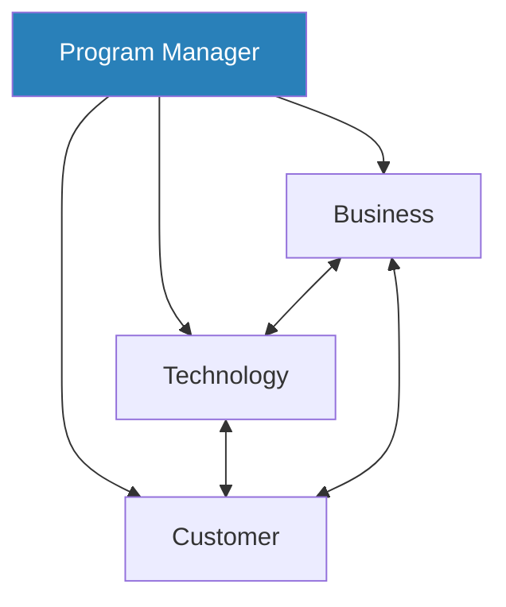
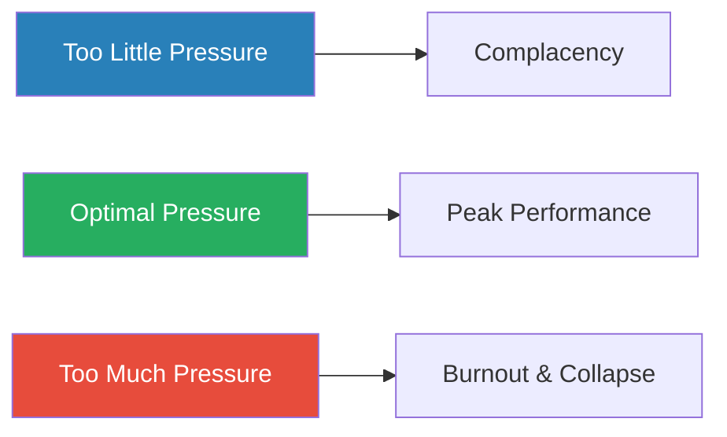
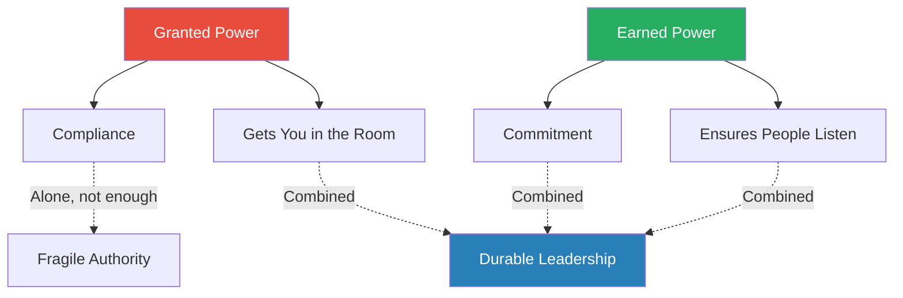
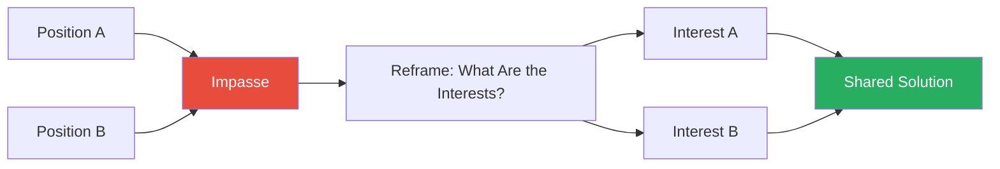
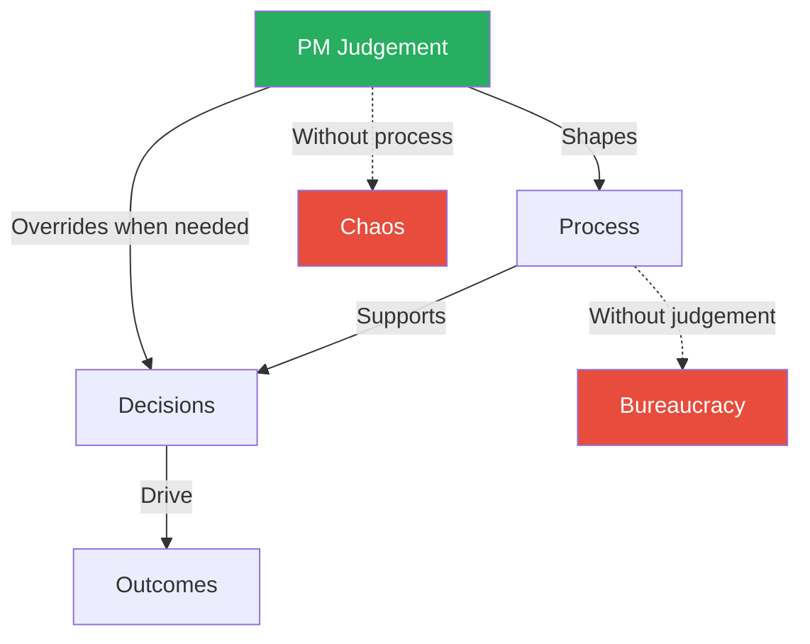

# Making Things Happen — Scott Berkun

> Scott Berkun spent a decade as a program manager at Microsoft, shipping Internet Explorer, Windows, and MSN, then distilled everything he learned into one honest, pragmatic guide to the craft of getting complex projects out the door.
> His thesis is that project management is not about processes, methodologies, or Gantt charts — it is about people, decisions, and communication.
> The PM's job is to create clarity from ambiguity, hold the interdisciplinary view that no specialist can hold alone, and make the hard calls when the information is incomplete.
> Originally published as *The Art of Project Management* (2005) and revised in 2008, the book walks chronologically through a project's life: planning, design, execution, mid-game management, end-game convergence, and the politics that run beneath it all.
> It is one of the few PM books written by someone who clearly did the work rather than theorised about it.

---

## About the Author

Scott Berkun was a program manager at Microsoft from 1994 to 2003, working on Internet Explorer (versions 1.0 through 5.0), Windows, and MSN. He entered the field during what he calls a "golden era" of software — the mid-nineties, when the web was exploding, product cycles were measured in months, and nobody had quite figured out what a program manager was supposed to do. He learned by doing, by failing, and by watching people far better than himself navigate the chaos of shipping software to hundreds of millions of users.

After leaving Microsoft, Berkun became a writer and speaker on creativity, project management, and the culture of innovation. His writing stands apart from most PM literature because of its honesty — he draws freely on his own failures, not just his successes — and because of its surprising breadth of reference, reaching for lessons from kitchens, emergency rooms, aviation, architecture, and military history as naturally as from software engineering. He has since written *The Myths of Innovation*, *Confessions of a Public Speaker*, and *The Year Without Pants* (about his time at WordPress.com).

---

## The Big Idea

- <b style="color: #27ae60">Shipping is a generalist discipline</b> — no amount of technical brilliance, process rigour, or stakeholder management alone is sufficient to deliver complex work
- What matters is the ability to hold three perspectives simultaneously — business, technology, and customer — and to synthesise them into decisions that no single specialist could make
- This is not a soft skill — it is the hardest skill in the room, because every specialist can retreat to the safety of their domain while the generalist stands exposed at the intersection

---

- The uncomfortable truth the book forces you to confront is that most project failures are not technical
- They are failures of clarity, communication, and courage:
  - The requirements were vague
  - The vision was a committee-produced compromise
  - The schedule was a fiction everyone agreed to pretend was real
  - Nobody had the nerve to say no to scope creep
- <b style="color: #27ae60">The PM who can create clarity, make decisions under uncertainty, and protect the team's focus is worth more than any methodology</b>
- Process without judgement is bureaucracy — judgement without process is chaos
- The craft is knowing when to follow the system and when to override it

---

- The book's deepest insight is that <b style="color: #2980b9">politics is not a dirty word</b> — it is the natural result of distributing power among people with different incentives
- Those who refuse to engage with it do not rise above it; they are simply subject to it without understanding why
- The PM who understands power dynamics — who holds it, how it flows, what types of power exist — operates with a map where others are stumbling in the dark

What gives the book its durability is that Berkun writes about project management the way a chef writes about cooking: not as a set of recipes to follow, but as a discipline you practise, refine, and ultimately make your own. The frameworks are tools, not scriptures. The stories are evidence, not decoration. And the underlying message — that shipping is ultimately about human beings coordinating under pressure — is as true now as it was in 2008.

---

## Key Concepts at a Glance

| Concept | One-line summary |
|---------|-----------------|
| **The Origins of Program Management** | The PM role was invented at Microsoft to integrate specialists who could not communicate |
| **The Three Perspectives Model** | Every decision must balance business, technology, and customer viewpoints |
| **Schedules as Probability** | Every estimate is a bet; compound probability makes long schedules inherently unreliable |
| **Work Breakdown and Estimation** | Good estimates come from good designs, not from pressure |
| **The Five Qualities of Vision** | Good visions are simplifying, intentional, consolidated, inspirational, and memorable |
| **The Problem Space Model** | Design expands before it contracts, requiring deliberate checkpoints to converge |
| **Design as Conversation** | Good designs emerge from iterative exchange between disciplines, not from lone genius |
| **Singular vs Comparative Evaluation** | Know when to pick the first acceptable option and when to evaluate alternatives |
| **The Zone of Indifference** | Identify decisions where the difference between options is negligible and stop wasting time |
| **The Power of Saying No** | Priorities mean nothing if everything is priority one |
| **Trust and Responsibility** | Trust is built through commitments kept; responsibility is a source of power, not blame |
| **The Pressure Performance Curve** | Teams improve with pressure up to a threshold, then collapse |
| **Flying Ahead of the Plane** | Proactive management beats reactive management; the PM who is always reacting is already behind |
| **The Coding Pipeline** | Implementation as flow control — triage separates shipping from accumulating |
| **The Political Power Taxonomy** | Five types of organisational power and the distinction between granted and earned power |
| **Conflict Resolution Through Interests** | Negotiate over interests, not positions — the shared interest defuses the adversarial dynamic |
| **Communication and Writing** | Most project failures are communication failures in disguise — writing forces thinking |

---

## The Origins of Program Management

*Berkun opens not with theory but with history — the story of how the program manager role was invented at Microsoft, and what that origin reveals about the nature of the work.*

- In the early days of Microsoft, software was written by small teams of engineers who handled everything: design, coding, testing, and customer communication
- As the company grew and products became more complex, this model collapsed:
  - Engineers were brilliant at writing code but often terrible at coordinating with each other
  - They struggled to understand business requirements or think about what customers actually needed
  - The result was products that were technically impressive but poorly integrated, with features nobody asked for and gaps where critical functionality should have been

---

- <b style="color: #2980b9">Jabe Blumenthal</b>, an early Microsoft employee, recognised the problem and essentially invented the program manager role
- His insight was that complex products needed someone whose job was not to write code or test it but to <b style="color: #27ae60">hold the interdisciplinary view</b> — to sit at the intersection of engineering, business, and customer and make sure the pieces fit together
- The PM would not have authority over the engineers (that stayed with the development lead) or over testing (that stayed with the test lead)
- Instead, the PM would have <b style="color: #2980b9">responsibility without authority</b> — the obligation to make the project succeed without the power to simply order people around

> [!tip] Core Insight
> The PM does not command. The PM persuades, coordinates, clarifies, and decides. Their value is not in being smarter than the specialists but in listening to everything simultaneously.

- Berkun draws a parallel to the conductor of an orchestra:
  - Every musician is more skilled at their instrument than the conductor is
  - But without the conductor, the ensemble produces noise rather than music
  - The conductor's value is not in playing better but in making the whole greater than the sum of its parts
- This analogy carries a further implication that Berkun makes explicit:
  - The conductor must understand every instrument well enough to know when something is off
  - They do not need to play the violin better than the first violinist, but they need to hear when the violins are out of balance with the cellos
  - The PM must understand enough of engineering, design, and business to recognise misalignment — even if they cannot do any of those jobs as well as the specialists

---

> [!example] The Early Days of Internet Explorer
> - When the IE team was small, a PM could walk down the hall and resolve a disagreement in ten minutes
> - As the team grew from a dozen people to hundreds, that informal coordination broke down
> - Decisions that used to happen in hallway conversations now required meetings, documents, and escalation paths
> **The lesson:** The need for program management scales with complexity, not with headcount alone. A twelve-person team building something simple may not need a PM. A twelve-person team building something that touches five other teams definitely does.

- The chapter also introduces what Berkun calls the <b style="color: #2980b9">PM's fundamental question</b>: "What problem are you trying to solve?"
- He had this printed as a poster above his desk at Microsoft because he found himself asking it so often — in planning meetings, design reviews, hallway arguments, and crisis triage
- It is the most powerful question in project management because it forces people to distinguish between problems and solutions
- <b style="color: #e74c3c">Teams often argue furiously over competing solutions without realising they disagree on what the problem actually is</b>

---

## The Three Perspectives Model

*Berkun's foundational planning framework reveals that every project lives at the intersection of three perspectives — and when any one dominates unchecked, the project suffers.*

- Every project exists at the intersection of three perspectives:
  - **Business** — what the organisation needs
  - **Technology** — what is technically feasible
  - **Customer** — what the end user actually wants
- <b style="color: #27ae60">The PM's unique value is the ability to synthesise all three</b>
- Engineers optimise for technical elegance — clean architecture, robust systems, interesting problems
- Business stakeholders optimise for revenue, efficiency, or competitive positioning
- <b style="color: #e74c3c">Neither naturally advocates for the customer, because the customer is the one person not in the room</b>

The PM sits at the centre of all three perspectives, synthesising competing demands into coherent decisions that no single specialist could make alone.

---

- The three perspectives are not equal at all times — their relative weight shifts across the project lifecycle:
  - Early planning: business perspective dominates (what should we build and why?)
  - Design phase: customer perspective should dominate (what do users actually need?)
  - Implementation: technology perspective takes the lead (how do we build it reliably?)
  - End-game: all three converge — what ships must satisfy business goals, technical standards, and customer expectations simultaneously
- <b style="color: #27ae60">The PM who understands this shifting balance adjusts their advocacy accordingly</b>

> [!example] The IE 4.0 Rendering Engine Debate
> - The engineering team wanted to rebuild the browser's rendering engine from scratch — technically exciting and architecturally sound
> - But it would require months of work that would delay the product
> - The business team wanted to ship as fast as possible to compete with Netscape
> - Neither side was wrong within their own frame
> - The PM's job was to find the path that served both — and to bring the customer perspective into the conversation: what did users actually need from the next version?
> **The lesson:** When each perspective only argues its own case, the PM must be the one who integrates them all.

> [!example] The Advertising Feature Nobody Wanted
> - The business team pushed for a feature that would generate advertising revenue but degraded the user experience
> - The engineers built it because they were told to
> - The PM should have pushed back — not on behalf of engineering (who were indifferent) but on behalf of the customer
> - The feature shipped, users hated it, and it was removed in the next version
> **The lesson:** When the customer perspective has no advocate in the room, the customer loses — and eventually so does the business.

- The three perspectives model is not just a planning tool — it is a <b style="color: #2980b9">diagnostic tool</b>:
  - When a project is stuck in political conflict, the root cause is almost always an imbalance among the three perspectives
  - Someone's legitimate concern — business viability, technical risk, or customer impact — is being ignored
  - The conflict is a symptom — restore the balance and the conflict often resolves itself
- Berkun's practical advice:
  - Frame every major decision by explicitly stating the business case, the technical constraints, and the customer impact
  - When a decision satisfies only one or two perspectives, flag the gap before proceeding
  - <b style="color: #e74c3c">If you cannot articulate the customer impact of a decision, you probably do not understand the decision well enough to make it</b>

---

## The Truth About Schedules and Estimates

*Berkun delivers one of the most honest treatments of scheduling in PM literature — revealing why compound probability makes most project timelines a polite fiction.*

- His core claim: <b style="color: #27ae60">"Schedules are a collection of probabilities"</b> — and compound probability is unforgiving
- If each of ten tasks has an 80% chance of being completed on time, the probability that all ten finish on time is not 80% — it is roughly 11%
- This is basic mathematics, but it has radical implications:
  - A project plan with twenty interdependent tasks, each estimated with reasonable confidence, is almost certain to slip somewhere
  - The question is not whether the schedule will be wrong but where and by how much

> [!tip] Core Insight
> A schedule without buffer is not aggressive; it is dishonest. Buffer is not laziness — it is intellectual honesty about the limits of prediction.

---

- Berkun calls this the <b style="color: #2980b9">snowball effect</b>: early estimation errors compound because later decisions are built on earlier ones
- An oversight in week two does not just delay week two — it cascades through every subsequent milestone
- The decisions made in weeks three, four, and five were all predicated on week two's assumptions
- By the time the error is discovered, the cumulative damage is far greater than the original mistake

The snowball effect shows how a small estimation error in week two compounds through every subsequent milestone, producing a delay far larger than the original mistake.

---

> [!example] The Disappearing API
> - A team at Microsoft estimated a six-month timeline based on careful analysis
> - Three months in, they discovered that a core dependency — an operating system API they were building on — had changed without warning
> - The engineering effort to adapt was only two weeks
> - But the cascading effects on design, testing, and integration pushed the project back by two months
> - The original estimate was not wrong — it was built on an assumption that turned out to be false
> **The lesson:** No amount of estimation rigour can prevent assumptions from being invalidated. The snowball effect means even small surprises cascade.

> [!example] The Compressed Schedule
> - A PM was pressured by senior management to compress a twelve-month schedule to nine months
> - The PM pushed back, presenting the compound probability maths
> - Management was not persuaded — they wanted the earlier date for competitive reasons
> - The PM agreed to the nine-month target but built in explicit "schedule checkpoints" at three-month intervals
> - At the first checkpoint, they were already a month behind
> - The early warning allowed them to cut scope rather than death-march
> - The product shipped on time — with fewer features but in better shape
> **The lesson:** Checkpoints that force early reckoning with reality are more valuable than optimistic plans that defer bad news.

- Berkun's practical advice on estimation:
  - <b style="color: #27ae60">Good estimates come from good designs, not from pressure</b>
  - When a PM demands tighter timelines without providing clearer requirements, they get <b style="color: #e74c3c">false precision</b> — numbers that look confident but are built on guesswork
  - His recommended technique: ask engineers "What questions can I answer that would make you more confident about this estimate?" — then go answer those questions
  - This reframes estimation from an adversarial negotiation ("give me a better number") to a collaborative investigation ("what do we need to know?")

---

- <b style="color: #2980b9">Work Breakdown Structures</b> are Berkun's primary tool for managing estimation uncertainty:
  - Break large deliverables into small, independently estimable pieces
  - The smaller the piece, the more accurate the estimate, because each piece has fewer unknowns
  - A task estimated at "three months" is a guess — the same work broken into thirty tasks, each estimated at "two to five days," is a much more reliable aggregate
  - It also reveals which specific tasks carry the most uncertainty
- Build buffer into the schedule proportional to the number of unknowns
- Use milestone checkpoints to recalibrate as information improves
- Berkun warns against two common pathologies:
  - **Sandbagging** — engineers who pad estimates excessively to protect themselves
  - **Hero culture** — environments where admitting uncertainty is treated as weakness, producing aggressive estimates that consistently fail
- <b style="color: #e74c3c">Both pathologies stem from the same root: a culture where estimation is a negotiation rather than an investigation</b>

---

## Vision: The Five Qualities

*Berkun's sharpest contribution may be his treatment of vision documents — most of which, he argues, are useless artefacts satisfying nobody except the committee that produced them.*

- Most teams have vision documents — most of those documents sit in forgotten folders, written in impenetrable jargon
- <b style="color: #27ae60">A good vision is not a 50-page strategy deck — it is a living rulebook that makes daily decisions easier for the team</b>
- The test of a vision is not whether it sounds impressive in a boardroom but whether a developer, facing a design choice at 3pm on a Wednesday, can consult it and know which option to choose

The five qualities of an effective vision:

| Quality | What it means | Example |
|---------|--------------|---------|
| **Simplifying** | Reduces complexity rather than adding to it | The U.S. Constitution governs 330 million people in 7,000 words |
| **Intentional** | Goal-driven, answering *why* before *what* | "Help users discover content they love" beats "build a recommendation engine" |
| **Consolidated** | Lives in one place, not scattered across documents | One document, one source of truth |
| **Inspirational** | Gives people a reason to care about the work | The login team is building the gateway to a customer's first experience |
| **Memorable** | The team can recall it without looking it up | Like the best advertising slogans — simple, specific, tied to something you care about |

The radar reveals that "Memorable" and "Simplifying" are both the hardest qualities to achieve and the most impactful — which explains why most vision documents fail: teams default to the easier qualities (Consolidated, Intentional) while neglecting the two that actually drive alignment.

---

- <b style="color: #e74c3c">One person should own the vision</b> — Berkun reserves some of his sharpest language for committee-produced vision documents:
  - <b style="color: #e74c3c">"Kitchen-sink statements"</b> — documents that try to include every stakeholder's pet priority
  - <b style="color: #e74c3c">"Wimp-o-matic non-commitments"</b> — statements so vague that nobody could disagree with them, which means nobody can be guided by them either
- The root cause of bad visions is a failure of courage:
  - A good vision must exclude — it must say "we are not doing this" clearly enough to disappoint people
  - Committee visions avoid exclusion because no one wants to be the person who cut someone else's priority
  - The result is a document that reads like a corporate brochure: everything is important, which means nothing is

> [!example] The Forty-Page Vision That Committed to Nothing
> - Berkun inherited a vision document on a Microsoft project that ran to forty pages, written by six people
> - It covered everything — and committed to nothing
> - When he asked three different team members what the project's top priority was, he got three different answers
> - He threw the document out and wrote a new one — two pages — that made hard choices about what was in and what was out
> - Half the team loved it; the other half was furious that their priorities had been cut
> - But for the first time, everyone agreed on what they were building
> **The lesson:** A vision that includes everything guides nothing. The hard work is deciding what to leave out.

---

> [!example] Fifty Slides vs One Page
> - One PM presented a vision to senior leadership using fifty slides packed with data, market analysis, and competitive benchmarking — the presentation was impressive and completely forgotten within a week
> - A different PM presented a vision for a new feature in five minutes, using a single printed page taped to the wall — a year later, team members could still recite the key points
> - The difference was not intelligence or effort — it was discipline
> **The lesson:** The second PM had done the harder work of deciding what to leave out. Brevity is not laziness; it is precision.

- A vision should be visible — posted on walls, read aloud in meetings, actively referenced in decision-making
- <b style="color: #27ae60">If it is not being used, it is not a vision — it is an artefact</b>
- Berkun tests his own visions by asking team members, unprompted, to state the project's top three priorities:
  - If they agree, the vision is working
  - If they disagree, the vision has failed — regardless of how polished the document looks

---

## The Problem Space and Design

*Berkun models design as the exploration of a landscape of possible solutions — one that must expand before it contracts, with deliberate checkpoints to force the narrowing that creative momentum resists.*

- <b style="color: #2980b9">The problem space</b> is a landscape of possible solutions that expands before it contracts
- Early in a project, the problem space grows as the team discovers new requirements, edge cases, and dependencies
- This expansion is natural and necessary — you cannot design a good solution until you understand the full scope of the problem
- <b style="color: #e74c3c">The mistake is allowing that expansion to continue indefinitely</b> — letting the team chase every interesting possibility without ever committing to a direction

> [!abstract] Design Checkpoints — Forcing Convergence
> 1. **Proof-of-concept** — can the core idea work at all?
> 2. **Idea groupings** — which ideas cluster together into coherent approaches?
> 3. **Three alternatives** — narrow to three distinct design directions
> 4. **Two alternatives** — eliminate the weakest, refine the remaining two
> 5. **One design** — commit to a single direction
> 6. **Specification** — document the chosen design in enough detail to build from

---

- At each checkpoint, options are evaluated and eliminated
- The process requires discipline because creative momentum naturally resists narrowing:
  - Teams fall in love with possibilities
  - Engineers want to explore one more architecture
  - Designers want to try one more layout
  - Business stakeholders want to hedge by keeping all options open
- <b style="color: #27ae60">The PM's job is to force the convergence that nobody else will</b>

Design moves from broad exploration through deliberate checkpoints that progressively narrow options until a single direction is committed and specified.

---

> [!example] The IE 5.0 Favourites Redesign
> - The team wanted to improve the browser's bookmarks feature
> - What seemed like a simple UI change turned out to touch the operating system's file system, the rendering engine, the toolbar layout, and the import/export functionality
> - Each design decision created new dependencies the team had not anticipated
> - By the time they understood the full scope, they were weeks behind schedule
> **The lesson:** The failure was not in failing to anticipate every dependency — that is impossible. It was in not using checkpoints to force convergence earlier, before the cascading dependencies had time to multiply.

> [!example] Two Good Solutions, One Decision Needed
> - Two design teams independently developed solutions to the same problem — both were good and technically sound
> - Neither team was willing to abandon their work
> - The PM let the debate continue for three weeks, hoping consensus would emerge — it did not
> - Eventually, the PM picked one — not because it was objectively better, but because the cost of continued indecision exceeded the value of finding the optimal solution
> - The team that lost was frustrated, but the project moved forward
> **The lesson:** "What problem are you trying to solve?" sometimes needs to be followed by "And who decides?"

- Berkun identifies a common anti-pattern he calls <b style="color: #2980b9">design by committee</b>:
  - When no single person has the authority or courage to commit, the design becomes a patchwork of compromises
  - Every stakeholder gets a piece of what they want, but no coherent vision holds the pieces together
  - The result is a product that is not bad in any single dimension but fails to excel in any — mediocre by consensus
- The antidote is clear design ownership:
  - One person — PM, lead designer, or architect — owns the design and is accountable for its coherence
  - Others contribute expertise, raise concerns, and advocate for their perspective
  - But when the debate reaches an impasse, the owner decides

---

## Design as Conversation

*Berkun's key insight about design is that it is not a solo activity — good designs emerge from iterative exchange between people with different expertise, each one leaping past the last.*

- <b style="color: #27ae60">Design is a conversation, not a solo activity</b>
- Good designs emerge from iterative exchange between people with different expertise — engineering, design, business
- No single expert has the complete picture
- The process is a kind of leapfrog:
  - Start from the customer experience and work down to technology ("what do users need?")
  - Then from practical technology back up to the customer ("given what's feasible, how should the experience work?")
  - Each pass refines the design
  - Each pass exposes assumptions that the previous pass missed

> [!example] Terry Gilliam on Creative Leapfrog
> - Berkun quotes filmmaker Terry Gilliam on the creative process
> - The best work emerges when different people take turns improving each other's ideas, each one leaping past the last
> - The director gives the actor a note; the actor interprets it in a way the director did not expect
> - The director adjusts the scene to build on the actor's interpretation
> - The result is better than either could have produced alone
> **The lesson:** The same dynamic applies to software — PM describes a scenario, designer sketches an interface, engineer identifies a constraint, designer adjusts, PM reassesses the business case. Round and round, each iteration producing something better.

---

- <b style="color: #2980b9">Prototypes</b> accelerate this conversation by making abstract ideas concrete and arguable:
  - A wireframe is better than a paragraph
  - A clickable prototype is better than a wireframe
  - A working prototype is better still
  - The more concrete the artefact, the more useful the feedback — because people respond to what they can see and touch, not to what they can imagine

> [!example] Six Weeks of Debate vs Two Hours of Prototyping
> - A team spent six weeks debating the architecture of a new feature in meetings and documents
> - When they finally built a rough prototype, they discovered in two hours that three of their core assumptions were wrong
> - The prototype did not solve the problem — it revealed the problem
> - The previous six weeks of discussion would have been far more productive if they had prototyped first and debated second
> **The lesson:** Prototypes do not just test solutions — they expose the real problems that abstract discussion misses.

> [!tip] Core Insight
> "What problem are you trying to solve?" is the single most powerful question in project management. It resets confused discussions, aligns divergent teams, and forces people to distinguish between the problem and their preferred solution.

- Berkun also emphasises the importance of <b style="color: #2980b9">open questions vs closed questions</b> in the design conversation:
  - Open questions ("how might we improve the onboarding flow?") expand the design space
  - Closed questions ("should the button be blue or green?") contract it
  - <b style="color: #27ae60">Use open questions early and closed questions late</b> — reversing the order is one of the most common design process mistakes
  - Teams that jump to closed questions too early lock in design directions before they understand the problem

---

## Decision-Making Under Uncertainty

*Berkun reveals that the critical skill in decision-making is not analysis but knowing which type of decision you are facing — and matching your approach accordingly.*

- Berkun divides decisions into two modes:
  - <b style="color: #2980b9">Singular evaluation</b> — pick the first acceptable option
  - <b style="color: #2980b9">Comparative evaluation</b> — assess multiple alternatives against each other
- Singular evaluation is appropriate when:
  - Time pressure is high
  - The stakes are moderate
  - A "good enough" option is available
- Comparative evaluation is appropriate when:
  - The stakes are high
  - The options are meaningfully different
  - You have time to assess them
- <b style="color: #e74c3c">Many PMs default to comparative evaluation for every decision</b> — assembling spreadsheets, convening meetings, seeking consensus — when singular evaluation would have been faster and produced an equally good result

---

- <b style="color: #2980b9">The zone of indifference</b>: the range of options that are close enough in quality that the difference between them does not matter
- When you are choosing between two roughly equivalent database technologies, two meeting times, or two functionally identical design approaches — you are in the zone of indifference
- <b style="color: #e74c3c">Time spent agonising over these decisions is time wasted</b> — identify them, pick one, and move on

> [!example] Two Days Debating Version Control
> - A team spent two full days debating which version control system to adopt
> - Both options were solid and both had advocates on the team
> - The differences between them were, in practical terms, negligible
> - The two days spent debating cost more in lost productivity than any efficiency difference between the tools would recoup in a year
> **The lesson:** The PM should have recognised the zone of indifference, made a call, and redirected the team's energy toward work that actually mattered.

---

- Good decision-makers invest energy proportionally to two factors:

| Factor | High-investment decisions | Low-investment decisions |
|--------|--------------------------|------------------------|
| **Impact** | Choosing core architecture, signing a major contract, hiring a key team member | Which testing framework to use, meeting on Tuesday or Wednesday |
| **Reversibility** | Irreversible — architecture choices, public commitments | Easily reversed — tool choices, process tweaks |

High-impact, irreversible decisions deserve extensive analysis. Low-impact, easily reversed decisions deserve a quick call and forward motion.

---

- <b style="color: #27ae60">Indecision is itself a decision — and usually the worst one</b>
- A team waiting for a perfect answer is a team that is not moving
- In most project contexts, a decent decision made quickly and corrected later outperforms a perfect decision made too late
- Berkun distinguishes between:
  - **Information decisions** — where more data would genuinely improve the outcome
  - **Binary decisions** — where you already know enough and just need to commit
- <b style="color: #e74c3c">The most common failure mode</b>: treating binary decisions as information decisions — requesting more analysis, scheduling more meetings, waiting for data that will not change the conclusion — as a way of avoiding the discomfort of deciding

> [!example] The Analysis Paralysis Postmortem
> - After a project shipped late, the postmortem revealed that the team had spent a combined three weeks across the project on decisions that could have been made in a single meeting
> - The culprit was not any single decision but a pattern: every choice, no matter how small, triggered a round of analysis, consultation, and review
> - The PM had confused thoroughness with leadership
> - The next project, the same PM adopted a simple rule: decisions under a certain impact threshold got fifteen minutes maximum
> **The lesson:** Decision-making speed is itself a resource. Spending it on low-stakes choices starves high-stakes ones.

---

## Saying No

*Berkun considers this the single most important execution skill — and the one PMs are worst at. His argument: every yes is an implicit no to something already committed.*

- "Things happen when you say no."
- Every yes to a new request is an implicit no to something already committed:
  - If a team is working on features A, B, and C, and the PM says yes to feature D, something has to give
  - Either A, B, or C gets delayed, quality drops across all four, or the team works unsustainable hours
  - <b style="color: #e74c3c">There is no magical fourth option</b>
- <b style="color: #27ae60">Priorities mean nothing if everything is priority one</b>

> [!tip] Core Insight
> The PM must be the gatekeeper who protects the team from scope creep, context-switching, and the tyranny of the urgent. This is not about being obstructionist — it is about being honest about finite resources and having the courage to make trade-offs visible.

---

- Berkun's practical approach — maintain an explicit <b style="color: #2980b9">priority list</b> where items are strictly ordered, not grouped into tiers:
  - There is a priority 1, a priority 2, a priority 3
  - Not three "high priority" items and five "medium priority" items
  - Strict ordering forces hard choices — which is exactly the point
  - Priority 1 items are the only ones that truly matter
  - Everything else exists only if priority 1 work is complete
- Alongside the "doing" list, maintain a <b style="color: #2980b9">"not doing" list</b> — an explicit record of what was considered and deliberately excluded:
  - It demonstrates strategic discipline rather than oversight — the team is not ignoring these items; it has consciously decided they are less important
  - It gives stakeholders a clear picture of the trade-offs being made, preventing the toxic dynamic of everyone assuming their priority is being worked on

---

> [!example] The PM Who Said Yes to Everything
> - A PM accepted every feature request from every stakeholder, reasoning that saying no would damage relationships
> - The team tried to build everything — and built nothing well
> - The product shipped late, buggy, and bloated
> - The stakeholders whose requests had been accepted were not grateful — they were frustrated that their features were poorly implemented
> **The lesson:** The PM had optimised for short-term comfort (not having difficult conversations) at the cost of long-term outcomes (a good product).

> [!example] The Visible Priority Board
> - A PM maintained a visible priority board in the team's workspace
> - When a new request came in, the PM would walk the requester to the board and ask: "This is what we're building, in this order. Where does your request go? What comes off the list to make room?"
> - The conversation shifted from "will you build my thing?" to "is my thing more important than these other things?"
> - Sometimes the answer was yes, and the priorities changed — more often, the requester realised their request was not as urgent as they thought
> **The lesson:** Saying no is not refusal. It is explanation: "If we take this on, here is what we stop doing. Is that the trade-off you want?"

- Framed this way, saying no becomes a service to the organisation — it forces the kind of strategic clarity that most teams desperately need but nobody wants to provide
- Berkun notes that the PM who says no skillfully actually builds stronger relationships than the PM who says yes to everything:
  - Stakeholders learn they can trust the PM's commitments because those commitments are realistic
  - When the PM does say yes, stakeholders know it means the work will actually get done
  - The PM who says yes to everything teaches stakeholders that commitments are meaningless

---

## Trust and Responsibility

*Berkun's treatment of leadership rests on two pillars — trust and responsibility — that are related but distinct. Trust is about consistency. Responsibility is about courage.*

- <b style="color: #27ae60">Trust is built through a track record of commitments kept</b>, not through words
- Small promises honoured consistently build the credibility that supports larger requests:
  - Returning a document by Tuesday
  - Following up after a meeting
  - Delivering the draft on time
- <b style="color: #e74c3c">Broken small promises erode trust faster than one large failure</b> because they signal a pattern:
  - A single catastrophic failure can be explained by circumstances
  - A pattern of missed small commitments signals unreliability — the most damaging reputation a PM can have

---

- Berkun draws an analogy to sports teams:
  - A basketball player who makes flashy plays but misses easy layups is less trusted by teammates than a player who consistently does the basics well
  - The unglamorous fundamentals — showing up prepared, doing what you said you would do, communicating clearly — are the foundation of trust
  - Without them, no amount of strategic brilliance matters

> [!example] The Technically Excellent PM Nobody Trusted
> - A PM was technically excellent but chronically late to meetings, slow to respond to emails, and unreliable about follow-through
> - The PM's ideas were good and the analysis was sharp
> - But the team stopped bringing problems to the PM because they had learned that bringing a problem meant nothing would happen
> - The PM's effectiveness was destroyed not by a lack of skill but by a pattern of broken micro-commitments
> **The lesson:** Competence without reliability is wasted. People trust the person who consistently does the basics, not the person who occasionally does something brilliant.

---

- <b style="color: #2980b9">Responsibility</b>, in Berkun's framing, is a source of power, not blame:
  - Taking responsibility for a problem is not the same as accepting fault
  - It means placing yourself at the centre of the resolution, which gives you influence over the outcome
  - When others see someone voluntarily shouldering accountability, they transfer authority to that person — because the person who owns the problem is the person who gets to shape the solution

> [!tip] Core Insight
> "Find the difficulty in yourself, not in others." — Larry Constantine. The PM who looks inward first learns faster and earns the respect of the team. This is not self-flagellation; it is demonstrating that you hold yourself to the same standard you hold others.

- <b style="color: #e74c3c">Deflecting blame eliminates the opportunity to lead</b>:
  - The PM who says "that was engineering's fault" may be factionally correct
  - But they have also announced to the room that they do not consider themselves responsible for the project's success
  - If the PM is not responsible, what are they for?
- Berkun draws a distinction between two types of accountability:
  - **Backward-looking accountability** — who caused this problem? (blame)
  - **Forward-looking accountability** — who will fix this problem? (ownership)
  - <b style="color: #27ae60">The best PMs focus almost exclusively on forward-looking accountability</b>
  - They acknowledge what happened, learn from it, and immediately redirect energy toward the solution

---

## The Pressure Performance Curve

*Berkun borrows from psychology a model that explains why pushing harder sometimes improves output and sometimes destroys it — and why the leader's job is to recognise the difference.*

- The <b style="color: #2980b9">Pressure Performance Curve</b> describes a simple relationship:
  - Performance improves with pressure up to a threshold, then collapses
  - Too little pressure: work expands to fill the time available, urgency evaporates, people optimise for comfort
  - Too much pressure: quality drops, mistakes multiply, morale craters, the best people start looking for the exit
  - <b style="color: #27ae60">The optimal zone is narrow, and it is the leader's job to find it</b>

The narrow optimal zone between complacency and burnout is where peak performance happens — the leader's job is to keep the team in that zone.

---

- Berkun categorises pressure along two dimensions, creating four types:

| Pressure Type | Description | Effect |
|--------------|-------------|--------|
| **Natural positive** | Meaningful deadline, excited customer, competitor breathing down your neck | Healthy — the team feels urgency because they understand why it matters |
| **Artificial positive** | Incentives, bonuses, recognition | Can work but tends to lose effectiveness over time as people habituate |
| **Natural negative** | Product failure, security breach, public embarrassment | Creates intense urgency but also anxiety and blame |
| **Artificial negative** | Arbitrary deadlines, fear-based management, threats | Most destructive — produces compliance without commitment, quiet resentment |

<b style="color: #e74c3c">Artificial negative pressure</b> is the most dangerous form. It produces surface effort without real engagement, and the quiet resentment poisons the team over time.

---

- The leader's job is to recognise when the team is <b style="color: #2980b9">redlining</b> — operating at the threshold where no additional pressure will improve output
- Signs of redlining:
  - Rising defect rates
  - Increasing interpersonal friction
  - Declining participation in meetings
  - Sick days climbing
  - Gallows humour replacing normal humour
- <b style="color: #27ae60">When these signs appear, the response is not to push harder but to reduce scope, extend timelines, or provide relief</b>

> [!example] The PM Who Cut Three Features
> - A team at Microsoft was pushing to meet a launch deadline
> - The PM, sensing the team was redlining, went to senior management and asked for a two-week extension — management refused
> - The PM went back to the team and cut three features — not because they were unimportant, but because the team could not deliver everything at quality
> - The product shipped on the original date, minus the three features
> - Six months later, nobody remembered the missing features — everyone remembered that the product was solid
> **The lesson:** Cutting scope to protect quality is not failure. It is the hardest and most valuable form of leadership.

> [!example] The PM Who Pushed Through the Redline
> - A different PM pushed through the redline, refusing to cut scope or extend timelines
> - The team shipped on time with all features — but the product was riddled with bugs
> - Two months after launch, the team was still fixing defects
> - Three of the best engineers had transferred to other teams
> **The lesson:** The PM had won the schedule battle and lost the war. Shipping on time means nothing if the product is broken and the team is gone.

---

## Flying Ahead of the Plane

*Berkun borrows from aviation a metaphor that captures the difference between proactive and reactive management — and why the PM who is always reacting is already behind.*

- <b style="color: #2980b9">Flying ahead of the plane</b> means always thinking one step ahead, anticipating what comes next rather than reacting to what just happened
- In aviation, falling behind the plane is dangerous:
  - The pilot who is reacting to the current instrument reading rather than anticipating the next one makes corrections that are always late and always too strong
  - This creates oscillations that compound until the aircraft is out of control
- The same dynamic applies to project management:
  - The PM who is constantly reacting to surprises — discovering problems only when they become crises — is "flying behind the plane"
  - <b style="color: #e74c3c">Panic breeds overcorrection, overcorrection breeds new problems, new problems breed more panic</b>

---

> [!abstract] Daily and Weekly Sanity-Check Questions
> - What is the probability we hit the next milestone?
> - What are the three biggest risks this week?
> - What has changed since last week that I do not yet know about?
> - Is the team's morale sustainable at this pace?
> - Which assumptions from last month am I most worried about?
> - Who haven't I talked to recently who might have information I need?

These questions are not meant for formal reports. They are a constant background process — a running diagnostic that surfaces issues before they become emergencies.

---

> [!example] The Daily Gut Check
> - A PM ran a daily fifteen-minute "gut check" with two senior engineers, asking only two questions: "What surprised you yesterday?" and "What worries you about today?"
> - The conversations were informal and brief
> - Over the course of a six-month project, those daily gut checks surfaced four issues that would have been crises if discovered later
> - One was a dependency on an external API that was about to be deprecated
> - The PM addressed each issue weeks before it became urgent, with minimal disruption to the team
> **The lesson:** The most important project information rarely appears in formal channels. It lives in the worried look on an engineer's face, the offhand comment in the kitchen, the question nobody was afraid to ask.

> [!example] The PM Who Managed by Status Reports
> - A PM managed by weekly status reports — thorough and well-formatted
> - They were also consistently two weeks out of date
> - By the time a problem appeared in the status report, it had already metastasised
> - The PM spent most of the project firefighting — putting out blazes that could have been prevented with earlier detection
> **The lesson:** Flying behind the plane means your corrections are always late and always too strong. Spend less time in status meetings and more time in conversations where real information surfaces.

- <b style="color: #27ae60">Flying ahead of the plane is not about working more hours — it is about spending your hours differently</b>:
  - Less time in status meetings and report-writing
  - More time in conversations, hallway chats, and one-on-ones where real information surfaces
  - The most important project information rarely appears in formal channels
- Berkun's metaphor also extends to risk management:
  - A pilot who flies ahead of the plane has already identified the next three potential hazards and has a response plan for each
  - Similarly, the proactive PM maintains a <b style="color: #2980b9">risk register</b> — not as a bureaucratic artefact, but as a living mental model of what could go wrong and what the response would be
  - <b style="color: #27ae60">The PM who has already thought about a crisis before it happens responds calmly. The PM encountering it for the first time panics.</b>

---

## End-Game: Convergence and Triage

*The end-game is where projects succeed or die. Berkun models the final phase as a transition from building to fixing — and introduces triage as the discipline that separates shipping from endlessly accumulating.*

- The <b style="color: #2980b9">coding pipeline</b> is Berkun's metaphor for the flow of work through a project:
  - Early in the project, the pipeline is full of new code — features being built, systems being integrated
  - As the end-game approaches, the pipeline should gradually shift: less new code, more bug fixing, more testing, more polish
  - The transition is not a sudden switch but a gradual taper

---

- Berkun distinguishes between two pipelining strategies:

| Strategy | Approach | Strength | Weakness |
|----------|----------|----------|----------|
| **Aggressive pipelining** | Queue always full, every engineer has work, no slack | Maximises throughput when everything goes to plan | Brittle — no capacity to absorb surprises |
| **Conservative pipelining** | Queue has deliberate slack, engineers can handle unexpected problems | Resilient when things go wrong (which they always do) | Lower theoretical throughput |

<b style="color: #27ae60">Conservative pipelining is almost always the better choice</b> — because things always go wrong, and resilience beats theoretical throughput.

---

- <b style="color: #2980b9">Triage</b> is the key discipline of the end-game:
  - Not every bug gets fixed, not every feature gets polished, not every edge case gets handled
  - The PM must classify issues by severity and impact, protect the team from late-arriving requests, and enforce the principle that <b style="color: #27ae60">done is better than perfect</b>
- The term comes from battlefield medicine, and Berkun uses the analogy deliberately:
  - Those who will survive without treatment
  - Those who will die regardless of treatment
  - Those who will survive only with treatment — all resources go to this group
- The same logic applies to bugs:
  - Critical — fix immediately
  - Cosmetic — fix if time permits
  - "Won't fix" — the cost of fixing exceeds the cost of shipping with the defect

> [!example] The Two-Day-Before-Launch Bug
> - Two days before a Microsoft product launch, the team discovered a bug that caused a crash under specific conditions
> - The conditions were rare, and the fix was risky — it touched core code that could introduce new problems
> - The PM made the call to ship with the bug and patch it in the first update
> - The decision was agonising, but it was correct: the cost of delaying the launch exceeded the cost of the bug
> **The lesson:** Triage is not about finding every defect. It is about making the call on which defects matter enough to delay shipping for — and having the courage to ship with the ones that do not.

---

- <b style="color: #2980b9">Exit criteria</b> — pre-defined conditions that must be met before the project ships:
  - Established early and referenced constantly
  - Without them, the end-game becomes an endless negotiation about what "done" means
  - Everyone has a different standard: engineers want zero bugs, business wants it out the door, design wants one more iteration
  - Exit criteria cut through the noise: if the product meets these conditions, it ships — the conditions are defined when heads are cool, not when the team is exhausted

> [!tip] Core Insight
> Exit criteria are the antidote to end-game chaos. Define "done" when heads are cool and enforce it when emotions are high.

- Berkun's <b style="color: #2980b9">war team</b> concept applies to crisis management during the end-game:
  - A small, empowered group with clear authority to make decisions quickly
  - Cuts through normal approval processes that slow organisations down
  - Does not replace the broader team — it exists to handle the handful of critical decisions that cannot wait
  - <b style="color: #27ae60">Speed matters more than consensus in the end-game</b>

> [!example] The End-Game War Room
> - During the final weeks of an IE release, Berkun's team established a physical war room where the war team met twice daily
> - Every critical bug was triaged within hours, not days
> - The war team had authority to make ship/no-ship decisions on individual features without escalation
> - This compressed what would normally be a week-long approval cycle into a single afternoon
> - The product shipped on schedule — not because everything was perfect, but because the team had the speed and authority to make the hard calls fast
> **The lesson:** End-game decisions need a different governance model. The normal chain of command is too slow when you are days from launch.

---

## The Political Power Taxonomy

*Most PM books treat politics as an unfortunate reality to be minimised. Berkun treats it as a legitimate domain of management skill — and provides a map for navigating it.*

- His central claim: <b style="color: #27ae60">politics is problem-solving, not a dirty word</b>
- Organisational politics is the natural consequence of distributing power among people with different motivations, different information, and different incentives
- <b style="color: #e74c3c">Blaming "politics" is a dodge</b> — it substitutes frustration for analysis
- When someone says "the decision was political," they are usually saying "the decision was influenced by factors I do not understand or do not like"
- Understanding those factors is the first step toward influencing them

---

- Berkun identifies <b style="color: #2980b9">five types of power</b>:

| Power Type | Definition | Durability |
|-----------|-----------|------------|
| **Reward** | Ability to give people what they want — bonuses, promotions, interesting work, recognition | Visible but dependent on resources |
| **Coercive** | Ability to punish — termination, demotion, unpleasant assignments | Effective short-term, corrosive long-term |
| **Knowledge** | Expertise that others need and cannot easily replace | Durable but fragile — depends on scarcity |
| **Referent** | Influence from character and track record — respected, admired, followed | Most durable but slowest to build |
| **Influence** | Ability to shape decisions through persuasion and political skill | Tactical — about how you operate, not who you are |

The treemap shows that earned power (Knowledge + Referent) outweighs granted power (Reward + Coercive) in total organizational influence — Referent power, built through character and track record, is the largest single block because it is the most durable and the hardest to replicate.

The polar area chart sizes each power type by durability: Referent power (earned through character) dominates because it persists regardless of role changes, while Coercive power is the smallest — effective in the short term but corrosive over time and the first to evaporate when authority is removed.

---

- The critical distinction is between <b style="color: #2980b9">granted power</b> (from titles and hierarchy) and <b style="color: #2980b9">earned power</b> (from demonstrated competence and reliability):
  - Granted power commands compliance; earned power commands commitment
  - The most effective leaders cultivate both
  - Granted power gets you in the room — earned power ensures people listen when you speak

The most effective leaders combine both types — granted power opens doors, but earned power is what makes people follow willingly.

---

> [!example]- Berkun's Political Education Under Chris Jones
> - Early in his career at Microsoft, Berkun was frustrated by a decision his boss, Chris Jones, had made
> - Berkun thought the decision was wrong — and it probably was, on narrow technical merits
> - He confronted Jones, arguing his case passionately
> - Jones listened, then explained the full picture:
>   - The decision was constrained by commitments Jones had made to other teams
>   - Budget realities Berkun did not know about
>   - A strategic direction set two levels above them both
> - Jones was not ignorant of Berkun's concerns — he was balancing factors that Berkun could not see from his position
> **The lesson:** Political problems are not solved by being right. They are solved by understanding the full landscape of constraints, incentives, and relationships — and then finding a path that accounts for all of them.

---

> [!abstract] Berkun's Political Problem-Solving Process
> 1. **Clarify the need** — what exactly do you want?
> 2. **Identify who holds the power** — who can give it to you?
> 3. **Assess your approach** — what type of power do they respond to? What constraints are they operating under?
> 4. **Execute** — make the ask, using the right lever

- Berkun also introduces the concept of <b style="color: #2980b9">creating your own political field</b>:
  - Even in a dysfunctional organisation, you control the norms, communication patterns, and decision-making processes within your own team
  - Good local leadership can insulate a team from broader organisational chaos
  - The PM who creates a healthy local environment demonstrates — through action, not argument — what good management looks like
  - Over time, that local example can influence the broader organisation
- This is one of Berkun's most empowering ideas:
  - You do not need to fix the entire organisation to be effective
  - You need to create a space where your team can do their best work
  - <b style="color: #27ae60">Control what you can control — and do it visibly enough that others notice</b>

---

## Conflict and Negotiation

*Berkun draws on Fisher and Ury's Getting to Yes to show that most organisational conflicts are fought over positions when they should be negotiated over interests — and that the PM who finds the shared interest defuses the adversarial dynamic.*

- Most organisational conflicts are fought over <b style="color: #e74c3c">positions</b> ("I want X") when they should be negotiated over <b style="color: #27ae60">interests</b> ("I need Y"):
  - Positions are specific demands with few solutions
  - Interests are higher-level goals that can be satisfied many ways
  - By forcing parties to articulate interests rather than positions, the PM expands the set of acceptable solutions

Moving from positions to interests transforms an impasse into a solvable problem by expanding the set of possible solutions.

---

> [!example] The Fight Over Sarah's Time
> - Two teams fought over a shared engineer's time — both demanded Sarah for the next three weeks
> - Impasse: neither would budge on their position
> - The PM dug into the interests underneath:
>   - Team A needed Sarah's knowledge of the authentication system
>   - Team B needed someone to write database migration scripts
> - Sarah was the only person who could do both — but there were other people who could write migration scripts
> - Solution: Sarah stays with Team A, Team B gets a database engineer from the contractor pool
> - Neither team got their stated position, but both teams got their underlying interest satisfied
> **The lesson:** Reframing from positions to interests transforms zero-sum conflicts into solvable problems.

> [!example] Engineering vs Design: The Shared Interest
> - Engineering wanted a simple, technically straightforward UI implementation
> - Design wanted a richer, more visually sophisticated approach — each side dug in
> - When the PM asked both teams what problem they were trying to solve, it turned out they shared the same interest: they both wanted users to complete the task quickly
> - Engineering's concern was performance — a complex UI would be slow
> - Design's concern was usability — a simple UI would be confusing
> - The solution was a UI that was visually clean (satisfying design) but technically lightweight (satisfying engineering)
> - Neither side had proposed this option because they were arguing about solutions, not their shared problem
> **The lesson:** When people argue over solutions without surfacing the shared problem, the best option often goes unproposed.

---

- The <b style="color: #2980b9">"do nothing" option</b> should always be on the table:
  - Before committing to any resolution, ask: "What happens if we do nothing?"
  - Sometimes the answer is "the project fails" — and action is urgent
  - But sometimes the answer is "not much" — the conflict is generating more heat than the issue warrants
  - <b style="color: #e74c3c">PMs often intervene in conflicts that would resolve themselves</b>, consuming political capital on battles that do not need to be fought
- Berkun also endorses the concept of a <b style="color: #2980b9">BATNA</b> (Best Alternative to Negotiated Agreement):
  - Know your walkaway point before entering any negotiation
  - If you do not know what you will do if the negotiation fails, you have no leverage and no clarity
  - The BATNA is not a threat — it is a private assessment of your options
  - <b style="color: #27ae60">Never accept an outcome worse than your alternative</b>

---

## Communication and Writing

*Berkun's treatment of communication runs through the book as a connective theme — revealing that most project failures are really communication failures in disguise.*

- His core belief: <b style="color: #27ae60">most project failures are communication failures in disguise</b>
  - The requirements were unclear
  - The decision was not communicated
  - The risk was known by one person and not shared
  - The assumption was wrong and nobody checked it
  - In every case, the information existed — it was just not in the right place at the right time

> [!tip] Core Insight
> A vision that cannot be written down is not a vision. A plan that cannot be documented is not a plan. A decision that cannot be explained in writing was probably not a good decision.

---

- Berkun is a strong advocate for <b style="color: #2980b9">writing things down</b> — not for bureaucratic documentation, but for the discipline that writing imposes on thinking:
  - A thought that seems clear in your head often reveals itself as muddled when you try to express it on paper
  - The act of writing forces precision
  - Writing also creates a shared artefact that others can react to, correct, and build upon
  - Verbal agreements are unreliable — people remember different versions of the same conversation

> [!example] The "Lightweight" Process That Collapsed
> - A PM prided himself on running "lightweight" processes — no documents, no formal plans, just conversations and trust
> - The approach worked brilliantly when the team was eight people in the same room
> - It collapsed when the team grew to thirty people across two buildings
> - The PM's mental model of the project could not be shared at scale
> - New team members had no way to get up to speed
> - Decisions made in hallway conversations were forgotten or misremembered
> **The lesson:** The "lightweight" process turned out to be no process at all — just one person's memory serving as the only source of truth. That does not scale.

---

- But Berkun is equally critical of <b style="color: #e74c3c">over-documentation</b>:
  - The 200-page requirements specification that nobody reads
  - The weekly status report that takes more time to write than the work it reports on
  - The meeting minutes that are more detailed than the meeting was useful
- Documentation should serve action — if nobody uses a document, it should not exist
- The test is simple: does this document make a decision easier, a communication clearer, or a hand-off smoother? If the answer is no, stop writing it
- He advocates for <b style="color: #2980b9">"good enough" documentation</b>:
  - Documents that are clear, brief, and useful, even if they are not comprehensive
  - A one-page decision record that explains what was decided and why is more valuable than a ten-page analysis that is never read

> [!example] The One-Page Decision Record
> - A PM on a Microsoft team introduced a simple one-page template for recording major decisions: what was decided, who was involved, what alternatives were considered, and why this option was chosen
> - Each record took ten minutes to write
> - Six months later, when a new team member questioned a design choice, the PM could pull up the decision record and explain the reasoning instantly
> - On a different team without decision records, the same kind of question triggered a week-long debate because nobody could remember why the original choice had been made
> **The lesson:** Ten minutes of writing today saves hours of re-litigating tomorrow. The value of documentation is not in the writing — it is in the remembering.

---

## The Role of the PM

*Berkun returns throughout the book to a fundamental question — what is the PM actually for? His answer is consistent: the PM exists to create clarity from ambiguity.*

The force diagram shows the PM at the centre of a concept web where Vision, Design, Decisions, Execution, Politics, and Communication are all interconnected — the PM's unique value is holding this entire web together, which no single specialist can do.

- <b style="color: #27ae60">The PM exists to create clarity from ambiguity</b>:
  - In a world where requirements are vague, stakeholders disagree, technology is uncertain, and timelines are fictional
  - The PM turns chaos into direction
  - Not by eliminating uncertainty — that is impossible — but by making the uncertainty visible, manageable, and actionable

---

- He draws an important distinction between <b style="color: #2980b9">process and judgement</b>:
  - Process is a tool; judgement is a skill
  - Process without judgement is bureaucracy — the mindless application of procedures that may not fit the situation
  - Judgement without process is chaos — decisions from the gut with no structure to catch blind spots
  - <b style="color: #27ae60">The craft is in the balance: knowing when to follow the process and when to override it</b>
- Berkun is critical of the PM profession's tendency to seek salvation in methodologies:
  - He watched the industry cycle through waterfall, then agile, then various scaled frameworks
  - Each one promised to solve the fundamental challenges of software delivery
  - <b style="color: #e74c3c">None of them did, because the fundamental challenges are not methodological — they are human</b>
  - No framework can substitute for a PM who listens well, decides clearly, and communicates honestly

> [!example] Two Teams, Two Processes, Same Result
> - Two teams at Microsoft worked on similar projects with similar resources and timelines
> - One used a formal, documented process with detailed plans, regular reviews, and structured decision-making
> - The other used a loose, informal process — daily stand-ups, whiteboard sketches, and hallway decisions
> - Both teams shipped on time and both products were successful
> - The process was different; the quality of the PM was the constant
> **The lesson:** The good PM made whatever process they used work. The mediocre PM would have struggled with any process. Process is a means, not an end — it serves the PM's judgement; it does not replace it.

Process and judgement are complementary — neither works alone. The PM's craft is knowing when to follow the system and when to override it.

---

## Key Quotes

- "What problem are you trying to solve?"
- "Things happen when you say no."
- "Schedules are a collection of probabilities."
- "Find the difficulty in yourself, not in others."
- "Good designs emerge from conversations."
- "A schedule without buffer is not aggressive; it is dishonest."
- "Done is better than perfect."
- "Priorities mean nothing if everything is priority one."

---

## The Verdict

*Making Things Happen* is one of the most honest and practical books on project management available, and its greatest contribution is not any single framework but the insistence that PM is a **leadership discipline**, not an administrative one. Berkun treats every aspect of the role — planning, design, execution, politics — as a craft that rewards pragmatism over dogma. Where most PM books offer either theoretical models disconnected from reality or cookbook procedures disconnected from judgement, Berkun offers something rarer: a coherent philosophy of how to think about getting complex work done, grounded in the messy reality of actually doing it. The three perspectives model, the five qualities of vision, the pressure performance curve, the power taxonomy — these are not academic constructs. They are tools forged in the heat of shipping software to hundreds of millions of users, and they retain their usefulness precisely because they describe reality rather than idealise it.

The book's strength is its practitioner credibility. Berkun writes from experience, including his own failures, and refuses to pretend that any methodology is a substitute for judgement. His treatment of politics as a legitimate management skill — not something to be transcended or deplored, but understood and navigated — is genuinely refreshing in a literature that often treats organisational dynamics as an embarrassing inconvenience. His honesty about the fiction of fixed schedules, his insistence that vision documents should simplify rather than impress, and his emphasis on the interdisciplinary view as the PM's unique value are all contributions that have aged well. The stories from Microsoft, while dated in their technological specifics, remain vivid and instructive because the human dynamics they describe — ego, fear, ambition, miscommunication, courage — are timeless.

The book's limitations are worth noting. It is rooted in late-1990s Microsoft — large-team, waterfall-to-agile, shrink-wrap software — and some of its assumptions do not map cleanly to modern contexts. AI and machine learning systems, distributed teams, continuous deployment pipelines, and the move from shipping products to operating services all introduce challenges that the book does not address. The decision-making chapter, while sound in its core insight about the zone of indifference, is surprisingly thin on structured methods, offering intuition and pros/cons lists where more rigorous frameworks might serve. And the book operates almost entirely at the single-project level; it has little to say about portfolio-level management, the challenge of coordinating many projects simultaneously, or the strategic dimensions of programme leadership that extend beyond execution into organisational design.

Despite these limitations, it remains essential reading for anyone who manages complex work. The frameworks are clear, the advice is grounded, and the underlying philosophy — that shipping is about people, not process — is as true now as it was in 2008. For the PM who has read the methodology books and found them wanting, Berkun offers something more valuable: a way of thinking about the craft that treats every project as a unique problem requiring judgement, not a standard problem requiring compliance. That mindset — pragmatic, honest, interdisciplinary, and deeply respectful of the human dimension of work — is the book's most lasting contribution.

---

## Related Reading

- [[The Effective Executive - Peter Drucker|The Effective Executive]] — Drucker's classic on what makes leaders productive, with deep overlap on decision-making, saying no, and the discipline of focus
- [[The Phoenix Project - Gene Kim|The Phoenix Project]] — a novelised treatment of IT project management that dramatises many of the same principles Berkun teaches, particularly around bottlenecks and flow
- [[The Lean Startup - Eric Ries|The Lean Startup]] — Ries's approach to building under uncertainty, complementing Berkun's planning frameworks with a more iterative, experiment-driven model
- [[Crucial Conversations - Kerry Patterson|Crucial Conversations]] — the interpersonal communication skills that underpin Berkun's emphasis on difficult conversations, saying no, and navigating conflict
- [[The Culture Code - Daniel Coyle|The Culture Code]] — Coyle's research on what makes teams effective, extending Berkun's treatment of trust and team dynamics with deeper evidence from psychology and organisational science
