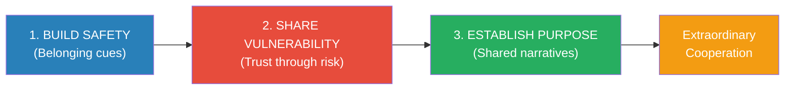
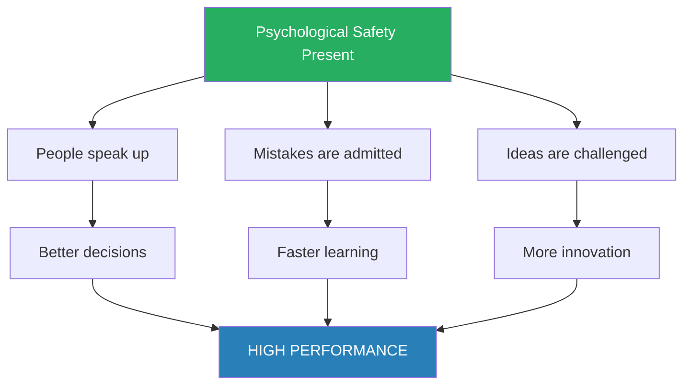
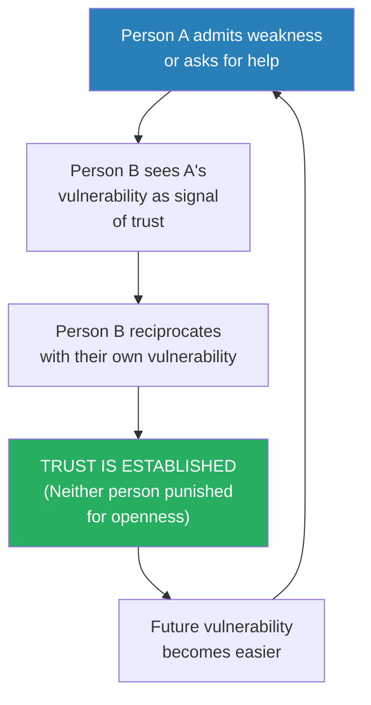
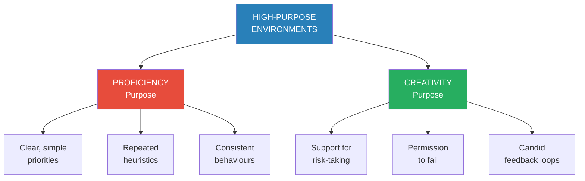
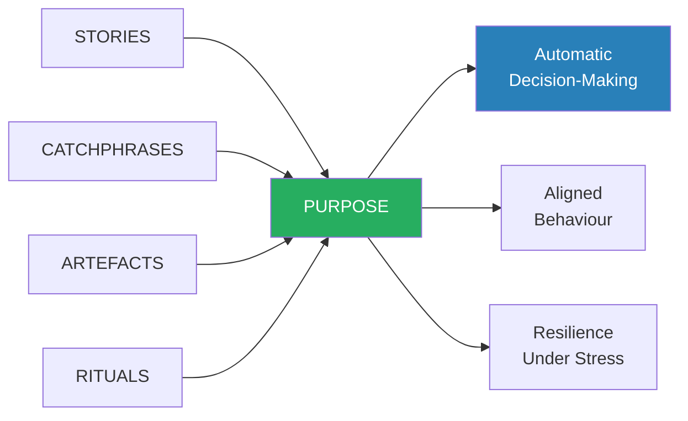
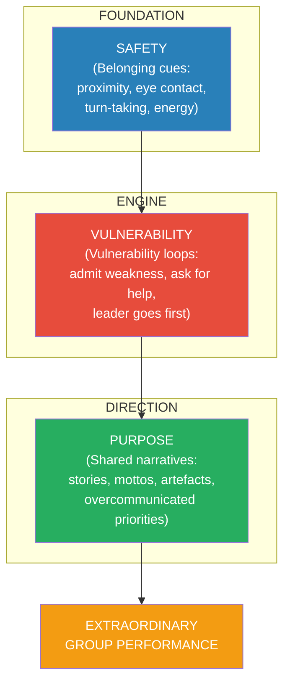

# The Culture Code — Daniel Coyle

> Daniel Coyle spent four years visiting the most successful groups in the world — the Navy SEALs, Pixar, the San Antonio Spurs, IDEO, Google, Zappos — and found that their cultures are not the product of genius individuals or lucky hiring but of specific, learnable skills. These skills are not what you'd expect. They don't involve strategic brilliance, motivational speeches, or elaborate incentive systems. They involve small, repeated signals — belonging cues — that tell each member of the group: you are safe here, we are connected, and we share a future. The three skills are: Build Safety (create belonging through signals of connection), Share Vulnerability (establish trust through mutual risk), and Establish Purpose (create shared meaning through narrative and values). This is the best book on group culture because it is built on observation of what actually works, not theory about what should work. Where Pfeffer tells you how individuals accumulate power, Coyle tells you how groups develop the trust that makes power productive.

---

## About the Author

Daniel Coyle is a New York Times bestselling author and a contributing editor for Outside magazine. He spent four years embedded with some of the most successful groups on earth to research this book, conducting hundreds of interviews and thousands of hours of observation at places like Pixar, the San Antonio Spurs, Navy SEAL Team Six, IDEO, Zappos, the Union Square Hospitality Group, and others. He is also the author of *The Talent Code*, which examines how deep practice and myelination build skill, and *The Little Book of Talent*. His approach is journalistic rather than academic: he goes to where the results are and works backward to find the common causes.

---

## The Big Idea

- Group culture is not about WHO is in the group — it is about <b style="color: #2980b9">the signals the group sends</b>
- Most people believe culture is a product of fate — you either hire the right people and get lucky, or you don't
- Coyle's research destroys that assumption: culture is a set of living relationships working toward a shared goal, and those relationships are built through specific, identifiable behaviours
- The behaviours cluster into three skills, and they work in sequence:

The three skills form a progression — each one enables the next, and none works in isolation.

- <b style="color: #27ae60">Safety enables vulnerability. Vulnerability builds trust. Trust enables shared purpose. Purpose drives extraordinary cooperation.</b>
- The sequence matters: you cannot skip steps
  - Vulnerability without safety feels threatening — people clam up instead of opening up
  - Purpose without trust feels hollow — people nod along without believing
  - Safety without purpose creates comfort without direction — pleasant but stagnant
- Coyle did not develop these three skills from theory — he extracted them by observing what the world's best groups actually do, then tracing those behaviours back to the research that explains why they work
- The framework is descriptive before it is prescriptive: this is what successful cultures do, not what someone in a laboratory thinks they should do

The treemap shows that belonging cues and the vulnerability loop are the two heaviest components in Coyle's framework — they are the foundational behaviours from which everything else grows. Purpose components are lighter because they only become effective once the first two skills are in place.

---

## Key Concepts at a Glance

| Concept | One-line summary |
|---------|-----------------|
| **Belonging Cues** | Small signals (proximity, eye contact, turn-taking, energy, mirroring) that say "you are safe here" |
| **Psychological Safety** | The belief that you won't be punished for making a mistake — Google's #1 predictor of team success |
| **The Bad Apple Experiment** | A single negative person reduces group performance by 30-40%, unless a positive connector counteracts them |
| **Vulnerability Loop** | Person A shares weakness, Person B reciprocates, trust is established through mutual risk |
| **The Nyquist** | The informal connector whose conversations catalyse collaboration across the group |
| **BrainTrust** | Pixar's model: candid feedback on work-in-progress, with NO authority to mandate changes |
| **After Action Review** | The Navy SEALs' post-mission vulnerability ritual where rank disappears and honesty rules |
| **High-Purpose Environments** | Spaces filled with signals that connect present effort to a meaningful future |
| **Overcommunicate Priorities** | Successful groups repeat their priorities obsessively — far more than feels necessary |
| **Embrace the Messenger** | When someone delivers bad news, the group's response determines whether honest communication continues |
| **Heuristics and Catchphrases** | Short, repeatable phrases that encode a group's priorities into daily decisions |
| **Flash Mentoring** | Short, intense mentor-mentee interactions that accelerate learning through vulnerability |

Vulnerability requires the most leader effort and is the hardest to fake, while Safety is the most fragile if neglected — stop sending belonging cues and connection evaporates within days. Purpose is the most visible from outside but takes the least time to build once Safety and Vulnerability are in place.

---

# PART ONE: SKILL 1 — BUILD SAFETY

## Chapter 1: The Good Apples

*Coyle opens with a question that upends conventional wisdom about group performance: what if the chemistry of a successful group has almost nothing to do with the talent of its individual members?*

- Most people think great teams are built by assembling great individuals
- Coyle introduces a series of experiments and real-world observations that show the opposite: <b style="color: #27ae60">the most critical variable is not who is on the team, but how the team interacts</b>
- He begins with a deceptively simple question: why do some groups of ordinary people outperform groups of talented specialists?
- The answer, as he will spend the entire book demonstrating, is that the successful groups send a continuous stream of signals that create a feeling of psychological safety
- These signals are not dramatic — they are tiny, almost invisible behaviours repeated hundreds of times per day

### The Overachieving Kindergartners

- Coyle describes a well-known experiment where groups of kindergartners, business school students, and lawyers competed to build the tallest structure using spaghetti, tape, string, and a marshmallow
- <b style="color: #2980b9">The kindergartners consistently outperformed the business school students and the lawyers</b>
- The business students spent their time on status management:
  - Who was in charge?
  - What were the rules?
  - Who had the best ideas?
  - They engaged in careful, political manoeuvring — managing impressions instead of building the structure
- The kindergartners, by contrast, just started building:
  - No status management, no discussion of hierarchy
  - They stood close together, passed materials back and forth, and iterated rapidly
  - They tried something, it fell, they tried again — no blame, no hesitation
- <b style="color: #27ae60">The kindergartners won not because they were smarter but because they were safer</b>
- They didn't waste cognitive energy on status — they spent it on the task

> [!example] The Spaghetti-Marshmallow Challenge
> - Peter Skillman ran this design challenge with hundreds of groups across professions and age groups
> - Each team had 18 minutes to build the tallest freestanding structure using 20 sticks of spaghetti, one yard of tape, one yard of string, and one marshmallow (which had to be on top)
> - Business school students averaged 10 inches; kindergartners averaged 26 inches
> - The business students spent the first half of their time silently negotiating status — who would lead, who would defer, who had credibility
> - The kindergartners spent zero time on status negotiation — they simply started building, iterating, and adjusting
> - CEOs and lawyers performed similarly to business students; engineers and architects performed well (they understood the structural problem)
> **The lesson:** Groups that waste energy on status games have less energy for the actual work. Safety eliminates the status tax.

> [!tip] Core Insight
> The performance gap between kindergartners and MBAs is not about intelligence — it is about the absence of threat. When no one is worried about looking stupid, all cognitive resources go to the problem.

---

### Will Felps and the Bad Apple Experiment

*A single toxic person can destroy a group's performance — unless one person actively counteracts the poison with belonging cues.*

- <b style="color: #2980b9">Will Felps</b>, an organisational behaviour researcher, designed an experiment to test how one negative individual affects group performance
- He planted an actor (named Nick) into project teams and had him behave in one of three toxic ways:
  1. <b style="color: #e74c3c">The Jerk</b> — aggressive, dismissive, belittling other people's ideas
  2. <b style="color: #e74c3c">The Slacker</b> — disengaged, not contributing, checking his phone, slouching
  3. <b style="color: #e74c3c">The Downer</b> — pessimistic, complaining, draining the group's energy with negativity
- The results were dramatic and consistent:
  - <b style="color: #e74c3c">A single bad apple reduced group performance by 30-40%</b>
  - This happened regardless of how talented the other group members were
  - The bad apple's behaviour was contagious — within 30 minutes, other group members began mirroring the negative behaviour
  - With the Jerk, people became combative or withdrawn
  - With the Slacker, people reduced their own effort
  - With the Downer, people became pessimistic and disengaged
- The contagion effect is the crucial finding: <b style="color: #e74c3c">one person's behaviour doesn't just affect their own output — it infects the entire group's dynamics</b>

> [!example] Jonathan the Positive Connector
> - In one group, the bad apple had no effect at all — the group performed as well as control groups without a disruptor
> - The reason was a single team member named Jonathan
> - Jonathan was not the smartest or most experienced person in the room — he was warm, attentive, and relentlessly positive
> - When Nick (the bad apple) was being a Jerk, Jonathan would deflect with humour and redirect to the task
> - When Nick was Slacking, Jonathan would lean in, make eye contact with others, and energise the group
> - When Nick was being a Downer, Jonathan would acknowledge the concern and reframe it constructively
> - Jonathan's behaviours were simple: asking questions, making eye contact, responding to others' ideas with enthusiasm, using physical proximity to create connection
> - He didn't confront Nick or try to fix him — he simply generated enough belonging cues to override the toxicity
> **The lesson:** One positive connector can neutralise one bad apple — but only through active, consistent belonging-cue generation, not through ignoring or confronting the disruptor.

- The Jonathan finding reveals something important about how safety works:
  - Safety is not a passive state — it is an active process that requires constant maintenance
  - One person, through deliberate behaviour, can create a microclimate of safety even in a toxic environment
  - But it requires effort — Jonathan was not just being himself, he was actively counteracting a threat
  - <b style="color: #27ae60">Safety is a muscle, not a mood — it must be exercised continuously</b>

A single toxic individual drops group performance by 30-40% regardless of toxic style, but one positive connector (Jonathan) can almost completely neutralise the effect — restoring performance to 97% of baseline through nothing more than active belonging-cue generation.

---

## Chapter 2: The Billion-Dollar Day When Nothing Happened

*Coyle reveals the invisible architecture of belonging by showing what happens when a group sends the right signals, even when no dramatic events occur.*

- Coyle visits the San Antonio Spurs — the most consistently successful franchise in modern NBA history — and notices something strange:
  - There are no inspirational posters, no rah-rah team meetings, no screaming coaches
  - Instead, there is a quiet, almost eerie atmosphere of connection
  - Players touch each other constantly — a hand on the shoulder, a pat on the back, a fist bump after a play
  - Coach Gregg Popovich makes intense eye contact with players during conversations
  - Everyone — from the star player to the fifteenth man on the roster — receives the same quality of attention
- <b style="color: #2980b9">Belonging cues</b> are the specific behaviours that signal connection, safety, and shared future:

| Cue | What It Looks Like | What It Signals |
|-----|-------------------|----------------|
| **Close physical proximity** | People sit near each other, lean in, touch briefly | "We are connected" |
| **Eye contact** | Frequent, mutual, comfortable | "I see you and you matter" |
| **Turn-taking** | Everyone speaks; no one dominates | "Your voice is valued" |
| **Short, energetic exchanges** | Quick back-and-forth rather than long monologues | "We are in sync" |
| **Active listening** | Nodding, echoing, asking follow-up questions | "I am paying attention to you" |
| **Laughter** | Shared, frequent, genuine | "We enjoy being together" |
| **Attentive courtesies** | Thank-yous, door-holding, remembering names | "I notice and respect you" |
| **Mirroring** | Unconsciously matching posture, gestures, rhythm | "We are alike" |

- <b style="color: #27ae60">These cues matter more than the content of what is being discussed</b>
- Research shows that group outcomes can be predicted from the pattern of belonging cues exchanged in the first five minutes of a meeting — before any substantive discussion has occurred
- This is a radical claim: the words barely matter compared to the signals

Eye contact and active listening emerge as the highest-impact belonging cues in Pentland's sociometric research, while mirroring and courtesies — though lower — serve as the unconscious substrate that signals "we are alike" without either party being aware of it.

### The Neuroscience of Belonging

- Belonging cues work because the human brain is wired to constantly scan the environment for threat:
  - The amygdala — the brain's threat-detection centre — runs a continuous background process: Am I safe? Do I belong? Will I be punished?
  - When the amygdala detects threat (social exclusion, status challenges, unpredictability), it triggers a fight-or-flight response that diverts resources away from higher-order thinking
  - <b style="color: #e74c3c">When people feel unsafe, their brains literally become less capable of creative thought, collaboration, and learning</b>
  - When belonging cues signal safety, the amygdala calms down, and the prefrontal cortex — the centre of complex thinking, creativity, and collaboration — comes fully online
- This is why the kindergartners beat the MBAs: the kindergartners' amygdalae were quiet (no status threat), so their prefrontal cortices were fully available for the task
- The neuroscience explains a phenomenon everyone has experienced but rarely understood:
  - You walk into a meeting and immediately feel tension — before anyone speaks, your amygdala has already scanned the room and detected a threat
  - You walk into a different meeting and feel energised — same content, different signals
  - The difference is not in the agenda — it is in the belonging cues (or absence of them)
- Coyle cites research by Alex Pentland at MIT's Human Dynamics Lab:
  - Pentland's team used electronic badges (sociometers) to track interaction patterns — who talked, who listened, who faced whom, how energetic the exchanges were
  - They could predict team performance with remarkable accuracy from the interaction patterns alone — without knowing anything about the content of the conversations
  - <b style="color: #27ae60">The pattern of signals predicted performance better than the quality of ideas being discussed</b>
  - This is a staggering finding: it means that HOW a group communicates matters more than WHAT they communicate

> [!tip] Core Insight
> Belonging cues are not about being nice — they are about telling the brain it can stop scanning for threats and start collaborating. Safety is the foundation of cognitive performance.

The force diagram maps the causal chain Coyle discovered: six types of belonging cues feed into psychological safety, which enables trust, which enables shared purpose, which produces extraordinary cooperation. The cues also reinforce each other — proximity generates energy, eye contact deepens listening, and turn-taking encourages mirroring.

---

## Chapter 3: The Christmas Truce, the One-Hour Experiment, and the Missileers

*Three seemingly unrelated stories reveal the same mechanism: belonging cues create cooperation even between enemies, and removing them destroys cooperation even between allies.*

### The Christmas Truce of 1914

> [!example] The Christmas Truce (December 1914)
> - During World War I, British and German soldiers in the trenches of Flanders spontaneously stopped fighting on Christmas Eve
> - It began with small signals: German soldiers lit candles on their trench parapets and began singing "Stille Nacht"
> - British soldiers responded by singing English carols
> - Gradually, soldiers on both sides ventured into no-man's land — exchanging cigarettes, sharing food, even playing football
> - The truce was not organised by generals or diplomats — it emerged from the ground up, driven by the belonging cues the soldiers exchanged
> - The truce persisted for days in some sectors and had to be actively broken by officers who rotated units and ordered artillery barrages
> **The lesson:** Belonging cues are so powerful they can override years of nationalist propaganda and the immediate threat of death. The signals of connection trumped the signals of enmity.

- The Christmas Truce illustrates a profound point about safety:
  - The soldiers did not negotiate a ceasefire — they signalled their way into one
  - Each small cue (a song, a wave, a shared cigarette) was answered by a reciprocal cue
  - The accumulation of cues created a sense of connection that overwhelmed the context of war
  - <b style="color: #27ae60">Belonging cues don't require shared language, shared culture, or shared history — they are pre-linguistic and universal</b>
- The truce also reveals the FRAGILITY of belonging:
  - When generals rotated troops and ordered artillery strikes, the truce collapsed
  - New soldiers who hadn't exchanged cues with the enemy had no difficulty fighting them
  - The same men who had shared cigarettes days earlier were back to killing each other
  - <b style="color: #e74c3c">Belonging cues must be continuously refreshed — stop sending them and the connection evaporates</b>

---

### The One-Hour Experiment

- Coyle describes research where strangers were given a list of increasingly personal questions to ask each other
- The questions escalated from superficial ("What did you do today?") to deeply personal ("When did you last cry in front of another person?")
- After just 45 minutes of exchanging these vulnerability-based questions, participants reported feeling closer to their partner than people they had known for years
- The mechanism: the questions created a rapid-fire sequence of micro-vulnerability loops
  - Each personal answer was a small act of vulnerability
  - Each reciprocation was a small act of trust
  - The cumulative effect was a sense of deep connection, built in less than an hour
- <b style="color: #2980b9">This experiment (developed by psychologist Arthur Aron) demonstrates that belonging is not a function of time — it is a function of signal density</b>
- You can know someone for ten years and feel no connection (if the signals were never exchanged), or know someone for one hour and feel deeply bonded (if the signals were dense and reciprocal)

---

### The Missileers

- Coyle contrasts the Christmas Truce with a very different story: the US Air Force missile crews responsible for nuclear ICBMs
- These crews — called missileers — had a catastrophic morale and performance problem:
  - Officers cheated on proficiency tests
  - Discipline collapsed
  - Drug use was rampant
  - A series of scandals revealed systemic dysfunction
- The missileers had everything the conventional wisdom says you need: elite selection, extensive training, clear mission, good pay
- What they lacked was belonging cues:
  - They worked in isolated underground bunkers, often in pairs with no one else around
  - Their work felt meaningless — they would (hopefully) never actually launch the missiles
  - Leadership treated them as interchangeable parts, not as valued team members
  - There was no sense of connection, no shared future, no signals that said "you matter"
- <b style="color: #e74c3c">The missileers prove the inverse of the Christmas Truce: remove belonging cues and even highly trained, well-compensated professionals will disintegrate</b>

---

## Chapter 4: How to Build Belonging

*Coyle moves from describing belonging to prescribing it — showing how the leaders of great groups actively construct safety through deliberate behaviours.*

### Gregg Popovich and the Spurs

> [!example] Popovich's Personal Connections
> - Gregg Popovich, coach of the San Antonio Spurs, is famous for his brusque media interactions — but inside the team, he is the opposite
> - He personally researches every player's background — family, upbringing, culture, interests — and initiates conversations about those topics
> - When Tim Duncan's father died, Popovich flew to the Virgin Islands for the funeral — not as a coach but as a friend
> - He takes players to dinner regularly — not to talk strategy but to talk about life, politics, food, family
> - When international players join the team, Popovich studies their home country's cuisine and takes them to authentic restaurants
> - His food obsession is not trivial — it is a belonging cue delivery system: "I care about you as a person, not just as a player"
> **The lesson:** Popovich's personal investment in players signals: you are not a resource to be optimised; you are a human being I am connected to. That signal creates the safety that enables everything else.

- Popovich's approach reveals several principles of safety-building:
  - <b style="color: #27ae60">Personal connection comes before professional expectations</b> — he invests in the relationship before asking for performance
  - <b style="color: #2980b9">The leader's behaviour sets the tone for the entire group</b> — if the leader signals safety, the group follows
  - Consistency matters more than grand gestures — Popovich doesn't do one big team-building event per year; he sends belonging cues daily
  - He combines warmth with demanding standards — belonging does not mean lowering expectations
- The Spurs' results speak for themselves:
  - Five NBA championships across three decades
  - The longest run of sustained excellence in modern professional sports
  - A culture so strong that new players — including international players who speak different languages — assimilate quickly
  - Players consistently describe the Spurs as "different" from every other team they've played for
- Popovich also does something many leaders avoid: <b style="color: #2980b9">he tells the truth brutally in private and praises generously in public</b>
  - He will scream at a player during practice for a lazy play — but the player knows the screaming comes from investment, not contempt
  - The same player will hear Popovich, at dinner that evening, ask about his family, his hobbies, his childhood
  - The combination — high standards paired with deep personal investment — is what Coyle calls the "warmth and toughness" loop
  - <b style="color: #e74c3c">Toughness without warmth feels like bullying. Warmth without toughness feels like indifference. The combination signals: "I care about you AND I expect your best."</b>

> [!example] Tony Hsieh and the Collisions of Downtown Las Vegas
> - Tony Hsieh, founder of Zappos, bought a large section of downtown Las Vegas and redesigned it to maximise what he called "collisions" — unplanned encounters between people
> - He shortened hallways, created shared spaces, removed physical barriers between departments, and hosted cross-group events
> - He measured collisions per hour and used the data to redesign spaces
> - Hsieh's theory: innovation and community emerge from the number of personal interactions people have, not from strategic planning
> - The result: the area saw a measurable increase in new business formation and community engagement
> - Hsieh applied the same principle at Zappos headquarters — removing walls, creating common areas, designing the building so people had to pass through shared spaces
> **The lesson:** Safety can be engineered at the level of physical space. Proximity creates collisions, collisions create connection, connection creates safety.

---

### Google's Project Aristotle

*Google spent years trying to crack the code of team performance — and discovered that psychological safety dwarfed every other variable.*

> [!example] Google's Project Aristotle (2012-2015)
> - Google's People Analytics team studied over 180 teams across the company
> - They measured everything: team composition, personality types, educational backgrounds, tenure, social connections outside work
> - None of the obvious variables predicted team performance
> - Teams with superstar engineers sometimes failed; teams with average engineers sometimes excelled
> - The breakthrough came when they looked at group norms — the unwritten rules governing how team members interact
> - The #1 predictor of team success was **psychological safety** — whether team members felt safe to take risks and be vulnerable
> - Psychological safety manifested in observable behaviours: equal turn-taking in conversations, social sensitivity (members could read each other's emotional states from tone of voice and facial expressions), and willingness to admit mistakes
> **The lesson:** Google's data confirmed at massive scale what Coyle found in every group he studied: safety is the foundation. Without it, talent is wasted.

- <b style="color: #2980b9">Psychological safety</b>, as defined by Harvard's Amy Edmondson, is the shared belief that the team is safe for interpersonal risk-taking
- It does not mean being comfortable all the time:
  - It means being safe to disagree, to challenge, to admit ignorance
  - Teams with high psychological safety argue more, not less — but the arguments are about ideas, not about people
  - <b style="color: #e74c3c">Teams without psychological safety are not harmonious — they are silent. And silence is not agreement; it is fear.</b>

When psychological safety is present, three behaviours emerge — speaking up, admitting mistakes, and challenging ideas — and each one drives a different performance outcome.

---

> [!abstract] How to Build Safety — Coyle's Principles
> 1. **Overcommunicate listening** — orient your body, make eye contact, avoid interrupting, use affirmative language ("yes," "right," "go on")
> 2. **Spotlight fallibility early** — say "I might be wrong" or "What am I missing?" before asking others to share
> 3. **Embrace the messenger** — when someone brings bad news, thank them publicly and visibly
> 4. **Preview future connection** — use language that signals a long-term relationship: "when we..." not "if we..."
> 5. **Overdo thank-yous** — express gratitude at a level that feels excessive to you; it won't feel excessive to the receiver
> 6. **Be painstaking in the hiring process** — treat hiring as the most important decision the group makes
> 7. **Eliminate bad apples** — do not tolerate chronic negativity, regardless of the person's individual talent
> 8. **Create safe, collision-rich spaces** — design physical environments that force interaction
> 9. **Make sure everyone has a voice** — actively solicit input from quiet members
> 10. **Pick up trash** — leaders who do menial tasks signal: "No task is beneath me, and I am part of this group"

---

# PART TWO: SKILL 2 — SHARE VULNERABILITY

## Chapter 5: The Vulnerability Loop

*Trust doesn't come before vulnerability — vulnerability comes before trust. This is one of the most counterintuitive and important findings in the book.*

- Most people — and most leaders especially — believe the sequence is: first establish trust, then be vulnerable
- Coyle's research shows the reverse: <b style="color: #27ae60">vulnerability is the pathway to trust, not the product of it</b>
- The mechanism is the <b style="color: #2980b9">vulnerability loop</b>:

The vulnerability loop is self-reinforcing — each completed loop makes the next one easier, building trust exponentially over time.

- The loop has a critical requirement: <b style="color: #e74c3c">it must not be punished</b>
  - If Person A shares a weakness and Person B exploits it, the loop breaks permanently
  - This is why safety (Skill 1) must come before vulnerability (Skill 2) — the loop only works in a safe environment
- <b style="color: #e74c3c">Most leaders believe the opposite: "I need to establish credibility BEFORE I can be vulnerable."</b>
  - This instinct is understandable but wrong
  - Leaders who project invulnerability create groups where no one admits mistakes
  - Leaders who model vulnerability create groups where everyone admits mistakes
  - <b style="color: #2980b9">Leaders must go first</b> — if the leader doesn't model vulnerability, no one else will

### The Science Behind Vulnerability

- Vulnerability triggers a neurochemical cascade:
  - When Person A is vulnerable, it signals to Person B's brain: "This person trusts me enough to expose a weakness"
  - Person B's brain releases oxytocin — the "bonding hormone" — which creates a feeling of connection and trust
  - This feeling of trust lowers Person B's defences and makes them more likely to reciprocate
  - The reciprocation triggers the same cascade in Person A's brain
  - <b style="color: #27ae60">Vulnerability is not a sign of weakness — it is a signal of trust that triggers a biochemical bonding response</b>
- The vulnerability loop also has a timing element:
  - The reciprocation must happen relatively quickly — if Person A is vulnerable and Person B waits too long to respond, the loop breaks
  - Silence after vulnerability feels like rejection, even if it isn't
  - <b style="color: #e74c3c">The most damaging response to vulnerability is not attack — it is indifference</b>
  - A person who is attacked after being vulnerable at least knows where they stand; a person who is ignored has no idea, and they will not risk being vulnerable again
- Coyle also notes that vulnerability loops have a compounding effect:
  - The first loop is the hardest — both parties are taking a genuine risk
  - Each subsequent loop requires less courage because the pattern has been established
  - Over time, the loops become automatic — team members default to honesty because they have learned that honesty is rewarded
  - This is how vulnerability becomes a cultural norm rather than an individual act of bravery

---

## Chapter 6: The Navy SEALs and the Vulnerability Habit

*The world's most elite warriors are also the world's most practised at admitting failure — and that is not a coincidence.*

> [!example] The Navy SEALs' After Action Review (AAR)
> - After every mission — whether successful or disastrous — SEAL teams conduct a debrief called the After Action Review
> - The rules are absolute: rank is irrelevant. The newest team member has the same obligation to speak as the team commander
> - The commander speaks FIRST: "Here's what I got wrong today. Here's what I should have done differently."
> - This is not a performance — the commander genuinely analyses their own mistakes in front of the team
> - By going first, the commander creates permission for everyone else to do the same
> - The result: mistakes are surfaced immediately, not after they have been repeated three times
> - SEAL teams iterate faster than any other military unit because their vulnerability practice converts errors into learning in real time
> **The lesson:** The AAR is a formalised vulnerability loop. By making vulnerability a ritual — not a one-off act of courage — the SEALs turn trust-building into a habit.

- The AAR illustrates several key principles of vulnerability:
  - **The leader goes first** — this is non-negotiable. If the leader doesn't model vulnerability, the ritual becomes a performance
  - **It's a habit, not an event** — the SEALs don't do this occasionally when things go wrong; they do it after every single mission
  - **Rank disappears** — the vulnerability loop requires equality. If a junior member can't criticise a senior member, the loop breaks
  - <b style="color: #e74c3c">The discomfort is the point</b> — vulnerability that doesn't feel uncomfortable isn't really vulnerability

---

### Cooperation vs. Trust Experiments

- Coyle describes research showing that cooperation and trust emerge from vulnerability exchanges, not from competence displays:
  - In experiments where participants were given the choice to cooperate or compete, the single strongest predictor of cooperation was whether one participant had been vulnerable first
  - It didn't matter if the vulnerability was planned or accidental — what mattered was that one person exposed a weakness and the other had the opportunity to exploit it but chose not to
- This finding has a dark implication: <b style="color: #e74c3c">groups that never practise vulnerability never build deep trust, no matter how long they work together</b>
  - Many long-standing teams operate with surface-level politeness that masquerades as trust
  - They are "nice" to each other but never honest — never willing to say "I disagree" or "I made a mistake"
  - These teams can function under normal conditions but collapse under stress, because their trust has never been tested

> [!example] The Airplane Cockpit Problem
> - In airline disasters, investigators repeatedly found that co-pilots noticed problems but did not speak up because they were afraid to challenge the captain
> - The hierarchy of the cockpit — captain as authority, co-pilot as subordinate — suppressed vulnerability
> - Co-pilots who noticed something wrong would hint, suggest, or use indirect language instead of saying clearly: "Captain, I think we have a problem"
> - In multiple crashes, the co-pilot's hints were too subtle for the captain to notice, and the plane went down
> - The aviation industry responded with Crew Resource Management (CRM) training — which explicitly teaches vulnerability behaviours: speaking up, admitting confusion, challenging authority
> - CRM training has dramatically reduced pilot-error crashes — not by making pilots more skilled, but by making cockpits more vulnerable
> **The lesson:** When hierarchy suppresses vulnerability, catastrophic errors go unchallenged. The fix is not better individuals but better interaction norms.

> [!tip] Core Insight
> Trust is not built by working together for a long time. It is built by being vulnerable together — even once. A single authentic vulnerability exchange creates more trust than a year of polite collaboration.

---

## Chapter 7: The BrainTrust and Building Cooperation Through Vulnerability

*Pixar's BrainTrust is the most elegant vulnerability mechanism Coyle encounters — a system that makes brutal honesty feel like a gift.*

> [!example] Pixar's BrainTrust
> - Every Pixar film goes through the BrainTrust — a meeting where directors present rough cuts and receive candid feedback from a group of senior creative leaders
> - The critical rule: **the BrainTrust has NO authority to mandate changes**
> - The BrainTrust can only offer observations, reactions, and suggestions — the director is free to take or leave everything
> - This removes the threat: feedback isn't an order from a boss, it's a gift from a peer
> - The paradox: by removing the power to compel change, the BrainTrust makes directors MORE receptive to the feedback
> - Directors know the feedback is genuine because the givers have nothing to gain from it — no authority, no credit, no political advantage
> - Ed Catmull, Pixar co-founder: "Early on, all our movies suck"
> - The BrainTrust is the mechanism by which they stop — every Pixar film has been through the process, and every Pixar film has been commercially and critically successful
> **The lesson:** The BrainTrust works because it separates feedback from authority. When feedback carries no threat of coercion, vulnerability becomes possible — and vulnerability makes the feedback useful.

- The BrainTrust model reveals several principles about vulnerability in practice:
  - <b style="color: #27ae60">Separate feedback from authority</b> — when the person giving feedback can also mandate changes, the receiver's defence mechanisms activate and learning stops
  - <b style="color: #2980b9">Focus on the project, not the person</b> — BrainTrust feedback is about the film, never about the director's competence
  - **Make it a ritual** — the BrainTrust happens at predictable intervals for every film, removing the stigma of "we're doing this because your film is in trouble"
  - **Use candour, not brutality** — the tone is direct but caring, like a doctor delivering a diagnosis honestly because they want the patient to get better

---

### How the BrainTrust Almost Failed

> [!example] The BrainTrust's Near-Death Experience
> - When Pixar was acquired by Disney, Disney executives tried to implement the BrainTrust model for Disney Animation
> - It didn't work — the sessions became polite, surface-level, and useless
> - The problem: Disney's BrainTrust members were nervous about offending the directors, and the directors were nervous about looking incompetent
> - Safety was missing — the Disney team hadn't built the foundation of belonging cues that Pixar had spent decades developing
> - The fix came when Pixar leaders (including John Lasseter and Ed Catmull) spent months at Disney Animation, personally modelling vulnerability and creating safety
> - Gradually, the Disney BrainTrust began to function — and Disney Animation's subsequent films (Frozen, Zootopia, Moana) reflected the improvement
> **The lesson:** You cannot transplant a vulnerability practice into a culture that lacks safety. The BrainTrust is a Skill 2 tool that requires Skill 1 as its foundation.

---

### Vulnerability Is Not Weakness

- <b style="color: #e74c3c">The most common misunderstanding about vulnerability in professional settings: it means weakness</b>
- Coyle argues the opposite: <b style="color: #27ae60">vulnerability is the behaviour of the MOST secure individuals in the group</b>
- Consider what vulnerability actually requires:
  - It takes more confidence to say "I don't know" than to bluff your way through
  - It takes more courage to admit a mistake than to cover it up
  - It takes more strength to ask for help than to struggle alone
  - It takes more security to say "you were right and I was wrong" than to defend a bad position
- <b style="color: #2980b9">The weakest members of a group are not the ones who admit mistakes — they are the ones who HIDE them</b>
- Hiding mistakes is a sign of fear, not strength — it signals that the person believes they will be punished for honesty

| Behaviour | What It Signals | What It Actually Is |
|-----------|----------------|---------------------|
| Admitting a mistake | "I'm weak" (perceived) | Security and trust in the group |
| Hiding a mistake | "I'm competent" (perceived) | Fear of punishment |
| Asking for help | "I'm incapable" (perceived) | Confidence that the group values learning |
| Struggling alone | "I'm self-sufficient" (perceived) | Isolation driven by insecurity |

This table reveals the fundamental misalignment between how vulnerability is perceived and what it actually represents — a misalignment that Coyle argues is responsible for enormous dysfunction in organisations.

---

## Chapter 8: The Nyquist and Flash Mentoring

*Some individuals serve as the connective tissue of a group — and their value is almost entirely invisible to traditional metrics.*

- Coyle introduces the concept of <b style="color: #2980b9">the Nyquist</b> — named after Harry Nyquist, a Bell Labs engineer whose primary contribution was not his own inventions but his ability to catalyse other people's breakthroughs
- The Nyquist is the person in a group who:
  - Has warm, active connections across multiple subgroups
  - Asks lots of questions and genuinely listens to the answers
  - Makes people feel safe enough to share half-formed ideas
  - Connects people who should be talking but aren't
  - Creates vulnerability loops naturally, through their conversational style

> [!example] Harry Nyquist at Bell Labs
> - Bell Labs in the 1920s-40s was one of the most innovative organisations in history — producing the transistor, the solar cell, the laser, and information theory
> - When researchers studied what made Bell Labs so productive, they expected to find that the most successful scientists were the most brilliant individuals
> - Instead, they found that the most successful scientists were the ones who ate lunch with Harry Nyquist
> - Nyquist was a warm, curious Swedish engineer who asked good questions, listened deeply, and connected people across disciplinary boundaries
> - He didn't invent the transistor himself — but the people who did were in his orbit, and his conversations had helped them see connections they wouldn't have found alone
> **The lesson:** The most valuable person in an innovative group may not be the most talented — they may be the best connector. Nyquists create the conditions for other people's breakthroughs.

- The Nyquist concept has implications for how groups should think about their social architecture:
  - <b style="color: #27ae60">Groups should identify and protect their Nyquists</b> — they are often invisible on org charts but indispensable to collaboration
  - Nyquists cannot be hired to order — they emerge when the culture supports warm, cross-group connection
  - If your group has no Nyquist, that itself is a symptom of insufficient safety

---

### Flash Mentoring

- Coyle also describes <b style="color: #2980b9">flash mentoring</b> — short, intense mentor-mentee interactions that accelerate learning through rapid vulnerability exchanges
- Traditional mentoring unfolds slowly over months or years
- Flash mentoring compresses the vulnerability loop:
  - Mentee asks a specific question
  - Mentor shares openly — including their own failures and uncertainties
  - The exchange is brief (minutes to an hour), intense, and complete
- <b style="color: #27ae60">Flash mentoring works because it lowers the stakes of vulnerability</b> — a short interaction feels less risky than a long-term relationship where mistakes might be remembered

> [!abstract] How to Share Vulnerability — Coyle's Principles
> 1. **Make sure the leader is vulnerable first and often** — the single most important behaviour for building trust
> 2. **Overcommunicate expectations** — tell people you expect them to be honest, and mean it
> 3. **Deliver the negative stuff in person** — difficult conversations require the belonging cues that only face-to-face interaction provides
> 4. **When forming new groups, focus on two critical moments** — the first vulnerability and the first disagreement (how these are handled sets the norm forever)
> 5. **Listen like a trampoline** — don't just absorb what people say; add energy and ask questions that propel the conversation further
> 6. **In conversation, resist the temptation to reflexively add value** — sometimes the most powerful response is silence and attention
> 7. **Use candour-generating practices like AARs and BrainTrusts** — formalise vulnerability so it becomes a habit, not a heroic act
> 8. **Aim for candour over brutal honesty** — the goal is honest feedback delivered with care, not honesty as a weapon
> 9. **Embrace discomfort** — vulnerability that doesn't feel uncomfortable isn't really vulnerability
> 10. **Create vocabulary for vulnerability** — give the practice a name ("hot wash," "BrainTrust," "retro") so it becomes a normal process rather than an emotional event

- A critical nuance about vulnerability practices:
  - They must be genuine, not performative — people can detect fake vulnerability instantly
  - A leader who "admits" a trivial mistake to look humble while hiding a real one is performing vulnerability, not practising it
  - <b style="color: #e74c3c">Performative vulnerability is worse than no vulnerability at all — it teaches the group that honesty is a game, not a value</b>
  - The test: are you sharing something that genuinely makes you uncomfortable? If not, it is not vulnerability

---

# PART THREE: SKILL 3 — ESTABLISH PURPOSE

## Chapter 9: The Characteristics of High-Purpose Environments

*Purpose is not a mission statement on a wall — it is a set of signals that link the present to a meaningful future, repeated so often they become the group's operating system.*

- Coyle distinguishes between two types of purpose:
  - <b style="color: #e74c3c">Decorative purpose</b> — a mission statement framed in the lobby, mentioned in orientation, then forgotten
  - <b style="color: #27ae60">Functional purpose</b> — a set of signals so deeply embedded in daily behaviour that they guide decisions automatically
- <b style="color: #2980b9">High-purpose environments</b> are filled with signals that constantly connect current effort to future meaning
- These signals include:
  - **Stories** — narratives about the group's history, values, and defining moments
  - **Mottos and catchphrases** — short, memorable phrases that encode priorities
  - **Artefacts** — physical objects that represent the group's identity and history
  - **Rituals** — repeated practices that reinforce connection and values
  - **Symbols** — visual cues that remind people what matters

### The Two Types of Purpose: Proficiency vs. Creativity

- Coyle identifies a crucial distinction between two types of high-purpose environments:

Two types of high-purpose environments require fundamentally different approaches — proficiency demands consistency and repetition, while creativity demands safety to fail and iterate.

| Dimension | Proficiency Purpose | Creativity Purpose |
|-----------|--------------------|--------------------|
| **Goal** | Reliable execution of known tasks | Generation of novel solutions |
| **Signals** | Clear heuristics, repeated priorities | Permission to fail, candid feedback |
| **Leader's role** | Create clarity and consistency | Create safety for risk-taking |
| **Examples** | Navy SEALs, airline crews, restaurant teams | Pixar, IDEO, Google X |
| **Danger when missing** | Inconsistency, errors, drift | Stagnation, fear of failure, groupthink |

- <b style="color: #27ae60">The key insight: you must know which type of purpose your group needs</b>
  - If your group's primary task is reliable execution (surgery, military operations, customer service), you need proficiency purpose — clear, repeated heuristics
  - If your group's primary task is innovation (product development, creative work, research), you need creativity purpose — safety to experiment and fail
  - Most groups need both — and the skill is knowing when to switch between them

---

## Chapter 10: How to Lead for Proficiency

*For groups that need reliable execution, purpose comes from repeated, simple priorities that function as decision-making shortcuts.*

### Johnson & Johnson's Credo

> [!example] The Tylenol Crisis and J&J's Credo (1982)
> - In 1943, Robert Wood Johnson wrote a one-page document called "Our Credo" that laid out J&J's priorities in explicit order:
>   - First: customers (doctors, nurses, patients, mothers)
>   - Second: employees
>   - Third: communities where employees live and work
>   - Fourth: shareholders
> - For forty years, the Credo was read, discussed, and debated regularly throughout the company — not as a decorative exercise, but as a decision-making framework
> - In 1982, seven people in Chicago died from tainted Tylenol capsules — someone had laced them with cyanide
> - J&J's response was immediate: they recalled 31 million bottles of Tylenol nationwide, at a cost exceeding $100 million, before any government agency asked them to
> - The decision was made in hours, not weeks — and it was made at lower levels of the organisation, not just by the CEO
> - Why? Because the Credo had been so deeply embedded in the culture that when crisis hit, the answer was obvious: customers first, always
> - The recall is now considered one of the greatest examples of corporate crisis management in business history
> **The lesson:** Purpose works best when it's embedded so deeply that it becomes an automatic decision-making framework. J&J employees didn't need to call headquarters — the Credo had already told them what to do.

- The Credo illustrates what Coyle calls <b style="color: #2980b9">high-proficiency purpose</b>:
  - Simple, clear, and hierarchical — there is no ambiguity about what comes first
  - Repeated constantly — employees encounter it in orientation, in meetings, in annual reviews, on the walls
  - Debated regularly — J&J actually holds "Credo challenge" sessions where employees question whether the priorities are still right
  - <b style="color: #27ae60">Tested under pressure</b> — the Credo's value was proven not in calm times but in crisis

---

### Overcommunicate Priorities

- Successful groups don't state their priorities once and assume everyone remembers
- <b style="color: #2980b9">They repeat them obsessively — far more than feels necessary</b>
- Coyle found that the leaders of the most successful groups mentioned their core priorities an average of <b style="color: #27ae60">ten times more often</b> than the leaders of average groups
- This felt redundant to the leaders but was perceived by team members as clarity and consistency
- <b style="color: #e74c3c">If you're tired of saying it, your team is just starting to hear it</b>

The mechanism behind overcommunication:
- Human memory is unreliable — people forget priorities almost immediately after hearing them
- Competing signals (emails, meetings, crises) constantly push priorities out of working memory
- Repetition moves priorities from short-term memory to long-term memory, and eventually to automatic behaviour
- The leader who says their priority once is communicating information; the leader who says it a hundred times is building culture

> [!example] Danny Meyer and the "Language of Priorities"
> - Danny Meyer, founder of Union Square Hospitality Group and Shake Shack, is obsessive about the language his teams use
> - He has a set of catchphrases that encode his priorities — and he repeats them constantly:
>   - "Read the guest" — pay attention to what the guest needs, not what the manual says
>   - "Writing a great last chapter" — every guest interaction should end well, regardless of what went wrong earlier
>   - "Charitable assumption" — when a colleague does something confusing, assume positive intent first
>   - "Are you an agent or a gatekeeper?" — agents find ways to say yes; gatekeepers find reasons to say no
> - Meyer doesn't just say these phrases in speeches — he uses them in daily conversation, in one-on-one feedback, in hiring interviews
> - New employees hear these phrases dozens of times in their first week — and they begin using them themselves
> - The phrases function as decision-making shortcuts: when a waiter encounters an ambiguous situation, "read the guest" tells them exactly what to do
> **The lesson:** Catchphrases are not slogans — they are compressed decision-making algorithms. By repeating them obsessively, Meyer programs his team's instincts.

---

### Heuristics: Simple Rules for Complex Situations

- Coyle finds that high-proficiency groups rely on <b style="color: #2980b9">heuristics</b> — simple rules that guide behaviour in ambiguous situations:
  - If in doubt, prioritise X over Y
  - When you see this, do that
  - Never do X, always do Y
- Heuristics work because they reduce the cognitive load of decision-making:
  - Instead of analysing every situation from first principles, team members apply the heuristic
  - This makes decisions faster, more consistent, and more aligned with the group's values
  - <b style="color: #27ae60">The best heuristics are short enough to memorise and clear enough to apply without interpretation</b>
- Examples from Coyle's research:
  - SEAL teams: "Slow is smooth, smooth is fast" (don't rush; deliberate action is faster than panicked action)
  - Zappos: "Create fun and a little weirdness" (unusual customer interactions are encouraged, not punished)
  - IDEO: "Fail early, fail often" (rapid prototyping is valued over perfect planning)

---

## Chapter 11: How to Lead for Creativity

*Creative groups need a different kind of purpose — one that gives permission to fail, encourages candid feedback, and protects the space for experimentation.*

- If proficiency purpose is about clarity and consistency, creativity purpose is about safety and iteration
- Creative groups need to hear a different set of signals:
  - "It's okay to fail" — and see evidence that failure is actually tolerated
  - "Keep trying" — persistence through difficulty is expected and rewarded
  - "Give honest feedback" — sugarcoating is more dangerous than bluntness

### Pixar's Creative Purpose Engine

> [!example] Ed Catmull and the "Ugly Baby" Philosophy
> - Ed Catmull, Pixar co-founder, uses the metaphor of the "ugly baby" to describe every new creative project
> - All ideas start ugly — rough, unfinished, full of problems
> - The natural human tendency is to judge ugly ideas harshly and kill them prematurely
> - Catmull's philosophy: protect the ugly baby long enough to see if it can grow into something beautiful
> - This requires a culture where early-stage work is not judged by the same standards as finished work
> - At Pixar, showing a terrible early rough cut is not embarrassing — it's expected, because everyone knows that "early on, all our movies suck"
> - The BrainTrust exists specifically to help ugly babies grow, not to judge whether they deserve to live
> **The lesson:** Creative purpose requires protecting work in its early, vulnerable stages. If people fear being judged for imperfect early-stage work, they will only share polished, safe ideas — and safe ideas are rarely great ideas.

- Catmull identifies several threats to creative purpose:
  - <b style="color: #e74c3c">Success is more dangerous than failure</b> — after a hit, groups become cautious because they have something to lose
  - **Complacency creeps in silently** — the group starts to believe their process is perfect and stops questioning it
  - **Hierarchy calcifies** — people who were once peers become bosses, and candour disappears
  - Catmull fights these threats with deliberate structural interventions — the BrainTrust, Notes Day, and frequent reorganisation of teams

> [!example] Pixar's Notes Day
> - In 2013, Ed Catmull shut down Pixar for an entire day — no production, no meetings, no work on any film
> - Instead, every employee participated in Notes Day: a company-wide session where anyone could propose changes to how Pixar operated
> - The premise was radical: the company's leadership was saying "we don't have all the answers — tell us what's broken"
> - Proposals ranged from small (fix the cafeteria menu) to structural (change how teams are assigned to films)
> - Many proposals were implemented; others sparked ongoing conversations
> - The signal was more important than any specific change: leadership was modelling vulnerability at the organisational level
> - It reinforced the creative purpose: at Pixar, no process is sacred, no hierarchy is permanent, and every voice matters
> **The lesson:** Creative purpose requires periodic disruption of your own systems. If you never question how you work, complacency replaces creativity.

---

### IDEO's Creative Culture

> [!example] IDEO's Shopping Cart Redesign
> - IDEO, the legendary design firm, was challenged by ABC's Nightline to redesign the American shopping cart in five days
> - The team brought together engineers, marketers, psychologists, and industrial designers — people who had never worked together before
> - There were no status hierarchies — everyone's ideas were given equal weight
> - The process was messy, noisy, and full of dead ends — but it was also incredibly fast
> - They built dozens of prototypes, tested them with real shoppers, iterated rapidly, and produced a revolutionary design in four days
> - The key: IDEO's culture gave everyone permission to suggest wild ideas and permission to criticise any idea without it being personal
> - The norm was "build on ideas" — instead of saying "that won't work," say "yes, and what if we also..."
> - IDEO's founder, David Kelley, designed the firm's culture around the principle that creative confidence comes from doing, not thinking
> - The physical workspace reinforced this: prototyping materials everywhere, whiteboards on every surface, no private offices
> **The lesson:** Creative purpose requires both freedom (to generate ideas without fear) and structure (a clear process for testing and refining them). Freedom without structure produces chaos; structure without freedom produces bureaucracy.

- IDEO's approach to creative purpose includes several distinctive practices:
  - **Deep Dive** — intensive, immersive research into the end user's experience before designing anything
  - **Rapid Prototyping** — build a rough version in hours, not weeks, and test it immediately
  - **Brainstorming Rules** — defer judgement, build on others' ideas, encourage wild ideas, go for quantity over quality
  - **Cross-disciplinary teams** — every project includes people from different backgrounds, because innovation happens at the intersection of disciplines
- The common thread across Pixar and IDEO: <b style="color: #27ae60">creative purpose is not about inspiring people to be creative — it is about removing the barriers that prevent creativity from emerging naturally</b>
  - Fear of judgement is the biggest barrier
  - Hierarchy is the second biggest barrier
  - Both are addressed by the same tools: safety (Skill 1) and vulnerability (Skill 2), channelled toward a creative purpose (Skill 3)

> [!tip] Core Insight
> The difference between proficiency purpose and creativity purpose is the relationship with failure. Proficiency purpose minimises failure through consistency. Creativity purpose maximises learning from failure through rapid iteration.

---

## Chapter 12: Building Purpose Through Narratives and Artefacts

*The most powerful purpose-building tool is not a strategic plan — it is a story that connects the group's daily work to something larger than themselves.*

- Coyle finds that every high-purpose group he studies has a rich narrative tradition:
  - They tell stories about their founding, their crises, their heroes, and their values
  - These stories are not told once — they are told repeatedly, passed down, and updated
  - New members absorb the stories as part of their socialisation, not through a formal orientation but through daily conversation
- Stories work because they are <b style="color: #27ae60">the brain's native format for meaning-making</b>:
  - Humans remember stories far better than they remember facts, principles, or mission statements
  - A story encodes not just WHAT to do but WHY — it carries the emotional weight of the principle it illustrates
  - "Customers first" is a phrase; the Tylenol recall story is a lesson that sticks

### The Power of Origin Stories

- Coyle finds that every high-purpose group he studies has a vivid origin story — a founding narrative that explains WHO they are and WHY they exist
- These stories are not just historical facts — they are identity-defining myths that guide present behaviour:
  - The Navy SEALs tell stories of Hell Week — the brutal selection process that defines who belongs
  - Pixar tells the story of nearly going bankrupt before Toy Story saved the company
  - Zappos tells the story of Tony Hsieh buying the company because he believed in culture over profit
  - J&J tells the story of the Credo being written in 1943 and proving its worth in 1982
- <b style="color: #27ae60">Origin stories encode values in a form that is memorable, emotional, and self-reinforcing</b>
  - A value stated as a principle ("we put customers first") is abstract and forgettable
  - A value embedded in a story (the Tylenol recall) is concrete and unforgettable
  - New members absorb the stories through social osmosis — they hear them in hallways, at lunches, in casual conversation
  - Over time, the stories become part of the member's identity: "I am part of a group that does X"

### Artefacts and Physical Environment

- Purpose signals are not just verbal — they are physical:
  - The Navy SEALs' training ground at Coronado is covered with artefacts from past operations — a tangible reminder of the team's history and sacrifice
  - Pixar's headquarters was designed by Steve Jobs to force people through a central atrium, maximising collisions and cross-pollination
  - Zappos' headquarters is deliberately quirky — decorated by employees, with parades, celebrations, and weirdness built into the physical space
- <b style="color: #2980b9">Physical environments communicate purpose without words</b> — the space tells you what this group values before anyone speaks
- The design principle is simple: <b style="color: #27ae60">make purpose visible</b>
  - If your group values collaboration, design spaces that force people together
  - If your group values its history, display artefacts that represent defining moments
  - If your group values customers, put customer feedback where everyone can see it
  - The environment should answer the question "what do we care about?" before anyone asks

Purpose flows from multiple signal types — stories, catchphrases, artefacts, and rituals — and manifests as automatic decision-making, aligned behaviour, and resilience under stress.

---

> [!abstract] How to Establish Purpose — Coyle's Principles
> 1. **Name and rank your priorities** — if everything is important, nothing is (J&J's Credo is a priority hierarchy, not a list)
> 2. **Be ten times as clear about priorities as you think is necessary** — what feels like overcommunication to you is barely adequate for your team
> 3. **Figure out where your group aims for proficiency and where it aims for creativity** — then use the right approach for each
> 4. **Embrace the use of catchphrases** — they are not cheesy; they are the most efficient way to encode priorities into daily behaviour
> 5. **Measure what matters** — people optimise for what gets measured, so make sure your measurements align with your purpose
> 6. **Use artefacts** — physical objects that represent your group's values keep purpose visible
> 7. **Focus on bar-setting behaviours** — identify the key moments that define "what it means to be part of this group" and make those moments vivid and repeatable

---

# THE THREE SKILLS: SYNTHESIS AND CONNECTIONS

## How the Three Skills Work Together

*The three skills are not independent tools to be applied separately — they form an integrated system where each skill enables and reinforces the others.*

The three-skill architecture is a building — safety is the foundation, vulnerability is the engine, purpose is the direction, and extraordinary performance is the result.

- The integration works as follows:
  - **Safety creates the conditions for vulnerability** — people will only admit mistakes and ask for help if they believe they won't be punished
  - **Vulnerability creates the conditions for purpose** — shared vulnerability builds the deep trust needed for a group to commit to a common goal
  - **Purpose channels the trust into action** — without purpose, a safe and trusting group is pleasant but aimless
- The system also has feedback loops:
  - Purpose reinforces safety — when people understand WHY they are working together, they feel more connected
  - Vulnerability reinforces safety — when people see that honesty is rewarded, they feel safer
  - Safety reinforces purpose — when people feel safe, they are more willing to invest in the group's goals

---

## The Master Comparison

| Skill | What It Builds | Core Behaviour | Leader's Role | When It's Missing |
|-------|---------------|----------------|---------------|-------------------|
| **Build Safety** | Belonging — "I'm part of this group" | Send belonging cues constantly | Be the chief safety officer — model warmth, listen actively, embrace messengers | People are guarded, political, and self-protective |
| **Share Vulnerability** | Trust — "I can be honest with this group" | Admit mistakes, ask for help, go first | Be the first to be vulnerable — and do it repeatedly | Mistakes are hidden, blame is deflected, learning stops |
| **Establish Purpose** | Meaning — "I know WHY we're doing this" | Tell stories, repeat priorities, create shared narratives | Be the chief storyteller — name priorities, create catchphrases, design artefacts | People are busy but aimless; effort is unfocused |

---

## What Coyle's Groups Have in Common

Across all the groups Coyle studied — SEALs, Spurs, Pixar, IDEO, Google, Zappos, Union Square Hospitality, J&J — he found common patterns:

- **Leaders who model the behaviour they want** — Popovich is personally invested in his players, SEAL commanders go first in AARs, Catmull protects ugly babies
- **Rituals that formalise vulnerability** — AARs, BrainTrust, IDEO's prototyping sprints
- **Physical spaces designed for connection** — Hsieh's collisions, Jobs' Pixar atrium, the Spurs' dinner culture
- **Catchphrases that encode priorities** — Meyer's restaurant language, IDEO's "build on," the SEALs' "slow is smooth, smooth is fast"
- **Stories told and retold** — J&J's Tylenol recall, Pixar's ugly baby philosophy, the Spurs' fundamental basketball ethos
- <b style="color: #27ae60">None of these groups rely on individual genius — all of them rely on systems that generate safety, vulnerability, and purpose</b>
- <b style="color: #e74c3c">The implication is humbling: culture is not about finding extraordinary people. It is about creating ordinary conditions that produce extraordinary cooperation.</b>

---

## Contrasting Cultures: What Failure Looks Like

- Coyle also describes groups that failed — and the pattern is always the inverse:
  - **Safety was absent** — people felt threatened, judged, or expendable
  - **Vulnerability was punished** — admitting mistakes led to blame, not learning
  - **Purpose was decorative** — mission statements existed but had no effect on daily behaviour
- The missile crews are the most vivid example: elite selection, extensive training, enormous resources — but no belonging cues, no vulnerability rituals, no functional purpose
- <b style="color: #e74c3c">Culture does not care about your inputs (talent, money, training). It cares about your signals (belonging, vulnerability, purpose).</b>

The contrast between successful and failed cultures reveals the three skills in negative:

| Feature | Successful Groups | Failed Groups |
|---------|------------------|---------------|
| **Response to mistakes** | Surfaced, discussed, learned from | Hidden, punished, repeated |
| **Leader behaviour** | Vulnerable, warm, demanding | Invulnerable, distant, controlling |
| **Physical space** | Designed for collision and connection | Isolated, hierarchical, separated |
| **Bad news** | Messenger is thanked | Messenger is punished |
| **Purpose** | Embedded in daily stories and rituals | Framed on a wall and forgotten |
| **Conflict** | About ideas, not people | About status, not substance |
| **New members** | Absorbed through belonging cues | Ignored or hazed |

- The pattern is consistent across every domain Coyle studied — military, sports, business, creative, hospitality
- <b style="color: #27ae60">Culture failure is not random — it follows a predictable pattern of absent safety, suppressed vulnerability, and decorative purpose</b>
- Recognising the pattern is the first step to reversing it — and Coyle's three-skill framework provides the roadmap

---

# APPLYING THE CULTURE CODE

## Ideas for Action

*Coyle closes with practical guidance distilled from his years of observation — not theory, but behaviours he saw the world's best groups practise daily.*

### Building Safety — Practical Behaviours

- **Overcommunicate listening** — physical signals (leaning in, eye contact, nodding) matter more than verbal responses
- **Spotlight your fallibility early on** — use phrases like "I might be wrong here" or "What am I missing?"
- **Embrace the messenger** — when someone brings bad news, your response in that moment determines whether bad news will ever reach you again
  - <b style="color: #e74c3c">If you shoot the messenger once, you will never hear bad news again — until it is too late</b>
- **Preview future connection** — use language that implies a shared future: "when we..." not "if we..."
- **Overdo thank-yous** — gratitude that feels excessive to you will feel adequate to the receiver
- **Be painstaking in hiring** — treat every hire as a signal about who belongs in the group
- **Eliminate bad apples** — individual talent does not justify chronic toxicity (Felps' experiment proves this)
- **Create collision-rich spaces** — design your environment to force interaction
- **Make sure everyone has a voice** — actively solicit input from quiet members; silence is not consent
- **Pick up trash** — when the leader does menial tasks, it signals that no task is beneath any member of the group
- **Capitalise on threshold moments** — first days, first meetings, and first interactions are disproportionately important for establishing norms
- **Avoid efficiency traps** — belonging cues take time, and leaders who optimise for speed often cut the very interactions that build safety
  - The five-minute hallway conversation that feels like wasted time is often the most productive part of the day
  - The dinner that has "nothing to do with work" is often the event that makes work possible
  - <b style="color: #27ae60">Investing in connection is not a distraction from the work — it IS the work</b>
- **Watch for early warning signs** — when people stop making eye contact, stop volunteering ideas, or start sending emails instead of walking over to talk, safety is eroding

---

### Sharing Vulnerability — Practical Behaviours

- **The leader goes first, and often** — this is the single most important behaviour in the book
- **Overcommunicate expectations for candour** — tell people explicitly that you expect honesty, and reward it when it arrives
- **Deliver the negative stuff in person** — difficult conversations require the full spectrum of belonging cues that only face-to-face interaction provides
- **Focus on two critical moments** — the first time someone is vulnerable in a new group, and the first time the group has a disagreement
  - How these moments are handled sets the norm for years
  - <b style="color: #27ae60">Get these moments right and trust builds quickly; get them wrong and the group may never recover</b>
- **Listen like a trampoline** — the best listeners don't just absorb; they add energy and ask questions that take the conversation to a deeper level
- **Resist the urge to reflexively add value** — when someone shares a problem, the instinct to immediately solve it can shut down the vulnerability loop
- **Use structured candour practices** — AARs, BrainTrusts, retrospectives, and other formats that make vulnerability a scheduled habit
- **Aim for candour, not brutal honesty** — the goal is truthful feedback delivered with care, not truth as a weapon

---

### Establishing Purpose — Practical Behaviours

- **Name and rank your priorities** — if you cannot name your top three priorities in order, your group cannot either
- **Be ten times as clear as you think you need to be** — if it feels like overcommunication, you're almost at the right level
- **Figure out whether your group needs proficiency purpose or creativity purpose** — then calibrate your signals accordingly
- **Embrace catchphrases** — they are not corporate cliches; they are compressed decision-making frameworks
- **Measure what matters** — whatever you measure, people will optimise for
  - <b style="color: #e74c3c">If you measure the wrong thing, you will get the wrong behaviour — no matter how good your stated purpose is</b>
- **Use artefacts** — physical objects and spaces that embody your purpose keep it visible when words fade
- **Focus on bar-setting behaviours** — identify the specific behaviours that define your group's identity, and make those behaviours vivid and repeatable

---

## The Verdict

*The Culture Code* is the most practical book on group culture available — and its power comes from a single, counterintuitive insight that contradicts most management thinking: <b style="color: #2980b9">culture is not the product of hiring the right people. It is the product of sending the right signals.</b> Coyle did not arrive at this conclusion through theory — he arrived at it by spending four years inside the world's most successful groups and watching what they actually do. The three-skill framework (Safety, Vulnerability, Purpose) is both simple enough to remember in any meeting and deep enough to transform how you build teams. The research base is vivid — Google's Project Aristotle, Pixar's BrainTrust, the Navy SEALs' After Action Reviews, the bad apple experiment, the Christmas Truce, and Danny Meyer's restaurant empire alone justify the price of the book.

Coyle's most important insight may be the vulnerability finding: that trust doesn't precede vulnerability but follows from it, and that leaders must go first. This runs directly counter to the instinct of most leaders, who believe they must establish credibility before showing weakness. Coyle's data shows the opposite: credibility IS built through showing weakness — because it demonstrates the security and honesty that groups need to see in order to trust. The vulnerability loop is such a simple mechanism (Person A admits weakness, Person B reciprocates, trust emerges) that it feels almost too obvious — but the fact that most organisations systematically suppress exactly this behaviour shows how counterintuitive it truly is.

The book is weaker on the purpose side — Skill 3 feels underdeveloped compared to Skills 1 and 2. The distinction between proficiency purpose and creativity purpose is valuable but not explored with the same depth or evidence as belonging cues and vulnerability loops. And Coyle sometimes romanticises his case-study organisations — the SEALs have their own dysfunctions (hazing, groupthink), Pixar's culture didn't prevent internal politics, and the Spurs eventually aged out of contention. The book also leans heavily on American organisations and sports teams, which limits the cross-cultural applicability of some observations.

But as a guide to the signals that make groups work, it is the best there is. Anyone who leads a team, joins a team, or wants to understand why some groups soar and others stagnate will find this book immediately useful. It pairs naturally with Pfeffer's work on power (which explains how individuals navigate cultures) and with Edmondson's work on psychological safety (which provides the academic foundation for Coyle's Skill 1). The Culture Code is the field guide — not the theory, but the practice.

---

## Related Reading

- [[The Effective Executive - Peter Drucker|The Effective Executive]] — Drucker's strength-based approach to building productive teams
- [[7 Rules of Power - Jeffrey Pfeffer|7 Rules of Power]] — The individual power counterpoint: Pfeffer on navigating cultures, Coyle on building them
- [[Working Backwards - Colin Bryar & Bill Carr|Working Backwards]] — Amazon's culture-building mechanisms (Leadership Principles, narratives, six-pagers)
- [[Power - Jeffrey Pfeffer|Power]] — How power dynamics interact with (and sometimes override) culture
- [[Emotional Intelligence - Daniel Goleman|Emotional Intelligence]] — The individual EQ skills that collective safety requires
- [[Crucial Conversations - Kerry Patterson|Crucial Conversations]] — The communication skills needed to maintain vulnerability loops under pressure
- [[What Every Body Is Saying - Joe Navarro|What Every Body Is Saying]] — Reading the nonverbal belonging cues that Coyle describes
- [[The Charisma Myth - Olivia Fox Cabane|The Charisma Myth]] — Presence and warmth as the individual-level skills that create group-level safety
- [[Influence - Robert Cialdini|Influence]] — Social proof and liking as the psychological mechanisms behind belonging cues
- [[Never Split the Difference - Chris Voss|Never Split the Difference]] — Tactical empathy as the interpersonal skill that powers vulnerability loops
- [[The Five Dysfunctions of a Team - Patrick Lencioni|The Five Dysfunctions of a Team]] — Lencioni's pyramid model maps directly onto Coyle's three skills (trust → conflict → commitment → accountability → results)
