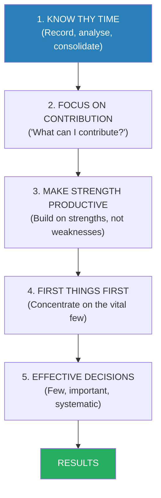
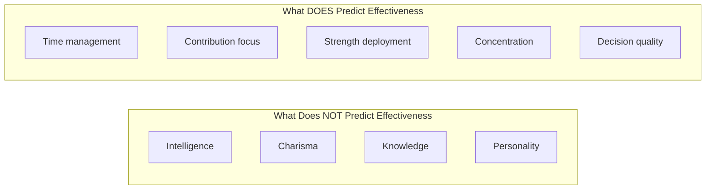
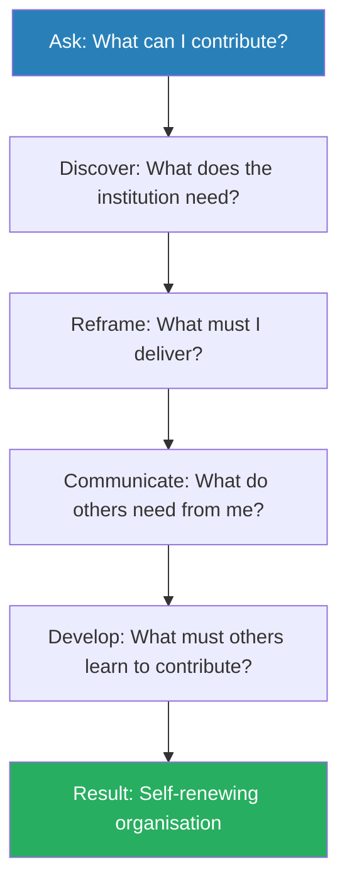
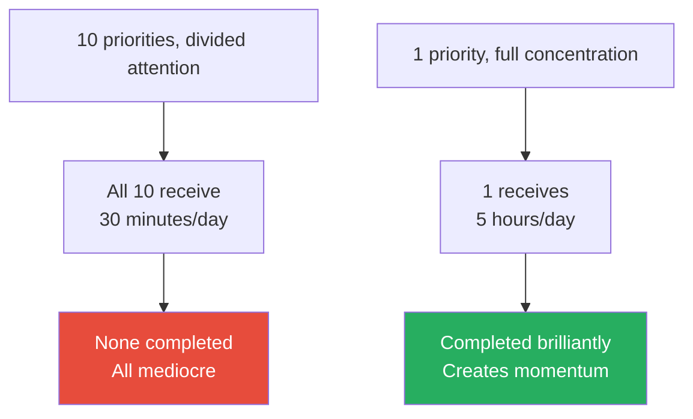
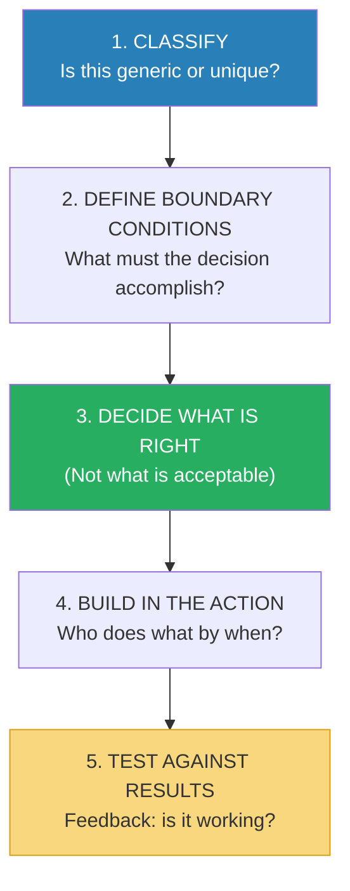
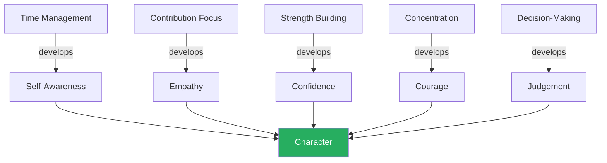

# The Effective Executive — Peter F. Drucker

> Peter Drucker's most practical book makes a single, powerful argument: effectiveness is a habit, and it can be learned. Intelligence, knowledge, and imagination are useless without the ability to convert them into results — and that conversion is what Drucker means by "effectiveness." Written in 1967 but reading as though it were written yesterday, the book identifies five practices that any knowledge worker can master: managing time, focusing on contribution, building on strengths, concentrating effort, and making effective decisions. It is the foundational text of modern management — the book that taught executives to ask not "How do I get things done?" but "What are the right things to do?" In a world drowning in productivity advice, Drucker cuts through with a question that most productivity books never ask: "What can I contribute that will significantly affect the performance and results of the institution I serve?" The answer to that question — not task lists, not efficiency hacks, not time management tricks — is what makes an executive effective.

---

## About the Author

Peter Ferdinand Drucker (1909-2005) was an Austrian-born American management consultant, educator, and author widely regarded as the founder of modern management theory. He fled Austria in 1933 as the Nazis rose to power, eventually settling in the United States where he began a career that would span seven decades and thirty-nine books. He consulted for organisations including General Electric, IBM, the U.S. government, the Red Cross, and the Salvation Army. He held professorships at NYU and Claremont Graduate University, where the Drucker Institute continues his work. *The Effective Executive* is considered his most concise and actionable work — the distillation of decades of observing what separates productive leaders from busy ones. His influence extends far beyond management: he anticipated the rise of knowledge work, the information economy, and the nonprofit sector decades before they became mainstream concepts.

---

## The Big Idea

- <b style="color: #2980b9">Effectiveness is not a talent — it is a discipline</b>
- It consists of five practices that can be learned and must be earned through constant application
- The effective executive does not start with tasks — they start with <b style="color: #27ae60">time</b>, because time is the one truly irreplaceable resource
- Drucker observed hundreds of executives across decades of consulting, and his central finding was remarkably consistent: the effective ones did not share personality traits, intelligence levels, or management styles
  - Some were extroverts, some introverts
  - Some were warm, some remote
  - Some were brilliant, some merely competent
  - Some were decisive, some deliberate
- What they shared was a set of **practices** — habits of mind and action that could be observed, described, and learned
- <b style="color: #e74c3c">Intelligence without effectiveness produces nothing. Effectiveness without intelligence produces something.</b>
- The book's radical claim: effectiveness is not about who you are but about what you do — and what you do can be changed

The five habits build on each other in sequence — you cannot focus on contribution until you control your time, you cannot deploy strengths until you know what contribution you are aiming for, and you cannot make effective decisions until you have cleared the space to think.

This treemap reveals the internal architecture of Drucker's framework: each of the five habits contains distinct sub-practices, with "Focus on Contribution" having the fewest but highest-leverage components, while "Effective Decisions" has the most granular five-step process.

---

## Key Concepts at a Glance

| Concept | One-line summary |
|---------|-----------------|
| **Effectiveness Is Learnable** | It is a habit, not a talent — anyone can develop it through practice |
| **Know Thy Time** | Record how you actually spend time (you will be shocked); then ruthlessly eliminate waste |
| **Focus on Contribution** | Ask "What can I contribute?" not "What tasks do I need to do?" |
| **Three Dimensions of Contribution** | Direct results, building values, and developing people for the future |
| **Make Strength Productive** | Staff for strength, not absence of weakness; build on what people CAN do |
| **First Things First** | Do the most important thing. Then the next most important thing. Second things not at all. |
| **Posteriorities** | Deciding what NOT to do is harder and more important than deciding what to do |
| **Effective Decisions** | Few decisions, well-made: classify, define boundaries, decide what's RIGHT, build in action |
| **The Dissent Principle** | Effective decisions require disagreement — if everyone agrees instantly, the problem is not understood |
| **The Time Log** | The single most powerful diagnostic tool: track every minute for 3-4 weeks |

The radar reveals that "First Things First" is the most difficult habit to master — requiring the courage to abandon good work — while "Focus on Contribution" is the rarest among executives, despite being the highest-impact practice Drucker observed.

---

## Chapter 1: Effectiveness Can Be Learned

*Drucker opens by demolishing the myth that effective executives are born, not made — and establishes why effectiveness matters more than ever in the age of knowledge work.*

- The knowledge worker is a new phenomenon in human history
  - Manual workers produce things — their output is visible and measurable
  - Knowledge workers produce ideas, information, and decisions — their output is invisible and hard to measure
- <b style="color: #2980b9">The knowledge worker cannot be supervised in the traditional sense</b> — no one can watch someone think and determine whether the thinking is productive
- This creates a fundamental management problem: knowledge workers must manage themselves
- Drucker defines the "executive" broadly — not just the CEO, but anyone in the organisation who is expected to make decisions that affect the performance and results of the whole
  - A first-line supervisor making scheduling decisions is an executive
  - A researcher deciding which problems to investigate is an executive
  - A marketing analyst choosing which data to present is an executive
- <b style="color: #27ae60">Every knowledge worker who makes decisions based on their own knowledge is, in Drucker's framework, an executive — and must learn to be effective</b>

### The Four Realities of the Executive

Drucker identifies four conditions that make effectiveness unnatural — forces that push every executive towards ineffectiveness unless actively resisted:

| Reality | What It Means | Why It Hurts |
|---------|--------------|-------------|
| **Time belongs to others** | Everyone in the organisation has a claim on the executive's time | The executive's time is fragmented before they can deploy it |
| **The current carries you** | Day-to-day operations demand attention; the urgent drowns the important | Executives react instead of act |
| **You work inside an organisation** | Results happen outside — with customers, patients, citizens — not inside | The organisation insulates the executive from reality |
| **You see through one lens** | Each executive sees the world through the filter of their own function | Finance sees costs, marketing sees messaging, engineering sees architecture |

The bar chart shows how the four realities consume nearly all of a typical executive's time, while effective executives reclaim roughly 60% of that time for strategic work by systematically managing each reality rather than surrendering to it.

- <b style="color: #e74c3c">These four realities are permanent — they cannot be eliminated, only managed</b>
- The executive who ignores them becomes a prisoner of the organisation — responding to other people's priorities, drowning in operational noise, insulated from outside reality, and blind to perspectives beyond their own function
- Effectiveness is the practice of overcoming these realities — not occasionally, but habitually

> [!example] The Scientist Who Could Not Contribute
> - Drucker describes a brilliant research scientist at a pharmaceutical company who had deep knowledge and original ideas
> - But the scientist could not convert his knowledge into results — his papers went unread, his recommendations were ignored, his projects drifted without completion
> - The problem was not intelligence — it was effectiveness
> - He did not manage his time, did not focus on what the organisation needed from him, and did not communicate in terms his audience could use
> - A less brilliant but more effective colleague consistently outperformed him — not because of superior ideas, but because of superior execution
> **The lesson:** Brilliance without effectiveness is waste. The world is full of intelligent people who contribute nothing.

> [!tip] Core Insight
> Effectiveness is a habit — and like all habits, it can be learned through practice. There are no "naturally effective" people, only people who have practiced effectiveness until it became automatic.

---

### What Effective Executives Have in Common

- Drucker studied executives across industries, countries, and decades — and found that effective executives share no common personality traits
- They are not all charismatic, not all analytical, not all visionary
- What they share are five practices:
  1. They know where their time goes and manage it systematically
  2. They focus on outward contribution, not inward effort
  3. They build on strengths — their own and others'
  4. They concentrate on the few major areas where superior performance will produce outstanding results
  5. They make effective decisions — few decisions, well-made
- These five practices form the structure of the entire book

Effectiveness is entirely a matter of practice, not personality — which is Drucker's most hopeful and most demanding insight.

---

## Chapter 2: Know Thy Time

*Drucker's first and most radical insight: start with time, not tasks. Most executives have no idea where their time actually goes — and the gap between perception and reality is enormous.*

- <b style="color: #2980b9">Time is the one resource you cannot buy, rent, borrow, or make more of</b>
- Money can be borrowed. People can be hired. Equipment can be purchased. But time? Once it is spent, it is gone forever
- Most executives have no idea how they actually spend their time — they THINK they know, but the reality always shocks them
- Drucker observed this consistently across hundreds of executives: when asked to estimate how they spent their time, they were wrong by 30-50%
- The executive who thinks they spend four hours a day on strategic work is typically spending ninety minutes — the rest is consumed by interruptions, trivial meetings, and other people's emergencies

### Why Time Comes First

- Most management books start with goals, vision, or strategy
- Drucker starts with time — and this ordering is deliberate
- His reasoning:
  - Goals without time are fantasies
  - Strategy without time is theory
  - Priorities without time are lists
  - Only time is real, concrete, and measurable
- <b style="color: #27ae60">The executive who starts with time starts with reality — not with what they wish were true, but with what actually is</b>
- Drucker observed that executives who skipped the time analysis and went straight to "What should I be doing?" invariably failed
  - They made beautiful plans that shattered on contact with their actual schedule
  - They set ambitious goals that died in the margins between meetings
  - They identified the right priorities but never found the time to work on them

### The Three-Step Time Method

Drucker prescribes a systematic method: <b style="color: #27ae60">record → analyse → consolidate</b>

#### Step 1: Record

- Track every minute of your day for 3-4 weeks — in real time, not from memory
- Use any method: notebook, app, assistant — the medium does not matter
- <b style="color: #e74c3c">Do NOT trust your memory — research shows people's time estimates are wildly inaccurate</b>
- Drucker found that executives typically overestimate time spent on important work by 50% and underestimate time spent on trivial work by the same margin
- The time log is the single most powerful diagnostic tool in management — it reveals the truth that feelings conceal
- Drucker recommends repeating this exercise every 3-6 months, because bad habits creep back

> [!abstract] The Time Log Method
> 1. For 3-4 consecutive weeks, record every activity as it happens (not at end of day)
> 2. Record start time, end time, and a brief description
> 3. Do not judge or change behaviour during the recording period — just observe
> 4. At the end of the period, categorise each activity: productive, necessary but not productive, or waste
> 5. Calculate actual hours spent in each category
> 6. Compare to your initial estimate — the gap is your effectiveness deficit

> [!example] The Executive Who Discovered 25%
> - Drucker describes an executive who tracked his time and discovered that 25% of his working hours were spent in meetings that accomplished nothing
> - He hadn't noticed because the meetings were scattered throughout the week — 45 minutes here, an hour there — and each one felt "necessary" in the moment
> - When he saw the data aggregated over three weeks, the waste became undeniable
> - He eliminated or shortened half of them, consolidating the necessary ones into two blocks per week
> - The freed time — roughly 10 hours per week — went to the two strategic projects that defined his team's performance for the next year
> **The lesson:** You cannot manage what you cannot see. The time log makes the invisible visible.

#### Step 2: Analyse

- For every activity in the log, ask three diagnostic questions:

| Question | Purpose | Expected Outcome |
|----------|---------|-----------------|
| **"What would happen if this were not done at all?"** | Identify activities that produce no results | If the answer is "nothing," stop doing it immediately |
| **"Could someone else do this as well or better?"** | Identify activities that should be delegated | Delegation is not dumping — it is matching tasks to strengths |
| **"What do I do that wastes YOUR time?"** | Identify activities that waste other people's time | Ask direct reports this question — they will tell you things no time log reveals |

- <b style="color: #2980b9">The third question is the bravest</b> — most executives never ask it because they fear the answer
- Drucker found that executives routinely waste their subordinates' time with:
  - Unnecessary reporting requirements
  - Meetings that could be memos
  - Decisions that should be delegated
  - Requests for information that serves the executive's anxiety, not the organisation's needs

> [!example] The Plant Manager's Dinner Parties
> - Drucker describes a senior executive in a large company who discovered through his time log that an enormous portion of his evenings were consumed by "social obligations" — dinners, receptions, events with business contacts
> - He believed these were essential for relationship-building
> - When he examined the log honestly, he realised that the vast majority of these events produced no business value whatsoever — they were habitual, not strategic
> - He began declining all but the handful that involved genuine relationship-building with key clients or partners
> - The reclaimed time went to his family and to reading — both of which made him a more effective executive during working hours
> **The lesson:** Social obligations expand to fill available time unless you apply the same rigour to them as you do to business activities.

### The Organisational Time-Wasters

- Drucker identifies several categories of systemic time-wasters — problems that are not caused by the individual executive but by the organisation itself:

| Time-Waster | Root Cause | Drucker's Fix |
|-------------|-----------|---------------|
| **Too many meetings** | Decisions are not clearly assigned to individuals | Clarify who decides — if one person can decide, no meeting is needed |
| **Information malfunction** | People do not have the data they need in the form they need it | Redesign information flow so the right data reaches the right person |
| **Overstaffing** | More people than the work requires | Fewer, better people accomplish more with less coordination overhead |
| **Malorganisation** | Work requires too much coordination between too many people | Restructure so the work flows through fewer handoffs |
| **Recurring crises** | The same problem appears repeatedly because it was never solved generically | Create a rule, process, or policy that prevents recurrence |

- <b style="color: #e74c3c">A well-managed organisation is a boring organisation</b> — the exciting crises have been eliminated by good systems
- If senior management spends more than a small fraction of their time "fighting fires," something is structurally wrong
- Drucker's test: if a crisis happens more than twice, it is not a crisis — it is a system failure

> [!example] The Company That Met Itself to Death
> - Drucker describes an organisation where senior executives spent over half their time in meetings
> - When he investigated, he found the root cause: every decision required approval from multiple departments because no single person had clear authority
> - A pricing change needed sign-off from sales, finance, legal, and marketing — not because each had genuine input, but because the organisation chart did not specify who owned pricing decisions
> - The fix was structural: assign pricing authority to one person, with advisory input from others on request
> - Meeting time dropped by 40% within three months — not because anyone decided to have fewer meetings, but because the reason for most meetings had been eliminated
> **The lesson:** Most meeting overload is not a time management problem — it is an organisational design problem. Fix the structure and the meetings fix themselves.

> [!example] Alfred Sloan's Meeting Discipline at General Motors
> - Alfred P. Sloan, the legendary chairman of General Motors, was famous for his meeting discipline
> - He held three types of meetings, each with strict rules: formal committee meetings (no discussion — only presentations and decisions), working meetings with a single participant (focused problem-solving), and brief informational meetings
> - Sloan would open each meeting by stating its purpose, then listen — he rarely spoke until the end
> - After the meeting, Sloan would write a memo summarising the decisions made and the actions assigned
> - This memo was sent to every participant within 24 hours
> - Drucker admired Sloan because he treated meetings as tools, not rituals — each one had a defined purpose, a defined format, and a defined output
> **The lesson:** Meetings are either a tool with a clear purpose or a waste of everyone's time. There is no middle ground.

---

#### Step 3: Consolidate

- <b style="color: #2980b9">Group your discretionary time into large, uninterrupted blocks</b>
- Fragmented time is useless for important work — you cannot write a report, develop a strategy, or think through a complex decision in fifteen-minute increments
- Drucker's finding: a knowledge worker needs a minimum of 90 minutes of uninterrupted time to produce anything of value
  - Below 90 minutes, the time is consumed by start-up costs — remembering where you left off, getting back into the problem, rebuilding mental context
  - Above 90 minutes, returns increase significantly — the second hour is far more productive than the first
- <b style="color: #27ae60">Drucker recommends blocking at least one quarter of the working day for concentrated work — and protecting that block ferociously</b>

The methods Drucker observed for consolidating time:

- **Work from home one day a week** — decades before remote work became common, Drucker noted that some executives reserved one day per week for uninterrupted work at home
- **Block mornings for deep work** — handle all operational matters in the afternoon, reserving mornings for concentrated thinking
- **Schedule "office hours" for drop-ins** — instead of being available all day, concentrate interruptions into a defined window
- **Batch similar activities** — return all phone calls at once, read all mail at once, hold all routine meetings on one day

> [!example] The Executive Who Scheduled "Unscheduled Time"
> - One of Drucker's most vivid examples: an executive who literally blocked out 90 minutes each morning on his calendar as "unscheduled time"
> - His assistant was instructed to protect this block as fiercely as she would protect a meeting with the CEO
> - During this block, the executive worked on the one or two things that mattered most — strategic planning, difficult personnel decisions, major client relationships
> - He acknowledged that the system was imperfect — emergencies sometimes invaded the block
> - But even with interruptions, he estimated that he preserved about 75% of the blocked time — enough to produce results that no amount of fragmented time could match
> **The lesson:** If you don't schedule your most important work, everything else will schedule it out of existence.

> [!tip] Core Insight
> Time is the scarcest resource. Unless it is managed, nothing else can be managed. Start every analysis of effectiveness with the question: "Where does my time actually go?"

---

## Chapter 3: What Can I Contribute?

*Drucker shifts from the mechanics of time to the orientation of mind — the question that separates effective executives from merely busy ones.*

- <b style="color: #27ae60">"What can I contribute that will significantly affect the performance and results of the institution I serve?"</b>
- This is Drucker's most powerful question — and the one most executives never ask
- Most people focus downward — on efforts rather than results, on activity rather than impact, on authority rather than responsibility
- The contribution question shifts focus outward and upward: <b style="color: #2980b9">from inputs to outcomes, from "what can I do?" to "what difference can I make?"</b>
- The executive who asks "What can I contribute?" takes responsibility for results — not just for effort, not just for their department, not just for their job description

### Why Most Executives Focus on Effort, Not Contribution

- The organisation rewards activity: showing up, attending meetings, responding to emails, filing reports
- <b style="color: #e74c3c">None of these activities are contributions — they are motions that look like work</b>
- The effective executive asks a fundamentally different question: "What result will the organisation get from my being here?"
- Drucker distinguishes between three types of people:
  - The **subordinate** who focuses on effort: "I manage 15 people and attend 20 meetings a week"
  - The **specialist** who focuses on expertise: "I am the best chemist in the department"
  - The **effective executive** who focuses on contribution: "I develop the three products that generate 60% of our revenue"
- Only the third type connects their work to results that matter

### Three Dimensions of Contribution

Every organisation needs contribution in three areas — and the effective executive operates across all three:

| Dimension | Question | Example | Time Horizon |
|-----------|---------|---------|-------------|
| **Direct results** | "What outcomes does the institution need from me right now?" | Revenue, products shipped, patients treated, cases won | Immediate |
| **Building and reaffirming values** | "What standards and commitments should I uphold and exemplify?" | Quality standards, ethical conduct, innovation culture | Medium-term |
| **Developing people for the future** | "Whose capabilities am I building so the institution thrives after me?" | Mentoring, training, delegating with developmental intent | Long-term |

The doughnut reveals Drucker's key insight: typical executives over-invest in direct results (70%) while starving the two dimensions — values and people development — that compound over time and determine whether the organisation thrives after the executive leaves.

- <b style="color: #e74c3c">Most executives focus only on the first dimension — direct results — and neglect the second and third</b>
- But Drucker argues that building values and developing people are HIGHER-LEVERAGE contributions because they compound over time
- An organisation that achieves great results today but develops no leaders for tomorrow is borrowing from the future
- The executive who develops three strong successors contributes more than the one who delivers great results but leaves no one capable of continuing them

> [!example] The Hospital Administrator Who Transformed Patient Care
> - Drucker describes a newly appointed hospital administrator who asked every department head: "What do we do in this hospital that helps you serve the patient?"
> - The question was shocking — most hospital administrators asked about budgets, staffing, and compliance
> - By reframing every interaction around the patient (the ultimate "contribution"), the administrator discovered enormous inefficiencies
> - The radiology department, for example, had a three-day turnaround on results — not because the technology was slow, but because the administrative process had never been examined from the patient's perspective
> - Within a year, the hospital had made dozens of process changes — each one traced back to the contribution question
> **The lesson:** The contribution question changes what you see. When you ask "What can I contribute?" you discover waste, misalignment, and opportunity that are invisible to the effort-focused executive.

> [!example] The Knowledge Worker Who Became Indispensable
> - Drucker tells of a junior analyst at a financial firm who was technically mediocre — her models were competent but unremarkable
> - What made her effective was her contribution focus: she understood that her real job was not building models but helping senior partners make better decisions
> - She learned what each partner needed, how they preferred to receive information, and what questions they were trying to answer
> - She became the most valued person in the department — not because of technical brilliance, but because she focused relentlessly on what the organisation needed from her
> - More technically skilled analysts with twice her expertise sat idle because they focused on their models, not on the decisions those models were supposed to inform
> **The lesson:** Contribution is not about what you can do — it is about what the organisation needs done. The two are often very different.

---

### The Specialist's Trap

- Drucker pays special attention to specialists — the chemist, the accountant, the engineer, the researcher
- The specialist faces a unique danger: confusing expertise with contribution
- <b style="color: #2980b9">The specialist's knowledge is useless unless someone else can use it</b>
- Drucker observes that many highly skilled specialists are functionally useless to their organisations — not because they lack knowledge, but because they cannot translate their knowledge into something others can act on
- The brilliant tax accountant who writes reports only other accountants can understand is not contributing — he is hoarding knowledge
- The gifted engineer who designs elegant solutions but cannot explain them to the manufacturing team is not contributing — she is performing for an audience of one
- <b style="color: #e74c3c">Expertise that cannot be communicated is not contribution — it is self-indulgence</b>

> [!example] The Chemist Who Learned to Contribute
> - Drucker describes a research chemist in a pharmaceutical company who was technically outstanding but whose work never seemed to influence the company's products
> - When asked "What can you contribute?" the chemist initially answered: "I do first-rate research"
> - Drucker pushed: "What does the company get from your first-rate research?"
> - The chemist eventually realised that his job was not to do research — it was to help the product development team create drugs that worked
> - He began attending product development meetings, asking what problems the team was facing, and directing his research toward those problems
> - Within a year, three of his research findings had been incorporated into new products — after years of his work sitting unused in internal reports
> **The lesson:** The specialist's contribution is not their expertise — it is what their expertise enables others to do.

---

### Contribution and Communication

- Drucker argues that the contribution focus transforms communication
- The subordinate who focuses on effort communicates downward: "Here is what I did"
- <b style="color: #27ae60">The effective executive who focuses on contribution communicates outward: "Here is what you can use"</b>
- This reframes every meeting, every report, every presentation from "What do I want to say?" to "What does this audience need to hear?"

> [!tip] Drucker's Contribution Communication Test
> Before every meeting, presentation, or report, ask: "What will the people receiving this need from me in order to DO SOMETHING with what I present?" This single question transforms communication from self-expression into service.

### Contribution and Human Development

- The executive who focuses on contribution automatically develops others
- When you ask "What can I contribute?" you necessarily ask "What do the people around me need to be able to contribute?"
- This leads to genuine delegation — not dumping work, but assigning challenges that grow people's capabilities
- <b style="color: #2980b9">Drucker calls this "making demands" — the effective executive demands contribution from others, and in doing so, helps them grow</b>
- People rise to the level of demand placed on them — if you ask for compliance, you get compliance; if you ask for contribution, you get contribution

The contribution focus is self-reinforcing: the executive who focuses on contribution communicates better, develops others, and builds an organisation that produces contribution at every level.

---

## Chapter 4: Making Strength Productive

*Drucker demolishes the conventional wisdom of "well-rounded" people and argues that excellence comes from building on strengths — not from fixing weaknesses.*

- <b style="color: #e74c3c">"The task of leadership is to create an alignment of strengths, making our weaknesses irrelevant"</b>
- Most organisations staff for the absence of weakness — they look for people with no major flaws
- <b style="color: #27ae60">Drucker argues for staffing for strength — finding people who are exceptionally good at ONE thing and building their role around that strength</b>
- The logic is simple: you cannot build performance on weakness
  - You can make a weak area slightly less weak with enormous effort
  - Or you can make a strong area vastly stronger with the same effort
  - The returns on building strength are orders of magnitude higher than the returns on fixing weakness

### The Fallacy of the Well-Rounded Person

- Drucker challenges the deeply held belief that the ideal employee or leader is "well-rounded"
- In practice, "well-rounded" usually means mediocre at everything and excellent at nothing
- <b style="color: #2980b9">The truly effective person is "sharp" — outstanding in one or two areas and quite possibly weak in others</b>
- The job of the organisation is to make the sharp person productive by designing roles around their strength and compensating for their weakness through team composition

| Approach | What It Produces | Long-Term Result |
|----------|-----------------|-----------------|
| **Staff for absence of weakness** | People who are adequate at everything but excellent at nothing | Mediocrity across the board |
| **Staff for strength** | People who are outstanding at one thing and weak at others | Excellence (if the role is built around the strength) |
| **Try to fix weaknesses** | People who are slightly less weak but resentful and demotivated | Frustration and turnover |
| **Build on strengths** | People who are even more outstanding at their best thing | Peak performance and engagement |

### Four Rules for Making Strength Productive

Drucker provides four specific rules:

1. **Design jobs for human beings, not for saints**
   - If a job has defeated two or three people in a row, the job is wrong — redesign it
   - <b style="color: #e74c3c">A job that cannot be performed by a competent human being is not a job — it is a wish list</b>
   - Jobs designed to be filled only by a genius will remain perpetually vacant

2. **Make each job demanding and big**
   - Small, narrow jobs attract small, narrow thinking
   - A job should be large enough to challenge the person — and to reveal their strengths
   - <b style="color: #27ae60">The more demanding the job, the more clearly strengths emerge</b>

3. **Start with what a person CAN do, not what a job requires**
   - Most hiring starts with a job description and looks for someone who matches it
   - Drucker starts with the person's strengths and looks for a job that deploys them
   - This does not mean ignoring job requirements — it means that the right question is not "Does this person match the job description?" but "Can this person do the one thing this job truly requires?"

4. **Tolerate weakness in areas that do not matter for the job**
   - General Grant drank. Lincoln did not care — because Grant's job was winning battles, not staying sober at dinner parties
   - The brilliant researcher who cannot manage people should not be promoted into management — but should be given a larger research role
   - <b style="color: #2980b9">Matching strength to assignment is the key to both individual performance and organisational effectiveness</b>

> [!example] Abraham Lincoln and General Grant
> - Drucker returns repeatedly to his favourite example of strength-based leadership: Lincoln's choice of Ulysses S. Grant as commanding general of the Union armies
> - Lincoln had cycled through a series of generals — McClellan, Burnside, Hooker, Meade — each of whom looked good on paper but could not win the war
> - When Grant was proposed, Lincoln was told that Grant was a drunkard
> - Lincoln's famous response: "If I knew his brand, I'd send a barrel to my other generals"
> - Lincoln did not care about Grant's weakness (drinking) because Grant possessed the one strength no other Union general had: the ability to fight and win battles
> - Grant went on to win the war — something no "well-rounded" general had been able to do
> **The lesson:** Staff for the strength that the job actually requires. Tolerate the weaknesses that do not affect performance.

> [!example] Robert E. Lee's Fatal Mistake
> - Drucker contrasts Lincoln's approach with Robert E. Lee, who staffed for absence of weakness
> - Lee's generals were all well-rounded, competent, and without major flaws
> - But none of them were outstanding at anything — and in the critical moments of the war, competence was not enough
> - Drucker argues that Lee's insistence on well-rounded officers contributed to the Confederacy's defeat
> - Lincoln accepted flawed but brilliant generals; Lee insisted on polished but mediocre ones
> **The lesson:** The leader who will not tolerate weakness in others will never find strength either.

---

### The Staffing Decision

- Drucker argues that the staffing decision — putting the right person in the right job — is the most consequential decision an executive makes
- And it is the decision most executives make most poorly
- Why staffing decisions fail:
  - Executives look for someone who fits the job description rather than someone who excels at what the job actually requires
  - They try to minimise weaknesses rather than maximise strengths
  - They are influenced by personal liking — "Do I enjoy working with this person?" — rather than contribution — "Can this person deliver what the job demands?"
  - They make the decision too quickly, without examining the alternatives
- <b style="color: #27ae60">Drucker's staffing rule: look at what the person CAN do, then ask whether that strength is what the job requires</b>
- If the answer is yes, make the appointment — regardless of the person's weaknesses in areas the job does not require

> [!abstract] Drucker's Staffing Decision Process
> 1. Think through the assignment — what does this job actually need to accomplish?
> 2. Consider 3-5 candidates — never appoint from a field of one
> 3. For each candidate, ask: "What can this person do uncommonly well?"
> 4. Ask former colleagues and subordinates about the candidate's actual performance
> 5. Make sure the appointee understands the assignment — what results are expected and by when
> 6. If the appointment fails, the executive made the mistake — not the appointee

- <b style="color: #e74c3c">Drucker is emphatic: if a person you appointed fails, you made the wrong decision — do not blame them, reassign them</b>
- The executive who blames their subordinates for failure is confessing their own incompetence at staffing

---

### Making Your Own Strengths Productive

- The strength principle applies to yourself as well as to others
- <b style="color: #27ae60">The effective executive discovers their own strengths — and builds their working life around deploying them</b>
- This means:
  - Seeking roles that require your particular strength
  - Avoiding roles that demand competence in your area of weakness
  - Compensating for weakness through partnerships, delegation, or system design — never through heroic self-improvement
- Drucker is blunt: "Waste as little effort as possible on improving areas of low competence. It takes far more energy and work to improve from incompetence to mediocrity than it takes to improve from first-rate performance to excellence"

### Making the Boss's Strengths Productive

- One of Drucker's most practical insights: managing upward is a strength-deployment exercise
- <b style="color: #2980b9">The effective subordinate asks: "What can my boss do really well? How can I feed that strength?"</b>
- Most people complain about their boss's weaknesses — effective people exploit their boss's strengths
- If your boss is a reader (not a listener), write memos instead of scheduling meetings
- If your boss is a morning person, schedule important conversations before noon
- If your boss excels at big-picture thinking, bring the vision and handle the details yourself

> [!tip] Core Insight
> The effective executive makes strength productive — their own, their subordinates', their boss's, and their colleagues'. The question is never "What can't this person do?" but "What can this person do uncommonly well?"

---

## Chapter 5: First Things First

*Drucker makes the case for concentration — the courage to do one thing at a time and to let everything else wait. This chapter is where the book's philosophy becomes most demanding.*

- <b style="color: #2980b9">"Do first things first, and second things not at all"</b>
- Not "second things second" — <b style="color: #e74c3c">SECOND THINGS NOT AT ALL</b>
- This is the hardest principle in the book because it requires the executive to deliberately abandon things that seem important
- The logic is mathematical: the executive has finite time (as established in Chapter 2), and important work requires concentrated blocks of time
  - If you have three hours of discretionary time per day and one task that requires three hours of concentrated attention, you can complete one important task per day
  - If you split that time across three tasks, you complete zero — because none gets the concentration it requires
- <b style="color: #27ae60">Concentration is not a preference — it is a necessity imposed by the structure of knowledge work</b>

### The Courage of Concentration

- Most executives have a list of ten important things. They try to do all ten. They do all ten poorly
- The effective executive identifies the ONE thing that matters most, does it, then identifies the next ONE thing
- This requires courage because:
  - It means saying "no" to things that feel important
  - It means accepting that some problems will go unsolved
  - It means tolerating the discomfort of incomplete action
  - It means ignoring the pressure from colleagues who want their problem to be your priority

> [!example] The Turnaround CEO Who Did One Thing
> - Drucker describes a CEO brought in to turn around a failing company
> - The board expected him to address a dozen urgent problems simultaneously: declining sales, poor quality, high costs, low morale, outdated products, and more
> - Instead, the CEO identified the single issue that, if fixed, would create the conditions for fixing everything else: product quality
> - For his first year, he focused almost exclusively on quality — ignoring complaints that he was neglecting sales, marketing, and cost control
> - By the end of the year, quality had improved dramatically — and with it, customer satisfaction, employee morale, and sales
> - The problems he "ignored" began solving themselves once the core problem was addressed
> **The lesson:** The executive who tries to fix everything fixes nothing. The executive who fixes the one right thing creates a cascade of improvement.

### Priorities and Posteriorities

- Everyone talks about priorities — <b style="color: #2980b9">Drucker is one of the few writers who emphasises posteriorities: the things you decide NOT to do</b>
- Setting priorities is easy — you rank what matters most
- Setting posteriorities is hard — because it means consciously abandoning things that have value
- Drucker observes that most executives resist setting posteriorities because:
  - Every abandoned task has a constituency that will be upset
  - There is always a reasonable argument for doing one more thing
  - Saying "no" feels like failure; saying "yes" feels like leadership
- <b style="color: #e74c3c">But the executive who says "yes" to everything says "yes" to nothing — because nothing receives the time and attention it needs</b>

> [!abstract] Drucker's Priority Rules
> 1. **Pick the future over the past** — Do not fix yesterday's mistakes; build tomorrow's opportunities
> 2. **Focus on opportunity, not problem** — Problems demand attention; opportunities demand initiative. Prioritise initiative
> 3. **Choose your own direction** — Do not let other people's urgencies set your agenda
> 4. **Aim high** — Choose goals that will make a difference, not goals that are "safe"

- Drucker notes a critical asymmetry: priorities can be determined analytically — you can rank tasks by importance and urgency
- <b style="color: #27ae60">Posteriorities require courage — there is no analytical formula for deciding what to abandon</b>
- The executive who sets posteriorities must be willing to disappoint people, resist pressure, and accept that some good things will not get done

### The Obsolescence Problem

- Drucker identifies a hidden enemy of concentration: the programmes, processes, and activities that were once valuable but have outlived their usefulness
- Every organisation accumulates yesterday's successes — initiatives that worked once and now continue on momentum alone
- <b style="color: #e74c3c">These obsolete activities are the most dangerous time-wasters because they have constituencies</b>
- Someone championed them, someone built their role around them, someone's reputation depends on them
- Killing an obsolete programme requires confronting the people who depend on it — which is why most executives avoid it
- Drucker's rule: before starting anything new, ask "What existing activities can we abandon to make room?"
- Without systematic abandonment, the organisation fills up with yesterday's commitments until there is no room for tomorrow's opportunities

### The Concentration Paradox

- Doing fewer things feels wrong — it feels like you're not working hard enough, not being responsive enough, not "on top of everything"
- But trying to do everything guarantees that nothing gets the attention it needs
- The executive who completes ONE strategic initiative per quarter contributes more than the one who starts ten and completes none

The concentrated approach produces less activity but far more results — and each completed initiative creates momentum for the next.

> [!example] How Sloan Transformed General Motors
> - Alfred Sloan took over General Motors in the 1920s when it was a chaotic collection of independent divisions with no coordination
> - Rather than trying to fix everything at once — manufacturing, sales, finance, product development — Sloan concentrated on one thing: the organisational structure
> - He created the divisional structure that separated policy decisions (made centrally) from operational decisions (made by division heads)
> - This single structural change created the conditions for solving every other problem — because it established clear accountability, clear authority, and clear measurement
> - Sloan's concentration on structure, rather than trying to address every problem simultaneously, is what made GM the world's largest and most successful company for decades
> **The lesson:** The right structural solution creates the conditions for everything else. Sloan did not solve GM's problems — he created the system that solved them.

> [!tip] Core Insight
> Concentration is the courage to impose on time and events your own deliberate choice of what matters. The effective executive does first things first — and second things not at all.

---

## Chapter 6: The Elements of Decision-Making

*Drucker introduces his decision framework by arguing that effective executives make few decisions — but the right ones. Speed is the enemy of quality in consequential decisions.*

- The effective executive makes <b style="color: #2980b9">few decisions — but the right ones</b>
- Most people think decision-making means choosing quickly between options
- Drucker argues the opposite: <b style="color: #27ae60">effective decision-making means understanding the problem correctly before choosing anything</b>
- The executive who makes many decisions is probably making the wrong ones — because they are treating generic problems as unique events and solving the same problem over and over

### Classifying the Problem

- Drucker's first step is classification: is this problem generic or unique?
- <b style="color: #2980b9">Four categories of problems:</b>

| Type | Description | Right Response |
|------|------------|---------------|
| **Truly generic** | A specific instance of a general condition — most problems fall here | Apply a rule, principle, or policy |
| **Generic but unique for the organisation** | A common problem the organisation is facing for the first time | Learn from others who have solved it |
| **Truly unique** | A genuinely unprecedented event | Investigate deeply before acting |
| **Early manifestation** | What appears unique is actually the first sign of a new generic problem | Treat as generic — develop a rule for future instances |

- <b style="color: #e74c3c">The most common mistake: treating a generic problem as if it were unique</b>
- When you treat a generic problem as unique, you solve it once — and then face it again next week, next month, next year
- When you treat a generic problem as generic, you solve it once with a rule or policy — and it never comes back
- Drucker estimates that most executive decisions deal with generic problems — perhaps 90%
- The truly unique problem is rare — and the executive who treats everything as unique will drown in decisions

> [!example] Harry Truman's First Decision as President (1945)
> - When Truman became president after Roosevelt's death, he faced an avalanche of decisions — the war in Europe, the war in the Pacific, relations with the Soviet Union, domestic economic policy
> - Truman could have treated each as a unique crisis requiring a unique response
> - Instead, he classified: most of these were generic problems of foreign policy and military strategy that required established principles, not ad hoc decisions
> - He focused his personal attention on the genuinely unique decisions — the use of the atomic bomb, the structure of the post-war order — and delegated the generic ones to competent subordinates with clear policy guidelines
> - Truman's effectiveness as president came not from making many decisions but from correctly classifying which decisions required his personal attention
> **The lesson:** The effective decision-maker's first question is not "What should I do?" but "What kind of problem is this?"

> [!example] The Recurring "Unique" Crisis
> - Drucker describes a manufacturing company where the plant manager dealt with a "unique crisis" every few months — a key machine would break down, halting production
> - Each time, the manager treated it as a unique event, heroically organising emergency repairs and working overtime to catch up
> - Drucker asked: "How often does this happen?" The answer: every three to four months
> - This was not a unique crisis — it was a generic maintenance problem masquerading as a series of emergencies
> - The solution was not better crisis management but a preventive maintenance schedule — a rule that addressed the generic condition
> - Once the rule was in place, the "crises" stopped entirely
> **The lesson:** If a problem keeps recurring, it is not unique — it is generic. Stop treating symptoms and address the underlying condition.

---

### Drucker's Five-Step Decision Process

Each step in Drucker's process addresses a specific failure mode in decision-making.

The force graph reveals that Drucker's decision process is not a simple linear sequence but a network — feedback loops back to classification, dissent feeds into determining what is right, and the distinction between acceptable and fatal compromise radiates from the "what is right" step.

#### Step 2: Define Boundary Conditions

- <b style="color: #2980b9">Boundary conditions</b> are the minimum conditions the decision must satisfy
- "What is the minimum this decision must accomplish to be considered successful?"
- The executive who skips this step jumps to solutions without knowing what problem they are solving
- Drucker warns: a decision that does not satisfy its boundary conditions is worse than no decision at all — because it creates the illusion of action while producing no results
- <b style="color: #e74c3c">The most dangerous decisions are those that almost satisfy the boundary conditions — they look like they work, but they quietly fail</b>

#### Step 3: Decide What Is Right

- <b style="color: #27ae60">Start with what is right, not what is acceptable</b>
- Most executives begin with "What will people accept?" or "What is politically feasible?"
- Drucker argues that this approach guarantees a weak decision — because compromise happens AFTER the right answer is identified, not before
- If you start with the compromise, you have nothing left to give when the inevitable pressures push you further from the ideal
- Drucker distinguishes between two types of compromise:
  - **The half-a-loaf compromise**: both sides give something, but the result still satisfies the boundary conditions — this is acceptable
  - **The half-a-baby compromise**: the compromise destroys the essential purpose of the decision — this is fatal
- <b style="color: #e74c3c">The executive must know the difference — and must never accept a compromise that violates the boundary conditions</b>
- The right sequence: determine what is right → identify the necessary compromises → accept only those compromises that still satisfy the boundary conditions

> [!abstract] Drucker's Compromise Test
> 1. Determine the right decision without considering acceptability
> 2. Identify who will resist and why
> 3. Determine what compromises are necessary to gain acceptance
> 4. Test: does the compromised decision still satisfy the boundary conditions?
> 5. If yes — accept the compromise. If no — go back to step 1 and find a different right answer

#### Step 4: Build In the Action

- <b style="color: #27ae60">"A decision that doesn't degenerate into work is not a decision — it is, at best, a good intention"</b>
- Every decision must include:
  - Who is responsible for carrying it out
  - What the deadlines are
  - Who is affected and must be informed
  - What resources are needed
  - How results will be measured
- Drucker observed that most organisational failures are not failures of decision but failures of action — the decision was good, but nobody was assigned to carry it out
- <b style="color: #e74c3c">A decision without assigned action, assigned deadlines, and assigned accountability is a fantasy</b>

#### Step 5: Test Against Results

- Every decision includes a feedback mechanism — a way to test whether the decision is producing the expected results
- Drucker argues for going and seeing personally — not relying on reports
- Reports are abstractions — they tell you what someone thinks happened, not what actually happened
- The effective executive visits the front line, talks to customers, observes operations, and compares reality with expectations
- When the decision is not producing expected results, the effective executive does not blame execution — they re-examine the decision itself
- Drucker cites military tradition: commanders who receive reports that conflict with their expectations go and see for themselves — because the report may be wrong, the observer may be biased, or the situation may have changed since the report was filed
- <b style="color: #27ae60">The feedback step is not optional — it is the mechanism that turns decision-making from a one-time act into a learning process</b>
- Without feedback, the same bad decisions get made over and over — each one defended by the authority of the person who made it rather than tested against the reality it was supposed to change

> [!example] Resistance to Testing at a Major Corporation
> - Drucker describes a large corporation that made a major strategic decision — to enter a new market segment
> - The executive team approved the plan, assigned resources, and launched the initiative
> - Six months later, the results were poor — but nobody wanted to admit it because the decision had been championed by the CEO
> - Subordinates adjusted their reports to make the numbers look better than they were
> - By the time the truth emerged, the company had wasted eighteen months and millions of dollars
> - Had the decision included a clear feedback mechanism — "If we have not achieved X customers by month six, we will re-evaluate" — the course correction would have come twelve months earlier
> **The lesson:** Decisions without feedback mechanisms are blind bets. Build in the test before you need it.

---

## Chapter 7: Effective Decisions

*Drucker deepens his decision framework with the most counterintuitive insight in the book: effective decisions require disagreement, not consensus.*

- This chapter builds on Chapter 6 by addressing the human dimension of decision-making
- <b style="color: #2980b9">Drucker's most surprising principle: start with opinions, not facts</b>
- Contrary to conventional wisdom, effective decision-makers do not begin by gathering facts
- They begin by encouraging opinions — even wild, untested opinions — because opinions reveal the assumptions that need to be tested
- <b style="color: #27ae60">Facts without opinions are meaningless data; opinions without facts are prejudice. The effective executive uses opinions to determine which facts to look for</b>

### The Dissent Principle

- <b style="color: #2980b9">Drucker's dissent principle</b> is one of the most important ideas in the book
- If everyone around the table agrees immediately, the decision is not ready to be made
- Unanimous agreement means one of three things:
  1. Nobody has thought about the problem seriously
  2. Nobody is willing to challenge the boss
  3. The problem is so obvious that it does not require a decision at all
- <b style="color: #e74c3c">In all three cases, making the decision at that moment is a mistake</b>

> [!example] Alfred Sloan's Insistence on Disagreement
> - Drucker tells the story of Alfred Sloan chairing a meeting at General Motors
> - At the end of the discussion, Sloan asked: "Gentlemen, I take it we are all in complete agreement on the decision here?"
> - Everyone around the table nodded
> - Sloan responded: "Then I propose we postpone further discussion of this matter until our next meeting, to give ourselves time to develop disagreement and perhaps gain some understanding of what the decision is all about"
> - Sloan understood that agreement without dissent meant that the committee had not understood the problem
> - He actively sought disagreement — not to slow things down, but to ensure that the decision was robust enough to withstand the pressures of implementation
> **The lesson:** When everyone agrees, nobody has thought. Disagreement is not an obstacle to decision-making — it is the raw material.

### Three Reasons to Insist on Disagreement

Drucker provides three reasons why dissent is essential:

1. **Safeguard against being trapped by the organisation's plausible but incorrect argument**
   - Organisations develop groupthink — shared assumptions that feel obviously true but may be wrong
   - <b style="color: #e74c3c">Without a dissenter to challenge the prevailing view, the group will confidently march in the wrong direction</b>
   - The dissenter forces the group to examine its assumptions

2. **Provide alternatives**
   - A decision without alternatives is a gamble
   - If the chosen course of action fails, having already explored alternatives means the executive has a fallback position
   - <b style="color: #27ae60">The executive who has considered three options and chosen one is in a far stronger position than the executive who has considered only one</b>

3. **Stimulate the imagination**
   - Agreement closes down thinking — everyone is satisfied, so nobody keeps exploring
   - Disagreement opens up thinking — it forces people to ask "Why does this person see it differently?" and that question often reveals aspects of the problem that were invisible

### Opinions as Hypotheses

- Drucker's approach to opinions is scientific in the best sense
- <b style="color: #2980b9">He treats opinions as untested hypotheses</b> — they are the starting point of inquiry, not its conclusion
- The process:
  1. Encourage people to state their opinions clearly and boldly
  2. For each opinion, ask: "What would have to be true for this opinion to be correct?"
  3. This question converts the opinion into a testable hypothesis
  4. Then go looking for the relevant facts — with a clear idea of what you are looking for and why
- This approach solves two problems simultaneously:
  - It prevents the paralysis of "let's gather more data" — because you know exactly what data you need
  - It prevents the bias of "let's find data that supports what we already believe" — because you are testing multiple opinions, not confirming one

> [!example] The Product Launch Disagreement
> - Drucker describes two executives who disagreed sharply about whether to launch a new product
> - Executive A believed the market was ready; Executive B believed it was premature
> - Rather than debating endlessly, Drucker suggested they define what each opinion required to be true
> - Executive A's opinion required: customer surveys showing 40%+ intent to purchase, competitor launches within 12 months, and production costs below $X
> - Executive B's opinion required: customer surveys showing less than 20% intent, no competitor movement, and production costs above $X
> - The team gathered the specific data each hypothesis required — and the answer became clear within two weeks
> - Without the structured disagreement, the debate might have lasted months
> **The lesson:** Convert opinions into testable hypotheses. Then let the facts decide.

---

### When NOT to Decide

- Drucker makes a point that is rare in management literature: sometimes the right decision is to make no decision at all
- Not every problem requires action — some problems resolve themselves, some are not worth the cost of solving, some are better left alone
- The test: "Will the situation deteriorate seriously if nothing is done?"
- If the answer is no — do nothing
- <b style="color: #2980b9">The courage to not decide is as important as the courage to decide</b>

> [!tip] Core Insight
> Effective decisions require disagreement. If everyone agrees, postpone the decision — something has been missed. The executive's job is not to achieve consensus but to understand the problem from multiple angles and then make the call.

---

## Chapter 8: Conclusion — Effectiveness Must Be Learned

*Drucker closes with a call to action: effectiveness is not a natural gift but a learned discipline, and the modern organisation depends on it.*

- Drucker returns to his opening theme: effectiveness can be learned
- It is not a gift, not a talent, not a personality trait — it is a practice
- The five habits are not independent — they form an integrated system:
  - Time management creates the space for contribution
  - Contribution focus reveals where strengths should be deployed
  - Strength deployment determines what to concentrate on
  - Concentration enables effective decisions
  - Effective decisions produce results — which creates more time for contribution

The five habits form a self-reinforcing cycle — effectiveness begets effectiveness, just as ineffectiveness begets ineffectiveness.

### Effectiveness as Self-Development

- Drucker reframes the five habits not just as management tools but as instruments of personal growth
- The executive who practices time management develops self-awareness
- The executive who focuses on contribution develops empathy and outward orientation
- The executive who builds on strengths develops confidence and authenticity
- The executive who concentrates develops discipline and courage
- The executive who makes effective decisions develops judgement
- <b style="color: #27ae60">Effectiveness, practiced over a career, produces not just better results but a better person</b>
- This is why Drucker insists that effectiveness is a "habit" — it reshapes character, not just behaviour

Each habit of effectiveness also develops a dimension of character — Drucker sees effectiveness as both a professional discipline and a path to personal development.

---

### The Knowledge Worker's Responsibility

- Drucker emphasises that effectiveness is not just a personal advantage — it is a social responsibility
- The modern economy depends on knowledge workers producing results
- <b style="color: #27ae60">If knowledge workers are not effective, the organisations they serve will fail — and with them, the communities, institutions, and societies that depend on those organisations</b>
- This is not individual productivity advice — it is a systemic argument about how modern civilisation works
- The manual worker could be effective by following orders — someone else did the thinking
- The knowledge worker must think for themselves, choose what to work on, and take responsibility for their own effectiveness
- <b style="color: #2980b9">Nobody will manage the knowledge worker's effectiveness for them — it is their task, their burden, and their opportunity</b>

### The Organisation's Responsibility

- Organisations bear responsibility too — they must create conditions that enable effectiveness
- An organisation that fragments its executives' time, penalises risk-taking, rewards busyness over results, and tolerates mediocre decisions is an organisation that systematically destroys effectiveness
- Drucker challenges organisations to:
  - Protect executives' time from unnecessary meetings and reporting
  - Evaluate people on contribution, not effort
  - Staff for strength and tolerate the resulting unevenness
  - Allow concentration — resist the temptation to assign everyone to everything
  - Make decisions that include action commitments and feedback mechanisms

> [!example] The Self-Developing Executive
> - Drucker closes with the image of an executive he admired deeply — a person who spent their career systematically developing their own effectiveness
> - This executive was not particularly brilliant or charismatic
> - But they kept a time log every quarter, asked the contribution question daily, built their career around their strengths, maintained fierce concentration on priorities, and approached decisions with systematic care
> - Over decades, this discipline compounded: the executive became one of the most effective leaders in their industry — not through talent, but through practice
> - Drucker holds this person up as proof that effectiveness is achievable by anyone willing to do the work
> **The lesson:** Effectiveness is a practice, not a gift. The executive who commits to the five habits and practices them consistently will, over time, become effective — regardless of their starting point.

---

## Cross-Cutting Themes

### Drucker's Enduring Questions

Drucker leaves the reader with a set of questions that function as a personal effectiveness audit:

| Question | Habit It Tests | What an Honest Answer Reveals |
|----------|---------------|------------------------------|
| "Where does my time actually go?" | Know Thy Time | The gap between perceived and actual time allocation |
| "What can I contribute?" | Focus on Contribution | Whether you are oriented toward results or activity |
| "What can this person do uncommonly well?" | Make Strength Productive | Whether you are building on strength or fixing weakness |
| "What is the one thing I should focus on?" | First Things First | Whether you have the courage to concentrate |
| "What kind of problem is this?" | Effective Decisions | Whether you are classifying or reacting |
| "What would have to be true for this to be correct?" | Effective Decisions | Whether you are testing opinions or defending them |

- Drucker suggests returning to these questions regularly — not as exercises but as diagnostic tools
- The executive who can answer all six honestly and precisely is almost certainly effective
- The executive who cannot answer even one is almost certainly busy but ineffective

---

### The Paradox of the Knowledge Worker

*Drucker's entire book rests on a paradox that runs through modern work: the most valuable workers are the hardest to manage.*

- Manual workers produce visible output — widgets, miles driven, fields plowed
- Knowledge workers produce invisible output — decisions, analyses, designs, strategies
- <b style="color: #2980b9">You cannot supervise a knowledge worker's thinking</b> — you can only create conditions that enable good thinking and measure the results
- This means the knowledge worker must manage themselves — and effectiveness is the discipline of self-management
- The entire book is, at its core, a self-management manual for people whose work cannot be managed by others

### Time as the Ultimate Constraint

- Every chapter circles back to time
- You cannot focus on contribution if your time is fragmented
- You cannot deploy strengths if you are spread across too many tasks
- You cannot concentrate if interruptions consume your discretionary time
- You cannot make effective decisions if you do not have time to think
- <b style="color: #e74c3c">Time is the thread that connects every habit — and the constraint that makes effectiveness both necessary and difficult</b>

### Effectiveness vs. Efficiency

- Drucker draws a sharp distinction between effectiveness and efficiency that most management writing blurs:
- <b style="color: #2980b9">Efficiency is doing things right. Effectiveness is doing the right things.</b>
- An efficient executive completes tasks quickly and with minimal waste — but may be completing the wrong tasks
- An effective executive may be slow, messy, and imperfect in execution — but is working on what matters
- The ideal is both, but when forced to choose, effectiveness wins every time
- <b style="color: #e74c3c">There is nothing quite so useless as doing efficiently that which should not be done at all</b>
- This distinction explains why the most "productive" people in an organisation are often not the most valuable — they are efficient at tasks that may not need doing
- And why the most valuable people sometimes appear disorganised — they are wrestling with the right problems, which are messy and do not yield to tidy processes

---

### The Tension Between the Individual and the Organisation

- Drucker writes about individuals, but his true subject is the organisation
- The effective executive is effective not for their own sake but for the organisation's sake
- The contribution question, the strength principle, and the decision framework all orient the executive outward — toward the organisation's needs, not their own
- Yet the organisation constantly works against individual effectiveness — through meetings, reporting requirements, politics, and the pressure of the immediate
- <b style="color: #27ae60">Effectiveness is the individual's defence against the organisation's natural tendency to consume their time and attention</b>

### Why This Book Endures

- *The Effective Executive* was published in 1967 — nearly sixty years ago
- Most management books from that era have been forgotten, and for good reason — they were products of their time
- Drucker's book endures because it addresses permanent problems, not temporary ones:
  - Knowledge workers still struggle with fragmented time — if anything, email, Slack, and smartphones have made the problem worse
  - The contribution question is still the most powerful reframe available to anyone in an organisation
  - Strengths-based management has become a multi-billion-dollar industry (Gallup's StrengthsFinder, Marcus Buckingham's work) — all of it traceable to Drucker
  - The need for concentration has only intensified as the volume of information and the speed of communication have increased
  - Decision-making remains the core activity of management — and Drucker's framework remains one of the clearest available
- <b style="color: #2980b9">The book's power comes from its focus on universals rather than trends</b>
- Drucker does not mention specific technologies, specific industries, or specific management fads — he writes about the permanent structure of knowledge work
- As long as people are paid to think rather than to lift, this book will be relevant

> [!tip] Core Insight
> The five habits are not five separate techniques — they are five facets of a single discipline. An executive who masters any one of them will improve. An executive who masters all five will transform their contribution to any organisation they serve.

---

## The Verdict

*The Effective Executive* has aged better than almost any business book because it addresses the permanent challenge of knowledge work: converting intelligence into results. Drucker's five habits are not theoretical — they are the distilled observation of what actually works, drawn from decades of consulting with the world's most effective leaders. The book is short, clear, and remarkably free of jargon — a rare combination in management literature. Every sentence earns its place.

The time-management chapter alone is worth the price of the book. The idea of recording, analysing, and consolidating time is as relevant in 2026 as it was in 1967 — perhaps more so, given the fragmentation that email, Slack, and constant connectivity have introduced. The contribution question — "What can I contribute that will significantly affect the performance and results of the institution I serve?" — is the single most powerful reframe in management literature. It shifts the executive from task-orientation to impact-orientation, from "busy" to "effective." And the dissent principle — that effective decisions require disagreement, not consensus — remains one of the most counterintuitive and important insights in all of organisational theory.

The book's weakness is its age: some examples feel dated, and Drucker's implicit assumption that executives are male is a product of its era. The prose is elegant but occasionally dense. The chapters on decision-making and strength-building, while excellent, are less developed than the time and contribution chapters — a reader hungry for depth on those topics will want to supplement with more recent works. And Drucker says almost nothing about emotional intelligence, team dynamics, or organisational culture — topics that subsequent decades of research have shown to be critical to effectiveness. The book operates at the level of the individual executive, not the system in which that executive operates.

But as the one management book everyone should read — the book that defines what it means to be effective in knowledge work — it is unmatched. Everything written since is, in some sense, a commentary on Drucker. Cal Newport's [[Deep Work - Cal Newport|Deep Work]] is the concentration chapter updated for the digital age. Greg McKeown's [[Essentialism - Greg McKeown|Essentialism]] is "first things first" turned into a philosophy. Marcus Buckingham's strengths-based leadership movement is Chapter 4 operationalised. John Doerr's [[Measure What Matters - John Doerr|Measure What Matters]] is the contribution focus given a measurement system. Drucker did not just write a book — he wrote the source code for modern management, and every subsequent author is writing applications that run on it.

---

## Related Reading

- [[Deep Work - Cal Newport|Deep Work]] — Newport's concentration principle is Drucker's "first things first" updated for the distraction age
- [[Essentialism - Greg McKeown|Essentialism]] — McKeown's entire framework is an expansion of Drucker's "do first things first, and second things not at all"
- [[Measure What Matters - John Doerr|Measure What Matters]] — Doerr's OKR system operationalises Drucker's contribution focus
- [[Zero to One - Peter Thiel|Zero to One]] — Thiel's contrarian thinking echoes Drucker's insistence on choosing the right problem
- [[What Got You Here Won't Get You There - Marshall Goldsmith|What Got You Here]] — Goldsmith's "stop doing" framing is the behaviour-level application of Drucker's concentration principle
- [[7 Rules of Power - Jeffrey Pfeffer|7 Rules of Power]] — Pfeffer's strategic effectiveness as the power complement to Drucker's operational effectiveness
- [[The Culture Code - Daniel Coyle|The Culture Code]] — Building the group dynamics that enable Drucker's individual effectiveness to scale
- [[Thinking in Bets - Annie Duke|Thinking in Bets]] — Duke's decision-quality framework complements Drucker's decision process
- [[Making Things Happen - Scott Berkun|Making Things Happen]] — Berkun's project management manual operationalises Drucker's action-built-into-decisions principle
- [[The First 90 Days - Michael D. Watkins|The First 90 Days]] — Watkins' framework for new leaders applies Drucker's five habits to the critical transition period
