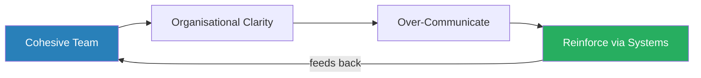
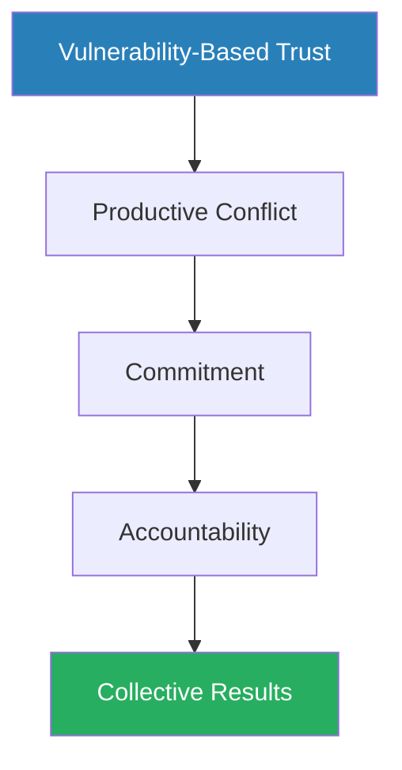
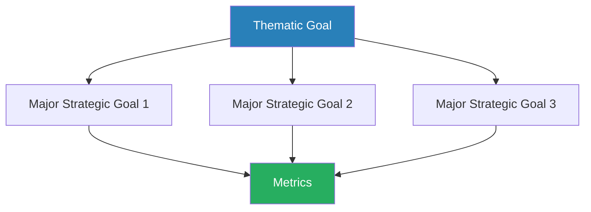
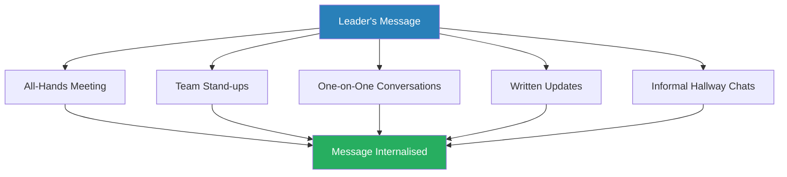
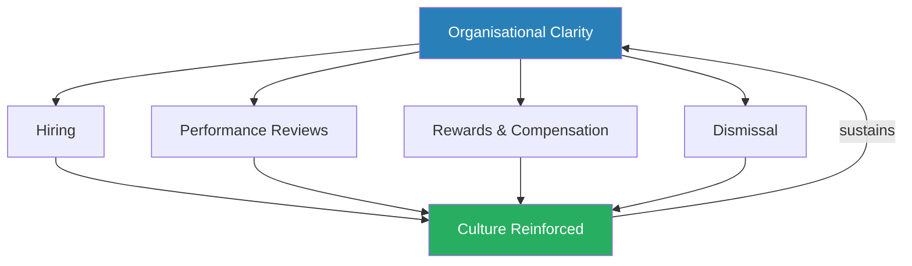
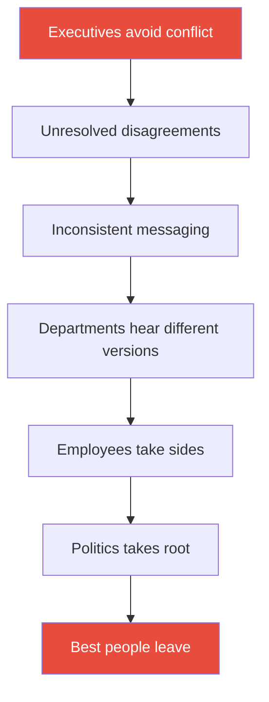

# The Four Obsessions of an Extraordinary Executive — Patrick M. Lencioni

> Lencioni's argument is deceptively simple: the single greatest competitive advantage available to any organisation is not strategy, technology, or talent — it is **organisational health**. A healthy organisation has less politics, less confusion, higher morale, and lower turnover. Most executives neglect it because it feels soft, is impossible to measure on a spreadsheet, and requires confronting uncomfortable human dynamics. The book delivers its thesis through a leadership fable contrasting two consulting firms with identical strategies and talent pools — one thriving, one decaying — and reveals that the difference comes down to four disciplines that only the person at the top can own. Delivered in Lencioni's trademark fable-then-framework format, it is a short, sharp book that punches well above its page count and provides an immediately actionable operating system for any leader building a team.

---

## About the Author

Patrick Lencioni is the founder and president of The Table Group, a management consulting firm specialising in organisational health and executive team dynamics based in the San Francisco Bay Area. His perspective is shaped by years of direct consulting work with leadership teams across industries, not by academic research — which gives his writing a practitioner's eye for recurring patterns but leaves his claims without empirical scaffolding. Before founding The Table Group, he worked at Bain & Company, Oracle, and Sybase, experiences that gave him a front-row seat to both healthy and dysfunctional executive teams. He is best known for *The Five Dysfunctions of a Team*, and *The Four Obsessions* covers much of the same intellectual territory through a different lens — zooming out from team dynamics to the executive's total job description. His books have collectively sold millions of copies, making him one of the most widely read business authors of the early 2000s.

---

## The Big Idea

*Most organisations pour their energy into being smart. Lencioni argues the real differentiator is being healthy — and the leader is the only person who can make it happen.*

- Most organisations over-invest in being **smart** — strategy, marketing, finance, technology — because these are measurable, intellectually stimulating, and what business schools teach
- They under-invest in being **healthy** — low politics, high clarity, high morale, low turnover — because it is hard to measure, slow to implement, and requires confronting uncomfortable human dynamics
- Executives gravitate toward "smart" work because it is familiar, quantifiable, and rewarding to the ego
  - Crafting a strategy feels like real leadership
  - Running a new-hire orientation does not
  - But this instinct is exactly backwards

---

- <b style="color: #27ae60">Healthy organisations make themselves smarter over time</b>
  - They self-correct faster because humility and trust make people willing to admit mistakes and surface problems early rather than hiding them until they metastasise
  - They retain talent because people stay for the culture — even when competitors offer higher compensation
  - They execute more efficiently because less energy is wasted on politics, turf wars, and confusion about direction
- A smart but unhealthy organisation squanders its intellectual advantages through infighting — brilliant people who do not trust each other spend their energy on self-protection rather than contribution
- <b style="color: #27ae60">A healthy organisation with merely decent strategy will outperform a brilliant but dysfunctional one</b> — and the advantage is sustainable because organisational health cannot be reverse-engineered from the outside the way a strategy or product can be copied

> [!tip] Core Insight
> The CEO's irreplaceable job is making the organisation healthy, not making it smart. Strategy can be delegated. Culture cannot.

- The catch — and this is the uncomfortable part — is that <b style="color: #e74c3c">only the leader can own this work</b>
  - Strategy can be delegated to a talented head of strategy
  - Technology can be delegated to a CTO
  - Marketing can be delegated to a CMO
  - Culture cannot be delegated to anyone
- The moment the person at the top stops personally owning the organisation's health, it begins to erode, because everyone takes their cues about what actually matters from what the leader spends time on — not from what the leader says matters
- This is what Lencioni means by "obsession" — not casual interest, not periodic attention, but the relentless, daily, sometimes tedious work of building and maintaining a healthy organisation

---

- The <b style="color: #2980b9">four disciplines</b> that constitute this obsession are sequential and interdependent:
  - Build a cohesive leadership team
  - Create organisational clarity
  - Over-communicate that clarity
  - Reinforce it through every human system in the organisation
- Each discipline enables the next:
  - Without cohesion, you cannot achieve real clarity because people withhold their honest views
  - Without clarity, you have nothing meaningful to communicate
  - Without communication, human systems have no consistent standard to enforce
  - Miss any link in the chain and the whole system weakens

The four disciplines form a self-reinforcing loop — each one enables the next, and the system strengthens with every complete cycle.

The treemap reveals the imbalance Lencioni describes: the "Smart" side has just five components, all of which receive heavy investment, while the "Healthy" side contains a far richer architecture of four disciplines with 20+ sub-components — most of which receive minimal executive attention.

---

## Key Concepts at a Glance

| Concept | One-line summary |
|---------|-----------------|
| **Organisational health** | The supreme competitive advantage — more durable and harder to copy than strategy or technology |
| **Smart vs Healthy** | Most organisations obsess over being smart while neglecting the health that determines whether smart decisions actually get executed |
| **The Four Disciplines** | A sequential system: cohesion enables clarity, clarity enables communication, communication enables reinforcement |
| **Vulnerability-based trust** | The willingness to show weakness and admit mistakes — the foundation of a cohesive team |
| **Productive conflict** | Passionate debate about ideas, not personalities — silence is the real danger sign |
| **Commitment without consensus** | After genuine debate, people commit fully to decisions they disagreed with, provided they felt heard |
| **The Six Clarity Questions** | Six deceptively simple questions that force conceptual alignment across the leadership team |
| **Cascading communication** | Executives agree on key messages at the end of every meeting and relay them to their teams within 24 hours |
| **Human systems reinforcement** | Hiring, performance reviews, rewards, and dismissals must all align to organisational clarity |
| **Meeting quality** | The leading indicator of organisational health — boring meetings signal dysfunction |

The radar reveals that building a cohesive team demands the most CEO time and is the hardest to sustain — yet it is also the discipline that decays fastest when neglected, explaining why Lencioni calls it the foundation upon which everything else depends.

---

## The Structure of the Book

*The book is a hybrid — a leadership fable followed by a didactic framework — and Lencioni intends you to feel the ideas before you analyse them.*

- The fable occupies roughly three-quarters of the pages, followed by a summary that lays out the four disciplines in framework form with self-assessment questions
- The fable carries the emotional argument — you feel the damage of a bad hire, the energy of a cohesive team, the slow rot of unresolved tension
- The summary carries the operational detail — precise definitions, practical steps, implementation guidance
- This two-part structure is deliberate:
  - Lencioni believes abstract frameworks do not change behaviour — stories do
  - By the time you reach the framework section, you have already felt what a healthy organisation looks like through the Telegraph fable
  - The framework then gives names and structure to what you have already experienced emotionally

---

## The Fable: Telegraph Partners vs Greenwich Consulting

### The Setup: Two Firms, One Difference

*Two consulting firms with identical strategies, talent, and markets — yet one consistently outperforms the other. The only difference is organisational health.*

- The story centres on two management consulting firms in the San Francisco Bay Area: <b style="color: #2980b9">Telegraph Partners</b> and <b style="color: #2980b9">Greenwich Consulting</b>
- They are roughly the same size, compete for the same clients, charge similar fees, and employ comparably talented people
- On paper, they are interchangeable
- In practice, Telegraph consistently outperforms Greenwich on every metric that matters — client retention, employee satisfaction, revenue growth, and cultural cohesion
- The difference is not strategy — both firms are "smart"
- <b style="color: #27ae60">The difference is health</b>

---

> [!example] Rich O'Connor — The Quietly Obsessive Leader
> - Rich, Telegraph's CEO, does not look extraordinary from the outside
> - He does not give keynote speeches at industry conferences or have a corner office full of awards
> - He is not the smartest person in the room
> - What Rich does is relentlessly, almost obsessively, maintain the health of his organisation:
>   - Personally interviews every senior hire
>   - Runs new-employee orientation himself, every other Monday, repeating the same message about Telegraph's purpose, values, and strategy
>   - Protects his weekly staff meetings above almost everything on his calendar
>   - Spends roughly a third of his time on interviews alone
> - He has abandoned most operational involvement — billing reviews, competitive analysis, expense management — to focus on the work he believes only he can do: keeping Telegraph healthy
> **The lesson:** The leader's job is not to be the smartest person in the room — it is to make the organisation healthy.

> [!example] Vince Green — The Brilliant but Dysfunctional Mirror
> - Vince, Greenwich's CEO, is Rich's mirror image — brilliant, polished, and strategic
> - His office features a framed poster reading "SMARTER—BETTER—FASTER"
> - He obsesses over competitive positioning, market analysis, and intellectual firepower
> - He hires the brightest people he can find and assumes talent will translate into performance
> - But his executive team cannot agree on fundamental direction
>   - They avoid conflict and let disagreements simmer into resentment
>   - They allow politics to fester in the spaces between their unresolved differences
> - Greenwich looks impressive from the outside but is slowly rotting from within
> **The lesson:** Intelligence without organisational health is a wasting asset.

- The contrast is not subtle, and Lencioni does not intend it to be
- Telegraph wins not because Rich is smarter than Vince — Vince may actually be the more intellectually gifted of the two — but because Rich has built a fundamentally healthier organisation
- <b style="color: #27ae60">Health compounds over time in ways that raw intelligence cannot match</b>

---

### The Meadowood Off-Site: Cohesion in Action

*A single acquisition debate reveals what years of trust-building look like in practice — passionate argument, quick decision, full commitment from the dissenters.*

- One of the fable's most vivid scenes is Telegraph's annual off-site retreat at a resort in Napa Valley
- Rich's executive team — including Tom (blunt operations head), Rita (cautious general counsel), and Mark (thoughtful finance chief) — gather to debate whether Telegraph should acquire a struggling competitor in Sausalito

> [!example] The Sausalito Acquisition Debate
> - The debate is intense and multi-sided:
>   - Tom thinks it is a no-brainer: cheap talent, new geographic footprint, fast growth
>   - Rita is worried about liability exposure and cultural integration risk
>   - Mark questions the financial assumptions
> - The arguments get heated — Tom calls Rita a "weenie lawyer" at one point, and Rita laughs it off without a trace of offence
> - This is not politeness — it is the product of years of vulnerability-based trust
> - They can attack each other's ideas without it feeling like a personal assault because they know each other's intentions are good
> - Rich listens, asks probing questions, and eventually decides to proceed with the acquisition
> - Rita and Mark both voted against it — neither sulks, backchannels, or undermines the decision
> - Rita immediately volunteers to lead the due diligence process
> - The decision is made in under ninety minutes, with full commitment from people who disagreed
> **The lesson:** Trust allows productive conflict, conflict produces better decisions, and commitment follows from being heard — not from getting your way.

---

### Jamie Bender: The Virus

*A single bad senior hire — made without the usual cultural safeguards — slowly corrodes an entire organisation's health, proving that the disciplines are interdependent.*

- The fable's dramatic engine is <b style="color: #2980b9">Jamie Bender</b>, a talented executive hired while Rich is on sabbatical
- Jamie is smart, experienced, and perfectly credentialed
- He is also, in Lencioni's framing, a cultural virus

> [!example] How One Skipped Interview Cascaded into Organisational Damage
> - Jamie is hired without going through Rich's usual interview process — the one safeguard Rich always insisted on
> - Rich's team, confident in their own judgement and eager to fill a gap, skips the CEO interview and brings Jamie aboard without the cultural orientation every other new hire receives
> - Jamie is competent but lacks two things Telegraph's culture demands:
>   - Humility — he manages impressions rather than admitting weakness
>   - Willingness to engage in direct confrontation — he avoids conflict rather than engaging in it
> - He operates politically — building quiet alliances and positioning himself rather than laying his cards on the table
> **The lesson:** One skipped safeguard can undo years of culture-building.

- <b style="color: #e74c3c">Over several months, Jamie's influence quietly corrodes Telegraph's health</b>:
  - He relaxes the hiring standards Rich had insisted on, arguing the process is too slow and too restrictive
  - He reduces the frequency of performance reviews, calling them "overhead"
  - Most damagingly, he manipulates the 360-degree feedback process to undermine Rich's confidence, planting doubts about Rich's leadership style
- As Rich's confidence wavers:
  - The meetings that were once passionate and decisive become "less and less crisp"
  - The team starts pulling punches
  - The cascading communication that kept every department aligned begins to stutter
  - Employees notice — a key client, Trinity Systems, starts to have concerns
  - Janet, one of Telegraph's best executives, begins to consider leaving

> [!tip] Core Insight
> The disciplines are interdependent — when Rich relaxes one (the hiring gate), the others begin to crumble. And the damage is not dramatic or sudden. It is a slow rot, almost invisible until the symptoms become acute.

---

### Jamie's Method: How a Cultural Virus Operates

*Jamie does not set out to destroy Telegraph. He simply operates according to his own nature — and that nature is incompatible with the organisation's culture.*

- Jamie's toxicity is not malicious — it is structural:
  - He is not scheming to bring Telegraph down
  - He is doing what has always worked for him in other organisations: managing appearances, building alliances, positioning himself politically
  - In a less healthy organisation, these behaviours would make him a top performer
  - In Telegraph's culture, they are corrosive precisely because they violate the norms everyone else lives by
- The specific mechanisms of Jamie's damage:
  - **Impression management vs vulnerability** — when Rich's team gathers for honest self-assessment, Jamie offers polished, carefully constructed answers rather than genuine self-reflection
  - **Conflict avoidance vs productive debate** — when disagreements arise, Jamie smooths them over or tables them rather than engaging directly
  - **Coalition-building vs transparency** — Jamie lobbies individuals before meetings rather than raising his concerns in the open
- <b style="color: #e74c3c">Each of these behaviours is individually subtle but collectively devastating</b>
  - Other team members begin to mirror Jamie's caution, unsure whether the old norms still apply
  - The gradual shift is almost imperceptible — no single meeting is the turning point
  - By the time the damage is visible, months have passed

---

### The Confrontation and Recovery

*The crisis resolves not with drama but with a direct, honest conversation — and recovery is immediate once the source of cultural infection is removed.*

- The crisis comes to a head when Rich's team presents evidence that Jamie has been manipulating the 360-degree feedback
  - They discovered that Jamie had coached certain employees on what to say
  - He had framed the feedback to make Rich seem out of touch with his organisation

> [!example] Rich Confronts Jamie
> - Rich faces a choice — his instinct, which had flagged Jamie as a poor cultural fit from the beginning, turns out to have been correct
> - But he had allowed the team's desire for Jamie to succeed, combined with his own undermined confidence, to delay action for months
> - The confrontation scene is deliberately anticlimactic:
>   - Rich does not fire Jamie in a blaze of righteous anger
>   - He has a direct, honest conversation and explains the values gap
>   - Jamie, who is not a bad person but is fundamentally unable to operate in Telegraph's culture, agrees to leave
> - The recovery is immediate — not because one conversation fixed everything, but because the removal of the source of cultural infection allowed the team's existing healthy behaviours to reassert themselves
> **The lesson:** Every month of delay compounds the damage. A leader's hesitation — rooted in kindness, not weakness — is itself a failure of discipline.

- The speed of recovery is one of Lencioni's most telling points:
  - Once Jamie is gone, the team snaps back to its old patterns within weeks
  - This suggests that the underlying culture was never truly broken — it was suppressed
  - <b style="color: #27ae60">A strong culture is resilient, but only if the source of infection is removed before the damage becomes permanent</b>
  - Had Jamie remained for another year, the recovery might not have been so swift — new hires brought in under Jamie's relaxed standards would have diluted the culture further

---

### Greenwich's Trajectory

*Greenwich serves as the control group — the organisation that has everything Telegraph has except health.*

- Vince Green runs a firm with elite credentials, sophisticated marketing, and sharp competitive analysis
- But his executive team operates in a state of permanent, low-grade dysfunction:
  - Meetings are polite and efficient on the surface
  - Nobody argues, nobody raises uncomfortable topics
  - Decisions are made quickly — but only because dissent has been suppressed, not because it has been resolved
  - The real conversations happen in hallways, over drinks, and in private alliances

---

- When Greenwich competes with Telegraph for the same clients:
  - Greenwich often makes the better pitch — slicker materials, more sophisticated analysis, more polished presentations
  - But clients who work with both firms overwhelmingly prefer Telegraph
  - Telegraph's people are aligned, consistent, and clearly engaged in their work
  - Greenwich's people send mixed signals, contradict each other in meetings, and radiate the low morale of a politically dysfunctional workplace

> [!example] Vince's Moment of Self-Awareness
> - Late in the fable, Vince is briefly exposed to Telegraph's operating model
> - He recognises its power but dismisses it as "touchy-feely"
> - This is precisely the reaction Lencioni argues is the reason most executives fail to invest in health
> - Vince would rather be smart than healthy — and that preference, repeated across thousands of executives, is the gap the book is written to close
> **The lesson:** Dismissing organisational health as "soft" is the most common and most costly executive blind spot.

| Trait | Telegraph Partners | Greenwich Consulting |
|-------|-------------------|----------------------|
| **CEO focus** | Organisational health | Competitive strategy |
| **Meeting tone** | Passionate, combative | Polite, conflict-averse |
| **Decision-making** | Debate then commit then align | Suppress dissent then fragment |
| **Communication** | Cascaded within 24 hours | Inconsistent, siloed |
| **Politics** | Minimal | Pervasive |
| **Client experience** | Aligned, consistent | Mixed signals, contradictory |
| **Talent retention** | High — people stay for culture | Moderate — people stay for resume |

The contrast between these two firms illustrates Lencioni's core claim — identical talent and strategy can produce radically different outcomes depending on organisational health.

The horizontal bar chart makes the imbalance visceral: most organisations invest 80-90% of executive attention in "Smart" areas while starving the "Healthy" areas that Lencioni argues determine whether those smart investments actually produce results.

---

## Discipline 1: Build and Maintain a Cohesive Leadership Team

### What It Is

*The first discipline is the foundation — without a cohesive leadership team, nothing else in the system can work.*

- A <b style="color: #2980b9">cohesive leadership team</b> is a small group — Lencioni recommends 5-8 people and is emphatic that larger groups cannot achieve genuine cohesion — who:
  - Trust each other enough to engage in productive conflict
  - Commit to decisions they did not personally endorse
  - Hold each other accountable for behaviour and results
  - Focus on collective outcomes over individual agendas
- This is not about liking each other — cohesive teams can be made up of people who would never socialise together
- It is about professional trust — the confidence that your colleagues are telling you the truth, that they will raise uncomfortable issues rather than hiding them, and that they will not pursue hidden agendas behind your back

This pyramid mirrors the structure Lencioni later expanded in *The Five Dysfunctions of a Team* — each layer depends on the one beneath it, and the absence of any layer undermines everything above.

---

### Vulnerability-Based Trust

*The cornerstone of cohesion is not competence-based confidence but something far more uncomfortable — the willingness to let colleagues see your weaknesses.*

- <b style="color: #2980b9">Vulnerability-based trust</b> is the willingness to let colleagues see your weaknesses, mistakes, and uncertainties
- This is a very specific definition — most people think of trust as confidence in someone's competence: "I trust you to do a good job"
- Lencioni means something different: "I trust you enough to let you see that I do not have all the answers"

Why this matters:

- When people hide their weaknesses, they spend energy on self-protection rather than contribution:
  - They position themselves to look competent in meetings rather than raising the issues that need to be raised
  - They avoid asking for help because it would reveal a gap
  - They manage their image rather than doing their best work
- <b style="color: #e74c3c">This self-protective behaviour is the engine of organisational politics</b>
  - Politics does not arise from malice or ambition in most cases
  - It arises from fear — fear of looking incompetent, fear of being exposed, fear of losing status
- Vulnerability-based trust eliminates the need for self-protection, because the team has agreed that admitting weakness is not just acceptable but expected

---

- <b style="color: #27ae60">The mechanism requires the leader to go first</b>
  - If the CEO does not model vulnerability — openly admitting mistakes, asking for help, discussing personal development areas — nobody else will
  - The leader's behaviour sets the ceiling for how vulnerable anyone else is willing to be
- In the fable, Rich O'Connor models this constantly:
  - He admits when he does not understand something
  - He asks his team for feedback on his own performance
  - He discusses his weaknesses in front of the group
  - This is what creates the environment where Tom can call Rita a "weenie lawyer" and she laughs

> [!tip] Core Insight
> Vulnerability-based trust does not mean over-sharing personal problems or turning meetings into therapy sessions. The vulnerability is specifically professional: admitting what you do not know, acknowledging when you were wrong, asking for help, and sharing concerns that might make you look less confident. It is about professional honesty, not emotional exhibitionism.

---

### How Trust Builds — and How Quickly It Breaks

- Trust-building is asymmetric:
  - It takes months or years to build vulnerability-based trust across a team
  - It takes one betrayal — one instance of someone using a colleague's admitted weakness against them — to destroy it
  - This is why the hiring process matters so much: every new member of the team either strengthens or threatens the trust foundation
- Lencioni describes trust as something that compounds:
  - Each act of vulnerability that is met with acceptance raises the ceiling for the next act
  - Over time, the team develops a comfort with honesty that feels effortless from the inside but is actually the product of deliberate, sustained effort
  - Outsiders see the easy banter and assume the team is just naturally compatible
  - In reality, the ease is engineered — it is the result of hundreds of small trust deposits

---

### Productive Conflict

*The absence of argument is far more dangerous than its presence — silence means either fear or apathy, and both are symptoms of a deeply unhealthy team.*

- Once trust exists, the team can engage in <b style="color: #2980b9">productive conflict</b> — passionate, intense, sometimes exhausting debate about substantive issues
- The key distinction is between conflict about ideas and conflict about personalities:
  - A cohesive team fights hard about strategy, priorities, resource allocation, and direction
  - They do not fight about who is a better person or whose department is more important
  - The trust foundation makes this possible because people can disagree on substance without it feeling like a personal attack

---

- <b style="color: #e74c3c">The absence of conflict is the real danger sign</b>
  - When meetings are quiet and polite, it means one of two things:
    - People have stopped caring enough to argue (apathy)
    - They are afraid to voice dissent (fear)
  - A team that never argues is making worse decisions than it should, because perspectives are being withheld and assumptions are going unchallenged
- In the fable, the Sausalito acquisition debate is the clearest illustration:
  - The team argues passionately for the better part of an hour
  - Multiple positions are advanced, attacked, defended, and refined
  - Rich does not rush to a vote or impose his view — he lets the argument run until every perspective has been fully expressed
  - His decision is better than any individual's starting position because it has been pressure-tested by the group's collective intelligence

---

- When Rich's confidence is later undermined by Jamie's manipulated feedback:
  - The meetings become quieter — people pull punches
  - The debate that once produced sharp, well-tested decisions gives way to cautious consensus
  - Lencioni presents this deterioration as the first visible symptom of organisational disease
  - It was the loss of conflict, not the loss of strategy, that signalled the decline

| Conflict type | What it looks like | Outcome |
|---------------|-------------------|---------|
| **Productive** | Passionate debate about ideas, people move on cleanly | Better decisions, stronger trust |
| **Destructive** | Personal attacks, lingering resentment | Broken relationships, fear |
| **Artificial harmony** | No debate at all, polite agreement | Worse decisions, suppressed dissent |

Most organisations mistake artificial harmony for professionalism — Lencioni argues it is the most dangerous of the three because it looks healthy while producing the worst outcomes.

---

### Commitment Without Consensus

*People do not need to get their way to feel committed. They need to feel their perspective was genuinely considered.*

- After thorough debate, the leader must make a decision and every team member must commit to it publicly — even those who disagreed
- <b style="color: #e74c3c">Waiting for full consensus produces paralysis</b>
- The social contract is explicit: voice your objection fully, fight for your position with everything you have, and if the group decides otherwise, commit to the decision as though it were your own

The psychological mechanism:

- <b style="color: #27ae60">The act of being heard is, for most people, more important than the act of winning</b>
  - When someone knows their perspective was genuinely listened to, debated, and considered — even if ultimately rejected — they can accept the outcome without resentment
  - When someone feels their view was dismissed or never heard, they cannot commit, no matter how sound the decision is
- The danger of uncommitted executives is that their ambivalence cascades:
  - When a VP leaves a meeting uncommitted and returns to their department, their team picks up on the lack of conviction
  - Small disconnects between executives look like major rifts to people deeper in the organisation
  - Employees begin to take sides, and politics takes root

> [!example] Rita's Model Commitment After the Sausalito Vote
> - Rita argued against the acquisition — she was worried about liability and cultural integration risk
> - She lost the argument
> - She immediately took ownership of the due diligence process
> - No resentment, no passive resistance, no quiet sabotage
> **The lesson:** Commitment without consensus looks like this — full ownership of a decision you disagreed with, because you know you were heard.

---

### Peer Accountability

*Accountability is a consequence of commitment — when everyone has genuinely committed to a decision, they earn the right to hold each other to it.*

- In most organisations, accountability flows downward only — the boss holds the employee accountable
- In a cohesive team, accountability is <b style="color: #2980b9">lateral</b> — peers hold each other accountable for both results and behaviours
- This is uncomfortable because most people are reluctant to confront peers:
  - It feels presumptuous — "who am I to call you out?"
  - It risks damaging the relationship
  - It is easier to escalate to the boss and let them handle it
- But <b style="color: #e74c3c">escalating to the boss for peer accountability is a failure mode</b>:
  - It creates a bottleneck where every interpersonal issue passes through a single person
  - It signals to the team that only authority can demand behaviour change
  - It infantilises the team and reinforces hierarchy at the expense of cohesion
- In the fable, Rich's team holds each other accountable directly:
  - When someone is not following through on a commitment, a peer raises it in the next meeting
  - The tone is not adversarial — it is the tone of someone who assumes good intent but demands follow-through
  - This only works because trust makes the confrontation safe

---

### When This Discipline Breaks Down

- Cohesion is the most fragile of the four disciplines because it depends on human behaviour that must be actively maintained:
  - A single new team member who operates politically rather than transparently can erode years of trust-building — as Jamie Bender demonstrates
  - A leader who stops modelling vulnerability can cause the entire team to retreat into self-protection
- The discipline also has natural limits:
  - Lencioni is explicit that cohesive teams should be small — 5-8 people
  - When leadership teams grow beyond this size, genuine vulnerability becomes difficult because interpersonal risk increases with every additional person
  - Large leadership groups may need to be restructured into smaller, genuinely cohesive sub-teams

---

## Discipline 2: Create Organisational Clarity

### The Six Clarity Questions

*Clarity is not about crafting elegant mission statements. It is about the executive team having genuine, conceptual agreement on six fundamental questions — and being able to give aligned answers independently.*

- <b style="color: #2980b9">The Six Clarity Questions</b> define genuine organisational alignment:

| # | Question | What it really asks |
|---|----------|-------------------|
| 1 | **Why do we exist?** | What difference does the organisation make — beyond making money? |
| 2 | **What are our core values?** | What behavioural traits are irreplaceable and non-negotiable? |
| 3 | **What business are we in?** | Who are our customers and competitors? (Many executive teams cannot agree) |
| 4 | **How are we different?** | What is the single strategic anchor that distinguishes us? |
| 5 | **What are our goals?** | What must we accomplish this month, quarter, year, and beyond? |
| 6 | **Who does what?** | What are the roles and responsibilities — clear enough that no two executives are confused? |

- These questions are deceptively simple — the power is not in the answers themselves but in the executive team's ability to give <b style="color: #27ae60">aligned, unambiguous answers</b>
- The test Lencioni proposes is simple but devastating: pull each executive aside separately and ask them to answer the six questions
  - If their answers diverge — and in most organisations, they diverge dramatically — the organisation does not have clarity
  - What is written on the strategy deck is irrelevant if the leaders cannot independently articulate the same answers

The force graph reveals that the six questions cluster into three natural pairs — Purpose (Why/Values), Strategy (Business/Differentiation), and Execution (Goals/Roles) — with the links between clusters showing how answers to earlier questions constrain and inform later ones.

---

> [!example] Greenwich's Illusion of Alignment
> - Vince Green has a framed poster with "SMARTER—BETTER—FASTER" on the wall
> - But his executives cannot agree on whether Greenwich is a strategy firm, a technology firm, or a generalist consultancy
> - The poster creates the illusion of alignment without the substance
> - Telegraph, by contrast, has no posters, no slogans, no marketing campaigns around its values — yet every executive can recite the same purpose, values, and strategy in their own words
> **The lesson:** Posters and slogans create the illusion of clarity. Genuine alignment means every leader can independently give the same answers.

---

### Why Question 1 (Purpose) Matters More Than Leaders Think

- Most organisations answer "Why do we exist?" with a generic statement about shareholder value or customer satisfaction
- <b style="color: #e74c3c">These answers are useless because they apply to every organisation</b> — they create no alignment and inspire no one
- The purpose question is not about what the organisation does — it is about why anyone should care that it does it
- Lencioni argues the answer does not need to be noble or world-changing:
  - A plumbing company's purpose might be "to give people confidence that their home works"
  - A consulting firm's purpose might be "to help leaders build better organisations"
  - The answer just needs to be specific, authentic, and differentiating
- In the fable, Telegraph's purpose is rooted in a genuine belief about helping organisations become healthier — and the team can articulate this in varied but consistent language because they actually believe it, not because they memorised it from a strategy document

---

### Discovering Values

*Values must be discovered, not invented — identify the traits of your best people rather than choosing aspirational words from a brainstorm.*

- Lencioni is particularly insistent that <b style="color: #27ae60">values must be discovered, not invented</b>
  - An organisation's core values already exist in the behaviour of its best people
  - The executive team's job is to identify and articulate them, not to choose aspirational values from a brainstorming session

> [!abstract] The Values Discovery Process
> 1. Ask: "Who are the two or three people you would most want to clone?"
> 2. Ask: "What behavioural traits make them exceptional?"
> 3. Ask: "Who are the people who should leave?"
> 4. Ask: "What traits make them destructive?"
> 5. Find the intersection — the traits the best people embody and the worst people lack
> 6. These are your real values

- <b style="color: #e74c3c">Aspirational values create cynicism</b> when they do not match actual behaviour:
  - When an organisation claims to value "innovation" but promotes based on tenure
  - Or claims to value "integrity" but tolerates ethical shortcuts from high performers
  - Employees learn to ignore the stated values and observe the real ones
- Discovered values, by contrast, have authenticity — they can be enforced credibly because they describe behaviours that are already being rewarded

---

- Telegraph's values in the fable are <b style="color: #2980b9">humble, hungry, and smart</b>:
  - Not intellectually smart, but interpersonally smart — the awareness of how one's behaviour affects others
  - These values were identified by studying who thrives at Telegraph and who fails
  - When Jamie is eventually recognised as a cultural misfit, it is precisely because:
    - He lacks humility (manages his image rather than admitting weakness)
    - He avoids confrontation (is not "smart" in the interpersonal sense Lencioni means)

| Value type | Description | Risk |
|------------|-------------|------|
| **Core values** | Already embedded in the best people's behaviour | Forgetting to articulate them |
| **Aspirational values** | Traits the organisation wishes it had | Cynicism when the gap is visible |
| **Permission-to-play values** | Basic expectations shared by all companies (integrity, honesty) | Mistaking them for differentiators |
| **Accidental values** | Traits that emerged by chance, not design | Codifying traits that may not serve the future |

Lencioni's key insight is that most organisations confuse these four types — they put permission-to-play values on the wall and call them core values, which explains why so many values statements sound interchangeable.

---

### The Goal Hierarchy

*Lencioni distinguishes three tiers of goals that most organisations confuse — and using metrics in place of thematic goals is the most common mistake.*

- <b style="color: #2980b9">Thematic goals</b> are the overarching narrative for a period:
  - "This is the year we integrate the acquisition" or "This quarter is about stabilising after the reorg"
  - They are qualitative, inspiring, and temporary
  - They answer the question "What is the single most important thing right now?" and align the organisation's energy toward one priority
- <b style="color: #2980b9">Major strategic goals</b> are the key areas that support the theme:
  - If the theme is "integrate the acquisition," the major goals might be: unify the cultures, merge the client portfolios, and consolidate the technology platforms
  - Specific enough to drive action, broad enough to allow flexibility
- <b style="color: #2980b9">Metrics</b> are permanent quantitative measures:
  - Revenue, turnover rate, client satisfaction scores, productivity
  - They persist regardless of the current theme and provide the ongoing health dashboard

The thematic goal sits at the top as a temporary rallying cry, supported by strategic goals, and underpinned by permanent metrics that persist regardless of the current theme.

- <b style="color: #e74c3c">The common mistake is using metrics in place of thematic goals</b>:
  - "Grow revenue by 15%" is a metric, not a rallying cry
  - It tells people what to measure, not what to prioritise
  - "This is the quarter we win back the enterprise segment" tells the team where to focus their energy
  - "Grow revenue by 15%" tells them nothing about how to allocate their time

> [!example] The Power of a Clear Thematic Goal
> - In the fable, when Telegraph decides to pursue the Sausalito acquisition, the thematic goal becomes clear: "This quarter is about integrating the new team and protecting client relationships during the transition"
> - Every department can orient around this:
>   - HR knows to prioritise onboarding and cultural integration
>   - Sales knows to proactively reassure clients who may be unsettled by the change
>   - Operations knows to focus on merging systems rather than launching new initiatives
> - Without the thematic goal, each department would default to its own priorities, and the integration would compete with business-as-usual for attention
> **The lesson:** A thematic goal creates shared focus — without it, every department optimises locally at the expense of the organisation's most important priority.

---

## Discipline 3: Over-Communicate Organisational Clarity

### The Repetition Gap

*Leaders get bored after saying a message twice. Employees need to hear it at least six times. The gap between leader boredom and employee internalisation is where organisational clarity goes to die.*

- Lencioni's third discipline is built on a simple observation: employees need to hear a message <b style="color: #27ae60">at least six times</b> before they begin to internalise it, and leaders get bored after saying it twice
- Why this gap exists:
  - Leaders are intelligent people who process information quickly and crave intellectual novelty
  - When they have articulated the organisation's purpose, values, and strategy once — perhaps in a well-crafted all-hands presentation — they feel they have been clear
  - They have said the thing and are ready to move on to the next intellectual challenge
  - But the vast majority of the organisation was not in the room, was not paying full attention, or heard the words without truly absorbing them
- Information competes with noise — deadlines, personal concerns, other messages, and the sheer cognitive load of a working day
- A message said once is heard by a fraction of the audience and understood by a fraction of those who heard it
- <b style="color: #27ae60">Repetition is the only mechanism that overcomes this natural attrition</b>

> [!example] Jamie Observes Rich's "Grandfather Stories"
> - Jamie observes Rich delivering the same speech about Telegraph's values for the fourth or fifth time
> - He compares it to listening to a grandfather repeat old stories
> - He finds it tedious, even embarrassing
> - But the employees are engaged — not bored, not rolling their eyes — because for many of them, this is the first or second time they have truly heard the message in a way that connects
> **The lesson:** The leader's boredom is not the audience's experience. The moment you start feeling repetitive is roughly the moment the message is beginning to land.

---

### Multiple Channels, Varied Framing

- Effective over-communication requires more than simply repeating the same speech
- It requires <b style="color: #2980b9">multiple channels</b> — live presentations, written follow-ups, stand-ups, one-on-one conversations, informal hallway chats — and slightly varied framing each time to avoid sounding robotic
- The same message delivered across different contexts reaches different people and reinforces itself through repetition without feeling mechanical:
  - All-hands meeting — broadest audience, least attention per person
  - Team stand-up — moderate audience, moderate attention
  - One-on-one conversation — one person, full attention, opportunity for dialogue
  - Written update — reference document, asynchronous absorption
- The underlying principle is that leaders should communicate far more than they are comfortable with
- The "six times" is a heuristic, not a scientific finding — but the direction is clear

Each channel reaches a different subset of the organisation with different levels of attention — saturation across all channels is what produces genuine internalisation.

---

### Cascading Communication

*The most powerful and underused communication mechanism — five minutes at the end of every leadership meeting that prevents an entire category of organisational dysfunction.*

- <b style="color: #2980b9">Cascading communication</b> works as follows:
  - At the end of every leadership meeting, the team spends five minutes on a specific question: "What do we need to communicate to our teams? How should we frame it?"
  - They agree on the key messages and the framing
  - Each executive cascades those messages to their own teams within 24 hours

> [!abstract] The Cascading Communication Protocol
> 1. End every leadership meeting with 5 minutes of alignment
> 2. Ask: "What do we need to communicate? How should we frame it?"
> 3. Agree on the key messages and framing as a group
> 4. Each executive relays those messages to their direct reports within 24 hours
> 5. Use the same framing — consistency is the point

- Why this is so powerful:
  - Employees trust their direct manager more than company-wide announcements
  - When their manager personally communicates a decision using the same framing as other managers across the organisation, the message feels credible and unified
  - When executives leave meetings without this step, different departments hear different versions of the same decision — or hear nothing at all
  - Employees conclude that leadership is not aligned

---

> [!example] The Hiring Freeze Fiasco
> - A company where the HR VP emailed a hiring freeze to the entire organisation before the other executives had even agreed on what was decided in the meeting
> - The result was chaos, confusion, and the perception that leadership was operating in silos
> - The five-minute cascading exercise at the end of every meeting would have prevented this entirely
> **The lesson:** Without deliberate cascading, even good decisions arrive as confusion.

- The discipline is simple but requires rigour:
  - It is the easiest step to skip under time pressure — and time pressure is always present
  - But skipping it means that the clarity so carefully created in Discipline 2 never reaches the people who need it most

---

### The CEO as Chief Repeating Officer

- Lencioni uses the term <b style="color: #2980b9">Chief Repeating Officer</b> to capture the leader's communication role:
  - The CEO's job is not to create new messages constantly — it is to repeat the same core messages in every possible context until they become part of the organisation's DNA
  - This runs against every instinct a leader has:
    - Leaders want to be interesting, novel, and intellectually stimulating
    - Repeating the same values speech for the twentieth time feels neither interesting nor novel
  - But the alternative — changing the message frequently to keep things "fresh" — is far worse
    - It signals to the organisation that the values are disposable
    - It creates the impression that last month's priority was a passing fad
    - <b style="color: #e74c3c">Consistency of message, not novelty, is what builds credibility over time</b>

---

### When Over-Communication Fails

- <b style="color: #e74c3c">Over-communication only works when there is something substantive to communicate</b>
  - Repetition of a vacuous message is not over-communication — it is noise
  - If the organisation's answers to the six clarity questions are generic platitudes — "We exist to deliver value to stakeholders" — repeating them more often will not create clarity
  - It will create cynicism
- Over-communication of trivial decisions wastes the leader's credibility
  - The repetition engine should be reserved for the messages that truly matter: purpose, values, strategy, and major directional decisions
  - Routine operational updates do not need the cascading treatment

---

## Discipline 4: Reinforce Organisational Clarity Through Human Systems

### Why Systems Matter

*Without reinforcement, clarity erodes. The human systems — hiring, performance management, rewards, and dismissal — must all align to organisational clarity, or that clarity is just words on a wall.*

- <b style="color: #e74c3c">If the values say "humble, hungry, and smart" but the bonus structure rewards political gamesmanship, the bonus structure wins</b>
  - People respond to incentives, not aspirations
- Lencioni's argument is that these systems do not need to be complex — in fact, complexity is the enemy:
  - Complex performance review forms become compliance exercises
  - Elaborate compensation matrices become opaque
  - Intricate hiring processes become slow without adding value
- What matters is that every system asks the same question: "Does this reinforce or undermine the clarity we have established?"

Every human system either reinforces or undermines the clarity — there is no neutral position.

The polar area chart shows that hiring has the highest impact on reinforcing clarity — consistent with Lencioni's emphasis that every new hire either strengthens or dilutes the culture — followed closely by dismissal of misfits, which Rich's delay in addressing Jamie proved to be the most costly system failure.

---

### Hiring: The Most Critical System

*Every new hire either reinforces or dilutes the culture. There is no neutral hire.*

- <b style="color: #27ae60">A rigorous, values-based hiring process prevents cultural erosion</b>
- Shortcuts in hiring produce cultural misfits whose damage far exceeds their individual contribution
- Values-based hiring is not about gut feeling or "culture fit" as a vague criterion:
  - It is about structured behavioural interviews that test for the specific values the organisation has identified
  - If a value is "humble," the interview should include questions designed to surface humility or its absence — questions about past mistakes, about times the candidate needed help, about credit-sharing and blame-taking
  - If a value is "hungry," the questions should probe for initiative, self-motivation, and work ethic

> [!example] Rich's Hiring Process at Telegraph
> - Rich personally interviews every senior hire
> - He uses behavioural questions aligned to Telegraph's values
> - After each interview, all interviewers debrief together — not independently, but in the same room
> - They share observations and challenge each other's assessments
> - This collective debrief is critical because it prevents individual biases from dominating and ensures values-fit concerns are surfaced
> **The lesson:** The collective debrief is as important as the interview itself — it catches what individual interviewers miss.

---

- When Rich goes on sabbatical and Jamie is hired without his interview:
  - The hiring gate — the single most important safeguard in the system — fails
  - Jamie passes the competence test but fails the values test
  - No one in the process has the mandate or inclination to flag the cultural concern
  - The result is months of organisational damage that traces directly back to one skipped interview

> [!tip] Core Insight
> Cultural misfits at senior levels cause disproportionate damage because they influence more people, have more power to change systems, and set behavioural norms for everyone who reports to them. A junior misfit has a limited blast radius. A VP misfit normalises the wrong behaviours across an entire department.

---

### New-Employee Orientation: The Overlooked Reinforcement

*Most organisations treat orientation as an HR administrative task. Lencioni treats it as the CEO's personal responsibility.*

- In the fable, Rich runs new-employee orientation himself, every other Monday
- This is not a thirty-minute welcome speech — it is a genuine session where Rich communicates:
  - Why Telegraph exists
  - What its values are and what they look like in practice
  - What the current thematic goal is and how the new hire fits into it
  - What behavioural expectations look like on a daily basis
- <b style="color: #27ae60">The CEO's personal involvement sends an unmistakable signal about what the organisation values</b>:
  - If the CEO spends time on orientation, it tells new hires that culture matters more than any other meeting the CEO could be in
  - If orientation is delegated to HR, it tells new hires that culture is an afterthought
- Jamie views this as a waste of Rich's time — "Why is the CEO doing HR's job?"
- But this misunderstanding reveals precisely why Jamie is a cultural misfit:
  - He sees orientation as administrative overhead
  - Rich sees it as the first and most powerful reinforcement of organisational clarity

---

### Senior Misfits: Less Rope, Not More

*The instinct to "give them time" is well-intentioned but dangerous — senior people set behavioural norms for everyone below them, and every day of inaction compounds the damage.*

- <b style="color: #e74c3c">Lencioni is blunt: act quickly when a senior hire turns out to be a cultural misfit</b>
- The mechanism is straightforward:
  - Senior people set behavioural norms for everyone below them
  - Every day a culturally misfit VP remains in their role, they normalise the wrong behaviours
  - Direct reports begin to mirror those behaviours — either because they believe the VP's approach is what the organisation actually values, or because they adapt to survive under a boss who rewards different traits
- In the fable, Rich's team recognises Jamie's cultural misfit relatively early but delays action:
  - They want Jamie to succeed
  - Rich, his confidence undermined by the manipulated feedback, lacks the certainty to act
  - During the delay, Jamie weakens hiring processes, reduces performance review frequency, and introduces the first real political dysfunction Telegraph has experienced
  - Each month of inaction compounds the damage

---

- Lencioni's prescription:
  - When your instinct tells you a senior hire is not a cultural fit, investigate immediately and act within weeks, not months
  - The leader must distinguish between two situations:

| Situation | Diagnosis | Trajectory | Action |
|-----------|-----------|------------|--------|
| **Values mismatch** | Does not share core values | Will naturally corrode | Act quickly — weeks, not months |
| **Learning curve** | Shares values, needs time with systems | Will naturally improve | Give support and patience |

The critical skill is distinguishing between these two — patience is a virtue for learning curves and a liability for values mismatches.

---

### Performance Management

*Lencioni advocates a deliberately simple system — a one-page quarterly review built around conversation, not form-filling.*

> [!abstract] The One-Page Quarterly Review
> **Front of page:**
> 1. What did you accomplish last quarter?
> 2. What will you accomplish next quarter?
>
> **Back of page:**
> 3. How can you improve?
> 4. Are you living the values?

- The manager spends ninety minutes per direct report per quarter in genuine conversation, not form-filling
- <b style="color: #27ae60">The conversation matters more than the documentation</b>
- The frequency matters more than the depth of any single review:
  - Annual reviews catch problems too late
  - Quarterly conversations catch them while they are still correctable
- The values question on the back of the page is the critical link to organisational clarity:
  - It forces the conversation about behaviour, not just results
  - <b style="color: #e74c3c">A person who hits their numbers but violates the values is doing more damage than a person who misses their numbers but embodies the values</b>
  - The first person teaches the organisation that values are negotiable when results are good

---

### Compensation and Rewards

- Lencioni does not prescribe a specific compensation model, but he insists on one principle: <b style="color: #27ae60">rewards must align with stated values</b>
- The most common failure:
  - Organisations claim to value collaboration but reward individual heroics
  - They claim to value humility but promote the loudest self-promoters
  - They claim to value long-term thinking but bonus on quarterly results
- Employees are sophisticated pattern-matchers:
  - They learn the real values by observing who gets promoted, who gets praised, and who gets fired
  - If those observations contradict the stated values, the stated values become a joke
  - <b style="color: #e74c3c">Nothing destroys cultural credibility faster than rewarding behaviour that contradicts the values</b>

---

### When Reinforcement Systems Fail

- The most common failure mode is <b style="color: #e74c3c">inconsistency</b>:
  - An organisation that hires for values but promotes for politics
  - A team that talks about humility but rewards self-promotion
  - A company that says it values work-life balance but celebrates the person who works every weekend
  - These inconsistencies do not just fail to reinforce clarity — they actively destroy it, because employees learn to distrust the stated values entirely
- The second failure mode is complexity:
  - When the performance review form is twelve pages long and requires three levels of managerial sign-off, it becomes a compliance exercise
  - Managers fill it out to satisfy HR, not to develop their people
  - The conversation that should be at the centre of the review is squeezed out by the process that surrounds it

---

## The Quality of Meetings

*Lencioni treats meeting quality as the leading indicator of organisational health — a diagnostic tool that reveals the state of the team more reliably than any survey or assessment.*

- <b style="color: #2980b9">Meeting quality as diagnostic</b> — what meetings tell you:
  - **Boring meetings** signal dysfunction — people are avoiding the difficult topics, either because they are afraid to raise them (lack of trust) or because they have given up trying to influence decisions (apathy)
  - The meeting becomes a status update: safe, predictable, and useless for its supposed purpose of group decision-making
  - **Passionate, intense, even exhausting meetings** signal health — trust exists, real issues are being addressed, and the team is mining for the best answers rather than protecting individual positions
- When Telegraph's meetings are described as "internal family feuds," it is a compliment
- When Rich's confidence is undermined and meetings become "less and less crisp," it is the first visible sign of deterioration

---

> [!abstract] Lencioni's Meeting Rescue Technique
> 1. Pause the meeting
> 2. Ask: "What is the most difficult issue we are avoiding right now?"
> 3. Observe the response:
>    - **Genuine debate follows, people move on cleanly afterward** — the team is healthy
>    - **Silence follows the question** — the problem is deeper than format — it is the team's trust foundation
>    - **People argue but cannot let go of resentment afterward** — conflict has become personal rather than substantive

- The meeting is not the disease or the cure — it is the thermometer
- It tells you the temperature of the team
- When the temperature drops, the answer is not to redesign the meeting agenda — it is to investigate what has gone wrong with cohesion, clarity, or communication

---

### The Four Meeting Types

*Lencioni later expanded his thinking on meetings in Death by Meeting, but the seeds are here — different decisions require different meeting formats.*

- Lencioni hints at a principle he later developed fully:
  - Trying to handle all types of decisions in one weekly meeting is a recipe for mediocrity
  - The quick operational check-in should not compete with the strategic debate for the same time slot
- The implicit meeting types in the fable:
  - **Daily check-in** — five minutes, no agenda, what are you working on today
  - **Weekly staff meeting** — Rich protects this above almost everything, for tactical decisions and cascading communication
  - **Monthly strategic discussion** — deeper dives into specific topics that need more than the weekly meeting allows
  - **Quarterly off-site** — the Meadowood retreat, where the big decisions happen (like the Sausalito acquisition)
- <b style="color: #27ae60">Protecting meeting time is itself a leadership act</b>:
  - When Rich protects his weekly staff meeting above almost everything on his calendar, he sends a signal about what matters
  - When Jamie begins to skip or shorten meetings, it sends the opposite signal

---

## Schedule as Strategy

*What an executive spends time on — not what they say matters — reveals their actual priorities. Your calendar is your strategy, whether you designed it that way or not.*

- Rich O'Connor's calendar is a direct expression of his four disciplines:
  - He has abandoned most operational involvement — billing reviews, competitive analysis, expense management
  - He spends time on the things he believes only he can do:
    - Hiring interviews (roughly a third of his time)
    - New-employee orientation (personally, every other Monday)
    - Team meetings (protected above almost everything on his calendar)
    - Communication cascading
- This is not delegation by default or laziness — it is a deliberate strategic choice:
  - Strategy, operations, and competitive analysis are important but delegable — his team can do these things without him
  - <b style="color: #27ae60">Organisational health is important and non-delegable</b> — it loses its power when anyone other than the leader owns it

---

- In the fable, Rich keeps a <b style="color: #2980b9">yellow sheet</b> — a simple one-page document listing his priorities and how his time should be allocated
  - It is not a productivity hack or a planning tool
  - It is a forcing function that makes the implicit explicit
  - By writing down what he should be spending time on and checking it against what he actually spent time on, Rich keeps himself honest
- The yellow sheet concept reveals an important truth about leadership:
  - Most executives have never deliberately designed their calendars around their priorities
  - Their time is allocated by whoever asks for it most urgently, not by what matters most
  - The gap between "what I say matters" and "what I spend time on" is often enormous — and employees always notice

> [!tip] Core Insight
> Look at your calendar for the last month. What percentage of your time went toward building team cohesion, creating clarity, communicating direction, and reinforcing systems? If it is less than a third, you are under-investing in health — regardless of what your strategy deck says.

---

## Politics as Symptom

*Lencioni reframes organisational politics from "inevitable human nature" to "predictable symptom of unresolved issues at the executive level" — which is both uncomfortable and empowering, because it means the problem is fixable.*

- <b style="color: #2980b9">Politics as symptom, not cause</b> — the mechanism is straightforward:
  - When executives fail to resolve their disagreements — when they leave meetings without genuine alignment, or when they harbour resentments they never surface
  - Small disconnects at the top become major rifts at the bottom
  - Employees in Department A hear one version of a decision; employees in Department B hear another
  - They try to reconcile the difference, discover they cannot, and begin to take sides
  - The best employees — the ones with options — leave
  - The rest become disillusioned, learn to navigate the politics, and stop focusing on the work

Politics cascades from top to bottom — fixing it requires fixing the executive behaviours that create it, not managing the symptoms downstream.

---

- What makes this reframing powerful is the shift from "inevitable" to "fixable":
  - If politics is just what humans do, there is nothing to be done about it except manage it cynically
  - But if politics is the downstream consequence of specific leadership behaviours — avoidance of conflict, failure to communicate decisions, tolerance of unresolved disagreements — then it is fixable
  - <b style="color: #27ae60">Fix the behaviours at the top, and the politics below will diminish</b>

---

- In the fable, the causal chain is visible:
  - Rich's loss of confidence leads to less decisive meetings leads to fewer clear decisions leads to inconsistent cascading leads to confusion in the ranks leads to the beginnings of political behaviour
  - The politics did not arise from the employees — it arose from the executive team's failure to maintain the disciplines

The fable shows the causal chain in action — each broken link in the discipline chain produces the next symptom, with politics as the final, visible output.

- Lencioni is careful to note this does not explain all politics:
  - Some political behaviour is driven by genuinely misaligned incentives — commission structures that pit departments against each other, promotion systems that reward competition over collaboration
  - When politics is structurally incentivised, resolving issues at the top means changing the structure, not just having better conversations
  - But in most organisations, the majority of political behaviour traces back to executive avoidance of conflict

---

## Key Quotes

- "The single greatest advantage any company can achieve is organisational health." — Lencioni
- "Most organisations exploit only a fraction of the knowledge available to them." — Lencioni
- "If everything is important, nothing is." — Lencioni, on thematic goals
- "Small disconnects between executives look like major rifts to employees below." — Lencioni
- "People will walk through walls for a leader who is genuine." — Lencioni, on vulnerability
- "The enemy of accountability is ambiguity." — Lencioni, on organisational clarity
- "Great teams do not hold back with one another." — Lencioni, on productive conflict

---

## The Verdict

*The Four Obsessions of an Extraordinary Executive* is a deceptively simple book that describes a genuinely difficult practice. The four disciplines are easy to understand and extraordinarily hard to maintain, which is precisely why they create sustainable competitive advantage — if everyone could do this, it would not be an advantage. The cascading communication protocol alone is worth the read: end every leadership meeting with "what do we tell our people, and how?" The insight that politics originates from unresolved issues at the executive level reframes organisational dysfunction from "inevitable human nature" to "leadership failure," which is both uncomfortable and empowering — uncomfortable because it puts the responsibility on leaders, empowering because it means the problem is solvable.

The book's main weakness is its evidence base. The entire argument rests on a fictional case study and consulting anecdotes. There is no empirical data, no controlled comparison, no longitudinal study. Lencioni cites Collins and Porras (*Built to Last*) for his thinking on values and purpose, but provides no independent evidence for the four disciplines model itself. The "smart vs healthy" framing also creates a false dichotomy that, while useful as a provocation, does not hold up under scrutiny. The best leaders do both. In industries with genuine strategic complexity — financial services, technology, healthcare — raw intellectual firepower matters alongside culture. A perfectly healthy organisation executing the wrong strategy will still lose. The model also assumes the reader has authority over their team's composition and culture, which is a luxury many leaders do not have, particularly in large, matrixed organisations where the leader is several reporting layers removed from many of the people whose behaviour needs to change.

That said, what Lencioni describes is immediately recognisable to anyone who has worked in both healthy and unhealthy organisations. The feeling of a team that trusts each other, fights about the right things, and leaves meetings aligned — versus the feeling of a team that avoids conflict, sends mixed signals, and lets politics fill the vacuum — is visceral and unmistakable. The four disciplines provide a practical, immediately actionable checklist for anyone building or leading a team, and they have the particular virtue of being simple enough to remember without a reference document. The book is most valuable for leaders who are transitioning into a role where they have real authority over team composition and culture for the first time, because it provides a clear operating system for how to use that authority.

Finally, *The Four Obsessions* sits in a natural family with Lencioni's other books — particularly [[The Five Dysfunctions of a Team - Patrick M. Lencioni|The Five Dysfunctions of a Team]], which expands the cohesion model into a detailed five-layer pyramid (trust, conflict, commitment, accountability, results), and *Death by Meeting*, which explores meeting design as a discipline. Read together, these three books provide a comprehensive operating manual for team leadership. Read alone, *The Four Obsessions* is the most concise and actionable of the three, which makes it the best starting point for a leader who wants to understand what organisational health means and why it matters before diving into the tactical detail of how to build it.

---

## Related Reading

- [[The Five Dysfunctions of a Team - Patrick M. Lencioni|The Five Dysfunctions of a Team]] — Lencioni's most famous book, expanding the team cohesion model into a detailed five-layer pyramid
- [[The First 90 Days - Michael D. Watkins|The First 90 Days]] — Michael Watkins on how to build organisational clarity and momentum when entering a new leadership role
- [[An Elegant Puzzle - Will Larson|An Elegant Puzzle]] — Will Larson on the systems-level view of engineering management, including team health and organisational design
- [[Measure What Matters - John Doerr|Measure What Matters]] — John Doerr on goal-setting systems (OKRs) that reinforce Lencioni's organisational clarity discipline
- [[Working Backwards - Colin Bryar & Bill Carr|Working Backwards]] — Colin Bryar and Bill Carr on how Amazon's human systems (hiring, meetings, communication) reinforce organisational clarity at scale
- [[The Culture Code - Daniel Coyle|The Culture Code]] — Daniel Coyle on the science behind why certain groups develop the trust and vulnerability that Lencioni describes
- [[The Effective Executive - Peter Drucker|The Effective Executive]] — Peter Drucker's classic on executive effectiveness, including the discipline of time allocation that mirrors Rich's yellow sheet
