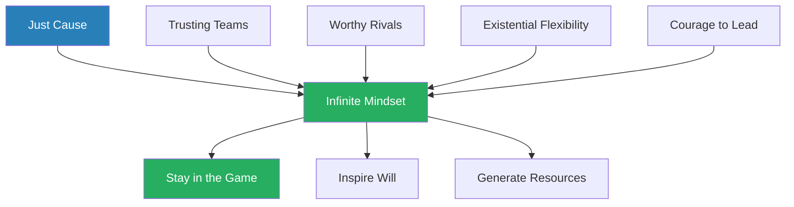
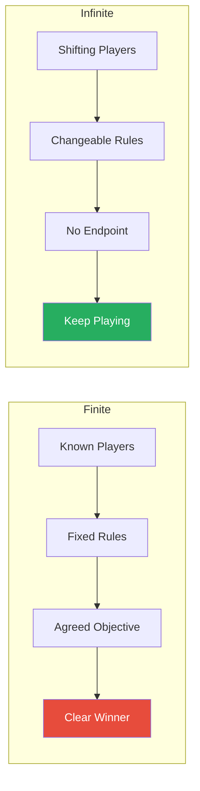
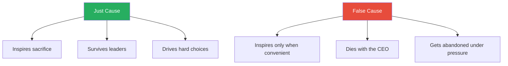
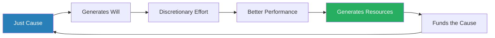
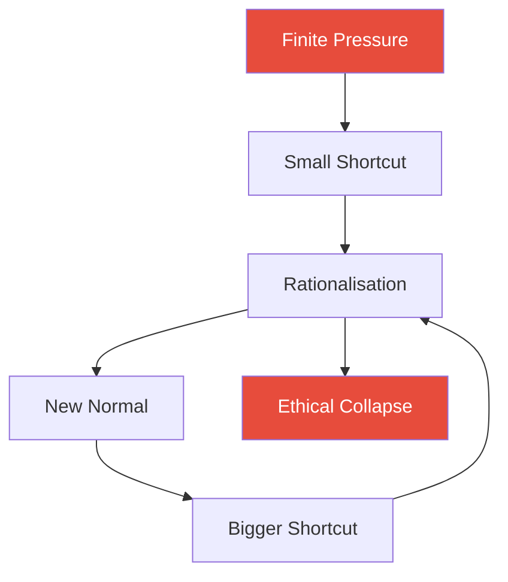
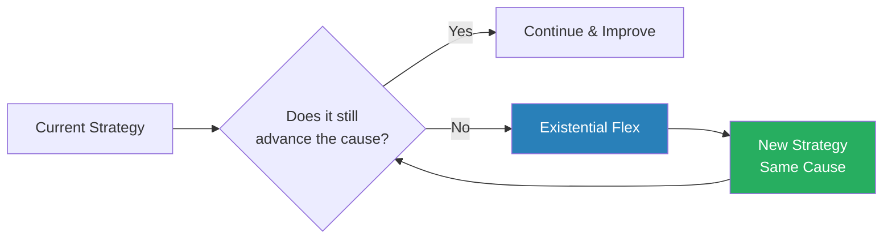
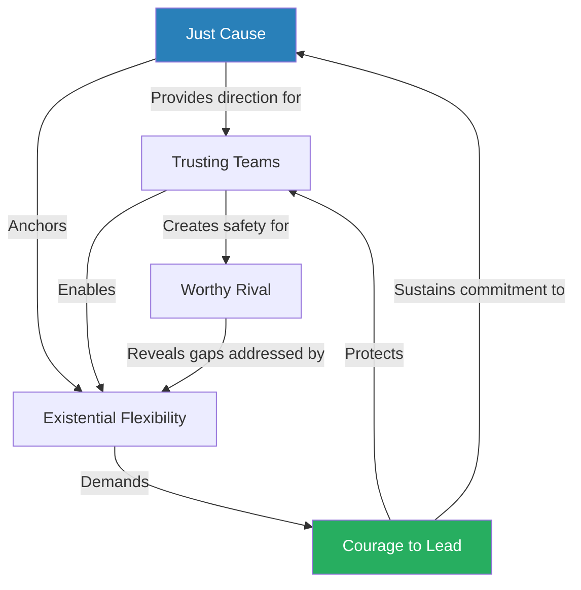

# The Infinite Game — Simon Sinek

> Business is not a game you win — it is a game you play to keep playing. Simon Sinek, the author of *Start with Why*, argues that most leaders are playing business with a finite mindset — obsessing over quarterly earnings, beating competitors, and hitting arbitrary targets — when business itself is an infinite game with no finish line, no fixed rules, and no ultimate winner. Drawing on James P. Carse's 1986 philosophical distinction between finite and infinite games, Sinek identifies five essential practices that allow leaders to play the infinite game successfully: advance a Just Cause, build Trusting Teams, study Worthy Rivals, practise Existential Flexibility, and demonstrate the Courage to Lead. The book is packed with stories from Apple, Microsoft, CVS, Ford, Costco, and the US military to show what happens when leaders get the game right — and what happens when they don't. The core message is deceptively simple but profoundly difficult to execute: **stop trying to win, and start trying to outlast.**

---

## About the Author

Simon Sinek is a British-American author, motivational speaker, and organisational consultant best known for his concept of "Start with Why" — the idea that great leaders and organisations inspire action by communicating their purpose before their process or product. His 2009 TED Talk on the subject became one of the most-watched TED Talks in history. Before becoming a leadership thinker, Sinek worked in advertising and branding. He has authored five books, each building on the theme that leadership is fundamentally about serving others, and he advises organisations ranging from the US military to Fortune 500 companies. *The Infinite Game* (2019) represents his most strategic work, shifting from individual purpose to organisational longevity.

---

## The Big Idea

- <b style="color: #2980b9">An infinite game has no finish line</b> — there are no winners and losers, only players who are ahead and players who are behind at any given moment
- Business, politics, education, and life itself are infinite games — the players change, the rules shift, and the objective is not to win but to perpetuate the game
- Yet most leaders operate with a <b style="color: #e74c3c">finite mindset</b> — they set arbitrary goals (be number one, beat the competition, hit the quarterly target), declare victory when they hit them, and wonder why the "winning" never seems to last
- The finite mindset feels natural because it is how we are raised — school has grades, sports have scores, competitions have trophies
- But applying finite thinking to an infinite game is like trying to win a marriage — the framing itself guarantees failure
- <b style="color: #27ae60">Leaders who adopt an infinite mindset build organisations that outlast their founders, adapt to disruption, and inspire loyalty that finite incentives cannot buy</b>
- The cost of getting this wrong is not merely strategic — it is human: burnout, cynicism, ethical collapse, and the slow death of organisational will
- Sinek's five practices are not a checklist to be completed but a set of disciplines to be sustained indefinitely
- The practices interconnect and reinforce one another — a Just Cause without Trusting Teams is hollow, and Trusting Teams without a Cause drift purposelessly
- The argument is fundamentally optimistic: leaders who choose the infinite game do not sacrifice performance — they redefine what performance means, and their organisations end up outperforming finite competitors over any meaningful time horizon

The five practices do not operate in sequence — they reinforce each other simultaneously, each one making the others more sustainable.

This treemap shows the relative weight Sinek gives to each part of his framework — the Five Practices occupy the largest area, with Just Cause and Trusting Teams as the most heavily developed concepts in the book.

---

## Key Concepts at a Glance

| Concept | One-line summary |
|---------|-----------------|
| **Finite vs Infinite Games** | Business has no finish line — stop trying to "win" and start trying to endure |
| **Just Cause** | A vision of the future so compelling people will sacrifice to advance it |
| **Trusting Teams** | Environments where people feel safe enough to be vulnerable and honest |
| **Worthy Rival** | A competitor whose strengths reveal your weaknesses and push you to improve |
| **Existential Flexibility** | The capacity to blow up your own strategy to advance your cause |
| **Courage to Lead** | The willingness to choose the infinite game despite short-term pressure |
| **Will and Resources** | The two fuels that keep an organisation in the infinite game |
| **Ethical Fading** | The incremental normalisation of unethical behaviour under finite pressure |
| **Cause vs Goal** | A cause is a direction you march toward forever; a goal is a milestone you achieve and move past |
| **Performance vs Trust** | The Navy SEALs framework — trust matters more than individual output |
| **Keeper of the Cause** | The CEO's primary job is protecting the cause from finite gravitational pull |
| **The Decline Pattern** | How sacrificing will for resources triggers a death spiral |

Existential Flexibility and Courage to Lead score highest on difficulty and short-term cost, while Just Cause and Trusting Teams deliver the greatest long-term impact — illustrating why most leaders default to the easier finite practices.

---

## Chapter 1: Finite and Infinite Games

*Sinek introduces the foundational distinction that structures the entire book: some games have endings, and some do not — and the trouble starts when you play an infinite game with finite rules.*

- The concept originates from philosopher James P. Carse's 1986 work *Finite and Infinite Games*, a dense and abstract philosophical treatise
- Sinek adapts Carse's abstract framework into a practical leadership lens — he is not the philosopher but the translator
- Carse's original distinction was between two fundamentally different orientations toward play — Sinek applies this to business, arguing that most leaders are playing the wrong kind of game without realising it
- The distinction is not merely academic — it explains why some organisations thrive for generations while others implode after a decade of apparent dominance

<b style="color: #2980b9">Finite games</b> have clear characteristics:
- Known players — everyone agrees who is playing
- Fixed rules — everyone agrees on the rules
- An agreed-upon objective — everyone agrees on what constitutes winning
- A clear endpoint — the game is over when someone wins
- Examples: football, chess, elections, a sales quarter

<b style="color: #2980b9">Infinite games</b> are fundamentally different:
- Known and unknown players — new competitors appear without warning
- Changeable rules — there is no rulebook that all players have agreed to follow
- The objective is to keep playing — there is no finish line, no ultimate victory
- Players can only drop out when they run out of the will or resources to continue
- Examples: business, politics, education, marriage, life

The core structural difference: finite games end with a winner; infinite games end only when a player drops out.

---

### The Mismatch Problem

The problem is not that leaders are unaware of these differences — it is that they instinctively apply finite thinking to infinite situations:
- They declare "we're number one!" based on a metric they chose, in a timeframe they chose, against competitors they chose
- They obsess over "beating" rivals who are not playing the same game
- They set goals that, when achieved, leave a vacuum of purpose
- <b style="color: #e74c3c">When a finite player meets an infinite player, the finite player always loses eventually</b> — not because the infinite player is smarter, but because the infinite player is playing a different game entirely
- The mismatch is invisible in the short term — finite players often look like they are winning because they are optimising for immediate, measurable outcomes
- But infinite players are building something that finite metrics cannot capture: loyalty, adaptability, cultural resilience, and institutional memory
- Over time, the finite player burns through goodwill and will while the infinite player compounds both

> [!example] Apple vs Microsoft — Two Mindsets in One Room
> - Sinek attended an education summit where both Microsoft and Apple executives spoke
> - The Microsoft executives spent most of their presentation talking about how they were going to beat Apple
> - The Apple executives spent their entire presentation talking about how they were going to help teachers teach and students learn
> - Microsoft was obsessed with its competitor; Apple was obsessed with its cause
> - At the time, Microsoft was winning on nearly every finite metric — market share, revenue, enterprise contracts
> - But Apple was playing an infinite game, and within a few years, it would surpass Microsoft in market capitalisation and cultural influence
> **The lesson:** Obsessing over your competitor is a symptom of finite thinking — it means you have lost sight of your own cause.

> [!tip] Core Insight
> You cannot "win" business. You can only be ahead or behind at any given moment. The leaders who understand this build organisations that last; the leaders who don't build organisations that collapse the moment the game shifts.

---

### Four Possible Pairings

Sinek identifies four possible combinations when players with different mindsets meet:

| Pairing | What Happens |
|---------|-------------|
| Finite vs Finite | A fair contest — both play by the same rules, one wins |
| Infinite vs Infinite | Both thrive — they push each other to advance their causes |
| Finite vs Infinite | The finite player eventually exhausts will or resources |
| Infinite playing as Finite | The organisation drifts from cause and becomes fragile |

- The third pairing — finite vs infinite — is the most common and most destructive in business
- Companies with infinite mindsets do not always win in the short term — they often look like they are losing by every conventional metric
- But they endure, adapt, and eventually outlast rivals who are optimising for the current quarter
- <b style="color: #27ae60">The infinite player's advantage is time</b> — they are not trying to win this round, they are trying to stay in the game for the next hundred rounds

The finite mindset outperforms only on short-term gains; infinite-minded organisations dominate on every dimension that determines long-term survival — sustainability, trust, ethics, innovation, and adaptability.

---

### The Vietnam Paradox

*The most striking example of finite-vs-infinite mismatch is not from business at all — it is from war.*

- The United States fought the Vietnam War with a finite mindset — every battle was measured by body counts, territory captured, and material destroyed
- By every finite metric, the US was winning overwhelmingly
- But the North Vietnamese were playing an infinite game — they were willing to endure any amount of suffering because they were fighting for a cause (national independence and reunification) that was larger than any single battle
- <b style="color: #27ae60">The finite player exhausted its will before the infinite player exhausted its cause</b>
- The US did not lose the war militarily — it lost the will to continue playing
- This is exactly what happens to companies that play with a finite mindset: they run out of will, even when they still have resources

> [!example] The Vietnam War — Winning Every Battle, Losing the War
> - US military leadership measured success through body counts and territory — classic finite metrics
> - Secretary of Defense Robert McNamara brought quantitative analysis to the war, tracking every measurable variable
> - By every number, the US was dominant — more troops, more firepower, more territory held
> - But the North Vietnamese measured success differently: they measured resolve, endurance, and willingness to sacrifice for reunification
> - Colonel Harry Summers reportedly told a North Vietnamese counterpart after the war: "You know you never defeated us on the battlefield"
> - The reply: "That may be so, but it is also irrelevant"
> - The US eventually withdrew — not because it was militarily defeated, but because the American public lost the will to continue
> **The lesson:** When a finite player faces an infinite player, the finite player eventually runs out of will — even if they never run out of resources.

---

## Chapter 2: Just Cause

*A Just Cause is the heartbeat of the infinite game — without one, every other practice collapses because there is nothing worth sustaining.*

- <b style="color: #2980b9">A Just Cause</b> is a specific vision of a future state that does not yet exist — a future so appealing that people are willing to make sacrifices to advance toward it
- It is not a goal, because goals can be achieved and then you need a new one
- It is not a "why," because a why is backward-looking (where you came from) while a Just Cause is forward-looking (where you are going)
- It is the thing that gives people a reason to come to work on Monday morning that goes beyond a paycheque
- A Just Cause is not a strategy — strategies change. It is not a product — products become obsolete. It is the enduring purpose that survives every strategic pivot, every market disruption, and every leadership transition

Sinek identifies <b style="color: #2980b9">five tests of a Just Cause</b>:

| Test | Meaning | Anti-pattern |
|------|---------|-------------|
| **For something** | Affirmative and optimistic — stands FOR a positive future | "Destroy the competition" or "be number one" |
| **Inclusive** | Open — invites others to contribute regardless of background | A cause that only benefits insiders or shareholders |
| **Service-oriented** | Benefits others — not primarily enriching the leaders | "Maximise shareholder value" |
| **Resilient** | Endures beyond any product, technology, service, or leader | "Build the best smartphone" (technology-dependent) |
| **Idealistic** | Big, bold, and ultimately unachievable — a direction, not a destination | "Achieve $10 billion in revenue by 2025" (that is a goal) |

A Just Cause that passes all five tests acts like a compass — it does not tell you which path to take, but it always tells you which direction is north.

- The key distinction is between a cause and a goal:
  - A goal is achievable — "reach $1 billion in revenue" — and once achieved, it leaves a vacuum
  - A cause is a direction — "empower every person to achieve more" — and can never be fully achieved, only advanced
  - Goals serve causes; causes do not serve goals
  - <b style="color: #27ae60">The most powerful organisations use finite goals as milestones on the path toward an infinite cause</b>
  - JFK's moon shot was a finite goal ("put a man on the moon by the end of the decade") in service of an infinite cause (advancing human knowledge and demonstrating the power of free societies)
  - The goal gave the cause measurable momentum — but when the goal was achieved, the cause continued

---

> [!example] The Declaration of Independence as Just Cause
> - Sinek points to the American Declaration of Independence as one of the clearest Just Causes ever written
> - "All men are created equal" was idealistic — the founders themselves did not fully live up to it (slavery, women's suffrage)
> - But the cause was resilient — it outlasted every founder, every president, and every crisis
> - It was inclusive — it invited every generation to advance the vision further
> - It was for something — a positive vision of human dignity, not merely a rejection of British rule
> - It was service-oriented — the benefit was for the people, not for the signers
> - And it was idealistic — true equality is a direction, not a finish line
> **The lesson:** A Just Cause is not something you achieve — it is something you advance, generation after generation.

---

### Cause vs. Mission, Vision, and Goals

- Many companies confuse their cause with their mission statement, vision statement, or strategic goals
- <b style="color: #e74c3c">A mission statement on a wall is not a Just Cause</b> — it is decorative text unless it actually drives decisions
- A Just Cause shows up when leaders make hard choices that cost money in the short term to advance the cause in the long term
- If your "cause" would not survive the departure of the current CEO, it is not a cause — it is a personal ambition
- The litmus test is simple: does this statement drive hard decisions, or does it just decorate the lobby?
  - A cause that has never cost the organisation anything is not a cause — it is a slogan
  - A cause that has cost money, market share, or short-term advantage and was still upheld — that is a real cause
- Sinek draws a further distinction:
  - A **mission** is operational — what we do day to day
  - A **vision** is aspirational — what we want to become
  - A **Just Cause** is existential — why we exist and what future we are trying to create
  - Missions and visions serve the cause; the cause is not derived from them

> [!example] CVS Drops Tobacco (2014)
> - CVS Health's Just Cause centred on helping people on a path to better health
> - In February 2014, CEO Larry Merlo announced CVS would stop selling tobacco products in all its stores
> - The decision cost approximately $2 billion in annual tobacco revenue — overnight
> - Wall Street panicked; analysts downgraded the stock
> - But the decision was the logical consequence of taking their cause seriously — you cannot help people get healthier while selling them cigarettes
> - Within two years, CVS's overall business had grown because the decision attracted new pharmacy contracts, health system partnerships, and customers who trusted the brand more
> - The stock price recovered and surpassed its pre-decision level
> **The lesson:** A real Just Cause demands sacrifice — if your cause never costs you anything, it is not a cause, it is a slogan.

> [!tip] Core Insight
> A Just Cause is not something you have — it is something that has you. It pulls you forward and demands that every decision, even the painful ones, serve the cause rather than the quarterly report.

---

### Dead Causes and False Causes

*Not everything that sounds inspiring qualifies as a Just Cause. Sinek dissects the common counterfeits.*

- <b style="color: #e74c3c">"Be number one"</b> is not a cause — it is a finite goal masquerading as purpose
  - Once you are number one, what do you do? Defend the position? That is playing not to lose
  - And "number one" by what metric? You can always pick a metric that makes you look like the winner
- <b style="color: #e74c3c">"Maximise shareholder value"</b> is not a cause — it is a reward for playing the game well, not a reason to play
  - It tells you nothing about what business you are in or why it matters
  - It incentivises extraction over creation
- <b style="color: #e74c3c">"Growth"</b> is not a cause — growth is a byproduct of advancing a cause, not a cause in itself
  - Companies that make growth their purpose find that growth eventually devours everything else: culture, ethics, customer trust
  - Growth without direction is the organisational equivalent of cancer — expansion for its own sake
- A **moon shot** is a goal, not a cause — JFK's "put a man on the moon by the end of the decade" was a spectacular finite goal in service of an infinite cause (advancing human knowledge and freedom)

A Just Cause survives pressure and leadership transitions; a false cause evaporates the moment it becomes expensive.

---

## Chapter 3: Cause. No Cause.

*Sinek sharpens the distinction between organisations that have a genuine cause and those that merely have ambition dressed up in purpose language.*

- The test is not what a company says — it is what a company does when the cause becomes expensive
- Many companies have beautiful purpose statements that are contradicted by every significant decision they make
- <b style="color: #27ae60">A cause is real when it governs behaviour, not just branding</b>
- Sinek distinguishes between a cause-driven organisation and a cause-adjacent organisation:
  - **Cause-driven:** The cause determines strategy — "we exist to do X, and our products are the means"
  - **Cause-adjacent:** The strategy determines the cause — "we make Y products, and we have attached a noble-sounding statement"
- The difference is visible in how decisions are made:
  - A cause-driven company asks: "Does this advance our cause?" before asking "Does this make money?"
  - A cause-adjacent company asks: "Does this make money?" and then retroactively justifies it with cause language

> [!example] Apple's "Think Different" and the Macintosh (1997)
> - When Steve Jobs returned to Apple in 1997, the company was ninety days from bankruptcy
> - He did not start with products — he started with cause: reminding people why Apple existed
> - The "Think Different" campaign did not mention a single product specification
> - It celebrated the rebels, the misfits, the people who saw things differently — and positioned Apple as their tool
> - This was not marketing strategy — it was a restatement of Apple's Just Cause: to challenge the status quo and empower creative individuals
> - Products like the iMac, iPod, iPhone, and iPad all followed from that cause — each one was a tool for people who think differently
> **The lesson:** When a company reconnects with its cause, the strategy becomes obvious — you build whatever advances the cause.

---

### The Responsibility of Business

*Sinek takes on Milton Friedman directly, arguing that shareholder primacy is not just wrong — it is a historical aberration that has done immense damage.*

- In 1970, Milton Friedman published his famous essay arguing that the sole social responsibility of a business is to increase its profits
- <b style="color: #e74c3c">Friedman's doctrine became the default operating system of American capitalism</b> — CEOs were told their only obligation was to shareholders
- Sinek argues this doctrine is both historically inaccurate and practically destructive:
  - Before Friedman, business leaders routinely spoke of obligations to employees, communities, and society — shareholder primacy was a radical departure, not a return to tradition
  - Adam Smith, the father of capitalism, wrote *The Theory of Moral Sentiments* before *The Wealth of Nations* — Smith believed self-interest only worked within a framework of moral responsibility to others
  - The doctrine incentivises exactly the behaviours that destroy infinite games: short-termism, cost-cutting that guts capability, and treating people as expenses rather than investments
- The timing of Friedman's doctrine is significant:
  - In the 1980s, under the influence of Friedman's ideas, executive compensation shifted dramatically toward stock options
  - This aligned CEO incentives with share price, not with organisational health
  - CEOs who boosted share price — by any means — were rewarded; CEOs who invested for the long term were punished by the market

| Friedman Doctrine | Infinite Mindset |
|-------------------|-----------------|
| Business exists to maximise shareholder value | Business exists to advance a cause that creates value for all stakeholders |
| People are costs to be minimised | People are investments to be cultivated |
| Short-term returns are the scoreboard | Long-term viability is the scoreboard |
| Customers are revenue sources | Customers are people to be served |
| Ethics are constraints on profit | Ethics are integral to the cause |
| The CEO serves shareholders | The CEO serves the cause |

- <b style="color: #27ae60">Sinek advocates for a return to stakeholder capitalism</b> — the idea that a business must serve employees, customers, communities, and shareholders, roughly in that order
- This is not charity — it is long-term strategy: companies that treat all stakeholders well generate better long-term returns than companies that extract value for shareholders alone
- The argument is not that shareholders do not matter — they do — but that shareholder value is a result of serving all stakeholders well, not the purpose of the business

> [!example] Jack Welch and GE — The Finite Mindset's Poster Child
> - Jack Welch, CEO of General Electric from 1981 to 2001, is often celebrated as the greatest CEO of the 20th century
> - Welch was the ultimate finite player: he ranked employees and fired the bottom 10% every year ("rank and yank"), acquired and divested businesses based purely on whether they could be number one or number two in their market, and relentlessly optimised for quarterly earnings
> - Under Welch, GE's stock price soared — he delivered exactly what shareholders wanted
> - But Sinek argues the apparent success was a mirage: Welch's financial engineering (particularly GE Capital) created enormous hidden risks, and his culture of fear drove out the very people who might have warned about them
> - After Welch left, GE entered a long decline — the company lost over 80% of its market value and was eventually removed from the Dow Jones Industrial Average in 2018
> - The will Welch destroyed and the risks he accumulated took years to become visible — but they were always there, hidden by short-term financial performance
> **The lesson:** A finite-minded CEO can produce spectacular short-term results that mask deep structural damage — and the true cost only becomes visible after they leave.

---

## Chapter 4: Keeper of the Cause

*The CEO's most important job is not to run the business — it is to protect the cause from the relentless gravitational pull of finite thinking.*

- Every organisation faces constant pressure to abandon its cause: quarterly earnings calls, activist investors, competitive threats, cost pressures
- <b style="color: #2980b9">The CEO is the Keeper of the Cause</b> — the person whose primary responsibility is to ensure every major decision advances the cause rather than undermining it
- This is different from being the best operator, the best salesman, or the best strategist
- Many brilliant operators are terrible Keepers of the Cause because they optimise for the current game rather than the infinite one
- The Keeper role is not ceremonial — it is the single most consequential decision a board can make

The dangers of choosing the wrong Keeper:
- When a board selects a CEO who is a brilliant finite player but has no connection to the cause, the organisation begins to drift
- The drift is often invisible at first — numbers may improve, stock price may rise — but the culture slowly erodes
- <b style="color: #e74c3c">By the time the damage is visible, it takes years to repair</b>
- The cause does not die suddenly — it fades, one decision at a time, until one day the organisation looks successful on paper but hollow in practice

Sinek draws a crucial distinction between operational competence and vision competence:
- Most boards hire for operational competence — can this person run the machine?
- But the infinite game demands vision competence — can this person protect the cause while navigating uncertainty?
- The ideal Keeper combines both — but if forced to choose, the cause must come first, because operations without cause produces efficiency without direction
- <b style="color: #27ae60">The best Keepers are not necessarily the best operators — they are the people who understand what the organisation exists to do and will fight to protect that purpose</b>

> [!example] Steve Ballmer at Microsoft (2000-2014)
> - Bill Gates founded Microsoft with an infinite cause: "A computer on every desk and in every home"
> - When Steve Ballmer took over as CEO in 2000, he was a brilliant operator and salesman — but he was a finite player
> - Under Ballmer, Microsoft became obsessed with Windows revenue, crushing competitors, and defending market share
> - He famously laughed at the iPhone when it launched, dismissing it as too expensive and lacking a keyboard
> - Microsoft missed mobile, missed social, and missed cloud — not because of a lack of talent, but because a finite mindset made the company reactive rather than visionary
> - Internal competition flourished under a forced ranking system ("stack ranking") that pitted employees against each other
> - When Satya Nadella took over in 2014, his first act was to restate Microsoft's cause: "To empower every person and every organisation on the planet to achieve more"
> - Nadella dismantled stack ranking, embraced open-source software (previously heretical at Microsoft), and pivoted to cloud computing
> - Microsoft's market capitalisation tripled within five years under Nadella
> **The lesson:** The wrong Keeper can hollow out a company even while the financial numbers look strong — and the right Keeper can rebuild it by reconnecting with the cause.

---

### The Succession Problem

- The Keeper of the Cause question becomes most urgent during leadership transitions:
  - When a cause-driven founder retires, the board often replaces them with a professional manager — someone who can "scale the business"
  - But scaling the business and advancing the cause are not the same thing
  - The professional manager optimises the machine; the Keeper protects the soul
- Sinek points to a pattern: founder-led companies with strong causes often stumble badly after the founder leaves, not because the successor is incompetent but because they are the wrong kind of competent
  - Apple nearly died when Jobs was pushed out in 1985 and was resurrected when he returned in 1997
  - Microsoft drifted under Ballmer and was revitalised under Nadella, who functioned as a new Keeper
  - <b style="color: #e74c3c">Disney, Starbucks, and HP all experienced similar patterns</b> — strong under cause-driven leaders, drifting under operators
- The solution is not to make founders immortal — it is to choose successors who are Keepers, not just operators
- This means boards must evaluate candidates on a different axis:
  - Not "Can they grow revenue?" but "Do they understand and embody the cause?"
  - Not "Can they manage complexity?" but "Will they sacrifice short-term results to protect long-term purpose?"

> [!example] Disney's Succession Struggles
> - Walt Disney built the company around a cause: to create happiness through imagination and storytelling
> - After Walt's death in 1966, the company entered a long period of drift — successive CEOs managed the business competently but lost the creative spark
> - It was not until Michael Eisner (and later Bob Iger) reconnected the company with its creative purpose that Disney experienced a renaissance
> - The pattern repeated: Iger's departure created anxiety about whether his successor would be a Keeper or merely an operator
> - Each transition tested whether the cause was truly embedded in the organisation or merely embodied in a single leader
> **The lesson:** A cause that depends on one person is not yet a cause — it is a personal mission. The ultimate test of a Just Cause is whether it survives its founder.

> [!tip] Core Insight
> The board's most important decision is not strategy, budget, or acquisitions — it is choosing a CEO who is a true Keeper of the Cause, not merely a skilled operator.

---

## Chapter 5: Will and Resources

*Every organisation needs two fuels to stay in the infinite game — and most leaders only manage one of them.*

- <b style="color: #2980b9">Will</b> is the motivation, morale, and emotional commitment people bring to the cause
- <b style="color: #2980b9">Resources</b> are the tangible assets — money, equipment, technology, time — that the organisation deploys
- Both are essential, but they are not interchangeable:
  - An organisation with resources but no will is a zombie — it stumbles forward on momentum but inspires no one
  - An organisation with will but no resources is a spark that cannot sustain flame
  - <b style="color: #27ae60">The infinite-minded leader manages both simultaneously</b> — generating resources to fund the cause while cultivating the will to pursue it
- The relationship between will and resources is asymmetric:
  - Resources can be acquired quickly — funding, equipment, technology can be bought
  - Will takes years to build and moments to destroy — a single betrayal of trust can undo years of cultivation
  - This makes will the more precious and fragile of the two fuels

How finite thinking destroys will:
- Annual layoffs to meet earnings targets send a clear message: you are expendable
- Stack ranking systems (rating employees against each other) turn colleagues into competitors
- Arbitrary cost-cutting that guts training, development, and team-building signals that people are expenses, not investments
- Every time a leader sacrifices will to preserve resources, the organisation becomes more fragile — it looks healthy on paper but is one crisis away from collapse
- The destruction is cumulative: each round of will-eroding decisions makes the next round easier to justify and harder to reverse

How infinite thinking generates will:
- Communicating the cause clearly and consistently — people need to know WHY they are doing what they are doing
- Making decisions that prioritise people over short-term profit — this costs money upfront but generates loyalty, discretionary effort, and resilience
- Celebrating advancement of the cause, not just financial milestones
- Sharing the burden during downturns — furloughs instead of layoffs, pay cuts starting at the top
- Investing in growth, training, and career development as signals that the organisation believes in its people's future

> [!example] The Container Store — "1 Equals 3" Philosophy
> - The Container Store, founded by Kip Tindell, operated on a simple belief: one great employee is worth three average ones
> - Based on this, Tindell paid first-year sales employees 50-100% above the retail industry average
> - The company invested heavily in training — over 260 hours for first-year employees, compared to an industry average of about 8 hours
> - Wall Street analysts regularly questioned this approach, arguing the labour costs were unsustainable
> - But The Container Store's employee turnover was roughly 10% — in an industry where 100% annual turnover was normal
> - The result: more experienced employees, better customer service, higher revenue per square foot, and a company that made Fortune's "Best Companies to Work For" list for nearly two decades
> **The lesson:** Investing in will is not a feel-good luxury — it is an economic strategy that compounds over time through lower turnover, better service, and deeper institutional knowledge.

> [!example] Costco's Jim Sinegal vs Wall Street (2005)
> - Costco CEO Jim Sinegal paid his employees significantly above industry average and provided healthcare benefits that were considered extravagant for a retailer
> - Wall Street analysts repeatedly pressured him to cut wages and benefits to boost margins
> - One analyst told him directly: "He's too benevolent to his employees"
> - Sinegal's response was clear: the company existed to serve its customers and employees, not to extract maximum value for shareholders
> - Costco's employee turnover was a fraction of competitors' — around 6% versus 40-60% at comparable retailers
> - Low turnover meant lower hiring and training costs, more experienced employees, better customer service, and ultimately higher sales per employee
> - Costco consistently outperformed competitors on total shareholder return over any 10-year period
> **The lesson:** Will is not a soft metric — it is a competitive advantage that compounds over time. Leaders who sacrifice will for short-term resources eventually lose both.

---

Will and resources create a virtuous cycle when both are managed — the cause generates will, will generates performance, performance generates resources, and resources fund the cause.

---

### The Decline Pattern

- Sinek identifies a predictable pattern in organisations that adopt finite thinking:
  1. **Pressure mounts** — a quarter is missed, a competitor gains share, an investor demands action
  2. **Leaders cut costs** — layoffs, benefit reductions, training cuts — to boost short-term numbers
  3. **Will declines** — remaining employees feel unsafe, disengage, start looking elsewhere
  4. **Performance declines** — the best people leave, innovation stalls, customer experience suffers
  5. **Resources decline** — lower performance produces lower revenue, triggering more cuts
  6. **The death spiral** — each round of cuts accelerates the decline until the organisation is too weak to compete
- <b style="color: #e74c3c">This is the finite mindset in action</b> — every decision that sacrifices will for resources makes the next decision harder
- The decline pattern is insidious because each individual step looks rational:
  - "We need to cut costs to survive this quarter" — true in isolation
  - But the cumulative effect is an organisation that has gutted the very capabilities it needs to generate revenue
  - It is the organisational equivalent of selling your tools to pay your rent

Each round of cost-cutting (red triangles) produces a temporary resource stabilisation but accelerates the decline in will — and once will collapses, resources follow within 1-2 years, creating the death spiral Sinek describes.

> [!abstract] The Will-Resources Diagnostic
> 1. Ask: are our best people excited to come to work, or counting the days until they leave?
> 2. Ask: are we investing in capability, or cutting it to hit targets?
> 3. Ask: would our employees recommend this company to their best friend?
> 4. Ask: when we miss a target, do we examine why — or just demand more from fewer people?
> 5. If the answers trend negative, you are trading will for resources — and the clock is ticking

---

## Chapter 6: Trusting Teams

*Trust is not a soft skill or a team-building exercise — it is the infrastructure that makes every other practice possible.*

- <b style="color: #2980b9">A Trusting Team</b> is a group of people who feel safe enough to raise their hands and say: "I made a mistake," "I need help," "I'm struggling," or "I think we're going in the wrong direction"
- This is not about trust in the sense of "I trust you to do your job" — that is confidence in competence
- <b style="color: #27ae60">This is about trust in the sense of "I trust that I can be vulnerable around you without it being used against me"</b>
- This maps directly to what Amy Edmondson calls **psychological safety** — Sinek does not use her term but describes the identical concept
- Trust is not a feeling — it is a set of conditions created by leadership behaviour

Why Trusting Teams matter in the infinite game:
- Infinite games are full of uncertainty — no one has all the answers, and the game keeps changing
- In a culture of fear, people hide problems, protect themselves, and avoid risk
- Hidden problems compound — by the time they surface, they are crises
- <b style="color: #e74c3c">In the absence of trust, people prioritise self-preservation over the cause</b>
- In the presence of trust, people surface problems early, share information freely, and take the risks that innovation requires
- Trust also determines the speed of execution:
  - In low-trust environments, every decision requires verification, sign-off, and CYA documentation
  - In high-trust environments, people move fast because they trust each other's intentions and judgement
  - The difference in organisational velocity is enormous

---

### Performance vs Trust

*Sinek's most powerful illustration of infinite-minded team building comes from an unexpected source: the US Navy SEALs.*

> [!example] How the Navy SEALs Choose Their Operators
> - Sinek had a conversation with a senior SEAL team leader about how they select operators for the most critical missions
> - The SEALs evaluate candidates on two axes: **performance** (how good you are at your job) and **trust** (how much your teammates trust you as a person)
> - A high performer with low trust is what the SEALs call a **toxic team member** — brilliant at their job, but corrosive to the team
> - A medium performer with high trust is preferred over a high performer with low trust — every time
> - The SEALs' reasoning: a toxic team member makes everyone around them worse, even if their individual output is exceptional
> - In high-stakes environments, the team member you want next to you is the one you trust with your life, not the one with the best individual stats
> - The senior SEAL said it plainly: "I'd rather go into combat with someone I trust completely than someone who is technically better but I can't count on"
> **The lesson:** Trust is not a nice-to-have — it is a force multiplier. The highest-performing teams are not the ones with the most talented individuals but the ones with the deepest trust.

This produces a powerful two-by-two matrix:

| | High Trust | Low Trust |
|---|-----------|----------|
| **High Performance** | The ideal — keep and develop | Toxic — remove despite talent |
| **Low Performance** | Coach and develop — the trust is the hard part | Reassign or exit |

- Most organisations do the opposite of the SEALs — they reward high performers regardless of trust, and they tolerate toxic behaviour as long as the numbers are good
- <b style="color: #e74c3c">This is how cultures rot from the inside</b> — one toxic high performer poisons the well for everyone around them
- The message is not that performance does not matter — it does. But trust is harder to build and more important to protect
- The SEALs' insight applies far beyond the military:
  - In a sales team, the top performer who hoards leads and undermines colleagues destroys more value than they create
  - In an engineering team, the brilliant coder who refuses to collaborate and belittles others drives away the very people the team needs
  - In leadership, the executive who delivers results through fear generates short-term numbers at the cost of long-term capability

---

> [!example] Alan Mulally Transforms Ford (2006-2014)
> - When Alan Mulally became CEO of Ford in 2006, the company was haemorrhaging billions and its culture was poisonous
> - Ford executives had learned that admitting problems was career suicide — every meeting was filled with green status reports even as the company was heading toward bankruptcy
> - Mulally introduced a simple colour-coded reporting system: green (on track), yellow (concern), red (problem)
> - For weeks, every executive reported green — despite Ford losing $17 billion that year
> - Mulally told the team: "We're losing billions. Is there really nothing that isn't going well?"
> - Finally, Mark Fields (then head of the Americas division) showed a red slide — the Ford Edge launch had a technical problem
> - The room went silent. Everyone expected Fields to be punished
> - Mulally started clapping. "Mark, that is great visibility. Who can help Mark with this?"
> - The next week, every executive's report had yellow and red items
> - That single moment of rewarding vulnerability instead of punishing it transformed Ford's culture
> - Ford was the only major US automaker that did not take a government bailout during the 2008 financial crisis
> **The lesson:** Trust is built in moments — a single act of rewarding honesty can transform an entire organisation. But it requires a leader willing to go first.

> [!tip] Core Insight
> You cannot order people to trust each other. Trust is built through vulnerability — and vulnerability requires a leader who creates the conditions for it by going first, admitting their own mistakes, and protecting those who speak up.

---

### Building Trust — The Leader's Role

- Trust cannot be mandated, incentivised, or trained into existence
- It is built through repeated micro-actions by leaders:
  - **Admit mistakes first** — when the leader says "I was wrong," it gives everyone else permission to be wrong
  - **Protect the messenger** — when someone brings bad news, thank them publicly
  - **Eliminate toxic achievers** — removing a high performer who destroys trust sends the most powerful signal of all
  - **Invest in people** — training, development, and genuine concern for employees' lives outside work
- <b style="color: #27ae60">Trust is not a programme — it is a practice, and it starts at the top</b>
- The leader's behaviour is amplified throughout the organisation:
  - If the CEO admits mistakes, VPs will admit mistakes, and managers will admit mistakes
  - If the CEO punishes vulnerability, VPs will punish vulnerability, and the entire organisation will operate in a culture of concealment
  - The tone at the top cascades — there is no way to build a trusting team at the bottom while the top operates on fear

> [!example] Garry Ridge at WD-40 — "Learning Moments"
> - Garry Ridge, CEO of WD-40 Company, banned the word "mistake" from the company vocabulary
> - Instead, every failure was called a **"learning moment"** — a deliberate reframing that separated the person from the problem
> - Under Ridge's leadership, WD-40 achieved employee engagement scores of 93% — compared to an industry average of around 30%
> - Turnover was negligible, innovation was constant, and the company consistently outperformed
> - Ridge's philosophy: if people are afraid of making mistakes, they will never try anything new — and a company that never tries anything new is already dying
> **The lesson:** The language a leader uses shapes the culture. Call failures "mistakes" and people hide them. Call them "learning moments" and people share them.

---

## Chapter 7: Ethical Fading

*Good people do not become unethical overnight — they get there one small, rationalised step at a time, and finite pressure accelerates every step.*

- <b style="color: #2980b9">Ethical Fading</b> is the process by which unethical behaviour becomes normalised through incremental steps
- No one wakes up and decides to commit fraud — they start with a small shortcut, rationalise it, then take a slightly bigger shortcut, rationalise that, and so on
- Each step feels minor on its own — it is only in retrospect that the full distance becomes visible
- <b style="color: #e74c3c">Finite pressure is the primary accelerant of ethical fading</b>:
  - Hit this quarter's numbers or lose your job
  - Beat this competitor or lose funding
  - Grow at this rate or disappoint investors
- Under these pressures, the ethical line does not move dramatically — it moves millimetre by millimetre until it has moved miles
- The concept draws on the work of psychologist Ann Tenbrunsel, who studies how people make decisions they later recognise as unethical without experiencing them as unethical choices at the time

Ethical fading follows a cycle: pressure produces a small shortcut, rationalisation normalises it, the new normal enables a bigger shortcut, and the cycle repeats until the organisation crosses a line it never intended to cross.

---

### Self-Deception Mechanisms

- Sinek identifies several rationalisation patterns that enable ethical fading:
  - **"Everyone does it"** — if the industry norm is aggressive, individual companies feel justified in matching it
  - **"It's technically legal"** — legality becomes the floor instead of ethics being the floor
  - **"The ends justify the means"** — hitting the target is so important that how you get there becomes irrelevant
  - **"I was just following orders"** — diffusion of responsibility up the chain
  - **"It's not that bad"** — minimisation of each individual step
- These rationalisation patterns are not failures of character — they are predictable psychological responses to finite pressure
- <b style="color: #27ae60">The antidote is a strong Just Cause combined with Trusting Teams</b> — when people feel safe to speak up and are guided by a cause larger than quarterly numbers, ethical fading slows dramatically
- The connection to Trusting Teams is critical:
  - In a trusting environment, someone sees the shortcut and says: "This doesn't feel right"
  - In a fear-based environment, that same person stays silent — they see the shortcut and think: "I'd better not rock the boat"
  - Ethical fading accelerates in direct proportion to the absence of psychological safety

> [!example] Wells Fargo's Fake Accounts Scandal (2016)
> - Wells Fargo set aggressive cross-selling targets: every customer should have at least eight products (accounts, credit cards, insurance policies)
> - The slogan was "Eight is great" — a finite target that became the entire point of the business
> - Employees who could not meet targets were publicly shamed, demoted, or fired
> - Under this pressure, employees began creating accounts and credit cards without customer knowledge or consent
> - Over a period of years, Wells Fargo employees created approximately 3.5 million fake accounts
> - When the scandal broke, management blamed "rogue employees" at the bottom of the organisation
> - But the employees were not rogues — they were rational people responding to an irrational system
> - The ethical fading was incremental: first a few employees cut corners, then it became normalised, then it became expected
> - CEO John Stumpf was eventually forced to resign, and the company paid billions in fines and settlements
> **The lesson:** Ethical fading is a systems problem, not a character problem. When you set finite targets and punish people who miss them, you are creating the conditions for ethical collapse — and blaming the people who respond predictably is the ultimate abdication of leadership.

---

### The Milgram Connection

- Sinek references Stanley Milgram's obedience experiments to illustrate how incrementalism works:
  - Participants administered what they believed were increasingly severe electric shocks to a stranger
  - If asked to deliver the maximum shock immediately, most would have refused
  - But because each increment was small — just 15 volts more than the last — 65% went all the way to the maximum
- The same mechanism operates in organisations:
  - No one agrees to commit fraud on day one
  - But "just round up this quarter's numbers slightly" leads to "just move this revenue recognition forward" leads to systematic accounting fraud
- <b style="color: #e74c3c">The size of each step is small enough to rationalise; the cumulative distance is large enough to destroy</b>
- The Milgram parallel is precise: in both cases, the subject does not experience themselves as making a single catastrophic choice — they experience a series of minor, justifiable choices that accumulate into something they would never have chosen if presented with the full picture from the start

> [!tip] Core Insight
> Ethical fading is not about bad people — it is about good people in bad systems. The leader's job is to design systems where doing the right thing is easier than doing the wrong thing, not to rely on individual character to resist systemic pressure.

---

## Chapter 8: Worthy Rival

*Most leaders think of competitors as enemies to be defeated. Infinite-minded leaders think of them as teachers who reveal what you need to improve.*

- <b style="color: #2980b9">A Worthy Rival</b> is another player in the game whose strengths reveal your weaknesses
- They are not enemies — they are mirrors that show you where you need to grow
- The traditional competitive mindset focuses on what you do better than the competition
- <b style="color: #27ae60">The Worthy Rival mindset focuses on what the competition does better than you</b> — and uses that gap as fuel for improvement
- You can have multiple Worthy Rivals, and they can change over time
- A Worthy Rival does not even need to know they are your rival — this is an internal exercise, not a relationship

Why the reframing matters:
- When you see competitors as enemies, you focus on defeating them — and when you succeed, you stop improving
- When you see competitors as rivals, you focus on improving yourself — and you never stop because there is always something to learn
- The finite player asks: "How do I beat them?" The infinite player asks: "What can I learn from them?"
- <b style="color: #e74c3c">Obsession with defeating a competitor is a sign that you have lost sight of your cause</b>
- The emotional signal is the diagnostic:
  - If a competitor's success makes you angry, you are playing finite
  - If a competitor's success makes you curious, you are playing infinite
  - The feeling of threat is a compass pointing toward your own areas for growth

---

> [!example] Alan Mulally and the Toyota in the Garage
> - When Alan Mulally arrived at Ford, he placed a Toyota car in the Ford design studio garage
> - The message was not "this is the enemy" — it was "this is the standard"
> - Ford engineers were encouraged to study Toyota's quality, engineering, and design — not to copy it, but to understand what Toyota did better
> - Mulally did not want Ford to "beat" Toyota — he wanted Ford to become the best version of Ford, using Toyota as a benchmark for excellence
> - This reframing shifted Ford's internal culture from defensive competition to aspirational improvement
> **The lesson:** A Worthy Rival is not someone you need to beat — it is someone whose excellence shows you where your own game needs to improve.

> [!example] Sinek and Adam Grant — A Personal Worthy Rival
> - Sinek candidly describes his own experience of meeting Adam Grant, the Wharton professor and bestselling author
> - Initially, Sinek felt threatened — Grant was younger, more academically rigorous, more prolific, and covered similar territory
> - Sinek's instinctive response was competitive jealousy: "Why does he get so much attention?"
> - After reflection, Sinek reframed Grant as a Worthy Rival — someone whose strengths (academic rigour, research depth, writing speed) exposed Sinek's own weaknesses
> - This reframing transformed jealousy into motivation: Sinek began investing more in research, seeking academic partnerships, and improving the evidence base for his ideas
> - The relationship became generative rather than competitive — both authors benefited from pushing each other to improve
> **The lesson:** The emotional signal of jealousy or threat is a compass pointing toward your own areas for growth. The infinite-minded response is not to tear down the rival but to learn from them.

---

### How to Use a Worthy Rival

> [!abstract] The Worthy Rival Practice
> 1. Identify who triggers your competitive instincts — the person, company, or team that makes you feel threatened
> 2. Study their strengths honestly — what do they genuinely do better than you?
> 3. Ask: what weakness in me does their strength expose?
> 4. Use that gap as motivation for self-improvement — not to beat them, but to advance your own cause
> 5. Revisit periodically — Worthy Rivals change as you grow and as the game evolves

- The Worthy Rival concept connects directly to Just Cause:
  - If you have a strong cause, a rival's success does not threaten you — it challenges you to advance the cause more effectively
  - If you have no cause, a rival's success feels existential — because without a cause, all you have is your ranking
- It also connects to Trusting Teams:
  - A leader secure enough to admit "they are better than us at X" models the vulnerability that trust requires
  - A leader who insists "we are better at everything" creates a culture of delusion that erodes trust

---

## Chapter 9: Existential Flexibility

*The most powerful move in the infinite game is the willingness to blow up your own strategy — even your own identity — to advance your cause.*

- <b style="color: #2980b9">Existential Flexibility</b> is the capacity to make a profound strategic shift in order to better advance a Just Cause
- This is not a minor pivot or a product update — it is a fundamental change in the way an organisation operates or what it offers
- It requires three things:
  - A Just Cause strong enough to survive the disruption (if the cause is weak, the change has no anchor)
  - The courage to walk away from what is working (the hardest part — you must abandon success, not failure)
  - The vision to see that the current path, while profitable, will eventually lead away from the cause

Why it is so rare:
- <b style="color: #e74c3c">Existential Flexibility means disrupting yourself before someone else disrupts you</b>
- Every force in a successful organisation resists this: shareholders want continued returns, employees want stability, customers want consistency
- The finite mindset says: "We're winning — why would we change?"
- The infinite mindset says: "We're winning at the wrong game — we need to change to advance our cause"
- The psychology of loss aversion makes this even harder:
  - Humans feel losses roughly twice as intensely as equivalent gains
  - Giving up a profitable product line feels like a loss, even when the gain from the new direction will be greater
  - Leaders must overcome not just organisational resistance but their own psychological wiring

---

> [!example] Apple Drops "Computer" from Its Name (2007)
> - In January 2007, Steve Jobs announced that Apple Computer, Inc. would become Apple Inc. — dropping "Computer" from the company name
> - This was not a branding exercise — it was an existential flex
> - Apple had built its identity, its brand, and its revenue on personal computers — the Mac was Apple
> - But Jobs recognised that Apple's cause was not "make great computers" — it was "empower creative individuals to challenge the status quo"
> - To advance that cause, Apple needed to go beyond computers: the iPod had already opened music, and the iPhone was about to transform communication, photography, and personal computing itself
> - Dropping "Computer" signalled to the world — and to Apple's own employees — that the company's identity was not tied to any single product category
> - Within a decade, the iPhone generated more revenue than the Mac ever had, and Apple became the world's most valuable company
> **The lesson:** Existential Flexibility means being willing to destroy what made you successful in order to advance the cause that made success possible in the first place.

> [!example] Kodak's Refusal to Flex (1975-2012)
> - Kodak engineer Steven Sasson invented the digital camera in 1975 — inside Kodak's own labs
> - Kodak's leadership saw the invention and understood its potential — they were not blind to the future
> - But Kodak's business was film — film manufacturing, film processing, film chemistry — and it was enormously profitable
> - Every financial incentive argued against cannibalising their own film business to pursue digital
> - Kodak chose to protect its existing business rather than disrupt itself
> - Over the next three decades, digital photography grew from curiosity to dominance, and every step of that growth eroded Kodak's core business
> - By the time Kodak finally embraced digital, it was too late — the company filed for bankruptcy in 2012
> - The tragedy: Kodak invented the very technology that destroyed it, and chose not to use it
> **The lesson:** Protecting what you have is a finite strategy. In an infinite game, the company that refuses to disrupt itself will be disrupted by someone else.

---

Existential Flexibility is not change for the sake of change — it is a diagnostic question: does our current strategy still advance our cause? When the answer becomes "no," the infinite-minded leader has the courage to change strategy even at enormous short-term cost.

---

### When Existential Flexibility Fails

- Not every dramatic pivot is existential flexibility — some are just panic:
  - <b style="color: #e74c3c">If the change is driven by competitive pressure rather than cause alignment, it is a reactive pivot, not existential flexibility</b>
  - If the change abandons the cause to chase revenue, it is not flexibility — it is capitulation
  - If the change is made without the resources or will to sustain it, it is reckless
- True existential flexibility is anchored in cause, enabled by trust, and executed with courage
- It connects to every other practice:
  - Without a Just Cause, you have no anchor for the change
  - Without Trusting Teams, you cannot execute the change because people will resist
  - Without the Courage to Lead, you will never make the decision in the first place
- The distinction between existential flexibility and panic is often only visible in hindsight:
  - If the organisation emerged stronger and more aligned with its cause, it was flexibility
  - If the organisation emerged confused and adrift, it was panic
  - The anchor — the cause — is what makes the difference

> [!tip] Core Insight
> The most dangerous moment for an organisation is not when things are going badly — it is when things are going well. Success breeds complacency, and complacency kills existential flexibility. The time to reinvent is when you are winning, not when you are losing.

---

## Chapter 10: The Courage to Lead

*Every practice in this book requires something that cannot be taught, only chosen: the willingness to pay short-term costs for long-term principles.*

- <b style="color: #2980b9">The Courage to Lead</b> is the willingness to choose the infinite game even when the finite game offers easier, more visible, more immediately rewarding options
- Courage in this context is not physical bravery — it is moral courage:
  - The courage to say "we will not sacrifice our values for a quarterly number"
  - The courage to remove a high-performing toxic team member
  - The courage to invest in people when the budget says cut
  - The courage to walk away from a profitable line of business because it conflicts with the cause
  - The courage to tell the board, the analysts, or the shareholders: "We are playing a different game"

Why courage is the linchpin:
- Every other practice — Just Cause, Trusting Teams, Worthy Rivals, Existential Flexibility — requires decisions that are unpopular in the short term
- <b style="color: #27ae60">Without courage, leaders know what to do but lack the nerve to do it</b>
- The infinite game punishes cowardice not immediately but inevitably — the leader who avoids the hard decision today faces a harder decision tomorrow
- Courage is social — it is easier to be courageous when surrounded by others who share the infinite mindset
- This is why all five practices work together: a strong cause, trusting teams, and worthy rivals all provide the social scaffolding that makes individual courage possible

---

> [!example] Victorinox After 9/11 (2001)
> - Victorinox, the Swiss company that makes the Swiss Army knife, faced an existential crisis after September 11, 2001
> - When knives were banned from carry-on luggage, airport shops — Victorinox's primary retail channel — stopped ordering
> - Revenue dropped precipitously and immediately
> - CEO Carl Elsener (fourth generation of the founding family) refused to lay off a single employee
> - Instead, he accelerated innovation: new product lines, new markets, new uses for the brand
> - Victorinox invested in its people during the darkest period because Elsener's cause was multigenerational — he was not managing for this quarter but for the next generation
> - The company survived, diversified, and emerged stronger — still privately held, still committed to its workforce
> **The lesson:** Courage is choosing the long game when every short-term signal is screaming at you to cut and run.

> [!example] Bob Chapman at Barry-Wehmiller — Everybody Matters
> - Barry-Wehmiller, a manufacturing company, faced severe revenue decline during the 2008 financial crisis
> - The board recommended laying off 20% of the workforce to preserve the company
> - CEO Bob Chapman refused — he believed that sending people home to their families without a job was a failure of leadership, not a business necessity
> - Instead, Chapman implemented a furlough programme: every employee, from executives to factory workers, took four weeks of unpaid leave
> - The pain was shared equally across the organisation rather than concentrated on the most vulnerable
> - Employees responded with extraordinary loyalty — many voluntarily traded furlough days with colleagues who could less afford the time off
> - Barry-Wehmiller recovered faster than competitors and emerged with a workforce that was more committed than ever
> **The lesson:** Courage is not the absence of difficult choices — it is making the choice that protects the team even when it costs you.

---

### The Courage Gap

- Sinek argues that most leaders understand the infinite game intellectually but lack the courage to play it:
  - They agree that a Just Cause matters — but they will not sacrifice revenue to advance it
  - They agree that trust matters — but they will not fire the toxic high performer
  - They agree that short-termism is destructive — but they will not face down the analysts
  - They agree that self-disruption is necessary — but they will not cannibalise a profitable product
- <b style="color: #e74c3c">The gap between knowing and doing is the courage gap</b> — and it is the single greatest barrier to infinite play
- Courage is not a personality trait — it is a practice that is strengthened by a strong cause, a trusting team, and the support of peers who share the infinite mindset
- The courage gap is widened by incentive structures:
  - When CEO compensation is tied to quarterly share price, courage becomes financially costly
  - When board tenure is short, long-term thinking is penalised
  - When analyst expectations dominate, the infinite game looks like underperformance
- Sinek argues that closing the courage gap requires structural change as well as personal will — the incentive system must reward infinite thinking, not just demand it

| Finite Courage | Infinite Courage |
|---------------|-----------------|
| Take risks to beat the competition | Take risks to advance the cause |
| Make unpopular decisions for short-term results | Make unpopular decisions for long-term principles |
| Stand up to external enemies | Stand up to internal pressure |
| Be bold when the odds are good | Be bold when the odds are uncertain |
| Courage of conviction in your strategy | Courage to abandon your strategy when the cause demands it |

The force diagram reveals that Courage to Lead sits at a critical junction — it both protects Trusting Teams and sustains commitment to the Just Cause, making it the linchpin without which the other practices collapse under finite pressure.

---

> [!tip] Core Insight
> The infinite game does not require superhuman leaders — it requires leaders who are willing to feel the discomfort of doing the right thing when the easy thing is more rewarded. Courage is not fearlessness; it is acting despite the fear.

---

## The Five Practices — How They Work Together

*No single practice is sufficient — the infinite game requires all five, operating simultaneously and reinforcing each other.*

Each practice depends on and strengthens the others — remove any one, and the system weakens.

- **Just Cause** without Trusting Teams is a poster on a wall — inspiring words with no culture to support them
- **Trusting Teams** without a Just Cause is a nice place to work with no direction — people are happy but drifting
- **Worthy Rivals** without courage is analysis without action — you see your weaknesses but do nothing about them
- **Existential Flexibility** without trust is terrifying — people will resist change if they do not trust the leader
- **Courage to Lead** without a cause is recklessness — bold action without a compass is just chaos

The system has a natural starting point:
- <b style="color: #27ae60">Start with the cause</b> — without a clear, compelling vision of the future, nothing else has an anchor
- Then build trust — because even the best cause will fail without a team willing to fight for it
- Then have the courage to act on what trust and cause demand — the hard decisions that finite thinking avoids

---

### Finite vs Infinite Leadership — A Summary

| Dimension | Finite Mindset | Infinite Mindset |
|-----------|---------------|-----------------|
| **Purpose** | Win, be number one | Advance a Just Cause |
| **Timeframe** | This quarter, this year | Generations |
| **Competition** | Enemies to defeat | Rivals to learn from |
| **People** | Resources to optimise | Investments to develop |
| **Metrics** | Arbitrary targets (revenue, share) | Cause advancement (impact, trust, resilience) |
| **Change** | Reactive, defensive | Proactive, cause-driven |
| **Ethics** | Rules to follow (or bend) | Values to embody |
| **Risk** | Calculated for short-term return | Accepted for long-term cause |
| **Success** | Beating the competition | Outlasting the competition |
| **Legacy** | "I won while I was in charge" | "The cause continued after I left" |

This table captures the core argument of the entire book — every chapter is an elaboration of one or more of these contrasts.

---

## The Broader Argument: Business and Society

*Sinek's final chapters widen the lens from individual organisations to the system they operate within.*

- The dominance of finite thinking in business is not just a strategic error — it is a social one:
  - Companies that obsess over shareholder value extract wealth from communities rather than creating it
  - Mass layoffs destroy trust not just inside the company but in the broader social contract between employers and employees
  - Ethical fading in corporations harms customers, communities, and markets
- <b style="color: #27ae60">Sinek argues that business has a responsibility that extends beyond its shareholders</b> — and that this responsibility is not charity but enlightened self-interest
- Companies that serve all stakeholders — employees, customers, communities, and shareholders — generate better long-term returns than companies that serve only shareholders
- The evidence:
  - Costco outperforms Walmart on total shareholder return over every meaningful time horizon
  - CVS's decision to drop tobacco ultimately increased shareholder value
  - Ford under Mulally's infinite-minded leadership recovered from near-bankruptcy without a government bailout
  - Companies with high employee engagement consistently outperform their peers on every financial metric

---

### The Infinite Economy

- If enough companies adopt an infinite mindset, the effects compound across the economy:
  - Employees are treated as investments, leading to higher skills, higher wages, and greater economic participation
  - Companies invest in long-term innovation rather than short-term extraction, creating new industries and opportunities
  - Ethical standards rise because companies compete on values, not just price
  - Trust in institutions increases because companies are seen as forces for good rather than forces for extraction
- <b style="color: #e74c3c">The current system — dominated by finite thinking — produces the opposite</b>: wage stagnation, short-term extraction, ethical scandals, and declining trust in institutions
- Sinek is not naive about this — he acknowledges that systemic change requires more than individual companies adopting an infinite mindset
- But he argues that it starts with individual leaders making the choice to play the infinite game
- The vision is not utopian — it is pragmatic:
  - Infinite-minded companies do not sacrifice profitability — they redefine what profitability serves
  - They are not charities — they are businesses that understand that sustainable profit comes from serving all stakeholders, not extracting from them
  - The infinite economy is not an alternative to capitalism — it is capitalism done right, with a longer time horizon and a broader definition of value

---

## Verdict

The Infinite Game's greatest contribution is making a philosophical idea — James Carse's distinction between finite and infinite games — accessible and actionable for business leaders. Sinek takes an abstract concept and grounds it in real stories: Apple vs Microsoft, Ford's transformation under Mulally, CVS dropping tobacco, Costco standing up to Wall Street. The framework is simple enough to remember and powerful enough to change how you think about leadership, competition, and purpose. The best chapters — Trusting Teams, Ethical Fading, and Existential Flexibility — offer genuine insight into why good organisations go bad and what it takes to build ones that last. The Navy SEALs performance-vs-trust matrix alone is worth the price of the book.

The book's weaknesses are real but predictable for Sinek's style. The evidence is almost entirely anecdotal — Sinek does not engage with academic research on organisational longevity, stakeholder capitalism, or psychological safety in any rigorous way. He cherry-picks stories that support his thesis and largely ignores counter-examples (companies with strong cultures and causes that still failed, or companies with finite mindsets that have thrived for decades). The practical guidance is thin — Sinek is far better at diagnosing the problem than prescribing solutions. "Have a Just Cause" and "Build Trusting Teams" are directionally correct but lack the specificity that a leader under pressure needs on a Monday morning. The Worthy Rival chapter, while conceptually interesting, feels stretched — it could have been a subsection rather than a standalone chapter.

The readers who benefit most from this book are mid-to-senior leaders who sense that something is wrong with the way their organisation operates but cannot articulate what. If you are a CEO being pressured by analysts to cut headcount, a middle manager watching ethical standards erode under target pressure, or an entrepreneur trying to build something that lasts beyond the next funding round, this book gives you a language and a framework for what you are feeling. It is particularly powerful for leaders transitioning from execution roles (where finite thinking is appropriate) to strategic roles (where infinite thinking is essential). It is less useful for frontline managers who need specific tools and techniques — Sinek inspires but does not instruct.

In the landscape of leadership books, *The Infinite Game* sits alongside [[The Effective Executive - Peter Drucker]] on organisational purpose, [[The Culture Code - Daniel Coyle]] on trust and team dynamics, [[The Lean Startup - Eric Ries]] on adapting strategy to reality, and [[The Phoenix Project - Gene Kim]] on systems thinking. It is less rigorous than Drucker, less research-grounded than Coyle, but more accessible than either — and its central metaphor of finite vs infinite games is one of the most useful thinking tools in the leadership canon. Paired with Sinek's earlier [[Start with Why]], it forms a complete argument: start with purpose, and then play the long game. For readers who want the academic foundation that Sinek omits, Amy Edmondson's work on psychological safety and Jim Collins's *Built to Last* provide the research depth that *The Infinite Game* gestures toward but never delivers.

---

## Related Reading

- [[The Effective Executive - Peter Drucker]] — Drucker on what effective leadership actually looks like in practice
- [[The Culture Code - Daniel Coyle]] — The mechanics of how high-trust teams are built, with deeper research than Sinek provides
- [[The Lean Startup - Eric Ries]] — A complementary framework for how organisations adapt strategy while maintaining purpose
- [[The Phoenix Project - Gene Kim]] — Systems thinking applied to organisational transformation
- [[7 Rules of Power - Jeffrey Pfeffer]] — A contrasting perspective — Pfeffer's finite-minded realism as counterpoint to Sinek's infinite idealism
- [[Zero to One - Peter Thiel]] — Thiel on building monopolies and long-term competitive advantage
- [[Antifragile - Nassim Nicholas Taleb]] — Taleb's framework for systems that get stronger under stress — the infinite game as antifragile strategy
- [[Essentialism - Greg McKeown]] — The discipline of saying no to what does not advance the essential purpose
- [[Man's Search for Meaning - Viktor Frankl]] — Frankl's argument that purpose is the foundation of resilience — the psychological case for a Just Cause
