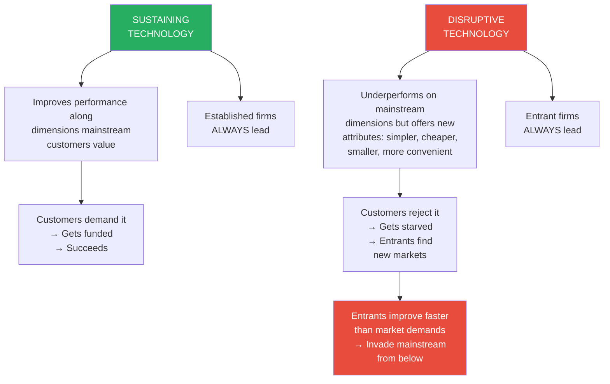
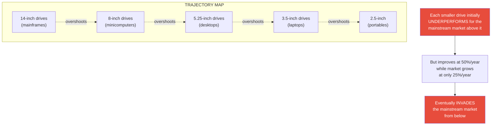
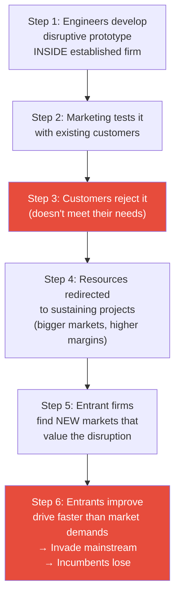
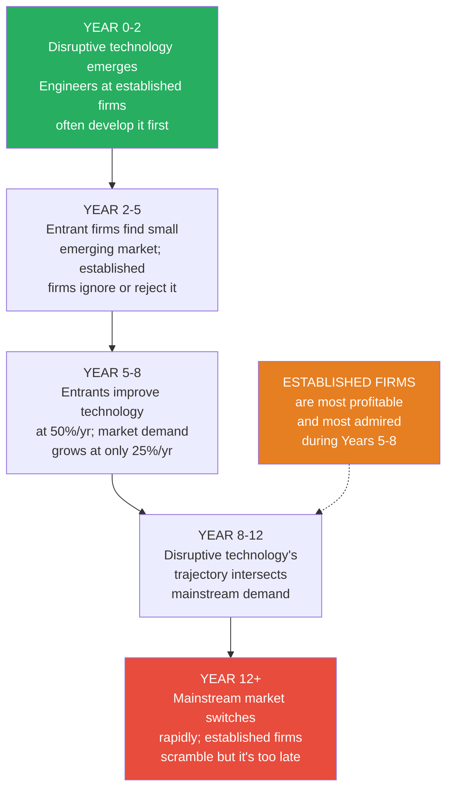
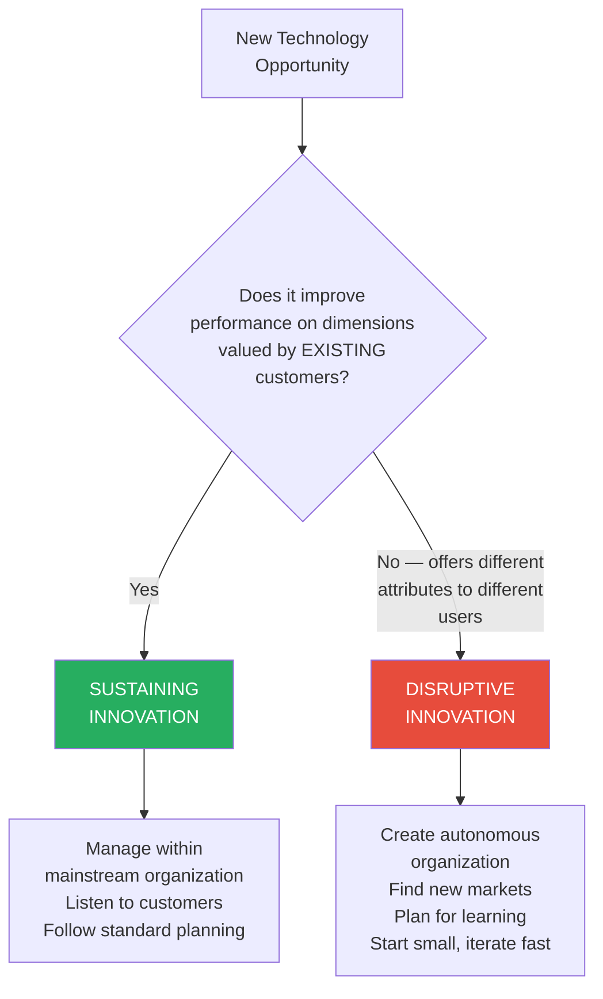

# The Innovator's Dilemma — Clayton M. Christensen

> In 1985, Seagate Technology was the world's dominant maker of 5.25-inch disk drives. Its engineers — among the industry's best — built eighty working prototypes of a smaller 3.5-inch drive, two full years before any competitor shipped one. Marketing tested it with their biggest customer, IBM's PC Division. IBM wanted 40 and 60 megabyte drives in the 5.25-inch form factor they already used. The 3.5-inch drive offered only 20 megabytes. IBM wasn't interested. The financial analysts said margins would be lower. The executives shelved the project. Meanwhile, two former Seagate employees left to co-found Conner Peripherals, shipped $113 million of 3.5-inch drives in their first year — almost entirely to Compaq for a new product category called the laptop computer — and within four years had captured 60 percent of the desktop drive market as well. Seagate never sold a single 3.5-inch drive to a portable computer maker. **This book explains why that happened — not once, but over and over, across industries as different as disk drives, steel, excavators, motorcycles, accounting software, and insulin.** The answer is not that the managers at Sears, Digital Equipment, Xerox, Bucyrus Erie, or Bethlehem Steel were stupid or lazy. They were brilliant. They listened to their customers, invested aggressively in the best technologies, pursued higher margins, and managed their resources rationally. <b style="color: #e74c3c">That is exactly why they failed.</b> Clayton Christensen's central insight is devastatingly simple: <b style="color: #2980b9">the practices that make companies successful at sustaining innovation — listening to customers, investing in higher-margin products, targeting larger markets — are precisely the practices that blind them to disruptive technologies</b>. The solution is not to manage better but to manage differently — creating autonomous organizations, embracing small markets, planning for learning rather than execution, and understanding that an organization's capabilities are also its disabilities. First published in 1997, *The Innovator's Dilemma* remains the most rigorous and influential framework ever constructed for understanding why great companies fail.

---

## About the Author

- *Clayton Magleby Christensen (1952–2020)* was born in Salt Lake City, Utah, the second of eight children in a devout Mormon family.
- He stood six feet eight inches tall — an imposing physical presence matched by an equally imposing intellectual one
- A deeply religious man, he served as a missionary for The Church of Jesus Christ of Latter-day Saints in South Korea and later as a bishop and area authority, seeing no contradiction between rigorous academic inquiry and personal faith
- He graduated with highest honors from Brigham Young University in economics, earned an M.Phil. in applied econometrics from Oxford University as a Rhodes Scholar (one of the most prestigious academic fellowships in the world), and received his MBA with high distinction from Harvard Business School, where he was named a Baker Scholar — the highest academic honor awarded to HBS MBA graduates
- He worked at the Boston Consulting Group as a consultant and project leader, served as a White House Fellow in the Reagan administration advising the secretaries of Transportation and Education, and co-founded a successful ceramics manufacturing company — giving him both academic rigor and hands-on business experience
- He returned to Harvard for his DBA (doctorate in business administration), choosing to study the disk drive industry for its exceptional pace of technological change and competitive upheaval
- His dissertation committee included luminaries Kim Clark, Joseph Bower, Jay Light, and Richard Rosenbloom — scholars who helped shape the modern fields of technology management and resource allocation
- His doctoral research on the disk drive industry — analyzing every model from every company worldwide between 1975 and 1994, supplemented by more than eighty executive interviews — became the empirical foundation of *The Innovator's Dilemma*
- He joined the Harvard Business School faculty in 1992 and became the Kim B. Clark Professor of Business Administration, one of HBS's most prestigious endowed chairs
- *The Innovator's Dilemma* (1997) won the Global Business Book Award and was named by *The Economist* as one of the six most important business books ever written; Andy Grove of Intel called it the most important book he'd read in ten years
- The book has sold over one million copies and has been translated into more than twenty-five languages; it has influenced the strategy of companies ranging from Intel and Apple to Amazon and Netflix
- He followed it with *The Innovator's Solution* (2003), *Disrupting Class* (2008), *The Innovator's Prescription* (2009), *Competing Against Luck* (2016), and the personal *How Will You Measure Your Life?* (2012)
- He co-founded four companies, including the innovation consulting firm Innosight, which has helped Fortune 500 companies identify and respond to disruptive threats
- He was diagnosed with follicular lymphoma in 2010 and suffered a stroke in 2010 and a heart attack in 2011, yet continued teaching and writing — characteristically applying analytical frameworks to his own medical decisions and later his personal faith
- His 2010 HBS commencement speech, later expanded into *How Will You Measure Your Life?*, became one of the most-watched business school lectures in history — in it, he applied the theories from *The Innovator's Dilemma* and his other work to questions of personal purpose, relationships, and integrity
- Despite his illness, he continued to refine the theory of disruptive innovation in subsequent works: *The Innovator's Solution* (2003) developed the prescriptive side; *Disrupting Class* (2008) applied it to education; *The Innovator's Prescription* (2009) applied it to healthcare; *Competing Against Luck* (2016) introduced the "jobs to be done" framework
- **He died on January 23, 2020, at age sixty-seven**, remembered as one of the most influential management thinkers of the modern era; the phrase "disruptive innovation" that he coined has become one of the most widely used terms in business vocabulary

---

## The Big Idea

- <b style="color: #2980b9">Well-managed companies fail because the very practices that make them successful — listening to customers, investing in higher-margin products, targeting larger markets — systematically blind them to disruptive technologies</b>
- This is the innovator's dilemma: doing everything right is what causes the failure
- Christensen distinguishes two fundamentally different types of innovation:
  - **Sustaining technologies** improve the performance of established products along dimensions that mainstream customers already value — whether the improvement is incremental or radical
  - **Disruptive technologies** initially underperform existing products on those dimensions but offer a different package of attributes — typically cheaper, simpler, smaller, more convenient — that a fringe or emerging market values
- <b style="color: #e74c3c">Established firms lead in virtually every sustaining innovation but fail at virtually every disruptive one</b> — not because of technological inability, but because rational resource allocation kills disruptive projects
- The pattern repeats with stunning consistency: engineers develop the disruptive prototype internally, marketing tests it with existing customers, customers reject it, resources go to sustaining projects instead, entrant firms find new markets for the disruption, and incumbents belatedly respond after being invaded from below
- Five principles govern how disruption works:
  1. **Companies depend on customers and investors for resources** — the resource allocation process is customer-driven, and customers don't want disruptive products
  2. **Small markets don't solve the growth needs of large companies** — emerging disruptive markets are invisible to firms that need billions in new revenue
  3. **Markets that don't exist can't be analyzed** — the tools of market research and planning fail for disruptive technologies
  4. **An organization's capabilities define its disabilities** — the processes and values that enable sustaining innovation disable disruptive innovation
  5. **Technology supply may not equal market demand** — when technology overshoots what the market needs, the basis of competition shifts and disruption strikes from below
- Christensen uses the analogy of human flight: for centuries, people tried to fly by strapping wings to their arms and flapping. They invariably failed — not because they lacked courage or effort, but because they were fighting the laws of nature. Flight became possible only when people understood gravity, Bernoulli's principle, and the concepts of lift and drag — and designed machines that harnessed these laws rather than fighting them. <b style="color: #27ae60">Managing disruptive innovation is the same: you must understand and harness the five principles, not fight them</b>
- The book is built on the most comprehensive database of its kind: every model of disk drive introduced by every company in the world between 1975 and 1994, supplemented by more than eighty interviews with executives who played key roles during moments of disruption

The treemap reveals the book's structural balance: roughly equal weight is given to diagnosis (innovation types, value networks) and prescription (five principles, management responses), with the RPV Framework and Resource Dependence occupying the largest conceptual footprint.

> [!tip] The Core Paradox
> Christensen's most counterintuitive finding: the better a company is at listening to its customers, the more likely it is to be disrupted. The best firms don't fail despite good management — they fail because of it.

---

## Key Concepts at a Glance

| Concept | One-line summary |
|---------|-----------------|
| **Sustaining vs. Disruptive** | Sustaining innovations improve what customers want; disruptive innovations offer something different they'll eventually need |
| **Value Networks** | The market context that shapes what a firm can and cannot do — each with its own metrics, margins, and cost structure |
| **The Trajectory Map** | Technology improves faster than markets demand, creating openings for disruption from below |
| **Northeast Migration** | Firms rationally chase higher margins upmarket, creating vacuums at the low end for entrants |
| **Resource Dependence** | Customers — not managers — effectively control a company's resource allocation process |
| **The Six-Step Failure Pattern** | Prototype → test with customers → rejected → shelved → entrants find new market → incumbents lose |
| **RPV Framework** | Resources, Processes, Values — an organization's capabilities in one context are its disabilities in another |
| **Discovery-Driven Planning** | Assume your forecasts are wrong; make plans for learning, not execution |
| **Performance Oversupply** | When technology exceeds market needs, competition shifts from functionality to reliability to convenience to price |
| **The Buying Hierarchy** | Functionality → Reliability → Convenience → Price — the predictable evolution of the basis of competition |
| **Agnostic Marketing** | No one can know in advance how disruptive products will be used — discover markets through action, not analysis |
| **Autonomous Organizations** | Spin out independent units whose customers actually want the disruptive product — don't fight resource dependence, harness it |
| **First-Mover Advantages** | In disruptive markets, early entrants earned 20x the cumulative revenue of followers — leadership is critical |
| **Downward Immobility** | Firms can easily move upmarket but are structurally unable to move down — their cost structures won't allow it |

Principle 4 (Capabilities = Disabilities) ranks highest on counterintuitiveness — the idea that an organisation's strengths are simultaneously its weaknesses is the most psychologically difficult for managers to accept, yet it carries enormous evidence strength across every industry Christensen studied.

---

## The Trajectory Map: The Visual Key to the Entire Book

The single most important diagram in *The Innovator's Dilemma* is the **trajectory map** — a chart that plots two kinds of lines over time:

1. **Technology trajectories** (steep) — the capacity, speed, or functionality that engineers can deliver, improving at roughly 50% per year in disk drives
2. **Market demand trajectories** (shallow) — the capacity, speed, or functionality that customers actually need, growing at roughly 25% per year

Because technology improves faster than markets can absorb, the two lines eventually cross. When they do, the product "overshoots" — offering more performance than the market demands. At that moment, the basis of competition shifts (from functionality to reliability, convenience, or price), and a disruptive technology from below can invade the market.

- This pattern — technology overshooting market demand, creating an opening for a simpler technology from below — is the engine that drives disruption in every industry Christensen studied
- The trajectory map explains why incumbent firms' best customers lead them astray: customers always want more performance, pulling the firm upward along the steep technology trajectory, while a disruptive entrant enters the vacuum below
- It also explains why disruption takes years to develop but then strikes suddenly: the disruptive technology improves in a new value network for years before its trajectory crosses the mainstream demand threshold — at which point adoption is explosive

---

## Part One — Why Great Companies Can Fail

> [!quote] The Central Paradox
> "Precisely because these firms listened to their customers, invested aggressively in new technologies that would provide their customers more and better products of the sort they wanted, and because they carefully studied market trends and systematically allocated investment capital to innovations that promised the best returns, they lost their positions of leadership."

### The Disk Drive Industry: Fruit Flies of Business (Chapter 1)

- *Christensen begins with a deceptively simple question*: if the best companies employ the smartest engineers, invest the most in R&D, listen most closely to their customers, and manage resources most rationally — why do they keep losing?
- He grounds the question in a parade of fallen giants: Sears (praised in a 1964 *Fortune* article as a company where "everybody simply did the right thing"), Digital Equipment (featured in *In Search of Excellence* the same year it was ignoring desktop computers), Xerox (dominant in large copiers, insignificant in small ones), and a list that includes IBM, Apple, Bucyrus Erie, Bethlehem Steel, and every leading cable excavator company
- These companies did not fail because of arrogance, bureaucracy, or bad luck — they failed because they were well-managed. <b style="color: #e74c3c">"Precisely because these firms listened to their customers, invested aggressively in new technologies, and carefully studied market trends, they lost their positions of leadership."</b>
- He chose the disk drive industry as his laboratory because a colleague told him: "Study disk drives — those companies are the closest things to fruit flies that the business world will ever see"
- The disk drive industry between 1976 and 1995 was the most turbulent industry in the history of business: new generations of technology, market structure, global scope, and vertical integration emerged, matured, and declined with breathtaking speed — giving Christensen the equivalent of a laboratory where he could observe multiple cycles of disruption within a single career
- Between 1976 and 1995, 129 firms entered the industry and 109 failed — yet the pace of technological innovation was breathtaking: recording density improved 35% per year, the physical size of a 20 MB drive shrank from 800 cubic inches to 1.4 cubic inches
- <b style="color: #2980b9">The critical discovery: the firms that failed were not behind in technology — they were the technology leaders</b>
- Christensen assembled a database of every disk drive model sold by every company worldwide from 1975 to 1994, tracking which firms led and which lagged at each point of technological change
- The finding was stunningly consistent: **in 100% of sustaining technology changes** — thin-film heads, thin-film disks, magneto-resistive heads, RLL recording codes, Winchester architecture — **the established firms led**, often spending $50-100 million per technology
- But in each of the five **disruptive architecture changes** — from 14-inch to 8-inch, 8-inch to 5.25-inch, 5.25-inch to 3.5-inch, and so on — the established firms failed, and entrants took over
- The disruptive drives were technologically simple — off-the-shelf components in a smaller package — but they offered less capacity, cost more per megabyte, and had no customers in the incumbents' existing markets

> [!example] The Pattern Repeats: 14-inch → 8-inch → 5.25-inch → 3.5-inch
> - **14-inch to 8-inch (1978-1980):** Shugart, Micropolis, Priam, and Quantum developed 8-inch drives with 10-40 MB capacity — useless to mainframe customers demanding 300-400 MB. They sold to a new customer: minicomputer makers (Wang, DEC, Data General). Two-thirds of 14-inch makers never introduced an 8-inch drive. Every 14-inch manufacturer was eventually driven from the industry.
> - **8-inch to 5.25-inch (1980-1983):** Seagate introduced 5-10 MB 5.25-inch drives — useless to minicomputer makers wanting 40-60 MB. Sold to an emerging market: desktop personal computers. Only Micropolis of the four leading 8-inch makers survived the transition. By 1985, only half of 8-inch producers had introduced a 5.25-inch model.
> - **5.25-inch to 3.5-inch (1984-1988):** Conner Peripherals and Rodime made small, rugged, low-power 3.5-inch drives for a new market: laptop and portable computers. Seagate had prototypes two years early but shelved the project after IBM said no. When Seagate finally shipped 3.5-inch drives in 1988, they were sold to desktop PC makers with mounting frames — not a single one went into a portable computer.

- The "technology mudslide hypothesis" — that companies simply couldn't keep up — was definitively wrong
- <b style="color: #e74c3c">The established firms were held captive by their customers</b> — mainframe makers didn't want smaller drives; minicomputer makers didn't want even smaller ones; desktop PC makers didn't want portable-sized ones
- At each transition, the capacity of the smaller drive improved at roughly 50% per year — twice the 25% rate at which markets demanded more capacity — until the smaller drive could satisfy mainstream needs, at which point it invaded from below
- The price experience curve in disk drives was extraordinary: with each doubling of cumulative terabytes shipped, cost per megabyte fell to 53% of its former level — steeper than virtually any other electronics product
- IBM's RAMAC, the first disk drive (1956), was the size of a large refrigerator, incorporated fifty 24-inch disks, and stored 5 megabytes — by 1993, 20 MB fit in 1.4 cubic inches
- Of the seventeen firms in the industry in 1976, all except IBM's disk drive operation had failed or been acquired by 1995 — yet the industry grew from $1 billion to $18 billion
- <b style="color: #27ae60">The lesson is not that technology change killed these companies — it is that listening to their best customers killed them</b>

| Transition | Disrupted by | Initially served | Ignored by | Key data point |
|-----------|-------------|-----------------|-----------|----------------|
| 14" → 8" | Shugart, Micropolis, Priam, Quantum | Minicomputers (Wang, DEC, HP) | Mainframe drive makers | 2/3 of 14" makers never made an 8" drive |
| 8" → 5.25" | Seagate, Miniscribe | Desktop PCs | Minicomputer drive makers | Only Micropolis survived of the 4 leading 8" makers |
| 5.25" → 3.5" | Conner Peripherals | Laptops/portables | Desktop drive makers | Seagate sold zero 3.5" drives to portable makers by 1991 |

With each successive disruption wave, incumbents retained a smaller share of the new market — by the 2.5-inch generation, over 85% of market share belonged to entrant firms, demonstrating that the disruption pattern intensified rather than weakened over time.

- The Conner Peripherals story deserves special attention because it illustrates every dimension of disruption simultaneously:
  - Conner was co-founded by Finis Conner and John Squires — both previously executives at Seagate and Miniscribe, the two largest 5.25-inch manufacturers
  - They had seen the 3.5-inch prototype work at Seagate and watched it get shelved; they knew the technology worked and the market opportunity existed
  - Conner Peripherals started with a $30 million investment from Compaq Computer, which was developing a new category of portable computer and needed small, rugged, low-power drives
  - Conner's first-year revenues hit $113 million — nearly all from Compaq — making it one of the fastest startups to reach $100 million in business history
  - The company innovated not just in product design but in business model: it sold custom-designed drives to laptop OEMs, reversing the traditional sequence of "design, make, sell" to "sell, design, make"
  - By 1990, when the 3.5-inch trajectory intersected desktop PC demand, Conner and the other 3.5-inch pioneers invaded the desktop market from below — offering a smaller, lighter, more reliable product at competitive (sometimes even premium) prices
  - Seagate, which had entered the 3.5-inch market belatedly in 1988, sold its smaller drives only to desktop customers — with frames to mount them in 5.25-inch slots. It was defending its existing position, not creating a new one.
- <b style="color: #e74c3c">The fear of cannibalization becomes a self-fulfilling prophecy</b>: when established firms wait until the disruptive technology invades their home market, the only thing it can do is cannibalize existing sales — because the new market has already been captured by the entrants

### Value Networks: The Context That Controls Decisions (Chapter 2)

- Why do good managers consistently make the same mistake? Christensen introduces the concept of **value networks** — the context within which a firm identifies customer needs, procures inputs, reacts to competitors, and strives for profitability
- A value network is not just a supply chain — it is the entire nested system of producers, products, and markets in which a firm is embedded, from component suppliers through end users
- <b style="color: #2980b9">Different value networks have different performance metrics, different cost structures, and different margin requirements</b>
  - Mainframe value networks: gross margins of 50-60%, direct enterprise sales forces, field service networks, 2-3 year design cycles, highly customized configurations
  - Minicomputer value networks: gross margins of 35-40%, smaller sales teams, faster design cycles
  - Desktop value networks: gross margins of 20-25%, retail distribution, 6-12 month design cycles, high-volume standardized production
  - Portable value networks: gross margins of 15-20%, custom-designed drives for each OEM, one-year product cycles, extreme emphasis on size, weight, and power consumption
- The same disk drive sells for different prices depending on which value network it enters — a hedonic regression analysis showed that a megabyte of capacity was worth $1.65 in the mainframe network, $1.50 in minicomputers, $1.45 in desktops, and only $1.17 in portable computing; conversely, portable customers paid a premium for size reduction while mainframe customers placed zero value on smallness
- Firms develop capabilities — processes, cost structures, organizational habits — that are precisely tuned to their specific value network; they become extraordinarily good at serving their own network and structurally unable to compete in networks with different margin requirements
- The conventional S-curve framework (technology approaches a limit, a new technology rises from below) works well for **sustaining** technologies within a single value network — established firms navigated these transitions with "remarkable, consistent agility," spending $50-100 million on new technologies when their customers needed them
- But S-curves fail for **disruptive** technologies, which emerge in entirely different value networks with different performance metrics — a disruptive innovation "cannot be plotted" using the conventional S-curve because its vertical axis measures different attributes of performance
- Christensen found that established firms "did not have trouble developing the requisite technology: Prototypes of the new drives had often been developed before management was asked to make a decision" — the projects stalled when it came to allocating scarce resources between sustaining and disruptive proposals
- Christensen maps the six-step decision pattern that leads to failure:

- This pattern was not the result of managerial failure — it was the result of managerial excellence applied within the wrong value network

The force diagram reveals the self-reinforcing trap: existing customers drive both the rejection of the disruptive prototype (Step 3) and the redirection of resources to sustaining projects (Step 4), while entrants circle back to capture those same customers once the disruptive technology matures.

- The flash memory analysis at the end of the chapter tests the framework's predictive power: flash cards were emerging as potential disk drive replacements, and Christensen correctly identified them as a disruptive technology following the same pattern — first used in cell phones, heart monitors, and robots (where disk drives were too big and fragile), then gradually moving upmarket as costs fell

### Mechanical Excavators: The Same Pattern in Slow Motion (Chapter 3)

- *To prove the framework works beyond electronics*, Christensen examines the mechanical excavator industry — a slow-moving, low-tech industry that took decades where disk drives took years
- Cable-actuated excavators dominated earthmoving from the 1830s through the 1960s — massive machines swinging heavy buckets on steel cables from tracked bases
- The industry served three distinct market tiers: (1) general excavation contractors (average bucket size 2.5 cubic yards), (2) sewer and piping contractors (average 1 cubic yard), and (3) open pit mining (average 5 cubic yards) — bucket capacity grew at about 4% per year, constrained by the logistics of transporting machines to construction sites
- The established manufacturers (Bucyrus Erie, Northwest Engineering, Marion, Koehring, and about twenty-five others) successfully navigated every sustaining innovation: steam to gasoline (1920s), gasoline to diesel, the arched boom design (post-WWII) — each improved performance for existing customers
- The smallest steam shovel manufacturers failed during the gasoline transition (resources mattered for that sustaining change), but the largest twenty-five firms cruised through every sustaining change with ease
- In 1947, a British company called J.C. Bamford built the first hydraulic excavator — a tiny "backhoe" mounted on the back of a farm tractor with a bucket capacity of just 1/4 cubic yard
  - Mainstream contractors needed 1-4 cubic yard buckets — hydraulics was useless to them
  - The hydraulic backhoe could only rotate 180 degrees versus the cable excavator's full 360
  - But it was small, mobile, and mounted on a wheeled tractor that could drive on roads
- <b style="color: #27ae60">The entrants — J.C. Bamford, John Deere, Case, Caterpillar (a late entrant) — found a new market</b>: small residential contractors digging narrow trenches from water mains to house foundations during the postwar housing boom
  - These contractors had always dug by hand — a cable shovel was too expensive and imprecise for the job
  - The hydraulic backhoe could do the work in less than an hour per house
  - It was sold through farm tractor dealerships, not the heavy equipment dealers that served mainstream contractors
- Bucyrus Erie, the leading cable manufacturer, bought a hydraulic company in 1950 — just two years after the first backhoe appeared — but tried to adapt the technology for its existing customers
  - The result was the "Hydrohoe" — a cable-hydraulic hybrid that used cables for lifting and hydraulics only for curling the bucket
  - Bucyrus marketed it as a "dragshovel" in open fields, while Sherman Products marketed its pure hydraulic "Bobcat" as a "digger" working in tight quarters
  - The Hydrohoe flopped for a decade; Bucyrus returned to cable shovels
- Hydraulic excavator capacity improved from 1/4 cubic yard in 1947 to 1/2 cubic yard by 1960 to 2 cubic yards by 1965 to 10 cubic yards by 1974 — a rate far faster than the 4% annual growth in mainstream demand
- A critical boost came in 1954 when German entrant Demag introduced a track-mounted hydraulic excavator that could rotate a full 360 degrees — eliminating the last functional disadvantage compared to cable machines
- Between 1947 and 1965, twenty-three companies entered the mechanical excavation market with hydraulic products — and virtually all were entrants, not established cable manufacturers
- When hydraulics reached mainstream capacity requirements in the mid-1960s, contractors switched rapidly — partly because hydraulic machines were far more reliable (no life-threatening cable snaps)
- <b style="color: #e74c3c">Only 4 of 30+ cable shovel makers survived the transition — and the leading firms had logged record profits right up until the year hydraulics invaded their core market</b>
- The strategic lesson: successful entrants accepted the technology's current capabilities and found markets that valued them; established firms took the market's current needs as given and tried to force the technology upward
- Christensen draws a parallel to the history of steam-powered ships: Robert Fulton's 1819 steamship was slower, less reliable, and more expensive than sailing ships on transoceanic routes — but it could move against the wind on rivers and lakes. Steam power was used in inland waterways for nearly a century before it displaced sailing ships on the ocean. Not one maker of sailing ships survived the transition to steam — not because they lacked access to the technology, but because their customers (transoceanic shippers) had no use for it until steam had matured in a different value network.
- The excavator and steamship stories demonstrate that the disk drive pattern is not an artifact of fast-moving electronics — it applies to industries that move across decades and centuries

### What Goes Up, Can't Go Down: The Steel Industry (Chapter 4)

- Why is it so easy for companies to move upmarket and so hard to move down? Christensen introduces the concept of the **northeast migration** — the systematic drift toward higher-performance, higher-margin products driven by rational resource allocation
- In disk drives, Seagate started in the desktop market, then migrated to engineering workstations and file servers, then to mainframes — chasing higher margins at each step
- Each upmarket move added overhead costs (more R&D, more field service, more sophisticated manufacturing), which made the firm's cost structure unable to compete profitably in the lower-margin markets it had left behind
- <b style="color: #2980b9">Asymmetric combat</b>: moving up means taking a lower-cost structure into a market accustomed to paying 60% gross margins — easy. Moving down means taking a higher-cost structure into a market where competitors make money at 25% gross margins — nearly impossible.
- The same dynamic played out in the American steel industry between integrated mills and minimills:
  - Integrated steel mills require roughly $6 billion in capital to build, produce steel from iron ore in blast furnaces, and employ tens of thousands of workers
  - Minimills melt scrap steel in electric arc furnaces for about $400 million in capital, are much smaller, and employ far fewer people — their cost per ton is significantly lower, but their initial product quality was also lower
  - Minimills (led by Nucor, Chaparral, and others) started in the late 1960s making the simplest, lowest-margin product: rebar (reinforcing bar) — approximately 7% gross margins, the bottom of the steel market
  - Integrated mills like Bethlehem, USX, and Inland were happy to retreat from rebar: it was their least profitable product line, and exit actually increased their average margins and profitability
  - Minimills then moved to angle iron and structural steel — again, the bottom of the integrated mills' product line, the business they were happiest to shed
  - By the late 1980s, minimills accounted for nearly all North American rebar, angle iron, and structural steel production
  - Nucor then pioneered thin-slab continuous casting to make sheet steel — the integrated mills' most profitable product
  - USX and Bethlehem studied thin-slab casting but invested instead in conventional thick-slab casters to serve their most profitable auto, appliance, and can customers — a perfectly rational decision
  - Nucor captured 7% of the sheet market by 1996 and was steadily improving surface quality

| Period | Minimill product | Integrated mill response | Margin tier |
|--------|-----------------|------------------------|-------------|
| Late 1960s | Rebar (reinforcing bar) | Happy to exit — lowest margin | ~7% gross |
| 1970s | Angle iron, bars, rods | Relieved to focus upmarket | ~12% gross |
| 1980s | Structural steel | Invested in higher-margin sheet | ~18% gross |
| 1989+ | Sheet steel (thin-slab casting) | Studied it, chose conventional casters instead | ~25-30% gross |

- Christensen observes that the same "wheel of retailing" pattern was documented decades earlier: new retailers enter at the low end (Woolworth's, supermarkets, discounters), move upmarket over time by adding services and overhead, and become vulnerable to the next low-cost entrant. Sears was once a disruptive discount retailer that moved upmarket — and was then disrupted by Wal-Mart and Target.

> [!warning] The Profit Trap
> At every step, the integrated steel mills made the rational choice: cede the lowest-margin business, invest in the highest-margin customers, improve profitability. The result was record profits — followed by structural devastation. The decisions that led to their decline were made at the moment they were most widely admired. When Business Week wrote in 1980 about "What Caused the Decline" of steel, the industry's problems were attributed to cheap imports and lazy unions — not to the minimill disruption that was already consuming the bottom of their market.

- The northeast migration is not unique to steel or disk drives — it is a universal pattern in business:
  - Retailers: Department stores → Sears → discount stores (K-Mart) → discount warehouses (Costco). At each step, the previous leader added costs to move upmarket and became vulnerable to a lower-cost entrant below.
  - Malcom McNair, a Harvard professor writing in the 1950s, described this as "the wheel of retailing": innovators enter with low-cost formats, trade up over time, add overhead, become vulnerable to the next low-cost entrant. The pattern has repeated with Woolworth's, Sears, K-Mart, and likely will continue.
  - Automobiles: Toyota entered North America with the low-priced Corona, moved through Corolla, Camry, Avalon, and Lexus — leaving the bottom of the market open for Hyundai, then Kia, and eventually Chinese manufacturers.
  - In every case, the upmarket migration was driven by the same force: when competing proposals for resource allocation are compared, the one targeting the larger, higher-margin market always wins.

- The mechanism behind the northeast migration is resource allocation: when middle managers compare competing proposals, the one targeting a larger market with higher margins always wins over the one targeting a small, low-margin emerging market
- <b style="color: #e74c3c">This isn't a management failure — it is management working exactly as designed</b>

---

## Part Two — Managing Disruptive Technological Change

### Principle 1: Give Responsibility to Organizations Whose Customers Need Them (Chapter 5)

- *Christensen opens Part Two by confronting resource dependence theory* — the somewhat depressing idea that customers, not managers, effectively control where a company invests
- <b style="color: #2980b9">The theory says that well-adapted companies survive by giving customers what they want — meaning that any project customers don't want will be systematically starved of resources, regardless of what executives decree</b>
- Three case studies illustrate the only reliable way to overcome this force:

**Quantum and Plus Development Corporation:**
- In 1984, several Quantum employees (an 8-inch drive maker for minicomputers) saw potential for a thin 3.5-inch drive for desktop PCs
- Rather than let them leave, Quantum financed an 80%-owned spinoff called Plus Development Corporation — completely independent, with its own executive staff and all functional capabilities
- Plus was extraordinarily successful with its "Hardcard" product
- As Quantum's 8-inch revenues evaporated, they were offset by Plus's growth; by 1987, Quantum purchased the remaining 20% of Plus, installed Plus's executives in charge, and reconstituted itself as a 3.5-inch company
- By 1994, the new Quantum was the world's largest disk drive manufacturer by unit volume

**Control Data in Oklahoma City:**
- CDC was the dominant 14-inch drive maker (55-62% market share) but completely missed 8-inch drives — engineers kept getting pulled off the 8-inch program to fix 14-inch problems for mainstream customers
- For its 5.25-inch drive, CDC deliberately located the team in Oklahoma City — "not to escape the engineering culture, but to isolate the group from the company's mainstream customers"
- One CDC manager explained: "We needed an organization that could get excited about a $50,000 order. In Minneapolis, you needed a million-dollar order just to turn anyone's head"
- The Oklahoma venture succeeded, capturing 20% of the higher-capacity 5.25-inch market

**Micropolis — Transition by Brute Force:**
- CEO Stuart Mabon forced the company's transition from 8-inch to 5.25-inch drives within the mainstream organization
- He assigned the best engineers to 5.25-inch and spent "100% of my time and energy for eighteen months" fighting the organization's gravitational pull back toward 8-inch customers
- He had to walk away from every existing customer and find entirely new ones
- He succeeded — one of the only CEOs ever to muscle through a disruptive transition internally — but described it as the most exhausting experience of his life
- The lesson: you can fight resource dependence, but the cost is Herculean

- **DEC's four failed PC attempts** reinforce the point: each time Digital Equipment launched PC initiatives from within the mainstream (1983, 1988, 1991, 1995), day-to-day resource allocation starved them as engineers were redirected to higher-margin minicomputer and Alpha microprocessor work
- **IBM succeeded** by creating a completely autonomous PC division in Boca Raton, Florida — free to procure components from any source, sell through its own channels, and operate at a cost structure appropriate to the PC market
- IBM's subsequent decision to link its PC division more closely to the mainstream proved damaging — managing two cost structures and two models for making money within a single organization is extraordinarily difficult
- **Hewlett-Packard's ink-jet printer** provides another illustration: HP's LaserJet business was enormously profitable, with margins above 40%. The disruptive ink-jet technology was simpler, cheaper, and lower-performance. HP succeeded because it created an independent ink-jet division in Vancouver, Washington — far from the LaserJet group in Boise, Idaho. The two divisions competed openly, with the ink-jet eventually cannibalizing laser printers from below — but HP owned both sides of the disruption.
- **Kresge (K-Mart) vs. Woolworth's** in retailing: Woolworth's pioneered discount retailing but tried to manage its new Woolco discount stores within its existing variety-store organizational structure. Kresge, by contrast, created K-Mart as an entirely separate organization. K-Mart thrived; Woolco was shut down after thirteen years of failure. Kresge's executives chose to harness resource dependence rather than fight it.
- The parallel in computers is striking: IBM dominated mainframes but missed minicomputers (DEC, Data General, and Wang created that market); none of the minicomputer makers became significant in desktop PCs (Apple, Commodore, and IBM's autonomous Boca Raton division created that market); and none of the desktop leaders pioneered portable computers (Toshiba, Sharp, and Zenith did). At each transition, the disruptive product was simpler, cheaper, and initially worse on the metrics the established market valued — and the incumbents' customers saw no use for it.

> [!tip] The Structural Solution
> Don't try to change the mainstream organization's values — create a separate organization whose customers actually want the disruptive product. Harness resource dependence instead of fighting it.

### Principle 2: Match the Size of the Organization to the Size of the Market (Chapter 6)

- <b style="color: #e74c3c">First-mover advantages in disruptive markets are enormous</b> — and the data is stunning:
  - Of 83 companies that entered the disk drive industry between 1976 and 1993, only 6% of those entering established markets ever reached $100 million in revenue
  - But 37% of firms that led in creating new value networks (entering markets less than two years old) reached $100 million
  - Cumulative revenues: disruptive leaders logged $62 billion; followers logged only $3.3 billion
  - **Average revenue per firm**: $1.9 billion for disruptive leaders vs. $64.5 million for followers — a 30-to-1 ratio
- Yet large companies consistently fail to enter disruptive markets early because of simple arithmetic: a $4 billion company growing at 20% needs $800 million in new revenue next year — no emerging market is that large
- Leadership in sustaining technology, by contrast, confers almost no competitive advantage — the data showed no correlation between being first to adopt thin-film heads and subsequent market position

**Apple Newton — Success Perceived as Failure:**
- The Newton sold 140,000 units in its first two years, outperforming the Apple II (43,000 units) by more than three-to-one in the same timeframe
- The Apple II's success qualified Apple for an IPO; the Newton was universally viewed as a catastrophic failure
- The difference: Apple was tiny when it launched the Apple II and a $5 billion company when it launched the Newton
- Apple spent "scores of millions" on extensive market research and feature development — then couldn't earn a return because the emerging PDA market was too small for those investments

**Seagate's Costly Wait:**
- After shelving its 3.5-inch drive in 1985, Seagate waited until 1987 when the market reached $1.6 billion — "big enough to be interesting"
- But Conner Peripherals, which pioneered the 3.5-inch market for portables, had fundamentally changed the rules: "We first sell the drives; then we design them; and then we build them" — custom-designing each drive for major portable computer OEMs
- Seagate never figured out how to compete in the portable market — by 1991, it had not sold a single 3.5-inch drive to a portable computer maker
- Priam Corporation suffered a similar fate one generation earlier: it led the 8-inch market for minicomputers with a two-year product development rhythm. When it belatedly entered the 5.25-inch desktop market, it couldn't match the one-year rhythm that Seagate had developed by learning in the new market. Priam never secured a single major OEM desktop order and closed in 1990. The capability to iterate rapidly in new markets cannot be acquired late — it must be built through early market experience.

- **The solution**: give disruptive opportunities to organizations small enough to be genuinely excited about small wins — through spin-offs, small acquisitions, or autonomous units
  - Allen Bradley successfully transitioned from electromechanical to electronic motor controls by purchasing a 25% stake in a small startup (Information Instruments, Inc., in Ann Arbor, Michigan) in 1969 — just one year after the first electronic programmable controllers appeared — and then acquiring a nascent division of Bunker Ramo the following year. AB maintained these acquisitions as a separate unit from its mainstream electromechanical operations in Milwaukee. Over time, the electronic division ate into the electromechanical business — one AB division attacking the other. Of the five leading electromechanical motor control companies (Allen Bradley, Square D, Cutler Hammer, GE, and Westinghouse), only Allen Bradley maintained a strong market position. Remarkably, GE and Westinghouse had far deeper expertise in microelectronics than AB — proving that capabilities (resources) matter less than organizational structure (processes and values).
  - Johnson & Johnson operates 160 autonomous companies, some with revenues under $20 million, specifically to launch disruptive products at appropriate scale — including endoscopic surgical equipment and disposable contact lenses

> [!example] The Revenue Mathematics of Growth
> - A $40 million company growing at 20% needs $8 million in new revenue next year — achievable from a small emerging market
> - A $400 million company at 20% growth needs $80 million — possible but challenging
> - A $4 billion company at 20% growth needs $800 million — no emerging disruptive market is this large
> - A $40 billion company at 20% growth needs $8 billion — impossible from any new market
>
> This is why the largest and most successful companies are systematically the worst at pursuing disruptive innovation. Their size is a genuine disability.

### Principle 3: Markets That Don't Exist Can't Be Analyzed (Chapter 7)

- *The most unsettling of the five principles*: the standard tools of market research, planning, and financial analysis are not just useless but actively dangerous when applied to disruptive technologies
- <b style="color: #2980b9">The only thing we know for sure about expert forecasts for disruptive markets is that they will be wrong</b>

**HP's Kittyhawk — The Best Research Can Mislead:**
- In 1991, Hewlett-Packard assembled a "dream team" of engineers to build the world's smallest disk drive — 1.3 inches, about the size of a coin
- They conducted the most thorough market research imaginable: surveys, focus groups, customer advisory boards, detailed interviews with PDA manufacturers
- Based on this research, they designed for extreme shock resistance (the PDA market demanded ruggedness), ultra-low power consumption, and maximum capacity — targeting a $50-75 price per drive
- They partnered with Citizen Watch Company to build a highly automated, high-volume production line in Japan
- The PDA market never materialized at the volumes forecast; Apple Newton sold only 140,000 units instead of the millions projected
- The real high-volume applications — cheap drives for video game consoles and digital cameras — wanted a $25-30 drive with minimal capacity and no need for extreme ruggedness
- Kittyhawk was too expensive and too over-engineered for the markets that actually materialized
- By the time the team realized the error, their budget was exhausted and their credibility within HP was spent
- <b style="color: #e74c3c">The Kittyhawk story is a tragedy of excellent execution of the wrong plan</b> — the team followed every best practice of market research and product development, and it destroyed them

**Honda's Accidental Motorcycle Strategy:**
- Honda entered the US in 1959 with three employees and $110,000, planning to sell large 250cc and 305cc motorcycles competing with Harley-Davidson and European imports
- The big bikes leaked oil and broke down constantly — Honda's engines weren't designed for the long distances and high speeds American riders demanded
- Honda employees had brought small 50cc Super Cubs for personal errands; they rode them around Los Angeles on weekends, and ordinary Americans — not motorcycle enthusiasts — kept asking where to buy them
- A Sears buyer spotted the Super Cubs and offered to sell them; only when the big-bike strategy was clearly failing did Honda reluctantly agree to pursue small bikes — through sporting goods retailers, not motorcycle dealers
- "You meet the nicest people on a Honda" — an ad campaign by a UCLA student that was never part of the original strategy — created the recreational motorcycle market from nothing
- By 1964, nearly one in every two motorcycles sold in the US was a Honda — and nearly all were the small bikes the company had never intended to sell
- Harley-Davidson tried to respond with small Italian-brand bikes sold through its existing dealer network — but the dealers rejected them: the image and economics didn't fit

**Intel's Bottom-Up Strategic Shift:**
- Intel invented the DRAM but was losing to Japanese competitors on cost
- The actual shift to microprocessors was driven not by executive vision but by Intel's production planning process: factory managers allocated scarce fabrication capacity to whichever products generated the highest margins — which were microprocessors
- Senior management continued to identify Intel as "a memory company" long after the resource allocation process had de facto exited that business
- IBM's selection of the Intel 8088 for the PC was viewed internally as "a small design win" — Intel's own forecast of the top fifty applications for its next-generation 286 chip did not include personal computers

> [!warning] Failed Ideas vs. Failed Businesses
> Most ideas about how disruptive technologies will be used turn out to be wrong. The key is not to be right the first time but to conserve enough resources to iterate. Honda's initial motorcycle strategy was wrong, but the company didn't exhaust its resources pursuing it. HP's Kittyhawk team did — and when the real market emerged, they had nothing left.
>
> Research has shown that the vast majority of successful new business ventures abandoned their original business strategies when they began implementing their initial plans. The dominant difference between successful and failed ventures is not the astuteness of their original strategy — it is whether they had the resources and relationships to get a second or third chance. Companies that run out of resources or credibility before they iterate toward a viable strategy are the ones that fail.

- There is also a critical difference between **failed ideas and failed managers**: in most organizations, individual managers believe they cannot afford to back a project that fails. A blotch on their record blocks career advancement. This creates a powerful deterrent: 65% of companies entering the disk drive industry attempted to enter an established market (where demand was proven) rather than an emerging one (where returns were higher but uncertainty was greater). Managers exchange **market risk** (the risk that an emerging market might not develop) for **competitive risk** (the risk of entering against entrenched competition) — and the data shows this is a terrible trade.

- Christensen's recommendation: **discovery-driven planning**
  - Assume forecasts are wrong, not right
  - Identify the assumptions underlying your business plan and test them cheaply before making expensive commitments
  - Build small, modular capacity rather than large, fixed commitments — HP could have built modular production capacity rather than a single high-volume line
  - Design modular products that can be reconfigured for different markets — the Kittyhawk could have been designed with a defeatured option for the price-sensitive video game market
  - Watch how customers actually use the product rather than listening to what they say — Intuit's developers watched users to discover simplicity opportunities; Honda's employees discovered demand by riding their own bikes
  - Focus on unanticipated successes, not just unanticipated failures — conventional management-by-exception systems track underperformance, but disruptive markets often emerge from unexpected overperformance in an area no one was watching
  - <b style="color: #27ae60">Make plans for learning rather than plans for execution</b>
  - "Agnostic marketing" — market under the explicit assumption that no one can know in advance how a disruptive product will be used or how large its market will be; create knowledge through market experiments, not through surveys and focus groups
  - The dominant difference between successful and failed ventures is not the astuteness of their original strategy — it is whether they conserved enough resources to iterate. Most successful new businesses abandoned their original strategy when implementation revealed what actually worked.

### Principle 4: An Organization's Capabilities Define Its Disabilities (Chapter 8)

- Managers instinctively assess whether the right **people** are assigned to a project — but rarely ask whether the **organization** itself is capable of succeeding
- Christensen introduces the **RPV framework** — three categories that determine what an organization can and cannot do:

| Factor | Definition | Flexibility |
|--------|-----------|-------------|
| **Resources** | Things: people, cash, technology, brands, equipment, relationships | High — can be hired, fired, bought, sold |
| **Processes** | Patterns of interaction: how work gets done, decisions get made, budgets get allocated | Low — designed for consistency, resistant to change |
| **Values** | Prioritization criteria: how employees decide what to do and what not to do (e.g., margin thresholds, market size minimums) | Very low — embedded in culture, unconscious |

- **The key insight**: the very processes and values that constitute an organization's capabilities in its current context simultaneously define its disabilities in a different context
- People are flexible — an IBM engineer can adapt to work at a startup. But processes and values are not. A process designed for 2-3 year minicomputer design cycles cannot compete in a market requiring 6-12 month cycles. You could take two identical groups of engineers and place them in two different organizations — and what they produce would be dramatically different, because the organizations themselves have capabilities independent of the people in them.
- <b style="color: #e74c3c">DEC had all the resources to succeed in PCs</b> — brilliant engineers, ample cash, strong brand. But its processes (custom internal component design, 2-3 year development cycles, batch manufacturing, direct enterprise sales) and its values (must achieve 50% gross margins, target large enterprise accounts) made it structurally incapable of competing in PCs. This is why saying "we have great people, so we can tackle any challenge" is dangerously misleading — the organization itself may be incapable, regardless of the people in it.
- Similarly, McKinsey & Company can absorb hundreds of new MBAs annually and deliver consistent quality — because its capabilities are in processes and values, not individuals. But those same institutionalized methods may render it less effective in fast-moving technology markets that require rapid iteration rather than rigorous analysis.
- As organizations mature, capabilities migrate from people → processes → culture:
  - **Start-ups**: capabilities reside in key people — losing a founder can be fatal
  - **Growing companies**: capabilities move to processes — repeatable methods replace heroic individual effort
  - **Mature companies**: capabilities embed in culture — "that's how we do things around here" — and become extraordinarily difficult to change
- This migration explains why successful start-ups often flame out after going public (their initial success depended on people, not processes) and why firms like McKinsey can absorb hundreds of new MBAs annually without missing a beat (capabilities are in processes and values, not individuals)
- Avid Technology illustrates the flame-out: its digital video editing system drove stock from $16 at its 1993 IPO to $49 in mid-1995 — but its capabilities resided entirely in founding engineers, not repeatable processes. When the market saturated, Avid had no process for creating follow-up products. The stock collapsed.
- Toyota's migration illustrates how values change predictably: it entered North America with the low-priced Corona, then moved through Corolla, Camry, Avalon, and Lexus — each requiring more overhead, progressively deemphasizing entry-level tiers where margins became unattractive. Even Nucor, the disruptive minimill, began to deemphasize rebar as it moved upmarket to sheet steel — **the disruptors eventually become the disrupted**
- The RPV framework explains why massive mergers often fail to produce innovation: the merged entity has more resources but its values lose appetite for anything but blockbuster opportunities
- <b style="color: #27ae60">Start-ups succeed against incumbents not despite their lack of resources but because their values can embrace small markets, their processes can accommodate flexibility, and their cost structures enable profitability at lower margins</b>
- The practical implication: when facing a disruptive challenge, don't just assign good people — ensure the organization's processes and values are aligned with the task

---

### Principle 5: Technology Supply May Not Equal Market Demand (Chapter 9)

- *The final principle ties the entire framework together*: technology typically improves faster than the market can absorb, creating **performance oversupply** — and that's when disruption strikes
- <b style="color: #2980b9">When technology exceeds what the market demands, the basis of competition shifts — and a disruptive technology can invade from below</b>
- Christensen uses the **buying hierarchy** (from Windermere Associates) to describe the predictable sequence:
  1. **Functionality** — when no product satisfies the market's basic functional requirements, the best-performing product wins
  2. **Reliability** — once multiple products provide adequate functionality, customers choose the most reliable one
  3. **Convenience** — once reliability is satisfied, customers choose the most convenient product and vendor
  4. **Price** — once convenience needs are met, the basis of competition becomes price, and margins collapse — the product has become a commodity

- Each shift is triggered by performance oversupply on the previous dimension — when two or more competing products exceed what the market demands on a given attribute, customers can no longer differentiate on that attribute and shift to the next one
- This is why "our product is better than the competition's" becomes an irrelevant argument once both products exceed market needs — differentiation loses its meaning when features have overshot demand
- <b style="color: #e74c3c">A product whose performance exceeds market demands suffers commodity-like pricing; a disruptive product that redefines the basis of competition commands a premium</b>
- Geoffrey Moore's *Crossing the Chasm* model maps to the same dynamics from the customer's perspective: innovators and early adopters buy on functionality; the early majority buys on reliability; the late majority buys on convenience; and laggards buy on price

The widening gap between technology supply (blue) and market demand (green) is the engine of disruption — when supply overshoots demand, customers stop paying for performance and shift to reliability, convenience, then price, opening the door for simpler, cheaper alternatives from below.

- The pattern played out vividly in disk drives:
  - By 1988, both 5.25-inch and 3.5-inch drives offered enough capacity for the desktop PC market
  - Computer makers switched to 3.5-inch drives in droves — even though they cost 20% more per megabyte — because smallness now mattered more than capacity
  - The basis of competition then shifted to reliability (MTBF approaching one million hours), then to convenience, then to price — with gross margins tumbling below 12%

**Intuit's Quickbooks — Disrupting from Simplicity:**
- Existing small business accounting software was designed under CPA guidance, required debits-and-credits knowledge, and grew ever more sophisticated with each release
- But 85% of US companies were too small to employ an accountant — the software had overshot their functional needs by a mile
- Intuit's founder Scott Cook realized the market wanted something simpler, not more powerful
- Quickbooks: no audit trail, no accounting knowledge required, single-entry bookkeeping — and it captured 70% of the small business accounting software market within two years of its launch
- The established competitors responded by moving further upmarket with even more features — the classic sustaining response

**Eli Lilly's Humulin vs. Novo's Insulin Pen:**
- Eli Lilly invested nearly $1 billion to develop Humulin — genetically engineered, 100% pure human insulin — the first commercial biotech product for human consumption
- The market's response was tepid: pork insulin at 10 parts per million impurity was "pretty happy with" by most patients and physicians
- Lilly had overshot on the purity dimension — it was a differentiated product to which the market would not accord a premium price
- Meanwhile, Denmark's Novo developed an insulin pen that reduced injection time from two minutes to ten seconds — a convenience disruption
- Novo commanded a 30% price premium and gained substantial market share
- The lesson: <b style="color: #e74c3c">a product whose performance exceeds market demand suffers commodity-like pricing, while a disruptive product that redefines the basis of competition commands a premium</b>

**Two Critical Characteristics of Disruptive Technologies:**

1. **The weaknesses of disruptive technologies are their strengths in emerging markets** — smallness, simplicity, cheapness, and convenience are liabilities in mainstream markets but are precisely what emerging markets value. Conner Peripherals didn't try to make its 3.5-inch drives bigger; it found a market (portables) where small was valuable. Nucor didn't try to fix surface blemishes on thin-slab steel; it found customers (construction) who cared more about price.

2. **Disruptive technologies are typically simpler, cheaper, and more reliable and convenient** — when performance oversupply occurs and a disruptive technology enters the mainstream market, it succeeds on reliability and convenience. Hydraulic excavators replaced cable machines not because they moved more earth, but because they didn't snap cables.

**Sony's Transistor Radio — The Archetype:**
- In the early 1950s, Akio Morita of Sony traveled to New York to license AT&T's transistor technology, repeatedly badgering AT&T until they relented
- When asked what Sony planned to do with the technology, Morita replied: "We will build small radios." The AT&T official asked: "Why would anyone care about smaller radios?" Morita answered: "We'll see."
- Sony's first portable transistor radios offered far lower fidelity and far more static than the vacuum tube tabletop radios that dominated the market — they were worse on every dimension mainstream customers cared about
- But they were portable — and that attribute created an entirely new market: teenagers who wanted to listen to rock and roll away from their parents
- Rather than wait in the lab until transistor radios matched vacuum tube fidelity, Morita found a market that valued the technology as it was
- Not a single maker of tabletop radios became a leading producer of portable radios — and all were eventually driven from the radio market entirely

- Three strategies for managing the product life cycle dynamics:
  - **Strategy 1 — Ride the sustaining wave upmarket**: Keep investing in higher performance for existing customers, accepting that you will eventually cede lower tiers to disruptive entrants. HP's LaserJet business followed this path — enormously profitable but requires attacking yourself with a disruptive technology (DeskJet) from below to avoid being destroyed by someone else's disruption. This is the most common strategy and the most dangerous if not paired with self-disruption.
  - **Strategy 2 — March in lock-step with customer needs at each tier**: Aggressively fight upmarket drift by producing products that match — not exceed — what each tier of the market needs, catching successive waves of competition shift. Compaq Computer pursued this by launching aggressive low-price lines to resist the natural pull toward higher-margin segments. This is very difficult to execute because organizational incentives constantly pull toward higher margins.
  - **Strategy 3 — Steepen the market demand trajectory**: Use marketing to increase the rate at which customers demand performance improvements, so that technology supply and market demand stay parallel and performance oversupply never occurs. The trinity of Microsoft, Intel, and disk drive makers pursued this brilliantly throughout the 1990s: Microsoft created software packages (Excel grew from 1.2 MB in 1987 to 32 MB in 1995) that consumed massive amounts of storage and processing power, keeping demand curves steep enough to parallel technology supply curves. When demand parallels supply, there is no oversupply, no shift in the basis of competition, and no opening for disruption from below. This strategy postpones disruption — but depends on the ability to keep manufacturing demand indefinitely, which ultimately may not be sustainable.
  - Christensen observes that some industry watchers believed Microsoft's software had already overshot mainstream needs by the late 1990s — which could create an opening for simpler "internet appliances" and applets rather than full-featured computers. This observation proved remarkably prescient: tablets, Chromebooks, and cloud-based applications eventually did exactly this.
- **No strategy is universally best** — what matters is conscious choice. The list of firms that consistently understood both their customers' demand trajectories and their own technology supply trajectories is "disturbingly short." Most companies migrate unconsciously to the northeast, setting themselves up to be disrupted from below.

> [!info] The Product Life Cycle Engine
> Many scholars have described phases of the product life cycle in various ways. Christensen's distinctive contribution is identifying performance oversupply as the **mechanism** that drives transitions between phases. It is not that products naturally mature — it is that technology improvements outrun what markets can absorb, forcing the basis of competition to shift. Understanding this mechanism allows managers to anticipate rather than merely react to competitive shifts.

### Applying the Framework: The Electric Vehicle Case Study (Chapter 10)

- *Rather than a traditional case analysis*, Christensen positions himself as the program manager for electric vehicles at a major automaker and walks through how he would apply all five principles
- In 1997, California had mandated that 2% of all cars sold in the state be zero-emission by 1998 (later postponed to 2002)
- Electric vehicles were a classic disruptive technology:
  - **Worse** than gasoline cars on mainstream metrics: 50-80 mile range vs. 350+, slower acceleration, higher price, limited charging infrastructure
  - **Better** on dimensions the mainstream didn't (yet) care about: simpler mechanically, quieter, cleaner, no oil changes, cheaper per mile to operate, zero emissions
- The major automakers (Ford, Chrysler, GM) all positioned their EVs as sustaining technologies — demanding battery breakthroughs to make electric minivans and electric Rangers competitive in the mainstream market
  - Ford's John Wallace: "The only solution for the problems of range and cost is improved battery technology"
  - Chrysler packed nearly a ton of batteries into a minivan; the result was a $120,000 vehicle with a 60-mile range that took six hours to charge

**Christensen's Disruptive Approach:**
- Accept the EV's current capabilities as given and ask: "Where is there a market that values these attributes as they are?"
- Possible markets: teenagers needing a second car for short commutes, urban fleet vehicles, neighborhood electric vehicles for gated communities and retirement communities
- Christensen notes that 68% of survey respondents commuted fewer than 10 miles to work, 80% of all trips were fewer than 20 miles, and the average number of trips per day was 3.3 — meaning the vast majority of actual driving easily fits within a 50-80 mile EV range; the problem was not range per se, but the assumption that EVs had to match the gasoline car on every dimension
- EVs offered attributes that no combustion car could match: extreme mechanical simplicity (far fewer moving parts), near-silence, zero local emissions, no oil changes or transmission service, and significantly lower per-mile operating cost — attributes the mainstream didn't prioritize but that specific user groups would highly value
- Use discovery-driven planning: assume initial market assumptions will be wrong; build cheap, simple vehicles; iterate rapidly
- Require no battery breakthrough — build on proven technology and find markets where 50-80 mile range is perfectly adequate
- Spin out an independent organization with a cost structure appropriate to small volumes and low prices — not the overhead of a major automaker
- The independent organization would address several problems simultaneously: (1) resource dependence would work FOR the project rather than against it — the new organization's customers would pull it forward; (2) small orders denominated in hundreds of units would generate energy rather than skepticism; (3) the inevitable early failures would be on a small scale, preserving credibility for iteration; (4) the team would feel constant pressure to become cash-positive quickly, accelerating learning
- Christensen argues that spinning out is appropriate ONLY for disruptive innovations — the evidence is strong that large, mainstream organizations can be "extremely creative" in developing sustaining innovations, and the spin-off strategy should not be applied indiscriminately
- Create new distribution channels — mainstream auto dealers' economics won't support disruptive vehicles, just as Honda's motorcycle dealers rejected small bikes and Conner Peripherals' portable computer customers required custom-designed drives
- <b style="color: #27ae60">The companies that will eventually achieve the battery breakthroughs needed for the mainstream market will be those that first build a commercial base in emerging markets — and then improve upward</b>

**The Broader Landscape of Disruption:**
- Christensen lists dozens of established-technology/disruptive-technology pairs active in the late 1990s:

| Established Technology | Disruptive Technology |
|----------------------|----------------------|
| Silver halide photographic film | Digital photography |
| Wireline telephony | Mobile telephony |
| Full-service stockbrokers | Online brokerages |
| Offset printing | Digital printing |
| General hospitals | Outpatient clinics |
| Cardiac bypass surgery | Angioplasty |
| Open surgery | Arthroscopic surgery |
| Classroom instruction | Distance education |
| Medical doctors | Nurse practitioners |
| Standard textbooks | Custom modular digital textbooks |
| Manned fighter aircraft | Unmanned aircraft |

- The Internet looms as the infrastructural technology enabling disruption across many of these industries

> [!note] Twenty Years Later
> Christensen's 1997 EV analysis has aged in fascinating ways. Tesla, founded in 2003, initially followed a partially disruptive path — starting with the high-performance Roadster (actually a sustaining strategy for sports car enthusiasts) before moving to the mass market. The broader EV transition has involved elements of both disruption and sustaining innovation, shaped by regulatory mandates, environmental concerns, and battery cost curves that exceeded Christensen's projections.

### The Dilemmas of Innovation: A Summary (Chapter 11)

- Christensen closes with seven key findings that crystallize the book's argument:

1. **The pace of market demand differs from the pace of technology supply** — products that are useless today may address mainstream needs tomorrow; customers cannot lead firms toward innovations they don't yet need

2. **Innovation mirrors resource allocation** — only projects that get funded and staffed can succeed; the resource allocation process is controlled by the wisdom of people whose intuition was forged in the mainstream value network

3. **Match the market to the technology** — successful disruption is a marketing challenge, not a technology challenge; find a market that values the disruptive attributes as they currently exist rather than forcing the technology upward to satisfy mainstream needs

4. **Organizational capabilities are context-specific** — processes and values that enable sustaining innovation disable disruptive innovation; capabilities reside in organizational structures, not just in people

5. **Failure and iteration are intrinsic** — the information needed for bold investment in disruption doesn't exist; it must be created through cheap, fast experimentation; companies that don't bet the farm on their first idea survive to iterate toward success

6. **Leadership matters differently** — be a follower in sustaining technologies (there's no first-mover advantage) but a leader in disruptive technologies (the first-mover advantage is enormous)

7. **Good management is the strongest barrier to entry** — the most powerful protection that disruptive entrants enjoy is that it doesn't make sense for established firms to pursue disruption; conventional managerial wisdom constitutes an entry barrier that entrepreneurs can bank on

- Christensen emphasizes in closing that <b style="color: #27ae60">companies must not throw out the capabilities, structures, and processes that make them successful in their mainstream markets</b> — the vast majority of innovation challenges are sustaining in character, and the mainstream organization is perfectly designed to handle them
- The key is diagnostic: managers need to distinguish sustaining from disruptive challenges and then apply the appropriate organizational response
- One of the book's most reassuring conclusions: "I have never met a group of people who are smarter or work harder or are as right so often as the managers I know. If finding better people than these were the answer to the problems posed by disruptive technologies, the dilemma would indeed be intractable."
- The dilemma is tractable — but only if you understand the principles, design the right organizational structures, and resist the temptation to force a disruptive technology into a sustaining framework
- <b style="color: #2980b9">The answer is not to manage better — it is to manage differently</b>

> [!success] The Resolution
> Established companies can surmount the innovator's dilemma — but only by creating organizational contexts in which each unit's market position, economic structure, and values are aligned with the very different work of sustaining and disruptive innovation. The answer is not to manage better, but to manage differently.

---

## The Five Principles at a Glance

| # | Principle | The Problem | The Solution |
|---|-----------|-------------|-------------|
| 1 | **Resource Dependence** | Customers control resource allocation; they don't want disruptive products | Create autonomous organizations whose customers DO want the disruption |
| 2 | **Small Markets** | Emerging markets can't generate the revenue large companies need for growth | Give disruptive opportunities to organizations small enough to value small wins |
| 3 | **Unknowable Markets** | Markets for disruptive technologies can't be analyzed in advance | Use discovery-driven planning; assume forecasts are wrong; plan for learning |
| 4 | **Capabilities = Disabilities** | Processes and values that enable sustaining innovation disable disruptive innovation | Assess RPV fit; create organizations with appropriate processes, values, and cost structure |
| 5 | **Performance Oversupply** | Technology overshoots market demand, shifting the basis of competition | Find markets that value the disruptive attributes as they currently exist |

### Companies That Succeeded — And Why

| Company | Disruptive Challenge | Strategy | Outcome | Principle Applied |
|---------|---------------------|----------|---------|------------------|
| **Quantum** | 8" → 3.5" drives | Spun off Plus Development Corporation, 80%-owned, fully independent | Plus became the core; new Quantum became world's largest drive maker | Principle 1 |
| **CDC** | 14" → 5.25" drives | Sent team to Oklahoma City to isolate from mainstream customers | Captured 20% of higher-capacity 5.25" market | Principles 1, 2 |
| **IBM** | Mainframes → PCs | Created autonomous PC division in Boca Raton, Florida | Dominated early PC market; captured first-mover advantage | Principles 1, 4 |
| **Allen Bradley** | Electromechanical → electronic motor controls | Acquired two small firms, ran them independently from Milwaukee | Only one of five incumbents to survive; became market leader | Principles 1, 2 |
| **Honda** | Entering US motorcycle market | Discovered small-bike market accidentally; pivoted to sporting goods retail | Captured 50% of US motorcycle market by 1964 | Principle 3 |
| **Intuit** | Simplifying accounting software | Launched Quickbooks targeting non-accountants who needed simplicity | Captured 70% of small business market in two years | Principle 5 |
| **HP (DeskJet)** | Disrupting its own LaserJet | Created independent ink-jet division in Vancouver, WA | Owned both sides of the disruption | Principles 1, 2 |
| **Nucor** | Disrupting integrated steel | Started in lowest-margin rebar, moved up through structural to sheet | Became largest US steel producer by revenue | All five principles |

### Companies That Failed — And Why

| Company | Disruptive Challenge | What They Did Wrong | Root Cause |
|---------|---------------------|-------------------|-----------|
| **Seagate** | 5.25" → 3.5" drives | Tested 3.5" with existing desktop customers; shelved when IBM said no | Principle 1: Customers controlled resource allocation |
| **Bucyrus Erie** | Cable → hydraulic excavators | Built cable-hydraulic hybrid (Hydrohoe) for mainstream customers | Forced disruption into existing value network |
| **DEC** | Minicomputers → PCs | Four attempts from within mainstream organization; resources starved | Principles 1, 4: Processes and values misaligned |
| **Bethlehem Steel** | Integrated → minimill steel | Invested in conventional casters to serve best customers | Principle 2: Low-end market too small to be interesting |
| **Apple (Newton)** | Launching PDA market | Spent "scores of millions" trying to create a market large enough for Apple's size | Principle 2: Small markets can't satisfy large companies |
| **HP (Kittyhawk)** | Creating 1.3" drive market | Exhaustive market research for PDAs; committed to single design, no resources left to pivot | Principle 3: Planned for execution instead of learning |
| **Priam** | 8" → 5.25" drives | Entered 5.25" late with 2-year development rhythm; couldn't match 1-year desktop cycle | Principle 4: Processes were wrong for new market |
| **Eli Lilly** | Insulin purity → insulin convenience | Spent $1B on Humulin overshooting purity; missed convenience shift | Principle 5: Didn't recognize performance oversupply |

---

## How Disruption Actually Unfolds: A Timeline

Understanding the temporal dynamics of disruption is critical — it is a slow process that appears sudden only in retrospect:

> [!danger] The Cruelest Irony
> Established firms are at their most profitable, most admired, and most celebrated precisely during the period when the disruptive technology is developing the capabilities to destroy them. Bucyrus Erie logged record profits until 1966 — the year hydraulics invaded their core market. Digital Equipment was featured in *In Search of Excellence* at the very moment it was ignoring desktop computers. A 1986 Business Week article warned IBM to "watch out" for DEC because "taking on Digital Equipment Corp. these days is like standing in front of a moving train." Within a few years, DEC itself was the one standing on the tracks — with desktop PCs barreling toward it.

- The timeline also reveals why "wait and see" is so dangerous: by the time the disruption is visible in the mainstream market, the entrants have already accumulated years of manufacturing experience, customer relationships, and market knowledge that late-entering incumbents cannot replicate. Priam's two-year product development rhythm could not match Seagate's one-year rhythm, because Seagate had built that capability over years of operating in the fast-paced desktop market. The capability gap is not technological — it is organizational and experiential.

---

## Sustaining vs. Disruptive: The Complete Comparison

| Dimension | Sustaining Innovation | Disruptive Innovation |
|-----------|----------------------|----------------------|
| **Performance** | Improves along dimensions mainstream customers value | Initially worse on those dimensions |
| **Target market** | Existing customers in existing markets | New customers in new or emerging markets |
| **Margin profile** | Higher margins than current products | Lower margins — at least initially |
| **Market size** | Large, well-defined, researchable | Small, undefined, unknowable |
| **Who leads** | Established firms — 100% of the time in disk drives | Entrant firms — nearly 100% of the time |
| **Technology difficulty** | Often radical, expensive, multi-year | Usually simple, cheap, off-the-shelf |
| **Planning approach** | Standard market research and financial analysis work | Standard tools fail; discovery-driven planning needed |
| **First-mover advantage** | Minimal — followers do about as well | Enormous — 30x revenue difference |
| **Organizational fit** | Fits mainstream processes and values | Requires autonomous organization with different cost structure |
| **Customer reception** | "Yes, we want that — more, better, faster" | "No, we don't need that — it's worse than what we have" |
| **Risk perception** | Managers view as low-risk (known market) | Managers view as high-risk (unknown market) — but actual failure rates are lower |

---

## The RPV Framework in Detail

The Resources-Processes-Values framework is Christensen's most practical diagnostic tool. When facing any innovation challenge, a manager should ask three questions:

### 1. Do We Have the Right Resources?
- People with the right skills, knowledge, and judgment
- Adequate cash, technology, equipment, and supplier relationships
- Resources are the most visible factor and the easiest to change — they can be hired, acquired, or reallocated
- **Trap**: managers often stop here, assuming that if they assign the right people, the project will succeed

### 2. Do Our Processes Fit the Task?
- Product development cycle times: Can we design in 6-12 months, or are we locked into 2-3 year cycles?
- Manufacturing approach: Can we produce in high volumes at low cost, or only in low volumes at high margins?
- Market research habits: Do we test with existing customers, or can we explore entirely new markets?
- Resource allocation process: Will this project survive the budget cycle, or will higher-margin proposals crowd it out?
- Processes are created to address specific, recurrent tasks — they work brilliantly for those tasks and poorly for different ones
- **Trap**: processes are often invisible — they're "how we do things around here" — and managers don't recognize them as constraints

### 3. Do Our Values Align with the Opportunity?
- Margin thresholds: If the company requires 40% gross margins, it literally cannot pursue a 20% margin opportunity — the system will kill it
- Market size minimums: If the company needs $100 million opportunities, a $10 million emerging market won't even register
- Customer definitions: If "our customers" means enterprise IT departments, a consumer product won't get championed
- Values are the hardest factor to change because they are embedded in culture — they define not just what people choose to do but what they don't even consider doing
- **Trap**: values feel like strengths ("we maintain high standards") when they are actually disabilities ("we can't compete in low-margin markets")
- **Example**: a company whose overhead costs require 40% gross margins will have evolved a powerful decision rule — conscious or unconscious — that kills ideas promising less than 40% margins. This is not a bug; it is how the company makes money. But it means the company is structurally incapable of pursuing a 20% margin disruptive opportunity, even if the people involved are brilliant and motivated.

> [!tip] The RPV Diagnostic
> If a project requires only different **resources** — hire or acquire them; the mainstream organization can handle this. If it requires different **processes** — create a separate heavyweight team within the company. If it requires different **values** (different margin structure, different market size tolerance) — spin out a fully independent organization. The further the mismatch extends from resources → processes → values, the more independent the organization must be. This is the single most actionable framework in the entire book.

---

## Best Stories

1. **Seagate's Eighty Prototypes** (Ch 1-2) — Seagate Technology's engineers were the second in the industry to develop working 3.5-inch disk drive prototypes, building eighty of them by 1985 — a full two years before competitor Conner Peripherals shipped its first product. But when Seagate's marketers took the prototypes to their most important customer, IBM's PC Division, IBM showed no interest. IBM was designing its next generation of XT-and AT-class desktops around 5.25-inch drives and needed 40-60 MB — the 3.5-inch offered only 20 MB. Seagate's financial analysts noted the lower projected margins. A former manager recalled: "Our forecasts for the 3.5-inch drive were under $50 million because the laptop market was just emerging, and the 3.5-inch product just didn't fit the bill." The project was shelved. Two former Seagate employees — who had seen the future and couldn't make it happen inside the company — co-founded Conner Peripherals with $30 million from Compaq Computer. Conner shipped $113 million in its first year, almost entirely to Compaq's new portable computer line. By 1991, Seagate had shipped 3.5-inch drives — but every one was sold to desktop PC makers, mounted in frames designed for 5.25-inch slots. Not a single Seagate 3.5-inch drive had been sold to a portable computer manufacturer.

2. **Bucyrus Erie's Hydrohoe** (Ch 3) — In 1950, just two years after the first hydraulic backhoe appeared in the market, Bucyrus Erie — the leading cable excavator manufacturer — purchased a fledgling hydraulic company, Milwaukee Hydraulics Corporation. Bucyrus had the technology. The problem was what it did with it. Rather than selling the small hydraulic machines to residential contractors (who valued narrow trenching and tractor mobility), Bucyrus engineered a hybrid: the "Hydrohoe" used cables for lifting and hydraulics only for curling the bucket — just enough performance to potentially interest its existing general excavation customers. The marketing brochures told the story: Bucyrus labeled the Hydrohoe a "dragshovel," showed it in an open field, and boasted it could "get a heaping load on every pass." Meanwhile, Sherman Products marketed its pure hydraulic "Bobcat" as a "digger" working in tight quarters next to houses. Bucyrus tried for a decade to upgrade the Hydrohoe to mainstream standards; it never succeeded. The Hydrohoe was reminiscent of early transoceanic steamships outfitted with sails — a hybrid that satisfied neither market.

3. **Quantum's Second Life** (Ch 5) — When employees at Quantum Corporation wanted to build 3.5-inch drives for the emerging desktop PC market while Quantum's bread and butter was 8-inch minicomputer drives, the executives faced a choice: let them leave or fund them internally. They chose a third path — financing an 80%-owned spinoff called Plus Development Corporation, with completely separate facilities, executives, and functional capabilities. Plus was wildly successful with its "Hardcard" (a drive mounted on a PC expansion card). As Quantum's 8-inch revenues evaporated in the mid-1980s, Plus's 3.5-inch revenues offset them almost dollar for dollar. By 1987, Quantum purchased the remaining 20% of Plus, effectively closed down the original 8-inch company, and installed Plus's executives in Quantum's most senior positions. They reconfigured Plus's products for OEM desktop computer makers just as the 3.5-inch trajectory was invading the desktop market. The reconstituted Quantum became the largest unit-volume disk drive producer in the world by 1994. A company that literally regenerated itself through its own offspring.

4. **The Newton vs. The Apple II** (Ch 6) — Apple Computer introduced the Apple I in 1976 — a preliminary product that sold just 200 units at $666 each. The Apple II followed in 1977 and sold 43,000 units in its first two years — a triumph that earned Apple its IPO in 1980. A decade later, Apple was a $5 billion company. When it launched the Newton PDA in 1993, the product sold 140,000 units in its first two years — more than three times the Apple II's initial performance. But the Newton was universally declared a catastrophic failure. What changed? Not the product performance. Not the market reception. Only one thing changed: Apple's size. At $5 billion, the Newton's revenue was a rounding error — about 1% of the company's total. The same sales that had been IPO-qualifying at one scale were embarrassing at another. Christensen calls this "one of the most stunning paradoxes in business."

5. **Honda's Accidental Motorcycle Strategy** (Ch 7) — In 1959, Honda dispatched three employees with $110,000 to Los Angeles to break into the American motorcycle market with large 250cc and 305cc bikes. The plan was to compete with Harley-Davidson, BMW, and Triumph for their customers — leather-clad enthusiasts who wanted big, powerful machines. Honda's big bikes leaked oil and suffered clutch failures on American highways, which demanded higher speeds and longer distances than Japanese roads. The company was on the verge of failure. Meanwhile, the Honda employees had brought small 50cc Super Cubs for their own transportation — running errands and riding on weekends through the hills around LA. People kept stopping them: "Where can I get one of those?" A Sears buyer spotted the bikes and asked to carry them. Honda's Tokyo headquarters initially resisted — they didn't want to be seen as makers of "toy" bikes. Only when the big-bike strategy had clearly collapsed did Honda agree to sell Super Cubs through sporting goods retailers. A UCLA advertising student came up with "You meet the nicest people on a Honda" — an ad campaign that created the recreational motorcycle market from nothing. By 1964, nearly one in two motorcycles sold in America was a Honda.

6. **Intel's Bottom-Up Exit from DRAMs** (Ch 7) — Intel Corporation invented the DRAM (dynamic random access memory) chip and built its identity around that product. But by the early 1980s, Japanese manufacturers were beating Intel on cost and quality. The conventional telling is that Intel's CEO, Andy Grove, made a bold strategic decision to exit DRAMs and focus on microprocessors. The reality, as documented by Stanford's Robert Burgelman, was messier and more instructive. Intel's production planners had been autonomously allocating scarce fabrication capacity to microprocessors for years — because microprocessors earned higher margins per wafer than DRAMs. Senior management continued to view Intel as "a memory company" long after the resource allocation process had de facto exited the business. When IBM chose the Intel 8088 for its personal computer, Intel viewed it internally as "a small design win." Intel's forecast for the next-generation 286 chip listed the top fifty anticipated applications — personal computers were not on the list. The most consequential strategic shift in Silicon Valley history was driven not by executive vision but by the autonomous logic of resource allocation.

7. **Micropolis and the Eighteen-Month War** (Ch 5) — Of all the stories in the book, Stuart Mabon's is the one that proves the rule by showing how rarely it can be broken. When Mabon, the founder and CEO of Micropolis Corporation, decided in 1982 to transition the company from 8-inch to 5.25-inch drives, he did not spin out a separate organization. He forced the transition within the mainstream company, assigning his best engineers to the 5.25-inch program. For eighteen months, he fought the organizational immune system — every time a critical 8-inch customer had a problem, the engineers were pulled back; every time a budget decision was made, the default was to fund what the existing customers wanted. Mabon had to walk away from every one of Micropolis's major customers and replace the lost revenue with sales to an entirely new group of desktop computer makers. He succeeded — making Micropolis the only established drive maker other than Quantum (which used a spinoff) to survive a disruptive architecture transition. But the experience was so draining that Mabon described it as the most exhausting period of his life. When the next disruption came (3.5-inch drives), Micropolis did not introduce one until 1993 — the point at which 3.5-inch drives had enough capacity to sell to its existing customers. It was a sustaining introduction, not a disruptive one.

8. **Eli Lilly's Billion-Dollar Overshoot** (Ch 9) — For more than fifty years, Eli Lilly had improved insulin purity as the core definition of "better" — from 50,000 impure parts per million in 1925 to 10 ppm by 1980. In 1978, Lilly contracted with Genentech to create genetically engineered human insulin — 100% pure, the structural equivalent of what the human body produces. The project cost nearly $1 billion. When Humulin launched in the early 1980s, priced at a 25% premium over pork insulin, the market shrugged. "In retrospect," a Lilly researcher noted, "the market was not terribly dissatisfied with pork insulin. In fact, it was pretty happy with it." Only a fraction of a percent of diabetics developed insulin resistance. Meanwhile, Denmark's Novo developed an insulin pen: dial the dose, poke, press a button. Ten seconds instead of two minutes. Novo's pen commanded a 30% price premium and gained substantial worldwide market share. Christensen uses this story in his classes at HBS and reports that students initially pounce on Lilly — "Surely a few focus groups would have told them!" But more thoughtful students realize the trap: which physicians did Lilly's marketers consult? Endocrinologists — whose most challenging patients were the ones with insulin resistance. What did those leading customers want? Purer insulin. Greater purity had always been the formula for success. Nothing in the company's culture would cause it to question a fifty-year-old definition of "better."

9. **Intuit's 70% Market Capture** (Ch 9) — Scott Cook, Intuit's founder, noticed something peculiar about the small business accounting software market: every existing package was designed under the guidance of certified public accountants, requiring users to understand debits and credits, assets and liabilities, and to make every journal entry twice for an audit trail. With each new release, the packages grew more sophisticated — more reports, more analyses, more specialized functions. But 85% of all companies in the United States were too small to employ an accountant. The books were kept by the proprietor or a family member who had no accounting knowledge and no need for an audit trail. The existing software had massively overshot these users' functional needs. Cook launched Quickbooks: simple, single-entry bookkeeping, no accounting vocabulary required. Within two years, it captured 70% of the small business accounting software market. The three former market leaders — each with roughly 30% share in 1992 — were devastated: one disappeared, one languished, and the third launched a simplified competitor that captured only a tiny share. Quickbooks changed the basis of competition from functionality to convenience, exactly as the buying hierarchy predicts.

10. **DEC's Four Attempts and Four Failures** (Ch 5, 8) — Digital Equipment Corporation was the most successful minicomputer manufacturer in the world — featured in McKinsey's *In Search of Excellence* study. Between 1983 and 1995, DEC tried four times to enter the personal computer market. Each time, the initiative was launched from within the mainstream organization. Each time, the day-to-day resource allocation decisions — made by engineers and middle managers who understood that the company's profitability depended on minicomputers — starved the PC projects. Higher-margin initiatives like the super-fast Alpha microprocessor and DEC's own mainframe computer line captured the resources. DEC's processes (2-3 year design cycles, in-house manufacturing, direct enterprise sales) and values (50% gross margins required) made it structurally incapable of competing at 20-25% PC margins. Even when it tried, DEC's PC products were targeted at the highest-margin tiers of the PC market — because those were the only margins its values would tolerate. IBM, by contrast, created a completely autonomous PC division in Boca Raton, Florida — 1,200 miles from headquarters — with freedom to procure components externally, sell through retail, and operate at PC-appropriate cost structures. IBM's PC Division succeeded spectacularly; DEC's four internal attempts all failed.

---

## Industries Covered in the Book

Christensen tests his framework across an extraordinary range of industries to prove its generality. Here is every major case study, organized by which principle it illustrates:

| Industry | Established Player | Disruptive Entrant | New Market | Principle Illustrated |
|----------|-------------------|-------------------|-----------|---------------------|
| **Disk drives (14" → 8")** | Control Data, Memorex | Shugart, Micropolis, Priam, Quantum | Minicomputers | All five principles |
| **Disk drives (8" → 5.25")** | Shugart, Micropolis, Priam | Seagate, Miniscribe | Desktop PCs | All five principles |
| **Disk drives (5.25" → 3.5")** | Seagate | Conner Peripherals | Laptops/portables | All five principles |
| **Disk drives (1.3" Kittyhawk)** | — | HP (failed) | PDAs (never materialized) | Principle 3: Markets can't be analyzed |
| **Mechanical excavators** | Bucyrus Erie, Northwest Engineering | J.C. Bamford, John Deere, Case, Caterpillar | Residential contractors | Principles 1, 5 |
| **Integrated steel vs. minimills** | Bethlehem, USX | Nucor, Chaparral | Rebar → structural → sheet | Principles 2, 4 (northeast migration) |
| **Mainframe → mini → desktop → portable computers** | IBM → DEC → Apple | DEC → Apple → Toshiba | Each successive computing tier | Principles 1, 4 |
| **Motor controls** | Allen Bradley, GE, Westinghouse, Square D | Modicon, TI | Factory automation | Principles 1, 2 |
| **Motorcycles** | Harley-Davidson, BMW, Triumph | Honda | Recreational riding | Principles 3, 5 |
| **Accounting software** | Established CPA-guided packages | Intuit (Quickbooks) | Non-accountant small business owners | Principle 5 |
| **Insulin** | Eli Lilly (Humulin) | Novo (insulin pen) | Convenience-seeking patients | Principle 5 |
| **Retailing** | Sears, department stores | Wal-Mart, Target, PriceCostco | Price-sensitive consumers | Principles 1, 4 |
| **Printers** | HP LaserJet | HP DeskJet (internal disruption) | Home users | Principles 1, 2 |
| **Electric vehicles** | Ford, Chrysler, GM | (Hypothetical in 1997) | Urban commuters, fleet vehicles | All five principles |
| **Microprocessors** | (Intel in DRAMs) | Intel (in microprocessors) | Personal computers | Principle 3: Accidental strategy |
| **Flash memory** | Disk drive makers | Flash card makers | Cell phones, robots, heart monitors | Trajectory analysis |

- The breadth of industries covered is deliberate: Christensen wanted to prove that disruption is not an artifact of fast-moving electronics or Silicon Valley culture, but a universal pattern that applies to any industry where technology improves faster than market demand
- The common thread across all cases: the established firms had the technology, the resources, and the market knowledge to succeed — what they lacked was a market context and organizational structure that would let them apply those assets to a disruptive challenge
- In every case, the successful entrants accepted the disruptive technology's current limitations and found markets that valued it as it was; the established firms tried to improve the technology until it met their current customers' needs — and by then, it was too late

> [!info] The Pattern Holds Across All Industries
> Whether the technology moves in months (disk drives) or decades (steel, excavators), whether it is electronic or mechanical, whether the company is a startup or a Fortune 500 giant — the same five principles govern the outcome. The consistency of the pattern is what gives Christensen's framework its power.

---

## Practical Application

### How to Identify a Disruptive Technology

| Signal | What it looks like |
|--------|-------------------|
| **Underperforms on mainstream metrics** | Less capacity, slower speed, lower fidelity, shorter range |
| **Offers new attributes** | Smaller, simpler, cheaper, more convenient, more portable |
| **Rejected by best customers** | Your sales team says "customers don't want this" |
| **Appeals to nonconsumers or fringe users** | People who couldn't afford or couldn't use existing products |
| **Lower margins than current business** | Financial analysts say "this will dilute our margins" |
| **Enables a new market or application** | Users doing something they couldn't do before |
| **Technologically simple** | Built from proven, off-the-shelf components |

### How to Manage Disruption: The Five Principles in Action

> [!tip] Principle 1: Create an Autonomous Organization
> Don't ask your mainstream organization to pursue disruption — its customers will kill the project through resource allocation. Create or acquire an independent organization whose customers actually want the disruptive product. Quantum (Plus Development), CDC (Oklahoma City), IBM (Boca Raton PC Division), and Allen Bradley (Ann Arbor acquisitions) all succeeded this way.

> [!tip] Principle 2: Match Organization Size to Market Size
> Give the disruptive opportunity to an organization small enough to be excited by small wins. CDC needed a team that "could get excited about a $50,000 order." Johnson & Johnson operates 160 autonomous companies, some under $20 million in revenue, specifically to pursue small disruptive markets at appropriate scale.

> [!tip] Principle 3: Plan for Learning, Not Execution
> Assume your initial strategy will be wrong. Use discovery-driven planning: identify assumptions, test them cheaply, preserve resources for iteration. Watch how customers actually use the product — the breakthrough insight often comes from unanticipated successes, not from focus groups.

> [!tip] Principle 4: Assess Organizational Capabilities, Not Just People
> Use the RPV framework. Ask: Do our processes (design cycles, manufacturing methods, decision-making patterns) fit the task? Do our values (margin requirements, market size minimums) align with the opportunity? If not, even the best people will fail.

> [!tip] Principle 5: Find Markets That Value Current Attributes
> Don't keep the disruptive technology in the lab until it satisfies mainstream customers. Find or create markets that value its current attributes — smallness, simplicity, convenience, low cost — and use that commercial base to improve upward. Commercialize first, improve later.

### The Decision Framework

### Scenario Guide: What Would Christensen Do?

**Scenario 1: Your R&D team has developed a cheaper, simpler product, but your best customers say they don't want it.**
- This is the classic disruptive signal. Do NOT kill the project because current customers reject it — they are supposed to reject it.
- Create an autonomous team to find customers who DO want it. Look for nonconsumers — people who can't use or can't afford your current product.
- Keep the project small and cheap. Conserve resources for iteration.

**Scenario 2: A startup is attacking your lowest-margin product line with a cheap alternative.**
- This is the most dangerous signal in business. Do NOT cede the low end and retreat upmarket — that is exactly what integrated steel mills, cable excavator makers, and mainframe computer companies did before they were destroyed.
- Either create a separate low-cost organization to compete (as Allen Bradley did) or develop a strategy to steepen market demand trajectories (as Microsoft did with feature-heavy software).

**Scenario 3: Your company needs to grow 20% annually, and a new technology opportunity represents a $50 million market.**
- If your company does $500 million in revenue, this opportunity matters. If it does $5 billion, it's invisible — and that's the problem.
- Acquire or spin out a $50 million company to pursue the opportunity. The small company will value $50 million; your mainstream organization will ignore it.

**Scenario 4: You're a startup competing against established giants.**
- Your greatest advantage is that it doesn't make sense for the giants to pursue your market. Their resource allocation processes, margin requirements, and customer expectations constitute a barrier they literally cannot cross.
- Find the market that values your product's current capabilities. Don't try to beat the incumbents at their own game — find a different game entirely.
- Enter the market early — first-mover advantages in disruptive markets are enormous (30x revenue difference in Christensen's data).

**Scenario 5: Your product's performance has exceeded what most customers need.**
- You are vulnerable to disruption from below. When customers have "good enough" functionality, the basis of competition shifts to reliability, convenience, or price.
- Watch for simpler, cheaper alternatives emerging in adjacent markets. The threat will initially look trivial — a toy, a gadget, "not a real product."
- Consider disrupting yourself before someone else does. HP disrupted its own LaserJet business with the DeskJet by running them as independent divisions.

### The Innovator's Checklist: Ten Questions Every Manager Should Ask

When confronted with a new technology, innovation, or competitive threat, work through these questions sequentially:

1. **Is this a sustaining or disruptive innovation?** Does it improve performance along dimensions our current customers value? If yes → sustaining; manage within the mainstream. If it underperforms on those dimensions but offers new attributes → potentially disruptive.

2. **Who values it as it currently exists?** If no existing customer wants it, who might? Look for nonconsumers, underserved markets, or entirely new applications. If you can only imagine it being useful after significant improvement, you may be thinking like the incumbent.

3. **What value network would it compete in?** What cost structure, margin profile, and customer expectations define that network? Does it match our own, or is it fundamentally different?

4. **Are we overshooting our market?** Has our product's performance exceeded what mainstream customers actually need? If yes, a simpler, cheaper alternative could invade from below.

5. **Where is our resource allocation process actually directing resources?** Not where executives think it's going, but where day-to-day decisions by middle managers and engineers are actually sending time and money. Follow the money, not the strategy slides.

6. **Is our organization structurally capable of pursuing this?** Use the RPV framework: Do our processes fit (design cycles, manufacturing approach, go-to-market)? Do our values align (margin requirements, market size minimums)?

7. **Can we create an autonomous organization?** If the answer to #6 is no, can we spin out, acquire, or create a separate organization with appropriate processes, values, and cost structure?

8. **Can we be profitable at small scale?** The disruptive market will start small. If our cost structure requires $500 million in revenue to break even, we cannot compete with a startup that breaks even at $5 million.

9. **What are our assumptions — and how can we test them cheaply?** Use discovery-driven planning: identify the key assumptions underlying our business plan, design low-cost experiments to test them, and preserve resources for pivoting when assumptions prove wrong.

10. **Are we willing to be wrong?** Disruption requires iteration through failure. If our organization cannot tolerate failed market experiments — if individual managers' careers are destroyed by backing a project whose initial market hypothesis was wrong — we will never succeed at disruptive innovation.

### Common Misunderstandings About Disruption

| What people think disruption means | What Christensen actually means |
|-----------------------------------|-------------------------------|
| Any breakthrough technology | A specific pattern: inferior product → new market → improves faster than demand → invades mainstream |
| Uber disrupting taxis | Christensen himself said Uber is NOT disruptive — it entered the mainstream taxi market directly, competing on the same dimensions |
| All innovation is disruptive | The vast majority of innovations are sustaining; disruption is rare and specific |
| Disruptive technologies are technically advanced | They are typically simpler and use proven components; the challenge is market-finding |
| Incumbents are stupid | Incumbents are rational — that's the problem; rational resource allocation kills disruptive projects |
| The solution is to listen harder | The solution is to create separate organizations with different customers, processes, and values |
| Disruption happens overnight | Disruption typically unfolds over a decade or more; it only appears sudden from the incumbent's perspective |
| Big companies can't disrupt | They can — by creating autonomous organizations (IBM, HP, Quantum, Allen Bradley, J&J) |

---

## What Christensen Got Right — And What Has Changed

### Vindicated Predictions
- **Digital photography disrupted film** — exactly as Christensen predicted in his 1997 disruption table; Kodak, the industry leader, filed for bankruptcy in 2012
- **Mobile telephony disrupted wireline** — mobile phone calls surpassed landline calls in the mid-2000s; most developed countries have seen landline subscriptions decline by 50-80%
- **Online brokerages disrupted full-service** — E*Trade, Schwab, and eventually Robinhood transformed the brokerage industry; Merrill Lynch was acquired by Bank of America
- **Distance education disrupted classrooms** — the COVID-19 pandemic massively accelerated this trend, though the disruption has been more nuanced than a simple replacement
- **Nurse practitioners expanding scope** — NPs now practice independently in many US states, taking on roles once reserved for physicians
- **Minimills continued their invasion of integrated steel** — Nucor became the largest steel producer in the United States by revenue in the 2000s, exactly following the trajectory Christensen mapped

### Where the Framework Has Been Stretched
- **Tesla and electric vehicles**: Christensen predicted EVs would enter through the low end (urban commuter cars, teenager vehicles). Tesla entered through the high end (the $109,000 Roadster) and moved downward — a pattern not easily explained by classic disruption theory. However, Tesla did create an autonomous organization with different processes and values, as Christensen prescribed.
- **The iPhone**: When Apple launched the iPhone in 2007, it was more expensive and initially less functional (no apps, no 3G) than smartphones like Nokia and BlackBerry — but it was simpler to use and opened computing to non-technical users. Whether this is "disruption" or "sustaining innovation" remains debated among scholars. Christensen himself initially predicted the iPhone would fail because it was a sustaining technology trying to compete against Nokia's established position.
- **Amazon Web Services**: AWS was a classic disruption — offering inferior but cheaper and more convenient computing than dedicated servers, initially used by startups who couldn't afford enterprise infrastructure, then moving upmarket to displace traditional IT providers. This fits the framework perfectly.
- **Netflix**: The DVD-by-mail service disrupted Blockbuster through a different value network (no late fees, no store visits, long-tail catalog). Streaming then disrupted Netflix's own DVD business — a rare example of a company disrupting itself. Netflix's success in self-disruption may have been facilitated by CEO Reed Hastings explicitly cultivating a culture that accepted cannibalization — precisely the organizational value that Christensen says incumbents lack.

### The Enduring Core Insight
- Despite edge cases and exceptions, the central mechanism — that rational resource allocation in successful firms systematically kills disruptive projects — remains the most powerful explanation for incumbent failure in the face of innovation
- The five principles and the RPV framework continue to be taught at every major business school worldwide and used by innovation consultants across industries
- Perhaps the most telling evidence of the framework's durability: nearly three decades after publication, no one has produced a more compelling explanation for why great companies fail when confronted with disruptive technological change
- Christensen's most lasting contribution may be linguistic: "disruptive innovation" entered the global vocabulary and permanently changed how managers think about technology change — even as the term is often misused to describe any new technology
- The misuse itself is a tribute to the framework's power: the concept is so intuitive once understood that everyone wants to claim it — but Christensen's specific, rigorous definition remains essential for the framework to have practical value

---

## The Book's Legacy

*The Innovator's Dilemma* has had an impact on business thinking that few academic works can match:

- **Andy Grove** (CEO of Intel, a central case study in the book) called it the most important book he'd read in ten years and used it to restructure Intel's approach to emerging low-end processors — creating the Celeron line as a separate initiative
- **Steve Jobs** was a vocal admirer; Apple's strategy of launching the iPhone and iPad through autonomous teams with different design philosophies, and its willingness to cannibalize the iPod with the iPhone, reflects Christensen's principles
- **Jeff Bezos** required his senior team to read it; Amazon's organizational structure (autonomous "two-pizza teams"), its willingness to launch low-margin businesses (AWS, Kindle), and its mantra of "Your margin is my opportunity" all echo the book's framework
- **Reed Hastings** at Netflix explicitly referenced Christensen in Netflix's decision to cannibalise its own DVD-by-mail business with streaming — a rare example of an established company disrupting itself
- **The Economist** named it one of the six most important business books ever written
- **Harvard Business School** restructured portions of its technology and operations management curriculum around the book's framework
- The consulting firm **Innosight**, co-founded by Christensen, has applied the framework to help Fortune 500 companies identify and respond to disruptions in their industries

**The concept has also attracted significant criticism:**
- **Jill Lepore's** 2014 *New Yorker* article "The Disruption Machine" questioned the predictive power of the theory and argued that several of Christensen's case studies had been selectively presented — noting that some "disrupted" companies (like Seagate) actually survived and thrived
- The framework has been stretched to cover innovations (like the iPhone) that don't clearly fit the low-end disruption pattern — leading to what some scholars call "disruption creep"
- "Disruptive innovation" has become so overused as a buzzword that Christensen himself wrote a 2015 *Harvard Business Review* article titled "What Is Disruptive Innovation?" specifically to push back against misapplication — he was concerned that the term was being applied to any technology that shakes up an industry, regardless of whether it follows the specific low-end or new-market pattern he documented
- The theory better explains disruption from below than "new market" disruption that doesn't follow the low-end trajectory, and it is less useful for understanding platform-based competition and network effects

Despite these critiques, the core mechanism — that rational resource allocation in successful firms systematically starves disruptive projects — remains the most powerful explanation for incumbent failure in the face of innovation. It is taught in virtually every business school in the world and continues to shape how executives, entrepreneurs, and investors think about technology change. The book's influence on practitioners (Grove, Jobs, Bezos, Hastings) may ultimately matter more than its influence on scholars.

---

## Connections

- [[High Output Management - Andrew S. Grove]] — Grove's Intel is a central case study in this book; Intel's bottom-up exit from DRAMs to microprocessors perfectly illustrates how autonomous resource allocation processes can drive disruptive transitions more effectively than executive mandate
- [[Zero to One - Peter Thiel]] — Thiel's emphasis on creating monopolies in new markets over competing in existing ones echoes Christensen's discovery that disruptive leaders earned 30x the revenue of followers who entered established markets
- [[The Lean Startup - Eric Ries]] — Ries's build-measure-learn cycle is a direct descendant of Christensen's discovery-driven planning; the Lean Startup methodology is essentially Christensen's Principle 3 operationalized for the startup context
- [[Good Strategy Bad Strategy - Richard Rumelt]] — Rumelt's insistence on honest diagnosis before action complements Christensen's framework for identifying whether you face a sustaining or disruptive challenge
- [[The Black Swan - Nassim Nicholas Taleb]] — Taleb's argument that we systematically underestimate rare, high-impact events parallels Christensen's finding that incumbents systematically dismiss small, low-margin disruptive technologies until it's too late
- [[Thinking Fast and Slow - Daniel Kahneman]] — Kahneman's cognitive biases (anchoring, loss aversion, the availability heuristic) explain the psychological mechanisms behind the individual managerial decisions that Christensen describes at the organizational level
- [[Antifragile - Nassim Nicholas Taleb]] — Taleb's barbell strategy (extreme safety + extreme speculation) mirrors Christensen's recommendation to maintain the mainstream business with sustaining innovations while funding autonomous disruptive ventures separately
- [[The Art of War - Sun Tzu]] — Sun Tzu's principles of attacking where the enemy is weak, avoiding strength directly, and winning without fighting map precisely to the disruptive entrant's strategy of finding uncontested markets before invading upward
- [[Made to Stick - Chip Heath & Dan Heath]] — The Heaths' framework for ideas that persist explains why "listen to your customers" endures as management gospel despite Christensen's evidence that it fails catastrophically for disruptive technologies
- [[Working Backwards - Colin Bryar & Bill Carr]] — Amazon's "two-pizza teams," willingness to cannibalize existing businesses, and acceptance of failure as a cost of innovation embody Christensen's five principles in corporate practice
- [[The Pyramid Principle - Barbara Minto]] — Minto's structured thinking helps managers frame the critical question that Christensen identifies: "Is this a sustaining or disruptive challenge?" — because the answer determines entirely different organizational responses
- [[Predatory Thinking - Dave Trott]] — Trott's emphasis on reframing the problem rather than solving it harder aligns with Christensen's insight that disruption is a marketing challenge, not a technology challenge

---

## Key Quotes and Memorable Lines

> [!quote] On Why Good Companies Fail
> "It is not that managers in big companies make bad decisions. Sound decisions by great managers can lead firms to failure."

> [!quote] On the Power of Customers
> "While managers may think they control the flow of resources in their firms, in the end it is really customers and investors who dictate how money will be spent."

> [!quote] On the Nature of the Dilemma
> "The logical, competent decisions of management that are critical to the success of their companies are also the reasons why they lose their positions of leadership."

> [!quote] On Fighting Organizational Nature
> "Expecting the processes that accomplish these things also to nurture disruptive technologies — to focus resources on proposals that customers reject, that offer lower profit, that underperform existing technologies and can only be sold in insignificant markets — is akin to flapping one's arms with wings strapped to them in an attempt to fly."

> [!quote] On the Real Challenge
> "The dilemma is that the rational, short-term financial thing for them to do is to ignore the disruption."

> [!quote] On Discovery-Driven Planning
> "In disruptive situations, action must be taken before careful plans are made. Plans must serve a very different purpose: They must be plans for learning rather than plans for implementation."

> [!quote] On Market Size and Company Size
> "We needed an organization that could get excited about a $50,000 order. In Minneapolis, you needed a million-dollar order just to turn anyone's head." — Control Data manager

> [!quote] On Conner Peripherals' Approach
> "From the beginning of the OEM disk drive industry, product development had proceeded in three sequential steps. First you designed the drive; then you made it; and then you sold it. We changed all that. We first sell the drives; then we design them; and then we build them." — Conner executive

> [!quote] On the Eighteen-Month War
> "It took 100 percent of my time and energy for eighteen months to keep adequate resources focused on the 5.25-inch program, because the organization's own mechanisms allocated resources to where the customers were — 8-inch drives." — Stuart Mabon, Micropolis CEO

> [!quote] On Micropolis's Heroic Transition
> "We needed to walk away from every one of our major customers and replace the lost revenues with sales of the new product line to an entirely different group of desktop computer makers." — Stuart Mabon

> [!quote] On Control Data's Oklahoma Strategy
> "We needed an organization that could get excited about a $50,000 order. In Minneapolis, you needed a million-dollar order just to turn anyone's head." — CDC manager

> [!quote] On Eli Lilly's Overshoot
> "In retrospect, the market was not terribly dissatisfied with pork insulin. In fact, it was pretty happy with it." — Eli Lilly researcher

> [!quote] On Seagate's Shelved Drive
> "Our forecasts for the 3.5-inch drive were under $50 million because the laptop market was just emerging, and the 3.5-inch product just didn't fit the bill." — Former Seagate manager

> [!quote] On the Resolution
> "Managers can be extraordinarily effective in managing even the most difficult innovations if they work to understand and harness the principles of disruptive innovation."

---

## Reading Guide

### Three Levels of Reading

**30-Second Scan**: Read the opening paragraph, the Big Idea section, and the Key Concepts table. Core message: good companies fail at disruptive innovation because their customers, processes, and values won't allow them to pursue small, low-margin opportunities — and the solution is autonomous organizations, not better management.

**5-Minute Review**: Add the five principles (Chapters 5-9 summaries), the trajectory map explanation, the RPV framework, and the Best Stories section. You'll understand the complete framework and be able to apply it.

**Full Read**: Go chapter by chapter through Parts One and Two, absorb the detailed case studies (especially Seagate, Bucyrus Erie, Nucor, Honda, Intel, and DEC), and work through the Practical Application scenarios. The depth of the case studies is where the real persuasive power lies — the framework becomes intuitive once you've internalized the stories. Pay particular attention to:
- The six-step failure pattern in Chapter 2 — it is the single most diagnostic tool in the book
- The RPV framework in Chapter 8 — it is the single most actionable tool
- The buying hierarchy in Chapter 9 — it predicts where in the product life cycle your market currently sits and where it's headed

### For Different Readers
- **Incumbent executives**: Focus on Parts One and Two equally. The diagnostic question is: "Is there a disruptive technology in our industry today that we are rationally ignoring?" If yes, the five principles tell you exactly what to do.
- **Startup founders**: Focus on Chapters 6 and 7 (first-mover data, discovery-driven planning) and Chapter 9 (finding markets where the basis of competition has shifted). Your greatest strategic advantage is that it doesn't make sense for the incumbents to pursue your market.
- **Investors and VCs**: The data in Table 6.1 is the most important quantitative finding: firms entering new value networks early had a 37% success rate and generated $1.9 billion average revenue, versus 6% and $64.5 million for late followers entering established markets. The risk profile of "proven technology in a new market" is far more attractive than "breakthrough technology in an established market."
- **Strategy consultants**: The trajectory map and RPV framework are your primary tools. Map your client's technology trajectory against market demand trajectories. Assess whether your client's processes and values can handle the disruption — and if not, recommend the appropriate level of organizational independence.

### What to Read Next
- **If you want the solutions**: [[The Lean Startup - Eric Ries]] operationalizes Christensen's discovery-driven planning for entrepreneurs
- **If you want the strategic context**: [[Good Strategy Bad Strategy - Richard Rumelt]] provides the broader strategic framework in which disruption operates
- **If you want the psychology behind the decisions**: [[Thinking Fast and Slow - Daniel Kahneman]] explains the cognitive biases that make rational managers irrational in the face of disruption
- **If you want the organizational dynamics**: [[High Output Management - Andrew S. Grove]] shows how resource allocation actually works inside a company — the very process Christensen identifies as the mechanism of failure
- **If you want the follow-up**: Christensen's own *The Innovator's Solution* (2003) develops the prescriptive side of the framework in much greater detail, including the concept of "jobs to be done"
- **If you want case studies in self-disruption**: *Only the Paranoid Survive* by Andy Grove describes Intel's DRAM-to-microprocessor transition from the CEO's perspective — the same events Christensen analyzes in Chapter 7, told from the other side of the table. Grove's concept of the "strategic inflection point" — the moment when an order-of-magnitude change occurs in a company's competitive environment — complements Christensen's framework beautifully.

---

## The Core Formula

If you remember only one thing from *The Innovator's Dilemma*, remember this:

**The practices that make companies successful are the very practices that cause them to fail when confronted with disruptive innovation. The solution is not to manage better — it is to create separate organizations with different customers, different processes, different values, and different definitions of success.**

The solution is not to manage better — it is to **create a separate organization** with different customers, different processes, different values, and a different cost structure. Find the market that values the disruption as it currently exists. Plan for learning, not execution. Start small. Iterate. And move upward from there.

<b style="color: #2980b9">The innovator's dilemma is real — but it can be resolved. Not by fighting the principles of disruptive innovation, but by understanding and harnessing them.</b>

---

## The Empirical Foundation: How Christensen Built the Case

Most business books argue from anecdote. *The Innovator's Dilemma* argues from data — and the depth of that data is what separates Christensen from virtually every other management thinker.

### The Disk Drive Database

- Christensen and his research assistants assembled a database of **every disk drive model introduced by every company in the world between 1975 and 1994** — thousands of individual products tracked across nearly two decades
- For each model, they recorded: the company name, year of introduction, physical form factor, recording density, storage capacity, price per megabyte, total unit price, and the market segment it was sold into
- This database allowed Christensen to perform something unprecedented in business strategy research: he could trace the exact trajectory of every technological change and correlate it with company survival, entry timing, and revenue outcomes
- The dataset was supplemented by **more than eighty interviews** with executives who played key roles during critical disruption moments — CEOs, marketing VPs, engineers, and production managers at companies including Seagate, Quantum, Control Data, Conner Peripherals, Micropolis, Priam, and others
- The combination of quantitative and qualitative data gave Christensen a dual advantage: the numbers proved the pattern existed; the interviews explained the human decisions behind it
- <b style="color: #2980b9">Christensen could show not only that established firms failed at disruptive transitions, but exactly how the decision was made, by whom, and at what point in the resource allocation process the project died</b>

### The Hedonic Regression Analysis

- To test whether different value networks truly valued different attributes, Christensen ran hedonic regression analyses on disk drive pricing data — a statistical technique that isolates how much each product attribute contributes to the total price
- The results were definitive: a megabyte of capacity was worth $1.65 in the mainframe network, $1.50 in the minicomputer network, $1.45 in desktops, and only $1.17 in portable computing
- Conversely, a cubic inch of size reduction was worth far more in portable networks than in mainframe networks — where it was worth essentially nothing
- This analysis proved that value networks are not theoretical abstractions but measurable economic realities — different markets literally pay different prices for different attributes
- It also explained why entrants from one network cannot simply "sell into" another: the economics of the products are different, the margins are different, and the production priorities are different

### The Revenue Data That Rewrites Strategy

- The most consequential quantitative finding was the first-mover data in Chapter 6, drawn directly from the database:
  - Companies that entered new value networks within two years of their emergence had a **37% chance** of reaching $100 million in cumulative revenues
  - Companies that entered established value networks — even with superior technology — had only a **6% chance** of reaching the same threshold
  - The average cumulative revenue difference: **$1.9 billion** for disruptive market leaders versus **$64.5 million** for followers — a roughly 30-to-1 ratio
- These numbers were not estimates or projections — they were calculated from the actual financial histories of every firm in the database
- <b style="color: #e74c3c">For investors, this finding alone justifies reading the book: the risk-adjusted return of "proven technology in a new market" vastly exceeds "breakthrough technology in an established market"</b>
- The data also demolished the myth that leadership in sustaining technology confers competitive advantage: Christensen found **no correlation** between being first to adopt a sustaining innovation (thin-film heads, magneto-resistive heads, RLL recording codes) and subsequent market position — the followers caught up easily

### Cross-Industry Validation

- The strength of Christensen's methodology lies not in the depth of any single industry but in the cross-industry pattern matching
- After establishing the framework in disk drives (a fast-moving electronic industry), he tested it in:
  - **Mechanical excavators** — a slow-moving heavy industry where disruption took decades instead of years
  - **Integrated steel** — a capital-intensive commodity industry with entirely different competitive dynamics
  - **Motor controls** — an electromechanical industry transitioning to electronic components
  - **Motorcycles** — a consumer products industry shaped by brand, lifestyle, and distribution
  - **Accounting software** — a knowledge-worker market where the basis of competition shifted from functionality to simplicity
  - **Insulin** — a pharmaceutical market where the axis of improvement overshot customer needs
  - **Retailing** — a service industry shaped by cost structure and overhead
- The pattern held in every case: established firms led sustaining innovations, failed at disruptive ones, moved upmarket in pursuit of higher margins, and were invaded from below by entrants who accepted the disruptive technology's current limitations and found markets that valued them
- The consistency across industries operating at different speeds, different scales, different technologies, and different customer types is what makes the framework a genuine theory rather than a collection of stories

---

## The Resource Allocation Mechanism: Where Strategy Really Happens

One of Christensen's most underappreciated contributions is his analysis of how resource allocation actually works inside large companies — and why it systematically kills disruptive projects even when senior management supports them.

### The Gap Between Strategy and Execution

- Most management literature treats strategy as a top-down process: executives make decisions, middle managers execute them
- Christensen, drawing heavily on Robert Burgelman's research at Stanford, shows the opposite: **real strategy is made in the resource allocation process**, where middle managers decide which projects to fund, which engineers to assign, and which customer requests to prioritize
- Intel's exit from DRAMs is the paradigmatic example: CEO Andy Grove and President Gordon Moore continued to identify Intel as "a memory company" long after the production planners had de facto exited the memory business by allocating fabrication capacity to microprocessors (which earned higher margins per wafer)
- The actual strategic pivot — one of the most consequential in Silicon Valley history — was never formally decided by the executive team; it emerged from thousands of small allocation decisions by people who were simply doing their jobs rationally

### How Middle Managers Kill Disruptive Projects

- In a well-managed company, resource allocation is a competitive process: multiple project proposals compete for finite engineering time, manufacturing capacity, and capital
- <b style="color: #e74c3c">When a sustaining project targeting a $500 million market with 40% margins competes against a disruptive project targeting a $5 million market with 20% margins, the outcome is not even close</b>
- The sustaining project wins not because managers are short-sighted but because they are rational: the higher-margin, larger-market project will generate more profit, more reliably, with less risk
- Middle managers who champion disruptive projects face career consequences: if the project fails (which is likely in the early, discovery phase), they bear the stigma. If it succeeds, the payoff is small relative to sustaining alternatives
- Christensen found that 65% of disk drive companies entering the industry chose to enter established markets rather than create new ones — exchanging **market risk** (will the new market develop?) for **competitive risk** (can we beat entrenched incumbents?) — and the data showed this was a terrible trade
- The insight is not that middle managers are bad at their jobs — it is that the incentive structures of well-managed companies make it rational for them to kill exactly the projects that could save the firm from disruption

### The Invisible Hand of the Customer

- Resource dependence theory (originally developed by Jeffrey Pfeffer and Gerald Salancik) holds that the survival of any organization depends on satisfying the needs of those who provide its resources
- For companies, this means customers — and by extension, the customers' preferences determine which projects get funded, which products get developed, and which technologies get commercialized
- Christensen applies this insight to explain why customer-driven companies are so vulnerable: customers pull the firm toward sustaining innovations (more performance, more features, higher reliability) and away from disruptive innovations (simpler, cheaper, smaller products they don't need)
- The force is structural, not psychological — no amount of visionary leadership can override it without organizational separation
- This is why Christensen's first principle (create autonomous organizations) is the foundational prescription: you cannot change the force of resource dependence within the mainstream organization, but you can create a new organization where the force operates in the right direction

---

## The Flash Memory Test: Christensen's Real-Time Prediction

At the end of Chapter 2, Christensen turns the framework from retrospective explanation to real-time prediction — testing whether it could identify disruptions as they were emerging.

- In 1995, flash memory cards were beginning to appear as potential replacements for small disk drives in portable devices
- Flash cards had far less storage capacity per dollar than disk drives and cost significantly more per megabyte — making them unattractive to mainstream customers of existing drive formats
- But flash cards had attributes that disk drives could not match: they had no moving parts, consumed less power, were impervious to shock, and were physically tiny
- <b style="color: #27ae60">Christensen identified flash memory as a classic disruptive technology following the same trajectory pattern as every prior disk drive disruption</b>
- He predicted flash would find its initial commercial applications in markets where disk drives were too big, too fragile, or too power-hungry: cellular telephones, heart monitoring equipment, industrial robots, and handheld data-logging devices
- He noted that the trajectory of flash memory cost improvement (declining at roughly 50% per year) was steep enough to eventually intersect mainstream portable computing needs — at which point, flash would invade the disk drive market from below
- This prediction proved remarkably accurate: by the mid-2000s, flash-based solid state drives began entering the laptop market; by the 2010s, SSDs had largely displaced hard disk drives in personal computers
- The flash analysis matters for the book's intellectual credibility: it demonstrates that the framework is not merely a post-hoc rationalization of known outcomes but a genuine predictive tool

---

## The Steamship Parallel: Disruption Across Centuries

Christensen draws a particularly illuminating parallel between the disk drive disruptions he studied in detail and the centuries-long transition from sailing ships to steamships — a historical pattern that demonstrates disruption operates at any timescale.

- Robert Fulton built the first commercially successful steamship in 1807, operating on the Hudson River between New York and Albany
- In 1819, the *Savannah* made the first transatlantic crossing using steam power — but the voyage demonstrated that steam was far inferior to sail for ocean routes: the ship used its engine for only 80 of the 633 hours at sea, relying on sails for the rest
- Steamships consumed enormous quantities of coal, had smaller cargo holds (to make room for fuel), were mechanically unreliable, and cost more to operate than sailing vessels on transoceanic routes
- <b style="color: #2980b9">But steamships had one attribute that sailing ships could never match: they could move against the wind and against the current</b>
- This attribute was worthless for transoceanic shipping (where the trade winds were reliable) but invaluable for inland waterway transport — rivers and lakes where wind was unpredictable and currents strong
- For nearly a century, steamships dominated inland waterways while sailing ships continued to rule the oceans — the two technologies coexisted in different value networks
- Steam engine technology improved continuously in the inland waterway value network: engines became more fuel-efficient, more reliable, and more powerful
- When steam technology finally reached the point where it could compete economically on ocean routes, the transition was swift
- **Not a single major manufacturer of sailing ships made a successful transition to steam** — not because they lacked access to steam technology, but because their customers (transoceanic shippers) had no interest in steam until it matured in a different value network
- The parallel to disk drives is exact: smaller drives matured in new value networks (portables, desktops, minicomputers) where their unique attributes (size, weight, ruggedness) were valued, then invaded the mainstream market from below once their capacity trajectory crossed the demand threshold

---

## Allen Bradley and Motor Controls: The Full Story

The Allen Bradley case, compressed in the summary's tables, deserves fuller treatment — it is one of the clearest examples of how an established company can survive disruption by applying Christensen's principles.

- In the 1960s, the motor control industry was dominated by five electromechanical manufacturers: Allen Bradley, Square D, Cutler Hammer, General Electric, and Westinghouse
- These companies built mechanical relays, contactors, and starters that controlled electric motors in factories — a mature, profitable business
- In 1968, the first electronic programmable logic controllers (PLCs) appeared — simpler, more flexible, and cheaper for small-scale applications, but incapable of handling the heavy current loads that industrial motors required
- PLCs were a textbook disruptive technology: inferior on mainstream power-handling metrics but offering new attributes (reprogrammability, compact size, easy modification) valued in light-duty automation applications
- <b style="color: #27ae60">Allen Bradley's response was structurally different from every other incumbent's</b>:
  - In 1969 — just one year after PLCs appeared — AB purchased a 25% stake in a small startup called Information Instruments, Inc., located in Ann Arbor, Michigan
  - The following year, AB acquired a nascent electronic controls division from Bunker Ramo Corporation
  - Critically, AB maintained these electronic operations as a **separate unit** from its mainstream electromechanical business in Milwaukee
  - The electronic division had different customers (light-duty automation users), different cost structures, and different margin expectations
  - Over time, electronic controls improved in capability and began eating into the electromechanical market — one AB division attacking the other
- The result: of the five leading electromechanical motor control companies, **only Allen Bradley maintained a strong market position** through the transition
- The irony that makes this case powerful: General Electric and Westinghouse had far deeper expertise in microelectronics than Allen Bradley — GE was a semiconductor manufacturer, and Westinghouse had extensive electronics research laboratories. They had superior resources. What they lacked was the organizational structure — the separate unit with different processes, different values, and different customers — that allowed Allen Bradley to nurture the disruption

---

## Diagnosing Performance Oversupply in Your Own Industry

Christensen's Principle 5 — that technology supply outstrips market demand, triggering shifts in the basis of competition — is the framework's most forward-looking diagnostic tool. Here are the signals that your industry may be approaching a disruption window:

### Signals of Oversupply

| Signal | What you observe | What it means |
|--------|-----------------|---------------|
| **Customers stop paying premiums for improvements** | Your latest upgrade sells at roughly the same price as the previous version | The market has absorbed all the functionality it needs on the current dimension |
| **"Good enough" language appears** | Customers say "we don't need more speed/capacity/features" | Functionality has overshot demand; competition is shifting |
| **Feature bloat complaints** | Users complain about complexity, unused features, or learning curves | The product has overshot the convenience dimension as well |
| **Price sensitivity increases sharply** | Win rates correlate more strongly with price than with performance | The market is entering commodity territory |
| **Simpler alternatives appear at the low end** | A startup offers a stripped-down product at 1/3 the price | Classic disruption entry signal — the new product targets overserved customers |
| **Non-consumption grows** | A large population of potential users cannot afford or cannot use your product | A market vacuum exists below your current offering |
| **Customer satisfaction plateaus** | Satisfaction scores stop improving despite continued investment | You are improving attributes the customer no longer differentiates on |

### The Buying Hierarchy as a Diagnostic

- <b style="color: #2980b9">Determine where your market currently sits on the buying hierarchy — functionality, reliability, convenience, or price — and you will know what kind of threat to expect</b>
- If your market is still competing on functionality (customers genuinely need more performance), sustaining innovations matter and disruption risk is low
- If your market has shifted to reliability or convenience, disruption risk is moderate — a simpler product could enter at the low end
- If your market has shifted to price, disruption is either already underway or imminent — and the disruptive entrant's cost advantage is the decisive weapon
- The shift is not always obvious from inside: Eli Lilly's scientists were convinced the insulin market was competing on purity (functionality) when it had actually shifted to convenience. Bucyrus Erie's engineers believed the excavator market was competing on bucket capacity when residential contractors were competing on mobility and cost
- <b style="color: #e74c3c">The most dangerous moment is when your company's internal metrics still measure the old basis of competition while the market has already shifted to a new one</b>

### The Oversupply Test

Every manager should periodically subject their product line to this test. Ask these three questions about your current product:

1. **Are you improving faster than your average customer can absorb?** If your engineers are delivering 50% annual improvements and your average customer's needs grow at 10%, you are overshooting — and every additional improvement dollar is wasted on differentiation the market will not reward
2. **Are your least demanding customers being "overserved"?** If your entry-level product has more capability than a significant portion of your market actually uses, a cheaper, simpler alternative could capture that segment
3. **Has a competing product ever been described as "not a real product" or "a toy" by your salesforce?** This is the most reliable leading indicator of disruption — every major disruption in Christensen's study was initially dismissed by incumbents as unserious: 3.5-inch drives were "not real drives," hydraulic backhoes were "not real excavators," minimills made "not real steel," and transistor radios offered "not real sound quality"

---

## What Makes This Book Different

*The Innovator's Dilemma* occupies a unique position in the business literature — distinguished from related works by several characteristics that explain its enduring influence:

### Versus Other Innovation Books

- Most innovation books celebrate disruption from the **entrant's perspective** — the scrappy startup that toppled the giant. Christensen writes from the **incumbent's perspective** — asking why the giant fell, not why the startup won. This shift in perspective is what makes the book actionable for established companies.
- Most innovation books attribute failure to **managerial incompetence** — lazy executives, bloated bureaucracies, arrogant cultures. Christensen shows that failure results from **managerial excellence** applied in the wrong context. This reframing is what makes the book intellectually honest.
- Unlike [[Good Strategy Bad Strategy - Richard Rumelt]], which provides a general framework for strategic thinking, Christensen provides a **specific mechanism** — value networks, resource allocation, performance oversupply — that explains a particular pattern of failure with near-mathematical precision.
- Unlike [[The Lean Startup - Eric Ries]], which is primarily prescriptive (here's how to find product-market fit), Christensen's book is primarily diagnostic (here's why you're failing and what structural conditions cause it). Ries built on Christensen's foundation; the diagnosis had to come first.

### Versus Strategy Frameworks

- Michael Porter's five forces framework explains industry profitability; Christensen explains why profitable industries still destroy their leaders
- Porter assumes rational actors competing within a stable industry structure; Christensen shows that rational action within a shifting structure leads to self-destruction
- The two frameworks are complementary: Porter tells you where profits are today; Christensen tells you where they'll migrate tomorrow
- [[The Art of War - Sun Tzu]] prescribes attacking where the enemy is weak; Christensen explains why the enemy is structurally incapable of defending certain positions — making Sun Tzu's advice not just tactically sound but strategically inevitable

### The Academic Rigor

- The book emerged from a doctoral dissertation at Harvard Business School — it has the empirical depth of academic research with the readability of practitioner literature
- Every major claim is supported by data: not "companies tend to fail at disruption" but "100% of sustaining innovations in disk drives were led by established firms; in disruptive transitions, not one incumbent maintained market leadership"
- The cross-industry validation is not decorative but methodological: each new industry test could have falsified the theory. The fact that excavators, steel, motorcycles, insulin, and accounting software all exhibit the same pattern transforms a disk drive observation into a general principle.
- <b style="color: #27ae60">This empirical rigor is precisely what separates Christensen from the long list of management gurus whose theories are built on cherry-picked anecdotes and survivorship bias</b>

---

## The Paradox of Profitability

One of the book's most unsettling threads — woven through every industry study but rarely stated in a single place — deserves explicit treatment:

**Companies are most profitable, most admired, and most strategically vulnerable at the exact same moment.**

- Bucyrus Erie logged record profits in the early 1960s — the same period when hydraulic excavators were rapidly improving in the residential contractor market below them. By 1966, hydraulics invaded their core market and the company's decline was irreversible.
- Digital Equipment Corporation was featured in McKinsey's *In Search of Excellence* study and celebrated in a 1986 *Business Week* article that compared taking on DEC to "standing in front of a moving train." Within a few years, the desktop PC disruption had devastated DEC's minicomputer business.
- Integrated steel mills like Bethlehem and USX reported improved margins throughout the 1970s and 1980s as they ceded low-margin rebar and structural steel to minimills — a strategy that looked brilliant on every quarterly earnings report until Nucor's thin-slab casters began attacking sheet steel.
- Seagate's 5.25-inch drive business was thriving in 1985 when it shelved its 3.5-inch prototype — revenues were growing, margins were healthy, and IBM (its biggest customer) was asking for more of what Seagate already made.

The pattern is consistent and cruel: <b style="color: #e74c3c">the financial metrics that boards, investors, and analysts use to evaluate management are precisely the metrics that improve as a company marches toward disruption-induced failure</b>. Revenue grows (because the company is moving to higher-margin segments). Margins improve (because low-end business is being shed). Customer satisfaction rises (because the company is investing heavily in what its best customers want). Return on assets improves (because assets are being deployed against the most profitable opportunities).

Every signal says "excellent management." The only signal that says "danger" is an obscure trend in a small, low-margin market that the company's financial reporting systems are not designed to track.

This is why Christensen insists that the solution must be structural: you cannot rely on financial metrics to warn you about disruption, because the metrics will continue to look healthy until it is too late. You need organizational structures — autonomous units competing in emerging markets — that generate their own early-warning signals from inside the disruptive value network.

---

## For the Strategist: Integration with Other Frameworks

Christensen's framework gains additional power when combined with complementary strategic tools. No single framework captures the full complexity of competitive dynamics — but Christensen's theory, combined with the right companions, covers diagnosis, prediction, organizational design, and execution:

| Framework | Author | How it integrates with Christensen |
|-----------|--------|-----------------------------------|
| **Five Forces** | Michael Porter | Porter explains industry profitability; Christensen explains why profitable industry leaders get displaced. Use Porter to assess current competitive position, Christensen to assess future vulnerability. |
| **OODA Loop** | John Boyd | Boyd's observe-orient-decide-act cycle parallels Christensen's discovery-driven planning. The key insight: in disruptive markets, the speed of iteration matters more than the quality of any single plan. |
| **Barbell Strategy** | [[Antifragile - Nassim Nicholas Taleb\|Nassim Taleb]] | Taleb's approach of combining extreme safety with extreme speculation maps directly to Christensen's recommendation: maintain the mainstream business (safety) while funding autonomous disruptive ventures (speculation). |
| **Jobs to Be Done** | Christensen (later work) | In *Competing Against Luck* (2016), Christensen developed the "jobs to be done" framework — customers don't buy products, they hire them to accomplish a job. This lens helps identify which jobs are being overserved (ripe for disruption) and which are being ignored (ripe for new market creation). |
| **Cognitive Biases** | [[Thinking Fast and Slow - Daniel Kahneman\|Kahneman]] | Kahneman's anchoring bias explains why managers anchor on existing customers' needs. Loss aversion explains why the fear of cannibalizing current revenue outweighs the potential gain from disruptive markets. The availability heuristic explains why familiar markets feel safer than emerging ones. |
| **Optionality** | [[The Black Swan - Nassim Nicholas Taleb\|Nassim Taleb]] | Christensen's autonomous disruptive ventures function as real options: small investments that give the company the right (but not obligation) to participate in a potentially enormous market. The option value of being in an emerging market early far exceeds what conventional NPV analysis reveals. |

> [!tip] The Combined Diagnostic
> When evaluating any strategic situation, use Porter's five forces to assess the current competitive landscape, Christensen's trajectory map to assess where technology is headed relative to market demand, the RPV framework to assess whether your organization can address the opportunity, and [[The Lean Startup - Eric Ries|Ries's]] build-measure-learn to execute once you've identified a disruptive opportunity. The combination covers diagnosis, prediction, organizational assessment, and execution methodology.

---

## Final Reflection

Clayton Christensen died on January 23, 2020, at sixty-seven. In his final years, weakened by illness but still teaching, he returned repeatedly to the theme that most concerned him: that the theory of disruption was being misused — applied loosely to any technological change, stripped of its precise diagnostic machinery, and invoked as a buzzword rather than employed as an analytical tool.

The irony would not have been lost on him. The very popularity of "disruptive innovation" as a concept created a kind of oversupply — the term overshot the market's ability to use it correctly. And in classic disruption fashion, simpler, less rigorous formulations ("just disrupt everything!") invaded from below, crowding out the careful, data-driven framework Christensen had built.

The antidote is to return to the source. *The Innovator's Dilemma* is not a manifesto for destruction. It is a manual for diagnosis — a set of precisely defined principles, validated across half a dozen industries, that tell you when to listen to your customers and when to ignore them, when to stay the course and when to spin out, when to plan carefully and when to plan for learning instead. Its power lies not in the catchphrase but in the mechanism: value networks, resource allocation processes, trajectory maps, the RPV framework, and the buying hierarchy.

<b style="color: #2980b9">Read it not for the buzzword, but for the machinery underneath. That machinery still works.</b>

Twenty-eight years after publication, the question Christensen asked — why do great companies fail? — remains the most important question in business strategy. His answer remains the best one anyone has produced. And the principles he derived from that answer — create autonomous organizations, match organization size to market size, plan for learning, assess capabilities not just people, find markets that value the disruption today — remain the most actionable prescriptions available for any manager facing the innovator's dilemma.

The companies that survive disruption will not be the ones that managed best. They will be the ones that managed differently.

---

*"I have found that the weights placed on different performance attributes shift and are defined by the network, not by the technology."* — Clayton M. Christensen

